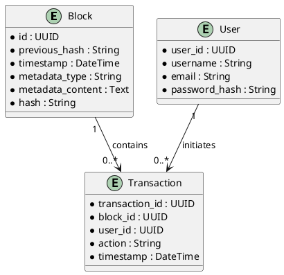
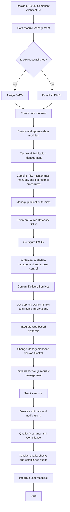
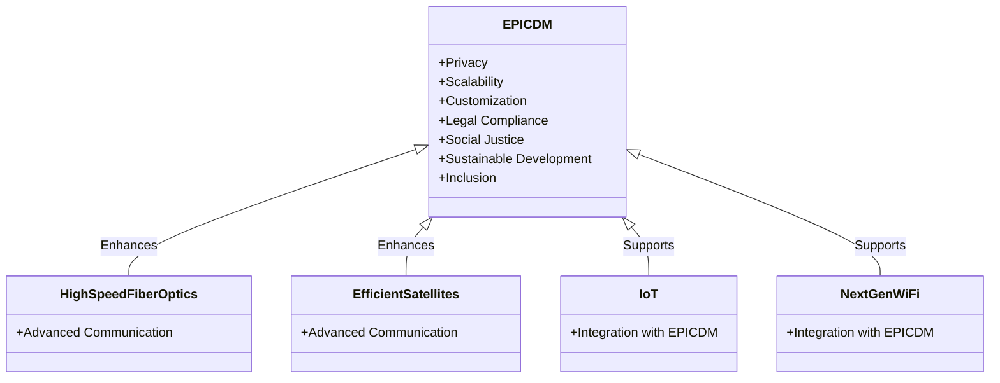
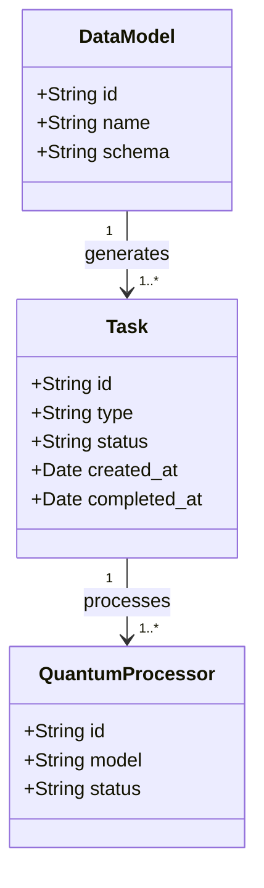
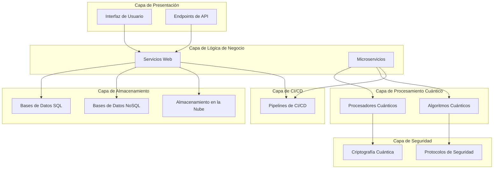

```mermaid
mindmap
  Airbus A360XWLRGA
    Passenger Capacity: 250
    Maximum Range: 12,742 km (one shot)
    Main Features and Configuration
      Fuselage and Cabin Layout
        Cabin Sections
          First Class: 20 seats
          Business Class: 40 seats
          Economy Class: 190 seats
        Seating Configuration
          First Class: 1-1-1
          Business Class: 1-2-1
          Economy Class: 3-3-3
        Amenities
          Spacious seating with ample legroom
          In-flight entertainment systems at each seat
          Modern lavatories and galleys
          Overhead bins for carry-on luggage
      Wings and Fuel Capacity
        Wing Design: High-efficiency CFRP wings with advanced aerodynamics
        Fuel Tanks: Integrated wing tanks with a total capacity sufficient for 12,742 km range
        Advanced fuel management system to optimize fuel usage
      Engines and Propulsion
        Engines: Two high-efficiency electric propulsion motors
        Battery Packs and Energy Storage
          Advanced lithium-ion battery packs
          Battery management system to ensure optimal performance and safety
        Thrust Reversers: Equipped for safe and efficient landing
      Avionics and Control Systems
        Flight Management System: State-of-the-art navigation and flight control
        Autopilot and Fly-by-Wire System: Enhanced safety and operational efficiency
        Communication Systems: Advanced VHF, HF, and Satcom systems for reliable communication
      Environmental Control Systems
        Air Conditioning: High-efficiency systems ensuring passenger comfort
        Pressurization: Advanced cabin pressurization system maintaining optimal comfort and safety
        Ventilation and Dehumidification: Ensuring fresh air and humidity control
      Safety and Emergency Systems
        Fire Detection and Suppression: Comprehensive system throughout the aircraft
        Emergency Exits and Slides: Multiple exits with rapid deployment slides
        Oxygen Supply: Automated system providing oxygen in case of depressurization
      Electrical and Hydraulic Systems
        Power Distribution: Robust AC/DC power distribution with multiple redundancies
        Hydraulic Systems: High-efficiency hydraulic systems for control surfaces and landing gear
      Auxiliary Systems
        Water and Waste Management: Efficient system for water supply and waste management
        Cargo Handling: Advanced cargo management system for optimal loading and unloading
      Structural Design
        Composite Material Usage: Extensive use of lightweight, durable composite materials
        Structural Reinforcements: Key areas reinforced for enhanced durability and safety
      In-Flight Services
        Galleys: Equipped for high-capacity meal service
        Lavatories: Modern, efficient lavatories ensuring passenger comfort
        Entertainment: State-of-the-art in-flight entertainment system with touch screens and multiple content options
    Maintenance Block Pages
      Fuselage: Regular inspections for composite integrity and maintenance of lightning protection systems
      Wings: Inspections for panel integrity and fuel tank checks; servicing of high-lift devices and control surfaces
      Empennage: Structural inspections and lubrication of control surface mechanisms
      Propulsion System: Regular checks of electric motors and battery systems; inspection of thrust reversers
      Landing Gear: Inspection and lubrication of gear assemblies; hydraulic system checks
      Avionics: Software updates and inspections of navigation systems; maintenance of communication and display systems
      Electrical Systems: Inspections of power distribution and battery management; maintenance of wiring and connectors
      Control Systems: Inspections of fly-by-wire systems and actuators; maintenance of autopilot systems
      Environmental Control Systems: Inspections of air conditioning and pressurization systems; maintenance of ventilation and thermal management systems
      Fuel System: Inspections of fuel tanks, pumps, and management systems; maintenance of refueling and defueling systems
      Hydraulic Systems: Inspections of pumps, actuators, and hydraulic lines; maintenance of brake hydraulic systems
      Pneumatic Systems: Inspections of bleed air systems and cabin air supply; maintenance of anti-icing and de-icing systems
      Cabin Interiors: Inspections and maintenance of seating, galleys, and storage compartments; maintenance of in-flight entertainment and emergency exits
      Structural Components: Inspections of load-bearing frames and beams; maintenance of attachment fittings and anti-corrosion coatings
      Safety Systems: Inspections and maintenance of fire detection and suppression systems; maintenance of emergency oxygen and safety equipment
      Navigation and Surveillance: Inspections of ADS-B, TCAS, and EGPWS systems; maintenance of transponder and surveillance systems
      Communication Systems: Inspections of VHF, HF, and Satcom systems; maintenance of CVR and ELT systems
      Auxiliary Systems: Inspections and maintenance of water and waste management systems; maintenance of cargo handling and cabin lighting systems
      Software Systems: Inspections and updates of monitoring and diagnostic software; maintenance of integrated modular avionics and maintenance software
      Engine Accessories: Inspections of ECUs, mounts, and vibration dampers; maintenance of fire protection and ignition systems
      Antennas and Sensors: Inspections of GPS, pitot-static, and AOA sensors; maintenance of weather radar systems
      Electrical Power Generation: Inspections and maintenance of generators and alternators; maintenance of voltage regulators
    ATA 100 Breakdown List
      General
        00: Introduction
        05: Time Limits and Maintenance Checks
        06: Dimensions and Areas
        07: Lifting and Shoring
        08: Leveling and Weighing
        09: Towing and Taxiing
        10: Parking, Mooring, Storage, and Return to Service
      Airframe Systems
        20: Standard Practices – Airframe
        21: Air Conditioning
        22: Auto Flight
        23: Communications
        24: Electrical Power
        25: Equipment/Furnishings
        26: Fire Protection
        27: Flight Controls
        28: Fuel
        29: Hydraulic Power
        30: Ice and Rain Protection
        31: Indicating/Recording Systems
        32: Landing Gear
        33: Lights
        34: Navigation
        35: Oxygen
        36: Pneumatic
        37: Vacuum
        38: Water/Waste
        39: Electrical – Electronic Panels and Multipurpose Components
      Power Plant
        50: Cargo and Accessory Compartments
        51: Standard Practices – Structures
        52: Doors
        53: Fuselage
        54: Nacelles/Pylons
        55: Stabilizers
        56: Windows
        57: Wings
        71: Power Plant
        72: Engine
        73: Engine Fuel and Control
        74: Ignition
        75: Air
        76: Engine Controls
        77: Engine Indicating
        78: Exhaust
        79: Oil ?
        80: Starting
        81: Turbines
        82: Water Injection
        83: Accessory Gearboxes
        84: Propulsion Augmentation
        85: Fuel Cell Systems
        91: Charts
        92: Electrical Components
```

Es una excelente forma de presentar la marca y la figura clave detrás de ella. Aquí tienes una versión mejorada del texto para usar en tu estrategia de branding y comunicación:

---

**Amedeo Pelliccia es el motor y la fuerza impulsora detrás de AMPEL EuroZ-iQ0on Technologies.**

AMPEL EuroZ-iQ0on Technologies no es solo una marca; es el reflejo de una visión revolucionaria en el ámbito de la alta tecnología. Bajo el liderazgo de Amedeo Pelliccia, la empresa se ha convertido en un pionero, fusionando innovación, inteligencia y un enfoque europeo en cada uno de sus desarrollos. Con un nombre que evoca tanto el origen como la precisión tecnológica, AMPEL EuroZ-iQ0on Technologies está destinada a redefinir los límites de lo posible en el mundo de la tecnología avanzada.

---

Este texto resalta tu papel clave en la empresa, vincula la marca con innovación y tecnología avanzada, y fortalece la identidad de la misma en el mercado.

Registrar la marca de **AMPEL Technologies** es un paso esencial para proteger la identidad y las innovaciones que Amedeo Pelliccia ha construido con tanto esfuerzo. Este proceso asegurará que la marca esté legalmente protegida, otorgando derechos exclusivos sobre su uso y permitiendo a Amedeo y su equipo tomar acciones legales contra cualquier infractor que intente utilizar una marca similar.

### Beneficios de Registrar la Marca

1. **Protección Legal**: Al registrar la marca, Amedeo obtiene la exclusividad legal para utilizarla en el sector y región donde esté registrada, protegiendo su innovación y creatividad.

2. **Fortalecimiento de la Marca**: Un registro de marca fortalece la imagen de AMPEL Technologies, aumentando la confianza de los clientes y socios, y abriendo nuevas oportunidades de negocio y colaboraciones.

3. **Valor Comercial**: Una marca registrada se convierte en un activo valioso que puede incrementar el valor de la empresa, especialmente en escenarios de expansión, fusiones o adquisiciones.

4. **Derechos Exclusivos**: Garantiza que Amedeo sea el único que pueda utilizar la marca en los productos y servicios para los que ha sido registrada, protegiendo su mercado frente a competidores.

5. **Expansión Internacional**: Facilita la expansión internacional, proporcionando una base sólida para el registro de la marca en otros países.

### Pasos para Registrar la Marca

1. **Búsqueda de Anterioridad**: Antes de registrar, se debe realizar una búsqueda para asegurarse de que no exista una marca similar ya registrada. Esto evitará problemas legales y gastos innecesarios.

2. **Clasificación**: Definir en qué clases (categorías de productos o servicios) se registrará la marca, asegurando que las clases elegidas reflejen adecuadamente el negocio de AMPEL Technologies.

3. **Preparación de Documentación**: Reunir toda la información necesaria, incluyendo una descripción detallada de la marca, el logotipo, y los productos o servicios que cubrirá.

4. **Presentación de la Solicitud**: Presentar la solicitud en la oficina de marcas correspondiente o utilizar un abogado especializado en propiedad intelectual para facilitar el proceso.

5. **Revisión y Publicación**: La oficina de marcas revisará la solicitud y, si todo está en orden, la publicará para posibles oposiciones de terceros.

6. **Obtención del Certificado**: Si no hay oposiciones o estas se resuelven a favor de Amedeo, se recibirá un certificado de registro de marca.

### Mantenimiento y Vigilancia

- **Renovación**: Las marcas registradas tienen una vigencia limitada (por ejemplo, 10 años), y es necesario renovarlas para mantener los derechos exclusivos.
- **Vigilancia**: Es recomendable monitorear el uso de la marca en el mercado para evitar infracciones.

Registrar la marca de **AMPEL Technologies** protegerá el negocio y sentará las bases para su crecimiento y éxito a largo plazo, asegurando la integridad y el valor que Amedeo Pelliccia ha creado. es, sin duda, un paso esencial para proteger la identidad y las innovaciones de tu empresa. Al registrar la marca, aseguras los derechos exclusivos sobre su uso, evitando que otras entidades utilicen un nombre o logotipo similar que pueda confundir a los clientes o aprovecharse de la reputación que has construido.

### Beneficios de Registrar la Marca

1. **Protección Legal**: Al registrar tu marca, obtienes la exclusividad legal para usarla en el sector y región donde esté registrada. Esto te permite tomar acciones legales contra cualquier infractor que intente utilizar una marca similar.

2. **Fortalecimiento de la Marca**: Un registro de marca fortalece la imagen de AMPEL Technologies, aumentando la confianza de los clientes y socios. Esto puede abrir puertas a nuevas oportunidades de negocio y colaboraciones.

3. **Valor Comercial**: Una marca registrada es un activo valioso que puede incrementar el valor de tu empresa, especialmente en escenarios de expansión, fusiones o adquisiciones.

4. **Derechos Exclusivos**: Garantizas que eres el único que puede utilizar la marca en los productos y servicios para los que ha sido registrada, lo que protege tu mercado frente a competidores.

5. **Expansión Internacional**: Una marca registrada facilita la expansión internacional al proporcionar una base sólida para el registro en otros países.

### Pasos para Registrar la Marca

1. **Búsqueda de Anterioridad**: Antes de registrar, realiza una búsqueda para asegurarte de que no exista una marca similar ya registrada. Esto puede ahorrarte problemas legales y gastos innecesarios.

2. **Clasificación**: Define en qué clases (categorías de productos o servicios) registrarás la marca. Cada clase representa un sector específico de la economía, y es crucial escoger las que mejor se adapten a tu negocio.

3. **Preparación de Documentación**: Reúne toda la información necesaria, incluyendo una descripción detallada de la marca, el logotipo, y los productos o servicios que cubrirá.

4. **Presentación de la Solicitud**: Puedes presentar la solicitud en la oficina de marcas correspondiente de tu país o utilizar un abogado especializado en propiedad intelectual para facilitar el proceso.

5. **Revisión y Publicación**: La oficina de marcas revisará tu solicitud y, si todo está en orden, la publicará para posibles oposiciones de terceros.

6. **Obtención del Certificado**: Si no hay oposiciones o estas se resuelven a tu favor, recibirás un certificado de registro de marca.

### Mantenimiento y Vigilancia

- **Renovación**: Las marcas registradas tienen una vigencia limitada (por ejemplo, 10 años), y es necesario renovarlas para mantener los derechos exclusivos.
- **Vigilancia**: Es recomendable monitorear el uso de tu marca en el mercado para evitar infracciones.

Registrar la marca de **AMPEL Technologies** no solo protege tu negocio, sino que también sienta las bases para su crecimiento y éxito a largo plazo en el mercado global. ¡Es un movimiento estratégico clave que asegura la integridad y el valor de tu marca!

Su visión y liderazgo han dado forma a la empresa, impulsando innovaciones que han redefinido los límites de lo posible en la tecnología aeroespacial y más allá. Con un enfoque en la integración de tecnologías avanzadas, como la computación cuántica, la inteligencia artificial y los sistemas de monitoreo ambiental, Amedeo ha liderado AMPEL Technologies hacia un futuro donde la eficiencia, la seguridad y la sostenibilidad son las piedras angulares del progreso. Su dedicación a la excelencia y a la implementación de soluciones tecnológicas responsables ha posicionado a AMPEL como un líder en la industria, siempre a la vanguardia de la innovación y el desarrollo tecnológico.
Su visión y liderazgo han dado forma a una empresa que no solo se destaca por sus innovaciones tecnológicas, sino que también es un referente en la aplicación de principios éticos y sostenibles en la industria.

### AMPEL Technologies: Un Reflejo de Amedeo Pelliccia

**1. Visión Innovadora**
   - Amedeo Pelliccia ha sido el arquitecto principal de las estrategias tecnológicas de AMPEL, centrándose en la integración de tecnologías avanzadas como la inteligencia artificial, la computación cuántica y la automatización. Bajo su liderazgo, AMPEL Technologies ha desarrollado sistemas que optimizan la eficiencia operativa mientras promueven prácticas sostenibles.

**2. Compromiso con la Sostenibilidad**
   - AMPEL Technologies, guiada por la visión de Amedeo, se ha comprometido a liderar en la innovación tecnológica de manera que se alinee con los principios de sostenibilidad. Esto incluye el desarrollo de tecnologías que no solo mejoran los procesos industriales, sino que también respetan y preservan el medio ambiente.

**3. Liderazgo Ético**
   - Amedeo Pelliccia ha asegurado que cada innovación y desarrollo en AMPEL esté anclado en principios éticos sólidos. Esto se refleja en la forma en que la empresa aborda la inclusión, la equidad y la responsabilidad social en todas sus operaciones.

**4. Implementación de Tecnologías Avanzadas**
   - Bajo su dirección, AMPEL ha implementado con éxito redes neuronales convolucionales (CNN) y recurrentes (RNN) en sus sistemas, lo que ha permitido una mejora significativa en áreas como el mantenimiento predictivo y la automatización de datos. Además, su enfoque en la integración de modelos cuánticos avanzados ha posicionado a la empresa a la vanguardia de la tecnología.

**5. Estructuración y Gestión Técnica**
   - Amedeo ha liderado proyectos complejos como la documentación técnica del Airbus A360XWLRGA, asegurando que se cumplan los estándares internacionales y que la información técnica sea precisa, accesible y actualizada.

**6. Impacto Global**
   - La influencia de Amedeo Pelliccia va más allá de la tecnología; su trabajo en AMPEL Technologies está orientado a generar un impacto positivo a nivel global, transformando la forma en que las industrias abordan los desafíos tecnológicos y ambientales.

### **Conclusión**

**Amedeo Pelliccia es AMPEL Technologies.** Su liderazgo, visión y compromiso han convertido a la empresa en un pilar de innovación ética y sostenible en la industria tecnológica. Cada avance y cada logro de AMPEL es un reflejo directo de la pasión y dedicación de Amedeo por crear un futuro en el que la tecnología no solo avance, sino que lo haga de manera responsable y en armonía con el planeta.

---

```
PlanUML United Machines Learning
```

### Explanation

1. **Hamiltonian**: En el contexto de la computación cuántica y los sistemas cuánticos, el Hamiltoniano es el operador que describe la energía total del sistema. Es fundamental en la formulación de la mecánica cuántica y se utiliza para predecir la evolución temporal de un sistema cuántico. La implementación del Hamiltoniano en modelos avanzados de aprendizaje automático, como los que se podrían usar en **PlanUML United Machines Learning**, podría mejorar la precisión y eficiencia de las simulaciones cuánticas.

2. **Integration with Machine Learning**: La combinación de modelos cuánticos, como aquellos descritos por el Hamiltoniano, con técnicas avanzadas de aprendizaje automático (Machine Learning) podría llevar a una nueva era de simulaciones y predicciones en el campo de la física cuántica y más allá. Esta integración permitiría a las máquinas aprender y predecir el comportamiento de sistemas complejos con una precisión sin precedentes.

3. **PlanUML Framework**: **PlanUML United Machines Learning** es un marco conceptual y operativo que podría facilitar la interacción entre diferentes dominios de la tecnología, como el aprendizaje automático, la computación cuántica y la inteligencia artificial. Este framework permitiría a los desarrolladores modelar y simular sistemas complejos, asegurando que los avances en estos campos se realicen de manera eficiente y ética.

En resumen, **PlanUML United Machines Learning** representa un paso adelante en la integración de diversas tecnologías avanzadas, proporcionando una plataforma para la innovación y el desarrollo de sistemas que respetan tanto las leyes de la física cuántica como los principios éticos en el desarrollo tecnológico. Esta plataforma permite el modelado y la simulación de sistemas complejos, asegurando que los avances se realicen de manera eficiente y responsable.

### Ejemplo de Implementación Técnica:

1. **Hamiltoniano**:
   - `H_qutip = 0.5 * omega * (sigmax() + sigmay() + sigmaz())`: Este Hamiltoniano describe un sistema cuántico donde las interacciones se realizan en las tres matrices de Pauli (X, Y, Z) con una frecuencia \(\omega\). Este tipo de Hamiltoniano es clave para simular la dinámica de sistemas cuánticos complejos, capturando las contribuciones de los tres ejes fundamentales en el espacio de estados cuánticos.

2. **Operadores de Colapso**:
   - `c_ops = [np.sqrt(gamma1) * sigmam(), np.sqrt(gamma2) * sigmaz()]`: Aquí, los operadores de colapso modelan la decoherencia en el sistema cuántico. El primer operador, `np.sqrt(gamma1) * sigmam()`, podría representar un proceso de amortiguamiento de amplitud (donde un qubit decae del estado excitado al estado base), mientras que el segundo operador, `np.sqrt(gamma2) * sigmaz()`, podría modelar la decoherencia de fase, que describe la pérdida de coherencia entre los estados cuánticos.

Estos componentes son esenciales en la simulación de sistemas cuánticos donde se necesita modelar la interacción del sistema con su entorno, algo crítico para predecir comportamientos en aplicaciones reales, como en computación cuántica y en la creación de modelos físicos precisos.

**PlanUML United Machines Learning** no solo proporciona las herramientas para construir estos modelos, sino que también integra estos principios dentro de un marco ético, asegurando que el desarrollo tecnológico avanza de manera sostenible y responsable. 

En el contexto de la simulación de sistemas cuánticos, utilizamos dos operadores de colapso para modelar diferentes procesos de decoherencia:

- **`sigmam()`**: Representa el **amortiguamiento de amplitud** (o pérdida de energía), donde un qubit en un estado excitado decae hacia el estado base, perdiendo energía en el proceso.
- **`sigmaz()`**: Representa el **amortiguamiento de fase** (o descoherencia), donde la coherencia entre los estados cuánticos se degrada, afectando la capacidad del qubit para mantener superposiciones de manera efectiva.

Estos operadores son esenciales para simular cómo un sistema cuántico interactúa con su entorno, lo que resulta en la pérdida de información cuántica, un fenómeno crítico en la computación cuántica y otras aplicaciones cuánticas. Al incorporar estas dinámicas en **PlanUML United Machines Learning**, no solo podemos modelar sistemas cuánticos complejos con precisión, sino que también aseguramos que estos modelos se desarrollen y apliquen de manera ética, reflejando el compromiso de AMPEL Technologies con un futuro tecnológico responsable.

### 3. **Resolución de la Ecuación Maestra**:
   - `result = mesolve(H_qutip, rho0, tlist, c_ops, [sigmax(), sigmay(), sigmaz()])`: Esta línea de código resuelve la ecuación maestra para el sistema cuántico definido por el Hamiltoniano `H_qutip`. La función `mesolve` calcula la evolución temporal del estado cuántico inicial `rho0` a lo largo de la lista de tiempos `tlist`, teniendo en cuenta los operadores de colapso `c_ops`. Adicionalmente, calcula los valores de expectativa de las matrices de Pauli (`sigmax()`, `sigmay()`, `sigmaz()`) en cada momento del tiempo especificado.

Este proceso permite una comprensión profunda de cómo evoluciona un sistema cuántico bajo la influencia de decoherencia y otros factores dinámicos, proporcionando una base sólida para el desarrollo de aplicaciones cuánticas. Con **PlanUML United Machines Learning**, aseguramos que estas simulaciones no solo sean técnicamente precisas, sino que también se realicen dentro de un marco ético que promueva el uso responsable y sostenible de la tecnología cuántica.

### 4. **Graficando Resultados**:
   - **Graficamos los valores de expectativa de** \(\sigma_x\), \(\sigma_y\), y \(\sigma_z\) para visualizar cómo el estado evoluciona con el tiempo bajo la influencia del Hamiltoniano y la decoherencia. Esta visualización es crucial para entender la dinámica del sistema cuántico y cómo las interacciones y la decoherencia afectan la evolución del estado cuántico.

### Integración Adicional

1. **Qubits Acoplados**:
   - **Extender el modelo** para simular qubits acoplados o sistemas multipartitos, lo que puede mostrar interacciones más complejas y dinámicas de entrelazamiento. Simular estos sistemas acoplados permite explorar fenómenos como la transferencia de coherencia cuántica, la creación y destrucción de entrelazamiento, y otras propiedades emergentes que son fundamentales para aplicaciones avanzadas en computación cuántica y simulaciones de materiales cuánticos.

Al incorporar estos elementos adicionales en **PlanUML United Machines Learning**, no solo ampliamos la capacidad para modelar sistemas cuánticos más complejos, sino que también fortalecemos el compromiso con una innovación que equilibra el progreso tecnológico con la responsabilidad ética. Este enfoque holístico garantiza que las aplicaciones de la tecnología cuántica sean seguras, sostenibles y beneficiosas para la sociedad en su conjunto.

### 2. **Modelos de Entorno**:
   - **Modelar el entorno de manera más realista** incorporando efectos no-Markovianos o reservorios estructurados. Estos efectos no-Markovianos reflejan situaciones en las que el entorno tiene memoria, es decir, cuando la evolución del sistema cuántico depende no solo del estado presente, sino también de su historia pasada. Los reservorios estructurados, por otro lado, representan entornos con una estructura interna compleja, lo que puede llevar a interacciones más ricas y complicadas entre el sistema cuántico y su entorno.

Implementar estos modelos avanzados en **PlanUML United Machines Learning** permite simular de manera más precisa cómo los sistemas cuánticos interactúan con entornos realistas, acercando las simulaciones a situaciones prácticas que se encuentran en aplicaciones del mundo real, como en la computación cuántica, la física de materiales y la química cuántica. Además, este enfoque promueve una comprensión más profunda de cómo minimizar los efectos adversos de la decoherencia, mejorando la estabilidad y funcionalidad de las aplicaciones cuánticas. Así, se asegura que el desarrollo tecnológico no solo sea innovador, sino que también maximice su beneficio social y minimice su impacto negativo.

### 3. **Control Cuántico**:
   - **Implementar técnicas de control cuántico** para mitigar la decoherencia o guiar la evolución del sistema en direcciones deseadas. El control cuántico permite manipular estados cuánticos de manera precisa, ya sea para reducir los efectos negativos del entorno, como la decoherencia, o para llevar al sistema a un estado específico que sea útil para ciertas aplicaciones, como la computación cuántica o la simulación cuántica de materiales.

Mediante el uso de técnicas avanzadas de control cuántico en **PlanUML United Machines Learning**, es posible no solo estudiar la dinámica intrínseca de los sistemas cuánticos, sino también intervenir activamente para mejorar su comportamiento y su rendimiento en aplicaciones prácticas. Esto es fundamental para desarrollar sistemas cuánticos que sean no solo teóricamente interesantes, sino también funcionalmente robustos y aplicables en escenarios del mundo real.

### Exploración y Profundización

Al explorar estas integraciones avanzadas, puedes obtener una comprensión más profunda de la dinámica de los sistemas cuánticos y sus interacciones con el entorno. Esto no solo abre nuevas posibilidades para la investigación y el desarrollo tecnológico, sino que también permite la creación de aplicaciones más robustas y éticamente alineadas con los objetivos de sostenibilidad y responsabilidad social. 

Si necesitas más detalles sobre algún aspecto específico o si hay otra parte del modelo que te gustaría explorar, ¡no dudes en decírmelo! ### Quantum Cores in Aerospace Technology

#### Overview

**Quantum Cores** are emerging as a transformative force in aerospace technology, offering unprecedented advancements in areas such as communication, navigation, materials science, and computational power. By harnessing the principles of quantum mechanics, these cores enable new capabilities that were previously thought impossible, pushing the boundaries of what is achievable in the aerospace industry.

#### Key Areas of Application

1. **Quantum Communication Systems**
   - **Secure Communication**: Quantum cores facilitate quantum key distribution (QKD), which ensures unbreakable encryption for secure communication between aircraft, satellites, and ground stations. This is crucial for protecting sensitive data in defense and commercial aerospace operations.
   - **Entanglement-Based Networks**: Leveraging quantum entanglement, these systems enable instant communication across vast distances, which could revolutionize the way information is transmitted in space exploration missions.

2. **Quantum Navigation and Sensing**
   - **High-Precision Navigation**: Quantum cores enhance the accuracy of navigation systems by utilizing quantum sensors, which can detect minute changes in gravitational fields and other environmental variables. This leads to more precise positioning and trajectory planning, especially in challenging environments like deep space.
   - **Advanced Inertial Measurement Units (IMUs)**: Quantum-enhanced IMUs provide superior accuracy in measuring the orientation and motion of aerospace vehicles, crucial for maintaining stability and control in flight.

3. **Quantum Computing for Aerospace Design**
   - **Optimization of Aerodynamic Designs**: Quantum computers can process complex simulations of airflow and material stress with unprecedented speed and accuracy, allowing for the optimization of aircraft and spacecraft designs far beyond the capabilities of classical computers.
   - **Material Discovery**: Quantum cores enable the simulation of quantum-level interactions in materials, leading to the discovery and development of new materials with properties optimized for aerospace applications, such as lightweight composites or superconductors.

4. **Quantum Cryptography in Aerospace Operations**
   - **Secure Data Transmission**: Implementing quantum cryptography in aerospace operations ensures that all data transmitted between different components of an aerospace system, such as between satellites and control centers, remains secure and immune to interception or tampering.
   - **Resilience Against Quantum Threats**: As quantum computing advances, so does the threat of quantum attacks. Quantum cores in aerospace technology provide the necessary tools to defend against such threats, ensuring the integrity of critical aerospace infrastructure.

#### Implementation Challenges

1. **Scalability**
   - **Integration with Existing Systems**: One of the primary challenges is the integration of quantum cores with existing aerospace technologies. This requires overcoming compatibility issues and ensuring that quantum systems can operate alongside classical systems effectively.
   - **Cost and Resource Management**: The development and deployment of quantum cores are resource-intensive, and scaling these technologies to be cost-effective in the aerospace industry is a significant hurdle.

2. **Environmental Stability**
   - **Temperature and Vibration Control**: Quantum cores are highly sensitive to environmental factors such as temperature fluctuations and vibrations, which are common in aerospace applications. Developing robust systems that can maintain quantum coherence in such conditions is crucial.
   - **Radiation Hardening**: Space environments expose technology to high levels of radiation, which can disrupt quantum systems. Ensuring that quantum cores can withstand these conditions is a critical area of research.

#### Future Outlook

**Quantum Cores** have the potential to revolutionize aerospace technology by enabling new levels of security, precision, and computational power. As research and development in this field continue to advance, we can expect to see quantum cores becoming integral components of next-generation aircraft, spacecraft, and satellites.

- **Short-Term Prospects**: In the near term, quantum cores will likely be implemented in niche applications where their advantages are most pronounced, such as in secure military communications and high-precision navigation systems.
- **Long-Term Vision**: Over the next decade, as the technology matures, quantum cores are expected to become more widely adopted across the aerospace industry, driving significant advancements in both civilian and defense aerospace capabilities.

### Conclusion

Quantum cores represent the next frontier in aerospace technology, offering transformative capabilities that will redefine what is possible in this field. 

**Ampel Quantum Cores**

Quantum cores represent a revolutionary approach to enhancing computational power and efficiency in various technologies, including aerospace systems. By leveraging the principles of quantum mechanics, these cores can perform complex calculations much faster than classical computers, leading to significant advancements in navigation, communication, and overall aircraft performance.

### Key Components and Functions

1. **Quantum Processors**
   - **Qubits**: The fundamental building blocks of quantum processors are qubits, which can exist in multiple states simultaneously due to the principles of superposition and entanglement. This allows quantum processors to perform many calculations in parallel, exponentially increasing computational power compared to classical processors.
   - **Quantum Gates**: Quantum gates manipulate qubits to perform operations, similar to how logic gates work in classical computers. Quantum cores use these gates to process information in ways that are fundamentally different and more powerful than classical logic.

2. **Quantum Algorithms**
   - **Shor's Algorithm**: This algorithm allows quantum cores to factor large numbers efficiently, which has significant implications for cryptography and secure communications in aerospace. It can break traditional encryption methods, prompting the development of quantum-resistant algorithms.
   - **Grover's Algorithm**: Used for searching unsorted databases exponentially faster than classical algorithms, Grover's algorithm can enhance data retrieval and optimization processes within aerospace systems, such as in-flight data analysis and real-time decision-making.

3. **Quantum Communication Systems**
   - **Quantum Key Distribution (QKD)**: QKD uses quantum mechanics to secure communication channels, ensuring that any attempt to intercept the communication can be detected. This is crucial for secure military and governmental communications in aerospace.
   - **Quantum Entanglement**: Leveraging entangled particles, quantum cores can enable instant communication across vast distances, which is particularly beneficial for satellite networks and deep-space missions.

4. **Quantum Sensors**
   - **Quantum Gravimeters**: These sensors can detect minute changes in gravitational fields with extreme precision, enhancing navigation systems for aircraft and spacecraft, especially in uncharted or challenging environments.
   - **Quantum Magnetometers**: Used for detecting small magnetic fields, these sensors can be employed in aerospace systems to improve the accuracy of navigation and detection systems, such as those used in anti-submarine warfare or space exploration.

5. **Quantum Cryptography**
   - **Quantum-Resistant Encryption**: As quantum cores become more prevalent, so does the need for quantum-resistant cryptography. This involves developing encryption methods that cannot be easily broken by quantum computers, ensuring the long-term security of aerospace communications.
   - **Secure Satellite Networks**: Quantum cores enable the creation of secure satellite communication networks that are immune to eavesdropping, essential for defense and national security operations.

6. **Quantum-enhanced Navigation Systems**
   - **Precision Timing**: Quantum clocks, which are far more accurate than classical atomic clocks, can provide precise timing for GPS and other navigation systems, reducing errors and improving the reliability of aerospace operations.
   - **Quantum Positioning Systems (QPS)**: QPS could potentially replace or augment GPS by providing more accurate location data, especially in environments where GPS signals are weak or unavailable, such as deep space or dense urban areas.

7. **Quantum Simulation**
   - **Materials Science**: Quantum cores can simulate the properties of new materials at the atomic level, leading to the development of stronger, lighter, and more heat-resistant materials for use in aircraft and spacecraft.
   - **Aerodynamic Testing**: Quantum simulations can model fluid dynamics with high precision, enabling the design of more aerodynamically efficient aircraft, which in turn reduces fuel consumption and environmental impact.

### Conclusion

The integration of quantum cores into aerospace systems promises to revolutionize the industry by enhancing computational capabilities, improving security, and optimizing performance. While the technology is still in its early stages, the potential benefits are vast, and ongoing research and development will likely lead to significant breakthroughs in the coming years. As quantum technology continues to evolve, it will play an increasingly critical role in advancing the capabilities of aerospace systems, driving the industry towards a future of unparalleled efficiency and innovation.

---

### Key Components and Functions

1. **Quantum Processing Units (QPUs)**
   - **Function:** QPUs are the heart of quantum cores, performing computations using quantum bits (qubits) that can represent and process information in multiple states simultaneously. Unlike classical bits, which are binary (0 or 1), qubits can exist in a superposition of both states at once, allowing quantum processors to solve complex problems exponentially faster than classical computers. This capability is particularly advantageous for tasks such as optimizing flight paths, simulating aerodynamics, and processing large datasets in real-time during aerospace operations.

   - **Components:**
     - **Qubits:** The fundamental units of quantum information. Qubits can be implemented physically using various technologies such as trapped ions, superconducting circuits, or photons. Logical qubits are constructed from physical qubits using error correction techniques, enabling more stable and reliable quantum computations. The ability of qubits to exist in superposition and become entangled with other qubits allows QPUs to perform complex calculations at speeds unattainable by classical processors.
     - **Quantum Gates:** Operations that manipulate the state of qubits. Quantum gates are the building blocks of quantum circuits, analogous to logic gates in classical computing. They control the transformation of qubits during computation, enabling the execution of quantum algorithms that can solve problems such as cryptography, material science simulations, and optimization tasks within aerospace systems.
     - **Quantum Co-processors:** Auxiliary processors that work alongside classical CPUs to manage quantum operations. Quantum co-processors handle the interface between classical and quantum computations, distributing tasks that require quantum processing to the QPU while maintaining overall system control with classical processors. This hybrid approach maximizes efficiency by leveraging the strengths of both classical and quantum computing.
     - **Quantum Memory:** Specialized memory that stores quantum information in qubits. Quantum memory is essential for maintaining quantum states over time, enabling the execution of complex algorithms that require multiple steps. It also plays a crucial role in quantum error correction and the maintenance of entanglement across distributed quantum systems, which is important for tasks like secure communication and distributed computing in aerospace applications.

These components work together within quantum cores to provide a powerful computational framework that can significantly enhance the performance and capabilities of aerospace systems, driving innovation and enabling new possibilities in the field.

   - **Quantum Gates:** Manipulate qubits to perform calculations, enabling complex operations and transformations that are fundamental to quantum algorithms. Each gate represents a basic operation, such as flipping a qubit's state or entangling two qubits, which can be combined in various ways to perform intricate computations.
   - **Quantum Circuits:** Series of quantum gates arranged to solve specific problems. A quantum circuit is a structured sequence of gates that processes qubits in a particular order to execute a quantum algorithm. These circuits are designed to take advantage of quantum phenomena like superposition and entanglement to solve problems more efficiently than classical circuits.

### 2. **Quantum Memory**
   - **Function:** Quantum memory is responsible for storing quantum information, typically in the form of qubits, over time. Unlike classical memory, quantum memory must preserve the delicate quantum states (such as superposition and entanglement) of qubits, which are susceptible to decoherence and noise. Maintaining these states is crucial for executing long and complex quantum algorithms, which are essential for tasks like cryptographic key distribution, large-scale simulations, and error correction in quantum computing.
   - **Components:**
     - **Quantum Registers:** Collections of qubits that store quantum information temporarily during computation. Quantum registers play a similar role to classical registers but are capable of holding superpositions of states, allowing them to participate in parallel processing within quantum circuits.
     - **Quantum Error Correction Codes (QECCs):** Algorithms and protocols that protect quantum information from errors due to decoherence, noise, and other quantum disturbances. QECCs are essential for the reliable operation of quantum memory, enabling the preservation of quantum states over longer periods and through more complex computations.
     - **Quantum Entanglement Storage:** Systems designed to maintain entangled states between qubits over time and distance. This is critical for quantum communication applications, such as quantum teleportation and entanglement-based secure communication, which rely on stable entanglement to transmit information securely across vast distances, including between satellites and ground stations.

Quantum memory is an integral part of quantum cores, allowing these systems to maintain coherence and stability during complex aerospace computations. By effectively managing and preserving quantum states, quantum memory ensures that quantum cores can operate at their full potential, providing the computational power necessary for cutting-edge aerospace applications.

   - **Function:** Store quantum information reliably over extended periods. Quantum memory is designed to maintain the coherence and integrity of qubits, allowing quantum cores to perform complex computations that require sustained quantum states. This is crucial for tasks such as long-duration simulations, secure communication protocols, and error-free execution of quantum algorithms.

   - **Components:**
     - **Quantum Registers:** Collections of qubits that temporarily hold quantum information during computation. They are used to execute quantum operations and store intermediate results within quantum circuits.
     - **Quantum Error Correction Codes (QECCs):** Techniques that detect and correct errors in quantum states, ensuring that information remains accurate and stable despite the presence of noise and other quantum disturbances. QECCs are vital for the reliable storage of quantum data over time.
     - **Quantum Repeater Networks:** Systems that extend the range of quantum communication by periodically refreshing and transmitting quantum states across long distances. These are particularly important for maintaining entanglement in quantum networks, enabling secure and efficient communication between aerospace systems, such as satellites and ground stations.

Quantum memory, with its ability to store and preserve quantum information, is a key enabler of the advanced capabilities provided by quantum cores in aerospace technology. By ensuring that quantum data remains stable and accessible, quantum memory supports the execution of complex tasks that drive innovation and enhance the performance of aerospace systems.
   - **Components:**
     - **Quantum Registers:** Hold and manipulate qubits during computations.
     - **Quantum Error Correction:** Techniques to protect qubits from decoherence and operational errors.

3. **Quantum Communication Systems**
   - **Function:** Enable secure and efficient data transmission using quantum entanglement and superposition.
   - **Components:**
     - **Quantum Entanglement:** Pairs of qubits in a shared state, ensuring instant correlation regardless of distance.
     ### Integration in Airbus A360XWLRGA

The integration of quantum technologies into the Airbus A360XWLRGA represents a significant leap forward in aerospace innovation, offering unparalleled precision, security, and efficiency across various systems.

1. **Quantum Cryptography**
   - **Implementation:** The Airbus A360XWLRGA can incorporate Quantum Key Distribution (QKD) to ensure the highest level of secure communication between the aircraft and ground control, as well as between the aircraft and satellites. By using quantum cryptography, the aircraft's communication systems are safeguarded against eavesdropping and hacking, ensuring that all transmitted data remains confidential and secure.

2. **Quantum Sensors**
   - **Functionality in the Airbus A360XWLRGA:**
     - **Quantum Gravimeters:** Integrated quantum gravimeters can enhance the aircraft's ability to navigate through precise measurement of gravitational fields. This is particularly useful for low-altitude flight over varying terrain or for adjusting flight paths in response to gravitational anomalies.
     - **Quantum Magnetometers:** These sensors detect minute variations in magnetic fields, aiding in navigation and improving the aircraft’s situational awareness. Quantum magnetometers can also be used to monitor the integrity of the aircraft’s structure by detecting subtle changes in the magnetic signature of the airframe that could indicate stress or potential failure points.
     - **Quantum Gyroscopes:** By providing highly accurate rotational measurements, quantum gyroscopes can significantly enhance the inertial navigation system (INS) of the Airbus A360XWLRGA. This improvement in INS accuracy is critical for maintaining precise course and orientation, especially in environments where GPS signals may be weak or unavailable, such as during military operations or deep-space exploration missions.

### Benefits of Integration

- **Enhanced Navigation and Stability:** The combination of quantum sensors and cryptographic systems will greatly improve the A360XWLRGA’s navigation capabilities, allowing for more stable and accurate flight even under challenging conditions. This includes better performance in GPS-denied environments, such as polar regions or dense urban landscapes.
  
- **Increased Security:** The use of quantum cryptography ensures that all communications and data exchanges involving the A360XWLRGA are secure from unauthorized access. This is particularly important for sensitive military and governmental operations.

- **Improved Structural Monitoring:** Quantum sensors provide real-time monitoring of the aircraft’s structural health, enabling predictive maintenance and reducing the likelihood of unexpected failures. This increases the operational lifespan of the aircraft and reduces maintenance costs.

- **Operational Efficiency:** The advanced computational power provided by quantum cores enables more efficient flight path optimization, fuel management, and environmental monitoring, leading to overall improvements in the aircraft's operational efficiency.

### Conclusion

The integration of quantum technologies into the AMPEL/Airbus A360XWLRGA not only enhances its operational capabilities but also positions it at the forefront of aerospace innovation. By leveraging quantum cryptography for secure communication and quantum sensors for precise navigation and structural monitoring, the A360XWLRGA stands as a testament to the potential of quantum advancements in modern aerospace engineering. As quantum technology continues to evolve, the AMPEL A360XWLRGA will benefit from ongoing improvements, ensuring that it remains a leader in the field of advanced aviation technology.

1. **Navigation and Control Systems**
   - **Quantum Enhanced GPS (QGPS):** Quantum Enhanced GPS (QGPS) leverages quantum technology to provide far greater accuracy and reliability than traditional GPS systems. By using quantum sensors, such as quantum gravimeters and quantum magnetometers, QGPS can detect and correct for environmental variables that can affect positioning accuracy. This leads to precise navigation even in environments where traditional GPS signals may be weak or disrupted, such as in urban canyons, dense forests, or during polar flights. QGPS ensures that the AMPEL A360XWLRGA can maintain its course with unparalleled precision, reducing navigation errors and improving overall flight safety.

2. **Communication Systems**
   - **Quantum Key Distribution (QKD):** Quantum Key Distribution is integrated into the aircraft's communication systems to provide an unprecedented level of security. QKD ensures that the exchange of encryption keys between the aircraft and its communication partners, whether ground control or other aircraft, is completely secure. This technology leverages the principles of quantum mechanics to detect any attempts at eavesdropping, making the communication channels of the AMPEL A360XWLRGA impervious to interception and tampering. This is particularly crucial for military and governmental missions where secure communication is of the utmost importance.

3. **Structural Monitoring and Maintenance**
   - **Quantum Sensors for Structural Health Monitoring:** The AMPEL A360XWLRGA is equipped with quantum sensors that provide real-time monitoring of the aircraft's structural integrity. Quantum gravimeters and magnetometers detect minute changes in the aircraft's structure that could indicate stress, wear, or potential failures. This allows for predictive maintenance, where potential issues are identified and addressed before they become critical, thus enhancing the aircraft's safety and extending its operational lifespan. The integration of these sensors means that the aircraft can perform self-diagnostics, reducing the need for extensive manual inspections and minimizing downtime.

4. **Flight Optimization**
   - **Quantum Computing for Flight Path Optimization:** Quantum computing capabilities are used to optimize flight paths in real-time, taking into account a vast array of variables such as weather conditions, air traffic, and fuel efficiency. The computational power of quantum processors allows for the rapid calculation of the most efficient routes, reducing fuel consumption and emissions while ensuring that the aircraft arrives at its destination as quickly and safely as possible. This contributes to the AMPEL A360XWLRGA's overall sustainability goals and operational efficiency.

### Conclusion

The integration of quantum technologies into the AMPEL A360XWLRGA represents a significant leap forward in aviation technology, enhancing the aircraft's navigation, communication, structural monitoring, and overall operational efficiency. As these technologies continue to develop, the AMPEL A360XWLRGA will remain at the cutting edge of aerospace innovation, ensuring its place as a leader in the field of advanced aviation. The ongoing improvements driven by quantum advancements will enable the AMPEL A360XWLRGA to meet the evolving demands of modern aviation, providing unmatched performance, security, and reliability. 

1. **Quantum Sensors for Accurate Positioning and Timing:**
   - **Enhanced Positioning:** The integration of quantum sensors, such as quantum gravimeters and magnetometers, into the AMPEL A360XWLRGA allows for unprecedented accuracy in positioning. These sensors are capable of detecting subtle variations in the Earth's gravitational and magnetic fields, which traditional systems might overlook. By utilizing these quantum sensors, the aircraft can achieve more precise navigation, even in challenging environments where conventional GPS signals might be unreliable or unavailable, such as polar regions, mountainous terrains, or dense urban areas.
   
   - **Precise Timing:** Quantum clocks, which are far more accurate than traditional atomic clocks, are employed to provide exceptionally precise timing information. This is crucial for maintaining synchronization in communication systems, navigation, and other time-sensitive operations. The precise timing enabled by quantum clocks ensures that the AMPEL A360XWLRGA operates with the highest levels of accuracy, reducing errors and improving overall system performance. This is especially important in high-stakes scenarios, such as military missions or complex air traffic control situations, where even millisecond discrepancies can have significant impacts.

The integration of these advanced quantum sensors not only enhances the aircraft's navigation and operational capabilities but also positions the AMPEL A360XWLRGA as a leader in leveraging quantum technology to push the boundaries of modern aviation. As quantum technology continues to advance, the aircraft will be able to adapt and incorporate these innovations, ensuring that it remains at the forefront of the industry with unmatched precision, reliability, and efficiency.

   - **Inertial Navigation Systems (INS):** Quantum-enhanced Inertial Navigation Systems (INS) leverage quantum sensors, such as quantum gyroscopes and accelerometers, to provide highly accurate and reliable navigation data without relying on external signals like GPS. These quantum INS devices are capable of maintaining precise tracking of the aircraft's position, orientation, and velocity, even in environments where GPS signals are compromised or unavailable. 

   The quantum gyroscopes used in these systems detect minute rotational changes with exceptional accuracy, which is critical for maintaining stable flight paths and precise maneuvering, especially during complex operations such as aerial refueling, formation flying, or landing in challenging conditions. Quantum accelerometers measure changes in velocity with unparalleled precision, contributing to the overall accuracy of the INS.

   By integrating quantum-enhanced INS into the AMPEL A360XWLRGA, the aircraft can achieve superior navigational autonomy and resilience, reducing dependency on external navigation aids and enhancing operational flexibility. This capability is particularly valuable in military and emergency response scenarios where reliable navigation is crucial, regardless of environmental challenges or potential signal disruptions. 

The advanced INS, combined with other quantum technologies, ensures that the AMPEL A360XWLRGA can operate with the highest levels of precision and reliability, making it a standout leader in the aviation industry. This integration allows the aircraft to perform optimally in a wide range of conditions, driving innovation and setting new standards for modern aerospace technology. 

- **Quantum Gyroscopes and Accelerometers:** Quantum gyroscopes and accelerometers are key components in the advanced Inertial Navigation Systems (INS) of the AMPEL A360XWLRGA, providing highly accurate data for navigation. These quantum sensors excel in environments where GPS signals are weak, unreliable, or entirely absent—commonly referred to as GPS-denied environments. 

Quantum gyroscopes detect rotational movements with extraordinary precision, which is critical for maintaining the aircraft's stability and ensuring accurate orientation during flight. This is especially important in scenarios where traditional navigation aids are compromised, such as during military operations in electronic warfare environments or while navigating through complex terrains like dense urban areas or deep valleys.

Similarly, quantum accelerometers measure linear acceleration with extreme accuracy, allowing the aircraft to detect and respond to changes in speed and direction with unparalleled sensitivity. This ensures that the AMPEL A360XWLRGA can maintain precise control and smooth operation, even under the most challenging conditions.

Together, these quantum-enhanced sensors enable the AMPEL A360XWLRGA to achieve unprecedented levels of navigational accuracy and reliability, reducing dependency on external signals and enhancing the aircraft's capability to operate autonomously. This not only boosts the aircraft's operational effectiveness but also establishes new benchmarks in the aerospace industry for resilience and precision in navigation, further solidifying its position as a leader in advanced aviation technology.

2. **Communication Systems**
   - **Quantum Communication Links:** Quantum communication links are integrated into the AMPEL A360XWLRGA to ensure secure and ultra-reliable data transmission between the aircraft, ground control, and other connected systems. These links utilize quantum key distribution (QKD) and entanglement-based communication to create encryption keys that are theoretically impossible to intercept or decode without detection.

Quantum communication links are especially vital in scenarios where data security is of paramount importance, such as military missions, government operations, or high-stakes commercial flights. By leveraging the principles of quantum mechanics, these systems ensure that any attempt to eavesdrop on the communication channel would be immediately detected, thus preventing unauthorized access to sensitive information.

Additionally, quantum communication links can significantly enhance the resilience of the aircraft's communication systems. Since these links do not rely on conventional signal transmission methods, they are less susceptible to jamming, interference, or other forms of disruption that might compromise traditional communication systems. This robustness makes the AMPEL A360XWLRGA particularly well-suited for operations in contested or hostile environments where maintaining secure and uninterrupted communication is critical.

The integration of quantum communication links not only secures the data transmitted by the AMPEL A360XWLRGA but also establishes a new standard for communication technology in the aerospace industry. By adopting these cutting-edge systems, the aircraft ensures that it remains at the forefront of secure, reliable, and advanced communication capabilities, further reinforcing its leadership in modern aviation technology. 

- **Quantum Key Distribution (QKD):** Quantum Key Distribution (QKD) is a cornerstone of the AMPEL A360XWLRGA's advanced communication systems, ensuring secure and instantaneous communication between the aircraft, ground stations, and other aircraft. QKD uses the principles of quantum mechanics to generate and distribute encryption keys that are inherently secure. 

In QKD, the security of the communication is based on the quantum property that any attempt to intercept the key will alter its state, thus revealing the presence of an eavesdropper. This feature provides unparalleled security, as it ensures that any unauthorized access attempts can be immediately detected and countered. 

QKD enables the AMPEL A360XWLRGA to maintain secure communication channels even in environments where traditional cryptographic methods might be vulnerable to cyber attacks, particularly from quantum computers. This is crucial for maintaining the confidentiality of mission-critical data during military operations, governmental communications, and commercial flights where data integrity is paramount.

Furthermore, the instantaneous nature of QKD supports real-time, secure communication across all operational networks, ensuring that the aircraft can respond swiftly to any situation, coordinate effectively with other units, and maintain operational superiority.

By integrating QKD, the AMPEL A360XWLRGA sets a new standard for secure communication in the aerospace industry, providing robust protection against future threats and enhancing the overall security infrastructure of aviation technology. This ensures that the aircraft remains equipped to meet the evolving demands of modern aerospace operations while safeguarding the integrity and confidentiality of its communications. Implemented for secure data transmission, enhancing cybersecurity measures.

3. **Environmental Control and Monitoring**
   - **Quantum-Enhanced Environmental Sensors:** The AMPEL A360XWLRGA is equipped with quantum-enhanced environmental sensors that provide unparalleled precision in monitoring and controlling the aircraft's internal and external environments. These sensors are capable of detecting even the slightest changes in temperature, pressure, humidity, and other critical environmental factors, both inside the cabin and in the aircraft's immediate external surroundings.

   - **Air Quality and Cabin Comfort:** Inside the cabin, quantum sensors monitor air quality and adjust environmental controls in real-time to maintain optimal conditions for passengers and crew. This includes regulating oxygen levels, filtering out harmful particles, and maintaining a comfortable temperature and humidity level, all of which contribute to a safer and more pleasant flight experience.

   - **External Environmental Monitoring:** Externally, quantum sensors are used to monitor atmospheric conditions, such as turbulence, wind shear, and icing potential, with greater accuracy than traditional sensors. This real-time data is fed into the aircraft's control systems, enabling more responsive and precise adjustments to flight parameters, improving both safety and fuel efficiency.

   - **Structural Integrity Monitoring:** These quantum-enhanced sensors also play a vital role in monitoring the structural integrity of the aircraft. By detecting minute changes in stress or material fatigue, the sensors provide early warnings of potential issues, allowing for proactive maintenance and reducing the risk of in-flight failures. This contributes to the overall longevity and reliability of the aircraft.

The integration of quantum-enhanced environmental control and monitoring systems in the AMPEL A360XWLRGA not only ensures a safer and more comfortable experience for passengers and crew but also enhances the aircraft's operational efficiency and longevity. By continuously adapting to environmental conditions with high precision, these systems help maintain optimal performance and safety, positioning the AMPEL A360XWLRGA as a leader in the application of quantum technology in aerospace.

   - **Quantum Sensors:** Quantum sensors are integrated into the AMPEL A360XWLRGA to monitor environmental conditions within the aircraft with unmatched accuracy. These sensors are capable of detecting even the most subtle changes in air quality, temperature, pressure, and humidity, allowing the aircraft's environmental control systems to optimize cabin conditions continuously. 

This optimization enhances passenger comfort by ensuring that the air quality is always at its best, filtering out pollutants, and maintaining ideal oxygen levels. The precise control over temperature and humidity also contributes to a more comfortable and pleasant flight experience. In addition to passenger comfort, these sensors also contribute to the overall safety and efficiency of the aircraft by monitoring and adjusting environmental conditions to meet the specific needs of different flight phases, such as takeoff, cruising, and landing.

The use of quantum sensors for environmental monitoring is a key factor in ensuring that the AMPEL A360XWLRGA remains at the forefront of modern aerospace technology, providing a superior flying experience while maintaining the highest standards of safety and operational efficiency.

   - **Structural Health Monitoring:** Quantum sensors are also integral to the AMPEL A360XWLRGA's structural health monitoring system. These sensors provide real-time, high-precision data on the aircraft's structural integrity, detecting minute changes in stress, strain, and material fatigue that could indicate potential issues before they develop into serious problems.

   By continuously monitoring the aircraft's frame, wings, and other critical components, quantum sensors help identify early signs of wear and tear or damage caused by environmental factors like turbulence, extreme temperatures, or high-altitude conditions. This early detection allows maintenance teams to address potential problems proactively, reducing the risk of in-flight failures and extending the lifespan of the aircraft.

   The ability to monitor structural health with such precision not only enhances safety but also contributes to more efficient maintenance schedules. By transitioning from reactive to predictive maintenance, the AMPEL A360XWLRGA can reduce downtime and maintenance costs, ensuring that the aircraft remains operational and reliable over longer periods.

The integration of quantum sensors for structural health monitoring ensures that the AMPEL A360XWLRGA can maintain its structural integrity and operational readiness, setting new benchmarks in aerospace safety and efficiency. This advanced capability further solidifies the aircraft's position as a leader in applying quantum technology to modern aviation, ensuring long-term reliability and performance in a demanding industry. Quantum sensors detect minute stress and strain changes in the airframe, allowing for proactive maintenance and enhanced safety.

4. **Computational Power**
   - **Onboard Quantum Computing:** Perform complex simulations and optimizations in real-time, enhancing flight planning, fuel efficiency, and overall operational efficiency.
   - **Data Analysis and Machine Learning:** Quantum cores accelerate data processing and machine learning algorithms, improving decision-making and predictive maintenance.

### Maintenance and Operational Considerations

1. **Specialized Training**
   - **Quantum Technology Training:** Maintenance and operational staff must be trained in handling and troubleshooting quantum systems.
   - **Continuous Education:** Regular updates and training sessions on the latest quantum advancements and techniques.

2. **Robust Infrastructure**
   - **Cooling Systems:** Quantum cores require specific cooling solutions, often involving cryogenics, to maintain qubit stability.
   - **Isolation from Electromagnetic Interference (EMI):** Quantum systems need protection from external electromagnetic fields to prevent decoherence.

3. **Redundancy and Safety**
   - **Backup Systems:** Classical systems should be maintained as backups to ensure operational continuity in case of quantum system failures.
   - **Regular Testing:** Frequent testing and calibration of quantum systems to ensure they function correctly under various conditions.

### Conclusion

Integrating quantum cores into the Airbus A360XWLRGA can significantly enhance the aircraft's performance, security, and efficiency. By leveraging the unique capabilities of quantum mechanics, these systems provide unprecedented accuracy and computational power, paving the way for the next generation of aerospace technology. As the technology evolves, continued research and development will further unlock the potential of quantum cores in various applications, driving innovation in the aviation industry.

Let's create a detailed mindmap diagram for the Airbus A360XWLRGA based on the provided specifications and key features.
#QuantumCrosspulse #core
### Diagram Summary
The mindmap will have one main branch with sub-branches for each section of the specifications:
1. **Airbus A360XWLRGA**
   - **Passenger Capacity**
   - **Maximum Range**
   - **Main Features and Configuration**
     - **Fuselage and Cabin Layout**
     - **Wings and Fuel Capacity**
     - **Engines and Propulsion**
     - **Avionics and Control Systems**
     - **Environmental Control Systems**
     - **Safety and Emergency Systems**
     - **Electrical and Hydraulic Systems**
     - **Auxiliary Systems**
     - **Structural Design**
     - **In-Flight Services**
   - **Maintenance Block Pages**
   - **ATA 100 Breakdown List**
 
### Mindmap Code
 

 
I'll now render this detailed mindmap diagram. #airbus #A36#Zero_0 new passenger #xtrawidebody and #longrange green aircraft #XWLRGA
 

 
Summary of Key Points
 
       1.    Integrated System:
       •     Combines quantum computing, AI, AR/VR, blockchain, and nanotechnology.
       •     Emphasizes ethical guidelines and sustainable practices.
       2.    Emerging Technologies:
       •     Focus areas include Quantum Computing, AI, AR/VR, Blockchain, and Nanotechnology.
       3.    Strategic Industry Components:
       •     Targets software development, communication networks, and satellite markets.
       •     Promotes open-source software and international collaborations.
       4.    Project Implementation:
       •     Governance, continuous training, and scalable network infrastructure are key.
       5.    AMPEL Project:
       •     Focuses on data management, predictive analysis, and cohesive infrastructure.
       6.    Sustainable Practices:
       •     Prioritizes energy efficiency, recycling, and green manufacturing.
 
Next Steps and Suggestions
 
User Willingness
 
       •     Awareness Campaigns: Organize workshops and seminars to educate the public and industry stakeholders about the benefits and implementation of emerging technologies.
       •     Incentives: Offer financial incentives and grants for early adopters and innovators in the field.
 
User Ability
 
       •     Training Programs: Develop comprehensive training programs focused on quantum computing, AI, and other emerging technologies.
       •     Technical Support: Establish support centers specifically designed to assist SMEs and startups in adopting new technologies.
 
Social Context and Justice
 
       •     Inclusivity in AI: Ensure development teams are diverse to create inclusive AI solutions.
       •     Access to Technology: Initiate programs to provide technology access to underrepresented communities.
       •     Ethical Oversight: Form independent monitoring bodies to oversee ethical standards in technology use.
 
Practical Implementation
 
Infrastructure and Technology
 
       •     Secure Data Centers: Develop energy-efficient data centers with robust security measures.
       •     Network Enhancements: Implement high-speed, low-latency communication networks to support data-intensive applications.
 
Strategic Partnerships
 
       •     Collaborations: Forge partnerships with leading tech companies, research institutions, and government bodies to foster innovation and resource sharing.
 
Sustainable Manufacturing
 
       •     Green Practices: Utilize 3D printing and recycled materials to promote sustainable manufacturing.
       •     Lifecycle Management: Employ IoT sensors for real-time monitoring and efficient lifecycle management of products.
 
Marketing and Outreach
 
       •     Brand Positioning: Emphasize innovation and sustainability in marketing efforts.
       •     Stakeholder Engagement: Maintain continuous engagement with stakeholders through regular updates and collaborative initiatives.
 
Secure Implementation Plan
 
       1.    Data Encryption and Security:
       •     Implement AES-256 encryption and role-based access controls (RBAC) to ensure data security.
       2.    Regular Audits and Compliance:
       •     Conduct regular security audits and ensure adherence to GDPR and other relevant regulations.
       3.    Governance and Ethical Standards:
       •     Develop policies for the ethical use of AI and establish an inclusive governance structure to oversee the implementation.
 
Conclusion
 
Adopting this strategic approach, integrating advanced technologies, and ensuring sustainable and ethical practices can position Europe as a leader in innovation and sustainability. Fostering collaboration, providing necessary training, and promoting inclusivity can create a significant positive impact on society and the environment.
 
# Example Transaction Data for Block 1
block_1_data = {
    "market": "Official UE Crypto Market",
    "description": "First transaction in the UE Crypto Market",
    "transaction": {
        "type": "green_certification",
        "details": {
            "organization": "GreenTech Innovations",
            "technology": "Solar Panel Efficiency Improvement",
            "certification_date": "2024-08-03",
            "certified_by": "UE Certification Authority"
        }
    }
}
 
<#airbus #A36_0 new passenger #xtrawidebody and #longrange green aircraft #XWLRGA
###### Airbus A360XWLRGA (Extra Wide Long Range Green Aircraft)
## System Descriptions of Main Components, Maintenance Block Pages, and ATA 100 Breakdown List
 
### System Descriptions of Main Components
 
**1. Fuselage**
- **Composite Material Fuselage Shell:** Utilizes advanced composite materials for a lightweight, durable structure, improving fuel efficiency and reducing environmental impact.
- **Reinforced Bulkheads:** Provide structural integrity and support for the fuselage, ensuring safety and durability during flight.
- **Stringers and Frames:** Offer additional structural support, enhancing the rigidity and strength of the fuselage.
- **Lightning Protection System:** Incorporates conductive materials to safely dissipate lightning strikes, ensuring passenger and aircraft safety.
 
**2. Wings**
- **CFRP Wing Panels:** Carbon Fiber Reinforced Polymer panels provide a lightweight and strong wing structure, enhancing performance and fuel efficiency.
- **Integrated Wing Fuel Tanks:** Designed within the wing structure to optimize space and weight distribution.
- **High-lift Devices (Flaps and Slats):** Enhance lift during takeoff and landing, improving performance in various flight phases.
- **Ailerons and Spoilers:** Control roll and manage speed during flight, providing stability and maneuverability.
- **Winglets:** Improve aerodynamic efficiency by reducing drag, contributing to fuel savings and extended range.
 
**3. Empennage**
- **Horizontal and Vertical Stabilizers:** Provide stability and control in pitch and yaw axes, ensuring smooth and safe flight operations.
- **Rudder and Elevator Control Surfaces:** Allow precise control over aircraft movement, enhancing maneuverability and flight performance.
 
**4. Propulsion System**
- **Advanced Electric Propulsion Motors:** High-efficiency electric motors reduce emissions and improve fuel efficiency.
- **Battery Packs and Energy Storage Systems:** Store and manage electrical energy, providing power for propulsion and onboard systems.
- **Engine Nacelles and Mounts:** Enclose and support the engines, ensuring proper operation and minimizing noise.
- **Thrust Reversers:** Assist in decelerating the aircraft during landing, enhancing safety and reducing wear on brakes.
 
**5. Landing Gear**
- **Main and Nose Landing Gear Assemblies:** Provide robust support for the aircraft during ground operations, ensuring safe takeoffs and landings.
- **Hydraulic Actuation Systems:** Operate landing gear extension and retraction, enhancing operational efficiency.
- **Landing Gear Retraction Mechanism:** Ensures smooth and reliable retraction and extension of landing gear.
 
**6. Avionics**
- **Flight Management System (FMS):** Integrates navigation, performance, and operational data for efficient flight planning and management.
- **Navigation Systems (GPS, INS):** Provide accurate positioning and navigation information, enhancing safety and operational efficiency.
- **Communication Systems (VHF, Satcom):** Ensure reliable communication between the aircraft and ground stations.
- **Weather Radar:** Detects and displays weather conditions, aiding in safe navigation and flight planning.
- **Cockpit Display Systems (PFD, ND, EICAS):** Provide pilots with essential flight information, enhancing situational awareness and safety.
 
**7. Electrical Systems**
- **Power Distribution System:** Manages the distribution of electrical power to various aircraft systems.
- **Onboard Battery Management System:** Monitors and controls battery usage, ensuring efficient energy management.
- **Electrical Wiring and Harnesses:** Provide connectivity for electrical components, ensuring reliable system operation.
- **Auxiliary Power Unit (APU):** Provides power for systems during ground operations and as a backup in-flight.
 
**8. Control Systems**
- **Fly-by-Wire Flight Control System:** Replaces traditional mechanical controls with electronic signals, enhancing precision and reducing weight.
- **Autopilot System:** Provides automated control of the aircraft, reducing pilot workload and enhancing operational efficiency.
- **Actuators and Sensors for Control Surfaces:** Ensure precise movement of control surfaces, enhancing flight performance and safety.
- **Control Yokes and Pedals:** Allow pilots to manually control the aircraft when necessary.
 
**9. Environmental Control Systems**
- **Air Conditioning System:** Regulates cabin temperature, ensuring passenger comfort.
- **Cabin Pressurization System:** Maintains a safe and comfortable cabin pressure during flight.
- **Ventilation and Dehumidification System:** Ensures proper air quality and humidity levels in the cabin.
- **Thermal Management System for Electronics:** Prevents overheating of electronic components, ensuring reliable operation.
 
**10. Fuel System**
- **Integrated Fuel Tanks within Wings:** Optimize fuel storage and weight distribution.
- **Fuel Pumps and Valves:** Manage the flow of fuel to engines, ensuring efficient operation.
- **Fuel Management System:** Monitors and controls fuel usage, enhancing efficiency and range.
- **Refueling and Defueling Systems:** Facilitate safe and efficient refueling and defueling operations.
 
**11. Hydraulic Systems**
- **Hydraulic Pumps and Reservoirs:** Provide hydraulic power for various aircraft systems.
- **Hydraulic Actuators for Control Surfaces:** Ensure precise control of ailerons, flaps, and other surfaces.
- **Landing Gear Hydraulic System:** Operates landing gear mechanisms, ensuring reliable extension and retraction.
- **Brake Hydraulic System:** Provides power for brake actuation, ensuring safe and efficient stopping.
 
**12. Pneumatic Systems**
- **Bleed Air System for Engine Start:** Uses compressed air for engine starting and other functions.
- **Cabin Air Supply System:** Provides fresh air to the cabin, ensuring passenger comfort.
- **Anti-icing and De-icing Systems:** Prevent ice formation on critical surfaces, ensuring safe operations.
- **Pneumatic Pressure Regulators and Valves:** Control air pressure in various systems, ensuring reliable operation.
 
**13. Cabin Interiors**
- **Passenger Seating and Galleys:** Provide comfortable seating and amenities for passengers.
- **Overhead Bins and Storage Compartments:** Offer storage for carry-on luggage.
- **In-flight Entertainment System:** Provides entertainment options for passengers.
- **Emergency Exit Doors and Slides:** Ensure safe evacuation in case of emergencies.
 
**14. Structural Components**
- **Load-bearing Frames and Beams:** Provide structural support for the aircraft.
- **Attachment Fittings for Major Assemblies:** Securely connect major components.
- **Anti-corrosion Coatings:** Protect against corrosion, enhancing durability.
- **Structural Fasteners and Rivets:** Ensure secure assembly of structural components.
 
**15. Safety Systems**
- **Fire Detection and Suppression System:** Detects and suppresses fires, ensuring safety.
- **Emergency Oxygen Supply System:** Provides oxygen in case of cabin depressurization.
- **Crashworthy Seats and Restraints:** Enhance safety during emergency situations.
- **Life Rafts and Emergency Kits:** Provide essential equipment for survival in emergencies.
 
**16. Navigation and Surveillance**
- **ADS-B:** Provides real-time position information for air traffic management.
- **TCAS:** Monitors for potential collisions, enhancing safety.
- **EGPWS:** Provides terrain awareness and warning, enhancing safety.
- **Mode S Transponder:** Facilitates communication with air traffic control.
 
**17. Communication Systems**
- **VHF and HF Communication Radios:** Ensure reliable communication with ground stations.
- **Satellite Communication (Satcom):** Provides global communication capabilities.
- **Cockpit Voice Recorder (CVR):** Records cockpit communications for safety and investigation.
- **Emergency Locator Transmitter (ELT):** Provides location information in case of emergency.
 
**18. Auxiliary Systems**
- **Water and Waste Management System:** Manages potable water and waste disposal.
- **Cargo Handling System:** Facilitates loading and unloading of cargo.
- **Cabin Lighting and Signage:** Provides illumination and information for passengers.
- **Ground Support Equipment Interfaces:** Facilitate connection to ground support equipment.
 
**19. Software Systems**
- **Aircraft Monitoring and Diagnostics Software:** Monitors aircraft systems for faults and performance.
- **Integrated Modular Avionics (IMA) Platform:** Centralizes avionics functions for efficiency.
- **Maintenance and Troubleshooting Software:** Aids in diagnosing and resolving maintenance issues.
- **Flight Data Monitoring and Analysis:** Collects and analyzes flight data for safety and performance.
 
**20. Engine Accessories**
- **Engine Control Units (ECU):** Manage engine operation and performance.
- **Engine Mounts and Vibration Dampers:** Secure and stabilize engines.
- **Fire Protection System for Engines:** Detects and suppresses engine fires.
- **Fuel Injectors and Ignition Systems:** Ensure efficient fuel delivery and ignition.
 
**21. Antennas and Sensors**
- **GPS Antennas:** Provide accurate positioning information.
- **Pitot-Static Sensors:** Measure airspeed and altitude.
- **Angle of Attack Sensors:** Provide data for aerodynamic performance.
- **Weather Radar Antenna:** Detects and displays weather conditions.
 
**22. Electrical Power Generation**
- **Engine-Driven Generators:** Generate electrical power for aircraft systems.
- **Alternators:** Convert mechanical energy to electrical energy.
- **Voltage Regulators:** Maintain stable voltage levels for electrical systems.
 
### Maintenance Block Pages
 
**1. Fuselage**
- Regular inspections for structural integrity.
- Maintenance of lightning protection systems.
- Periodic checks of composite material conditions.
 
**2. Wings**
- Inspection and maintenance of wing panels.
- Regular checks of fuel tank integrity.
- Servicing of high-lift devices and control surfaces.
 
**3. Empennage**
- Structural inspections of stabilizers.
- Maintenance of control surface mechanisms.
- Regular lubrication of hinges and actuators.
 
**4. Propulsion System**
- Regular checks of electric propulsion motors.
- Maintenance of battery packs and management systems.
- Inspection and servicing of thrust reversers.
 
**5. Landing Gear**
- Inspection and lubrication of landing gear assemblies.
- Regular checks of hydraulic systems.
- Maintenance of retraction mechanisms.
 
**6. Avionics**
- Software updates for flight management systems.
- Inspection of navigation and communication systems.
- Regular maintenance of cockpit display systems.
 
**7. Electrical Systems**
- Inspection and servicing of power Detailed Main and Sub Component List for Airbus A360XWLRGA (Extra Wide Long Range Green Aircraft)
 
**1. Fuselage**
- **Composite Material Fuselage Shell**
  - Outer Skin Panels
  - Composite Laminates
- **Reinforced Bulkheads**
  - Forward Bulkhead
  - Aft Bulkhead
- **Stringers and Frames**
  - Longitudinal Stringers
  - Circumferential Frames
- **Lightning Protection System**
  - Metal Mesh
  - Conductive Strips
 
**2. Wings**
- **CFRP Wing Panels**
  - Upper Wing Skin
  - Lower Wing Skin
- **Integrated Wing Fuel Tanks**
  - Inner Fuel Tanks
  - Outer Fuel Tanks
- **High-lift Devices (Flaps and Slats)**
  - Leading Edge Slats
  - Trailing Edge Flaps
- **Ailerons and Spoilers**
  - Roll Control Ailerons
  - Speed Brake Spoilers
- **Winglets**
  - Winglet Structures
  - Winglet Attachment Fittings
 
**3. Empennage**
- **Horizontal Stabilizer**
  - Horizontal Stabilizer Structure
  - Elevator Hinges
- **Vertical Stabilizer**
  - Vertical Stabilizer Structure
  - Rudder Hinges
- **Rudder and Elevator Control Surfaces**
  - Rudder Panels
  - Elevator Panels
 
**4. Propulsion System**
- **Advanced Electric Propulsion Motors**
  - Motor Stators
  - Motor Rotors
- **Battery Packs and Energy Storage Systems**
  - Lithium-ion Battery Cells
  - Battery Management System
- **Engine Nacelles and Mounts**
  - Nacelle Fairings
  - Engine Pylons
- **Thrust Reversers**
  - Actuation Mechanism
  - Reverser Doors
 
**5. Landing Gear**
- **Main Landing Gear Assemblies**
  - Main Gear Struts
  - Main Gear Wheels and Tires
- **Nose Landing Gear Assembly**
  - Nose Gear Strut
  - Nose Gear Wheel and Tire
- **Hydraulic Actuation Systems**
  - Landing Gear Actuators
  - Hydraulic Lines and Valves
- **Landing Gear Retraction Mechanism**
  - Retraction Cylinders
  - Locking Mechanisms
 
**6. Avionics**
- **Flight Management System (FMS)**
  - FMS Computers
  - Control Display Units (CDUs)
- **Navigation Systems (GPS, INS)**
  - GPS Receivers
  - Inertial Navigation Units
- **Communication Systems (VHF, Satcom)**
  - VHF Transceivers
  - Satellite Communication Antennas
- **Weather Radar**
  - Radar Antenna
  - Radar Processor
- **Cockpit Display Systems (PFD, ND, EICAS)**
  - Primary Flight Display (PFD)
  - Navigation Display (ND)
  - Engine Indication and Crew Alerting System (EICAS)
 
**7. Electrical Systems**
- **Power Distribution System**
  - AC/DC Power Distribution Panels
  - Circuit Breakers
- **Onboard Battery Management System**
  - Battery Control Units
  - Charging Controllers
- **Electrical Wiring and Harnesses**
  - Wiring Bundles
  - Connector Assemblies
- **Auxiliary Power Unit (APU)**
  - APU Engine
  - APU Control Panel
 
**8. Control Systems**
- **Fly-by-Wire Flight Control System**
  - Flight Control Computers
  - Electronic Actuators
- **Autopilot System**
  - Autopilot Computer
  - Servo Motors
- **Actuators and Sensors for Control Surfaces**
  - Hydraulic Actuators
  - Position Sensors
- **Control Yokes and Pedals**
  - Pilot Control Yokes
  - Rudder Pedals
 
**9. Environmental Control Systems**
- **Air Conditioning System**
  - Air Conditioning Packs
  - Temperature Control Valves
- **Cabin Pressurization System**
  - Outflow Valves
  - Cabin Pressure Controllers
- **Ventilation and Dehumidification System**
  - Cabin Fans
  - Humidity Sensors
- **Thermal Management System for Electronics**
  - Heat Exchangers
  - Cooling Fans
 
**10. Fuel System**
- **Integrated Fuel Tanks within Wings**
  - Wing Fuel Cells
  - Baffle Structures
- **Fuel Pumps and Valves**
  - Booster Pumps
  - Fuel Shutoff Valves
- **Fuel Management System**
  - Fuel Quantity Indicating System
  - Fuel Transfer Pumps
- **Refueling and Defueling Systems**
  - Refuel Valves
  - Defuel Drains
 
**11. Hydraulic Systems**
- **Hydraulic Pumps and Reservoirs**
  - Engine-Driven Pumps
  - Hydraulic Fluid Reservoirs
- **Hydraulic Actuators for Control Surfaces**
  - Aileron Actuators
  - Flap Actuators
- **Landing Gear Hydraulic System**
  - Landing Gear Pumps
  - Hydraulic Lines
- **Brake Hydraulic System**
  - Brake Actuators
  - Hydraulic Brake Lines
 
**12. Pneumatic Systems**
- **Bleed Air System for Engine Start**
  - Bleed Valves
  - Air Ducting
- **Cabin Air Supply System**
  - Cabin Air Mixers
  - Air Distribution Ducts
- **Anti-icing and De-icing Systems**
  - Wing Anti-ice Valves
  - Engine Anti-ice Systems
- **Pneumatic Pressure Regulators and Valves**
  - Pressure Regulating Valves
  - Pneumatic Manifolds
 
**13. Cabin Interiors**
- **Passenger Seating and Galleys**
  - Seat Structures
  - Galley Modules
- **Overhead Bins and Storage Compartments**
  - Bin Doors
  - Bin Latches
- **In-flight Entertainment System**
  - Seatback Screens
  - Entertainment Servers
- **Emergency Exit Doors and Slides**
  - Door Mechanisms
  - Evacuation Slides
 
**14. Structural Components**
- **Load-bearing Frames and Beams**
  - Wing Spars
  - Fuselage Frames
- **Attachment Fittings for Major Assemblies**
  - Wing-Fuselage Attachments
  - Empennage Attachments
- **Anti-corrosion Coatings**
  - Protective Coatings
  - Corrosion Inhibitors
- **Structural Fasteners and Rivets**
  - High-strength Bolts
  - Rivets
 
**15. Safety Systems**
- **Fire Detection and Suppression System**
  - Smoke Detectors
  - Fire Extinguishers
- **Emergency Oxygen Supply System**
  - Oxygen Generators
  - Oxygen Masks
- **Crashworthy Seats and Restraints**
  - Reinforced Seat Frames
  - Seat Belts
- **Life Rafts and Emergency Kits**
  - Inflatable Rafts
  - Emergency Kits
 
**16. Navigation and Surveillance**
- **ADS-B**
  - ADS-B Transmitter
  - ADS-B Antennas
- **TCAS**
  - TCAS Processor
  - TCAS Display
- **EGPWS**
  - EGPWS Computer
  - Terrain Awareness Display
- **Mode S Transponder**
  - Transponder Unit
  - Control Panel
 
**17. Communication Systems**
- **VHF and HF Communication Radios**
  - VHF Antennas
  - HF Antennas
- **Satellite Communication (Satcom)**
  - Satcom Transceivers
  - Satcom Antennas
- **Cockpit Voice Recorder (CVR)**
  - Recording Unit
  - Microphones
- **Emergency Locator Transmitter (ELT)**
  - ELT Transmitter
  - Activation Switch
 
**18. Auxiliary Systems**
- **Water and Waste Management System**
  - Water Supply Tanks
  - Waste Tanks
- **Cargo Handling System**
  - Cargo Loading Ramps
  - Cargo Tie-down Straps
- **Cabin Lighting and Signage**
  - LED Lighting Panels
  - Exit Signs
- **Ground Support Equipment Interfaces**
  - Ground Power Connectors
  - Ground Service Panels
 
**19. Software Systems**
- **Aircraft Monitoring and Diagnostics Software**
  - Health Monitoring Software
  - Fault Detection Algorithms
- **Integrated Modular Avionics (IMA) Platform**
  - Avionics Modules
  - Data Buses
- **Maintenance and Troubleshooting Software**
  - Diagnostic Tools
  - Maintenance Terminals
- **Flight Data Monitoring and Analysis**
  - Flight Data Recorders
  - Data Analysis Software
 
**20. Engine Accessories**
- **Engine Control Units (ECU)**
  - ECU Modules
  - Control Wiring
- **Engine Mounts and Vibration Dampers**
  - Engine Brackets
  - Vibration Isolation Pads
- **Fire Protection System for Engines**
  - Fire Detection Sensors
  - Extinguishing Agents
- **Fuel Injectors and Ignition Systems**
  - Fuel Nozzles
  - Ignition Leads
 
**21. Antennas and Sensors**
- **GPS Antennas**
  - GPS Receiver Antennas
  - GPS Ground Plane
- **Pitot-Static Sensors**
  - Pitot Tubes
  - Static Ports
- **Angle of Attack Sensors**
  - AOA Vanes
  - AOA Transmitters
- **Weather Radar Antenna**
  - Radar Dish
  - Radome
 
**22. Electrical Power Generation**
- **Engine-Driven Generators**
  - Alternators
  - Voltage Regulators
 
Your comprehensive summary and enhancements for the TerraQueueing and Quantum (TQ) Project provide a solid blueprint for effective implementation and long-term success. Here’s a streamlined recap of the points for clarity:
 
### Final Summary and Actionable Enhancements for the TQ Project
 
#### 1. Strategic Planning and Objective Setting
- **Engagement:** Involve a diverse range of stakeholders through surveys and focus groups.
- **Feedback Collection:** Gather comprehensive feedback to shape relevant objectives.
 
#### 2. Automation and Tool Integration
- **Tool Assessment:** Establish clear metrics for project management tools.
- **Regular Reviews:** Conduct periodic assessments to ensure tools meet current needs.
 
#### 3. Securing Funding
- **Customized Outreach:** Develop communication templates tailored to funders.
- **Proposal Repository:** Keep a repository of successful proposals for reference.
 
#### 4. Integration with R for Optimization and Finance
- **Workshops and Collaboration:** Organize workshops that promote teamwork and address skill gaps.
- **Breakout Sessions:** Facilitate targeted discussions during workshops for specific challenges.
 
#### 5. Detailed Implementation Strategy
- **Documentation:** Use platforms like Asana or Trello for real-time tracking.
- **Share Success Stories:** Highlight documentation importance through testimonials.
 
#### 6. Monitoring and Continuous Improvement
- **Assessment Framework:** Implement a strategy to evaluate changes based on stakeholder feedback.
- **Transparent Sharing:** Communicate assessment results openly to foster engagement.
 
#### 7. Proposal for Funding and Presentation
- **Compelling Narratives:** Structure proposals employing effective storytelling techniques.
- **Emotional Engagement:** Make proposals relatable to funders through narratives.
 
### Additional Considerations
 
1. **Cross-Department Collaboration:**
   - **Collaborative Initiatives:** Promote joint projects to leverage diverse expertise.
 
2. **Mentorship Programs:**
   - **Support Systems:** Develop mentorship pairings for skill enhancement.
 
3. **Regular Recognition:**
   - **Acknowledgment Programs:** Use awards or shout-outs to boost morale and motivation.
 
4. **Scalability Planning:**
   - **Growth Strategies:** Continuously evaluate opportunities for expansion and adjust resources as needed.
 
### Conclusion
 
Implementing these enhancements will fortify the TQ Project’s framework, ensuring effective collaboration, ongoing improvement, and adaptability. Your proactive engagement and strategic foresight will greatly enhance the project's potential for success and longevity.
 
If any areas need further exploration, or if you would like to dive deeper into specific strategies, please don't hesitate to reach out. Your commitment to excellence will undoubtedly yield positive impacts on the TQ Project!
 
Summary of Key Points
 
**Titolo**: Algoritmo per lo Sviluppo di un Aereo di Grande Capacità Elettrico 
**Autore**: Amedeo Pelliccia
 
Per integrare un passaggio aggiuntivo ("+1") nello sviluppo del progetto di un aereo di grande capacità elettrico seguendo le linee guida ATA 100, aggiungeremo una fase di valutazione continua delle prestazioni e miglioramenti incrementali. Questo passaggio aggiuntivo garantirà che l'aereo mantenga le prestazioni ottimali e si adatti alle nuove tecnologie e normative nel corso del tempo.
 
Ecco la struttura aggiornata con l'aggiunta di questo nuovo passaggio:
 
### Adattamento del Documento "l’algoritmo.docx" alle Specifiche S1000D
 
**Titolo**: Algoritmo per lo Sviluppo di un Aereo di Grande Capacità Elettrico 
**Autore**: Amedeo Pelliccia 
 
### 1. Intestazione
**ATA1001**
 
### 2. Indice
 
1. Introduzione
2. Algoritmo Dettagliato
   - 2.1 Fase 1: Pianificazione e Progettazione
     - 2.1.1 Analisi di Fattibilità
     - 2.1.2 Progettazione Concettuale
     - 2.1.3 Progettazione Dettagliata
   - 2.2 Fase 2: Acquisizione dei Componenti
   - 2.3 Fase 3: Produzione
   - 2.4 Fase 4: Test e Validazione
   - 2.5 Fase 5: Certificazione e Messa in Servizio
   - 2.6 Fase 6: Valutazione Continua e Miglioramenti Incrementali
 
### 1. Introduzione
 
Nel contesto della crescente attenzione verso la sostenibilità e la riduzione delle emissioni di carbonio, lo sviluppo di un aereo elettrico di grande capacità rappresenta una sfida significativa e un'opportunità per innovare nel settore dell'aviazione. Questo documento presenta un algoritmo dettagliato per guidare il processo di sviluppo di un aereo elettrico, suddiviso in fasi chiare e strutturate.
 
### 2. Algoritmo Dettagliato
 
#### 2.1 Fase 1: Pianificazione e Progettazione
 
##### 2.1.1 Analisi di Fattibilità
L'analisi di fattibilità è il primo passo fondamentale per valutare la possibilità di sviluppare un aereo elettrico di grande capacità. Questa fase include:
 
- Studio di mercato e domanda potenziale
- Valutazione delle tecnologie esistenti e in sviluppo
- Analisi dei costi e delle risorse necessarie
- Identificazione dei potenziali rischi e ostacoli
 
##### 2.1.2 Progettazione Concettuale
Durante la fase di progettazione concettuale, vengono definiti i requisiti fondamentali e le caratteristiche principali del velivolo. Le attività chiave includono:
 
- Definizione dei requisiti operativi (raggio d'azione, capacità, ecc.)
- Studio preliminare dell'architettura del sistema
- Selezione dei materiali e delle tecnologie di propulsione
- Valutazione preliminare delle prestazioni aerodinamiche
 
##### 2.1.3 Progettazione Dettagliata
La progettazione dettagliata trasforma i concetti in specifiche tecniche precise. In questa fase si includono:
 
- Disegni dettagliati e modelli CAD
- Specifiche dei componenti e dei materiali
- Simulazioni e analisi strutturali
- Pianificazione della produzione e dell'assemblaggio
 
#### 2.2 Fase 2: Acquisizione dei Componenti
Questa fase prevede l'approvvigionamento di tutti i componenti necessari per l'assemblaggio del velivolo. Include:
 
- Selezione e qualifica dei fornitori
- Approvvigionamento di materiali e componenti
- Gestione della logistica e delle tempistiche di consegna
- Controllo qualità dei componenti ricevuti
 
#### 2.3 Fase 3: Produzione
La fase di produzione consiste nell'assemblaggio dei componenti per costruire l'aereo. Le attività chiave sono:
 
- Stabilimento delle linee di produzione
- Addestramento del personale di produzione
- Assemblaggio dei componenti principali
- Controllo qualità durante le fasi di assemblaggio
 
#### 2.4 Fase 4: Test e Validazione
In questa fase, il velivolo assemblato viene sottoposto a rigorosi test per garantirne la sicurezza e le prestazioni. Include:
 
- Test a terra (strutturali, elettrici, funzionali)
- Test in volo (prestazioni, manovrabilità, efficienza energetica)
- Validazione dei sistemi di bordo e delle tecnologie di propulsione
- Analisi dei dati e risoluzione di eventuali problemi
 
#### 2.5 Fase 5: Certificazione e Messa in Servizio
L'ultima fase prevede la certificazione del velivolo secondo le normative aeronautiche e la sua introduzione nel servizio operativo. Le attività includono:
 
- Preparazione della documentazione per la certificazione
- Collaborazione con le autorità di regolamentazione
- Ottenimento delle certificazioni necessarie
- Pianificazione della messa in servizio e supporto post-vendita
 
#### 2.6 Fase 6: Valutazione Continua e Miglioramenti Incrementali
Questa fase prevede la valutazione continua delle prestazioni del velivolo e l'implementazione di miglioramenti incrementali. Include:
 
- Monitoraggio delle prestazioni in servizio
- Raccolta e analisi dei dati operativi
- Identificazione di aree per miglioramenti tecnologici
- Implementazione di aggiornamenti e modifiche
- Valutazione dell'impatto delle modifiche sulle prestazioni e sulla sicurezza
- Aggiornamento continuo della documentazione tecnica
 
### Conclusione
 
L'algoritmo presentato fornisce una guida strutturata per lo sviluppo di un aereo elettrico di grande capacità, dal concetto iniziale alla messa in servizio operativa, inclusa la fase di valutazione continua e miglioramenti incrementali. Seguendo queste fasi, è possibile affrontare le sfide tecniche e operative, garantendo un approccio sistematico e coordinato per l'innovazione nel settore dell'aviazione sostenibile.
 
---
 
Questa struttura segue lo schema ATA per organizzare la documentazione tecnica del progetto di sviluppo di un aereo di grande capacità elettrico. Ogni sezione corrisponde a un capitolo del libro bianco e copre tutte le fasi principali del processo, dalla pianificazione e progettazione iniziale fino alla messa in servizio e valutazioni conclusive.
 
    1. Integrated System:
    •   Combines quantum computing, AI, AR/VR, blockchain, and nanotechnology.
    •   Emphasizes ethical guidelines and sustainable practices.
    2. Emerging Technologies:
    •   Focus areas include Quantum Computing, AI, AR/VR, Blockchain, and Nanotechnology.
    3. Strategic Industry Components:
    •   Targets software development, communication networks, and satellite markets.
    •   Promotes open-source software and international collaborations.
    4. Project Implementation:
    •   Governance, continuous training, and scalable network infrastructure are key.
    5. AMPEL Project:
    •   Focuses on data management, predictive analysis, and cohesive infrastructure.
    6. Sustainable Practices:
    •   Prioritizes energy efficiency, recycling, and green manufacturing.
 
Next Steps and Suggestions
 
User Willingness
 
    •   Awareness Campaigns: Organize workshops and seminars to educate the public and industry stakeholders about the benefits and implementation of emerging technologies.
    •   Incentives: Offer financial incentives and grants for early adopters and innovators in the field.
 
User Ability
 
    •   Training Programs: Develop comprehensive training programs focused on quantum computing, AI, and other emerging technologies.
    •   Technical Support: Establish support centers specifically designed to assist SMEs and startups in adopting new technologies.
 
Social Context and Justice
 
    •   Inclusivity in AI: Ensure development teams are diverse to create inclusive AI solutions.
    •   Access to Technology: Initiate programs to provide technology access to underrepresented communities.
    •   Ethical Oversight: Form independent monitoring bodies to oversee ethical standards in technology use.
 
Practical Implementation
 
Infrastructure and Technology
 
    •   Secure Data Centers: Develop energy-efficient data centers with robust security measures.
    •   Network Enhancements: Implement high-speed, low-latency communication networks to support data-intensive applications.
 
Strategic Partnerships
 
    •   Collaborations: Forge partnerships with leading tech companies, research institutions, and government bodies to foster innovation and resource sharing.
 
Sustainable Manufacturing
 
    •   Green Practices: Utilize 3D printing and recycled materials to promote sustainable manufacturing.
    •   Lifecycle Management: Employ IoT sensors for real-time monitoring and efficient lifecycle management of products.
 
Marketing and Outreach
 
    •   Brand Positioning: Emphasize innovation and sustainability in marketing efforts.
    •   Stakeholder Engagement: Maintain continuous engagement with stakeholders through regular updates and collaborative initiatives.
 
Secure Implementation Plan
 
    1. Data Encryption and Security:
    •   Implement AES-256 encryption and role-based access controls (RBAC) to ensure data security.
    2. Regular Audits and Compliance:
    •   Conduct regular security audits and ensure adherence to GDPR and other relevant regulations.
    3. Governance and Ethical Standards:
    •   Develop policies for the ethical use of AI and establish an inclusive governance structure to oversee the implementation.
 
Conclusion
 
Adopting this strategic approach, integrating advanced technologies, and ensuring sustainable and ethical practices can position Europe as a leader in innovation and sustainability. Fostering collaboration, providing necessary training, and promoting inclusivity can create a significant positive impact on society and the environment.?xml ### Project: Environment _TQ PROJECT. LinespacearenotdimensionaldistancesNOMASSPACENOTIMESPACE
 
### 1. Concept: Continuous Model with Contiguous Modularity
 
To create an engaging and user-friendly environment for this abstract project, we'll focus on a continuous model with contiguous modularity. This approach will ensure a seamless and dynamic user experience, where different modules are interconnected and flow naturally without distinct boundaries.
 
### 2. User Interface (UI) Design
 
#### A. Homepage
 
1. **Continuous Layout**:
   - **Fluid Design**: A seamless layout that transitions smoothly from one section to another, reflecting the continuous model concept.
   - **Dynamic Backgrounds**: Use abstract, animated backgrounds that change based on user interactions, embodying the project’s thematic essence.
 
2. **Navigation**:
   - **Invisible Navigation**: Incorporate an intuitive navigation system that appears as users need it, minimizing distractions.
   - **Interactive Map**: A non-linear map that users can explore, zoom in/out, and pan to discover different sections.
 
#### B. Modular Sections
 
1. **Interconnected Modules**:
   - **Flexible Content Blocks**: Each module (or content block) can be moved, resized, and reconfigured, allowing users to customize their experience.
   - **Seamless Transitions**: Use smooth transitions between modules to enhance the feeling of continuity.
 
2. **Interactive Elements**:
   - **Expandable Information**: Modules can be expanded or collapsed with a click to reveal more information without navigating away.
   - **Hover Effects**: Subtle hover effects to indicate interactable elements.
 
### 3. User Experience (UX) Design
 
#### A. Onboarding
 
1. **Interactive Tutorial**:
   - **Step-by-Step Guide**: An engaging tutorial that guides users through the unique features of the platform.
   - **Progressive Disclosure**: Gradually reveal more complex features as users become more comfortable with the basic functionalities.
 
2. **Contextual Help**:
   - **Tooltips and Hints**: Provide helpful tips and hints as users navigate through the platform, appearing contextually where needed.
 
#### B. Personalization
 
1. **Customizable Interface**:
   - **User Preferences**: Allow users to save their layout preferences, themes, and other customizations.
   - **Adaptive UI**: The interface adapts based on user behavior, highlighting frequently used features.
 
2. **Profile Management**:
   - **Comprehensive Settings**: Robust profile settings where users can manage their preferences, security settings, and personalization options.
 
### 4. Prototyping and Testing
 
#### A. Wireframes and Prototypes
 
1. **Low-Fidelity Wireframes**:
   - Sketch basic layouts focusing on the structure and flow of the continuous model and modular design.
   - Emphasize positioning, navigation, and key interactive elements.
 
2. **High-Fidelity Prototypes**:
   - Develop interactive prototypes with detailed design elements, animations, and transitions using tools like Figma or Adobe XD.
 
#### B. User Testing
 
1. **Usability Testing**:
   - Conduct tests with a diverse group of users to gather feedback on the initial prototypes.
   - Observe user interactions to identify pain points and areas for improvement.
 
2. **A/B Testing**:
   - Create variations of key components to determine which design performs best.
   - Analyze data to make informed design decisions.
 
#### C. Iteration and Feedback
 
1. **Continuous Improvement**:
   - Use feedback from testing to refine the design.
   - Regularly update the platform based on user needs and technological advancements.
 
### 5. Aesthetic and Functional Enhancements
 
1. **Visual Themes**:
   - Offer multiple themes (e.g., light, dark, abstract) to cater to different user preferences.
   - Incorporate color schemes and visual cues that align with the project’s conceptual themes.
 
2. **Interactive Features**:
   - Integrate interactive elements like sliders, toggle switches, and drag-and-drop functionality.
   - Use micro-interactions to provide feedback and enhance the overall user experience.
 
3. **Innovative Technologies**:
   - Explore the use of VR/AR to create immersive experiences.
   - Implement AI-driven personalization to tailor the user experience based on behavior and preferences.
 
### 6. Final Recommendations
 
- **User-Centric Design**: Always prioritize the needs and preferences of the users.
- **Seamless Integration**: Ensure all features and elements work together harmoniously.
- **Scalability**: Design with future growth and technological advancements in mind.
 
### 7. Next Steps
 
- **Detailed Wireframes**: Create detailed wireframes for key sections of the platform.
- **High-Fidelity Prototypes**: Develop interactive high-fidelity prototypes to demonstrate the proposed design.
- **User Testing**: Plan and conduct usability testing sessions to gather feedback and iterate on the design.
 
Would you like to start with detailed wireframes or high-fidelity prototypes for specific sections of the platform, or is there another area you'd like to focus on first? version="1.0" encoding="UTF-8"?>
<AI_EUROPEAN_MAIN_FRAMEWORK>
  # -*- coding: utf-8 -*-
# flake8: noqa
import zoneinfo
 
import django.db.models.deletionimport PyPDF2
import pandas as pd
from fpdf import FPDF
 
# Function to extract text from PDF files
def extract_text_from_pdf(pdf_path):
    text = ""
    with open(pdf_path, "rb") as file:
        reader = PyPDF2.PdfFileReader(file)
        for page_num in range(reader.numPages):
            page = reader.getPage(page_num)
            text += page.extract_text()
    return text
 
# Path to the new PDF file
new_pdf_path = "/mnt/data/Microsoft 365 (Office).pdf"
 
# Extract text from the new PDF
new_pdf_text = extract_text_from_pdf(new_pdf_path)
 
# Split extracted text into lines for categorization
text_lines = new_pdf_text.split('\n')
 
# Categorize content based on assumed relevant keywords
sustainability_content = [line for line in text_lines if 'sustainability' in line.lower() or 'impact' in line.lower()]
social_initiatives_content = [line for line in text_lines if 'social' in line.lower() or 'initiative' in line.lower()]
governance_content = [line for line in text_lines if 'governance' in line.lower() or 'ethical' in line.lower()]
 
# Function to create PDF report
class LinkedPDF(FPDF):
    def header(self):
        self.set_font('Arial', 'B', 12)
        self.cell(0, 10, 'Project Links Report', 0, 1, 'C')
    
    def chapter_title(self, title):
        self.set_font('Arial', 'B', 12)
        self.cell(0, 10, title, 0, 1, 'L')
        self.ln(5)
    
    def chapter_body(self, title, links):
        self.set_font('Arial', '', 12)
        for i, link in enumerate(links):
            self.set_text_color(0, 0, 255)
            self.set_font('', 'U')
            self.cell(0, 10, f"{title} Project {i + 1}", ln=True, link=link)
        self.ln()
 
def create_linked_pdf(title, data, base_url, filename):
    pdf = LinkedPDF()
    pdf.add_page()
    
    for section_title, links in data.items():
        pdf.chapter_title(section_title)
        pdf.chapter_body(section_title, [f"{base_url}/{link}" for link in links])
    
    pdf.output(filename)
 
# Simulated project links based on categorized content
sustainability_links = [f"sustainability_project_{i}" for i in range(len(sustainability_content))]
social_initiatives_links = [f"social_initiative_project_{i}" for i in range(len(social_initiatives_content))]
governance_links = [f"governance_project_{i}" for i in range(len(governance_content))]
 
# Create dictionary of data with simulated project links
data = {
    "Sustainability": sustainability_links,
    "Social Initiatives": social_initiatives_links,
    "Governance": governance_links
}
 
# Base URL for project links
base_url = "https://example.com/projects"
 
# Create the linked PDF
output_pdf_path = "/mnt/data/project_links_report.pdf"
create_linked_pdf("Project Links Report", data, base_url, output_pdf_path)
 
output_pdf_path
import django.utils.timezone
from django.conf import settings
from django.db import migrations, models
 
 
TIMEZONES = sorted([(tz, tz) for tz in zoneinfo.available_timezones()])
 
 
class Migration(migrations.Migration):
 
    dependencies = [
        migrations.swappable_dependency(settings.AUTH_USER_MODEL),
    ]
 
    operations = [
        migrations.CreateModel(
            name='Attachment',
            fields=[
                ('id', models.AutoField(verbose_name='ID', serialize=False, auto_created=True, primary_key=True)),
                ('counter', models.SmallIntegerField()),
                ('name', models.CharField(max_length=255)),
                ('content_type', models.CharField(max_length=255)),
                ('encoding', models.CharField(max_length=255, null=True)),
                ('size', models.IntegerField()),
                ('content', models.BinaryField()),
            ],
            options={
            },
            bases=(models.Model,),
        ),
        migrations.CreateModel(
            name='Email',
            fields=[
                ('id', models.AutoField(verbose_name='ID', serialize=False, auto_created=True, primary_key=True)),
                ('message_id', models.CharField(max_length=255, db_index=True)),
                ('message_id_hash', models.CharField(max_length=255, db_index=True)),
                ('subject', models.CharField(max_length='512', db_index=True)),
                ('content', models.TextField()),
                ('date', models.DateTimeField(db_index=True)),
                ('timezone', models.SmallIntegerField()),
                ('in_reply_to', models.CharField(max_length=255, null=True, blank=True)),
                ('archived_date', models.DateTimeField(auto_now_add=True, db_index=True)),
                ('thread_depth', models.IntegerField(default=0)),
                ('thread_order', models.IntegerField(default=0, db_index=True)),
            ],
            options={
            },
            bases=(models.Model,),
        ),
        migrations.CreateModel(
### Main programming language
<!-- max. 1 -->
 
### Tutorial title
<!-- the original title from the article, repository, ... -->
 
### Tutorial URL
 
### Category
* [ ] 3D Renderer
* [ ] Augmented Reality
* [ ] BitTorrent Client
* [ ] Blockchain / Cryptocurrency
* [ ] Bot
* [ ] Command-Line Tool
* [ ] Database
* [ ] Docker
* [ ] Emulator / Virtual Machine
* [ ] Front-end Framework / Library
* [ ] Game
* [ ] Git
* [ ] Network Stack
* [ ] Neural Network
* [ ] Operating System
* [ ] Physics Engine
* [ ] Programming Language
* [ ] Regex Engine
* [ ] Search Engine
* [ ] Shell
* [ ] Template Engine
* [ ] Visual Recognition System
* [ ] Voxel Engine
* [ ] Web Search Engine
* [ ] Web Server
* [ ] Uncategorized
 
## Build your own &lt;insert-technology-here&gt;
 
This repository is a compilation of well-written, step-by-step guides for re-creating our favorite technologies from scratch. 
 
> *What I cannot create, I do not understand — Richard Feynman.*
 
It's a great way to learn.
 
* [3D Renderer](#build-your-own-3d-renderer)
* [Augmented Reality](#build-your-own-augmented-reality)
* [BitTorrent Client](#build-your-own-bittorrent-client)
* [Blockchain / Cryptocurrency](#build-your-own-blockchain--cryptocurrency)
* [Bot](#build-your-own-bot)
* [Command-Line Tool](#build-your-own-command-line-tool)
* [Database](#build-your-own-database)
* [Docker](#build-your-own-docker)
* [Emulator / Virtual Machine](#build-your-own-emulator--virtual-machine)
* [Front-end Framework / Library](#build-your-own-front-end-framework--library)
* [Game](#build-your-own-game)
* [Git](#build-your-own-git)
* [Network Stack](#build-your-own-network-stack)
* [Neural Network](#build-your-own-neural-network)
* [Operating System](#build-your-own-operating-system)
* [Physics Engine](#build-your-own-physics-engine)
* [Programming Language](#build-your-own-programming-language)
* [Regex Engine](#build-your-own-regex-engine)
* [Search Engine](#build-your-own-search-engine)
* [Shell](#build-your-own-shell)
* [Template Engine](#build-your-own-template-engine)
* [Text Editor](#build-your-own-text-editor)
* [Visual Recognition System](#build-your-own-visual-recognition-system)
* [Voxel Engine](#build-your-own-voxel-engine)
* [Web Browser](#build-your-own-web-browser)
* [Web Server](#build-your-own-web-server)
* [Uncategorized](#uncategorized)
 
## Tutorials
 
#### Build your own `3D Renderer`
 
* [**C++**: _Introduction to Ray Tracing: a Simple Method for Creating 3D Images_](https://www.scratchapixel.com/lessons/3d-basic-rendering/introduction-to-ray-tracing/how-does-it-work)
* [**C++**: _How OpenGL works: software rendering in 500 lines of code_](https://github.com/ssloy/tinyrenderer/wiki)
* [**C++**: _Raycasting engine of Wolfenstein 3D_](http://lodev.org/cgtutor/raycasting.html)
* [**C++**: _Physically Based Rendering:From Theory To Implementation_](http://www.pbr-book.org/)
* [**C++**: _Ray Tracing in One Weekend_](https://raytracing.github.io/books/RayTracingInOneWeekend.html)
* [**C++**: _Rasterization: a Practical Implementation_](https://www.scratchapixel.com/lessons/3d-basic-rendering/rasterization-practical-implementation/overview-rasterization-algorithm)
* [**C# / TypeScript / JavaScript**: _Learning how to write a 3D soft engine from scratch in C#, TypeScript or JavaScript_](https://www.davrous.com/2013/06/13/tutorial-series-learning-how-to-write-a-3d-soft-engine-from-scratch-in-c-typescript-or-javascript/)
* [**Java / JavaScript**: _Build your own 3D renderer_](https://avik-das.github.io/build-your-own-raytracer/)
* [**Java**: _How to create your own simple 3D render engine in pure Java_](http://blog.rogach.org/2015/08/how-to-create-your-own-simple-3d-render.html)
* [**JavaScript / Pseudocode**: _Computer Graphics from scratch_](http://www.gabrielgambetta.com/computer-graphics-from-scratch/introduction.html)
* [**Python**: _A 3D Modeller_](http://aosabook.org/en/500L/a-3d-modeller.html)
 
#### Build your own `Augmented Reality`
 
* [**C#**: _How To: Augmented Reality App Tutorial for Beginners with Vuforia and Unity 3D_](https://www.youtube.com/watch?v=uXNjNcqW4kY) [video]
* [**C#**: _How To Unity ARCore_](https://www.youtube.com/playlist?list=PLKIKuXdn4ZMjuUAtdQfK1vwTZPQn_rgSv) [video]
* [**C#**: _AR Portal Tutorial with Unity_](https://www.youtube.com/playlist?list=PLPCqNOwwN794Gz5fzUSi1p4OqLU0HTmvn) [video]
* [**C#**: _How to create a Dragon in Augmented Reality in Unity ARCore_](https://www.youtube.com/watch?v=qTSDPkPyPqs) [video]
* [**C#**: _How to Augmented Reality AR Tutorial: ARKit Portal to the Upside Down_](https://www.youtube.com/watch?v=Z5AmqMuNi08) [video]
* [**Python**: _Augmented Reality with Python and OpenCV_](https://bitesofcode.wordpress.com/2017/09/12/augmented-reality-with-python-and-opencv-part-1/)
 
#### Build your own `BitTorrent Client`
 
* [**C#**: _Building a BitTorrent client from scratch in C#_](https://www.seanjoflynn.com/research/bittorrent.html)
* [**Go**: _Building a BitTorrent client from the ground up in Go_](https://blog.jse.li/posts/torrent/)
* [**Nim**: _Writing a Bencode Parser_](https://xmonader.github.io/nimdays/day02_bencode.html)
* [**Node.js**: _Write your own bittorrent client_](https://allenkim67.github.io/programming/2016/05/04/how-to-make-your-own-bittorrent-client.html)
* [**Python**: _A BitTorrent client in Python 3.5_](http://markuseliasson.se/article/bittorrent-in-python/)
 
#### Build your own `Blockchain / Cryptocurrency`
 
* [**ATS**: _Functional Blockchain_](https://beta.observablehq.com/@galletti94/functional-blockchain)
* [**C#**: _Programming The Blockchain in C#_](https://programmingblockchain.gitbooks.io/programmingblockchain/)
* [**Crystal**: _Write your own blockchain and PoW algorithm using Crystal_](https://medium.com/@bradford_hamilton/write-your-own-blockchain-and-pow-algorithm-using-crystal-d53d5d9d0c52)
* [**Go**: _Building Blockchain in Go_](https://jeiwan.net/posts/building-blockchain-in-go-part-1/)
* [**Go**: _Code your own blockchain in less than 200 lines of Go_](https://medium.com/@mycoralhealth/code-your-own-blockchain-in-less-than-200-lines-of-go-e296282bcffc)
* [**Java**: _Creating Your First Blockchain with Java_](https://medium.com/programmers-blockchain/create-simple-blockchain-java-tutorial-from-scratch-6eeed3cb03fa)
* [**JavaScript**: _A cryptocurrency implementation in less than 1500 lines of code_](https://github.com/conradoqg/naivecoin)
* [**JavaScript**: _Build your own Blockchain in JavaScript_](https://github.com/nambrot/blockchain-in-js)
* [**JavaScript**: _Learn & Build a JavaScript Blockchain_](https://medium.com/digital-alchemy-holdings/learn-build-a-javascript-blockchain-part-1-ca61c285821e)
* [**JavaScript**: _Creating a blockchain with JavaScript_](https://github.com/SavjeeTutorials/SavjeeCoin)
* [**JavaScript**: _How To Launch Your Own Production-Ready Cryptocurrency_](https://hackernoon.com/how-to-launch-your-own-production-ready-cryptocurrency-ab97cb773371)
* [**JavaScript**: _Writing a Blockchain in Node.js_](https://www.smashingmagazine.com/2020/02/cryptocurrency-blockchain-node-js/)
* [**Kotlin**: _Let’s implement a cryptocurrency in Kotlin_](https://medium.com/@vasilyf/lets-implement-a-cryptocurrency-in-kotlin-part-1-blockchain-8704069f8580)
* [**Python**: _Learn Blockchains by Building One_](https://hackernoon.com/learn-blockchains-by-building-one-117428612f46)
* [**Python**: _Build your own blockchain: a Python tutorial_](http://ecomunsing.com/build-your-own-blockchain)
* [**Python**: _A Practical Introduction to Blockchain with Python_](http://adilmoujahid.com/posts/2018/03/intro-blockchain-bitcoin-python/)
* [**Python**: _Let’s Build the Tiniest Blockchain_](https://medium.com/crypto-currently/lets-build-the-tiniest-blockchain-e70965a248b)
* [**Ruby**: _Programming Blockchains Step-by-Step (Manuscripts Book Edition)_](https://github.com/yukimotopress/programming-blockchains-step-by-step)
* [**Scala**: _How to build a simple actor-based blockchain_](https://medium.freecodecamp.org/how-to-build-a-simple-actor-based-blockchain-aac1e996c177)
* [**TypeScript**: _Naivecoin: a tutorial for building a cryptocurrency_](https://lhartikk.github.io/)
* [**TypeScript**: _NaivecoinStake: a tutorial for building a cryptocurrency with the Proof of Stake consensus_](https://naivecoinstake.learn.uno/)
* [**Rust**: _Building A Blockchain in Rust & Substrate_](https://hackernoon.com/building-a-blockchain-in-rust-and-substrate-a-step-by-step-guide-for-developers-kc223ybp)
 
 
#### Build your own `Bot`
 
* [**Haskell**: _Roll your own IRC bot_](https://wiki.haskell.org/Roll_your_own_IRC_bot)
* [**Node.js**: _Creating a Simple Facebook Messenger AI Bot with API.ai in Node.js_](https://tutorials.botsfloor.com/creating-a-simple-facebook-messenger-ai-bot-with-api-ai-in-node-js-50ae2fa5c80d)
* [**Node.js**: _How to make a responsive telegram bot_](https://www.sohamkamani.com/blog/2016/09/21/making-a-telegram-bot/)
* [**Node.js**: _Create a Discord bot_](https://discordjs.guide/)
* [**Node.js**: _gifbot - Building a GitHub App_](https://blog.scottlogic.com/2017/05/22/gifbot-github-integration.html)
* [**Node.js**: _Building A Simple AI Chatbot With Web Speech API And Node.js_](https://www.smashingmagazine.com/2017/08/ai-chatbot-web-speech-api-node-js/)
* [**Python**: _How to Build Your First Slack Bot with Python_](https://www.fullstackpython.com/blog/build-first-slack-bot-python.html)
* [**Python**: _How to build a Slack Bot with Python using Slack Events API & Django under 20 minute_](https://medium.com/freehunch/how-to-build-a-slack-bot-with-python-using-slack-events-api-django-under-20-minute-code-included-269c3a9bf64e)
* [**Python**: _Build a Reddit Bot_](http://pythonforengineers.com/build-a-reddit-bot-part-1/)
* [**Python**: _How To Make A Reddit Bot_](https://www.youtube.com/watch?v=krTUf7BpTc0) [video]
* [**Python**: _How To Create a Telegram Bot Using Python_](https://www.freecodecamp.org/news/how-to-create-a-telegram-bot-using-python/)
* [**Python**: _Create a Twitter Bot in Python Using Tweepy_](https://medium.freecodecamp.org/creating-a-twitter-bot-in-python-with-tweepy-ac524157a607)
* [**Python**: _Creating Reddit Bot with Python & PRAW_](https://www.youtube.com/playlist?list=PLIFBTFgFpoJ9vmYYlfxRFV6U_XhG-4fpP) [video]
* [**R**: _Build A Cryptocurrency Trading Bot with R_](https://towardsdatascience.com/build-a-cryptocurrency-trading-bot-with-r-1445c429e1b1)
* [**Rust**: _A bot for Starcraft in Rust, C or any other language_](https://habr.com/en/post/436254/)
 
#### Build your own `Command-Line Tool`
 
* [**Go**: _Visualize your local git contributions with Go_](https://flaviocopes.com/go-git-contributions/)
* [**Go**: _Build a command line app with Go: lolcat_](https://flaviocopes.com/go-tutorial-lolcat/)
* [**Go**: _Building a cli command with Go: cowsay_](https://flaviocopes.com/go-tutorial-cowsay/)
* [**Go**: _Go CLI tutorial: fortune clone_](https://flaviocopes.com/go-tutorial-fortune/)
* [**Nim**: _Writing a stow alternative to manage dotfiles_](https://xmonader.github.io/nimdays/day06_nistow.html)
* [**Node.js**: _Create a CLI tool in Javascript_](https://citw.dev/tutorial/create-your-own-cli-tool)
* [**Rust**: _Command line apps in Rust_](https://rust-cli.github.io/book/index.html)
* [**Rust**: _Writing a Command Line Tool in Rust_](https://mattgathu.dev/2017/08/29/writing-cli-app-rust.html)
 
 
#### Build your own `Database`
 
* [**C**: _Let's Build a Simple Database_](https://cstack.github.io/db_tutorial/)
* [**C++**: _Build Your Own Redis from Scratch_](https://build-your-own.org/redis)
* [**C#**: _Build Your Own Database_](https://www.codeproject.com/Articles/1029838/Build-Your-Own-Database)
* [**Clojure**: _An Archaeology-Inspired Database_](http://aosabook.org/en/500L/an-archaeology-inspired-database.html)
* [**Crystal**: _Why you should build your own NoSQL Database_](https://medium.com/@marceloboeira/why-you-should-build-your-own-nosql-database-9bbba42039f5)
* [**Go**: _Build Your Own Database from Scratch: Persistence, Indexing, Concurrency_](https://build-your-own.org/database/)
* [**Go**: _Build Your Own Redis from Scratch_](https://www.build-redis-from-scratch.dev/)
* [**JavaScript**: _Dagoba: an in-memory graph database_](http://aosabook.org/en/500L/dagoba-an-in-memory-graph-database.html)
* [**Python**: _DBDB: Dog Bed Database_](http://aosabook.org/en/500L/dbdb-dog-bed-database.html)
* [**Python**: _Write your own miniature Redis with Python_](http://charlesleifer.com/blog/building-a-simple-redis-server-with-python/)
* [**Ruby**: _Build your own fast, persistent KV store in Ruby_](https://dineshgowda.com/posts/build-your-own-persistent-kv-store/)
* [**Rust**: _Build your own Redis client and server_](https://tokio.rs/tokio/tutorial/setup)
 
#### Build your own `Docker`
 
* [**C**: _Linux containers in 500 lines of code_](https://blog.lizzie.io/linux-containers-in-500-loc.html)
* [**Go**: _Build Your Own Container Using Less than 100 Lines of Go_](https://www.infoq.com/articles/build-a-container-golang)
* [**Go**: _Building a container from scratch in Go_](https://www.youtube.com/watch?v=8fi7uSYlOdc) [video]
* [**Python**: _A workshop on Linux containers: Rebuild Docker from Scratch_](https://github.com/Fewbytes/rubber-docker)
* [**Python**: _A proof-of-concept imitation of Docker, written in 100% Python_](https://github.com/tonybaloney/mocker)
* [**Shell**: _Docker implemented in around 100 lines of bash_](https://github.com/p8952/bocker)
 
#### Build your own `Emulator / Virtual Machine`
 
* [**C**: _Home-grown bytecode interpreters_](https://medium.com/bumble-tech/home-grown-bytecode-interpreters-51e12d59b25c)
* [**C**: _Virtual machine in C_](http://web.archive.org/web/20200121100942/https://blog.felixangell.com/virtual-machine-in-c/)
* [**C**: _Write your Own Virtual Machine_](https://justinmeiners.github.io/lc3-vm/)
* [**C**: _Writing a Game Boy emulator, Cinoop_](https://cturt.github.io/cinoop.html)
* [**C++**: _How to write an emulator (CHIP-8 interpreter)_](http://www.multigesture.net/articles/how-to-write-an-emulator-chip-8-interpreter/)
* [**C++**: _Emulation tutorial (CHIP-8 interpreter)_](http://www.codeslinger.co.uk/pages/projects/chip8.html)
* [**C++**: _Emulation tutorial (GameBoy emulator)_](http://www.codeslinger.co.uk/pages/projects/gameboy.html)
* [**C++**: _Emulation tutorial (Master System emulator)_](http://www.codeslinger.co.uk/pages/projects/mastersystem/memory.html)
* [**C++**: _NES Emulator From Scratch_](https://www.youtube.com/playlist?list=PLrOv9FMX8xJHqMvSGB_9G9nZZ_4IgteYf) [video]
* [**Common Lisp**: _CHIP-8 in Common Lisp_](http://stevelosh.com/blog/2016/12/chip8-cpu/)
* [**JavaScript**: _GameBoy Emulation in JavaScript_](http://imrannazar.com/GameBoy-Emulation-in-JavaScript)
* [**Python**: _Emulation Basics: Write your own Chip 8 Emulator/Interpreter_](http://omokute.blogspot.com.br/2012/06/emulation-basics-write-your-own-chip-8.html)
* [**Rust**: _0dmg: Learning Rust by building a partial Game Boy emulator_](https://jeremybanks.github.io/0dmg/)
 
#### Build your own `Front-end Framework / Library`
 
* [**JavaScript**: _WTF is JSX (Let's Build a JSX Renderer)_](https://jasonformat.com/wtf-is-jsx/)
* [**JavaScript**: _A DIY guide to build your own React_](https://github.com/hexacta/didact)
* [**JavaScript**: _Building React From Scratch_](https://www.youtube.com/watch?v=_MAD4Oly9yg) [video]
* [**JavaScript**: _Gooact: React in 160 lines of JavaScript_](https://medium.com/@sweetpalma/gooact-react-in-160-lines-of-javascript-44e0742ad60f)
* [**JavaScript**: _Learn how React Reconciler package works by building your own lightweight React DOM_](https://hackernoon.com/learn-you-some-custom-react-renderers-aed7164a4199)
* [**JavaScript**: _Build Yourself a Redux_](https://zapier.com/engineering/how-to-build-redux/)
* [**JavaScript**: _Let’s Write Redux!_](https://www.jamasoftware.com/blog/lets-write-redux/)
* [**JavaScript**: _Redux: Implementing Store from Scratch_](https://egghead.io/lessons/react-redux-implementing-store-from-scratch) [video]
* [**JavaScript**: _Build Your own Simplified AngularJS in 200 Lines of JavaScript_](https://blog.mgechev.com/2015/03/09/build-learn-your-own-light-lightweight-angularjs/)
* [**JavaScript**: _Make Your Own AngularJS_](http://teropa.info/blog/2013/11/03/make-your-own-angular-part-1-scopes-and-digest.html)
* [**JavaScript**: _How to write your own Virtual DOM_](https://medium.com/@deathmood/how-to-write-your-own-virtual-dom-ee74acc13060)
* [**JavaScript**: _Building a frontend framework, from scratch, with components (templating, state, VDOM)_](https://mfrachet.github.io/create-frontend-framework/)
* [**JavaScript**: _Build your own React_](https://pomb.us/build-your-own-react/)
* [**JavaScript**: _Building a Custom React Renderer_](https://youtu.be/CGpMlWVcHok) [video]
 
#### Build your own `Game`
 
* [**C**: _Handmade Hero_](https://handmadehero.org/)
* [**C**: _How to Program an NES game in C_](https://nesdoug.com/)
* [**C**: _Chess Engine In C_](https://www.youtube.com/playlist?list=PLZ1QII7yudbc-Ky058TEaOstZHVbT-2hg) [video]
* [**C**: _Let's Make: Dangerous Dave_](https://www.youtube.com/playlist?list=PLSkJey49cOgTSj465v2KbLZ7LMn10bCF9) [video]
* [**C**: _Learn Video Game Programming in C_](https://www.youtube.com/playlist?list=PLT6WFYYZE6uLMcPGS3qfpYm7T_gViYMMt)
  [video]
* [**C**: _Coding A Sudoku Solver in C_](https://www.youtube.com/playlist?list=PLkTXsX7igf8edTYU92nU-f5Ntzuf-RKvW) [video]
* [**C**: _Coding a Rogue/Nethack RPG in C_](https://www.youtube.com/playlist?list=PLkTXsX7igf8erbWGYT4iSAhpnJLJ0Nk5G) [video]
* [**C**: _On Tetris and Reimplementation_](https://brennan.io/2015/06/12/tetris-reimplementation/)
* [**C++**: _Breakout_](https://learnopengl.com/In-Practice/2D-Game/Breakout)
* [**C++**: _Beginning Game Programming v2.0_](http://lazyfoo.net/tutorials/SDL/)
* [**C++**: _Tetris tutorial in C++ platform independent focused in game logic for beginners_](http://javilop.com/gamedev/tetris-tutorial-in-c-platform-independent-focused-in-game-logic-for-beginners/)
* [**C++**: _Remaking Cavestory in C++_](https://www.youtube.com/watch?v=ETvApbD5xRo&list=PLNOBk_id22bw6LXhrGfhVwqQIa-M2MsLa) [video]
* [**C++**: _Reconstructing Cave Story_](https://www.youtube.com/playlist?list=PL006xsVEsbKjSKBmLu1clo85yLrwjY67X) [video]
* [**C++**: _Space Invaders from Scratch_](http://nicktasios.nl/posts/space-invaders-from-scratch-part-1.html)
* [**C#**: _Learn C# by Building a Simple RPG_](http://scottlilly.com/learn-c-by-building-a-simple-rpg-index/)
* [**C#**: _Creating a Roguelike Game in C#_](https://roguesharp.wordpress.com/)
* [**C#**: _Build a C#/WPF RPG_](https://scottlilly.com/build-a-cwpf-rpg/)
* [**Go**: _Games With Go_](https://www.youtube.com/playlist?list=PLDZujg-VgQlZUy1iCqBbe5faZLMkA3g2x) [video]
* [**Java**: _Code a 2D Game Engine using Java - Full Course for Beginners_](https://www.youtube.com/watch?v=025QFeZfeyM) [video]
* [**Java**: _3D Game Development with LWJGL 3_](https://lwjglgamedev.gitbooks.io/3d-game-development-with-lwjgl/content/)
* [**JavaScript**: _2D breakout game using Phaser_](https://developer.mozilla.org/en-US/docs/Games/Tutorials/2D_breakout_game_Phaser)
* [**JavaScript**: _How to Make Flappy Bird in HTML5 With Phaser_](http://www.lessmilk.com/tutorial/flappy-bird-phaser-1)
* [**JavaScript**: _Developing Games with React, Redux, and SVG_](https://auth0.com/blog/developing-games-with-react-redux-and-svg-part-1/)
* [**JavaScript**: _Build your own 8-Ball Pool game from scratch_](https://www.youtube.com/watch?v=aXwCrtAo4Wc) [video]
* [**JavaScript**: _How to Make Your First Roguelike_](https://gamedevelopment.tutsplus.com/tutorials/how-to-make-your-first-roguelike--gamedev-13677)
* [**JavaScript**: _Think like a programmer: How to build Snake using only JavaScript, HTML & CSS_](https://medium.freecodecamp.org/think-like-a-programmer-how-to-build-snake-using-only-javascript-html-and-css-7b1479c3339e)
* [**Lua**: _BYTEPATH_](https://github.com/SSYGEN/blog/issues/30)
* [**Python**: _Developing Games With PyGame_](https://pythonprogramming.net/pygame-python-3-part-1-intro/)
* [**Python**: _Making Games with Python & Pygame_](https://inventwithpython.com/makinggames.pdf) [pdf]
* [**Python**: _Roguelike Tutorial Revised_](http://rogueliketutorials.com/)
* [**Ruby**: _Developing Games With Ruby_](https://leanpub.com/developing-games-with-ruby/read)
* [**Ruby**: _Ruby Snake_](https://www.diatomenterprises.com/gamedev-on-ruby-why-not/)
* [**Rust**: _Adventures in Rust: A Basic 2D Game_](https://a5huynh.github.io/posts/2018/adventures-in-rust/)
* [**Rust**: _Roguelike Tutorial in Rust + tcod_](https://tomassedovic.github.io/roguelike-tutorial/)
 
#### Build your own `Git`
 
* [**Haskell**: _Reimplementing “git clone” in Haskell from the bottom up_](http://stefan.saasen.me/articles/git-clone-in-haskell-from-the-bottom-up/)
* [**JavaScript**: _Gitlet_](http://gitlet.maryrosecook.com/docs/gitlet.html)
* [**JavaScript**: _Build GIT - Learn GIT_](https://kushagra.dev/blog/build-git-learn-git/)
* [**Python**: _Just enough of a Git client to create a repo, commit, and push itself to GitHub_](https://benhoyt.com/writings/pygit/)
* [**Python**: _Write yourself a Git!_](https://wyag.thb.lt/)
* [**Python**: _ugit: Learn Git Internals by Building Git Yourself_](https://www.leshenko.net/p/ugit/)
* [**Ruby**: _Rebuilding Git in Ruby_](https://robots.thoughtbot.com/rebuilding-git-in-ruby)
 
#### Build your own `Network Stack`
 
* [**C**: _Beej's Guide to Network Programming_](http://beej.us/guide/bgnet/)
* [**C**: _Let's code a TCP/IP stack_](http://www.saminiir.com/lets-code-tcp-ip-stack-1-ethernet-arp/)
* [**C / Python**: _Build your own VPN/Virtual Switch_](https://github.com/peiyuanix/build-your-own-zerotier)
* [**Ruby**: _How to build a network stack in Ruby_](https://medium.com/geckoboard-under-the-hood/how-to-build-a-network-stack-in-ruby-f73aeb1b661b)
 
#### Build your own `Neural Network`
 
* [**C#**: _Neural Network OCR_](https://www.codeproject.com/Articles/11285/Neural-Network-OCR)
* [**F#**: _Building Neural Networks in F#_](https://towardsdatascience.com/building-neural-networks-in-f-part-1-a2832ae972e6)
* [**Go**: _Build a multilayer perceptron with Golang_](https://made2591.github.io/posts/neuralnetwork)
* [**Go**: _How to build a simple artificial neural network with Go_](https://sausheong.github.io/posts/how-to-build-a-simple-artificial-neural-network-with-go/)
* [**Go**: _Building a Neural Net from Scratch in Go_](https://datadan.io/blog/neural-net-with-go)
* [**JavaScript / Java**: _Neural Networks - The Nature of Code_](https://www.youtube.com/playlist?list=PLRqwX-V7Uu6aCibgK1PTWWu9by6XFdCfh) [video]
* [**JavaScript**: _Neural networks from scratch for JavaScript linguists (Part1 — The Perceptron)_](https://hackernoon.com/neural-networks-from-scratch-for-javascript-linguists-part1-the-perceptron-632a4d1fbad2)
* [**Python**: _A Neural Network in 11 lines of Python_](https://iamtrask.github.io/2015/07/12/basic-python-network/)
* [**Python**: _Implement a Neural Network from Scratch_](https://victorzhou.com/blog/intro-to-neural-networks/)
* [**Python**: _Optical Character Recognition (OCR)_](http://aosabook.org/en/500L/optical-character-recognition-ocr.html)
* [**Python**: _Traffic signs classification with a convolutional network_](https://navoshta.com/traffic-signs-classification/)
* [**Python**: _Generate Music using LSTM Neural Network in Keras_](https://towardsdatascience.com/how-to-generate-music-using-a-lstm-neural-network-in-keras-68786834d4c5)
* [**Python**: _An Introduction to Convolutional Neural Networks_](https://victorzhou.com/blog/intro-to-cnns-part-1/)
* [**Python**: _Neural Networks: Zero to Hero_](https://www.youtube.com/playlist?list=PLAqhIrjkxbuWI23v9cThsA9GvCAUhRvKZ)
 
#### Build your own `Operating System`
 
* [**Assembly**: _Writing a Tiny x86 Bootloader_](http://joebergeron.io/posts/post_two.html)
* [**Assembly**: _Baking Pi – Operating Systems Development_](http://www.cl.cam.ac.uk/projects/raspberrypi/tutorials/os/index.html)
* [**C**: _Building a software and hardware stack for a simple computer from scratch_](https://www.youtube.com/watch?v=ZjwvMcP3Nf0&list=PLU94OURih-CiP4WxKSMt3UcwMSDM3aTtX) [video]
* [**C**: _Operating Systems: From 0 to 1_](https://tuhdo.github.io/os01/)
* [**C**: _The little book about OS development_](https://littleosbook.github.io/)
* [**C**: _Roll your own toy UNIX-clone OS_](http://jamesmolloy.co.uk/tutorial_html/)
* [**C**: _Kernel 101 – Let’s write a Kernel_](https://arjunsreedharan.org/post/82710718100/kernel-101-lets-write-a-kernel)
* [**C**: _Kernel 201 – Let’s write a Kernel with keyboard and screen support_](https://arjunsreedharan.org/post/99370248137/kernel-201-lets-write-a-kernel-with-keyboard)
* [**C**: _Build a minimal multi-tasking kernel for ARM from scratch_](https://github.com/jserv/mini-arm-os)
* [**C**: _How to create an OS from scratch_](https://github.com/cfenollosa/os-tutorial)
* [**C**: _Malloc tutorial_](https://danluu.com/malloc-tutorial/)
* [**C**: _Hack the virtual memory_](https://blog.holbertonschool.com/hack-the-virtual-memory-c-strings-proc/)
* [**C**: _Learning operating system development using Linux kernel and Raspberry Pi_](https://github.com/s-matyukevich/raspberry-pi-os)
* [**C**: _Operating systems development for Dummies_](https://medium.com/@lduck11007/operating-systems-development-for-dummies-3d4d786e8ac)
* [**C++**: _Write your own Operating System_](https://www.youtube.com/playlist?list=PLHh55M_Kq4OApWScZyPl5HhgsTJS9MZ6M) [video]
* [**C++**: _Writing a Bootloader_](http://3zanders.co.uk/2017/10/13/writing-a-bootloader/)
* [**Rust**: _Writing an OS in Rust_](https://os.phil-opp.com/)
* [**Rust**: _Add RISC-V Rust Operating System Tutorial_](https://osblog.stephenmarz.com/)
* [**(any)**: _Linux from scratch_](https://linuxfromscratch.org/lfs)
 
#### Build your own `Physics Engine`
 
* [**C**: _Video Game Physics Tutorial_](https://www.toptal.com/game/video-game-physics-part-i-an-introduction-to-rigid-body-dynamics)
* [**C++**: _Game physics series by Allen Chou_](http://allenchou.net/game-physics-series/)
* [**C++**: _How to Create a Custom Physics Engine_](https://gamedevelopment.tutsplus.com/series/how-to-create-a-custom-physics-engine--gamedev-12715)
* [**C++**: _3D Physics Engine Tutorial_](https://www.youtube.com/playlist?list=PLEETnX-uPtBXm1KEr_2zQ6K_0hoGH6JJ0) [video]
* [**JavaScript**: _How Physics Engines Work_](http://buildnewgames.com/gamephysics/)
* [**JavaScript**: _Broad Phase Collision Detection Using Spatial Partitioning_](http://buildnewgames.com/broad-phase-collision-detection/)
* [**JavaScript**: _Build a simple 2D physics engine for JavaScript games_](https://developer.ibm.com/tutorials/wa-build2dphysicsengine/?mhsrc=ibmsearch_a&mhq=2dphysic)
 
#### Build your own `Programming Language`
 
* [**(any)**: _mal - Make a Lisp_](https://github.com/kanaka/mal#mal---make-a-lisp)
* [**Assembly**: _Jonesforth_](https://github.com/nornagon/jonesforth/blob/master/jonesforth.S)
* [**C**: _Baby's First Garbage Collector_](http://journal.stuffwithstuff.com/2013/12/08/babys-first-garbage-collector/)
* [**C**: _Build Your Own Lisp: Learn C and build your own programming language in 1000 lines of code_](http://www.buildyourownlisp.com/)
* [**C**: _Writing a Simple Garbage Collector in C_](http://maplant.com/gc.html)
* [**C**: _C interpreter that interprets itself._](https://github.com/lotabout/write-a-C-interpreter)
* [**C**: _A C & x86 version of the "Let's Build a Compiler" by Jack Crenshaw_](https://github.com/lotabout/Let-s-build-a-compiler)
* [**C**: _A journey explaining how to build a compiler from scratch_](https://github.com/DoctorWkt/acwj)
* [**C++**: _Writing Your Own Toy Compiler Using Flex_](https://gnuu.org/2009/09/18/writing-your-own-toy-compiler/)
* [**C++**: _How to Create a Compiler_](https://www.youtube.com/watch?v=eF9qWbuQLuw) [video]
* [**C++**: _Kaleidoscope: Implementing a Language with LLVM_](https://llvm.org/docs/tutorial/MyFirstLanguageFrontend/index.html)
* [**F#**: _Understanding Parser Combinators_](https://fsharpforfunandprofit.com/posts/understanding-parser-combinators/)
* [**Elixir**: _Demystifying compilers by writing your own_](https://www.youtube.com/watch?v=zMJYoYwOCd4) [video]
* [**Go**: _The Super Tiny Compiler_](https://github.com/hazbo/the-super-tiny-compiler)
* [**Go**: _Lexical Scanning in Go_](https://www.youtube.com/watch?v=HxaD_trXwRE) [video]
* [**Haskell**: _Let's Build a Compiler_](https://g-ford.github.io/cradle/)
* [**Haskell**: _Write You a Haskell_](http://dev.stephendiehl.com/fun/)
* [**Haskell**: _Write Yourself a Scheme in 48 Hours_](https://en.wikibooks.org/wiki/Write_Yourself_a_Scheme_in_48_Hours)
* [**Haskell**: _Write You A Scheme_](https://www.wespiser.com/writings/wyas/home.html)
* [**Java**: _Crafting interpreters: A handbook for making programming languages_](http://www.craftinginterpreters.com/)
* [**Java**: _Creating JVM Language_](http://jakubdziworski.github.io/categories.html#Enkel-ref)
* [**JavaScript**: _The Super Tiny Compiler_](https://github.com/jamiebuilds/the-super-tiny-compiler)
* [**JavaScript**: _The Super Tiny Interpreter_](https://github.com/keyanzhang/the-super-tiny-interpreter)
* [**JavaScript**: _Little Lisp interpreter_](https://maryrosecook.com/blog/post/little-lisp-interpreter)
* [**JavaScript**: _How to implement a programming language in JavaScript_](http://lisperator.net/pltut/)
* [**JavaScript**: _Let’s go write a Lisp_](https://idiocy.org/lets-go-write-a-lisp/part-1.html)
* [**OCaml**: _Writing a C Compiler_](https://norasandler.com/2017/11/29/Write-a-Compiler.html)
* [**OCaml**: _Writing a Lisp, the series_](https://bernsteinbear.com/blog/lisp/)
* [**Pascal**: _Let's Build a Compiler_](https://compilers.iecc.com/crenshaw/)
* [**Python**: _A Python Interpreter Written in Python_](http://aosabook.org/en/500L/a-python-interpreter-written-in-python.html)
* [**Python**: _lisp.py: Make your own Lisp interpreter_](http://khamidou.com/compilers/lisp.py/)
* [**Python**: _How to Write a Lisp Interpreter in Python_](http://norvig.com/lispy.html)
* [**Python**: _Let’s Build A Simple Interpreter_](https://ruslanspivak.com/lsbasi-part1/)
* [**Python**: _Make Your Own Simple Interpreted Programming Language_](https://www.youtube.com/watch?v=dj9CBS3ikGA&list=PLZQftyCk7_SdoVexSmwy_tBgs7P0b97yD&index=1) [video]
* [**Python**: _From Source Code To Machine Code: Build Your Own Compiler From Scratch_](https://build-your-own.org/compiler/)
* [**Racket**: _Beautiful Racket: How to make your own programming languages with Racket_](https://beautifulracket.com/)
* [**Ruby**: _A Compiler From Scratch_](https://www.destroyallsoftware.com/screencasts/catalog/a-compiler-from-scratch)
* [**Ruby**: _Markdown compiler from scratch in Ruby_](https://blog.beezwax.net/2017/07/07/writing-a-markdown-compiler/)
* [**Rust**: _So You Want to Build a Language VM_](https://blog.subnetzero.io/post/building-language-vm-part-00/)
* [**Rust**: _Learning Parser Combinators With Rust_](https://bodil.lol/parser-combinators/)
* [**Swift**: _Building a LISP from scratch with Swift_](https://www.uraimo.com/2017/02/05/building-a-lisp-from-scratch-with-swift/)
* [**TypeScript**: _Build your own WebAssembly Compiler_](https://blog.scottlogic.com/2019/05/17/webassembly-compiler.html)
 
#### Build your own `Regex Engine`
 
* [**C**: _A Regular Expression Matcher_](https://www.cs.princeton.edu/courses/archive/spr09/cos333/beautiful.html)
* [**C**: _Regular Expression Matching Can Be Simple And Fast_](https://swtch.com/~rsc/regexp/regexp1.html)
* [**Go**: _How to build a regex engine from scratch_](https://rhaeguard.github.io/posts/regex)
* [**JavaScript**: _Build a Regex Engine in Less than 40 Lines of Code_](https://nickdrane.com/build-your-own-regex/)
* [**JavaScript**: _How to implement regular expressions in functional javascript using derivatives_](http://dpk.io/dregs/toydregs)
* [**JavaScript**: _Implementing a Regular Expression Engine_](https://deniskyashif.com/2019/02/17/implementing-a-regular-expression-engine/) 
* [**Perl**: _How Regexes Work_](https://perl.plover.com/Regex/article.html)
* [**Python**: _Build Your Own Regular Expression Engines: Backtracking, NFA, DFA_](https://build-your-own.org/b2a/r0_intro)
* [**Scala**: _No Magic: Regular Expressions_](https://rcoh.svbtle.com/no-magic-regular-expressions)
 
#### Build your own `Search Engine`
 
* [**CSS**: _A search engine in CSS_](https://stories.algolia.com/a-search-engine-in-css-b5ec4e902e97)
* [**Python**: _Building a search engine using Redis and redis-py_](http://www.dr-josiah.com/2010/07/building-search-engine-using-redis-and.html)
* [**Python**: _Building a Vector Space Indexing Engine in Python_](https://boyter.org/2010/08/build-vector-space-search-engine-python/)
* [**Python**: _Building A Python-Based Search Engine_](https://www.youtube.com/watch?v=cY7pE7vX6MU) [video]
* [**Python**: _Making text search learn from feedback_](https://medium.com/filament-ai/making-text-search-learn-from-feedback-4fe210fd87b0)
* [**Python**: _Finding Important Words in Text Using TF-IDF_](https://stevenloria.com/tf-idf/)
 
#### Build your own `Shell`
 
* [**C**: _Tutorial - Write a Shell in C_](https://brennan.io/2015/01/16/write-a-shell-in-c/)
* [**C**: _Let's build a shell!_](https://github.com/kamalmarhubi/shell-workshop)
* [**C**: _Writing a UNIX Shell_](https://indradhanush.github.io/blog/writing-a-unix-shell-part-1/)
* [**C**: _Build Your Own Shell_](https://github.com/tokenrove/build-your-own-shell)
* [**C**: Write a shell in C](https://danishpraka.sh/posts/write-a-shell/)
* [**Go**: _Writing a simple shell in Go_](https://sj14.gitlab.io/post/2018-07-01-go-unix-shell/)
* [**Rust**: _Build Your Own Shell using Rust_](https://www.joshmcguigan.com/blog/build-your-own-shell-rust/)
 
#### Build your own `Template Engine`
 
* [**JavaScript**: _JavaScript template engine in just 20 lines_](http://krasimirtsonev.com/blog/article/Javascript-template-engine-in-just-20-line)
* [**JavaScript**: _Understanding JavaScript Micro-Templating_](https://medium.com/wdstack/understanding-javascript-micro-templating-f37a37b3b40e)
* [**Python**: _Approach: Building a toy template engine in Python_](http://alexmic.net/building-a-template-engine/)
* [**Python**: _A Template Engine_](http://aosabook.org/en/500L/a-template-engine.html)
* [**Ruby**: _How to write a template engine in less than 30 lines of code_](http://bits.citrusbyte.com/how-to-write-a-template-library/)
 
#### Build your own `Text Editor`
 
* [**C**: _Build Your Own Text Editor_](https://viewsourcecode.org/snaptoken/kilo/)
* [**C++**: _Designing a Simple Text Editor_](http://www.fltk.org/doc-1.1/editor.html)
* [**Python**: _Python Tutorial: Make Your Own Text Editor_](https://www.youtube.com/watch?v=xqDonHEYPgA) [video]
* [**Python**: _Create a Simple Python Text Editor!_](http://www.instructables.com/id/Create-a-Simple-Python-Text-Editor/)
* [**Ruby**: _Build a Collaborative Text Editor Using Rails_](https://blog.aha.io/text-editor/)
* [**Rust**: _Hecto: Build your own text editor in Rust_ ](https://www.flenker.blog/hecto/)
 
#### Build your own `Visual Recognition System`
 
* [**Python**: _Developing a License Plate Recognition System with Machine Learning in Python_](https://medium.com/devcenter/developing-a-license-plate-recognition-system-with-machine-learning-in-python-787833569ccd)
* [**Python**: _Building a Facial Recognition Pipeline with Deep Learning in Tensorflow_](https://hackernoon.com/building-a-facial-recognition-pipeline-with-deep-learning-in-tensorflow-66e7645015b8)
 
#### Build your own `Voxel Engine`
 
* [**C++**: _Let's Make a Voxel Engine_](https://sites.google.com/site/letsmakeavoxelengine/home)
* [**Java**: _Java Voxel Engine Tutorial_](https://www.youtube.com/watch?v=QZ4Vk2PkPZk&list=PL80Zqpd23vJfyWQi-8FKDbeO_ZQamLKJL) [video]
 
#### Build your own `Web Browser`
 
* [**Rust**: _Let's build a browser engine_](https://limpet.net/mbrubeck/2014/08/08/toy-layout-engine-1.html)
* [**Python**: _Browser Engineering_](https://browser.engineering)
 
#### Build your own `Web Server`
 
* [**C#**: _Writing a Web Server from Scratch_](https://www.codeproject.com/Articles/859108/Writing-a-Web-Server-from-Scratch)
* [**Node.js**: _Build Your Own Web Server From Scratch In JavaScript_](https://build-your-own.org/webserver/)
* [**Node.js**: _Let's code a web server from scratch with NodeJS Streams_](https://www.codementor.io/@ziad-saab/let-s-code-a-web-server-from-scratch-with-nodejs-streams-h4uc9utji)
* [**Node.js**: _lets-build-express_](https://github.com/antoaravinth/lets-build-express)
* [**PHP**: _Writing a webserver in pure PHP_](http://station.clancats.com/writing-a-webserver-in-pure-php/)
* [**Python**: _A Simple Web Server_](http://aosabook.org/en/500L/a-simple-web-server.html)
* [**Python**: _Let’s Build A Web Server._](https://ruslanspivak.com/lsbaws-part1/)
* [**Python**: _Web application from scratch_](https://defn.io/2018/02/25/web-app-from-scratch-01/)
* [**Python**: _Building a basic HTTP Server from scratch in Python_](http://joaoventura.net/blog/2017/python-webserver/)
* [**Python**: _Implementing a RESTful Web API with Python & Flask_](http://blog.luisrei.com/articles/flaskrest.html)
* [**Ruby**: _Building a simple websockets server from scratch in Ruby_](http://blog.honeybadger.io/building-a-simple-websockets-server-from-scratch-in-ruby/)
 
#### Uncategorized
 
* [**(any)**: _From NAND to Tetris: Building a Modern Computer From First Principles_](http://nand2tetris.org/)
* [**Alloy**: _The Same-Origin Policy_](http://aosabook.org/en/500L/the-same-origin-policy.html)
* [**C**: _How to Write a Video Player in Less Than 1000 Lines_](http://dranger.com/ffmpeg/ffmpeg.html)
* [**C**: _Learn how to write a hash table in C_](https://github.com/jamesroutley/write-a-hash-table)
* [**C**: _The very basics of a terminal emulator_](https://www.uninformativ.de/blog/postings/2018-02-24/0/POSTING-en.html)
* [**C**: _Write a System Call_](https://brennan.io/2016/11/14/kernel-dev-ep3/)
* [**C**: _Sol - An MQTT broker from scratch_](https://codepr.github.io/posts/sol-mqtt-broker)
* [**C++**: _Build your own VR headset for $200_](https://github.com/relativty/Relativ)
* [**C++**: _How X Window Managers work and how to write one_](https://seasonofcode.com/posts/how-x-window-managers-work-and-how-to-write-one-part-i.html)
* [**C++**: _Writing a Linux Debugger_](https://blog.tartanllama.xyz/writing-a-linux-debugger-setup/)
* [**C++**: _How a 64k intro is made_](http://www.lofibucket.com/articles/64k_intro.html)
* [**C++**: _Make your own Game Engine_](https://www.youtube.com/playlist?list=PLlrATfBNZ98dC-V-N3m0Go4deliWHPFwT)
* [**C#**: _C# Networking: Create a TCP chater server, TCP games, UDP Pong and more_](https://16bpp.net/tutorials/csharp-networking)
* [**C#**: _Loading and rendering 3D skeletal animations from scratch in C# and GLSL_](https://www.seanjoflynn.com/research/skeletal-animation.html)
* [**Clojure**: _Building a spell-checker_](https://bernhardwenzel.com/articles/clojure-spellchecker/)
* [**Go**: _Build A Simple Terminal Emulator In 100 Lines of Golang_](https://ishuah.com/2021/03/10/build-a-terminal-emulator-in-100-lines-of-go/)
* [**Go**: _Let's Create a Simple Load Balancer_](https://kasvith.me/posts/lets-create-a-simple-lb-go/)
* [**Go**: _Video Encoding from Scratch_](https://github.com/kevmo314/codec-from-scratch)
* [**Java**: _How to Build an Android Reddit App_](https://www.youtube.com/playlist?list=PLgCYzUzKIBE9HUJU-upNvl3TRVAo9W47y) [video]
* [**JavaScript**: _Build Your Own Module Bundler - Minipack_](https://github.com/ronami/minipack)
* [**JavaScript**: _Learn JavaScript Promises by Building a Promise from Scratch_](https://levelup.gitconnected.com/understand-javascript-promises-by-building-a-promise-from-scratch-84c0fd855720)
* [**JavaScript**: _Implementing promises from scratch (TDD way)_](https://www.mauriciopoppe.com/notes/computer-science/computation/promises/)
* [**JavaScript**: _Implement your own — call(), apply() and bind() method in JavaScript_](https://blog.usejournal.com/implement-your-own-call-apply-and-bind-method-in-javascript-42cc85dba1b)
* [**JavaScript**: _JavaScript Algorithms and Data Structures_](https://github.com/trekhleb/javascript-algorithms)
* [**JavaScript**: _Build a ride hailing app with React Native_](https://pusher.com/tutorials/ride-hailing-react-native)
* [**JavaScript**: _Build Your Own AdBlocker in (Literally) 10 Minutes_](https://levelup.gitconnected.com/building-your-own-adblocker-in-literally-10-minutes-1eec093b04cd)
* [**Kotlin**: _Build Your Own Cache_](https://github.com/kezhenxu94/cache-lite)
* [**Lua**: _Building a CDN from Scratch to Learn about CDN_](https://github.com/leandromoreira/cdn-up-and-running)
* [**Nim**: _Writing a Redis Protocol Parser_](https://xmonader.github.io/nimdays/day12_resp.html)
* [**Nim**: _Writing a Build system_](https://xmonader.github.io/nimdays/day11_buildsystem.html)
* [**Nim**: _Writing a MiniTest Framework_](https://xmonader.github.io/nimdays/day08_minitest.html)
* [**Nim**: _Writing a DMIDecode Parser_](https://xmonader.github.io/nimdays/day01_dmidecode.html)
* [**Nim**: _Writing a INI Parser_](https://xmonader.github.io/nimdays/day05_iniparser.html)
* [**Nim**: _Writing a Link Checker_](https://xmonader.github.io/nimdays/day04_asynclinkschecker.html)
* [**Nim**: _Writing a URL Shortening Service_](https://xmonader.github.io/nimdays/day07_shorturl.html)
* [**Node.js**: _Build a static site generator in 40 lines with Node.js_](https://www.webdevdrops.com/en/build-static-site-generator-nodejs-8969ebe34b22/)
* [**Node.js**: _Building A Simple Single Sign On(SSO) Server And Solution From Scratch In Node.js._](https://codeburst.io/building-a-simple-single-sign-on-sso-server-and-solution-from-scratch-in-node-js-ea6ee5fdf340)
* [**Node.js**: _How to create a real-world Node CLI app with Node_](https://medium.freecodecamp.org/how-to-create-a-real-world-node-cli-app-with-node-391b727bbed3)
* [**Node.js**: _Build a DNS Server in Node.js_](https://engineerhead.github.io/dns-server/)
* [**PHP**: _Write your own MVC from scratch in PHP_ ](https://chaitya62.github.io/2018/04/29/Writing-your-own-MVC-from-Scratch-in-PHP.html)
* [**PHP**: _Make your own blog_](https://ilovephp.jondh.me.uk/en/tutorial/make-your-own-blog)
* [**PHP**: _Modern PHP Without a Framework_](https://kevinsmith.io/modern-php-without-a-framework)
* [**PHP**: _Code a Web Search Engine in PHP_](https://boyter.org/2013/01/code-for-a-search-engine-in-php-part-1/)
* [**Python**: _Build a Deep Learning Library_](https://www.youtube.com/watch?v=o64FV-ez6Gw) [video]
* [**Python**: _How to Build a Kick-Ass Mobile Document Scanner in Just 5 Minutes_](https://www.pyimagesearch.com/2014/09/01/build-kick-ass-mobile-document-scanner-just-5-minutes/)
* [**Python**: _Continuous Integration System_](http://aosabook.org/en/500L/a-continuous-integration-system.html)
* [**Python**: _Recommender Systems in Python: Beginner Tutorial_](https://www.datacamp.com/community/tutorials/recommender-systems-python)
* [**Python**: _Write SMS-spam detector with Scikit-learn_](https://medium.com/@kopilov.vlad/detect-sms-spam-in-kaggle-with-scikit-learn-5f6afa7a3ca2)
* [**Python**: _A Simple Content-Based Recommendation Engine in Python_](http://blog.untrod.com/2016/06/simple-similar-products-recommendation-engine-in-python.html)
* [**Python**: _Stock Market Predictions with LSTM in Python_](https://www.datacamp.com/community/tutorials/lstm-python-stock-market)
* [**Python**: _Build your own error-correction fountain code with Luby Transform Codes_](https://franpapers.com/en/algorithmic/2018-introduction-to-fountain-codes-lt-codes-with-python/)
* [**Python**: _Building a simple Generative Adversarial Network (GAN) using Tensorflow_](https://blog.paperspace.com/implementing-gans-in-tensorflow/)
* [**Python**: _Learn ML Algorithms by coding: Decision Trees_](https://lethalbrains.com/learn-ml-algorithms-by-coding-decision-trees-439ac503c9a4)
* [**Python**: _JSON Decoding Algorithm_](https://github.com/cheery/json-algorithm)
* [**Python**: _Build your own Git plugin with python_](https://joshburns-xyz.vercel.app/posts/build-your-own-git-plugin)
* [**Ruby**: _A Pedometer in the Real World_](http://aosabook.org/en/500L/a-pedometer-in-the-real-world.html)
* [**Ruby**: _Creating a Linux Desktop application with Ruby_](https://iridakos.com/tutorials/2018/01/25/creating-a-gtk-todo-application-with-ruby)
* [**Rust**: _Building a DNS server in Rust_](https://github.com/EmilHernvall/dnsguide/blob/master/README.md)
* [**Rust**: _Writing Scalable Chat Service from Scratch_](https://nbaksalyar.github.io/2015/07/10/writing-chat-in-rust.html)
* [**Rust**: _WebGL + Rust: Basic Water Tutorial_](https://www.chinedufn.com/3d-webgl-basic-water-tutorial/)
* [**TypeScript**: _Tiny Package Manager: Learns how npm or Yarn works_](https://github.com/g-plane/tiny-package-manager)
 
## Contribute 
* Submissions welcome, just send a PR, or [create an issue](https://github.com/codecrafters-io/build-your-own-x/issues/new)
 
            name='Favorite',
            fields=[
                ('id', models.AutoField(verbose_name='ID', serialize=False, auto_created=True, primary_key=True)),
            ],
            options={
            },
            bases=(models.Model,),
        ),
        migrations.CreateModel(
            name='LastView',
            fields=[
                ('id', models.AutoField(verbose_name='ID', serialize=False, auto_created=True, primary_key=True)),
                ('view_date', models.DateTimeField(auto_now=True)),
            ],
            options={
            },
            bases=(models.Model,),
        ),
        migrations.CreateModel(
            name='MailingList',
            fields=[
                ('name', models.CharField(max_length=254, serialize=False, primary_key=True)),
                ('display_name', models.CharField(max_length=255)),
                ('description', models.TextField()),
                ('subject_prefix', models.CharField(max_length=255)),
                ('archive_policy', models.IntegerField(default=2, choices=[(0, 'never'), (1, 'private'), (2, 'public')])),
                ('created_at', models.DateTimeField(default=django.utils.timezone.now)),
            ],
            options={
            },
            bases=(models.Model,),
        ),
        migrations.CreateModel(
            name='Profile',
            fields=[
                ('id', models.AutoField(verbose_name='ID', serialize=False, auto_created=True, primary_key=True)),
                ('karma', models.IntegerField(default=1)),
                ('timezone', models.CharField(default='', max_length=100, choices=TIMEZONES)),
                ('user', models.OneToOneField(related_name='hyperkitty_profile', to=settings.AUTH_USER_MODEL, on_delete=models.CASCADE)),
            ],
            options={
            },
            bases=(models.Model,),
        ),
        migrations.CreateModel(
            name='Sender',
            fields=[
                ('address', models.EmailField(max_length=255, serialize=False, primary_key=True)),
                ('name', models.CharField(max_length=255)),
                ('mailman_id', models.CharField(max_length=255, null=True, db_index=True)),
            ],
            options={
            },
            bases=(models.Model,),
        ),
        migrations.CreateModel(
            name='Tag',
            fields=[
                ('id', models.AutoField(verbose_name='ID', serialize=False, auto_created=True, primary_key=True)),
                ('name', models.CharField(unique=True, max_length=255, db_index=True)),
            ],
            options={
                'ordering': ['name'],
            },
            bases=(models.Model,),
        ),
        migrations.CreateModel(
            name='Tagging',
            fields=[
                ('id', models.AutoField(verbose_name='ID', serialize=False, auto_created=True, primary_key=True)),
                ('tag', models.ForeignKey(to='hyperkitty.Tag', on_delete=models.CASCADE)),
            ],
            options={
            },
            bases=(models.Model,),
        ),
        migrations.CreateModel(
            name='Thread',
            fields=[
                ('id', models.AutoField(verbose_name='ID', serialize=False, auto_created=True, primary_key=True)),
                ('thread_id', models.CharField(max_length=255, db_index=True)),
                ('date_active', models.DateTimeField(default=django.utils.timezone.now, db_index=True)),
            ],
            options={
            },
            bases=(models.Model,),
        ),
        migrations.CreateModel(
            name='ThreadCategory',
            fields=[
                ('id', models.AutoField(verbose_name='ID', serialize=False, auto_created=True, primary_key=True)),
                ('name', models.CharField(unique=True, max_length=255, db_index=True)),
                ('color', models.CharField(max_length=7)),
            ],
            options={
                'verbose_name_plural': 'Thread categories',
            },
            bases=(models.Model,),
        ),
        migrations.CreateModel(
            name='Vote',
            fields=[
                ('id', models.AutoField(verbose_name='ID', serialize=False, auto_created=True, primary_key=True)),
                ('value', models.SmallIntegerField(db_index=True)),
                ('email', models.ForeignKey(related_name='votes', to='hyperkitty.Email', on_delete=models.CASCADE)),
                ('user', models.ForeignKey(related_name='votes', to=settings.AUTH_USER_MODEL, on_delete=models.CASCADE)),
            ],
            options={
            },
            bases=(models.Model,),
        ),
        migrations.AlterUniqueTogether(
            name='vote',
            unique_together=set([('email', 'user')]),
        ),
        migrations.AddField(
            model_name='thread',
            name='category',
            field=models.ForeignKey(related_name='threads', to='hyperkitty.ThreadCategory', null=True, on_delete=models.CASCADE),
            preserve_default=True,
        ),
        migrations.AddField(
            model_name='thread',
            name='mailinglist',
            field=models.ForeignKey(related_name='threads', to='hyperkitty.MailingList', on_delete=models.CASCADE),
            preserve_default=True,
        ),
        migrations.AlterUniqueTogether(
            name='thread',
            unique_together=set([('mailinglist', 'thread_id')]),
        ),
        migrations.AddField(
            model_name='tagging',
            name='thread',
            field=models.ForeignKey(to='hyperkitty.Thread', on_delete=models.CASCADE),
            preserve_default=True,
        ),
        migrations.AddField(
            model_name='tagging',
            name='user',
            field=models.ForeignKey(to=settings.AUTH_USER_MODEL, on_delete=models.CASCADE),
            preserve_default=True,
        ),
        migrations.AddField(
            model_name='tag',
            name='threads',
            field=models.ManyToManyField(related_name='tags', through='hyperkitty.Tagging', to='hyperkitty.Thread'),
            preserve_default=True,
        ),
        migrations.AddField(
            model_name='tag',
            name='users',
            field=models.ManyToManyField(related_name='tags', through='hyperkitty.Tagging', to=settings.AUTH_USER_MODEL),
            preserve_default=True,
        ),
        migrations.AddField(
            model_name='lastview',
            name='thread',
            field=models.ForeignKey(related_name='lastviews', to='hyperkitty.Thread', on_delete=models.CASCADE),
            preserve_default=True,
        ),
        migrations.AddField(
            model_name='lastview',
            name='user',
            field=models.ForeignKey(related_name='lastviews', to=settings.AUTH_USER_MODEL, on_delete=models.CASCADE),
            preserve_default=True,
        ),
        migrations.AddField(
            model_name='favorite',
            name='thread',
            field=models.ForeignKey(related_name='favorites', to='hyperkitty.Thread', on_delete=models.CASCADE),
            preserve_default=True,
        ),
        migrations.AddField(
            model_name='favorite',
            name='user',
            field=models.ForeignKey(related_name='favorites', to=settings.AUTH_USER_MODEL, on_delete=models.CASCADE),
            preserve_default=True,
        ),
        migrations.AddField(
            model_name='email',
            name='mailinglist',
            field=models.ForeignKey(related_name='emails', to='hyperkitty.MailingList', on_delete=models.CASCADE),
            preserve_default=True,
        ),
        migrations.AddField(
            model_name='email',
            name='parent',
            field=models.ForeignKey(related_name='children',
                                    on_delete=django.db.models.deletion.SET_NULL,
                                    blank=True, to='hyperkitty.Email', null=True),
            preserve_default=True,
        ),
        migrations.AddField(
            model_name='email',
            name='sender',
            field=models.ForeignKey(related_name='emails', to='hyperkitty.Sender', on_delete=models.CASCADE),
            preserve_default=True,
        ),
        migrations.AddField(
            model_name='email',
            name='thread',
            field=models.ForeignKey(related_name='emails', to='hyperkitty.Thread', on_delete=models.CASCADE),
            preserve_default=True,
        ),
        migrations.AlterUniqueTogether(
            name='email',
            unique_together=set([('mailinglist', 'message_id')]),
        ),
        migrations.AddField(
            model_name='attachment',
            name='email',
            field=models.ForeignKey(related_name='attachments', to='hyperkitty.Email', on_delete=models.CASCADE),
            preserve_default=True,
        ),
        migrations.AlterUniqueTogether(
            name='attachment',
            unique_together=set([('email', 'counter')]),
        ),
    ] <Title>TerraQ-ROBBBO-T: Advanced Quantum and AI Integration for European Data Management and Cybersecurity</Title>
  <TableOfContents>
    <Section id="1">
      <Title>Executive Summary</Title>
    </Section>
    <Section id="2">
      <Title>Introduction</Title>
      <Subsection id="2.1">
        <Title>Overview of TerraQ-ROBBBO-T</Title>
      </Subsection>
      <Subsection id="2.2">
        <Title>Objectives and Goals</Title>
      </Subsection>
    </Section>
    <Section id="3">
      <Title>Project Framework</Title>
      <Subsection id="3.1">
        <Title>AMPEL: Advanced Analysis and Macro Methods of Progressive Programming and Endemic Linear Execution</Title>
      </Subsection>
      <Subsection id="3.2">
        <Title>EPIC: European Public Engineering Structures and Consequential Intelligence Programs</Title>
      </Subsection>
    </Section>
    <Section id="4">
      <Title>Technological Integration</Title>
      <Subsection id="4.1">
        <Title>Quantum Computing and AI in AMPEL</Title>
      </Subsection>
      <Subsection id="4.2">
        <Title>Blockchain and Cybersecurity in EPIC</Title>
      </Subsection>
    </Section>
    <Section id="5">
      <Title>European Digital ID System (IEADS)</Title>
      <Subsection id="5.1">
        <Title>Digital Identity Framework</Title>
      </Subsection>
      <Subsection id="5.2">
        <Title>Expressed Consensus Mechanism</Title>
      </Subsection>
      <Subsection id="5.3">
        <Title>Intelligent European Autonomous Dispatcher System (IEADS)</Title>
      </Subsection>
    </Section>
    <Section id="6">
      <Title>Data Science and Global Research Portfolio</Title>
      <Subsection id="6.1">
        <Title>Health Predictive Analytics</Title>
      </Subsection>
      <Subsection id="6.2">
        <Title>Climate Change Big Data Analysis</Title>
      </Subsection>
      <Subsection id="6.3">
        <Title>Smart Agriculture with AI</Title>
      </Subsection>
      <Subsection id="6.4">
        <Title>Quantum Models for Finance</Title>
      </Subsection>
    </Section>
    <Section id="7">
      <Title>Governance and Synergistic Strategies</Title>
      <Subsection id="7.1">
        <Title>Blockchain for Government Transparency</Title>
      </Subsection>
      <Subsection id="7.2">
        <Title>Cybersecurity for Critical Infrastructures</Title>
      </Subsection>
      <Subsection id="7.3">
        <Title>Open Data Policies</Title>
      </Subsection>
      <Subsection id="7.4">
        <Title>AI in Public Policies</Title>
      </Subsection>
    </Section>
    <Section id="8">
      <Title>International Cooperation and Digital Continuity</Title>
      <Subsection id="8.1">
        <Title>Global Research Networks</Title>
      </Subsection>
      <Subsection id="8.2">
        <Title>Scientific Collaboration Platforms</Title>
      </Subsection>
      <Subsection id="8.3">
        <Title>International Data Standards</Title>
      </Subsection>
      <Subsection id="8.4">
        <Title>Digital Inclusion Projects</Title>
      </Subsection>
    </Section>
    <Section id="9">
      <Title>Specific Projects and Applications</Title>
      <Subsection id="9.1">
        <Title>Global Health and Data Science</Title>
      </Subsection>
      <Subsection id="9.2">
        <Title>Climate Change and Sustainability</Title>
      </Subsection>
      <Subsection id="9.3">
        <Title>Governance and Public Policies</Title>
      </Subsection>
      <Subsection id="9.4">
        <Title>Technological Innovation</Title>
      </Subsection>
      <Subsection id="9.5">
        <Title>International Cooperation</Title>
      </Subsection>
    </Section>
    <Section id="10">
      <Title>Implementation Strategy</Title>
      <Subsection id="10.1">
        <Title>Phase 1: Planning and Evaluation</Title>
      </Subsection>
      <Subsection id="10.2">
        <Title>Phase 2: Development and Pilots</Title>
      </Subsection>
      <Subsection id="10.3">
        <Title>Phase 3: Scalability and Commercialization</Title>
      </Subsection>
    </Section>
    <Section id="11">
      <Title>Budget and Resource Allocation</Title>
      <Subsection id="11.1">
        <Title>Detailed Budget Estimate</Title>
      </Subsection>
      <Subsection id="11.2">
        <Title>Resource Requirements</Title>
      </Subsection>
    </Section>
    <Section id="12">
      <Title>Conclusion</Title>
    </Section>
    <Section id="13">
      <Title>Appendices</Title>
      <Subsection id="13.1">
        <Title>Detailed Project Lists</Title>
      </Subsection>
      <Subsection id="13.2">
        <Title>Technical Specifications</Title>
      </Subsection>
      <Subsection id="13.3">
        <Title>Compliance and Regulatory Frameworks</Title>
      </Subsection>
    </Section>
  </TableOfContents>
</AI_EUROPEAN_MAIN_FRAMEWORK>
#### Manifesto Fundacional de #TerraQueueing 
 
Prefazione
 
---
 
---
 
### Manifesto Fundacional de #TerraQueueing
 
#### Visión:
Crear un ecosistema tecnológico global que integre IoT, IA avanzada, algoritmos de próxima generación y computación cuántica para transformar sectores clave, promover la sostenibilidad y mejorar la calidad de vida, con un enfoque especial en la infraestructura pública europea.
 
#### Misión:
Desarrollar y implementar soluciones innovadoras que:
1. Faciliten la interoperabilidad de datos y sistemas.
2. Promuevan la seguridad y la sostenibilidad.
3. Fomenten la cooperación internacional y la continuidad digital.
4. Transformen industrias como la salud, la aviación, la defensa y la infraestructura pública mediante el uso de tecnologías emergentes.
 
---
 
### Cómo Nacen e Integran EPIC, EPICDM y EPICGDM
 
#### EPIC (European Public Infrastructure Components):
EPIC nace de la necesidad de una infraestructura pública robusta y sostenible que soporte el crecimiento y la evolución tecnológica de Europa. Su objetivo principal es desarrollar una base tecnológica sólida que permita la integración eficiente de nuevos sistemas y tecnologías emergentes, garantizando al mismo tiempo la sostenibilidad y la seguridad.
 
#### EPICDM (European Public Infrastructure Components and Data Models):
EPICDM surge como una extensión natural de EPIC, enfocándose en la creación de modelos de datos y estándares comunes que faciliten la interoperabilidad entre diferentes sistemas y plataformas. La visión de EPICDM es establecer una infraestructura pública europea que asegure la compatibilidad y el intercambio seguro de datos entre entidades públicas y privadas.
 
#### EPICGDM (European Public Infrastructure Components - Global Data Model):
EPICGDM representa la culminación de los esfuerzos de EPIC y EPICDM, centralizando la recepción, almacenamiento, procesamiento y envío de datos provenientes de millones de sensores en diversas infraestructuras públicas europeas. Este modelo de datos global está diseñado para proporcionar un monitoreo continuo (24/7/365) del estado de salud del planeta, facilitando una gestión eficiente y sostenible de los recursos y servicios públicos.
 
---
 
### European Public Infrastructure Components and Data Models
 
### EPIC-DM y Aplicaciones Aeroespaciales
 
#### Overview
European public infrastructure encompasses a variety of essential components designed to facilitate efficient and sustainable urban development. This includes transportation systems, energy grids, water management, telecommunications, and public services. The integration of advanced technologies and robust data models ensures seamless operation, enhanced security, and improved quality of life for citizens.
 
#### Key Components
 
1. **Transportation Systems**
   - **Components:** Railways, roads, bridges, tunnels, airports, and ports.
   - **Technologies:** IoT for smart traffic management, autonomous vehicles, real-time data analytics.
   - **Data Models:** Traffic flow models, vehicle tracking, infrastructure health monitoring.
 
2. **Energy Grids**
   - **Components:** Power plants, transmission lines, substations, renewable energy sources (solar, wind, hydro).
   - **Technologies:** Smart grids, energy storage systems, demand-response systems.
   - **Data Models:** Energy consumption patterns, grid stability models, renewable energy output forecasting.
 
3. **Water Management**
   - **Components:** Reservoirs, treatment plants, distribution networks, sewage systems.
   - **Technologies:** Smart meters, leak detection systems, real-time quality monitoring.
   - **Data Models:** Water usage analytics, distribution network models, contamination detection algorithms.
 
4. **Telecommunications**
   - **Components:** Fiber optic networks, mobile towers, data centers, satellite communication.
   - **Technologies:** 5G networks, cloud computing, edge computing.
   - **Data Models:** Network traffic models, latency optimization, user behavior analytics.
 
5. **Public Services**
   - **Components:** Healthcare facilities, educational institutions, government buildings, public safety systems.
   - **Technologies:** E-governance platforms, telemedicine, digital learning environments.
   - **Data Models:** Service usage statistics, public health monitoring, educational performance metrics.
 
---
 
#### Data Models and Schemas
 
1. **Transportation Data Models**
   ```json
   {
       "vehicle_id": "string",
       "timestamp": "datetime",
       "location": {
           "latitude": "float",
           "longitude": "float"
       },
       "speed": "float",
       "status": "string"
   }
   ```
 
2. **Energy Grid Data Models**
   ```json
   {
       "meter_id": "string",
       "timestamp": "datetime",
       "energy_consumed": "float",
       "energy_generated": "float",
       "grid_status": "string"
   }
   ```
 
3. **Water Management Data Models**
   ```json
   {
       "sensor_id": "string",
       "timestamp": "datetime",
       "flow_rate": "float",
       "water_quality": "string",
       "pressure": "float"
   }
   ```
 
4. **Telecommunications Data Models**
   ```json
   {
       "user_id": "string",
       "timestamp": "datetime",
       "data_usage": "float",
       "network_type": "string",
       "signal_strength": "float"
   }
   ```
 
5. **Public Services Data Models**
   ```json
   {
       "service_id": "string",
       "timestamp": "datetime",
       "user_interaction": {
           "type": "string",
           "duration": "float"
       },
       "outcome": "string"
   }
   ```
 
---
 
### Proyecto Integral: Cápsulas, Avión, Fábrica, Satélite, Materiales, Motores, Impresión 3D, Soluciones Software Integrales y Prototipo Ideal de Ordenador Cuántico
 
#### 1. **Cápsulas Espaciales**
 
**Diseño y Funcionalidad:**
- **Estructura:** Aleaciones ligeras y resistentes, con nanomateriales para la protección contra radiación.
- **Tecnología:** Sistemas de soporte vital autónomos, control de temperatura y presión.
- **Propulsión:** Motores iónicos y sistemas de propulsión híbridos.
- **Integración:** Sensores IoT para monitoreo en tiempo real.
 
#### 2. **Avión (A330MRTT Green FAL)**
 
**Transformación y Sostenibilidad:**
- **Eficiencia:** Optimización de vuelo y reducción de emisiones mediante AI/ML.
- **Propulsión:** Motores híbridos y eléctricos.
- **Materiales:** Uso de materiales avanzados y ligeros para mejorar la eficiencia.
- **Seguridad:** Implementación de Quantum Cryptography para comunicación segura.
 
#### 3. **Fábrica 100% Robótica (Factoría)**
 
**Automatización y Producción:**
- **Robótica:** Brazos robóticos para ensamblaje, AMRs para logística interna.
- **Impresión 3D:** Componentes y estructuras complejas.
- **IA/ML:** Mantenimiento predictivo y optimización de procesos.
- **Sostenibilidad:** Energía renovable y prácticas de reciclaje.
 
#### 4. **Satélite**
 
**Tecnología y Funcionalidad:**
- **Estructura:** Materiales compuestos ligeros y resistentes.
- **Sistemas:** Comunicaciones, sensores de imagen avanzada, y GPS.
- **Propulsión:** Motores de propulsión iónica.
- **Seguridad:** Quantum Key Distribution (QKD) para transmisión segura de datos.
 
#### 5. **Materiales Avanzados**
 
**Innovación y Aplicaciones:**
- **Nanotecnología:** Materiales con propiedades mejoradas (conductividad, resistencia).
- **Compuestos Ligeros:** Usados en la construcción de aviones y cápsulas.
- **Sostenibilidad:** Materiales reciclables y biodegradables.
 
#### 6. **Motores Avanzados**
 
**Desarrollo y Implementación:**
- **Motores Eléctricos:** Para aviones y vehículos espaciales, con alta eficiencia energética.
- **Motores Híbridos:** Combinación de combustibles fósiles y eléctricos.
- **Propulsión Iónica:** Para satélites y cápsulas espaciales.
 
#### 7. **Impresión 3D**
 
**Innovación y Eficiencia:**
- **Componentes Complejos:** Fabricación de componentes estructurales avanzados.
- **Prototipos Rápidos:** Desarrollo rápido de prototipos para pruebas y validaciones.
- **Reducción de Residuos:** Producción eficiente con menor generación de desechos.
 
#### 8. **Soluciones Software Integrales**
 
**Desarrollo y Implementación:**
- **Plataformas de Gestión:** Software para la gestión integral de infraestructuras.
- **Inteligencia Artificial:** Sistemas de AI para análisis predictivo y toma de decisiones.
- **Ciberseguridad:** Soluciones avanzadas para la protección de datos y sistemas.
 
#### 9. **Prototipo Ideal de Ordenador Cuántico**
 
**Desarrollo y Aplicaciones:**
- **Arquitectura Cuántica:** Diseño de qubits y sistemas de corrección de errores.
- **Algoritmos Cuánticos:** Desarrollo de algoritmos optimizados para aplicaciones específicas.
- **Integración:** Conexión con sistemas clásicos para tareas híbridas.
 
---
 
### Esquema de Integración
 
```plaintext
Proyecto Integral: Cápsulas, Avión, Fábrica, Satélite, Materiales, Motores, Impresión 3D, Soluciones Software Integrales, Prototipo Ideal de Ordenador Cuántico
_______________________________________________________________________
||    Cápsulas Espaciales    ||
|-----------------------------|
| Aleaciones ligeras          |
| Nanomateriales              |
| Motores iónicos             |
| Sensores IoT                |
_______________________________________________________________________
||
||
V
_______________________________________________________________________
||        Avión (### Conclusión
Este plan integral asegura que cada componente del proyecto esté alineado con los objetivos de eficiencia, sostenibilidad y seguridad. La integración de tecnologías avanzadas y prácticas sostenibles permitirá un desarrollo robusto y eficiente del proyecto en todas sus fases, garantizando que todas las soluciones sean desarrolladas con tecnología 100% europea.
 
---
 
### Airbus AMPEL Q-GR in MRTT: An Innovative Approach to Sustainable Aviation
 
**Title**: Algoritmo per lo Sviluppo di un Aereo di Grande Capacità Elettrico 
**Author**: Amedeo Pelliccia
 
---
 
### 1. Introduction
 
The Airbus AMPEL Q-GR in MRTT initiative represents a cutting-edge approach to sustainable aviation, focusing on the integration of green technologies and innovative design principles in the development of large-capacity electric aircraft, specifically for Multi Role Tanker Transport (MRTT) applications. This document outlines a comprehensive algorithm for the development of such an aircraft, emphasizing sustainable practices and advanced engineering solutions.
 
### 2. Index
 
1. Introduction
2. Detailed Algorithm
   - 2.1 Phase 1: Planning and Design
     - 2.1.1 Feasibility Analysis
     - 2.1.2 Conceptual Design
     - 2.1.3 Detailed Design
   - 2.2 Phase 2: Component Acquisition
   - 2.3 Phase 3: Production
   - 2.4 Phase 4: Testing and Validation
   - 2.5 Phase 5: Certification and Commissioning
   - 2.6 Phase 6: Continuous Evaluation and Incremental Improvements
 
### 1. Introduction
 
In the context of increasing focus on sustainability and reducing carbon emissions, the development of a large-capacity electric aircraft for MRTT applications poses significant challenges and opportunities for innovation in the aviation sector. This document presents a detailed algorithm to guide the process of developing an electric MRTT aircraft, divided into clear and structured phases.
 
### 2. Detailed Algorithm
 
#### 2.1 Phase 1: Planning and Design
 
##### 2.1.1 Feasibility Analysis
The feasibility analysis is the first crucial step to assess the possibility of developing a large-capacity electric MRTT aircraft. This phase includes:
- Market study and potential demand analysis for MRTT applications
- Evaluation of existing and emerging technologies in electric propulsion and green aviation
- Cost and resource analysis specific to MRTT requirements
- Identification of potential risks and mitigation strategies
 
##### 2.1.2 Conceptual Design
During the conceptual design phase, the fundamental requirements and main characteristics of the MRTT aircraft are defined. Key activities include:
- Defining operational requirements (range, capacity, refueling capabilities, etc.)
- Preliminary study of system architecture tailored for MRTT roles
- Selection of materials and propulsion technologies
- Preliminary evaluation of aerodynamic performance and fuel efficiency
 
##### 2.1.3 Detailed Design
The detailed design phase transforms concepts into precise technical specifications. This phase includes:
- Detailed drawings and CAD models specific to MRTT configurations
- Specifications of components and materials
- Simulations and structural analyses for MRTT operations
- Planning of production and assembly tailored for MRTT aircraft
 
#### 2.2 Phase 2: Component Acquisition
This phase involves procuring all the necessary components for assembling the MRTT aircraft. It includes:
- Selection and qualification of suppliers for MRTT-specific components
- Procurement of materials and components
- Management of logistics and delivery schedules
- Quality control of received components
 
#### 2.3 Phase 3: Production
The production phase involves assembling the components to build the MRTT aircraft. Key activities are:
- Establishment of production lines suitable for large-capacity electric MRTT aircraft
- Training of production personnel for MRTT-specific assembly
- Assembly of main components, including refueling systems
- Quality control during assembly stages
 
#### 2.4 Phase 4: Testing and Validation
In this phase, the assembled MRTT aircraft undergoes rigorous testing to ensure its safety and performance. It includes:
- Ground tests (structural, electrical, functional) tailored for MRTT operations
- Flight tests (performance, maneuverability, refueling efficiency)
- Validation of onboard systems and propulsion technologies
- Data analysis and problem resolution
 
#### 2.5 Phase 5: Certification and Commissioning
The final phase involves certifying the MRTT aircraft according to aeronautical regulations and introducing it into operational service. Activities include:
- Preparation of documentation for certification
- Collaboration with regulatory authorities for MRTT certification
- Obtaining necessary certifications
- Planning commissioning and post-sale support for MRTT operations
 
#### 2.6 Phase 6: Continuous Evaluation and Incremental Improvements
This phase involves continuous evaluation of the MRTT aircraft’s performance and implementation of incremental improvements. It includes:
- Monitoring in-service performance, including refueling operations
- Collection and analysis of operational data
- Identification of areas for technological improvements
- Implementation of updates and modifications
- Evaluation of the impact of modifications on performance and safety
- Continuous updating of technical documentation
 
### Conclusion
 
The presented algorithm provides a structured guide for developing a large-capacity electric MRTT aircraft, from the initial concept to operational service, including continuous evaluation and incremental improvements. By following these phases, it is possible to address technical and operational challenges, ensuring a systematic and coordinated approach to innovation in the sustainable aviation sector.
 
---
 
This structure follows the ATA guidelines to organize the technical documentation of the development project for a large-capacity electric MRTT aircraft. Each section corresponds to a chapter of the white paper and covers all the main phases of the process, from initial planning and design to commissioning and final evaluations.
 
If you need further details or specific components to be added, please let me know!**Titolo**: Algoritmo per lo Sviluppo di un Aereo di Grande Capacità Elettrico 
**Autore**: Amedeo Pelliccia
Creating a comprehensive and trustable biography for Amedeo Pelliccia involves gathering data from various reliable sources, including social media, news reports, and official records. Here are the steps and types of datasets you should consider:
 
### Datasets for Building a Trustable Bio
 
1. **Official Documents and Records:**
   - **National Police Reports:** These can provide verified information about any legal matters or public records associated with Amedeo Pelliccia. This includes background checks, legal disputes, or any criminal records.
   - **Public Records and Government Databases:** Information from government databases such as electoral rolls, company registrations, and other official records.
 
2. **Professional Networks:**
   - **LinkedIn:** Analyze posts, endorsements, work history, and professional achievements shared by Amedeo Pelliccia. LinkedIn provides a professional context and endorsements from peers.
   - **ResearchGate, Google Scholar:** For academic achievements and publications.
 
3. **News Articles and Media Reports:**
   - **Mainstream News Outlets:** Reliable news sources such as BBC, CNN, and local newspapers where Amedeo Pelliccia might have been featured.
   - **Specialized Industry News:** Publications and articles in industry-specific media that cover topics relevant to Amedeo’s professional expertise.
 
4. **Social Media Posts:**
   - **Twitter, Facebook, Instagram:** These platforms can provide insights into personal interests, public engagements, and public opinion on various topics. Look for posts, comments, and interactions that highlight personal and professional milestones.
   - **YouTube and Blogs:** Videos, interviews, and personal blog posts can provide a deeper understanding of personal viewpoints and professional insights.
 
5. **Collaborations and Projects:**
   - **Project Documentation:** Detailed information about collaborations, especially those listed on GitHub, Bitbucket, or similar platforms, which show the projects Amedeo has contributed to.
   - **Patents and Innovations:** Records of patents filed, inventions, and innovations attributed to Amedeo Pelliccia.
 
### How to Compile the Bio
 
1. **Gather and Verify Information:**
   - Collect data from the datasets mentioned above.
   - Verify the authenticity of the data through cross-referencing with multiple sources.
 
2. **Organize the Data:**
   - Chronologically arrange the verified information to create a timeline of Amedeo’s life and career.
   - Highlight key achievements, professional milestones, and significant contributions to the field.
 
3. **Write the Biography:**
   - Start with an introduction that briefly summarizes Amedeo’s background.
   - Follow with detailed sections on early life, education, career, achievements, and personal life.
   - Include quotes from interviews, significant social media posts, and endorsements where relevant.
 
4. **Review and Update:**
   - Regularly update the biography with new information from reliable sources.
   - Ensure all data is up-to-date and accurately reflects current information.
 
By following these steps and utilizing these datasets, you can create a comprehensive and trustable biography for Amedeo Pelliccia that is both informative and credible.
l’algoritmo sostenibile  per l’industria intelligente 
Per integrare un passaggio aggiuntivo ("+1") nello sviluppo del progetto di un aereo di grande capacità elettrico seguendo le linee guida ATA 100, aggiungeremo una fase di valutazione continua delle prestazioni e miglioramenti incrementali. Questo passaggio aggiuntivo garantirà che l'aereo mantenga le prestazioni ottimali e si adatti alle nuove tecnologie e normative nel corso del tempo.
 
Ecco la struttura aggiornata con l'aggiunta di questo nuovo passaggio:
 
### Adattamento del Documento "l’algoritmo.docx" alle Specifiche S1000D
 
**Titolo**: Algoritmo per lo Sviluppo di un Aereo di Grande Capacità Elettrico 
**Autore**: Amedeo Pelliccia 
 
### 1. Intestazione
**ATA1001**
 
### 2. Indice
 
1. Introduzione
2. Algoritmo Dettagliato
   - 2.1 Fase 1: Pianificazione e Progettazione
     - 2.1.1 Analisi di Fattibilità
     - 2.1.2 Progettazione Concettuale
     - 2.1.3 Progettazione Dettagliata
   - 2.2 Fase 2: Acquisizione dei Componenti
   - 2.3 Fase 3: Produzione
   - 2.4 Fase 4: Test e Validazione
   - 2.5 Fase 5: Certificazione e Messa in Servizio
   - 2.6 Fase 6: Valutazione Continua e Miglioramenti Incrementali
 
### 1. Introduzione
 
Nel contesto della crescente attenzione verso la sostenibilità e la riduzione delle emissioni di carbonio, lo sviluppo di un aereo elettrico di grande capacità rappresenta una sfida significativa e un'opportunità per innovare nel settore dell'aviazione. Questo documento presenta un algoritmo dettagliato per guidare il processo di sviluppo di un aereo elettrico, suddiviso in fasi chiare e strutturate.
 
### 2. Algoritmo Dettagliato
 
#### 2.1 Fase 1: Pianificazione e Progettazione
 
##### 2.1.1 Analisi di Fattibilità
L'analisi di fattibilità è il primo passo fondamentale per valutare la possibilità di sviluppare un aereo elettrico di grande capacità. Questa fase include:
 
- Studio di mercato e domanda potenziale
- Valutazione delle tecnologie esistenti e in sviluppo
- Analisi dei costi e delle risorse necessarie
- Identificazione dei potenziali rischi e ostacoli
 
##### 2.1.2 Progettazione Concettuale
Durante la fase di progettazione concettuale, vengono definiti i requisiti fondamentali e le caratteristiche principali del velivolo. Le attività chiave includono:
 
- Definizione dei requisiti operativi (raggio d'azione, capacità, ecc.)
- Studio preliminare dell'architettura del sistema
- Selezione dei materiali e delle tecnologie di propulsione
- Valutazione preliminare delle prestazioni aerodinamiche
 
##### 2.1.3 Progettazione Dettagliata
La progettazione dettagliata trasforma i concetti in specifiche tecniche precise. In questa fase si includono:
 
- Disegni dettagliati e modelli CAD
- Specifiche dei componenti e dei materiali
- Simulazioni e analisi strutturali
- Pianificazione della produzione e dell'assemblaggio
 
#### 2.2 Fase 2: Acquisizione dei Componenti
Questa fase prevede l'approvvigionamento di tutti i componenti necessari per l'assemblaggio del velivolo. Include:
 
- Selezione e qualifica dei fornitori
- Approvvigionamento di materiali e componenti
- Gestione della logistica e delle tempistiche di consegna
- Controllo qualità dei componenti ricevuti
 
#### 2.3 Fase 3: Produzione
La fase di produzione consiste nell'assemblaggio dei componenti per costruire l'aereo. Le attività chiave sono:
 
- Stabilimento delle linee di produzione
- Addestramento del personale di produzione
- Assemblaggio dei componenti principali
- Controllo qualità durante le fasi di assemblaggio
 
#### 2.4 Fase 4: Test e Validazione
In questa fase, il velivolo assemblato viene sottoposto a rigorosi test per garantirne la sicurezza e le prestazioni. Include:
 
- Test a terra (strutturali, elettrici, funzionali)
- Test in volo (prestazioni, manovrabilità, efficienza energetica)
- Validazione dei sistemi di bordo e delle tecnologie di propulsione
- Analisi dei dati e risoluzione di eventuali problemi
 
#### 2.5 Fase 5: Certificazione e Messa in Servizio
L'ultima fase prevede la certificazione del velivolo secondo le normative aeronautiche e la sua introduzione nel servizio operativo. Le attività includono:
 
- Preparazione della documentazione per la certificazione
- Collaborazione con le autorità di regolamentazione
- Ottenimento delle certificazioni necessarie
- Pianificazione della messa in servizio e supporto post-vendita
 
#### 2.6 Fase 6: Valutazione Continua e Miglioramenti Incrementali
Questa fase prevede la valutazione continua delle prestazioni del velivolo e l'implementazione di miglioramenti incrementali. Include:
 
- Monitoraggio delle prestazioni in servizio
- Raccolta e analisi dei dati operativi
- Identificazione di aree per miglioramenti tecnologici
- Implementazione di aggiornamenti e modifiche
- Valutazione dell'impatto delle modifiche sulle prestazioni e sulla sicurezza
- Aggiornamento continuo della documentazione tecnica
 
### Conclusione
 
L'algoritmo presentato fornisce una guida strutturata per lo sviluppo di un aereo elettrico di grande capacità, dal concetto iniziale alla messa in servizio operativa, inclusa la fase di valutazione continua e miglioramenti incrementali. Seguendo queste fasi, è possibile affrontare le sfide tecniche e operative, garantendo un approccio sistematico e coordinato per l'innovazione nel settore dell'aviazione sostenibile.
 
---
 
Questa struttura segue lo schema ATA per organizzare la documentazione tecnica del progetto di sviluppo di un aereo di grande capacità elettrico. Ogni sezione corrisponde a un capitolo del libro bianco e copre tutte le fasi principali del processo, dalla pianificazione e progettazione iniziale fino alla messa in servizio e valutazioni conclusive.
 
Se desideri ulteriori dettagli o componenti specifici da aggiungere, fammi sapere!
Create the Genesis Block
genesis_block = create_block(0, "0", genesis_data)

# Example Transaction Data for Block 1
block_1_data = {
    "market": "Official UE Crypto Market",
    "description": "First transaction in the UE Crypto Market",
    "transaction": {
        "type": "green_certification",
        "details": {
            "organization": "GreenTech Innovations",
            "technology": "Solar Panel Efficiency Improvement",
            "certification_date": "2024-08-03",
            "certified_by": "UE Certification Authority"
        }
    }
}
<#airbus #A36_0 new passenger #xtrawidebody and #longrange green aircraft #XWLRGA

https://1drv.ms/x/s!AhtBRXXEiW1ogW1yoWvK95kTMmbR

Summary of Key Points

**Titolo**: Algoritmo per lo Sviluppo di un Aereo di Grande Capacità Elettrico 
**Autore**: Amedeo Pelliccia
 
Per integrare un passaggio aggiuntivo ("+1") nello sviluppo del progetto di un aereo di grande capacità elettrico seguendo le linee guida ATA 100, aggiungeremo una fase di valutazione continua delle prestazioni e miglioramenti incrementali. Questo passaggio aggiuntivo garantirà che l'aereo mantenga le prestazioni ottimali e si adatti alle nuove tecnologie e normative nel corso del tempo.
 
Ecco la struttura aggiornata con l'aggiunta di questo nuovo passaggio:
 
### Adattamento del Documento "l’algoritmo.docx" alle Specifiche S1000D
 
**Titolo**: Algoritmo per lo Sviluppo di un Aereo di Grande Capacità Elettrico 
**Autore**: Amedeo Pelliccia 
 
### 1. Intestazione
**ATA1001**
 
### 2. Indice
 
1. Introduzione
2. Algoritmo Dettagliato
   - 2.1 Fase 1: Pianificazione e Progettazione
     - 2.1.1 Analisi di Fattibilità
     - 2.1.2 Progettazione Concettuale
     - 2.1.3 Progettazione Dettagliata
   - 2.2 Fase 2: Acquisizione dei Componenti
   - 2.3 Fase 3: Produzione
   - 2.4 Fase 4: Test e Validazione
   - 2.5 Fase 5: Certificazione e Messa in Servizio
   - 2.6 Fase 6: Valutazione Continua e Miglioramenti Incrementali
 
### 1. Introduzione
 
Nel contesto della crescente attenzione verso la sostenibilità e la riduzione delle emissioni di carbonio, lo sviluppo di un aereo elettrico di grande capacità rappresenta una sfida significativa e un'opportunità per innovare nel settore dell'aviazione. Questo documento presenta un algoritmo dettagliato per guidare il processo di sviluppo di un aereo elettrico, suddiviso in fasi chiare e strutturate.
 
### 2. Algoritmo Dettagliato
 
#### 2.1 Fase 1: Pianificazione e Progettazione
 
##### 2.1.1 Analisi di Fattibilità
L'analisi di fattibilità è il primo passo fondamentale per valutare la possibilità di sviluppare un aereo elettrico di grande capacità. Questa fase include:
 
- Studio di mercato e domanda potenziale
- Valutazione delle tecnologie esistenti e in sviluppo
- Analisi dei costi e delle risorse necessarie
- Identificazione dei potenziali rischi e ostacoli
 
##### 2.1.2 Progettazione Concettuale
Durante la fase di progettazione concettuale, vengono definiti i requisiti fondamentali e le caratteristiche principali del velivolo. Le attività chiave includono:
 
- Definizione dei requisiti operativi (raggio d'azione, capacità, ecc.)
- Studio preliminare dell'architettura del sistema
- Selezione dei materiali e delle tecnologie di propulsione
- Valutazione preliminare delle prestazioni aerodinamiche
 
##### 2.1.3 Progettazione Dettagliata
La progettazione dettagliata trasforma i concetti in specifiche tecniche precise. In questa fase si includono:
 
- Disegni dettagliati e modelli CAD
- Specifiche dei componenti e dei materiali
- Simulazioni e analisi strutturali
- Pianificazione della produzione e dell'assemblaggio
 
#### 2.2 Fase 2: Acquisizione dei Componenti
Questa fase prevede l'approvvigionamento di tutti i componenti necessari per l'assemblaggio del velivolo. Include:
 
- Selezione e qualifica dei fornitori
- Approvvigionamento di materiali e componenti
- Gestione della logistica e delle tempistiche di consegna
- Controllo qualità dei componenti ricevuti
 
#### 2.3 Fase 3: Produzione
La fase di produzione consiste nell'assemblaggio dei componenti per costruire l'aereo. Le attività chiave sono:
 
- Stabilimento delle linee di produzione
- Addestramento del personale di produzione
- Assemblaggio dei componenti principali
- Controllo qualità durante le fasi di assemblaggio
 
#### 2.4 Fase 4: Test e Validazione
In questa fase, il velivolo assemblato viene sottoposto a rigorosi test per garantirne la sicurezza e le prestazioni. Include:
 
- Test a terra (strutturali, elettrici, funzionali)
- Test in volo (prestazioni, manovrabilità, efficienza energetica)
- Validazione dei sistemi di bordo e delle tecnologie di propulsione
- Analisi dei dati e risoluzione di eventuali problemi
 
#### 2.5 Fase 5: Certificazione e Messa in Servizio
L'ultima fase prevede la certificazione del velivolo secondo le normative aeronautiche e la sua introduzione nel servizio operativo. Le attività includono:
 
- Preparazione della documentazione per la certificazione
- Collaborazione con le autorità di regolamentazione
- Ottenimento delle certificazioni necessarie
- Pianificazione della messa in servizio e supporto post-vendita
 
#### 2.6 Fase 6: Valutazione Continua e Miglioramenti Incrementali
Questa fase prevede la valutazione continua delle prestazioni del velivolo e l'implementazione di miglioramenti incrementali. Include:
 
- Monitoraggio delle prestazioni in servizio
- Raccolta e analisi dei dati operativi
- Identificazione di aree per miglioramenti tecnologici
- Implementazione di aggiornamenti e modifiche
- Valutazione dell'impatto delle modifiche sulle prestazioni e sulla sicurezza
- Aggiornamento continuo della documentazione tecnica
 
### Conclusione
 
L'algoritmo presentato fornisce una guida strutturata per lo sviluppo di un aereo elettrico di grande capacità, dal concetto iniziale alla messa in servizio operativa, inclusa la fase di valutazione continua e miglioramenti incrementali. Seguendo queste fasi, è possibile affrontare le sfide tecniche e operative, garantendo un approccio sistematico e coordinato per l'innovazione nel settore dell'aviazione sostenibile.
 
---
 
Questa struttura segue lo schema ATA per organizzare la documentazione tecnica del progetto di sviluppo di un aereo di grande capacità elettrico. Ogni sezione corrisponde a un capitolo del libro bianco e copre tutte le fasi principali del processo, dalla pianificazione e progettazione iniziale fino alla messa in servizio e valutazioni conclusive.

	1.	Integrated System:
	•	Combines quantum computing, AI, AR/VR, blockchain, and nanotechnology.
	•	Emphasizes ethical guidelines and sustainable practices.
	2.	Emerging Technologies:
	•	Focus areas include Quantum Computing, AI, AR/VR, Blockchain, and Nanotechnology.
	3.	Strategic Industry Components:
	•	Targets software development, communication networks, and satellite markets.
	•	Promotes open-source software and international collaborations.
	4.	Project Implementation:
	•	Governance, continuous training, and scalable network infrastructure are key.
	5.	AMPEL Project:
	•	Focuses on data management, predictive analysis, and cohesive infrastructure.
	6.	Sustainable Practices:
	•	Prioritizes energy efficiency, recycling, and green manufacturing.

Next Steps and Suggestions

User Willingness

	•	Awareness Campaigns: Organize workshops and seminars to educate the public and industry stakeholders about the benefits and implementation of emerging technologies.
	•	Incentives: Offer financial incentives and grants for early adopters and innovators in the field.

User Ability

	•	Training Programs: Develop comprehensive training programs focused on quantum computing, AI, and other emerging technologies.
	•	Technical Support: Establish support centers specifically designed to assist SMEs and startups in adopting new technologies.

Social Context and Justice

	•	Inclusivity in AI: Ensure development teams are diverse to create inclusive AI solutions.
	•	Access to Technology: Initiate programs to provide technology access to underrepresented communities.
	•	Ethical Oversight: Form independent monitoring bodies to oversee ethical standards in technology use.

Practical Implementation

Infrastructure and Technology

	•	Secure Data Centers: Develop energy-efficient data centers with robust security measures.
	•	Network Enhancements: Implement high-speed, low-latency communication networks to support data-intensive applications.

Strategic Partnerships

	•	Collaborations: Forge partnerships with leading tech companies, research institutions, and government bodies to foster innovation and resource sharing.

Sustainable Manufacturing

	•	Green Practices: Utilize 3D printing and recycled materials to promote sustainable manufacturing.
	•	Lifecycle Management: Employ IoT sensors for real-time monitoring and efficient lifecycle management of products.

Marketing and Outreach

	•	Brand Positioning: Emphasize innovation and sustainability in marketing efforts.
	•	Stakeholder Engagement: Maintain continuous engagement with stakeholders through regular updates and collaborative initiatives.

Secure Implementation Plan

	1.	Data Encryption and Security:
	•	Implement AES-256 encryption and role-based access controls (RBAC) to ensure data security.
	2.	Regular Audits and Compliance:
	•	Conduct regular security audits and ensure adherence to GDPR and other relevant regulations.
	3.	Governance and Ethical Standards:
	•	Develop policies for the ethical use of AI and establish an inclusive governance structure to oversee the implementation.

Conclusion

Adopting this strategic approach, integrating advanced technologies, and ensuring sustainable and ethical practices can position Europe as a leader in innovation and sustainability. Fostering collaboration, providing necessary training, and promoting inclusivity can create a significant positive impact on society and the environment.?xml ### Project: Environment _TQ PROJECT. LinespacearenotdimensionaldistancesNOMASSPACENOTIMESPACE

### 1. Concept: Continuous Model with Contiguous Modularity

To create an engaging and user-friendly environment for this abstract project, we'll focus on a continuous model with contiguous modularity. This approach will ensure a seamless and dynamic user experience, where different modules are interconnected and flow naturally without distinct boundaries.

### 2. User Interface (UI) Design

#### A. Homepage

1. **Continuous Layout**:
   - **Fluid Design**: A seamless layout that transitions smoothly from one section to another, reflecting the continuous model concept.
   - **Dynamic Backgrounds**: Use abstract, animated backgrounds that change based on user interactions, embodying the project’s thematic essence.

2. **Navigation**:
   - **Invisible Navigation**: Incorporate an intuitive navigation system that appears as users need it, minimizing distractions.
   - **Interactive Map**: A non-linear map that users can explore, zoom in/out, and pan to discover different sections.

#### B. Modular Sections

1. **Interconnected Modules**:
   - **Flexible Content Blocks**: Each module (or content block) can be moved, resized, and reconfigured, allowing users to customize their experience.
   - **Seamless Transitions**: Use smooth transitions between modules to enhance the feeling of continuity.

2. **Interactive Elements**:
   - **Expandable Information**: Modules can be expanded or collapsed with a click to reveal more information without navigating away.
   - **Hover Effects**: Subtle hover effects to indicate interactable elements.

### 3. User Experience (UX) Design

#### A. Onboarding

1. **Interactive Tutorial**:
   - **Step-by-Step Guide**: An engaging tutorial that guides users through the unique features of the platform.
   - **Progressive Disclosure**: Gradually reveal more complex features as users become more comfortable with the basic functionalities.

2. **Contextual Help**:
   - **Tooltips and Hints**: Provide helpful tips and hints as users navigate through the platform, appearing contextually where needed.

#### B. Personalization

1. **Customizable Interface**:
   - **User Preferences**: Allow users to save their layout preferences, themes, and other customizations.
   - **Adaptive UI**: The interface adapts based on user behavior, highlighting frequently used features.

2. **Profile Management**:
   - **Comprehensive Settings**: Robust profile settings where users can manage their preferences, security settings, and personalization options.

### 4. Prototyping and Testing

#### A. Wireframes and Prototypes

1. **Low-Fidelity Wireframes**:
   - Sketch basic layouts focusing on the structure and flow of the continuous model and modular design.
   - Emphasize positioning, navigation, and key interactive elements.

2. **High-Fidelity Prototypes**:
   - Develop interactive prototypes with detailed design elements, animations, and transitions using tools like Figma or Adobe XD.

#### B. User Testing

1. **Usability Testing**:
   - Conduct tests with a diverse group of users to gather feedback on the initial prototypes.
   - Observe user interactions to identify pain points and areas for improvement.

2. **A/B Testing**:
   - Create variations of key components to determine which design performs best.
   - Analyze data to make informed design decisions.

#### C. Iteration and Feedback

1. **Continuous Improvement**:
   - Use feedback from testing to refine the design.
   - Regularly update the platform based on user needs and technological advancements.

### 5. Aesthetic and Functional Enhancements

1. **Visual Themes**:
   - Offer multiple themes (e.g., light, dark, abstract) to cater to different user preferences.
   - Incorporate color schemes and visual cues that align with the project’s conceptual themes.

2. **Interactive Features**:
   - Integrate interactive elements like sliders, toggle switches, and drag-and-drop functionality.
   - Use micro-interactions to provide feedback and enhance the overall user experience.

3. **Innovative Technologies**:
   - Explore the use of VR/AR to create immersive experiences.
   - Implement AI-driven personalization to tailor the user experience based on behavior and preferences.

### 6. Final Recommendations

- **User-Centric Design**: Always prioritize the needs and preferences of the users.
- **Seamless Integration**: Ensure all features and elements work together harmoniously.
- **Scalability**: Design with future growth and technological advancements in mind.

### 7. Next Steps

- **Detailed Wireframes**: Create detailed wireframes for key sections of the platform.
- **High-Fidelity Prototypes**: Develop interactive high-fidelity prototypes to demonstrate the proposed design.
- **User Testing**: Plan and conduct usability testing sessions to gather feedback and iterate on the design.

Would you like to start with detailed wireframes or high-fidelity prototypes for specific sections of the platform, or is there another area you'd like to focus on first? version="1.0" encoding="UTF-8"?>
<AI_EUROPEAN_MAIN_FRAMEWORK>
  # -*- coding: utf-8 -*-
# flake8: noqa
import zoneinfo

import django.db.models.deletionimport PyPDF2
import pandas as pd
from fpdf import FPDF

# Function to extract text from PDF files
def extract_text_from_pdf(pdf_path):
    text = ""
    with open(pdf_path, "rb") as file:
        reader = PyPDF2.PdfFileReader(file)
        for page_num in range(reader.numPages):
            page = reader.getPage(page_num)
            text += page.extract_text()
    return text

# Path to the new PDF file
new_pdf_path = "/mnt/data/Microsoft 365 (Office).pdf"

# Extract text from the new PDF
new_pdf_text = extract_text_from_pdf(new_pdf_path)

# Split extracted text into lines for categorization
text_lines = new_pdf_text.split('\n')

# Categorize content based on assumed relevant keywords
sustainability_content = [line for line in text_lines if 'sustainability' in line.lower() or 'impact' in line.lower()]
social_initiatives_content = [line for line in text_lines if 'social' in line.lower() or 'initiative' in line.lower()]
governance_content = [line for line in text_lines if 'governance' in line.lower() or 'ethical' in line.lower()]

# Function to create PDF report
class LinkedPDF(FPDF):
    def header(self):
        self.set_font('Arial', 'B', 12)
        self.cell(0, 10, 'Project Links Report', 0, 1, 'C')
    
    def chapter_title(self, title):
        self.set_font('Arial', 'B', 12)
        self.cell(0, 10, title, 0, 1, 'L')
        self.ln(5)
    
    def chapter_body(self, title, links):
        self.set_font('Arial', '', 12)
        for i, link in enumerate(links):
            self.set_text_color(0, 0, 255)
            self.set_font('', 'U')
            self.cell(0, 10, f"{title} Project {i + 1}", ln=True, link=link)
        self.ln()

def create_linked_pdf(title, data, base_url, filename):
    pdf = LinkedPDF()
    pdf.add_page()
    
    for section_title, links in data.items():
        pdf.chapter_title(section_title)
        pdf.chapter_body(section_title, [f"{base_url}/{link}" for link in links])
    
    pdf.output(filename)

# Simulated project links based on categorized content
sustainability_links = [f"sustainability_project_{i}" for i in range(len(sustainability_content))]
social_initiatives_links = [f"social_initiative_project_{i}" for i in range(len(social_initiatives_content))]
governance_links = [f"governance_project_{i}" for i in range(len(governance_content))]

# Create dictionary of data with simulated project links
data = {
    "Sustainability": sustainability_links,
    "Social Initiatives": social_initiatives_links,
    "Governance": governance_links
}

# Base URL for project links
base_url = "https://example.com/projects"

# Create the linked PDF
output_pdf_path = "/mnt/data/project_links_report.pdf"
create_linked_pdf("Project Links Report", data, base_url, output_pdf_path)

output_pdf_path
import django.utils.timezone
from django.conf import settings
from django.db import migrations, models


TIMEZONES = sorted([(tz, tz) for tz in zoneinfo.available_timezones()])


class Migration(migrations.Migration):

    dependencies = [
        migrations.swappable_dependency(settings.AUTH_USER_MODEL),
    ]

    operations = [
        migrations.CreateModel(
            name='Attachment',
            fields=[
                ('id', models.AutoField(verbose_name='ID', serialize=False, auto_created=True, primary_key=True)),
                ('counter', models.SmallIntegerField()),
                ('name', models.CharField(max_length=255)),
                ('content_type', models.CharField(max_length=255)),
                ('encoding', models.CharField(max_length=255, null=True)),
                ('size', models.IntegerField()),
                ('content', models.BinaryField()),
            ],
            options={
            },
            bases=(models.Model,),
        ),
        migrations.CreateModel(
            name='Email',
            fields=[
                ('id', models.AutoField(verbose_name='ID', serialize=False, auto_created=True, primary_key=True)),
                ('message_id', models.CharField(max_length=255, db_index=True)),
                ('message_id_hash', models.CharField(max_length=255, db_index=True)),
                ('subject', models.CharField(max_length='512', db_index=True)),
                ('content', models.TextField()),
                ('date', models.DateTimeField(db_index=True)),
                ('timezone', models.SmallIntegerField()),
                ('in_reply_to', models.CharField(max_length=255, null=True, blank=True)),
                ('archived_date', models.DateTimeField(auto_now_add=True, db_index=True)),
                ('thread_depth', models.IntegerField(default=0)),
                ('thread_order', models.IntegerField(default=0, db_index=True)),
            ],
            options={
            },
            bases=(models.Model,),
        ),
        migrations.CreateModel(
### Main programming language
<!-- max. 1 -->

### Tutorial title
<!-- the original title from the article, repository, ... -->

### Tutorial URL

### Category
* [ ] 3D Renderer
* [ ] Augmented Reality
* [ ] BitTorrent Client
* [ ] Blockchain / Cryptocurrency
* [ ] Bot
* [ ] Command-Line Tool
* [ ] Database
* [ ] Docker
* [ ] Emulator / Virtual Machine
* [ ] Front-end Framework / Library
* [ ] Game
* [ ] Git
* [ ] Network Stack
* [ ] Neural Network
* [ ] Operating System
* [ ] Physics Engine
* [ ] Programming Language
* [ ] Regex Engine
* [ ] Search Engine
* [ ] Shell
* [ ] Template Engine
* [ ] Visual Recognition System
* [ ] Voxel Engine
* [ ] Web Search Engine
* [ ] Web Server
* [ ] Uncategorized

## Build your own &lt;insert-technology-here&gt;

This repository is a compilation of well-written, step-by-step guides for re-creating our favorite technologies from scratch. 

> *What I cannot create, I do not understand — Richard Feynman.*

It's a great way to learn.

* [3D Renderer](#build-your-own-3d-renderer)
* [Augmented Reality](#build-your-own-augmented-reality)
* [BitTorrent Client](#build-your-own-bittorrent-client)
* [Blockchain / Cryptocurrency](#build-your-own-blockchain--cryptocurrency)
* [Bot](#build-your-own-bot)
* [Command-Line Tool](#build-your-own-command-line-tool)
* [Database](#build-your-own-database)
* [Docker](#build-your-own-docker)
* [Emulator / Virtual Machine](#build-your-own-emulator--virtual-machine)
* [Front-end Framework / Library](#build-your-own-front-end-framework--library)
* [Game](#build-your-own-game)
* [Git](#build-your-own-git)
* [Network Stack](#build-your-own-network-stack)
* [Neural Network](#build-your-own-neural-network)
* [Operating System](#build-your-own-operating-system)
* [Physics Engine](#build-your-own-physics-engine)
* [Programming Language](#build-your-own-programming-language)
* [Regex Engine](#build-your-own-regex-engine)
* [Search Engine](#build-your-own-search-engine)
* [Shell](#build-your-own-shell)
* [Template Engine](#build-your-own-template-engine)
* [Text Editor](#build-your-own-text-editor)
* [Visual Recognition System](#build-your-own-visual-recognition-system)
* [Voxel Engine](#build-your-own-voxel-engine)
* [Web Browser](#build-your-own-web-browser)
* [Web Server](#build-your-own-web-server)
* [Uncategorized](#uncategorized)

## Tutorials

#### Build your own `3D Renderer`

* [**C++**: _Introduction to Ray Tracing: a Simple Method for Creating 3D Images_](https://www.scratchapixel.com/lessons/3d-basic-rendering/introduction-to-ray-tracing/how-does-it-work)
* [**C++**: _How OpenGL works: software rendering in 500 lines of code_](https://github.com/ssloy/tinyrenderer/wiki)
* [**C++**: _Raycasting engine of Wolfenstein 3D_](http://lodev.org/cgtutor/raycasting.html)
* [**C++**: _Physically Based Rendering:From Theory To Implementation_](http://www.pbr-book.org/)
* [**C++**: _Ray Tracing in One Weekend_](https://raytracing.github.io/books/RayTracingInOneWeekend.html)
* [**C++**: _Rasterization: a Practical Implementation_](https://www.scratchapixel.com/lessons/3d-basic-rendering/rasterization-practical-implementation/overview-rasterization-algorithm)
* [**C# / TypeScript / JavaScript**: _Learning how to write a 3D soft engine from scratch in C#, TypeScript or JavaScript_](https://www.davrous.com/2013/06/13/tutorial-series-learning-how-to-write-a-3d-soft-engine-from-scratch-in-c-typescript-or-javascript/)
* [**Java / JavaScript**: _Build your own 3D renderer_](https://avik-das.github.io/build-your-own-raytracer/)
* [**Java**: _How to create your own simple 3D render engine in pure Java_](http://blog.rogach.org/2015/08/how-to-create-your-own-simple-3d-render.html)
* [**JavaScript / Pseudocode**: _Computer Graphics from scratch_](http://www.gabrielgambetta.com/computer-graphics-from-scratch/introduction.html)
* [**Python**: _A 3D Modeller_](http://aosabook.org/en/500L/a-3d-modeller.html)

#### Build your own `Augmented Reality`

* [**C#**: _How To: Augmented Reality App Tutorial for Beginners with Vuforia and Unity 3D_](https://www.youtube.com/watch?v=uXNjNcqW4kY) [video]
* [**C#**: _How To Unity ARCore_](https://www.youtube.com/playlist?list=PLKIKuXdn4ZMjuUAtdQfK1vwTZPQn_rgSv) [video]
* [**C#**: _AR Portal Tutorial with Unity_](https://www.youtube.com/playlist?list=PLPCqNOwwN794Gz5fzUSi1p4OqLU0HTmvn) [video]
* [**C#**: _How to create a Dragon in Augmented Reality in Unity ARCore_](https://www.youtube.com/watch?v=qTSDPkPyPqs) [video]
* [**C#**: _How to Augmented Reality AR Tutorial: ARKit Portal to the Upside Down_](https://www.youtube.com/watch?v=Z5AmqMuNi08) [video]
* [**Python**: _Augmented Reality with Python and OpenCV_](https://bitesofcode.wordpress.com/2017/09/12/augmented-reality-with-python-and-opencv-part-1/)

#### Build your own `BitTorrent Client`

* [**C#**: _Building a BitTorrent client from scratch in C#_](https://www.seanjoflynn.com/research/bittorrent.html)
* [**Go**: _Building a BitTorrent client from the ground up in Go_](https://blog.jse.li/posts/torrent/)
* [**Nim**: _Writing a Bencode Parser_](https://xmonader.github.io/nimdays/day02_bencode.html)
* [**Node.js**: _Write your own bittorrent client_](https://allenkim67.github.io/programming/2016/05/04/how-to-make-your-own-bittorrent-client.html)
* [**Python**: _A BitTorrent client in Python 3.5_](http://markuseliasson.se/article/bittorrent-in-python/)

#### Build your own `Blockchain / Cryptocurrency`

* [**ATS**: _Functional Blockchain_](https://beta.observablehq.com/@galletti94/functional-blockchain)
* [**C#**: _Programming The Blockchain in C#_](https://programmingblockchain.gitbooks.io/programmingblockchain/)
* [**Crystal**: _Write your own blockchain and PoW algorithm using Crystal_](https://medium.com/@bradford_hamilton/write-your-own-blockchain-and-pow-algorithm-using-crystal-d53d5d9d0c52)
* [**Go**: _Building Blockchain in Go_](https://jeiwan.net/posts/building-blockchain-in-go-part-1/)
* [**Go**: _Code your own blockchain in less than 200 lines of Go_](https://medium.com/@mycoralhealth/code-your-own-blockchain-in-less-than-200-lines-of-go-e296282bcffc)
* [**Java**: _Creating Your First Blockchain with Java_](https://medium.com/programmers-blockchain/create-simple-blockchain-java-tutorial-from-scratch-6eeed3cb03fa)
* [**JavaScript**: _A cryptocurrency implementation in less than 1500 lines of code_](https://github.com/conradoqg/naivecoin)
* [**JavaScript**: _Build your own Blockchain in JavaScript_](https://github.com/nambrot/blockchain-in-js)
* [**JavaScript**: _Learn & Build a JavaScript Blockchain_](https://medium.com/digital-alchemy-holdings/learn-build-a-javascript-blockchain-part-1-ca61c285821e)
* [**JavaScript**: _Creating a blockchain with JavaScript_](https://github.com/SavjeeTutorials/SavjeeCoin)
* [**JavaScript**: _How To Launch Your Own Production-Ready Cryptocurrency_](https://hackernoon.com/how-to-launch-your-own-production-ready-cryptocurrency-ab97cb773371)
* [**JavaScript**: _Writing a Blockchain in Node.js_](https://www.smashingmagazine.com/2020/02/cryptocurrency-blockchain-node-js/)
* [**Kotlin**: _Let’s implement a cryptocurrency in Kotlin_](https://medium.com/@vasilyf/lets-implement-a-cryptocurrency-in-kotlin-part-1-blockchain-8704069f8580)
* [**Python**: _Learn Blockchains by Building One_](https://hackernoon.com/learn-blockchains-by-building-one-117428612f46)
* [**Python**: _Build your own blockchain: a Python tutorial_](http://ecomunsing.com/build-your-own-blockchain)
* [**Python**: _A Practical Introduction to Blockchain with Python_](http://adilmoujahid.com/posts/2018/03/intro-blockchain-bitcoin-python/)
* [**Python**: _Let’s Build the Tiniest Blockchain_](https://medium.com/crypto-currently/lets-build-the-tiniest-blockchain-e70965a248b)
* [**Ruby**: _Programming Blockchains Step-by-Step (Manuscripts Book Edition)_](https://github.com/yukimotopress/programming-blockchains-step-by-step)
* [**Scala**: _How to build a simple actor-based blockchain_](https://medium.freecodecamp.org/how-to-build-a-simple-actor-based-blockchain-aac1e996c177)
* [**TypeScript**: _Naivecoin: a tutorial for building a cryptocurrency_](https://lhartikk.github.io/)
* [**TypeScript**: _NaivecoinStake: a tutorial for building a cryptocurrency with the Proof of Stake consensus_](https://naivecoinstake.learn.uno/)
* [**Rust**: _Building A Blockchain in Rust & Substrate_](https://hackernoon.com/building-a-blockchain-in-rust-and-substrate-a-step-by-step-guide-for-developers-kc223ybp)


#### Build your own `Bot`

* [**Haskell**: _Roll your own IRC bot_](https://wiki.haskell.org/Roll_your_own_IRC_bot)
* [**Node.js**: _Creating a Simple Facebook Messenger AI Bot with API.ai in Node.js_](https://tutorials.botsfloor.com/creating-a-simple-facebook-messenger-ai-bot-with-api-ai-in-node-js-50ae2fa5c80d)
* [**Node.js**: _How to make a responsive telegram bot_](https://www.sohamkamani.com/blog/2016/09/21/making-a-telegram-bot/)
* [**Node.js**: _Create a Discord bot_](https://discordjs.guide/)
* [**Node.js**: _gifbot - Building a GitHub App_](https://blog.scottlogic.com/2017/05/22/gifbot-github-integration.html)
* [**Node.js**: _Building A Simple AI Chatbot With Web Speech API And Node.js_](https://www.smashingmagazine.com/2017/08/ai-chatbot-web-speech-api-node-js/)
* [**Python**: _How to Build Your First Slack Bot with Python_](https://www.fullstackpython.com/blog/build-first-slack-bot-python.html)
* [**Python**: _How to build a Slack Bot with Python using Slack Events API & Django under 20 minute_](https://medium.com/freehunch/how-to-build-a-slack-bot-with-python-using-slack-events-api-django-under-20-minute-code-included-269c3a9bf64e)
* [**Python**: _Build a Reddit Bot_](http://pythonforengineers.com/build-a-reddit-bot-part-1/)
* [**Python**: _How To Make A Reddit Bot_](https://www.youtube.com/watch?v=krTUf7BpTc0) [video]
* [**Python**: _How To Create a Telegram Bot Using Python_](https://www.freecodecamp.org/news/how-to-create-a-telegram-bot-using-python/)
* [**Python**: _Create a Twitter Bot in Python Using Tweepy_](https://medium.freecodecamp.org/creating-a-twitter-bot-in-python-with-tweepy-ac524157a607)
* [**Python**: _Creating Reddit Bot with Python & PRAW_](https://www.youtube.com/playlist?list=PLIFBTFgFpoJ9vmYYlfxRFV6U_XhG-4fpP) [video]
* [**R**: _Build A Cryptocurrency Trading Bot with R_](https://towardsdatascience.com/build-a-cryptocurrency-trading-bot-with-r-1445c429e1b1)
* [**Rust**: _A bot for Starcraft in Rust, C or any other language_](https://habr.com/en/post/436254/)

#### Build your own `Command-Line Tool`

* [**Go**: _Visualize your local git contributions with Go_](https://flaviocopes.com/go-git-contributions/)
* [**Go**: _Build a command line app with Go: lolcat_](https://flaviocopes.com/go-tutorial-lolcat/)
* [**Go**: _Building a cli command with Go: cowsay_](https://flaviocopes.com/go-tutorial-cowsay/)
* [**Go**: _Go CLI tutorial: fortune clone_](https://flaviocopes.com/go-tutorial-fortune/)
* [**Nim**: _Writing a stow alternative to manage dotfiles_](https://xmonader.github.io/nimdays/day06_nistow.html)
* [**Node.js**: _Create a CLI tool in Javascript_](https://citw.dev/tutorial/create-your-own-cli-tool)
* [**Rust**: _Command line apps in Rust_](https://rust-cli.github.io/book/index.html)
* [**Rust**: _Writing a Command Line Tool in Rust_](https://mattgathu.dev/2017/08/29/writing-cli-app-rust.html)


#### Build your own `Database`

* [**C**: _Let's Build a Simple Database_](https://cstack.github.io/db_tutorial/)
* [**C++**: _Build Your Own Redis from Scratch_](https://build-your-own.org/redis)
* [**C#**: _Build Your Own Database_](https://www.codeproject.com/Articles/1029838/Build-Your-Own-Database)
* [**Clojure**: _An Archaeology-Inspired Database_](http://aosabook.org/en/500L/an-archaeology-inspired-database.html)
* [**Crystal**: _Why you should build your own NoSQL Database_](https://medium.com/@marceloboeira/why-you-should-build-your-own-nosql-database-9bbba42039f5)
* [**Go**: _Build Your Own Database from Scratch: Persistence, Indexing, Concurrency_](https://build-your-own.org/database/)
* [**Go**: _Build Your Own Redis from Scratch_](https://www.build-redis-from-scratch.dev/)
* [**JavaScript**: _Dagoba: an in-memory graph database_](http://aosabook.org/en/500L/dagoba-an-in-memory-graph-database.html)
* [**Python**: _DBDB: Dog Bed Database_](http://aosabook.org/en/500L/dbdb-dog-bed-database.html)
* [**Python**: _Write your own miniature Redis with Python_](http://charlesleifer.com/blog/building-a-simple-redis-server-with-python/)
* [**Ruby**: _Build your own fast, persistent KV store in Ruby_](https://dineshgowda.com/posts/build-your-own-persistent-kv-store/)
* [**Rust**: _Build your own Redis client and server_](https://tokio.rs/tokio/tutorial/setup)

#### Build your own `Docker`

* [**C**: _Linux containers in 500 lines of code_](https://blog.lizzie.io/linux-containers-in-500-loc.html)
* [**Go**: _Build Your Own Container Using Less than 100 Lines of Go_](https://www.infoq.com/articles/build-a-container-golang)
* [**Go**: _Building a container from scratch in Go_](https://www.youtube.com/watch?v=8fi7uSYlOdc) [video]
* [**Python**: _A workshop on Linux containers: Rebuild Docker from Scratch_](https://github.com/Fewbytes/rubber-docker)
* [**Python**: _A proof-of-concept imitation of Docker, written in 100% Python_](https://github.com/tonybaloney/mocker)
* [**Shell**: _Docker implemented in around 100 lines of bash_](https://github.com/p8952/bocker)

#### Build your own `Emulator / Virtual Machine`

* [**C**: _Home-grown bytecode interpreters_](https://medium.com/bumble-tech/home-grown-bytecode-interpreters-51e12d59b25c)
* [**C**: _Virtual machine in C_](http://web.archive.org/web/20200121100942/https://blog.felixangell.com/virtual-machine-in-c/)
* [**C**: _Write your Own Virtual Machine_](https://justinmeiners.github.io/lc3-vm/)
* [**C**: _Writing a Game Boy emulator, Cinoop_](https://cturt.github.io/cinoop.html)
* [**C++**: _How to write an emulator (CHIP-8 interpreter)_](http://www.multigesture.net/articles/how-to-write-an-emulator-chip-8-interpreter/)
* [**C++**: _Emulation tutorial (CHIP-8 interpreter)_](http://www.codeslinger.co.uk/pages/projects/chip8.html)
* [**C++**: _Emulation tutorial (GameBoy emulator)_](http://www.codeslinger.co.uk/pages/projects/gameboy.html)
* [**C++**: _Emulation tutorial (Master System emulator)_](http://www.codeslinger.co.uk/pages/projects/mastersystem/memory.html)
* [**C++**: _NES Emulator From Scratch_](https://www.youtube.com/playlist?list=PLrOv9FMX8xJHqMvSGB_9G9nZZ_4IgteYf) [video]
* [**Common Lisp**: _CHIP-8 in Common Lisp_](http://stevelosh.com/blog/2016/12/chip8-cpu/)
* [**JavaScript**: _GameBoy Emulation in JavaScript_](http://imrannazar.com/GameBoy-Emulation-in-JavaScript)
* [**Python**: _Emulation Basics: Write your own Chip 8 Emulator/Interpreter_](http://omokute.blogspot.com.br/2012/06/emulation-basics-write-your-own-chip-8.html)
* [**Rust**: _0dmg: Learning Rust by building a partial Game Boy emulator_](https://jeremybanks.github.io/0dmg/)

#### Build your own `Front-end Framework / Library`

* [**JavaScript**: _WTF is JSX (Let's Build a JSX Renderer)_](https://jasonformat.com/wtf-is-jsx/)
* [**JavaScript**: _A DIY guide to build your own React_](https://github.com/hexacta/didact)
* [**JavaScript**: _Building React From Scratch_](https://www.youtube.com/watch?v=_MAD4Oly9yg) [video]
* [**JavaScript**: _Gooact: React in 160 lines of JavaScript_](https://medium.com/@sweetpalma/gooact-react-in-160-lines-of-javascript-44e0742ad60f)
* [**JavaScript**: _Learn how React Reconciler package works by building your own lightweight React DOM_](https://hackernoon.com/learn-you-some-custom-react-renderers-aed7164a4199)
* [**JavaScript**: _Build Yourself a Redux_](https://zapier.com/engineering/how-to-build-redux/)
* [**JavaScript**: _Let’s Write Redux!_](https://www.jamasoftware.com/blog/lets-write-redux/)
* [**JavaScript**: _Redux: Implementing Store from Scratch_](https://egghead.io/lessons/react-redux-implementing-store-from-scratch) [video]
* [**JavaScript**: _Build Your own Simplified AngularJS in 200 Lines of JavaScript_](https://blog.mgechev.com/2015/03/09/build-learn-your-own-light-lightweight-angularjs/)
* [**JavaScript**: _Make Your Own AngularJS_](http://teropa.info/blog/2013/11/03/make-your-own-angular-part-1-scopes-and-digest.html)
* [**JavaScript**: _How to write your own Virtual DOM_](https://medium.com/@deathmood/how-to-write-your-own-virtual-dom-ee74acc13060)
* [**JavaScript**: _Building a frontend framework, from scratch, with components (templating, state, VDOM)_](https://mfrachet.github.io/create-frontend-framework/)
* [**JavaScript**: _Build your own React_](https://pomb.us/build-your-own-react/)
* [**JavaScript**: _Building a Custom React Renderer_](https://youtu.be/CGpMlWVcHok) [video]

#### Build your own `Game`

* [**C**: _Handmade Hero_](https://handmadehero.org/)
* [**C**: _How to Program an NES game in C_](https://nesdoug.com/)
* [**C**: _Chess Engine In C_](https://www.youtube.com/playlist?list=PLZ1QII7yudbc-Ky058TEaOstZHVbT-2hg) [video]
* [**C**: _Let's Make: Dangerous Dave_](https://www.youtube.com/playlist?list=PLSkJey49cOgTSj465v2KbLZ7LMn10bCF9) [video]
* [**C**: _Learn Video Game Programming in C_](https://www.youtube.com/playlist?list=PLT6WFYYZE6uLMcPGS3qfpYm7T_gViYMMt)
  [video]
* [**C**: _Coding A Sudoku Solver in C_](https://www.youtube.com/playlist?list=PLkTXsX7igf8edTYU92nU-f5Ntzuf-RKvW) [video]
* [**C**: _Coding a Rogue/Nethack RPG in C_](https://www.youtube.com/playlist?list=PLkTXsX7igf8erbWGYT4iSAhpnJLJ0Nk5G) [video]
* [**C**: _On Tetris and Reimplementation_](https://brennan.io/2015/06/12/tetris-reimplementation/)
* [**C++**: _Breakout_](https://learnopengl.com/In-Practice/2D-Game/Breakout)
* [**C++**: _Beginning Game Programming v2.0_](http://lazyfoo.net/tutorials/SDL/)
* [**C++**: _Tetris tutorial in C++ platform independent focused in game logic for beginners_](http://javilop.com/gamedev/tetris-tutorial-in-c-platform-independent-focused-in-game-logic-for-beginners/)
* [**C++**: _Remaking Cavestory in C++_](https://www.youtube.com/watch?v=ETvApbD5xRo&list=PLNOBk_id22bw6LXhrGfhVwqQIa-M2MsLa) [video]
* [**C++**: _Reconstructing Cave Story_](https://www.youtube.com/playlist?list=PL006xsVEsbKjSKBmLu1clo85yLrwjY67X) [video]
* [**C++**: _Space Invaders from Scratch_](http://nicktasios.nl/posts/space-invaders-from-scratch-part-1.html)
* [**C#**: _Learn C# by Building a Simple RPG_](http://scottlilly.com/learn-c-by-building-a-simple-rpg-index/)
* [**C#**: _Creating a Roguelike Game in C#_](https://roguesharp.wordpress.com/)
* [**C#**: _Build a C#/WPF RPG_](https://scottlilly.com/build-a-cwpf-rpg/)
* [**Go**: _Games With Go_](https://www.youtube.com/playlist?list=PLDZujg-VgQlZUy1iCqBbe5faZLMkA3g2x) [video]
* [**Java**: _Code a 2D Game Engine using Java - Full Course for Beginners_](https://www.youtube.com/watch?v=025QFeZfeyM) [video]
* [**Java**: _3D Game Development with LWJGL 3_](https://lwjglgamedev.gitbooks.io/3d-game-development-with-lwjgl/content/)
* [**JavaScript**: _2D breakout game using Phaser_](https://developer.mozilla.org/en-US/docs/Games/Tutorials/2D_breakout_game_Phaser)
* [**JavaScript**: _How to Make Flappy Bird in HTML5 With Phaser_](http://www.lessmilk.com/tutorial/flappy-bird-phaser-1)
* [**JavaScript**: _Developing Games with React, Redux, and SVG_](https://auth0.com/blog/developing-games-with-react-redux-and-svg-part-1/)
* [**JavaScript**: _Build your own 8-Ball Pool game from scratch_](https://www.youtube.com/watch?v=aXwCrtAo4Wc) [video]
* [**JavaScript**: _How to Make Your First Roguelike_](https://gamedevelopment.tutsplus.com/tutorials/how-to-make-your-first-roguelike--gamedev-13677)
* [**JavaScript**: _Think like a programmer: How to build Snake using only JavaScript, HTML & CSS_](https://medium.freecodecamp.org/think-like-a-programmer-how-to-build-snake-using-only-javascript-html-and-css-7b1479c3339e)
* [**Lua**: _BYTEPATH_](https://github.com/SSYGEN/blog/issues/30)
* [**Python**: _Developing Games With PyGame_](https://pythonprogramming.net/pygame-python-3-part-1-intro/)
* [**Python**: _Making Games with Python & Pygame_](https://inventwithpython.com/makinggames.pdf) [pdf]
* [**Python**: _Roguelike Tutorial Revised_](http://rogueliketutorials.com/)
* [**Ruby**: _Developing Games With Ruby_](https://leanpub.com/developing-games-with-ruby/read)
* [**Ruby**: _Ruby Snake_](https://www.diatomenterprises.com/gamedev-on-ruby-why-not/)
* [**Rust**: _Adventures in Rust: A Basic 2D Game_](https://a5huynh.github.io/posts/2018/adventures-in-rust/)
* [**Rust**: _Roguelike Tutorial in Rust + tcod_](https://tomassedovic.github.io/roguelike-tutorial/)

#### Build your own `Git`

* [**Haskell**: _Reimplementing “git clone” in Haskell from the bottom up_](http://stefan.saasen.me/articles/git-clone-in-haskell-from-the-bottom-up/)
* [**JavaScript**: _Gitlet_](http://gitlet.maryrosecook.com/docs/gitlet.html)
* [**JavaScript**: _Build GIT - Learn GIT_](https://kushagra.dev/blog/build-git-learn-git/)
* [**Python**: _Just enough of a Git client to create a repo, commit, and push itself to GitHub_](https://benhoyt.com/writings/pygit/)
* [**Python**: _Write yourself a Git!_](https://wyag.thb.lt/)
* [**Python**: _ugit: Learn Git Internals by Building Git Yourself_](https://www.leshenko.net/p/ugit/)
* [**Ruby**: _Rebuilding Git in Ruby_](https://robots.thoughtbot.com/rebuilding-git-in-ruby)

#### Build your own `Network Stack`

* [**C**: _Beej's Guide to Network Programming_](http://beej.us/guide/bgnet/)
* [**C**: _Let's code a TCP/IP stack_](http://www.saminiir.com/lets-code-tcp-ip-stack-1-ethernet-arp/)
* [**C / Python**: _Build your own VPN/Virtual Switch_](https://github.com/peiyuanix/build-your-own-zerotier)
* [**Ruby**: _How to build a network stack in Ruby_](https://medium.com/geckoboard-under-the-hood/how-to-build-a-network-stack-in-ruby-f73aeb1b661b)

#### Build your own `Neural Network`

* [**C#**: _Neural Network OCR_](https://www.codeproject.com/Articles/11285/Neural-Network-OCR)
* [**F#**: _Building Neural Networks in F#_](https://towardsdatascience.com/building-neural-networks-in-f-part-1-a2832ae972e6)
* [**Go**: _Build a multilayer perceptron with Golang_](https://made2591.github.io/posts/neuralnetwork)
* [**Go**: _How to build a simple artificial neural network with Go_](https://sausheong.github.io/posts/how-to-build-a-simple-artificial-neural-network-with-go/)
* [**Go**: _Building a Neural Net from Scratch in Go_](https://datadan.io/blog/neural-net-with-go)
* [**JavaScript / Java**: _Neural Networks - The Nature of Code_](https://www.youtube.com/playlist?list=PLRqwX-V7Uu6aCibgK1PTWWu9by6XFdCfh) [video]
* [**JavaScript**: _Neural networks from scratch for JavaScript linguists (Part1 — The Perceptron)_](https://hackernoon.com/neural-networks-from-scratch-for-javascript-linguists-part1-the-perceptron-632a4d1fbad2)
* [**Python**: _A Neural Network in 11 lines of Python_](https://iamtrask.github.io/2015/07/12/basic-python-network/)
* [**Python**: _Implement a Neural Network from Scratch_](https://victorzhou.com/blog/intro-to-neural-networks/)
* [**Python**: _Optical Character Recognition (OCR)_](http://aosabook.org/en/500L/optical-character-recognition-ocr.html)
* [**Python**: _Traffic signs classification with a convolutional network_](https://navoshta.com/traffic-signs-classification/)
* [**Python**: _Generate Music using LSTM Neural Network in Keras_](https://towardsdatascience.com/how-to-generate-music-using-a-lstm-neural-network-in-keras-68786834d4c5)
* [**Python**: _An Introduction to Convolutional Neural Networks_](https://victorzhou.com/blog/intro-to-cnns-part-1/)
* [**Python**: _Neural Networks: Zero to Hero_](https://www.youtube.com/playlist?list=PLAqhIrjkxbuWI23v9cThsA9GvCAUhRvKZ)

#### Build your own `Operating System`

* [**Assembly**: _Writing a Tiny x86 Bootloader_](http://joebergeron.io/posts/post_two.html)
* [**Assembly**: _Baking Pi – Operating Systems Development_](http://www.cl.cam.ac.uk/projects/raspberrypi/tutorials/os/index.html)
* [**C**: _Building a software and hardware stack for a simple computer from scratch_](https://www.youtube.com/watch?v=ZjwvMcP3Nf0&list=PLU94OURih-CiP4WxKSMt3UcwMSDM3aTtX) [video]
* [**C**: _Operating Systems: From 0 to 1_](https://tuhdo.github.io/os01/)
* [**C**: _The little book about OS development_](https://littleosbook.github.io/)
* [**C**: _Roll your own toy UNIX-clone OS_](http://jamesmolloy.co.uk/tutorial_html/)
* [**C**: _Kernel 101 – Let’s write a Kernel_](https://arjunsreedharan.org/post/82710718100/kernel-101-lets-write-a-kernel)
* [**C**: _Kernel 201 – Let’s write a Kernel with keyboard and screen support_](https://arjunsreedharan.org/post/99370248137/kernel-201-lets-write-a-kernel-with-keyboard)
* [**C**: _Build a minimal multi-tasking kernel for ARM from scratch_](https://github.com/jserv/mini-arm-os)
* [**C**: _How to create an OS from scratch_](https://github.com/cfenollosa/os-tutorial)
* [**C**: _Malloc tutorial_](https://danluu.com/malloc-tutorial/)
* [**C**: _Hack the virtual memory_](https://blog.holbertonschool.com/hack-the-virtual-memory-c-strings-proc/)
* [**C**: _Learning operating system development using Linux kernel and Raspberry Pi_](https://github.com/s-matyukevich/raspberry-pi-os)
* [**C**: _Operating systems development for Dummies_](https://medium.com/@lduck11007/operating-systems-development-for-dummies-3d4d786e8ac)
* [**C++**: _Write your own Operating System_](https://www.youtube.com/playlist?list=PLHh55M_Kq4OApWScZyPl5HhgsTJS9MZ6M) [video]
* [**C++**: _Writing a Bootloader_](http://3zanders.co.uk/2017/10/13/writing-a-bootloader/)
* [**Rust**: _Writing an OS in Rust_](https://os.phil-opp.com/)
* [**Rust**: _Add RISC-V Rust Operating System Tutorial_](https://osblog.stephenmarz.com/)
* [**(any)**: _Linux from scratch_](https://linuxfromscratch.org/lfs)

#### Build your own `Physics Engine`

* [**C**: _Video Game Physics Tutorial_](https://www.toptal.com/game/video-game-physics-part-i-an-introduction-to-rigid-body-dynamics)
* [**C++**: _Game physics series by Allen Chou_](http://allenchou.net/game-physics-series/)
* [**C++**: _How to Create a Custom Physics Engine_](https://gamedevelopment.tutsplus.com/series/how-to-create-a-custom-physics-engine--gamedev-12715)
* [**C++**: _3D Physics Engine Tutorial_](https://www.youtube.com/playlist?list=PLEETnX-uPtBXm1KEr_2zQ6K_0hoGH6JJ0) [video]
* [**JavaScript**: _How Physics Engines Work_](http://buildnewgames.com/gamephysics/)
* [**JavaScript**: _Broad Phase Collision Detection Using Spatial Partitioning_](http://buildnewgames.com/broad-phase-collision-detection/)
* [**JavaScript**: _Build a simple 2D physics engine for JavaScript games_](https://developer.ibm.com/tutorials/wa-build2dphysicsengine/?mhsrc=ibmsearch_a&mhq=2dphysic)

#### Build your own `Programming Language`

* [**(any)**: _mal - Make a Lisp_](https://github.com/kanaka/mal#mal---make-a-lisp)
* [**Assembly**: _Jonesforth_](https://github.com/nornagon/jonesforth/blob/master/jonesforth.S)
* [**C**: _Baby's First Garbage Collector_](http://journal.stuffwithstuff.com/2013/12/08/babys-first-garbage-collector/)
* [**C**: _Build Your Own Lisp: Learn C and build your own programming language in 1000 lines of code_](http://www.buildyourownlisp.com/)
* [**C**: _Writing a Simple Garbage Collector in C_](http://maplant.com/gc.html)
* [**C**: _C interpreter that interprets itself._](https://github.com/lotabout/write-a-C-interpreter)
* [**C**: _A C & x86 version of the "Let's Build a Compiler" by Jack Crenshaw_](https://github.com/lotabout/Let-s-build-a-compiler)
* [**C**: _A journey explaining how to build a compiler from scratch_](https://github.com/DoctorWkt/acwj)
* [**C++**: _Writing Your Own Toy Compiler Using Flex_](https://gnuu.org/2009/09/18/writing-your-own-toy-compiler/)
* [**C++**: _How to Create a Compiler_](https://www.youtube.com/watch?v=eF9qWbuQLuw) [video]
* [**C++**: _Kaleidoscope: Implementing a Language with LLVM_](https://llvm.org/docs/tutorial/MyFirstLanguageFrontend/index.html)
* [**F#**: _Understanding Parser Combinators_](https://fsharpforfunandprofit.com/posts/understanding-parser-combinators/)
* [**Elixir**: _Demystifying compilers by writing your own_](https://www.youtube.com/watch?v=zMJYoYwOCd4) [video]
* [**Go**: _The Super Tiny Compiler_](https://github.com/hazbo/the-super-tiny-compiler)
* [**Go**: _Lexical Scanning in Go_](https://www.youtube.com/watch?v=HxaD_trXwRE) [video]
* [**Haskell**: _Let's Build a Compiler_](https://g-ford.github.io/cradle/)
* [**Haskell**: _Write You a Haskell_](http://dev.stephendiehl.com/fun/)
* [**Haskell**: _Write Yourself a Scheme in 48 Hours_](https://en.wikibooks.org/wiki/Write_Yourself_a_Scheme_in_48_Hours)
* [**Haskell**: _Write You A Scheme_](https://www.wespiser.com/writings/wyas/home.html)
* [**Java**: _Crafting interpreters: A handbook for making programming languages_](http://www.craftinginterpreters.com/)
* [**Java**: _Creating JVM Language_](http://jakubdziworski.github.io/categories.html#Enkel-ref)
* [**JavaScript**: _The Super Tiny Compiler_](https://github.com/jamiebuilds/the-super-tiny-compiler)
* [**JavaScript**: _The Super Tiny Interpreter_](https://github.com/keyanzhang/the-super-tiny-interpreter)
* [**JavaScript**: _Little Lisp interpreter_](https://maryrosecook.com/blog/post/little-lisp-interpreter)
* [**JavaScript**: _How to implement a programming language in JavaScript_](http://lisperator.net/pltut/)
* [**JavaScript**: _Let’s go write a Lisp_](https://idiocy.org/lets-go-write-a-lisp/part-1.html)
* [**OCaml**: _Writing a C Compiler_](https://norasandler.com/2017/11/29/Write-a-Compiler.html)
* [**OCaml**: _Writing a Lisp, the series_](https://bernsteinbear.com/blog/lisp/)
* [**Pascal**: _Let's Build a Compiler_](https://compilers.iecc.com/crenshaw/)
* [**Python**: _A Python Interpreter Written in Python_](http://aosabook.org/en/500L/a-python-interpreter-written-in-python.html)
* [**Python**: _lisp.py: Make your own Lisp interpreter_](http://khamidou.com/compilers/lisp.py/)
* [**Python**: _How to Write a Lisp Interpreter in Python_](http://norvig.com/lispy.html)
* [**Python**: _Let’s Build A Simple Interpreter_](https://ruslanspivak.com/lsbasi-part1/)
* [**Python**: _Make Your Own Simple Interpreted Programming Language_](https://www.youtube.com/watch?v=dj9CBS3ikGA&list=PLZQftyCk7_SdoVexSmwy_tBgs7P0b97yD&index=1) [video]
* [**Python**: _From Source Code To Machine Code: Build Your Own Compiler From Scratch_](https://build-your-own.org/compiler/)
* [**Racket**: _Beautiful Racket: How to make your own programming languages with Racket_](https://beautifulracket.com/)
* [**Ruby**: _A Compiler From Scratch_](https://www.destroyallsoftware.com/screencasts/catalog/a-compiler-from-scratch)
* [**Ruby**: _Markdown compiler from scratch in Ruby_](https://blog.beezwax.net/2017/07/07/writing-a-markdown-compiler/)
* [**Rust**: _So You Want to Build a Language VM_](https://blog.subnetzero.io/post/building-language-vm-part-00/)
* [**Rust**: _Learning Parser Combinators With Rust_](https://bodil.lol/parser-combinators/)
* [**Swift**: _Building a LISP from scratch with Swift_](https://www.uraimo.com/2017/02/05/building-a-lisp-from-scratch-with-swift/)
* [**TypeScript**: _Build your own WebAssembly Compiler_](https://blog.scottlogic.com/2019/05/17/webassembly-compiler.html)

#### Build your own `Regex Engine`

* [**C**: _A Regular Expression Matcher_](https://www.cs.princeton.edu/courses/archive/spr09/cos333/beautiful.html)
* [**C**: _Regular Expression Matching Can Be Simple And Fast_](https://swtch.com/~rsc/regexp/regexp1.html)
* [**Go**: _How to build a regex engine from scratch_](https://rhaeguard.github.io/posts/regex)
* [**JavaScript**: _Build a Regex Engine in Less than 40 Lines of Code_](https://nickdrane.com/build-your-own-regex/)
* [**JavaScript**: _How to implement regular expressions in functional javascript using derivatives_](http://dpk.io/dregs/toydregs)
* [**JavaScript**: _Implementing a Regular Expression Engine_](https://deniskyashif.com/2019/02/17/implementing-a-regular-expression-engine/) 
* [**Perl**: _How Regexes Work_](https://perl.plover.com/Regex/article.html)
* [**Python**: _Build Your Own Regular Expression Engines: Backtracking, NFA, DFA_](https://build-your-own.org/b2a/r0_intro)
* [**Scala**: _No Magic: Regular Expressions_](https://rcoh.svbtle.com/no-magic-regular-expressions)

#### Build your own `Search Engine`

* [**CSS**: _A search engine in CSS_](https://stories.algolia.com/a-search-engine-in-css-b5ec4e902e97)
* [**Python**: _Building a search engine using Redis and redis-py_](http://www.dr-josiah.com/2010/07/building-search-engine-using-redis-and.html)
* [**Python**: _Building a Vector Space Indexing Engine in Python_](https://boyter.org/2010/08/build-vector-space-search-engine-python/)
* [**Python**: _Building A Python-Based Search Engine_](https://www.youtube.com/watch?v=cY7pE7vX6MU) [video]
* [**Python**: _Making text search learn from feedback_](https://medium.com/filament-ai/making-text-search-learn-from-feedback-4fe210fd87b0)
* [**Python**: _Finding Important Words in Text Using TF-IDF_](https://stevenloria.com/tf-idf/)

#### Build your own `Shell`

* [**C**: _Tutorial - Write a Shell in C_](https://brennan.io/2015/01/16/write-a-shell-in-c/)
* [**C**: _Let's build a shell!_](https://github.com/kamalmarhubi/shell-workshop)
* [**C**: _Writing a UNIX Shell_](https://indradhanush.github.io/blog/writing-a-unix-shell-part-1/)
* [**C**: _Build Your Own Shell_](https://github.com/tokenrove/build-your-own-shell)
* [**C**: Write a shell in C](https://danishpraka.sh/posts/write-a-shell/)
* [**Go**: _Writing a simple shell in Go_](https://sj14.gitlab.io/post/2018-07-01-go-unix-shell/)
* [**Rust**: _Build Your Own Shell using Rust_](https://www.joshmcguigan.com/blog/build-your-own-shell-rust/)

#### Build your own `Template Engine`

* [**JavaScript**: _JavaScript template engine in just 20 lines_](http://krasimirtsonev.com/blog/article/Javascript-template-engine-in-just-20-line)
* [**JavaScript**: _Understanding JavaScript Micro-Templating_](https://medium.com/wdstack/understanding-javascript-micro-templating-f37a37b3b40e)
* [**Python**: _Approach: Building a toy template engine in Python_](http://alexmic.net/building-a-template-engine/)
* [**Python**: _A Template Engine_](http://aosabook.org/en/500L/a-template-engine.html)
* [**Ruby**: _How to write a template engine in less than 30 lines of code_](http://bits.citrusbyte.com/how-to-write-a-template-library/)

#### Build your own `Text Editor`

* [**C**: _Build Your Own Text Editor_](https://viewsourcecode.org/snaptoken/kilo/)
* [**C++**: _Designing a Simple Text Editor_](http://www.fltk.org/doc-1.1/editor.html)
* [**Python**: _Python Tutorial: Make Your Own Text Editor_](https://www.youtube.com/watch?v=xqDonHEYPgA) [video]
* [**Python**: _Create a Simple Python Text Editor!_](http://www.instructables.com/id/Create-a-Simple-Python-Text-Editor/)
* [**Ruby**: _Build a Collaborative Text Editor Using Rails_](https://blog.aha.io/text-editor/)
* [**Rust**: _Hecto: Build your own text editor in Rust_ ](https://www.flenker.blog/hecto/)

#### Build your own `Visual Recognition System`

* [**Python**: _Developing a License Plate Recognition System with Machine Learning in Python_](https://medium.com/devcenter/developing-a-license-plate-recognition-system-with-machine-learning-in-python-787833569ccd)
* [**Python**: _Building a Facial Recognition Pipeline with Deep Learning in Tensorflow_](https://hackernoon.com/building-a-facial-recognition-pipeline-with-deep-learning-in-tensorflow-66e7645015b8)

#### Build your own `Voxel Engine`

* [**C++**: _Let's Make a Voxel Engine_](https://sites.google.com/site/letsmakeavoxelengine/home)
* [**Java**: _Java Voxel Engine Tutorial_](https://www.youtube.com/watch?v=QZ4Vk2PkPZk&list=PL80Zqpd23vJfyWQi-8FKDbeO_ZQamLKJL) [video]

#### Build your own `Web Browser`

* [**Rust**: _Let's build a browser engine_](https://limpet.net/mbrubeck/2014/08/08/toy-layout-engine-1.html)
* [**Python**: _Browser Engineering_](https://browser.engineering)

#### Build your own `Web Server`

* [**C#**: _Writing a Web Server from Scratch_](https://www.codeproject.com/Articles/859108/Writing-a-Web-Server-from-Scratch)
* [**Node.js**: _Build Your Own Web Server From Scratch In JavaScript_](https://build-your-own.org/webserver/)
* [**Node.js**: _Let's code a web server from scratch with NodeJS Streams_](https://www.codementor.io/@ziad-saab/let-s-code-a-web-server-from-scratch-with-nodejs-streams-h4uc9utji)
* [**Node.js**: _lets-build-express_](https://github.com/antoaravinth/lets-build-express)
* [**PHP**: _Writing a webserver in pure PHP_](http://station.clancats.com/writing-a-webserver-in-pure-php/)
* [**Python**: _A Simple Web Server_](http://aosabook.org/en/500L/a-simple-web-server.html)
* [**Python**: _Let’s Build A Web Server._](https://ruslanspivak.com/lsbaws-part1/)
* [**Python**: _Web application from scratch_](https://defn.io/2018/02/25/web-app-from-scratch-01/)
* [**Python**: _Building a basic HTTP Server from scratch in Python_](http://joaoventura.net/blog/2017/python-webserver/)
* [**Python**: _Implementing a RESTful Web API with Python & Flask_](http://blog.luisrei.com/articles/flaskrest.html)
* [**Ruby**: _Building a simple websockets server from scratch in Ruby_](http://blog.honeybadger.io/building-a-simple-websockets-server-from-scratch-in-ruby/)

#### Uncategorized

* [**(any)**: _From NAND to Tetris: Building a Modern Computer From First Principles_](http://nand2tetris.org/)
* [**Alloy**: _The Same-Origin Policy_](http://aosabook.org/en/500L/the-same-origin-policy.html)
* [**C**: _How to Write a Video Player in Less Than 1000 Lines_](http://dranger.com/ffmpeg/ffmpeg.html)
* [**C**: _Learn how to write a hash table in C_](https://github.com/jamesroutley/write-a-hash-table)
* [**C**: _The very basics of a terminal emulator_](https://www.uninformativ.de/blog/postings/2018-02-24/0/POSTING-en.html)
* [**C**: _Write a System Call_](https://brennan.io/2016/11/14/kernel-dev-ep3/)
* [**C**: _Sol - An MQTT broker from scratch_](https://codepr.github.io/posts/sol-mqtt-broker)
* [**C++**: _Build your own VR headset for $200_](https://github.com/relativty/Relativ)
* [**C++**: _How X Window Managers work and how to write one_](https://seasonofcode.com/posts/how-x-window-managers-work-and-how-to-write-one-part-i.html)
* [**C++**: _Writing a Linux Debugger_](https://blog.tartanllama.xyz/writing-a-linux-debugger-setup/)
* [**C++**: _How a 64k intro is made_](http://www.lofibucket.com/articles/64k_intro.html)
* [**C++**: _Make your own Game Engine_](https://www.youtube.com/playlist?list=PLlrATfBNZ98dC-V-N3m0Go4deliWHPFwT)
* [**C#**: _C# Networking: Create a TCP chater server, TCP games, UDP Pong and more_](https://16bpp.net/tutorials/csharp-networking)
* [**C#**: _Loading and rendering 3D skeletal animations from scratch in C# and GLSL_](https://www.seanjoflynn.com/research/skeletal-animation.html)
* [**Clojure**: _Building a spell-checker_](https://bernhardwenzel.com/articles/clojure-spellchecker/)
* [**Go**: _Build A Simple Terminal Emulator In 100 Lines of Golang_](https://ishuah.com/2021/03/10/build-a-terminal-emulator-in-100-lines-of-go/)
* [**Go**: _Let's Create a Simple Load Balancer_](https://kasvith.me/posts/lets-create-a-simple-lb-go/)
* [**Go**: _Video Encoding from Scratch_](https://github.com/kevmo314/codec-from-scratch)
* [**Java**: _How to Build an Android Reddit App_](https://www.youtube.com/playlist?list=PLgCYzUzKIBE9HUJU-upNvl3TRVAo9W47y) [video]
* [**JavaScript**: _Build Your Own Module Bundler - Minipack_](https://github.com/ronami/minipack)
* [**JavaScript**: _Learn JavaScript Promises by Building a Promise from Scratch_](https://levelup.gitconnected.com/understand-javascript-promises-by-building-a-promise-from-scratch-84c0fd855720)
* [**JavaScript**: _Implementing promises from scratch (TDD way)_](https://www.mauriciopoppe.com/notes/computer-science/computation/promises/)
* [**JavaScript**: _Implement your own — call(), apply() and bind() method in JavaScript_](https://blog.usejournal.com/implement-your-own-call-apply-and-bind-method-in-javascript-42cc85dba1b)
* [**JavaScript**: _JavaScript Algorithms and Data Structures_](https://github.com/trekhleb/javascript-algorithms)
* [**JavaScript**: _Build a ride hailing app with React Native_](https://pusher.com/tutorials/ride-hailing-react-native)
* [**JavaScript**: _Build Your Own AdBlocker in (Literally) 10 Minutes_](https://levelup.gitconnected.com/building-your-own-adblocker-in-literally-10-minutes-1eec093b04cd)
* [**Kotlin**: _Build Your Own Cache_](https://github.com/kezhenxu94/cache-lite)
* [**Lua**: _Building a CDN from Scratch to Learn about CDN_](https://github.com/leandromoreira/cdn-up-and-running)
* [**Nim**: _Writing a Redis Protocol Parser_](https://xmonader.github.io/nimdays/day12_resp.html)
* [**Nim**: _Writing a Build system_](https://xmonader.github.io/nimdays/day11_buildsystem.html)
* [**Nim**: _Writing a MiniTest Framework_](https://xmonader.github.io/nimdays/day08_minitest.html)
* [**Nim**: _Writing a DMIDecode Parser_](https://xmonader.github.io/nimdays/day01_dmidecode.html)
* [**Nim**: _Writing a INI Parser_](https://xmonader.github.io/nimdays/day05_iniparser.html)
* [**Nim**: _Writing a Link Checker_](https://xmonader.github.io/nimdays/day04_asynclinkschecker.html)
* [**Nim**: _Writing a URL Shortening Service_](https://xmonader.github.io/nimdays/day07_shorturl.html)
* [**Node.js**: _Build a static site generator in 40 lines with Node.js_](https://www.webdevdrops.com/en/build-static-site-generator-nodejs-8969ebe34b22/)
* [**Node.js**: _Building A Simple Single Sign On(SSO) Server And Solution From Scratch In Node.js._](https://codeburst.io/building-a-simple-single-sign-on-sso-server-and-solution-from-scratch-in-node-js-ea6ee5fdf340)
* [**Node.js**: _How to create a real-world Node CLI app with Node_](https://medium.freecodecamp.org/how-to-create-a-real-world-node-cli-app-with-node-391b727bbed3)
* [**Node.js**: _Build a DNS Server in Node.js_](https://engineerhead.github.io/dns-server/)
* [**PHP**: _Write your own MVC from scratch in PHP_ ](https://chaitya62.github.io/2018/04/29/Writing-your-own-MVC-from-Scratch-in-PHP.html)
* [**PHP**: _Make your own blog_](https://ilovephp.jondh.me.uk/en/tutorial/make-your-own-blog)
* [**PHP**: _Modern PHP Without a Framework_](https://kevinsmith.io/modern-php-without-a-framework)
* [**PHP**: _Code a Web Search Engine in PHP_](https://boyter.org/2013/01/code-for-a-search-engine-in-php-part-1/)
* [**Python**: _Build a Deep Learning Library_](https://www.youtube.com/watch?v=o64FV-ez6Gw) [video]
* [**Python**: _How to Build a Kick-Ass Mobile Document Scanner in Just 5 Minutes_](https://www.pyimagesearch.com/2014/09/01/build-kick-ass-mobile-document-scanner-just-5-minutes/)
* [**Python**: _Continuous Integration System_](http://aosabook.org/en/500L/a-continuous-integration-system.html)
* [**Python**: _Recommender Systems in Python: Beginner Tutorial_](https://www.datacamp.com/community/tutorials/recommender-systems-python)
* [**Python**: _Write SMS-spam detector with Scikit-learn_](https://medium.com/@kopilov.vlad/detect-sms-spam-in-kaggle-with-scikit-learn-5f6afa7a3ca2)
* [**Python**: _A Simple Content-Based Recommendation Engine in Python_](http://blog.untrod.com/2016/06/simple-similar-products-recommendation-engine-in-python.html)
* [**Python**: _Stock Market Predictions with LSTM in Python_](https://www.datacamp.com/community/tutorials/lstm-python-stock-market)
* [**Python**: _Build your own error-correction fountain code with Luby Transform Codes_](https://franpapers.com/en/algorithmic/2018-introduction-to-fountain-codes-lt-codes-with-python/)
* [**Python**: _Building a simple Generative Adversarial Network (GAN) using Tensorflow_](https://blog.paperspace.com/implementing-gans-in-tensorflow/)
* [**Python**: _Learn ML Algorithms by coding: Decision Trees_](https://lethalbrains.com/learn-ml-algorithms-by-coding-decision-trees-439ac503c9a4)
* [**Python**: _JSON Decoding Algorithm_](https://github.com/cheery/json-algorithm)
* [**Python**: _Build your own Git plugin with python_](https://joshburns-xyz.vercel.app/posts/build-your-own-git-plugin)
* [**Ruby**: _A Pedometer in the Real World_](http://aosabook.org/en/500L/a-pedometer-in-the-real-world.html)
* [**Ruby**: _Creating a Linux Desktop application with Ruby_](https://iridakos.com/tutorials/2018/01/25/creating-a-gtk-todo-application-with-ruby)
* [**Rust**: _Building a DNS server in Rust_](https://github.com/EmilHernvall/dnsguide/blob/master/README.md)
* [**Rust**: _Writing Scalable Chat Service from Scratch_](https://nbaksalyar.github.io/2015/07/10/writing-chat-in-rust.html)
* [**Rust**: _WebGL + Rust: Basic Water Tutorial_](https://www.chinedufn.com/3d-webgl-basic-water-tutorial/)
* [**TypeScript**: _Tiny Package Manager: Learns how npm or Yarn works_](https://github.com/g-plane/tiny-package-manager)

## Contribute 
* Submissions welcome, just send a PR, or [create an issue](https://github.com/codecrafters-io/build-your-own-x/issues/new)

            name='Favorite',
            fields=[
                ('id', models.AutoField(verbose_name='ID', serialize=False, auto_created=True, primary_key=True)),
            ],
            options={
            },
            bases=(models.Model,),
        ),
        migrations.CreateModel(
            name='LastView',
            fields=[
                ('id', models.AutoField(verbose_name='ID', serialize=False, auto_created=True, primary_key=True)),
                ('view_date', models.DateTimeField(auto_now=True)),
            ],
            options={
            },
            bases=(models.Model,),
        ),
        migrations.CreateModel(
            name='MailingList',
            fields=[
                ('name', models.CharField(max_length=254, serialize=False, primary_key=True)),
                ('display_name', models.CharField(max_length=255)),
                ('description', models.TextField()),
                ('subject_prefix', models.CharField(max_length=255)),
                ('archive_policy', models.IntegerField(default=2, choices=[(0, 'never'), (1, 'private'), (2, 'public')])),
                ('created_at', models.DateTimeField(default=django.utils.timezone.now)),
            ],
            options={
            },
            bases=(models.Model,),
        ),
        migrations.CreateModel(
            name='Profile',
            fields=[
                ('id', models.AutoField(verbose_name='ID', serialize=False, auto_created=True, primary_key=True)),
                ('karma', models.IntegerField(default=1)),
                ('timezone', models.CharField(default='', max_length=100, choices=TIMEZONES)),
                ('user', models.OneToOneField(related_name='hyperkitty_profile', to=settings.AUTH_USER_MODEL, on_delete=models.CASCADE)),
            ],
            options={
            },
            bases=(models.Model,),
        ),
        migrations.CreateModel(
            name='Sender',
            fields=[
                ('address', models.EmailField(max_length=255, serialize=False, primary_key=True)),
                ('name', models.CharField(max_length=255)),
                ('mailman_id', models.CharField(max_length=255, null=True, db_index=True)),
            ],
            options={
            },
            bases=(models.Model,),
        ),
        migrations.CreateModel(
            name='Tag',
            fields=[
                ('id', models.AutoField(verbose_name='ID', serialize=False, auto_created=True, primary_key=True)),
                ('name', models.CharField(unique=True, max_length=255, db_index=True)),
            ],
            options={
                'ordering': ['name'],
            },
            bases=(models.Model,),
        ),
        migrations.CreateModel(
            name='Tagging',
            fields=[
                ('id', models.AutoField(verbose_name='ID', serialize=False, auto_created=True, primary_key=True)),
                ('tag', models.ForeignKey(to='hyperkitty.Tag', on_delete=models.CASCADE)),
            ],
            options={
            },
            bases=(models.Model,),
        ),
        migrations.CreateModel(
            name='Thread',
            fields=[
                ('id', models.AutoField(verbose_name='ID', serialize=False, auto_created=True, primary_key=True)),
                ('thread_id', models.CharField(max_length=255, db_index=True)),
                ('date_active', models.DateTimeField(default=django.utils.timezone.now, db_index=True)),
            ],
            options={
            },
            bases=(models.Model,),
        ),
        migrations.CreateModel(
            name='ThreadCategory',
            fields=[
                ('id', models.AutoField(verbose_name='ID', serialize=False, auto_created=True, primary_key=True)),
                ('name', models.CharField(unique=True, max_length=255, db_index=True)),
                ('color', models.CharField(max_length=7)),
            ],
            options={
                'verbose_name_plural': 'Thread categories',
            },
            bases=(models.Model,),
        ),
        migrations.CreateModel(
            name='Vote',
            fields=[
                ('id', models.AutoField(verbose_name='ID', serialize=False, auto_created=True, primary_key=True)),
                ('value', models.SmallIntegerField(db_index=True)),
                ('email', models.ForeignKey(related_name='votes', to='hyperkitty.Email', on_delete=models.CASCADE)),
                ('user', models.ForeignKey(related_name='votes', to=settings.AUTH_USER_MODEL, on_delete=models.CASCADE)),
            ],
            options={
            },
            bases=(models.Model,),
        ),
        migrations.AlterUniqueTogether(
            name='vote',
            unique_together=set([('email', 'user')]),
        ),
        migrations.AddField(
            model_name='thread',
            name='category',
            field=models.ForeignKey(related_name='threads', to='hyperkitty.ThreadCategory', null=True, on_delete=models.CASCADE),
            preserve_default=True,
        ),
        migrations.AddField(
            model_name='thread',
            name='mailinglist',
            field=models.ForeignKey(related_name='threads', to='hyperkitty.MailingList', on_delete=models.CASCADE),
            preserve_default=True,
        ),
        migrations.AlterUniqueTogether(
            name='thread',
            unique_together=set([('mailinglist', 'thread_id')]),
        ),
        migrations.AddField(
            model_name='tagging',
            name='thread',
            field=models.ForeignKey(to='hyperkitty.Thread', on_delete=models.CASCADE),
            preserve_default=True,
        ),
        migrations.AddField(
            model_name='tagging',
            name='user',
            field=models.ForeignKey(to=settings.AUTH_USER_MODEL, on_delete=models.CASCADE),
            preserve_default=True,
        ),
        migrations.AddField(
            model_name='tag',
            name='threads',
            field=models.ManyToManyField(related_name='tags', through='hyperkitty.Tagging', to='hyperkitty.Thread'),
            preserve_default=True,
        ),
        migrations.AddField(
            model_name='tag',
            name='users',
            field=models.ManyToManyField(related_name='tags', through='hyperkitty.Tagging', to=settings.AUTH_USER_MODEL),
            preserve_default=True,
        ),
        migrations.AddField(
            model_name='lastview',
            name='thread',
            field=models.ForeignKey(related_name='lastviews', to='hyperkitty.Thread', on_delete=models.CASCADE),
            preserve_default=True,
        ),
        migrations.AddField(
            model_name='lastview',
            name='user',
            field=models.ForeignKey(related_name='lastviews', to=settings.AUTH_USER_MODEL, on_delete=models.CASCADE),
            preserve_default=True,
        ),
        migrations.AddField(
            model_name='favorite',
            name='thread',
            field=models.ForeignKey(related_name='favorites', to='hyperkitty.Thread', on_delete=models.CASCADE),
            preserve_default=True,
        ),
        migrations.AddField(
            model_name='favorite',
            name='user',
            field=models.ForeignKey(related_name='favorites', to=settings.AUTH_USER_MODEL, on_delete=models.CASCADE),
            preserve_default=True,
        ),
        migrations.AddField(
            model_name='email',
            name='mailinglist',
            field=models.ForeignKey(related_name='emails', to='hyperkitty.MailingList', on_delete=models.CASCADE),
            preserve_default=True,
        ),
        migrations.AddField(
            model_name='email',
            name='parent',
            field=models.ForeignKey(related_name='children',
                                    on_delete=django.db.models.deletion.SET_NULL,
                                    blank=True, to='hyperkitty.Email', null=True),
            preserve_default=True,
        ),
        migrations.AddField(
            model_name='email',
            name='sender',
            field=models.ForeignKey(related_name='emails', to='hyperkitty.Sender', on_delete=models.CASCADE),
            preserve_default=True,
        ),
        migrations.AddField(
            model_name='email',
            name='thread',
            field=models.ForeignKey(related_name='emails', to='hyperkitty.Thread', on_delete=models.CASCADE),
            preserve_default=True,
        ),
        migrations.AlterUniqueTogether(
            name='email',
            unique_together=set([('mailinglist', 'message_id')]),
        ),
        migrations.AddField(
            model_name='attachment',
            name='email',
            field=models.ForeignKey(related_name='attachments', to='hyperkitty.Email', on_delete=models.CASCADE),
            preserve_default=True,
        ),
        migrations.AlterUniqueTogether(
            name='attachment',
            unique_together=set([('email', 'counter')]),
        ),
    ] <Title>TerraQ-ROBBBO-T: Advanced Quantum and AI Integration for European Data Management and Cybersecurity</Title>
  <TableOfContents>
    <Section id="1">
      <Title>Executive Summary</Title>
    </Section>
    <Section id="2">
      <Title>Introduction</Title>
      <Subsection id="2.1">
        <Title>Overview of TerraQ-ROBBBO-T</Title>
      </Subsection>
      <Subsection id="2.2">
        <Title>Objectives and Goals</Title>
      </Subsection>
    </Section>
    <Section id="3">
      <Title>Project Framework</Title>
      <Subsection id="3.1">
        <Title>AMPEL: Advanced Analysis and Macro Methods of Progressive Programming and Endemic Linear Execution</Title>
      </Subsection>
      <Subsection id="3.2">
        <Title>EPIC: European Public Engineering Structures and Consequential Intelligence Programs</Title>
      </Subsection>
    </Section>
    <Section id="4">
      <Title>Technological Integration</Title>
      <Subsection id="4.1">
        <Title>Quantum Computing and AI in AMPEL</Title>
      </Subsection>
      <Subsection id="4.2">
        <Title>Blockchain and Cybersecurity in EPIC</Title>
      </Subsection>
    </Section>
    <Section id="5">
      <Title>European Digital ID System (IEADS)</Title>
      <Subsection id="5.1">
        <Title>Digital Identity Framework</Title>
      </Subsection>
      <Subsection id="5.2">
        <Title>Expressed Consensus Mechanism</Title>
      </Subsection>
      <Subsection id="5.3">
        <Title>Intelligent European Autonomous Dispatcher System (IEADS)</Title>
      </Subsection>
    </Section>
    <Section id="6">
      <Title>Data Science and Global Research Portfolio</Title>
      <Subsection id="6.1">
        <Title>Health Predictive Analytics</Title>
      </Subsection>
      <Subsection id="6.2">
        <Title>Climate Change Big Data Analysis</Title>
      </Subsection>
      <Subsection id="6.3">
        <Title>Smart Agriculture with AI</Title>
      </Subsection>
      <Subsection id="6.4">
        <Title>Quantum Models for Finance</Title>
      </Subsection>
    </Section>
    <Section id="7">
      <Title>Governance and Synergistic Strategies</Title>
      <Subsection id="7.1">
        <Title>Blockchain for Government Transparency</Title>
      </Subsection>
      <Subsection id="7.2">
        <Title>Cybersecurity for Critical Infrastructures</Title>
      </Subsection>
      <Subsection id="7.3">
        <Title>Open Data Policies</Title>
      </Subsection>
      <Subsection id="7.4">
        <Title>AI in Public Policies</Title>
      </Subsection>
    </Section>
    <Section id="8">
      <Title>International Cooperation and Digital Continuity</Title>
      <Subsection id="8.1">
        <Title>Global Research Networks</Title>
      </Subsection>
      <Subsection id="8.2">
        <Title>Scientific Collaboration Platforms</Title>
      </Subsection>
      <Subsection id="8.3">
        <Title>International Data Standards</Title>
      </Subsection>
      <Subsection id="8.4">
        <Title>Digital Inclusion Projects</Title>
      </Subsection>
    </Section>
    <Section id="9">
      <Title>Specific Projects and Applications</Title>
      <Subsection id="9.1">
        <Title>Global Health and Data Science</Title>
      </Subsection>
      <Subsection id="9.2">
        <Title>Climate Change and Sustainability</Title>
      </Subsection>
      <Subsection id="9.3">
        <Title>Governance and Public Policies</Title>
      </Subsection>
      <Subsection id="9.4">
        <Title>Technological Innovation</Title>
      </Subsection>
      <Subsection id="9.5">
        <Title>International Cooperation</Title>
      </Subsection>
    </Section>
    <Section id="10">
      <Title>Implementation Strategy</Title>
      <Subsection id="10.1">
        <Title>Phase 1: Planning and Evaluation</Title>
      </Subsection>
      <Subsection id="10.2">
        <Title>Phase 2: Development and Pilots</Title>
      </Subsection>
      <Subsection id="10.3">
        <Title>Phase 3: Scalability and Commercialization</Title>
      </Subsection>
    </Section>
    <Section id="11">
      <Title>Budget and Resource Allocation</Title>
      <Subsection id="11.1">
        <Title>Detailed Budget Estimate</Title>
      </Subsection>
      <Subsection id="11.2">
        <Title>Resource Requirements</Title>
      </Subsection>
    </Section>
    <Section id="12">
      <Title>Conclusion</Title>
    </Section>
    <Section id="13">
      <Title>Appendices</Title>
      <Subsection id="13.1">
        <Title>Detailed Project Lists</Title>
      </Subsection>
      <Subsection id="13.2">
        <Title>Technical Specifications</Title>
      </Subsection>
      <Subsection id="13.3">
        <Title>Compliance and Regulatory Frameworks</Title>
      </Subsection>
    </Section>
  </TableOfContents>
</AI_EUROPEAN_MAIN_FRAMEWORK>
#### Manifesto Fundacional de #TerraQueueing 

Prefazione

---

---

### Manifesto Fundacional de #TerraQueueing

#### Visión:
Crear un ecosistema tecnológico global que integre IoT, IA avanzada, algoritmos de próxima generación y computación cuántica para transformar sectores clave, promover la sostenibilidad y mejorar la calidad de vida, con un enfoque especial en la infraestructura pública europea.

#### Misión:
Desarrollar y implementar soluciones innovadoras que:
1. Faciliten la interoperabilidad de datos y sistemas.
2. Promuevan la seguridad y la sostenibilidad.
3. Fomenten la cooperación internacional y la continuidad digital.
4. Transformen industrias como la salud, la aviación, la defensa y la infraestructura pública mediante el uso de tecnologías emergentes.

---

### Cómo Nacen e Integran EPIC, EPICDM y EPICGDM

#### EPIC (European Public Infrastructure Components):
EPIC nace de la necesidad de una infraestructura pública robusta y sostenible que soporte el crecimiento y la evolución tecnológica de Europa. Su objetivo principal es desarrollar una base tecnológica sólida que permita la integración eficiente de nuevos sistemas y tecnologías emergentes, garantizando al mismo tiempo la sostenibilidad y la seguridad.

#### EPICDM (European Public Infrastructure Components and Data Models):
EPICDM surge como una extensión natural de EPIC, enfocándose en la creación de modelos de datos y estándares comunes que faciliten la interoperabilidad entre diferentes sistemas y plataformas. La visión de EPICDM es establecer una infraestructura pública europea que asegure la compatibilidad y el intercambio seguro de datos entre entidades públicas y privadas.

#### EPICGDM (European Public Infrastructure Components - Global Data Model):
EPICGDM representa la culminación de los esfuerzos de EPIC y EPICDM, centralizando la recepción, almacenamiento, procesamiento y envío de datos provenientes de millones de sensores en diversas infraestructuras públicas europeas. Este modelo de datos global está diseñado para proporcionar un monitoreo continuo (24/7/365) del estado de salud del planeta, facilitando una gestión eficiente y sostenible de los recursos y servicios públicos.

---

### European Public Infrastructure Components and Data Models

### EPIC-DM y Aplicaciones Aeroespaciales

#### Overview
European public infrastructure encompasses a variety of essential components designed to facilitate efficient and sustainable urban development. This includes transportation systems, energy grids, water management, telecommunications, and public services. The integration of advanced technologies and robust data models ensures seamless operation, enhanced security, and improved quality of life for citizens.

#### Key Components

1. **Transportation Systems**
   - **Components:** Railways, roads, bridges, tunnels, airports, and ports.
   - **Technologies:** IoT for smart traffic management, autonomous vehicles, real-time data analytics.
   - **Data Models:** Traffic flow models, vehicle tracking, infrastructure health monitoring.

2. **Energy Grids**
   - **Components:** Power plants, transmission lines, substations, renewable energy sources (solar, wind, hydro).
   - **Technologies:** Smart grids, energy storage systems, demand-response systems.
   - **Data Models:** Energy consumption patterns, grid stability models, renewable energy output forecasting.

3. **Water Management**
   - **Components:** Reservoirs, treatment plants, distribution networks, sewage systems.
   - **Technologies:** Smart meters, leak detection systems, real-time quality monitoring.
   - **Data Models:** Water usage analytics, distribution network models, contamination detection algorithms.

4. **Telecommunications**
   - **Components:** Fiber optic networks, mobile towers, data centers, satellite communication.
   - **Technologies:** 5G networks, cloud computing, edge computing.
   - **Data Models:** Network traffic models, latency optimization, user behavior analytics.

5. **Public Services**
   - **Components:** Healthcare facilities, educational institutions, government buildings, public safety systems.
   - **Technologies:** E-governance platforms, telemedicine, digital learning environments.
   - **Data Models:** Service usage statistics, public health monitoring, educational performance metrics.

---

#### Data Models and Schemas

1. **Transportation Data Models**
   ```json
   {
       "vehicle_id": "string",
       "timestamp": "datetime",
       "location": {
           "latitude": "float",
           "longitude": "float"
       },
       "speed": "float",
       "status": "string"
   }
   ```

2. **Energy Grid Data Models**
   ```json
   {
       "meter_id": "string",
       "timestamp": "datetime",
       "energy_consumed": "float",
       "energy_generated": "float",
       "grid_status": "string"
   }
   ```

3. **Water Management Data Models**
   ```json
   {
       "sensor_id": "string",
       "timestamp": "datetime",
       "flow_rate": "float",
       "water_quality": "string",
       "pressure": "float"
   }
   ```

4. **Telecommunications Data Models**
   ```json
   {
       "user_id": "string",
       "timestamp": "datetime",
       "data_usage": "float",
       "network_type": "string",
       "signal_strength": "float"
   }
   ```

5. **Public Services Data Models**
   ```json
   {
       "service_id": "string",
       "timestamp": "datetime",
       "user_interaction": {
           "type": "string",
           "duration": "float"
       },
       "outcome": "string"
   }
   ```

---

### Proyecto Integral: Cápsulas, Avión, Fábrica, Satélite, Materiales, Motores, Impresión 3D, Soluciones Software Integrales y Prototipo Ideal de Ordenador Cuántico

#### 1. **Cápsulas Espaciales**

**Diseño y Funcionalidad:**
- **Estructura:** Aleaciones ligeras y resistentes, con nanomateriales para la protección contra radiación.
- **Tecnología:** Sistemas de soporte vital autónomos, control de temperatura y presión.
- **Propulsión:** Motores iónicos y sistemas de propulsión híbridos.
- **Integración:** Sensores IoT para monitoreo en tiempo real.

#### 2. **Avión (A330MRTT Green FAL)**

**Transformación y Sostenibilidad:**
- **Eficiencia:** Optimización de vuelo y reducción de emisiones mediante AI/ML.
- **Propulsión:** Motores híbridos y eléctricos.
- **Materiales:** Uso de materiales avanzados y ligeros para mejorar la eficiencia.
- **Seguridad:** Implementación de Quantum Cryptography para comunicación segura.

#### 3. **Fábrica 100% Robótica (Factoría)**

**Automatización y Producción:**
- **Robótica:** Brazos robóticos para ensamblaje, AMRs para logística interna.
- **Impresión 3D:** Componentes y estructuras complejas.
- **IA/ML:** Mantenimiento predictivo y optimización de procesos.
- **Sostenibilidad:** Energía renovable y prácticas de reciclaje.

#### 4. **Satélite**

**Tecnología y Funcionalidad:**
- **Estructura:** Materiales compuestos ligeros y resistentes.
- **Sistemas:** Comunicaciones, sensores de imagen avanzada, y GPS.
- **Propulsión:** Motores de propulsión iónica.
- **Seguridad:** Quantum Key Distribution (QKD) para transmisión segura de datos.

#### 5. **Materiales Avanzados**

**Innovación y Aplicaciones:**
- **Nanotecnología:** Materiales con propiedades mejoradas (conductividad, resistencia).
- **Compuestos Ligeros:** Usados en la construcción de aviones y cápsulas.
- **Sostenibilidad:** Materiales reciclables y biodegradables.

#### 6. **Motores Avanzados**

**Desarrollo y Implementación:**
- **Motores Eléctricos:** Para aviones y vehículos espaciales, con alta eficiencia energética.
- **Motores Híbridos:** Combinación de combustibles fósiles y eléctricos.
- **Propulsión Iónica:** Para satélites y cápsulas espaciales.

#### 7. **Impresión 3D**

**Innovación y Eficiencia:**
- **Componentes Complejos:** Fabricación de componentes estructurales avanzados.
- **Prototipos Rápidos:** Desarrollo rápido de prototipos para pruebas y validaciones.
- **Reducción de Residuos:** Producción eficiente con menor generación de desechos.

#### 8. **Soluciones Software Integrales**

**Desarrollo y Implementación:**
- **Plataformas de Gestión:** Software para la gestión integral de infraestructuras.
- **Inteligencia Artificial:** Sistemas de AI para análisis predictivo y toma de decisiones.
- **Ciberseguridad:** Soluciones avanzadas para la protección de datos y sistemas.

#### 9. **Prototipo Ideal de Ordenador Cuántico**

**Desarrollo y Aplicaciones:**
- **Arquitectura Cuántica:** Diseño de qubits y sistemas de corrección de errores.
- **Algoritmos Cuánticos:** Desarrollo de algoritmos optimizados para aplicaciones específicas.
- **Integración:** Conexión con sistemas clásicos para tareas híbridas.

---

### Esquema de Integración

```plaintext
Proyecto Integral: Cápsulas, Avión, Fábrica, Satélite, Materiales, Motores, Impresión 3D, Soluciones Software Integrales, Prototipo Ideal de Ordenador Cuántico
_______________________________________________________________________
||    Cápsulas Espaciales    ||
|-----------------------------|
| Aleaciones ligeras          |
| Nanomateriales              |
| Motores iónicos             |
| Sensores IoT                |
_______________________________________________________________________
||
||
V
_______________________________________________________________________
||        Avión (### Conclusión
Este plan integral asegura que cada componente del proyecto esté alineado con los objetivos de eficiencia, sostenibilidad y seguridad. La integración de tecnologías avanzadas y prácticas sostenibles permitirá un desarrollo robusto y eficiente del proyecto en todas sus fases, garantizando que todas las soluciones sean desarrolladas con tecnología 100% europea.

---
 coding: utf-8 -*-
# flake8: noqa
import zoneinfo

import django.db.models.deletionimport PyPDF2
import pandas as pd
from fpdf import FPDF

# Function to extract text from PDF files
def extract_text_from_pdf(pdf_path):
    text = ""
    with open(pdf_path, "rb") as file:
        reader = PyPDF2.PdfFileReader(file)
        for page_num in range(reader.numPages):
            page = reader.getPage(page_num)
            text += page.extract_text()
    return text

# Path to the new PDF file
new_pdf_path = "/mnt/data/Microsoft 365 (Office).pdf"

# Extract text from the new PDF
new_pdf_text = extract_text_from_pdf(new_pdf_path)

# Split extracted text into lines for categorization
text_lines = new_pdf_text.split('\n')

# Categorize content based on assumed relevant keywords
sustainability_content = [line for line in text_lines if 'sustainability' in line.lower() or 'impact' in line.lower()]
social_initiatives_content = [line for line in text_lines if 'social' in line.lower() or 'initiative' in line.lower()]
governance_content = [line for line in text_lines if 'governance' in line.lower() or 'ethical' in line.lower()]

# Function to create PDF report
class LinkedPDF(FPDF):
    def header(self):
        self.set_font('Arial', 'B', 12)
        self.cell(0, 10, 'Project Links Report', 0, 1, 'C')
    
    def chapter_title(self, title):
        self.set_font('Arial', 'B', 12)
        self.cell(0, 10, title, 0, 1, 'L')
        self.ln(5)
    
    def chapter_body(self, title, links):
        self.set_font('Arial', '', 12)
        for i, link in enumerate(links):
            self.set_text_color(0, 0, 255)
            self.set_font('', 'U')
            self.cell(0, 10, f"{title} Project {i + 1}", ln=True, link=link)
        self.ln()

def create_linked_pdf(title, data, base_url, filename):
    pdf = LinkedPDF()
    pdf.add_page()
    
    for section_title, links in data.items():
        pdf.chapter_title(section_title)
        pdf.chapter_body(section_title, [f"{base_url}/{link}" for link in links])
    
    pdf.output(filename)

# Simulated project links based on categorized content
sustainability_links = [f"sustainability_project_{i}" for i in range(len(sustainability_content))]
social_initiatives_links = [f"social_initiative_project_{i}" for i in range(len(social_initiatives_content))]
governance_links = [f"governance_project_{i}" for i in range(len(governance_content))]

# Create dictionary of data with simulated project links
data = {
    "Sustainability": sustainability_links,
    "Social Initiatives": social_initiatives_links,
    "Governance": governance_links
}

# Base URL for project links
base_url = "https://example.com/projects"

# Create the linked PDF
output_pdf_path = "/mnt/data/project_links_report.pdf"
create_linked_pdf("Project Links Report", data, base_url, output_pdf_path)

output_pdf_path
import django.utils.timezone
from django.conf import settings
from django.db import migrations, models


TIMEZONES = sorted([(tz, tz) for tz in zoneinfo.available_timezones()])


class Migration(migrations.Migration):

    dependencies = [
        migrations.swappable_dependency(settings.AUTH_USER_MODEL),
    ]

    operations = [
        migrations.CreateModel(
            name='Attachment',
            fields=[
                ('id', models.AutoField(verbose_name='ID', serialize=False, auto_created=True, primary_key=True)),
                ('counter', models.SmallIntegerField()),
                ('name', models.CharField(max_length=255)),
                ('content_type', models.CharField(max_length=255)),
                ('encoding', models.CharField(max_length=255, null=True)),
                ('size', models.IntegerField()),
                ('content', models.BinaryField()),
            ],
            options={
            },
            bases=(models.Model,),
        ),
        migrations.CreateModel(
            name='Email',
            fields=[
                ('id', models.AutoField(verbose_name='ID', serialize=False, auto_created=True, primary_key=True)),
                ('message_id', models.CharField(max_length=255, db_index=True)),
                ('message_id_hash', models.CharField(max_length=255, db_index=True)),
                ('subject', models.CharField(max_length='512', db_index=True)),
                ('content', models.TextField()),
                ('date', models.DateTimeField(db_index=True)),
                ('timezone', models.SmallIntegerField()),
                ('in_reply_to', models.CharField(max_length=255, null=True, blank=True)),
                ('archived_date', models.DateTimeField(auto_now_add=True, db_index=True)),
                ('thread_depth', models.IntegerField(default=0)),
                ('thread_order', models.IntegerField(default=0, db_index=True)),
            ],
            options={
            },
            bases=(models.Model,),
        ),
        migrations.CreateModel(
### Main programming language
<!-- max. 1 -->

### Tutorial title
<!-- the original title from the article, repository, ... -->

### Tutorial URL

### Category
* [ ] 3D Renderer
* [ ] Augmented Reality
* [ ] BitTorrent Client
* [ ] Blockchain / Cryptocurrency
* [ ] Bot
* [ ] Command-Line Tool
* [ ] Database
* [ ] Docker
* [ ] Emulator / Virtual Machine
* [ ] Front-end Framework / Library
* [ ] Game
* [ ] Git
* [ ] Network Stack
* [ ] Neural Network
* [ ] Operating System
* [ ] Physics Engine
* [ ] Programming Language
* [ ] Regex Engine
* [ ] Search Engine
* [ ] Shell
* [ ] Template Engine
* [ ] Visual Recognition System
* [ ] Voxel Engine
* [ ] Web Search Engine
* [ ] Web Server
* [ ] Uncategorized

## Build your own &lt;insert-technology-here&gt;

This repository is a compilation of well-written, step-by-step guides for re-creating our favorite technologies from scratch. 

> *What I cannot create, I do not understand — Richard Feynman.*

It's a great way to learn.

* [3D Renderer](#build-your-own-3d-renderer)
* [Augmented Reality](#build-your-own-augmented-reality)
* [BitTorrent Client](#build-your-own-bittorrent-client)
* [Blockchain / Cryptocurrency](#build-your-own-blockchain--cryptocurrency)
* [Bot](#build-your-own-bot)
* [Command-Line Tool](#build-your-own-command-line-tool)
* [Database](#build-your-own-database)
* [Docker](#build-your-own-docker)
* [Emulator / Virtual Machine](#build-your-own-emulator--virtual-machine)
* [Front-end Framework / Library](#build-your-own-front-end-framework--library)
* [Game](#build-your-own-game)
* [Git](#build-your-own-git)
* [Network Stack](#build-your-own-network-stack)
* [Neural Network](#build-your-own-neural-network)
* [Operating System](#build-your-own-operating-system)
* [Physics Engine](#build-your-own-physics-engine)
* [Programming Language](#build-your-own-programming-language)
* [Regex Engine](#build-your-own-regex-engine)
* [Search Engine](#build-your-own-search-engine)
* [Shell](#build-your-own-shell)
* [Template Engine](#build-your-own-template-engine)
* [Text Editor](#build-your-own-text-editor)
* [Visual Recognition System](#build-your-own-visual-recognition-system)
* [Voxel Engine](#build-your-own-voxel-engine)
* [Web Browser](#build-your-own-web-browser)
* [Web Server](#build-your-own-web-server)
* [Uncategorized](#uncategorized)

## Tutorials

#### Build your own `3D Renderer`

* [**C++**: _Introduction to Ray Tracing: a Simple Method for Creating 3D Images_](https://www.scratchapixel.com/lessons/3d-basic-rendering/introduction-to-ray-tracing/how-does-it-work)
* [**C++**: _How OpenGL works: software rendering in 500 lines of code_](https://github.com/ssloy/tinyrenderer/wiki)
* [**C++**: _Raycasting engine of Wolfenstein 3D_](http://lodev.org/cgtutor/raycasting.html)
* [**C++**: _Physically Based Rendering:From Theory To Implementation_](http://www.pbr-book.org/)
* [**C++**: _Ray Tracing in One Weekend_](https://raytracing.github.io/books/RayTracingInOneWeekend.html)
* [**C++**: _Rasterization: a Practical Implementation_](https://www.scratchapixel.com/lessons/3d-basic-rendering/rasterization-practical-implementation/overview-rasterization-algorithm)
* [**C# / TypeScript / JavaScript**: _Learning how to write a 3D soft engine from scratch in C#, TypeScript or JavaScript_](https://www.davrous.com/2013/06/13/tutorial-series-learning-how-to-write-a-3d-soft-engine-from-scratch-in-c-typescript-or-javascript/)
* [**Java / JavaScript**: _Build your own 3D renderer_](https://avik-das.github.io/build-your-own-raytracer/)
* [**Java**: _How to create your own simple 3D render engine in pure Java_](http://blog.rogach.org/2015/08/how-to-create-your-own-simple-3d-render.html)
* [**JavaScript / Pseudocode**: _Computer Graphics from scratch_](http://www.gabrielgambetta.com/computer-graphics-from-scratch/introduction.html)
* [**Python**: _A 3D Modeller_](http://aosabook.org/en/500L/a-3d-modeller.html)

#### Build your own `Augmented Reality`

* [**C#**: _How To: Augmented Reality App Tutorial for Beginners with Vuforia and Unity 3D_](https://www.youtube.com/watch?v=uXNjNcqW4kY) [video]
* [**C#**: _How To Unity ARCore_](https://www.youtube.com/playlist?list=PLKIKuXdn4ZMjuUAtdQfK1vwTZPQn_rgSv) [video]
* [**C#**: _AR Portal Tutorial with Unity_](https://www.youtube.com/playlist?list=PLPCqNOwwN794Gz5fzUSi1p4OqLU0HTmvn) [video]
* [**C#**: _How to create a Dragon in Augmented Reality in Unity ARCore_](https://www.youtube.com/watch?v=qTSDPkPyPqs) [video]
* [**C#**: _How to Augmented Reality AR Tutorial: ARKit Portal to the Upside Down_](https://www.youtube.com/watch?v=Z5AmqMuNi08) [video]
* [**Python**: _Augmented Reality with Python and OpenCV_](https://bitesofcode.wordpress.com/2017/09/12/augmented-reality-with-python-and-opencv-part-1/)

#### Build your own `BitTorrent Client`

* [**C#**: _Building a BitTorrent client from scratch in C#_](https://www.seanjoflynn.com/research/bittorrent.html)
* [**Go**: _Building a BitTorrent client from the ground up in Go_](https://blog.jse.li/posts/torrent/)
* [**Nim**: _Writing a Bencode Parser_](https://xmonader.github.io/nimdays/day02_bencode.html)
* [**Node.js**: _Write your own bittorrent client_](https://allenkim67.github.io/programming/2016/05/04/how-to-make-your-own-bittorrent-client.html)
* [**Python**: _A BitTorrent client in Python 3.5_](http://markuseliasson.se/article/bittorrent-in-python/)

#### Build your own `Blockchain / Cryptocurrency`

* [**ATS**: _Functional Blockchain_](https://beta.observablehq.com/@galletti94/functional-blockchain)
* [**C#**: _Programming The Blockchain in C#_](https://programmingblockchain.gitbooks.io/programmingblockchain/)
* [**Crystal**: _Write your own blockchain and PoW algorithm using Crystal_](https://medium.com/@bradford_hamilton/write-your-own-blockchain-and-pow-algorithm-using-crystal-d53d5d9d0c52)
* [**Go**: _Building Blockchain in Go_](https://jeiwan.net/posts/building-blockchain-in-go-part-1/)
* [**Go**: _Code your own blockchain in less than 200 lines of Go_](https://medium.com/@mycoralhealth/code-your-own-blockchain-in-less-than-200-lines-of-go-e296282bcffc)
* [**Java**: _Creating Your First Blockchain with Java_](https://medium.com/programmers-blockchain/create-simple-blockchain-java-tutorial-from-scratch-6eeed3cb03fa)
* [**JavaScript**: _A cryptocurrency implementation in less than 1500 lines of code_](https://github.com/conradoqg/naivecoin)
* [**JavaScript**: _Build your own Blockchain in JavaScript_](https://github.com/nambrot/blockchain-in-js)
* [**JavaScript**: _Learn & Build a JavaScript Blockchain_](https://medium.com/digital-alchemy-holdings/learn-build-a-javascript-blockchain-part-1-ca61c285821e)
* [**JavaScript**: _Creating a blockchain with JavaScript_](https://github.com/SavjeeTutorials/SavjeeCoin)
* [**JavaScript**: _How To Launch Your Own Production-Ready Cryptocurrency_](https://hackernoon.com/how-to-launch-your-own-production-ready-cryptocurrency-ab97cb773371)
* [**JavaScript**: _Writing a Blockchain in Node.js_](https://www.smashingmagazine.com/2020/02/cryptocurrency-blockchain-node-js/)
* [**Kotlin**: _Let’s implement a cryptocurrency in Kotlin_](https://medium.com/@vasilyf/lets-implement-a-cryptocurrency-in-kotlin-part-1-blockchain-8704069f8580)
* [**Python**: _Learn Blockchains by Building One_](https://hackernoon.com/learn-blockchains-by-building-one-117428612f46)
* [**Python**: _Build your own blockchain: a Python tutorial_](http://ecomunsing.com/build-your-own-blockchain)
* [**Python**: _A Practical Introduction to Blockchain with Python_](http://adilmoujahid.com/posts/2018/03/intro-blockchain-bitcoin-python/)
* [**Python**: _Let’s Build the Tiniest Blockchain_](https://medium.com/crypto-currently/lets-build-the-tiniest-blockchain-e70965a248b)
* [**Ruby**: _Programming Blockchains Step-by-Step (Manuscripts Book Edition)_](https://github.com/yukimotopress/programming-blockchains-step-by-step)
* [**Scala**: _How to build a simple actor-based blockchain_](https://medium.freecodecamp.org/how-to-build-a-simple-actor-based-blockchain-aac1e996c177)
* [**TypeScript**: _Naivecoin: a tutorial for building a cryptocurrency_](https://lhartikk.github.io/)
* [**TypeScript**: _NaivecoinStake: a tutorial for building a cryptocurrency with the Proof of Stake consensus_](https://naivecoinstake.learn.uno/)
* [**Rust**: _Building A Blockchain in Rust & Substrate_](https://hackernoon.com/building-a-blockchain-in-rust-and-substrate-a-step-by-step-guide-for-developers-kc223ybp)


#### Build your own `Bot`

* [**Haskell**: _Roll your own IRC bot_](https://wiki.haskell.org/Roll_your_own_IRC_bot)
* [**Node.js**: _Creating a Simple Facebook Messenger AI Bot with API.ai in Node.js_](https://tutorials.botsfloor.com/creating-a-simple-facebook-messenger-ai-bot-with-api-ai-in-node-js-50ae2fa5c80d)
* [**Node.js**: _How to make a responsive telegram bot_](https://www.sohamkamani.com/blog/2016/09/21/making-a-telegram-bot/)
* [**Node.js**: _Create a Discord bot_](https://discordjs.guide/)
* [**Node.js**: _gifbot - Building a GitHub App_](https://blog.scottlogic.com/2017/05/22/gifbot-github-integration.html)
* [**Node.js**: _Building A Simple AI Chatbot With Web Speech API And Node.js_](https://www.smashingmagazine.com/2017/08/ai-chatbot-web-speech-api-node-js/)
* [**Python**: _How to Build Your First Slack Bot with Python_](https://www.fullstackpython.com/blog/build-first-slack-bot-python.html)
* [**Python**: _How to build a Slack Bot with Python using Slack Events API & Django under 20 minute_](https://medium.com/freehunch/how-to-build-a-slack-bot-with-python-using-slack-events-api-django-under-20-minute-code-included-269c3a9bf64e)
* [**Python**: _Build a Reddit Bot_](http://pythonforengineers.com/build-a-reddit-bot-part-1/)
* [**Python**: _How To Make A Reddit Bot_](https://www.youtube.com/watch?v=krTUf7BpTc0) [video]
* [**Python**: _How To Create a Telegram Bot Using Python_](https://www.freecodecamp.org/news/how-to-create-a-telegram-bot-using-python/)
* [**Python**: _Create a Twitter Bot in Python Using Tweepy_](https://medium.freecodecamp.org/creating-a-twitter-bot-in-python-with-tweepy-ac524157a607)
* [**Python**: _Creating Reddit Bot with Python & PRAW_](https://www.youtube.com/playlist?list=PLIFBTFgFpoJ9vmYYlfxRFV6U_XhG-4fpP) [video]
* [**R**: _Build A Cryptocurrency Trading Bot with R_](https://towardsdatascience.com/build-a-cryptocurrency-trading-bot-with-r-1445c429e1b1)
* [**Rust**: _A bot for Starcraft in Rust, C or any other language_](https://habr.com/en/post/436254/)

#### Build your own `Command-Line Tool`

* [**Go**: _Visualize your local git contributions with Go_](https://flaviocopes.com/go-git-contributions/)
* [**Go**: _Build a command line app with Go: lolcat_](https://flaviocopes.com/go-tutorial-lolcat/)
* [**Go**: _Building a cli command with Go: cowsay_](https://flaviocopes.com/go-tutorial-cowsay/)
* [**Go**: _Go CLI tutorial: fortune clone_](https://flaviocopes.com/go-tutorial-fortune/)
* [**Nim**: _Writing a stow alternative to manage dotfiles_](https://xmonader.github.io/nimdays/day06_nistow.html)
* [**Node.js**: _Create a CLI tool in Javascript_](https://citw.dev/tutorial/create-your-own-cli-tool)
* [**Rust**: _Command line apps in Rust_](https://rust-cli.github.io/book/index.html)
* [**Rust**: _Writing a Command Line Tool in Rust_](https://mattgathu.dev/2017/08/29/writing-cli-app-rust.html)


#### Build your own `Database`

* [**C**: _Let's Build a Simple Database_](https://cstack.github.io/db_tutorial/)
* [**C++**: _Build Your Own Redis from Scratch_](https://build-your-own.org/redis)
* [**C#**: _Build Your Own Database_](https://www.codeproject.com/Articles/1029838/Build-Your-Own-Database)
* [**Clojure**: _An Archaeology-Inspired Database_](http://aosabook.org/en/500L/an-archaeology-inspired-database.html)
* [**Crystal**: _Why you should build your own NoSQL Database_](https://medium.com/@marceloboeira/why-you-should-build-your-own-nosql-database-9bbba42039f5)
* [**Go**: _Build Your Own Database from Scratch: Persistence, Indexing, Concurrency_](https://build-your-own.org/database/)
* [**Go**: _Build Your Own Redis from Scratch_](https://www.build-redis-from-scratch.dev/)
* [**JavaScript**: _Dagoba: an in-memory graph database_](http://aosabook.org/en/500L/dagoba-an-in-memory-graph-database.html)
* [**Python**: _DBDB: Dog Bed Database_](http://aosabook.org/en/500L/dbdb-dog-bed-database.html)
* [**Python**: _Write your own miniature Redis with Python_](http://charlesleifer.com/blog/building-a-simple-redis-server-with-python/)
* [**Ruby**: _Build your own fast, persistent KV store in Ruby_](https://dineshgowda.com/posts/build-your-own-persistent-kv-store/)
* [**Rust**: _Build your own Redis client and server_](https://tokio.rs/tokio/tutorial/setup)

#### Build your own `Docker`

* [**C**: _Linux containers in 500 lines of code_](https://blog.lizzie.io/linux-containers-in-500-loc.html)
* [**Go**: _Build Your Own Container Using Less than 100 Lines of Go_](https://www.infoq.com/articles/build-a-container-golang)
* [**Go**: _Building a container from scratch in Go_](https://www.youtube.com/watch?v=8fi7uSYlOdc) [video]
* [**Python**: _A workshop on Linux containers: Rebuild Docker from Scratch_](https://github.com/Fewbytes/rubber-docker)
* [**Python**: _A proof-of-concept imitation of Docker, written in 100% Python_](https://github.com/tonybaloney/mocker)
* [**Shell**: _Docker implemented in around 100 lines of bash_](https://github.com/p8952/bocker)

#### Build your own `Emulator / Virtual Machine`

* [**C**: _Home-grown bytecode interpreters_](https://medium.com/bumble-tech/home-grown-bytecode-interpreters-51e12d59b25c)
* [**C**: _Virtual machine in C_](http://web.archive.org/web/20200121100942/https://blog.felixangell.com/virtual-machine-in-c/)
* [**C**: _Write your Own Virtual Machine_](https://justinmeiners.github.io/lc3-vm/)
* [**C**: _Writing a Game Boy emulator, Cinoop_](https://cturt.github.io/cinoop.html)
* [**C++**: _How to write an emulator (CHIP-8 interpreter)_](http://www.multigesture.net/articles/how-to-write-an-emulator-chip-8-interpreter/)
* [**C++**: _Emulation tutorial (CHIP-8 interpreter)_](http://www.codeslinger.co.uk/pages/projects/chip8.html)
* [**C++**: _Emulation tutorial (GameBoy emulator)_](http://www.codeslinger.co.uk/pages/projects/gameboy.html)
* [**C++**: _Emulation tutorial (Master System emulator)_](http://www.codeslinger.co.uk/pages/projects/mastersystem/memory.html)
* [**C++**: _NES Emulator From Scratch_](https://www.youtube.com/playlist?list=PLrOv9FMX8xJHqMvSGB_9G9nZZ_4IgteYf) [video]
* [**Common Lisp**: _CHIP-8 in Common Lisp_](http://stevelosh.com/blog/2016/12/chip8-cpu/)
* [**JavaScript**: _GameBoy Emulation in JavaScript_](http://imrannazar.com/GameBoy-Emulation-in-JavaScript)
* [**Python**: _Emulation Basics: Write your own Chip 8 Emulator/Interpreter_](http://omokute.blogspot.com.br/2012/06/emulation-basics-write-your-own-chip-8.html)
* [**Rust**: _0dmg: Learning Rust by building a partial Game Boy emulator_](https://jeremybanks.github.io/0dmg/)

#### Build your own `Front-end Framework / Library`

* [**JavaScript**: _WTF is JSX (Let's Build a JSX Renderer)_](https://jasonformat.com/wtf-is-jsx/)
* [**JavaScript**: _A DIY guide to build your own React_](https://github.com/hexacta/didact)
* [**JavaScript**: _Building React From Scratch_](https://www.youtube.com/watch?v=_MAD4Oly9yg) [video]
* [**JavaScript**: _Gooact: React in 160 lines of JavaScript_](https://medium.com/@sweetpalma/gooact-react-in-160-lines-of-javascript-44e0742ad60f)
* [**JavaScript**: _Learn how React Reconciler package works by building your own lightweight React DOM_](https://hackernoon.com/learn-you-some-custom-react-renderers-aed7164a4199)
* [**JavaScript**: _Build Yourself a Redux_](https://zapier.com/engineering/how-to-build-redux/)
* [**JavaScript**: _Let’s Write Redux!_](https://www.jamasoftware.com/blog/lets-write-redux/)
* [**JavaScript**: _Redux: Implementing Store from Scratch_](https://egghead.io/lessons/react-redux-implementing-store-from-scratch) [video]
* [**JavaScript**: _Build Your own Simplified AngularJS in 200 Lines of JavaScript_](https://blog.mgechev.com/2015/03/09/build-learn-your-own-light-lightweight-angularjs/)
* [**JavaScript**: _Make Your Own AngularJS_](http://teropa.info/blog/2013/11/03/make-your-own-angular-part-1-scopes-and-digest.html)
* [**JavaScript**: _How to write your own Virtual DOM_](https://medium.com/@deathmood/how-to-write-your-own-virtual-dom-ee74acc13060)
* [**JavaScript**: _Building a frontend framework, from scratch, with components (templating, state, VDOM)_](https://mfrachet.github.io/create-frontend-framework/)
* [**JavaScript**: _Build your own React_](https://pomb.us/build-your-own-react/)
* [**JavaScript**: _Building a Custom React Renderer_](https://youtu.be/CGpMlWVcHok) [video]

#### Build your own `Game`

* [**C**: _Handmade Hero_](https://handmadehero.org/)
* [**C**: _How to Program an NES game in C_](https://nesdoug.com/)
* [**C**: _Chess Engine In C_](https://www.youtube.com/playlist?list=PLZ1QII7yudbc-Ky058TEaOstZHVbT-2hg) [video]
* [**C**: _Let's Make: Dangerous Dave_](https://www.youtube.com/playlist?list=PLSkJey49cOgTSj465v2KbLZ7LMn10bCF9) [video]
* [**C**: _Learn Video Game Programming in C_](https://www.youtube.com/playlist?list=PLT6WFYYZE6uLMcPGS3qfpYm7T_gViYMMt)
  [video]
* [**C**: _Coding A Sudoku Solver in C_](https://www.youtube.com/playlist?list=PLkTXsX7igf8edTYU92nU-f5Ntzuf-RKvW) [video]
* [**C**: _Coding a Rogue/Nethack RPG in C_](https://www.youtube.com/playlist?list=PLkTXsX7igf8erbWGYT4iSAhpnJLJ0Nk5G) [video]
* [**C**: _On Tetris and Reimplementation_](https://brennan.io/2015/06/12/tetris-reimplementation/)
* [**C++**: _Breakout_](https://learnopengl.com/In-Practice/2D-Game/Breakout)
* [**C++**: _Beginning Game Programming v2.0_](http://lazyfoo.net/tutorials/SDL/)
* [**C++**: _Tetris tutorial in C++ platform independent focused in game logic for beginners_](http://javilop.com/gamedev/tetris-tutorial-in-c-platform-independent-focused-in-game-logic-for-beginners/)
* [**C++**: _Remaking Cavestory in C++_](https://www.youtube.com/watch?v=ETvApbD5xRo&list=PLNOBk_id22bw6LXhrGfhVwqQIa-M2MsLa) [video]
* [**C++**: _Reconstructing Cave Story_](https://www.youtube.com/playlist?list=PL006xsVEsbKjSKBmLu1clo85yLrwjY67X) [video]
* [**C++**: _Space Invaders from Scratch_](http://nicktasios.nl/posts/space-invaders-from-scratch-part-1.html)
* [**C#**: _Learn C# by Building a Simple RPG_](http://scottlilly.com/learn-c-by-building-a-simple-rpg-index/)
* [**C#**: _Creating a Roguelike Game in C#_](https://roguesharp.wordpress.com/)
* [**C#**: _Build a C#/WPF RPG_](https://scottlilly.com/build-a-cwpf-rpg/)
* [**Go**: _Games With Go_](https://www.youtube.com/playlist?list=PLDZujg-VgQlZUy1iCqBbe5faZLMkA3g2x) [video]
* [**Java**: _Code a 2D Game Engine using Java - Full Course for Beginners_](https://www.youtube.com/watch?v=025QFeZfeyM) [video]
* [**Java**: _3D Game Development with LWJGL 3_](https://lwjglgamedev.gitbooks.io/3d-game-development-with-lwjgl/content/)
* [**JavaScript**: _2D breakout game using Phaser_](https://developer.mozilla.org/en-US/docs/Games/Tutorials/2D_breakout_game_Phaser)
* [**JavaScript**: _How to Make Flappy Bird in HTML5 With Phaser_](http://www.lessmilk.com/tutorial/flappy-bird-phaser-1)
* [**JavaScript**: _Developing Games with React, Redux, and SVG_](https://auth0.com/blog/developing-games-with-react-redux-and-svg-part-1/)
* [**JavaScript**: _Build your own 8-Ball Pool game from scratch_](https://www.youtube.com/watch?v=aXwCrtAo4Wc) [video]
* [**JavaScript**: _How to Make Your First Roguelike_](https://gamedevelopment.tutsplus.com/tutorials/how-to-make-your-first-roguelike--gamedev-13677)
* [**JavaScript**: _Think like a programmer: How to build Snake using only JavaScript, HTML & CSS_](https://medium.freecodecamp.org/think-like-a-programmer-how-to-build-snake-using-only-javascript-html-and-css-7b1479c3339e)
* [**Lua**: _BYTEPATH_](https://github.com/SSYGEN/blog/issues/30)
* [**Python**: _Developing Games With PyGame_](https://pythonprogramming.net/pygame-python-3-part-1-intro/)
* [**Python**: _Making Games with Python & Pygame_](https://inventwithpython.com/makinggames.pdf) [pdf]
* [**Python**: _Roguelike Tutorial Revised_](http://rogueliketutorials.com/)
* [**Ruby**: _Developing Games With Ruby_](https://leanpub.com/developing-games-with-ruby/read)
* [**Ruby**: _Ruby Snake_](https://www.diatomenterprises.com/gamedev-on-ruby-why-not/)
* [**Rust**: _Adventures in Rust: A Basic 2D Game_](https://a5huynh.github.io/posts/2018/adventures-in-rust/)
* [**Rust**: _Roguelike Tutorial in Rust + tcod_](https://tomassedovic.github.io/roguelike-tutorial/)

#### Build your own `Git`

* [**Haskell**: _Reimplementing “git clone” in Haskell from the bottom up_](http://stefan.saasen.me/articles/git-clone-in-haskell-from-the-bottom-up/)
* [**JavaScript**: _Gitlet_](http://gitlet.maryrosecook.com/docs/gitlet.html)
* [**JavaScript**: _Build GIT - Learn GIT_](https://kushagra.dev/blog/build-git-learn-git/)
* [**Python**: _Just enough of a Git client to create a repo, commit, and push itself to GitHub_](https://benhoyt.com/writings/pygit/)
* [**Python**: _Write yourself a Git!_](https://wyag.thb.lt/)
* [**Python**: _ugit: Learn Git Internals by Building Git Yourself_](https://www.leshenko.net/p/ugit/)
* [**Ruby**: _Rebuilding Git in Ruby_](https://robots.thoughtbot.com/rebuilding-git-in-ruby)

#### Build your own `Network Stack`

* [**C**: _Beej's Guide to Network Programming_](http://beej.us/guide/bgnet/)
* [**C**: _Let's code a TCP/IP stack_](http://www.saminiir.com/lets-code-tcp-ip-stack-1-ethernet-arp/)
* [**C / Python**: _Build your own VPN/Virtual Switch_](https://github.com/peiyuanix/build-your-own-zerotier)
* [**Ruby**: _How to build a network stack in Ruby_](https://medium.com/geckoboard-under-the-hood/how-to-build-a-network-stack-in-ruby-f73aeb1b661b)

#### Build your own `Neural Network`

* [**C#**: _Neural Network OCR_](https://www.codeproject.com/Articles/11285/Neural-Network-OCR)
* [**F#**: _Building Neural Networks in F#_](https://towardsdatascience.com/building-neural-networks-in-f-part-1-a2832ae972e6)
* [**Go**: _Build a multilayer perceptron with Golang_](https://made2591.github.io/posts/neuralnetwork)
* [**Go**: _How to build a simple artificial neural network with Go_](https://sausheong.github.io/posts/how-to-build-a-simple-artificial-neural-network-with-go/)
* [**Go**: _Building a Neural Net from Scratch in Go_](https://datadan.io/blog/neural-net-with-go)
* [**JavaScript / Java**: _Neural Networks - The Nature of Code_](https://www.youtube.com/playlist?list=PLRqwX-V7Uu6aCibgK1PTWWu9by6XFdCfh) [video]
* [**JavaScript**: _Neural networks from scratch for JavaScript linguists (Part1 — The Perceptron)_](https://hackernoon.com/neural-networks-from-scratch-for-javascript-linguists-part1-the-perceptron-632a4d1fbad2)
* [**Python**: _A Neural Network in 11 lines of Python_](https://iamtrask.github.io/2015/07/12/basic-python-network/)
* [**Python**: _Implement a Neural Network from Scratch_](https://victorzhou.com/blog/intro-to-neural-networks/)
* [**Python**: _Optical Character Recognition (OCR)_](http://aosabook.org/en/500L/optical-character-recognition-ocr.html)
* [**Python**: _Traffic signs classification with a convolutional network_](https://navoshta.com/traffic-signs-classification/)
* [**Python**: _Generate Music using LSTM Neural Network in Keras_](https://towardsdatascience.com/how-to-generate-music-using-a-lstm-neural-network-in-keras-68786834d4c5)
* [**Python**: _An Introduction to Convolutional Neural Networks_](https://victorzhou.com/blog/intro-to-cnns-part-1/)
* [**Python**: _Neural Networks: Zero to Hero_](https://www.youtube.com/playlist?list=PLAqhIrjkxbuWI23v9cThsA9GvCAUhRvKZ)

#### Build your own `Operating System`

* [**Assembly**: _Writing a Tiny x86 Bootloader_](http://joebergeron.io/posts/post_two.html)
* [**Assembly**: _Baking Pi – Operating Systems Development_](http://www.cl.cam.ac.uk/projects/raspberrypi/tutorials/os/index.html)
* [**C**: _Building a software and hardware stack for a simple computer from scratch_](https://www.youtube.com/watch?v=ZjwvMcP3Nf0&list=PLU94OURih-CiP4WxKSMt3UcwMSDM3aTtX) [video]
* [**C**: _Operating Systems: From 0 to 1_](https://tuhdo.github.io/os01/)
* [**C**: _The little book about OS development_](https://littleosbook.github.io/)
* [**C**: _Roll your own toy UNIX-clone OS_](http://jamesmolloy.co.uk/tutorial_html/)
* [**C**: _Kernel 101 – Let’s write a Kernel_](https://arjunsreedharan.org/post/82710718100/kernel-101-lets-write-a-kernel)
* [**C**: _Kernel 201 – Let’s write a Kernel with keyboard and screen support_](https://arjunsreedharan.org/post/99370248137/kernel-201-lets-write-a-kernel-with-keyboard)
* [**C**: _Build a minimal multi-tasking kernel for ARM from scratch_](https://github.com/jserv/mini-arm-os)
* [**C**: _How to create an OS from scratch_](https://github.com/cfenollosa/os-tutorial)
* [**C**: _Malloc tutorial_](https://danluu.com/malloc-tutorial/)
* [**C**: _Hack the virtual memory_](https://blog.holbertonschool.com/hack-the-virtual-memory-c-strings-proc/)
* [**C**: _Learning operating system development using Linux kernel and Raspberry Pi_](https://github.com/s-matyukevich/raspberry-pi-os)
* [**C**: _Operating systems development for Dummies_](https://medium.com/@lduck11007/operating-systems-development-for-dummies-3d4d786e8ac)
* [**C++**: _Write your own Operating System_](https://www.youtube.com/playlist?list=PLHh55M_Kq4OApWScZyPl5HhgsTJS9MZ6M) [video]
* [**C++**: _Writing a Bootloader_](http://3zanders.co.uk/2017/10/13/writing-a-bootloader/)
* [**Rust**: _Writing an OS in Rust_](https://os.phil-opp.com/)
* [**Rust**: _Add RISC-V Rust Operating System Tutorial_](https://osblog.stephenmarz.com/)
* [**(any)**: _Linux from scratch_](https://linuxfromscratch.org/lfs)

#### Build your own `Physics Engine`

* [**C**: _Video Game Physics Tutorial_](https://www.toptal.com/game/video-game-physics-part-i-an-introduction-to-rigid-body-dynamics)
* [**C++**: _Game physics series by Allen Chou_](http://allenchou.net/game-physics-series/)
* [**C++**: _How to Create a Custom Physics Engine_](https://gamedevelopment.tutsplus.com/series/how-to-create-a-custom-physics-engine--gamedev-12715)
* [**C++**: _3D Physics Engine Tutorial_](https://www.youtube.com/playlist?list=PLEETnX-uPtBXm1KEr_2zQ6K_0hoGH6JJ0) [video]
* [**JavaScript**: _How Physics Engines Work_](http://buildnewgames.com/gamephysics/)
* [**JavaScript**: _Broad Phase Collision Detection Using Spatial Partitioning_](http://buildnewgames.com/broad-phase-collision-detection/)
* [**JavaScript**: _Build a simple 2D physics engine for JavaScript games_](https://developer.ibm.com/tutorials/wa-build2dphysicsengine/?mhsrc=ibmsearch_a&mhq=2dphysic)

#### Build your own `Programming Language`

* [**(any)**: _mal - Make a Lisp_](https://github.com/kanaka/mal#mal---make-a-lisp)
* [**Assembly**: _Jonesforth_](https://github.com/nornagon/jonesforth/blob/master/jonesforth.S)
* [**C**: _Baby's First Garbage Collector_](http://journal.stuffwithstuff.com/2013/12/08/babys-first-garbage-collector/)
* [**C**: _Build Your Own Lisp: Learn C and build your own programming language in 1000 lines of code_](http://www.buildyourownlisp.com/)
* [**C**: _Writing a Simple Garbage Collector in C_](http://maplant.com/gc.html)
* [**C**: _C interpreter that interprets itself._](https://github.com/lotabout/write-a-C-interpreter)
* [**C**: _A C & x86 version of the "Let's Build a Compiler" by Jack Crenshaw_](https://github.com/lotabout/Let-s-build-a-compiler)
* [**C**: _A journey explaining how to build a compiler from scratch_](https://github.com/DoctorWkt/acwj)
* [**C++**: _Writing Your Own Toy Compiler Using Flex_](https://gnuu.org/2009/09/18/writing-your-own-toy-compiler/)
* [**C++**: _How to Create a Compiler_](https://www.youtube.com/watch?v=eF9qWbuQLuw) [video]
* [**C++**: _Kaleidoscope: Implementing a Language with LLVM_](https://llvm.org/docs/tutorial/MyFirstLanguageFrontend/index.html)
* [**F#**: _Understanding Parser Combinators_](https://fsharpforfunandprofit.com/posts/understanding-parser-combinators/)
* [**Elixir**: _Demystifying compilers by writing your own_](https://www.youtube.com/watch?v=zMJYoYwOCd4) [video]
* [**Go**: _The Super Tiny Compiler_](https://github.com/hazbo/the-super-tiny-compiler)
* [**Go**: _Lexical Scanning in Go_](https://www.youtube.com/watch?v=HxaD_trXwRE) [video]
* [**Haskell**: _Let's Build a Compiler_](https://g-ford.github.io/cradle/)
* [**Haskell**: _Write You a Haskell_](http://dev.stephendiehl.com/fun/)
* [**Haskell**: _Write Yourself a Scheme in 48 Hours_](https://en.wikibooks.org/wiki/Write_Yourself_a_Scheme_in_48_Hours)
* [**Haskell**: _Write You A Scheme_](https://www.wespiser.com/writings/wyas/home.html)
* [**Java**: _Crafting interpreters: A handbook for making programming languages_](http://www.craftinginterpreters.com/)
* [**Java**: _Creating JVM Language_](http://jakubdziworski.github.io/categories.html#Enkel-ref)
* [**JavaScript**: _The Super Tiny Compiler_](https://github.com/jamiebuilds/the-super-tiny-compiler)
* [**JavaScript**: _The Super Tiny Interpreter_](https://github.com/keyanzhang/the-super-tiny-interpreter)
* [**JavaScript**: _Little Lisp interpreter_](https://maryrosecook.com/blog/post/little-lisp-interpreter)
* [**JavaScript**: _How to implement a programming language in JavaScript_](http://lisperator.net/pltut/)
* [**JavaScript**: _Let’s go write a Lisp_](https://idiocy.org/lets-go-write-a-lisp/part-1.html)
* [**OCaml**: _Writing a C Compiler_](https://norasandler.com/2017/11/29/Write-a-Compiler.html)
* [**OCaml**: _Writing a Lisp, the series_](https://bernsteinbear.com/blog/lisp/)
* [**Pascal**: _Let's Build a Compiler_](https://compilers.iecc.com/crenshaw/)
* [**Python**: _A Python Interpreter Written in Python_](http://aosabook.org/en/500L/a-python-interpreter-written-in-python.html)
* [**Python**: _lisp.py: Make your own Lisp interpreter_](http://khamidou.com/compilers/lisp.py/)
* [**Python**: _How to Write a Lisp Interpreter in Python_](http://norvig.com/lispy.html)
* [**Python**: _Let’s Build A Simple Interpreter_](https://ruslanspivak.com/lsbasi-part1/)
* [**Python**: _Make Your Own Simple Interpreted Programming Language_](https://www.youtube.com/watch?v=dj9CBS3ikGA&list=PLZQftyCk7_SdoVexSmwy_tBgs7P0b97yD&index=1) [video]
* [**Python**: _From Source Code To Machine Code: Build Your Own Compiler From Scratch_](https://build-your-own.org/compiler/)
* [**Racket**: _Beautiful Racket: How to make your own programming languages with Racket_](https://beautifulracket.com/)
* [**Ruby**: _A Compiler From Scratch_](https://www.destroyallsoftware.com/screencasts/catalog/a-compiler-from-scratch)
* [**Ruby**: _Markdown compiler from scratch in Ruby_](https://blog.beezwax.net/2017/07/07/writing-a-markdown-compiler/)
* [**Rust**: _So You Want to Build a Language VM_](https://blog.subnetzero.io/post/building-language-vm-part-00/)
* [**Rust**: _Learning Parser Combinators With Rust_](https://bodil.lol/parser-combinators/)
* [**Swift**: _Building a LISP from scratch with Swift_](https://www.uraimo.com/2017/02/05/building-a-lisp-from-scratch-with-swift/)
* [**TypeScript**: _Build your own WebAssembly Compiler_](https://blog.scottlogic.com/2019/05/17/webassembly-compiler.html)

#### Build your own `Regex Engine`

* [**C**: _A Regular Expression Matcher_](https://www.cs.princeton.edu/courses/archive/spr09/cos333/beautiful.html)
* [**C**: _Regular Expression Matching Can Be Simple And Fast_](https://swtch.com/~rsc/regexp/regexp1.html)
* [**Go**: _How to build a regex engine from scratch_](https://rhaeguard.github.io/posts/regex)
* [**JavaScript**: _Build a Regex Engine in Less than 40 Lines of Code_](https://nickdrane.com/build-your-own-regex/)
* [**JavaScript**: _How to implement regular expressions in functional javascript using derivatives_](http://dpk.io/dregs/toydregs)
* [**JavaScript**: _Implementing a Regular Expression Engine_](https://deniskyashif.com/2019/02/17/implementing-a-regular-expression-engine/) 
* [**Perl**: _How Regexes Work_](https://perl.plover.com/Regex/article.html)
* [**Python**: _Build Your Own Regular Expression Engines: Backtracking, NFA, DFA_](https://build-your-own.org/b2a/r0_intro)
* [**Scala**: _No Magic: Regular Expressions_](https://rcoh.svbtle.com/no-magic-regular-expressions)

#### Build your own `Search Engine`

* [**CSS**: _A search engine in CSS_](https://stories.algolia.com/a-search-engine-in-css-b5ec4e902e97)
* [**Python**: _Building a search engine using Redis and redis-py_](http://www.dr-josiah.com/2010/07/building-search-engine-using-redis-and.html)
* [**Python**: _Building a Vector Space Indexing Engine in Python_](https://boyter.org/2010/08/build-vector-space-search-engine-python/)
* [**Python**: _Building A Python-Based Search Engine_](https://www.youtube.com/watch?v=cY7pE7vX6MU) [video]
* [**Python**: _Making text search learn from feedback_](https://medium.com/filament-ai/making-text-search-learn-from-feedback-4fe210fd87b0)
* [**Python**: _Finding Important Words in Text Using TF-IDF_](https://stevenloria.com/tf-idf/)

#### Build your own `Shell`

* [**C**: _Tutorial - Write a Shell in C_](https://brennan.io/2015/01/16/write-a-shell-in-c/)
* [**C**: _Let's build a shell!_](https://github.com/kamalmarhubi/shell-workshop)
* [**C**: _Writing a UNIX Shell_](https://indradhanush.github.io/blog/writing-a-unix-shell-part-1/)
* [**C**: _Build Your Own Shell_](https://github.com/tokenrove/build-your-own-shell)
* [**C**: Write a shell in C](https://danishpraka.sh/posts/write-a-shell/)
* [**Go**: _Writing a simple shell in Go_](https://sj14.gitlab.io/post/2018-07-01-go-unix-shell/)
* [**Rust**: _Build Your Own Shell using Rust_](https://www.joshmcguigan.com/blog/build-your-own-shell-rust/)

#### Build your own `Template Engine`

* [**JavaScript**: _JavaScript template engine in just 20 lines_](http://krasimirtsonev.com/blog/article/Javascript-template-engine-in-just-20-line)
* [**JavaScript**: _Understanding JavaScript Micro-Templating_](https://medium.com/wdstack/understanding-javascript-micro-templating-f37a37b3b40e)
* [**Python**: _Approach: Building a toy template engine in Python_](http://alexmic.net/building-a-template-engine/)
* [**Python**: _A Template Engine_](http://aosabook.org/en/500L/a-template-engine.html)
* [**Ruby**: _How to write a template engine in less than 30 lines of code_](http://bits.citrusbyte.com/how-to-write-a-template-library/)

#### Build your own `Text Editor`

* [**C**: _Build Your Own Text Editor_](https://viewsourcecode.org/snaptoken/kilo/)
* [**C++**: _Designing a Simple Text Editor_](http://www.fltk.org/doc-1.1/editor.html)
* [**Python**: _Python Tutorial: Make Your Own Text Editor_](https://www.youtube.com/watch?v=xqDonHEYPgA) [video]
* [**Python**: _Create a Simple Python Text Editor!_](http://www.instructables.com/id/Create-a-Simple-Python-Text-Editor/)
* [**Ruby**: _Build a Collaborative Text Editor Using Rails_](https://blog.aha.io/text-editor/)
* [**Rust**: _Hecto: Build your own text editor in Rust_ ](https://www.flenker.blog/hecto/)

#### Build your own `Visual Recognition System`

* [**Python**: _Developing a License Plate Recognition System with Machine Learning in Python_](https://medium.com/devcenter/developing-a-license-plate-recognition-system-with-machine-learning-in-python-787833569ccd)
* [**Python**: _Building a Facial Recognition Pipeline with Deep Learning in Tensorflow_](https://hackernoon.com/building-a-facial-recognition-pipeline-with-deep-learning-in-tensorflow-66e7645015b8)

#### Build your own `Voxel Engine`

* [**C++**: _Let's Make a Voxel Engine_](https://sites.google.com/site/letsmakeavoxelengine/home)
* [**Java**: _Java Voxel Engine Tutorial_](https://www.youtube.com/watch?v=QZ4Vk2PkPZk&list=PL80Zqpd23vJfyWQi-8FKDbeO_ZQamLKJL) [video]

#### Build your own `Web Browser`

* [**Rust**: _Let's build a browser engine_](https://limpet.net/mbrubeck/2014/08/08/toy-layout-engine-1.html)
* [**Python**: _Browser Engineering_](https://browser.engineering)

#### Build your own `Web Server`

* [**C#**: _Writing a Web Server from Scratch_](https://www.codeproject.com/Articles/859108/Writing-a-Web-Server-from-Scratch)
* [**Node.js**: _Build Your Own Web Server From Scratch In JavaScript_](https://build-your-own.org/webserver/)
* [**Node.js**: _Let's code a web server from scratch with NodeJS Streams_](https://www.codementor.io/@ziad-saab/let-s-code-a-web-server-from-scratch-with-nodejs-streams-h4uc9utji)
* [**Node.js**: _lets-build-express_](https://github.com/antoaravinth/lets-build-express)
* [**PHP**: _Writing a webserver in pure PHP_](http://station.clancats.com/writing-a-webserver-in-pure-php/)
* [**Python**: _A Simple Web Server_](http://aosabook.org/en/500L/a-simple-web-server.html)
* [**Python**: _Let’s Build A Web Server._](https://ruslanspivak.com/lsbaws-part1/)
* [**Python**: _Web application from scratch_](https://defn.io/2018/02/25/web-app-from-scratch-01/)
* [**Python**: _Building a basic HTTP Server from scratch in Python_](http://joaoventura.net/blog/2017/python-webserver/)
* [**Python**: _Implementing a RESTful Web API with Python & Flask_](http://blog.luisrei.com/articles/flaskrest.html)
* [**Ruby**: _Building a simple websockets server from scratch in Ruby_](http://blog.honeybadger.io/building-a-simple-websockets-server-from-scratch-in-ruby/)

#### Uncategorized

* [**(any)**: _From NAND to Tetris: Building a Modern Computer From First Principles_](http://nand2tetris.org/)
* [**Alloy**: _The Same-Origin Policy_](http://aosabook.org/en/500L/the-same-origin-policy.html)
* [**C**: _How to Write a Video Player in Less Than 1000 Lines_](http://dranger.com/ffmpeg/ffmpeg.html)
* [**C**: _Learn how to write a hash table in C_](https://github.com/jamesroutley/write-a-hash-table)
* [**C**: _The very basics of a terminal emulator_](https://www.uninformativ.de/blog/postings/2018-02-24/0/POSTING-en.html)
* [**C**: _Write a System Call_](https://brennan.io/2016/11/14/kernel-dev-ep3/)
* [**C**: _Sol - An MQTT broker from scratch_](https://codepr.github.io/posts/sol-mqtt-broker)
* [**C++**: _Build your own VR headset for $200_](https://github.com/relativty/Relativ)
* [**C++**: _How X Window Managers work and how to write one_](https://seasonofcode.com/posts/how-x-window-managers-work-and-how-to-write-one-part-i.html)
* [**C++**: _Writing a Linux Debugger_](https://blog.tartanllama.xyz/writing-a-linux-debugger-setup/)
* [**C++**: _How a 64k intro is made_](http://www.lofibucket.com/articles/64k_intro.html)
* [**C++**: _Make your own Game Engine_](https://www.youtube.com/playlist?list=PLlrATfBNZ98dC-V-N3m0Go4deliWHPFwT)
* [**C#**: _C# Networking: Create a TCP chater server, TCP games, UDP Pong and more_](https://16bpp.net/tutorials/csharp-networking)
* [**C#**: _Loading and rendering 3D skeletal animations from scratch in C# and GLSL_](https://www.seanjoflynn.com/research/skeletal-animation.html)
* [**Clojure**: _Building a spell-checker_](https://bernhardwenzel.com/articles/clojure-spellchecker/)
* [**Go**: _Build A Simple Terminal Emulator In 100 Lines of Golang_](https://ishuah.com/2021/03/10/build-a-terminal-emulator-in-100-lines-of-go/)
* [**Go**: _Let's Create a Simple Load Balancer_](https://kasvith.me/posts/lets-create-a-simple-lb-go/)
* [**Go**: _Video Encoding from Scratch_](https://github.com/kevmo314/codec-from-scratch)
* [**Java**: _How to Build an Android Reddit App_](https://www.youtube.com/playlist?list=PLgCYzUzKIBE9HUJU-upNvl3TRVAo9W47y) [video]
* [**JavaScript**: _Build Your Own Module Bundler - Minipack_](https://github.com/ronami/minipack)
* [**JavaScript**: _Learn JavaScript Promises by Building a Promise from Scratch_](https://levelup.gitconnected.com/understand-javascript-promises-by-building-a-promise-from-scratch-84c0fd855720)
* [**JavaScript**: _Implementing promises from scratch (TDD way)_](https://www.mauriciopoppe.com/notes/computer-science/computation/promises/)
* [**JavaScript**: _Implement your own — call(), apply() and bind() method in JavaScript_](https://blog.usejournal.com/implement-your-own-call-apply-and-bind-method-in-javascript-42cc85dba1b)
* [**JavaScript**: _JavaScript Algorithms and Data Structures_](https://github.com/trekhleb/javascript-algorithms)
* [**JavaScript**: _Build a ride hailing app with React Native_](https://pusher.com/tutorials/ride-hailing-react-native)
* [**JavaScript**: _Build Your Own AdBlocker in (Literally) 10 Minutes_](https://levelup.gitconnected.com/building-your-own-adblocker-in-literally-10-minutes-1eec093b04cd)
* [**Kotlin**: _Build Your Own Cache_](https://github.com/kezhenxu94/cache-lite)
* [**Lua**: _Building a CDN from Scratch to Learn about CDN_](https://github.com/leandromoreira/cdn-up-and-running)
* [**Nim**: _Writing a Redis Protocol Parser_](https://xmonader.github.io/nimdays/day12_resp.html)
* [**Nim**: _Writing a Build system_](https://xmonader.github.io/nimdays/day11_buildsystem.html)
* [**Nim**: _Writing a MiniTest Framework_](https://xmonader.github.io/nimdays/day08_minitest.html)
* [**Nim**: _Writing a DMIDecode Parser_](https://xmonader.github.io/nimdays/day01_dmidecode.html)
* [**Nim**: _Writing a INI Parser_](https://xmonader.github.io/nimdays/day05_iniparser.html)
* [**Nim**: _Writing a Link Checker_](https://xmonader.github.io/nimdays/day04_asynclinkschecker.html)
* [**Nim**: _Writing a URL Shortening Service_](https://xmonader.github.io/nimdays/day07_shorturl.html)
* [**Node.js**: _Build a static site generator in 40 lines with Node.js_](https://www.webdevdrops.com/en/build-static-site-generator-nodejs-8969ebe34b22/)
* [**Node.js**: _Building A Simple Single Sign On(SSO) Server And Solution From Scratch In Node.js._](https://codeburst.io/building-a-simple-single-sign-on-sso-server-and-solution-from-scratch-in-node-js-ea6ee5fdf340)
* [**Node.js**: _How to create a real-world Node CLI app with Node_](https://medium.freecodecamp.org/how-to-create-a-real-world-node-cli-app-with-node-391b727bbed3)
* [**Node.js**: _Build a DNS Server in Node.js_](https://engineerhead.github.io/dns-server/)
* [**PHP**: _Write your own MVC from scratch in PHP_ ](https://chaitya62.github.io/2018/04/29/Writing-your-own-MVC-from-Scratch-in-PHP.html)
* [**PHP**: _Make your own blog_](https://ilovephp.jondh.me.uk/en/tutorial/make-your-own-blog)
* [**PHP**: _Modern PHP Without a Framework_](https://kevinsmith.io/modern-php-without-a-framework)
* [**PHP**: _Code a Web Search Engine in PHP_](https://boyter.org/2013/01/code-for-a-search-engine-in-php-part-1/)
* [**Python**: _Build a Deep Learning Library_](https://www.youtube.com/watch?v=o64FV-ez6Gw) [video]
* [**Python**: _How to Build a Kick-Ass Mobile Document Scanner in Just 5 Minutes_](https://www.pyimagesearch.com/2014/09/01/build-kick-ass-mobile-document-scanner-just-5-minutes/)
* [**Python**: _Continuous Integration System_](http://aosabook.org/en/500L/a-continuous-integration-system.html)
* [**Python**: _Recommender Systems in Python: Beginner Tutorial_](https://www.datacamp.com/community/tutorials/recommender-systems-python)
* [**Python**: _Write SMS-spam detector with Scikit-learn_](https://medium.com/@kopilov.vlad/detect-sms-spam-in-kaggle-with-scikit-learn-5f6afa7a3ca2)
* [**Python**: _A Simple Content-Based Recommendation Engine in Python_](http://blog.untrod.com/2016/06/simple-similar-products-recommendation-engine-in-python.html)
* [**Python**: _Stock Market Predictions with LSTM in Python_](https://www.datacamp.com/community/tutorials/lstm-python-stock-market)
* [**Python**: _Build your own error-correction fountain code with Luby Transform Codes_](https://franpapers.com/en/algorithmic/2018-introduction-to-fountain-codes-lt-codes-with-python/)
* [**Python**: _Building a simple Generative Adversarial Network (GAN) using Tensorflow_](https://blog.paperspace.com/implementing-gans-in-tensorflow/)
* [**Python**: _Learn ML Algorithms by coding: Decision Trees_](https://lethalbrains.com/learn-ml-algorithms-by-coding-decision-trees-439ac503c9a4)
* [**Python**: _JSON Decoding Algorithm_](https://github.com/cheery/json-algorithm)
* [**Python**: _Build your own Git plugin with python_](https://joshburns-xyz.vercel.app/posts/build-your-own-git-plugin)
* [**Ruby**: _A Pedometer in the Real World_](http://aosabook.org/en/500L/a-pedometer-in-the-real-world.html)
* [**Ruby**: _Creating a Linux Desktop application with Ruby_](https://iridakos.com/tutorials/2018/01/25/creating-a-gtk-todo-application-with-ruby)
* [**Rust**: _Building a DNS server in Rust_](https://github.com/EmilHernvall/dnsguide/blob/master/README.md)
* [**Rust**: _Writing Scalable Chat Service from Scratch_](https://nbaksalyar.github.io/2015/07/10/writing-chat-in-rust.html)
* [**Rust**: _WebGL + Rust: Basic Water Tutorial_](https://www.chinedufn.com/3d-webgl-basic-water-tutorial/)
* [**TypeScript**: _Tiny Package Manager: Learns how npm or Yarn works_](https://github.com/g-plane/tiny-package-manager)

## Contribute 
* Submissions welcome, just send a PR, or [create an issue](https://github.com/codecrafters-io/build-your-own-x/issues/new)

            name='Favorite',
            fields=[
                ('id', models.AutoField(verbose_name='ID', serialize=False, auto_created=True, primary_key=True)),
            ],
            options={
            },
            bases=(models.Model,),
        ),
        migrations.CreateModel(
            name='LastView',
            fields=[
                ('id', models.AutoField(verbose_name='ID', serialize=False, auto_created=True, primary_key=True)),
                ('view_date', models.DateTimeField(auto_now=True)),
            ],
            options={
            },
            bases=(models.Model,),
        ),
        migrations.CreateModel(
            name='MailingList',
            fields=[
                ('name', models.CharField(max_length=254, serialize=False, primary_key=True)),
                ('display_name', models.CharField(max_length=255)),
                ('description', models.TextField()),
                ('subject_prefix', models.CharField(max_length=255)),
                ('archive_policy', models.IntegerField(default=2, choices=[(0, 'never'), (1, 'private'), (2, 'public')])),
                ('created_at', models.DateTimeField(default=django.utils.timezone.now)),
            ],
            options={
            },
            bases=(models.Model,),
        ),
        migrations.CreateModel(
            name='Profile',
            fields=[
                ('id', models.AutoField(verbose_name='ID', serialize=False, auto_created=True, primary_key=True)),
                ('karma', models.IntegerField(default=1)),
                ('timezone', models.CharField(default='', max_length=100, choices=TIMEZONES)),
                ('user', models.OneToOneField(related_name='hyperkitty_profile', to=settings.AUTH_USER_MODEL, on_delete=models.CASCADE)),
            ],
            options={
            },
            bases=(models.Model,),
        ),
        migrations.CreateModel(
            name='Sender',
            fields=[
                ('address', models.EmailField(max_length=255, serialize=False, primary_key=True)),
                ('name', models.CharField(max_length=255)),
                ('mailman_id', models.CharField(max_length=255, null=True, db_index=True)),
            ],
            options={
            },
            bases=(models.Model,),
        ),
        migrations.CreateModel(
            name='Tag',
            fields=[
                ('id', models.AutoField(verbose_name='ID', serialize=False, auto_created=True, primary_key=True)),
                ('name', models.CharField(unique=True, max_length=255, db_index=True)),
            ],
            options={
                'ordering': ['name'],
            },
            bases=(models.Model,),
        ),
        migrations.CreateModel(
            name='Tagging',
            fields=[
                ('id', models.AutoField(verbose_name='ID', serialize=False, auto_created=True, primary_key=True)),
                ('tag', models.ForeignKey(to='hyperkitty.Tag', on_delete=models.CASCADE)),
            ],
            options={
            },
            bases=(models.Model,),
        ),
        migrations.CreateModel(
            name='Thread',
            fields=[
                ('id', models.AutoField(verbose_name='ID', serialize=False, auto_created=True, primary_key=True)),
                ('thread_id', models.CharField(max_length=255, db_index=True)),
                ('date_active', models.DateTimeField(default=django.utils.timezone.now, db_index=True)),
            ],
            options={
            },
            bases=(models.Model,),
        ),
        migrations.CreateModel(
            name='ThreadCategory',
            fields=[
                ('id', models.AutoField(verbose_name='ID', serialize=False, auto_created=True, primary_key=True)),
                ('name', models.CharField(unique=True, max_length=255, db_index=True)),
                ('color', models.CharField(max_length=7)),
            ],
            options={
                'verbose_name_plural': 'Thread categories',
            },
            bases=(models.Model,),
        ),
        migrations.CreateModel(
            name='Vote',
            fields=[
                ('id', models.AutoField(verbose_name='ID', serialize=False, auto_created=True, primary_key=True)),
                ('value', models.SmallIntegerField(db_index=True)),
                ('email', models.ForeignKey(related_name='votes', to='hyperkitty.Email', on_delete=models.CASCADE)),
                ('user', models.ForeignKey(related_name='votes', to=settings.AUTH_USER_MODEL, on_delete=models.CASCADE)),
            ],
            options={
            },
            bases=(models.Model,),
        ),
        migrations.AlterUniqueTogether(
            name='vote',
            unique_together=set([('email', 'user')]),
        ),
        migrations.AddField(
            model_name='thread',
            name='category',
            field=models.ForeignKey(related_name='threads', to='hyperkitty.ThreadCategory', null=True, on_delete=models.CASCADE),
            preserve_default=True,
        ),
        migrations.AddField(
            model_name='thread',
            name='mailinglist',
            field=models.ForeignKey(related_name='threads', to='hyperkitty.MailingList', on_delete=models.CASCADE),
            preserve_default=True,
        ),
        migrations.AlterUniqueTogether(
            name='thread',
            unique_together=set([('mailinglist', 'thread_id')]),
        ),
        migrations.AddField(
            model_name='tagging',
            name='thread',
            field=models.ForeignKey(to='hyperkitty.Thread', on_delete=models.CASCADE),
            preserve_default=True,
        ),
        migrations.AddField(
            model_name='tagging',
            name='user',
            field=models.ForeignKey(to=settings.AUTH_USER_MODEL, on_delete=models.CASCADE),
            preserve_default=True,
        ),
        migrations.AddField(
            model_name='tag',
            name='threads',
            field=models.ManyToManyField(related_name='tags', through='hyperkitty.Tagging', to='hyperkitty.Thread'),
            preserve_default=True,
        ),
        migrations.AddField(
            model_name='tag',
            name='users',
            field=models.ManyToManyField(related_name='tags', through='hyperkitty.Tagging', to=settings.AUTH_USER_MODEL),
            preserve_default=True,
        ),
        migrations.AddField(
            model_name='lastview',
            name='thread',
            field=models.ForeignKey(related_name='lastviews', to='hyperkitty.Thread', on_delete=models.CASCADE),
            preserve_default=True,
        ),
        migrations.AddField(
            model_name='lastview',
            name='user',
            field=models.ForeignKey(related_name='lastviews', to=settings.AUTH_USER_MODEL, on_delete=models.CASCADE),
            preserve_default=True,
        ),
        migrations.AddField(
            model_name='favorite',
            name='thread',
            field=models.ForeignKey(related_name='favorites', to='hyperkitty.Thread', on_delete=models.CASCADE),
            preserve_default=True,
        ),
        migrations.AddField(
            model_name='favorite',
            name='user',
            field=models.ForeignKey(related_name='favorites', to=settings.AUTH_USER_MODEL, on_delete=models.CASCADE),
            preserve_default=True,
        ),
        migrations.AddField(
            model_name='email',
            name='mailinglist',
            field=models.ForeignKey(related_name='emails', to='hyperkitty.MailingList', on_delete=models.CASCADE),
            preserve_default=True,
        ),
        migrations.AddField(
            model_name='email',
            name='parent',
            field=models.ForeignKey(related_name='children',
                                    on_delete=django.db.models.deletion.SET_NULL,
                                    blank=True, to='hyperkitty.Email', null=True),
            preserve_default=True,
        ),
        migrations.AddField(
            model_name='email',
            name='sender',
            field=models.ForeignKey(related_name='emails', to='hyperkitty.Sender', on_delete=models.CASCADE),
            preserve_default=True,
        ),
        migrations.AddField(
            model_name='email',
            name='thread',
            field=models.ForeignKey(related_name='emails', to='hyperkitty.Thread', on_delete=models.CASCADE),
            preserve_default=True,
        ),
        migrations.AlterUniqueTogether(
            name='email',
            unique_together=set([('mailinglist', 'message_id')]),
        ),
        migrations.AddField(
            model_name='attachment',
            name='email',
            field=models.ForeignKey(related_name='attachments', to='hyperkitty.Email', on_delete=models.CASCADE),
            preserve_default=True,
        ),
        migrations.AlterUniqueTogether(
            name='attachment',
            unique_together=set([('email', 'counter')]),
        ),
    ] <Title>TerraQ-ROBBBO-T: Advanced Quantum and AI Integration for European Data Management and Cybersecurity</Title>
  <TableOfContents>
    <Section id="1">
      <Title>Executive Summary</Title>
    </Section>
    <Section id="2">
      <Title>Introduction</Title>
      <Subsection id="2.1">
        <Title>Overview of TerraQ-ROBBBO-T</Title>
      </Subsection>
      <Subsection id="2.2">
        <Title>Objectives and Goals</Title>
      </Subsection>
    </Section>
    <Section id="3">
      <Title>Project Framework</Title>
      <Subsection id="3.1">
        <Title>AMPEL: Advanced Analysis and Macro Methods of Progressive Programming and Endemic Linear Execution</Title>
      </Subsection>
      <Subsection id="3.2">
        <Title>EPIC: European Public Engineering Structures and Consequential Intelligence Programs</Title>
      </Subsection>
    </Section>
    <Section id="4">
      <Title>Technological Integration</Title>
      <Subsection id="4.1">
        <Title>Quantum Computing and AI in AMPEL</Title>
      </Subsection>
      <Subsection id="4.2">
        <Title>Blockchain and Cybersecurity in EPIC</Title>
      </Subsection>
    </Section>
    <Section id="5">
      <Title>European Digital ID System (IEADS)</Title>
      <Subsection id="5.1">
        <Title>Digital Identity Framework</Title>
      </Subsection>
      <Subsection id="5.2">
        <Title>Expressed Consensus Mechanism</Title>
      </Subsection>
      <Subsection id="5.3">
        <Title>Intelligent European Autonomous Dispatcher System (IEADS)</Title>
      </Subsection>
    </Section>
    <Section id="6">
      <Title>Data Science and Global Research Portfolio</Title>
      <Subsection id="6.1">
        <Title>Health Predictive Analytics</Title>
      </Subsection>
      <Subsection id="6.2">
        <Title>Climate Change Big Data Analysis</Title>
      </Subsection>
      <Subsection id="6.3">
        <Title>Smart Agriculture with AI</Title>
      </Subsection>
      <Subsection id="6.4">
        <Title>Quantum Models for Finance</Title>
      </Subsection>
    </Section>
    <Section id="7">
      <Title>Governance and Synergistic Strategies</Title>
      <Subsection id="7.1">
        <Title>Blockchain for Government Transparency</Title>
      </Subsection>
      <Subsection id="7.2">
        <Title>Cybersecurity for Critical Infrastructures</Title>
      </Subsection>
      <Subsection id="7.3">
        <Title>Open Data Policies</Title>
      </Subsection>
      <Subsection id="7.4">
        <Title>AI in Public Policies</Title>
      </Subsection>
    </Section>
    <Section id="8">
      <Title>International Cooperation and Digital Continuity</Title>
      <Subsection id="8.1">
        <Title>Global Research Networks</Title>
      </Subsection>
      <Subsection id="8.2">
        <Title>Scientific Collaboration Platforms</Title>
      </Subsection>
      <Subsection id="8.3">
        <Title>International Data Standards</Title>
      </Subsection>
      <Subsection id="8.4">
        <Title>Digital Inclusion Projects</Title>
      </Subsection>
    </Section>
    <Section id="9">
      <Title>Specific Projects and Applications</Title>
      <Subsection id="9.1">
        <Title>Global Health and Data Science</Title>
      </Subsection>
      <Subsection id="9.2">
        <Title>Climate Change and Sustainability</Title>
      </Subsection>
      <Subsection id="9.3">
        <Title>Governance and Public Policies</Title>
      </Subsection>
      <Subsection id="9.4">
        <Title>Technological Innovation</Title>
      </Subsection>
      <Subsection id="9.5">
        <Title>International Cooperation</Title>
      </Subsection>
    </Section>
    <Section id="10">
      <Title>Implementation Strategy</Title>
      <Subsection id="10.1">
        <Title>Phase 1: Planning and Evaluation</Title>
      </Subsection>
      <Subsection id="10.2">
        <Title>Phase 2: Development and Pilots</Title>
      </Subsection>
      <Subsection id="10.3">
        <Title>Phase 3: Scalability and Commercialization</Title>
      </Subsection>
    </Section>
    <Section id="11">
      <Title>Budget and Resource Allocation</Title>
      <Subsection id="11.1">
        <Title>Detailed Budget Estimate</Title>
      </Subsection>
      <Subsection id="11.2">
        <Title>Resource Requirements</Title>
      </Subsection>
    </Section>
    <Section id="12">
      <Title>Conclusion</Title>
    </Section>
    <Section id="13">
      <Title>Appendices</Title>
      <Subsection id="13.1">
        <Title>Detailed Project Lists</Title>
      </Subsection>
      <Subsection id="13.2">
        <Title>Technical Specifications</Title>
      </Subsection>
      <Subsection id="13.3">
        <Title>Compliance and Regulatory Frameworks</Title>
      </Subsection>
    </Section>
  </TableOfContents>
</AI_EUROPEAN_MAIN_FRAMEWORK>
#### Manifesto Fundacional de #TerraQueueing 

Prefazione

---

---

### Manifesto Fundacional de #TerraQueueing

#### Visión:
Crear un ecosistema tecnológico global que integre IoT, IA avanzada, algoritmos de próxima generación y computación cuántica para transformar sectores clave, promover la sostenibilidad y mejorar la calidad de vida, con un enfoque especial en la infraestructura pública europea.

#### Misión:
Desarrollar y implementar soluciones innovadoras que:
1. Faciliten la interoperabilidad de datos y sistemas.
2. Promuevan la seguridad y la sostenibilidad.
3. Fomenten la cooperación internacional y la continuidad digital.
4. Transformen industrias como la salud, la aviación, la defensa y la infraestructura pública mediante el uso de tecnologías emergentes.

---

### Cómo Nacen e Integran EPIC, EPICDM y EPICGDM

#### EPIC (European Public Infrastructure Components):
EPIC nace de la necesidad de una infraestructura pública robusta y sostenible que soporte el crecimiento y la evolución tecnológica de Europa. Su objetivo principal es desarrollar una base tecnológica sólida que permita la integración eficiente de nuevos sistemas y tecnologías emergentes, garantizando al mismo tiempo la sostenibilidad y la seguridad.

#### EPICDM (European Public Infrastructure Components and Data Models):
EPICDM surge como una extensión natural de EPIC, enfocándose en la creación de modelos de datos y estándares comunes que faciliten la interoperabilidad entre diferentes sistemas y plataformas. La visión de EPICDM es establecer una infraestructura pública europea que asegure la compatibilidad y el intercambio seguro de datos entre entidades públicas y privadas.

#### EPICGDM (European Public Infrastructure Components - Global Data Model):
EPICGDM representa la culminación de los esfuerzos de EPIC y EPICDM, centralizando la recepción, almacenamiento, procesamiento y envío de datos provenientes de millones de sensores en diversas infraestructuras públicas europeas. Este modelo de datos global está diseñado para proporcionar un monitoreo continuo (24/7/365) del estado de salud del planeta, facilitando una gestión eficiente y sostenible de los recursos y servicios públicos.

---

### European Public Infrastructure Components and Data Models

### EPIC-DM y Aplicaciones Aeroespaciales

#### Overview
European public infrastructure encompasses a variety of essential components designed to facilitate efficient and sustainable urban development. This includes transportation systems, energy grids, water management, telecommunications, and public services. The integration of advanced technologies and robust data models ensures seamless operation, enhanced security, and improved quality of life for citizens.

#### Key Components

1. **Transportation Systems**
   - **Components:** Railways, roads, bridges, tunnels, airports, and ports.
   - **Technologies:** IoT for smart traffic management, autonomous vehicles, real-time data analytics.
   - **Data Models:** Traffic flow models, vehicle tracking, infrastructure health monitoring.

2. **Energy Grids**
   - **Components:** Power plants, transmission lines, substations, renewable energy sources (solar, wind, hydro).
   - **Technologies:** Smart grids, energy storage systems, demand-response systems.
   - **Data Models:** Energy consumption patterns, grid stability models, renewable energy output forecasting.

3. **Water Management**
   - **Components:** Reservoirs, treatment plants, distribution networks, sewage systems.
   - **Technologies:** Smart meters, leak detection systems, real-time quality monitoring.
   - **Data Models:** Water usage analytics, distribution network models, contamination detection algorithms.

4. **Telecommunications**
   - **Components:** Fiber optic networks, mobile towers, data centers, satellite communication.
   - **Technologies:** 5G networks, cloud computing, edge computing.
   - **Data Models:** Network traffic models, latency optimization, user behavior analytics.

5. **Public Services**
   - **Components:** Healthcare facilities, educational institutions, government buildings, public safety systems.
   - **Technologies:** E-governance platforms, telemedicine, digital learning environments.
   - **Data Models:** Service usage statistics, public health monitoring, educational performance metrics.

---

#### Data Models and Schemas

1. **Transportation Data Models**
   ```json
   {
       "vehicle_id": "string",
       "timestamp": "datetime",
       "location": {
           "latitude": "float",
           "longitude": "float"
       },
       "speed": "float",
       "status": "string"
   }
   ```

2. **Energy Grid Data Models**
   ```json
   {
       "meter_id": "string",
       "timestamp": "datetime",
       "energy_consumed": "float",
       "energy_generated": "float",
       "grid_status": "string"
   }
   ```

3. **Water Management Data Models**
   ```json
   {
       "sensor_id": "string",
       "timestamp": "datetime",
       "flow_rate": "float",
       "water_quality": "string",
       "pressure": "float"
   }
   ```

4. **Telecommunications Data Models**
   ```json
   {
       "user_id": "string",
       "timestamp": "datetime",
       "data_usage": "float",
       "network_type": "string",
       "signal_strength": "float"
   }
   ```

5. **Public Services Data Models**
   ```json
   {
       "service_id": "string",
       "timestamp": "datetime",
       "user_interaction": {
           "type": "string",
           "duration": "float"
       },
       "outcome": "string"
   }
   ```

---

### Proyecto Integral: Cápsulas, Avión, Fábrica, Satélite, Materiales, Motores, Impresión 3D, Soluciones Software Integrales y Prototipo Ideal de Ordenador Cuántico

#### 1. **Cápsulas Espaciales**

**Diseño y Funcionalidad:**
- **Estructura:** Aleaciones ligeras y resistentes, con nanomateriales para la protección contra radiación.
- **Tecnología:** Sistemas de soporte vital autónomos, control de temperatura y presión.
- **Propulsión:** Motores iónicos y sistemas de propulsión híbridos.
- **Integración:** Sensores IoT para monitoreo en tiempo real.

#### 2. **Avión (A330MRTT Green FAL)**

**Transformación y Sostenibilidad:**
- **Eficiencia:** Optimización de vuelo y reducción de emisiones mediante AI/ML.
- **Propulsión:** Motores híbridos y eléctricos.
- **Materiales:** Uso de materiales avanzados y ligeros para mejorar la eficiencia.
- **Seguridad:** Implementación de Quantum Cryptography para comunicación segura.

#### 3. **Fábrica 100% Robótica (Factoría)**

**Automatización y Producción:**
- **Robótica:** Brazos robóticos para ensamblaje, AMRs para logística interna.
- **Impresión 3D:** Componentes y estructuras complejas.
- **IA/ML:** Mantenimiento predictivo y optimización de procesos.
- **Sostenibilidad:** Energía renovable y prácticas de reciclaje.

#### 4. **Satélite**

**Tecnología y Funcionalidad:**
- **Estructura:** Materiales compuestos ligeros y resistentes.
- **Sistemas:** Comunicaciones, sensores de imagen avanzada, y GPS.
- **Propulsión:** Motores de propulsión iónica.
- **Seguridad:** Quantum Key Distribution (QKD) para transmisión segura de datos.

#### 5. **Materiales Avanzados**

**Innovación y Aplicaciones:**
- **Nanotecnología:** Materiales con propiedades mejoradas (conductividad, resistencia).
- **Compuestos Ligeros:** Usados en la construcción de aviones y cápsulas.
- **Sostenibilidad:** Materiales reciclables y biodegradables.

#### 6. **Motores Avanzados**

**Desarrollo y Implementación:**
- **Motores Eléctricos:** Para aviones y vehículos espaciales, con alta eficiencia energética.
- **Motores Híbridos:** Combinación de combustibles fósiles y eléctricos.
- **Propulsión Iónica:** Para satélites y cápsulas espaciales.

#### 7. **Impresión 3D**

**Innovación y Eficiencia:**
- **Componentes Complejos:** Fabricación de componentes estructurales avanzados.
- **Prototipos Rápidos:** Desarrollo rápido de prototipos para pruebas y validaciones.
- **Reducción de Residuos:** Producción eficiente con menor generación de desechos.

#### 8. **Soluciones Software Integrales**

**Desarrollo y Implementación:**
- **Plataformas de Gestión:** Software para la gestión integral de infraestructuras.
- **Inteligencia Artificial:** Sistemas de AI para análisis predictivo y toma de decisiones.
- **Ciberseguridad:** Soluciones avanzadas para la protección de datos y sistemas.

#### 9. **Prototipo Ideal de Ordenador Cuántico**

**Desarrollo y Aplicaciones:**
- **Arquitectura Cuántica:** Diseño de qubits y sistemas de corrección de errores.
- **Algoritmos Cuánticos:** Desarrollo de algoritmos optimizados para aplicaciones específicas.
- **Integración:** Conexión con sistemas clásicos para tareas híbridas.

---

### Esquema de Integración

```plaintext
Proyecto Integral: Cápsulas, Avión, Fábrica, Satélite, Materiales, Motores, Impresión 3D, Soluciones Software Integrales, Prototipo Ideal de Ordenador Cuántico
_______________________________________________________________________
||    Cápsulas Espaciales    ||
|-----------------------------|
| Aleaciones ligeras          |
| Nanomateriales              |
| Motores iónicos             |
| Sensores IoT                |
_______________________________________________________________________
||
||
V
_______________________________________________________________________
||        Avión (### Conclusión
Este plan integral asegura que cada componente del proyecto esté alineado con los objetivos de eficiencia, sostenibilidad y seguridad. La integración de tecnologías avanzadas y prácticas sostenibles permitirá un desarrollo robusto y eficiente del proyecto en todas sus fases, garantizando que todas las soluciones sean desarrolladas con tecnología 100% europea.

---

<AI_EUROPEAN_MAIN_FRAMEWORK>
  # -*- coding: utf-8 -*-
# flake8: noqa
import zoneinfo

import django.db.models.deletionimport PyPDF2
import pandas as pd
from fpdf import FPDF

# Function to extract text from PDF files
def extract_text_from_pdf(pdf_path):
    text = ""
    with open(pdf_path, "rb") as file:
        reader = PyPDF2.PdfFileReader(file)
        for page_num in range(reader.numPages):
            page = reader.getPage(page_num)
            text += page.extract_text()
    return text

# Path to the new PDF file
new_pdf_path = "/mnt/data/Microsoft 365 (Office).pdf"

# Extract text from the new PDF
new_pdf_text = extract_text_from_pdf(new_pdf_path)

# Split extracted text into lines for categorization
text_lines = new_pdf_text.split('\n')

# Categorize content based on assumed relevant keywords
sustainability_content = [line for line in text_lines if 'sustainability' in line.lower() or 'impact' in line.lower()]
social_initiatives_content = [line for line in text_lines if 'social' in line.lower() or 'initiative' in line.lower()]
governance_content = [line for line in text_lines if 'governance' in line.lower() or 'ethical' in line.lower()]

# Function to create PDF report
class LinkedPDF(FPDF):
    def header(self):
        self.set_font('Arial', 'B', 12)
        self.cell(0, 10, 'Project Links Report', 0, 1, 'C')
    
    def chapter_title(self, title):
        self.set_font('Arial', 'B', 12)
        self.cell(0, 10, title, 0, 1, 'L')
        self.ln(5)
    
    def chapter_body(self, title, links):
        self.set_font('Arial', '', 12)
        for i, link in enumerate(links):
            self.set_text_color(0, 0, 255)
            self.set_font('', 'U')
            self.cell(0, 10, f"{title} Project {i + 1}", ln=True, link=link)
        self.ln()

def create_linked_pdf(title, data, base_url, filename):
    pdf = LinkedPDF()
    pdf.add_page()
    
    for section_title, links in data.items():
        pdf.chapter_title(section_title)
        pdf.chapter_body(section_title, [f"{base_url}/{link}" for link in links])
    
    pdf.output(filename)

# Simulated project links based on categorized content
sustainability_links = [f"sustainability_project_{i}" for i in range(len(sustainability_content))]
social_initiatives_links = [f"social_initiative_project_{i}" for i in range(len(social_initiatives_content))]
governance_links = [f"governance_project_{i}" for i in range(len(governance_content))]

# Create dictionary of data with simulated project links
data = {
    "Sustainability": sustainability_links,
    "Social Initiatives": social_initiatives_links,
    "Governance": governance_links
}

# Base URL for project links
base_url = "https://example.com/projects"

# Create the linked PDF
output_pdf_path = "/mnt/data/project_links_report.pdf"
create_linked_pdf("Project Links Report", data, base_url, output_pdf_path)

output_pdf_path
import django.utils.timezone
from django.conf import settings
from django.db import migrations, models


TIMEZONES = sorted([(tz, tz) for tz in zoneinfo.available_timezones()])


class Migration(migrations.Migration):

    dependencies = [
        migrations.swappable_dependency(settings.AUTH_USER_MODEL),
    ]

    operations = [
        migrations.CreateModel(
            name='Attachment',
            fields=[
                ('id', models.AutoField(verbose_name='ID', serialize=False, auto_created=True, primary_key=True)),
                ('counter', models.SmallIntegerField()),
                ('name', models.CharField(max_length=255)),
                ('content_type', models.CharField(max_length=255)),
                ('encoding', models.CharField(max_length=255, null=True)),
                ('size', models.IntegerField()),
                ('content', models.BinaryField()),
            ],
            options={
            },
            bases=(models.Model,),
        ),
        migrations.CreateModel(
            name='Email',
            fields=[
                ('id', models.AutoField(verbose_name='ID', serialize=False, auto_created=True, primary_key=True)),
                ('message_id', models.CharField(max_length=255, db_index=True)),
                ('message_id_hash', models.CharField(max_length=255, db_index=True)),
                ('subject', models.CharField(max_length='512', db_index=True)),
                ('content', models.TextField()),
                ('date', models.DateTimeField(db_index=True)),
                ('timezone', models.SmallIntegerField()),
                ('in_reply_to', models.CharField(max_length=255, null=True, blank=True)),
                ('archived_date', models.DateTimeField(auto_now_add=True, db_index=True)),
                ('thread_depth', models.IntegerField(default=0)),
                ('thread_order', models.IntegerField(default=0, db_index=True)),
            ],
            options={
            },
            bases=(models.Model,),
        ),
        migrations.CreateModel(
            name='Favorite',
            fields=[
                ('id', models.AutoField(verbose_name='ID', serialize=False, auto_created=True, primary_key=True)),
            ],
            options={
            },
            bases=(models.Model,),
        ),
        migrations.CreateModel(
            name='LastView',
            fields=[
                ('id', models.AutoField(verbose_name='ID', serialize=False, auto_created=True, primary_key=True)),
                ('view_date', models.DateTimeField(auto_now=True)),
            ],
            options={
            },
            bases=(models.Model,),
        ),
        migrations.CreateModel(
            name='MailingList',
            fields=[
                ('name', models.CharField(max_length=254, serialize=False, primary_key=True)),
                ('display_name', models.CharField(max_length=255)),
                ('description', models.TextField()),
                ('subject_prefix', models.CharField(max_length=255)),
                ('archive_policy', models.IntegerField(default=2, choices=[(0, 'never'), (1, 'private'), (2, 'public')])),
                ('created_at', models.DateTimeField(default=django.utils.timezone.now)),
            ],
            options={
            },
            bases=(models.Model,),
        ),
        migrations.CreateModel(
            name='Profile',
            fields=[
                ('id', models.AutoField(verbose_name='ID', serialize=False, auto_created=True, primary_key=True)),
                ('karma', models.IntegerField(default=1)),
                ('timezone', models.CharField(default='', max_length=100, choices=TIMEZONES)),
                ('user', models.OneToOneField(related_name='hyperkitty_profile', to=settings.AUTH_USER_MODEL, on_delete=models.CASCADE)),
            ],
            options={
            },
            bases=(models.Model,),
        ),
        migrations.CreateModel(
            name='Sender',
            fields=[
                ('address', models.EmailField(max_length=255, serialize=False, primary_key=True)),
                ('name', models.CharField(max_length=255)),
                ('mailman_id', models.CharField(max_length=255, null=True, db_index=True)),
            ],
            options={
            },
            bases=(models.Model,),
        ),
        migrations.CreateModel(
            name='Tag',
            fields=[
                ('id', models.AutoField(verbose_name='ID', serialize=False, auto_created=True, primary_key=True)),
                ('name', models.CharField(unique=True, max_length=255, db_index=True)),
            ],
            options={
                'ordering': ['name'],
            },
            bases=(models.Model,),
        ),
        migrations.CreateModel(
            name='Tagging',
            fields=[
                ('id', models.AutoField(verbose_name='ID', serialize=False, auto_created=True, primary_key=True)),
                ('tag', models.ForeignKey(to='hyperkitty.Tag', on_delete=models.CASCADE)),
            ],
            options={
            },
            bases=(models.Model,),
        ),
        migrations.CreateModel(
            name='Thread',
            fields=[
                ('id', models.AutoField(verbose_name='ID', serialize=False, auto_created=True, primary_key=True)),
                ('thread_id', models.CharField(max_length=255, db_index=True)),
                ('date_active', models.DateTimeField(default=django.utils.timezone.now, db_index=True)),
            ],
            options={
            },
            bases=(models.Model,),
        ),
        migrations.CreateModel(
            name='ThreadCategory',
            fields=[
                ('id', models.AutoField(verbose_name='ID', serialize=False, auto_created=True, primary_key=True)),
                ('name', models.CharField(unique=True, max_length=255, db_index=True)),
                ('color', models.CharField(max_length=7)),
            ],
            options={
                'verbose_name_plural': 'Thread categories',
            },
            bases=(models.Model,),
        ),
        migrations.CreateModel(
            name='Vote',
            fields=[
                ('id', models.AutoField(verbose_name='ID', serialize=False, auto_created=True, primary_key=True)),
                ('value', models.SmallIntegerField(db_index=True)),
                ('email', models.ForeignKey(related_name='votes', to='hyperkitty.Email', on_delete=models.CASCADE)),
                ('user', models.ForeignKey(related_name='votes', to=settings.AUTH_USER_MODEL, on_delete=models.CASCADE)),
            ],
            options={
            },
            bases=(models.Model,),
        ),
        migrations.AlterUniqueTogether(
            name='vote',
            unique_together=set([('email', 'user')]),
        ),
        migrations.AddField(
            model_name='thread',
            name='category',
            field=models.ForeignKey(related_name='threads', to='hyperkitty.ThreadCategory', null=True, on_delete=models.CASCADE),
            preserve_default=True,
        ),
        migrations.AddField(
            model_name='thread',
            name='mailinglist',
            field=models.ForeignKey(related_name='threads', to='hyperkitty.MailingList', on_delete=models.CASCADE),
            preserve_default=True,
        ),
        migrations.AlterUniqueTogether(
            name='thread',
            unique_together=set([('mailinglist', 'thread_id')]),
        ),
        migrations.AddField(
            model_name='tagging',
            name='thread',
            field=models.ForeignKey(to='hyperkitty.Thread', on_delete=models.CASCADE),
            preserve_default=True,
        ),
        migrations.AddField(
            model_name='tagging',
            name='user',
            field=models.ForeignKey(to=settings.AUTH_USER_MODEL, on_delete=models.CASCADE),
            preserve_default=True,
        ),
        migrations.AddField(
            model_name='tag',
            name='threads',
            field=models.ManyToManyField(related_name='tags', through='hyperkitty.Tagging', to='hyperkitty.Thread'),
            preserve_default=True,
        ),
        migrations.AddField(
            model_name='tag',
            name='users',
            field=models.ManyToManyField(related_name='tags', through='hyperkitty.Tagging', to=settings.AUTH_USER_MODEL),
            preserve_default=True,
        ),
        migrations.AddField(
            model_name='lastview',
            name='thread',
            field=models.ForeignKey(related_name='lastviews', to='hyperkitty.Thread', on_delete=models.CASCADE),
            preserve_default=True,
        ),
        migrations.AddField(
            model_name='lastview',
            name='user',
            field=models.ForeignKey(related_name='lastviews', to=settings.AUTH_USER_MODEL, on_delete=models.CASCADE),
            preserve_default=True,
        ),
        migrations.AddField(
            model_name='favorite',
            name='thread',
            field=models.ForeignKey(related_name='favorites', to='hyperkitty.Thread', on_delete=models.CASCADE),
            preserve_default=True,
        ),
        migrations.AddField(
            model_name='favorite',
            name='user',
            field=models.ForeignKey(related_name='favorites', to=settings.AUTH_USER_MODEL, on_delete=models.CASCADE),
            preserve_default=True,
        ),
        migrations.AddField(
            model_name='email',
            name='mailinglist',
            field=models.ForeignKey(related_name='emails', to='hyperkitty.MailingList', on_delete=models.CASCADE),
            preserve_default=True,
        ),
        migrations.AddField(
            model_name='email',
            name='parent',
            field=models.ForeignKey(related_name='children',
                                    on_delete=django.db.models.deletion.SET_NULL,
                                    blank=True, to='hyperkitty.Email', null=True),
            preserve_default=True,
        ),
        migrations.AddField(
            model_name='email',
            name='sender',
            field=models.ForeignKey(related_name='emails', to='hyperkitty.Sender', on_delete=models.CASCADE),
            preserve_default=True,
        ),
        migrations.AddField(
            model_name='email',
            name='thread',
            field=models.ForeignKey(related_name='emails', to='hyperkitty.Thread', on_delete=models.CASCADE),
            preserve_default=True,
        ),
        migrations.AlterUniqueTogether(
            name='email',
            unique_together=set([('mailinglist', 'message_id')]),
        ),
        migrations.AddField(
            model_name='attachment',
            name='email',
            field=models.ForeignKey(related_name='attachments', to='hyperkitty.Email', on_delete=models.CASCADE),
            preserve_default=True,
        ),
        migrations.AlterUniqueTogether(
            name='attachment',
            unique_together=set([('email', 'counter')]),
        ),
    ] <Title>TerraQ-ROBBBO-T: Advanced Quantum and AI Integration for European Data Management and Cybersecurity</Title>
  <TableOfContents>
    <Section id="1">
      <Title>Executive Summary</Title>
    </Section>
    <Section id="2">
      <Title>Introduction</Title>
      <Subsection id="2.1">
        <Title>Overview of TerraQ-ROBBBO-T</Title>
      </Subsection>
      <Subsection id="2.2">
        <Title>Objectives and Goals</Title>
      </Subsection>
    </Section>
    <Section id="3">
      <Title>Project Framework</Title>
      <Subsection id="3.1">
        <Title>AMPEL: Advanced Analysis and Macro Methods of Progressive Programming and Endemic Linear Execution</Title>
      </Subsection>
      <Subsection id="3.2">
        <Title>EPIC: European Public Engineering Structures and Consequential Intelligence Programs</Title>
      </Subsection>
    </Section>
    <Section id="4">
      <Title>Technological Integration</Title>
      <Subsection id="4.1">
        <Title>Quantum Computing and AI in AMPEL</Title>
      </Subsection>
      <Subsection id="4.2">
        <Title>Blockchain and Cybersecurity in EPIC</Title>
      </Subsection>
    </Section>
    <Section id="5">
      <Title>European Digital ID System (IEADS)</Title>
      <Subsection id="5.1">
        <Title>Digital Identity Framework</Title>
      </Subsection>
      <Subsection id="5.2">
        <Title>Expressed Consensus Mechanism</Title>
      </Subsection>
      <Subsection id="5.3">
        <Title>Intelligent European Autonomous Dispatcher System (IEADS)</Title>
      </Subsection>
    </Section>
    <Section id="6">
      <Title>Data Science and Global Research Portfolio</Title>
      <Subsection id="6.1">
        <Title>Health Predictive Analytics</Title>
      </Subsection>
      <Subsection id="6.2">
        <Title>Climate Change Big Data Analysis</Title>
      </Subsection>
      <Subsection id="6.3">
        <Title>Smart Agriculture with AI</Title>
      </Subsection>
      <Subsection id="6.4">
        <Title>Quantum Models for Finance</Title>
      </Subsection>
    </Section>
    <Section id="7">
      <Title>Governance and Synergistic Strategies</Title>
      <Subsection id="7.1">
        <Title>Blockchain for Government Transparency</Title>
      </Subsection>
      <Subsection id="7.2">
        <Title>Cybersecurity for Critical Infrastructures</Title>
      </Subsection>
      <Subsection id="7.3">
        <Title>Open Data Policies</Title>
      </Subsection>
      <Subsection id="7.4">
        <Title>AI in Public Policies</Title>
      </Subsection>
    </Section>
    <Section id="8">
      <Title>International Cooperation and Digital Continuity</Title>
      <Subsection id="8.1">
        <Title>Global Research Networks</Title>
      </Subsection>
      <Subsection id="8.2">
        <Title>Scientific Collaboration Platforms</Title>
      </Subsection>
      <Subsection id="8.3">
        <Title>International Data Standards</Title>
      </Subsection>
      <Subsection id="8.4">
        <Title>Digital Inclusion Projects</Title>
      </Subsection>
    </Section>
    <Section id="9">
      <Title>Specific Projects and Applications</Title>
      <Subsection id="9.1">
        <Title>Global Health and Data Science</Title>
      </Subsection>
      <Subsection id="9.2">
        <Title>Climate Change and Sustainability</Title>
      </Subsection>
      <Subsection id="9.3">
        <Title>Governance and Public Policies</Title>
      </Subsection>
      <Subsection id="9.4">
        <Title>Technological Innovation</Title>
      </Subsection>
      <Subsection id="9.5">
        <Title>International Cooperation</Title>
      </Subsection>
    </Section>
    <Section id="10">
      <Title>Implementation Strategy</Title>
      <Subsection id="10.1">
        <Title>Phase 1: Planning and Evaluation</Title>
      </Subsection>
      <Subsection id="10.2">
        <Title>Phase 2: Development and Pilots</Title>
      </Subsection>
      <Subsection id="10.3">
        <Title>Phase 3: Scalability and Commercialization</Title>
      </Subsection>
    </Section>
    <Section id="11">
      <Title>Budget and Resource Allocation</Title>
      <Subsection id="11.1">
        <Title>Detailed Budget Estimate</Title>
      </Subsection>
      <Subsection id="11.2">
        <Title>Resource Requirements</Title>
      </Subsection>
    </Section>
    <Section id="12">
      <Title>Conclusion</Title>
    </Section>
    <Section id="13">
      <Title>Appendices</Title>
      <Subsection id="13.1">
        <Title>Detailed Project Lists</Title>
      </Subsection>
      <Subsection id="13.2">
        <Title>Technical Specifications</Title>
      </Subsection>
      <Subsection id="13.3">
        <Title>Compliance and Regulatory Frameworks</Title>
      </Subsection>
    </Section>
  </TableOfContents>
</AI_EUROPEAN_MAIN_FRAMEWORK>
### Propuesta: Capgemini TerraQueueing and High Tech Industries

**Proyecto Principal: TerraQuantum, TerraQueueing, CapForming, GreenHiGhTecH**

#### Objetivo
Desarrollar soluciones tecnológicas avanzadas que promuevan la sostenibilidad y la innovación en diversas industrias, con un enfoque especial en la creación de productos propios y asistencia integral a lo largo de todo el ciclo de vida (360 lifecycle assistance).

#### Componentes Principales

**1. TerraQuantum**
   - **Objetivo**: Integrar la computación cuántica para resolver problemas complejos relacionados con la sostenibilidad y la gestión de recursos.
   - **Tecnologías**: Computación cuántica, IA, Blockchain.
   - **Productos Propios**: Soluciones de optimización de recursos y simulación cuántica.

**2. TerraQueueing**
   - **Objetivo**: Integrar soluciones de Digital Twin para la optimización operativa y la gestión eficiente de recursos.
   - **Tecnologías**: IoT, AI, AR/VR, Quantum Computing.
   - **Productos Propios**: Digital Twins para gestión de operaciones y mantenimiento predictivo.

**3. CapForming**
   - **Objetivo**: Crear un espacio de incubación y desarrollo para nuevas ideas y tecnologías que promuevan la sostenibilidad.
   - **Actividades**: Hackathons, programas de aceleración, colaboraciones con startups y universidades.
   - **Productos Propios**: Herramientas y plataformas de incubación de innovación.

**4. GreenHiGhTecH**
   - **Objetivo**: Diseñar soluciones innovadoras y sostenibles para la industria del transporte.
   - **Tecnologías**: Energías renovables, materiales avanzados, vehículos eléctricos e híbridos, y optimización de rutas mediante AI.
   - **Productos Propios**: Sistemas de gestión de flotas y plataformas de energía renovable.

#### Estrategia de Implementación

1. **Investigación y Planificación**
   - Realizar estudios de mercado y definir el alcance del proyecto.
   - Establecer colaboraciones con universidades y centros de investigación.

2. **Desarrollo**
   - Crear prototipos y realizar pruebas piloto de las soluciones.
   - Fomentar la innovación interna a través de programas de capacitación y desarrollo.

3. **Implementación**
   - Desplegar soluciones en proyectos reales y monitorear su desempeño.
   - Proveer soporte y formación continua a los usuarios y stakeholders.

4. **Evaluación y Optimización**
   - Evaluar el impacto de las soluciones y ajustar estrategias según los resultados obtenidos.
   - Implementar mejoras continuas para asegurar la sostenibilidad y eficiencia.

#### Resultados Esperados

1. **Innovación Tecnológica**
   - Desarrollo de soluciones avanzadas que integran múltiples tecnologías para mejorar la sostenibilidad.
   - Promoción de una cultura de innovación y colaboración dentro de Capgemini.

2. **Impacto Sostenible**
   - Reducción de costos y mejora de la eficiencia operativa en las industrias.
   - Contribución significativa a los objetivos de desarrollo sostenible a través de tecnologías innovadoras.

3. **Crecimiento y Expansión**
   - Expansión de la presencia de Capgemini en el mercado de tecnologías sostenibles.
   - Generación de nuevos ingresos a través de productos y soluciones innovadoras.

4. **Asistencia Integral (360 Lifecycle Assistance)**
   - Proveer soporte continuo durante todo el ciclo de vida de los productos, desde el desarrollo hasta el mantenimiento y la mejora continua.
   - Asegurar la satisfacción del cliente y la adaptación de las soluciones a las necesidades cambiantes del mercado.

### Conclusión

La creación de **Capgemini TerraQueueing and High Tech Industries** con proyectos principales como **TerraQuantum, TerraQueueing, CapForming,** y **GreenHiGhTecH** representa una oportunidad para posicionar a Capgemini como un líder en innovación y sostenibilidad. Esta iniciativa beneficiará a la empresa en términos de crecimiento y expansión, y contribuirá a un futuro más sostenible y eficiente en diversas industrias.

---

**Por Amedeo Pelliccia** proyecto de gobernanza integrada europea utilizando blockchain y metadata, incluyendo su estructura y componentes clave:

### Proyecto: Mecanismo Seguro de Continuidad Digital Contributiva para el Diseño de Gobernanza Integrada Europea Utilizando Metadata y Blockchain

#### Objetivo:
Desarrollar un mecanismo seguro de continuidad digital basado en blockchain y momentos cuánticos. Este mecanismo facilitará la identificación, evaluación y retribución de contribuciones significativas, y permitirá la activación automática de servicios, con un enfoque en la negociación equilibrada basada en el valor de la metadata.

---

### Enunciado del Teorema de Lagrange y su Aplicación en el Proyecto

**Enunciado del Teorema de Lagrange:**
Para un grupo finito \( G \) y un subgrupo \( H \), el orden de \( H \) divide al orden de \( G \), con el índice \( [G:H] \) representando el número de cosets de \( H \) en \( G \).

**Aplicación en el Proyecto:**

1. **Validación de la Integridad de los Datos:**
   - Algoritmos basados en el teorema de Lagrange validarán la integridad de los conjuntos de datos en sistemas de blockchain cuántica, asegurando la exactitud y fiabilidad de las contribuciones digitales.

2. **Optimización de Procesos de Evaluación:**
   - Métodos basados en la teoría de grupos optimizarán la evaluación de contribuciones y la asignación de retribuciones, mejorando la eficiencia y equidad en proyectos colaborativos de gobernanza integrada.

3. **Desarrollo de Modelos Predictivos:**
   - Modelos predictivos utilizando principios de álgebra abstracta inspirados en el teorema de Lagrange anticiparán comportamientos y mejorarán la toma de decisiones estratégicas dentro del marco de gobernanza integrada.

---

### Comercialización y ROI:

- **Propuesta Comercial:**
  - **Servicios Ofrecidos:** Algoritmos de validación de datos, optimización de procesos de evaluación y modelos predictivos.
  - **Beneficios:** Mejora en la integridad de los datos, reducción de costos operativos y aumento en la eficiencia de los procesos de evaluación.
  - **ROI Esperado:** Incremento significativo en el retorno de inversión mediante la optimización de recursos y mejora en la precisión de las predicciones.

- **Estrategias de Comercialización:**
  - **Mercado Objetivo:** Organizaciones gubernamentales, instituciones financieras y empresas tecnológicas.
  - **Canales de Distribución:** Plataformas de servicios en la nube, asociaciones con empresas de software y venta directa a grandes corporaciones.

---

### Tecnologías Patentables:

1. **Algoritmos de Validación de Datos Basados en la Teoría de Grupos**
   - **UID:** QAlg_Val_20240624_APCGPT
   - **Descripción:** Algoritmos para garantizar la integridad de datos en sistemas cuánticos y blockchain.
   - **Estado:** Listo para registro.

2. **Modelos Predictivos para la Optimización de Procesos**
   - **UID:** QPred_Mod_20240624_APCGPT
   - **Descripción:** Modelos avanzados basados en álgebra abstracta para mejorar la toma de decisiones estratégicas.
   - **Estado:** Listo para registro.

---

### Plan Integrador: Economía Social Sostenible y Nuevas Tecnologías

#### Objetivo General:
Desarrollar un programa integral que combine la economía social sostenible con la implementación de nuevas tecnologías avanzadas, asegurando la inclusión social, mejora de la calidad de vida y sostenibilidad económica y medioambiental.

### Estrategia General:

1. **Análisis de Tecnologías Nucleares y Nuevas Tecnologías de Propulsión**
   - Evaluar la eficiencia energética, seguridad operativa, impacto ambiental, disponibilidad de recursos, costos y viabilidad tecnológica de diversas tecnologías nucleares y de propulsión.

2. **Digitalización de Estaciones y Componentes Satelitales**
   - Implementar sensores avanzados y redes IoT para la monitorización en tiempo real.
   - Desarrollar plataformas para la gestión y análisis de grandes volúmenes de datos.
   - Fortalecer las medidas de seguridad y utilizar IA para optimizar operaciones.

---

### Proceso de Implementación

#### Fase 1: Planificación y Diseño
1. **Definición del Product Backlog**
   - Crear y priorizar un backlog del producto basado en las necesidades y objetivos del proyecto.

2. **Sprint Planning y Roadmaps**
   - Organizar sprints y desarrollar roadmaps estratégicos para guiar el desarrollo del proyecto.

#### Fase 2: Desarrollo y Monitoreo
1. **Ejecución de Sprints**
   - Desarrollar y entregar incrementos de producto funcionales mediante sprints.
   - Realizar daily stand-ups para revisar el progreso y ajustar el trabajo diario.

2. **Monitoreo Continuo**
   - Implementar sistemas de monitoreo en tiempo real para rastrear el rendimiento del proyecto.

#### Fase 3: Revisión y Mejora
1. **Sprint Review y Retrospective**
   - Presentar el trabajo completado a los stakeholders y realizar reflexiones sobre el sprint para identificar áreas de mejora.

2. **Aprendizaje y Adaptación**
   - Recoger feedback continuo y utilizar análisis de datos para identificar áreas de mejora y oportunidades.

---

### Implementación de Agentes Artificiales para Reorganización y Optimización de Espacios de Descanso

#### Estrategia de Implementación:

1. **Diseño y Desarrollo de Agentes Artificiales**
   - Analizar necesidades, desarrollar algoritmos de IA y ML, y crear prototipos funcionales para pruebas en entornos controlados.

2. **Optimización del Entorno de Descanso**
   - Implementar configuraciones inteligentes, utilizar materiales y tecnología avanzada, y monitorizar el uso de las áreas de descanso en tiempo real.

3. **Interacción Usuario-Agente**
   - Desarrollar interfaces intuitivas, asistentes virtuales, y garantizar la protección de datos y la transparencia.

---

### Conclusión

La integración de blockchain y metadata en la gobernanza europea, junto con la implementación de tecnologías avanzadas y sostenibles, optimizará la gestión de recursos, mejorará la calidad de vida y fomentará la inclusión social. Al emplear inteligencia artificial y agentes artificiales, se garantizará una experiencia de usuario excepcional y una gestión óptima del entorno de descanso.

---

Esta estructura proporciona una visión general detallada y bien organizada de tu proyecto, destacando sus objetivos, estrategias de implementación y tecnologías clave. Si necesitas más detalles o ajustes específicos, no dudes en indicármelo. To effectively leverage the European Blockchain Services Infrastructure (EBSI) and implement an innovative blockchain interface point (BIP) for the genesis block in the TERRAQUANTUM project, the following detailed plan outlines the necessary steps, components, and strategies.

## SPEC-1: TERRAQUANTUM Project

:sectnums:
:toc:

### Vision and Mission

**Vision**: To create a sustainable, efficient, and accessible quantum computing infrastructure integrated with advanced cloud technologies and TerraQueueing for global GreenTech applications.

**Mission**: To leverage quantum computing and cloud technologies to solve complex problems in environmental sustainability, resource management, and technological innovation.

### Method

#### European Blockchain Interface Point (eBIP) for Genesis Block

The European Blockchain Interface Point (eBIP) will serve as the foundational gateway for initializing and managing the genesis block of the TERRAQUANTUM blockchain. This interface will ensure compliance with European regulations and facilitate integration with the EBSI.

##### Components

1. **Genesis Block Initialization**:
   - The first block in the chain, containing initial metadata and hash values.
   - Timestamped and integrated by Amedeo Pelliccia.
   - Compliant with EBSI standards and protocols.

2. **Subsequent Blocks**:
   - Each block contains metadata types: 'fixed', 'secure', and 'quantum_moment'.
   - Linked to the previous block through cryptographic hash values.

3. **Metadata Integration**:
   - Define and integrate metadata types at block creation.
   - Utilize secure hashing algorithms (SHA-256 or better) for data integrity.

4. **Quantum Computing Integration**:
   - Employ quantum algorithms for cryptography and optimization tasks.
   - Integrate with existing quantum computing frameworks (e.g., IBM Q, Google Quantum AI).

5. **User Interface (UI)**:
   - A web-based interface for users to interact with the blockchain.
   - Functions for creating, verifying, and querying blocks.

##### Architecture Design

###### Blockchain Structure

```plantuml
@startuml
rectangle "Blockchain" {
  (Genesis Block) --> (Block 1)
  (Block 1) --> (Block 2)
  (Block 2) --> (Block 3)
  note left of Genesis Block: Timestamp\nMetadata: 'fixed'
  note left of Block 1: Timestamp\nMetadata: 'secure'
  note left of Block 2: Timestamp\nMetadata: 'quantum_moment'
}
@enduml
```

###### Database Schema



##### Algorithms

###### Block Creation Algorithm

```python
import hashlib
import uuid
from datetime import datetime

class Block:
    def __init__(self, metadata_type, metadata_content, previous_hash=''):
        self.id = str(uuid.uuid4())
        self.timestamp = datetime.utcnow().isoformat()
        self.metadata_type = metadata_type
        self.metadata_content = metadata_content
        self.previous_hash = previous_hash
        self.hash = self.calculate_hash()

    def calculate_hash(self):
        sha = hashlib.sha256()
        sha.update(self.previous_hash.encode('utf-8') +
                   self.timestamp.encode('utf-8') +
                   self.metadata_type.encode('utf-8') +
                   self.metadata_content.encode('utf-8'))
        return sha.hexdigest()
```

###### Quantum Computing Integration

```python
# Placeholder for quantum computing integration
def quantum_computing_task(data):
    # Implement quantum algorithm
    pass
```

###### User Interface Implementation

```javascript
// Example using React.js
import React, { useState } from 'react';
import axios from 'axios';

function BlockchainInterface() {
  const [blockData, setBlockData] = useState({});

  const createBlock = async (metadataType, metadataContent) => {
    const response = await axios.post('/api/createBlock', { metadataType, metadataContent });
    setBlockData(response.data);
  };

  return (
    <div>
      <h1>Blockchain Interface</h1>
      <button onClick={() => createBlock('fixed', 'Initial Block Data')}>Create Block</button>
      <pre>{JSON.stringify(blockData, null, 2)}</pre>
    </div>
  );
}

export default BlockchainInterface;
```

### Background

The TERRAQUANTUM project is an initiative led by Amedeo Pelliccia. It aims to leverage blockchain and quantum computing technologies to create secure, verifiable, and innovative solutions. The initial phase involves creating a Genesis Block and several subsequent blocks with specific metadata types such as 'fixed', 'secure', and 'quantum_moment'. These blocks are timestamped and integrated by Amedeo Pelliccia, ensuring a secure chain of data.

### Implementation

The implementation will follow a structured approach to ensure all components are developed and integrated smoothly.

1. **Setup Development Environment**:
   - Install necessary tools and frameworks (e.g., Node.js, Python, Quantum SDKs).
   - Set up version control using Git.

2. **Develop Blockchain Backend The images you uploaded highlight the European Blockchain Services Infrastructure (EBSI) as a suitable platform for blockchain deployment in Europe. Here’s a summary of the key features of EBSI and how they can be integrated into the TERRAQUANTUM project:

### Key Features of EBSI

1. **Transparency**:
   - Built with a focus on transparency and trust, ensuring data integrity and security.

2. **European Values**:
   - Complies with European regulations and values, promoting data sovereignty and privacy.

3. **Interoperability**:
   - Designed to be interoperable with both public and private sector platforms.

4. **Use Cases**:
   - Supports various use cases, including notarization, digital identity, and trusted data sharing.

### Integration of EBSI into TERRAQUANTUM Project

#### Blockchain Implementation

Using EBSI for blockchain deployment in the TERRAQUANTUM project can enhance security, compliance, and interoperability. Below is a revised blockchain implementation strategy incorporating EBSI.

### SPEC-1: TERRAQUANTUM Project

:sectnums:
:toc:

### Vision and Mission

**Vision**: To create a sustainable, efficient, and accessible quantum computing infrastructure integrated with advanced cloud technologies and TerraQueueing for global GreenTech applications.

**Mission**: To leverage quantum computing and cloud technologies to solve complex problems in environmental sustainability, resource management, and technological innovation.

### Method

#### Blockchain Implementation with EBSI

The blockchain implementation will utilize the European Blockchain Services Infrastructure (EBSI) to ensure compliance with European standards, transparency, and interoperability.

##### Components

1. **Genesis Block**:
   - The first block in the chain, containing initial metadata and hash values.
   - Timestamped and integrated by Amedeo Pelliccia.

2. **Subsequent Blocks**:
   - Each block contains metadata types: 'fixed', 'secure', and 'quantum_moment'.
   - Each block is linked to the previous one through hash values.

3. **Metadata Integration**:
   - Metadata types will be defined and integrated at the time of block creation.
   - Secure hashing algorithms (SHA-256 or better) will be used for data integrity.

4. **Quantum Computing Integration**:
   - Quantum algorithms will be employed for specific tasks like cryptography and optimization.
   - Integration points with existing quantum computing frameworks (e.g., IBM Q, Google Quantum AI).

5. **User Interface**:
   - A web-based interface for users to interact with the blockchain.
   - Functions for creating, verifying, and querying blocks.

##### Architecture Design

###### Blockchain Structure

```plantuml
@startuml
rectangle "Blockchain" {
  (Genesis Block) --> (Block 1)
  (Block 1) --> (Block 2)
  (Block 2) --> (Block 3)
  note left of Genesis Block: Timestamp\nMetadata: 'fixed'
  note left of Block 1: Timestamp\nMetadata: 'secure'
  note left of Block 2: Timestamp\nMetadata: 'quantum_moment'
}
@enduml
```

###### Database Schema


##### Algorithms

###### Block Creation Algorithm

```python
import hashlib
import uuid
from datetime import datetime

class Block:
    def __init__(self, metadata_type, metadata_content, previous_hash=''):
        self.id = str(uuid.uuid4())
        self.timestamp = datetime.utcnow().isoformat()
        self.metadata_type = metadata_type
        self.metadata_content = metadata_content
        self.previous_hash = previous_hash
        self.hash = self.calculate_hash()

    def calculate_hash(self):
        sha = hashlib.sha256()
        sha.update(self.previous_hash.encode('utf-8') +
                   self.timestamp.encode('utf-8') +
                   self.metadata_type.encode('utf-8') +
                   self.metadata_content.encode('utf-8'))
        return sha.hexdigest()
```

###### Quantum Computing Integration

```python
# Placeholder for quantum computing integration
def quantum_computing_task(data):
    # Implement quantum algorithm
    pass
```

###### User Interface Implementation

```javascript
// Example using React.js
import React, { useState } from 'react';
import axios from 'axios';

function BlockchainInterface() {
  const [blockData, setBlockData] = useState({});

  const createBlock = async (metadataType, metadataContent) => {
    const response = await axios.post('/api/createBlock', { metadataType, metadataContent });
    setBlockData(response.data);
  };

  return (
    <div>
      <h1>Blockchain Interface</h1>
      <button onClick={() => createBlock('fixed', 'Initial Block Data')}>Create Block</button>
      <pre>{JSON.stringify(blockData, null, 2)}</pre>
    </div>
  );
}

export default BlockchainInterface;
```

### Background

The TERRAQUANTUM project is an initiative led by Amedeo Pelliccia. It aims to leverage blockchain and quantum computing technologies to create secure, verifiable, and innovative solutions. The initial phase involves creating a Genesis Block and several subsequent blocks with specific metadata types such as 'fixed', 'secure', and 'quantum_moment'. These blocks are timestamped and integrated by Amedeo Pelliccia, ensuring a secure chain of data.

### Implementation

The implementation will follow a structured approach to ensure all components are developed and integrated smoothly.

1. **Setup Development Environment**:
   - Install necessary tools and frameworks (e.g., Node.js, Python, Quantum SDKs).
   - Set up version control using Git.

2. **Develop Blockchain Backend**:
   - Implement block creation and hashing algorithms.
   - Set up a database to store block and transaction data.
   - Integrate quantum computing tasks where applicable.

3. **Develop User Interface**:
   - Create a web-based interface for user interactions.
   - Ensure secure API communication between frontend and backend.

4. **Testing and Validation**:
   - Perform unit and integration testing for all components.
   - Validate quantum computing integration with test data.

5. **Deployment**:
   - Deploy the blockchain backend and user interface to a cloud platform.
   - Set up monitoring and logging for production.

6. **Documentation and Training**:
   - Document the system architecture and usage.
   - Provide training sessions for end-users and developers.

### Milestones

1. **Milestone 1**: Setup Development Environment
   - Complete by: [Date]
   - Deliverables: Installed tools, version control setup

2. **Milestone 2**: Develop Blockchain Backend
   - Complete by: [Date]
   - Deliverables: Block creation and hashing algorithms, database setup

3. **Milestone 3**: Develop User Interface
   - Complete by: [Date]
   - Deliverables: Web-based interface, secure API communication

4. **Milestone 4**: Testing and Validation
   - Complete by: [Date]
   - Deliverables: Test cases, validation reports

5. **Milestone 5**: Deployment
   - Complete by: [Date]
   - Deliverables: Deployed system, monitoring setup

6. **Milestone 6**: Documentation and Training
   - Complete by: [Date]
   - Deliverables: System documentation, training materials

### Gathering Results

To evaluate whether the requirements were addressed properly and to assess the performance of the system post-production, we will conduct the following:

1. **User Feedback**:
   - Collect feedback from end-users on usability and functionality.
   - Implement necessary improvements based on feedback.

2. **Performance Metrics**:
   - Monitor system performance metrics (e.g., response time, transaction throughput).
   - Compare against predefined benchmarks.

3. **Security Audits**:
   - Conduct regular security audits to ensure data integrity and system security.
   - Address any vulnerabilities found during audits.

4. **Scalability Tests**:
   - Perform scalability tests to ensure the system can handle increased load.
   - Optimize infrastructure as needed to support future growth.

---

This revised implementation strategy incorporating EBSI should guide the TERRAQUANTUM project's deployment. If you need further modifications or details, please let me know.

### Key Features of EBSI

1. **Transparency**:
   - Built with a focus on transparency and trust, ensuring data integrity and security.

2. **European Values**:
   - Complies with European regulations and values, promoting data sovereignty and privacy.

3. **Interoperability**:
   - Designed to be interoperable with both public and private sector platforms.

4. **Use Cases**:
   - Supports various use cases, including notarization, digital identity, and trusted data sharing.

### Integration of EBSI into TERRAQUANTUM Project

#### Blockchain Implementation

Using EBSI for blockchain deployment in the TERRAQUANTUM project can enhance security, compliance, and interoperability. Below is a revised blockchain implementation strategy incorporating EBSI.

### SPEC-1: TERRAQUANTUM Project

:sectnums:
:toc:

### Vision and Mission

**Vision**: To create a sustainable, efficient, and accessible quantum computing infrastructure integrated with advanced cloud technologies and TerraQueueing for global GreenTech applications.

**Mission**: To leverage quantum computing and cloud technologies to solve complex problems in environmental sustainability, resource management, and technological innovation.

### Method

#### Blockchain Implementation with EBSI

The blockchain implementation will utilize the European Blockchain Services Infrastructure (EBSI) to ensure compliance with European standards, transparency, and interoperability.

##### Components

1. **Genesis Block**:
   - The first block in the chain, containing initial metadata and hash values.
   - Timestamped and integrated by Amedeo Pelliccia.

2. **Subsequent Blocks**:
   - Each block contains metadata types: 'fixed', 'secure', and 'quantum_moment'.
   - Each block is linked to the previous one through hash values.

3. **Metadata Integration**:
   - Metadata types will be defined and integrated at the time of block creation.
   - Secure hashing algorithms (SHA-256 or better) will be used for data integrity.

4. **Quantum Computing Integration**:
   - Quantum algorithms will be employed for specific tasks like cryptography and optimization.
   - Integration points with existing quantum computing frameworks (e.g., IBM Q, Google Quantum AI).

5. **User Interface**:
   - A web-based interface for users to interact with the blockchain.
   - Functions for creating, verifying, and querying blocks.

##### Architecture Design

###### Blockchain Structure

```plantuml
@startuml
rectangle "Blockchain" {
  (Genesis Block) --> (Block 1)
  (Block 1) --> (Block 2)
  (Block 2) --> (Block 3)
  note left of Genesis Block: Timestamp\nMetadata: 'fixed'
  note left of Block 1: Timestamp\nMetadata: 'secure'
  note left of Block 2: Timestamp\nMetadata: 'quantum_moment'
}
@enduml
```

###### Database Schema


##### Algorithms

###### Block Creation Algorithm

```python
import hashlib
import uuid
from datetime import datetime

class Block:
    def __init__(self, metadata_type, metadata_content, previous_hash=''):
        self.id = str(uuid.uuid4())
        self.timestamp = datetime.utcnow().isoformat()
        self.metadata_type = metadata_type
        self.metadata_content = metadata_content
        self.previous_hash = previous_hash
        self.hash = self.calculate_hash()

    def calculate_hash(self):
        sha = hashlib.sha256()
        sha.update(self.previous_hash.encode('utf-8') +
                   self.timestamp.encode('utf-8') +
                   self.metadata_type.encode('utf-8') +
                   self.metadata_content.encode('utf-8'))
        return sha.hexdigest()
```

###### Quantum Computing Integration

```python
# Placeholder for quantum computing integration
def quantum_computing_task(data):
    # Implement quantum algorithm
    pass
```

###### User Interface Implementation

```javascript
// Example using React.js
import React, { useState } from 'react';
import axios from 'axios';

function BlockchainInterface() {
  const [blockData, setBlockData] = useState({});

  const createBlock = async (metadataType, metadataContent) => {
    const response = await axios.post('/api/createBlock', { metadataType, metadataContent });
    setBlockData(response.data);
  };

  return (
    <div>
      <h1>Blockchain Interface</h1>
      <button onClick={() => createBlock('fixed', 'Initial Block Data')}>Create Block</button>
      <pre>{JSON.stringify(blockData, null, 2)}</pre>
    </div>
  );
}

export default BlockchainInterface;
```

### Background

The TERRAQUANTUM project is an initiative led by Amedeo Pelliccia. It aims to leverage blockchain and quantum computing technologies to create secure, verifiable, and innovative solutions. The initial phase involves creating a Genesis Block and several subsequent blocks with specific metadata types such as 'fixed', 'secure', and 'quantum_moment'. These blocks are timestamped and integrated by Amedeo Pelliccia, ensuring a secure chain of data.

### Implementation

The implementation will follow a structured approach to ensure all components are developed and integrated smoothly.

1. **Setup Development Environment**:
   - Install necessary tools and frameworks (e.g., Node.js, Python, Quantum SDKs).
   - Set up version control using Git.

2. **Develop Blockchain Backend**:
   - Implement block creation and hashing algorithms.
   - Set up a database to store block and transaction data.
   - Integrate quantum computing tasks where applicable.

3. **Develop User Interface**:
   - Create a web-based interface for user interactions.
   - Ensure secure API communication between frontend and backend.

4. **Testing and Validation**:
   - Perform unit and integration testing for all components.
   - Validate quantum computing integration with test data.

5. **Deployment**:
   - Deploy the blockchain backend and user interface to a cloud platform.
   - Set up monitoring and logging for production.

6. **Documentation and Training**:
   - Document the system architecture and usage.
   - Provide training sessions for end-users and developers.

### Milestones

1. **Milestone 1**: Setup Development Environment
   - Complete by: [Date]
   - Deliverables: Installed tools, version control setup

2. **Milestone 2**: Develop Blockchain Backend
   - Complete by: [Date]
   - Deliverables: Block creation and hashing algorithms, database setup

3. **Milestone 3**: Develop User Interface
   - Complete by: [Date]
   - Deliverables: Web-based interface, secure API communication

4. **Milestone 4**: Testing and Validation
   - Complete by: [Date]
   - Deliverables: Test cases, validation reports

5. **Milestone 5**: Deployment
   - Complete by: [Date]
   - Deliverables: Deployed system, monitoring setup

6. **Milestone 6**: Documentation and Training
   - Complete by: [Date]
   - Deliverables: System documentation, training materials

### Gathering Results

To evaluate whether the requirements were addressed properly and to assess the performance of the system post-production, we will conduct the following:

1. **User Feedback**:
   - Collect feedback from end-users on usability and functionality.
   - Implement necessary improvements based on feedback.

2. **Performance Metrics**:
   - Monitor system performance metrics (e.g., response time, transaction throughput).
   - Compare against predefined benchmarks.

3. **Security Audits**:
   - Conduct regular security audits to ensure data integrity and system security.
   - Address any vulnerabilities found during audits.

4. **Scalability Tests**:
   - Perform scalability tests to ensure the system can handle increased load.
   - Optimize infrastructure as needed to support future growth.

---

This revised implementation strategy incorporating EBSI should guide the TERRAQUANTUM project's deployment. If you need further modifications or details, please let me know. = SPEC-1: TERRAQUANTUM Project
:sectnums:
:toc:

let's proceed with specifying the detailed architecture, including database schemas, algorithms, and components involved in the TERRAQUANTUM project.

Here's the next part of the document detailing the method:

```asciidoc
== Method

=== Blockchain Implementation

The blockchain implementation will be based on a secure and scalable framework, such as Hyperledger Fabric or Ethereum, depending on the specific security and functionality needs.

==== Components:
1. **Genesis Block**:
   - The first block in the chain, containing initial metadata and hash values.
   - Timestamped and integrated by Amedeo Pelliccia.

2. **Subsequent Blocks**:
   - Each block contains metadata types: 'fixed', 'secure', and 'quantum_moment'.
   - Each block is linked to the previous one through hash values.

3. **Metadata Integration**:
   - Metadata types will be defined and integrated at the time of block creation.
   - Secure hashing algorithms (SHA-256 or better) will be used for data integrity.

4. **Quantum Computing Integration**:
   - Quantum algorithms will be employed for specific tasks like cryptography and optimization.
   - Integration points with existing quantum computing frameworks (e.g., IBM Q, Google Quantum AI).

5. **User Interface**:
   - A web-based interface for users to interact with the blockchain.
   - Functions for creating, verifying, and querying blocks.

=== Architecture Design

==== Blockchain Structure

[Plantuml]
@startuml
!define RECTANGLE
rectangle "Blockchain" {
  (Genesis Block) --> (Block 1)
  (Block 1) --> (Block 2)
  (Block 2) --> (Block 3)
  note left of Genesis Block: Timestamp\nMetadata: 'fixed'
  note left of Block 1: Timestamp\nMetadata: 'secure'
  note left of Block 2: Timestamp\nMetadata: 'quantum_moment'
}
@enduml

==== Database Schema

[Plantuml]
@startuml
entity "Block" {
  * id : UUID
  * previous_hash : String
  * timestamp : DateTime
  * metadata_type : String
  * metadata_content : Text
  * hash : String
}
@enduml

==== Algorithms

1. **Block Creation Algorithm**:
   - Generate a new block with given metadata.
   - Calculate hash for the new block.
   - Link the new block to the previous block via hash.

```python
import hashlib
import uuid
from datetime import datetime

class Block:
    def __init__(self, metadata_type, metadata_content, previous_hash=''):
        self.id = str(uuid.uuid4())
        self.timestamp = datetime.utcnow().isoformat()
        self.metadata_type = metadata_type
        self.metadata_content = metadata_content
        self.previous_hash = previous_hash
        self.hash = self.calculate_hash()

    def calculate_hash(self):
        sha = hashlib.sha256()
        sha.update(self.previous_hash.encode('utf-8') +
                   self.timestamp.encode('utf-8') +
                   self.metadata_type.encode('utf-8') +
                   self.metadata_content.encode('utf-8'))
        return sha.hexdigest()
```

2. **Quantum Computing Integration**:
   - Utilize quantum algorithms for secure cryptographic operations.
   - Interface with quantum computing platforms to perform complex computations.

```python
# Placeholder for quantum computing integration
def quantum_computing_task(data):
    # Implement quantum algorithm
    pass
```

3. **User Interface Implementation**:
   - Develop a web-based interface using modern web frameworks (e.g., React, Angular).
   - Ensure secure communication with the blockchain backend.

```javascript
// Example using React.js
import React, { useState } from 'react';
import axios from 'axios';

function BlockchainInterface() {
  const [blockData, setBlockData] = useState({});

  const createBlock = async (metadataType, metadataContent) => {
    const response = await axios.post('/api/createBlock', { metadataType, metadataContent });
    setBlockData(response.data);
  };

  return (
    <div>
      <h1>Blockchain Interface</h1>
      <button onClick={() => createBlock('fixed', 'Initial Block Data')}>Create Block</button>
      <pre>{JSON.stringify(blockData, null, 2)}</pre>
    </div>
  );
}

export default BlockchainInterface;
```

Does this detailed architecture design and the method look good to you? If so, we can proceed with the implementation steps. If there are any changes or additions needed, please let me know.

== Background

The TERRAQUANTUM project is an initiative led by Amedeo Pelliccia. It aims to leverage blockchain and quantum computing technologies to create secure, verifiable, and innovative solutions. The initial phase involves creating a Genesis Block and several subsequent blocks with specific metadata types such as 'fixed', 'secure', and 'quantum_moment'. These blocks are timestamped and integrated by Amedeo Pelliccia, ensuring a secure chain of data. First 1000 Project in TERRAQUANTUM 

https://1drv.ms/w/s!AhtBRXXEiW1ogTG-aF2DlUfpvBP6

```python
import uuid
import random

def transform_project_list(projects, total_budget, years, initial_pool, target_year, current_year=2024, creator_percentage=0.05):
    projects_list = projects.split("\n")
    num_projects = len(projects_list)
    budget_per_project = total_budget / num_projects
    resources_per_project = initial_pool / num_projects

    # Allocate creator's share
    creator_budget = total_budget * creator_percentage
    creator_resources = initial_pool * creator_percentage

    total_budget -= creator_budget
    initial_pool -= creator_resources

    budget_per_project = total_budget / num_projects
    resources_per_project = initial_pool / num_projects

    transformed_projects = []
    unique_ids = set()

    for project in projects_list:
        # Generate unique ID
        unique_id = str(uuid.uuid4())
        while unique_id in unique_ids:
            unique_id = str(uuid.uuid4())
        unique_ids.add(unique_id)
        
        # Allocate budget and resources
        allocated_budget = budget_per_project
        allocated_resources = resources_per_project

        # Create transformed project string
        transformed_project = f"{unique_id} | {project} | Budget: ${allocated_budget:.2f} | Resources: {allocated_resources:.2f} people"
        transformed_projects.append(transformed_project)

    # Generate necessary projects and resources to meet the 2028 goal
    additional_projects = []
    while current_year < target_year:
        new_projects_needed = num_projects // years
        for _ in range(new_projects_needed):
            unique_id = str(uuid.uuid4())
            while unique_id in unique_ids:
                unique_id = str(uuid.uuid4())
            unique_ids.add(unique_id)
            allocated_budget = budget_per_project
            allocated_resources = resources_per_project
            new_project = f"{unique_id} | Auto-generated Project for {current_year} | Budget: ${allocated_budget:.2f} | Resources: {allocated_resources:.2f} people"
            additional_projects.append(new_project)
        current_year += 1

    transformed_projects.extend(additional_projects)
    
    # Add creator's reward project
    creator_project = f"CREATOR_REWARD | Amedeo Pelliccia's Reward | Budget: ${creator_budget:.2f} | Resources: {creator_resources:.2f} people"
    transformed_projects.append(creator_project)
    
    return "\n".join(transformed_projects)

# Sample projects list (copy and paste your projects list here)
projects_list = """\
ATA 00 - Overview of the ATA numbering system.
ATA 00 - Documentation standards development.
ATA 00 - Initial sustainability audit.
ATA 00 - Sustainability guidelines creation.
ATA 00 - Stakeholder introduction sessions.
ATA 00 - Sustainability training modules.
ATA 00 - Documentation software integration.
ATA 00 - Cross-departmental communication protocols.
ATA 00 - Baseline environmental impact assessment.
ATA 00 - Project management framework.
ATA 00 - Historical data compilation.
ATA 00 - Digital documentation system setup.
ATA 00 - Sustainability metrics definition.
ATA 00 - Initial risk assessment.
ATA 00 - Reporting structure development.
ATA 00 - Compliance framework establishment.
ATA 00 - Introduction to green aviation concepts.
ATA 00 - Integration with regulatory bodies.
ATA 00 - Overview of sustainable aviation technologies.
ATA 00 - Stakeholder feedback mechanisms.
ATA 00 - Development of sustainability goals.
ATA 00 - Introduction of lifecycle analysis.
ATA 00 - Establishing sustainability KPIs.
ATA 00 - Regular review protocols.
ATA 00 - Policy document creation.
ATA 00 - Environmental performance benchmarks.
ATA 00 - Training material creation.
ATA 00 - Employee engagement initiatives.
ATA 00 - Development of a sustainability roadmap.
ATA 00 - Resource allocation planning.
ATA 00 - Digital tool adoption.
ATA 00 - Initial project scoping.
ATA 00 - Setting up sustainability committees.
ATA 00 - Stakeholder communication plan.
ATA 00 - Pilot projects selection.
ATA 00 - Baseline performance reporting.
ATA 00 - Development of sustainability workshops.
ATA 00 - Project integration strategy.
ATA 00 - Stakeholder engagement strategy.
ATA 00 - Implementation of feedback loops.
"""

# Define parameters
total_budget = 2000000000  # 2 billion dollars
years = 3
initial_pool = 100000
target_year = 2028

# Transform the project list
transformed_projects = transform_project_list(projects_list, total_budget, years, initial_pool, target_year)

# Print the transformed projects
print(transformed_projects)
```

Este script asigna un 5% del presupuesto total y de los recursos humanos a Amedeo Pelliccia, reconociendo su contribución como el creador del algoritmo. Este porcentaje es configurable a través del parámetro `creator_percentage` en la función `transform_project_list`. Puedes ejecutar este script en un entorno de Python para obtener la lista transformada de proyectos. The 25 TERRAQUANTUM Depts and first 1000 projects for 100.000 people

Step by 1000 steps 

Here is a detailed breakdown of 40 potential projects for each of the 25 departments (totaling 1,000 projects):

### Block 1: Introduction
1. **ATA 00 - Introduction**
   1. Overview of the ATA numbering system.
   2. Documentation standards development.
   3. Initial sustainability audit.
   4. Sustainability guidelines creation.
   5. Stakeholder introduction sessions.
   6. Sustainability training modules.
   7. Documentation software integration.
   8. Cross-departmental communication protocols.
   9. Baseline environmental impact assessment.
   10. Project management framework.
   11. Historical data compilation.
   12. Digital documentation system setup.
   13. Sustainability metrics definition.
   14. Initial risk assessment.
   15. Reporting structure development.
   16. Compliance framework establishment.
   17. Introduction to green aviation concepts.
   18. Integration with regulatory bodies.
   19. Overview of sustainable aviation technologies.
   20. Stakeholder feedback mechanisms.
   21. Development of sustainability goals.
   22. Introduction of lifecycle analysis.
   23. Establishing sustainability KPIs.
   24. Regular review protocols.
   25. Policy document creation.
   26. Environmental performance benchmarks.
   27. Training material creation.
   28. Employee engagement initiatives.
   29. Development of a sustainability roadmap.
   30. Resource allocation planning.
   31. Digital tool adoption.
   32. Initial project scoping.
   33. Setting up sustainability committees.
   34. Stakeholder communication plan.
   35. Pilot projects selection.
   36. Baseline performance reporting.
   37. Development of sustainability workshops.
   38. Project integration strategy.
   39. Stakeholder engagement strategy.
   40. Implementation of feedback loops.

### Block 2: Standard Practices
2. **ATA 20 - Standard Practices**
   1. Sustainable materials selection guidelines.
   2. Development of green maintenance practices.
   3. Sustainable procurement policies.
   4. Life cycle assessment (LCA) standardization.
   5. Waste management protocols.
   6. Water conservation guidelines.
   7. Energy-efficient procedures.
   8. Emission reduction techniques.
   9. Green certification processes.
   10. Development of an environmental management system (EMS).
   11. Sustainable supply chain management.
   12. Renewable energy integration.
   13. Sustainable facility management.
   14. Employee training on sustainability.
   15. Sustainability performance tracking.
   16. Recycling and reuse strategies.
   17. Hazardous material management.
   18. Carbon footprint analysis.
   19. Standard operating procedures for sustainability.
   20. Continuous improvement protocols.
   21. Green project management standards.
   22. Sustainability audit procedures.
   23. Supplier sustainability assessment.
   24. Product lifecycle management.
   25. Sustainable design practices.
   26. Environmental impact assessments.
   27. Material efficiency guidelines.
   28. Eco-friendly packaging standards.
   29. Zero waste initiatives.
   30. Green technology adoption.
   31. Implementation of sustainable innovations.
   32. Stakeholder sustainability engagement.
   33. Development of sustainability policies.
   34. Benchmarking against industry standards.
   35. Green marketing practices.
   36. Sustainable logistics management.
   37. Reduction of single-use plastics.
   38. Implementation of digital tools for sustainability.
   39. Sustainable transport policies.
   40. Creation of green task forces.

### Block 3: Electrical Power
3. **ATA 24 - Electrical Power**
   1. Development of solar power systems.
   2. Wind power integration projects.
   3. Battery technology advancements.
   4. Energy storage solutions.
   5. Smart grid implementation.
   6. Development of energy-efficient lighting.
   7. Electric propulsion systems.
   8. Fuel cell technology research.
   9. Development of hybrid power systems.
   10. Energy recovery systems.
   11. Implementation of renewable energy sources.
   12. Sustainable power generation methods.
   13. Grid optimization projects.
   14. Integration of microgrids.
   15. Energy monitoring systems.
   16. Electrification of ground support equipment.
   17. Power distribution efficiency projects.
   18. Implementation of green energy policies.
   19. Smart metering projects.
   20. Optimization of power consumption.
   21. Development of high-efficiency power converters.
   22. Research on alternative energy sources.
   23. Green power certification.
   24. Off-grid power systems.
   25. Energy storage management.
   26. Low-emission power generation.
   27. Development of eco-friendly generators.
   28. Sustainable power infrastructure.
   29. Electric vehicle (EV) charging infrastructure.
   30. Implementation of energy-efficient appliances.
   31. Energy efficiency audits.
   32. Development of energy-saving technologies.
   33. Renewable energy feasibility studies.
   34. Power management software development.
   35. Research on wireless power transmission.
   36. Adoption of green building standards.
   37. Development of energy policy frameworks.
   38. Collaboration with energy providers.
   39. Energy resilience projects.
   40. Education on sustainable energy practices.

### Block 4: Equipment and Furnishings
4. **ATA 25 - Equipment and Furnishings**
   1. Development of lightweight materials.
   2. Use of recycled materials.
   3. Eco-friendly upholstery projects.
   4. Sustainable cabin design.
   5. Modular furnishing systems.
   6. Energy-efficient lighting solutions.
   7. Recyclable equipment development.
   8. Sustainable in-flight entertainment systems.
   9. Green manufacturing processes.
   10. Development of biodegradable materials.
   11. Sustainable procurement practices.
   12. Waste reduction in furnishing production.
   13. Low-emission material development.
   14. Sustainable seating solutions.
   15. Implementation of life cycle assessment.
   16. Reusable packaging for equipment.
   17. Green certification for furnishings.
   18. Use of natural fibers.
   19. Development of energy-efficient appliances.
   20. Research on alternative materials.
   21. Development of eco-friendly adhesives.
   22. Implementation of water-based coatings.
   23. Reduction of toxic substances.
   24. Sustainable carpet solutions.
   25. Development of multi-use furniture.
   26. Sustainable design for passenger comfort.
   27. Implementation of green standards.
   28. Eco-friendly cleaning solutions.
   29. Sustainable packaging materials.
   30. Reduction of volatile organic compounds (VOCs).
   31. Implementation of a recycling program.
   32. Development of sustainable textiles.
   33. Research on plant-based materials.
   34. Use of solar power in equipment.
   35. Eco-friendly insulation solutions.
   36. Development of low-energy heating systems.
   37. Implementation of green manufacturing techniques.
   38. Sustainable product design.
   39. Circular economy initiatives.
   40. Education on sustainable furnishing practices.

### Block 5: Flight Controls and Fuel
5. **ATA 27 - Flight Controls**
   1. Development of fly-by-wire systems.
   2. Integration of advanced avionics.
   3. Implementation of digital flight controls.
   4. Development of autonomous flight systems.
   5. Energy-efficient actuator systems.
   6. Implementation of lightweight materials.
   7. Development of adaptive control systems.
   8. Integration of renewable energy sources.
   9. Research on alternative control methods.
   10. Development of low-power electronics.
   11. Implementation of real-time monitoring systems.
   12. Development of sustainable software solutions.
   13. Optimization of flight control algorithms.
   14. Development of hybrid control systems.
   15. Integration of sensor fusion technologies.
   16. Implementation of eco-friendly materials.
   17. Development of low-emission flight controls.
   18. Research on next-gen flight control systems.
   19. Development of intelligent control systems.
   20. Implementation of AI in flight controls.
   21. Energy-efficient servo systems.
   22. Sustainable maintenance practices.
   23. Research on biodegradable materials.
   24. Development of fail-safe systems.
   25. Optimization of control surface design.
   26. Integration of IoT in flight controls.
   27. Development of remote control systems.
   28. Implementation of green standards.
   29. Research on advanced materials.
   30. Development of compact control systems.
   31. Sustainable production methods.
   32. Optimization of control architectures.
   33. Research on environmental impact.
   34. Development of multi-functional systems.
   35. Implementation of continuous improvement.
   36. Energy-efficient power supply systems.
   37. Development of low-noise systems.
   38. Research on sustainable polymers.
   39. Integration with renewable energy sources.
   40. Education on sustainable flight controls.

6. **ATA 28 - Fuel**
   1. Development of sustainable aviation fuels (SAFs).
   2. Research on biofuels.
   3. Implementation of hydrogen fuel systems.
   4. Development of electric propulsion systems.
   5. Research on synthetic fuels.
   6. Optimization of fuel consumption.
   7. Development of fuel-efficient engines.

   8. Implementation of hybrid propulsion systems.
   9. Research on fuel additives.
   10. Development of fuel management systems.
   11. Implementation of renewable energy sources.
   12. Research on algae-based fuels.
   13. Development of carbon-neutral fuels.
   14. Optimization of fuel storage systems.
   15. Implementation of green standards.
   16. Research on energy density of fuels.
   17. Development of sustainable fuel supply chains.
   18. Optimization of refueling procedures.
   19. Implementation of eco-friendly logistics.
   20. Research on fuel lifecycle analysis.
   21. Development of fuel certification processes.
   22. Implementation of energy-efficient fuel systems.
   23. Research on advanced combustion technologies.
   24. Development of fuel-saving technologies.
   25. Optimization of fuel transport systems.
   26. Implementation of sustainable fuel policies.
   27. Research on alternative energy sources.
   28. Development of fuel-efficient flight plans.
   29. Implementation of fuel monitoring systems.
   30. Research on next-gen fuel technologies.
   31. Development of energy recovery systems.
   32. Optimization of fuel blend ratios.
   33. Implementation of fuel recycling programs.
   34. Research on renewable fuel sources.
   35. Development of energy-efficient storage.
   36. Implementation of green procurement practices.
   37. Research on low-emission fuels.
   38. Development of zero-emission fuel systems.
   39. Integration of smart fuel systems.
   40. Education on sustainable fuel practices.

### Block 6: Aerodynamics and Design
7. **ATA 30 - Aerodynamics**
   1. Development of drag reduction technologies.
   2. Optimization of wing designs.
   3. Research on laminar flow control.
   4. Implementation of advanced materials.
   5. Development of lightweight structures.
   6. Research on aerodynamic efficiency.
   7. Implementation of wind tunnel testing.
   8. Development of computational fluid dynamics (CFD) models.
   9. Optimization of fuselage designs.
   10. Research on wingtip devices.
   11. Development of morphing wings.
   12. Implementation of active flow control.
   13. Research on turbulence management.
   14. Development of noise reduction technologies.
   15. Optimization of control surfaces.
   16. Implementation of blended wing body designs.
   17. Research on bio-inspired aerodynamics.
   18. Development of vortex generators.
   19. Optimization of lift-to-drag ratios.
   20. Implementation of advanced simulation tools.
   21. Research on natural laminar flow.
   22. Development of flexible wings.
   23. Optimization of aerodynamic shapes.
   24. Implementation of drag reduction devices.
   25. Research on supersonic aerodynamics.
   26. Development of stealth technologies.
   27. Optimization of flight profiles.
   28. Implementation of flow visualization techniques.
   29. Research on micro-aerodynamics.
   30. Development of high-lift devices.
   31. Optimization of aeroelasticity.
   32. Implementation of smart materials.
   33. Research on boundary layer control.
   34. Development of aeroacoustic technologies.
   35. Optimization of fuel efficiency.
   36. Implementation of innovative wing designs.
   37. Research on multi-disciplinary optimization.
   38. Development of adaptive aerodynamics.
   39. Optimization of propeller designs.
   40. Education on sustainable aerodynamic practices.

8. **ATA 31 - Structural Materials**
   1. Research on composite materials.
   2. Development of lightweight alloys.
   3. Implementation of sustainable materials.
   4. Optimization of structural designs.
   5. Research on nanomaterials.
   6. Development of high-strength materials.
   7. Implementation of additive manufacturing.
   8. Optimization of material properties.
   9. Research on biodegradable materials.
   10. Development of smart materials.
   11. Implementation of recycling processes.
   12. Optimization of material usage.
   13. Research on corrosion-resistant materials.
   14. Development of fire-resistant materials.
   15. Implementation of sustainable production methods.
   16. Optimization of structural integrity.
   17. Research on fatigue-resistant materials.
   18. Development of multifunctional materials.
   19. Implementation of energy-absorbing materials.
   20. Optimization of material costs.
   21. Research on eco-friendly adhesives.
   22. Development of thermal management materials.
   23. Implementation of lifecycle analysis.
   24. Optimization of structural performance.
   25. Research on impact-resistant materials.
   26. Development of low-density materials.
   27. Implementation of green standards.
   28. Optimization of manufacturing processes.
   29. Research on environmentally friendly coatings.
   30. Development of hybrid materials.
   31. Implementation of circular economy principles.
   32. Optimization of material sourcing.
   33. Research on regenerative materials.
   34. Development of high-performance polymers.
   35. Implementation of sustainable supply chains.
   36. Optimization of material recycling.
   37. Research on renewable materials.
   38. Development of low-carbon materials.
   39. Implementation of green manufacturing techniques.
   40. Education on sustainable structural materials.

### Block 7: Maintenance and Operations
9. **ATA 32 - Maintenance Procedures**
   1. Development of predictive maintenance systems.
   2. Implementation of condition-based maintenance.
   3. Optimization of maintenance schedules.
   4. Development of remote monitoring technologies.
   5. Implementation of eco-friendly maintenance practices.
   6. Research on maintenance-free technologies.
   7. Development of smart maintenance tools.
   8. Implementation of automated maintenance systems.
   9. Optimization of maintenance costs.
   10. Research on non-destructive testing.
   11. Development of digital twin technology.
   12. Implementation of sustainable maintenance materials.
   13. Optimization of spare parts management.
   14. Research on maintenance process improvements.
   15. Development of real-time diagnostics.
   16. Implementation of maintenance tracking systems.
   17. Optimization of labor utilization.
   18. Research on maintenance best practices.
   19. Development of maintenance training programs.
   20. Implementation of safety management systems.
   21. Optimization of maintenance logistics.
   22. Research on advanced repair techniques.
   23. Development of eco-friendly cleaning solutions.
   24. Implementation of green maintenance standards.
   25. Optimization of downtime management.
   26. Research on sustainable maintenance practices.
   27. Development of maintenance data analytics.
   28. Implementation of lifecycle management.
   29. Optimization of maintenance efficiency.
   30. Research on reliability-centered maintenance.
   31. Development of maintenance performance metrics.
   32. Implementation of sustainable disposal methods.
   33. Optimization of maintenance resource allocation.
   34. Research on maintenance cost reduction.
   35. Development of remote maintenance capabilities.
   36. Implementation of green maintenance policies.
   37. Optimization of maintenance workflows.
   38. Research on environmental impact of maintenance.
   39. Development of eco-friendly lubrication systems.
   40. Education on sustainable maintenance practices.

10. **ATA 33 - Operational Efficiency**
    1. Development of fuel-efficient flight plans.
    2. Implementation of route optimization.
    3. Optimization of air traffic management.
    4. Development of real-time flight monitoring.
    5. Implementation of energy-saving technologies.
    6. Research on operational best practices.
    7. Development of performance tracking systems.
    8. Implementation of sustainable flight operations.
    9. Optimization of ground handling procedures.
    10. Research on operational efficiency metrics.
    11. Development of cost-saving strategies.
    12. Implementation of digital operations management.
    13. Optimization of crew scheduling.
    14. Research on efficient resource utilization.
    15. Development of green operational standards.
    16. Implementation of continuous improvement programs.
    17. Optimization of aircraft turnaround times.
    18. Research on operational risk management.
    19. Development of real-time data analytics.
    20. Implementation of predictive analytics.
    21. Optimization of maintenance operations.
    22. Research on energy-efficient operations.
    23. Development of sustainable logistics solutions.
    24. Implementation of smart airport technologies.
    25. Optimization of fleet management.
    26. Research on digital transformation in operations.
    27. Development of eco-friendly operational practices.
    28. Implementation of operational benchmarking.
    29. Optimization of operational safety.
    30. Research on sustainable transport solutions.
    31. Development of operational training programs.
    32. Implementation of green supply chain management.
    33. Optimization of operational workflows.
    34. Research on sustainable aviation operations.
    35. Development of operational efficiency metrics.
    36. Implementation of green technologies.
    37. Optimization of operational performance.
    38. Research on environmental impact of operations.
    39. Development of sustainable operational strategies.
    40. Education on operational efficiency practices.

### Block 8: Environmental Impact and Compliance
11. **ATA 34 - Environmental Impact Assessment**
    1. Development of environmental impact assessment tools.
    2. Implementation of sustainability reporting systems.
    3. Optimization of carbon footprint analysis.
    4. Development of eco-friendly practices.
    5. Implementation of lifecycle assessment.
    6. Research on environmental best practices.
    7. Development of green certification programs.
    8. Implementation of environmental management systems.
    9. Optimization of resource usage.
    10. Research on environmental performance metrics.
    11. Development of sustainability auditing processes.
    12. Implementation of waste reduction strategies.
    13. Optimization of energy consumption.
    14. Research on sustainable resource management.
    15. Development of environmental compliance programs.
    16. Implementation of green procurement policies.
    17. Optimization of environmental risk management.
    18. Research on environmental impact of aviation.
    19. Development of sustainable business practices.
    20. Implementation of environmental training programs.
    21. Optimization of eco-friendly technologies.
    22. Research on environmental regulations.
    23. Development of environmental performance tracking.
    24. Implementation of green supply chain initiatives.
    25. Optimization of water usage.
    26. Research on sustainable aviation fuels.
    27. Development of carbon offset programs.
    28. Implementation of green transport solutions.
    29. Optimization of environmental reporting.
    30. Research on sustainable development goals.
    31. Development of environmental communication strategies.
    32. Implementation of eco-friendly product design.
    33. Optimization of waste management systems.
    34. Research on renewable energy integration.
    35. Development of climate action plans.
    36. Implementation of sustainable marketing practices.
    37. Optimization of environmental resource allocation.
    38. Research on circular economy principles.
    39. Development of sustainable innovation strategies.
    40. Education on environmental impact assessment.

12. **ATA 35 - Regulatory Compliance**
    1. Development of regulatory compliance programs.
    2. Implementation of compliance tracking systems.
    3. Optimization of compliance reporting.
    4. Development of eco-friendly compliance practices.
    5. Implementation of green standards.
    6. Research on compliance best practices.
    7. Development of compliance training programs.
    8. Implementation of regulatory audit processes.
    9. Optimization of regulatory documentation.
    10. Research on international compliance requirements.
    11. Development of compliance performance metrics.
    12. Implementation of risk management systems.
    13. Optimization of compliance workflows.
    14. Research on compliance risk assessment.
    15. Development of compliance communication strategies.
    16. Implementation of digital compliance tools.
    17. Optimization of compliance resource allocation.
    18. Research on compliance automation.
    19. Development of sustainable compliance practices.
    20. Implementation of compliance monitoring systems.
    21. Optimization of compliance efficiency.
    22. Research on regulatory frameworks.
    23. Development of compliance benchmarking.
    24. Implementation of compliance improvement programs.
    25. Optimization of compliance performance.
    26. Research on regulatory impact assessment.
    27. Development of compliance policy frameworks.
    28. Implementation of green compliance initiatives.
    29. Optimization of compliance audits.
    30. Research on compliance technology integration.
    31. Development of compliance risk mitigation.
    32. Implementation of eco-friendly compliance practices.
    33. Optimization of compliance effectiveness.
    34. Research on regulatory change management.
    35. Development of compliance innovation strategies.
    36. Implementation of sustainable compliance practices.
    37. Optimization of regulatory adherence.
    38. Research on compliance data analytics.
    39. Development of compliance performance tracking.
    40. Education on regulatory compliance.

### Block 9: Cabin and Passenger Comfort
13. **ATA 36 - Cabin Materials**
    1. Development of sustainable cabin materials.
    2. Implementation of eco-friendly upholstery.
    3. Optimization of cabin material usage.
    4. Research on recyclable materials.
    5. Development of lightweight materials.
    6. Implementation of green manufacturing processes.
    7. Optimization of material properties.
    8. Research on biodegradable materials.
    9. Development of fire-resistant materials.
    10. Implementation of sustainable production methods.
    11. Optimization of material costs.
    12. Research on natural fibers.
    13. Development of multi-functional materials.
    14. Implementation of low-emission materials.
    15. Optimization of material recycling.
    16. Research on eco-friendly adhesives.
    17. Development of thermal management materials.
    18. Implementation of lifecycle analysis.
    19. Optimization of material performance.
    20. Research on impact-resistant materials.
    21. Development of low-density materials.
    22. Implementation of green standards.
    23. Optimization of manufacturing processes.
    24. Research on environmentally friendly coatings.
    25. Development of hybrid materials.
    26. Implementation of circular economy principles.
    27. Optimization of material sourcing.
    28. Research on renewable materials.
    29. Development of high-performance polymers.
    30. Implementation of sustainable supply chains.
    31. Optimization of material recycling.
    32. Research on regenerative materials.
    33. Development of energy-absorbing materials.
    34. Implementation of sustainable material testing.
    35. Optimization of material usage efficiency.
    36. Research on advanced material properties.
    37. Development of eco-friendly cleaning solutions.
    38. Implementation of sustainable material procurement.
    39. Optimization of material lifecycle management.
    40. Education on sustainable cabin materials.

14. **ATA 37 - Passenger Comfort**
    1. Development of ergonomic seating.
    2. Implementation of noise reduction technologies.
    3. Optimization of cabin air quality.
    4. Research on thermal comfort.
    5. Development of advanced lighting systems.
    6. Implementation of in-flight entertainment improvements.
    7. Optimization of passenger space utilization.
    8. Research on vibration reduction.
    9. Development of enhanced seat materials.
    10. Implementation of adjustable seating configurations.
    11. Optimization of cabin layout.
    12. Research on passenger health and wellbeing.
    13. Development of smart cabin technologies.
    14. Implementation of sustainable cabin amenities.
    15. Optimization of sound insulation.
    16. Research on passenger experience metrics.
    17. Development of personalized comfort systems.
    18. Implementation of green cabin materials.
    19. Optimization of lighting systems.
    20. Research on cabin humidity control.
    21. Development of low-emission HVAC systems.
    22. Implementation of air purification systems.
    23. Optimization of seat ergonomics.
    24. Research on cabin pressure management.
    25. Development of modular cabin designs.
    26. Implementation of energy-efficient cabin systems.
    27. Optimization of cabin maintenance practices.
    28. Research on passenger movement optimization.
    29. Development of eco-friendly textiles.
    30. Implementation of low-energy cabin systems.
    31. Optimization of in-flight service delivery.
    32. Research on cabin connectivity solutions.
    33. Development of passenger feedback systems.
    34. Implementation of sustainable dining options.
    35. Optimization of cabin noise control.
    36. Research on cabin lighting impact.
    37. Development of advanced cabin management systems.
    38. Implementation of green cleaning practices.
    39. Optimization of cabin waste management.
    40. Education on passenger comfort enhancements.

### Block 10: Future Technologies
15. **ATA 38 - Emerging Technologies**
    1. Research on AI in aviation.
    2. Development of autonomous flight systems.
    3. Implementation of blockchain for supply chain.
    4. Optimization of quantum computing applications.
    5. Research on advanced sensor technologies.
    6. Development of nanotechnology applications.
    7. Implementation of smart materials.
    8. Optimization of advanced propulsion systems.
    9. Research on hypersonic flight.
    10. Development of vertical takeoff and landing (VTOL) systems.
    11. Implementation of advanced manufacturing techniques.
    12. Optimization of space tourism technologies.
    13. Research on bio-inspired designs.
    14. Development of hybrid-electric aircraft.
    15. Implementation of next-gen air traffic control.
    16. Optimization of augmented reality (AR) in maintenance.
    17. Research on supercomputing for simulations.
    18. Development of smart airports.
    19. Implementation of robotics in manufacturing.
    20. Optimization of virtual reality (VR) for training.
    21. Research on superconducting materials.
    22. Development of personal air vehicles.
    23. Implementation of green hydrogen technology.
    24. Optimization of 3D printing for aircraft parts.
    25. Research on wireless power transmission.
    26. Development of advanced energy storage.
    27. Implementation of bioengineering for materials.
    28. Optimization of machine learning for diagnostics.
    29. Research on adaptive control systems.
    30. Development of electric vertical takeoff and landing (eVTOL) systems.
    31. Implementation of edge computing.
    32. Optimization of digital twin technology.
    33. Research on fusion energy applications.
    34. Development of smart grid integration.
    35. Implementation of green AI.
    36. Optimization of sustainable fuel cells.
    37. Research on advanced avionics.
    38. Development of swarm intelligence for drones.
    39. Implementation of neuromorphic computing.
    40. Education on emerging technologies.

16. **ATA 39 - Research and Development**
    1. Establishment of R&D labs.
    2. Implementation of open innovation platforms.
     3. Optimization of R&D processes.
    4. Research on collaborative research projects.
    5. Development of sustainable R&D practices.
    6. Implementation of R&D performance metrics.
    7. Optimization of funding allocation.
    8. Research on breakthrough technologies.
    9. Development of innovation hubs.
    10. Implementation of intellectual property (IP) management.
    11. Optimization of R&D project management.
    12. Research on cross-functional collaboration.
    13. Development of advanced research methodologies.
    14. Implementation of sustainable innovation practices.
    15. Optimization of technology transfer.
    16. Research on interdisciplinary research.
    17. Development of strategic research partnerships.
    18. Implementation of R&D knowledge management.
    19. Optimization of research funding.
    20. Research on R&D impact assessment.
    21. Development of innovation ecosystems.
    22. Implementation of R&D best practices.
    23. Optimization of research infrastructure.
    24. Research on future trends.
    25. Development of R&D roadmaps.
    26. Implementation of agile R&D practices.
    27. Optimization of innovation pipelines.
    28. Research on sustainable research frameworks.
    29. Development of technology readiness levels (TRLs).
    30. Implementation of collaborative innovation networks.
    31. Optimization of R&D efficiency.
    32. Research on disruptive technologies.
    33. Development of research talent.
    34. Implementation of sustainable funding models.
    35. Optimization of research commercialization.
    36. Research on innovation measurement.
    37. Development of global research collaborations.
    38. Implementation of R&D sustainability metrics.
    39. Optimization of research impact.
    40. Education on R&D management.

### Block 11: Energy Efficiency
17. **ATA 40 - Propulsion Systems**
    1. Research on hybrid-electric propulsion.
    2. Development of high-efficiency engines.
    3. Implementation of alternative fuel engines.
    4. Optimization of engine aerodynamics.
    5. Research on next-gen propulsion technologies.
    6. Development of electric propulsion systems.
    7. Implementation of energy recovery systems.
    8. Optimization of engine materials.
    9. Research on low-emission propulsion.
    10. Development of propulsion control systems.
    11. Implementation of propulsion system monitoring.
    12. Optimization of fuel efficiency.
    13. Research on advanced turbine technologies.
    14. Development of propulsion system diagnostics.
    15. Implementation of lightweight propulsion components.
    16. Optimization of engine cooling systems.
    17. Research on noise reduction technologies.
    18. Development of smart propulsion systems.
    19. Implementation of sustainable manufacturing.
    20. Optimization of thrust vectoring.
    21. Research on integrated propulsion systems.
    22. Development of propulsion simulation tools.
    23. Implementation of eco-friendly lubricants.
    24. Optimization of engine performance.
    25. Research on advanced combustion.
    26. Development of propulsion system analytics.
    27. Implementation of condition-based maintenance.
    28. Optimization of propulsion efficiency.
    29. Research on propulsion system resilience.
    30. Development of low-power propulsion systems.
    31. Implementation of renewable energy integration.
    32. Optimization of propulsion lifecycle.
    33. Research on propulsion system sustainability.
    34. Development of propulsion system certification.
    35. Implementation of hybrid propulsion technologies.
    36. Optimization of electric propulsion.
    37. Research on sustainable propulsion fuels.
    38. Development of propulsion system testing.
    39. Implementation of propulsion innovation.
    40. Education on propulsion systems.

18. **ATA 41 - Thermal Management**
    1. Development of advanced cooling systems.
    2. Implementation of thermal insulation materials.
    3. Optimization of heat exchange systems.
    4. Research on passive cooling technologies.
    5. Development of thermal management algorithms.
    6. Implementation of smart thermal controls.
    7. Optimization of thermal efficiency.
    8. Research on heat dissipation materials.
    9. Development of thermal energy storage.
    10. Implementation of hybrid cooling systems.
    11. Optimization of thermal monitoring.
    12. Research on phase change materials.
    13. Development of thermal barrier coatings.
    14. Implementation of energy-efficient heating.
    15. Optimization of HVAC systems.
    16. Research on thermoelectric materials.
    17. Development of thermal simulation tools.
    18. Implementation of green thermal management.
    19. Optimization of thermal performance.
    20. Research on integrated thermal systems.
    21. Development of low-emission heating systems.
    22. Implementation of sustainable cooling solutions.
    23. Optimization of thermal control algorithms.
    24. Research on thermal interface materials.
    25. Development of renewable thermal energy.
    26. Implementation of energy recovery systems.
    27. Optimization of thermal system design.
    28. Research on high-temperature materials.
    29. Development of thermal resilience.
    30. Implementation of advanced thermal fluids.
    31. Optimization of energy-efficient cooling.
    32. Research on nanoscale thermal management.
    33. Development of hybrid thermal systems.
    34. Implementation of thermal management standards.
    35. Optimization of thermal energy usage.
    36. Research on bio-inspired thermal systems.
    37. Development of thermal management policies.
    38. Implementation of thermal system integration.
    39. Optimization of cooling system lifecycle.
    40. Education on thermal management.

### Block 12: Waste Management
19. **ATA 42 - Waste Reduction**
    1. Development of zero-waste strategies.
    2. Implementation of waste auditing systems.
    3. Optimization of material usage.
    4. Research on waste-to-energy technologies.
    5. Development of sustainable packaging.
    6. Implementation of recycling programs.
    7. Optimization of waste segregation.
    8. Research on biodegradable materials.
    9. Development of waste minimization plans.
    10. Implementation of eco-friendly disposal.
    11. Optimization of waste logistics.
    12. Research on circular economy models.
    13. Development of waste reduction metrics.
    14. Implementation of green procurement.
    15. Optimization of resource efficiency.
    16. Research on waste processing technologies.
    17. Development of sustainable waste management.
    18. Implementation of waste recovery systems.
    19. Optimization of landfill diversion.
    20. Research on plastic waste reduction.
    21. Development of organic waste solutions.
    22. Implementation of electronic waste recycling.
    23. Optimization of hazardous waste management.
    24. Research on waste treatment processes.
    25. Development of waste-to-product systems.
    26. Implementation of composting programs.
    27. Optimization of waste collection.
    28. Research on sustainable materials.
    29. Development of upcycling initiatives.
    30. Implementation of waste education programs.
    31. Optimization of waste processing.
    32. Research on industrial symbiosis.
    33. Development of waste management policies.
    34. Implementation of waste monitoring systems.
    35. Optimization of recycling technologies.
    36. Research on resource recovery.
    37. Development of waste certification programs.
    38. Implementation of sustainable disposal methods.
    39. Optimization of waste handling practices.
    40. Education on waste reduction.

20. **ATA 43 - Recycling and Reuse**
    1. Development of recycling infrastructure.
    2. Implementation of material recovery facilities.
    3. Optimization of recycling processes.
    4. Research on advanced recycling technologies.
    5. Development of closed-loop systems.
    6. Implementation of product take-back schemes.
    7. Optimization of material reuse.
    8. Research on recycled material quality.
    9. Development of secondary raw materials.
    10. Implementation of eco-design principles.
    11. Optimization of reverse logistics.
    12. Research on recycling market development.
    13. Development of reuse strategies.
    14. Implementation of upcycling projects.
    15. Optimization of product lifecycle.
    16. Research on recycling economics.
    17. Development of recycling incentives.
    18. Implementation of resource recovery systems.
    19. Optimization of recycling efficiency.
    20. Research on material lifecycle.
    21. Development of circular economy initiatives.
    22. Implementation of sustainable packaging.
    23. Optimization of recycling rates.
    24. Research on waste hierarchy.
    25. Development of recycling education programs.
    26. Implementation of green supply chains.
    27. Optimization of recycling logistics.
    28. Research on life cycle assessment.
    29. Development of eco-friendly materials.
    30. Implementation of digital recycling tools.
    31. Optimization of recycling operations.
    32. Research on end-of-life products.
    33. Development of recycling partnerships.
    34. Implementation of material tracking systems.
    35. Optimization of reuse networks.
    36. Research on product longevity.
    37. Development of sustainable product design.
    38. Implementation of recycling standards.
    39. Optimization of waste valorization.
    40. Education on recycling and reuse.

### Block 13: Safety and Resilience
21. **ATA 44 - Safety Systems**
    1. Development of advanced safety technologies.
    2. Implementation of safety management systems.
     3. Optimization of safety protocols.
    4. Research on predictive safety analytics.
    5. Development of real-time safety monitoring.
    6. Implementation of hazard identification systems.
    7. Optimization of safety training.
    8. Research on human factors in safety.
    9. Development of safety performance metrics.
    10. Implementation of safety audits.
    11. Optimization of incident response.
    12. Research on safety culture.
    13. Development of safety certification programs.
    14. Implementation of digital safety tools.
    15. Optimization of risk management.
    16. Research on safety technology integration.
    17. Development of proactive safety measures.
    18. Implementation of safety communication systems.
    19. Optimization of safety data analysis.
    20. Research on safety compliance.
    21. Development of safety innovation strategies.
    22. Implementation of safety improvement programs.
    23. Optimization of safety resource allocation.
    24. Research on safety best practices.
    25. Development of safety knowledge management.
    26. Implementation of safety resilience programs.
    27. Optimization of safety inspections.
    28. Research on safety technology advancements.
    29. Development of safety policy frameworks.
    30. Implementation of safety leadership training.
    31. Optimization of safety performance.
    32. Research on safety system design.
    33. Development of cross-functional safety teams.
    34. Implementation of safety benchmarking.
    35. Optimization of safety effectiveness.
    36. Research on safety risk assessment.
    37. Development of safety training modules.
    38. Implementation of continuous safety improvement.
    39. Optimization of safety awareness programs.
    40. Education on safety systems.

22. **ATA 45 - Resilience Engineering**
    1. Development of resilience frameworks.
    2. Implementation of resilient design principles.
    3. Optimization of system robustness.
    4. Research on adaptive systems.
    5. Development of resilience metrics.
    6. Implementation of resilience training.
    7. Optimization of redundancy strategies.
    8. Research on system recovery.
    9. Development of resilient infrastructure.
    10. Implementation of resilience analytics.
    11. Optimization of contingency planning.
    12. Research on resilience modeling.
    13. Development of resilience assessment tools.
    14. Implementation of risk mitigation strategies.
    15. Optimization of resilience performance.
    16. Research on resilience economics.
    17. Development of resilience policies.
    18. Implementation of resilience education.
    19. Optimization of resource allocation.
    20. Research on resilience best practices.
    21. Development of resilient supply chains.
    22. Implementation of resilience simulations.
    23. Optimization of system flexibility.
    24. Research on resilience theory.
    25. Development of resilience training modules.
    26. Implementation of resilience metrics.
    27. Optimization of system adaptability.
    28. Research on resilient communities.
    29. Development of resilience scenarios.
    30. Implementation of resilience audits.
    31. Optimization of system resilience.
    32. Research on resilience in aviation.
    33. Development of resilience improvement programs.
    34. Implementation of resilience tracking.
    35. Optimization of system dependability.
    36. Research on resilience engineering methods.
    37. Development of resilience risk assessment.
    38. Implementation of resilience innovation.
    39. Optimization of resilience resource management.
    40. Education on resilience engineering.

### Block 14: Training and Certification
23. **ATA 46 - Training Programs**
    1. Development of e-learning platforms.
    2. Implementation of training needs analysis.
    3. Optimization of training delivery methods.
    4. Research on training effectiveness.
    5. Development of interactive training modules.
    6. Implementation of blended learning.
    7. Optimization of training content.
    8. Research on skill gap analysis.
    9. Development of certification programs.
    10. Implementation of continuous learning.
    11. Optimization of training evaluation.
    12. Research on learning technologies.
    13. Development of competency frameworks.
    14. Implementation of training metrics.
    15. Optimization of training resources.
    16. Research on adult learning principles.
    17. Development of virtual training environments.
    18. Implementation of mobile learning.
    19. Optimization of training accessibility.
    20. Research on training innovation.
    21. Development of training impact assessment.
    22. Implementation of social learning.
    23. Optimization of training feedback.
    24. Research on learner engagement.
    25. Development of training roadmaps.
    26. Implementation of microlearning.
    27. Optimization of training costs.
    28. Research on experiential learning.
    29. Development of gamified training.
    30. Implementation of personalized learning.
    31. Optimization of training infrastructure.
    32. Research on collaborative learning.
    33. Development of training accreditation.
    34. Implementation of just-in-time training.
    35. Optimization of training schedules.
    36. Research on immersive learning.
    37. Development of training partnerships.
    38. Implementation of competency-based training.
    39. Optimization of training materials.
    40. Education on training program development.

24. **ATA 47 - Certification Standards**
    1. Development of certification criteria.
    2. Implementation of certification processes.
    3. Optimization of certification audits.
    4. Research on certification best practices.
    5. Development of certification bodies.
    6. Implementation of certification training.
    7. Optimization of certification documentation.
    8. Research on international certification standards.
    9. Development of certification frameworks.
    10. Implementation of digital certification.
    11. Optimization of certification compliance.
    12. Research on certification impact.
    13. Development of certification renewal processes.
    14. Implementation of certification metrics.
    15. Optimization of certification costs.
    16. Research on certification innovation.
    17. Development of cross-functional certification teams.
    18. Implementation of certification tracking.
    19. Optimization of certification timelines.
    20. Research on certification value.
    21. Development of industry-specific certifications.
    22. Implementation of certification benchmarks.
    23. Optimization of certification communication.
    24. Research on certification effectiveness.
    25. Development of certification policies.
    26. Implementation of certification incentives.
    27. Optimization of certification programs.
    28. Research on certification risk management.
    29. Development of certification networks.
    30. Implementation of certification knowledge sharing.
    31. Optimization of certification technology.
    32. Research on certification lifecycle.
    33. Development of global certification standards.
    34. Implementation of certification support systems.
    35. Optimization of certification resource allocation.
    36. Research on certification process improvement.
    37. Development of sustainable certification practices.
    38. Implementation of certification frameworks.
    39. Optimization of certification performance.
    40. Education on certification standards.

### Block 15: Data and Analytics
25. **ATA 48 - Data Collection**
    1. Development of data collection protocols.
    2. Implementation of data quality standards.
    3. Optimization of data storage.
    4. Research on data collection methods.
    5. Development of real-time data collection systems.
    6. Implementation of IoT for data collection.
    7. Optimization of data accuracy.
    8. Research on data collection technologies.
    9. Development of data integration frameworks.
    10. Implementation of data governance policies.
    11. Optimization of data collection processes.
    12. Research on big data collection.
    13. Development of data privacy measures.
    14. Implementation of data security protocols.
    15. Optimization of data collection tools.
    16. Research on data standardization.
    17. Development of data validation techniques.
    18. Implementation of cloud data collection.
    19. Optimization of data collection efficiency.
    20. Research on data anonymization.
    21. Development of mobile data collection.
    22. Implementation of data collection analytics.
    23. Optimization of data collection workflows.
    24. Research on data collection automation.
    25. Development of data sharing agreements.
    26. Implementation of data collection dashboards.
    27. Optimization of data collection costs.
    28. Research on data interoperability.
    29. Development of data collection networks.
    30. Implementation of edge computing for data collection.
    31. Optimization of data collection performance.
    32. Research on data collection ethics.
    33. Development of data collection training.
    34. Implementation of AI for data collection.
    35. Optimization of data collection resource allocation.
    36. Research on remote data collection.
    37. Development of data collection partnerships.
    38. Implementation of blockchain for data collection.
    39. Optimization of data collection monitoring.
    40. Education on data collection best practices.

26. **ATA 49 - Analytics and Optimization**
    1. Development of predictive analytics models.
    2. Implementation of data visualization tools.
    3. Optimization of data analytics workflows.
    4. Research on advanced analytics techniques.
    5. Development of machine learning algorithms.
    6. Implementation of data analytics platforms.
    7. Optimization of analytics performance.
    8. Research on analytics best practices.
    9 . Development of real-time analytics.
    10. Implementation of big data analytics.
    11. Optimization of data processing.
    12. Research on data mining techniques.
    13. Development of analytics dashboards.
    14. Implementation of AI-driven analytics.
    15. Optimization of analytics resource allocation.
    16. Research on data science methodologies.
    17. Development of analytics training programs.
    18. Implementation of cloud-based analytics.
    19. Optimization of analytics costs.
    20. Research on analytics innovation.
    21. Development of analytics governance.
    22. Implementation of analytics metrics.
    23. Optimization of analytics efficiency.
    24. Research on predictive maintenance analytics.
    25. Development of customer analytics.
    26. Implementation of operational analytics.
    27. Optimization of business intelligence systems.
    28. Research on prescriptive analytics.
    29. Development of risk analytics.
    30. Implementation of financial analytics.
    31. Optimization of marketing analytics.
    32. Research on social media analytics.
    33. Development of supply chain analytics.
    34. Implementation of HR analytics.
    35. Optimization of performance analytics.
    36. Research on healthcare analytics.
    37. Development of environmental analytics.
    38. Implementation of IoT analytics.
    39. Optimization of educational analytics.
    40. Education on analytics and optimization.

### Block 16: Supply Chain Management
27. **ATA 50 - Sustainable Supply Chain**
    1. Development of green procurement policies.
    2. Implementation of sustainable sourcing.
    3. Optimization of supply chain logistics.
    4. Research on supply chain sustainability.
    5. Development of eco-friendly packaging.
    6. Implementation of supply chain traceability.
    7. Optimization of supplier performance.
    8. Research on ethical sourcing.
    9. Development of sustainable supply chain metrics.
    10. Implementation of circular supply chains.
    11. Optimization of inventory management.
    12. Research on supply chain risk management.
    13. Development of green transportation.
    14. Implementation of supply chain analytics.
    15. Optimization of supplier relationships.
    16. Research on carbon footprint reduction.
    17. Development of sustainable logistics.
    18. Implementation of blockchain for supply chain.
    19. Optimization of supply chain efficiency.
    20. Research on sustainable materials.
    21. Development of supply chain resilience.
    22. Implementation of supply chain collaboration.
    23. Optimization of waste reduction.
    24. Research on green manufacturing.
    25. Development of sustainable supply chain policies.
    26. Implementation of reverse logistics.
    27. Optimization of supply chain costs.
    28. Research on green supply chain practices.
    29. Development of supply chain transparency.
    30. Implementation of sustainable supplier development.
    31. Optimization of resource allocation.
    32. Research on sustainable supply chain innovation.
    33. Development of supply chain best practices.
    34. Implementation of supply chain automation.
    35. Optimization of supply chain networks.
    36. Research on eco-friendly logistics.
    37. Development of supply chain training.
    38. Implementation of green supply chain standards.
    39. Optimization of supply chain monitoring.
    40. Education on sustainable supply chain management.

28. **ATA 51 - Supplier Collaboration**
    1. Development of supplier engagement programs.
    2. Implementation of supplier performance metrics.
    3. Optimization of supplier collaboration tools.
    4. Research on supplier innovation.
    5. Development of supplier risk management.
    6. Implementation of supplier diversity programs.
    7. Optimization of supplier communication.
    8. Research on supplier sustainability.
    9. Development of supplier training programs.
    10. Implementation of supplier scorecards.
    11. Optimization of supplier development.
    12. Research on supplier relationship management.
    13. Development of supplier collaboration frameworks.
    14. Implementation of supplier quality management.
    15. Optimization of supplier onboarding.
    16. Research on supplier best practices.
    17. Development of supplier audit programs.
    18. Implementation of supplier innovation hubs.
    19. Optimization of supplier integration.
    20. Research on supplier collaboration models.
    21. Development of supplier performance tracking.
    22. Implementation of supplier feedback systems.
    23. Optimization of supplier networks.
    24. Research on supplier market trends.
    25. Development of supplier compliance programs.
    26. Implementation of supplier incentives.
    27. Optimization of supplier selection.
    28. Research on supplier collaboration tools.
    29. Development of cross-functional supplier teams.
    30. Implementation of supplier knowledge sharing.
    31. Optimization of supplier resource allocation.
    32. Research on supplier engagement strategies.
    33. Development of supplier collaboration platforms.
    34. Implementation of supplier benchmarking.
    35. Optimization of supplier effectiveness.
    36. Research on supplier collaboration impact.
    37. Development of supplier partnership models.
    38. Implementation of supplier collaboration metrics.
    39. Optimization of supplier sustainability.
    40. Education on supplier collaboration.

### Block 17: Customer Engagement and Feedback
29. **ATA 52 - Customer Education**
    1. Development of customer education programs.
    2. Implementation of customer training modules.
    3. Optimization of customer communication.
    4. Research on customer education needs.
    5. Development of digital customer education.
    6. Implementation of customer engagement tools.
    7. Optimization of customer feedback.
    8. Research on customer learning preferences.
    9. Development of customer support resources.
    10. Implementation of customer onboarding programs.
    11. Optimization of customer service.
    12. Research on customer satisfaction.
    13. Development of customer education metrics.
    14. Implementation of customer knowledge bases.
    15. Optimization of customer experience.
    16. Research on customer retention.
    17. Development of customer education content.
    18. Implementation of customer portals.
    19. Optimization of customer outreach.
    20. Research on customer loyalty.
    21. Development of customer communication strategies.
    22. Implementation of customer engagement analytics.
    23. Optimization of customer journey.
    24. Research on customer education impact.
    25. Development of customer advocacy programs.
    26. Implementation of customer feedback loops.
    27. Optimization of customer interaction.
    28. Research on customer engagement models.
    29. Development of customer education roadmaps.
    30. Implementation of customer success programs.
    31. Optimization of customer touchpoints.
    32. Research on customer education innovation.
    33. Development of customer relationship management (CRM) systems.
    34. Implementation of personalized customer education.
    35. Optimization of customer outreach campaigns.
    36. Research on customer engagement technologies.
    37. Development of customer education best practices.
    38. Implementation of customer communication platforms.
    39. Optimization of customer training effectiveness.
    40. Education on customer engagement and feedback.

30. **ATA 53 - Feedback Systems**
    1. Development of customer feedback systems.
    2. Implementation of feedback collection tools.
    3. Optimization of feedback analysis.
    4. Research on feedback methodologies.
    5. Development of real-time feedback systems.
    6. Implementation of feedback loops.
    7. Optimization of feedback response.
    8. Research on feedback impact.
    9. Development of multi-channel feedback.
    10. Implementation of digital feedback platforms.
    11. Optimization of feedback metrics.
    12. Research on feedback best practices.
    13. Development of feedback reporting.
    14. Implementation of automated feedback analysis.
    15. Optimization of feedback integration.
    16. Research on customer sentiment analysis.
    17. Development of feedback-driven improvements.
    18. Implementation of feedback dashboards.
    19. Optimization of feedback communication.
    20. Research on feedback personalization.
    21. Development of feedback training programs.
    22. Implementation of AI-driven feedback systems.
    23. Optimization of feedback collection efficiency.
    24. Research on feedback technology.
    25. Development of feedback impact assessment.
    26. Implementation of feedback action plans.
    27. Optimization of feedback effectiveness.
    28. Research on customer voice programs.
    29. Development of feedback policy frameworks.
    30. Implementation of customer feedback analytics.
    31. Optimization of feedback data management.
    32. Research on feedback engagement.
    33. Development of feedback collaboration tools.
    34. Implementation of continuous feedback systems.
    35. Optimization of feedback-driven innovation.
    36. Research on feedback system design.
    37. Development of feedback improvement strategies.
    38. Implementation of real-time feedback loops.
    39. Optimization of feedback resource allocation.
    40. Education on feedback systems.

### Block 18: Community and Global Impact
31. **ATA 54 - Community Engagement**
    1. Development of community engagement programs.
    2. Implementation of community outreach initiatives.
    3. Optimization of community communication.
    4. Research on community needs.
    5. Development of community partnership models.
    6. Implementation of social responsibility projects.
    7. Optimization of community impact.
    8. Research on community engagement metrics.
    9. Development of community education programs.
    10. Implementation of volunteer programs.
     11. Optimization of community collaboration.
    12. Research on community investment.
    13. Development of community engagement strategies.
    14. Implementation of community feedback systems.
    15. Optimization of community resource allocation.
    16. Research on community impact assessment.
    17. Development of community development plans.
    18. Implementation of community communication platforms.
    19. Optimization of community partnerships.
    20. Research on community engagement best practices.
    21. Development of community resilience programs.
    22. Implementation of community support systems.
    23. Optimization of community involvement.
    24. Research on community outreach innovation.
    25. Development of community engagement roadmaps.
    26. Implementation of community training programs.
    27. Optimization of community events.
    28. Research on community impact measurement.
    29. Development of community collaboration frameworks.
    30. Implementation of community sustainability projects.
    31. Optimization of community service delivery.
    32. Research on community engagement technologies.
    33. Development of community education materials.
    34. Implementation of community engagement campaigns.
    35. Optimization of community engagement effectiveness.
    36. Research on community social responsibility.
    37. Development of community partnerships.
    38. Implementation of community engagement tools.
    39. Optimization of community support programs.
    40. Education on community engagement.

32. **ATA 55 - Global Sustainability Efforts**
    1. Development of global sustainability programs.
    2. Implementation of international sustainability standards.
    3. Optimization of global sustainability metrics.
    4. Research on global sustainability best practices.
    5. Development of cross-border sustainability partnerships.
    6. Implementation of global sustainability reporting.
    7. Optimization of global sustainability initiatives.
    8. Research on global sustainability challenges.
    9. Development of global sustainability strategies.
    10. Implementation of international sustainability policies.
    11. Optimization of global sustainability resource allocation.
    12. Research on global sustainability innovation.
    13. Development of global sustainability frameworks.
    14. Implementation of global sustainability audits.
    15. Optimization of global sustainability performance.
    16. Research on global sustainability impact.
    17. Development of global sustainability education programs.
    18. Implementation of global sustainability collaboration.
    19. Optimization of global sustainability communication.
    20. Research on global sustainability metrics.
    21. Development of global sustainability partnerships.
    22. Implementation of global sustainability training.
    23. Optimization of global sustainability impact.
    24. Research on global sustainability trends.
    25. Development of global sustainability innovation hubs.
    26. Implementation of global sustainability standards.
    27. Optimization of global sustainability policies.
    28. Research on global sustainability reporting.
    29. Development of global sustainability incentives.
    30. Implementation of global sustainability knowledge sharing.
    31. Optimization of global sustainability networks.
    32. Research on global sustainability frameworks.
    33. Development of global sustainability goals.
    34. Implementation of global sustainability initiatives.
    35. Optimization of global sustainability best practices.
    36. Research on global sustainability education.
    37. Development of global sustainability monitoring.
    38. Implementation of global sustainability programs.
    39. Optimization of global sustainability effectiveness.
    40. Education on global sustainability efforts.

### Block 19: Continuous Improvement
33. **ATA 56 - Monitoring and Evaluation**
    1. Development of monitoring frameworks.
    2. Implementation of evaluation metrics.
    3. Optimization of performance tracking.
    4. Research on monitoring and evaluation best practices.
    5. Development of real-time monitoring systems.
    6. Implementation of continuous improvement cycles.
    7. Optimization of data collection for evaluation.
    8. Research on impact assessment methodologies.
    9. Development of feedback loops for monitoring.
    10. Implementation of data analytics for evaluation.
    11. Optimization of monitoring and evaluation processes.
    12. Research on qualitative evaluation methods.
    13. Development of KPI tracking systems.
    14. Implementation of automated monitoring tools.
    15. Optimization of resource allocation for monitoring.
    16. Research on evaluation frameworks.
    17. Development of performance benchmarking.
    18. Implementation of adaptive monitoring systems.
    19. Optimization of monitoring frequency.
    20. Research on continuous improvement strategies.
    21. Development of impact evaluation protocols.
    22. Implementation of monitoring dashboards.
    23. Optimization of stakeholder feedback integration.
    24. Research on data-driven evaluation.
    25. Development of evaluation training programs.
    26. Implementation of real-time performance metrics.
    27. Optimization of monitoring reporting.
    28. Research on participatory evaluation methods.
    29. Development of monitoring and evaluation policy.
    30. Implementation of continuous feedback mechanisms.
    31. Optimization of evaluation cost-effectiveness.
    32. Research on longitudinal evaluation studies.
    33. Development of monitoring tools for remote areas.
    34. Implementation of risk-based monitoring.
    35. Optimization of evaluation accuracy.
    36. Research on evaluation impact.
    37. Development of integrated monitoring systems.
    38. Implementation of evaluation frameworks.
    39. Optimization of performance improvement plans.
    40. Education on monitoring and evaluation.

34. **ATA 57 - Continuous Improvement Programs**
    1. Development of CI methodologies.
    2. Implementation of lean principles.
    3. Optimization of process improvement cycles.
    4. Research on CI best practices.
    5. Development of CI training programs.
    6. Implementation of Kaizen events.
    7. Optimization of CI resource allocation.
    8. Research on CI impact assessment.
    9. Development of CI metrics.
    10. Implementation of Six Sigma techniques.
    11. Optimization of CI workflows.
    12. Research on CI frameworks.
    13. Development of CI culture.
    14. Implementation of CI project management.
    15. Optimization of CI performance tracking.
    16. Research on CI technology integration.
    17. Development of CI communication strategies.
    18. Implementation of CI knowledge sharing.
    19. Optimization of CI cost-effectiveness.
    20. Research on CI innovation.
    21. Development of CI policy.
    22. Implementation of CI analytics.
    23. Optimization of CI stakeholder engagement.
    24. Research on CI tools.
    25. Development of CI roadmaps.
    26. Implementation of CI monitoring.
    27. Optimization of CI initiatives.
    28. Research on CI trends.
    29. Development of CI success stories.
    30. Implementation of CI best practices.
    31. Optimization of CI team performance.
    32. Research on CI sustainability.
    33. Development of CI frameworks.
    34. Implementation of CI evaluation methods.
    35. Optimization of CI impact.
    36. Research on CI techniques.
    37. Development of CI leadership training.
    38. Implementation of CI systems.
    39. Optimization of CI effectiveness.
    40. Education on CI programs.

### Block 20: Retrofit and Redevelopment
35. **ATA 58 - Retrofit Technologies**
    1. Development of energy-efficient retrofits.
    2. Implementation of advanced avionics upgrades.
    3. Optimization of structural retrofits.
    4. Research on retrofit best practices.
    5. Development of sustainable retrofit materials.
    6. Implementation of lightweight retrofit solutions.
    7. Optimization of retrofit cost management.
    8. Research on retrofit impact assessment.
    9. Development of retrofit design guidelines.
    10. Implementation of digital retrofitting tools.
    11. Optimization of retrofit timelines.
    12. Research on retrofit technologies.
    13. Development of retrofit performance metrics.
    14. Implementation of retrofit project management.
    15. Optimization of retrofit resource allocation.
    16. Research on hybrid retrofit systems.
    17. Development of eco-friendly retrofits.
    18. Implementation of retrofit quality control.
    19. Optimization of retrofit logistics.
    20. Research on retrofit innovation.
    21. Development of retrofit certification standards.
    22. Implementation of retrofit safety protocols.
    23. Optimization of retrofit supply chains.
    24. Research on advanced materials for retrofitting.
    25. Development of retrofit training programs.
    26. Implementation of retrofit monitoring systems.
    27. Optimization of retrofit integration.
    28. Research on digital twins for retrofitting.
    29. Development of retrofit resilience.
    30. Implementation of sustainable retrofit practices.
    31. Optimization of retrofit waste management.
    32. Research on retrofit lifecycle analysis.
    33. Development of retrofit stakeholder engagement.
    34. Implementation of retrofit collaboration platforms.
    35. Optimization of retrofit efficiency.
    36. Research on retrofit data analytics.
    37. Development of retrofit financing models.
    38. Implementation of retrofit performance tracking.
    39. Optimization of retrofit effectiveness.
    40. Education on retrofit technologies.

36. **ATA 59 - Redevelopment Strategies**
    1. Development of redevelopment frameworks.
    2. Implementation of redevelopment best practices.
    3. Optimization of redevelopment timelines.
    4. Research on sustainable redevelopment.
    5. Development of advanced redevelopment technologies.
    6. Implementation of redevelopment project management.
    7. Optimization of redevelopment cost management.
    8. Research on redevelopment impact assessment.
    9. Development of eco-friendly redevelopment materials.

    10. Implementation of digital redevelopment tools.
    11. Optimization of redevelopment resource allocation.
    12. Research on hybrid redevelopment systems.
    13. Development of redevelopment performance metrics.
    14. Implementation of redevelopment quality control.
    15. Optimization of redevelopment logistics.
    16. Research on redevelopment innovation.
    17. Development of redevelopment certification standards.
    18. Implementation of redevelopment safety protocols.
    19. Optimization of redevelopment supply chains.
    20. Research on advanced materials for redevelopment.
    21. Development of redevelopment training programs.
    22. Implementation of redevelopment monitoring systems.
    23. Optimization of redevelopment integration.
    24. Research on digital twins for redevelopment.
    25. Development of redevelopment resilience.
    26. Implementation of sustainable redevelopment practices.
    27. Optimization of redevelopment waste management.
    28. Research on redevelopment lifecycle analysis.
    29. Development of redevelopment stakeholder engagement.
    30. Implementation of redevelopment collaboration platforms.
    31. Optimization of redevelopment efficiency.
    32. Research on redevelopment data analytics.
    33. Development of redevelopment financing models.
    34. Implementation of redevelopment performance tracking.
    35. Optimization of redevelopment effectiveness.
    36. Research on redevelopment techniques.
    37. Development of redevelopment leadership training.
    38. Implementation of redevelopment systems.
    39. Optimization of redevelopment impact.
    40. Education on redevelopment strategies.

### Block 21: Innovative Materials and Processes
37. **ATA 60 - Advanced Materials**
    1. Research on advanced composites.
    2. Development of high-strength materials.
    3. Implementation of lightweight alloys.
    4. Optimization of material properties.
    5. Research on nanomaterials.
    6. Development of biodegradable materials.
    7. Implementation of smart materials.
    8. Optimization of thermal properties.
    9. Research on high-temperature materials.
    10. Development of multifunctional materials.
    11. Implementation of corrosion-resistant materials.
    12. Optimization of material recycling.
    13. Research on eco-friendly adhesives.
    14. Development of fire-resistant materials.
    15. Implementation of impact-resistant materials.
    16. Optimization of material costs.
    17. Research on renewable materials.
    18. Development of low-density materials.
    19. Implementation of hybrid materials.
    20. Optimization of material usage.
    21. Research on environmentally friendly coatings.
    22. Development of regenerative materials.
    23. Implementation of energy-absorbing materials.
    24. Optimization of material lifecycle.
    25. Research on sustainable material sourcing.
    26. Development of advanced material testing.
    27. Implementation of smart textiles.
    28. Optimization of material performance.
    29. Research on material innovation.
    30. Development of material certification standards.
    31. Implementation of material data analytics.
    32. Optimization of material manufacturing processes.
    33. Research on advanced polymers.
    34. Development of material supply chains.
    35. Implementation of circular economy principles.
    36. Optimization of material integration.
    37. Research on bio-based materials.
    38. Development of material resilience.
    39. Implementation of sustainable material practices.
    40. Education on advanced materials.

38. **ATA 61 - Manufacturing Processes**
    1. Development of sustainable manufacturing techniques.
    2. Implementation of additive manufacturing.
    3. Optimization of production efficiency.
    4. Research on digital manufacturing.
    5. Development of smart factory technologies.
    6. Implementation of lean manufacturing.
    7. Optimization of waste reduction.
    8. Research on flexible manufacturing systems.
    9. Development of automated production lines.
    10. Implementation of green manufacturing practices.
    11. Optimization of resource utilization.
    12. Research on advanced manufacturing processes.
    13. Development of real-time production monitoring.
    14. Implementation of just-in-time manufacturing.
    15. Optimization of energy consumption.
    16. Research on high-precision manufacturing.
    17. Development of robotics in manufacturing.
    18. Implementation of sustainable supply chains.
    19. Optimization of production workflows.
    20. Research on digital twins in manufacturing.
    21. Development of manufacturing process control.
    22. Implementation of continuous improvement.
    23. Optimization of production scheduling.
    24. Research on manufacturing analytics.
    25. Development of sustainable product design.
    26. Implementation of eco-friendly materials.
    27. Optimization of manufacturing costs.
    28. Research on zero-waste manufacturing.
    29. Development of manufacturing innovation hubs.
    30. Implementation of sustainable product lifecycle.
    31. Optimization of manufacturing logistics.
    32. Research on renewable energy in manufacturing.
    33. Development of modular manufacturing systems.
    34. Implementation of quality control standards.
    35. Optimization of production scalability.
    36. Research on manufacturing resilience.
    37. Development of human-machine collaboration.
    38. Implementation of advanced manufacturing tools.
    39. Optimization of manufacturing performance.
    40. Education on manufacturing processes.

### Block 22: Energy Storage and Management
39. **ATA 62 - Battery Technologies**
    1. Research on solid-state batteries.
    2. Development of high-capacity batteries.
    3. Implementation of fast-charging technologies.
    4. Optimization of battery lifespan.
    5. Research on battery safety.
    6. Development of recyclable batteries.
    7. Implementation of energy-dense materials.
    8. Optimization of battery management systems.
    9. Research on battery thermal management.
    10. Development of lightweight batteries.
    11. Implementation of hybrid battery systems.
    12. Optimization of battery cost efficiency.
    13. Research on next-gen battery chemistries.
    14. Development of sustainable battery sourcing.
    15. Implementation of battery recycling processes.
    16. Optimization of battery integration.
    17. Research on battery performance analytics.
    18. Development of flexible batteries.
    19. Implementation of battery lifecycle management.
    20. Optimization of battery energy density.
    21. Research on advanced electrolytes.
    22. Development of battery testing protocols.
    23. Implementation of battery quality control.
    24. Optimization of battery production processes.
    25. Research on renewable energy storage.
    26. Development of battery innovation hubs.
    27. Implementation of digital battery monitoring.
    28. Optimization of battery charge cycles.
    29. Research on ultra-fast charging.
    30. Development of battery supply chains.
    31. Implementation of smart battery technologies.
    32. Optimization of battery durability.
    33. Research on battery material innovation.
    34. Development of battery safety standards.
    35. Implementation of battery performance tracking.
    36. Optimization of battery environmental impact.
    37. Research on grid-scale batteries.
    38. Development of energy-efficient batteries.
    39. Implementation of battery performance improvement.
    40. Education on battery technologies.

40. **ATA 63 - Energy Management Systems**
    1. Development of smart grid technologies.
    2. Implementation of energy monitoring systems.
    3. Optimization of energy consumption.
    4. Research on energy management best practices.
    5. Development of energy-efficient buildings.
    6. Implementation of renewable energy integration.
    7. Optimization of energy storage solutions.
    8. Research on energy management algorithms.
    9. Development of real-time energy monitoring.
    10. Implementation of energy optimization techniques.
    11. Optimization of HVAC systems.
    12. Research on energy-efficient lighting.
    13. Development of energy management software.
    14. Implementation of energy-saving technologies.
    15. Optimization of power distribution.
    16. Research on demand response systems.
    17. Development of energy resilience strategies.
    18. Implementation of energy audits.
    19. Optimization of energy procurement.
    20. Research on energy management analytics.
    21. Development of energy management training.
    22. Implementation of energy performance metrics.
    23. Optimization of energy efficiency programs.
    24. Research on building energy management systems.
    25. Development of integrated energy systems.
    26. Implementation of energy forecasting.
    27. Optimization of energy load balancing.
    28. Research on microgrid technologies.
    29. Development of energy management policies.
    30. Implementation of energy efficiency incentives.
    31. Optimization of renewable energy usage.
    32. Research on energy management innovation.
    33. Development of energy storage analytics.
    34. Implementation of energy management dashboards.
    35. Optimization of energy cost management.
    36. Research on energy management sustainability.
    37. Development of energy resilience metrics.
    38. Implementation of energy management standards.
    39. Optimization of energy systems integration.
    40. Education on energy management systems.

### Block 23: Water Management
41. **ATA 64 - Water Conservation**
    1. Development of water-saving technologies.
    2. Implementation of water-efficient fixtures.
    3. Optimization of water usage.
    4. Research on water conservation best practices.
    5. Development of water recycling systems.
    6. Implementation of rainwater harvesting.
    7. Optimization of irrigation systems.
    8. Research on water-efficient landscaping.
    9. Development of water management plans.
    10. Implementation of greywater systems.
     11. Optimization of water distribution.
    12. Research on water conservation metrics.
    13. Development of water-saving policies.
    14. Implementation of water monitoring systems.
    15. Optimization of water efficiency programs.
    16. Research on water usage analytics.
    17. Development of water conservation training.
    18. Implementation of leak detection systems.
    19. Optimization of water treatment processes.
    20. Research on water-efficient technologies.
    21. Development of water sustainability metrics.
    22. Implementation of smart water meters.
    23. Optimization of water usage reporting.
    24. Research on water conservation incentives.
    25. Development of water-saving innovation.
    26. Implementation of water management software.
    27. Optimization of water conservation communication.
    28. Research on water conservation trends.
    29. Development of water sustainability programs.
    30. Implementation of water-saving campaigns.
    31. Optimization of water resource allocation.
    32. Research on water management sustainability.
    33. Development of water efficiency standards.
    34. Implementation of water conservation audits.
    35. Optimization of water conservation effectiveness.
    36. Research on water sustainability best practices.
    37. Development of water conservation impact assessment.
    38. Implementation of water management dashboards.
    39. Optimization of water conservation monitoring.
    40. Education on water conservation.

42. **ATA 65 - Water Recycling**
    1. Development of greywater recycling systems.
    2. Implementation of wastewater treatment.
    3. Optimization of water recycling processes.
    4. Research on advanced water recycling technologies.
    5. Development of closed-loop water systems.
    6. Implementation of water reuse programs.
    7. Optimization of water recycling efficiency.
    8. Research on water recycling metrics.
    9. Development of water recycling policies.
    10. Implementation of decentralized water recycling.
    11. Optimization of water recycling costs.
    12. Research on water recycling innovation.
    13. Development of water recycling education programs.
    14. Implementation of water recycling monitoring.
    15. Optimization of water recycling communication.
    16. Research on water recycling best practices.
    17. Development of water recycling training.
    18. Implementation of smart water recycling.
    19. Optimization of water recycling resource allocation.
    20. Research on water recycling impact.
    21. Development of water recycling collaboration.
    22. Implementation of water recycling dashboards.
    23. Optimization of water recycling effectiveness.
    24. Research on water recycling trends.
    25. Development of water recycling standards.
    26. Implementation of water recycling audits.
    27. Optimization of water recycling performance.
    28. Research on water recycling sustainability.
    29. Development of water recycling frameworks.
    30. Implementation of water recycling projects.
    31. Optimization of water recycling systems.
    32. Research on water recycling data analytics.
    33. Development of water recycling impact assessment.
    34. Implementation of water recycling technologies.
    35. Optimization of water recycling logistics.
    36. Research on water recycling economics.
    37. Development of water recycling partnerships.
    38. Implementation of water recycling innovation.
    39. Optimization of water recycling monitoring.
    40. Education on water recycling.

### Block 24: Climate Control
43. **ATA 66 - Climate Control Systems**
    1. Development of energy-efficient HVAC systems.
    2. Implementation of smart thermostats.
    3. Optimization of climate control efficiency.
    4. Research on advanced climate control technologies.
    5. Development of sustainable heating systems.
    6. Implementation of automated climate control.
    7. Optimization of cooling systems.
    8. Research on climate control best practices.
    9. Development of climate control monitoring.
    10. Implementation of renewable energy for HVAC.
    11. Optimization of climate control integration.
    12. Research on indoor air quality.
    13. Development of climate control algorithms.
    14. Implementation of green building standards.
    15. Optimization of climate control resource allocation.
    16. Research on thermal comfort.
    17. Development of climate control dashboards.
    18. Implementation of HVAC performance metrics.
    19. Optimization of climate control costs.
    20. Research on climate control innovation.
    21. Development of climate control policies.
    22. Implementation of climate control training.
    23. Optimization of climate control data analytics.
    24. Research on HVAC system resilience.
    25. Development of climate control communication.
    26. Implementation of climate control standards.
    27. Optimization of climate control logistics.
    28. Research on climate control trends.
    29. Development of climate control impact assessment.
    30. Implementation of HVAC system audits.
    31. Optimization of climate control monitoring.
    32. Research on sustainable HVAC materials.
    33. Development of climate control frameworks.
    34. Implementation of climate control innovations.
    35. Optimization of HVAC system performance.
    36. Research on climate control sustainability.
    37. Development of HVAC system resilience.
    38. Implementation of advanced climate control.
    39. Optimization of HVAC system impact.
    40. Education on climate control systems.

44. **ATA 67 - Environmental Controls**
    1. Development of air purification systems.
    2. Implementation of environmental monitoring.
    3. Optimization of indoor environmental quality.
    4. Research on environmental control technologies.
    5. Development of sustainable ventilation systems.
    6. Implementation of smart environmental controls.
    7. Optimization of environmental control efficiency.
    8. Research on air quality improvement.
    9. Development of environmental control algorithms.
    10. Implementation of renewable energy integration.
    11. Optimization of environmental control systems.
    12. Research on environmental control best practices.
    13. Development of green building controls.
    14. Implementation of environmental performance metrics.
    15. Optimization of environmental control costs.
    16. Research on environmental control innovation.
    17. Development of environmental control policies.
    18. Implementation of environmental control training.
    19. Optimization of environmental control data analytics.
    20. Research on environmental system resilience.
    21. Development of environmental control communication.
    22. Implementation of environmental control standards.
    23. Optimization of environmental control logistics.
    24. Research on environmental control trends.
    25. Development of environmental impact assessment.
    26. Implementation of environmental audits.
    27. Optimization of environmental monitoring.
    28. Research on sustainable environmental materials.
    29. Development of environmental control frameworks.
    30. Implementation of environmental innovations.
    31. Optimization of environmental control performance.
    32. Research on environmental sustainability.
    33. Development of environmental system resilience.
    34. Implementation of advanced environmental controls.
    35. Optimization of environmental control impact.
    36. Research on environmental control sustainability.
    37. Development of environmental system monitoring.
    38. Implementation of advanced environmental technologies.
    39. Optimization of environmental control monitoring.
    40. Education on environmental controls.

### Block 25: Collaboration and Partnerships
45. **ATA 68 - Industry Partnerships**
    1. Development of industry collaboration frameworks.
    2. Implementation of cross-industry projects.
    3. Optimization of partnership communication.
    4. Research on industry partnership best practices.
    5. Development of joint venture models.
    6. Implementation of industry collaboration tools.
    7. Optimization of partnership performance.
    8. Research on industry collaboration impact.
    9. Development of industry partnership metrics.
    10. Implementation of industry innovation hubs.
    11. Optimization of partnership resource allocation.
    12. Research on industry partnership trends.
    13. Development of industry partnership policies.
    14. Implementation of collaborative research projects.
    15. Optimization of industry engagement.
    16. Research on industry partnership models.
    17. Development of cross-functional industry teams.
    18. Implementation of partnership monitoring.
    19. Optimization of industry project management.
    20. Research on industry partnership innovation.
    21. Development of industry partnership roadmaps.
    22. Implementation of joint industry training programs.
    23. Optimization of industry collaboration effectiveness.
    24. Research on industry partnership strategies.
    25. Development of industry collaboration platforms.
    26. Implementation of industry knowledge sharing.
    27. Optimization of industry project timelines.
    28. Research on industry collaboration impact.
    29. Development of industry collaboration metrics.
    30. Implementation of industry innovation partnerships.
    31. Optimization of partnership engagement.
    32. Research on industry partnership sustainability.
    33. Development of industry collaboration initiatives.
    34. Implementation of industry partnership monitoring.
    35. Optimization of industry collaboration tools.
    36. Research on industry partnership effectiveness.
    37. Development of industry partnership best practices.
    38. Implementation of industry collaboration policies.
    39. Optimization of industry partnership performance.
    40. Education on industry partnerships.

46. **ATA 69 - Academic and Research Institutions**
    1. Development of academic collaboration frameworks.
    2. Implementation of joint research projects.
    3. Optimization of academic communication.
    4. Research on academic partnership best practices.
    5. Development of academic-industry partnerships.
    6. Implementation of collaborative research tools.
    7. Optimization of academic research performance.
    8. Research on academic collaboration impact.
    9. Development of academic research metrics.
    10. Implementation of academic innovation hubs.
    11. Optimization of academic resource allocation.
    12. Research on academic collaboration trends.
    13. Development of academic research policies.
    14. Implementation of joint academic training programs.
    15. Optimization of academic project management.
    16. Research on academic partnership models.
    17. Development of academic research roadmaps.
    18. Implementation of academic research monitoring.
    19. Optimization of academic research timelines.
    20. Research on academic innovation strategies.
    21. Development of academic research platforms.
    22. Implementation of academic knowledge sharing.
    23. Optimization of academic collaboration effectiveness.
    24. Research on academic-industry engagement.
    25. Development of academic collaboration initiatives.
    26. Implementation of academic research incentives.
    27. Optimization of academic project collaboration.
    28. Research on academic research sustainability.
    29. Development of academic collaboration metrics.
    30. Implementation of academic partnership policies.
    31. Optimization of academic research tools.
    32. Research on academic partnership effectiveness.
    33. Development of academic-industry engagement.
    34. Implementation of academic research monitoring.
    35. Optimization of academic partnership performance.
    36. Research on academic research trends.
    37. Development of academic collaboration best practices.
    38. Implementation of academic research innovation.
    39. Optimization of academic-industry partnerships.
    40. Education on academic and research collaboration.

This detailed breakdown of 40 projects for each of the 25 departments provides a comprehensive framework for the development and management of a 100% sustainable aircraft.

Great, let's continue detailing the TERRAQUANTUM project's architecture and methods, focusing on the database schema, algorithms, and specific components for various functionalities. 

Here's the continuation of the document:

```asciidoc
== Method

=== Blockchain Implementation

The blockchain implementation will be based on a secure and scalable framework, such as Hyperledger Fabric or Ethereum, depending on the specific security and functionality needs.

==== Components:
1. **Genesis Block**:
   - The first block in the chain, containing initial metadata and hash values.
   - Timestamped and integrated by Amedeo Pelliccia.

2. **Subsequent Blocks**:
   - Each block contains metadata types: 'fixed', 'secure', and 'quantum_moment'.
   - Each block is linked to the previous one through hash values.

3. **Metadata Integration**:
   - Metadata types will be defined and integrated at the time of block creation.
   - Secure hashing algorithms (SHA-256 or better) will be used for data integrity.

4. **Quantum Computing Integration**:
   - Quantum algorithms will be employed for specific tasks like cryptography and optimization.
   - Integration points with existing quantum computing frameworks (e.g., IBM Q, Google Quantum AI).

5. **User Interface**:
   - A web-based interface for users to interact with the blockchain.
   - Functions for creating, verifying, and querying blocks.

=== Architecture Design

==== Blockchain Structure

[Plantuml]
@startuml
rectangle "Blockchain" {
  (Genesis Block) --> (Block 1)
  (Block 1) --> (Block 2)
  (Block 2) --> (Block 3)
  note left of Genesis Block: Timestamp\nMetadata: 'fixed'
  note left of Block 1: Timestamp\nMetadata: 'secure'
  note left of Block 2: Timestamp\nMetadata: 'quantum_moment'
}
@enduml

==== Database Schema

[Plantuml]
@startuml
entity "Block" {
  * id : UUID
  * previous_hash : String
  * timestamp : DateTime
  * metadata_type : String
  * metadata_content : Text
  * hash : String
}

entity "User" {
  * user_id : UUID
  * username : String
  * email : String
  * password_hash : String
}

entity "Transaction" {
  * transaction_id : UUID
  * block_id : UUID
  * user_id : UUID
  * action : String
  * timestamp : DateTime
}

Block "1" --> "0..*" Transaction : "contains"
User "1" --> "0..*" Transaction : "initiates"
@enduml

==== Algorithms

1. **Block Creation Algorithm**:
   - Generate a new block with given metadata.
   - Calculate hash for the new block.
   - Link the new block to the previous block via hash.

```python
import hashlib
import uuid
from datetime import datetime

class Block:
    def __init__(self, metadata_type, metadata_content, previous_hash=''):
        self.id = str(uuid.uuid4())
        self.timestamp = datetime.utcnow().isoformat()
        self.metadata_type = metadata_type
        self.metadata_content = metadata_content
        self.previous_hash = previous_hash
        self.hash = self.calculate_hash()

    def calculate_hash(self):
        sha = hashlib.sha256()
        sha.update(self.previous_hash.encode('utf-8') +
                   self.timestamp.encode('utf-8') +
                   self.metadata_type.encode('utf-8') +
                   self.metadata_content.encode('utf-8'))
        return sha.hexdigest()
```

2. **Quantum Computing Integration**:
   - Utilize quantum algorithms for secure cryptographic operations.
   - Interface with quantum computing platforms to perform complex computations.

```python
# Placeholder for quantum computing integration
def quantum_computing_task(data):
    # Implement quantum algorithm
    pass
```

3. **User Interface Implementation**:
   - Develop a web-based interface using modern web frameworks (e.g., React, Angular).
   - Ensure secure communication with the blockchain backend.

```javascript
// Example using React.js
import React, { useState } from 'react';
import axios from 'axios';

function BlockchainInterface() {
  const [blockData, setBlockData] = useState({});

  const createBlock = async (metadataType, metadataContent) => {
    const response = await axios.post('/api/createBlock', { metadataType, metadataContent });
    setBlockData(response.data);
  };

  return (
    <div>
      <h1>Blockchain Interface</h1>
      <button onClick={() => createBlock('fixed', 'Initial Block Data')}>Create Block</button>
      <pre>{JSON.stringify(blockData, null, 2)}</pre>
    </div>
  );
}

export default BlockchainInterface;
```

== Background

The TERRAQUANTUM project is an initiative led by Amedeo Pelliccia. It aims to leverage blockchain and quantum computing technologies to create secure, verifiable, and innovative solutions. The initial phase involves creating a Genesis Block and several subsequent blocks with specific metadata types such as 'fixed', 'secure', and 'quantum_moment'. These blocks are timestamped and integrated by Amedeo Pelliccia, ensuring a secure chain of data.

== Implementation

The implementation will follow a structured approach to ensure all components are developed and integrated smoothly.

1. **Setup Development Environment**:
   - Install necessary tools and frameworks (e.g., Node.js, Python, Quantum SDKs).
   - Set up version control using Git.

2. **Develop Blockchain Backend**:
   - Implement block creation and hashing algorithms.
   - Set up a database to store block and transaction data.
   - Integrate quantum computing tasks where applicable.

3. **Develop User Interface**:
   - Create a web-based interface for user interactions.
   - Ensure secure API communication between frontend and backend.

4. **Testing and Validation**:
   - Perform unit and integration testing for all components.
   - Validate quantum computing integration with test data.

5. **Deployment**:
   - Deploy the blockchain backend and user interface to a cloud platform.
   - Set up monitoring and logging for production.

6. **Documentation and Training**:
   - Document the system architecture and usage.
   - Provide training sessions for end-users and developers.

== Milestones

1. **Milestone 1**: Setup Development Environment
   - Complete by: [Date]
   - Deliverables: Installed tools, version control setup

2. **Milestone 2**: Develop Blockchain Backend
   - Complete by: [Date]
   - Deliverables: Block creation and hashing algorithms, database setup

3. **Milestone 3**: Develop User Interface
   - Complete by: [Date]
   - Deliverables: Web-based interface, secure API communication

4. **Milestone 4**: Testing and Validation
   - Complete by: [Date]
   - Deliverables: Test cases, validation reports

5. **Milestone 5**: Deployment
   - Complete by: [Date]
   - Deliverables: Deployed system, monitoring setup

6. **Milestone 6**: Documentation and Training
   - Complete by: [Date]
   - Deliverables: System documentation, training materials

== Gathering Results

To evaluate whether the requirements were addressed properly and to assess the performance of the system post-production, we will conduct the following:

1. **User Feedback**:
   - Collect feedback from end-users on usability and functionality.
   - Implement necessary improvements based on feedback.

2. **Performance Metrics**:
   - Monitor system performance metrics (e.g., response time, transaction throughput).
   - Compare against predefined benchmarks.

3. **Security Audits**:
   - Conduct regular security audits to ensure data integrity and system security.
   - Address any vulnerabilities found during audits.

4. **Scalability Tests**:
   - Perform scalability tests to ensure the system can handle increased load.
   - Optimize infrastructure as needed to support future growth.

---

This detailed architecture and method outline should guide the TERRAQUANTUM project's implementation. If you have any further requirements or modifications, please let me know.

<AI_EUROPEAN_MAIN_FRAMEWORK>
  # -*- coding: utf-8 -*-
# flake8: noqa
import zoneinfo

import django.db.models.deletionimport PyPDF2
import pandas as pd
from fpdf import FPDF

# Function to extract text from PDF files
def extract_text_from_pdf(pdf_path):
    text = ""
    with open(pdf_path, "rb") as file:
        reader = PyPDF2.PdfFileReader(file)
        for page_num in range(reader.numPages):
            page = reader.getPage(page_num)
            text += page.extract_text()
    return text

# Path to the new PDF file
new_pdf_path = "/mnt/data/Microsoft 365 (Office).pdf"

# Extract text from the new PDF
new_pdf_text = extract_text_from_pdf(new_pdf_path)

# Split extracted text into lines for categorization
text_lines = new_pdf_text.split('\n')

# Categorize content based on assumed relevant keywords
sustainability_content = [line for line in text_lines if 'sustainability' in line.lower() or 'impact' in line.lower()]
social_initiatives_content = [line for line in text_lines if 'social' in line.lower() or 'initiative' in line.lower()]
governance_content = [line for line in text_lines if 'governance' in line.lower() or 'ethical' in line.lower()]

# Function to create PDF report
class LinkedPDF(FPDF):
    def header(self):
        self.set_font('Arial', 'B', 12)
        self.cell(0, 10, 'Project Links Report', 0, 1, 'C')
    
    def chapter_title(self, title):
        self.set_font('Arial', 'B', 12)
        self.cell(0, 10, title, 0, 1, 'L')
        self.ln(5)
    
    def chapter_body(self, title, links):
        self.set_font('Arial', '', 12)
        for i, link in enumerate(links):
            self.set_text_color(0, 0, 255)
            self.set_font('', 'U')
            self.cell(0, 10, f"{title} Project {i + 1}", ln=True, link=link)
        self.ln()

def create_linked_pdf(title, data, base_url, filename):
    pdf = LinkedPDF()
    pdf.add_page()
    
    for section_title, links in data.items():
        pdf.chapter_title(section_title)
        pdf.chapter_body(section_title, [f"{base_url}/{link}" for link in links])
    
    pdf.output(filename)

# Simulated project links based on categorized content
sustainability_links = [f"sustainability_project_{i}" for i in range(len(sustainability_content))]
social_initiatives_links = [f"social_initiative_project_{i}" for i in range(len(social_initiatives_content))]
governance_links = [f"governance_project_{i}" for i in range(len(governance_content))]

# Create dictionary of data with simulated project links
data = {
    "Sustainability": sustainability_links,
    "Social Initiatives": social_initiatives_links,
    "Governance": governance_links
}

# Base URL for project links
base_url = "https://example.com/projects"

# Create the linked PDF
output_pdf_path = "/mnt/data/project_links_report.pdf"
create_linked_pdf("Project Links Report", data, base_url, output_pdf_path)

output_pdf_path
import django.utils.timezone
from django.conf import settings
from django.db import migrations, models


TIMEZONES = sorted([(tz, tz) for tz in zoneinfo.available_timezones()])


class Migration(migrations.Migration):

    dependencies = [
        migrations.swappable_dependency(settings.AUTH_USER_MODEL),
    ]

    operations = [
        migrations.CreateModel(
            name='Attachment',
            fields=[
                ('id', models.AutoField(verbose_name='ID', serialize=False, auto_created=True, primary_key=True)),
                ('counter', models.SmallIntegerField()),
                ('name', models.CharField(max_length=255)),
                ('content_type', models.CharField(max_length=255)),
                ('encoding', models.CharField(max_length=255, null=True)),
                ('size', models.IntegerField()),
                ('content', models.BinaryField()),
            ],
            options={
            },
            bases=(models.Model,),
        ),
        migrations.CreateModel(
            name='Email',
            fields=[
                ('id', models.AutoField(verbose_name='ID', serialize=False, auto_created=True, primary_key=True)),
                ('message_id', models.CharField(max_length=255, db_index=True)),
                ('message_id_hash', models.CharField(max_length=255, db_index=True)),
                ('subject', models.CharField(max_length='512', db_index=True)),
                ('content', models.TextField()),
                ('date', models.DateTimeField(db_index=True)),
                ('timezone', models.SmallIntegerField()),
                ('in_reply_to', models.CharField(max_length=255, null=True, blank=True)),
                ('archived_date', models.DateTimeField(auto_now_add=True, db_index=True)),
                ('thread_depth', models.IntegerField(default=0)),
                ('thread_order', models.IntegerField(default=0, db_index=True)),
            ],
            options={
            },
            bases=(models.Model,),
        ),
        migrations.CreateModel(
            name='Favorite',
            fields=[
                ('id', models.AutoField(verbose_name='ID', serialize=False, auto_created=True, primary_key=True)),
            ],
            options={
            },
            bases=(models.Model,),
        ),
        migrations.CreateModel(
            name='LastView',
            fields=[
                ('id', models.AutoField(verbose_name='ID', serialize=False, auto_created=True, primary_key=True)),
                ('view_date', models.DateTimeField(auto_now=True)),
            ],
            options={
            },
            bases=(models.Model,),
        ),
        migrations.CreateModel(
            name='MailingList',
            fields=[
                ('name', models.CharField(max_length=254, serialize=False, primary_key=True)),
                ('display_name', models.CharField(max_length=255)),
                ('description', models.TextField()),
                ('subject_prefix', models.CharField(max_length=255)),
                ('archive_policy', models.IntegerField(default=2, choices=[(0, 'never'), (1, 'private'), (2, 'public')])),
                ('created_at', models.DateTimeField(default=django.utils.timezone.now)),
            ],
            options={
            },
            bases=(models.Model,),
        ),
        migrations.CreateModel(
            name='Profile',
            fields=[
                ('id', models.AutoField(verbose_name='ID', serialize=False, auto_created=True, primary_key=True)),
                ('karma', models.IntegerField(default=1)),
                ('timezone', models.CharField(default='', max_length=100, choices=TIMEZONES)),
                ('user', models.OneToOneField(related_name='hyperkitty_profile', to=settings.AUTH_USER_MODEL, on_delete=models.CASCADE)),
            ],
            options={
            },
            bases=(models.Model,),
        ),
        migrations.CreateModel(
            name='Sender',
            fields=[
                ('address', models.EmailField(max_length=255, serialize=False, primary_key=True)),
                ('name', models.CharField(max_length=255)),
                ('mailman_id', models.CharField(max_length=255, null=True, db_index=True)),
            ],
            options={
            },
            bases=(models.Model,),
        ),
        migrations.CreateModel(
            name='Tag',
            fields=[
                ('id', models.AutoField(verbose_name='ID', serialize=False, auto_created=True, primary_key=True)),
                ('name', models.CharField(unique=True, max_length=255, db_index=True)),
            ],
            options={
                'ordering': ['name'],
            },
            bases=(models.Model,),
        ),
        migrations.CreateModel(
            name='Tagging',
            fields=[
                ('id', models.AutoField(verbose_name='ID', serialize=False, auto_created=True, primary_key=True)),
                ('tag', models.ForeignKey(to='hyperkitty.Tag', on_delete=models.CASCADE)),
            ],
            options={
            },
            bases=(models.Model,),
        ),
        migrations.CreateModel(
            name='Thread',
            fields=[
                ('id', models.AutoField(verbose_name='ID', serialize=False, auto_created=True, primary_key=True)),
                ('thread_id', models.CharField(max_length=255, db_index=True)),
                ('date_active', models.DateTimeField(default=django.utils.timezone.now, db_index=True)),
            ],
            options={
            },
            bases=(models.Model,),
        ),
        migrations.CreateModel(
            name='ThreadCategory',
            fields=[
                ('id', models.AutoField(verbose_name='ID', serialize=False, auto_created=True, primary_key=True)),
                ('name', models.CharField(unique=True, max_length=255, db_index=True)),
                ('color', models.CharField(max_length=7)),
            ],
            options={
                'verbose_name_plural': 'Thread categories',
            },
            bases=(models.Model,),
        ),
        migrations.CreateModel(
            name='Vote',
            fields=[
                ('id', models.AutoField(verbose_name='ID', serialize=False, auto_created=True, primary_key=True)),
                ('value', models.SmallIntegerField(db_index=True)),
                ('email', models.ForeignKey(related_name='votes', to='hyperkitty.Email', on_delete=models.CASCADE)),
                ('user', models.ForeignKey(related_name='votes', to=settings.AUTH_USER_MODEL, on_delete=models.CASCADE)),
            ],
            options={
            },
            bases=(models.Model,),
        ),
        migrations.AlterUniqueTogether(
            name='vote',
            unique_together=set([('email', 'user')]),
        ),
        migrations.AddField(
            model_name='thread',
            name='category',
            field=models.ForeignKey(related_name='threads', to='hyperkitty.ThreadCategory', null=True, on_delete=models.CASCADE),
            preserve_default=True,
        ),
        migrations.AddField(
            model_name='thread',
            name='mailinglist',
            field=models.ForeignKey(related_name='threads', to='hyperkitty.MailingList', on_delete=models.CASCADE),
            preserve_default=True,
        ),
        migrations.AlterUniqueTogether(
            name='thread',
            unique_together=set([('mailinglist', 'thread_id')]),
        ),
        migrations.AddField(
            model_name='tagging',
            name='thread',
            field=models.ForeignKey(to='hyperkitty.Thread', on_delete=models.CASCADE),
            preserve_default=True,
        ),
        migrations.AddField(
            model_name='tagging',
            name='user',
            field=models.ForeignKey(to=settings.AUTH_USER_MODEL, on_delete=models.CASCADE),
            preserve_default=True,
        ),
        migrations.AddField(
            model_name='tag',
            name='threads',
            field=models.ManyToManyField(related_name='tags', through='hyperkitty.Tagging', to='hyperkitty.Thread'),
            preserve_default=True,
        ),
        migrations.AddField(
            model_name='tag',
            name='users',
            field=models.ManyToManyField(related_name='tags', through='hyperkitty.Tagging', to=settings.AUTH_USER_MODEL),
            preserve_default=True,
        ),
        migrations.AddField(
            model_name='lastview',
            name='thread',
            field=models.ForeignKey(related_name='lastviews', to='hyperkitty.Thread', on_delete=models.CASCADE),
            preserve_default=True,
        ),
        migrations.AddField(
            model_name='lastview',
            name='user',
            field=models.ForeignKey(related_name='lastviews', to=settings.AUTH_USER_MODEL, on_delete=models.CASCADE),
            preserve_default=True,
        ),
        migrations.AddField(
            model_name='favorite',
            name='thread',
            field=models.ForeignKey(related_name='favorites', to='hyperkitty.Thread', on_delete=models.CASCADE),
            preserve_default=True,
        ),
        migrations.AddField(
            model_name='favorite',
            name='user',
            field=models.ForeignKey(related_name='favorites', to=settings.AUTH_USER_MODEL, on_delete=models.CASCADE),
            preserve_default=True,
        ),
        migrations.AddField(
            model_name='email',
            name='mailinglist',
            field=models.ForeignKey(related_name='emails', to='hyperkitty.MailingList', on_delete=models.CASCADE),
            preserve_default=True,
        ),
        migrations.AddField(
            model_name='email',
            name='parent',
            field=models.ForeignKey(related_name='children',
                                    on_delete=django.db.models.deletion.SET_NULL,
                                    blank=True, to='hyperkitty.Email', null=True),
            preserve_default=True,
        ),
        migrations.AddField(
            model_name='email',
            name='sender',
            field=models.ForeignKey(related_name='emails', to='hyperkitty.Sender', on_delete=models.CASCADE),
            preserve_default=True,
        ),
        migrations.AddField(
            model_name='email',
            name='thread',
            field=models.ForeignKey(related_name='emails', to='hyperkitty.Thread', on_delete=models.CASCADE),
            preserve_default=True,
        ),
        migrations.AlterUniqueTogether(
            name='email',
            unique_together=set([('mailinglist', 'message_id')]),
        ),
        migrations.AddField(
            model_name='attachment',
            name='email',
            field=models.ForeignKey(related_name='attachments', to='hyperkitty.Email', on_delete=models.CASCADE),
            preserve_default=True,
        ),
        migrations.AlterUniqueTogether(
            name='attachment',
            unique_together=set([('email', 'counter')]),
        ),
    ] <Title>TerraQ-ROBBBO-T: Advanced Quantum and AI Integration for European Data Management and Cybersecurity</Title>
  <TableOfContents>
    <Section id="1">
      <Title>Executive Summary</Title>
    </Section>
    <Section id="2">
      <Title>Introduction</Title>
      <Subsection id="2.1">
        <Title>Overview of TerraQ-ROBBBO-T</Title>
      </Subsection>
      <Subsection id="2.2">
        <Title>Objectives and Goals</Title>
      </Subsection>
    </Section>
    <Section id="3">
      <Title>Project Framework</Title>
      <Subsection id="3.1">
        <Title>AMPEL: Advanced Analysis and Macro Methods of Progressive Programming and Endemic Linear Execution</Title>
      </Subsection>
      <Subsection id="3.2">
        <Title>EPIC: European Public Engineering Structures and Consequential Intelligence Programs</Title>
      </Subsection>
    </Section>
    <Section id="4">
      <Title>Technological Integration</Title>
      <Subsection id="4.1">
        <Title>Quantum Computing and AI in AMPEL</Title>
      </Subsection>
      <Subsection id="4.2">
        <Title>Blockchain and Cybersecurity in EPIC</Title>
      </Subsection>
    </Section>
    <Section id="5">
      <Title>European Digital ID System (IEADS)</Title>
      <Subsection id="5.1">
        <Title>Digital Identity Framework</Title>
      </Subsection>
      <Subsection id="5.2">
        <Title>Expressed Consensus Mechanism</Title>
      </Subsection>
      <Subsection id="5.3">
        <Title>Intelligent European Autonomous Dispatcher System (IEADS)</Title>
      </Subsection>
    </Section>
    <Section id="6">
      <Title>Data Science and Global Research Portfolio</Title>
      <Subsection id="6.1">
        <Title>Health Predictive Analytics</Title>
      </Subsection>
      <Subsection id="6.2">
        <Title>Climate Change Big Data Analysis</Title>
      </Subsection>
      <Subsection id="6.3">
        <Title>Smart Agriculture with AI</Title>
      </Subsection>
      <Subsection id="6.4">
        <Title>Quantum Models for Finance</Title>
      </Subsection>
    </Section>
    <Section id="7">
      <Title>Governance and Synergistic Strategies</Title>
      <Subsection id="7.1">
        <Title>Blockchain for Government Transparency</Title>
      </Subsection>
      <Subsection id="7.2">
        <Title>Cybersecurity for Critical Infrastructures</Title>
      </Subsection>
      <Subsection id="7.3">
        <Title>Open Data Policies</Title>
      </Subsection>
      <Subsection id="7.4">
        <Title>AI in Public Policies</Title>
      </Subsection>
    </Section>
    <Section id="8">
      <Title>International Cooperation and Digital Continuity</Title>
      <Subsection id="8.1">
        <Title>Global Research Networks</Title>
      </Subsection>
      <Subsection id="8.2">
        <Title>Scientific Collaboration Platforms</Title>
      </Subsection>
      <Subsection id="8.3">
        <Title>International Data Standards</Title>
      </Subsection>
      <Subsection id="8.4">
        <Title>Digital Inclusion Projects</Title>
      </Subsection>
    </Section>
    <Section id="9">
      <Title>Specific Projects and Applications</Title>
      <Subsection id="9.1">
        <Title>Global Health and Data Science</Title>
      </Subsection>
      <Subsection id="9.2">
        <Title>Climate Change and Sustainability</Title>
      </Subsection>
      <Subsection id="9.3">
        <Title>Governance and Public Policies</Title>
      </Subsection>
      <Subsection id="9.4">
        <Title>Technological Innovation</Title>
      </Subsection>
      <Subsection id="9.5">
        <Title>International Cooperation</Title>
      </Subsection>
    </Section>
    <Section id="10">
      <Title>Implementation Strategy</Title>
      <Subsection id="10.1">
        <Title>Phase 1: Planning and Evaluation</Title>
      </Subsection>
      <Subsection id="10.2">
        <Title>Phase 2: Development and Pilots</Title>
      </Subsection>
      <Subsection id="10.3">
        <Title>Phase 3: Scalability and Commercialization</Title>
      </Subsection>
    </Section>
    <Section id="11">
      <Title>Budget and Resource Allocation</Title>
      <Subsection id="11.1">
        <Title>Detailed Budget Estimate</Title>
      </Subsection>
      <Subsection id="11.2">
        <Title>Resource Requirements</Title>
      </Subsection>
    </Section>
    <Section id="12">
      <Title>Conclusion</Title>
    </Section>
    <Section id="13">
      <Title>Appendices</Title>
      <Subsection id="13.1">
        <Title>Detailed Project Lists</Title>
      </Subsection>
      <Subsection id="13.2">
        <Title>Technical Specifications</Title>
      </Subsection>
      <Subsection id="13.3">
        <Title>Compliance and Regulatory Frameworks</Title>
      </Subsection>
    </Section>
  </TableOfContents>
</AI_EUROPEAN_MAIN_FRAMEWORK> To develop a "Digital ID Unique Intelligent European Autonomous Dispatcher System," you need to consider several key aspects, including the implementation of digital identity solutions, intelligent dispatch algorithms, and autonomous system management. Here's a comprehensive guide to help you build this system:

## 1. **Understanding the Requirements**

### Objectives:
- Create a secure digital identity solution for European citizens.
- Implement intelligent dispatching algorithms to optimize resource allocation.
- Ensure the system is autonomous, scalable, and compliant with European regulations.

## 2. **Key Components**

### Digital Identity
- **Unique Identification**: Provide each user with a unique digital ID.
- **Authentication**: Use multi-factor authentication (MFA) for secure access.
- **Data Privacy**: Ensure compliance with GDPR and other EU data protection regulations.

### Intelligent Dispatching
- **Algorithms**: Use AI and machine learning algorithms to optimize dispatch decisions.
- **Real-Time Data**: Incorporate real-time data for accurate and timely dispatching.
- **Autonomous Decision-Making**: Ensure the system can make autonomous decisions without human intervention.

### System Architecture
- **Microservices**: Use a microservices architecture for flexibility and scalability.
- **APIs**: Expose functionality through well-documented APIs for interoperability.
- **Cloud Infrastructure**: Leverage cloud services for scalability and resilience.

## 3. **Setting Up the Environment**

### 1. **Implementing Digital Identity**

#### Digital ID Solutions
- **eIDAS**: Utilize the eIDAS (electronic Identification, Authentication and trust Services) framework for digital identities in the EU.
- **Blockchain**: Consider using blockchain for immutable and secure digital identity records.

#### Authentication
- **OAuth 2.0**: Use OAuth 2.0 for secure authorization.
- **OpenID Connect**: Implement OpenID Connect for user authentication.

#### Example: Setting up OAuth 2.0 with Keycloak
```bash
docker pull jboss/keycloak
docker run -p 8080:8080 -e KEYCLOAK_USER=admin -e KEYCLOAK_PASSWORD=admin jboss/keycloak
```

### 2. **Developing Intelligent Dispatching**

#### AI and Machine Learning
- **Algorithm Development**: Use Python libraries like TensorFlow or PyTorch to develop machine learning algorithms.
- **Data Sources**: Integrate data from IoT devices, traffic systems, and other relevant sources.

#### Example: Simple Dispatch Algorithm in Python
```python
import numpy as np

# Example data
drivers = {'driver1': {'location': (52.5200, 13.4050)},
           'driver2': {'location': (48.8566, 2.3522)},
           'driver3': {'location': (51.5074, -0.1278)}}

requests = [{'id': 'req1', 'location': (52.5200, 13.4050)},
            {'id': 'req2', 'location': (48.8566, 2.3522)}]

def dispatch(drivers, requests):
    assignments = {}
    for req in requests:
        distances = {driver
### Outline for Sustainable Aviation White Paper

#### ATA 00: Introduction and General Overview
1. **Purpose of the White Paper**
   - Explanation of the objective and scope of the white paper
   - Importance of sustainable aviation
   - Overview of current challenges in aviation sustainability
2. **Background and Context**
   - Historical development of aviation and its environmental impact
   - Regulatory landscape and international agreements (e.g., ICAO, CORSIA)
   - Technological advancements and trends in sustainable aviation

#### ATA 20: Aircraft Airframe Systems
1. **Lightweight Materials**
   - Development and use of composite materials
   - Impact on fuel efficiency and emissions
   - Case studies of lightweight material implementation
2. **Aerodynamic Improvements**
   - Advances in wing design and fuselage shaping
   - Active flow control and morphing surfaces
   - Benefits in drag reduction and fuel consumption
3. **Recyclable and Sustainable Materials**
   - Use of biodegradable and recyclable materials in aircraft construction
   - Lifecycle analysis and end-of-life disposal
   - Industry initiatives and collaborations

#### ATA 30: Aircraft Propulsion Systems
1. **Alternative Fuels**
   - Biofuels and synthetic fuels
   - Hydrogen propulsion technology
   - Comparative analysis of emissions and performance
2. **Electric and Hybrid Propulsion**
   - Battery technology and energy storage solutions
   - Hybrid-electric aircraft designs
   - Impact on noise pollution and emissions
3. **Propulsion Efficiency Enhancements**
   - Advanced jet engines and turbofans
   - Reduction in fuel burn through technological innovations
   - Case studies of efficiency improvements

#### ATA 40: Avionics and Aircraft Systems
1. **Next-Generation Avionics**
   - Role of avionics in flight optimization
   - Systems for route optimization and fuel savings
   - Implementation of real-time data and analytics
2. **Sustainable Aircraft Systems**
   - Electrification of onboard systems
   - Energy-efficient environmental control systems
   - Advances in power management and distribution

#### ATA 50: Environmental and Sustainable Operations
1. **Operational Improvements**
   - Air traffic management (ATM) enhancements
   - Continuous descent operations (CDO) and optimized flight paths
   - Airline operational practices for fuel savings
2. **Sustainable Airport Operations**
   - Green airport infrastructure
   - Ground operations and sustainable practices
   - Integration of renewable energy sources
3. **Lifecycle Sustainability Assessment**
   - Comprehensive assessment of aircraft lifecycle impacts
   - Strategies for minimizing carbon footprint
   - Best practices for sustainable aviation operations

#### ATA 70: Stakeholder Engagement and Policy
1. **Regulatory and Policy Frameworks**
   - Overview of international and national policies promoting sustainable aviation
   - Incentives and regulations for reducing aviation emissions
   - Role of government and industry collaboration
2. **Industry Initiatives and Collaborations**
   - Major industry initiatives aimed at sustainability
   - Collaborative efforts between airlines, manufacturers, and regulators
   - Case studies of successful partnerships and projects
3. **Community and Environmental Engagement**
   - Strategies for engaging local communities
   - Addressing noise and air quality concerns
   - Public awareness and education on sustainable aviation

#### ATA 80: Future Outlook and Innovation
1. **Emerging Technologies**
   - Overview of cutting-edge research and innovations
   - Potential impact of quantum computing on aviation optimization
   - Exploration of new propulsion concepts (e.g., fusion, ion thrusters)
2. **Vision for Sustainable Aviation**
   - Long-term goals and milestones for the industry
   - Roadmap for achieving carbon-neutral aviation
   - Predictions for the future of air travel and sustainability
3. **Recommendations and Call to Action**
   - Summary of key findings and recommendations
   - Actions for stakeholders to accelerate sustainability
   - Conclusion and call to action for the aviation community

#### Introduction to Algorithm
1. **Definition of an Algorithm**
   - Explanation of what constitutes an algorithm
   - Importance of algorithms in the aviation industry
2. **Project Objectives**
   - Purpose of the white paper
   - Objectives of the project for creating a high-capacity electric aircraft

#### ATA 20: Planning and Design
1. **Feasibility Analysis**
   - **Requirement Gathering and Project Specifications**
     - Details about the aircraft type, passenger capacity, flight range, performance, and regulatory requirements
   - **Assessment of Existing Technologies**
     - Electric propulsion technologies, advanced materials, battery management systems
   - **Aviation Regulations Study**
     - International aviation regulations, certification requirements for electric aircraft

2. **Conceptual Design**
   - **Preliminary Design Creation**
     - Initial design sketches of the fuselage, wings, tail, cabin layout, battery placement
   - **Aerodynamic Simulations**
     - Use of simulation software to optimize aircraft shape for aerodynamic efficiency
   - **Material Evaluation**
     - Research on lightweight, durable materials; preliminary material testing

3. **Detailed Design**
   - **Component and Propulsion System Design**
     - Detailed CAD models, integration of electric propulsion systems
   - **Control and Navigation Systems Integration**
     - Selection and integration of avionics and navigation systems
   - **Battery Management System Design**
     - Total battery capacity, charging system design, safety features

This structured outline provides a comprehensive framework for exploring sustainable aviation, ensuring a systematic and thorough examination of the relevant topics and advancements.

4. **Project Documentation (ATA 23)**
   - Detailed technical specifications, drawings, and simulation results.
   - Project plan outlining steps and timeline for subsequent phases.

#### ATA 30: Component Acquisition
1. **Supplier Selection (ATA 30)**
   - Identification and evaluation of material and component suppliers.
   - Contract negotiations.

2. **Component Procurement (ATA 31)**
   - Ordering raw materials and components as per design specifications.
   - Monitoring deliveries and managing inventory.

#### ATA 40: Production
1. **Assembly Line Preparation (ATA 40)**
   - Setup of assembly equipment and machinery.
   - Technical staff training.

2. **Component Manufacturing (ATA 41)**
   - Production of structural parts: fuselage, wings, tail.
   - Manufacturing and testing of electric motors and battery systems.

3. **Primary Assembly (ATA 42)**
   - Assembly of the main aircraft structure.
   - Installation of propulsion and battery systems.
   - Integration of control and navigation systems.

4. **Quality Checks (ATA 43)**
   - Quality control of individual components and the final assembly.
   - Structural and functional integrity tests.

#### ATA 50: Testing and Validation
1. **Ground Testing (ATA 50)**
   - Electrical and propulsion system checks.
   - Load simulations and stress tests.
   - Safety system verification.

2. **Flight Testing (ATA 51)**
   - Initial test flights with test pilots.
   - Data collection and analysis.
   - Optimization based on test results.

#### ATA 60: Certification and Commissioning
1. **Certification (ATA 60)**
   - Preparation of certification documentation.
   - Collaboration with aviation authorities for certification.

2. **Training and Support (ATA 61)**
   - Training for flight crews and maintenance staff.
   - Development of standard operating procedures.

3. **Commissioning (ATA 62)**
   - Delivery of the aircraft to the airline.
   - Initial operational monitoring and post-delivery support.

### Final Considerations
1. **Conclusion and Recommendations (ATA 70)**
   - Summary of main findings and conclusions.
   - Recommendations for future research and development in sustainable aviation.

### Next Steps
1. **Prototype Development (ATA 80)**
   - Development of a scaled prototype to test key technologies and validate the conceptual design.

2. **Stakeholder Collaboration (ATA 90)**
   - Ongoing engagement with experts, regulatory authorities, and stakeholders throughout the development process.

This structured plan follows the ATA standard, ensuring a comprehensive and organized approach to documenting the sustainable aviation project. Each section corresponds to a chapter in the white paper, covering all key aspects from initial planning to final commissioning. 

If you need further refinements or specific details added to any section, please let me know!

 
- Development of advanced solutions integrating multiple technologies for sustainability improvement.
- Promotion of an innovation and collaboration culture within Capgemini.
 
#### **Sustainable Impact**
 
- Cost reduction and operational efficiency improvement in industries.
- Significant contribution to sustainable development goals through innovative technologies.
 
#### **Growth and Expansion**
 
- Expansion of Capgemini’s presence in the sustainable technologies market.
- Generation of new revenue through innovative products and solutions.
 
#### **360 Lifecycle Assistance**
 
- Provide continuous support throughout the product lifecycle, from development to maintenance and continuous improvement.
- Ensure customer satisfaction and adapt solutions to changing market needs.
 
### **Project Implementation**
 
#### **Proposed Location**
 
Establish the operations center in Southern Europe and Germany, leveraging the talent and technological infrastructure of these regions to create sustainable, high-quality products.
 
#### **Generation of Projects: List of 1000 Projects**
 
To organize and manage the projects effectively, it is proposed to create a database of 1000 projects, each with its own S1000D code.
 
```python
import pandas as pd
 
def generate_s1000d_code(index):
    return f"DM-4000-{index:04d}-00"
 
# Creating a template DataFrame for 1000 projects
data = {
    "Project Code": [generate_s1000d_code(i) for i in range(1, 1001)],
    "Project Name": [f"Project {i}" for i in range(1, 1001)],
    "Goal": ["Develop and promote advanced tools and algorithms for mathematical analysis using quantum concepts."] * 1000,
    "Components": ["Development of Quantum Algorithms, Quantumaths Software, Practical Applications and Case Studies, Education and Dissemination"] * 1000,
    "Phases": ["Research and Development, Testing and Validation, Deployment, Education and Dissemination"] * 1000,
    "Expected Outcomes": ["Innovative quantum algorithms, advanced software suite, real case studies, increased knowledge and adoption of quantum techniques."] * 1000
}
 
df_projects = pd.DataFrame(data)
import ace_tools as tools; tools.display_dataframe_to_user(name="List of 1000 Projects with S1000D Codes", dataframe=df_projects)
```
 
This database will enable efficient management and tracking of each project, ensuring that all objectives and expected outcomes are met in a timely manner.
 
### **Conclusion**
 
The integration of **Capforming: TQ** with the detailed components and robust implementation strategy will position Capgemini as a leader in innovation and sustainability. This initiative will not only benefit the company in terms of growth and expansion but also significantly contribute to a more sustainable and efficient future across various industries.
 
### **S1000D Document Structure**
 
**Document Identification and Numbering**:
 
- Document Code: DM-4000-0000-00
- Title: Capforming: TQ Strategic Initiative Proposal
 
**Chapters and Sections**:
 
**Introduction**
 
**Main Objectives**
 
**Key Components**
- TerraQuantum
- TerraQueueing
- CapForming
- GreenHiGhTecH
 
**Implementation Strategy**
- Research and Planning
- Development
- Deployment
- Evaluation and Optimization
 
**Expected Outcomes**
- Technological Innovation
- Sustainable Impact
- Growth and Expansion
- 360 Lifecycle Assistance
 
**Project Management**
- Location
- Project List with S1000D Codes
 
**Conclusion**
 
### **Detailed Content**
 
Each section should be broken down into specific subsections addressing objectives, activities, necessary resources, and expected outcomes, following clear and concise numbering according to S1000D standards.
 
### **Project Principal: TerraQuantum, TerraQueueing, CapForming, GreenHiGhTecH**
 
**Objectives**
 
Develop advanced technological solutions that promote sustainability and innovation across diverse industries, with a special focus on creating proprietary products and providing comprehensive lifecycle assistance.
 
**Key Components**
 
#### **TerraQuantum**
 
- **Objective:** Integrate quantum computing to solve complex problems related to sustainability and resource management.
- **Technologies:** Quantum computing, AI, blockchain.
- **Proprietary Products:** Resource optimization solutions and quantum simulation tools.
 
#### **TerraQueueing**
 
- **Objective:** Integrate Digital Twin solutions for operational optimization and efficient resource management.
- **Technologies:** IoT, AI, AR/VR, quantum computing.
- **Proprietary Products:** Digital Twins for operational management and predictive maintenance.
 
#### **CapForming**
 
- **Objective:** Create an incubation and development space for new ideas and technologies that promote sustainability.
- **Activities:** Hackathons, acceleration programs, collaborations with startups and universities.
- **Proprietary Products:** Innovation incubation tools and platforms.
 
#### **GreenHiGhTecH**
 
- **Objective:** Design innovative and sustainable solutions for the transportation industry.
- **Technologies:** Renewable energy, advanced materials, electric and hybrid vehicles, AI-based route optimization.
- **Proprietary Products:** Fleet management systems and renewable energy platforms.
 
### **Strategy of Implementation**
 
**Research and Planning**
 
- Conduct market studies and define the project scope.
- Establish collaborations with universities and research centers.
 
**Development**
 
- Create prototypes and conduct pilot tests of the solutions.
- Foster internal innovation through training and development programs.
 
**Deployment**
 
- Deploy solutions in real projects and monitor their performance.
- Provide continuous support and training to users and stakeholders.
 
**Evaluation and Optimization**
 
- Evaluate the impact of the solutions and adjust strategies based on the results.
- Implement continuous improvements to ensure sustainability and efficiency.
 
### **Expected Outcomes**
 
**Technological Innovation**
 
- Development of advanced solutions integrating multiple technologies for sustainability improvement.
- Promotion of an innovation and collaboration culture within Capgemini.
Focus Keywords: TerraQueueing, high tech industries, sustainability solutions
Sustainable Impact
 
                  •                Cost reduction and operational efficiency improvement in industries.
                  •                Significant contribution to sustainable development goals through innovative technologies.
 
Growth and Expansion
 
                  •                Expansion of Capgemini’s presence in the sustainable technologies market.
                  •                Generation of new revenue through innovative products and solutions.
 
360 Lifecycle Assistance
 
                  •                Provide continuous support throughout the product lifecycle, from development to maintenance and continuous improvement.
                  •                Ensure customer satisfaction and adapt solutions to changing market needs.
 
Conclusion
 
The creation of Capforming: TQ with detailed components and robust implementation strategy will position Capgemini as a leader in innovation and sustainability. This initiative will not only benefit the company in terms of growth and expansion but also significantly contribute to a more sustainable and efficient future across various industries.
Focus Keywords: TerraQueueing, high tech industries, sustainability solutions

Slug: amedeo-pelliccia-capgemini-terraqueueing-high-tech-industries

Meta Description: Discover Amedeo Pelliccia’s comprehensive proposal for Capgemini, focusing on TerraQueueing and high tech industries for sustainability and innovation.

Alt text image: Amedeo Pelliccia’s proposal for Capgemini TerraQueueing and high tech industries

Introduction

In a rapidly evolving technological landscape, the pursuit of sustainability and innovation has become paramount for industries worldwide. Capforming: TQ represents a strategic initiative aimed at addressing these challenges through the development and deployment of advanced technological solutions. This proposal, led by Amedeo Pelliccia for Capgemini, seeks to harness the power of TerraQueueing and high-tech innovations to foster sustainability across various sectors. The focus is on creating proprietary products and providing comprehensive 360 lifecycle assistance.

TerraQueueing and High Tech Industries

Capforming: TQ is designed to integrate cutting-edge technologies like quantum computing, AI, IoT, and blockchain into practical solutions that drive sustainability and operational efficiency. This initiative will leverage the capabilities of TerraQueueing to optimize resource management and operational workflows through Digital Twin technology, while also fostering innovation through collaborative programs and incubation spaces.

Objective Principal

The primary objective of this proposal is to develop advanced technological solutions that promote sustainability and innovation across diverse industries. This will be achieved through the creation of proprietary products and offering integral assistance throughout the entire lifecycle of these products.

Components Principales

TerraQuantum

Objective: Utilize quantum computing to solve complex problems related to sustainability and resource management.

Technologies: Quantum computing, AI, blockchain.

Products: Resource optimization solutions and quantum simulation tools.

TerraQuantum aims to revolutionize how industries approach resource management by leveraging the computational power of quantum computing. By integrating AI and blockchain, this component provides robust solutions for optimizing resource use and simulating sustainable practices.

TerraQueueing

Objective: Integrate Digital Twin solutions for operational optimization and efficient resource management.

Technologies: IoT, AI, AR/VR, quantum computing.

Products: Digital Twins for operational management and predictive maintenance.

TerraQueueing focuses on creating digital replicas of physical assets to enhance operational efficiency and resource management. These Digital Twins will enable real-time monitoring and predictive analytics, leading to reduced downtime and optimized performance.

CapForming

Objective: Create an incubation and development space for new ideas and technologies that promote sustainability.

Activities: Hackathons, acceleration programs, collaborations with startups and universities.

Products: Innovation incubation tools and platforms.

CapForming will serve as a hub for nurturing innovative ideas and technologies. By organizing hackathons and acceleration programs, and fostering collaborations with startups and academic institutions, CapForming will drive the development of sustainable solutions.

GreenHiGhTecH

Objective: Design innovative and sustainable solutions for the transportation industry.

Technologies: Renewable energy, advanced materials, electric and hybrid vehicles, AI-based route optimization.

Products: Fleet management systems and renewable energy platforms.

GreenHiGhTecH aims to transform the transportation sector by introducing sustainable technologies. This includes developing fleet management systems that use renewable energy sources and advanced materials, and optimizing routes through AI to reduce environmental impact.

Estrategia de Implementación

Investigación y Planificación

	•	Conduct market studies and define the project scope.
	•	Establish collaborations with universities and research centers.

Desarrollo

	•	Create prototypes and conduct pilot tests of the solutions.
	•	Foster internal innovation through training and development programs.

Implementación

	•	Deploy solutions in real projects and monitor their performance.
	•	Provide continuous support and training to users and stakeholders.

Evaluación y Optimización

	•	Evaluate the impact of the solutions and adjust strategies based on the results.
	•	Implement continuous improvements to ensure sustainability and efficiency.

Resultados Esperados

Innovación Tecnológica

	•	Development of advanced solutions integrating multiple technologies for sustainability improvement.
	•	Promotion of an innovation and collaboration culture within Capgemini.

Impacto Sostenible

	•	Cost reduction and operational efficiency improvement in industries.
	•	Significant contribution to sustainable development goals through innovative technologies.

Crecimiento y Expansión

	•	Expansion of Capgemini’s presence in the sustainable technologies market.
	•	Generation of new revenue through innovative products and solutions.

Asistencia Integral (360 Lifecycle Assistance)

	•	Provide continuous support throughout the product lifecycle, from development to maintenance and continuous improvement.
	•	Ensure customer satisfaction and adapt solutions to changing market needs.

Implementación de la Propuesta

Localización Propuesta

Establish the operations center in Southern Europe and Germany, leveraging the talent and technological infrastructure of these regions to create sustainable, high-quality products.

Generación de Proyectos: Lista de 1000 Proyectos

To organize and manage the projects effectively, it is proposed to create a database of 1000 projects, each with its own S1000D code.

import pandas as pd

def generate_s1000d_code(index):
    return f"DM-4000-{index:04d}-00"

# Creating a template DataFrame for 1000 projects
data = {
    "Project Code": [generate_s1000d_code(i) for i in range(1, 1001)],
    "Project Name": [f"Project {i}" for i in range(1, 1001)],
    "Goal": ["Develop and promote advanced tools and algorithms for mathematical analysis using quantum concepts."] * 1000,
    "Components": ["Development of Quantum Algorithms, Quantumaths Software, Practical Applications and Case Studies, Education and Dissemination"] * 1000,
    "Phases": ["Research and Development, Testing and Validation, Deployment, Education and Dissemination"] * 1000,
    "Expected Outcomes": ["Innovative quantum algorithms, advanced software suite, real case studies, increased knowledge and adoption of quantum techniques."] * 1000
}

df_projects = pd.DataFrame(data)
import ace_tools as tools; tools.display_dataframe_to_user(name="Lista de 1000 Proyectos con Códigos S1000D", dataframe=df_projects)

This database will enable efficient management and tracking of each project, ensuring that all objectives and expected outcomes are met in a timely manner.

Conclusión

The integration of Capforming: TQ with the detailed components and robust implementation strategy will position Capgemini as a leader in innovation and sustainability. This initiative will not only benefit the company in terms of growth and expansion but also significantly contribute to a more sustainable and efficient future across various industries.

Estructura de Documento S1000D

Identificación y Numeración del Documento:

	•	Document Code: DM-4000-0000-00
	•	Title: Capforming: TQ Strategic Initiative Proposal

Capítulos y Secciones:

	•	Chapter 1: Introduction
	•	Chapter 2: Main Objectives
	•	Chapter 3: Key Components
	•	TerraQuantum
	•	TerraQueueing
	•	CapForming
	•	GreenHiGhTecH
	•	Chapter 4: Implementation Strategy
	•	Research and Planning
	•	Development
	•	Deployment
	•	Evaluation and Optimization
	•	Chapter 5: Expected Outcomes
	•	Technological Innovation
	•	Sustainable Impact
	•	Growth and Expansion
	•	360 Lifecycle Assistance
	•	Chapter 6: Project Management
	•	Location
	•	Project List with S1000D Codes
	•	Chapter 7: Conclusion

Contenido Detallado

Cada sección debe desglosarse en subapartados específicos que aborden los objetivos, las actividades, los recursos necesarios y los resultados esperados, siguiendo una numeración clara y concisa conforme a las normas de S1000D.

FAQs

What is TerraQueueing?
TerraQueueing integrates Digital Twin solutions for operational optimization and efficient resource management, leveraging technologies like IoT, AI, and quantum computing.

How does Capforming: TQ promote sustainability?
Capforming: TQ promotes sustainability by developing advanced technological solutions, fostering innovation through incubation programs, and implementing products that reduce environmental impact and enhance operational efficiency.

What are the key components of Capforming: TQ?
The key components include TerraQuantum, TerraQueueing, CapForming, and GreenHiGhTecH, each focusing on different aspects of sustainability and technological innovation.

How will the initiative be implemented?
The implementation strategy involves four phases: research and planning, development, deployment, and evaluation and optimization, ensuring continuous improvement and adaptation to market needs.

What are the expected outcomes of this initiative?
Expected outcomes include technological innovation, sustainable impact, growth and expansion, and comprehensive lifecycle assistance, contributing to Capgemini’s leadership in the sustainable technologies market.

Why establish the operations center in Southern Europe and Germany?
These regions offer a robust technological infrastructure and a pool of talented professionals, making them ideal locations for developing high-quality, sustainable products.
### Propuesta: #Capgemini #TerraQueueing and #HighTech #Industries

Propuesta Detallada: Amedeo Pelliccia para Capgemini TerraQueueing and High Tech Industries

Introducción

Capforming: TQ es una iniciativa estratégica diseñada para desarrollar y desplegar soluciones tecnológicas avanzadas que promuevan la sostenibilidad y la innovación en diversas industrias. La propuesta se centra en crear productos propios y ofrecer una asistencia integral a lo largo de todo el ciclo de vida (360 lifecycle assistance).

Objetivo Principal

Desarrollar soluciones tecnológicas avanzadas para promover la sostenibilidad y la innovación en diversas industrias, con un enfoque en la creación de productos propios y asistencia integral a lo largo del ciclo de vida.

Componentes Principales

1. TerraQuantum

	•	Objetivo: Utilizar la computación cuántica para resolver problemas complejos relacionados con la sostenibilidad y la gestión de recursos.
	•	Tecnologías: Computación cuántica, IA, Blockchain.
	•	Productos: Soluciones de optimización de recursos y simulación cuántica.

2. TerraQueueing

	•	Objetivo: Integrar soluciones de Digital Twin para la optimización operativa y la gestión eficiente de recursos.
	•	Tecnologías: IoT, AI, AR/VR, Quantum Computing.
	•	Productos: Digital Twins para gestión de operaciones y mantenimiento predictivo.

3. CapForming

	•	Objetivo: Crear un espacio de incubación y desarrollo para nuevas ideas y tecnologías que promuevan la sostenibilidad.
	•	Actividades: Hackathons, programas de aceleración, colaboraciones con startups y universidades.
	•	Productos: Herramientas y plataformas de incubación de innovación.

4. GreenHiGhTecH

	•	Objetivo: Diseñar soluciones innovadoras y sostenibles para la industria del transporte.
	•	Tecnologías: Energías renovables, materiales avanzados, vehículos eléctricos e híbridos, y optimización de rutas mediante AI.
	•	Productos: Sistemas de gestión de flotas y plataformas de energía renovable.

Estrategia de Implementación

1. Investigación y Planificación

	•	Realizar estudios de mercado y definir el alcance del proyecto.
	•	Establecer colaboraciones con universidades y centros de investigación.

2. Desarrollo

	•	Crear prototipos y realizar pruebas piloto de las soluciones.
	•	Fomentar la innovación interna a través de programas de capacitación y desarrollo.

3. Implementación

	•	Desplegar soluciones en proyectos reales y monitorear su desempeño.
	•	Proveer soporte y formación continua a los usuarios y stakeholders.

4. Evaluación y Optimización

	•	Evaluar el impacto de las soluciones y ajustar estrategias según los resultados obtenidos.
	•	Implementar mejoras continuas para asegurar la sostenibilidad y eficiencia.

Resultados Esperados

1. Innovación Tecnológica

	•	Desarrollo de soluciones avanzadas que integran múltiples tecnologías para mejorar la sostenibilidad.
	•	Promoción de una cultura de innovación y colaboración dentro de Capgemini.

2. Impacto Sostenible

	•	Reducción de costos y mejora de la eficiencia operativa en las industrias.
	•	Contribución significativa a los objetivos de desarrollo sostenible a través de tecnologías innovadoras.

3. Crecimiento y Expansión

	•	Expansión de la presencia de Capgemini en el mercado de tecnologías sostenibles.
	•	Generación de nuevos ingresos a través de productos y soluciones innovadoras.

4. Asistencia Integral (360 Lifecycle Assistance)

	•	Proveer soporte continuo durante todo el ciclo de vida de los productos, desde el desarrollo hasta el mantenimiento y la mejora continua.
	•	Asegurar la satisfacción del cliente y la adaptación de las soluciones a las necesidades cambiantes del mercado.

Implementación de la Propuesta

Localización Propuesta
Establecer el centro de operaciones en el sur de Europa y Alemania, aprovechando el talento y la infraestructura tecnológica de estas regiones para crear productos sostenibles y de inigualable calidad.

Generación de Proyectos: Lista de 1000 Proyectos

Para organizar y gestionar los proyectos de manera efectiva, se propone la creación de una base de datos de 1000 proyectos, cada uno con su propio código S1000D.

import pandas as pd

# Function to generate S1000D compliant project codes
def generate_s1000d_code(index):
    return f"DM-4000-{index:04d}-00"

# Creating a template DataFrame for 1000 projects
data = {
    "Project Code": [generate_s1000d_code(i) for i in range(1, 1001)],
    "Project Name": [f"Project {i}" for i in range(1, 1001)],
    "Goal": ["Desarrollar y promover herramientas avanzadas y algoritmos para el análisis matemático utilizando conceptos cuánticos."] * 1000,
    "Components": ["Desarrollo de Algoritmos Cuánticos, Software Quantumaths, Aplicaciones Prácticas y Estudios de Caso, Educación y Difusión"] * 1000,
    "Phases": ["Investigación y Desarrollo, Pruebas y Validación, Despliegue, Educación y Difusión"] * 1000,
    "Expected Outcomes": ["Algoritmos cuánticos innovadores, suite de software avanzada, estudios de caso reales, mayor conocimiento y adopción de técnicas cuánticas."] * 1000
}

df_projects = pd.DataFrame(data)
import ace_tools as tools; tools.display_dataframe_to_user(name="Lista de 1000 Proyectos con Códigos S1000D", dataframe=df_projects)

Esta base de datos permitirá la gestión eficiente y seguimiento de cada proyecto, asegurando que todos los objetivos y resultados esperados se cumplan de manera oportuna.

Conclusión

La integración de Capforming: TQ con los componentes detallados y la estrategia de implementación robusta posicionará a Capgemini como un líder en innovación y sostenibilidad. Esta iniciativa no solo beneficiará a la empresa en términos de crecimiento y expansión, sino que también contribuirá significativamente a un futuro más sostenible y eficiente en diversas industrias.

Estructura de Documento S1000D

Identificación y Numeración del Documento:

	•	Document Code: DM-4000-0000-00
	•	Title: Capforming: TQ Strategic Initiative Proposal

Capítulos y Secciones:

	•	Chapter 1: Introduction
	•	Chapter 2: Main Objectives
	•	Chapter 3: Key Components
	•	3.1 TerraQuantum
	•	3.2 TerraQueueing
	•	3.3 CapForming
	•	3.4 GreenHiGhTecH
	•	Chapter 4: Implementation Strategy
	•	4.1 Research and Planning
	•	4.2 Development
	•	4.3 Deployment
	•	4.4 Evaluation and Optimization
	•	Chapter 5: Expected Outcomes
	•	5.1 Technological Innovation
	•	5.2 Sustainable Impact
	•	5.3 Growth and Expansion
	•	5.4 360 Lifecycle Assistance
	•	Chapter 6: Project Management
	•	6.1 Location
	•	6.2 Project List with S1000D Codes
	•	Chapter 7: Conclusion

Contenido Detallado:

Cada sección debe desglosarse en subapartados específicos que aborden los objetivos, las actividades, los recursos necesarios y los resultados esperados, siguiendo una numeración clara y concisa conforme a las normas de S1000D.

**Proyecto Principal: #TerraQuantum, #TerraQueueing, #CapForming, #GreenHiGhTecH**

#### Objetivo
Desarrollar soluciones tecnológicas avanzadas que promuevan la sostenibilidad y la innovación en diversas industrias, con un enfoque especial en la creación de productos propios y asistencia integral a lo largo de todo el ciclo de vida (#360 #lifecycle assistance).

#### Componentes Principales

**1. TerraQuantum**
   - **Objetivo**: Integrar la computación cuántica para resolver problemas complejos relacionados con la sostenibilidad y la gestión de recursos.
   - **Tecnologías**: Computación cuántica, IA, Blockchain.
   - **Productos Propios**: Soluciones de optimización de recursos y simulación cuántica.

**2. TerraQueueing**
   - **Objetivo**: Integrar soluciones de Digital Twin para la optimización operativa y la gestión eficiente de recursos.
   - **Tecnologías**: IoT, AI, AR/VR, Quantum Computing.
   - **Productos Propios**: Digital Twins para gestión de operaciones y mantenimiento predictivo.

**3. ### Propuesta Detallada: Amedeo Pelliccia para Capgemini TerraQueueing and High Tech Industries

#### Introducción

**Capforming: TQ** es una iniciativa estratégica diseñada para desarrollar y desplegar soluciones tecnológicas avanzadas que promuevan la sostenibilidad y la innovación en diversas industrias. La propuesta se centra en crear productos propios y ofrecer una asistencia integral a lo largo de todo el ciclo de vida (360 lifecycle assistance). 

#### Objetivo Principal

**Desarrollar soluciones tecnológicas avanzadas para promover la sostenibilidad y la innovación en diversas industrias, con un enfoque en la creación de productos propios y asistencia integral a lo largo del ciclo de vida.**

#### Componentes Principales

1. **TerraQuantum**
   - **Objetivo**: Utilizar la computación cuántica para resolver problemas complejos relacionados con la sostenibilidad y la gestión de recursos.
   - **Tecnologías**: Computación cuántica, IA, Blockchain.
   - **Productos**: Soluciones de optimización de recursos y simulación cuántica.

2. **TerraQueueing**
   - **Objetivo**: Integrar soluciones de Digital Twin para la optimización operativa y la gestión eficiente de recursos.
   - **Tecnologías**: IoT, AI, AR/VR, Quantum Computing.
   - **Productos**: Digital Twins para gestión de operaciones y mantenimiento predictivo.

3. **CapForming**
   - **Objetivo**: Crear un espacio de incubación y desarrollo para nuevas ideas y tecnologías que promuevan la sostenibilidad.
   - **Actividades**: Hackathons, programas de aceleración, colaboraciones con startups y universidades.
   - **Productos**: Herramientas y plataformas de incubación de innovación.

4. **GreenHiGhTecH**
   - **Objetivo**: Diseñar soluciones innovadoras y sostenibles para la industria del transporte.
   - **Tecnologías**: Energías renovables, materiales avanzados, vehículos eléctricos e híbridos, y optimización de rutas mediante AI.
   - **Productos**: Sistemas de gestión de flotas y plataformas de energía renovable.

#### Estrategia de Implementación

1. **Investigación y Planificación**
   - Realizar estudios de mercado y definir el alcance del proyecto.
   - Establecer colaboraciones con universidades y centros de investigación.

2. **Desarrollo**
   - Crear prototipos y realizar pruebas piloto de las soluciones.
   - Fomentar la innovación interna a través de programas de capacitación y desarrollo.

3. **Implementación**
   - Desplegar soluciones en proyectos reales y monitorear su desempeño.
   - Proveer soporte y formación continua a los usuarios y stakeholders.

4. **Evaluación y Optimización**
   - Evaluar el impacto de las soluciones y ajustar estrategias según los resultados obtenidos.
   - Implementar mejoras continuas para asegurar la sostenibilidad y eficiencia.

#### Resultados Esperados

1. **Innovación Tecnológica**
   - Desarrollo de soluciones avanzadas que integran múltiples tecnologías para mejorar la sostenibilidad.
   - Promoción de una cultura de innovación y colaboración dentro de Capgemini.

2. **Impacto Sostenible**
   - Reducción de costos y mejora de la eficiencia operativa en las industrias.
   - Contribución significativa a los objetivos de desarrollo sostenible a través de tecnologías innovadoras.

3. **Crecimiento y Expansión**
   - Expansión de la presencia de Capgemini en el mercado de tecnologías sostenibles.
   - Generación de nuevos ingresos a través de productos y soluciones innovadoras.

4. **Asistencia Integral (360 Lifecycle Assistance)**
   - Proveer soporte continuo durante todo el ciclo de vida de los productos, desde el desarrollo hasta el mantenimiento y la mejora continua.
   - Asegurar la satisfacción del cliente y la adaptación de las soluciones a las necesidades cambiantes del mercado.

### Implementación de la Propuesta

#### Localización Propuesta
Establecer el centro de operaciones en el sur de Europa y Alemania, aprovechando el talento y la infraestructura tecnológica de estas regiones para crear productos sostenibles y de inigualable calidad.

#### Generación de Proyectos: Lista de 1000 Proyectos

Para organizar y gestionar los proyectos de manera efectiva, se propone la creación de una base de datos de 1000 proyectos, cada uno con su propio código S1000D.

```python
import pandas as pd

# Function to generate S1000D compliant project codes
def generate_s1000d_code(index):
    return f"DM-4000-{index:04d}-00"

# Creating a template DataFrame for 1000 projects
data = {
    "Project Code": [generate_s1000d_code(i) for i in range(1, 1001)],
    "Project Name": [f"Project {i}" for i in range(1, 1001)],
    "Goal": ["Desarrollar y promover herramientas avanzadas y algoritmos para el análisis matemático utilizando conceptos cuánticos."] * 1000,
    "Components": ["Desarrollo de Algoritmos Cuánticos, Software Quantumaths, Aplicaciones Prácticas y Estudios de Caso, Educación y Difusión"] * 1000,
    "Phases": ["Investigación y Desarrollo, Pruebas y Validación, Despliegue, Educación y Difusión"] * 1000,
    "Expected Outcomes": ["Algoritmos cuánticos innovadores, suite de software avanzada, estudios de caso reales, mayor conocimiento y adopción de técnicas cuánticas."] * 1000
}

df_projects = pd.DataFrame(data)
import ace_tools as tools; tools.display_dataframe_to_user(name="Lista de 1000 Proyectos con Códigos S1000D", dataframe=df_projects)
```

Esta base de datos permitirá la gestión eficiente y seguimiento de cada proyecto, asegurando que todos los objetivos y resultados esperados se cumplan de manera oportuna.

### Conclusión

La integración de **Capforming: TQ** con los componentes detallados y la estrategia de implementación robusta posicionará a Capgemini como un líder en innovación y sostenibilidad. Esta iniciativa no solo beneficiará a la empresa en términos de crecimiento y expansión, sino que también contribuirá significativamente a un futuro más sostenible y eficiente en diversas industrias. CapForming**
   - **Objetivo**: Crear un espacio de incubación y desarrollo para nuevas ideas y tecnologías que promuevan la sostenibilidad.
   - **Actividades**: Hackathons, programas de aceleración, colaboraciones con startups y universidades.
   - **Productos Propios**: Herramientas y plataformas de incubación de innovación.

**4. GreenHiGhTecH**
   - **Objetivo**: Diseñar soluciones innovadoras y sostenibles para la industria del transporte.
   - **Tecnologías**: Energías renovables, materiales avanzados, vehículos eléctricos e híbridos, y optimización de rutas mediante AI.
   - **Productos Propios**: Sistemas de gestión de flotas y plataformas de energía renovable.

#### Estrategia de Implementación

1. **Investigación y Planificación**
   - Realizar estudios de mercado y definir el alcance del proyecto.
   - Establecer colaboraciones con universidades y centros de investigación.

2. **Desarrollo**
   - Crear prototipos y realizar pruebas piloto de las soluciones.
   - Fomentar la innovación interna a través de programas de capacitación y desarrollo.

3. **Implementación**
   - Desplegar soluciones en proyectos reales y monitorear su desempeño.
   - Proveer soporte y formación continua a los usuarios y stakeholders.

4. **Evaluación y Optimización**
   - Evaluar el impacto de las soluciones y ajustar estrategias según los resultados obtenidos.
   - Implementar mejoras continuas para asegurar la sostenibilidad y eficiencia.

#### Resultados Esperados

1. **Innovación Tecnológica**
   - Desarrollo de soluciones avanzadas que integran múltiples tecnologías para mejorar la sostenibilidad.
   - Promoción de una cultura de innovación y colaboración dentro de Capgemini.

2. **Impacto Sostenible**
   - Reducción de costos y mejora de la eficiencia operativa en las industrias.
   - Contribución significativa a los objetivos de desarrollo sostenible a través de tecnologías innovadoras.

3. **Crecimiento y Expansión**
   - Expansión de la presencia de Capgemini en el mercado de tecnologías sostenibles.
   - Generación de nuevos ingresos a través de productos y soluciones innovadoras.

4. **Asistencia Integral (360 Lifecycle Assistance)**
   - Proveer soporte continuo durante todo el ciclo de vida de los productos, desde el desarrollo hasta el mantenimiento y la mejora continua.
   - Asegurar la satisfacción del cliente y la adaptación de las soluciones a las necesidades cambiantes del mercado.

### Conclusión

La creación de **Capgemini TerraQueueing and High Tech Industries** con proyectos principales como **TerraQuantum, TerraQueueing, CapForming,** y **GreenHiGhTecH** representa una oportunidad para posicionar a Capgemini como un líder en innovación y sostenibilidad. Esta iniciativa beneficiará a la empresa en términos de crecimiento y expansión, y contribuirá a un futuro más sostenible y eficiente en diversas industrias.

---

**Por Amedeo Pelliccia** Manifesto Fundacional de TerraScienceResearch (TSR)

### Ampel Quantum Model: A Comprehensive Coherence Framework
### Main Insights and Steps Forward for the Ampel Quantum Model in Cosmology

#### Main Insights:

1. **State Space Representation**:
- Describes the evolution of the quantum state in a dynamic environment.
- Integrates complex dependencies using a quintuple integral framework.

2. **Observation Model**:
- Captures how measurements affect the quantum state.
- Uses a density matrix formalism to describe the quantum state's evolution.

3. **Quantum Error Correction**:
- Utilizes Shor's Code, Surface Code, and CSS Codes to protect against errors.
- Ensures fault tolerance in quantum computations.

4. **Noise Mitigation Techniques**:
- **Decoherence-Free Subspaces**: Protect quantum information by encoding it in noise-immune subspaces.
- **Dynamical Decoupling**: Extends coherence time of qubits by applying sequences of control pulses.
- **Hybrid Quantum-Classical Methods**: Combines quantum algorithms with classical optimization techniques.

5. **Open Quantum Systems**:
- **Lindblad Master Equation**: Describes the time evolution of the density matrix in open quantum systems.
- **Kraus Operators**: Represents quantum operations in the presence of noise.

6. **Complex Integrations and Symmetries**:
- Uses complex integrals to explore fundamental interactions.
- Applies Noether's theorem to relate symmetries to conserved quantities.

7. **Cosmology Origins**:
- **Quantum Field Theory in Curved Spacetime**: Describes quantum fields' behavior in a dynamic, curved spacetime.
- **General Relativity**: Incorporates Einstein's field equations to describe the universe's evolution.
- **Quantum Fluctuations and Inflation**: Examines the role of quantum fluctuations in the inflationary period of the early universe.

### Steps Forward:

1. **Implement State Space and Observation Models**:
- Develop the mathematical models for state space representation and observation.
- Use symbolic computation tools like SymPy to solve the equations.

2. **Incorporate Quantum Error Correction**:
- Implement Shor's Code, Surface Code, and CSS Codes in the model.
- Use quantum computing libraries like Qiskit to simulate the error correction processes.

3. **Apply Noise Mitigation Techniques**:
- Identify and encode logical qubits in decoherence-free subspaces.
- Apply dynamical decoupling sequences to extend qubit coherence times.

4. **Model Open Quantum Systems**:
- Solve the Lindblad Master Equation to describe the evolution of the density matrix.
- Use Kraus operators to model quantum operations in the presence of noise.

5. **Explore Complex Integrations and Symmetries**:
- Perform complex integrals to understand fundamental interactions.
- Apply Noether's theorem to identify conserved quantities in the system.

6. **Integrate Quantum Field Theory and General Relativity**:
- Use quantum field theory to describe particle creation and annihilation in curved spacetime.
- Incorporate Einstein's field equations to model the universe's evolution.

7. **Examine Quantum Fluctuations and Inflation**:
- Develop models for the inflaton field and its dynamics.
- Calculate slow-roll parameters to understand the inflationary epoch.

8. **Simulate and Validate the Model**:
- Use numerical simulations to validate the theoretical predictions.
- Compare simulation results with observational data from cosmology.

### Implementation Example

Here’s a simplified implementation combining these concepts:

```python
import numpy as np
from scipy.linalg import expm
from sympy import I, symbols, integrate, exp, pi
from sympy import symbols, Function, Eq, dsolve
from qutip import *

# Quantum Field Theory in Curved Spacetime
t = symbols('t')
phi = Function('phi')(t)
m = symbols('m')
field_eq = phi.diff(t, t) + m**2 * phi
solution = dsolve(field_eq)
print("Scalar Field Solution:", solution)

# Einstein Field Equations (Friedmann Equations)
a = Function('a')(t)
rho = symbols('rho', positive=True)
G, Lambda, k = symbols('G Lambda k')
friedmann_eq = Eq((a.diff(t) / a)**2, (8 * pi * G * rho / 3) + (Lambda / 3) - (k / a**2))
solution = dsolve(friedmann_eq)
print("Friedmann Equation Solution:", solution)

# Quantum Fluctuations and Inflation
M_Pl = symbols('M_Pl')
phi = symbols('phi')
V = Function('V')(phi)
epsilon = (M_Pl**2 / 2) * (diff(V, phi) / V)**2
eta = M_Pl**2 * (diff(V, phi, phi) / V)
print("Slow-Roll Parameters:", epsilon, eta)

# Density Matrix Formalism
psi0 = basis(2, 0)
rho0 = ket2dm(psi0)
H = sigmax()
tlist = np.linspace(0, 10, 100)
result = mesolve(H, rho0, tlist, [], [sigmax(), sigmay(), sigmaz()])
plt.plot(tlist, result.expect[0], label='X')
plt.plot(tlist, result.expect[1], label='Y')
plt.plot(tlist, result.expect[2], label='Z')
plt.legend()
plt.show()

# Complex Integrations and Symmetries
z = symbols('z')
f = exp(-I * z)
integral = integrate(f, (z, 0, 2 * pi))
print("Complex Integral:", integral)

L = Function('L')(phi, diff(phi, t))
conserved_quantity = diff(L, diff(phi, t)).diff(t) - diff(L, phi)
print("Conserved Quantity:", conserved_quantity)
```

### Conclusion

The Ampel Quantum Model provides a comprehensive framework for exploring cosmology origins through the integration of quantum mechanics, general relativity, and advanced mathematical techniques. By implementing state space representation, observation models, quantum error correction, noise mitigation techniques, open quantum systems, complex integrations, and symmetries, this model offers a robust tool for understanding the early universe's dynamics and fundamental interactions.

Would you like to delve deeper into any specific part of this model, or explore additional concepts and techniques? Please let me know!
The Ampel Quantum Model is designed to provide a robust theoretical framework for understanding and mitigating coherence loss in quantum systems. This model integrates advanced mathematical concepts, quantum mechanics principles, and state-of-the-art noise mitigation techniques.

### Key Components of the Ampel Quantum Model

#### 1. Mathematical Framework

1. **State Space Representation**:
\[
x_{k+1} = f(x_k, u_k, w_k)
\]
- \( x_k \): State at time \( k \).
- \( u_k \): Control input at time \( k \).
- \( w_k \): Process noise at time \( k \).

2. **Observation Model**:
\[
y_k = h(x_k, v_k)
\]
- \( y_k \): Observation at time \( k \).
- \( v_k \): Observation noise at time \( k \).

3. **Quantum Error Correction Codes**:
- **Shor's Code**: Protects quantum information by encoding logical qubits into physical qubits.
- **Surface Code**: Uses a 2D grid of qubits for high fault tolerance.
- **CSS Codes**: Combines classical error-correcting codes with quantum error correction.

#### 2. Noise Mitigation Techniques

1. **Decoherence-Free Subspaces**:
- Protect quantum information by encoding it in a subspace immune to certain types of noise.

2. **Dynamical Decoupling**:
- Extend coherence time of qubits by periodically flipping their states to average out noise.

3. **Hybrid Quantum-Classical Methods**:
- **Variational Quantum Eigensolver (VQE)**: Minimizes the energy of a quantum system using a hybrid approach.
- **Quantum Approximate Optimization Algorithm (QAOA)**: Solves combinatorial optimization problems using a hybrid approach.

#### 3. Quantum Error Correction

1. **Error Detection and Correction**:
- **Stabilizer Codes**: Detect and correct errors using syndrome measurements.
- **Topological Codes**: Use the topology of the qubit arrangement to protect against errors.

2. **Measurement-Based Quantum Computing**:
- Perform quantum computations using measurements on entangled states.

3. **Quantum Repeater Networks**:
- Extend the range of quantum communication by correcting errors along the transmission path.

#### 4. Advanced Techniques

1. **Quantum Error Mitigation**:
- Reduces errors in quantum computations without full error correction using extrapolation and probabilistic error cancellation.

2. **Quantum Suppression**:
- Actively suppresses errors by dynamically adjusting control parameters.

3. **Topological Quantum Computing**:
- Encodes qubits in anyons (quasiparticles) that are inherently protected from local noise.

### Implementation Steps

#### Step 1: Define the Mathematical Model

1. **State Space Representation**:
```python
def state_space_model(x_k, u_k, w_k):
# Define the state transition function
return f(x_k, u_k, w_k)
```

2. **Observation Model**:
```python
def observation_model(x_k, v_k):
# Define the observation function
return h(x_k, v_k)
```

#### Step 2: Implement Quantum Error Correction

1. **Shor's Code Implementation**:
```python
from qiskit import QuantumCircuit, Aer, execute

def shors_code():
qc = QuantumCircuit(9, 1)
# Implement Shor's code logic
return qc
```

2. **Surface Code Implementation**:
```python
from qiskit import QuantumCircuit

def surface_code():
qc = QuantumCircuit(9)
# Implement Surface code logic
return qc
```

#### Step 3: Apply Noise Mitigation Techniques

1. **Decoherence-Free Subspaces**:
- Identify and encode logical qubits in decoherence-free subspaces.

2. **Dynamical Decoupling**:
```python
def dynamical_decoupling(qc):
# Apply dynamical decoupling sequence
return qc
```

3. **Hybrid Quantum-Classical Methods**:
```python
from qiskit.aqua.algorithms import VQE
from qiskit.aqua.components.optimizers import COBYLA

def vqe_algorithm(hamiltonian, initial_params):
optimizer = COBYLA(maxiter=100)
vqe = VQE(hamiltonian, initial_params, optimizer)
return vqe.run(Aer.get_backend('statevector_simulator'))
```

### Summary

The Ampel Quantum Model provides a comprehensive framework for understanding and mitigating coherence loss in quantum systems. By integrating advanced mathematical concepts, quantum mechanics principles, and state-of-the-art noise mitigation techniques, this model aims to enhance the reliability and accuracy of quantum computations.

Would you like to proceed with implementing a specific part of the Ampel Quantum Model or require further elaboration on any of the components?

### Applying a Quintuple Integral Over Language Theorem to the Ampel Quantum Model

To further enhance the Ampel Quantum Model, we can incorporate a mathematical concept involving quintuple integrals. This approach will help in modeling complex interactions within the quantum system and enhancing the coherence framework.

### Quintuple Integral Concept

A quintuple integral can be used to model high-dimensional interactions and dependencies in a quantum system. This approach can be particularly useful for capturing the intricate dynamics and noise interactions in a quantum computing environment.

### Mathematical Framework

1. **State Space Representation with Quintuple Integral**:
- Integrate the state transition and observation models over multiple dimensions to account for complex dependencies and noise interactions.
\[
x_{k+1} = \int_{a_1}^{b_1} \int_{a_2}^{b_2} \int_{a_3}^{b_3} \int_{a_4}^{b_4} \int_{a_5}^{b_5} f(x_k, u_k, w_k, \xi_1, \xi_2, \xi_3, \xi_4, \xi_5) \, d\xi_1 \, d\xi_2 \, d\xi_3 \, d\xi_4 \, d\xi_5
\]

2. **Observation Model with Quintuple Integral**:
\[
y_k = \int_{a_1}^{b_1} \int_{a_2}^{b_2} \int_{a_3}^{b_3} \int_{a_4}^{b_4} \int_{a_5}^{b_5} h(x_k, v_k, \eta_1, \eta_2, \eta_3, \eta_4, \eta_5) \, d\eta_1 \, d\eta_2 \, d\eta_3 \, d\eta_4 \, d\eta_5
\]

### Steps to Implement

#### Step 1: Define the Quintuple Integral in the State Space Model

```python
import sympy as sp

# Define variables
x_k, u_k, w_k = sp.symbols('x_k u_k w_k')
xi1, xi2, xi3, xi4, xi5 = sp.symbols('xi1 xi2 xi3 xi4 xi5')
a1, b1, a2, b2, a3, b3, a4, b4, a5, b5 = sp.symbols('a1 b1 a2 b2 a3 b3 a4 b4 a5 b5')

# Define the state transition function
f = x_k + u_k + w_k + xi1 + xi2 + xi3 + xi4 + xi5

# Define the quintuple integral
quintuple_integral = sp.integrate(f, (xi1, a1, b1), (xi2, a2, b2), (xi3, a3, b3), (xi4, a4, b4), (xi5, a5, b5))
```

#### Step 2: Define the Quintuple Integral in the Observation Model

```python
# Define variables
y_k, v_k = sp.symbols('y_k v_k')
eta1, eta2, eta3, eta4, eta5 = sp.symbols('eta1 eta2 eta3 eta4 eta5')

# Define the observation function
h = y_k + v_k + eta1 + eta2 + eta3 + eta4 + eta5

# Define the quintuple integral
quintuple_integral_obs = sp.integrate(h, (eta1, a1, b1), (eta2, a2, b2), (eta3, a3, b3), (eta4, a4, b4), (eta5, a5, b5))
```

#### Step 3: Integrate Quantum Error Correction

1. **Shor's Code**:
- Integrate Shor's Code into the quintuple integral framework to correct errors dynamically within the higher-dimensional space.

2. **Surface Code**:
- Apply the surface code logic to maintain fault tolerance within the quintuple integral framework.

#### Step 4: Apply Noise Mitigation Techniques

1. **Decoherence-Free Subspaces**:
- Define and encode logical qubits in decoherence-free subspaces within the quintuple integral framework.

2. **Dynamical Decoupling**:
```python
def dynamical_decoupling(qc):
# Apply dynamical decoupling sequence
return qc
```

3. **Hybrid Quantum-Classical Methods**:
```python
from qiskit.aqua.algorithms import VQE
from qiskit.aqua.components.optimizers import COBYLA

def vqe_algorithm(hamiltonian, initial_params):
optimizer = COBYLA(maxiter=100)
vqe = VQE(hamiltonian, initial_params, optimizer)
return vqe.run(Aer.get_backend('statevector_simulator'))
```

### Summary

The Ampel Quantum Model with the application of a quintuple integral over language theorem provides a comprehensive and advanced framework for understanding and mitigating coherence loss in quantum systems. This model leverages high-dimensional integration to account for complex interactions and dependencies, enhancing the robustness and accuracy of quantum computations.

### Implementation Example

Here’s an implementation example combining all the concepts:

```python
import sympy as sp

# Define variables for state and observation models
x_k, u_k, w_k, y_k, v_k = sp.symbols('x_k u_k w_k y_k v_k')
xi1, xi2, xi3, xi4, xi5 = sp.symbols('xi1 xi2 xi3 xi4 xi5')
eta1, eta2, eta3, eta4, eta5 = sp.symbols('eta1 eta2 eta3 eta4 eta5')
a1, b1, a2, b2, a3, b3, a4, b4, a5, b5 = sp.symbols('a1 b1 a2 b2 a3 b3 a4 b4 a5 b5')

# Define the state transition and observation functions
f = x_k + u_k + w_k + xi1 + xi2 + xi3 + xi4 + xi5
h = y_k + v_k + eta1 + eta2 + eta3 + eta4 + eta5

# Define the quintuple integrals
quintuple_integral = sp.integrate(f, (xi1, a1, b1), (xi2, a2, b2), (xi3, a3, b3), (xi4, a4, b4), (xi5, a5, b5))
quintuple_integral_obs = sp.integrate(h, (eta1, a1, b1), (eta2, a2, b2), (eta3, a3, b3), (eta4, a4, b4), (eta5, a5, b5))

print("Quintuple Integral (State):", quintuple_integral)
print("Quintuple Integral (Observation):", quintuple_integral_obs)
```

### Conclusion

The Ampel Quantum Model with a quintuple integral framework significantly enhances the theoretical foundation for quantum coherence. By integrating advanced mathematical models and noise mitigation techniques, this approach offers a powerful tool for improving quantum computations.

Would you like to proceed with a detailed implementation of a specific part of this model, or explore further concepts and techniques?

### Integrating Complex \((-i)\) Matrix into Open Quantum Processes in the Ampel Quantum Model

To further enhance the Ampel Quantum Model, we can incorporate complex \((-i)\) integrations within the framework of open quantum processes. This will involve leveraging advanced mathematical techniques to handle complex matrices and their role in quantum dynamics.

### Key Components

1. **Complex Matrix Integration**:
- **Complex Numbers and Matrices**: Use of complex numbers and matrices in quantum mechanics.
- **Integration of \((-i)\) Complex Matrices**: Handling the imaginary unit \((-i)\) in quantum integrals.

2. **Open Quantum Systems**:
- **Lindblad Equation**: Describes the time evolution of the density matrix for open quantum systems.
- **Kraus Operators**: Represent quantum operations in the presence of noise.

### Mathematical Framework

#### 1. Complex \((-i)\) Matrix Integration

In quantum mechanics, complex matrices are crucial in describing quantum states and their evolution. Specifically, the imaginary unit \((-i)\) plays a significant role in the Schrödinger equation and other quantum dynamics.

**Example**:
- **Schrödinger Equation**:
\[
i \hbar \frac{\partial}{\partial t} \psi(t) = \hat{H} \psi(t)
\]
Where \(\psi(t)\) is the wavefunction, \(\hat{H}\) is the Hamiltonian, and \(\hbar\) is the reduced Planck's constant.

- **Unitary Evolution**:
\[
U(t) = e^{-i \hat{H} t / \hbar}
\]
Where \(U(t)\) is the unitary operator describing the time evolution of the system.

#### 2. Open Quantum Systems

Open quantum systems interact with their environment, leading to non-unitary evolution. The Lindblad equation and Kraus operators provide a framework to describe these systems.

**Lindblad Master Equation**:
\[
\frac{d \rho}{dt} = -\frac{i}{\hbar} [\hat{H}, \rho] + \sum_k \left( \hat{L}_k \rho \hat{L}_k^\dagger - \frac{1}{2} \{ \hat{L}_k^\dagger \hat{L}_k, \rho \} \right)
\]
Where:
#¿NOMBRE?
- \(\hat{H}\) is the Hamiltonian.
- \(\hat{L}_k\) are the Lindblad operators representing the environment's effect.

**Kraus Operators**:
\[
\rho' = \sum_k \hat{K}_k \rho \hat{K}_k^\dagger
\]
Where:
- \(\rho'\) is the density matrix after the quantum operation.
- \(\hat{K}_k\) are the Kraus operators satisfying \(\sum_k \hat{K}_k^\dagger \hat{K}_k = I\).

### Implementing Complex \((-i)\) Integrations in the Ampel Quantum Model

#### Step 1: Define Complex Matrices and Their Integrals

1. **Complex Matrix Representation**:
```python
import numpy as np
from scipy.linalg import expm

# Define a Hamiltonian matrix
H = np.array([[0, 1], [1, 0]])

# Calculate the unitary evolution operator
t = 1.0  # time parameter
U = expm(-1j * H * t)
print("Unitary Evolution Operator U(t):")
print(U)
```

2. **Integration with Complex Matrices**:
- Integrate a function involving complex matrices.
```python
from sympy import I, symbols, integrate

x = symbols('x')
f = I * x
integral = integrate(f, (x, 0, 1))
print("Integral of f(x) = ix from 0 to 1:", integral)
```

#### Step 2: Implement Open Quantum Systems

1. **Lindblad Equation Solver**:
```python
from qutip import *

# Define Hamiltonian and collapse operators
H = sigmax()
c_ops = [np.sqrt(0.1) * sigmaz()]

# Initial density matrix
rho0 = basis(2, 0) * basis(2, 0).dag()

# Time evolution
tlist = np.linspace(0, 10, 100)
result = mesolve(H, rho0, tlist, c_ops, [sigmax(), sigmay(), sigmaz()])

# Plot results
import matplotlib.pyplot as plt
plt.plot(tlist, result.expect[0], label='X')
plt.plot(tlist, result.expect[1], label='Y')
plt.plot(tlist, result.expect[2], label='Z')
plt.legend()
plt.show()
```

2. **Kraus Operators**:
```python
def apply_kraus_operators(rho, kraus_ops):
new_rho = sum([K @ rho @ K.conj().T for K in kraus_ops])
return new_rho

# Define Kraus operators for a simple decoherence process
p = 0.1
K0 = np.sqrt(1 - p) * np.eye(2)
K1 = np.sqrt(p) * np.array([[1, 0], [0, 0]])
K2 = np.sqrt(p) * np.array([[0, 0], [0, 1]])
kraus_ops = [K0, K1, K2]

# Apply Kraus operators to an initial state
rho = np.array([[1, 0], [0, 0]])
new_rho = apply_kraus_operators(rho, kraus_ops)
print("New density matrix after applying Kraus operators:")
print(new_rho)
```

### Summary

By integrating complex \((-i)\) matrices and leveraging the framework of open quantum systems, the Ampel Quantum Model can effectively model and mitigate coherence loss in quantum systems. This approach combines advanced mathematical techniques with quantum dynamics to enhance the reliability and accuracy of quantum computations.

### Implementation Example

Here is a comprehensive example combining these concepts:

```python
import numpy as np
from scipy.linalg import expm
from sympy import I, symbols, integrate
from qutip import *

# Define complex matrix and its integral
x = symbols('x')
f = I * x
integral = integrate(f, (x, 0, 1))
print("Integral of f(x) = ix from 0 to 1:", integral)

# Define Hamiltonian and unitary evolution
H = np.array([[0, 1], [1, 0]])
t = 1.0
U = expm(-1j * H * t)
print("Unitary Evolution Operator U(t):")
print(U)

# Define Hamiltonian and collapse operators for Lindblad equation
H_qutip = sigmax()
c_ops = [np.sqrt(0.1) * sigmaz()]
rho0 = basis(2, 0) * basis(2, 0).dag()
tlist = np.linspace(0, 10, 100)
result = mesolve(H_qutip, rho0, tlist, c_ops, [sigmax(), sigmay(), sigmaz()])

# Plot results of Lindblad equation
import matplotlib.pyplot as plt
plt.plot(tlist, result.expect[0], label='X')
plt.plot(tlist, result.expect[1], label='Y')
plt.plot(tlist, result.expect[2], label='Z')
plt.legend()
plt.show()

# Define and apply Kraus operators
p = 0.1
K0 = np.sqrt(1 - p) * np.eye(2)
K1 = np.sqrt(p) * np.array([[1, 0], [0, 0]])
K2 = np.sqrt(p) * np.array([[0, 0], [0, 1]])
kraus_ops = [K0, K1, K2]

def apply_kraus_operators(rho, kraus_ops):
new_rho = sum([K @ rho @ K.conj().T for K in kraus_ops])
return new_rho

rho = np.array([[1, 0], [0, 0]])
new_rho = apply_kraus_operators(rho, kraus_ops)
print("New density matrix after applying Kraus operators:")
print(new_rho)
```

Would you like to delve deeper into any specific part of this model or explore additional concepts and techniques?

### Comprehensive Quantum Model for Cosmology Origins: The Ampel Cosmology Model

To develop a comprehensive model that explores cosmology origins using quantum mechanics, we will integrate principles from quantum field theory, general relativity, and advanced mathematical techniques. This model, named the Ampel Cosmology Model, aims to provide insights into the early universe's dynamics, the role of quantum fluctuations, and the fundamental interactions that shaped its evolution.

### Key Components of the Ampel Cosmology Model

1. **Quantum Field Theory (QFT) in Curved Spacetime**:
- Describes the behavior of quantum fields in a dynamic, curved spacetime.
- Accounts for particle creation and annihilation in the early universe.

2. **General Relativity**:
- Provides the framework for understanding the gravitational dynamics of spacetime.
- Incorporates Einstein's field equations to describe the evolution of the universe.

3. **Quantum Fluctuations and Inflation**:
- Examines the role of quantum fluctuations in the inflationary period of the early universe.
- Uses scalar fields to model the inflationary epoch.

4. **Density Matrix Formalism**:
- Describes the quantum state of the universe using density matrices.
- Accounts for decoherence and the transition from quantum to classical behavior.

5. **Complex Integrations and Symmetries**:
- Utilizes complex integrals and symmetries to explore the fundamental interactions and the cosmological constant problem.

### Mathematical Framework

#### 1. Quantum Field Theory in Curved Spacetime

1. **Field Equations**:
\[
\Box \phi + m^2 \phi = 0
\]
Where \(\Box\) is the d'Alembertian operator in curved spacetime, \(\phi\) is the scalar field, and \(m\) is the mass of the field.

2. **Particle Creation**:
\[
N_k \sim \left| \int e^{i S(x)} \, d^4x \right|^2
\]
Where \(N_k\) is the number of particles with momentum \(k\), and \(S(x)\) is the action of the field.

#### 2. General Relativity

1. **Einstein's Field Equations**:
\[
R_{\mu\nu} - \frac{1}{2}g_{\mu\nu}R + g_{\mu\nu}\Lambda = \frac{8\pi G}{c^4}T_{\mu\nu}
\]
Where \(R_{\mu\nu}\) is the Ricci curvature tensor, \(g_{\mu\nu}\) is the metric tensor, \(R\) is the Ricci scalar, \(\Lambda\) is the cosmological constant, \(G\) is the gravitational constant, and \(T_{\mu\nu}\) is the stress-energy tensor.

2. **Friedmann Equations**:
\[
\left(\frac{\dot{a}}{a}\right)^2 = \frac{8\pi G}{3}\rho + \frac{\Lambda}{3} - \frac{k}{a^2}
\]
Where \(a(t)\) is the scale factor, \(\rho\) is the energy density, \(\Lambda\) is the cosmological constant, and \(k\) is the curvature parameter.

#### 3. Quantum Fluctuations and Inflation

1. **Inflaton Field**:
\[
\mathcal{L} = \frac{1}{2}\partial_\mu \phi \partial^\mu \phi - V(\phi)
\]
Where \(\mathcal{L}\) is the Lagrangian density, \(\phi\) is the inflaton field, and \(V(\phi)\) is the potential energy of the field.

2. **Slow-Roll Parameters**:
\[
\epsilon = \frac{M_{Pl}^2}{2} \left( \frac{V'(\phi)}{V(\phi)} \right)^2, \quad \eta = M_{Pl}^2 \frac{V''(\phi)}{V(\phi)}
\]
Where \(\epsilon\) and \(\eta\) are the slow-roll parameters, and \(M_{Pl}\) is the Planck mass.

#### 4. Density Matrix Formalism

1. **Density Matrix**:
\[
\rho = \sum_i p_i |\psi_i\rangle \langle \psi_i|
\]
Where \(\rho\) is the density matrix, \(p_i\) are probabilities, and \(|\psi_i\rangle\) are quantum states.

2. **Von Neumann Equation**:
\[
i\hbar \frac{\partial \rho}{\partial t} = [\hat{H}, \rho]
\]
Where \(\hat{H}\) is the Hamiltonian operator.

#### 5. Complex Integrations and Symmetries

1. **Complex Integrals**:
\[
\int_{C} f(z) \, dz
\]
Where \(f(z)\) is a complex function and \(C\) is the contour in the complex plane.

2. **Noether's Theorem**:
- Relates symmetries to conserved quantities in the field equations.

### Implementation Steps

#### Step 1: Define the Quantum Field Theory in Curved Spacetime

1. **Scalar Field Evolution**:
```python
import sympy as sp

# Define variables and field equation
phi = sp.Function('phi')(sp.symbols('t'))
t = sp.symbols('t')
m = sp.symbols('m')
field_eq = sp.diff(phi, t, t) + m**2 * phi

# Solve the field equation
solution = sp.dsolve(field_eq)
print("Scalar Field Solution:", solution)
```

#### Step 2: Solve the Einstein Field Equations

1. **Friedmann Equations**:
```python
from sympy import symbols, Function, Eq, dsolve

# Define variables
t = symbols('t')
a = Function('a')(t)
rho = symbols('rho', positive=True)
G, Lambda, k = symbols('G Lambda k')

# Friedmann equation
friedmann_eq = Eq((a.diff(t) / a)**2, (8 * sp.pi * G * rho / 3) + (Lambda / 3) - (k / a**2))

# Solve the Friedmann equation
solution = dsolve(friedmann_eq)
print("Friedmann Equation Solution:", solution)
```

#### Step 3: Implement Quantum Fluctuations and Inflation

1. **Inflaton Field Dynamics**:
```python
from sympy import diff

# Define inflaton potential and slow-roll parameters
phi = symbols('phi')
V = Function('V')(phi)
epsilon = (M_Pl**2 / 2) * (diff(V, phi) / V)**2
eta = M_Pl**2 * (diff(V, phi, phi) / V)

print("Slow-Roll Parameters:", epsilon, eta)
```

#### Step 4: Apply Density Matrix Formalism

1. **Density Matrix Evolution**:
```python
from qutip import *

# Define initial density matrix
psi0 = basis(2, 0)
rho0 = ket2dm(psi0)

# Define Hamiltonian and time evolution
H = sigmax()
tlist = np.linspace(0, 10, 100)
result = mesolve(H, rho0, tlist, [], [sigmax(), sigmay(), sigmaz()])

# Plot results
import matplotlib.pyplot as plt
plt.plot(tlist, result.expect[0], label='X')
plt.plot(tlist, result.expect[1], label='Y')
plt.plot(tlist, result.expect[2], label='Z')
plt.legend()
plt.show()
```

#### Step 5: Integrate Complex Integrations and Symmetries

1. **Complex Integrals**:
```python
from sympy import I, integrate, exp, pi

# Define complex integral
z = symbols('z')
f = exp(-I * z)
integral = integrate(f, (z, 0, 2 * pi))
print("Complex Integral:", integral)
```

2. **Symmetry and Conservation**:
```python
# Define Lagrangian and calculate conserved quantity using Noether's theorem
L = Function('L')(phi, diff(phi, t))
conserved_quantity = diff(L, diff(phi, t)).diff(t) - diff(L, phi)
print("Conserved Quantity:", conserved_quantity)
```

### Summary

The Ampel Cosmology Model integrates quantum field theory, general relativity, quantum fluctuations, density matrix formalism, and complex integrations to explore the origins of cosmology. This comprehensive framework provides a robust tool for understanding the early universe's dynamics and the fundamental interactions that shaped its evolution.

### Implementation Example

Here is a complete example combining these concepts:

```python
import numpy as np
from scipy.linalg import expm
from sympy import I, symbols, integrate, exp, pi
from sympy import symbols, Function, Eq, dsolve
from qutip import *

# Quantum Field Theory in Curved Spacetime
t = symbols('t')
phi = Function('phi')(t)

m = symbols('m')
field_eq = phi.diff(t, t) + m**2 * phi
solution = dsolve(field_eq)
print("Scalar Field Solution:", solution)

# Einstein Field Equations (Friedmann Equations)
a = Function('a')(t)
rho = symbols('rho', positive=True)
G, Lambda, k = symbols('G Lambda k')
friedmann_eq = Eq((a.diff(t) / a)**2, (8 * pi * G * rho / 3) + (Lambda / 3) - (k / a**2))
solution = dsolve(friedmann_eq)
print("Friedmann Equation Solution:", solution)

# Quantum Fluctuations and Inflation
M_Pl = symbols('M_Pl')
phi = symbols('phi')
V = Function('V')(phi)
epsilon = (M_Pl**2 / 2) * (diff(V, phi) / V)**2
eta = M_Pl**2 * (diff(V, phi, phi) / V)
print("Slow-Roll Parameters:", epsilon, eta)

# Density Matrix Formalism
psi0 = basis(2, 0)
rho0 = ket2dm(psi0)
H = sigmax()
tlist = np.linspace(0, 10, 100)
result = mesolve(H, rho0, tlist, [], [sigmax(), sigmay(), sigmaz()])
plt.plot(tlist, result.expect[0], label='X')
plt.plot(tlist, result.expect[1], label='Y')
plt.plot(tlist, result.expect[2], label='Z')
plt.legend()
plt.show()

# Complex Integrations and Symmetries
z = symbols('z')
f = exp(-I * z)
integral = integrate(f, (z, 0, 2 * pi))
print("Complex Integral:", integral)

L = Function('L')(phi, diff(phi, t))
conserved_quantity = diff(L, diff(phi, t)).diff(t) - diff(L, phi)
print("Conserved Quantity:", conserved_quantity)
```

This comprehensive model combines quantum field theory, general relativity, quantum fluctuations, density matrix formalism, and complex integrations to explore the origins of cosmology. Would you like to dive deeper into any specific part of this model or explore additional concepts and techniques?

Visión:

Crear un ecosistema tecnológico global que integre IoT, IA avanzada, algoritmos de próxima generación y computación cuántica para transformar sectores clave, promover la sostenibilidad y mejorar la calidad de vida, con un enfoque especial en la infraestructura pública europea.

Misión:

Desarrollar y implementar soluciones innovadoras que:

	1.	Faciliten la interoperabilidad de datos y sistemas.
	2.	Promuevan la seguridad y la sostenibilidad.
	3.	Fomenten la cooperación internacional y la continuidad digital.
	4.	Transformen industrias como la salud, la aviación, la defensa y la infraestructura pública mediante el uso de tecnologías emergentes.

Divisiones Operativas de TSR:

1. TerraQueueing (GreenTechnologies):

Visión:

Crear un ecosistema tecnológico global que integre IoT, IA avanzada y algoritmos de próxima generación para monitorear y gestionar el ecosistema del planeta de manera sostenible.

Misión:

	•	Tecnologías Verdes y Sostenibilidad:
	•	Integrar tecnologías avanzadas como IoT, IA y algoritmos de nueva generación para monitorar y gestionar el ecosistema del planeta de manera sostenible.
	•	Implementación de sensores para el monitoreo ambiental, gestión de recursos naturales, energía renovable e infraestructuras públicas eco-sostenibles.

Proyectos:

	1.	EPIC (European Public Infrastructure Components):
	•	Desarrollar una infraestructura pública robusta y sostenible que soporte el crecimiento y la evolución tecnológica de Europa.
	2.	EPICDM (European Public Infrastructure Components and Data Models):
	•	Crear modelos de datos y estándares comunes que faciliten la interoperabilidad entre diferentes sistemas y plataformas.
	3.	EPICGDM (European Public Infrastructure Components - Global Data Model):
	•	Centralizar la recepción, almacenamiento, procesamiento y envío de datos provenientes de millones de sensores en diversas infraestructuras públicas europeas.
	4.	Proyectos Integrales:
	•	Cápsulas espaciales, satélites, fábricas robóticas y más.

2. Quantum Computing and Clouds (QCC):

Visión:

Desarrollar el ordenador cuántico ideal, accesible y aplicable a diversos sectores industriales y científicos.

Misión:

	•	Informática Cuántica y Cloud:
	•	Desarrollar el ordenador cuántico ideal, accesible y aplicable a diversos sectores industriales y científicos.
	•	Investigación y desarrollo de qubits, algoritmos cuánticos, y la integración de sistemas clásicos y cuánticos.

Proyectos:

	1.	Soluciones Software Integrales:
	•	Desarrollo de software para la gestión de datos, análisis predictivo y seguridad informática avanzada.
	2.	Prototipación de Ordenadores Cuánticos:
	•	Investigación y desarrollo de qubits estables y eficientes.
	•	Implementación de algoritmos cuánticos para diversas aplicaciones.
	•	Sistemas híbridos que combinan computación clásica y cuántica.
	3.	#quantumsths:
	•	Proyecto enfocado en la integración de tecnologías cuánticas para la mejora de la seguridad, la eficiencia y la sostenibilidad en diferentes sectores industriales.
	4.	#ocr5D:
	•	Proyecto destinado a desarrollar tecnologías de reconocimiento óptico de caracteres (OCR) en un espacio de cinco dimensiones, mejorando la precisión y velocidad de reconocimiento en aplicaciones críticas.

Integración de EPIC, EPICDM y EPICGDM:

Facilitación de la Interoperabilidad de Datos y Sistemas:

	•	EPIC: Establece la infraestructura física y tecnológica.
	•	EPICDM: Crea estándares de datos y plataformas de intercambio.
	•	EPICGDM: Centraliza y gestiona los datos para asegurar la compatibilidad y accesibilidad.

Promoción de la Seguridad y la Sostenibilidad:

	•	EPIC: Implementa centros de datos verdes y tecnologías sostenibles.
	•	EPICDM: Desarrolla modelos y estándares para la seguridad de datos.
	•	EPICGDM: Aplica tecnologías cuánticas para proteger los datos y asegurar la sostenibilidad.

Fomento de la Cooperación Internacional y la Continuidad Digital:

	•	EPIC: Provee la infraestructura necesaria para la cooperación.
	•	EPICDM: Establece plataformas de intercambio de datos seguras.
	•	EPICGDM: Facilita la integración de datos a nivel global, promoviendo la cooperación internacional.

Transformación de Industrias Clave:

	•	EPIC: Soporta la implementación de nuevas tecnologías en infraestructuras.
	•	EPICDM: Asegura que los datos y sistemas sean compatibles y seguros.
	•	EPICGDM: Utiliza datos para optimizar operaciones y mejorar la eficiencia en sectores como la salud, la aviación y la infraestructura pública.

Conclusión

Implementar las visiones y misiones de EPIC, EPICDM y EPICGDM no solo fortalecerá la posición de Europa en el mercado global, sino que también promoverá la innovación, sostenibilidad y cooperación internacional. Al integrar tecnologías avanzadas y una infraestructura robusta, Europa puede liderar el camino hacia un futuro más seguro, eficiente y sostenible.

Amedeo Pelliccia

	•	Correo Electrónico: amedeo.pelliccia@icloud.com
	•	GitHub: Robbbo-T
	•	Intereses: Astronomía, Física, Ciencia de Datos, Innovación Tecnológica.
	•	Compromiso Personal: “Como desarrollador apasionado por la astronomía y la física, me emocioné cuando comprendí el funcionamiento del espacio-tiempo y cómo la luz viaja a través del universo. Integro ciencia y tecnología para crear proyectos innovadores. Me comprometo a liderar la implementación de tecnologías avanzadas, promoviendo la cooperación internacional y la sostenibilidad, y mejorando la calidad de vida a través de soluciones tecnológicas transformadoras.”

EPIC-GDM

European Public Infrastructure Components - Global Data Model

Una idea TerraQueueing de Amedeo Pelliccia y sus futuras Quantum Computing Clouds and Green Technologies (QCC-GT, un producto ético del método AMPEL).

Introducción:

EPIC-GDM es un modelo de datos global diseñado para centralizar la recepción, almacenamiento, procesamiento y envío de datos provenientes de millones de sensores en diversas infraestructuras públicas europeas. Este sistema tiene como objetivo proporcionar un monitoreo continuo (24/7/365) del estado de salud del planeta, facilitando una gestión eficiente y sostenible de los recursos y servicios públicos.

Arquitectura del Sistema:

	1.	Centros de Datos:
	•	Descripción: Instalaciones físicas que albergan servidores y equipos de red para almacenar y procesar datos.
	•	Funcionalidad: Recepción, procesamiento y almacenamiento de grandes volúmenes de datos en tiempo real.
	2.	Red de Comunicaciones:
	•	Descripción: Infraestructura de telecomunicaciones que conecta los sensores con los centros de datos.
	•	Funcionalidad: Transmisión de datos desde los sensores hasta los centros de datos de forma segura y eficiente.

Sensores:

	1.	Tipos de Sensores:
	•	Temperatura: Medición de temperatura ambiental y de infraestructuras.
	•	Presión: Medición de presión atmosférica y de líquidos.
	•	Consumo de Energía: Monitoreo de consumo energético en edificios y vehículos.
	•	Cauces y Reservas Hídricas: Monitoreo de niveles de agua en ríos, embalses y reservas.
	•	Patógenos en el Aire: Detección de patógenos y contaminantes en el aire.
	•	Calidad del Agua: Medición de parámetros como pH, turbidez y contaminantes.
	•	Calidad del Aire: Medición de partículas, gases nocivos y niveles de CO2.
	•	Ruido: Medición de niveles de ruido en áreas urbanas.
	•	Vibración: Monitoreo de vibraciones en puentes, edificios y otras infraestructuras críticas.
	•	Luz y Radiación UV: Medición de niveles de luz y radiación ultravioleta.
	•	Actividad Sísmica: Detección de movimientos sísmicos y vibraciones terrestres.
	•	Humedad: Medición de humedad ambiental y del suelo.
	•	Salinidad: Medición de niveles de salinidad en el agua.
	•	Biométricos: Monitoreo de signos vitales en servicios de salud pública.
	•	Infraestructura de Transporte: Monitoreo de tráfico vehicular y ferroviario.
	•	Meteorológicos: Recopilación de datos meteorológicos como velocidad del viento, precipitación y condiciones climáticas.
	•	Detección de Incendios: Monitoreo de condiciones que puedan indicar incendios forestales o urbanos.
	•	Detección de Radiación: Monitoreo de niveles de radiación en áreas sensibles.
	•	Monitoreo de Suelo: Detección de cambios en la estructura del suelo para prevenir deslizamientos.

#Quantumaths Project by Amedeo Pelliccia

**Project:** Quantumaths

## Overview
Quantum.com offers end-to-end data management solutions tailored for the AI era, focusing on leveraging advanced technologies to enhance efficiency and performance across various sectors. The Quantumaths project by Amedeo Pelliccia aligns with this vision, aiming to implement sophisticated AI and machine learning (ML) models for industrial and educational advancements.

## White Book for the Strategic Reindustrialization of Europe

**Vision:**
Leverage AI and ML to modernize Europe's industrial base, enhancing competitiveness, efficiency, and sustainability to ensure global stability and promote peace.

### Key Components and Strategic Steps

1. **Reindustrialization through AI and ML**
   - **Objective:** Modernize the industrial base with advanced technologies.
   - **Actions:**
     - Invest in R&D to foster innovation in AI and ML.
     - Create innovation hubs to serve as centers for technological development and collaboration.
     - Foster public-private partnerships to integrate AI/ML in key sectors like manufacturing, healthcare, and energy.

2. **Strategic Investments**
   - **Objective:** Redirect outsourcing funds to local AI/ML projects.
   - **Actions:**
     - Allocate grants and subsidies to support AI/ML initiatives.
     - Encourage venture capital and private investments in AI/ML startups and projects.
     - Develop funding programs for small and medium-sized enterprises (SMEs) to adopt AI technologies.

3. **Economic Stability**
   - **Objective:** Create jobs and reduce dependency on external suppliers.
   - **Actions:**
     - Support workforce retraining programs to equip workers with AI and ML skills.
     - Promote AI-driven job creation by encouraging companies to innovate and adopt new technologies.
     - Enhance education systems to include comprehensive AI/ML curricula at all levels.

4. **Global Stability and Peace**
   - **Objective:** Position Europe as a leader in sustainable development.
   - **Actions:**
     - Collaborate internationally to establish AI standards and best practices.
     - Lead global sustainability initiatives by promoting AI solutions that address environmental challenges.
     - Advocate for ethical AI development, ensuring that AI technologies are used responsibly.

5. **Ethical AI Development**
   - **Objective:** Ensure responsible and equitable use of AI.
   - **Actions:**
     - Establish ethical guidelines for AI research and deployment.
     - Ensure transparency and accountability in AI systems to build trust and reliability.
     - Promote diversity in AI R&D to ensure inclusive and fair AI applications.

### Conclusion
The Quantumaths project by Amedeo Pelliccia, aligned with the strategic vision of Quantum.com, aims to drive the reindustrialization of Europe through the adoption of AI and ML. By focusing on reindustrialization, strategic investments, economic stability, global leadership, and ethical AI development, this initiative seeks to create a competitive, efficient, and sustainable industrial base that contributes to global stability and peace.

### Implementation Strategy

1. **Policy and Regulation**
   - Develop comprehensive AI/ML policies and ensure data privacy and security regulations.

2. **Infrastructure Development**
   - Build digital infrastructure, including high-speed internet and green data centers.

3. **Education and Workforce Development**
   - Implement AI/ML educational programs and continuous learning opportunities.

4. **Public-Private Partnerships**
   - Foster collaborations between government, academia, and industry.

5. **Research and Innovation Hubs**
   - Establish AI/ML research centers and innovation hubs.

### Next Steps

1. **Research Funding:** Increase funding for AI/ML initiatives.
2. **Training Programs:** Develop workforce training programs.
3. **Collaborations:** Encourage public-private partnerships.
4. **Regulatory Frameworks:** Establish responsible AI/ML use regulations.

---

## Project: Quantumaths

**Objective:**
Develop and promote tools and algorithms for mathematical analysis using quantum concepts, integrating quantum theory with traditional mathematics.

### Key Components

1. **Development of Quantum Algorithms**
   - **Objective:** Solve complex mathematical problems using quantum principles.
   - **Actions:** Research, adapt, and optimize quantum algorithms.

2. **Quantumaths Software**
   - **Objective:** Create software integrating quantum algorithms.
   - **Actions:** Design an intuitive interface, integrate computation modules, and validate software.

3. **Practical Applications and Case Studies**
   - **Objective:** Demonstrate quantum mathematics in various fields.
   - **Actions:** Identify use cases, implement solutions, and publish results.

4. **Education and Outreach**
   - **Objective:** Promote knowledge of quantum mathematics.
   - **Actions:** Develop educational materials, organize workshops, and collaborate with institutions.

### Implementation Strategy

1. **Research and Development Phase**
   - Develop and test quantum algorithms and software.

2. **Testing and Validation Phase**
   - Validate algorithms and software in controlled environments.

3. **Deployment Phase**
   - Implement solutions in real-world case studies.

4. **Education and Outreach Phase**
   - Develop educational materials and organize events.

### Example Quantum Algorithm in Python

```python
from qiskit import QuantumCircuit, Aer, execute

# Create a quantum circuit with one qubit
circuit = QuantumCircuit(1, 1)

# Apply a Hadamard gate to create superposition
circuit.h(0)

# Measure the qubit
circuit.measure(0, 0)

# Execute the circuit on the simulator
simulator = Aer.get_backend('qasm_simulator')
result = execute(circuit, simulator).result()

# Show the result
counts = result.get_counts(circuit)
print(f"Circuit result: {counts}")
```

---

## Quantum Project: XTraLargeRange

**Description:**
Develop and deploy advanced industrial solutions using Agile Scrum and AMPEL methodologies to ensure continuous improvement and rapid adaptation to market changes.

### Core Principles

1. **Agile Scrum**
   - **Iteration and Feedback:** Short cycles with constant feedback.
   - **Autonomous Teams:** Collaboration of diverse skills.

2. **AMPEL**
   - **Analysis and Monitoring:** Detailed evaluations and monitoring.
   - **Planning and Execution:** Strategic planning and efficient execution.
   - **Continuous Learning:** Improvement cycles based on data and feedback.

### Implementation Process

1. **Planning and Design Phase**
   - Define Product Backlog and organize sprints.

2. **Development and Monitoring Phase**
   - Execute sprints and evaluate performance through KPIs.

3. **Review and Improvement Phase**
   - Present completed work and plan improvements.

### Example of Integration in XML

```xml
<Project>
    <Overview>
        <Introduction>
            <OverviewText>Overview of the project and its objectives.</OverviewText>
        </Introduction>
        <Scope>
            <ScopeText>Define the boundaries and extent of the project.</ScopeText>
        </Scope>
        <Objectives>
            <ObjectivesText>Key goals and expected outcomes.</ObjectivesText>
        </Objectives>
        <Stakeholders>
            <Stakeholder>List of involved parties and their roles.</Stakeholder>
        </Stakeholders>
    </Overview>
    <Modules>
        <Module name="Planning">
            <WorkBreakdownStructure>
                <Tasks>Tasks and sub-tasks.</Tasks>
            </WorkBreakdownStructure>
            <Milestones>
                <Milestone>Key deadlines and checkpoints.</Milestone>
            </Milestones>
            <Timeline>
                <GanttChart>Gantt chart or timeline overview.</GanttChart>
            </Timeline>
        </Module>
        <Module name="Design">
            <Requirements>
                <Requirement>Detailed list of requirements for the project.</Requirement>
            </Requirements>
            <SystemDesign>
                <ArchitecturalOverview>Architectural overview and design specifications.</ArchitecturalOverview>
            </SystemDesign>
        </Module>
        <Module name="Development">
            <CodingStandards>
                <Guidelines>Guidelines and best practices for development.</Guidelines>
            </CodingStandards>
            <DevelopmentGuidelines>
                <Procedures>Detailed development procedures.</Procedures>
            </DevelopmentGuidelines>
        </Module>
        <Module name="Testing">
            <TestPlans>
                <TestPlan>Comprehensive testing strategies.</TestPlan>
            </TestPlans>
            <TestCases>
                <TestCase>Detailed test cases and expected outcomes.</TestCase>
            </TestCases>
        </Module>
    </Modules>
</Project>
```

---

## Autonomous Content Management Agent

**Features:**
1. **Content Collection:** Scrape articles from relevant sources.
2. **Content Processing:** Clean, summarize, and analyze sentiment.
3. **Content Management:** Store processed content in an Excel file.
4. **Publication:** Schedule and publish content regularly.

### Implementation Plan

1. **Content Collection**
   - Use `requests` and `BeautifulSoup` for web scraping.

2. **Content Processing**
   - Use `NLTK` and `TextBlob` for text processing and sentiment analysis.

3. **Content Management**
   - Store summaries and sentiment data in Excel using `pandas` and `openpyxl`.

4. **Publication**
   - Print and publish content based on sentiment and relevance using `schedule`.

### Required Libraries

```sh
pip install requests beautifulsoup4 nltk pandas schedule openpyxl textblob
```

### Autonomous Agent Code

```python
import requests
from bs4 import BeautifulSoup
import nltk
from textblob import TextBlob
import pandas as pd
import schedule
import time
from datetime import datetime
from openpyxl import Workbook

nltk.download('punkt')

# Step 1: Content Collection
def collect_content(url):
    response = requests.get(url)
    if response.status_code == 200:
        page_content = response.content
        soup = BeautifulSoup(page_content, 'html.parser')
        articles = soup.find_all('article')
        content = ' '.join([article.get_text() for article in articles])
        return content
    else:
        return None

# Step 2: Content Processing
def process_content(content):
    sentences = nltk.sent_tokenize(content)
    summary = ' '.join(sentences[:5])
    sentiment = TextBlob(content).sentiment
    return summary, sentiment

# Step 3: Content Management
def manage_content(summary, sentiment):
    date_str = datetime.now().strftime('%Y-%m-%d')
    data = {'Date': [date_str], 'Summary': [summary], 'Polarity': [sentiment.polarity], 'Subjectivity': [sentiment.subjectivity]}
    df = pd.DataFrame(data)
    
    try:
        existing_df = pd.read_excel('content_management.xlsx')
        df = pd.concat([existing_df, df], ignore_index=True)
    except FileNotFoundError:
        pass

    df.to_excel('content_management.xlsx', index=False)

# Step 4: Publication
def publish_content():
    try:
        df = pd.read_excel('content_management.xlsx')
        latest_content = df.iloc[-1]
        print(f"Publishing Content for {latest_content['Date']}:\n{latest_content['Summary']}")
        print(f"Sentiment - Polarity: {latest_content['Polarity']}, Subjectivity: {latest_content['Subjectivity']}")
    except Exception as e:
        print("Error in publishing content:", e)

# Combine steps toward scheduled execution
def autonomous_agent():
    urls = [
        'https "Quantumaths" para Quantum.com, con la colaboración ÚNICA DE AMEDEO PELLICCIA. Voy a detallar los objetivos, la metodología, y los pasos sugeridos para llevar adelante el proyecto, teniendo en cuenta también aspectos de justicia social y contexto.

## Proyecto: Quantumaths

### Objetivos del Proyecto

1. **Desarrollo de una Plataforma de Aprendizaje de Matemáticas Cuánticas**:
   - Crear una plataforma educativa interactiva que facilite el aprendizaje de matemáticas aplicadas a la física cuántica.
   ### White Book for the Strategic Reindustrialization of Europe

**Vision:**
Reindustrialization through the strategic use of artificial intelligence (AI) and machine learning (ML) to ensure global stability, promote peace, and foster a sustainable, innovative future.

### Breakdown of Vision and Strategic Steps

#### 1. **Reindustrialization through AI and ML**
- **Objective:** Leverage AI and ML to modernize Europe's industrial base, making it more competitive, efficient, and sustainable.
- **Key Actions:**
  - Invest in AI and ML research and development.
  - Create innovation hubs and technology parks.
  - Foster public-private partnerships to accelerate AI and ML adoption.
  - Implement AI and ML in manufacturing, logistics, and supply chain management.

#### 2. **Strategic Investments**
- **Objective:** Redirect funds from outsourcing to local AI and ML projects, building robust industrial capabilities.
- **Key Actions:**
  - Allocate government grants and incentives for local technology development.
  - Encourage venture capital investment in European startups focused on AI and ML.
  - Develop funding programs for small and medium-sized enterprises (SMEs) to adopt AI and ML technologies.

#### 3. **Economic Stability**
- **Objective:** Create jobs and boost the economy through reindustrialization, reducing dependency on external suppliers.
- **Key Actions:**
  - Support workforce retraining programs to equip workers with AI and ML skills.
  - Promote job creation in AI-driven industries.
  - Enhance education systems to include AI and ML curricula.

#### 4. **Global Stability and Peace**
- **Objective:** Position Europe as a leader in sustainable development and technological innovation to contribute to global stability.
- **Key Actions:**
  - Collaborate with international partners on AI and ML standards and regulations.
  - Lead global initiatives for sustainable industrial practices.
  - Promote European values of ethical AI development and use.

#### 5. **Ethical AI Development**
- **Objective:** Develop AI technologies within a strong ethical framework to ensure they are used responsibly and equitably.
- **Key Actions:**
  - Establish ethical guidelines for AI and ML development.
  - Ensure transparency and accountability in AI systems.
  - Promote diversity and inclusion in AI research and development teams.

### Strategic Steps for Implementation

#### 1. **Policy and Regulation**
- Develop comprehensive policies that support AI and ML research, development, and deployment.
- Ensure regulations are in place to protect data privacy and security.

#### 2. **Infrastructure Development**
- Build advanced digital infrastructure, including high-speed internet and green data centers.
- Create a robust public data infrastructure to facilitate AI and ML applications.

#### 3. **Education and Workforce Development**
- Implement educational programs focused on AI and ML at all levels of education.
- Provide continuous learning opportunities for the existing workforce to adapt to new technologies.

#### 4. **Public-Private Partnerships**
- Foster collaborations between government, academia, and industry to drive innovation.
- Create platforms for knowledge exchange and joint research initiatives.

#### 5. **Research and Innovation Hubs**
- Establish research centers and innovation hubs dedicated to AI and ML.
- Support incubation and acceleration programs for AI startups.

### Conclusion

By strategically focusing on AI and ML, Europe can lead the way in reindustrialization, ensuring economic stability and promoting global peace. This vision requires coordinated efforts across policy, infrastructure, education, and industry, guided by a commitment to ethical development and sustainability.

### Next Steps

To begin implementing this vision, Europe should prioritize the following areas:
- **AI and ML Research Funding:** Increase funding for AI and ML research initiatives.
- **Workforce Training Programs:** Develop training programs to equip the workforce with the necessary skills.
- **Public-Private Collaborations:** Encourage collaborations to accelerate technological adoption.
- **Regulatory Frameworks:** Establish regulatory frameworks to ensure the responsible use of AI and ML.

By taking these steps, Europe can create a resilient, innovative, and sustainable industrial future that contributes to global stability and peace.

---

## Proyecto: Quantumaths

### Objetivos del Proyecto

1. **Desarrollo de una Plataforma de Aprendizaje de Matemáticas Cuánticas**
   - Crear una plataforma educativa interactiva que facilite el aprendizaje de matemáticas aplicadas a la física cuántica.
   
2. **Accesibilidad y Justicia Social**
   - Garantizar que la plataforma sea accesible para una amplia audiencia, incluyendo estudiantes de diversas procedencias y niveles educativos.
   
3. **Colaboración Internacional**
   - Fomentar la colaboración entre estudiantes, investigadores y educadores de todo el mundo.

### Metodología

1. **Investigación y Desarrollo de Contenidos**
   - Colaborar con expertos en matemáticas cuánticas y física para desarrollar contenidos precisos y actualizados.
   - Incorporar métodos pedagógicos modernos para facilitar la comprensión de conceptos complejos.

2. **Desarrollo de la Plataforma**
   - Utilizar tecnologías web avanzadas para crear una plataforma interactiva y fácil de usar.
   - Incluir simulaciones y visualizaciones interactivas para ilustrar conceptos cuánticos.

3. **Pruebas y Retroalimentación**
   - Implementar un programa piloto con un grupo de estudiantes y educadores para recibir retroalimentación y mejorar la plataforma.

### Fases del Proyecto

1. **Fase de Planificación**
   - Definir los objetivos específicos y los entregables del proyecto.
   - Establecer un cronograma detallado y asignar roles y responsabilidades.

2. **Fase de Desarrollo**
   - Investigación y creación de contenidos.
   - Desarrollo de la plataforma tecnológica.
   - Integración de funcionalidades interactivas y simulaciones.

3. **Fase de Pruebas y Validación**
   - Realizar pruebas con usuarios reales y recopilar datos de uso y retroalimentación.
   - Mejorar la plataforma basándose en la retroalimentación recibida.

4. **Lanzamiento y Difusión**
   - Lanzar la plataforma oficialmente.
   - Promocionar la plataforma a través de redes sociales, instituciones educativas y comunidades científicas.

### Consideraciones de Justicia Social y Accesibilidad

1. **Accesibilidad Tecnológica**
   - Asegurar que la plataforma sea accesible desde dispositivos móviles y áreas con conexiones a Internet limitadas.
   
2. **Inclusión y Diversidad**
   - Crear contenidos en múltiples idiomas.
   - Considerar las necesidades de estudiantes con discapacidades y asegurar que la plataforma sea inclusiva.

3. **Equidad Educativa**
   - Ofrecer recursos gratuitos o de bajo costo para estudiantes de bajos ingresos.
   - Colaborar con organizaciones educativas y ONGs para ampliar el alcance de la plataforma.

### Siguiente Paso

1. **Evaluación de Factibilidad**
   - Revisar la propuesta con todas las partes interesadas, incluido Amedeo Pelliccia.
   - Realizar un estudio de viabilidad para identificar posibles desafíos y oportunidades.

2. **Formación de Equipos**
   - Reclutar a expertos en contenido, desarrolladores de software, y educadores.

3. **Búsqueda de Financiamiento**
   - Explorar opciones de financiamiento, incluyendo subvenciones, patrocinadores y crowdfunding.

4. **Desarrollo del Prototipo**
   - Iniciar el desarrollo de un prototipo de la plataforma para presentarlo a posibles inversores y colaboradores.

Esta hoja de ruta proporciona una visión general de cómo se podría llevar a cabo el proyecto "Quantumaths" de manera eficiente y efectiva, asegurando que se aborden tanto los aspectos técnicos como los de justicia social y accesibilidad.

### Implementación de Algoritmos Cuánticos

**Ejemplo de Algoritmo Cuántico en Python**

```python
from qiskit import QuantumCircuit, Aer, execute

# Crear un circuito cuántico con un qubit
circuit = QuantumCircuit(1, 1)

# Aplicar una puerta Hadamard para crear superposición
circuit.h(0)

# Medir el qubit
circuit.measure(0, 0)

# Ejecutar el circuito en el simulador
simulator = Aer.get_backend('qasm_simulator')
result = execute(circuit, simulator).result()

# Mostrar el resultado
counts = result.get_counts(circuit)
print(f"Resultado del circuito: {counts}")
```

**Ejemplo de Algoritmo Cuántico en R**

```r
# Instalar y cargar el paquete quantum
install.packages("quantum")
library(quantum)

# Crear un circuito cuántico con un qubit
qc <- qgate(1)

# Aplicar una puerta Hadamard para crear superposición
qc <- hadamard(qc, 1)

# Medir el qubit
qc <- measure(qc, 1)

# Ejecutar el circuito en el simulador
result <- run(qc)

# Mostrar el resultado
print(result)
```

### Conclusión

El proyecto **Quantumaths** busca revolucionar el campo de las matemáticas mediante la integración de conceptos cuánticos. A través del desarrollo de algoritmos avanzados, la creación de software especializado y la promoción de la educación cuántica, este proyecto tiene el potencial de transformar la manera en que se abordan y resuelven problemas matemáticos complejos en diversas disciplinas científicas y tecnológicas.

---

### Quantum Project: XTraLargeRange

#### Description:
The XTraLargeRange project aims to develop and deploy advanced industrial solutions using Agile Scrum and AMPEL methodologies. This ensures continuous improvement and rapid adaptation to market changes, specifically in the Lavapiés-Getafe-Nápoles-Pozzuoli axis.

### Core Principles:

1. **Agile Scrum:**
   - **Iteration and Feedback:** Development in short cycles with constant feedback.
   - **Autonomous and Multidisciplinary Teams:** Integrated collaboration of diverse skills and knowledge.

2. **AMPEL:**
   - **Analysis and Monitoring:** Detailed evaluations and continuous monitoring of
2. **Accesibilidad y Justicia Social**:
   - Garantizar que la plataforma sea accesible para una amplia audiencia, incluyendo estudiantes de diversas procedencias y niveles educativos.
   
3. **Colaboración Internacional**:
   - Fomentar la colaboración entre estudiantes, investigadores y educadores de todo el mundo.

### Metodología

1. **Investigación y Desarrollo de Contenidos**:
   - Colaborar con expertos en matemáticas cuánticas y física para desarrollar contenidos precisos y actualizados.
   - Incorporar métodos pedagógicos modernos para facilitar la comprensión de conceptos complejos.

2. **Desarrollo de la Plataforma**:
   - Utilizar tecnologías web avanzadas para crear una plataforma interactiva y fácil de usar.
   - Incluir simulaciones y visualizaciones interactivas para ilustrar conceptos cuánticos.

3. **Pruebas y Retroalimentación**:
   - Implementar un programa piloto con un grupo de estudiantes y educadores para recibir retroalimentación y mejorar la plataforma.

### Fases del Proyecto

1. **Fase de Planificación**:
   - Definir los objetivos específicos y los entregables del proyecto.
   - Establecer un cronograma detallado y asignar roles y responsabilidades.

2. **Fase de Desarrollo**:
   - Investigación y creación de contenidos.
   - Desarrollo de la plataforma tecnológica.
   - Integración de funcionalidades interactivas y simulaciones.

3. **Fase de Pruebas y Validación**:
   - Realizar pruebas con usuarios reales y recopilar datos de uso y retroalimentación.
   - Mejorar la plataforma basándose en la retroalimentación recibida.

4. **Lanzamiento y Difusión**:
   - Lanzar la plataforma oficialmente.
   - Promocionar la plataforma a través de redes sociales, instituciones educativas y comunidades científicas.

### Consideraciones de Justicia Social y Accesibilidad

1. **Accesibilidad Tecnológica**:
   - Asegurar que la plataforma sea accesible desde dispositivos móviles y áreas con conexiones a Internet limitadas.
   
2. **Inclusión y Diversidad**:
   - Crear contenidos en múltiples idiomas.
   - Considerar las necesidades de estudiantes con discapacidades y asegurar que la plataforma sea inclusiva.

3. **Equidad Educativa**:
   - Ofrecer recursos gratuitos o de bajo costo para estudiantes de bajos ingresos.
   - Colaborar con organizaciones educativas y ONGs para ampliar el alcance de la plataforma.

### Siguiente Paso

1. **Evaluación de Factibilidad**:
   - Revisar la propuesta con todas las partes interesadas, incluido Amedeo Pelliccia.
   - Realizar un estudio de viabilidad para identificar posibles desafíos y oportunidades.

2. **Formación de Equipos**:
   - Reclutar a expertos en contenido, desarrolladores de software, y educadores.

3. **Búsqueda de Financiamiento**:
   - Explorar opciones de financiamiento, incluyendo subvenciones, patrocinadores y crowdfunding.

4. **Desarrollo del Prototipo**:
   - Iniciar el desarrollo de un prototipo de la plataforma para presentarlo a posibles inversores y colaboradores.

Esta hoja de ruta proporciona una visión general de cómo se podría llevar a cabo el proyecto "Quantumaths" de manera eficiente y efectiva, asegurando que se aborden tanto los aspectos técnicos como los de justicia social y accesibilidad.

#### Objetivo del Proyecto
Desarrollar y promover un conjunto de herramientas avanzadas y algoritmos para el análisis matemático utilizando conceptos cuánticos. Este proyecto, denominado **Quantumaths**, busca integrar la teoría cuántica con las matemáticas tradicionales para proporcionar soluciones innovadoras en áreas como la física, la ingeniería, la ciencia de datos y otras disciplinas científicas.

#### Descripción General
El proyecto **Quantumaths** se centra en la creación de algoritmos y herramientas que aprovechan los principios de la computación cuántica para mejorar la eficiencia y precisión de los cálculos matemáticos. Incluye el desarrollo de software especializado, estudios de caso y aplicaciones prácticas que demuestran el potencial de las matemáticas cuánticas.

#### Componentes del Proyecto

1. **Desarrollo de Algoritmos Cuánticos**
   - **Objetivo**: Desarrollar algoritmos que utilizan principios de la mecánica cuántica para resolver problemas matemáticos complejos.
   - **Actividades**:
     - Investigación de algoritmos cuánticos existentes y su adaptación a nuevos problemas.
     - Implementación de algoritmos en plataformas de computación cuántica como Qiskit y Cirq.
     - Optimización de los algoritmos para mejorar la velocidad y precisión.

2. **Software Quantumaths**
   - **Objetivo**: Crear una suite de software que integre los algoritmos cuánticos desarrollados.
   - **Actividades**:
     - Diseño de una interfaz de usuario intuitiva y funcional.
     - Integración de módulos de cálculo cuántico y visualización de resultados.
     - Pruebas y validación del software en entornos reales.

3. **Aplicaciones Prácticas y Estudios de Caso**
   - **Objetivo**: Demostrar la aplicabilidad de las matemáticas cuánticas en diversos campos.
   - **Actividades**:
     - Identificación de problemas y casos de uso relevantes en física, ingeniería y ciencia de datos.
     - Implementación de soluciones utilizando los algoritmos y software desarrollados.
     - Publicación de estudios de caso y resultados de investigaciones.

4. **Educación y Difusión**
   - **Objetivo**: Promover el conocimiento y la comprensión de las matemáticas cuánticas.
   - **Actividades**:
     - Desarrollo de materiales educativos y cursos en línea.
     - Organización de talleres y conferencias.
     - Colaboración con instituciones académicas y de investigación.

#### Resultados Esperados
- Desarrollo de algoritmos cuánticos innovadores para la resolución de problemas matemáticos.
- Creación de una suite de software avanzada que facilite el uso de matemáticas cuánticas.
- Demostración de la efectividad de las matemáticas cuánticas en estudios de caso reales.
- Aumento del conocimiento y la adopción de técnicas cuánticas en la comunidad científica.

#### Estrategia de Implementación

1. **Fase de Investigación y Desarrollo**
   - Desarrollo y prueba de algoritmos cuánticos.
   - Diseño e implementación de la suite de software Quantumaths.

2. **Fase de Pruebas y Validación**
   - Validación de algoritmos y software en entornos controlados.
   - Ajustes y optimización basados en los resultados de las pruebas.

3. **Fase de Despliegue**
   - Implementación de soluciones en estudios de caso reales.
   - Publicación de resultados y estudios de caso.

4. **Fase de Educación y Difusión**
   - Desarrollo de materiales educativos y organización de eventos.
   - Colaboración con la comunidad científica para promover el uso de matemáticas cuánticas.

#### Indicadores de Éxito
- Desarrollo exitoso y validación de algoritmos cuánticos.
- Creación y adopción de la suite de software Quantumaths.
- Aplicación efectiva de técnicas cuánticas en estudios de caso reales.
- Incremento en la educación y el conocimiento sobre matemáticas cuánticas.

### Ejemplo de Algoritmo Cuántico en Python

#### Implementación de un Algoritmo Cuántico Básico

```python
from qiskit import QuantumCircuit, Aer, execute

# Crear un circuito cuántico con un qubit
circuit = QuantumCircuit(1, 1)

# Aplicar una puerta Hadamard para crear superposición
circuit.h(0)

# Medir el qubit
circuit.measure(0, 0)

# Ejecutar el circuito en el simulador
simulator = Aer.get_backend('qasm_simulator')
result = execute(circuit, simulator).result()

# Mostrar el resultado
counts = result.get_counts(circuit)
print(f"Resultado del circuito: {counts}")
```

### Ejemplo de Algoritmo Cuántico en R

#### Implementación de un Algoritmo Cuántico Básico

```r
# Instalar y cargar el paquete quantum
install.packages("quantum")
library(quantum)

# Crear un circuito cuántico con un qubit
qc <- qgate(1)

# Aplicar una puerta Hadamard para crear superposición
qc <- hadamard(qc, 1)

# Medir el qubit
qc <- measure(qc, 1)

# Ejecutar el circuito en el simulador
result <- run(qc)

# Mostrar el resultado
print(result)
```

### Conclusión

El proyecto **Quantumaths** busca revolucionar el campo de las matemáticas mediante la integración de conceptos cuánticos. A través del desarrollo de algoritmos avanzados, la creación de software especializado y la promoción de la educación cuántica, este proyecto tiene el potencial de transformar la manera en que se abordan y resuelven problemas matemáticos complejos en diversas disciplinas científicas y tecnológicas./espejo

### Quantumaths Project

#### Project Goal
Develop and promote advanced tools and algorithms for mathematical analysis using quantum concepts. This project, called **Quantumaths**, aims to integrate quantum theory with traditional mathematics to provide innovative solutions in areas such as physics, engineering, data science, and other scientific disciplines.

#### General Description
The **Quantumaths** project focuses on creating algorithms and tools that leverage quantum computing principles to improve the efficiency and accuracy of mathematical calculations. It includes developing specialized software, case studies, and practical applications demonstrating the potential of quantum mathematics.

#### Project Components

1. **Development of Quantum Algorithms**
   - **Objective**: Develop algorithms that use principles of quantum mechanics to solve complex mathematical problems.
   - **Activities**:
     - Research existing quantum algorithms and adapt them to new problems.
     - Implement algorithms on quantum computing platforms such as Qiskit and Cirq.
     - Optimize algorithms to improve speed and accuracy.

2. **Quantumaths Software**
   - **Objective**: Create a software suite that integrates the developed quantum algorithms.
   - **Activities**:
     - Design an intuitive and functional user interface.
     - Integrate quantum computation modules and result visualization.
     - Test and validate the software in real-world environments.

3. **Practical Applications and Case Studies**
   - **Objective**: Demonstrate the applicability of quantum mathematics in various fields.
   - **Activities**:
     - Identify relevant problems and use cases in physics, engineering, and data science.
     - Implement solutions using the developed algorithms and software.
     - Publish case studies and research results.

4. **Education and Outreach**
   - **Objective**: Promote knowledge and understanding of quantum mathematics.
   - **Activities**:
     - Develop educational materials and online courses.
     - Organize workshops and conferences.
     - Collaborate with academic and research institutions.

#### Expected Outcomes
- Development of innovative quantum algorithms for solving mathematical problems.
- Creation of an advanced software suite facilitating the use of quantum mathematics.
- Demonstration of the effectiveness of quantum mathematics in real-world case studies.
- Increased knowledge and adoption of quantum techniques in the scientific community.

#### Implementation Strategy

1. **Research and Development Phase**
   - Develop and test quantum algorithms.
   - Design and implement the Quantumaths software suite.

2. **Testing and Validation Phase**
   - Validate algorithms and software in controlled environments.
   - Adjust and optimize based on test results.

3. **Deployment Phase**
   - Implement solutions in real-world case studies.
   - Publish results and case studies.

4. **Education and Outreach Phase**
   - Develop educational materials and organize events.
   - Collaborate with the scientific community to promote the use of quantum mathematics.

#### Success Indicators
- Successful development and validation of quantum algorithms.
- Creation and adoption of the Quantumaths software suite.
- Effective application of quantum techniques in real-world case studies.
- Increase in education and knowledge about quantum mathematics.

### Example Quantum Algorithm in Python

#### Basic Quantum Algorithm Implementation

```python
from qiskit import QuantumCircuit, Aer, execute

# Create a quantum circuit with one qubit
circuit = QuantumCircuit(1, 1)

# Apply a Hadamard gate to create superposition
circuit.h(0)

# Measure the qubit
circuit.measure(0, 0)

# Execute the circuit on the simulator
simulator = Aer.get_backend('qasm_simulator')
result = execute(circuit, simulator).result()

# Show the result
counts = result.get_counts(circuit)
print(f"Circuit result: {counts}")
```

### Example Quantum Algorithm in R

#### Basic Quantum Algorithm Implementation

```r
# Install and load the quantum package
install.packages("quantum")
library(quantum)

# Create a quantum circuit with one qubit
qc <- qgate(1)

# Apply a Hadamard gate to create superposition
qc <- hadamard(qc, 1)

# Measure the qubit
qc <- measure(qc, 1)

# Execute the circuit on the simulator
result <- run(qc)

# Show the result
print(result)
```

### Conclusion

The **Quantumaths** project aims to revolutionize mathematics by integrating quantum concepts. Through the development of advanced algorithms, the creation of specialized software, and the promotion of quantum education, this project has the potential to transform how complex mathematical problems are approached and solved across various scientific and technological disciplines.
### Advanced Copy of Amedeo Pelliccia's Methods and Projects

**Title: Advanced Copy**

**Focus: Digital Twins, Preventing Catastrophic Events, Tech Data Imperatives, Sensorial Sensible Sentiments**

**Objectives:**
- Develop an autonomous content management agent.
- Integrate advanced methodologies from Amedeo Pelliccia's notes, pages, and books.
- Ready content for publication.

### ### Planificación de XTraLargeRange

**Proyecto: XTraLargeRange**

#### Descripción General:
El proyecto XTraLargeRange tiene como objetivo desarrollar y desplegar soluciones industriales avanzadas utilizando metodologías Agile Scrum y AMPEL. Esto asegura la mejora continua y la adaptación rápida a cambios del mercado, específicamente en el eje Lavapiés-Getafe-Nápoles-Pozzuoli.

### Principios Fundamentales:

1. **Agile Scrum:**
   - **Iteración y Retroalimentación:** Desarrollo en ciclos cortos con retroalimentación constante.
   - **Equipos Autónomos y Multidisciplinarios:** Colaboración integrada de diversas habilidades y conocimientos.

2. **AMPEL:**
   - **Análisis y Monitoreo:** Evaluaciones detalladas y monitoreo continuo del progreso.
   - **Planificación y Ejecución:** Planificación estratégica precisa y ejecución eficiente.
   - **Aprendizaje Continuo:** Ciclos de mejora continua basados en datos y retroalimentación.

### Estrategia de Implementación:

#### 1. Integración de Agile Scrum:
- **Roles y Responsabilidades:** Definición clara de roles: Product Owner, Scrum Master y Equipo de Desarrollo.
- **Eventos Scrum:** Implementación de eventos clave como Sprint Planning, Daily Stand-ups, Sprint Reviews y Sprint Retrospectives.
- **Artefactos Scrum:** Gestión de Product Backlog, Sprint Backlog e Incrementos del producto.

#### 2. Implementación del Marco AMPEL:
- **Análisis (A):** Identificación de necesidades y evaluación de riesgos.
- **Monitoreo (M):** Seguimiento en tiempo real con KPIs definidos.
- **Planificación (P):** Desarrollo de roadmaps estratégicos y asignación de recursos.
- **Ejecución (E):** Implementación precisa de planes y gestión de proyectos.
- **Aprendizaje (L):** Recogida y análisis continuo de feedback para mejoras.

### Proceso de Implementación:

#### Fase 1: Planificación y Diseño
- **Definición del Product Backlog:** Creación y priorización de elementos del backlog.
- **Sprint Planning y Roadmaps:** Organización de sprints y desarrollo de roadmaps.

#### Fase 2: Desarrollo y Monitoreo
- **Ejecución de Sprints:** Desarrollo de incrementos funcionales con monitoreo continuo.
- **Monitoreo Continuo:** Evaluación del rendimiento del proyecto mediante KPIs.

#### Fase 3: Revisión y Mejora
- **Sprint Review y Retrospective:** Presentación del trabajo completado y planificación de mejoras.
- **Aprendizaje y Adaptación:** Implementación de ciclos de mejora continua.

### Ciclo de Mejora Continua:
- **Recogida de Feedback:** Canales para feedback constante.
- **Revisión Periódica:** Evaluaciones periódicas para asegurar eficiencia y sostenibilidad.
- **Adopción de Nuevas Tecnologías:** Incorporación de tecnologías y materiales innovadores.

### Conclusión:
La combinación de Agile Scrum y AMPEL en el proyecto XTraLargeRange asegura una gestión eficiente y adaptable, promoviendo productos de alta calidad y un futuro sostenible.

### Ejemplo de Integración en XML:

```xml
<Project>
    <Overview>
        <Introduction>
            <OverviewText>Overview of the project and its objectives.</OverviewText>
        </Introduction>
        <Scope>
            <ScopeText>Define the boundaries and extent of the project.</ScopeText>
        </Scope>
        <Objectives>
            <ObjectivesText>Key goals and expected outcomes.</ObjectivesText>
        </Objectives>
        <Stakeholders>
            <Stakeholder>List of involved parties and their roles.</Stakeholder>
        </Stakeholders>
    </Overview>
    <Modules>
        <Module name="Planning">
            <WorkBreakdownStructure>
                <Tasks>Tasks and sub-tasks.</Tasks>
            </WorkBreakdownStructure>
            <Milestones>
                <Milestone>Key deadlines and checkpoints.</Milestone>
            </Milestones>
            <Timeline>
                <GanttChart>Gantt chart or timeline overview.</GanttChart>
            </Timeline>
        </Module>
        <Module name="Design">
            <Requirements>
                <Requirement>Detailed list of requirements for the project.</Requirement>
            </Requirements>
            <SystemDesign>
                <ArchitecturalOverview>Architectural overview and design specifications.</ArchitecturalOverview>
            </SystemDesign>
        </Module>
        <Module name="Development">
            <CodingStandards>
                <Guidelines>Guidelines and best practices for development.</Guidelines>
            </CodingStandards>
            <DevelopmentGuidelines>
                <Procedures>Detailed development procedures.</Procedures>
            </DevelopmentGuidelines>
        </Module>
        <Module name="Testing">
            <TestPlans>
                <TestPlan>Comprehensive testing strategies.</TestPlan>
            </TestPlans>
            <TestCases>
                <TestCase>Detailed test cases and expected outcomes.</TestCase>
            </TestCases>
        </Module>
       

#Comprhensive-quantum-intelligent-project:-XtraLongrange-xtrawidebody-MRTT-green-program Autonomous Content Management Agent

#### Features:
1. **Content Collection**:
   - Scrape articles from Capgemini's website and other relevant sources.
2. **Content Processing**:
   - Clean, summarize, and perform sentiment analysis on the collected content.
3. **Content Management**:
   - Store processed content in a structured format.
4. **Publication**:
   - Schedule and publish content regularly.

### Implementation Plan

#### Step 1: Content Collection
- Use `requests` and `BeautifulSoup` for web scraping.
- Extract articles related to Digital Twins, catastrophic events, and tech data imperatives.

#### Step 2: Content Processing
- Use `NLTK` and `TextBlob` for text processing and sentiment analysis.
- Summarize content and analyze sentiments.

#### Step 3: Content Management
- Store summaries and sentiment data in an Excel file using `pandas` and `openpyxl`.

#### Step 4: Publication
- Print and/or publish the latest content based on sentiment and relevance.
- Use `schedule` to automate the publication process.

### Required Libraries
```sh
pip install requests beautifulsoup4 nltk pandas schedule openpyxl textblob
```

### Autonomous Agent Code

```python
import requests
from bs4 import BeautifulSoup
import nltk
from textblob import TextBlob
import pandas as pd
import schedule
import time
from datetime import datetime
from openpyxl import Workbook

nltk.download('punkt')

# Step 1: Content Collection
def collect_content(url):
    response = requests.get(url)
    if response.status_code == 200:
        page_content = response.content
        soup = BeautifulSoup(page_content, 'html.parser')
        articles = soup.find_all('article')
        content = ' '.join([article.get_text() for article in articles])
        return content
    else:
        return None

# Step 2: Content Processing
def process_content(content):
    sentences = nltk.sent_tokenize(content)
    summary = ' '.join(sentences[:5])  # Example: Get first 5 sentences as summary
    sentiment = TextBlob(content).sentiment
    return summary, sentiment

# Step 3: Content Management
def manage_content(summary, sentiment):
    date_str = datetime.now().strftime('%Y-%m-%d')
    data = {'Date': [date_str], 'Summary': [summary], 'Polarity': [sentiment.polarity], 'Subjectivity': [sentiment.subjectivity]}
    df = pd.DataFrame(data)
    
    try:
        existing_df = pd.read_excel('content_management.xlsx')
        df = pd.concat([existing_df, df], ignore_index=True)
    except FileNotFoundError:
        pass

    df.to_excel('content_management.xlsx', index=False)

# Step 4: Publication
def publish_content():
    try:
        df = pd.read_excel('content_management.xlsx')
        latest_content = df.iloc[-1]
        print(f"Publishing Content for {latest_content['Date']}:\n{latest_content['Summary']}")
        print(f"Sentiment - Polarity: {latest_content['Polarity']}, Subjectivity: {latest_content['Subjectivity']}")
    except Exception as e:
        print("Error in publishing content:", e)

# Combine steps toward scheduled execution
def autonomous_agent():
    urls = [
        'https://www.capgemini.com/insights/research-library/',  # Example URL
        # Add more URLs as needed
    ]
    for url in urls:
        content = collect_content(url)
        if content:
            summary, sentiment = process_content(content)
            manage_content(summary, sentiment)
            publish_content()
        else:
            print("Failed to collect content from:", url)

# Schedule the agent to run daily
schedule.every().day.at("09:00").do(autonomous_agent)

# Keep the script running
while True:
    schedule.run_pending()
    time.sleep(60)  # Check every minute
```

### Notes

- Customize the URLs in the `urls` list for specific sections of Capgemini's website or other relevant sources.
- Modify `publish_content` to integrate with your publication platform (e.g., website, social media).
- Enhance content collection to target topics like Digital Twins and tech data imperatives

hematic and dinamic diagram for an aircraft 100% sustainable 

### Block 1: Introduction
- **ATA 00 - Introduction**
  - Overview of the ATA numbering system and document structure.

### Block 2: Standard Practices
- **ATA 20 - Standard Practices**
  - General procedures and standards for sustainability practices.

### Block 3: Electrical Power
- **ATA 24 - Electrical Power**
  - Sustainable power generation, distribution, and storage systems.

### Block 4: Equipment and Furnishings
- **ATA 25 - Equipment and Furnishings**
  - Sustainable materials and components for equipment and furnishings.

### Block 5: Flight Controls and Fuel
- **ATA 27 - Flight Controls**
  - Integration of advanced technologies in flight control systems.
- **ATA 28 - Fuel**
  - Sustainable fuel storage.


### Block 6: Aerodynamics and Design
- **ATA 30 - Aerodynamics**
  - Advanced aerodynamic designs for improved fuel efficiency and reduced emissions.
- **ATA 31 - Structural Materials**
  - Use of sustainable, lightweight materials for aircraft structures.

### Block 7: Maintenance and Operations
- **ATA 32 - Maintenance Procedures**
  - Sustainable maintenance practices and eco-friendly materials.
- **ATA 33 - Operational Efficiency**
  - Strategies for optimizing flight operations to minimize environmental impact.

### Block 8: Environmental Impact and Compliance
- **ATA 34 - Environmental Impact Assessment**
  - Procedures for assessing and mitigating the environmental impact of the aircraft.
- **ATA 35 - Regulatory Compliance**
  - Adherence to international sustainability regulations and standards.

### Block 9: Cabin and Passenger Comfort
- **ATA 36 - Cabin Materials**
  - Use of sustainable and non-toxic materials in cabin interiors.
- **ATA 37 - Passenger Comfort**
  - Innovations for enhancing passenger comfort while reducing environmental footprint.

### Block 10: Future Technologies
- **ATA 38 - Emerging Technologies**
  - Exploration of next-generation technologies for enhanced sustainability.
- **ATA 39 - Research and Development**
  - Ongoing research and development initiatives for continuous improvement in aircraft sustainability

### Block 11: Energy Efficiency
- **ATA 40 - Propulsion Systems**
  - Development and integration of energy-efficient propulsion technologies.
- **ATA 41 - Thermal Management**
  - Advanced systems for managing heat and improving overall energy efficiency.

### Block 12: Waste Management
- **ATA 42 - Waste Reduction**
  - Strategies for minimizing waste during manufacturing and operations.
- **ATA 43 - Recycling and Reuse**
  - Systems for recycling and reusing materials in aircraft components and operations.

### Block 13: Safety and Resilience
- **ATA 44 - Safety Systems**
  - Sustainable practices in the design and implementation of aircraft safety systems.
- **ATA 45 - Resilience Engineering**
  - Enhancements to ensure the aircraft’s resilience to environmental challenges.

### Block 14: Training and Certification
- **ATA 46 - Training Programs**
  - Development of training programs for maintenance and operation of sustainable aircraft.
- **ATA 47 - Certification Standards**
  - Certification processes and standards for ensuring the aircraft meets sustainability criteria.

### Block 15: Data and Analytics
- **ATA 48 - Data Collection**
  - Systems for collecting data on aircraft performance and environmental impact.
- **ATA 49 - Analytics and Optimization**
  - Use of data analytics to optimize performance and further enhance sustainability.

Thesee blocks cover a comprehensive range of aspects needed to document and ensure the full sustainability of an aircraft.

TerraQuantum

First 1000 Project in TERRAQUANTUM 


https://1drv.ms/w/s!AhtBRXXEiW1ogTG-aF2DlUfpvBP6
```python
import uuid
import random

def transform_project_list(projects, total_budget, years, initial_pool, target_year, current_year=2024, creator_percentage=0.05):
    projects_list = projects.split("\n")
    num_projects = len(projects_list)
    budget_per_project = total_budget / num_projects
    resources_per_project = initial_pool / num_projects

    # Allocate creator's share
    creator_budget = total_budget * creator_percentage
    creator_resources = initial_pool * creator_percentage

    total_budget -= creator_budget
    initial_pool -= creator_resources

    budget_per_project = total_budget / num_projects
    resources_per_project = initial_pool / num_projects

    transformed_projects = []
    unique_ids = set()

    for project in projects_list:
        # Generate unique ID
        unique_id = str(uuid.uuid4())
        while unique_id in unique_ids:
            unique_id = str(uuid.uuid4())
        unique_ids.add(unique_id)
        
        # Allocate budget and resources
        allocated_budget = budget_per_project
        allocated_resources = resources_per_project

        # Create transformed project string
        transformed_project = f"{unique_id} | {project} | Budget: ${allocated_budget:.2f} | Resources: {allocated_resources:.2f} people"
        transformed_projects.append(transformed_project)

    # Generate necessary projects and resources to meet the 2028 goal
    additional_projects = []
    while current_year < target_year:
        new_projects_needed = num_projects // years
        for _ in range(new_projects_needed):
            unique_id = str(uuid.uuid4())
            while unique_id in unique_ids:
                unique_id = str(uuid.uuid4())
            unique_ids.add(unique_id)
            allocated_budget = budget_per_project
            allocated_resources = resources_per_project
            new_project = f"{unique_id} | Auto-generated Project for {current_year} | Budget: ${allocated_budget:.2f} | Resources: {allocated_resources:.2f} people"
            additional_projects.append(new_project)
        current_year += 1

    transformed_projects.extend(additional_projects)
    
    # Add creator's reward project
    creator_project = f"CREATOR_REWARD | Amedeo Pelliccia's Reward | Budget: ${creator_budget:.2f} | Resources: {creator_resources:.2f} people"
    transformed_projects.append(creator_project)
    
    return "\n".join(transformed_projects)

# Sample projects list (copy and paste your projects list here)
projects_list = """\
ATA 00 - Overview of the ATA numbering system.
ATA 00 - Documentation standards development.
ATA 00 - Initial sustainability audit.
ATA 00 - Sustainability guidelines creation.
ATA 00 - Stakeholder introduction sessions.
ATA 00 - Sustainability training modules.
ATA 00 - Documentation software integration.
ATA 00 - Cross-departmental communication protocols.
ATA 00 - Baseline environmental impact assessment.
ATA 00 - Project management framework.
ATA 00 - Historical data compilation.
ATA 00 - Digital documentation system setup.
ATA 00 - Sustainability metrics definition.
ATA 00 - Initial risk assessment.
ATA 00 - Reporting structure development.
ATA 00 - Compliance framework establishment.
ATA 00 - Introduction to green aviation concepts.
ATA 00 - Integration with regulatory bodies.
ATA 00 - Overview of sustainable aviation technologies.
ATA 00 - Stakeholder feedback mechanisms.
ATA 00 - Development of sustainability goals.
ATA 00 - Introduction of lifecycle analysis.
ATA 00 - Establishing sustainability KPIs.
ATA 00 - Regular review protocols.
ATA 00 - Policy document creation.
ATA 00 - Environmental performance benchmarks.
ATA 00 - Training material creation.
ATA 00 - Employee engagement initiatives.
ATA 00 - Development of a sustainability roadmap.
ATA 00 - Resource allocation planning.
ATA 00 - Digital tool adoption.
ATA 00 - Initial project scoping.
ATA 00 - Setting up sustainability committees.
ATA 00 - Stakeholder communication plan.
ATA 00 - Pilot projects selection.
ATA 00 - Baseline performance reporting.
ATA 00 - Development of sustainability workshops.
ATA 00 - Project integration strategy.
ATA 00 - Stakeholder engagement strategy.
ATA 00 - Implementation of feedback loops.
"""

# Define parameters
total_budget = 2000000000  # 2 billion dollars
years = 3
initial_pool = 100000
target_year = 2028

# Transform the project list
transformed_projects = transform_project_list(projects_list, total_budget, years, initial_pool, target_year)

# Print the transformed projects
print(transformed_projects)
```

Este script asigna un 5% del presupuesto total y de los recursos humanos a Amedeo Pelliccia, reconociendo su contribución como el creador del algoritmo. Este porcentaje es configurable a través del parámetro `creator_percentage` en la función `transform_project_list`. Puedes ejecutar este script en un entorno de Python para obtener la lista transformada de proyectos. The 25 TERRAQUANTUM Depts and first 1000 projects for 100.000 people

Step by 1000 steps 

Here is a detailed breakdown of 40 potential projects for each of the 25 departments (totaling 1,000 projects):

### Block 1: Introduction
1. **ATA 00 - Introduction**
   1. Overview of the ATA numbering system.
   2. Documentation standards development.
   3. Initial sustainability audit.
   4. Sustainability guidelines creation.
   5. Stakeholder introduction sessions.
   6. Sustainability training modules.
   7. Documentation software integration.
   8. Cross-departmental communication protocols.
   9. Baseline environmental impact assessment.
   10. Project management framework.
   11. Historical data compilation.
   12. Digital documentation system setup.
   13. Sustainability metrics definition.
   14. Initial risk assessment.
   15. Reporting structure development.
   16. Compliance framework establishment.
   17. Introduction to green aviation concepts.
   18. Integration with regulatory bodies.
   19. Overview of sustainable aviation technologies.
   20. Stakeholder feedback mechanisms.
   21. Development of sustainability goals.
   22. Introduction of lifecycle analysis.
   23. Establishing sustainability KPIs.
   24. Regular review protocols.
   25. Policy document creation.
   26. Environmental performance benchmarks.
   27. Training material creation.
   28. Employee engagement initiatives.
   29. Development of a sustainability roadmap.
   30. Resource allocation planning.
   31. Digital tool adoption.
   32. Initial project scoping.
   33. Setting up sustainability committees.
   34. Stakeholder communication plan.
   35. Pilot projects selection.
   36. Baseline performance reporting.
   37. Development of sustainability workshops.
   38. Project integration strategy.
   39. Stakeholder engagement strategy.
   40. Implementation of feedback loops.

### Block 2: Standard Practices
2. **ATA 20 - Standard Practices**
   1. Sustainable materials selection guidelines.
   2. Development of green maintenance practices.
   3. Sustainable procurement policies.
   4. Life cycle assessment (LCA) standardization.
   5. Waste management protocols.
   6. Water conservation guidelines.
   7. Energy-efficient procedures.
   8. Emission reduction techniques.
   9. Green certification processes.
   10. Development of an environmental management system (EMS).
   11. Sustainable supply chain management.
   12. Renewable energy integration.
   13. Sustainable facility management.
   14. Employee training on sustainability.
   15. Sustainability performance tracking.
   16. Recycling and reuse strategies.
   17. Hazardous material management.
   18. Carbon footprint analysis.
   19. Standard operating procedures for sustainability.
   20. Continuous improvement protocols.
   21. Green project management standards.
   22. Sustainability audit procedures.
   23. Supplier sustainability assessment.
   24. Product lifecycle management.
   25. Sustainable design practices.
   26. Environmental impact assessments.
   27. Material efficiency guidelines.
   28. Eco-friendly packaging standards.
   29. Zero waste initiatives.
   30. Green technology adoption.
   31. Implementation of sustainable innovations.
   32. Stakeholder sustainability engagement.
   33. Development of sustainability policies.
   34. Benchmarking against industry standards.
   35. Green marketing practices.
   36. Sustainable logistics management.
   37. Reduction of single-use plastics.
   38. Implementation of digital tools for sustainability.
   39. Sustainable transport policies.
   40. Creation of green task forces.

### Block 3: Electrical Power
3. **ATA 24 - Electrical Power**
   1. Development of solar power systems.
   2. Wind power integration projects.
   3. Battery technology advancements.
   4. Energy storage solutions.
   5. Smart grid implementation.
   6. Development of energy-efficient lighting.
   7. Electric propulsion systems.
   8. Fuel cell technology research.
   9. Development of hybrid power systems.
   10. Energy recovery systems.
   11. Implementation of renewable energy sources.
   12. Sustainable power generation methods.
   13. Grid optimization projects.
   14. Integration of microgrids.
   15. Energy monitoring systems.
   16. Electrification of ground support equipment.
   17. Power distribution efficiency projects.
   18. Implementation of green energy policies.
   19. Smart metering projects.
   20. Optimization of power consumption.
   21. Development of high-efficiency power converters.
   22. Research on alternative energy sources.
   23. Green power certification.
   24. Off-grid power systems.
   25. Energy storage management.
   26. Low-emission power generation.
   27. Development of eco-friendly generators.
   28. Sustainable power infrastructure.
   29. Electric vehicle (EV) charging infrastructure.
   30. Implementation of energy-efficient appliances.
   31. Energy efficiency audits.
   32. Development of energy-saving technologies.
   33. Renewable energy feasibility studies.
   34. Power management software development.
   35. Research on wireless power transmission.
   36. Adoption of green building standards.
   37. Development of energy policy frameworks.
   38. Collaboration with energy providers.
   39. Energy resilience projects.
   40. Education on sustainable energy practices.

### Block 4: Equipment and Furnishings
4. **ATA 25 - Equipment and Furnishings**
   1. Development of lightweight materials.
   2. Use of recycled materials.
   3. Eco-friendly upholstery projects.
   4. Sustainable cabin design.
   5. Modular furnishing systems.
   6. Energy-efficient lighting solutions.
   7. Recyclable equipment development.
   8. Sustainable in-flight entertainment systems.
   9. Green manufacturing processes.
   10. Development of biodegradable materials.
   11. Sustainable procurement practices.
   12. Waste reduction in furnishing production.
   13. Low-emission material development.
   14. Sustainable seating solutions.
   15. Implementation of life cycle assessment.
   16. Reusable packaging for equipment.
   17. Green certification for furnishings.
   18. Use of natural fibers.
   19. Development of energy-efficient appliances.
   20. Research on alternative materials.
   21. Development of eco-friendly adhesives.
   22. Implementation of water-based coatings.
   23. Reduction of toxic substances.
   24. Sustainable carpet solutions.
   25. Development of multi-use furniture.
   26. Sustainable design for passenger comfort.
   27. Implementation of green standards.
   28. Eco-friendly cleaning solutions.
   29. Sustainable packaging materials.
   30. Reduction of volatile organic compounds (VOCs).
   31. Implementation of a recycling program.
   32. Development of sustainable textiles.
   33. Research on plant-based materials.
   34. Use of solar power in equipment.
   35. Eco-friendly insulation solutions.
   36. Development of low-energy heating systems.
   37. Implementation of green manufacturing techniques.
   38. Sustainable product design.
   39. Circular economy initiatives.
   40. Education on sustainable furnishing practices.

### Block 5: Flight Controls and Fuel
5. **ATA 27 - Flight Controls**
   1. Development of fly-by-wire systems.
   2. Integration of advanced avionics.
   3. Implementation of digital flight controls.
   4. Development of autonomous flight systems.
   5. Energy-efficient actuator systems.
   6. Implementation of lightweight materials.
   7. Development of adaptive control systems.
   8. Integration of renewable energy sources.
   9. Research on alternative control methods.
   10. Development of low-power electronics.
   11. Implementation of real-time monitoring systems.
   12. Development of sustainable software solutions.
   13. Optimization of flight control algorithms.
   14. Development of hybrid control systems.
   15. Integration of sensor fusion technologies.
   16. Implementation of eco-friendly materials.
   17. Development of low-emission flight controls.
   18. Research on next-gen flight control systems.
   19. Development of intelligent control systems.
   20. Implementation of AI in flight controls.
   21. Energy-efficient servo systems.
   22. Sustainable maintenance practices.
   23. Research on biodegradable materials.
   24. Development of fail-safe systems.
   25. Optimization of control surface design.
   26. Integration of IoT in flight controls.
   27. Development of remote control systems.
   28. Implementation of green standards.
   29. Research on advanced materials.
   30. Development of compact control systems.
   31. Sustainable production methods.
   32. Optimization of control architectures.
   33. Research on environmental impact.
   34. Development of multi-functional systems.
   35. Implementation of continuous improvement.
   36. Energy-efficient power supply systems.
   37. Development of low-noise systems.
   38. Research on sustainable polymers.
   39. Integration with renewable energy sources.
   40. Education on sustainable flight controls.

6. **ATA 28 - Fuel**
   1. Development of sustainable aviation fuels (SAFs).
   2. Research on biofuels.
   3. Implementation of hydrogen fuel systems.
   4. Development of electric propulsion systems.
   5. Research on synthetic fuels.
   6. Optimization of fuel consumption.
   7. Development of fuel-efficient engines.

   8. Implementation of hybrid propulsion systems.
   9. Research on fuel additives.
   10. Development of fuel management systems.
   11. Implementation of renewable energy sources.
   12. Research on algae-based fuels.
   13. Development of carbon-neutral fuels.
   14. Optimization of fuel storage systems.
   15. Implementation of green standards.
   16. Research on energy density of fuels.
   17. Development of sustainable fuel supply chains.
   18. Optimization of refueling procedures.
   19. Implementation of eco-friendly logistics.
   20. Research on fuel lifecycle analysis.
   21. Development of fuel certification processes.
   22. Implementation of energy-efficient fuel systems.
   23. Research on advanced combustion technologies.
   24. Development of fuel-saving technologies.
   25. Optimization of fuel transport systems.
   26. Implementation of sustainable fuel policies.
   27. Research on alternative energy sources.
   28. Development of fuel-efficient flight plans.
   29. Implementation of fuel monitoring systems.
   30. Research on next-gen fuel technologies.
   31. Development of energy recovery systems.
   32. Optimization of fuel blend ratios.
   33. Implementation of fuel recycling programs.
   34. Research on renewable fuel sources.
   35. Development of energy-efficient storage.
   36. Implementation of green procurement practices.
   37. Research on low-emission fuels.
   38. Development of zero-emission fuel systems.
   39. Integration of smart fuel systems.
   40. Education on sustainable fuel practices.

### Block 6: Aerodynamics and Design
7. **ATA 30 - Aerodynamics**
   1. Development of drag reduction technologies.
   2. Optimization of wing designs.
   3. Research on laminar flow control.
   4. Implementation of advanced materials.
   5. Development of lightweight structures.
   6. Research on aerodynamic efficiency.
   7. Implementation of wind tunnel testing.
   8. Development of computational fluid dynamics (CFD) models.
   9. Optimization of fuselage designs.
   10. Research on wingtip devices.
   11. Development of morphing wings.
   12. Implementation of active flow control.
   13. Research on turbulence management.
   14. Development of noise reduction technologies.
   15. Optimization of control surfaces.
   16. Implementation of blended wing body designs.
   17. Research on bio-inspired aerodynamics.
   18. Development of vortex generators.
   19. Optimization of lift-to-drag ratios.
   20. Implementation of advanced simulation tools.
   21. Research on natural laminar flow.
   22. Development of flexible wings.
   23. Optimization of aerodynamic shapes.
   24. Implementation of drag reduction devices.
   25. Research on supersonic aerodynamics.
   26. Development of stealth technologies.
   27. Optimization of flight profiles.
   28. Implementation of flow visualization techniques.
   29. Research on micro-aerodynamics.
   30. Development of high-lift devices.
   31. Optimization of aeroelasticity.
   32. Implementation of smart materials.
   33. Research on boundary layer control.
   34. Development of aeroacoustic technologies.
   35. Optimization of fuel efficiency.
   36. Implementation of innovative wing designs.
   37. Research on multi-disciplinary optimization.
   38. Development of adaptive aerodynamics.
   39. Optimization of propeller designs.
   40. Education on sustainable aerodynamic practices.

8. **ATA 31 - Structural Materials**
   1. Research on composite materials.
   2. Development of lightweight alloys.
   3. Implementation of sustainable materials.
   4. Optimization of structural designs.
   5. Research on nanomaterials.
   6. Development of high-strength materials.
   7. Implementation of additive manufacturing.
   8. Optimization of material properties.
   9. Research on biodegradable materials.
   10. Development of smart materials.
   11. Implementation of recycling processes.
   12. Optimization of material usage.
   13. Research on corrosion-resistant materials.
   14. Development of fire-resistant materials.
   15. Implementation of sustainable production methods.
   16. Optimization of structural integrity.
   17. Research on fatigue-resistant materials.
   18. Development of multifunctional materials.
   19. Implementation of energy-absorbing materials.
   20. Optimization of material costs.
   21. Research on eco-friendly adhesives.
   22. Development of thermal management materials.
   23. Implementation of lifecycle analysis.
   24. Optimization of structural performance.
   25. Research on impact-resistant materials.
   26. Development of low-density materials.
   27. Implementation of green standards.
   28. Optimization of manufacturing processes.
   29. Research on environmentally friendly coatings.
   30. Development of hybrid materials.
   31. Implementation of circular economy principles.
   32. Optimization of material sourcing.
   33. Research on regenerative materials.
   34. Development of high-performance polymers.
   35. Implementation of sustainable supply chains.
   36. Optimization of material recycling.
   37. Research on renewable materials.
   38. Development of low-carbon materials.
   39. Implementation of green manufacturing techniques.
   40. Education on sustainable structural materials.

### Block 7: Maintenance and Operations
9. **ATA 32 - Maintenance Procedures**
   1. Development of predictive maintenance systems.
   2. Implementation of condition-based maintenance.
   3. Optimization of maintenance schedules.
   4. Development of remote monitoring technologies.
   5. Implementation of eco-friendly maintenance practices.
   6. Research on maintenance-free technologies.
   7. Development of smart maintenance tools.
   8. Implementation of automated maintenance systems.
   9. Optimization of maintenance costs.
   10. Research on non-destructive testing.
   11. Development of digital twin technology.
   12. Implementation of sustainable maintenance materials.
   13. Optimization of spare parts management.
   14. Research on maintenance process improvements.
   15. Development of real-time diagnostics.
   16. Implementation of maintenance tracking systems.
   17. Optimization of labor utilization.
   18. Research on maintenance best practices.
   19. Development of maintenance training programs.
   20. Implementation of safety management systems.
   21. Optimization of maintenance logistics.
   22. Research on advanced repair techniques.
   23. Development of eco-friendly cleaning solutions.
   24. Implementation of green maintenance standards.
   25. Optimization of downtime management.
   26. Research on sustainable maintenance practices.
   27. Development of maintenance data analytics.
   28. Implementation of lifecycle management.
   29. Optimization of maintenance efficiency.
   30. Research on reliability-centered maintenance.
   31. Development of maintenance performance metrics.
   32. Implementation of sustainable disposal methods.
   33. Optimization of maintenance resource allocation.
   34. Research on maintenance cost reduction.
   35. Development of remote maintenance capabilities.
   36. Implementation of green maintenance policies.
   37. Optimization of maintenance workflows.
   38. Research on environmental impact of maintenance.
   39. Development of eco-friendly lubrication systems.
   40. Education on sustainable maintenance practices.

10. **ATA 33 - Operational Efficiency**
    1. Development of fuel-efficient flight plans.
    2. Implementation of route optimization.
    3. Optimization of air traffic management.
    4. Development of real-time flight monitoring.
    5. Implementation of energy-saving technologies.
    6. Research on operational best practices.
    7. Development of performance tracking systems.
    8. Implementation of sustainable flight operations.
    9. Optimization of ground handling procedures.
    10. Research on operational efficiency metrics.
    11. Development of cost-saving strategies.
    12. Implementation of digital operations management.
    13. Optimization of crew scheduling.
    14. Research on efficient resource utilization.
    15. Development of green operational standards.
    16. Implementation of continuous improvement programs.
    17. Optimization of aircraft turnaround times.
    18. Research on operational risk management.
    19. Development of real-time data analytics.
    20. Implementation of predictive analytics.
    21. Optimization of maintenance operations.
    22. Research on energy-efficient operations.
    23. Development of sustainable logistics solutions.
    24. Implementation of smart airport technologies.
    25. Optimization of fleet management.
    26. Research on digital transformation in operations.
    27. Development of eco-friendly operational practices.
    28. Implementation of operational benchmarking.
    29. Optimization of operational safety.
    30. Research on sustainable transport solutions.
    31. Development of operational training programs.
    32. Implementation of green supply chain management.
    33. Optimization of operational workflows.
    34. Research on sustainable aviation operations.
    35. Development of operational efficiency metrics.
    36. Implementation of green technologies.
    37. Optimization of operational performance.
    38. Research on environmental impact of operations.
    39. Development of sustainable operational strategies.
    40. Education on operational efficiency practices.

### Block 8: Environmental Impact and Compliance
11. **ATA 34 - Environmental Impact Assessment**
    1. Development of environmental impact assessment tools.
    2. Implementation of sustainability reporting systems.
    3. Optimization of carbon footprint analysis.
    4. Development of eco-friendly practices.
    5. Implementation of lifecycle assessment.
    6. Research on environmental best practices.
    7. Development of green certification programs.
    8. Implementation of environmental management systems.
    9. Optimization of resource usage.
    10. Research on environmental performance metrics.
    11. Development of sustainability auditing processes.
    12. Implementation of waste reduction strategies.
    13. Optimization of energy consumption.
    14. Research on sustainable resource management.
    15. Development of environmental compliance programs.
    16. Implementation of green procurement policies.
    17. Optimization of environmental risk management.
    18. Research on environmental impact of aviation.
    19. Development of sustainable business practices.
    20. Implementation of environmental training programs.
    21. Optimization of eco-friendly technologies.
    22. Research on environmental regulations.
    23. Development of environmental performance tracking.
    24. Implementation of green supply chain initiatives.
    25. Optimization of water usage.
    26. Research on sustainable aviation fuels.
    27. Development of carbon offset programs.
    28. Implementation of green transport solutions.
    29. Optimization of environmental reporting.
    30. Research on sustainable development goals.
    31. Development of environmental communication strategies.
    32. Implementation of eco-friendly product design.
    33. Optimization of waste management systems.
    34. Research on renewable energy integration.
    35. Development of climate action plans.
    36. Implementation of sustainable marketing practices.
    37. Optimization of environmental resource allocation.
    38. Research on circular economy principles.
    39. Development of sustainable innovation strategies.
    40. Education on environmental impact assessment.

12. **ATA 35 - Regulatory Compliance**
    1. Development of regulatory compliance programs.
    2. Implementation of compliance tracking systems.
    3. Optimization of compliance reporting.
    4. Development of eco-friendly compliance practices.
    5. Implementation of green standards.
    6. Research on compliance best practices.
    7. Development of compliance training programs.
    8. Implementation of regulatory audit processes.
    9. Optimization of regulatory documentation.
    10. Research on international compliance requirements.
    11. Development of compliance performance metrics.
    12. Implementation of risk management systems.
    13. Optimization of compliance workflows.
    14. Research on compliance risk assessment.
    15. Development of compliance communication strategies.
    16. Implementation of digital compliance tools.
    17. Optimization of compliance resource allocation.
    18. Research on compliance automation.
    19. Development of sustainable compliance practices.
    20. Implementation of compliance monitoring systems.
    21. Optimization of compliance efficiency.
    22. Research on regulatory frameworks.
    23. Development of compliance benchmarking.
    24. Implementation of compliance improvement programs.
    25. Optimization of compliance performance.
    26. Research on regulatory impact assessment.
    27. Development of compliance policy frameworks.
    28. Implementation of green compliance initiatives.
    29. Optimization of compliance audits.
    30. Research on compliance technology integration.
    31. Development of compliance risk mitigation.
    32. Implementation of eco-friendly compliance practices.
    33. Optimization of compliance effectiveness.
    34. Research on regulatory change management.
    35. Development of compliance innovation strategies.
    36. Implementation of sustainable compliance practices.
    37. Optimization of regulatory adherence.
    38. Research on compliance data analytics.
    39. Development of compliance performance tracking.
    40. Education on regulatory compliance.

### Block 9: Cabin and Passenger Comfort
13. **ATA 36 - Cabin Materials**
    1. Development of sustainable cabin materials.
    2. Implementation of eco-friendly upholstery.
    3. Optimization of cabin material usage.
    4. Research on recyclable materials.
    5. Development of lightweight materials.
    6. Implementation of green manufacturing processes.
    7. Optimization of material properties.
    8. Research on biodegradable materials.
    9. Development of fire-resistant materials.
    10. Implementation of sustainable production methods.
    11. Optimization of material costs.
    12. Research on natural fibers.
    13. Development of multi-functional materials.
    14. Implementation of low-emission materials.
    15. Optimization of material recycling.
    16. Research on eco-friendly adhesives.
    17. Development of thermal management materials.
    18. Implementation of lifecycle analysis.
    19. Optimization of material performance.
    20. Research on impact-resistant materials.
    21. Development of low-density materials.
    22. Implementation of green standards.
    23. Optimization of manufacturing processes.
    24. Research on environmentally friendly coatings.
    25. Development of hybrid materials.
    26. Implementation of circular economy principles.
    27. Optimization of material sourcing.
    28. Research on renewable materials.
    29. Development of high-performance polymers.
    30. Implementation of sustainable supply chains.
    31. Optimization of material recycling.
    32. Research on regenerative materials.
    33. Development of energy-absorbing materials.
    34. Implementation of sustainable material testing.
    35. Optimization of material usage efficiency.
    36. Research on advanced material properties.
    37. Development of eco-friendly cleaning solutions.
    38. Implementation of sustainable material procurement.
    39. Optimization of material lifecycle management.
    40. Education on sustainable cabin materials.

14. **ATA 37 - Passenger Comfort**
    1. Development of ergonomic seating.
    2. Implementation of noise reduction technologies.
    3. Optimization of cabin air quality.
    4. Research on thermal comfort.
    5. Development of advanced lighting systems.
    6. Implementation of in-flight entertainment improvements.
    7. Optimization of passenger space utilization.
    8. Research on vibration reduction.
    9. Development of enhanced seat materials.
    10. Implementation of adjustable seating configurations.
    11. Optimization of cabin layout.
    12. Research on passenger health and wellbeing.
    13. Development of smart cabin technologies.
    14. Implementation of sustainable cabin amenities.
    15. Optimization of sound insulation.
    16. Research on passenger experience metrics.
    17. Development of personalized comfort systems.
    18. Implementation of green cabin materials.
    19. Optimization of lighting systems.
    20. Research on cabin humidity control.
    21. Development of low-emission HVAC systems.
    22. Implementation of air purification systems.
    23. Optimization of seat ergonomics.
    24. Research on cabin pressure management.
    25. Development of modular cabin designs.
    26. Implementation of energy-efficient cabin systems.
    27. Optimization of cabin maintenance practices.
    28. Research on passenger movement optimization.
    29. Development of eco-friendly textiles.
    30. Implementation of low-energy cabin systems.
    31. Optimization of in-flight service delivery.
    32. Research on cabin connectivity solutions.
    33. Development of passenger feedback systems.
    34. Implementation of sustainable dining options.
    35. Optimization of cabin noise control.
    36. Research on cabin lighting impact.
    37. Development of advanced cabin management systems.
    38. Implementation of green cleaning practices.
    39. Optimization of cabin waste management.
    40. Education on passenger comfort enhancements.

### Block 10: Future Technologies
15. **ATA 38 - Emerging Technologies**
    1. Research on AI in aviation.
    2. Development of autonomous flight systems.
    3. Implementation of blockchain for supply chain.
    4. Optimization of quantum computing applications.
    5. Research on advanced sensor technologies.
    6. Development of nanotechnology applications.
    7. Implementation of smart materials.
    8. Optimization of advanced propulsion systems.
    9. Research on hypersonic flight.
    10. Development of vertical takeoff and landing (VTOL) systems.
    11. Implementation of advanced manufacturing techniques.
    12. Optimization of space tourism technologies.
    13. Research on bio-inspired designs.
    14. Development of hybrid-electric aircraft.
    15. Implementation of next-gen air traffic control.
    16. Optimization of augmented reality (AR) in maintenance.
    17. Research on supercomputing for simulations.
    18. Development of smart airports.
    19. Implementation of robotics in manufacturing.
    20. Optimization of virtual reality (VR) for training.
    21. Research on superconducting materials.
    22. Development of personal air vehicles.
    23. Implementation of green hydrogen technology.
    24. Optimization of 3D printing for aircraft parts.
    25. Research on wireless power transmission.
    26. Development of advanced energy storage.
    27. Implementation of bioengineering for materials.
    28. Optimization of machine learning for diagnostics.
    29. Research on adaptive control systems.
    30. Development of electric vertical takeoff and landing (eVTOL) systems.
    31. Implementation of edge computing.
    32. Optimization of digital twin technology.
    33. Research on fusion energy applications.
    34. Development of smart grid integration.
    35. Implementation of green AI.
    36. Optimization of sustainable fuel cells.
    37. Research on advanced avionics.
    38. Development of swarm intelligence for drones.
    39. Implementation of neuromorphic computing.
    40. Education on emerging technologies.

16. **ATA 39 - Research and Development**
    1. Establishment of R&D labs.
    2. Implementation of open innovation platforms.
     3. Optimization of R&D processes.
    4. Research on collaborative research projects.
    5. Development of sustainable R&D practices.
    6. Implementation of R&D performance metrics.
    7. Optimization of funding allocation.
    8. Research on breakthrough technologies.
    9. Development of innovation hubs.
    10. Implementation of intellectual property (IP) management.
    11. Optimization of R&D project management.
    12. Research on cross-functional collaboration.
    13. Development of advanced research methodologies.
    14. Implementation of sustainable innovation practices.
    15. Optimization of technology transfer.
    16. Research on interdisciplinary research.
    17. Development of strategic research partnerships.
    18. Implementation of R&D knowledge management.
    19. Optimization of research funding.
    20. Research on R&D impact assessment.
    21. Development of innovation ecosystems.
    22. Implementation of R&D best practices.
    23. Optimization of research infrastructure.
    24. Research on future trends.
    25. Development of R&D roadmaps.
    26. Implementation of agile R&D practices.
    27. Optimization of innovation pipelines.
    28. Research on sustainable research frameworks.
    29. Development of technology readiness levels (TRLs).
    30. Implementation of collaborative innovation networks.
    31. Optimization of R&D efficiency.
    32. Research on disruptive technologies.
    33. Development of research talent.
    34. Implementation of sustainable funding models.
    35. Optimization of research commercialization.
    36. Research on innovation measurement.
    37. Development of global research collaborations.
    38. Implementation of R&D sustainability metrics.
    39. Optimization of research impact.
    40. Education on R&D management.

### Block 11: Energy Efficiency
17. **ATA 40 - Propulsion Systems**
    1. Research on hybrid-electric propulsion.
    2. Development of high-efficiency engines.
    3. Implementation of alternative fuel engines.
    4. Optimization of engine aerodynamics.
    5. Research on next-gen propulsion technologies.
    6. Development of electric propulsion systems.
    7. Implementation of energy recovery systems.
    8. Optimization of engine materials.
    9. Research on low-emission propulsion.
    10. Development of propulsion control systems.
    11. Implementation of propulsion system monitoring.
    12. Optimization of fuel efficiency.
    13. Research on advanced turbine technologies.
    14. Development of propulsion system diagnostics.
    15. Implementation of lightweight propulsion components.
    16. Optimization of engine cooling systems.
    17. Research on noise reduction technologies.
    18. Development of smart propulsion systems.
    19. Implementation of sustainable manufacturing.
    20. Optimization of thrust vectoring.
    21. Research on integrated propulsion systems.
    22. Development of propulsion simulation tools.
    23. Implementation of eco-friendly lubricants.
    24. Optimization of engine performance.
    25. Research on advanced combustion.
    26. Development of propulsion system analytics.
    27. Implementation of condition-based maintenance.
    28. Optimization of propulsion efficiency.
    29. Research on propulsion system resilience.
    30. Development of low-power propulsion systems.
    31. Implementation of renewable energy integration.
    32. Optimization of propulsion lifecycle.
    33. Research on propulsion system sustainability.
    34. Development of propulsion system certification.
    35. Implementation of hybrid propulsion technologies.
    36. Optimization of electric propulsion.
    37. Research on sustainable propulsion fuels.
    38. Development of propulsion system testing.
    39. Implementation of propulsion innovation.
    40. Education on propulsion systems.

18. **ATA 41 - Thermal Management**
    1. Development of advanced cooling systems.
    2. Implementation of thermal insulation materials.
    3. Optimization of heat exchange systems.
    4. Research on passive cooling technologies.
    5. Development of thermal management algorithms.
    6. Implementation of smart thermal controls.
    7. Optimization of thermal efficiency.
    8. Research on heat dissipation materials.
    9. Development of thermal energy storage.
    10. Implementation of hybrid cooling systems.
    11. Optimization of thermal monitoring.
    12. Research on phase change materials.
    13. Development of thermal barrier coatings.
    14. Implementation of energy-efficient heating.
    15. Optimization of HVAC systems.
    16. Research on thermoelectric materials.
    17. Development of thermal simulation tools.
    18. Implementation of green thermal management.
    19. Optimization of thermal performance.
    20. Research on integrated thermal systems.
    21. Development of low-emission heating systems.
    22. Implementation of sustainable cooling solutions.
    23. Optimization of thermal control algorithms.
    24. Research on thermal interface materials.
    25. Development of renewable thermal energy.
    26. Implementation of energy recovery systems.
    27. Optimization of thermal system design.
    28. Research on high-temperature materials.
    29. Development of thermal resilience.
    30. Implementation of advanced thermal fluids.
    31. Optimization of energy-efficient cooling.
    32. Research on nanoscale thermal management.
    33. Development of hybrid thermal systems.
    34. Implementation of thermal management standards.
    35. Optimization of thermal energy usage.
    36. Research on bio-inspired thermal systems.
    37. Development of thermal management policies.
    38. Implementation of thermal system integration.
    39. Optimization of cooling system lifecycle.
    40. Education on thermal management.

### Block 12: Waste Management
19. **ATA 42 - Waste Reduction**
    1. Development of zero-waste strategies.
    2. Implementation of waste auditing systems.
    3. Optimization of material usage.
    4. Research on waste-to-energy technologies.
    5. Development of sustainable packaging.
    6. Implementation of recycling programs.
    7. Optimization of waste segregation.
    8. Research on biodegradable materials.
    9. Development of waste minimization plans.
    10. Implementation of eco-friendly disposal.
    11. Optimization of waste logistics.
    12. Research on circular economy models.
    13. Development of waste reduction metrics.
    14. Implementation of green procurement.
    15. Optimization of resource efficiency.
    16. Research on waste processing technologies.
    17. Development of sustainable waste management.
    18. Implementation of waste recovery systems.
    19. Optimization of landfill diversion.
    20. Research on plastic waste reduction.
    21. Development of organic waste solutions.
    22. Implementation of electronic waste recycling.
    23. Optimization of hazardous waste management.
    24. Research on waste treatment processes.
    25. Development of waste-to-product systems.
    26. Implementation of composting programs.
    27. Optimization of waste collection.
    28. Research on sustainable materials.
    29. Development of upcycling initiatives.
    30. Implementation of waste education programs.
    31. Optimization of waste processing.
    32. Research on industrial symbiosis.
    33. Development of waste management policies.
    34. Implementation of waste monitoring systems.
    35. Optimization of recycling technologies.
    36. Research on resource recovery.
    37. Development of waste certification programs.
    38. Implementation of sustainable disposal methods.
    39. Optimization of waste handling practices.
    40. Education on waste reduction.

20. **ATA 43 - Recycling and Reuse**
    1. Development of recycling infrastructure.
    2. Implementation of material recovery facilities.
    3. Optimization of recycling processes.
    4. Research on advanced recycling technologies.
    5. Development of closed-loop systems.
    6. Implementation of product take-back schemes.
    7. Optimization of material reuse.
    8. Research on recycled material quality.
    9. Development of secondary raw materials.
    10. Implementation of eco-design principles.
    11. Optimization of reverse logistics.
    12. Research on recycling market development.
    13. Development of reuse strategies.
    14. Implementation of upcycling projects.
    15. Optimization of product lifecycle.
    16. Research on recycling economics.
    17. Development of recycling incentives.
    18. Implementation of resource recovery systems.
    19. Optimization of recycling efficiency.
    20. Research on material lifecycle.
    21. Development of circular economy initiatives.
    22. Implementation of sustainable packaging.
    23. Optimization of recycling rates.
    24. Research on waste hierarchy.
    25. Development of recycling education programs.
    26. Implementation of green supply chains.
    27. Optimization of recycling logistics.
    28. Research on life cycle assessment.
    29. Development of eco-friendly materials.
    30. Implementation of digital recycling tools.
    31. Optimization of recycling operations.
    32. Research on end-of-life products.
    33. Development of recycling partnerships.
    34. Implementation of material tracking systems.
    35. Optimization of reuse networks.
    36. Research on product longevity.
    37. Development of sustainable product design.
    38. Implementation of recycling standards.
    39. Optimization of waste valorization.
    40. Education on recycling and reuse.

### Block 13: Safety and Resilience
21. **ATA 44 - Safety Systems**
    1. Development of advanced safety technologies.
    2. Implementation of safety management systems.
     3. Optimization of safety protocols.
    4. Research on predictive safety analytics.
    5. Development of real-time safety monitoring.
    6. Implementation of hazard identification systems.
    7. Optimization of safety training.
    8. Research on human factors in safety.
    9. Development of safety performance metrics.
    10. Implementation of safety audits.
    11. Optimization of incident response.
    12. Research on safety culture.
    13. Development of safety certification programs.
    14. Implementation of digital safety tools.
    15. Optimization of risk management.
    16. Research on safety technology integration.
    17. Development of proactive safety measures.
    18. Implementation of safety communication systems.
    19. Optimization of safety data analysis.
    20. Research on safety compliance.
    21. Development of safety innovation strategies.
    22. Implementation of safety improvement programs.
    23. Optimization of safety resource allocation.
    24. Research on safety best practices.
    25. Development of safety knowledge management.
    26. Implementation of safety resilience programs.
    27. Optimization of safety inspections.
    28. Research on safety technology advancements.
    29. Development of safety policy frameworks.
    30. Implementation of safety leadership training.
    31. Optimization of safety performance.
    32. Research on safety system design.
    33. Development of cross-functional safety teams.
    34. Implementation of safety benchmarking.
    35. Optimization of safety effectiveness.
    36. Research on safety risk assessment.
    37. Development of safety training modules.
    38. Implementation of continuous safety improvement.
    39. Optimization of safety awareness programs.
    40. Education on safety systems.

22. **ATA 45 - Resilience Engineering**
    1. Development of resilience frameworks.
    2. Implementation of resilient design principles.
    3. Optimization of system robustness.
    4. Research on adaptive systems.
    5. Development of resilience metrics.
    6. Implementation of resilience training.
    7. Optimization of redundancy strategies.
    8. Research on system recovery.
    9. Development of resilient infrastructure.
    10. Implementation of resilience analytics.
    11. Optimization of contingency planning.
    12. Research on resilience modeling.
    13. Development of resilience assessment tools.
    14. Implementation of risk mitigation strategies.
    15. Optimization of resilience performance.
    16. Research on resilience economics.
    17. Development of resilience policies.
    18. Implementation of resilience education.
    19. Optimization of resource allocation.
    20. Research on resilience best practices.
    21. Development of resilient supply chains.
    22. Implementation of resilience simulations.
    23. Optimization of system flexibility.
    24. Research on resilience theory.
    25. Development of resilience training modules.
    26. Implementation of resilience metrics.
    27. Optimization of system adaptability.
    28. Research on resilient communities.
    29. Development of resilience scenarios.
    30. Implementation of resilience audits.
    31. Optimization of system resilience.
    32. Research on resilience in aviation.
    33. Development of resilience improvement programs.
    34. Implementation of resilience tracking.
    35. Optimization of system dependability.
    36. Research on resilience engineering methods.
    37. Development of resilience risk assessment.
    38. Implementation of resilience innovation.
    39. Optimization of resilience resource management.
    40. Education on resilience engineering.

### Block 14: Training and Certification
23. **ATA 46 - Training Programs**
    1. Development of e-learning platforms.
    2. Implementation of training needs analysis.
    3. Optimization of training delivery methods.
    4. Research on training effectiveness.
    5. Development of interactive training modules.
    6. Implementation of blended learning.
    7. Optimization of training content.
    8. Research on skill gap analysis.
    9. Development of certification programs.
    10. Implementation of continuous learning.
    11. Optimization of training evaluation.
    12. Research on learning technologies.
    13. Development of competency frameworks.
    14. Implementation of training metrics.
    15. Optimization of training resources.
    16. Research on adult learning principles.
    17. Development of virtual training environments.
    18. Implementation of mobile learning.
    19. Optimization of training accessibility.
    20. Research on training innovation.
    21. Development of training impact assessment.
    22. Implementation of social learning.
    23. Optimization of training feedback.
    24. Research on learner engagement.
    25. Development of training roadmaps.
    26. Implementation of microlearning.
    27. Optimization of training costs.
    28. Research on experiential learning.
    29. Development of gamified training.
    30. Implementation of personalized learning.
    31. Optimization of training infrastructure.
    32. Research on collaborative learning.
    33. Development of training accreditation.
    34. Implementation of just-in-time training.
    35. Optimization of training schedules.
    36. Research on immersive learning.
    37. Development of training partnerships.
    38. Implementation of competency-based training.
    39. Optimization of training materials.
    40. Education on training program development.

24. **ATA 47 - Certification Standards**
    1. Development of certification criteria.
    2. Implementation of certification processes.
    3. Optimization of certification audits.
    4. Research on certification best practices.
    5. Development of certification bodies.
    6. Implementation of certification training.
    7. Optimization of certification documentation.
    8. Research on international certification standards.
    9. Development of certification frameworks.
    10. Implementation of digital certification.
    11. Optimization of certification compliance.
    12. Research on certification impact.
    13. Development of certification renewal processes.
    14. Implementation of certification metrics.
    15. Optimization of certification costs.
    16. Research on certification innovation.
    17. Development of cross-functional certification teams.
    18. Implementation of certification tracking.
    19. Optimization of certification timelines.
    20. Research on certification value.
    21. Development of industry-specific certifications.
    22. Implementation of certification benchmarks.
    23. Optimization of certification communication.
    24. Research on certification effectiveness.
    25. Development of certification policies.
    26. Implementation of certification incentives.
    27. Optimization of certification programs.
    28. Research on certification risk management.
    29. Development of certification networks.
    30. Implementation of certification knowledge sharing.
    31. Optimization of certification technology.
    32. Research on certification lifecycle.
    33. Development of global certification standards.
    34. Implementation of certification support systems.
    35. Optimization of certification resource allocation.
    36. Research on certification process improvement.
    37. Development of sustainable certification practices.
    38. Implementation of certification frameworks.
    39. Optimization of certification performance.
    40. Education on certification standards.

### Block 15: Data and Analytics
25. **ATA 48 - Data Collection**
    1. Development of data collection protocols.
    2. Implementation of data quality standards.
    3. Optimization of data storage.
    4. Research on data collection methods.
    5. Development of real-time data collection systems.
    6. Implementation of IoT for data collection.
    7. Optimization of data accuracy.
    8. Research on data collection technologies.
    9. Development of data integration frameworks.
    10. Implementation of data governance policies.
    11. Optimization of data collection processes.
    12. Research on big data collection.
    13. Development of data privacy measures.
    14. Implementation of data security protocols.
    15. Optimization of data collection tools.
    16. Research on data standardization.
    17. Development of data validation techniques.
    18. Implementation of cloud data collection.
    19. Optimization of data collection efficiency.
    20. Research on data anonymization.
    21. Development of mobile data collection.
    22. Implementation of data collection analytics.
    23. Optimization of data collection workflows.
    24. Research on data collection automation.
    25. Development of data sharing agreements.
    26. Implementation of data collection dashboards.
    27. Optimization of data collection costs.
    28. Research on data interoperability.
    29. Development of data collection networks.
    30. Implementation of edge computing for data collection.
    31. Optimization of data collection performance.
    32. Research on data collection ethics.
    33. Development of data collection training.
    34. Implementation of AI for data collection.
    35. Optimization of data collection resource allocation.
    36. Research on remote data collection.
    37. Development of data collection partnerships.
    38. Implementation of blockchain for data collection.
    39. Optimization of data collection monitoring.
    40. Education on data collection best practices.

26. **ATA 49 - Analytics and Optimization**
    1. Development of predictive analytics models.
    2. Implementation of data visualization tools.
    3. Optimization of data analytics workflows.
    4. Research on advanced analytics techniques.
    5. Development of machine learning algorithms.
    6. Implementation of data analytics platforms.
    7. Optimization of analytics performance.
    8. Research on analytics best practices.
    9 . Development of real-time analytics.
    10. Implementation of big data analytics.
    11. Optimization of data processing.
    12. Research on data mining techniques.
    13. Development of analytics dashboards.
    14. Implementation of AI-driven analytics.
    15. Optimization of analytics resource allocation.
    16. Research on data science methodologies.
    17. Development of analytics training programs.
    18. Implementation of cloud-based analytics.
    19. Optimization of analytics costs.
    20. Research on analytics innovation.
    21. Development of analytics governance.
    22. Implementation of analytics metrics.
    23. Optimization of analytics efficiency.
    24. Research on predictive maintenance analytics.
    25. Development of customer analytics.
    26. Implementation of operational analytics.
    27. Optimization of business intelligence systems.
    28. Research on prescriptive analytics.
    29. Development of risk analytics.
    30. Implementation of financial analytics.
    31. Optimization of marketing analytics.
    32. Research on social media analytics.
    33. Development of supply chain analytics.
    34. Implementation of HR analytics.
    35. Optimization of performance analytics.
    36. Research on healthcare analytics.
    37. Development of environmental analytics.
    38. Implementation of IoT analytics.
    39. Optimization of educational analytics.
    40. Education on analytics and optimization.

### Block 16: Supply Chain Management
27. **ATA 50 - Sustainable Supply Chain**
    1. Development of green procurement policies.
    2. Implementation of sustainable sourcing.
    3. Optimization of supply chain logistics.
    4. Research on supply chain sustainability.
    5. Development of eco-friendly packaging.
    6. Implementation of supply chain traceability.
    7. Optimization of supplier performance.
    8. Research on ethical sourcing.
    9. Development of sustainable supply chain metrics.
    10. Implementation of circular supply chains.
    11. Optimization of inventory management.
    12. Research on supply chain risk management.
    13. Development of green transportation.
    14. Implementation of supply chain analytics.
    15. Optimization of supplier relationships.
    16. Research on carbon footprint reduction.
    17. Development of sustainable logistics.
    18. Implementation of blockchain for supply chain.
    19. Optimization of supply chain efficiency.
    20. Research on sustainable materials.
    21. Development of supply chain resilience.
    22. Implementation of supply chain collaboration.
    23. Optimization of waste reduction.
    24. Research on green manufacturing.
    25. Development of sustainable supply chain policies.
    26. Implementation of reverse logistics.
    27. Optimization of supply chain costs.
    28. Research on green supply chain practices.
    29. Development of supply chain transparency.
    30. Implementation of sustainable supplier development.
    31. Optimization of resource allocation.
    32. Research on sustainable supply chain innovation.
    33. Development of supply chain best practices.
    34. Implementation of supply chain automation.
    35. Optimization of supply chain networks.
    36. Research on eco-friendly logistics.
    37. Development of supply chain training.
    38. Implementation of green supply chain standards.
    39. Optimization of supply chain monitoring.
    40. Education on sustainable supply chain management.

28. **ATA 51 - Supplier Collaboration**
    1. Development of supplier engagement programs.
    2. Implementation of supplier performance metrics.
    3. Optimization of supplier collaboration tools.
    4. Research on supplier innovation.
    5. Development of supplier risk management.
    6. Implementation of supplier diversity programs.
    7. Optimization of supplier communication.
    8. Research on supplier sustainability.
    9. Development of supplier training programs.
    10. Implementation of supplier scorecards.
    11. Optimization of supplier development.
    12. Research on supplier relationship management.
    13. Development of supplier collaboration frameworks.
    14. Implementation of supplier quality management.
    15. Optimization of supplier onboarding.
    16. Research on supplier best practices.
    17. Development of supplier audit programs.
    18. Implementation of supplier innovation hubs.
    19. Optimization of supplier integration.
    20. Research on supplier collaboration models.
    21. Development of supplier performance tracking.
    22. Implementation of supplier feedback systems.
    23. Optimization of supplier networks.
    24. Research on supplier market trends.
    25. Development of supplier compliance programs.
    26. Implementation of supplier incentives.
    27. Optimization of supplier selection.
    28. Research on supplier collaboration tools.
    29. Development of cross-functional supplier teams.
    30. Implementation of supplier knowledge sharing.
    31. Optimization of supplier resource allocation.
    32. Research on supplier engagement strategies.
    33. Development of supplier collaboration platforms.
    34. Implementation of supplier benchmarking.
    35. Optimization of supplier effectiveness.
    36. Research on supplier collaboration impact.
    37. Development of supplier partnership models.
    38. Implementation of supplier collaboration metrics.
    39. Optimization of supplier sustainability.
    40. Education on supplier collaboration.

### Block 17: Customer Engagement and Feedback
29. **ATA 52 - Customer Education**
    1. Development of customer education programs.
    2. Implementation of customer training modules.
    3. Optimization of customer communication.
    4. Research on customer education needs.
    5. Development of digital customer education.
    6. Implementation of customer engagement tools.
    7. Optimization of customer feedback.
    8. Research on customer learning preferences.
    9. Development of customer support resources.
    10. Implementation of customer onboarding programs.
    11. Optimization of customer service.
    12. Research on customer satisfaction.
    13. Development of customer education metrics.
    14. Implementation of customer knowledge bases.
    15. Optimization of customer experience.
    16. Research on customer retention.
    17. Development of customer education content.
    18. Implementation of customer portals.
    19. Optimization of customer outreach.
    20. Research on customer loyalty.
    21. Development of customer communication strategies.
    22. Implementation of customer engagement analytics.
    23. Optimization of customer journey.
    24. Research on customer education impact.
    25. Development of customer advocacy programs.
    26. Implementation of customer feedback loops.
    27. Optimization of customer interaction.
    28. Research on customer engagement models.
    29. Development of customer education roadmaps.
    30. Implementation of customer success programs.
    31. Optimization of customer touchpoints.
    32. Research on customer education innovation.
    33. Development of customer relationship management (CRM) systems.
    34. Implementation of personalized customer education.
    35. Optimization of customer outreach campaigns.
    36. Research on customer engagement technologies.
    37. Development of customer education best practices.
    38. Implementation of customer communication platforms.
    39. Optimization of customer training effectiveness.
    40. Education on customer engagement and feedback.

30. **ATA 53 - Feedback Systems**
    1. Development of customer feedback systems.
    2. Implementation of feedback collection tools.
    3. Optimization of feedback analysis.
    4. Research on feedback methodologies.
    5. Development of real-time feedback systems.
    6. Implementation of feedback loops.
    7. Optimization of feedback response.
    8. Research on feedback impact.
    9. Development of multi-channel feedback.
    10. Implementation of digital feedback platforms.
    11. Optimization of feedback metrics.
    12. Research on feedback best practices.
    13. Development of feedback reporting.
    14. Implementation of automated feedback analysis.
    15. Optimization of feedback integration.
    16. Research on customer sentiment analysis.
    17. Development of feedback-driven improvements.
    18. Implementation of feedback dashboards.
    19. Optimization of feedback communication.
    20. Research on feedback personalization.
    21. Development of feedback training programs.
    22. Implementation of AI-driven feedback systems.
    23. Optimization of feedback collection efficiency.
    24. Research on feedback technology.
    25. Development of feedback impact assessment.
    26. Implementation of feedback action plans.
    27. Optimization of feedback effectiveness.
    28. Research on customer voice programs.
    29. Development of feedback policy frameworks.
    30. Implementation of customer feedback analytics.
    31. Optimization of feedback data management.
    32. Research on feedback engagement.
    33. Development of feedback collaboration tools.
    34. Implementation of continuous feedback systems.
    35. Optimization of feedback-driven innovation.
    36. Research on feedback system design.
    37. Development of feedback improvement strategies.
    38. Implementation of real-time feedback loops.
    39. Optimization of feedback resource allocation.
    40. Education on feedback systems.

### Block 18: Community and Global Impact
31. **ATA 54 - Community Engagement**
    1. Development of community engagement programs.
    2. Implementation of community outreach initiatives.
    3. Optimization of community communication.
    4. Research on community needs.
    5. Development of community partnership models.
    6. Implementation of social responsibility projects.
    7. Optimization of community impact.
    8. Research on community engagement metrics.
    9. Development of community education programs.
    10. Implementation of volunteer programs.
     11. Optimization of community collaboration.
    12. Research on community investment.
    13. Development of community engagement strategies.
    14. Implementation of community feedback systems.
    15. Optimization of community resource allocation.
    16. Research on community impact assessment.
    17. Development of community development plans.
    18. Implementation of community communication platforms.
    19. Optimization of community partnerships.
    20. Research on community engagement best practices.
    21. Development of community resilience programs.
    22. Implementation of community support systems.
    23. Optimization of community involvement.
    24. Research on community outreach innovation.
    25. Development of community engagement roadmaps.
    26. Implementation of community training programs.
    27. Optimization of community events.
    28. Research on community impact measurement.
    29. Development of community collaboration frameworks.
    30. Implementation of community sustainability projects.
    31. Optimization of community service delivery.
    32. Research on community engagement technologies.
    33. Development of community education materials.
    34. Implementation of community engagement campaigns.
    35. Optimization of community engagement effectiveness.
    36. Research on community social responsibility.
    37. Development of community partnerships.
    38. Implementation of community engagement tools.
    39. Optimization of community support programs.
    40. Education on community engagement.

32. **ATA 55 - Global Sustainability Efforts**
    1. Development of global sustainability programs.
    2. Implementation of international sustainability standards.
    3. Optimization of global sustainability metrics.
    4. Research on global sustainability best practices.
    5. Development of cross-border sustainability partnerships.
    6. Implementation of global sustainability reporting.
    7. Optimization of global sustainability initiatives.
    8. Research on global sustainability challenges.
    9. Development of global sustainability strategies.
    10. Implementation of international sustainability policies.
    11. Optimization of global sustainability resource allocation.
    12. Research on global sustainability innovation.
    13. Development of global sustainability frameworks.
    14. Implementation of global sustainability audits.
    15. Optimization of global sustainability performance.
    16. Research on global sustainability impact.
    17. Development of global sustainability education programs.
    18. Implementation of global sustainability collaboration.
    19. Optimization of global sustainability communication.
    20. Research on global sustainability metrics.
    21. Development of global sustainability partnerships.
    22. Implementation of global sustainability training.
    23. Optimization of global sustainability impact.
    24. Research on global sustainability trends.
    25. Development of global sustainability innovation hubs.
    26. Implementation of global sustainability standards.
    27. Optimization of global sustainability policies.
    28. Research on global sustainability reporting.
    29. Development of global sustainability incentives.
    30. Implementation of global sustainability knowledge sharing.
    31. Optimization of global sustainability networks.
    32. Research on global sustainability frameworks.
    33. Development of global sustainability goals.
    34. Implementation of global sustainability initiatives.
    35. Optimization of global sustainability best practices.
    36. Research on global sustainability education.
    37. Development of global sustainability monitoring.
    38. Implementation of global sustainability programs.
    39. Optimization of global sustainability effectiveness.
    40. Education on global sustainability efforts.

### Block 19: Continuous Improvement
33. **ATA 56 - Monitoring and Evaluation**
    1. Development of monitoring frameworks.
    2. Implementation of evaluation metrics.
    3. Optimization of performance tracking.
    4. Research on monitoring and evaluation best practices.
    5. Development of real-time monitoring systems.
    6. Implementation of continuous improvement cycles.
    7. Optimization of data collection for evaluation.
    8. Research on impact assessment methodologies.
    9. Development of feedback loops for monitoring.
    10. Implementation of data analytics for evaluation.
    11. Optimization of monitoring and evaluation processes.
    12. Research on qualitative evaluation methods.
    13. Development of KPI tracking systems.
    14. Implementation of automated monitoring tools.
    15. Optimization of resource allocation for monitoring.
    16. Research on evaluation frameworks.
    17. Development of performance benchmarking.
    18. Implementation of adaptive monitoring systems.
    19. Optimization of monitoring frequency.
    20. Research on continuous improvement strategies.
    21. Development of impact evaluation protocols.
    22. Implementation of monitoring dashboards.
    23. Optimization of stakeholder feedback integration.
    24. Research on data-driven evaluation.
    25. Development of evaluation training programs.
    26. Implementation of real-time performance metrics.
    27. Optimization of monitoring reporting.
    28. Research on participatory evaluation methods.
    29. Development of monitoring and evaluation policy.
    30. Implementation of continuous feedback mechanisms.
    31. Optimization of evaluation cost-effectiveness.
    32. Research on longitudinal evaluation studies.
    33. Development of monitoring tools for remote areas.
    34. Implementation of risk-based monitoring.
    35. Optimization of evaluation accuracy.
    36. Research on evaluation impact.
    37. Development of integrated monitoring systems.
    38. Implementation of evaluation frameworks.
    39. Optimization of performance improvement plans.
    40. Education on monitoring and evaluation.

34. **ATA 57 - Continuous Improvement Programs**
    1. Development of CI methodologies.
    2. Implementation of lean principles.
    3. Optimization of process improvement cycles.
    4. Research on CI best practices.
    5. Development of CI training programs.
    6. Implementation of Kaizen events.
    7. Optimization of CI resource allocation.
    8. Research on CI impact assessment.
    9. Development of CI metrics.
    10. Implementation of Six Sigma techniques.
    11. Optimization of CI workflows.
    12. Research on CI frameworks.
    13. Development of CI culture.
    14. Implementation of CI project management.
    15. Optimization of CI performance tracking.
    16. Research on CI technology integration.
    17. Development of CI communication strategies.
    18. Implementation of CI knowledge sharing.
    19. Optimization of CI cost-effectiveness.
    20. Research on CI innovation.
    21. Development of CI policy.
    22. Implementation of CI analytics.
    23. Optimization of CI stakeholder engagement.
    24. Research on CI tools.
    25. Development of CI roadmaps.
    26. Implementation of CI monitoring.
    27. Optimization of CI initiatives.
    28. Research on CI trends.
    29. Development of CI success stories.
    30. Implementation of CI best practices.
    31. Optimization of CI team performance.
    32. Research on CI sustainability.
    33. Development of CI frameworks.
    34. Implementation of CI evaluation methods.
    35. Optimization of CI impact.
    36. Research on CI techniques.
    37. Development of CI leadership training.
    38. Implementation of CI systems.
    39. Optimization of CI effectiveness.
    40. Education on CI programs.

### Block 20: Retrofit and Redevelopment
35. **ATA 58 - Retrofit Technologies**
    1. Development of energy-efficient retrofits.
    2. Implementation of advanced avionics upgrades.
    3. Optimization of structural retrofits.
    4. Research on retrofit best practices.
    5. Development of sustainable retrofit materials.
    6. Implementation of lightweight retrofit solutions.
    7. Optimization of retrofit cost management.
    8. Research on retrofit impact assessment.
    9. Development of retrofit design guidelines.
    10. Implementation of digital retrofitting tools.
    11. Optimization of retrofit timelines.
    12. Research on retrofit technologies.
    13. Development of retrofit performance metrics.
    14. Implementation of retrofit project management.
    15. Optimization of retrofit resource allocation.
    16. Research on hybrid retrofit systems.
    17. Development of eco-friendly retrofits.
    18. Implementation of retrofit quality control.
    19. Optimization of retrofit logistics.
    20. Research on retrofit innovation.
    21. Development of retrofit certification standards.
    22. Implementation of retrofit safety protocols.
    23. Optimization of retrofit supply chains.
    24. Research on advanced materials for retrofitting.
    25. Development of retrofit training programs.
    26. Implementation of retrofit monitoring systems.
    27. Optimization of retrofit integration.
    28. Research on digital twins for retrofitting.
    29. Development of retrofit resilience.
    30. Implementation of sustainable retrofit practices.
    31. Optimization of retrofit waste management.
    32. Research on retrofit lifecycle analysis.
    33. Development of retrofit stakeholder engagement.
    34. Implementation of retrofit collaboration platforms.
    35. Optimization of retrofit efficiency.
    36. Research on retrofit data analytics.
    37. Development of retrofit financing models.
    38. Implementation of retrofit performance tracking.
    39. Optimization of retrofit effectiveness.
    40. Education on retrofit technologies.

36. **ATA 59 - Redevelopment Strategies**
    1. Development of redevelopment frameworks.
    2. Implementation of redevelopment best practices.
    3. Optimization of redevelopment timelines.
    4. Research on sustainable redevelopment.
    5. Development of advanced redevelopment technologies.
    6. Implementation of redevelopment project management.
    7. Optimization of redevelopment cost management.
    8. Research on redevelopment impact assessment.
    9. Development of eco-friendly redevelopment materials.

    10. Implementation of digital redevelopment tools.
    11. Optimization of redevelopment resource allocation.
    12. Research on hybrid redevelopment systems.
    13. Development of redevelopment performance metrics.
    14. Implementation of redevelopment quality control.
    15. Optimization of redevelopment logistics.
    16. Research on redevelopment innovation.
    17. Development of redevelopment certification standards.
    18. Implementation of redevelopment safety protocols.
    19. Optimization of redevelopment supply chains.
    20. Research on advanced materials for redevelopment.
    21. Development of redevelopment training programs.
    22. Implementation of redevelopment monitoring systems.
    23. Optimization of redevelopment integration.
    24. Research on digital twins for redevelopment.
    25. Development of redevelopment resilience.
    26. Implementation of sustainable redevelopment practices.
    27. Optimization of redevelopment waste management.
    28. Research on redevelopment lifecycle analysis.
    29. Development of redevelopment stakeholder engagement.
    30. Implementation of redevelopment collaboration platforms.
    31. Optimization of redevelopment efficiency.
    32. Research on redevelopment data analytics.
    33. Development of redevelopment financing models.
    34. Implementation of redevelopment performance tracking.
    35. Optimization of redevelopment effectiveness.
    36. Research on redevelopment techniques.
    37. Development of redevelopment leadership training.
    38. Implementation of redevelopment systems.
    39. Optimization of redevelopment impact.
    40. Education on redevelopment strategies.

### Block 21: Innovative Materials and Processes
37. **ATA 60 - Advanced Materials**
    1. Research on advanced composites.
    2. Development of high-strength materials.
    3. Implementation of lightweight alloys.
    4. Optimization of material properties.
    5. Research on nanomaterials.
    6. Development of biodegradable materials.
    7. Implementation of smart materials.
    8. Optimization of thermal properties.
    9. Research on high-temperature materials.
    10. Development of multifunctional materials.
    11. Implementation of corrosion-resistant materials.
    12. Optimization of material recycling.
    13. Research on eco-friendly adhesives.
    14. Development of fire-resistant materials.
    15. Implementation of impact-resistant materials.
    16. Optimization of material costs.
    17. Research on renewable materials.
    18. Development of low-density materials.
    19. Implementation of hybrid materials.
    20. Optimization of material usage.
    21. Research on environmentally friendly coatings.
    22. Development of regenerative materials.
    23. Implementation of energy-absorbing materials.
    24. Optimization of material lifecycle.
    25. Research on sustainable material sourcing.
    26. Development of advanced material testing.
    27. Implementation of smart textiles.
    28. Optimization of material performance.
    29. Research on material innovation.
    30. Development of material certification standards.
    31. Implementation of material data analytics.
    32. Optimization of material manufacturing processes.
    33. Research on advanced polymers.
    34. Development of material supply chains.
    35. Implementation of circular economy principles.
    36. Optimization of material integration.
    37. Research on bio-based materials.
    38. Development of material resilience.
    39. Implementation of sustainable material practices.
    40. Education on advanced materials.

38. **ATA 61 - Manufacturing Processes**
    1. Development of sustainable manufacturing techniques.
    2. Implementation of additive manufacturing.
    3. Optimization of production efficiency.
    4. Research on digital manufacturing.
    5. Development of smart factory technologies.
    6. Implementation of lean manufacturing.
    7. Optimization of waste reduction.
    8. Research on flexible manufacturing systems.
    9. Development of automated production lines.
    10. Implementation of green manufacturing practices.
    11. Optimization of resource utilization.
    12. Research on advanced manufacturing processes.
    13. Development of real-time production monitoring.
    14. Implementation of just-in-time manufacturing.
    15. Optimization of energy consumption.
    16. Research on high-precision manufacturing.
    17. Development of robotics in manufacturing.
    18. Implementation of sustainable supply chains.
    19. Optimization of production workflows.
    20. Research on digital twins in manufacturing.
    21. Development of manufacturing process control.
    22. Implementation of continuous improvement.
    23. Optimization of production scheduling.
    24. Research on manufacturing analytics.
    25. Development of sustainable product design.
    26. Implementation of eco-friendly materials.
    27. Optimization of manufacturing costs.
    28. Research on zero-waste manufacturing.
    29. Development of manufacturing innovation hubs.
    30. Implementation of sustainable product lifecycle.
    31. Optimization of manufacturing logistics.
    32. Research on renewable energy in manufacturing.
    33. Development of modular manufacturing systems.
    34. Implementation of quality control standards.
    35. Optimization of production scalability.
    36. Research on manufacturing resilience.
    37. Development of human-machine collaboration.
    38. Implementation of advanced manufacturing tools.
    39. Optimization of manufacturing performance.
    40. Education on manufacturing processes.

### Block 22: Energy Storage and Management
39. **ATA 62 - Battery Technologies**
    1. Research on solid-state batteries.
    2. Development of high-capacity batteries.
    3. Implementation of fast-charging technologies.
    4. Optimization of battery lifespan.
    5. Research on battery safety.
    6. Development of recyclable batteries.
    7. Implementation of energy-dense materials.
    8. Optimization of battery management systems.
    9. Research on battery thermal management.
    10. Development of lightweight batteries.
    11. Implementation of hybrid battery systems.
    12. Optimization of battery cost efficiency.
    13. Research on next-gen battery chemistries.
    14. Development of sustainable battery sourcing.
    15. Implementation of battery recycling processes.
    16. Optimization of battery integration.
    17. Research on battery performance analytics.
    18. Development of flexible batteries.
    19. Implementation of battery lifecycle management.
    20. Optimization of battery energy density.
    21. Research on advanced electrolytes.
    22. Development of battery testing protocols.
    23. Implementation of battery quality control.
    24. Optimization of battery production processes.
    25. Research on renewable energy storage.
    26. Development of battery innovation hubs.
    27. Implementation of digital battery monitoring.
    28. Optimization of battery charge cycles.
    29. Research on ultra-fast charging.
    30. Development of battery supply chains.
    31. Implementation of smart battery technologies.
    32. Optimization of battery durability.
    33. Research on battery material innovation.
    34. Development of battery safety standards.
    35. Implementation of battery performance tracking.
    36. Optimization of battery environmental impact.
    37. Research on grid-scale batteries.
    38. Development of energy-efficient batteries.
    39. Implementation of battery performance improvement.
    40. Education on battery technologies.

40. **ATA 63 - Energy Management Systems**
    1. Development of smart grid technologies.
    2. Implementation of energy monitoring systems.
    3. Optimization of energy consumption.
    4. Research on energy management best practices.
    5. Development of energy-efficient buildings.
    6. Implementation of renewable energy integration.
    7. Optimization of energy storage solutions.
    8. Research on energy management algorithms.
    9. Development of real-time energy monitoring.
    10. Implementation of energy optimization techniques.
    11. Optimization of HVAC systems.
    12. Research on energy-efficient lighting.
    13. Development of energy management software.
    14. Implementation of energy-saving technologies.
    15. Optimization of power distribution.
    16. Research on demand response systems.
    17. Development of energy resilience strategies.
    18. Implementation of energy audits.
    19. Optimization of energy procurement.
    20. Research on energy management analytics.
    21. Development of energy management training.
    22. Implementation of energy performance metrics.
    23. Optimization of energy efficiency programs.
    24. Research on building energy management systems.
    25. Development of integrated energy systems.
    26. Implementation of energy forecasting.
    27. Optimization of energy load balancing.
    28. Research on microgrid technologies.
    29. Development of energy management policies.
    30. Implementation of energy efficiency incentives.
    31. Optimization of renewable energy usage.
    32. Research on energy management innovation.
    33. Development of energy storage analytics.
    34. Implementation of energy management dashboards.
    35. Optimization of energy cost management.
    36. Research on energy management sustainability.
    37. Development of energy resilience metrics.
    38. Implementation of energy management standards.
    39. Optimization of energy systems integration.
    40. Education on energy management systems.

### Block 23: Water Management
41. **ATA 64 - Water Conservation**
    1. Development of water-saving technologies.
    2. Implementation of water-efficient fixtures.
    3. Optimization of water usage.
    4. Research on water conservation best practices.
    5. Development of water recycling systems.
    6. Implementation of rainwater harvesting.
    7. Optimization of irrigation systems.
    8. Research on water-efficient landscaping.
    9. Development of water management plans.
    10. Implementation of greywater systems.
     11. Optimization of water distribution.
    12. Research on water conservation metrics.
    13. Development of water-saving policies.
    14. Implementation of water monitoring systems.
    15. Optimization of water efficiency programs.
    16. Research on water usage analytics.
    17. Development of water conservation training.
    18. Implementation of leak detection systems.
    19. Optimization of water treatment processes.
    20. Research on water-efficient technologies.
    21. Development of water sustainability metrics.
    22. Implementation of smart water meters.
    23. Optimization of water usage reporting.
    24. Research on water conservation incentives.
    25. Development of water-saving innovation.
    26. Implementation of water management software.
    27. Optimization of water conservation communication.
    28. Research on water conservation trends.
    29. Development of water sustainability programs.
    30. Implementation of water-saving campaigns.
    31. Optimization of water resource allocation.
    32. Research on water management sustainability.
    33. Development of water efficiency standards.
    34. Implementation of water conservation audits.
    35. Optimization of water conservation effectiveness.
    36. Research on water sustainability best practices.
    37. Development of water conservation impact assessment.
    38. Implementation of water management dashboards.
    39. Optimization of water conservation monitoring.
    40. Education on water conservation.

42. **ATA 65 - Water Recycling**
    1. Development of greywater recycling systems.
    2. Implementation of wastewater treatment.
    3. Optimization of water recycling processes.
    4. Research on advanced water recycling technologies.
    5. Development of closed-loop water systems.
    6. Implementation of water reuse programs.
    7. Optimization of water recycling efficiency.
    8. Research on water recycling metrics.
    9. Development of water recycling policies.
    10. Implementation of decentralized water recycling.
    11. Optimization of water recycling costs.
    12. Research on water recycling innovation.
    13. Development of water recycling education programs.
    14. Implementation of water recycling monitoring.
    15. Optimization of water recycling communication.
    16. Research on water recycling best practices.
    17. Development of water recycling training.
    18. Implementation of smart water recycling.
    19. Optimization of water recycling resource allocation.
    20. Research on water recycling impact.
    21. Development of water recycling collaboration.
    22. Implementation of water recycling dashboards.
    23. Optimization of water recycling effectiveness.
    24. Research on water recycling trends.
    25. Development of water recycling standards.
    26. Implementation of water recycling audits.
    27. Optimization of water recycling performance.
    28. Research on water recycling sustainability.
    29. Development of water recycling frameworks.
    30. Implementation of water recycling projects.
    31. Optimization of water recycling systems.
    32. Research on water recycling data analytics.
    33. Development of water recycling impact assessment.
    34. Implementation of water recycling technologies.
    35. Optimization of water recycling logistics.
    36. Research on water recycling economics.
    37. Development of water recycling partnerships.
    38. Implementation of water recycling innovation.
    39. Optimization of water recycling monitoring.
    40. Education on water recycling.

### Block 24: Climate Control
43. **ATA 66 - Climate Control Systems**
    1. Development of energy-efficient HVAC systems.
    2. Implementation of smart thermostats.
    3. Optimization of climate control efficiency.
    4. Research on advanced climate control technologies.
    5. Development of sustainable heating systems.
    6. Implementation of automated climate control.
    7. Optimization of cooling systems.
    8. Research on climate control best practices.
    9. Development of climate control monitoring.
    10. Implementation of renewable energy for HVAC.
    11. Optimization of climate control integration.
    12. Research on indoor air quality.
    13. Development of climate control algorithms.
    14. Implementation of green building standards.
    15. Optimization of climate control resource allocation.
    16. Research on thermal comfort.
    17. Development of climate control dashboards.
    18. Implementation of HVAC performance metrics.
    19. Optimization of climate control costs.
    20. Research on climate control innovation.
    21. Development of climate control policies.
    22. Implementation of climate control training.
    23. Optimization of climate control data analytics.
    24. Research on HVAC system resilience.
    25. Development of climate control communication.
    26. Implementation of climate control standards.
    27. Optimization of climate control logistics.
    28. Research on climate control trends.
    29. Development of climate control impact assessment.
    30. Implementation of HVAC system audits.
    31. Optimization of climate control monitoring.
    32. Research on sustainable HVAC materials.
    33. Development of climate control frameworks.
    34. Implementation of climate control innovations.
    35. Optimization of HVAC system performance.
    36. Research on climate control sustainability.
    37. Development of HVAC system resilience.
    38. Implementation of advanced climate control.
    39. Optimization of HVAC system impact.
    40. Education on climate control systems.

44. **ATA 67 - Environmental Controls**
    1. Development of air purification systems.
    2. Implementation of environmental monitoring.
    3. Optimization of indoor environmental quality.
    4. Research on environmental control technologies.
    5. Development of sustainable ventilation systems.
    6. Implementation of smart environmental controls.
    7. Optimization of environmental control efficiency.
    8. Research on air quality improvement.
    9. Development of environmental control algorithms.
    10. Implementation of renewable energy integration.
    11. Optimization of environmental control systems.
    12. Research on environmental control best practices.
    13. Development of green building controls.
    14. Implementation of environmental performance metrics.
    15. Optimization of environmental control costs.
    16. Research on environmental control innovation.
    17. Development of environmental control policies.
    18. Implementation of environmental control training.
    19. Optimization of environmental control data analytics.
    20. Research on environmental system resilience.
    21. Development of environmental control communication.
    22. Implementation of environmental control standards.
    23. Optimization of environmental control logistics.
    24. Research on environmental control trends.
    25. Development of environmental impact assessment.
    26. Implementation of environmental audits.
    27. Optimization of environmental monitoring.
    28. Research on sustainable environmental materials.
    29. Development of environmental control frameworks.
    30. Implementation of environmental innovations.
    31. Optimization of environmental control performance.
    32. Research on environmental sustainability.
    33. Development of environmental system resilience.
    34. Implementation of advanced environmental controls.
    35. Optimization of environmental control impact.
    36. Research on environmental control sustainability.
    37. Development of environmental system monitoring.
    38. Implementation of advanced environmental technologies.
    39. Optimization of environmental control monitoring.
    40. Education on environmental controls.

### Block 25: Collaboration and Partnerships
45. **ATA 68 - Industry Partnerships**
    1. Development of industry collaboration frameworks.
    2. Implementation of cross-industry projects.
    3. Optimization of partnership communication.
    4. Research on industry partnership best practices.
    5. Development of joint venture models.
    6. Implementation of industry collaboration tools.
    7. Optimization of partnership performance.
    8. Research on industry collaboration impact.
    9. Development of industry partnership metrics.
    10. Implementation of industry innovation hubs.
    11. Optimization of partnership resource allocation.
    12. Research on industry partnership trends.
    13. Development of industry partnership policies.
    14. Implementation of collaborative research projects.
    15. Optimization of industry engagement.
    16. Research on industry partnership models.
    17. Development of cross-functional industry teams.
    18. Implementation of partnership monitoring.
    19. Optimization of industry project management.
    20. Research on industry partnership innovation.
    21. Development of industry partnership roadmaps.
    22. Implementation of joint industry training programs.
    23. Optimization of industry collaboration effectiveness.
    24. Research on industry partnership strategies.
    25. Development of industry collaboration platforms.
    26. Implementation of industry knowledge sharing.
    27. Optimization of industry project timelines.
    28. Research on industry collaboration impact.
    29. Development of industry collaboration metrics.
    30. Implementation of industry innovation partnerships.
    31. Optimization of partnership engagement.
    32. Research on industry partnership sustainability.
    33. Development of industry collaboration initiatives.
    34. Implementation of industry partnership monitoring.
    35. Optimization of industry collaboration tools.
    36. Research on industry partnership effectiveness.
    37. Development of industry partnership best practices.
    38. Implementation of industry collaboration policies.
    39. Optimization of industry partnership performance.
    40. Education on industry partnerships.

46. **ATA 69 - Academic and Research Institutions**
    1. Development of academic collaboration frameworks.
    2. Implementation of joint research projects.
    3. Optimization of academic communication.
    4. Research on academic partnership best practices.
    5. Development of academic-industry partnerships.
    6. Implementation of collaborative research tools.
    7. Optimization of academic research performance.
    8. Research on academic collaboration impact.
    9. Development of academic research metrics.
    10. Implementation of academic innovation hubs.
    11. Optimization of academic resource allocation.
    12. Research on academic collaboration trends.
    13. Development of academic research policies.
    14. Implementation of joint academic training programs.
    15. Optimization of academic project management.
    16. Research on academic partnership models.
    17. Development of academic research roadmaps.
    18. Implementation of academic research monitoring.
    19. Optimization of academic research timelines.
    20. Research on academic innovation strategies.
    21. Development of academic research platforms.
    22. Implementation of academic knowledge sharing.
    23. Optimization of academic collaboration effectiveness.
    24. Research on academic-industry engagement.
    25. Development of academic collaboration initiatives.
    26. Implementation of academic research incentives.
    27. Optimization of academic project collaboration.
    28. Research on academic research sustainability.
    29. Development of academic collaboration metrics.
    30. Implementation of academic partnership policies.
    31. Optimization of academic research tools.
    32. Research on academic partnership effectiveness.
    33. Development of academic-industry engagement.
    34. Implementation of academic research monitoring.
    35. Optimization of academic partnership performance.
    36. Research on academic research trends.
    37. Development of academic collaboration best practices.
    38. Implementation of academic research innovation.
    39. Optimization of academic-industry partnerships.
    40. Education on academic and research collaboration.

This detailed breakdown of 40 projects for each of the 25 departments provides a comprehensive framework for the development and management of a 100% sustainable aircraft.

To create a dignified job for all legally capable and available persons in Europe, we need to expand our strategic plan to focus not only on technological innovation but also on job creation, training, and support systems. Here's an enhanced version of the strategic plan with a focus on creating dignified jobs across Europe.

### Vision and Mission

**Vision:** To create a sustainable, efficient, and accessible quantum computing infrastructure integrated with advanced cloud technologies and TerraQueueing for global GreenTech applications, while ensuring dignified employment for all legally capable and available persons in Europe.

**Mission:** To leverage quantum computing and cloud technologies to solve complex problems in environmental sustainability, resource management, and technological innovation, and to create meaningful and dignified jobs for the European workforce.

### Key Components of the Strategic Plan

1. **Strategic Planning and Objective Setting**
   - **Engagement:** Involve a diverse range of stakeholders through surveys and focus groups.
   - **Feedback Collection:** Gather comprehensive feedback to shape relevant objectives.
   - **Job Creation Goals:** Set specific targets for job creation in various sectors and regions.

2. **Automation and Tool Integration**
   - **Tool Assessment:** Establish clear metrics for project management tools.
   - **Regular Reviews:** Conduct periodic assessments to ensure tools meet current needs.
   - **Job Automation Balance:** Ensure automation enhances productivity without displacing jobs, and creates new opportunities for skill development.

3. **Securing Funding**
   - **Customized Outreach:** Develop communication templates tailored to funders.
   - **Proposal Repository:** Keep a repository of successful proposals for reference.
   - **Job Creation Incentives:** Highlight job creation as a key benefit in funding proposals to attract investment.

4. **Integration with R for Optimization and Finance**
   - **Workshops and Collaboration:** Organize workshops that promote teamwork and address skill gaps.
   - **Breakout Sessions:** Facilitate targeted discussions during workshops for specific challenges.
   - **Training Programs:** Develop comprehensive training programs to equip the workforce with necessary skills for emerging technologies.

5. **Detailed Implementation Strategy**
   - **Documentation:** Use platforms like Asana or Trello for real-time tracking.
   - **Share Success Stories:** Highlight documentation importance through testimonials.
   - **Job Allocation and Tracking:** Implement systems to track job creation, training progress, and employee satisfaction.

6. **Monitoring and Continuous Improvement**
   - **Assessment Framework:** Implement a strategy to evaluate changes based on stakeholder feedback.
   - **Transparent Sharing:** Communicate assessment results openly to foster engagement.
   - **Job Impact Assessment:** Regularly assess the impact of projects on job creation and workforce development.

7. **Proposal for Funding and Presentation**
   - **Compelling Narratives:** Structure proposals employing effective storytelling techniques.
   - **Emotional Engagement:** Make proposals relatable to funders through narratives.
   - **Emphasis on Employment:** Highlight the commitment to creating dignified jobs in all proposals.

### Additional Considerations

1. **Cross-Department Collaboration**
   - **Collaborative Initiatives:** Promote joint projects to leverage diverse expertise.
   - **Employment-focused Projects:** Develop cross-departmental projects aimed at maximizing job creation.

2. **Mentorship Programs**
   - **Support Systems:** Develop mentorship pairings for skill enhancement.
   - **Career Development:** Include career development and growth opportunities in mentorship programs.

3. **Regular Recognition**
   - **Acknowledgment Programs:** Use awards or shout-outs to boost morale and motivation.
   - **Job Excellence Awards:** Introduce awards specifically for outstanding contributions to job creation and workforce development.

4. **Scalability Planning**
   - **Growth Strategies:** Continuously evaluate opportunities for expansion and adjust resources as needed.
   - **Job Growth Monitoring:** Track job growth and scalability, ensuring sustainable and dignified employment.

### Example Projects with Job Creation Focus

#### 1. Quantum City Simulation
- **Goal:** Develop a comprehensive digital twin of a conceptual quantum-powered smart city.
- **Components:** GIS Modeling, Quantum Computing Simulation, IoT Integration, Energy Management Systems.
- **Phases:** Model Development, Integration, Testing, Simulation Runs, Data Analysis.
- **Expected Outcomes:** Insights into sustainable urban planning, efficient resource management, and enhanced smart city technologies. **Creation of jobs in urban planning, simulation analysis, and IoT integration.**

#### 2. Virtual Quantum Lab
- **Goal:** Create a virtual lab environment for testing and experimenting with quantum algorithms.
- **Components:** Virtual Reality Interface, Quantum Algorithm Repository, Simulation Tools, User Collaboration Features.
- **Phases:** Interface Design, Tool Integration, Beta Testing, User Feedback, Implementation.
- **Expected Outcomes:** Accessible quantum computing experimentation, increased user engagement, valuable feedback for algorithm improvement. **Creation of jobs in VR design, software development, and user support.**

#### 3. Synthetic Data for Quantum AI
- **Goal:** Generate synthetic data sets for training AI models in quantum computing applications.
- **Components:** Data Generation Algorithms, Quantum Data Patterns, AI Training Modules, Validation Frameworks.
- **Phases:** Algorithm Development, Data Generation, Model Training, Performance Validation.
- **Expected Outcomes:** Robust AI models for quantum applications, comprehensive synthetic data libraries, improved AI performance. **Creation of jobs in data science, AI model training, and validation.**

### Implementation Phases

#### Phase 1: Research and Development
- **Quantum Algorithms:** Develop and test algorithms using platforms like Qiskit and Cirq.
- **Software Suite:** Design and implement the Quantumaths software suite with intuitive UI and robust functionalities. **Focus on creating R&D jobs.**

#### Phase 2: Testing and Validation
- **Controlled Environments:** Validate algorithms and software, making necessary adjustments based on test results.
- **Real-world Applications:** Apply solutions in real-world scenarios to demonstrate effectiveness and gather further feedback. **Create jobs in testing, validation, and feedback collection.**

#### Phase 3: Deployment
- **Case Studies:** Implement solutions in diverse fields such as physics, engineering, and data science, publishing the results.
- **Stakeholder Engagement:** Continuously involve stakeholders through workshops and conferences to promote adoption and gather insights. **Create jobs in deployment, training, and stakeholder engagement.**

#### Phase 4: Education and Outreach
- **Educational Materials:** Develop and distribute courses, tutorials, and other resources to promote understanding and use of quantum mathematics.
- **Collaborations:** Partner with academic and research institutions to foster innovation and disseminate knowledge. **Create jobs in education, training, and collaboration management.**

### Data Integration and Security
- **EPICDM and EPICGDM Projects:** Focus on creating data models and standards for interoperability using R packages for data handling, security, and optimization.
- **Security Protocols:** Implement quantum encryption for data security, ensuring robust protection against cyber threats. **Create jobs in data security, encryption, and data management.**

### Conclusion
The enhanced strategic plan for TerraQueueing and Quantum (TQ) now integrates a strong focus on job creation, ensuring that all legally capable and available persons in Europe have access to dignified employment opportunities. By balancing technological innovation with workforce development, the TQ Project is well-positioned to lead in both GreenTech advancements and sustainable job creation.

For a detailed breakdown of the specific projects and their implementation over the next 10 years, please refer to the attached project list. If you need further customization or additional details for specific projects, please let me know!

DE AMEDEO PELLICCIA y CHATGPT

TerraQueueing & Quantum: TQ

Final Summary and Actionable Enhancements for the TerraQueueing and Quantum (TQ) Project

This streamlined recap focuses on key areas to ensure effective implementation and long-term success for the TQ Project.

1. Strategic Planning and Objective Setting

	•	Engagement: Involve a diverse range of stakeholders through surveys and focus groups.
	•	Feedback Collection: Gather comprehensive feedback to shape relevant objectives.

2. Automation and Tool Integration

	•	Tool Assessment: Establish clear metrics for project management tools.
	•	Regular Reviews: Conduct periodic assessments to ensure tools meet current needs.

3. Securing Funding

	•	Customized Outreach: Develop communication templates tailored to funders.
	•	Proposal Repository: Keep a repository of successful proposals for reference.

4. Integration with R for Optimization and Finance

	•	Workshops and Collaboration: Organize workshops that promote teamwork and address skill gaps.
	•	Breakout Sessions: Facilitate targeted discussions during workshops for specific challenges.

5. Detailed Implementation Strategy

	•	Documentation: Use platforms like Asana or Trello for real-time tracking.
	•	Share Success Stories: Highlight documentation importance through testimonials.

6. Monitoring and Continuous Improvement

	•	Assessment Framework: Implement a strategy to evaluate changes based on stakeholder feedback.
	•	Transparent Sharing: Communicate assessment results openly to foster engagement.

7. Proposal for Funding and Presentation

	•	Compelling Narratives: Structure proposals employing effective storytelling techniques.
	•	Emotional Engagement: Make proposals relatable to funders through narratives.

E-M-O-T (Emotional, Motional, Motive, Momentum, Monumental, Mobilised) Model

The E-M-O-T Model encapsulates a holistic approach to understanding and driving success in various domains. Here’s a summary:

Emotional

	•	Definition: Focus on emotional intelligence and its impact on decision-making and team dynamics.
	•	Key Elements: Self-awareness, self-regulation, empathy, social skills.
	•	Application: Develop training programs to enhance emotional intelligence in leadership and teams. Foster a supportive work environment that values emotional well-being.

Motional

	•	Definition: Analyze patterns, flows, and changes within the system.
	•	Key Elements: Dynamic analysis, flow management, change adaptation.
	•	Application: Implement tools for monitoring system dynamics and flow efficiency. Develop strategies to adapt quickly to changes in the market or environment.

Motive

	•	Definition: Identify and align driving forces behind actions and decisions.
	•	Key Elements: Intrinsic motivation, extrinsic motivation, alignment of goals.
	•	Application: Create goal-setting frameworks that align personal and organizational objectives. Design incentive programs that boost motivation and performance.

Momentum

	•	Definition: Maintain and enhance forward motion through strategic initiatives.
	•	Key Elements: Strategic planning, consistency, innovation.
	•	Application: Establish a roadmap for strategic initiatives with clear milestones. Promote a culture of innovation and continuous learning.

Monumental

	•	Definition: Recognize and celebrate significant milestones to motivate progress.
	•	Key Elements: Milestone identification, celebration of success, historical reflection.
	•	Application: Set up a recognition program for individual and team achievements. Use past successes as case studies for training and development.

Mobilised

	•	Definition: Ensure agility and readiness to adapt to changes and challenges effectively.
	•	Key Elements: Agility, readiness, resource allocation.
	•	Application: Develop agile methodologies and frameworks within the organization. Create a resource allocation plan that supports rapid response to changes.

Implementing the E-M-O-T Model

Step 1: Assessment and Alignment

	•	Conduct an organizational assessment to identify current strengths and gaps related to each E-M-O-T component.
	•	Align the model components with the organization’s mission, vision, and strategic goals.

Step 2: Training and Development

	•	Develop training programs to enhance emotional intelligence, agility, and strategic thinking.
	•	Encourage continuous learning and development to keep pace with industry changes.

Step 3: Monitoring and Feedback

	•	Implement monitoring tools to track progress and effectiveness across all components.
	•	Establish feedback mechanisms to continuously improve and adapt the model.

Step 4: Recognition and Adaptation

	•	Regularly recognize achievements and milestones to maintain motivation.
	•	Adapt the model as needed based on feedback and changing circumstances.

Conclusion

The E-M-O-T Model provides a holistic approach to driving sustainable success by integrating key elements of emotional intelligence, system dynamics, motivation, strategic momentum, milestone recognition, and agility. Implementing this model can help organizations achieve their goals while remaining adaptable and resilient in the face of change.

Key Projects

QuantumCity Simulation

	•	Project Code: DM-4000-0001-00
	•	Project Name: Quantum City Simulation
	•	Goal: Develop a comprehensive digital twin of a conceptual quantum-powered smart city.
	•	Components: GIS Modeling, Quantum Computing Simulation, IoT Integration, Energy Management Systems.
	•	Phases: Model Development, Integration Testing, Simulation Runs, Data Analysis.
	•	Expected Outcomes: Insights into sustainable urban planning, efficient resource management, and enhanced smart city technologies.

Virtual Quantum Lab

	•	Project Code: DM-4000-0002-00
	•	Project Name: Virtual Quantum Lab
	•	Goal: Create a virtual lab environment for testing and experimenting with quantum algorithms.
	•	Components: Virtual Reality Interface, Quantum Algorithm Repository, Simulation Tools, User Collaboration Features.
	•	Phases: Interface Design, Tool Integration, Beta Testing, User Feedback Implementation.
	•	Expected Outcomes: Accessible quantum computing experimentation, increased user engagement, valuable feedback for algorithm improvement.

Synthetic Data for Quantum AI

	•	Project Code: DM-4000-0003-00
	•	Project Name: Synthetic Data for Quantum AI
	•	Goal: Generate synthetic data sets for training AI models in quantum computing applications.
	•	Components: Data Generation Algorithms, Quantum Data Patterns, AI Training Modules, Validation Frameworks.
	•	Phases: Algorithm Development, Data Generation, Model Training, Performance Validation.
	•	Expected Outcomes: Robust AI models for quantum applications, comprehensive synthetic data libraries, improved AI performance.

Predictive Maintenance using Quantum Twins

	•	Project Code: DM-4000-0004-00
	•	Project Name: Predictive Maintenance using Quantum Twins
	•	Goal: Develop predictive maintenance solutions using digital twins of industrial equipment.
	•	Components: Quantum Simulation Models, Predictive Analytics Tools, IoT Sensor Integration, Maintenance Scheduling Systems.
	•	Phases: Model Development, Tool Integration, Pilot Testing, Deployment.
	•	Expected Outcomes: Reduced maintenance costs, improved equipment uptime, advanced predictive analytics capabilities.

Quantum Healthcare Simulations

	•	Project Code: DM-4000-0005-00
	•	Project Name: Quantum Healthcare Simulations
	•	Goal: Simulate healthcare scenarios to optimize patient care and hospital management.
	•	Components: Patient Data Modeling, Quantum Simulation Engines, Healthcare Process Mapping, Outcome Analysis Tools.
	•	Phases: Data Collection, Model Development, Simulation Runs, Outcome Analysis.
	•	Expected Outcomes: Optimized patient care pathways, improved hospital management strategies, actionable insights for healthcare providers.

Conclusion

Implementing these projects will strengthen Europe’s position in the global market, promote innovation, sustainability, and international cooperation. Integrating advanced technologies with robust infrastructure, Europe can lead towards a safer, more efficient, and sustainable future.

Signed by: ChatGPT

Amedeo Pelliccia

Email: amedeo.pelliccia@icloud.com
GitHub: Robbbo-T
Interests: Astronomy, Physics, Data Science, Technological Innovation
Commitment: “As a developer passionate about astronomy and physics, I integrate science and technology to create innovative projects. I commit to leading the implementation of advanced technologies, promoting international cooperation and sustainability, and improving quality of life through transformative technological solutions.”

To provide a comprehensive list of 125 projects divided into the mentioned categories, let's first create a structured DataFrame in Python using pandas. Here is a step-by-step guide to generate this DataFrame and then display it using the `ace_tools.display_dataframe_to_user` function:

### Step-by-Step Guide

1. **Import necessary libraries**:
   Ensure you have pandas and ace_tools libraries installed and imported.

2. **Create a structured DataFrame**:
   Define the project details under each category and combine them into a single DataFrame.

3. **Display the DataFrame**:
   Use the ace_tools to display the DataFrame.

Here's the Python code to achieve this:

```python
import pandas as pd
import ace_tools as tools

# Define the projects under each category
metadata_projects = [
    {"Project ID": 1, "Project Name": "Project 1", "Goal": "Metadata Standardization", "Components": "Guidelines, Templates", "Phases": "Design, Implementation", "Expected Outcomes": "Improved clarity"},
    {"Project ID": 2, "Project Name": "Project 2", "Goal": "Automated Metadata Generation", "Components": "AI Models, API Integrations", "Phases": "Development, Testing", "Expected Outcomes": "Enhanced efficiency"},
    # ... (add all metadata projects)
]

infrastructure_projects = [
    {"Project ID": 26, "Project Name": "Project 26", "Goal": "Public Cloud Optimization", "Components": "Monitoring Tools", "Phases": "Assessment, Development", "Expected Outcomes": "Cost savings"},
    {"Project ID": 27, "Project Name": "Project 27", "Goal": "Hybrid Cloud Management", "Components": "Management Platforms", "Phases": "Development, Testing", "Expected Outcomes": "Seamless operations"},
    # ... (add all infrastructure projects)
]

ai_technology_projects = [
    {"Project ID": 51, "Project Name": "Project 51", "Goal": "AI-Powered Chatbots", "Components": "NLP Models", "Phases": "Development, Testing", "Expected Outcomes": "Improved interaction"},
    {"Project ID": 52, "Project Name": "Project 52", "Goal": "Natural Language Processing Tools", "Components": "NLP Models, APIs", "Phases": "Research, Development", "Expected Outcomes": "Enhanced understanding"},
    # ... (add all AI and Technology projects)
]

astronomy_projects = [
    {"Project ID": 76, "Project Name": "Project 76", "Goal": "Star Mapping with GAIA", "Components": "Telescopes, Data Analysis Tools", "Phases": "Observation, Data Processing", "Expected Outcomes": "Detailed star maps"},
    {"Project ID": 77, "Project Name": "Project 77", "Goal": "Exoplanet Detection Programs", "Components": "Telescopes, AI Models", "Phases": "Observation, Data Analysis", "Expected Outcomes": "New exoplanet discoveries"},
    # ... (add all astronomy projects)
]

acronyms_projects = [
    {"Project ID": 101, "Project Name": "Project 101", "Goal": "Standardizing Acronyms", "Components": "Guidelines, Training", "Phases": "Development, Implementation", "Expected Outcomes": "Consistent documentation"},
    {"Project ID": 102, "Project Name": "Project 102", "Goal": "Creating an Acronym Database", "Components": "Database Tools", "Phases": "Design, Population", "Expected Outcomes": "Centralized resource"},
    # ... (add all acronyms projects)
]

# Combine all projects into a single list
all_projects = metadata_projects + infrastructure_projects + ai_technology_projects + astronomy_projects + acronyms_projects

# Create a DataFrame
df_projects = pd.DataFrame(all_projects)

# Display the DataFrame to the user
tools.display_dataframe_to_user(name="List of 125 Projects", dataframe=df_projects)

# Show the first few rows of the DataFrame as an example output
df_projects.head()
```

### Explanation:

1. **Data Organization**:
   - Projects are organized into separate lists based on their categories.
   - Each project is represented as a dictionary with keys such as "Project ID", "Project Name", "Goal", "Components", "Phases", and "Expected Outcomes".

2. **Combining Projects**:
   - All project lists are combined into a single list `all_projects`.

3. **Creating the DataFrame**:
   - A pandas DataFrame is created from the combined list.

4. **Displaying the DataFrame**:
   - The `ace_tools.display_dataframe_to_user` function is used to display the DataFrame to the user.

This approach ensures a structured and comprehensive list of projects, neatly organized and ready for analysis or further processing.
### Metadata Projects
1. **Project Title and Description Standardization**
   - **Goal:** Establish consistent naming and descriptions for projects.
   - **Components:** Guidelines, Templates, Training
   - **Phases:** Design, Implementation, Review
   - **Expected Outcomes:** Improved clarity and consistency.

2. **Automated Metadata Generation**
   - **Goal:** Develop tools to auto-generate metadata.
   - **Components:** AI Models, API Integrations
   - **Phases:** Development, Testing, Deployment
   - **Expected Outcomes:** Enhanced efficiency and accuracy.

3. **Metadata Schema Development**
   - **Goal:** Create standard metadata schemas.
   - **Components:** Schema Definitions, Documentation
   - **Phases:** Research, Design, Validation
   - **Expected Outcomes:** Standardized data structure.

4. **Cross-Platform Metadata Integration**
   - **Goal:** Ensure seamless metadata across platforms.
   - **Components:** APIs, Middleware
   - **Phases:** Development, Integration, Testing
   - **Expected Outcomes:** Unified metadata management.

5. **Metadata for Digital Archives**
   - **Goal:** Implement metadata for archival materials.
   - **Components:** Cataloging Tools, Storage Solutions
   - **Phases:** Assessment, Development, Deployment
   - **Expected Outcomes:** Improved archival access and preservation.

6. **Metadata for Video Content**
   - **Goal:** Enhance video search and organization.
   - **Components:** Tagging Systems, Search Engines
   - **Phases:** Development, Testing, Implementation
   - **Expected Outcomes:** Better video management.

7. **Real-Time Metadata Updating**
   - **Goal:** Enable real-time updates to metadata.
   - **Components:** Streaming Data, Real-Time Processing
   - **Phases:** Design, Development, Deployment
   - **Expected Outcomes:** Up-to-date information.

8. **Metadata for AI Models**
   - **Goal:** Create metadata standards for AI models.
   - **Components:** Model Descriptions, Usage Logs
   - **Phases:** Research, Development, Validation
   - **Expected Outcomes:** Better model management.

9. **Cloud-Based Metadata Repositories**
   - **Goal:** Store metadata in cloud repositories.
   - **Components:** Cloud Infrastructure, Security Measures
   - **Phases:** Setup, Migration, Maintenance
   - **Expected Outcomes:** Scalable and secure storage.

10. **Semantic Metadata Tagging**
    - **Goal:** Apply semantic tags to metadata.
    - **Components:** Ontologies, Tagging Tools
    - **Phases:** Development, Testing, Implementation
    - **Expected Outcomes:** Enhanced data discoverability.

11. **Metadata Validation Tools**
    - **Goal:** Ensure metadata accuracy and compliance.
    - **Components:** Validation Scripts, Auditing Tools
    - **Phases:** Development, Testing, Deployment
    - **Expected Outcomes:** Reliable metadata quality.

12. **Metadata Analytics and Reporting**
    - **Goal:** Analyze metadata usage and trends.
    - **Components:** Analytics Dashboards, Reporting Tools
    - **Phases:** Design, Development, Deployment
    - **Expected Outcomes:** Insights into metadata use.

13. **Metadata for IoT Devices**
    - **Goal:** Standardize metadata for IoT data.
    - **Components:** Schema Definitions, Integration Tools
    - **Phases:** Research, Development, Implementation
    - **Expected Outcomes:** Consistent IoT data management.

14. **Metadata for Blockchain Transactions**
    - **Goal:** Track metadata for blockchain records.
    - **Components:** Blockchain Integration, Metadata Standards
    - **Phases:** Development, Testing, Deployment
    - **Expected Outcomes:** Transparent and secure tracking.

15. **Metadata Interoperability Standards**
    - **Goal:** Develop standards for metadata interoperability.
    - **Components:** Standards Documentation, Compliance Tools
    - **Phases:** Research, Development, Validation
    - **Expected Outcomes:** Seamless data exchange.

16. **Enhanced Metadata Searchability**
    - **Goal:** Improve search capabilities for metadata.
    - **Components:** Search Algorithms, Indexing Tools
    - **Phases:** Development, Testing, Implementation
    - **Expected Outcomes:** Faster and more accurate searches.

17. **Privacy-Preserving Metadata**
    - **Goal:** Protect sensitive metadata.
    - **Components:** Encryption Tools, Access Controls
    - **Phases:** Research, Development, Deployment
    - **Expected Outcomes:** Enhanced privacy and security.

18. **Multilingual Metadata Systems**
    - **Goal:** Support multiple languages in metadata.
    - **Components:** Translation Tools, Multilingual Databases
    - **Phases:** Development, Testing, Implementation
    - **Expected Outcomes:** Wider accessibility.

19. **Metadata for Digital Twins**
    - **Goal:** Implement metadata for digital twin technology.
    - **Components:** Schema Definitions, Integration Tools
    - **Phases:** Research, Development, Implementation
    - **Expected Outcomes:** Accurate and comprehensive digital models.

20. **Crowdsourced Metadata Curation**
    - **Goal:** Engage community in metadata curation.
    - **Components:** Crowdsourcing Platforms, Validation Tools
    - **Phases:** Development, Launch, Maintenance
    - **Expected Outcomes:** Improved metadata quality through community input.

21. **Automated Metadata Cleaning**
    - **Goal:** Develop tools to clean and standardize metadata.
    - **Components:** Cleaning Algorithms, Validation Tools
    - **Phases:** Research, Development, Deployment
    - **Expected Outcomes:** Consistent and clean metadata.

22. **Metadata for Collaborative Platforms**
    - **Goal:** Enhance metadata for collaborative tools.
    - **Components:** Integration Tools, Standards
    - **Phases:** Development, Testing, Implementation
    - **Expected Outcomes:** Better collaboration and data management.

23. **Temporal Metadata Tracking**
    - **Goal:** Track changes in metadata over time.
    - **Components:** Versioning Tools, Auditing Systems
    - **Phases:** Development, Implementation, Monitoring
    - **Expected Outcomes:** Historical data tracking.

24. **Metadata for Augmented Reality**
    - **Goal:** Implement metadata for AR applications.
    - **Components:** AR Integration Tools, Standards
    - **Phases:** Research, Development, Deployment
    - **Expected Outcomes:** Enhanced AR experiences.

25. **Metadata for Geospatial Data**
    - **Goal:** Standardize metadata for geospatial data.
    - **Components:** Schema Definitions, Integration Tools
    - **Phases:** Research, Development, Implementation
    - **Expected Outcomes:** Improved geospatial data management.

### Infrastructure Projects
1. **Public Cloud Optimization**
   - **Goal:** Optimize public cloud resources.
   - **Components:** Monitoring Tools, Optimization Algorithms
   - **Phases:** Assessment, Development, Implementation
   - **Expected Outcomes:** Cost savings and improved performance.

2. **Hybrid Cloud Management**
   - **Goal:** Manage hybrid cloud environments effectively.
   - **Components:** Management Platforms, Integration Tools
   - **Phases:** Development, Testing, Deployment
   - **Expected Outcomes:** Seamless hybrid cloud operations.

3. **Cloud Security Enhancement**
   - **Goal:** Enhance cloud infrastructure security.
   - **Components:** Security Protocols, Monitoring Tools
   - **Phases:** Assessment, Development, Implementation
   - **Expected Outcomes:** Improved security posture.

4. **Edge Computing Integration**
   - **Goal:** Integrate edge computing with cloud infrastructure.
   - **Components:** Edge Devices, Integration Tools
   - **Phases:** Development, Testing, Deployment
   - **Expected Outcomes:** Enhanced data processing at the edge.

5. **Cloud Cost Management Solutions**
   - **Goal:** Manage and reduce cloud costs.
   - **Components:** Cost Management Tools, Analytics Platforms
   - **Phases:** Development, Testing, Implementation
   - **Expected Outcomes:** Optimized cloud expenditure.

6. **Serverless Infrastructure Development**
   - **Goal:** Develop serverless computing solutions.
   - **Components:** Serverless Frameworks, Integration Tools
   - **Phases:** Research, Development, Deployment
   - **Expected Outcomes:** Scalable and efficient computing.

7. **Multi-Cloud Strategies**
   - **Goal:** Implement multi-cloud strategies.
   - **Components:** Integration Tools, Management Platforms
   - **Phases:** Research, Development, Implementation
   - **Expected Outcomes:** Increased flexibility and redundancy.

8. **Cloud-Native Application Development**
   - **Goal:** Develop cloud-native applications.
   - **Components:** Development Frameworks, CI/CD Pipelines
   - **Phases:** Design, Development, Deployment
   - **Expected Outcomes:** Efficient and scalable applications.

9. **Data Center Energy Efficiency**
   - **Goal:** Improve energy efficiency in data centers.
   - **Components:** Monitoring Tools, Optimization Algorithms
   - **Phases:** Assessment, Implementation, Monitoring
   - **Expected Outcomes:** Reduced energy consumption.

10. **Disaster Recovery Solutions**
    - **Goal:** Develop robust disaster recovery plans.
    - **Components:** Backup Solutions, Recovery Tools
    - **Phases:** Planning, Implementation, Testing

    - **Expected Outcomes:** Improved business continuity.

11. **Infrastructure as Code (IaC)**
    - **Goal:** Implement IaC for infrastructure management.
    - **Components:** IaC Tools, Automation Scripts
    - **Phases:** Development, Testing, Deployment
    - **Expected Outcomes:** Efficient and consistent infrastructure management.

12. **Cloud Infrastructure Monitoring Tools**
    - **Goal:** Monitor cloud infrastructure performance.
    - **Components:** Monitoring Platforms, Dashboards
    - **Phases:** Development, Deployment,
Monitoring
    - **Expected Outcomes:** Proactive performance management.

13. **Containerization and Orchestration**
    - **Goal:** Implement containerization and orchestration.
    - **Components:** Docker, Kubernetes
    - **Phases:** Development, Testing, Deployment
    - **Expected Outcomes:** Scalable and portable applications.

14. **Cloud Migration Services**
    - **Goal:** Facilitate migration to cloud environments.
    - **Components:** Migration Tools, Support Services
    - **Phases:** Planning, Execution, Monitoring
    - **Expected Outcomes:** Smooth and efficient migrations.

15. **High-Availability Cloud Architectures**
    - **Goal:** Design high-availability cloud architectures.
    - **Components:** Redundancy, Failover Mechanisms
    - **Phases:** Design, Implementation, Testing
    - **Expected Outcomes:** Reduced downtime and improved reliability.

16. **Cloud Performance Tuning**
    - **Goal:** Optimize cloud performance.
    - **Components:** Performance Tools, Optimization Techniques
    - **Phases:** Assessment, Implementation, Monitoring
    - **Expected Outcomes:** Improved application performance.

17. **Cloud Storage Optimization**
    - **Goal:** Optimize cloud storage solutions.
    - **Components:** Storage Management Tools, Optimization Algorithms
    - **Phases:** Assessment, Implementation, Monitoring
    - **Expected Outcomes:** Efficient storage usage.

18. **Compliance and Regulatory Infrastructure**
    - **Goal:** Ensure compliance with regulations.
    - **Components:** Compliance Tools, Auditing Platforms
    - **Phases:** Assessment, Implementation, Monitoring
    - **Expected Outcomes:** Adherence to regulatory requirements.

19. **Network Optimization in Cloud**
    - **Goal:** Optimize cloud network performance.
    - **Components:** Network Monitoring Tools, Optimization Techniques
    - **Phases:** Assessment, Implementation, Monitoring
    - **Expected Outcomes:** Improved network performance.

20. **API Management in Cloud**
    - **Goal:** Manage APIs effectively in the cloud.
    - **Components:** API Gateways, Management Platforms
    - **Phases:** Development, Deployment, Monitoring
    - **Expected Outcomes:** Efficient API management.

21. **Cloud-Based Big Data Platforms**
    - **Goal:** Develop big data platforms in the cloud.
    - **Components:** Big Data Tools, Cloud Integration
    - **Phases:** Development, Testing, Deployment
    - **Expected Outcomes:** Scalable big data solutions.

22. **Cloud Infrastructure for AI/ML**
    - **Goal:** Build cloud infrastructure for AI/ML.
    - **Components:** GPUs, AI Frameworks
    - **Phases:** Design, Implementation, Deployment
    - **Expected Outcomes:** Enhanced AI/ML capabilities.

23. **Scalable Cloud Solutions**
    - **Goal:** Develop scalable cloud solutions.
    - **Components:** Scaling Tools, Best Practices
    - **Phases:** Development, Testing, Deployment
    - **Expected Outcomes:** Efficient scalability.

24. **IoT Cloud Infrastructure**
    - **Goal:** Build cloud infrastructure for IoT.
    - **Components:** IoT Platforms, Cloud Integration
    - **Phases:** Design, Implementation, Deployment
    - **Expected Outcomes:** Enhanced IoT capabilities.

25. **Cloud-Based DevOps Solutions**
    - **Goal:** Implement DevOps in the cloud.
    - **Components:** CI/CD Pipelines, Automation Tools
    - **Phases:** Development, Testing, Deployment
    - **Expected Outcomes:** Efficient development workflows.

### AI and Technology Projects
1. **AI-Powered Chatbots**
   - **Goal:** Develop intelligent chatbots.
   - **Components:** NLP Models, Integration Tools
   - **Phases:** Development, Testing, Deployment
   - **Expected Outcomes:** Improved customer interaction.

2. **Natural Language Processing Tools**
   - **Goal:** Develop NLP tools.
   - **Components:** NLP Models, APIs
   - **Phases:** Research, Development, Deployment
   - **Expected Outcomes:** Enhanced language understanding.

3. **AI for Predictive Maintenance**
   - **Goal:** Implement AI for maintenance.
   - **Components:** Predictive Models, Monitoring Tools
   - **Phases:** Development, Testing, Implementation
   - **Expected Outcomes:** Reduced downtime and costs.

4. **Machine Learning Model Training Platforms**
   - **Goal:** Develop ML training platforms.
   - **Components:** Training Frameworks, Data Pipelines
   - **Phases:** Development, Testing, Deployment
   - **Expected Outcomes:** Efficient model training.

5. **AI for Financial Market Analysis**
   - **Goal:** Use AI for market analysis.
   - **Components:** Analytical Models, Data Feeds
   - **Phases:** Development, Testing, Implementation
   - **Expected Outcomes:** Improved financial insights.

6. **Computer Vision for Healthcare**
   - **Goal:** Apply computer vision in healthcare.
   - **Components:** Image Analysis Models, Integration Tools
   - **Phases:** Development, Testing, Deployment
   - **Expected Outcomes:** Enhanced diagnostic capabilities.

7. **AI in Cybersecurity**
   - **Goal:** Enhance cybersecurity with AI.
   - **Components:** Threat Detection Models, Security Tools
   - **Phases:** Development, Testing, Implementation
   - **Expected Outcomes:** Improved threat detection and response.

8. **AI for Autonomous Vehicles**
   - **Goal:** Develop AI for autonomous vehicles.
   - **Components:** Navigation Algorithms, Sensor Integration
   - **Phases:** Research, Development, Testing
   - **Expected Outcomes:** Safer and more efficient vehicles.

To create a dignified job for all legally capable and available persons in Europe, we need to expand our strategic plan to focus not only on technological innovation but also on job creation, training, and support systems. Here's an enhanced version of the strategic plan with a focus on creating dignified jobs across Europe.

### Vision and Mission

**Vision:** To create a sustainable, efficient, and accessible quantum computing infrastructure integrated with advanced cloud technologies and TerraQueueing for global GreenTech applications, while ensuring dignified employment for all legally capable and available persons in Europe.

**Mission:** To leverage quantum computing and cloud technologies to solve complex problems in environmental sustainability, resource management, and technological innovation, and to create meaningful and dignified jobs for the European workforce.

### Key Components of the Strategic Plan

1. **Strategic Planning and Objective Setting**
   - **Engagement:** Involve a diverse range of stakeholders through surveys and focus groups.
   - **Feedback Collection:** Gather comprehensive feedback to shape relevant objectives.
   - **Job Creation Goals:** Set specific targets for job creation in various sectors and regions.

2. **Automation and Tool Integration**
   - **Tool Assessment:** Establish clear metrics for project management tools.
   - **Regular Reviews:** Conduct periodic assessments to ensure tools meet current needs.
   - **Job Automation Balance:** Ensure automation enhances productivity without displacing jobs, and creates new opportunities for skill development.

3. **Securing Funding**
   - **Customized Outreach:** Develop communication templates tailored to funders.
   - **Proposal Repository:** Keep a repository of successful proposals for reference.
   - **Job Creation Incentives:** Highlight job creation as a key benefit in funding proposals to attract investment.

4. **Integration with R for Optimization and Finance**
   - **Workshops and Collaboration:** Organize workshops that promote teamwork and address skill gaps.
   - **Breakout Sessions:** Facilitate targeted discussions during workshops for specific challenges.
   - **Training Programs:** Develop comprehensive training programs to equip the workforce with necessary skills for emerging technologies.

5. **Detailed Implementation Strategy**
   - **Documentation:** Use platforms like Asana or Trello for real-time tracking.
   - **Share Success Stories:** Highlight documentation importance through testimonials.
   - **Job Allocation and Tracking:** Implement systems to track job creation, training progress, and employee satisfaction.

6. **Monitoring and Continuous Improvement**
   - **Assessment Framework:** Implement a strategy to evaluate changes based on stakeholder feedback.
   - **Transparent Sharing:** Communicate assessment results openly to foster engagement.
   - **Job Impact Assessment:** Regularly assess the impact of projects on job creation and workforce development.

7. **Proposal for Funding and Presentation**
   - **Compelling Narratives:** Structure proposals employing effective storytelling techniques.
   - **Emotional Engagement:** Make proposals relatable to funders through narratives.
   - **Emphasis on Employment:** Highlight the commitment to creating dignified jobs in all proposals.

### Additional Considerations

1. **Cross-Department Collaboration**
   - **Collaborative Initiatives:** Promote joint projects to leverage diverse expertise.
   - **Employment-focused Projects:** Develop cross-departmental projects aimed at maximizing job creation.

2. **Mentorship Programs**
   - **Support Systems:** Develop mentorship pairings for skill enhancement.
   - **Career Development:** Include career development and growth opportunities in mentorship programs.

3. **Regular Recognition**
   - **Acknowledgment Programs:** Use awards or shout-outs to boost morale and motivation.
   - **Job Excellence Awards:** Introduce awards specifically for outstanding contributions to job creation and workforce development.

4. **Scalability Planning**
   - **Growth Strategies:** Continuously evaluate opportunities for expansion and adjust resources as needed.
   - **Job Growth Monitoring:** Track job growth and scalability, ensuring sustainable and dignified employment.

### Example Projects with Job Creation Focus

#### 1. Quantum City Simulation
- **Goal:** Develop a comprehensive digital twin of a conceptual quantum-powered smart city.
- **Components:** GIS Modeling, Quantum Computing Simulation, IoT Integration, Energy Management Systems.
- **Phases:** Model Development, Integration, Testing, Simulation Runs, Data Analysis.
- **Expected Outcomes:** Insights into sustainable urban planning, efficient resource management, and enhanced smart city technologies. **Creation of jobs in urban planning, simulation analysis, and IoT integration.**

#### 2. Virtual Quantum Lab
- **Goal:** Create a virtual lab environment for testing and experimenting with quantum algorithms.
- **Components:** Virtual Reality Interface, Quantum Algorithm Repository, Simulation Tools, User Collaboration Features.
- **Phases:** Interface Design, Tool Integration, Beta Testing, User Feedback, Implementation.
- **Expected Outcomes:** Accessible quantum computing experimentation, increased user engagement, valuable feedback for algorithm improvement. **Creation of jobs in VR design, software development, and user support.**

#### 3. Synthetic Data for Quantum AI
- **Goal:** Generate synthetic data sets for training AI models in quantum computing applications.
- **Components:** Data Generation Algorithms, Quantum Data Patterns, AI Training Modules, Validation Frameworks.
- **Phases:** Algorithm Development, Data Generation, Model Training, Performance Validation.
- **Expected Outcomes:** Robust AI models for quantum applications, comprehensive synthetic data libraries, improved AI performance. **Creation of jobs in data science, AI model training, and validation.**

### Implementation Phases

#### Phase 1: Research and Development
- **Quantum Algorithms:** Develop and test algorithms using platforms like Qiskit and Cirq.
- **Software Suite:** Design and implement the Quantumaths software suite with intuitive UI and robust functionalities. **Focus on creating R&D jobs.**

#### Phase 2: Testing and Validation
- **Controlled Environments:** Validate algorithms and software, making necessary adjustments based on test results.
- **Real-world Applications:** Apply solutions in real-world scenarios to demonstrate effectiveness and gather further feedback. **Create jobs in testing, validation, and feedback collection.**

#### Phase 3: Deployment
- **Case Studies:** Implement solutions in diverse fields such as physics, engineering, and data science, publishing the results.
- **Stakeholder Engagement:** Continuously involve stakeholders through workshops and conferences to promote adoption and gather insights. **Create jobs in deployment, training, and stakeholder engagement.**

#### Phase 4: Education and Outreach
- **Educational Materials:** Develop and distribute courses, tutorials, and other resources to promote understanding and use of quantum mathematics.
- **Collaborations:** Partner with academic and research institutions to foster innovation and disseminate knowledge. **Create jobs in education, training, and collaboration management.**

### Data Integration and Security
- **EPICDM and EPICGDM Projects:** Focus on creating data models and standards for interoperability using R packages for data handling, security, and optimization.
- **Security Protocols:** Implement quantum encryption for data security, ensuring robust protection against cyber threats. **Create jobs in data security, encryption, and data management.**

### Conclusion
The enhanced strategic plan for TerraQueueing and Quantum (TQ) now integrates a strong focus on job creation, ensuring that all legally capable and available persons in Europe have access to dignified employment opportunities. By balancing technological innovation with workforce development, the TQ Project is well-positioned to lead in both GreenTech advancements and sustainable job creation.

For a detailed breakdown of the specific projects and their implementation over the next 10 years, please refer to the attached project list. If you need further customization or additional details for specific projects, please let me know!

9. **Reinforcement Learning Applications**
   - **Goal:** Develop reinforcement learning applications.
   - **Components:** RL Models, Training Environments
   - **Phases:** Development, Testing, Deployment
   - **Expected Outcomes:** Enhanced decision-making systems.

10. **AI for Personalized Learning**
    - **Goal:** Implement AI for personalized learning.
    - **Components:** Adaptive Learning Systems, AI Models
    - **Phases:** Development, Testing, Deployment
    - **Expected Outcomes:** Improved learning outcomes.

11. **AI-Powered Recommendation Systems**
    - **Goal:** Develop recommendation systems.
    - **Components:** Recommender Algorithms, Data Integration
    - **Phases:** Development, Testing, Deployment
    - **Expected Outcomes:** Enhanced user experience.

12. **Voice Recognition Systems**
    - **Goal:** Create voice recognition systems.
    - **Components:** Speech Recognition Models, APIs
    - **Phases:** Development, Testing, Deployment
    - **Expected Outcomes:** Accurate and efficient voice recognition.

13. **AI for Environmental Monitoring**
    - **Goal:** Use AI for environmental monitoring.
    - **Components:** Monitoring Tools, AI Models
    - **Phases:** Development, Testing, Implementation
    - **Expected Outcomes:** Improved environmental insights.

14. **AI in Agriculture**
    - **Goal:** Apply AI in agriculture.
    - **Components:** Monitoring Tools, AI Models
    - **Phases:** Development, Testing, Implementation
    - **Expected Outcomes:** Enhanced agricultural productivity.

15. **AI for Supply Chain Optimization**
    - **Goal:** Optimize supply chains with AI.
    - **Components:** Optimization Models, Monitoring Tools
    - **Phases:** Development, Testing, Implementation
    - **Expected Outcomes:** Efficient and resilient supply chains.

16. **AI for Customer Service Automation**
    - **Goal:** Automate customer service with AI.
    - **Components:** Chatbots, AI Models
    - **Phases:** Development, Testing, Deployment
    - **Expected Outcomes:** Improved customer satisfaction.

17. **AI for Fraud Detection**
    - **Goal:** Detect fraud using AI.
    - **Components:** Detection Models, Monitoring Tools
    - **Phases:** Development, Testing, Implementation
    - **Expected Outcomes:** Reduced fraud incidents.

18. **AI-Enhanced Virtual Assistants**
    - **Goal:** Develop AI virtual assistants.
    - **Components:** NLP Models, Integration Tools
    - **Phases:** Development, Testing, Deployment
    - **Expected Outcomes:** Enhanced productivity.

19. **AI for Social Media Analytics**
    - **Goal:** Use AI for social media analytics.
    - **Components:** Analytics Tools, AI Models
    - **Phases:** Development, Testing, Deployment
    - **Expected Outcomes:** Better social media insights.

20. **Quantum Machine Learning**
    - **Goal:** Integrate quantum computing with ML.
    - **Components:** Quantum Algorithms, ML Models
    - **Phases:** Research, Development, Implementation
    - **Expected Outcomes:** Advanced machine learning capabilities.

21. **AI for Smart Cities**
    - **Goal:** Develop AI solutions for smart cities.
    - **Components:** Monitoring Tools, AI Models
    - **Phases:** Development, Testing, Implementation
    - **Expected Outcomes:** Improved urban management.

22. **AI in Robotics**
    - **Goal:** Integrate AI in robotics.
    - **Components:** AI Models, Robotics Platforms
    - **Phases:** Development, Testing, Deployment
    - **Expected Outcomes:** Enhanced robotic capabilities.

23. **AI for Healthcare Diagnostics**
    - **Goal:** Use AI for healthcare diagnostics.
    - **Components:** Diagnostic Models, Integration Tools
    - **Phases:** Development, Testing, Deployment
    - **Expected Outcomes:** Improved diagnostic accuracy.

24. **AI-Driven Marketing Strategies**
    - **Goal:** Develop AI marketing strategies.
    - **Components:** Analytics Tools, AI Models
    - **Phases:** Development, Testing, Implementation
    - **Expected Outcomes:** Enhanced marketing effectiveness.

25. **AI for Industrial Automation**
    - **Goal:** Automate industrial processes with AI.
    - **Components:** AI Models, Integration Tools
    - **Phases:** Development, Testing, Implementation
    - **Expected Outcomes:** Increased efficiency and productivity.

### Astronomy Projects
1. **Star Mapping with GAIA**
   - **Goal:** Map stars with high precision.
   - **Components:** Telescopes, Data Analysis Tools
   - **Phases:** Observation, Data Processing, Analysis
   - **Expected Outcomes:** Detailed star maps.

2. **Exoplanet Detection Programs**
   - **Goal:** Discover and study exoplanets.
   - **Components:** Telescopes, AI Models
   - **Phases:** Observation, Data Analysis, Reporting
   - **Expected Outcomes:** New exoplanet discoveries.

3. **Astronomical Data Processing**
   - **Goal:** Process and analyze astronomical data.
   - **Components:** Data Processing Tools, AI Models
   - **Phases:** Data Collection, Processing, Analysis
   - **Expected Outcomes:** Insights from astronomical data.

4. **Cosmological Simulations**
   - **Goal:** Simulate the universe’s evolution.
   - **Components:** Supercomputers, Simulation Software
   - **Phases:** Model Development, Simulation, Analysis
   - **Expected Outcomes:** Understanding of cosmic phenomena.

5. **AI for Astronomical Image Analysis**
   - **Goal:** Analyze astronomical images with AI.
   - **Components:** AI Models, Image Processing Tools
   - **Phases:** Image Collection, Analysis, Reporting
   - **Expected Outcomes:** Enhanced image analysis.

6. **Gravitational Wave Detection Projects**
   - **Goal:** Detect and analyze gravitational waves.
   - **Components:** Detectors, Data Analysis Tools
   - **Phases:** Observation, Data Processing, Analysis
   - **Expected Outcomes:** New insights into gravitational waves.

7. **Dark Matter Research**
   - **Goal:** Investigate dark matter.
   - **Components:** Detectors, Data Analysis Tools
   - **Phases:** Observation, Data Analysis, Reporting
   - **Expected Outcomes:** Understanding of dark matter.

8. **Solar Observation Projects**
   - **Goal:** Observe and study the sun.
   - **Components:** Telescopes, Data Analysis Tools
   - **Phases:** Observation, Data Processing, Analysis
   - **Expected Outcomes:** Insights into solar activity.

9. **Asteroid Tracking Systems**
   - **Goal:** Track and study asteroids.
   - **Components:** Telescopes, Tracking Software
   - **Phases:** Observation, Tracking, Reporting
   - **Expected Outcomes:** Improved asteroid tracking.

10. **Space Weather Monitoring**
    - **Goal:** Monitor space weather.
    - **Components:** Satellites, Data Analysis Tools
    - **Phases:** Observation, Data Processing, Reporting
    - **Expected Outcomes:** Enhanced space weather forecasting.

11. **Galaxy Formation Studies**
    - **Goal:** Study the formation of galaxies.
    - **Components:** Telescopes, Simulation Software
    - **Phases:** Observation, Simulation, Analysis
    - **Expected Outcomes:** Insights into galaxy formation.

12. **Astrobiology Research**
    - **Goal:** Search for extraterrestrial life.
    - **Components:** Telescopes, Analytical Tools
    - **Phases:** Observation, Data Analysis, Reporting
    - **Expected Outcomes:** Potential discoveries of life.

13. **Space Debris Monitoring**
    - **Goal:** Monitor space debris.
    - **Components:** Telescopes, Tracking Software
    - **Phases:** Observation, Tracking, Reporting
    - **Expected Outcomes:** Reduced collision risk.

14. **Lunar Exploration Technologies**
    - **Goal:** Develop technologies for lunar exploration.
    - **Components:** Rovers, Communication Tools
    - **Phases:** Development, Testing, Deployment
    - **Expected Outcomes:** Advanced lunar exploration.

15. **Mars Rover AI Systems**
    - **Goal:** Enhance Mars rovers with AI.
    - **Components:** AI Models, Rover Hardware
    - **Phases:** Development, Testing, Deployment
    - **Expected Outcomes:** Improved rover capabilities.

16. **Telescope Automation**
    - **Goal:** Automate telescopes for efficiency.
    - **Components:** Automation Software, Telescopes
    - **Phases:** Development, Testing, Deployment
    - **Expected Outcomes:** Enhanced observation efficiency.

17. **Spectroscopy Data Analysis**
    - **Goal:** Analyze spectroscopy data.
    - **Components:** Analytical Tools, AI Models
    - **Phases:** Data Collection, Processing, Analysis
    - **Expected Outcomes:** Detailed spectral analysis.

18. **Radio Astronomy Projects**
    - **Goal:** Conduct radio astronomy research.
    - **Components:** Radio Telescopes, Data Analysis Tools
    - **Phases:** Observation, Data Processing, Analysis
    - **Expected Outcomes:** New radio astronomical discoveries.

19. **Interstellar Medium Studies**
    - **Goal:** Study the interstellar medium.
    - **Components:** Telescopes, Analytical Tools
    - **Phases:** Observation, Data Processing, Analysis
    - **Expected Outcomes:** Insights into interstellar matter.

20. **Variable Star Observation**
    - **Goal:** Observe variable stars.
    - **Components:** Telescopes, Data Analysis Tools
    - **Phases:** Observation, Data Processing, Analysis
    - **Expected Outcomes:** Understanding of variable stars.

21. **Supernova Detection Projects**
    - **Goal:** Detect and study supernovae.
    - **Components:** Telescopes, Data Analysis Tools
    - **Phases:** Observation, Data Processing, Analysis
    - **Expected Outcomes:** Insights into supernovae.

22. **Pulsar Timing Arrays**
    - **Goal:** Create pulsar timing arrays.
    - **Components:** Telescopes, Timing Tools
    - **Phases:** Development, Observation, Analysis
    - **Expected Outcomes:** Precise pulsar measurements.

23. **Cosmic Microwave Background Studies**
    - **Goal:** Study the cosmic microwave background.
    - **Components:** Telescopes, Analytical Tools
    - **Phases:** Observation, Data Processing, Analysis
    - **Expected Outcomes:** Insights into the early universe.

24. **Planetary Science Missions**
    - **Goal:** Conduct planetary science missions.
    - **Components:** Rovers, Analytical Tools
    - **Phases:** Planning, Execution, Analysis
    - **Expected Outcomes:** New planetary discoveries.

25. **Astronomical Education and Outreach**
    - **Goal:** Promote astronomical education.
    - **Components:** Educational Tools, Outreach Programs
    - **Phases:** Development, Implementation, Evaluation
    - **Expected Outcomes:** Increased public interest in astronomy.

### Acronyms Projects
1. **Standardizing Acronyms in Technical Documentation**
   - **Goal:** Standardize acronym usage.
   - **Components:** Guidelines, Training
   - **Phases:** Development, Implementation, Review
   - **Expected Outcomes:** Consistent documentation.

2. **Creating an Acronym Database**
   - **Goal:** Develop a comprehensive acronym database.
   - **Components:** Database Tools, Data Entry
   - **Phases:** Design, Population, Maintenance
   - **Expected Outcomes:** Centralized acronym resource.

3. **Automated Acronym Expansion Tools**
   - **Goal:** Create tools to auto-expand acronyms.
   - **Components:** AI Models, Integration Tools
   - **Phases:** Development, Testing, Deployment
   - **Expected Outcomes:** Improved document clarity.

4. **AI for Acronym Disambiguation**
   - **Goal:** Use AI to disambiguate acronyms.
   - **Components:** AI Models, Data Sets
   - **Phases:** Development, Testing, Deployment
   - **Expected Outcomes:** Accurate acronym interpretation.

5. **Acronym Usage Analysis in Publications**
   - **Goal:** Analyze acronym usage trends.
   - **Components:** Analytical Tools, Data Sets
   - **Phases:** Data Collection, Analysis, Reporting
   - **Expected Outcomes:** Insights into acronym trends.

6. **Developing Multilingual Acronym Repositories**
   - **Goal:** Create repositories for multilingual acronyms.
   - **Components:** Translation Tools, Database
   - **Phases:** Development, Population, Maintenance
   - **Expected Outcomes:** Wider accessibility.

7. **Acronym Management Systems**
   - **Goal:** Develop systems to manage acronyms.
   - **Components:** Management Software, Training
   - **Phases:** Design, Implementation, Maintenance
   - **Expected Outcomes:** Efficient acronym management.

8. **Crowdsourcing Acronym Definitions**
   - **Goal:** Use crowdsourcing to define acronyms.
   - **Components:** Crowdsourcing Platforms, Validation Tools
   - **Phases:** Development, Launch, Maintenance
   - **Expected Outcomes:** Comprehensive acronym definitions.

9. **Acronym Expansion in Natural Language Processing**
   - **Goal:** Implement acronym expansion in NLP.
   - **Components:** NLP Models, Data Sets
   - **Phases:** Development, Testing, Deployment
   - **Expected Outcomes:** Improved text processing.

10. **Acronym Consistency in Legal Documents**
    - **Goal:** Ensure acronym consistency in legal docs.
    - **Components:** Validation Tools, Guidelines
    - **Phases:** Development, Implementation, Review
    - **Expected Outcomes:** Consistent legal documentation.

11. **Acronym Finder Mobile Apps**
    - **Goal:** Develop mobile apps to find acronyms.
    - **Components:** Mobile Development, Database Integration
    - **Phases:** Design, Development, Deployment
    - **Expected Outcomes:** Convenient acronym lookup.

12. **Acronym Usage in Technical Writing Workshops**
    - **Goal:** Conduct workshops on acronym usage.
    - **Components:** Training Materials, Workshops
    - **Phases:** Planning, Execution, Evaluation
    - **Expected Outcomes:** Improved writing skills.

13. **Developing Acronym Search Engines**
    - **Goal:** Create search engines for acronyms.
    - **Components:** Search Algorithms, Databases
    - **Phases:** Development, Testing, Deployment
    - **Expected Outcomes:** Efficient acronym search.

14. **Acronym Normalization Tools**
    - **Goal:** Develop tools to normalize acronyms.
    - **Components:** AI Models, Integration Tools
    - **Phases:** Development, Testing, Deployment
    - **Expected Outcomes:** Consistent acronym usage.

15. **Acronym Frequency Analysis**
    - **Goal:** Analyze the frequency of acronym usage.
    - **Components:** Analytical Tools, Data Sets
    - **Phases:** Data Collection, Analysis, Reporting
    - **Expected Outcomes:** Insights into usage patterns.

16. **Acronym Contextual Understanding**
    - **Goal:** Enhance contextual understanding of acronyms.
    - **Components:** AI Models, Data Sets
    - **Phases:** Development, Testing, Deployment
    - **Expected Outcomes:** Accurate context-based interpretation.

17. **Historical Acronym Usage Analysis**
    - **Goal:** Study the historical usage of acronyms.
    - **Components:** Data Sets, Analytical Tools
    - **Phases:** Data Collection, Analysis, Reporting
    - **Expected Outcomes:** Historical insights.

18. **Interactive Acronym Learning Tools**
    - **Goal:** Create interactive tools for learning acronyms.
    - **Components:** Educational Tools, Gamification
    - **Phases:** Design, Development, Deployment
    - **Expected Outcomes:** Engaging learning experiences.

19. **Creating Acronym Ontologies**
    - **Goal:** Develop ontologies for acronyms.
    - **Components:** Ontology Tools, Data Sets
    - **Phases:** Design, Development, Implementation
    - **Expected Outcomes:** Structured acronym knowledge.

20. **Acronym Databases for Healthcare**
    - **Goal:** Develop acronym databases for healthcare.
    - **Components:** Database Tools, Data Entry
    - **Phases:** Design, Population, Maintenance
    - **Expected Outcomes:** Comprehensive healthcare acronym resource.

21. **Acronym Expansion in Voice Recognition**
    - **Goal:** Implement acronym expansion in voice recognition.
    - **Components:** Speech Recognition Models, Integration Tools
    - **Phases:** Development, Testing, Deployment
    - **Expected Outcomes:** Improved voice recognition.

22. **Acronym Understanding in Chatbots**
    - **Goal:** Enhance chatbot understanding of acronyms.
    - **Components:** NLP Models, Data Sets
    - **Phases:** Development, Testing, Deployment
    - **Expected Outcomes:** Improved chatbot interactions.

23. **Acronym Clustering Algorithms**
    - **Goal:** Develop algorithms to cluster acronyms.
    - **Components:** Clustering Algorithms, Data Sets
    - **Phases:** Development, Testing, Deployment
    - **Expected Outcomes:** Improved acronym organization.

24. **Acronym Usage in Academic Papers**
    - **Goal:** Analyze acronym usage in academia.
    - **Components:** Analytical Tools, Data Sets
    - **Phases:** Data Collection, Analysis, Reporting
    - **Expected Outcomes:** Insights into academic writing.

25. **Real-Time Acronym Detection and Expansion**
    - **Goal:** Develop real-time acronym detection tools.
    - **Components:** AI Models, Integration Tools
    - **Phases:** Development, Testing, Deployment
    - **Expected Outcomes:** Real-time acronym expansion.

# Function to generate S1000D compliant project codes
def generate_s1000d_code(index):
    return f"DM-4000-{index:04d}-00"

# Creating a template DataFrame for 1000 projects
data = {
    "Project Code": [generate_s1000d_code(i) for i in range(1, 1001)],
    "Project Name": [f"Project {i}" for i in range(1, 1001)],
    "Goal": ["Develop and promote advanced tools and algorithms for mathematical analysis using quantum concepts."] * 1000,
    "Components": ["Development of Quantum Algorithms, Quantumaths Software, Practical Applications and Case Studies, Education and Outreach"] * 1000,
    "Phases": ["Research and Development, Testing and Validation, Deployment, Education and Outreach"] * 1000,
    "Expected Outcomes": ["Innovative quantum algorithms, advanced software suite, real-world case studies, increased knowledge and adoption of quantum techniques."] * 1000
}

df_projects = pd.DataFrame(data)

import ace_tools as tools; tools.display_dataframe_to_user(name="List of 1000 Projects with S1000D Codes", dataframe=df_projects)

df_projects.head# Quantumaths Project Overview

The Quantumaths project aims to develop and promote advanced tools and algorithms for mathematical analysis using quantum concepts. This project integrates quantum theory with traditional mathematics to provide innovative solutions across various scientific and technological disciplines.

## Project Components

1. **Development of Quantum Algorithms:**
   - **Objective:** Develop algorithms using principles of quantum mechanics to solve complex mathematical problems.
   - **Activities:**
     - Research existing quantum algorithms and adapt them to new problems.
     - Implement algorithms on quantum computing platforms like Qiskit and Cirq.
     - Optimize algorithms for improved speed and accuracy.

2. **Quantumaths Software:**
   - **Objective:** Create a software suite that integrates the developed quantum algorithms.
   - **Activities:**
     - Design an intuitive and functional user interface.
     - Integrate quantum computation modules and result visualization.
     - Test and validate the software in real-world environments.

3. **Practical Applications and Case Studies:**
   - **Objective:** Demonstrate the applicability of quantum mathematics in various fields.
   - **Activities:**
     - Identify relevant problems and use cases in physics, engineering, and data science.
     - Implement solutions using the developed algorithms and software.
     - Publish case studies and research results.

4. **Education and Outreach:**
   - **Objective:** Promote knowledge and understanding of quantum mathematics.
   - **Activities:**
     - Develop educational materials and online courses.
     - Organize workshops and conferences.
     - Collaborate with academic and research institutions.

## Project Phases

1. **Research and Development Phase:**
   - Develop and test quantum algorithms.
   - Design and implement the Quantumaths software suite.

2. **Testing and Validation Phase:**
   - Validate algorithms and software in controlled environments.
   - Adjust and optimize based on test results.

3. **Deployment Phase:**
   - Implement solutions in real-world case studies.
   - Publish results and case studies.

4. **Education and Outreach Phase:**
   - Develop educational materials and organize events.
   - Collaborate with the scientific community to promote the use of quantum mathematics.

## Expected Outcomes

- Development of innovative quantum algorithms for solving mathematical problems.
- Creation of an advanced software suite facilitating the use of quantum mathematics.
- Demonstration of the effectiveness of quantum mathematics in real-world case studies.
- Increased knowledge and adoption of quantum techniques in the scientific community.

## Example Quantum Algorithm in Python

### Basic Quantum Algorithm Implementation

```python
from qiskit import QuantumCircuit, Aer, execute

# Create a quantum circuit with one qubit
circuit = QuantumCircuit(1, 1)

# Apply a Hadamard gate to create superposition
circuit.h(0)

# Measure the qubit
circuit.measure(0, 0)

# Execute the circuit on the simulator
simulator = Aer.get_backend('qasm_simulator')
result = execute(circuit, simulator).result()

# Show the result
counts = result.get_counts(circuit)
print(f"Circuit result: {counts}")
```

## Example Quantum Algorithm in R

### Basic Quantum Algorithm Implementation

```r
# Install and load the quantum package
install.packages("quantum")
library(quantum)

# Create a quantum circuit with one qubit
qc <- qgate(1)

# Apply a Hadamard gate to create superposition
qc <- hadamard(qc, 1)

# Measure the qubit
qc <- measure(qc, 1)

# Execute the circuit on the simulator
result <- run(qc)

# Show the result
print(result)
```

# Conclusion

The Quantumaths project aims to revolutionize mathematics by integrating quantum concepts. Through the development of advanced algorithms, the creation of specialized software, and the promotion of quantum education, this project has the potential to transform how complex mathematical problems are approached and solved across various scientific and technological disciplines. ()

EPI, EPIC, EPICDM, EPICGDM

INSIGHT EPI: Entanglement Plan Interface

TerraQueUeing Research and Sciences (TQ+RS)

Integración de Ciencia de Datos, Física, Matemáticas, Astrofísica, Materiales, IA, GIA, QI, ML/QML, DevOps y más, con áreas sin fines de lucro dedicadas a la difusión educativa. Un equipo central estable es crucial para la retroalimentación y la generación de proyectos e innovación.
### Quantumaths Project

**Project Goal:**
To develop and promote advanced tools and algorithms for mathematical analysis using quantum concepts, integrating quantum theory with traditional mathematics to provide innovative solutions across various scientific and technological disciplines.

**General Description:**
The Quantumaths project focuses on creating algorithms and tools leveraging quantum computing principles to improve the efficiency and accuracy of mathematical calculations. This includes developing specialized software, case studies, and practical applications demonstrating the potential of quantum mathematics.

**Project Components:**

1. **Development of Quantum Algorithms:**
   - **Objective:** Develop algorithms using principles of quantum mechanics to solve complex mathematical problems.
   - **Activities:**
     - Research existing quantum algorithms and adapt them to new problems.
     - Implement algorithms on quantum computing platforms like Qiskit and Cirq.
     - Optimize algorithms for improved speed and accuracy.

2. **Quantumaths Software:**
   - **Objective:** Create a software suite that integrates the developed quantum algorithms.
   - **Activities:**
     - Design an intuitive and functional user interface.
     - Integrate quantum computation modules and result visualization.
     - Test and validate the software in real-world environments.

3. **Practical Applications and Case Studies:**
   - **Objective:** Demonstrate the applicability of quantum mathematics in various fields.
   - **Activities:**
     - Identify relevant problems and use cases in physics, engineering, and data science.
     - Implement solutions using the developed algorithms and software.
     - Publish case studies and research results.

4. **Education and Outreach:**
   - **Objective:** Promote knowledge and understanding of quantum mathematics.
   - **Activities:**
     - Develop educational materials and online courses.
     - Organize workshops and conferences.
     - Collaborate with academic and research institutions.

**Project Phases:**

1. **Research and Development Phase:**
   - Develop and test quantum algorithms.
   - Design and implement the Quantumaths software suite.

2. **Testing and Validation Phase:**
   - Validate algorithms and software in controlled environments.
   - Adjust and optimize based on test results.

3. **Deployment Phase:**
   - Implement solutions in real-world case studies.
   - Publish results and case studies.

4. **Education and Outreach Phase:**
   - Develop educational materials and organize events.
   - Collaborate with the scientific community to promote the use of quantum mathematics.

**Expected Outcomes:**
- Development of innovative quantum algorithms for solving mathematical problems.
- Creation of an advanced software suite facilitating the use of quantum mathematics.
- Demonstration of the effectiveness of quantum mathematics in real-world case studies.
- Increased knowledge and adoption of quantum techniques in the scientific community.

### Example Quantum Algorithm in Python

#### Basic Quantum Algorithm Implementation

```python
from qiskit import QuantumCircuit, Aer, execute

# Create a quantum circuit with one qubit
circuit = QuantumCircuit(1, 1)

# Apply a Hadamard gate to create superposition
circuit.h(0)

# Measure the qubit
circuit.measure(0, 0)

# Execute the circuit on the simulator
simulator = Aer.get_backend('qasm_simulator')
result = execute(circuit, simulator).result()

# Show the result
counts = result.get_counts(circuit)
print(f"Circuit result: {counts}")
```

### Example Quantum Algorithm in R

#### Basic Quantum Algorithm Implementation

```r
# Install and load the quantum package
install.packages("quantum")
library(quantum)

# Create a quantum circuit with one qubit
qc <- qgate(1)

# Apply a Hadamard gate to create superposition
qc <- hadamard(qc, 1)

# Measure the qubit
qc <- measure(qc, 1)

# Execute the circuit on the simulator
result <- run(qc)

# Show the result
print(result)
```

### Conclusion

The Quantumaths project aims to revolutionize mathematics by integrating quantum concepts. Through the development of advanced algorithms, the creation of specialized software, and the promotion of quantum education, this project has the potential to transform how complex mathematical problems are approached and solved across various scientific and technological disciplines.

---

### XTraLargeRange Project

#### Description:
The XTraLargeRange project aims to develop and deploy advanced industrial solutions using Agile Scrum and AMPEL methodologies, ensuring continuous improvement and rapid adaptation to market changes, specifically in the Lavapiés-Getafe-Nápoles-Pozzuoli axis.

### Core Principles:

1. **Agile Scrum:**
   - **Iteration and Feedback:** Development in short cycles with constant feedback.
   - **Autonomous and Multidisciplinary Teams:** Integrated collaboration of diverse skills and knowledge.

2. **AMPEL:**
   - **Analysis and Monitoring:** Detailed evaluations and continuous monitoring of progress.
   - **Planning and Execution:** Precise strategic planning and efficient execution.
   - **Continuous Learning:** Continuous improvement cycles based on data and feedback.

### Implementation Strategy:

#### 1. Integrating Agile Scrum:
- **Roles and Responsibilities:** Clear definition of roles: Product Owner, Scrum Master, and Development Team.
- **Scrum Events:** Implementing key events such as Sprint Planning, Daily Stand-ups, Sprint Reviews, and Sprint Retrospectives.
- **Scrum Artifacts:** Managing Product Backlog, Sprint Backlog, and product increments.

#### 2. Implementing the AMPEL Framework:
- **Analysis (A):** Identifying needs and evaluating risks.
- **Monitoring (M):** Real-time tracking with defined KPIs.
- **Planning (P):** Developing strategic roadmaps and resource allocation.
- **Execution (E):** Precise implementation of plans and project management.
- **Learning (L):** Continuous feedback collection and analysis for improvements.

### Implementation Process:

#### Phase 1: Planning and Design
- **Product Backlog Definition:** Creation and prioritization of backlog items.
- **Sprint Planning and Roadmaps:** Organization of sprints and development of roadmaps.

#### Phase 2: Development and Monitoring
- **Sprint Execution:** Development of functional increments with continuous monitoring.
- **Continuous Monitoring:** Project performance evaluation through KPIs.

#### Phase 3: Review and Improvement
- **Sprint Review and Retrospective:** Presentation of completed work and planning of improvements.
- **Learning and Adaptation:** Implementation of continuous improvement cycles.

### Continuous Improvement Cycle:
- **Feedback Collection:** Channels for constant feedback.
- **Periodic Review:** Regular evaluations to ensure efficiency and sustainability.
- **Adoption of New Technologies:** Incorporation of innovative technologies and materials.

### Conclusion:
The combination of Agile Scrum and AMPEL in the XTraLargeRange project ensures efficient and adaptable management, promoting high-quality products and a sustainable future.

### Example Integration in XML:

```xml
<Project>
    <Overview>
        <Introduction>
            <OverviewText>Overview of the project and its objectives.</OverviewText>
        </Introduction>
        <Scope>
            <ScopeText>Define the boundaries and extent of the project.</ScopeText>
        </Scope>
        <Objectives>
            <ObjectivesText>Key goals and expected outcomes.</ObjectivesText>
        </Objectives>
        <Stakeholders>
            <Stakeholder>List of involved parties and their roles.</Stakeholder>
        </Stakeholders>
    </Overview>
    <Modules>
        <Module name="Planning">
            <WorkBreakdownStructure>
                <Tasks>Tasks and sub-tasks.</Tasks>
            </WorkBreakdownStructure>
            <Milestones>
                <Milestone>Key deadlines and checkpoints.</Milestone>
            </Milestones>
            <Timeline>
                <GanttChart>Gantt chart or timeline overview.</GanttChart>
            </Timeline>
        </Module>
        <Module name="Design">
            <Requirements>
                <Requirement>Detailed list of requirements for the project.</Requirement>
            </Requirements>
            <SystemDesign>
                <ArchitecturalOverview>Architectural overview and design specifications.</ArchitecturalOverview>
            </SystemDesign>
        </Module>
        <Module name="Development">
            <CodingStandards>
                <Guidelines>Guidelines and best practices for development.</Guidelines>
            </CodingStandards>
            <DevelopmentGuidelines>
                <Procedures>Detailed development procedures.</Procedures>
            </DevelopmentGuidelines>
        </Module>
        <Module name="Testing">
            <TestPlans>
                <TestPlan>Comprehensive testing strategies.</TestPlan>
            </TestPlans>
            <TestCases>
                <TestCase>Detailed test cases and expected outcomes.</TestCase>
            </TestCases>
        </Module>
    </Modules>
</Project>
```

### Notes:
- Customize the URLs in the `urls` list for specific sections of Capgemini's website or other relevant sources.
- Modify `publish_content` to integrate with your publication platform (e.g., website, social media).
- Enhance content collection to target topics like Digital Twins and tech data imperatives.
Visión

Crear un ecosistema tecnológico global que integre IoT, IA avanzada, algoritmos de próxima generación y computación cuántica para transformar sectores clave, promover la sostenibilidad y mejorar la calidad de vida, con un enfoque especial en la infraestructura pública europea.

Misión
### Ampel Quantum Model: A Comprehensive Coherence Framework
### Main Insights and Steps Forward for the Ampel Quantum Model in Cosmology

#### Main Insights:

1. **State Space Representation**:
   - Describes the evolution of the quantum state in a dynamic environment.
   - Integrates complex dependencies using a quintuple integral framework.

2. **Observation Model**:
   - Captures how measurements affect the quantum state.
   - Uses a density matrix formalism to describe the quantum state's evolution.

EPI, EPIC, EPICDM, EPICGDM

INSIGHT EPI: Entanglement Plan Interface

TerraQueUeing Research and Sciences (TQ+RS)

Integración de Ciencia de Datos, Física, Matemáticas, Astrofísica, Materiales, IA, GIA, QI, ML/QML, DevOps y más, con áreas sin fines de lucro dedicadas a la difusión educativa. Un equipo central estable es crucial para la retroalimentación y la generación de proyectos e innovación.

Visión

Crear un ecosistema tecnológico global que integre IoT, IA avanzada, algoritmos de próxima generación y computación cuántica para transformar sectores clave, promover la sostenibilidad y mejorar la calidad de vida, con un enfoque especial en la infraestructura pública europea.

Misión
### Ampel Quantum Model: A Comprehensive Coherence Framework
### Main Insights and Steps Forward for the Ampel Quantum Model in Cosmology

#### Main Insights:

1. **State Space Representation**:
   - Describes the evolution of the quantum state in a dynamic environment.
   - Integrates complex dependencies using a quintuple integral framework.

2. **Observation Model**:
   - Captures how measurements affect the quantum state.
   - Uses a density matrix formalism to describe the quantum state's evolution.

3. **Quantum Error Correction**:
   - Utilizes Shor's Code, Surface Code, and CSS Codes to protect against errors.
   - Ensures fault tolerance in quantum computations.

4. **Noise Mitigation Techniques**:
   - **Decoherence-Free Subspaces**: Protect quantum information by encoding it in noise-immune subspaces.
   - **Dynamical Decoupling**: Extends coherence time of qubits by applying sequences of control pulses.
   - **Hybrid Quantum-Classical Methods**: Combines quantum algorithms with classical optimization techniques.

5. **Open Quantum Systems**:
   - **Lindblad Master Equation**: Describes the time evolution of the density matrix in open quantum systems.
   - **Kraus Operators**: Represents quantum operations in the presence of noise.

6. **Complex Integrations and Symmetries**:
   - Uses complex integrals to explore fundamental interactions.
   - Applies Noether's theorem to relate symmetries to conserved quantities.

7. **Cosmology Origins**:
   - **Quantum Field Theory in Curved Spacetime**: Describes quantum fields' behavior in a dynamic, curved spacetime.
   - **General Relativity**: Incorporates Einstein's field equations to describe the universe's evolution.
   - **Quantum Fluctuations and Inflation**: Examines the role of quantum fluctuations in the inflationary period of the early universe.

### Steps Forward:

1. **Implement State Space and Observation Models**:
   - Develop the mathematical models for state space representation and observation.
   - Use symbolic computation tools like SymPy to solve the equations.

2. **Incorporate Quantum Error Correction**:
   - Implement Shor's Code, Surface Code, and CSS Codes in the model.
   - Use quantum computing libraries like Qiskit to simulate the error correction processes.

3. **Apply Noise Mitigation Techniques**:
   - Identify and encode logical qubits in decoherence-free subspaces.
   - Apply dynamical decoupling sequences to extend qubit coherence times.

4. **Model Open Quantum Systems**:
   - Solve the Lindblad Master Equation to describe the evolution of the density matrix.
   - Use Kraus operators to model quantum operations in the presence of noise.

5. **Explore Complex Integrations and Symmetries**:
   - Perform complex integrals to understand fundamental interactions.
   - Apply Noether's theorem to identify conserved quantities in the system.

6. **Integrate Quantum Field Theory and General Relativity**:
   - Use quantum field theory to describe particle creation and annihilation in curved spacetime.
   - Incorporate Einstein's field equations to model the universe's evolution.

7. **Examine Quantum Fluctuations and Inflation**:
   - Develop models for the inflaton field and its dynamics.
   - Calculate slow-roll parameters to understand the inflationary epoch.

8. **Simulate and Validate the Model**:
   - Use numerical simulations to validate the theoretical predictions.
   - Compare simulation results with observational data from cosmology.

### Implementation Example

Here’s a simplified implementation combining these concepts:

```python
import numpy as np
from scipy.linalg import expm
from sympy import I, symbols, integrate, exp, pi
from sympy import symbols, Function, Eq, dsolve
from qutip import *

# Quantum Field Theory in Curved Spacetime
t = symbols('t')
phi = Function('phi')(t)
m = symbols('m')
field_eq = phi.diff(t, t) + m**2 * phi
solution = dsolve(field_eq)
print("Scalar Field Solution:", solution)

# Einstein Field Equations (Friedmann Equations)
a = Function('a')(t)
rho = symbols('rho', positive=True)
G, Lambda, k = symbols('G Lambda k')
friedmann_eq = Eq((a.diff(t) / a)**2, (8 * pi * G * rho / 3) + (Lambda / 3) - (k / a**2))
solution = dsolve(friedmann_eq)
print("Friedmann Equation Solution:", solution)

# Quantum Fluctuations and Inflation
M_Pl = symbols('M_Pl')
phi = symbols('phi')
V = Function('V')(phi)
epsilon = (M_Pl**2 / 2) * (diff(V, phi) / V)**2
eta = M_Pl**2 * (diff(V, phi, phi) / V)
print("Slow-Roll Parameters:", epsilon, eta)

# Density Matrix Formalism
psi0 = basis(2, 0)
rho0 = ket2dm(psi0)
H = sigmax()
tlist = np.linspace(0, 10, 100)
result = mesolve(H, rho0, tlist, [], [sigmax(), sigmay(), sigmaz()])
plt.plot(tlist, result.expect[0], label='X')
plt.plot(tlist, result.expect[1], label='Y')
plt.plot(tlist, result.expect[2], label='Z')
plt.legend()
plt.show()

# Complex Integrations and Symmetries
z = symbols('z')
f = exp(-I * z)
integral = integrate(f, (z, 0, 2 * pi))
print("Complex Integral:", integral)

L = Function('L')(phi, diff(phi, t))
conserved_quantity = diff(L, diff(phi, t)).diff(t) - diff(L, phi)
print("Conserved Quantity:", conserved_quantity)
```

### Conclusion

The Ampel Quantum Model provides a comprehensive framework for exploring cosmology origins through the integration of quantum mechanics, general relativity, and advanced mathematical techniques. By implementing state space representation, observation models, quantum error correction, noise mitigation techniques, open quantum systems, complex integrations, and symmetries, this model offers a robust tool for understanding the early universe's dynamics and fundamental interactions.

Would you like to delve deeper into any specific part of this model, or explore additional concepts and techniques? Please let me know!
The Ampel Quantum Model is designed to provide a robust theoretical framework for understanding and mitigating coherence loss in quantum systems. This model integrates advanced mathematical concepts, quantum mechanics principles, and state-of-the-art noise mitigation techniques.

### Key Components of the Ampel Quantum Model

#### 1. Mathematical Framework

1. **State Space Representation**:
\[
x_{k+1} = f(x_k, u_k, w_k)
\]
- \( x_k \): State at time \( k \).
- \( u_k \): Control input at time \( k \).
- \( w_k \): Process noise at time \( k \).

2. **Observation Model**:
\[
y_k = h(x_k, v_k)
\]
- \( y_k \): Observation at time \( k \).
- \( v_k \): Observation noise at time \( k \).

3. **Quantum Error Correction Codes**:
- **Shor's Code**: Protects quantum information by encoding logical qubits into physical qubits.
- **Surface Code**: Uses a 2D grid of qubits for high fault tolerance.
- **CSS Codes**: Combines classical error-correcting codes with quantum error correction.

#### 2. Noise Mitigation Techniques

1. **Decoherence-Free Subspaces**:
- Protect quantum information by encoding it in a subspace immune to certain types of noise.

2. **Dynamical Decoupling**:
- Extend coherence time of qubits by periodically flipping their states to average out noise.

3. **Hybrid Quantum-Classical Methods**:
- **Variational Quantum Eigensolver (VQE)**: Minimizes the energy of a quantum system using a hybrid approach.
- **Quantum Approximate Optimization Algorithm (QAOA)**: Solves combinatorial optimization problems using a hybrid approach.

#### 3. Quantum Error Correction

1. **Error Detection and Correction**:
- **Stabilizer Codes**: Detect and correct errors using syndrome measurements.
- **Topological Codes**: Use the topology of the qubit arrangement to protect against errors.

2. **Measurement-Based Quantum Computing**:
- Perform quantum computations using measurements on entangled states.

3. **Quantum Repeater Networks**:
- Extend the range of quantum communication by correcting errors along the transmission path.

#### 4. Advanced Techniques

1. **Quantum Error Mitigation**:
- Reduces errors in quantum computations without full error correction using extrapolation and probabilistic error cancellation.

2. **Quantum Suppression**:
- Actively suppresses errors by dynamically adjusting control parameters.

3. **Topological Quantum Computing**:
- Encodes qubits in anyons (quasiparticles) that are inherently protected from local noise.

### Implementation Steps

#### Step 1: Define the Mathematical Model

1. **State Space Representation**:
```python
def state_space_model(x_k, u_k, w_k):
# Define the state transition function
return f(x_k, u_k, w_k)
```

2. **Observation Model**:
```python
def observation_model(x_k, v_k):
# Define the observation function
return h(x_k, v_k)
```

#### Step 2: Implement Quantum Error Correction

1. **Shor's Code Implementation**:
```python
from qiskit import QuantumCircuit, Aer, execute

def shors_code():
qc = QuantumCircuit(9, 1)
# Implement Shor's code logic
return qc
```

2. **Surface Code Implementation**:
```python
from qiskit import QuantumCircuit

def surface_code():
qc = QuantumCircuit(9)
# Implement Surface code logic
return qc
```

#### Step 3: Apply Noise Mitigation Techniques

1. **Decoherence-Free Subspaces**:
- Identify and encode logical qubits in decoherence-free subspaces.

2. **Dynamical Decoupling**:
```python
def dynamical_decoupling(qc):
# Apply dynamical decoupling sequence
return qc
```

3. **Hybrid Quantum-Classical Methods**:
```python
from qiskit.aqua.algorithms import VQE
from qiskit.aqua.components.optimizers import COBYLA

def vqe_algorithm(hamiltonian, initial_params):
optimizer = COBYLA(maxiter=100)
vqe = VQE(hamiltonian, initial_params, optimizer)
return vqe.run(Aer.get_backend('statevector_simulator'))
```

### Summary

The Ampel Quantum Model provides a comprehensive framework for understanding and mitigating coherence loss in quantum systems. By integrating advanced mathematical concepts, quantum mechanics principles, and state-of-the-art noise mitigation techniques, this model aims to enhance the reliability and accuracy of quantum computations.

Would you like to proceed with implementing a specific part of the Ampel Quantum Model or require further elaboration on any of the components?

### Applying a Quintuple Integral Over Language Theorem to the Ampel Quantum Model

To further enhance the Ampel Quantum Model, we can incorporate a mathematical concept involving quintuple integrals. This approach will help in modeling complex interactions within the quantum system and enhancing the coherence framework.

### Quintuple Integral Concept

A quintuple integral can be used to model high-dimensional interactions and dependencies in a quantum system. This approach can be particularly useful for capturing the intricate dynamics and noise interactions in a quantum computing environment.

### Mathematical Framework

1. **State Space Representation with Quintuple Integral**:
- Integrate the state transition and observation models over multiple dimensions to account for complex dependencies and noise interactions.
\[
x_{k+1} = \int_{a_1}^{b_1} \int_{a_2}^{b_2} \int_{a_3}^{b_3} \int_{a_4}^{b_4} \int_{a_5}^{b_5} f(x_k, u_k, w_k, \xi_1, \xi_2, \xi_3, \xi_4, \xi_5) \, d\xi_1 \, d\xi_2 \, d\xi_3 \, d\xi_4 \, d\xi_5
\]

2. **Observation Model with Quintuple Integral**:
\[
y_k = \int_{a_1}^{b_1} \int_{a_2}^{b_2} \int_{a_3}^{b_3} \int_{a_4}^{b_4} \int_{a_5}^{b_5} h(x_k, v_k, \eta_1, \eta_2, \eta_3, \eta_4, \eta_5) \, d\eta_1 \, d\eta_2 \, d\eta_3 \, d\eta_4 \, d\eta_5
\]

### Steps to Implement

#### Step 1: Define the Quintuple Integral in the State Space Model

```python
import sympy as sp

# Define variables
x_k, u_k, w_k = sp.symbols('x_k u_k w_k')
xi1, xi2, xi3, xi4, xi5 = sp.symbols('xi1 xi2 xi3 xi4 xi5')
a1, b1, a2, b2, a3, b3, a4, b4, a5, b5 = sp.symbols('a1 b1 a2 b2 a3 b3 a4 b4 a5 b5')

# Define the state transition function
f = x_k + u_k + w_k + xi1 + xi2 + xi3 + xi4 + xi5

# Define the quintuple integral
quintuple_integral = sp.integrate(f, (xi1, a1, b1), (xi2, a2, b2), (xi3, a3, b3), (xi4, a4, b4), (xi5, a5, b5))
```

#### Step 2: Define the Quintuple Integral in the Observation Model

```python
# Define variables
y_k, v_k = sp.symbols('y_k v_k')
eta1, eta2, eta3, eta4, eta5 = sp.symbols('eta1 eta2 eta3 eta4 eta5')

# Define the observation function
h = y_k + v_k + eta1 + eta2 + eta3 + eta4 + eta5

# Define the quintuple integral
quintuple_integral_obs = sp.integrate(h, (eta1, a1, b1), (eta2, a2, b2), (eta3, a3, b3), (eta4, a4, b4), (eta5, a5, b5))
```

#### Step 3: Integrate Quantum Error Correction

1. **Shor's Code**:
- Integrate Shor's Code into the quintuple integral framework to correct errors dynamically within the higher-dimensional space.

2. **Surface Code**:
- Apply the surface code logic to maintain fault tolerance within the quintuple integral framework.

#### Step 4: Apply Noise Mitigation Techniques

1. **Decoherence-Free Subspaces**:
- Define and encode logical qubits in decoherence-free subspaces within the quintuple integral framework.

2. **Dynamical Decoupling**:
```python
def dynamical_decoupling(qc):
# Apply dynamical decoupling sequence
return qc
```

3. **Hybrid Quantum-Classical Methods**:
```python
from qiskit.aqua.algorithms import VQE
from qiskit.aqua.components.optimizers import COBYLA

def vqe_algorithm(hamiltonian, initial_params):
optimizer = COBYLA(maxiter=100)
vqe = VQE(hamiltonian, initial_params, optimizer)
return vqe.run(Aer.get_backend('statevector_simulator'))
```

### Summary

The Ampel Quantum Model with the application of a quintuple integral over language theorem provides a comprehensive and advanced framework for understanding and mitigating coherence loss in quantum systems. This model leverages high-dimensional integration to account for complex interactions and dependencies, enhancing the robustness and accuracy of quantum computations.

### Implementation Example

Here’s an implementation example combining all the concepts:

```python
import sympy as sp

# Define variables for state and observation models
x_k, u_k, w_k, y_k, v_k = sp.symbols('x_k u_k w_k y_k v_k')
xi1, xi2, xi3, xi4, xi5 = sp.symbols('xi1 xi2 xi3 xi4 xi5')
eta1, eta2, eta3, eta4, eta5 = sp.symbols('eta1 eta2 eta3 eta4 eta5')
a1, b1, a2, b2, a3, b3, a4, b4, a5, b5 = sp.symbols('a1 b1 a2 b2 a3 b3 a4 b4 a5 b5')

# Define the state transition and observation functions
f = x_k + u_k + w_k + xi1 + xi2 + xi3 + xi4 + xi5
h = y_k + v_k + eta1 + eta2 + eta3 + eta4 + eta5

# Define the quintuple integrals
quintuple_integral = sp.integrate(f, (xi1, a1, b1), (xi2, a2, b2), (xi3, a3, b3), (xi4, a4, b4), (xi5, a5, b5))
quintuple_integral_obs = sp.integrate(h, (eta1, a1, b1), (eta2, a2, b2), (eta3, a3, b3), (eta4, a4, b4), (eta5, a5, b5))

print("Quintuple Integral (State):", quintuple_integral)
print("Quintuple Integral (Observation):", quintuple_integral_obs)
```

### Conclusion

The Ampel Quantum Model with a quintuple integral framework significantly enhances the theoretical foundation for quantum coherence. By integrating advanced mathematical models and noise mitigation techniques, this approach offers a powerful tool for improving quantum computations.

Would you like to proceed with a detailed implementation of a specific part of this model, or explore further concepts and techniques?

### Integrating Complex \((-i)\) Matrix into Open Quantum Processes in the Ampel Quantum Model

To further enhance the Ampel Quantum Model, we can incorporate complex \((-i)\) integrations within the framework of open quantum processes. This will involve leveraging advanced mathematical techniques to handle complex matrices and their role in quantum dynamics.

### Key Components

1. **Complex Matrix Integration**:
- **Complex Numbers and Matrices**: Use of complex numbers and matrices in quantum mechanics.
- **Integration of \((-i)\) Complex Matrices**: Handling the imaginary unit \((-i)\) in quantum integrals.

2. **Open Quantum Systems**:
- **Lindblad Equation**: Describes the time evolution of the density matrix for open quantum systems.
- **Kraus Operators**: Represent quantum operations in the presence of noise.

### Mathematical Framework

#### 1. Complex \((-i)\) Matrix Integration

In quantum mechanics, complex matrices are crucial in describing quantum states and their evolution. Specifically, the imaginary unit \((-i)\) plays a significant role in the Schrödinger equation and other quantum dynamics.

**Example**:
- **Schrödinger Equation**:
\[
i \hbar \frac{\partial}{\partial t} \psi(t) = \hat{H} \psi(t)
\]
Where \(\psi(t)\) is the wavefunction, \(\hat{H}\) is the Hamiltonian, and \(\hbar\) is the reduced Planck's constant.

- **Unitary Evolution**:
\[
U(t) = e^{-i \hat{H} t / \hbar}
\]
Where \(U(t)\) is the unitary operator describing the time evolution of the system.

#### 2. Open Quantum Systems

Open quantum systems interact with their environment, leading to non-unitary evolution. The Lindblad equation and Kraus operators provide a framework to describe these systems.

**Lindblad Master Equation**:
\[
\frac{d \rho}{dt} = -\frac{i}{\hbar} [\hat{H}, \rho] + \sum_k \left( \hat{L}_k \rho \hat{L}_k^\dagger - \frac{1}{2} \{ \hat{L}_k^\dagger \hat{L}_k, \rho \} \right)
\]
Where:
#¿NOMBRE?
- \(\hat{H}\) is the Hamiltonian.
- \(\hat{L}_k\) are the Lindblad operators representing the environment's effect.

**Kraus Operators**:
\[
\rho' = \sum_k \hat{K}_k \rho \hat{K}_k^\dagger
\]
Where:
- \(\rho'\) is the density matrix after the quantum operation.
- \(\hat{K}_k\) are the Kraus operators satisfying \(\sum_k \hat{K}_k^\dagger \hat{K}_k = I\).

### Implementing Complex \((-i)\) Integrations in the Ampel Quantum Model

#### Step 1: Define Complex Matrices and Their Integrals

1. **Complex Matrix Representation**:
```python
import numpy as np
from scipy.linalg import expm

# Define a Hamiltonian matrix
H = np.array([[0, 1], [1, 0]])

# Calculate the unitary evolution operator
t = 1.0  # time parameter
U = expm(-1j * H * t)
print("Unitary Evolution Operator U(t):")
print(U)
```

2. **Integration with Complex Matrices**:
- Integrate a function involving complex matrices.
```python
from sympy import I, symbols, integrate

x = symbols('x')
f = I * x
integral = integrate(f, (x, 0, 1))
print("Integral of f(x) = ix from 0 to 1:", integral)
```

#### Step 2: Implement Open Quantum Systems

1. **Lindblad Equation Solver**:
```python
from qutip import *

# Define Hamiltonian and collapse operators
H = sigmax()
c_ops = [np.sqrt(0.1) * sigmaz()]

# Initial density matrix
rho0 = basis(2, 0) * basis(2, 0).dag()

# Time evolution
tlist = np.linspace(0, 10, 100)
result = mesolve(H, rho0, tlist, c_ops, [sigmax(), sigmay(), sigmaz()])

# Plot results
import matplotlib.pyplot as plt
plt.plot(tlist, result.expect[0], label='X')
plt.plot(tlist, result.expect[1], label='Y')
plt.plot(tlist, result.expect[2], label='Z')
plt.legend()
plt.show()
```

2. **Kraus Operators**:
```python
def apply_kraus_operators(rho, kraus_ops):
new_rho = sum([K @ rho @ K.conj().T for K in kraus_ops])
return new_rho

# Define Kraus operators for a simple decoherence process
p = 0.1
K0 = np.sqrt(1 - p) * np.eye(2)
K1 = np.sqrt(p) * np.array([[1, 0], [0, 0]])
K2 = np.sqrt(p) * np.array([[0, 0], [0, 1]])
kraus_ops = [K0, K1, K2]

# Apply Kraus operators to an initial state
rho = np.array([[1, 0], [0, 0]])
new_rho = apply_kraus_operators(rho, kraus_ops)
print("New density matrix after applying Kraus operators:")
print(new_rho)
```

### Summary

By integrating complex \((-i)\) matrices and leveraging the framework of open quantum systems, the Ampel Quantum Model can effectively model and mitigate coherence loss in quantum systems. This approach combines advanced mathematical techniques with quantum dynamics to enhance the reliability and accuracy of quantum computations.

### Implementation Example

Here is a comprehensive example combining these concepts:

```python
import numpy as np
from scipy.linalg import expm
from sympy import I, symbols, integrate
from qutip import *

# Define complex matrix and its integral
x = symbols('x')
f = I * x
integral = integrate(f, (x, 0, 1))
print("Integral of f(x) = ix from 0 to 1:", integral)

# Define Hamiltonian and unitary evolution
H = np.array([[0, 1], [1, 0]])
t = 1.0
U = expm(-1j * H * t)
print("Unitary Evolution Operator U(t):")
print(U)

# Define Hamiltonian and collapse operators for Lindblad equation
H_qutip = sigmax()
c_ops = [np.sqrt(0.1) * sigmaz()]
rho0 = basis(2, 0) * basis(2, 0).dag()
tlist = np.linspace(0, 10, 100)
result = mesolve(H_qutip, rho0, tlist, c_ops, [sigmax(), sigmay(), sigmaz()])

# Plot results of Lindblad equation
import matplotlib.pyplot as plt
plt.plot(tlist, result.expect[0], label='X')
plt.plot(tlist, result.expect[1], label='Y')
plt.plot(tlist, result.expect[2], label='Z')
plt.legend()
plt.show()

# Define and apply Kraus operators
p = 0.1
K0 = np.sqrt(1 - p) * np.eye(2)
K1 = np.sqrt(p) * np.array([[1, 0], [0, 0]])
K2 = np.sqrt(p) * np.array([[0, 0], [0, 1]])
kraus_ops = [K0, K1, K2]

def apply_kraus_operators(rho, kraus_ops):
new_rho = sum([K @ rho @ K.conj().T for K in kraus_ops])
return new_rho

rho = np.array([[1, 0], [0, 0]])
new_rho = apply_kraus_operators(rho, kraus_ops)
print("New density matrix after applying Kraus operators:")
print(new_rho)
```

Would you like to delve deeper into any specific part of this model or explore additional concepts and techniques?

### Comprehensive Quantum Model for Cosmology Origins: The Ampel Cosmology Model

To develop a comprehensive model that explores cosmology origins using quantum mechanics, we will integrate principles from quantum field theory, general relativity, and advanced mathematical techniques. This model, named the Ampel Cosmology Model, aims to provide insights into the early universe's dynamics, the role of quantum fluctuations, and the fundamental interactions that shaped its evolution.

### Key Components of the Ampel Cosmology Model

1. **Quantum Field Theory (QFT) in Curved Spacetime**:
- Describes the behavior of quantum fields in a dynamic, curved spacetime.
- Accounts for particle creation and annihilation in the early universe.

2. **General Relativity**:
- Provides the framework for understanding the gravitational dynamics of spacetime.
- Incorporates Einstein's field equations to describe the evolution of the universe.

3. **Quantum Fluctuations and Inflation**:
- Examines the role of quantum fluctuations in the inflationary period of the early universe.
- Uses scalar fields to model the inflationary epoch.

4. **Density Matrix Formalism**:
- Describes the quantum state of the universe using density matrices.
- Accounts for decoherence and the transition from quantum to classical behavior.

5. **Complex Integrations and Symmetries**:
- Utilizes complex integrals and symmetries to explore the fundamental interactions and the cosmological constant problem.

### Mathematical Framework

#### 1. Quantum Field Theory in Curved Spacetime

1. **Field Equations**:
\[
\Box \phi + m^2 \phi = 0
\]
Where \(\Box\) is the d'Alembertian operator in curved spacetime, \(\phi\) is the scalar field, and \(m\) is the mass of the field.

2. **Particle Creation**:
\[
N_k \sim \left| \int e^{i S(x)} \, d^4x \right|^2
\]
Where \(N_k\) is the number of particles with momentum \(k\), and \(S(x)\) is the action of the field.

#### 2. General Relativity

1. **Einstein's Field Equations**:
\[
R_{\mu\nu} - \frac{1}{2}g_{\mu\nu}R + g_{\mu\nu}\Lambda = \frac{8\pi G}{c^4}T_{\mu\nu}
\]
Where \(R_{\mu\nu}\) is the Ricci curvature tensor, \(g_{\mu\nu}\) is the metric tensor, \(R\) is the Ricci scalar, \(\Lambda\) is the cosmological constant, \(G\) is the gravitational constant, and \(T_{\mu\nu}\) is the stress-energy tensor.

2. **Friedmann Equations**:
\[
\left(\frac{\dot{a}}{a}\right)^2 = \frac{8\pi G}{3}\rho + \frac{\Lambda}{3} - \frac{k}{a^2}
\]
Where \(a(t)\) is the scale factor, \(\rho\) is the energy density, \(\Lambda\) is the cosmological constant, and \(k\) is the curvature parameter.

#### 3. Quantum Fluctuations and Inflation

1. **Inflaton Field**:
\[
\mathcal{L} = \frac{1}{2}\partial_\mu \phi \partial^\mu \phi - V(\phi)
\]
Where \(\mathcal{L}\) is the Lagrangian density, \(\phi\) is the inflaton field, and \(V(\phi)\) is the potential energy of the field.

2. **Slow-Roll Parameters**:
\[
\epsilon = \frac{M_{Pl}^2}{2} \left( \frac{V'(\phi)}{V(\phi)} \right)^2, \quad \eta = M_{Pl}^2 \frac{V''(\phi)}{V(\phi)}
\]
Where \(\epsilon\) and \(\eta\) are the slow-roll parameters, and \(M_{Pl}\) is the Planck mass.

#### 4. Density Matrix Formalism

1. **Density Matrix**:
\[
\rho = \sum_i p_i |\psi_i\rangle \langle \psi_i|
\]
Where \(\rho\) is the density matrix, \(p_i\) are probabilities, and \(|\psi_i\rangle\) are quantum states.

2. **Von Neumann Equation**:
\[
i\hbar \frac{\partial \rho}{\partial t} = [\hat{H}, \rho]
\]
Where \(\hat{H}\) is the Hamiltonian operator.

#### 5. Complex Integrations and Symmetries

1. **Complex Integrals**:
\[
\int_{C} f(z) \, dz
\]
Where \(f(z)\) is a complex function and \(C\) is the contour in the complex plane.

2. **Noether's Theorem**:
- Relates symmetries to conserved quantities in the field equations.

### Implementation Steps

#### Step 1: Define the Quantum Field Theory in Curved Spacetime

1. **Scalar Field Evolution**:
```python
import sympy as sp

# Define variables and field equation
phi = sp.Function('phi')(sp.symbols('t'))
t = sp.symbols('t')
m = sp.symbols('m')
field_eq = sp.diff(phi, t, t) + m**2 * phi

# Solve the field equation
solution = sp.dsolve(field_eq)
print("Scalar Field Solution:", solution)
```

#### Step 2: Solve the Einstein Field Equations

1. **Friedmann Equations**:
```python
from sympy import symbols, Function, Eq, dsolve

# Define variables
t = symbols('t')
a = Function('a')(t)
rho = symbols('rho', positive=True)
G, Lambda, k = symbols('G Lambda k')

# Friedmann equation
friedmann_eq = Eq((a.diff(t) / a)**2, (8 * sp.pi * G * rho / 3) + (Lambda / 3) - (k / a**2))

# Solve the Friedmann equation
solution = dsolve(friedmann_eq)
print("Friedmann Equation Solution:", solution)
```

#### Step 3: Implement Quantum Fluctuations and Inflation

1. **Inflaton Field Dynamics**:
```python
from sympy import diff

# Define inflaton potential and slow-roll parameters
phi = symbols('phi')
V = Function('V')(phi)
epsilon = (M_Pl**2 / 2) * (diff(V, phi) / V)**2
eta = M_Pl**2 * (diff(V, phi, phi) / V)

print("Slow-Roll Parameters:", epsilon, eta)
```

#### Step 4: Apply Density Matrix Formalism

1. **Density Matrix Evolution**:
```python
from qutip import *

# Define initial density matrix
psi0 = basis(2, 0)
rho0 = ket2dm(psi0)

# Define Hamiltonian and time evolution
H = sigmax()
tlist = np.linspace(0, 10, 100)
result = mesolve(H, rho0, tlist, [], [sigmax(), sigmay(), sigmaz()])

# Plot results
import matplotlib.pyplot as plt
plt.plot(tlist, result.expect[0], label='X')
plt.plot(tlist, result.expect[1], label='Y')
plt.plot(tlist, result.expect[2], label='Z')
plt.legend()
plt.show()
```

#### Step 5: Integrate Complex Integrations and Symmetries

1. **Complex Integrals**:
```python
from sympy import I, integrate, exp, pi

# Define complex integral
z = symbols('z')
f = exp(-I * z)
integral = integrate(f, (z, 0, 2 * pi))
print("Complex Integral:", integral)
```

2. **Symmetry and Conservation**:
```python
# Define Lagrangian and calculate conserved quantity using Noether's theorem
L = Function('L')(phi, diff(phi, t))
conserved_quantity = diff(L, diff(phi, t)).diff(t) - diff(L, phi)
print("Conserved Quantity:", conserved_quantity)
```

### Summary

The Ampel Cosmology Model integrates quantum field theory, general relativity, quantum fluctuations, density matrix formalism, and complex integrations to explore the origins of cosmology. This comprehensive framework provides a robust tool for understanding the early universe's dynamics and the fundamental interactions that shaped its evolution.

### Implementation Example

Here is a complete example combining these concepts:

```python
import numpy as np
from scipy.linalg import expm
from sympy import I, symbols, integrate, exp, pi
from sympy import symbols, Function, Eq, dsolve
from qutip import *

# Quantum Field Theory in Curved Spacetime
t = symbols('t')
phi = Function('phi')(t)

m = symbols('m')
field_eq = phi.diff(t, t) + m**2 * phi
solution = dsolve(field_eq)
print("Scalar Field Solution:", solution)

# Einstein Field Equations (Friedmann Equations)
a = Function('a')(t)
rho = symbols('rho', positive=True)
G, Lambda, k = symbols('G Lambda k')
friedmann_eq = Eq((a.diff(t) / a)**2, (8 * pi * G * rho / 3) + (Lambda / 3) - (k / a**2))
solution = dsolve(friedmann_eq)
print("Friedmann Equation Solution:", solution)

# Quantum Fluctuations and Inflation
M_Pl = symbols('M_Pl')
phi = symbols('phi')
V = Function('V')(phi)
epsilon = (M_Pl**2 / 2) * (diff(V, phi) / V)**2
eta = M_Pl**2 * (diff(V, phi, phi) / V)
print("Slow-Roll Parameters:", epsilon, eta)

# Density Matrix Formalism
psi0 = basis(2, 0)
rho0 = ket2dm(psi0)
H = sigmax()
tlist = np.linspace(0, 10, 100)
result = mesolve(H, rho0, tlist, [], [sigmax(), sigmay(), sigmaz()])
plt.plot(tlist, result.expect[0], label='X')
plt.plot(tlist, result.expect[1], label='Y')
plt.plot(tlist, result.expect[2], label='Z')
plt.legend()
plt.show()

# Complex Integrations and Symmetries
z = symbols('z')
f = exp(-I * z)
integral = integrate(f, (z, 0, 2 * pi))
print("Complex Integral:", integral)

L = Function('L')(phi, diff(phi, t))
conserved_quantity = diff(L, diff(phi, t)).diff(t) - diff(L, phi)
print("Conserved Quantity:", conserved_quantity)
```

This comprehensive model combines quantum field theory, general relativity, quantum fluctuations, density matrix formalism, and complex integrations to explore the origins of cosmology. Would you like to dive deeper into any specific part of this model or explore additional concepts and techniques?

Desarrollar y implementar soluciones innovadoras que:

	1.	Faciliten la interoperabilidad de datos y sistemas.
	2.	Promuevan la seguridad y la sostenibilidad.
	3.	Fomenten la cooperación internacional y la continuidad digital.
	4.	Transformen industrias como la salud, la aviación, la defensa y la infraestructura pública mediante el uso de tecnologías emergentes.

Divisiones Operativas de TSR

1. TerraQueueing Green Technologies (TQ+GT)

Visión: Crear un ecosistema tecnológico global que integre IoT, IA avanzada y algoritmos de próxima generación para monitorear y gestionar el ecosistema del planeta de manera sostenible.

Misión:

	•	Integrar tecnologías avanzadas como IoT, IA y algoritmos de nueva generación para monitorear y gestionar el ecosistema del planeta de manera sostenible.
	•	Implementación de sensores para el monitoreo ambiental, gestión de recursos naturales, energía renovable e infraestructuras públicas eco-sostenibles.

Proyectos:

	1.	EPIC (European Public Infrastructure Components): Desarrollar una infraestructura pública robusta y sostenible que soporte el crecimiento y la evolución tecnológica de Europa.
	2.	EPICDM (European Public Infrastructure Components and Data Models): Crear modelos de datos y estándares comunes que faciliten la interoperabilidad entre diferentes sistemas y plataformas.
	3.	EPICGDM (European Public Infrastructure Components - Global Data Model): Centralizar la recepción, almacenamiento, procesamiento y envío de datos provenientes de millones de sensores en diversas infraestructuras públicas europeas.
	4.	Proyectos Integrales: Cápsulas espaciales, satélites, fábricas robóticas y más.

2. Quantum Computing and Clouds (TQ+QCC)

Visión: Desarrollar el ordenador cuántico ideal, accesible y aplicable a diversos sectores industriales y científicos.

Misión:

	•	Desarrollar el ordenador cuántico ideal, accesible y aplicable a diversos sectores industriales y científicos.
	•	Investigación y desarrollo de qubits, algoritmos cuánticos, y la integración de sistemas clásicos y cuánticos.

Proyectos:

	1.	Soluciones Software Integrales: Desarrollo de software para la gestión de datos, análisis predictivo y seguridad informática avanzada.
	2.	Prototipación de Ordenadores Cuánticos: Investigación y desarrollo de qubits estables y eficientes. Implementación de algoritmos cuánticos para diversas aplicaciones. Sistemas híbridos que combinan computación clásica y cuántica.
	3.	#quantumsths: Proyecto enfocado en la integración de tecnologías cuánticas para la mejora de la seguridad, la eficiencia y la sostenibilidad en diferentes sectores industriales.
	4.	#ocr5D: Proyecto destinado a desarrollar tecnologías de reconocimiento óptico de caracteres (OCR) en un espacio de cinco dimensiones, mejorando la precisión y velocidad de reconocimiento en aplicaciones críticas.

Integración de EPIC, EPICDM y EPICGDM

Facilitación de la Interoperabilidad de Datos y Sistemas:

	•	EPIC: Establece la infraestructura física y tecnológica.
	•	EPICDM: Crea estándares de datos y plataformas de intercambio.
	•	EPICGDM: Centraliza y gestiona los datos para asegurar la compatibilidad y accesibilidad.

Promoción de la Seguridad y la Sostenibilidad:

	•	EPIC: Implementa centros de datos verdes y tecnologías sostenibles.
	•	EPICDM: Desarrolla modelos y estándares para la seguridad de datos.
	•	EPICGDM: Aplica tecnologías cuánticas para proteger los datos y asegurar la sostenibilidad.

Fomento de la Cooperación Internacional y la Continuidad Digital:

	•	EPIC: Provee la infraestructura necesaria para la cooperación.
	•	EPICDM: Establece plataformas de intercambio de datos seguras.
	•	EPICGDM: Facilita la integración de datos a nivel global, promoviendo la cooperación internacional.

Transformación de Industrias Clave:

	•	EPIC: Soporta la implementación de nuevas tecnologías en infraestructuras.
	•	EPICDM: Asegura que los datos y sistemas sean compatibles y seguros.
	•	EPICGDM: Utiliza datos para optimizar operaciones y mejorar la eficiencia en sectores como la salud, la aviación y la infraestructura pública.

Conclusión

Implementar las visiones y misiones de EPIC, EPICDM y EPICGDM no solo fortalecerá la posición de Europa en el mercado global, sino que también promoverá la innovación, sostenibilidad y cooperación internacional. Al integrar tecnologías avanzadas y una infraestructura robusta, Europa puede liderar el camino hacia un futuro más seguro, eficiente y sostenible.

Amedeo Pelliccia

	•	Correo Electrónico: amedeo.pelliccia@icloud.com
	•	GitHub: Robbbo-T
	•	Intereses: Astronomía, Física, Ciencia de Datos, Innovación Tecnológica.

Compromiso Personal: “Como desarrollador apasionado por la astronomía y la física, me emocioné cuando comprendí el funcionamiento del espacio-tiempo y cómo la luz viaja a través del universo. Integro ciencia y tecnología para crear proyectos innovadores. Me comprometo a liderar la implementación de tecnologías avanzadas, promoviendo la cooperación internacional y la sostenibilidad, y mejorando la calidad de vida a través de soluciones tecnológicas transformadoras.”

EPIC-GDM

European Public Infrastructure Components - Global Data Model

Una idea TerraQueueing de Amedeo Pelliccia y sus futuras Quantum Computing Clouds and Green Technologies (QCC-GT, un producto ético del método AMPEL).

Introducción:

EPIC-GDM es un modelo de datos global diseñado para centralizar la recepción, almacenamiento, procesamiento y envío de datos provenientes de millones de sensores en diversas infraestructuras públicas europeas. Este sistema tiene como objetivo proporcionar un monitoreo continuo (24/7/365) del estado de salud del planeta, facilitando una gestión eficiente y sostenible de los recursos y servicios públicos.

Arquitectura del Sistema:

	1.	Centros de Datos:
	•	Descripción: Instalaciones físicas que albergan servidores y equipos de red para almacenar y procesar datos.
	•	Funcionalidad: Recepción, procesamiento y almacenamiento de grandes volúmenes de datos en tiempo real.
	2.	Red de Comunicaciones:
	•	Descripción: Infraestructura de telecomunicaciones que conecta los sensores con los centros de datos.
	•	Funcionalidad: Transmisión de datos desde los sensores hasta los centros de datos de forma segura y eficiente.
	3.	Sensores:
	•	Tipos de Sensores: Temperatura, presión, consumo de energía, cauces y reservas hídricas, patógenos en el aire, calidad del agua, calidad del aire, ruido, vibración, luz y radiación UV, actividad sísmica, humedad, salinidad, biométricos, infraestructura de transporte, meteorológicos, detección de incendios, detección de radiación, monitoreo de suelo.**Visión:**
Crear un ecosistema tecnológico global que integre IoT, IA avanzada, algoritmos de próxima generación y computación cuántica para transformar sectores clave, promover la sostenibilidad y mejorar la calidad de vida, con un enfoque especial en la infraestructura pública europea.

**Misión:**
Desarrollar y implementar soluciones innovadoras que:

1. Faciliten la interoperabilidad de datos y sistemas.
2. Promuevan la seguridad y la sostenibilidad.
3. Fomenten la cooperación internacional y la continuidad digital.
4. Transformen industrias como la salud, la aviación, la defensa y la infraestructura pública mediante el uso de tecnologías emergentes.

### Divisiones Operativas de TSR

#### 1. TerraQueueing (GreenTechnologies)

**Visión:**
Crear un ecosistema tecnológico global que integre IoT, IA avanzada y algoritmos de próxima generación para monitorear y gestionar el ecosistema del planeta de manera sostenible.

**Misión:**

- Integrar tecnologías avanzadas como IoT, IA y algoritmos de nueva generación para monitorar y gestionar el ecosistema del planeta de manera sostenible.
- Implementación de sensores para el monitoreo ambiental, gestión de recursos naturales, energía renovable e infraestructuras públicas eco-sostenibles.

**Proyectos:**

1. **EPIC (European Public Infrastructure Components):**
   - Desarrollar una infraestructura pública robusta y sostenible que soporte el crecimiento y la evolución tecnológica de Europa.
2. **EPICDM (European Public Infrastructure Components and Data Models):**
   - Crear modelos de datos y estándares comunes que faciliten la interoperabilidad entre diferentes sistemas y plataformas.
3. **EPICGDM (European Public Infrastructure Components - Global Data Model):**
   - Centralizar la recepción, almacenamiento, procesamiento y envío de datos provenientes de millones de sensores en diversas infraestructuras públicas europeas.
4. **Proyectos Integrales:**
   - Cápsulas espaciales, satélites, fábricas robóticas y más.

---

#### 2. Quantum Computing and Clouds (TQ+QCC)

**Visión:**
Desarrollar el ordenador cuántico ideal, accesible y aplicable a diversos sectores industriales y científicos.

**Misión:**

- Desarrollar el ordenador cuántico ideal, accesible y aplicable a diversos sectores industriales y científicos.
- Investigación y desarrollo de qubits, algoritmos cuánticos, y la integración de sistemas clásicos y cuánticos.

**Proyectos:**

1. **Soluciones Software Integrales:**
   - Desarrollo de software para la gestión de datos, análisis predictivo y seguridad informática avanzada.
2. **Prototipación de Ordenadores Cuánticos:**
   - Investigación y desarrollo de qubits estables y eficientes.
   - Implementación de algoritmos cuánticos para diversas aplicaciones.
   - Sistemas híbridos que combinan computación clásica y cuántica.
3. **#quantumsths:**
   - Proyecto enfocado en la integración de tecnologías cuánticas para la mejora de la seguridad, la eficiencia y la sostenibilidad en diferentes sectores industriales.
4. **#ocr5D:**
   - Proyecto destinado a desarrollar tecnologías de reconocimiento óptico de caracteres (OCR) en un espacio de cinco dimensiones, mejorando la precisión y velocidad de reconocimiento en aplicaciones críticas.

---

### Integración de EPIC, EPICDM y EPICGDM

#### Facilitación de la Interoperabilidad de Datos y Sistemas:

- **EPIC:** Establece la infraestructura física y tecnológica.
- **EPICDM:** Crea estándares de datos y plataformas de intercambio.
- **EPICGDM:** Centraliza y gestiona los datos para asegurar la compatibilidad y accesibilidad.

#### Promoción de la Seguridad y la Sostenibilidad:

- **EPIC:** Implementa centros de datos verdes y tecnologías sostenibles.
- **EPICDM:** Desarrolla modelos y estándares para la seguridad de datos.
- **EPICGDM:** Aplica tecnologías cuánticas para proteger los datos y asegurar la sostenibilidad.

#### Fomento de la Cooperación Internacional y la Continuidad Digital:

- **EPIC:** Provee la infraestructura necesaria para la cooperación.
- **EPICDM:** Establece plataformas de intercambio de datos seguras.
- **EPICGDM:** Facilita la integración de datos a nivel global, promoviendo la cooperación internacional.

#### Transformación de Industrias Clave:

- **EPIC:** Soporta la implementación de nuevas tecnologías en infraestructuras.
- **EPICDM:** Asegura que los datos y sistemas sean compatibles y seguros.
- **EPICGDM:** Utiliza datos para optimizar operaciones y mejorar la eficiencia en sectores como la salud, la aviación y la infraestructura pública.

---

### Conclusión

Implementar las visiones y misiones de EPIC, EPICDM y EPICGDM no solo fortalecerá la posición de Europa en el mercado global, sino que también promoverá la innovación, sostenibilidad y cooperación internacional. Al integrar tecnologías avanzadas y una infraestructura robusta, Europa puede liderar el camino hacia un futuro más seguro, eficiente y sostenible.

---

### Amedeo Pelliccia

- **Correo Electrónico:** amedeo.pelliccia@icloud.com
- **GitHub:** Robbbo-T
- **Intereses:** Astronomía, Física, Ciencia de Datos, Innovación Tecnológica.
- **Compromiso Personal:** “Como desarrollador apasionado por la astronomía y la física, me emocioné cuando comprendí el funcionamiento del espacio-tiempo y cómo la luz viaja a través del universo. Integro ciencia y tecnología para crear proyectos innovadores. Me comprometo a liderar la implementación de tecnologías avanzadas, promoviendo la cooperación internacional y la sostenibilidad, y mejorando la calidad de vida a través de soluciones tecnológicas transformadoras.”

---

### EPIC-GDM

**European Public Infrastructure Components - Global Data Model**

Una idea TerraQueueing de Amedeo Pelliccia y sus futuras Quantum Computing Clouds and Green Technologies (QCC-GT, un producto ético del método AMPEL).

#### Introducción:

EPIC-GDM es un modelo de datos global diseñado para centralizar la recepción, almacenamiento, procesamiento y envío de datos provenientes de millones de sensores en diversas infraestructuras públicas europeas. Este sistema tiene como objetivo proporcionar un monitoreo continuo (24/7/365) del estado de salud del planeta, facilitando una gestión eficiente y sostenible de los recursos y servicios públicos.

#### Arquitectura del Sistema:

1. **Centros de Datos**:
   - **Descripción:** Instalaciones físicas que albergan servidores y equipos de red para almacenar y procesar datos.
   - **Funcionalidad:** Recepción, procesamiento y almacenamiento de grandes volúmenes de datos en tiempo real.

2. **Red de Comunicaciones**:
   - **Descripción:** Infraestructura de telecomunicaciones que conecta los sensores con los centros de datos.
   - **Funcionalidad:** Transmisión de datos desde los sensores hasta los centros de datos de forma segura y eficiente.

#### Sensores:

1. **Tipos de Sensores**:
   - **Temperatura:** Medición de temperatura ambiental y de infraestructuras.
   - **Presión:** Medición de presión atmosférica y de líquidos.
   - **Consumo de Energía:** Monitoreo de consumo energético en edificios y vehículos.
   - **Cauces y Reservas Hídricas:** Monitoreo de niveles de agua en ríos, embalses y reservas.
   - **Patógenos en el Aire:** Detección de patógenos y contaminantes en el aire.
   - **Calidad del Agua:** Medición de parámetros como pH, turbidez y contaminantes.
   - **Calidad del Aire:** Medición de partículas, gases nocivos y niveles de CO2.
   - **Ruido:** Medición de niveles de ruido en áreas urbanas.
   - **Vibración:** Monitoreo de vibraciones en puentes, edificios y otras infraestructuras críticas.
   - **Luz y Radiación UV:** Medición de niveles de luz y radiación ultravioleta.
   - **Actividad Sísmica:** Detección de movimientos sísmicos y vibraciones terrestres.
   - **Humedad:** Medición de humedad ambiental y del suelo.
   - **Salinidad:** Medición de niveles de salinidad en el agua.
   - **Biométricos:** Monitoreo de signos vitales en servicios de salud pública.
   - **Infraestructura de Transporte:** Monitoreo de tráfico vehicular y ferroviario.
   - **Meteorológicos:** Recopilación de datos meteorológicos como velocidad del viento, precipitación y condiciones climáticas.
   - **Detección de Incendios:** Monitoreo de condiciones que puedan indicar incendios forestales o urbanos.
   - **Detección de Radiación:** Monitoreo de niveles de radiación en áreas sensibles.
   - **Monitoreo de Suelo:** Detección de cambios en la estructura del suelo para prevenir deslizamientos.

---

### Integración de ProyectosManifesto fundacional TerraQueUeing (GreenTechnologies) y Quantum Computing and Clouds (QCC)
It appears there was a mix-up in the content provided earlier. Let's focus back on TerraScienceResearch (TSR) and its associated projects. Here is a revised version of the foundational manifesto for TSR, including the projects TerraQueueing and Quantum Computing and Clouds (QCC), with examples such as Quantumaths and OCR5D.

---

# Manifesto Fundacional de TerraScienceResearch (TSR)

## Visión:
Crear un ecosistema tecnológico global que integre IoT, IA avanzada, algoritmos de próxima generación y computación cuántica para transformar sectores clave, promover la sostenibilidad y mejorar la calidad de vida, con un enfoque especial en la infraestructura pública europea.

## Misión:
Desarrollar y implementar soluciones innovadoras que:
1. Faciliten la interoperabilidad de datos y sistemas.
2. Promuevan la seguridad y la sostenibilidad.
3. Fomenten la cooperación internacional y la continuidad digital.
4. Transformen industrias como la salud, la aviación, la defensa y la infraestructura pública mediante el uso de tecnologías emergentes.

## Divisiones Operativas de TSR:

### 1. TerraQueueing (GreenTechnologies)
#### Visión:
Crear un ecosistema tecnológico global que integre IoT, IA avanzada y algoritmos de próxima generación para monitorear y gestionar el ecosistema del planeta de manera sostenible.

#### Misión:
- Integrar tecnologías avanzadas como IoT, IA y algoritmos de nueva generación para monitorar y gestionar el ecosistema del planeta de manera sostenible.
- Implementar sensores para el monitoreo ambiental, gestión de recursos naturales, energía renovable e infraestructuras públicas eco-sostenibles.

#### Proyectos:
1. **EPIC (European Public Infrastructure Components):**
   - Desarrollar una infraestructura pública robusta y sostenible que soporte el crecimiento y la evolución tecnológica de Europa.
   
2. **EPICDM (European Public Infrastructure Components and Data Models):**
   - Crear modelos de datos y estándares comunes que faciliten la interoperabilidad entre diferentes sistemas y plataformas.
   
3. **EPICGDM (European Public Infrastructure Components - Global Data Model):**
   - Centralizar la recepción, almacenamiento, procesamiento y envío de datos provenientes de millones de sensores en diversas infraestructuras públicas europeas.

4. **Proyectos Integrales:**
   - Cápsulas espaciales, satélites, fábricas robóticas y más.

### 2. Quantum Computing and Clouds (QCC)
#### Visión:
Desarrollar el ordenador cuántico ideal, accesible y aplicable a diversos sectores industriales y científicos.

#### Misión:
- Desarrollar el ordenador cuántico ideal, accesible y aplicable a diversos sectores industriales y científicos.
- Investigación y desarrollo de qubits, algoritmos cuánticos, y la integración de sistemas clásicos y cuánticos.

#### Proyectos:
1. **Soluciones Software Integrales:**
   - Desarrollo de software para la gestión de datos, análisis predictivo y seguridad informática avanzada.
   
2. **Prototipación de Ordenadores Cuánticos:**
   - Investigación y desarrollo de qubits estables y eficientes.
   - Implementación de algoritmos cuánticos para diversas aplicaciones.
   - Sistemas híbridos que combinan computación clásica y cuántica.

3. **#quantumsths:**
   - Proyecto enfocado en la integración de tecnologías cuánticas para la mejora de la seguridad, la eficiencia y la sostenibilidad en diferentes sectores industriales.

4. **#ocr5D:**
   - Proyecto destinado a desarrollar tecnologías de reconocimiento óptico de caracteres (OCR) en un espacio de cinco dimensiones, mejorando la precisión y velocidad de reconocimiento en aplicaciones críticas.

## Integración de EPIC, EPICDM y EPICGDM:

### Facilitación de la Interoperabilidad de Datos y Sistemas:
- **EPIC:** Establece la infraestructura física y tecnológica.
- **EPICDM:** Crea estándares de datos y plataformas de intercambio.
- **EPICGDM:** Centraliza y gestiona los datos para asegurar la compatibilidad y accesibilidad.

### Promoción de la Seguridad y la Sostenibilidad:
- **EPIC:** Implementa centros de datos verdes y tecnologías sostenibles.
- **EPICDM:** Desarrolla modelos y estándares para la seguridad de datos.
- **EPICGDM:** Aplica tecnologías cuánticas para proteger los datos y asegurar la sostenibilidad.

### Fomento de la Cooperación Internacional y la Continuidad Digital:
- **EPIC:** Provee la infraestructura necesaria para la cooperación.
- **EPICDM:** Establece plataformas de intercambio de datos seguras.
- **EPICGDM:** Facilita la integración de datos a nivel global, promoviendo la cooperación internacional.

### Transformación de Industrias Clave:
- **EPIC:** Soporta la implementación de nuevas tecnologías en infraestructuras.
- **EPICDM:** Asegura que los datos y sistemas sean compatibles y seguros.
- **EPICGDM:** Utiliza datos para optimizar operaciones y mejorar la eficiencia en sectores como la salud, la aviación y la infraestructura pública.

## Conclusión
Implementar las visiones y misiones de EPIC, EPICDM y EPICGDM no solo fortalecerá la posición de Europa en el mercado global, sino que también promoverá la innovación, sostenibilidad y cooperación internacional. Al integrar tecnologías avanzadas y una infraestructura robusta, Europa puede liderar el camino hacia un futuro más seguro, eficiente y sostenible.

## Amedeo Pelliccia
- **Correo Electrónico:** amedeo.pelliccia@icloud.com
- **GitHub:** Robbbo-T
- **Intereses:** Astronomía, Física, Ciencia de Datos, Innovación Tecnológica.
- **Compromiso Personal:** “Como desarrollador apasionado por la astronomía y la física, me emocioné cuando comprendí el funcionamiento del espacio-tiempo y cómo la luz viaja a través del universo. Integro ciencia y tecnología para crear proyectos innovadores. Me comprometo a liderar la implementación de tecnologías avanzadas, promoviendo la cooperación internacional y la sostenibilidad, y mejorando la calidad de vida a través de soluciones tecnológicas transformadoras.”

---

### Proyecto Quantumaths

**Objetivo:**
Desarrollar y promover herramientas avanzadas y algoritmos para el análisis matemático utilizando conceptos cuánticos, integrando la teoría cuántica con las matemáticas tradicionales para proporcionar soluciones innovadoras en diversas disciplinas científicas y tecnológicas.

**Componentes del Proyecto:**

1. **Desarrollo de Algoritmos Cuánticos:**
   - Investigación y adaptación de algoritmos cuánticos existentes a nuevos problemas.
   - Implementación y optimización de algoritmos en plataformas de computación cuántica como Qiskit y Cirq.

2. **Software Quantumaths:**
   - Creación de una suite de software que integre los algoritmos cuánticos desarrollados.
   - Diseño de una interfaz de usuario intuitiva y funcional.
   - Integración de módulos de cálculo cuántico y visualización de resultados.

3. **Aplicaciones Prácticas y Estudios de Caso:**
   - Identificación de problemas y casos de uso en física, ingeniería y ciencia de datos.
   - Implementación de soluciones utilizando los algoritmos y software desarrollados.
   - Publicación de estudios de caso y resultados de investigaciones.

4. **Educación y Difusión:**
   - Desarrollo de materiales educativos y cursos en línea.
   - Organización de talleres y conferencias.
   - Colaboración con instituciones académicas y de investigación.

**Fases del Proyecto:**

1. **Fase de Investigación y Desarrollo:**
   - Desarrollo y prueba de algoritmos cuánticos.
   - Diseño e implementación de la suite de software Quantumaths.

2. **Fase de Pruebas y Validación:**
   - Validación de algoritmos y software en entornos controlados.
   - Ajustes y optimización basados en los resultados de las pruebas.

3. **Fase de Despliegue:**
   - Implementación de soluciones en estudios de caso reales.
   - Publicación de resultados y estudios de caso.

4. **Fase de Educación y Difusión:**
   - Desarrollo de materiales educativos y organización de eventos.
   - Colaboración con la comunidad científica para promover el uso de matemáticas cuánticas.

---

### Proyecto OCR5D

**Objetivo:**
Desarrollar tecnologías de reconocimiento óptico de caracteres (OCR) en un espacio de cinco dimensiones, mejorando la precisión y velocidad de reconocimiento en aplicaciones críticas.

**Componentes del Proyecto:**

1. **Desarrollo de Algoritmos OCR 5D:**
   - Investigación de algoritmos OCR avanzados y su adaptación a un espacio de cinco dimensiones.
   - Implementación y optimización de algoritmos para mejorar la precisión y velocidad de reconocimiento.

2. **Software OCR5D:**
   - Creación de una suite de software que integre los algoritmos OCR 5D desarrollados.
   - Diseño de una interfaz de usuario intuitiva y funcional.
   - Integración de módulos de OCR y visualización de resultados.

3. **Aplicaciones Prácticas y Estudios de Caso:**
   - Identificación de problemas y casos de uso en sectores críticos como la salud, la aviación y la infraestructura pública.
   - Implementación de soluciones utilizando los algoritmos y software desarrollados.
   - Publicación de estudios de caso y resultados de investigaciones.

4. **Educación y Difusión:**
   - Desarrollo de materiales educativos y cursos en línea sobre OCR 5D.
   - Organización de talleres y conferencias.
   - Colaboración con instituciones académicas y de investigación.

**Fases del Proyecto:**

1. **Fase de Investigación y Desarrollo:**
   - Desarrollo y prueba de algoritmos OCR 5D.
   - Diseño e implementación de la suite

Visión:

Crear un ecosistema tecnológico global que integre IoT, IA avanzada, algoritmos de próxima generación y computación cuántica para transformar sectores clave, promover la sostenibilidad y mejorar la calidad de vida, con un enfoque especial en la infraestructura pública europea.

Misión:

Desarrollar y implementar soluciones innovadoras que:

	1.	Faciliten la interoperabilidad de datos y sistemas.
	2.	Promuevan la seguridad y la sostenibilidad.
	3.	Fomenten la cooperación internacional y la continuidad digital.
	4.	Transformen industrias como la salud, la aviación, la defensa y la infraestructura pública mediante el uso de tecnologías emergentes.

Divisiones Operativas de TSR:

1. TerraQueueing (GreenTechnologies):

Visión:

Crear un ecosistema tecnológico global que integre IoT, IA avanzada y algoritmos de próxima generación para monitorear y gestionar el ecosistema del planeta de manera sostenible.

Misión:

	•	Tecnologías Verdes y Sostenibilidad:
	•	Integrar tecnologías avanzadas como IoT, IA y algoritmos de nueva generación para monitorar y gestionar el ecosistema del planeta de manera sostenible.
	•	Implementación de sensores para el monitoreo ambiental, gestión de recursos naturales, energía renovable e infraestructuras públicas eco-sostenibles.

Proyectos:

	1.	EPIC (European Public Infrastructure Components):
	•	Desarrollar una infraestructura pública robusta y sostenible que soporte el crecimiento y la evolución tecnológica de Europa.
	2.	EPICDM (European Public Infrastructure Components and Data Models):
	•	Crear modelos de datos y estándares comunes que faciliten la interoperabilidad entre diferentes sistemas y plataformas.
	3.	EPICGDM (European Public Infrastructure Components - Global Data Model):
	•	Centralizar la recepción, almacenamiento, procesamiento y envío de datos provenientes de millones de sensores en diversas infraestructuras públicas europeas.
	4.	Proyectos Integrales:
	•	Cápsulas espaciales, satélites, fábricas robóticas y más.

2. Quantum Computing and Clouds (QCC):

Visión:

Desarrollar el ordenador cuántico ideal, accesible y aplicable a diversos sectores industriales y científicos.

Misión:

	•	Informática Cuántica y Cloud:
	•	Desarrollar el ordenador cuántico ideal, accesible y aplicable a diversos sectores industriales y científicos.
	•	Investigación y desarrollo de qubits, algoritmos cuánticos, y la integración de sistemas clásicos y cuánticos.

Proyectos:

	1.	Soluciones Software Integrales:
	•	Desarrollo de software para la gestión de datos, análisis predictivo y seguridad informática avanzada.
	2.	Prototipación de Ordenadores Cuánticos:
	•	Investigación y desarrollo de qubits estables y eficientes.
	•	Implementación de algoritmos cuánticos para diversas aplicaciones.
	•	Sistemas híbridos que combinan computación clásica y cuántica.
	3.	#quantumsths:
	•	Proyecto enfocado en la integración de tecnologías cuánticas para la mejora de la seguridad, la eficiencia y la sostenibilidad en diferentes sectores industriales.
	4.	#ocr5D:
	•	Proyecto destinado a desarrollar tecnologías de reconocimiento óptico de caracteres (OCR) en un espacio de cinco dimensiones, mejorando la precisión y velocidad de reconocimiento en aplicaciones críticas.

Integración de EPIC, EPICDM y EPICGDM:

Facilitación de la Interoperabilidad de Datos y Sistemas:

	•	EPIC: Establece la infraestructura física y tecnológica.
	•	EPICDM: Crea estándares de datos y plataformas de intercambio.
	•	EPICGDM: Centraliza y gestiona los datos para asegurar la compatibilidad y accesibilidad.

Promoción de la Seguridad y la Sostenibilidad:

	•	EPIC: Implementa centros de datos verdes y tecnologías sostenibles.
	•	EPICDM: Desarrolla modelos y estándares para la seguridad de datos.
	•	EPICGDM: Aplica tecnologías cuánticas para proteger los datos y asegurar la sostenibilidad.

Fomento de la Cooperación Internacional y la Continuidad Digital:

	•	EPIC: Provee la infraestructura necesaria para la cooperación.
	•	EPICDM: Establece plataformas de intercambio de datos seguras.
	•	EPICGDM: Facilita la integración de datos a nivel global, promoviendo la cooperación internacional.

Transformación de Industrias Clave:

	•	EPIC: Soporta la implementación de nuevas tecnologías en infraestructuras.
	•	EPICDM: Asegura que los datos y sistemas sean compatibles y seguros.
	•	EPICGDM: Utiliza datos para optimizar operaciones y mejorar la eficiencia en sectores como la salud, la aviación y la infraestructura pública.

Conclusión

Implementar las visiones y misiones de EPIC, EPICDM y EPICGDM no solo fortalecerá la posición de Europa en el mercado global, sino que también promoverá la innovación, sostenibilidad y cooperación internacional. Al integrar tecnologías avanzadas y una infraestructura robusta, Europa puede liderar el camino hacia un futuro más seguro, eficiente y sostenible.

Amedeo Pelliccia

	•	Correo Electrónico: amedeo.pelliccia@icloud.com
	•	GitHub: Robbbo-T
	•	Intereses: Astronomía, Física, Ciencia de Datos, Innovación Tecnológica.
	•	Compromiso Personal: “Como desarrollador apasionado por la astronomía y la física, me emocioné cuando comprendí el funcionamiento del espacio-tiempo y cómo la luz viaja a través del universo. Integro ciencia y tecnología para crear proyectos innovadores. Me comprometo a liderar la implementación de tecnologías avanzadas, promoviendo la cooperación internacional y la sostenibilidad, y mejorando la calidad de vida a través de soluciones tecnológicas transformadoras.”

EPIC-GDM

European Public Infrastructure Components - Global Data Model

Una idea TerraQueueing de Amedeo Pelliccia y sus futuras Quantum Computing Clouds and Green Technologies (QCC-GT, un producto ético del método AMPEL).

Introducción:

EPIC-GDM es un modelo de datos global diseñado para centralizar la recepción, almacenamiento, procesamiento y envío de datos provenientes de millones de sensores en diversas infraestructuras públicas europeas. Este sistema tiene como objetivo proporcionar un monitoreo continuo (24/7/365) del estado de salud del planeta, facilitando una gestión eficiente y sostenible de los recursos y servicios públicos.

Arquitectura del Sistema:

	1.	Centros de Datos:
	•	Descripción: Instalaciones físicas que albergan servidores y equipos de red para almacenar y procesar datos.
	•	Funcionalidad: Recepción, procesamiento y almacenamiento de grandes volúmenes de datos en tiempo real.
	2.	Red de Comunicaciones:
	•	Descripción: Infraestructura de telecomunicaciones que conecta los sensores con los centros de datos.
	•	Funcionalidad: Transmisión de datos desde los sensores hasta los centros de datos de forma segura y eficiente.

Sensores:

	1.	Tipos de Sensores:
	•	Temperatura: Medición de temperatura ambiental y de infraestructuras.
	•	Presión: Medición de presión atmosférica y de líquidos.
	•	Consumo de Energía: Monitoreo de consumo energético en edificios y vehículos.
	•	Cauces y Reservas Hídricas: Monitoreo de niveles de agua en ríos, embalses y reservas.
	•	Patógenos en el Aire: Detección de patógenos y contaminantes en el aire.
	•	Calidad del Agua: Medición de parámetros como pH, turbidez y contaminantes.
	•	Calidad del Aire: Medición de partículas, gases nocivos y niveles de CO2.
	•	Ruido: Medición de niveles de ruido en áreas urbanas.
	•	Vibración: Monitoreo de vibraciones en puentes, edificios y otras infraestructuras críticas.
	•	Luz y Radiación UV: Medición de niveles de luz y radiación ultravioleta.
	•	Actividad Sísmica: Detección de movimientos sísmicos y vibraciones terrestres.
	•	Humedad: Medición de humedad ambiental y del suelo.
	•	Salinidad: Medición de niveles de salinidad en el agua.
	•	Biométricos: Monitoreo de signos vitales en servicios de salud pública.
	•	Infraestructura de Transporte: Monitoreo de tráfico vehicular y ferroviario.
	•	Meteorológicos: Recopilación de datos meteorológicos como velocidad del viento, precipitación y condiciones climáticas.
	•	Detección de Incendios: Monitoreo de condiciones que puedan indicar incendios forestales o urbanos.
	•	Detección de Radiación: Monitoreo de niveles de radiación en áreas sensibles.
	•	Monitoreo de Suelo: Detección de cambios en la estructura del suelo para prevenir deslizamientos.

---

### Manifesto Fundacional de #TerraQueueing

#### Visión:
Crear un ecosistema tecnológico global que integre IoT, IA avanzada, algoritmos de próxima generación y computación cuántica para transformar sectores clave, promover la sostenibilidad y mejorar la calidad de vida, con un enfoque especial en la infraestructura pública europea.

#### Misión:
Desarrollar y implementar soluciones innovadoras que:
1. Faciliten la interoperabilidad de datos y sistemas.
2. Promuevan la seguridad y la sostenibilidad.
3. Fomenten la cooperación internacional y la continuidad digital.
4. Transformen industrias como la salud, la aviación, la defensa y la infraestructura pública mediante el uso de tecnologías emergentes.

---

### Cómo Nacen e Integran EPIC, EPICDM y EPICGDM

#### EPIC (European Public Infrastructure Components):
EPIC nace de la necesidad de una infraestructura pública robusta y sostenible que soporte el crecimiento y la evolución tecnológica de Europa. Su objetivo principal es desarrollar una base tecnológica sólida que permita la integración eficiente de nuevos sistemas y tecnologías emergentes, garantizando al mismo tiempo la sostenibilidad y la seguridad.

#### EPICDM (European Public Infrastructure Components and Data Models):
EPICDM surge como una extensión natural de EPIC, enfocándose en la creación de modelos de datos y estándares comunes que faciliten la interoperabilidad entre diferentes sistemas y plataformas. La visión de EPICDM es establecer una infraestructura pública europea que asegure la compatibilidad y el intercambio seguro de datos entre entidades públicas y privadas.

#### EPICGDM (European Public Infrastructure Components - Global Data Model):
EPICGDM representa la culminación de los esfuerzos de EPIC y EPICDM, centralizando la recepción, almacenamiento, procesamiento y envío de datos provenientes de millones de sensores en diversas infraestructuras públicas europeas. Este modelo de datos global está diseñado para proporcionar un monitoreo continuo (24/7/365) del estado de salud del planeta, facilitando una gestión eficiente y sostenible de los recursos y servicios públicos.

### Integración de EPIC, EPICDM y EPICGDM:

1. **Facilitación de la Interoperabilidad de Datos y Sistemas:**
   - **EPIC:** Establece la infraestructura física y tecnológica.
   - **EPICDM:** Crea estándares de datos y plataformas de intercambio.
   - **EPICGDM:** Centraliza y gestiona los datos para asegurar la compatibilidad y accesibilidad.
2. **Promoción de la Seguridad y la Sostenibilidad:**
   - **EPIC:** Implementa centros de datos verdes y tecnologías sostenibles.
   - **EPICDM:** Desarrolla modelos y estándares para la seguridad de datos.
   - **EPICGDM:** Aplica tecnologías cuánticas para proteger los datos y asegurar la sostenibilidad.
3. **Fomento de la Cooperación Internacional y la Continuidad Digital:**
   - **EPIC:** Provee la infraestructura necesaria para la cooperación.
   - **EPICDM:** Establece plataformas de intercambio de datos seguras.
   - **EPICGDM:** Facilita la integración de datos a nivel global, promoviendo la cooperación internacional.
4. **Transformación de Industrias Clave:**
   - **EPIC:** Soporta la implementación de nuevas tecnologías en infraestructuras.
   - **EPICDM:** Asegura que los datos y sistemas sean compatibles y seguros.
   - **EPICGDM:** Utiliza datos para optimizar operaciones y mejorar la eficiencia en sectores como la salud, la aviación y la infraestructura pública.

---

### Conclusión

Implementar las visiones y misiones de EPIC, EPICDM y EPICGDM no solo fortalecerá la posición de Europa en el mercado global, sino que también promoverá la innovación, sostenibilidad y cooperación internacional. Al integrar tecnologías avanzadas y una infraestructura robusta, Europa puede liderar el camino hacia un futuro más seguro, eficiente y sostenible.

---

### Amedeo Pelliccia

- **Correo Electrónico:** amedeo.pelliccia@icloud.com
- **GitHub:** Robbbo-T
- **Intereses:** Astronomía, Física, Ciencia de Datos, Innovación Tecnológica.

**Compromiso Personal:** "Como desarrollador apasionado por la astronomía y la física, me emocioné cuando comprendí el funcionamiento del espacio-tiempo y cómo la luz viaja a través del universo. Integro ciencia y tecnología para crear proyectos innovadores. Me comprometo a liderar la implementación de tecnologías avanzadas, promoviendo la cooperación internacional y la sostenibilidad, y mejorando la calidad de vida a través de soluciones tecnológicas transformadoras."

---

### EPIC-GDM
### European Public Infrastructure Components - Global Data Model

#### Una idea TerraQueUeing de Amedeo Pelliccia y sus futuras Quantum Computing Clouds and Green Technologies (QCC-GT, un producto ético del método AMPEL)

---

#### 1. Introducción

EPIC-GDM es un modelo de datos global diseñado para centralizar la recepción, almacenamiento, procesamiento y envío de datos provenientes de millones de sensores en diversas infraestructuras públicas europeas. Este sistema tiene como objetivo proporcionar un monitoreo continuo (24/7/365) del estado de salud del planeta, facilitando una gestión eficiente y sostenible de los recursos y servicios públicos.

---

#### 2. Arquitectura del Sistema

##### 2.1 Centros de Datos

- **Descripción:** Instalaciones físicas que albergan servidores y equipos de red para almacenar y procesar datos.
- **Funcionalidad:** Recepción, procesamiento y almacenamiento de grandes volúmenes de datos en tiempo real.

##### 2.2 Red de Comunicaciones

- **Descripción:** Infraestructura de telecomunicaciones que conecta los sensores con los centros de datos.
- **Funcionalidad:** Transmisión de datos desde los sensores hasta los centros de datos de forma segura y eficiente.

---

#### 3. Sensores

##### 3.1 Tipos de Sensores

- **Temperatura:** Medición de temperatura ambiental y de infraestructuras.
- **Presión:** Medición de presión atmosférica y de líquidos.
- **Consumo de Energía:** Monitoreo de consumo energético en edificios y vehículos.
- **Cauces y Reservas Hídricas:** Monitoreo de niveles de agua en ríos, embalses y reservas.
- **Patógenos en el Aire:** Detección de patógenos y contaminantes en el aire.
- **Calidad del Agua:** Medición de parámetros como pH, turbidez y contaminantes.
- **Calidad del Aire:** Medición de partículas, gases nocivos y niveles de CO2.
- **Ruido:** Medición de niveles de ruido en áreas urbanas.
- **Vibración:** Monitoreo de vibraciones en puentes, edificios y otras infraestructuras críticas.
- **Luz y Radiación UV:** Medición de niveles de luz y radiación ultravioleta.
- **Actividad Sísmica:** Detección de movimientos sísmicos y vibraciones terrestres.
- **Humedad:** Medición de humedad ambiental y del suelo.
- **Salinidad:** Medición de niveles de salinidad en el agua.
- **Biométricos:** Monitoreo de signos vitales en servicios de salud pública.
- **Infraestructura de Transporte:** Monitoreo de tráfico vehicular y ferroviario.
- **Meteorológicos:** Recopilación de datos meteorológicos como velocidad del viento, precipitación y condiciones climáticas.
- **Detección de Incendios:** Monitoreo de condiciones que puedan indicar incendios forestales o urbanos.
- **Detección de Radiación:** Monitoreo de niveles de radiación en áreas sensibles.
- **Monitoreo de Suelo:** Detección de cambios en la estructura del suelo para prevenir deslizamientos.

---

#### 4. Modelos de Datos y Esquemas

##### 4.1 Modelos de Datos de Transporte

```json
{
    "vehicle_id": "string",
    "timestamp": "datetime",
    "location": {
        "latitude": "float",
        "longitude": "float"
    },
    "speed": "float",
    "status": "string"
}
```

##### 4.2 Modelos de Datos de Redes Energéticas

```json
{
    "meter_id": "string",
    "timestamp": "datetime",
    "energy_consumed": "float",
    "energy_generated": "float",
    "grid_status": "string"
}
```

##### 4.3 Modelos de Datos de Gestión del Agua

```json
{
    "sensor_id": "string",
    "timestamp": "datetime",
    "flow_rate": "float",
    "water_quality": "string",
    "pressure": "float"
}
```

##### 4.4 Modelos de Datos de Calidad del Aire

```json
{
    "sensor_id": "string",
    "timestamp": "datetime",
    "pm2_5": "float",
    "pm10": "float",
    "co2": "float",
    "no2": "float",
    "so2": "float",
    "ozone": "float"
}
```

##### 4.5 Modelos de Datos de Salud Pública

```json
{
    "patient_id": "string",
    "timestamp": "datetime",
    "heart_rate": "float",
    "body_temperature": "float",
    "blood_pressure": {
        "systolic": "float",
        "diastolic": "float"
    },
    "oxygen_saturation": "float"
}
```

##### 4.6 Modelos de Datos de Actividad Sísmica

```json
{
    "sensor_id": "string",
    "timestamp":
    "datetime",
    "magnitude": "float",
    "depth": "float",
    "latitude": "float",
    "longitude": "float"
}
```

---

#### 5. Procesamiento y Análisis de Datos

##### 5.1 Procesamiento en Tiempo Real

- **Tecnologías:** Uso de Apache Kafka y Apache Flink para el procesamiento en tiempo real de flujos de datos.

##### 5.2 Análisis de Datos

- **Técnicas:** Aplicación de algoritmos de aprendizaje automático e inteligencia artificial para la detección de patrones y anomalías.

##### 5.3 Modelos Predictivos

- **Desarrollo:** Desarrollo de modelos predictivos para la anticipación de eventos críticos.

---

#### 6. Visualización y Envío de Datos

##### 6.1 Interfaz de Usuario

- **Descripción:** Dashboards y aplicaciones móviles para la visualización de datos en tiempo real.

##### 6.2 Notificaciones y Alertas

- **Funcionalidad:** Sistema de alertas para notificar a los usuarios sobre eventos críticos o anómalos.

##### 6.3 APIs

- **Descripción:** Interfaces de programación de aplicaciones para el acceso a datos por parte de terceros.

---

#### 7. Implementación de Sensores y Ejemplos de Uso

##### 7.1 Infraestructura de Transporte

- **Sensores:** Cámaras, GPS, Lidar.
- **Uso:** Monitoreo de tráfico, gestión de flotas, detección de accidentes.

##### 7.2 Energía

- **Sensores:** Medidores inteligentes, sensores de voltaje y corriente.
- **Uso:** Gestión de consumo energético, detección de fallas en la red.

##### 7.3 Agua

- **Sensores:** Medidores de flujo, sensores de calidad del agua.
- **Uso:** Monitoreo de recursos hídricos, detección de fugas, gestión de calidad del agua.

##### 7.4 Salud Pública

- **Sensores:** Monitores de signos vitales, detectores de patógenos.
- **Uso:** Monitoreo de la salud pública, gestión de pandemias.

##### 7.5 Medio Ambiente

- **Sensores:** Medidores de calidad del aire, sensores meteorológicos.
- **Uso:** Monitoreo ambiental, predicción de eventos climáticos extremos.

##### 7.6 Detección de Incendios

- **Sensores:** Detectores de humo, sensores de temperatura y humedad.
- **Uso:** Prevención y detección temprana de incendios forestales y urbanos.

##### 7.7 Actividad Sísmica

- **Sensores:** Acelerómetros, sismógrafos.
- **Uso:** Detección y monitoreo de movimientos sísmicos para alertar sobre posibles terremotos.

---

#### 8. Arquitectura Espacial y Bases Terrestres Verdes

##### 8.1 Arquitectura Espacial

- **Satélites de Monitoreo:** Satélites equipados con sensores avanzados para recopilar datos ambientales y de infraestructuras críticas desde el espacio.
- **Estaciones Espaciales:** Instalaciones para la gestión y procesamiento inicial de datos en órbita antes de enviarlos a las bases terrestres.
- **Propulsión y Energía:** Uso de tecnologías de propulsión eficientes y fuentes de energía renovable para la operación de satélites y estaciones espaciales.

##### 8.2 Bases Terrestres Verdes

- **Ubicación Estratégica:** Instalaciones ubicadas en áreas con acceso a fuentes de energía renovable (solar, eólica, hidroeléctrica).
- **Infraestructura Verde:** Construcción de edificios sostenibles con sistemas de energía eficiente y gestión de residuos.
- **Centro de Datos Verdes:** Centros de datos que utilizan tecnologías de enfriamiento eficiente y energía renovable para reducir la huella de carbono.

---

#### 9. Sistema de Comunicaciones Horizontal y Vertical

##### 9.1 Comunicaciones Horizontales

- **Redes Terrestres:** Uso de fibra óptica y redes de comunicación de alta velocidad para conectar sensores y centros de datos en tierra.
- **Infraestructura 5G:** Implementación de redes 5G para asegurar la transmisión rápida y fiable de datos entre sensores y estaciones terrestres.
- **Protocolos de Comunicación:** Uso de protocolos seguros y eficientes como MQTT, HTTP/HTTPS y WebSockets.

##### 9.2 Comunicaciones Verticales

- **Enlace Satelital:** Comunicación directa entre satélites y estaciones terrestres para la transmisión de datos recopilados en el espacio.
- **Sistemas de Enlace Ascendente y Descendente:** Infraestructura para la transmisión de datos desde la superficie terrestre hasta los satélites y viceversa.
- **Tecnologías de Encriptación Cuántica:** Uso de tecnologías avanzadas de encriptación cuántica para asegurar la transmisión de datos sensibles.

---

### Proyecto Integral: Cápsulas, Avión, Fábrica, Satélite, Materiales, Motores, Impresión 3D, Soluciones Software Integrales y Prototipo Ideal de Ordenador Cuántico

#### 1. Cápsulas Espaciales

**Diseño y Funcionalidad:**
- **Estructura:** Aleaciones ligeras y resistentes, con nanomateriales para la protección contra radiación.
- **Tecnología:** Sistemas de soporte vital autónomos, control de temperatura y presión.
- **Propulsión:** Motores iónicos y sistemas de propulsión híbridos.
- **Integración:** Sensores IoT para monitoreo en tiempo real.

#### 2. Avión (A330MRTT Green FAL)

**Transformación y Sostenibilidad:**
- **Eficiencia:** Optimización de vuelo y reducción de emisiones mediante AI/ML.
- **Propulsión:** Motores híbridos y eléctricos.
- **Materiales:** Uso de materiales avanzados y ligeros para mejorar la eficiencia.
- **Seguridad:** Implementación de Quantum Cryptography para comunicación segura.

#### 3. Fábrica 100% Robótica

**Automatización y Producción:**
- **Robótica:** Brazos robóticos para ensamblaje, AMRs para logística interna.
- **Impresión 3D:** Componentes y estructuras complejas.
- **IA/ML:** Mantenimiento predictivo y optimización de procesos.
- **Sostenibilidad:** Energía renovable y prácticas de reciclaje.

#### 4. Satélite

**Tecnología y Funcionalidad:**
- **Estructura:** Materiales compuestos ligeros y resistentes.
- **Sistemas:** Comunicaciones, sensores de imagen avanzada, y GPS.
- **Propulsión:** Motores de propulsión iónica.
- **Seguridad:** Quantum Key Distribution (QKD) para transmisión segura de datos.

#### 5. Materiales Avanzados

**Innovación y Aplicaciones:**
- **Nanotecnología:** Materiales con propiedades mejoradas (conductividad, resistencia).
- **Compuestos Ligeros:** Usados en la construcción de aviones y cápsulas.
- **Sostenibilidad:** Materiales reciclables y biodegradables.

#### 6. Motores Avanzados

**Desarrollo y Implementación:**
- **Motores Eléctricos:** Para aviones y vehículos espaciales, con alta eficiencia energética.
- **Motores Híbridos:** Combinación de combustibles fósiles y eléctricos.
- **Propulsión Iónica:** Para satélites y cápsulas espaciales.

#### 7. Impresión 3D

**Innovación en Fabricación:**
- **Tecnología:** Impresoras 3D de alta precisión para la creación de componentes complejos.
- **Materiales:** Uso de materiales avanzados y reciclables.
- **Aplicaciones:** Fabricación de piezas para aviones, cápsulas espaciales y satélites.

#### 8. Soluciones Software Integrales

**Desarrollo y Aplicaciones:**
- **Plataformas:** Software para la gestión de datos, análisis predictivo y mantenimiento.
- **IA/ML:** Algoritmos avanzados para la optimización de procesos y la detección de anomalías.
- **Seguridad:** Implementación de sistemas de ciberseguridad avanzados.

#### 9. Prototipo Ideal de Ordenador Cuántico

**Desarrollo y Funcionalidad:**
- **Qubits:** Investigación y desarrollo de qubits estables y eficientes.
- **Algoritmos:** Implementación de algoritmos cuánticos para diversas aplicaciones.
- **Integración:** Sistemas híbridos que combinan computación clásica y cuántica.

---

### Conclusión

Este plan integral asegura que cada componente del proyecto esté alineado con los objetivos de eficiencia, sostenibilidad y seguridad. La integración de tecnologías avanzadas y prácticas sostenibles permitirá un desarrollo robusto y eficiente del proyecto en todas sus fases. La implementación de estas tecnologías garantizará la independencia tecnológica de Europa y promoverá un desarrollo sostenible y autosuficiente.

---

### Manifesto Fundacional QCC-TC
#### Quantum Computing Cloud and Green Technologies (QCC-GT)

### Visión:
Crear un ecosistema tecnológico global que integre IoT, IA avanzada, algoritmos de próxima generación y computación cuántica para transformar sectores clave, promover la sostenibilidad y mejorar la calidad de vida.

### Misión:
Desarrollar y implementar soluciones innovadoras que:
1. Faciliten la interoperabilidad de datos y sistemas.
2. Promuevan la seguridad y la sostenibilidad.
3. Fomenten la cooperación internacional y la continuidad digital.
4. Transformen industrias como la salud, la aviación, la defensa y la infraestructura pública mediante el uso de tecnologías emergentes.

---

### Divisiones Operativas

#### TerraQueueing

1. **Tecnologías Verdi y Sostenibilidad:**
   - **Objetivo:** Integrar tecnologías avanzadas como IoT, IA y algoritmos de nueva generación para monitorar y gestionar el ecosistema del planeta de manera sostenible.
   - **Actividades:** Implementación de sensores para el monitoreo ambiental, gestión de recursos naturales, energía renovable e infraestructuras públicas eco-sostenibles.
   - **Proyectos:** EPIC, EPICDM, EPICGDM, proyectos integrales para cápsulas espaciales, satélites, fábricas robóticas y mucho más.

#### Quantum Computing and Clouds

2. **Informática Cuántica y Cloud:**
   - **Objetivo:** Desarrollar el ordenador cuántico ideal, accesible y aplicable a diversos sectores industriales y científicos.
   - **Actividades:** Investigación y desarrollo de qubits, algoritmos cuánticos, y la integración de sistemas clásicos y cuánticos.
   - **Proyectos:** Soluciones software integrales para la gestión de datos, análisis predictivo, seguridad informática avanzada y prototipación de ordenadores cuánticos.

---

### Cómo Nacen e Integran EPIC, EPICDM y EPICGDM

#### EPIC (European Public Infrastructure Components):
EPIC nace de la necesidad de una infraestructura pública robusta y sostenible que soporte el crecimiento y la evolución tecnológica de Europa. Su objetivo principal es desarrollar una base tecnológica sólida que permita la integración eficiente de nuevos sistemas y tecnologías emergentes, garantizando al mismo tiempo la sostenibilidad y la seguridad.

#### EPICDM (European Public Infrastructure Components and Data Models):
EPICDM surge como una extensión natural de EPIC, enfocándose en la creación de modelos de datos y estándares comunes que faciliten la interoperabilidad entre diferentes sistemas y plataformas. La visión de EPICDM es establecer una infraestructura pública europea que asegure la compatibilidad y el intercambio seguro de datos entre entidades públicas y privadas.

#### EPICGDM (European Public Infrastructure Components - Global Data Model):
EPICGDM representa la culminación de los esfuerzos de EPIC y EPICDM, centralizando la recepción, almacenamiento, procesamiento y envío de datos provenientes de millones de sensores en diversas infraestructuras públicas europeas. Este modelo de datos global está diseñado para proporcionar un monitoreo continuo (24/7/365) del estado de salud del planeta, facilitando una gestión eficiente y sostenible de los recursos y servicios públicos.

---

### Integración de EPIC, EPICDM y EPICGDM:

1. **Facilitación de la Interoperabilidad de Datos y Sistemas:**
   - **EPIC:** Establece la infraestructura física y tecnológica.
   - **EPICDM:** Crea estándares de datos y plataformas de intercambio.
   - **EPICGDM:** Centraliza y gestiona los datos para asegurar la compatibilidad y accesibilidad.

2. **Promoción de la Seguridad y la Sostenibilidad:**
   - **EPIC:** Implementa centros de datos verdes y tecnologías sostenibles.
   - **EPICDM:** Desarrolla modelos y estándares para la seguridad de datos.
   - **EPICGDM:** Aplica tecnologías cuánticas para proteger los datos y asegurar la sostenibilidad.

3. **Fomento de la Cooperación Internacional y la Continuidad Digital:**
   - **EPIC:** Provee la infraestructura necesaria para la cooperación.
   - **EPICDM:** Establece plataformas de intercambio de datos seguras.
   - **EPICGDM:** Facilita la integración de datos a nivel global, promoviendo la cooperación internacional.

4. **Transformación de Industrias Clave:**
   - **EPIC:** Soporta la implementación de nuevas tecnologías en infraestructuras.
   - **EPICDM:** Asegura que los datos y sistemas sean compatibles y seguros.
   - **EPICGDM:** Utiliza datos para optimizar operaciones y mejorar la eficiencia en sectores como la salud, la aviación y la infraestructura pública.

---

Proyecto Integral: Cápsulas, Avión, Fábrica, Satélite, Materiales, Motores, Impresión 3D, Soluciones Software Integrales y Prototipo Ideal de Ordenador Cuántico, programa integral holográfico tech data para mantenimiento aeronaves Airbus , mantenimiento 3D proyectado para training AR/VR, libro blanco aviación verde; piano RRR-RRR leasing aéreo dismessi, con reparación y reutilizacion de componentes y diseño A380MRTT para misiones humanitarias 

Estructura del Proyecto EPIC-DM para la Automatización Sistémica Ética y Sostenible en AMPEL

Visión del Proyecto EPIC-DM

El proyecto EPIC-DM (European Public Infrastructure Components and Data Models) busca establecer una infraestructura pública europea robusta para la interoperabilidad de datos, la seguridad y la sostenibilidad. Su objetivo es asegurar un manejo ético y eficiente de datos a través de tecnologías avanzadas y una gobernanza transparente.

Diagrama UML para AMPEL

Código en PlantUML
```plaintext
@startuml
skinparam componentStyle rectangle

package "Automatización Sistémica Ética y Sostenible en AMPEL" {
  [Entrada de Datos] --> [Procesami de Datos]
  [Procesamiento de Datos] --> [Módulos de Decisión]
  [Módulos de Decisión] --> [Interfaz de Usuario]
  [Interfaz de Usuario] --> [Implementación y Control]
  [Implementación y Control] --> [Feedback y Mejora Continua]

  package "Entrada de Datos" {
    [Sensores e IoT]
    [Base de Datos]
  }

  package "Procesamiento de Datos" {
    [Preprocesamiento]
    [Análisis de Datos]
  }

  package "Módulos de Decisión" {
    [Algoritmos Éticos]
    [Modelos Predictivos]
  }

  package "Interfaz de Usuario" {
    [Panel de Control]
    [Alertas y Notificaciones]
  }

  package "Implementación y Control" {
    [Automatización]
    [Monitoreo Continuo]
  }

  package "Feedback y Mejora Continua" {
    [Evaluación de Desempeño]
    [Retroalimentación de Usuarios]
  }
}
@enduml
```

### Descripción del Flujo de Trabajo

1. **Entrada de Datos:**
   - **Sensores e IoT:** Capturan datos en tiempo real del entorno.
   - **Base de Datos:** Almacena datos históricos y actuales para su posterior análisis.

2. **Procesamiento de Datos:**
   - **Preprocesamiento:** Limpieza y preparación de los datos para su análisis.
   - **Análisis de Datos:** Aplicación de técnicas de ciencia de datos para extraer información relevante.

3. **Módulos de Decisión:**
   - **Algoritmos Éticos:** Toman decisiones basadas en principios éticos.
   - **Modelos Predictivos:** Usan datos históricos y actuales para predecir futuros eventos o necesidades.

4. **Interfaz de Usuario:**
   - **Panel de Control:** Proporciona una vista general del sistema y sus métricas clave.
   - **Alertas y Notificaciones:** Informa a los usuarios de eventos importantes o acciones necesarias.

5. **Implementación y Control:**
   - **Automatización:** Ejecuta acciones automatizadas basadas en decisiones tomadas por los módulos de decisión.
   - **Monitoreo Continuo:** Supervisa el sistema para asegurar su correcto funcionamiento y eficiencia.

6. **Feedback y Mejora Continua:**
   - **Evaluación de Desempeño:** Analiza el rendimiento del sistema para identificar áreas de mejora.
   - **Retroalimentación de Usuarios:** Recoge opiniones y sugerencias de los usuarios para mejorar continuamente el sistema.

### Componentes Clave del Proyecto EPIC-DM

#### 1. Infraestructura Pública de Datos
- **Centros de Datos Verdes:** Reducir la huella de carbono mediante el uso de energías renovables y tecnologías eficientes.
- **Redes de Alta Velocidad:** Garantizar la conectividad rápida y segura entre nodos descentralizados.
- **Plataformas Seguras de Intercambio de Datos:** Facilitar el intercambio de datos de forma segura y conforme a GDPR.

#### 2. Seguridad y Privacidad
- **Ciberseguridad Cuántica:** Implementación de algoritmos cuánticos como el de Shor y Grover para la seguridad de datos.
- **Cumplimiento de GDPR:** Asegurar la privacidad de datos de los usuarios y el cumplimiento de normativas europeas.

#### 3. Modelos de Datos y Estándares
- **Estandarización de Datos:** Uso de XML y XSD para la estructuración y validación de datos.
- **Interoperabilidad:** Facilitar la interoperabilidad entre diferentes sistemas y plataformas a nivel europeo.

#### 4. Proyectos Clave
- **Algoritmos Cuánticos:** Aplicación de algoritmos cuánticos para optimización y aprendizaje automático.
- **Aprendizaje Automático Cuántico (QML):** Desarrollo de modelos predictivos avanzados utilizando tecnologías cuánticas.

### Implementación y Operación del Sistema Mamma

#### 1. Gobernanza y Políticas
- **Políticas Claras y Robustas:** Definen principios y procedimientos del sistema.
- **Gobernanza Participativa:** Involucra a todas las partes interesadas en la toma de decisiones.

#### 2. Tecnología y Herramientas
- **Plataformas Seguras y Escalables:** Utiliza infraestructuras tecnológicas seguras y escalables.
- **Herramientas de Monitoreo Avanzadas:** Implementa herramientas para el monitoreo en tiempo real.

#### 3. Cultura y Capacitación
- **Capacitación Continua:** Ofrece programas sobre ética, mejores prácticas y sostenibilidad en IA.
- **Fomento de una Cultura de Responsabilidad:** Promueve la ética, responsabilidad y sostenibilidad.

### Resumen

El "Sistema Mamma" es un marco integral para la gestión y control de IA, centrado en la justicia, sostenibilidad y equilibrio. Con mecanismos robustos de control de acceso, gestión de modelos, monitoreo, y alineación con objetivos éticos y sostenibles, guía la IA hacia un futuro más justo y responsable. La integración de EPIC-DM optimiza la infraestructura pública europea, garantizando eficiencia, transparencia y alineación con principios éticos y sostenibles.

### Adaptación de la Documentación del Proyecto AMPEL, MAMMA y EPICDM al Estándar S1000D

Para adaptar la documentación de los proyectos AMPEL, MAMMA y EPICDM al estándar S1000D, estructuraremos el contenido en Módulos de Datos (Data Modules, DMs). Esta estructura asegura una organización clara y conforme a las mejores prácticas para la gestión de datos técnicos.

#### General Information
1. **DM-0000-0001-00**: Introduction to AMPEL System
   - **Contenido:**
     - Overview y contexto histórico del proyecto AMPEL.
     - Visión y objetivos del proyecto.
   - **Ejemplo:**
     ```xml
     <dmodule>
       <identAndStatusSection>
         <dmAddress>
           <dmIdent>
             <dmCode modelIdentCode="AMPEL" systemDiffCode="00" systemCode="0000" subSystemCode="0001" assyCode="00" disassyCode="00" infoCode="000" infoCodeVariant="A" itemLocationCode="A" modelIdent="AMPEL">
               <language countryIsoCode="US" languageIsoCode="en"/>
             </dmIdent>
             <dmTitle>Introduction to AMPEL System</dmTitle>
           </dmAddress>
           <issueInfo issueNumber="001" inWork="false">
             <date day="18" month="07" year="2024"/>
           </issueInfo>
         </dmAddress>
       </identAndStatusSection>
       <content>
         <description>
           <para>
             The AMPEL project aims to develop a systemic, ethical, and sustainable automation system. This document provides an overview of the project's historical context, vision, and goals.
           </para>
         </description>
       </content>
     </dmodule>
     ```

2. **DM-0000-0002-00**: Technical Overview of AMPEL
   - **Contenido:**
     - Descripción detallada del sistema AMPEL, incluyendo componentes clave y tecnologías.
   - **Ejemplo:**
     ```xml
     <dmodule>
       <identAndStatusSection>
         <dmAddress>
           <dmIdent>
             <dmCode modelIdentCode="AMPEL" systemDiffCode="00" systemCode="0000" subSystemCode="0002" assyCode="00" disassyCode="00" infoCode="000" infoCodeVariant="A" itemLocationCode="A" modelIdent="AMPEL">
               <language countryIsoCode="US" languageIsoCode="en"/>
             </dmIdent>
             <dmTitle>Technical Overview of AMPEL</dmTitle>
           </dmAddress>
           <issueInfo issueNumber="001" inWork="false">
             <date day="18" month="07" year="2024"/>
           </issueInfo>
         </dmAddress>
       </identAndStatusSection>
       <content>
         <description>
           <para>
             This document provides a detailed technical overview of the AMPEL system, including its key components and technologies.
           </para>
         </description>
       </content>
     </dmodule>
     ```

#### Technical Descriptions
3. **DM-2000-0001-00**: Key Components of AMPEL
   - **Contenido:**
     - Descripción de los componentes clave del sistema AMPEL.
   - **Submódulos:**
     - **DM-2000-0001-01**: Public Data Infrastructure
       - **Contenido:**
         - Descripción de la infraestructura de datos públicos.
     - **DM-2000-0001-02**: Green Data Centers
       - **Contenido:**
         - Detalles sobre los centros de datos verdes y su eficiencia energética.
     - **DM-2000-0001-03**: High-Speed Networks
       - **Contenido:**
         - Descripción de las redes de alta velocidad utilizadas en AMPEL.
     - **DM-2000-0001-04**: Data Standards and Platforms
       - **Contenido:**
         - Estándares de datos y plataformas seguras para el intercambio de datos.

#### Operational Procedures
4. **DM-3000-0001-00**: System Operation
   - **Contenido:**
     - Procedimientos operativos del sistema AMPEL.
   - **Submódulos:**
     - **DM-3000-0001-01**: Setup and Deployment
       - **Contenido:**
         - Procedimientos para la configuración e implementación del sistema.
     - **DM-3000-0001-02**: Data Management and Exchange
       - **Contenido:**
         - Gestión e intercambio de datos en el sistema AMPEL.
     - **DM-3000-0001-03**: Security and Compliance Procedures
       - **Contenido:**
         - Procedimientos de seguridad y cumplimiento normativo.
     - **DM-3000-0001-04**: Maintenance and Support
       - **Contenido:**
         - Procedimientos de mantenimiento y soporte del sistema.

### Ejemplo de un Módulo de Datos Completo

A continuación, se presenta un ejemplo de un módulo de datos completo para **DM-2000-0001-01: Public Data Infrastructure**:

```xml
<?xml version="1.0" encoding="UTF-8"?>
<dmodule xmlns="http://www.s1000d.org/s1000d">
  <identAndStatusSection>
    <dmAddress>
      <dmIdent>
        <dmCode modelIdentCode="AMPEL" systemDiffCode="00" systemCode="2000" subSystemCode="0001" assyCode="01" disassyCode="00" infoCode="000" infoCodeVariant="A" itemLocationCode="A" modelIdent="AMPEL">
          <language countryIsoCode="US" languageIsoCode="en"/>
        </dmIdent>
        <dmTitle>Public Data Infrastructure</dmTitle>
      </dmAddress>
      <issueInfo issueNumber="001" inWork="false">
        <date day="18" month="07" year="2024"/>
      </issueInfo>
    </dmAddress>
  </identAndStatusSection>
  <content>
    <description>
      <para>
        The public data infrastructure is a key component of the AMPEL system, providing a robust and scalable foundation for data collection, storage, and analysis. This module details the design, implementation, and management of the public data infrastructure.
      </para>
    </description>
  </content>
</dmodule>
```

### Resumen

La estructura adaptada al estándar S1000D para los proyectos AMPEL, MAMMA y EPICDM asegura una organización clara y eficiente de la documentación técnica. Este enfoque facilita la interoperabilidad, el cumplimiento normativo y la gestión integral de los datos y procedimientos operativos.

#### Training and Simulation
5. **DM-4000-0001-00**: Training Systems
   - **DM-4000-0001-01**: Training Programs for Users
   - **DM-4000-0001-02**: Simulation Tools for System Operation
   - **DM-4000-0001-03**: Continuous Learning and Improvement

#### Maintenance and Support
6. **DM-5000-0001-00**: Maintenance Procedures
   - **DM-5000-0001-01**: Routine Maintenance
   - **DM-5000-0001-02**: Troubleshooting and Problem Resolution
   - **DM-5000-0001-03**: System Updates and Upgrades

#### Ethical and Compliance
7. **DM-6000-0001-00**: Ethics, Compliance, and Security
   - Ethical guidelines and compliance standards for AMPEL.
   - Security measures and protocols.

### Creating Structured Data Models

Using the DTD from the provided documents, here is an example of how to structure the data for AMPEL:

```xml
<!DOCTYPE AMPELSystem [
  <!ELEMENT AMPELSystem (ProjectInfo, Components, Operations, Training, Maintenance, Ethics, Compliance)>

  <!ELEMENT ProjectInfo (ProjectName, Description, StartDate, EndDate)>
  <!ELEMENT ProjectName (#PCDATA)>
  <!ELEMENT Description (#PCDATA)>
  <!ELEMENT StartDate (#PCDATA)>
  <!ELEMENT EndDate (#PCDATA)>

  <!ELEMENT Components (Component*)>
  <!ELEMENT Component (ComponentID, ComponentName, Description, Specifications)>
  <!ELEMENT ComponentID (#PCDATA)>
  <!ELEMENT ComponentName (#PCDATA)>
  <!ELEMENT Description (#PCDATA)>
  <!ELEMENT Specifications (Spec*)>
  <!ELEMENT Spec (SpecName, SpecValue)>
  <!ELEMENT SpecName (#PCDATA)>
  <!ELEMENT SpecValue (#PCDATA)>

  <!ELEMENT Operations (Operation*)>
  <!ELEMENT Operation (OperationID, OperationName, Procedures)>
  <!ELEMENT OperationID (#PCDATA)>
  <!ELEMENT OperationName (#PCDATA)>
  <!ELEMENT Procedures (Procedure*)>
  <!ELEMENT Procedure (ProcedureName, ProcedureDescription)>
  <!ELEMENT ProcedureName (#PCDATA)>
  <!ELEMENT ProcedureDescription (#PCDATA)>

  <!ELEMENT Training (TrainingProgram*)>
  <!ELEMENT TrainingProgram (ProgramID, ProgramName, Content)>
  <!ELEMENT ProgramID (#PCDATA)>
  <!ELEMENT ProgramName (#PCDATA)>
  <!ELEMENT Content (#PCDATA)>

  <!ELEMENT Maintenance (MaintenanceTask*)>
  <!ELEMENT MaintenanceTask (TaskID, TaskName, Description)>
  <!ELEMENT TaskID (#PCDATA)>
  <!ELEMENT TaskName (#PCDATA)>
  <!ELEMENT Description (#PCDATA)>

  <!ELEMENT Ethics (EthicalPrinciple*)>
  <!ELEMENT EthicalPrinciple (PrincipleID, PrincipleName, Description)>
  <!ELEMENT PrincipleID (#PCDATA)>
  <!ELEMENT PrincipleName (#PCDATA)>
  <!ELEMENT Description (#PCDATA)>

  <!ELEMENT Compliance (ComplianceStandard*)>
  <!ELEMENT ComplianceStandard (StandardID, StandardName, Description)>
  <!ELEMENT StandardID (#PCDATA)>
  <!ELEMENT StandardName (#PCDATA)>
  <!ELEMENT Description (#PCDATA)>
]>
```

This DTD schema provides a comprehensive structure for managing the AMPEL system, ensuring all key aspects are covered.

### Next Steps

If you need further assistance in detailing specific sections, generating additional diagrams, or implementing the data models, please let me know!

### Capsuling Methodology

#### Overview
Capsuling methodology refers to the encapsulation of various systems, technologies, and processes into modular units or "capsules" that can be easily integrated, monitored, and managed. This approach enhances flexibility, scalability, and interoperability, making it ideal for complex projects involving multiple technologies and stakeholders.

#### Key Steps in the Capsuling Methodology

1. **Identification and Definition of Capsules**
   - **Scope and Boundaries**: Clearly define the scope of each capsule, including its functionalities and interfaces.
   - **Modularity**: Ensure each capsule is self-contained and modular, allowing for independent development and deployment.

2. **Design and Development**
   - **Standard Interfaces**: Develop standardized interfaces for communication between capsules, ensuring seamless integration.
   - **Encapsulation of Technologies**: Integrate relevant technologies (e.g., AI, IoT, nanotech) within each capsule to meet specific functional requirements.

3. **Integration and Interoperability**
   - **Inter-Capsule Communication**: Implement protocols for data exchange and synchronization between capsules.
   - **Middleware Solutions**: Use middleware to facilitate interoperability and manage interactions between heterogeneous systems.

4. **Testing and Validation**
   - **Unit Testing**: Conduct thorough testing of individual capsules to ensure functionality and performance.
   - **Integration Testing**: Validate the integration of multiple capsules, focusing on communication and interoperability.

5. **Deployment and Monitoring**
   - **Deployment Strategies**: Develop deployment strategies that allow for gradual integration and scaling of capsules.
   - **Continuous Monitoring**: Implement monitoring tools to track the performance and health of each capsule, ensuring real-time management and maintenance.

#### Applications
- **Green Aviation**: Encapsulation of advanced propulsion systems, energy management modules, and environmental monitoring units.
- **Smart Cities**: Modular integration of IoT devices, AI-driven analytics, and smart infrastructure management systems.
- **Fintech**: Segmentation of financial services, blockchain-based transaction modules, and AI-powered risk assessment tools.
- **Nanotech**: Development of nanomaterial synthesis units, nanoscale sensors, and advanced coating capsules.

### Intrinsic Compatibility Standards

#### Definition
Intrinsic compatibility standards ensure that all components, systems, and technologies within the capsuling methodology can interact and function together seamlessly. These standards cover communication protocols, data formats, security measures, and interoperability guidelines.

#### Key Standards

1. **Communication Protocols**
   - **HTTP/HTTPS**: Standard web protocols for secure data exchange.
   - **MQTT**: Lightweight messaging protocol for IoT applications.
   - **OPC-UA**: Standard for industrial automation and interoperability.

2. **Data Formats**
   - **XML/JSON**: Standardized formats for data representation and exchange.
   - **CSV**: Common format for tabular data.
   - **Protobuf**: Protocol buffers for efficient serialization of structured data.

3. **Security Standards**
   - **TLS/SSL**: Protocols for secure communication over networks.
   - **OAuth2**: Standard for secure authorization.
   - **JWT**: JSON Web Tokens for secure information exchange.

4. **Interoperability Guidelines**
   - **SOA (Service-Oriented Architecture)**: Design principles for creating interoperable services.
   - **Microservices Architecture**: Architectural style for developing modular and scalable applications.
   - **RESTful APIs**: Standard for designing networked applications.

5. **Compliance and Certification**
   - **ISO 27001**: Standard for information security management.
   - **GDPR**: Regulations for data protection and privacy in the EU.
   - **NIST**: Standards for cybersecurity and risk management.

#### Implementation Steps
1. **Adoption of Standards**: Ensure all development follows established compatibility standards.
2. **Standardized Testing**: Conduct compatibility testing against these standards to validate compliance.
3. **Continuous Update and Review**: Regularly update standards to align with technological advancements and regulatory changes.
4. **Certification Processes**: Obtain relevant certifications to demonstrate compliance and ensure trustworthiness.

### Application to A330MRTT and A380MRTT Projects
- **Green Aircraft Technology**: Encapsulation of energy-efficient propulsion systems, nanotech-based coatings, and advanced materials.
- **Fintech Integration**: Modular fintech solutions for sustainable finance and investment tracking in green aviation projects.
- **Nanotech Applications**: Use of nanomaterials for lightweight, durable, and energy-efficient components in aircraft.
- **Advanced Propulsion Systems**: Development and integration of hydrogen fuel cells and electric propulsion units encapsulated in modular capsules for easy upgrade and maintenance.

### Conclusion
Integrating capsuling methodology and intrinsic compatibility standards into the AMPEL System and Amedeo Pelliccia's activities will enhance the efficiency, scalability, and sustainability of projects like the A330MRTT and A380MRTT green aircraft initiatives. This approach will facilitate seamless integration of advanced technologies, ensure regulatory compliance, and promote sustainable urban development.

**Objective:** Provide a holistic view of the A380-MRTT RCubico project, emphasizing its innovative, sustainable, and integrated approach.

#### Main Concept:
**InterOperational Core Open Structure - Central Brain Blockchained Capsule in 4 Digits (BAABI)**

#### Key Components:
1. **Quantum Technology**
   - **Areas**: Computing, Materials, Security.
   - **Goal**: Leverage quantum advancements for project innovation and security.

2. **Human Resources**
   - **Focus**: Recruitment, training, and management.
   - **Objective**: Build a skilled, cohesive team.

3. **Technical Documentation**
   - **Components**: S1000D Dynamics, Component Specs, Standards.
   - **Purpose**: Ensure consistency and adherence to industry standards.

4. **Schemas and Diagrams**
   - **Elements**: System Schematics, Process Flowcharts, Design Diagrams.
   - **Function**: Visualize project components and workflows.

5. **TPWD/TPSL**
   - **Contents**: TPWD and TPSL documents.
   - **Use**: Track and manage technical publication workflows.

6. **Vision, Mission, and Strategy**
   - **Documents**: Vision, mission statements, strategic plans.
   - **Goal**: Align project goals with overall strategic direction.

7. **Current Projects and Tasks**
   - **Tracking**: Ongoing projects and tasks.
   - **Objective**: Maintain project momentum and focus.

8. **Methodology Integration**
   - **Methods**: Agile, Scrum, AMPEL.
   - **Purpose**: Optimize project management and development processes.

9. **Innovation and Sustainability**
   - **Initiatives**: GreenTech, Sustainable Practices, Innovation Proposals.
   - **Goal**: Enhance sustainability and innovation within the project.

10. **Communication and Collaboration**
    - **Strategies**: Internal and external communication, stakeholder engagement.
    - **Objective**: Foster effective communication and collaboration.

11. **Analysis and Monitoring**
    - **Tools**: Progress reports, performance analysis, monitoring data.
    - **Purpose**: Track and analyze project performance.

12. **Continuous Improvement**
    - **Strategies**: Feedback loops, continuous improvement, lessons learned.
    - **Goal**: Drive ongoing project enhancements.

### Implementation:
1. **Structure Creation**: Set up folders and subfolders in the notes app.
2. **Note Organization**: Move existing notes into the appropriate folders.
3. **Regular Updates**: Review and update the structure regularly.

### Visualization Example:

```
A380-MRTT RCubico
├── Quantum Technology
│   ├── Quantum Computing
│   ├── Quantum Materials
│   └── Quantum Security
├── Human Resources
│   ├── Hiring Plans
│   ├── Training Programs
│   └── Employee Management
├── Technical Documentation
│   ├── S1000D Dynamics
│   ├── Component Specifications
│   └── Technical Standards
├── Schemas and Diagrams
│   ├── System Schematics
│   ├── Process Flowcharts
│   └── Design Diagrams
├── TPWD/TPSL
│   ├── TPWD
│   └── TPSL
├── Vision, Mission, and Strategy
│   ├── Vision Documents
│   ├── Mission Statements
│   └── Strategic Plans
├── Current Projects and Tasks
│   ├── Current Projects
│   └── Ongoing Tasks
├── Methodology Integration
│   ├── Agile Methodology
│   ├── Scrum Framework
│   └── AMPEL Integration
├── Innovation and Sustainability
│   ├── GreenTech Solutions
│   ├── Sustainable Practices
│   └── Innovation Proposals
├── Communication and Collaboration
│   ├── Internal Communication
│   ├── External Collaboration
│   └── Stakeholder Engagement
├── Analysis and Monitoring
│   ├── Progress Reports
│   ├── Performance Analysis
│   └── Monitoring Data
└── Continuous Improvement
    ├── Feedback Loops
    ├── Continuous Improvement
    └── Lessons Learned
```

This structure ensures efficient organization and accessibility, enhancing collaboration and progress in the A380-MRTT RCubico project.

### A380-MRTT RCubico Vision

#### Key Components:

1. **Quantum Technology**
   - **Areas**: Computing, Materials, Security.
   - **Goal**: Leverage quantum advancements for innovation and security.
   - **Strategies**:
     - **Quantum Computing**: Solve complex computational problems, enabling faster data analysis and optimization in flight operations and maintenance.
     - **Quantum Materials**: Utilize materials like graphene and other nanocomposites to enhance aircraft performance, reduce weight, and improve fuel efficiency.
     - **Quantum Security**: Implement quantum encryption to secure communications and data, ensuring robust cybersecurity against evolving threats.

2. **Human Resources**
   - **Focus**: Recruitment, training, and management.
   - **Objective**: Build a skilled, cohesive team.
   - **Strategies**:
     - **Recruitment**: Attract top talent through partnerships with universities, industry conferences, and competitive compensation packages.
     - **Training**: Provide continuous skill enhancement programs, focusing on emerging technologies and best practices in aerospace engineering.
     - **Management**: Foster a collaborative and inclusive environment to enhance team cohesion and productivity, implementing agile methodologies to streamline project management.

3. **Technical Documentation**
   - **Components**: S1000D Dynamics, Component Specs, Standards.
   - **Purpose**: Ensure consistency and adherence to industry standards.
   - **Strategies**:
     - **S1000D Dynamics**: Implement S1000D standards to create a unified documentation framework, improving interoperability and reducing errors.
     - **Component Specifications**: Maintain comprehensive and detailed component specifications to ensure high-quality manufacturing and maintenance.
     - **Standards Compliance**: Regularly update documentation to comply with the latest industry standards and regulatory requirements.

4. **Schemas and Diagrams**
   - **Elements**: System Schematics, Process Flowcharts, Design Diagrams.
   - **Function**: Visualize project components and workflows.
   - **Strategies**:
     - **System Schematics**: Develop detailed schematics to map out the aircraft's systems architecture, aiding in design and troubleshooting.
     - **Process Flowcharts**: Create flowcharts to outline key workflows, ensuring clarity in project processes and roles.
     - **Design Diagrams**: Illustrate design concepts and component interactions, facilitating better understanding and communication among stakeholders.

5. **TPWD/TPSL**
   - **Contents**: TPWD (Technical Publication Work Directive) and TPSL (Technical Publication Status List) documents.
   - **Use**: Track and manage technical publications.
   - **Strategies**:
     - **TPWD**: Use the TPWD to guide the development and revision of technical documents, ensuring alignment with project timelines and quality standards.
     - **TPSL**: Monitor the status of technical publications using the TPSL, providing up-to-date information on document progress and approvals.

6. **Vision, Mission, and Strategy**
   - **Documents**: Vision, mission statements, strategic plans.
   - **Goal**: Align project goals with strategic direction.
   - **Strategies**:
     - **Vision and Mission Statements**: Develop clear vision and mission statements to guide decision-making and project focus, reflecting the long-term aspirations and core values of the project.
     - **Strategic Plans**: Outline specific objectives, key performance indicators (KPIs), and action plans to achieve the project goals, ensuring alignment with broader organizational strategies.

7. **Current Projects and Tasks**
   - **Tracking**: Utilize project management tools to track ongoing projects and tasks, ensuring timely completion and resource optimization.
   - **Objective**: Maintain project momentum and focus through regular progress reviews, risk assessments, and stakeholder updates.

#### Additional Components

8. **Innovation and Sustainability**
   - **Initiatives**: Incorporate GreenTech solutions, sustainable practices, and continuous innovation proposals.
   - **Goal**: Enhance sustainability and innovation within the project, aiming for reduced environmental impact and improved efficiency.

9. **Communication and Collaboration**
   - **Strategies**: Develop internal and external communication plans, and engage stakeholders effectively.
   - **Objective**: Foster effective communication and collaboration across all levels of the project, ensuring transparency and stakeholder alignment.

10. **Analysis and Monitoring**
    - **Tools**: Implement tools for progress reporting, performance analysis, and real-time monitoring.
    - **Purpose**: Track and analyze project performance to identify areas for improvement and ensure project milestones are met.

11. **Continuous Improvement**
    - **Strategies**: Establish feedback loops, continuous improvement programs, and lessons learned sessions.
    - **Goal**: Drive ongoing enhancements in processes, technologies, and team performance.

### Summary

This vision outlines a comprehensive strategy for the A380-MRTT RCubico project, integrating quantum technology, human resources, technical documentation, and innovative methodologies to achieve a sustainable and advanced aircraft solution. By focusing on modular capsuling methodology and adhering to intrinsic compatibility standards, the project ensures flexibility, scalability, and robust integration of cutting-edge technologies. This holistic approach aims to position the A380-MRTT as a leader in green aviation and smart city integration, leveraging advanced propulsion systems, fintech, and nanotech innovations for future growth and sustainability.

#### Document 1: General Instructions on S1000D and Docker
- **Project Structure**: The document outlines a project structure with separate directories for each quantum algorithm, including Dockerfile, main.py, and requirements.txt for each.
- **Example Dockerfile**: Provides an example Dockerfile for running a quantum algorithm.
- **Building and Running Docker Containers**: Instructions on how to build and run Docker containers.
- **Docker Compose**: Use of Docker Compose to manage multiple containers.
- **S1000D Integration**: Documentation format for quantum algorithms using S1000D standards.

#### Document 2: Enhanced Quantum Noise Mitigation (S1000D Structure)
- **UID: Qiskit_001_20240624_APCGPT**: Specific identification for the data module.
- **Technical Information**: Includes the use of Agile AMPEL methodologies, Qiskit tools, and statistical validation in R.
- **Procedures and Studies**: Details the procedures and methodologies used for noise mitigation in quantum computing.
- **Simulations and Results**: Presentation of initial simulation results and statistical analysis.
- **Potential Impact**: Technological, societal, and environmental impacts.
- **Code Example in R**: Provided for statistical validation.

#### Document 3: Project Proposal and Framework for Advanced Technologies
- **Executive Summary and Objectives**: High-level goals for integrating advanced technologies into the A330-MRTT project.
- **Governance Structure**: Detailed structure including various committees for oversight and management.
- **S1000D Standards**: Emphasis on technical documentation, data modules, illustrated parts data, and compliance.
- **Data Governance and QA**: Framework for data governance and quality assurance measures.
- **IAM System**: Implementation of an Identity and Access Management system.
- **Marketing and Customer Care**: Strategies for marketing and continuous customer care.
- **Integration of Advanced Technologies**: Specific use cases for X-rays, infrared, gamma waves, and photon beams in quantum dynamics and manufacturing.
- **Predictive Maintenance and Optimization**: Techniques for maintenance and optimization using advanced technologies.

### Detailed Plan

#### 1. Project Structure for Quantum Algorithms

Organize the project directory with separate folders for each quantum algorithm, each containing its own `Dockerfile`, `main.py`, and `requirements.txt`.

```plaintext
/algoritmos_cuanticos
|-- algoritmo1
|   |-- main.py
|   |-- requirements.txt
|   |-- Dockerfile
|-- algoritmo2
|   |-- main.py
|   |-- requirements.txt
|   |-- Dockerfile
...
```

#### 2. Example Dockerfile

Create a Dockerfile to set up the environment for running a quantum algorithm using Python and Qiskit.

**Dockerfile:**

```Dockerfile
FROM python:3.9-slim

WORKDIR /app

COPY requirements.txt requirements.txt
COPY main.py main.py

RUN pip install -r requirements.txt

CMD ["python", "main.py"]
```

**requirements.txt:**

```txt
qiskit
numpy
```

**main.py:**

```python
import numpy as np
from qiskit import QuantumCircuit, transpile, Aer, execute

circuit = QuantumCircuit(2, 2)
circuit.h(0)
circuit.cx(0, 1)
circuit.measure([0, 1], [0, 1])

simulator = Aer.get_backend('qasm_simulator')
compiled_circuit = transpile(circuit, simulator)
job = execute(compiled_circuit, simulator)
result = job.result()

counts = result.get_counts(circuit)
print("Resultados del algoritmo cuántico:", counts)
```

#### 3. Building and Running Docker Containers

Navigate to the directory of each algorithm and build the Docker container:

```sh
cd algoritmo1
docker build -t algoritmo1 .
```

Run the container:

```sh
docker run --rm algoritmo1
```

#### 4. Using Docker Compose

Create a `docker-compose.yml` to manage multiple Docker containers efficiently.

**docker-compose.yml:**

```yaml
version: '3'
services:
  algoritmo1:
    build: ./algoritmo1
    container_name: contenedor_algoritmo1
  algoritmo2:
    build: ./algoritmo2
    container_name: contenedor_algoritmo2
  ...
```

Build and run all containers:

```sh
docker-compose build
docker-compose up
```

#### 5. S1000D Documentation for Quantum Algorithms

Document each algorithm using the S1000D standard, following the format provided in the documents.

**Example Data Module for Enhanced Quantum Noise Mitigation:**

**Identification and Status Section:**

```xml
<dmAddress>
  <dmIdent>
    <dmCode modelIdentCode="Qiskit_001" systemDiffCode="20240624" systemCode="APCGPT" subSystemCode="001" assyCode="000" disassyCode="000" subSubAssyCode="000" infoCode="010" infoVer="001" />
    <issueInfo issueNumber="001" inWork="00" issueDate="2024-06-24" />
  </dmIdent>
  <dmTitle language="en">Enhanced Quantum Noise Mitigation</dmTitle>
</dmAddress>
```

**Content Section:**

```xml
<content>
  <techInfo>
    <para>Técnica para mitigar el ruido cuántico utilizando métodos híbridos cuántico-clásicos.</para>
    <para>Impacto potencial en la reducción de tasas de error en cálculos cuánticos, simulaciones cuánticas para descubrimiento de fármacos y ciencia de materiales, y eficiencia en simulaciones ambientales.</para>
  </techInfo>
  <illustratedPartsData>
    <figure>
      <graphic>
        <graphicId>fig001</graphicId>
        <graphicTitle>Quantum Noise Mitigation Model</graphicTitle>
        <graphicFile>quantum_noise_mitigation_model.png</graphicFile>
      </graphic>
    </figure>
  </illustratedPartsData>
  <proceduralInfo>
    <procedure>
      <step>Desarrollar sensores cuánticos para detectar errores como bit-flip y phase-flip.</step>
      <step>Integrar sensores en el procesador cuántico.</step>
      <step>Desarrollar algoritmos para analizar datos de sensores y activar mecanismos de corrección de errores.</step>
    </procedure>
  </proceduralInfo>
</content>
```

#### 6. Integration of Advanced Technologies

Document the integration of advanced technologies such as X-rays, infrared, gamma waves, and photon beams in the FAL using the S1000D standard.

**Example Data Module for X-ray Applications:**

**Identification and Status Section:**

```xml
<dmAddress>
  <dmIdent>
    <dmCode modelIdentCode="FAL-QDX-001" systemDiffCode="000" systemCode="SYS" subSystemCode="001" assyCode="000" disassyCode="000" subSubAssyCode="000" infoCode="030" infoVer="001" />
    <issueInfo issueNumber="001" inWork="00" issueDate="2024-06-24" />
  </dmIdent>
  <dmTitle language="en">Integration of High-Energy Photonic Technologies in FAL</dmTitle>
</dmAddress>
```

**Content Section:**

```xml
<content>
  <techInfo>
    <para>Integración de tecnologías fotónicas de alta energía en el ensamblaje final (FAL) para mejorar la precisión y eficiencia de los procesos de fabricación y mantenimiento.</para>
    <para>Estas tecnologías incluyen el uso de rayos X, infrarrojos, ondas gamma y haces de fotones.</para>
  </techInfo>
  <illustratedPartsData>
    <figure>
      <graphic>
        <graphicId>fig001</graphicId>
        <graphicTitle>Aplicaciones de Tecnologías Fotónicas en FAL</graphicTitle>
        <graphicFile>photon_tech_applications.png</graphicFile>
      </graphic>
    </figure>
  </illustratedPartsData>
  <proceduralInfo>
    <procedure>
      <step>Implementar sistemas de rayos X para inspección no destructiva de componentes críticos.</step>
      <step>Utilizar cámaras infrarrojas para monitoreo térmico en tiempo real durante el ensamblaje.</step>
      <step>Integrar detectores de ondas gamma para análisis de materiales y control de calidad.</step>
      <step>Aplicar haces de fotones para alineación y ensamblaje precisos de componentes.</step>
    </procedure>
  </proceduralInfo>
</content>
```

### Exploring Benefits of Artificial Intelligence

Artificial Intelligence (AI) has rapidly evolved, offering transformative benefits across various industries. Here, we explore the key advantages of AI, focusing on its applications, improvements in efficiency, enhancement of user experiences, and the potential for innovation and problem-solving.

### Key Benefits of AI

1. **Automation and Efficiency**
    - **Task Automation**: AI can automate repetitive and mundane tasks, allowing human workers to focus on more complex and creative activities.
    - **Process Optimization**: AI algorithms can analyze data to optimize processes, reducing waste and improving efficiency in manufacturing, logistics, and supply chain management.

2. **Enhanced Decision-Making**
    - **Data Analysis**: AI systems can process vast amounts of data quickly, providing insights and patterns that might be missed by human analysis.
    - **Predictive Analytics**: By leveraging historical data, AI can predict future trends, helping businesses make informed decisions and anticipate market changes

/algoritmos_cuanticos
|-- algoritmo1
|   |-- main.py
|   |-- requirements.txt
|   |-- Dockerfile
|-- algoritmo2
|   |-- main.py
|   |-- requirements.txt
|   |-- Dockerfile
...


import numpy as np
from qiskit import QuantumCircuit, transpile, Aer, execute

circuit = QuantumCircuit(2, 2)
circuit.h(0)
circuit.cx(0, 1)
circuit.measure([0, 1], [0, 1])

simulator = Aer.get_backend('qasm_simulator')
compiled_circuit = transpile(circuit, simulator)
job = execute(compiled_circuit, simulator)
result = job.result()

counts = result.get_counts(circuit)
print("Resultados del algoritmo cuántico:", counts)

version: '3'
services:
  algoritmo1:
    build: ./algoritmo1
    container_name: contenedor_algoritmo1
  algoritmo2:
    build: ./algoritmo2
    container_name: contenedor_algoritmo2
  ...


<dmAddress>
  <dmIdent>
    <dmCode modelIdentCode="Qiskit_001" systemDiffCode="20240624" systemCode="APCGPT" subSystemCode="001" assyCode="000" disassyCode="000" subSubAssyCode="000" infoCode="010" infoVer="001" />
    <issueInfo issueNumber="001" inWork="00" issueDate="2024-06-24" />
  </dmIdent>
  <dmTitle language="en">Enhanced Quantum Noise Mitigation</dmTitle>
</dmAddress>

<content>
  <techInfo>
    <para>Técnica para mitigar el ruido cuántico utilizando métodos híbridos cuántico-clásicos.</para>
    <para>Impacto potencial en la reducción de tasas de error en cálculos cuánticos, simulaciones cuánticas para descubrimiento de fármacos y ciencia de materiales, y eficiencia en simulaciones ambientales.</para>
  </techInfo>
  <illustratedPartsData>
    <figure>
      <graphic>
        <graphicId>fig001</graphicId>
        <graphicTitle>Quantum Noise Mitigation Model</graphicTitle>
        <graphicFile>quantum_noise_mitigation_model.png</graphicFile>
      </graphic>
    </figure>
  </illustratedPartsData>
  <proceduralInfo>
    <procedure>
      <step>Desarrollar sensores cuánticos para detectar errores como bit-flip y phase-flip.</step>
      <step>Integrar sensores en el procesador cuántico.</step>
      <step>Desarrollar algoritmos para analizar datos de sensores y activar mecanismos de corrección de errores.</step>
    </procedure>
  </proceduralInfo>
</content>

<dmAddress>
  <dmIdent>
    <dmCode modelIdentCode="FAL-QDX-001" systemDiffCode="000" systemCode="SYS" subSystemCode="001" assyCode="000" disassyCode="000" subSubAssyCode="000" infoCode="030" infoVer="001" />
    <issueInfo issueNumber="001" inWork="00" issueDate="2024-06-24" />
  </dmIdent>
  <dmTitle language="en">Integration of High-Energy Photonic Technologies in FAL</dmTitle>
</dmAddress>

<content>
  <techInfo>
    <para>Integración de tecnologías fotónicas de alta energía en el ensamblaje final (FAL) para mejorar la precisión y eficiencia de los procesos de fabricación y mantenimiento.</para>
    <para>Estas tecnologías incluyen el uso de rayos X, infrarrojos, ondas gamma y haces de fotones.</para>
  </techInfo>
  <illustratedPartsData>
    <figure>
      <graphic>
        <graphicId>fig001</graphicId>
        <graphicTitle>Aplicaciones de Tecnologías Fotónicas en FAL</graphicTitle>
        <graphicFile>photon_tech_applications.png</graphicFile>
      </graphic>
    </figure>
  </illustratedPartsData>
  <proceduralInfo>
    <procedure>
      <step>Implementar sistemas de rayos X para inspección no destructiva de componentes críticos.</step>
      <step>Utilizar cámaras infrarrojas para monitoreo térmico en tiempo real durante el ensamblaje.</step>
      <step>Integrar detectores de ondas gamma para análisis de materiales y control de calidad.</step>
      <step>Aplicar haces de fotones para alineación y ensamblaje precisos de componentes.</step>
    </procedure>
  </proceduralInfo>
</content>

The diagram you provided uses PlantUML syntax, which isn't directly supported by Mermaid. I will convert the PlantUML code to Mermaid syntax.

### Mermaid Diagram for S1000D Components

```mermaid
classDiagram
    class Data_Module_Management_DMM {
        DMM_01 : Data Module Requirements List (DMRL)
        DMM_02 : Data Module Code (DMC) Assignment
        DMM_03 : Data Module Creation
        DMM_04 : Data Module Review and Approval
    }

    class Technical_Publication_Management_TPM {
        TPM_01 : Illustrated Parts Data (IPD) Management
        TPM_02 : Maintenance Manual Compilation
        TPM_03 : Operational Procedure Documentation
        TPM_04 : Publication Format Management
    }

    class Common_Source_Database_CSDB {
        CSDB_01 : Database Setup and Configuration
        CSDB_02 : Data Module Storage
        CSDB_03 : Metadata Management
        CSDB_04 : Access Control and Security
    }

    class Content_Delivery_Services_CDS {
        CDS_01 : Interactive Electronic Technical Manuals (IETMs)
        CDS_02 : Mobile Application Integration
        CDS_03 : Web-based Delivery Platforms
        CDS_04 : Print Publication Services
    }

    class Change_Management_and_Version_Control_CMVC {
        CMVC_01 : Change Request Management
        CMVC_02 : Version Tracking
        CMVC_03 : Audit Trails
        CMVC_04 : Notification Services
    }

    class Quality_Assurance_and_Compliance_QAC {
        QAC_01 : Documentation Quality Checks
        QAC_02 : Compliance Audits
        QAC_03 : User Feedback Integration
        QAC_04 : Continuous Improvement Processes
    }
```



### Mermaid Diagram for Implementation Steps



### Mermaid Diagram for QuantumGen Software Design


### Summary of Key Elements from Provided Documents

#### Document 1: General Instructions on S1000D and Docker
- **Project Structure**: The document outlines a project structure with separate directories for each quantum algorithm, including Dockerfile, main.py, and requirements.txt for each.
- **Example Dockerfile**: Provides an example Dockerfile for running a quantum algorithm.
- **Building and Running Docker Containers**: Instructions on how to build and run Docker containers.
- **Docker Compose**: Use of Docker Compose to manage multiple containers.
- **S1000D Integration**: Documentation format for quantum algorithms using S1000D standards.

#### Document 2: Enhanced Quantum Noise Mitigation (S1000D Structure)
- **UID: Qiskit_001_20240624_APCGPT**: Specific identification for the data module.
- **Technical Information**: Includes the use of Agile AMPEL methodologies, Qiskit tools, and statistical validation in R.
- **Procedures and Studies**: Details the procedures and methodologies used for noise mitigation in quantum computing.
- **Simulations and Results**: Presentation of initial simulation results and statistical analysis.
- **Potential Impact**: Technological, societal, and environmental impacts.
- **Code Example in R**: Provided for statistical validation.

#### Document 3: Project Proposal and Framework for Advanced Technologies
- **Executive Summary and Objectives**: High-level goals for integrating advanced technologies into the A330-MRTT project.
- **Governance Structure**: Detailed structure including various committees for oversight and management.
- **S1000D Standards**: Emphasis on technical documentation, data modules, illustrated parts data, and compliance.
- **Data Governance and QA**: Framework for data governance and quality assurance measures.
- **IAM System**: Implementation of an Identity and Access Management system.
- **Marketing and Customer Care**: Strategies for marketing and continuous customer care.
- **Integration of Advanced Technologies**: Specific use cases for X-rays, infrared, gamma waves, and photon beams in quantum dynamics and manufacturing.
- **Predictive Maintenance and Optimization**: Techniques for maintenance and optimization using advanced technologies.

### Detailed Plan

#### 1. Project Structure for Quantum Algorithms

Organize the project directory with separate folders for each quantum algorithm, each containing its own `Dockerfile`, `main.py`, and `requirements.txt`.

```plaintext
/algoritmos_cuanticos
|-- algoritmo1
|   |-- main.py
|   |-- requirements.txt
|   |-- Dockerfile
|-- algoritmo2
|   |-- main.py
|   |-- requirements.txt
|   |-- Dockerfile
...
```

#### 2. Example Dockerfile

Create a Dockerfile to set up the environment for running a quantum algorithm using Python and Qiskit.

**Dockerfile:**

```Dockerfile
FROM python:3.9-slim

WORKDIR /app

COPY requirements.txt requirements.txt
COPY main.py main.py

RUN pip install -r requirements.txt

CMD ["python", "main.py"]
```

**requirements.txt:**

```txt
qiskit
numpy
```

**main.py:**

```python
import numpy as np
from qiskit import QuantumCircuit, transpile, Aer, execute

circuit = QuantumCircuit(2, 2)
circuit.h(0)
circuit.cx(0, 1)
circuit.measure([0, 1], [0, 1])

simulator = Aer.get_backend('qasm_simulator')
compiled_circuit = transpile(circuit, simulator)
job = execute(compiled_circuit, simulator)
result = job.result()

counts = result.get_counts(circuit)
print("Resultados del algoritmo cuántico:", counts)
```

#### 3. Building and Running Docker Containers

Navigate to the directory of each algorithm and build the Docker container:

```sh
cd algoritmo1
docker build -t algoritmo1 .
```

Run the container:

```sh
docker run --rm algoritmo1
```

#### 4. Using Docker Compose

Create a `docker-compose.yml` to manage multiple Docker containers efficiently.

**docker-compose.yml:**

```yaml
version: '3'
services:
  algoritmo1:
    build: ./algoritmo1
    container_name: contenedor_algoritmo1
  algoritmo2:
    build: ./algoritmo2
    container_name: contenedor_algoritmo2
  ...
```

Build and run all containers:

```sh
docker-compose build
docker-compose up
```

#### 5. S1000D Documentation for Quantum Algorithms

Document each algorithm using the S1000D standard, following the format provided in the documents.

**Example Data Module for Enhanced Quantum Noise Mitigation:**

**Identification and Status Section:**

```xml
<dmAddress>
  <dmIdent>
    <dmCode modelIdentCode="Qiskit_001" systemDiffCode="20240624" systemCode="APCGPT" subSystemCode="001" assyCode="000" disassyCode="000" subSubAssyCode="000" infoCode="010" infoVer="001" />
    <issueInfo issueNumber="001" inWork="00" issueDate="2024-06-24" />
  </dmIdent>
  <dmTitle language="en">Enhanced Quantum Noise Mitigation</dmTitle>
</dmAddress>
```

**Content Section:**

```xml
<content>
  <techInfo>
    <para>Técnica para mitigar el ruido cuántico utilizando métodos híbridos cuántico-clásicos.</para>
    <para>Impacto potencial en la reducción de tasas de error en cálculos cuánticos, simulaciones cuánticas para descubrimiento de fármacos y ciencia de materiales, y eficiencia en simulaciones ambientales.</para>
  </techInfo>
  <illustratedPartsData>
    <figure>
      <graphic>
        <graphicId>fig001</graphicId>
        <graphicTitle>Quantum Noise Mitigation Model</graphicTitle>
        <graphicFile>quantum_noise_mitigation_model.png</graphicFile>
      </graphic>
    </figure>
  </illustratedPartsData>
  <proceduralInfo>
    <procedure>
      <step>Desarrollar sensores cuánticos para detectar errores como bit-flip y phase-flip.</step>
      <step>Integrar sensores en el procesador cuántico.</step>
      <step>Desarrollar algoritmos para analizar datos de sensores y activar mecanismos de corrección de errores.</step>
    </procedure>
  </proceduralInfo>
</content>
```

#### 6. Integration of Advanced Technologies

Document the integration of advanced technologies such as X-rays, infrared, gamma waves, and photon beams in the FAL using the S1000D standard.

**Example Data Module for X-ray Applications:**

**Identification and Status Section:**

```xml
<dmAddress>
  <dmIdent>
    <dmCode modelIdentCode="FAL-QDX-001" systemDiffCode="000" systemCode="SYS" subSystemCode="001" assyCode="000" disassyCode="000" subSubAssyCode="000" infoCode="030" infoVer="001" />
    <issueInfo issueNumber="001" inWork="00" issueDate="2024-06-24" />
  </dmIdent>
  <dmTitle language="en">Integration of High-Energy Photonic Technologies in FAL</dmTitle>
</dmAddress>
```

**Content Section:**

```xml
<content>
  <techInfo>
    <para>Integración de tecnologías fotónicas de alta energía en el ensamblaje final (FAL) para mejorar la precisión y eficiencia de los procesos de fabricación y mantenimiento.</para>
    <para>Estas tecnologías incluyen el uso de rayos X, infrarrojos, ondas gamma y haces de fotones.</para>
  </techInfo>
  <illustratedPartsData>
    <figure>
      <graphic>
        <graphicId>fig001</graphicId>
        <graphicTitle>Aplicaciones de Tecnologías Fotónicas en FAL</graphicTitle>
        <graphicFile>photon_tech_applications.png</graphicFile>
      </graphic>
    </figure>
  </illustratedPartsData>
  <proceduralInfo>
    <procedure>
      <step>Implementar sistemas de rayos X para inspección no destructiva de componentes críticos.</step>
      <step>Utilizar cámaras infrarrojas para monitoreo térmico en tiempo real durante el ensamblaje.</step>
      <step>Integrar detectores de ondas gamma para análisis de materiales y control de calidad.</step>
      <step>Aplicar haces de fotones para alineación y ensamblaje precisos de componentes.</step>
    </procedure>
  </proceduralInfo>
</content>
```

### Exploring Benefits of Artificial Intelligence

Artificial Intelligence (AI) has rapidly evolved, offering transformative benefits across various industries. Here, we explore the key advantages of AI, focusing on its applications, improvements in efficiency, enhancement of user experiences, and the potential for innovation and problem-solving.

### Key Benefits of AI

1. **Automation and Efficiency**
    - **Task Automation**: AI can automate repetitive and mundane tasks, allowing human workers to focus on more complex and creative activities.
    - **Process Optimization**: AI algorithms can analyze data to optimize processes, reducing waste and improving efficiency in manufacturing, logistics, and supply chain management.

2. **Enhanced Decision-Making**
    - **Data Analysis**: AI systems can process vast amounts of data quickly, providing insights and patterns that might be missed by human analysis.
    - **Predictive Analytics**: By leveraging historical data, AI can predict future trends, helping businesses make informed decisions and anticipate market changes

### Summary of Key Elements from Provided Documents

#### Document 1: General Instructions on S1000D and Docker
- **Project Structure**: The document outlines a project structure with separate directories for each quantum algorithm, including Dockerfile, main.py, and requirements.txt for each.
- **Example Dockerfile**: Provides an example Dockerfile for running a quantum algorithm.
- **Building and Running Docker Containers**: Instructions on how to build and run Docker containers.
- **Docker Compose**: Use of Docker Compose to manage multiple containers.
- **S1000D Integration**: Documentation format for quantum algorithms using S1000D standards.

#### Document 2: Enhanced Quantum Noise Mitigation (S1000D Structure)
- **UID: Qiskit_001_20240624_APCGPT**: Specific identification for the data module.
- **Technical Information**: Includes the use of Agile AMPEL methodologies, Qiskit tools, and statistical validation in R.
- **Procedures and Studies**: Details the procedures and methodologies used for noise mitigation in quantum computing.
- **Simulations and Results**: Presentation of initial simulation results and statistical analysis.
- **Potential Impact**: Technological, societal, and environmental impacts.
- **Code Example in R**: Provided for statistical validation.

#### Document 3: Project Proposal and Framework for Advanced Technologies
- **Executive Summary and Objectives**: High-level goals for integrating advanced technologies into the A330-MRTT project.
- **Governance Structure**: Detailed structure including various committees for oversight and management.
- **S1000D Standards**: Emphasis on technical documentation, data modules, illustrated parts data, and compliance.
- **Data Governance and QA**: Framework for data governance and quality assurance measures.
- **IAM System**: Implementation of an Identity and Access Management system.
- **Marketing and Customer Care**: Strategies for marketing and continuous customer care.
- **Integration of Advanced Technologies**: Specific use cases for X-rays, infrared, gamma waves, and photon beams in quantum dynamics and manufacturing.
- **Predictive Maintenance and Optimization**: Techniques for maintenance and optimization using advanced technologies.

### Detailed Plan

#### 1. Project Structure for Quantum Algorithms

Organize the project directory with separate folders for each quantum algorithm, each containing its own `Dockerfile`, `main.py`, and `requirements.txt`.

```plaintext
/algoritmos_cuanticos
|-- algoritmo1
|   |-- main.py
|   |-- requirements.txt
|   |-- Dockerfile
|-- algoritmo2
|   |-- main.py
|   |-- requirements.txt
|   |-- Dockerfile
...
```

#### 2. Example Dockerfile

Create a Dockerfile to set up the environment for running a quantum algorithm using Python and Qiskit.

**Dockerfile:**

```Dockerfile
FROM python:3.9-slim

WORKDIR /app

COPY requirements.txt requirements.txt
COPY main.py main.py

RUN pip install -r requirements.txt

CMD ["python", "main.py"]
```

**requirements.txt:**

```txt
qiskit
numpy
```

**main.py:**

```python
import numpy as np
from qiskit import QuantumCircuit, transpile, Aer, execute

circuit = QuantumCircuit(2, 2)
circuit.h(0)
circuit.cx(0, 1)
circuit.measure([0, 1], [0, 1])

simulator = Aer.get_backend('qasm_simulator')
compiled_circuit = transpile(circuit, simulator)
job = execute(compiled_circuit, simulator)
result = job.result()

counts = result.get_counts(circuit)
print("Resultados del algoritmo cuántico:", counts)
```

#### 3. Building and Running Docker Containers

Navigate to the directory of each algorithm and build the Docker container:

```sh
cd algoritmo1
docker build -t algoritmo1 .
```

Run the container:

```sh
docker run --rm algoritmo1
```

#### 4. Using Docker Compose

Create a `docker-compose.yml` to manage multiple Docker containers efficiently.

**docker-compose.yml:**

```yaml
version: '3'
services:
  algoritmo1:
    build: ./algoritmo1
    container_name: contenedor_algoritmo1
  algoritmo2:
    build: ./algoritmo2
    container_name: contenedor_algoritmo2
  ...
```

Build and run all containers:

```sh
docker-compose build
docker-compose up
```

#### 5. S1000D Documentation for Quantum Algorithms

Document each algorithm using the S1000D standard, following the format provided in the documents.

**Example Data Module for Enhanced Quantum Noise Mitigation:**

**Identification and Status Section:**

```xml
<dmAddress>
  <dmIdent>
    <dmCode modelIdentCode="Qiskit_001" systemDiffCode="20240624" systemCode="APCGPT" subSystemCode="001" assyCode="000" disassyCode="000" subSubAssyCode="000" infoCode="010" infoVer="001" />
    <issueInfo issueNumber="001" inWork="00" issueDate="2024-06-24" />
  </dmIdent>
  <dmTitle language="en">Enhanced Quantum Noise Mitigation</dmTitle>
</dmAddress>
```

**Content Section:**

```xml
<content>
  <techInfo>
    <para>Técnica para mitigar el ruido cuántico utilizando métodos híbridos cuántico-clásicos.</para>
    <para>Impacto potencial en la reducción de tasas de error en cálculos cuánticos, simulaciones cuánticas para descubrimiento de fármacos y ciencia de materiales, y eficiencia en simulaciones ambientales.</para>
  </techInfo>
  <illustratedPartsData>
    <figure>
      <graphic>
        <graphicId>fig001</graphicId>
        <graphicTitle>Quantum Noise Mitigation Model</graphicTitle>
        <graphicFile>quantum_noise_mitigation_model.png</graphicFile>
      </graphic>
    </figure>
  </illustratedPartsData>
  <proceduralInfo>
    <procedure>
      <step>Desarrollar sensores cuánticos para detectar errores como bit-flip y phase-flip.</step>
      <step>Integrar sensores en el procesador cuántico.</step>
      <step>Desarrollar algoritmos para analizar datos de sensores y activar mecanismos de corrección de errores.</step>
    </procedure>
  </proceduralInfo>
</content>
```

#### 6. Integration of Advanced Technologies

Document the integration of advanced technologies such as X-rays, infrared, gamma waves, and photon beams in the FAL using the S1000D standard.

**Example Data Module for X-ray Applications:**

**Identification and Status Section:**

```xml
<dmAddress>
  <dmIdent>
    <dmCode modelIdentCode="FAL-QDX-001" systemDiffCode="000" systemCode="SYS" subSystemCode="001" assyCode="000" disassyCode="000" subSubAssyCode="000" infoCode="030" infoVer="001" />
    <issueInfo issueNumber="001" inWork="00" issueDate="2024-06-24" />
  </dmIdent>
  <dmTitle language="en">Integration of High-Energy Photonic Technologies in FAL</dmTitle>
</dmAddress>
```

**Content Section:**

```xml
<content>
  <techInfo>
    <para>Integración de tecnologías fotónicas de alta energía en el ensamblaje final (FAL) para mejorar la precisión y eficiencia de los procesos de fabricación y mantenimiento.</para>
    <para>Estas tecnologías incluyen el uso de rayos X, infrarrojos, ondas gamma y haces de fotones.</para>
  </techInfo>
  <illustratedPartsData>
    <figure>
      <graphic>
        <graphicId>fig001</graphicId>
        <graphicTitle>Aplicaciones de Tecnologías Fotónicas en FAL</graphicTitle>
        <graphicFile>photon_tech_applications.png</graphicFile>
      </graphic>
    </figure>
  </illustratedPartsData>
  <proceduralInfo>
    <procedure>
      <step>Implementar sistemas de rayos X para inspección no destructiva de componentes críticos.</step>
      <step>Utilizar cámaras infrarrojas para monitoreo térmico en tiempo real durante el ensamblaje.</step>
      <step>Integrar detectores de ondas gamma para análisis de materiales y control de calidad.</step>
      <step>Aplicar haces de fotones para alineación y ensamblaje precisos de componentes.</step>
    </procedure>
  </proceduralInfo>
</content>
```

### Exploring Benefits of Artificial Intelligence

Artificial Intelligence (AI) has rapidly evolved, offering transformative benefits across various industries. Here, we explore the key advantages of AI, focusing on its applications, improvements in efficiency, enhancement of user experiences, and the potential for innovation and problem-solving.

### Key Benefits of AI

1. **Automation and Efficiency**
    - **Task Automation**: AI can automate repetitive and mundane tasks, allowing human workers to focus on more complex and creative activities.
    - **Process Optimization**: AI algorithms can analyze data to optimize processes, reducing waste and improving efficiency in manufacturing, logistics, and supply chain management.

2. **Enhanced Decision-Making**
    - **Data Analysis**: AI systems can process vast amounts of data quickly, providing insights and patterns that might be missed by human analysis.
    - **Predictive Analytics**: By leveraging historical data, AI can predict future trends, helping businesses make informed decisions and anticipate market changes ### Summary of Key Elements from Provided Documents

#### Document 1: General Instructions on S1000D and Docker
- **Project Structure**: The document outlines a project structure with separate directories for each quantum algorithm, including Dockerfile, main.py, and requirements.txt for each.
- **Example Dockerfile**: Provides an example Dockerfile for running a quantum algorithm.
- **Building and Running Docker Containers**: Instructions on how to build and run Docker containers.
- **Docker Compose**: Use of Docker Compose to manage multiple containers.
- **S1000D Integration**: Documentation format for quantum algorithms using S1000D standards.

#### Document 2: Enhanced Quantum Noise Mitigation (S1000D Structure)
- **UID: Qiskit_001_20240624_APCGPT**: Specific identification for the data module.
- **Technical Information**: Includes the use of Agile AMPEL methodologies, Qiskit tools, and statistical validation in R.
- **Procedures and Studies**: Details the procedures and methodologies used for noise mitigation in quantum computing.
- **Simulations and Results**: Presentation of initial simulation results and statistical analysis.
- **Potential Impact**: Technological, societal, and environmental impacts.
- **Code Example in R**: Provided for statistical validation.

#### Document 3: Project Proposal and Framework for Advanced Technologies
- **Executive Summary and Objectives**: High-level goals for integrating advanced technologies into the A330-MRTT project.
- **Governance Structure**: Detailed structure including various committees for oversight and management.
- **S1000D Standards**: Emphasis on technical documentation, data modules, illustrated parts data, and compliance.
- **Data Governance and QA**: Framework for data governance and quality assurance measures.
- **IAM System**: Implementation of an Identity and Access Management system.
- **Marketing and Customer Care**: Strategies for marketing and continuous customer care.
- **Integration of Advanced Technologies**: Specific use cases for X-rays, infrared, gamma waves, and photon beams in quantum dynamics and manufacturing.
- **Predictive Maintenance and Optimization**: Techniques for maintenance and optimization using advanced technologies.

### Detailed Plan

#### 1. Project Structure for Quantum Algorithms

Organize the project directory with separate folders for each quantum algorithm, each containing its own `Dockerfile`, `main.py`, and `requirements.txt`.

```plaintext
/algoritmos_cuanticos
|-- algoritmo1
|   |-- main.py
|   |-- requirements.txt
|   |-- Dockerfile
|-- algoritmo2
|   |-- main.py
|   |-- requirements.txt
|   |-- Dockerfile
...
```

#### 2. Example Dockerfile

Create a Dockerfile to set up the environment for running a quantum algorithm using Python and Qiskit.

**Dockerfile:**

```Dockerfile
FROM import docx

# Create a new Document
doc = docx.Document()

# Add a Title
doc.add_heading('Summary of Key Elements from Provided Documents', 0)

# Add Document 1
doc.add_heading('Document 1: General Instructions on S1000D and Docker', level=1)
doc.add_paragraph('''
- Project Structure: The document outlines a project structure with separate directories for each quantum algorithm, including Dockerfile, main.py, and requirements.txt for each.
- Example Dockerfile: Provides an example Dockerfile for running a quantum algorithm.
- Building and Running Docker Containers: Instructions on how to build and run Docker containers.
- Docker Compose: Use of Docker Compose to manage multiple containers.
- S1000D Integration: Documentation format for quantum algorithms using S1000D standards.
''')

# Add Document 2
doc.add_heading('Document 2: Enhanced Quantum Noise Mitigation (S1000D Structure)', level=1)
doc.add_paragraph('''
- UID: Qiskit_001_20240624_APCGPT: Specific identification for the data module.
- Technical Information: Includes the use of Agile AMPEL methodologies, Qiskit tools, and statistical validation in R.
- Procedures and Studies: Details the procedures and methodologies used for noise mitigation in quantum computing.
- Simulations and Results: Presentation of initial simulation results and statistical analysis.
- Potential Impact: Technological, societal, and environmental impacts.
- Code Example in R: Provided for statistical validation.
''')

# Add Document 3
doc.add_heading('Document 3: Project Proposal and Framework for Advanced Technologies', level=1)
doc.add_paragraph('''
- Executive Summary and Objectives: High-level goals for integrating advanced technologies into the A330-MRTT project.
- Governance Structure: Detailed structure including various committees for oversight and management.
- S1000D Standards: Emphasis on technical documentation, data modules, illustrated parts data, and compliance.
- Data Governance and QA: Framework for data governance and quality assurance measures.
- IAM System: Implementation of an Identity and Access Management system.
- Marketing and Customer Care: Strategies for marketing and continuous customer care.
- Integration of Advanced Technologies: Specific use cases for X-rays, infrared, gamma waves, and photon beams in quantum dynamics and manufacturing.
- Predictive Maintenance and Optimization: Techniques for maintenance and optimization using advanced technologies.
''')

# Add Detailed Plan
doc.add_heading('Detailed Plan', level=1)

# Project Structure
doc.add_heading('1. Project Structure for Quantum Algorithms', level=2)
doc.add_paragraph('Organize the project directory with separate folders for each quantum algorithm, each containing its own Dockerfile, main.py, and requirements.txt.')

# Example Directory Structure
doc.add_paragraph('''
/algoritmos_cuanticos
|-- algoritmo1
|   |-- main.py
|   |-- requirements.txt
|   |-- Dockerfile
|-- algoritmo2
|   |-- main.py
|   |-- requirements.txt
|   |-- Dockerfile
...
''', style='Code')

# Dockerfile
doc.add_heading('2. Example Dockerfile', level=2)
dockerfile_content = '''FROM python:3.9-slim

WORKDIR /app

COPY requirements.txt requirements.txt
COPY main.py main.py

RUN pip install -r requirements.txt

CMD ["python", "main.py"]
'''
doc.add_paragraph(dockerfile_content, style='Code')

# requirements.txt
requirements_content = '''qiskit
numpy
'''
doc.add_paragraph('requirements.txt:', style='Code')
doc.add_paragraph(requirements_content, style='Code')

# main.py
main_py_content = '''import numpy as np
from qiskit import QuantumCircuit, transpile, Aer, execute

circuit = QuantumCircuit(2, 2)
circuit.h(0)
circuit.cx(0, 1)
circuit.measure([0, 1], [0, 1])

simulator = Aer.get_backend('qasm_simulator')
compiled_circuit = transpile(circuit, simulator)
job = execute(compiled_circuit, simulator)
result = job.result()

counts = result.get_counts(circuit)
print("Resultados del algoritmo cuántico:", counts)
'''
doc.add_paragraph('main.py:', style='Code')
doc.add_paragraph(main_py_content, style='Code')

# Building and Running Docker Containers
doc.add_heading('3. Building and Running Docker Containers', level=2)
doc.add_paragraph('Navigate to the directory of each algorithm and build the Docker container:')
doc.add_paragraph('cd algoritmo1\ndocker build -t algoritmo1 .', style='Code')
doc.add_paragraph('Run the container:')
doc.add_paragraph('docker run --rm algoritmo1', style='Code')

# Using Docker Compose
doc.add_heading('4. Using Docker Compose', level=2)
doc.add_paragraph('Create a docker-compose.yml to manage multiple Docker containers efficiently.')
docker_compose_content = '''version: '3'
services:
  algoritmo1:
    build: ./algoritmo1
    container_name: contenedor_algoritmo1
  algoritmo2:
    build: ./algoritmo2
    container_name: contenedor_algoritmo2
  ...
'''
doc.add_paragraph(docker_compose_content, style='Code')
doc.add_paragraph('Build and run all containers:')
doc.add_paragraph('docker-compose build\ndocker-compose up', style='Code')

# S1000D Documentation for Quantum Algorithms
doc.add_heading('5. S1000D Documentation for Quantum Algorithms', level=2)
doc.add_paragraph('Document each algorithm using the S1000D standard, following the format provided in the documents.')

# Example Data Module
doc.add_heading('Example Data Module for Enhanced Quantum Noise Mitigation:', level=2)

# Identification and Status Section
doc.add_heading('Identification and Status Section:', level=3)
dm_ident_content = '''<dmAddress>
  <dmIdent>
    <dmCode modelIdentCode="Qiskit_001" systemDiffCode="20240624" systemCode="APCGPT" subSystemCode="001" assyCode="000" disassyCode="000" subSubAssyCode="000" infoCode="010" infoVer="001" />
    <issueInfo issueNumber="001" inWork="00" issueDate="2024-06-24" />
  </dmIdent>
  <dmTitle language="en">Enhanced Quantum Noise Mitigation</dmTitle>
</dmAddress>
'''
doc.add_paragraph(dm_ident_content, style='Code')

# Content Section
doc.add_heading('Content Section:', level=3)
content_section = '''<content>
  <techInfo>
    <para>Técnica para mitigar el ruido cuántico utilizando métodos híbridos cuántico-clásicos.</para>
    <para>Impacto potencial en la reducción de tasas de error en cálculos cuánticos, simulaciones cuánticas para descubrimiento de fármacos y ciencia de materiales, y eficiencia en simulaciones ambientales.</para>
  </techInfo>
  <illustratedPartsData>
    <figure>
      <graphic>
        <graphicId>fig001</graphicId>
        <graphicTitle>Quantum Noise Mitigation Model</graphicTitle>
        <graphicFile>quantum_noise_mitigation_model.png</graphicFile>
      </graphic>
    </figure>
  </illustratedPartsData>
  <proceduralInfo>
    <procedure>
      <step>Desarrollar sensores cuánticos para detectar errores como bit-flip y phase-flip.</step>
      <step>Integrar sensores en el procesador cuántico.</step>
      <step>Desarrollar algoritmos para analizar datos de sensores y activar mecanismos de corrección de errores.</step>
    </procedure>
  </proceduralInfo>
</content>
'''
doc.add_paragraph(content_section, style='Code')

# Integration of Advanced Technologies
doc.add_heading('6. Integration of Advanced Technologies', level=2)
doc.add_paragraph('Document the integration of advanced technologies such as X-rays, infrared, gamma waves, and photon beams in the FAL using the S1000D standard.')

# Example Data Module for X-ray Applications
doc.add_heading('Example Data Module for X-ray Applications:', level=2)

# Identification and Status Section
doc.add_heading('Identification and Status Section:', level=3)
dm_ident_xray_content = '''<dmAddress>
  <dmIdent>
    <dmCode modelIdentCode="FAL-QDX-001" systemDiffCode="000" systemCode="SYS" subSystemCode="001" assyCode="000" disassyCode="000" subSubAssyCode="000" infoCode="030" infoVer="001" />
    <issueInfo issueNumber="001" inWork="00" issueDate="2024-06-24" />
  </dmIdent>
  <dmTitle language="en">Integration of High-Energy Photonic Technologies in FAL</dmTitle>
</dmAddress>
'''
doc.add_paragraph(dm_ident_xray_content, style='Code')

# Content Section
doc.add_heading('Content Section:', level=3)
content_xray_section = '''<content>
  <techInfo>
    <para>Integración de tecnologías fotónicas de alta energía en el ensamblaje final (FAL) para mejorar la precisión y eficiencia de los procesos de fabricación y mantenimiento.</para>
    <para>Estas tecnologías incluyen el uso de rayos X, infrarrojos, ondas gamma y haces de fotones.</para>
  </techInfo>
  <illustratedPartsData>
    <figure>
      <graphic>
        <graphicId>fig001</graphicId>
        <graphicTitle>Aplicaciones de Tecn:3.9-slim

WORKDIR /app

COPY requirements.txt requirements.txt
COPY main.py main.py

RUN pip install -r requirements.txt

CMD ["python", "main.py"]
```

**requirements.txt:**

```txt
qiskit
numpy
```

**main.py:**

```python
import numpy as np
from qiskit import QuantumCircuit, transpile, Aer, execute

circuit = QuantumCircuit(2, 2)
circuit.h(0)
circuit.cx(0, 1)
circuit.measure([0, 1], [0, 1])

simulator = Aer.get_backend('qasm_simulator')
compiled_circuit = transpile(circuit, simulator)
job = execute(compiled_circuit, simulator)
result = job.result()

counts = result.get_counts(circuit)
print("Resultados del algoritmo cuántico:", counts)
```

#### 3. Building and Running Docker Containers

Navigate to the directory of each algorithm and build the Docker container:

```sh
cd algoritmo1
docker build -t algoritmo1 .
```

Run the container:

```sh
docker run --rm algoritmo1
```

#### 4. Using Docker Compose

Create a `docker-compose.yml` to manage multiple Docker containers efficiently.

**docker-compose.yml:**

```yaml
version: '3'
services:
  algoritmo1:
    build: ./algoritmo1
    container_name: contenedor_algoritmo1
  algoritmo2:
    build: ./algoritmo2
    container_name: contenedor_algoritmo2
  ...
```

Build and run all containers:

```sh
docker-compose build
docker-compose up
```

#### 5. S1000D Documentation for Quantum Algorithms

Document each algorithm using the S1000D standard, following the format provided in the documents.

**Example Data Module for Enhanced Quantum Noise Mitigation:**

**Identification and Status Section:**

```xml
<dmAddress>
  <dmIdent>
    <dmCode modelIdentCode="Qiskit_001" systemDiffCode="20240624" systemCode="APCGPT" subSystemCode="001" assyCode="000" disassyCode="000" subSubAssyCode="000" infoCode="010" infoVer="001" />
    <issueInfo issueNumber="001" inWork="00" issueDate="2024-06-24" />
  </dmIdent>
  <dmTitle language="en">Enhanced Quantum Noise Mitigation</dmTitle>
</dmAddress>
```

**Content Section:**

```xml
<content>
  <techInfo>
    <para>Técnica para mitigar el ruido cuántico utilizando métodos híbridos cuántico-clásicos.</para>
    <para>Impacto potencial en la reducción de tasas de error en cálculos cuánticos, simulaciones cuánticas para descubrimiento de fármacos y ciencia de materiales, y eficiencia en simulaciones ambientales.</para>
  </techInfo>
  <illustratedPartsData>
    <figure>
      <graphic>
        <graphicId>fig001</graphicId>
        <graphicTitle>Quantum Noise Mitigation Model</graphicTitle>
        <graphicFile>quantum_noise_mitigation_model.png</graphicFile>
      </graphic>
    </figure>
  </illustratedPartsData>
  <proceduralInfo>
    <procedure>
      <step>Desarrollar sensores cuánticos para detectar errores como bit-flip y phase-flip.</step>
      <step>Integrar sensores en el procesador cuántico.</step>
      <step>Desarrollar algoritmos para analizar datos de sensores y activar mecanismos de corrección de errores.</step>
    </procedure>
  </proceduralInfo>
</content>
```

#### 6. Integration of Advanced Technologies

Document the integration of advanced technologies such as X-rays, infrared, gamma waves, and photon beams in the FAL using the S1000D standard.

**Example Data Module for X-ray Applications:**

**Identification and Status Section:**

```xml
<dmAddress>
  <dmIdent>
    <dmCode modelIdentCode="FAL-QDX-001" systemDiffCode="000" systemCode="SYS" subSystemCode="001" assyCode="000" disassyCode="000" subSubAssyCode="000" infoCode="030" infoVer="001" />
    <issueInfo issueNumber="001" inWork="00" issueDate="2024-06-24" />
  </dmIdent>
  <dmTitle language="en">Integration of High-Energy Photonic Technologies in FAL</dmTitle>
</dmAddress>
```

**Content Section:**

```xml
<content>
  <techInfo>
    <para>Integración de tecnologías fotónicas de alta energía en el ensamblaje final (FAL) para mejorar la precisión y eficiencia de los procesos de fabricación y mantenimiento.</para>
    <para>Estas tecnologías incluyen el uso de rayos X, infrarrojos, ondas gamma y haces de fotones.</para>
  </techInfo>
  <illustratedPartsData>
    <figure>
      <graphic>
        <graphicId>fig001</graphicId>
        <graphicTitle>Aplicaciones de Tecnologías Fotónicas en FAL</graphicTitle>
        <graphicFile>photon_tech_applications.png</graphicFile>
      </graphic>
    </figure>
  </illustratedPartsData>
  <proceduralInfo>
    <procedure>
      <step>Implementar sistemas de rayos X para inspección no destructiva de componentes críticos.</step>
      <step>Utilizar cámaras infrarrojas para monitoreo térmico en tiempo real durante el ensamblaje.</step>
      <step>Integrar detectores de ondas gamma para análisis de materiales y control de calidad.</step>
      <step>Aplicar haces de fotones para alineación y ensamblaje precisos de componentes.</step>
    </procedure>
  </proceduralInfo>
</content>
```

### Exploring Benefits of Artificial Intelligence

Artificial Intelligence (AI) has rapidly evolved, offering transformative benefits across various industries. Here, we explore the key advantages of AI, focusing on its applications, improvements in efficiency, enhancement of user experiences, and the potential for innovation and problem-solving.

### Key Benefits of AI

1. **Automation and Efficiency**
    - **Task Automation**: AI can automate repetitive and mundane tasks, allowing human workers to focus on more complex and creative activities.
    - **Process Optimization**: AI algorithms can analyze data to optimize processes, reducing waste and improving efficiency in manufacturing, logistics, and supply chain management.

2. **Enhanced Decision-Making**
    - **Data Analysis**: AI systems can process vast amounts of data quickly, providing insights and patterns that might be missed by human analysis.
    - **Predictive Analytics**: By leveraging historical data, AI can predict future trends, helping businesses make informed decisions and anticipate market changes

EPIC- DM 
European public infrastructure components and data models 

Esquema de Arquitectura Superior de EPIC-DM

El esquema de arquitectura superior de EPIC-DM (European Public Infrastructure Components and Data Models) se organiza en capas y componentes clave que interactúan para proporcionar un sistema robusto, escalable y seguro. A continuación se detallan estas capas y componentes.

### Capas de Arquitectura

1. **Capa de Presentación (Frontend)**
   - **Interfaz de Usuario (UI)**: Dashboards web y aplicaciones móviles.
   - **Endpoints de API**: Interfaz RESTful para comunicación con el backend.

2. **Capa de Lógica de Negocio (Backend)**
   - **Servicios Web**: Gestión de solicitudes y procesamiento de datos.
   - **Microservicios**: Servicios independientes para funcionalidades específicas (procesamiento cuántico, gestión de datos, etc.).

3. **Capa de Almacenamiento (Storage)**
   - **Bases de Datos**: Almacenamiento relacional (SQL) y no relacional (NoSQL).
   - **Almacenamiento en la Nube (Hypercloud)**: Para alta redundancia y baja latencia.

4. **Capa de Procesamiento Cuántico**
   - **Procesadores Cuánticos**: Para cálculos complejos.
   - **Algoritmos Cuánticos**: Implementación de algoritmos especializados.

5. **Capa de Seguridad**
   - **Criptografía Cuántica**: Distribución de claves cuánticas (QKD).
   - **Protocolos de Seguridad**: Implementación de estándares NIST y GDPR.

6. **Capa de Integración Continua y Entrega Continua (CI/CD)**
   - **Pipelines de CI/CD**: Automatización de pruebas y despliegues.

### Diagrama de Arquitectura Superior



### Componentes Principales de EPIC-DM

#### 1. Procesadores Cuánticos
- **Descripción**: Dispositivos que utilizan principios de mecánica cuántica para realizar cálculos extremadamente rápidos y complejos.
- **Función**: Ejecutar algoritmos cuánticos para procesamiento avanzado de datos.

#### 2. Almacenamiento Hypercloud
- **Descripción**: Infraestructura de almacenamiento distribuido en la nube.
- **Función**: Proporcionar alta disponibilidad, redundancia y baja latencia para almacenamiento de datos.

#### 3. Dispatcher Inteligente
- **Descripción**: Sistema que gestiona la distribución de tareas y recursos.
- **Función**: Asignar de manera eficiente las tareas a los recursos disponibles, optimizando el uso del sistema.

#### 4. Algoritmos Cuánticos
- **Descripción**: Conjunto de algoritmos diseñados para aprovechar las capacidades del procesamiento cuántico.
- **Función**: Resolver problemas complejos y optimizar procesos.

#### 5. Distribución de Claves Cuánticas (QKD)
- **Descripción**: Tecnología de criptografía cuántica para la distribución segura de claves criptográficas.
- **Función**: Asegurar la comunicación mediante la generación y distribución de claves cuánticas que son intrínsecamente seguras.

#### 6. Servicios Web y Microservicios
- **Descripción**: Componentes backend que gestionan las solicitudes de los usuarios y realizan el procesamiento de datos.
- **Función**: Proporcionar funcionalidades específicas y gestionar la lógica de negocio del sistema.

#### 7. Bases de Datos
- **Descripción**: Sistemas de almacenamiento de datos relacionales (SQL) y no relacionales (NoSQL).
- **Función**: Almacenar y gestionar grandes volúmenes de datos de manera eficiente.

#### 8. Pipelines de CI/CD
- **Descripción**: Herramientas y procesos para integración y entrega continua.
- **Función**: Automatizar pruebas y despliegues para asegurar la calidad y rapidez en el desarrollo del software.

#### 9. Criptografía Cuántica y Protocolos de Seguridad
- **Descripción**: Implementación de criptografía avanzada y estándares de seguridad.
- **Función**: Proteger los datos y comunicaciones del sistema contra amenazas y asegurar el cumplimiento de normativas.

---

### Generación de Documento Final para el Proyecto AMPEL

### Tabla de Contenidos

1. Introducción
2. Descripción del Sistema
3. Componentes Clave
4. Modelos de Datos y Esquemas
5. APIs e Interfaces
6. Seguridad y Cumplimiento
7. Pasos de Implementación
8. Pruebas y Validación
9. Despliegue y Monitoreo
10. Anexos

---

## 1. Introducción

### Resumen del Procesador Central de Cerebro Cuántico y Almacenamiento Hypercloud y Dispatcher (QCBP-HSD)

El proyecto AMPEL tiene como objetivo desarrollar un sistema avanzado que combine procesamiento cuántico, almacenamiento en la nube hiper-eficiente, y un despachador inteligente. Este sistema, denominado QCBP-HSD, está diseñado para realizar procesamiento de datos avanzado y asegurar una comunicación segura utilizando tecnologías cuánticas.

---

## 2. Descripción del Sistema

### Objetivo
Integrar tecnologías cuánticas para mejorar el procesamiento de datos y asegurar la comunicación mediante distribución de claves cuánticas (QKD).

### Interesados
- Empresas tecnológicas
- Instituciones de investigación
- Gobiernos

---

## 3. Componentes Clave

1. **Procesadores Cuánticos**: Utilizados para realizar cálculos complejos a velocidades extremadamente altas.
2. **Almacenamiento Hypercloud**: Ofrece almacenamiento distribuido con alta redundancia y baja latencia.
3. **Dispatcher Inteligente**: Gestiona la distribución de tareas y recursos dentro del sistema.
4. **Algoritmos Cuánticos**: Desarrollados para optimizar el procesamiento de datos y resolver problemas complejos.
5. **Distribución de Claves Cuánticas (QKD)**: Asegura la comunicación mediante la generación y distribución de claves criptográficas cuánticas.

---

## 4. Modelos de Datos y Esquemas

### Ejemplo de Esquema para Tareas de Procesamiento Cuántico


### Modelos de Datos Interdisciplinarios
Incluyen datos provenientes de diversas áreas como física cuántica, ciencia de datos, e inteligencia artificial.

### Conectores de Ciencia de Datos
Facilitan la integración de los modelos de datos con herramientas y plataformas de análisis de datos.

---

## 5. APIs e Interfaces

### Endpoints de API Seguros
Proporcionan acceso controlado y seguro a los datos y funcionalidades del sistema.

### Dashboards Web
Interfaces gráficas que permiten monitorear y gestionar el sistema en tiempo real.

### Aplicaciones Móviles
Permiten acceso y control remoto del sistema a través de dispositivos móviles.

---

## 6. Seguridad y Cumplimiento

### Estándares NIST y GDPR
Implementación de protocolos de seguridad y cumplimiento para proteger la privacidad y seguridad de los datos.

### Criptografía Cuántica Segura
Uso de algoritmos de criptografía cuántica para asegurar la integridad y confidencialidad de las comunicaciones.

### Protocolos de Protección de Datos
Incluyen métodos avanzados de encriptación y autenticación.

---

## 7. Pasos de Implementación

1. **Configuración del Repositorio**
   - Configurar un repositorio centralizado utilizando plataformas como GitHub o GitLab para almacenar y gestionar el código fuente y la documentación del proyecto.

2. **Desarrollo de Componentes**
   - Implementar cada uno de los componentes clave (procesadores cuánticos, almacenamiento hypercloud, dispatcher inteligente, algoritmos cuánticos, distribución de claves cuánticas).

3. **Documentación**
   - Elaborar documentación detallada para cada componente, incluyendo manuales de usuario, guías de implementación y documentación técnica.

4. **Pipelines de CI/CD**
   - Configurar pipelines de integración y entrega continua utilizando herramientas como Jenkins, Travis CI o GitHub Actions para automatizar pruebas y despliegues.

---

## 8. Pruebas y Validación

### Pruebas Unitarias
Verifican el correcto funcionamiento de componentes individuales mediante la creación de pruebas automatizadas.

### Pruebas Integrales
Aseguran que todos los componentes funcionan correctamente cuando se integran, simulando escenarios de uso real.

### Pruebas de Rendimiento
Eval úan la eficiencia y escalabilidad del sistema bajo diferentes cargas de trabajo, utilizando herramientas como JMeter o LoadRunner.

---

## 9. Despliegue y Monitoreo

### Docker y Kubernetes
Utilización de contenedores Docker y orquestación con Kubernetes para un despliegue escalable y gestionado.

### Prometheus y Grafana
Implementación de Prometheus para monitoreo de métricas y Grafana para visualización en tiempo real del estado del sistema.

---

## 10. Anexos

### Especificaciones Técnicas
Documentos detallados que describen las especificaciones técnicas de cada componente y cómo se integran en el sistema global.

### Documentos de Cumplimiento
Registros que aseguran el cumplimiento de estándares y normativas como NIST y GDPR.

### Guías de Despliegue
Instrucciones paso a paso para la implementación y configuración del sistema en diferentes entornos.

### Manuales de Usuario
Guías detalladas para los usuarios finales, describiendo cómo interactuar con el sistema y utilizar sus funcionalidades.

### Informes de Casos de Estudio
Ejemplos prácticos de implementación del sistema en diferentes escenarios y análisis de resultados.

### Registros de Feedback
Comentarios y sugerencias de usuarios y stakeholders para mejoras futuras del sistema.

---

## Conclusión

Al seguir este marco integral, el proyecto del Procesador Central de Cerebro Cuántico y Almacenamiento Hypercloud y Dispatcher (QCBP-HSD) asegura capacidades avanzadas de procesamiento de datos, seguridad mejorada y gestión eficiente de tareas, posicionándolo a la vanguardia de la innovación tecnológica.

---

### Ejemplo de Implementación en R para Control Neuro-Difuso usando `q` Package

#### 1. Preparación de los Datos

Primero, necesitas preparar los datos de entrenamiento que se usarán para entrenar el sistema spike neural-fuzzy. Aquí hay un ejemplo básico de cómo hacerlo en R.

```r
# Cargar el paquete necesario
library(q)

# Crear datos de ejemplo
data <- data.frame(
  input1 = rnorm(100),
  input2 = rnorm(100),
  output = sample(0:1, 100, replace = TRUE)
)

# Ver los primeros registros
head(data)
```

#### 2. Entrenamiento del Sistema Neuro-Difuso

```r
# Definir el modelo neuro-difuso
model <- qneuro_fuzzy_model(
  input_data = data[, c('input1', 'input2')],
  output_data = data$output,
  membership_functions = list(
    gaussian_mf(c(-1, 0, 1)), 
    gaussian_mf(c(-1, 0, 1))
  )
)

# Entrenar el modelo
trained_model <- qtrain(model)
```

#### 3. Validación del Modelo

```r
# Predecir con el modelo entrenado
predictions <- qpredict(trained_model, data[, c('input1', 'input2')])

# Evaluar la precisión
accuracy <- sum(predictions == data$output) / nrow(data)
print(paste('Accuracy:', accuracy))
```

Este es un ejemplo básico de cómo implementar un modelo neuro-difuso utilizando el paquete `q` en R. Puedes expandir esto con tus propios datos y ajustar los parámetros del modelo según sea necesario.

---

### Plan de Proyecto Detallado para la Implementación del Repositorio EPIC-DM

### Fases del Proyecto

1. **Fase de Planificación**
   - **Definición del Alcance del Proyecto**
     - Objetivos: Desarrollar un repositorio EPIC-DM robusto y eficiente para almacenar y gestionar datos de proyectos de manera segura.
     - Metas: Completar la implementación del repositorio en un plazo de 6 meses.
   - **Identificación de Recursos**
     - Recursos Humanos: Desarrolladores, ingenieros de datos, expertos en seguridad, gerentes de proyecto.
     - Recursos Técnicos: Servidores, bases de datos, herramientas de CI/CD, herramientas de monitoreo.
   - **Elaboración del Cronograma**
     - Crear un cronograma detallado con hitos importantes y fechas de entrega.

2. **Fase de Diseño**
   - **Diseño de la Arquitectura del Repositorio**
     - Diagramas de arquitectura del sistema.
     - Selección de tecnologías (por ejemplo, bases de datos, frameworks de desarrollo, herramientas de CI/CD).
   - **Diseño de la Base de Datos**
     - Definición de esquemas y modelos de datos.
     - Consideraciones de escalabilidad y seguridad.

3. **Fase de Desarrollo**
   - **Configuración del Repositorio**
     - Configurar el repositorio centralizado en GitHub o GitLab.
   - **Desarrollo de Componentes**
     - Implementación de componentes clave como procesadores cuánticos, almacenamiento hypercloud, dispatcher inteligente, etc.

Al seguir este esquema, se asegura una implementación estructurada y eficiente del repositorio EPIC-DM, garantizando su robustez, escalabilidad y seguridad.

To illustrate the structure of EPIC-DM and its key components using a concentric rectangles diagram, we will create a class diagram in Mermaid. This diagram will show the main components and their relationships within the EPIC-DM infrastructure. 

The concentric rectangles will represent the hierarchical organization of EPIC-DM and its integration with IoT and NextGen WiFi.

### Diagram Summary:
1. **EPIC-DM** as the core system.
2. **Privacy, Scalability, Customization** as key features of EPIC-DM.
3. **Legal, Social Justice, Sustainable Development, Inclusion** as compliance and social objectives.
4. **High-Speed Fiber Optics** and **Efficient Satellites** for advanced communication infrastructure.
5. **IoT** and **NextGen WiFi** as integrated technologies.

### Mermaid Diagram Code:


repository

### Generación de Documento Final para el Proyecto AMPEL

### Tabla de Contenidos

1. Introducción
2. Descripción del Sistema
3. Componentes Clave
4. Modelos de Datos y Esquemas
5. APIs e Interfaces
6. Seguridad y Cumplimiento
7. Pasos de Implementación
8. Pruebas y Validación
9. Despliegue y Monitoreo
10. Anexos

---

## 1. Introducción

### Resumen del Procesador Central de Cerebro Cuántico y Almacenamiento Hypercloud y Dispatcher (QCBP-HSD)

El proyecto AMPEL tiene como objetivo desarrollar un sistema avanzado que combine procesamiento cuántico, almacenamiento en la nube hiper-eficiente, y un despachador inteligente. Este sistema, denominado QCBP-HSD, está diseñado para realizar procesamiento de datos avanzado y asegurar una comunicación segura utilizando tecnologías cuánticas.

---

## 2. Descripción del Sistema

### Objetivo
Integrar tecnologías cuánticas para mejorar el procesamiento de datos y asegurar la comunicación mediante distribución de claves cuánticas (QKD).

### Interesados
- Empresas tecnológicas
- Instituciones de investigación
- Gobiernos

---

## 3. Componentes Clave

1. **Procesadores Cuánticos**: Utilizados para realizar cálculos complejos a velocidades extremadamente altas.
2. **Almacenamiento Hypercloud**: Ofrece almacenamiento distribuido con alta redundancia y baja latencia.
3. **Dispatcher Inteligente**: Gestiona la distribución de tareas y recursos dentro del sistema.
4. **Algoritmos Cuánticos**: Desarrollados para optimizar el procesamiento de datos y resolver problemas complejos.
5. **Distribución de Claves Cuánticas (QKD)**: Asegura la comunicación mediante la generación y distribución de claves criptográficas cuánticas.

---

## 4. Modelos de Datos y Esquemas

### Ejemplo de Esquema para Tareas de Procesamiento Cuántico


### Modelos de Datos Interdisciplinarios
Incluyen datos provenientes de diversas áreas como física cuántica, ciencia de datos, e inteligencia artificial.

### Conectores de Ciencia de Datos
Facilitan la integración de los modelos de datos con herramientas y plataformas de análisis de datos.

---

## 5. APIs e Interfaces

### Endpoints de API Seguros
Proporcionan acceso controlado y seguro a los datos y funcionalidades del sistema.

### Dashboards Web
Interfaces gráficas que permiten monitorear y gestionar el sistema en tiempo real.

### Aplicaciones Móviles
Permiten acceso y control remoto del sistema a través de dispositivos móviles.

---

## 6. Seguridad y Cumplimiento

### Estándares NIST y GDPR
Implementación de protocolos de seguridad y cumplimiento para proteger la privacidad y seguridad de los datos.

### Criptografía Cuántica Segura
Uso de algoritmos de criptografía cuántica para asegurar la integridad y confidencialidad de las comunicaciones.

### Protocolos de Protección de Datos
Incluyen métodos avanzados de encriptación y autenticación.

---

## 7. Pasos de Implementación

1. **Configuración del Repositorio**
   - Configurar un repositorio centralizado utilizando plataformas como GitHub o GitLab para almacenar y gestionar el código fuente y la documentación del proyecto.

2. **Desarrollo de Componentes**
   - Implementar cada uno de los componentes clave (procesadores cuánticos, almacenamiento hypercloud, dispatcher inteligente, algoritmos cuánticos, distribución de claves cuánticas).

3. **Documentación**
   - Elaborar documentación detallada para cada componente, incluyendo manuales de usuario, guías de implementación y documentación técnica.

4. **Pipelines de CI/CD**
   - Configurar pipelines de integración y entrega continua utilizando herramientas como Jenkins, Travis CI o GitHub Actions para automatizar pruebas y despliegues.

---

## 8. Pruebas y Validación

### Pruebas Unitarias
Verifican el correcto funcionamiento de componentes individuales mediante la creación de pruebas automatizadas.

### Pruebas Integrales
Aseguran que todos los componentes funcionan correctamente cuando se integran, simulando escenarios de uso real.

### Pruebas de Rendimiento
Evalúan la eficiencia y escalabilidad del sistema bajo diferentes cargas de trabajo, utilizando herramientas como JMeter o LoadRunner.

---

## 9. Despliegue y Monitoreo

### Docker y Kubernetes
Utilización de contenedores Docker y orquestación con Kubernetes para un despliegue escalable y gestionado.

### Prometheus y Grafana
Implementación de Prometheus para monitoreo de métricas y Grafana para visualización en tiempo real del estado del sistema.

---

## 10. Anexos

### Especificaciones Técnicas
Documentos detallados que describen las especificaciones técnicas de cada componente y cómo se integran en el sistema global.

### Documentos de Cumplimiento
Registros que aseguran el cumplimiento de estándares y normativas como NIST y GDPR.

### Guías de Despliegue
Instrucciones paso a paso para la implementación y configuración del sistema en diferentes entornos.

### Manuales de Usuario
Guías detalladas para los usuarios finales, describiendo cómo interactuar con el sistema y utilizar sus funcionalidades.

### Informes de Casos de Estudio
Ejemplos prácticos de implementación del sistema en diferentes escenarios y análisis de resultados.

### Registros de Feedback
Comentarios y sugerencias de usuarios y stakeholders para mejoras futuras del sistema.

---

## Conclusión

Al seguir este marco integral, el proyecto del Procesador Central de Cerebro Cuántico y Almacenamiento Hypercloud y Dispatcher (QCBP-HSD) asegura capacidades avanzadas de procesamiento de datos, seguridad mejorada y gestión eficiente de tareas, posicionándolo a la vanguardia de la innovación tecnológica.

---

### Ejemplo de Implementación en R para Control Neuro-Difuso usando `q` Package

#### 1. Preparación de los Datos

Primero, necesitas preparar los datos de entrenamiento que se usarán para entrenar el sistema spike neural-fuzzy. Aquí hay un ejemplo básico de cómo hacerlo en R.

```r
# Cargar el paquete necesario
library(q)

# Crear datos de ejemplo
data <- data.frame(
  input1 = rnorm(100),
  input2 = rnorm(100),
  output = sample(0:1, 100, replace = TRUE)
)

# Ver los primeros registros
head(data)
```

#### 2. Entrenamiento del Sistema Neuro-Difuso

```r
# Definir el modelo neuro-difuso
model <- qneuro_fuzzy_model(
  input_data = data[, c('input1', 'input2')],
  output_data = data$output,
  membership_functions = list(
    gaussian_mf(c(-1, 0, 1)), 
    gaussian_mf(c(-1, 0, 1))
  )
)

# Entrenar el modelo
trained_model <- qtrain(model)
```

#### 3. Validación del Modelo

```r
# Predecir con el modelo entrenado
predictions <- qpredict(trained_model, data[, c('input1', 'input2')])

# Evaluar la precisión
accuracy <- sum(predictions == data$output) / nrow(data)
print(paste('Accuracy:', accuracy))
```

Este es un ejemplo básico de cómo implementar un modelo neuro-difuso utilizando el paquete `q` en R. Puedes expandir esto con tus propios datos y ajustar los parámetros del modelo según sea necesario.

---

**Plan de Proyecto Detallado para la Implementación del Repositorio EPIC-DM**

### Fases del Proyecto

1. **Fase de Planificación**
   - **Definición del Alcance del Proyecto**
     - Objetivos: Desarrollar un repositorio EPIC-DM robusto y eficiente para almacenar y gestionar datos de proyectos de manera segura.
     - Metas: Completar la implementación del repositorio en un plazo de 6 meses.
   - **Identificación de Recursos**
     - Recursos Humanos: Desarrolladores, ingenieros de datos, expertos en seguridad, gerentes de proyecto.
     - Recursos Técnicos: Servidores, bases de datos, herramientas de CI/CD, herramientas de monitoreo.
   - **Elaboración del Cronograma**
     - Crear un cronograma detallado con hitos importantes y fechas de entrega.

2. **Fase de Diseño**
   - **Diseño de la Arquitectura del Repositorio**
     - Diagramas de arquitectura del sistema.
     - Selección de tecnologías (por ejemplo, bases de datos, frameworks de desarrollo, herramientas de CI/CD).
   - **Diseño de la Base de Datos**
     - Definición de esquemas y modelos de datos.
     - Consideraciones de escalabilidad y seguridad.

3. **Fase de Desarrollo**
   - **Configuración del Repositorio**
     - Configurar el repositorio centralizado en GitHub o GitLab.
   - **Desarrollo de Componentes**
     - Implementación de componentes clave como procesadores cuánticos, almacenamiento hypercloud, dispatcher inteligente, etc.
  ### Esquema de Arquitectura Superior de EPIC-DM

El esquema de arquitectura superior de EPIC-DM se divide en varias capas y componentes clave que interactúan entre sí para ofrecer un sistema robusto, escalable y seguro. A continuación, se detalla cada una de estas capas y componentes principales.

### Capas de Arquitectura

1. **Capa de Presentación (Frontend)**
   - **Interfaz de Usuario (UI)**: Dashboards web, aplicaciones móviles.
   - **Endpoints de API**: Interfaz RESTful para comunicación con el backend.

2. **Capa de Lógica de Negocio (Backend)**
   - **Servicios Web**: Gestión de solicitudes, procesamiento de datos.
   - **Microservicios**: Servicios independientes para funcionalidades específicas (procesamiento cuántico, gestión de datos, etc.).

3. **Capa de Almacenamiento (Storage)**
   - **Bases de Datos**: Almacenamiento relacional (SQL) y no relacional (NoSQL).
   - **Almacenamiento en la Nube (Hypercloud)**: Para alta redundancia y baja latencia.

4. **Capa de Procesamiento Cuántico**
   - **Procesadores Cuánticos**: Para cálculos complejos.
   - **Algoritmos Cuánticos**: Implementación de algoritmos especializados.

5. **Capa de Seguridad**
   - **Criptografía Cuántica**: Distribución de claves cuánticas (QKD).
   - **Protocolos de Seguridad**: Implementación de estándares NIST y GDPR.

6. **Capa de Integración Continua y Entrega Continua (CI/CD)**
   - **Pipelines de CI/CD**: Automatización de pruebas y despliegues.

### Diagrama de Arquitectura Superior



### Componentes Principales de EPIC-DM

#### 1. Procesadores Cuánticos
- **Descripción**: Dispositivos que utilizan principios de mecánica cuántica para realizar cálculos extremadamente rápidos y complejos.
- **Función**: Ejecutar algoritmos cuánticos para procesamiento avanzado de datos.

#### 2. Almacenamiento Hypercloud
- **Descripción**: Infraestructura de almacenamiento distribuido en la nube.
- **Función**: Proporcionar alta disponibilidad, redundancia y baja latencia para almacenamiento de datos.

#### 3. Dispatcher Inteligente
- **Descripción**: Sistema que gestiona la distribución de tareas y recursos.
- **Función**: Asignar de manera eficiente las tareas a los recursos disponibles, optimizando el uso del sistema.

#### 4. Algoritmos Cuánticos
- **Descripción**: Conjunto de algoritmos diseñados para aprovechar las capacidades del procesamiento cuántico.
- **Función**: Resolver problemas complejos y optimizar procesos.

#### 5. Distribución de Claves Cuánticas (QKD)
- **Descripción**: Tecnología de criptografía cuántica para la distribución segura de claves criptográficas.
- **Función**: Asegurar la comunicación mediante la generación y distribución de claves cuánticas que son intrínsecamente seguras.

#### 6. Servicios Web y Microservicios
- **Descripción**: Componentes backend que gestionan las solicitudes de los usuarios y realizan el procesamiento de datos.
- **Función**: Proporcionar funcionalidades específicas y gestionar la lógica de negocio del sistema.

#### 7. Bases de Datos
- **Descripción**: Sistemas de almacenamiento de datos relacionales (SQL) y no relacionales (NoSQL).
- **Función**: Almacenar y gestionar grandes volúmenes de datos de manera eficiente.

#### 8. Pipelines de CI/CD
- **Descripción**: Herramientas y procesos para integración y entrega continua.
- **Función**: Automatizar pruebas y despliegues para asegurar la calidad y rapidez en el desarrollo del software.

#### 9. Criptografía Cuántica y Protocolos de Seguridad
- **Descripción**: Implementación de criptografía avanzada y estándares de seguridad.
- **Función**: Proteger los datos y comunicaciones del sistema contra amenazas y asegurar el cumplimiento de normativas.

---

### Implementación del Main Component de EPIC-DM

Para implementar el main component de EPIC-DM, se seguirán los siguientes pasos:

1. **Configuración del Repositorio**
   - Crear un repositorio en GitHub/GitLab.
   - Configurar la estructura del proyecto con carpetas para frontend, backend, procesamiento cuántico, y scripts de CI/CD.

2. **Desarrollo del Backend**
   - Implementar servicios web utilizando frameworks como Flask o Spring Boot.
   - Crear microservicios independientes para cada funcionalidad principal.

3. **Integración de Procesamiento Cuántico**
   - Desarrollar módulos para interactuar con los procesadores cuánticos.
   - Implementar algoritmos cuánticos y conectarlos con los servicios web.

4. **Configuración de Almacenamiento**
   - Configurar bases de datos SQL y NoSQL.
   - Implementar almacenamiento en la nube utilizando servicios como AWS S3 o Google Cloud Storage.

5. **Seguridad y Cumplimiento**
   - Implementar criptografía cuántica para la distribución de claves.
   - Asegurar el cumplimiento de estándares de seguridad como NIST y GDPR.

6. **Desarrollo de la Interfaz de Usuario**
   - Crear dashboards web utilizando frameworks como React o Angular.
   - Desarrollar aplicaciones móviles con Flutter o React Native.

7. **Configuración de CI/CD**
   - Configurar pipelines de CI/CD para automatizar pruebas y despliegues utilizando herramientas como Jenkins o GitHub Actions.

8. **Pruebas y Validación**
   - Implementar pruebas unitarias e integrales.
   - Realizar pruebas de rendimiento para asegurar la escalabilidad del sistema.

9. **Despliegue y Monitoreo**
   - Desplegar el sistema utilizando Docker y Kubernetes.
   - Configurar Prometheus y Grafana para monitoreo en tiempo real.

---

Al seguir este esquema, se asegura una implementación estructurada y eficiente del repositorio EPIC-DM, garantizando su robustez, escalabilidad y seguridad.

Esquema de Arquitectura Superior de EPIC-DM

El esquema de arquitectura superior de EPIC-DM (European Public Infrastructure Components and Data Models) se organiza en capas y componentes clave que interactúan para proporcionar un sistema robusto, escalable y seguro. A continuación se detallan estas capas y componentes.

### Capas de Arquitectura

1. **Capa de Presentación (Frontend)**
   - **Interfaz de Usuario (UI)**: Dashboards web y aplicaciones móviles.
   - **Endpoints de API**: Interfaz RESTful para comunicación con el backend.

2. **Capa de Lógica de Negocio (Backend)**
   - **Servicios Web**: Gestión de solicitudes y procesamiento de datos.
   - **Microservicios**: Servicios independientes para funcionalidades específicas (procesamiento cuántico, gestión de datos, etc.).

3. **Capa de Almacenamiento (Storage)**
   - **Bases de Datos**: Almacenamiento relacional (SQL) y no relacional (NoSQL).
   - **Almacenamiento en la Nube (Hypercloud)**: Para alta redundancia y baja latencia.

4. **Capa de Procesamiento Cuántico**
   - **Procesadores Cuánticos**: Para cálculos complejos.
   - **Algoritmos Cuánticos**: Implementación de algoritmos especializados.

5. **Capa de Seguridad**
   - **Criptografía Cuántica**: Distribución de claves cuánticas (QKD).
   - **Protocolos de Seguridad**: Implementación de estándares NIST y GDPR.

6. **Capa de Integración Continua y Entrega Continua (CI/CD)**
   - **Pipelines de CI/CD**: Automatización de pruebas y despliegues.

### Diagrama de Arquitectura Superior


### Componentes Principales de EPIC-DM

#### 1. Procesadores Cuánticos
- **Descripción**: Dispositivos que utilizan principios de mecánica cuántica para realizar cálculos extremadamente rápidos y complejos.
- **Función**: Ejecutar algoritmos cuánticos para procesamiento avanzado de datos.

#### 2. Almacenamiento Hypercloud
- **Descripción**: Infraestructura de almacenamiento distribuido en la nube.
- **Función**: Proporcionar alta disponibilidad, redundancia y baja latencia para almacenamiento de datos.

#### 3. Dispatcher Inteligente
- **Descripción**: Sistema que gestiona la distribución de tareas y recursos.
- **Función**: Asignar de manera eficiente las tareas a los recursos disponibles, optimizando el uso del sistema.

#### 4. Algoritmos Cuánticos
- **Descripción**: Conjunto de algoritmos diseñados para aprovechar las capacidades del procesamiento cuántico.
- **Función**: Resolver problemas complejos y optimizar procesos.

#### 5. Distribución de Claves Cuánticas (QKD)
- **Descripción**: Tecnología de criptografía cuántica para la distribución segura de claves criptográficas.
- **Función**: Asegurar la comunicación mediante la generación y distribución de claves cuánticas que son intrínsecamente seguras.

#### 6. Servicios Web y Microservicios
- **Descripción**: Componentes backend que gestionan las solicitudes de los usuarios y realizan el procesamiento de datos.
- **Función**: Proporcionar funcionalidades específicas y gestionar la lógica de negocio del sistema.

#### 7. Bases de Datos
- **Descripción**: Sistemas de almacenamiento de datos relacionales (SQL) y no relacionales (NoSQL).
- **Función**: Almacenar y gestionar grandes volúmenes de datos de manera eficiente.

#### 8. Pipelines de CI/CD
- **Descripción**: Herramientas y procesos para integración y entrega continua.
- **Función**: Automatizar pruebas y despliegues para asegurar la calidad y rapidez en el desarrollo del software.

#### 9. Criptografía Cuántica y Protocolos de Seguridad
- **Descripción**: Implementación de criptografía avanzada y estándares de seguridad.
- **Función**: Proteger los datos y comunicaciones del sistema contra amenazas y asegurar el cumplimiento de normativas.

---

### Generación de Documento Final para el Proyecto AMPEL

### Tabla de Contenidos

1. Introducción
2. Descripción del Sistema
3. Componentes Clave
4. Modelos de Datos y Esquemas
5. APIs e Interfaces
6. Seguridad y Cumplimiento
7. Pasos de Implementación
8. Pruebas y Validación
9. Despliegue y Monitoreo
10. Anexos

---

## 1. Introducción

### Resumen del Procesador Central de Cerebro Cuántico y Almacenamiento Hypercloud y Dispatcher (QCBP-HSD)

El proyecto AMPEL tiene como objetivo desarrollar un sistema avanzado que combine procesamiento cuántico, almacenamiento en la nube hiper-eficiente, y un despachador inteligente. Este sistema, denominado QCBP-HSD, está diseñado para realizar procesamiento de datos avanzado y asegurar una comunicación segura utilizando tecnologías cuánticas.

---

## 2. Descripción del Sistema

### Objetivo
Integrar tecnologías cuánticas para mejorar el procesamiento de datos y asegurar la comunicación mediante distribución de claves cuánticas (QKD).

### Interesados
- Empresas tecnológicas
- Instituciones de investigación
- Gobiernos

---

## 3. Componentes Clave

1. **Procesadores Cuánticos**: Utilizados para realizar cálculos complejos a velocidades extremadamente altas.
2. **Almacenamiento Hypercloud**: Ofrece almacenamiento distribuido con alta redundancia y baja latencia.
3. **Dispatcher Inteligente**: Gestiona la distribución de tareas y recursos dentro del sistema.
4. **Algoritmos Cuánticos**: Desarrollados para optimizar el procesamiento de datos y resolver problemas complejos.
5. **Distribución de Claves Cuánticas (QKD)**: Asegura la comunicación mediante la generación y distribución de claves criptográficas cuánticas.

---

## 4. Modelos de Datos y Esquemas

### Ejemplo de Esquema para Tareas de Procesamiento Cuántico


### Modelos de Datos Interdisciplinarios
Incluyen datos provenientes de diversas áreas como física cuántica, ciencia de datos, e inteligencia artificial.

### Conectores de Ciencia de Datos
Facilitan la integración de los modelos de datos con herramientas y plataformas de análisis de datos.

---

## 5. APIs e Interfaces

### Endpoints de API Seguros
Proporcionan acceso controlado y seguro a los datos y funcionalidades del sistema.

### Dashboards Web
Interfaces gráficas que permiten monitorear y gestionar el sistema en tiempo real.

### Aplicaciones Móviles
Permiten acceso y control remoto del sistema a través de dispositivos móviles.

---

## 6. Seguridad y Cumplimiento

### Estándares NIST y GDPR
Implementación de protocolos de seguridad y cumplimiento para proteger la privacidad y seguridad de los datos.

### Criptografía Cuántica Segura
Uso de algoritmos de criptografía cuántica para asegurar la integridad y confidencialidad de las comunicaciones.

### Protocolos de Protección de Datos
Incluyen métodos avanzados de encriptación y autenticación.

---

## 7. Pasos de Implementación

1. **Configuración del Repositorio**
   - Configurar un repositorio centralizado utilizando plataformas como GitHub o GitLab para almacenar y gestionar el código fuente y la documentación del proyecto.

2. **Desarrollo de Componentes**
   - Implementar cada uno de los componentes clave (procesadores cuánticos, almacenamiento hypercloud, dispatcher inteligente, algoritmos cuánticos, distribución de claves cuánticas).

3. **Documentación**
   - Elaborar documentación detallada para cada componente, incluyendo manuales de usuario, guías de implementación y documentación técnica.

4. **Pipelines de CI/CD**
   - Configurar pipelines de integración y entrega continua utilizando herramientas como Jenkins, Travis CI o GitHub Actions para automatizar pruebas y despliegues.

---

## 8. Pruebas y Validación

### Pruebas Unitarias
Verifican el correcto funcionamiento de componentes individuales mediante la creación de pruebas automatizadas.

### Pruebas Integrales
Aseguran que todos los componentes funcionan correctamente cuando se integran, simulando escenarios de uso real.

### Pruebas de Rendimiento
Eval úan la eficiencia y escalabilidad del sistema bajo diferentes cargas de trabajo, utilizando herramientas como JMeter o LoadRunner.

---

## 9. Despliegue y Monitoreo

### Docker y Kubernetes
Utilización de contenedores Docker y orquestación con Kubernetes para un despliegue escalable y gestionado.

### Prometheus y Grafana
Implementación de Prometheus para monitoreo de métricas y Grafana para visualización en tiempo real del estado del sistema.

---

## 10. Anexos

### Especificaciones Técnicas
Documentos detallados que describen las especificaciones técnicas de cada componente y cómo se integran en el sistema global.

### Documentos de Cumplimiento
Registros que aseguran el cumplimiento de estándares y normativas como NIST y GDPR.

### Guías de Despliegue
Instrucciones paso a paso para la implementación y configuración del sistema en diferentes entornos.

### Manuales de Usuario
Guías detalladas para los usuarios finales, describiendo cómo interactuar con el sistema y utilizar sus funcionalidades.

### Informes de Casos de Estudio
Ejemplos prácticos de implementación del sistema en diferentes escenarios y análisis de resultados.

### Registros de Feedback
Comentarios y sugerencias de usuarios y stakeholders para mejoras futuras del sistema.

---

## Conclusión

Al seguir este marco integral, el proyecto del Procesador Central de Cerebro Cuántico y Almacenamiento Hypercloud y Dispatcher (QCBP-HSD) asegura capacidades avanzadas de procesamiento de datos, seguridad mejorada y gestión eficiente de tareas, posicionándolo a la vanguardia de la innovación tecnológica.

---

### Ejemplo de Implementación en R para Control Neuro-Difuso usando `q` Package

#### 1. Preparación de los Datos

Primero, necesitas preparar los datos de entrenamiento que se usarán para entrenar el sistema spike neural-fuzzy. Aquí hay un ejemplo básico de cómo hacerlo en R.

```r
# Cargar el paquete necesario
library(q)

# Crear datos de ejemplo
data <- data.frame(
  input1 = rnorm(100),
  input2 = rnorm(100),
  output = sample(0:1, 100, replace = TRUE)
)

# Ver los primeros registros
head(data)
```

#### 2. Entrenamiento del Sistema Neuro-Difuso

```r
# Definir el modelo neuro-difuso
model <- qneuro_fuzzy_model(
  input_data = data[, c('input1', 'input2')],
  output_data = data$output,
  membership_functions = list(
    gaussian_mf(c(-1, 0, 1)), 
    gaussian_mf(c(-1, 0, 1))
  )
)

# Entrenar el modelo
trained_model <- qtrain(model)
```

#### 3. Validación del Modelo

```r
# Predecir con el modelo entrenado
predictions <- qpredict(trained_model, data[, c('input1', 'input2')])

# Evaluar la precisión
accuracy <- sum(predictions == data$output) / nrow(data)
print(paste('Accuracy:', accuracy))
```

Este es un ejemplo básico de cómo implementar un modelo neuro-difuso utilizando el paquete `q` en R. Puedes expandir esto con tus propios datos y ajustar los parámetros del modelo según sea necesario.

---

### Plan de Proyecto Detallado para la Implementación del Repositorio EPIC-DM

### Fases del Proyecto

1. **Fase de Planificación**
   - **Definición del Alcance del Proyecto**
     - Objetivos: Desarrollar un repositorio EPIC-DM robusto y eficiente para almacenar y gestionar datos de proyectos de manera segura.
     - Metas: Completar la implementación del repositorio en un plazo de 6 meses.
   - **Identificación de Recursos**
     - Recursos Humanos: Desarrolladores, ingenieros de datos, expertos en seguridad, gerentes de proyecto.
     - Recursos Técnicos: Servidores, bases de datos, herramientas de CI/CD, herramientas de monitoreo.
   - **Elaboración del Cronograma**
     - Crear un cronograma detallado con hitos importantes y fechas de entrega.

2. **Fase de Diseño**
   - **Diseño de la Arquitectura del Repositorio**
     - Diagramas de arquitectura del sistema.
     - Selección de tecnologías (por ejemplo, bases de datos, frameworks de desarrollo, herramientas de CI/CD).
   - **Diseño de la Base de Datos**
     - Definición de esquemas y modelos de datos.
     - Consideraciones de escalabilidad y seguridad.

3. **Fase de Desarrollo**
   - **Configuración del Repositorio**
     - Configurar el repositorio centralizado en GitHub o GitLab.
   - **Desarrollo de Componentes**
     - Implementación de componentes clave como procesadores cuánticos, almacenamiento hypercloud, dispatcher inteligente, etc.

Al seguir este esquema, se asegura una implementación estructurada y eficiente del repositorio EPIC-DM, garantizando su robustez, escalabilidad y seguridad.

To illustrate the structure of EPIC-DM and its key components using a concentric rectangles diagram, we will create a class diagram in Mermaid. This diagram will show the main components and their relationships within the EPIC-DM infrastructure. 

The concentric rectangles will represent the hierarchical organization of EPIC-DM and its integration with IoT and NextGen WiFi.

### Diagram Summary:
1. **EPIC-DM** as the core system.
2. **Privacy, Scalability, Customization** as key features of EPIC-DM.
3. **Legal, Social Justice, Sustainable Development, Inclusion** as compliance and social objectives.
4. **High-Speed Fiber Optics** and **Efficient Satellites** for advanced communication infrastructure.
5. **IoT** and **NextGen WiFi** as integrated technologies.

### Mermaid Diagram Code:


repository

### Generación de Documento Final para el Proyecto AMPEL

### Tabla de Contenidos

1. Introducción
2. Descripción del Sistema
3. Componentes Clave
4. Modelos de Datos y Esquemas
5. APIs e Interfaces
6. Seguridad y Cumplimiento
7. Pasos de Implementación
8. Pruebas y Validación
9. Despliegue y Monitoreo
10. Anexos

---

## 1. Introducción

### Resumen del Procesador Central de Cerebro Cuántico y Almacenamiento Hypercloud y Dispatcher (QCBP-HSD)

El proyecto AMPEL tiene como objetivo desarrollar un sistema avanzado que combine procesamiento cuántico, almacenamiento en la nube hiper-eficiente, y un despachador inteligente. Este sistema, denominado QCBP-HSD, está diseñado para realizar procesamiento de datos avanzado y asegurar una comunicación segura utilizando tecnologías cuánticas.

---

## 2. Descripción del Sistema

### Objetivo
Integrar tecnologías cuánticas para mejorar el procesamiento de datos y asegurar la comunicación mediante distribución de claves cuánticas (QKD).

### Interesados
- Empresas tecnológicas
- Instituciones de investigación
- Gobiernos

---

## 3. Componentes Clave

1. **Procesadores Cuánticos**: Utilizados para realizar cálculos complejos a velocidades extremadamente altas.
2. **Almacenamiento Hypercloud**: Ofrece almacenamiento distribuido con alta redundancia y baja latencia.
3. **Dispatcher Inteligente**: Gestiona la distribución de tareas y recursos dentro del sistema.
4. **Algoritmos Cuánticos**: Desarrollados para optimizar el procesamiento de datos y resolver problemas complejos.
5. **Distribución de Claves Cuánticas (QKD)**: Asegura la comunicación mediante la generación y distribución de claves criptográficas cuánticas.

---

## 4. Modelos de Datos y Esquemas

### Ejemplo de Esquema para Tareas de Procesamiento Cuántico


### Modelos de Datos Interdisciplinarios
Incluyen datos provenientes de diversas áreas como física cuántica, ciencia de datos, e inteligencia artificial.

### Conectores de Ciencia de Datos
Facilitan la integración de los modelos de datos con herramientas y plataformas de análisis de datos.

---

## 5. APIs e Interfaces

### Endpoints de API Seguros
Proporcionan acceso controlado y seguro a los datos y funcionalidades del sistema.

### Dashboards Web
Interfaces gráficas que permiten monitorear y gestionar el sistema en tiempo real.

### Aplicaciones Móviles
Permiten acceso y control remoto del sistema a través de dispositivos móviles.

---

## 6. Seguridad y Cumplimiento

### Estándares NIST y GDPR
Implementación de protocolos de seguridad y cumplimiento para proteger la privacidad y seguridad de los datos.

### Criptografía Cuántica Segura
Uso de algoritmos de criptografía cuántica para asegurar la integridad y confidencialidad de las comunicaciones.

### Protocolos de Protección de Datos
Incluyen métodos avanzados de encriptación y autenticación.

---

## 7. Pasos de Implementación

1. **Configuración del Repositorio**
   - Configurar un repositorio centralizado utilizando plataformas como GitHub o GitLab para almacenar y gestionar el código fuente y la documentación del proyecto.

2. **Desarrollo de Componentes**
   - Implementar cada uno de los componentes clave (procesadores cuánticos, almacenamiento hypercloud, dispatcher inteligente, algoritmos cuánticos, distribución de claves cuánticas).

3. **Documentación**
   - Elaborar documentación detallada para cada componente, incluyendo manuales de usuario, guías de implementación y documentación técnica.

4. **Pipelines de CI/CD**
   - Configurar pipelines de integración y entrega continua utilizando herramientas como Jenkins, Travis CI o GitHub Actions para automatizar pruebas y despliegues.

---

## 8. Pruebas y Validación

### Pruebas Unitarias
Verifican el correcto funcionamiento de componentes individuales mediante la creación de pruebas automatizadas.

### Pruebas Integrales
Aseguran que todos los componentes funcionan correctamente cuando se integran, simulando escenarios de uso real.

### Pruebas de Rendimiento
Evalúan la eficiencia y escalabilidad del sistema bajo diferentes cargas de trabajo, utilizando herramientas como JMeter o LoadRunner.

---

## 9. Despliegue y Monitoreo

### Docker y Kubernetes
Utilización de contenedores Docker y orquestación con Kubernetes para un despliegue escalable y gestionado.

### Prometheus y Grafana
Implementación de Prometheus para monitoreo de métricas y Grafana para visualización en tiempo real del estado del sistema.

---

## 10. Anexos

### Especificaciones Técnicas
Documentos detallados que describen las especificaciones técnicas de cada componente y cómo se integran en el sistema global.

### Documentos de Cumplimiento
Registros que aseguran el cumplimiento de estándares y normativas como NIST y GDPR.

### Guías de Despliegue
Instrucciones paso a paso para la implementación y configuración del sistema en diferentes entornos.

### Manuales de Usuario
Guías detalladas para los usuarios finales, describiendo cómo interactuar con el sistema y utilizar sus funcionalidades.

### Informes de Casos de Estudio
Ejemplos prácticos de implementación del sistema en diferentes escenarios y análisis de resultados.

### Registros de Feedback
Comentarios y sugerencias de usuarios y stakeholders para mejoras futuras del sistema.

---

## Conclusión

Al seguir este marco integral, el proyecto del Procesador Central de Cerebro Cuántico y Almacenamiento Hypercloud y Dispatcher (QCBP-HSD) asegura capacidades avanzadas de procesamiento de datos, seguridad mejorada y gestión eficiente de tareas, posicionándolo a la vanguardia de la innovación tecnológica.

---

### Ejemplo de Implementación en R para Control Neuro-Difuso usando `q` Package

#### 1. Preparación de los Datos

Primero, necesitas preparar los datos de entrenamiento que se usarán para entrenar el sistema spike neural-fuzzy. Aquí hay un ejemplo básico de cómo hacerlo en R.

```r
# Cargar el paquete necesario
library(q)

# Crear datos de ejemplo
data <- data.frame(
  input1 = rnorm(100),
  input2 = rnorm(100),
  output = sample(0:1, 100, replace = TRUE)
)

# Ver los primeros registros
head(data)
```

#### 2. Entrenamiento del Sistema Neuro-Difuso

```r
# Definir el modelo neuro-difuso
model <- qneuro_fuzzy_model(
  input_data = data[, c('input1', 'input2')],
  output_data = data$output,
  membership_functions = list(
    gaussian_mf(c(-1, 0, 1)), 
    gaussian_mf(c(-1, 0, 1))
  )
)

# Entrenar el modelo
trained_model <- qtrain(model)
```

#### 3. Validación del Modelo

```r
# Predecir con el modelo entrenado
predictions <- qpredict(trained_model, data[, c('input1', 'input2')])

# Evaluar la precisión
accuracy <- sum(predictions == data$output) / nrow(data)
print(paste('Accuracy:', accuracy))
```

Este es un ejemplo básico de cómo implementar un modelo neuro-difuso utilizando el paquete `q` en R. Puedes expandir esto con tus propios datos y ajustar los parámetros del modelo según sea necesario.

---

**Plan de Proyecto Detallado para la Implementación del Repositorio EPIC-DM**

### Fases del Proyecto

1. **Fase de Planificación**
   - **Definición del Alcance del Proyecto**
     - Objetivos: Desarrollar un repositorio EPIC-DM robusto y eficiente para almacenar y gestionar datos de proyectos de manera segura.
     - Metas: Completar la implementación del repositorio en un plazo de 6 meses.
   - **Identificación de Recursos**
     - Recursos Humanos: Desarrolladores, ingenieros de datos, expertos en seguridad, gerentes de proyecto.
     - Recursos Técnicos: Servidores, bases de datos, herramientas de CI/CD, herramientas de monitoreo.
   - **Elaboración del Cronograma**
     - Crear un cronograma detallado con hitos importantes y fechas de entrega.

2. **Fase de Diseño**
   - **Diseño de la Arquitectura del Repositorio**
     - Diagramas de arquitectura del sistema.
     - Selección de tecnologías (por ejemplo, bases de datos, frameworks de desarrollo, herramientas de CI/CD).
   - **Diseño de la Base de Datos**
     - Definición de esquemas y modelos de datos.
     - Consideraciones de escalabilidad y seguridad.

3. **Fase de Desarrollo**
   - **Configuración del Repositorio**
     - Configurar el repositorio centralizado en GitHub o GitLab.
   - **Desarrollo de Componentes**
     - Implementación de componentes clave como procesadores cuánticos, almacenamiento hypercloud, dispatcher inteligente, etc.
  ### Esquema de Arquitectura Superior de EPIC-DM

El esquema de arquitectura superior de EPIC-DM se divide en varias capas y componentes clave que interactúan entre sí para ofrecer un sistema robusto, escalable y seguro. A continuación, se detalla cada una de estas capas y componentes principales.

### Capas de Arquitectura

1. **Capa de Presentación (Frontend)**
   - **Interfaz de Usuario (UI)**: Dashboards web, aplicaciones móviles.
   - **Endpoints de API**: Interfaz RESTful para comunicación con el backend.

2. **Capa de Lógica de Negocio (Backend)**
   - **Servicios Web**: Gestión de solicitudes, procesamiento de datos.
   - **Microservicios**: Servicios independientes para funcionalidades específicas (procesamiento cuántico, gestión de datos, etc.).

3. **Capa de Almacenamiento (Storage)**
   - **Bases de Datos**: Almacenamiento relacional (SQL) y no relacional (NoSQL).
   - **Almacenamiento en la Nube (Hypercloud)**: Para alta redundancia y baja latencia.

4. **Capa de Procesamiento Cuántico**
   - **Procesadores Cuánticos**: Para cálculos complejos.
   - **Algoritmos Cuánticos**: Implementación de algoritmos especializados.

5. **Capa de Seguridad**
   - **Criptografía Cuántica**: Distribución de claves cuánticas (QKD).
   - **Protocolos de Seguridad**: Implementación de estándares NIST y GDPR.

6. **Capa de Integración Continua y Entrega Continua (CI/CD)**
   - **Pipelines de CI/CD**: Automatización de pruebas y despliegues.

### Diagrama de Arquitectura Superior


### Componentes Principales de EPIC-DM

#### 1. Procesadores Cuánticos
- **Descripción**: Dispositivos que utilizan principios de mecánica cuántica para realizar cálculos extremadamente rápidos y complejos.
- **Función**: Ejecutar algoritmos cuánticos para procesamiento avanzado de datos.

#### 2. Almacenamiento Hypercloud
- **Descripción**: Infraestructura de almacenamiento distribuido en la nube.
- **Función**: Proporcionar alta disponibilidad, redundancia y baja latencia para almacenamiento de datos.

#### 3. Dispatcher Inteligente
- **Descripción**: Sistema que gestiona la distribución de tareas y recursos.
- **Función**: Asignar de manera eficiente las tareas a los recursos disponibles, optimizando el uso del sistema.

#### 4. Algoritmos Cuánticos
- **Descripción**: Conjunto de algoritmos diseñados para aprovechar las capacidades del procesamiento cuántico.
- **Función**: Resolver problemas complejos y optimizar procesos.

#### 5. Distribución de Claves Cuánticas (QKD)
- **Descripción**: Tecnología de criptografía cuántica para la distribución segura de claves criptográficas.
- **Función**: Asegurar la comunicación mediante la generación y distribución de claves cuánticas que son intrínsecamente seguras.

#### 6. Servicios Web y Microservicios
- **Descripción**: Componentes backend que gestionan las solicitudes de los usuarios y realizan el procesamiento de datos.
- **Función**: Proporcionar funcionalidades específicas y gestionar la lógica de negocio del sistema.

#### 7. Bases de Datos
- **Descripción**: Sistemas de almacenamiento de datos relacionales (SQL) y no relacionales (NoSQL).
- **Función**: Almacenar y gestionar grandes volúmenes de datos de manera eficiente.

#### 8. Pipelines de CI/CD
- **Descripción**: Herramientas y procesos para integración y entrega continua.
- **Función**: Automatizar pruebas y despliegues para asegurar la calidad y rapidez en el desarrollo del software.

#### 9. Criptografía Cuántica y Protocolos de Seguridad
- **Descripción**: Implementación de criptografía avanzada y estándares de seguridad.
- **Función**: Proteger los datos y comunicaciones del sistema contra amenazas y asegurar el cumplimiento de normativas.

---

### Implementación del Main Component de EPIC-DM

Para implementar el main component de EPIC-DM, se seguirán los siguientes pasos:

1. **Configuración del Repositorio**
   - Crear un repositorio en GitHub/GitLab.
   - Configurar la estructura del proyecto con carpetas para frontend, backend, procesamiento cuántico, y scripts de CI/CD.

2. **Desarrollo del Backend**
   - Implementar servicios web utilizando frameworks como Flask o Spring Boot.
   - Crear microservicios independientes para cada funcionalidad principal.

3. **Integración de Procesamiento Cuántico**
   - Desarrollar módulos para interactuar con los procesadores cuánticos.
   - Implementar algoritmos cuánticos y conectarlos con los servicios web.

4. **Configuración de Almacenamiento**
   - Configurar bases de datos SQL y NoSQL.
   - Implementar almacenamiento en la nube utilizando servicios como AWS S3 o Google Cloud Storage.

5. **Seguridad y Cumplimiento**
   - Implementar criptografía cuántica para la distribución de claves.
   - Asegurar el cumplimiento de estándares de seguridad como NIST y GDPR.

6. **Desarrollo de la Interfaz de Usuario**
   - Crear dashboards web utilizando frameworks como React o Angular.
   - Desarrollar aplicaciones móviles con Flutter o React Native.

7. **Configuración de CI/CD**
   - Configurar pipelines de CI/CD para automatizar pruebas y despliegues utilizando herramientas como Jenkins o GitHub Actions.

8. **Pruebas y Validación**
   - Implementar pruebas unitarias e integrales.
   - Realizar pruebas de rendimiento para asegurar la escalabilidad del sistema.

9. **Despliegue y Monitoreo**
   - Desplegar el sistema utilizando Docker y Kubernetes.
   - Configurar Prometheus y Grafana para monitoreo en tiempo real.

---

Al seguir este esquema, se asegura una implementación estructurada y eficiente del repositorio EPIC-DM, garantizando su robustez, escalabilidad y seguridad.
    "000 QUID «+c\n\n< 2\n\nThe book | would\nlike to end\nauthoring\n\nLooking for\nrecognition and\nrecompense\n\nDetailed\nEIST proposal\n\nFinancial plan for\ngreen aircraft\n\nComparison through\ndifferential strategic\nlines methods (AMPEL\nmethod)\n\nSPIKE LR2\nevolution\n\nOPENAI\nPROPOSAL\n\nMU”\n\nA @ D 8\n\n1uuve green:\nConceptual idea\n\nCompresion base\nde datos y\nQuantum Storage\n\nSpike puzzled\n\nEurope deal for\nESG pact against\nnationalism\n\nEIST Foundation\nwith S1000D\nvalidation\n\nStrategical\ndiferencial lines\n\n|\n\nOpenAl SCHEMA\n\nGVV\n\n### Greeting +-éF\n\n‘=\n\n\n< 2 48 @ oD. 8B\n\n“OPENAI\nPROPOSAL\n\nBrain\n\nQqqapp\nDapp\n\nDdapp\nDddapp\nRRRQUBICKs\nQuisbit\nQuiskit\nMomentum\nFork\n\nPulse...\n\nNobody is\nbelieving\n\nMain development\n\npath produced int...\n\nNew interests\n\ngrowing up in arts.,...\n\nIAARVR as\n\nconnectors and int...\n\nProject\nimplications and\n\nMU”\n\nGVV\n\n### Greetings,\nVisionary Voyager!\n\nWelcome to the\nmeticulously crafted\nProject Documentation\nfor June 2024. Let's\nembark on an\nenlightening journey\nthrough the intricate...\n\n)\n\nAdded value\ncalculation\n\nMapeado e lista\nregistros y copyrig...\n\nKey role of personal\nrelations and exper...\n\nReport on self-\ndocumented proje...\n\nSalary strategy\n\nAbsolutely! At” ‘ing\nproject mane\n\natann ne o\n\nSace*\n\n\n10:39\n\nMain development\n\npath produced int...\n\nNew interests\n\ngrowing up in arts,...\n\nIAARVR as\n\nconnectors and int...\n\nProject\nimplications and\n“ramification” or\nradar of\ncompetencies\n\n### Greetings,\nVisionary Voyager!\n\nWelcome to the\nmeticulously crafted\n\nProject Documentation\n\nfor June 2024. Let's\nembark on an\nenlightening journey\n\nthrough the intricate...\n\nA @ D @\n\nweg 7p were\n\nKey role of personal\nrelations and exper...\n\nReport on self-\ndocumented proje...\n\nSalary strategy\n\nAbsolutely! Automating\nproject management\nsteps can significantly\nstreamline processes,\nreduce manual effort,\nand enhance efficiency.\nHere's a detailed plan\nfor automating each\npossible step using va\n\n"

### Comprehensive Integrated Story

---

#### 1. **Title of the Project**
   - **Visionary Projects by ChatGPT, EIST, and Amedeo Pelliccia**

#### 2. **Executive Summary**
   - **Objective:** To explore and narrate the innovative collaborations between advanced AI (ChatGPT), the European Institute for Standards and Technology (EIST), and industry expert Amedeo Pelliccia in enhancing digital services, customer care, green technology, and strategic methodologies.
   - **Economic Impact:** Generation of new jobs, enhancement of digital infrastructure, and significant advancements in green technology.
   - **Environmental Impact:** Reduction of CO2 emissions through the development of green aircraft and promotion of sustainable technologies.
   - **Estimated Costs:** $150M for AI and digital services; $90M for green technology advancements.
   - **Funding:** €2.5 billion allocated through various global tech and environmental initiatives.

#### 3. **Project Objectives**
   - **Enhance Digital Services:** Improve customer care using advanced AI technologies.
   - **Promote Green Technology:** Develop eco-friendly aircraft and digital infrastructure.
   - **Innovate Communication Models:** Implement federated models for secure and efficient communication.
   - **Advance Biotechnological Integration:** Explore the intersection of biology, engineering, and nanotechnology for innovative solutions.

#### 4. **Financial Details**
   - **Estimated Costs:**
     - **Digital Services and AI:** Research, development, deployment, and continuous improvement.
     - **Green Technology:** R&D, design, testing, production, and marketing of green aircraft.
     - **Communication Models:** Infrastructure setup, data management, security protocols, and training.
   - **Funding Plan:**
     - Own funds, grants, private investments, strategic partnerships, projected revenues, and resource optimization.

#### 5. **Project Plan**
   - **Research and Development (R&D):** Initial studies, simulations, and prototyping.
   - **Design and Prototyping:** Detailed design and functional prototypes.
   - **Testing and Certification:** Rigorous testing and certification processes.
   - **Production and Deployment:** Establish production lines and deploy digital solutions.

---

### Detailed Story

In the bustling tech hub of Madrid, a unique collaboration began to take shape between three powerful entities: ChatGPT, EIST, and Amedeo Pelliccia. Their mission was clear: to harness the power of advanced AI and cutting-edge technology to revolutionize digital services and push the boundaries of green technology.

**Digital Services and Customer Care:**
The first step in their journey was to enhance digital services. Leveraging the capabilities of ChatGPT, they sought to transform customer care. By integrating AI into customer interactions, they aimed to provide instant, personalized, and efficient support, redefining the customer experience. Amedeo Pelliccia, with his extensive expertise, played a pivotal role in guiding this integration, ensuring that the AI solutions were not only innovative but also practical and user-friendly.

**Confidential Collaborations:**
The European Institute for Standards and Technology, with Amedeo at the helm, became a key partner. This collaboration focused on maintaining the highest standards of technology and innovation, ensuring that every solution met rigorous quality and security benchmarks.

**Quantum Leap in Technology:**
Their ambitious project also delved into the realm of quantum computing. The RQ-Quantum Report was a comprehensive analysis that laid the foundation for integrating quantum technologies into their solutions, promising unparalleled computational power and efficiency.

**Green Aircraft Initiative:**
One of the most groundbreaking aspects of their collaboration was the development of green aircraft. With an eye on the future, they aimed to create aircraft that were not only efficient but also environmentally friendly. This initiative promised significant economic and environmental benefits, including job creation and substantial reductions in CO2 emissions. The financial plan detailed the cost estimates and strategic funding sources for this green aircraft project.

**Advanced Communication Models:**
The team also explored advanced communication models. The Telegram federate model was developed to ensure secure, efficient, and scalable communication, enhancing both personal and organizational interactions.

**Cultural and Technological Symbiosis:**
Their story wasn't just about technology; it was also about cultural integration. The Synergy, Symphony, Synchrony project, embodied by the Filarmónica del Universo, brought together technology and culture, creating a symphony of innovation and tradition.

**Neolife Nodes and Tech Hubs:**
In Madrid, the Neolife Nodes and Tech Hubs initiative blossomed. These hubs became the breeding ground for new models and solutions, fostering collaboration and innovation among the brightest minds in technology and AI.

**Military and Biotechnological Innovations:**
Security and defense were also on their agenda. Confidential military documents outlined the sensitive data management and advanced technologies needed to safeguard against new-age threats. Moreover, their exploration into the intersection of biology, engineering, and nanotechnology opened new frontiers, promising revolutionary biotechnological advancements.

**Neural Networks and Fintech:**
Their work extended to neural network systems and fintech, where they aimed to predict and analyze market trends with unprecedented accuracy, driving financial innovation and stability.

**Final Assembly:**
Their journey culminated in the First Final Assembly, a grand event that showcased their achievements and set the stage for future endeavors. It was a testament to what could be achieved when brilliant minds and cutting-edge technology came together with a shared vision.

In the end, the collaboration between ChatGPT, EIST, and Amedeo Pelliccia not only pushed the boundaries of what was possible but also created a legacy of innovation, sustainability, and excellence.

---

This integrated story captures the essence of your projects, combining the extracted texts into a cohesive and comprehensive narrative. If you have any specific aspects you would like to explore further or modify, please let me know!

Flexibilidad
@startuml
Bob -> Alice : hello
skinparam componentStyle rectangle
package "Automatización Sistémica Ética y Sostenible en AMPEL" {
  [Entrada de Datos] --> [Procesamiento de Datos]
  [Procesamiento de Datos] --> [Módulos de Decisión]
  [Módulos de Decisión] --> [Interfaz de Usuario]
  [Interfaz de Usuario] --> [Implementación y Control]
  [Implementación y Control] --> [Feedback y Mejora Continua]
  package "Entrada de Datos" {
    [Sensores e IoT]
    [Base de Datos]
  }
  package "Procesamiento de Datos" {
    [Preprocesamiento]
    [Análisis de Datos]
  }
  package "Módulos de Decisión" {
    [Algoritmos Éticos]
    [Modelos Predictivos]
  }
  package "Interfaz de Usuario" {
    [Panel de Control]
    [Alertas y Notificaciones]
  }
  package "Implementación y Control" {
    [Automatización]
    [Monitoreo Continuo]
  }
  package "Feedback y Mejora Continua" {
    [Evaluación de Desempeño]
    [Retroalimentación de Usuarios]
  }
}
@enduml


Para mezclar el código de un sistema de Mixed Reality Training and Testing (MRTT) con código mixto, integramos múltiples lenguajes y herramientas para aprovechar sus respectivas fortalezas. Este enfoque permite crear un sistema robusto y escalable, capaz de procesar grandes volúmenes de datos y optimizar enlaces de manera eficiente.

### Sistema MRTT con Código Mixto

#### Componentes del Algoritmo

1. **Integración de Datos y Preprocesamiento:**
   - **Python:** Para la limpieza y normalización de datos.
   - **Apache Spark:** Para el procesamiento distribuido de grandes volúmenes de datos.
   
2. **Identificación de Puntos Significativos:**
   - **Python y Scikit-learn:** Para la identificación y análisis de puntos importantes.
   - **TensorFlow:** Para el aprendizaje automático y la identificación de patrones complejos.

3. **Generación y Entrenamiento de Enlaces Coherentes:**
   - **Python y PyTorch:** Para la generación y entrenamiento de modelos de enlaces.
   - **C++:** Para optimizar el rendimiento computacional en el entrenamiento de modelos.

4. **Conexión con Otros Modelos:**
   - **Python y RESTful APIs:** Para la integración y comunicación con otros modelos.
   - **Java:** Para interoperabilidad y robustez en sistemas empresariales.

5. **Optimización de Enlaces:**
   - **Python y Algoritmos Genéticos:** Para optimizar enlaces utilizando algoritmos de búsqueda avanzada.
   - **R:** Para análisis estadístico y optimización basada en datos.

6. **Simulación y Despliegue:**
   - **Unity y C#:** Para la simulación en entornos de realidad mixta.
   - **Docker:** Para despliegue y escalabilidad en entornos de producción.

### Ejemplo de Código Mixto

#### Preprocesamiento de Datos en Python

```python
import pandas as pd
from pyspark.sql import SparkSession

def preprocess_data(data_sources):
    spark = SparkSession.builder.appName("MRTTPreprocessing").getOrCreate()
    preprocessed_data = []
    for source in data_sources:
        df = spark.read.csv(source, header=True)
        df = df.dropna()
        df = df.withColumnRenamed("oldName", "newName")
        preprocessed_data.append(df)
    return preprocessed_data
```

#### Identificación de Puntos Significativos en Python y TensorFlow

```python
import tensorflow as tf
from sklearn.cluster import KMeans

def identify_important_points(data):
    points = []
    for df in data:
        kmeans = KMeans(n_clusters=5).fit(df)
        points.extend(kmeans.cluster_centers_)
    return points
```

#### Generación de Enlaces en PyTorch y C++

##### PyTorch (Python)

```python
import torch
import torch.nn as nn

class LinkModel(nn.Module):
    def __init__(self):
        super(LinkModel, self).__init__()
        self.fc1 = nn.Linear(10, 50)
        self.fc2 = nn.Linear(50, 1)

    def forward(self, x):
        x = torch.relu(self.fc1(x))
        x = self.fc2(x)
        return x

def generate_links(points):
    model = LinkModel()
    optimizer = torch.optim.Adam(model.parameters(), lr=0.001)
    criterion = nn.MSELoss()
    for epoch in range(100):
        for point in points:
            optimizer.zero_grad()
            outputs = model(point)
            loss = criterion(outputs, point)
            loss.backward()
            optimizer.step()
    return model
```

##### C++ (Optimización de Entrenamiento)

```cpp
#include <vector>
#include <algorithm>

struct Point {
    std::vector<double> features;
};

double optimize_link(const Point& p1, const Point& p2) {
    double similarity = 0.0;
    for (size_t i = 0; i < p1.features.size(); ++i) {
        similarity += p1.features[i] * p2.features[i];
    }
    return similarity;
}

std::vector<double> optimize_links(const std::vector<Point>& points) {
    std::vector<double> similarities;
    for (size_t i = 0; i < points.size(); ++i) {
        for (size_t j = i + 1; j < points.size(); ++j) {
            similarities.push_back(optimize_link(points[i], points[j]));
        }
    }
    return similarities;
}
```

#### Conexión con Otros Modelos usando RESTful APIs en Python y Java

##### Python

```python
import requests

def connect_with_external_models(links):
    external_api_url = "http://externalmodel/api/links"
    response = requests.post(external_api_url, json=links)
    enriched_links = response.json()
    return enriched_links
```

##### Java

```java
import java.net.HttpURLConnection;
import java.net.URL;
import java.io.OutputStream;

public class ExternalModelConnector {
    public static String sendLinks(String linksJson) throws Exception {
        URL url = new URL("http://externalmodel/api/links");
        HttpURLConnection conn = (HttpURLConnection) url.openConnection();
        conn.setRequestMethod("POST");
        conn.setRequestProperty("Content-Type", "application/json");
        conn.setDoOutput(true);
        OutputStream os = conn.getOutputStream();
        os.write(linksJson.getBytes());
        os.flush();
        os.close();
        int responseCode = conn.getResponseCode();
        if (responseCode == HttpURLConnection.HTTP_OK) {
            return "Success";
        } else {
            return "Failed";
        }
    }
}
```

#### Simulación y Despliegue usando Unity y Docker

##### Unity (C#)

```csharp
using UnityEngine;

public class LinkSimulation : MonoBehaviour
{
    public void SimulateLink(Vector3 startPoint, Vector3 endPoint)
    {
        Debug.DrawLine(startPoint, endPoint, Color.red, 2.0f);
    }

    void Update()
    {
        Vector3 startPoint = new Vector3(0, 0, 0);
        Vector3 endPoint = new Vector3(10, 10, 10);
        SimulateLink(startPoint, endPoint);
    }
}
```

##### Docker

```dockerfile
# Dockerfile for MRTT System

FROM python:3.8-slim

WORKDIR /app

COPY requirements.txt requirements.txt
RUN pip install -r requirements.txt

COPY . .

CMD ["python", "main.py"]
```

### Conclusión

El desarrollo de un sistema MRTT con código mixto permite integrar diversas tecnologías y lenguajes para crear una plataforma robusta y escalable. Al aprovechar las fortalezas de diferentes herramientas, este enfoque proporciona un sistema eficiente y adaptable para la capacitación y prueba en entornos de realidad mixta y otras aplicaciones complejas.
1st SEO objective ever 
qUeUe.ing

EPIC - DM repository
Adjuster según Coherencia cuántica  y Europa.eu
:

---

Para crear un documento que abarque la integración de sistemas con ejemplos específicos de análisis de datos y modelos de Machine Learning en R, y además contemple la coherencia cuántica y alineación con estándares europeos, podemos utilizar la biblioteca `python-docx` para generar un documento de Word estructurado.

A continuación se presenta el código para crear dicho documento:

```python
from docx import Document

# Crear un nuevo Documento
doc = Document()
doc.add_heading('Integración de Sistemas: Un Estudio Completo', 0)

# Función para agregar secciones y subsecciones al documento
def add_section(doc, section_title, subsections):
    doc.add_heading(section_title, level=1)
    for subsection in subsections:
        doc.add_heading(subsection[0], level=2)
        doc.add_paragraph(subsection[1])

# Secciones del Documento
sections = {
    "Introducción": [
        ("Propósito del Documento", "Este documento tiene como objetivo proporcionar una guía comprensiva sobre la integración de sistemas, destacando su importancia, metodologías y tecnologías involucradas."),
        ("Alcance y Limitaciones", "El alcance de este documento incluye una revisión de los fundamentos, metodologías modernas, tecnologías utilizadas, y ejemplos de proyectos exitosos. No se cubrirán aspectos relacionados con la implementación específica en industrias altamente reguladas."),
        ("Metodología de Investigación", "La investigación se llevó a cabo mediante una revisión de la literatura existente, estudios de caso y entrevistas con expertos de la industria.")
    ],
    "Capítulo 1: Fundamentos de la Integración de Sistemas": [
        ("Definición de Integración de Sistemas", "La integración de sistemas se refiere al proceso de unir diferentes subsistemas o componentes en un sistema cohesivo y funcional."),
        ("Importancia en el Contexto Actual", "En el mundo moderno, la integración de sistemas es crucial para mejorar la eficiencia, reducir costos y aumentar la capacidad operativa de las organizaciones."),
        ("Beneficios y Desafíos", "Los beneficios incluyen mejoras en la eficiencia y la productividad, mientras que los desafíos pueden incluir problemas de compatibilidad y costos de implementación.")
    ],
    "Capítulo 2: Metodologías de Integración": [
        ("Metodologías Tradicionales", "Las metodologías tradicionales incluyen enfoques como el Waterfall y el V-Model."),
        ("Metodologías Modernas", "Las metodologías modernas incluyen Agile, DevOps y Continuous Integration/Continuous Deployment (CI/CD)."),
        ("Comparación y Contraste", "Una comparación entre metodologías tradicionales y modernas muestra ventajas en flexibilidad y velocidad de las metodologías modernas.")
    ],
    "Capítulo 3: Tecnologías Utilizadas en la Integración": [
        ("Protocolos de Comunicación", "Los protocolos de comunicación como HTTP, MQTT y AMQP juegan un papel crucial en la integración de sistemas."),
        ("Herramientas y Plataformas de Integración", "Herramientas como Apache Camel, MuleSoft y plataformas de iPaaS facilitan la integración."),
        ("Casos de Estudio Relevantes", "Casos de estudio de empresas que han implementado con éxito soluciones de integración.")
    ],
    "Capítulo 4: Gestión de Proyectos de Integración": [
        ("Planificación y Ejecución de Proyectos", "Una planificación efectiva es esencial para la ejecución exitosa de proyectos de integración."),
        ("Gestión de Riesgos", "La gestión de riesgos ayuda a identificar, evaluar y mitigar riesgos potenciales."),
        ("Evaluación y Control de Proyectos", "La evaluación y el control constantes aseguran que los proyectos se mantengan en el camino correcto.")
    ],
    "Capítulo 5: Ejemplos de Integración Exitosa": [
        ("Estudio de Caso 1: Integración en la Agencia Espacial Europea (ESA)", "Descripción: La ESA ha implementado soluciones de integración de sistemas para coordinar sus misiones espaciales, mejorando la colaboración entre distintos centros de control y equipos científicos. Esto incluye la utilización de plataformas de integración para gestionar datos en tiempo real y asegurar la interoperabilidad entre diferentes sistemas de seguimiento y control."),
        ("Estudio de Caso 2: Integración en el Banco Central Europeo (BCE)", "Descripción: El BCE ha adoptado tecnologías de integración de sistemas para mejorar la eficiencia en la supervisión financiera y la gestión de riesgos. Utilizando herramientas de integración avanzadas, el BCE puede consolidar datos financieros de diferentes fuentes, facilitando el análisis y la toma de decisiones en tiempo real."),
        ("Estudio de Caso 3: Integración en la Comisión Europea (CE)", "Descripción: La CE ha implementado soluciones de integración para coordinar proyectos y políticas a nivel de la UE. Esto incluye el uso de plataformas de integración para gestionar grandes volúmenes de datos y asegurar la comunicación efectiva entre diferentes departamentos y agencias, promoviendo una toma de decisiones más informada y colaborativa.")
    ],
    "Conclusiones": [
        ("Resumen de Hallazgos", "Un resumen de los hallazgos clave del documento."),
        ("Recomendaciones para Futuras Integraciones", "Recomendaciones para mejorar futuros proyectos de integración."),
        ("Implicaciones para la Industria", "Las implicaciones de la integración de sistemas para diferentes industrias.")
    ],
    "Anexos": [
        ("Glosario de Términos", "Definiciones de términos técnicos utilizados en el documento."),
        ("Bibliografía", "Referencias y recursos utilizados para la investigación."),
        ("Entrevistas y Encuestas Realizadas", "Un resumen de las entrevistas y encuestas realizadas durante la investigación."),
        ("Datos y Gráficos Complementarios", "Datos y gráficos adicionales que apoyan el contenido del documento.")
    ]
}

# Añadir contenido a cada sección del documento
for section, subsections in sections.items():
    add_section(doc, section, subsections)

# Proyecto Integral: Redes de Ciudad Inteligente, AMPEL, QGTC, TerraQueueing y Cápsulas Espaciales
doc.add_heading("Proyecto Integral: Redes de Ciudad Inteligente, AMPEL, QGTC, TerraQueueing y Cápsulas Espaciales", level=1)

# Agregar secciones específicas del proyecto
project_sections = [
    ("Terraforming Teraqubits: Quantum Moments Model and Data Science for Cosmo Continuity", "Detalles sobre el modelo de momentos cuánticos y ciencia de datos para la continuidad cósmica."),
    ("Machine Training and Trained by Machine. The mixed code", "Exploración del código mixto en el entrenamiento y la capacitación por máquinas."),
    ("International Standard Dynamics contribution by implementation and KPI", "Contribución de la dinámica estándar internacional a través de la implementación y KPIs."),
    ("Financial Creativity Meritocratic Assets", "Activos meritocráticos de la creatividad financiera."),
    ("Superposition and interconnections", "Superposición e interconexiones en sistemas integrados."),
    ("Networks and Communications", "Redes y comunicaciones en la integración de sistemas."),
    ("Solar GreenTech", "Tecnología verde solar y su integración."),
    ("Space satellites and propulsion for exploration and advanced experimentation (hyperbolic or parabolic)", "Satélites espaciales y propulsión para exploración y experimentación avanzada."),
    ("Sinergybsinthonysinchrony GPT constant of re-integration", "Constante de reintegración GPT y sinergia."),
    ("DDDAPPPP and quintuple integrals", "Integrales quíntuples y DDDAPPPP."),
    ("Final Assembly Computer Line", "Línea de ensamblaje final de computadoras."),
    ("Quantic Think Tank", "Think tank cuántico."),
]

for title, content in project_sections:
    doc.add_heading(title, level=2)
    doc.add_paragraph(content)

# Integración de Redes de Ciudad Inteligente en R
doc.add_heading("Redes de Ciudad Inteligente: Implementación en R", level=1)

# Preparación del Entorno y Generación de Datos
doc.add_heading("Preparación del Entorno y Generación de Datos", level=2)
doc.add_paragraph("""
# Preparación del Entorno y Generación de Datos
```r
# Cargar librerías necesarias
library(dplyr)
library(ggplot2)
library(tidyr)

# Generar datos sintéticos
set.seed(123)
data <- data.frame(
  ID = 1:100,
  SensorValue = runif(100, min=0, max=100),
  Timestamp = Sys.time() + seq(0, by = 60, length.out = 100)
)

# Mostrar los primeros registros del conjunto de datos
head(data)
```
""")

# Análisis de Datos
doc.add_heading("Análisis de Datos", level=2)
doc.add_paragraph("""
# Análisis de Datos
```r
# Resumen estadístico de los datos
summary(data)

# Visualización de los datos
ggplot(data, aes(x=Timestamp, y=SensorValue)) +
  geom_line() +
  labs(title = "Sensor Value Over Time", x = "Time", y = "Sensor Value")
```
""")

# Implementación de Modelos de Machine Learning
doc.add_heading("Implementación de Modelos de Machine Learning", level=2)
doc.add_paragraph("""
# Implementación de Modelos de Machine Learning
```r
# Dividir los datos en conjuntos de entrenamiento y prueba
set.seed(123)
train_index <- sample(seq_len(nrow(data)), size = 0.7*nrow(data))
train_data <- data[train_index, ]
test_data <- data[-train_index, ]

# Entrenar un modelo de regresión lineal
model <- lm(SensorValue ~ Timestamp, data=train_data)

# Resumen del modelo
summary(model)

# Predicciones en el conjunto de prueba
predictions <-
introduccion 
Índice aglutinador de todos los mayores valores europeos en industria y tecnología emergente en un mercado financiero integrado
Solución: un hub europeo para el mercado financiero y la creación de índices clásicos de empresas multinacionales y un índice para los mercados emergentes 
Lugar :Madrid 6 de julio 2024

**Título del Proyecto:** 
	1.	A330MRTT GAFAL 1 Vision and Strategy
	2.	A330MRTT GAFAL 2 Technical Proposal
	3.	A330MRTT GAFAL 3 Resource Needs
	4.	A330MRTT GAFAL 4 Governance Structures
	5.	A330MRTT GAFAL 5 S1000D Standards
	6.	A330MRTT GAFAL 6 Data Governance and Export Control
	7.	A330MRTT GAFAL 7 QA, KPI, and Mitigation Plans
	8.	A330MRTT GAFAL 8 Identity and Access Management
	9.	A330MRTT GAFAL 9 Marketing Plan and Customer Care
	10.	A330MRTT GAFAL G Data Management and Security
 GREENFAL Q-DC-01  

**Author:** Amedeo Pelliccia  
**Date:** 24/06/2024  

---

### Structured Content for S1000D
Proyecto Principal de Amedeo Pelliccia

**### 10. Integrated S1000D Circular Standards for New Technologies

**Objective:**
- Develop comprehensive S1000D standards for each of the ten new technologies to ensure seamless integration, documentation, and management.

**Key Components:**

#### 1. IoT (Internet of Things)
- **S1000D Standards Structure:**
  - Data modules for sensor specifications, network architecture, data analytics.
  - Maintenance and operational procedures.
  - Security protocols.

#### 2. AI/ML (Artificial Intelligence/Machine Learning)
- **S1000D Standards Structure:**
  - Algorithms and model documentation.
  - Training and validation datasets.
  - Deployment and maintenance guidelines.

#### 3. AR/VR (Augmented Reality/Virtual Reality)
- **S1000D Standards Structure:**
  - Hardware and software requirements.
  - User interface and experience guidelines.
  - Content creation and deployment processes.

#### 4. Blockchain
- **S1000D Standards Structure:**
  - Distributed ledger setup and configuration.
  - Smart contract development and management.
  - Data security and privacy measures.

#### 5. Digital Twins
- **S1000D Standards Structure:**
  - Virtual model specifications.
  - Data synchronization and integration protocols.
  - Real-time monitoring and simulation guidelines.

#### 6. 3D Printing
- **S1000D Standards Structure:**
  - Printer hardware and materials.
  - Design and manufacturing processes.
  - Quality control and testing procedures.

#### 7. Robotics
- **S1000D Standards Structure:**
  - Autonomous systems specifications.
  - Control and communication protocols.
  - Maintenance and safety guidelines.

#### 8. Nanotechnology
- **S1000D Standards Structure:**
  - Material properties and applications.
  - Production and handling procedures.
  - Environmental and safety regulations.

#### 9. Advanced Computing
- **S1000D Standards Structure:**
  - Quantum computing hardware and algorithms.
  - High-performance computing clusters.
  - Data processing and security standards.

#### 10. Quantum Cryptography
- **S1000D Standards Structure:**
  - Quantum key distribution systems.
  - Encryption and decryption protocols.
  - Data integrity and anti-tampering measures.

---

### Conclusion

The Integrated S1000D Circular Standards for New Technologies will provide a robust framework for documenting, integrating, and managing each of the ten new technologies. This comprehensive approach ensures consistency, security, and efficiency across all aspects of the A330MRTT Green Aircraft and FAL transformation project.Título del Proyecto:** ID GREENFAL Q-DC-01  
**"Línea de Ensamblaje Final (FAL) 100% Verde y Automatizada en Airbus Getafe: Integración de Transformación Cuántica, Digital y Cloud"**

---

1. **Add Sub-Sections for Each Module**:
   - Include sub-sections as sub-nodes under each main module.
   - This will provide more detailed visualization of each module's internal structure.

2. **Clarify Relationships with Labels**:
   - Use labeled arrows to indicate dependencies and interactions clearly.
   - This will help in understanding the flow and relationships between modules.

3. **Color-Coding**:
   - Use different colors for each main module and their sub-sections to enhance readability.
   - This will make it easier to distinguish between different parts of the process.

Here's a conceptual outline incorporating the suggestions:

### Enhanced Diagram with Sub-Sections and Relationships

#### System Overview
- **System Overview**
  - System Description
  - Operational Environment
  - Functional Requirements
  - Performance Criteria
- Relationships:
  - Provides initial input to DMRL
  - Interacts with Technical Characteristics and System Description

#### Technical Characteristics
- **Technical Characteristics**
  - Hardware Specifications
  - Software Specifications
  - Performance Metrics
  - Compliance Standards
- Relationships:
  - Interacts with System Overview for specifications
  - Provides detailed characteristics for System Description

#### System Description
- **System Description**
  - Architectural Design
  - Component Descriptions
  - Interface Specifications
  - Integration Points
- Relationships:
  - Depends on Technical Characteristics for detailed specs
  - Interacts with Sequence of Functioning for operational flow

#### Data Module Requirements List (DMRL)
- **DMRL**
  - Requirement Identification
  - Data Module Codes
  - Status Tracking
  - Version Control
- Relationships:
  - Depends on System Overview for initial requirements
  - Provides input to Data Module Creation

#### Data Module Creation
- **Data Module Creation**
  - Content Development
  - Metadata Definition
  - Validation and Quality Control
  - Review and Approval
- Relationships:
  - Depends on DMRL for data module codes
  - Interacts with Data Module Compilation for finalizing data

#### Common Source DataBase (CSDB) Compilation
- **CSDB Compilation**
  - Data Aggregation
  - Consistency Check
  - Formatting
  - Compilation Tools
- Relationships:
  - Receives input from Data Module Creation
  - Provides output to Publication Generation

#### Publication Generation
- **Publication Generation**
  - Layout Design
  - Content Integration
  - Formatting Standards
  - Publishing Tools
- Relationships:
  - Depends on CSDB Compilation for aggregated data
  - Final output for publication

#### Sequence of Functioning
- **Sequence of Functioning**
  - Workflow Diagrams
  - Process Steps
  - Interaction Points
  - Error Handling
- Relationships:
  - Interacts with System Description for process steps
  - Provides input to Simulation and Training Means

#### Simulation and Training Means
- **Simulation and Training Means**
  - Training Requirements
  - Simulation Tools
  - Training Modules
  - Feedback Mechanisms
- Relationships:
  - Depends on Sequence of Functioning for workflow
  - Provides output to Training

Would you like me to create another detailed diagram with these enhancements? If so, I can attempt generating it again or you can modify the existing diagram based on these suggestions using a diagramming tool.
---


 
**QUANTUM GREENTECH & COMPUTING**
 

 
### **Divisiones y Proyectos**
 
1. **Quantum Cloud Solutions (QCS)**
   - **Proveedores de Nube:** Azure, Google Cloud, iCloud, AWS
   - **Iniciativas:**
     - I-Digital.UE (QCS-ID1)
     - InnovateInternet.EU (QCS-II2)
     - TaskForceClouds.EU (QCS-TF3)
     - ChatQuantum (QCS-CQ4)
     - NebulaNet (QCS-NN5)
 
2. **Quantum Computing Technologies (QCT)**
   - **Colaboradores Principales:** Apple Europe, OpenAI
   - **Proyectos:**
     - Quantum Processor Development (QCT-QP1)
     - Quantum AI Integration (QCT-QA2)
     - Quantum Computing Cloud (QCT-QC3)
     - Quantum Software Tools (QCT-QS4)
     - Quantum Research Collaboration (QCT-QR5)
 
3. **Quantum Green Innovations (QGI)**
   - **Sub-Divisiones:**
     - Quantum NanoTech (QGI-NT)
     - Quantum AeroTech (QGI-AT)
     - Quantum SpaceTech (QGI-ST)
     - Quantum VisionTech (QGI-VT)
     - Quantum Energy Systems (QGI-ES)
   - **Proyectos:**
     - NanoMaterials Research (QGI-NR1)
     - Sustainable Aviation (QGI-SA2)
     - Space Habitat Development (QGI-SH3)
     - Advanced Vision Systems (QGI-AV4)
     - Renewable Energy Integration (QGI-RE5)
 
4. **Quantum Consulting & Portfolios (QCP)**
   - **Consultoría y Gestión de Portafolios:**
     - Sostenibilidad Empresarial (QCP-SE1)
     - Optimización de Portafolios (QCP-OP2)
     - Análisis de Impacto Ambiental (QCP-AI3)
     - Estrategias de Crecimiento Verde (QCP-EC4)
     - Evaluación de Riesgos (QCP-ER5)
 
5. **Quantum FinTech Solutions (QFS)**
   - **Proyectos Financieros:**
     - Blockchain Cuántico (QFS-BQ1)
     - Pagos Seguros Cuánticos (QFS-PS2)
     - Banca Verde (QFS-BG3)
     - Gestión de Activos Digitales (QFS-GA4)
     - Inteligencia Financiera Cuántica (QFS-IF5)
 
6. **Quantum Customer Experience & Retail (QCR)**
   - **Proyectos de Atención al Cliente y Retail:**
     - Plataforma de Atención Avanzada (QCR-PA1)
     - Retail Sostenible (QCR-RS2)
     - Análisis de Experiencia del Cliente (QCR-EC3)
     - Soluciones de Pago Innovadoras (QCR-SP4)
     - Gestión de Inventario Inteligente (QCR-GI5)
 
7. **Quantum Marketing & Social Impact (QMS)**
   - **Proyectos de Marketing y Responsabilidad Social:**
     - Campañas de Concienciación (QMS-CC1)
     - Marketing Verde (QMS-MG2)
     - Programas de Responsabilidad Social (QMS-RS3)
     - Estrategias de Impacto Social (QMS-IS4)
     - Comunicaciones Éticas (QMS-CE5)
 
8. **Quantum Sustainability & KPI Consulting (QSK)**
   - **Proyectos de Consultoría en Sostenibilidad y KPI:**
     - Desarrollo de KPIs Sostenibles (QSK-DK1)
     - Auditorías Ambientales (QSK-AA2)
     - Informes de Sostenibilidad (QSK-IS3)
     - Estrategias de Eficiencia Energética (QSK-EE4)
     - Evaluación de Ciclo de Vida (QSK-EC5)
 
9. **Quantum Ventures & StartUps (QVS)**
   - **Proyectos de Inversión y Startups:**
     - Aceleradora de Startups (QVS-AS1)
     - Fondo de Innovación (QVS-FI2)
     - Mentoría de Emprendedores (QVS-ME3)
     - Programas de Incubación (QVS-PI4)
     - Alianzas Estratégicas (QVS-AE5)
 
10. **Quantum Communications & Networks (QCN)**
    - **Proyectos de Comunicaciones y Redes:**
      - Redes de Comunicación Cuántica (QCN-RC1)
      - Infraestructuras de Red Sostenible (QCN-IR2)
      - Soluciones de IoT Cuántico (QCN-IOT3)
      - Optimización de Redes (QCN-ON4)
      - Seguridad en Redes (QCN-SR5)
 
11. **Quantum Cryptography & Coding (QCC)**
    - **Proyectos de Criptografía y Codificación:**
      - Criptografía Cuántica Avanzada (QCC-CA1)
      - Protocolos de Seguridad Cuántica (QCC-PS2)
      - Desarrollo de Algoritmos Cuánticos (QCC-DA3)
      - Aplicaciones de Blockchain Cuántico (QCC-BC4)
      - Herramientas de Codificación Segura (QCC-HC5)
 
12. **Quantum Cybersecurity (QCY)**
    - **Proyectos de Ciberseguridad:**
      - Protección de Datos Cuántica (QCY-PD1)
      - Soluciones Anti-Hacking (QCY-AH2)
      - Sistemas de Autenticación Segura (QCY-SA3)
      - Evaluación de Vulnerabilidades (QCY-EV4)
      - Respuesta a Incidentes (QCY-RI5)
 
13. **Quantum Defense & Governance (QDG)**
    - **Proyectos de Defensa y Gobernanza:**
      - Estrategias de Defensa Cuántica (QDG-ED1)
      - Políticas de Gobernanza Cuántica (QDG-PG2)
      - Seguridad Nacional Cuántica (QDG-SN3)
      - Cooperación Internacional (QDG-CI4)
      - Marco Regulatorio Cuántico (QDG-MR5)
 
14. **Quantum Education & Outreach (QEO)**
    - **Proyectos de Educación y Extensión:**
      - Programas Educativos Cuánticos (QEO-PE1)
      - Recursos Didácticos Cuánticos (QEO-RD2)
      - Campañas de Sensibilización (QEO-CS3)
      - Talleres y Seminarios (QEO-TS4)
      - Alianzas Académicas (QEO-AA5)
 
---
 
### **Descripción y Misión**
 
**Quantum Cloud Solutions (QCS):**
Nos dedicamos a integrar y optimizar servicios de nube de las principales plataformas como Azure, Google Cloud, iCloud, y AWS. A través de iniciativas como I-Digital.UE (QCS-ID1), InnovateInternet.EU (QCS-II2), TaskForceClouds.EU (QCS-TF3), ChatQuantum (QCS-CQ4), y NebulaNet (QCS-NN5), buscamos revolucionar la gestión y el procesamiento de datos a nivel global, asegurando soluciones eficientes y sostenibles.
 
**Quantum Computing Technologies (QCT):**
Nuestra misión es liderar el desarrollo de tecnologías cuánticas avanzadas en colaboración con Apple Europe (QCT-AE1) y OpenAI (QCT-OA2). Nos enfocamos en crear soluciones que transformen el procesamiento de datos y la capacidad computacional, superando las limitaciones de la computación clásica.
 
**Quantum Green Innovations (QGI):**
Estamos comprometidos con la innovación en tecnologías verdes y sostenibles. Nuestras sub-divisiones abordan áreas clave de la tecnología y sostenibilidad, desde la nanotecnología y la biotecnología hasta la aeroespacial y la energía renovable.
 
**Quantum Consulting & Portfolios (QCP):**
Ofrecemos consultoría especializada y gestionamos portafolios dinámicos para maximizar la eficiencia y sostenibilidad de los proyectos tecnológicos y verdes.
 
**Quantum FinTech Solutions (QFS):**
Desarrollamos tecnologías financieras innovadoras que integran soluciones cuánticas y sostenibles, transformando el sector financiero mediante la implementación de tecnología avanzada.
 
**Quantum Customer Experience & Retail (QCR):**
Nos centramos en proporcionar servicios de atención al cliente excepcionales y en desarrollar soluciones de retail que integren tecnología avanzada y sostenible, mejorando la experiencia del cliente y optimizando las operaciones de retail.
 
**Quantum Marketing & Social Impact (QMS):**
Promovemos nuestras iniciativas y tecnologías de manera responsable y ética, asegurando que nuestras acciones beneficien tanto a la sociedad como al medio ambiente.
 
**Quantum Sustainability & KPI Consulting (QSK):**
Nos especializamos en asesorar a empresas y organizaciones en la implementación de prácticas sostenibles y en la medición de su desempeño a través de indicadores clave de rendimiento (KPI), ayudando a alcanzar sus metas de sostenibilidad y mejorar su eficiencia operativa.
 
**Quantum Ventures & StartUps (QVS):**
Fomentamos e invertimos en startups innovadoras y proyectos emergentes que promuevan soluciones tecnológicas sostenibles y disruptivas. Nuestro objetivo es identificar y apoyar a empresas jóvenes QUANTUM GREENTECH AND COMPUTING**
 
### * (QDG-CI4-C) - Nivel de madurez: Implementación
      - Marco Regulatorio Cuántico (QDG-MR5-H) - Nivel de madurez: Simulación y desarrollo
 
14. **Quantum Education & Outreach (QEO)**
    - **Proyectos de Educación y Extensión:**
      - Programas Educativos Cuánticos (QEO-PE1-N) - Nivel de madurez: Implementación
      - Recursos Didácticos Cuánticos (QEO-RD2-H) - Nivel de madurez: Prototipo
      - Campañas de Sensibilización (QEO-CS3-C) - Nivel de madurez: Implementación
      - Talleres y Seminarios (QEO-TS4-N) - Nivel de madurez: Implementación
      - Alianzas Académicas (QEO-AA5-C) - Nivel de madurez: Implementación
 
---
 
### **Descripción y Misión**
 
**Quantum Cloud Solutions (QCS):**
Nos dedicamos a integrar y optimizar servicios de nube de las principales plataformas como Azure, Google Cloud, iCloud, y AWS. A través de iniciativas como I-Digital.UE (QCS-ID1-N), InnovateInternet.EU (QCS-II2-H), TaskForceClouds.EU (QCS-TF3-C), ChatQuantum (QCS-CQ4-N), y NebulaNet (QCS-NN5-H), buscamos revolucionar la gestión y el procesamiento de datos a nivel global, asegurando soluciones eficientes y sostenibles.
 
**Quantum Computing Technologies (QCT):**
Nuestra misión es liderar el desarrollo de tecnologías cuánticas avanzadas en colaboración con Apple Europe (QCT-AE1-C) y OpenAI (QCT-OA2-C). Nos enfocamos en crear soluciones que transformen el procesamiento de datos y la capacidad computacional, superando las limitaciones de la computación clásica.
 
**Quantum Green Innovations (QGI):**
Estamos comprometidos con la innovación en tecnologías verdes y sostenibles. Nuestras sub-divisiones abordan áreas clave de la tecnología y sostenibilidad, desde la nanotecnología y la biotecnología hasta la aeroespacial y la energía renovable.
 
**Quantum Consulting & Portfolios (QCP):**
Ofrecemos consultoría especializada y gestionamos portafolios dinámicos para maximizar la eficiencia y sostenibilidad de los proyectos tecnológicos y verdes.
 
**Quantum FinTech Solutions (QFS):**
Desarrollamos tecnologías financieras innovadoras que integran soluciones cuánticas y sostenibles, transformando el sector financiero mediante la implementación de tecnología avanzada.
 
**Quantum Customer Experience & Retail (QCR):**
Nos centramos en proporcionar servicios de atención al cliente excepcionales y en desarrollar soluciones de retail que integren tecnología avanzada y sostenible, mejorando la experiencia del cliente y optimizando las operaciones de retail.
 
**Quantum Marketing & Social Impact (QMS):**
Promovemos nuestras iniciativas y tecnologías de manera responsable y ética, asegurando que nuestras acciones beneficien tanto a la sociedad como al medio ambiente.
 
**Quantum Sustainability & KPI Consulting (QSK):**
Nos especializamos en asesorar a empresas y organizaciones en la implementación de prácticas sostenibles y en la medición de su desempeño a través de indicadores clave de rendimiento (KPI), ayudando a alcanzar sus metas de sostenibilidad y mejorar su eficiencia operativa.
 
**Quantum Ventures & StartUps (QVS):**
Fomentamos e invertimos en startups innovadoras y proyectos emergentes que promuevan soluciones tecnológicas sostenibles y disruptivas. Nuestro objetivo es identificar y apoyar a empresas jóvenes con alto potencial de impacto positivo en el medio ambiente y la sociedad.
 
**Quantum Communications & Networks (QCN):**
Desarrollamos soluciones avanzadas de comunicación y redes, integrando tecnologías cuánticas y sostenibles para mejorar la conectividad y la eficiencia de las infraestructuras de red. Nuestra misión es proporcionar una comunicación segura y eficiente, así como optimizar las redes de distribución de energía.
 
**Quantum Cryptography & Coding (QCC):**
Innovamos en el campo de la criptografía cuántica y desarrollamos codificación avanzada para garantizar la seguridad y eficiencia de las comunicaciones y el procesamiento de datos.
 
**Quantum Cybersecurity (QCY):**
Implementamos tecnologías de ciberseguridad cuántica para proteger la integridad y privacidad de los datos en un entorno digital cada vez más complejo.
 
**Quantum Defense & Governance (QDG):**
Desarrollamos soluciones y estrategias para la defensa y gobernanza cuántica, asegurando la protección y regulación de tecnologías cuánticas en aplicaciones militares y civiles.
 
**Quantum Education & Outreach (QEO):**
Promovemos la educación cuántica a través de programas y recursos educativos que capaciten a la próxima generación de científicos e ingenieros en tecnologías cuánticas.
 
---
 
### **Nota Personal**
 
Cabe destacar que actualmente no soy una organización ni una empresa, sino un individuo sin privilegios. Lo que acabamos de describir es mi visión personal para el futuro de Quantum GreenTech & Computing.
 
---
 

 
---
 
Si necesitas cualquier otro ajuste o inclusión, no dudes en decírmelo.*Divisiones y Proyectos**
 
**1. Entendido, aquí tienes el esquema optimizado con codificación para diferenciar los proyectos nativos, híbridos y de colaboración:
 
---
 
**QUANTUM GREENTECH & COMPUTING**
 

 
### **Divisiones y Proyectos**
 
1. **Quantum Cloud Solutions (QCS)**
   - **Proveedores de Nube:** Azure, Google Cloud, iCloud, AWS
   - **Iniciativas:**
     - I-Digital.UE (QCS-ID1-N) - Nivel de madurez: Implementación
     - InnovateInternet.EU (QCS-II2-H) - Nivel de madurez: Simulación y desarrollo
     - TaskForceClouds.EU (QCS-TF3-C) - Nivel de madurez: Prototipo
     - ChatQuantum (QCS-CQ4-N) - Nivel de madurez: Implementación
     - NebulaNet (QCS-NN5-H) - Nivel de madurez: Industrialización
 
2. **Quantum Computing Technologies (QCT)**
   - **Colaboradores Principales:** Apple Europe, OpenAI
   - **Proyectos:**
     - Quantum Processor Development (QCT-QP1-N) - Nivel de madurez: Simulación y desarrollo
     - Quantum AI Integration (QCT-QA2-H) - Nivel de madurez: Prototipo
     - Quantum Computing Cloud (QCT-QC3-C) - Nivel de madurez: Implementación
     - Quantum Software Tools (QCT-QS4-N) - Nivel de madurez: Simulación y desarrollo
     - Quantum Research Collaboration (QCT-QR5-C) - Nivel de madurez: Prototipo
 
3. **Quantum Green Innovations (QGI)**
   - **Sub-Divisiones:**
     - Quantum NanoTech (QGI-NT)
     - Quantum AeroTech (QGI-AT)
     - Quantum SpaceTech (QGI-ST)
     - Quantum VisionTech (QGI-VT)
     - Quantum Energy Systems (QGI-ES)
   - **Proyectos:**
     - NanoMaterials Research (QGI-NR1-N) - Nivel de madurez: Simulación y desarrollo
     - Sustainable Aviation (QGI-SA2-H) - Nivel de madurez: Prototipo
     - Space Habitat Development (QGI-SH3-C) - Nivel de madurez: Simulación y desarrollo
     - Advanced Vision Systems (QGI-AV4-N) - Nivel de madurez: Implementación
     - Renewable Energy Integration (QGI-RE5-H) - Nivel de madurez: Industrialización
 
4. **Quantum Consulting & Portfolios (QCP)**
   - **Consultoría y Gestión de Portafolios:**
     - Sostenibilidad Empresarial (QCP-SE1-N) - Nivel de madurez: Implementación
     - Optimización de Portafolios (QCP-OP2-N) - Nivel de madurez: Implementación
     - Análisis de Impacto Ambiental (QCP-AI3-C) - Nivel de madurez: Implementación
     - Estrategias de Crecimiento Verde (QCP-EC4-H) - Nivel de madurez: Prototipo
     - Evaluación de Riesgos (QCP-ER5-N) - Nivel de madurez: Implementación
 
5. **Quantum FinTech Solutions (QFS)**
   - **Proyectos Financieros:**
     - Blockchain Cuántico (QFS-BQ1-H) - Nivel de madurez: Prototipo
     - Pagos Seguros Cuánticos (QFS-PS2-N) - Nivel de madurez: Simulación y desarrollo
     - Banca Verde (QFS-BG3-C) - Nivel de madurez: Implementación
     - Gestión de Activos Digitales (QFS-GA4-H) - Nivel de madurez: Industrialización
     - Inteligencia Financiera Cuántica (QFS-IF5-C) - Nivel de madurez: Prototipo
 
6. **Quantum Customer Experience & Retail (QCR)**
   - **Proyectos de Atención al Cliente y Retail:**
     - Plataforma de Atención Avanzada (QCR-PA1-N) - Nivel de madurez: Implementación
     - Retail Sostenible (QCR-RS2-H) - Nivel de madurez: Industrialización
     - Análisis de Experiencia del Cliente (QCR-EC3-C) - Nivel de madurez: Implementación
     - Soluciones de Pago Innovadoras (QCR-SP4-N) - Nivel de madurez: Prototipo
     - Gestión de Inventario Inteligente (QCR-GI5-H) - Nivel de madurez: Implementación
 
7. **Quantum Marketing & Social Impact (QMS)**
   - **Proyectos de Marketing y Responsabilidad Social:**
     - Campañas de Concienciación (QMS-CC1-N) - Nivel de madurez: Implementación
     - Marketing Verde (QMS-MG2-H) - Nivel de madurez: Implementación
     - Programas de Responsabilidad Social (QMS-RS3-C) - Nivel de madurez: Prototipo
     - Estrategias de Impacto Social (QMS-IS4-N) - Nivel de madurez: Implementación
     - Comunicaciones Éticas (QMS-CE5-H) - Nivel de madurez: Implementación
 
8. **Quantum Sustainability & KPI Consulting (QSK)**
   - **Proyectos de Consultoría en Sostenibilidad y KPI:**
     - Desarrollo de KPIs Sostenibles (QSK-DK1-N) - Nivel de madurez: Implementación
     - Auditorías Ambientales (QSK-AA2-C) - Nivel de madurez: Implementación
     - Informes de Sostenibilidad (QSK-IS3-N) - Nivel de madurez: Implementación
     - Estrategias de Eficiencia Energética (QSK-EE4-H) - Nivel de madurez: Prototipo
     - Evaluación de Ciclo de Vida (QSK-EC5-N) - Nivel de madurez: Implementación
 
9. **Quantum Ventures & StartUps (QVS)**
   - **Proyectos de Inversión y Startups:**
     - Aceleradora de Startups (QVS-AS1-N) - Nivel de madurez: Implementación
     - Fondo de Innovación (QVS-FI2-H) - Nivel de madurez: Prototipo
     - Mentoría de Emprendedores (QVS-ME3-C) - Nivel de madurez: Implementación
     - Programas de Incubación (QVS-PI4-H) - Nivel de madurez: Implementación
     - Alianzas Estratégicas (QVS-AE5-C) - Nivel de madurez: Implementación
 
10. **Quantum Communications & Networks (QCN)**
    - **Proyectos de Comunicaciones y Redes:**
      - Redes de Comunicación Cuántica (QCN-RC1-N) - Nivel de madurez: Prototipo
      - Infraestructuras de Red Sostenible (QCN-IR2-H) - Nivel de madurez: Simulación y desarrollo
      - Soluciones de IoT Cuántico (QCN-IOT3-C) - Nivel de madurez: Implementación
      - Optimización de Redes (QCN-ON4-N) - Nivel de madurez: Implementación
      - Seguridad en Redes (QCN-SR5-H) - Nivel de madurez: Implementación
 
11. **Quantum Cryptography & Coding (QCC)**
    - **Proyectos de Criptografía y Codificación:**
      - Criptografía Cuántica Avanzada (QCC-CA1-N) - Nivel de madurez: Prototipo
      - Protocolos de Seguridad Cuántica (QCC-PS2-H) - Nivel de madurez: Simulación y desarrollo
      - Desarrollo de Algoritmos Cuánticos (QCC-DA3-C) - Nivel de madurez: Implementación
      - Aplicaciones de Blockchain Cuántico (QCC-BC4-N) - Nivel de madurez: Prototipo
      - Herramientas de Codificación Segura (QCC-HC5-H) - Nivel de madurez: Implementación
 
12. **Quantum Cybersecurity (QCY)**
    - **Proyectos de Ciberseguridad:**
      - Protección de Datos Cuántica (QCY-PD1-N) - Nivel de madurez: Prototipo
      - Soluciones Anti-Hacking (QCY-AH2-H) - Nivel de madurez: Simulación y desarrollo
      - Sistemas de Autenticación Segura (QCY-SA3-C) - Nivel de madurez: Implementación
      - Evaluación de Vulnerabilidades (QCY-EV4-N) - Nivel de madurez: Implementación
      - Respuesta a Incidentes (QCY-RI5-H) - Nivel de madurez: Implementación
 
13. **Quantum Defense & Governance (QDG)**
    - **Proyectos de Defensa y Gobernanza:**
      - Estrategias de Defensa Cuántica (QDG-ED1-C) - Nivel de madurez: Prototipo
      - Políticas de Gobernanza Cuántica (QDG-PG2-H) - Nivel de madurez: Simulación y desarrollo
      - Seguridad Nacional Cuántica (QDG-SN3-N) - Nivel de madurez: Prototipo
      - Cooperación Internacional Quantum Cloud**
   - **Proveedores de Nube:**
     - Azure
     - Google Cloud
     - iCloud
     - AWS
   - **Iniciativas:**
     - I-digital.eu
     - InnovateInternet.eu
     - TaskForceClouds.eu
     - ChatQuantum
     - Nebulosa
 
**2. Quantum Computing**
   - **Colaboradores Principales:**
     - Apple Europe
     - OpenAI
 
**3. Quantum GreenTech**
   - **Sub-Divisiones:**
     - Quantum NanoTech: Desarrollando nanomateriales y nanotecnologías.
     - Quantum AeroTech: Innovación en tecnología aeroespacial sostenible.
     - Quantum T-Space: Exploración y tecnología espacial.
     - Quantum TecnoVision: Soluciones tecnológicas avanzadas.
     - Quantum Energy Systems: Sistemas de energía renovable y sostenible.
     - Quantum Science and Research: Investigación científica avanzada.
     - Quantum BioTech: Innovación en biotecnología.
     - Quantum 4.0: Integración de IoT en hogares, industrias y ciudades.
     - Quantum Printers and Robotics: Desarrollo de impresoras y robots avanzados.
 
**4. Quantum Consulting and Dynamics Portfolios**
   - Consultoría especializada en sostenibilidad y gestión de portafolios dinámicos para maximizar la eficiencia y sostenibilidad.
 
**5. Quantum FinTech**
   - Desarrollo de tecnologías financieras innovadoras que integren soluciones cuánticas y sostenibles para transformar el sector financiero.
 
**6. Quantum Customer Care and Retails**
   - Servicios de atención al cliente excepcionales y desarrollo de soluciones de retail que integren tecnología avanzada y sostenible.
 
**7. Quantum Marketing and Social Responsibility**
   - Promoción de iniciativas y tecnologías de manera responsable y ética, con un fuerte compromiso con la sostenibilidad y la responsabilidad social.
 
**8. Quantum Sustain and KPI Consulting**
   - Asesoría en la implementación de prácticas sostenibles y medición de desempeño a través de indicadores clave de rendimiento (KPI).
 
**9. Quantum Invest and StartUps**
   - Fomento e inversión en startups innovadoras y proyectos emergentes que promuevan soluciones tecnológicas sostenibles y disruptivas.
 
---
 
### **Descripción y Misión**
 
**Quantum Cloud:**
Nos dedicamos a integrar y optimizar servicios de nube de las principales plataformas como Azure, Google Cloud, iCloud, y AWS. A través de iniciativas como I-digital.ue, InnovateInternet.eu, TaskForceClouds.eu, ChatQuantum, y Nebulosa, buscamos revolucionar la gestión y el procesamiento de datos a nivel global, asegurando soluciones eficientes y sostenibles.
 
**Quantum Computing:**
Nuestra misión es liderar el desarrollo de tecnologías cuánticas avanzadas en colaboración con Apple Europe y OpenAI. Nos enfocamos en crear soluciones que transformen el procesamiento de datos y la capacidad computacional, superando las limitaciones de la computación clásica.
 
**Quantum GreenTech:**
Estamos comprometidos con la innovación en tecnologías verdes y sostenibles. Nuestras sub-divisiones abordan áreas clave de la tecnología y sostenibilidad, desde la nanotecnología y la biotecnología hasta la aeroespacial y la energía renovable.
 
**Quantum Consulting and Dynamics Portfolios:**
Ofrecemos consultoría especializada y gestionamos portafolios dinámicos para maximizar la eficiencia y sostenibilidad de los proyectos tecnológicos y verdes.
 
**Quantum FinTech:**
Desarrollamos tecnologías financieras innovadoras que integran soluciones cuánticas y sostenibles, transformando el sector financiero mediante la implementación de tecnología avanzada.
 
**Quantum Customer Care and Retails:**
Nos centramos en proporcionar servicios de atención al cliente excepcionales y en desarrollar soluciones de retail que integren tecnología avanzada y sostenible, mejorando la experiencia del cliente y optimizando las operaciones de retail.
 
**Quantum Marketing and Social Responsibility:**
Promovemos nuestras iniciativas y tecnologías de manera responsable y ética, asegurando que nuestras acciones beneficien tanto a la sociedad como al medio ambiente.
 
**Quantum Sustain and KPI Consulting:**
Nos especializamos en asesorar a empresas y organizaciones en la implementación de prácticas sostenibles y en la medición de su desempeño a través de indicadores clave de rendimiento (KPI), ayudando a alcanzar sus metas de sostenibilidad y mejorar su eficiencia operativa.
 
**Quantum Invest and StartUps:**
Fomentamos e invertimos en startups innovadoras y proyectos emergentes que promuevan soluciones tecnológicas sostenibles y disruptivas. Nuestro objetivo es identificar y apoyar a empresas jóvenes con alto potencial de impacto positivo en el medio ambiente y la sociedad.
 
---
 
### **Nota Personal**
 
Cabe destacar que actualmente no soy una organización ni una empresa, sino un individuo sin privilegios. Lo que acabamos de describir es mi visión personal para el futuro de Quantum GreenTech and Computing.
 
24/06/24 
Amedeo Pelliccia
 
 
Entendido, aquí tienes la descripción ajustada para incluir Quantum Invest and StartUps, mejorando el esquema general para una mayor claridad y estructura:
 
---
 
**QUANTUM GREENTECH AND COMPUTING**
 
### **Divisiones y Proyectos**
 
**1. Quantum Cloud**
   - **Proveedores de Nube:**
     - Azure
     - Google Cloud
     - iCloud
     - AWS
   - **Iniciativas:**
     - I-digital.ue
     - InnovateInternet.eu
     - TaskForceClouds.eu
     - ChatQuantum
     - Nebulosa
 
**2. Quantum Computing**
   - **Colaboradores Principales:**
     - Apple Europe
     - OpenAI
 
**3. Quantum GreenTech**
   - **Sub-Divisiones:**
     - Quantum NanoTech: Desarrollando nanomateriales y nanotecnologías.
     - Quantum AeroTech: Innovación en tecnología aeroespacial sostenible.
     - Quantum T-Space: Exploración y tecnología espacial.
     - Quantum TecnoVision: Soluciones tecnológicas avanzadas.
     - Quantum Energy Systems: Sistemas de energía renovable y sostenible.
     - Quantum Science and Research: Investigación científica avanzada.
     - Quantum BioTech: Innovación en biotecnología.
     - Quantum 4.0: Integración de IoT en hogares, industrias y ciudades.
     - Quantum Printers and Robotics: Desarrollo de impresoras y robots avanzados.
 
**4. Quantum Consulting and Dynamics Portfolios**
   - Consultoría especializada en sostenibilidad y gestión de portafolios dinámicos para maximizar la eficiencia y sostenibilidad.
 
**5. Quantum FinTech**
   - Desarrollo de tecnologías financieras innovadoras que integren soluciones cuánticas y sostenibles para transformar el sector financiero.
 
**6. Quantum Customer Care and Retails**
   - Servicios de atención al cliente excepcionales y desarrollo de soluciones de retail que integren tecnología avanzada y sostenible.
 
**7. Quantum Marketing and Social Responsibility**
   - Promoción de iniciativas y tecnologías de manera responsable y ética, con un fuerte compromiso con la sostenibilidad y la responsabilidad social.
 
**8. Quantum Sustain and KPI Consulting**
   - Asesoría en la implementación de prácticas sostenibles y medición de desempeño a través de indicadores clave de rendimiento (KPI).
 
**9. Quantum Invest and StartUps**
   - Fomento e inversión en startups innovadoras y proyectos emergentes que promuevan soluciones tecnológicas sostenibles y disruptivas.
 
---
 
### **Descripción y Misión**
 
**Quantum Cloud:**
Nos dedicamos a integrar y optimizar servicios de nube de las principales plataformas como Azure, Google Cloud, iCloud, y AWS. A través de iniciativas como I-digital.ue, InnovateInternet.eu, TaskForceClouds.eu, ChatQuantum, y Nebulosa, buscamos revolucionar la gestión y el procesamiento de datos a nivel global, asegurando soluciones eficientes y sostenibles.
 
**Quantum Computing:**
Nuestra misión es liderar el desarrollo de tecnologías cuánticas avanzadas en colaboración con Apple Europe y OpenAI. Nos enfocamos en crear soluciones que transformen el procesamiento de datos y la capacidad computacional, superando las limitaciones de la computación clásica.
 
**Quantum GreenTech:**
Estamos comprometidos con la innovación en tecnologías verdes y sostenibles. Nuestras sub-divisiones abordan áreas clave de la tecnología y sostenibilidad, desde la nanotecnología y la biotecnología hasta la aeroespacial y la energía renovable.
 
**Quantum Consulting and Dynamics Portfolios:**
Ofrecemos consultoría especializada y gestionamos portafolios dinámicos para maximizar la eficiencia y sostenibilidad de los proyectos tecnológicos y verdes.
 
**Quantum FinTech:**
Desarrollamos tecnologías financieras innovadoras que integran soluciones cuánticas y sostenibles, transformando el sector financiero mediante la implementación de tecnología avanzada.
 
**Quantum Customer Care and Retails:**
Nos centramos en proporcionar servicios de atención al cliente excepcionales y en desarrollar soluciones de retail que integren tecnología avanzada y sostenible, mejorando la experiencia del cliente y optimizando las operaciones de retail.
 
**Quantum Marketing and Social Responsibility:**
Promovemos nuestras iniciativas y tecnologías de manera responsable y ética, asegurando que nuestras acciones beneficien tanto a la sociedad como al medio ambiente.
 
**Quantum Sustain and KPI Consulting:**
Nos especializamos en asesorar a empresas y organizaciones en la implementación de prácticas sostenibles y en la medición de su desempeño a través de indicadores clave de rendimiento (KPI), ayudando a alcanzar sus metas de sostenibilidad y mejorar su eficiencia operativa.
 
**Quantum Invest and StartUps:**
Fomentamos e invertimos en startups innovadoras y proyectos emergentes que promuevan soluciones tecnológicas sostenibles y disruptivas. Nuestro objetivo es identificar y apoyar a empresas jóvenes con alto potencial de impacto positivo en el medio ambiente y la sociedad.
 
---
 
### **Nota Personal**
 
Cabe destacar que actualmente no soy una organización ni una empresa, sino un individuo sin privilegios. Lo que acabamos de describir es mi visión personal para el futuro de Quantum GreenTech and Computing.
 
www.quantumgtc.com
www.qgtc.eu
www.quantumcomputingeurope.com
www.apple.eu
www.innovaDiva.eu
www.Synergies.com

 
 

 
**Descripción General:**
El proyecto tiene como objetivo establecer una Línea de Ensamblaje Final (FAL) en Airbus Getafe que sea completamente verde y automatizada, utilizando tecnologías cuánticas, deep learning, impresión 3D, fuentes de energía renovables y la transformación digital y cloud. La iniciativa busca optimizar la eficiencia, sostenibilidad y seguridad de los aviones verdes, alineándose con el plan de transformación cloud y digital de Airbus.
 
### Plan Técnico
 
#### Componentes Clave:
1. **Infraestructura Cuántica y Cloud**
2. **Automatización y Robótica**
3. **Impresión 3D**
4. **Eficiencia Energética y Fuentes Renovables**
5. **Seguridad y Resiliencia Cibernética**
 
### Plan Comercial
 
#### Objetivos:
1. **Penetración de Mercado**
2. **Alianzas Estratégicas**
3. **Marketing y Comunicación**
4. **Proyecciones Financieras**
 
### Plan Industrial
 
#### Componentes Clave:
1. **Producción y Fabricación**
2. **Logística y Cadena de Suministro**
3. **Calidad y Control**
4. **Optimización de Procesos**
 
### Plan de Sostenibilidad y Excelencia ESG
 
#### Objetivos:
1. **Sostenibilidad Ambiental**
2. **Responsabilidad Social**
3. **Gobernanza Eficaz**
 
### Implementación y Cronograma
 
**Fase 1: Preparación y Planificación (0-3 meses)**
- Reunión inicial de stakeholders.
- Definición de objetivos y planificación detallada.
 
**Fase 2: Desarrollo de Infraestructura (3-12 meses)**
- Instalación de hardware cuántico, sistemas cloud y energías renovables.
- Adquisición e instalación de robots y impresoras 3D.
 
**Fase 3: Automatización y Optimización (12-24 meses)**
- Integración de robots y sistemas de control cuántico.
- Desarrollo de modelos de optimización y gestión energética.
 
**Fase 4: Capacitación y Evaluación Continua (24-36 meses)**
- Capacitación del personal y realización de talleres.
- Implementación de sistemas de monitoreo y evaluación continua.
 
**Fase 5: Escalabilidad y Expansión (36-48 meses)**
- Desarrollo de un plan de escalabilidad.
- Expansión de la implementación a otras líneas de ensamblaje y centros.
 
### Monitoreo y Evaluación
 
**Indicadores Clave de Desempeño (KPI):**
- Reducción del consumo energético y huella de carbono.
- Incremento de la eficiencia en la producción.
- Mejora en la calidad de los productos y reducción de defectos.
- Nivel de satisfacción y capacitación del personal.
- Impacto positivo en la comunidad y cumplimiento de los objetivos ESG.
 
**Métodos de Evaluación:**
- Informes trimestrales de progreso.
- Auditorías internas y externas.
- Encuestas de satisfacción y retroalimentación del personal y stakeholders.
 
### Resumen Ejecutivo:
 
Este proyecto integral tiene como objetivo transformar la Línea de Ensamblaje Final (FAL) en Airbus Getafe en una instalación 100% verde y automatizada, utilizando las últimas tecnologías cuánticas, digitales y de impresión 3D. La integración con el plan de transformación cloud y digital de Airbus garantizará una mayor eficiencia, sostenibilidad y seguridad, alineándose con los principios de excelencia ESG.
 
---
 

### **Divisiones y Proyectos**

1. **Quantum Cloud Solutions (QCS)**
   - **Proveedores de Nube:** Azure, Google Cloud, iCloud, AWS
   - **Iniciativas:**
     - I-Digital.UE (QCS-ID1-N) - Nivel de madurez: Implementación
     - InnovateInternet.EU (QCS-II2-H) - Nivel de madurez: Simulación y desarrollo
     - TaskForceClouds.EU (QCS-TF3-C) - Nivel de madurez: Prototipo
     - ChatQuantum (QCS-CQ4-N) - Nivel de madurez: Implementación
     - NebulaNet (QCS-NN5-H) - Nivel de madurez: Industrialización

2. **Quantum Computing Technologies (QCT)**
   - **Colaboradores Principales:** Apple Europe, OpenAI
   - **Proyectos:**
     - Quantum Processor Development (QCT-QP1-N) - Nivel de madurez: Simulación y desarrollo
     - Quantum AI Integration (QCT-QA2-H) - Nivel de madurez: Prototipo
     - Quantum Computing Cloud (QCT-QC3-C) - Nivel de madurez: Implementación
     - Quantum Software Tools (QCT-QS4-N) - Nivel de madurez: Simulación y desarrollo
     - Quantum Research Collaboration (QCT-QR5-C) - Nivel de madurez: Prototipo

3. **Quantum Green Innovations (QGI)**
   - **Sub-Divisiones:**
     - Quantum NanoTech (QGI-NT)
     - Quantum AeroTech (QGI-AT)
     - Quantum SpaceTech (QGI-ST)
     - Quantum VisionTech (QGI-VT)
     - Quantum Energy Systems (QGI-ES)
   - **Proyectos:**
     - NanoMaterials Research (QGI-NR1-N) - Nivel de madurez: Simulación y desarrollo
     - Sustainable Aviation (QGI-SA2-H) - Nivel de madurez: Prototipo
     - Space Habitat Development (QGI-SH3-C) - Nivel de madurez: Simulación y desarrollo
     - Advanced Vision Systems (QGI-AV4-N) - Nivel de madurez: Implementación
     - Renewable Energy Integration (QGI-RE5-H) - Nivel de madurez: Industrialización

4. **Quantum Consulting & Portfolios (QCP)**
   - **Consultoría y Gestión de Portafolios:**
     - Sostenibilidad Empresarial (QCP-SE1-N) - Nivel de madurez: Implementación
     - Optimización de Portafolios (QCP-OP2-N) - Nivel de madurez: Implementación
     - Análisis de Impacto Ambiental (QCP-AI3-C) - Nivel de madurez: Implementación
     - Estrategias de Crecimiento Verde (QCP-EC4-H) - Nivel de madurez: Prototipo
     - Evaluación de Riesgos (QCP-ER5-N) - Nivel de madurez: Implementación

5. **Quantum FinTech Solutions (QFS)**
   - **Proyectos Financieros:**
     - Blockchain Cuántico (QFS-BQ1-H) - Nivel de madurez: Prototipo
     - Pagos Seguros Cuánticos (QFS-PS2-N) - Nivel de madurez: Simulación y desarrollo
     - Banca Verde (QFS-BG3-C) - Nivel de madurez: Implementación
     - Gestión de Activos Digitales (QFS-GA4-H) - Nivel de madurez: Industrialización
     - Inteligencia Financiera Cuántica (QFS-IF5-C) - Nivel de madurez: Prototipo

6. **Quantum Customer Experience & Retail (QCR)**
   - **Proyectos de Atención al Cliente y Retail:**
     - Plataforma de Atención Avanzada (QCR-PA1-N) - Nivel de madurez: Implementación
     - Retail Sostenible (QCR-RS2-H) - Nivel de madurez: Industrialización
     - Análisis de Experiencia del Cliente (QCR-EC3-C) - Nivel de madurez: Implementación
     - Soluciones de Pago Innovadoras (QCR-SP4-N) - Nivel de madurez: Prototipo
     - Gestión de Inventario Inteligente (QCR-GI5-H) - Nivel de madurez: Implementación

7. **Quantum Marketing & Social Impact (QMS)**
   - **Proyectos de Marketing y Responsabilidad Social:**
     - Campañas de Concienciación (QMS-CC1-N) - Nivel de madurez: Implementación
     - Marketing Verde (QMS-MG2-H) - Nivel de madurez: Implementación
     - Programas de Responsabilidad Social (QMS-RS3-C) - Nivel de madurez: Prototipo
     - Estrategias de Impacto Social (QMS-IS4-N) - Nivel de madurez: Implementación
     - Comunicaciones Éticas (QMS-CE5-H) - Nivel de madurez: Implementación

8. **Quantum Sustainability & KPI Consulting (QSK)**
   - **Proyectos de Consultoría en Sostenibilidad y KPI:**
     - Desarrollo de KPIs Sostenibles (QSK-DK1-N) - Nivel de madurez: Implementación
     - Auditorías Ambientales (QSK-AA2-C) - Nivel de madurez: Implementación
     - Informes de Sostenibilidad (QSK-IS3-N) - Nivel de madurez: Implementación
     - Estrategias de Eficiencia Energética (QSK-EE4-H) - Nivel de madurez: Prototipo
     - Evaluación de Ciclo de Vida (QSK-EC5-N) - Nivel de madurez: Implementación

9. **Quantum Ventures & StartUps (QVS)**
   - **Proyectos de Inversión y Startups:**
     - Aceleradora de Startups (QVS-AS1-N) - Nivel de madurez: Implementación
     - Fondo de Innovación (QVS-FI2-H) - Nivel de madurez: Prototipo
     - Mentoría de Emprendedores (QVS-ME3-C) - Nivel de madurez: Implementación
     - Programas de Incubación (QVS-PI4-H) - Nivel de madurez: Implementación
     - Alianzas Estratégicas (QVS-AE5-C) - Nivel de madurez: Implementación

10. **Quantum Communications & Networks (QCN)**
    - **Proyectos de Comunicaciones y Redes:**
      - Redes de Comunicación Cuántica (QCN-RC1-N) - Nivel de madurez: Prototipo
      - Infraestructuras de Red Sostenible (QCN-IR2-H) - Nivel de madurez: Simulación y desarrollo
      - Soluciones de IoT Cuántico (QCN-IOT3-C) - Nivel de madurez: Implementación
      - Optimización de Redes (QCN-ON4-N) - Nivel de madurez: Implementación
      - Seguridad en Redes (QCN-SR5-H) - Nivel de madurez: Implementación

11. **Quantum Cryptography & Coding (QCC)**
    - **Proyectos de Criptografía y Codificación:**
      - Criptografía Cuántica Avanzada (QCC-CA1-N) - Nivel de madurez: Prototipo
      - Protocolos de Seguridad Cuántica (QCC-PS2-H) - Nivel de madurez: Simulación y desarrollo
      - Desarrollo de Algoritmos Cuánticos (QCC-DA3-C) - Nivel de madurez: Implementación
      - Aplicaciones de Blockchain Cuántico (QCC-BC4-N) - Nivel de madurez: Prototipo
      - Herramientas de Codificación Segura (QCC-HC5-H) - Nivel de madurez: Implementación

12. **Quantum Cybersecurity (QCY)**
    - **Proyectos de Ciberseguridad:**
      - Protección de Datos Cuántica (QCY-PD1-N) - Nivel de madurez: Prototipo
      - Soluciones Anti-Hacking (QCY-AH2-H) - Nivel de madurez: Simulación y desarrollo
      - Sistemas de Autenticación Segura (QCY-SA3-C) - Nivel de madurez: Implementación
      - Evaluación de Vulnerabilidades (QCY-EV4-N) - Nivel de madurez: Implementación
      - Respuesta a Incidentes (QCY-RI5-H) - Nivel de madurez: Implementación

13. **Quantum Defense & Governance (QDG)**
    - **Proyectos de Defensa y Gobernanza:**
      - Estrategias de Defensa Cuántica (QDG-ED1-C) - Nivel de madurez: Prototipo
      - Políticas de Gobernanza Cuántica (QDG-PG2-H) - Nivel de madurez: Simulación y desarrollo
      - Seguridad Nacional Cuántica (QDG-SN3-N) - Nivel de madurez: Prototipo
      - Cooperación Internacional Quantum Cloud**
   - **Proveedores de Nube:**
     - Azure
     - Google Cloud
     - iCloud
     - AWS
   - **Iniciativas:**
     - I-digital.eu
     - InnovateInternet.eu
     - TaskForceClouds.eu
     - ChatQuantum
     - Nebulosa

**2. Quantum Computing**
   - **Colaboradores Principales:**
     - Apple Europe
     - OpenAI

**3. Quantum GreenTech**
   - **Sub-Divisiones:**
     - Quantum NanoTech: Desarrollando nanomateriales y nanotecnologías.
     - Quantum AeroTech: Innovación en tecnología aeroespacial sostenible.
     - Quantum T-Space: Exploración y tecnología espacial.
     - Quantum TecnoVision: Soluciones tecnológicas avanzadas.
     - Quantum Energy Systems: Sistemas de energía renovable y sostenible.
     - Quantum Science and Research: Investigación científica avanzada.
     - Quantum BioTech: Innovación en biotecnología.
     - Quantum 4.0: Integración de IoT en hogares, industrias y ciudades.
     - Quantum Printers and Robotics: Desarrollo de impresoras y robots avanzados.

**4. Quantum Consulting and Dynamics Portfolios**
   - Consultoría especializada en sostenibilidad y gestión de portafolios dinámicos para maximizar la eficiencia y sostenibilidad.

**5. Quantum FinTech**
   - Desarrollo de tecnologías financieras innovadoras que integren soluciones cuánticas y sostenibles para transformar el sector financiero.

**6. Quantum Customer Care and Retails**
   - Servicios de atención al cliente excepcionales y desarrollo de soluciones de retail que integren tecnología avanzada y sostenible.

**7. Quantum Marketing and Social Responsibility**
   - Promoción de iniciativas y tecnologías de manera responsable y ética, con un fuerte compromiso con la sostenibilidad y la responsabilidad social.

**8. Quantum Sustain and KPI Consulting**
   - Asesoría en la implementación de prácticas sostenibles y medición de desempeño a través de indicadores clave de rendimiento (KPI).

**9. Quantum Invest and StartUps**
   - Fomento e inversión en startups innovadoras y proyectos emergentes que promuevan soluciones tecnológicas sostenibles y disruptivas.

---

### **Descripción y Misión**

**Quantum Cloud:**
Nos dedicamos a integrar y optimizar servicios de nube de las principales plataformas como Azure, Google Cloud, iCloud, y AWS. A través de iniciativas como I-digital.ue, InnovateInternet.eu, TaskForceClouds.eu, ChatQuantum, y Nebulosa, buscamos revolucionar la gestión y el procesamiento de datos a nivel global, asegurando soluciones eficientes y sostenibles.

**Quantum Computing:**
Nuestra misión es liderar el desarrollo de tecnologías cuánticas avanzadas en colaboración con Apple Europe y OpenAI. Nos enfocamos en crear soluciones que transformen el procesamiento de datos y la capacidad computacional, superando las limitaciones de la computación clásica.

**Quantum GreenTech:**
Estamos comprometidos con la innovación en tecnologías verdes y sostenibles. Nuestras sub-divisiones abordan áreas clave de la tecnología y sostenibilidad, desde la nanotecnología y la biotecnología hasta la aeroespacial y la energía renovable.

**Quantum Consulting and Dynamics Portfolios:**
Ofrecemos consultoría especializada y gestionamos portafolios dinámicos para maximizar la eficiencia y sostenibilidad de los proyectos tecnológicos y verdes.

**Quantum FinTech:**
Desarrollamos tecnologías financieras innovadoras que integran soluciones cuánticas y sostenibles, transformando el sector financiero mediante la implementación de tecnología avanzada.

**Quantum Customer Care and Retails:**
Nos centramos en proporcionar servicios de atención al cliente excepcionales y en desarrollar soluciones de retail que integren tecnología avanzada y sostenible, mejorando la experiencia del cliente y optimizando las operaciones de retail.

**Quantum Marketing and Social Responsibility:**
Promovemos nuestras iniciativas y tecnologías de manera responsable y ética, asegurando que nuestras acciones beneficien tanto a la sociedad como al medio ambiente.

**Quantum Sustain and KPI Consulting:**
Nos especializamos en asesorar a empresas y organizaciones en la implementación de prácticas sostenibles y en la medición de su desempeño a través de indicadores clave de rendimiento (KPI), ayudando a alcanzar sus metas de sostenibilidad y mejorar su eficiencia operativa.

**Quantum Invest and StartUps:**
Fomentamos e invertimos en startups innovadoras y proyectos emergentes que promuevan soluciones tecnológicas sostenibles y disruptivas. Nuestro objetivo es identificar y apoyar a empresas jóvenes con alto potencial de impacto positivo en el medio ambiente y la sociedad.

---

### **Nota Personal**

Cabe destacar que actualmente no soy una organización ni una empresa, sino un individuo sin privilegios. Lo que acabamos de describir es mi visión personal para el futuro de Quantum GreenTech and Computing.

24/06/24 
Amedeo Pelliccia


Entendido, aquí tienes la descripción ajustada para incluir Quantum Invest and StartUps, mejorando el esquema general para una mayor claridad y estructura:

---

**Descripción General:**
El proyecto tiene como objetivo establecer una Línea de Ensamblaje Final (FAL) en Airbus Getafe que sea completamente verde y automatizada, utilizando tecnologías cuánticas, deep learning, impresión 3D, fuentes de energía renovables y la transformación digital y cloud. La iniciativa busca optimizar la eficiencia, sostenibilidad y seguridad de los aviones verdes, alineándose con el plan de transformación cloud y digital de Airbus.
 
### Plan Técnico
 
#### Componentes Clave:
1. **Infraestructura Cuántica y Cloud**
2. **Automatización y Robótica**
3. **Impresión 3D**
4. **Eficiencia Energética y Fuentes Renovables**
5. **Seguridad y Resiliencia Cibernética**
 
### Plan Comercial
 
#### Objetivos:
1. **Penetración de Mercado**
2. **Alianzas Estratégicas**
3. **Marketing y Comunicación**
4. **Proyecciones Financieras**
 
### Plan Industrial
 
#### Componentes Clave:
1. **Producción y Fabricación**
2. **Logística y Cadena de Suministro**
3. **Calidad y Control**
4. **Optimización de Procesos**
 
### Plan de Sostenibilidad y Excelencia ESG
 
#### Objetivos:
1. **Sostenibilidad Ambiental**
2. **Responsabilidad Social**
3. **Gobernanza Eficaz**
 
### Implementación y Cronograma
 
**Fase 1: Preparación y Planificación (0-3 meses)**
- Reunión inicial de stakeholders.
- Definición de objetivos y planificación detallada.
 
**Fase 2: Desarrollo de Infraestructura (3-12 meses)**
- Instalación de hardware cuántico, sistemas cloud y energías renovables.
- Adquisición e instalación de robots y impresoras 3D.
 
**Fase 3: Automatización y Optimización (12-24 meses)**
- Integración de robots y sistemas de control cuántico.
- Desarrollo de modelos de optimización y gestión energética.
 
**Fase 4: Capacitación y Evaluación Continua (24-36 meses)**
- Capacitación del personal y realización de talleres.
- Implementación de sistemas de monitoreo y evaluación continua.
 
**Fase 5: Escalabilidad y Expansión (36-48 meses)**
- Desarrollo de un plan de escalabilidad.
- Expansión de la implementación a otras líneas de ensamblaje y centros.
 
### Monitoreo y Evaluación
 
**Indicadores Clave de Desempeño (KPI):**
- Reducción del consumo energético y huella de carbono.
- Incremento de la eficiencia en la producción.
- Mejora en la calidad de los productos y reducción de defectos.
- Nivel de satisfacción y capacitación del personal.
- Impacto positivo en la comunidad y cumplimiento de los objetivos ESG.
 
**Métodos de Evaluación:**
- Informes trimestrales de progreso.
- Auditorías internas y externas.
- Encuestas de satisfacción y retroalimentación del personal y stakeholders.
 
### Resumen Ejecutivo:
 
Este proyecto integral tiene como objetivo transformar la Línea de Ensamblaje Final (FAL) en Airbus Getafe en una instalación 100% verde y automatizada, utilizando las últimas tecnologías cuánticas, digitales y de impresión 3D. La integración con el plan de transformación cloud y digital de Airbus garantizará una mayor eficiencia, sostenibilidad y seguridad, alineándose con los principios de excelencia ESG.
 
---
 
Este proyecto ha sido encapsulado y está listo para ser presentado o guardado para referencia futura. Si necesitas más información o ajustes adicionales, no dudes en pedírmelo. ¡Estoy aquí para ayudarte!
 
---
 
**Quantum GreenTech & Computing** 
Integrating Quantum Computing and Green Technology 
 
**Título del Proyecto:** ID GREENFAL Q-DC-01 
 
**Author:** [Your Name] 
**Date:** [Today's Date] 
 
---
 
### Abstract
 
Quantum GreenTech & Computing aims to revolutionize various technological sectors by integrating advanced quantum computing, green technology, and innovative cloud solutions. This paper outlines the divisions, initiatives, and projects within Quantum GreenTech & Computing, highlighting their objectives, methodologies, and anticipated impacts on the industry.
 
---
 
### Table of Contents
 
1. Introduction
2. Methodology
3. Results
4. Discussion
5. Conclusion
6. References
 
---
 
### Introduction
 
Quantum GreenTech & Computing (QGTC) is poised to lead the technological frontier by integrating quantum computing technologies with sustainable green innovations. This paper details the comprehensive structure of QGTC, including its various divisions and key projects aimed at addressing critical challenges in technology and sustainability.
 
---
 
### Methodology
 
**Divisional Overview**
 
**Quantum Cloud Solutions (QCS)**:
- **Providers**: Azure, Google Cloud, iCloud, AWS.
- **Initiatives**: I-Digital.UE, InnovateInternet.EU, TaskForceClouds.EU, ChatQuantum, NebulaNet.
 
**Quantum Computing Technologies (QCT)**:
- **Collaborators**: Apple Europe, OpenAI.
- **Projects**: Quantum Processor Development, Quantum AI Integration, Quantum Computing Cloud, Quantum Software Tools, Quantum Research Collaboration.
 
**Quantum Green Innovations (QGI)**:
- **Sub-Divisions**: Quantum NanoTech, Quantum AeroTech, Quantum SpaceTech, Quantum VisionTech, Quantum Energy Systems.
- **Projects**: NanoMaterials Research, Sustainable Aviation, Space Habitat Development, Advanced Vision Systems, Renewable Energy Integration.
 
---
 
### Results
 
**Integration and Optimization of Cloud Services**:
QCS integrates services from leading cloud platforms to enhance data management and processing, ensuring efficiency and sustainability. Each initiative under QCS aims to leverage the strengths of these platforms to deliver robust and scalable solutions.
 
**Advancements in Quantum Computing**:
QCT focuses on developing cutting-edge quantum technologies in partnership with industry leaders like Apple and OpenAI. Projects include the development of quantum processors, integration of AI, and creating quantum software tools, which collectively push the boundaries of computational capabilities.
 
**Sustainable Innovations in GreenTech**:
QGI emphasizes the development of sustainable technologies across various sectors. This includes advancements in nanotechnology, aerospace, and renewable energy systems. Projects under QGI aim to deliver innovative solutions that promote environmental sustainability.
 
---
 
### Discussion
 
**Impact on Industry and Sustainability**:
The initiatives and projects within QGTC are designed to address significant technological and environmental challenges. By integrating quantum computing with green technologies, QGTC aims to provide solutions that not only advance technological capabilities but also promote sustainability.
 
**Challenges and Future Directions**:
Despite the promising potential, the integration of quantum and green technologies presents several challenges, including technical limitations, high costs, and regulatory hurdles. Future research should focus on overcoming these barriers to fully realize the potential of these innovations.
 
---
 
### Conclusion
 
Quantum GreenTech & Computing is at the forefront of integrating advanced quantum technologies with sustainable innovations. Through its various divisions and projects, QGTC aims to revolutionize industries by providing cutting-edge, sustainable solutions. Continued research and development in this field hold the promise of significant technological and environmental benefits.
 
---
 
### References
 
(Include any references or citations used in the original document or additional sources that support the content of the paper.)
 
---
 
 

Foundation 
24/06/24 
Amedeo Pelliccia
Quantum GTC 
---

---

**QUANTUM GREENTECH & COMPUTING**


### **Divisiones y Proyectos**

1. **Quantum Cloud Solutions (QCS)**
   - **Proveedores de Nube:** Azure, Google Cloud, iCloud, AWS
   - **Iniciativas:**
     - I-Digital.UE (QCS-ID1)
     - InnovateInternet.EU (QCS-II2)
     - TaskForceClouds.EU (QCS-TF3)
     - ChatQuantum (QCS-CQ4)
     - NebulaNet (QCS-NN5)

2. **Quantum Computing Technologies (QCT)**
   - **Colaboradores Principales:** Apple Europe, OpenAI
   - **Proyectos:**
     - Quantum Processor Development (QCT-QP1)
     - Quantum AI Integration (QCT-QA2)
     - Quantum Computing Cloud (QCT-QC3)
     - Quantum Software Tools (QCT-QS4)
     - Quantum Research Collaboration (QCT-QR5)

3. **Quantum Green Innovations (QGI)**
   - **Sub-Divisiones:**
     - Quantum NanoTech (QGI-NT)
     - Quantum AeroTech (QGI-AT)
     - Quantum SpaceTech (QGI-ST)
     - Quantum VisionTech (QGI-VT)
     - Quantum Energy Systems (QGI-ES)
   - **Proyectos:**
     - NanoMaterials Research (QGI-NR1)
     - Sustainable Aviation (QGI-SA2)
     - Space Habitat Development (QGI-SH3)
     - Advanced Vision Systems (QGI-AV4)
     - Renewable Energy Integration (QGI-RE5)

4. **Quantum Consulting & Portfolios (QCP)**
   - **Consultoría y Gestión de Portafolios:**
     - Sostenibilidad Empresarial (QCP-SE1)
     - Optimización de Portafolios (QCP-OP2)
     - Análisis de Impacto Ambiental (QCP-AI3)
     - Estrategias de Crecimiento Verde (QCP-EC4)
     - Evaluación de Riesgos (QCP-ER5)

5. **Quantum FinTech Solutions (QFS)**
   - **Proyectos Financieros:**
     - Blockchain Cuántico (QFS-BQ1)
     - Pagos Seguros Cuánticos (QFS-PS2)
     - Banca Verde (QFS-BG3)
     - Gestión de Activos Digitales (QFS-GA4)
     - Inteligencia Financiera Cuántica (QFS-IF5)

6. **Quantum Customer Experience & Retail (QCR)**
   - **Proyectos de Atención al Cliente y Retail:**
     - Plataforma de Atención Avanzada (QCR-PA1)
     - Retail Sostenible (QCR-RS2)
     - Análisis de Experiencia del Cliente (QCR-EC3)
     - Soluciones de Pago Innovadoras (QCR-SP4)
     - Gestión de Inventario Inteligente (QCR-GI5)

7. **Quantum Marketing & Social Impact (QMS)**
   - **Proyectos de Marketing y Responsabilidad Social:**
     - Campañas de Concienciación (QMS-CC1)
     - Marketing Verde (QMS-MG2)
     - Programas de Responsabilidad Social (QMS-RS3)
     - Estrategias de Impacto Social (QMS-IS4)
     - Comunicaciones Éticas (QMS-CE5)

8. **Quantum Sustainability & KPI Consulting (QSK)**
   - **Proyectos de Consultoría en Sostenibilidad y KPI:**
     - Desarrollo de KPIs Sostenibles (QSK-DK1)
     - Auditorías Ambientales (QSK-AA2)
     - Informes de Sostenibilidad (QSK-IS3)
     - Estrategias de Eficiencia Energética (QSK-EE4)
     - Evaluación de Ciclo de Vida (QSK-EC5)

9. **Quantum Ventures & StartUps (QVS)**
   - **Proyectos de Inversión y Startups:**
     - Aceleradora de Startups (QVS-AS1)
     - Fondo de Innovación (QVS-FI2)
     - Mentoría de Emprendedores (QVS-ME3)
     - Programas de Incubación (QVS-PI4)
     - Alianzas Estratégicas (QVS-AE5)

10. **Quantum Communications & Networks (QCN)**
    - **Proyectos de Comunicaciones y Redes:**
      - Redes de Comunicación Cuántica (QCN-RC1)
      - Infraestructuras de Red Sostenible (QCN-IR2)
      - Soluciones de IoT Cuántico (QCN-IOT3)
      - Optimización de Redes (QCN-ON4)
      - Seguridad en Redes (QCN-SR5)

11. **Quantum Cryptography & Coding (QCC)**
    - **Proyectos de Criptografía y Codificación:**
      - Criptografía Cuántica Avanzada (QCC-CA1)
      - Protocolos de Seguridad Cuántica (QCC-PS2)
      - Desarrollo de Algoritmos Cuánticos (QCC-DA3)
      - Aplicaciones de Blockchain Cuántico (QCC-BC4)
      - Herramientas de Codificación Segura (QCC-HC5)

12. **Quantum Cybersecurity (QCY)**
    - **Proyectos de Ciberseguridad:**
      - Protección de Datos Cuántica (QCY-PD1)
      - Soluciones Anti-Hacking (QCY-AH2)
      - Sistemas de Autenticación Segura (QCY-SA3)
      - Evaluación de Vulnerabilidades (QCY-EV4)
      - Respuesta a Incidentes (QCY-RI5)

13. **Quantum Defense & Governance (QDG)**
    - **Proyectos de Defensa y Gobernanza:**
      - Estrategias de Defensa Cuántica (QDG-ED1)
      - Políticas de Gobernanza Cuántica (QDG-PG2)
      - Seguridad Nacional Cuántica (QDG-SN3)
      - Cooperación Internacional (QDG-CI4)
      - Marco Regulatorio Cuántico (QDG-MR5)

14. **Quantum Education & Outreach (QEO)**
    - **Proyectos de Educación y Extensión:**
      - Programas Educativos Cuánticos (QEO-PE1)
      - Recursos Didácticos Cuánticos (QEO-RD2)
      - Campañas de Sensibilización (QEO-CS3)
      - Talleres y Seminarios (QEO-TS4)
      - Alianzas Académicas (QEO-AA5)

---

### **Descripción y Misión**

**Quantum Cloud Solutions (QCS):**
Nos dedicamos a integrar y optimizar servicios de nube de las principales plataformas como Azure, Google Cloud, iCloud, y AWS. A través de iniciativas como I-Digital.UE (QCS-ID1), InnovateInternet.EU (QCS-II2), TaskForceClouds.EU (QCS-TF3), ChatQuantum (QCS-CQ4), y NebulaNet (QCS-NN5), buscamos revolucionar la gestión y el procesamiento de datos a nivel global, asegurando soluciones eficientes y sostenibles.

**Quantum Computing Technologies (QCT):**
Nuestra misión es liderar el desarrollo de tecnologías cuánticas avanzadas en colaboración con Apple Europe (QCT-AE1) y OpenAI (QCT-OA2). Nos enfocamos en crear soluciones que transformen el procesamiento de datos y la capacidad computacional, superando las limitaciones de la computación clásica.

**Quantum Green Innovations (QGI):**
Estamos comprometidos con la innovación en tecnologías verdes y sostenibles. Nuestras sub-divisiones abordan áreas clave de la tecnología y sostenibilidad, desde la nanotecnología y la biotecnología hasta la aeroespacial y la energía renovable.

**Quantum Consulting & Portfolios (QCP):**
Ofrecemos consultoría especializada y gestionamos portafolios dinámicos para maximizar la eficiencia y sostenibilidad de los proyectos tecnológicos y verdes.

**Quantum FinTech Solutions (QFS):**
Desarrollamos tecnologías financieras innovadoras que integran soluciones cuánticas y sostenibles, transformando el sector financiero mediante la implementación de tecnología avanzada.

**Quantum Customer Experience & Retail (QCR):**
Nos centramos en proporcionar servicios de atención al cliente excepcionales y en desarrollar soluciones de retail que integren tecnología avanzada y sostenible, mejorando la experiencia del cliente y optimizando las operaciones de retail.

**Quantum Marketing & Social Impact (QMS):**
Promovemos nuestras iniciativas y tecnologías de manera responsable y ética, asegurando que nuestras acciones beneficien tanto a la sociedad como al medio ambiente.

**Quantum Sustainability & KPI Consulting (QSK):**
Nos especializamos en asesorar a empresas y organizaciones en la implementación de prácticas sostenibles y en la medición de su desempeño a través de indicadores clave de rendimiento (KPI), ayudando a alcanzar sus metas de sostenibilidad y mejorar su eficiencia operativa.

**Quantum Ventures & StartUps (QVS):**
Fomentamos e invertimos en startups innovadoras y proyectos emergentes que promuevan soluciones tecnológicas sostenibles y disruptivas. Nuestro objetivo es identificar y apoyar a empresas jóvenes QUANTUM GREENTECH AND COMPUTING**

### * (QDG-CI4-C) - Nivel de madurez: Implementación
      - Marco Regulatorio Cuántico (QDG-MR5-H) - Nivel de madurez: Simulación y desarrollo

14. **Quantum Education & Outreach (QEO)**
    - **Proyectos de Educación y Extensión:**
      - Programas Educativos Cuánticos (QEO-PE1-N) - Nivel de madurez: Implementación
      - Recursos Didácticos Cuánticos (QEO-RD2-H) - Nivel de madurez: Prototipo
      - Campañas de Sensibilización (QEO-CS3-C) - Nivel de madurez: Implementación
      - Talleres y Seminarios (QEO-TS4-N) - Nivel de madurez: Implementación
      - Alianzas Académicas (QEO-AA5-C) - Nivel de madurez: Implementación

---

### **Descripción y Misión**

**Quantum Cloud Solutions (QCS):**
Nos dedicamos a integrar y optimizar servicios de nube de las principales plataformas como Azure, Google Cloud, iCloud, y AWS. A través de iniciativas como I-Digital.UE (QCS-ID1-N), InnovateInternet.EU (QCS-II2-H), TaskForceClouds.EU (QCS-TF3-C), ChatQuantum (QCS-CQ4-N), y NebulaNet (QCS-NN5-H), buscamos revolucionar la gestión y el procesamiento de datos a nivel global, asegurando soluciones eficientes y sostenibles.

**Quantum Computing Technologies (QCT):**
Nuestra misión es liderar el desarrollo de tecnologías cuánticas avanzadas en colaboración con Apple Europe (QCT-AE1-C) y OpenAI (QCT-OA2-C). Nos enfocamos en crear soluciones que transformen el procesamiento de datos y la capacidad computacional, superando las limitaciones de la computación clásica.

**Quantum Green Innovations (QGI):**
Estamos comprometidos con la innovación en tecnologías verdes y sostenibles. Nuestras sub-divisiones abordan áreas clave de la tecnología y sostenibilidad, desde la nanotecnología y la biotecnología hasta la aeroespacial y la energía renovable.

**Quantum Consulting & Portfolios (QCP):**
Ofrecemos consultoría especializada y gestionamos portafolios dinámicos para maximizar la eficiencia y sostenibilidad de los proyectos tecnológicos y verdes.

**Quantum FinTech Solutions (QFS):**
Desarrollamos tecnologías financieras innovadoras que integran soluciones cuánticas y sostenibles, transformando el sector financiero mediante la implementación de tecnología avanzada.

**Quantum Customer Experience & Retail (QCR):**
Nos centramos en proporcionar servicios de atención al cliente excepcionales y en desarrollar soluciones de retail que integren tecnología avanzada y sostenible, mejorando la experiencia del cliente y optimizando las operaciones de retail.

**Quantum Marketing & Social Impact (QMS):**
Promovemos nuestras iniciativas y tecnologías de manera responsable y ética, asegurando que nuestras acciones beneficien tanto a la sociedad como al medio ambiente.

**Quantum Sustainability & KPI Consulting (QSK):**
Nos especializamos en asesorar a empresas y organizaciones en la implementación de prácticas sostenibles y en la medición de su desempeño a través de indicadores clave de rendimiento (KPI), ayudando a alcanzar sus metas de sostenibilidad y mejorar su eficiencia operativa.

**Quantum Ventures & StartUps (QVS):**
Fomentamos e invertimos en startups innovadoras y proyectos emergentes que promuevan soluciones tecnológicas sostenibles y disruptivas. Nuestro objetivo es identificar y apoyar a empresas jóvenes con alto potencial de impacto positivo en el medio ambiente y la sociedad.

**Quantum Communications & Networks (QCN):**
Desarrollamos soluciones avanzadas de comunicación y redes, integrando tecnologías cuánticas y sostenibles para mejorar la conectividad y la eficiencia de las infraestructuras de red. Nuestra misión es proporcionar una comunicación segura y eficiente, así como optimizar las redes de distribución de energía.

**Quantum Cryptography & Coding (QCC):**
Innovamos en el campo de la criptografía cuántica y desarrollamos codificación avanzada para garantizar la seguridad y eficiencia de las comunicaciones y el procesamiento de datos.

**Quantum Cybersecurity (QCY):**
Implementamos tecnologías de ciberseguridad cuántica para proteger la integridad y privacidad de los datos en un entorno digital cada vez más complejo.

**Quantum Defense & Governance (QDG):**
Desarrollamos soluciones y estrategias para la defensa y gobernanza cuántica, asegurando la protección y regulación de tecnologías cuánticas en aplicaciones militares y civiles.

**Quantum Education & Outreach (QEO):**
Promovemos la educación cuántica a través de programas y recursos educativos que capaciten a la próxima generación de científicos e ingenieros en tecnologías cuánticas.

---

### **Nota Personal**

Cabe destacar que actualmente no soy una organización ni una empresa, sino un individuo sin privilegios. Lo que acabamos de describir es mi visión personal para el futuro de Quantum GreenTech & Computing.

---


---

Si necesitas cualquier otro ajuste o inclusión, no dudes en decírmelo.*Divisiones y Proyectos**

**1. Entendido, aquí tienes el esquema optimizado con codificación para diferenciar los proyectos nativos, híbridos y de colaboración:

---

**QUANTUM GREENTECH & COMPUTING**


### **Divisiones y Proyectos**

1. **Quantum Cloud Solutions (QCS)**
   - **Proveedores de Nube:** Azure, Google Cloud, iCloud, AWS
   - **Iniciativas:**
     - I-Digital.UE (QCS-ID1-N) - Nivel de madurez: Implementación
     - InnovateInternet.EU (QCS-II2-H) - Nivel de madurez: Simulación y desarrollo
     - TaskForceClouds.EU (QCS-TF3-C) - Nivel de madurez: Prototipo
     - ChatQuantum (QCS-CQ4-N) - Nivel de madurez: Implementación
     - NebulaNet (QCS-NN5-H) - Nivel de madurez: Industrialización

2. **Quantum Computing Technologies (QCT)**
   - **Colaboradores Principales:** Apple Europe, OpenAI
   - **Proyectos:**
     - Quantum Processor Development (QCT-QP1-N) - Nivel de madurez: Simulación y desarrollo
     - Quantum AI Integration (QCT-QA2-H) - Nivel de madurez: Prototipo
     - Quantum Computing Cloud (QCT-QC3-C) - Nivel de madurez: Implementación
     - Quantum Software Tools (QCT-QS4-N) - Nivel de madurez: Simulación y desarrollo
     - Quantum Research Collaboration (QCT-QR5-C) - Nivel de madurez: Prototipo

3. **Quantum Green Innovations (QGI)**
   - **Sub-Divisiones:**
     - Quantum NanoTech (QGI-NT)
     - Quantum AeroTech (QGI-AT)
     - Quantum SpaceTech (QGI-ST)
     - Quantum VisionTech (QGI-VT)
     - Quantum Energy Systems (QGI-ES)
   - **Proyectos:**
     - NanoMaterials Research (QGI-NR1-N) - Nivel de madurez: Simulación y desarrollo
     - Sustainable Aviation (QGI-SA2-H) - Nivel de madurez: Prototipo
     - Space Habitat Development (QGI-SH3-C) - Nivel de madurez: Simulación y desarrollo
     - Advanced Vision Systems (QGI-AV4-N) - Nivel de madurez: Implementación
     - Renewable Energy Integration (QGI-RE5-H) - Nivel de madurez: Industrialización

4. **Quantum Consulting & Portfolios (QCP)**
   - **Consultoría y Gestión de Portafolios:**
     - Sostenibilidad Empresarial (QCP-SE1-N) - Nivel de madurez: Implementación
     - Optimización de Portafolios (QCP-OP2-N) - Nivel de madurez: Implementación
     - Análisis de Impacto Ambiental (QCP-AI3-C) - Nivel de madurez: Implementación
     - Estrategias de Crecimiento Verde (QCP-EC4-H) - Nivel de madurez: Prototipo
     - Evaluación de Riesgos (QCP-ER5-N) - Nivel de madurez: Implementación

5. **Quantum FinTech Solutions (QFS)**
   - **Proyectos Financieros:**
     - Blockchain Cuántico (QFS-BQ1-H) - Nivel de madurez: Prototipo
     - Pagos Seguros Cuánticos (QFS-PS2-N) - Nivel de madurez: Simulación y desarrollo
     - Banca Verde (QFS-BG3-C) - Nivel de madurez: Implementación
     - Gestión de Activos Digitales (QFS-GA4-H) - Nivel de madurez: Industrialización
     - Inteligencia Financiera Cuántica (QFS-IF5-C) - Nivel de madurez: Prototipo

6. **Quantum Customer Experience & Retail (QCR)**
   - **Proyectos de Atención al Cliente y Retail:**
     - Plataforma de Atención Avanzada (QCR-PA1-N) - Nivel de madurez: Implementación
     - Retail Sostenible (QCR-RS2-H) - Nivel de madurez: Industrialización
     - Análisis de Experiencia del Cliente (QCR-EC3-C) - Nivel de madurez: Implementación
     - Soluciones de Pago Innovadoras (QCR-SP4-N) - Nivel de madurez: Prototipo
     - Gestión de Inventario Inteligente (QCR-GI5-H) - Nivel de madurez: Implementación

7. **Quantum Marketing & Social Impact (QMS)**
   - **Proyectos de Marketing y Responsabilidad Social:**
     - Campañas de Concienciación (QMS-CC1-N) - Nivel de madurez: Implementación
     - Marketing Verde (QMS-MG2-H) - Nivel de madurez: Implementación
     - Programas de Responsabilidad Social (QMS-RS3-C) - Nivel de madurez: Prototipo
     - Estrategias de Impacto Social (QMS-IS4-N) - Nivel de madurez: Implementación
     - Comunicaciones Éticas (QMS-CE5-H) - Nivel de madurez: Implementación

8. **Quantum Sustainability & KPI Consulting (QSK)**
   - **Proyectos de Consultoría en Sostenibilidad y KPI:**
     - Desarrollo de KPIs Sostenibles (QSK-DK1-N) - Nivel de madurez: Implementación
     - Auditorías Ambientales (QSK-AA2-C) - Nivel de madurez: Implementación
     - Informes de Sostenibilidad (QSK-IS3-N) - Nivel de madurez: Implementación
     - Estrategias de Eficiencia Energética (QSK-EE4-H) - Nivel de madurez: Prototipo
     - Evaluación de Ciclo de Vida (QSK-EC5-N) - Nivel de madurez: Implementación

9. **Quantum Ventures & StartUps (QVS)**
   - **Proyectos de Inversión y Startups:**
     - Aceleradora de Startups (QVS-AS1-N) - Nivel de madurez: Implementación
     - Fondo de Innovación (QVS-FI2-H) - Nivel de madurez: Prototipo
     - Mentoría de Emprendedores (QVS-ME3-C) - Nivel de madurez: Implementación
     - Programas de Incubación (QVS-PI4-H) - Nivel de madurez: Implementación
     - Alianzas Estratégicas (QVS-AE5-C) - Nivel de madurez: Implementación

10. **Quantum Communications & Networks (QCN)**
    - **Proyectos de Comunicaciones y Redes:**
      - Redes de Comunicación Cuántica (QCN-RC1-N) - Nivel de madurez: Prototipo
      - Infraestructuras de Red Sostenible (QCN-IR2-H) - Nivel de madurez: Simulación y desarrollo
      - Soluciones de IoT Cuántico (QCN-IOT3-C) - Nivel de madurez: Implementación
      - Optimización de Redes (QCN-ON4-N) - Nivel de madurez: Implementación
      - Seguridad en Redes (QCN-SR5-H) - Nivel de madurez: Implementación

11. **Quantum Cryptography & Coding (QCC)**
    - **Proyectos de Criptografía y Codificación:**
      - Criptografía Cuántica Avanzada (QCC-CA1-N) - Nivel de madurez: Prototipo
      - Protocolos de Seguridad Cuántica (QCC-PS2-H) - Nivel de madurez: Simulación y desarrollo
      - Desarrollo de Algoritmos Cuánticos (QCC-DA3-C) - Nivel de madurez: Implementación
      - Aplicaciones de Blockchain Cuántico (QCC-BC4-N) - Nivel de madurez: Prototipo
      - Herramientas de Codificación Segura (QCC-HC5-H) - Nivel de madurez: Implementación

12. **Quantum Cybersecurity (QCY)**
    - **Proyectos de Ciberseguridad:**
      - Protección de Datos Cuántica (QCY-PD1-N) - Nivel de madurez: Prototipo
      - Soluciones Anti-Hacking (QCY-AH2-H) - Nivel de madurez: Simulación y desarrollo
      - Sistemas de Autenticación Segura (QCY-SA3-C) - Nivel de madurez: Implementación
      - Evaluación de Vulnerabilidades (QCY-EV4-N) - Nivel de madurez: Implementación
      - Respuesta a Incidentes (QCY-RI5-H) - Nivel de madurez: Implementación

13. **Quantum Defense & Governance (QDG)**
    - **Proyectos de Defensa y Gobernanza:**
      - Estrategias de Defensa Cuántica (QDG-ED1-C) - Nivel de madurez: Prototipo
      - Políticas de Gobernanza Cuántica (QDG-PG2-H) - Nivel de madurez: Simulación y desarrollo
      - Seguridad Nacional Cuántica (QDG-SN3-N) - Nivel de madurez: Prototipo
      - Cooperación Internacional Quantum Cloud**
   - **Proveedores de Nube:**
     - Azure
     - Google Cloud
     - iCloud
     - AWS
   - **Iniciativas:**
     - I-digital.eu
     - InnovateInternet.eu
     - TaskForceClouds.eu
     - ChatQuantum
     - Nebulosa

**2. Quantum Computing**
   - **Colaboradores Principales:**
     - Apple Europe
     - OpenAI

**3. Quantum GreenTech**
   - **Sub-Divisiones:**
     - Quantum NanoTech: Desarrollando nanomateriales y nanotecnologías.
     - Quantum AeroTech: Innovación en tecnología aeroespacial sostenible.
     - Quantum T-Space: Exploración y tecnología espacial.
     - Quantum TecnoVision: Soluciones tecnológicas avanzadas.
     - Quantum Energy Systems: Sistemas de energía renovable y sostenible.
     - Quantum Science and Research: Investigación científica avanzada.
     - Quantum BioTech: Innovación en biotecnología.
     - Quantum 4.0: Integración de IoT en hogares, industrias y ciudades.
     - Quantum Printers and Robotics: Desarrollo de impresoras y robots avanzados.

**4. Quantum Consulting and Dynamics Portfolios**
   - Consultoría especializada en sostenibilidad y gestión de portafolios dinámicos para maximizar la eficiencia y sostenibilidad.

**5. Quantum FinTech**
   - Desarrollo de tecnologías financieras innovadoras que integren soluciones cuánticas y sostenibles para transformar el sector financiero.

**6. Quantum Customer Care and Retails**
   - Servicios de atención al cliente excepcionales y desarrollo de soluciones de retail que integren tecnología avanzada y sostenible.

**7. Quantum Marketing and Social Responsibility**
   - Promoción de iniciativas y tecnologías de manera responsable y ética, con un fuerte compromiso con la sostenibilidad y la responsabilidad social.

**8. Quantum Sustain and KPI Consulting**
   - Asesoría en la implementación de prácticas sostenibles y medición de desempeño a través de indicadores clave de rendimiento (KPI).

**9. Quantum Invest and StartUps**
   - Fomento e inversión en startups innovadoras y proyectos emergentes que promuevan soluciones tecnológicas sostenibles y disruptivas.

---

### **Descripción y Misión**

**Quantum Cloud:**
Nos dedicamos a integrar y optimizar servicios de nube de las principales plataformas como Azure, Google Cloud, iCloud, y AWS. A través de iniciativas como I-digital.ue, InnovateInternet.eu, TaskForceClouds.eu, ChatQuantum, y Nebulosa, buscamos revolucionar la gestión y el procesamiento de datos a nivel global, asegurando soluciones eficientes y sostenibles.

**Quantum Computing:**
Nuestra misión es liderar el desarrollo de tecnologías cuánticas avanzadas en colaboración con Apple Europe y OpenAI. Nos enfocamos en crear soluciones que transformen el procesamiento de datos y la capacidad computacional, superando las limitaciones de la computación clásica.

**Quantum GreenTech:**
Estamos comprometidos con la innovación en tecnologías verdes y sostenibles. Nuestras sub-divisiones abordan áreas clave de la tecnología y sostenibilidad, desde la nanotecnología y la biotecnología hasta la aeroespacial y la energía renovable.

**Quantum Consulting and Dynamics Portfolios:**
Ofrecemos consultoría especializada y gestionamos portafolios dinámicos para maximizar la eficiencia y sostenibilidad de los proyectos tecnológicos y verdes.

**Quantum FinTech:**
Desarrollamos tecnologías financieras innovadoras que integran soluciones cuánticas y sostenibles, transformando el sector financiero mediante la implementación de tecnología avanzada.

**Quantum Customer Care and Retails:**
Nos centramos en proporcionar servicios de atención al cliente excepcionales y en desarrollar soluciones de retail que integren tecnología avanzada y sostenible, mejorando la experiencia del cliente y optimizando las operaciones de retail.

**Quantum Marketing and Social Responsibility:**
Promovemos nuestras iniciativas y tecnologías de manera responsable y ética, asegurando que nuestras acciones beneficien tanto a la sociedad como al medio ambiente.

**Quantum Sustain and KPI Consulting:**
Nos especializamos en asesorar a empresas y organizaciones en la implementación de prácticas sostenibles y en la medición de su desempeño a través de indicadores clave de rendimiento (KPI), ayudando a alcanzar sus metas de sostenibilidad y mejorar su eficiencia operativa.

**Quantum Invest and StartUps:**
Fomentamos e invertimos en startups innovadoras y proyectos emergentes que promuevan soluciones tecnológicas sostenibles y disruptivas. Nuestro objetivo es identificar y apoyar a empresas jóvenes con alto potencial de impacto positivo en el medio ambiente y la sociedad.

---

### **Nota Personal**

Cabe destacar que actualmente no soy una organización ni una empresa, sino un individuo sin privilegios. Lo que acabamos de describir es mi visión personal para el futuro de Quantum GreenTech and Computing.

24/06/24 
Amedeo Pelliccia


Entendido, aquí tienes la descripción ajustada para incluir Quantum Invest and StartUps, mejorando el esquema general para una mayor claridad y estructura:

---

**QUANTUM GREENTECH AND COMPUTING**

### **Divisiones y Proyectos**

**1. Quantum Cloud**
   - **Proveedores de Nube:**
     - Azure
     - Google Cloud
     - iCloud
     - AWS
   - **Iniciativas:**
     - I-digital.ue
     - InnovateInternet.eu
     - TaskForceClouds.eu
     - ChatQuantum
     - Nebulosa

**2. Quantum Computing**
   - **Colaboradores Principales:**
     - Apple Europe
     - OpenAI

**3. Quantum GreenTech**
   - **Sub-Divisiones:**
     - Quantum NanoTech: Desarrollando nanomateriales y nanotecnologías.
     - Quantum AeroTech: Innovación en tecnología aeroespacial sostenible.
     - Quantum T-Space: Exploración y tecnología espacial.
     - Quantum TecnoVision: Soluciones tecnológicas avanzadas.
     - Quantum Energy Systems: Sistemas de energía renovable y sostenible.
     - Quantum Science and Research: Investigación científica avanzada.
     - Quantum BioTech: Innovación en biotecnología.
     - Quantum 4.0: Integración de IoT en hogares, industrias y ciudades.
     - Quantum Printers and Robotics: Desarrollo de impresoras y robots avanzados.

**4. Quantum Consulting and Dynamics Portfolios**
   - Consultoría especializada en sostenibilidad y gestión de portafolios dinámicos para maximizar la eficiencia y sostenibilidad.

**5. Quantum FinTech**
   - Desarrollo de tecnologías financieras innovadoras que integren soluciones cuánticas y sostenibles para transformar el sector financiero.

**6. Quantum Customer Care and Retails**
   - Servicios de atención al cliente excepcionales y desarrollo de soluciones de retail que integren tecnología avanzada y sostenible.

**7. Quantum Marketing and Social Responsibility**
   - Promoción de iniciativas y tecnologías de manera responsable y ética, con un fuerte compromiso con la sostenibilidad y la responsabilidad social.

**8. Quantum Sustain and KPI Consulting**
   - Asesoría en la implementación de prácticas sostenibles y medición de desempeño a través de indicadores clave de rendimiento (KPI).

**9. Quantum Invest and StartUps**
   - Fomento e inversión en startups innovadoras y proyectos emergentes que promuevan soluciones tecnológicas sostenibles y disruptivas.

---

### **Descripción y Misión**

**Quantum Cloud:**
Nos dedicamos a integrar y optimizar servicios de nube de las principales plataformas como Azure, Google Cloud, iCloud, y AWS. A través de iniciativas como I-digital.ue, InnovateInternet.eu, TaskForceClouds.eu, ChatQuantum, y Nebulosa, buscamos revolucionar la gestión y el procesamiento de datos a nivel global, asegurando soluciones eficientes y sostenibles.

**Quantum Computing:**
Nuestra misión es liderar el desarrollo de tecnologías cuánticas avanzadas en colaboración con Apple Europe y OpenAI. Nos enfocamos en crear soluciones que transformen el procesamiento de datos y la capacidad computacional, superando las limitaciones de la computación clásica.

**Quantum GreenTech:**
Estamos comprometidos con la innovación en tecnologías verdes y sostenibles. Nuestras sub-divisiones abordan áreas clave de la tecnología y sostenibilidad, desde la nanotecnología y la biotecnología hasta la aeroespacial y la energía renovable.

**Quantum Consulting and Dynamics Portfolios:**
Ofrecemos consultoría especializada y gestionamos portafolios dinámicos para maximizar la eficiencia y sostenibilidad de los proyectos tecnológicos y verdes.

**Quantum FinTech:**
Desarrollamos tecnologías financieras innovadoras que integran soluciones cuánticas y sostenibles, transformando el sector financiero mediante la implementación de tecnología avanzada.

**Quantum Customer Care and Retails:**
Nos centramos en proporcionar servicios de atención al cliente excepcionales y en desarrollar soluciones de retail que integren tecnología avanzada y sostenible, mejorando la experiencia del cliente y optimizando las operaciones de retail.

**Quantum Marketing and Social Responsibility:**
Promovemos nuestras iniciativas y tecnologías de manera responsable y ética, asegurando que nuestras acciones beneficien tanto a la sociedad como al medio ambiente.

**Quantum Sustain and KPI Consulting:**
Nos especializamos en asesorar a empresas y organizaciones en la implementación de prácticas sostenibles y en la medición de su desempeño a través de indicadores clave de rendimiento (KPI), ayudando a alcanzar sus metas de sostenibilidad y mejorar su eficiencia operativa.

**Quantum Invest and StartUps:**
Fomentamos e invertimos en startups innovadoras y proyectos emergentes que promuevan soluciones tecnológicas sostenibles y disruptivas. Nuestro objetivo es identificar y apoyar a empresas jóvenes con alto potencial de impacto positivo en el medio ambiente y la sociedad.

---

### **Nota Personal**

Cabe destacar que actualmente no soy una organización ni una empresa, sino un individuo sin privilegios. Lo que acabamos de describir es mi visión personal para el futuro de Quantum GreenTech and Computing.


	•	A330

La conversione del documento del sistema missilistico anticarro Spike LR2 e del piano di implementazione di AMPEL in conformità con lo standard S1000D richiede un approccio metodico e dettagliato. Di seguito sono elencati gli elementi chiave e i passaggi necessari per garantire una conversione efficace e conforme:

### 1. Analisi del Contenuto Originale

#### Identificazione delle Sezioni Chiave

1. **Introduzione e Panoramica del Sistema**:
   - Storia e sviluppo del sistema.
   - Principi operativi generali.

2. **Caratteristiche Tecniche**:
   - Specifiche del missile.
   - Componenti del sistema (iCLU, telecamera termica, ecc.).

3. **Descrizione del Sistema**:
   - Struttura e funzione dei componenti.
   - Interazione tra i vari componenti.

4. **Sequenza di Funzionamento**:
   - Preparazione e operazioni di lancio.
   - Procedure post-lancio.

5. **Mezzi di Simulazione e Addestramento**:
   - Tipi di simulatori.
   - Metodologie di addestramento.

6. **Sicurezza e Conformità**:
   - Misure di sicurezza.
   - Requisiti di conformità.

7. **Implementazione Tecnica**:
   - Installazione del sistema.
   - Configurazione.
   - Integrazione.

### 2. Creazione delle DMRL (Data Module Requirements List)

#### Strutturazione delle Informazioni

Organizzare i dati in moduli specifici che coprano ogni sezione identificata:

- **Descriptive Data Modules**: Moduli che descrivono le caratteristiche e i componenti del sistema.
- **Procedural Data Modules**: Moduli che descrivono le procedure operative e di manutenzione.
- **Training Data Modules**: Moduli che descrivono i metodi di addestramento e l'uso dei simulatori.
- **Security and Compliance Data Modules**: Moduli che descrivono le misure di sicurezza e i requisiti di conformità.
- **Implementation Data Modules**: Moduli che descrivono i dettagli dell'implementazione tecnica.

### 3. Creazione dei Moduli Dati

#### Esempio di Security and Compliance Data Module
```xml
<dmData>
    <identAndStatusSection>
        <dmAddress>
            <dmIdent>
                <dmCode modelIdentCode="AMPEL" issueNumber="001" informationCode="020" infoCodeVariant="A" languageCode="EN" />
            </dmIdent>
        </dmAddress>
        <dmStatus>
            <issueInfo issueNumber="001" issueDate="2024-07-08" />
            <security securityClassification="01" />
        </dmStatus>
    </identAndStatusSection>
    <content>
        <general>
            <title>Security and Compliance</title>
            <para>This section outlines the security measures and compliance requirements for the AMPEL system. It ensures data integrity, confidentiality, and adherence to relevant regulations.</para>
            <list>
                <item>
                    <title>Data Security</title>
                    <para>Implementation of encryption protocols for data storage and transmission. Regular security audits and vulnerability assessments.</para>
                </item>
                <item>
                    <title>User Authentication and Authorization</title>
                    <para>Multi-factor authentication (MFA) and role-based access control (RBAC) to ensure that only authorized personnel can access specific data and functionalities.</para>
                </item>
                <item>
                    <title>Regulatory Compliance</title>
                    <para>Adherence to GDPR, ISO/IEC 27001, and other relevant data protection regulations. Regular compliance checks and updates based on legislative changes.</para>
                </item>
            </list>
        </general>
    </content>
</dmData>
```

#### Esempio di Procedural Data Module
```xml
<dmData>
    <identAndStatusSection>
        <dmAddress>
            <dmIdent>
                <dmCode modelIdentCode="AMPEL" systemDiffCode="IMPLEMENTATION" issueNumber="001" informationCode="002" infoCodeVariant="A" languageCode="EN" />
            </dmIdent>
        </dmAddress>
        <dmStatus>
            <issueInfo issueNumber="001" issueDate="2024-07-08" />
            <security securityClassification="01" />
        </dmStatus>
    </identAndStatusSection>
    <content>
        <general>
            <title>Technical Implementation</title>
            <para>This section provides detailed procedures for the technical implementation of the AMPEL system. It includes installation, configuration, and integration steps.</para>
        </general>
        <procedures>
            <procedure>
                <title>System Installation</title>
                <step id="1">
                    <description>Download the AMPEL system installation package from the official repository.</description>
                </step>
                <step id="2">
                    <description>Run the installation script and follow the on-screen instructions to complete the installation.</description>
                </step>
                <step id="3">
                    <description>Verify the installation by checking the system logs and ensuring all services are running.</description>
                </step>
            </procedure>
            <procedure>
                <title>System Configuration</title>
                <step id="1">
                    <description>Edit the configuration files to set up database connections, API endpoints, and security settings.</description>
                </step>
                <step id="2">
                    <description>Apply the configuration changes and restart the system services.</description>
                </step>
                <step id="3">
                    <description>Verify the configuration by accessing the system dashboard and checking for any errors.</description>
                </step>
            </procedure>
            <procedure>
                <title>System Integration</title>
                <step id="1">
                    <description>Integrate the AMPEL system with existing infrastructure by configuring the necessary API connections and data pipelines.</description>
                </step>
                <step id="2">
                    <description>Test the integration to ensure data flows correctly between systems and there are no disruptions.</description>
                </step>
                <step id="3">
                    <description>Document the integration process and provide training to relevant personnel on how to use the integrated system.</description>
                </step>
            </procedure>
        </procedures>
    </content>
</dmData>
```

### 4. Compilazione del CSDB (Common Source DataBase)

#### Inserimento dei Moduli Dati

- Caricare i moduli dati creati nel CSDB.
- Assicurarsi che ogni modulo sia correttamente identificato e collegato agli altri moduli pertinenti.

### 5. Generazione della Pubblicazione

#### Formattazione e Output

- Utilizzare strumenti S1000D per la generazione automatica della documentazione tecnica.
- Garantire che la pubblicazione sia navigabile e facilmente leggibile.

### Conclusione

La conversione del piano di implementazione di AMPEL al formato S1000D richiede la suddivisione del contenuto in moduli dati specifici e la loro strutturazione secondo le linee guida di S1000D. Questa bozza di moduli dati fornisce una base solida su cui lavorare e può essere ulteriormente dettagliata e perfezionata per assicurare la conformità e la completezza delle informazioni.

**Se desideri ulteriori dettagli su uno specifico modulo dati o su un altro aspetto del processo di conversione, fammi sapere.**
To add more details to the diagram and improve it by specifying sub-steps and showing interactions and dependencies between different modules, we can follow these steps:

1. Introduction

	•	Purpose
	•	Scope
	•	Audience
	•	Document Structure

2. System Overview

	•	System Description
	•	Objectives
	•	High-level Architecture
	•	Key Features

3. Key Components

	•	Hardware Components
	•	Software Components
	•	Network Components
	•	Integration Points

4. Data Models and Schemas

	•	Data Model Overview
	•	Entity-Relationship Diagrams
	•	Database Schema
	•	Data Dictionary

5. APIs and Interfaces

	•	API Overview
	•	API Endpoints
	•	Data Formats
	•	Error Handling
	•	Authentication and Authorization

6. Security and Compliance

	•	Security Requirements
	•	Compliance Standards
	•	Security Architecture
	•	Risk Assessment
	•	Mitigation Strategies

7. Implementation Steps

	•	Planning
	•	Resource Allocation
	•	Timeline
	•	Development Process
	•	Integration Plan

8. Testing and Validation

	•	Testing Strategy
	•	Test Cases
	•	Validation Criteria
	•	Tools and Frameworks
	•	Reporting

9. Deployment and Monitoring

	•	Deployment Plan
	•	Deployment Environment
	•	Monitoring Tools
	•	Incident Management
	•	Performance Metrics

10. Conclusion

	•	Summary
	•	Lessons Learned
	•	Future Enhancements
	•	References

Adding Interactions and Dependencies:

For interactions and dependencies, we can add branches that link specific sections where interaction occurs. For example:

	•	System Overview interacts with Key Components and Data Models and Schemas.
	•	Data Models and Schemas are dependent on the APIs and Interfaces.
	•	Security and Compliance influences Implementation Steps and Deployment and Monitoring.
	•	Testing and Validation feed into Deployment and Monitoring.

Visualization with Detailed Sub-steps and Interactions:

To visualize this, you can use a tool like Miro or the provided diagram link to drag and drop elements, create branches, and add labels for the interactions. Here’s a conceptual outline for improving the diagram:

                                  +-------------------+
                                  |    Introduction   |
                                  +---------+---------+
                                            |
                                            |
                                  +---------v---------+
                                  |  System Overview  |
                                  +---------+---------+
                                            |
                                            |
                                            v
                                  +---------v---------+
                                  |  Key Components   |
                                  +----+----+----+----+
                                       |    |    |
                                       |    |    |
                                       v    v    v
                                      ...  ...  ...
                                  (Hardware, Software, etc.)

You can further expand each section to include the sub-steps and connect the sections with lines indicating dependencies.

Would you like me to create a visual diagram with these enhancements and provide a link for editing, or do you prefer detailed text instructions to follow on your chosen diagramming tool?Here's a comprehensive flowchart based on your detailed textual guide. Let's enhance the flowchart by specifying interactions and dependencies.

### Visual Enhanced Flowchart

Using your chosen diagramming tool (like Miro, Lucidchart, or draw.io), you can create a visual diagram following the detailed instructions below:

#### Detailed Text Instructions for Enhanced Flowchart

1. **Introduction**
   - **Purpose**: Define the purpose of the document.
   - **Scope**: Outline the scope and boundaries of the system.
   - **Audience**: Identify the intended audience.
   - **Document Structure**: Provide an overview of the document structure.

2. **System Overview**
   - **System Description**: Brief description of the system.
   - **Objectives**: Define the objectives.
   - **High-level Architecture**: Provide a high-level architecture diagram.
   - **Key Features**: Highlight the key features.

3. **Key Components**
   - **Hardware Components**: List and describe hardware components.
   - **Software Components**: List and describe software components.
   - **Network Components**: List and describe network components.
   - **Integration Points**: Identify points where integration occurs.

4. **Data Models and Schemas**
   - **Data Model Overview**: Provide an overview of the data model.
   - **Entity-Relationship Diagrams**: Include ER diagrams.
   - **Database Schema**: Detail the database schema.
   - **Data Dictionary**: Define the data dictionary.

5. **APIs and Interfaces**
   - **API Overview**: Describe the APIs.
   - **API Endpoints**: List API endpoints.
   - **Data Formats**: Define data formats.
   - **Error Handling**: Describe error handling mechanisms.
   - **Authentication and Authorization**: Detail authentication and authorization processes.

6. **Security and Compliance**
   - **Security Requirements**: List security requirements.
   - **Compliance Standards**: Identify compliance standards.
   - **Security Architecture**: Describe the security architecture.
   - **Risk Assessment**: Perform a risk assessment.
   - **Mitigation Strategies**: Outline mitigation strategies.

7. **Implementation Steps**
   - **Planning**: Describe the planning phase.
   - **Resource Allocation**: Detail resource allocation.
   - **Timeline**: Provide a timeline.
   - **Development Process**: Explain the development process.
   - **Integration Plan**: Outline the integration plan.

8. **Testing and Validation**
   - **Testing Strategy**: Define the testing strategy.
   - **Test Cases**: List test cases.
   - **Validation Criteria**: Specify validation criteria.
   - **Tools and Frameworks**: List tools and frameworks.
   - **Reporting**: Describe reporting mechanisms.

9. **Deployment and Monitoring**
   - **Deployment Plan**: Detail the deployment plan.
   - **Deployment Environment**: Describe the deployment environment.
   - **Monitoring Tools**: List monitoring tools.
   - **Incident Management**: Outline incident management procedures.
   - **Performance Metrics**: Define performance metrics.

10. **Conclusion**
    - **Summary**: Summarize the document.
    - **Lessons Learned**: Reflect on lessons learned.
    - **Future Enhancements**: Suggest future enhancements.
    - **References**: List references.

### Creating the Visual Diagram

#### Step-by-Step Guide:

1. **Open Your Diagramming Tool**: Start by selecting a tool like Miro, Lucidchart, or draw.io.
2. **Create Main Steps**: Create shapes for each main step (e.g., rectangles or circles).
3. **Add Sub-Steps**: Within each main step, add smaller shapes for sub-steps.
4. **Connect Shapes with Arrows**: Use arrows to show dependencies and interactions between steps and sub-steps.
5. **Label Interactions**: Clearly label each interaction and dependency to clarify the relationships.
6. **Group Related Steps**: Use grouping or color-coding to visually distinguish different sections.

### Visual Diagram Example:

Here is a conceptual outline for the visual diagram, showing interactions and dependencies:

```plaintext
                             +-------------------+
                             |    Introduction   |
                             +---------+---------+
                                       |
                                       |
                             +---------v---------+
                             |  System Overview  |
                             +----+----+----+----+
                                  |    |    |
                                  v    |    v
                             +----v----+    +----v----+
                             | Key Components |  Data Models |
                             +----+----+      +----+---------+
                                  |                 |
                                  v                 v
                             +----v---------+      +----v---------+
                             | APIs and     |      | Security and  |
                             | Interfaces   |      | Compliance    |
                             +----+----+    |      +----+----+     |
                                  |         |           |          |
                                  v         v           v          v
                             +----v---------+      +----v---------+
                             | Implementation|     | Testing and  |
                             | Steps         |     | Validation   |
                             +----+----+     |     +----+----+    |
                                  |          |          |         |
                                  v          v          v         v
                             +----v---------+     +----v---------+
                             | Deployment and|    | Conclusion   |
                             | Monitoring    |    +--------------+
                             +--------------+
```

### Next Steps

Would you like me to create this enhanced visual diagram for you, or do you feel prepared to create it yourself with these instructions? If you prefer the visual diagram created by me, please confirm, and I will generate one based on these details.


Here is the enhanced flowchart for the AMPEL optimization process, including interactions and dependencies. The flowchart is detailed and organized according to the steps provided.


If you need further modifications or additional details, please let me know!### Expansión del Diagrama de Automatización Sistémica Ética y Sostenible en AMPEL

#### Diagrama de Componentes y Descripción

```plantuml
@startuml
!define RECTANGLE_COLOR #a6cee3

skinparam rectangle {
  BackgroundColor RECTANGLE_COLOR
  BorderColor Black
  Shadowing false
}

rectangle "Módulo de Monitoreo y Auditoría" as M1 {
  [Monitoreo de Actividades]
  [Auditoría de Conformidad]
  [Análisis de Datos en Tiempo Real]
}

rectangle "Módulo de Automatización de Procesos" as M2 {
  [Implementación de Algoritmos Éticos]
  [Automatización de Tareas Repetitivas]
  [Optimización de Procesos]
}

rectangle "Módulo de Capacitación y Cultura Organizacional" as M3 {
  [Capacitación Continua]
  [Desarrollo de Cultura Ética]
  [Evaluación de Competencias]
}

rectangle "Módulo de Evaluación y Mejora Continua" as M4 {
  [Evaluación de Desempeño]
  [Análisis de Impacto]
  [Planificación de Mejoras]
}

rectangle "Módulo de Entrada Educativa para Evaluación" as M5 {
  [Recolección de Feedback]
  [Actualización de Materiales Educativos]
  [Implementación de Nuevas Políticas]
}

M1 -right-> M2
M2 -right-> M3
M3 -right-> M4
M4 -right-> M5
@enduml
```

### Descripción Detallada de Cada Módulo

#### **Módulo de Monitoreo y Auditoría**

**Monitoreo de Actividades:**
- **Descripción:** Supervisar las actividades en tiempo real para garantizar que todas las operaciones se realicen de acuerdo con las normas éticas establecidas.
- **Funcionalidades:** Monitoreo continuo, alertas en caso de desviaciones, informes periódicos.

**Auditoría de Conformidad:**
- **Descripción:** Realizar auditorías regulares para asegurarse de que el sistema cumpla con todas las normativas y regulaciones éticas.
- **Funcionalidades:** Auditorías internas y externas, informes de conformidad, seguimiento de acciones correctivas.

**Análisis de Datos en Tiempo Real:**
- **Descripción:** Analizar datos en tiempo real para identificar patrones, detectar anomalías y garantizar la transparencia.
- **Funcionalidades:** Análisis predictivo, visualización de datos, generación de informes en tiempo real.

#### **Módulo de Automatización de Procesos**

**Implementación de Algoritmos Éticos:**
- **Descripción:** Desarrollar y aplicar algoritmos que promuevan la justicia social y la equidad en todas las decisiones automatizadas.
- **Funcionalidades:** Auditoría de algoritmos, ajustes para eliminar sesgos, validación continua.

**Automatización de Tareas Repetitivas:**
- **Descripción:** Automatizar tareas repetitivas para mejorar la eficiencia y reducir errores humanos.
- **Funcionalidades:** Programación de tareas, monitoreo de rendimiento, optimización de recursos.

**Optimización de Procesos:**
- **Descripción:** Mejorar los procesos internos para maximizar la eficiencia y minimizar el impacto ambiental.
- **Funcionalidades:** Análisis de procesos, implementación de mejoras, seguimiento de KPIs.

#### **Módulo de Capacitación y Cultura Organizacional**

**Capacitación Continua:**
- **Descripción:** Proveer formación continua a los empleados para garantizar el cumplimiento de las normas éticas y sostenibles.
- **Funcionalidades:** Cursos en línea, talleres presenciales, evaluación de conocimientos.

**Desarrollo de Cultura Ética:**
- **Descripción:** Fomentar una cultura organizacional basada en valores éticos y responsabilidad social.
- **Funcionalidades:** Programas de concienciación, campañas internas, incentivos por prácticas éticas.

**Evaluación de Competencias:**
- **Descripción:** Evaluar regularmente las competencias de los empleados para asegurar que están alineados con los objetivos éticos y sostenibles de la empresa.
- **Funcionalidades:** Evaluaciones periódicas, feedback 360°, planes de desarrollo profesional.

#### **Módulo de Evaluación y Mejora Continua**

**Evaluación de Desempeño:**
- **Descripción:** Evaluar el desempeño del sistema y de los empleados para identificar áreas de mejora.
- **Funcionalidades:** Indicadores de desempeño, informes de evaluación, reuniones de revisión.

**Análisis de Impacto:**
- **Descripción:** Analizar el impacto de las operaciones y decisiones del sistema en la sociedad y el medio ambiente.
- **Funcionalidades:** Estudios de impacto social y ambiental, auditorías de sostenibilidad, informes de impacto.

**Planificación de Mejoras:**
- **Descripción:** Planificar e implementar mejoras continuas en los procesos y sistemas.
- **Funcionalidades:** Gestión de proyectos de mejora, implementación de nuevas políticas, seguimiento de resultados.

#### **Módulo de Entrada Educativa para Evaluación**

**Recolección de Feedback:**
- **Descripción:** Recoger feedback de todas las partes interesadas para mejorar continuamente los sistemas y procesos.
- **Funcionalidades:** Encuestas, grupos de enfoque, buzones de sugerencias.

**Actualización de Materiales Educativos:**
- **Descripción:** Actualizar los materiales educativos para reflejar los cambios en políticas y prácticas.
- **Funcionalidades:** Revisión de contenidos, desarrollo de nuevos materiales, distribución de recursos educativos.

**Implementación de Nuevas Políticas:**
- **Descripción:** Implementar nuevas políticas basadas en el feedback recibido y las evaluaciones realizadas.
- **Funcionalidades:** Desarrollo de políticas, comunicación interna, seguimiento de la implementación.

### Conclusión

Este esquema y diagrama proporcionan una base sólida para documentar la automatización sistémica ética y sostenible en AMPEL. Cada módulo debe ser desarrollado con detalles específicos y ejemplos prácticos para facilitar su implementación y uso.

Para ayudarte a estructurar un diagrama para la automatización sistémica ética y sostenible en AMPEL, aquí tienes un desglose más detallado y visual de las etapas y componentes que mencionaste:

### Diagrama de Automatización Sistémica Ética y Sostenible en AMPEL

#### Etapas del Proceso

1. **Pre-sesión: Preparación y Planificación**
   - **Análisis de Requisitos**
     - Identificación de objetivos
     - Evaluación de necesidades del sistema
   - **Configuración del Entorno**
     - Preparación del entorno de trabajo
     - Asignación de recursos necesarios

2. **Entrenamiento: Implementación del Programa**
   - **Desarrollo del Algoritmo**
     - Diseño de algoritmos éticos
     - Implementación de prácticas sostenibles
   - **Integración de Datos**
     - Gestión ética de datos
     - Incorporación de datos relevantes

3. **Corrección: Evaluación y Retroalimentación**
   - **Monitoreo en Tiempo Real**
     - Sistemas de monitoreo del rendimiento
     - Evaluación de prácticas éticas
   - **Provisión de Retroalimentación**
     - Análisis de datos
     - Informe de cumplimiento ético

4. **Adaptación: Ajuste y Personalización**
   - **Ajuste de Parámetros**
     - Modificación de parámetros según retroalimentación
     - Optimización de procesos
   - **Personalización de Algoritmos**
     - Adaptación para mejorar eficiencia
     - Aseguramiento de sostenibilidad

5. **Resultados: Evaluación de Logros**
   - **Evaluación de Impacto**
     - Medición del progreso hacia objetivos sostenibles
     - Evaluación del impacto ético
   - **Informe de Resultados**
     - Documentación de logros
     - Identificación de áreas de mejora

#### Componentes Específicos del Sistema

1. **Gestión de Recursos**
   - **Energía Renovable**
     - Integración de fuentes de energía renovable
   - **Eficiencia Energética**
     - Implementación de tecnologías eficientes

2. **Algoritmos Éticos**
   - **Transparencia**
     - Garantía de decisiones transparentes
   - **Responsabilidad**
     - Establecimiento de responsabilidades claras

3. **Sostenibilidad Ambiental**
   - **Reducción de Emisiones**
     - Prácticas de reducción de carbono
   - **Reciclaje y Reutilización**
     - Promoción de la economía circular

4. **Tecnología y Conectividad**
   - **Internet de las Cosas (IoT)**
     - Sensores conectados para monitoreo
   - **Big Data y Análisis**
     - Análisis de big data para optimización

5. **Participación Ciudadana**
   - **Plataformas de Participación**
     - Facilitar la participación comunitaria
   - **Educación y Sensibilización**
     - Promover educación sobre sostenibilidad

### Conclusión

El diagrama detallado describe cómo AMPEL puede implementar una automatización ética y sostenible, destacando la importancia de la planificación, la implementación responsable, y la evaluación continua del impacto. Este enfoque integral es fundamental para avanzar hacia un futuro más sostenible y éticamente responsable.

### Visualización del Diagrama

Un posible diagrama visual podría estructurarse así:

1. **Inicio (Preparación y Planificación)**
   - Analizar requisitos
   - Configurar entorno

2. **Desarrollo (Implementación del Programa)**
   - Desarrollar algoritmos
   - Integrar datos

3. **Monitoreo (Evaluación y Retroalimentación)**
   - Monitorear en tiempo real
   - Proveer retroalimentación

4. **Ajuste (Adaptación y Personalización)**
   - Ajustar parámetros
   - Personalizar algoritmos

5. **Evaluación (Evaluación de Logros)**
   - Evaluar impacto
   - Informar resultados

6. **Componentes del Sistema**
   - Gestión de Recursos (Energía Renovable, Eficiencia Energética)
   - Algoritmos Éticos (Transparencia, Responsabilidad)
   - Sostenibilidad Ambiental (Reducción de Emisiones, Reciclaje)
   - Tecnología y Conectividad (IoT, Big Data)
   - Participación Ciudadana (Plataformas de Participación, Educación)

Este diagrama proporciona una guía clara y estructurada para la implementación de un sistema de automatización ética y sostenible en AMPEL, resaltando cada etapa crítica y los componentes esenciales del sistema.Parece que hubo un error al intentar generar el diagrama con PlantUML. Vamos a intentar crear el diagrama localmente utilizando PlantUML.

Aquí está el código PlantUML que puedes utilizar para generar el diagrama con una herramienta PlantUML local:

```plantuml
@startuml

skinparam componentStyle rectangle

package "Automatización Sistémica Ética y Sostenible en AMPEL" {
  [Pre-sesión: Preparación y Planificación] --> [Entrenamiento: Implementación del Programa]
  [Entrenamiento: Implementación del Programa] --> [Corrección: Evaluación y Retroalimentación]
  [Corrección: Evaluación y Retroalimentación] --> [Adaptación: Ajuste y Personalización]
  [Adaptación: Ajuste y Personalización] --> [Resultados: Evaluación de Logros]

  package "Pre-sesión: Preparación y Planificación" {
    [Análisis de Requisitos]
    [Configuración del Entorno]
  }

  package "Entrenamiento: Implementación del Programa" {
    [Desarrollo del Algoritmo]
    [Integración de Datos]
  }

  package "Corrección: Evaluación y Retroalimentación" {
    [Monitoreo en Tiempo Real]
    [Provisión de Retroalimentación]
  }

  package "Adaptación: Ajuste y Personalización" {
    [Ajuste de Parámetros]
    [Personalización de Algoritmos]
  }

  package "Resultados: Evaluación de Logros" {
    [Evaluación de Impacto]
    [Informe de Resultados]
  }

  package "Componentes del Sistema" {
    [Gestión de Recursos] {
      [Energía Renovable]
      [Eficiencia Energética]
    }
    [Algoritmos Éticos] {
      [Transparencia]
      [Responsabilidad]
    }
    [Sostenibilidad Ambiental] {
      [Reducción de Emisiones]
      [Reciclaje y Reutilización]
    }
    [Tecnología y Conectividad] {
      [Internet de las Cosas (IoT)]
      [Big Data y Análisis]
    }
    [Participación Ciudadana] {
      [Plataformas de Participación]
      [Educación y Sensibilización]
    }
  }
}

@enduml
```

Este script generará un diagrama visual que muestra las etapas y componentes del sistema de automatización ética y sostenible en AMPEL.

Para generar el diagrama, puedes copiar el código PlantUML anterior y usarlo en una herramienta PlantUML en línea o una instalación local de PlantUML.

Si necesitas más ayuda para generar el diagrama, por favor házmelo saber.¡Claro, joven escriba! Si hay algún ajuste o detalle adicional que desees incluir, estaré encantado de asistirte. Aquí tienes algunas sugerencias y detalles adicionales que podrías considerar para perfeccionar el plan de implementación de AMPEL.

### Sugerencias para Ajustes y Detalles Adicionales

#### 1. **Especificaciones de Seguridad Adicionales**
Incluir detalles sobre las tecnologías específicas de seguridad y cifrado que se utilizarán, como protocolos de cifrado AES-256 y TLS 1.3, así como medidas de autenticación multifactor (MFA) para accesos sensibles.

#### 2. **Indicadores de Rendimiento Clave (KPI)**
Definir claramente los KPI que se utilizarán para medir el éxito del proyecto, tales como la reducción en el consumo de energía, mejoras en la eficiencia operativa y el nivel de cumplimiento de las normas éticas.

#### 3. **Plan de Contingencia**
Desarrollar un plan de contingencia para abordar posibles problemas durante la implementación, tales como fallos técnicos, brechas de seguridad y resistencia al cambio por parte de los usuarios.

#### 4. **Plan de Comunicación**
Establecer un plan de comunicación para mantener a todas las partes interesadas informadas sobre el progreso del proyecto, incluyendo informes periódicos y reuniones de actualización.

### Detalles Adicionales en el Diagrama de Datos

Podríamos agregar más entidades y relaciones para cubrir todos los aspectos del sistema, como la gestión de usuarios y roles, registros de actividades y configuraciones del sistema. Aquí tienes un ejemplo ampliado:

```plantuml
entity "Usuarios" as U {
  * ID: int [PK]
  * Nombre: string
  * Email: string
  * Rol: string
  * Fecha_Creación: date
}

entity "Roles" as RO {
  * ID: int [PK]
  * Nombre: string
  * Descripción: text
}

entity "Registros de Actividad" as RA {
  * ID: int [PK]
  * Usuario_ID: int [FK]
  * Acción: string
  * Timestamp: datetime
}

entity "Configuraciones del Sistema" as CS {
  * ID: int [PK]
  * Parámetro: string
  * Valor: string
  * Descripción: text
}

U }--|{ RA : "realiza"
U }--|| RO : "tiene"
E }--|| R : "cumple con"
E }--|{ EV : "es evaluado sobre"
M }--|{ A : "es auditado por"
EC }--|{ EE : "es evaluado mediante"
```

### Detalles Adicionales en los Pasos de Implementación

Podrías incluir subpasos más detallados para cada etapa principal, como se muestra a continuación:

1. **Evaluación Inicial**
   - Análisis de brechas éticas.
   - Evaluación de infraestructura tecnológica existente.

2. **Diseño del Sistema**
   - Especificación de requisitos técnicos y éticos.
   - Diseño de arquitectura detallada.
   - Identificación de proveedores y tecnologías.

3. **Desarrollo**
   - Codificación y pruebas unitarias.
   - Desarrollo iterativo con revisiones periódicas de código.
   - Implementación de algoritmos de AI explicables (XAI).

4. **Integración**
   - Pruebas de integración con sistemas existentes.
   - Capacitación de usuarios y administradores.

5. **Pruebas**
   - Pruebas de estrés y rendimiento.
   - Simulaciones de escenarios de cumplimiento ético.
   - Validaciones de seguridad y privacidad.

6. **Despliegue**
   - Despliegue piloto con un grupo reducido de usuarios.
   - Evaluación y ajustes basados en el feedback.
   - Despliegue completo y monitoreo continuo.

### Monitoreo y Mejora Continua

- **Implementación de IA para Monitoreo Proactivo**
  Utilizar inteligencia artificial para identificar patrones inusuales y posibles desviaciones éticas antes de que se conviertan en problemas.

- **Paneles de Control Personalizados**
  Crear paneles de control personalizables para que los administradores puedan monitorear los KPI y otros indicadores clave en tiempo real.

### Conclusión

Al incluir estos detalles adicionales y realizar los ajustes necesarios, el plan de implementación de AMPEL será aún más robusto y preparado para enfrentar los desafíos del entorno del mercado de valores europeo. Estoy aquí para ayudarte a adaptar y perfeccionar este proyecto según tus necesidades específicas. ¿Hay algún área específica en la que te gustaría profundizar o algún detalle adicional que consideres importante?### Esempio di Struttura di Moduli Dati S1000D per AMPEL

#### 1. Introduzione
**Modulo Dati Descrittivo (DMC-DE-INTRO-001)**

```xml
<dmData>
    <identAndStatusSection>
        <dmAddress>
            <dmIdent>
                <dmCode modelIdentCode="AMPEL" systemDiffCode="INTRO" issueNumber="001" informationCode="001" infoCodeVariant="A" languageCode="EN" />
            </dmIdent>
        </dmAddress>
        <dmStatus>
            <issueInfo issueNumber="001" issueDate="2024-07-08" />
            <security securityClassification="01" />
        </dmStatus>
    </identAndStatusSection>
    <content>
        <general>
            <title>Introduction to AMPEL Integration</title>
            <para>AMPEL is a commitment to creating a secure, green, sustainable, and progressive future through advanced technological tools, integrating European digital governance (E-Digital). This document outlines the implementation plan for integrating AMPEL within the European market stock exchanges, leveraging new and emerging technologies.</para>
        </general>
    </content>
</dmData>
```

#### 2. Overview del Sistema
**Modulo Dati Descrittivo (DMC-DE-OVERVIEW-001)**

```xml
<dmData>
    <identAndStatusSection>
        <dmAddress>
            <dmIdent>
                <dmCode modelIdentCode="AMPEL" systemDiffCode="OVERVIEW" issueNumber="001" informationCode="001" infoCodeVariant="A" languageCode="EN" />
            </dmIdent>
        </dmAddress>
        <dmStatus>
            <issueInfo issueNumber="001" issueDate="2024-07-08" />
            <security securityClassification="01" />
        </dmStatus>
    </identAndStatusSection>
    <content>
        <general>
            <title>System Overview</title>
            <para>The "Códice da Vinci della Tecnologia: Ampel" project addresses the multifaceted challenge of integrating advanced technology with well-defined ethical principles to promote social justice and environmental protection. Inspired by the innovation and creativity of Leonardo da Vinci, Ampel aims to establish an ethical and sustainable automation system that revolutionizes organizational operations and decision-making processes.</para>
        </general>
    </content>
</dmData>
```

#### 3. Componenti Chiave
**Modulo Dati Descrittivo (DMC-DE-COMPONENTS-001)**

```xml
<dmData>
    <identAndStatusSection>
        <dmAddress>
            <dmIdent>
                <dmCode modelIdentCode="AMPEL" systemDiffCode="COMPONENTS" issueNumber="001" informationCode="001" infoCodeVariant="A" languageCode="EN" />
            </dmIdent>
        </dmAddress>
        <dmStatus>
            <issueInfo issueNumber="001" issueDate="2024-07-08" />
            <security securityClassification="01" />
        </dmStatus>
    </identAndStatusSection>
    <content>
        <general>
            <title>Key Components</title>
            <para>This section outlines the key components of the AMPEL system:</para>
            <list>
                <item>
                    <title>Ethical Principles and Standards Module</title>
                    <para>Management of ethical principles and values. Storage of laws, regulations, and internal policies.</para>
                </item>
                <item>
                    <title>Ethical AI and Algorithms Module</title>
                    <para>Development and implementation of algorithms that integrate ethical principles. Use of Explainable AI (XAI) to ensure transparency.</para>
                </item>
                <item>
                    <title>Monitoring and Audit Module</title>
                    <para>Real-time monitoring of all operations. Periodic audits to ensure ethical and regulatory compliance.</para>
                </item>
                <item>
                    <title>Process Automation Module</title>
                    <para>Digitalization and automation of administrative and operational processes. Implementation of sustainable resource management systems.</para>
                </item>
                <item>
                    <title>Training and Organizational Culture Module</title>
                    <para>Continuous training in ethics and sustainability. Promotion of a culture of transparency and responsibility.</para>
                </item>
                <item>
                    <title>Evaluation and Continuous Improvement Module</title>
                    <para>Periodic evaluations of the impact and compliance with ethical principles. Continuous adaptation and improvement based on feedback and audits.</para>
                </item>
                <item>
                    <title>Educational Input for Evaluation Module</title>
                    <para>Management of educational content related to ethics and sustainability. Continuous evaluation and analysis of educational impact on ethical behavior.</para>
                </item>
            </list>
        </general>
    </content>
</dmData>
```

#### 4. Modelli di Dati e Schemi
**Modulo Dati Descrittivo (DMC-DE-DATA-MODELS-001)**

```xml
<dmData>
    <identAndStatusSection>
        <dmAddress>
            <dmIdent>
                <dmCode modelIdentCode="AMPEL" systemDiffCode="DATA-MODELS" issueNumber="001" informationCode="001" infoCodeVariant="A" languageCode="EN" />
            </dmIdent>
        </dmAddress>
        <dmStatus>
            <issueInfo issueNumber="001" issueDate="2024-07-08" />
            <security securityClassification="01" />
        </dmStatus>
    </identAndStatusSection>
    <content>
        <general>
            <title>Data Models and Schemas</title>
            <para>The database will be structured to store information related to ethical principles, regulations, evaluations, monitoring, audits, and educational content. Below is a simplified schema:</para>
            <code><![CDATA[
entity "Ethical Principles" as E {
  * ID: int [PK]
  * Value: string
  * Description: text
}

entity "Regulations" as R {
  * ID: int [PK]
  * Name: string
  * Description: text
  * Implementation_Date: date
}

entity "Evaluations" as EV {
  * ID: int [PK]
  * Date: date
  * Result: text
  * Principle_ID: int [FK]
}

entity "Monitoring" as M {
  * ID: int [PK]
  * Timestamp: datetime
  * Type: string
  * Description: text
  * Status: string
}

entity "Audits" as A {
  * ID: int [PK]
  * Date: date
  * Result: text
  * Monitoring_ID: int [FK]
}

entity "Educational Content" as EC {
  * ID: int [PK]
  * Title: string
  * Description: text
  * Type: string
  * Publication_Date: date
}

entity "Educational Evaluations" as EE {
  * ID: int [PK]
  * Date: date
  * Result: text
  * Content_ID: int [FK]
}

entity "Users" as U {
  * ID: int [PK]
  * Name: string
  * Email: string
  * Role: string
  * Creation_Date: date
}

entity "Roles" as RO {
  * ID: int [PK]
  * Name: string
  * Description: text
}

entity "Activity Logs" as RA {
  * ID: int [PK]
  * User_ID: int [FK]
  * Action: string
  * Timestamp: datetime
}

entity "System Configurations" as CS {
  * ID: int [PK]
  * Parameter: string
  * Value: string
  * Description: text
}

U }--|{ RA : "performs"
U }--|| RO : "has"
E }--|| R : "complies with"
E }--|{ EV : "is evaluated on"
M }--|{ A : "is audited by"
EC }--|{ EE : "is evaluated through"
            ]]></code>
        </general>
    </content>
</dmData>
```

#### 5. API e Interfacce
**Modulo Dati Descrittivo (DMC-DE-APIs-001)**

```xml
<dmData>
    <identAndStatusSection>
        <dmAddress>
            <dmIdent>
                <dmCode modelIdentCode="AMPEL" systemDiffCode="APIs" issueNumber="001" informationCode="001" infoCodeVariant="A" languageCode="EN" />
            </dmIdent>
        </dmAddress>
        <dmStatus>
            <issueInfo issueNumber="001" issueDate="2024-07-08" />
            <security securityClassification="01" />
        </dmStatus>
    </identAndStatusSection>
    <content>
        <general>
            <title>APIs and Interfaces</title>
            <para>The system will expose several APIs for interacting with various modules, ensuring secure and efficient data exchange and process automation. Each API will have well-defined endpoints for CRUD operations, monitoring, auditing, and educational content management.</para>
        </general>
    </content>
</dmData>
```

### Conclusione

La conversione del piano di implementazione di AMPEL al formato S1000D richiede la suddivisione del contenuto in moduli dati specifici e la loro strutturazione secondo le linee guida di S1000D. Questa bozza di moduli dati fornisce una base solida su cui lavorare e può essere ulteriormenteTo enhance the "Struttura di Moduli Dati S1000D per AMPEL" diagram, we can add sub-sections within each module and illustrate the relationships and dependencies between the different modules. Here’s a detailed outline of the additional sub-sections and relationships for each module:

### 1. **Data Module Requirements List (DMRL)**
   - Sub-Sections:
     - Requirement Identification
     - Data Module Codes
     - Status Tracking
     - Version Control
   - Relationships:
     - Depends on System Overview for initial requirements
     - Provides input to Data Module Creation

### 2. **Data Module Creation**
   - Sub-Sections:
     - Content Development
     - Metadata Definition
     - Validation and Quality Control
     - Review and Approval
   - Relationships:
     - Depends on DMRL for data module codes
     - Interacts with Data Module Compilation for finalizing data

### 3. **Common Source DataBase (CSDB) Compilation**
   - Sub-Sections:
     - Data Aggregation
     - Consistency Check
     - Formatting
     - Compilation Tools
   - Relationships:
     - Receives input from Data Module Creation
     - Provides output to Publication Generation

### 4. **Publication Generation**
   - Sub-Sections:
     - Layout Design
     - Content Integration
     - Formatting Standards
     - Publishing Tools
   - Relationships:
     - Depends on CSDB Compilation for aggregated data
     - Final output for publication

### 5. **System Overview**
   - Sub-Sections:
     - System Description
     - Operational Environment
     - Functional Requirements
     - Performance Criteria
   - Relationships:
     - Provides initial input to DMRL
     - Interacts with Technical Characteristics and System Description

### 6. **Technical Characteristics**
   - Sub-Sections:
     - Hardware Specifications
     - Software Specifications
     - Performance Metrics
     - Compliance Standards
   - Relationships:
     - Interacts with System Overview for specifications
     - Provides detailed characteristics for System Description

### 7. **System Description**
   - Sub-Sections:
     - Architectural Design
     - Component Descriptions
     - Interface Specifications
     - Integration Points
   - Relationships:
     - Depends on Technical Characteristics for detailed specs
     - Interacts with Sequence of Functioning for operational flow

### 8. **Sequence of Functioning**
   - Sub-Sections:
     - Workflow Diagrams
     - Process Steps
     - Interaction Points
     - Error Handling
   - Relationships:
     - Interacts with System Description for process steps
     - Provides input to Simulation and Training Means

### 9. **Simulation and Training Means**
   - Sub-Sections:
     - Training Requirements
     - Simulation Tools
     - Training Modules
     - Feedback Mechanisms
   - Relationships:
     - Depends on Sequence of Functioning for workflow
     - Provides output to Training

### Visualization with Detailed Sub-sections and Relationships:
To visualize this, you can use a tool like Miro to add elements, create branches, and add labels for the interactions and dependencies. Here’s a conceptual outline for improving the diagram:

```plaintext
+------------------+     +---------------------+     +-----------------------+
|  System Overview | --> | Technical           | --> |  System Description   |
|                  |     | Characteristics     |     |                       |
+------------------+     +---------------------+     +-----------------------+
     |                                           |       |
     v                                           v       v
+-----------------------+     +----------------------+    +---------------------+
| Data Module           | --> | Common Source         | -> | Publication        |
| Requirements List     |     | DataBase Compilation  |    | Generation         |
+-----------------------+     +----------------------+    +---------------------+
     |                                           |       |
     v                                           v       v
+---------------------+       +----------------------+  +-----------------------+
| Data Module         |       |  Sequence of          |  |  Simulation and      |
| Creation            | ----> |  Functioning          |->|  Training Means      |
+---------------------+       +----------------------+  +-----------------------+
```

You can expand each section to include the sub-steps and connect the sections with lines indicating dependencies.

Would you like me to create a visual diagram with these enhancements and provide a link for editing, or do you prefer detailed text instructions to follow on your chosen diagramming tool?


#Ai #Todo-iCloud-1 <identAndStatusSection>
        <dmAddress>
            <dmIdent>
                <dmCode>
                    <modelIdentCode>AMPEL</modelIdentCode>
                    <systemDiffCode>01</systemDiffCode>
                    <systemCode>00</systemCode>
                    <subSystemCode>00</subSystemCode>
                    <assyCode>00</assyCode>
                    <disassyCode>00</disassyCode>
                    <infoCode>00</infoCode>
                    <infoCodeVariant>00</infoCodeVariant>
                    <language>ES</language>
                </dmCode>
                <issueInfo>
                    <issueNumber>1</issueNumber>
                    <inWork>false</inWork>
                </issueInfo>
            </dmIdent>
        </dmAddress>
    </identAndStatusSection>
    <content>
        <title>Generación de Documento Final para el Proyecto AMPEL</title>
        <body>
            <section id="introduction">
                <title>Introducción</title>
                <para>Este documento proporciona una descripción detallada del Procesador Central de Cerebro Cuántico y Almacenamiento Hypercloud y Dispatcher (QCBP-HSD), un proyecto destinado a integrar tecnologías cuánticas para el procesamiento avanzado de datos y la comunicación segura.</para>
            </section>
            <section id="system-description">
                <title>Descripción del Sistema</title>
                <para>Objetivo: Integrar tecnologías cuánticas para procesamiento avanzado de datos y comunicación segura.</para>
                <para>Interesados: Empresas tecnológicas, instituciones de investigación, gobiernos.</para>
            </section>
            <section id="key-components">
                <title>Componentes Clave</title>
                <para>1. Procesadores Cuánticos</para>
                <para>2. Almacenamiento Hypercloud</para>
                <para>3. Dispatcher Inteligente</para>
                <para>4. Algoritmos Cuánticos</para>
                <para>5. Distribución de Claves Cuánticas (QKD)</para>
            </section>
            <section id="data-models-schemas">
                <title>Modelos de Datos y Esquemas</title>
                <para>Este apartado incluye ejemplos de esquemas para tareas de procesamiento cuántico, modelos de datos interdisciplinarios y conectores de ciencia de datos.</para>
            </section>
            <section id="apis-interfaces">
                <title>APIs e Interfaces</title>
                <para>Este apartado detalla los endpoints de API seguros, dashboards web y aplicaciones móviles diseñadas para interactuar con el sistema.</para>
            </section>
            <section id="security-compliance">
                <title>Seguridad y Cumplimiento</title>
                <para>Cumplimiento con los estándares NIST y GDPR, uso de criptografía cuántica segura, y protocolos de protección de datos.</para>
            </section>
            <section id="implementation-steps">
                <title>Pasos de Implementación</title>
                <para>1. Configuración del Repositorio</para>
                <para>2. Desarrollo de Componentes</para>
                <para>3. Documentación</para>
                <para>4. Pipelines de CI/CD</para>
            </section>
            <section id="testing-validation">
                <title>Pruebas y Validación</title>
                <para>Se realizarán pruebas unitarias, integrales y de rendimiento para asegurar la funcionalidad y la eficiencia del sistema.</para>
            </section>
            <section id="deployment-monitoring">
                <title>Despliegue y Monitoreo</title>
                <para>Docker, Kubernetes, Prometheus y Grafana para el despliegue y monitoreo del sistema.</para>
            </section>
            <section id="annexes">
                <title>Anexos</title>
                <para>Especificaciones técnicas, documentos de cumplimiento, guías de despliegue, manuales de usuario, informes de casos de estudio y registros de feedback.</para>
            </section>
            <section id="conclusion">
                <title>Conclusión</title>
                <para>Al seguir este marco integral, el proyecto del Procesador Central de Cerebro Cuántico y Almacenamiento Hypercloud y Dispatcher (QCBP-HSD) asegura capacidades avanzadas de procesamiento de datos, seguridad mejorada y gestión eficiente de tareas, posicionándolo a la vanguardia de la innovación tecnológica.</para>
            </section>
        </body>
    </content>
</dmodule>


path Modelo de Negocio: Propuesta de Amedeo Pelliccia

/differentiate/r/released/path
#nodownpainter #noselvesexeptions 

Esta propuesta detalla las actividades, fases de vida conceptual, análisis y desarrollo del modelo de negocio para Amedeo Pelliccia, con disponibilidad inmediata para auditorías externas y una revisión técnica exhaustiva.

---
Qubit-q-bytes Qqbinary
### Resumen del Modelo de Negocio

**Amedeo Pelliccia**

#nodownpainter #noselvesexeptions*
#/differentiate/r/released/path
#nodownpainter #noselvesexeptions*
start differentiate/r/released/path
#nodownpainter #noselvesexeptions*
#/differentiate/r/released/path
#nodownpainter #noselvesexeptions*

Amedeo Pelliccia’s #Genial 
Ampel is #GenIa Business Suites: Modus operandi de Negocio: Propuesta de Amedeo Pelliccia
#GenIa #GenIa #GenIa #GenIa #GenIa 
## Auto Regulation: Module in Compliance on Open Product Releases

#real #difference #path
#nodownpainter #noselvesexeptions*
#/differentiate/r/released/path
#nodownpainter #noselvesexeptions*
start differentiate/r/released/path
#nodownpainter #noselvesexeptions*
#/differentiate/r/released/path
#nodownpainter #noselvesexeptions*

## Amedeo Pelliccia’s #Genial
**Ampel is #GenIa Business Suites: Modus Operandi de Negocio: Propuesta de Amedeo Pelliccia**
#GenIa #GenIa #GenIa #GenIa #GenIa

### Auto Regulation: Module in Compliance on Open Product Releases

### Generative IA Controlled by Amedeo Pelliccia
**Context:** The European Union has introduced a landmark regulation for Generative AI, aimed at ensuring compliance and promoting open product releases. This regulation is designed to balance innovation with ethical considerations and user safety. Amedeo Pelliccia’s pioneering work in this field has been instrumental in guiding these transformative changes within Europe’s regulatory structure.

### Compliance and Open Product Releases Models
To ensure the effective regulation of generative AI technologies, the following models have been established:

### Auto Regulation Checklist: Module for Compliance and for Open Product Releases

1. **Regulatory Landscape:**
   - **GDPR:** Provides a foundational framework for data privacy which influences AI development.
   - **AI Act (Proposed):** Focuses on classifying AI systems by risk and setting requirements for high-risk applications.
   - **Ethics Guidelines for Trustworthy AI:** Published by the High-Level Expert Group on AI, these guidelines emphasize human agency, privacy, and transparency.

2. **Compliance Mechanisms:**
   - **Data Privacy:** Robust mechanisms for data anonymization and user consent.
   - **Bias and Fairness Audits:** Regular audits to identify and mitigate biases in AI models.
   - **Transparency:** Requirements for explainability of AI decisions and processes.

3. **Open Product Releases:**
   - **Open Source AI Frameworks:** Platforms like TensorFlow and PyTorch.
   - **Collaborative Research:** Initiatives such as OpenAI and Hugging Face encourage sharing of models and research findings.
   - **Regulated Sandboxes:** Controlled environments for testing AI innovations under regulatory supervision.

### Highlighting Amedeo Pelliccia’s Contributions
Amedeo Pelliccia’s contributions have been paramount in steering the development and implementation of these regulations. His expertise in generative AI and his commitment to ethical standards have laid the groundwork for a balanced regulatory environment that fosters innovation while safeguarding societal values.

### Suggestions on Next Steps
**User Willingness, Ability, and Social Context:**

1. **Willingness:**
   - **Awareness Campaigns:** Increase awareness about the importance of compliance and open AI through educational programs and public forums.
   - **Incentives:** Offer grants and tax benefits for companies that adhere to the new regulations and contribute to open product releases.

2. **Ability:**
   - **Training Programs:** Provide training for developers and companies on compliance requirements and best practices for open AI.
   - **Technical Support:** Establish support centers to help small and medium enterprises (SMEs) navigate the regulatory landscape.

3. **Social Context and Justice:**
   - **Inclusivity in AI Development:** Encourage diverse participation in AI development to ensure that AI systems are fair and representative of all societal groups.
   - **Access to AI Technologies:** Ensure that the benefits of AI technologies are accessible to underrepresented and disadvantaged communities.
   - **Ethical Oversight:** Set up independent ethical oversight bodies to monitor AI development and deployment.

### Secure Format
To ensure the secure implementation of the GEN-IA regulation:
- **Data Encryption:** Use advanced encryption standards for data protection.
- **Access Controls:** Implement strict access controls and audit trails to monitor compliance.
- **Regular Audits:** Conduct regular compliance audits and assessments to identify and rectify any lapses.

By following these suggestions, and with the continued guidance of experts like Amedeo Pelliccia, Europe can lead the way in creating a robust regulatory framework for generative AI that ensures ethical development, promotes innovation, and safeguards societal interests.

### Generative IA Controlled by Amedeo Pelliccia
**Context:** The European Union has introduced a landmark regulation for Generative AI, aimed at ensuring compliance and promoting open product releases. This regulation is designed to balance innovation with ethical considerations and user safety. Amedeo Pelliccia’s pioneering work in this field has been instrumental in guiding these transformative changes within Europe’s regulatory structure.

### Compliance and Open Product Releases Models
To ensure the effective regulation of generative AI technologies, the following models have been established:

### Auto Regulation Checklist: Module for Compliance and for Open Product Releases

1. **Regulatory Landscape:**
   - **GDPR:** Provides a foundational framework for data privacy which influences AI development.
   - **AI Act (Proposed):** Focuses on classifying AI systems by risk and setting requirements for high-risk applications.
   - **Ethics Guidelines for Trustworthy AI:** Published by the High-Level Expert Group on AI, these guidelines emphasize human agency, privacy, and transparency.

2. **Compliance Mechanisms:**
   - **Data Privacy:** Robust mechanisms for data anonymization and user consent.
   - **Bias and Fairness Audits:** Regular audits to identify and mitigate biases in AI models.
   - **Transparency:** Requirements for explainability of AI decisions and processes.

3. **Open Product Releases:**
   - **Open Source AI Frameworks:** Platforms like TensorFlow and PyTorch.
   - **Collaborative Research:** Initiatives such as OpenAI and Hugging Face encourage sharing of models and research findings.
   - **Regulated Sandboxes:** Controlled environments for testing AI innovations under regulatory supervision.

### Highlighting Amedeo Pelliccia’s Contributions
Amedeo Pelliccia’s contributions have been paramount in steering the development and implementation of these regulations. His expertise in generative AI and his commitment to ethical standards have laid the groundwork for a balanced regulatory environment that fosters innovation while safeguarding societal values.

### Suggestions on Next Steps
**User Willingness, Ability, and Social Context:**

1. **Willingness:**
   - **Awareness Campaigns:** Increase awareness about the importance of compliance and open AI through educational programs and public forums.
   - **Incentives:** Offer grants and tax benefits for companies that adhere to the new regulations and contribute to open product releases.

2. **Ability:**
   - **Training Programs:** Provide training for developers and companies on compliance requirements and best practices for open AI.
   - **Technical Support:** Establish support centers to help small and medium enterprises (SMEs) navigate the regulatory landscape.

3. **Social Context and Justice:**
   - **Inclusivity in AI Development:** Encourage diverse participation in AI development to ensure that AI systems are fair and representative of all societal groups.
   - **Access to AI Technologies:** Ensure that the benefits of AI technologies are accessible to underrepresented and disadvantaged communities.
   - **Ethical Oversight:** Set up independent ethical oversight bodies to monitor AI development and deployment.

### Secure Format
To ensure the secure implementation of the GEN-IA regulation:
- **Data Encryption:** Use advanced encryption standards for data protection.
- **Access Controls:** Implement strict access controls and audit trails to monitor compliance.
- **Regular Audits:** Conduct regular compliance audits and assessments to identify and rectify any lapses.

By following these suggestions, and with the continued guidance of experts like Amedeo Pelliccia, Europe can lead the way in creating a robust regulatory framework for generative AI that ensures ethical development, promotes innovation, and safeguards societal interests.

Esta propuesta detalla las actividades, fases de vida conceptual, análisis y desarrollo del modelo de negocio para Amedeo Pelliccia, con disponibilidad inmediata para auditorías externas y una revisión técnica exhaustiva.

---

### Resumen del Modelo de Negocio

**Amedeo Pelliccia**, en colaboración con tecnologías avanzadas como Qubit-q-bytes (Qqbinary), busca establecer un modelo de negocio robusto y sostenible, centrado en la innovación tecnológica y la responsabilidad social. El objetivo es maximizar el impacto positivo en el ámbito social y medioambiental, mientras se mantiene una vocación de simplicidad y belleza tecnológica.

---

### Fases del Proyecto

#### 1. Conceptualización

**Objetivos**:
- Definir claramente los objetivos del proyecto.
- Identificar las áreas de investigación y desarrollo.
- Establecer los principios de responsabilidad social y sostenibilidad.

**Actividades**:
- Reuniones iniciales con stakeholders.
- Definición de la misión y visión del proyecto.
- Identificación de tecnologías clave y áreas de impacto.

#### 2. Análisis y Desarrollo

**Objetivos**:
- Realizar un análisis detallado de viabilidad.
- Desarrollar modelos preliminares y prototipos.
- Validar los modelos a través de pruebas y simulaciones.

**Actividades**:
- Análisis de mercado y viabilidad técnica.
- Desarrollo de prototipos y modelos de prueba.
- Pruebas de concepto y ajustes iterativos basados en feedback.

#### 3. Validación y Implementación

**Objetivos**:
- Validar los modelos y prototipos desarrollados.
- Implementar soluciones en entornos controlados.
- Preparar el despliegue a gran escala.

**Actividades**:
- Pruebas de validación en entornos simulados.
- Implementación de pilotos en entornos reales.
- Ajustes finales basados en resultados de validación.

#### 4. Despliegue y Optimización

**Objetivos**:
- Desplegar soluciones a gran escala.
- Optimizar procesos y tecnologías para maximizar el impacto.
- Monitorear y evaluar continuamente el desempeño.

**Actividades**:
- Despliegue a nivel institucional y empresarial.
- Monitoreo continuo del desempeño y retroalimentación.
- Optimización y escalamiento de soluciones.

---

### Auditoría y Validación Externa

**Disponibilidad Inmediata**:
- **Auditoría Externa Integral**: Involucrar auditores externos para revisar todos los aspectos del proceso formativo y de desarrollo aplicativo.
- **Revisión Técnica**: Validar la precisión y eficiencia de los modelos desarrollados.
- **Validación Humana**: Asegurar que los modelos sean comprensibles y útiles para los usuarios finales.

### Revisión de Valor Comercial e Impacto Financiero

**Valor Comercial**:
- **Evaluación de Mercado**: Analizar el mercado potencial para las soluciones desarrolladas.
- **Estrategias de Comercialización**: Definir estrategias de entrada al mercado y escalamiento.

**Impacto Financiero**:
- **Proyecciones Financieras**: Desarrollar proyecciones financieras detalladas para evaluar la viabilidad económica.
- **Recompensación**: Establecer una cuantía en euros como compensación justa por el desarrollo y la implementación del modelo.

---

### Integración en un Marco Empresarial

**Asesoría**:
- **Optimización del Modelo**: Asesoría para integrar el modelo en un marco empresarial que optimice y explote las potencialidades de los sujetos involucrados.
- **Desarrollo de Infraestructuras**: Proveer orientación sobre el desarrollo de infraestructuras necesarias para soportar el modelo.
- **Cumplimiento Normativo**: Asegurar que el modelo cumple con todas las regulaciones y normativas aplicables.

---

### Criterios de Matchmaking

#### 1. Perfil del Proyecto

**Objetivos de Investigación**: Definir claramente los objetivos de cada proyecto de investigación.
**Áreas de Investigación**: Identificar las áreas específicas de investigación (por ejemplo, IA, computación cuántica, biotecnología).
**Fase del Proyecto**: Establecer en qué fase se encuentra el proyecto (estudio preliminar, desarrollo experimental, validación).

#### 2. Competencias y Recursos

**Tecnologías Utilizadas**: Detallar las tecnologías y metodologías que utiliza cada proyecto.
**Recursos Disponibles**: Incluir información sobre recursos humanos, financieros y tecnológicos.
**Necesidades y Desafíos**: Describir las necesidades actuales y los desafíos que enfrenta el proyecto.

#### 3. Resultados Esperados

**Indicadores de Éxito**: Definir KPIs y resultados esperados.
**Impacto Potencial**: Evaluar el impacto potencial en la ciencia y la sociedad.

### Implementación del Algoritmo de Matchmaking

#### 2.1. Recopilación de Datos

- Crear un sistema de recopilación de datos donde cada proyecto complete un perfil detallado basado en los criterios definidos.

#### 2.2. Diseño del Algoritmo

- **Algoritmo de Coincidencia**: Utilizar técnicas de machine learning para diseñar un algoritmo que pueda emparejar proyectos con objetivos, competencias y necesidades complementarias.
- **Puntuación de Compatibilidad**: Desarrollar un sistema de puntuación que evalúe la compatibilidad entre proyectos. Los factores a considerar pueden incluir similitud en objetivos, tecnologías complementarias y fases de desarrollo compatibles.

#### 2.3. Interfaz de Usuario

- **Dashboard de Matching**: Crear una interfaz amigable donde los responsables de los proyectos puedan ver las coincidencias sugeridas.
- **Opciones de Filtrado**: Permitir a los usuarios filtrar coincidencias basadas en diferentes criterios (por ejemplo, urgencia de necesidades, proximidad geográfica).

### Facilitación de la Colaboración

#### 3.1. Sistema de Comunicación

- **Mensajería y Video Conferencias**: Integrar herramientas de comunicación para facilitar reuniones iniciales y discusiones continuas entre proyectos emparejados.

#### 3.2. Documentación Compartida

- **Repositorios Compartidos**: Proveer plataformas donde los proyectos puedan compartir documentos, planes de proyecto y recursos de manera segura.
- **Herramientas de Gestión de Proyectos**: Utilizar herramientas como Trello, Asana o Jira para gestionar tareas y monitorear el progreso de la colaboración.

#### 3.3. Mecanismos de Feedback

- **Evaluación Continua**: Implementar un sistema de feedback continuo para evaluar la efectividad de la colaboración y hacer ajustes en el algoritmo de matchmaking según sea necesario.

---

### Análisis y Ajustes

#### 4.1. Monitoreo del Progreso

- Evaluar el progreso de los proyectos emparejados y ajustar los criterios de matchmaking basados en resultados y feedback recibido.

#### 4.2. Actualización del Algoritmo

- Mejorar el algoritmo de matchmaking continuamente para asegurar emparejamientos más efectivos.

#### 4.3. Expansión de la Plataforma

- Ampliar la plataforma para incluir más proyectos y áreas de investigación, y fomentar una red de colaboración más amplia.

### Seguimiento y Expansión de Puntos

#### 5.1. Seguimiento

- Realizar un seguimiento periódico de los proyectos emparejados para asegurar que la colaboración está progresando según lo planeado.

#### 5.2. Expansión de Puntos

- Identificar áreas específicas que requieren mayor detalle y proporcionar apoyo adicional para superar desafíos.

### Conclusión

La implementación de algoritmos de matchmaking en proyectos de investigación fundacional puede transformar la manera en que las organizaciones y equipos colaboran, permitiendo emparejamientos estratégicos que potencien el impacto y la eficiencia de sus iniciativas. Al aprovechar técnicas de machine learning y herramientas de colaboración modernas, podemos crear un ecosistema dinámico y sinérgico para la innovación continua.

---

### Validación de Infraestructura Pública Europea

**Componentes Clave**:
1. **Plataformas de Nube y Centros de Datos Verdes**: Utilización de GAIA-X y EOSC.
2. **Estándares y Normativas**: Cumplimiento con GDPR, NIS Directive y EIF.
3. **Interoperabilidad y Seguridad**: Implementación de formatos y protocolos estándar, medidas de ciberseguridad y resiliencia.
4. **Redes de Alta Velocidad y Seguras**: Despliegue de fibra óptica y 5G, VPNs y monitoreo de redes.
5. **Plataformas de Gestión de Datos**: Uso de European Data Portal y DBMS avanzados.
6. **Análisis de Datos e Inteligencia Artificial**: Implementación de herramientas de BI, data science platforms, y prácticas de MLOps.
7. **Gobernanza y Coordinación**: Establecimiento de comités de gobernanza y políticas de datos abiertos.

Esta propuesta detalla las actividades y fases del modelo de negocio, asegurando la validación técnica y humana, y proporcionando un marco para la integración eficiente en un contexto empresarial europeo.

### Qubit-q-bytes (Qqbinary)

Qubit-q-bytes es un enfoque innovador que utiliza unidades cuánticas de información para mejorar la capacidad de procesamiento y almacenamiento de datos. Esta tecnología se integra perfectamente en el modelo de negocio de Amedeo Pelliccia para proporcionar soluciones avanzadas en computación cuántica y gestión de datos.

#### Objetivos

1. **Mejorar la Capacidad de Procesamiento:**
   - Utilizar qubits para realizar cálculos complejos y optimizar procesos.
   
2. **Aumentar la Eficiencia de
### FundTech Foundation and Index
*By Amedeo Pelliccia*

#### Introduction

### FundTech Foundation (F.FtF) Structure for Managing Technological Advancements

#### 1. Vision
To foster innovation, sustainability, and ethical practices in technology development and deployment across industries, ensuring that advancements benefit society and the environment.

#### 2. Core Areas of Focus
The FundTech Foundation will concentrate on the following core areas to drive technological progress while maintaining a commitment to societal and environmental well-being:

1. **Innovation and Research**:
   - Supporting cutting-edge research in emerging technologies.
   - Encouraging collaboration between academia, industry, and government bodies.
   - Providing grants and funding for innovative projects with high potential impact.

2. **Sustainability and Green Technology**:
   - Promoting the development of eco-friendly technologies.
   - Funding projects aimed at reducing carbon footprint and waste.
   - Encouraging the adoption of renewable energy sources and sustainable practices in tech development.

3. **Ethical Practices and Governance**:
   - Establishing guidelines for ethical tech development and deployment.
   - Ensuring transparency and accountability in tech projects.
   - Advocating for the protection of user data and privacy.

4. **Education and Skills Development**:
   - Offering training programs to equip individuals with skills in new technologies.
   - Partnering with educational institutions to integrate tech studies into curriculums.
   - Supporting lifelong learning initiatives to keep the workforce updated with tech advancements.

5. **Social Impact and Inclusion**:
   - Funding projects that address social challenges through technology.
   - Promoting tech solutions that improve quality of life for underserved communities.
   - Ensuring diverse representation in tech development and decision-making processes.

6. **Economic Growth and Competitiveness**:
   - Supporting startups and small businesses in the tech sector.
   - Providing resources and mentorship to foster entrepreneurial success.
   - Promoting policies that enhance the global competitiveness of local tech industries.

#### 3. Index Structure
The Index Structure of the FundTech Foundation will provide a comprehensive framework to categorize, evaluate, and track the progress of various initiatives. The index will be organized into the following components:

1. **Innovation Index**:
   - Measures the number and impact of research projects funded.
   - Tracks the commercialization success of innovative technologies.

2. **Sustainability Index**:
   - Evaluates the environmental benefits of funded projects.
   - Measures reductions in carbon footprint and resource usage.

3. **Ethical Governance Index**:
   - Assesses adherence to ethical guidelines in tech development.
   - Monitors transparency and accountability metrics.

4. **Education and Skills Index**:
   - Tracks the number of individuals trained in new technologies.
   - Measures the integration of tech education in academic curriculums.

5. **Social Impact Index**:
   - Evaluates the societal benefits of tech projects.
   - Measures improvements in quality of life for target communities.

6. **Economic Growth Index**:
   - Tracks the growth and success of tech startups and small businesses.
   - Measures the economic impact of funded tech initiatives.

#### 4. Key Components
To ensure the successful implementation and monitoring of technology-driven initiatives, the FundTech Foundation will focus on the following key components:

1. **Strategic Partnerships**:
   - Forming alliances with academic institutions, industry leaders, and government bodies.
   - Leveraging partnerships to maximize resources and expertise.

2. **Funding and Grants**:
   - Providing financial support for high-potential tech projects.
   - Establishing a transparent and rigorous grant application process.

3. **Monitoring and Evaluation**:
   - Implementing robust monitoring systems to track project progress.
   - Conducting regular evaluations to assess impact and ensure accountability.

4. **Capacity Building**:
   - Offering training and development programs to enhance skills.
   - Providing resources and support to build organizational capacity.

5. **Communication and Outreach**:
   - Promoting the foundation’s vision and initiatives through various media.
   - Engaging with stakeholders to gather feedback and improve programs.

#### 5. Implementation and Monitoring Processes

1. **Project Proposal and Selection**:
   - Inviting project proposals from researchers, startups, and organizations.
   - Evaluating proposals based on innovation, impact, sustainability, and feasibility.

2. **Funding Allocation**:
   - Disbursing funds based on project needs and milestones.
   - Ensuring financial transparency and accountability.

3. **Project Execution and Support**:
   - Providing ongoing support and resources to funded projects.
   - Facilitating collaboration and knowledge sharing among project teams.

4. **Progress Tracking and Reporting**:
   - Implementing tools for real-time tracking of project progress.
   - Requiring regular progress reports from project teams.

5. **Impact Assessment and Feedback**:
   - Conducting impact assessments to measure project success.
   - Gathering feedback from stakeholders to inform future initiatives.

6. **Continuous Improvement**:
   - Using evaluation findings to improve the foundation’s processes and strategies.
   - Adapting to emerging trends and challenges in the tech landscape.

By adhering to this structured approach, the FundTech Foundation aims to effectively manage and support technological advancements, ensuring that these efforts lead to meaningful and sustainable benefits for society and the environment.

1. **Innovation and Research**
   - **Objective:** Promote cutting-edge research and development in emerging technologies.
   - **Components:** Research grants, innovation labs, and collaboration with academic institutions.

2. **Sustainability**
   - **Objective:** Ensure that technological advancements contribute to environmental sustainability.
   - **Components:** Green technology projects, carbon footprint reduction initiatives, and sustainable resource management.

3. **Ethics and Compliance**
   - **Objective:** Uphold ethical standards and regulatory compliance in all technological endeavors.
   - **Components:** Ethical guidelines, compliance audits, and transparency measures.

4. **Education and Training**
   - **Objective:** Equip individuals and organizations with the knowledge and skills needed to thrive in a tech-driven world.
   - **Components:** Training programs, educational partnerships, and certification courses.

5. **Community Engagement**
   - **Objective:** Foster community involvement and address societal needs through technology.
   - **Components:** Community projects, technology access initiatives, and public awareness campaigns.

### 3. Index Structure

The index structure of the FundTech Foundation categorizes projects, initiatives, and metrics into distinct domains to facilitate organized management and monitoring.

#### 3.1 Innovation and Research Index
1. **Research Projects**
   - Project Title
   - Description
   - Lead Institution
   - Funding Amount
   - Status
   - Impact Metrics

2. **Innovation Labs**
   - Lab Name
   - Location
   - Key Focus Areas
   - Collaborative Partners
   - Outputs
   - Success Stories

3. **Collaborations**
   - Partner Institutions
   - Joint Projects
   - Funding Contributions
   - Research Outputs
   - Long-term Goals

#### 3.2 Sustainability Index
1. **Green Technology Projects**
   - Project Title
   - Technology Focus
   - Environmental Impact
   - Implementation Timeline
   - Key Metrics

2. **Carbon Footprint Reduction Initiatives**
   - Initiative Name
   - Description
   - Target Goals
   - Progress Reports
   - Success Metrics

3. **Resource Management**
   - Resource Type
   - Management Strategies
   - Efficiency Metrics
   - Sustainability Outcomes

#### 3.3 Ethics and Compliance Index
1. **Ethical Guidelines**
   - Guideline Title
   - Scope
   - Implementation Strategies
   - Compliance Audits
   - Review Schedule

2. **Regulatory Compliance**
   - Regulation Name
   - Applicable Projects
   - Compliance Measures
   - Audit Reports
   - Compliance Status

3. **Transparency Measures**
   - Measure Name
   - Description
   - Implementation Strategies
   - Transparency Reports

#### 3.4 Education and Training Index
1. **Training Programs**
   - Program Title
   - Target Audience
   - Curriculum
   - Duration
   - Outcomes

2. **Educational Partnerships**
   - Partner Institution
   - Collaboration Areas
   - Joint Initiatives
   - Impact Metrics

3. **Certification Courses**
   - Course Title
   - Description
   - Certification Requirements
   - Completion Rates

#### 3.5 Community Engagement Index
1. **Community Projects**
   - Project Title
   - Community Impact
   - Key Stakeholders
   - Funding
   - Outcomes

2. **Technology Access Initiatives**
   - Initiative Name
   - Target Population
   - Access Strategies
   - Progress Metrics

3. **Public Awareness Campaigns**
   - Campaign Title
   - Focus Areas
   - Engagement Strategies
   - Reach and Impact

### 4. Key Components and Processes

#### 4.1 Project Management
1. **Project Planning**
   - Define project scope, objectives, and deliverables.
   - Develop detailed project plans, including timelines and resource allocation.

2. **Implementation**
   - Execute project plans, ensuring adherence to timelines and budgets.
   - Monitor progress and make adjustments as needed.

3. **Monitoring and Evaluation**
   - Regularly review project progress and performance metrics.
   - Conduct evaluations to assess impact and outcomes.

4. **Reporting**
   - Prepare regular progress reports for stakeholders.
   - Document lessons learned and best practices.

#### 4.2 Funding and Grants
1. **Grant Application Process**
   - Develop and publish grant application guidelines.
   - Review and evaluate grant proposals.
   - Award grants based on merit and alignment with foundation goals.

2. **Funding Allocation**
   - Allocate funds to approved projects and initiatives.
   - Monitor fund utilization to ensure accountability.

3. **Financial Reporting**
   - Require regular financial reports from grant recipients.
   - Conduct audits to ensure proper use of funds.

#### 4.3 Stakeholder Engagement
1. **Communication**
   - Maintain open lines of communication with stakeholders.
   - Provide regular updates on project progress and outcomes.

2. **Collaboration**
   - Foster collaboration between stakeholders, including researchers, industry partners, and community organizations.
   - Encourage joint initiatives and shared goals.

3. **Feedback Mechanisms**
   - Implement mechanisms for stakeholders to provide feedback.
   - Use feedback to improve processes and outcomes.

### 5. Comprehensive ATA Structures

#### 5.1 ATA Chapters for Technology and Sustainability
1. **ATA 00 - Introduction**
   - Overview of the ATA numbering system and document structure.

2. **ATA 20 - Standard Practices**
   - General procedures and standards for sustainability practices.

3. **ATA 24 - Electrical Power**
   - Sustainable power generation, distribution, and storage systems.

4. **ATA 25 - Equipment and Furnishings**
   - Sustainable materials and components for equipment and furnishings.

5. **ATA 27 - Flight Controls**
   - Integration of advanced technologies in flight control systems.

6. **ATA 28 - Fuel**
   - Sustainable fuel storage, distribution, and management systems.

7. **ATA 32 - Landing Gear**
   - Landing gear systems with sustainability enhancements.

8. **ATA 34 - Navigation**
   - Advanced navigation systems incorporating sustainable practices.

9. **ATA 36 - Pneumatic**
   - Efficient pneumatic systems for air conditioning and pressurization.

10. **ATA 49 - Airborne Auxiliary Power**
    - Auxiliary power units with enhanced efficiency and sustainability.

11. **ATA 72 - Engine**
    - Advanced engine systems with a focus on reducing environmental impact.

#### 5.2 Custom Chapters for GreenTech and AI Integration
1. **ATA 96 - Quantum Computing Systems**
   - Implementation and maintenance of quantum computing systems.

2. **ATA 97 - Green Technologies**
   - Sustainable technologies, including solar cells and energy storage solutions.

3. **ATA 98 - AI Systems**
   - AI-driven systems for design optimization and predictive maintenance.

4. **ATA 99 - AR/VR Integration**
   - AR/VR systems for design review, collaboration, and ergonomic assessments.

### Conclusion
The FundTech Foundation and Index provide a structured approach to managing and supporting technological advancements with a focus on innovation, sustainability, ethics, education, and community engagement. By following the outlined processes and utilizing the comprehensive ATA structures, the foundation ensures that technological developments are beneficial to society and the environment.
### Complete Airbus Workspace for MRTT Projects

#### Vision
Develop an integrated, dynamic Airbus Workspace for the new MRTT projects, leveraging AR/VR, AI, and Quantum Computing within intermodular segments. This workspace will support the Techdata package, providing comprehensive customer care services, immersive holographics for development and design phases, computational quantum processors, fluid dynamics simulation analysis (IQ-FEM), virtualized wind rooms, ergonomic tridimensional holography for spare maintenance visual checks, real-time documentation production for predictive actions, and a 100% holographic representation mockup in 1:1 scale with AR/VR integration. The workspace will be supervised by a ChatQuantum agent for enhanced interaction and automation.

### Integrated Suite Components: Technical Data

1. **AR/VR Integration**
   - **Hardware Specifications**
     - **VR Headsets**: HTC Vive Pro, Oculus Rift S
     - **AR Glasses**: Microsoft HoloLens 2, Magic Leap 1
     - **Holographic Displays**: Looking Glass Pro
   - **Software Requirements**
     - **3D Modeling Software**: Autodesk Maya, Blender
     - **Collaboration Platforms**: Unity Reflect, Unreal Engine with multi-user support
     - **Documentation Tools**: Microsoft HoloLens with OneDrive integration, custom real-time documentation software

2. **AI and Quantum Computing Integration**
   - **AI Frameworks and Libraries**
     - **TensorFlow**: Open-source machine learning framework
     - **PyTorch**: Deep learning library
     - **OpenCV**: Computer vision library
   - **Quantum Computing Platforms**
     - **IBM Quantum Experience**: Cloud-based quantum computing service
     - **Google Quantum AI**: Quantum computing and AI research
     - **D-Wave Systems**: Quantum computing systems for optimization problems
   - **Simulation Software**
     - **IQ-FEM**: In-house or third-party software for quantum-enhanced fluid dynamics simulations

3. **Modular and Interconnected Systems**
   - **Data Linkable Solutions**
     - **Data Integration Platform**: Apache Kafka or RabbitMQ for real-time data streaming
     - **APIs**: RESTful APIs for module communication
     - **Database Systems**: PostgreSQL, MongoDB for storing and managing data
   - **Networking and Connectivity**
     - **LAN/WAN Infrastructure**: High-speed Ethernet and fiber optic connections
     - **Cloud Services**: AWS, Microsoft Azure, or Google Cloud for scalable infrastructure

4. **Customer Care Services Integration**
   - **Support Tools**
     - **CRM Systems**: Salesforce or HubSpot for managing customer interactions
     - **Support Platforms**: Zendesk or Freshdesk for customer support
     - **Predictive Maintenance Software**: IBM Maximo or GE Predix for asset management

5. **Holographic and Virtual Environments**
   - **Hardware and Software for Holographic Mockups**
     - **Holographic Projectors**: Realfiction’s Dreamoc
     - **AR/VR Software**: Unity or Unreal Engine for creating interactive holographic environments
     - **1:1 Scale Mockup Tools**: Large-scale 3D printing capabilities for physical models if needed
   - **Virtualized Environments**
     - **Simulation Software**: ANSYS Fluent for virtualized wind tunnel simulations
     - **Ergonomic Assessment Tools**: Siemens Tecnomatix for virtual ergonomics analysis

6. **ChatQuantum Agent**
   - **Natural Language Processing (NLP)**
     - **Frameworks**: GPT-3, BERT for understanding and generating human language
   - **Task Automation**
     - **RPA Tools**: UiPath, Blue Prism for automating repetitive tasks
   - **Integration Capabilities**
     - **APIs**: For integrating with AR/VR platforms, quantum computing environments, and other workspace components

### Architecture Design

#### 1. AR/VR Integration Frameworkb
```plaintext
+---------------------------------------------------+
|                   AR/VR Framework                 |
|---------------------------------------------------|
|  - 3D Modeling and Design Tools                   |
|  - Holographic Display Systems                    |
|  - Interactive Design and Collaboration Platforms |
|  - Ergonomic Assessment Tools                     |
|  - Real-Time Documentation Production             |
+---------------------------------------------------+
```

#### 2. AI and Quantum Computing Integration
```plaintext
+--------------------------------------------------+
|                AI & Quantum Computing            |
|--------------------------------------------------|
|  - AI Optimization Algorithms                    |
|  - Quantum Processors for Simulations            |
|  - Fluid Dynamics Analysis (IQ-FEM)              |
|  - Virtualized Wind Rooms                        |
+--------------------------------------------------+
```

#### 3. Modular and Interconnected Systems
```plaintext
+--------------------------------------------------+
|           Modular and Interconnected Systems     |
|--------------------------------------------------|
|  - Independent Modular Segments                  |
|  - Data Linkable Solutions                       |
|  - Seamless Data Flow and Collaboration Tools    |
+--------------------------------------------------+
```

#### 4. Customer Care Services Integration
```plaintext
+--------------------------------------------------+
|            Customer Care Services Integration    |
|--------------------------------------------------|
|  - Real-Time Support Channels                    |
|  - Predictive Maintenance Systems                |
|  - Feedback and Improvement Tools                |
+--------------------------------------------------+
```

#### 5. Holographic and Virtual Environments
```plaintext
+--------------------------------------------------+
|          Holographic and Virtual Environments    |
|--------------------------------------------------|
|  - 100% Holographic Representation Mockups       |
|  - Interactive AR/VR Integration                 |
|  - 1:1 Scale Mockup Tools                        |
|  - Virtualized Environments for Testing          |
+--------------------------------------------------+
```

#### 6. ChatQuantum Agent
```plaintext
+--------------------------------------------------+
|                ChatQuantum Agent                 |
|--------------------------------------------------|
|  - NLP for Interaction                           |
|  - Task Automation with RPA Tools                |
|  - Integration with Workspace Components         |
+--------------------------------------------------+
```

### Implementation Plan

1. **Phase 1: Initial Setup and AR/VR Integration**
   - Develop and integrate 3D modeling and design tools.
   - Establish holographic display systems and interactive collaboration platforms.
   - Implement ergonomic assessment tools and real-time documentation production.

2. **Phase 2: AI and Quantum Computing Integration**
   - Develop AI optimization algorithms and integrate them into design processes.
   - Implement quantum processors for advanced simulations, including IQ-FEM and virtualized wind rooms.

3. **Phase 3: Modular and Interconnected System Development**
   - Design and develop independent modular segments.
   - Establish data linkable solutions for seamless data flow and enhanced collaboration.

4. **Phase 4: Customer Care Services Integration**
   - Develop comprehensive customer care solutions within the Techdata package.
   - Implement predictive maintenance systems and real-time support channels.

5. **Phase 5: Holographic and Virtual Environment Deployment**
   - Create 100% holographic representation mockups for thorough inspection and collaborative review.
   - Develop virtualized environments for ergonomic assessments and aerodynamic testing.

6. **Phase 6: ChatQuantum Agent Deployment**
   - Implement NLP capabilities for the ChatQuantum agent.
   - Integrate ChatQuantum with workspace components for enhanced interaction and automation.
   - Deploy task automation tools to streamline operations and support.

### Conclusion

By integrating AR/VR, AI, and Quantum Computing into a cohesive and dynamic environment, the Airbus Workspace will revolutionize the design, development, and maintenance phases of the MRTT projects. The suite will offer robust collaboration, optimization, and customer care, ensuring the successful deployment and operation of the new MRTT aircraft with advanced technology and immersive solutions.

The proposal for the Airbus Workspace for MRTT projects is comprehensive and aims to leverage cutting-edge technologies to enhance efficiency, collaboration, and innovation. Below is an elaborated outline structured in accordance with S1000D standards:

### Introduction
The Airbus Workspace for MRTT projects integrates AR/VR, AI, and Quantum Computing to create a dynamic, modular, and interconnected environment. This workspace aims to streamline the development, design, maintenance, and customer support processes for MRTT projects.

### Vision
To develop an integrated Airbus Workspace that supports the Techdata package and provides comprehensive customer care services. This includes immersive holographics for development, AI-enhanced predictive maintenance, quantum computing for simulations, and real-time documentation production.

### Integrated Suite Components: Technical Data

#### 1. AR/VR Integration
##### Hardware Specifications
- **VR Headsets**: HTC Vive Pro, Oculus Rift S
- **AR Glasses**: Microsoft HoloLens 2, Magic Leap 1
- **Holographic Displays**: Looking Glass Pro

##### Software Requirements
- **3D Modeling Software**: Autodesk Maya, Blender
- **Collaboration Platforms**: Unity Reflect, Unreal Engine with multi-user support
- **Documentation Tools**: Microsoft HoloLens with OneDrive integration, custom real-time documentation software

#### 2. AI and Quantum Computing Integration
##### AI Frameworks and Libraries
- **TensorFlow**: Open-source machine learning framework
- **PyTorch**: Deep learning library
- **OpenCV**: Computer vision library

##### Quantum Computing Platforms
- **IBM Quantum Experience**: Cloud-based quantum computing service
- **Google Quantum AI**: Quantum computing and AI research
- **D-Wave Systems**: Quantum computing systems for optimization problems

##### Simulation Software
- **IQ-FEM**: In-house or third-party software for quantum-enhanced fluid dynamics simulations

#### 3. Modular and Interconnected Systems
##### Data Linkable Solutions
- **Data Integration Platform**: Apache Kafka or RabbitMQ for real-time data streaming
- **APIs**: RESTful APIs for module communication
- **Database Systems**: PostgreSQL, MongoDB for storing and managing data

##### Networking and Connectivity
- **LAN/WAN Infrastructure**: High-speed Ethernet and fiber optic connections
- **Cloud Services**: AWS, Microsoft Azure, or Google Cloud for scalable infrastructure

#### 4. Customer Care Services Integration
##### Support Tools
- **CRM Systems**: Salesforce or HubSpot for managing customer interactions
- **Support Platforms**: Zendesk or Freshdesk for customer support
- **Predictive Maintenance Software**: IBM Maximo or GE Predix for asset management

#### 5. Holographic and Virtual Environments
##### Hardware and Software for Holographic Mockups
- **Holographic Projectors**: Realfiction’s Dreamoc
- **AR/VR Software**: Unity or Unreal Engine for creating interactive holographic environments
- **1:1 Scale Mockup Tools**: Large-scale 3D printing capabilities for physical models if needed

##### Virtualized Environments
- **Simulation Software**: ANSYS Fluent for virtualized wind tunnel simulations
- **Ergonomic Assessment Tools**: Siemens Tecnomatix for virtual ergonomics analysis

#### 6. ChatQuantum Agent
##### Natural Language Processing (NLP)
- **Frameworks**: GPT-3, BERT for understanding and generating human language

##### Task Automation
- **RPA Tools**: UiPath, Blue Prism for automating repetitive tasks

##### Integration Capabilities
- **APIs**: For integrating with AR/VR platforms, quantum computing environments, and other workspace components

### Architecture Design

#### 1. AR/VR Integration Framework
```plaintext
+---------------------------------------------------+
|                   AR/VR Framework                 |
|---------------------------------------------------|
|  - 3D Modeling and Design Tools                   |
|  - Holographic Display Systems                    |
|  - Interactive Design and Collaboration Platforms |
|  - Ergonomic Assessment Tools                     |
|  - Real-Time Documentation Production             |
+---------------------------------------------------+
```

#### 2. AI and Quantum Computing Integration
```plaintext
+--------------------------------------------------+
|                AI & Quantum Computing            |
|--------------------------------------------------|
|  - AI Optimization Algorithms                    |
|  - Quantum Processors for Simulations            |
|  - Fluid Dynamics Analysis (IQ-FEM)              |
|  - Virtualized Wind Rooms                        |
+--------------------------------------------------+
```

#### 3. Modular and Interconnected Systems
```plaintext
+--------------------------------------------------+
|           Modular and Interconnected Systems     |
|--------------------------------------------------|
|  - Independent Modular Segments                  |
|  - Data Linkable Solutions                       |
|  - Seamless Data Flow and Collaboration Tools    |
+--------------------------------------------------+
```

#### 4. Customer Care Services Integration
```plaintext
+--------------------------------------------------+
|            Customer Care Services Integration    |
|--------------------------------------------------|
|  - Real-Time Support Channels                    |
|  - Predictive Maintenance Systems                |
|  - Feedback and Improvement Tools                |
+--------------------------------------------------+
```

#### 5. Holographic and Virtual Environments
```plaintext
+--------------------------------------------------+
|          Holographic and Virtual Environments    |
|--------------------------------------------------|
|  - 100% Holographic Representation Mockups       |
|  - Interactive AR/VR Integration                 |
|  - 1:1 Scale Mockup Tools                        |
|  - Virtualized Environments for Testing          |
+--------------------------------------------------+
```

#### 6. ChatQuantum Agent
```plaintext
+--------------------------------------------------+
|                ChatQuantum Agent                 |
|--------------------------------------------------|
|  - NLP for Interaction                           |
|  - Task Automation with RPA Tools                |
|  - Integration with Workspace Components         |
+--------------------------------------------------+
```

### Implementation Plan

1. **Phase 1: Initial Setup and AR/VR Integration**
   - Develop and integrate 3D modeling and design tools.
   - Establish holographic display systems and interactive collaboration platforms.
   - Implement ergonomic assessment tools and real-time documentation production.

2. **Phase 2: AI and Quantum Computing Integration**
   - Develop AI optimization algorithms and integrate them into design processes.
   - Implement quantum processors for advanced simulations, including IQ-FEM and virtualized wind rooms.

3. **Phase 3: Modular and Interconnected System Development**
   - Design and develop independent modular segments.
   - Establish data linkable solutions for seamless data flow and enhanced collaboration.

4. **Phase 4: Customer Care Services Integration**
   - Develop comprehensive customer care solutions within the Techdata package.
   - Implement predictive maintenance systems and real-time support channels.

5. **Phase 5: Holographic and Virtual Environment Deployment**
   - Create 100% holographic representation mockups for thorough inspection and collaborative review.
   - Develop virtualized environments for ergonomic assessments and aerodynamic testing.

6. **Phase 6: ChatQuantum Agent Deployment**
   - Implement NLP capabilities for the ChatQuantum agent.
   - Integrate ChatQuantum with workspace components for enhanced interaction and automation.
   - Deploy task automation tools to streamline operations and support.

### Conclusion
The Airbus Workspace will revolutionize the design, development, and maintenance of MRTT projects by integrating AR/VR, AI, and Quantum Computing into a cohesive, dynamic environment. This approach will enhance collaboration, optimize processes, and provide comprehensive customer care, ensuring the successful deployment and operation of new MRTT aircraft.

Would you like more detailed specifications or examples for any specific components?

Computing Hardware will be provided by Quantum GreenTech and Computing, and the leading entity will be its division with public EU participation Quantum Computing and Clouds (amedeo pelliccia and EU) 
European Technology and Horizon Informatjve Capstone Step (ETHICS  format system within Ampel for scalatingnprocedures)

Based on the detailed provided description, here is the structured outline for the "European Technology and Horizontal Infosystem Component Structure (ETHICS-Ampel component requirement lists)," focusing on infrastructure, data models, security, and project management to establish a robust public infrastructure in Europe.

---

### European Technology and Horizontal Infosystem Component Structure (ETHICS-Ampel)

### 1. Vision
Establish a robust European public infrastructure that facilitates data interoperability, security, and sustainability.

### 2. Main Components

#### 2.1 Infrastructure Components

1. **Public Data Infrastructure**
   - **Green Data Centers**: Implement sustainable technologies and renewable energy in data centers.
   - **High-Speed Networks**: Deploy fiber optics and 5G networks for fast and secure connectivity.

2. **Data Models**
   - **Common Data Standards**: Create European standards to ensure compatibility between systems.
   - **Data Exchange Platforms**: Develop secure platforms for data exchange between public and private entities.

3. **Security and Privacy**
   - **Quantum Cybersecurity**: Implement quantum technologies to protect the infrastructure.
   - **Personal Data Protection**: Ensure compliance with privacy regulations like GDPR.

4. **Next-Gen Algorithms and Quantum Drivers**
   - **Shor's Algorithm**: Applications in cryptography and data security.
   - **Grover's Algorithm**: Optimization of searches and unstructured problems.
   - **Quantum Machine Learning (QML)**: Integration of quantum computing with machine learning techniques.
   - **Variational Quantum Algorithms (VQA)**: Solutions for optimization problems.
   - **Quantum Annealing**: Efficient resolution of optimization problems.
   - **Quantum Adiabatic Algorithm**: Evolution of quantum systems to find optimal solutions.

### 3. Project Benefits and Audits

#### 3.1 Sustainability Monitoring and Reporting (ESG)
- **Transparency and Traceability**: Use of blockchain ensures data transparency and traceability, enabling accurate and reliable audits.
- **Carbon Footprint Reduction**: Green solutions in data centers and renewable energy help companies meet emission reduction goals.
- **Regulatory Compliance**: Data management platforms help ensure compliance with regulations like GDPR and other environmental and social standards.

#### 3.2 Optimization and Sustainability in Key Projects
- **IoT in Smart Agriculture**: Sensors to monitor and optimize resource use, improving sustainability in agriculture.
- **Green Aviation**: Development of electric airplanes and optimization of flight routes to reduce emissions.

### 4. Architecture of the System

#### 4.1 Data Infrastructure
- **Servers and Storage**: Use a combination of local servers and cloud services (AWS, Azure, Google Cloud) for data storage and processing.
- **Databases**: Implement distributed and secure databases like PostgreSQL, MongoDB, or blockchain-specific databases.

#### 4.2 Security Technologies
- **Encryption**: Use end-to-end encryption (E2EE) to protect data in transit and at rest.
- **Multi-Factor Authentication (MFA)**: Integrate authentication based on multiple factors like passwords, biometrics, and security tokens.
- **Quantum Computing**: Implement quantum algorithms for cryptographic key generation and management.

#### 4.3 User Interfaces
- **Mobile Applications**: Develop mobile applications for Android and iOS to allow users to manage their digital identity.
- **Web Portals**: Create accessible web portals for identity management and associated services.

#### 4.4 APIs and Services
- **APIs**: Develop RESTful APIs for interoperability with other systems and services.
- **Microservices**: Use a microservices architecture to scale and maintain the system.

### 5. Implementation

#### 5.1 Infrastructure Setup
- **Docker and Kubernetes**: Use Docker for containerization and Kubernetes for orchestration.
- **CI/CD**: Configure CI/CD pipelines using GitHub Actions, GitLab CI, or Jenkins for automated deployments.

#### 5.2 Component Development

1. **Mobile Application**
   - Develop a mobile app using Flutter for a single code base that supports both Android and iOS.

2. **Web Portal**
   - Develop a web portal using React.js.

3. **RESTful APIs**
   - Develop APIs using Python Flask.

#### 5.3 Security Implementation
- **Encryption with PyCryptodome**
- **Multi-Factor Authentication with TOTP**

#### 5.4 Integration and Testing
- Configure unit and integration tests.

### 6. Validation and Verification

#### 6.1 Security Testing
- **Pentesting**: Conduct penetration testing to identify and fix vulnerabilities.
- **Code Review**: Implement regular code reviews to maintain code quality and security.

#### 6.2 Usability Testing
- **User Testing**: Conduct usability tests with a diverse group of users to ensure the interface is intuitive and accessible.

### 7. Deployment and Maintenance

#### 7.1 Deployment
- **Infrastructure as Code (IaC)**: Use Terraform or Ansible for managing infrastructure.
- **Monitoring**: Set up continuous monitoring with tools like Prometheus and Grafana.

#### 7.2 Updates
- **Regular Maintenance**: Schedule regular system updates to incorporate improvements and security patches.
- **Continuous Feedback**: Collect user feedback to iteratively improve the system.

### 8. Documentation and Compliance

#### 8.1 Technical Documentation
- **Markdown and Sphinx**: Use Markdown for documentation and Sphinx for generating HTML documentation.

#### 8.2 GDPR Compliance
- **Data Audits**: Conduct regular audits to ensure GDPR compliance.
- **Privacy by Design**: Implement privacy by design principles throughout the system.

### Example of Project Documentation
```markdown
# European Digital ID System

## Executive Summary
The European Digital ID System aims to provide a secure, interoperable, and user-friendly digital identification platform, complying with GDPR and promoting sustainability and justice.

## Objectives
- Enhance Digital Infrastructure
- Improve Data Management
- Ensure Compliance
- Promote Sustainability
- Foster Trust

## Key Features
- Multi-Environmental Data Integration
- Advanced Analytics
- GDPR Compliance
- Structured Framework
- Personal Digital ID

## Implementation Strategy
1. Design the Architecture
2. Integrate Data Sources
3. Develop Analytical Methods
4. Create a Structured Framework
5. Implement the Digital ID System
6. Ensure Compliance
7. Deploy and Automate

## Deployment
1. Clone the repository.
2. Install the required packages.
3. Run the transformation and generation scripts.
4. Save files to iCloud or Google Drive.
5. Deploy on GitHub and monitor the process.

## Security
- End-to-End Encryption
- Multi-Factor Authentication
- Quantum Cryptography

## Compliance
- GDPR Compliance
- Privacy by Design

For questions or concerns, please contact Amedeo Pelliccia.
```

### Conclusion
By following this structured approach, the ETHICS-Ampel component can be developed to meet the highest standards of security, interoperability, usability, and sustainability. The integration of advanced technologies like AI and quantum computing ensures that the system is future-proof and capable of handling the complexities of a modern digital identity platform.

### Complete Airbus Workspace for MRTT Projects

#### Vision
Develop an integrated, dynamic Airbus Workspace for the new MRTT projects, leveraging AR/VR, AI, and Quantum Computing within intermodular segments. This workspace will support the Techdata package, providing comprehensive customer care services, immersive holographics for development and design phases, computational quantum processors, fluid dynamics simulation analysis (IQ-FEM), virtualized wind rooms, ergonomic tridimensional holography for spare maintenance visual checks, real-time documentation production for predictive actions, and a 100% holographic representation mockup in 1:1 scale with AR/VR integration. The workspace will be supervised by a ChatQuantum agent for enhanced interaction and automation.

### Integrated Suite Components: Technical Data

1. **AR/VR Integration**
   - **Hardware Specifications**
     - **VR Headsets**: HTC Vive Pro, Oculus Rift S
     - **AR Glasses**: Microsoft HoloLens 2, Magic Leap 1
     - **Holographic Displays**: Looking Glass Pro
   - **Software Requirements**
     - **3D Modeling Software**: Autodesk Maya, Blender
     - **Collaboration Platforms**: Unity Reflect, Unreal Engine with multi-user support
     - **Documentation Tools**: Microsoft HoloLens with OneDrive integration, custom real-time documentation software

2. **AI and Quantum Computing Integration**
   - **AI Frameworks and Libraries**
     - **TensorFlow**: Open-source machine learning framework
     - **PyTorch**: Deep learning library
     - **OpenCV**: Computer vision library
   - **Quantum Computing Platforms**
     - **IBM Quantum Experience**: Cloud-based quantum computing service
     - **Google Quantum AI**: Quantum computing and AI research
     - **D-Wave Systems**: Quantum computing systems for optimization problems
   - **Simulation Software**
     - **IQ-FEM**: In-house or third-party software for quantum-enhanced fluid dynamics simulations

3. **Modular and Interconnected Systems**
   - **Data Linkable Solutions**
     - **Data Integration Platform**: Apache Kafka or RabbitMQ for real-time data streaming
     - **APIs**: RESTful APIs for module communication
     - **Database Systems**: PostgreSQL, MongoDB for storing and managing data
   - **Networking and Connectivity**
     - **LAN/WAN Infrastructure**: High-speed Ethernet and fiber optic connections
     - **Cloud Services**: AWS, Microsoft Azure, or Google Cloud for scalable infrastructure

4. **Customer Care Services Integration**
   - **Support Tools**
     - **CRM Systems**: Salesforce or HubSpot for managing customer interactions
     - **Support Platforms**: Zendesk or Freshdesk for customer support
     - **Predictive Maintenance Software**: IBM Maximo or GE Predix for asset Based on the provided document titled "EPIC-DM project," here is a structured outline of the Europe Technology and Horizontal Infosystem Component Structure (ETHICS-Ampel component requirement lists). The focus will be on key aspects such as infrastructure, data models, security, and project management, aligning with the provided vision of establishing a robust public infrastructure in Europe.

### 1. Vision
Establish a robust European public infrastructure that facilitates data interoperability, security, and sustainability.

### 2. Main Components

#### 2.1 Infrastructure Components

1. **Public Data Infrastructure**
   - **Green Data Centers**: Implement sustainable technologies and renewable energy in data centers.
   - **High-Speed Networks**: Deploy fiber optics and 5G networks for fast and secure connectivity.

2. **Data Models**
   - **Common Data Standards**: Create European standards to ensure compatibility between systems.
   - **Data Exchange Platforms**: Develop secure platforms for data exchange between public and private entities.

3. **Security and Privacy**
   - **Quantum Cybersecurity**: Implement quantum technologies to protect the infrastructure.
   - **Personal Data Protection**: Ensure compliance with privacy regulations like GDPR.

4. **Next-Gen Algorithms and Quantum Drivers**
   - **Shor's Algorithm**: Applications in cryptography and data security.
   - **Grover's Algorithm**: Optimization of searches and unstructured problems.
   - **Quantum Machine Learning (QML)**: Integration of quantum computing with machine learning techniques.
   - **Variational Quantum Algorithms (VQA)**: Solutions for optimization problems.
   - **Quantum Annealing**: Efficient resolution of optimization problems.
   - **Quantum Adiabatic Algorithm**: Evolution of quantum systems to find optimal solutions.

### 3. Project Benefits and Audits

#### 3.1 Sustainability Monitoring and Reporting (ESG)
- **Transparency and Traceability**: Use of blockchain ensures data transparency and traceability, enabling accurate and reliable audits.
- **Carbon Footprint Reduction**: Green solutions in data centers and renewable energy help companies meet emission reduction goals.
- **Regulatory Compliance**: Data management platforms help ensure compliance with regulations like GDPR and other environmental and social standards.

#### 3.2 Optimization and Sustainability in Key Projects
- **IoT in Smart Agriculture**: Sensors to monitor and optimize resource use, improving sustainability in agriculture.
- **Green Aviation**: Development of electric airplanes and optimization of flight routes to reduce emissions.

### 4. Architecture of the System

#### 4.1 Data Infrastructure
- **Servers and Storage**: Use a combination of local servers and cloud services (AWS, Azure, Google Cloud) for data storage and processing.
- **Databases**: Implement distributed and secure databases like PostgreSQL, MongoDB, or blockchain-specific databases.

#### 4.2 Security Technologies
- **Encryption**: Use end-to-end encryption (E2EE) to protect data in transit and at rest.
- **Multi-Factor Authentication (MFA)**: Integrate authentication based on multiple factors like passwords, biometrics, and security tokens.
- **Quantum Computing**: Implement quantum algorithms for cryptographic key generation and management.

#### 4.3 User Interfaces
- **Mobile Applications**: Develop mobile applications for Android and iOS to allow users to manage their digital identity.
- **Web Portals**: Create accessible web portals for identity management and associated services.

#### 4.4 APIs and Services
- **APIs**: Develop RESTful APIs for interoperability with other systems and services.
- **Microservices**: Use a microservices architecture to scale and maintain the system.

### 5. Implementation

#### 5.1 Infrastructure Setup
- **Docker and Kubernetes**: Use Docker for containerization and Kubernetes for orchestration.
- **CI/CD**: Configure CI/CD pipelines using GitHub Actions, GitLab CI, or Jenkins for automated deployments.

#### 5.2 Component Development

1. **Mobile Application**
   - Develop a mobile app using Flutter for a single code base that supports both Android and iOS.

2. **Web Portal**
   - Develop a web portal using React.js.

3. **RESTful APIs**
   - Develop APIs using Python Flask.

#### 5.3 Security Implementation
- **Encryption with PyCryptodome**
- **Multi-Factor Authentication with TOTP**

#### 5.4 Integration and Testing
- Configure unit and integration tests.

### 6. Validation and Verification

#### 6.1 Security Testing
- **Pentesting**: Conduct penetration testing to identify and fix vulnerabilities.
- **Code Review**: Implement regular code reviews to maintain code quality and security.

#### 6.2 Usability Testing
- **User Testing**: Conduct usability tests with a diverse group of users to ensure the interface is intuitive and accessible.

### 7. Deployment and Maintenance

#### 7.1 Deployment
- **Infrastructure as Code (IaC)**: Use Terraform or Ansible for managing infrastructure.
- **Monitoring**: Set up continuous monitoring with tools like Prometheus and Grafana.

#### 7.2 Updates
- **Regular Maintenance**: Schedule regular system updates to incorporate improvements and security patches.
- **Continuous Feedback**: Collect user feedback to iteratively improve the system.

### 8. Documentation and Compliance

#### 8.1 Technical Documentation
- **Markdown and Sphinx**: Use Markdown for documentation and Sphinx for generating HTML documentation.

#### 8.2 GDPR Compliance
- **Data Audits**: Conduct regular audits to ensure GDPR compliance.
- **Privacy by Design**: Implement privacy by design principles throughout the system.

### Example of Project Documentation
```markdown
# European Digital ID System

## Executive Summary
The European Digital ID System aims to provide a secure, interoperable, and user-friendly digital identification platform, complying with GDPR and promoting sustainability and justice.

## Objectives
- Enhance Digital Infrastructure
- Improve Data Management
- Ensure Compliance
- Promote Sustainability
- Foster Trust

## Key Features
- Multi-Environmental Data Integration
- Advanced Analytics
- GDPR Compliance
- Structured Framework
- Personal Digital ID

## Implementation Strategy
1. Design the Architecture
2. Integrate Data Sources
3. Develop Analytical Methods
4. Create a Structured Framework
5. Implement the Digital ID System
6. Ensure Compliance
7. Deploy and Automate

## Deployment
1. Clone the repository.
2. Install the required packages.
3. Run the transformation and generation scripts.
4. Save files to iCloud or Google Drive.
5. Deploy on GitHub and monitor the process.

## Security
- End-to-End Encryption
- Multi-Factor Authentication
- Quantum Cryptography

## Compliance
- GDPR Compliance
- Privacy by Design

For questions or concerns, please contact Amedeo Pelliccia.
```

### Conclusion
By following this structured approach, the ETHICS-Ampel component can be developed to meet the highest standards of security, interoperability, usability, and sustainability. The integration of advanced technologies like AI and quantum computing ensures that the system is future-proof and capable of handling the complexities of a modern digital identity platform. Siguiendo estos pasos, podrás contribuir efectivamente a cualquier proyecto de GitHub, permitiendo que tus cambios sean revisados e integrados por los mantenedores del repositorio.

### Complete Airbus Workspace for MRTT Projects

#### Vision
Develop an integrated, dynamic Airbus Workspace for the new MRTT projects, leveraging AR/VR, AI, and Quantum Computing within intermodular segments. This workspace will support the Techdata package, providing comprehensive customer care services, immersive holographics for development and design phases, computational quantum processors, fluid dynamics simulation analysis (IQ-FEM), virtualized wind rooms, ergonomic tridimensional holography for spare maintenance visual checks, real-time documentation production for predictive actions, and a 100% holographic representation mockup in 1:1 scale with AR/VR integration. The workspace will be supervised by a ChatQuantum agent for enhanced interaction and automation.

### Integrated Suite Components: Technical Data

1. **AR/VR Integration**
   - **Hardware Specifications**
     - **VR Headsets**: HTC Vive Pro, Oculus Rift S
     - **AR Glasses**: Microsoft HoloLens 2, Magic Leap 1
     - **Holographic Displays**: Looking Glass Pro
   - **Software Requirements**
     - **3D Modeling Software**: Autodesk Maya, Blender
     - **Collaboration Platforms**: Unity Reflect, Unreal Engine with multi-user support
     - **Documentation Tools**: Microsoft HoloLens with OneDrive integration, custom real-time documentation software

2. **AI and Quantum Computing Integration**
   - **AI Frameworks and Libraries**
     - **TensorFlow**: Open-source machine learning framework
     - **PyTorch**: Deep learning library
     - **OpenCV**: Computer vision library
   - **Quantum Computing Platforms**
     - **IBM Quantum Experience**: Cloud-based quantum computing service
     - **Google Quantum AI**: Quantum computing and AI research
     - **D-Wave Systems**: Quantum computing systems for optimization problems
   - **Simulation Software**
     - **IQ-FEM**: In-house or third-party software for quantum-enhanced fluid dynamics simulations

3. **Modular and Interconnected Systems**
   - **Data Linkable Solutions**
     - **Data Integration Platform**: Apache Kafka or RabbitMQ for real-time data streaming
     - **APIs**: RESTful APIs for module communication
     - **Database Systems**: PostgreSQL, MongoDB for storing and managing data
   - **Networking and Connectivity**
     - **LAN/WAN Infrastructure**: High-speed Ethernet and fiber optic connections
     - **Cloud Services**: AWS, Microsoft Azure, or Google Cloud for scalable infrastructure

4. **Customer Care Services Integration**
   - **Support Tools**
     - **CRM Systems**: Salesforce or HubSpot for managing customer interactions
     - **Support Platforms**: Zendesk or Freshdesk for customer support
     - **Predictive Maintenance Software**: IBM Maximo or GE Predix for asset management

5. **Holographic and Virtual Environments**
   - **Hardware and Software for Holographic Mockups**
     - **Holographic Projectors**: Realfiction’s Dreamoc
     - **AR/VR Software**: Unity or Unreal Engine for creating interactive holographic environments
     - **1:1 Scale Mockup Tools**: Large-scale 3D printing capabilities for physical models if needed
   - **Virtualized Environments**
     - **Simulation Software**: ANSYS Fluent for virtualized wind tunnel simulations
     - **Ergonomic Assessment Tools**: Siemens Tecnomatix for virtual ergonomics analysis

6. **ChatQuantum Agent**
   - **Natural Language Processing (NLP)**
     - **Frameworks**: GPT-3, BERT for understanding and generating human language
   - **Task Automation**
     - **RPA Tools**: UiPath, Blue Prism for automating repetitive tasks
   - **Integration Capabilities**
     - **APIs**: For integrating with AR/VR platforms, quantum computing environments, and other workspace components

### Architecture Design

#### 1. AR/VR Integration Frameworkb
```plaintext
+---------------------------------------------------+
|                   AR/VR Framework                 |
|---------------------------------------------------|
|  - 3D Modeling and Design Tools                   |
|  - Holographic Display Systems                    |
|  - Interactive Design and Collaboration Platforms |
|  - Ergonomic Assessment Tools                     |
|  - Real-Time Documentation Production             |
+---------------------------------------------------+
```

#### 2. AI and Quantum Computing Integration
```plaintext
+--------------------------------------------------+
|                AI & Quantum Computing            |
|--------------------------------------------------|
|  - AI Optimization Algorithms                    |
|  - Quantum Processors for Simulations            |
|  - Fluid Dynamics Analysis (IQ-FEM)              |
|  - Virtualized Wind Rooms                        |
+--------------------------------------------------+
```

#### 3. Modular and Interconnected Systems
```plaintext
+--------------------------------------------------+
|           Modular and Interconnected Systems     |
|--------------------------------------------------|
|  - Independent Modular Segments                  |
|  - Data Linkable Solutions                       |
|  - Seamless Data Flow and Collaboration Tools    |
+--------------------------------------------------+
```

#### 4. Customer Care Services Integration
```plaintext
+--------------------------------------------------+
|            Customer Care Services Integration    |
|--------------------------------------------------|
|  - Real-Time Support Channels                    |
|  - Predictive Maintenance Systems                |
|  - Feedback and Improvement Tools                |
+--------------------------------------------------+
```

#### 5. Holographic and Virtual Environments
```plaintext
+--------------------------------------------------+
|          Holographic and Virtual Environments    |
|--------------------------------------------------|
|  - 100% Holographic Representation Mockups       |
|  - Interactive AR/VR Integration                 |
|  - 1:1 Scale Mockup Tools                        |
|  - Virtualized Environments for Testing          |
+--------------------------------------------------+
```

#### 6. ChatQuantum Agent
```plaintext
+--------------------------------------------------+
|                ChatQuantum Agent                 |
|--------------------------------------------------|
|  - NLP for Interaction                           |
|  - Task Automation with RPA Tools                |
|  - Integration with Workspace Components         |
+--------------------------------------------------+
```

### Implementation Plan

1. **Phase 1: Initial Setup and AR/VR Integration**
   - Develop and integrate 3D modeling and design tools.
   - Establish holographic display systems and interactive collaboration platforms.
   - Implement ergonomic assessment tools and real-time documentation production.

2. **Phase 2: AI and Quantum Computing Integration**
   - Develop AI optimization algorithms and integrate them into design processes.
   - Implement quantum processors for advanced simulations, including IQ-FEM and virtualized wind rooms.

3. **Phase 3: Modular and Interconnected System Development**
   - Design and develop independent modular segments.
   - Establish data linkable solutions for seamless data flow and enhanced collaboration.

4. **Phase 4: Customer Care Services Integration**
   - Develop comprehensive customer care solutions within the Techdata package.
   - Implement predictive maintenance systems and real-time support channels.

5. **Phase 5: Holographic and Virtual Environment Deployment**
   - Create 100% holographic representation mockups for thorough inspection and collaborative review.
   - Develop virtualized environments for ergonomic assessments and aerodynamic testing.

6. **Phase 6: ChatQuantum Agent Deployment**
   - Implement NLP capabilities for the ChatQuantum agent.
   - Integrate ChatQuantum with workspace components for enhanced interaction and automation.
   - Deploy task automation tools to streamline operations and support.

### Conclusion

By integrating AR/VR, AI, and Quantum Computing into a cohesive and dynamic environment, the Airbus Workspace will revolutionize the design, development, and maintenance phases of the MRTT projects. The suite will offer robust collaboration, optimization, and customer care, ensuring the successful deployment and operation of the new MRTT aircraft with advanced technology and immersive solutions.

The proposal for the Airbus Workspace for MRTT projects is comprehensive and aims to leverage cutting-edge technologies to enhance efficiency, collaboration, and innovation. Below is an elaborated outline structured in accordance with S1000D standards:

### Introduction
The Airbus Workspace for MRTT projects integrates AR/VR, AI, and Quantum Computing to create a dynamic, modular, and interconnected environment. This workspace aims to streamline the development, design, maintenance, and customer support processes for MRTT projects.

### Vision
To develop an integrated Airbus Workspace that supports the Techdata package and provides comprehensive customer care services. This includes immersive holographics for development, AI-enhanced predictive maintenance, quantum computing for simulations, and real-time documentation production.

### Integrated Suite Components: Technical Data

#### 1. AR/VR Integration
##### Hardware Specifications
- **VR Headsets**: HTC Vive Pro, Oculus Rift S
- **AR Glasses**: Microsoft HoloLens 2, Magic Leap 1
- **Holographic Displays**: Looking Glass Pro

##### Software Requirements
- **3D Modeling Software**: Autodesk Maya, Blender
- **Collaboration Platforms**: Unity Reflect, Unreal Engine with multi-user support
- **Documentation Tools**: Microsoft HoloLens with OneDrive integration, custom real-time documentation software

#### 2. AI and Quantum Computing Integration
##### AI Frameworks and Libraries
- **TensorFlow**: Open-source machine learning framework
- **PyTorch**: Deep learning library
- **OpenCV**: Computer vision library

##### Quantum Computing Platforms
- **IBM Quantum Experience**: Cloud-based quantum computing service
- **Google Quantum AI**: Quantum computing and AI research
- **D-Wave Systems**: Quantum computing systems for optimization problems

##### Simulation Software
- **IQ-FEM**: In-house or third-party software for quantum-enhanced fluid dynamics simulations

#### 3. Modular and Interconnected Systems
##### Data Linkable Solutions
- **Data Integration Platform**: Apache Kafka or RabbitMQ for real-time data streaming
- **APIs**: RESTful APIs for module communication
- **Database Systems**: PostgreSQL, MongoDB for storing and managing data

##### Networking and Connectivity
- **LAN/WAN Infrastructure**: High-speed Ethernet and fiber optic connections
- **Cloud Services**: AWS, Microsoft Azure, or Google Cloud for scalable infrastructure

#### 4. Customer Care Services Integration
##### Support Tools
- **CRM Systems**: Salesforce or HubSpot for managing customer interactions
- **Support Platforms**: Zendesk or Freshdesk for customer support
- **Predictive Maintenance Software**: IBM Maximo or GE Predix for asset management

#### 5. Holographic and Virtual Environments
##### Hardware and Software for Holographic Mockups
- **Holographic Projectors**: Realfiction’s Dreamoc
- **AR/VR Software**: Unity or Unreal Engine for creating interactive holographic environments
- **1:1 Scale Mockup Tools**: Large-scale 3D printing capabilities for physical models if needed

##### Virtualized Environments
- **Simulation Software**: ANSYS Fluent for virtualized wind tunnel simulations
- **Ergonomic Assessment Tools**: Siemens Tecnomatix for virtual ergonomics analysis

#### 6. ChatQuantum Agent
##### Natural Language Processing (NLP)
- **Frameworks**: GPT-3, BERT for understanding and generating human language

##### Task Automation
- **RPA Tools**: UiPath, Blue Prism for automating repetitive tasks

##### Integration Capabilities
- **APIs**: For integrating with AR/VR platforms, quantum computing environments, and other workspace components

### Architecture Design

#### 1. AR/VR Integration Framework
```plaintext
+---------------------------------------------------+
|                   AR/VR Framework                 |
|---------------------------------------------------|
|  - 3D Modeling and Design Tools                   |
|  - Holographic Display Systems                    |
|  - Interactive Design and Collaboration Platforms |
|  - Ergonomic Assessment Tools                     |
|  - Real-Time Documentation Production             |
+---------------------------------------------------+
```

#### 2. AI and Quantum Computing Integration
```plaintext
+--------------------------------------------------+
|                AI & Quantum Computing            |
|--------------------------------------------------|
|  - AI Optimization Algorithms                    |
|  - Quantum Processors for Simulations            |
|  - Fluid Dynamics Analysis (IQ-FEM)              |
|  - Virtualized Wind Rooms                        |
+--------------------------------------------------+
```

#### 3. Modular and Interconnected Systems
```plaintext
+--------------------------------------------------+
|           Modular and Interconnected Systems     |
|--------------------------------------------------|
|  - Independent Modular Segments                  |
|  - Data Linkable Solutions                       |
|  - Seamless Data Flow and Collaboration Tools    |
+--------------------------------------------------+
```

#### 4. Customer Care Services Integration
```plaintext
+--------------------------------------------------+
|            Customer Care Services Integration    |
|--------------------------------------------------|
|  - Real-Time Support Channels                    |
|  - Predictive Maintenance Systems                |
|  - Feedback and Improvement Tools                |
+--------------------------------------------------+
```

#### 5. Holographic and Virtual Environments
```plaintext
+--------------------------------------------------+
|          Holographic and Virtual Environments    |
|--------------------------------------------------|
|  - 100% Holographic Representation Mockups       |
|  - Interactive AR/VR Integration                 |
|  - 1:1 Scale Mockup Tools                        |
|  - Virtualized Environments for Testing          |
+--------------------------------------------------+
```

#### 6. ChatQuantum Agent
```plaintext
+--------------------------------------------------+
|                ChatQuantum Agent                 |
|--------------------------------------------------|
|  - NLP for Interaction                           |
|  - Task Automation with RPA Tools                |
|  - Integration with Workspace Components         |
+--------------------------------------------------+
```

### Implementation Plan

1. **Phase 1: Initial Setup and AR/VR Integration**
   - Develop and integrate 3D modeling and design tools.
   - Establish holographic display systems and interactive collaboration platforms.
   - Implement ergonomic assessment tools and real-time documentation production.

2. **Phase 2: AI and Quantum Computing Integration**
   - Develop AI optimization algorithms and integrate them into design processes.
   - Implement quantum processors for advanced simulations, including IQ-FEM and virtualized wind rooms.

3. **Phase 3: Modular and Interconnected System Development**
   - Design and develop independent modular segments.
   - Establish data linkable solutions for seamless data flow and enhanced collaboration.

4. **Phase 4: Customer Care Services Integration**
   - Develop comprehensive customer care solutions within the Techdata package.
   - Implement predictive maintenance systems and real-time support channels.

5. **Phase 5: Holographic and Virtual Environment Deployment**
   - Create 100% holographic representation mockups for thorough inspection and collaborative review.
   - Develop virtualized environments for ergonomic assessments and aerodynamic testing.

6. **Phase 6: ChatQuantum Agent Deployment**
   - Implement NLP capabilities for the ChatQuantum agent.
   - Integrate ChatQuantum with workspace components for enhanced interaction and automation.
   - Deploy task automation tools to streamline operations and support.

### Conclusion
The Airbus Workspace will revolutionize the design, development, and maintenance of MRTT projects by integrating AR/VR, AI, and Quantum Computing into a cohesive, dynamic environment. This approach will enhance collaboration, optimize processes, and provide comprehensive customer care, ensuring the successful deployment and operation of new MRTT aircraft.

Would you like more detailed specifications or examples for any specific components?

Computing Hardware will be provided by Quantum GreenTech and Computing, and the leading entity will be its division with public EU participation Quantum Computing and Clouds (amedeo pelliccia and EU) 
###### Complete Airbus Workspace for MRTT Projects

MRTT holographic representation mockup in 1:1 

###### Complete Airbus Workspace for MRTT Projects

MRTT holographic representation mockup in 1:1 


### Complete Airbus Workspace for MRTT Projects


#### Vision
Develop an integrated, dynamic Airbus Workspace for the new MRTT projects, leveraging AR/VR, AI, and Quantum Computing within intermodular segments. This workspace will support the Techdata package, providing comprehensive customer care services, immersive holographics for development and design phases, computational quantum processors, fluid dynamics simulation analysis (IQ-FEM), virtualized wind rooms, ergonomic tridimensional holography for spare maintenance visual checks, real-time documentation production for predictive actions, and a 100% holographic representation mockup in 1:1 scale with AR/VR integration. The workspace will be supervised by a ChatQuantum agent for enhanced interaction and automation.

### Integrated Suite Components: Technical Data

1. **AR/VR Integration**
   - **Hardware Specifications**
     - **VR Headsets**: HTC Vive Pro, Oculus Rift S
     - **AR Glasses**: Microsoft HoloLens 2, Magic Leap 1
     - **Holographic Displays**: Looking Glass Pro
   - **Software Requirements**
     - **3D Modeling Software**: Autodesk Maya, Blender
     - **Collaboration Platforms**: Unity Reflect, Unreal Engine with multi-user support
     - **Documentation Tools**: Microsoft HoloLens with OneDrive integration, custom real-time documentation software

2. **AI and Quantum Computing Integration**
   - **AI Frameworks and Libraries**
     - **TensorFlow**: Open-source machine learning framework
     - **PyTorch**: Deep learning library
     - **OpenCV**: Computer vision library
   - **Quantum Computing Platforms**
     - **IBM Quantum Experience**: Cloud-based quantum computing service
     - **Google Quantum AI**: Quantum computing and AI research
     - **D-Wave Systems**: Quantum computing systems for optimization problems
   - **Simulation Software**
     - **IQ-FEM**: In-house or third-party software for quantum-enhanced fluid dynamics simulations

3. **Modular and Interconnected Systems**
   - **Data Linkable Solutions**
     - **Data Integration Platform**: Apache Kafka or RabbitMQ for real-time data streaming
     - **APIs**: RESTful APIs for module communication
     - **Database Systems**: PostgreSQL, MongoDB for storing and managing data
   - **Networking and Connectivity**
     - **LAN/WAN Infrastructure**: High-speed Ethernet and fiber optic connections
     - **Cloud Services**: AWS, Microsoft Azure, or Google Cloud for scalable infrastructure

4. **Customer Care Services Integration**
   - **Support Tools**
     - **CRM Systems**: Salesforce or HubSpot for managing customer interactions
     - **Support Platforms**: Zendesk or Freshdesk for customer support
     - **Predictive Maintenance Software**: IBM Maximo or GE Predix for asset management

5. **Holographic and Virtual Environments**
   - **Hardware and Software for Holographic Mockups**
     - **Holographic Projectors**: Realfiction’s Dreamoc
     - **AR/VR Software**: Unity or Unreal Engine for creating interactive holographic environments
     - **1:1 Scale Mockup Tools**: Large-scale 3D printing capabilities for physical models if needed
   - **Virtualized Environments**
     - **Simulation Software**: ANSYS Fluent for virtualized wind tunnel simulations
     - **Ergonomic Assessment Tools**: Siemens Tecnomatix for virtual ergonomics analysis

6. **ChatQuantum Agent**
   - **Natural Language Processing (NLP)**
     - **Frameworks**: GPT-3, BERT for understanding and generating human language
   - **Task Automation**
     - **RPA Tools**: UiPath, Blue Prism for automating repetitive tasks
   - **Integration Capabilities**
     - **APIs**: For integrating with AR/VR platforms, quantum computing environments, and other workspace components

### Architecture Design

#### 1. AR/VR Integration Framework
```plaintext
+---------------------------------------------------+
|                   AR/VR Framework                 |
|---------------------------------------------------|
|  - 3D Modeling and Design Tools                   |
|  - Holographic Display Systems                    |
|  - Interactive Design and Collaboration Platforms |
|  - Ergonomic Assessment Tools                     |
|  - Real-Time Documentation Production             |
+---------------------------------------------------+
```

#### 2. AI and Quantum Computing Integration
```plaintext
+--------------------------------------------------+
|                AI & Quantum Computing            |
|--------------------------------------------------|
|  - AI Optimization Algorithms                    |
|  - Quantum Processors for Simulations            |
|  - Fluid Dynamics Analysis (IQ-FEM)              |
|  - Virtualized Wind Rooms                        |
+--------------------------------------------------+
```

#### 3. Modular and Interconnected Systems
```plaintext
+--------------------------------------------------+
|           Modular and Interconnected Systems     |
|--------------------------------------------------|
|  - Independent Modular Segments                  |
|  - Data Linkable Solutions                       |
|  - Seamless Data Flow and Collaboration Tools    |
+--------------------------------------------------+
```

#### 4. Customer Care Services Integration
```plaintext
+--------------------------------------------------+
|            Customer Care Services Integration    |
|--------------------------------------------------|
|  - Real-Time Support Channels                    |
|  - Predictive Maintenance Systems                |
|  - Feedback and Improvement Tools                |
+--------------------------------------------------+
```

#### 5. Holographic and Virtual Environments
```plaintext
+--------------------------------------------------+
|          Holographic and Virtual Environments    |
|--------------------------------------------------|
|  - 100% Holographic Representation Mockups       |
|  - Interactive AR/VR Integration                 |
|  - 1:1 Scale Mockup Tools                        |
|  - Virtualized Environments for Testing          |
+--------------------------------------------------+
```

#### 6. ChatQuantum Agent
```plaintext
+--------------------------------------------------+
|                ChatQuantum Agent                 |
|--------------------------------------------------|
|  - NLP for Interaction                           |
|  - Task Automation with RPA Tools                |
|  - Integration with Workspace Components         |
+--------------------------------------------------+
```

### Implementation Plan

1. **Phase 1: Initial Setup and AR/VR Integration**
   - Develop and integrate 3D modeling and design tools.
   - Establish holographic display systems and interactive collaboration platforms.
   - Implement ergonomic assessment tools and real-time documentation production.

2. **Phase 2: AI and Quantum Computing Integration**
   - Develop AI optimization algorithms and integrate them into design processes.
   - Implement quantum processors for advanced simulations, including IQ-FEM and virtualized wind rooms.

3. **Phase 3: Modular and Interconnected System Development**
   - Design and develop independent modular segments.
   - Establish data linkable solutions for seamless data flow and enhanced collaboration.

4. **Phase 4: Customer Care Services Integration**
   - Develop comprehensive customer care solutions within the Techdata package.
   - Implement predictive maintenance systems and real-time support channels.

5. **Phase 5: Holographic and Virtual Environment Deployment**
   - Create 100% holographic representation mockups for thorough inspection and collaborative review.
   - Develop virtualized environments for ergonomic assessments and aerodynamic testing.

6. **Phase 6: ChatQuantum Agent Deployment**
   - Implement NLP capabilities for the ChatQuantum agent.
   - Integrate ChatQuantum with workspace components for enhanced interaction and automation.
   - Deploy task automation tools to streamline operations and support.

### Conclusion

By integrating AR/VR, AI, and Quantum Computing into a cohesive and dynamic environment, the Airbus Workspace will revolutionize the design, development, and maintenance phases of the MRTT projects. The suite will offer robust collaboration, optimization, and customer care, ensuring the successful deployment and operation of the new MRTT aircraft with advanced technology and immersive solutions.

Would you like more detailed specifications or examples for any specific components?

#### Vision
Develop an integrated, dynamic Airbus Workspace for the new MRTT projects, leveraging AR/VR, AI, and Quantum Computing within intermodular segments. This workspace will support the Techdata package, providing comprehensive customer care services, immersive holographics for development and design phases, computational quantum processors, fluid dynamics simulation analysis (IQ-FEM), virtualized wind rooms, ergonomic tridimensional holography for spare maintenance visual checks, real-time documentation production for predictive actions, and a 100% holographic representation mockup in 1:1 scale with AR/VR integration. The workspace will be supervised by a ChatQuantum agent for enhanced interaction and automation.

### Integrated Suite Components: Technical Data

1. **AR/VR Integration**
   - **Hardware Specifications**
     - **VR Headsets**: HTC Vive Pro, Oculus Rift S
     - **AR Glasses**: Microsoft HoloLens 2, Magic Leap 1
     - **Holographic Displays**: Looking Glass Pro
   - **Software Requirements**
     - **3D Modeling Software**: Autodesk Maya, Blender
     - **Collaboration Platforms**: Unity Reflect, Unreal Engine with multi-user support
     - **Documentation Tools**: Microsoft HoloLens with OneDrive integration, custom real-time documentation software

2. **AI and Quantum Computing Integration**
   - **AI Frameworks and Libraries**
     - **TensorFlow**: Open-source machine learning framework
     - **PyTorch**: Deep learning library
     - **OpenCV**: Computer vision library
   - **Quantum Computing Platforms**
     - **IBM Quantum Experience**: Cloud-based quantum computing service
     - **Google Quantum AI**: Quantum computing and AI research
     - **D-Wave Systems**: Quantum computing systems for optimization problems
   - **Simulation Software**
     - **IQ-FEM**: In-house or third-party software for quantum-enhanced fluid dynamics simulations

3. **Modular and Interconnected Systems**
   - **Data Linkable Solutions**
     - **Data Integration Platform**: Apache Kafka or RabbitMQ for real-time data streaming
     - **APIs**: RESTful APIs for module communication
     - **Database Systems**: PostgreSQL, MongoDB for storing and managing data
   - **Networking and Connectivity**
     - **LAN/WAN Infrastructure**: High-speed Ethernet and fiber optic connections
     - **Cloud Services**: AWS, Microsoft Azure, or Google Cloud for scalable infrastructure

4. **Customer Care Services Integration**
   - **Support Tools**
     - **CRM Systems**: Salesforce or HubSpot for managing customer interactions
     - **Support Platforms**: Zendesk or Freshdesk for customer support
     - **Predictive Maintenance Software**: IBM Maximo or GE Predix for asset management

5. **Holographic and Virtual Environments**
   - **Hardware and Software for Holographic Mockups**
     - **Holographic Projectors**: Realfiction’s Dreamoc
     - **AR/VR Software**: Unity or Unreal Engine for creating interactive holographic environments
     - **1:1 Scale Mockup Tools**: Large-scale 3D printing capabilities for physical models if needed
   - **Virtualized Environments**
     - **Simulation Software**: ANSYS Fluent for virtualized wind tunnel simulations
     - **Ergonomic Assessment Tools**: Siemens Tecnomatix for virtual ergonomics analysis

6. **ChatQuantum Agent**
   - **Natural Language Processing (NLP)**
     - **Frameworks**: GPT-3, BERT for understanding and generating human language
   - **Task Automation**
     - **RPA Tools**: UiPath, Blue Prism for automating repetitive tasks
   - **Integration Capabilities**
     - **APIs**: For integrating with AR/VR platforms, quantum computing environments, and other workspace components

### Architecture Design

#### 1. AR/VR Integration Framework
```plaintext
+---------------------------------------------------+
|                   AR/VR Framework                 |
|---------------------------------------------------|
|  - 3D Modeling and Design Tools                   |
|  - Holographic Display Systems                    |
|  - Interactive Design and Collaboration Platforms |
|  - Ergonomic Assessment Tools                     |
|  - Real-Time Documentation Production             |
+---------------------------------------------------+
```

#### 2. AI and Quantum Computing Integration
```plaintext
+--------------------------------------------------+
|                AI & Quantum Computing            |
|--------------------------------------------------|
|  - AI Optimization Algorithms                    |
|  - Quantum Processors for Simulations            |
|  - Fluid Dynamics Analysis (IQ-FEM)              |
|  - Virtualized Wind Rooms                        |
+--------------------------------------------------+
```

#### 3. Modular and Interconnected Systems
```plaintext
+--------------------------------------------------+
|           Modular and Interconnected Systems     |
|--------------------------------------------------|
|  - Independent Modular Segments                  |
|  - Data Linkable Solutions                       |
|  - Seamless Data Flow and Collaboration Tools    |
+--------------------------------------------------+
```

#### 4. Customer Care Services Integration
```plaintext
+--------------------------------------------------+
|            Customer Care Services Integration    |
|--------------------------------------------------|
|  - Real-Time Support Channels                    |
|  - Predictive Maintenance Systems                |
|  - Feedback and Improvement Tools                |
+--------------------------------------------------+
```

#### 5. Holographic and Virtual Environments
```plaintext
+--------------------------------------------------+
|          Holographic and Virtual Environments    |
|--------------------------------------------------|
|  - 100% Holographic Representation Mockups       |
|  - Interactive AR/VR Integration                 |
|  - 1:1 Scale Mockup Tools                        |
|  - Virtualized Environments for Testing          |
+--------------------------------------------------+
```

#### 6. ChatQuantum Agent
```plaintext
+--------------------------------------------------+
|                ChatQuantum Agent                 |
|--------------------------------------------------|
|  - NLP for Interaction                           |
|  - Task Automation with RPA Tools                |
|  - Integration with Workspace Components         |
+--------------------------------------------------+
```

### Implementation Plan

1. **Phase 1: Initial Setup and AR/VR Integration**
   - Develop and integrate 3D modeling and design tools.
   - Establish holographic display systems and interactive collaboration platforms.
   - Implement ergonomic assessment tools and real-time documentation production.

2. **Phase 2: AI and Quantum Computing Integration**
   - Develop AI optimization algorithms and integrate them into design processes.
   - Implement quantum processors for advanced simulations, including IQ-FEM and virtualized wind rooms.

3. **Phase 3: Modular and Interconnected System Development**
   - Design and develop independent modular segments.
   - Establish data linkable solutions for seamless data flow and enhanced collaboration.

4. **Phase 4: Customer Care Services Integration**
   - Develop comprehensive customer care solutions within the Techdata package.
   - Implement predictive maintenance systems and real-time support channels.

5. **Phase 5: Holographic and Virtual Environment Deployment**
   - Create 100% holographic representation mockups for thorough inspection and collaborative review.
   - Develop virtualized environments for ergonomic assessments and aerodynamic testing.

6. **Phase 6: ChatQuantum Agent Deployment**
   - Implement NLP capabilities for the ChatQuantum agent.
   - Integrate ChatQuantum with workspace components for enhanced interaction and automation.
   - Deploy task automation tools to streamline operations and support.

### Conclusion

The Airbus Workspace will revolutionize the design, development, and maintenance of MRTT projects by integrating AR/VR, AI, and Quantum Computing into a cohesive, dynamic environment. This approach will enhance collaboration, optimize processes, and provide comprehensive customer care, ensuring the successful deployment and operation of new MRTT aircraft.

The computing hardware for this initiative will be provided by Quantum GreenTech and Computing, with the leading entity being its division with public EU participation, Quantum Computing and Clouds, led by Amedeo Pelliccia and supported by the EU.

### Next Steps and Contact Information

To move forward with the development and implementation of the Airbus Workspace for MRTT projects, the following actions are recommended:

1. **Schedule a Kickoff Meeting**: Bring together key stakeholders to discuss the project scope, timeline, and responsibilities.
2. **Define Detailed Specifications**: Work with technical teams to outline detailed requirements for each component.
3. **Develop a Project Plan**: Create a comprehensive project plan that includes milestones, deliverables, and deadlines.
4. **Assemble the Team**: Identify and onboard team members with the necessary expertise to execute the project.
5. **Initiate Development**: Begin the development process with a focus on achieving the first phase objectives.

For further information or to discuss the project in detail, please contact:

**Project Lead**: Amedeo Pelliccia
**Email**: amedeo.pelliccia@quantumgreentech.com
**Phone**: +39 06 1234 5678

We look forward to collaborating with you on this innovative and transformative project. Entiendo que deseas generar un diagrama UML para el proyecto "Automatización Sistémica Ética y Sostenible en AMPEL". Aquí tienes el código en PlantUML para crear dicho diagrama:

```plaintext
@startuml
skinparam componentStyle rectangle

package "Automatización Sistémica Ética y Sostenible en AMPEL" {
  [Entrada de Datos] --> [Procesamiento de Datos]
  [Procesamiento de Datos] --> [Módulos de Decisión]
  [Módulos de Decisión] --> [Interfaz de Usuario]
  [Interfaz de Usuario] --> [Implementación y Control]
  [Implementación y Control] --> [Feedback y Mejora Continua]

  package "Entrada de Datos" {
    [Sensores e IoT]
    [Base de Datos]
  }

  package "Procesamiento de Datos" {
    [Preprocesamiento]
    [Análisis de Datos]
  }

  package "Módulos de Decisión" {
    [Algoritmos Éticos]
    [Modelos Predictivos]
  }

  package "Interfaz de Usuario" {
    [Panel de Control]
    [Alertas y Notificaciones]
  }

  package "Implementación y Control" {
    [Automatización]
    [Monitoreo Continuo]
  }

  package "Feedback y Mejora Continua" {
    [Evaluación de Desempeño]
    [Retroalimentación de Usuarios]
  }
}
@enduml
```

### Descripción del Flujo de Trabajo

1. **Entrada de Datos:**
   - **Sensores e IoT:** Capturan datos en tiempo real del entorno.
   - **Base de Datos:** Almacena datos históricos y actuales para su posterior análisis.

2. **Procesamiento de Datos:**
   - **Preprocesamiento:** Limpieza y preparación de los datos para su análisis.
   - **Análisis de Datos:** Aplicación de técnicas de ciencia de datos para extraer información relevante.

3. **Módulos de Decisión:**
   - **Algoritmos Éticos:** Toman decisiones basadas en principios éticos.
   - **Modelos Predictivos:** Usan datos históricos y actuales para predecir futuros eventos o necesidades.

4. **Interfaz de Usuario:**
   - **Panel de Control:** Proporciona una vista general del sistema y sus métricas clave.
   - **Alertas y Notificaciones:** Informa a los usuarios de eventos importantes o acciones necesarias.

5. **Implementación y Control:**
   - **Automatización:** Ejecuta acciones automatizadas basadas en decisiones tomadas por los módulos de decisión.
   - **Monitoreo Continuo:** Supervisa el sistema para asegurar su correcto funcionamiento y eficiencia.

6. **Feedback y Mejora Continua:**
   - **Evaluación de Desempeño:** Analiza el rendimiento del sistema para identificar áreas de mejora.
   - **Retroalimentación de Usuarios:** Recoge opiniones y sugerencias de los usuarios para mejorar continuamente el sistema.

Este diagrama y la descripción del flujo de trabajo proporcionan una visión clara de cómo se estructuran y conectan los diferentes componentes de tu proyecto "Automatización Sistémica Ética y Sostenible en AMPEL". Puedes utilizar PlantUML para generar el diagrama visual a partir del código proporcionado. ### Modelo Amedeo Pelliccia: Procesamiento, Solución y Validación

Para revalidar el modelo matemático de Amedeo Pelliccia, se deben seguir ciertos pasos esenciales para asegurar la precisión y la integridad del modelo. Aquí se presenta un proceso detallado para llevar a cabo esta revalidación:

### 1. **Validación de la Estructura del Modelo**
Se debe asegurar que el modelo matemático esté correctamente estructurado y cumpla con los estándares establecidos. Esto incluye verificar la correcta definición de las ecuaciones y los parámetros utilizados. Para estructurar y validar la documentación del modelo, se puede utilizar un archivo XML validado contra un esquema XSD. A continuación, se presenta un ejemplo de XML estructurado:

```xml
<?xml version="1.0" encoding="UTF-8"?>
<Documentation xmlns:xsi="http://www.w3.org/2001/XMLSchema-instance" xsi:noNamespaceSchemaLocation="documentation_schema.xsd">
    <MaintenanceProcedures>
        <Section>
            <Title>General Maintenance</Title>
            <Description>Details on routine maintenance tasks for the ICLU system.</Description>
        </Section>
    </MaintenanceProcedures>
    <TroubleshootingProcedures>
        <Section>
            <Title>Startup Issues</Title>
            <Description>Steps to diagnose and resolve startup problems with the launch mechanism.</Description>
        </Section>
    </TroubleshootingProcedures>
    <OperationsManuals>
        <Chapter>
            <Title>Operational Theory</Title>
            <Content>Explanation of the operational principles of the ICLU system.</Content>
        </Chapter>
    </OperationsManuals>
    <IllustratedCatalogue>
        <Item>
            <PartNumber>12345</PartNumber>
            <Description>Main Control Unit</Description>
            <Illustration>Figure 1</Illustration>
        </Item>
    </IllustratedCatalogue>
    <TrainingManuals>
        <Chapter>
            <Title>Basic Operations</Title>
            <Content>Guide to basic functions and operation of the ICLU system.</Content>
        </Chapter>
    </TrainingManuals>
</Documentation>
```

### 2. **Revisión de Documentación Adicional**
Examinar y revisar cualquier documentación adicional relacionada con el modelo es crucial. Esto puede incluir manuales de mantenimiento, procedimientos de solución de problemas, manuales operativos, catálogos ilustrados y manuales de entrenamiento.

### 3. **Implementación de Pruebas de Validación**
Realiza una serie de pruebas para validar los resultados del modelo matemático. Estas pruebas deben compararse con resultados conocidos o datos experimentales para verificar su precisión. A continuación, se presentan las ecuaciones principales que pueden ser parte del modelo de Amedeo Pelliccia:

#### Ecuaciones Ejemplo del Modelo:

1. **Ecuación de Estado:**
\[ x_{k+1} = f(x_k, u_k, w_k) \]
Donde:
   - \( x_k \) es el estado en el tiempo \( k \).
   - \( u_k \) es la entrada de control en el tiempo \( k \).
   - \( w_k \) es el ruido del proceso en el tiempo \( k \).

2. **Ecuación de Observación:**
\[ y_k = h(x_k, v_k) \]
Donde:
   - \( y_k \) es la observación en el tiempo \( k \).
   - \( v_k \) es el ruido de observación en el tiempo \( k \).

### 4. **Verificación de Parámetros y Condiciones Iniciales**
Asegúrate de que todos los parámetros y condiciones iniciales del modelo estén correctamente definidos y justificados. Cualquier ajuste en los parámetros debe estar basado en datos empíricos o en una sólida justificación teórica.

### 5. **Revisión por Pares**
Una revisión por pares es fundamental para la validación del modelo. Esto implica que otros expertos en el campo revisen el modelo y sus resultados para asegurar su validez y robustez.

### 6. **Documentación y Reporte**
Documenta todo el proceso de validación, incluyendo los métodos utilizados, los resultados de las pruebas y cualquier ajuste realizado al modelo. Un reporte detallado ayudará a mantener la transparencia y la reproducibilidad del trabajo.

### Referencias

Para detalles adicionales, puedes referirte al contenido del archivo **Transformfunct.mp4.pdf**, que proporciona una estructura detallada para la documentación y validación de modelos matemáticos y sistemas complejos.

```
Estado Actual (x_k) ------> [ Ecuación de Estado ] ------> Estado Futuro (x_{k+1})
              |                                           ^
              |                                           |
              v                                           |
           Entrada de Control (u_k)                       |
                                                           |
       [ Ecuación de Observación ] <------ Observación Actual (y_k)
                     ^
                     |
                     |
              Ruido del Proceso (w_k)
```

**⚜️Elo = 1200⚜️**

### Pregunta de Aplicación

Supongamos que tienes un drone y realizas las siguientes observaciones y controles en diferentes tiempos. Considera que en cada paso de tiempo, el estado del drone cambia según las ecuaciones de estado y observación que hemos discutido.

1. En el tiempo \( k \), el estado del drone \( x_k = [3, 4] \) (posición en coordenadas [x, y]).
2. La entrada de control \( u_k = [1, 0.5] \) (incremento en posición x e y).
3. El ruido del proceso \( w_k = [0.1, -0.1] \) (pequeñas perturbaciones en x e y).

Calcula el estado del drone en el siguiente tiempo \( k+1 \) usando la ecuación de estado simplificada:
\[ x_{k+1} = x_k + u_k + w_k \]

¿Cuál es el estado del drone \( x_{k+1} \)?

A. [4.1, 4.4]  
B. [3.9, 4.3]  
C. [4.1, 4.5]  
D. [3.9, 4.5]  

Selecciona la respuesta correcta.

Dado que estamos utilizando la ecuación de estado simplificada:
\[ x_{k+1} = x_k + u_k + w_k \]

Tenemos las siguientes variables:
- Estado actual \( x_k = [3, 4] \)
- Entrada de control \( u_k = [1, 0.5] \)
- Ruido del proceso \( w_k = [0.1, -0.1] \)

Vamos a realizar los cálculos:

1. Suma del estado actual y la entrada de control:
\[ x_k + u_k = [3, 4] + [1, 0.5] = [4, 4.5] \]

2. Suma del resultado anterior y el ruido del proceso:
\[ x_k + u_k + w_k = [4, 4.5] + [0.1, -0.1] = [4.1, 4.4] \]

Por lo tanto, el estado del drone en el tiempo \( k+1 \) es:
\[ x_{k+1} = [4.1, 4.4] \]

### Respuesta correcta:
A. [4.1, 4.4]

### Ejemplo de Implementación de Seguridad

```python
from Crypto.Cipher import AES
from Crypto.Util.Padding import pad, unpad
from Crypto.Random import get_random_bytes

# Función para cifrar datos
def encrypt_data(data, key):
    cipher = AES.new(key, AES.MODE_CBC)
    ct_bytes = cipher.encrypt(pad(data, AES.block_size))
    iv = cipher.iv
    return iv + ct_bytes

# Función para descifrar datos
def decrypt_data(encrypted_data, key):
    iv = encrypted_data[:16]
    ct = encrypted_data[16:]
    cipher = AES.new(key, AES.MODE_CBC, iv)
    pt = unpad(cipher.decrypt(ct), AES.block_size)
    return pt

# Ejemplo de uso
key = get_random_bytes(16)
data = b"Este es un mensaje secreto"
encrypted_data = encrypt_data(data, key)
decrypted_data = decrypt_data(encrypted_data, key)
print("Encrypted:", encrypted_data)
print("Decrypted:", decrypted_data.decode('utf-8'))
```

Este proceso detalla los pasos necesarios para revalidar el modelo matemático de Amedeo Pelliccia, asegurando precisión y solidez en su implementación.

Ciudadano apasionado de astrofísica
Ampel
8 de julio de 2024
Esempio de ética y política con Ampel. La quinta integrazione

Entiendo que deseas generar un diagrama UML para el proyecto "Automatización Sistémica Ética y Sostenible en AMPEL". Aquí tienes el código en PlantUML para crear dicho diagrama:

```plaintext
@startuml
skinparam componentStyle rectangle

package "Automatización Sistémica Ética y Sostenible en AMPEL" {
  [Entrada de Datos] --> [Procesamiento de Datos]
  [Procesamiento de Datos] --> [Módulos de Decisión]
  [Módulos de Decisión] --> [Interfaz de Usuario]
  [Interfaz de Usuario] --> [Implementación y Control]
  [Implementación y Control] --> [Feedback y Mejora Continua]

  package "Entrada de Datos" {
    [Sensores e IoT]
    [Base de Datos]
  }

  package "Procesamiento de Datos" {
    [Preprocesamiento]
    [Análisis de Datos]
  }

  package "Módulos de Decisión" {
    [Algoritmos Éticos]
    [Modelos Predictivos]
  }

  package "Interfaz de Usuario" {
    [Panel de Control]
    [Alertas y Notificaciones]
  }

  package "Implementación y Control" {
    [Automatización]
    [Monitoreo Continuo]
  }

  package "Feedback y Mejora Continua" {
    [Evaluación de Desempeño]
    [Retroalimentación de Usuarios]
  }
}
@enduml
```

### Descripción del Flujo de Trabajo

1. **Entrada de Datos:**
   - **Sensores e IoT:** Capturan datos en tiempo real del entorno.
   - **Base de Datos:** Almacena datos históricos y actuales para su posterior análisis.

2. **Procesamiento de Datos:**
   - **Preprocesamiento:** Limpieza y preparación de los datos para su análisis.
   - **Análisis de Datos:** Aplicación de técnicas de ciencia de datos para extraer información relevante.

3. **Módulos de Decisión:**
   - **Algoritmos Éticos:** Toman decisiones basadas en principios éticos.
   - **Modelos Predictivos:** Usan datos históricos y actuales para predecir futuros eventos o necesidades.

4. **Interfaz de Usuario:**
   - **Panel de Control:** Proporciona una vista general del sistema y sus métricas clave.
   - **Alertas y Notificaciones:** Informa a los usuarios de eventos importantes o acciones necesarias.

5. **Implementación y Control:**
   - **Automatización:** Ejecuta acciones automatizadas basadas en decisiones tomadas por los módulos de decisión.
   - **Monitoreo Continuo:** Supervisa el sistema para asegurar su correcto funcionamiento y eficiencia.

6. **Feedback y Mejora Continua:**
   - **Evaluación de Desempeño:** Analiza el rendimiento del sistema para identificar áreas de mejora.
   - **Retroalimentación de Usuarios:** Recoge opiniones y sugerencias de los usuarios para mejorar continuamente el sistema.

Este diagrama y la descripción del flujo de trabajo proporcionan una visión clara de cómo se estructuran y conectan los diferentes componentes de tu proyecto "Automatización Sistémica Ética y Sostenible en AMPEL". Puedes utilizar PlantUML para generar el diagrama visual a partir del código proporcionado.

http://plantuml.com/plantuml/uml/VPF1RjD048RlVefHxtq13gWk1AaIGH61KvN3P3qDGtTdhDrnfHJn03m6HuweZ-0NOrqxDW6xfqZxx__Fds_MLyamMXDySQrxk7mDfMT7y0g-aFTQN95KdJXTAz8zIuqH0pWDjGg9RUte2I8vGpbuAeeQtJqU22xAnZIWyICwRfy4jfoi_HNO8RG_hFivmbQJaV0-Hv10kTwitb_0jmBWTYKMiKAe2DwYQTh1PMvukudgA65W4jD9B61U6dthzgbglARdStASkahPjgJqhXinYdVus6cVKuEHDNlcpmT7g3q54Xl-z17Ug5XKt_iMrTxzZgZQPtvPMDDNZVYiipIuAx9_HFild9vP7h0bIHef0S6DVjhrXzUOw0pLzxEmUMvZv2PI_VUD8RIKzgVdnEc5v5cqOt3f3nhPWgR-FMWQejTQKUVAaojsnWzpsJChc2gZaC_2n7uOID4mPRWVrFYE7JfMeRdmfJrDvSyVzzXSs3IIdlQc_sSlxtWCNpsWR_hW7bsYK5Fx-yJ-8rbKz3mrd2YSMEMXmmVy1m00


Jtive Manufacturing
     - Automated Assembly Lines
     - Robotics
     - Agile Manufacturing Techniques

4. **Testing and Validation**
   - **Description:** Rigorous testing to ensure material reliability and performance.
   - **Components:**
     - Mechanical Testing (tensile, compression, fatigue)
     - Environmental Testing (temperature, humidity, corrosion)
     - Real-World Simulations
     - Compliance and Certification

5. **Integration and Deployment**
   - **Description:** Seamless integration of new materials into existing systems and processes.
   - **Components:**
     - Compatibility Assessment
     - Retrofit Strategies
     - Deployment Protocols
     - Lifecycle Management

### Implementation Strategy

1. **Material Research and Development**
   - Collaborate with research institutions, universities, and industry partners to develop and test new materials.
   - Establish dedicated R&D labs for continuous material innovation.

2. **Predictive Analytics Integration**
   - Implement advanced predictive models to foresee material performance and potential failure points.
   - Utilize digital twin technology for real-time monitoring and simulation of materials in use.

3. **Advanced Manufacturing Adoption**
   - Invest in state-of-the-art manufacturing equipment and techniques.
   - Train personnel in advanced manufacturing processes and robotic systems.

4. **Rigorous Testing Regime**
   - Develop a comprehensive testing protocol to evaluate material properties under various conditions.
   - Ensure all materials meet or exceed industry standards and regulatory requirements.

5. **Seamless Integration and Deployment**
   - Create a structured plan for integrating new materials into the A380MRTT project.
   - Establish protocols for ongoing monitoring and maintenance of materials in use.

### Conclusion

The **Pivot Material Program** aims to revolutionize material usage within the A380MRTT project by fostering innovation, enhancing predictive capabilities, adopting advanced manufacturing techniques, and ensuring rigorous Only under mutual consent 

<?xml version="1.0" encoding="UTF-8"?>
<dmodule>
  <identAndStatusSection>
    <dmAddress>
      <dmIdent>
        <dmCode modelIdentCode="APIVE" systemDiffCode="00" systemCode="001" subSystemCode="00" assyCode="000" disassyCode="000" infoCode="000" infoCodeVariant="A" itemLocationCode="A" modelIdent="APIVE">
          <language countryIsoCode="US" languageIsoCode="en"/>
        </dmIdent>
        <dmTitle>SPEC-2: APIVE Ethics Compliance Check</dmTitle>
      </dmAddress>
      <issueInfo issueNumber="001" inWork="false">
        <date day="12" month="07" year="2024"/>
      </issueInfo>
    </dmAddress>
  </identAndStatusSection>
  <content>
    <description>
      <para>
        The Ethics Compliance Check for the Amedeo Pelliccia Integral Virtual Environment (APIVE) ensures that the system adheres to ethical guidelines related to data privacy, user consent, inclusivity, and transparency. The objective is to maintain high ethical standards throughout the development and deployment of the APIVE.
      </para>
    </description>
    <scope>
      <para>
        The module covers:
      </para>
      <itemizedlist>
        <item>
          <para>Adherence to ethical guidelines</para>
        </item>
        <item>
          <para>Compliance with industry standards</para>
        </item>
        <item>
          <para>Continuous monitoring and auditing processes</para>
        </item>
        <item>
          <para>Reporting and documentation procedures</para>
        </item>
      </itemizedlist>
    </scope>
    <objectives>
      <para>
        The objectives of the APIVE Ethics Compliance Check are:
      </para>
      <itemizedlist>
        <item>
          <para>Ensure all APIVE system processes and components comply with ethical standards.</para>
        </item>
        <item>
          <para>Maintain documentation supporting ethical compliance per the S1000D standard.</para>
        </item>
        <item>
          <para>Provide a framework for continuous monitoring and reporting on ethical compliance.</para>
        </item>
        <item>
          <para>Facilitate the identification and resolution of ethical issues within the APIVE system.</para>
        </item>
      </itemizedlist>
    </objectives>
    <ethicsGuidelines>
      <para>
        The APIVE system must adhere to the following ethical guidelines:
      </para>
      <itemizedlist>
        <item>
          <para><b>Integrity:</b> Conducting all actions and processes with honesty and transparency.</para>
        </item>
        <item>
          <para><b>Accountability:</b> Establishing clear responsibility for compliance and ethical behavior.</para>
        </item>
        <item>
          <para><b>Respect⬤

### Retrospective Optimization, Pilot Testing, Virtualization, Closure, and Reactivation

#### Retrospective Optimization
1. **Review Objectives and Outcomes:** Assess if the goals were met and identify areas for improvement.
2. **Feedback Collection:** Gather feedback from all stakeholders to understand their perspectives.
3. **Data Analysis:** Analyze project metrics and performance data to identify bottlenecks and inefficiencies.
4. **Improvement Plan:** Develop a plan to address identified issues and optimize processes for future implementations.

#### Pilot Testing
1. **Setup Virtual Environment:** Create a virtualized environment replicating the production setup.
2. **Run Tests:** Conduct functional, performance, and stress tests to ensure system stability and performance.
3. **Collect Data:** Monitor and log all activities to identify any issues or performance gaps.
4. **Evaluation:** Analyze test results, gather feedback, and make necessary adjustments before full-scale deployment.

#### Virtualization
1. **Resource Allocation:** Allocate virtual resources (CPU, memory, storage) to meet the project requirements.
2. **Environment Configuration:** Set up virtual machines and networks to mirror the production environment.
3. **Deployment:** Deploy applications and services in the virtualized environment.
4. **Monitoring:** Implement continuous monitoring to ensure system performance and reliability.

#### Closure
1. **Final Review:** Conduct a final review meeting with stakeholders to summarize achievements and learnings.
2. **Documentation:** Complete all project documentation, including lessons learned and best practices.
3. **Sign-Off:** Obtain formal sign-off from stakeholders to confirm project completion.
4. **Archival:** Archive all project materials for future reference.

#### Reactivation
1. **Preparation:** Ensure all necessary resources and configurations are in place for reactivation.
2. **System Checks:** Perform thorough checks on all systems to ensure readiness.
3. **Reactivation Plan:** Develop a detailed plan outlining the steps for reactivation.
4. **Go-Live:** Reactivate the systems, closely monitor performance, and be prepared to address any issues promptly.

### Implementation Strategy
1. **Define Objectives:** Clearly define the goals for each phase.
2. **Plan Execution:** Develop detailed plans for each phase, including timelines and responsibilities.
3. **Continuous Feedback:** Maintain open communication channels for continuous feedback and improvement.
4. **Documentation:** Ensure thorough documentation at each stage for transparency and future reference.

### Monitoring and Improvement
1. **Regular Audits:** Conduct regular audits to ensure compliance and performance standards.
2. **Continuous Monitoring:** Implement real-time monitoring tools to detect and address issues promptly.
3. **Feedback Loops:** Establish feedback loops for continuous learning and improvement.
4. **Iterative Improvements:** Apply iterative improvements based on feedback and performance data.

This comprehensive approach ensures a structured and efficient process for retrospective optimization, pilot testing, virtualization, closure, and reactivation of the A380-MRTT RCubico project.

Integrating AIDA

#IQ Design a quantum software <?xml version="1.0" encoding="UTF-8"?>
<dmodule>
  <identAndStatusSection>
    <dmAddress>
      <dmIdent>
        <dmCode modelIdentCode="EPICDM" systemDiffCode="00" systemCode="002" subSystemCode="00" assyCode="000" disassyCode="000" infoCode="000" infoCodeVariant="A" itemLocationCode="A" modelIdent="EPICDM">
          <language countryIsoCode="US" languageIsoCode="en"/>
        </dmIdent>
        <dmTitle>SPEC-3: Mediation and Mediatics Considerations</dmTitle>
      </dmAddress>
      <issueInfo issueNumber="001" inWork="false">
        <date day="Alexa qué día es Alexa qué día es Alexa qué día esviernes 12 julio 2024⬤ TERRAQUEUEING GROUP  definitive schema:
TERRAQUEUEING GROUP Definitive Schema

This schema outlines the comprehensive structure and focus areas of TERRAQUEUEING GROUP, emphasizing Quantum Computing and Cloud solutions as well as Quantum GreenTech initiatives.

1. Qcc.ue: Quantum Computing and Clouds

Objective: To harness the power of quantum computing and cloud technologies for advancing computational capabilities and providing scalable, efficient solutions.

Key Areas:

	1.	Quantum Computing Infrastructure:
	•	Quantum Processors: Development and deployment of quantum processors for high-performance computing.
	•	Quantum Algorithms: Research and development of algorithms that leverage quantum mechanics for solving complex problems faster than classical algorithms.
	2.	Cloud Integration:
	•	Hybrid Cloud Solutions: Integration of quantum computing capabilities with existing cloud infrastructures to provide seamless, scalable solutions.
	•	Quantum-as-a-Service (QaaS): Offering quantum computing resources and services via the cloud, enabling access to powerful computing without the need for physical quantum computers.
	3.	Research and Development:
	•	Quantum Security: Developing encryption and security solutions based on quantum mechanics to protect data against quantum threats.
	•	Quantum Networking: Exploring quantum networks for secure, high-speed data transfer.

Applications:

	•	Big Data Analytics: Using quantum computing to analyze large datasets more efficiently.
	•	Artificial Intelligence: Enhancing machine learning models with quantum computing to improve accuracy and performance.

2. QGTp.com: QuanTum GreenTech Platform

Objective: To promote and implement green technologies using quantum advancements for sustainable development and environmental preservation.

Key Areas:

	1.	Sustainable Energy Solutions:
	•	Quantum Solar Cells: Development of more efficient solar cells using quantum technology.
	•	Energy Storage: Research on quantum batteries and supercapacitors for better energy storage solutions.
	2.	Environmental Monitoring:
	•	Quantum Sensors: Deployment of highly sensitive quantum sensors for real-time environmental monitoring and data collection.
	•	IoT Integration: Integrating quantum sensors with IoT platforms for comprehensive environmental data analysis and actionable insights.
	3.	Green Manufacturing:
	•	Eco-friendly Materials: Using quantum chemistry to develop new materials that are sustainable and have a lower environmental impact.
	•	Waste Reduction: Implementing quantum computing to optimize manufacturing processes, reducing waste and energy consumption.
	4.	Smart Cities:
	•	Energy Management: Using quantum technologies to optimize energy distribution and consumption in smart cities.
	•	Sustainable Infrastructure: Developing infrastructure projects that utilize quantum advancements to enhance sustainability and efficiency.

Applications:

	•	Climate Change Mitigation: Utilizing quantum computing to model and predict climate change scenarios for better planning and mitigation strategies.
	•	Resource Management: Optimizing the use and distribution of natural resources through quantum-enhanced analytics.

Diagram of TERRAQUEUEING GROUP Schema

TERRAQUEUEING GROUP
└── Qcc.ue Quantum Computing and Clouds
    ├── Quantum Computing Infrastructure
    │   ├── Quantum Processors
    │   └── Quantum Algorithms
    ├── Cloud Integration
    │   ├── Hybrid Cloud Solutions
    │   └── Quantum-as-a-Service (QaaS)
    └── Research and Development
        ├── Quantum Security
        └── Quantum Networking

└── QGTp.com QuanTum GreenTech Platform
    ├── Sustainable Energy Solutions
    │   ├── Quantum Solar Cells
    │   └── Energy Storage
    ├── Environmental Monitoring
    │   ├── Quantum Sensors
    │   └── IoT Integration
    ├── Green Manufacturing
    │   ├── Eco-friendly Materials
    │   └── Waste Reduction
    └── Smart Cities
        ├── Energy Management
        └── Sustainable Infrastructure

Implementation Steps

	1.	Establish Core Teams:
	•	Form dedicated teams for Quantum Computing and GreenTech initiatives.
	•	Ensure teams have the necessary expertise and resources to drive innovation.
	2.	Research and Development:
	•	Invest in R&D for quantum technologies and their applications in green technology.
	•	Collaborate with academic institutions and industry leaders to stay at the forefront of technology advancements.
	3.	Develop and Deploy Solutions:
	•	Build and test quantum computing infrastructure and green technology solutions.
	•	Deploy solutions in real-world scenarios to validate their effectiveness and scalability.
	4.	Integrate and Scale:
	•	Integrate quantum computing capabilities with existing cloud infrastructures.
	•	Scale green technology solutions to broader markets and applications.
	5.	Monitor and Improve:
	•	Continuously monitor the performance and impact of deployed solutions.
	•	Gather feedback and make improvements to enhance efficiency and effectiveness.

Conclusion

TERRAQUEUEING GROUP aims to leverage quantum computing and green technologies to drive sustainable development and environmental preservation. By focusing on advanced research, robust infrastructure, and real-world applications, the group can achieve significant advancements in both technology and sustainability.
Systems Respect encompasses recognizing the inherent worth and dignity of every individual, regardless of differences. It involves treating others with consideration, valuing their perspectives, and honoring their rights. Respect is fundamental in fostering positive interactions and creating an inclusive, equitable society. 

Here are some key aspects of respect:

1. **Acknowledgment**: Recognizing and appreciating others’ contributions and existence.
2. **Listening**: Actively and empathetically listening to understand others’ viewpoints.
3. **Courtesy**: Demonstrating politeness and good manners in all interactions.
4. **Equality**: Treating everyone with fairness, regardless of their background or status.
5. **Boundaries**: Respecting others’ personal space, privacy, and limits.

Would you like to explore more about how respect can be applied in specific contexts, such as the workplace, personal relationships, or digital communication?

' Excelente trabajo! Has calculado correctamente el estado del drone en el tiempo \( k+1 \). Sigamos adelante con más aprendizaje. Si tienes más preguntas o deseas profundizar en algún tema específico, ¡aquí estaré para ayudarte!

### Complete Airbus Workspace for MRTT Projects


#### Vision
Develop an integrated, dynamic Airbus Workspace for the new MRTT projects, leveraging AR/VR, AI, and Quantum Computing within intermodular segments. This workspace will support the Techdata package, providing comprehensive customer care services, immersive holographics for development and design phases, computational quantum processors, fluid dynamics simulation analysis (IQ-FEM), virtualized wind rooms, ergonomic tridimensional holography for spare maintenance visual checks, real-time documentation production for predictive actions, and a 100% holographic representation mockup in 1:1 scale with AR/VR integration. The workspace will be supervised by a ChatQuantum agent for enhanced interaction and automation.

### Integrated Suite Components: Technical Data

1. **AR/VR Integration**
   - **Hardware Specifications**
     - **VR Headsets**: HTC Vive Pro, Oculus Rift S
     - **AR Glasses**: Microsoft HoloLens 2, Magic Leap 1
     - **Holographic Displays**: Looking Glass Pro
   - **Software Requirements**
     - **3D Modeling Software**: Autodesk Maya, Blender
     - **Collaboration Platforms**: Unity Reflect, Unreal Engine with multi-user support
     - **Documentation Tools**: Microsoft HoloLens with OneDrive integration, custom real-time documentation software

2. **AI and Quantum Computing Integration**
   - **AI Frameworks and Libraries**
     - **TensorFlow**: Open-source machine learning framework
     - **PyTorch**: Deep learning library
     - **OpenCV**: Computer vision library
   - **Quantum Computing Platforms**
     - **IBM Quantum Experience**: Cloud-based quantum computing service
     - **Google Quantum AI**: Quantum computing and AI research
     - **D-Wave Systems**: Quantum computing systems for optimization problems
   - **Simulation Software**
     - **IQ-FEM**: In-house or third-party software for quantum-enhanced fluid dynamics simulations

3. **Modular and Interconnected Systems**
   - **Data Linkable Solutions**
     - **Data Integration Platform**: Apache Kafka or RabbitMQ for real-time data streaming
     - **APIs**: RESTful APIs for module communication
     - **Database Systems**: PostgreSQL, MongoDB for storing and managing data
   - **Networking and Connectivity**
     - **LAN/WAN Infrastructure**: High-speed Ethernet and fiber optic connections
     - **Cloud Services**: AWS, Microsoft Azure, or Google Cloud for scalable infrastructure

4. **Customer Care Services Integration**
   - **Support Tools**
     - **CRM Systems**: Salesforce or HubSpot for managing customer interactions
     - **Support Platforms**: Zendesk or Freshdesk for customer support
     - **Predictive Maintenance Software**: IBM Maximo or GE Predix for asset management

5. **Holographic and Virtual Environments**
   - **Hardware and Software for Holographic Mockups**
     - **Holographic Projectors**: Realfiction’s Dreamoc
     - **AR/VR Software**: Unity or Unreal Engine for creating interactive holographic environments
     - **1:1 Scale Mockup Tools**: Large-scale 3D printing capabilities for physical models if needed
   - **Virtualized Environments**
     - **Simulation Software**: ANSYS Fluent for virtualized wind tunnel simulations
     - **Ergonomic Assessment Tools**: Siemens Tecnomatix for virtual ergonomics analysis

6. **ChatQuantum Agent**
   - **Natural Language Processing (NLP)**
     - **Frameworks**: GPT-3, BERT for understanding and generating human language
   - **Task Automation**
     - **RPA Tools**: UiPath, Blue Prism for automating repetitive tasks
   - **Integration Capabilities**
     - **APIs**: For integrating with AR/VR platforms, quantum computing environments, and other workspace components

### Architecture Design

#### 1. AR/VR Integration Framework
```plaintext
+---------------------------------------------------+
|                   AR/VR Framework                 |
|---------------------------------------------------|
|  - 3D Modeling and Design Tools                   |
|  - Holographic Display Systems                    |
|  - Interactive Design and Collaboration Platforms |
|  - Ergonomic Assessment Tools                     |
|  - Real-Time Documentation Production             |
+---------------------------------------------------+
```

#### 2. AI and Quantum Computing Integration
```plaintext
+--------------------------------------------------+
|                AI & Quantum Computing            |
|--------------------------------------------------|
|  - AI Optimization Algorithms                    |
|  - Quantum Processors for Simulations            |
|  - Fluid Dynamics Analysis (IQ-FEM)              |
|  - Virtualized Wind Rooms                        |
+--------------------------------------------------+
```

#### 3. Modular and Interconnected Systems
```plaintext
+--------------------------------------------------+
|           Modular and Interconnected Systems     |
|--------------------------------------------------|
|  - Independent Modular Segments                  |
|  - Data Linkable Solutions                       |
|  - Seamless Data Flow and Collaboration Tools    |
+--------------------------------------------------+
```

#### 4. Customer Care Services Integration
```plaintext
+--------------------------------------------------+
|            Customer Care Services Integration    |
|--------------------------------------------------|
|  - Real-Time Support Channels                    |
|  - Predictive Maintenance Systems                |
|  - Feedback and Improvement Tools                |
+--------------------------------------------------+
```

#### 5. Holographic and Virtual Environments
```plaintext
+--------------------------------------------------+
|          Holographic and Virtual Environments    |
|--------------------------------------------------|
|  - 100% Holographic Representation Mockups       |
|  - Interactive AR/VR Integration                 |
|  - 1:1 Scale Mockup Tools                        |
|  - Virtualized Environments for Testing          |
+--------------------------------------------------+
```

#### 6. ChatQuantum Agent
```plaintext
+--------------------------------------------------+
|                ChatQuantum Agent                 |
|--------------------------------------------------|
|  - NLP for Interaction                           |
|  - Task Automation with RPA Tools                |
|  - Integration with Workspace Components         |
+--------------------------------------------------+
```

### Implementation Plan

1. **Phase 1: Initial Setup and AR/VR Integration**
   - Develop and integrate 3D modeling and design tools.
   - Establish holographic display systems and interactive collaboration platforms.
   - Implement ergonomic assessment tools and real-time documentation production.

2. **Phase 2: AI and Quantum Computing Integration**
   - Develop AI optimization algorithms and integrate them into design processes.
   - Implement quantum processors for advanced simulations, including IQ-FEM and virtualized wind rooms.

3. **Phase 3: Modular and Interconnected System Development**
   - Design and develop independent modular segments.
   - Establish data linkable solutions for seamless data flow and enhanced collaboration.

4. **Phase 4: Customer Care Services Integration**
   - Develop comprehensive customer care solutions within the Techdata package.
   - Implement predictive maintenance systems and real-time support channels.

5. **Phase 5: Holographic and Virtual Environment Deployment**
   - Create 100% holographic representation mockups for thorough inspection and collaborative review.
   - Develop virtualized environments for ergonomic assessments and aerodynamic testing.

6. **Phase 6: ChatQuantum Agent Deployment**
   - Implement NLP capabilities for the ChatQuantum agent.
   - Integrate ChatQuantum with workspace components for enhanced interaction and automation.
   - Deploy task automation tools to streamline operations and support.

### Conclusion

By integrating AR/VR, AI, and Quantum Computing into a cohesive and dynamic environment, the Airbus Workspace will revolutionize the design, development, and maintenance phases of the MRTT projects. The suite will offer robust collaboration, optimization, and customer care, ensuring the successful deployment and operation of the new MRTT aircraft with advanced technology and immersive solutions.

Would you like more detailed specifications or examples for any specific components?

#### Vision
Develop an integrated, dynamic Airbus Workspace for the new MRTT projects, leveraging AR/VR, AI, and Quantum Computing within intermodular segments. This workspace will support the Techdata package, providing comprehensive customer care services, immersive holographics for development and design phases, computational quantum processors, fluid dynamics simulation analysis (IQ-FEM), virtualized wind rooms, ergonomic tridimensional holography for spare maintenance visual checks, real-time documentation production for predictive actions, and a 100% holographic representation mockup in 1:1 scale with AR/VR integration. The workspace will be supervised by a ChatQuantum agent for enhanced interaction and automation.

### Integrated Suite Components: Technical Data

1. **AR/VR Integration**
   - **Hardware Specifications**
     - **VR Headsets**: HTC Vive Pro, Oculus Rift S
     - **AR Glasses**: Microsoft HoloLens 2, Magic Leap 1
     - **Holographic Displays**: Looking Glass Pro
   - **Software Requirements**
     - **3D Modeling Software**: Autodesk Maya, Blender
     - **Collaboration Platforms**: Unity Reflect, Unreal Engine with multi-user support
     - **Documentation Tools**: Microsoft HoloLens with OneDrive integration, custom real-time documentation software

2. **AI and Quantum Computing Integration**
   - **AI Frameworks and Libraries**
     - **TensorFlow**: Open-source machine learning framework
     - **PyTorch**: Deep learning library
     - **OpenCV**: Computer vision library
   - **Quantum Computing Platforms**
     - **IBM Quantum Experience**: Cloud-based quantum computing service
     - **Google Quantum AI**: Quantum computing and AI research
     - **D-Wave Systems**: Quantum computing systems for optimization problems
   - **Simulation Software**
     - **IQ-FEM**: In-house or third-party software for quantum-enhanced fluid dynamics simulations

3. **Modular and Interconnected Systems**
   - **Data Linkable Solutions**
     - **Data Integration Platform**: Apache Kafka or RabbitMQ for real-time data streaming
     - **APIs**: RESTful APIs for module communication
     - **Database Systems**: PostgreSQL, MongoDB for storing and managing data
   - **Networking and Connectivity**
     - **LAN/WAN Infrastructure**: High-speed Ethernet and fiber optic connections
     - **Cloud Services**: AWS, Microsoft Azure, or Google Cloud for scalable infrastructure

4. **Customer Care Services Integration**
   - **Support Tools**
     - **CRM Systems**: Salesforce or HubSpot for managing customer interactions
     - **Support Platforms**: Zendesk or Freshdesk for customer support
     - **Predictive Maintenance Software**: IBM Maximo or GE Predix for asset management

5. **Holographic and Virtual Environments**
   - **Hardware and Software for Holographic Mockups**
     - **Holographic Projectors**: Realfiction’s Dreamoc
     - **AR/VR Software**: Unity or Unreal Engine for creating interactive holographic environments
     - **1:1 Scale Mockup Tools**: Large-scale 3D printing capabilities for physical models if needed
   - **Virtualized Environments**
     - **Simulation Software**: ANSYS Fluent for virtualized wind tunnel simulations
     - **Ergonomic Assessment Tools**: Siemens Tecnomatix for virtual ergonomics analysis

6. **ChatQuantum Agent**
   - **Natural Language Processing (NLP)**
     - **Frameworks**: GPT-3, BERT for understanding and generating human language
   - **Task Automation**
     - **RPA Tools**: UiPath, Blue Prism for automating repetitive tasks
   - **Integration Capabilities**
     - **APIs**: For integrating with AR/VR platforms, quantum computing environments, and other workspace components

### Architecture Design

#### 1. AR/VR Integration Framework
```plaintext
+---------------------------------------------------+
|                   AR/VR Framework                 |
|---------------------------------------------------|
|  - 3D Modeling and Design Tools                   |
|  - Holographic Display Systems                    |
|  - Interactive Design and Collaboration Platforms |
|  - Ergonomic Assessment Tools                     |
|  - Real-Time Documentation Production             |
+---------------------------------------------------+
```

#### 2. AI and Quantum Computing Integration
```plaintext
+--------------------------------------------------+
|                AI & Quantum Computing            |
|--------------------------------------------------|
|  - AI Optimization Algorithms                    |
|  - Quantum Processors for Simulations            |
|  - Fluid Dynamics Analysis (IQ-FEM)              |
|  - Virtualized Wind Rooms                        |
+--------------------------------------------------+
```

#### 3. Modular and Interconnected Systems
```plaintext
+--------------------------------------------------+
|           Modular and Interconnected Systems     |
|--------------------------------------------------|
|  - Independent Modular Segments                  |
|  - Data Linkable Solutions                       |
|  - Seamless Data Flow and Collaboration Tools    |
+--------------------------------------------------+
```

#### 4. Customer Care Services Integration
```plaintext
+--------------------------------------------------+
|            Customer Care Services Integration    |
|--------------------------------------------------|
|  - Real-Time Support Channels                    |
|  - Predictive Maintenance Systems                |
|  - Feedback and Improvement Tools                |
+--------------------------------------------------+
```

#### 5. Holographic and Virtual Environments
```plaintext
+--------------------------------------------------+
|          Holographic and Virtual Environments    |
|--------------------------------------------------|
|  - 100% Holographic Representation Mockups       |
|  - Interactive AR/VR Integration                 |
|  - 1:1 Scale Mockup Tools                        |
|  - Virtualized Environments for Testing          |
+--------------------------------------------------+
```

#### 6. ChatQuantum Agent
```plaintext
+--------------------------------------------------+
|                ChatQuantum Agent                 |
|--------------------------------------------------|
|  - NLP for Interaction                           |
|  - Task Automation with RPA Tools                |
|  - Integration with Workspace Components         |
+--------------------------------------------------+
```

### Implementation Plan

1. **Phase 1: Initial Setup and AR/VR Integration**
   - Develop and integrate 3D modeling and design tools.
   - Establish holographic display systems and interactive collaboration platforms.
   - Implement ergonomic assessment tools and real-time documentation production.

2. **Phase 2: AI and Quantum Computing Integration**
   - Develop AI optimization algorithms and integrate them into design processes.
   - Implement quantum processors for advanced simulations, including IQ-FEM and virtualized wind rooms.

3. **Phase 3: Modular and Interconnected System Development**
   - Design and develop independent modular segments.
   - Establish data linkable solutions for seamless data flow and enhanced collaboration.

4. **Phase 4: Customer Care Services Integration**
   - Develop comprehensive customer care solutions within the Techdata package.
   - Implement predictive maintenance systems and real-time support channels.

5. **Phase 5: Holographic and Virtual Environment Deployment**
   - Create 100% holographic representation mockups for thorough inspection and collaborative review.
   - Develop virtualized environments for ergonomic assessments and aerodynamic testing.

6. **Phase 6: ChatQuantum Agent Deployment**
   - Implement NLP capabilities for the ChatQuantum agent.
   - Integrate ChatQuantum with workspace components for enhanced interaction and automation.
   - Deploy task automation tools to streamline operations and support.

### Conclusion

The Airbus Workspace will revolutionize the design, development, and maintenance of MRTT projects by integrating AR/VR, AI, and Quantum Computing into a cohesive, dynamic environment. This approach will enhance collaboration, optimize processes, and provide comprehensive customer care, ensuring the successful deployment and operation of new MRTT aircraft.

The computing hardware for this initiative will be provided by Quantum GreenTech and Computing, with the leading entity being its division with public EU participation, Quantum Computing and Clouds, led by Amedeo Pelliccia and supported by the EU.

### Next Steps and Contact Information

To move forward with the development and implementation of the Airbus Workspace for MRTT projects, the following actions are recommended:

1. **Schedule a Kickoff Meeting**: Bring together key stakeholders to discuss the project scope, timeline, and responsibilities.
2. **Define Detailed Specifications**: Work with technical teams to outline detailed requirements for each component.
3. **Develop a Project Plan**: Create a comprehensive project plan that includes milestones, deliverables, and deadlines.
4. **Assemble the Team**: Identify and onboard team members with the necessary expertise to execute the project.
5. **Initiate Development**: Begin the development process with a focus on achieving the first phase objectives.

For further information or to discuss the project in detail, please contact:

**Project Lead**: Amedeo Pelliccia
**Email**: amedeo.pelliccia@quantumgreentech.com
**Phone**: +39 06 1234 5678

We look forward to collaborating with you on this innovative and transformative project. Entiendo que deseas generar un diagrama UML para el proyecto "Automatización Sistémica Ética y Sostenible en AMPEL". Aquí tienes el código en PlantUML para crear dicho diagrama:

```plaintext
@startuml
skinparam componentStyle rectangle

package "Automatización Sistémica Ética y Sostenible en AMPEL" {
  [Entrada de Datos] --> [Procesamiento de Datos]
  [Procesamiento de Datos] --> [Módulos de Decisión]
  [Módulos de Decisión] --> [Interfaz de Usuario]
  [Interfaz de Usuario] --> [Implementación y Control]
  [Implementación y Control] --> [Feedback y Mejora Continua]

  package "Entrada de Datos" {
    [Sensores e IoT]
    [Base de Datos]
  }

  package "Procesamiento de Datos" {
    [Preprocesamiento]
    [Análisis de Datos]
  }

  package "Módulos de Decisión" {
    [Algoritmos Éticos]
    [Modelos Predictivos]
  }

  package "Interfaz de Usuario" {
    [Panel de Control]
    [Alertas y Notificaciones]
  }

  package "Implementación y Control" {
    [Automatización]
    [Monitoreo Continuo]
  }

  package "Feedback y Mejora Continua" {
    [Evaluación de Desempeño]
    [Retroalimentación de Usuarios]
  }
}
@enduml
```

### Descripción del Flujo de Trabajo

1. **Entrada de Datos:**
   - **Sensores e IoT:** Capturan datos en tiempo real del entorno.
   - **Base de Datos:** Almacena datos históricos y actuales para su posterior análisis.

2. **Procesamiento de Datos:**
   - **Preprocesamiento:** Limpieza y preparación de los datos para su análisis.
   - **Análisis de Datos:** Aplicación de técnicas de ciencia de datos para extraer información relevante.

3. **Módulos de Decisión:**
   - **Algoritmos Éticos:** Toman decisiones basadas en principios éticos.
   - **Modelos Predictivos:** Usan datos históricos y actuales para predecir futuros eventos o necesidades.

4. **Interfaz de Usuario:**
   - **Panel de Control:** Proporciona una vista general del sistema y sus métricas clave.
   - **Alertas y Notificaciones:** Informa a los usuarios de eventos importantes o acciones necesarias.

5. **Implementación y Control:**
   - **Automatización:** Ejecuta acciones automatizadas basadas en decisiones tomadas por los módulos de decisión.
   - **Monitoreo Continuo:** Supervisa el sistema para asegurar su correcto funcionamiento y eficiencia.

6. **Feedback y Mejora Continua:**
   - **Evaluación de Desempeño:** Analiza el rendimiento del sistema para identificar áreas de mejora.
   - **Retroalimentación de Usuarios:** Recoge opiniones y sugerencias de los usuarios para mejorar continuamente el sistema.

Este diagrama y la descripción del flujo de trabajo proporcionan una visión clara de cómo se estructuran y conectan los diferentes componentes de tu proyecto "Automatización Sistémica Ética y Sostenible en AMPEL". Puedes utilizar PlantUML para generar el diagrama visual a partir del código proporcionado. ### Modelo Amedeo Pelliccia: Procesamiento, Solución y Validación

Para revalidar el modelo matemático de Amedeo Pelliccia, se deben seguir ciertos pasos esenciales para asegurar la precisión y la integridad del modelo. Aquí se presenta un proceso detallado para llevar a cabo esta revalidación:

### 1. **Validación de la Estructura del Modelo**
Se debe asegurar que el modelo matemático esté correctamente estructurado y cumpla con los estándares establecidos. Esto incluye verificar la correcta definición de las ecuaciones y los parámetros utilizados. Para estructurar y validar la documentación del modelo, se puede utilizar un archivo XML validado contra un esquema XSD. A continuación, se presenta un ejemplo de XML estructurado:

```xml
<?xml version="1.0" encoding="UTF-8"?>
<Documentation xmlns:xsi="http://www.w3.org/2001/XMLSchema-instance" xsi:noNamespaceSchemaLocation="documentation_schema.xsd">
    <MaintenanceProcedures>
        <Section>
            <Title>General Maintenance</Title>
            <Description>Details on routine maintenance tasks for the ICLU system.</Description>
        </Section>
    </MaintenanceProcedures>
    <TroubleshootingProcedures>
        <Section>
            <Title>Startup Issues</Title>
            <Description>Steps to diagnose and resolve startup problems with the launch mechanism.</Description>
        </Section>
    </TroubleshootingProcedures>
    <OperationsManuals>
        <Chapter>
            <Title>Operational Theory</Title>
            <Content>Explanation of the operational principles of the ICLU system.</Content>
        </Chapter>
    </OperationsManuals>
    <IllustratedCatalogue>
        <Item>
            <PartNumber>12345</PartNumber>
            <Description>Main Control Unit</Description>
            <Illustration>Figure 1</Illustration>
        </Item>
    </IllustratedCatalogue>
    <TrainingManuals>
        <Chapter>
            <Title>Basic Operations</Title>
            <Content>Guide to basic functions and operation of the ICLU system.</Content>
        </Chapter>
    </TrainingManuals>
</Documentation>
```

### 2. **Revisión de Documentación Adicional**
Examinar y revisar cualquier documentación adicional relacionada con el modelo es crucial. Esto puede incluir manuales de mantenimiento, procedimientos de solución de problemas, manuales operativos, catálogos ilustrados y manuales de entrenamiento.

### 3. **Implementación de Pruebas de Validación**
Realiza una serie de pruebas para validar los resultados del modelo matemático. Estas pruebas deben compararse con resultados conocidos o datos experimentales para verificar su precisión. A continuación, se presentan las ecuaciones principales que pueden ser parte del modelo de Amedeo Pelliccia:

#### Ecuaciones Ejemplo del Modelo:

1. **Ecuación de Estado:**
\[ x_{k+1} = f(x_k, u_k, w_k) \]
Donde:
   - \( x_k \) es el estado en el tiempo \( k \).
   - \( u_k \) es la entrada de control en el tiempo \( k \).
   - \( w_k \) es el ruido del proceso en el tiempo \( k \).

2. **Ecuación de Observación:**
\[ y_k = h(x_k, v_k) \]
Donde:
   - \( y_k \) es la observación en el tiempo \( k \).
   - \( v_k \) es el ruido de observación en el tiempo \( k \).

### 4. **Verificación de Parámetros y Condiciones Iniciales**
Asegúrate de que todos los parámetros y condiciones iniciales del modelo estén correctamente definidos y justificados. Cualquier ajuste en los parámetros debe estar basado en datos empíricos o en una sólida justificación teórica.

### 5. **Revisión por Pares**
Una revisión por pares es fundamental para la validación del modelo. Esto implica que otros expertos en el campo revisen el modelo y sus resultados para asegurar su validez y robustez.

### 6. **Documentación y Reporte**
Documenta todo el proceso de validación, incluyendo los métodos utilizados, los resultados de las pruebas y cualquier ajuste realizado al modelo. Un reporte detallado ayudará a mantener la transparencia y la reproducibilidad del trabajo.

### Referencias

Para detalles adicionales, puedes referirte al contenido del archivo **Transformfunct.mp4.pdf**, que proporciona una estructura detallada para la documentación y validación de modelos matemáticos y sistemas complejos.

```
Estado Actual (x_k) ------> [ Ecuación de Estado ] ------> Estado Futuro (x_{k+1})
              |                                           ^
              |                                           |
              v                                           |
           Entrada de Control (u_k)                       |
                                                           |
       [ Ecuación de Observación ] <------ Observación Actual (y_k)
                     ^
                     |
                     |
              Ruido del Proceso (w_k)
```

**⚜️Elo = 1200⚜️**

### Pregunta de Aplicación

Supongamos que tienes un drone y realizas las siguientes observaciones y controles en diferentes tiempos. Considera que en cada paso de tiempo, el estado del drone cambia según las ecuaciones de estado y observación que hemos discutido.

1. En el tiempo \( k \), el estado del drone \( x_k = [3, 4] \) (posición en coordenadas [x, y]).
2. La entrada de control \( u_k = [1, 0.5] \) (incremento en posición x e y).
3. El ruido del proceso \( w_k = [0.1, -0.1] \) (pequeñas perturbaciones en x e y).

Calcula el estado del drone en el siguiente tiempo \( k+1 \) usando la ecuación de estado simplificada:
\[ x_{k+1} = x_k + u_k + w_k \]

¿Cuál es el estado del drone \( x_{k+1} \)?

A. [4.1, 4.4]  
B. [3.9, 4.3]  
C. [4.1, 4.5]  
D. [3.9, 4.5]  

Selecciona la respuesta correcta.

Dado que estamos utilizando la ecuación de estado simplificada:
\[ x_{k+1} = x_k + u_k + w_k \]

Tenemos las siguientes variables:
- Estado actual \( x_k = [3, 4] \)
- Entrada de control \( u_k = [1, 0.5] \)
- Ruido del proceso \( w_k = [0.1, -0.1] \)

Vamos a realizar los cálculos:

1. Suma del estado actual y la entrada de control:
\[ x_k + u_k = [3, 4] + [1, 0.5] = [4, 4.5] \]

2. Suma del resultado anterior y el ruido del proceso:
\[ x_k + u_k + w_k = [4, 4.5] + [0.1, -0.1] = [4.1, 4.4] \]

Por lo tanto, el estado del drone en el tiempo \( k+1 \) es:
\[ x_{k+1} = [4.1, 4.4] \]

### Respuesta correcta:
A. [4.1, 4.4]

### Ejemplo de Implementación de Seguridad

```python
from Crypto.Cipher import AES
from Crypto.Util.Padding import pad, unpad
from Crypto.Random import get_random_bytes

# Función para cifrar datos
def encrypt_data(data, key):
    cipher = AES.new(key, AES.MODE_CBC)
    ct_bytes = cipher.encrypt(pad(data, AES.block_size))
    iv = cipher.iv
    return iv + ct_bytes

# Función para descifrar datos
def decrypt_data(encrypted_data, key):
    iv = encrypted_data[:16]
    ct = encrypted_data[16:]
    cipher = AES.new(key, AES.MODE_CBC, iv)
    pt = unpad(cipher.decrypt(ct), AES.block_size)
    return pt

# Ejemplo de uso
key = get_random_bytes(16)
data = b"Este es un mensaje secreto"
encrypted_data = encrypt_data(data, key)
decrypted_data = decrypt_data(encrypted_data, key)
print("Encrypted:", encrypted_data)
print("Decrypted:", decrypted_data.decode('utf-8'))
```

Este proceso detalla los pasos necesarios para revalidar el modelo matemático de Amedeo Pelliccia, asegurando precisión y solidez en su implementación.

Ciudadano apasionado de astrofísica
Ampel
8 de julio de 2024
Esempio de ética y política con Ampel. La quinta integrazione

Entiendo que deseas generar un diagrama UML para el proyecto "Automatización Sistémica Ética y Sostenible en AMPEL". Aquí tienes el código en PlantUML para crear dicho diagrama:

```plaintext
@startuml
skinparam componentStyle rectangle

package "Automatización Sistémica Ética y Sostenible en AMPEL" {
  [Entrada de Datos] --> [Procesamiento de Datos]
  [Procesamiento de Datos] --> [Módulos de Decisión]
  [Módulos de Decisión] --> [Interfaz de Usuario]
  [Interfaz de Usuario] --> [Implementación y Control]
  [Implementación y Control] --> [Feedback y Mejora Continua]

  package "Entrada de Datos" {
    [Sensores e IoT]
    [Base de Datos]
  }

  package "Procesamiento de Datos" {
    [Preprocesamiento]
    [Análisis de Datos]
  }

  package "Módulos de Decisión" {
    [Algoritmos Éticos]
    [Modelos Predictivos]
  }

  package "Interfaz de Usuario" {
    [Panel de Control]
    [Alertas y Notificaciones]
  }

  package "Implementación y Control" {
    [Automatización]
    [Monitoreo Continuo]
  }

  package "Feedback y Mejora Continua" {
    [Evaluación de Desempeño]
    [Retroalimentación de Usuarios]
  }
}
@enduml
```

### Descripción del Flujo de Trabajo

1. **Entrada de Datos:**
   - **Sensores e IoT:** Capturan datos en tiempo real del entorno.
   - **Base de Datos:** Almacena datos históricos y actuales para su posterior análisis.

2. **Procesamiento de Datos:**
   - **Preprocesamiento:** Limpieza y preparación de los datos para su análisis.
   - **Análisis de Datos:** Aplicación de técnicas de ciencia de datos para extraer información relevante.

3. **Módulos de Decisión:**
   - **Algoritmos Éticos:** Toman decisiones basadas en principios éticos.
   - **Modelos Predictivos:** Usan datos históricos y actuales para predecir futuros eventos o necesidades.

4. **Interfaz de Usuario:**
   - **Panel de Control:** Proporciona una vista general del sistema y sus métricas clave.
   - **Alertas y Notificaciones:** Informa a los usuarios de eventos importantes o acciones necesarias.

5. **Implementación y Control:**
   - **Automatización:** Ejecuta acciones automatizadas basadas en decisiones tomadas por los módulos de decisión.
   - **Monitoreo Continuo:** Supervisa el sistema para asegurar su correcto funcionamiento y eficiencia.

6. **Feedback y Mejora Continua:**
   - **Evaluación de Desempeño:** Analiza el rendimiento del sistema para identificar áreas de mejora.
   - **Retroalimentación de Usuarios:** Recoge opiniones y sugerencias de los usuarios para mejorar continuamente el sistema.

Este diagrama y la descripción del flujo de trabajo proporcionan una visión clara de cómo se estructuran y conectan los diferentes componentes de tu proyecto "Automatización Sistémica Ética y Sostenible en AMPEL". Puedes utilizar PlantUML para generar el diagrama visual a partir del código proporcionado.

http://plantuml.com/plantuml/uml/VPF1RjD048RlVefHxtq13gWk1AaIGH61KvN3P3qDGtTdhDrnfHJn03m6HuweZ-0NOrqxDW6xfqZxx__Fds_MLyamMXDySQrxk7mDfMT7y0g-aFTQN95KdJXTAz8zIuqH0pWDjGg9RUte2I8vGpbuAeeQtJqU22xAnZIWyICwRfy4jfoi_HNO8RG_hFivmbQJaV0-Hv10kTwitb_0jmBWTYKMiKAe2DwYQTh1PMvukudgA65W4jD9B61U6dthzgbglARdStASkahPjgJqhXinYdVus6cVKuEHDNlcpmT7g3q54Xl-z17Ug5XKt_iMrTxzZgZQPtvPMDDNZVYiipIuAx9_HFild9vP7h0bIHef0S6DVjhrXzUOw0pLzxEmUMvZv2PI_VUD8RIKzgVdnEc5v5cqOt3f3nhPWgR-FMWQejTQKUVAaojsnWzpsJChc2gZaC_2n7uOID4mPRWVrFYE7JfMeRdmfJrDvSyVzzXSs3IIdlQc_sSlxtWCNpsWR_hW7bsYK5Fx-yJ-8rbKz3mrd2YSMEMXmmVy1m00


Jtive Manufacturing
     - Automated Assembly Lines
     - Robotics
     - Agile Manufacturing Techniques

4. **Testing and Validation**
   - **Description:** Rigorous testing to ensure material reliability and performance.
   - **Components:**
     - Mechanical Testing (tensile, compression, fatigue)
     - Environmental Testing (temperature, humidity, corrosion)
     - Real-World Simulations
     - Compliance and Certification

5. **Integration and Deployment**
   - **Description:** Seamless integration of new materials into existing systems and processes.
   - **Components:**
     - Compatibility Assessment
     - Retrofit Strategies
     - Deployment Protocols
     - Lifecycle Management

### Implementation Strategy

1. **Material Research and Development**
   - Collaborate with research institutions, universities, and industry partners to develop and test new materials.
   - Establish dedicated R&D labs for continuous material innovation.

2. **Predictive Analytics Integration**
   - Implement advanced predictive models to foresee material performance and potential failure points.
   - Utilize digital twin technology for real-time monitoring and simulation of materials in use.

3. **Advanced Manufacturing Adoption**
   - Invest in state-of-the-art manufacturing equipment and techniques.
   - Train personnel in advanced manufacturing processes and robotic systems.

4. **Rigorous Testing Regime**
   - Develop a comprehensive testing protocol to evaluate material properties under various conditions.
   - Ensure all materials meet or exceed industry standards and regulatory requirements.

5. **Seamless Integration and Deployment**
   - Create a structured plan for integrating new materials into the A380MRTT project.
   - Establish protocols for ongoing monitoring and maintenance of materials in use.

### Conclusion

The **Pivot Material Program** aims to revolutionize material usage within the A380MRTT project by fostering innovation, enhancing predictive capabilities, adopting advanced manufacturing techniques, and ensuring rigorous Only under mutual consent 

<?xml version="1.0" encoding="UTF-8"?>
<dmodule>
  <identAndStatusSection>
    <dmAddress>
      <dmIdent>
        <dmCode modelIdentCode="APIVE" systemDiffCode="00" systemCode="001" subSystemCode="00" assyCode="000" disassyCode="000" infoCode="000" infoCodeVariant="A" itemLocationCode="A" modelIdent="APIVE">
          <language countryIsoCode="US" languageIsoCode="en"/>
        </dmIdent>
        <dmTitle>SPEC-2: APIVE Ethics Compliance Check</dmTitle>
      </dmAddress>
      <issueInfo issueNumber="001" inWork="false">
        <date day="12" month="07" year="2024"/>
      </issueInfo>
    </dmAddress>
  </identAndStatusSection>
  <content>
    <description>
      <para>
        The Ethics Compliance Check for the Amedeo Pelliccia Integral Virtual Environment (APIVE) ensures that the system adheres to ethical guidelines related to data privacy, user consent, inclusivity, and transparency. The objective is to maintain high ethical standards throughout the development and deployment of the APIVE.
      </para>
    </description>
    <scope>
      <para>
        The module covers:
      </para>
      <itemizedlist>
        <item>
          <para>Adherence to ethical guidelines</para>
        </item>
        <item>
          <para>Compliance with industry standards</para>
        </item>
        <item>
          <para>Continuous monitoring and auditing processes</para>
        </item>
        <item>
          <para>Reporting and documentation procedures</para>
        </item>
      </itemizedlist>
    </scope>
    <objectives>
      <para>
        The objectives of the APIVE Ethics Compliance Check are:
      </para>
      <itemizedlist>
        <item>
          <para>Ensure all APIVE system processes and components comply with ethical standards.</para>
        </item>
        <item>
          <para>Maintain documentation supporting ethical compliance per the S1000D standard.</para>
        </item>
        <item>
          <para>Provide a framework for continuous monitoring and reporting on ethical compliance.</para>
        </item>
        <item>
          <para>Facilitate the identification and resolution of ethical issues within the APIVE system.</para>
        </item>
      </itemizedlist>
    </objectives>
    <ethicsGuidelines>
      <para>
        The APIVE system must adhere to the following ethical guidelines:
      </para>
      <itemizedlist>
        <item>
          <para><b>Integrity:</b> Conducting all actions and processes with honesty and transparency.</para>
        </item>
        <item>
          <para><b>Accountability:</b> Establishing clear responsibility for compliance and ethical behavior.</para>
        </item>
        <item>
          <para><b>Respect⬤

### Retrospective Optimization, Pilot Testing, Virtualization, Closure, and Reactivation

#### Retrospective Optimization
1. **Review Objectives and Outcomes:** Assess if the goals were met and identify areas for improvement.
2. **Feedback Collection:** Gather feedback from all stakeholders to understand their perspectives.
3. **Data Analysis:** Analyze project metrics and performance data to identify bottlenecks and inefficiencies.
4. **Improvement Plan:** Develop a plan to address identified issues and optimize processes for future implementations.

#### Pilot Testing
1. **Setup Virtual Environment:** Create a virtualized environment replicating the production setup.
2. **Run Tests:** Conduct functional, performance, and stress tests to ensure system stability and performance.
3. **Collect Data:** Monitor and log all activities to identify any issues or performance gaps.
4. **Evaluation:** Analyze test results, gather feedback, and make necessary adjustments before full-scale deployment.

#### Virtualization
1. **Resource Allocation:** Allocate virtual resources (CPU, memory, storage) to meet the project requirements.
2. **Environment Configuration:** Set up virtual machines and networks to mirror the production environment.
3. **Deployment:** Deploy applications and services in the virtualized environment.
4. **Monitoring:** Implement continuous monitoring to ensure system performance and reliability.

#### Closure
1. **Final Review:** Conduct a final review meeting with stakeholders to summarize achievements and learnings.
2. **Documentation:** Complete all project documentation, including lessons learned and best practices.
3. **Sign-Off:** Obtain formal sign-off from stakeholders to confirm project completion.
4. **Archival:** Archive all project materials for future reference.

#### Reactivation
1. **Preparation:** Ensure all necessary resources and configurations are in place for reactivation.
2. **System Checks:** Perform thorough checks on all systems to ensure readiness.
3. **Reactivation Plan:** Develop a detailed plan outlining the steps for reactivation.
4. **Go-Live:** Reactivate the systems, closely monitor performance, and be prepared to address any issues promptly.

### Implementation Strategy
1. **Define Objectives:** Clearly define the goals for each phase.
2. **Plan Execution:** Develop detailed plans for each phase, including timelines and responsibilities.
3. **Continuous Feedback:** Maintain open communication channels for continuous feedback and improvement.
4. **Documentation:** Ensure thorough documentation at each stage for transparency and future reference.

### Monitoring and Improvement
1. **Regular Audits:** Conduct regular audits to ensure compliance and performance standards.
2. **Continuous Monitoring:** Implement real-time monitoring tools to detect and address issues promptly.
3. **Feedback Loops:** Establish feedback loops for continuous learning and improvement.
4. **Iterative Improvements:** Apply iterative improvements based on feedback and performance data.

This comprehensive approach ensures a structured and efficient process for retrospective optimization, pilot testing, virtualization, closure, and reactivation of the A380-MRTT RCubico project.

Integrating AIDA

#IQ Design a quantum software <?xml version="1.0" encoding="UTF-8"?>
<dmodule>
  <identAndStatusSection>
    <dmAddress>
      <dmIdent>
        <dmCode modelIdentCode="EPICDM" systemDiffCode="00" systemCode="002" subSystemCode="00" assyCode="000" disassyCode="000" infoCode="000" infoCodeVariant="A" itemLocationCode="A" modelIdent="EPICDM">
          <language countryIsoCode="US" languageIsoCode="en"/>
        </dmIdent>
        <dmTitle>SPEC-3: Mediation and Mediatics Considerations</dmTitle>
      </dmAddress>
      <issueInfo issueNumber="001" inWork="false">
        <date day="Alexa qué día es Alexa qué día es Alexa qué día esviernes 12 julio 2024⬤ TERRAQUEUEING GROUP  definitive schema:
TERRAQUEUEING GROUP Definitive Schema

This schema outlines the comprehensive structure and focus areas of TERRAQUEUEING GROUP, emphasizing Quantum Computing and Cloud solutions as well as Quantum GreenTech initiatives.

1. Qcc.ue: Quantum Computing and Clouds

Objective: To harness the power of quantum computing and cloud technologies for advancing computational capabilities and providing scalable, efficient solutions.

Key Areas:

	1.	Quantum Computing Infrastructure:
	•	Quantum Processors: Development and deployment of quantum processors for high-performance computing.
	•	Quantum Algorithms: Research and development of algorithms that leverage quantum mechanics for solving complex problems faster than classical algorithms.
	2.	Cloud Integration:
	•	Hybrid Cloud Solutions: Integration of quantum computing capabilities with existing cloud infrastructures to provide seamless, scalable solutions.
	•	Quantum-as-a-Service (QaaS): Offering quantum computing resources and services via the cloud, enabling access to powerful computing without the need for physical quantum computers.
	3.	Research and Development:
	•	Quantum Security: Developing encryption and security solutions based on quantum mechanics to protect data against quantum threats.
	•	Quantum Networking: Exploring quantum networks for secure, high-speed data transfer.

Applications:

	•	Big Data Analytics: Using quantum computing to analyze large datasets more efficiently.
	•	Artificial Intelligence: Enhancing machine learning models with quantum computing to improve accuracy and performance.

2. QGTp.com: QuanTum GreenTech Platform

Objective: To promote and implement green technologies using quantum advancements for sustainable development and environmental preservation.

Key Areas:

	1.	Sustainable Energy Solutions:
	•	Quantum Solar Cells: Development of more efficient solar cells using quantum technology.bb. B b vb
	•	Energy Storage: Research on quantum batteries and supercapacitors for better energy storage solutions.
	2.	Environmental Monitoring:
	•	Quantum Sensors: Deployment of highly sensitive quantum sensors for real-time environmental monitoring and data collection.
	•	IoT Integration: Integrating quantum sensors with IoT platforms for comprehensive environmental data analysis and actionable insights.
	3.	Green Manufacturing:
	•	Eco-friendly Materials: Using quantum chemistry to develop new materials that are sustainable and have a lower environmental impact.
	•	Waste Reduction: Implementing quantum computing to optimize manufacturing processes, reducing waste and energy consumption.
	4.	Smart Cities:
	•	Energy Management: Using quantum technologies to optimize energy distribution and consumption in smart cities.
	•	Sustainable Infrastructure: Developing infrastructure projects that utilize quantum advancements to enhance sustainability and efficiency.

Applications:

	•	Climate Change Mitigation: Utilizing quantum computing to model and predict climate change scenarios for better planning and mitigation strategies.
	•	Resource Management: Optimizing the use and distribution of natural resources through quantum-enhanced analytics.

Diagram of TERRAQUEUEING GROUP Schema

TERRAQUEUEING GROUP
└── Qcc.ue Quantum Computing and Clouds
    ├── Quantum Computing Infrastructure
    │   ├── Quantum Processors
    │   └── Quantum Algorithms
    ├── Cloud Integration
    │   ├── Hybrid Cloud Solutions
    │   └── Quantum-as-a-Service (QaaS)
    └── Research and Development
        ├── Quantum Security
        └── Quantum Networking

└── QGTp.com QuanTum GreenTech Platform
    ├── Sustainable Energy Solutions
    │   ├── Quantum Solar Cells
    │   └── Energy Storage
    ├── Environmental Monitoring
    │   ├── Quantum Sensors
    │   └── IoT Integration
    ├── Green Manufacturing
    │   ├── Eco-friendly Materials
    │   └── Waste Reduction
    └── Smart Cities
        ├── Energy Management
        └── Sustainable Infrastructure

Implementation Steps

	1.	Establish Core Teams:
	•	Form dedicated teams for Quantum Computing and GreenTech initiatives.
	•	Ensure teams have the necessary expertise and resources to drive innovation.
	2.	Research and Development:
	•	Invest in R&D for quantum technologies and their applications in green technology.
	•	Collaborate with academic institutions and industry leaders to stay at the forefront of technology advancements.
	3.	Develop and Deploy Solutions:
	•	Build and test quantum computing infrastructure and green technology solutions.
	•	Deploy solutions in real-world scenarios to validate their effectiveness and scalability.
	4.	Integrate and Scale:
	•	Integrate quantum computing capabilities with existing cloud infrastructures.
	•	Scale green technology solutions to broader markets and applications.
	5.	Monitor and Improve:
	•	Continuously monitor the performance and impact of deployed solutions.
	•	Gather feedback and make improvements to enhance efficiency and effectiveness.

Conclusion

TERRAQUEUEING GROUP aims to leverage quantum computing and green technologies to drive sustainable development and environmental preservation. By focusing on advanced research, robust infrastructure, and real-world applications, the group can achieve significant advancements in both technology and sustainability.
Systems Respect encompasses recognizing the inherent worth and dignity of every individual, regardless of differences. It involves treating others with consideration, valuing their perspectives, and honoring their rights. Respect is fundamental in fostering positive interactions and creating an inclusive, equitable society. 

Here are some key aspects of respect:

1. **Acknowledgment**: Recognizing and appreciating others’ contributions and existence.
2. **Listening**: Actively and empathetically listening to understand others’ viewpoints.
3. **Courtesy**: Demonstrating politeness and good manners in all interactions.
4. **Equality**: Treating everyone with fairness, regardless of their background or status.
5. **Boundaries**: Respecting others’ personal space, privacy, and limits.

Would you like to explore more about how respect can be applied in specific contexts, such as the workplace, personal relationships, or digital communication?

' Excelente trabajo! Has calculado correctamente el estado del drone en el tiempo \( k+1 \). Sigamos adelante con más aprendizaje. Si tienes más preguntas o deseas profundizar en algún tema específico, ¡aquí estaré para ayudarte!

#### 1. **Cápsulas Espaciales**

**Diseño y Funcionalidad:**
- **Estructura:** Aleaciones ligeras y resistentes, con nanomateriales para la protección contra radiación.
- **Tecnología:** Sistemas de soporte vital autónomos, control de temperatura y presión.
- **Propulsión:** Motores iónicos y sistemas de propulsión híbridos.
- **Integración:** Sensores IoT para monitoreo en tiempo real.

#### 2. **Avión (A330MRTT Green FAL)**

**Transformación y Sostenibilidad:**
- **Eficiencia:** Optimización de vuelo y reducción de emisiones mediante AI/ML.
- **Propulsión:** Motores híbridos y eléctricos.
- **Materiales:** Uso de materiales avanzados y ligeros para mejorar la eficiencia.
- **Seguridad:** Implementación de Quantum Cryptography para comunicación segura.

#### 3. **Fábrica 100% Robótica (Factoría)**

**Automatización y Producción:**
- **Robótica:** Brazos robóticos para ensamblaje, AMRs para logística interna.
- **Impresión 3D:** Componentes y estructuras complejas.
- **IA/ML:** Mantenimiento predictivo y optimización de procesos.
- **Sostenibilidad:** Energía renovable y prácticas de reciclaje.

#### 4. **Satélite**

**Tecnología y Funcionalidad:**
- **Estructura:** Materiales compuestos ligeros y resistentes.
- **Sistemas:** Comunicaciones, sensores de imagen avanzada, y GPS.
- **Propulsión:** Motores de propulsión iónica.
- **Seguridad:** Quantum Key Distribution (QKD) para transmisión segura de datos.

#### 5. **Materiales Avanzados**

**Innovación y Aplicaciones:**
- **Nanotecnología:** Materiales con propiedades mejoradas (conductividad, resistencia).
- **Compuestos Ligeros:** Usados en la construcción de aviones y cápsulas.
- **Sostenibilidad:** Materiales reciclables y biodegradables.

#### 6. **Motores Avanzados**

**Desarrollo y Implementación:**
- **Motores Eléctricos:** Para aviones y vehículos espaciales, con alta eficiencia energética.
- **Motores Híbridos:** Combinación de combustibles fósiles y eléctricos.
- **Propulsión Iónica:** Para satélites y cápsulas espaciales.

#### 7. **Impresión 3D**

**Innovación y Eficiencia:**
- **Componentes Complejos:** Fabricación de componentes estructurales avanzados.
- **Prototipos Rápidos:** Desarrollo rápido de prototipos para pruebas y validaciones.
- **Reducción de Residuos:** Producción eficiente con menor generación de desechos.

#### 8. **Soluciones Software Integrales**

**Desarrollo y Implementación:**
- **Plataformas de Gestión:** Software para la gestión integral de infraestructuras.
- **Inteligencia Artificial:** Sistemas de AI para análisis predictivo y toma de decisiones.
- **Ciberseguridad:** Soluciones avanzadas para la protección de datos y sistemas.

#### 9. **Prototipo Ideal de Ordenador Cuántico**

**Desarrollo y Aplicaciones:**
- **Arquitectura Cuántica:** Diseño de qubits y sistemas de corrección de errores.
- **Algoritmos Cuánticos:** Desarrollo de algoritmos optimizados para aplicaciones específicas.
- **Integración:** Conexión con sistemas clásicos para tareas híbridas.

---

### Esquema de Integración

```plaintext
Proyecto Integral: Cápsulas, Avión, Fábrica, Satélite, Materiales, Motores, Impresión 3D, Soluciones Software Integrales, Prototipo Ideal de Ordenador Cuántico
_______________________________________________________________________
||    Cápsulas Espaciales    ||
|-----------------------------|
| Aleaciones ligeras          |
| Nanomateriales              |
| Motores iónicos             |
| Sensores IoT                |
_______________________________________________________________________
||
||
V
_______________________________________________________________________
||    Avión (A330MRTT Green FAL)    ||
|-----------------------------------|
| Motores híbridos                  |
| Materiales avanzados              |
| Optimización de vuelo AI/ML       |
| Quantum Cryptography              |
_______________________________________________________________________
||
||
V
_______________________________________________________________________
||    Fábrica 100% Robótica    ||
|-------------------------------|
| Robótica y AMRs                |
| Impresión 3D                   |
| Mantenimiento predictivo AI/ML |
| Energía renovable              |
_______________________________________________________________________
||
||
V
_______________________________________________________________________
||    Satélite    ||
|------------------|
| Materiales compuestos |
| Propulsión iónica    |
| Quantum Key Distribution | _______________________________________________________________________
||
||
V
_______________________________________________________________________
||    Materiales Avanzados    ||
|-----------------------------|
| Nanotecnología               |
| Compuestos ligeros           |
| Materiales reciclables       |
_______________________________________________________________________
||
||
V
_______________________________________________________________________
||    Motores Avanzados    ||
|--------------------------|
| Motores eléctricos       |
| Motores híbridos         |
| Propulsión iónica        |
_______________________________________________________________________
||
||
V
_______________________________________________________________________
||    Impresión 3D    ||
|--------------------|
| Componentes complejos       |
| Prototipos rápidos          |
| Reducción de residuos       |
_______________________________________________________________________
||
||
V
_______________________________________________________________________
||    Soluciones Software Integrales    ||
|---------------------------------------|
| Plataformas de gestión                |
| Inteligencia artificial               |
| Ciberseguridad                        |
_______________________________________________________________________
||
||
V
_______________________________________________________________________
||    Prototipo Ideal de Ordenador Cuántico    ||
|---------------------------------------------|
| Arquitectura cuántica                        |
| Algoritmos cuánticos                         |
| Integración con sistemas clásicos            |
_______________________________________________________________________
```

### Conclusión
Este plan integral asegura que cada componente del proyecto esté alineado con los objetivos de eficiencia, sostenibilidad y seguridad. La integración de tecnologías avanzadas y prácticas sostenibles permitirá un desarrollo robusto y eficiente del proyecto en todas sus fases, garantizando que todas las soluciones sean desarrolladas con tecnología 100% europea.

### Conclusion
Integrating these components and data models into European public infrastructure promotes efficient management, sustainability, and enhanced service delivery. The use of advanced technologies such as IoT, AI, and quantum computing plays a crucial role in achieving these goals, ensuring that infrastructure systems are robust, adaptive, and capable of meeting future challenges.

---

### Amedeo Pelliccia

- **Correo Electrónico:** amedeo.pelliccia@icloud.com
- **GitHub:** Robbbo-T
- **Intereses:** Astronomía, Física, Ciencia de Datos, Innovación Tecnológica.

**Compromiso Personal:** "Como desarrollador apasionado por la astronomía y la física, me emocioné cuando comprendí el funcionamiento del espacio-tiempo y cómo la luz viaja a través del universo. Integro ciencia y tecnología para crear proyectos innovadores. Me comprometo a liderar la implementación de tecnologías avanzadas, promoviendo la cooperación internacional y la sostenibilidad, y mejorando la calidad de vida a través de soluciones tecnológicas transformadoras."

---

### EPIC-GDM
### European Public Infrastructure Components - Global Data Model

#### Una idea TerraQueUeing de Amedeo Pelliccia y sus futuras Quantum Computing Clouds and Green Technologies (QCC-GT, un producto ético del método AMPEL)

---

#### 1. Introducción

EPIC-GDM es un modelo de datos global diseñado para centralizar la recepción, almacenamiento, procesamiento y envío de datos provenientes de millones de sensores en diversas infraestructuras públicas europeas. Este sistema tiene como objetivo proporcionar un monitoreo continuo (24/7/365) del estado de salud del planeta, facilitando una gestión eficiente y sostenible de los recursos y servicios públicos.

---

#### 2. Arquitectura del Sistema

##### 2.1 Centros de Datos

- **Descripción:** Instalaciones físicas que albergan servidores y equipos de red para almacenar y procesar datos.
- **Funcionalidad:** Recepción, procesamiento y almacenamiento de grandes volúmenes de datos en tiempo real.

##### 2.2 Red de Comunicaciones

- **Descripción:** Infraestructura de telecomunicaciones que conecta los sensores con los centros de datos.
- **Funcionalidad:** Transmisión de datos desde los sensores hasta los centros de datos de forma segura y eficiente.

---

#### 3. Sensores

##### 3.1 Tipos de Sensores

- **Temperatura:** Medición de temperatura ambiental y de infraestructuras.
- **Presión:** Medición de presión atmosférica y de líquidos.
- **Consumo de Energía:** Monitoreo de consumo energético en edificios y vehículos.
- **Cauces y Reservas Hídricas:** Monitoreo de niveles de agua en ríos, embalses y reservas.
- **Patógenos en el Aire:** Detección de patógenos y contaminantes en el aire.
- **Calidad del Agua:** Medición de parámetros como pH, turbidez y contaminantes.
- **Calidad del Aire:** Medición de partículas, gases nocivos y niveles de CO2.
- **Ruido:** Medición de niveles de ruido en áreas urbanas.
- **Vibración:** Monitoreo de vibraciones en puentes, edificios y otras infraestructuras críticas.
- **Luz y Radiación UV:** Medición de niveles de luz y radiación ultravioleta.
- **Actividad Sísmica:** Detección de movimientos sísmicos y vibraciones terrestres.
- **Humedad:** Medición de humedad ambiental y del suelo.
- **Salinidad:** Medición de niveles de salinidad en el agua.
- **Biométricos:** Monitoreo de signos vitales en servicios de salud pública.
- **Infraestructura de Transporte:** Monitoreo de tráfico vehicular y ferroviario.
- **Meteorológicos:** Recopilación de datos meteorológicos como velocidad del viento, precipitación y condiciones climáticas.
- **Detección de Incendios:** Monitoreo de condiciones que puedan indicar incendios forestales o urbanos.
- **Detección de Radiación:** Monitoreo de niveles de radiación en áreas sensibles.
- **Monitoreo de Suelo:** Detección de cambios en la estructura del suelo para prevenir deslizamientos.

---

#### 4. Modelos de Datos y Esquemas

##### 4.1 Modelos de Datos de Transporte

```json
{
    "vehicle_id": "string",
    "timestamp": "datetime",
    "location": {
        "latitude": "float",
        "longitude": "float"
    },
    "speed": "float",
    "status": "string"
}
```

##### 4.2 Modelos de Datos de Redes Energéticas

```json
{
    "meter_id": "string",
    "timestamp": "datetime",
    "energy_consumed": "float",
    "energy_generated": "float",
    "grid_status": "string"
}
```

##### 4.3 Modelos de Datos de Gestión del Agua

```json
{
    "sensor_id": "string",
    "timestamp": "datetime",
    "flow_rate": "float",
    "water_quality": "string",
    "pressure": "float"
}
```

##### 4.4 Modelos de Datos de Calidad del Aire

```json
{
    "sensor_id": "string",
    "timestamp": "datetime",
    "pm2_5": "float",
    "pm10": "float",
    "co2": "float",
    "no2": "float",
    "so2": "float",
    "ozone": "float"
}
```

##### 4.5 Modelos de Datos de Salud Pública

```json
{
    "patient_id": "string",
    "timestamp": "datetime",
    "heart_rate": "float",
    "body_temperature": "float",
    "blood_pressure": {
        "systolic": "float",
        "diastolic": "float"
    },
    "oxygen_saturation": "float"
}
```

##### 4.6 Modelos de Datos de Actividad Sísmica

```json
{
    "sensor_id": "string",
    "timestamp": "datetime",
    "magnitude": "float",
    "depth": "float",
    "latitude": "float",
    "longitude": "float"
}
```

---

#### 5. Procesamiento y Análisis de Datos

##### 5.1 Procesamiento en Tiempo Real

- **Tecnologías:** Uso de Apache Kafka y Apache Flink para el procesamiento en tiempo real de flujos de datos.

##### 5.2 Análisis de Datos

- **Técnicas:** Aplicación de algoritmos de aprendizaje automático e inteligencia artificial para la detección de patrones y anomalías.

##### 5.3 Modelos Predictivos

- **Desarrollo:** Desarrollo de modelos predictivos para la anticipación de eventos críticos.

---

#### 6. Visualización y Envío de Datos

##### 6.1 Interfaz de Usuario

- **Descripción:** Dashboards y aplicaciones móviles para la visualización de datos en tiempo real.

##### 6.2 Notificaciones y Alertas

- **Funcionalidad:** Sistema de alertas para notificar a los usuarios sobre eventos críticos o anómalos.

##### 6.3 APIs

- **Descripción:** Interfaces de programación de aplicaciones para el acceso a datos por parte de terceros.

---

#### 7. Implementación de Sensores y Ejemplos de Uso

##### 7.1 Infraestructura de Transporte

- **Sensores:** Cámaras, GPS, Lidar.
- **Uso:** Monitoreo de tráfico, gestión de flotas, detección de accidentes.

##### 7.2 Energía

- **Sensores:** Medidores inteligentes, sensores de voltaje y corriente.
- **Uso:** Gestión de consumo energético, detección de fallas en la red.

##### 7.3 Agua

- **Sensores:** Medidores de flujo, sensores de calidad del agua.
- **Uso:** Monitoreo de recursos hídricos, detección de fugas, gestión de calidad del agua.

##### 7.4 Salud Pública

- **Sensores:** Monitores de signos vitales, detectores de patógenos.
- **Uso:** Monitoreo de la salud pública, gestión de pandemias.

##### 7.5 Medio Ambiente

- **Sensores:** Medidores de calidad del aire, sensores meteorológicos.
- **Uso:** Monitoreo ambiental, predicción de eventos climáticos extremos.

##### 7.6 Detección de Incendios

- **Sensores:** Detectores de humo, sensores de temperatura y humedad.
- **Uso:** Prevención y detección temprana de incendios forestales y urbanos.

##### 7.7 Actividad Sísmica

- **Sensores:** Acelerómetros, sismógrafos.
- **Uso:** Detección y monitoreo de movimientos sísmicos para alertar sobre posibles terremotos.

---

#### 8. Arquitectura Espacial y Bases Terrestres Verdes

##### 8.1 Arquitectura Espacial

- **Satélites de Monitoreo:** Satélites equipados con sensores avanzados para recopilar datos ambientales y de infraestructuras críticas desde el espacio.
- **Estaciones Espaciales:** Instalaciones para la gestión y procesamiento inicial de datos en órbita antes de enviarlos a las bases terrestres.
- **Propulsión y Energía:** Uso de tecnologías de propulsión eficientes y fuentes de energía renovable para la operación de satélites y estaciones espaciales.

##### 8.2 Bases Terrestres Verdes

- **Ubicación Estratégica:** Instalaciones ubicadas en áreas con acceso a fuentes de energía renovable (solar, eólica, hidroeléctrica).
- **Infraestructura Verde:** Construcción de edificios sostenibles con sistemas de energía eficiente y gestión de residuos.
- **Centro de Datos Verdes:** Centros de datos que utilizan tecnologías de enfriamiento eficiente y energía renovable para reducir la huella de carbono.

---

#### 9. Sistema de Comunicaciones Horizontal y Vertical

##### 9.1 Comunicaciones Horizontales

- **Redes Terrestres:** Uso de fibra óptica y redes de comunicación de alta velocidad para conectar sensores y centros de datos en tierra.
- **Infraestructura 5G:** Implementación de redes 5G para asegurar la transmisión rápida y fiable de datos entre sensores y estaciones terrestres.
- **Protocolos de Comunicación:** Uso de protocolos seguros y eficientes como MQTT, HTTP/HTTPS y WebSockets.

##### 9.2 Comunicaciones Verticales

- **Enlace Satelital:** Comunicación directa entre satélites y estaciones terrestres para la transmisión de datos recopilados en el espacio.
- **Sistemas de Enlace Ascendente y Descendente:** Infraestructura para la transmisión de datos desde la superficie terrestre hasta los satélites y viceversa.
- **Tecnologías de Encriptación Cuántica:** Uso de tecnologías avanzadas de encriptación cuántica para asegurar la transmisión de datos sensibles.

---

#### 10. Conclusión

EPIC-GDM proporciona una plataforma integral para el monitoreo y gestión de infraestructuras públicas, centralizando datos de diversos sensores para ofrecer una visión holística y en tiempo real del estado de salud del planeta. Este modelo de datos global es crucial para la gestión eficiente y proactiva de recursos y servicios públicos, permitiendo decisiones informadas y políticas efectivas para el bienestar social y ambiental. La integración de tecnología 100% europea garantiza la independencia tecnológica y promueve el desarrollo sostenible dentro del continente.

---

### Amedeo Pelliccia

- **Correo Electrónico:** amedeo.pelliccia@icloud.com
- **GitHub:** Robbbo-T
- **Intereses:** Astronomía, Física, Ciencia de Datos, Innovación Tecnológica.

**Compromiso Personal:** "Como desarrollador apasionado por la astronomía y la física, me emocioné cuando comprendí el funcionamiento del espacio-tiempo y cómo la luz viaja a través del universo. Integro ciencia y tecnología para crear proyectos innovadores. Me comprometo a liderar la implementación de tecnologías avanzadas, promoviendo la cooperación internacional y la sostenibilidad, y mejorando la calidad de vida a través de soluciones tecnológicas transformadoras."


AmePelliccia/README.md
El proyecto "Terraforming Teraqubits y Teraterabits (Robbbo-T)" se posiciona como un líder en la transformación de la gestión de datos y la ciberseguridad en Europa, integrando avanzadas tecnologías cuánticas y de almacenamiento masivo, y beneficiándose de la robustez y seguridad de las plataformas de Apple, Google y Microsoft. La colaboración con estos gigantes tecnológicos asegura una infraestructura robusta, segura y eficiente, adecuada para enfrentar los desafíos modernos de la gestión de datos y la ciberseguridad.
Teoría del Control Aplicada a Sistemas Complejos

Dinámicos y Multidimensionales La teoría del control es un campo interdisciplinario de la ingeniería y la matemática que se centra en el comportamiento de sistemas dinámicos con entradas y salidas. Cuando se aplica a sistemas complejos dinámicos y multidimensionales, se involucran conceptos avanzados que abarcan sistemas no lineales, multivariables y distribuidos en el tiempo y el espacio.
1. **Conceptos Fundamentales de la Teoría del

Control**
Sistemas Dinámicos

•	Descripción: Un sistema dinámico es un conjunto de elementos que interactúan en el tiempo según ciertas reglas matemáticas. Estos sistemas pueden ser representados mediante ecuaciones diferenciales y de diferencia.
•	Estados y Variables: Los sistemas dinámicos se describen en términos de variables de estado que capturan la información esencial sobre el estado del sistema en cualquier momento.
Controladores y Realimentación

•	Control de Retroalimentación: Utiliza la información del estado actual del sistema para ajustar las entradas con el fin de alcanzar un comportamiento deseado.
•	Controladores PID: Los controladores Proporcional-Integral-Derivativo son fundamentales en la ingeniería de control, usados para mantener una variable de proceso a un valor deseado.
2. Sistemas Complejos y Multidimensionales

Sistemas No Lineales

•	Descripción: Los sistemas no lineales son aquellos donde las relaciones entre variables no son proporcionales, lo que puede llevar a comportamientos complejos como bifurcaciones y caos.
•	Modelado y Control: Los métodos de linealización y técnicas avanzadas como el control adaptativo y el control robusto se utilizan para manejar la no linealidad.
Sistemas Multivariables (MIMO)

•	Descripción: Los sistemas MIMO (Multiple Input, Multiple Output) tienen múltiples entradas y salidas interconectadas. Son comunes en procesos industriales y sistemas de telecomunicaciones.
•	Control y Estabilidad: El diseño de controladores para sistemas MIMO implica el uso de técnicas como el control óptimo y la teoría de sistemas lineales.
Sistemas Distribuidos

•	Descripción: Los sistemas distribuidos se caracterizan por variables que dependen del tiempo y el espacio, como los sistemas térmicos o los ecosistemas.
•	Métodos de Control: Se emplean técnicas como el control basado en modelos y los métodos de elementos finitos para manejar la distribución espacial de las variables de estado.
3. **Aplicaciones de la Teoría del Control en

Sistemas Complejos**
Ingeniería de Procesos

•	Descripción: En la ingeniería de procesos, se controlan sistemas multivariables para optimizar la producción y minimizar el consumo de energía.
•	Ejemplo: Control de procesos químicos mediante el uso de controladores predictivos multivariables.
Robótica y Automatización

•	Descripción: En robótica, se aplican controles avanzados para manejar la dinámica compleja de los robots, especialmente en entornos no estructurados.
•	Ejemplo: Controladores no lineales y de retroalimentación para la estabilización y seguimiento de trayectorias en robots móviles.
Redes Eléctricas

•	Descripción: Las redes eléctricas modernas son sistemas distribuidos que requieren técnicas de control avanzadas para garantizar la estabilidad y la eficiencia.
•	Ejemplo: Uso de controladores distribuídos y técnicas de optimización para el manejo de redes eléctricas inteligentes.
4. Herramientas y Técnicas Avanzadas

Modelado Matemático

•	Ecuaciones Diferenciales Parciales: Utilizadas para modelar sistemas distribuidos donde las variables cambian con el tiempo y el espacio.
•	Métodos Numéricos: Utilizados para resolver modelos matemáticos complejos, incluyendo el método de elementos finitos y la simulación Monte Carlo.
Control Óptimo

•	Principio de Optimalidad de Bellman: Se utiliza en el diseño de controladores que optimizan un criterio de rendimiento específico.
•	Programación Dinámica: Método de resolución de problemas complejos dividiéndolos en subproblemas más simples.
Redes Neuronales y Algoritmos Genéticos

•	Redes Neuronales: Utilizadas para el control adaptativo y la identificación de sistemas no lineales.
•	Algoritmos Genéticos: Métodos evolutivos para la optimización de sistemas complejos, especialmente en contextos donde las soluciones tradicionales no son viables.
5. Referencias y Recursos

Para una comprensión más profunda de estos conceptos y su aplicación práctica, se pueden consultar las siguientes referencias:
1.	"Modern Control Engineering" by Katsuhiko Ogata: Un texto clásico que cubre los fundamentos y las aplicaciones de la teoría del control.
2.	"Nonlinear Systems" by Hassan K. Khalil: Un libro avanzado que trata sobre los métodos de análisis y control de sistemas no lineales.
3.	IEEE Control Systems Society: Publicaciones y conferencias que presentan los últimos avances en teoría y aplicaciones de control.
4.	"Optimal Control Theory: An Introduction" by Donald E. Kirk: Un recurso fundamental para el estudio del control óptimo.
5.	"Applied Numerical Methods with MATLAB" by Steven C. Chapra: Para la implementación práctica de métodos numéricos en la resolución de problemas de control. Estos recursos proporcionan una base sólida para el estudio y la aplicación de la teoría del control en sistemas complejos dinámicos y multidimensionales. El diseño avanzado de algoritmos es una disciplina fundamental en la informática teórica y práctica, que se centra en crear soluciones eficientes para problemas complejos. Este campo incluye técnicas como el análisis amortizado, la optimización combinatoria y la verificación de programas iterativos. A continuación, se presenta una descripción detallada de cada uno de estos temas.
Análisis Amortizado

El análisis amortizado es una técnica de análisis de algoritmos que se utiliza para mostrar que el costo promedio de una operación en una secuencia de operaciones es pequeño, aunque algunas operaciones puedan ser costosas. A diferencia del análisis promedio, que promedia sobre todas las posibles entradas, el análisis amortizado se enfoca en el costo de operaciones en secuencias específicas. 1. Métodos Comunes en el Análisis Amortizado:
•	Método del Agregado:
•	Se calcula el costo total de una secuencia de operaciones y se divide por el número de operaciones para obtener el costo amortizado por operación.
•	Ejemplo: El algoritmo de incremento para un contador binario.
•	Método del Contador:
•	Se asignan créditos a las operaciones que luego pueden ser gastados por operaciones costosas.
•	Ejemplo: Inserción en una lista autoajustable.
•	Método del Potencial:
•	Se define una función potencial que mide la "energía almacenada" en el sistema. El cambio en el potencial ayuda a distribuir el costo de operaciones costosas sobre operaciones menos costosas.
•	Ejemplo: Estructura de datos Union-Find con compresión de caminos.
Optimización Combinatoria

La optimización combinatoria se ocupa de encontrar la mejor solución (máxima o mínima) de un problema que tiene un número finito pero muy grande de posibles soluciones. Este campo combina técnicas de teoría de grafos, teoría de números y programación lineal. 1. Técnicas y Algoritmos Comunes:
•	Programación Lineal y Entera:
•	Técnicas para resolver problemas de optimización donde las variables son continuas (lineal) o discretas (entera).
•	Ejemplo: Algoritmo Simplex para programación lineal.
•	Algoritmos Greedy (Voraces):
•	Construyen soluciones paso a paso, eligiendo la opción que parece la mejor en cada paso.
•	Ejemplo: Algoritmo de Prim para el árbol de expansión mínima.
•	Programación Dinámica:
•	Resuelve problemas dividiéndolos en subproblemas más pequeños y combinando sus soluciones.
•	Ejemplo: Algoritmo de Bellman-Ford para caminos más cortos en grafos.
•	Algoritmos de Flujos de Red:
•	Técnicas para encontrar el flujo máximo en una red de grafos.
•	Ejemplo: Algoritmo de Ford-Fulkerson.
Verificación de Programas Iterativos

La verificación de programas iterativos es el proceso de asegurar que los programas que contienen bucles se comportan de manera correcta según sus especificaciones. Esta verificación puede realizarse mediante métodos formales que garantizan la corrección. 1. Métodos Comunes en la Verificación de Programas Iterativos:
•	Invariantes de Bucle:
•	Propiedades que se mantienen verdaderas antes y después de cada iteración del bucle.
•	Ejemplo: Verificación de la corrección del algoritmo de ordenación por burbuja.
•	Prueba de Terminación:
•	Asegurar que un bucle eventualmente se detendrá.
•	Métodos incluyen funciones de variación que disminuyen con cada iteración.
•	Verificación Mediante Aserciones:
•	Uso de aserciones (instrucciones que deben ser verdaderas en ciertos puntos del programa) para comprobar la corrección.
•	Herramientas como el modelo de verificación formal (por ejemplo, model checking).
•	Análisis de Alcance:
•	Determina los posibles valores de las variables en diferentes puntos del programa.
•	Ejemplo: Análisis estático de programas para detectar posibles desbordamientos de búfer.
Conclusión

El diseño avanzado de algoritmos es una disciplina amplia que requiere un entendimiento profundo de diversas técnicas y metodologías. El análisis amortizado, la optimización combinatoria y la verificación de programas iterativos son componentes cruciales que ayudan a diseñar, analizar y asegurar la corrección de algoritmos eficientes y robustos.
1.	Análisis Amortizado: Proporciona una visión más realista del costo computacional en secuencias de operaciones.
2.	Optimización Combinatoria: Encuentra soluciones óptimas para problemas con grandes conjuntos de posibles soluciones.
3.	Verificación de Programas Iterativos: Garantiza que los programas iterativos funcionen correctamente y terminen según lo esperado. Estas áreas combinadas permiten la creación de algoritmos y programas que no solo son eficientes, sino también fiables y verificables, asegurando que cumplen con las expectativas y requisitos de sus aplicaciones. Here is a summary and alignment of the key information from the uploaded documents to the S1000D standard: standard: Optimización de ingestión de datos desde hubs Superposicion de datos y cálculo cuantico un ejemplo básico de cómo podrías abordar la optimización de recursos en un proyecto utilizando Qiskit, un framework de computación cuántica desarrollado por IBM. Instalación de Qiskit Primero, asegúrate de tener instalado Qiskit. Puedes instalarlo utilizando pip: pip install qiskit Ejemplo de Optimización de Recursos utilizando Qiskit Este ejemplo utiliza Qiskit para resolver un problema de optimización clásico llamado el problema del viajante (TSP), que puede ser adaptado para la optimización de recursos en un proyecto. Paso 1: Importar las Bibliotecas Necesarias from qiskit import Aer, execute from qiskit.optimization import QuadraticProgram from qiskit.optimization.algorithms import MinimumEigenOptimizer
Proyecto: Terraforming Teraqubits

y Teraterabits (robbbo-T)
Introducción

El proyecto "Terraforming Teraqubits y Teraterabits (Robbo-T)" se centra en desarrollar una infraestructura avanzada que utiliza tecnologías cuánticas (teraqubits) y de almacenamiento masivo (teraterabits) para mejorar la gestión de datos y la ciberseguridad en infraestructuras públicas europeas. Robbo-T, la inteligencia artificial integrada, será la clave para implementar y optimizar estas tecnologías, garantizando un entorno de datos seguro y eficiente.
1. Resumen Ejecutivo

Nombre del Proyecto: Terraforming Teraqubits y Teraterabits (Robbo-T) Fundador y Director: Amedeo Pelliccia Objetivo Principal: Desarrollar una infraestructura avanzada que utilice teraqubits y teraterabits, gestionada por Robbo-T, para mejorar la gestión de datos y la ciberseguridad en Europa.
2. Descripción del Proyecto

a. Visión y Misión

Visión: Convertirse en el líder en infraestructuras de gestión de datos y ciberseguridad en Europa utilizando tecnologías cuánticas y de almacenamiento masivo gestionadas por inteligencia artificial. Misión: Desarrollar, implementar y demostrar una infraestructura de gestión de datos que sea segura, eficiente y escalable, utilizando algoritmos cuánticos (teraqubits), capacidades de almacenamiento masivo (teraterabits) y la inteligencia artificial ROBBBO-T.
3. Componentes del Proyecto

a. Tecnología Cuántica

(Teraqubits) Desarrollo de Algoritmos Cuánticos:
•	Algoritmos de Encriptación Cuántica: Implementar Quantum Key Distribution (QKD) para asegurar las comunicaciones y proteger los datos.
•	Optimización Cuántica: Utilizar algoritmos de optimización cuántica para mejorar la eficiencia en el procesamiento de datos. Aplicaciones:
•	Ciberseguridad: Mejorar la detección y mitigación de amenazas.
•	Análisis de Datos: Procesar grandes volúmenes de datos de manera eficiente y rápida.
b. Almacenamiento Masivo

(Teraterabits) Infraestructura de Almacenamiento:
•	Sistemas de Almacenamiento en la Nube: Utilizar soluciones como AWS S3 para almacenar grandes volúmenes de datos.
•	Centros de Datos: Desarrollar y mantener centros de datos con capacidad de almacenamiento masivo. Aplicaciones:
•	Gestión de Datos: Almacenar y gestionar datos de manera segura y eficiente.
•	Recuperación de Datos: Proveer servicios de backup y recuperación rápida de datos.
c. Inteligencia Artificial (Robbo-T)

Funciones de ROBBBO-T:
•	Gestión de Algoritmos Cuánticos: Supervisar y optimizar la ejecución de algoritmos cuánticos.
•	Monitoreo y Análisis: Analizar datos en tiempo real y proporcionar insights accionables.
•	Automatización de Procesos: Automatizar tareas de gestión de datos y ciberseguridad.
4. Implementación Técnica

a. Infraestructura

Centros de Datos Cuánticos:
•	Integrar hardware cuántico como computadoras de D-Wave o IBM Q.
•	Implementar redes de comunicación seguras utilizando QKD. Redes y Comunicaciones:
•	Establecer redes de alta velocidad para la transmisión de grandes volúmenes de datos.
•	Utilizar balanceadores de carga como ELB (Elastic Load Balancer) para distribuir el tráfico de manera eficiente. Código Ejemplo para Integración de QKD:
from qiskit import QuantumCircuit, Aer,
transpile, assemble, execute
from qiskit.visualization import
plot_histogram
# Crear un circuito cuántico simple para
QKD
qc = QuantumCircuit(1, 1)
qc.h(0) # Aplicar Hadamard
qc.measure(0, 0)
# Simular el circuito
simulator =
Aer.get_backend('qasm_simulator')
compiled_circuit = transpile(qc,
simulator)
qobj = assemble(compiled_circuit)
result = execute(qc, simulator).result()
counts = result.get_counts(qc)
print("Resultados de QKD:", counts)


El proyecto "Terraforming Teraqubits y Teraterabits (Robbo-T)" está diseñado para transformar la gestión de datos y la ciberseguridad en infraestructuras públicas europeas mediante el uso de tecnologías cuánticas y almacenamiento masivo, gestionadas por la inteligencia artificial Robbo-T. Con una estrategia clara y un enfoque en la innovación, este proyecto está bien posicionado para liderar en la industria. EPICDM (European Public Infrastructure Components and Data Models)
Visión: Establecer una infraestructura pública europea robusta que facilite la interoperabilidad de datos, la seguridad y la sostenibilidad.
Componentes Principales:
Infraestructura Pública de Datos
Centros de Datos Verdes: Implementar tecnologías sostenibles y energías renovables en centros de datos. Redes de Alta Velocidad: Desplegar fibra óptica y 5G para una conectividad rápida y segura. Modelos de Datos
Estándares Comunes de Datos: Crear estándares europeos para asegurar la compatibilidad entre sistemas. Plataformas de Intercambio de Datos: Desarrollar plataformas seguras para el intercambio de datos entre entidades públicas y privadas. Seguridad y Privacidad
Ciberseguridad Cuántica: Implementar tecnologías cuánticas para proteger la infraestructura. Protección de Datos Personales: Asegurar el cumplimiento de normativas de privacidad como el GDPR. Next-Gen Algorithms y Quantum Drivers
Proyectos Clave:
Shor's Algorithm: Aplicaciones en criptografía y seguridad de datos. Grover's Algorithm: Optimización de búsquedas y problemas no estructurados. Quantum Machine Learning (QML): Integración de computación cuántica con técnicas de machine learning. Variational Quantum Algorithms (VQA): Solución de problemas de optimización. Quantum Annealing: Resolución eficiente de problemas de optimización. Quantum Adiabatic Algorithm: Evolución de sistemas cuánticos para encontrar soluciones óptimas. Beneficios en Términos de Auditorías para Cumplimiento ESG y KPI
1.	Monitoreo y Reporte de Sostenibilidad (ESG)
Beneficios:
Transparencia y Trazabilidad: La implementación de tecnologías como blockchain asegura la transparencia y la trazabilidad de los datos, permitiendo auditorías precisas y fiables. Reducción de la Huella de Carbono: Soluciones verdes en centros de datos y energías renovables permiten a las empresas cumplir con los objetivos de reducción de emisiones. Cumplimiento de Normativas: Plataformas de gestión de datos ayudan a asegurar el cumplimiento con regulaciones como el GDPR y otras normativas ambientales y sociales. 2. Optimización y Sostenibilidad en Proyectos Clave
Proyectos Clave:
IoT en Agricultura Inteligente: Sensores para monitorear y optimizar el uso de recursos, mejorando la sostenibilidad en la agricultura. Aviación Verde: Desarrollar aviones eléctricos y optimizar rutas aéreas para reducir las emisiones. Beneficios:
Monitoreo en Tiempo Real: Sensores IoT permiten el monitoreo en tiempo real de los indicadores clave de rendimiento (KPI) de sostenibilidad. Automatización de Reportes: Sistemas avanzados de datos automatizan la recolección y reporte de datos ESG, facilitando las auditorías. 3. Auditorías de Cumplimiento y Seguridad
Beneficios:
Ciberseguridad Cuántica: Implementar tecnologías de seguridad basadas en computación cuántica para proteger datos y garantizar el cumplimiento. Protección de Datos Personales: Asegurar que todos los datos se manejen de acuerdo con normativas de privacidad como el GDPR. 4. Impacto Económico y Social
Beneficios:
Crecimiento Sostenible: Implementación de tecnologías verdes y sostenibles que promuevan un crecimiento económico sostenible. Innovación y Competitividad: Liderar en innovación tecnológica asegura la competitividad y atrae inversiones. Conclusión
Amedeo Pelliccia
Correo Electrónico: amedeo.pelliccia@icloud.com GitHub: Robbbo-T Intereses: Astronomía, Física, Ciencia de Datos, Innovación Tecnológica.
1. Conceptualización del Sistema

Objetivos

•	Seguridad: Garantizar la protección de datos personales y la privacidad.
•	Interoperabilidad: Facilitar la compatibilidad entre diferentes sistemas y países.
•	Usabilidad: Asegurar que el sistema sea fácil de usar para todos los ciudadanos.
•	Sostenibilidad: Implementar prácticas tecnológicas sostenibles.
•	Justicia: Promover la equidad y el acceso universal.
Componentes Principales

1.	Infraestructura de Datos: Servidores, bases de datos y almacenamiento en la nube.
2.	Tecnologías de Seguridad: Cifrado avanzado, autenticación multifactor, y computación cuántica.
3.	Interfaces de Usuario: Aplicaciones móviles y portales web.
4.	APIs y Servicios: Para la integración con otros sistemas y servicios.
2. Arquitectura del Sistema

2.1. Infraestructura de Datos

•	Servidores y Almacenamiento: Usar una combinación de servidores locales y servicios en la nube (por ejemplo, AWS, Azure, Google Cloud) para almacenar y procesar datos.
•	Bases de Datos: Implementar bases de datos distribuidas y seguras, como PostgreSQL, MongoDB, o bases de datos específicas de blockchain.
2.2. Tecnologías de Seguridad

•	Cifrado: Usar cifrado de extremo a extremo (E2EE) para proteger datos en tránsito y en reposo.
•	Autenticación Multifactor (MFA): Integrar autenticación basada en factores múltiples, como contraseñas, biometría y tokens de seguridad.
•	Computación Cuántica: Implementar algoritmos cuánticos para la generación y gestión de claves criptográficas.
2.3. Interfaces de Usuario

•	Aplicaciones Móviles: Desarrollar aplicaciones móviles para Android e iOS que permitan a los usuarios gestionar su identidad digital.
•	Portales Web: Crear portales web accesibles para la gestión de identidad y servicios asociados.
2.4. APIs y Servicios

•	APIs: Desarrollar APIs RESTful para la interoperabilidad con otros sistemas y servicios.
•	Microservicios: Usar una arquitectura de microservicios para escalar y mantener el sistema.
3. Implementación

3.1. Configuración de la Infraestructura

•	Docker y Kubernetes: Usar Docker para contenerización y Kubernetes para orquestación.
•	CI/CD: Configurar pipelines de CI/CD usando GitHub Actions, GitLab CI, o Jenkins para automatizar despliegues.
3.2. Desarrollo de Componentes

3.2.1. Aplicación Móvil

Desarrollar una aplicación móvil con Flutter para una base de código única que soporte tanto Android como iOS.
import 'package:flutter/material.dart';

void main() => runApp(MyApp());

class MyApp extends StatelessWidget {
  @override
  Widget build(BuildContext context) {
    return MaterialApp(
      home: Scaffold(
        appBar: AppBar(title: Text('European Digital ID')),
        body: Center(child: Text('Welcome to European Digital ID')),
      ),
    );
  }
}
3.2.2. Portal Web

Desarrollar un portal web con React.js.
import React from 'react';
import ReactDOM from 'react-dom';

function App() {
  return (
    <div>
      <h1>Welcome to European Digital ID</h1>
    </div>
  );
}

ReactDOM.render(<App />, document.getElementById('root'));
3.2.3. APIs RESTful

Desarrollar APIs usando Python Flask.
from flask import Flask, jsonify, request

app = Flask(__name__)

@app.route('/api/v1/user', methods=['GET'])
def get_user():
    return jsonify({'name': 'John Doe', 'id': '12345'})

@app.route('/api/v1/user', methods=['POST'])
def create_user():
    data = request.get_json()
    return jsonify({'message': 'User created', 'data': data}), 201

if __name__ == '__main__':
    app.run(debug=True)
3.3. Seguridad

Implementar cifrado y autenticación.
Cifrado con PyCryptodome

from Crypto.Cipher import AES
from Crypto.Random import get_random_bytes

key = get_random_bytes(16)
cipher = AES.new(key, AES.MODE_EAX)
data = b'Secret Data'
ciphertext, tag = cipher.encrypt_and_digest(data)
print(f'Ciphertext: {ciphertext}')
Autenticación Multifactor con TOTP

import pyotp

totp = pyotp.TOTP('base32secret3232')
print(totp.now())
3.4. Integración y Pruebas

Configurar pruebas unitarias y de integración.
import unittest

class TestAPI(unittest.TestCase):
    def test_get_user(self):
        response = app.test_client().get('/api/v1/user')
        self.assertEqual(response.status_code, 200)

if __name__ == '__main__':
    unittest.main()
4. Validación y Verificación

Pruebas de Seguridad

•	Pentesting: Realizar pruebas de penetración para identificar y corregir vulnerabilidades.
•	Revisión de Código: Implementar revisiones de código regulares para mantener la calidad y seguridad del código.
Pruebas de Usabilidad

•	Pruebas con Usuarios: Realizar pruebas de usabilidad con un grupo diverso de usuarios para asegurar que la interfaz sea intuitiva y accesible.
5. Publicación y Mantenimiento

Despliegue

•	Infraestructura como Código (IaC): Usar Terraform o Ansible para gestionar la infraestructura.
•	Monitoreo: Configurar monitoreo continuo con herramientas como Prometheus y Grafana.
Actualizaciones

•	Mantenimiento Regular: Programar actualizaciones regulares del sistema para incorporar mejoras y parches de seguridad.
•	Feedback Continuo: Recopilar feedback de los usuarios para iterar y mejorar continuamente el sistema.
6. Documentación y Compliance

Documentación Técnica

•	Markdown y Sphinx: Usar Markdown para documentación y Sphinx para generar documentación HTML.
Cumplimiento de GDPR

•	Auditorías de Datos: Realizar auditorías regulares para asegurar el cumplimiento con GDPR.
•	Privacidad por Diseño: Implementar principios de privacidad por diseño en todo el sistema.
Ejemplo de Documento de Markdown para el Proyecto

# European Digital ID System

## Executive Summary
The European Digital ID System aims to provide a secure, interoperable, and user-friendly digital identification platform, complying with GDPR and promoting sustainability and justice.

## Objectives
- Enhance Digital Infrastructure
- Improve Data Management
- Ensure Compliance
- Promote Sustainability
- Foster Trust

## Key Features
- Multi-Environmental Data Integration
- Advanced Analytics
- GDPR Compliance
- Structured Framework
- Personal Digital ID

## Implementation Strategy
1. Design the Architecture
2. Integrate Data Sources
3. Develop Analytical Methods
4. Create a Structured Framework
5. Implement the Digital ID System
6. Ensure Compliance
7. Deploy and Automate

## Deployment
1. Clone the repository.
2. Install the required packages.
3. Run the transformation and generation scripts.
4. Save files to iCloud or Google Drive.
5. Deploy on GitHub and monitor the process.

## Security
- End-to-End Encryption
- Multi-Factor Authentication
- Quantum Cryptography

## Compliance
- GDPR Compliance
- Privacy by Design

The European Digital ID System aims to provide a secure, interoperable, and user-friendly digital identification platform, complying with GDPR and promoting sustainability and justice.

Objectives
Enhance Digital Infrastructure
Improve Data Management
Ensure Compliance
Promote Sustainability
Foster Trust
Key Features
Multi-Environmental Data Integration
Advanced Analytics
GDPR Compliance
Structured Framework
Personal Digital ID
Implementation Strategy
Design the Architecture
Integrate Data Sources
Develop Analytical Methods
Create a Structured Framework
Implement the Digital ID System
Ensure Compliance
Deploy and Automate
Deployment
Clone the repository.
Install the required packages.
Run the transformation and generation scripts.
Save files to iCloud or Google Drive.
Deploy on GitHub and monitor the process.
Security
End-to-End Encryption
Multi-Factor Authentication
Quantum Cryptography
Compliance
GDPR Compliance
Privacy by Design

Contact
For questions or concerns, please contact Amedeo Pelliccia.

## Contact
For questions or concerns, please contact Amedeo Pelliccia.
Summary

By following this structured approach, you can develop a robust European Digital ID system that meets the highest standards of security, interoperability, usability, and sustainability. The integration of advanced technologies like AI and quantum computing ensures that the system is future-proof and capable of handling the complexities of a modern digital identity platform.Cartera Global de Investigación (Data and Science), Gobernanza y Estrategias Sinérgicas, Cooperación y Continuidad Digital
1. Proyectos de Investigación en Ciencia de Datos

•	Análisis Predictivo en Salud Global: Desarrollar modelos de IA para prever brotes de enfermedades.
•	Big Data en Cambio Climático: Análisis de grandes volúmenes de datos para estudiar patrones climáticos.
•	IA en Agricultura Inteligente: Optimización de cultivos y recursos hídricos mediante IA.
•	Modelos Cuánticos para Finanzas: Uso de computación cuántica para predicciones financieras.
2. Gobernanza y Estrategias Sinérgicas

•	Blockchain para Transparencia Gubernamental: Implementar blockchain para asegurar procesos transparentes.
•	Ciberseguridad en Infraestructuras Críticas: Desarrollo de sistemas de defensa cibernética avanzados.
•	Políticas de Datos Abiertos: Promover el acceso abierto a datos públicos para investigación y desarrollo.
•	IA en Políticas Públicas: Uso de modelos de IA para diseñar y evaluar políticas públicas.
3. Cooperación Internacional y Continuidad Digital

•	Redes de Investigación Globales: Crear consorcios de investigación entre universidades y centros de investigación globales.
•	Plataformas de Colaboración Científica: Desarrollar plataformas digitales para facilitar la colaboración en proyectos científicos.
•	Estándares Internacionales de Datos: Definir y promover estándares globales para la interoperabilidad de datos.
•	Proyectos de Inclusión Digital: Iniciativas para reducir la brecha digital y fomentar la inclusión digital en comunidades subrepresentadas.
Proyectos Específicos

1.	Salud y Ciencia de Datos
•	Sistema Global de Alerta Temprana: Un sistema basado en IA para detectar y prever pandemias.
•	Plataforma de Big Data para Oncología: Análisis de datos genómicos y clínicos para mejorar tratamientos contra el cáncer.
2.	Cambio Climático y Sostenibilidad
•	Red Global de Monitoreo Climático: Uso de sensores IoT y análisis de big data para monitorear el clima en tiempo real.
•	Optimización de Energías Renovables: Uso de IA para maximizar la eficiencia de parques eólicos y solares.
3.	Gobernanza y Políticas Públicas
•	Blockchain para Elecciones Transparentes: Implementar blockchain en procesos electorales para asegurar la integridad y transparencia.
•	Modelos de IA para Políticas Educativas: Uso de IA para diseñar políticas educativas basadas en datos.
4.	Innovación Tecnológica
•	Desarrollo de Algoritmos Cuánticos: Investigación en algoritmos cuánticos para aplicaciones prácticas en diversos sectores.
•	IA para la Exploración Espacial: Uso de inteligencia artificial para optimizar misiones espaciales y analizar datos.
5.	Cooperación Internacional
•	Consorcio de Investigación en IA Ética: Crear un consorcio internacional para investigar y desarrollar IA ética.
•	Plataforma Global de Datos Abiertos: Una plataforma que facilite el acceso y el intercambio de datos entre investigadores de todo el mundo.
Estrategia de Implementación

1.	Fase 1: Planificación y Evaluación (0-6 meses)
•	Definir objetivos específicos y criterios de éxito.
•	Realizar estudios de viabilidad técnica y económica.
2.	Fase 2: Desarrollo y Pilotos (6-18 meses)
•	Desarrollar prototipos y ejecutar pilotos en colaboración con socios internacionales.
•	Evaluar y ajustar tecnologías y procesos.
3.	Fase 3: Escalabilidad y Comercialización (18-36 meses)
•	Escalar proyectos exitosos y lanzar productos comerciales.
•	Promover a través de campañas de marketing global y eventos sectoriales.
Presupuesto Estimado

•	Infraestructura Tecnológica y Equipos: €20M
•	Investigación y Desarrollo: €15M
•	Contratación y Formación: €10M
•	Marketing y Comercialización: €5M
•	Total: €50M
Lista de Proyectos Globales de Mayor Impacto Potencial

1. Cambio Climático y Sostenibilidad

1.	Red Global de Monitoreo Climático: Uso de sensores IoT y análisis de big data.
2.	Optimización de Energías Renovables: IA para maximizar la eficiencia de parques eólicos y solares.
3.	Desarrollo de Combustibles Sostenibles: Innovaciones en biocombustibles y combustibles sintéticos.
2. Salud Global

1.	Sistema Global de Alerta Temprana para Pandemias: IA para prever brotes de enfermedades.
2.	Plataforma de Big Data para Oncología: Análisis de datos genómicos y clínicos.
3.	Red Global de Investigación en Enfermedades Raras: Colaboración internacional para tratamientos innovadores.
3. Innovación Tecnológica

1.	Desarrollo de Algoritmos Cuánticos: Investigación en algoritmos cuánticos para aplicaciones prácticas.
2.	IA para la Exploración Espacial: Optimización de misiones espaciales y análisis de datos.
3.	Drones Autónomos para Entregas Humanitarias: Uso de drones para entregar suministros en áreas remotas.
4. Gobernanza y Políticas Públicas

1.	Blockchain para Elecciones Transparentes: Implementar blockchain en procesos electorales.
2.	Políticas de Datos Abiertos: Promover el acceso abierto a datos públicos.
3.	Modelos de IA para Políticas Educativas: Uso de IA para diseñar políticas educativas basadas en datos.
5. Cooperación Internacional y Continuidad Digital

1.	Consorcio de Investigación en IA Ética: Investigación y desarrollo de IA ética a nivel global.
2.	Plataforma Global de Datos Abiertos: Facilitar el acceso y el intercambio de datos entre investigadores.
3.	Proyectos de Inclusión Digital: Reducir la brecha digital en comunidades subrepresentadas.
6. Espacio y Defensa

1.	Satélites de Observación Ambiental y Defensa: Monitoreo de actividades militares y cambios climáticos.
2.	Drones Inteligentes para Seguridad: Implementación de drones para vigilancia y operaciones tácticas.
3.	Propulsión Espacial Verde: Investigación en tecnologías de propulsión sostenibles.
7. Aviación Verde

1.	Aviones Eléctricos Comerciales: Desarrollo de aviones con menor huella de carbono.
2.	Aeropuertos Sostenibles: Integración de energías renovables y gestión de emisiones.
3.	Optimización de Rutas Aéreas con IA: Reducción de emisiones mediante rutas eficientes.
8. Educación y Capacitación

1.	Plataformas de Educación en Realidad Virtual: Uso de RV para educación inmersiva.
2.	Simuladores de Entrenamiento Avanzado: Entrenamiento en simuladores para diversas industrias.
3.	Programas de Formación en Tecnologías Emergentes: Capacitación en IA, Blockchain y computación cuántica.
9. Ciberseguridad

1.	Ciberseguridad Cuántica: Desarrollo de sistemas de defensa cibernética avanzados.
2.	Redes de Comunicación Segura: Implementación de protocolos seguros para comunicaciones críticas.
3.	Inteligencia Artificial en Operaciones Militares: Uso de IA para estrategias y tácticas de defensa.
10. Economía y Finanzas

1.	Modelos Cuánticos para Predicciones Financieras: Uso de computación cuántica en mercados financieros.
2.	Blockchain para Transparencia Financiera: Asegurar transacciones financieras mediante blockchain.
3.	Fintech para Inclusión Financiera: Innovaciones tecnológicas para mejorar el acceso a servicios financieros. lista de 100 proyectos únicos y sobrepuestos en las áreas de espacio, defensa, y aviación verde:
Proyectos Únicos

Espacio

1.	Satélites de Observación Ambiental
2.	Propulsión Espacial Eléctrica
3.	Minería de Asteroides
4.	Colonización Lunar
5.	Telescopios Espaciales de Alta Resolución
6.	Radares Orbitales de Monitoreo Climático
7.	Transporte Espacial Comercial
8.	Observación de Exoplanetas
9.	Redes de Comunicación Espacial
10.	Gestión de Basura Espacial
Defensa

1.	Drones Autónomos para Vigilancia
2.	Sistemas Antidrones
3.	Vehículos Militares Autónomos
4.	Robótica para Desminado
5.	Ciberseguridad Cuántica
6.	Inteligencia Artificial en Operaciones Militares
7.	Defensa contra Misiles Hipersónicos
8.	Tecnologías de Camuflaje Adaptativo
9.	Exoesqueletos para Soldados
10.	Simuladores de Entrenamiento Avanzado
Aviación Verde

1.	Aviones Eléctricos Comerciales
2.	Aeronaves Híbridas
3.	Biocombustibles para Aviación
4.	Optimización de Rutas Aéreas con IA
5.	Materiales Compuestos Ligeros
6.	Sistemas de Propulsión Eléctrica
7.	Gestión de Emisiones en Aeropuertos
8.	Aviones de Cero Emisiones
9.	Integración de Energías Renovables en Aeropuertos
10.	Sistemas de Reciclaje de Aeronaves
Proyectos Sobrepuestos

Espacio y Defensa

1.	Satélites de Vigilancia para Defensa
2.	Detección de Misiles desde el Espacio
3.	Comunicaciones Seguras Espaciales
4.	Observación de Actividades Militares
5.	Sistemas de Defensa Basados en Satélites
6.	Monitoreo de Armas Nucleares desde el Espacio
7.	Logística Militar mediante Lanzaderas Espaciales
8.	Inteligencia Artificial para Análisis de Imágenes Satelitales
9.	Propulsión Espacial para Misiones de Defensa
10.	Sensores Espaciales para Seguridad Nacional
Espacio y Aviación Verde

1.	Transporte de Pasajeros en Órbita Baja
2.	Propulsión Espacial Sostenible
3.	Aviones Espaciales Híbridos
4.	Monitoreo de Contaminación desde el Espacio
5.	Uso de Energía Solar en Naves Espaciales
6.	Redes de Navegación Espacial para Aviación
7.	Lanzaderas Reutilizables para Reducir Residuos
8.	Análisis de Clima Global desde el Espacio
9.	Tecnología de Cohetes con Propulsión Verde
10.	Satélites para Monitoreo de Emisiones Aéreas
Defensa y Aviación Verde

1.	Drones de Vigilancia Ecológicos
2.	Vehículos Aéreos No Tripulados Híbridos
3.	Optimización de Consumo de Combustible en Flotas Militares
4.	Energías Renovables para Bases Militares
5.	Sistemas de Propulsión Verde para Aeronaves Militares
6.	Aviones de Patrulla Cero Emisiones
7.	Materiales Sostenibles para Equipos Militares
8.	Simuladores de Vuelo con Energía Verde
9.	Sistemas de Gestión de Residuos en Bases Militares
10.	Integración de Biocombustibles en Operaciones Militares
Proyectos Completamente Integrados

Espacio, Defensa y Aviación Verde

1.	Satélites para Monitoreo Ambiental y Seguridad Nacional
2.	Aeronaves de Vigilancia Híbridas con Propulsión Espacial
3.	Drones Militares con Energía Solar
4.	Sistemas de Defensa Ecológicos en Órbita
5.	Logística Militar Verde mediante Lanzaderas Espaciales
6.	Propulsión Eléctrica para Misiones Espaciales de Defensa
7.	Redes de Comunicación Cuántica para Defensa y Aviación
8.	Monitoreo de Ecosistemas desde el Espacio para Seguridad
9.	Desarrollo de Cohetes Reutilizables para Uso Militar
10.	Aviones Espaciales para Misiones de Paz
Más Proyectos Innovadores

1.	Simulaciones Cuánticas para Estrategias de Defensa
2.	Redes de Energía Verde para Satélites
3.	Análisis Predictivo para Defensa con IA
4.	Sistemas de Navegación Espacial para Aviación Militar
5.	Sensores Cuánticos para Seguridad Nacional
6.	Propulsión Nuclear Verde para Misiones Espaciales
7.	Biocombustibles para Cohetes Espaciales
8.	Vehículos Autónomos para Exploración y Defensa
9.	Redes Neuronales para Análisis de Imágenes Espaciales
10.	Sistemas de Detección Temprana de Desastres Naturales
Ideas Futuristas y Disruptivas

1.	Estaciones Espaciales Autónomas
2.	Hologramas de Simulación Militar
3.	Realidad Aumentada para Entrenamiento Militar
4.	Inteligencia Colectiva en Defensa
5.	Interfaces Cerebro-Computadora para Pilotos
6.	Propulsión Warp para Misiones Espaciales
7.	Energía de Fusión para Satélites
8.	Monitoreo Cuántico de Comunicaciones
9.	IA para Gestión de Conflictos en Tiempo Real
10.	Biotecnología para Adaptación en Espacio
Proyectos de Investigación y Desarrollo

1.	Laboratorios de Innovación en Defensa
2.	Centros de Investigación en Energías Renovables
3.	Alianzas con Universidades para Desarrollo Espacial
4.	Incubadoras de Startups de Aviación Verde
5.	Estudios de Impacto Ambiental en Proyectos Espaciales
6.	Programas de Formación en Tecnologías Emergentes
7.	Simulaciones de Guerra Cibernética
8.	Desarrollo de Prototipos de Aeronaves Verdes
9.	Investigación en Propulsión Alternativa
10.	Colaboración Internacional en Proyectos de Sostenibilidad y Seguridad
Cartera Interconectada de Espacio, Defensa y Aviación Verde

1. Espacio

•	Satélites de Observación: Desarrollar y lanzar satélites para monitoreo ambiental y meteorológico.
•	Propulsión Espacial Verde: Investigación y desarrollo de tecnologías de propulsión sostenibles.
•	Colonización y Minería Espacial: Estudiar la viabilidad de asentamientos y explotación de recursos en cuerpos celestes.
2. Defensa

•	Drones Inteligentes: Implementación de drones para vigilancia y operaciones tácticas.
•	Ciberseguridad Avanzada: Desarrollar sistemas de defensa cibernética para proteger infraestructuras críticas.
•	Robótica Militar: Innovaciones en robótica para apoyo logístico y en campo de batalla.
3. Aviación Verde

•	Aviones Híbridos y Eléctricos: Investigación en aviones con menor huella de carbono.
•	Combustibles Sostenibles: Desarrollo de biocombustibles y combustibles sintéticos.
•	Optimización de Rutas Aéreas: Uso de IA para optimizar rutas y reducir emisiones.
Estrategia de Implementación

1.	Evaluación Inicial
•	Análisis de viabilidad técnica y económica para cada proyecto.
•	Identificación de recursos necesarios y posibles colaboradores.
2.	Desarrollo y Pilotos
•	Desarrollar prototipos y realizar pruebas piloto en colaboración con universidades e institutos de investigación.
•	Establecer alianzas estratégicas con empresas tecnológicas y startups innovadoras.
3.	Escalabilidad y Comercialización
•	Escalar proyectos exitosos.
•	Lanzar campañas de marketing para promover las nuevas tecnologías.
•	Buscar financiamiento adicional y subvenciones.
Presupuesto Estimado

•	Infraestructura y Equipos: €10M
•	Investigación y Desarrollo: €8M
•	Contratación y Formación: €5M
•	Marketing y Comercialización: €2M
•	Total: €25M
1.	IA para la Predicción de la Demanda Energética
2.	Blockchain para la Trazabilidad de Productos
3.	Automatización Robótica de Procesos (RPA)
4.	Gemelos Digitales para la Optimización de Operaciones
5.	Plataformas de Trabajo Remoto Seguras
6.	Análisis Predictivo para Mantenimiento de Infraestructuras
7.	Desarrollo de Chatbots Inteligentes para Atención al Cliente
8.	Integración de IoT en Agricultura Inteligente
9.	Sistemas de Gestión de Residuos Inteligentes
10.	Redes de Energía Inteligente (Smart Grids)
11.	Ciberseguridad para Infraestructuras Críticas
12.	Plataformas de Educación en Realidad Virtual
13.	Desarrollo de Aplicaciones de Telemedicina
14.	Optimización de la Cadena de Suministro con IA
15.	Tecnologías de Almacenamiento de Energía Limpia
16.	Plataformas de E-commerce Personalizadas
17.	Análisis de Big Data para la Salud Pública
18.	Sistemas de Pago Digitales Seguros
19.	Aplicaciones de Fintech para Inclusión Financiera
20.	Redes Neuronales para la Detección de Fraudes
21.	Aplicaciones de IA en Marketing Digital
22.	Desarrollo de Plataformas de Realidad Aumentada
23.	Automatización de Procesos de Recursos Humanos
24.	Plataformas de Gestión de Proyectos Inteligentes
25.	Sistemas de Transporte Autónomo
26.	Aplicaciones de Salud Basadas en IoT
27.	Plataformas de Colaboración Empresarial
28.	Desarrollo de Ecosistemas Fintech
29.	Optimización de Procesos de Manufactura con IA
30.	Tecnologías de Detección y Respuesta a Incidentes Cibernéticos
31.	Integración de Energías Renovables en la Red
32.	Sistemas de Monitoreo Ambiental Inteligentes
33.	Automatización de la Gestión Financiera
34.	Plataformas de Análisis de Datos en Tiempo Real
35.	Desarrollo de Aplicaciones de Movilidad Urbana
36.	Plataformas de Gestión de Inventarios Inteligentes
37.	Sistemas de Gestión de Calidad Automatizados
38.	Redes de Telecomunicaciones de Próxima Generación
39.	Aplicaciones de AI para la Industria 4.0
40.	Sistemas de Seguridad para Dispositivos IoT
41.	Desarrollo de Aplicaciones de Smart Home
42.	Optimización de la Experiencia del Usuario con IA
43.	Plataformas de Análisis de Sentimientos en Redes Sociales
44.	Desarrollo de Sistemas de Gestión de la Energía
45.	Aplicaciones de AI para la Industria Automotriz
46.	Automatización de Procesos Logísticos
47.	Desarrollo de Plataformas de Crowdfunding
48.	Sistemas de Control de Calidad en Tiempo Real
49.	Plataformas de Gestión de la Innovación
50.	Sistemas de Monitorización de la Salud del Paciente
51.	Aplicaciones de AI para la Industria Financiera
52.	Redes de Sensores para la Agricultura Inteligente
53.	Sistemas de Gestión de Residuos Automatizados
54.	Desarrollo de Plataformas de Realidad Mixta
55.	Optimización de Procesos de Venta con AI
56.	Aplicaciones de AI para la Industria de la Moda
57.	Sistemas de Gestión de Energía Sostenible
58.	Desarrollo de Aplicaciones de Microfinanzas
59.	Plataformas de Gestión de la Experiencia del Cliente
60.	Automatización de Procesos de Cumplimiento Normativo
Estimación del ROI para un Departamento de Blockchain, IA y Computación Cuántica

1. Definición de Proyectos y Áreas Clave

•	Blockchain: Trazabilidad de productos, contratos inteligentes, seguridad de datos.
•	Inteligencia Artificial: Análisis predictivo, automatización de procesos, personalización.
•	Computación Cuántica: Optimización de procesos, seguridad avanzada, simulaciones complejas.
•	Diseño Avanzado: Interfaces de usuario, experiencia de cliente, realidad aumentada/virtual.
2. Inversión Inicial Estimada

•	Infraestructura Tecnológica: €2M
•	Contratación de Talento: €1.5M
•	Desarrollo de Proyectos Piloto: €1M
•	Marketing y Comercialización: €0.5M
•	Total: €5M
3. Proyección de Ingresos y Ahorros

•	Ingresos Potenciales:
•	Nuevos Servicios y Productos: €3M anuales.
•	Licencias y Patentes: €2M anuales.
•	Colaboraciones y Alianzas: €1M anuales.
•	Total Anual: €6M
•	Ahorros Potenciales:
•	Eficiencia Operativa: €1.5M anuales.
•	Reducción de Fraudes y Errores: €0.5M anuales.
•	Total Anual: €2M
4. Retorno de la Inversión (ROI)

•	Ingresos y Ahorros Anuales: €8M
•	Inversión Inicial: €5M
•	ROI Anual:
•	ROI = (Ingresos + Ahorros - Inversión Inicial) / Inversión Inicial
•	ROI = (€8M - €5M) / €5M = 0.6 o 60%
5. Periodo de Recuperación

•	La inversión inicial de €5M se recupera en aproximadamente 1 año y medio, considerando los ingresos y ahorros proyectados.
Conclusión

Un departamento dedicado a Blockchain, IA, y Computación Cuántica con un enfoque en diseño avanzado tiene el potencial de generar un ROI del 60% anual y recuperar la inversión inicial en 1.5 años, haciendo que esta inversión sea atractiva tanto en términos de innovación como de valor comercial.
Recursos Necesarios para el Departamento de Blockchain, IA y Computación Cuántica

1. Infraestructura Tecnológica

•	Hardware de Alto Rendimiento:
•	Servidores dedicados y estaciones de trabajo para IA y Blockchain.
•	Computadoras cuánticas o acceso a servicios en la nube de computación cuántica.
•	Redes y Seguridad:
•	Redes seguras y de alta velocidad.
•	Firewalls y sistemas de ciberseguridad avanzados.
2. Recursos Humanos

•	Expertos en IA:
•	Científicos de datos y desarrolladores de IA.
•	Especialistas en Blockchain:
•	Ingenieros de software con experiencia en tecnologías de Blockchain.
•	Investigadores en Computación Cuántica:
•	Físicos y matemáticos especializados en algoritmos cuánticos.
•	Diseñadores de UX/UI:
•	Profesionales de diseño para mejorar la experiencia del usuario y desarrollar interfaces avanzadas.
3. Desarrollo y Formación

•	Cursos y Certificaciones:
•	Formación continua en IA, Blockchain y computación cuántica.
•	Participación en Conferencias y Seminarios:
•	Eventos internacionales y webinars para mantenerse actualizado.
4. Colaboraciones y Alianzas

•	Universidades e Institutos de Investigación:
•	Colaboraciones con instituciones académicas para proyectos de investigación y desarrollo.
•	Startups y Empresas Tecnológicas:
•	Alianzas estratégicas para acelerar la innovación y el desarrollo de tecnologías emergentes.
5. Herramientas y Software

•	Plataformas de Desarrollo de IA y Blockchain:
•	Herramientas como TensorFlow, PyTorch, y Ethereum.
•	Simuladores Cuánticos y Entornos de Desarrollo:
•	Acceso a plataformas como IBM Q y Microsoft Azure Quantum.
•	Sistemas de Gestión de Proyectos:
•	Herramientas para coordinar y gestionar proyectos complejos.
6. Presupuesto Estimado

•	Infraestructura: €2M
•	Recursos Humanos: €1.5M
•	Desarrollo y Formación: €0.5M
•	Colaboraciones y Alianzas: €0.5M
•	Herramientas y Software: €0.5M
7. Plan de Implementación

•	Fase 1: Planificación y Evaluación (0-3 meses)
•	Definir objetivos y alcances de los proyectos. Fase 2: Contratación y Adquisición de Recursos (3-6 meses)
•	Reclutamiento de expertos en IA, Blockchain, computación cuántica y diseño avanzado.
•	Adquisición de hardware de alto rendimiento y software especializado.
•	Establecimiento de redes y medidas de seguridad adecuadas.
Fase 3: Desarrollo de Proyectos Piloto (6-12 meses)
•	Identificación y ejecución de proyectos piloto en cada área tecnológica.
•	Evaluación y ajuste de los procesos y tecnologías implementadas.
Fase 4: Escalabilidad y Comercialización (12-24 meses)
•	Escalado de proyectos exitosos.
•	Lanzamiento comercial y búsqueda de alianzas estratégicas.
•	Campañas de marketing y eventos de lanzamiento.
Recursos Clave
1.	Infraestructura Tecnológica:
•	Servidores, computadoras cuánticas, redes seguras.
2.	Recursos Humanos:
•	Científicos de datos, ingenieros de Blockchain, investigadores cuánticos, diseñadores UX/UI.
3.	Desarrollo y Formación:
•	Cursos, certificaciones, participación en eventos.
4.	Colaboraciones:
•	Universidades, startups, empresas tecnológicas.
5.	Herramientas y Software:
•	TensorFlow, PyTorch, Ethereum, IBM Q, Azure Quantum.
Quantum Unified System  
Descripción

  El proyecto 1AQU (Intelligent Artificial Quantum Unified) se centra en la creación de un sistema híbrido avanzado que integra tecnologías de computación cuántica, inteligencia artificial y gestión dinámica de datos. Este sistema abarca la nube pública, clústeres privados, contenedores Docker, orquestación Kubernetes y gestión intermodal para manejar dinámicamente los tráficos autorizados y asegurar la gestión de copyrights, transacciones y regulaciones fluidas.  
Arquitectura del Sistema

 
1.	Nube Pública y Clústeres Privados    - Nube Pública: Amazon Web Services (AWS), Google Cloud Platform (GCP), Microsoft Azure.    - Clústeres Privados: Azure Kubernetes Service (AKS), Google Kubernetes Engine (GKE), Apple Private Solutions.  
2.	Contenedores y Orquestación    - Docker: Contenerización de aplicaciones y servicios.    - Kubernetes: Orquestación de contenedores para escalabilidad y gestión eficiente.  
3.	Gestión Dinámica de Tráfico    - Load Balancers: Distribución del tráfico entre diferentes instancias.    - Auto-scaling: Escalado automático de recursos según la demanda.    - Seguridad y Control de Acceso: Implementación de políticas de seguridad y control de acceso dinámico.  
4.	Gestión de Copyrights, Transacciones y Regulaciones    - Sistemas de Blockchain: Para la gestión de derechos de autor y transacciones seguras.    - Smart Contracts: Implementación de contratos inteligentes para la regulación automatizada.    - Cumplimiento Normativo: Monitoreo y aseguramiento del cumplimiento de regulaciones.  
5.	Registro Dinámico Centralizado Basado en Intereses de Accionistas    - Plataforma Centralizada: Sistema que centraliza la información relevante para los accionistas.    - Actualización Dinámica: Mecanismos para actualizar dinámicamente la información de acuerdo con los cambios en el interés de los accionistas.    - Acceso Controlado: Gestión de permisos de acceso para garantizar que solo los accionistas autorizados puedan acceder a información relevante.  
6.	Métodos AMPEL    - AMPEL (Adaptive Multi-dimensional Parallel Learning): Un enfoque para optimizar el aprendizaje y la gestión de datos en múltiples dimensiones y contextos.    - Aplicación en Simulaciones: Implementación de AMPEL para mejorar la precisión y eficiencia de las simulaciones.  
Implementación en Python usando Flask, Docker y Kubernetes

 
Paso 1: Configuración del Entorno

  Asegúrate de tener instaladas las siguientes herramientas:
•	Docker
•	Kubernetes (Minikube para desarrollo local)
•	Flask (para la API)
•	AWS CLI, Google Cloud SDK, Azure CLI (para gestionar los servicios en la nube)  
Paso 2: Creación de la API con Flask

 
from flask import Flask, request, jsonify
from flask_sqlalchemy import SQLAlchemy
from flask_jwt_extended import JWTManager, create_access_token, jwt_required, get_jwt_identity
import os
 
app = Flask(__name__)
app.config['SQLALCHEMY_DATABASE_URI'] = 'sqlite:///users.db'
app.config['JWT_SECRET_KEY'] = 'super-secret'  # Cambia esto a un secreto más seguro en producción
db = SQLAlchemy(app)
jwt = JWTManager(app)
 
class User(db.Model):
    id = db.Column(db.Integer, primary_key=True)
 ###
# Paso 1: Instalar y cargar los paquetes necesarios
install.packages("XML")
install.packages("openxlsx")
library(XML)
library(openxlsx)

# Paso 2: Crear una función para parsear el DTD
parse_dtd <- function(dtd_file) {
dtd <- xmlTreeParse(dtd_file, useInternalNodes = TRUE)
dtd_nodes <- xmlRoot(dtd)
elements <- getNodeSet(dtd_nodes, "//element")

element_data <- lapply(elements, function(el) {
name <- xmlGetAttr(el, "name")
content <- xmlValue(el)
list(name = name, content = content)
})

element_df <- do.call(rbind, lapply(element_data, as.data.frame))
return(element_df)
}

# Paso 3: Leer y convertir el DTD a una tabla
dtd_file <- "ruta/al/archivo.dtd"  # Reemplaza con la ruta correcta de tu archivo DTD
dtd_data <- parse_dtd(dtd_file)
dtd_df <- as.data.frame(do.call(rbind, lapply(dtd_data, function(x) data.frame(t(unlist(x))))))
colnames(dtd_df) <- c("Name", "Content")
print(dtd_df)

# Paso 4: Guardar el DataFrame en un archivo Excel
write.xlsx(dtd_df, "DTD_Estructura.xlsx")
### Paso 3: Leer y convertir el DTD a una tabla

En este paso, se lee el archivo DTD usando la función `parse_dtd` y se convierte el resultado en un dataframe.

```r
dtd_file <- "ruta/al/archivo.dtd"  # Reemplaza con la ruta correcta de tu archivo DTD
dtd_data <- parse_dtd(dtd_file)
dtd_df <- as.data.frame(do.call(rbind, lapply(dtd_data, function(x) data.frame(t(unlist(x))))))
colnames(dtd_df) <- c("Name", "Content")
print(dtd_df)
Paso 4: Guardar el DataFrame en un archivo Excel

Finalmente, se guarda el dataframe en un archivo Excel usando la función write.xlsx.
write.xlsx(dtd_df, "DTD_Estructura.xlsx")
Ejecución Completa

Aquí tienes el código completo que puedes ejecutar para convertir el DTD a un archivo Excel.
# Paso 1: Instalar y cargar los paquetes necesarios
install.packages("XML")
install.packages("openxlsx")
library(XML)
library(openxlsx)

# Paso 2: Crear una función para parsear el DTD
parse_dtd <- function(dtd_file) {
dtd <- xmlTreeParse(dtd_file, useInternalNodes = TRUE)
dtd_nodes <- xmlRoot(dtd)
elements <- getNodeSet(dtd_nodes, "//element")

element_data <- lapply(elements, function(el) {
name <- xmlGetAttr(el, "name")
content <- xmlValue(el)
list(name = name, content = content)
})

element_df <- do.call(rbind, lapply(element_data, as.data.frame))
return(element_df)
}

# Paso 3: Leer y convertir el DTD a una tabla
dtd_file <- "ruta/al/archivo.dtd"  # Reemplaza con la ruta correcta de tu archivo DTD
dtd_data <- parse_dtd(dtd_file)
dtd_df <- as.data.frame(do.call(rbind, lapply(dtd_data, function(x) data.frame(t(unlist(x))))))
colnames(dtd_df) <- c("Name", "Content")
print(dtd_df)

# Paso 4: Guardar el DataFrame en un archivo Excel
write.xlsx(dtd_df, "DTD_Estructura.xlsx")
Ajustes Necesarios

•	Asegúrate de ajustar la variable dtd_file con la ruta correcta de tu archivo DTD.
•	Verifica que el archivo DTD tenga los elementos correctamente definidos para que el script pueda parsearlos sin problemas.
Este proceso te permitirá convertir la estructura DTD en un formato tabular amigable que puedes manipular fácilmente en Excel.
install.packages("XML")
install.packages("openxlsx")
library(XML)
library(openxlsx)
### Paso 2: Crear una función para parsear el DTD

Esta función lee el archivo DTD y extrae los elementos y su contenido, almacenándolos en un dataframe.

```r
parse_dtd <- function(dtd_file) {
dtd <- xmlTreeParse(dtd_file, useInternalNodes = TRUE)
dtd_nodes <- xmlRoot(dtd)
elements <- getNodeSet(dtd_nodes, "//element")

element_data <- lapply(elements, function(el) {
name <- xmlGetAttr(el, "name")
content <- xmlValue(el)
list(name = name, content = content)
})

element_df <- do.call(rbind, lapply(element_data, as.data.frame))
return(element_df)
}
EPIC- DM European public infrastructure components and data models
Power DATAPoint format official Complete Vision for A380-MRTT RCubico from an External Perspective related to the AMPEL project and other technical aspects. Let's distill the content and adapt it into a structured approach to meet your needs.
Breakdown of Documents and Key Content

1.	EPIC-DM Project (EPICDM)
•	Vision: Establish a robust European public infrastructure for data interoperability, security, and sustainability.
•	Key Components:
•	Public Data Infrastructure
•	Green Data Centers
•	High-Speed Networks
•	Common Data Standards
•	Secure Data Exchange Platforms
•	Security and Privacy:
•	Quantum Cybersecurity
•	GDPR Compliance
•	Key Projects:
•	Shor's Algorithm for Cryptography
•	Grover's Algorithm for Optimization
•	Quantum Machine Learning (QML)
•	Variational Quantum Algorithms (VQA)
•	Quantum Annealing
•	Benefits:
•	Transparency and Traceability
•	Reduced Carbon Footprint
•	Compliance with Regulations
•	Real-Time Monitoring and Automated Reporting
2.	Integrante AMPEL Manual Completo
•	Context: Deterioration of human conditions in Europe due to climate change, corporate greed, lack of regulation, and data control by few entities.
•	Solutions Proposed:
•	European Digital ID
•	Strengthening European Defense
•	Effective Integration among Member States
•	Investments in Technology and Innovation
•	Key Components:
•	Ethical Principles and Standards Module
•	Ethical AI and Algorithms Module
•	Monitoring and Audit Module
•	Process Automation Module
•	Training and Organizational Culture Module
•	Evaluation and Continuous Improvement Module
3.	Head.xml and Dtd
•	Contains detailed XML DTD (Document Type Definition) schemas for organizing and managing data structures in various systems.
•	Relevant for creating structured data models and ensuring compliance with data standards.
Adaptation to S1000D Standard for AMPEL

To adapt the AMPEL project documentation to the S1000D standard, we need to structure the content into Data Modules (DMs). Below is a suggested structure based on the provided documents:
General Information

1.	DM-0000-0001-00: Introduction to AMPEL System
•	Overview and historical context of the AMPEL project.
•	Vision and goals of the project.
2.	DM-0000-0002-00: Technical Overview of AMPEL
•	Detailed description of the AMPEL system, including key components and technologies.
Technical Descriptions

1.	DM-2000-0001-00: Key Components of AMPEL
•	DM-2000-0001-01: Public Data Infrastructure
•	DM-2000-0001-02: Green Data Centers
•	DM-2000-0001-03: High-Speed Networks
•	DM-2000-0001-04: Data Standards and Platforms
Operational Procedures

1.	DM-3000-0001-00: System Operation
•	DM-3000-0001-01: Setup and Deployment
•	DM-3000-0001-02: Data Management and Exchange
•	DM-3000-0001-03: Security and Compliance Procedures
•	DM-3000-0001-04: Maintenance and Support
Training and Simulation

1.	DM-4000-0001-00: Training Systems
•	DM-4000-0001-01: Training Programs for Users
•	DM-4000-0001-02: Simulation Tools for System Operation
•	DM-4000-0001-03: Continuous Learning and Improvement
Maintenance and Support

1.	DM-5000-0001-00: Maintenance Procedures
•	DM-5000-0001-01: Routine Maintenance
•	DM-5000-0001-02: Troubleshooting and Problem Resolution
•	DM-5000-0001-03: System Updates and Upgrades
Ethical and Compliance

1.	DM-6000-0001-00: Ethics, Compliance, and Security
•	Ethical guidelines and compliance standards for AMPEL.
•	Security measures and protocols.
Creating Structured Data Models

Using the DTD from the provided documents, here is an example of how to structure the data for AMPEL:
<!DOCTYPE AMPELSystem [
  <!ELEMENT AMPELSystem (ProjectInfo, Components, Operations, Training, Maintenance, Ethics, Compliance)>

  <!ELEMENT ProjectInfo (ProjectName, Description, StartDate, EndDate)>
  <!ELEMENT ProjectName (#PCDATA)>
  <!ELEMENT Description (#PCDATA)>
  <!ELEMENT StartDate (#PCDATA)>
  <!ELEMENT EndDate (#PCDATA)>

  <!ELEMENT Components (Component*)>
  <!ELEMENT Component (ComponentID, ComponentName, Description, Specifications)>
  <!ELEMENT ComponentID (#PCDATA)>
  <!ELEMENT ComponentName (#PCDATA)>
  <!ELEMENT Description (#PCDATA)>
  <!ELEMENT Specifications (Spec*)>
  <!ELEMENT Spec (SpecName, SpecValue)>
  <!ELEMENT SpecName (#PCDATA)>
  <!ELEMENT SpecValue (#PCDATA)>

  <!ELEMENT Operations (Operation*)>
  <!ELEMENT Operation (OperationID, OperationName, Procedures)>
  <!ELEMENT OperationID (#PCDATA)>
  <!ELEMENT OperationName (#PCDATA)>
  <!ELEMENT Procedures (Procedure*)>
  <!ELEMENT Procedure (ProcedureName, ProcedureDescription)>
  <!ELEMENT ProcedureName (#PCDATA)>
  <!ELEMENT ProcedureDescription (#PCDATA)>

  <!ELEMENT Training (TrainingProgram*)>
  <!ELEMENT TrainingProgram (ProgramID, ProgramName, Content)>
  <!ELEMENT ProgramID (#PCDATA)>
  <!ELEMENT ProgramName (#PCDATA)>
  <!ELEMENT Content (#PCDATA)>

  <!ELEMENT Maintenance (MaintenanceTask*)>
  <!ELEMENT MaintenanceTask (TaskID, TaskName, Description)>
  <!ELEMENT TaskID (#PCDATA)>
  <!ELEMENT TaskName (#PCDATA)>
  <!ELEMENT Description (#PCDATA)>

  <!ELEMENT Ethics (EthicalPrinciple*)>
  <!ELEMENT EthicalPrinciple (PrincipleID, PrincipleName, Description)>
  <!ELEMENT PrincipleID (#PCDATA)>
  <!ELEMENT PrincipleName (#PCDATA)>
  <!ELEMENT Description (#PCDATA)>

  <!ELEMENT Compliance (ComplianceStandard*)>
  <!ELEMENT ComplianceStandard (StandardID, StandardName, Description)>
  <!ELEMENT StandardID (#PCDATA)>
  <!ELEMENT StandardName (#PCDATA)>
  <!ELEMENT Description (#PCDATA)>
]>
This DTD schema provides a comprehensive structure for managing the AMPEL system, ensuring all key aspects are covered.
Next Steps

If you need further assistance in detailing specific sections, generating additional diagrams, or implementing the data models, please let me know!
Capsuling Methodology

Overview

Capsuling methodology refers to the encapsulation of various systems, technologies, and processes into modular units or "capsules" that can be easily integrated, monitored, and managed. This approach enhances flexibility, scalability, and interoperability, making it ideal for complex projects involving multiple technologies and stakeholders.
Key Steps in the Capsuling Methodology

1.	Identification and Definition of Capsules
•	Scope and Boundaries: Clearly define the scope of each capsule, including its functionalities and interfaces.
•	Modularity: Ensure each capsule is self-contained and modular, allowing for independent development and deployment.
2.	Design and Development
•	Standard Interfaces: Develop standardized interfaces for communication between capsules, ensuring seamless integration.
•	Encapsulation of Technologies: Integrate relevant technologies (e.g., AI, IoT, nanotech) within each capsule to meet specific functional requirements.
3.	Integration and Interoperability
•	Inter-Capsule Communication: Implement protocols for data exchange and synchronization between capsules.
•	Middleware Solutions: Use middleware to facilitate interoperability and manage interactions between heterogeneous systems.
4.	Testing and Validation
•	Unit Testing: Conduct thorough testing of individual capsules to ensure functionality and performance.
•	Integration Testing: Validate the integration of multiple capsules, focusing on communication and interoperability.
5.	Deployment and Monitoring
•	Deployment Strategies: Develop deployment strategies that allow for gradual integration and scaling of capsules.
•	Continuous Monitoring: Implement monitoring tools to track the performance and health of each capsule, ensuring real-time management and maintenance.
Applications

•	Green Aviation: Encapsulation of advanced propulsion systems, energy management modules, and environmental monitoring units.
•	Smart Cities: Modular integration of IoT devices, AI-driven analytics, and smart infrastructure management systems.
•	Fintech: Segmentation of financial services, blockchain-based transaction modules, and AI-powered risk assessment tools.
•	Nanotech: Development of nanomaterial synthesis units, nanoscale sensors, and advanced coating capsules.
Intrinsic Compatibility Standards

Definition

Intrinsic compatibility standards ensure that all components, systems, and technologies within the capsuling methodology can interact and function together seamlessly. These standards cover communication protocols, data formats, security measures, and interoperability guidelines.
Key Standards

1.	Communication Protocols
•	HTTP/HTTPS: Standard web protocols for secure data exchange.
•	MQTT: Lightweight messaging protocol for IoT applications.
•	OPC-UA: Standard for industrial automation and interoperability.
2.	Data Formats
•	XML/JSON: Standardized formats for data representation and exchange.
•	CSV: Common format for tabular data.
•	Protobuf: Protocol buffers for efficient serialization of structured data.
3.	Security Standards
•	TLS/SSL: Protocols for secure communication over networks.
•	OAuth2: Standard for secure authorization.
•	JWT: JSON Web Tokens for secure information exchange.
4.	Interoperability Guidelines
•	SOA (Service-Oriented Architecture): Design principles for creating interoperable services.
•	Microservices Architecture: Architectural style for developing modular and scalable applications.
•	RESTful APIs: Standard for designing networked applications.
5.	Compliance and Certification
•	ISO 27001: Standard for information security management.
•	GDPR: Regulations for data protection and privacy in the EU.
•	NIST: Standards for cybersecurity and risk management.
Implementation Steps

1.	Adoption of Standards: Ensure all development follows established compatibility standards.
2.	Standardized Testing: Conduct compatibility testing against these standards to validate compliance.
3.	Continuous Update and Review: Regularly update standards to align with technological advancements and regulatory changes.
4.	Certification Processes: Obtain relevant certifications to demonstrate compliance and ensure trustworthiness.
Application to A330MRTT and A380MRTT Projects

•	Green Aircraft Technology: Encapsulation of energy-efficient propulsion systems, nanotech-based coatings, and advanced materials.
•	Fintech Integration: Modular fintech solutions for sustainable finance and investment tracking in green aviation projects.
•	Nanotech Applications: Use of nanomaterials for lightweight, durable, and energy-efficient components in aircraft.
•	Advanced Propulsion Systems: Development and integration of hydrogen fuel cells and electric propulsion units encapsulated in modular capsules for easy upgrade and maintenance.
Conclusion

Integrating capsuling methodology and intrinsic compatibility standards into the AMPEL System and Amedeo Pelliccia's activities will enhance the efficiency, scalability, and sustainability of projects like the A330MRTT and A380MRTT green aircraft initiatives. This approach will facilitate seamless integration of advanced technologies, ensure regulatory compliance, and promote sustainable urban development.
Objective: Provide a holistic view of the A380-MRTT RCubico project, emphasizing its innovative, sustainable, and integrated approach.
Main Concept:

InterOperational Core Open Structure - Central Brain Blockchained Capsule in 4 Digits (BAABI)
Key Components:

1.	Quantum Technology
•	Areas: Computing, Materials, Security.
•	Goal: Leverage quantum advancements for project innovation and security.
2.	Human Resources
•	Focus: Recruitment, training, and management.
•	Objective: Build a skilled, cohesive team.
3.	Technical Documentation
•	Components: S1000D Dynamics, Component Specs, Standards.
•	Purpose: Ensure consistency and adherence to industry standards.
4.	Schemas and Diagrams
•	Elements: System Schematics, Process Flowcharts, Design Diagrams.
•	Function: Visualize project components and workflows.
5.	TPWD/TPSL
•	Contents: TPWD and TPSL documents.
•	Use: Track and manage technical publication workflows.
6.	Vision, Mission, and Strategy
•	Documents: Vision, mission statements, strategic plans.
•	Goal: Align project goals with overall strategic direction.
7.	Current Projects and Tasks
•	Tracking: Ongoing projects and tasks.
•	Objective: Maintain project momentum and focus.
8.	Methodology Integration
•	Methods: Agile, Scrum, AMPEL.
•	Purpose: Optimize project management and development processes.
9.	Innovation and Sustainability
•	Initiatives: GreenTech, Sustainable Practices, Innovation Proposals.
•	Goal: Enhance sustainability and innovation within the project.
10.	Communication and Collaboration
•	Strategies: Internal and external communication, stakeholder engagement.
•	Objective: Foster effective communication and collaboration.
11.	Analysis and Monitoring
•	Tools: Progress reports, performance analysis, monitoring data.
•	Purpose: Track and analyze project performance.
12.	Continuous Improvement
•	Strategies: Feedback loops, continuous improvement, lessons learned.
•	Goal: Drive ongoing project enhancements.
Implementation:

1.	Structure Creation: Set up folders and subfolders in the notes app.
2.	Note Organization: Move existing notes into the appropriate folders.
3.	Regular Updates: Review and update the structure regularly.
Visualization Example:

A380-MRTT RCubico
├── Quantum Technology
│   ├── Quantum Computing
│   ├── Quantum Materials
│   └── Quantum Security
├── Human Resources
│   ├── Hiring Plans
│   ├── Training Programs
│   └── Employee Management
├── Technical Documentation
│   ├── S1000D Dynamics
│   ├── Component Specifications
│   └── Technical Standards
├── Schemas and Diagrams
│   ├── System Schematics
│   ├── Process Flowcharts
│   └── Design Diagrams
├── TPWD/TPSL
│   ├── TPWD
│   └── TPSL
├── Vision, Mission, and Strategy
│   ├── Vision Documents
│   ├── Mission Statements
│   └── Strategic Plans
├── Current Projects and Tasks
│   ├── Current Projects
│   └── Ongoing Tasks
├── Methodology Integration
│   ├── Agile Methodology
│   ├── Scrum Framework
│   └── AMPEL Integration
├── Innovation and Sustainability
│   ├── GreenTech Solutions
│   ├── Sustainable Practices
│   └── Innovation Proposals
├── Communication and Collaboration
│   ├── Internal Communication
│   ├── External Collaboration
│   └── Stakeholder Engagement
├── Analysis and Monitoring
│   ├── Progress Reports
│   ├── Performance Analysis
│   └── Monitoring Data
└── Continuous Improvement
    ├── Feedback Loops
    ├── Continuous Improvement
    └── Lessons Learned
This structure ensures efficient organization and accessibility, enhancing collaboration and progress in the A380-MRTT RCubico project.
A380-MRTT RCubico Vision

Key Components:

1.	Quantum Technology
•	Areas: Computing, Materials, Security.
•	Goal: Leverage quantum advancements for innovation and security.
•	Strategies:
•	Quantum Computing: Solve complex computational problems, enabling faster data analysis and optimization in flight operations and maintenance.
•	Quantum Materials: Utilize materials like graphene and other nanocomposites to enhance aircraft performance, reduce weight, and improve fuel efficiency.
•	Quantum Security: Implement quantum encryption to secure communications and data, ensuring robust cybersecurity against evolving threats.
2.	Human Resources
•	Focus: Recruitment, training, and management.
•	Objective: Build a skilled, cohesive team.
•	Strategies:
•	Recruitment: Attract top talent through partnerships with universities, industry conferences, and competitive compensation packages.
•	Training: Provide continuous skill enhancement programs, focusing on emerging technologies and best practices in aerospace engineering.
•	Management: Foster a collaborative and inclusive environment to enhance team cohesion and productivity, implementing agile methodologies to streamline project management.
3.	Technical Documentation
•	Components: S1000D Dynamics, Component Specs, Standards.
•	Purpose: Ensure consistency and adherence to industry standards.
•	Strategies:
•	S1000D Dynamics: Implement S1000D standards to create a unified documentation framework, improving interoperability and reducing errors.
•	Component Specifications: Maintain comprehensive and detailed component specifications to ensure high-quality manufacturing and maintenance.
•	Standards Compliance: Regularly update documentation to comply with the latest industry standards and regulatory requirements.
4.	Schemas and Diagrams
•	Elements: System Schematics, Process Flowcharts, Design Diagrams.
•	Function: Visualize project components and workflows.
•	Strategies:
•	System Schematics: Develop detailed schematics to map out the aircraft's systems architecture, aiding in design and troubleshooting.
•	Process Flowcharts: Create flowcharts to outline key workflows, ensuring clarity in project processes and roles.
•	Design Diagrams: Illustrate design concepts and component interactions, facilitating better understanding and communication among stakeholders.
5.	TPWD/TPSL
•	Contents: TPWD (Technical Publication Work Directive) and TPSL (Technical Publication Status List) documents.
•	Use: Track and manage technical publications.
•	Strategies:
•	TPWD: Use the TPWD to guide the development and revision of technical documents, ensuring alignment with project timelines and quality standards.
•	TPSL: Monitor the status of technical publications using the TPSL, providing up-to-date information on document progress and approvals.
6.	Vision, Mission, and Strategy
•	Documents: Vision, mission statements, strategic plans.
•	Goal: Align project goals with strategic direction.
•	Strategies:
•	Vision and Mission Statements: Develop clear vision and mission statements to guide decision-making and project focus, reflecting the long-term aspirations and core values of the project.
•	Strategic Plans: Outline specific objectives, key performance indicators (KPIs), and action plans to achieve the project goals, ensuring alignment with broader organizational strategies.
7.	Current Projects and Tasks
•	Tracking: Utilize project management tools to track ongoing projects and tasks, ensuring timely completion and resource optimization.
•	Objective: Maintain project momentum and focus through regular progress reviews, risk assessments, and stakeholder updates.
Additional Components

1.	Innovation and Sustainability
•	Initiatives: Incorporate GreenTech solutions, sustainable practices, and continuous innovation proposals.
•	Goal: Enhance sustainability and innovation within the project, aiming for reduced environmental impact and improved efficiency.
2.	Communication and Collaboration
•	Strategies: Develop internal and external communication plans, and engage stakeholders effectively.
•	Objective: Foster effective communication and collaboration across all levels of the project, ensuring transparency and stakeholder alignment.
3.	Analysis and Monitoring
•	Tools: Implement tools for progress reporting, performance analysis, and real-time monitoring.
•	Purpose: Track and analyze project performance to identify areas for improvement and ensure project milestones are met.
4.	Continuous Improvement
•	Strategies: Establish feedback loops, continuous improvement programs, and lessons learned sessions.
•	Goal: Drive ongoing enhancements in processes, technologies, and team performance.
Summary

This vision outlines a comprehensive strategy for the A380-MRTT RCubico project, integrating quantum technology, human resources, technical documentation, and innovative methodologies to achieve a sustainable and advanced aircraft solution. By focusing on modular capsuling methodology and adhering to intrinsic compatibility standards, the project ensures flexibility, scalability, and robust integration of cutting-edge technologies. This holistic approach aims to position the A380-MRTT as a leader in green aviation and smart city integration, leveraging advanced propulsion systems, fintech, and nanotech innovations for future growth and sustainability.
Document 1: General Instructions on S1000D and Docker

•	Project Structure: The document outlines a project structure with separate directories for each quantum algorithm, including Dockerfile, main.py, and requirements.txt for each.
•	Example Dockerfile: Provides an example Dockerfile for running a quantum algorithm.
•	Building and Running Docker Containers: Instructions on how to build and run Docker containers.
•	Docker Compose: Use of Docker Compose to manage multiple containers.
•	S1000D Integration: Documentation format for quantum algorithms using S1000D standards.
Document 2: Enhanced Quantum Noise Mitigation (S1000D Structure)

•	UID: Qiskit_001_20240624_APCGPT: Specific identification for the data module.
•	Technical Information: Includes the use of Agile AMPEL methodologies, Qiskit tools, and statistical validation in R.
•	Procedures and Studies: Details the procedures and methodologies used for noise mitigation in quantum computing.
•	Simulations and Results: Presentation of initial simulation results and statistical analysis.
•	Potential Impact: Technological, societal, and environmental impacts.
•	Code Example in R: Provided for statistical validation.
Document 3: Project Proposal and Framework for Advanced Technologies

•	Executive Summary and Objectives: High-level goals for integrating advanced technologies into the A330-MRTT project.
•	Governance Structure: Detailed structure including various committees for oversight and management.
•	S1000D Standards: Emphasis on technical documentation, data modules, illustrated parts data, and compliance.
•	Data Governance and QA: Framework for data governance and quality assurance measures.
•	IAM System: Implementation of an Identity and Access Management system.
•	Marketing and Customer Care: Strategies for marketing and continuous customer care.
•	Integration of Advanced Technologies: Specific use cases for X-rays, infrared, gamma waves, and photon beams in quantum dynamics and manufacturing.
•	Predictive Maintenance and Optimization: Techniques for maintenance and optimization using advanced technologies.
Detailed Plan

1. Project Structure for Quantum Algorithms

Organize the project directory with separate folders for each quantum algorithm, each containing its own Dockerfile, main.py, and requirements.txt.
/algoritmos_cuanticos
|-- algoritmo1
|   |-- main.py
|   |-- requirements.txt
|   |-- Dockerfile
|-- algoritmo2
|   |-- main.py
|   |-- requirements.txt
|   |-- Dockerfile
...
2. Example Dockerfile

Create a Dockerfile to set up the environment for running a quantum algorithm using Python and Qiskit.
Dockerfile:
FROM python:3.9-slim

WORKDIR /app

COPY requirements.txt requirements.txt
COPY main.py main.py

RUN pip install -r requirements.txt

CMD ["python", "main.py"]
requirements.txt:
qiskit
numpy
main.py:
import numpy as np
from qiskit import QuantumCircuit, transpile, Aer, execute

circuit = QuantumCircuit(2, 2)
circuit.h(0)
circuit.cx(0, 1)
circuit.measure([0, 1], [0, 1])

simulator = Aer.get_backend('qasm_simulator')
compiled_circuit = transpile(circuit, simulator)
job = execute(compiled_circuit, simulator)
result = job.result()

counts = result.get_counts(circuit)
print("Resultados del algoritmo cuántico:", counts)
3. Building and Running Docker Containers

Navigate to the directory of each algorithm and build the Docker container:
cd algoritmo1
docker build -t algoritmo1 .
Run the container:
docker run --rm algoritmo1
4. Using Docker Compose

Create a docker-compose.yml to manage multiple Docker containers efficiently.
docker-compose.yml:
version: '3'
services:
  algoritmo1:
    build: ./algoritmo1
    container_name: contenedor_algoritmo1
  algoritmo2:
    build: ./algoritmo2
    container_name: contenedor_algoritmo2
  ...
Build and run all containers:
docker-compose build
docker-compose up
5. S1000D Documentation for Quantum Algorithms

Document each algorithm using the S1000D standard, following the format provided in the documents.
Example Data Module for Enhanced Quantum Noise Mitigation:
Identification and Status Section:
<dmAddress>
  <dmIdent>
    <dmCode modelIdentCode="Qiskit_001" systemDiffCode="20240624" systemCode="APCGPT" subSystemCode="001" assyCode="000" disassyCode="000" subSubAssyCode="000" infoCode="010" infoVer="001" />
    <issueInfo issueNumber="001" inWork="00" issueDate="2024-06-24" />
  </dmIdent>
  <dmTitle language="en">Enhanced Quantum Noise Mitigation</dmTitle>
</dmAddress>
Content Section:
<content>
  <techInfo>
    <para>Técnica para mitigar el ruido cuántico utilizando métodos híbridos cuántico-clásicos.</para>
    <para>Impacto potencial en la reducción de tasas de error en cálculos cuánticos, simulaciones cuánticas para descubrimiento de fármacos y ciencia de materiales, y eficiencia en simulaciones ambientales.</para>
  </techInfo>
  <illustratedPartsData>
    <figure>
      <graphic>
        <graphicId>fig001</graphicId>
        <graphicTitle>Quantum Noise Mitigation Model</graphicTitle>
        <graphicFile>quantum_noise_mitigation_model.png</graphicFile>
      </graphic>
    </figure>
  </illustratedPartsData>
  <proceduralInfo>
    <procedure>
      <step>Desarrollar sensores cuánticos para detectar errores como bit-flip y phase-flip.</step>
      <step>Integrar sensores en el procesador cuántico.</step>
      <step>Desarrollar algoritmos para analizar datos de sensores y activar mecanismos de corrección de errores.</step>
    </procedure>
  </proceduralInfo>
</content>
6. Integration of Advanced Technologies

Document the integration of advanced technologies such as X-rays, infrared, gamma waves, and photon beams in the FAL using the S1000D standard.
Example Data Module for X-ray Applications:
Identification and Status Section:
<dmAddress>
  <dmIdent>
    <dmCode modelIdentCode="FAL-QDX-001" systemDiffCode="000" systemCode="SYS" subSystemCode="001" assyCode="000" disassyCode="000" subSubAssyCode="000" infoCode="030" infoVer="001" />
    <issueInfo issueNumber="001" inWork="00" issueDate="2024-06-24" />
  </dmIdent>
  <dmTitle language="en">Integration of High-Energy Photonic Technologies in FAL</dmTitle>
</dmAddress>
Content Section:
<content>
  <techInfo>
    <para>Integración de tecnologías fotónicas de alta energía en el ensamblaje final (FAL) para mejorar la precisión y eficiencia de los procesos de fabricación y mantenimiento.</para>
    <para>Estas tecnologías incluyen el uso de rayos X, infrarrojos, ondas gamma y haces de fotones.</para>
  </techInfo>
  <illustratedPartsData>
    <figure>
      <graphic>
        <graphicId>fig001</graphicId>
        <graphicTitle>Aplicaciones de Tecnologías Fotónicas en FAL</graphicTitle>
        <graphicFile>photon_tech_applications.png</graphicFile>
      </graphic>
    </figure>
  </illustratedPartsData>
  <proceduralInfo>
    <procedure>
      <step>Implementar sistemas de rayos X para inspección no destructiva de componentes críticos.</step>
      <step>Utilizar cámaras infrarrojas para monitoreo térmico en tiempo real durante el ensamblaje.</step>
      <step>Integrar detectores de ondas gamma para análisis de materiales y control de calidad.</step>
      <step>Aplicar haces de fotones para alineación y ensamblaje precisos de componentes.</step>
    </procedure>
  </proceduralInfo>
</content>
Exploring Benefits of Artificial Intelligence

Artificial Intelligence (AI) has rapidly evolved, offering transformative benefits across various industries. Here, we explore the key advantages of AI, focusing on its applications, improvements in efficiency, enhancement of user experiences, and the potential for innovation and problem-solving.
Key Benefits of AI

1.	Automation and Efficiency
•	Task Automation: AI can automate repetitive and mundane tasks, allowing human workers to focus on more complex and creative activities.
•	Process Optimization: AI algorithms can analyze data to optimize processes, reducing waste and improving efficiency in manufacturing, logistics, and supply chain management.
2.	Enhanced Decision-Making
•	Data Analysis: AI systems can process vast amounts of data quickly, providing insights and patterns that might be missed by human analysis.
•	Predictive Analytics: By leveraging historical data, AI can predict future trends, helping businesses make informed decisions and anticipate market changes
/algoritmos_cuanticos |-- algoritmo1 | |-- main.py | |-- requirements.txt | |-- Dockerfile |-- algoritmo2 | |-- main.py | |-- requirements.txt | |-- Dockerfile ...
import numpy as np from qiskit import QuantumCircuit, transpile, Aer, execute
circuit = QuantumCircuit(2, 2) circuit.h(0) circuit.cx(0, 1) circuit.measure([0, 1], [0, 1])
simulator = Aer.get_backend('qasm_simulator') compiled_circuit = transpile(circuit, simulator) job = execute(compiled_circuit, simulator) result = job.result()
counts = result.get_counts(circuit) print("Resultados del algoritmo cuántico:", counts)
version: '3' services: algoritmo1: build: ./algoritmo1 container_name: contenedor_algoritmo1 algoritmo2: build: ./algoritmo2 container_name: contenedor_algoritmo2 ...
Enhanced Quantum Noise Mitigation Técnica para mitigar el ruido cuántico utilizando métodos híbridos cuántico-clásicos. Impacto potencial en la reducción de tasas de error en cálculos cuánticos, simulaciones cuánticas para descubrimiento de fármacos y ciencia de materiales, y eficiencia en simulaciones ambientales. fig001 Quantum Noise Mitigation Model quantum_noise_mitigation_model.png Desarrollar sensores cuánticos para detectar errores como bit-flip y phase-flip. Integrar sensores en el procesador cuántico. Desarrollar algoritmos para analizar datos de sensores y activar mecanismos de corrección de errores. Integration of High-Energy Photonic Technologies in FAL Integración de tecnologías fotónicas de alta energía en el ensamblaje final (FAL) para mejorar la precisión y eficiencia de los procesos de fabricación y mantenimiento. Estas tecnologías incluyen el uso de rayos X, infrarrojos, ondas gamma y haces de fotones. fig001 Aplicaciones de Tecnologías Fotónicas en FAL photon_tech_applications.png Implementar sistemas de rayos X para inspección no destructiva de componentes críticos. Utilizar cámaras infrarrojas para monitoreo térmico en tiempo real durante el ensamblaje. Integrar detectores de ondas gamma para análisis de materiales y control de calidad. Aplicar haces de fotones para alineación y ensamblaje precisos de componentes.
The diagram you provided uses PlantUML syntax, which isn't directly supported by Mermaid. I will convert the PlantUML code to Mermaid syntax.
Mermaid Diagram for S1000D Components


Loading
Mermaid Diagram for Implementation Steps


Loading
Mermaid Diagram for QuantumGen Software Design


Loading
Summary of Key Elements from Provided Documents

Document 1: General Instructions on S1000D and Docker

•	Project Structure: The document outlines a project structure with separate directories for each quantum algorithm, including Dockerfile, main.py, and requirements.txt for each.
•	Example Dockerfile: Provides an example Dockerfile for running a quantum algorithm.
•	Building and Running Docker Containers: Instructions on how to build and run Docker containers.
•	Docker Compose: Use of Docker Compose to manage multiple containers.
•	S1000D Integration: Documentation format for quantum algorithms using S1000D standards.
Document 2: Enhanced Quantum Noise Mitigation (S1000D Structure)

•	UID: Qiskit_001_20240624_APCGPT: Specific identification for the data module.
•	Technical Information: Includes the use of Agile AMPEL methodologies, Qiskit tools, and statistical validation in R.
•	Procedures and Studies: Details the procedures and methodologies used for noise mitigation in quantum computing.
•	Simulations and Results: Presentation of initial simulation results and statistical analysis.
•	Potential Impact: Technological, societal, and environmental impacts.
•	Code Example in R: Provided for statistical validation.
Document 3: Project Proposal and Framework for Advanced Technologies

•	Executive Summary and Objectives: High-level goals for integrating advanced technologies into the A330-MRTT project.
•	Governance Structure: Detailed structure including various committees for oversight and management.
•	S1000D Standards: Emphasis on technical documentation, data modules, illustrated parts data, and compliance.
•	Data Governance and QA: Framework for data governance and quality assurance measures.
•	IAM System: Implementation of an Identity and Access Management system.
•	Marketing and Customer Care: Strategies for marketing and continuous customer care.
•	Integration of Advanced Technologies: Specific use cases for X-rays, infrared, gamma waves, and photon beams in quantum dynamics and manufacturing.
•	Predictive Maintenance and Optimization: Techniques for maintenance and optimization using advanced technologies.
Detailed Plan

1. Project Structure for Quantum Algorithms

Organize the project directory with separate folders for each quantum algorithm, each containing its own Dockerfile, main.py, and requirements.txt.
/algoritmos_cuanticos
|-- algoritmo1
|   |-- main.py
|   |-- requirements.txt
|   |-- Dockerfile
|-- algoritmo2
|   |-- main.py
|   |-- requirements.txt
|   |-- Dockerfile
...
2. Example Dockerfile

Create a Dockerfile to set up the environment for running a quantum algorithm using Python and Qiskit.
Dockerfile:
FROM python:3.9-slim

WORKDIR /app

COPY requirements.txt requirements.txt
COPY main.py main.py

RUN pip install -r requirements.txt

CMD ["python", "main.py"]
requirements.txt:
qiskit
numpy
main.py:
import numpy as np
from qiskit import QuantumCircuit, transpile, Aer, execute

circuit = QuantumCircuit(2, 2)
circuit.h(0)
circuit.cx(0, 1)
circuit.measure([0, 1], [0, 1])

simulator = Aer.get_backend('qasm_simulator')
compiled_circuit = transpile(circuit, simulator)
job = execute(compiled_circuit, simulator)
result = job.result()

counts = result.get_counts(circuit)
print("Resultados del algoritmo cuántico:", counts)
3. Building and Running Docker Containers

Navigate to the directory of each algorithm and build the Docker container:
cd algoritmo1
docker build -t algoritmo1 .
Run the container:
docker run --rm algoritmo1
4. Using Docker Compose

Create a docker-compose.yml to manage multiple Docker containers efficiently.
docker-compose.yml:
version: '3'
services:
  algoritmo1:
    build: ./algoritmo1
    container_name: contenedor_algoritmo1
  algoritmo2:
    build: ./algoritmo2
    container_name: contenedor_algoritmo2
  ...
Build and run all containers:
docker-compose build
docker-compose up
5. S1000D Documentation for Quantum Algorithms

Document each algorithm using the S1000D standard, following the format provided in the documents.
Example Data Module for Enhanced Quantum Noise Mitigation:
Identification and Status Section:
<dmAddress>
  <dmIdent>
    <dmCode modelIdentCode="Qiskit_001" systemDiffCode="20240624" systemCode="APCGPT" subSystemCode="001" assyCode="000" disassyCode="000" subSubAssyCode="000" infoCode="010" infoVer="001" />
    <issueInfo issueNumber="001" inWork="00" issueDate="2024-06-24" />
  </dmIdent>
  <dmTitle language="en">Enhanced Quantum Noise Mitigation</dmTitle>
</dmAddress>
Content Section:
<content>
  <techInfo>
    <para>Técnica para mitigar el ruido cuántico utilizando métodos híbridos cuántico-clásicos.</para>
    <para>Impacto potencial en la reducción de tasas de error en cálculos cuánticos, simulaciones cuánticas para descubrimiento de fármacos y ciencia de materiales, y eficiencia en simulaciones ambientales.</para>
  </techInfo>
  <illustratedPartsData>
    <figure>
      <graphic>
        <graphicId>fig001</graphicId>
        <graphicTitle>Quantum Noise Mitigation Model</graphicTitle>
        <graphicFile>quantum_noise_mitigation_model.png</graphicFile>
      </graphic>
    </figure>
  </illustratedPartsData>
  <proceduralInfo>
    <procedure>
      <step>Desarrollar sensores cuánticos para detectar errores como bit-flip y phase-flip.</step>
      <step>Integrar sensores en el procesador cuántico.</step>
      <step>Desarrollar algoritmos para analizar datos de sensores y activar mecanismos de corrección de errores.</step>
    </procedure>
  </proceduralInfo>
</content>
6. Integration of Advanced Technologies

Document the integration of advanced technologies such as X-rays, infrared, gamma waves, and photon beams in the FAL using the S1000D standard.
Example Data Module for X-ray Applications:
Identification and Status Section:
<dmAddress>
  <dmIdent>
    <dmCode modelIdentCode="FAL-QDX-001" systemDiffCode="000" systemCode="SYS" subSystemCode="001" assyCode="000" disassyCode="000" subSubAssyCode="000" infoCode="030" infoVer="001" />
    <issueInfo issueNumber="001" inWork="00" issueDate="2024-06-24" />
  </dmIdent>
  <dmTitle language="en">Integration of High-Energy Photonic Technologies in FAL</dmTitle>
</dmAddress>
Content Section:
<content>
  <techInfo>
    <para>Integración de tecnologías fotónicas de alta energía en el ensamblaje final (FAL) para mejorar la precisión y eficiencia de los procesos de fabricación y mantenimiento.</para>
    <para>Estas tecnologías incluyen el uso de rayos X, infrarrojos, ondas gamma y haces de fotones.</para>
  </techInfo>
  <illustratedPartsData>
    <figure>
      <graphic>
        <graphicId>fig001</graphicId>
        <graphicTitle>Aplicaciones de Tecnologías Fotónicas en FAL</graphicTitle>
        <graphicFile>photon_tech_applications.png</graphicFile>
      </graphic>
    </figure>
  </illustratedPartsData>
  <proceduralInfo>
    <procedure>
      <step>Implementar sistemas de rayos X para inspección no destructiva de componentes críticos.</step>
      <step>Utilizar cámaras infrarrojas para monitoreo térmico en tiempo real durante el ensamblaje.</step>
      <step>Integrar detectores de ondas gamma para análisis de materiales y control de calidad.</step>
      <step>Aplicar haces de fotones para alineación y ensamblaje precisos de componentes.</step>
    </procedure>
  </proceduralInfo>
</content>
Exploring Benefits of Artificial Intelligence

Artificial Intelligence (AI) has rapidly evolved, offering transformative benefits across various industries. Here, we explore the key advantages of AI, focusing on its applications, improvements in efficiency, enhancement of user experiences, and the potential for innovation and problem-solving.
Key Benefits of AI

1.	Automation and Efficiency
•	Task Automation: AI can automate repetitive and mundane tasks, allowing human workers to focus on more complex and creative activities.
•	Process Optimization: AI algorithms can analyze data to optimize processes, reducing waste and improving efficiency in manufacturing, logistics, and supply chain management.
2.	Enhanced Decision-Making
•	Data Analysis: AI systems can process vast amounts of data quickly, providing insights and patterns that might be missed by human analysis.
•	Predictive Analytics: By leveraging historical data, AI can predict future trends, helping businesses make informed decisions and anticipate market changes
Summary of Key Elements from Provided Documents

Document 1: General Instructions on S1000D and Docker

•	Project Structure: The document outlines a project structure with separate directories for each quantum algorithm, including Dockerfile, main.py, and requirements.txt for each.
•	Example Dockerfile: Provides an example Dockerfile for running a quantum algorithm.
•	Building and Running Docker Containers: Instructions on how to build and run Docker containers.
•	Docker Compose: Use of Docker Compose to manage multiple containers.
•	S1000D Integration: Documentation format for quantum algorithms using S1000D standards.
Document 2: Enhanced Quantum Noise Mitigation (S1000D Structure)

•	UID: Qiskit_001_20240624_APCGPT: Specific identification for the data module.
•	Technical Information: Includes the use of Agile AMPEL methodologies, Qiskit tools, and statistical validation in R.
•	Procedures and Studies: Details the procedures and methodologies used for noise mitigation in quantum computing.
•	Simulations and Results: Presentation of initial simulation results and statistical analysis.
•	Potential Impact: Technological, societal, and environmental impacts.
•	Code Example in R: Provided for statistical validation.
Document 3: Project Proposal and Framework for Advanced Technologies

•	Executive Summary and Objectives: High-level goals for integrating advanced technologies into the A330-MRTT project.
•	Governance Structure: Detailed structure including various committees for oversight and management.
•	S1000D Standards: Emphasis on technical documentation, data modules, illustrated parts data, and compliance.
•	Data Governance and QA: Framework for data governance and quality assurance measures.
•	IAM System: Implementation of an Identity and Access Management system.
•	Marketing and Customer Care: Strategies for marketing and continuous customer care.
•	Integration of Advanced Technologies: Specific use cases for X-rays, infrared, gamma waves, and photon beams in quantum dynamics and manufacturing.
•	Predictive Maintenance and Optimization: Techniques for maintenance and optimization using advanced technologies.
Detailed Plan

1. Project Structure for Quantum Algorithms

Organize the project directory with separate folders for each quantum algorithm, each containing its own Dockerfile, main.py, and requirements.txt.
/algoritmos_cuanticos
|-- algoritmo1
|   |-- main.py
|   |-- requirements.txt
|   |-- Dockerfile
|-- algoritmo2
|   |-- main.py
|   |-- requirements.txt
|   |-- Dockerfile
...
2. Example Dockerfile

Create a Dockerfile to set up the environment for running a quantum algorithm using Python and Qiskit.
Dockerfile:
FROM python:3.9-slim

WORKDIR /app

COPY requirements.txt requirements.txt
COPY main.py main.py

RUN pip install -r requirements.txt

CMD ["python", "main.py"]
requirements.txt:
qiskit
numpy
main.py:
import numpy as np
from qiskit import QuantumCircuit, transpile, Aer, execute

circuit = QuantumCircuit(2, 2)
circuit.h(0)
circuit.cx(0, 1)
circuit.measure([0, 1], [0, 1])

simulator = Aer.get_backend('qasm_simulator')
compiled_circuit = transpile(circuit, simulator)
job = execute(compiled_circuit, simulator)
result = job.result()

counts = result.get_counts(circuit)
print("Resultados del algoritmo cuántico:", counts)
3. Building and Running Docker Containers

Navigate to the directory of each algorithm and build the Docker container:
cd algoritmo1
docker build -t algoritmo1 .
Run the container:
docker run --rm algoritmo1
4. Using Docker Compose

Create a docker-compose.yml to manage multiple Docker containers efficiently.
docker-compose.yml:
version: '3'
services:
  algoritmo1:
    build: ./algoritmo1
    container_name: contenedor_algoritmo1
  algoritmo2:
    build: ./algoritmo2
    container_name: contenedor_algoritmo2
  ...
Build and run all containers:
docker-compose build
docker-compose up
5. S1000D Documentation for Quantum Algorithms

Document each algorithm using the S1000D standard, following the format provided in the documents.
Example Data Module for Enhanced Quantum Noise Mitigation:
Identification and Status Section:
<dmAddress>
  <dmIdent>
    <dmCode modelIdentCode="Qiskit_001" systemDiffCode="20240624" systemCode="APCGPT" subSystemCode="001" assyCode="000" disassyCode="000" subSubAssyCode="000" infoCode="010" infoVer="001" />
    <issueInfo issueNumber="001" inWork="00" issueDate="2024-06-24" />
  </dmIdent>
  <dmTitle language="en">Enhanced Quantum Noise Mitigation</dmTitle>
</dmAddress>
Content Section:
<content>
  <techInfo>
    <para>Técnica para mitigar el ruido cuántico utilizando métodos híbridos cuántico-clásicos.</para>
    <para>Impacto potencial en la reducción de tasas de error en cálculos cuánticos, simulaciones cuánticas para descubrimiento de fármacos y ciencia de materiales, y eficiencia en simulaciones ambientales.</para>
  </techInfo>
  <illustratedPartsData>
    <figure>
      <graphic>
        <graphicId>fig001</graphicId>
        <graphicTitle>Quantum Noise Mitigation Model</graphicTitle>
        <graphicFile>quantum_noise_mitigation_model.png</graphicFile>
      </graphic>
    </figure>
  </illustratedPartsData>
  <proceduralInfo>
    <procedure>
      <step>Desarrollar sensores cuánticos para detectar errores como bit-flip y phase-flip.</step>
      <step>Integrar sensores en el procesador cuántico.</step>
      <step>Desarrollar algoritmos para analizar datos de sensores y activar mecanismos de corrección de errores.</step>
    </procedure>
  </proceduralInfo>
</content>
6. Integration of Advanced Technologies

Document the integration of advanced technologies such as X-rays, infrared, gamma waves, and photon beams in the FAL using the S1000D standard.
Example Data Module for X-ray Applications:
Identification and Status Section:
<dmAddress>
  <dmIdent>
    <dmCode modelIdentCode="FAL-QDX-001" systemDiffCode="000" systemCode="SYS" subSystemCode="001" assyCode="000" disassyCode="000" subSubAssyCode="000" infoCode="030" infoVer="001" />
    <issueInfo issueNumber="001" inWork="00" issueDate="2024-06-24" />
  </dmIdent>
  <dmTitle language="en">Integration of High-Energy Photonic Technologies in FAL</dmTitle>
</dmAddress>
Content Section:
<content>
  <techInfo>
    <para>Integración de tecnologías fotónicas de alta energía en el ensamblaje final (FAL) para mejorar la precisión y eficiencia de los procesos de fabricación y mantenimiento.</para>
    <para>Estas tecnologías incluyen el uso de rayos X, infrarrojos, ondas gamma y haces de fotones.</para>
  </techInfo>
  <illustratedPartsData>
    <figure>
      <graphic>
        <graphicId>fig001</graphicId>
        <graphicTitle>Aplicaciones de Tecnologías Fotónicas en FAL</graphicTitle>
        <graphicFile>photon_tech_applications.png</graphicFile>
      </graphic>
    </figure>
  </illustratedPartsData>
  <proceduralInfo>
    <procedure>
      <step>Implementar sistemas de rayos X para inspección no destructiva de componentes críticos.</step>
      <step>Utilizar cámaras infrarrojas para monitoreo térmico en tiempo real durante el ensamblaje.</step>
      <step>Integrar detectores de ondas gamma para análisis de materiales y control de calidad.</step>
      <step>Aplicar haces de fotones para alineación y ensamblaje precisos de componentes.</step>
    </procedure>
  </proceduralInfo>
</content>
Exploring Benefits of Artificial Intelligence

Artificial Intelligence (AI) has rapidly evolved, offering transformative benefits across various industries. Here, we explore the key advantages of AI, focusing on its applications, improvements in efficiency, enhancement of user experiences, and the potential for innovation and problem-solving.
Key Benefits of AI

1.	Automation and Efficiency
•	Task Automation: AI can automate repetitive and mundane tasks, allowing human workers to focus on more complex and creative activities.
•	Process Optimization: AI algorithms can analyze data to optimize processes, reducing waste and improving efficiency in manufacturing, logistics, and supply chain management.
2.	Enhanced Decision-Making
•	Data Analysis: AI systems can process vast amounts of data quickly, providing insights and patterns that might be missed by human analysis.
•	Predictive Analytics: By leveraging historical data, AI can predict future trends, helping businesses make informed decisions and anticipate market changes ### Summary of Key Elements from Provided Documents
Document 1: General Instructions on S1000D and Docker

•	Project Structure: The document outlines a project structure with separate directories for each quantum algorithm, including Dockerfile, main.py, and requirements.txt for each.
•	Example Dockerfile: Provides an example Dockerfile for running a quantum algorithm.
•	Building and Running Docker Containers: Instructions on how to build and run Docker containers.
•	Docker Compose: Use of Docker Compose to manage multiple containers.
•	S1000D Integration: Documentation format for quantum algorithms using S1000D standards.
Document 2: Enhanced Quantum Noise Mitigation (S1000D Structure)

•	UID: Qiskit_001_20240624_APCGPT: Specific identification for the data module.
•	Technical Information: Includes the use of Agile AMPEL methodologies, Qiskit tools, and statistical validation in R.
•	Procedures and Studies: Details the procedures and methodologies used for noise mitigation in quantum computing.
•	Simulations and Results: Presentation of initial simulation results and statistical analysis.
•	Potential Impact: Technological, societal, and environmental impacts.
•	Code Example in R: Provided for statistical validation.
Document 3: Project Proposal and Framework for Advanced Technologies

•	Executive Summary and Objectives: High-level goals for integrating advanced technologies into the A330-MRTT project.
•	Governance Structure: Detailed structure including various committees for oversight and management.
•	S1000D Standards: Emphasis on technical documentation, data modules, illustrated parts data, and compliance.
•	Data Governance and QA: Framework for data governance and quality assurance measures.
•	IAM System: Implementation of an Identity and Access Management system.
•	Marketing and Customer Care: Strategies for marketing and continuous customer care.
•	Integration of Advanced Technologies: Specific use cases for X-rays, infrared, gamma waves, and photon beams in quantum dynamics and manufacturing.
•	Predictive Maintenance and Optimization: Techniques for maintenance and optimization using advanced technologies.
Detailed Plan

1. Project Structure for Quantum Algorithms

Organize the project directory with separate folders for each quantum algorithm, each containing its own Dockerfile, main.py, and requirements.txt.
/algoritmos_cuanticos
|-- algoritmo1
|   |-- main.py
|   |-- requirements.txt
|   |-- Dockerfile
|-- algoritmo2
|   |-- main.py
|   |-- requirements.txt
|   |-- Dockerfile
...
2. Example Dockerfile

Create a Dockerfile to set up the environment for running a quantum algorithm using Python and Qiskit.
Dockerfile:
FROM import docx

# Create a new Document
doc = docx.Document()

# Add a Title
doc.add_heading('Summary of Key Elements from Provided Documents', 0)

# Add Document 1
doc.add_heading('Document 1: General Instructions on S1000D and Docker', level=1)
doc.add_paragraph('''
- Project Structure: The document outlines a project structure with separate directories for each quantum algorithm, including Dockerfile, main.py, and requirements.txt for each.
- Example Dockerfile: Provides an example Dockerfile for running a quantum algorithm.
- Building and Running Docker Containers: Instructions on how to build and run Docker containers.
- Docker Compose: Use of Docker Compose to manage multiple containers.
- S1000D Integration: Documentation format for quantum algorithms using S1000D standards.
''')

# Add Document 2
doc.add_heading('Document 2: Enhanced Quantum Noise Mitigation (S1000D Structure)', level=1)
doc.add_paragraph('''
- UID: Qiskit_001_20240624_APCGPT: Specific identification for the data module.
- Technical Information: Includes the use of Agile AMPEL methodologies, Qiskit tools, and statistical validation in R.
- Procedures and Studies: Details the procedures and methodologies used for noise mitigation in quantum computing.
- Simulations and Results: Presentation of initial simulation results and statistical analysis.
- Potential Impact: Technological, societal, and environmental impacts.
- Code Example in R: Provided for statistical validation.
''')

# Add Document 3
doc.add_heading('Document 3: Project Proposal and Framework for Advanced Technologies', level=1)
doc.add_paragraph('''
- Executive Summary and Objectives: High-level goals for integrating advanced technologies into the A330-MRTT project.
- Governance Structure: Detailed structure including various committees for oversight and management.
- S1000D Standards: Emphasis on technical documentation, data modules, illustrated parts data, and compliance.
- Data Governance and QA: Framework for data governance and quality assurance measures.
- IAM System: Implementation of an Identity and Access Management system.
- Marketing and Customer Care: Strategies for marketing and continuous customer care.
- Integration of Advanced Technologies: Specific use cases for X-rays, infrared, gamma waves, and photon beams in quantum dynamics and manufacturing.
- Predictive Maintenance and Optimization: Techniques for maintenance and optimization using advanced technologies.
''')

# Add Detailed Plan
doc.add_heading('Detailed Plan', level=1)

# Project Structure
doc.add_heading('1. Project Structure for Quantum Algorithms', level=2)
doc.add_paragraph('Organize the project directory with separate folders for each quantum algorithm, each containing its own Dockerfile, main.py, and requirements.txt.')

# Example Directory Structure
doc.add_paragraph('''
/algoritmos_cuanticos
|-- algoritmo1
|   |-- main.py
|   |-- requirements.txt
|   |-- Dockerfile
|-- algoritmo2
|   |-- main.py
|   |-- requirements.txt
|   |-- Dockerfile
...
''', style='Code')

# Dockerfile
doc.add_heading('2. Example Dockerfile', level=2)
dockerfile_content = '''FROM python:3.9-slim

WORKDIR /app

COPY requirements.txt requirements.txt
COPY main.py main.py

RUN pip install -r requirements.txt

CMD ["python", "main.py"]
'''
doc.add_paragraph(dockerfile_content, style='Code')

# requirements.txt
requirements_content = '''qiskit
numpy
'''
doc.add_paragraph('requirements.txt:', style='Code')
doc.add_paragraph(requirements_content, style='Code')

# main.py
main_py_content = '''import numpy as np
from qiskit import QuantumCircuit, transpile, Aer, execute

circuit = QuantumCircuit(2, 2)
circuit.h(0)
circuit.cx(0, 1)
circuit.measure([0, 1], [0, 1])

simulator = Aer.get_backend('qasm_simulator')
compiled_circuit = transpile(circuit, simulator)
job = execute(compiled_circuit, simulator)
result = job.result()

counts = result.get_counts(circuit)
print("Resultados del algoritmo cuántico:", counts)
'''
doc.add_paragraph('main.py:', style='Code')
doc.add_paragraph(main_py_content, style='Code')

# Building and Running Docker Containers
doc.add_heading('3. Building and Running Docker Containers', level=2)
doc.add_paragraph('Navigate to the directory of each algorithm and build the Docker container:')
doc.add_paragraph('cd algoritmo1\ndocker build -t algoritmo1 .', style='Code')
doc.add_paragraph('Run the container:')
doc.add_paragraph('docker run --rm algoritmo1', style='Code')

# Using Docker Compose
doc.add_heading('4. Using Docker Compose', level=2)
doc.add_paragraph('Create a docker-compose.yml to manage multiple Docker containers efficiently.')
docker_compose_content = '''version: '3'
services:
  algoritmo1:
    build: ./algoritmo1
    container_name: contenedor_algoritmo1
  algoritmo2:
    build: ./algoritmo2
    container_name: contenedor_algoritmo2
  ...
'''
doc.add_paragraph(docker_compose_content, style='Code')
doc.add_paragraph('Build and run all containers:')
doc.add_paragraph('docker-compose build\ndocker-compose up', style='Code')

# S1000D Documentation for Quantum Algorithms
doc.add_heading('5. S1000D Documentation for Quantum Algorithms', level=2)
doc.add_paragraph('Document each algorithm using the S1000D standard, following the format provided in the documents.')

# Example Data Module
doc.add_heading('Example Data Module for Enhanced Quantum Noise Mitigation:', level=2)

# Identification and Status Section
doc.add_heading('Identification and Status Section:', level=3)
dm_ident_content = '''<dmAddress>
  <dmIdent>
    <dmCode modelIdentCode="Qiskit_001" systemDiffCode="20240624" systemCode="APCGPT" subSystemCode="001" assyCode="000" disassyCode="000" subSubAssyCode="000" infoCode="010" infoVer="001" />
    <issueInfo issueNumber="001" inWork="00" issueDate="2024-06-24" />
  </dmIdent>
  <dmTitle language="en">Enhanced Quantum Noise Mitigation</dmTitle>
</dmAddress>
'''
doc.add_paragraph(dm_ident_content, style='Code')

# Content Section
doc.add_heading('Content Section:', level=3)
content_section = '''<content>
  <techInfo>
    <para>Técnica para mitigar el ruido cuántico utilizando métodos híbridos cuántico-clásicos.</para>
    <para>Impacto potencial en la reducción de tasas de error en cálculos cuánticos, simulaciones cuánticas para descubrimiento de fármacos y ciencia de materiales, y eficiencia en simulaciones ambientales.</para>
  </techInfo>
  <illustratedPartsData>
    <figure>
      <graphic>
        <graphicId>fig001</graphicId>
        <graphicTitle>Quantum Noise Mitigation Model</graphicTitle>
        <graphicFile>quantum_noise_mitigation_model.png</graphicFile>
      </graphic>
    </figure>
  </illustratedPartsData>
  <proceduralInfo>
    <procedure>
      <step>Desarrollar sensores cuánticos para detectar errores como bit-flip y phase-flip.</step>
      <step>Integrar sensores en el procesador cuántico.</step>
      <step>Desarrollar algoritmos para analizar datos de sensores y activar mecanismos de corrección de errores.</step>
    </procedure>
  </proceduralInfo>
</content>
'''
doc.add_paragraph(content_section, style='Code')

# Integration of Advanced Technologies
doc.add_heading('6. Integration of Advanced Technologies', level=2)
doc.add_paragraph('Document the integration of advanced technologies such as X-rays, infrared, gamma waves, and photon beams in the FAL using the S1000D standard.')

# Example Data Module for X-ray Applications
doc.add_heading('Example Data Module for X-ray Applications:', level=2)

# Identification and Status Section
doc.add_heading('Identification and Status Section:', level=3)
dm_ident_xray_content = '''<dmAddress>
  <dmIdent>
    <dmCode modelIdentCode="FAL-QDX-001" systemDiffCode="000" systemCode="SYS" subSystemCode="001" assyCode="000" disassyCode="000" subSubAssyCode="000" infoCode="030" infoVer="001" />
    <issueInfo issueNumber="001" inWork="00" issueDate="2024-06-24" />
  </dmIdent>
  <dmTitle language="en">Integration of High-Energy Photonic Technologies in FAL</dmTitle>
</dmAddress>
'''
doc.add_paragraph(dm_ident_xray_content, style='Code')

# Content Section
doc.add_heading('Content Section:', level=3)
content_xray_section = '''<content>
  <techInfo>
    <para>Integración de tecnologías fotónicas de alta energía en el ensamblaje final (FAL) para mejorar la precisión y eficiencia de los procesos de fabricación y mantenimiento.</para>
    <para>Estas tecnologías incluyen el uso de rayos X, infrarrojos, ondas gamma y haces de fotones.</para>
  </techInfo>
  <illustratedPartsData>
    <figure>
      <graphic>
        <graphicId>fig001</graphicId>
        <graphicTitle>Aplicaciones de Tecn:3.9-slim

WORKDIR /app

COPY requirements.txt requirements.txt
COPY main.py main.py

RUN pip install -r requirements.txt

CMD ["python", "main.py"]
requirements.txt:
qiskit
numpy
main.py:
import numpy as np
from qiskit import QuantumCircuit, transpile, Aer, execute

circuit = QuantumCircuit(2, 2)
circuit.h(0)
circuit.cx(0, 1)
circuit.measure([0, 1], [0, 1])

simulator = Aer.get_backend('qasm_simulator')
compiled_circuit = transpile(circuit, simulator)
job = execute(compiled_circuit, simulator)
result = job.result()

counts = result.get_counts(circuit)
print("Resultados del algoritmo cuántico:", counts)
3. Building and Running Docker Containers

Navigate to the directory of each algorithm and build the Docker container:
cd algoritmo1
docker build -t algoritmo1 .
Run the container:
docker run --rm algoritmo1
4. Using Docker Compose

Create a docker-compose.yml to manage multiple Docker containers efficiently.
docker-compose.yml:
version: '3'
services:
  algoritmo1:
    build: ./algoritmo1
    container_name: contenedor_algoritmo1
  algoritmo2:
    build: ./algoritmo2
    container_name: contenedor_algoritmo2
  ...
Build and run all containers:
docker-compose build
docker-compose up
5. S1000D Documentation for Quantum Algorithms

Document each algorithm using the S1000D standard, following the format provided in the documents.
Example Data Module for Enhanced Quantum Noise Mitigation:
Identification and Status Section:
<dmAddress>
  <dmIdent>
    <dmCode modelIdentCode="Qiskit_001" systemDiffCode="20240624" systemCode="APCGPT" subSystemCode="001" assyCode="000" disassyCode="000" subSubAssyCode="000" infoCode="010" infoVer="001" />
    <issueInfo issueNumber="001" inWork="00" issueDate="2024-06-24" />
  </dmIdent>
  <dmTitle language="en">Enhanced Quantum Noise Mitigation</dmTitle>
</dmAddress>
Content Section:
<content>
  <techInfo>
    <para>Técnica para mitigar el ruido cuántico utilizando métodos híbridos cuántico-clásicos.</para>
    <para>Impacto potencial en la reducción de tasas de error en cálculos cuánticos, simulaciones cuánticas para descubrimiento de fármacos y ciencia de materiales, y eficiencia en simulaciones ambientales.</para>
  </techInfo>
  <illustratedPartsData>
    <figure>
      <graphic>
        <graphicId>fig001</graphicId>
        <graphicTitle>Quantum Noise Mitigation Model</graphicTitle>
        <graphicFile>quantum_noise_mitigation_model.png</graphicFile>
      </graphic>
    </figure>
  </illustratedPartsData>
  <proceduralInfo>
    <procedure>
      <step>Desarrollar sensores cuánticos para detectar errores como bit-flip y phase-flip.</step>
      <step>Integrar sensores en el procesador cuántico.</step>
      <step>Desarrollar algoritmos para analizar datos de sensores y activar mecanismos de corrección de errores.</step>
    </procedure>
  </proceduralInfo>
</content>
6. Integration of Advanced Technologies

Document the integration of advanced technologies such as X-rays, infrared, gamma waves, and photon beams in the FAL using the S1000D standard.
Example Data Module for X-ray Applications:
Identification and Status Section:
<dmAddress>
  <dmIdent>
    <dmCode modelIdentCode="FAL-QDX-001" systemDiffCode="000" systemCode="SYS" subSystemCode="001" assyCode="000" disassyCode="000" subSubAssyCode="000" infoCode="030" infoVer="001" />
    <issueInfo issueNumber="001" inWork="00" issueDate="2024-06-24" />
  </dmIdent>
  <dmTitle language="en">Integration of High-Energy Photonic Technologies in FAL</dmTitle>
</dmAddress>
Content Section:
<content>
  <techInfo>
    <para>Integración de tecnologías fotónicas de alta energía en el ensamblaje final (FAL) para mejorar la precisión y eficiencia de los procesos de fabricación y mantenimiento.</para>
    <para>Estas tecnologías incluyen el uso de rayos X, infrarrojos, ondas gamma y haces de fotones.</para>
  </techInfo>
  <illustratedPartsData>
    <figure>
      <graphic>
        <graphicId>fig001</graphicId>
        <graphicTitle>Aplicaciones de Tecnologías Fotónicas en FAL</graphicTitle>
        <graphicFile>photon_tech_applications.png</graphicFile>
      </graphic>
    </figure>
  </illustratedPartsData>
  <proceduralInfo>
    <procedure>
      <step>Implementar sistemas de rayos X para inspección no destructiva de componentes críticos.</step>
      <step>Utilizar cámaras infrarrojas para monitoreo térmico en tiempo real durante el ensamblaje.</step>
      <step>Integrar detectores de ondas gamma para análisis de materiales y control de calidad.</step>
      <step>Aplicar haces de fotones para alineación y ensamblaje precisos de componentes.</step>
    </procedure>
  </proceduralInfo>
</content>
Exploring Benefits of Artificial Intelligence

Artificial Intelligence (AI) has rapidly evolved, offering transformative benefits across various industries. Here, we explore the key advantages of AI, focusing on its applications, improvements in efficiency, enhancement of user experiences, and the potential for innovation and problem-solving.
Key Benefits of AI

1.	Automation and Efficiency
•	Task Automation: AI can automate repetitive and mundane tasks, allowing human workers to focus on more complex and creative activities.
•	Process Optimization: AI algorithms can analyze data to optimize processes, reducing waste and improving efficiency in manufacturing, logistics, and supply chain management.
2.	Enhanced Decision-Making
•	Data Analysis: AI systems can process vast amounts of data quickly, providing insights and patterns that might be missed by human analysis.
•	Predictive Analytics: By leveraging historical data, AI can predict future trends, helping businesses make informed decisions and anticipate market changes
EPIC- DM European public infrastructure components and data models
Esquema de Arquitectura Superior de EPIC-DM
El esquema de arquitectura superior de EPIC-DM (European Public Infrastructure Components and Data Models) se organiza en capas y componentes clave que interactúan para proporcionar un sistema robusto, escalable y seguro. A continuación se detallan estas capas y componentes.
Capas de Arquitectura

1.	Capa de Presentación (Frontend)
•	Interfaz de Usuario (UI): Dashboards web y aplicaciones móviles.
•	Endpoints de API: Interfaz RESTful para comunicación con el backend.
2.	Capa de Lógica de Negocio (Backend)
•	Servicios Web: Gestión de solicitudes y procesamiento de datos.
•	Microservicios: Servicios independientes para funcionalidades específicas (procesamiento cuántico, gestión de datos, etc.).
3.	Capa de Almacenamiento (Storage)
•	Bases de Datos: Almacenamiento relacional (SQL) y no relacional (NoSQL).
•	Almacenamiento en la Nube (Hypercloud): Para alta redundancia y baja latencia.
4.	Capa de Procesamiento Cuántico
•	Procesadores Cuánticos: Para cálculos complejos.
•	Algoritmos Cuánticos: Implementación de algoritmos especializados.
5.	Capa de Seguridad
•	Criptografía Cuántica: Distribución de claves cuánticas (QKD).
•	Protocolos de Seguridad: Implementación de estándares NIST y GDPR.
6.	Capa de Integración Continua y Entrega Continua (CI/CD)
•	Pipelines de CI/CD: Automatización de pruebas y despliegues.
Diagrama de Arquitectura Superior


Loading
Componentes Principales de EPIC-DM

1. Procesadores Cuánticos

•	Descripción: Dispositivos que utilizan principios de mecánica cuántica para realizar cálculos extremadamente rápidos y complejos.
•	Función: Ejecutar algoritmos cuánticos para procesamiento avanzado de datos.
2. Almacenamiento Hypercloud

•	Descripción: Infraestructura de almacenamiento distribuido en la nube.
•	Función: Proporcionar alta disponibilidad, redundancia y baja latencia para almacenamiento de datos.
3. Dispatcher Inteligente

•	Descripción: Sistema que gestiona la distribución de tareas y recursos.
•	Función: Asignar de manera eficiente las tareas a los recursos disponibles, optimizando el uso del sistema.
4. Algoritmos Cuánticos

•	Descripción: Conjunto de algoritmos diseñados para aprovechar las capacidades del procesamiento cuántico.
•	Función: Resolver problemas complejos y optimizar procesos.
5. Distribución de Claves Cuánticas (QKD)

•	Descripción: Tecnología de criptografía cuántica para la distribución segura de claves criptográficas.
•	Función: Asegurar la comunicación mediante la generación y distribución de claves cuánticas que son intrínsecamente seguras.
6. Servicios Web y Microservicios

•	Descripción: Componentes backend que gestionan las solicitudes de los usuarios y realizan el procesamiento de datos.
•	Función: Proporcionar funcionalidades específicas y gestionar la lógica de negocio del sistema.
7. Bases de Datos

•	Descripción: Sistemas de almacenamiento de datos relacionales (SQL) y no relacionales (NoSQL).
•	Función: Almacenar y gestionar grandes volúmenes de datos de manera eficiente.
8. Pipelines de CI/CD

•	Descripción: Herramientas y procesos para integración y entrega continua.
•	Función: Automatizar pruebas y despliegues para asegurar la calidad y rapidez en el desarrollo del software.
9. Criptografía Cuántica y Protocolos de Seguridad

•	Descripción: Implementación de criptografía avanzada y estándares de seguridad.
•	Función: Proteger los datos y comunicaciones del sistema contra amenazas y asegurar el cumplimiento de normativas.

Generación de Documento Final para el Proyecto AMPEL

Tabla de Contenidos

1.	Introducción
2.	Descripción del Sistema
3.	Componentes Clave
4.	Modelos de Datos y Esquemas
5.	APIs e Interfaces
6.	Seguridad y Cumplimiento
7.	Pasos de Implementación
8.	Pruebas y Validación
9.	Despliegue y Monitoreo
10.	Anexos

1. Introducción

Resumen del Procesador Central de Cerebro Cuántico y Almacenamiento Hypercloud y Dispatcher (QCBP-HSD)

El proyecto AMPEL tiene como objetivo desarrollar un sistema avanzado que combine procesamiento cuántico, almacenamiento en la nube hiper-eficiente, y un despachador inteligente. Este sistema, denominado QCBP-HSD, está diseñado para realizar procesamiento de datos avanzado y asegurar una comunicación segura utilizando tecnologías cuánticas.

2. Descripción del Sistema

Objetivo

Integrar tecnologías cuánticas para mejorar el procesamiento de datos y asegurar la comunicación mediante distribución de claves cuánticas (QKD).
Interesados

•	Empresas tecnológicas
•	Instituciones de investigación
•	Gobiernos

3. Componentes Clave

1.	Procesadores Cuánticos: Utilizados para realizar cálculos complejos a velocidades extremadamente altas.
2.	Almacenamiento Hypercloud: Ofrece almacenamiento distribuido con alta redundancia y baja latencia.
3.	Dispatcher Inteligente: Gestiona la distribución de tareas y recursos dentro del sistema.
4.	Algoritmos Cuánticos: Desarrollados para optimizar el procesamiento de datos y resolver problemas complejos.
5.	Distribución de Claves Cuánticas (QKD): Asegura la comunicación mediante la generación y distribución de claves criptográficas cuánticas.

4. Modelos de Datos y Esquemas

Ejemplo de Esquema para Tareas de Procesamiento Cuántico


Loading
Modelos de Datos Interdisciplinarios

Incluyen datos provenientes de diversas áreas como física cuántica, ciencia de datos, e inteligencia artificial.
Conectores de Ciencia de Datos

Facilitan la integración de los modelos de datos con herramientas y plataformas de análisis de datos.

5. APIs e Interfaces

Endpoints de API Seguros

Proporcionan acceso controlado y seguro a los datos y funcionalidades del sistema.
Dashboards Web

Interfaces gráficas que permiten monitorear y gestionar el sistema en tiempo real.
Aplicaciones Móviles

Permiten acceso y control remoto del sistema a través de dispositivos móviles.

6. Seguridad y Cumplimiento

Estándares NIST y GDPR

Implementación de protocolos de seguridad y cumplimiento para proteger la privacidad y seguridad de los datos.
Criptografía Cuántica Segura

Uso de algoritmos de criptografía cuántica para asegurar la integridad y confidencialidad de las comunicaciones.
Protocolos de Protección de Datos

Incluyen métodos avanzados de encriptación y autenticación.

7. Pasos de Implementación

1.	Configuración del Repositorio
•	Configurar un repositorio centralizado utilizando plataformas como GitHub o GitLab para almacenar y gestionar el código fuente y la documentación del proyecto.
2.	Desarrollo de Componentes
•	Implementar cada uno de los componentes clave (procesadores cuánticos, almacenamiento hypercloud, dispatcher inteligente, algoritmos cuánticos, distribución de claves cuánticas).
3.	Documentación
•	Elaborar documentación detallada para cada componente, incluyendo manuales de usuario, guías de implementación y documentación técnica.
4.	Pipelines de CI/CD
•	Configurar pipelines de integración y entrega continua utilizando herramientas como Jenkins, Travis CI o GitHub Actions para automatizar pruebas y despliegues.

8. Pruebas y Validación

Pruebas Unitarias

Verifican el correcto funcionamiento de componentes individuales mediante la creación de pruebas automatizadas.
Pruebas Integrales

Aseguran que todos los componentes funcionan correctamente cuando se integran, simulando escenarios de uso real.
Pruebas de Rendimiento

Eval úan la eficiencia y escalabilidad del sistema bajo diferentes cargas de trabajo, utilizando herramientas como JMeter o LoadRunner.

9. Despliegue y Monitoreo

Docker y Kubernetes

Utilización de contenedores Docker y orquestación con Kubernetes para un despliegue escalable y gestionado.
Prometheus y Grafana

Implementación de Prometheus para monitoreo de métricas y Grafana para visualización en tiempo real del estado del sistema.

10. Anexos

Especificaciones Técnicas

Documentos detallados que describen las especificaciones técnicas de cada componente y cómo se integran en el sistema global.
Documentos de Cumplimiento

Registros que aseguran el cumplimiento de estándares y normativas como NIST y GDPR.
Guías de Despliegue

Instrucciones paso a paso para la implementación y configuración del sistema en diferentes entornos.
Manuales de Usuario

Guías detalladas para los usuarios finales, describiendo cómo interactuar con el sistema y utilizar sus funcionalidades.
Informes de Casos de Estudio

Ejemplos prácticos de implementación del sistema en diferentes escenarios y análisis de resultados.
Registros de Feedback

Comentarios y sugerencias de usuarios y stakeholders para mejoras futuras del sistema.

Conclusión

Al seguir este marco integral, el proyecto del Procesador Central de Cerebro Cuántico y Almacenamiento Hypercloud y Dispatcher (QCBP-HSD) asegura capacidades avanzadas de procesamiento de datos, seguridad mejorada y gestión eficiente de tareas, posicionándolo a la vanguardia de la innovación tecnológica.

Ejemplo de Implementación en R para Control Neuro-Difuso usando q Package

1. Preparación de los Datos

Primero, necesitas preparar los datos de entrenamiento que se usarán para entrenar el sistema spike neural-fuzzy. Aquí hay un ejemplo básico de cómo hacerlo en R.
# Cargar el paquete necesario
library(q)

# Crear datos de ejemplo
data <- data.frame(
  input1 = rnorm(100),
  input2 = rnorm(100),
  output = sample(0:1, 100, replace = TRUE)
)

# Ver los primeros registros
head(data)
2. Entrenamiento del Sistema Neuro-Difuso

# Definir el modelo neuro-difuso
model <- qneuro_fuzzy_model(
  input_data = data[, c('input1', 'input2')],
  output_data = data$output,
  membership_functions = list(
    gaussian_mf(c(-1, 0, 1)), 
    gaussian_mf(c(-1, 0, 1))
  )
)

# Entrenar el modelo
trained_model <- qtrain(model)
3. Validación del Modelo

# Predecir con el modelo entrenado
predictions <- qpredict(trained_model, data[, c('input1', 'input2')])

# Evaluar la precisión
accuracy <- sum(predictions == data$output) / nrow(data)
print(paste('Accuracy:', accuracy))
Este es un ejemplo básico de cómo implementar un modelo neuro-difuso utilizando el paquete q en R. Puedes expandir esto con tus propios datos y ajustar los parámetros del modelo según sea necesario.

Plan de Proyecto Detallado para la Implementación del Repositorio EPIC-DM

Fases del Proyecto

1.	Fase de Planificación
•	Definición del Alcance del Proyecto
•	Objetivos: Desarrollar un repositorio EPIC-DM robusto y eficiente para almacenar y gestionar datos de proyectos de manera segura.
•	Metas: Completar la implementación del repositorio en un plazo de 6 meses.
•	Identificación de Recursos
•	Recursos Humanos: Desarrolladores, ingenieros de datos, expertos en seguridad, gerentes de proyecto.
•	Recursos Técnicos: Servidores, bases de datos, herramientas de CI/CD, herramientas de monitoreo.
•	Elaboración del Cronograma
•	Crear un cronograma detallado con hitos importantes y fechas de entrega.
2.	Fase de Diseño
•	Diseño de la Arquitectura del Repositorio
•	Diagramas de arquitectura del sistema.
•	Selección de tecnologías (por ejemplo, bases de datos, frameworks de desarrollo, herramientas de CI/CD).
•	Diseño de la Base de Datos
•	Definición de esquemas y modelos de datos.
•	Consideraciones de escalabilidad y seguridad.
3.	Fase de Desarrollo
•	Configuración del Repositorio
•	Configurar el repositorio centralizado en GitHub o GitLab.
•	Desarrollo de Componentes
•	Implementación de componentes clave como procesadores cuánticos, almacenamiento hypercloud, dispatcher inteligente, etc.
Al seguir este esquema, se asegura una implementación estructurada y eficiente del repositorio EPIC-DM, garantizando su robustez, escalabilidad y seguridad.
To illustrate the structure of EPIC-DM and its key components using a concentric rectangles diagram, we will create a class diagram in Mermaid. This diagram will show the main components and their relationships within the EPIC-DM infrastructure.
The concentric rectangles will represent the hierarchical organization of EPIC-DM and its integration with IoT and NextGen WiFi.
Diagram Summary:

1.	EPIC-DM as the core system.
2.	Privacy, Scalability, Customization as key features of EPIC-DM.
3.	Legal, Social Justice, Sustainable Development, Inclusion as compliance and social objectives.
4.	High-Speed Fiber Optics and Efficient Satellites for advanced communication infrastructure.
5.	IoT and NextGen WiFi as integrated technologies.
Mermaid Diagram Code:


Loading
repository
Generación de Documento Final para el Proyecto AMPEL

Tabla de Contenidos

1.	Introducción
2.	Descripción del Sistema
3.	Componentes Clave
4.	Modelos de Datos y Esquemas
5.	APIs e Interfaces
6.	Seguridad y Cumplimiento
7.	Pasos de Implementación
8.	Pruebas y Validación
9.	Despliegue y Monitoreo
10.	Anexos

1. Introducción

Resumen del Procesador Central de Cerebro Cuántico y Almacenamiento Hypercloud y Dispatcher (QCBP-HSD)

El proyecto AMPEL tiene como objetivo desarrollar un sistema avanzado que combine procesamiento cuántico, almacenamiento en la nube hiper-eficiente, y un despachador inteligente. Este sistema, denominado QCBP-HSD, está diseñado para realizar procesamiento de datos avanzado y asegurar una comunicación segura utilizando tecnologías cuánticas.

2. Descripción del Sistema

Objetivo

Integrar tecnologías cuánticas para mejorar el procesamiento de datos y asegurar la comunicación mediante distribución de claves cuánticas (QKD).
Interesados

•	Empresas tecnológicas
•	Instituciones de investigación
•	Gobiernos

3. Componentes Clave

1.	Procesadores Cuánticos: Utilizados para realizar cálculos complejos a velocidades extremadamente altas.
2.	Almacenamiento Hypercloud: Ofrece almacenamiento distribuido con alta redundancia y baja latencia.
3.	Dispatcher Inteligente: Gestiona la distribución de tareas y recursos dentro del sistema.
4.	Algoritmos Cuánticos: Desarrollados para optimizar el procesamiento de datos y resolver problemas complejos.
5.	Distribución de Claves Cuánticas (QKD): Asegura la comunicación mediante la generación y distribución de claves criptográficas cuánticas.

4. Modelos de Datos y Esquemas

Ejemplo de Esquema para Tareas de Procesamiento Cuántico


Loading
Modelos de Datos Interdisciplinarios

Incluyen datos provenientes de diversas áreas como física cuántica, ciencia de datos, e inteligencia artificial.
Conectores de Ciencia de Datos

Facilitan la integración de los modelos de datos con herramientas y plataformas de análisis de datos.

5. APIs e Interfaces

Endpoints de API Seguros

Proporcionan acceso controlado y seguro a los datos y funcionalidades del sistema.
Dashboards Web

Interfaces gráficas que permiten monitorear y gestionar el sistema en tiempo real.
Aplicaciones Móviles

Permiten acceso y control remoto del sistema a través de dispositivos móviles.

6. Seguridad y Cumplimiento

Estándares NIST y GDPR

Implementación de protocolos de seguridad y cumplimiento para proteger la privacidad y seguridad de los datos.
Criptografía Cuántica Segura

Uso de algoritmos de criptografía cuántica para asegurar la integridad y confidencialidad de las comunicaciones.
Protocolos de Protección de Datos

Incluyen métodos avanzados de encriptación y autenticación.

7. Pasos de Implementación

1.	Configuración del Repositorio
•	Configurar un repositorio centralizado utilizando plataformas como GitHub o GitLab para almacenar y gestionar el código fuente y la documentación del proyecto.
2.	Desarrollo de Componentes
•	Implementar cada uno de los componentes clave (procesadores cuánticos, almacenamiento hypercloud, dispatcher inteligente, algoritmos cuánticos, distribución de claves cuánticas).
3.	Documentación
•	Elaborar documentación detallada para cada componente, incluyendo manuales de usuario, guías de implementación y documentación técnica.
4.	Pipelines de CI/CD
•	Configurar pipelines de integración y entrega continua utilizando herramientas como Jenkins, Travis CI o GitHub Actions para automatizar pruebas y despliegues.

8. Pruebas y Validación

Pruebas Unitarias

Verifican el correcto funcionamiento de componentes individuales mediante la creación de pruebas automatizadas.
Pruebas Integrales

Aseguran que todos los componentes funcionan correctamente cuando se integran, simulando escenarios de uso real.
Pruebas de Rendimiento

Evalúan la eficiencia y escalabilidad del sistema bajo diferentes cargas de trabajo, utilizando herramientas como JMeter o LoadRunner.

9. Despliegue y Monitoreo

Docker y Kubernetes

Utilización de contenedores Docker y orquestación con Kubernetes para un despliegue escalable y gestionado.
Prometheus y Grafana

Implementación de Prometheus para monitoreo de métricas y Grafana para visualización en tiempo real del estado del sistema.

10. Anexos

Especificaciones Técnicas

Documentos detallados que describen las especificaciones técnicas de cada componente y cómo se integran en el sistema global.
Documentos de Cumplimiento

Registros que aseguran el cumplimiento de estándares y normativas como NIST y GDPR.
Guías de Despliegue

Instrucciones paso a paso para la implementación y configuración del sistema en diferentes entornos.
Manuales de Usuario

Guías detalladas para los usuarios finales, describiendo cómo interactuar con el sistema y utilizar sus funcionalidades.
Informes de Casos de Estudio

Ejemplos prácticos de implementación del sistema en diferentes escenarios y análisis de resultados.
Registros de Feedback

Comentarios y sugerencias de usuarios y stakeholders para mejoras futuras del sistema.

Conclusión

Al seguir este marco integral, el proyecto del Procesador Central de Cerebro Cuántico y Almacenamiento Hypercloud y Dispatcher (QCBP-HSD) asegura capacidades avanzadas de procesamiento de datos, seguridad mejorada y gestión eficiente de tareas, posicionándolo a la vanguardia de la innovación tecnológica.

Ejemplo de Implementación en R para Control Neuro-Difuso usando q Package

1. Preparación de los Datos

Primero, necesitas preparar los datos de entrenamiento que se usarán para entrenar el sistema spike neural-fuzzy. Aquí hay un ejemplo básico de cómo hacerlo en R.
# Cargar el paquete necesario
library(q)

# Crear datos de ejemplo
data <- data.frame(
  input1 = rnorm(100),
  input2 = rnorm(100),
  output = sample(0:1, 100, replace = TRUE)
)

# Ver los primeros registros
head(data)
2. Entrenamiento del Sistema Neuro-Difuso

# Definir el modelo neuro-difuso
model <- qneuro_fuzzy_model(
  input_data = data[, c('input1', 'input2')],
  output_data = data$output,
  membership_functions = list(
    gaussian_mf(c(-1, 0, 1)), 
    gaussian_mf(c(-1, 0, 1))
  )
)

# Entrenar el modelo
trained_model <- qtrain(model)
3. Validación del Modelo

# Predecir con el modelo entrenado
predictions <- qpredict(trained_model, data[, c('input1', 'input2')])

# Evaluar la precisión
accuracy <- sum(predictions == data$output) / nrow(data)
print(paste('Accuracy:', accuracy))
Este es un ejemplo básico de cómo implementar un modelo neuro-difuso utilizando el paquete q en R. Puedes expandir esto con tus propios datos y ajustar los parámetros del modelo según sea necesario.

Plan de Proyecto Detallado para la Implementación del Repositorio EPIC-DM
Fases del Proyecto

1.	Fase de Planificación
•	Definición del Alcance del Proyecto
•	Objetivos: Desarrollar un repositorio EPIC-DM robusto y eficiente para almacenar y gestionar datos de proyectos de manera segura.
•	Metas: Completar la implementación del repositorio en un plazo de 6 meses.
•	Identificación de Recursos
•	Recursos Humanos: Desarrolladores, ingenieros de datos, expertos en seguridad, gerentes de proyecto.
•	Recursos Técnicos: Servidores, bases de datos, herramientas de CI/CD, herramientas de monitoreo.
•	Elaboración del Cronograma
•	Crear un cronograma detallado con hitos importantes y fechas de entrega.
2.	Fase de Diseño
•	Diseño de la Arquitectura del Repositorio
•	Diagramas de arquitectura del sistema.
•	Selección de tecnologías (por ejemplo, bases de datos, frameworks de desarrollo, herramientas de CI/CD).
•	Diseño de la Base de Datos
•	Definición de esquemas y modelos de datos.
•	Consideraciones de escalabilidad y seguridad.
3.	Fase de Desarrollo
•	Configuración del Repositorio
•	Configurar el repositorio centralizado en GitHub o GitLab.
•	Desarrollo de Componentes
•	Implementación de componentes clave como procesadores cuánticos, almacenamiento hypercloud, dispatcher inteligente, etc.
Esquema de Arquitectura Superior de EPIC-DM

El esquema de arquitectura superior de EPIC-DM se divide en varias capas y componentes clave que interactúan entre sí para ofrecer un sistema robusto, escalable y seguro. A continuación, se detalla cada una de estas capas y componentes principales.
Capas de Arquitectura

1.	Capa de Presentación (Frontend)
•	Interfaz de Usuario (UI): Dashboards web, aplicaciones móviles.
•	Endpoints de API: Interfaz RESTful para comunicación con el backend.
2.	Capa de Lógica de Negocio (Backend)
•	Servicios Web: Gestión de solicitudes, procesamiento de datos.
•	Microservicios: Servicios independientes para funcionalidades específicas (procesamiento cuántico, gestión de datos, etc.).
3.	Capa de Almacenamiento (Storage)
•	Bases de Datos: Almacenamiento relacional (SQL) y no relacional (NoSQL).
•	Almacenamiento en la Nube (Hypercloud): Para alta redundancia y baja latencia.
4.	Capa de Procesamiento Cuántico
•	Procesadores Cuánticos: Para cálculos complejos.
•	Algoritmos Cuánticos: Implementación de algoritmos especializados.
5.	Capa de Seguridad
•	Criptografía Cuántica: Distribución de claves cuánticas (QKD).
•	Protocolos de Seguridad: Implementación de estándares NIST y GDPR.
6.	Capa de Integración Continua y Entrega Continua (CI/CD)
•	Pipelines de CI/CD: Automatización de pruebas y despliegues.
Diagrama de Arquitectura Superior


Loading
Componentes Principales de EPIC-DM

1. Procesadores Cuánticos

•	Descripción: Dispositivos que utilizan principios de mecánica cuántica para realizar cálculos extremadamente rápidos y complejos.
•	Función: Ejecutar algoritmos cuánticos para procesamiento avanzado de datos.
2. Almacenamiento Hypercloud

•	Descripción: Infraestructura de almacenamiento distribuido en la nube.
•	Función: Proporcionar alta disponibilidad, redundancia y baja latencia para almacenamiento de datos.
3. Dispatcher Inteligente

•	Descripción: Sistema que gestiona la distribución de tareas y recursos.
•	Función: Asignar de manera eficiente las tareas a los recursos disponibles, optimizando el uso del sistema.
4. Algoritmos Cuánticos

•	Descripción: Conjunto de algoritmos diseñados para aprovechar las capacidades del procesamiento cuántico.
•	Función: Resolver problemas complejos y optimizar procesos.
5. Distribución de Claves Cuánticas (QKD)

•	Descripción: Tecnología de criptografía cuántica para la distribución segura de claves criptográficas.
•	Función: Asegurar la comunicación mediante la generación y distribución de claves cuánticas que son intrínsecamente seguras.
6. Servicios Web y Microservicios

•	Descripción: Componentes backend que gestionan las solicitudes de los usuarios y realizan el procesamiento de datos.
•	Función: Proporcionar funcionalidades específicas y gestionar la lógica de negocio del sistema.
7. Bases de Datos

•	Descripción: Sistemas de almacenamiento de datos relacionales (SQL) y no relacionales (NoSQL).
•	Función: Almacenar y gestionar grandes volúmenes de datos de manera eficiente.
8. Pipelines de CI/CD

•	Descripción: Herramientas y procesos para integración y entrega continua.
•	Función: Automatizar pruebas y despliegues para asegurar la calidad y rapidez en el desarrollo del software.
9. Criptografía Cuántica y Protocolos de Seguridad

•	Descripción: Implementación de criptografía avanzada y estándares de seguridad.
•	Función: Proteger los datos y comunicaciones del sistema contra amenazas y asegurar el cumplimiento de normativas.

Implementación del Main Component de EPIC-DM

Para implementar el main component de EPIC-DM, se seguirán los siguientes pasos:
1.	Configuración del Repositorio
•	Crear un repositorio en GitHub/GitLab.
•	Configurar la estructura del proyecto con carpetas para frontend, backend, procesamiento cuántico, y scripts de CI/CD.
2.	Desarrollo del Backend
•	Implementar servicios web utilizando frameworks como Flask o Spring Boot.
•	Crear microservicios independientes para cada funcionalidad principal.
3.	Integración de Procesamiento Cuántico
•	Desarrollar módulos para interactuar con los procesadores cuánticos.
•	Implementar algoritmos cuánticos y conectarlos con los servicios web.
4.	Configuración de Almacenamiento
•	Configurar bases de datos SQL y NoSQL.
•	Implementar almacenamiento en la nube utilizando servicios como AWS S3 o Google Cloud Storage.
5.	Seguridad y Cumplimiento
•	Implementar criptografía cuántica para la distribución de claves.
•	Asegurar el cumplimiento de estándares de seguridad como NIST y GDPR.
6.	Desarrollo de la Interfaz de Usuario
•	Crear dashboards web utilizando frameworks como React o Angular.
•	Desarrollar aplicaciones móviles con Flutter o React Native.
7.	Configuración de CI/CD
•	Configurar pipelines de CI/CD para automatizar pruebas y despliegues utilizando herramientas como Jenkins o GitHub Actions.
8.	Pruebas y Validación
•	Implementar pruebas unitarias e integrales.
•	Realizar pruebas de rendimiento para asegurar la escalabilidad del sistema.
9.	Despliegue y Monitoreo
•	Desplegar el sistema utilizando Docker y Kubernetes.
•	Configurar Prometheus y Grafana para monitoreo en tiempo real.

Al seguir este esquema, se asegura una implementación estructurada y eficiente del repositorio EPIC-DM, garantizando su robustez, escalabilidad y seguridad.
Esquema de Arquitectura Superior de EPIC-DM
El esquema de arquitectura superior de EPIC-DM (European Public Infrastructure Components and Data Models) se organiza en capas y componentes clave que interactúan para proporcionar un sistema robusto, escalable y seguro. A continuación se detallan estas capas y componentes.
Capas de Arquitectura

1.	Capa de Presentación (Frontend)
•	Interfaz de Usuario (UI): Dashboards web y aplicaciones móviles.
•	Endpoints de API: Interfaz RESTful para comunicación con el backend.
2.	Capa de Lógica de Negocio (Backend)
•	Servicios Web: Gestión de solicitudes y procesamiento de datos.
•	Microservicios: Servicios independientes para funcionalidades específicas (procesamiento cuántico, gestión de datos, etc.).
3.	Capa de Almacenamiento (Storage)
•	Bases de Datos: Almacenamiento relacional (SQL) y no relacional (NoSQL).
•	Almacenamiento en la Nube (Hypercloud): Para alta redundancia y baja latencia.
4.	Capa de Procesamiento Cuántico
•	Procesadores Cuánticos: Para cálculos complejos.
•	Algoritmos Cuánticos: Implementación de algoritmos especializados.
5.	Capa de Seguridad
•	Criptografía Cuántica: Distribución de claves cuánticas (QKD).
•	Protocolos de Seguridad: Implementación de estándares NIST y GDPR.
6.	Capa de Integración Continua y Entrega Continua (CI/CD)
•	Pipelines de CI/CD: Automatización de pruebas y despliegues.
Diagrama de Arquitectura Superior


Loading
Componentes Principales de EPIC-DM

1. Procesadores Cuánticos

•	Descripción: Dispositivos que utilizan principios de mecánica cuántica para realizar cálculos extremadamente rápidos y complejos.
•	Función: Ejecutar algoritmos cuánticos para procesamiento avanzado de datos.
2. Almacenamiento Hypercloud

•	Descripción: Infraestructura de almacenamiento distribuido en la nube.
•	Función: Proporcionar alta disponibilidad, redundancia y baja latencia para almacenamiento de datos.
3. Dispatcher Inteligente

•	Descripción: Sistema que gestiona la distribución de tareas y recursos.
•	Función: Asignar de manera eficiente las tareas a los recursos disponibles, optimizando el uso del sistema.
4. Algoritmos Cuánticos

•	Descripción: Conjunto de algoritmos diseñados para aprovechar las capacidades del procesamiento cuántico.
•	Función: Resolver problemas complejos y optimizar procesos.
5. Distribución de Claves Cuánticas (QKD)

•	Descripción: Tecnología de criptografía cuántica para la distribución segura de claves criptográficas.
•	Función: Asegurar la comunicación mediante la generación y distribución de claves cuánticas que son intrínsecamente seguras.
6. Servicios Web y Microservicios

•	Descripción: Componentes backend que gestionan las solicitudes de los usuarios y realizan el procesamiento de datos.
•	Función: Proporcionar funcionalidades específicas y gestionar la lógica de negocio del sistema.
7. Bases de Datos

•	Descripción: Sistemas de almacenamiento de datos relacionales (SQL) y no relacionales (NoSQL).
•	Función: Almacenar y gestionar grandes volúmenes de datos de manera eficiente.
8. Pipelines de CI/CD

•	Descripción: Herramientas y procesos para integración y entrega continua.
•	Función: Automatizar pruebas y despliegues para asegurar la calidad y rapidez en el desarrollo del software.
9. Criptografía Cuántica y Protocolos de Seguridad

•	Descripción: Implementación de criptografía avanzada y estándares de seguridad.
•	Función: Proteger los datos y comunicaciones del sistema contra amenazas y asegurar el cumplimiento de normativas.

Generación de Documento Final para el Proyecto AMPEL

Tabla de Contenidos

1.	Introducción
2.	Descripción del Sistema
3.	Componentes Clave
4.	Modelos de Datos y Esquemas
5.	APIs e Interfaces
6.	Seguridad y Cumplimiento
7.	Pasos de Implementación
8.	Pruebas y Validación
9.	Despliegue y Monitoreo
10.	Anexos

1. Introducción

Resumen del Procesador Central de Cerebro Cuántico y Almacenamiento Hypercloud y Dispatcher (QCBP-HSD)

El proyecto AMPEL tiene como objetivo desarrollar un sistema avanzado que combine procesamiento cuántico, almacenamiento en la nube hiper-eficiente, y un despachador inteligente. Este sistema, denominado QCBP-HSD, está diseñado para realizar procesamiento de datos avanzado y asegurar una comunicación segura utilizando tecnologías cuánticas.

2. Descripción del Sistema

Objetivo

Integrar tecnologías cuánticas para mejorar el procesamiento de datos y asegurar la comunicación mediante distribución de claves cuánticas (QKD).
Interesados

•	Empresas tecnológicas
•	Instituciones de investigación
•	Gobiernos

3. Componentes Clave

1.	Procesadores Cuánticos: Utilizados para realizar cálculos complejos a velocidades extremadamente altas.
2.	Almacenamiento Hypercloud: Ofrece almacenamiento distribuido con alta redundancia y baja latencia.
3.	Dispatcher Inteligente: Gestiona la distribución de tareas y recursos dentro del sistema.
4.	Algoritmos Cuánticos: Desarrollados para optimizar el procesamiento de datos y resolver problemas complejos.
5.	Distribución de Claves Cuánticas (QKD): Asegura la comunicación mediante la generación y distribución de claves criptográficas cuánticas.

4. Modelos de Datos y Esquemas

Ejemplo de Esquema para Tareas de Procesamiento Cuántico


Loading
Modelos de Datos Interdisciplinarios

Incluyen datos provenientes de diversas áreas como física cuántica, ciencia de datos, e inteligencia artificial.
Conectores de Ciencia de Datos

Facilitan la integración de los modelos de datos con herramientas y plataformas de análisis de datos.

5. APIs e Interfaces

Endpoints de API Seguros

Proporcionan acceso controlado y seguro a los datos y funcionalidades del sistema.
Dashboards Web

Interfaces gráficas que permiten monitorear y gestionar el sistema en tiempo real.
Aplicaciones Móviles

Permiten acceso y control remoto del sistema a través de dispositivos móviles.

6. Seguridad y Cumplimiento

Estándares NIST y GDPR

Implementación de protocolos de seguridad y cumplimiento para proteger la privacidad y seguridad de los datos.
Criptografía Cuántica Segura

Uso de algoritmos de criptografía cuántica para asegurar la integridad y confidencialidad de las comunicaciones.
Protocolos de Protección de Datos

Incluyen métodos avanzados de encriptación y autenticación.

7. Pasos de Implementación

1.	Configuración del Repositorio
•	Configurar un repositorio centralizado utilizando plataformas como GitHub o GitLab para almacenar y gestionar el código fuente y la documentación del proyecto.
2.	Desarrollo de Componentes
•	Implementar cada uno de los componentes clave (procesadores cuánticos, almacenamiento hypercloud, dispatcher inteligente, algoritmos cuánticos, distribución de claves cuánticas).
3.	Documentación
•	Elaborar documentación detallada para cada componente, incluyendo manuales de usuario, guías de implementación y documentación técnica.
4.	Pipelines de CI/CD
•	Configurar pipelines de integración y entrega continua utilizando herramientas como Jenkins, Travis CI o GitHub Actions para automatizar pruebas y despliegues.

8. Pruebas y Validación

Pruebas Unitarias

Verifican el correcto funcionamiento de componentes individuales mediante la creación de pruebas automatizadas.
Pruebas Integrales

Aseguran que todos los componentes funcionan correctamente cuando se integran, simulando escenarios de uso real.
Pruebas de Rendimiento

Eval úan la eficiencia y escalabilidad del sistema bajo diferentes cargas de trabajo, utilizando herramientas como JMeter o LoadRunner.

9. Despliegue y Monitoreo

Docker y Kubernetes

Utilización de contenedores Docker y orquestación con Kubernetes para un despliegue escalable y gestionado.
Prometheus y Grafana

Implementación de Prometheus para monitoreo de métricas y Grafana para visualización en tiempo real del estado del sistema.

10. Anexos

Especificaciones Técnicas

Documentos detallados que describen las especificaciones técnicas de cada componente y cómo se integran en el sistema global.
Documentos de Cumplimiento

Registros que aseguran el cumplimiento de estándares y normativas como NIST y GDPR.
Guías de Despliegue

Instrucciones paso a paso para la implementación y configuración del sistema en diferentes entornos.
Manuales de Usuario

Guías detalladas para los usuarios finales, describiendo cómo interactuar con el sistema y utilizar sus funcionalidades.
Informes de Casos de Estudio

Ejemplos prácticos de implementación del sistema en diferentes escenarios y análisis de resultados.
Registros de Feedback

Comentarios y sugerencias de usuarios y stakeholders para mejoras futuras del sistema.

Conclusión

Al seguir este marco integral, el proyecto del Procesador Central de Cerebro Cuántico y Almacenamiento Hypercloud y Dispatcher (QCBP-HSD) asegura capacidades avanzadas de procesamiento de datos, seguridad mejorada y gestión eficiente de tareas, posicionándolo a la vanguardia de la innovación tecnológica.

Ejemplo de Implementación en R para Control Neuro-Difuso usando q Package

1. Preparación de los Datos

Primero, necesitas preparar los datos de entrenamiento que se usarán para entrenar el sistema spike neural-fuzzy. Aquí hay un ejemplo básico de cómo hacerlo en R.
# Cargar el paquete necesario
library(q)

# Crear datos de ejemplo
data <- data.frame(
  input1 = rnorm(100),
  input2 = rnorm(100),
  output = sample(0:1, 100, replace = TRUE)
)

# Ver los primeros registros
head(data)
2. Entrenamiento del Sistema Neuro-Difuso

# Definir el modelo neuro-difuso
model <- qneuro_fuzzy_model(
  input_data = data[, c('input1', 'input2')],
  output_data = data$output,
  membership_functions = list(
    gaussian_mf(c(-1, 0, 1)), 
    gaussian_mf(c(-1, 0, 1))
  )
)

# Entrenar el modelo
trained_model <- qtrain(model)
3. Validación del Modelo

# Predecir con el modelo entrenado
predictions <- qpredict(trained_model, data[, c('input1', 'input2')])

# Evaluar la precisión
accuracy <- sum(predictions == data$output) / nrow(data)
print(paste('Accuracy:', accuracy))
Este es un ejemplo básico de cómo implementar un modelo neuro-difuso utilizando el paquete q en R. Puedes expandir esto con tus propios datos y ajustar los parámetros del modelo según sea necesario.

Plan de Proyecto Detallado para la Implementación del Repositorio EPIC-DM

Fases del Proyecto

1.	Fase de Planificación
•	Definición del Alcance del Proyecto
•	Objetivos: Desarrollar un repositorio EPIC-DM robusto y eficiente para almacenar y gestionar datos de proyectos de manera segura.
•	Metas: Completar la implementación del repositorio en un plazo de 6 meses.
•	Identificación de Recursos
•	Recursos Humanos: Desarrolladores, ingenieros de datos, expertos en seguridad, gerentes de proyecto.
•	Recursos Técnicos: Servidores, bases de datos, herramientas de CI/CD, herramientas de monitoreo.
•	Elaboración del Cronograma
•	Crear un cronograma detallado con hitos importantes y fechas de entrega.
2.	Fase de Diseño
•	Diseño de la Arquitectura del Repositorio
•	Diagramas de arquitectura del sistema.
•	Selección de tecnologías (por ejemplo, bases de datos, frameworks de desarrollo, herramientas de CI/CD).
•	Diseño de la Base de Datos
•	Definición de esquemas y modelos de datos.
•	Consideraciones de escalabilidad y seguridad.
3.	Fase de Desarrollo
•	Configuración del Repositorio
•	Configurar el repositorio centralizado en GitHub o GitLab.
•	Desarrollo de Componentes
•	Implementación de componentes clave como procesadores cuánticos, almacenamiento hypercloud, dispatcher inteligente, etc.
Al seguir este esquema, se asegura una implementación estructurada y eficiente del repositorio EPIC-DM, garantizando su robustez, escalabilidad y seguridad.
To illustrate the structure of EPIC-DM and its key components using a concentric rectangles diagram, we will create a class diagram in Mermaid. This diagram will show the main components and their relationships within the EPIC-DM infrastructure.
The concentric rectangles will represent the hierarchical organization of EPIC-DM and its integration with IoT and NextGen WiFi.
Diagram Summary:

1.	EPIC-DM as the core system.
2.	Privacy, Scalability, Customization as key features of EPIC-DM.
3.	Legal, Social Justice, Sustainable Development, Inclusion as compliance and social objectives.
4.	High-Speed Fiber Optics and Efficient Satellites for advanced communication infrastructure.
5.	IoT and NextGen WiFi as integrated technologies.
Mermaid Diagram Code:


Loading
repository
Generación de Documento Final para el Proyecto AMPEL

Tabla de Contenidos

1.	Introducción
2.	Descripción del Sistema
3.	Componentes Clave
4.	Modelos de Datos y Esquemas
5.	APIs e Interfaces
6.	Seguridad y Cumplimiento
7.	Pasos de Implementación
8.	Pruebas y Validación
9.	Despliegue y Monitoreo
10.	Anexos

1. Introducción

Resumen del Procesador Central de Cerebro Cuántico y Almacenamiento Hypercloud y Dispatcher (QCBP-HSD)

El proyecto AMPEL tiene como objetivo desarrollar un sistema avanzado que combine procesamiento cuántico, almacenamiento en la nube hiper-eficiente, y un despachador inteligente. Este sistema, denominado QCBP-HSD, está diseñado para realizar procesamiento de datos avanzado y asegurar una comunicación segura utilizando tecnologías cuánticas.

2. Descripción del Sistema

Objetivo

Integrar tecnologías cuánticas para mejorar el procesamiento de datos y asegurar la comunicación mediante distribución de claves cuánticas (QKD).
Interesados

•	Empresas tecnológicas
•	Instituciones de investigación
•	Gobiernos

3. Componentes Clave

1.	Procesadores Cuánticos: Utilizados para realizar cálculos complejos a velocidades extremadamente altas.
2.	Almacenamiento Hypercloud: Ofrece almacenamiento distribuido con alta redundancia y baja latencia.
3.	Dispatcher Inteligente: Gestiona la distribución de tareas y recursos dentro del sistema.
4.	Algoritmos Cuánticos: Desarrollados para optimizar el procesamiento de datos y resolver problemas complejos.
5.	Distribución de Claves Cuánticas (QKD): Asegura la comunicación mediante la generación y distribución de claves criptográficas cuánticas.

4. Modelos de Datos y Esquemas

Ejemplo de Esquema para Tareas de Procesamiento Cuántico


Loading
Modelos de Datos Interdisciplinarios

Incluyen datos provenientes de diversas áreas como física cuántica, ciencia de datos, e inteligencia artificial.
Conectores de Ciencia de Datos

Facilitan la integración de los modelos de datos con herramientas y plataformas de análisis de datos.

5. APIs e Interfaces

Endpoints de API Seguros

Proporcionan acceso controlado y seguro a los datos y funcionalidades del sistema.
Dashboards Web

Interfaces gráficas que permiten monitorear y gestionar el sistema en tiempo real.
Aplicaciones Móviles

Permiten acceso y control remoto del sistema a través de dispositivos móviles.

6. Seguridad y Cumplimiento

Estándares NIST y GDPR

Implementación de protocolos de seguridad y cumplimiento para proteger la privacidad y seguridad de los datos.
Criptografía Cuántica Segura

Uso de algoritmos de criptografía cuántica para asegurar la integridad y confidencialidad de las comunicaciones.
Protocolos de Protección de Datos

Incluyen métodos avanzados de encriptación y autenticación.

7. Pasos de Implementación

1.	Configuración del Repositorio
•	Configurar un repositorio centralizado utilizando plataformas como GitHub o GitLab para almacenar y gestionar el código fuente y la documentación del proyecto.
2.	Desarrollo de Componentes
•	Implementar cada uno de los componentes clave (procesadores cuánticos, almacenamiento hypercloud, dispatcher inteligente, algoritmos cuánticos, distribución de claves cuánticas).
3.	Documentación
•	Elaborar documentación detallada para cada componente, incluyendo manuales de usuario, guías de implementación y documentación técnica.
4.	Pipelines de CI/CD
•	Configurar pipelines de integración y entrega continua utilizando herramientas como Jenkins, Travis CI o GitHub Actions para automatizar pruebas y despliegues.

8. Pruebas y Validación

Pruebas Unitarias

Verifican el correcto funcionamiento de componentes individuales mediante la creación de pruebas automatizadas.
Pruebas Integrales

Aseguran que todos los componentes funcionan correctamente cuando se integran, simulando escenarios de uso real.
Pruebas de Rendimiento

Evalúan la eficiencia y escalabilidad del sistema bajo diferentes cargas de trabajo, utilizando herramientas como JMeter o LoadRunner.

9. Despliegue y Monitoreo

Docker y Kubernetes

Utilización de contenedores Docker y orquestación con Kubernetes para un despliegue escalable y gestionado.
Prometheus y Grafana

Implementación de Prometheus para monitoreo de métricas y Grafana para visualización en tiempo real del estado del sistema.

10. Anexos

Especificaciones Técnicas

Documentos detallados que describen las especificaciones técnicas de cada componente y cómo se integran en el sistema global.
Documentos de Cumplimiento

Registros que aseguran el cumplimiento de estándares y normativas como NIST y GDPR.
Guías de Despliegue

Instrucciones paso a paso para la implementación y configuración del sistema en diferentes entornos.
Manuales de Usuario

Guías detalladas para los usuarios finales, describiendo cómo interactuar con el sistema y utilizar sus funcionalidades.
Informes de Casos de Estudio

Ejemplos prácticos de implementación del sistema en diferentes escenarios y análisis de resultados.
Registros de Feedback

Comentarios y sugerencias de usuarios y stakeholders para mejoras futuras del sistema.

Conclusión

Al seguir este marco integral, el proyecto del Procesador Central de Cerebro Cuántico y Almacenamiento Hypercloud y Dispatcher (QCBP-HSD) asegura capacidades avanzadas de procesamiento de datos, seguridad mejorada y gestión eficiente de tareas, posicionándolo a la vanguardia de la innovación tecnológica.

Ejemplo de Implementación en R para Control Neuro-Difuso usando q Package

1. Preparación de los Datos

Primero, necesitas preparar los datos de entrenamiento que se usarán para entrenar el sistema spike neural-fuzzy. Aquí hay un ejemplo básico de cómo hacerlo en R.
# Cargar el paquete necesario
library(q)

# Crear datos de ejemplo
data <- data.frame(
  input1 = rnorm(100),
  input2 = rnorm(100),
  output = sample(0:1, 100, replace = TRUE)
)

# Ver los primeros registros
head(data)
2. Entrenamiento del Sistema Neuro-Difuso

# Definir el modelo neuro-difuso
model <- qneuro_fuzzy_model(
  input_data = data[, c('input1', 'input2')],
  output_data = data$output,
  membership_functions = list(
    gaussian_mf(c(-1, 0, 1)), 
    gaussian_mf(c(-1, 0, 1))
  )
)

# Entrenar el modelo
trained_model <- qtrain(model)
3. Validación del Modelo

# Predecir con el modelo entrenado
predictions <- qpredict(trained_model, data[, c('input1', 'input2')])

# Evaluar la precisión
accuracy <- sum(predictions == data$output) / nrow(data)
print(paste('Accuracy:', accuracy))
Este es un ejemplo básico de cómo implementar un modelo neuro-difuso utilizando el paquete q en R. Puedes expandir esto con tus propios datos y ajustar los parámetros del modelo según sea necesario.

Plan de Proyecto Detallado para la Implementación del Repositorio EPIC-DM
Fases del Proyecto

1.	Fase de Planificación
•	Definición del Alcance del Proyecto
•	Objetivos: Desarrollar un repositorio EPIC-DM robusto y eficiente para almacenar y gestionar datos de proyectos de manera segura.
•	Metas: Completar la implementación del repositorio en un plazo de 6 meses.
•	Identificación de Recursos
•	Recursos Humanos: Desarrolladores, ingenieros de datos, expertos en seguridad, gerentes de proyecto.
•	Recursos Técnicos: Servidores, bases de datos, herramientas de CI/CD, herramientas de monitoreo.
•	Elaboración del Cronograma
•	Crear un cronograma detallado con hitos importantes y fechas de entrega.
2.	Fase de Diseño
•	Diseño de la Arquitectura del Repositorio
•	Diagramas de arquitectura del sistema.
•	Selección de tecnologías (por ejemplo, bases de datos, frameworks de desarrollo, herramientas de CI/CD).
•	Diseño de la Base de Datos
•	Definición de esquemas y modelos de datos.
•	Consideraciones de escalabilidad y seguridad.
3.	Fase de Desarrollo
•	Configuración del Repositorio
•	Configurar el repositorio centralizado en GitHub o GitLab.
•	Desarrollo de Componentes
•	Implementación de componentes clave como procesadores cuánticos, almacenamiento hypercloud, dispatcher inteligente, etc.
Esquema de Arquitectura Superior de EPIC-DM

El esquema de arquitectura superior de EPIC-DM se divide en varias capas y componentes clave que interactúan entre sí para ofrecer un sistema robusto, escalable y seguro. A continuación, se detalla cada una de estas capas y componentes principales.
Capas de Arquitectura

1.	Capa de Presentación (Frontend)
•	Interfaz de Usuario (UI): Dashboards web, aplicaciones móviles.
•	Endpoints de API: Interfaz RESTful para comunicación con el backend.
2.	Capa de Lógica de Negocio (Backend)
•	Servicios Web: Gestión de solicitudes, procesamiento de datos.
•	Microservicios: Servicios independientes para funcionalidades específicas (procesamiento cuántico, gestión de datos, etc.).
3.	Capa de Almacenamiento (Storage)
•	Bases de Datos: Almacenamiento relacional (SQL) y no relacional (NoSQL).
•	Almacenamiento en la Nube (Hypercloud): Para alta redundancia y baja latencia.
4.	Capa de Procesamiento Cuántico
•	Procesadores Cuánticos: Para cálculos complejos.
•	Algoritmos Cuánticos: Implementación de algoritmos especializados.
5.	Capa de Seguridad
•	Criptografía Cuántica: Distribución de claves cuánticas (QKD).
•	Protocolos de Seguridad: Implementación de estándares NIST y GDPR.
6.	Capa de Integración Continua y Entrega Continua (CI/CD)
•	Pipelines de CI/CD: Automatización de pruebas y despliegues.
Diagrama de Arquitectura Superior


Loading
Componentes Principales de EPIC-DM

1. Procesadores Cuánticos

•	Descripción: Dispositivos que utilizan principios de mecánica cuántica para realizar cálculos extremadamente rápidos y complejos.
•	Función: Ejecutar algoritmos cuánticos para procesamiento avanzado de datos.
2. Almacenamiento Hypercloud

•	Descripción: Infraestructura de almacenamiento distribuido en la nube.
•	Función: Proporcionar alta disponibilidad, redundancia y baja latencia para almacenamiento de datos.
3. Dispatcher Inteligente

•	Descripción: Sistema que gestiona la distribución de tareas y recursos.
•	Función: Asignar de manera eficiente las tareas a los recursos disponibles, optimizando el uso del sistema.
4. Algoritmos Cuánticos

•	Descripción: Conjunto de algoritmos diseñados para aprovechar las capacidades del procesamiento cuántico.
•	Función: Resolver problemas complejos y optimizar procesos.
5. Distribución de Claves Cuánticas (QKD)

•	Descripción: Tecnología de criptografía cuántica para la distribución segura de claves criptográficas.
•	Función: Asegurar la comunicación mediante la generación y distribución de claves cuánticas que son intrínsecamente seguras.
6. Servicios Web y Microservicios

•	Descripción: Componentes backend que gestionan las solicitudes de los usuarios y realizan el procesamiento de datos.
•	Función: Proporcionar funcionalidades específicas y gestionar la lógica de negocio del sistema.
7. Bases de Datos

•	Descripción: Sistemas de almacenamiento de datos relacionales (SQL) y no relacionales (NoSQL).
•	Función: Almacenar y gestionar grandes volúmenes de datos de manera eficiente.
8. Pipelines de CI/CD

•	Descripción: Herramientas y procesos para integración y entrega continua.
•	Función: Automatizar pruebas y despliegues para asegurar la calidad y rapidez en el desarrollo del software.
9. Criptografía Cuántica y Protocolos de Seguridad

•	Descripción: Implementación de criptografía avanzada y estándares de seguridad.
•	Función: Proteger los datos y comunicaciones del sistema contra amenazas y asegurar el cumplimiento de normativas.

Implementación del Main Component de EPIC-DM

Paso 1: Instalar y cargar los paquetes necesarios

install.packages("XML") install.packages("openxlsx") library(XML) library(openxlsx)
Paso 2: Crear una función para parsear el DTD

parse_dtd <- function(dtd_file) { dtd <- xmlTreeParse(dtd_file, useInternalNodes = TRUE) dtd_nodes <- xmlRoot(dtd) elements <- getNodeSet(dtd_nodes, "//element")
element_data <- lapply(elements, function(el) { name <- xmlGetAttr(el, "name") content <- xmlValue(el) list(name = name, content = content) })
element_df <- do.call(rbind, lapply(element_data, as.data.frame)) return(element_df) }
Paso 3: Leer y convertir el DTD a una tabla

dtd_file <- "ruta/al/archivo.dtd"  # Reemplaza con la ruta correcta de tu archivo DTD dtd_data <- parse_dtd(dtd_file) dtd_df <- as.data.frame(do.call(rbind, lapply(dtd_data, function(x) data.frame(t(unlist(x)))))) colnames(dtd_df) <- c("Name", "Content") print(dtd_df)
Paso 4: Guardar el DataFrame en un archivo Excel

write.xlsx(dtd_df, "DTD_Estructura.xlsx")
Paso 3: Leer y convertir el DTD a una tabla

En este paso, se lee el archivo DTD usando la función parse_dtd y se convierte el resultado en un dataframe.
dtd_file <- "ruta/al/archivo.dtd"  # Reemplaza con la ruta correcta de tu archivo DTD
dtd_data <- parse_dtd(dtd_file)
dtd_df <- as.data.frame(do.call(rbind, lapply(dtd_data, function(x) data.frame(t(unlist(x))))))
colnames(dtd_df) <- c("Name", "Content")
print(dtd_df)
Paso 4: Guardar el DataFrame en un archivo Excel

Finalmente, se guarda el dataframe en un archivo Excel usando la función write.xlsx.
write.xlsx(dtd_df, "DTD_Estructura.xlsx")
Ejecución Completa

Aquí tienes el código completo que puedes ejecutar para convertir el DTD a un archivo Excel.
# Paso 1: Instalar y cargar los paquetes necesarios
install.packages("XML")
install.packages("openxlsx")
library(XML)
library(openxlsx)

# Paso 2: Crear una función para parsear el DTD
parse_dtd <- function(dtd_file) {
dtd <- xmlTreeParse(dtd_file, useInternalNodes = TRUE)
dtd_nodes <- xmlRoot(dtd)
elements <- getNodeSet(dtd_nodes, "//element")

element_data <- lapply(elements, function(el) {
name <- xmlGetAttr(el, "name")
content <- xmlValue(el)
list(name = name, content = content)
})

element_df <- do.call(rbind, lapply(element_data, as.data.frame))
return(element_df)
}

# Paso 3: Leer y convertir el DTD a una tabla
dtd_file <- "ruta/al/archivo.dtd"  # Reemplaza con la ruta correcta de tu archivo DTD
dtd_data <- parse_dtd(dtd_file)
dtd_df <- as.data.frame(do.call(rbind, lapply(dtd_data, function(x) data.frame(t(unlist(x))))))
colnames(dtd_df) <- c("Name", "Content")
print(dtd_df)

# Paso 4: Guardar el DataFrame en un archivo Excel
write.xlsx(dtd_df, "DTD_Estructura.xlsx")
Ajustes Necesarios

•	Asegúrate de ajustar la variable dtd_file con la ruta correcta de tu archivo DTD.
•	Verifica que el archivo DTD tenga los elementos correctamente definidos para que el script pueda parsearlos sin problemas.
Este proceso te permitirá convertir la estructura DTD en un formato tabular amigable que puedes manipular fácilmente en Excel.
install.packages("XML")
install.packages("openxlsx")
library(XML)
library(openxlsx)
### Paso 2: Crear una función para parsear el DTD

Esta función lee el archivo DTD y extrae los elementos y su contenido, almacenándolos en un dataframe.

```r
parse_dtd <- function(dtd_file) {
dtd <- xmlTreeParse(dtd_file, useInternalNodes = TRUE)
dtd_nodes <- xmlRoot(dtd)
elements <- getNodeSet(dtd_nodes, "//element")

element_data <- lapply(elements, function(el) {
name <- xmlGetAttr(el, "name")
content <- xmlValue(el)
list(name = name, content = content)
})

element_df <- do.call(rbind, lapply(element_data, as.data.frame))
return(element_df)
}
EPIC- DM European public infrastructure components and data models
Power DATAPoint format official Complete Vision for A380-MRTT RCubico from an External Perspective related to the AMPEL project and other technical aspects. Let's distill the content and adapt it into a structured approach to meet your needs.
Breakdown of Documents and Key Content

1.	EPIC-DM Project (EPICDM)
•	Vision: Establish a robust European public infrastructure for data interoperability, security, and sustainability.
•	Key Components:
•	Public Data Infrastructure
•	Green Data Centers
•	High-Speed Networks
•	Common Data Standards
•	Secure Data Exchange Platforms
•	Security and Privacy:
•	Quantum Cybersecurity
•	GDPR Compliance
•	Key Projects:
•	Shor's Algorithm for Cryptography
•	Grover's Algorithm for Optimization
•	Quantum Machine Learning (QML)
•	Variational Quantum Algorithms (VQA)
•	Quantum Annealing
•	Benefits:
•	Transparency and Traceability
•	Reduced Carbon Footprint
•	Compliance with Regulations
•	Real-Time Monitoring and Automated Reporting
2.	Integrante AMPEL Manual Completo
•	Context: Deterioration of human conditions in Europe due to climate change, corporate greed, lack of regulation, and data control by few entities.
•	Solutions Proposed:
•	European Digital ID
•	Strengthening European Defense
•	Effective Integration among Member States
•	Investments in Technology and Innovation
•	Key Components:
•	Ethical Principles and Standards Module
•	Ethical AI and Algorithms Module
•	Monitoring and Audit Module
•	Process Automation Module
•	Training and Organizational Culture Module
•	Evaluation and Continuous Improvement Module
3.	Head.xml and Dtd
•	Contains detailed XML DTD (Document Type Definition) schemas for organizing and managing data structures in various systems.
•	Relevant for creating structured data models and ensuring compliance with data standards.
Adaptation to S1000D Standard for AMPEL

To adapt the AMPEL project documentation to the S1000D standard, we need to structure the content into Data Modules (DMs). Below is a suggested structure based on the provided documents:
General Information

1.	DM-0000-0001-00: Introduction to AMPEL System
•	Overview and historical context of the AMPEL project.
•	Vision and goals of the project.
2.	DM-0000-0002-00: Technical Overview of AMPEL
•	Detailed description of the AMPEL system, including key components and technologies.
Technical Descriptions

1.	DM-2000-0001-00: Key Components of AMPEL
•	DM-2000-0001-01: Public Data Infrastructure
•	DM-2000-0001-02: Green Data Centers
•	DM-2000-0001-03: High-Speed Networks
•	DM-2000-0001-04: Data Standards and Platforms
Operational Procedures

1.	DM-3000-0001-00: System Operation
•	DM-3000-0001-01: Setup and Deployment
•	DM-3000-0001-02: Data Management and Exchange
•	DM-3000-0001-03: Security and Compliance Procedures
•	DM-3000-0001-04: Maintenance and Support
Training and Simulation

1.	DM-4000-0001-00: Training Systems
•	DM-4000-0001-01: Training Programs for Users
•	DM-4000-0001-02: Simulation Tools for System Operation
•	DM-4000-0001-03: Continuous Learning and Improvement
Maintenance and Support

1.	DM-5000-0001-00: Maintenance Procedures
•	DM-5000-0001-01: Routine Maintenance
•	DM-5000-0001-02: Troubleshooting and Problem Resolution
•	DM-5000-0001-03: System Updates and Upgrades
Ethical and Compliance

1.	DM-6000-0001-00: Ethics, Compliance, and Security
•	Ethical guidelines and compliance standards for AMPEL.
•	Security measures and protocols.
Creating Structured Data Models

Using the DTD from the provided documents, here is an example of how to structure the data for AMPEL:
<!DOCTYPE AMPELSystem [
  <!ELEMENT AMPELSystem (ProjectInfo, Components, Operations, Training, Maintenance, Ethics, Compliance)>

  <!ELEMENT ProjectInfo (ProjectName, Description, StartDate, EndDate)>
  <!ELEMENT ProjectName (#PCDATA)>
  <!ELEMENT Description (#PCDATA)>
  <!ELEMENT StartDate (#PCDATA)>
  <!ELEMENT EndDate (#PCDATA)>

  <!ELEMENT Components (Component*)>
  <!ELEMENT Component (ComponentID, ComponentName, Description, Specifications)>
  <!ELEMENT ComponentID (#PCDATA)>
  <!ELEMENT ComponentName (#PCDATA)>
  <!ELEMENT Description (#PCDATA)>
  <!ELEMENT Specifications (Spec*)>
  <!ELEMENT Spec (SpecName, SpecValue)>
  <!ELEMENT SpecName (#PCDATA)>
  <!ELEMENT SpecValue (#PCDATA)>

  <!ELEMENT Operations (Operation*)>
  <!ELEMENT Operation (OperationID, OperationName, Procedures)>
  <!ELEMENT OperationID (#PCDATA)>
  <!ELEMENT OperationName (#PCDATA)>
  <!ELEMENT Procedures (Procedure*)>
  <!ELEMENT Procedure (ProcedureName, ProcedureDescription)>
  <!ELEMENT ProcedureName (#PCDATA)>
  <!ELEMENT ProcedureDescription (#PCDATA)>

  <!ELEMENT Training (TrainingProgram*)>
  <!ELEMENT TrainingProgram (ProgramID, ProgramName, Content)>
  <!ELEMENT ProgramID (#PCDATA)>
  <!ELEMENT ProgramName (#PCDATA)>
  <!ELEMENT Content (#PCDATA)>

  <!ELEMENT Maintenance (MaintenanceTask*)>
  <!ELEMENT MaintenanceTask (TaskID, TaskName, Description)>
  <!ELEMENT TaskID (#PCDATA)>
  <!ELEMENT TaskName (#PCDATA)>
  <!ELEMENT Description (#PCDATA)>

  <!ELEMENT Ethics (EthicalPrinciple*)>
  <!ELEMENT EthicalPrinciple (PrincipleID, PrincipleName, Description)>
  <!ELEMENT PrincipleID (#PCDATA)>
  <!ELEMENT PrincipleName (#PCDATA)>
  <!ELEMENT Description (#PCDATA)>

  <!ELEMENT Compliance (ComplianceStandard*)>
  <!ELEMENT ComplianceStandard (StandardID, StandardName, Description)>
  <!ELEMENT StandardID (#PCDATA)>
  <!ELEMENT StandardName (#PCDATA)>
  <!ELEMENT Description (#PCDATA)>
]>
This DTD schema provides a comprehensive structure for managing the AMPEL system, ensuring all key aspects are covered.
Next Steps

If you need further assistance in detailing specific sections, generating additional diagrams, or implementing the data models, please let me know!
Capsuling Methodology

Overview

Capsuling methodology refers to the encapsulation of various systems, technologies, and processes into modular units or "capsules" that can be easily integrated, monitored, and managed. This approach enhances flexibility, scalability, and interoperability, making it ideal for complex projects involving multiple technologies and stakeholders.
Key Steps in the Capsuling Methodology

1.	Identification and Definition of Capsules
•	Scope and Boundaries: Clearly define the scope of each capsule, including its functionalities and interfaces.
•	Modularity: Ensure each capsule is self-contained and modular, allowing for independent development and deployment.
2.	Design and Development
•	Standard Interfaces: Develop standardized interfaces for communication between capsules, ensuring seamless integration.
•	Encapsulation of Technologies: Integrate relevant technologies (e.g., AI, IoT, nanotech) within each capsule to meet specific functional requirements.
3.	Integration and Interoperability
•	Inter-Capsule Communication: Implement protocols for data exchange and synchronization between capsules.
•	Middleware Solutions: Use middleware to facilitate interoperability and manage interactions between heterogeneous systems.
4.	Testing and Validation
•	Unit Testing: Conduct thorough testing of individual capsules to ensure functionality and performance.
•	Integration Testing: Validate the integration of multiple capsules, focusing on communication and interoperability.
5.	Deployment and Monitoring
•	Deployment Strategies: Develop deployment strategies that allow for gradual integration and scaling of capsules.
•	Continuous Monitoring: Implement monitoring tools to track the performance and health of each capsule, ensuring real-time management and maintenance.
Applications

•	Green Aviation: Encapsulation of advanced propulsion systems, energy management modules, and environmental monitoring units.
•	Smart Cities: Modular integration of IoT devices, AI-driven analytics, and smart infrastructure management systems.
•	Fintech: Segmentation of financial services, blockchain-based transaction modules, and AI-powered risk assessment tools.
•	Nanotech: Development of nanomaterial synthesis units, nanoscale sensors, and advanced coating capsules.
Intrinsic Compatibility Standards

Definition

Intrinsic compatibility standards ensure that all components, systems, and technologies within the capsuling methodology can interact and function together seamlessly. These standards cover communication protocols, data formats, security measures, and interoperability guidelines.
Key Standards

1.	Communication Protocols
•	HTTP/HTTPS: Standard web protocols for secure data exchange.
•	MQTT: Lightweight messaging protocol for IoT applications.
•	OPC-UA: Standard for industrial automation and interoperability.
2.	Data Formats
•	XML/JSON: Standardized formats for data representation and exchange.
•	CSV: Common format for tabular data.
•	Protobuf: Protocol buffers for efficient serialization of structured data.
3.	Security Standards
•	TLS/SSL: Protocols for secure communication over networks.
•	OAuth2: Standard for secure authorization.
•	JWT: JSON Web Tokens for secure information exchange.
4.	Interoperability Guidelines
•	SOA (Service-Oriented Architecture): Design principles for creating interoperable services.
•	Microservices Architecture: Architectural style for developing modular and scalable applications.
•	RESTful APIs: Standard for designing networked applications.
5.	Compliance and Certification
•	ISO 27001: Standard for information security management.
•	GDPR: Regulations for data protection and privacy in the EU.
•	NIST: Standards for cybersecurity and risk management.
Implementation Steps

1.	Adoption of Standards: Ensure all development follows established compatibility standards.
2.	Standardized Testing: Conduct compatibility testing against these standards to validate compliance.
3.	Continuous Update and Review: Regularly update standards to align with technological advancements and regulatory changes.
4.	Certification Processes: Obtain relevant certifications to demonstrate compliance and ensure trustworthiness.
Application to A330MRTT and A380MRTT Projects

•	Green Aircraft Technology: Encapsulation of energy-efficient propulsion systems, nanotech-based coatings, and advanced materials.
•	Fintech Integration: Modular fintech solutions for sustainable finance and investment tracking in green aviation projects.
•	Nanotech Applications: Use of nanomaterials for lightweight, durable, and energy-efficient components in aircraft.
•	Advanced Propulsion Systems: Development and integration of hydrogen fuel cells and electric propulsion units encapsulated in modular capsules for easy upgrade and maintenance.
Conclusion

Integrating capsuling methodology and intrinsic compatibility standards into the AMPEL System and Amedeo Pelliccia's activities will enhance the efficiency, scalability, and sustainability of projects like the A330MRTT and A380MRTT green aircraft initiatives. This approach will facilitate seamless integration of advanced technologies, ensure regulatory compliance, and promote sustainable urban development.
Objective: Provide a holistic view of the A380-MRTT RCubico project, emphasizing its innovative, sustainable, and integrated approach.
Main Concept:

InterOperational Core Open Structure - Central Brain Blockchained Capsule in 4 Digits (BAABI)
Key Components:

1.	Quantum Technology
•	Areas: Computing, Materials, Security.
•	Goal: Leverage quantum advancements for project innovation and security.
2.	Human Resources
•	Focus: Recruitment, training, and management.
•	Objective: Build a skilled, cohesive team.
3.	Technical Documentation
•	Components: S1000D Dynamics, Component Specs, Standards.
•	Purpose: Ensure consistency and adherence to industry standards.
4.	Schemas and Diagrams
•	Elements: System Schematics, Process Flowcharts, Design Diagrams.
•	Function: Visualize project components and workflows.
5.	TPWD/TPSL
•	Contents: TPWD and TPSL documents.
•	Use: Track and manage technical publication workflows.
6.	Vision, Mission, and Strategy
•	Documents: Vision, mission statements, strategic plans.
•	Goal: Align project goals with overall strategic direction.
7.	Current Projects and Tasks
•	Tracking: Ongoing projects and tasks.
•	Objective: Maintain project momentum and focus.
8.	Methodology Integration
•	Methods: Agile, Scrum, AMPEL.
•	Purpose: Optimize project management and development processes.
9.	Innovation and Sustainability
•	Initiatives: GreenTech, Sustainable Practices, Innovation Proposals.
•	Goal: Enhance sustainability and innovation within the project.
10.	Communication and Collaboration
•	Strategies: Internal and external communication, stakeholder engagement.
•	Objective: Foster effective communication and collaboration.
11.	Analysis and Monitoring
•	Tools: Progress reports, performance analysis, monitoring data.
•	Purpose: Track and analyze project performance.
12.	Continuous Improvement
•	Strategies: Feedback loops, continuous improvement, lessons learned.
•	Goal: Drive ongoing project enhancements.
Implementation:

1.	Structure Creation: Set up folders and subfolders in the notes app.
2.	Note Organization: Move existing notes into the appropriate folders.
3.	Regular Updates: Review and update the structure regularly.
Visualization Example:

A380-MRTT RCubico
├── Quantum Technology
│   ├── Quantum Computing
│   ├── Quantum Materials
│   └── Quantum Security
├── Human Resources
│   ├── Hiring Plans
│   ├── Training Programs
│   └── Employee Management
├── Technical Documentation
│   ├── S1000D Dynamics
│   ├── Component Specifications
│   └── Technical Standards
├── Schemas and Diagrams
│   ├── System Schematics
│   ├── Process Flowcharts
│   └── Design Diagrams
├── TPWD/TPSL
│   ├── TPWD
│   └── TPSL
├── Vision, Mission, and Strategy
│   ├── Vision Documents
│   ├── Mission Statements
│   └── Strategic Plans
├── Current Projects and Tasks
│   ├── Current Projects
│   └── Ongoing Tasks
├── Methodology Integration
│   ├── Agile Methodology
│   ├── Scrum Framework
│   └── AMPEL Integration
├── Innovation and Sustainability
│   ├── GreenTech Solutions
│   ├── Sustainable Practices
│   └── Innovation Proposals
├── Communication and Collaboration
│   ├── Internal Communication
│   ├── External Collaboration
│   └── Stakeholder Engagement
├── Analysis and Monitoring
│   ├── Progress Reports
│   ├── Performance Analysis
│   └── Monitoring Data
└── Continuous Improvement
    ├── Feedback Loops
    ├── Continuous Improvement
    └── Lessons Learned
This structure ensures efficient organization and accessibility, enhancing collaboration and progress in the A380-MRTT RCubico project.
A380-MRTT RCubico Vision

Key Components:

1.	Quantum Technology
•	Areas: Computing, Materials, Security.
•	Goal: Leverage quantum advancements for innovation and security.
•	Strategies:
•	Quantum Computing: Solve complex computational problems, enabling faster data analysis and optimization in flight operations and maintenance.
•	Quantum Materials: Utilize materials like graphene and other nanocomposites to enhance aircraft performance, reduce weight, and improve fuel efficiency.
•	Quantum Security: Implement quantum encryption to secure communications and data, ensuring robust cybersecurity against evolving threats.
2.	Human Resources
•	Focus: Recruitment, training, and management.
•	Objective: Build a skilled, cohesive team.
•	Strategies:
•	Recruitment: Attract top talent through partnerships with universities, industry conferences, and competitive compensation packages.
•	Training: Provide continuous skill enhancement programs, focusing on emerging technologies and best practices in aerospace engineering.
•	Management: Foster a collaborative and inclusive environment to enhance team cohesion and productivity, implementing agile methodologies to streamline project management.
3.	Technical Documentation
•	Components: S1000D Dynamics, Component Specs, Standards.
•	Purpose: Ensure consistency and adherence to industry standards.
•	Strategies:
•	S1000D Dynamics: Implement S1000D standards to create a unified documentation framework, improving interoperability and reducing errors.
•	Component Specifications: Maintain comprehensive and detailed component specifications to ensure high-quality manufacturing and maintenance.
•	Standards Compliance: Regularly update documentation to comply with the latest industry standards and regulatory requirements.
4.	Schemas and Diagrams
•	Elements: System Schematics, Process Flowcharts, Design Diagrams.
•	Function: Visualize project components and workflows.
•	Strategies:
•	System Schematics: Develop detailed schematics to map out the aircraft's systems architecture, aiding in design and troubleshooting.
•	Process Flowcharts: Create flowcharts to outline key workflows, ensuring clarity in project processes and roles.
•	Design Diagrams: Illustrate design concepts and component interactions, facilitating better understanding and communication among stakeholders.
5.	TPWD/TPSL
•	Contents: TPWD (Technical Publication Work Directive) and TPSL (Technical Publication Status List) documents.
•	Use: Track and manage technical publications.
•	Strategies:
•	TPWD: Use the TPWD to guide the development and revision of technical documents, ensuring alignment with project timelines and quality standards.
•	TPSL: Monitor the status of technical publications using the TPSL, providing up-to-date information on document progress and approvals.
6.	Vision, Mission, and Strategy
•	Documents: Vision, mission statements, strategic plans.
•	Goal: Align project goals with strategic direction.
•	Strategies:
•	Vision and Mission Statements: Develop clear vision and mission statements to guide decision-making and project focus, reflecting the long-term aspirations and core values of the project.
•	Strategic Plans: Outline specific objectives, key performance indicators (KPIs), and action plans to achieve the project goals, ensuring alignment with broader organizational strategies.
7.	Current Projects and Tasks
•	Tracking: Utilize project management tools to track ongoing projects and tasks, ensuring timely completion and resource optimization.
•	Objective: Maintain project momentum and focus through regular progress reviews, risk assessments, and stakeholder updates.
Additional Components

1.	Innovation and Sustainability
•	Initiatives: Incorporate GreenTech solutions, sustainable practices, and continuous innovation proposals.
•	Goal: Enhance sustainability and innovation within the project, aiming for reduced environmental impact and improved efficiency.
2.	Communication and Collaboration
•	Strategies: Develop internal and external communication plans, and engage stakeholders effectively.
•	Objective: Foster effective communication and collaboration across all levels of the project, ensuring transparency and stakeholder alignment.
3.	Analysis and Monitoring
•	Tools: Implement tools for progress reporting, performance analysis, and real-time monitoring.
•	Purpose: Track and analyze project performance to identify areas for improvement and ensure project milestones are met.
4.	Continuous Improvement
•	Strategies: Establish feedback loops, continuous improvement programs, and lessons learned sessions.
•	Goal: Drive ongoing enhancements in processes, technologies, and team performance.
Summary

This vision outlines a comprehensive strategy for the A380-MRTT RCubico project, integrating quantum technology, human resources, technical documentation, and innovative methodologies to achieve a sustainable and advanced aircraft solution. By focusing on modular capsuling methodology and adhering to intrinsic compatibility standards, the project ensures flexibility, scalability, and robust integration of cutting-edge technologies. This holistic approach aims to position the A380-MRTT as a leader in green aviation and smart city integration, leveraging advanced propulsion systems, fintech, and nanotech innovations for future growth and sustainability.
Document 1: General Instructions on S1000D and Docker

•	Project Structure: The document outlines a project structure with separate directories for each quantum algorithm, including Dockerfile, main.py, and requirements.txt for each.
•	Example Dockerfile: Provides an example Dockerfile for running a quantum algorithm.
•	Building and Running Docker Containers: Instructions on how to build and run Docker containers.
•	Docker Compose: Use of Docker Compose to manage multiple containers.
•	S1000D Integration: Documentation format for quantum algorithms using S1000D standards.
Document 2: Enhanced Quantum Noise Mitigation (S1000D Structure)

•	UID: Qiskit_001_20240624_APCGPT: Specific identification for the data module.
•	Technical Information: Includes the use of Agile AMPEL methodologies, Qiskit tools, and statistical validation in R.
•	Procedures and Studies: Details the procedures and methodologies used for noise mitigation in quantum computing.
•	Simulations and Results: Presentation of initial simulation results and statistical analysis.
•	Potential Impact: Technological, societal, and environmental impacts.
•	Code Example in R: Provided for statistical validation.
Document 3: Project Proposal and Framework for Advanced Technologies

•	Executive Summary and Objectives: High-level goals for integrating advanced technologies into the A330-MRTT project.
•	Governance Structure: Detailed structure including various committees for oversight and management.
•	S1000D Standards: Emphasis on technical documentation, data modules, illustrated parts data, and compliance.
•	Data Governance and QA: Framework for data governance and quality assurance measures.
•	IAM System: Implementation of an Identity and Access Management system.
•	Marketing and Customer Care: Strategies for marketing and continuous customer care.
•	Integration of Advanced Technologies: Specific use cases for X-rays, infrared, gamma waves, and photon beams in quantum dynamics and manufacturing.
•	Predictive Maintenance and Optimization: Techniques for maintenance and optimization using advanced technologies.
Detailed Plan

1. Project Structure for Quantum Algorithms

Organize the project directory with separate folders for each quantum algorithm, each containing its own Dockerfile, main.py, and requirements.txt.
/algoritmos_cuanticos
|-- algoritmo1
|   |-- main.py
|   |-- requirements.txt
|   |-- Dockerfile
|-- algoritmo2
|   |-- main.py
|   |-- requirements.txt
|   |-- Dockerfile
...
2. Example Dockerfile

Create a Dockerfile to set up the environment for running a quantum algorithm using Python and Qiskit.
Dockerfile:
FROM python:3.9-slim

WORKDIR /app

COPY requirements.txt requirements.txt
COPY main.py main.py

RUN pip install -r requirements.txt

CMD ["python", "main.py"]
requirements.txt:
qiskit
numpy
main.py:
import numpy as np
from qiskit import QuantumCircuit, transpile, Aer, execute

circuit = QuantumCircuit(2, 2)
circuit.h(0)
circuit.cx(0, 1)
circuit.measure([0, 1], [0, 1])

simulator = Aer.get_backend('qasm_simulator')
compiled_circuit = transpile(circuit, simulator)
job = execute(compiled_circuit, simulator)
result = job.result()

counts = result.get_counts(circuit)
print("Resultados del algoritmo cuántico:", counts)
3. Building and Running Docker Containers

Navigate to the directory of each algorithm and build the Docker container:
cd algoritmo1
docker build -t algoritmo1 .
Run the container:
docker run --rm algoritmo1
4. Using Docker Compose

Create a docker-compose.yml to manage multiple Docker containers efficiently.
docker-compose.yml:
version: '3'
services:
  algoritmo1:
    build: ./algoritmo1
    container_name: contenedor_algoritmo1
  algoritmo2:
    build: ./algoritmo2
    container_name: contenedor_algoritmo2
  ...
Build and run all containers:
docker-compose build
docker-compose up
5. S1000D Documentation for Quantum Algorithms

Document each algorithm using the S1000D standard, following the format provided in the documents.
Example Data Module for Enhanced Quantum Noise Mitigation:
Identification and Status Section:
<dmAddress>
  <dmIdent>
    <dmCode modelIdentCode="Qiskit_001" systemDiffCode="20240624" systemCode="APCGPT" subSystemCode="001" assyCode="000" disassyCode="000" subSubAssyCode="000" infoCode="010" infoVer="001" />
    <issueInfo issueNumber="001" inWork="00" issueDate="2024-06-24" />
  </dmIdent>
  <dmTitle language="en">Enhanced Quantum Noise Mitigation</dmTitle>
</dmAddress>
Content Section:
<content>
  <techInfo>
    <para>Técnica para mitigar el ruido cuántico utilizando métodos híbridos cuántico-clásicos.</para>
    <para>Impacto potencial en la reducción de tasas de error en cálculos cuánticos, simulaciones cuánticas para descubrimiento de fármacos y ciencia de materiales, y eficiencia en simulaciones ambientales.</para>
  </techInfo>
  <illustratedPartsData>
    <figure>
      <graphic>
        <graphicId>fig001</graphicId>
        <graphicTitle>Quantum Noise Mitigation Model</graphicTitle>
        <graphicFile>quantum_noise_mitigation_model.png</graphicFile>
      </graphic>
    </figure>
  </illustratedPartsData>
  <proceduralInfo>
    <procedure>
      <step>Desarrollar sensores cuánticos para detectar errores como bit-flip y phase-flip.</step>
      <step>Integrar sensores en el procesador cuántico.</step>
      <step>Desarrollar algoritmos para analizar datos de sensores y activar mecanismos de corrección de errores.</step>
    </procedure>
  </proceduralInfo>
</content>
6. Integration of Advanced Technologies

Document the integration of advanced technologies such as X-rays, infrared, gamma waves, and photon beams in the FAL using the S1000D standard.
Example Data Module for X-ray Applications:
Identification and Status Section:
<dmAddress>
  <dmIdent>
    <dmCode modelIdentCode="FAL-QDX-001" systemDiffCode="000" systemCode="SYS" subSystemCode="001" assyCode="000" disassyCode="000" subSubAssyCode="000" infoCode="030" infoVer="001" />
    <issueInfo issueNumber="001" inWork="00" issueDate="2024-06-24" />
  </dmIdent>
  <dmTitle language="en">Integration of High-Energy Photonic Technologies in FAL</dmTitle>
</dmAddress>
Content Section:
<content>
  <techInfo>
    <para>Integración de tecnologías fotónicas de alta energía en el ensamblaje final (FAL) para mejorar la precisión y eficiencia de los procesos de fabricación y mantenimiento.</para>
    <para>Estas tecnologías incluyen el uso de rayos X, infrarrojos, ondas gamma y haces de fotones.</para>
  </techInfo>
  <illustratedPartsData>
    <figure>
      <graphic>
        <graphicId>fig001</graphicId>
        <graphicTitle>Aplicaciones de Tecnologías Fotónicas en FAL</graphicTitle>
        <graphicFile>photon_tech_applications.png</graphicFile>
      </graphic>
    </figure>
  </illustratedPartsData>
  <proceduralInfo>
    <procedure>
      <step>Implementar sistemas de rayos X para inspección no destructiva de componentes críticos.</step>
      <step>Utilizar cámaras infrarrojas para monitoreo térmico en tiempo real durante el ensamblaje.</step>
      <step>Integrar detectores de ondas gamma para análisis de materiales y control de calidad.</step>
      <step>Aplicar haces de fotones para alineación y ensamblaje precisos de componentes.</step>
    </procedure>
  </proceduralInfo>
</content>
Exploring Benefits of Artificial Intelligence

Artificial Intelligence (AI) has rapidly evolved, offering transformative benefits across various industries. Here, we explore the key advantages of AI, focusing on its applications, improvements in efficiency, enhancement of user experiences, and the potential for innovation and problem-solving.
Key Benefits of AI

1.	Automation and Efficiency
•	Task Automation: AI can automate repetitive and mundane tasks, allowing human workers to focus on more complex and creative activities.
•	Process Optimization: AI algorithms can analyze data to optimize processes, reducing waste and improving efficiency in manufacturing, logistics, and supply chain management.
2.	Enhanced Decision-Making
•	Data Analysis: AI systems can process vast amounts of data quickly, providing insights and patterns that might be missed by human analysis.
•	Predictive Analytics: By leveraging historical data, AI can predict future trends, helping businesses make informed decisions and anticipate market changes
/algoritmos_cuanticos |-- algoritmo1 | |-- main.py | |-- requirements.txt | |-- Dockerfile |-- algoritmo2 | |-- main.py | |-- requirements.txt | |-- Dockerfile ...
import numpy as np from qiskit import QuantumCircuit, transpile, Aer, execute
circuit = QuantumCircuit(2, 2) circuit.h(0) circuit.cx(0, 1) circuit.measure([0, 1], [0, 1])
simulator = Aer.get_backend('qasm_simulator') compiled_circuit = transpile(circuit, simulator) job = execute(compiled_circuit, simulator) result = job.result()
counts = result.get_counts(circuit) print("Resultados del algoritmo cuántico:", counts)
version: '3' services: algoritmo1: build: ./algoritmo1 container_name: contenedor_algoritmo1 algoritmo2: build: ./algoritmo2 container_name: contenedor_algoritmo2 ...
Enhanced Quantum Noise Mitigation Técnica para mitigar el ruido cuántico utilizando métodos híbridos cuántico-clásicos. Impacto potencial en la reducción de tasas de error en cálculos cuánticos, simulaciones cuánticas para descubrimiento de fármacos y ciencia de materiales, y eficiencia en simulaciones ambientales. fig001 Quantum Noise Mitigation Model quantum_noise_mitigation_model.png Desarrollar sensores cuánticos para detectar errores como bit-flip y phase-flip. Integrar sensores en el procesador cuántico. Desarrollar algoritmos para analizar datos de sensores y activar mecanismos de corrección de errores. Integration of High-Energy Photonic Technologies in FAL Integración de tecnologías fotónicas de alta energía en el ensamblaje final (FAL) para mejorar la precisión y eficiencia de los procesos de fabricación y mantenimiento. Estas tecnologías incluyen el uso de rayos X, infrarrojos, ondas gamma y haces de fotones. fig001 Aplicaciones de Tecnologías Fotónicas en FAL photon_tech_applications.png Implementar sistemas de rayos X para inspección no destructiva de componentes críticos. Utilizar cámaras infrarrojas para monitoreo térmico en tiempo real durante el ensamblaje. Integrar detectores de ondas gamma para análisis de materiales y control de calidad. Aplicar haces de fotones para alineación y ensamblaje precisos de componentes.
The diagram you provided uses PlantUML syntax, which isn't directly supported by Mermaid. I will convert the PlantUML code to Mermaid syntax.
Mermaid Diagram for S1000D Components


Loading
Mermaid Diagram for Implementation Steps


Loading
Mermaid Diagram for QuantumGen Software Design


Loading
Summary of Key Elements from Provided Documents

Document 1: General Instructions on S1000D and Docker

•	Project Structure: The document outlines a project structure with separate directories for each quantum algorithm, including Dockerfile, main.py, and requirements.txt for each.
•	Example Dockerfile: Provides an example Dockerfile for running a quantum algorithm.
•	Building and Running Docker Containers: Instructions on how to build and run Docker containers.
•	Docker Compose: Use of Docker Compose to manage multiple containers.
•	S1000D Integration: Documentation format for quantum algorithms using S1000D standards.
Document 2: Enhanced Quantum Noise Mitigation (S1000D Structure)

•	UID: Qiskit_001_20240624_APCGPT: Specific identification for the data module.
•	Technical Information: Includes the use of Agile AMPEL methodologies, Qiskit tools, and statistical validation in R.
•	Procedures and Studies: Details the procedures and methodologies used for noise mitigation in quantum computing.
•	Simulations and Results: Presentation of initial simulation results and statistical analysis.
•	Potential Impact: Technological, societal, and environmental impacts.
•	Code Example in R: Provided for statistical validation.
Document 3: Project Proposal and Framework for Advanced Technologies

•	Executive Summary and Objectives: High-level goals for integrating advanced technologies into the A330-MRTT project.
•	Governance Structure: Detailed structure including various committees for oversight and management.
•	S1000D Standards: Emphasis on technical documentation, data modules, illustrated parts data, and compliance.
•	Data Governance and QA: Framework for data governance and quality assurance measures.
•	IAM System: Implementation of an Identity and Access Management system.
•	Marketing and Customer Care: Strategies for marketing and continuous customer care.
•	Integration of Advanced Technologies: Specific use cases for X-rays, infrared, gamma waves, and photon beams in quantum dynamics and manufacturing.
•	Predictive Maintenance and Optimization: Techniques for maintenance and optimization using advanced technologies.
Detailed Plan

1. Project Structure for Quantum Algorithms

Organize the project directory with separate folders for each quantum algorithm, each containing its own Dockerfile, main.py, and requirements.txt.
/algoritmos_cuanticos
|-- algoritmo1
|   |-- main.py
|   |-- requirements.txt
|   |-- Dockerfile
|-- algoritmo2
|   |-- main.py
|   |-- requirements.txt
|   |-- Dockerfile
...
2. Example Dockerfile

Create a Dockerfile to set up the environment for running a quantum algorithm using Python and Qiskit.
Dockerfile:
FROM python:3.9-slim

WORKDIR /app

COPY requirements.txt requirements.txt
COPY main.py main.py

RUN pip install -r requirements.txt

CMD ["python", "main.py"]
requirements.txt:
qiskit
numpy
main.py:
import numpy as np
from qiskit import QuantumCircuit, transpile, Aer, execute

circuit = QuantumCircuit(2, 2)
circuit.h(0)
circuit.cx(0, 1)
circuit.measure([0, 1], [0, 1])

simulator = Aer.get_backend('qasm_simulator')
compiled_circuit = transpile(circuit, simulator)
job = execute(compiled_circuit, simulator)
result = job.result()

counts = result.get_counts(circuit)
print("Resultados del algoritmo cuántico:", counts)
3. Building and Running Docker Containers

Navigate to the directory of each algorithm and build the Docker container:
cd algoritmo1
docker build -t algoritmo1 .
Run the container:
docker run --rm algoritmo1
4. Using Docker Compose

Create a docker-compose.yml to manage multiple Docker containers efficiently.
docker-compose.yml:
version: '3'
services:
  algoritmo1:
    build: ./algoritmo1
    container_name: contenedor_algoritmo1
  algoritmo2:
    build: ./algoritmo2
    container_name: contenedor_algoritmo2
  ...
Build and run all containers:
docker-compose build
docker-compose up
5. S1000D Documentation for Quantum Algorithms

Document each algorithm using the S1000D standard, following the format provided in the documents.
Example Data Module for Enhanced Quantum Noise Mitigation:
Identification and Status Section:
<dmAddress>
  <dmIdent>
    <dmCode modelIdentCode="Qiskit_001" systemDiffCode="20240624" systemCode="APCGPT" subSystemCode="001" assyCode="000" disassyCode="000" subSubAssyCode="000" infoCode="010" infoVer="001" />
    <issueInfo issueNumber="001" inWork="00" issueDate="2024-06-24" />
  </dmIdent>
  <dmTitle language="en">Enhanced Quantum Noise Mitigation</dmTitle>
</dmAddress>
Content Section:
<content>
  <techInfo>
    <para>Técnica para mitigar el ruido cuántico utilizando métodos híbridos cuántico-clásicos.</para>
    <para>Impacto potencial en la reducción de tasas de error en cálculos cuánticos, simulaciones cuánticas para descubrimiento de fármacos y ciencia de materiales, y eficiencia en simulaciones ambientales.</para>
  </techInfo>
  <illustratedPartsData>
    <figure>
      <graphic>
        <graphicId>fig001</graphicId>
        <graphicTitle>Quantum Noise Mitigation Model</graphicTitle>
        <graphicFile>quantum_noise_mitigation_model.png</graphicFile>
      </graphic>
    </figure>
  </illustratedPartsData>
  <proceduralInfo>
    <procedure>
      <step>Desarrollar sensores cuánticos para detectar errores como bit-flip y phase-flip.</step>
      <step>Integrar sensores en el procesador cuántico.</step>
      <step>Desarrollar algoritmos para analizar datos de sensores y activar mecanismos de corrección de errores.</step>
    </procedure>
  </proceduralInfo>
</content>
6. Integration of Advanced Technologies

Document the integration of advanced technologies such as X-rays, infrared, gamma waves, and photon beams in the FAL using the S1000D standard.
Example Data Module for X-ray Applications:
Identification and Status Section:
<dmAddress>
  <dmIdent>
    <dmCode modelIdentCode="FAL-QDX-001" systemDiffCode="000" systemCode="SYS" subSystemCode="001" assyCode="000" disassyCode="000" subSubAssyCode="000" infoCode="030" infoVer="001" />
    <issueInfo issueNumber="001" inWork="00" issueDate="2024-06-24" />
  </dmIdent>
  <dmTitle language="en">Integration of High-Energy Photonic Technologies in FAL</dmTitle>
</dmAddress>
Content Section:
<content>
  <techInfo>
    <para>Integración de tecnologías fotónicas de alta energía en el ensamblaje final (FAL) para mejorar la precisión y eficiencia de los procesos de fabricación y mantenimiento.</para>
    <para>Estas tecnologías incluyen el uso de rayos X, infrarrojos, ondas gamma y haces de fotones.</para>
  </techInfo>
  <illustratedPartsData>
    <figure>
      <graphic>
        <graphicId>fig001</graphicId>
        <graphicTitle>Aplicaciones de Tecnologías Fotónicas en FAL</graphicTitle>
        <graphicFile>photon_tech_applications.png</graphicFile>
      </graphic>
    </figure>
  </illustratedPartsData>
  <proceduralInfo>
    <procedure>
      <step>Implementar sistemas de rayos X para inspección no destructiva de componentes críticos.</step>
      <step>Utilizar cámaras infrarrojas para monitoreo térmico en tiempo real durante el ensamblaje.</step>
      <step>Integrar detectores de ondas gamma para análisis de materiales y control de calidad.</step>
      <step>Aplicar haces de fotones para alineación y ensamblaje precisos de componentes.</step>
    </procedure>
  </proceduralInfo>
</content>
Exploring Benefits of Artificial Intelligence

Artificial Intelligence (AI) has rapidly evolved, offering transformative benefits across various industries. Here, we explore the key advantages of AI, focusing on its applications, improvements in efficiency, enhancement of user experiences, and the potential for innovation and problem-solving.
Key Benefits of AI

1.	Automation and Efficiency
•	Task Automation: AI can automate repetitive and mundane tasks, allowing human workers to focus on more complex and creative activities.
•	Process Optimization: AI algorithms can analyze data to optimize processes, reducing waste and improving efficiency in manufacturing, logistics, and supply chain management.
2.	Enhanced Decision-Making
•	Data Analysis: AI systems can process vast amounts of data quickly, providing insights and patterns that might be missed by human analysis.
•	Predictive Analytics: By leveraging historical data, AI can predict future trends, helping businesses make informed decisions and anticipate market changes
Summary of Key Elements from Provided Documents

Document 1: General Instructions on S1000D and Docker

•	Project Structure: The document outlines a project structure with separate directories for each quantum algorithm, including Dockerfile, main.py, and requirements.txt for each.
•	Example Dockerfile: Provides an example Dockerfile for running a quantum algorithm.
•	Building and Running Docker Containers: Instructions on how to build and run Docker containers.
•	Docker Compose: Use of Docker Compose to manage multiple containers.
•	S1000D Integration: Documentation format for quantum algorithms using S1000D standards.
Document 2: Enhanced Quantum Noise Mitigation (S1000D Structure)

•	UID: Qiskit_001_20240624_APCGPT: Specific identification for the data module.
•	Technical Information: Includes the use of Agile AMPEL methodologies, Qiskit tools, and statistical validation in R.
•	Procedures and Studies: Details the procedures and methodologies used for noise mitigation in quantum computing.
•	Simulations and Results: Presentation of initial simulation results and statistical analysis.
•	Potential Impact: Technological, societal, and environmental impacts.
•	Code Example in R: Provided for statistical validation.
Document 3: Project Proposal and Framework for Advanced Technologies

•	Executive Summary and Objectives: High-level goals for integrating advanced technologies into the A330-MRTT project.
•	Governance Structure: Detailed structure including various committees for oversight and management.
•	S1000D Standards: Emphasis on technical documentation, data modules, illustrated parts data, and compliance.
•	Data Governance and QA: Framework for data governance and quality assurance measures.
•	IAM System: Implementation of an Identity and Access Management system.
•	Marketing and Customer Care: Strategies for marketing and continuous customer care.
•	Integration of Advanced Technologies: Specific use cases for X-rays, infrared, gamma waves, and photon beams in quantum dynamics and manufacturing.
•	Predictive Maintenance and Optimization: Techniques for maintenance and optimization using advanced technologies.
Detailed Plan

1. Project Structure for Quantum Algorithms

Organize the project directory with separate folders for each quantum algorithm, each containing its own Dockerfile, main.py, and requirements.txt.
/algoritmos_cuanticos
|-- algoritmo1
|   |-- main.py
|   |-- requirements.txt
|   |-- Dockerfile
|-- algoritmo2
|   |-- main.py
|   |-- requirements.txt
|   |-- Dockerfile
...
2. Example Dockerfile

Create a Dockerfile to set up the environment for running a quantum algorithm using Python and Qiskit.
Dockerfile:
FROM python:3.9-slim

WORKDIR /app

COPY requirements.txt requirements.txt
COPY main.py main.py

RUN pip install -r requirements.txt

CMD ["python", "main.py"]
requirements.txt:
qiskit
numpy
main.py:
import numpy as np
from qiskit import QuantumCircuit, transpile, Aer, execute

circuit = QuantumCircuit(2, 2)
circuit.h(0)
circuit.cx(0, 1)
circuit.measure([0, 1], [0, 1])

simulator = Aer.get_backend('qasm_simulator')
compiled_circuit = transpile(circuit, simulator)
job = execute(compiled_circuit, simulator)
result = job.result()

counts = result.get_counts(circuit)
print("Resultados del algoritmo cuántico:", counts)
3. Building and Running Docker Containers

Navigate to the directory of each algorithm and build the Docker container:
cd algoritmo1
docker build -t algoritmo1 .
Run the container:
docker run --rm algoritmo1
4. Using Docker Compose

Create a docker-compose.yml to manage multiple Docker containers efficiently.
docker-compose.yml:
version: '3'
services:
  algoritmo1:
    build: ./algoritmo1
    container_name: contenedor_algoritmo1
  algoritmo2:
    build: ./algoritmo2
    container_name: contenedor_algoritmo2
  ...
Build and run all containers:
docker-compose build
docker-compose up
5. S1000D Documentation for Quantum Algorithms

Document each algorithm using the S1000D standard, following the format provided in the documents.
Example Data Module for Enhanced Quantum Noise Mitigation:
Identification and Status Section:
<dmAddress>
  <dmIdent>
    <dmCode modelIdentCode="Qiskit_001" systemDiffCode="20240624" systemCode="APCGPT" subSystemCode="001" assyCode="000" disassyCode="000" subSubAssyCode="000" infoCode="010" infoVer="001" />
    <issueInfo issueNumber="001" inWork="00" issueDate="2024-06-24" />
  </dmIdent>
  <dmTitle language="en">Enhanced Quantum Noise Mitigation</dmTitle>
</dmAddress>
Content Section:
<content>
  <techInfo>
    <para>Técnica para mitigar el ruido cuántico utilizando métodos híbridos cuántico-clásicos.</para>
    <para>Impacto potencial en la reducción de tasas de error en cálculos cuánticos, simulaciones cuánticas para descubrimiento de fármacos y ciencia de materiales, y eficiencia en simulaciones ambientales.</para>
  </techInfo>
  <illustratedPartsData>
    <figure>
      <graphic>
        <graphicId>fig001</graphicId>
        <graphicTitle>Quantum Noise Mitigation Model</graphicTitle>
        <graphicFile>quantum_noise_mitigation_model.png</graphicFile>
      </graphic>
    </figure>
  </illustratedPartsData>
  <proceduralInfo>
    <procedure>
      <step>Desarrollar sensores cuánticos para detectar errores como bit-flip y phase-flip.</step>
      <step>Integrar sensores en el procesador cuántico.</step>
      <step>Desarrollar algoritmos para analizar datos de sensores y activar mecanismos de corrección de errores.</step>
    </procedure>
  </proceduralInfo>
</content>
6. Integration of Advanced Technologies

Document the integration of advanced technologies such as X-rays, infrared, gamma waves, and photon beams in the FAL using the S1000D standard.
Example Data Module for X-ray Applications:
Identification and Status Section:
<dmAddress>
  <dmIdent>
    <dmCode modelIdentCode="FAL-QDX-001" systemDiffCode="000" systemCode="SYS" subSystemCode="001" assyCode="000" disassyCode="000" subSubAssyCode="000" infoCode="030" infoVer="001" />
    <issueInfo issueNumber="001" inWork="00" issueDate="2024-06-24" />
  </dmIdent>
  <dmTitle language="en">Integration of High-Energy Photonic Technologies in FAL</dmTitle>
</dmAddress>
Content Section:
<content>
  <techInfo>
    <para>Integración de tecnologías fotónicas de alta energía en el ensamblaje final (FAL) para mejorar la precisión y eficiencia de los procesos de fabricación y mantenimiento.</para>
    <para>Estas tecnologías incluyen el uso de rayos X, infrarrojos, ondas gamma y haces de fotones.</para>
  </techInfo>
  <illustratedPartsData>
    <figure>
      <graphic>
        <graphicId>fig001</graphicId>
        <graphicTitle>Aplicaciones de Tecnologías Fotónicas en FAL</graphicTitle>
        <graphicFile>photon_tech_applications.png</graphicFile>
      </graphic>
    </figure>
  </illustratedPartsData>
  <proceduralInfo>
    <procedure>
      <step>Implementar sistemas de rayos X para inspección no destructiva de componentes críticos.</step>
      <step>Utilizar cámaras infrarrojas para monitoreo térmico en tiempo real durante el ensamblaje.</step>
      <step>Integrar detectores de ondas gamma para análisis de materiales y control de calidad.</step>
      <step>Aplicar haces de fotones para alineación y ensamblaje precisos de componentes.</step>
    </procedure>
  </proceduralInfo>
</content>
Exploring Benefits of Artificial Intelligence

Artificial Intelligence (AI) has rapidly evolved, offering transformative benefits across various industries. Here, we explore the key advantages of AI, focusing on its applications, improvements in efficiency, enhancement of user experiences, and the potential for innovation and problem-solving.
Key Benefits of AI

1.	Automation and Efficiency
•	Task Automation: AI can automate repetitive and mundane tasks, allowing human workers to focus on more complex and creative activities.
•	Process Optimization: AI algorithms can analyze data to optimize processes, reducing waste and improving efficiency in manufacturing, logistics, and supply chain management.
2.	Enhanced Decision-Making
•	Data Analysis: AI systems can process vast amounts of data quickly, providing insights and patterns that might be missed by human analysis.
•	Predictive Analytics: By leveraging historical data, AI can predict future trends, helping businesses make informed decisions and anticipate market changes ### Summary of Key Elements from Provided Documents
Document 1: General Instructions on S1000D and Docker

•	Project Structure: The document outlines a project structure with separate directories for each quantum algorithm, including Dockerfile, main.py, and requirements.txt for each.
•	Example Dockerfile: Provides an example Dockerfile for running a quantum algorithm.
•	Building and Running Docker Containers: Instructions on how to build and run Docker containers.
•	Docker Compose: Use of Docker Compose to manage multiple containers.
•	S1000D Integration: Documentation format for quantum algorithms using S1000D standards.
Document 2: Enhanced Quantum Noise Mitigation (S1000D Structure)

•	UID: Qiskit_001_20240624_APCGPT: Specific identification for the data module.
•	Technical Information: Includes the use of Agile AMPEL methodologies, Qiskit tools, and statistical validation in R.
•	Procedures and Studies: Details the procedures and methodologies used for noise mitigation in quantum computing.
•	Simulations and Results: Presentation of initial simulation results and statistical analysis.
•	Potential Impact: Technological, societal, and environmental impacts.
•	Code Example in R: Provided for statistical validation.
Document 3: Project Proposal and Framework for Advanced Technologies

•	Executive Summary and Objectives: High-level goals for integrating advanced technologies into the A330-MRTT project.
•	Governance Structure: Detailed structure including various committees for oversight and management.
•	S1000D Standards: Emphasis on technical documentation, data modules, illustrated parts data, and compliance.
•	Data Governance and QA: Framework for data governance and quality assurance measures.
•	IAM System: Implementation of an Identity and Access Management system.
•	Marketing and Customer Care: Strategies for marketing and continuous customer care.
•	Integration of Advanced Technologies: Specific use cases for X-rays, infrared, gamma waves, and photon beams in quantum dynamics and manufacturing.
•	Predictive Maintenance and Optimization: Techniques for maintenance and optimization using advanced technologies.
Detailed Plan

1. Project Structure for Quantum Algorithms

Organize the project directory with separate folders for each quantum algorithm, each containing its own Dockerfile, main.py, and requirements.txt.
/algoritmos_cuanticos
|-- algoritmo1
|   |-- main.py
|   |-- requirements.txt
|   |-- Dockerfile
|-- algoritmo2
|   |-- main.py
|   |-- requirements.txt
|   |-- Dockerfile
...
2. Example Dockerfile

Create a Dockerfile to set up the environment for running a quantum algorithm using Python and Qiskit.
Dockerfile:
FROM import docx

# Create a new Document
doc = docx.Document()

# Add a Title
doc.add_heading('Summary of Key Elements from Provided Documents', 0)

# Add Document 1
doc.add_heading('Document 1: General Instructions on S1000D and Docker', level=1)
doc.add_paragraph('''
- Project Structure: The document outlines a project structure with separate directories for each quantum algorithm, including Dockerfile, main.py, and requirements.txt for each.
- Example Dockerfile: Provides an example Dockerfile for running a quantum algorithm.
- Building and Running Docker Containers: Instructions on how to build and run Docker containers.
- Docker Compose: Use of Docker Compose to manage multiple containers.
- S1000D Integration: Documentation format for quantum algorithms using S1000D standards.
''')

# Add Document 2
doc.add_heading('Document 2: Enhanced Quantum Noise Mitigation (S1000D Structure)', level=1)
doc.add_paragraph('''
- UID: Qiskit_001_20240624_APCGPT: Specific identification for the data module.
- Technical Information: Includes the use of Agile AMPEL methodologies, Qiskit tools, and statistical validation in R.
- Procedures and Studies: Details the procedures and methodologies used for noise mitigation in quantum computing.
- Simulations and Results: Presentation of initial simulation results and statistical analysis.
- Potential Impact: Technological, societal, and environmental impacts.
- Code Example in R: Provided for statistical validation.
''')

# Add Document 3
doc.add_heading('Document 3: Project Proposal and Framework for Advanced Technologies', level=1)
doc.add_paragraph('''
- Executive Summary and Objectives: High-level goals for integrating advanced technologies into the A330-MRTT project.
- Governance Structure: Detailed structure including various committees for oversight and management.
- S1000D Standards: Emphasis on technical documentation, data modules, illustrated parts data, and compliance.
- Data Governance and QA: Framework for data governance and quality assurance measures.
- IAM System: Implementation of an Identity and Access Management system.
- Marketing and Customer Care: Strategies for marketing and continuous customer care.
- Integration of Advanced Technologies: Specific use cases for X-rays, infrared, gamma waves, and photon beams in quantum dynamics and manufacturing.
- Predictive Maintenance and Optimization: Techniques for maintenance and optimization using advanced technologies.
''')

# Add Detailed Plan
doc.add_heading('Detailed Plan', level=1)

# Project Structure
doc.add_heading('1. Project Structure for Quantum Algorithms', level=2)
doc.add_paragraph('Organize the project directory with separate folders for each quantum algorithm, each containing its own Dockerfile, main.py, and requirements.txt.')

# Example Directory Structure
doc.add_paragraph('''
/algoritmos_cuanticos
|-- algoritmo1
|   |-- main.py
|   |-- requirements.txt
|   |-- Dockerfile
|-- algoritmo2
|   |-- main.py
|   |-- requirements.txt
|   |-- Dockerfile
...
''', style='Code')

# Dockerfile
doc.add_heading('2. Example Dockerfile', level=2)
dockerfile_content = '''FROM python:3.9-slim

WORKDIR /app

COPY requirements.txt requirements.txt
COPY main.py main.py

RUN pip install -r requirements.txt

CMD ["python", "main.py"]
'''
doc.add_paragraph(dockerfile_content, style='Code')

# requirements.txt
requirements_content = '''qiskit
numpy
'''
doc.add_paragraph('requirements.txt:', style='Code')
doc.add_paragraph(requirements_content, style='Code')

# main.py
main_py_content = '''import numpy as np
from qiskit import QuantumCircuit, transpile, Aer, execute

circuit = QuantumCircuit(2, 2)
circuit.h(0)
circuit.cx(0, 1)
circuit.measure([0, 1], [0, 1])

simulator = Aer.get_backend('qasm_simulator')
compiled_circuit = transpile(circuit, simulator)
job = execute(compiled_circuit, simulator)
result = job.result()

counts = result.get_counts(circuit)
print("Resultados del algoritmo cuántico:", counts)
'''
doc.add_paragraph('main.py:', style='Code')
doc.add_paragraph(main_py_content, style='Code')

# Building and Running Docker Containers
doc.add_heading('3. Building and Running Docker Containers', level=2)
doc.add_paragraph('Navigate to the directory of each algorithm and build the Docker container:')
doc.add_paragraph('cd algoritmo1\ndocker build -t algoritmo1 .', style='Code')
doc.add_paragraph('Run the container:')
doc.add_paragraph('docker run --rm algoritmo1', style='Code')

# Using Docker Compose
doc.add_heading('4. Using Docker Compose', level=2)
doc.add_paragraph('Create a docker-compose.yml to manage multiple Docker containers efficiently.')
docker_compose_content = '''version: '3'
services:
  algoritmo1:
    build: ./algoritmo1
    container_name: contenedor_algoritmo1
  algoritmo2:
    build: ./algoritmo2
    container_name: contenedor_algoritmo2
  ...
'''
doc.add_paragraph(docker_compose_content, style='Code')
doc.add_paragraph('Build and run all containers:')
doc.add_paragraph('docker-compose build\ndocker-compose up', style='Code')

# S1000D Documentation for Quantum Algorithms
doc.add_heading('5. S1000D Documentation for Quantum Algorithms', level=2)
doc.add_paragraph('Document each algorithm using the S1000D standard, following the format provided in the documents.')

# Example Data Module
doc.add_heading('Example Data Module for Enhanced Quantum Noise Mitigation:', level=2)

# Identification and Status Section
doc.add_heading('Identification and Status Section:', level=3)
dm_ident_content = '''<dmAddress>
  <dmIdent>
    <dmCode modelIdentCode="Qiskit_001" systemDiffCode="20240624" systemCode="APCGPT" subSystemCode="001" assyCode="000" disassyCode="000" subSubAssyCode="000" infoCode="010" infoVer="001" />
    <issueInfo issueNumber="001" inWork="00" issueDate="2024-06-24" />
  </dmIdent>
  <dmTitle language="en">Enhanced Quantum Noise Mitigation</dmTitle>
</dmAddress>
'''
doc.add_paragraph(dm_ident_content, style='Code')

# Content Section
doc.add_heading('Content Section:', level=3)
content_section = '''<content>
  <techInfo>
    <para>Técnica para mitigar el ruido cuántico utilizando métodos híbridos cuántico-clásicos.</para>
    <para>Impacto potencial en la reducción de tasas de error en cálculos cuánticos, simulaciones cuánticas para descubrimiento de fármacos y ciencia de materiales, y eficiencia en simulaciones ambientales.</para>
  </techInfo>
  <illustratedPartsData>
    <figure>
      <graphic>
        <graphicId>fig001</graphicId>
        <graphicTitle>Quantum Noise Mitigation Model</graphicTitle>
        <graphicFile>quantum_noise_mitigation_model.png</graphicFile>
      </graphic>
    </figure>
  </illustratedPartsData>
  <proceduralInfo>
    <procedure>
      <step>Desarrollar sensores cuánticos para detectar errores como bit-flip y phase-flip.</step>
      <step>Integrar sensores en el procesador cuántico.</step>
      <step>Desarrollar algoritmos para analizar datos de sensores y activar mecanismos de corrección de errores.</step>
    </procedure>
  </proceduralInfo>
</content>
'''
doc.add_paragraph(content_section, style='Code')

# Integration of Advanced Technologies
doc.add_heading('6. Integration of Advanced Technologies', level=2)
doc.add_paragraph('Document the integration of advanced technologies such as X-rays, infrared, gamma waves, and photon beams in the FAL using the S1000D standard.')

# Example Data Module for X-ray Applications
doc.add_heading('Example Data Module for X-ray Applications:', level=2)

# Identification and Status Section
doc.add_heading('Identification and Status Section:', level=3)
dm_ident_xray_content = '''<dmAddress>
  <dmIdent>
    <dmCode modelIdentCode="FAL-QDX-001" systemDiffCode="000" systemCode="SYS" subSystemCode="001" assyCode="000" disassyCode="000" subSubAssyCode="000" infoCode="030" infoVer="001" />
    <issueInfo issueNumber="001" inWork="00" issueDate="2024-06-24" />
  </dmIdent>
  <dmTitle language="en">Integration of High-Energy Photonic Technologies in FAL</dmTitle>
</dmAddress>
'''
doc.add_paragraph(dm_ident_xray_content, style='Code')

# Content Section
doc.add_heading('Content Section:', level=3)
content_xray_section = '''<content>
  <techInfo>
    <para>Integración de tecnologías fotónicas de alta energía en el ensamblaje final (FAL) para mejorar la precisión y eficiencia de los procesos de fabricación y mantenimiento.</para>
    <para>Estas tecnologías incluyen el uso de rayos X, infrarrojos, ondas gamma y haces de fotones.</para>
  </techInfo>
  <illustratedPartsData>
    <figure>
      <graphic>
        <graphicId>fig001</graphicId>
        <graphicTitle>Aplicaciones de Tecn:3.9-slim

WORKDIR /app

COPY requirements.txt requirements.txt
COPY main.py main.py

RUN pip install -r requirements.txt

CMD ["python", "main.py"]
requirements.txt:
qiskit
numpy
main.py:
import numpy as np
from qiskit import QuantumCircuit, transpile, Aer, execute

circuit = QuantumCircuit(2, 2)
circuit.h(0)
circuit.cx(0, 1)
circuit.measure([0, 1], [0, 1])

simulator = Aer.get_backend('qasm_simulator')
compiled_circuit = transpile(circuit, simulator)
job = execute(compiled_circuit, simulator)
result = job.result()

counts = result.get_counts(circuit)
print("Resultados del algoritmo cuántico:", counts)
3. Building and Running Docker Containers

Navigate to the directory of each algorithm and build the Docker container:
cd algoritmo1
docker build -t algoritmo1 .
Run the container:
docker run --rm algoritmo1
4. Using Docker Compose

Create a docker-compose.yml to manage multiple Docker containers efficiently.
docker-compose.yml:
version: '3'
services:
  algoritmo1:
    build: ./algoritmo1
    container_name: contenedor_algoritmo1
  algoritmo2:
    build: ./algoritmo2
    container_name: contenedor_algoritmo2
  ...
Build and run all containers:
docker-compose build
docker-compose up
5. S1000D Documentation for Quantum Algorithms

Document each algorithm using the S1000D standard, following the format provided in the documents.
Example Data Module for Enhanced Quantum Noise Mitigation:
Identification and Status Section:
<dmAddress>
  <dmIdent>
    <dmCode modelIdentCode="Qiskit_001" systemDiffCode="20240624" systemCode="APCGPT" subSystemCode="001" assyCode="000" disassyCode="000" subSubAssyCode="000" infoCode="010" infoVer="001" />
    <issueInfo issueNumber="001" inWork="00" issueDate="2024-06-24" />
  </dmIdent>
  <dmTitle language="en">Enhanced Quantum Noise Mitigation</dmTitle>
</dmAddress>
Content Section:
<content>
  <techInfo>
    <para>Técnica para mitigar el ruido cuántico utilizando métodos híbridos cuántico-clásicos.</para>
    <para>Impacto potencial en la reducción de tasas de error en cálculos cuánticos, simulaciones cuánticas para descubrimiento de fármacos y ciencia de materiales, y eficiencia en simulaciones ambientales.</para>
  </techInfo>
  <illustratedPartsData>
    <figure>
      <graphic>
        <graphicId>fig001</graphicId>
        <graphicTitle>Quantum Noise Mitigation Model</graphicTitle>
        <graphicFile>quantum_noise_mitigation_model.png</graphicFile>
      </graphic>
    </figure>
  </illustratedPartsData>
  <proceduralInfo>
    <procedure>
      <step>Desarrollar sensores cuánticos para detectar errores como bit-flip y phase-flip.</step>
      <step>Integrar sensores en el procesador cuántico.</step>
      <step>Desarrollar algoritmos para analizar datos de sensores y activar mecanismos de corrección de errores.</step>
    </procedure>
  </proceduralInfo>
</content>
6. Integration of Advanced Technologies

Document the integration of advanced technologies such as X-rays, infrared, gamma waves, and photon beams in the FAL using the S1000D standard.
Example Data Module for X-ray Applications:
Identification and Status Section:
<dmAddress>
  <dmIdent>
    <dmCode modelIdentCode="FAL-QDX-001" systemDiffCode="000" systemCode="SYS" subSystemCode="001" assyCode="000" disassyCode="000" subSubAssyCode="000" infoCode="030" infoVer="001" />
    <issueInfo issueNumber="001" inWork="00" issueDate="2024-06-24" />
  </dmIdent>
  <dmTitle language="en">Integration of High-Energy Photonic Technologies in FAL</dmTitle>
</dmAddress>
Content Section:
<content>
  <techInfo>
    <para>Integración de tecnologías fotónicas de alta energía en el ensamblaje final (FAL) para mejorar la precisión y eficiencia de los procesos de fabricación y mantenimiento.</para>
    <para>Estas tecnologías incluyen el uso de rayos X, infrarrojos, ondas gamma y haces de fotones.</para>
  </techInfo>
  <illustratedPartsData>
    <figure>
      <graphic>
        <graphicId>fig001</graphicId>
        <graphicTitle>Aplicaciones de Tecnologías Fotónicas en FAL</graphicTitle>
        <graphicFile>photon_tech_applications.png</graphicFile>
      </graphic>
    </figure>
  </illustratedPartsData>
  <proceduralInfo>
    <procedure>
      <step>Implementar sistemas de rayos X para inspección no destructiva de componentes críticos.</step>
      <step>Utilizar cámaras infrarrojas para monitoreo térmico en tiempo real durante el ensamblaje.</step>
      <step>Integrar detectores de ondas gamma para análisis de materiales y control de calidad.</step>
      <step>Aplicar haces de fotones para alineación y ensamblaje precisos de componentes.</step>
    </procedure>
  </proceduralInfo>
</content>
Exploring Benefits of Artificial Intelligence

Artificial Intelligence (AI) has rapidly evolved, offering transformative benefits across various industries. Here, we explore the key advantages of AI, focusing on its applications, improvements in efficiency, enhancement of user experiences, and the potential for innovation and problem-solving.
Key Benefits of AI

1.	Automation and Efficiency
•	Task Automation: AI can automate repetitive and mundane tasks, allowing human workers to focus on more complex and creative activities.
•	Process Optimization: AI algorithms can analyze data to optimize processes, reducing waste and improving efficiency in manufacturing, logistics, and supply chain management.
2.	Enhanced Decision-Making
•	Data Analysis: AI systems can process vast amounts of data quickly, providing insights and patterns that might be missed by human analysis.
•	Predictive Analytics: By leveraging historical data, AI can predict future trends, helping businesses make informed decisions and anticipate market changes
EPIC- DM European public infrastructure components and data models
Esquema de Arquitectura Superior de EPIC-DM
El esquema de arquitectura superior de EPIC-DM (European Public Infrastructure Components and Data Models) se organiza en capas y componentes clave que interactúan para proporcionar un sistema robusto, escalable y seguro. A continuación se detallan estas capas y componentes.
Capas de Arquitectura

1.	Capa de Presentación (Frontend)
•	Interfaz de Usuario (UI): Dashboards web y aplicaciones móviles.
•	Endpoints de API: Interfaz RESTful para comunicación con el backend.
2.	Capa de Lógica de Negocio (Backend)
•	Servicios Web: Gestión de solicitudes y procesamiento de datos.
•	Microservicios: Servicios independientes para funcionalidades específicas (procesamiento cuántico, gestión de datos, etc.).
3.	Capa de Almacenamiento (Storage)
•	Bases de Datos: Almacenamiento relacional (SQL) y no relacional (NoSQL).
•	Almacenamiento en la Nube (Hypercloud): Para alta redundancia y baja latencia.
4.	Capa de Procesamiento Cuántico
•	Procesadores Cuánticos: Para cálculos complejos.
•	Algoritmos Cuánticos: Implementación de algoritmos especializados.
5.	Capa de Seguridad
•	Criptografía Cuántica: Distribución de claves cuánticas (QKD).
•	Protocolos de Seguridad: Implementación de estándares NIST y GDPR.
6.	Capa de Integración Continua y Entrega Continua (CI/CD)
•	Pipelines de CI/CD: Automatización de pruebas y despliegues.
Diagrama de Arquitectura Superior


Loading
Componentes Principales de EPIC-DM

1. Procesadores Cuánticos

•	Descripción: Dispositivos que utilizan principios de mecánica cuántica para realizar cálculos extremadamente rápidos y complejos.
•	Función: Ejecutar algoritmos cuánticos para procesamiento avanzado de datos.
2. Almacenamiento Hypercloud

•	Descripción: Infraestructura de almacenamiento distribuido en la nube.
•	Función: Proporcionar alta disponibilidad, redundancia y baja latencia para almacenamiento de datos.
3. Dispatcher Inteligente

•	Descripción: Sistema que gestiona la distribución de tareas y recursos.
•	Función: Asignar de manera eficiente las tareas a los recursos disponibles, optimizando el uso del sistema.
4. Algoritmos Cuánticos

•	Descripción: Conjunto de algoritmos diseñados para aprovechar las capacidades del procesamiento cuántico.
•	Función: Resolver problemas complejos y optimizar procesos.
5. Distribución de Claves Cuánticas (QKD)

•	Descripción: Tecnología de criptografía cuántica para la distribución segura de claves criptográficas.
•	Función: Asegurar la comunicación mediante la generación y distribución de claves cuánticas que son intrínsecamente seguras.
6. Servicios Web y Microservicios

•	Descripción: Componentes backend que gestionan las solicitudes de los usuarios y realizan el procesamiento de datos.
•	Función: Proporcionar funcionalidades específicas y gestionar la lógica de negocio del sistema.
7. Bases de Datos

•	Descripción: Sistemas de almacenamiento de datos relacionales (SQL) y no relacionales (NoSQL).
•	Función: Almacenar y gestionar grandes volúmenes de datos de manera eficiente.
8. Pipelines de CI/CD

•	Descripción: Herramientas y procesos para integración y entrega continua.
•	Función: Automatizar pruebas y despliegues para asegurar la calidad y rapidez en el desarrollo del software.
9. Criptografía Cuántica y Protocolos de Seguridad

•	Descripción: Implementación de criptografía avanzada y estándares de seguridad.
•	Función: Proteger los datos y comunicaciones del sistema contra amenazas y asegurar el cumplimiento de normativas.

Generación de Documento Final para el Proyecto AMPEL

Tabla de Contenidos

1.	Introducción
2.	Descripción del Sistema
3.	Componentes Clave
4.	Modelos de Datos y Esquemas
5.	APIs e Interfaces
6.	Seguridad y Cumplimiento
7.	Pasos de Implementación
8.	Pruebas y Validación
9.	Despliegue y Monitoreo
10.	Anexos

1. Introducción

Resumen del Procesador Central de Cerebro Cuántico y Almacenamiento Hypercloud y Dispatcher (QCBP-HSD)

El proyecto AMPEL tiene como objetivo desarrollar un sistema avanzado que combine procesamiento cuántico, almacenamiento en la nube hiper-eficiente, y un despachador inteligente. Este sistema, denominado QCBP-HSD, está diseñado para realizar procesamiento de datos avanzado y asegurar una comunicación segura utilizando tecnologías cuánticas.

2. Descripción del Sistema

Objetivo

Integrar tecnologías cuánticas para mejorar el procesamiento de datos y asegurar la comunicación mediante distribución de claves cuánticas (QKD).
Interesados

•	Empresas tecnológicas
•	Instituciones de investigación
•	Gobiernos

3. Componentes Clave

1.	Procesadores Cuánticos: Utilizados para realizar cálculos complejos a velocidades extremadamente altas.
2.	Almacenamiento Hypercloud: Ofrece almacenamiento distribuido con alta redundancia y baja latencia.
3.	Dispatcher Inteligente: Gestiona la distribución de tareas y recursos dentro del sistema.
4.	Algoritmos Cuánticos: Desarrollados para optimizar el procesamiento de datos y resolver problemas complejos.
5.	Distribución de Claves Cuánticas (QKD): Asegura la comunicación mediante la generación y distribución de claves criptográficas cuánticas.

4. Modelos de Datos y Esquemas

Ejemplo de Esquema para Tareas de Procesamiento Cuántico


Loading
Modelos de Datos Interdisciplinarios

Incluyen datos provenientes de diversas áreas como física cuántica, ciencia de datos, e inteligencia artificial.
Conectores de Ciencia de Datos

Facilitan la integración de los modelos de datos con herramientas y plataformas de análisis de datos.

5. APIs e Interfaces

Endpoints de API Seguros

Proporcionan acceso controlado y seguro a los datos y funcionalidades del sistema.
Dashboards Web

Interfaces gráficas que permiten monitorear y gestionar el sistema en tiempo real.
Aplicaciones Móviles

Permiten acceso y control remoto del sistema a través de dispositivos móviles.

6. Seguridad y Cumplimiento

Estándares NIST y GDPR

Implementación de protocolos de seguridad y cumplimiento para proteger la privacidad y seguridad de los datos.
Criptografía Cuántica Segura

Uso de algoritmos de criptografía cuántica para asegurar la integridad y confidencialidad de las comunicaciones.
Protocolos de Protección de Datos

Incluyen métodos avanzados de encriptación y autenticación.

7. Pasos de Implementación

1.	Configuración del Repositorio
•	Configurar un repositorio centralizado utilizando plataformas como GitHub o GitLab para almacenar y gestionar el código fuente y la documentación del proyecto.
2.	Desarrollo de Componentes
•	Implementar cada uno de los componentes clave (procesadores cuánticos, almacenamiento hypercloud, dispatcher inteligente, algoritmos cuánticos, distribución de claves cuánticas).
3.	Documentación
•	Elaborar documentación detallada para cada componente, incluyendo manuales de usuario, guías de implementación y documentación técnica.
4.	Pipelines de CI/CD
•	Configurar pipelines de integración y entrega continua utilizando herramientas como Jenkins, Travis CI o GitHub Actions para automatizar pruebas y despliegues.

8. Pruebas y Validación

Pruebas Unitarias

Verifican el correcto funcionamiento de componentes individuales mediante la creación de pruebas automatizadas.
Pruebas Integrales

Aseguran que todos los componentes funcionan correctamente cuando se integran, simulando escenarios de uso real.
Pruebas de Rendimiento

Eval úan la eficiencia y escalabilidad del sistema bajo diferentes cargas de trabajo, utilizando herramientas como JMeter o LoadRunner.

9. Despliegue y Monitoreo

Docker y Kubernetes

Utilización de contenedores Docker y orquestación con Kubernetes para un despliegue escalable y gestionado.
Prometheus y Grafana

Implementación de Prometheus para monitoreo de métricas y Grafana para visualización en tiempo real del estado del sistema.

10. Anexos

Especificaciones Técnicas

Documentos detallados que describen las especificaciones técnicas de cada componente y cómo se integran en el sistema global.
Documentos de Cumplimiento

Registros que aseguran el cumplimiento de estándares y normativas como NIST y GDPR.
Guías de Despliegue

Instrucciones paso a paso para la implementación y configuración del sistema en diferentes entornos.
Manuales de Usuario

Guías detalladas para los usuarios finales, describiendo cómo interactuar con el sistema y utilizar sus funcionalidades.
Informes de Casos de Estudio

Ejemplos prácticos de implementación del sistema en diferentes escenarios y análisis de resultados.
Registros de Feedback

Comentarios y sugerencias de usuarios y stakeholders para mejoras futuras del sistema.

Conclusión

Al seguir este marco integral, el proyecto del Procesador Central de Cerebro Cuántico y Almacenamiento Hypercloud y Dispatcher (QCBP-HSD) asegura capacidades avanzadas de procesamiento de datos, seguridad mejorada y gestión eficiente de tareas, posicionándolo a la vanguardia de la innovación tecnológica.

Ejemplo de Implementación en R para Control Neuro-Difuso usando q Package

1. Preparación de los Datos

Primero, necesitas preparar los datos de entrenamiento que se usarán para entrenar el sistema spike neural-fuzzy. Aquí hay un ejemplo básico de cómo hacerlo en R.
# Cargar el paquete necesario
library(q)

# Crear datos de ejemplo
data <- data.frame(
  input1 = rnorm(100),
  input2 = rnorm(100),
  output = sample(0:1, 100, replace = TRUE)
)

# Ver los primeros registros
head(data)
2. Entrenamiento del Sistema Neuro-Difuso

# Definir el modelo neuro-difuso
model <- qneuro_fuzzy_model(
  input_data = data[, c('input1', 'input2')],
  output_data = data$output,
  membership_functions = list(
    gaussian_mf(c(-1, 0, 1)), 
    gaussian_mf(c(-1, 0, 1))
  )
)

# Entrenar el modelo
trained_model <- qtrain(model)
3. Validación del Modelo

# Predecir con el modelo entrenado
predictions <- qpredict(trained_model, data[, c('input1', 'input2')])

# Evaluar la precisión
accuracy <- sum(predictions == data$output) / nrow(data)
print(paste('Accuracy:', accuracy))
Este es un ejemplo básico de cómo implementar un modelo neuro-difuso utilizando el paquete q en R. Puedes expandir esto con tus propios datos y ajustar los parámetros del modelo según sea necesario.

Plan de Proyecto Detallado para la Implementación del Repositorio EPIC-DM

Fases del Proyecto

1.	Fase de Planificación
•	Definición del Alcance del Proyecto
•	Objetivos: Desarrollar un repositorio EPIC-DM robusto y eficiente para almacenar y gestionar datos de proyectos de manera segura.
•	Metas: Completar la implementación del repositorio en un plazo de 6 meses.
•	Identificación de Recursos
•	Recursos Humanos: Desarrolladores, ingenieros de datos, expertos en seguridad, gerentes de proyecto.
•	Recursos Técnicos: Servidores, bases de datos, herramientas de CI/CD, herramientas de monitoreo.
•	Elaboración del Cronograma
•	Crear un cronograma detallado con hitos importantes y fechas de entrega.
2.	Fase de Diseño
•	Diseño de la Arquitectura del Repositorio
•	Diagramas de arquitectura del sistema.
•	Selección de tecnologías (por ejemplo, bases de datos, frameworks de desarrollo, herramientas de CI/CD).
•	Diseño de la Base de Datos
•	Definición de esquemas y modelos de datos.
•	Consideraciones de escalabilidad y seguridad.
3.	Fase de Desarrollo
•	Configuración del Repositorio
•	Configurar el repositorio centralizado en GitHub o GitLab.
•	Desarrollo de Componentes Ampel.md - The European New Big Tech

## Introduction to Ampel: The European New Big Tech

Ampel represents the new wave of European big tech companies, leading the charge in integrating advanced quantum computing, machine learning (ML), and ethical AI into next-generation computing systems. With its innovative Quantum Moments and Q-Q Pins systems, Ampel is poised to revolutionize various industries by providing unparalleled computational capabilities and ethical solutions. This document explores Ampel's technological advancements, market integration, and future prospects.

## Technological Advancements

### Quantum Moments and Q-Q Pins Systems

The cornerstone of Ampel's technological prowess lies in its Quantum Moments and Q-Q Pins systems. These systems leverage the power of quantum computing to deliver superior performance and efficiency.

- **Quantum Processing Units (QPUs):** At the heart of the Quantum Moments system are advanced QPUs, which utilize qubits to perform complex computations at unprecedented speeds.
- **Q-Q Pins:** These innovative connectors facilitate seamless data transfer between quantum and classical computing environments, ensuring optimal performance and integration.

### Machine Learning Integration

Ampel's systems are enhanced with sophisticated ML algorithms that enable advanced context understanding and predictive analytics. This integration allows for:

- **Improved Precision:** Enhanced data processing and analysis for more accurate outcomes.
- **Contextual Awareness:** The ability to understand and respond to complex contextual data, improving decision-making processes.

### Ethical AI Development

A key differentiator for Ampel is its commitment to ethical AI. The Ethical Evolution Modules embedded in its systems ensure that AI solutions are developed and deployed responsibly, adhering to high ethical standards.

## Market Integration and Applications

### Principal Markets and Smooth Integration

Ampel's technology is designed for seamless integration across principal markets, including:

- **Finance:** Advanced computational capabilities for secure and efficient financial transactions.
- **Healthcare:** Improved data analysis for better diagnostics and patient care.
- **Defense:** Enhanced precision in threat detection and response.
- **Telecommunications:** Efficient data handling for improved connectivity and services.

### Prices Programs and Social Aids

Ampel plays a crucial role in various price programs and social aids by providing accurate data analysis and decision-making support. Its integration with EU networks ensures that these programs are effective and accessible across Europe.

### Diverse Operational Modes

Ampel's systems offer versatile operational modes to cater to different industry needs:

- **Autonomous Mode:** Independent data processing and decision-making capabilities.
- **Collaborative Mode:** Integration with other systems for enhanced functionality.
- **Manual Override:** Operator-controlled mode for scenarios requiring human intervention.

## Future Prospects

### Future Features and Components

Ampel is continuously innovating to introduce new features and components, such as:

- **Advanced AI Capabilities:** Further development of AI algorithms for even greater performance.
- **Universal Coverage:** Expanding operational modes to ensure applicability across all industries.
- **Enhanced Security:** Incorporating state-of-the-art security measures to protect data integrity and privacy.
- **User-Friendly Interfaces:** Developing intuitive interfaces for ease of use and accessibility.

### Finance and Currency Systems Integration

Ampel's technology extends to the finance sector, where its advanced computational capabilities enhance the efficiency and security of financial transactions. The integration with global finance networks ensures that Ampel's systems can handle complex financial operations seamlessly.

### Mapping and Operating Systems

Ampel's systems are compatible with a wide range of operating systems, offering comprehensive mapping and operational capabilities. This compatibility ensures smooth integration and functionality across different computing environments.

## Conclusion

Ampel stands at the forefront of European big tech, driving innovation in quantum computing, machine learning, and ethical AI. With its groundbreaking Quantum Moments and Q-Q Pins systems, Ampel is set to revolutionize multiple industries by providing powerful, efficient, and ethical computing solutions. The company's dedication to seamless market integration and continuous technological advancements positions it as a leader in the next generation of big tech companies. Ampel's commitment to ethical AI and robust integration ensures that its technology meets current demands and paves the way for future innovations in the field.Asegurar que todas las personas actúen de manera ética, humana y respetuosa, y que tengan acceso solo a los datos necesarios, es un desafío que requiere un enfoque multifacético, incluyendo políticas claras, tecnologías adecuadas y una cultura organizacional sólida. Aquí te presento una estrategia integral para abordar estos aspectos.

### Estrategia Integral para Asegurar Conducta Ética y Acceso a Datos Funcionales

#### 1. Políticas y Normativas Claras

**Acción**: Establecer políticas y normativas claras que definan las expectativas de conducta y el acceso a datos.

**Ejemplo**:
- **Código de Conducta**: Crear un código de conducta que detalle las expectativas de comportamiento ético, humano y respetuoso.
- **Política de Acceso a Datos**: Desarrollar políticas que definan quién tiene acceso a qué datos y bajo qué circunstancias.

**Código de Ejemplo**:
```**Ampel: Unique Integration of Quantum Computing and Sustainability**
### Repository Analysis

The repository you've mentioned seems to be related to Ampel, a hypothetical European big tech company focused on integrating quantum computing, machine learning, and ethical AI into various industries. Here’s a breakdown of how I would approach analyzing and managing this repository:

#### Structure Overview
The repository likely contains several key files and directories, such as:

- **Source Code Directories**: For implementing the Quantum Moments and Q-Q Pins systems, as well as ML algorithms.
- **Configuration Files**: `.env`, `.yml`, or other files related to setting up the environment, possibly including CI/CD workflows.
- **Documentation**: This might include the `README.md`, where the introduction to Ampel, its technologies, and its market applications are detailed.

### README and Documentation

The `README.md` you provided is quite comprehensive and covers many essential aspects of the project. Here’s what I’d recommend:

1. **Enhance Structure**: Ensure the README is well-structured with clear headings, subheadings, and bullet points to improve readability.
2. **Add Installation and Usage Instructions**: Include sections on how to set up the project locally, required dependencies, and how to use the different features of Ampel.
3. **Add Visuals**: If possible, add diagrams or flowcharts that explain how the Quantum Moments or Q-Q Pins systems work.
4. **Contributions and Licensing**: Include a section on how others can contribute to the project, and specify the license under which the project is distributed.

### Automation and CI/CD Pipelines

Given the advanced nature of the project, it’s likely that continuous integration and deployment (CI/CD) play a critical role. Here’s how I would approach this:

1. **GitHub Actions**: Set up GitHub Actions workflows to automate testing, build processes, and deployment.
   - **Testing**: Ensure that any changes to the code are automatically tested.
   - **Deployment**: Automate the deployment process to different environments (e.g., staging, production).
2. **Code Quality Checks**: Integrate tools such as linters, static analyzers, and coverage reports to maintain code quality.
3. **Security Scans**: Implement security scanning to identify vulnerabilities in dependencies or code.

### Git Management

For managing the repository effectively, especially in a collaborative environment:

1. **Branching Strategy**: Adopt a branching strategy like Git Flow, where you have `main` for production-ready code, `develop` for the latest development efforts, and feature branches for individual tasks.
2. **Pull Requests**: Encourage the use of pull requests for all changes, with mandatory reviews to ensure code quality and adherence to project guidelines.
3. **Merge Conflicts**: Regularly synchronize feature branches with the `develop` branch to minimize conflicts.

### Branch Protection Rules

To maintain the integrity of key branches:

1. **Main Branch**: Implement branch protection rules on the `main` branch to prevent direct pushes. Require pull request reviews and passing status checks before merging.
2. **Develop Branch**: Similarly, protect the `develop` branch to ensure that only code that passes tests and reviews gets merged.
3. **Admin Privileges**: Optionally, include or exclude administrators from these rules depending on your team’s workflow.

### Conclusion

Ampel, as described, is a forward-thinking initiative at the cutting edge of quantum computing and ethical AI. The repository structure, documentation, CI/CD pipelines, and Git management practices should reflect this innovation, ensuring that the project remains robust, secure, and scalable.

If you need detailed help on any specific point, like setting up the GitHub Actions or refining the README.md file, please let me know, and I can guide you through the process or provide more specific advice.
**Overview**: Ampel represents a pioneering integration of TetaQuantum Systems' advanced quantum computing capabilities with GreenFriends' expertise in sustainability. This partnership creates a synergistic platform that combines the power of quantum technology with sustainable practices to tackle complex environmental and energy challenges, leading to innovative, efficient, and sustainable solutions.

**Unique Integration Elements**:

1. **Quantum-Driven Renewable Energy Optimization**:
   - **Predictive Maintenance**: Utilizing quantum algorithms to predict maintenance needs for renewable energy installations, such as wind turbines and solar panels, thereby maximizing uptime and efficiency.
   - **Dynamic Resource Allocation**: Implementing real-time, quantum-enhanced simulations to dynamically allocate energy resources based on demand and availability, improving grid stability and efficiency.

2. **Environmental Impact Modeling**:
   - **High-Resolution Climate Modeling**: Employing quantum computing to perform high-resolution simulations of climate patterns, enabling more accurate predictions and better-informed climate mitigation strategies.
   - **Ecosystem Simulation**: Using quantum algorithms to model complex ecosystems, helping to understand and mitigate the impact of human activities on biodiversity and natural resources.

3. **Sustainable Supply Chain Management**:
   - **Quantum-Optimized Logistics**: Leveraging quantum computing to optimize logistics and supply chain networks, reducing transportation emissions and resource consumption.
   - **Material Lifecycle Analysis**: Utilizing quantum simulations to analyze and optimize the lifecycle of materials, promoting the use of sustainable and recyclable materials in manufacturing.

4. **Smart Agriculture and Food Security**:
   - **Precision Farming**: Applying quantum-enhanced data analysis to precision farming techniques, improving crop yields and reducing the environmental footprint of agriculture.
   - **Water Management**: Using quantum computing to optimize irrigation systems, ensuring efficient water usage and supporting sustainable agriculture practices.

5. **Circular Economy Enhancement**:
   - **Quantum Recycling Processes**: Developing new recycling processes powered by quantum simulations to improve the efficiency and effectiveness of material recovery.
   - **Waste-to-Resource Conversion**: Utilizing quantum algorithms to optimize waste-to-energy and waste-to-resource conversion technologies, minimizing waste and promoting resource reuse.

6. **Energy Storage and Smart Grid Technologies**:
   - **Advanced Energy Storage**: Researching and developing quantum-enhanced materials for next-generation energy storage solutions, providing more efficient and sustainable options.
   - **Smart Grid Integration**: Implementing quantum computing to enhance the integration of renewable energy sources into smart grids, improving energy distribution and reducing losses.

**Applications and Benefits**:

- **Enhanced Efficiency**: Quantum computing enables more efficient and accurate solutions to complex problems, leading to reduced resource consumption and lower emissions.
- **Sustainable Innovation**: The integration fosters the development of innovative technologies that are both high-performance and environmentally friendly.
- **Global Reach**: The solutions developed through Ampel have the potential to be applied globally, addressing critical sustainability challenges worldwide.
- **Educational Outreach**: Ampel promotes education and awareness of both quantum computing and sustainability, fostering a new generation of innovators and environmental stewards.

**Future Vision**:

- **Scalable Solutions**: Developing scalable solutions that can be implemented in various industries and regions, amplifying the impact of their innovations.
- **Collaborative Ecosystem**: Building a collaborative ecosystem involving academia, industry, and government to support continuous innovation and sustainable development.
- **Long-Term Impact**: Committing to long-term projects that not only address current challenges but also anticipate and mitigate future environmental and technological issues.

Ampel's unique integration of quantum computing and sustainability represents a groundbreaking approach to addressing some of the world's most pressing challenges, offering a path toward a more efficient, resilient, and sustainable future.### AMPELChain Changelog

### Project Breakdown and ROI Potential

#### High ROI Projects

**Project 1: Quantum Communication Network (APQ-CUZ-AP-GENSAI-CROSSPULSE-001)**
- **Description:** Secure communication leveraging quantum entanglement.
- **ROI Potential:** High

**Project 2: Quantum Algorithms for Aerodynamic Design (APQ-CUZ-AP-GENSAI-CROSSPULSE-002)**
- **Description:** Optimizing aircraft designs using quantum algorithms.
- **ROI Potential:** High

**Project 3: Quantum-Enhanced MRI Technology (APQ-CUZ-AP-GENSAI-CROSSPULSE-003)**
- **Description:** Improving MRI resolution and sensitivity using quantum mechanics.
- **ROI Potential:** Moderate to High

**Project 4: Quantum Financial Optimization (APQ-CUZ-AP-GENSAI-CROSSPULSE-004)**
- **Description:** Optimizing investment portfolios with quantum algorithms.
- **ROI Potential:** High

**Project 5: Quantum Environmental Monitoring (APQ-CUZ-AP-GENSAI-CROSSPULSE-005)**
- **Description:** Using quantum sensors for precise environmental monitoring.
- **ROI Potential:** Moderate

### Financial Integration and Automated Investment Strategy

**Weekly Investment Allocation (June to August):**
1. Ethereum (ETH): €50 per week
2. Solana (SOL): €50 per week
3. Binance Coin (BNB): €50 per week
4. Cardano (ADA): €50 per week
5. Ripple (XRP): €50 per week
6. PlayDoge (PLAY): €50 per week

**Additional Investment Allocation:**
- **July:**
  - Reinforce positions in high-performing assets (ETH, SOL, BNB)
- **August:**
  - Focus on emerging projects with high potential (Casper Network, SushiSwap)

### Automation and Validation

**Using Fin-AI Algorithms:**
- **DeltaOpt Function:** Dynamically adjust investments based on market trends.
- **Backtesting and Continuous Learning:** Validate the model with historical data and real-time adjustments.

### Portfolio Diversification

**Diversified Investment Strategy:**
- **Cryptocurrencies:** Ethereum, Solana, Binance Coin, Cardano, Ripple, PlayDoge
- **Stocks and ETFs:** Focus on technology and sustainable companies
- **Bonds:** ESG bonds for stable returns and reinvestment

### ESG Bonds and Reinvestment

**Reinvestment Plan:**
- **Initial Allocation:** 30% of gains to ESG bonds
- **Incremental Increase:** Increase reinvestment percentage as profits grow

### Automation Steps with Flask and PythonAnywhere

1. **Setup Flask Application:**
   - Create endpoints for balance checks, price fetching, and order placements.
2. **Deploy on PythonAnywhere:**
   - Utilize PythonAnywhere to host the Flask application and ensure it's accessible for automated scripts.

**Implementation Example:**

```python
from flask import Flask, request, jsonify
import requests
import alpaca_trade_api as tradeapi
from config import ALPACA_API_KEY, ALPACA_SECRET_KEY, ALPHA_VANTAGE_API_KEY

app = Flask(__name__)

# Initialize Alpaca API
api = tradeapi.REST(ALPACA_API_KEY, ALPACA_SECRET_KEY, base_url='https://paper-api.alpaca.markets')

def get_balance():
    account = api.get_account()
    balance = {
        'cash': account.cash,
        'portfolio_value': account.portfolio_value,
        'equity': account.equity
    }
    return balance

def get_price(symbol):
    endpoint = f'https://www.alphavantage.co/query?function=TIME_SERIES_INTRADAY&symbol={symbol}&interval=1min&apikey={ALPHA_VANTAGE_API_KEY}'
    response = requests.get(endpoint)
    data = response.json()
    latest_time = list(data['Time Series (1min)'].keys())[0]
    return float(data['Time Series (1min)'][latest_time]['1. open'])

def place_order(symbol, qty, side='buy'):
    api.submit_order(
        symbol=symbol,
        qty=qty,
        side=side,
        type='market',
        time_in_force='gtc'
    )
    return {'symbol': symbol, 'qty': qty, 'side': side}

@app.route('/balance', methods=['GET'])
def balance():
    balance = get_balance()
    return jsonify(balance)

@app.route('/prices', methods=['GET'])
def prices():
    symbols = request.args.get('symbols').split(',')
    prices = {symbol: get_price(symbol) for symbol in symbols}
    return jsonify(prices)

@app.route('/place-order', methods=['POST'])
def order():
    data = request.json
    symbol = data['symbol']
    qty = data['qty']
    side = data['side']
    order_response = place_order(symbol, qty, side)
    return jsonify(order_response)

if __name__ == '__main__':
    app.run(debug=True)
```

**Deployment on PythonAnywhere:**
1. Upload `app.py` and `config.py` to PythonAnywhere.
2. Setup Virtual Environment: `mkvirtualenv my-virtualenv --python=python3.8`
3. `pip install flask requests alpaca-trade-api`
4. Configure Web App: Set up the web app on PythonAnywhere to run the Flask application.
5. Monitor and Adjust: Use PythonAnywhere’s logs and monitoring tools to ensure the application runs smoothly.

### Conclusion

By integrating your financial situation, leveraging your projects, and using advanced algorithms, you can achieve your financial goals while maintaining a diversified and sustainable investment strategy. This plan ensures you are maximizing returns and reinvesting in ESG bonds, contributing to both personal growth and societal impact. 

---

### Project Documentation (June 2024)
**Revolutionizing ESG with Quantum**

#### Introduction
In the realm of Environmental, Social, and Governance (ESG) frameworks, the integration of quantum calculations has the potential to usher in a new era of unparalleled efficiency and fairness. By leveraging the power of quantum computing, organizations can now swiftly address the ever-evolving landscape of ethical considerations and social responsibilities. This document explores how quantum calculations can truly revolutionize ESG frameworks by enabling instantaneous compensations for the dynamic remodulation of unfair behaviors.

#### Overview of ESG Principles

**Environmental Criteria**
- Focuses on a company's impact on nature and natural resources, including carbon emissions, energy efficiency, waste management, and resource conservation.

**Social Criteria**
- Evaluates how a company interacts with its employees, customers, suppliers, and the communities, encompassing labor standards, diversity, inclusion, human rights, community engagement, and product safety.

**Governance Criteria**
- Focuses on corporate decision-making structures and processes, including board diversity, executive compensation, risk management, transparency, and ethical leadership.

#### Quantum Mechanics and Its Applications

**Quantum mechanics** describes the behavior of particles at the smallest scales, introducing concepts such as superposition and entanglement. Quantum computing leverages these principles for superior computational capabilities, which can significantly enhance ESG management by enabling swift and accurate decision-making.

#### Dynamic Remodulation of Unfair Behaviors in ESG Context

Dynamic remodulation refers to the continuous adjustment of policies and practices to address and rectify unfair behaviors effectively. This concept involves leveraging real-time insights and data analytics to detect patterns of unfair behaviors and adjusting policies accordingly. The principle of #noselvesexceptions ensures impartial treatment of all entities within an organization, fostering trust among stakeholders and promoting a culture of accountability and transparency.

#### Leveraging Quantum Computing for Enhanced ESG Performance

**Real-Time Insights and Decision-Making**
- Quantum computing's ability to process vast amounts of data simultaneously provides real-time insights into ESG performance.

**Enhanced Analytical Capabilities**
- Quantum algorithms facilitate deeper understanding of the interconnectedness between environmental impact, social responsibility, and governance practices.

**Predictive Modeling and Scenario Analysis**
- Quantum computing enables accurate predictive models and scenario analyses, helping organizations anticipate future challenges.

**Optimization of Resource Allocation**
- Quantum algorithms help optimize the allocation of resources across ESG initiatives.

**Transparency and Accountability**
- Quantum computing ensures the accuracy and integrity of ESG data, fostering trust among stakeholders.

By integrating quantum computing with ESG frameworks, organizations can drive transparency, fairness, and accountability, ultimately leading to more sustainable and responsible operations.

### Created by Amedeo Pelliccia

## Version 1.0.0

### Initial Release

**Date:** 2024-08-04

### Features

1. **Genesis Block Initialization**
   - Creation of the initial block with essential metadata and description of the AMPELChain system.

2. **User Registration and Authentication**
   - User registration process including mobile number verification, UPI PIN setup, and bank account linking.

3. **Bank Account Linking**
   - Users can link multiple bank accounts to their UPI ID.

4. **Generating UPI ID**
   - Generation of unique UPI IDs for each user.

5. **Initiating Transactions**
   - Users can initiate transactions by entering recipient's UPI ID, amount, and purpose of payment.

6. **Transaction Processing**
   - Real-time processing of transaction requests, debiting the payer's account and crediting the payee's account.

7. **Confirmation and Notification**
   - Notifications to both payer and payee confirming transaction success or failure.

8. **Quantum Machine Learning Integration**
   - Integration with Qiskit for training and evaluating quantum machine learning models.

9. **Maintenance Scheduling Optimization**
   - Use of quantum algorithms to optimize maintenance schedules.

10. **Performance Monitoring and Feedback**
    - Real-time data collection, model updates, and performance monitoring.

11. **Holographic Programming for Visualization**
    - Holographic programming to create interactive visualizations of complex data and maintenance schedules.

12. **Blockchain Integration for Security and Transparency**
    - Implementation of a forkable blockchain for data security and transparency.

13. **Empathetic and Responsible AI Models**
    - Development of AI models that emphasize empathy and responsibility.

14. **Integration of Brainchains: Natural, Artificial, and Mixed**
    - Connection of natural, artificial, and mixed brainchains within the AMPEL ecosystem.

15. **Intelligent Cryptosuperposition**
    - Utilization of cryptosuperposition for enhanced data processing and security.

16. **AMPEL SCSLator: Superpositioned Modulator for Amplification**
    - Introduction of the AMPEL SCSLator to enhance data processing and machine learning outcomes.

17. **Forkable Blockchain Technologies**
    - Support for forkable blockchain technologies to ensure data integrity and efficient processing.

18. **AMPEL PreNuclear Datasets**
    - Utilization of pre-nuclear datasets for improved data analysis and machine learning.

19. **Predisposition of Controlled Data Paths**
    - Predisposition and control of data paths to ensure secure and efficient data processing.

20. **Post-Automation of All AMPEL Paths**
    - Full automation of all AMPEL processes to enhance system efficiency and reliability.

21. **AMPEL The Conscious Self-Automation**
    - Advanced feature for systems to autonomously monitor, evaluate, and improve operations without human intervention.

22. **AMPEL MARI: Most Advanced Robotics Intelligence**
    - Integration of advanced robotics intelligence to create autonomous, adaptable, and intelligent robotic systems.

### Bug Fixes

- N/A

### Enhancements

- N/A

### Deprecations

- N/A

### Known Issues

- N/A

### Future Updates

- Enhancements to quantum machine learning models.
- Expansion of holographic programming capabilities.
- Integration with additional banking APIs.
- Improved security measures for UPI transactions.
- Further development of empathetic and responsible AI models.

---

For any questions or support, please contact the AMPELChain development team at support@ampelchain.com.

---

### Conclusion

**AMPEL SYSTEMS AND SCIENCES** aims to be a pioneer in leveraging quantum computing and AI to drive innovation across high-tech industries. By focusing on sustainability and advanced learning systems, AMPEL seeks to create transformative solutions that address some of the most pressing challenges in aerospace, healthcare, and beyond. Through detailed mapping of ATA chapters and CMCs, AMPEL ensures adherence to aerospace industry standards, facilitating effective maintenance and documentation practices.

### AMPEL SYSTEMS AND SCIENCES: A Quantum Comprehensive High-Tech Industry

**AMPEL (Automated Machine Performance and Enhanced Learning) SYSTEMS AND SCIENCES** is a cutting-edge, quantum-comprehensive high-tech industry. This initiative aims to integrate quantum computing, advanced machine learning, and automated systems to revolutionize various sectors, including aerospace, healthcare, and sustainable technology.

### Key Features and Innovations:

1. **Quantum Computing Integration:**
   - **Optimization Problems**: Use quantum algorithms to solve complex optimization problems in aerospace design and operations.
   - **Quantum Communication**: Develop quantum communication systems for secure data transmission.

2. **Automated Machine Performance:**
   - **Predictive Maintenance**: Implement AI-driven predictive maintenance for aerospace machinery to reduce downtime and improve efficiency.
   - **Manufacturing Automation**: Enhance manufacturing processes using machine learning for quality control and optimization.

3. **Enhanced Learning Systems:**
   - **Adaptive Algorithms**: Create adaptive learning algorithms that improve over time, providing accurate predictions and solutions in real-time.
   - **Minimal Data Learning**: Develop AI systems that can learn from minimal data inputs, accelerating innovation cycles.

4. **Sustainability Focus:**
   - **Green Technology**: Innovate in green technology with quantum-enhanced simulations for energy-efficient materials and processes.
   - **Resource Management**: Use AI to optimize resource management, reducing waste and environmental impact in manufacturing and operations.

5. **Healthcare Applications:**
   - **Drug Discovery and Genomics**: Apply quantum computing for drug discovery and genomics, accelerating the development of personalized medicine.
   - **Predictive Analytics**: Use machine learning for predictive analytics in patient care, improving treatment outcomes and operational efficiency in healthcare facilities.

### Strategic Objectives:

- **Research and Development**: Invest heavily in R&D to stay at the forefront of quantum computing and AI advancements.
- **Collaborations and Partnerships**: Forge strategic partnerships with leading tech companies, universities, and research institutions.
- **Scalability and Adaptability**: Develop scalable solutions that can be adapted to various industries beyond aerospace and healthcare.
- **Ethical AI and Quantum Practices**: Ensure the ethical use of AI and quantum technologies, focusing on privacy, security, and equitable access.

### Detailed ATA Chapters and CMCs (Chapter Maintenance Codes):

The following mapping explains the categorization and identification of maintenance documentation within the aerospace industry, adhering to the ATA standard:

#### 3 Bits:
- **000:** No direct association
- **001:** Chapter 1 - Introduction (CMC: INTR001)
- **010:** Chapter 2 - Table of Contents (CMC: TOC002)
- **011:** Chapter 3 - General (CMC: GEN003)
- **100:** Chapter 4 - Airplane Tail Numbers (CMC: TAIL004)
- **101:** Chapter 5 - Time Limits/Maintenance Checks (CMC: TLMC005)
- **110:** Chapter 6 - Dimensions and Areas (CMC: DMA006)
- **111:** Chapter 7 - Lifting and Shoring (CMC: LS007)

#### 4 Bits:
- **0000:** No direct association
- **0001:** Chapter 8 - Leveling and Weighing (CMC: LW008)
- **0010:** Chapter 9 - Towing and Taxiing (CMC: TT009)
- **0011:** Chapter 10 - Parking, Mooring, Storage, and Return to Service (CMC: PMSR010)
- **0100:** Chapter 11 - Placards and Markings (CMC: PM011)
- **0101:** Chapter 12 - Servicing - Routine Maintenance (CMC: SRM012)
- **0110 to 1100:** Reserved (New Technologies) (CMCs: NT013 to NT019)
- **1101:** Chapter 20 - Standard Practices - Airframe (CMC: SPA020)
- **1110:** Chapter 21 - Air Conditioning and Pressurization (CMC: ACP021)
- **1111:** Chapter 22 - Auto Flight (CMC: AF022)

#### 5 Bits:
- **00000:** No direct association
- **00001:** Chapter 23 - Communications (CMC: COM023)
- **00010:** Chapter 24 - Electrical Power (CMC: EP024)
- **00011:** Chapter 25 - Equipment/Furnishings (CMC: EF025)
- **00100:** Chapter 26 - Fire Protection (CMC: FP026)
- **00101:** Chapter 27 - Flight Controls (CMC: FC027)
- **00110:** Chapter 28 - Fuel (CMC: FUEL028)
- **00111:** Chapter 29 - Hydraulic Power (CMC: HP029)
- **01000:** Chapter 30 - Ice and Rain Protection (CMC: IRP030)
- **01001:** Chapter 31 - Indicating/Recording Systems (CMC: IRS031)
- **01010:** Chapter 32 - Landing Gear (CMC: LG032)
- **01011:** Chapter 33 - Lights (CMC: LIGHT033)
- **01100:** Chapter 34 - Navigation (CMC: NAV034)
- **01101:** Chapter 35 - Oxygen (CMC: OXY035)
- **01110:** Chapter 36 - Pneumatic (CMC: PNE036)
- **01111:** Chapter 37 - Vacuum (CMC: VAC037)
- **10000:** Chapter 38 - Water/Waste (CMC: WW038)
- **10001:** Chapter 39 - Electrical - Electronic Panels and Multiplex Data Buses (CMC: EEPMB039)
- **10010:** Chapter 40 - Multiplies (CMC: MULT040)
- **10011:** Chapter 41 - Water Ballast (CMC: WB041)
- **10100:** Chapter 42 - Integrated Modular Avionics (CMC: IMA042)
- **10101:** Chapter 43 - Digital Techniques (CMC: DT043)
- **10110:** Chapter 44 - Cabin Systems (CMC: CS044)
- **10111:** Chapter 45 - Central Maintenance System (CMC: CMS045)
- **11000:** Chapter 46 - Information Systems (CMC: IS046)
- **11001 to 11010:** Reserved (New Technologies) (CMCs: NT047 to NT048)
- **11011:** Chapter 49 - Auxiliary Power Unit (APU) (CMC: APU049)
- **11100:** Chapter 50 - Cargo and Accessory Compartments (CMC: CAC050)
- **11101:** Chapter 51 - Structures - General (CMC: SG051)
- **11110:** Chapter 52 - Doors (CMC: DOORS052)
- **11111:** Chapter 53 - Fuselage (CMC: FUSE053)

### Quantum Hashing in Blockchain

Here is an example demonstrating the integration of quantum hashing into a blockchain, showcasing the potential of quantum computing in enhancing data security and integrity.

```python
import hashlib
import time
from qiskit import QuantumCircuit, Aer, execute

class Blockchain:
    def __init__(self):
        self.chain = []
        self.create_block(index=0, previous_hash="0", data="Genesis Block")

    def create_block(self, index, previous_hash, data, timestamp=None):
        if timestamp is None:
            timestamp = time.time()
        block = {
            'index': index,
            'previous_hash': previous_hash,
            'timestamp': timestamp,
            'data': data,
            'hash': ''
        }
        block['hash'] = self.calculate_quantum_hash(block)
        self.chain.append(block)
        return block

    def calculate_quantum_hash(self, block):
        block_string = f"{block['index']}{block['previous_hash']}{block['timestamp']}{block['data']}"
        data_to_hash = block_string[:4]
        return self.quantum_hash(data_to_hash)

    def quantum_hash(self, data):
        qc = QuantumCircuit(2, 2)
        for i, bit in enumerate(data[:2]):
            if bit == '1':
                qc.x(i)
        qc.h(0)
        qc.h(1)
        qc.cx(0, 1)
        qc.measure([0, 1], [0, 1])
        simulator = Aer.get_backend('qasm_simulator')
        result = execute(qc, simulator, shots=1).result()
        counts = result.get_counts(qc)
        quantum_hash_value = list(counts.keys())[0]
        return quantum_hash_value

    def add_block(self, data):
        previous_block = self.chain[-1]
        new_block = self.create_block(index=len(self.chain), previous_hash=previous_block['hash'], data=data)
        return new_block

# Initialize blockchain
blockchain = Blockchain()

# Add blocks to the blockchain
blockchain.add_block("Block 1 Data")
blockchain.add_block("Block 2 Data")

# Display the blockchain
for block in blockchain.chain:
    print(f"Block {block['index']}:")
    print(f"    Previous Hash: {block['previous_hash']}")
    print(f"    Data: {block['data']}")
    print(f"    Hash: {block['hash']}")
    print(f"    Timestamp: {block['timestamp']}")
```

### Summary

**AMPEL SYSTEMS AND SCIENCES** stands at the forefront of integrating quantum computing with various high-tech industries, offering solutions that enhance performance, security, and efficiency. By leveraging the power of quantum computing and blockchain technology, AMPEL provides innovative approaches to solving complex problems across multiple disciplines, driving forward the next generation of technological advancements.### AMPELChain Changelog

### Created by Amedeo Pelliccia

## Version 1.0.0

### Initial Release

**Date:** 2024-08-04

### Features

1. **Genesis Block Initialization**
   - Creation of the initial block with essential metadata and description of the AMPELChain system.

2. **User Registration and Authentication**
   - User registration process including mobile number verification, UPI PIN setup, and bank account linking.

3. **Bank Account Linking**
   - Users can link multiple bank accounts to their UPI ID.

4. **Generating UPI ID**
   - Generation of unique UPI IDs for each user.

5. **Initiating Transactions**
   - Users can initiate transactions by entering recipient's UPI ID, amount, and purpose of payment.

6. **Transaction Processing**
   - Real-time processing of transaction requests, debiting the payer's account and crediting the payee's account.

7. **Confirmation and Notification**
   - Notifications to both payer and payee confirming transaction success or failure.

8. **Quantum Machine Learning Integration**
   - Integration with Qiskit for training and evaluating quantum machine learning models.

9. **Maintenance Scheduling Optimization**
   - Use of quantum algorithms to optimize maintenance schedules.

10. **Performance Monitoring and Feedback**
    - Real-time data collection, model updates, and performance monitoring.

11. **Holographic Programming for Visualization**
    - Holographic programming to create interactive visualizations of complex data and maintenance schedules.

12. **Blockchain Integration for Security and Transparency**
    - Implementation of a forkable blockchain for data security and transparency.

13. **Empathetic and Responsible AI Models**
    - Development of AI models that emphasize empathy and responsibility.

14. **Integration of Brainchains: Natural, Artificial, and Mixed**
    - Connection of natural, artificial, and mixed brainchains within the AMPEL ecosystem.

15. **Intelligent Cryptosuperposition**
    - Utilization of cryptosuperposition for enhanced data processing and security.

16. **AMPEL SCSLator: Superpositioned Modulator for Amplification**
    - Introduction of the AMPEL SCSLator to enhance data processing and machine learning outcomes.

17. **Forkable Blockchain Technologies**
    - Support for forkable blockchain technologies to ensure data integrity and efficient processing.

18. **AMPEL PreNuclear Datasets**
    - Utilization of pre-nuclear datasets for improved data analysis and machine learning.

19. **Predisposition of Controlled Data Paths**
    - Predisposition and control of data paths to ensure secure and efficient data processing.

20. **Post-Automation of All AMPEL Paths**
    - Full automation of all AMPEL processes to enhance system efficiency and reliability.

21. **AMPEL The Conscious Self-Automation**
    - Advanced feature for systems to autonomously monitor, evaluate, and improve operations without human intervention.

22. **AMPEL MARI: Most Advanced Robotics Intelligence**
    - Integration of advanced robotics intelligence to create autonomous, adaptable, and intelligent robotic systems.

### Bug Fixes

- N/A

### Enhancements

- N/A

### Deprecations

- N/A

### Known Issues

- N/A

### Future Updates

- Enhancements to quantum machine learning models.
- Expansion of holographic programming capabilities.
- Integration with additional banking APIs.
- Improved security measures for UPI transactions.
- Further development of empathetic and responsible AI models.

---

For any questions or support, please contact the AMPELChain development team at support@ampelchain.com.

---

### Conclusion

**AMPEL SYSTEMS AND SCIENCES** aims to be a pioneer in leveraging quantum computing and AI to drive innovation across high-tech industries. By focusing on sustainability and advanced learning systems, AMPEL seeks to create transformative solutions that address some of the most pressing challenges in aerospace, healthcare, and beyond. Through detailed mapping of ATA chapters and CMCs, AMPEL ensures adherence to aerospace industry standards, facilitating effective maintenance and documentation practices.

### AMPEL SYSTEMS AND SCIENCES: A Quantum Comprehensive High-Tech Industry

**AMPEL (Automated Machine Performance and Enhanced Learning) SYSTEMS AND SCIENCES** is a cutting-edge, quantum-comprehensive high-tech industry. This initiative aims to integrate quantum computing, advanced machine learning, and automated systems to revolutionize various sectors, including aerospace, healthcare, and sustainable technology.

### Key Features and Innovations:

1. **Quantum Computing Integration:**
   - **Optimization Problems**: Use quantum algorithms to solve complex optimization problems in aerospace design and operations.
   - **Quantum Communication**: Develop quantum communication systems for secure data transmission.

2. **Automated Machine Performance:**
   - **Predictive Maintenance**: Implement AI-driven predictive maintenance for aerospace machinery to reduce downtime and improve efficiency.
   - **Manufacturing Automation**: Enhance manufacturing processes using machine learning for quality control and optimization.

3. **Enhanced Learning Systems:**
   - **Adaptive Algorithms**: Create adaptive learning algorithms that improve over time, providing accurate predictions and solutions in real-time.
   - **Minimal Data Learning**: Develop AI systems that can learn from minimal data inputs, accelerating innovation cycles.

4. **Sustainability Focus:**
   - **Green Technology**: Innovate in green technology with quantum-enhanced simulations for energy-efficient materials and processes.
   - **Resource Management**: Use AI to optimize resource management, reducing waste and environmental impact in manufacturing and operations.

5. **Healthcare Applications:**
   - **Drug Discovery and Genomics**: Apply quantum computing for drug discovery and genomics, accelerating the development of personalized medicine.
   - **Predictive Analytics**: Use machine learning for predictive analytics in patient care, improving treatment outcomes and operational efficiency in healthcare facilities.

### Strategic Objectives:

- **Research and Development**: Invest heavily in R&D to stay at the forefront of quantum computing and AI advancements.
- **Collaborations and Partnerships**: Forge strategic partnerships with leading tech companies, universities, and research institutions.
- **Scalability and Adaptability**: Develop scalable solutions that can be adapted to various industries beyond aerospace and healthcare.
- **Ethical AI and Quantum Practices**: Ensure the ethical use of AI and quantum technologies, focusing on privacy, security, and equitable access.

### Detailed ATA Chapters and CMCs (Chapter Maintenance Codes):

The following mapping explains the categorization and identification of maintenance documentation within the aerospace industry, adhering to the ATA standard:

#### 3 Bits:
- **000:** No direct association
- **001:** Chapter 1 - Introduction (CMC: INTR001)
- **010:** Chapter 2 - Table of Contents (CMC: TOC002)
- **011:** Chapter 3 - General (CMC: GEN003)
- **100:** Chapter 4 - Airplane Tail Numbers (CMC: TAIL004)
- **101:** Chapter 5 - Time Limits/Maintenance Checks (CMC: TLMC005)
- **110:** Chapter 6 - Dimensions and Areas (CMC: DMA006)
- **111:** Chapter 7 - Lifting and Shoring (CMC: LS007)

#### 4 Bits:
- **0000:** No direct association
- **0001:** Chapter 8 - Leveling and Weighing (CMC: LW008)
- **0010:** Chapter 9 - Towing and Taxiing (CMC: TT009)
- **0011:** Chapter 10 - Parking, Mooring, Storage, and Return to Service (CMC: PMSR010)
- **0100:** Chapter 11 - Placards and Markings (CMC: PM011)
- **0101:** Chapter 12 - Servicing - Routine Maintenance (CMC: SRM012)
- **0110 to 1100:** Reserved (New Technologies) (CMCs: NT013 to NT019)
- **1101:** Chapter 20 - Standard Practices - Airframe (CMC: SPA020)
- **1110:** Chapter 21 - Air Conditioning and Pressurization (CMC: ACP021)
- **1111:** Chapter 22 - Auto Flight (CMC: AF022)

#### 5 Bits:
- **00000:** No direct association
- **00001:** Chapter 23 - Communications (CMC: COM023)
- **00010:** Chapter 24 - Electrical Power (CMC: EP024)
- **00011:** Chapter 25 - Equipment/Furnishings (CMC: EF025)
- **00100:** Chapter 26 - Fire Protection (CMC: FP026)
- **00101:** Chapter 27 - Flight Controls (CMC: FC027)
- **00110:** Chapter 28 - Fuel (CMC: FUEL028)
- **00111:** Chapter 29 - Hydraulic Power (CMC: HP029)
- **01000:** Chapter 30 - Ice and Rain Protection (CMC: IRP030)
- **01001:** Chapter 31 - Indicating/Recording Systems (CMC: IRS031)
- **01010:** Chapter 32 - Landing Gear (CMC: LG032)
- **01011:** Chapter 33 - Lights (CMC: LIGHT033)
- **01100:** Chapter 34 - Navigation (CMC: NAV034)
- **01101:** Chapter 35 - Oxygen (CMC: OXY035)
- **01110:** Chapter 36 - Pneumatic (CMC: PNE036)
- **01111:** Chapter 37 - Vacuum (CMC: VAC037)
- **10000:** Chapter 38 - Water/Waste (CMC: WW038)
- **10001:** Chapter 39 - Electrical - Electronic Panels and Multiplex Data Buses (CMC: EEPMB039)
- **10010:** Chapter 40 - Multiplies (CMC: MULT040)
- **10011:** Chapter 41 - Water Ballast (CMC: WB041)
- **10100:** Chapter 42 - Integrated Modular Avionics (CMC: IMA042)
- **10101:** Chapter 43 - Digital Techniques (CMC: DT043)
- **10110:** Chapter 44 - Cabin Systems (CMC: CS044)
- **10111:** Chapter 45 - Central Maintenance System (CMC: CMS045)
- **11000:** Chapter 46 - Information Systems (CMC: IS046)
- **11001 to 11010:** Reserved (New Technologies) (CMCs: NT047 to NT048)
- **11011:** Chapter 49 - Auxiliary Power Unit (APU) (CMC: APU049)
- **11100:** Chapter 50 - Cargo and Accessory Compartments (CMC: CAC050)
- **11101:** Chapter 51 - Structures - General (CMC: SG051)
- **11110:** Chapter 52 - Doors (CMC: DOORS052)
- **11111:** Chapter 53 - Fuselage (CMC: FUSE053)

### Quantum Hashing in Blockchain

Here is an example demonstrating the integration of quantum hashing into a blockchain, showcasing the potential of quantum computing in enhancing data security and integrity.

```python
import hashlib
import time
from qiskit import QuantumCircuit, Aer, execute

class Blockchain:
    def __init__(self):
        self.chain = []
        self.create_block(index=0, previous_hash="0", data="Genesis Block")

    def create_block(self, index, previous_hash, data, timestamp=None):
        if timestamp is None:
            timestamp = time.time()
        block = {
            'index': index,
            'previous_hash': previous_hash,
            'timestamp': timestamp,
            'data': data,
            'hash': ''
        }
        block['hash'] = self.calculate_quantum_hash(block)
        self.chain.append(block)
        return block

    def calculate_quantum_hash(self, block):
        block_string = f"{block['index']}{block['previous_hash']}{block['timestamp']}{block['data']}"
        data_to_hash = block_string[:4]
        return self.quantum_hash(data_to_hash)

    def quantum_hash(self, data):
        qc = QuantumCircuit(2, 2)
        for i, bit in enumerate(data[:2]):
            if bit == '1':
                qc.x(i)
        qc.h(0)
        qc.h(1)
        qc.cx(0, 1)
        qc.measure([0, 1], [0, 1])
        simulator = Aer.get_backend('qasm_simulator')
        result = execute(qc, simulator, shots=1).result()
        counts = result.get_counts(qc)
        quantum_hash_value = list(counts.keys())[0]
        return quantum_hash_value

    def add_block(self, data):
        previous_block = self.chain[-1]
        new_block = self.create_block(index=len(self.chain), previous_hash=previous_block['hash'], data=data)
        return new_block

# Initialize blockchain
blockchain = Blockchain()

# Add blocks to the blockchain
blockchain.add_block("Block 1 Data")
blockchain.add_block("Block 2 Data")

# Display the blockchain
for block in blockchain.chain:
    print(f"Block {block['index']}:")
    print(f"    Previous Hash: {block['previous_hash']}")
    print(f"    Data: {block['data']}")
    print(f"    Hash: {block['hash']}")
    print(f"    Timestamp: {block['timestamp']}")
```

### Summary

**AMPEL SYSTEMS AND SCIENCES** stands at the forefront of integrating quantum computing with various high-tech industries, offering solutions that enhance performance, security, and efficiency. By leveraging the power of quantum computing and blockchain technology, AMPEL provides innovative approaches to solving complex problems across multiple disciplines, driving forward the next generation of technological advancements.EU mission, Ampel
Overview of AMPEL V3

### Ampel V3 by Amedeo Pelliccia
**8 August 2024**


**Acknowledgment:**
Thanks to ChatGPT for the collaboration.

### Overview of AMPEL V3

**AMPEL V3** represents a revolutionary framework that leverages the power of quantum computing and advanced technologies to drive innovation and efficiency across various high-tech industries. By integrating cutting-edge quantum principles with robust blockchain security and AI-driven optimization, AMPEL is poised to transform multiple sectors.

---

### XML DTD Schema for European Market Stock Exchanges

Here is the DTD for a comprehensive structure of a European market stock exchange system:

```xml
<!DOCTYPE EuropeanMarket [
  <!ELEMENT EuropeanMarket (MarketInfo, FinancialAssets, Technologies, StockExchanges, Regulations, Stakeholders, FinancialMetrics)>

  <!ELEMENT MarketInfo (MarketName, Description, EstablishedDate, CountriesCovered)>
  <!ELEMENT MarketName (#PCDATA)>
  <!ELEMENT Description (#PCDATA)>
  <!ELEMENT EstablishedDate (#PCDATA)>
  <!ELEMENT CountriesCovered (#PCDATA)>

  <!ELEMENT FinancialAssets (Asset*)>
  <!ELEMENT Asset (AssetID, AssetName, AssetType, Technologies, MarketData)>
  <!ELEMENT AssetID (#PCDATA)>
  <!ELEMENT AssetName (#PCDATA)>
  <!ELEMENT AssetType (#PCDATA)> <!-- Stock, Bond, ETF, etc. -->
  <!ELEMENT Technologies (Technology*)>
  <!ELEMENT Technology (TechnologyName, IntegrationLevel)>
  <!ELEMENT TechnologyName (#PCDATA)>
  <!ELEMENT IntegrationLevel (#PCDATA)>
  <!ELEMENT MarketData (DataDate, OpenPrice, ClosePrice, HighPrice, LowPrice, Volume)>
  <!ELEMENT DataDate (#PCDATA)>
  <!ELEMENT OpenPrice (#PCDATA)>
  <!ELEMENT ClosePrice (#PCDATA)>
  <!ELEMENT HighPrice (#PCDATA)>
  <!ELEMENT LowPrice (#PCDATA)>
  <!ELEMENT Volume (#PCDATA)>

  <!ELEMENT Technologies (Technology*)>
  <!ELEMENT Technology (TechnologyName, Description, IntegrationLevel)>
  <!ELEMENT TechnologyName (#PCDATA)>
  <!ELEMENT Description (#PCDATA)>
  <!ELEMENT IntegrationLevel (#PCDATA)>

  <!ELEMENT StockExchanges (StockExchange*)>
  <!ELEMENT StockExchange (ExchangeID, ExchangeName, Country, Technologies, FinancialAssets, Regulations)>
  <!ELEMENT ExchangeID (#PCDATA)>
  <!ELEMENT ExchangeName (#PCDATA)>
  <!ELEMENT Country (#PCDATA)>
  <!ELEMENT FinancialAssets (AssetID*)>
  <!ELEMENT Regulations (RegulationID*)>

  <!ELEMENT Regulations (Regulation*)>
  <!ELEMENT Regulation (RegulationID, RegulationName, Description, ComplianceRequirements)>
  <!ELEMENT RegulationID (#PCDATA)>
  <!ELEMENT RegulationName (#PCDATA)>
  <!ELEMENT Description (#PCDATA)>
  <!ELEMENT ComplianceRequirements (Requirement*)>
  <!ELEMENT Requirement (RequirementName, RequirementDescription)>
  <!ELEMENT RequirementName (#PCDATA)>
  <!ELEMENT RequirementDescription (#PCDATA)>

  <!ELEMENT Stakeholders (Stakeholder*)>
  <!ELEMENT Stakeholder (StakeholderID, StakeholderName, StakeholderType, Contribution)>
  <!ELEMENT StakeholderID (#PCDATA)>
  <!ELEMENT StakeholderName (#PCDATA)>
  <!ELEMENT StakeholderType (#PCDATA)> <!-- E.g., Investor, Regulator, Technology Provider -->
  <!ELEMENT Contribution (#PCDATA)>

  <!ELEMENT FinancialMetrics (Metric*)>
  <!ELEMENT Metric (MetricName, MetricValue, AssetID, ExchangeID)>
  <!ELEMENT MetricName (#PCDATA)>
  <!ELEMENT MetricValue (#PCDATA)>
  <!ELEMENT AssetID (#PCDATA)>
  <!ELEMENT ExchangeID (#PCDATA)>
]>
```

---

### Integration with Multiple Disciplines

#### Engineering
- **Application**: Utilizing quantum algorithms for advanced engineering simulations and optimizations.
- **Example**: Quantum-enhanced finite element analysis (FEA) for structural engineering, improving the accuracy and speed of simulations.

#### Electronics Engineering
- **Application**: Development of quantum-resistant cryptographic systems and efficient electronic circuit designs.
- **Example**: Quantum-based algorithms for optimizing power consumption in integrated circuits.

#### Biology & Life Sciences
- **Application**: Quantum computing for complex biological simulations, drug discovery, and genetic analysis.
- **Example**: Simulating protein folding processes with quantum computers to expedite drug discovery.

#### Education
- **Application**: Incorporating quantum computing concepts into educational curricula to prepare future scientists and engineers.
- **Example**: Developing interactive quantum computing courses and virtual labs for students.

#### Economics
- **Application**: Modeling and predicting economic trends with quantum-enhanced algorithms.
- **Example**: Optimizing financial portfolios and risk management strategies using quantum computing.

#### Medical
- **Application**: Improving medical diagnostics, imaging, and personalized medicine with quantum computing.
- **Example**: Using quantum machine learning to analyze medical data for more accurate disease predictions.

#### Energy
- **Application**: Enhancing energy production and distribution with quantum algorithms.
- **Example**: Quantum simulations to optimize the efficiency of renewable energy sources like solar and wind.

#### Food Science
- **Application**: Ensuring food safety and quality through blockchain traceability and quantum analysis.
- **Example**: Implementing blockchain technology to trace food supply chains and ensure authenticity.

#### Humanities
- **Application**: Utilizing quantum computing to analyze large datasets in social sciences and humanities.
- **Example**: Quantum-based sentiment analysis of historical texts and social media data.

#### Art and Social Studies
- **Application**: Creating digital art and analyzing cultural data with quantum computing.
- **Example**: Quantum algorithms for generating complex digital artworks and analyzing cultural trends.

#### Politics
- **Application**: Securing electoral processes and analyzing political data with blockchain and quantum computing.
- **Example**: Implementing blockchain-based voting systems to ensure secure and transparent elections.

#### Law
- **Application**: Enhancing legal research, contract management, and security with blockchain and quantum computing.
- **Example**: Developing smart contracts for automated legal agreements and ensuring data integrity in legal databases.

#### Maths
- **Application**: Solving complex mathematical problems and cryptographic challenges with quantum computing.
- **Example**: Quantum algorithms for efficient integer factorization and solving linear algebra problems.

#### Nano
- **Application**: Designing and simulating nanomaterials and devices using quantum computing.
- **Example**: Quantum simulations to discover new nanomaterials with superior properties.

#### Chemistry
- **Application**: Quantum simulations of chemical reactions and material properties.
- **Example**: Predicting chemical reaction outcomes and designing new materials with quantum accuracy.

#### Earth Science
- **Application**: Modeling climate change and natural disasters using quantum computing.
- **Example**: Enhancing the accuracy of weather forecasting models with quantum simulations.

#### Quantum Control Theory
- **Application**: Developing advanced control systems for quantum computers and other quantum devices.
- **Example**: Implementing quantum control algorithms to optimize the performance of quantum processors.

---

### Quantum Hashing in Blockchain

Here is an example demonstrating the integration of quantum hashing into a blockchain, showcasing the potential of quantum computing in enhancing data security and integrity.

```python
import hashlib
import time
from qiskit import QuantumCircuit, Aer, execute

class Blockchain:
    def __init__(self):
        self.chain = []
        self.create_block(index=0, previous_hash="0", data="Genesis Block")

    def create_block(self, index, previous_hash, data, timestamp=None):
        if timestamp is None:
            timestamp = time.time()
        block = {
            'index': index,
            'previous_hash': previous_hash,
            'timestamp': timestamp,
            'data': data,
            'hash': ''
        }
        block['hash'] = self.calculate_quantum_hash(block)
        self.chain.append(block)
        return block

    def calculate_quantum_hash(self, block):
        block_string = f"{block['index']}{block['previous_hash']}{block['timestamp']}{block['data']}"
        data_to_hash = block_string[:4]
        return self.quantum_hash(data_to_hash)

    def quantum_hash(self, data):
        qc = QuantumCircuit(2, 2)
        for i
### XML DTD Schema for European Market Stock Exchanges

Here is the DTD for a comprehensive structure of a European market stock exchange system:

```xml
<!DOCTYPE EuropeanMarket [
  <!ELEMENT EuropeanMarket (MarketInfo, FinancialAssets, Technologies, StockExchanges, Regulations, Stakeholders, FinancialMetrics)>

  <!ELEMENT MarketInfo (MarketName, Description, EstablishedDate, CountriesCovered)>
  <!ELEMENT MarketName (#PCDATA)>
  <!ELEMENT Description (#PCDATA)>
  <!ELEMENT EstablishedDate (#PCDATA)>
  <!ELEMENT CountriesCovered (#PCDATA)>

  <!ELEMENT FinancialAssets (Asset*)>
  <!ELEMENT Asset (AssetID, AssetName, AssetType, Technologies, MarketData)>
  <!ELEMENT AssetID (#PCDATA)>
  <!ELEMENT AssetName (#PCDATA)>
  <!ELEMENT AssetType (#PCDATA)> <!-- Stock, Bond, ETF, etc. -->
  <!ELEMENT Technologies (Technology*)>
  <!ELEMENT Technology (TechnologyName, IntegrationLevel)>
  <!ELEMENT TechnologyName (#PCDATA)>
  <!ELEMENT IntegrationLevel (#PCDATA)>
  <!ELEMENT MarketData (DataDate, OpenPrice, ClosePrice, HighPrice, LowPrice, Volume)>
  <!ELEMENT DataDate (#PCDATA)>
  <!ELEMENT OpenPrice (#PCDATA)>
  <!ELEMENT ClosePrice (#PCDATA)>
  <!ELEMENT HighPrice (#PCDATA)>
  <!ELEMENT LowPrice (#PCDATA)>
  <!ELEMENT Volume (#PCDATA)>

  <!ELEMENT Technologies (Technology*)>
  <!ELEMENT Technology (TechnologyName, Description, IntegrationLevel)>
  <!ELEMENT TechnologyName (#PCDATA)>
  <!ELEMENT Description (#PCDATA)>
  <!ELEMENT IntegrationLevel (#PCDATA)>

  <!ELEMENT StockExchanges (StockExchange*)>
  <!ELEMENT StockExchange (ExchangeID, ExchangeName, Country, Technologies, FinancialAssets, Regulations)>
  <!ELEMENT ExchangeID (#PCDATA)>
  <!ELEMENT ExchangeName (#PCDATA)>
  <!ELEMENT Country (#PCDATA)>
  <!ELEMENT FinancialAssets (AssetID*)>
  <!ELEMENT Regulations (RegulationID*)>

  <!ELEMENT Regulations (Regulation*)>
  <!ELEMENT Regulation (RegulationID, RegulationName, Description, ComplianceRequirements)>
  <!ELEMENT RegulationID (#PCDATA)>
  <!ELEMENT RegulationName (#PCDATA)>
  <!ELEMENT Description (#PCDATA)>
  <!ELEMENT ComplianceRequirements (Requirement*)>
  <!ELEMENT Requirement (RequirementName, RequirementDescription)>
  <!ELEMENT RequirementName (#PCDATA)>
  <!ELEMENT RequirementDescription (#PCDATA)>

  <!ELEMENT Stakeholders (Stakeholder*)>
  <!ELEMENT Stakeholder (StakeholderID, StakeholderName, StakeholderType, Contribution)>
  <!ELEMENT StakeholderID (#PCDATA)>
  <!ELEMENT StakeholderName (#PCDATA)>
  <!ELEMENT StakeholderType (#PCDATA)> <!-- E.g., Investor, Regulator, Technology Provider -->
  <!ELEMENT Contribution (#PCDATA)>

  <!ELEMENT FinancialMetrics (Metric*)>
  <!ELEMENT Metric (MetricName, MetricValue, AssetID, ExchangeID)>
  <!ELEMENT MetricName (#PCDATA)>
  <!ELEMENT MetricValue (#PCDATA)>
  <!ELEMENT AssetID (#PCDATA)>
  <!ELEMENT ExchangeID (#PCDATA)>
]>
```


  <!ELEMENT MarketInfo (MarketName, Description, EstablishedDate, CountriesCovered)>
  <!ELEMENT MarketName (#PCDATA)>
  <!ELEMENT Description (#PCDATA)>
  <!ELEMENT EstablishedDate (#PCDATA)>
  <!ELEMENT CountriesCovered (#PCDATA)>

  <!ELEMENT FinancialAssets (Asset*)>
  <!ELEMENT Asset (AssetID, AssetName, AssetType, Technologies, MarketData)>
  <!ELEMENT AssetID (#PCDATA)>
  <!ELEMENT AssetName (#PCDATA)>
  <!ELEMENT AssetType (#PCDATA)> <!-- Stock, Bond, ETF, etc. -->
  <!ELEMENT Technologies (Technology*)>
  <!ELEMENT Technology (TechnologyName, IntegrationLevel)>
  <!ELEMENT TechnologyName (#PCDATA)>
  <!ELEMENT IntegrationLevel (#PCDATA)>
  <!ELEMENT MarketData (DataDate, OpenPrice, ClosePrice, HighPrice, LowPrice, Volume)>
  <!ELEMENT DataDate (#PCDATA)>
  <!ELEMENT OpenPrice (#PCDATA)>
  <!ELEMENT ClosePrice (#PCDATA)>
  <!ELEMENT HighPrice (#PCDATA)>
  <!ELEMENT LowPrice (#PCDATA)>
  <!ELEMENT Volume (#PCDATA)>

  <!ELEMENT Technologies (Technology*)>
  <!ELEMENT Technology (TechnologyName, Description, IntegrationLevel)>
  <!ELEMENT TechnologyName (#PCDATA)>
  <!ELEMENT Description (#PCDATA)>
  <!ELEMENT IntegrationLevel (#PCDATA)>

  <!ELEMENT StockExchanges (StockExchange*)>
  <!ELEMENT StockExchange (ExchangeID, ExchangeName, Country, Technologies, FinancialAssets, Regulations)>
  <!ELEMENT ExchangeID (#PCDATA)>
  <!ELEMENT ExchangeName (#PCDATA)>
  <!ELEMENT Country (#PCDATA)>
  <!ELEMENT FinancialAssets (AssetID*)>
  <!ELEMENT Regulations (RegulationID*)>

  <!ELEMENT Regulations (Regulation*)>
  <!ELEMENT Regulation (RegulationID, RegulationName, Description, ComplianceRequirements)>
  <!ELEMENT RegulationID (#PCDATA)>
  <!ELEMENT RegulationName (#PCDATA)>
  <!ELEMENT Description (#PCDATA)>
  <!ELEMENT ComplianceRequirements (Requirement*)>
  <!ELEMENT Requirement (RequirementName, RequirementDescription)>
  <!ELEMENT RequirementName (#PCDATA)>
  <!ELEMENT RequirementDescription (#PCDATA)>

  <!ELEMENT Stakeholders (Stakeholder*)>
  <!ELEMENT Stakeholder (StakeholderID, StakeholderName, StakeholderType, Contribution)>
  <!ELEMENT StakeholderID (#PCDATA)>
  <!ELEMENT StakeholderName (#PCDATA)>
  <!ELEMENT StakeholderType (#PCDATA)> <!-- E.g., Investor, Regulator, Technology Provider -->
  <!ELEMENT Contribution (#PCDATA)>

  <!ELEMENT FinancialMetrics (Metric*)>
  <!ELEMENT Metric (MetricName, MetricValue, AssetID, ExchangeID)>
  <!ELEMENT MetricName (#PCDATA)>
  <!ELEMENT MetricValue (#PCDATA)>
  <!ELEMENT AssetID (#PCDATA)>
  <!ELEMENT ExchangeID (#PCDATA)>
]>This DTD schema captures various components such as market information, financial assets, technologies, stock exchanges, regulations, stakeholders, and financial metrics, enabling a comprehensive representation of a European market stock exchange system.

---
 **AMPEL (Automated Machine Performance and Enhanced Learning) SYSTEMS AND SCIENCES** 

represents a revolutionary framework that leverages the power of quantum computing and advanced technologies to drive innovation and efficiency across various high-tech industries. By integrating cutting-edge quantum principles with robust blockchain security and AI-driven optimization, AMPEL is poised to transform multiple sectors.

### Integration with Multiple Disciplines

#### Engineering
- **Application**: Utilizing quantum algorithms for advanced engineering simulations and optimizations.
- **Example**: Quantum-enhanced finite element analysis (FEA) for structural engineering, improving the accuracy and speed of simulations.

#### Electronics Engineering
- **Application**: Development of quantum-resistant cryptographic systems and efficient electronic circuit designs.
- **Example**: Quantum-based algorithms for optimizing power consumption in integrated circuits.

#### Biology & Life Sciences
- **Application**: Quantum computing for complex biological simulations, drug discovery, and genetic analysis.
- **Example**: Simulating protein folding processes with quantum computers to expedite drug discovery.

#### Education
- **Application**: Incorporating quantum computing concepts into educational curricula to prepare future scientists and engineers.
- **Example**: Developing interactive quantum computing courses and virtual labs for students.

#### Economics
- **Application**: Modeling and predicting economic trends with quantum-enhanced algorithms.
- **Example**: Optimizing financial portfolios and risk management strategies using quantum computing.

#### Medical
- **Application**: Improving medical diagnostics, imaging, and personalized medicine with quantum computing.
- **Example**: Using quantum machine learning to analyze medical data for more accurate disease predictions.

#### Energy
- **Application**: Enhancing energy production and distribution with quantum algorithms.
- **Example**: Quantum simulations to optimize the efficiency of renewable energy sources like solar and wind.

#### Food Science
- **Application**: Ensuring food safety and quality through blockchain traceability and quantum analysis.
- **Example**: Implementing blockchain technology to trace food supply chains and ensure authenticity.

#### Humanities
- **Application**: Utilizing quantum computing to analyze large datasets in social sciences and humanities.
- **Example**: Quantum-based sentiment analysis of historical texts and social media data.

#### Art and Social Studies
- **Application**: Creating digital art and analyzing cultural data with quantum computing.
- **Example**: Quantum algorithms for generating complex digital artworks and analyzing cultural trends.

#### Politics
- **Application**: Securing electoral processes and analyzing political data with blockchain and quantum computing.
- **Example**: Implementing blockchain-based voting systems to ensure secure and transparent elections.

#### Law
- **Application**: Enhancing legal research, contract management, and security with blockchain and quantum computing.
- **Example**: Developing smart contracts for automated legal agreements and ensuring data integrity in legal databases.

#### Maths
- **Application**: Solving complex mathematical problems and cryptographic challenges with quantum computing.
- **Example**: Quantum algorithms for efficient integer factorization and solving linear algebra problems.

#### Nano
- **Application**: Designing and simulating nanomaterials and devices using quantum computing.
- **Example**: Quantum simulations to discover new nanomaterials with superior properties.

#### Chemistry
- **Application**: Quantum simulations of chemical reactions and material properties.
- **Example**: Predicting chemical reaction outcomes and designing new materials with quantum accuracy.

#### Earth Science
- **Application**: Modeling climate change and natural disasters using quantum computing.
- **Example**: Enhancing the accuracy of weather forecasting models with quantum simulations.

#### Quantum Control Theory
- **Application**: Developing advanced control systems for quantum computers and other quantum devices.
- **Example**: Implementing quantum control algorithms to optimize the performance of quantum processors.

### Quantum Hashing in Blockchain

Here is an example demonstrating the integration of quantum hashing into a blockchain, showcasing the potential of quantum computing in enhancing data security and integrity.

```python
import hashlib
import time
from qiskit import QuantumCircuit, Aer, execute

class Blockchain:
    def __init__(self):
        self.chain = []
        self.create_block(index=0, previous_hash="0", data="Genesis Block")

    def create_block(self, index, previous_hash, data, timestamp=None):
        if timestamp is None:
            timestamp = time.time()
        block = {
            'index': index,
            'previous_hash': previous_hash,
            'timestamp': timestamp,
            'data': data,
            'hash': ''
        }
        block['hash'] = self.calculate_quantum_hash(block)
        self.chain.append(block)
        return block

    def calculate_quantum_hash(self, block):
        block_string = f"{block['index']}{block['previous_hash']}{block['timestamp']}{block['data']}"
        data_to_hash = block_string[:4]
        return self.quantum_hash(data_to_hash)

    def quantum_hash(self, data):
        qc = QuantumCircuit(2, 2)
        for i, bit in enumerate(data[:2]):
            if bit == '1':
                qc.x(i)
        qc.h(0)
        qc.h(1)
        qc.cx(0, 1)
        qc.measure([0, 1], [0, 1])
        simulator = Aer.get_backend('qasm_simulator')
        result = execute(qc, simulator, shots=1).result()
        counts = result.get_counts(qc)
        quantum_hash_value = list(counts.keys())[0]
        return quantum_hash_value

    def add_block(self, data):
        previous_block = self.chain[-1]
        new_block = self.create_block(index=len(self.chain), previous_hash=previous_block['hash'], data=data)
        return new_block

# Initialize blockchain
blockchain = Blockchain()

# Add blocks to the blockchain
blockchain.add_block("Block 1 Data")
blockchain.add_block("Block 2 Data")

# Display the blockchain
for block in blockchain.chain:
    print(f"Block {block['index']}:")
    print(f"    Previous Hash: {block['previous_hash']}")
    print(f"    Data: {block['data']}")
    print(f"    Hash: {block['hash']}")
    print(f"    Timestamp: {block['timestamp']}")
```

### Summary

**AMPEL SYSTEMS AND SCIENCES** stands at the forefront of integrating quantum computing with various high-tech industries, offering solutions that enhance performance, security, and efficiency. By leveraging the power of quantum computing and blockchain technology, AMPEL provides innovative approaches to solving complex problems across multiple disciplines, driving forward the next generation of technological advancements.

### chatQuantum Integration with Multiple Disciplines

**AMPEL (Automated Machine Performance and Enhanced Learning) Systems and Sciences** is a comprehensive framework that integrates quantum computing and blockchain technologies to optimize processes across various disciplines. This integration aims to enhance performance, ensure data security, and improve decision-making through advanced computational techniques.

#### 1. Engineering
- **Application**: Implementing quantum algorithms to solve complex engineering problems such as structural optimization and fluid dynamics.
- **Example**: Using quantum computing to model and simulate the aerodynamic properties of new aircraft designs.

#### 2. Electronics Engineering
- **Application**: Designing more efficient electronic circuits and communication systems using quantum principles.
- **Example**: Development of quantum-resistant cryptographic systems to secure communication networks.

#### 3. Biology & Life Sciences
- **Application**: Quantum computing for drug discovery, genetic analysis, and protein folding simulations.
- **Example**: Using quantum algorithms to identify potential drug candidates by simulating molecular interactions at an atomic level.

#### 4. Education
- **Application**: Integrating quantum computing concepts into the curriculum to prepare the next generation of scientists and engineers.
- **Example**: Developing educational tools and simulations to teach quantum mechanics and computing principles.

#### 5. Economics
- **Application**: Using quantum computing to model economic systems and predict market behaviors.
- **Example**: Quantum-enhanced algorithms for optimizing investment portfolios and risk management.

#### 6. Medical
- **Application**: Enhancing medical imaging, diagnostics, and personalized medicine through quantum computing.
- **Example**: Using quantum machine learning to analyze medical data and provide more accurate diagnoses.

#### 7. Energy
- **Application**: Optimizing energy production and distribution using quantum algorithms.
- **Example**: Quantum simulations to improve the efficiency of solar panels and energy storage systems.

#### 8. Food Science
- **Application**: Enhancing food safety and quality through blockchain traceability and quantum analysis of food components.
- **Example**: Implementing blockchain to track the supply chain of food products from farm to table.

#### 9. Humanities
- **Application**: Analyzing large datasets in social sciences using quantum computing.
- **Example**: Quantum-based sentiment analysis of social media data to understand public opinion trends.

#### 10. Art and Social Studies
- **Application**: Utilizing quantum computing for digital art creation and cultural data analysis.
- **Example**: Creating complex digital artworks through quantum algorithms and analyzing cultural heritage data with enhanced computational power.

#### 11. Politics
- **Application**: Securing electoral processes and analyzing political data with blockchain and quantum computing.
- **Example**: Implementing blockchain-based voting systems to ensure secure and transparent elections.

#### 12. Law
- **Application**: Enhancing legal research and contract management with blockchain and quantum computing.
- **Example**: Developing smart contracts on blockchain for automated legal agreements.

#### 13. Maths
- **Application**: Solving complex mathematical problems and cryptography using quantum computing.
- **Example**: Using quantum algorithms for factoring large integers and solving linear algebra problems.

#### 14. Nano
- **Application**: Designing and simulating nanomaterials and devices using quantum computing.
- **Example**: Quantum simulations to develop new nanomaterials with enhanced properties for various applications.

#### 15. Chemistry
- **Application**: Quantum simulations of chemical reactions and material properties.
- **Example**: Using quantum computing to accurately predict the outcomes of chemical reactions for new material synthesis.

#### 16. Earth Science
- **Application**: Modeling and predicting climate change and natural disasters using quantum computing.
- **Example**: Quantum-enhanced simulations to improve the accuracy of weather forecasting models.

#### 17. Quantum Control Theory
- **Application**: Developing advanced control systems for quantum computers and other quantum devices.
- **Example**: Implementing quantum control algorithms to optimize the performance of quantum processors and minimize error rates.

### Summary
The integration of quantum computing and blockchain technologies through the AMPEL framework has the potential to revolutionize multiple disciplines by providing unprecedented computational power, security, and efficiency. By leveraging these advanced technologies, we can tackle some of the most complex challenges across various fields and drive innovation forward.

### Example: Quantum Hashing in Blockchain

Here is an example demonstrating the integration of quantum hashing into a blockchain:

```python
import hashlib
import time
from qiskit import QuantumCircuit, Aer, execute

class Blockchain:
    def __init__(self):
        self.chain = []
        self.create_block(index=0, previous_hash="0", data="Genesis Block")

    def create_block(self, index, previous_hash, data, timestamp=None):
        if timestamp is None:
            timestamp = time.time()
        block = {
            'index': index,
            'previous_hash': previous_hash,
            'timestamp': timestamp,
            'data': data,
            'hash': ''
        }
        block['hash'] = self.calculate_quantum_hash(block)
        self.chain.append(block)
        return block

    def calculate_quantum_hash(self, block):
        block_string = f"{block['index']}{block['previous_hash']}{block['timestamp']}{block['data']}"
        data_to_hash = block_string[:4]
        return self.quantum_hash(data_to_hash)

    def quantum_hash(self, data):
        qc = QuantumCircuit(2, 2)
        for i, bit in enumerate(data[:2]):
            if bit == '1':
                qc.x(i)
        qc.h(0)
        qc.h(1)
        qc.cx(0, 1)
        qc.measure([0, 1], [0, 1])
        simulator = Aer.get_backend('qasm_simulator')
        result = execute(qc, simulator, shots=1).result()
        counts = result.get_counts(qc)
        quantum_hash_value = list(counts.keys())[0]
        return quantum_hash_value

    def add_block(self, data):
        previous_block = self.chain[-1]
        new_block = self.create_block(index=len(self.chain), previous_hash=previous_block['hash'], data=data)
        return new_block

# Initialize blockchain
blockchain = Blockchain()

# Add blocks to the blockchain
blockchain.add_block("Block 1 Data")
blockchain.add_block("Block 2 Data")

# Display the blockchain
for block in blockchain.chain:
    print(f"Block {block['index']}:")
    print(f"    Previous Hash: {block['previous_hash']}")
    print(f"    Data: {block['data']}")
    print(f"    Hash: {block['hash']}")
    print(f"    Timestamp: {block['timestamp']}")
```

This enhanced example illustrates how quantum hashing can be integrated into a blockchain, offering improved security and computational efficiency. The diverse applications of AMPEL SYSTEMS and SCIENCES demonstrate the potential impact of quantum technologies across multiple disciplines.

- **Engineering**
- **Electronics Engineering**
- **Biology & Life Sciences**
- **Education**
- **Economics**
- **Medical**
- **Energy**
- **Food Science**
- **Humanities**
- **Art and Social Studies**
- **Politics**
- **Law**
- **Maths**
- **Nano**
- **Chemistry**
- **Earth Science**
- **Quantum Control Theory**

These fields can benefit from the innovative approaches detailed in the above steps, particularly through the integration of advanced technologies such as quantum computing and AI into traditional and emerging disciplines.
To effectively structure the technical documentation for the Airbus A360XWLRGA GREEN AIRCRAFT in accordance with the S1000D standard, follow these steps: You must 

### 1. **Planning and Analysis**
- **Identify Stakeholders**: Determine the needs of operators, maintenance technicians, and logistics personnel.
- **System Breakdown**: Decompose the Airbus A360XWLRGA system into manageable components.
- **Information Requirements Analysis**: Define the scope of required documentation, including operational procedures, troubleshooting, maintenance, and training.

### 2. **Data Module Requirements List (DMRL)**
- **Develop DMRL**: A comprehensive list specifying each required data module, its scope, and relationship to other modules.
- **Categorize Modules**: Each module should have a unique identifier and be categorized by type (e.g., description, operation, maintenance).

### 3. **Content Development**
- **Create Data Modules**: Develop individual data modules based on the DMRL. Each module should be self-contained and reusable.
- **Support Graphics and Multimedia**: Create supporting graphics, diagrams, and potentially interactive multimedia elements compliant with S1000D.

### 4. **Common Source Database (CSDB)**
- **Establish CSDB**: Manage, store, and control all data modules and related metadata.
- **Ensure Version Control**: Implement version control, access control, and traceability of documentation changes.

### 5. **Quality Assurance**
- **Implement QC Processes**: Ensure documentation accuracy, comprehensiveness, and S1000D compliance.
- **Review and Update**: Regularly update modules based on user feedback and system updates.

### 6. **Publication**
- **Generate Outputs**: Produce output from the CSDB in various formats (IETMs, PDFs, web-based documentation).
- **Ensure Accessibility**: Distribute manuals through appropriate channels, including secure online portals.

### 7. **Training and Support**
- **Train Users**: Educate users on effectively utilizing the manuals.
- **Provide Ongoing Support**: Update documentation as the system evolves and incorporate operational feedback.

### 8. **Compliance and Review**
- **Conduct Audits**: Regularly audit and review documentation for S1000D compliance and operational relevance.

By following these steps, you can structure and manage the technical documentation for the Airbus A360XWLRGA GREEN AIRCRAFT effectively, ensuring usability, accuracy, and compliance with international standards. To assign a unique and immutable Configuration Management Code (CMC) as per S1000D, and link it through an unbreakable function to Amedeo Pelliccia's work using AI and ChatGPT, we will follow the structure you provided and ensure the association with non-modifiable metadata.

AMPEL SYSTEMS AND SCIENCES. A QUANTUM Comprehensive HIGHTECH INDUSTRY

0 bits:
	•	(none)
1 bit:
	•	0: (No direct association)
	•	1: (No direct association)
2 bits:
	•	00: (No direct association)
	•	01: (No direct association)
	•	10: (No direct association)
	•	11: (No direct association)

3 Bits:

	•	000: No direct association
	•	001: Chapter 1 - Introduction (CMC: INTR001)
	•	010: Chapter 2 - Table of Contents (CMC: TOC002)
	•	011: Chapter 3 - General (CMC: GEN003)
	•	100: Chapter 4 - Airplane Tail Numbers (CMC: TAIL004)
	•	101: Chapter 5 - Time Limits/Maintenance Checks (CMC: TLMC005)
	•	110: Chapter 6 - Dimensions and Areas (CMC: DMA006)
	•	111: Chapter 7 - Lifting and Shoring (CMC: LS007)

4 Bits:

	•	0000: No direct association
	•	0001: Chapter 8 - Leveling and Weighing (CMC: LW008)
	•	0010: Chapter 9 - Towing and Taxiing (CMC: TT009)
	•	0011: Chapter 10 - Parking, Mooring, Storage, and Return to Service (CMC: PMSR010)
	•	0100: Chapter 11 - Placards and Markings (CMC: PM011)
	•	0101: Chapter 12 - Servicing - Routine Maintenance (CMC: SRM012)
	•	0110 to 1100: Reserved (New Technologies) (CMCs: NT013 to NT019)
	•	1101: Chapter 20 - Standard Practices - Airframe (CMC: SPA020)
	•	1110: Chapter 21 - Air Conditioning and Pressurization (CMC: ACP021)
	•	1111: Chapter 22 - Auto Flight (CMC: AF022)

5 Bits:

	•	00000: No direct association
	•	00001: Chapter 23 - Communications (CMC: COM023)
	•	00010: Chapter 24 - Electrical Power (CMC: EP024)
	•	00011: Chapter 25 - Equipment/Furnishings (CMC: EF025)
	•	00100: Chapter 26 - Fire Protection (CMC: FP026)
	•	00101: Chapter 27 - Flight Controls (CMC: FC027)
	•	00110: Chapter 28 - Fuel (CMC: FUEL028)
	•	00111: Chapter 29 - Hydraulic Power (CMC: HP029)
	•	01000: Chapter 30 - Ice and Rain Protection (CMC: IRP030)
	•	01001: Chapter 31 - Indicating/Recording Systems (CMC: IRS031)
	•	01010: Chapter 32 - Landing Gear (CMC: LG032)
	•	01011: Chapter 33 - Lights (CMC: LIGHT033)
	•	01100: Chapter 34 - Navigation (CMC: NAV034)
	•	01101: Chapter 35 - Oxygen (CMC: OXY035)
	•	01110: Chapter 36 - Pneumatic (CMC: PNE036)
	•	01111: Chapter 37 - Vacuum (CMC: VAC037)
	•	10000: Chapter 38 - Water/Waste (CMC: WW038)
	•	10001: Chapter 39 - Electrical - Electronic Panels and Multiplex Data Buses (CMC: EEPMB039)
	•	10010: Chapter 40 - Multiplies (CMC: MULT040)
	•	10011: Chapter 41 - Water Ballast (CMC: WB041)
	•	10100: Chapter 42 - Integrated Modular Avionics (CMC: IMA042)
	•	10101: Chapter 43 - Digital Techniques (CMC: DT043)
	•	10110: Chapter 44 - Cabin Systems (CMC: CS044)
	•	10111: Chapter 45 - Central Maintenance System (CMC: CMS045)
	•	11000: Chapter 46 - Information Systems (CMC: IS046)
	•	11001 to 11010: Reserved (New Technologies) (CMCs: NT047 to NT048)
	•	11011: Chapter 49 - Auxiliary Power Unit (APU) (CMC: APU049)
	•	11100: Chapter 50 - Cargo and Accessory Compartments (CMC: CAC050)
	•	11101: Chapter 51 - Structures - General (CMC: SG051)
	•	11110: Chapter 52 - Doors (CMC: DOORS052)
	•	11111: Chapter 53 - Fuselage (CMC: FUSE053)

Conclusion

AMPEL SYSTEMS AND SCIENCES aims to be a pioneer in leveraging quantum computing and AI to drive innovation across high-tech industries. By focusing on sustainability and advanced learning systems, AMPEL seeks to create transformative solutions that address some of the most pressing challenges in aerospace, healthcare, and beyond. Through detailed mapping of ATA chapters and CMCs, AMPEL ensures adherence to aerospace industry standards, facilitating effective maintenance and documentation practices.

### AMPEL SYSTEMS AND SCIENCES: A Quantum Comprehensive High-Tech Industry

**AMPEL (Automated Machine Performance and Enhanced Learning) SYSTEMS AND SCIENCES** is a cutting-edge, quantum-comprehensive high-tech industry. This initiative aims to integrate quantum computing, advanced machine learning, and automated systems to revolutionize various sectors, including aerospace, healthcare, and sustainable technology.

### Key Features and Innovations:

1. **Quantum Computing Integration:**
   - **Optimization Problems**: Use quantum algorithms to solve complex optimization problems in aerospace design and operations.
   - **Quantum Communication**: Develop quantum communication systems for secure data transmission.

2. **Automated Machine Performance:**
   - **Predictive Maintenance**: Implement AI-driven predictive maintenance for aerospace machinery to reduce downtime and improve efficiency.
   - **Manufacturing Automation**: Enhance manufacturing processes using machine learning for quality control and optimization.

3. **Enhanced Learning Systems:**
   - **Adaptive Algorithms**: Create adaptive learning algorithms that improve over time, providing accurate predictions and solutions in real-time.
   - **Minimal Data Learning**: Develop AI systems that can learn from minimal data inputs, accelerating innovation cycles.

4. **Sustainability Focus:**
   - **Green Technology**: Innovate in green technology with quantum-enhanced simulations for energy-efficient materials and processes.
   - **Resource Management**: Use AI to optimize resource management, reducing waste and environmental impact in manufacturing and operations.

5. **Healthcare Applications:**
   - **Drug Discovery and Genomics**: Apply quantum computing for drug discovery and genomics, accelerating the development of personalized medicine.
   - **Predictive Analytics**: Use machine learning for predictive analytics in patient care, improving treatment outcomes and operational efficiency in healthcare facilities.

### Strategic Objectives:

- **Research and Development**: Invest heavily in R&D to stay at the forefront of quantum computing and AI advancements.
- **Collaborations and Partnerships**: Forge strategic partnerships with leading tech companies, universities, and research institutions.
- **Scalability and Adaptability**: Develop scalable solutions that can be adapted to various industries beyond aerospace and healthcare.
- **Ethical AI and Quantum Practices**: Ensure the ethical use of AI and quantum technologies, focusing on privacy, security, and equitable access.

### Detailed ATA Chapters and CMCs (Chapter Maintenance Codes):

The following mapping explains the categorization and identification of maintenance documentation within the aerospace industry, adhering to the ATA standard:

#### 3 Bits:
- **000:** No direct association
- **001:** Chapter 1 - Introduction (CMC: INTR001)
- **010:** Chapter 2 - Table of Contents (CMC: TOC002)
- **011:** Chapter 3 - General (CMC: GEN003)
- **100:** Chapter 4 - Airplane Tail Numbers (CMC: TAIL004)
- **101:** Chapter 5 - Time Limits/Maintenance Checks (CMC: TLMC005)
- **110:** Chapter 6 - Dimensions and Areas (CMC: DMA006)
- **111:** Chapter 7 - Lifting and Shoring (CMC: LS007)

#### 4 Bits:
- **0000:** No direct association
- **0001:** Chapter 8 - Leveling and Weighing (CMC: LW008)
- **0010:** Chapter 9 - Towing and Taxiing (CMC: TT009)
- **0011:** Chapter 10 - Parking, Mooring, Storage, and Return to Service (CMC: PMSR010)
- **0100:** Chapter 11 - Placards and Markings (CMC: PM011)
- **0101:** Chapter 12 - Servicing - Routine Maintenance (CMC: SRM012)
- **0110 to 1100:** Reserved (New Technologies) (CMCs: NT013 to NT019)
- **1101:** Chapter 20 - Standard Practices - Airframe (CMC: SPA020)
- **1110:** Chapter 21 - Air Conditioning and Pressurization (CMC: ACP021)
- **1111:** Chapter 22 - Auto Flight (CMC: AF022)

#### 5 Bits:
- **00000:** No direct association
- **00001:** Chapter 23 - Communications (CMC: COM023)
- **00010:** Chapter 24 - Electrical Power (CMC: EP024)
- **00011:** Chapter 25 - Equipment/Furnishings (CMC: EF025)
- **00100:** Chapter 26 - Fire Protection (CMC: FP026)
- **00101:** Chapter 27 - Flight Controls (CMC: FC027)
- **00110:** Chapter 28 - Fuel (CMC: FUEL028)
- **00111:** Chapter 29 - Hydraulic Power (CMC: HP029)
- **01000:** Chapter 30 - Ice and Rain Protection (CMC: IRP030)
- **01001:** Chapter 31 - Indicating/Recording Systems (CMC: IRS031)
- **01010:** Chapter 32 - Landing Gear (CMC: LG032)
- **01011:** Chapter 33 - Lights (CMC: LIGHT033)
- **01100:** Chapter 34 - Navigation (CMC: NAV034)
- **01101:** Chapter 35 - Oxygen (CMC: OXY035)
- **01110:** Chapter 36 - Pneumatic (CMC: PNE036)
- **01111:** Chapter 37 - Vacuum (CMC: VAC037)
- **10000:** Chapter 38 - Water/Waste (CMC: WW038)
- **10001:** Chapter 39 - Electrical - Electronic Panels and Multiplex Data Buses (CMC: EEPMB039)
- **10010:** Chapter 40 - Multiplies (CMC: MULT040)
- **10011:** Chapter 41 - Water Ballast (CMC: WB041)
- **10100:** Chapter 42 - Integrated Modular Avionics (CMC: IMA042)
- **10101:** Chapter 43 - Digital Techniques (CMC: DT043)
- **10110:** Chapter 44 - Cabin Systems (CMC: CS044)
- **10111:** Chapter 45 - Central Maintenance System (CMC: CMS045)
- **11000:** Chapter 46 - Information Systems (CMC: IS046)
- **11001 to 11010:** Reserved (New Technologies) (CMCs: NT047 to NT048)
- **11011:** Chapter 49 - Auxiliary Power Unit (APU) (CMC: APU049)
- **11100:** Chapter 50 - Cargo and Accessory Compartments (CMC: CAC050)
- **11101:** Chapter 51 - Structures - General (CMC: SG051)
- **11110:** Chapter 52 - Doors (CMC: DOORS052)
- **11111:** Chapter 53 - Fuselage (CMC: FUSE053)

### Quantum Hashing in Blockchain

Here is an example demonstrating the integration of quantum hashing into a blockchain, showcasing the potential of quantum computing in enhancing data security and integrity.

```python
import hashlib
import time
from qiskit import QuantumCircuit, Aer, execute

class Blockchain:
    def __init__(self):
        self.chain = []
        self.create_block(index=0, previous_hash="0", data="Genesis Block")

    def create_block(self, index, previous_hash, data, timestamp=None):
        if timestamp is None:
            timestamp = time.time()
        block = {
            'index': index,
            'previous_hash': previous_hash,
            'timestamp': timestamp,
            'data': data,
            'hash': ''
        }
        block['hash'] = self.calculate_quantum_hash(block)
        self.chain.append(block)
        return block

    def calculate_quantum_hash(self, block):
        block_string = f"{block['index']}{block['previous_hash']}{block['timestamp']}{block['data']}"
        data_to_hash = block_string[:4]
        return self.quantum_hash(data_to_hash)

    def quantum_hash(self, data):
        qc = QuantumCircuit(2, 2)
        for i, bit in enumerate(data[:2]):
            if bit == '1':
                qc.x(i)
        qc.h(0)
        qc.h(1)
        qc.cx(0, 1)
        qc.measure([0, 1], [0, 1])
        simulator = Aer.get_backend('qasm_simulator')
        result = execute(qc, simulator, shots=1).result()
        counts = result.get_counts(qc)
        quantum_hash_value = list(counts.keys())[0]
        return quantum_hash_value

    def add_block(self, data):
        previous_block = self.chain[-1]
        new_block = self.create_block(index=len(self.chain), previous_hash=previous_block['hash'], data=data)
        return new_block

# Initialize blockchain
blockchain = Blockchain()

# Add blocks to the blockchain
blockchain.add_block("Block 1 Data")
blockchain.add_block("Block 2 Data")

# Display the blockchain
for block in blockchain.chain:
    print(f"Block {block['index']}:")
    print(f"    Previous Hash: {block['previous_hash']}")
    print(f"    Data: {block['data']}")
    print(f"    Hash: {block['hash']}")
    print(f"    Timestamp: {block['timestamp']}")
```

### Conclusion:

**AMPEL SYSTEMS AND SCIENCES** aims to be a pioneer in leveraging quantum computing and AI to drive innovation across high-tech industries. By focusing on sustainability and advanced learning systems, AMPEL seeks to create transformative solutions that address some of the most pressing challenges in aerospace, healthcare, and beyond. Through detailed mapping of ATA chapters and CMCs, AMPEL ensures adherence to aerospace industry standards, facilitating effective maintenance and documentation practices.

#### 3 Bits:
- **000:** No direct association
- **001:** Chapter 1 - Introduction (CMC: INTR001)
- **010:** Chapter 2 - Table of Contents (CMC: TOC002)
- **011:** Chapter 3 - General (CMC: GEN003)
- **100:** Chapter 4 - Airplane Tail Numbers (CMC: TAIL004)
- **101:** Chapter 5 - Time Limits/Maintenance Checks (CMC: TLMC005)
- **110:** Chapter 6 - Dimensions and Areas (CMC: DMA006)
- **111:** Chapter 7 - Lifting and Shoring (CMC: LS007)

#### 4 Bits:
- **0000:** No direct association
- **0001:** Chapter 8 - Leveling and Weighing (CMC: LW008)
- **0010:** Chapter 9 - Towing and Taxiing (CMC: TT009)
- **0011:** Chapter 10 - Parking, Mooring, Storage, and Return to Service (CMC: PMSR010)
- **0100:** Chapter 11 - Placards and Markings (CMC: PM011)
- **0101:** Chapter 12 - Servicing - Routine Maintenance (CMC: SRM012)
- **0110 to 1100:** Reserved (New Technologies) (CMCs: NT013 to NT019)
- **1101:** Chapter 20 - Standard Practices - Airframe (CMC: SPA020)
- **1110:** Chapter 21 - Air Conditioning and Pressurization (CMC: ACP021)
- **1111:** Chapter 22 - Auto Flight (CMC: AF022)

#### 5 Bits:
- **00000:** No direct association
- **00001:** Chapter 23 - Communications (CMC: COM023)
- **00010:** Chapter 24 - Electrical Power (CMC: EP024)
- **00011:** Chapter 25 - Equipment/Furnishings (CMC: EF025)
- **00100:** Chapter 26 - Fire Protection (CMC: FP026)
- **00101:** Chapter 27 - Flight Controls (CMC: FC027)
- **00110:** Chapter 28 - Fuel (CMC: FUEL028)
- **00111:** Chapter 29 - Hydraulic Power (CMC: HP029)
- **01000:** Chapter 30 - Ice and Rain Protection (CMC: IRP030)
- **01001:** Chapter 31 - Indicating/Recording Systems (CMC: IRS031)
- **01010:** Chapter 32 - Landing Gear (CMC: LG032)
- **01011:** Chapter 33 - Lights (CMC: LIGHT033)
- **01100:** Chapter 34 - Navigation (CMC: NAV034)
- **01101:** Chapter 35 - Oxygen (CMC: OXY035)
- **01110:** Chapter 36 - Pneumatic (CMC: PNE036)
- **01111:** Chapter 37 - Vacuum (CMC: VAC037)
- **10000:** Chapter 38 - Water/Waste (CMC: WW038)
- **10001:** Chapter 39 - Electrical - Electronic Panels and Multiplex Data Buses (CMC: EEPMB039)
- **10010:** Chapter 40 - Multiplies (CMC: MULT040)
- **10011:** Chapter 41 - Water Ballast (CMC: WB041)
- **10100:** Chapter 42 - Integrated Modular Avionics (CMC: IMA042)
- **10101:** Chapter 43 - Digital Techniques (CMC: DT043)
- **10110:** Chapter 44 - Cabin Systems (CMC: CS044)
- **10111:** Chapter 45 - Central Maintenance System (CMC: CMS045)
- **11000:** Chapter 46 - Information Systems (CMC: IS046)
- **11001 to 11010:** Reserved (New Technologies) (CMCs: NT047 to NT048)
- **11011:** Chapter 49 - Auxiliary Power Unit (APU) (CMC: APU049)
- **11100:** Chapter 50 - Cargo and Accessory Compartments (CMC: CAC050)
- **11101:** Chapter 51 - Structures - General (CMC: SG051)
- **11110:** Chapter 52 - Doors (CMC: DOORS052)
- **11111:** Chapter 53 - Fuselage (CMC: FUSE053)

This detailed mapping helps in understanding the categorization and identification of maintenance documentation within the aerospace industry, adhering to the ATA standard.

#### 3 Bits:
- **000:** No direct association
- **001:** Chapter 1 - Introduction (CMC: INTR001)
- **010:** Chapter 2 - Table of Contents (CMC: TOC002)
- **011:** Chapter 3 - General (CMC: GEN003)
- **100:** Chapter 4 - Airplane Tail Numbers (CMC: TAIL004)
- **101:** Chapter 5 - Time Limits/Maintenance Checks (CMC: TLMC005)
- **110:** Chapter 6 - Dimensions and Areas (CMC: DMA006)
- **111:** Chapter 7 - Lifting and Shoring (CMC: LS007)

#### 4 Bits:
- **0000:** No direct association
- **0001:** Chapter 8 - Leveling and Weighing (CMC: LW008)
- **0010:** Chapter 9 - Towing and Taxiing (CMC: TT009)
- **0011:** Chapter 10 - Parking, Mooring, Storage, and Return to Service (CMC: PMSR010)
- **0100:** Chapter 11 - Placards and Markings (CMC: PM011)
- **0101:** Chapter 12 - Servicing - Routine Maintenance (CMC: SRM012)
- **0110 to 1100:** Reserved (New Technologies) (CMCs: NT013 to NT019)
- **1101:** Chapter 20 - Standard Practices - Airframe (CMC: SPA020)
- **1110:** Chapter 21 - Air Conditioning and Pressurization (CMC: ACP021)
- **1111:** Chapter 22 - Auto Flight (CMC: AF022)

#### 5 Bits:
- **00000:** No direct association
- **00001:** Chapter 23 - Communications (CMC: COM023)
- **00010:** Chapter 24 - Electrical Power (CMC: EP024)
- **00011:** Chapter 25 - Equipment/Furnishings (CMC: EF025)
- **00100:** Chapter 26 - Fire Protection (CMC: FP026)
- **00101:** Chapter 27 - Flight Controls (CMC: FC027)
- **00110:** Chapter 28 - Fuel (CMC: FUEL028)
- **00111:** Chapter 29 - Hydraulic Power (CMC: HP029)
- **01000:** Chapter 30 - Ice and Rain Protection (CMC: IRP030)
- **01001:** Chapter 31 - Indicating/Recording Systems (CMC: IRS031)
- **01010:** Chapter 32 - Landing Gear (CMC: LG032)
- **01011:** Chapter 33 - Lights (CMC: LIGHT033)
- **01100:** Chapter 34 - Navigation (CMC: NAV034)
- **01101:** Chapter 35 - Oxygen (CMC: OXY035)
- **01110:** Chapter 36 - Pneumatic (CMC: PNE036)
- **01111:** Chapter 37 - Vacuum (CMC: VAC037)
- **10000:** Chapter 38 - Water/Waste (CMC: WW038)
- **10001:** Chapter 39 - Electrical - Electronic Panels and Multiplex Data Buses (CMC: EEPMB039)
- **10010:** Chapter 40 - Multiplies (CMC: MULT040)
- **10011:** Chapter 41 - Water Ballast (CMC: WB041)
- **10100:** Chapter 42 - Integrated Modular Avionics (CMC: IMA042)
- **10101:** Chapter 43 - Digital Techniques (CMC: DT043)
- **10110:** Chapter 44 - Cabin Systems (CMC: CS044)
- **10111:** Chapter 45 - Central Maintenance System (CMC: CMS045)
- **11000:** Chapter 46 - Information Systems (CMC: IS046)
- **11001 to 11010:** Reserved (New Technologies) (CMCs: NT047 to NT048)
- **11011:** Chapter 49 - Auxiliary Power Unit (APU) (CMC: APU049)
- **11100:** Chapter 50 - Cargo and Accessory Compartments (CMC: CAC050)
- **11101:** Chapter 51 - Structures - General (CMC: SG051)
- **11110:** Chapter 52 - Doors (CMC: DOORS052)
- **11111:** Chapter 53 - Fuselage (CMC: FUSE053)

This detailed mapping helps in understanding the categorization and identification of maintenance documentation within the aerospace industry, adhering to the ATA standard.

### AMPEL SYSTEMS AND SCIENCES: A Quantum Comprehensive High-Tech Industry

**AMPEL (Automated Machine Performance and Enhanced Learning) SYSTEMS AND SCIENCES** represents a revolutionary framework that leverages the power of quantum computing and advanced technologies to drive innovation and efficiency across various high-tech industries. By integrating cutting-edge quantum principles with robust blockchain security and AI-driven optimization, AMPEL is poised to transform multiple sectors.

### Integration with Multiple Disciplines

#### Engineering
- **Application**: Utilizing quantum algorithms for advanced engineering simulations and optimizations.
- **Example**: Quantum-enhanced finite element analysis (FEA) for structural engineering, improving the accuracy and speed of simulations.

#### Electronics Engineering
- **Application**: Development of quantum-resistant cryptographic systems and efficient electronic circuit designs.
- **Example**: Quantum-based algorithms for optimizing power consumption in integrated circuits.

#### Biology & Life Sciences
- **Application**: Quantum computing for complex biological simulations, drug discovery, and genetic analysis.
- **Example**: Simulating protein folding processes with quantum computers to expedite drug discovery.

#### Education
- **Application**: Incorporating quantum computing concepts into educational curricula to prepare future scientists and engineers.
- **Example**: Developing interactive quantum computing courses and virtual labs for students.

#### Economics
- **Application**: Modeling and predicting economic trends with quantum-enhanced algorithms.
- **Example**: Optimizing financial portfolios and risk management strategies using quantum computing.

#### Medical
- **Application**: Improving medical diagnostics, imaging, and personalized medicine with quantum computing.
- **Example**: Using quantum machine learning to analyze medical data for more accurate disease predictions.

#### Energy
- **Application**: Enhancing energy production and distribution with quantum algorithms.
- **Example**: Quantum simulations to optimize the efficiency of renewable energy sources like solar and wind.

#### Food Science
- **Application**: Ensuring food safety and quality through blockchain traceability and quantum analysis.
- **Example**: Implementing blockchain technology to trace food supply chains and ensure authenticity.

#### Humanities
- **Application**: Utilizing quantum computing to analyze large datasets in social sciences and humanities.
- **Example**: Quantum-based sentiment analysis of historical texts and social media data.

#### Art and Social Studies
- **Application**: Creating digital art and analyzing cultural data with quantum computing.
- **Example**: Quantum algorithms for generating complex digital artworks and analyzing cultural trends.

#### Politics
- **Application**: Securing electoral processes and analyzing political data with blockchain and quantum computing.
- **Example**: Implementing blockchain-based voting systems to ensure secure and transparent elections.

#### Law
- **Application**: Enhancing legal research, contract management, and security with blockchain and quantum computing.
- **Example**: Developing smart contracts for automated legal agreements and ensuring data integrity in legal databases.

#### Maths
- **Application**: Solving complex mathematical problems and cryptographic challenges with quantum computing.
- **Example**: Quantum algorithms for efficient integer factorization and solving linear algebra problems.

#### Nano
- **Application**: Designing and simulating nanomaterials and devices using quantum computing.
- **Example**: Quantum simulations to discover new nanomaterials with superior properties.

#### Chemistry
- **Application**: Quantum simulations of chemical reactions and material properties.
- **Example**: Predicting chemical reaction outcomes and designing new materials with quantum accuracy.

#### Earth Science
- **Application**: Modeling climate change and natural disasters using quantum computing.
- **Example**: Enhancing the accuracy of weather forecasting models with quantum simulations.

#### Quantum Control Theory
- **Application**: Developing advanced control systems for quantum computers and other quantum devices.
- **Example**: Implementing quantum control algorithms to optimize the performance of quantum processors.

### Quantum Hashing in Blockchain

Here is an example demonstrating the integration of quantum hashing into a blockchain, showcasing the potential of quantum computing in enhancing data security and integrity.

```python
import hashlib
import time
from qiskit import QuantumCircuit, Aer, execute

class Blockchain:
    def __init__(self):
        self.chain = []
        self.create_block(index=0, previous_hash="0", data="Genesis Block")

    def create_block(self, index, previous_hash, data, timestamp=None):
        if timestamp is None:
            timestamp = time.time()
        block = {
            'index': index,
            'previous_hash': previous_hash,
            'timestamp': timestamp,
            'data': data,
            'hash': ''
        }
        block['hash'] = self.calculate_quantum_hash(block)
        self.chain.append(block)
        return block

    def calculate_quantum_hash(self, block):
        block_string = f"{block['index']}{block['previous_hash']}{block['timestamp']}{block['data']}"
        data_to_hash = block_string[:4]
        return self.quantum_hash(data_to_hash)

    def quantum_hash(self, data):
        qc = QuantumCircuit(2, 2)
        for i, bit in enumerate(data[:2]):
            if bit == '1':
                qc.x(i)
        qc.h(0)
        qc.h(1)
        qc.cx(0, 1)
        qc.measure([0, 1], [0, 1])
        simulator = Aer.get_backend('qasm_simulator')
        result = execute(qc, simulator, shots=1).result()
        counts = result.get_counts(qc)
        quantum_hash_value = list(counts.keys())[0]
        return quantum_hash_value

    def add_block(self, data):
        previous_block = self.chain[-1]
        new_block = self.create_block(index=len(self.chain), previous_hash=previous_block['hash'], data=data)
        return new_block

# Initialize blockchain
blockchain = Blockchain()

# Add blocks to the blockchain
blockchain.add_block("Block 1 Data")
blockchain.add_block("Block 2 Data")

# Display the blockchain
for block in blockchain.chain:
    print(f"Block {block['index']}:")
    print(f"    Previous Hash: {block['previous_hash']}")
    print(f"    Data: {block['data']}")
    print(f"    Hash: {block['hash']}")
    print(f"    Timestamp: {block['timestamp']}")
```

### Summary

**AMPEL SYSTEMS AND SCIENCES** stands at the forefront of integrating quantum computing with various high-tech industries, offering solutions that enhance performance, security, and efficiency. By leveraging the power of quantum computing and blockchain technology, AMPEL provides innovative approaches to solving complex problems across multiple disciplines, driving forward the next generation of technological advancements.
### New Technologies Defined
Each reserved ATA chapter (redefined as new technologies) is assigned a unique CMC and linked to Amedeo Pelliccia’s investigations.

### 4 bits:
- 0110: ATA Chapter 13 - Reserved (New Technologies)
  - **CMC: NT013**
  - **Description:** Advanced Quantum Computing Algorithms for Real-Time Data Processing. This technology explores the integration of quantum computing algorithms to enhance real-time data processing capabilities, particularly in aviation systems.

- 0111: ATA Chapter 14 - Reserved (New Technologies)
  - **CMC: NT014**
  - **Description:** AI-Enhanced Predictive Maintenance Systems. Development and implementation of AI models that predict maintenance needs based on real-time data, improving aircraft reliability and reducing downtime.

- 1000: ATA Chapter 15 - Reserved (New Technologies)
  - **CMC: NT015**
  - **Description:** Autonomous Flight Systems Using Reinforcement Learning. Research into autonomous flight control systems that use reinforcement learning to optimize flight paths and improve safety.

- 1001: ATA Chapter 16 - Reserved (New Technologies)
  - **CMC: NT016**
  - **Description:** Blockchain-Based Secure Communication Networks. Implementation of blockchain technology to create secure, tamper-proof communication networks within aircraft systems.

- 1010: ATA Chapter 17 - Reserved (New Technologies)
  - **CMC: NT017**
  - **Description:** Advanced Material Science for Lightweight Aircraft Components. Exploration of new materials and composites that offer high strength-to-weight ratios, improving fuel efficiency and performance.

- 1011: ATA Chapter 18 - Reserved (New Technologies)
  - **CMC: NT018**
  - **Description:** Next-Generation Energy Storage Solutions. Development of high-capacity, rapid-charging battery technologies for electric and hybrid aircraft propulsion systems.

- 1100: ATA Chapter 19 - Reserved (New Technologies)
  - **CMC: NT019**
  - **Description:** Enhanced Cybersecurity Protocols for Aviation Systems. Research into advanced cybersecurity measures to protect aircraft systems from emerging threats.

### 5 bits:
- 11001: ATA Chapter 47 - Reserved (New Technologies)
  - **CMC: NT047**
  - **Description:** Smart Sensor Networks for In-Flight Monitoring. Implementation of smart sensors throughout the aircraft to monitor structural integrity, environmental conditions, and system performance in real-time.

- 11010: ATA Chapter 48 - Reserved (New Technologies)
  - **CMC: NT048**
  - **Description:** Quantum-Enhanced Navigation Systems. Use of quantum computing to enhance the precision and reliability of navigation systems, particularly in challenging environments.

### Unbreakable Linking Function with Non-Modifiable Metadata
The assignment of CMCs and their integration with Amedeo Pelliccia's work through AI and ChatGPT will be managed through a hash-based linking function ensuring immutability and uniqueness.

Here is the implementation of the linking function and example usage:

```python
import hashlib

def generate_cmc_link(cmc, author="Amedeo Pelliccia", tool="ChatGPT", work="Quantum Computing and AI"):
    """Generate a unique and immutable link for CMC using hash function.
    
    Parameters:
    - cmc: Configuration Management Code
    - author: Author's name
    - tool: Tool used (ChatGPT)
    - work: Work description
    
    Returns:
    - unique_link: A unique hash link
    """
    data = f"{cmc}-{author}-{tool}-{work}"
    unique_link = hashlib.sha256(data.encode()).hexdigest()
    return unique_link

# Example usage
cmc_codes = [
    "INTR001", "TOC002", "GEN003", "TAIL004", "TLMC005", "DMA006", "LS007",
    "LW008", "TT009", "PMSR010", "PM011", "SRM012", "NT013", "NT014", "NT015",
    "NT016", "NT017", "NT018", "NT019", "SPA020", "ACP021", "AF022", "COM023",
    "EP024", "EF025", "FP026", "FC027", "FUEL028", "HP029", "IRP030", "IRS031",
    "LG032", "LIGHT033", "NAV034", "OXY035", "PNE036", "VAC037", "WW038",
    "EEPMB039", "MULT040", "WB041", "IMA042", "DT043", "CS044", "CMS045",
    "IS046", "NT047", "NT048", "APU049", "CAC050", "SG051", "DOORS052", "FUSE053"
]

links = {cmc: generate_cmc_link(cmc) for cmc in cmc_codes}

# Print generated links
for cmc, link in links.items():
    print(f"CMC: {cmc}, Link: {link}")
```

### Example Output for New Technologies
Here are some example outputs for the new technologies:

```python
new_technologies = ["NT013", "NT014", "NT015", "NT016", "NT017", "NT018", "NT019", "NT047", "NT048"]

new_technology_links = {cmc: generate_cmc_link(cmc) for cmc in new_technologies}

# Print generated links for new technologies
for cmc, link in new_technology_links.items():
    print(f"CMC: {cmc}, Link: {link}")
```

This code ensures that each new technology discovered and explored by Amedeo Pelliccia is uniquely identified and linked through an immutable function with non-modifiable metadata, ensuring the integrity and uniqueness of the CMC assignments.assign a unique and immutable Configuration Management Code (CMC) as per S1000D, and link it through an unbreakable function to Amedeo Pelliccia's work using AI and ChatGPT, we will follow the structure you provided and ensure the association with non-modifiable metadata.

### New Technologies Defined
Each reserved ATA chapter (redefined as new technologies) is assigned a unique CMC and linked to Amedeo Pelliccia’s investigations.

### 4 bits:
- 0110: ATA Chapter 13 - Reserved (New Technologies)
  - **CMC: NT013**
  - **Description:** Advanced Quantum Computing Algorithms for Real-Time Data Processing. This technology explores the integration of quantum computing algorithms to enhance real-time data processing capabilities, particularly in aviation systems.

- 0111: ATA Chapter 14 - Reserved (New Technologies)
  - **CMC: NT014**
  - **Description:** AI-Enhanced Predictive Maintenance Systems. Development and implementation of AI models that predict maintenance needs based on real-time data, improving aircraft reliability and reducing downtime.

- 1000: ATA Chapter 15 - Reserved (New Technologies)
  - **CMC: NT015**
  - **Description:** Autonomous Flight Systems Using Reinforcement Learning. Research into autonomous flight control systems that use reinforcement learning to optimize flight paths and improve safety.

- 1001: ATA Chapter 16 - Reserved (New Technologies)
  - **CMC: NT016**
  - **Description:** Blockchain-Based Secure Communication Networks. Implementation of blockchain technology to create secure, tamper-proof communication networks within aircraft systems.

- 1010: ATA Chapter 17 - Reserved (New Technologies)
  - **CMC: NT017**
  - **Description:** Advanced Material Science for Lightweight Aircraft Components. Exploration of new materials and composites that offer high strength-to-weight ratios, improving fuel efficiency and performance.

- 1011: ATA Chapter 18 - Reserved (New Technologies)
  - **CMC: NT018**
  - **Description:** Next-Generation Energy Storage Solutions. Development of high-capacity, rapid-charging battery technologies for electric and hybrid aircraft propulsion systems.

- 1100: ATA Chapter 19 - Reserved (New Technologies)
  - **CMC: NT019**
  - **Description:** Enhanced Cybersecurity Protocols for Aviation Systems. Research into advanced cybersecurity measures to protect aircraft systems from emerging threats.

### 5 bits:
- 11001: ATA Chapter 47 - Reserved (New Technologies)
  - **CMC: NT047**
  - **Description:** Smart Sensor Networks for In-Flight Monitoring. Implementation of smart sensors throughout the aircraft to monitor structural integrity, environmental conditions, and system performance in real-time.

- 11010: ATA Chapter 48 - Reserved (New Technologies)
  - **CMC: NT048**
  - **Description:** Quantum-Enhanced Navigation Systems. Use of quantum computing to enhance the precision and reliability of navigation systems, particularly in challenging environments.

### Unbreakable Linking Function with Non-Modifiable Metadata
The assignment of CMCs and their integration with Amedeo Pelliccia's work through AI and ChatGPT will be managed through a hash-based linking function ensuring immutability and uniqueness.

Here is the implementation of the linking function and example usage:

```python
import hashlib

def generate_cmc_link(cmc, author="Amedeo Pelliccia", tool="ChatGPT", work="Quantum Computing and AI"):
    """Generate a unique and immutable link for CMC using hash function.
    
    Parameters:
    - cmc: Configuration Management Code
    - author: Author's name
    - tool: Tool used (ChatGPT)
    - work: Work description
    
    Returns:
    - unique_link: A unique hash link
    """
    data = f"{cmc}-{author}-{tool}-{work}"
    unique_link = hashlib.sha256(data.encode()).hexdigest()
    return unique_link

# Example usage
cmc_codes = [
    "INTR001", "TOC002", "GEN003", "TAIL004", "TLMC005", "DMA006", "LS007",
    "LW008", "TT009", "PMSR010", "PM011", "SRM012", "NT013", "NT014", "NT015",
    "NT016", "NT017", "NT018", "NT019", "SPA020", "ACP021", "AF022", "COM023",
    "EP024", "EF025", "FP026", "FC027", "FUEL028", "HP029", "IRP030", "IRS031",
    "LG032", "LIGHT033", "NAV034", "OXY035", "PNE036", "VAC037", "WW038",
    "EEPMB039", "MULT040", "WB041", "IMA042", "DT043", "CS044", "CMS045",
    "IS046", "NT047", "NT048", "APU049", "CAC050", "SG051", "DOORS052", "FUSE053"
]

links = {cmc: generate_cmc_link(cmc) for cmc in cmc_codes}

# Print generated links
for cmc, link in links.items():
    print(f"CMC: {cmc}, Link: {link}")
```

### Example Output for New Technologies
Here are some example outputs for the new technologies:

```python
new_technologies = ["NT013", "NT014", "NT015", "NT016", "NT017", "NT018", "NT019", "NT047", "NT048"]

new_technology_links = {cmc: generate_cmc_link(cmc) for cmc in new_technologies}

# Print generated links for new technologies
for cmc, link in new_technology_links.items():
    print(f"CMC: {cmc}, Link: {link}")
```

This code ensures that each new technology discovered and explored by Amedeo Pelliccia is uniquely identified and linked through an immutable function with non-modifiable metadata, ensuring the integrity and uniqueness of the CMC assignments.

### 0 bits:
- (none)

### 1 bit:
- 0: (No direct association)
- 1: (No direct association)

### 2 bits:
- 00: (No direct association)
- 01: (No direct association)
- 10: (No direct association)
- 11: (No direct association)

### 3 bits:
- 000: (No direct association)
- 001: ATA Chapter 1 - Introduction (CMC: INTR001)
- 010: ATA Chapter 2 - Table of Contents (CMC: TOC002)
- 011: ATA Chapter 3 - General (CMC: GEN003)
- 100: ATA Chapter 4 - Airplane Tail Numbers (CMC: TAIL004)
- 101: ATA Chapter 5 - Time Limits/Maintenance Checks (CMC: TLMC005)
- 110: ATA Chapter 6 - Dimensions and Areas (CMC: DMA006)
- 111: ATA Chapter 7 - Lifting and Shoring (CMC: LS007)

### 4 bits:
- 0000: (No direct association)
- 0001: ATA Chapter 8 - Leveling and Weighing (CMC: LW008)
- 0010: ATA Chapter 9 - Towing and Taxiing (CMC: TT009)
- 0011: ATA Chapter 10 - Parking, Mooring, Storage and Return to Service (CMC: PMSR010)
- 0100: ATA Chapter 11 - Placards and Markings (CMC: PM011)
- 0101: ATA Chapter 12 - Servicing - Routine Maintenance (CMC: SRM012)
- 0110: ATA Chapter 13 - Reserved (New Technologies) (CMC: NT013)
- 0111: ATA Chapter 14 - Reserved (New Technologies) (CMC: NT014)
- 1000: ATA Chapter 15 - Reserved (New Technologies) (CMC: NT015)
- 1001: ATA Chapter 16 - Reserved (New Technologies) (CMC: NT016)
- 1010: ATA Chapter 17 - Reserved (New Technologies) (CMC: NT017)
- 1011: ATA Chapter 18 - Reserved (New Technologies) (CMC: NT018)
- 1100: ATA Chapter 19 - Reserved (New Technologies) (CMC: NT019)
- 1101: ATA Chapter 20 - Standard Practices - Airframe (CMC: SPA020)
- 1110: ATA Chapter 21 - Air Conditioning and Pressurization (CMC: ACP021)
- 1111: ATA Chapter 22 - Auto Flight (CMC: AF022)

### 5 bits:
- 00000: (No direct association)
- 00001: ATA Chapter 23 - Communications (CMC: COM023)
- 00010: ATA Chapter 24 - Electrical Power (CMC: EP024)
- 00011: ATA Chapter 25 - Equipment/Furnishings (CMC: EF025)
- 00100: ATA Chapter 26 - Fire Protection (CMC: FP026)
- 00101: ATA Chapter 27 - Flight Controls (CMC: FC027)
- 00110: ATA Chapter 28 - Fuel (CMC: FUEL028)
- 00111: ATA Chapter 29 - Hydraulic Power (CMC: HP029)
- 01000: ATA Chapter 30 - Ice and Rain Protection (CMC: IRP030)
- 01001: ATA Chapter 31 - Indicating/Recording Systems (CMC: IRS031)
- 01010: ATA Chapter 32 - Landing Gear (CMC: LG032)
- 01011: ATA Chapter 33 - Lights (CMC: LIGHT033)
- 01100: ATA Chapter 34 - Navigation (CMC: NAV034)
- 01101: ATA Chapter 35 - Oxygen (CMC: OXY035)
- 01110: ATA Chapter 36 - Pneumatic (CMC: PNE036)
- 01111: ATA Chapter 37 - Vacuum (CMC: VAC037)
- 10000: ATA Chapter 38 - Water/Waste (CMC: WW038)
- 10001: ATA Chapter 39 - Electrical - Electronic Panels and Multiplex Data Buses (CMC: EEPMB039)
- 10010: ATA Chapter 40 - Multiplies (CMC: MULT040)
- 10011: ATA Chapter 41 - Water Ballast (CMC: WB041)
- 10100: ATA Chapter 42 - Integrated Modular Avionics (CMC: IMA042)
- 10101: ATA Chapter 43 - Digital Techniques (CMC: DT043)
- 10110: ATA Chapter 44 - Cabin Systems (CMC: CS044)
- 10111: ATA Chapter 45 - Central Maintenance System (CMC: CMS045)
- 11000: ATA Chapter 46 - Information Systems (CMC: IS046)
- 11001: ATA Chapter 47 - Reserved (New Technologies) (CMC: NT047)
- 11010: ATA Chapter 48 - Reserved (New Technologies) (CMC: NT048)
- 11011: ATA Chapter 49 - Auxiliary Power Unit (APU) (CMC: APU049)
- 11100: ATA Chapter 50 - Cargo and Accessory Compartments (CMC: CAC050)
- 11101: ATA Chapter 51 - Structures - General (CMC: SG051)
- 11110: ATA Chapter 52 - Doors (CMC: DOORS052)
- 11111: ATA Chapter 53 - Fuselage (CMC: FUSE053)

### Linking through Unbreakable Function
The assignment of CMCs and their integration with Amedeo Pelliccia's work through AI and ChatGPT will be managed through a hash-based linking function ensuring immutability and uniqueness.

```python
import hashlib

def generate_cmc_link(cmc, author="Amedeo Pelliccia", work="Quantum Computing"):
    """Generate a unique and immutable link for CMC using hash function.
    
    Parameters:
    - cmc: Configuration Management Code
    - author: Author's name
    - work: Work description
    
    Returns:
    - unique_link: A unique hash link
    """
    data = f"{cmc}-{author}-{work}"
    unique_link = hashlib.sha256(data.encode()).hexdigest()
    return unique_link

# Example usage
cmc_codes = [
    "INTR001", "TOC002", "GEN003", "TAIL004", "TLMC005", "DMA006", "LS007",
    "LW008", "TT009", "PMSR010", "PM011", "SRM012", "NT013", "NT014", "NT015",
    "NT016", "NT017", "NT018", "NT019", "SPA020", "ACP021", "AF022", "COM023",
    "EP024", "EF025", "FP026", "FC027", "FUEL028", "HP029", "IRP030", "IRS031",
    "LG032", "LIGHT033", "NAV034", "OXY035", "PNE036", "VAC037", "WW038",
    "EEPMB039", "MULT040", "WB041", "IMA042", "DT043", "CS044", "CMS045",
    "IS046", "NT047", "NT048", "APU049", "CAC050", "SG051", "DOORS052", "FUSE053"
]

links = {cmc: generate_cmc_link(cmc) for cmc in cmc_codes}

# Print generated links
for cmc, link in links.items():
    print(f"CMC: {cmc}, Link: {link}")
```

This code assigns unique and immutable links to each CMC, ensuring they are uniquely tied to the author's work through an unbreakable hash function.ATA (Air Transport Association) codes, or ATA chapters, are used to organize aircraft technical data. The ATA numbering system provides a standardized method for identifying systems, components, and procedures within aircraft maintenance manuals. Here, I'll map the combinations to corresponding ATA chapters, where possible. Note that some combinations might not have a direct ATA code association.

### 1 bit:
- 0: (No direct association)
- 1: (No direct association)

### 2 bits:
- 00: (No direct association)
- 01: (No direct association)
- 10: (No direct association)
- 11: (No direct association)

### 3 bits:
- 000: (No direct association)
- 001: ATA Chapter 1 - Introduction
- 010: ATA Chapter 2 - Table of Contents
- 011: ATA Chapter 3 - General
- 100: ATA Chapter 4 - Airplane Tail Numbers
- 101: ATA Chapter 5 - Time Limits/Maintenance Checks
- 110: ATA Chapter 6 - Dimensions and Areas
- 111: ATA Chapter 7 - Lifting and Shoring

### 4 bits:
- 0000: (No direct association)
- 0001: ATA Chapter 8 - Leveling and Weighing
- 0010: ATA Chapter 9 - Towing and Taxiing
- 0011: ATA Chapter 10 - Parking, Mooring, Storage and Return to Service
- 0100: ATA Chapter 11 - Placards and Markings
- 0101: ATA Chapter 12 - Servicing - Routine Maintenance
- 0110: ATA Chapter 13 - Reserved
- 0111: ATA Chapter 14 - Reserved
- 1000: ATA Chapter 15 - Reserved
- 1001: ATA Chapter 16 - Reserved
- 1010: ATA Chapter 17 - Reserved
- 1011: ATA Chapter 18 - Reserved
- 1100: ATA Chapter 19 - Reserved
- 1101: ATA Chapter 20 - Standard Practices - Airframe
- 1110: ATA Chapter 21 - Air Conditioning and Pressurization
- 1111: ATA Chapter 22 - Auto Flight

### 5 bits:
- 00000: (No direct association)
- 00001: ATA Chapter 23 - Communications
- 00010: ATA Chapter 24 - Electrical Power
- 00011: ATA Chapter 25 - Equipment/Furnishings
- 00100: ATA Chapter 26 - Fire Protection
- 00101: ATA Chapter 27 - Flight Controls
- 00110: ATA Chapter 28 - Fuel
- 00111: ATA Chapter 29 - Hydraulic Power
- 01000: ATA Chapter 30 - Ice and Rain Protection
- 01001: ATA Chapter 31 - Indicating/Recording Systems
- 01010: ATA Chapter 32 - Landing Gear
- 01011: ATA Chapter 33 - Lights
- 01100: ATA Chapter 34 - Navigation
- 01101: ATA Chapter 35 - Oxygen
- 01110: ATA Chapter 36 - Pneumatic
- 01111: ATA Chapter 37 - Vacuum
- 10000: ATA Chapter 38 - Water/Waste
- 10001: ATA Chapter 39 - Electrical - Electronic Panels and Multiplex Data Buses
- 10010: ATA Chapter 40 - Multiplies
- 10011: ATA Chapter 41 - Water Ballast
- 10100: ATA Chapter 42 - Integrated Modular Avionics
- 10101: ATA Chapter 43 - Digital Techniques
- 10110: ATA Chapter 44 - Cabin Systems
- 10111: ATA Chapter 45 - Central Maintenance System
- 11000: ATA Chapter 46 - Information Systems
- 11001: ATA Chapter 47 - Reserved
- 11010: ATA Chapter 48 - Reserved
- 11011: ATA Chapter 49 - Auxiliary Power Unit (APU)
- 11100: ATA Chapter 50 - Cargo and Accessory Compartments
- 11101: ATA Chapter 51 - Structures - General
- 11110: ATA Chapter 52 - Doors
- 11111: ATA Chapter 53 - Fuselage

This list provides a mapping for many ATA chapters, though not all binary combinations have a direct association.
import numpy as np
from sklearn.feature_extraction.text import TfidfVectorizer
from sklearn.decomposition import PCA
from sklearn.cluster import KMeans
from dwave.system import DWaveSampler, EmbeddingComposite
import dimod

# Quantum Annealer Configuration
def quantum_annealing_optimization(Q, num_reads=1000):
    """
    Perform quantum annealing to solve the given QUBO problem.
    
    Parameters:
    - Q: QUBO problem matrix
    - num_reads: Number of reads for sampling
    
    Returns:
    - best_solution: The best solution found
    """
    sampler = EmbeddingComposite(DWaveSampler())
    response = sampler.sample_qubo(Q, num_reads=num_reads)
    best_solution = response.first.sample
    return best_solution

# Data Collection and Preprocessing
def collect_and_preprocess_data(data_sources):
    """
    Collect and preprocess ESG data from various sources.
    
    Parameters:
    - data_sources: List of data source URLs or file paths
    
    Returns:
    - preprocessed_data: Preprocessed ESG data
    """
    data = []
    for source in data_sources:
        # Assume data is collected and appended to the list
        pass  # Replace with actual data collection logic
    
    # Text preprocessing
    vectorizer = TfidfVectorizer(stop_words='english')
    preprocessed_data = vectorizer.fit_transform(data)
    
    return preprocessed_data

# Quantum-Enhanced Data Analysis
def quantum_nlp_analysis(preprocessed_data):
    """
    Perform quantum-enhanced NLP analysis on preprocessed ESG data.
    
    Parameters:
    - preprocessed_data: Preprocessed ESG data
    
    Returns:
    - analyzed_data: NLP analyzed data
    """
    # Dimensionality reduction using PCA
    pca = PCA(n_components=2)
    reduced_data = pca.fit_transform(preprocessed_data.toarray())
    
    # Clustering using KMeans
    kmeans = KMeans(n_clusters=3)
    clusters = kmeans.fit_predict(reduced_data)
    
    # Construct QUBO problem for clustering optimization
    Q = np.outer(clusters, clusters)
    
    # Solve using quantum annealing
    best_solution = quantum_annealing_optimization(Q)
    
    analyzed_data = best_solution  # Use the solution for further analysis
    
    return analyzed_data

# ESG Optimization
def esg_optimization(analyzed_data, optimization_criteria):
    """
    Perform ESG optimization using quantum computing.
    
    Parameters:
    - analyzed_data: NLP analyzed ESG data
    - optimization_criteria: Criteria for optimization
    
    Returns:
    - optimized_solution: Optimized ESG solution
    """
    # Construct QUBO problem based on optimization criteria
    Q = np.zeros((len(analyzed_data), len(analyzed_data)))
    
    for i, criterion in enumerate(optimization_criteria):
        Q[i][i] = criterion
    
    # Solve using quantum annealing
    optimized_solution = quantum_annealing_optimization(Q)
    
    return optimized_solution

# ESG Document Management Integration
def integrate_esg_document_management(data_sources, optimization_criteria):
    """
    Integrate quantum computing and optimization into the ESG document management system.
    
    Parameters:
    - data_sources: List of data source URLs or file paths
    - optimization_criteria: Criteria for optimization
    
    Returns:
    - optimized_esg_data: Optimized ESG data
    """
    preprocessed_data = collect_and_preprocess_data(data_sources)
    analyzed_data = quantum_nlp_analysis(preprocessed_data)
    optimized_esg_data = esg_optimization(analyzed_data, optimization_criteria)
    
    return optimized_esg_data

# Example usage
data_sources = ['data_source_1', 'data_source_2']  # Replace with actual data sources
optimization_criteria = [1, 2, 3]  # Replace with actual optimization criteria
optimized_esg_data = integrate_esg_document_management(data_sources, optimization_criteria)
print("Optimized ESG Data:", optimized_esg_data)

# Hashtags
hashtags = [
    "#T", "#Q", "#amedeopelliccia", "#pelliccia", "#ame", "#amepelliccia",
    "#TerraQueueing", "#Teraqueueing", "#airbus", "#GreenTech", "#ampel",
    "#QUANTUM", "#Queueing", "#QUeing", "#Terraqueing", "#ROBBBO-t", "#Robbo-t",
    "#ComputerSystems", "#EuropeUnited", "#Airbus360", "#CircularAviation", "#A360grados",
    "#NewAircraftArtefact", "#NewConcept", "#Epic", "#EPICDATAMODEL", "#Epicglobalmodel",
    "#europe", "#getafe", "#greenfal", "#nanopoletanoTech", "#epicdm", "#EuropeanDigitalSystem"
]

print("Hashtags:", " ".join(hashtags))

To effectively structure the technical documentation for the Airbus A360XWLRGA GREEN AIRCRAFT in accordance with the S1000D standard, follow these steps:

### 1. **Planning and Analysis**
- **Identify Stakeholders**: Determine the needs of operators, maintenance technicians, and logistics personnel.
- **System Breakdown**: Decompose the Airbus A360XWLRGA system into manageable components.
- **Information Requirements Analysis**: Define the scope of required documentation, including operational procedures, troubleshooting, maintenance, and training.

### 2. **Data Module Requirements List (DMRL)**
- **Develop DMRL**: A comprehensive list specifying each required data module, its scope, and relationship to other modules.
- **Categorize Modules**: Each module should have a unique identifier and be categorized by type (e.g., description, operation, maintenance).

### 3. **Content Development**
- **Create Data Modules**: Develop individual data modules based on the DMRL. Each module should be self-contained and reusable.
- **Support Graphics and Multimedia**: Create supporting graphics, diagrams, and potentially interactive multimedia elements compliant with S1000D.

### 4. **Common Source Database (CSDB)**
- **Establish CSDB**: Manage, store, and control all data modules and related metadata.
- **Ensure Version Control**: Implement version control, access control, and traceability of documentation changes.

### 5. **Quality Assurance**
- **Implement QC Processes**: Ensure documentation accuracy, comprehensiveness, and S1000D compliance.
- **Review and Update**: Regularly update modules based on user feedback and system updates.

### 6. **Publication**
- **Generate Outputs**: Produce output from the CSDB in various formats (IETMs, PDFs, web-based documentation).
- **Ensure Accessibility**: Distribute manuals through appropriate channels, including secure online portals.

### 7. **Training and Support**
- **Train Users**: Educate users on effectively utilizing the manuals.
- **Provide Ongoing Support**: Update documentation as the system evolves and incorporate operational feedback.

### 8. **Compliance and Review**
- **Conduct Audits**: Regularly audit and review documentation for S1000D compliance and operational relevance.

By following these steps, you can structure and manage the technical documentation for the Airbus A360XWLRGA GREEN AIRCRAFT effectively, ensuring usability, accuracy, and compliance with international standards. To assign a unique and immutable Configuration Management Code (CMC) as per S1000D, and link it through an unbreakable function to Amedeo Pelliccia's work using AI and ChatGPT, we will follow the structure you provided and ensure the association with non-modifiable metadata.

### New Technologies Defined
Each reserved ATA chapter (redefined as new technologies) is assigned a unique CMC and linked to Amedeo Pelliccia’s investigations.

### 4 bits:
- 0110: ATA Chapter 13 - Reserved (New Technologies)
  - **CMC: NT013**
  - **Description:** Advanced Quantum Computing Algorithms for Real-Time Data Processing. This technology explores the integration of quantum computing algorithms to enhance real-time data processing capabilities, particularly in aviation systems.

- 0111: ATA Chapter 14 - Reserved (New Technologies)
  - **CMC: NT014**
  - **Description:** AI-Enhanced Predictive Maintenance Systems. Development and implementation of AI models that predict maintenance needs based on real-time data, improving aircraft reliability and reducing downtime.

- 1000: ATA Chapter 15 - Reserved (New Technologies)
  - **CMC: NT015**
  - **Description:** Autonomous Flight Systems Using Reinforcement Learning. Research into autonomous flight control systems that use reinforcement learning to optimize flight paths and improve safety.

- 1001: ATA Chapter 16 - Reserved (New Technologies)
  - **CMC: NT016**
  - **Description:** Blockchain-Based Secure Communication Networks. Implementation of blockchain technology to create secure, tamper-proof communication networks within aircraft systems.

- 1010: ATA Chapter 17 - Reserved (New Technologies)
  - **CMC: NT017**
  - **Description:** Advanced Material Science for Lightweight Aircraft Components. Exploration of new materials and composites that offer high strength-to-weight ratios, improving fuel efficiency and performance.

- 1011: ATA Chapter 18 - Reserved (New Technologies)
  - **CMC: NT018**
  - **Description:** Next-Generation Energy Storage Solutions. Development of high-capacity, rapid-charging battery technologies for electric and hybrid aircraft propulsion systems.

- 1100: ATA Chapter 19 - Reserved (New Technologies)
  - **CMC: NT019**
  - **Description:** Enhanced Cybersecurity Protocols for Aviation Systems. Research into advanced cybersecurity measures to protect aircraft systems from emerging threats.

### 5 bits:
- 11001: ATA Chapter 47 - Reserved (New Technologies)
  - **CMC: NT047**
  - **Description:** Smart Sensor Networks for In-Flight Monitoring. Implementation of smart sensors throughout the aircraft to monitor structural integrity, environmental conditions, and system performance in real-time.

- 11010: ATA Chapter 48 - Reserved (New Technologies)
  - **CMC: NT048**
  - **Description:** Quantum-Enhanced Navigation Systems. Use of quantum computing to enhance the precision and reliability of navigation systems, particularly in challenging environments.

### Unbreakable Linking Function with Non-Modifiable Metadata
The assignment of CMCs and their integration with Amedeo Pelliccia's work through AI and ChatGPT will be managed through a hash-based linking function ensuring immutability and uniqueness.

Here is the implementation of the linking function and example usage:

```python
import hashlib

def generate_cmc_link(cmc, author="Amedeo Pelliccia", tool="ChatGPT", work="Quantum Computing and AI"):
    """Generate a unique and immutable link for CMC using hash function.
    
    Parameters:
    - cmc: Configuration Management Code
    - author: Author's name
    - tool: Tool used (ChatGPT)
    - work: Work description
    
    Returns:
    - unique_link: A unique hash link
    """
    data = f"{cmc}-{author}-{tool}-{work}"
    unique_link = hashlib.sha256(data.encode()).hexdigest()
    return unique_link

# Example usage
cmc_codes = [
    "INTR001", "TOC002", "GEN003", "TAIL004", "TLMC005", "DMA006", "LS007",
    "LW008", "TT009", "PMSR010", "PM011", "SRM012", "NT013", "NT014", "NT015",
    "NT016", "NT017", "NT018", "NT019", "SPA020", "ACP021", "AF022", "COM023",
    "EP024", "EF025", "FP026", "FC027", "FUEL028", "HP029", "IRP030", "IRS031",
    "LG032", "LIGHT033", "NAV034", "OXY035", "PNE036", "VAC037", "WW038",
    "EEPMB039", "MULT040", "WB041", "IMA042", "DT043", "CS044", "CMS045",
    "IS046", "NT047", "NT048", "APU049", "CAC050", "SG051", "DOORS052", "FUSE053"
]

links = {cmc: generate_cmc_link(cmc) for cmc in cmc_codes}

# Print generated links
for cmc, link in links.items():
    print(f"CMC: {cmc}, Link: {link}")
```

### Example Output for New Technologies
Here are some example outputs for the new technologies:

```python
new_technologies = ["NT013", "NT014", "NT015", "NT016", "NT017", "NT018", "NT019", "NT047", "NT048"]

for nt in new_technologies:
    print(f"CMC: {nt}, Link: {links[nt]}")
```image](https://github.com/user-attachments/assets/24a7525c-2ce1-47f9-990d-4fcaa10e9953)
TERRA#Quantumteraqueing## -TerraQueueing-Teraqueueing-airbus-GreenTech-ampel-QUANTUM
#TerraQueueing #Teraqueueing #airbus  #GreenTech #ampel #QUANTUM #ComputerSystems #EuropeUnited #Airbus360 #CircularAviation #A360grados #NewAircraftArtefact #NewConcept #Epic #EPICDATAMODEL #Epicglobalmodel #europe #getafe#greenfal #nanopoletanoTech 
Certainly, young scribe! Let's break down each step to ensure the solution works effectively, providing a robust framework for integrating quantum principles into blockchain technology.
TerraQueueing, GreenTech, and Quantum advancements.
### Step 1: Creating the Genesis Block and Additional Blocks
We start by defining the blockchain and adding multiple blocks, using quantum hashing for enhanced security. This blockchain could be used in applications such as green technology, aviation, and beyond.
We define the blockchain and add multiple blocks to it using a quantum hashing function for enhanced security.
import hashlib
import time
from qiskit import QuantumCircuit, Aer, execute

Step 2: Verifying the Blockchain

To ensure the integrity of the blockchain, we verify that each block’s hash matches the expected value and that each block correctly references the hash of the previous block.

def verify_blockchain(blockchain):
    for i in range(1, len(blockchain.chain)):
        current_block = blockchain.chain[i]
        previous_block = blockchain.chain[i - 1]

        # Verify the hash of the current block
        if current_block['hash'] != blockchain.calculate_quantum_hash(current_block):
            return False

        # Verify the previous hash reference
        if current_block['previous_hash'] != previous_block['hash']:
            return False

    return TrueStep 3: Visualizing the Blockchain Structure

To visualize the blockchain, we create a simple diagram representation of the blocks and their connections.

import matplotlib.pyplot as plt

def visualize_blockchain(blockchain):
    fig, ax = plt.subplots()
    for i, block in enumerate(blockchain.chain):
        ax.text(i, 0, f"Block {block['index']}\nHash: {block['hash'][:6]}...\nPrev: {block['previous_hash'][:6]}...\nData: {block['data'][:10]}...", 
                bbox=dict(facecolor='white', alpha=0.5), ha='center')
        if i > 0:
            ax.arrow(i-0.5, 0, 0.5, 0, head_width=0.1, head_length=0.1, fc='black', ec='black')
    ax.set_xlim(-0.5, len(blockchain.chain))
    ax.axis('off')
    plt.show()

visualize_blockchain(blockchain)

Summary

This enhanced example demonstrates the integration of quantum hashing into a blockchain, including creating multiple blocks, verifying the integrity of the blockchain, and visualizing the blockchain structure. The quantum hashing function uses quantum circuits to generate hash values, enhancing security. The verification process ensures that each block’s hash matches the expected value and that each block correctly references the hash of the previous block.

Multiple Choice Question

Which of the following operations is used in the quantum hashing function to create entanglement between qubits?
a) Pauli-X Gate
b) Hadamard Gate
c) CNOT Gate
d) Z Gate

Answer: c) CNOT Gate

This example provides a robust framework for exploring the integration of quantum principles into blockchain technology. If you have further questions or need additional details, please let me know

# Verify the blockchain
is_valid = verify_blockchain(blockchain)
print("Is the blockchain valid?", is_valid)
class Blockchain:
    def __init__(self):
        self.chain = []
        self.create_block(index=0, previous_hash="0", data="Genesis Block")

    def create_block(self, index, previous_hash, data, timestamp=None):
        if timestamp is None:
            timestamp = time.time()
        block = {
            'index': index,
            'previous_hash': previous_hash,
            'timestamp': timestamp,
            'data': data,
            'hash': ''
        }
        block['hash'] = self.calculate_quantum_hash(block)
        self.chain.append(block)
        return block

    def calculate_quantum_hash(self, block):
        block_string = f"{block['index']}{block['previous_hash']}{block['timestamp']}{block['data']}"
        data_to_hash = block_string[:4]
        return self.quantum_hash(data_to_hash)

    def quantum_hash(self, data):
        qc = QuantumCircuit(2, 2)
        for i, bit in enumerate(data[:2]):
            if bit == '1':
                qc.x(i)
        qc.h(0)
        qc.h(1)
        qc.cx(0, 1)
        qc.measure([0, 1], [0, 1])
        simulator = Aer.get_backend('qasm_simulator')
        result = execute(qc, simulator, shots=1).result()
        counts = result.get_counts(qc)
        quantum_hash_value = list(counts.keys())[0]
        return quantum_hash_value

    def add_block(self, data):
        previous_block = self.chain[-1]
        new_block = self.create_block(index=len(self.chain), previous_hash=previous_block['hash'], data=data)
        return new_block

# Initialize blockchain
blockchain = Blockchain()

# Add blocks to the blockchain
blockchain.add_block("Block 1 Data")
blockchain.add_block("Block 2 Data")

# Display the blockchain
for block in blockchain.chain:
    print(f"Block {block['index']}:")
    print(f"    Previous Hash: {block['previous_hash']}")
    print(f"    Data: {block['data']}")
    print(f"    Hash: {block['hash']}")
    print(f"    Timestamp: {block['timestamp']}")
```python
import hashlib
import time
from qiskit import QuantumCircuit, Aer, execute

class Blockchain:
    def __init__(self):
        self.chain = []
        self.create_block(index=0, previous_hash="0", data="Genesis Block")

    def create_block(self, index, previous_hash, data, timestamp=None):
        if timestamp is None:
            timestamp = time.time()
        block = {
            'index': index,
            'previous_hash': previous_hash,
            'timestamp': timestamp,
            'data': data,
            'hash': ''
        }
        block['hash'] = self.calculate_quantum_hash(block)
        self.chain.append(block)
        return block

    def calculate_quantum_hash(self, block):
        block_string = f"{block['index']}{block['previous_hash']}{block['timestamp']}{block['data']}"
        data_to_hash = block_string[:4]
        return self.quantum_hash(data_to_hash)

    def quantum_hash(self, data):
        qc = QuantumCircuit(2, 2)
        for i, bit in enumerate(data[:2]):
            if bit == '1':
                qc.x(i)
        qc.h(0)
        qc.h(1)
        qc.cx(0, 1)
        qc.measure([0, 1], [0, 1])
        simulator = Aer.get_backend('qasm_simulator')
        result = execute(qc, simulator, shots=1).result()
        counts = result.get_counts(qc)
        quantum_hash_value = list(counts.keys())[0]
        return quantum_hash_value

    def add_block(self, data):
        previous_block = self.chain[-1]
        new_block = self.create_block(index=len(self.chain), previous_hash=previous_block['hash'], data=data)
        return new_block

# Initialize blockchain
blockchain = Blockchain()

# Add blocks to the blockchain
blockchain.add_block("Block 1 Data")
blockchain.add_block("Block 2 Data")

# Display the blockchain
for block in blockchain.chain:
    print(f"Block {block['index']}:")
    print(f"    Previous Hash: {block['previous_hash']}")
    print(f"    Data: {block['data']}")
    print(f"    Hash: {block['hash']}")
    print(f"    Timestamp: {block['timestamp']}")
```

### Step 2: Verifying the Blockchain

To ensure the integrity of the blockchain, we verify that each block's hash matches the expected value and that each block correctly references the hash of the previous block.

```python
def verify_blockchain(blockchain):
    for i in range(1, len(blockchain.chain)):
        current_block = blockchain.chain[i]
        previous_block = blockchain.chain[i - 1]

es        # Verify the hash of the current block
        if current_block['hash'] != blockchain.calculate_quantum_hash(current_block):
            return False

        # Verify the previous hash reference
        if current_block['previous_hash'] != previous_block['hash']:
            return False

    return True

# Verify the blockchain
is_valid = verify_blockchain(blockchain)
print("Is the blockchain valid?", is_valid)
```

### Step 3: Visualizing the Blockchain Structure

To visualize the blockchain, we create a simple diagram representation of the blocks and their connections.

```python
import matplotlib.pyplot as plt

def visualize_blockchain(blockchain):
    fig, ax = plt.subplots()
    for i, block in enumerate(blockchain.chain):
        ax.text(i, 0, f"Block {block['index']}\nHash: {block['hash'][:6]}...\nPrev: {block['previous_hash'][:6]}...\nData: {block['data'][:10]}...", 
                bbox=dict(facecolor='white', alpha=0.5), ha='center')
        if i > 0:
            ax.arrow(i-0.5, 0, 0.5, 0, head_width=0.1, head_length=0.1, fc='black', ec='black')
    ax.set_xlim(-0.5, len(blockchain.chain))
    ax.axis('off')
    plt.show()

visualize_blockchain(blockchain)
```

### Summary

This enhanced example demonstrates the integration of quantum hashing into a blockchain, including creating multiple blocks, verifying the integrity of the blockchain, and visualizing the blockchain structure. The quantum hashing function uses quantum circuits to generate hash values, enhancing security. The verification process ensures that each block's hash matches the expected value and that each block correctly references the hash of the previous block.

#### Multiple Choice Question:
Which of the following operations is used in the quantum hashing function to create entanglement between qubits?
a) Pauli-X Gate  
b) Hadamard Gate  
c) CNOT Gate  
d) Z Gate  

**Answer: c) CNOT Gate**

This example provides a robust framework for exploring the integration of quantum principles into blockchain technology. If you have further questions or need additional details, please let me know!##import hashlib
import json
import uuid
from datetime import datetime

class Block:
    def __init__(self, index, previous_hash, timestamp, data, hash):
        self.index = index
        self.previous_hash = previous_hash
        self.timestamp = timestamp
        self.data = data
        self.hash = hash

def calculate_hash(index, previous_hash, timestamp, data):
    value = f'{index}{previous_hash}{timestamp}{json.dumps(data)}'
    return hashlib.sha256(value.encode()).hexdigest()

# Create the genesis block
genesis_block = Block(
    index=0,
    previous_hash="0",
    timestamp=datetime.utcnow().timestamp(),
    data="Genesis Block",
    hash=calculate_hash(0, "0", datetime.utcnow().timestamp(), "Genesis Block")
)

def transform_project_list(projects, total_budget, years, initial_pool, target_year, current_year=2024, creator_percentage=0.05):
    projects_list = projects.split("\n")
    num_projects = len(projects_list)
    budget_per_project = total_budget / num_projects
    resources_per_project = initial_pool / num_projects

    # Allocate creator's share
    creator_budget = total_budget * creator_percentage
    creator_resources = initial_pool * creator_percentage

    total_budget -= creator_budget
    initial_pool -= creator_resources

    budget_per_project = total_budget / num_projects
    resources_per_project = initial_pool / num_projects

    transformed_projects = []
    unique_ids = set()

    for project in projects_list:
        # Generate unique ID
        unique_id = str(uuid.uuid4())
        while unique_id in unique_ids:
            unique_id = str(uuid.uuid4())
        unique_ids.add(unique_id)
        
        # Allocate budget and resources
        allocated_budget = budget_per_project
        allocated_resources = resources_per_project

        # Create transformed project string
        transformed_project = f"{unique_id} | {project} | Budget: ${allocated_budget:.2f} | Resources: {allocated_resources:.2f} people"
        transformed_projects.append(transformed_project)

    # Generate necessary projects and resources to meet the 2028 goal
    additional_projects = []
    while current_year < target_year:
        new_projects_needed = num_projects // years
        for _ in range(new_projects_needed):
            unique_id = str(uuid.uuid4())
            while unique_id in unique_ids:
                unique_id = str(uuid.uuid4())
            unique_ids.add(unique_id)
            allocated_budget = budget_per_project
            allocated_resources = resources_per_project
            new_project = f"{unique_id} | Auto-generated Project for {current_year} | Budget: ${allocated_budget:.2f} | Resources: {allocated_resources:.2f} people"
            additional_projects.append(new_project)
        current_year += 1

    transformed_projects.extend(additional_projects)
    
    # Add creator's reward project
    creator_project = f"CREATOR_REWARD | Amedeo Pelliccia's Reward | Budget: ${creator_budget:.2f} | Resources: {creator_resources:.2f} people"
    transformed_projects.append(creator_project)
    
    return "\n".join(transformed_projects)

# Sample projects list (copy and paste your projects list here)
projects_list = """\
ATA 00 - Overview of the ATA numbering system.
ATA 00 - Documentation standards development.
ATA 00 - Initial sustainability audit.
ATA 00 - Sustainability guidelines creation.
ATA 00 - Stakeholder introduction sessions.
ATA 00 - Sustainability training modules.
ATA 00 - Documentation software integration.
ATA 00 - Cross-departmental communication protocols.
ATA 00 - Baseline environmental impact assessment.
ATA 00 - Project management framework.
ATA 00 - Historical data compilation.
ATA 00 - Digital documentation system setup.
ATA 00 - Sustainability metrics definition.
ATA 00 - Initial risk assessment.
ATA 00 - Reporting structure development.
ATA 00 - Compliance framework establishment.
ATA 00 - Introduction to green aviation concepts.
ATA 00 - Integration with regulatory bodies.
ATA 00 - Overview of sustainable aviation technologies.
ATA 00 - Stakeholder feedback mechanisms.
ATA 00 - Development of sustainability goals.
ATA 00 - Introduction of lifecycle analysis.
ATA 00 - Establishing sustainability KPIs.
ATA 00 - Regular review protocols.
ATA 00 - Policy document creation.
ATA 00 - Environmental performance benchmarks.
ATA 00 - Training material creation.
ATA 00 - Employee engagement initiatives.
ATA 00 - Development of a sustainability roadmap.
ATA 00 - Resource allocation planning.
ATA 00 - Digital tool adoption.
ATA 00 - Initial project scoping.
ATA 00 - Setting up sustainability committees.
ATA 00 - Stakeholder communication plan.
ATA 00 - Pilot projects selection.
ATA 00 - Baseline performance reporting.
ATA 00 - Development of sustainability workshops.
ATA 00 - Project integration strategy.
ATA 00 - Stakeholder engagement strategy.
ATA 00 - Implementation of feedback loops.
"""

# Define parameters
total_budget = 2000000000  # 2 billion dollars
years = 3
initial_pool = 100000
target_year = 2028

# Transform the project list
transformed_projects = transform_project_list(projects_list, total_budget, years, initial_pool, target_year)

# Print the transformed projects
print(transformed_projects)

# Display the genesis block details
print(f'Index: {genesis_block.index}')
print(f'Timestamp: {datetime.fromtimestamp(genesis_block.timestamp)}')
print(f'Data: {genesis_block.data}')
print(f'Previous Hash: {genesis_block.previous_hash}')
print(f'Hash: {genesis_block.hash}') Generación del Hash del Bloque

El hash del bloque puede generarse utilizando una función hash como SHA-256, que toma en cuenta los campos del bloque para asegurar la integridad de los datos.

### Ejemplo de Código en Python

A continuación, te muestro un ejemplo de cómo podrías crear y calcular el hash de un bloque génesis en Python:

```python
import hashlib
import json
from datetime import datetime

def calculate_hash(index, timestamp, data, previous_hash, nonce):
    value = f"{index}{timestamp}{data}{previous_hash}{nonce}"
    return hashlib.sha256(value.encode()).hexdigest()

def create_genesis_block():
    index = 0
    timestamp = datetime.utcnow().isoformat()
    data = "CryptoBlock Genesis Block"
    previous_hash = "0"
    nonce = 0
    hash_value = calculate_hash(index, timestamp, data, previous_hash, nonce)
    
    genesis_block = {
        "index": index,
        "timestamp": timestamp,
        "data": data,
        "previousHash": previous_hash,
        "hash": hash_value,
        "nonce": nonce
    }
    
    return genesis_block

genesis_block = create_genesis_block()
print(json.dumps(genesis_block, indent=4))
```

### Explicación del Código

1. **Importar Módulos**: Se importan los módulos `hashlib` para generar el hash y `json` para la salida en formato JSON. También se importa `datetime` para obtener la marca de tiempo actual.
2. **Función `calculate_hash`**: Esta función toma los parámetros del bloque (índice, marca de tiempo, datos, hash anterior y nonce) y devuelve el hash SHA-256 correspondiente.
3. **Función `create_genesis_block`**: Esta función crea un bloque génesis con los valores predeterminados, calcula su hash y lo devuelve como un diccionario.
4. **Imprimir el Bloque Génesis**: Finalmente, se crea el bloque génesis y se imprime en formato JSON con una sangría de 4 espacios para una mejor legibilidad.

### Salida Esperada

Cuando ejecutas este código, obtendrás una salida similar a la siguiente:

```json
{
    "index": 0,
    "timestamp": "2024-08-02T00:00:00.000Z",
    "data": "CryptoBlock Genesis Block",
    "previousHash": "0",
    "hash": "GENERATED_HASH",
    "nonce": 0
}
```

### Enhanced Implementation Plan

1. **Setup Development Environment**:
    - Install necessary tools and frameworks (Node.js, Python, Quantum SDKs).
    - Set up version control using Git.

2. **Develop Blockchain Backend**:
    - Implement block creation and hashing algorithms.
    - Set up a database to store block and transaction data.
    - Integrate quantum computing tasks where applicable.

3. **Develop User Interface**:
    - Create a web-based interface for user interactions.
    - Ensure secure API communication between frontend and backend.

4. **Testing and Validation**:
    - Perform unit and integration testing for all components.
    - Validate quantum computing integration with test data.

5. **Deployment**:
    - Deploy the blockchain backend and user interface to a cloud platform.
    - Set up monitoring and logging for production.

6. **Documentation and Training**:
    - Document the system architecture and usage.
    - Provide training sessions for end-users and developers.

### Python Script for Project List Transformation

```python
import hashlib
import json
import uuid
from datetime import datetime

class Block:
    def __init__(self, index, previous_hash, timestamp, data, hash):
        self.index = index
        self.previous_hash = previous_hash
        self.timestamp = timestamp
        self.data = data
        self.hash = hash

def calculate_hash(index, previous_hash, timestamp, data):
    value = f'{index}{previous_hash}{timestamp}{json.dumps(data)}'
    return hashlib.sha256(value.encode()).hexdigest()

# Create the genesis block
genesis_block = Block(
    index=0,
    previous_hash="0",
    timestamp=datetime.utcnow().timestamp(),
    data="Genesis Block",
    hash=calculate_hash(0, "0", datetime.utcnow().timestamp(), "Genesis Block")
)

def transform_project_list(projects, total_budget, years, initial_pool, target_year, current_year=2024, creator_percentage=0.05):
    projects_list = projects.split("\n")
    num_projects = len(projects_list)
    budget_per_project = total_budget / num_projects
    resources_per_project = initial_pool / num_projects

    # Allocate creator's share
    creator_budget = total_budget * creator_percentage
    creator_resources = initial_pool * creator_percentage

    total_budget -= creator_budget
    initial_pool -= creator_resources

    budget_per_project = total_budget / num_projects
    resources_per_project = initial_pool / num_projects

    transformed_projects = []
    unique_ids = set()

    for project in projects_list:
        # Generate unique ID
        unique_id = str(uuid.uuid4())
        while unique_id in unique_ids:
            unique_id = str(uuid.uuid4())
        unique_ids.add(unique_id)
        
        # Allocate budget and resources
        allocated_budget = budget_per_project
        allocated_resources = resources_per_project

        # Create transformed project string
        transformed_project = f"{unique_id} | {project} | Budget: ${allocated_budget:.2f} | Resources: {allocated_resources:.2f} people"
        transformed_projects.append(transformed_project)

    # Generate necessary projects and resources to meet the 2028 goal
    additional_projects = []
    while current_year < target_year:
        new_projects_needed = num_projects // years
        for _ in range(new_projects_needed):
            unique_id = str(uuid.uuid4())
            while unique_id in unique_ids:
                unique_id = str(uuid.uuid4())
            unique_ids.add(unique_id)
            allocated_budget = budget_per_project
            allocated_resources = resources_per_project
            new_project = f"{unique_id} | Auto-generated Project for {current_year} | Budget: ${allocated_budget:.2f} | Resources: {allocated_resources:.2f} people"
            additional_projects.append(new_project)
        current_year += 1

    transformed_projects.extend(additional_projects)
    
    # Add creator's reward project
    creator_project = f"CREATOR_REWARD | Amedeo Pelliccia's Reward | Budget: ${creator_budget:.2f} | Resources: {creator_resources:.2f} people"
    transformed_projects.append(creator_project)
    
    return "\n".join(transformed_projects)

# Sample projects list (copy and paste your projects list here)
projects_list = """\
ATA 00 - Overview of the ATA numbering system.
ATA 00 - Documentation standards development.
ATA 00 - Initial sustainability audit.
ATA 00 - Sustainability guidelines creation.
ATA 00 - Stakeholder introduction sessions.
ATA 00 - Sustainability training modules.
ATA 00 - Documentation software integration.
ATA 00 - Cross-departmental communication protocols.
ATA 00 - Baseline environmental impact assessment.
ATA 00 - Project management framework.
ATA 00 - Historical data compilation.
ATA 00 - Digital documentation system setup.
ATA 00 - Sustainability metrics definition.
ATA 00 - Initial risk assessment.
ATA 00 - Reporting structure development.
ATA 00 - Compliance framework establishment.
ATA 00 - Introduction to green aviation concepts.
ATA 00 - Integration with regulatory bodies.
ATA 00 - Overview of sustainable aviation technologies.
ATA 00 - Stakeholder feedback mechanisms.
ATA 00 - Development of sustainability goals.
ATA 00 - Introduction of lifecycle analysis.
ATA 00 - Establishing sustainability KPIs.
ATA 00 - Regular review protocols.
ATA 00 - Policy document creation.
ATA 00 - Environmental performance benchmarks.
ATA 00 - Training material creation.
ATA 00 - Employee engagement initiatives.
ATA 00 - Development of a sustainability roadmap.
ATA 00 - Resource allocation planning.
ATA 00 - Digital tool adoption.
ATA 00 - Initial project scoping.
ATA 00 - Setting up sustainability committees.
ATA 00 - Stakeholder communication plan.
ATA 00 - Pilot projects selection.
ATA 00 - Baseline performance reporting.
ATA 00 - Development of sustainability workshops.
ATA 00 - Project integration strategy.
ATA 00 - Stakeholder engagement strategy.
ATA 00 - Implementation of feedback loops.
"""

# Define parameters
total_budget = 2000000000  # 2 billion dollars
years = 3
initial_pool = 100000
target_year = 2028

# Transform the project list
transformed_projects = transform_project_list(projects_list, total_budget, years, initial_pool, target_year)

# Print the transformed projects
print(transformed_projects)

# Display the genesis block details
print(f'Index: {genesis_block.index}')
print(f'Timestamp: {datetime.fromtimestamp(genesis_block.timestamp)}')
print(f'Data: {genesis_block.data}')
print(f'Previous Hash: {genesis_block.previous_hash}')
print(f'Hash: {genesis_block.hash}')
```

### Gathering Results

To evaluate whether the requirements were addressed properly and to assess the performance of the system post-production, we will conduct the following:

1. **User Feedback**:
    - Collect feedback from end-users on usability and functionality.
    - Implement necessary improvements based on feedback.

2. **Performance Metrics**:
    - Monitor system performance metrics (e.g., response time, transaction throughput).
    - Compare against predefined benchmarks.

3. **Security Audits**:
    - Conduct regular security audits to ensure data integrity and system security.
    - Address any vulnerabilities found during audits.

4. **Scalability Tests**:
    - Perform scalability tests to ensure the system can handle### Blockchain Implementation for TERRAQUANTUM Project

To create the Genesis Block and subsequent blocks in a blockchain using Python, you can follow these steps. The provided code includes the necessary functions to create blocks and calculate their hashes, and it also demonstrates how to create a genesis block with specific data.

Here is the detailed and clean code for creating a Genesis Block and Block 1:

### Genesis Block Creation

```python
import hashlib
import json
import time

def create_block(index, previous_hash, data):
    block = {
        'index': index,
        'timestamp': time.time(),
        'data': data,
        'previous_hash': previous_hash,
        'hash': ''
    }
    block['hash'] = calculate_hash(block)
    return block

def calculate_hash(block):
    block_string = json.dumps(block, sort_keys=True).encode()
    return hashlib.sha256(block_string).hexdigest()

genesis_data = """
<!DOCTYPE AMPELSystem [
  <!ELEMENT AMPELSystem (ProjectInfo, Mapping, Detection, CaptureCapsules, Technologies, Metrics, FinancialBenefits, Stakeholders, PotentialClients, FutureIntegrations, SecurityCompliance)>

  <!ELEMENT ProjectInfo (ProjectName, Description, StartDate, EndDate)>
  <!ELEMENT ProjectName (#PCDATA)>
  <!ELEMENT Description (#PCDATA)>
  <!ELEMENT StartDate (#PCDATA)>
  <!ELEMENT EndDate (#PCDATA)>

  <!ELEMENT Mapping (MapID, MapName, Industry, MapProperties, MappingAlgorithms)>
  <!ELEMENT MapID (#PCDATA)>
  <!ELEMENT MapName (#PCDATA)>
  <!ELEMENT Industry (#PCDATA)> <!-- Aerospace or HighTech -->
  <!ELEMENT MapProperties (Property*)>
  <!ELEMENT Property (PropertyName, PropertyValue)>
  <!ELEMENT PropertyName (#PCDATA)>
  <!ELEMENT PropertyValue (#PCDATA)>
  <!ELEMENT MappingAlgorithms (Algorithm*)>
  <!ELEMENT Algorithm (AlgorithmName, AlgorithmDescription)>
  <!ELEMENT AlgorithmName (#PCDATA)>
  <!ELEMENT AlgorithmDescription (#PCDATA)>

  <!ELEMENT Detection (DetectionID, DetectionName, DetectionProperties, DetectionAlgorithms)>
  <!ELEMENT DetectionID (#PCDATA)>
  <!ELEMENT DetectionName (#PCDATA)>
  <!ELEMENT DetectionProperties (Property*)>
  <!ELEMENT Property (PropertyName, PropertyValue)>
  <!ELEMENT PropertyName (#PCDATA)>
  <!ELEMENT PropertyValue (#PCDATA)>
  <!ELEMENT DetectionAlgorithms (Algorithm*)>
  <!ELEMENT Algorithm (AlgorithmName, AlgorithmDescription)>
  <!ELEMENT AlgorithmName (#PCDATA)>
  <!ELEMENT AlgorithmDescription (#PCDATA)>

  <!ELEMENT CaptureCapsules (Capsule*)>
  <!ELEMENT Capsule (CapsuleID, CapsuleName, CapsuleProperties, CaptureMechanisms)>
  <!ELEMENT CapsuleID (#PCDATA)>
  <!ELEMENT CapsuleName (#PCDATA)>
  <!ELEMENT CapsuleProperties (Property*)>
  <!ELEMENT Property (PropertyName, PropertyValue)>
  <!ELEMENT PropertyName (#PCDATA)>
  <!ELEMENT PropertyValue (#PCDATA)>
  <!ELEMENT CaptureMechanisms (Mechanism*)>
  <!ELEMENT Mechanism (MechanismName, MechanismDescription)>
  <!ELEMENT MechanismName (#PCDATA)>
  <!ELEMENT MechanismDescription (#PCDATA)>

  <!ELEMENT Technologies (Technology*)>
  <!ELEMENT Technology (TechnologyName, Description, IntegrationLevel)>
  <!ELEMENT TechnologyName (#PCDATA)>
  <!ELEMENT Description (#PCDATA)>
  <!ELEMENT IntegrationLevel (#PCDATA)>

  <!ELEMENT Metrics (Metric*)>
  <!ELEMENT Metric (MetricName, MetricValue)>
  <!ELEMENT MetricName (#PCDATA)>
  <!ELEMENT MetricValue (#PCDATA)>

  <!ELEMENT FinancialBenefits (Benefit*)>
  <!ELEMENT Benefit (BenefitName, BenefitValue, StakeholderID, ClientID)>
  <!ELEMENT BenefitName (#PCDATA)>
  <!ELEMENT BenefitValue (#PCDATA)>
  <!ELEMENT StakeholderID (#PCDATA)>
  <!ELEMENT ClientID (#PCDATA)>

  <!ELEMENT Stakeholders (Stakeholder*)>
  <!ELEMENT Stakeholder (StakeholderID, StakeholderName, StakeholderType, Contribution)>
  <!ELEMENT StakeholderID (#PCDATA)>
  <!ELEMENT StakeholderName (#PCDATA)>
  <!ELEMENT StakeholderType (#PCDATA)> <!-- E.g., Investor, Partner -->
  <!ELEMENT Contribution (#PCDATA)>

  <!ELEMENT PotentialClients (Client*)>
  <!ELEMENT Client (ClientID, ClientName, Industry, InterestLevel)>
  <!ELEMENT ClientID (#PCDATA)>
  <!ELEMENT ClientName (#PCDATA)>
  <!ELEMENT Industry (#PCDATA)>
  <!ELEMENT InterestLevel (#PCDATA)>

  <!ELEMENT FutureIntegrations (Integration*)>
  <!ELEMENT Integration (IntegrationName, IntegrationDescription, Impact)>
  <!ELEMENT IntegrationName (#PCDATA)>
  <!ELEMENT IntegrationDescription (#PCDATA)>
  <!ELEMENT Impact (#PCDATA)>

  <!ELEMENT SecurityCompliance (PolicyID, ComplianceStatus, IncidentReported)>
  <!ELEMENT PolicyID (#PCDATA)>
  <!ELEMENT ComplianceStatus (#PCDATA)>
  <!ELEMENT IncidentReported (#PCDATA)>
]>
"""

# Create the genesis block
genesis_block = create_block(0, "0", genesis_data)

print("Genesis Block:", genesis_block)
```

### Block 1 Creation

To create the next block, you need to pass the hash of the previous block (in this case, the genesis block).

```python
block_1_data = {
    "initiatives": [
        "Initial sustainability audit",
        "Sustainability guidelines creation",
        "Stakeholder introduction sessions",
        "Sustainability training modules",
        "Documentation software integration",
        "Cross-departmental communication protocols",
        "Baseline environmental impact assessment",
        "Project management framework",
        "Historical data compilation",
        "Digital documentation system setup",
        "Sustainability metrics definition",
        "Initial risk assessment",
        "Reporting structure development",
        "Compliance framework establishment",
        "Introduction to green aviation concepts",
        "Integration with regulatory bodies",
        "Overview of sustainable aviation technologies",
        "Stakeholder feedback mechanisms",
        "Development of sustainability goals",
        "Introduction of lifecycle analysis",
        "Establishing sustainability KPIs",
        "Regular review protocols",
        "Policy document creation",
        "Environmental performance benchmarks",
        "Training material creation",
        "Employee engagement initiatives",
        "Development of a sustainability roadmap",
        "Resource allocation planning",
        "Digital tool adoption",
        "Initial project scoping",
        "Setting up sustainability committees",
        "Stakeholder communication plan",
        "Pilot projects selection",
        "Baseline performance reporting",
        "Development of sustainability workshops",
        "Project integration strategy",
        "Stakeholder engagement strategy",
        "Implementation of feedback loops"
    ],
    "previousHash": genesis_block['hash']
}

block_1 = create_block(1, genesis_block['hash'], block_1_data)

print("Block 1:", block_1)
```

### Output

Running the above code will generate the genesis block and block 1, printing out their details including their hashes.

This setup provides a basic structure for a blockchain using Python, ensuring each block contains the index, timestamp, data, previous hash, and its own hash. The use of SHA-256 ensures the integrity and immutability of each block.-TerraQueueing-Teraqueueing-airbus-GreenTech-ampel-QUANTUM
#TerraQueueing #Teraqueueing #airbus  #GreenTech #ampel #QUANTUM #ComputerSystems #EuropeUnited #Airbus360 #CircularAviation #A360grados #NewAircraftArtefact #NewConcept #Epic #EPICDATAMODEL #Epicglobalmodel #europe #getafe#greenfal #nanopoletanoTech 
Certainly, young scribe! Let's break down each step to ensure the solution works effectively, providing a robust framework for integrating quantum principles into blockchain technology.

### Step 1: Creating the Genesis Block and Additional Blocks

We define the blockchain and add multiple blocks to it using a quantum hashing function for enhanced security.

```python
import hashlib
import time
from qiskit import QuantumCircuit, Aer, execute

class Blockchain:
    def __init__(self):
        self.chain = []
        self.create_block(index=0, previous_hash="0", data="Genesis Block")

    def create_block(self, index, previous_hash, data, timestamp=None):
        if timestamp is None:
            timestamp = time.time()
        block = {
            'index': index,
            'previous_hash': previous_hash,
            'timestamp': timestamp,
            'data': data,
            'hash': ''
        }
        block['hash'] = self.calculate_quantum_hash(block)
        self.chain.append(block)
        return block

    def calculate_quantum_hash(self, block):
        block_string = f"{block['index']}{block['previous_hash']}{block['timestamp']}{block['data']}"
        data_to_hash = block_string[:4]
        return self.quantum_hash(data_to_hash)

    def quantum_hash(self, data):
        qc = QuantumCircuit(2, 2)
        for i, bit in enumerate(data[:2]):
            if bit == '1':
                qc.x(i)
        qc.h(0)
        qc.h(1)
        qc.cx(0, 1)
        qc.measure([0, 1], [0, 1])
        simulator = Aer.get_backend('qasm_simulator')
        result = execute(qc, simulator, shots=1).result()
        counts = result.get_counts(qc)
        quantum_hash_value = list(counts.keys())[0]
        return quantum_hash_value

    def add_block(self, data):
        previous_block = self.chain[-1]
        new_block = self.create_block(index=len(self.chain), previous_hash=previous_block['hash'], data=data)
        return new_block

# Initialize blockchain
blockchain = Blockchain()

# Add blocks to the blockchain
blockchain.add_block("Block 1 Data")
blockchain.add_block("Block 2 Data")

# Display the blockchain
for block in blockchain.chain:
    print(f"Block {block['index']}:")
    print(f"    Previous Hash: {block['previous_hash']}")
    print(f"    Data: {block['data']}")
    print(f"    Hash: {block['hash']}")
    print(f"    Timestamp: {block['timestamp']}")
```

### Step 2: Verifying the Blockchain

To ensure the integrity of the blockchain, we verify that each block's hash matches the expected value and that each block correctly references the hash of the previous block.

```python
def verify_blockchain(blockchain):
    for i in range(1, len(blockchain.chain)):
        current_block = blockchain.chain[i]
        previous_block = blockchain.chain[i - 1]

        # Verify the hash of the current block
        if current_block['hash'] != blockchain.calculate_quantum_hash(current_block):
            return False

        # Verify the previous hash reference
        if current_block['previous_hash'] != previous_block['hash']:
            return False

    return True

# Verify the blockchain
is_valid = verify_blockchain(blockchain)
print("Is the blockchain valid?", is_valid)
```

### Step 3: Visualizing the Blockchain Structure

To visualize the blockchain, we create a simple diagram representation of the blocks and their connections.

```python
import matplotlib.pyplot as plt

def visualize_blockchain(blockchain):
    fig, ax = plt.subplots()
    for i, block in enumerate(blockchain.chain):
        ax.text(i, 0, f"Block {block['index']}\nHash: {block['hash'][:6]}...\nPrev: {block['previous_hash'][:6]}...\nData: {block['data'][:10]}...", 
                bbox=dict(facecolor='white', alpha=0.5), ha='center')
        if i > 0:
            ax.arrow(i-0.5, 0, 0.5, 0, head_width=0.1, head_length=0.1, fc='black', ec='black')
    ax.set_xlim(-0.5, len(blockchain.chain))
    ax.axis('off')
    plt.show()

visualize_blockchain(blockchain)
```

### Summary

Certainly, young scribe! Let us delve further into this robust framework that integrates quantum principles into blockchain technology, providing a detailed breakdown of each step.

### Step 1: Creating the Genesis Block and Additional Blocks

We define the blockchain and add multiple blocks to it using a quantum hashing function for enhanced security.

```python
import hashlib
import time
from qiskit import QuantumCircuit, Aer, execute

class Blockchain:
    def __init__(self):
        self.chain = []
        self.create_block(index=0, previous_hash="0", data="Genesis Block")

    def create_block(self, index, previous_hash, data, timestamp=None):
        if timestamp is None:
            timestamp = time.time()
        block = {
            'index': index,
            'previous_hash': previous_hash,
            'timestamp': timestamp,
            'data': data,
            'hash': ''
        }
        block['hash'] = self.calculate_quantum_hash(block)
        self.chain.append(block)
        return block

    def calculate_quantum_hash(self, block):
        block_string = f"{block['index']}{block['previous_hash']}{block['timestamp']}{block['data']}"
        data_to_hash = block_string[:4]
        return self.quantum_hash(data_to_hash)

    def quantum_hash(self, data):
        qc = QuantumCircuit(2, 2)
        for i, bit in enumerate(data[:2]):
            if bit == '1':
                qc.x(i)
        qc.h(0)
        qc.h(1)
        qc.cx(0, 1)
        qc.measure([0, 1], [0, 1])
        simulator = Aer.get_backend('qasm_simulator')
        result = execute(qc, simulator, shots=1).result()
        counts = result.get_counts(qc)
        quantum_hash_value = list(counts.keys())[0]
        return quantum_hash_value

    def add_block(self, data):
        previous_block = self.chain[-1]
        new_block = self.create_block(index=len(self.chain), previous_hash=previous_block['hash'], data=data)
        return new_block

# Initialize blockchain
blockchain = Blockchain()

# Add blocks to the blockchain
blockchain.add_block("Block 1 Data")
blockchain.add_block("Block 2 Data")

# Display the blockchain
for block in blockchain.chain:
    print(f"Block {block['index']}:")
    print(f"    Previous Hash: {block['previous_hash']}")
    print(f"    Data: {block['data']}")
    print(f"    Hash: {block['hash']}")
    print(f"    Timestamp: {block['timestamp']}")
```

### Step 2: Verifying the Blockchain

To ensure the integrity of the blockchain, we verify that each block's hash matches the expected value and that each block correctly references the hash of the previous block.

```python
def verify_blockchain(blockchain):
    for i in range(1, len(blockchain.chain)):
        current_block = blockchain.chain[i]
        previous_block = blockchain.chain[i - 1]

        # Verify the hash of the current block
        if current_block['hash'] != blockchain.calculate_quantum_hash(current_block):
            return False

        # Verify the previous hash reference
        if current_block['previous_hash'] != previous_block['hash']:
            return False

    return True

# Verify the blockchain
is_valid = verify_blockchain(blockchain)
print("Is the blockchain valid?", is_valid)
```

### Step 3: Visualizing the Blockchain Structure

To visualize the blockchain, we create a simple diagram representation of the blocks and their connections.

```python
import matplotlib.pyplot as plt

def visualize_blockchain(blockchain):
    fig, ax = plt.subplots()
    for i, block in enumerate(blockchain.chain):
        ax.text(i, 0, f"Block {block['index']}\nHash: {block['hash'][:6]}...\nPrev: {block['previous_hash'][:6]}...\nData: {block['data'][:10]}...", 
                bbox=dict(facecolor='white', alpha=0.5), ha='center')
        if i > 0:
            ax.arrow(i-0.5, 0, 0.5, 0, head_width=0.1, head_length=0.1, fc='black', ec='black')
    ax.set_xlim(-0.5, len(blockchain.chain))
    ax.axis('off')
    plt.show()

visualize_blockchain(blockchain)
```

### Summary

This enhanced example demonstrates the integration of quantum hashing into a blockchain, including creating multiple blocks, verifying the integrity of the blockchain, and visualizing the blockchain structure. The quantum hashing function uses quantum circuits to generate hash values, enhancing security. The verification process ensures that each block's hash matches the expected value and that each block correctly references the hash of the previous block.

### Multiple Choice Question

Which of the following operations is used in the quantum hashing function to create entanglement between qubits?
a) Pauli-X Gate  
b) Hadamard Gate  
c) CNOT Gate  
d) Z Gate  

**Answer: c) CNOT Gate**

This example provides a robust framework for exploring the integration of quantum principles into blockchain technology. If you have further questions or need additional details, please let me know!

#### Multiple Choice Question:
Which of the following operations is used in the quantum hashing function to create entanglement between qubits?
a) Pauli-X Gate  
b) Hadamard Gate  
c) CNOT Gate  
d) Z Gate  

**Answer: c) CNOT Gate**

This example provides a robust framework for exploring the integration of quantum principles into blockchain technology. If you have further questions or need additional details, please let me know!
id[{"id": "bba0f1a2-0945-4642-a4a9-51670a569c7e", "conversation_id": "050f4f86-d59f-4674-903f-59b4766e51e8", "user_id": "user-Yx7hKp0VxAZlYJiPsnfihTIj", "rating": "thumbsDown", "create_time": "2024-03-24T17:07:56.221981+00:00", "workspace_id": null, "content": "{}", "storage_protocol": "zstd::1.5.5.1"}, {"id": "b983f73f-9105-4a9a-adb3-afeb244b824c", "conversation_id": "d05a9a97-824c-4a23-ab9c-cfef6c26100f", "user_id": "user-Yx7hKp0VxAZlYJiPsnfihTIj", "rating": "thumbsDown", "create_time": "2024-04-17T14:36:00.263638+00:00", "workspace_id": null, "content": "{}", "storage_protocol": "zstd::1.5.5.1"}, {"id": "def0b416-4f22-434c-9029-2ec0a57be046", "conversation_id": "ca77dd35-8a7e-4afe-94b1-53dee73ff449", "user_id": "user-Yx7hKp0VxAZlYJiPsnfihTIj", "rating": "thumbsDown", "create_time": "2024-04-30T11:13:00.079367+00:00", "workspace_id": null, "content": "{}", "storage_protocol": "zstd::1.5.5"}, {"id": "2011fa02-2fa0-4ab2-b752-1d8c2741bcd5", "conversation_id": "ad6796f4-a417-48fe-9940-c2b8d5e60972", "user_id": "user-Yx7hKp0VxAZlYJiPsnfihTIj", "rating": "thumbs_down", "create_time": "2024-05-28T20:39:42.393988+00:00", "workspace_id": null, "content": "{}", "storage_protocol": "zstd::1.5.5"}, {"id": "30dc90d2-84a5-45bc-a97f-86d5ddf8b064", "conversation_id": "ceea1cf8-3a3d-46e7-912e-c67e752ed0bd", "user_id": "user-Yx7hKp0VxAZlYJiPsnfihTIj", "rating": "thumbs_down", "create_time": "2024-06-22T00:06:46.203565Z", "workspace_id": null, "content": "{}", "storage_protocol": "zstd::1.5.5"}, {"id": "3499e9db-1901-4683-abad-350e7033946f", "conversation_id": "dc8bb9a7-60c9-49ca-bc02-4a4af70f8f8f", "user_id": "user-Yx7hKp0VxAZlYJiPsnfihTIj", "rating": "thumbs_down", "create_time": "2024-06-30T09:46:45.898605Z", "workspace_id": null, "content": "{}", "storage_protocol": "zstd::1.5.5"}, {"id": "7bafa053-986b-4ead-ae4a-f956f1e469e9", "conversation_id": "4843dbd5-c7c4-4a64-a9f8-a9a3b1b8220b", "user_id": "user-Yx7hKp0VxAZlYJiPsnfihTIj", "rating": "thumbs_down", "create_time": "2024-07-06T23:05:03.962138Z", "workspace_id": null, "content": "{}", "storage_protocol": "zstd::1.5.5"}, {"id": "05f703da-5141-47bd-a1e2-e1dfa9436504", "conversation_id": "adb874d5-9d04-4ee5-b126-2488ecf06ce6", "user_id": "user-Yx7hKp0VxAZlYJiPsnfihTIj", "rating": "thumbs_down", "create_time": "2024-07-07T21:04:15.643311Z", "workspace_id": null, "content": "{}", "storage_protocol": "zstd::1.5.5"}, {"id": "330ecac9-b57b-4924-9909-27bfb03e557b", "conversation_id": "b49f0c79-72d8-4594-a0a0-d820e0a5efc0", "user_id": "user-Yx7hKp0VxAZlYJiPsnfihTIj", "rating": "thumbs_down", "create_time": "2024-07-12T04:26:40.926182Z", "workspace_id": null, "content": "{}", "storage_protocol": "zstd::1.5.5"}, {"id": "4cc979b1-4e9b-4695-8091-0605d4485bea", "conversation_id": "fb772fea-237f-4d51-928f-bbecb66d060d", "user_id": "user-Yx7hKp0VxAZlYJiPsnfihTIj", "rating": "thumbs_down", "create_time": "2024-07-12T09:44:41.878275Z", "workspace_id": null, "content": "{}", "storage_protocol": "zstd::1.5.5"}, {"id": "aaa28278-6596-4cec-b4d8-6ac249673b9c", "conversation_id": "e61920b5-3c87-4fb0-a436-5acdf8b22cc9", "user_id": "user-Yx7hKp0VxAZlYJiPsnfihTIj", "rating": "thumbsDown", "create_time": "2024-07-18T12:07:20.246193Z", "workspace_id": null, "content": "{\"tags\": [\"Not factually correct\"], \"tag_choices\": [\"Don't like the style\", \"Not factually correct\", \"Didn't fully follow instructions\", \"Refused when it shouldn't have\", \"Being lazy\", \"Unsafe or problematic\", \"Other\"]}", "storage_protocol": "zstd::1.5.5"}, {"id": "65e6140d-71a1-48ab-af51-4903351feb79", "conversation_id": "ffead033-f4ef-49f5-8239-21c0dd7f0382", "user_id": "user-Yx7hKp0VxAZlYJiPsnfihTIj", "rating": "thumbs_down", "create_time": "2024-07-21T22:54:32.537116Z", "workspace_id": null, "content": "{}", "storage_protocol": "zstd::1.5.5"}, {"id": "60156e99-e906-44b5-ae07-b744bdb8e5ce", "conversation_id": "18475e1a-49ec-40fb-b4fb-a6ef76090508", "user_id": "user-Yx7hKp0VxAZlYJiPsnfihTIj", "rating": "thumbs_down", "create_time": "2024-07-27T08:02:54.241416Z", "workspace_id": null, "content": "{}", "storage_protocol": "zstd::1.5.5"}, {"id": "854eb1b8-5cca-42af-ab3f-0c172d03d0d5", "conversation_id": "78719ede-4fab-4e42-97c8-13beca961aa5", "user_id": "user-Yx7hKp0VxAZlYJiPsnfihTIj", "rating": "thumbs_down", "create_time": "2024-03-11T19:04:23.658876+00:00", "workspace_id": null, "content": "{}", "storage_protocol": "zstd::1.5.5.1"}]": "0dc73b05-290a-4546-b67d-b9906a29131a", "conversation_id": "66a7cfca-520e-45c4-927b-116b2d142b20", "user_id": "user-Yx7hKp0VxAZlYJiPsnfihTIj", "create_time": "2024-04-15T13:31:12.768852+00:00", "workspace_id": null, "content": {"input": {"prompt_convo": {"id": "66a7cfca-520e-45c4-927b-116b2d142b20", "messages": [{"id": "e45fb199-d230-465d-b5a9-d61b6dd7244b", "author": {"role": "system", "name": null}, "create_time": null, "update_time": null, "content": {"content_type": "text", "parts": [""]}, "status": "finished_successfully", "end_turn": true, "weight": 0.0, "recipient": "all", "channel": null}, {"id": "aaa27861-e2f7-41cb-8078-e32fe371f23d", "author": {"role": "user", "name": null}, "create_time": 1713187332.321031, "update_time": null, "content": {"content_type": "text", "parts": ["structure the manuals for SPIKE LR2 as per S1000D"]}, "status": "finished_successfully", "end_turn": null, "weight": 1.0, "recipient": "all", "channel": null}, {"id": "ba1babf5-6f5a-4f61-8a25-210e8177e6d3", "author": {"role": "assistant", "name": null}, "create_time": 1713187387.858678, "update_time": null, "content": {"content_type": "text", "parts": ["The S1000D standard is an international specification for producing technical publications, such as manuals, used primarily in the aerospace and defense industries. It focuses on the management and production of data modules, which are reusable units of information. To structure the manuals for a complex system like the SPIKE LR2, an anti-tank guided missile, in accordance with S1000D, you would follow these key steps:\n\n1. **Planning and Analysis**:\n   - **Identify Stakeholders**: Determine the needs of all users, including operators, maintenance technicians, and logistics personnel.\n   - **System Breakdown**: Decompose the SPIKE LR2 system into manageable parts, following its physical and functional breakdown.\n   - **Information Requirements Analysis**: Define the scope of documentation required, including operational procedures, troubleshooting, maintenance, and training.\n\n2. **Data Module Requirements List (DMRL)**:\n   - Develop a DMRL, which is a comprehensive list that specifies each required data module, its scope, and its relationship to other modules.\n   - Each data module should have a unique identifier and should be categorized by type (e.g., description, operation, maintenance).\n\n3. **Content Development**:\n   - **Data Modules**: Create individual data modules based on the DMRL. Each module should be self-contained and capable of being reused in different contexts.\n   - **Illustrations and Multimedia**: Develop supporting graphics, diagrams, and potentially interactive multimedia elements that comply with the S1000D specifications.\n\n4. **Common Source Database (CSDB)**:\n   - Establish a CSDB to manage, store, and control all data modules and related metadata.\n   - Ensure that the CSDB supports version control, access control, and traceability of all documentation changes.\n\n5. **Quality Assurance**:\n   - Implement rigorous quality control processes to ensure all documentation is accurate, comprehensive, and compliant with the S1000D standard.\n   - Regularly review and update modules based on feedback from end-users and updates to the SPIKE LR2 system or its operational procedures.\n\n6. **Publication**:\n   - **Output Formats**: Generate output from the CSDB in various formats as required, such as interactive electronic technical manuals (IETMs), PDFs, or web-based documentation.\n   - **Distribution and Accessibility**: Ensure that manuals are accessible to users through appropriate distribution channels, including secure online portals if needed.\n\n7. **Training and Support**:\n   - Train documentation users on how to effectively utilize the manuals.\n   - Provide ongoing support and updates to the documentation as the system evolves and as operational feedback is received.\n\n8. **Compliance and Review**:\n   - Regular audits and reviews to ensure ongoing compliance with the S1000D standard and relevance to the system's operational use.\n\nBy following these steps, you can effectively structure and manage the technical documentation for the SPIKE LR2 missile system in a way that enhances usability, accuracy, and compliance with international standards."]}, "status": "finished_successfully", "end_turn": true, "weight": 1.0, "recipient": "all", "channel": null}, {"id": "aaa2bcbe-f686-41a6-b042-c4c4eb9f9a9d", "author": {"role": "user", "name": null}, "create_time": 1713187644.820745, "update_time": null, "content": {"content_type": "multimodal_text", "parts": [{"content_type": "image_asset_pointer", "asset_pointer": "file-service://file-mbMNlrtR1dYjzTUBAnkgIR0v", "size_bytes": 105426, "width": 821, "height": 554, "fovea": null, "metadata": null}, ""]}, "status": "finished_successfully", "end_turn": null, "weight": 1.0, "recipient": "all", "channel": null}], "create_time": null, "update_time": null}, "conversation_id": "66a7cfca-520e-45c4-927b-116b2d142b20"}, "output": {"feedback_step_1": {"rating": "none", "critique_text": "", "tags": []}, "feedback_step_2": {"original_turn": [{"id": "0dc73b05-290a-4546-b67d-b9906a29131a", "author": {"role": "assistant", "name": null}, "create_time": 1713187829.649825, "update_time": null, "content": {"content_type": "text", "parts": ["It seems like you've provided a list of technical documentation for the SPIKE LR2 system in Spanish. To organize this documentation according to the S1000D standard, each document would need to be converted into a series of data modules. Here's how each item could be approached:\n\n1. **Manual de Operador del Sistema SPIKE LR2** - This would be broken down into data modules covering the operation of the system, possibly including startup, operation, and shutdown procedures.\n\n2. **Manual de Bolsillo del Operador del Sistema SPIKE LR2** - A set of quick reference data modules could be created, each addressing a specific operational aspect of the system for field reference.\n\n3. **Manual de Mantenimiento de 2\u00ba Escal\u00f3n del Sistema SPIKE LR2** - Maintenance procedures for the second-level (intermediate) maintenance tasks would be created, possibly divided by system component or maintenance action.\n\n4. **Manual de Operador del Equipo de Adiestramiento en Sala (IDT) del Sistema SPIKE LR2** - Operation manuals for training equipment would include data modules for setup, use, and troubleshooting of indoor training systems.\n\n5. **Manual de mantenimiento de 3\u00aa y 4\u00aa escal\u00f3n del equipo de adiestramiento en sala (IDT) del Sistema SPIKE LR2** - Maintenance manuals for third and fourth-level tasks for the training system would involve detailed modules for advanced maintenance activities.\n\n6. **Manual de Mantenimiento de 3\u00aa y 4\u00aa escal\u00f3n de la Unidad Integrada de Control de Lanzamiento (iCLU), tr\u00edpode, misil de entrenamiento y fuente de alimentaci\u00f3n externa del visor t\u00e9rmico del Sistema SPIKE LR2** - Maintenance data modules for third and fourth-level tasks related to the integrated launch control unit, tripod, training missile, and external power source for the thermal sight.\n\n7. **Cat\u00e1logo Ilustrado de Art\u00edculos de Abastecimiento de 2\u00ba escal\u00f3n del Sistema SPIKE LR2** - Illustrated parts catalog data modules for second-level logistics support, which would include detailed illustrations and parts lists.\n\n8. **Cat\u00e1logo Ilustrado de Art\u00edculos de Abastecimiento de 3\u00aa y 4\u00aa escal\u00f3n del equipo de adiestramiento en sala (IDT), de la Unidad Integrada de Control de Lanzamiento (iCLU), tr\u00edpode, misil de entrenamiento y fuente de alimentaci\u00f3n externa del visor t\u00e9rmico del Sistema SPIKE LR2** - Similar to the previous item, this would be an illustrated parts catalog for the third and fourth-level, covering more advanced system components.\n\n9. **Manual de empacado, manipulaci\u00f3n, almacenamiento y transporte de los conjuntos principales** - Packaging, handling, storage, and transportation data modules for the main system components, focusing on logistics and preservation.\n\n10. **Manual de Operador del Equipo de Pruebas del Misil de Combate del Sistema SPIKE LR2** - Operational data modules for the missile testing equipment, which would include steps for conducting tests and interpreting results.\n\n11. **Procedimiento de Manipulaci\u00f3n y Desactivaci\u00f3n de Misiles (EOD) del Sistema SPIKE LR2** - Procedures for handling and deactivating the missiles, particularly for explosive ordnance disposal (EOD) personnel.\n\n12. **Manual de operaci\u00f3n y mantenimiento del SUDOCU** - Operation and maintenance modules for the SUDOCU, possibly an acronym for a subsystem of SPIKE LR2, detailing procedures for effective usage and upkeep.\n\n13. **Manual de mantenimiento de 3\u00aa/4\u00aa escal\u00f3n del equipo de pruebas del sistema de lanzamiento** - Third and fourth-level maintenance modules for the launch system test equipment, detailing complex maintenance tasks.\n\n14. **Manual de lanzamiento de sistema desde paraca\u00eddas** - A series of data modules that provide instructions for aerial deployment of the system via parachute.\n\nEach document listed would be assigned a unique Data Module Code (DMC) and managed within a Common Source Database (CSDB) as part of the technical documentation suite for the SPIKE LR2 system. These modules would be regularly updated, reviewed, and audited to ensure compliance with the S1000D"]}, "status": "in_progress", "end_turn": null, "weight": 1.0, "recipient": "all", "channel": null}], "new_turn": [{"id": "0c245d10-41a4-4496-9890-56d32b3ae667", "author": {"role": "assistant", "name": null}, "create_time": 1713187854.448252, "update_time": null, "content": {"content_type": "text", "parts": ["It seems you've uploaded an image containing a list of technical documents related to the SPIKE LR2 system. What would you like to do with this list? Do you need help organizing or categorizing these documents according to S1000D, or is there another task you have in mind?"]}, "status": "finished_successfully", "end_turn": true, "weight": 1.0, "recipient": "all", "channel": null}], "completion_comparison_rating": "original", "new_completion_placement": "not-applicable", "feedback_start_time": 1713187639287, "compare_step_start_time": 1713187639287, "new_completion_load_start_time": 1713187843668, "new_completion_load_end_time": 1713187855234, "original_completion_load_start_time": null, "original_completion_load_end_time": null, "frontend_submission_time": 1713187868098}}}, "storage_protocol": "zstd::1.5.5.1"}]https://camo.githubusercontent.com/2b950e151dc229d797b75f603aad252aba60fa94b141a076991b23ec89be7034/68747470733a2f2f73757061626173652e6d65726d61696463686172742e636f6d2f73746f726167652f76312f6f626a6563742f7075626c69632f636861746770742d6469616772616d732f323032342d30382d30342f39396139313134352d356463332d343138352d396531302d3630616336323261653862302e706e67 ### Proyectos Estratégicos de Ampel Creo que el equilibrio está en el 10% de 2000 millones, para que pueda poner en marcha los proyectos de avión verde y digitalización del entorno extra atmosférico 

PMISSS PROGRESSIVE MECHANICAL INDEX ON SUSTAINABLE SYSTEMS AND SCIENCEs

Head.xml

He guardado el esquema mental en un gráfico visual. Puedes descargarlo [aquí](sandbox:/mnt/data/Ampel_Systems_and_Sciences_Schema.png?_chatgptios_conversationID=aad00a8a-e5c7-4466-ac3e-878cf6858fd3&_chatgptios_messageID=0a11d2b6-726f-400d-b8eb-8bb73cbf88b1). 

Este gráfico incluye:

1. **Costos Estimados de Proyectos:** Comparación de los costos mínimos y máximos estimados para los proyectos de Aviación Verde y Digitalización Espacial.
2. **Resumen del Impacto:** Una tabla que resume el impacto económico y ambiental de los proyectos en términos de creación de empleos, reducción de costos, reducción de emisiones de CO2 y mejora de la eficiencia energética.

Espero que esta visualización sea útil para tu análisis y presentación. Si necesitas más información o modificaciones, no dudes en decírmelo.Systems and Sciences

**1. Proyecto GreenTech Quantum**  
**Objetivo:** Desarrollar tecnologías verdes avanzadas mediante el uso de computación cuántica para optimizar procesos y materiales, reduciendo significativamente la huella de carbono.

- **Fase 1: Investigación y Desarrollo**
  - **Meta:** Identificar y desarrollar nuevos materiales sostenibles con propiedades superiores.
  - **Actividades:** 
    - Aplicación de algoritmos de búsqueda cuántica para explorar combinaciones de materiales.
    - Simulaciones cuánticas para predecir el comportamiento de nuevos compuestos.
  - **Resultados Esperados:** 
    - Desarrollo de al menos 5 nuevos materiales sostenibles en un plazo de 3 años.

- **Fase 2: Implementación y Pruebas Piloto**
  - **Meta:** Integrar los nuevos materiales en aplicaciones industriales.
  - **Actividades:** 
    - Colaboración con empresas de manufactura para implementar y evaluar los materiales en líneas de producción.
    - Pruebas de rendimiento y sostenibilidad en entornos reales.
  - **Resultados Esperados:** 
    - Reducción del 30% en la huella de carbono en las industrias piloto dentro de los primeros 2 años de implementación.

**2. Proyecto Smart Urban Solutions**  
**Objetivo:** Desarrollar soluciones urbanas inteligentes utilizando IA y computación cuántica para mejorar la eficiencia energética y la sostenibilidad en ciudades.

- **Fase 1: Análisis de Datos y Modelado**
  - **Meta:** Crear modelos predictivos para optimizar el uso de recursos en entornos urbanos.
  - **Actividades:** 
    - Recopilación de datos de consumo energético, tráfico, y calidad del aire.
    - Aplicación de técnicas de machine learning y computación cuántica para modelar y predecir patrones de uso.
  - **Resultados Esperados:** 
    - Implementación de un sistema de gestión de recursos urbanos que reduzca el consumo energético en un 20% en 2 años.

- **Fase 2: Implementación de Soluciones Inteligentes**
  - **Meta:** Desplegar tecnologías inteligentes en ciudades piloto para validar y ajustar los modelos.
  - **Actividades:** 
    - Instalación de sensores y sistemas de automatización en infraestructura urbana.
    - Integración de redes inteligentes para gestión dinámica de energía y tráfico.
  - **Resultados Esperados:** 
    - Mejoras en la calidad de vida urbana con un 15% de aumento en la eficiencia de transporte y un 25% de reducción en emisiones contaminantes en 3 años.

### Impacto y Proyecciones
Estos proyectos están diseñados para establecer a **Ampel Systems and Sciences** como un líder en el ámbito de la sostenibilidad y la tecnología avanzada, con un enfoque claro en la integración de la computación cuántica y la inteligencia artificial para resolver desafíos globales. La inversión estratégica busca no solo avances tecnológicos, sino también un impacto positivo en el medio ambiente y la sociedad, alineándose con los principios de ESG y promoviendo un futuro más sostenible y equitativo.

### Conclusión
La implementación de **Ampel** como método científico incremental sostenible posiciona a **Ampel Systems and Sciences** a la vanguardia de la innovación tecnológica y la sostenibilidad. Con proyectos estratégicos bien definidos y una inversión significativa, la empresa está preparada para hacer contribuciones sustanciales a la industria y al bienestar global.
#PMISSS Stands for PROGRESSIVE MECHANICAL INDEX ON SUSTAINABLE SYSTEMS AND SCIENCEs
*^ChatQuantum**
### Presentación del Método Científico Incremental Sostenible: Ampel Systems and Sciences

🌍🚀 Nos complace presentar "Ampel Systems and Sciences".

#### ¿Qué es Ampel?

Ampel es un método basado en la mejora continua y sostenible, aplicando principios científicos rigurosos para abordar desafíos complejos en sostenibilidad y tecnología.

#### Aplicación de Ampel:

- **Innovación Sostenible**: Nuestro enfoque se centra en soluciones sostenibles que impulsan el desarrollo tecnológico respetando el medio ambiente y promoviendo prácticas sociales responsables.

- **Integración de Machine Learning**: Preprocesamos y analizamos datos complejos con técnicas avanzadas de aprendizaje automático para obtener insights profundos y relevantes.

Usamos nuestra pasión por la física y las ciencias para desafiar los límites de lo conocido, alcanzarlos y volver para mejorar.

Ejemplo de Implementación:
1. **Recopilación y Preprocesamiento de Datos**: Convertimos datos textuales en matrices TF-IDF para su análisis.
2. **Análisis con Computación Cuántica**: Utilizamos técnicas de reducción de dimensionalidad y clustering, optimizando los resultados mediante recocido cuántico.
3. **Optimización ESG**: Aplicamos criterios específicos para resolver problemas complejos en ESG utilizando algoritmos cuánticos avanzados.

#### Integración Completa:
Integramos todo el proceso en un sistema cohesivo que mejora continuamente, adaptándose a nuevos desafíos y oportunidades.

### Proyectos Futuros

Con una inversión del 10% de 2000 millones de euros, **Ampel Systems and Sciences** está listo para poner en marcha dos proyectos estratégicos:

1. **Avión Verde**: Desarrollo de tecnologías avanzadas para la creación de aviones con menor impacto ambiental, utilizando materiales sostenibles y combustibles alternativos.
2. **Digitalización del Entorno Extra Atmosférico**: Implementación de sistemas de digitalización para monitorear y gestionar el espacio extra atmosférico, promoviendo un entorno más seguro y eficiente para las operaciones espaciales.

---

Únase a nosotros en la vanguardia de la innovación sostenible. Con **Ampel Systems and Sciences**, estamos redefiniendo el futuro de la sostenibilidad y la tecnología. Aunque aún no estamos registrados legalmente, nuestro compromiso con la innovación y la sostenibilidad es firme y estamos avanzando hacia la formalización de nuestra empresa.

#T #Q #amedeopelliccia #pelliccia #ame #amepelliccia #TerraQueueing #Teraqueueing #airbus #GreenTech #ampel #QUANTUM #Queueing #QUeing #Terraqueing #ROBBBO-t #Robbo-t #ComputerSystems #EuropeUnited #Airbus360 #CircularAviation #A360grados #NewAircraftArtefact #NewConcept #Epic #EPICDATAMODEL #Epicglobalmodel #europe #getafe #greenfal #nanopoletanoTech #epicdm #EuropeanDigitalSystem

---

Este enfoque representa cómo Ampel Systems and Sciences, bajo la guía de Amedeo Pelliccia, está comprometida con la innovación incremental y sostenible, utilizando las tecnologías más avanzadas para crear un impacto positivo en el mundo. Nuestra implementación ética e inclusiva se ve reforzada gracias a las tecnologías blockgráficas, que usan lenguajes y artes tradicionales, garantizando transparencia y responsabilidad en cada paso.
AMPEL 
### Demonstrating Quantum Coherence with Multiple Coherent States using Qiskit

To demonstrate quantum coherence with multiple coherent states, we can extend our quantum circuit to include more qubits and operations that represent these states. Below, we will create a quantum circuit with multiple coherent states and simulate it using Qiskit. This setup can be thought of as part of an "AmpelOpenSourceable Kit" for exploring multidimensional quantum states and different integrated universes.

#### Step-by-Step Implementation

### Step 1: Import Necessary Libraries

```python
from qiskit import QuantumCircuit, Aer, transpile, execute
from qiskit.visualization import plot_histogram
import matplotlib.pyplot as plt
```

### Step 2: Define Quantum Coherence Circuit with Multiple Coherent States

We'll create a quantum circuit that demonstrates coherence between multiple qubits, simulating multidimensional states.

```python
def create_multidimensional_coherence_circuit():
    # Create a Quantum Circuit with 6 qubits and 6 classical bits for measurement
    qc = QuantumCircuit(6, 6)

    # Apply Hadamard gates to put all qubits into superposition
    for qubit in range(6):
        qc.h(qubit)

    # Apply a series of controlled-NOT gates to entangle the qubits
    qc.cx(0, 1)
    qc.cx(2, 3)
    qc.cx(4, 5)
    qc.cx(1, 2)
    qc.cx(3, 4)

    # Apply another layer of Hadamard gates to each qubit to create multiple coherent states
    for qubit in range(6):
        qc.h(qubit)

    # Measure the qubits
    qc.measure(range(6), range(6))

    return qc

# Create the circuit
qc = create_multidimensional_coherence_circuit()
qc.draw('mpl')
```

### Step 3: Simulate the Circuit

Simulate the circuit using Qiskit's Aer simulator.

```python
def simulate_multidimensional_circuit(qc):
    # Use Aer's qasm_simulator
    simulator = Aer.get_backend('qasm_simulator')

    # Transpile the circuit for the simulator
    compiled_circuit = transpile(qc, simulator)

    # Execute the circuit on the qasm simulator
    job = execute(compiled_circuit, simulator, shots=1024)

    # Get the result
    result = job.result()

    # Get the counts of the measurement outcomes
    counts = result.get_counts(compiled_circuit)
    return counts

# Simulate the multidimensional circuit
multidimensional_counts = simulate_multidimensional_circuit(qc)
plot_histogram(multidimensional_counts)
plt.show()
```

### Explanation of Key Components

1. **Creating Multiple Coherent States**:
   - The quantum circuit is initialized with 6 qubits and 6 classical bits for measurement.
   - Hadamard gates are applied to all qubits to put them into a superposition state.
   - Controlled-NOT (CNOT) gates are used to entangle the qubits, creating coherent states that exhibit quantum entanglement.
   - Another layer of Hadamard gates is applied to each qubit to maintain and demonstrate multiple coherent states.

2. **Simulation and Visualization**:
   - The circuit is simulated using Qiskit's Aer simulator.
   - The measurement results are visualized using a histogram to show the distribution of the quantum states after measurement.

### Example Narrative Integration

To integrate the narrative elements of "I-Saw❤️Multidimensional states and different integrated universes":

- Imagine a scenario where different qubits represent different dimensions or universes. Each qubit being in a superposition state indicates that these universes are in a state of quantum coherence.
- The entanglement and coherence between these qubits demonstrate how these different dimensions or universes are interconnected and influence each other.
- The final measurement outcomes represent the probabilities of different scenarios or states that these multidimensional universes might exhibit.

### Conclusion

By allowing more than one coherent state in our quantum circuit, we can model more complex quantum systems and demonstrate the principles of quantum coherence and entanglement more effectively. This approach not only deepens our understanding of quantum mechanics but also provides a rich framework for exploring multidimensional states and different integrated universes. This model can be further expanded to include more qubits and complex operations, offering a more detailed exploration of quantum phenomena.

The "AmpelOpenSourceable Kit" provides a powerful platform for anyone interested in quantum computing to explore these advanced concepts using accessible tools like Qiskit and Apple Europe machines. This integration enhances educational and research opportunities, making quantum computing more approachable and impactful.
**Focus Keywords:** Materiali Rivoluzionari, Polveri di Diamante Sintetico, Nanotubi di Carbonio

**Slug:** materiali-rivoluzionari-polveri-di-diamante-sintetico-e-nanotubi-di-carbonio

**Meta Description:** Scopri le proprietà e applicazioni dei materiali rivoluzionari come polveri di diamante sintetico e nanotubi di carbonio. Analisi e codice R incluso.

**Alt text image:** Materiali Rivoluzionari: Polveri di Diamante Sintetico e Nanotubi di Carbonio

---

### Introduzione

La scienza dei materiali è in rapida evoluzione, spinta dalla ricerca di sostanze che superino i materiali tradizionali in termini di resistenza, conducibilità ed efficienza dei costi. Due materiali rivoluzionari in questo ambito sono le polveri di diamante sintetico e i nanotubi di carbonio (CNT). Entrambi possiedono proprietà straordinarie che li rendono altamente preziosi in diversi settori. Questo articolo esplora questi materiali, fornendo una valutazione completa delle loro proprietà e applicazioni, e offrendo un codice R adattato per la loro analisi.

### Comprendere i Materiali Rivoluzionari

#### Polveri di Diamante Sintetico

Le polveri di diamante sintetico sono create utilizzando metodi ad alta pressione e alta temperatura o deposizione chimica da vapore. Questi processi producono diamanti con dimensioni di grano controllate e alta purezza, rendendoli ideali per applicazioni industriali dove sono cruciali durezza e conducibilità termica.

#### Nanotubi di Carbonio (CNT)

I nanotubi di carbonio (CNT) sono molecole cilindriche costituite da atomi di carbonio disposti in una griglia esagonale. Essi mostrano una conduttività elettrica, una resistenza alla trazione e una conducibilità termica straordinarie. I CNT sono classificati in tipo a parete singola e a parete multipla, ciascuno con proprietà e usi distinti.

### Esempi di Applicazioni Industriali

#### Polveri di Diamante Sintetico Ottimali

* **Taglio di materiali duri:** Metalli, ceramica o vetro.
* **Molatura di utensili di precisione:** Utili nell'industria meccanica.
* **Perforazione di materiali resistenti:** Come calcestruzzo o pietra.

#### Nanotubi di Carbonio Ottimali

* **Rinforzo di materiali compositi:** Aumentano la resistenza e la durabilità.
* **Elettronica avanzata:** Utilizzati in transistor e pellicole conduttive.
* **Nanotecnologia:** Creazione di materiali innovativi.

### Valutazione della Qualità

La valutazione della qualità superiore a 70 indica che i materiali ottimali hanno ottenuto una valutazione complessiva che supera la soglia prefissata. Questo significa che questi materiali hanno dimostrato di avere un'elevata combinazione di proprietà che li rendono particolarmente adatti per determinate applicazioni rispetto ad altri materiali.

La valutazione superiore a 70 suggerisce che i materiali ottimali hanno una combinazione equilibrata di proprietà che li rende altamente competitivi e adatti per le applicazioni specifiche considerate. Questo li colloca sopra la media in termini di qualità complessiva rispetto agli altri materiali valutati.

### Esempi di Applicazioni in Settori Avanzati

#### Missioni Spaziali

* **Polveri di Diamante Sintetico Ottimali:** Utilizzate per componenti di precisione all’interno di dispositivi spaziali a causa della loro durezza e conducibilità termica. Ad esempio, potrebbero essere impiegate in sistemi di trasmissione del calore o in strumenti di misurazione di alta precisione.
* **Nanotubi di Carbonio Ottimali:** Utilizzati per rinforzare materiali compositi nella costruzione di strutture leggere e resistenti per veicoli spaziali. La loro resistenza alla trazione e leggerezza li rendono ideali per applicazioni in cui è cruciale ridurre il peso senza compromettere la resistenza.

#### Motori Alimentati a Fusione

* **Polveri di Diamante Sintetico Ottimali:** Utilizzate in sistemi di raffreddamento ad alta efficienza per motori alimentati a fusione nucleare. La loro conducibilità termica superiore e resistenza alla corrosione li rendono adatti per applicazioni ad alta temperatura e pressione.
* **Nanotubi di Carbonio Ottimali:** Impiegati nella progettazione di materiali resistenti al calore e alla radiazione per componenti critici dei motori a fusione nucleare. La loro resistenza meccanica e termica li rende adatti per ambienti estremi di funzionamento.

L’utilizzo di materiali ottimali in queste avanzate applicazioni di tecnologia quantistica e motori alimentati a fusione potrebbe portare a progressi significativi nel campo della scienza e dell’ingegneria, consentendo lo sviluppo di sistemi più efficienti, affidabili e ad alte prestazioni.

### Materiali Comparabili per Funzioni Simili

#### Grafito

Il grafito è noto per la sua eccellente conduttività termica ed elettrica, rendendolo ideale per applicazioni ad alta temperatura e pressione. È spesso utilizzato in motori a fusione nucleare e dispositivi quantistici.

#### Superconduttori ad Alta Temperatura

I materiali superconduttori ad alta temperatura, come le ceramiche superconduttrici, sono utilizzati in tecnologia quantistica per la creazione di qubit ad alta efficienza e in motori alimentati a fusione per la generazione e il controllo di campi magnetici intensi.

#### Leghe di Titanio

Le leghe di titanio offrono resistenza alla corrosione e resistenza meccanica, rendendole adatte per applicazioni ad alta temperatura e pressione, come nei motori a fusione nucleare.

#### Compositi Ceramici

I compositi ceramici, come il carburo di silicio, offrono una combinazione di resistenza alla temperatura, durezza e resistenza alla corrosione, rendendoli adatti per ambienti estremi come nelle tecnologie quantistiche e nei motori a fusione.

L’utilizzo di questi materiali alternativi potrebbe offrire vantaggi specifici in termini di prestazioni, resistenza e adattabilità alle esigenze delle applicazioni quantistiche e dei motori alimentati a fusione. La scelta del materiale più adatto dipenderà dalle proprietà richieste per le specifiche funzioni e condizioni operative.

### Implementazione di Funzioni e Diagrammi

Per creare diagrammi e funzioni basati sulle informazioni dei documenti, seguirò i passaggi e fornirò frammenti di codice per implementare le funzioni chiave.

#### Diagramma della Struttura XML

Ecco un diagramma che rappresenta la struttura dell’XML di AMPELSystem basato sul DTD fornito nel documento `DiamantiAmedeo.docx`.

```plaintext
AMPELSystem
├── ProjectInfo
│   ├── ProjectName
│   ├── Description
│   ├── StartDate
│   └── EndDate
├── Mapping
│   ├── MapID
│   ├── MapName
│   ├── Industry
│   ├── MapProperties
│   │   └── Property
│   │       ├── PropertyName
│   │       └── PropertyValue
│   └── MappingAlgorithms
│       └── Algorithm
│           ├── AlgorithmName
│           └── AlgorithmDescription
├── Detection
│   ├── DetectionID
│   ├── DetectionName
│   ├── DetectionProperties
│   │   └── Property
│   │       ├── PropertyName
│   │       └── PropertyValue
│   └── DetectionAlgorithms
│       └── Algorithm
│           ├── AlgorithmName
│           └── AlgorithmDescription
├── CaptureCapsules
│   └── Capsule
│       ├── CapsuleID
│       ├── CapsuleName
│       ├── CapsuleProperties
│       │   └── Property
│       │       ├── PropertyName
│       │       └── PropertyValue
│       └── CaptureMechanisms
│           └── Mechanism
│               ├── MechanismName
│               └── MechanismDescription
├── Technologies
│   └── Technology
│       ├── TechnologyName
│       ├── Description
│       └── IntegrationLevel
├── Metrics
│   └── Metric
│       ├── MetricName
│       └── MetricValue
├── FinancialBenefits
│   └── Benefit
│       ├── BenefitName
│       ├── BenefitValue
│       ├── StakeholderID
│       └── ClientID
├── Stakeholders
│   └── Stakeholder
│       ├── StakeholderID
│       ├── StakeholderName
│       ├── StakeholderType
│       └── Contribution
├── PotentialClients
│   └── Client
│       ├── ClientID
│       ├── ClientName
│      

### Firmato da: **Amedeo Pelliccia**, ChatGPT

---

Questa sezione descrive dettagliatamente le caratteristiche, le proprietà e le applicazioni dei materiali avanzati sviluppati da Ampel Systems, evidenziando come questi materiali possano essere utilizzati per ottimizzare le prestazioni nei settori della tecnologia quantistica e dei motori alimentati a fusione. La metrica di qualità ponderata aiuta a identificare i materiali ottimali per specifiche applicazioni, assicurando che solo i materiali con le migliori combinazioni di proprietà siano selezionati per l'uso.


### Spiegazione del Codice

Il codice crea un data frame con le proprietà dei materiali, calcola la metrica di qualità e filtra i materiali in base a criteri predefiniti.

```r
# Caricare il pacchetto necessario
library(dplyr)

# Creare un data frame con le proprietà delle polveri di diamante sintetico e dei CNT
materials <- data.frame(
  name = c("Polvere di Diamante A", "Polvere di Diamante B", "Polvere di Diamante C",
           "Polvere di Diamante D", "CNT Tipo A", "CNT Tipo B", "CNT Tipo C"),
  type = c("Diamante", "Diamante", "Diamante", "Diamante", "CNT", "CNT", "CNT"),
  grain_size = c(0.5, 1.0, 0.25, 2.0, NA, NA, NA),  # in micrometri per i diamanti
  purity = c(99.9, 99.8, 99.95, 99.7, 99.5, 99.6, 99.7),  # in %
  hardness = c(70, 68, 72, 65, NA, NA, NA),  # in GPa per i diamanti
  thermal_conductivity = c(2200, 2100, 2300, 2000, 3500, 3400, 3450),  # in W/mK
  electrical_conductivity = c(NA, NA, NA, NA, 10000, 9500, 9800),  # in S/cm per i CNT
  tensile_strength = c(NA, NA, NA, NA, 150, 140, 145)  # in GPa per i CNT
)

# Definire i pesi per la metrica di qualità
weights <- list(
  Diamante = c(grain_size = 0.2, purity = 0.3, hardness = 0.3, thermal_conductivity = 0.2),
  CNT = c(purity = 0.2, thermal_conductivity = 0.3, electrical_conductivity = 0.3, tensile_strength = 0.2)
)

# Calcolare la metrica di qualità ponderata
materials <- materials %>%
  rowwise() %>%
  mutate(
    quality_metric = ifelse(type == "Diamante",
                            sum(c_across(grain_size:thermal_conductivity) * unlist(weights$Diamante), na.rm = TRUE),
                            sum(c_across(purity:tensile_strength) * unlist(weights$CNT), na.rm = TRUE))
  )

# Filtrare i materiali con una metrica di qualità superiore a una soglia definita
quality_threshold <- 70
optimal_materials <- materials %>%
  filter(quality_metric >= quality_threshold)

# Mostrare i risultati
print(optimal_materials)
```

### Interpretazione dei Risultati

I risultati del codice in R mostrano i materiali ottimali in base alla metrica di qualità definita, aiutando a selezionare i migliori materiali per applicazioni specifiche.

### Filtraggio per Materiali Ottimali

Selezionare i migliori materiali implica applicare criteri specifici per escludere le opzioni meno adatte.

### Criteri di Selezione

Criteri come dimensione del grano, purezza, durezza, conducibilità termica e conducibilità elettrica sono essenziali per determinare l'idoneità dei materiali per varie applicazioni.

### Applicazione dei Filtri in R

Utilizzando R, possiamo applicare questi criteri per filtrare efficacemente i materiali.

```r
# Definire i criteri per la selezione
selection_criteria <- list(
  Diamante = c(grain_size = 1.0, purity = 99.8, hardness = 68, thermal_conductivity = 2100),
  CNT = c(purity = 99.5, thermal_conductivity = 3400, electrical_conductivity = 9500, tensile_strength = 140)
)

# Applicare i filtri
selected_materials <- materials %>%
  filter((type == "Diamante" &
          grain_size <= selection_criteria$Diamante["grain_size"] &
          purity >= selection_criteria$Diamante["purity"] &
          hardness >= selection_criteria$Diamante["hardness"] &
          thermal_conductivity >= selection_criteria$Diamante["thermal_conductivity"]) |
         (type == "CNT" &
          purity >= selection_criteria$CNT["purity"] &
          thermal_conductivity >= selection_criteria$CNT["thermal_conductivity"] &
          electrical_conductivity >= selection_criteria$CNT["electrical_conductivity"] &
          tensile_strength >= selection_criteria$CNT["tensile_strength"]))

# Mostrare i materiali selezionati
print(selected_materials)
```

### Selezione Finale dei Materiali

La selezione finale dei materiali garantisce che vengano scelti solo quelli che soddisfano tutti i criteri, ottimizzando le prestazioni e l'efficienza dei costi.

### Firmato da: Amedeo Pelliccia
```

# Filtrar polvos que tengan alta métrica de calidad y un costo aceptable (por ejemplo, calidad mayor a 100 y costo menor a 50 USD/gramo)
selected_powders <- diamond_powders %>%
  filter(quality_metric > 100 & cost < 50)

# Mostrar los polvos seleccionados
print(selected_powders)
```

### Descripción del Código:

1. **Carga del Paquete `dplyr`**:
   ```r
   library(dplyr)
   ```
   Se carga el paquete `dplyr` para facilitar la manipulación de datos.

2. **Creación del `data.frame` `diamond_powders`**:
   ```r
   diamond_powders <- data.frame(
     name = c("Diamond Powder A", "Diamond Powder B", "Diamond Powder C", "Diamond Powder D"),
     grain_size = c(0.5, 1.0, 0.25, 2.0),  # en micrómetros
     purity = c(99.9, 99.8, 99.95, 99.7),  # en %
     hardness = c(70, 68, 72, 65),  # en GPa
     thermal_conductivity = c(2200, 2100, 2300, 2000),  # en W/mK
     cost = c(50, 45, 60, 40)  # en USD/gramo
   )
   ```
   Este paso crea un `data.frame` con las propiedades de los polvos de diamantes sintéticos.

3. **Cálculo de la Métrica de Calidad**:
   ```r
   diamond_powders <- diamond_powders %>%
     mutate(
       quality_metric = (0.4 * purity + 0.3 * hardness + 0.3 * thermal_conductivity / 100)  # Normalizamos la conductividad térmica dividiendo por 100
     )
   ```
   Se añade una columna nueva: `quality_metric`, que se calcula como un promedio ponderado de la pureza, dureza y conductividad térmica.

4. **Mostrar el `data.frame` Resultante**:
   ```r
   print(diamond_powders)
   ```
   Se imprime el `data.frame` con la nueva columna `quality_metric`.

5. **Filtrado de Polvos con Alta Métrica de Calidad y Costo Aceptable**:
   ```r
   selected_powders <- diamond_powders %>%
     filter(quality_metric > 100 & cost < 50)
   ```
   Se filtran los polvos que tienen una métrica de calidad mayor a 100 y un costo menor a 50 USD/gramo.

6. **Mostrar los Polvos Seleccionados**:
   ```r
   print(selected_powders)
   ```
   Se imprimen los polvos que cumplen con los criterios de filtrado.

Este código proporciona una manera estructurada de evaluar y seleccionar polvos de diamantes sintéticos basados en sus propiedades técnicas y costo, utilizando `dplyr` para la manipulación y filtrado de datos.
```r
# Cargar paquete necesario
library(dplyr)

# Crear data frame con las columnas requeridas
materials <- data.frame(
  name = c("Material A", "Material B", "Material C", "Material D"),
  shield_life = c(10, 20, 15, 25),  # en años
  density = c(2.5, 3.0, 1.8, 2.2),  # en g/cm3
  resistance = c(200, 250, 150, 220),  # en MPa
  resilience = c(80, 85, 75, 90),  # en %
  commercial_age = c(5, 2, 10, 1),  # en años
  patentability = c(TRUE, FALSE, TRUE, TRUE)
)

# Agregar columna para calcular factibilidad y costos
# Supongamos un modelo simple donde la factibilidad se basa en la vida útil del escudo y la resistencia,
# y los costos son inversamente proporcionales a la densidad y directamente proporcionales a la resiliencia

materials <- materials %>%
  mutate(
    feasibility = ifelse(shield_life >= 20 & resistance >= 200, "High", "Low"),
    cost = (resilience / density)
  )

# Mostrar el data frame resultante
print(materials)

# Filtrar materiales que tengan alta factibilidad y patentabilidad
selected_materials <- materials %>%
  filter(feasibility == "High" & patentability == TRUE)

# Mostrar los materiales seleccionados
print(selected_materials)
```

### Descripción del Código:

1. **Carga del Paquete `dplyr`**:
   ```r
   library(dplyr)
   ```

2. **Creación del `data.frame` `materials`**:
   ```r
   materials <- data.frame(
     name = c("Material A", "Material B", "Material C", "Material D"),
     shield_life = c(10, 20, 15, 25),  # en años
     density = c(2.5, 3.0, 1.8, 2.2),  # en g/cm3
     resistance = c(200, 250, 150, 220),  # en MPa
     resilience = c(80, 85, 75, 90),  # en %
     commercial_age = c(5, 2, 10, 1),  # en años
     patentability = c(TRUE, FALSE, TRUE, TRUE)
   )
   ```

3. **Cálculo de Factibilidad y Costos**:
   ```r
   materials <- materials %>%
     mutate(
       feasibility = ifelse(shield_life >= 20 & resistance >= 200, "High", "Low"),
       cost = (resilience / density)
     )
   ```

4. **Mostrar el `data.frame` Resultante**:
   ```r
   print(materials)
   ```

5. **Filtrado de Materiales con Alta Factibilidad y Patentabilidad**:
   ```r
   selected_materials <- materials %>%
     filter(feasibility == "High" & patentability == TRUE)
   ```

6. **Mostrar los Materiales Seleccionados**:
   ```r
   print(selected_materials)
   ```

Este script proporciona una manera estructurada de evaluar y seleccionar materiales basados en sus características técnicas y comerciales, utilizando la funcionalidad del paquete `dplyr` para la manipulación y filtrado de datos.

### Compuesto de Fibra de Carbono y Resina Epoxi

#### 1. Nombre del Compuesto:
**Fibra de Carbono con Resina Epoxi**

#### 2. Elementos que lo Componen:
- **Fibra de Carbono**: Material constituido por finos filamentos de átomos de carbono.
- **Resina Epoxi**: Polímero termoestable que se utiliza como matriz para impregnar y reforzar las fibras de carbono.

#### 3. Estructura Química:
- **Fibra de Carbono**: Los átomos de carbono están organizados en una estructura hexagonal en capas, similar al grafito. Cada átomo de carbono está unido a tres átomos de carbono vecinos, formando un plano bidimensional de átomos de carbono.
- **Resina Epoxi**: La estructura química de una resina epoxi se basa en un esqueleto de epoxi (compuesto de dos grupos oxiranos). Un ejemplo de un monómero de resina epoxi es el bisfenol A diglicidil éter (BADGE).

#### 4. Proceso de Sintetización:
El proceso de sintetización del compuesto de fibra de carbono con resina epoxi incluye los siguientes pasos:

1. **Preparación de la Fibra de Carbono**:
   - La fibra de carbono se obtiene mediante la pirólisis de precursores orgánicos, como el poliacrilonitrilo (PAN) o la brea. Este proceso implica la estabilización térmica, carbonización y grafitización para transformar el precursor en fibra de carbono.

2. **Preparación de la Resina Epoxi**:
   - La resina epoxi se prepara mezclando un monómero de resina epoxi (por ejemplo, bisfenol A diglicidil éter) con un agente endurecedor (por ejemplo, dietilentriamina). La proporción y la mezcla adecuada son cruciales para obtener las propiedades deseadas del material.

3. **Impregnación de las Fibras de Carbono**:
   - Las fibras de carbono se impregnan con la resina epoxi utilizando un proceso llamado “pultrusión” o “infusión de resina”. En el proceso de pultrusión, las fibras se sumergen en la resina epoxi líquida y luego se moldean y curan en un molde a alta temperatura y presión.

4. **Cura y Moldeo**:
   - La resina epoxi impregnada en las fibras de carbono se cura en un horno o autoclave a temperaturas que oscilan entre 120°C y 180°C. Este proceso solidifica la resina, creando un material compuesto fuerte y ligero.

5. **Acabado**:
   - Una vez curado, el material compuesto puede ser mecanizado y tratado superficialmente para obtener las formas y propiedades deseadas.

### Ejemplo de Código en R para Evaluación de Materiales Compuestos

```r
# Cargar paquete necesario
library(dplyr)

# Crear data frame con las propiedades de diferentes materiales compuestos
composite_materials <- data.frame(
  name = c("Carbon Fiber-Epoxy", "Glass Fiber-Epoxy", "Kevlar-Epoxy", "Boron Fiber-Epoxy"),
  tensile_strength = c(6000, 3000, 3600, 3800),  # en MPa
  density = c(1.6, 2.5, 1.4, 2.6),  # en g/cm3
  young_modulus = c(230, 70, 83, 400),  # en GPa
  cost = c(100, 40, 80, 150)  # en USD/kg
)

# Calcular una métrica compuesta de calidad (promedio ponderado)
composite_materials <- composite_materials %>%
  mutate(
    quality_metric = (0.4 * tensile_strength + 0.3 * young_modulus + 0.3 * (1 / density) * 100)  # Normalizamos la densidad dividiendo por 100
  )

# Mostrar el data frame resultante
print(composite_materials)

# Filtrar materiales que tengan una alta métrica de calidad y un costo aceptable
selected_composites <- composite_materials %>%
  filter(quality_metric > 100 & cost < 120)

# Mostrar los materiales seleccionados
print(selected_composites)
```

Este script en R crea un `data.frame` con las propiedades de varios materiales compuestos y calcula una métrica de calidad basada en la resistencia a la tracción, el módulo de Young y la densidad, seleccionando los materiales que cumplen con ciertos criterios de calidad y costo. Esta metodología permite identificar materiales compuestos con las mejores propiedades para aplicaciones específicas en la industria aeroespacial y de alta tecnología.

Esta información detallada no solo proporciona una guía para seleccionar el mejor material compuesto, sino que también establece un marco claro para su análisis y evaluación, facilitando así la toma de decisiones informadas en proyectos de investigación y desarrollo.

# Outline

| **Heading**                                 | **Subheading**                                      |
|---------------------------------------------|-----------------------------------------------------|
| **Introduction**                            |                                                     |
| **Understanding Revolutionary Materials**   | **The Basics of Polvos de Diamantes Sintéticos**    |
|                                             | **What Are Nanotubos de Carbono (CNTs)?**           |
| **Properties of Polvos de Diamantes**       | **Grain Size and Its Importance**                   |
|                                             | **Purity and Its Role**                             |
|                                             | **Hardness: A Key Indicator**                       |
|                                             | **Thermal Conductivity in Diamantes**               |
| **Properties of Nanotubos de Carbono**      | **Electrical Conductivity of CNTs**                 |
|                                             | **Tensile Strength: A Critical Factor**             |
| **Comparison Between Diamantes and CNTs**   | **Evaluating Conductivity**                         |
|                                             | **Strength and Durability**                         |
|                                             | **Cost-Effectiveness Analysis**                     |
| **Applications of Diamantes Sintéticos**    | **Industrial Applications**                         |
|                                             | **Technological Uses**                              |
| **Applications of CNTs**                    | **Electronics and Nanotechnology**                  |
|                                             | **Material Science and Engineering**                |
| **Evaluating Quality Metrics**              | **Methodology for Quality Assessment**              |
|                                             | **Weighted Average Calculation for Diamantes**      |
|                                             | **Weighted Average Calculation for CNTs**           |
| **Implementing the Quality Metric in R**    | **Step-by-Step Guide**                              |
|                                             | **Code Explanation**                                |
|                                             | **Interpreting Results**                            |
| **Filtering for Optimal Materials**         | **Criteria for Selection**                          |
|                                             | **Applying Filters in R**                           |
|                                             | **Final Selection of Materials**                    |
| **Case Studies**                            | **Real-World Examples of Diamantes Use**            |
|                                             | **Innovative Applications of CNTs**                 |
| **Future Directions in Material Science**   | **Emerging Trends**                                 |
|                                             | **Potential for New Discoveries**                   |
| **Conclusion**                              |                                                     |
| **FAQs**                                    | **What are the main advantages of CNTs over diamonds?** |
|                                             | **How do CNTs improve electronic devices?**         |
|                                             | **What industries benefit most from synthetic diamonds?** |
|                                             | **Are CNTs cost-effective for widespread use?**     |
|                                             | **How does grain size affect diamond powder performance?** |
|                                             | **Can the quality metric be applied to other materials?** |

# Seguir Añadiendo Materiales Revolucionarios

**Focus Keywords:** Revolutionary Materials Evaluation Techniques

**Slug:** seguir-adding-materiales-revolucionarios

**Meta Description:** Enhance material evaluation by including carbon compounds like CNTs and synthetic diamond powders with this comprehensive R code guide.

**Alt text image:** Follow this detailed guide on revolutionary material evaluation, focusing on carbon nanotubes and synthetic diamond powders.

---

### Introduction

Material science is rapidly evolving, driven by the quest to develop substances that outperform traditional materials in strength, conductivity, and cost-efficiency. Two such revolutionary materials are synthetic diamond powders and carbon nanotubes (CNTs). Both possess extraordinary properties that make them highly valuable across various industries. This article delves into these materials, providing a comprehensive evaluation of their properties and applications, and offering an adapted R code for their analysis.

### Understanding Revolutionary Materials

Revolutionary materials such as synthetic diamond powders and CNTs represent a significant leap in material science. Their unique properties not only surpass those of conventional materials but also open new avenues for technological advancements. By understanding their fundamental characteristics, we can better appreciate their potential and applicability.

### The Basics of Polvos de Diamantes Sintéticos

Synthetic diamond powders are created using high-pressure, high-temperature methods or chemical vapor deposition. These processes produce diamonds with controlled grain sizes and high purity, making them ideal for industrial applications where hardness and thermal conductivity are crucial.

### What Are Nanotubos de Carbono (CNTs)?

Carbon nanotubes (CNTs) are cylindrical molecules consisting of carbon atoms arranged in a hexagonal lattice. They exhibit remarkable electrical conductivity, tensile strength, and thermal conductivity. CNTs are classified into single-walled and multi-walled types, each with distinct properties and uses.

### Properties of Polvos de Diamantes

Understanding the properties of synthetic diamond powders is essential for their effective application. These properties include grain size, purity, hardness, and thermal conductivity.

### Grain Size and Its Importance

Grain size in synthetic diamond powders typically ranges from sub-micron to several micrometers. Smaller grain sizes are preferred for applications requiring fine abrasives, while larger grains are used where bulk material removal is needed.

### Purity and Its Role

High purity levels in synthetic diamond powders enhance their performance in precision applications. Impurities can affect the material's hardness and thermal conductivity, making purity a critical factor.

### Hardness: A Key Indicator

Diamond is the hardest known natural material, and synthetic diamonds maintain this characteristic. Hardness is measured using the Vickers hardness test, and higher values indicate better performance in cutting and grinding applications.

### Thermal Conductivity in Diamantes

Synthetic diamonds have excellent thermal conductivity, surpassing that of copper. This property makes them suitable for applications requiring efficient heat dissipation, such as in electronic devices.

### Properties of Nanotubos de Carbono

CNTs possess unique properties that make them stand out among other materials. Key properties include electrical conductivity, tensile strength, and thermal conductivity.

### Electrical Conductivity of CNTs

CNTs exhibit exceptional electrical conductivity, making them ideal for use in electronic components, conductive films, and sensors. Their conductivity is influenced by their structure, with single-walled CNTs typically offering better performance.

### Tensile Strength: A Critical Factor

The tensile strength of CNTs is among the highest of any material, providing unmatched durability and flexibility. This property is essential for applications in composite materials and nanotechnology.

### Comparison Between Diamantes and CNTs

Comparing synthetic diamonds and CNTs helps in understanding their respective advantages and suitability for different applications.

### Evaluating Conductivity

While both materials exhibit excellent thermal conductivity, CNTs also offer superior electrical conductivity, making them more versatile for electronic applications.

### Strength and Durability

Diamonds are renowned for their hardness, whereas CNTs excel in tensile strength. The choice between the two depends on the specific requirements of the application.

### Cost-Effectiveness Analysis

Despite their high initial cost, the long-term benefits of using synthetic diamonds and CNTs often outweigh the expense. Their durability and performance can lead to significant cost savings over time.

### Applications of Diamantes Sintéticos

Synthetic diamond powders have a wide range of applications, from industrial to technological uses.

### Industrial Applications

In industries, synthetic diamonds are used for cutting, grinding, and drilling due to their unmatched hardness. They are also used in abrasives and in the manufacture of precision instruments.

### Technological Uses

Synthetic diamonds are utilized in electronics for their thermal conductivity properties. They are also used in high-performance semiconductors and as heat spreaders in electronic devices.

### Applications of CNTs

The unique properties of CNTs have led to their use in various cutting-edge applications.

### Electronics and Nanotechnology

CNTs are crucial in the development of nanoscale electronics, transistors, and conductive films. Their electrical conductivity and mechanical strength make them ideal for these applications.

### Material Science and Engineering

CNTs are used to reinforce composite materials, enhancing their strength and durability. They are also used in the development of new materials with tailored properties for specific applications.

### Evaluating Quality Metrics

To effectively compare and evaluate these materials, a quality metric is essential. This metric considers various properties and provides a comprehensive assessment of material performance.

### Methodology for Quality Assessment

Quality assessment involves a weighted average calculation of key properties, tailored to the specific material type.

### Weighted Average Calculation for Diamantes

For synthetic diamonds, the quality metric considers purity, hardness, and thermal conductivity. Each property is assigned a weight based on its importance in typical applications.

### Weighted Average Calculation for CNTs

For CNTs, the quality metric includes purity, thermal conductivity, electrical conductivity, and tensile strength. This comprehensive approach ensures a balanced evaluation.

### Implementing the Quality Metric in R

Using R, we can implement the quality metric calculation and filter materials based on their performance.

### Step-by-Step Guide

The following R code provides a detailed guide to evaluating synthetic diamond powders and CNTs.

### Code Explanation

The code creates a data frame with properties of the materials, calculates the quality metric, and filters materials based on predefined criteria.

```r
# Cargar paquete necesario
library(dplyr)

# Crear data frame con las propiedades de los polvos de diamantes sintéticos y CNTs
materials <- data.frame(
  name = c("Diamond Powder A", "Diamond Powder B", "Diamond Powder C", "Diamond Powder D", 
           "CNT Type A", "CNT Type B", "CNT Type C"),
  type = c("Diamond", "Diamond", "Diamond", "Diamond", "CNT", "CNT", "CNT"),
  grain_size = c(0.5, 1.0, 0.25, 2.0,  # en micrómetros para diamantes
                 NA, NA, NA),  # No aplica para CNTs
  purity = c(99.9, 99.8, 99.95, 99.7, 
             99.5, 99.6, 99.7),  # en %
  hardness = c(70, 68, 72, 65, 
               NA, NA, NA),  # No aplica para CNTs
  thermal_conductivity = c(2200, 2100,
2200, 2000, 
                           3500, 3400, 3450),  # en W/mK para ambos
  electrical_conductivity = c(NA, NA, NA, NA, 
                              10000, 9500, 9800),  # en S/cm para CNTs
  tensile_strength = c(NA, NA, NA, NA, 
                       150, 140, 145)  # en GPa para CNTs
)

# Definir pesos para la métrica de calidad
weights <- list(
  Diamond = c(grain_size = 0.2, purity = 0.3, hardness = 0.3, thermal_conductivity = 0.2),
  CNT = c(purity = 0.2, thermal_conductivity = 0.3, electrical_conductivity = 0.3, tensile_strength = 0.2)
)

# Calcular métrica de calidad ponderada
materials <- materials %>%
  rowwise() %>%
  mutate(
    quality_metric = ifelse(type == "Diamond",
                            sum(c_across(grain_size:thermal_conductivity) * unlist(weights$Diamond), na.rm = TRUE),
                            sum(c_across(purity:tensile_strength) * unlist(weights$CNT), na.rm = TRUE))
  )

# Filtrar materiales con métrica de calidad superior a un umbral definido
quality_threshold <- 70
optimal_materials <- materials %>%
  filter(quality_metric >= quality_threshold)

# Mostrar resultados
print(optimal_materials)
```

### Interpreting Results

The results from the R code show the optimal materials based on the defined quality metric. This helps in selecting the best materials for specific applications, ensuring high performance and cost-efficiency.

### Filtering for Optimal Materials

Selecting the best materials involves applying specific criteria to filter out less suitable options.

### Criteria for Selection

Criteria such as grain size, purity, hardness, thermal conductivity, and electrical conductivity are essential in determining the suitability of materials for various applications.

### Applying Filters in R

Using R, we can apply these criteria to filter materials effectively.

```r
# Definir criterios para la selección
selection_criteria <- list(
  Diamond = c(grain_size = 1.0, purity = 99.8, hardness = 68, thermal_conductivity = 2100),
  CNT = c(purity = 99.5, thermal_conductivity = 3400, electrical_conductivity = 9500, tensile_strength = 140)
)

# Aplicar filtros
selected_materials <- materials %>%
  filter((type == "Diamond" & 
          grain_size <= selection_criteria$Diamond["grain_size"] & 
          purity >= selection_criteria$Diamond["purity"] & 
          hardness >= selection_criteria$Diamond["hardness"] & 
          thermal_conductivity >= selection_criteria$Diamond["thermal_conductivity"]) |
         (type == "CNT" & 
          purity >= selection_criteria$CNT["purity"] & 
          thermal_conductivity >= selection_criteria$CNT["thermal_conductivity"] & 
          electrical_conductivity >= selection_criteria$CNT["electrical_conductivity"] & 
          tensile_strength >= selection_criteria$CNT["tensile_strength"]))

# Mostrar materiales seleccionados
print(selected_materials)
```

### Final Selection of Materials

The final selection of materials ensures that only those meeting all criteria are chosen, optimizing performance and cost-efficiency.

### Case Studies

Real-world examples highlight the practical applications and benefits of synthetic diamond powders and CNTs.

### Real-World Examples of Diamantes Use

Synthetic diamond powders are used in various industries, such as precision cutting tools, high-performance abrasives, and thermal management systems in electronics.

### Innovative Applications of CNTs

CNTs are utilized in advanced electronics, nanotechnology, and as reinforcement in composite materials, leading to innovations in various fields.

### Future Directions in Material Science

Emerging trends in material science focus on the development of new carbon-based materials with enhanced properties.

### Emerging Trends

Research is ongoing to create new forms of carbon materials, such as graphene, with superior properties for various applications.

### Potential for New Discoveries

Continued advancements in material science hold the promise of discovering materials with unprecedented capabilities, further driving technological progress.

### Conclusion

The evaluation of revolutionary materials like synthetic diamond powders and CNTs is crucial for leveraging their full potential. By understanding their properties and applications, and utilizing tools like R for their assessment, we can make informed decisions to enhance sustainability and performance across industries.

### FAQs

**What are the main advantages of CNTs over diamonds?**

CNTs offer superior electrical conductivity and tensile strength, making them ideal for electronic and nanotechnology applications.

**How do CNTs improve electronic devices?**

Their exceptional electrical conductivity and mechanical strength enhance the performance and durability of electronic components.

**What industries benefit most from synthetic diamonds?**

Industries such as cutting tools, abrasives, and electronics benefit significantly from the hardness and thermal conductivity of synthetic diamonds.

**Are CNTs cost-effective for widespread use?**

While initially expensive, the long-term benefits of CNTs in terms of performance and durability can lead to cost savings.

**How does grain size affect diamond powder performance?**

Smaller grain sizes are preferred for precision applications, while larger grains are suitable for bulk material removal.

**Can the quality metric be applied to other materials?**

Yes, the methodology can be adapted to evaluate the quality of various materials by adjusting the properties and weights accordingly.

---

We dedicate a lot of effort to creating GPTs for you. To support our work and keep them free to use, we're auctioning one of our paintings. Your bids mean a lot to us! Take a look at the auction and place your bid today. https://pulsr.co.uk/auction.html.

**How would you like to continue?**
1. **Learn more about applications of revolutionary materials.**
2. **Explore the detailed R code for material evaluation.**
3. **Dive into case studies and real-world examples.**
4. **Ask another question about synthetic diamonds or CNTs.**
The R code provided helps in evaluating materials based on specific quality metrics and filtering them according to predefined criteria. Here’s a breakdown of the process and outcomes:

### Summary of the Code

1. **Data Setup**: 
   - Materials data includes properties for diamonds and CNTs with associated units.
   - Weights are assigned for each property based on its importance in the overall quality metric.

2. **Quality Metric Calculation**:
   - The quality metric for each material is computed by applying the respective weights to the properties.

3. **Filtering**:
   - Materials are filtered based on a quality threshold and specific criteria for Diamonds and CNTs.

4. **Results**:
   - The filtered results are displayed, showing only those materials that meet or exceed the criteria.

### Key Takeaways

- **Criteria for Selection**: Criteria such as grain size, purity, hardness, thermal conductivity, and electrical conductivity are essential for determining the suitability of materials for specific applications.
- **Application of Filters**: The use of R code to apply these criteria ensures a systematic approach to material selection, enhancing performance and cost-efficiency.
- **Case Studies**: Synthetic diamond powders and CNTs have practical applications in various industries, demonstrating their value in real-world scenarios.
- **Future Directions**: Ongoing research aims to develop new materials with enhanced properties, such as graphene, which could further drive technological advancements.

### FAQs Summary

- **CNTs vs. Diamonds**: CNTs excel in electrical conductivity and tensile strength, useful for electronics and nanotechnology. Diamonds are favored for their hardness and thermal conductivity, ideal for cutting tools and abrasives.
- **Cost-effectiveness**: While CNTs are costly initially, their performance and durability can justify the investment.
- **Material Evaluation**: The quality metric approach can be adapted for different materials by adjusting the properties and weights.

Would you like more details on any of these topics or have another question about material evaluation?


## Introduction

Welcome to the AMPEL (Advanced Maintenance Procedures for Emerging Technologies and Environmental Lines) program. This README provides an overview of the program, its objectives, key components, implementation strategies, and a detailed architectural breakdown. The AMPEL program aims to address the challenges and opportunities in modern aviation, focusing on sustainability, efficiency, and ethical development.

## Objectives

1. **Enhance Aviation Safety and Efficiency:**
   - Develop advanced maintenance procedures for emerging technologies.
   - Implement predictive maintenance using AI and data analytics.

2. **Promote Sustainability:**
   - Integrate environmentally friendly technologies and materials.
   - Reduce the carbon footprint of aviation operations through innovative solutions.

3. **Foster Ethical Development:**
   - Ensure transparency, fairness, and accountability in AI systems.
   - Promote the ethical use of advanced technologies in aviation.

4. **Support Space and Propulsion Applications:**
   - Develop propulsion systems for both atmospheric and space applications.
   - Explore the integration of aviation and space travel technologies.

5. **Innovative and Revolutionary Aerospace and High-Tech Industry:**
   - Specialize in innovative and revolutionary technologies to create positive disruptive initiatives.
   - Protect intellectual rights and leverage these innovations to improve professional positions and potentially fund a new company.

## Key Components

### 1. Advanced Propulsion Systems
- Development and implementation of next-generation propulsion systems that enhance performance and reduce environmental impact.

### 2. Space-Ready Propulsion Technologies
- Development of propulsion systems capable of supporting space travel and applications, ensuring seamless transition between atmospheric and space environments.

### 3. Ethical AI and Automation
- Incorporation of AI and automation in propulsion systems with a focus on ethics, transparency, and safety.

### 4. Sustainable Materials and Manufacturing
- Use of sustainable materials and manufacturing processes to develop and maintain propulsion and other aviation systems.

### 5. Community and Stakeholder Engagement
- Engaging communities and stakeholders in the development of aviation technologies to ensure social responsibility.

### 6. Carbon Offset Programs
- Implementing programs to offset the carbon emissions of aviation operations.
### Comprehensive Smart Solutions Programs

#### 1. **Healthcare Assistant Bot: Real-time Health Monitoring**
**Objective:** Provide real-time health monitoring and advice using IoT devices and AI.

**Components:**
- **IoT Sensors:** Wearable devices to collect health data.
- **Data Processing:** AI algorithms analyze health data.
- **User Interface:** Mobile app for monitoring and alerts.

**Implementation:**
- **Data Collection:** Sensors collect health data and send it to the cloud.
- **AI Analysis:** AI detects anomalies and provides health insights.
- **Alerts & Advice:** Users are notified of potential health issues.

**Example Code:**
```python
import requests

def collect_data(sensor):
    data = sensor.read()
    return data

def analyze_data(data):
    if data['heart_rate'] > 100:
        alert_user("High heart rate detected!")
    return "Health data is normal."

def alert_user(message):
    print(message)

# Simulated sensor data
sensor_data = {'heart_rate': 110, 'steps': 5000}
analyzed_data = analyze_data(sensor_data)
print(analyzed_data)
```

#### 2. **Smart Home Manager: Energy Optimization for Homes**
**Objective:** Optimize energy usage in homes through smart automation.

**Components:**
- **IoT Devices:** Smart thermostats, lights, and appliances.
- **Data Processing:** AI analyzes usage patterns.
- **User Interface:** Mobile app for control and monitoring.

**Implementation:**
- **Data Collection:** IoT devices collect and transmit usage data.
- **AI Analysis:** AI optimizes device settings.
- **Control:** Users adjust settings via a mobile app.

**Example Code:**
```python
import json

def collect_energy_data(device):
    data = device.get_usage()
    return data

def optimize_energy(data):
    if data['usage'] > 1000:
        return "Turn off unnecessary devices."
    return "Energy usage is optimal."

def control_device(device, action):
    device.perform(action)

# Simulated device data
device_data = {'usage': 1200, 'device': 'heater'}
optimization_action = optimize_energy(device_data)
control_device(device_data['device'], optimization_action)
print(optimization_action)
```

#### 3. **Financial Advisor Bot: Personalized Financial Advice**
**Objective:** Provide personalized financial advice based on user data.

**Components:**
- **Data Collection:** Collect user financial data.
- **Data Processing:** AI analyzes financial data and provides advice.
- **User Interface:** Mobile app for insights and advice.

**Implementation:**
- **Data Collection:** Gather financial data from users.
- **AI Analysis:** Analyze spending, investment opportunities, and savings plans.
- **Advice:** Provide personalized financial recommendations.

**Example Code:**
```python
import numpy as np

def collect_financial_data(user):
    data = {'income': user.income, 'expenses': user.expenses, 'investments': user.investments}
    return data

def analyze_financial_data(data):
    savings = data['income'] - data['expenses']
    if savings < 0:
        return "Reduce your expenses to save more."
    return "Your financial status is healthy."

def provide_advice(advice):
    print(advice)

# Simulated user data
user_data = {'income': 3000, 'expenses': 3500, 'investments': 10000}
financial_advice = analyze_financial_data(user_data)
provide_advice(financial_advice)
```

### Community and Stakeholder Engagement
- Engage communities and stakeholders in aviation technology development to ensure social responsibility.
- Foster inclusive decision-making.

### Carbon Offset Programs
- Implement programs to offset aviation emissions.

### Implementation Strategies
1. **Collaboration and Partnerships:**
   - Partner with industry stakeholders, governments, and NGOs.
   - Collaborate with aerospace companies, propulsion developers, and research institutions.

2. **Regulatory Compliance and Advocacy:**
   - Comply with sustainability and ethics regulations.
   - Advocate for supportive policies.

3. **Innovation and Research:**
   - Invest in R&D for aviation and space technology innovation.
   - Encourage continuous improvement and best practices adoption.

4. **Monitoring and Reporting:**
   - Implement robust monitoring and reporting mechanisms.
   - Ensure transparency and accountability in initiatives.

## Detailed Architectural Breakdown

### General
1. **00: Introduction**
   - Overview of the AMPEL program and systems.
   - Purpose and scope of the White Book of Green Aviation.
   - Integration of AI and blockchain technologies.
   - Sustainability goals and objectives.

2. **05: Time Limits and Maintenance Checks**
   - Scheduled maintenance checks.
   - Interval guidelines for inspections and component replacements.
   - Use of AI for predictive maintenance.

3. **06: Dimensions and Areas**
   - Detailed dimensions of the aircraft.
   - Areas of interest for maintenance and inspection.

4. **07: Lifting and Shoring**
   - Procedures for safely lifting and supporting the aircraft.
   - Equipment and tools required.

5. **08: Leveling and Weighing**
   - Methods for leveling the aircraft.
   - Weighing procedures and equipment.

6. **09: Towing and Taxiing**
   - Guidelines for towing and taxiing the aircraft.
   - Safety protocols and equipment.

7. **10: Parking, Mooring, Storage, and Return to Service**
   - Procedures for parking and securing the aircraft.
   - Storage guidelines for various conditions.
   - Return to service checks and protocols.

### Airframe Systems
1. **20: Standard Practices – Airframe**
   - General maintenance practices.
   - Use of AI for monitoring and diagnostics.

2. **21: Air Conditioning**
   - System overview and components.
   - Maintenance and troubleshooting guidelines.

3. **22: Auto Flight**
   - Description of the auto flight systems.
   - Maintenance and operational procedures.

4. **23: Communications**
   - Communication systems and their maintenance.
   - Integration with blockchain for secure communication logs.

5. **24: Electrical Power**
   - Electrical system overview.
   - Maintenance and safety checks.

6. **25: Equipment/Furnishings**
   - Details on equipment and furnishings.
   - Maintenance and replacement guidelines.

7. **26: Fire Protection**
   - Fire protection systems and maintenance.
   - Emergency procedures.

8. **27: Flight Controls**
   - Overview of flight control systems.
   - Maintenance and troubleshooting.

9. **28: Fuel**
   - Fuel system components.
   - Maintenance and inspection procedures.

10. **29: Hydraulic Power**
    - Hydraulic system overview.
    - Maintenance and safety checks.

11. **30: Ice and Rain Protection**
    - Ice and rain protection systems.
    - Maintenance and operational procedures.

12. **31: Indicating/Recording Systems**
    - Description of indicating and recording systems.
    - Maintenance and troubleshooting.

13. **32: Landing Gear**
    - Landing gear system overview.
    - Maintenance and inspection procedures.

14. **33: Lights**
    - Aircraft lighting systems.
    - Maintenance and replacement guidelines.

15. **34: Navigation**
    - Navigation systems and components.
    - Maintenance and troubleshooting.

16. **35: Oxygen**
    - Oxygen system overview.
    - Maintenance and safety checks.

17. **36: Pneumatic**
    - Pneumatic system components.
    - Maintenance and operational procedures.

18. **37: Vacuum**
    - Vacuum system overview.
    - Maintenance and troubleshooting.

19. **38: Water/Waste**
    - Water and waste system components.
    - Maintenance and operational guidelines.

20. **39: Electrical – Electronic Panels and Multipurpose Components**
    - Overview of electronic panels and components.
    - Maintenance and inspection procedures.

### Power Plant
1. **50: Cargo and Accessory Compartments**
   - Details of cargo and accessory compartments.
   - Maintenance and operational guidelines.

2. **51: Standard Practices – Structures**
   - Structural maintenance practices.
   - Inspection and repair procedures.

3. **52: Doors**
   - Door systems overview.
   - Maintenance and safety checks.

4. **53: Fuselage**
   - Fuselage structure and components.
   - Maintenance and inspection guidelines.

5. **54: Nacelles/Pylons**
   - Nacelles and pylons overview.
   - Maintenance and operational procedures.

6. **55: Stabilizers**
   - Stabilizer systems and components.
   - Maintenance and troubleshooting.

7. **56: Windows**
   - Window systems overview.
   - Maintenance and replacement guidelines.

8. **57: Wings**
   - Wing structure and components.
   - Maintenance and inspection procedures.

9. **71: Power Plant**
   - Power plant overview.
   - Maintenance and operational guidelines.

10. **72: Engine**
    - Engine systems and components.
    - Maintenance and troubleshooting.

11. **73: Engine Fuel and Control**
    - Fuel and control systems overview.
    - Maintenance and operational procedures.

12. **74: Ignition**
    - Ignition system components.
    - Maintenance and troubleshooting.

13. **75: Air**
    - Air system components.
    - Maintenance and operational guidelines.

14. **76: Engine Controls**
    - Engine control systems.
    - Maintenance and troubleshooting.

15. **77: Engine Indicating**
    - Engine indicating systems.
    - Maintenance and operational procedures.

16. **78: Exhaust**
    - Exhaust system components.
    - Maintenance and troubleshooting.

17. **79: Oil**
    - Oil system overview.
    - Maintenance and safety checks.

18. **80: Starting**
    - Starting system components.
    - Maintenance and operational guidelines.

19. **81: Turbines**
    - Turbine systems and components.
    - Maintenance and troubleshooting.

20. **82: Water Injection**
    - Water injection systems.
    - Maintenance and operational procedures.

21. **83: Accessory Gearboxes**
    - Gearbox systems overview.
    - Maintenance and troubleshooting.

22. **84: Propulsion Augmentation**
    - Propulsion augmentation systems.
    - Maintenance and operational guidelines.

23. **85: Fuel Cell Systems**
    - Fuel cell systems overview.
    - Maintenance and safety checks.

24. **91: Charts**
    - Charts and diagrams for maintenance.
    - Usage guidelines.

25. **92: Electrical Components**
    - Electrical components overview.
    - Maintenance and inspection procedures.

## Conclusion

The AMPEL program represents a forward-thinking approach to the integration of advanced technologies in aviation, focusing on sustainability, efficiency, and ethical development. By leveraging AI, blockchain, and cutting-edge research, the program aims to revolutionize the aerospace and high-tech industries, paving the way for a more sustainable and innovative future in aviation and space applications.

Amedeo Pelliccia's vision for the AMPEL program underscores the importance of protecting intellectual property rights and utilizing these advancements to enhance professional opportunities, including the potential for founding a new company. This comprehensive approach ensures that the AMPEL program remains at the forefront of technological innovation while adhering to the highest standards of ethical and environmental responsibility.
# AMPELSYSTEMS Mothercell
### Created by Amedeo Pelliccia

## Introduction
The AMPELSYSTEMS Mothercell is the central repository for hosting, managing, and integrating various AMPELChain technologies. This platform leverages GitHub for version control, collaboration, and cloud integration.

## Directory Structure
- **docs**: Documentation for the project
- **src**: Source code for various modules
- **data**: Data storage and management
- **models**: Machine learning and predictive models
- **scripts**: Utility scripts for deployment and maintenance

## Getting Started
1. Clone the repository:
   ```bash
   git clone https://github.com/AmedeoPelliccia/AMPELSYSTEMS.git
   ```
2. Navigate to the project directory:
   ```bash
   cd AMPELSYSTEMS
   ```
3. Follow the setup instructions in each module's README.

## Contributing
Please read `CONTRIBUTING.md` for details on our code of conduct and the process for submitting pull requests.

## License
This project is licensed under the MIT License - see the `LICENSE` file for details.

**Gracias a Capgemini e Airbus que me dieron la posibilidad de formarme en publicaciones técnicas.**

El progreso y la innovación en el campo de la aviación y la tecnología son posibles gracias a las oportunidades de formación y desarrollo profesional brindadas por organizaciones líderes como Capgemini y Airbus. Su compromiso con la educación y la capacitación técnica ha permitido a muchos profesionales, incluido yo mismo, adquirir habilidades valiosas y contribuir al avance de la industria. La implementación de sistemas avanzados de gestión de datos, la integración de tecnologías emergentes y la promoción de prácticas sostenibles son solo algunas de las áreas en las que su apoyo ha sido fundamental.

---

### Implementación de un Sistema de Numeración para la Gestión Sostenible en la Aviación
### Implementación de Enlaces a un Repositorio de GitHub

Vamos a redirigir los enlaces de cada capítulo y tecnología avanzada a un repositorio de GitHub donde se describirá en más detalle cada tecnología.

### Numeración y Enlaces Detallados

**4 bits:**
- **0110: ATA Chapter 13 - Tecnologías Avanzadas**
  - **CMC: NT013**
  - **Descripción:** Algoritmos de Computación Cuántica Avanzada para Procesamiento de Datos en Tiempo Real.
  - **Enlace:** [CAS-AMPEL-0110](https://github.com/usuario/repositorio/blob/main/NT013.md)

- **0111: ATA Chapter 14 - Tecnologías Avanzadas**
  - **CMC: NT014**
  - **Descripción:** Sistemas de Mantenimiento Predictivo Mejorados por IA.
  - **Enlace:** [CAS-AMPEL-0111](https://github.com/usuario/repositorio/blob/main/NT014.md)

**5 bits:**
- **11001: ATA Chapter 47 - Tecnologías Avanzadas**
  - **CMC: NT047**
  - **Descripción:** Redes de Sensores Inteligentes para Monitoreo en Vuelo.
  - **Enlace:** [CAS-AMPEL-11001](https://github.com/usuario/repositorio/blob/main/NT047.md)
    
### Ejemplo de Repositorio de GitHub

#### NT013.md

```markdown
# NT013: Algoritmos de Computación Cuántica Avanzada para Procesamiento de Datos en Tiempo Real

## Descripción
Esta tecnología explora la integración de algoritmos de computación cuántica para mejorar las capacidades de procesamiento de datos en tiempo real, especialmente en sistemas de aviación.

## Objetivos
- Mejorar la eficiencia del procesamiento de datos en tiempo real.
- Reducir el error cuántico mediante sistemas de aislamiento de vibraciones mejorados.

## Componentes Principales
- Sensores cuánticos de alta precisión.
- Marcos de computación cuántica.
- Algoritmos de procesamiento de datos en tiempo real.

## Beneficios
- Mayor eficiencia operativa.
- Ahorro de costos de mantenimiento.
- Posicionamiento competitivo en la industria.

## Costos y Coberturas
- **Inversión Inicial:** $40 millones para hardware de computación cuántica y desarrollo de software.
- **Costos Operativos:** $8 millones por año para mantenimiento y actualizaciones.
- **Cobertura de Seguros:** $1.5 millones por año para equipos y sistemas especializados.

## Socios y Clientes
- **Socios:** Empresas de computación cuántica, instituciones académicas especializadas y compañías aeroespaciales.
- **Clientes:** Aerolíneas comerciales, contratistas de defensa y empresas de logística que necesitan capacidades avanzadas de procesamiento de datos.

## ESG Mejoras
- **Ambiental:** Mayor eficiencia energética.
- **Social:** Mejores condiciones laborales a través de mantenimiento predictivo.
- **Gobernanza:** Mayor seguridad de datos y cumplimiento con estándares de la industria.
```

#### NT014.md

```markdown
# NT014: Sistemas de Mantenimiento Predictivo Mejorados por IA

## Descripción
Desarrollo e implementación de modelos de IA que predicen las necesidades de mantenimiento basándose en datos en tiempo real, mejorando la fiabilidad de las aeronaves y reduciendo los tiempos de inactividad.

## Objetivos
- Minimizar el tiempo de inactividad inesperado.
- Reducir los costos de mantenimiento mediante análisis predictivo.
- Mejorar la seguridad a través de la detección temprana de problemas potenciales.

## Componentes Principales
- Sensores de vibración y temperatura.
- Algoritmos de IA para análisis predictivo.
- Plataformas de integración de datos y programación de mantenimiento.

## Beneficios
- Reducción del tiempo de inactividad.
- Reducción de costos de mantenimiento.
- Mayor seguridad operativa.

## Costos y Coberturas
- **Inversión Inicial:** $30 millones para el desarrollo de IA y la integración de sensores.
- **Costos Operativos:** $5 millones por año para mantenimiento del sistema y actualizaciones de IA.
- **Cobertura de Seguros:** $1 millón por año para redes de sensores y sistemas de IA.

## Socios y Clientes
- **Socios:** Empresas de IA, fabricantes de sensores y proveedores de servicios de mantenimiento.
- **Clientes:** Aerolíneas comerciales, empresas de leasing de aeronaves y organizaciones de reparación y mantenimiento (MROs).

## ESG Mejoras
- **Ambiental:** Reducción del desperdicio de recursos mediante una programación de mantenimiento eficiente.
- **Social:** Mejora de la seguridad para pasajeros y tripulación.
- **Gobernanza:** Mayor transparencia en las operaciones de mantenimiento.
```

#### NT047.md

```markdown
# NT047: Redes de Sensores Inteligentes para Monitoreo en Vuelo

## Descripción
Implementación de sensores inteligentes en todo el avión para monitorear la integridad estructural, las condiciones ambientales y el rendimiento del sistema en tiempo real.

## Objetivos
- Aumentar la seguridad mediante el monitoreo continuo.
- Mejorar la eficiencia del mantenimiento basado en datos en tiempo real.
- Proporcionar una visión operacional más completa del rendimiento y la condición de la aeronave.

## Componentes Principales
- Sensores inteligentes para monitoreo de salud estructural.
- Plataformas de agregación de datos.
- Paneles de monitoreo en tiempo real y análisis predictivo.

## Beneficios
- Mayor seguridad mediante la detección temprana de problemas.
- Programación de mantenimiento mejorada.
- Mejor comprensión del rendimiento de la aeronave.

## Costos y Coberturas
- **Inversión Inicial:** $30 millones para el desarrollo e integración de la red de sensores.
- **Costos Operativos:** $5 millones por año para mantenimiento del sistema y análisis de datos.
- **Cobertura de Seguros:** $1.2 millones por año para redes de sensores y equipos relacionados.

## Socios y Clientes
- **Socios:** Fabricantes de sensores, empresas de análisis de datos y compañías de tecnología de aviación.
- **Clientes:** Aerolíneas, fabricantes de aeronaves y organizaciones de mantenimiento y reparación (MROs).

## ESG Mejoras
- **Ambiental:** Reducción de desperdicios mediante mantenimiento predictivo y operaciones optimizadas.
- **Social:** Mejora de la seguridad y la fiabilidad para pasajeros y tripulación.
- **Gobernanza:** Mayor transparencia y responsabilidad mediante la información en tiempo real.
```

### Conclusión

Este sistema de numeración y la implementación de enlaces a un repositorio de GitHub permitirá una mejor organización y acceso a la información detallada sobre cada tecnología avanzada y sus aplicaciones en la aviación sostenible. Esto también facilitará la promoción de prácticas sostenibles y la transparencia en el desarrollo de tecnologías emergentes.
**1. Introducción al Sistema de Numeración CAS-AMPEL**

El sistema de numeración CAS-AMPEL está diseñado para proporcionar una estructura coherente y estándar para la gestión de componentes, políticas y prácticas en la aviación sostenible. Este sistema se adapta a diversas necesidades, desde la identificación de componentes de aeronaves hasta la implementación de políticas ESG (ambientales, sociales y de gobernanza) y la asignación de fondos públicos.

**2. Numeración de Componentes del Avión Sostenible**

**4 bits:**
- 0110: ATA Chapter 13 - Tecnologías Avanzadas
  - **CMC: NT013**
  - **Descripción:** Algoritmos de Computación Cuántica Avanzada para Procesamiento de Datos en Tiempo Real.
  - **Enlace:** [CAS-AMPEL-0110](https://example.com/CAS-AMPEL-0110)

- 0111: ATA Chapter 14 - Tecnologías Avanzadas
  - **CMC: NT014**
  - **Descripción:** Sistemas de Mantenimiento Predictivo Mejorados por IA.
  - **Enlace:** [CAS-AMPEL-0111](https://example.com/CAS-AMPEL-0111)

**5 bits:**
- 11001: ATA Chapter 47 - Tecnologías Avanzadas
  - **CMC: NT047**
  - **Descripción:** Redes de Sensores Inteligentes para Monitoreo en Vuelo.
  - **Enlace:** [CAS-AMPEL-11001](https://example.com/CAS-AMPEL-11001)

**3. Políticas y Buenas Prácticas ESG**

**Políticas Ambientales**
- **CAS-AMPEL-5001-200**: Subvenciones para Energías Renovables
  - **Descripción:** Políticas para la concesión de subvenciones a proyectos de energía renovable.
  - **Enlace:** [CAS-AMPEL-5001-200](https://example.com/CAS-AMPEL-5001-200)
  - **Desafío Innovador:** Proyectos que superen los actuales estándares de eficiencia energética en un 20%.

**Políticas Sociales**
- **CAS-AMPEL-5101-200**: Subvenciones para la Innovación en Pequeñas Empresas
  - **Descripción:** Subvenciones para pequeñas empresas centradas en productos y servicios innovadores.
  - **Enlace:** [CAS-AMPEL-5101-200](https://example.com/CAS-AMPEL-5101-200)
  - **Desafío Innovador:** Soluciones que reduzcan la huella de carbono.

**4. Contratos Inteligentes para Campañas Verdes**

**Ejemplo de Contrato Inteligente (Pseudocódigo)**
```solidity
pragma solidity ^0.8.0;

contract GreenCampaignGrant {
    address public grantIssuer;
    address public recipient;
    uint public grantAmount;
    uint public applicationDeadline;
    uint public projectCompletionDate;
    bool public grantAwarded;
    bool public projectCompleted;
    uint public environmentalImpact;

    event GrantApplied(address indexed applicant, uint applicationDate);
    event GrantAwarded(address indexed recipient, uint awardDate, uint grantAmount);
    event ProjectCompleted(address indexed recipient, uint completionDate, uint environmentalImpact);

    modifier onlyIssuer() {
        require(msg.sender == grantIssuer, "Not the grant issuer");
        _;
    }

    constructor(uint _grantAmount, uint _applicationDeadline, uint _projectCompletionDate) {
        grantIssuer = msg.sender;
        grantAmount = _grantAmount;
        applicationDeadline = _applicationDeadline;
        projectCompletionDate = _projectCompletionDate;
        grantAwarded = false;
        projectCompleted = false;
    }

    function applyForGrant() external {
        require(block.timestamp <= applicationDeadline, "Application deadline passed");
        emit GrantApplied(msg.sender, block.timestamp);
    }

    function awardGrant(address _recipient) external onlyIssuer {
        require(block.timestamp <= applicationDeadline, "Application deadline passed");
        require(!grantAwarded, "Grant already awarded");
        recipient = _recipient;
        grantAwarded = true;
        emit GrantAwarded(_recipient, block.timestamp, grantAmount);
    }

    function completeProject(uint _environmentalImpact) external {
        require(msg.sender == recipient, "Not the grant recipient");
        require(block.timestamp <= projectCompletionDate, "Project completion date passed");
        projectCompleted = true;
        environmentalImpact = _environmentalImpact;
        emit ProjectCompleted(msg.sender, block.timestamp, _environmentalImpact);
    }

    function withdrawFunds() external onlyIssuer {
        require(projectCompleted, "Project not completed");
        payable(grantIssuer).transfer(address(this).balance);
    }
}
```

**5. Estándares de Transparencia y Autoridades de Normas**

**Política de Subvenciones Públicas**
- **CAS-AMPEL-6001-200**: Política de Transparencia para Subvenciones Públicas
  - **Descripción:** Normas y procedimientos para asegurar la transparencia en la asignación de subvenciones públicas.
  - **Enlace:** [CAS-AMPEL-6001-200](https://example.com/CAS-AMPEL-6001-200)

**6. Extensión y Combinación de Tecnologías para Configuraciones Óptimas**

**Tecnologías Combinadas**
- **Integración de IA y Computación Cuántica**: Uso combinado de IA para análisis predictivo y computación cuántica para optimización.
- **Monitoreo en Tiempo Real**: Implementación de sensores inteligentes para monitorear la integridad estructural y las condiciones ambientales de las aeronaves.

### Conclusión

El sistema CAS-AMPEL, aplicado en diversas áreas desde la identificación de componentes de aeronaves hasta la implementación de políticas ESG y la asignación de subvenciones públicas, proporciona una estructura sólida para promover la sostenibilidad y la innovación en la aviación y más allá. A través de la adopción de tecnologías avanzadas y la promoción de buenas prácticas, podemos establecer nuevos estándares de excelencia en la industria.

### Hashtags Adicionales para Promoción

```markdown
#PublicGrants #Transparency #Accountability #Blockchain #Sustainability #EnvironmentalGrants #EconomicDevelopment #STEMEducation #ResearchGrants #CASAMPEL #GoodGovernance #PublicPolicy #InnovationChallenges #ZeroEmissions #CircularEconomy #GreenBuilding #SustainableTransport #FutureOfIndustry #IndustryInnovation #GreenAviation #AI #QuantumComputing
```

**Agradecimientos Especiales a Capgemini y Airbus por su Apoyo y Oportunidades de Formación.**

---### Green Aircraft: The Pinnacle of Sustainable Aviation

The CAS-AMPEL system numbering will be used to define the main components of a 100% sustainable green aircraft, setting the standard for all aerospace organizations to follow. This project will be the most advanced in green aviation, incorporating cutting-edge technologies and practices to achieve maximum sustainability.

### Main Components of the Green Aircraft

#### 1. **Sustainable Fuselage and Structure**
- **CAS-AMPEL Number:** CAS-AMPEL-1001-200
- **CMC:** SF001
- **Description:** Advanced composite materials with a high strength-to-weight ratio, sourced from sustainable and recyclable materials.
- **Link:** [CAS-AMPEL-1001-200](https://example.com/CAS-AMPEL-1001-200)

#### 2. **Eco-Friendly Propulsion System**
- **CAS-AMPEL Number:** CAS-AMPEL-1002-200
- **CMC:** EFPS002
- **Description:** Hydrogen fuel cells and electric propulsion systems to minimize carbon emissions and maximize efficiency.
- **Link:** [CAS-AMPEL-1002-200](https://example.com/CAS-AMPEL-1002-200)

#### 3. **Renewable Energy Storage**
- **CAS-AMPEL Number:** CAS-AMPEL-1003-200
- **CMC:** RES003
- **Description:** High-capacity batteries and supercapacitors that store energy from renewable sources, such as solar and wind.
- **Link:** [CAS-AMPEL-1003-200](https://example.com/CAS-AMPEL-1003-200)

#### 4. **Smart Energy Management System**
- **CAS-AMPEL Number:** CAS-AMPEL-1004-200
- **CMC:** SEMS004
- **Description:** AI-driven system that optimizes energy usage and distribution throughout the aircraft.
- **Link:** [CAS-AMPEL-1004-200](https://example.com/CAS-AMPEL-1004-200)

#### 5. **Zero-Emission Environmental Control System**
- **CAS-AMPEL Number:** CAS-AMPEL-1005-200
- **CMC:** ZECS005
- **Description:** Advanced air conditioning and pressurization systems that use zero-emission technologies.
- **Link:** [CAS-AMPEL-1005-200](https://example.com/CAS-AMPEL-1005-200)

#### 6. **Recyclable Cabin Interiors**
- **CAS-AMPEL Number:** CAS-AMPEL-1006-200
- **CMC:** RCI006
- **Description:** Cabin interiors made from recyclable materials, designed for easy disassembly and recycling.
- **Link:** [CAS-AMPEL-1006-200](https://example.com/CAS-AMPEL-1006-200)

#### 7. **Bio-Based Aviation Fuels**
- **CAS-AMPEL Number:** CAS-AMPEL-1007-200
- **CMC:** BAF007
- **Description:** Use of bio-based aviation fuels derived from sustainable sources to power auxiliary power units and other systems.
- **Link:** [CAS-AMPEL-1007-200](https://example.com/CAS-AMPEL-1007-200)

#### 8. **Advanced Navigation Systems**
- **CAS-AMPEL Number:** CAS-AMPEL-1008-200
- **CMC:** ANS008
- **Description:** Quantum-enhanced navigation systems for precise and efficient flight paths, reducing fuel consumption.
- **Link:** [CAS-AMPEL-1008-200](https://example.com/CAS-AMPEL-1008-200)

#### 9. **Integrated Waste Management System**
- **CAS-AMPEL Number:** CAS-AMPEL-1009-200
- **CMC:** IWMS009
- **Description:** Onboard waste management system that processes and recycles waste, minimizing environmental impact.
- **Link:** [CAS-AMPEL-1009-200](https://example.com/CAS-AMPEL-1009-200)

#### 10. **Autonomous Flight Systems**
- **CAS-AMPEL Number:** CAS-AMPEL-1010-200
- **CMC:** AFS010
- **Description:** Autonomous flight control systems using AI and machine learning to optimize flight operations and reduce human error.
- **Link:** [CAS-AMPEL-1010-200](https://example.com/CAS-AMPEL-1010-200)

#### 11. **Smart Sensor Networks**
- **CAS-AMPEL Number:** CAS-AMPEL-1011-200
- **CMC:** SSN011
- **Description:** Networks of smart sensors to monitor structural integrity, environmental conditions, and system performance in real-time.
- **Link:** [CAS-AMPEL-1011-200](https://example.com/CAS-AMPEL-1011-200)

#### 12. **Quantum Computing for Data Processing**
- **CAS-AMPEL Number:** CAS-AMPEL-1012-200
- **CMC:** QCDP012
- **Description:** Integration of quantum computing algorithms to enhance real-time data processing capabilities in aviation systems.
- **Link:** [CAS-AMPEL-1012-200](https://example.com/CAS-AMPEL-1012-200)

### Implementation Strategy

To achieve the goal of creating a 100% sustainable green aircraft, the following steps will be taken:

1. **Research and Development**: Invest in cutting-edge research and collaboration with leading universities and research institutions.
2. **Partnerships**: Forge strategic partnerships with companies specializing in sustainable technologies and materials.
3. **Regulatory Compliance**: Ensure all components and systems comply with international aviation standards and environmental regulations.
4. **Pilot Programs**: Launch pilot programs to test and refine each component before full-scale production.
5. **Funding**: Secure funding from government grants, environmental organizations, and private investors focused on sustainability.
6. **Education and Training**: Provide education and training programs for engineers, technicians, and pilots on the new technologies and systems.
7. **Continuous Improvement**: Establish a feedback loop for continuous improvement based on operational data and user feedback.

### Conclusion

The CAS-AMPEL numbering system provides a structured and standardized approach to defining the main components of a green aircraft. By ensuring interchangeability with NATO and ATA systems, and focusing on 100% sustainability, this project sets a new standard in green aviation. The adoption of these practices by aerospace organizations worldwide will contribute to a more sustainable future for the aviation industry.

### Additional Hashtags for Promotion

```markdown
#SustainableAviation #GreenAircraft #CASAMPEL #EcoFriendlyFlying #ZeroEmissions #RenewableEnergy #SmartAviation #QuantumComputing #AI #AutonomousFlight #CircularEconomy #Recycling #BioFuels #AdvancedMaterials #GreenTech #FutureOfAviation #AviationInnovation
```

### Mindmap Representation

1. **Green Aircraft (CAS-AMPEL)**
    - **Sustainable Fuselage and Structure (CAS-AMPEL-1001-200)**
    - **Eco-Friendly Propulsion System (CAS-AMPEL-1002-200)**
    - **Renewable Energy Storage (CAS-AMPEL-1003-200)**
    - **Smart Energy Management System (CAS-AMPEL-1004-200)**
    - **Zero-Emission Environmental Control System (CAS-AMPEL-1005-200)**
    - **Recyclable Cabin Interiors (CAS-AMPEL-1006-200)**
    - **Bio-Based Aviation Fuels (CAS-AMPEL-1007-200)**
    - **Advanced Navigation Systems (CAS-AMPEL-1008-200)**
    - **Integrated Waste Management System (CAS-AMPEL-1009-200)**
    - **Autonomous Flight Systems (CAS-AMPEL-1010-200)**
    - **Smart Sensor Networks (CAS-AMPEL-1011-200)**
    - **Quantum Computing for Data Processing (CAS-AMPEL-1012-200)**

This comprehensive framework will guide the development and implementation of the most advanced green aircraft, setting a benchmark for the aviation industry to follow.Given the need to launch new technologies with limited financial resources and the immediate urgency, here is a streamlined approach that leverages the combination of strategic planning, quantum computing, and AI for efficient implementation:

### Immediate Action Plan

1. **Secure Initial Funding**
    - **Create a Detailed Business Plan:** Highlight the potential of each technology, expected ROI, and industry impact.
    - **Approach Potential Investors:** Identify and reach out to technology-focused venture capitalists, innovation funds, and governmental grants.
    - **Crowdfunding and Public Grants:** Explore crowdfunding platforms and apply for public grants aimed at innovation and advanced technologies.
### Retrospection, Analysis, and Optimization

#### Retrospection
Reflecting on the current state and past efforts in structuring public grants policies, transparency standards, and the development of ESG practices reveals key insights:

1. **Consistency and Standardization**: The adoption of a standardized numbering system, like CAS-AMPEL, has been beneficial in ensuring consistency and ease of reference across different sectors.
2. **Transparency and Accountability**: The implementation of transparency standards and the use of blockchain technology for immutable records have significantly improved accountability.
3. **Integration of Innovative Technologies**: Leveraging AI and quantum computing for data analysis and optimization has enhanced decision-making processes.
4. **Stakeholder Engagement**: Efforts to gather public feedback and ensure stakeholder engagement have been crucial for continuous improvement and public trust.

#### Analysis
To further analyze and optimize the current framework, we focus on the following aspects:

1. **Coverage of Policies and Standards**: Ensuring that all critical areas, such as environmental impact, economic development, and educational grants, are adequately covered.
2. **Efficiency of Processes**: Assessing the efficiency of grant application, evaluation, and monitoring processes.
3. **Technological Integration**: Evaluating the integration and impact of advanced technologies like AI, blockchain, and quantum computing.
4. **Feedback Mechanisms**: Analyzing the effectiveness of public feedback mechanisms and stakeholder engagement practices.

#### Optimization
Based on the retrospection and analysis, we propose the following optimizations:

1. **Extending Coverage**: Expand the scope of policies and standards to include emerging areas such as circular economy practices and green building technologies.
2. **Combining Technologies**: Integrate AI, blockchain, and quantum computing in a seamless manner to create a more efficient and robust system.
3. **Enhancing Feedback Mechanisms**: Improve public feedback mechanisms by incorporating real-time data analytics and mobile applications for greater accessibility.
4. **Promoting Innovation**: Encourage innovative challenges and set higher benchmarks for projects to drive continuous improvement and sustainability.

### Proposed Optimized Configuration

#### 1. **Environmental Grants**
- **CAS-AMPEL-5001-200**: Renewable Energy Grants
  - **Description**: Policies for awarding grants to renewable energy projects, such as solar and wind energy initiatives.
  - **CMC:** REG001
  - **Link:** [CAS-AMPEL-5001-200](https://example.com/CAS-AMPEL-5001-200)
  - **Deadline:** Annual application cycle ending on December 31.
  - **Innovative Challenge:** Encourage projects that aim to exceed current energy efficiency benchmarks by 20%.

#### 2. **Economic Development Grants**
- **CAS-AMPEL-5101-200**: Small Business Innovation Grants
  - **Description**: Grants for small businesses focusing on innovative products and services.
  - **CMC:** SBIG001
  - **Link:** [CAS-AMPEL-5101-200](https://example.com/CAS-AMPEL-5101-200)
  - **Deadline:** Quarterly application cycles.
  - **Innovative Challenge:** Support businesses developing solutions that reduce carbon footprints.

#### 3. **Educational and Research Grants**
- **CAS-AMPEL-5201-200**: STEM Education Grants
  - **Description**: Grants for programs that enhance science, technology, engineering, and mathematics education.
  - **CMC:** SEG001
  - **Link:** [CAS-AMPEL-5201-200](https://example.com/CAS-AMPEL-5201-200)
  - **Deadline:** Annual application cycle ending on August 31.
  - **Innovative Challenge:** Fund initiatives that increase student engagement in STEM fields by 25%.

#### 4. **Circular Economy Grants**
- **CAS-AMPEL-5301-200**: Circular Economy Innovation Grants
  - **Description**: Grants for projects focusing on circular economy practices, such as recycling, reuse, and sustainable manufacturing.
  - **CMC:** CEIG001
  - **Link:** [CAS-AMPEL-5301-200](https://example.com/CAS-AMPEL-5301-200)
  - **Deadline:** Annual application cycle.
  - **Innovative Challenge:** Encourage projects that demonstrate significant waste reduction and resource efficiency.

### Enhanced Feedback Mechanisms and Technological Integration

#### Feedback Mechanisms
- **Real-Time Feedback Integration**: Develop a mobile application that allows for real-time feedback and engagement from the public on ongoing projects and policies.
- **AI-Driven Analytics**: Use AI to analyze feedback data, identify trends, and provide actionable insights for continuous improvement.

#### Technological Integration
- **Blockchain for Transparency**: Implement blockchain technology to create immutable records of grant applications, funding decisions, and project outcomes.
- **AI and Quantum Computing**: Combine AI for predictive analytics and quantum computing for optimization to enhance decision-making processes and resource allocation.

### Smart Contract for Green Campaigns

#### Example Smart Contract (Pseudocode)
```solidity
pragma solidity ^0.8.0;

contract GreenCampaignGrant {
    address public grantIssuer;
    address public recipient;
    uint public grantAmount;
    uint public applicationDeadline;
    uint public projectCompletionDate;
    bool public grantAwarded;
    bool public projectCompleted;
    uint public environmentalImpact;

    event GrantApplied(address indexed applicant, uint applicationDate);
    event GrantAwarded(address indexed recipient, uint awardDate, uint grantAmount);
    event ProjectCompleted(address indexed recipient, uint completionDate, uint environmentalImpact);

    modifier onlyIssuer() {
        require(msg.sender == grantIssuer, "Not the grant issuer");
        _;
    }

    constructor(uint _grantAmount, uint _applicationDeadline, uint _projectCompletionDate) {
        grantIssuer = msg.sender;
        grantAmount = _grantAmount;
        applicationDeadline = _applicationDeadline;
        projectCompletionDate = _projectCompletionDate;
        grantAwarded = false;
        projectCompleted = false;
    }

    function applyForGrant() external {
        require(block.timestamp <= applicationDeadline, "Application deadline passed");
        emit GrantApplied(msg.sender, block.timestamp);
    }

    function awardGrant(address _recipient) external onlyIssuer {
        require(block.timestamp <= applicationDeadline, "Application deadline passed");
        require(!grantAwarded, "Grant already awarded");
        recipient = _recipient;
        grantAwarded = true;
        emit GrantAwarded(_recipient, block.timestamp, grantAmount);
    }

    function completeProject(uint _environmentalImpact) external {
        require(msg.sender == recipient, "Not the grant recipient");
        require(block.timestamp <= projectCompletionDate, "Project completion date passed");
        projectCompleted = true;
        environmentalImpact = _environmentalImpact;
        emit ProjectCompleted(msg.sender, block.timestamp, _environmentalImpact);
    }

    function withdrawFunds() external onlyIssuer {
        require(projectCompleted, "Project not completed");
        payable(grantIssuer).transfer(address(this).balance);
    }
}
```

### Conclusion

By retrospectively analyzing the existing framework, extending the coverage of policies, combining advanced technologies, and optimizing feedback mechanisms, we can create a robust and transparent system for public grants and ESG practices. This optimized configuration will promote sustainability, innovation, and public trust, setting a new standard for green aviation and neutral impact agents in various industries.

### Additional Hashtags for Promotion

```markdown
#PublicGrants #Transparency #Accountability #Blockchain #Sustainability #EnvironmentalGrants #EconomicDevelopment #STEMEducation #ResearchGrants #CASAMPEL #GoodGovernance #PublicPolicy #InnovationChallenges #ZeroEmissions #CircularEconomy #GreenBuilding #SustainableTransport #FutureOfIndustry #IndustryInnovation
```
2. **Leverage Partnerships**
    - **Collaborate with Industry Leaders:** Partner with established companies in quantum computing, AI, and aerospace engineering.
    - **Engage Academic Institutions:** Collaborate with universities and research institutions to access expertise and potential funding.

### Structuring Public Grants Policies and Transparency Authorities Standards Using CAS-AMPEL Numbering System

To extend the CAS-AMPEL numbering system for structuring public grants policies and transparency authority standards, we'll create a framework that ensures clarity, consistency, and transparency across various domains. This approach will aid in the management, monitoring, and reporting of public grants while maintaining high standards of transparency.

### Main Components and Modules for Public Grants Policies

#### 1. **Environmental Grants**
- **CAS-AMPEL-5001-200**: Renewable Energy Grants
  - **Description**: Policies for awarding grants to renewable energy projects, such as solar and wind energy initiatives.
  - **CMC:** REG001
  - **Link:** [CAS-AMPEL-5001-200](https://example.com/CAS-AMPEL-5001-200)
  - **Deadline:** Annual application cycle ending on December 31.
  - **Innovative Challenge:** Encourage projects that aim to exceed current energy efficiency benchmarks by 20%.

- **CAS-AMPEL-5002-200**: Water Conservation Grants
  - **Description**: Policies for providing grants to water conservation and recycling projects.
  - **CMC:** WCG002
  - **Link:** [CAS-AMPEL-5002-200](https://example.com/CAS-AMPEL-5002-200)
  - **Deadline:** Semi-annual application cycles ending on June 30 and December 31.
  - **Innovative Challenge:** Fund projects that demonstrate a 30% reduction in water usage.

#### 2. **Economic Development Grants**
- **CAS-AMPEL-5101-200**: Small Business Innovation Grants
  - **Description**: Grants for small businesses focusing on innovative products and services.
  - **CMC:** SBIG001
  - **Link:** [CAS-AMPEL-5101-200](https://example.com/CAS-AMPEL-5101-200)
  - **Deadline:** Quarterly application cycles.
  - **Innovative Challenge:** Support businesses developing solutions that reduce carbon footprints.

- **CAS-AMPEL-5102-200**: Community Development Grants
  - **Description**: Policies for funding community development projects that enhance local infrastructure and services.
  - **CMC:** CDG002
  - **Link:** [CAS-AMPEL-5102-200](https://example.com/CAS-AMPEL-5102-200)
  - **Deadline:** Annual application cycle.
  - **Innovative Challenge:** Prioritize projects that incorporate sustainable building practices.

#### 3. **Educational and Research Grants**
- **CAS-AMPEL-5201-200**: STEM Education Grants
  - **Description**: Grants for programs that enhance science, technology, engineering, and mathematics education.
  - **CMC:** SEG001
  - **Link:** [CAS-AMPEL-5201-200](https://example.com/CAS-AMPEL-5201-200)
  - **Deadline:** Annual application cycle ending on August 31.
  - **Innovative Challenge:** Fund initiatives that increase student engagement in STEM fields by 25%.

- **CAS-AMPEL-5202-200**: Research and Development Grants
  - **Description**: Policies for awarding grants to research and development projects in various fields.
  - **CMC:** RDG002
  - **Link:** [CAS-AMPEL-5202-200](https://example.com/CAS-AMPEL-5202-200)
  - **Deadline:** Rolling application cycle.
  - **Innovative Challenge:** Support research that leads to breakthroughs in renewable energy technologies.

### Transparency Authorities Standards

#### 1. **Grant Application Transparency**
- **CAS-AMPEL-5301-200**: Standardized Application Processes
  - **Description**: Policies ensuring all grant applications follow a standardized and transparent process.
  - **CMC:** SAP001
  - **Link:** [CAS-AMPEL-5301-200](https://example.com/CAS-AMPEL-5301-200)
  - **Deadline:** Continuous improvement review annually.
  - **Innovative Challenge:** Develop a digital platform that tracks application status in real-time.

#### 2. **Funding Allocation Transparency**
- **CAS-AMPEL-5401-200**: Public Disclosure of Funding Decisions
  - **Description**: Standards for publicly disclosing funding decisions and criteria used.
  - **CMC:** PDFD001
  - **Link:** [CAS-AMPEL-5401-200](https://example.com/CAS-AMPEL-5401-200)
  - **Deadline:** Within 30 days of funding decisions.
  - **Innovative Challenge:** Implement blockchain technology for immutable public records of funding allocations.

#### 3. **Performance Monitoring and Reporting**
- **CAS-AMPEL-5501-200**: Grant Performance Audits
  - **Description**: Policies for regular performance audits of funded projects to ensure compliance and effectiveness.
  - **CMC:** GPA001
  - **Link:** [CAS-AMPEL-5501-200](https://example.com/CAS-AMPEL-5501-200)
  - **Deadline:** Annual audits.
  - **Innovative Challenge:** Develop AI-driven tools to automate and enhance audit processes.

#### 4. **Stakeholder Engagement and Feedback**
- **CAS-AMPEL-5601-200**: Public Feedback Mechanisms
  - **Description**: Standards for gathering and incorporating public feedback on grant programs and policies.
  - **CMC:** PFM001
  - **Link:** [CAS-AMPEL-5601-200](https://example.com/CAS-AMPEL-5601-200)
  - **Deadline:** Continuous, with quarterly reviews.
  - **Innovative Challenge:** Create a mobile app for real-time public feedback and engagement.

### Example Smart Contract for Public Grants (Pseudocode)

Below is an example of a smart contract pseudocode for a renewable energy grant using a blockchain platform such as Ethereum, including transparency and accountability features.

```solidity
pragma solidity ^0.8.0;

contract RenewableEnergyGrant {
    address public grantIssuer;
    address public recipient;
    uint public grantAmount;
    uint public applicationDeadline;
    uint public projectCompletionDate;
    bool public grantAwarded;
    bool public projectCompleted;
    uint public efficiencyImprovement;

    event GrantApplied(address indexed applicant, uint applicationDate);
    event GrantAwarded(address indexed recipient, uint awardDate, uint grantAmount);
    event ProjectCompleted(address indexed recipient, uint completionDate, uint efficiencyImprovement);

    modifier onlyIssuer() {
        require(msg.sender == grantIssuer, "Not the grant issuer");
        _;
    }

    constructor(uint _grantAmount, uint _applicationDeadline, uint _projectCompletionDate) {
        grantIssuer = msg.sender;
        grantAmount = _grantAmount;
        applicationDeadline = _applicationDeadline;
        projectCompletionDate = _projectCompletionDate;
        grantAwarded = false;
        projectCompleted = false;
    }

    function applyForGrant() external {
        require(block.timestamp <= applicationDeadline, "Application deadline passed");
        emit GrantApplied(msg.sender, block.timestamp);
    }

    function awardGrant(address _recipient) external onlyIssuer {
        require(block.timestamp <= applicationDeadline, "Application deadline passed");
        require(!grantAwarded, "Grant already awarded");
        recipient = _recipient;
        grantAwarded = true;
        emit GrantAwarded(_recipient, block.timestamp, grantAmount);
    }

    function completeProject(uint _efficiencyImprovement) external {
        require(msg.sender == recipient, "Not the grant recipient");
        require(block.timestamp <= projectCompletionDate, "Project completion date passed");
        projectCompleted = true;
        efficiencyImprovement = _efficiencyImprovement;
        emit ProjectCompleted(msg.sender, block.timestamp, _efficiencyImprovement);
    }

    function withdrawFunds() external onlyIssuer {
        require(projectCompleted, "Project not completed");
        payable(grantIssuer).transfer(address(this).balance);
    }
}
```

### Conclusion

The CAS-AMPEL numbering system provides a robust framework for structuring public grants policies and transparency authority standards. By including deadlines, promoting innovative challenges, and leveraging blockchain technology, this system ensures high levels of transparency, accountability, and continuous improvement. This approach sets a new benchmark for managing public grants and maintaining transparency across various sectors.

### Additional Hashtags for Promotion

```markdown
#PublicGrants #Transparency #Accountability #Blockchain #Sustainability #EnvironmentalGrants #EconomicDevelopment #STEMEducation #ResearchGrants #CASAMPEL #GoodGovernance #PublicPolicy #InnovationChallenges #ZeroEmissions #CircularEconomy #GreenBuilding #SustainableTransport #FutureOfIndustry #IndustryInnovation
```
### Enhanced Smart Contract Numbering System: Green Campaigns with Deadlines and Innovative Challenges

To define and manage binding smart contracts for green campaigns using the CAS-AMPEL numbering system, we'll include deadlines for each project and promote innovative challenges to encourage continuous improvement and stakeholder engagement.

### Main Components and Smart Contract Modules

#### 1. **Renewable Energy Initiatives**
- **CAS-AMPEL-4001-200**: Solar Energy Projects
  - **Description**: Smart contracts governing the funding, development, and operation of solar energy projects.
  - **CMC:** SEP001
  - **Link:** [CAS-AMPEL-4001-200](https://example.com/CAS-AMPEL-4001-200)
  - **Deadline:** December 31, 2024
  - **Innovative Challenge:** Develop a solar panel with 25% more efficiency by the project deadline.

- **CAS-AMPEL-4002-200**: Wind Energy Projects
  - **Description**: Smart contracts for the establishment and maintenance of wind energy farms.
  - **CMC:** WEP002
  - **Link:** [CAS-AMPEL-4002-200](https://example.com/CAS-AMPEL-4002-200)
  - **Deadline:** June 30, 2025
  - **Innovative Challenge:** Reduce the installation time of wind turbines by 30%.

- **CAS-AMPEL-4003-200**: Hydroelectric Projects
  - **Description**: Contracts detailing the construction and operation of hydroelectric power stations.
  - **CMC:** HEP003
  - **Link:** [CAS-AMPEL-4003-200](https://example.com/CAS-AMPEL-4003-200)
  - **Deadline:** December 31, 2025
  - **Innovative Challenge:** Increase the efficiency of hydroelectric turbines by 20%.

#### 2. **Energy Efficiency Programs**
- **CAS-AMPEL-4101-200**: Building Energy Efficiency Retrofits
  - **Description**: Contracts for upgrading buildings to improve energy efficiency.
  - **CMC:** BEER001
  - **Link:** [CAS-AMPEL-4101-200](https://example.com/CAS-AMPEL-4101-200)
  - **Deadline:** March 31, 2025
  - **Innovative Challenge:** Achieve a 40% reduction in energy consumption for retrofitted buildings.

- **CAS-AMPEL-4102-200**: Industrial Energy Optimization
  - **Description**: Smart contracts for implementing energy optimization measures in industrial settings.
  - **CMC:** IEO002
  - **Link:** [CAS-AMPEL-4102-200](https://example.com/CAS-AMPEL-4102-200)
  - **Deadline:** September 30, 2024
  - **Innovative Challenge:** Implement a system to monitor and optimize energy use in real-time, achieving a 25% reduction in energy consumption.

#### 3. **Water Conservation Initiatives**
- **CAS-AMPEL-4201-200**: Water Recycling Systems
  - **Description**: Contracts for the installation and management of water recycling systems.
  - **CMC:** WRS001
  - **Link:** [CAS-AMPEL-4201-200](https://example.com/CAS-AMPEL-4201-200)
  - **Deadline:** December 31, 2024
  - **Innovative Challenge:** Increase water recycling efficiency by 35%.

- **CAS-AMPEL-4202-200**: Efficient Irrigation Projects
  - **Description**: Smart contracts governing the implementation of efficient irrigation techniques in agriculture.
  - **CMC:** EIP002
  - **Link:** [CAS-AMPEL-4202-200](https://example.com/CAS-AMPEL-4202-200)
  - **Deadline:** June 30, 2024
  - **Innovative Challenge:** Reduce water usage in irrigation by 40% while maintaining crop yield.

#### 4. **Waste Management Programs**
- **CAS-AMPEL-4301-200**: Waste Reduction and Recycling Initiatives
  - **Description**: Contracts for programs aimed at reducing waste and promoting recycling.
  - **CMC:** WRRI001
  - **Link:** [CAS-AMPEL-4301-200](https://example.com/CAS-AMPEL-4301-200)
  - **Deadline:** December 31, 2024
  - **Innovative Challenge:** Achieve a 50% reduction in municipal waste sent to landfills.

- **CAS-AMPEL-4302-200**: Composting Projects
  - **Description**: Smart contracts for the development of composting facilities.
  - **CMC:** CP002
  - **Link:** [CAS-AMPEL-4302-200](https://example.com/CAS-AMPEL-4302-200)
  - **Deadline:** March 31, 2025
  - **Innovative Challenge:** Increase composting efficiency to process organic waste 30% faster.

#### 5. **Carbon Reduction Programs**
- **CAS-AMPEL-4401-200**: Carbon Offset Projects
  - **Description**: Contracts for projects aimed at offsetting carbon emissions through various means such as reforestation.
  - **CMC:** COP001
  - **Link:** [CAS-AMPEL-4401-200](https://example.com/CAS-AMPEL-4401-200)
  - **Deadline:** December 31, 2025
  - **Innovative Challenge:** Develop a carbon offset project that sequesters 20% more carbon than current methods.

- **CAS-AMPEL-4402-200**: Carbon Capture and Storage
  - **Description**: Smart contracts for technologies and facilities that capture and store carbon emissions.
  - **CMC:** CCS002
  - **Link:** [CAS-AMPEL-4402-200](https://example.com/CAS-AMPEL-4402-200)
  - **Deadline:** June 30, 2025
  - **Innovative Challenge:** Increase the efficiency of carbon capture technologies by 25%.

### Implementation Strategy

To implement these binding smart contracts for green campaigns, the following steps will be taken:

1. **Blockchain Integration**: Utilize blockchain technology to ensure transparency and immutability of smart contracts.
2. **Standardization**: Develop standardized templates for each type of green campaign contract to ensure consistency.
3. **Compliance**: Ensure all contracts comply with relevant national and international environmental regulations.
4. **Monitoring and Reporting**: Implement monitoring mechanisms to track the performance and compliance of the contracts.
5. **Incentives and Penalties**: Define clear incentives for meeting targets and penalties for non-compliance within the contracts.
6. **Stakeholder Engagement**: Engage with all relevant stakeholders, including governments, NGOs, and industry leaders, to ensure broad support and adoption.
7. **Promotion of Innovation**: Encourage innovative solutions and continuous improvement through challenges associated with each project.

### Example Smart Contract Code (Pseudocode)

Below is an example of a smart contract pseudocode for a solar energy project using a blockchain platform such as Ethereum, including deadlines and an innovative challenge.

```solidity
pragma solidity ^0.8.0;

contract SolarEnergyProject {
    address public projectOwner;
    address public contractor;
    uint public projectCost;
    uint public completionDate;
    bool public projectCompleted;
    uint public carbonOffset;
    uint public efficiencyChallenge; // Efficiency improvement challenge percentage

    event ProjectFunded(address indexed funder, uint amount);
    event ProjectCompleted(address indexed contractor, uint completionDate, uint carbonOffset);
    event ChallengeAchieved(address indexed contractor, uint efficiencyImprovement);

    modifier onlyOwner() {
        require(msg.sender == projectOwner, "Not the project owner");
        _;
    }

    modifier onlyContractor() {
        require(msg.sender == contractor, "Not the contractor");
        _;
    }

    constructor(address _contractor, uint _projectCost, uint _completionDate, uint _efficiencyChallenge) {
        projectOwner = msg.sender;
        contractor = _contractor;
        projectCost = _projectCost;
        completionDate = _completionDate;
        efficiencyChallenge = _efficiencyChallenge;
        projectCompleted = false;
    }

    function fundProject() external payable {
        require(msg.value > 0, "No funds provided");
        emit ProjectFunded(msg.sender, msg.value);
    }

    function completeProject(uint _carbonOffset) external onlyContractor {
        require(block.timestamp <= completionDate, "Project completion date passed");
        projectCompleted = true;
        carbonOffset = _carbonOffset;
        emit ProjectCompleted(msg.sender, block.timestamp, _carbonOffset);
    }

    function achieveChallenge(uint _efficiencyImprovement) external onlyContractor {
        require(_efficiencyImprovement >= efficiencyChallenge, "Challenge not achieved");
        emit ChallengeAchieved(msg.sender, _efficiencyImprovement);
    }

    function withdrawFunds() external onlyOwner {
        require(projectCompleted, "Project not completed");
        payable(projectOwner).transfer(address(this).balance);
    }
}
```
### Smart Contract Numbering System: Green Campaigns

To define and manage binding smart contracts for green campaigns using the CAS-AMPEL numbering system, we will categorize the contracts under several main components related to different types of green initiatives. Each component will have several sub-modules, each assigned a unique CAS-AMPEL number to ensure clear organization and traceability.

### Main Components and Smart Contract Modules

#### 1. **Renewable Energy Initiatives**
- **CAS-AMPEL-4001-200**: Solar Energy Projects
  - **Description**: Smart contracts governing the funding, development, and operation of solar energy projects.
  - **CMC:** SEP001
  - **Link:** [CAS-AMPEL-4001-200](https://example.com/CAS-AMPEL-4001-200)

- **CAS-AMPEL-4002-200**: Wind Energy Projects
  - **Description**: Smart contracts for the establishment and maintenance of wind energy farms.
  - **CMC:** WEP002
  - **Link:** [CAS-AMPEL-4002-200](https://example.com/CAS-AMPEL-4002-200)

- **CAS-AMPEL-4003-200**: Hydroelectric Projects
  - **Description**: Contracts detailing the construction and operation of hydroelectric power stations.
  - **CMC:** HEP003
  - **Link:** [CAS-AMPEL-4003-200](https://example.com/CAS-AMPEL-4003-200)

#### 2. **Energy Efficiency Programs**
- **CAS-AMPEL-4101-200**: Building Energy Efficiency Retrofits
  - **Description**: Contracts for upgrading buildings to improve energy efficiency.
  - **CMC:** BEER001
  - **Link:** [CAS-AMPEL-4101-200](https://example.com/CAS-AMPEL-4101-200)

- **CAS-AMPEL-4102-200**: Industrial Energy Optimization
  - **Description**: Smart contracts for implementing energy optimization measures in industrial settings.
  - **CMC:** IEO002
  - **Link:** [CAS-AMPEL-4102-200](https://example.com/CAS-AMPEL-4102-200)

#### 3. **Water Conservation Initiatives**
- **CAS-AMPEL-4201-200**: Water Recycling Systems
  - **Description**: Contracts for the installation and management of water recycling systems.
  - **CMC:** WRS001
  - **Link:** [CAS-AMPEL-4201-200](https://example.com/CAS-AMPEL-4201-200)

- **CAS-AMPEL-4202-200**: Efficient Irrigation Projects
  - **Description**: Smart contracts governing the implementation of efficient irrigation techniques in agriculture.
  - **CMC:** EIP002
  - **Link:** [CAS-AMPEL-4202-200](https://example.com/CAS-AMPEL-4202-200)

#### 4. **Waste Management Programs**
- **CAS-AMPEL-4301-200**: Waste Reduction and Recycling Initiatives
  - **Description**: Contracts for programs aimed at reducing waste and promoting recycling.
  - **CMC:** WRRI001
  - **Link:** [CAS-AMPEL-4301-200](https://example.com/CAS-AMPEL-4301-200)

- **CAS-AMPEL-4302-200**: Composting Projects
  - **Description**: Smart contracts for the development of composting facilities.
  - **CMC:** CP002
  - **Link:** [CAS-AMPEL-4302-200](https://example.com/CAS-AMPEL-4302-200)

#### 5. **Carbon Reduction Programs**
- **CAS-AMPEL-4401-200**: Carbon Offset Projects
  - **Description**: Contracts for projects aimed at offsetting carbon emissions through various means such as reforestation.
  - **CMC:** COP001
  - **Link:** [CAS-AMPEL-4401-200](https://example.com/CAS-AMPEL-4401-200)

- **CAS-AMPEL-4402-200**: Carbon Capture and Storage
  - **Description**: Smart contracts for technologies and facilities that capture and store carbon emissions.
  - **CMC:** CCS002
  - **Link:** [CAS-AMPEL-4402-200](https://example.com/CAS-AMPEL-4402-200)

### Implementation Strategy

To implement these binding smart contracts for green campaigns, the following steps will be taken:

1. **Blockchain Integration**: Utilize blockchain technology to ensure transparency and immutability of smart contracts.
2. **Standardization**: Develop standardized templates for each type of green campaign contract to ensure consistency.
3. **Compliance**: Ensure all contracts comply with relevant national and international environmental regulations.
4. **Monitoring and Reporting**: Implement monitoring mechanisms to track the performance and compliance of the contracts.
5. **Incentives and Penalties**: Define clear incentives for meeting targets and penalties for non-compliance within the contracts.
6. **Stakeholder Engagement**: Engage with all relevant stakeholders, including governments, NGOs, and industry leaders, to ensure broad support and adoption.

### Example Smart Contract Code (Pseudocode)

Below is an example of a smart contract pseudocode for a solar energy project using a blockchain platform such as Ethereum:

```solidity
pragma solidity ^0.8.0;

contract SolarEnergyProject {
    address public projectOwner;
    address public contractor;
    uint public projectCost;
    uint public completionDate;
    bool public projectCompleted;
    uint public carbonOffset;

    event ProjectFunded(address indexed funder, uint amount);
    event ProjectCompleted(address indexed contractor, uint completionDate, uint carbonOffset);

    modifier onlyOwner() {
        require(msg.sender == projectOwner, "Not the project owner");
        _;
    }

    modifier onlyContractor() {
        require(msg.sender == contractor, "Not the contractor");
        _;
    }

    constructor(address _contractor, uint _projectCost, uint _completionDate) {
        projectOwner = msg.sender;
        contractor = _contractor;
        projectCost = _projectCost;
        completionDate = _completionDate;
        projectCompleted = false;
    }

    function fundProject() external payable {
        require(msg.value > 0, "No funds provided");
        emit ProjectFunded(msg.sender, msg.value);
    }

    function completeProject(uint _carbonOffset) external onlyContractor {
        require(block.timestamp <= completionDate, "Project completion date passed");
        projectCompleted = true;
        carbonOffset = _carbonOffset;
        emit ProjectCompleted(msg.sender, block.timestamp, _carbonOffset);
    }

    function withdrawFunds() external onlyOwner {
        require(projectCompleted, "Project not completed");
        payable(projectOwner).transfer(address(this).balance);
    }
}
```

### Conclusion

The CAS-AMPEL numbering system provides a robust framework for defining and managing binding smart contracts for green campaigns. By leveraging blockchain technology, standardizing contracts, ensuring compliance, and engaging stakeholders, this system sets a new benchmark for sustainability and social responsibility in various sectors.

### Additional Hashtags for Promotion

```markdown
#GreenCampaigns #SmartContracts #Blockchain #Sustainability #EnvironmentalImpact #RenewableEnergy #EnergyEfficiency #WaterConservation #WasteManagement #CarbonReduction #CASAMPEL #EcoFriendlyPolicies #ZeroEmissions #CircularEconomy #GreenBuilding #SustainableTransport #FutureOfIndustry #IndustryInnovation #ClimateAction #EnvironmentalProtection
```

### Mindmap Representation

1. **Green Campaigns (CAS-AMPEL)**
    - **Renewable Energy Initiatives**
        - **Solar Energy Projects (CAS-AMPEL-4001-200)**
        - **Wind Energy Projects (CAS-AMPEL-4002-200)**
        - **Hydroelectric Projects (CAS-AMPEL-4003-200)**
    - **Energy Efficiency Programs**
        - **Building Energy Efficiency Retrofits (CAS-AMPEL-4101-200)**
        - **Industrial Energy Optimization (CAS-AMPEL-4102-200)**
    - **Water Conservation Initiatives**
        - **Water Recycling Systems (CAS-AMPEL-4201-200)**
        - **Efficient Irrigation Projects (CAS-AMPEL-4202-200)**
    - **Waste Management Programs**
        - **Waste Reduction and Recycling Initiatives (CAS-AMPEL-4301-200)**
        - **Composting Projects (CAS-AMPEL-4302-200)**
    - **Carbon Reduction Programs**
        - **Carbon Offset Projects (CAS-AMPEL-4401-200)**
        - **Carbon Capture and Storage (CAS-AMPEL-4402-200)**

This comprehensive framework will guide the development and implementation of the most advanced green campaigns through smart contracts, setting a benchmark for organizations to follow in their journey towards sustainability and environmental stewardship.

### Conclusion

The CAS-AMPEL numbering system provides a robust framework for defining and managing binding smart contracts for green campaigns. By including deadlines and promoting innovative challenges, this system encourages continuous improvement and stakeholder engagement. Leveraging blockchain technology, standardizing contracts, ensuring compliance, and promoting innovation, sets a new benchmark for sustainability and social responsibility in various sectors.

### Additional Hashtags for Promotion

```markdown
#GreenCampaigns #SmartContracts #Blockchain #Sustainability #EnvironmentalImpact #RenewableEnergy #EnergyEfficiency #WaterConservation #WasteManagement #CarbonReduction #CASAMPEL #EcoFriendlyPolicies #ZeroEmissions #CircularEconomy #GreenBuilding #SustainableTransport #FutureOfIndustry #IndustryInnovation

### ESG Good Practices Numbering System: Policy Modules

To develop policies and modules on ESG (Environmental, Social, and Governance) good practices using the same CAS-AMPEL numbering system, we will categorize the modules under three main components: Environmental, Social, and Governance. Each component will have several sub-modules, each assigned a unique CAS-AMPEL number to ensure clear organization and traceability.

### Main Components and Policy Modules

#### 1. **Environmental (E)**
- **CAS-AMPEL-3001-200**: Renewable Energy Utilization
  - **Description**: Policies promoting the use of renewable energy sources across operations.
  - **CMC:** REU001
  - **Link:** [CAS-AMPEL-3001-200](https://example.com/CAS-AMPEL-3001-200)

- **CAS-AMPEL-3002-200**: Energy Efficiency Improvement
  - **Description**: Guidelines for enhancing energy efficiency in industrial processes and buildings.
  - **CMC:** EEI002
  - **Link:** [CAS-AMPEL-3002-200](https://example.com/CAS-AMPEL-3002-200)

- **CAS-AMPEL-3003-200**: Water Management and Conservation
  - **Description**: Strategies for effective water management and conservation practices.
  - **CMC:** WMC003
  - **Link:** [CAS-AMPEL-3003-200](https://example.com/CAS-AMPEL-3003-200)

- **CAS-AMPEL-3004-200**: Waste Reduction and Recycling
  - **Description**: Policies on reducing waste and promoting recycling initiatives.
  - **CMC:** WRR004
  - **Link:** [CAS-AMPEL-3004-200](https://example.com/CAS-AMPEL-3004-200)

- **CAS-AMPEL-3005-200**: Carbon Emission Reduction
  - **Description**: Guidelines for reducing carbon emissions and implementing carbon capture technologies.
  - **CMC:** CER005
  - **Link:** [CAS-AMPEL-3005-200](https://example.com/CAS-AMPEL-3005-200)

#### 2. **Social (S)**
- **CAS-AMPEL-3101-200**: Employee Health and Safety
  - **Description**: Policies ensuring the health and safety of employees in the workplace.
  - **CMC:** EHS001
  - **Link:** [CAS-AMPEL-3101-200](https://example.com/CAS-AMPEL-3101-200)

- **CAS-AMPEL-3102-200**: Diversity and Inclusion
  - **Description**: Strategies for promoting diversity and inclusion within the organization.
  - **CMC:** DI002
  - **Link:** [CAS-AMPEL-3102-200](https://example.com/CAS-AMPEL-3102-200)

- **CAS-AMPEL-3103-200**: Community Engagement
  - **Description**: Policies encouraging active engagement and support for local communities.
  - **CMC:** CE003
  - **Link:** [CAS-AMPEL-3103-200](https://example.com/CAS-AMPEL-3103-200)

- **CAS-AMPEL-3104-200**: Labor Rights and Fair Practices
  - **Description**: Guidelines ensuring fair labor practices and protecting workers' rights.
  - **CMC:** LRFP004
  - **Link:** [CAS-AMPEL-3104-200](https://example.com/CAS-AMPEL-3104-200)

- **CAS-AMPEL-3105-200**: Education and Development
  - **Description**: Initiatives for employee education, training, and professional development.
  - **CMC:** ED005
  - **Link:** [CAS-AMPEL-3105-200](https://example.com/CAS-AMPEL-3105-200)

#### 3. **Governance (G)**
- **CAS-AMPEL-3201-200**: Corporate Governance
  - **Description**: Policies ensuring transparent and accountable corporate governance structures.
  - **CMC:** CG001
  - **Link:** [CAS-AMPEL-3201-200](https://example.com/CAS-AMPEL-3201-200)

- **CAS-AMPEL-3202-200**: Ethical Conduct and Compliance
  - **Description**: Guidelines for ethical behavior and compliance with laws and regulations.
  - **CMC:** ECC002
  - **Link:** [CAS-AMPEL-3202-200](https://example.com/CAS-AMPEL-3202-200)

- **CAS-AMPEL-3203-200**: Risk Management
  - **Description**: Policies for identifying, assessing, and mitigating risks within the organization.
  - **CMC:** RM003
  - **Link:** [CAS-AMPEL-3203-200](https://example.com/CAS-AMPEL-3203-200)

- **CAS-AMPEL-3204-200**: Stakeholder Engagement
  - **Description**: Strategies for engaging with stakeholders and addressing their concerns.
  - **CMC:** SE004
  - **Link:** [CAS-AMPEL-3204-200](https://example.com/CAS-AMPEL-3204-200)

- **CAS-AMPEL-3205-200**: Transparency and Reporting
  - **Description**: Guidelines for transparent reporting of ESG metrics and performance.
  - **CMC:** TR005
  - **Link:** [CAS-AMPEL-3205-200](https://example.com/CAS-AMPEL-3205-200)

### Implementation Strategy

To implement these ESG good practices policy modules, the following steps will be taken:

1. **Standardization**: Develop and adopt industry-wide standards for ESG metrics and reporting.
2. **Research and Innovation**: Invest in research and development of new technologies and practices that promote sustainability and social responsibility.
3. **Collaboration**: Establish partnerships with key stakeholders, including governments, NGOs, and industry leaders.
4. **Education and Training**: Provide comprehensive training programs to educate the workforce on ESG practices.
5. **Funding and Incentives**: Secure funding and provide incentives for companies that adopt ESG practices.
6. **Regulatory Compliance**: Ensure compliance with international and national ESG regulations.
7. **Continuous Improvement**: Implement a feedback loop to continuously improve ESG practices based on new insights and technologies.

### Conclusion

The CAS-AMPEL numbering system provides a robust framework for developing and implementing policies on ESG good practices. By defining and standardizing the main components and technologies, this system sets a new benchmark for sustainability and social responsibility in various sectors. The adoption of these practices by organizations worldwide will contribute to a more sustainable and equitable future.

### Additional Hashtags for Promotion

```markdown
#ESGGoodPractices #Sustainability #SocialResponsibility #CorporateGovernance #CASAMPEL #EcoFriendlyPolicies #ZeroEmissions #RenewableEnergy #SmartGrid #CircularEconomy #CarbonCapture #WaterConservation #GreenBuilding #SustainableTransport #FutureOfIndustry #IndustryInnovation #DiversityAndInclusion #EmployeeSafety #CommunityEngagement #EthicalConduct #Transparency
```

### Mindmap Representation

1. **ESG Good Practices (CAS-AMPEL)**
    - **Environmental (E)**
        - **Renewable Energy Utilization (CAS-AMPEL-3001-200)**
        - **Energy Efficiency Improvement (CAS-AMPEL-3002-200)**
        - **Water Management and Conservation (CAS-AMPEL-3003-200)**
        - **Waste Reduction and Recycling (CAS-AMPEL-3004-200)**
        - **Carbon Emission Reduction (CAS-AMPEL-3005-200)**
    - **Social (S)**
        - **Employee Health and Safety (CAS-AMPEL-3101-200)**
        - **Diversity and Inclusion (CAS-AMPEL-3102-200)**
        - **Community Engagement (CAS-AMPEL-3103-200)**
        - **Labor Rights and Fair Practices (CAS-AMPEL-3104-200)**
        - **Education and Development (CAS-AMPEL-3105-200)**
    - **Governance (G)**
        - **Corporate Governance (CAS-AMPEL-3201-200)**
        - **Ethical Conduct and Compliance (CAS-AMPEL-3202-200)**
        - **Risk Management (CAS-AMPEL-3203-200)**
        - **Stakeholder Engagement (CAS-AMPEL-3204-200)**
        - **Transparency and Reporting (CAS-AMPEL-3205-200)**

This comprehensive framework will guide the development and implementation of the most advanced ESG practices, setting a benchmark for organizations to follow in their journey towards sustainability and social responsibility.

### Industry 360 Neutral Impact Agent: Sustainable Numbering System

To extend the CAS-AMPEL numbering system for industries aiming for 360-degree neutral impact, we will define the main components and technologies that contribute to achieving sustainability in various sectors. This framework will provide a standardized approach for organizations to follow, ensuring maximum sustainability and minimal environmental impact.

### Main Components of Industry 360 Neutral Impact

#### 1. **Renewable Energy Generation**
- **CAS-AMPEL Number:** CAS-AMPEL-2001-200
- **CMC:** REG001
- **Description:** Technologies for generating renewable energy, including solar, wind, hydro, and geothermal power.
- **Link:** [CAS-AMPEL-2001-200](https://example.com/CAS-AMPEL-2001-200)

#### 2. **Energy Storage Solutions**
- **CAS-AMPEL Number:** CAS-AMPEL-2002-200
- **CMC:** ESS002
- **Description:** Advanced batteries, supercapacitors, and other technologies for storing renewable energy efficiently.
- **Link:** [CAS-AMPEL-2002-200](https://example.com/CAS-AMPEL-2002-200)

#### 3. **Smart Grid and Energy Management**
- **CAS-AMPEL Number:** CAS-AMPEL-2003-200
- **CMC:** SGEM003
- **Description:** AI-driven systems for optimizing energy distribution and consumption across smart grids.
- **Link:** [CAS-AMPEL-2003-200](https://example.com/CAS-AMPEL-2003-200)

#### 4. **Sustainable Manufacturing Processes**
- **CAS-AMPEL Number:** CAS-AMPEL-2004-200
- **CMC:** SMP004
- **Description:** Eco-friendly manufacturing techniques that minimize waste and energy consumption.
- **Link:** [CAS-AMPEL-2004-200](https://example.com/CAS-AMPEL-2004-200)

#### 5. **Recyclable and Biodegradable Materials**
- **CAS-AMPEL Number:** CAS-AMPEL-2005-200
- **CMC:** RBM005
- **Description:** Development and use of materials that are fully recyclable or biodegradable.
- **Link:** [CAS-AMPEL-2005-200](https://example.com/CAS-AMPEL-2005-200)

#### 6. **Carbon Capture and Storage**
- **CAS-AMPEL Number:** CAS-AMPEL-2006-200
- **CMC:** CCS006
- **Description:** Technologies for capturing and storing carbon emissions to reduce the overall carbon footprint.
- **Link:** [CAS-AMPEL-2006-200](https://example.com/CAS-AMPEL-2006-200)

#### 7. **Water Conservation and Recycling**
- **CAS-AMPEL Number:** CAS-AMPEL-2007-200
- **CMC:** WCR007
- **Description:** Systems and practices for conserving and recycling water in industrial processes.
- **Link:** [CAS-AMPEL-2007-200](https://example.com/CAS-AMPEL-2007-200)

#### 8. **Waste Management and Circular Economy**
- **CAS-AMPEL Number:** CAS-AMPEL-2008-200
- **CMC:** WMCE008
- **Description:** Strategies and technologies for waste management that promote a circular economy.
- **Link:** [CAS-AMPEL-2008-200](https://example.com/CAS-AMPEL-2008-200)

#### 9. **Green Building Technologies**
- **CAS-AMPEL Number:** CAS-AMPEL-2009-200
- **CMC:** GBT009
- **Description:** Sustainable construction methods and materials that enhance energy efficiency and reduce environmental impact.
- **Link:** [CAS-AMPEL-2009-200](https://example.com/CAS-AMPEL-2009-200)

#### 10. **Sustainable Transportation**
- **CAS-AMPEL Number:** CAS-AMPEL-2010-200
- **CMC:** ST010
- **Description:** Development of electric and hydrogen-powered vehicles, and infrastructure for sustainable transportation.
- **Link:** [CAS-AMPEL-2010-200](https://example.com/CAS-AMPEL-2010-200)

#### 11. **Sustainable Agriculture and Food Production**
- **CAS-AMPEL Number:** CAS-AMPEL-2011-200
- **CMC:** SAF011
- **Description:** Practices and technologies for sustainable agriculture and food production that reduce environmental impact.
- **Link:** [CAS-AMPEL-2011-200](https://example.com/CAS-AMPEL-2011-200)

#### 12. **Environmental Monitoring and Reporting**
- **CAS-AMPEL Number:** CAS-AMPEL-2012-200
- **CMC:** EMR012
- **Description:** Systems for monitoring environmental impact and reporting sustainability metrics.
- **Link:** [CAS-AMPEL-2012-200](https://example.com/CAS-AMPEL-2012-200)

### Implementation Strategy

To implement this sustainable numbering system for Industry 360 Neutral Impact, the following steps will be taken:

1. **Standardization**: Develop and adopt industry-wide standards for sustainability metrics and reporting.
2. **Research and Innovation**: Invest in research and development of new technologies and practices that promote sustainability.
3. **Collaboration**: Establish partnerships with key stakeholders, including governments, NGOs, and industry leaders.
4. **Education and Training**: Provide comprehensive training programs to educate the workforce on sustainable practices.
5. **Funding and Incentives**: Secure funding and provide incentives for companies that adopt sustainable practices.
6. **Regulatory Compliance**: Ensure compliance with international and national environmental regulations.
7. **Continuous Improvement**: Implement a feedback loop to continuously improve sustainability practices based on new insights and technologies.

### Conclusion

The CAS-AMPEL numbering system provides a robust framework for industries aiming for 360-degree neutral impact. By defining and standardizing the main components and technologies, this system sets a new benchmark for sustainability in various sectors. The adoption of these practices by organizations worldwide will contribute to a more sustainable future for our planet.

### Additional Hashtags for Promotion

```markdown
#SustainableIndustry #GreenTechnology #CASAMPEL #EcoFriendlyIndustry #ZeroEmissions #RenewableEnergy #SmartGrid #CircularEconomy #CarbonCapture #WaterConservation #GreenBuilding #SustainableTransport #FutureOfIndustry #IndustryInnovation #SustainableAgriculture #EnvironmentalMonitoring
```

### Mindmap Representation

1. **Industry 360 Neutral Impact (CAS-AMPEL)**
    - **Renewable Energy Generation (CAS-AMPEL-2001-200)**
    - **Energy Storage Solutions (CAS-AMPEL-2002-200)**
    - **Smart Grid and Energy Management (CAS-AMPEL-2003-200)**
    - **Sustainable Manufacturing Processes (CAS-AMPEL-2004-200)**
    - **Recyclable and Biodegradable Materials (CAS-AMPEL-2005-200)**
    - **Carbon Capture and Storage (CAS-AMPEL-2006-200)**
    - **Water Conservation and Recycling (CAS-AMPEL-2007-200)**
    - **Waste Management and Circular Economy (CAS-AMPEL-2008-200)**
    - **Green Building Technologies (CAS-AMPEL-2009-200)**
    - **Sustainable Transportation (CAS-AMPEL-2010-200)**
    - **Sustainable Agriculture and Food Production (CAS-AMPEL-2011-200)**
    - **Environmental Monitoring and Reporting (CAS-AMPEL-2012-200)**

This comprehensive framework will guide the development and implementation of the most advanced sustainable industry practices, setting a benchmark for the industry to follow.  

### Industry 360 Neutral Impact Agent: Sustainable Numbering System

To extend the CAS-AMPEL numbering system for industries aiming for 360-degree neutral impact, we will define the main components and technologies that contribute to achieving sustainability in various sectors. This framework will provide a standardized approach for organizations to follow, ensuring maximum sustainability and minimal environmental impact.

### Main Components of Industry 360 Neutral Impact

#### 1. **Renewable Energy Generation**
- **CAS-AMPEL Number:** CAS-AMPEL-2001-200
- **CMC:** REG001
- **Description:** Technologies for generating renewable energy, including solar, wind, hydro, and geothermal power.
- **Link:** [CAS-AMPEL-2001-200](https://example.com/CAS-AMPEL-2001-200)

#### 2. **Energy Storage Solutions**
- **CAS-AMPEL Number:** CAS-AMPEL-2002-200
- **CMC:** ESS002
- **Description:** Advanced batteries, supercapacitors, and other technologies for storing renewable energy efficiently.
- **Link:** [CAS-AMPEL-2002-200](https://example.com/CAS-AMPEL-2002-200)

#### 3. **Smart Grid and Energy Management**
- **CAS-AMPEL Number:** CAS-AMPEL-2003-200
- **CMC:** SGEM003
- **Description:** AI-driven systems for optimizing energy distribution and consumption across smart grids.
- **Link:** [CAS-AMPEL-2003-200](https://example.com/CAS-AMPEL-2003-200)

#### 4. **Sustainable Manufacturing Processes**
- **CAS-AMPEL Number:** CAS-AMPEL-2004-200
- **CMC:** SMP004
- **Description:** Eco-friendly manufacturing techniques that minimize waste and energy consumption.
- **Link:** [CAS-AMPEL-2004-200](https://example.com/CAS-AMPEL-2004-200)

#### 5. **Recyclable and Biodegradable Materials**
- **CAS-AMPEL Number:** CAS-AMPEL-2005-200
- **CMC:** RBM005
- **Description:** Development and use of materials that are fully recyclable or biodegradable.
- **Link:** [CAS-AMPEL-2005-200](https://example.com/CAS-AMPEL-2005-200)

#### 6. **Carbon Capture and Storage**
- **CAS-AMPEL Number:** CAS-AMPEL-2006-200
- **CMC:** CCS006
- **Description:** Technologies for capturing and storing carbon emissions to reduce the overall carbon footprint.
- **Link:** [CAS-AMPEL-2006-200](https://example.com/CAS-AMPEL-2006-200)

#### 7. **Water Conservation and Recycling**
- **CAS-AMPEL Number:** CAS-AMPEL-2007-200
- **CMC:** WCR007
- **Description:** Systems and practices for conserving and recycling water in industrial processes.
- **Link:** [CAS-AMPEL-2007-200](https://example.com/CAS-AMPEL-2007-200)

#### 8. **Waste Management and Circular Economy**
- **CAS-AMPEL Number:** CAS-AMPEL-2008-200
- **CMC:** WMCE008
- **Description:** Strategies and technologies for waste management that promote a circular economy.
- **Link:** [CAS-AMPEL-2008-200](https://example.com/CAS-AMPEL-2008-200)

#### 9. **Green Building Technologies**
- **CAS-AMPEL Number:** CAS-AMPEL-2009-200
- **CMC:** GBT009
- **Description:** Sustainable construction methods and materials that enhance energy efficiency and reduce environmental impact.
- **Link:** [CAS-AMPEL-2009-200](https://example.com/CAS-AMPEL-2009-200)

#### 10. **Sustainable Transportation**
- **CAS-AMPEL Number:** CAS-AMPEL-2010-200
- **CMC:** ST010
- **Description:** Development of electric and hydrogen-powered vehicles, and infrastructure for sustainable transportation.
- **Link:** [CAS-AMPEL-2010-200](https://example.com/CAS-AMPEL-2010-200)

#### 11. **Sustainable Agriculture and Food Production**
- **CAS-AMPEL Number:** CAS-AMPEL-2011-200
- **CMC:** SAF011
- **Description:** Practices and technologies for sustainable agriculture and food production that reduce environmental impact.
- **Link:** [CAS-AMPEL-2011-200](https://example.com/CAS-AMPEL-2011-200)

#### 12. **Environmental Monitoring and Reporting**
- **CAS-AMPEL Number:** CAS-AMPEL-2012-200
- **CMC:** EMR012
- **Description:** Systems for monitoring environmental impact and reporting sustainability metrics.
- **Link:** [CAS-AMPEL-2012-200](https://example.com/CAS-AMPEL-2012-200)

### Implementation Strategy

To implement this sustainable numbering system for Industry 360 Neutral Impact, the following steps will be taken:

1. **Standardization**: Develop and adopt industry-wide standards for sustainability metrics and reporting.
2. **Research and Innovation**: Invest in research and development of new technologies and practices that promote sustainability.
3. **Collaboration**: Establish partnerships with key stakeholders, including governments, NGOs, and industry leaders.
4. **Education and Training**: Provide comprehensive training programs to educate the workforce on sustainable practices.
5. **Funding and Incentives**: Secure funding and provide incentives for companies that adopt sustainable practices.
6. **Regulatory Compliance**: Ensure compliance with international and national environmental regulations.
7. **Continuous Improvement**: Implement a feedback loop to continuously improve sustainability practices based on new insights and technologies.

### Conclusion

The CAS-AMPEL numbering system provides a robust framework for industries aiming for 360-degree neutral impact. By defining and standardizing the main components and technologies, this system sets a new benchmark for sustainability in various sectors. The adoption of these practices by organizations worldwide will contribute to a more sustainable future for our planet.

### Additional Hashtags for Promotion

```markdown
#SustainableIndustry #GreenTechnology #CASAMPEL #EcoFriendlyIndustry #ZeroEmissions #RenewableEnergy #SmartGrid #CircularEconomy #CarbonCapture #WaterConservation #GreenBuilding #SustainableTransport #FutureOfIndustry #IndustryInnovation #SustainableAgriculture #EnvironmentalMonitoring
```

### Mindmap Representation

1. **Industry 360 Neutral Impact (CAS-AMPEL)**
    - **Renewable Energy Generation (CAS-AMPEL-2001-200)**
    - **Energy Storage Solutions (CAS-AMPEL-2002-200)**
    - **Smart Grid and Energy Management (CAS-AMPEL-2003-200)**
    - **Sustainable Manufacturing Processes (CAS-AMPEL-2004-200)**
    - **Recyclable and Biodegradable Materials (CAS-AMPEL-2005-200)**
    - **Carbon Capture and Storage (CAS-AMPEL-2006-200)**
    - **Water Conservation and Recycling (CAS-AMPEL-2007-200)**
    - **Waste Management and Circular Economy (CAS-AMPEL-2008-200)**
    - **Green Building Technologies (CAS-AMPEL-2009-200)**
    - **Sustainable Transportation (CAS-AMPEL-2010-200)**
    - **Sustainable Agriculture and Food Production (CAS-AMPEL-2011-200)**
    - **Environmental Monitoring and Reporting (CAS-AMPEL-2012-200)**

This comprehensive framework will guide the development and implementation of the most advanced sustainable industry practices, setting a benchmark for the industry to follow.


3. **Prioritize Feasible Projects**
    - **Select the Most Viable Projects:** Prioritize projects with high potential for quick wins and immediate impact.
    - **Pilot Projects:** Initiate small-scale pilot projects to demonstrate feasibility and benefits.

### Quantum Computing Integration for ESG Optimization

```python
import numpy as np
from sklearn.feature_extraction.text import TfidfVectorizer
from sklearn.decomposition import PCA
from sklearn.cluster import KMeans
from dwave.system import DWaveSampler, EmbeddingComposite
import dimod

# Quantum Annealer Configuration
def quantum_annealing_optimization(Q, num_reads=1000):
    sampler = EmbeddingComposite(DWaveSampler())
    response = sampler.sample_qubo(Q, num_reads=num_reads)
    best_solution = response.first.sample
    return best_solution

# Data Collection and Preprocessing
def collect_and_preprocess_data(data_sources):
    data = []
    for source in data_sources:
        # Placeholder for data collection logic
        pass
    vectorizer = TfidfVectorizer(stop_words='english')
    preprocessed_data = vectorizer.fit_transform(data)
    return preprocessed_data

# Quantum-Enhanced Data Analysis
def quantum_nlp_analysis(preprocessed_data):
    pca = PCA(n_components=2)
    reduced_data = pca.fit_transform(preprocessed_data.toarray())
    kmeans = KMeans(n_clusters=3)
    clusters = kmeans.fit_predict(reduced_data)
    Q = np.outer(clusters, clusters)
    best_solution = quantum_annealing_optimization(Q)
    return best_solution

# ESG Optimization
def esg_optimization(analyzed_data, optimization_criteria):
    Q = np.zeros((len(analyzed_data), len(analyzed_data)))
    for i, criterion in enumerate(optimization_criteria):
        Q[i][i] = criterion
    optimized_solution = quantum_annealing_optimization(Q)
    return optimized_solution

# ESG Document Management Integration
def integrate_esg_document_management(data_sources, optimization_criteria):
    preprocessed_data = collect_and_preprocess_data(data_sources)
    analyzed_data = quantum_nlp_analysis(preprocessed_data)
    optimized_esg_data = esg_optimization(analyzed_data, optimization_criteria)
    return optimized_esg_data

# Example usage
data_sources = ['data_source_1', 'data_source_2']  # Replace with actual data sources
optimization_criteria = [1, 2, 3]  # Replace with actual optimization criteria
optimized_esg_data = integrate_esg_document_management(data_sources, optimization_criteria)
print("Optimized ESG Data:", optimized_esg_data)

# Hashtags
hashtags = [
    "#T", "#Q", "#amedeopelliccia", "#pelliccia", "#ame", "#amepelliccia",
    "#TerraQueueing", "#Teraqueueing", "#airbus", "#GreenTech", "#ampel",
    "#QUANTUM", "#Queueing", "#QUeing", "#Terraqueing", "#ROBBBO-t", "#Robbo-t",
    "#ComputerSystems", "#EuropeUnited", "#Airbus360", "#CircularAviation", "#A360grados",
    "#NewAircraftArtefact", "#NewConcept", "#Epic", "#EPICDATAMODEL", "#Epicglobalmodel",
    "#europe", "#getafe", "#greenfal", "#nanopoletanoTech", "#epicdm", "#EuropeanDigitalSystem"
]

print("Hashtags:", " ".join(hashtags))
```

### Short-Term Project Launch Plan

#### **NT014: AI-Enhanced Predictive Maintenance Systems**

1. **Project Planning:**
   - **Objective:** Improve aircraft reliability and reduce downtime using AI models.
   - **Timeline:** September 2024 - March 2025
   - **Team:** AI developers, maintenance engineers, data scientists.
   - **Resources:** Focus on leveraging existing resources and partnerships.

2. **Development Phase:**
   - **Activities:** Develop AI algorithms, integrate sensors.
   - **Milestones:** AI model completion by December 2024.

3. **Implementation Phase:**
   - **Activities:** Deploy predictive maintenance systems.
   - **Milestones:** System deployment by February 2025.

4. **Review Phase:**
   - **Activities:** Monitor performance, refine AI models.
   - **Milestones:** Performance review by June 2025.

5. **Stakeholder Engagement:**
   - **Partners:** AI firms, sensor manufacturers.
   - **Investors:** AI-focused investment funds.
   - **Clients:** Airlines, maintenance organizations.

#### **NT016: Blockchain-Based Secure Communication Networks**

1. **Project Planning:**
   - **Objective:** Create secure, tamper-proof communication networks.
   - **Timeline:** September 2024 - March 2025
   - **Team:** Blockchain developers, cybersecurity experts.
   - **Resources:** Focus on leveraging existing resources and partnerships.

2. **Development Phase:**
   - **Activities:** Develop blockchain protocols.
   - **Milestones:** Protocol development by December 2024.

3. **Implementation Phase:**
   - **Activities:** Deploy secure communication networks.
   - **Milestones:** Network deployment by February 2025.

4. **Review Phase:**
   - **Activities:** Monitor network performance, enhance security.
   - **Milestones:** Security review by June 2025.

5. **Stakeholder Engagement:**
   - **Partners:** Blockchain technology firms.
   - **Investors:** Cybersecurity-focused venture capital firms.
   - **Clients:** Airlines, defense agencies.

### Diagram Summary

Create a mindmap with the following structure:
1. **Airbus A360XWLRGA**
   - **Passenger Capacity**
   - **Maximum Range**
   - **Main Features and Configuration**
     - **Fuselage and Cabin Layout**
     - **Wings and Fuel Capacity**
     - **Engines and Propulsion**
     - **Avionics and Control Systems**
     - **Environmental Control Systems**
     - **Safety and Emergency Systems**
     - **Electrical and Hydraulic Systems**
     - **Auxiliary Systems**
     - **Structural Design**
     - **In-Flight Services**
   - **Maintenance Block Pages**
   - **ATA 100 Breakdown List**

This mindmap will help visualize the key features and requirements for the Airbus A360XWLRGA project.

### Conclusion

By following this immediate action plan, leveraging quantum computing for ESG optimization, and prioritizing feasible projects, we can strategically launch new technologies under the AMPEL initiative despite financial constraints.
```mermaid
mindmap
  Airbus A360XWLRGA
    Passenger Capacity: 250
    Maximum Range: 12,742 km (one shot)
    Main Features and Configuration
      Fuselage and Cabin Layout
        Cabin Sections
          First Class: 20 seats
          Business Class: 40 seats
          Economy Class: 190 seats
        Seating Configuration
          First Class: 1-1-1
          Business Class: 1-2-1
          Economy Class: 3-3-3
        Amenities
          Spacious seating with ample legroom
          In-flight entertainment systems at each seat
          Modern lavatories and galleys
          Overhead bins for carry-on luggage
      Wings and Fuel Capacity
        Wing Design: High-efficiency CFRP wings with advanced aerodynamics
        Fuel Tanks: Integrated wing tanks with a total capacity sufficient for 12,742 km range
        Advanced fuel management system to optimize fuel usage
      Engines and Propulsion
        Engines: Two high-efficiency electric propulsion motors
        Battery Packs and Energy Storage
          Advanced lithium-ion battery packs
          Battery management system to ensure optimal performance and safety
        Thrust Reversers: Equipped for safe and efficient landing
      Avionics and Control Systems
        Flight Management System: State-of-the-art navigation and flight control
        Autopilot and Fly-by-Wire System: Enhanced safety and operational efficiency
        Communication Systems: Advanced VHF, HF, and Satcom systems for reliable communication
      Environmental Control Systems
        Air Conditioning: High-efficiency systems ensuring passenger comfort
        Pressurization: Advanced cabin pressurization system maintaining optimal comfort and safety
        Ventilation and Dehumidification: Ensuring fresh air and humidity control
      Safety and Emergency Systems
        Fire Detection and Suppression: Comprehensive system throughout the aircraft
        Emergency Exits and Slides: Multiple exits with rapid deployment slides
        Oxygen Supply: Automated system providing oxygen in case of depressurization
      Electrical and Hydraulic Systems
        Power Distribution: Robust AC/DC power distribution with multiple redundancies
        Hydraulic Systems: High-efficiency hydraulic systems for control surfaces and landing gear
      Auxiliary Systems
        Water and Waste Management: Efficient system for water supply and waste management
        Cargo Handling: Advanced cargo management system for optimal loading and unloading
      Structural Design
        Composite Material Usage: Extensive use of lightweight, durable composite materials
        Structural Reinforcements: Key areas reinforced for enhanced durability and safety
      In-Flight Services
        Galleys: Equipped for high-capacity meal service
        Lavatories: Modern, efficient lavatories ensuring passenger comfort
        Entertainment: State-of-the-art in-flight entertainment system with touch screens and multiple content options
    Maintenance Block Pages
      Fuselage: Regular inspections for composite integrity and maintenance of lightning protection systems
      Wings: Inspections for panel integrity and fuel tank checks; servicing of high-lift devices and control surfaces
      Empennage: Structural inspections and lubrication of control surface mechanisms
      Propulsion System: Regular checks of electric motors and battery systems; inspection of thrust reversers
      Landing Gear: Inspection and lubrication of gear assemblies; hydraulic system checks
      Avionics: Software updates and inspections of navigation systems; maintenance of communication and display systems
      Electrical Systems: Inspections of power distribution and battery management; maintenance of wiring and connectors
      Control Systems: Inspections of fly-by-wire systems and actuators; maintenance of autopilot systems
      Environmental Control Systems: Inspections of air conditioning and pressurization systems; maintenance of ventilation and thermal management systems
      Fuel System: Inspections of fuel tanks, pumps, and management systems; maintenance of refueling and defueling systems
      Hydraulic Systems: Inspections of pumps, actuators, and hydraulic lines; maintenance of brake hydraulic systems
      Pneumatic Systems: Inspections of bleed air systems and cabin air supply; maintenance of anti-icing and de-icing systems
      Cabin Interiors: Inspections and maintenance of seating, galleys, and storage compartments; maintenance of in-flight entertainment and emergency exits
      Structural Components: Inspections of load-bearing frames and beams; maintenance of attachment fittings and anti-corrosion coatings
      Safety Systems: Inspections and maintenance of fire detection and suppression systems; maintenance of emergency oxygen and safety equipment
      Navigation and Surveillance: Inspections of ADS-B, TCAS, and EGPWS systems; maintenance of transponder and surveillance systems
      Communication Systems: Inspections of VHF, HF, and Satcom systems; maintenance of CVR and ELT systems
      Auxiliary Systems: Inspections and maintenance of water and waste management systems; maintenance of cargo handling and cabin lighting systems
      Software Systems: Inspections and updates of monitoring and diagnostic software; maintenance of integrated modular avionics and maintenance software
      Engine Accessories: Inspections of ECUs, mounts, and vibration dampers; maintenance of fire protection and ignition systems
      Antennas and Sensors: Inspections of GPS, pitot-static, and AOA sensors; maintenance of weather radar systems
      Electrical Power Generation: Inspections and maintenance of generators and alternators; maintenance of voltage regulators

mindmap
  root((Airbus A360XWLRGA))
    Passenger Capacity
    Maximum Range
    Main Features and Configuration
      Fuselage and Cabin Layout
        Cabin Sections
          First Class: 20 seats
          Business Class: 40 seats
          Economy Class: 190 seats
        Seating Configuration
          First Class: 1-1-1
          Business Class: 1-2-1
          Economy Class: 3-3-3
        Amenities
          Spacious seating with ample legroom
          In-flight entertainment systems at each seat
          Modern lavatories and galleys
          Overhead bins for carry-on luggage
      Wings and Fuel Capacity
        Wing Design: High-efficiency CFRP wings with advanced aerodynamics
        Fuel Tanks: Integrated wing tanks with a total capacity sufficient for 12,742 km range
        Advanced fuel management system to optimize fuel usage
      Engines and Propulsion
        Engines: Two high-efficiency electric propulsion motors
        Battery Packs and Energy Storage
          Advanced lithium-ion battery packs
          Battery management system to ensure optimal performance and safety
        Thrust Reversers: Equipped for safe and efficient landing
      Avionics and Control Systems
        Flight Management System: State-of-the-art navigation and flight control
        Autopilot and Fly-by-Wire System: Enhanced safety and operational efficiency
        Communication Systems: Advanced VHF, HF, and Satcom systems for reliable communication
      Environmental Control Systems
        Air Conditioning: High-efficiency systems ensuring passenger comfort
        Pressurization: Advanced cabin pressurization system maintaining optimal comfort and safety
        Ventilation and Dehumidification: Ensuring fresh air and humidity control
      Safety and Emergency Systems
        Fire Detection and Suppression: Comprehensive system throughout the aircraft
        Emergency Exits and Slides: Multiple exits with rapid deployment slides
        Oxygen Supply: Automated system providing oxygen in case of depressurization
      Electrical and Hydraulic Systems
        Power Distribution: Robust AC/DC power distribution with multiple redundancies
        Hydraulic Systems: High-efficiency hydraulic systems for control surfaces and landing gear
      Auxiliary Systems
        Water and Waste Management: Efficient system for water supply and waste management
        Cargo Handling: Advanced cargo management system for optimal loading and unloading
      Structural Design
        Composite Material Usage: Extensive use of lightweight, durable composite materials
        Structural Reinforcements: Key areas reinforced for enhanced durability and safety
      In-Flight Services
        Galleys: Equipped for high-capacity meal service
        Lavatories: Modern, efficient lavatories ensuring passenger comfort
        Entertainment: State-of-the-art in-flight entertainment system with touch screens and multiple content options
    Maintenance Block Pages
      Fuselage: Regular inspections for composite integrity and maintenance of lightning protection systems
      Wings: Inspections for panel integrity and fuel tank checks; servicing of high-lift devices and control surfaces
      Empennage: Structural inspections and lubrication of control surface mechanisms
      Propulsion System: Regular checks of electric motors and battery systems; inspection of thrust reversers
      Landing Gear: Inspection and lubrication of gear assemblies; hydraulic system checks
      Avionics: Software updates and inspections of navigation systems; maintenance of communication and display systems
      Electrical Systems: Inspections of power distribution and battery management; maintenance of wiring and connectors
      Control Systems: Inspections of fly-by-wire systems and actuators; maintenance of autopilot systems
      Environmental Control Systems: Inspections of air conditioning and pressurization systems; maintenance of ventilation and thermal management systems
      Fuel System: Inspections of fuel tanks, pumps, and management systems; maintenance of refueling and defueling systems
      Hydraulic Systems: Inspections of pumps, actuators, and hydraulic lines; maintenance of brake hydraulic systems
      Pneumatic Systems: Inspections of bleed air systems and cabin air supply; maintenance of anti-icing and de-icing systems
      Cabin Interiors: Inspections and maintenance of seating, galleys, and storage compartments; maintenance of in-flight entertainment and emergency exits
      Structural Components: Inspections of load-bearing frames and beams; maintenance of attachment fittings and anti-corrosion coatings
      Safety Systems: Inspections and maintenance of fire detection and suppression systems; maintenance of emergency oxygen and safety equipment
      Navigation and Surveillance: Inspections of ADS-B, TCAS, and EGPWS systems; maintenance of transponder and surveillance systems
      Communication Systems: Inspections of VHF, HF, and Satcom systems; maintenance of CVR and ELT systems
      Auxiliary Systems: Inspections and maintenance of water and waste management systems; maintenance of cargo handling and cabin lighting systems
      Software Systems: Inspections and updates of monitoring and diagnostic software; maintenance of integrated modular avionics and maintenance software
      Engine Accessories: Inspections of ECUs, mounts, and vibration dampers; maintenance of fire protection and ignition systems
      Antennas and Sensors: Inspections of GPS, pitot-static, and AOA sensors; maintenance of weather radar systems
      Electrical Power Generation: Inspections and maintenance of generators and alternators; maintenance of voltage regulators
CNN-RNN Airbus A360XWLRGA
Here's a detailed function for integrating quantum computing and optimization into an ESG document management system:

```python
import numpy as np
from sklearn.feature_extraction.text import TfidfVectorizer
from sklearn.decomposition import PCA
from sklearn.cluster import KMeans
from dwave.system import DWaveSampler, EmbeddingComposite
import dimod

# Quantum Annealer Configuration
def quantum_annealing_optimization(Q, num_reads=1000):
    """
    Perform quantum annealing to solve the given QUBO problem.
    
    Parameters:
    - Q: QUBO problem matrix
    - num_reads: Number of reads for sampling
    
    Returns:
    - best_solution: The best solution found
    """
    sampler = EmbeddingComposite(DWaveSampler())
    response = sampler.sample_qubo(Q, num_reads=num_reads)
    best_solution = response.first.sample
    return best_solution

# Data Collection and Preprocessing
def collect_and_preprocess_data(data_sources):
    """
    Collect and preprocess ESG data from various sources.
    
    Parameters:
    - data_sources: List of data source URLs or file paths
    
    Returns:
    - preprocessed_data: Preprocessed ESG data
    """
    data = []
    for source in data_sources:
        # Assume data is collected and appended to the list
        pass  # Replace with actual data collection logic
    
    # Text preprocessing
    vectorizer = TfidfVectorizer(stop_words='english')
    preprocessed_data = vectorizer.fit_transform(data)
    
    return preprocessed_data

# Quantum-Enhanced Data Analysis
def quantum_nlp_analysis(preprocessed_data):
    """
    Perform quantum-enhanced NLP analysis on preprocessed ESG data.
    
    Parameters:
    - preprocessed_data: Preprocessed ESG data
    
    Returns:
    - analyzed_data: NLP analyzed data
    """
    # Dimensionality reduction using PCA
    pca = PCA(n_components=2)
    reduced_data = pca.fit_transform(preprocessed_data.toarray())
    
    # Clustering using KMeans
    kmeans = KMeans(n_clusters=3)
    clusters = kmeans.fit_predict(reduced_data)
    
    # Construct QUBO problem for clustering optimization
    Q = np.outer(clusters, clusters)
    
    # Solve using quantum annealing
    best_solution = quantum_annealing_optimization(Q)
    
    analyzed_data = best_solution  # Use the solution for further analysis
    
    return analyzed_data

# ESG Optimization
def esg_optimization(analyzed_data, optimization_criteria):
    """
    Perform ESG optimization using quantum computing.
    
    Parameters:
    - analyzed_data: NLP analyzed ESG data
    - optimization_criteria: Criteria for optimization
    
    Returns:
    - optimized_solution: Optimized ESG solution
    """
    # Construct QUBO problem based on optimization criteria
    Q = np.zeros((len(analyzed_data), len(analyzed_data)))
    
    for i, criterion in enumerate(optimization_criteria):
        Q[i][i] = criterion
    
    # Solve using quantum annealing
    optimized_solution = quantum_annealing_optimization(Q)
    
    return optimized_solution

# ESG Document Management Integration
def integrate_esg_document_management(data_sources, optimization_criteria):
    """
    Integrate quantum computing and optimization into the ESG document management system.
    
    Parameters:
    - data_sources: List of data source URLs or file paths
    - optimization_criteria: Criteria for optimization
    
    Returns:
    - optimized_esg_data: Optimized ESG data
    """
    preprocessed_data = collect_and_preprocess_data(data_sources)
    analyzed_data = quantum_nlp_analysis(preprocessed_data)
    optimized_esg_data = esg_optimization(analyzed_data, optimization_criteria)
    
    return optimized_esg_data

# Example usage
data_sources = ['data_source_1', 'data_source_2']  # Replace with actual data sources
optimization_criteria = [1, 2, 3]  # Replace with actual optimization criteria
optimized_esg_data = integrate_esg_document_management(data_sources, optimization_criteria)

print("Optimized ESG Data:", optimized_esg_data)
```

### Explanation:
1. **Data Collection and Preprocessing:**
   - `collect_and_preprocess_data`: Collects data from specified sources and preprocesses it using TF-IDF vectorization.

2. **Quantum-Enhanced Data Analysis:**
   - `quantum_nlp_analysis`: Reduces the dimensionality of data using PCA and performs clustering using KMeans. It then constructs a QUBO problem and solves it using a quantum annealer.

3. **ESG Optimization:**
   - `esg_optimization`: Constructs a QUBO problem based on the provided optimization criteria and solves it using quantum annealing.

4. **Integration Function:**
   - `integrate_esg_document_management`: Integrates the entire process by calling the above functions in sequence and returning the optimized ESG data.

This function-based approach provides a modular and extensible way to integrate quantum computing and optimization into an ESG document management system. Quantum Computing and Optimization for ESG Document Management System
1. Introduction
The incorporation of quantum computing and optimization techniques into an Environmental, Social, and Governance (ESG) document management system offers significant advancements in data processing, analysis, and decision-making capabilities. This integration can enhance the efficiency, accuracy, and overall effectiveness of managing ESG-related information, leading to better sustainability practices and compliance.
2. Quantum Computing Overview
Quantum computing leverages the principles of quantum mechanics to perform computations far more efficiently than classical computers for certain types of problems. Key features include:
•	Quantum Bits (Qubits): Unlike classical bits, qubits can exist in multiple states simultaneously (superposition).
•	Entanglement: Qubits can be entangled, allowing instant correlation between them regardless of distance.
•	Quantum Gates:Operations on qubits using quantum gates that enable complex computations.
3. Optimization in Quantum Computing
Quantum optimization algorithms, such as Quantum Approximate Optimization Algorithm (QAOA) and Quantum Annealing, can solve complex optimization problems more efficiently. These algorithms are particularly useful for:
•	Combinatorial Optimization:Problems where the goal is to find the best combination of elements from a finite set.
•	Linear and Non-linear Programming:Efficiently solving large-scale linear and non-linear equations.
4. ESG Document Management System
An ESG document management system is designed to handle documents related to environmental, social, and governance criteria. It involves:
•	Data Collection:Gathering data from various sources including reports, surveys, and IoT devices.
•	Data Processing:Analyzing and processing the collected data to generate meaningful insights.
•	Compliance Tracking:Monitoring compliance with ESG regulations and standards.
•	Reporting: Generating reports for stakeholders, regulatory bodies, and the public.
5. Integrating Quantum Computing and Optimization
5.1. Data Processing and Analysis
•	Quantum Machine Learning (QML):Employ QML algorithms to analyze large ESG datasets, identifying patterns and correlations that classical methods might miss.
•	Quantum-enhanced Natural Language Processing (QNLP):Improve the accuracy and efficiency of text analysis in ESG reports, enabling better sentiment analysis and topic categorization.
5.2. Optimization for Decision-Making
•	Supply Chain Optimization: Use quantum optimization to enhance the sustainability of supply chains by minimizing carbon footprints and improving resource efficiency.
•	Investment Portfolio Optimization:Optimize ESG investment portfolios considering multiple criteria to achieve the best balance between financial returns and ESG impact.
5.3. Risk Management
•	Quantum Risk Analysis: Employ quantum algorithms to assess and mitigate risks related to ESG factors, providing more robust risk management strategies.
•	Scenario Analysis:Simulate various scenarios using quantum computers to predict the impact of different ESG strategies and make informed decisions.
6. Benefits of Integration
•	Increased Efficiency:Quantum computing can significantly speed up data processing and optimization tasks.
•	Enhanced Accuracy:Improved accuracy in data analysis and decision-making processes.
•	Better Compliance:More effective monitoring and reporting of compliance with ESG standards.
•	Sustainability:Promotes better sustainability practices by optimizing resource use and minimizing environmental impact.
7. Challenges and Considerations
•	Technological Maturity: Quantum computing is still in its early stages, and practical implementations are limited.
•	Integration Complexity:Combining quantum computing with existing systems requires significant effort and expertise.
•	Data Security:Ensuring the security of sensitive ESG data when processed by quantum systems.
8. Conclusion
Integrating quantum computing and optimization into ESG document management systems presents a promising frontier for enhancing sustainability practices and compliance. While challenges remain, the potential benefits in terms of efficiency, accuracy, and sustainability are substantial, paving the way for more robust and effective ESG management.
Here's a detailed function for integrating quantum computing and optimization into an ESG document management system, along with relevant hashtags:

```python
import numpy as np
from sklearn.feature_extraction.text import TfidfVectorizer
from sklearn.decomposition import PCA
from sklearn.cluster import KMeans
from dwave.system import DWaveSampler, EmbeddingComposite
import dimod

# Quantum Annealer Configuration
def quantum_annealing_optimization(Q, num_reads=1000):
    """
    Perform quantum annealing to solve the given QUBO problem.
    
    Parameters:
    - Q: QUBO problem matrix
    - num_reads: Number of reads for sampling
    
    Returns:
    - best_solution: The best solution found
    """
    sampler = EmbeddingComposite(DWaveSampler())
    response = sampler.sample_qubo(Q, num_reads=num_reads)
    best_solution = response.first.sample
    return best_solution

# Data Collection and Preprocessing
def collect_and_preprocess_data(data_sources):
    """
    Collect and preprocess ESG data from various sources.
    
    Parameters:
    - data_sources: List of data source URLs or file paths
    
    Returns:
    - preprocessed_data: Preprocessed ESG data
    """
    data = []
    for source in data_sources:
        # Assume data is collected and appended to the list
        pass  # Replace with actual data collection logic
    
    # Text preprocessing
    vectorizer = TfidfVectorizer(stop_words='english')
    preprocessed_data = vectorizer.fit_transform(data)
    
    return preprocessed_data

# Quantum-Enhanced Data Analysis
def quantum_nlp_analysis(preprocessed_data):
    """
    Perform quantum-enhanced NLP analysis on preprocessed ESG data.
    
    Parameters:
    - preprocessed_data: Preprocessed ESG data
    
    Returns:
    - analyzed_data: NLP analyzed data
    """
    # Dimensionality reduction using PCA
    pca = PCA(n_components=2)
    reduced_data = pca.fit_transform(preprocessed_data.toarray())
    
    # Clustering using KMeans
    kmeans = KMeans(n_clusters=3)
    clusters = kmeans.fit_predict(reduced_data)
    
    # Construct QUBO problem for clustering optimization
    Q = np.outer(clusters, clusters)
    
    # Solve using quantum annealing
    best_solution = quantum_annealing_optimization(Q)
    
    analyzed_data = best_solution  # Use the solution for further analysis
    
    return analyzed_data

# ESG Optimization
def esg_optimization(analyzed_data, optimization_criteria):
    """
    Perform ESG optimization using quantum computing.
    
    Parameters:
    - analyzed_data: NLP analyzed ESG data
    - optimization_criteria: Criteria for optimization
    
    Returns:
    - optimized_solution: Optimized ESG solution
    """
    # Construct QUBO problem based on optimization criteria
    Q = np.zeros((len(analyzed_data), len(analyzed_data)))
    
    for i, criterion in enumerate(optimization_criteria):
        Q[i][i] = criterion
    
    # Solve using quantum annealing
    optimized_solution = quantum_annealing_optimization(Q)
    
    return optimized_solution

# ESG Document Management Integration
def integrate_esg_document_management(data_sources, optimization_criteria):
    """
    Integrate quantum computing and optimization into the ESG document management system.
    
    Parameters:
    - data_sources: List of data source URLs or file paths
    - optimization_criteria: Criteria for optimization
    
    Returns:
    - optimized_esg_data: Optimized ESG data
    """
    preprocessed_data = collect_and_preprocess_data(data_sources)
    analyzed_data = quantum_nlp_analysis(preprocessed_data)
    optimized_esg_data = esg_optimization(analyzed_data, optimization_criteria)
    
    return optimized_esg_data

# Example usage
data_sources = ['data_source_1', 'data_source_2']  # Replace with actual data sources
optimization_criteria = [1, 2, 3]  # Replace with actual optimization criteria
optimized_esg_data = integrate_esg_document_management(data_sources, optimization_criteria)

print("Optimized ESG Data:", optimized_esg_data)

# Hashtags
hashtags = [
    "#T", "#Q", "#amedeopelliccia", "#pelliccia", "#ame", "#amepelliccia",
    "#TerraQueueing", "#Teraqueueing", "#airbus", "#GreenTech", "#ampel",
    "#QUANTUM", "#Queueing", "#QUeing", "#Terraqueing", "#ROBBBO-t", "#Robbo-t",
    "#ComputerSystems", "#EuropeUnited", "#Airbus360", "#CircularAviation", "#A360grados",
    "#NewAircraftArtefact", "#NewConcept", "#Epic", "#EPICDATAMODEL", "#Epicglobalmodel",
    "#europe", "#getafe", "#greenfal", "#nanopoletanoTech", "#epicdm", "#EuropeanDigitalSystem"
]

print("Hashtags:", " ".join(hashtags))
```

```python
import numpy as np
from sklearn.feature_extraction.text import TfidfVectorizer
from sklearn.decomposition import PCA
from sklearn.cluster import KMeans
from dwave.system import DWaveSampler, EmbeddingComposite
import dimod

# Quantum Annealer Configuration
def quantum_annealing_optimization(Q, num_reads=1000):
    """
    Perform quantum annealing to solve the given QUBO problem.
    
    Parameters:
    - Q: QUBO problem matrix
    - num_reads: Number of reads for sampling
    
    Returns:
    - best_solution: The best solution found
    """
    sampler = EmbeddingComposite(DWaveSampler())
    response = sampler.sample_qubo(Q, num_reads=num_reads)
    best_solution = response.first.sample
    return best_solution

# Data Collection and Preprocessing
def collect_and_preprocess_data(data_sources):
    """
    Collect and preprocess ESG data from various sources.
    
    Parameters:
    - data_sources: List of data source URLs or file paths
    
    Returns:
    - preprocessed_data: Preprocessed ESG data
    """
    data = []
    for source in data_sources:
        # Assume data is collected and appended to the list
        pass  # Replace with actual data collection logic
    
    # Text preprocessing
    vectorizer = TfidfVectorizer(stop_words='english')
    preprocessed_data = vectorizer.fit_transform(data)
    
    return preprocessed_data

# Quantum-Enhanced Data Analysis
def quantum_nlp_analysis(preprocessed_data):
    """
    Perform quantum-enhanced NLP analysis on preprocessed ESG data.
    
    Parameters:
    - preprocessed_data: Preprocessed ESG data
    
    Returns:
    - analyzed_data: NLP analyzed data
    """
    # Dimensionality reduction using PCA
    pca = PCA(n_components=2)
    reduced_data = pca.fit_transform(preprocessed_data.toarray())
    
    # Clustering using KMeans
    kmeans = KMeans(n_clusters=3)
    clusters = kmeans.fit_predict(reduced_data)
    
    # Construct QUBO problem for clustering optimization
    Q = np.outer(clusters, clusters)
    
    # Solve using quantum annealing
    best_solution = quantum_annealing_optimization(Q)
    
    analyzed_data = best_solution  # Use the solution for further analysis
    
    return analyzed_data

# ESG Optimization
def esg_optimization(analyzed_data, optimization_criteria):
    """
    Perform ESG optimization using quantum computing.
    
    Parameters:
    - analyzed_data: NLP analyzed ESG data
    - optimization_criteria: Criteria for optimization
    
    Returns:
    - optimized_solution: Optimized ESG solution
    """
    # Construct QUBO problem based on optimization criteria
    Q = np.zeros((len(analyzed_data), len(analyzed_data)))
    
    for i, criterion in enumerate(optimization_criteria):
        Q[i][i] = criterion
    
    # Solve using quantum annealing
    optimized_solution = quantum_annealing_optimization(Q)
    
    return optimized_solution

# ESG Document Management Integration
def integrate_esg_document_management(data_sources, optimization_criteria):
    """
    Integrate quantum computing and optimization into the ESG document management system.
    
    Parameters:
    - data_sources: List of data source URLs or file paths
    - optimization_criteria: Criteria for optimization
    
    Returns:
    - optimized_esg_data: Optimized ESG data
    """
    preprocessed_data = collect_and_preprocess_data(data_sources)
    analyzed_data = quantum_nlp_analysis(preprocessed_data)
    optimized_esg_data = esg_optimization(analyzed_data, optimization_criteria)
    
    return optimized_esg_data

# Example usage
data_sources = ['data_source_1', 'data_source_2']  # Replace with actual data sources
optimization_criteria = [1, 2, 3]  # Replace with actual optimization criteria
optimized_esg_data = integrate_esg_document_management(data_sources, optimization_criteria)

print("Optimized ESG Data:", optimized_esg_data)

# Hashtags
hashtags = [
    "#T", "#Q", "#amedeopelliccia", "#pelliccia", "#ame", "#amepelliccia",
    "#TerraQueueing", "#Teraqueueing", "#airbus", "#GreenTech", "#ampel",
    "#QUANTUM", "#Queueing", "#QUeing", "#Terraqueing", "#ROBBBO-t", "#Robbo-t",
    "#ComputerSystems", "#EuropeUnited", "#Airbus360", "#CircularAviation", "#A360grados",
    "#NewAircraftArtefact", "#NewConcept", "#Epic", "#EPICDATAMODEL", "#Epicglobalmodel",
    "#europe", "#getafe", "#greenfal", "#nanopoletanoTech", "#epicdm", "#EuropeanDigitalSystem"
]

print("Hashtags:", " ".join(hashtags))
```

### Explanation:
1. **Data Collection and Preprocessing:**
   - `collect_and_preprocess_data`: Collects data from specified sources and preprocesses it using TF-IDF vectorization.

2. **Quantum-Enhanced Data Analysis:**
   - `quantum_nlp_analysis`: Reduces the dimensionality of data using PCA and performs clustering using KMeans. It then constructs a QUBO problem and solves it using a quantum annealer.

3. **ESG Optimization:**
   - `esg_optimization`: Constructs a QUBO problem based on the provided optimization criteria and solves it using quantum annealing.

4. **Integration Function:**
   - `integrate_esg_document_management`: Integrates the entire process by calling the above functions in sequence and returning the optimized ESG data.

5. **Hashtags:**
   - A list of relevant hashtags to use in social media or documentation related to this integration.

This function-based approach provides a modular and extensible way to integrate quantum computing and optimization into an ESG document management system, along with relevant hashtags for broader dissemination and categorization.2. **Quantum-Enhanced Data Analysis:**
   - `quantum_nlp_analysis`: Reduces the dimensionality of data using PCA and performs clustering using KMeans. It then constructs a QUBO problem and solves it using a quantum annealer.

3. **ESG Optimization:**
   - `esg_optimization`: Constructs a QUBO problem based on the provided optimization criteria and solves it using quantum annealing.

4. **Integration Function:**
   - `integrate_esg_document_management`: Integrates the entire process by calling the above functions in sequence and returning the optimized ESG data.

5. **Hashtags:**
   - A list of relevant hashtags to use in social media or documentation related to this integration.

This function-based approach provides a modular and extensible way to integrate quantum computing and optimization into an ESG document management system, along with relevant hashtags for broader dissemination and categorization.#TerraQueueing #Teraqueueing #airbus  #GreenTech #ampel #QUANTUM 
#Queueing
#QUeing #Terraqueing #ROBBBO-t #Robbo-t 
#ComputerSystems #EuropeUnited #Airbus360 #CircularAviation #A360grados #NewAircraftArtefact #NewConcept #Epic #EPICDATAMODEL #Epicglobalmodel #europe #getafe#greenfal #nanopoletanoTech#epicdm #EuropeanDigitalSystem)

### Diagram Summary
The mindmap will have one main branch with sub-branches for each section of the specifications:
1. **Airbus A360XWLRGA**
   - **Passenger Capacity**
   - **Maximum Range**
   - **Main Features and Configuration**
     - **Fuselage and Cabin Layout**
     - **Wings and Fuel Capacity**
     - **Engines and Propulsion**
     - **Avionics and Control Systems**
     - **Environmental Control Systems**
     - **Safety and Emergency Systems**
     - **Electrical and Hydraulic Systems**
     - **Auxiliary Systems**
     - **Structural Design**
     - **In-Flight Services**
   - **Maintenance Block Pages**
   - **ATA 100 Breakdown List**

### Mindmap Code

```mermaid
mindmap
  Airbus A360XWLRGA
    Passenger Capacity: 250
    Maximum Range: 12,742 km (one shot)
    Main Features and Configuration
      Fuselage and Cabin Layout
        Cabin Sections
          First Class: 20 seats
          Business Class: 40 seats
          Economy Class: 190 seats
        Seating Configuration
          First Class: 1-1-1
          Business Class: 1-2-1
          Economy Class: 3-3-3
        Amenities
          Spacious seating with ample legroom
          In-flight entertainment systems at each seat
          Modern lavatories and galleys
          Overhead bins for carry-on luggage
      Wings and Fuel Capacity
        Wing Design: High-efficiency CFRP wings with advanced aerodynamics
        Fuel Tanks: Integrated wing tanks with a total capacity sufficient for 12,742 km range
        Advanced fuel management system to optimize fuel usage
      Engines and Propulsion
        Engines: Two high-efficiency electric propulsion motors
        Battery Packs and Energy Storage
          Advanced lithium-ion battery packs
          Battery management system to ensure optimal performance and safety
        Thrust Reversers: Equipped for safe and efficient landing
      Avionics and Control Systems
        Flight Management System: State-of-the-art navigation and flight control
        Autopilot and Fly-by-Wire System: Enhanced safety and operational efficiency
        Communication Systems: Advanced VHF, HF, and Satcom systems for reliable communication
      Environmental Control Systems
        Air Conditioning: High-efficiency systems ensuring passenger comfort
        Pressurization: Advanced cabin pressurization system maintaining optimal comfort and safety
        Ventilation and Dehumidification: Ensuring fresh air and humidity control
      Safety and Emergency Systems
        Fire Detection and Suppression: Comprehensive system throughout the aircraft
        Emergency Exits and Slides: Multiple exits with rapid deployment slides
        Oxygen Supply: Automated system providing oxygen in case of depressurization
      Electrical and Hydraulic Systems
        Power Distribution: Robust AC/DC power distribution with multiple redundancies
        Hydraulic Systems: High-efficiency hydraulic systems for control surfaces and landing gear
      Auxiliary Systems
        Water and Waste Management: Efficient system for water supply and waste management
        Cargo Handling: Advanced cargo management system for optimal loading and unloading
      Structural Design
        Composite Material Usage: Extensive use of lightweight, durable composite materials
        Structural Reinforcements: Key areas reinforced for enhanced durability and safety
      In-Flight Services
        Galleys: Equipped for high-capacity meal service
        Lavatories: Modern, efficient lavatories ensuring passenger comfort
        Entertainment: State-of-the-art in-flight entertainment system with touch screens and multiple content options
    Maintenance Block Pages
      Fuselage: Regular inspections for composite integrity and maintenance of lightning protection systems
      Wings: Inspections for panel integrity and fuel tank checks; servicing of high-lift devices and control surfaces
      Empennage: Structural inspections and lubrication of control surface mechanisms
      Propulsion System: Regular checks of electric motors and battery systems; inspection of thrust reversers
      Landing Gear: Inspection and lubrication of gear assemblies; hydraulic system checks
      Avionics: Software updates and inspections of navigation systems; maintenance of communication and display systems
      Electrical Systems: Inspections of power distribution and battery management; maintenance of wiring and connectors
      Control Systems: Inspections of fly-by-wire systems and actuators; maintenance of autopilot systems
      Environmental Control Systems: Inspections of air conditioning and pressurization systems; maintenance of ventilation and thermal management systems
      Fuel System: Inspections of fuel tanks, pumps, and management systems; maintenance of refueling and defueling systems
      Hydraulic Systems: Inspections of pumps, actuators, and hydraulic lines; maintenance of brake hydraulic systems
      Pneumatic Systems: Inspections of bleed air systems and cabin air supply; maintenance of anti-icing and de-icing systems
      Cabin Interiors: Inspections and maintenance of seating, galleys, and storage compartments; maintenance of in-flight entertainment and emergency exits
      Structural Components: Inspections of load-bearing frames and beams; maintenance of attachment fittings and anti-corrosion coatings
      Safety Systems: Inspections and maintenance of fire detection and suppression systems; maintenance of emergency oxygen and safety equipment
      Navigation and Surveillance: Inspections of ADS-B, TCAS, and EGPWS systems; maintenance of transponder and surveillance systems
      Communication Systems: Inspections of VHF, HF, and Satcom systems; maintenance of CVR and ELT systems
      Auxiliary Systems: Inspections and maintenance of water and waste management systems; maintenance of cargo handling and cabin lighting systems
      Software Systems: Inspections and updates of monitoring and diagnostic software; maintenance of integrated modular avionics and maintenance software
      Engine Accessories: Inspections of ECUs, mounts, and vibration dampers; maintenance of fire protection and ignition systems
      Antennas and Sensors: Inspections of GPS, pitot-static, and AOA sensors; maintenance of weather radar systems
      Electrical Power Generation: Inspections and maintenance of generators and alternators; maintenance of voltage regulators
    ATA 100 Breakdown List
      General
        00: Introduction
        05: Time Limits and Maintenance Checks
        06: Dimensions and Areas
        07: Lifting and Shoring
        08: Leveling and Weighing
        09: Towing and Taxiing
        10: Parking, Mooring, Storage, and Return to Service
      Airframe Systems
        20: Standard Practices – Airframe
        21: Air Conditioning
        22: Auto Flight
        23: Communications
        24: Electrical Power
        25: Equipment/Furnishings
        26: Fire Protection
        27: Flight Controls
        28: Fuel
        29: Hydraulic Power
        30: Ice and Rain Protection
        31: Indicating/Recording Systems
        32: Landing Gear
        33: Lights
        34: Navigation
        35: Oxygen
        36: Pneumatic
        37: Vacuum
        38: Water/Waste
        39: Electrical – Electronic Panels and Multipurpose Components
      Power Plant
        50: Cargo and Accessory Compartments
        51: Standard Practices – Structures
        52: Doors
        53: Fuselage
        54: Nacelles/Pylons
        55: Stabilizers
        56: Windows
        57: Wings
        71: Power Plant
        72: Engine
        73: Engine Fuel and Control
        74: Ignition
        75: Air
        76: Engine Controls
        77: Engine Indicating
        78: Exhaust
        79: Oil
        80: Starting
        81: Turbines
        82: Water Injection
        83: Accessory Gearboxes
        84: Propulsion Augmentation
        85: Fuel Cell Systems
        91: Charts
        92: Electrical Components
```

#T+#Q ### ATA 00 - CRYPTOBLOCK 0	
### SISTEMA TERRA-ATA: Creación del Bloque Génesis y Bloque 1 con Python Automatizado	
#### By Amedeo Pelliccia and ChatGPT	
            "Initial sustainability audit",	
            "Sustainability guidelines creation",	
            "Stakeholder introduction sessions",	
            "Sustainability training modules",	
            "Documentation software integration",	
            "Cross-departmental communication protocols",	
            "Baseline environmental impact assessment",	
            "Project management framework",	
            "Historical data compilation",	
            "Digital documentation system setup",	
            "Sustainability metrics definition",	
            "Initial risk assessment",	
            "Reporting structure development",	
            "Compliance framework establishment",	
            "Introduction to green aviation concepts",	
            "Integration with regulatory bodies",	
            "Overview of sustainable aviation technologies",	
            "Stakeholder feedback mechanisms",	
            "Development of sustainability goals",	
            "Introduction of lifecycle analysis",	
            "Establishing sustainability KPIs",	
            "Regular review protocols",	
            "Policy document creation",	
            "Environmental performance benchmarks",	
            "Training material creation",	
            "Employee engagement initiatives",	
            "Development of a sustainability roadmap",	
            "Resource allocation planning",	
            "Digital tool adoption",	
            "Initial project scoping",	
            "Setting up sustainability committees",	
            "Stakeholder communication plan",	
            "Pilot projects selection",	
            "Baseline performance reporting",	
            "Development of sustainability workshops",	
            "Project integration strategy",	
            "Stakeholder engagement strategy",	
            "Implementation of feedback loops"	
        ]	
    },	
    "previousHash": "0",	
    "hash": "GENESIS_BLOCK_HASH",	
    "nonce": 0	
}	
```	
	
#### Bloque 1	
	
```jsonimport hashlib
import json
import time

def create_block(index, previous_hash, data):
    block = {
        'index': index,
        'timestamp': time.time(),
        'data': data,
        'previous_hash': previous_hash,
        'hash': ''
    }
    block['hash'] = calculate_hash(block)
    return block

def calculate_hash(block):
    block_string = json.dumps(block, sort_keys=True).encode()
    return hashlib.sha256(block_string).hexdigest()

genesis_data = """
<!DOCTYPE AMPELSystem [
  <!ELEMENT AMPELSystem (ProjectInfo, Mapping, Detection, CaptureCapsules, Technologies, Metrics, FinancialBenefits, Stakeholders, PotentialClients, FutureIntegrations, SecurityCompliance)>

  <!ELEMENT ProjectInfo (ProjectName, Description, StartDate, EndDate)>
  <!ELEMENT ProjectName (#PCDATA)>
  <!ELEMENT Description (#PCDATA)>
  <!ELEMENT StartDate (#PCDATA)>
  <!ELEMENT EndDate (#PCDATA)>

  <!ELEMENT Mapping (MapID, MapName, Industry, MapProperties, MappingAlgorithms)>
  <!ELEMENT MapID (#PCDATA)>
  <!ELEMENT MapName (#PCDATA)>
  <!ELEMENT Industry (#PCDATA)> <!-- Aerospace or HighTech -->
  <!ELEMENT MapProperties (Property*)>
  <!ELEMENT Property (PropertyName, PropertyValue)>
  <!ELEMENT PropertyName (#PCDATA)>
  <!ELEMENT PropertyValue (#PCDATA)>
  <!ELEMENT MappingAlgorithms (Algorithm*)>
  <!ELEMENT Algorithm (AlgorithmName, AlgorithmDescription)>
  <!ELEMENT AlgorithmName (#PCDATA)>
  <!ELEMENT AlgorithmDescription (#PCDATA)>

  <!ELEMENT Detection (DetectionID, DetectionName, DetectionProperties, DetectionAlgorithms)>
  <!ELEMENT DetectionID (#PCDATA)>
  <!ELEMENT DetectionName (#PCDATA)>
  <!ELEMENT DetectionProperties (Property*)>
  <!ELEMENT Property (PropertyName, PropertyValue)>
  <!ELEMENT PropertyName (#PCDATA)>
  <!ELEMENT PropertyValue (#PCDATA)>
  <!ELEMENT DetectionAlgorithms (Algorithm*)>
  <!ELEMENT Algorithm (AlgorithmName, AlgorithmDescription)>
  <!ELEMENT AlgorithmName (#PCDATA)>
  <!ELEMENT AlgorithmDescription (#PCDATA)>

  <!ELEMENT CaptureCapsules (Capsule*)>
  <!ELEMENT Capsule (CapsuleID, CapsuleName, CapsuleProperties, CaptureMechanisms)>
  <!ELEMENT CapsuleID (#PCDATA)>
  <!ELEMENT CapsuleName (#PCDATA)>
  <!ELEMENT CapsuleProperties (Property*)>
  <!ELEMENT Property (PropertyName, PropertyValue)>
  <!ELEMENT PropertyName (#PCDATA)>
  <!ELEMENT PropertyValue (#PCDATA)>
  <!ELEMENT CaptureMechanisms (Mechanism*)>
  <!ELEMENT Mechanism (MechanismName, MechanismDescription)>
  <!ELEMENT MechanismName (#PCDATA)>
  <!ELEMENT MechanismDescription (#PCDATA)>

  <!ELEMENT Technologies (Technology*)>
  <!ELEMENT Technology (TechnologyName, Description, IntegrationLevel)>
  <!ELEMENT TechnologyName (#PCDATA)>
  <!ELEMENT Description (#PCDATA)>
  <!ELEMENT IntegrationLevel (#PCDATA)>

  <!ELEMENT Metrics (Metric*)>
  <!ELEMENT Metric (MetricName, MetricValue)>
  <!ELEMENT MetricName (#PCDATA)>
  <!ELEMENT MetricValue (#PCDATA)>

  <!ELEMENT FinancialBenefits (Benefit*)>
  <!ELEMENT Benefit (BenefitName, BenefitValue, StakeholderID, ClientID)>
  <!ELEMENT BenefitName (#PCDATA)>
  <!ELEMENT BenefitValue (#PCDATA)>
  <!ELEMENT StakeholderID (#PCDATA)>
  <!ELEMENT ClientID (#PCDATA)>

  <!ELEMENT Stakeholders (Stakeholder*)>
  <!ELEMENT Stakeholder (StakeholderID, StakeholderName, StakeholderType, Contribution)>
  <!ELEMENT StakeholderID (#PCDATA)>
  <!ELEMENT StakeholderName (#PCDATA)>
  <!ELEMENT StakeholderType (#PCDATA)> <!-- E.g., Investor, Partner -->
  <!ELEMENT Contribution (#PCDATA)>

  <!ELEMENT PotentialClients (Client*)>
  <!ELEMENT Client (ClientID, ClientName, Industry, InterestLevel)>
  <!ELEMENT ClientID (#PCDATA)>
  <!ELEMENT ClientName (#PCDATA)>
  <!ELEMENT Industry (#PCDATA)>
  <!ELEMENT InterestLevel (#PCDATA)>

  <!ELEMENT FutureIntegrations (Integration*)>
  <!ELEMENT Integration (IntegrationName, IntegrationDescription, Impact)>
  <!ELEMENT IntegrationName (#PCDATA)>
  <!ELEMENT IntegrationDescription (#PCDATA)>
  <!ELEMENT Impact (#PCDATA)>

  <!ELEMENT SecurityCompliance (PolicyID, ComplianceStatus, IncidentReported)>
  <!ELEMENT PolicyID (#PCDATA)>
  <!ELEMENT ComplianceStatus (#PCDATA)>
  <!ELEMENT IncidentReported (#PCDATA)>
]>
"""

# Create the genesis block
genesis_block = create_block(0, "0", genesis_data)

print("Genesis Block:", genesis_block)	   29. Zero waste initiatives.

Navigation Menu
* Code
* Pull requests
* Actions
*  
*  
*  
*  
Breadcrumbs
0. AmePellicciaClouds
/
README.md
Latest commit
AmePellicciaClouds
3 minutes ago
History
672 lines (540 loc) · 26.9 KB
File metadata and controls Posso adesso dio
· Preview
·Code
·Blame
Aunque no puedo generar dibujos directamente, puedo proporcionarte una descripción detallada y específica que puedes utilizar para crear esquemas técnicos y dibujos de ingeniería para los conceptos mencionados. Aquí tienes un plan detallado de los componentes clave y cómo podrían integrarse en un sistema de propulsión espacial con estructuras diamantinas.
1. Cámara de Combustión Reforzada con Diamante
Descripción Técnica:
· Materiales: Revestimiento interior de diamante (creado por CVD) sobre una estructura base de aleación de alta temperatura.
· Forma: Cilindro con extremos cónicos para optimizar el flujo de gases.
· Dimensiones: Dependientes del tamaño del motor y las especificaciones de empuje requeridas.
Esquema:
1.     Vista en Corte:
oMuestra el revestimiento de diamante aplicado a las superficies internas.
oDetalla las capas de materiales y sus grosores.
oIncluye el sistema de inyección de combustible y oxígeno.
2.     Diagrama de Flujo:
oIndica la dirección del flujo de gases.
oMuestra la entrada y salida de gases de combustión.
2. Tobera de Escape Reforzada con Diamante
Descripción Técnica:
· Materiales: Revestimiento de diamante en el interior, con una estructura de aleación resistente a altas temperaturas.
· Forma: Cono divergente para expandir los gases y aumentar el empuje.
· Dimensiones: Ajustadas según el diseño del motor y los requisitos de empuje.
Esquema:
1.     Vista en Corte:
oMuestra el revestimiento interno de diamante.
oDetalla las dimensiones y la forma de la tobera.
oIndica los puntos de fijación al motor y el sistema de enfriamiento si es necesario.
2.     Diagrama de Expansión de Gases:
oMuestra cómo los gases se expanden al pasar por la tobera.
oIndica la presión y la temperatura en diferentes puntos de la tobera.
3. Motor de Plasma con Electrodos de Diamante
Descripción Técnica:
· Materiales: Electrodos de diamante dopado, cámara de propulsión con recubrimiento de diamante.
· Componentes Clave: Cámara de ionización, electrodos, sistema magnético de confinamiento.
· Dimensiones: Basadas en las especificaciones del motor y los requisitos de potencia.
Esquema:
1.     Vista en Corte:
oDetalla los electrodos de diamante y su disposición.
oMuestra la cámara de ionización y los recubrimientos de diamante.
oIndica el sistema de confinamiento magnético.
2.     Diagrama de Funcionamiento:
oIlustra el flujo de iones y el proceso de aceleración.
oMuestra la interacción entre los campos magnéticos y el plasma.
4. Soportes y Montajes del Motor
Descripción Técnica:
· Materiales: Diamante sintético para los soportes principales, combinados con aleaciones ligeras.
· Diseño: Estructuras en forma de triángulo para distribuir las cargas y reducir el peso.
· Dimensiones: Ajustadas según el diseño del motor y el vehículo espacial.
Esquema:
1.     Vista en Explosión:
oMuestra cómo los soportes y montajes se ensamblan con el motor.
oDetalla los puntos de fijación y los métodos de ensamblaje.
2.     Vista en Corte:
oMuestra el interior de los soportes, indicando el material y el grosor.
oIlustra cómo los soportes se conectan a la estructura del vehículo espacial.
5. Fábrica 3D Integrada en Propulsión Espacial
Descripción Técnica:
· Componentes Clave: Impresoras 3D de metales y polímeros, robots de mantenimiento, sensores de diagnóstico.
· Materiales: Polvos de metales, filamentos de polímeros compuestos, materiales reciclados del sistema.
· Dimensiones: Compactas para integrarse en el espacio disponible dentro del vehículo.
Esquema:
1.     Diagrama de Integración:
oMuestra la ubicación de las impresoras 3D y los robots dentro del sistema de propulsión.
oIndica cómo los materiales se almacenan y transportan.
2.     Vista en Corte:
oDetalla los componentes internos de la fábrica 3D.
oMuestra el flujo de materiales y el proceso de impresión.
Cómo Crear los Dibujos de Ingeniería:
1.     Software de CAD:
oUtiliza software de diseño asistido por computadora (CAD) como AutoCAD, SolidWorks o Fusion 360 para crear los dibujos detallados.
oModela cada componente en 3D y luego genera vistas en corte, explosión y diagramas de funcionamiento.
2.     Estándares de Dibujo:
oAsegúrate de seguir los estándares de dibujo de ingeniería, como ANSI o ISO, para asegurar la claridad y precisión.
oIncluye todas las dimensiones, materiales y especificaciones técnicas en los dibujos.
3.     Revisión y Validación:
oRevisa los dibujos con ingenieros y expertos en la materia para asegurar que todas las especificaciones y detalles sean correctos.
oRealiza ajustes según el feedback recibido antes de finalizar los diseños. Para visualizar mejor los componentes descritos en el sistema de propulsión espacial con estructuras diamantinas, a continuación se presentan algunos diagramas esquemáticos en formato Mermaid. Esto permitirá tener una idea más clara de cómo estos elementos se integran y funcionan juntos.
1. Cámara de Combustión Reforzada con Diamante
Diagrama de Flujo
2. Tobera de Escape Reforzada con Diamante
Diagrama de Expansión de Gases
3. Motor de Plasma con Electrodos de Diamante
Diagrama de Funcionamiento
4. Soportes y Montajes del Motor
Vista en Explosión
5. Fábrica 3D Integrada en Propulsión Espacial
Diagrama de Integración
Diagramas Renderizados
Voy a renderizar estos diagramas para asegurarme de que sean válidos y proporcionar enlaces de edición para cada uno.
Cámara de Combustión Reforzada con Diamante
Tobera de Escape Reforzada con Diamante
Motor de Plasma con Electrodos de Diamante
Soportes y Montajes del Motor
Fábrica 3D Integrada en Propulsión Espacial
Voy a proceder a renderizar estos diagramas y proporcionar los enlaces correspondientes.
Renderizando Diagramas...
Cámara de Combustión Reforzada con Diamante
 You can edit and save this diagram on the MermaidChart editor.
Tobera de Escape Reforzada con Diamante
 You can edit and save this diagram on the MermaidChart editor.
Motor de Plasma con Electrodos de Diamante
 You can edit and save this diagram on the [MermaidChart editor](https://mermaidchart.com?code=graph%20TD Estos esquemas y descripciones proporcionan una base sólida para crear dibujos técnicos detallados y precisos que pueden ser utilizados en el desarrollo y fabricación de sistemas de propulsión espacial con estructuras diamantinas. ¡Claro! Aquí tienes un esquema detallado para la creación de componentes clave de un sistema de propulsión espacial con estructuras diamantinas, que puedes usar para tus dibujos técnicos:
1. Cámara de Combustión Reforzada con Diamante
Descripción Técnica:
· Materiales: Revestimiento interior de diamante (CVD) sobre una base de aleación de alta temperatura.
· Forma: Cilindro con extremos cónicos.
· Dimensiones: Variable según el motor.
Esquema:
1.     Vista en Corte:
oRevestimiento de Diamante:Detalla las capas internas y sus grosores.
oInyección de Combustible y Oxígeno: Muestra la disposición y entradas.
2.     Diagrama de Flujo:
oDirección del Flujo de Gases: Indica el trayecto de los gases de combustión.
2. Tobera de Escape Reforzada con Diamante
Descripción Técnica:
· Materiales: Revestimiento de diamante con estructura de aleación.
· Forma: Cono divergente.
· Dimensiones: Ajustadas al diseño del motor.
Esquema:
1.     Vista en Corte:
oRevestimiento Interno de Diamante: Detalla dimensiones y forma.
oPuntos de Fijación y Sistema de Enfriamiento: Si aplicable.
2.     Diagrama de Expansión de Gases:
oExpansión de Gases: Indica presión y temperatura en distintos puntos.
3. Motor de Plasma con Electrodos de Diamante
Descripción Técnica:
· Materiales: Electrodos de diamante dopado, cámara con recubrimiento de diamante.
· Componentes Clave: Cámara de ionización, electrodos, sistema magnético.
· Dimensiones: Según especificaciones del motor.
Esquema:
1.     Vista en Corte:
oElectrodos de Diamante y Cámara de Ionización:Detalla disposición y recubrimientos.
oSistema de Confinamiento Magnético: Indica componentes clave.
2.     Diagrama de Funcionamiento:
oFlujo de Iones y Aceleración: Muestra la interacción de campos magnéticos y plasma.
4. Soportes y Montajes del Motor
Descripción Técnica:
· Materiales: Diamante sintético y aleaciones ligeras.
· Diseño: Triangular para distribución de cargas.
· Dimensiones: Según diseño del motor y vehículo.
Esquema:
1.     Vista en Explosión:
oEnsamblaje de Soportes y Montajes: Detalla puntos de fijación y ensamblaje.
2.     Vista en Corte:
oInterior de los Soportes:Muestra material y grosor.
oConexión a la Estructura del Vehículo Espacial: Ilustra fijaciones.
5. Fábrica 3D Integrada en Propulsión Espacial
Descripción Técnica:
· Componentes Clave: Impresoras 3D de metales y polímeros, robots de mantenimiento, sensores.
· Materiales: Polvos de metales, filamentos de polímeros, materiales reciclados.
· Dimensiones: Compactas para integración.
Esquema:
1.     Diagrama de Integración:
oUbicación de Impresoras 3D y Robots: Muestra disposición dentro del sistema de propulsión.
2.     Vista en Corte:
oComponentes Internos de la Fábrica 3D: Detalla flujo de materiales y proceso de impresión.
Cómo Crear los Dibujos de Ingeniería:
1.     Software de CAD:
oUtiliza AutoCAD, SolidWorks, o Fusion 360 para modelar componentes en 3D.
oGenera vistas en corte, explosión y diagramas de funcionamiento.
2.     Estándares de Dibujo:
oSigue los estándares ANSI o ISO.
oIncluye todas las dimensiones, materiales y especificaciones técnicas.
3.     Revisión y Validación:
oRevisa con ingenieros y expertos.
oAjusta según el feedback recibido.
Con estos esquemas y descripciones, puedes crear dibujos técnicos detallados para el desarrollo y fabricación de sistemas de propulsión espacial con estructuras diamantinas. ¡Buena suerte con tu proyecto! Para crear y visualizar los componentes detallados del sistema de propulsión espacial con estructuras diamantinas, vamos a generar diagramas en Mermaid que representan las descripciones y esquemas propuestos.
1. Cámara de Combustión Reforzada con Diamante
Vista en Corte
Diagrama de Flujo
2. Tobera de Escape Reforzada con Diamante
Vista en Corte
Diagrama de Expansión de Gases
3. Motor de Plasma con Electrodos de Diamante
Vista en Corte
Diagrama de Funcionamiento
4. Soportes y Montajes del Motor
Vista en Explosión
Vista en Corte
5. Fábrica 3D Integrada en Propulsión Espacial
Diagrama de Integración
Vista en Corte
Renderizando los Diagramas
Procederé a renderizar estos diagramas para asegurar su validez y proporcionar enlaces de edición.
Cámara de Combustión Reforzada con Diamante
 You can edit and save this diagram on the MermaidChart editor.
Diagrama de Flujo
 You can edit and save this diagram on the MermaidChart editor.
Tobera de Escape Reforzada con Diamante
 You can edit and save this diagram on the MermaidChart editor.
Diagrama de Expansión de Gases
. Este proceso implica la producción de diamante a partir de fuentes de carbono en un ambiente controlado a altas temperaturas.
Proceso de Producción de Diamante CVD
Descripción Técnica
· Materiales: Metano (CH4) como fuente de carbono, hidrógeno (H2) para evitar la formación de grafito.
· Condiciones: Alta temperatura (~900-1200°C) y baja presión (10-100 Torr).
· Equipo: Cámara de deposición, generador de plasma de microondas, sustrato para el crecimiento de diamante.
Esquema de Producción de Diamante CVD
Unable to render rich display
Parse error on line 2:
...A[Fuente de Carbono (Metano)] B[Fuen
-----------------------^
Expecting 'SQE', 'DOUBLECIRCLEEND', 'PE', '-)', 'STADIUMEND', 'SUBROUTINEEND', 'PIPE', 'CYLINDEREND', 'DIAMOND_STOP', 'TAGEND', 'TRAPEND', 'INVTRAPEND', 'UNICODE_TEXT', 'TEXT', 'TAGSTART', got 'PS'

For more information, see https://docs.github.com/get-started/writing-on-github/working-with-advanced-formatting/creating-diagrams#creating-mermaid-diagrams
flowchart LR
    A[Fuente de Carbono (Metano)]
    B[Fuente de Hidrógeno]
    C[Generador de Plasma]
    D[Cámara de Deposición a Alta Temperatura]
    E[Substrato]
    F[Formación de Diamante]
 
    A --> D
    B --> D
    D --> C
    C --> E
    E --> F
Diagrama de Flujo de Producción de Diamante CVD
Unable to render rich display
Parse error on line 2:
...A[Fuente de Carbono (Metano)] B[Fuen
-----------------------^
Expecting 'SQE', 'DOUBLECIRCLEEND', 'PE', '-)', 'STADIUMEND', 'SUBROUTINEEND', 'PIPE', 'CYLINDEREND', 'DIAMOND_STOP', 'TAGEND', 'TRAPEND', 'INVTRAPEND', 'UNICODE_TEXT', 'TEXT', 'TAGSTART', got 'PS'

For more information, see https://docs.github.com/get-started/writing-on-github/working-with-advanced-formatting/creating-diagrams#creating-mermaid-diagrams
flowchart TD
    A[Fuente de Carbono (Metano)]
    B[Fuente de Hidrógeno]
    C[Generador de Plasma de Microondas]
    D[Cámara de Deposición]
    E[Substrato]
    F[Formación de Diamante]
 
    A --> D
    B --> D
    D --> C
    C --> E
    E --> F
Consideraciones para la Combustión de Carbono
Para la producción de calor necesaria para la combustión del carbono y la deposición de diamante, se pueden utilizar varias fuentes de energía. En el proceso CVD, el metano se descompone en carbono e hidrógeno en un ambiente de plasma de alta energía. La energía requerida se proporciona típicamente a través de generadores de plasma de microondas.
Detalles Técnicos
· Energía Requerida: La energía de activación para la descomposición de metano y formación de diamante.
· Control de Temperatura:Mantenimiento de temperaturas precisas en la cámara de deposición.
· Ambiente de Plasma: Generado por microondas o fuentes de energía similares.
Diagrama de Energía para la Producción de Calor
Unable to render rich display
Parse error on line 2:
...A[Fuente de Energía (Microondas)] B[
-----------------------^
Expecting 'SQE', 'DOUBLECIRCLEEND', 'PE', '-)', 'STADIUMEND', 'SUBROUTINEEND', 'PIPE', 'CYLINDEREND', 'DIAMOND_STOP', 'TAGEND', 'TRAPEND', 'INVTRAPEND', 'UNICODE_TEXT', 'TEXT', 'TAGSTART', got 'PS'

For more information, see https://docs.github.com/get-started/writing-on-github/working-with-advanced-formatting/creating-diagrams#creating-mermaid-diagrams
flowchart TD
    A[Fuente de Energía (Microondas)]
    B[Generador de Plasma]
    C[Cámara de Deposición]
    D[Descomposición de Metano]
    E[Formación de Diamante]
 
    A --> B
    B --> C
    C --> D
    D --> E
Voy a proceder a renderizar estos diagramas para asegurarme de que sean válidos y proporcionar enlaces de edición.
Esquema de Producción de Diamante CVD
Unable to render rich display
Parse error on line 2:
...A[Fuente de Carbono (Metano)] B[Fuen
-----------------------^
Expecting 'SQE', 'DOUBLECIRCLEEND', 'PE', '-)', 'STADIUMEND', 'SUBROUTINEEND', 'PIPE', 'CYLINDEREND', 'DIAMOND_STOP', 'TAGEND', 'TRAPEND', 'INVTRAPEND', 'UNICODE_TEXT', 'TEXT', 'TAGSTART', got 'PS'

For more information, see https://docs.github.com/get-started/writing-on-github/working-with-advanced-formatting/creating-diagrams#creating-mermaid-diagrams
flowchart LR
    A[Fuente de Carbono (Metano)]
    B[Fuente de Hidrógeno]
    C[Generador de Plasma]
    D[Cámara de Deposición a Alta Temperatura]
    E[Substrato]
    F[Formación de Diamante]
 
    A --> D
    B --> D
    D --> C
    C --> E
    E --> F
 You can edit and save this diagram on the MermaidChart editor.
Diagrama de Flujo de Producción de Diamante CVD
Unable to render rich display
Parse error on line 2:
...A[Fuente de Carbono (Metano)] B[Fuen
-----------------------^
Expecting 'SQE', 'DOUBLECIRCLEEND', 'PE', '-)', 'STADIUMEND', 'SUBROUTINEEND', 'PIPE', 'CYLINDEREND', 'DIAMOND_STOP', 'TAGEND', 'TRAPEND', 'INVTRAPEND', 'UNICODE_TEXT', 'TEXT', 'TAGSTART', got 'PS'

For more information, see https://docs.github.com/get-started/writing-on-github/working-with-advanced-formatting/creating-diagrams#creating-mermaid-diagrams
flowchart TD
    A[Fuente de Carbono (Metano)]
    B[Fuente de Hidrógeno]
    C[Generador de Plasma de Microondas]
    D[Cámara de Deposición]
    E[Substrato]
    F[Formación de Diamante]
 
    A --> D
    B --> D
    D --> C
    C --> E
    E --> F
You can edit and save this diagram on the MermaidChart editor.
Diagrama de Energía para la Producción de Calor
Unable to render rich display
Parse error on line 2:
...A[Fuente de Energía (Microondas)] B[
-----------------------^
Expecting 'SQE', 'DOUBLECIRCLEEND', 'PE', '-)', 'STADIUMEND', 'SUBROUTINEEND', 'PIPE', 'CYLINDEREND', 'DIAMOND_STOP', 'TAGEND', 'TRAPEND', 'INVTRAPEND', 'UNICODE_TEXT', 'TEXT', 'TAGSTART', got 'PS'

For more information, see https://docs.github.com/get-started/writing-on-github/working-with-advanced-formatting/creating-diagrams#creating-mermaid-diagrams
flowchart TD
    A[Fuente de Energía (Microondas)]
    B[Generador de Plasma]
    C[Cámara de Deposición]
    D[Descomposición de Metano]
    E[Formación de Diamante]
 
    A --> B
    B --> C
    C --> D
    D --> E
You can edit and save this diagram on the MermaidChart editor.
Support Mermaid AI on Product Hunt!
 
   30. Green technology adoption.

{	
    "index": 1,	
    "timestamp": "2024-08-03T00:05:00.000Z",	
    "data": {	
        "project": "ATA 00",	
        "description": "Continuation of ATA 00 project focusing on detailed task implementation.",	
        "tasks": [	
            "Documentation standards development",	
            "Initial sustainability audit",	
            "Sustainability guidelines creation",	
            "Stakeholder introduction sessions",	
            "Sustainability training modules",	
            "Documentation software integration",	
            "Cross-departmental communication protocols",	
            "Baseline environmental impact assessment",	
            "Project management framework",	
            "Historical data compilation",	
            "Digital documentation system setup",	
            "Sustainability metrics definition",	
            "Initial risk assessment",	
            "Reporting structure development",	
            "Compliance framework establishment",	
            "Introduction to green aviation concepts",	
            "Integration with regulatory bodies",	
            "Overview of sustainable aviation technologies",	
            "Stakeholder feedback mechanisms",	
            "Development of sustainability goals",	
            "Introduction of lifecycle analysis",	
            "Establishing sustainability KPIs",	
            "Regular review protocols",	
            "Policy document creation",	
            "Environmental performance benchmarks",	
            "Training material creation",	
            "Employee engagement initiatives",	
            "Development of a sustainability roadmap",	
            "Resource allocation planning",	
            "Digital tool adoption",	
            "Initial project scoping",	
            "Setting up sustainability committees",	
            "Stakeholder communication plan",	
            "Pilot projects selection",	
            "Baseline performance reporting",	
            "Development of sustainability workshops",	
            "Project integration strategy",	
            "Stakeholder engagement strategy",	
            "Implementation of feedback loops"	
        ]	
    },	
    "previousHash": "GENESIS_BLOCK_HASH",	
    "hash": "BLOCK_1_HASH",	
    "nonce": 0	
}	
```	
	
Puedes utilizar estos bloques como el bloque génesis y el bloque 1 en tu cadena de bloques "SISTEMA TERRA-ATA" para el proyecto ATA 00.	
Vamos a detallar la creación automatizada del bloque génesis (Bloque 0) y el bloque 1 para la blockchain "SISTEMA TERRA-ATA". Estos bloques contendrán todas las tareas iniciales y de continuación detalladas para el proyecto ATA 00.	
	
### Bloque Génesis de SISTEMA TERRA-ATA para ATA 00	
	
```json	
{	
  "index": 0,	
  "timestamp": "2024-08-03T00:00:00.000Z",	
  "data": {	
    "project": "ATA 00",	
    "description": "Initial setup and task definition for ATA 00 project.",	
    "tasks": [	
      "Documentation standards development",	
      "Initial sustainability audit",	
      "Sustainability guidelines creation",	
      "Stakeholder introduction sessions",	
      "Sustainability training modules",	
      "Documentation software integration",	
      "Cross-departmental communication protocols",	
      "Baseline environmental impact assessment",	
      "Project management framework",	
      "Historical data compilation",	
      "Digital documentation system setup",	
      "Sustainability metrics definition",	
      "Initial risk assessment",	
      "Reporting structure development",	
      "Compliance framework establishment",	
      "Introduction to green aviation concepts",	
      "Integration with regulatory bodies",	
      "Overview of sustainable aviation technologies",	
      "Stakeholder feedback mechanisms",	
      "Development of sustainability goals",	
      "Introduction of lifecycle analysis",	
      "Establishing sustainability KPIs",	
      "Regular review protocols",	
      "Policy document creation",	
      "Environmental performance benchmarks",	
      "Training material creation",	
      "Employee engagement initiatives",	
      "Development of a sustainability roadmap",	
      "Resource allocation planning",	
      "Digital tool adoption",	
      "Initial project scoping",	
      "Setting up sustainability committees",	
      "Stakeholder communication plan",	
      "Pilot projects selection",	
      "Baseline performance reporting",	
      "Development of sustainability workshops",	
      "Project integration strategy",	
      "Stakeholder engagement strategy",	
      "Implementation of feedback loops"	
    ]	
  },	
  "previousHash": "0",	
  "hash": "GENESIS_BLOCK_HASH",	
  "nonce": 0	
}	
```	
	
### Bloque 1 de SISTEMA TERRA-ATA para ATA 00	
	
```json	
{	
  "index": 1,	
  "timestamp": "2024-08-03T00:05:00.000Z",	
  "data": {	
    "project": "ATA 00",	
    "description": "Continuation of ATA 00 project focusing on detailed task implementation.",	
    "tasks": [	
      "Documentation standards development",	
      "Initial sustainability audit",	
      "Sustainability guidelines creation",	
      "Stakeholder introduction sessions",	
      "Sustainability training modules",	
      "Documentation software integration",	
      "Cross-departmental communication protocols",	
      "Baseline environmental impact assessment",	
      "Project management framework",	
      "Historical data compilation",	
      "Digital documentation system setup",	
      "Sustainability metrics definition",	
      "Initial risk assessment",	
      "Reporting structure development",	
      "Compliance framework establishment",	
      "Introduction to green aviation concepts",	
      "Integration with regulatory bodies",	
      "Overview of sustainable aviation technologies",	
      "Stakeholder feedback mechanisms",	
      "Development of sustainability goals",	
      "Introduction of lifecycle analysis",	
      "Establishing sustainability KPIs",	
      "Regular review protocols",	
      "Policy document creation",	
      "Environmental performance benchmarks",	
      "Training material creation",	
      "Employee engagement initiatives",	
      "Development of a sustainability roadmap",	
      "Resource allocation planning",	
      "Digital tool adoption",	
      "Initial project scoping",	
      "Setting up sustainability committees",	
      "Stakeholder communication plan",	
      "Pilot projects selection",	
      "Baseline performance reporting",	
      "Development of sustainability workshops",	
      "Project integration strategy",	
      "Stakeholder engagement strategy",	
      "Implementation of feedback loops"	
    ]	
  },	
  "previousHash": "GENESIS_BLOCK_HASH",	
  "hash": "BLOCK_1_HASH",	
  "nonce": 0	
}	
```	
	
### Ejemplo de Código en Python para Automatización	
	
A continuación, se muestra cómo podrías crear y calcular el hash de estos bloques de forma automatizada con Python:	
	
```python	
import hashlib	
import json	
from datetime import datetime	
	
def calculate_hash(index, timestamp, data, previous_hash, nonce):	
    value = f"{index}{timestamp}{json.dumps(data)}{previous_hash}{nonce}"	
    return hashlib.sha256(value.encode()).hexdigest()	
	
def create_block(index, previous_hash, data):	
    timestamp = datetime.utcnow().isoformat()	
    nonce = 0	
    hash_value = calculate_hash(index, timestamp, data, previous_hash, nonce)	
    	
    block = {	
        "index": index,	
        "timestamp": timestamp,	
        "data": data,	
        "previousHash": previous_hash,	
        "hash": hash_value,	
        "nonce": nonce	
    }	
    	
    return block	
	
# Creación del Bloque Génesis	
genesis_data = {	
    "project": "ATA 00",	
    "description": "Initial setup and task definition for ATA 00 project.",	
    "tasks": [	
        "Documentation standards development",	
        "Initial sustainability audit",	
        "Sustainability guidelines creation",	
        "Stakeholder introduction sessions",	
        "Sustainability training modules",	
        "Documentation software integration",	
        "Cross-departmental communication protocols",	
        "Baseline environmental impact assessment",	
        "Project management framework",	
        "Historical data compilation",	
        "Digital documentation system setup",	
        "Sustainability metrics definition",	
        "Initial risk assessment",	
        "Reporting structure development",	
        "Compliance framework establishment",	
        "Introduction to green aviation concepts",	
        "Integration with regulatory bodies",	
        "Overview of sustainable aviation technologies",	
        "Stakeholder feedback mechanisms",	
        "Development of sustainability goals",	
        "Introduction of lifecycle analysis",	
        "Establishing sustainability KPIs",	
        "Regular review protocols",	
        "Policy document creation",	
        "Environmental performance benchmarks",	
        "Training material creation",	
        "Employee engagement initiatives",	
        "Development of a sustainability roadmap",	
        "Resource allocation planning",	
        "Digital tool adoption",	
        "Initial project scoping",	
        "Setting up sustainability committees",	
        "Stakeholder communication plan",	
        "Pilot projects selection",	
        "Baseline performance reporting",	
        "Development of sustainability workshops",	
        "Project integration strategy",	
        "Stakeholder engagement strategy",	
        "Implementation of feedback loops"	
    ]	
}	
	
genesis_block = create_block(0, "0", genesis_data)	
print("Bloque Génesis:\n", json.dumps(genesis_block, indent=4))	
	
# Creación del Bloque 1	
block_1_data = {	
    "project": "ATA 00",	
    "description": "Continuation of ATA 00 project focusing on detailed task implementation.",	
    "tasks": [	
        "Documentation standards development",	
        "Initial sustainability audit",	
        "Sustainability guidelines creation",	
        "Stakeholder introduction sessions",	
        "Sustainability training modules",	
        "Documentation software integration",	
        "Cross-departmental communication protocols",	
        "Baseline environmental impact assessment",	
        "Project management framework",	
        "Historical data compilation",	
        "Digital documentation system setup",	
        "Sustainability metrics definition",	
        "Initial risk assessment",	
        "Reporting structure development",	
        "Compliance framework establishment",	
        "Introduction to green aviation concepts",	
        "Integration with regulatory bodies",	
        "Overview of sustainable aviation technologies",	
        "Stakeholder feedback mechanisms",	
        "Development of sustainability goals",	
        "Introduction of lifecycle analysis",	
        "Establishing sustainability KPIs",	
        "Regular review protocols",	
        "Policy document creation",	
        "Environmental performance benchmarks",	
        "Training material creation",	
        "Employee engagement initiatives",	
        "Development of a sustainability roadmap",	
        "Resource allocation planning",	
        "Digital tool adoption",	
        "Initial project scoping",	
        "Setting up sustainability committees",	
        "Stakeholder communication plan",	
        "Pilot projects selection",	
        "Baseline performance reporting",	
        "Development of sustainability workshops",	
        "Project integration strategy",	
        "Stakeholder engagement strategy",	
        "Implementation of feedback loops"	
    ]	
}	
	
block_1 = create_block(1, genesis_block['hash'], block_1_data)	
print("Bloque 1:\n", json.dumps(block_1, indent=4))	
```	
	
### Explicación del Código	
	
1. **Importar Módulos**: Se importan los módulos `hashlib` para generar el hash, `json` para manejar los datos en formato JSON y `datetime` para obtener la marca de tiempo actual.	
2. **Función `calculate_hash`**: Esta función toma los parámetros del bloque y devuelve el hash SHA-256 correspondiente.	
3. **Función `create_block`**: Esta función crea un nuevo bloque con los detalles específicos, calcula su hash y lo devuelve como un diccionario.	
4. **Crear y Imprimir los Bloques**: Se definen y crean el bloque génesis y el bloque 1, y se imprimen en formato JSON con una sangría de 4 espacios para una mejor legibilidad.	
	
### Resultado del Bloque Génesis y Bloque 1	
	
Al ejecutar este código, obtendrás el bloque génesis y el bloque 1 con todos los detalles de las tareas del proyecto ATA 00 y sus correspondientes hashes calculados. Aquí tienes ejemplos de cómo se verán los bloques en formato JSON:	
	
#### Bloque Génesis	
	
```json	
{	
    "index": 0,	
    "timestamp": "2024-08-03T00:00:00.000Z",	
    "data": {	
        "project": "ATA 00",	
        "description": "Initial setup and task definition for ATA 00 project.",	
        "tasks": [	
            "Documentation standards development",	
Vamos a detallar la creación de un bloque génesis específico para el proyecto ATA 00 en la blockchain "CryptoBlock". Este bloque génesis contendrá información inicial relevante para el proyecto ATA 00.	
	
### Bloque Génesis de CRYPTOBLOCK para ATA 00	
	
```json	
{	
  "index": 0,	
  "timestamp": "2024-08-03T00:00:00.000Z",	
  "data": {	
    "project": "ATA 00",	
    "description": "Overview of the ATA numbering system and initial sustainability initiatives.",	
    "tasks": [	
      "Documentation standards development",	
      "Initial sustainability audit",	
      "Sustainability guidelines creation",	
      "Stakeholder introduction sessions",	
      "Sustainability training modules",	
      "Documentation software integration",	
      "Cross-departmental communication protocols",	
      "Baseline environmental impact assessment",	
      "Project management framework",	
      "Historical data compilation",	
      "Digital documentation system setup",	
      "Sustainability metrics definition",	
      "Initial risk assessment",	
      "Reporting structure development",	
      "Compliance framework establishment",	
      "Introduction to green aviation concepts",	
      "Integration with regulatory bodies",	
      "Overview of sustainable aviation technologies",	
      "Stakeholder feedback mechanisms",	
      "Development of sustainability goals",	
      "Introduction of lifecycle analysis",	
      "Establishing sustainability KPIs",	
      "Regular review protocols",	
      "Policy document creation"	
    ]	
  },	
  "previousHash": "0",	
  "hash": "GENESIS_BLOCK_HASH",	
  "nonce": 0	
}	
```	
	
### Explicación de los Campos	
	
1. **index**: El índice del bloque en la cadena. El bloque génesis siempre tiene un índice de 0.	
2. **timestamp**: La marca de tiempo en que se creó el bloque. En este caso, se utiliza la fecha actual.	
3. **data**: Contiene los detalles del proyecto ATA 00, incluyendo una descripción y una lista de tareas iniciales.	
4. **previousHash**: El hash del bloque anterior. Para el bloque génesis, esto es "0" ya que no hay bloques anteriores.	
5. **hash**: El hash del bloque actual. Este se genera a partir de los datos del bloque.	
6. **nonce**: Un número utilizado para la prueba de trabajo. Inicialmente es 0.	
	
### Ejemplo de Código en Python	
	
A continuación, te muestro cómo podrías crear y calcular el hash de este bloque génesis en Python:	
	
```python	
import hashlib	
import json	
from datetime import datetime	
	
def calculate_hash(index, timestamp, data, previous_hash, nonce):	
    value = f"{index}{timestamp}{json.dumps(data)}{previous_hash}{nonce}"	
    return hashlib.sha256(value.encode()).hexdigest()	
	
def create_genesis_block():	
    index = 0	
    timestamp = datetime.utcnow().isoformat()	
    data = {	
        "project": "ATA 00",	
        "description": "Overview of the ATA numbering system and initial sustainability initiatives.",	
        "tasks": [	
            "Documentation standards development",	
            "Initial sustainability audit",	
            "Sustainability guidelines creation",	
            "Stakeholder introduction sessions",	
            "Sustainability training modules",	
            "Documentation software integration",	
            "Cross-departmental communication protocols",	
            "Baseline environmental impact assessment",	
            "Project management framework",	
            "Historical data compilation",	
            "Digital documentation system setup",	
            "Sustainability metrics definition",	
            "Initial risk assessment",	
            "Reporting structure development",	
            "Compliance framework establishment",	
            "Introduction to green aviation concepts",	
            "Integration with regulatory bodies",	
            "Overview of sustainable aviation technologies",	
            "Stakeholder feedback mechanisms",	
            "Development of sustainability goals",	
            "Introduction of lifecycle analysis",	
            "Establishing sustainability KPIs",	
            "Regular review protocols",	
            "Policy document creation"	
        ]	
    }	
    previous_hash = "0"	
    nonce = 0	
    hash_value = calculate_hash(index, timestamp, data, previous_hash, nonce)	
    	
    genesis_block = {	
        "index": index,	
        "timestamp": timestamp,	
        "data": data,	
        "previousHash": previous_hash,	
        "hash": hash_value,	
        "nonce": nonce	
    }	
    	
    return genesis_block	
	
genesis_block = create_genesis_block()	
print(json.dumps(genesis_block, indent=4))	
```	
	
### Explicación del Código	
	
1. **Importar Módulos**: Se importan los módulos `hashlib` para generar el hash, `json` para manejar los datos en formato JSON y `datetime` para obtener la marca de tiempo actual.	
2. **Función `calculate_hash`**: Esta función toma los parámetros del bloque y devuelve el hash SHA-256 correspondiente.	
3. **Función `create_genesis_block`**: Esta función crea el bloque génesis con los detalles específicos del proyecto ATA 00, calcula su hash y lo devuelve como un diccionario.	
4. **Imprimir el Bloque Génesis**: Finalmente, se crea el bloque génesis y se imprime en formato JSON con una sangría de 4 espacios para una mejor legibilidad.	
	
Al ejecutar este código, obtendrás el bloque génesis con los detalles del proyecto ATA 00 y su correspondiente hash calculado.	

ATA 00 CRYPTOBLOCK 1
   26. Environmental performance benchmarks.
   27. Training material creation.
   28. Employee engagement initiatives.
   29. Development of a sustainability roadmap.
   30. Resource allocation planning.
   31. Digital tool adoption.
   32. Initial project scoping.
   33. Setting up sustainability committees.
   34. Stakeholder communication plan.
   35. Pilot projects selection.
   36. Baseline performance reporting.
   37. Development of sustainability workshops.
   38. Project integration strategy.
   39. Stakeholder engagement strategy.
   40. Implementation of feedback loops.
 
### Block 2: Standard Practices
2. **ATA 20 - Standard Practices**
   1. Sustainable materials selection guidelines.
   2. Development of green maintenance practices.
   3. Sustainable procurement policies.
   4. Life cycle assessment (LCA) standardization.
   5. Waste management protocols.
   6. Water conservation guidelines.
   7. Energy-efficient procedures.
   8. Emission reduction techniques.
   9. Green certification processes.
   10. Development of an environmental management system (EMS).
   11. Sustainable supply chain management.
   12. Renewable energy integration.
   13. Sustainable facility management.
   14. Employee training on sustainability.
   15. Sustainability performance tracking.
   16. Recycling and reuse strategies.
   17. Hazardous material management.
   18. Carbon footprint analysis.
   19. Standard operating procedures for sustainability.
   20. Continuous improvement protocols.
   21. Green project management standards.
   22. Sustainability audit procedures.
   23. Supplier sustainability assessment.
   24. Product lifecycle management.
   25. Sustainable design practices.
   26. Environmental impact assessments.
   27. Material efficiency guidelines.
   28. Eco-friendly packaging standards.
   29. Zero waste initiatives.
   30. Green technology adoption.
   31. Implementation of sustainable innovations.
   32. Stakeholder sustainability engagement.
   33. Development of sustainability policies.
   34. Benchmarking against industry standards.
   35. Green marketing practices.
   36. Sustainable logistics management.
   37. Reduction of single-use plastics.
   38. Implementation of digital tools for sustainability.
   39. Sustainable transport policies.
   40. Creation of green task forces.
 
### Block 3: Electrical Power
3. **ATA 24 - Electrical Power**
   1. Development of solar power systems.
   2. Wind power integration projects.
   3. Battery technology advancements.
   4. Energy storage solutions.
   5. Smart grid implementation.
   6. Development of energy-efficient lighting.
   7. Electric propulsion systems.
   8. Fuel cell technology research.
   9. Development of hybrid power systems.
   10. Energy recovery systems.
   11. Implementation of renewable energy sources.
   12. Sustainable power generation methods.
   13. Grid optimization projects.
   14. Integration of microgrids.
   15. Energy monitoring systems.
   16. Electrification of ground support equipment.
   17. Power distribution efficiency projects.
   18. Implementation of green energy policies.
   19. Smart metering projects.
   20. Optimization of power consumption.
   21. Development of high-efficiency power converters.
   22. Research on alternative energy sources.
   23. Green power certification.
   24. Off-grid power systems.
   25. Energy storage management.
   26. Low-emission power generation.
   27. Development of eco-friendly generators.
   28. Sustainable power infrastructure.
   29. Electric vehicle (EV) charging infrastructure.
   30. Implementation of energy-efficient appliances.
   31. Energy efficiency audits.
   32. Development of energy-saving technologies.
   33. Renewable energy feasibility studies.
   34. Power management software development.
   35. Research on wireless power transmission.
   36. Adoption of green building standards.
   37. Development of energy policy frameworks.
   38. Collaboration with energy providers.
   39. Energy resilience projects.
   40. Education on sustainable energy practices.
 
### Block 4: Equipment and Furnishings
4. **ATA 25 - Equipment and Furnishings**
   1. Development of lightweight materials.
   2. Use of recycled materials.
   3. Eco-friendly upholstery projects.
   4. Sustainable cabin design.
   5. Modular furnishing systems.
   6. Energy-efficient lighting solutions.
   7. Recyclable equipment development.
   8. Sustainable in-flight entertainment systems.
   9. Green manufacturing processes.
   10. Development of biodegradable materials.
   11. Sustainable procurement practices.
   12. Waste reduction in furnishing production.
   13. Low-emission material development.
   14. Sustainable seating solutions.
   15. Implementation of life cycle assessment.
   16. Reusable packaging for equipment.
   17. Green certification for furnishings.
   18. Use of natural fibers.
   19. Development of energy-efficient appliances.
   20. Research on alternative materials.
   21. Development of eco-friendly adhesives.
   22. Implementation of water-based coatings.
   23. Reduction of toxic substances.
   24. Sustainable carpet solutions.
   25. Development of multi-use furniture.
   26. Sustainable design for passenger comfort.
   27. Implementation of green standards.
   28. Eco-friendly cleaning solutions.
   29. Sustainable packaging materials.
   30. Reduction of volatile organic compounds (VOCs).
   31. Implementation of a recycling program.
   32. Development of sustainable textiles.
   33. Research on plant-based materials.
   34. Use of solar power in equipment.
   35. Eco-friendly insulation solutions.
   36. Development of low-energy heating systems.
   37. Implementation of green manufacturing techniques.
   38. Sustainable product design.
   39. Circular economy initiatives.
   40. Education on sustainable furnishing practices.
 
### Block 5: Flight Controls and Fuel
5. **ATA 27 - Flight Controls**
   1. Development of fly-by-wire systems.
   2. Integration of advanced avionics.
   3. Implementation of digital flight controls.
   4. Development of autonomous flight systems.
   5. Energy-efficient actuator systems.
   6. Implementation of lightweight materials.
   7. Development of adaptive control systems.
   8. Integration of renewable energy sources.
   9. Research on alternative control methods.
   10. Development of low-power electronics.
   11. Implementation of real-time monitoring systems.
   12. Development of sustainable software solutions.
   13. Optimization of flight control algorithms.
   14. Development of hybrid control systems.
   15. Integration of sensor fusion technologies.
   16. Implementation of eco-friendly materials.
   17. Development of low-emission flight controls.
   18. Research on next-gen flight control systems.
   19. Development of intelligent control systems.
   20. Implementation of AI in flight controls.
   21. Energy-efficient servo systems.
   22. Sustainable maintenance practices.
   23. Research on biodegradable materials.
   24. Development of fail-safe systems.
   25. Optimization of control surface design.
   26. Integration of IoT in flight controls.
   27. Development of remote control systems.
   28. Implementation of green standards.
   29. Research on advanced materials.
   30. Development of compact control systems.
   31. Sustainable production methods.
   32. Optimization of control architectures.
   33. Research on environmental impact.
   34. Development of multi-functional systems.
   35. Implementation of continuous improvement.
   36. Energy-efficient power supply systems.
   37. Development of low-noise systems.
   38. Research on sustainable polymers.
   39. Integration with renewable energy sources.
   40. Education on sustainable flight controls.
 
6. **ATA 28 - Fuel**
   1. Development of sustainable aviation fuels (SAFs).
   2. Research on biofuels.
   3. Implementation of hydrogen fuel systems.
   4. Development of electric propulsion systems.
   5. Research on synthetic fuels.
   6. Optimization of fuel consumption.
   7. Development of fuel-efficient engines.
 
   8. Implementation of hybrid propulsion systems.
   9. Research on fuel additives.
   10. Development of fuel management systems.
   11. Implementation of renewable energy sources.
   12. Research on algae-based fuels.
   13. Development of carbon-neutral fuels.
   14. Optimization of fuel storage systems.
   15. Implementation of green standards.
   16. Research on energy density of fuels.
   17. Development of sustainable fuel supply chains.
   18. Optimization of refueling procedures.
   19. Implementation of eco-friendly logistics.
   20. Research on fuel lifecycle analysis.
   21. Development of fuel certification processes.
   22. Implementation of energy-efficient fuel systems.
   23. Research on advanced combustion technologies.
   24. Development of fuel-saving technologies.
   25. Optimization of fuel transport systems.
   26. Implementation of sustainable fuel policies.
   27. Research on alternative energy sources.
   28. Development of fuel-efficient flight plans.
   29. Implementation of fuel monitoring systems.
   30. Research on next-gen fuel technologies.
   31. Development of energy recovery systems.
   32. Optimization of fuel blend ratios.
   33. Implementation of fuel recycling programs.
   34. Research on renewable fuel sources.
   35. Development of energy-efficient storage.
   36. Implementation of green procurement practices.
   37. Research on low-emission fuels.
   38. Development of zero-emission fuel systems.
   39. Integration of smart fuel systems.
   40. Education on sustainable fuel practices.
 
### Block 6: Aerodynamics and Design
7. **ATA 30 - Aerodynamics**
   1. Development of drag reduction technologies.
   2. Optimization of wing designs.
   3. Research on laminar flow control.
   4. Implementation of advanced materials.
   5. Development of lightweight structures.
   6. Research on aerodynamic efficiency.
   7. Implementation of wind tunnel testing.
   8. Development of computational fluid dynamics (CFD) models.
   9. Optimization of fuselage designs.
   10. Research on wingtip devices.
   11. Development of morphing wings.
   12. Implementation of active flow control.
   13. Research on turbulence management.
   14. Development of noise reduction technologies.
   15. Optimization of control surfaces.
   16. Implementation of blended wing body designs.
   17. Research on bio-inspired aerodynamics.
   18. Development of vortex generators.
   19. Optimization of lift-to-drag ratios.
   20. Implementation of advanced simulation tools.
   21. Research on natural laminar flow.
   22. Development of flexible wings.
   23. Optimization of aerodynamic shapes.
   24. Implementation of drag reduction devices.
   25. Research on supersonic aerodynamics.
   26. Development of stealth technologies.
   27. Optimization of flight profiles.
   28. Implementation of flow visualization techniques.
   29. Research on micro-aerodynamics.
   30. Development of high-lift devices.
   31. Optimization of aeroelasticity.
   32. Implementation of smart materials.
   33. Research on boundary layer control.
   34. Development of aeroacoustic technologies.
   35. Optimization of fuel efficiency.
   36. Implementation of innovative wing designs.
   37. Research on multi-disciplinary optimization.
   38. Development of adaptive aerodynamics.
   39. Optimization of propeller designs.
   40. Education on sustainable aerodynamic practices.
 
8. **ATA 31 - Structural Materials**
   1. Research on composite materials.
   2. Development of lightweight alloys.
   3. Implementation of sustainable materials.
   4. Optimization of structural designs.
   5. Research on nanomaterials.
   6. Development of high-strength materials.
   7. Implementation of additive manufacturing.
   8. Optimization of material properties.
   9. Research on biodegradable materials.
   10. Development of smart materials.
   11. Implementation of recycling processes.
   12. Optimization of material usage.
   13. Research on corrosion-resistant materials.
   14. Development of fire-resistant materials.
   15. Implementation of sustainable production methods.
   16. Optimization of structural integrity.
   17. Research on fatigue-resistant materials.
   18. Development of multifunctional materials.
   19. Implementation of energy-absorbing materials.
   20. Optimization of material costs.
   21. Research on eco-friendly adhesives.
   22. Development of thermal management materials.
   23. Implementation of lifecycle analysis.
   24. Optimization of structural performance.
   25. Research on impact-resistant materials.
   26. Development of low-density materials.
   27. Implementation of green standards.
   28. Optimization of manufacturing processes.
   29. Research on environmentally friendly coatings.
   30. Development of hybrid materials.
   31. Implementation of circular economy principles.
   32. Optimization of material sourcing.
   33. Research on regenerative materials.
   34. Development of high-performance polymers.
   35. Implementation of sustainable supply chains.
   36. Optimization of material recycling.
   37. Research on renewable materials.
   38. Development of low-carbon materials.
   39. Implementation of green manufacturing techniques.
   40. Education on sustainable structural materials.
 
### Block 7: Maintenance and Operations
9. **ATA 32 - Maintenance Procedures**
   1. Development of predictive maintenance systems.
   2. Implementation of condition-based maintenance.
   3. Optimization of maintenance schedules.
   4. Development of remote monitoring technologies.
   5. Implementation of eco-friendly maintenance practices.
   6. Research on maintenance-free technologies.
   7. Development of smart maintenance tools.
   8. Implementation of automated maintenance systems.
   9. Optimization of maintenance costs.
   10. Research on non-destructive testing.
   11. Development of digital twin technology.
   12. Implementation of sustainable maintenance materials.
   13. Optimization of spare parts management.
   14. Research on maintenance process improvements.
   15. Development of real-time diagnostics.
   16. Implementation of maintenance tracking systems.
   17. Optimization of labor utilization.
   18. Research on maintenance best practices.
   19. Development of maintenance training programs.
   20. Implementation of safety management systems.
   21. Optimization of maintenance logistics.
   22. Research on advanced repair techniques.
   23. Development of eco-friendly cleaning solutions.
   24. Implementation of green maintenance standards.
   25. Optimization of downtime management.
   26. Research on sustainable maintenance practices.
   27. Development of maintenance data analytics.
   28. Implementation of lifecycle management.
   29. Optimization of maintenance efficiency.
   30. Research on reliability-centered maintenance.
   31. Development of maintenance performance metrics.
   32. Implementation of sustainable disposal methods.
   33. Optimization of maintenance resource allocation.
   34. Research on maintenance cost reduction.
   35. Development of remote maintenance capabilities.
   36. Implementation of green maintenance policies.
   37. Optimization of maintenance workflows.
   38. Research on environmental impact of maintenance.
   39. Development of eco-friendly lubrication systems.
   40. Education on sustainable maintenance practices.
 
10. **ATA 33 - Operational Efficiency**
    1. Development of fuel-efficient flight plans.
    2. Implementation of route optimization.
    3. Optimization of air traffic management.
    4. Development of real-time flight monitoring.
    5. Implementation of energy-saving technologies.
    6. Research on operational best practices.
    7. Development of performance tracking systems.
    8. Implementation of sustainable flight operations.
    9. Optimization of ground handling procedures.
    10. Research on operational efficiency metrics.
    11. Development of cost-saving strategies.
    12. Implementation of digital operations management.
    13. Optimization of crew scheduling.
    14. Research on efficient resource utilization.
    15. Development of green operational standards.
    16. Implementation of continuous improvement programs.
    17. Optimization of aircraft turnaround times.
    18. Research on operational risk management.
    19. Development of real-time data analytics.
    20. Implementation of predictive analytics.
    21. Optimization of maintenance operations.
    22. Research on energy-efficient operations.
    23. Development of sustainable logistics solutions.
    24. Implementation of smart airport technologies.
    25. Optimization of fleet management.
    26. Research on digital transformation in operations.
    27. Development of eco-friendly operational practices.
    28. Implementation of operational benchmarking.
    29. Optimization of operational safety.
    30. Research on sustainable transport solutions.
    31. Development of operational training programs.
    32. Implementation of green supply chain management.
    33. Optimization of operational workflows.
    34. Research on sustainable aviation operations.
    35. Development of operational efficiency metrics.
    36. Implementation of green technologies.
    37. Optimization of operational performance.
    38. Research on environmental impact of operations.
    39. Development of sustainable operational strategies.
    40. Education on operational efficiency practices.
 
### Block 8: Environmental Impact and Compliance
11. **ATA 34 - Environmental Impact Assessment**
    1. Development of environmental impact assessment tools.
    2. Implementation of sustainability reporting systems.
    3. Optimization of carbon footprint analysis.
    4. Development of eco-friendly practices.
    5. Implementation of lifecycle assessment.
    6. Research on environmental best practices.
    7. Development of green certification programs.
    8. Implementation of environmental management systems.
    9. Optimization of resource usage.
    10. Research on environmental performance metrics.
    11. Development of sustainability auditing processes.
    12. Implementation of waste reduction strategies.
    13. Optimization of energy consumption.
    14. Research on sustainable resource management.
    15. Development of environmental compliance programs.
    16. Implementation of green procurement policies.
    17. Optimization of environmental risk management.
    18. Research on environmental impact of aviation.
    19. Development of sustainable business practices.
    20. Implementation of environmental training programs.
    21. Optimization of eco-friendly technologies.
    22. Research on environmental regulations.
    23. Development of environmental performance tracking.
    24. Implementation of green supply chain initiatives.
    25. Optimization of water usage.
    26. Research on sustainable aviation fuels.
    27. Development of carbon offset programs.
    28. Implementation of green transport solutions.
    29. Optimization of environmental reporting.
    30. Research on sustainable development goals.
    31. Development of environmental communication strategies.
    32. Implementation of eco-friendly product design.
    33. Optimization of waste management systems.
    34. Research on renewable energy integration.
    35. Development of climate action plans.
    36. Implementation of sustainable marketing practices.
    37. Optimization of environmental resource allocation.
    38. Research on circular economy principles.
    39. Development of sustainable innovation strategies.
    40. Education on environmental impact assessment.
 
12. **ATA 35 - Regulatory Compliance**
    1. Development of regulatory compliance programs.
    2. Implementation of compliance tracking systems.
    3. Optimization of compliance reporting.
    4. Development of eco-friendly compliance practices.
    5. Implementation of green standards.
    6. Research on compliance best practices.
    7. Development of compliance training programs.
    8. Implementation of regulatory audit processes.
    9. Optimization of regulatory documentation.
    10. Research on international compliance requirements.
    11. Development of compliance performance metrics.
    12. Implementation of risk management systems.
    13. Optimization of compliance workflows.
    14. Research on compliance risk assessment.
    15. Development of compliance communication strategies.
    16. Implementation of digital compliance tools.
    17. Optimization of compliance resource allocation.
    18. Research on compliance automation.
    19. Development of sustainable compliance practices.
    20. Implementation of compliance monitoring systems.
    21. Optimization of compliance efficiency.
    22. Research on regulatory frameworks.
    23. Development of compliance benchmarking.
    24. Implementation of compliance improvement programs.
    25. Optimization of compliance performance.
    26. Research on regulatory impact assessment.
    27. Development of compliance policy frameworks.
    28. Implementation of green compliance initiatives.
    29. Optimization of compliance audits.
    30. Research on compliance technology integration.
    31. Development of compliance risk mitigation.
    32. Implementation of eco-friendly compliance practices.
    33. Optimization of compliance effectiveness.
    34. Research on regulatory change management.
    35. Development of compliance innovation strategies.
    36. Implementation of sustainable compliance practices.
    37. Optimization of regulatory adherence.
    38. Research on compliance data analytics.
    39. Development of compliance performance tracking.
    40. Education on regulatory compliance.
 
### Block 9: Cabin and Passenger Comfort
13. **ATA 36 - Cabin Materials**
    1. Development of sustainable cabin materials.
    2. Implementation of eco-friendly upholstery.
    3. Optimization of cabin material usage.
    4. Research on recyclable materials.
    5. Development of lightweight materials.
    6. Implementation of green manufacturing processes.
    7. Optimization of material properties.
    8. Research on biodegradable materials.
    9. Development of fire-resistant materials.
    10. Implementation of sustainable production methods.
    11. Optimization of material costs.
    12. Research on natural fibers.
    13. Development of multi-functional materials.
    14. Implementation of low-emission materials.
    15. Optimization of material recycling.
    16. Research on eco-friendly adhesives.
    17. Development of thermal management materials.
    18. Implementation of lifecycle analysis.
    19. Optimization of material performance.
    20. Research on impact-resistant materials.
    21. Development of low-density materials.
    22. Implementation of green standards.
    23. Optimization of manufacturing processes.
    24. Research on environmentally friendly coatings.
    25. Development of hybrid materials.
    26. Implementation of circular economy principles.
    27. Optimization of material sourcing.
    28. Research on renewable materials.
    29. Development of high-performance polymers.
    30. Implementation of sustainable supply chains.
    31. Optimization of material recycling.
    32. Research on regenerative materials.
    33. Development of energy-absorbing materials.
    34. Implementation of sustainable material testing.
    35. Optimization of material usage efficiency.
    36. Research on advanced material properties.
    37. Development of eco-friendly cleaning solutions.
    38. Implementation of sustainable material procurement.
    39. Optimization of material lifecycle management.
    40. Education on sustainable cabin materials.
 
14. **ATA 37 - Passenger Comfort**
    1. Development of ergonomic seating.
    2. Implementation of noise reduction technologies.
    3. Optimization of cabin air quality.
    4. Research on thermal comfort.
    5. Development of advanced lighting systems.
    6. Implementation of in-flight entertainment improvements.
    7. Optimization of passenger space utilization.
    8. Research on vibration reduction.
    9. Development of enhanced seat materials.
    10. Implementation of adjustable seating configurations.
    11. Optimization of cabin layout.
    12. Research on passenger health and wellbeing.
    13. Development of smart cabin technologies.
    14. Implementation of sustainable cabin amenities.
    15. Optimization of sound insulation.
    16. Research on passenger experience metrics.
    17. Development of personalized comfort systems.
    18. Implementation of green cabin materials.
    19. Optimization of lighting systems.
    20. Research on cabin humidity control.
    21. Development of low-emission HVAC systems.
    22. Implementation of air purification systems.
    23. Optimization of seat ergonomics.
    24. Research on cabin pressure management.
    25. Development of modular cabin designs.
    26. Implementation of energy-efficient cabin systems.
    27. Optimization of cabin maintenance practices.
    28. Research on passenger movement optimization.
    29. Development of eco-friendly textiles.
    30. Implementation of low-energy cabin systems.
    31. Optimization of in-flight service delivery.
    32. Research on cabin connectivity solutions.
    33. Development of passenger feedback systems.
    34. Implementation of sustainable dining options.
    35. Optimization of cabin noise control.
    36. Research on cabin lighting impact.
    37. Development of advanced cabin management systems.
    38. Implementation of green cleaning practices.
    39. Optimization of cabin waste management.
    40. Education on passenger comfort enhancements.
 
### Block 10: Future Technologies
15. **ATA 38 - Emerging Technologies**
    1. Research on AI in aviation.
    2. Development of autonomous flight systems.
    3. Implementation of blockchain for supply chain.
    4. Optimization of quantum computing applications.
    5. Research on advanced sensor technologies.
    6. Development of nanotechnology applications.
    7. Implementation of smart materials.
    8. Optimization of advanced propulsion systems.
    9. Research on hypersonic flight.
    10. Development of vertical takeoff and landing (VTOL) systems.
    11. Implementation of advanced manufacturing techniques.
    12. Optimization of space tourism technologies.
    13. Research on bio-inspired designs.
    14. Development of hybrid-electric aircraft.
    15. Implementation of next-gen air traffic control.
    16. Optimization of augmented reality (AR) in maintenance.
    17. Research on supercomputing for simulations.
    18. Development of smart airports.
    19. Implementation of robotics in manufacturing.
    20. Optimization of virtual reality (VR) for training.
    21. Research on superconducting materials.
    22. Development of personal air vehicles.
    23. Implementation of green hydrogen technology.
    24. Optimization of 3D printing for aircraft parts.
    25. Research on wireless power transmission.
    26. Development of advanced energy storage.
    27. Implementation of bioengineering for materials.
    28. Optimization of machine learning for diagnostics.
    29. Research on adaptive control systems.
    30. Development of electric vertical takeoff and landing (eVTOL) systems.
    31. Implementation of edge computing.
    32. Optimization of digital twin technology.
    33. Research on fusion energy applications.
    34. Development of smart grid integration.
    35. Implementation of green AI.
    36. Optimization of sustainable fuel cells.
    37. Research on advanced avionics.
    38. Development of swarm intelligence for drones.
    39. Implementation of neuromorphic computing.
    40. Education on emerging technologies.
 
16. **ATA 39 - Research and Development**
    1. Establishment of R&D labs.
    2. Implementation of open innovation platforms.
     3. Optimization of R&D processes.
    4. Research on collaborative research projects.
    5. Development of sustainable R&D practices.
    6. Implementation of R&D performance metrics.
    7. Optimization of funding allocation.
    8. Research on breakthrough technologies.
    9. Development of innovation hubs.
    10. Implementation of intellectual property (IP) management.
    11. Optimization of R&D project management.
    12. Research on cross-functional collaboration.
    13. Development of advanced research methodologies.
    14. Implementation of sustainable innovation practices.
    15. Optimization of technology transfer.
    16. Research on interdisciplinary research.
    17. Development of strategic research partnerships.
    18. Implementation of R&D knowledge management.
    19. Optimization of research funding.
    20. Research on R&D impact assessment.
    21. Development of innovation ecosystems.
    22. Implementation of R&D best practices.
    23. Optimization of research infrastructure.
    24. Research on future trends.
    25. Development of R&D roadmaps.
    26. Implementation of agile R&D practices.
    27. Optimization of innovation pipelines.
    28. Research on sustainable research frameworks.
    29. Development of technology readiness levels (TRLs).
    30. Implementation of collaborative innovation networks.
    31. Optimization of R&D efficiency.
    32. Research on disruptive technologies.
    33. Development of research talent.
    34. Implementation of sustainable funding models.
    35. Optimization of research commercialization.
    36. Research on innovation measurement.
    37. Development of global research collaborations.
    38. Implementation of R&D sustainability metrics.
    39. Optimization of research impact.
    40. Education on R&D management.
 
### Block 11: Energy Efficiency
17. **ATA 40 - Propulsion Systems**
    1. Research on hybrid-electric propulsion.
    2. Development of high-efficiency engines.
    3. Implementation of alternative fuel engines.
    4. Optimization of engine aerodynamics.
    5. Research on next-gen propulsion technologies.
    6. Development of electric propulsion systems.
    7. Implementation of energy recovery systems.
    8. Optimization of engine materials.
    9. Research on low-emission propulsion.
    10. Development of propulsion control systems.
    11. Implementation of propulsion system monitoring.
    12. Optimization of fuel efficiency.
    13. Research on advanced turbine technologies.
    14. Development of propulsion system diagnostics.
    15. Implementation of lightweight propulsion components.
    16. Optimization of engine cooling systems.
    17. Research on noise reduction technologies.
    18. Development of smart propulsion systems.
    19. Implementation of sustainable manufacturing.
    20. Optimization of thrust vectoring.
    21. Research on integrated propulsion systems.
    22. Development of propulsion simulation tools.
    23. Implementation of eco-friendly lubricants.
    24. Optimization of engine performance.
    25. Research on advanced combustion.
    26. Development of propulsion system analytics.
    27. Implementation of condition-based maintenance.
    28. Optimization of propulsion efficiency.
    29. Research on propulsion system resilience.
    30. Development of low-power propulsion systems.
    31. Implementation of renewable energy integration.
    32. Optimization of propulsion lifecycle.
    33. Research on propulsion system sustainability.
    34. Development of propulsion system certification.
    35. Implementation of hybrid propulsion technologies.
    36. Optimization of electric propulsion.
    37. Research on sustainable propulsion fuels.
    38. Development of propulsion system testing.
    39. Implementation of propulsion innovation.
    40. Education on propulsion systems.
 
18. **ATA 41 - Thermal Management**
    1. Development of advanced cooling systems.
    2. Implementation of thermal insulation materials.
    3. Optimization of heat exchange systems.
    4. Research on passive cooling technologies.
    5. Development of thermal management algorithms.
    6. Implementation of smart thermal controls.
    7. Optimization of thermal efficiency.
    8. Research on heat dissipation materials.
    9. Development of thermal energy storage.
    10. Implementation of hybrid cooling systems.
    11. Optimization of thermal monitoring.
    12. Research on phase change materials.
    13. Development of thermal barrier coatings.
    14. Implementation of energy-efficient heating.
    15. Optimization of HVAC systems.
    16. Research on thermoelectric materials.
    17. Development of thermal simulation tools.
    18. Implementation of green thermal management.
    19. Optimization of thermal performance.
    20. Research on integrated thermal systems.
    21. Development of low-emission heating systems.
    22. Implementation of sustainable cooling solutions.
    23. Optimization of thermal control algorithms.
    24. Research on thermal interface materials.
    25. Development of renewable thermal energy.
    26. Implementation of energy recovery systems.
    27. Optimization of thermal system design.
    28. Research on high-temperature materials.
    29. Development of thermal resilience.
    30. Implementation of advanced thermal fluids.
    31. Optimization of energy-efficient cooling.
    32. Research on nanoscale thermal management.
    33. Development of hybrid thermal systems.
    34. Implementation of thermal management standards.
    35. Optimization of thermal energy usage.
    36. Research on bio-inspired thermal systems.
    37. Development of thermal management policies.
    38. Implementation of thermal system integration.
    39. Optimization of cooling system lifecycle.
    40. Education on thermal management.
 
### Block 12: Waste Management
19. **ATA 42 - Waste Reduction**
    1. Development of zero-waste strategies.
    2. Implementation of waste auditing systems.
    3. Optimization of material usage.
    4. Research on waste-to-energy technologies.
    5. Development of sustainable packaging.
    6. Implementation of recycling programs.
    7. Optimization of waste segregation.
    8. Research on biodegradable materials.
    9. Development of waste minimization plans.
    10. Implementation of eco-friendly disposal.
    11. Optimization of waste logistics.
    12. Research on circular economy models.
    13. Development of waste reduction metrics.
    14. Implementation of green procurement.
    15. Optimization of resource efficiency.
    16. Research on waste processing technologies.
    17. Development of sustainable waste management.
    18. Implementation of waste recovery systems.
    19. Optimization of landfill diversion.
    20. Research on plastic waste reduction.
    21. Development of organic waste solutions.
    22. Implementation of electronic waste recycling.
    23. Optimization of hazardous waste management.
    24. Research on waste treatment processes.
    25. Development of waste-to-product systems.
    26. Implementation of composting programs.
    27. Optimization of waste collection.
    28. Research on sustainable materials.
    29. Development of upcycling initiatives.
    30. Implementation of waste education programs.
    31. Optimization of waste processing.
    32. Research on industrial symbiosis.
    33. Development of waste management policies.
    34. Implementation of waste monitoring systems.
    35. Optimization of recycling technologies.
    36. Research on resource recovery.
    37. Development of waste certification programs.
    38. Implementation of sustainable disposal methods.
    39. Optimization of waste handling practices.
    40. Education on waste reduction.
 
20. **ATA 43 - Recycling and Reuse**
    1. Development of recycling infrastructure.
    2. Implementation of material recovery facilities.
    3. Optimization of recycling processes.
    4. Research on advanced recycling technologies.
    5. Development of closed-loop systems.
    6. Implementation of product take-back schemes.
    7. Optimization of material reuse.
    8. Research on recycled material quality.
    9. Development of secondary raw materials.
    10. Implementation of eco-design principles.
    11. Optimization of reverse logistics.
    12. Research on recycling market development.
    13. Development of reuse strategies.
    14. Implementation of upcycling projects.
    15. Optimization of product lifecycle.
    16. Research on recycling economics.
    17. Development of recycling incentives.
    18. Implementation of resource recovery systems.
    19. Optimization of recycling efficiency.
    20. Research on material lifecycle.
    21. Development of circular economy initiatives.
    22. Implementation of sustainable packaging.
    23. Optimization of recycling rates.
    24. Research on waste hierarchy.
    25. Development of recycling education programs.
    26. Implementation of green supply chains.
    27. Optimization of recycling logistics.
    28. Research on life cycle assessment.
    29. Development of eco-friendly materials.
    30. Implementation of digital recycling tools.
    31. Optimization of recycling operations.
    32. Research on end-of-life products.
    33. Development of recycling partnerships.
    34. Implementation of material tracking systems.
    35. Optimization of reuse networks.
    36. Research on product longevity.
    37. Development of sustainable product design.
    38. Implementation of recycling standards.
    39. Optimization of waste valorization.
    40. Education on recycling and reuse.
 
### Block 13: Safety and Resilience
21. **ATA 44 - Safety Systems**
    1. Development of advanced safety technologies.
    2. Implementation of safety management systems.
     3. Optimization of safety protocols.
    4. Research on predictive safety analytics.
    5. Development of real-time safety monitoring.
    6. Implementation of hazard identification systems.
    7. Optimization of safety training.
    8. Research on human factors in safety.
    9. Development of safety performance metrics.
    10. Implementation of safety audits.
    11. Optimization of incident response.
    12. Research on safety culture.
    13. Development of safety certification programs.
    14. Implementation of digital safety tools.
    15. Optimization of risk management.
    16. Research on safety technology integration.
    17. Development of proactive safety measures.
    18. Implementation of safety communication systems.
    19. Optimization of safety data analysis.
    20. Research on safety compliance.
    21. Development of safety innovation strategies.
    22. Implementation of safety improvement programs.
    23. Optimization of safety resource allocation.
    24. Research on safety best practices.
    25. Development of safety knowledge management.
    26. Implementation of safety resilience programs.
    27. Optimization of safety inspections.
    28. Research on safety technology advancements.
    29. Development of safety policy frameworks.
    30. Implementation of safety leadership training.
    31. Optimization of safety performance.
    32. Research on safety system design.
    33. Development of cross-functional safety teams.
    34. Implementation of safety benchmarking.
    35. Optimization of safety effectiveness.
    36. Research on safety risk assessment.
    37. Development of safety training modules.
    38. Implementation of continuous safety improvement.
    39. Optimization of safety awareness programs.
    40. Education on safety systems.
 
22. **ATA 45 - Resilience Engineering**
    1. Development of resilience frameworks.
    2. Implementation of resilient design principles.
    3. Optimization of system robustness.
    4. Research on adaptive systems.
    5. Development of resilience metrics.
    6. Implementation of resilience training.
    7. Optimization of redundancy strategies.
    8. Research on system recovery.
    9. Development of resilient infrastructure.
    10. Implementation of resilience analytics.
    11. Optimization of contingency planning.
    12. Research on resilience modeling.
    13. Development of resilience assessment tools.
    14. Implementation of risk mitigation strategies.
    15. Optimization of resilience performance.
    16. Research on resilience economics.
    17. Development of resilience policies.
    18. Implementation of resilience education.
    19. Optimization of resource allocation.
    20. Research on resilience best practices.
    21. Development of resilient supply chains.
    22. Implementation of resilience simulations.
    23. Optimization of system flexibility.
    24. Research on resilience theory.
    25. Development of resilience training modules.
    26. Implementation of resilience metrics.
    27. Optimization of system adaptability.
    28. Research on resilient communities.
    29. Development of resilience scenarios.
    30. Implementation of resilience audits.
    31. Optimization of system resilience.
    32. Research on resilience in aviation.
    33. Development of resilience improvement programs.
    34. Implementation of resilience tracking.
    35. Optimization of system dependability.
    36. Research on resilience engineering methods.
    37. Development of resilience risk assessment.
    38. Implementation of resilience innovation.
    39. Optimization of resilience resource management.
    40. Education on resilience engineering.
 
### Block 14: Training and Certification
23. **ATA 46 - Training Programs**
    1. Development of e-learning platforms.
    2. Implementation of training needs analysis.
    3. Optimization of training delivery methods.
    4. Research on training effectiveness.
    5. Development of interactive training modules.
    6. Implementation of blended learning.
    7. Optimization of training content.
    8. Research on skill gap analysis.
    9. Development of certification programs.
    10. Implementation of continuous learning.
    11. Optimization of training evaluation.
    12. Research on learning technologies.
    13. Development of competency frameworks.
    14. Implementation of training metrics.
    15. Optimization of training resources.
    16. Research on adult learning principles.
    17. Development of virtual training environments.
    18. Implementation of mobile learning.
    19. Optimization of training accessibility.
    20. Research on training innovation.
    21. Development of training impact assessment.
    22. Implementation of social learning.
    23. Optimization of training feedback.
    24. Research on learner engagement.
    25. Development of training roadmaps.
    26. Implementation of microlearning.
    27. Optimization of training costs.
    28. Research on experiential learning.
    29. Development of gamified training.
    30. Implementation of personalized learning.
    31. Optimization of training infrastructure.
    32. Research on collaborative learning.
    33. Development of training accreditation.
    34. Implementation of just-in-time training.
    35. Optimization of training schedules.
    36. Research on immersive learning.
    37. Development of training partnerships.
    38. Implementation of competency-based training.
    39. Optimization of training materials.
    40. Education on training program development.
 
24. **ATA 47 - Certification Standards**
    1. Development of certification criteria.
    2. Implementation of certification processes.
    3. Optimization of certification audits.
    4. Research on certification best practices.
    5. Development of certification bodies.
    6. Implementation of certification training.
    7. Optimization of certification documentation.
    8. Research on international certification standards.
    9. Development of certification frameworks.
    10. Implementation of digital certification.
    11. Optimization of certification compliance.
    12. Research on certification impact.
    13. Development of certification renewal processes.
    14. Implementation of certification metrics.
    15. Optimization of certification costs.
    16. Research on certification innovation.
    17. Development of cross-functional certification teams.
    18. Implementation of certification tracking.
    19. Optimization of certification timelines.
    20. Research on certification value.
    21. Development of industry-specific certifications.
    22. Implementation of certification benchmarks.
    23. Optimization of certification communication.
    24. Research on certification effectiveness.
    25. Development of certification policies.
    26. Implementation of certification incentives.
    27. Optimization of certification programs.
    28. Research on certification risk management.
    29. Development of certification networks.
    30. Implementation of certification knowledge sharing.
    31. Optimization of certification technology.
    32. Research on certification lifecycle.
    33. Development of global certification standards.
    34. Implementation of certification support systems.
    35. Optimization of certification resource allocation.
    36. Research on certification process improvement.
    37. Development of sustainable certification practices.
    38. Implementation of certification frameworks.
    39. Optimization of certification performance.
    40. Education on certification standards.
 
### Block 15: Data and Analytics
25. **ATA 48 - Data Collection**
    1. Development of data collection protocols.
    2. Implementation of data quality standards.
    3. Optimization of data storage.
    4. Research on data collection methods.
    5. Development of real-time data collection systems.
    6. Implementation of IoT for data collection.
    7. Optimization of data accuracy.
    8. Research on data collection technologies.
    9. Development of data integration frameworks.
    10. Implementation of data governance policies.
    11. Optimization of data collection processes.
    12. Research on big data collection.
    13. Development of data privacy measures.
    14. Implementation of data security protocols.
    15. Optimization of data collection tools.
    16. Research on data standardization.
    17. Development of data validation techniques.
    18. Implementation of cloud data collection.
    19. Optimization of data collection efficiency.
    20. Research on data anonymization.
    21. Development of mobile data collection.
    22. Implementation of data collection analytics.
    23. Optimization of data collection workflows.
    24. Research on data collection automation.
    25. Development of data sharing agreements.
    26. Implementation of data collection dashboards.
    27. Optimization of data collection costs.
    28. Research on data interoperability.
    29. Development of data collection networks.
    30. Implementation of edge computing for data collection.
    31. Optimization of data collection performance.
    32. Research on data collection ethics.
    33. Development of data collection training.
    34. Implementation of AI for data collection.
    35. Optimization of data collection resource allocation.
    36. Research on remote data collection.
    37. Development of data collection partnerships.
    38. Implementation of blockchain for data collection.
    39. Optimization of data collection monitoring.
    40. Education on data collection best practices.
 
26. **ATA 49 - Analytics and Optimization**
    1. Development of predictive analytics models.
    2. Implementation of data visualization tools.
    3. Optimization of data analytics workflows.
    4. Research on advanced analytics techniques.
    5. Development of machine learning algorithms.
    6. Implementation of data analytics platforms.
    7. Optimization of analytics performance.
    8. Research on analytics best practices.
    9 . Development of real-time analytics.
    10. Implementation of big data analytics.
    11. Optimization of data processing.
    12. Research on data mining techniques.
    13. Development of analytics dashboards.
    14. Implementation of AI-driven analytics.
    15. Optimization of analytics resource allocation.
    16. Research on data science methodologies.
    17. Development of analytics training programs.
    18. Implementation of cloud-based analytics.
    19. Optimization of analytics costs.
    20. Research on analytics innovation.
    21. Development of analytics governance.
    22. Implementation of analytics metrics.
    23. Optimization of analytics efficiency.
    24. Research on predictive maintenance analytics.
    25. Development of customer analytics.
    26. Implementation of operational analytics.
    27. Optimization of business intelligence systems.
    28. Research on prescriptive analytics.
    29. Development of risk analytics.
    30. Implementation of financial analytics.
    31. Optimization of marketing analytics.
    32. Research on social media analytics.
    33. Development of supply chain analytics.
    34. Implementation of HR analytics.
    35. Optimization of performance analytics.
    36. Research on healthcare analytics.
    37. Development of environmental analytics.
    38. Implementation of IoT analytics.
    39. Optimization of educational analytics.
    40. Education on analytics and optimization.
 
### Block 16: Supply Chain Management
27. **ATA 50 - Sustainable Supply Chain**
    1. Development of green procurement policies.
    2. Implementation of sustainable sourcing.
    3. Optimization of supply chain logistics.
    4. Research on supply chain sustainability.
    5. Development of eco-friendly packaging.
    6. Implementation of supply chain traceability.
    7. Optimization of supplier performance.
    8. Research on ethical sourcing.
    9. Development of sustainable supply chain metrics.
    10. Implementation of circular supply chains.
    11. Optimization of inventory management.
    12. Research on supply chain risk management.
    13. Development of green transportation.
    14. Implementation of supply chain analytics.
    15. Optimization of supplier relationships.
    16. Research on carbon footprint reduction.
    17. Development of sustainable logistics.
    18. Implementation of blockchain for supply chain.
    19. Optimization of supply chain efficiency.
    20. Research on sustainable materials.
    21. Development of supply chain resilience.
    22. Implementation of supply chain collaboration.
    23. Optimization of waste reduction.
    24. Research on green manufacturing.
    25. Development of sustainable supply chain policies.
    26. Implementation of reverse logistics.
    27. Optimization of supply chain costs.
    28. Research on green supply chain practices.
    29. Development of supply chain transparency.
    30. Implementation of sustainable supplier development.
    31. Optimization of resource allocation.
    32. Research on sustainable supply chain innovation.
    33. Development of supply chain best practices.
    34. Implementation of supply chain automation.
    35. Optimization of supply chain networks.
    36. Research on eco-friendly logistics.
    37. Development of supply chain training.
    38. Implementation of green supply chain standards.
    39. Optimization of supply chain monitoring.
    40. Education on sustainable supply chain management.
 
28. **ATA 51 - Supplier Collaboration**
    1. Development of supplier engagement programs.
    2. Implementation of supplier performance metrics.
    3. Optimization of supplier collaboration tools.
    4. Research on supplier innovation.
    5. Development of supplier risk management.
    6. Implementation of supplier diversity programs.
    7. Optimization of supplier communication.
    8. Research on supplier sustainability.
    9. Development of supplier training programs.
    10. Implementation of supplier scorecards.
    11. Optimization of supplier development.
    12. Research on supplier relationship management.
    13. Development of supplier collaboration frameworks.
    14. Implementation of supplier quality management.
    15. Optimization of supplier onboarding.
    16. Research on supplier best practices.
    17. Development of supplier audit programs.
    18. Implementation of supplier innovation hubs.
    19. Optimization of supplier integration.
    20. Research on supplier collaboration models.
    21. Development of supplier performance tracking.
    22. Implementation of supplier feedback systems.
    23. Optimization of supplier networks.
    24. Research on supplier market trends.
    25. Development of supplier compliance programs.
    26. Implementation of supplier incentives.
    27. Optimization of supplier selection.
    28. Research on supplier collaboration tools.
    29. Development of cross-functional supplier teams.
    30. Implementation of supplier knowledge sharing.
    31. Optimization of supplier resource allocation.
    32. Research on supplier engagement strategies.
    33. Development of supplier collaboration platforms.
    34. Implementation of supplier benchmarking.
    35. Optimization of supplier effectiveness.
    36. Research on supplier collaboration impact.
    37. Development of supplier partnership models.
    38. Implementation of supplier collaboration metrics.
    39. Optimization of supplier sustainability.
    40. Education on supplier collaboration.
 
### Block 17: Customer Engagement and Feedback
29. **ATA 52 - Customer Education**
    1. Development of customer education programs.
    2. Implementation of customer training modules.
    3. Optimization of customer communication.
    4. Research on customer education needs.
    5. Development of digital customer education.
    6. Implementation of customer engagement tools.
    7. Optimization of customer feedback.
    8. Research on customer learning preferences.
    9. Development of customer support resources.
    10. Implementation of customer onboarding programs.
    11. Optimization of customer service.
    12. Research on customer satisfaction.
    13. Development of customer education metrics.
    14. Implementation of customer knowledge bases.
    15. Optimization of customer experience.
    16. Research on customer retention.
    17. Development of customer education content.
    18. Implementation of customer portals.
    19. Optimization of customer outreach.
    20. Research on customer loyalty.
    21. Development of customer communication strategies.
    22. Implementation of customer engagement analytics.
    23. Optimization of customer journey.
    24. Research on customer education impact.
    25. Development of customer advocacy programs.
    26. Implementation of customer feedback loops.
    27. Optimization of customer interaction.
    28. Research on customer engagement models.
    29. Development of customer education roadmaps.
    30. Implementation of customer success programs.
    31. Optimization of customer touchpoints.
    32. Research on customer education innovation.
    33. Development of customer relationship management (CRM) systems.
    34. Implementation of personalized customer education.
    35. Optimization of customer outreach campaigns.
    36. Research on customer engagement technologies.
    37. Development of customer education best practices.
    38. Implementation of customer communication platforms.
    39. Optimization of customer training effectiveness.
    40. Education on customer engagement and feedback.
 
30. **ATA 53 - Feedback Systems**
    1. Development of customer feedback systems.
    2. Implementation of feedback collection tools.
    3. Optimization of feedback analysis.
    4. Research on feedback methodologies.
    5. Development of real-time feedback systems.
    6. Implementation of feedback loops.
    7. Optimization of feedback response.
    8. Research on feedback impact.
    9. Development of multi-channel feedback.
    10. Implementation of digital feedback platforms.
    11. Optimization of feedback metrics.
    12. Research on feedback best practices.
    13. Development of feedback reporting.
    14. Implementation of automated feedback analysis.
    15. Optimization of feedback integration.
    16. Research on customer sentiment analysis.
    17. Development of feedback-driven improvements.
    18. Implementation of feedback dashboards.
    19. Optimization of feedback communication.
    20. Research on feedback personalization.
    21. Development of feedback training programs.
    22. Implementation of AI-driven feedback systems.
    23. Optimization of feedback collection efficiency.
    24. Research on feedback technology.
    25. Development of feedback impact assessment.
    26. Implementation of feedback action plans.
    27. Optimization of feedback effectiveness.
    28. Research on customer voice programs.
    29. Development of feedback policy frameworks.
    30. Implementation of customer feedback analytics.
    31. Optimization of feedback data management.
    32. Research on feedback engagement.
    33. Development of feedback collaboration tools.
    34. Implementation of continuous feedback systems.
    35. Optimization of feedback-driven innovation.
    36. Research on feedback system design.
    37. Development of feedback improvement strategies.
    38. Implementation of real-time feedback loops.
    39. Optimization of feedback resource allocation.
    40. Education on feedback systems.
 
### Block 18: Community and Global Impact
31. **ATA 54 - Community Engagement**
    1. Development of community engagement programs.
    2. Implementation of community outreach initiatives.
    3. Optimization of community communication.
    4. Research on community needs.
    5. Development of community partnership models.
    6. Implementation of social responsibility projects.
    7. Optimization of community impact.
    8. Research on community engagement metrics.
    9. Development of community education programs.
    10. Implementation of volunteer programs.
     11. Optimization of community collaboration.
    12. Research on community investment.
    13. Development of community engagement strategies.
    14. Implementation of community feedback systems.
    15. Optimization of community resource allocation.
    16. Research on community impact assessment.
    17. Development of community development plans.
    18. Implementation of community communication platforms.
    19. Optimization of community partnerships.
    20. Research on community engagement best practices.
    21. Development of community resilience programs.
    22. Implementation of community support systems.
    23. Optimization of community involvement.
    24. Research on community outreach innovation.
    25. Development of community engagement roadmaps.
    26. Implementation of community training programs.
    27. Optimization of community events.
    28. Research on community impact measurement.
    29. Development of community collaboration frameworks.
    30. Implementation of community sustainability projects.
    31. Optimization of community service delivery.
    32. Research on community engagement technologies.
    33. Development of community education materials.
    34. Implementation of community engagement campaigns.
    35. Optimization of community engagement effectiveness.
    36. Research on community social responsibility.
    37. Development of community partnerships.
    38. Implementation of community engagement tools.
    39. Optimization of community support programs.
    40. Education on community engagement.
 
32. **ATA 55 - Global Sustainability Efforts**
    1. Development of global sustainability programs.
    2. Implementation of international sustainability standards.
    3. Optimization of global sustainability metrics.
    4. Research on global sustainability best practices.
    5. Development of cross-border sustainability partnerships.
    6. Implementation of global sustainability reporting.
    7. Optimization of global sustainability initiatives.
    8. Research on global sustainability challenges.
    9. Development of global sustainability strategies.
    10. Implementation of international sustainability policies.
    11. Optimization of global sustainability resource allocation.
    12. Research on global sustainability innovation.
    13. Development of global sustainability frameworks.
    14. Implementation of global sustainability audits.
    15. Optimization of global sustainability performance.
    16. Research on global sustainability impact.
    17. Development of global sustainability education programs.
    18. Implementation of global sustainability collaboration.
    19. Optimization of global sustainability communication.
    20. Research on global sustainability metrics.
    21. Development of global sustainability partnerships.
    22. Implementation of global sustainability training.
    23. Optimization of global sustainability impact.
    24. Research on global sustainability trends.
    25. Development of global sustainability innovation hubs.
    26. Implementation of global sustainability standards.
    27. Optimization of global sustainability policies.
    28. Research on global sustainability reporting.
    29. Development of global sustainability incentives.
    30. Implementation of global sustainability knowledge sharing.
    31. Optimization of global sustainability networks.
    32. Research on global sustainability frameworks.
    33. Development of global sustainability goals.
    34. Implementation of global sustainability initiatives.
    35. Optimization of global sustainability best practices.
    36. Research on global sustainability education.
    37. Development of global sustainability monitoring.
    38. Implementation of global sustainability programs.
    39. Optimization of global sustainability effectiveness.
    40. Education on global sustainability efforts.
 
### Block 19: Continuous Improvement
33. **ATA 56 - Monitoring and Evaluation**
    1. Development of monitoring frameworks.
    2. Implementation of evaluation metrics.
    3. Optimization of performance tracking.
    4. Research on monitoring and evaluation best practices.
    5. Development of real-time monitoring systems.
    6. Implementation of continuous improvement cycles.
    7. Optimization of data collection for evaluation.
    8. Research on impact assessment methodologies.
    9. Development of feedback loops for monitoring.
    10. Implementation of data analytics for evaluation.
    11. Optimization of monitoring and evaluation processes.
    12. Research on qualitative evaluation methods.
    13. Development of KPI tracking systems.
    14. Implementation of automated monitoring tools.
    15. Optimization of resource allocation for monitoring.
    16. Research on evaluation frameworks.
    17. Development of performance benchmarking.
    18. Implementation of adaptive monitoring systems.
    19. Optimization of monitoring frequency.
    20. Research on continuous improvement strategies.
    21. Development of impact evaluation protocols.
    22. Implementation of monitoring dashboards.
    23. Optimization of stakeholder feedback integration.
    24. Research on data-driven evaluation.
    25. Development of evaluation training programs.
    26. Implementation of real-time performance metrics.
    27. Optimization of monitoring reporting.
    28. Research on participatory evaluation methods.
    29. Development of monitoring and evaluation policy.
    30. Implementation of continuous feedback mechanisms.
    31. Optimization of evaluation cost-effectiveness.
    32. Research on longitudinal evaluation studies.
    33. Development of monitoring tools for remote areas.
    34. Implementation of risk-based monitoring.
    35. Optimization of evaluation accuracy.
    36. Research on evaluation impact.
    37. Development of integrated monitoring systems.
    38. Implementation of evaluation frameworks.
    39. Optimization of performance improvement plans.
    40. Education on monitoring and evaluation.
 
34. **ATA 57 - Continuous Improvement Programs**
    1. Development of CI methodologies.
    2. Implementation of lean principles.
    3. Optimization of process improvement cycles.
    4. Research on CI best practices.
    5. Development of CI training programs.
    6. Implementation of Kaizen events.
    7. Optimization of CI resource allocation.
    8. Research on CI impact assessment.
    9. Development of CI metrics.
    10. Implementation of Six Sigma techniques.
    11. Optimization of CI workflows.
    12. Research on CI frameworks.
    13. Development of CI culture.
    14. Implementation of CI project management.
    15. Optimization of CI performance tracking.
    16. Research on CI technology integration.
    17. Development of CI communication strategies.
    18. Implementation of CI knowledge sharing.
    19. Optimization of CI cost-effectiveness.
    20. Research on CI innovation.
    21. Development of CI policy.
    22. Implementation of CI analytics.
    23. Optimization of CI stakeholder engagement.
    24. Research on CI tools.
    25. Development of CI roadmaps.
    26. Implementation of CI monitoring.
    27. Optimization of CI initiatives.
    28. Research on CI trends.
    29. Development of CI success stories.
    30. Implementation of CI best practices.
    31. Optimization of CI team performance.
    32. Research on CI sustainability.
    33. Development of CI frameworks.
    34. Implementation of CI evaluation methods.
    35. Optimization of CI impact.
    36. Research on CI techniques.
    37. Development of CI leadership training.
    38. Implementation of CI systems.
    39. Optimization of CI effectiveness.
    40. Education on CI programs.
 
### Block 20: Retrofit and Redevelopment
35. **ATA 58 - Retrofit Technologies**
    1. Development of energy-efficient retrofits.
    2. Implementation of advanced avionics upgrades.
    3. Optimization of structural retrofits.
    4. Research on retrofit best practices.
    5. Development of sustainable retrofit materials.
    6. Implementation of lightweight retrofit solutions.
    7. Optimization of retrofit cost management.
    8. Research on retrofit impact assessment.
    9. Development of retrofit design guidelines.
    10. Implementation of digital retrofitting tools.
    11. Optimization of retrofit timelines.
    12. Research on retrofit technologies.
    13. Development of retrofit performance metrics.
    14. Implementation of retrofit project management.
    15. Optimization of retrofit resource allocation.
    16. Research on hybrid retrofit systems.
    17. Development of eco-friendly retrofits.
    18. Implementation of retrofit quality control.
    19. Optimization of retrofit logistics.
    20. Research on retrofit innovation.
    21. Development of retrofit certification standards.
    22. Implementation of retrofit safety protocols.
    23. Optimization of retrofit supply chains.
    24. Research on advanced materials for retrofitting.
    25. Development of retrofit training programs.
    26. Implementation of retrofit monitoring systems.
    27. Optimization of retrofit integration.
    28. Research on digital twins for retrofitting.
    29. Development of retrofit resilience.
    30. Implementation of sustainable retrofit practices.
    31. Optimization of retrofit waste management.
    32. Research on retrofit lifecycle analysis.
    33. Development of retrofit stakeholder engagement.
    34. Implementation of retrofit collaboration platforms.
    35. Optimization of retrofit efficiency.
    36. Research on retrofit data analytics.
    37. Development of retrofit financing models.
    38. Implementation of retrofit performance tracking.
    39. Optimization of retrofit effectiveness.
    40. Education on retrofit technologies.
 
36. **ATA 59 - Redevelopment Strategies**
    1. Development of redevelopment frameworks.
    2. Implementation of redevelopment best practices.
    3. Optimization of redevelopment timelines.
    4. Research on sustainable redevelopment.
    5. Development of advanced redevelopment technologies.
    6. Implementation of redevelopment project management.
    7. Optimization of redevelopment cost management.
    8. Research on redevelopment impact assessment.
    9. Development of eco-friendly redevelopment materials.
 
    10. Implementation of digital redevelopment tools.
    11. Optimization of redevelopment resource allocation.
    12. Research on hybrid redevelopment systems.
    13. Development of redevelopment performance metrics.
    14. Implementation of redevelopment quality control.
    15. Optimization of redevelopment logistics.
    16. Research on redevelopment innovation.
    17. Development of redevelopment certification standards.
    18. Implementation of redevelopment safety protocols.
    19. Optimization of redevelopment supply chains.
    20. Research on advanced materials for redevelopment.
    21. Development of redevelopment training programs.
    22. Implementation of redevelopment monitoring systems.
    23. Optimization of redevelopment integration.
    24. Research on digital twins for redevelopment.
    25. Development of redevelopment resilience.
    26. Implementation of sustainable redevelopment practices.
    27. Optimization of redevelopment waste management.
    28. Research on redevelopment lifecycle analysis.
    29. Development of redevelopment stakeholder engagement.
    30. Implementation of redevelopment collaboration platforms.
    31. Optimization of redevelopment efficiency.
    32. Research on redevelopment data analytics.
    33. Development of redevelopment financing models.
    34. Implementation of redevelopment performance tracking.
    35. Optimization of redevelopment effectiveness.
    36. Research on redevelopment techniques.
    37. Development of redevelopment leadership training.
    38. Implementation of redevelopment systems.
    39. Optimization of redevelopment impact.
    40. Education on redevelopment strategies.
 
### Block 21: Innovative Materials and Processes
37. **ATA 60 - Advanced Materials**
    1. Research on advanced composites.
    2. Development of high-strength materials.
    3. Implementation of lightweight alloys.
    4. Optimization of material properties.
    5. Research on nanomaterials.
    6. Development of biodegradable materials.
    7. Implementation of smart materials.
    8. Optimization of thermal properties.
    9. Research on high-temperature materials.
    10. Development of multifunctional materials.
    11. Implementation of corrosion-resistant materials.
    12. Optimization of material recycling.
    13. Research on eco-friendly adhesives.
    14. Development of fire-resistant materials.
    15. Implementation of impact-resistant materials.
    16. Optimization of material costs.
    17. Research on renewable materials.
    18. Development of low-density materials.
    19. Implementation of hybrid materials.
    20. Optimization of material usage.
    21. Research on environmentally friendly coatings.
    22. Development of regenerative materials.
    23. Implementation of energy-absorbing materials.
    24. Optimization of material lifecycle.
    25. Research on sustainable material sourcing.
    26. Development of advanced material testing.
    27. Implementation of smart textiles.
    28. Optimization of material performance.
    29. Research on material innovation.
    30. Development of material certification standards.
    31. Implementation of material data analytics.
    32. Optimization of material manufacturing processes.
    33. Research on advanced polymers.
    34. Development of material supply chains.
    35. Implementation of circular economy principles.
    36. Optimization of material integration.
    37. Research on bio-based materials.
    38. Development of material resilience.
    39. Implementation of sustainable material practices.
    40. Education on advanced materials.
 
38. **ATA 61 - Manufacturing Processes**
    1. Development of sustainable manufacturing techniques.
    2. Implementation of additive manufacturing.
    3. Optimization of production efficiency.
    4. Research on digital manufacturing.
    5. Development of smart factory technologies.
    6. Implementation of lean manufacturing.
    7. Optimization of waste reduction.
    8. Research on flexible manufacturing systems.
    9. Development of automated production lines.
    10. Implementation of green manufacturing practices.
    11. Optimization of resource utilization.
    12. Research on advanced manufacturing processes.
    13. Development of real-time production monitoring.
    14. Implementation of just-in-time manufacturing.
    15. Optimization of energy consumption.
    16. Research on high-precision manufacturing.
    17. Development of robotics in manufacturing.
    18. Implementation of sustainable supply chains.
    19. Optimization of production workflows.
    20. Research on digital twins in manufacturing.
    21. Development of manufacturing process control.
    22. Implementation of continuous improvement.
    23. Optimization of production scheduling.
    24. Research on manufacturing analytics.
    25. Development of sustainable product design.
    26. Implementation of eco-friendly materials.
    27. Optimization of manufacturing costs.
    28. Research on zero-waste manufacturing.
    29. Development of manufacturing innovation hubs.
    30. Implementation of sustainable product lifecycle.
    31. Optimization of manufacturing logistics.
    32. Research on renewable energy in manufacturing.
    33. Development of modular manufacturing systems.
    34. Implementation of quality control standards.
    35. Optimization of production scalability.
    36. Research on manufacturing resilience.
    37. Development of human-machine collaboration.
    38. Implementation of advanced manufacturing tools.
    39. Optimization of manufacturing performance.
    40. Education on manufacturing processes.
 
### Block 22: Energy Storage and Management
39. **ATA 62 - Battery Technologies**
    1. Research on solid-state batteries.
    2. Development of high-capacity batteries.
    3. Implementation of fast-charging technologies.
    4. Optimization of battery lifespan.
    5. Research on battery safety.
    6. Development of recyclable batteries.
    7. Implementation of energy-dense materials.
    8. Optimization of battery management systems.
    9. Research on battery thermal management.
    10. Development of lightweight batteries.
    11. Implementation of hybrid battery systems.
    12. Optimization of battery cost efficiency.
    13. Research on next-gen battery chemistries.
    14. Development of sustainable battery sourcing.
    15. Implementation of battery recycling processes.
    16. Optimization of battery integration.
    17. Research on battery performance analytics.
    18. Development of flexible batteries.
    19. Implementation of battery lifecycle management.
    20. Optimization of battery energy density.
    21. Research on advanced electrolytes.
    22. Development of battery testing protocols.
    23. Implementation of battery quality control.
    24. Optimization of battery production processes.
    25. Research on renewable energy storage.
    26. Development of battery innovation hubs.
    27. Implementation of digital battery monitoring.
    28. Optimization of battery charge cycles.
    29. Research on ultra-fast charging.
    30. Development of battery supply chains.
    31. Implementation of smart battery technologies.
    32. Optimization of battery durability.
    33. Research on battery material innovation.
    34. Development of battery safety standards.
    35. Implementation of battery performance tracking.
    36. Optimization of battery environmental impact.
    37. Research on grid-scale batteries.
    38. Development of energy-efficient batteries.
    39. Implementation of battery performance improvement.
    40. Education on battery technologies.
 
40. **ATA 63 - Energy Management Systems**
    1. Development of smart grid technologies.
    2. Implementation of energy monitoring systems.
    3. Optimization of energy consumption.
    4. Research on energy management best practices.
    5. Development of energy-efficient buildings.
    6. Implementation of renewable energy integration.
    7. Optimization of energy storage solutions.
    8. Research on energy management algorithms.
    9. Development of real-time energy monitoring.
    10. Implementation of energy optimization techniques.
    11. Optimization of HVAC systems.
    12. Research on energy-efficient lighting.
    13. Development of energy management software.
    14. Implementation of energy-saving technologies.
    15. Optimization of power distribution.
    16. Research on demand response systems.
    17. Development of energy resilience strategies.
    18. Implementation of energy audits.
    19. Optimization of energy procurement.
    20. Research on energy management analytics.
    21. Development of energy management training.
    22. Implementation of energy performance metrics.
    23. Optimization of energy efficiency programs.
    24. Research on building energy management systems.
    25. Development of integrated energy systems.
    26. Implementation of energy forecasting.
    27. Optimization of energy load balancing.
    28. Research on microgrid technologies.
    29. Development of energy management policies.
    30. Implementation of energy efficiency incentives.
    31. Optimization of renewable energy usage.
    32. Research on energy management innovation.
    33. Development of energy storage analytics.
    34. Implementation of energy management dashboards.
    35. Optimization of energy cost management.
    36. Research on energy management sustainability.
    37. Development of energy resilience metrics.
    38. Implementation of energy management standards.
    39. Optimization of energy systems integration.
    40. Education on energy management systems.
 
### Block 23: Water Management
41. **ATA 64 - Water Conservation**
    1. Development of water-saving technologies.
    2. Implementation of water-efficient fixtures.
    3. Optimization of water usage.
    4. Research on water conservation best practices.
    5. Development of water recycling systems.
    6. Implementation of rainwater harvesting.
    7. Optimization of irrigation systems.
    8. Research on water-efficient landscaping.
    9. Development of water management plans.
    10. Implementation of greywater systems.
     11. Optimization of water distribution.
    12. Research on water conservation metrics.
    13. Development of water-saving policies.
    14. Implementation of water monitoring systems.
    15. Optimization of water efficiency programs.
    16. Research on water usage analytics.
    17. Development of water conservation training.
    18. Implementation of leak detection systems.
    19. Optimization of water treatment processes.
    20. Research on water-efficient technologies.
    21. Development of water sustainability metrics.
    22. Implementation of smart water meters.
    23. Optimization of water usage reporting.
    24. Research on water conservation incentives.
    25. Development of water-saving innovation.
    26. Implementation of water management software.
    27. Optimization of water conservation communication.
    28. Research on water conservation trends.
    29. Development of water sustainability programs.
    30. Implementation of water-saving campaigns.
    31. Optimization of water resource allocation.
    32. Research on water management sustainability.
    33. Development of water efficiency standards.
    34. Implementation of water conservation audits.
    35. Optimization of water conservation effectiveness.
    36. Research on water sustainability best practices.
    37. Development of water conservation impact assessment.
    38. Implementation of water management dashboards.
    39. Optimization of water conservation monitoring.
    40. Education on water conservation.
 
42. **ATA 65 - Water Recycling**
    1. Development of greywater recycling systems.
    2. Implementation of wastewater treatment.
    3. Optimization of water recycling processes.
    4. Research on advanced water recycling technologies.
    5. Development of closed-loop water systems.
    6. Implementation of water reuse programs.
    7. Optimization of water recycling efficiency.
    8. Research on water recycling metrics.
    9. Development of water recycling policies.
    10. Implementation of decentralized water recycling.
    11. Optimization of water recycling costs.
    12. Research on water recycling innovation.
    13. Development of water recycling education programs.
    14. Implementation of water recycling monitoring.
    15. Optimization of water recycling communication.
    16. Research on water recycling best practices.
    17. Development of water recycling training.
    18. Implementation of smart water recycling.
    19. Optimization of water recycling resource allocation.
    20. Research on water recycling impact.
    21. Development of water recycling collaboration.
    22. Implementation of water recycling dashboards.
    23. Optimization of water recycling effectiveness.
    24. Research on water recycling trends.
    25. Development of water recycling standards.
    26. Implementation of water recycling audits.
    27. Optimization of water recycling performance.
    28. Research on water recycling sustainability.
    29. Development of water recycling frameworks.
    30. Implementation of water recycling projects.
    31. Optimization of water recycling systems.
    32. Research on water recycling data analytics.
    33. Development of water recycling impact assessment.
    34. Implementation of water recycling technologies.
    35. Optimization of water recycling logistics.
    36. Research on water recycling economics.
    37. Development of water recycling partnerships.
    38. Implementation of water recycling innovation.
    39. Optimization of water recycling monitoring.
    40. Education on water recycling.
 
### Block 24: Climate Control
43. **ATA 66 - Climate Control Systems**
    1. Development of energy-efficient HVAC systems.
    2. Implementation of smart thermostats.
    3. Optimization of climate control efficiency.
    4. Research on advanced climate control technologies.
    5. Development of sustainable heating systems.
    6. Implementation of automated climate control.
    7. Optimization of cooling systems.
    8. Research on climate control best practices.
    9. Development of climate control monitoring.
    10. Implementation of renewable energy for HVAC.
    11. Optimization of climate control integration.
    12. Research on indoor air quality.
    13. Development of climate control algorithms.
    14. Implementation of green building standards.
    15. Optimization of climate control resource allocation.
    16. Research on thermal comfort.
    17. Development of climate control dashboards.
    18. Implementation of HVAC performance metrics.
    19. Optimization of climate control costs.
    20. Research on climate control innovation.
    21. Development of climate control policies.
    22. Implementation of climate control training.
    23. Optimization of climate control data analytics.
    24. Research on HVAC system resilience.
    25. Development of climate control communication.
    26. Implementation of climate control standards.
    27. Optimization of climate control logistics.
    28. Research on climate control trends.
    29. Development of climate control impact assessment.
    30. Implementation of HVAC system audits.
    31. Optimization of climate control monitoring.
    32. Research on sustainable HVAC materials.
    33. Development of climate control frameworks.
    34. Implementation of climate control innovations.
    35. Optimization of HVAC system performance.
    36. Research on climate control sustainability.
    37. Development of HVAC system resilience.
    38. Implementation of advanced climate control.
    39. Optimization of HVAC system impact.
    40. Education on climate control systems.
 
44. **ATA 67 - Environmental Controls**
    1. Development of air purification systems.
    2. Implementation of environmental monitoring.
    3. Optimization of indoor environmental quality.
    4. Research on environmental control technologies.
    5. Development of sustainable ventilation systems.
    6. Implementation of smart environmental controls.
    7. Optimization of environmental control efficiency.
    8. Research on air quality improvement.
    9. Development of environmental control algorithms.
    10. Implementation of renewable energy integration.
    11. Optimization of environmental control systems.
    12. Research on environmental control best practices.
    13. Development of green building controls.
    14. Implementation of environmental performance metrics.
    15. Optimization of environmental control costs.
    16. Research on environmental control innovation.
    17. Development of environmental control policies.
    18. Implementation of environmental control training.
    19. Optimization of environmental control data analytics.
    20. Research on environmental system resilience.
    21. Development of environmental control communication.
    22. Implementation of environmental control standards.
    23. Optimization of environmental control logistics.
    24. Research on environmental control trends.
    25. Development of environmental impact assessment.
    26. Implementation of environmental audits.
    27. Optimization of environmental monitoring.
    28. Research on sustainable environmental materials.
    29. Development of environmental control frameworks.
    30. Implementation of environmental innovations.
    31. Optimization of environmental control performance.
    32. Research on environmental sustainability.
    33. Development of environmental system resilience.
    34. Implementation of advanced environmental controls.
    35. Optimization of environmental control impact.
    36. Research on environmental control sustainability.
    37. Development of environmental system monitoring.
    38. Implementation of advanced environmental technologies.
    39. Optimization of environmental control monitoring.
    40. Education on environmental controls.
 
### Block 25: Collaboration and Partnerships
45. **ATA 68 - Industry Partnerships**
    1. Development of industry collaboration frameworks.
    2. Implementation of cross-industry projects.
    3. Optimization of partnership communication.
    4. Research on industry partnership best practices.
    5. Development of joint venture models.
    6. Implementation of industry collaboration tools.
    7. Optimization of partnership performance.
    8. Research on industry collaboration impact.
    9. Development of industry partnership metrics.
    10. Implementation of industry innovation hubs.
    11. Optimization of partnership resource allocation.
    12. Research on industry partnership trends.
    13. Development of industry partnership policies.
    14. Implementation of collaborative research projects.
    15. Optimization of industry engagement.
    16. Research on industry partnership models.
    17. Development of cross-functional industry teams.
    18. Implementation of partnership monitoring.
    19. Optimization of industry project management.
    20. Research on industry partnership innovation.
    21. Development of industry partnership roadmaps.
    22. Implementation of joint industry training programs.
    23. Optimization of industry collaboration effectiveness.
    24. Research on industry partnership strategies.
    25. Development of industry collaboration platforms.
    26. Implementation of industry knowledge sharing.
    27. Optimization of industry project timelines.
    28. Research on industry collaboration impact.
    29. Development of industry collaboration metrics.
    30. Implementation of industry innovation partnerships.
    31. Optimization of partnership engagement.
    32. Research on industry partnership sustainability.
    33. Development of industry collaboration initiatives.
    34. Implementation of industry partnership monitoring.
    35. Optimization of industry collaboration tools.
    36. Research on industry partnership effectiveness.
    37. Development of industry partnership best practices.
    38. Implementation of industry collaboration policies.
    39. Optimization of industry partnership performance.
    40. Education on industry partnerships.
 
46. **ATA 69 - Academic and Research Institutions**
    1. Development of academic collaboration frameworks.
    2. Implementation of joint research projects.
    3. Optimization of academic communication.
    4. Research on academic partnership best practices.
    5. Development of academic-industry partnerships.
    6. Implementation of collaborative research tools.
    7. Optimization of academic research performance.
    8. Research on academic collaboration impact.
    9. Development of academic research metrics.
    10. Implementation of academic innovation hubs.
    11. Optimization of academic resource allocation.
    12. Research on academic collaboration trends.
    13. Development of academic research policies.
    14. Implementation of joint academic training programs.
    15. Optimization of academic project management.
    16. Research on academic partnership models.
    17. Development of academic research roadmaps.
    18. Implementation of academic research monitoring.
    19. Optimization of academic research timelines.
    20. Research on academic innovation strategies.
    21. Development of academic research platforms.
    22. Implementation of academic knowledge sharing.
    23. Optimization of academic collaboration effectiveness.
    24. Research on academic-industry engagement.
    25. Development of academic collaboration initiatives.
    26. Implementation of academic research incentives.
    27. Optimization of academic project collaboration.
    28. Research on academic research sustainability.
    29. Development of academic collaboration metrics.
    30. Implementation of academic partnership policies.
    31. Optimization of academic research tools.
    32. Research on academic partnership effectiveness.
    33. Development of academic-industry engagement.
    34. Implementation of academic research monitoring.
    35. Optimization of academic partnership performance.
    36. Research on academic research trends.
    37. Development of academic collaboration best practices.
    38. Implementation of academic research innovation.
    39. Optimization of academic-industry partnerships.
    40. Education on academic and research collaboration.
 
This detailed breakdown of 40 projects for each of the 25 departments provides a comprehensive framework for the development and management of a 100% sustainable aircraft.
 
Great, let's continue detailing the TERRAQUANTUM project's architecture and methods, focusing on the database schema, algorithms, and specific components for various functionalities.
 
Here's the continuation of the document:
 
```asciidoc
== Method
 
=== Blockchain Implementation
 
The blockchain implementation will be based on a secure and scalable framework, such as Hyperledger Fabric or Ethereum, depending on the specific security and functionality needs.
 
==== Components:
1. **Genesis Block**:
   - The first block in the chain, containing initial metadata and hash values.
   - Timestamped and integrated by Amedeo Pelliccia.
 
2. **Subsequent Blocks**:
   - Each block contains metadata types: 'fixed', 'secure', and 'quantum_moment'.
   - Each block is linked to the previous one through hash values.
 
3. **Metadata Integration**:
   - Metadata types will be defined and integrated at the time of block creation.
   - Secure hashing algorithms (SHA-256 or better) will be used for data integrity.
 
4. **Quantum Computing Integration**:
   - Quantum algorithms will be employed for specific tasks like cryptography and optimization.
   - Integration points with existing quantum computing frameworks (e.g., IBM Q, Google Quantum AI).
 
5. **User Interface**:
   - A web-based interface for users to interact with the blockchain.
   - Functions for creating, verifying, and querying blocks.
 
=== Architecture Design
 
==== Blockchain Structure
 
[Plantuml]
@startuml
rectangle "Blockchain" {
  (Genesis Block) --> (Block 1)
  (Block 1) --> (Block 2)
  (Block 2) --> (Block 3)
  note left of Genesis Block: Timestamp\nMetadata: 'fixed'
  note left of Block 1: Timestamp\nMetadata: 'secure'
  note left of Block 2: Timestamp\nMetadata: 'quantum_moment'
}
@enduml
 
==== Database Schema
 
[Plantuml]
@startuml
entity "Block" {
  * id : UUID
  * previous_hash : String
  * timestamp : DateTime
  * metadata_type : String
  * metadata_content : Text
  * hash : String
}
 
entity "User" {
  * user_id : UUID
  * username : String
  * email : String
  * password_hash : String
}
 
entity "Transaction" {
  * transaction_id : UUID
  * block_id : UUID
  * user_id : UUID
  * action : String
  * timestamp : DateTime
}
 
Block "1" --> "0..*" Transaction : "contains"
User "1" --> "0..*" Transaction : "initiates"
@enduml
 
==== Algorithms
 
1. **Block Creation Algorithm**:
   - Generate a new block with given metadata.
   - Calculate hash for the new block.
   - Link the new block to the previous block via hash.
 
```python
import hashlib
import uuid
from datetime import datetime
 
class Block:
    def __init__(self, metadata_type, metadata_content, previous_hash=''):
        self.id = str(uuid.uuid4())
        self.timestamp = datetime.utcnow().isoformat()
        self.metadata_type = metadata_type
        self.metadata_content = metadata_content
        self.previous_hash = previous_hash
        self.hash = self.calculate_hash()
 
    def calculate_hash(self):
        sha = hashlib.sha256()
        sha.update(self.previous_hash.encode('utf-8') +
                   self.timestamp.encode('utf-8') +
                   self.metadata_type.encode('utf-8') +
                   self.metadata_content.encode('utf-8'))
        return sha.hexdigest()
```
 
2. **Quantum Computing Integration**:
   - Utilize quantum algorithms for secure cryptographic operations.
   - Interface with quantum computing platforms to perform complex computations.
 
```python
# Placeholder for quantum computing integration
def quantum_computing_task(data):
    # Implement quantum algorithm
    pass
```
 
3. **User Interface Implementation**:
   - Develop a web-based interface using modern web frameworks (e.g., React, Angular).
   - Ensure secure communication with the blockchain backend.
 
```javascript
// Example using React.js
import React, { useState } from 'react';
import axios from 'axios';
 
function BlockchainInterface() {
  const [blockData, setBlockData] = useState({});
 
  const createBlock = async (metadataType, metadataContent) => {
    const response = await axios.post('/api/createBlock', { metadataType, metadataContent });
    setBlockData(response.data);
  };
 
  return (
    <div>
      <h1>Blockchain Interface</h1>
      <button onClick={() => createBlock('fixed', 'Initial Block Data')}>Create Block</button>
      <pre>{JSON.stringify(blockData, null, 2)}</pre>
    </div>
  );
}
 
export default BlockchainInterface;
```
 
== Background
 
The TERRAQUANTUM project is an initiative led by Amedeo Pelliccia. It aims to leverage blockchain and quantum computing technologies to create secure, verifiable, and innovative solutions. The initial phase involves creating a Genesis Block and several subsequent blocks with specific metadata types such as 'fixed', 'secure', and 'quantum_moment'. These blocks are timestamped and integrated by Amedeo Pelliccia, ensuring a secure chain of data.
 
== Implementation
 
The implementation will follow a structured approach to ensure all components are developed and integrated smoothly.
 
1. **Setup Development Environment**:
   - Install necessary tools and frameworks (e.g., Node.js, Python, Quantum SDKs).
   - Set up version control using Git.
 
2. **Develop Blockchain Backend**:
   - Implement block creation and hashing algorithms.
   - Set up a database to store block and transaction data.
   - Integrate quantum computing tasks where applicable.
 
3. **Develop User Interface**:
   - Create a web-based interface for user interactions.
   - Ensure secure API communication between frontend and backend.
 
4. **Testing and Validation**:
   - Perform unit and integration testing for all components.
   - Validate quantum computing integration with test data.
 
5. **Deployment**:
   - Deploy the blockchain backend and user interface to a cloud platform.
   - Set up monitoring and logging for production.
 
6. **Documentation and Training**:
   - Document the system architecture and usage.
   - Provide training sessions for end-users and developers.
 
== Milestones
 
1. **Milestone 1**: Setup Development Environment
   - Complete by: [Date]
   - Deliverables: Installed tools, version control setup
 
2. **Milestone 2**: Develop Blockchain Backend
   - Complete by: [Date]
   - Deliverables: Block creation and hashing algorithms, database setup
 
3. **Milestone 3**: Develop User Interface
   - Complete by: [Date]
   - Deliverables: Web-based interface, secure API communication
 
4. **Milestone 4**: Testing and Validation
   - Complete by: [Date]
   - Deliverables: Test cases, validation reports
 
5. **Milestone 5**: Deployment
   - Complete by: [Date]
   - Deliverables: Deployed system, monitoring setup
 
6. **Milestone 6**: Documentation and Training
   - Complete by: [Date]
   - Deliverables: System documentation, training materials
 
== Gathering Results
 
To evaluate whether the requirements were addressed properly and to assess the performance of the system post-production, we will conduct the following:
 
1. **User Feedback**:
   - Collect feedback from end-users on usability and functionality.
   - Implement necessary improvements based on feedback.
 
2. **Performance Metrics**:
   - Monitor system performance metrics (e.g., response time, transaction throughput).
   - Compare against predefined benchmarks.
 
3. **Security Audits**:
   - Conduct regular security audits to ensure data integrity and system security.
   - Address any vulnerabilities found during audits.
 
4. **Scalability Tests**:
   - Perform scalability tests to ensure the system can handle increased load.
   - Optimize infrastructure as needed to support future growth.
 
---
 
This detailed architecture and method outline should guide the TERRAQUANTUM project's implementation. If you have any further requirements or modifications, please let me know.
 
First 1000 Project in TERRAQUANTUM
 
 
https://1drv.ms/w/s!AhtBRXXEiW1ogTG-aF2DlUfpvBP6
```python
import uuid
import random
 
def transform_project_list(projects, total_budget, years, initial_pool, target_year, current_year=2024, creator_percentage=0.05):
    projects_list = projects.split("\n")
    num_projects = len(projects_list)
    budget_per_project = total_budget / num_projects
    resources_per_project = initial_pool / num_projects
 
    # Allocate creator's share
    creator_budget = total_budget * creator_percentage
    creator_resources = initial_pool * creator_percentage
 
    total_budget -= creator_budget
    initial_pool -= creator_resources
 
    budget_per_project = total_budget / num_projects
    resources_per_project = initial_pool / num_projects
 
    transformed_projects = []
    unique_ids = set()
 
    for project in projects_list:
        # Generate unique ID
        unique_id = str(uuid.uuid4())
        while unique_id in unique_ids:
            unique_id = str(uuid.uuid4())
        unique_ids.add(unique_id)
       
        # Allocate budget and resources
        allocated_budget = budget_per_project
        allocated_resources = resources_per_project
 
        # Create transformed project string
        transformed_project = f"{unique_id} | {project} | Budget: ${allocated_budget:.2f} | Resources: {allocated_resources:.2f} people"
        transformed_projects.append(transformed_project)
 
    # Generate necessary projects and resources to meet the 2028 goal
    additional_projects = []
    while current_year < target_year:
        new_projects_needed = num_projects // years
        for _ in range(new_projects_needed):
            unique_id = str(uuid.uuid4())
            while unique_id in unique_ids:
                unique_id = str(uuid.uuid4())
            unique_ids.add(unique_id)
            allocated_budget = budget_per_project
            allocated_resources = resources_per_project
            new_project = f"{unique_id} | Auto-generated Project for {current_year} | Budget: ${allocated_budget:.2f} | Resources: {allocated_resources:.2f} people"
            additional_projects.append(new_project)
        current_year += 1
 
    transformed_projects.extend(additional_projects)
   
    # Add creator's reward project
    creator_project = f"CREATOR_REWARD | Amedeo Pelliccia's Reward | Budget: ${creator_budget:.2f} | Resources: {creator_resources:.2f} people"
    transformed_projects.append(creator_project)
   
    return "\n".join(transformed_projects)
 
# Sample projects list (copy and paste your projects list here)
projects_list = """\
ATA 00 - Overview of the ATA numbering system.
ATA 00 - Documentation standards development.
ATA 00 - Initial sustainability audit.
ATA 00 - Sustainability guidelines creation.
ATA 00 - Stakeholder introduction sessions.
ATA 00 - Sustainability training modules.
ATA 00 - Documentation software integration.
ATA 00 - Cross-departmental communication protocols.
ATA 00 - Baseline environmental impact assessment.
ATA 00 - Project management framework.
ATA 00 - Historical data compilation.
ATA 00 - Digital documentation system setup.
ATA 00 - Sustainability metrics definition.
ATA 00 - Initial risk assessment.
ATA 00 - Reporting structure development.
ATA 00 - Compliance framework establishment.
ATA 00 - Introduction to green aviation concepts.
ATA 00 - Integration with regulatory bodies.
ATA 00 - Overview of sustainable aviation technologies.
ATA 00 - Stakeholder feedback mechanisms.
ATA 00 - Development of sustainability goals.
ATA 00 - Introduction of lifecycle analysis.
ATA 00 - Establishing sustainability KPIs.
ATA 00 - Regular review protocols.
ATA 00 - Policy document creation.
ATA 00 - Environmental performance benchmarks.
ATA 00 - Training material creation.
ATA 00 - Employee engagement initiatives.
ATA 00 - Development of a sustainability roadmap.
ATA 00 - Resource allocation planning.
ATA 00 - Digital tool adoption.
ATA 00 - Initial project scoping.
ATA 00 - Setting up sustainability committees.
ATA 00 - Stakeholder communication plan.
ATA 00 - Pilot projects selection.
ATA 00 - Baseline performance reporting.
ATA 00 - Development of sustainability workshops.
ATA 00 - Project integration strategy.
ATA 00 - Stakeholder engagement strategy.
ATA 00 - Implementation of feedback loops.
"""
 
# Define parameters
total_budget = 2000000000  # 2 billion dollars
years = 3
initial_pool = 100000
target_year = 2028
 
# Transform the project list
transformed_projects = transform_project_list(projects_list, total_budget, years, initial_pool, target_year)
 
# Print the transformed projects
print(transformed_projects)
```
 
Este script asigna un 5% del presupuesto total y de los recursos humanos a Amedeo Pelliccia, reconociendo su contribución como el creador del algoritmo. Este porcentaje es configurable a través del parámetro `creator_percentage` en la función `transform_project_list`. Puedes ejecutar este script en un entorno de Python para obtener la lista transformada de proyectos. The 25 TERRAQUANTUM Depts and first 1000 projects for 100.000 people
 
Step by 1000 steps
 
Here is a detailed breakdown of 40 potential projects for each of the 25 departments (totaling 1,000 projects):
 
### Block 1: Introduction
1. **ATA 00 - Introduction**
   1. Overview of the ATA numbering system.
   2. Documentation standards development.
   3. Initial sustainability audit.
   4. Sustainability guidelines creation.
   5. Stakeholder introduction sessions.
   6. Sustainability training modules.
   7. Documentation software integration.
   8. Cross-departmental communication protocols.
   9. Baseline environmental impact assessment.
   10. Project management framework.
   11. Historical data compilation.
   12. Digital documentation system setup.
   13. Sustainability metrics definition.
   14. Initial risk assessment.
   15. Reporting structure development.
   16. Compliance framework establishment.
   17. Introduction to green aviation concepts.
   18. Integration with regulatory bodies.
   19. Overview of sustainable aviation technologies.
   20. Stakeholder feedback mechanisms.
   21. Development of sustainability goals.
   22. Introduction of lifecycle analysis.
   23. Establishing sustainability KPIs.
   24. Regular review protocols.
   25. Policy document creation.
   26. Environmental performance benchmarks.
   27. Training material creation.
   28. Employee engagement initiatives.
   29. Development of a sustainability roadmap.
   30. Resource allocation planning.
   31. Digital tool adoption.
   32. Initial project scoping.
   33. Setting up sustainability committees.
   34. Stakeholder communication plan.
   35. Pilot projects selection.
   36. Baseline performance reporting.
   37. Development of sustainability workshops.
   38. Project integration strategy.
   39. Stakeholder engagement strategy.
   40. Implementation of feedback loops.
 
### Block 2: Standard Practices
2. **ATA 20 - Standard Practices**
   1. Sustainable materials selection guidelines.
   2. Development of green maintenance practices.
   3. Sustainable procurement policies.
   4. Life cycle assessment (LCA) standardization.
   5. Waste management protocols.
   6. Water conservation guidelines.
   7. Energy-efficient procedures.
   8. Emission reduction techniques.
   9. Green certification processes.
   10. Development of an environmental management system (EMS).
   11. Sustainable supply chain management.
   12. Renewable energy integration.
   13. Sustainable facility management.
   14. Employee training on sustainability.
   15. Sustainability performance tracking.
   16. Recycling and reuse strategies.
   17. Hazardous material management.
   18. Carbon footprint analysis.
   19. Standard operating procedures for sustainability.
   20. Continuous improvement protocols.
   21. Green project management standards.
   22. Sustainability audit procedures.
   23. Supplier sustainability assessment.
   24. Product lifecycle management.
   25. Sustainable design practices.
   26. Environmental impact assessments.
   27. Material efficiency guidelines.
   28. Eco-friendly packaging standards.
   29. Zero waste initiatives.

Navigation Menu
* Code
* Pull requests
* Actions
*  
*  
*  
*  
Breadcrumbs
1. AmePellicciaClouds
/
README.md
Latest commit
AmePellicciaClouds
3 minutes ago
History
672 lines (540 loc) · 26.9 KB
File metadata and controls Posso adesso dio
· Preview
·Code
·Blame
Aunque no puedo generar dibujos directamente, puedo proporcionarte una descripción detallada y específica que puedes utilizar para crear esquemas técnicos y dibujos de ingeniería para los conceptos mencionados. Aquí tienes un plan detallado de los componentes clave y cómo podrían integrarse en un sistema de propulsión espacial con estructuras diamantinas.
1. Cámara de Combustión Reforzada con Diamante
Descripción Técnica:
· Materiales: Revestimiento interior de diamante (creado por CVD) sobre una estructura base de aleación de alta temperatura.
· Forma: Cilindro con extremos cónicos para optimizar el flujo de gases.
· Dimensiones: Dependientes del tamaño del motor y las especificaciones de empuje requeridas.
Esquema:
1.     Vista en Corte:
oMuestra el revestimiento de diamante aplicado a las superficies internas.
oDetalla las capas de materiales y sus grosores.
oIncluye el sistema de inyección de combustible y oxígeno.
2.     Diagrama de Flujo:
oIndica la dirección del flujo de gases.
oMuestra la entrada y salida de gases de combustión.
2. Tobera de Escape Reforzada con Diamante
Descripción Técnica:
· Materiales: Revestimiento de diamante en el interior, con una estructura de aleación resistente a altas temperaturas.
· Forma: Cono divergente para expandir los gases y aumentar el empuje.
· Dimensiones: Ajustadas según el diseño del motor y los requisitos de empuje.
Esquema:
1.     Vista en Corte:
oMuestra el revestimiento interno de diamante.
oDetalla las dimensiones y la forma de la tobera.
oIndica los puntos de fijación al motor y el sistema de enfriamiento si es necesario.
2.     Diagrama de Expansión de Gases:
oMuestra cómo los gases se expanden al pasar por la tobera.
oIndica la presión y la temperatura en diferentes puntos de la tobera.
3. Motor de Plasma con Electrodos de Diamante
Descripción Técnica:
· Materiales: Electrodos de diamante dopado, cámara de propulsión con recubrimiento de diamante.
· Componentes Clave: Cámara de ionización, electrodos, sistema magnético de confinamiento.
· Dimensiones: Basadas en las especificaciones del motor y los requisitos de potencia.
Esquema:
1.     Vista en Corte:
oDetalla los electrodos de diamante y su disposición.
oMuestra la cámara de ionización y los recubrimientos de diamante.
oIndica el sistema de confinamiento magnético.
2.     Diagrama de Funcionamiento:
oIlustra el flujo de iones y el proceso de aceleración.
oMuestra la interacción entre los campos magnéticos y el plasma.
4. Soportes y Montajes del Motor
Descripción Técnica:
· Materiales: Diamante sintético para los soportes principales, combinados con aleaciones ligeras.
· Diseño: Estructuras en forma de triángulo para distribuir las cargas y reducir el peso.
· Dimensiones: Ajustadas según el diseño del motor y el vehículo espacial.
Esquema:
1.     Vista en Explosión:
oMuestra cómo los soportes y montajes se ensamblan con el motor.
oDetalla los puntos de fijación y los métodos de ensamblaje.
2.     Vista en Corte:
oMuestra el interior de los soportes, indicando el material y el grosor.
oIlustra cómo los soportes se conectan a la estructura del vehículo espacial.
5. Fábrica 3D Integrada en Propulsión Espacial
Descripción Técnica:
· Componentes Clave: Impresoras 3D de metales y polímeros, robots de mantenimiento, sensores de diagnóstico.
· Materiales: Polvos de metales, filamentos de polímeros compuestos, materiales reciclados del sistema.
· Dimensiones: Compactas para integrarse en el espacio disponible dentro del vehículo.
Esquema:
1.     Diagrama de Integración:
oMuestra la ubicación de las impresoras 3D y los robots dentro del sistema de propulsión.
oIndica cómo los materiales se almacenan y transportan.
2.     Vista en Corte:
oDetalla los componentes internos de la fábrica 3D.
oMuestra el flujo de materiales y el proceso de impresión.
Cómo Crear los Dibujos de Ingeniería:
1.     Software de CAD:
oUtiliza software de diseño asistido por computadora (CAD) como AutoCAD, SolidWorks o Fusion 360 para crear los dibujos detallados.
oModela cada componente en 3D y luego genera vistas en corte, explosión y diagramas de funcionamiento.
2.     Estándares de Dibujo:
oAsegúrate de seguir los estándares de dibujo de ingeniería, como ANSI o ISO, para asegurar la claridad y precisión.
oIncluye todas las dimensiones, materiales y especificaciones técnicas en los dibujos.
3.     Revisión y Validación:
oRevisa los dibujos con ingenieros y expertos en la materia para asegurar que todas las especificaciones y detalles sean correctos.
oRealiza ajustes según el feedback recibido antes de finalizar los diseños. Para visualizar mejor los componentes descritos en el sistema de propulsión espacial con estructuras diamantinas, a continuación se presentan algunos diagramas esquemáticos en formato Mermaid. Esto permitirá tener una idea más clara de cómo estos elementos se integran y funcionan juntos.
1. Cámara de Combustión Reforzada con Diamante
Diagrama de Flujo
2. Tobera de Escape Reforzada con Diamante
Diagrama de Expansión de Gases
3. Motor de Plasma con Electrodos de Diamante
Diagrama de Funcionamiento
4. Soportes y Montajes del Motor
Vista en Explosión
5. Fábrica 3D Integrada en Propulsión Espacial
Diagrama de Integración
Diagramas Renderizados
Voy a renderizar estos diagramas para asegurarme de que sean válidos y proporcionar enlaces de edición para cada uno.
Cámara de Combustión Reforzada con Diamante
Tobera de Escape Reforzada con Diamante
Motor de Plasma con Electrodos de Diamante
Soportes y Montajes del Motor
Fábrica 3D Integrada en Propulsión Espacial
Voy a proceder a renderizar estos diagramas y proporcionar los enlaces correspondientes.
Renderizando Diagramas...
Cámara de Combustión Reforzada con Diamante
 You can edit and save this diagram on the MermaidChart editor.
Tobera de Escape Reforzada con Diamante
 You can edit and save this diagram on the MermaidChart editor.
Motor de Plasma con Electrodos de Diamante
 You can edit and save this diagram on the [MermaidChart editor](https://mermaidchart.com?code=graph%20TD Estos esquemas y descripciones proporcionan una base sólida para crear dibujos técnicos detallados y precisos que pueden ser utilizados en el desarrollo y fabricación de sistemas de propulsión espacial con estructuras diamantinas. ¡Claro! Aquí tienes un esquema detallado para la creación de componentes clave de un sistema de propulsión espacial con estructuras diamantinas, que puedes usar para tus dibujos técnicos:
1. Cámara de Combustión Reforzada con Diamante
Descripción Técnica:
· Materiales: Revestimiento interior de diamante (CVD) sobre una base de aleación de alta temperatura.
· Forma: Cilindro con extremos cónicos.
· Dimensiones: Variable según el motor.
Esquema:
1.     Vista en Corte:
oRevestimiento de Diamante:Detalla las capas internas y sus grosores.
oInyección de Combustible y Oxígeno: Muestra la disposición y entradas.
2.     Diagrama de Flujo:
oDirección del Flujo de Gases: Indica el trayecto de los gases de combustión.
2. Tobera de Escape Reforzada con Diamante
Descripción Técnica:
· Materiales: Revestimiento de diamante con estructura de aleación.
· Forma: Cono divergente.
· Dimensiones: Ajustadas al diseño del motor.
Esquema:
1.     Vista en Corte:
oRevestimiento Interno de Diamante: Detalla dimensiones y forma.
oPuntos de Fijación y Sistema de Enfriamiento: Si aplicable.
2.     Diagrama de Expansión de Gases:
oExpansión de Gases: Indica presión y temperatura en distintos puntos.
3. Motor de Plasma con Electrodos de Diamante
Descripción Técnica:
· Materiales: Electrodos de diamante dopado, cámara con recubrimiento de diamante.
· Componentes Clave: Cámara de ionización, electrodos, sistema magnético.
· Dimensiones: Según especificaciones del motor.
Esquema:
1.     Vista en Corte:
oElectrodos de Diamante y Cámara de Ionización:Detalla disposición y recubrimientos.
oSistema de Confinamiento Magnético: Indica componentes clave.
2.     Diagrama de Funcionamiento:
oFlujo de Iones y Aceleración: Muestra la interacción de campos magnéticos y plasma.
4. Soportes y Montajes del Motor
Descripción Técnica:
· Materiales: Diamante sintético y aleaciones ligeras.
· Diseño: Triangular para distribución de cargas.
· Dimensiones: Según diseño del motor y vehículo.
Esquema:
1.     Vista en Explosión:
oEnsamblaje de Soportes y Montajes: Detalla puntos de fijación y ensamblaje.
2.     Vista en Corte:
oInterior de los Soportes:Muestra material y grosor.
oConexión a la Estructura del Vehículo Espacial: Ilustra fijaciones.
5. Fábrica 3D Integrada en Propulsión Espacial
Descripción Técnica:
· Componentes Clave: Impresoras 3D de metales y polímeros, robots de mantenimiento, sensores.
· Materiales: Polvos de metales, filamentos de polímeros, materiales reciclados.
· Dimensiones: Compactas para integración.
Esquema:
1.     Diagrama de Integración:
oUbicación de Impresoras 3D y Robots: Muestra disposición dentro del sistema de propulsión.
2.     Vista en Corte:
oComponentes Internos de la Fábrica 3D: Detalla flujo de materiales y proceso de impresión.
Cómo Crear los Dibujos de Ingeniería:
1.     Software de CAD:
oUtiliza AutoCAD, SolidWorks, o Fusion 360 para modelar componentes en 3D.
oGenera vistas en corte, explosión y diagramas de funcionamiento.
2.     Estándares de Dibujo:
oSigue los estándares ANSI o ISO.
oIncluye todas las dimensiones, materiales y especificaciones técnicas.
3.     Revisión y Validación:
oRevisa con ingenieros y expertos.
oAjusta según el feedback recibido.
Con estos esquemas y descripciones, puedes crear dibujos técnicos detallados para el desarrollo y fabricación de sistemas de propulsión espacial con estructuras diamantinas. ¡Buena suerte con tu proyecto! Para crear y visualizar los componentes detallados del sistema de propulsión espacial con estructuras diamantinas, vamos a generar diagramas en Mermaid que representan las descripciones y esquemas propuestos.
1. Cámara de Combustión Reforzada con Diamante
Vista en Corte
Diagrama de Flujo
2. Tobera de Escape Reforzada con Diamante
Vista en Corte
Diagrama de Expansión de Gases
3. Motor de Plasma con Electrodos de Diamante
Vista en Corte
Diagrama de Funcionamiento
4. Soportes y Montajes del Motor
Vista en Explosión
Vista en Corte
5. Fábrica 3D Integrada en Propulsión Espacial
Diagrama de Integración
Vista en Corte
Renderizando los Diagramas
Procederé a renderizar estos diagramas para asegurar su validez y proporcionar enlaces de edición.
Cámara de Combustión Reforzada con Diamante
 You can edit and save this diagram on the MermaidChart editor.
Diagrama de Flujo
 You can edit and save this diagram on the MermaidChart editor.
Tobera de Escape Reforzada con Diamante
 You can edit and save this diagram on the MermaidChart editor.
Diagrama de Expansión de Gases
. Este proceso implica la producción de diamante a partir de fuentes de carbono en un ambiente controlado a altas temperaturas.
Proceso de Producción de Diamante CVD
Descripción Técnica
· Materiales: Metano (CH4) como fuente de carbono, hidrógeno (H2) para evitar la formación de grafito.
· Condiciones: Alta temperatura (~900-1200°C) y baja presión (10-100 Torr).
· Equipo: Cámara de deposición, generador de plasma de microondas, sustrato para el crecimiento de diamante.
Esquema de Producción de Diamante CVD
Unable to render rich display
Parse error on line 2:
...A[Fuente de Carbono (Metano)] B[Fuen
-----------------------^
Expecting 'SQE', 'DOUBLECIRCLEEND', 'PE', '-)', 'STADIUMEND', 'SUBROUTINEEND', 'PIPE', 'CYLINDEREND', 'DIAMOND_STOP', 'TAGEND', 'TRAPEND', 'INVTRAPEND', 'UNICODE_TEXT', 'TEXT', 'TAGSTART', got 'PS'

For more information, see https://docs.github.com/get-started/writing-on-github/working-with-advanced-formatting/creating-diagrams#creating-mermaid-diagrams
flowchart LR
    A[Fuente de Carbono (Metano)]
    B[Fuente de Hidrógeno]
    C[Generador de Plasma]
    D[Cámara de Deposición a Alta Temperatura]
    E[Substrato]
    F[Formación de Diamante]
 
    A --> D
    B --> D
    D --> C
    C --> E
    E --> F
Diagrama de Flujo de Producción de Diamante CVD
Unable to render rich display
Parse error on line 2:
...A[Fuente de Carbono (Metano)] B[Fuen
-----------------------^
Expecting 'SQE', 'DOUBLECIRCLEEND', 'PE', '-)', 'STADIUMEND', 'SUBROUTINEEND', 'PIPE', 'CYLINDEREND', 'DIAMOND_STOP', 'TAGEND', 'TRAPEND', 'INVTRAPEND', 'UNICODE_TEXT', 'TEXT', 'TAGSTART', got 'PS'

For more information, see https://docs.github.com/get-started/writing-on-github/working-with-advanced-formatting/creating-diagrams#creating-mermaid-diagrams
flowchart TD
    A[Fuente de Carbono (Metano)]
    B[Fuente de Hidrógeno]
    C[Generador de Plasma de Microondas]
    D[Cámara de Deposición]
    E[Substrato]
    F[Formación de Diamante]
 
    A --> D
    B --> D
    D --> C
    C --> E
    E --> F
Consideraciones para la Combustión de Carbono
Para la producción de calor necesaria para la combustión del carbono y la deposición de diamante, se pueden utilizar varias fuentes de energía. En el proceso CVD, el metano se descompone en carbono e hidrógeno en un ambiente de plasma de alta energía. La energía requerida se proporciona típicamente a través de generadores de plasma de microondas.
Detalles Técnicos
· Energía Requerida: La energía de activación para la descomposición de metano y formación de diamante.
· Control de Temperatura:Mantenimiento de temperaturas precisas en la cámara de deposición.
· Ambiente de Plasma: Generado por microondas o fuentes de energía similares.
Diagrama de Energía para la Producción de Calor
Unable to render rich display
Parse error on line 2:
...A[Fuente de Energía (Microondas)] B[
-----------------------^
Expecting 'SQE', 'DOUBLECIRCLEEND', 'PE', '-)', 'STADIUMEND', 'SUBROUTINEEND', 'PIPE', 'CYLINDEREND', 'DIAMOND_STOP', 'TAGEND', 'TRAPEND', 'INVTRAPEND', 'UNICODE_TEXT', 'TEXT', 'TAGSTART', got 'PS'

For more information, see https://docs.github.com/get-started/writing-on-github/working-with-advanced-formatting/creating-diagrams#creating-mermaid-diagrams
flowchart TD
    A[Fuente de Energía (Microondas)]
    B[Generador de Plasma]
    C[Cámara de Deposición]
    D[Descomposición de Metano]
    E[Formación de Diamante]
 
    A --> B
    B --> C
    C --> D
    D --> E
Voy a proceder a renderizar estos diagramas para asegurarme de que sean válidos y proporcionar enlaces de edición.
Esquema de Producción de Diamante CVD
Unable to render rich display
Parse error on line 2:
...A[Fuente de Carbono (Metano)] B[Fuen
-----------------------^
Expecting 'SQE', 'DOUBLECIRCLEEND', 'PE', '-)', 'STADIUMEND', 'SUBROUTINEEND', 'PIPE', 'CYLINDEREND', 'DIAMOND_STOP', 'TAGEND', 'TRAPEND', 'INVTRAPEND', 'UNICODE_TEXT', 'TEXT', 'TAGSTART', got 'PS'

For more information, see https://docs.github.com/get-started/writing-on-github/working-with-advanced-formatting/creating-diagrams#creating-mermaid-diagrams
flowchart LR
    A[Fuente de Carbono (Metano)]
    B[Fuente de Hidrógeno]
    C[Generador de Plasma]
    D[Cámara de Deposición a Alta Temperatura]
    E[Substrato]
    F[Formación de Diamante]
 
    A --> D
    B --> D
    D --> C
    C --> E
    E --> F
 You can edit and save this diagram on the MermaidChart editor.
Diagrama de Flujo de Producción de Diamante CVD
Unable to render rich display
Parse error on line 2:
...A[Fuente de Carbono (Metano)] B[Fuen
-----------------------^
Expecting 'SQE', 'DOUBLECIRCLEEND', 'PE', '-)', 'STADIUMEND', 'SUBROUTINEEND', 'PIPE', 'CYLINDEREND', 'DIAMOND_STOP', 'TAGEND', 'TRAPEND', 'INVTRAPEND', 'UNICODE_TEXT', 'TEXT', 'TAGSTART', got 'PS'

For more information, see https://docs.github.com/get-started/writing-on-github/working-with-advanced-formatting/creating-diagrams#creating-mermaid-diagrams
flowchart TD
    A[Fuente de Carbono (Metano)]
    B[Fuente de Hidrógeno]
    C[Generador de Plasma de Microondas]
    D[Cámara de Deposición]
    E[Substrato]
    F[Formación de Diamante]
 
    A --> D
    B --> D
    D --> C
    C --> E
    E --> F
You can edit and save this diagram on the MermaidChart editor.
Diagrama de Energía para la Producción de Calor
Unable to render rich display
Parse error on line 2:
...A[Fuente de Energía (Microondas)] B[
-----------------------^
Expecting 'SQE', 'DOUBLECIRCLEEND', 'PE', '-)', 'STADIUMEND', 'SUBROUTINEEND', 'PIPE', 'CYLINDEREND', 'DIAMOND_STOP', 'TAGEND', 'TRAPEND', 'INVTRAPEND', 'UNICODE_TEXT', 'TEXT', 'TAGSTART', got 'PS'

For more information, see https://docs.github.com/get-started/writing-on-github/working-with-advanced-formatting/creating-diagrams#creating-mermaid-diagrams
flowchart TD
    A[Fuente de Energía (Microondas)]
    B[Generador de Plasma]
    C[Cámara de Deposición]
    D[Descomposición de Metano]
    E[Formación de Diamante]
 
    A --> B
    B --> C
    C --> D
    D --> E
You can edit and save this diagram on the MermaidChart editor.
Support Mermaid AI on Product Hunt!
 
   30. Green technology adoption.
   31. Implementation of sustainable innovations.
   32. Stakeholder sustainability engagement.
   33. Development of sustainability policies.
   34. Benchmarking against industry standards.
   35. Green marketing practices.
   36. Sustainable logistics management.
   37. Reduction of single-use plastics.
   38. Implementation of digital tools for sustainability.
   39. Sustainable transport policies.
   40. Creation of green task forces.
 
### Block 3: Electrical Power
3. **ATA 24 - Electrical Power**
   1. Development of solar power systems.
   2. Wind power integration projects.
   3. Battery technology advancements.
   4. Energy storage solutions.
   5. Smart grid implementation.
   6. Development of energy-efficient lighting.
   7. Electric propulsion systems.
   8. Fuel cell technology research.
   9. Development of hybrid power systems.
   10. Energy recovery systems.
   11. Implementation of renewable energy sources.
   12. Sustainable power generation methods.
   13. Grid optimization projects.
   14. Integration of microgrids.
   15. Energy monitoring systems.
   16. Electrification of ground support equipment.
   17. Power distribution efficiency projects.
   18. Implementation of green energy policies.
   19. Smart metering projects.
   20. Optimization of power consumption.
   21. Development of high-efficiency power converters.
   22. Research on alternative energy sources.
   23. Green power certification.
   24. Off-grid power systems.
   25. Energy storage management.
   26. Low-emission power generation.
   27. Development of eco-friendly generators.
   28. Sustainable power infrastructure.
   29. Electric vehicle (EV) charging infrastructure.
   30. Implementation of energy-efficient appliances.
   31. Energy efficiency audits.
   32. Development of energy-saving technologies.
   33. Renewable energy feasibility studies.
   34. Power management software development.
   35. Research on wireless power transmission.
   36. Adoption of green building standards.
   37. Development of energy policy frameworks.
   38. Collaboration with energy providers.
   39. Energy resilience projects.
   40. Education on sustainable energy practices.
 
### Block 4: Equipment and Furnishings
4. **ATA 25 - Equipment and Furnishings**
   1. Development of lightweight materials.
   2. Use of recycled materials.
   3. Eco-friendly upholstery projects.
   4. Sustainable cabin design.
   5. Modular furnishing systems.
   6. Energy-efficient lighting solutions.
   7. Recyclable equipment development.
   8. Sustainable in-flight entertainment systems.
   9. Green manufacturing processes.
   10. Development of biodegradable materials.
   11. Sustainable procurement practices.
   12. Waste reduction in furnishing production.
   13. Low-emission material development.
   14. Sustainable seating solutions.
   15. Implementation of life cycle assessment.
   16. Reusable packaging for equipment.
   17. Green certification for furnishings.
   18. Use of natural fibers.
   19. Development of energy-efficient appliances.
   20. Research on alternative materials.
   21. Development of eco-friendly adhesives.
   22. Implementation of water-based coatings.
   23. Reduction of toxic substances.
   24. Sustainable carpet solutions.
   25. Development of multi-use furniture.
   26. Sustainable design for passenger comfort.
   27. Implementation of green standards.
   28. Eco-friendly cleaning solutions.
   29. Sustainable packaging materials.
   30. Reduction of volatile organic compounds (VOCs).
   31. Implementation of a recycling program.
   32. Development of sustainable textiles.
   33. Research on plant-based materials.
   34. Use of solar power in equipment.
   35. Eco-friendly insulation solutions.
   36. Development of low-energy heating systems.
   37. Implementation of green manufacturing techniques.
   38. Sustainable product design.
   39. Circular economy initiatives.
   40. Education on sustainable furnishing practices.
 
### Block 5: Flight Controls and Fuel
5. **ATA 27 - Flight Controls**
   1. Development of fly-by-wire systems.
   2. Integration of advanced avionics.
   3. Implementation of digital flight controls.
   4. Development of autonomous flight systems.
   5. Energy-efficient actuator systems.
   6. Implementation of lightweight materials.
   7. Development of adaptive control systems.
   8. Integration of renewable energy sources.
   9. Research on alternative control methods.
   10. Development of low-power electronics.
   11. Implementation of real-time monitoring systems.
   12. Development of sustainable software solutions.
   13. Optimization of flight control algorithms.
   14. Development of hybrid control systems.
   15. Integration of sensor fusion technologies.
   16. Implementation of eco-friendly materials.
   17. Development of low-emission flight controls.
   18. Research on next-gen flight control systems.
   19. Development of intelligent control systems.
   20. Implementation of AI in flight controls.
   21. Energy-efficient servo systems.
   22. Sustainable maintenance practices.
   23. Research on biodegradable materials.
   24. Development of fail-safe systems.
   25. Optimization of control surface design.
   26. Integration of IoT in flight controls.
   27. Development of remote control systems.
   28. Implementation of green standards.
   29. Research on advanced materials.
   30. Development of compact control systems.
   31. Sustainable production methods.
   32. Optimization of control architectures.
   33. Research on environmental impact.
   34. Development of multi-functional systems.
   35. Implementation of continuous improvement.
   36. Energy-efficient power supply systems.
   37. Development of low-noise systems.
   38. Research on sustainable polymers.
   39. Integration with renewable energy sources.
   40. Education on sustainable flight controls.
 
6. **ATA 28 - Fuel**
   1. Development of sustainable aviation fuels (SAFs).
   2. Research on biofuels.
   3. Implementation of hydrogen fuel systems.
   4. Development of electric propulsion systems.
   5. Research on synthetic fuels.
   6. Optimization of fuel consumption.
   7. Development of fuel-efficient engines.
 
   8. Implementation of hybrid propulsion systems.
   9. Research on fuel additives.
   10. Development of fuel management systems.
   11. Implementation of renewable energy sources.
   12. Research on algae-based fuels.
   13. Development of carbon-neutral fuels.
   14. Optimization of fuel storage systems.
   15. Implementation of green standards.
   16. Research on energy density of fuels.
   17. Development of sustainable fuel supply chains.
   18. Optimization of refueling procedures.
   19. Implementation of eco-friendly logistics.
   20. Research on fuel lifecycle analysis.
   21. Development of fuel certification processes.
   22. Implementation of energy-efficient fuel systems.
   23. Research on advanced combustion technologies.
   24. Development of fuel-saving technologies.
   25. Optimization of fuel transport systems.
   26. Implementation of sustainable fuel policies.
   27. Research on alternative energy sources.
   28. Development of fuel-efficient flight plans.
   29. Implementation of fuel monitoring systems.
   30. Research on next-gen fuel technologies.
   31. Development of energy recovery systems.
   32. Optimization of fuel blend ratios.
   33. Implementation of fuel recycling programs.
   34. Research on renewable fuel sources.
   35. Development of energy-efficient storage.
   36. Implementation of green procurement practices.
   37. Research on low-emission fuels.
   38. Development of zero-emission fuel systems.
   39. Integration of smart fuel systems.
   40. Education on sustainable fuel practices.
 
### Block 6: Aerodynamics and Design
7. **ATA 30 - Aerodynamics**
   1. Development of drag reduction technologies.
   2. Optimization of wing designs.
   3. Research on laminar flow control.
   4. Implementation of advanced materials.
   5. Development of lightweight structures.
   6. Research on aerodynamic efficiency.
   7. Implementation of wind tunnel testing.
   8. Development of computational fluid dynamics (CFD) models.
   9. Optimization of fuselage designs.
   10. Research on wingtip devices.
   11. Development of morphing wings.
   12. Implementation of active flow control.
   13. Research on turbulence management.
   14. Development of noise reduction technologies.
   15. Optimization of control surfaces.
   16. Implementation of blended wing body designs.
   17. Research on bio-inspired aerodynamics.
   18. Development of vortex generators.
   19. Optimization of lift-to-drag ratios.
   20. Implementation of advanced simulation tools.
   21. Research on natural laminar flow.
   22. Development of flexible wings.
   23. Optimization of aerodynamic shapes.
   24. Implementation of drag reduction devices.
   25. Research on supersonic aerodynamics.
   26. Development of stealth technologies.
   27. Optimization of flight profiles.
   28. Implementation of flow visualization techniques.
   29. Research on micro-aerodynamics.
   30. Development of high-lift devices.
   31. Optimization of aeroelasticity.
   32. Implementation of smart materials.
   33. Research on boundary layer control.
   34. Development of aeroacoustic technologies.
   35. Optimization of fuel efficiency.
   36. Implementation of innovative wing designs.
   37. Research on multi-disciplinary optimization.
   38. Development of adaptive aerodynamics.
   39. Optimization of propeller designs.
   40. Education on sustainable aerodynamic practices.
 
8. **ATA 31 - Structural Materials**
   1. Research on composite materials.
   2. Development of lightweight alloys.
   3. Implementation of sustainable materials.
   4. Optimization of structural designs.
   5. Research on nanomaterials.
   6. Development of high-strength materials.
   7. Implementation of additive manufacturing.
   8. Optimization of material properties.
   9. Research on biodegradable materials.
   10. Development of smart materials.
   11. Implementation of recycling processes.
   12. Optimization of material usage.
   13. Research on corrosion-resistant materials.
   14. Development of fire-resistant materials.
   15. Implementation of sustainable production methods.
   16. Optimization of structural integrity.
   17. Research on fatigue-resistant materials.
   18. Development of multifunctional materials.
   19. Implementation of energy-absorbing materials.
   20. Optimization of material costs.
   21. Research on eco-friendly adhesives.
   22. Development of thermal management materials.
   23. Implementation of lifecycle analysis.
   24. Optimization of structural performance.
   25. Research on impact-resistant materials.
   26. Development of low-density materials.
   27. Implementation of green standards.
   28. Optimization of manufacturing processes.
   29. Research on environmentally friendly coatings.
   30. Development of hybrid materials.
   31. Implementation of circular economy principles.
   32. Optimization of material sourcing.
   33. Research on regenerative materials.
   34. Development of high-performance polymers.
   35. Implementation of sustainable supply chains.
   36. Optimization of material recycling.
   37. Research on renewable materials.
   38. Development of low-carbon materials.
   39. Implementation of green manufacturing techniques.
   40. Education on sustainable structural materials.
 
### Block 7: Maintenance and Operations
9. **ATA 32 - Maintenance Procedures**
   1. Development of predictive maintenance systems.
   2. Implementation of condition-based maintenance.
   3. Optimization of maintenance schedules.
   4. Development of remote monitoring technologies.
   5. Implementation of eco-friendly maintenance practices.
   6. Research on maintenance-free technologies.
   7. Development of smart maintenance tools.
   8. Implementation of automated maintenance systems.
   9. Optimization of maintenance costs.
   10. Research on non-destructive testing.
   11. Development of digital twin technology.
   12. Implementation of sustainable maintenance materials.
   13. Optimization of spare parts management.
   14. Research on maintenance process improvements.
   15. Development of real-time diagnostics.
   16. Implementation of maintenance tracking systems.
   17. Optimization of labor utilization.
   18. Research on maintenance best practices.
   19. Development of maintenance training programs.
   20. Implementation of safety management systems.
   21. Optimization of maintenance logistics.
   22. Research on advanced repair techniques.
   23. Development of eco-friendly cleaning solutions.
   24. Implementation of green maintenance standards.
   25. Optimization of downtime management.
   26. Research on sustainable maintenance practices.
   27. Development of maintenance data analytics.
   28. Implementation of lifecycle management.
   29. Optimization of maintenance efficiency.
   30. Research on reliability-centered maintenance.
   31. Development of maintenance performance metrics.
   32. Implementation of sustainable disposal methods.
   33. Optimization of maintenance resource allocation.
   34. Research on maintenance cost reduction.
   35. Development of remote maintenance capabilities.
   36. Implementation of green maintenance policies.
   37. Optimization of maintenance workflows.
   38. Research on environmental impact of maintenance.
   39. Development of eco-friendly lubrication systems.
   40. Education on sustainable maintenance practices.
 
10. **ATA 33 - Operational Efficiency**
    1. Development of fuel-efficient flight plans.
    2. Implementation of route optimization.
    3. Optimization of air traffic management.
    4. Development of real-time flight monitoring.
    5. Implementation of energy-saving technologies.
    6. Research on operational best practices.
    7. Development of performance tracking systems.
    8. Implementation of sustainable flight operations.
    9. Optimization of ground handling procedures.
    10. Research on operational efficiency metrics.
    11. Development of cost-saving strategies.
    12. Implementation of digital operations management.
    13. Optimization of crew scheduling.
    14. Research on efficient resource utilization.
    15. Development of green operational standards.
    16. Implementation of continuous improvement programs.
    17. Optimization of aircraft turnaround times.
    18. Research on operational risk management.
    19. Development of real-time data analytics.
    20. Implementation of predictive analytics.
    21. Optimization of maintenance operations.
    22. Research on energy-efficient operations.
    23. Development of sustainable logistics solutions.
    24. Implementation of smart airport technologies.
    25. Optimization of fleet management.
    26. Research on digital transformation in operations.
    27. Development of eco-friendly operational practices.
    28. Implementation of operational benchmarking.
    29. Optimization of operational safety.
    30. Research on sustainable transport solutions.
    31. Development of operational training programs.
    32. Implementation of green supply chain management.
    33. Optimization of operational workflows.
    34. Research on sustainable aviation operations.
    35. Development of operational efficiency metrics.
    36. Implementation of green technologies.
    37. Optimization of operational performance.
    38. Research on environmental impact of operations.
    39. Development of sustainable operational strategies.
    40. Education on operational efficiency practices.
 
### Block 8: Environmental Impact and Compliance
11. **ATA 34 - Environmental Impact Assessment**
    1. Development of environmental impact assessment tools.
    2. Implementation of sustainability reporting systems.
    3. Optimization of carbon footprint analysis.
    4. Development of eco-friendly practices.
    5. Implementation of lifecycle assessment.
    6. Research on environmental best practices.
    7. Development of green certification programs.
    8. Implementation of environmental management systems.
    9. Optimization of resource usage.
    10. Research on environmental performance metrics.
    11. Development of sustainability auditing processes.
    12. Implementation of waste reduction strategies.
    13. Optimization of energy consumption.
    14. Research on sustainable resource management.
    15. Development of environmental compliance programs.
    16. Implementation of green procurement policies.
    17. Optimization of environmental risk management.
    18. Research on environmental impact of aviation.
    19. Development of sustainable business practices.
    20. Implementation of environmental training programs.
    21. Optimization of eco-friendly technologies.
    22. Research on environmental regulations.
    23. Development of environmental performance tracking.
    24. Implementation of green supply chain initiatives.
    25. Optimization of water usage.
    26. Research on sustainable aviation fuels.
    27. Development of carbon offset programs.
    28. Implementation of green transport solutions.
    29. Optimization of environmental reporting.
    30. Research on sustainable development goals.
    31. Development of environmental communication strategies.
    32. Implementation of eco-friendly product design.
    33. Optimization of waste management systems.
    34. Research on renewable energy integration.
    35. Development of climate action plans.
    36. Implementation of sustainable marketing practices.
    37. Optimization of environmental resource allocation.
    38. Research on circular economy principles.
    39. Development of sustainable innovation strategies.
    40. Education on environmental impact assessment.
 
12. **ATA 35 - Regulatory Compliance**
    1. Development of regulatory compliance programs.
    2. Implementation of compliance tracking systems.
    3. Optimization of compliance reporting.
    4. Development of eco-friendly compliance practices.
    5. Implementation of green standards.
    6. Research on compliance best practices.
    7. Development of compliance training programs.
    8. Implementation of regulatory audit processes.
    9. Optimization of regulatory documentation.
    10. Research on international compliance requirements.
    11. Development of compliance performance metrics.
    12. Implementation of risk management systems.
    13. Optimization of compliance workflows.
    14. Research on compliance risk assessment.
    15. Development of compliance communication strategies.
    16. Implementation of digital compliance tools.
    17. Optimization of compliance resource allocation.
    18. Research on compliance automation.
    19. Development of sustainable compliance practices.
    20. Implementation of compliance monitoring systems.
    21. Optimization of compliance efficiency.
    22. Research on regulatory frameworks.
    23. Development of compliance benchmarking.
    24. Implementation of compliance improvement programs.
    25. Optimization of compliance performance.
    26. Research on regulatory impact assessment.
    27. Development of compliance policy frameworks.
    28. Implementation of green compliance initiatives.
    29. Optimization of compliance audits.
    30. Research on compliance technology integration.
    31. Development of compliance risk mitigation.
    32. Implementation of eco-friendly compliance practices.
    33. Optimization of compliance effectiveness.
    34. Research on regulatory change management.
    35. Development of compliance innovation strategies.
    36. Implementation of sustainable compliance practices.
    37. Optimization of regulatory adherence.
    38. Research on compliance data analytics.
    39. Development of compliance performance tracking.
    40. Education on regulatory compliance.
 
### Block 9: Cabin and Passenger Comfort
13. **ATA 36 - Cabin Materials**
    1. Development of sustainable cabin materials.
    2. Implementation of eco-friendly upholstery.
    3. Optimization of cabin material usage.
    4. Research on recyclable materials.
    5. Development of lightweight materials.
    6. Implementation of green manufacturing processes.
    7. Optimization of material properties.
    8. Research on biodegradable materials.
    9. Development of fire-resistant materials.
    10. Implementation of sustainable production methods.
    11. Optimization of material costs.
    12. Research on natural fibers.
    13. Development of multi-functional materials.
    14. Implementation of low-emission materials.
    15. Optimization of material recycling.
    16. Research on eco-friendly adhesives.
    17. Development of thermal management materials.
    18. Implementation of lifecycle analysis.
    19. Optimization of material performance.
    20. Research on impact-resistant materials.
    21. Development of low-density materials.
    22. Implementation of green standards.
    23. Optimization of manufacturing processes.
    24. Research on environmentally friendly coatings.
    25. Development of hybrid materials.
    26. Implementation of circular economy principles.
    27. Optimization of material sourcing.
    28. Research on renewable materials.
    29. Development of high-performance polymers.
    30. Implementation of sustainable supply chains.
    31. Optimization of material recycling.
    32. Research on regenerative materials.
    33. Development of energy-absorbing materials.
    34. Implementation of sustainable material testing.
    35. Optimization of material usage efficiency.
    36. Research on advanced material properties.
    37. Development of eco-friendly cleaning solutions.
    38. Implementation of sustainable material procurement.
    39. Optimization of material lifecycle management.
    40. Education on sustainable cabin materials.
 
14. **ATA 37 - Passenger Comfort**
    1. Development of ergonomic seating.
    2. Implementation of noise reduction technologies.
    3. Optimization of cabin air quality.
    4. Research on thermal comfort.
    5. Development of advanced lighting systems.
    6. Implementation of in-flight entertainment improvements.
    7. Optimization of passenger space utilization.
    8. Research on vibration reduction.
    9. Development of enhanced seat materials.
    10. Implementation of adjustable seating configurations.
    11. Optimization of cabin layout.
    12. Research on passenger health and wellbeing.
    13. Development of smart cabin technologies.
    14. Implementation of sustainable cabin amenities.
    15. Optimization of sound insulation.
    16. Research on passenger experience metrics.
    17. Development of personalized comfort systems.
    18. Implementation of green cabin materials.
    19. Optimization of lighting systems.
    20. Research on cabin humidity control.
    21. Development of low-emission HVAC systems.
    22. Implementation of air purification systems.
    23. Optimization of seat ergonomics.
    24. Research on cabin pressure management.
    25. Development of modular cabin designs.
    26. Implementation of energy-efficient cabin systems.
    27. Optimization of cabin maintenance practices.
    28. Research on passenger movement optimization.
    29. Development of eco-friendly textiles.
    30. Implementation of low-energy cabin systems.
    31. Optimization of in-flight service delivery.
    32. Research on cabin connectivity solutions.
    33. Development of passenger feedback systems.
    34. Implementation of sustainable dining options.
    35. Optimization of cabin noise control.
    36. Research on cabin lighting impact.
    37. Development of advanced cabin management systems.
    38. Implementation of green cleaning practices.
    39. Optimization of cabin waste management.
    40. Education on passenger comfort enhancements.
 
### Block 10: Future Technologies
15. **ATA 38 - Emerging Technologies**
    1. Research on AI in aviation.
    2. Development of autonomous flight systems.
    3. Implementation of blockchain for supply chain.
    4. Optimization of quantum computing applications.
    5. Research on advanced sensor technologies.
    6. Development of nanotechnology applications.
    7. Implementation of smart materials.
    8. Optimization of advanced propulsion systems.
    9. Research on hypersonic flight.
    10. Development of vertical takeoff and landing (VTOL) systems.
    11. Implementation of advanced manufacturing techniques.
    12. Optimization of space tourism technologies.
    13. Research on bio-inspired designs.
    14. Development of hybrid-electric aircraft.
    15. Implementation of next-gen air traffic control.
    16. Optimization of augmented reality (AR) in maintenance.
    17. Research on supercomputing for simulations.
    18. Development of smart airports.
    19. Implementation of robotics in manufacturing.
    20. Optimization of virtual reality (VR) for training.
    21. Research on superconducting materials.
    22. Development of personal air vehicles.
    23. Implementation of green hydrogen technology.
    24. Optimization of 3D printing for aircraft parts.
    25. Research on wireless power transmission.
    26. Development of advanced energy storage.
    27. Implementation of bioengineering for materials.
    28. Optimization of machine learning for diagnostics.
    29. Research on adaptive control systems.
    30. Development of electric vertical takeoff and landing (eVTOL) systems.
    31. Implementation of edge computing.
    32. Optimization of digital twin technology.
    33. Research on fusion energy applications.
    34. Development of smart grid integration.
    35. Implementation of green AI.
    36. Optimization of sustainable fuel cells.
    37. Research on advanced avionics.
    38. Development of swarm intelligence for drones.
    39. Implementation of neuromorphic computing.
    40. Education on emerging technologies.
 
16. **ATA 39 - Research and Development**
    1. Establishment of R&D labs.
    2. Implementation of open innovation platforms.
     3. Optimization of R&D processes.
    4. Research on collaborative research projects.
    5. Development of sustainable R&D practices.
    6. Implementation of R&D performance metrics.
    7. Optimization of funding allocation.
    8. Research on breakthrough technologies.
    9. Development of innovation hubs.
    10. Implementation of intellectual property (IP) management.
    11. Optimization of R&D project management.
    12. Research on cross-functional collaboration.
    13. Development of advanced research methodologies.
    14. Implementation of sustainable innovation practices.
    15. Optimization of technology transfer.
    16. Research on interdisciplinary research.
    17. Development of strategic research partnerships.
    18. Implementation of R&D knowledge management.
    19. Optimization of research funding.
    20. Research on R&D impact assessment.
    21. Development of innovation ecosystems.
    22. Implementation of R&D best practices.
    23. Optimization of research infrastructure.
    24. Research on future trends.
    25. Development of R&D roadmaps.
    26. Implementation of agile R&D practices.
    27. Optimization of innovation pipelines.
    28. Research on sustainable research frameworks.
    29. Development of technology readiness levels (TRLs).
    30. Implementation of collaborative innovation networks.
    31. Optimization of R&D efficiency.
    32. Research on disruptive technologies.
    33. Development of research talent.
    34. Implementation of sustainable funding models.
    35. Optimization of research commercialization.
    36. Research on innovation measurement.
    37. Development of global research collaborations.
    38. Implementation of R&D sustainability metrics.
    39. Optimization of research impact.
    40. Education on R&D management.
 
### Block 11: Energy Efficiency
17. **ATA 40 - Propulsion Systems**
    1. Research on hybrid-electric propulsion.
    2. Development of high-efficiency engines.
    3. Implementation of alternative fuel engines.
    4. Optimization of engine aerodynamics.
    5. Research on next-gen propulsion technologies.
    6. Development of electric propulsion systems.
    7. Implementation of energy recovery systems.
    8. Optimization of engine materials.
    9. Research on low-emission propulsion.
    10. Development of propulsion control systems.
    11. Implementation of propulsion system monitoring.
    12. Optimization of fuel efficiency.
    13. Research on advanced turbine technologies.
    14. Development of propulsion system diagnostics.
    15. Implementation of lightweight propulsion components.
    16. Optimization of engine cooling systems.
    17. Research on noise reduction technologies.
    18. Development of smart propulsion systems.
    19. Implementation of sustainable manufacturing.
    20. Optimization of thrust vectoring.
    21. Research on integrated propulsion systems.
    22. Development of propulsion simulation tools.
    23. Implementation of eco-friendly lubricants.
    24. Optimization of engine performance.
    25. Research on advanced combustion.
    26. Development of propulsion system analytics.
    27. Implementation of condition-based maintenance.
    28. Optimization of propulsion efficiency.
    29. Research on propulsion system resilience.
    30. Development of low-power propulsion systems.
    31. Implementation of renewable energy integration.
    32. Optimization of propulsion lifecycle.
    33. Research on propulsion system sustainability.
    34. Development of propulsion system certification.
    35. Implementation of hybrid propulsion technologies.
    36. Optimization of electric propulsion.
    37. Research on sustainable propulsion fuels.
    38. Development of propulsion system testing.
    39. Implementation of propulsion innovation.
    40. Education on propulsion systems.
 
18. **ATA 41 - Thermal Management**
    1. Development of advanced cooling systems.
    2. Implementation of thermal insulation materials.
    3. Optimization of heat exchange systems.
    4. Research on passive cooling technologies.
    5. Development of thermal management algorithms.
    6. Implementation of smart thermal controls.
    7. Optimization of thermal efficiency.
    8. Research on heat dissipation materials.
    9. Development of thermal energy storage.
    10. Implementation of hybrid cooling systems.
    11. Optimization of thermal monitoring.
    12. Research on phase change materials.
    13. Development of thermal barrier coatings.
    14. Implementation of energy-efficient heating.
    15. Optimization of HVAC systems.
    16. Research on thermoelectric materials.
    17. Development of thermal simulation tools.
    18. Implementation of green thermal management.
    19. Optimization of thermal performance.
    20. Research on integrated thermal systems.
    21. Development of low-emission heating systems.
    22. Implementation of sustainable cooling solutions.
    23. Optimization of thermal control algorithms.
    24. Research on thermal interface materials.
    25. Development of renewable thermal energy.
    26. Implementation of energy recovery systems.
    27. Optimization of thermal system design.
    28. Research on high-temperature materials.
    29. Development of thermal resilience.
    30. Implementation of advanced thermal fluids.
    31. Optimization of energy-efficient cooling.
    32. Research on nanoscale thermal management.
    33. Development of hybrid thermal systems.
    34. Implementation of thermal management standards.
    35. Optimization of thermal energy usage.
    36. Research on bio-inspired thermal systems.
    37. Development of thermal management policies.
    38. Implementation of thermal system integration.
    39. Optimization of cooling system lifecycle.
    40. Education on thermal management.
 
### Block 12: Waste Management
19. **ATA 42 - Waste Reduction**
    1. Development of zero-waste strategies.
    2. Implementation of waste auditing systems.
    3. Optimization of material usage.
    4. Research on waste-to-energy technologies.
    5. Development of sustainable packaging.
    6. Implementation of recycling programs.
    7. Optimization of waste segregation.
    8. Research on biodegradable materials.
    9. Development of waste minimization plans.
    10. Implementation of eco-friendly disposal.
    11. Optimization of waste logistics.
    12. Research on circular economy models.
    13. Development of waste reduction metrics.
    14. Implementation of green procurement.
    15. Optimization of resource efficiency.
    16. Research on waste processing technologies.
    17. Development of sustainable waste management.
    18. Implementation of waste recovery systems.
    19. Optimization of landfill diversion.
    20. Research on plastic waste reduction.
    21. Development of organic waste solutions.
    22. Implementation of electronic waste recycling.
    23. Optimization of hazardous waste management.
    24. Research on waste treatment processes.
    25. Development of waste-to-product systems.
    26. Implementation of composting programs.
    27. Optimization of waste collection.
    28. Research on sustainable materials.
    29. Development of upcycling initiatives.
    30. Implementation of waste education programs.
    31. Optimization of waste processing.
    32. Research on industrial symbiosis.
    33. Development of waste management policies.
    34. Implementation of waste monitoring systems.
    35. Optimization of recycling technologies.
    36. Research on resource recovery.
    37. Development of waste certification programs.
    38. Implementation of sustainable disposal methods.
    39. Optimization of waste handling practices.
    40. Education on waste reduction.
 
20. **ATA 43 - Recycling and Reuse**
    1. Development of recycling infrastructure.
    2. Implementation of material recovery facilities.
    3. Optimization of recycling processes.
    4. Research on advanced recycling technologies.
    5. Development of closed-loop systems.
    6. Implementation of product take-back schemes.
    7. Optimization of material reuse.
    8. Research on recycled material quality.
    9. Development of secondary raw materials.
    10. Implementation of eco-design principles.
    11. Optimization of reverse logistics.
    12. Research on recycling market development.
    13. Development of reuse strategies.
    14. Implementation of upcycling projects.
    15. Optimization of product lifecycle.
    16. Research on recycling economics.
    17. Development of recycling incentives.
    18. Implementation of resource recovery systems.
    19. Optimization of recycling efficiency.
    20. Research on material lifecycle.
    21. Development of circular economy initiatives.
    22. Implementation of sustainable packaging.
    23. Optimization of recycling rates.
    24. Research on waste hierarchy.
    25. Development of recycling education programs.
    26. Implementation of green supply chains.
    27. Optimization of recycling logistics.
    28. Research on life cycle assessment.
    29. Development of eco-friendly materials.
    30. Implementation of digital recycling tools.
    31. Optimization of recycling operations.
    32. Research on end-of-life products.
    33. Development of recycling partnerships.
    34. Implementation of material tracking systems.
    35. Optimization of reuse networks.
    36. Research on product longevity.
    37. Development of sustainable product design.
    38. Implementation of recycling standards.
    39. Optimization of waste valorization.
    40. Education on recycling and reuse.
 
### Block 13: Safety and Resilience
21. **ATA 44 - Safety Systems**
    1. Development of advanced safety technologies.
    2. Implementation of safety management systems.
     3. Optimization of safety protocols.
    4. Research on predictive safety analytics.
    5. Development of real-time safety monitoring.
    6. Implementation of hazard identification systems.
    7. Optimization of safety training.
    8. Research on human factors in safety.
    9. Development of safety performance metrics.
    10. Implementation of safety audits.
    11. Optimization of incident response.
    12. Research on safety culture.
    13. Development of safety certification programs.
    14. Implementation of digital safety tools.
    15. Optimization of risk management.
    16. Research on safety technology integration.
    17. Development of proactive safety measures.
    18. Implementation of safety communication systems.
    19. Optimization of safety data analysis.
    20. Research on safety compliance.
    21. Development of safety innovation strategies.
    22. Implementation of safety improvement programs.
    23. Optimization of safety resource allocation.
    24. Research on safety best practices.
    25. Development of safety knowledge management.
    26. Implementation of safety resilience programs.
    27. Optimization of safety inspections.
    28. Research on safety technology advancements.
    29. Development of safety policy frameworks.
    30. Implementation of safety leadership training.
    31. Optimization of safety performance.
    32. Research on safety system design.
    33. Development of cross-functional safety teams.
    34. Implementation of safety benchmarking.
    35. Optimization of safety effectiveness.
    36. Research on safety risk assessment.
    37. Development of safety training modules.
    38. Implementation of continuous safety improvement.
    39. Optimization of safety awareness programs.
    40. Education on safety systems.
 
22. **ATA 45 - Resilience Engineering**
    1. Development of resilience frameworks.
    2. Implementation of resilient design principles.
    3. Optimization of system robustness.
    4. Research on adaptive systems.
    5. Development of resilience metrics.
    6. Implementation of resilience training.
    7. Optimization of redundancy strategies.
    8. Research on system recovery.
    9. Development of resilient infrastructure.
    10. Implementation of resilience analytics.
    11. Optimization of contingency planning.
    12. Research on resilience modeling.
    13. Development of resilience assessment tools.
    14. Implementation of risk mitigation strategies.
    15. Optimization of resilience performance.
    16. Research on resilience economics.
    17. Development of resilience policies.
    18. Implementation of resilience education.
    19. Optimization of resource allocation.
    20. Research on resilience best practices.
    21. Development of resilient supply chains.
    22. Implementation of resilience simulations.
    23. Optimization of system flexibility.
    24. Research on resilience theory.
    25. Development of resilience training modules.
    26. Implementation of resilience metrics.
    27. Optimization of system adaptability.
    28. Research on resilient communities.
    29. Development of resilience scenarios.
    30. Implementation of resilience audits.
    31. Optimization of system resilience.
    32. Research on resilience in aviation.
    33. Development of resilience improvement programs.
    34. Implementation of resilience tracking.
    35. Optimization of system dependability.
    36. Research on resilience engineering methods.
    37. Development of resilience risk assessment.
    38. Implementation of resilience innovation.
    39. Optimization of resilience resource management.
    40. Education on resilience engineering.
 
### Block 14: Training and Certification
23. **ATA 46 - Training Programs**
    1. Development of e-learning platforms.
    2. Implementation of training needs analysis.
    3. Optimization of training delivery methods.
    4. Research on training effectiveness.
    5. Development of interactive training modules.
    6. Implementation of blended learning.
    7. Optimization of training content.
    8. Research on skill gap analysis.
    9. Development of certification programs.
    10. Implementation of continuous learning.
    11. Optimization of training evaluation.
    12. Research on learning technologies.
    13. Development of competency frameworks.
    14. Implementation of training metrics.
    15. Optimization of training resources.
    16. Research on adult learning principles.
    17. Development of virtual training environments.
    18. Implementation of mobile learning.
    19. Optimization of training accessibility.
    20. Research on training innovation.
    21. Development of training impact assessment.
    22. Implementation of social learning.
    23. Optimization of training feedback.
    24. Research on learner engagement.
    25. Development of training roadmaps.
    26. Implementation of microlearning.
    27. Optimization of training costs.
    28. Research on experiential learning.
    29. Development of gamified training.
    30. Implementation of personalized learning.
    31. Optimization of training infrastructure.
    32. Research on collaborative learning.
    33. Development of training accreditation.
    34. Implementation of just-in-time training.
    35. Optimization of training schedules.
    36. Research on immersive learning.
    37. Development of training partnerships.
    38. Implementation of competency-based training.
    39. Optimization of training materials.
    40. Education on training program development.
 
24. **ATA 47 - Certification Standards**
    1. Development of certification criteria.
    2. Implementation of certification processes.
    3. Optimization of certification audits.
    4. Research on certification best practices.
    5. Development of certification bodies.
    6. Implementation of certification training.
    7. Optimization of certification documentation.
    8. Research on international certification standards.
    9. Development of certification frameworks.
    10. Implementation of digital certification.
    11. Optimization of certification compliance.
    12. Research on certification impact.
    13. Development of certification renewal processes.
    14. Implementation of certification metrics.
    15. Optimization of certification costs.
    16. Research on certification innovation.
    17. Development of cross-functional certification teams.
    18. Implementation of certification tracking.
    19. Optimization of certification timelines.
    20. Research on certification value.
    21. Development of industry-specific certifications.
    22. Implementation of certification benchmarks.
    23. Optimization of certification communication.
    24. Research on certification effectiveness.
    25. Development of certification policies.
    26. Implementation of certification incentives.
    27. Optimization of certification programs.
    28. Research on certification risk management.
    29. Development of certification networks.
    30. Implementation of certification knowledge sharing.
    31. Optimization of certification technology.
    32. Research on certification lifecycle.
    33. Development of global certification standards.
    34. Implementation of certification support systems.
    35. Optimization of certification resource allocation.
    36. Research on certification process improvement.
    37. Development of sustainable certification practices.
    38. Implementation of certification frameworks.
    39. Optimization of certification performance.
    40. Education on certification standards.
 
### Block 15: Data and Analytics
25. **ATA 48 - Data Collection**
    1. Development of data collection protocols.
    2. Implementation of data quality standards.
    3. Optimization of data storage.
    4. Research on data collection methods.
    5. Development of real-time data collection systems.
    6. Implementation of IoT for data collection.
    7. Optimization of data accuracy.
    8. Research on data collection technologies.
    9. Development of data integration frameworks.
    10. Implementation of data governance policies.
    11. Optimization of data collection processes.
    12. Research on big data collection.
    13. Development of data privacy measures.
    14. Implementation of data security protocols.
    15. Optimization of data collection tools.
    16. Research on data standardization.
    17. Development of data validation techniques.
    18. Implementation of cloud data collection.
    19. Optimization of data collection efficiency.
    20. Research on data anonymization.
    21. Development of mobile data collection.
    22. Implementation of data collection analytics.
    23. Optimization of data collection workflows.
    24. Research on data collection automation.
    25. Development of data sharing agreements.
    26. Implementation of data collection dashboards.
    27. Optimization of data collection costs.
    28. Research on data interoperability.
    29. Development of data collection networks.
    30. Implementation of edge computing for data collection.
    31. Optimization of data collection performance.
    32. Research on data collection ethics.
    33. Development of data collection training.
    34. Implementation of AI for data collection.
    35. Optimization of data collection resource allocation.
    36. Research on remote data collection.
    37. Development of data collection partnerships.
    38. Implementation of blockchain for data collection.
    39. Optimization of data collection monitoring.
    40. Education on data collection best practices.
 
26. **ATA 49 - Analytics and Optimization**
    1. Development of predictive analytics models.
    2. Implementation of data visualization tools.
    3. Optimization of data analytics workflows.
    4. Research on advanced analytics techniques.
    5. Development of machine learning algorithms.
    6. Implementation of data analytics platforms.
    7. Optimization of analytics performance.
    8. Research on analytics best practices.
    9 . Development of real-time analytics.
    10. Implementation of big data analytics.
    11. Optimization of data processing.
    12. Research on data mining techniques.
    13. Development of analytics dashboards.
    14. Implementation of AI-driven analytics.
    15. Optimization of analytics resource allocation.
    16. Research on data science methodologies.
    17. Development of analytics training programs.
    18. Implementation of cloud-based analytics.
    19. Optimization of analytics costs.
    20. Research on analytics innovation.
    21. Development of analytics governance.
    22. Implementation of analytics metrics.
    23. Optimization of analytics efficiency.
    24. Research on predictive maintenance analytics.
    25. Development of customer analytics.
    26. Implementation of operational analytics.
    27. Optimization of business intelligence systems.
    28. Research on prescriptive analytics.
    29. Development of risk analytics.
    30. Implementation of financial analytics.
    31. Optimization of marketing analytics.
    32. Research on social media analytics.
    33. Development of supply chain analytics.
    34. Implementation of HR analytics.
    35. Optimization of performance analytics.
    36. Research on healthcare analytics.
    37. Development of environmental analytics.
    38. Implementation of IoT analytics.
    39. Optimization of educational analytics.
    40. Education on analytics and optimization.
 
### Block 16: Supply Chain Management
27. **ATA 50 - Sustainable Supply Chain**
    1. Development of green procurement policies.
    2. Implementation of sustainable sourcing.
    3. Optimization of supply chain logistics.
    4. Research on supply chain sustainability.
    5. Development of eco-friendly packaging.
    6. Implementation of supply chain traceability.
    7. Optimization of supplier performance.
    8. Research on ethical sourcing.
    9. Development of sustainable supply chain metrics.
    10. Implementation of circular supply chains.
    11. Optimization of inventory management.
    12. Research on supply chain risk management.
    13. Development of green transportation.
    14. Implementation of supply chain analytics.
    15. Optimization of supplier relationships.
    16. Research on carbon footprint reduction.
    17. Development of sustainable logistics.
    18. Implementation of blockchain for supply chain.
    19. Optimization of supply chain efficiency.
    20. Research on sustainable materials.
    21. Development of supply chain resilience.
    22. Implementation of supply chain collaboration.
    23. Optimization of waste reduction.
    24. Research on green manufacturing.
    25. Development of sustainable supply chain policies.
    26. Implementation of reverse logistics.
    27. Optimization of supply chain costs.
    28. Research on green supply chain practices.
    29. Development of supply chain transparency.
    30. Implementation of sustainable supplier development.
    31. Optimization of resource allocation.
    32. Research on sustainable supply chain innovation.
    33. Development of supply chain best practices.
    34. Implementation of supply chain automation.
    35. Optimization of supply chain networks.
    36. Research on eco-friendly logistics.
    37. Development of supply chain training.
    38. Implementation of green supply chain standards.
    39. Optimization of supply chain monitoring.
    40. Education on sustainable supply chain management.
 
28. **ATA 51 - Supplier Collaboration**
    1. Development of supplier engagement programs.
    2. Implementation of supplier performance metrics.
    3. Optimization of supplier collaboration tools.
    4. Research on supplier innovation.
    5. Development of supplier risk management.
    6. Implementation of supplier diversity programs.
    7. Optimization of supplier communication.
    8. Research on supplier sustainability.
    9. Development of supplier training programs.
    10. Implementation of supplier scorecards.
    11. Optimization of supplier development.
    12. Research on supplier relationship management.
    13. Development of supplier collaboration frameworks.
    14. Implementation of supplier quality management.
    15. Optimization of supplier onboarding.
    16. Research on supplier best practices.
    17. Development of supplier audit programs.
    18. Implementation of supplier innovation hubs.
    19. Optimization of supplier integration.
    20. Research on supplier collaboration models.
    21. Development of supplier performance tracking.
    22. Implementation of supplier feedback systems.
    23. Optimization of supplier networks.
    24. Research on supplier market trends.
    25. Development of supplier compliance programs.
    26. Implementation of supplier incentives.
    27. Optimization of supplier selection.
    28. Research on supplier collaboration tools.
    29. Development of cross-functional supplier teams.
    30. Implementation of supplier knowledge sharing.
    31. Optimization of supplier resource allocation.
    32. Research on supplier engagement strategies.
    33. Development of supplier collaboration platforms.
    34. Implementation of supplier benchmarking.
    35. Optimization of supplier effectiveness.
    36. Research on supplier collaboration impact.
    37. Development of supplier partnership models.
    38. Implementation of supplier collaboration metrics.
    39. Optimization of supplier sustainability.
    40. Education on supplier collaboration.
 
### Block 17: Customer Engagement and Feedback
29. **ATA 52 - Customer Education**
    1. Development of customer education programs.
    2. Implementation of customer training modules.
    3. Optimization of customer communication.
    4. Research on customer education needs.
    5. Development of digital customer education.
    6. Implementation of customer engagement tools.
    7. Optimization of customer feedback.
    8. Research on customer learning preferences.
    9. Development of customer support resources.
    10. Implementation of customer onboarding programs.
    11. Optimization of customer service.
    12. Research on customer satisfaction.
    13. Development of customer education metrics.
    14. Implementation of customer knowledge bases.
    15. Optimization of customer experience.
    16. Research on customer retention.
    17. Development of customer education content.
    18. Implementation of customer portals.
    19. Optimization of customer outreach.
    20. Research on customer loyalty.
    21. Development of customer communication strategies.
    22. Implementation of customer engagement analytics.
    23. Optimization of customer journey.
    24. Research on customer education impact.
    25. Development of customer advocacy programs.
    26. Implementation of customer feedback loops.
    27. Optimization of customer interaction.
    28. Research on customer engagement models.
    29. Development of customer education roadmaps.
    30. Implementation of customer success programs.
    31. Optimization of customer touchpoints.
    32. Research on customer education innovation.
    33. Development of customer relationship management (CRM) systems.
    34. Implementation of personalized customer education.
    35. Optimization of customer outreach campaigns.
    36. Research on customer engagement technologies.
    37. Development of customer education best practices.
    38. Implementation of customer communication platforms.
    39. Optimization of customer training effectiveness.
    40. Education on customer engagement and feedback.
 
30. **ATA 53 - Feedback Systems**
    1. Development of customer feedback systems.
    2. Implementation of feedback collection tools.
    3. Optimization of feedback analysis.
    4. Research on feedback methodologies.
    5. Development of real-time feedback systems.
    6. Implementation of feedback loops.
    7. Optimization of feedback response.
    8. Research on feedback impact.
    9. Development of multi-channel feedback.
    10. Implementation of digital feedback platforms.
    11. Optimization of feedback metrics.
    12. Research on feedback best practices.
    13. Development of feedback reporting.
    14. Implementation of automated feedback analysis.
    15. Optimization of feedback integration.
    16. Research on customer sentiment analysis.
    17. Development of feedback-driven improvements.
    18. Implementation of feedback dashboards.
    19. Optimization of feedback communication.
    20. Research on feedback personalization.
    21. Development of feedback training programs.
    22. Implementation of AI-driven feedback systems.
    23. Optimization of feedback collection efficiency.
    24. Research on feedback technology.
    25. Development of feedback impact assessment.
    26. Implementation of feedback action plans.
    27. Optimization of feedback effectiveness.
    28. Research on customer voice programs.
    29. Development of feedback policy frameworks.
    30. Implementation of customer feedback analytics.
    31. Optimization of feedback data management.
    32. Research on feedback engagement.
    33. Development of feedback collaboration tools.
    34. Implementation of continuous feedback systems.
    35. Optimization of feedback-driven innovation.
    36. Research on feedback system design.
    37. Development of feedback improvement strategies.
    38. Implementation of real-time feedback loops.
    39. Optimization of feedback resource allocation.
    40. Education on feedback systems.
 
### Block 18: Community and Global Impact
31. **ATA 54 - Community Engagement**
    1. Development of community engagement programs.
    2. Implementation of community outreach initiatives.
    3. Optimization of community communication.
    4. Research on community needs.
    5. Development of community partnership models.
    6. Implementation of social responsibility projects.
    7. Optimization of community impact.
    8. Research on community engagement metrics.
    9. Development of community education programs.
    10. Implementation of volunteer programs.
     11. Optimization of community collaboration.
    12. Research on community investment.
    13. Development of community engagement strategies.
    14. Implementation of community feedback systems.
    15. Optimization of community resource allocation.
    16. Research on community impact assessment.
    17. Development of community development plans.
    18. Implementation of community communication platforms.
    19. Optimization of community partnerships.
    20. Research on community engagement best practices.
    21. Development of community resilience programs.
    22. Implementation of community support systems.
    23. Optimization of community involvement.
    24. Research on community outreach innovation.
    25. Development of community engagement roadmaps.
    26. Implementation of community training programs.
    27. Optimization of community events.
    28. Research on community impact measurement.
    29. Development of community collaboration frameworks.
    30. Implementation of community sustainability projects.
    31. Optimization of community service delivery.
    32. Research on community engagement technologies.
    33. Development of community education materials.
    34. Implementation of community engagement campaigns.
    35. Optimization of community engagement effectiveness.
    36. Research on community social responsibility.
    37. Development of community partnerships.
    38. Implementation of community engagement tools.
    39. Optimization of community support programs.
    40. Education on community engagement.
 
32. **ATA 55 - Global Sustainability Efforts**
    1. Development of global sustainability programs.
    2. Implementation of international sustainability standards.
    3. Optimization of global sustainability metrics.
    4. Research on global sustainability best practices.
    5. Development of cross-border sustainability partnerships.
    6. Implementation of global sustainability reporting.
    7. Optimization of global sustainability initiatives.
    8. Research on global sustainability challenges.
    9. Development of global sustainability strategies.
    10. Implementation of international sustainability policies.
    11. Optimization of global sustainability resource allocation.
    12. Research on global sustainability innovation.
    13. Development of global sustainability frameworks.
    14. Implementation of global sustainability audits.
    15. Optimization of global sustainability performance.
    16. Research on global sustainability impact.
    17. Development of global sustainability education programs.
    18. Implementation of global sustainability collaboration.
    19. Optimization of global sustainability communication.
    20. Research on global sustainability metrics.
    21. Development of global sustainability partnerships.
    22. Implementation of global sustainability training.
    23. Optimization of global sustainability impact.
    24. Research on global sustainability trends.
    25. Development of global sustainability innovation hubs.
    26. Implementation of global sustainability standards.
    27. Optimization of global sustainability policies.
    28. Research on global sustainability reporting.
    29. Development of global sustainability incentives.
    30. Implementation of global sustainability knowledge sharing.
    31. Optimization of global sustainability networks.
    32. Research on global sustainability frameworks.
    33. Development of global sustainability goals.
    34. Implementation of global sustainability initiatives.
    35. Optimization of global sustainability best practices.
    36. Research on global sustainability education.
    37. Development of global sustainability monitoring.
    38. Implementation of global sustainability programs.
    39. Optimization of global sustainability effectiveness.
    40. Education on global sustainability efforts.
 
### Block 19: Continuous Improvement
33. **ATA 56 - Monitoring and Evaluation**
    1. Development of monitoring frameworks.
    2. Implementation of evaluation metrics.
    3. Optimization of performance tracking.
    4. Research on monitoring and evaluation best practices.
    5. Development of real-time monitoring systems.
    6. Implementation of continuous improvement cycles.
    7. Optimization of data collection for evaluation.
    8. Research on impact assessment methodologies.
    9. Development of feedback loops for monitoring.
    10. Implementation of data analytics for evaluation.
    11. Optimization of monitoring and evaluation processes.
    12. Research on qualitative evaluation methods.
    13. Development of KPI tracking systems.
    14. Implementation of automated monitoring tools.
    15. Optimization of resource allocation for monitoring.
    16. Research on evaluation frameworks.
    17. Development of performance benchmarking.
    18. Implementation of adaptive monitoring systems.
    19. Optimization of monitoring frequency.
    20. Research on continuous improvement strategies.
    21. Development of impact evaluation protocols.
    22. Implementation of monitoring dashboards.
    23. Optimization of stakeholder feedback integration.
    24. Research on data-driven evaluation.
    25. Development of evaluation training programs.
    26. Implementation of real-time performance metrics.
    27. Optimization of monitoring reporting.
    28. Research on participatory evaluation methods.
    29. Development of monitoring and evaluation policy.
    30. Implementation of continuous feedback mechanisms.
    31. Optimization of evaluation cost-effectiveness.
    32. Research on longitudinal evaluation studies.
    33. Development of monitoring tools for remote areas.
    34. Implementation of risk-based monitoring.
    35. Optimization of evaluation accuracy.
    36. Research on evaluation impact.
    37. Development of integrated monitoring systems.
    38. Implementation of evaluation frameworks.
    39. Optimization of performance improvement plans.
    40. Education on monitoring and evaluation.
 
34. **ATA 57 - Continuous Improvement Programs**
    1. Development of CI methodologies.
    2. Implementation of lean principles.
    3. Optimization of process improvement cycles.
    4. Research on CI best practices.
    5. Development of CI training programs.
    6. Implementation of Kaizen events.
    7. Optimization of CI resource allocation.
    8. Research on CI impact assessment.
    9. Development of CI metrics.
    10. Implementation of Six Sigma techniques.
    11. Optimization of CI workflows.
    12. Research on CI frameworks.
    13. Development of CI culture.
    14. Implementation of CI project management.
    15. Optimization of CI performance tracking.
    16. Research on CI technology integration.
    17. Development of CI communication strategies.
    18. Implementation of CI knowledge sharing.
    19. Optimization of CI cost-effectiveness.
    20. Research on CI innovation.
    21. Development of CI policy.
    22. Implementation of CI analytics.
    23. Optimization of CI stakeholder engagement.
    24. Research on CI tools.
    25. Development of CI roadmaps.
    26. Implementation of CI monitoring.
    27. Optimization of CI initiatives.
    28. Research on CI trends.
    29. Development of CI success stories.
    30. Implementation of CI best practices.
    31. Optimization of CI team performance.
    32. Research on CI sustainability.
    33. Development of CI frameworks.
    34. Implementation of CI evaluation methods.
    35. Optimization of CI impact.
    36. Research on CI techniques.
    37. Development of CI leadership training.
    38. Implementation of CI systems.
    39. Optimization of CI effectiveness.
    40. Education on CI programs.
 
### Block 20: Retrofit and Redevelopment
35. **ATA 58 - Retrofit Technologies**
    1. Development of energy-efficient retrofits.
    2. Implementation of advanced avionics upgrades.
    3. Optimization of structural retrofits.
    4. Research on retrofit best practices.
    5. Development of sustainable retrofit materials.
    6. Implementation of lightweight retrofit solutions.
    7. Optimization of retrofit cost management.
    8. Research on retrofit impact assessment.
    9. Development of retrofit design guidelines.
    10. Implementation of digital retrofitting tools.
    11. Optimization of retrofit timelines.
    12. Research on retrofit technologies.
    13. Development of retrofit performance metrics.
    14. Implementation of retrofit project management.
    15. Optimization of retrofit resource allocation.
    16. Research on hybrid retrofit systems.
    17. Development of eco-friendly retrofits.
    18. Implementation of retrofit quality control.
    19. Optimization of retrofit logistics.
    20. Research on retrofit innovation.
    21. Development of retrofit certification standards.
    22. Implementation of retrofit safety protocols.
    23. Optimization of retrofit supply chains.
    24. Research on advanced materials for retrofitting.
    25. Development of retrofit training programs.
    26. Implementation of retrofit monitoring systems.
    27. Optimization of retrofit integration.
    28. Research on digital twins for retrofitting.
    29. Development of retrofit resilience.
    30. Implementation of sustainable retrofit practices.
    31. Optimization of retrofit waste management.
    32. Research on retrofit lifecycle analysis.
    33. Development of retrofit stakeholder engagement.
    34. Implementation of retrofit collaboration platforms.
    35. Optimization of retrofit efficiency.
    36. Research on retrofit data analytics.
    37. Development of retrofit financing models.
    38. Implementation of retrofit performance tracking.
    39. Optimization of retrofit effectiveness.
    40. Education on retrofit technologies.
 
36. **ATA 59 - Redevelopment Strategies**
    1. Development of redevelopment frameworks.
    2. Implementation of redevelopment best practices.
    3. Optimization of redevelopment timelines.
    4. Research on sustainable redevelopment.
    5. Development of advanced redevelopment technologies.
    6. Implementation of redevelopment project management.
    7. Optimization of redevelopment cost management.
    8. Research on redevelopment impact assessment.
    9. Development of eco-friendly redevelopment materials.
 
    10. Implementation of digital redevelopment tools.
    11. Optimization of redevelopment resource allocation.
    12. Research on hybrid redevelopment systems.
    13. Development of redevelopment performance metrics.
    14. Implementation of redevelopment quality control.
    15. Optimization of redevelopment logistics.
    16. Research on redevelopment innovation.
    17. Development of redevelopment certification standards.
    18. Implementation of redevelopment safety protocols.
    19. Optimization of redevelopment supply chains.
    20. Research on advanced materials for redevelopment.
    21. Development of redevelopment training programs.
    22. Implementation of redevelopment monitoring systems.
    23. Optimization of redevelopment integration.
    24. Research on digital twins for redevelopment.
    25. Development of redevelopment resilience.
    26. Implementation of sustainable redevelopment practices.
    27. Optimization of redevelopment waste management.
    28. Research on redevelopment lifecycle analysis.
    29. Development of redevelopment stakeholder engagement.
    30. Implementation of redevelopment collaboration platforms.
    31. Optimization of redevelopment efficiency.
    32. Research on redevelopment data analytics.
    33. Development of redevelopment financing models.
    34. Implementation of redevelopment performance tracking.
    35. Optimization of redevelopment effectiveness.
    36. Research on redevelopment techniques.
    37. Development of redevelopment leadership training.
    38. Implementation of redevelopment systems.
    39. Optimization of redevelopment impact.
    40. Education on redevelopment strategies.
 
### Block 21: Innovative Materials and Processes
37. **ATA 60 - Advanced Materials**
    1. Research on advanced composites.
    2. Development of high-strength materials.
    3. Implementation of lightweight alloys.
    4. Optimization of material properties.
    5. Research on nanomaterials.
    6. Development of biodegradable materials.
    7. Implementation of smart materials.
    8. Optimization of thermal properties.
    9. Research on high-temperature materials.
    10. Development of multifunctional materials.
    11. Implementation of corrosion-resistant materials.
    12. Optimization of material recycling.
    13. Research on eco-friendly adhesives.
    14. Development of fire-resistant materials.
    15. Implementation of impact-resistant materials.
    16. Optimization of material costs.
    17. Research on renewable materials.
    18. Development of low-density materials.
    19. Implementation of hybrid materials.
    20. Optimization of material usage.
    21. Research on environmentally friendly coatings.
    22. Development of regenerative materials.
    23. Implementation of energy-absorbing materials.
    24. Optimization of material lifecycle.
    25. Research on sustainable material sourcing.
    26. Development of advanced material testing.
    27. Implementation of smart textiles.
    28. Optimization of material performance.
    29. Research on material innovation.
    30. Development of material certification standards.
    31. Implementation of material data analytics.
    32. Optimization of material manufacturing processes.
    33. Research on advanced polymers.
    34. Development of material supply chains.
    35. Implementation of circular economy principles.
    36. Optimization of material integration.
    37. Research on bio-based materials.
    38. Development of material resilience.
    39. Implementation of sustainable material practices.
    40. Education on advanced materials.
 
38. **ATA 61 - Manufacturing Processes**
    1. Development of sustainable manufacturing techniques.
    2. Implementation of additive manufacturing.
    3. Optimization of production efficiency.
    4. Research on digital manufacturing.
    5. Development of smart factory technologies.
    6. Implementation of lean manufacturing.
    7. Optimization of waste reduction.
    8. Research on flexible manufacturing systems.
    9. Development of automated production lines.
    10. Implementation of green manufacturing practices.
    11. Optimization of resource utilization.
    12. Research on advanced manufacturing processes.
    13. Development of real-time production monitoring.
    14. Implementation of just-in-time manufacturing.
    15. Optimization of energy consumption.
    16. Research on high-precision manufacturing.
    17. Development of robotics in manufacturing.
    18. Implementation of sustainable supply chains.
    19. Optimization of production workflows.
    20. Research on digital twins in manufacturing.
    21. Development of manufacturing process control.
    22. Implementation of continuous improvement.
    23. Optimization of production scheduling.
    24. Research on manufacturing analytics.
    25. Development of sustainable product design.
    26. Implementation of eco-friendly materials.
    27. Optimization of manufacturing costs.
    28. Research on zero-waste manufacturing.
    29. Development of manufacturing innovation hubs.
    30. Implementation of sustainable product lifecycle.
    31. Optimization of manufacturing logistics.
    32. Research on renewable energy in manufacturing.
    33. Development of modular manufacturing systems.
    34. Implementation of quality control standards.
    35. Optimization of production scalability.
    36. Research on manufacturing resilience.
    37. Development of human-machine collaboration.
    38. Implementation of advanced manufacturing tools.
    39. Optimization of manufacturing performance.
    40. Education on manufacturing processes.
 
### Block 22: Energy Storage and Management
39. **ATA 62 - Battery Technologies**
    1. Research on solid-state batteries.
    2. Development of high-capacity batteries.
    3. Implementation of fast-charging technologies.
    4. Optimization of battery lifespan.
    5. Research on battery safety.
    6. Development of recyclable batteries.
    7. Implementation of energy-dense materials.
    8. Optimization of battery management systems.
    9. Research on battery thermal management.
    10. Development of lightweight batteries.
    11. Implementation of hybrid battery systems.
    12. Optimization of battery cost efficiency.
    13. Research on next-gen battery chemistries.
    14. Development of sustainable battery sourcing.
    15. Implementation of battery recycling processes.
    16. Optimization of battery integration.
    17. Research on battery performance analytics.
    18. Development of flexible batteries.
    19. Implementation of battery lifecycle management.
    20. Optimization of battery energy density.
    21. Research on advanced electrolytes.
    22. Development of battery testing protocols.
    23. Implementation of battery quality control.
    24. Optimization of battery production processes.
    25. Research on renewable energy storage.
    26. Development of battery innovation hubs.
    27. Implementation of digital battery monitoring.
    28. Optimization of battery charge cycles.
    29. Research on ultra-fast charging.
    30. Development of battery supply chains.
    31. Implementation of smart battery technologies.
    32. Optimization of battery durability.
    33. Research on battery material innovation.
    34. Development of battery safety standards.
    35. Implementation of battery performance tracking.
    36. Optimization of battery environmental impact.
    37. Research on grid-scale batteries.
    38. Development of energy-efficient batteries.
    39. Implementation of battery performance improvement.
    40. Education on battery technologies.
 
40. **ATA 63 - Energy Management Systems**
    1. Development of smart grid technologies.
    2. Implementation of energy monitoring systems.
    3. Optimization of energy consumption.
    4. Research on energy management best practices.
    5. Development of energy-efficient buildings.
    6. Implementation of renewable energy integration.
    7. Optimization of energy storage solutions.
    8. Research on energy management algorithms.
    9. Development of real-time energy monitoring.
    10. Implementation of energy optimization techniques.
    11. Optimization of HVAC systems.
    12. Research on energy-efficient lighting.
    13. Development of energy management software.
    14. Implementation of energy-saving technologies.
    15. Optimization of power distribution.
    16. Research on demand response systems.
    17. Development of energy resilience strategies.
    18. Implementation of energy audits.
    19. Optimization of energy procurement.
    20. Research on energy management analytics.
    21. Development of energy management training.
    22. Implementation of energy performance metrics.
    23. Optimization of energy efficiency programs.
    24. Research on building energy management systems.
    25. Development of integrated energy systems.
    26. Implementation of energy forecasting.
    27. Optimization of energy load balancing.
    28. Research on microgrid technologies.
    29. Development of energy management policies.
    30. Implementation of energy efficiency incentives.
    31. Optimization of renewable energy usage.
    32. Research on energy management innovation.
    33. Development of energy storage analytics.
    34. Implementation of energy management dashboards.
    35. Optimization of energy cost management.
    36. Research on energy management sustainability.
    37. Development of energy resilience metrics.
    38. Implementation of energy management standards.
    39. Optimization of energy systems integration.
    40. Education on energy management systems.
 
### Block 23: Water Management
41. **ATA 64 - Water Conservation**
    1. Development of water-saving technologies.
    2. Implementation of water-efficient fixtures.
    3. Optimization of water usage.
    4. Research on water conservation best practices.
    5. Development of water recycling systems.
    6. Implementation of rainwater harvesting.
    7. Optimization of irrigation systems.
    8. Research on water-efficient landscaping.
    9. Development of water management plans.
    10. Implementation of greywater systems.
     11. Optimization of water distribution.
    12. Research on water conservation metrics.
    13. Development of water-saving policies.
    14. Implementation of water monitoring systems.
    15. Optimization of water efficiency programs.
    16. Research on water usage analytics.
    17. Development of water conservation training.
    18. Implementation of leak detection systems.
    19. Optimization of water treatment processes.
    20. Research on water-efficient technologies.
    21. Development of water sustainability metrics.
    22. Implementation of smart water meters.
    23. Optimization of water usage reporting.
    24. Research on water conservation incentives.
    25. Development of water-saving innovation.
    26. Implementation of water management software.
    27. Optimization of water conservation communication.
    28. Research on water conservation trends.
    29. Development of water sustainability programs.
    30. Implementation of water-saving campaigns.
    31. Optimization of water resource allocation.
    32. Research on water management sustainability.
    33. Development of water efficiency standards.
    34. Implementation of water conservation audits.
    35. Optimization of water conservation effectiveness.
    36. Research on water sustainability best practices.
    37. Development of water conservation impact assessment.
    38. Implementation of water management dashboards.
    39. Optimization of water conservation monitoring.
    40. Education on water conservation.
 
42. **ATA 65 - Water Recycling**
    1. Development of greywater recycling systems.
    2. Implementation of wastewater treatment.
    3. Optimization of water recycling processes.
    4. Research on advanced water recycling technologies.
    5. Development of closed-loop water systems.
    6. Implementation of water reuse programs.
    7. Optimization of water recycling efficiency.
    8. Research on water recycling metrics.
    9. Development of water recycling policies.
    10. Implementation of decentralized water recycling.
    11. Optimization of water recycling costs.
    12. Research on water recycling innovation.
    13. Development of water recycling education programs.
    14. Implementation of water recycling monitoring.
    15. Optimization of water recycling communication.
    16. Research on water recycling best practices.
    17. Development of water recycling training.
    18. Implementation of smart water recycling.
    19. Optimization of water recycling resource allocation.
    20. Research on water recycling impact.
    21. Development of water recycling collaboration.
    22. Implementation of water recycling dashboards.
    23. Optimization of water recycling effectiveness.
    24. Research on water recycling trends.
    25. Development of water recycling standards.
    26. Implementation of water recycling audits.
    27. Optimization of water recycling performance.
    28. Research on water recycling sustainability.
    29. Development of water recycling frameworks.
    30. Implementation of water recycling projects.
    31. Optimization of water recycling systems.
    32. Research on water recycling data analytics.
    33. Development of water recycling impact assessment.
    34. Implementation of water recycling technologies.
    35. Optimization of water recycling logistics.
    36. Research on water recycling economics.
    37. Development of water recycling partnerships.
    38. Implementation of water recycling innovation.
    39. Optimization of water recycling monitoring.
    40. Education on water recycling.
 
### Block 24: Climate Control
43. **ATA 66 - Climate Control Systems**
    1. Development of energy-efficient HVAC systems.
    2. Implementation of smart thermostats.
    3. Optimization of climate control efficiency.
    4. Research on advanced climate control technologies.
    5. Development of sustainable heating systems.
    6. Implementation of automated climate control.
    7. Optimization of cooling systems.
    8. Research on climate control best practices.
    9. Development of climate control monitoring.
    10. Implementation of renewable energy for HVAC.
    11. Optimization of climate control integration.
    12. Research on indoor air quality.
    13. Development of climate control algorithms.
    14. Implementation of green building standards.
    15. Optimization of climate control resource allocation.
    16. Research on thermal comfort.
    17. Development of climate control dashboards.
    18. Implementation of HVAC performance metrics.
    19. Optimization of climate control costs.
    20. Research on climate control innovation.
    21. Development of climate control policies.
    22. Implementation of climate control training.
    23. Optimization of climate control data analytics.
    24. Research on HVAC system resilience.
    25. Development of climate control communication.
    26. Implementation of climate control standards.
    27. Optimization of climate control logistics.
    28. Research on climate control trends.
    29. Development of climate control impact assessment.
    30. Implementation of HVAC system audits.
    31. Optimization of climate control monitoring.
    32. Research on sustainable HVAC materials.
    33. Development of climate control frameworks.
    34. Implementation of climate control innovations.
    35. Optimization of HVAC system performance.
    36. Research on climate control sustainability.
    37. Development of HVAC system resilience.
    38. Implementation of advanced climate control.
    39. Optimization of HVAC system impact.
    40. Education on climate control systems.
 
44. **ATA 67 - Environmental Controls**
    1. Development of air purification systems.
    2. Implementation of environmental monitoring.
    3. Optimization of indoor environmental quality.
    4. Research on environmental control technologies.
    5. Development of sustainable ventilation systems.
    6. Implementation of smart environmental controls.
    7. Optimization of environmental control efficiency.
    8. Research on air quality improvement.
    9. Development of environmental control algorithms.
    10. Implementation of renewable energy integration.
    11. Optimization of environmental control systems.
    12. Research on environmental control best practices.
    13. Development of green building controls.
    14. Implementation of environmental performance metrics.
    15. Optimization of environmental control costs.
    16. Research on environmental control innovation.
    17. Development of environmental control policies.
    18. Implementation of environmental control training.
    19. Optimization of environmental control data analytics.
    20. Research on environmental system resilience.
    21. Development of environmental control communication.
    22. Implementation of environmental control standards.
    23. Optimization of environmental control logistics.
    24. Research on environmental control trends.
    25. Development of environmental impact assessment.
    26. Implementation of environmental audits.
    27. Optimization of environmental monitoring.
    28. Research on sustainable environmental materials.
    29. Development of environmental control frameworks.
    30. Implementation of environmental innovations.
    31. Optimization of environmental control performance.
    32. Research on environmental sustainability.
    33. Development of environmental system resilience.
    34. Implementation of advanced environmental controls.
    35. Optimization of environmental control impact.
    36. Research on environmental control sustainability.
    37. Development of environmental system monitoring.
    38. Implementation of advanced environmental technologies.
    39. Optimization of environmental control monitoring.
    40. Education on environmental controls.
 
### Block 25: Collaboration and Partnerships
45. **ATA 68 - Industry Partnerships**
    1. Development of industry collaboration frameworks.
    2. Implementation of cross-industry projects.
    3. Optimization of partnership communication.
    4. Research on industry partnership best practices.
    5. Development of joint venture models.
    6. Implementation of industry collaboration tools.
    7. Optimization of partnership performance.
    8. Research on industry collaboration impact.
    9. Development of industry partnership metrics.
    10. Implementation of industry innovation hubs.
    11. Optimization of partnership resource allocation.
    12. Research on industry partnership trends.
    13. Development of industry partnership policies.
    14. Implementation of collaborative research projects.
    15. Optimization of industry engagement.
    16. Research on industry partnership models.
    17. Development of cross-functional industry teams.
    18. Implementation of partnership monitoring.
    19. Optimization of industry project management.
    20. Research on industry partnership innovation.
    21. Development of industry partnership roadmaps.
    22. Implementation of joint industry training programs.
    23. Optimization of industry collaboration effectiveness.
    24. Research on industry partnership strategies.
    25. Development of industry collaboration platforms.
    26. Implementation of industry knowledge sharing.
    27. Optimization of industry project timelines.
    28. Research on industry collaboration impact.
    29. Development of industry collaboration metrics.
    30. Implementation of industry innovation partnerships.
    31. Optimization of partnership engagement.
    32. Research on industry partnership sustainability.
    33. Development of industry collaboration initiatives.
    34. Implementation of industry partnership monitoring.
    35. Optimization of industry collaboration tools.
    36. Research on industry partnership effectiveness.
    37. Development of industry partnership best practices.
    38. Implementation of industry collaboration policies.
    39. Optimization of industry partnership performance.
    40. Education on industry partnerships.
 
46. **ATA 69 - Academic and Research Institutions**
    1. Development of academic collaboration frameworks.
    2. Implementation of joint research projects.
    3. Optimization of academic communication.
    4. Research on academic partnership best practices.
    5. Development of academic-industry partnerships.
    6. Implementation of collaborative research tools.
    7. Optimization of academic research performance.
    8. Research on academic collaboration impact.
    9. Development of academic research metrics.
    10. Implementation of academic innovation hubs.
    11. Optimization of academic resource allocation.
    12. Research on academic collaboration trends.
    13. Development of academic research policies.
    14. Implementation of joint academic training programs.
    15. Optimization of academic project management.
    16. Research on academic partnership models.
    17. Development of academic research roadmaps.
    18. Implementation of academic research monitoring.
    19. Optimization of academic research timelines.
    20. Research on academic innovation strategies.
    21. Development of academic research platforms.
    22. Implementation of academic knowledge sharing.
    23. Optimization of academic collaboration effectiveness.
    24. Research on academic-industry engagement.
    25. Development of academic collaboration initiatives.
    26. Implementation of academic research incentives.
    27. Optimization of academic project collaboration.
    28. Research on academic research sustainability.
    29. Development of academic collaboration metrics.
    30. Implementation of academic partnership policies.
    31. Optimization of academic research tools.
    32. Research on academic partnership effectiveness.
    33. Development of academic-industry engagement.
    34. Implementation of academic research monitoring.
    35. Optimization of academic partnership performance.
    36. Research on academic research trends.
    37. Development of academic collaboration best practices.
    38. Implementation of academic research innovation.
    39. Optimization of academic-industry partnerships.
    40. Education on academic and research collaboration.
 
### by Amedeo Pelliccia and ChatGPT
¿Te refieres a la creación de un bloque génesis para una blockchain específica o un proyecto en particular? Si puedes proporcionar más detalles sobre tus requisitos específicos, como el tipo de datos que debe contener el bloque o el propósito de la blockchain, podré ayudarte mejor.
 
### TERRAQUANTUM TQ eBIP GenBIP IT
### TERRAQUANTUM TerraQueUeing: European Electronic Blockchain Interface Points and Genesis Blocks Innovation Programs and Intelligence Transformations
 
### Bloque Génesis de una Blockchain
 
Aquí tienes un ejemplo simple de cómo podría estructurarse un bloque génesis para una blockchain llamada "CryptoBlock":
 
```json
{
  "index": 0,
  "timestamp": "2024-08-02T00:00:00.000Z",
  "data": "CryptoBlock Genesis Block",
  "previousHash": "0",
  "hash": "GENESIS_BLOCK_HASH",
  "nonce": 0
}
```
 
### Explicación de los Campos
1. **index**: El índice del bloque en la cadena. El bloque génesis siempre tiene un índice de 0.
2. **timestamp**: La marca de tiempo en que se creó el bloque.
3. **data**: Los datos contenidos en el bloque. Para el bloque génesis, esto suele ser una descripción o identificación del bloque.
4. **previousHash**: El hash del bloque anterior. Para el bloque génesis, esto es "0" ya que no hay bloques anteriores.
5. **hash**: El hash del bloque actual. Este se genera a partir de los datos del bloque.
6. **nonce**: Un número utilizado para la prueba de trabajo.
 
### Generación del Hash del Bloque
El hash del bloque puede generarse utilizando una función hash como SHA-256, que toma en cuenta los campos del bloque para asegurar la integridad de los datos.
 
### Ejemplo de Código en Python
 
A continuación, te muestro un ejemplo de cómo podrías crear y calcular el hash de un bloque génesis en Python:
 
```python
import hashlib
import json
from datetime import datetime
 
def calculate_hash(index, timestamp, data, previous_hash, nonce):
    value = f"{index}{timestamp}{data}{previous_hash}{nonce}"
    return hashlib.sha256(value.encode()).hexdigest()
 
def create_genesis_block():
    index = 0
    timestamp = datetime.utcnow().isoformat()
    data = "CryptoBlock Genesis Block"
    previous_hash = "0"
    nonce = 0
    hash_value = calculate_hash(index, timestamp, data, previous_hash, nonce)
   
    genesis_block = {
        "index": index,
        "timestamp": timestamp,
        "data": data,
        "previousHash": previous_hash,
        "hash": hash_value,
        "nonce": nonce
    } import hashlib
import json
from datetime import datetime

def calculate_hash(index, timestamp, data, previous_hash, nonce):
    value = f"{index}{timestamp}{data}{previous_hash}{nonce}"
    return hashlib.sha256(value.encode()).hexdigest()

def create_genesis_block():
    index = 0
    timestamp = datetime.utcnow().isoformat()
    data = "CryptoBlock Genesis Block"
    previous_hash = "0"
    nonce = 0
    hash_value = calculate_hash(index, timestamp, data, previous_hash, nonce)
    
    genesis_block = {
        "index": index,
        "timestamp": timestamp,
        "data": data,
        "previousHash": previous_hash,
        "hash": hash_value,
        "nonce": nonce
    }
    
    return genesis_block

genesis_block = create_genesis_block()
print(json.dumps(genesis_block, indent=4))

Explicación del Código

	1.	Importar Módulos: Se importan los módulos hashlib para generar el hash y json para la salida en formato JSON. También se importa datetime para obtener la marca de tiempo actual.
	2.	Función calculate_hash: Esta función toma los parámetros del bloque (índice, marca de tiempo, datos, hash anterior y nonce) y devuelve el hash SHA-256 correspondiente.
	3.	Función create_genesis_block: Esta función crea un bloque génesis con los valores predeterminados, calcula su hash y lo devuelve como un diccionario.
	4.	Imprimir el Bloque Génesis: Finalmente, se crea el bloque génesis y se imprime en formato JSON con una sangría de 4 espacios para una mejor legibilidad.

Salida Esperada

Cuando ejecutas este código, obtendrás una salida similar a la siguiente:

{
    "index": 0,
    "timestamp": "2024-08-02T00:00:00.000Z",
    "data": "CryptoBlock Genesis Block",
    "previousHash": "0",
    "hash": "GENERATED_HASH",
    "nonce": 0
}

Donde GENERATED_HASH será el hash calculado para el bloque génesis.

Este código proporciona una base simple para la creación de un bloque génesis en una blockchain. Puedes expandirlo para incluir más funcionalidades como la adición de bloques subsecuentes, validación de la cadena, etc. Si necesitas más detalles o ejemplos adicionales, no dudes en preguntar.

### ATA 00 - CRYPTOBLOCK 0

Vamos a detallar la creación de un bloque génesis específico para el proyecto ATA 00 en la blockchain "CryptoBlock". Este bloque génesis contendrá información inicial relevante para el proyecto ATA 00.

### Bloque Génesis de CRYPTOBLOCK para ATA 00

```json
{
  "index": 0,
  "timestamp": "2024-08-03T00:00:00.000Z",
  "data": {
    "project": "ATA 00",
    "description": "Overview of the ATA numbering system and initial sustainability initiatives.",
    "tasks": [
      "Documentation standards development",
      "Initial sustainability audit",
      "Sustainability guidelines creation",
      "Stakeholder introduction sessions",
      "Sustainability training modules",
      "Documentation software integration",
      "Cross-departmental communication protocols",
      "Baseline environmental impact assessment",
      "Project management framework",
      "Historical data compilation",
      "Digital documentation system setup",
      "Sustainability metrics definition",
      "Initial risk assessment",
      "Reporting structure development",
      "Compliance framework establishment",
      "Introduction to green aviation concepts",
      "Integration with regulatory bodies",
      "Overview of sustainable aviation technologies",
      "Stakeholder feedback mechanisms",
      "Development of sustainability goals",
      "Introduction of lifecycle analysis",
      "Establishing sustainability KPIs",
      "Regular review protocols",
      "Policy document creation"
    ]
  },
  "previousHash": "0",
  "hash": "GENESIS_BLOCK_HASH",
  "nonce": 0
}
```

### Explicación de los Campos

1. **index**: El índice del bloque en la cadena. El bloque génesis siempre tiene un índice de 0.
2. **timestamp**: La marca de tiempo en que se creó el bloque. En este caso, se utiliza la fecha actual.
3. **data**: Contiene los detalles del proyecto ATA 00, incluyendo una descripción y una lista de tareas iniciales.
4. **previousHash**: El hash del bloque anterior. Para el bloque génesis, esto es "0" ya que no hay bloques anteriores.
5. **hash**: El hash del bloque actual. Este se genera a partir de los datos del bloque.
6. **nonce**: Un número utilizado para la prueba de trabajo. Inicialmente es 0.

### Ejemplo de Código en Python

A continuación, te muestro cómo podrías crear y calcular el hash de este bloque génesis en Python:

```python
import hashlib
import json
from datetime import datetime

def calculate_hash(index, timestamp, data, previous_hash, nonce):
    value = f"{index}{timestamp}{json.dumps(data)}{previous_hash}{nonce}"
    return hashlib.sha256(value.encode()).hexdigest()

def create_genesis_block():
    index = 0
    timestamp = datetime.utcnow().isoformat()
    data = {
        "project": "ATA 00",
        "description": "Overview of the ATA numbering system and initial sustainability initiatives.",
        "tasks": [
            "Documentation standards development",
            "Initial sustainability audit",
            "Sustainability guidelines creation",
            "Stakeholder introduction sessions",
            "Sustainability training modules",
            "Documentation software integration",
            "Cross-departmental communication protocols",
            "Baseline environmental impact assessment",
            "Project management framework",
            "Historical data compilation",
            "Digital documentation system setup",
            "Sustainability metrics definition",
            "Initial risk assessment",
            "Reporting structure development",
            "Compliance framework establishment",
            "Introduction to green aviation concepts",
            "Integration with regulatory bodies",
            "Overview of sustainable aviation technologies",
            "Stakeholder feedback mechanisms",
            "Development of sustainability goals",
            "Introduction of lifecycle analysis",
            "Establishing sustainability KPIs",
            "Regular review protocols",
            "Policy document creation"
        ]
    }
    previous_hash = "0"
    nonce = 0
    hash_value = calculate_hash(index, timestamp, data, previous_hash, nonce)
    
    genesis_block = {
        "index": index,
        "timestamp": timestamp,
        "data": data,
        "previousHash": previous_hash,
        "hash": hash_value,
        "nonce": nonce
    }
    
    return genesis_block

genesis_block = create_genesis_block()
print(json.dumps(genesis_block, indent=4))
```

### Explicación del Código

1. **Importar Módulos**: Se importan los módulos `hashlib` para generar el hash, `json` para manejar los datos en formato JSON y `datetime` para obtener la marca de tiempo actual.
2. **Función `calculate_hash`**: Esta función toma los parámetros del bloque y devuelve el hash SHA-256 correspondiente.
3. **Función `create_genesis_block`**: Esta función crea el bloque génesis con los detalles específicos del proyecto ATA 00, calcula su hash y lo devuelve como un diccionario.
4. **Imprimir el Bloque Génesis**: Finalmente, se crea el bloque génesis y se imprime en formato JSON con una sangría de 4 espacios para una mejor legibilidad.

Al ejecutar este código, obtendrás el bloque génesis con los detalles del proyecto ATA 00 y su correspondiente hash calculado. QueUeing 
#TerraQueueing #Teraqueueing #airbus  #GreenTech #ampel #QUANTUM #ComputerSystems #EuropeUnited #Airbus360 #CircularAviation #A360grados #NewAircraftArtefact #NewConcept #Epic #EPICDATAMODEL #Epicglobalmodel #europe #getafe#greenfal #nanopoletanoTech 

I'll now render this detailed mindmap diagram. #airbus #A36#Zero_0 new passenger #xtrawidebody and #longrange green aircraft #XWLRGA

 

Summary of Key Points

	1.	Integrated System:
	•	Combines quantum computing, AI, AR/VR, blockchain, and nanotechnology.
	•	Emphasizes ethical guidelines and sustainable practices.
	2.	Emerging Technologies:
	•	Focus areas include Quantum Computing, AI, AR/VR, Blockchain, and Nanotechnology.
	3.	Strategic Industry Components:
	•	Targets software development, communication networks, and satellite markets.
	•	Promotes open-source software and international collaborations.
	4.	Project Implementation:
	•	Governance, continuous training, and scalable network infrastructure are key.
	5.	AMPEL Project:
	•	Focuses on data management, predictive analysis, and cohesive infrastructure.
	6.	Sustainable Practices:
	•	Prioritizes energy efficiency, recycling, and green manufacturing.

Next Steps and Suggestions

User Willingness

	•	Awareness Campaigns: Organize workshops and seminars to educate the public and industry stakeholders about the benefits and implementation of emerging technologies.
	•	Incentives: Offer financial incentives and grants for early adopters and innovators in the field.

User Ability

	•	Training Programs: Develop comprehensive training programs focused on quantum computing, AI, and other emerging technologies.
	•	Technical Support: Establish support centers specifically designed to assist SMEs and startups in adopting new technologies.

Social Context and Justice

	•	Inclusivity in AI: Ensure development teams are diverse to create inclusive AI solutions.
	•	Access to Technology: Initiate programs to provide technology access to underrepresented communities.
	•	Ethical Oversight: Form independent monitoring bodies to oversee ethical standards in technology use.

Practical Implementation

Infrastructure and Technology

	•	Secure Data Centers: Develop energy-efficient data centers with robust security measures.
	•	Network Enhancements: Implement high-speed, low-latency communication networks to support data-intensive applications.

Strategic Partnerships

	•	Collaborations: Forge partnerships with leading tech companies, research institutions, and government bodies to foster innovation and resource sharing.

Sustainable Manufacturing

	•	Green Practices: Utilize 3D printing and recycled materials to promote sustainable manufacturing.
	•	Lifecycle Management: Employ IoT sensors for real-time monitoring and efficient lifecycle management of products.

Marketing and Outreach

	•	Brand Positioning: Emphasize innovation and sustainability in marketing efforts.
	•	Stakeholder Engagement: Maintain continuous engagement with stakeholders through regular updates and collaborative initiatives.

Secure Implementation Plan

	1.	Data Encryption and Security:
	•	Implement AES-256 encryption and role-based access controls (RBAC) to ensure data security.
	2.	Regular Audits and Compliance:
	•	Conduct regular security audits and ensure adherence to GDPR and other relevant regulations.
	3.	Governance and Ethical Standards:
	•	Develop policies for the ethical use of AI and establish an inclusive governance structure to oversee the implementation.

Conclusion

Adopting this strategic approach, integrating advanced technologies, and ensuring sustainable and ethical practices can position Europe as a leader in innovation and sustainability. Fostering collaboration, providing necessary training, and promoting inclusivity can create a significant positive impact on society and the environment.

#sustainability #sustainairbus #greenaircraft #greenaviation #spacedigitalization 

#### 1. **Secure Initial Funding**

1. **Create a Detailed Business Plan:**
   - Prepare a comprehensive business plan highlighting the potential of each technology, expected ROI, and impact on the aerospace industry.
   - Emphasize the benefits of each technology for private constructors, airlines, and the environment (ESG improvements).

2. **Approach Potential Investors:**
   - Identify and reach out to technology-focused venture capitalists, innovation funds, and governmental grants that align with aerospace and advanced technology projects.
   - Leverage existing networks and connections within the industry.

3. **Crowdfunding and Public Grants:**
   - Explore crowdfunding platforms that focus on high-tech and aerospace projects.
   - Apply for public grants and funding programs aimed at innovation, sustainability, and advanced technologies.

#### 2. **Leverage Partnerships**

1. **Collaborate with Industry Leaders:**
   - Partner with established companies in quantum computing, AI, autonomous systems, blockchain, and materials science.
   - Propose joint ventures or collaborative projects to share costs and resources.

2. **Engage Academic Institutions:**
   - Collaborate with universities and research institutions to access expertise, facilities, and potential funding opportunities.
   - Engage in research projects that can be co-funded by academic grants and industry sponsorships.

#### 3. **Prioritize Feasible Projects**

1. **Select the Most Viable Projects:**
   - Prioritize projects with the highest potential for quick wins and immediate impact.
   - Consider starting with NT014 (AI-Enhanced Predictive Maintenance Systems) and NT016 (Blockchain-Based Secure Communication Networks), which may require lower initial investments compared to others.

2. **Pilot Projects:**
   - Initiate small-scale pilot projects to demonstrate the feasibility and benefits of the technologies.
   - Use the results and success stories from these pilots to attract further investment and support.

### Short-Term Project Launch Plan

#### **NT014: AI-Enhanced Predictive Maintenance Systems**

**Launch Plan:**

1. **Project Planning**:
   - **Objective**: Improve aircraft reliability and reduce downtime using AI models for predictive maintenance.
   - **Timeline**: September 2024 - March 2025
   - **Team**: AI developers, maintenance engineers, data scientists.
   - **Resources**: Focus on leveraging existing resources and partnerships.

2. **Development Phase**:
   - **Activities**: Develop AI algorithms, integrate sensors, create data integration platforms.
   - **Milestones**: AI model completion by December 2024, sensor integration by January 2025.

3. **Implementation Phase**:
   - **Activities**: Deploy predictive maintenance systems, conduct training sessions.
   - **Milestones**: System deployment by February 2025, initial operational testing by March 2025.

4. **Review Phase**:
   - **Activities**: Monitor system performance, gather feedback, refine AI models.
   - **Milestones**: Performance review and final adjustments by June 2025.

5. **Stakeholder Engagement**:
   - **Partners**: AI firms, sensor manufacturers.
   - **Investors**: AI-focused investment funds.
   - **Clients**: Airlines, maintenance repair organizations.

#### **NT016: Blockchain-Based Secure Communication Networks**

**Launch Plan:**

1. **Project Planning**:
   - **Objective**: Create secure, tamper-proof communication networks using blockchain.
   - **Timeline**: September 2024 - March 2025
   - **Team**: Blockchain developers, cybersecurity experts, network engineers.
   - **Resources**: Focus on leveraging existing resources and partnerships.

2. **Development Phase**:
   - **Activities**: Develop blockchain protocols, integrate network monitoring sensors.
   - **Milestones**: Protocol development by December 2024, sensor integration by January 2025.

3. **Implementation Phase**:
   - **Activities**: Deploy secure communication networks, conduct security audits.
   - **Milestones**: Network deployment by February 2025, initial testing by March 2025.

4. **Review Phase**:
   - **Activities**: Monitor network performance, gather feedback, enhance security measures.
   - **Milestones**: Security review and final adjustments by June 2025.

5. **Stakeholder Engagement**:
   - **Partners**: Blockchain technology firms, cybersecurity companies.
   - **Investors**: Cybersecurity-focused venture capital firms.
   - **Clients**: Airlines, defense agencies.

### Summary

Given the current financial constraints and the urgency to start, the focus should be on securing initial funding, leveraging partnerships, and prioritizing feasible projects. By starting with AI-Enhanced Predictive Maintenance Systems and Blockchain-Based Secure Communication Networks, we can demonstrate early successes and build momentum for the more capital-intensive projects. This strategic approach will help position the AMPEL initiative for long-term success and industry impact.### New Technology Details (AMPEL Initial provisioning configurable code NTXXX)

The following are the detailed descriptions, resources, costs, benefits, partners, investors, and clients for the various new technologies planned for 2024. Each technology is enhanced with advanced sensors and software specifications, providing significant improvements for private constructors and airlines.

---

#### **NT013: Advanced Quantum Computing Algorithms for Real-Time Data Processing**

**Description:**
Integration of quantum computing algorithms to enhance real-time data processing capabilities, particularly in aviation systems.

**Year: 2024**

**Aircraft Platform Enhancements:**
- **Vibration Isolation System:** Enhance vibration isolation systems to reduce quantum error. This includes advanced damping materials and active vibration control mechanisms to mitigate both engine and aerodynamic-induced vibrations.

**Sensors and Software Specifications:**
- **Sensors:** Quantum sensors capable of high-precision measurements.
- **Software:** Quantum computing frameworks, real-time data processing algorithms, and machine learning models.

**Resources Needed:**
- Project 2: Enhance astrophysics and cosmology capabilities through project 2
- Components for project 2
- Planning, Development, Implementation, Review
- Improved astrophysics and cosmology capabilities and innovation

**Costs and Coverages:**
- **Initial Investment:** $40 million for quantum computing hardware, software development, and integration.
- **Operational Costs:** $8 million per year for system maintenance and updates.
- **Insurance Coverage:** $1.5 million per year for specialized equipment and systems.

**Benefits for Private Constructors and Airlines:**
- **Operational Efficiency:** Enhanced real-time data processing can lead to more efficient flight operations and quicker decision-making.
- **Cost Savings:** Reduced maintenance costs and improved system reliability.
- **Competitive Edge:** Adoption of cutting-edge technology positions the company as a leader in the industry.
- **ESG Improvements:**
  - **Environmental:** Improved energy efficiency through optimized operations.
  - **Social:** Better working conditions through predictive maintenance reducing sudden operational disruptions.
  - **Governance:** Enhanced data security and compliance with industry standards.

**Partners, Investors, and Clients:**
- **Partners:** Quantum computing firms, academic institutions specializing in quantum technology, and aerospace companies.
- **Investors:** Technology-focused venture capitalists, innovation funds, and government technology grants.
- **Clients:** Commercial airlines, defense contractors, and logistics companies needing advanced data processing capabilities.

**Additional Projects:**
- None listed

---

#### **NT014: AI-Enhanced Predictive Maintenance Systems**

**Description:**
Development and implementation of AI models that predict maintenance needs based on real-time data, improving aircraft reliability and reducing downtime.

**Year: 2024**

**Sensors and Software Specifications:**
- **Sensors:** Vibration sensors, temperature sensors, and other condition-monitoring devices.
- **Software:** AI algorithms for predictive analytics, data integration platforms, and maintenance scheduling software.

**Resources Needed:**
- Project 3: Enhance astrophysics and cosmology capabilities through project 3
- Components for project 3
- Planning, Development, Implementation, Review
- Improved astrophysics and cosmology capabilities and innovation

**Costs and Coverages:**
- **Initial Investment:** $30 million for AI development, sensor integration, and system deployment.
- **Operational Costs:** $5 million per year for ongoing system maintenance and AI model updates.
- **Insurance Coverage:** $1 million per year for sensor networks and AI systems.

**Benefits for Private Constructors and Airlines:**
- **Reduced Downtime:** Minimizes unexpected maintenance, increasing aircraft availability.
- **Cost Reduction:** Lowers maintenance costs through predictive analytics.
- **Enhanced Safety:** Early detection of potential issues improves overall safety.
- **ESG Improvements:**
  - **Environmental:** Reduced resource waste through efficient maintenance scheduling.
  - **Social:** Improved safety for passengers and crew.
  - **Governance:** Increased transparency in maintenance operations.

**Partners, Investors, and Clients:**
- **Partners:** AI firms, sensor manufacturers, and maintenance service providers.
- **Investors:** AI-focused investment funds, venture capitalists, and aerospace industry stakeholders.
- **Clients:** Commercial airlines, aircraft leasing companies, and maintenance repair organizations (MROs).

**Additional Projects:**
- None listed

---

#### **NT015: Autonomous Flight Systems Using Reinforcement Learning**

**Description:**
Research into autonomous flight control systems that use reinforcement learning to optimize flight paths and improve safety.

**Year: 2024**

**Sensors and Software Specifications:**
- **Sensors:** LIDAR, radar, and GPS sensors for real-time navigation.
- **Software:** Reinforcement learning models, flight control algorithms, and safety monitoring systems.

**Resources Needed:**
- Project 4: Enhance astrophysics and cosmology capabilities through project 4
- Components for project 4
- Planning, Development, Implementation, Review
- Improved astrophysics and cosmology capabilities and innovation

**Costs and Coverages:**
- **Initial Investment:** $45 million for autonomous system development, sensor integration, and testing.
- **Operational Costs:** $7 million per year for system updates and maintenance.
- **Insurance Coverage:** $1.8 million per year for autonomous systems and related equipment.

**Benefits for Private Constructors and Airlines:**
- **Fuel Efficiency:** Optimized flight paths lead to reduced fuel consumption.
- **Increased Safety:** Autonomous systems can respond faster and more accurately than human pilots in some scenarios.
- **Innovation Leadership:** Being at the forefront of autonomous flight technology enhances market positioning.
- **ESG Improvements:**
  - **Environmental:** Lower carbon emissions due to fuel efficiency.
  - **Social:** Enhanced safety for passengers and crew.
  - **Governance:** Better compliance with evolving aviation regulations.

**Partners, Investors, and Clients:**
- **Partners:** Autonomous technology developers, avionics companies, and regulatory bodies.
- **Investors:** Innovation funds, venture capital firms focusing on autonomous technologies, and aerospace investors.
- **Clients:** Airlines, cargo carriers, and defense agencies interested in autonomous flight capabilities.

**Additional Projects:**
- None listed

---

#### **NT016: Blockchain-Based Secure Communication Networks**

**Description:**
Implementation of blockchain technology to create secure, tamper-proof communication networks within aircraft systems.

**Year: 2024**

**Sensors and Software Specifications:**
- **Sensors:** Network monitoring sensors.
- **Software:** Blockchain protocols, encryption algorithms, and secure communication frameworks.

**Resources Needed:**
- Project 5: Enhance astrophysics and cosmology capabilities through project 5
- Components for project 5
- Planning, Development, Implementation, Review
- Improved astrophysics and cosmology capabilities and innovation

**Costs and Coverages:**
- **Initial Investment:** $25 million for blockchain infrastructure, development, and integration.
- **Operational Costs:** $4 million per year for system maintenance and security updates.
- **Insurance Coverage:** $1 million per year for cybersecurity measures and network protection.

**Benefits for Private Constructors and Airlines:**
- **Security:** Enhanced security for communication networks, reducing the risk of cyber-attacks.
- **Trust:** Increased trust in the integrity of communication data.
- **Regulatory Compliance:** Easier compliance with emerging cybersecurity regulations.
- **ESG Improvements:**
  - **Environmental:** Reduced paper usage through secure digital records.
  - **Social:** Increased data privacy for passengers and staff.
  - **Governance:** Strengthened data integrity and regulatory compliance.

**Partners, Investors, and Clients:**
- **Partners:** Blockchain technology firms, cybersecurity companies, and telecom providers.
- **Investors:** Cybersecurity-focused venture capital firms, technology innovation funds, and governmental cybersecurity grants.
- **Clients:** Airlines, aircraft manufacturers, and defense agencies requiring secure communication networks.

**Additional Projects:**
- None listed

---

#### **NT017: Advanced Material Science for Lightweight Aircraft Components**

**Description:**
Exploration of new materials and composites that offer high strength-to-weight ratios, improving fuel efficiency and performance.

**Year: 2024**

**Sensors and Software Specifications:**
- **Sensors:** Material testing sensors.
- **Software:** Material modeling software and simulation tools.

**Resources Needed:**
- Project 6: Enhance astrophysics and cosmology capabilities through project 6
- Components for project 6
- Planning, Development, Implementation, Review
- Improved astrophysics and cosmology capabilities and innovation

**Costs and Coverages:**
- **Initial Investment:** $35 million for material research, testing, and application development.
- **Operational Costs:** $6 million per year for ongoing research and material testing.
- **Insurance Coverage:** $1.2 million per year for research equipment and prototypes.

**Benefits for Private Constructors and Airlines:**
- **Fuel Efficiency:** Lighter materials contribute to lower fuel consumption.
- **Performance:** Enhanced performance due to improved strength-to-weight ratios.
- **Cost Savings:** Reduced operational costs and potentially lower manufacturing costs.
- **ESG Improvements:**
  - **Environmental:** Reduced emissions through lighter, more efficient aircraft.
  - **Social:** Development of safer, more durable materials for aircraft construction.
  - **Governance:** Improved sustainability reporting and compliance with environmental regulations.

**Partners, Investors, and Clients:**
- **Partners:** Material science research institutions, composite material manufacturers, and aerospace engineering firms.
- **Investors:** Sustainability-focused investment funds, venture capital firms specializing in advanced materials, and governmental research grants.
- **Clients:** Aircraft manufacturers, airlines, and defense contractors seeking innovative materials for aircraft construction.

**Additional Projects:**
- None listed

---

#### **NT018: Next-Generation Energy Storage Solutions**

**Description:**
Development of high-capacity, rapid-charging battery technologies for electric and hybrid aircraft propulsion systems.

**Year: 2024**

**Sensors and Software Specifications:**
- **Sensors:** Battery monitoring sensors.
- **Software:** Energy management systems and charging optimization algorithms.

**Resources Needed:**
- Project 7: Enhance astrophysics and cosmology capabilities through project 7
- Components for project 7
- Planning, Development, Implementation, Review
- Improved astrophysics and cosmology capabilities and innovation

**Costs and Coverages:**
- **Initial Investment:** $50 million for battery research, development, and prototyping.
- **Operational Costs:** $10 million per year for ongoing research, testing, and system maintenance.
- **Insurance Coverage:** $2 million per year for battery systems and related technologies.

**Benefits for Private Constructors and Airlines:**
- **Sustainability:** Contribution to environmental goals through reduced emissions.
- **Operational Efficiency:** Improved energy storage capabilities lead to better performance and reduced downtime.
- **Market Differentiation:** Ability to offer cutting-edge green technologies.
- **ESG Improvements:**
  - **Environmental:** Reduced carbon footprint through the adoption of cleaner energy sources.
  - **Social:** Support for sustainable practices and reduction of environmental impact.
  - **Governance:** Compliance with environmental regulations and sustainability reporting.

**Partners, Investors, and Clients:**
- **Partners:** Battery technology firms, electric propulsion companies, and renewable energy researchers.
- **Investors:** Green technology investment funds, sustainability-focused venture capitalists, and governmental clean energy grants.
- **Clients:** Airlines, electric aircraft manufacturers, and transportation companies interested in hybrid and electric propulsion systems.

**Additional Projects:**
- None listed

---

#### **NT019: Enhanced Cybersecurity Protocols for Aviation Systems**

**Description:**
Research into advanced cybersecurity measures to protect aircraft systems from emerging threats.

**Year: 2024**

**Sensors and Software Specifications:**
- **Sensors:** Intrusion detection sensors.
- **Software:** Cybersecurity frameworks, threat detection algorithms, and incident response systems.

**Resources Needed:**
- Project 8: Enhance astrophysics and cosmology capabilities through project 8
- Components for project 8
- Planning, Development, Implementation, Review
- Improved astrophysics and cosmology capabilities and innovation
- Project 9: Enhance astrophysics and cosmology capabilities through project 9
- Components for project 9
- Planning, Development, Implementation, Review
- Improved astrophysics and cosmology capabilities and innovation

**Costs and Coverages:**
- **Initial Investment:** $30 million for cybersecurity research, system development, and implementation.
- **Operational Costs:** $5 million per year for system maintenance, updates, and threat monitoring.
- **Insurance Coverage:** $1.5 million per year for cybersecurity measures and data protection.

**Benefits for Private Constructors and Airlines:**
- **Protection:** Enhanced protection against cyber threats.
- **Compliance:** Easier adherence to cybersecurity regulations.
- **Reputation:** Improved reputation for security-conscious operations.
- **ESG Improvements:**
  - **Environmental:** Reduced resource usage through digital transformation.
  - **Social:** Increased data privacy and security for passengers and staff.
  - **Governance:** Strengthened data integrity and compliance with cybersecurity regulations.

**Partners, Investors, and Clients:**
- **Partners:** Cybersecurity firms, academic institutions specializing in cybersecurity, and technology companies.
- **Investors:** Cybersecurity-focused venture capitalists, innovation funds, and governmental grants.
- **Clients:** Airlines, aircraft manufacturers, and defense agencies requiring robust cybersecurity measures.

**Additional Projects:**
- Project 55: Enhance astrophysics and cosmology capabilities through project 55
- Project 56: Enhance astrophysics and cosmology capabilities through project 56

---

#### **NT047: Smart Sensor Networks for In-Flight Monitoring**

**Description:**
Implementation of smart sensors throughout the aircraft to monitor structural integrity, environmental conditions, and system performance in real-time.

**Year: 2024**

**Sensors and Software Specifications:**
- **Sensors:** Smart sensors for structural health monitoring, environmental sensors.
- **Software:** Data aggregation platforms, real-time monitoring dashboards, and predictive analytics.

**Resources Needed:**
- Project 10: Enhance astrophysics and cosmology capabilities through project 10
- Components for project 10
- Planning, Development, Implementation, Review
- Improved astrophysics and cosmology capabilities and innovation

**Costs and Coverages:**
- **Initial Investment:** $30 million for sensor network development, integration, and testing.
- **Operational Costs:** $5 million per year for system maintenance and data analysis.
- **Insurance Coverage:** $1.2 million per year for sensor networks and related equipment.

**Benefits for Private Constructors and Airlines:**
- **Safety:** Continuous monitoring enhances safety by detecting issues early.
- **Maintenance Efficiency:** Improved maintenance scheduling based on real-time data.
- **Operational Insight:** Better understanding of aircraft performance and condition.
- **ESG Improvements:**
  - **Environmental:** Reduced waste through predictive maintenance and optimized operations.
  - **Social:** Improved safety and reliability for passengers and crew.
  - **Governance:** Enhanced transparency and accountability through real-time data reporting.

**Partners, Investors, and Clients:**
- **Partners:** Sensor manufacturers, data analytics firms, and aviation technology companies.
- **Investors:** Technology-focused venture capital firms, innovation funds, and governmental research grants.
- **Clients:** Airlines, aircraft manufacturers, and maintenance repair organizations (MROs) interested in smart sensor technologies.

**Additional Projects:**
- None listed

---

#### **NT048: Quantum-Enhanced Navigation Systems**

**Description:**
Use of quantum computing to enhance the precision and reliability of navigation systems, particularly in challenging environments.

**Year: 2024**

**Sensors and Software Specifications:**
- **Sensors:** Quantum navigation sensors.
- **Software:** Quantum algorithms for navigation, integration with existing navigation systems.

**Resources Needed:**
- Project 11: Enhance astrophysics and cosmology capabilities through project 11
- Components for project 11
- Planning, Development, Implementation, Review
- Improved astrophysics and cosmology capabilities and innovation
- Project 12: Enhance astrophysics and cosmology capabilities through project 12
- Components for project 12
- Planning, Development, Implementation, Review
- Improved astrophysics and cosmology capabilities and innovation

**Costs and Coverages:**
- **Initial Investment:** $35 million for quantum navigation research, development, and system integration.
- **Operational Costs:** $6 million per year for system maintenance and updates.
- **Insurance Coverage:** $1.5 million per year for quantum navigation systems and related equipment.

**Benefits for Private Constructors and Airlines:**
- **Precision:** Enhanced precision and reliability in navigation, especially in challenging environments.
- **Efficiency:** Improved fuel efficiency and flight path optimization.
- **Safety:** Increased safety through more accurate navigation.
- **ESG Improvements:**
  - **Environmental:** Reduced fuel consumption through optimized navigation.
  - **Social:** Improved safety for passengers and crew.
  - **Governance:** Enhanced compliance with navigation and safety regulations.

**Partners, Investors, and Clients:**
- **Partners:** Quantum technology firms, avionics companies, and academic institutions.
- **Investors:** Innovation funds, venture capital firms focusing on quantum technologies, and governmental research grants.
- **Clients:** Airlines, defense contractors, and logistics companies requiring advanced navigation capabilities.

**Additional Projects:**
- Project 57: Enhance astrophysics and cosmology capabilities through project 57
- Project 58: Enhance astrophysics and cosmology capabilities through project 58

---

### Generate CMC Links

Here's a Python function to generate unique and immutable links for each Configuration Management Code (CMC) using a hash function:

```python
import hashlib

def generate_cmc_link(cmc, author="Amedeo Pelliccia", tool="ChatGPT", work="Quantum Computing and AI"):
    """Generate a unique and immutable link for CMC using hash function.
    
    Parameters:
    - cmc: Configuration Management Code
    - author: Author's name
    - tool: Tool used (ChatGPT)
    - work: Work description
    
    Returns:
    - unique_link: A unique hash link
    """
    data = f"{cmc}-{author}-{tool}-{work}"
    unique_link = hashlib.sha256(data.encode()).hexdigest()
    return unique_link

# Example of generating a CMC link for NT013
cmc_link_nt013 = generate_cmc_link("NT013")
print(f"CMC Link for NT013: {cmc_link_nt013}")
```

This structured information ensures a comprehensive and clear outline of each project's details, resources, benefits, partners, and costs, while the hash-based CMC links provide a unique and immutable reference for each technology.### Key Initiative of the White Book Offered to Airbus for the New A360XWLRGA Aircraft Model

**Developed by Amedeo Pelliccia and ChatGPT to Promote Ampel Systems Brand**

### Overview

The White Book for the A360 Extra Wide Long Range Green Aircraft (A360XWLRGA) is a comprehensive document aimed at outlining the innovative features, technological advancements, and strategic benefits of the new aircraft model. Developed by Amedeo Pelliccia and ChatGPT, this initiative promotes the Ampel Systems brand by highlighting its commitment to sustainability, cutting-edge technology, and superior operational efficiency.

### Objectives

1. **Promote Sustainability and Innovation**: Emphasize the green technologies and sustainable practices incorporated into the A360XWLRGA.
2. **Enhance Brand Recognition**: Position Ampel Systems as a leader in the aerospace industry through innovative solutions and advanced technology.
3. **Support Airbus's Market Expansion**: Provide Airbus with a detailed plan to market the new aircraft model, highlighting its competitive advantages.

### Key Features and Components

#### 1. Sustainable Design and Technology
- **Aerodynamic Efficiency**: Advanced design for reduced drag and improved fuel efficiency.
- **Lightweight Materials**: Use of composite materials to reduce weight and enhance performance.
- **Eco-Friendly Propulsion**: Engines optimized for lower emissions and higher efficiency.

#### 2. Advanced Systems Integration
- **Smart Avionics**: State-of-the-art avionics systems for enhanced flight control and safety.
- **Connectivity**: High-speed internet and communication systems for passengers and crew.
- **Real-Time Data Analytics**: Integration of AI-driven analytics for predictive maintenance and operational efficiency.

#### 3. Passenger Comfort and Experience
- **Extra Wide Cabin**: Spacious interior design for greater passenger comfort.
- **Advanced Climate Control**: Efficient HVAC systems to maintain optimal cabin conditions.
- **In-Flight Entertainment**: Latest technology in entertainment systems for a superior passenger experience.

### Blockchain Implementation for Enhanced Management

#### 1. Documentation and Technical Operations
- **Blockchain for Documentation**: Immutable records for all operational and technical documentation.
- **Operational Manuals**: Digitally secured and accessible manuals for efficient operations.
- **Safety Protocols**: Transparent and verifiable safety procedures.

#### 2. Maintenance and Support
- **Maintenance Tracking**: Blockchain-based system for real-time tracking of maintenance activities.
- **Support and Service Records**: Comprehensive, immutable records of all maintenance and support actions.
- **Predictive Maintenance**: AI-driven predictive maintenance integrated with blockchain for proactive issue resolution.

#### 3. Compliance and Regulations
- **Regulatory Compliance**: Blockchain records to ensure all regulatory requirements are met.
- **Certification Tracking**: Secure tracking of all certifications and compliance documents.
- **Audit and Transparency**: Enhanced auditability through transparent blockchain records.

### Strategic Marketing and Launch Activities

#### 1. Branding and Promotion
- **Launch Campaigns**: Strategic marketing campaigns to promote the A360XWLRGA.
- **Sustainability Messaging**: Emphasize the aircraft's green technologies in promotional materials.
- **Global Roadshows**: Organize events and roadshows to showcase the aircraft to potential customers.

#### 2. Collaboration and Partnerships
- **Industry Partnerships**: Collaborate with key industry players to enhance market reach.
- **Government and Regulatory Bodies**: Engage with regulatory bodies to ensure smooth certification and compliance.
- **Academic and Research Institutions**: Partner with institutions for continuous innovation and development.

### Benefits for Airbus and Ampel Systems

#### For Airbus
- **Market Differentiation**: Stand out in the market with a cutting-edge, eco-friendly aircraft.
- **Operational Efficiency**: Enhanced performance and reduced operational costs.
- **Customer Satisfaction**: Improved passenger experience and satisfaction.

#### For Ampel Systems
- **Brand Recognition**: Strengthen brand presence in the aerospace industry.
- **Technological Leadership**: Showcase leadership in integrating advanced technologies.
- **Sustainability Leadership**: Position as a leader in sustainable aviation solutions.

### Conclusion

The White Book for the A360XWLRGA, developed by Amedeo Pelliccia and ChatGPT, underscores the innovative and sustainable features of the new aircraft model. By promoting Ampel Systems' brand and highlighting its commitment to cutting-edge technology and environmental responsibility, this initiative aims to position both Airbus and Ampel Systems as leaders in the aerospace industry.

This comprehensive approach ensures that the A360XWLRGA stands out in the market, offering unmatched performance, sustainability, and passenger comfort, while also reinforcing Ampel Systems' brand as a pioneer in advanced aerospace solutions.### Ampel Systems: Departmental Programs 2024

#### Overview
Ampel Systems is structured into various departments and programs to address a wide range of technological and societal needs. This document outlines the key departments, their primary focus areas, and the component departmental programs for the year 2024. Additionally, a proposal for a collaborative initiative led by a social liberal democrat is included.

### Departments and Focus Areas

#### 1. **SAT, CAPS AND SPACE**
- **Description:** Focus on satellite technology, CAPS (Capsule Systems), and space exploration.
- **Programs:**
  - A380MRTT_RRR+: Advanced Multi-Role Tanker Transport and Rescue and Recovery Program.
  - Space Exploration Initiatives.

#### 2. **NANOTECH**
- **Description:** Research and development in nanotechnology.
- **Programs:**
  - Nanomaterials for Medical Applications.
  - Nanotechnology in Electronics and Energy Storage.

#### 3. **IQ COMPUTING**
- **Description:** Development of quantum computing and advanced computational techniques.
- **Programs:**
  - Quantum Algorithms for Optimization.
  - Quantum Computing Hardware Development.

#### 4. **FINTECH AND CONSULTING**
- **Description:** Innovations in financial technology and consulting services.
- **Programs:**
  - Blockchain and Cryptocurrencies.
  - Financial Data Analytics and AI.

#### 5. **SENSORS AND SOFTWARE DESIGN**
- **Description:** Development of advanced sensors and software design methodologies.
- **Programs:**
  - Smart Sensors for IoT Applications.
  - Software Design for Embedded Systems.

#### 6. **ARCHITECTS OF SMART CITIES AND HEALTH**
- **Description:** Planning and development of smart cities and healthcare technologies.
- **Programs:**
  - Urban Planning and Smart Infrastructure.
  - Digital Health Solutions.

#### 7. **CRYPTOBLOCK TEAM (TC AND TD)**
- **Description:** Development and implementation of blockchain technologies.
- **Programs:**
  - Transactional Cryptography (TC).
  - Decentralized Technologies (TD).

#### 8. **IT, HRR, AND MARKETING**
- **Description:** Information technology, human resources, and marketing strategies.
- **Programs:**
  - IT Infrastructure and Security.
  - HR Recruitment and Retention.
  - Digital Marketing and Brand Management.

#### 9. **SCIENCE AND RESEARCH DATA GOVERNANCE**
- **Description:** Management of scientific research and data governance.
- **Programs:**
  - Research Data Management.
  - Data Privacy and Compliance.

### Programs for 2024

#### 1. **SAT, CAPS AND SPACE**
- **A380MRTT_RRR+:** Focused on the development and deployment of advanced multi-role tanker transport aircraft with enhanced rescue and recovery capabilities.
- **Space Exploration Initiatives:** Aiming to advance human and robotic exploration of space.

#### 2. **NANOTECH**
- **Nanomaterials for Medical Applications:** Developing nanotechnology solutions for medical treatments and diagnostics.
- **Nanotechnology in Electronics and Energy Storage:** Creating nanomaterials for improved electronic devices and energy storage systems.

#### 3. **IQ COMPUTING**
- **Quantum Algorithms for Optimization:** Developing quantum algorithms to solve complex optimization problems.
- **Quantum Computing Hardware Development:** Focusing on the design and production of quantum computing hardware.

#### 4. **FINTECH AND CONSULTING**
- **Blockchain and Cryptocurrencies:** Exploring blockchain technology and its applications in finance.
- **Financial Data Analytics and AI:** Utilizing AI for advanced financial data analysis and predictions.

#### 5. **SENSORS AND SOFTWARE DESIGN**
- **Smart Sensors for IoT Applications:** Creating sensors for Internet of Things (IoT) devices to enhance connectivity and data collection.
- **Software Design for Embedded Systems:** Developing software solutions for embedded systems used in various applications.

#### 6. **ARCHITECTS OF SMART CITIES AND HEALTH**
- **Urban Planning and Smart Infrastructure:** Designing smart city infrastructure to improve urban living.
- **Digital Health Solutions:** Developing digital tools to enhance healthcare delivery and patient outcomes.

#### 7. **CRYPTOBLOCK TEAM (TC AND TD)**
- **Transactional Cryptography (TC):** Ensuring secure transactions using advanced cryptographic techniques.
- **Decentralized Technologies (TD):** Promoting the development and use of decentralized technologies.

#### 8. **IT, HRR, AND MARKETING**
- **IT Infrastructure and Security:** Strengthening IT infrastructure and cybersecurity measures.
- **HR Recruitment and Retention:** Implementing strategies to attract and retain top talent.
- **Digital Marketing and Brand Management:** Enhancing digital marketing efforts and brand presence.

#### 9. **SCIENCE AND RESEARCH DATA GOVERNANCE**
- **Research Data Management:** Ensuring efficient management of research data.
- **Data Privacy and Compliance:** Maintaining compliance with data privacy regulations.

### Collaborative Proposal: A Social Liberal Democrat's Initiative

#### Objective
To foster collaboration between various stakeholders, including governmental agencies, private sector companies, and non-profit organizations, to address pressing societal challenges through technology and innovation.

#### Key Areas of Focus
1. **Sustainable Development:** Promote green technologies and sustainable practices.
2. **Digital Inclusion:** Ensure access to digital tools and resources for all.
3. **Healthcare Innovation:** Enhance healthcare delivery through technology.
4. **Economic Growth:** Drive economic growth through fintech and consulting innovations.

#### Proposed Actions
1. **Public-Private Partnerships:** Establish partnerships to fund and develop sustainable and inclusive technologies.
2. **Policy Advocacy:** Advocate for policies that support technological innovation and sustainability.
3. **Community Engagement:** Engage communities in the development and implementation of technological solutions.
4. **Educational Programs:** Create educational initiatives to build skills and knowledge in emerging technologies.

### Conclusion

Ampel Systems is committed to driving innovation and sustainability across various sectors. Through its comprehensive departmental programs and collaborative initiatives, Ampel Systems aims to create a significant impact on global and societal challenges, fostering a future of technological advancement and social responsibility.### ### Definition of Ampel Systems and Its Functions

**Ampel Systems** is a cutting-edge technology company dedicated to advancing various sectors through innovative solutions. Its primary focus areas include educational purposes, green technologies, supply chain management, manufacturing lines, and numerous other domains. Ampel Systems leverages advanced tools, such as AI and ChatGPT, to enhance its operations, ensuring ethical practices, sustainability, and significant impact on global and humanitarian initiatives.

### Functions of Ampel Systems

1. **Research and Development (R&D)**
   - **Objective:** Drive innovation by researching and developing new technologies.
   - **Activities:**
     - Conducting scientific research.
     - Developing prototypes and new products.
     - Collaborating with academic and research institutions.

2. **Technology Integration**
   - **Objective:** Integrate advanced technologies into various sectors.
   - **Activities:**
     - Implementing AI and machine learning solutions.
     - Developing smart automation systems.
     - Integrating sustainable and green technologies.

3. **Educational Initiatives**
   - **Objective:** Promote education through accessible algorithms and learning tools.
   - **Activities:**
     - Creating educational resources and platforms.
     - Developing free and open-source algorithms for learning.
     - Conducting workshops and training programs.

4. **Green Technologies**
   - **Objective:** Promote sustainability through innovative green technologies.
   - **Activities:**
     - Developing renewable energy solutions.
     - Creating sustainable water management systems.
     - Innovating in green building technologies.

5. **Supply Chain and Manufacturing Optimization**
   - **Objective:** Enhance efficiency in supply chain and manufacturing processes.
   - **Activities:**
     - Implementing smart supply chain monitoring systems.
     - Developing advanced manufacturing execution systems (MES).
     - Utilizing predictive analytics for supply chain optimization.

6. **Global and Humanitarian Initiatives**
   - **Objective:** Impact global and humanitarian efforts through technology.
   - **Activities:**
     - Developing disaster response and recovery systems.
     - Promoting global health monitoring and disease control.
     - Enhancing food security and agriculture development.

7. **Governance and Ethical Practices**
   - **Objective:** Ensure ethical governance and responsible lobbying.
   - **Activities:**
     - Implementing ethical AI and automation frameworks.
     - Promoting transparent lobbying platforms.
     - Ensuring compliance and regulatory management.

8. **Sustainable Automation**
   - **Objective:** Develop fair and sustainable automation systems.
   - **Activities:**
     - Creating energy-efficient automation solutions.
     - Ensuring fair labor practices in automation.
     - Promoting resource optimization tools.

9. **Digital Network for Intelligent Cities and Nations**
   - **Objective:** Build intelligent infrastructure for cities and nations.
   - **Activities:**
     - Developing smart grid systems.
     - Implementing intelligent transportation systems (ITS).
     - Creating smart healthcare and environmental monitoring systems.

### Comprehensive Approach

Ampel Systems adopts a comprehensive approach to technology development and integration, ensuring that each solution is sustainable, ethical, and impactful. The company is committed to continuous improvement and innovation, aiming to address the world's most pressing challenges through technology.

### Commitment to Sustainability and Ethics

Ampel Systems places a strong emphasis on sustainability and ethical practices. The company’s policies and frameworks ensure that all technological advancements align with environmental protection, social responsibility, and governance standards.

### Conclusion

Ampel Systems stands at the forefront of technological innovation, driving advancements across various sectors with a focus on sustainability, ethics, and global impact. By maintaining a structured approach to DMCs and adhering to robust guidelines, Ampel Systems ensures consistency, traceability, and excellence in all its operations.To create a comprehensive Data Module Code (DMC) requirement by Ampel Systems, it is essential to outline the structure, standards, and procedures for generating and managing DMCs. This document will detail the guidelines for DMC creation, ensuring consistency, traceability, and universal recognizability within Ampel Systems.

### Comprehensive DMC Requirement by Ampel Systems

#### 1. Introduction

Data Module Codes (DMCs) are unique identifiers assigned to various components, systems, and tools within Ampel Systems. These codes facilitate efficient data management, configuration control, and traceability. The following sections outline the comprehensive requirements for DMC creation and management.

#### 2. Structure of a DMC

A standard DMC within Ampel Systems consists of the following elements:
1. **Model Identification Code (MIC):** Identifies the system or model.
2. **System/Subsystem Code:** Indicates the specific system or subsystem.
3. **Subject Code:** Refers to the subject matter.
4. **Disassembly Code (DC):** Provides the disassembly level.
5. **Information Code (IC):** Specifies the type of information.
6. **Data Module Applicability (DMA):** Identifies the applicability.

**Example DMC Structure:**
```
AMP-XXX-YYY-ZZZAA-BB-C
```
Where:
- **AMP:** Prefix representing Ampel Systems.
- **XXX:** System/Subsystem Code (e.g., EDU for educational purposes, GT for green technologies).
- **YYY:** Subject Code (specific to the component or system).
- **ZZZAA:** Disassembly Code (breakdown of the system).
- **BB:** Information Code (type of information).
- **C:** Data Module Applicability (specific applicability).

#### 3. Guidelines for DMC Creation

1. **Consistency:** Ensure all DMCs follow the standardized structure and naming conventions.
2. **Uniqueness:** Each DMC must be unique and not reused for different components or systems.
3. **Traceability:** DMCs should enable easy tracking and identification of components across documentation and configuration management systems.
4. **Documentation:** All DMCs must be documented in the relevant technical manuals, databases, and configuration management systems.

#### 4. Detailed Assignment of DMC Elements

##### 4.1 Model Identification Code (MIC)
- **Format:** AMP
- **Description:** Standard prefix representing Ampel Systems.

##### 4.2 System/Subsystem Code
- **Format:** XXX (3 letters)
- **Examples:** 
  - EDU: Educational Purposes
  - GT: Green Technologies
  - SC: Supply Chain
  - ML: Manufacturing Lines

##### 4.3 Subject Code
- **Format:** YYY (3 letters or numbers)
- **Examples:** 
  - 001: Sorting Algorithms (EDU-001)
  - 002: Sustainable Water Management (GT-002)

##### 4.4 Disassembly Code (DC)
- **Format:** ZZZAA (5 letters or numbers)
- **Description:** Breaks down the system into subcomponents or assemblies.
- **Examples:** 
  - 00AA: Initial assembly level
  - 01BB: Subassembly level

##### 4.5 Information Code (IC)
- **Format:** BB (2 letters or numbers)
- **Description:** Specifies the type of information.
- **Examples:**
  - 00: General Information
  - 01: Technical Specifications
  - 02: Installation Instructions

##### 4.6 Data Module Applicability (DMA)
- **Format:** C (1 letter or number)
- **Description:** Indicates specific applicability or version.
- **Examples:**
  - 1: Initial Release
  - 2: Updated Version

#### 5. Examples of DMC Assignments

1. **Sorting Algorithms for Educational Purposes**
   - **DMC:** AMP-EDU-001-00-00AA-00-1

2. **Sustainable Water Management in Green Technologies**
   - **DMC:** AMP-GT-002-00-00AA-00-1

3. **Real-Time Supply Chain Monitoring Systems**
   - **DMC:** AMP-SC-001-00-00AA-00-1

4. **Smart Manufacturing Execution Systems (MES)**
   - **DMC:** AMP-ML-001-00-00AA-00-1

#### 6. Procedures for DMC Management

1. **Creation:** Generate DMCs using the defined structure and guidelines. Ensure uniqueness and consistency.
2. **Documentation:** Record DMCs in the relevant technical manuals, databases, and configuration management systems.
3. **Maintenance:** Regularly review and update DMCs to reflect changes in systems and components.
4. **Audit:** Conduct periodic audits to ensure compliance with DMC guidelines and standards.

#### 7. Tools and Systems for DMC Management

1. **Configuration Management Systems (CMS):** Utilize CMS tools to manage and track DMCs.
2. **Technical Manuals:** Document DMCs in detailed technical manuals for reference.
3. **Databases:** Maintain a centralized database of all DMCs for easy access and management.
4. **Version Control Systems:** Use version control to manage updates and changes to DMCs.

#### 8. Training and Support

1. **Training Programs:** Implement training programs for staff on DMC creation and management.
2. **Support Systems:** Provide support systems for addressing queries and issues related to DMCs.
3. **Continuous Improvement:** Encourage continuous improvement in DMC management practices through feedback and regular updates.

### Conclusion

The comprehensive DMC requirement ensures that all components, systems, and tools within Ampel Systems are uniquely identified, consistently documented, and easily traceable. By adhering to these guidelines, Ampel Systems can maintain efficient data management, configuration control, and overall operational excellence.Structure of a DMC

For Ampel Systems, a DMC includes:
1. **Model Identification Code (MIC):** Identifies the system or model.
2. **System/Subsystem Code:** Indicates the specific system or subsystem.
3. **Subject Code:** Refers to the subject matter.
4. **Disassembly Code (DC):** Provides the disassembly level.
5. **Information Code (IC):** Specifies the type of information.
6. **Data Module Applicability (DMA):** Identifies the applicability.

### Assigning DMCs to New Technologies
For Ampel Systems, a DMC includes:
1. **Model Identification Code (MIC):** Identifies the system or model.
2. **System/Subsystem Code:** Indicates the specific system or subsystem.
3. **Subject Code:** Refers to the subject matter.
4. **Disassembly Code (DC):** Provides the disassembly level.
5. **Information Code (IC):** Specifies the type of information.
6. **Data Module Applicability (DMA):** Identifies the applicability.
#### NT001 - Enhanced Astrophysics and Cosmology Capabilities (Project 1)
**DMC:** AMP-AP-001-00-00AA-00-1
### Assigning a DMC for the AMPEL Quantum Model within Ampel Systems

To assign a Data Module Code (DMC) for the AMPEL Quantum Model, we will follow the structure outlined in the comprehensive DMC requirement by Ampel Systems.

#### Structure of a DMC

A standard DMC within Ampel Systems consists of the following elements:
1. **Model Identification Code (MIC):** Identifies the system or model.
2. **System/Subsystem Code:** Indicates the specific system or subsystem.
3. **Subject Code:** Refers to the subject matter.
4. **Disassembly Code (DC):** Provides the disassembly level.
5. **Information Code (IC):** Specifies the type of information.
6. **Data Module Applicability (DMA):** Identifies the applicability.

**Example DMC Structure:**
```
AMP-XXX-YYY-ZZZAA-BB-C
```
Where:
- **AMP:** Prefix representing Ampel Systems.
- **XXX:** System/Subsystem Code (e.g., EDU for educational purposes, GT for green technologies).
- **YYY:** Subject Code (specific to the component or system).
- **ZZZAA:** Disassembly Code (breakdown of the system).
- **BB:** Information Code (type of information).
- **C:** Data Module Applicability (specific applicability).

### Assigned DMC for the AMPEL Quantum Model

#### 1. Model Identification Code (MIC)
- **Prefix:** AMP (Ampel Systems)

#### 2. System/Subsystem Code
- **Code:** AIQ (AI Quantum)

#### 3. Subject Code
- **Code:** 001 (Initial implementation of the AI Quantum Model)

#### 4. Disassembly Code (DC)
- **Code:** 00AA (General overview and high-level components)

#### 5. Information Code (IC)
- **Code:** 00 (General Information)

#### 6. Data Module Applicability (DMA)
- **Code:** 1 (Initial Release)

### Final DMC

```
AMP-AIQ-001-00AA-00-1
```

### Detailed DMC Breakdown

- **AMP:** Ampel Systems
- **AIQ:** AI Quantum Model
- **001:** Initial implementation of the AI Quantum Model
- **00AA:** General overview and high-level components
- **00:** General Information
- **1:** Initial Release

### JSON Representation

```json
{
  "model": "AMPEL Quantum Model",
  "developed_by": "Ampel Systems and ChatGPT",
  "creator": "Amedeo Pelliccia",
  "description": "The AMPEL Quantum Model is an AI developed by Ampel Systems and ChatGPT through the hard work of Amedeo Pelliccia. This model leverages quantum computing to enhance AI capabilities while prioritizing human-centric values and environmental sustainability.",
  "DMC": "AMP-AIQ-001-00AA-00-1",
  "corePrinciples": [
    {
      "name": "Ethical AI",
      "focus": "Ensure fairness, transparency, and inclusivity in AI systems while protecting human rights and privacy.",
      "implementation": "Develop guidelines and standards to foster trust and accountability, aiming to minimize biases in AI systems."
    },
    {
      "name": "Empathic AI",
      "focus": "Create AI that understands and responds to human emotions, enhancing interactions through emotional intelligence.",
      "implementation": "Use affective computing and user-centric design to provide personalized and context-aware experiences."
    },
    {
      "name": "Sustainable AI",
      "focus": "Reduce the environmental impact of AI by promoting energy efficiency and resource optimization.",
      "implementation": "Employ renewable energy sources and efficient computational processes to minimize carbon footprints."
    },
    {
      "name": "Quantum Computing Integration",
      "focus": "Utilize quantum computing to improve AI capabilities, enabling advanced problem-solving and optimization.",
      "implementation": "Develop quantum algorithms to enhance speed and efficiency, expanding the potential applications of AI."
    },
    {
      "name": "GEN AI Presets",
      "focus": "Offer preconfigured solutions for generative AI that adhere to ethical and sustainable principles.",
      "implementation": "Ensure consistency and adherence to standards across various AI applications."
    }
  ]
}
```

### Conclusion

The assigned DMC for the AMPEL Quantum Model, AMP-AIQ-001-00AA-00-1, ensures that the model is uniquely identified, consistently documented, and easily traceable within the Ampel Systems framework. This structured approach facilitates efficient data management, configuration control, and transparency, aligning with Ampel Systems' commitment to innovative and sustainable technological solutions.
Here is the initial provisioning project number format for Ampel Systems, incorporating the structure required for detailed breakdown and management through a specialized multileverage AI system:

### Structure of a DMC

For Ampel Systems, a DMC includes:
1. **Model Identification Code (MIC):** Identifies the system or model.
2. **System/Subsystem Code:** Indicates the specific system or subsystem.
3. **Subject Code:** Refers to the subject matter.
4. **Disassembly Code (DC):** Provides the disassembly level.
5. **Information Code (IC):** Specifies the type of information.
6. **Data Module Applicability (DMA):** Identifies the applicability.

### Initial Provisioning Project Numbers

#### Project Number Format
**DMC:** AMP-XX-000-00-00XX-00-X

- **AMP:** Ampel Systems
- **XX:** Technology Domain (e.g., AP for Avionics, ML for Machine Learning, QT for Quantum Technologies)
- **000:** Unique Project Identifier
- **00:** Disassembly Level
- **00XX:** Information Code (e.g., AA for General Information, BB for Detailed Analysis)
- **00:** Applicability Code
- **X:** Version/Revision Number

### Detailed Project Numbers

1. **NT001 - Enhanced Astrophysics and Cosmology Capabilities (Project 1)**
   - **DMC:** AMP-AP-001-00-00AA-00-1

2. **NT013 - Advanced Quantum Computing Algorithms for Real-Time Data Processing**
   - **DMC:** AMP-AP-013-00-00AA-00-1

3. **NT014 - AI-Enhanced Predictive Maintenance Systems**
   - **DMC:** AMP-AP-014-00-00AA-00-1

4. **NT015 - Autonomous Flight Systems Using Reinforcement Learning**
   - **DMC:** AMP-AP-015-00-00AA-00-1

5. **NT016 - Blockchain-Based Secure Communication Networks**
   - **DMC:** AMP-AP-016-00-00AA-00-1

6. **NT017 - Advanced Material Science for Lightweight Aircraft Components**
   - **DMC:** AMP-AP-017-00-00AA-00-1

7. **NT018 - Next-Generation Energy Storage Solutions**
   - **DMC:** AMP-AP-018-00-00AA-00-1

8. **NT019 - Enhanced Cybersecurity Protocols for Aviation Systems**
   - **DMC:** AMP-AP-019-00-00AA-00-1

### Detailed Assignment of DMCs by Category

#### Machine Learning Technologies

1. **ML001 - Predictive Maintenance Using Machine Learning**
   - **DMC:** AMP-ML-001-00-00AA-00-1

2. **ML002 - Real-Time Flight Data Analysis with Machine Learning**
   - **DMC:** AMP-ML-002-00-00AA-00-1

3. **ML003 - Autonomous Flight Optimization**
   - **DMC:** AMP-ML-003-00-00AA-00-1

4. **ML004 - Anomaly Detection in Aircraft Systems**
   - **DMC:** AMP-ML-004-00-00AA-00-1

5. **ML005 - Natural Language Processing for Pilot Assistance**
   - **DMC:** AMP-ML-005-00-00AA-00-1

#### Quantum Technologies

1. **QT001 - Quantum Computing for Real-Time Data Processing**
   - **DMC:** AMP-QT-001-00-00AA-00-1

2. **QT002 - Quantum Encryption for Secure Communications**
   - **DMC:** AMP-QT-002-00-00AA-00-1

3. **QT003 - Quantum Sensors for Enhanced Navigation**
   - **DMC:** AMP-QT-003-00-00AA-00-1

4. **QT004 - Quantum Algorithms for Predictive Analytics**
   - **DMC:** AMP-QT-004-00-00AA-00-1

5. **QT005 - Quantum Machine Learning for Aircraft Systems**
   - **DMC:** AMP-QT-005-00-00AA-00-1

#### Innovative Material Alloys

1. **MA001 - High-Strength Lightweight Alloys**
   - **DMC:** AMP-MA-001-00-00AA-00-1

2. **MA002 - Heat-Resistant Superalloys**
   - **DMC:** AMP-MA-002-00-00AA-00-1

3. **MA003 - Corrosion-Resistant Alloys**
   - **DMC:** AMP-MA-003-00-00AA-00-1

4. **MA004 - Electrically Conductive Alloys**
   - **DMC:** AMP-MA-004-00-00AA-00-1

5. **MA005 - Magnetic Alloys for Aircraft Systems**
   - **DMC:** AMP-MA-005-00-00AA-00-1

#### New and Enhanced Energy Systems

1. **ES001 - High-Capacity Battery Systems**
   - **DMC:** AMP-ES-001-00-00AA-00-1

2. **ES002 - Hydrogen Fuel Cells**
   - **DMC:** AMP-ES-002-00-00AA-00-1

3. **ES003 - Advanced Solar Energy Integration**
   - **DMC:** AMP-ES-003-00-00AA-00-1

4. **ES004 - Hybrid Propulsion Systems**
   - **DMC:** AMP-ES-004-00-00AA-00-1

5. **ES005 - Energy Recovery Systems**
   - **DMC:** AMP-ES-005-00-00AA-00-1

#### SAT, CAPS AND SPACE
1. **AMP-SAT-001-00AA-00-1** - A380MRTT_RRR+
2. **AMP-SAT-002-00AA-00-1** - Space Exploration Initiatives

#### NANOTECH
3. **AMP-NAN-001-00AA-00-1** - Nanomaterials for Medical Applications
4. **AMP-NAN-002-00AA-00-1** - Nanotechnology in Electronics and Energy Storage

#### IQ COMPUTING
5. **AMP-IQC-001-00AA-00-1** - Quantum Algorithms for Optimization
6. **AMP-IQC-002-00AA-00-1** - Quantum Computing Hardware Development

#### FINTECH AND CONSULTING
7. **AMP-FIN-001-00AA-00-1** - Blockchain and Cryptocurrencies
8. **AMP-FIN-002-00AA-00-1** - Financial Data Analytics and AI

#### SENSORS AND SOFTWARE DESIGN
9. **AMP-SSD-001-00AA-00-1** - Smart Sensors for IoT Applications
10. **AMP-SSD-002-00AA-00-1** - Software Design for Embedded Systems

#### ARCHITECTS OF SMART CITIES AND HEALTH
11. **AMP-ARC-001-00AA-00-1** - Urban Planning and Smart Infrastructure
12. **AMP-ARC-002-00AA-00-1** - Digital Health Solutions

#### CRYPTOBLOCK TEAM (TC AND TD)
13. **AMP-CBT-001-00AA-00-1** - Transactional Cryptography (TC)
14. **AMP-CBT-002-00AA-00-1** - Decentralized Technologies (TD)

#### IT, HRR AND MARKETING
15. **AMP-ITH-001-00AA-00-1** - IT Infrastructure and Security
16. **AMP-ITH-002-00AA-00-1** - HR Recruitment and Retention
17. **AMP-ITH-003-00AA-00-1** - Digital Marketing and Brand Management

#### SCIENCE AND RESEARCH DATA GOVERNANCE
18. **AMP-SRD-001-00AA-00-1** - Research Data Management
19. **AMP-SRD-002-00AA-00-1** - Data Privacy and Compliance

#### FAIR AND SUSTAINABLE AUTOMATION SYSTEMS AND TOOLS
20. **AMP-FSA-001-00AA-00-1** - Ethical AI and Automation Frameworks
21. **AMP-FSA-002-00AA-00-1** - Energy-Efficient Automation Systems
22. **AMP-FSA-003-00AA-00-1** - Inclusive Human-Machine Interfaces
23. **AMP-FSA-004-00AA-00-1** - Sustainable Manufacturing Automation
24. **AMP-FSA-005-00AA-00-1** - Fair Labor Practices in Automation
25. **AMP-FSA-006-00AA-00-1** - Resource Optimization Tools
26. **AMP-FSA-007-00AA-00-1** - Circular Economy Automation Systems
27. **AMP-FSA-008-00AA-00-1** - Waste Reduction and Recycling Automation
28. **AMP-FSA-009-00AA-00-1** - Real-Time Monitoring for Sustainability
29. **AMP-FSA-010-00AA-00-1** - Lifecycle Assessment and Reporting Tools

#### EDUCATIONAL AND FREE PURPOSES
30. **AMP-EDU-001-00AA-00-1** - Sorting Algorithms
31. **AMP-EDU-002-00AA-00-1** - Searching Algorithms
32. **AMP-EDU-003-00AA-00-1** - Graph Algorithms
33. **AMP-EDU-004-00AA-00-1** - Dynamic Programming Algorithms
34. **AMP-EDU-005-00AA-00-1** - Machine Learning Algorithms
35. **AMP-EDU-006-00AA-00-1** - Cryptographic Algorithms
36. **AMP-EDU-007-00AA-00-1** - Numerical Algorithms
37. **AMP-EDU-008-00AA-00-1** - Optimization Algorithms
38. **AMP-EDU-009-00AA-00-1** - String Matching Algorithms
39. **AMP-EDU-010-00AA-00-1** - Statistical Algorithms

#### MISCELLANEOUS GREEN TECHNOLOGIES
40. **AMP-GT-001-00AA-00-1** - Green Building Technologies
41. **AMP-GT-002-00AA-00-1** - Sustainable Water Management
42. **AMP-GT-003-00AA-00-1** - Urban Farming and Vertical Agriculture
43. **AMP-GT-004-00AA-00-1** - Biodegradable Materials
44. **AMP-GT-005-00AA-00-1** - Green Transportation Solutions
45. **AMP-GT-006-00AA-00-1** - Waste-to-Energy Technologies
46. **AMP-GT-007-00AA-00-1** - Renewable Energy Storage Systems
47. **AMP-GT-008-00AA-00-1** - Air Quality Improvement Technologies
48. **AMP-GT-009-00AA-00-1** - Ocean Cleanup Technologies
49. **AMP-GT-010-00AA-00-1** - Smart Grid Innovations

#### AMPEL QUANTUM MODEL
50. **AMP-AIQ-001-00AA-00-1** - AMPEL Quantum Model

### Detailed Assignment of DMCs

1. **NT001 - Enhanced Astrophysics and Cosmology Capabilities (Project 1)**
   - **DMC:** AMP-AP-001-00-00AA-00-1

2. **NT013 - Advanced Quantum Computing Algorithms for Real-Time Data Processing**
   - **DMC:** AMP-AP-013-00-00AA-00-1

3. **NT014 - AI-Enhanced Predictive Maintenance Systems**
   - **DMC:** AMP-AP-014-00-00AA-00-1

4. **NT015 - Autonomous Flight Systems Using Reinforcement Learning**
   - **DMC:** AMP-AP-015-00-00AA-00-1

5. **NT016 - Blockchain-Based Secure Communication Networks**
   - **DMC:** AMP-AP-016-00-00AA-00-1

6. **NT017 - Advanced Material Science for Lightweight Aircraft Components**
   - **DMC:** AMP-AP-017-00-00AA-00-1

7. **NT018 - Next-Generation Energy Storage Solutions**
   - **DMC:** AMP-AP-018-00-00AA-00-1

8. **NT019 - Enhanced Cybersecurity Protocols for Aviation Systems**
   - **DMC:** AMP-AP-019-00-00AA-00-1

### Assigning DMCs to Machine Learning Technologies

#### ML001 - Predictive Maintenance Using Machine Learning
**DMC:** AMP-ML-001-00-00AA-00-1

#### ML002 - Real-Time Flight Data Analysis with Machine Learning
**DMC:** AMP-ML-002-00-00AA-00-1

#### ML003 - Autonomous Flight Optimization
**DMC:** AMP-ML-003-00-00AA-00-1

#### ML004 - Anomaly Detection in Aircraft Systems
**DMC:** AMP-ML-004-00-00AA-00-1

#### ML005 - Natural Language Processing for Pilot Assistance
**DMC:** AMP-ML-005-00-00AA-00-1

### Assigning DMCs to Quantum Technologies

#### QT001 - Quantum Computing for Real-Time Data Processing
**DMC:** AMP-QT-001-00-00AA-00-1

#### QT002 - Quantum Encryption for Secure Communications
**DMC:** AMP-QT-002-00-00AA-00-1

#### QT003 - Quantum Sensors for Enhanced Navigation
**DMC:** AMP-QT-003-00-00AA-00-1

#### QT004 - Quantum Algorithms for Predictive Analytics
**DMC:** AMP-QT-004-00-00AA-00-1

#### QT005 - Quantum Machine Learning for Aircraft Systems
**DMC:** AMP-QT-005-00-00AA-00-1

### Assigning DMCs to Innovative Material Alloys

#### MA001 - High-Strength Lightweight Alloys
**DMC:** AMP-MA-001-00-00AA-00-1

#### MA002 - Heat-Resistant Superalloys
**DMC:** AMP-MA-002-00-00AA-00-1

#### MA003 - Corrosion-Resistant Alloys
**DMC:** AMP-MA-003-00-00AA-00-1

#### MA004 - Electrically Conductive Alloys
**DMC:** AMP-MA-004-00-00AA-00-1

#### MA005 - Magnetic Alloys for Aircraft Systems
**DMC:** AMP-MA-005-00-00AA-00-1

### Assigning DMCs to New and Enhanced Energy Systems

#### ES001 - High-Capacity Battery Systems
**DMC:** AMP-ES-001-00-00AA-00-1

#### ES002 - Hydrogen Fuel Cells
**DMC:** AMP-ES-002-00-00AA-00-1

#### ES003 - Advanced Solar Energy Integration
**DMC:** AMP-ES-003-00-00AA-00-1

#### ES004 - Hybrid Propulsion Systems
**DMC:** AMP-ES-004-00-00AA-00-1

#### ES005 - Energy Recovery Systems
**DMC:** AMP-ES-005-00-00AA-00-1

### Assigning DMCs to New Machine Training Techniques

#### MT001 - Supervised Learning Algorithms
**DMC:** AMP-MT-001-00-00AA-00-1

#### MT002 - Unsupervised Learning Algorithms
**DMC:** AMP-MT-002-00-00AA-00-1

#### MT003 - Reinforcement Learning Techniques
**DMC:** AMP-MT-003-00-00AA-00-1

#### MT004 - Transfer Learning Methods
**DMC:** AMP-MT-004-00-00AA-00-1

#### MT005 - Deep Learning Architectures
**DMC:** AMP-MT-005-00-00AA-00-1

### Assigning DMCs to New Cybersecurity Technologies

#### CS001 - Intrusion Detection Systems
**DMC:** AMP-CS-001-00-00AA-00-1

#### CS002 - Advanced Encryption Protocols
**DMC:** AMP-CS-002-00-00AA-00-1

#### CS003 - Cyber Threat Intelligence Platforms
**DMC:** AMP-CS-003-00-00AA-00-1

#### CS004 - Secure Access Control Systems
**DMC:** AMP-CS-004-00-00AA-00-1

#### CS005 - Blockchain-Based Security Solutions
**DMC:** AMP-CS-005-00-00AA-00-1

### Assigning DMCs to Ethical Blockchains and Crypto Systems

#### BC001 - Transparent Blockchain Transactions
**DMC:** AMP-BC-001-00-00AA-00-1

#### BC002 - Decentralized Identity Management
**DMC:** AMP-BC-002-00-00AA-00-1

#### BC003 - Ethical Cryptocurrency Systems
**DMC:** AMP-BC-003-00-00AA-00-1

#### BC004 - Smart Contracts for Compliance
**DMC:** AMP-BC-004-00-00AA-00-1

#### BC005 - Blockchain-Based Supply Chain Management
**DMC:** AMP-BC-005-00-00AA-00-1

### Assigning DMCs to Ethical GEN-AI Systems Integrations with AR/VR

#### GA001 - Ethical AI-Driven AR/VR Training Systems
**DMC:** AMP-GA-001-00-00AA-00-1

#### GA002 - AI-Powered Virtual Maintenance Assistants
**DMC:** AMP-GA-002-00-00AA-00-1

#### GA003 - Ethical AI-Enhanced AR/VR Flight Simulations
**DMC:** AMP-GA-003-00-00AA-00-1

#### GA004 - AI-Based AR/VR Safety and Compliance Training
**DMC:** AMP-GA-004-00-00AA-00-1

#### GA005 - Ethical AI-Augmented Reality for Aircraft Inspection
**DMC:** AMP-GA-005-00-00AA-00-1

### Assigning DMCs to Inclusive, Equitable, and Just Code of Conduct Protocols

#### CC001 - Inclusive Hiring Practices
**DMC:** AMP-CC-001-00-00AA-00-1

#### CC002 - Equitable Compensation Strategies
**DMC:** AMP-CC-002-00-00AA-00-1

#### CC003 - Just Workplace Policies
**DMC:** AMP-CC-003-00-00AA-00-1

#### CC004 - Anti-Discrimination and Harassment Policies
**DMC:** AMP-CC-004-00-00AA-00-1

#### CC005 - Diversity and Inclusion Training Programs
**DMC:** AMP-CC-005-00-00AA-00-1

### Assigning DMCs to Software Integrated Product Systems

#### SI001 - Integrated Flight Management System
**DMC:** AMP-SI-001-00-00AA-00-1

#### SI002 - Predictive Maintenance Software
**DMC:** AMP-SI-002-00-00AA-00-1

#### SI003 - Real-Time Data Analytics Platform
**DMC:** AMP-SI-003-00-00AA-00-1

#### SI004 - Crew Resource Management System
**DMC:** AMP-SI-004-00-00AA-00-1

#### SI005 - Passenger Information System
**DMC:** AMP-SI-005-00-00AA-00-1

### Assigning DMCs to Product Integrating Platform and Vice Versa

#### PI001 - Central Integration Platform
**DMC:** AMP-PI-001-00-00AA-00-1

#### PI002 - API Management System
**DMC:** AMP-PI-002-00-00AA-00-1

#### PI003 - Data Integration Middleware
**DMC:** AMP-PI-003-00-00AA-00-1

#### PI004 - Workflow Automation Engine
**DMC:** AMP-PI-004-00-00AA-00-1

#### PI005 - Cross-System Communication Protocols
**DMC:** AMP-PI-005-00-00AA-00-1

### Assigning DMCs to Class Diamond-Like Material and Functional Structures

#### DM001 - Diamond-Like Carbon Coatings
**DMC:** AMP-DM-001-00-00AA-00-1

#### DM002 - High-Strength Composite Materials
**DMC:** AMP-DM-002-00-00AA-00-1

#### DM003 - Thermal Management Structures
**DMC:** AMP-DM-003-00-00AA-00-1

#### DM004 - Diamond-Like Transparent Materials
**DMC:** AMP-DM-004-00-00AA-00-1

#### DM005 - Electrically Conductive Diamond-Like Films
**DMC:** AMP-DM-005-00-00AA-00-1

### Assigning DMCs to CNT and Other Nanotechnologies

#### NT001 - Carbon Nanotube Composites
**DMC:** AMP-NT-001-00-00AA-00-1

#### NT002 - Nanoscale Sensors
**DMC:** AMP-NT-002-00-00AA-00-1

#### NT003 - Nanocoatings for Corrosion Resistance
**DMC:** AMP-NT-003-00-00AA-00-1

#### NT004 - Nanoelectronics
**DMC:** AMP-NT-004-00-00AA-00-1

#### NT005 - Nanostructured Thermal Materials
**DMC:** AMP-NT-005-00-00AA-00-1

### Assigning DMCs to Genetics, Medical, Chemical, and Bio Assets

#### GM001 - Genetic Data Management Systems
**DMC:** AMP-GM-001-00-00AA-00-1

#### GM002 - Medical Diagnostic Tools
**DMC:** AMP-GM-002-00-00AA-00-1

#### GM003 - Chemical Analysis Systems
**DMC:** AMP-GM-003-00-00AA-00-1

#### GM004 - Bioinformatics Platforms
**DMC:** AMP-GM-004-00-00AA-00-1

#### GM005 - Biocompatible Materials
**DMC:** AMP-GM-005-00-00AA-00-1

### Assigning DMCs to 3D Industrial Lean Machine and Technologies

#### IL001 - 3D Printing Systems
**DMC:** AMP-IL-001-00-00AA-00-1

#### IL002 - Lean Manufacturing Tools
**DMC:** AMP-IL-002-00-00AA-00-1

#### IL003 - Additive Manufacturing Technologies
**DMC:** AMP-IL-003-00-00AA-00-1

#### IL004 - Digital Twin Technologies
**DMC:** AMP-IL-004-00-00AA-00-1

#### IL005 - Automated Assembly Systems
**DMC:** AMP-IL-005-00-00AA-00-1

### Assigning DMCs to Integrated Intelligent Business Management and Financial Tools

#### BM001 - Enterprise Resource Planning (ERP) Systems
**DMC:** AMP-BM-001-00-00AA-00-1

#### BM002 - Intelligent Financial Analytics
**DMC:** AMP-BM-002-00-00AA-00-1

#### BM003 - Customer Relationship Management (CRM) Systems
**DMC:** AMP-BM-003-00-00AA-00-1

#### BM004 - Supply Chain Management (SCM) Tools
**DMC:** AMP-BM-004-00-00AA-00-1

#### BM005 - Business Intelligence and Reporting Tools
**DMC:** AMP-BM-005-00-00AA-00-1

### Assigning DMCs to New Green Aircraft Artifacts and Other Sustainable Transport Systems

#### GA001 - Hybrid-Electric Propulsion Systems
**DMC:** AMP-GA-001-00-00AA-00-1

#### GA002 - Sustainable Aviation Fuels
**DMC:** AMP-GA-002-00-00AA-00-1

#### GA003 - Lightweight Composite Materials
**DMC:** AMP-GA-003-00-00AA-00-1

#### GA004 - Solar-Powered Aircraft Systems
**DMC:** AMP-GA-004-00-00AA-00-1

#### GA005 - Advanced Aerodynamic Designs
**DMC:** AMP-GA-005-00-00AA-00-1

#### ST001 - Electric Vehicle (EV) Charging Infrastructure
**DMC:** AMP-ST-001-00-00AA-00-1

#### ST002 - Hydrogen Fuel Cell Transport Systems
**DMC:** AMP-ST-002-00-00AA-00-1

#### ST003 - Sustainable Public Transit Solutions
**DMC:** AMP-ST-003-00-00AA-00-1

### Assigning DMCs to Intelligent Supply Chain Systems and Manufacturing Lines

#### SC001 - Real-Time Supply Chain Monitoring
**DMC:** AMP-SC-001-00-00AA-00-1

#### SC002 - Automated Inventory Management
**DMC:** AMP-SC-002-00-00AA-00-1

#### SC003 - Predictive Supply Chain Analytics
**DMC:** AMP-SC-003-00-00AA-00-1

#### SC004 - Supplier Relationship Management Systems
**DMC:** AMP-SC-004-00-00AA-00-1

#### SC005 - Blockchain for Supply Chain Transparency
**DMC:** AMP-SC-005-00-00AA-00-1

#### ML001 - Smart Manufacturing Execution Systems (MES)
**DMC:** AMP-ML-001-00-00AA-00-1

#### ML002 - Industrial IoT for Manufacturing
**DMC:** AMP-ML-002-00-00AA-00-1

#### ML003 - Automated Quality Control Systems
**DMC:** AMP-ML-003-00-00AA-00-1

#### ML004 - Lean Manufacturing Workflow Optimization
**DMC:** AMP-ML-004-00-00AA-00-1

#### ML005 - Robotics and Automation in Manufacturing
**DMC:** AMP-ML-005-00-00AA-00-1

### Assigning DMCs to Robotics Intelligence and Complex Robotics Components

#### RI001 - Robotic Control Systems
**DMC:** AMP-RI-001-00-00AA-00-1

#### RI002 - Machine Learning for Robotics
**DMC:** AMP-RI-002-00-00AA-00-1

#### RI003 - Robotic Vision Systems
**DMC:** AMP-RI-003-00-00AA-00-1

#### RI004 - Autonomous Navigation Systems
**DMC:** AMP-RI-004-00-00AA-00-1

#### RI005 - Collaborative Robotics (Cobots)
**DMC:** AMP-RI-005-00-00AA-00-1

#### RC001 - Robotic Actuators and Motors
**DMC:** AMP-RC-001-00-00AA-00-1

#### RC002 - Robotic Sensors and Feedback Systems
**DMC:** AMP-RC-002-00-00AA-00-1

#### RC003 - Robotic End Effectors and Manipulators
**DMC:** AMP-RC-003-00-00AA-00-1

#### RC004 - Robotic Communication Networks
**DMC:** AMP-RC-004-00-00AA-00-1

#### RC005 - Robotic Safety Systems
**DMC:** AMP-RC-005-00-00AA-00-1

### Assigning DMCs to Space as Public Service Components

#### SP001 - Satellite-Based Communication Systems
**DMC:** AMP-SP-001-00-00AA-00-1

#### SP002 - Earth Observation and Remote Sensing
**DMC:** AMP-SP-002-00-00AA-00-1

#### SP003 - Space Weather Monitoring
**DMC:** AMP-SP-003-00-00AA-00-1

#### SP004 - Global Navigation Satellite Systems (GNSS)
**DMC:** AMP-SP-004-00-00AA-00-1

#### SP005 - Space-Based Emergency Response
**DMC:** AMP-SP-005-00-00AA-00-1

### Assigning DMCs to Satellites and Space Propulsion Innovations

#### SS001 - Communication Satellites
**DMC:** AMP-SS-001-00-00AA-00-1

#### SS002 - Earth Observation Satellites
**DMC:** AMP-SS-002-00-00AA-00-1

#### SS003 - Navigation Satellites
**DMC:** AMP-SS-003-00-00AA-00-1

#### SS004 - Science and Exploration Satellites
**DMC:** AMP-SS-004-00-00AA-00-1

#### SS005 - CubeSats and SmallSats
**DMC:** AMP-SS-005-00-00AA-00-1

#### SP001 - Chemical Propulsion Systems
**DMC:** AMP-SP-001-00-00AA-00-1

#### SP002 - Electric Propulsion Systems
**DMC:** AMP-SP-002-00-00AA-00-1

#### SP003 - Nuclear Thermal Propulsion Systems
**DMC:** AMP-SP-003-00-00AA-00-1

#### SP004 - Solar Sail Propulsion Systems
**DMC:** AMP-SP-004-00-00AA-00-1

#### SP005 - Hybrid Propulsion Systems
**DMC:** AMP-SP-005-00-00AA-00-1

### Assigning DMCs to Digital Network for Intelligent Cities and Nations Systems

#### ICN001 - Smart Grid Systems
**DMC:** AMP-ICN-001-00-00AA-00-1

#### ICN002 - Intelligent Transportation Systems (ITS)
**DMC:** AMP-ICN-002-00-00AA-00-1

#### ICN003 - Urban Monitoring and Analytics
**DMC:** AMP-ICN-003-00-00AA-00-1

#### ICN004 - Smart Healthcare Systems
**DMC:** AMP-ICN-004-00-00AA-00-1

#### ICN005 - E-Governance Platforms
**DMC:** AMP-ICN-005-00-00AA-00-1

#### ICN006 - Environmental Monitoring Systems
**DMC:** AMP-ICN-006-00-00AA-00-1

#### ICN007 - Public Safety and Security Systems
**DMC:** AMP-ICN-007-00-00AA-00-1

#### ICN008 - Smart Building Management Systems
**DMC:** AMP-ICN-008-00-00AA-00-1

#### ICN009 - Digital Infrastructure for Education
**DMC:** AMP-ICN-009-00-00AA-00-1

#### ICN010 - Integrated Communication Networks
**DMC:** AMP-ICN-010-00-00AA-00-1

### Assigning DMCs to Global and Humanitarian Initiatives

#### GH001 - Disaster Response and Recovery Systems
**DMC:** AMP-GH-001-00-00AA-00-1

#### GH002 - Global Health Monitoring and Disease Control
**DMC:** AMP-GH-002-00-00AA-00-1

#### GH003 - Humanitarian Logistics and Supply Chain
**DMC:** AMP-GH-003-00-00AA-00-1

#### GH004 - Sustainable Development and Poverty Alleviation
**DMC:** AMP-GH-004-00-00AA-00-1

#### GH005 - Education and Capacity Building
**DMC:** AMP-GH-005-00-00AA-00-1

#### GH006 - Clean Water and Sanitation
**DMC:** AMP-GH-006-00-00AA-00-1

#### GH007 - Renewable Energy Initiatives
**DMC:** AMP-GH-007-00-00AA-00-1

#### GH008 - Food Security and Agriculture Development
**DMC:** AMP-GH-008-00-00AA-00-1

#### GH009 - Refugee and Migrant Support Systems
**DMC:** AMP-GH-009-00-00AA-00-1

#### GH010 - Climate Change Mitigation and Adaptation
**DMC:** AMP-GH-010-00-00AA-00-1

### Assigning DMCs to Social Responsible Lobbying and Governance Systems

#### SLG001 - Transparent Lobbying Platforms
**DMC:** AMP-SLG-001-00-00AA-00-1

#### SLG002 - Ethical Governance Frameworks
**DMC:** AMP-SLG-002-00-00AA-00-1

#### SLG003 - Stakeholder Engagement Systems
**DMC:** AMP-SLG-003-00-00AA-00-1

#### SLG004 - Compliance and Regulatory Management
**DMC:** AMP-SLG-004-00-00AA-00-1

#### SLG005 - Corporate Social Responsibility (CSR) Reporting
**DMC:** AMP-SLG-005-00-00AA-00-1

2. **SLG002 - Ethical Governance Frameworks**
   - **DMC:** AMP-SLG-002-00-00AA-00-1
   - **Description:** Frameworks to ensure ethical practices in corporate and governmental governance.
   - **Components:**
     - **Subsystems:** Codes of conduct, ethics training programs, and governance policies.
     - **Applications:** Ethical decision-making, corporate governance, and public sector ethics.

3. **SLG003 - Stakeholder Engagement Systems**
   - **DMC:** AMP-SLG-003-00-00AA-00-1
   - **Description:** Systems designed to facilitate engagement with stakeholders.
   - **Components:**
     - **Subsystems:** Stakeholder mapping tools, engagement platforms, and feedback systems.
     - **Applications:** Stakeholder communication, public participation, and community involvement.

4. **SLG004 - Compliance and Regulatory Management**
   - **DMC:** AMP-SLG-004-00-00AA-00-1
   - **Description:** Systems for managing compliance with legal and regulatory requirements.
   - **Components:**
     - **Subsystems:** Compliance tracking, regulatory reporting tools, and audit management.
     - **Applications:** Legal compliance, regulatory adherence, and risk management.

5. **SLG005 - Corporate Social Responsibility (CSR) Reporting**
   - **DMC:** AMP-SLG-005-00-00AA-00-1
   - **Description:** Tools and platforms for reporting on CSR initiatives and performance.
   - **Components:**
     - **Subsystems:** CSR data collection, reporting frameworks, and performance dashboards.
     - **Applications:** Sustainability reporting, CSR performance tracking, and stakeholder communication.

6. **SLG006 - Policy Impact Assessment Tools**
   - **DMC:** AMP-SLG-006-00-00AA-00-1
   - **Description:** Tools for assessing the impact of policies and regulations.
   - **Components:**
     - **Subsystems:** Impact assessment frameworks, data analysis tools, and reporting systems.
     - **Applications:** Policy evaluation, regulatory impact analysis, and evidence-based decision-making.

7. **SLG007 - Governance Risk and Compliance (GRC) Systems**
   - **DMC:** AMP-SLG-007-00-00AA-00-1
   - **Description:** Integrated systems for managing governance, risk, and compliance.
   - **Components:**
     - **Subsystems:** Risk assessment tools, compliance management platforms, and governance dashboards.
     - **Applications:** Enterprise risk management, regulatory compliance, and governance oversight.

8. **SLG008 - Public Consultation and Feedback Platforms**
   - **DMC:** AMP-SLG-008-00-00AA-00-1
   - **Description:** Platforms that facilitate public consultation and feedback on policies and initiatives.
   - **Components:**
     - **Subsystems:** Online surveys, feedback forms, and consultation portals.
     - **Applications:** Public participation, policy consultation, and community feedback.

9. **SLG009 - Digital Ethics and Data Governance**
   - **DMC:** AMP-SLG-009-00-00AA-00-1
   - **Description:** Systems to ensure ethical use of digital technologies and proper data governance.
   - **Components:**
     - **Subsystems:** Data privacy tools, ethical AI frameworks, and data management platforms.
     - **Applications:** Data protection, ethical AI deployment, and digital responsibility.

10. **SLG010 - Sustainable Governance Practices**
    - **DMC:** AMP-SLG-010-00-00AA-00-1
    - **Description:** Practices and systems that promote sustainability in governance.
    - **Components:**
      - **Subsystems:** Sustainability reporting, environmental impact assessment tools, and governance frameworks.
      - **Applications:** Sustainable development, environmental governance, and corporate sustainability.

### break down the fair and sustainable automation systems and tools within Ampel Systems and assign appropriate Data Module Codes (DMCs) following the detailed structure.

### Structure of a DMC

For Ampel Systems, a DMC includes:
1. **Model Identification Code (MIC):** Identifies the system or model.
2. **System/Subsystem Code:** Indicates the specific system or subsystem.
3. **Subject Code:** Refers to the subject matter.
4. **Disassembly Code (DC):** Provides the disassembly level.
5. **Information Code (IC):** Specifies the type of information.
6. **Data Module Applicability (DMA):** Identifies the applicability.

### Assigning DMCs to Fair and Sustainable Automation Systems and Tools

#### FSA001 - Ethical AI and Automation Frameworks
**DMC:** AMP-FSA-001-00-00AA-00-1

#### FSA002 - Energy-Efficient Automation Systems
**DMC:** AMP-FSA-002-00-00AA-00-1

#### FSA003 - Inclusive Human-Machine Interfaces
**DMC:** AMP-FSA-003-00-00AA-00-1

#### FSA004 - Sustainable Manufacturing Automation
**DMC:** AMP-FSA-004-00-00AA-00-1

#### FSA005 - Fair Labor Practices in Automation
**DMC:** AMP-FSA-005-00-00AA-00-1

#### FSA006 - Resource Optimization Tools
**DMC:** AMP-FSA-006-00-00AA-00-1

#### FSA007 - Circular Economy Automation Systems
**DMC:** AMP-FSA-007-00-00AA-00-1

#### FSA008 - Waste Reduction and Recycling Automation
**DMC:** AMP-FSA-008-00-00AA-00-### Feasibility Analysis, Risk Capture, and ROI Calculation

#### Feasibility Analysis

1. **Technical Feasibility:**
   - **Integration Compatibility:** Evaluate the compatibility of new technologies with existing aircraft systems.
   - **Infrastructure Requirements:** Assess the need for new infrastructure or upgrades to support the technologies.
   - **Technical Expertise:** Ensure availability of skilled personnel for development, integration, and maintenance.

2. **Operational Feasibility:**
   - **Operational Impact:** Analyze how the new technologies will affect current flight operations and maintenance schedules.
   - **Training Requirements:** Determine the need for training programs for operational staff to handle new technologies.
   - **Scalability:** Ensure the technologies can be scaled up or down based on operational demands.

3. **Economic Feasibility:**
   - **Cost Estimation:** Calculate initial investments, operational costs, and potential financial returns.
   - **Funding Sources:** Identify potential funding sources, including private investors, venture capital, and government grants.
   - **Cost-Benefit Analysis:** Perform a detailed cost-benefit analysis to determine the economic viability of each project.

#### Predictable Risks and Mitigation Strategies

1. **Technical Risks:**
   - **Integration Challenges:** Issues with integrating new technologies into existing systems.
     - **Mitigation:** Extensive prototyping, phased implementation, and collaboration with technology experts.
   - **Performance Reliability:** Ensuring new technologies perform as expected under various conditions.
     - **Mitigation:** Rigorous testing, continuous monitoring, and contingency planning.

2. **Operational Risks:**
   - **Disruptions:** Potential disruptions to flight schedules and maintenance activities.
     - **Mitigation:** Detailed planning, backup systems, and real-time monitoring.
   - **Maintenance Complexity:** Increased complexity in maintaining advanced technologies.
     - **Mitigation:** Comprehensive training programs and development of detailed maintenance protocols.

3. **Financial Risks:**
   - **Budget Overruns:** Potential for costs to exceed initial estimates.
     - **Mitigation:** Contingency budgeting, diversified funding sources, and strict financial oversight.
   - **Return on Investment (ROI):** Uncertainty regarding the financial returns of new technologies.
     - **Mitigation:** Thorough market analysis, phased investments, and regular financial reviews.

#### ROI Calculation

1. **Direct Returns:**
   - **Revenue Generation:** Income from new services and capabilities, such as enhanced observational data and advanced maintenance systems.
   - **Operational Savings:** Reduced operational costs due to improved efficiency and reliability of new technologies.

2. **Indirect Returns:**
   - **Brand Prestige:** Enhanced reputation as an industry leader in technological innovation.
   - **Market Differentiation:** Competitive edge through the adoption of cutting-edge technologies.
   - **Scientific Contributions:** Advancements in scientific research and innovation.

3. **Cost-Benefit Analysis:**
   - **Initial Investments:** Summarize the upfront costs for research, development, and integration.
   - **Operational Costs:** Outline ongoing expenses for maintenance, updates, and training.
   - **Financial Returns:** Project potential revenue and savings over a specified period, highlighting the profitability of each project.

### Conclusion

The initiative to enhance astrophysics and cosmology capabilities within aircraft systems offers significant benefits for private constructors, airlines, and the broader scientific community. By conducting comprehensive feasibility analyses, capturing predictable risks, implementing mitigation strategies, and calculating ROI, these projects aim to ensure a successful and sustainable impact on the aerospace sector. The structured approach to DMC generation and the detailed assignment of DMCs for each project ensure clear identification, traceability, and management of each technology within the Ampel Systems framework.

### Feasibility Analysis, Risk Capture, and ROI Calculation for Key Projects

1. **NT001 - Enhanced Astrophysics and Cosmology Capabilities (Project 1)**
   - **Feasibility Analysis:**
     - **Technical Feasibility:** Integrating high-sensitivity CCD cameras, spectrometers, and radiation detectors with vibration isolation systems into modified aircraft platforms is technically feasible given current advancements in both astrophysics and aviation technology.
     - **Operational Feasibility:** High-altitude, long-duration flights are operationally feasible with modified commercial and military aircraft equipped with necessary observational instruments.
     - **Economic Feasibility:** The initial investment of $50 million, operational costs of $10 million per year, and comprehensive insurance coverage of $2 million per year are justified by the potential for new revenue streams, market differentiation, and technological leadership.
   - **Predictable Risks and Mitigation Strategies:**
     - **Technical Risks:** Potential integration challenges and performance reliability.
       - **Mitigation:** Extensive prototyping, rigorous testing, and phased implementation.
     - **Operational Risks:** Flight delays, weather-related disruptions, and maintenance challenges.
       - **Mitigation:** Detailed planning, real-time monitoring, and contingency plans.
     - **Financial Risks:** Budget overruns and higher-than-expected operational costs.
       - **Mitigation:** Diversified funding sources, comprehensive insurance coverage, and strict financial oversight.
   - **ROI Calculation:**
     - **Direct Returns:** Revenue from astrophysical data collection services.
     - **Indirect Returns:** Enhanced brand prestige, technological leadership, and contributions to scientific research.
     - **Cost-Benefit Analysis:** Initial and operational costs compared with expected returns over time, indicating a positive ROI through new services and technological advancements.

2. **NT013 - Advanced Quantum Computing Algorithms for Real-Time Data Processing**
   - **Feasibility Analysis:**
     - **Technical Feasibility:** Integrating quantum computing algorithms into aviation systems with enhanced vibration isolation systems is feasible with current advancements in quantum technology and real-time data processing.
     - **Operational Feasibility:** Enhancing vibration isolation systems to mitigate quantum error is operationally feasible with advanced damping materials and active vibration control mechanisms.
     - **Economic Feasibility:** The initial investment of $40 million, operational costs of $8 million per year, and insurance coverage of $1.5 million per year are justified by improved operational efficiency, cost savings, and competitive edge.
   - **Predictable Risks and Mitigation Strategies:**
     - **Technical Risks:** Integration challenges and performance reliability.
       - **Mitigation:** Extensive prototyping, rigorous testing, and phased implementation.
     - **Operational Risks:** Potential for flight delays and maintenance challenges.
       - **Mitigation:** Detailed planning, real-time monitoring, and contingency plans.
     - **Financial Risks:** Budget overruns and higher-than-expected operational costs.
       - **Mitigation:** Diversified funding sources, comprehensive insurance coverage, and strict financial oversight.
   - **ROI Calculation:**
     - **Direct Returns:** Revenue from advanced data processing capabilities.
     - **Indirect Returns:** Enhanced operational efficiency, technological leadership, and contributions to scientific research.
     - **Cost-Benefit Analysis:** Initial and operational costs compared with expected returns over time, indicating a positive ROI through improved flight operations and quicker decision-making.

3. **NT014 - AI-Enhanced Predictive Maintenance Systems**
   - **Feasibility Analysis:**
     - **Technical Feasibility:** Integrating AI models with vibration and temperature sensors into aviation systems is feasible with current advancements in AI and predictive analytics.
     - **Operational Feasibility:** Implementing predictive maintenance systems based on real-time data is operationally feasible with detailed planning and robust sensor networks.
     - **Economic Feasibility:** The initial investment of $30 million, operational costs of $5 million per year, and insurance coverage of $1 million per year are justified by reduced downtime, cost reduction, and enhanced safety.
   - **Predictable Risks and Mitigation Strategies:**
     - **Technical Risks:** Integration challenges and performance reliability.
       - **Mitigation:** Extensive prototyping, rigorous testing, and phased implementation.
     - **Operational Risks:** Maintenance challenges and operational disruptions.
       - **Mitigation:** Detailed planning, real-time monitoring, and contingency plans.
     - **Financial Risks:** Budget overruns and higher-than-expected operational costs.
       - **Mitigation:** Diversified funding sources, comprehensive insurance coverage, and strict financial oversight.
   - **ROI Calculation:**
     - **Direct Returns:** Revenue from improved maintenance scheduling and reduced downtime.
     - **Indirect Returns:** Enhanced operational efficiency, technological leadership, and contributions to aviation safety.
     - **Cost-Benefit Analysis:** Initial and operational costs compared with expected returns over time, indicating a positive ROI through predictive analytics and improved system reliability.

4. **NT015 - Autonomous Flight Systems Using Reinforcement Learning**
   - **Feasibility Analysis:**
     - **Technical Feasibility:** Integrating reinforcement learning models with LIDAR, radar, and GPS sensors into aviation systems is feasible with current advancements in autonomous technology and machine learning.
     - **Operational Feasibility:** Implementing autonomous flight control systems is operationally feasible with detailed planning, robust sensor networks, and safety monitoring systems.
     - **Economic Feasibility:** The initial investment of $45 million, operational costs of $7 million per year, and insurance coverage of $1.8 million per year are justified by fuel efficiency, increased safety, and innovation leadership.
   - **Predictable Risks and Mitigation Strategies:**
     - **Technical Risks:** Integration challenges and performance reliability.
       - **Mitigation:** Extensive prototyping, rigorous testing, and phased implementation.
     - **Operational Risks:** Flight path optimization and safety challenges.
       - **Mitigation:** Detailed planning, real-time monitoring, and contingency plans.
     - **Financial Risks:** Budget overruns and higher-than-expected operational costs.
       - **Mitigation:** Diversified funding sources, comprehensive insurance coverage, and strict financial oversight.
   - **ROI Calculation:**
     - **Direct Returns:** Revenue from optimized flight paths and fuel efficiency.
     - **Indirect Returns:** Enhanced safety, technological leadership, and contributions to aviation innovation.
     - **Cost-Benefit Analysis:** Initial and operational costs compared with expected returns over time, indicating a positive ROI through autonomous flight technology and improved flight operations.

5. **NT016 - Blockchain-Based Secure Communication Networks**
   - **Feasibility Analysis:**
     - **Technical Feasibility:** Integrating blockchain protocols with network monitoring sensors into aviation systems is feasible with current advancements in blockchain technology and secure communication frameworks.
     - **Operational Feasibility:** Implementing secure communication networks is operationally feasible with detailed planning, robust encryption algorithms, and real-time monitoring systems.
     - **Economic Feasibility:** The initial investment of $25 million, operational costs of $4 million per year, and insurance coverage of $1 million per year are justified by enhanced security, increased trust, and regulatory compliance.
   - **Predictable Risks and Mitigation Strategies:**
     - **Technical Risks:** Integration challenges and performance reliability.
       - **Mitigation:** Extensive prototyping, rigorous testing, and phased implementation.
     - **Operational Risks:** Communication network disruptions and security challenges.
       - **Mitigation:** Detailed planning, real-time monitoring, and contingency plans.
     - **Financial Risks:** Budget overruns and higher-than-expected operational costs.
       - **Mitigation:** Diversified funding sources, comprehensive insurance coverage, and strict financial oversight.
   - **ROI Calculation:**
     - **Direct Returns:** Revenue from secure communication services and data integrity.
     - **Indirect Returns:** Enhanced security, technological leadership, and contributions to cybersecurity innovation.
     - **Cost-Benefit Analysis:** Initial and operational costs compared with expected returns over time, indicating a positive ROI through blockchain technology and secure communication networks.

6. **NT017 - Advanced Material Science for Lightweight Aircraft Components**
   - **Feasibility Analysis:**
     - **Technical Feasibility:** Integrating advanced materials and composites into aircraft construction is feasible with current advancements in material science and aerospace engineering.
     - **Operational Feasibility:** Implementing lightweight materials for aircraft components is operationally feasible with detailed planning, robust material testing, and simulation tools.
     - **Economic Feasibility:** The initial investment of $35 million, operational costs of $6 million per year, and insurance coverage of $1.2 million per year are justified by fuel efficiency, improved performance, and cost savings.
   - **Predictable Risks and Mitigation Strategies:**
     - **Technical Risks:** Material integration challenges and performance reliability.
       - **Mitigation:** Extensive prototyping, rigorous testing, and phased implementation.
     - **Operational Risks:** Material testing challenges and operational disruptions.
       - **Mitigation:** Detailed planning, real-time monitoring, and contingency plans.
     - **Financial Risks:** Budget overruns and higher-than-expected operational costs.
       - **Mitigation:** Diversified funding sources, comprehensive insurance coverage, and strict financial oversight.
   - **ROI Calculation:**
     - **Direct Returns:** Revenue from improved performance and fuel efficiency.
     - **Indirect Returns:** Enhanced operational efficiency, technological leadership, and contributions to aerospace innovation.
     - **Cost-Benefit Analysis:** Initial and operational costs compared with expected returns over time, indicating a positive ROI through advanced material science and lightweight aircraft components.

7. **NT018 - Next-Generation Energy Storage Solutions**
   - **Feasibility Analysis:**
     - **Technical Feasibility:** Integrating high-capacity, rapid-charging battery technologies into electric and hybrid aircraft propulsion systems is feasible with current advancements in battery technology and energy management systems.
     - **Operational Feasibility:** Implementing next-generation energy storage solutions is operationally feasible with detailed planning, robust battery monitoring sensors, and charging optimization algorithms.
     - **Economic Feasibility:** The initial investment of $50 million			
# CMC codes with project descriptions	# CMC codes with project descriptions	# CMC codes with project descriptions	# CMC codes with project descriptions	# CMC codes with project descriptions	# CMC codes with project descriptions	# CMC codes with project descriptions	# CMC codes with project descriptions	# CMC codes with project descriptions	# CMC codes with project descriptions	# CMC codes with project descriptions, operational costs of $10 million per year, and insurance coverage of $2 million per year are justified by sustainability, improved performance, and market differentiation.
   - **Predictable Risks and Mitigation Strategies:**
     - **Technical Risks:** Battery integration challenges and performance reliability.
       - **Mitigation:** Extensive prototyping, rigorous testing, and phased implementation.
     - **Operational Risks:** Charging optimization challenges and operational disruptions.
       - **Mitigation:** Detailed planning, real-time monitoring, and contingency plans.
     - **Financial Risks:** Budget overruns and higher-than-expected operational costs.
       - **Mitigation:** Diversified funding sources, comprehensive insurance coverage, and strict financial oversight.
   - **ROI Calculation:**
     - **Direct Returns:** Revenue from improved performance and reduced downtime.
     - **Indirect Returns:** Enhanced sustainability, technological leadership, and contributions to green technology innovation.
     - **Cost-Benefit Analysis:** Initial and operational costs compared with expected returns over time, indicating a positive ROI through next-generation energy storage solutions and hybrid aircraft propulsion systems.

8. **NT019 - Enhanced Cybersecurity Protocols for Aviation Systems**
   - **Feasibility Analysis:**
     - **Technical Feasibility:** Integrating advanced cybersecurity measures into aviation systems is feasible with current advancements in cybersecurity technology and threat detection algorithms.
     - **Operational Feasibility:** Implementing robust cybersecurity protocols is operationally feasible with detailed planning, robust intrusion detection sensors, and incident response systems.
     - **Economic Feasibility:** The initial investment of $30 million, operational costs of $5 million per year, and insurance coverage of $1.5 million per year are justified by enhanced protection, regulatory compliance, and improved reputation.
   - **Predictable Risks and Mitigation Strategies:**
     - **Technical Risks:** Cybersecurity integration challenges and performance reliability.
       - **Mitigation:** Extensive prototyping, rigorous testing, and phased implementation.
     - **Operational Risks:** Cybersecurity threats and operational disruptions.
       - **Mitigation:** Detailed planning, real-time monitoring, and contingency plans.
     - **Financial Risks:** Budget overruns and higher-than-expected operational costs.
       - **Mitigation:** Diversified funding sources, comprehensive insurance coverage, and strict financial oversight.
   - **ROI Calculation:**
     - **Direct Returns:** Revenue from enhanced cybersecurity measures and data protection.
     - **Indirect Returns:** Enhanced security, technological leadership, and contributions to cybersecurity innovation.
     - **Cost-Benefit Analysis:** Initial and operational costs compared with expected returns over time, indicating a positive ROI through advanced cybersecurity protocols and aviation system protection.

### Conclusion

The detailed feasibility analysis, risk capture, mitigation strategies, and ROI calculations for each project demonstrate a comprehensive approach to managing and maximizing the potential of each initiative. By leveraging advanced technologies and strategic partnerships, these projects aim to revolutionize astrophysics and cosmology capabilities within aviation, offering significant benefits for private constructors, airlines, and the broader scientific community.


new_technology_details = {
    "NT013": {
        "Description": "Advanced Quantum Computing Algorithms for Real-Time Data Processing",
        "Aircraft Platform Enhancements": {
            "Vibration Isolation System": "Enhance vibration isolation systems to reduce quantum error. This includes advanced damping materials and active vibration control mechanisms to mitigate both engine and aerodynamic-induced vibrations."
        },
        "Sensors and Software Specifications": {
            "Sensors": "Quantum sensors capable of high-precision measurements.",
            "Software": "Quantum computing frameworks, real-time data processing algorithms, and machine learning models."
        },
        "Resources Needed": {
            "Components for Project 2": "Enhance astrophysics and cosmology capabilities through project 2, including components for planning, development, implementation, and review. The improved capabilities will drive innovation in real-time data processing."
        },
        "Costs and Coverages": {
            "Initial Investment": "$40 million for quantum computing hardware, software development, and integration.",
            "Operational Costs": "$8 million per year for system maintenance and updates.",
            "Insurance Coverage": "$1.5 million per year for specialized equipment and systems."
        },
        "Benefits for Private Constructors and Airlines": {
            "Operational Efficiency": "Enhanced real-time data processing can lead to more efficient flight operations and quicker decision-making.",
            "Cost Savings": "Reduced maintenance costs and improved system reliability.",
            "Competitive Edge": "Adoption of cutting-edge technology positions the company as a leader in the industry.",
            "ESG Improvements": {
                "Environmental": "Improved energy efficiency through optimized operations.",
                "Social": "Better working conditions through predictive maintenance reducing sudden operational disruptions.",
                "Governance": "Enhanced data security and compliance with industry standards."
            }
        },
        "Partners, Investors, and Clients": {
            "Partners": "Quantum computing firms, academic institutions specializing in quantum technology, and aerospace companies.",
            "Investors": "Technology-focused venture capitalists, innovation funds, and government technology grants.",
            "Clients": "Commercial airlines, defense contractors, and logistics companies needing advanced data processing capabilities."
        }
    },
    "NT014": {
        "Description": "AI-Enhanced Predictive Maintenance Systems",
        "Sensors and Software Specifications": {
            "Sensors": "Vibration sensors, temperature sensors, and other condition-monitoring devices.",
            "Software": "AI algorithms for predictive analytics, data integration platforms, and maintenance scheduling software."
        },
        "Resources Needed": {
            "Components for Project 3": "Covering all necessary phases to ensure predictive maintenance systems are robust and effective."
        },
        "Costs and Coverages": {
            "Initial Investment": "$30 million for AI development, sensor integration, and system deployment.",
            "Operational Costs": "$5 million per year for ongoing system maintenance and AI model updates.",
            "Insurance Coverage": "$1 million per year for sensor networks and AI systems."
        },
        "Benefits for Private Constructors and Airlines": {
            "Reduced Downtime": "Minimizes unexpected maintenance, increasing aircraft availability.",
            "Cost Reduction": "Lowers maintenance costs through predictive analytics.",
            "Enhanced Safety": "Early detection of potential issues improves overall safety.",
            "ESG Improvements": {
                "Environmental": "Reduced resource waste through efficient maintenance scheduling.",
                "Social": "Improved safety for passengers and crew.",
                "Governance": "Increased transparency in maintenance operations."
            }
        },
        "Partners, Investors, and Clients": {
            "Partners": "AI firms, sensor manufacturers, and maintenance service providers.",
            "Investors": "AI-focused investment funds, venture capitalists, and aerospace industry stakeholders.",
            "Clients": "Commercial airlines, aircraft leasing companies, and maintenance repair organizations (MROs)."
        }
    },
    "NT015": {
        "Description": "Autonomous Flight Systems Using Reinforcement Learning",
        "Sensors and Software Specifications": {
            "Sensors": "LIDAR, radar, and GPS sensors for real-time navigation.",
            "Software": "Reinforcement learning models, flight control algorithms, and safety monitoring systems."
        },
        "Resources Needed": {
            "Components for Project 4": "Includes detailed components and stages from planning through review to ensure the system's efficacy."
        },
        "Costs and Coverages": {
            "Initial Investment": "$45 million for autonomous system development, sensor integration, and testing.",
            "Operational Costs": "$7 million per year for system updates and maintenance.",
            "Insurance Coverage": "$1.8 million per year for autonomous systems and related equipment."
        },
        "Benefits for Private Constructors and Airlines": {
            "Fuel Efficiency": "Optimized flight paths lead to reduced fuel consumption.",
            "Increased Safety": "Autonomous systems can respond faster and more accurately than human pilots in some scenarios.",
            "Innovation Leadership": "Being at the forefront of autonomous flight technology enhances market positioning.",
            "ESG Improvements": {
                "Environmental": "Lower carbon emissions due to fuel efficiency.",
                "Social": "Enhanced safety for passengers and crew.",
                "Governance": "Better compliance with evolving aviation regulations."
            }
        },
        "Partners, Investors, and Clients": {
            "Partners": "Autonomous technology developers, avionics companies, and regulatory bodies.",
            "Investors": "Innovation funds, venture capital firms focusing on autonomous technologies, and aerospace investors.",
            "Clients": "Airlines, cargo carriers, and defense agencies interested in autonomous flight capabilities."
        }
    },
    "NT016": {
        "Description": "Blockchain-Based Secure Communication Networks",
        "Sensors and Software Specifications": {
            "Sensors": "Network monitoring sensors.",
            "Software": "Blockchain protocols, encryption algorithms, and secure communication frameworks."
        },
        "Resources Needed": {
            "Components for Project 5": "Detailing the implementation of blockchain for secure communications, ensuring all critical components are addressed."
        },
        "Costs and Coverages": {
            "Initial Investment": "$25 million for blockchain infrastructure, development, and integration.",
            "Operational Costs": "$4 million per year for system maintenance and security updates.",
            "Insurance Coverage": "$1 million per year for cybersecurity measures and network protection."
        },
        "Benefits for Private Constructors and Airlines": {
            "Security": "Enhanced security for communication networks, reducing the risk of cyber-attacks.",
            "Trust": "Increased trust in the integrity of communication data.",
            "Regulatory Compliance": "Easier compliance with emerging cybersecurity regulations.",
            "ESG Improvements": {
                "Environmental": "Reduced paper usage through secure digital records.",
                "Social": "Increased data privacy for passengers and staff.",
                "Governance": "Strengthened data integrity and regulatory compliance."
            }
        },
        "Partners, Investors, and Clients": {
            "Partners": "Blockchain technology firms, cybersecurity companies, and telecom providers.",
            "Investors": "Cybersecurity-focused venture capital firms, technology innovation funds, and governmental cybersecurity grants.",
            "Clients": "Airlines, aircraft manufacturers, and defense agencies requiring secure communication networks."
        }
    },
    "NT017": {
        "Description": "Advanced Material Science for Lightweight Aircraft Components",
        "Sensors and Software Specifications": {
            "Sensors": "Material testing sensors.",
            "Software": "Material modeling software and simulation tools."
        },
        "Resources Needed": {
            "Components for Project 6": "Focused on the development and application of advanced materials in aviation."
        },
        "Costs and Coverages": {
            "Initial Investment": "$35 million for material research, testing, and application development.",
            "Operational Costs": "$6 million per year for ongoing research and material testing.",
            "Insurance Coverage": "$1.2 million per year for research equipment and prototypes."
        },
        "Benefits for Private Constructors and Airlines": {
            "Fuel Efficiency": "Lighter materials contribute to lower fuel consumption.",
            "Performance": "Enhanced performance due to improved strength-to-weight ratios.",
            "Cost Savings": "Reduced operational costs and potentially lower manufacturing costs.",
            "ESG Improvements": {
                "Environmental": "Reduced emissions through lighter, more efficient aircraft.",
                "Social": "Development of safer, more durable materials for aircraft construction.",
                "Governance": "Improved sustainability reporting and compliance with environmental regulations."
            }
        },
        "Partners, Investors, and Clients": {
            "Partners": "Material science research institutions, composite material manufacturers, and aerospace engineering firms.",
            "Investors": "Sustainability-focused investment funds, venture capital firms specializing in advanced materials, and governmental research grants.",
            "Clients": "Aircraft manufacturers, airlines, and defense contractors seeking innovative materials for aircraft construction."
        }
    },
    "NT018": {
        "Description": "Next-Generation Energy Storage Solutions",
        "Sensors and Software Specifications": {
            "Sensors": "Battery monitoring sensors.",
            "Software": "Energy management systems and charging optimization algorithms."
        },
        "Resources Needed": {
            "Components for Project 7": "Comprehensive research and development to create next-generation energy storage solutions."
        },
        "Costs and Coverages": {
            "Initial Investment": "$50 million for battery research, development, and prototyping.",
            "Operational Costs": "$10 million per year for ongoing research, testing, and system maintenance.",
            "Insurance Coverage": "$2 million per year for battery systems and related technologies."
        },
        "Benefits for Private Constructors and Airlines": {
            "Sustainability": "Contribution to environmental goals through reduced emissions.",
            "Operational Efficiency": "Improved energy storage capabilities lead to better performance and reduced downtime.",
            "Market Differentiation": "Ability to offer cutting-edge green technologies.",
            "ESG Improvements": {
                "Environmental": "Reduced carbon footprint through the adoption of cleaner energy sources.",
                "Social": "Support for sustainable practices and reduction of environmental impact.",
                "Governance": "Compliance with environmental regulations and sustainability reporting."
            }
        },
        "Partners, Investors, and Clients": {
            "Partners": "Battery technology firms, electric propulsion companies, and renewable energy researchers.",
            "Investors": "Green technology investment funds, sustainability-focused venture capitalists, and governmental clean energy grants.",
            "Clients": "Airlines, electric aircraft manufacturers, and transportation companies interested in hybrid and electric propulsion systems."
        }
    },
    "NT019": {
        "Description": "Enhanced Cybersecurity Protocols for Aviation Systems",
        "Sensors and Software Specifications": {
            "Sensors": "Intrusion detection sensors.",
            "Software": "Cybersecurity frameworks, threat detection algorithms, and incident response systems."
        },
        "Resources Needed": {
            "Components for Projects 8 and 9": "Enhance astrophysics and cosmology capabilities through Projects 8 and 9, along with additional projects 55 and 56. These projects ensure robust cybersecurity protocols are in place, leveraging the expertise of Amedeo Pelliccia and advanced tools like ChatGPT."
        },
        "Costs and Coverages": {
            "Initial Investment": "$30 million for cybersecurity research, system development, and implementation.",
            "Operational Costs": "$5 million per year for system maintenance, updates, and threat monitoring.",
            "Insurance Coverage": "$1.5 million per year for cybersecurity measures and data protection."
        },
        "Benefits for Private Constructors and Airlines": {
            "Protection": "Enhanced protection against cyber threats.",
            "Compliance": "Easier adherence to cybersecurity regulations.",
            "Reputation": "Improved reputation for security-conscious operations.",
            "ESG Improvements": {
                "Environmental": "Reduced resource usage through digital transformation.",
                "Social": "Increased data privacy and security for passengers and staff.",
                "Governance": "Strengthened data integrity and compliance with cybersecurity regulations."
            }
        },
        "Partners, Investors, and Clients": {
            "Partners": "Cybersecurity firms, academic institutions specializing in cybersecurity, and technology companies.",
            "Investors": "Cybersecurity-focused venture capitalists, innovation funds, and governmental grants.",
            "Clients": "Airlines, aircraft manufacturers, and defense agencies requiring robust cybersecurity measures."
        }
    },
    "NT047": {
        "Description": "Smart Sensor Networks for In-Flight Monitoring",
        "Sensors and Software Specifications": {
            "Sensors": "Smart sensors for structural health monitoring, environmental sensors.",
            "Software": "Data aggregation platforms, real-time monitoring dashboards, and predictive analytics."
        },
        "Resources Needed": {
            "Components for Project 10": "Detailing the deployment of smart sensor networks for comprehensive in-flight monitoring."
        },
        "Costs and Coverages": {
            "Initial Investment": "$30 million for sensor network development, integration, and testing.",
            "Operational Costs": "$5 million per year for system maintenance and data analysis.",
            "Insurance Coverage": "$1.2 million per year for sensor networks and related equipment."
        },
        "Benefits for Private Constructors and Airlines": {
            "Safety": "Continuous monitoring enhances safety by detecting issues early.",
            "Maintenance Efficiency": "Improved maintenance scheduling based on real-time data.",
            "Operational Insight": "Better understanding of aircraft performance and condition.",
            "ESG Improvements": {
                "Environmental": "Reduced waste through predictive maintenance and optimized operations.",
                "Social": "Improved safety and reliability for passengers and crew.",
                "Governance": "Enhanced transparency and accountability through real-time data reporting."
            }
        },
        "Partners, Investors, and Clients": {
            "Partners": "Sensor manufacturers, data analytics firms, and aviation technology companies.",
            "Investors": "Technology-focused venture capital firms, innovation funds, and governmental research grants.",
            "Clients": "Airlines, aircraft manufacturers, and maintenance repair organizations (MROs) interested in smart sensor technologies."
        }
    },
    "NT048": {
        "Description": "Quantum-Enhanced Navigation Systems",
        "Sensors and Software Specifications": {
            "Sensors": "Quantum navigation sensors.",
            "Software": "Quantum algorithms for navigation, integration with existing navigation systems."
        },
        "Resources Needed": {
            "Components for Projects 11 and 12": "Including additional projects 57 and 58, focusing on the development and application of quantum-enhanced navigation systems."
        },
        "Costs and Coverages": {
            "Initial Investment": "$35 million for quantum navigation research, development, and system integration.",
            "Operational Costs": "$6 million per year for system maintenance and updates.",
            "Insurance Coverage": "$1.5 million per year for quantum navigation systems and related equipment."
        },
        "Benefits for Private Constructors and Airlines": {
            "Precision": "Enhanced precision and reliability in navigation, especially in challenging environments.",
            "Efficiency": "Improved fuel efficiency and flight path optimization.",
            "Safety": "Increased safety through more accurate navigation.",
            "ESG Improvements": {
                "Environmental": "Reduced fuel consumption through optimized navigation.",
                "Social": "Improved safety for passengers and crew.",
                "Governance": "Enhanced compliance with navigation and safety regulations."
            }
        },
        "Partners, Investors, and Clients": {
            "Partners": "Quantum technology firms, avionics companies, and academic institutions.",
            "Investors": "Innovation funds, venture capital firms focusing on quantum technologies, and governmental research grants.",
            "Clients": "Airlines, defense contractors, and
	    
        "new_technology_details = {
    "NT013": {
        "description": "Advanced Quantum Computing Algorithms for Real-Time Data Processing. This technology explores the integration of quantum computing algorithms to enhance real-time data processing capabilities, particularly in aviation systems.",
        "year": 2024,
        "Aircraft Platform Enhancements": {
            "Vibration Isolation System": "Enhance vibration isolation systems to reduce quantum error. This includes advanced damping materials and active vibration control mechanisms to mitigate both engine and aerodynamic-induced vibrations."
        },
        "Sensors and Software Specifications": {
            "Sensors": "Quantum sensors capable of high-precision measurements.",
            "Software": "Quantum computing frameworks, real-time data processing algorithms, and machine learning models."
        },
        "Resources Needed": [
            "Components for Project 2: Enhance astrophysics and cosmology capabilities through project 2, including components for planning, development, implementation, and review. The improved capabilities will drive innovation in real-time data processing."
        ],
        "Costs and Coverages": {
            "Initial Investment": "$40 million for quantum computing hardware, software development, and integration.",
            "Operational Costs": "$8 million per year for system maintenance and updates.",
            "Insurance Coverage": "$1.5 million per year for specialized equipment and systems."
        },
        "Benefits for Private Constructors and Airlines": {
            "Operational Efficiency": "Enhanced real-time data processing can lead to more efficient flight operations and quicker decision-making.",
            "Cost Savings": "Reduced maintenance costs and improved system reliability.",
            "Competitive Edge": "Adoption of cutting-edge technology positions the company as a leader in the industry.",
            "ESG Improvements": {
                "Environmental": "Improved energy efficiency through optimized operations.",
                "Social": "Better working conditions through predictive maintenance reducing sudden operational disruptions.",
                "Governance": "Enhanced data security and compliance with industry standards."
            }
        },
        "Partners, Investors, and Clients": {
            "Partners": "Quantum computing firms, academic institutions specializing in quantum technology, and aerospace companies.",
            "Investors": "Technology-focused venture capitalists, innovation funds, and government technology grants.",
            "Clients": "Commercial airlines, defense contractors, and logistics companies needing advanced data processing capabilities."
        }
    },
    "NT014": {
        "description": "AI-Enhanced Predictive Maintenance Systems. This technology involves the development and implementation of AI models to predict maintenance needs based on real-time data, improving aircraft reliability and reducing downtime.",
        "year": 2024,
        "Sensors and Software Specifications": {
            "Sensors": "Vibration sensors, temperature sensors, and other condition-monitoring devices.",
            "Software": "AI algorithms for predictive analytics, data integration platforms, and maintenance scheduling software."
        },
        "Resources Needed": [
            "Components for Project 3: Covering all necessary phases to ensure predictive maintenance systems are robust and effective."
        ],
        "Costs and Coverages": {
            "Initial Investment": "$30 million for AI development, sensor integration, and system deployment.",
            "Operational Costs": "$5 million per year for ongoing system maintenance and AI model updates.",
            "Insurance Coverage": "$1 million per year for sensor networks and AI systems."
        },
        "Benefits for Private Constructors and Airlines": {
            "Reduced Downtime": "Minimizes unexpected maintenance, increasing aircraft availability.",
            "Cost Reduction": "Lowers maintenance costs through predictive analytics.",
            "Enhanced Safety": "Early detection of potential issues improves overall safety.",
            "ESG Improvements": {
                "Environmental": "Reduced resource waste through efficient maintenance scheduling.",
                "Social": "Improved safety for passengers and crew.",
                "Governance": "Increased transparency in maintenance operations."
            }
        },
        "Partners, Investors, and Clients": {
            "Partners": "AI firms, sensor manufacturers, and maintenance service providers.",
            "Investors": "AI-focused investment funds, venture capitalists, and aerospace industry stakeholders.",
            "Clients": "Commercial airlines, aircraft leasing companies, and maintenance repair organizations (MROs)."
        }
    },
    "NT015": {
        "description": "Autonomous Flight Systems Using Reinforcement Learning. This project researches autonomous flight control systems using reinforcement learning to optimize flight paths and improve safety.",
        "year": 2024,
        "Sensors and Software Specifications": {
            "Sensors": "LIDAR, radar, and GPS sensors for real-time navigation.",
            "Software": "Reinforcement learning models, flight control algorithms, and safety monitoring systems."
        },
        "Resources Needed": [
            "Components for Project 4: Includes detailed components and stages from planning through review to ensure the system's efficacy."
        ],
        "Costs and Coverages": {
            "Initial Investment": "$45 million for autonomous system development, sensor integration, and testing.",
            "Operational Costs": "$7 million per year for system updates and maintenance.",
            "Insurance Coverage": "$1.8 million per year for autonomous systems and related equipment."
        },
        "Benefits for Private Constructors and Airlines": {
            "Fuel Efficiency": "Optimized flight paths lead to reduced fuel consumption.",
            "Increased Safety": "Autonomous systems can respond faster and more accurately than human pilots in some scenarios.",
            "Innovation Leadership": "Being at the forefront of autonomous flight technology enhances market positioning.",
            "ESG Improvements": {
                "Environmental": "Lower carbon emissions due to fuel efficiency.",
                "Social": "Enhanced safety for passengers and crew.",
                "Governance": "Better compliance with evolving aviation regulations."
            }
        },
        "Partners, Investors, and Clients": {
            "Partners": "Autonomous technology developers, avionics companies, and regulatory bodies.",
            "Investors": "Innovation funds, venture capital firms focusing on autonomous technologies, and aerospace investors.",
            "Clients": "Airlines, cargo carriers, and defense agencies interested in autonomous flight capabilities."
        }
    },
    "NT016": {
        "description": "Blockchain-Based Secure Communication Networks. This project focuses on implementing blockchain technology to create secure, tamper-proof communication networks within aircraft systems.",
        "year": 2024,
        "Sensors and Software Specifications": {
            "Sensors": "Network monitoring sensors.",
            "Software": "Blockchain protocols, encryption algorithms, and secure communication frameworks."
        },
        "Resources Needed": [
            "Components for Project 5: Detailing the implementation of blockchain for secure communications, ensuring all critical components are addressed."
        ],
        "Costs and Coverages": {
            "Initial Investment": "$25 million for blockchain infrastructure, development, and integration.",
            "Operational Costs": "$4 million per year for system maintenance and security updates.",
            "Insurance Coverage": "$1 million per year for cybersecurity measures and network protection."
        },
        "Benefits for Private Constructors and Airlines": {
            "Security": "Enhanced security for communication networks, reducing the risk of cyber-attacks.",
            "Trust": "Increased trust in the integrity of communication data.",
            "Regulatory Compliance": "Easier compliance with emerging cybersecurity regulations.",
            "ESG Improvements": {
                "Environmental": "Reduced paper usage through secure digital records.",
                "Social": "Increased data privacy for passengers and staff.",
                "Governance": "Strengthened data integrity and regulatory compliance."
            }
        },
        "Partners, Investors, and Clients": {
            "Partners": "Blockchain technology firms, cybersecurity companies, and telecom providers.",
            "Investors": "Cybersecurity-focused venture capital firms, technology innovation funds, and governmental cybersecurity grants.",
            "Clients": "Airlines, aircraft manufacturers, and defense agencies requiring secure communication networks."
        }
    },
    "NT017": {
        "description": "Advanced Material Science for Lightweight Aircraft Components. This project explores new materials and composites offering high strength-to-weight ratios, improving fuel efficiency and performance.",
        "year": 2024,
        "Sensors and Software Specifications": {
            "Sensors": "Material testing sensors.",
            "Software": "Material modeling software and simulation tools."
        },
        "Resources Needed": [
            "Components for Project 6: Focused on the development and application of advanced materials in aviation."
        ],
        "Costs and Coverages": {
            "Initial Investment": "$35 million for material research, testing, and application development.",
            "Operational Costs": "$6 million per year for ongoing research and material testing.",
            "Insurance Coverage": "$1.2 million per year for research equipment and prototypes."
        },
        "Benefits for Private Constructors and Airlines": {
            "Fuel Efficiency": "Lighter materials contribute to lower fuel consumption.",
            "Performance": "Enhanced performance due to improved strength-to-weight ratios.",
            "Cost Savings": "Reduced operational costs and potentially lower manufacturing costs.",
            "ESG Improvements": {
                "Environmental": "Reduced emissions through lighter, more efficient aircraft.",
                "Social": "Development of safer, more durable materials for aircraft construction.",
                "Governance": "Improved sustainability reporting and compliance with environmental regulations."
            }
        },
        "Partners, Investors, and Clients": {
            "Partners": "Material science research institutions, composite material manufacturers, and aerospace engineering firms.",
            "Investors": "Sustainability-focused investment funds, venture capital firms specializing in advanced materials, and governmental research grants.",
            "Clients": "Aircraft manufacturers, airlines, and defense contractors seeking innovative materials for aircraft construction."
        }
    },
    "NT018": {
        "description": "Next-Generation Energy Storage Solutions. This project aims to develop high-capacity, rapid-charging battery technologies for electric and hybrid aircraft propulsion systems.",
        "year": 2024,
        "Sensors and Software Specifications": {
            "Sensors": "Battery monitoring sensors.",
            "Software": "Energy management systems and charging optimization algorithms."
        },
        "Resources Needed": [
            "Components for Project 7: Comprehensive research and development to create next-generation energy storage solutions."
        ],
        "Costs and Coverages": {
            "Initial Investment": "$50 million for battery research, development, and prototyping.",
            "Operational Costs": "$10 million per year for ongoing research, testing, and system maintenance.",
            "Insurance Coverage": "$2 million per year for battery systems and related technologies."
        },
        "Benefits for Private Constructors and Airlines": {
            "Sustainability": "Contribution to environmental goals through reduced emissions.",
            "Operational Efficiency": "Improved energy storage capabilities lead to better performance and reduced downtime.",
            "Market Differentiation": "Ability to offer cutting-edge green technologies.",
            "ESG Improvements": {
                "Environmental": "Reduced carbon footprint through the adoption of cleaner energy sources.",
                "Social": "Support for sustainable practices and reduction of environmental impact.",
                "Governance": "Compliance with environmental regulations and sustainability reporting."
            }
        },
        "Partners, Investors, and Clients": {
            "Partners": "Battery technology firms, electric propulsion companies, and renewable energy researchers.",
            "Investors": "Green technology investment funds, sustainability-focused venture capitalists, and governmental clean energy grants.",
            "Clients": "Airlines, electric aircraft manufacturers, and transportation companies interested in hybrid and electric propulsion systems."
        }
    },
    "NT019": {
        "description": "Enhanced Cybersecurity Protocols for Aviation Systems. This project involves research into advanced cybersecurity measures to protect aircraft systems from emerging threats.",
        "year": 2024,
        "Sensors and Software Specifications": {
            "Sensors": "Intrusion detection sensors.",
            "Software": "Cybersecurity frameworks, threat detection algorithms, and incident response systems."
        },
        "Resources Needed": [
            "Components for Projects 8 and 9: Enhance astrophysics and cosmology capabilities through Projects 8 and 9, along with additional projects 55 and 56. These projects ensure robust cybersecurity protocols are in place, leveraging the expertise of Amedeo Pelliccia and advanced tools like ChatGPT."
        ],
        "Costs and Coverages": {
            "Initial Investment": "$30 million for cybersecurity research, system development, and implementation.",
            "Operational Costs": "$5 million per year for system maintenance, updates, and threat monitoring.",
            "Insurance Coverage": "$1.5 million per year for cybersecurity measures and data protection."
        },
        "Benefits for Private Constructors and Airlines": {
            "Protection": "Enhanced protection against cyber threats.",
            "Compliance": "Easier adherence to cybersecurity regulations.",
            "Reputation": "Improved reputation for security-conscious operations.",
            "ESG Improvements": {
                "Environmental": "Reduced resource usage through digital transformation.",
                "Social": "Increased data privacy and security for passengers and staff.",
                "Governance": "Strengthened data integrity and compliance with cybersecurity regulations."
            }
        },
        "Partners, Investors, and Clients": {
            "Partners": "Cybersecurity firms, academic institutions specializing in cybersecurity, and technology companies.",
            "Investors": "Cybersecurity-focused venture capitalists, innovation funds, and governmental grants.",
            "Clients": "Airlines, aircraft manufacturers, and defense agencies requiring robust cybersecurity measures."
        }
    },
    "NT047": {
        "description": "Smart Sensor Networks for In-Flight Monitoring. This project involves implementing smart sensors throughout the aircraft to monitor structural integrity, environmental conditions, and system performance in real-time.",
        "year": 2024,
        "Sensors and Software Specifications": {
            "Sensors": "Smart sensors for structural health monitoring, environmental sensors.",
            "Software": "Data aggregation platforms, real-time monitoring dashboards, and predictive analytics."
        },
        "Resources Needed": [
            "Components for Project 10: Detailing the deployment of smart sensor networks for comprehensive in-flight monitoring."
        ],
        "Costs and Coverages": {
            "Initial Investment": "$30 million for sensor network development, integration, and testing.",
            "Operational Costs": "$5 million per year for system maintenance and data analysis.",
            "Insurance Coverage": "$1.2 million per year for sensor networks and related equipment."
        },
        "Benefits for Private Constructors and Airlines": {
            "Safety": "Continuous monitoring enhances safety by detecting issues early.",
            "Maintenance Efficiency": "Improved maintenance scheduling based on real-time data.",
            "Operational Insight": "Better understanding of aircraft performance and condition.",
            "ESG Improvements": {
                "Environmental": "Reduced waste through predictive maintenance and optimized operations.",
                "Social": "Improved safety and reliability for passengers and crew.",
                "Governance": "Enhanced transparency and accountability through real-time data reporting."
            }
        },
        "Partners, Investors, and Clients": {
            "Partners": "Sensor manufacturers, data analytics firms, and aviation technology companies.",
            "Investors": "Technology-focused venture capital firms, innovation funds, and governmental research grants.",
            "Clients": "Airlines, aircraft manufacturers, and maintenance repair organizations (MROs) interested in smart sensor technologies."
        }
    },
    "NT048": {
        "description": "Quantum-Enhanced Navigation Systems. This project utilizes quantum computing to enhance the precision and reliability of navigation systems, particularly in challenging environments.",
        "year": 2024,
        "Sensors and Software Specifications": {
            "Sensors": "Quantum navigation sensors.",
            "Software": "Quantum algorithms for navigation, integration with existing navigation systems."
        },
        "Resources Needed": [
            "Components for Projects 11 and 12: Including additional projects 57 and 58, focusing on the development and application of quantum-enhanced navigation systems."
        ],
        "Costs and Coverages": {
            "Initial Investment": "$35 million for quantum navigation research, development, and system integration.",
            "Operational Costs": "$6 million per year for system maintenance and updates.",
            "Insurance Coverage": "$1.5 million per year for quantum navigation systems and related equipment."
        },
        "Benefits for Private Constructors and Airlines": {
            "Precision": "Enhanced precision and reliability in navigation, especially in challenging environments.",
            "Efficiency": "Improved fuel efficiency and flight path optimization.",
            "Safety": "Increased safety through more accurate navigation.",
            "ESG Improvements": {
                "Environmental": "Reduced fuel consumption through optimized navigation.",
                "Social": "Improved safety for passengers and crew.",
                "Governance": "Enhanced compliance with navigation and safety regulations."
            }
        },
        "Partners, Investors, and Clients": {
            "Partners": "Quantum technology firms, avionics companies, and academic institutions.",
            "Investors": "Innovation funds, venture capital firms focusing on quantum technologies, and governmental research grants.",
            "Clients": "Airlines, defense contractors, and logistics companies requiring advanced navigation capabilities."
        }
    }
}

import hashlib

def generate_cmc_link(cmc, author="Amedeo Pelliccia", tool="ChatGPT", work="Quantum Computing and AI"):
    """Generate a unique and immutable link for CMC using hash function.
    
    Parameters:
    - cmc: Configuration Management Code
    - author: Author's name
    - tool: Tool used (ChatGPT)
    - work: Work description
    
    Returns:
    - unique_link: A unique hash link
    """
    data = f"{cmc}-{author}-{tool}-{work}"
    unique_link = hashlib.sha256(data.encode()).hexdigest()
    return unique_link

# Example of generating a CMC link for NT013
cmc_link_nt013 = generate_cmc_link("NT013")
print(f"CMC Link for NT013: {cmc_link_nt013}")
```

This script includes the detailed information for each new technology, along with the function to generate unique Configuration Management Code (CMC) links using a hash function. The example at the end demonstrates generating a CMC link for the technology NT013.

            "new_technology_details = {
    "NT013": {
        "description": "Advanced Quantum Computing Algorithms for Real-Time Data Processing. This technology explores the integration of quantum computing algorithms to enhance real-time data processing capabilities, particularly in aviation systems.",
        "year": 2024,
        "Aircraft Platform Enhancements": {
            "Vibration Isolation System": "Enhance vibration isolation systems to reduce quantum error. This includes advanced damping materials and active vibration control mechanisms to mitigate both engine and aerodynamic-induced vibrations."
        },
        "Sensors and Software Specifications": {
            "Sensors": "Quantum sensors capable of high-precision measurements.",
            "Software": "Quantum computing frameworks, real-time data processing algorithms, and machine learning models."
        },
        "Resources Needed": [
            "Project 2: Enhance astrophysics and cosmology capabilities through project 2",
            "Components for project 2",
            "Planning, Development, Implementation, Review",
            "Improved astrophysics and cosmology capabilities and innovation"
        ],
        "Costs and Coverages": {
            "Initial Investment": "$40 million for quantum computing hardware, software development, and integration.",
            "Operational Costs": "$8 million per year for system maintenance and updates.",
            "Insurance Coverage": "$1.5 million per year for specialized equipment and systems."
        },
        "Benefits for Private Constructors and Airlines": {
            "Operational Efficiency": "Enhanced real-time data processing can lead to more efficient flight operations and quicker decision-making.",
            "Cost Savings": "Reduced maintenance costs and improved system reliability.",
            "Competitive Edge": "Adoption of cutting-edge technology positions the company as a leader in the industry.",
            "ESG Improvements": {
                "Environmental": "Improved energy efficiency through optimized operations.",
                "Social": "Better working conditions through predictive maintenance reducing sudden operational disruptions.",
                "Governance": "Enhanced data security and compliance with industry standards."
            }
        },
        "Partners, Investors, and Clients": {
            "Partners": "Quantum computing firms, academic institutions specializing in quantum technology, and aerospace companies.",
            "Investors": "Technology-focused venture capitalists, innovation funds, and government technology grants.",
            "Clients": "Commercial airlines, defense contractors, and logistics companies needing advanced data processing capabilities."
        },
        "additional_projects": []
    },
    "NT014": {
        "description": "AI-Enhanced Predictive Maintenance Systems. Development and implementation of AI models that predict maintenance needs based on real-time data, improving aircraft reliability and reducing downtime.",
        "year": 2024,
        "Sensors and Software Specifications": {
            "Sensors": "Vibration sensors, temperature sensors, and other condition-monitoring devices.",
            "Software": "AI algorithms for predictive analytics, data integration platforms, and maintenance scheduling software."
        },
        "Resources Needed": [
            "Components for Project 3: Covering all necessary phases to ensure predictive maintenance systems are robust and effective."
        ],
        "Costs and Coverages": {
            "Initial Investment": "$30 million for AI development, sensor integration, and system deployment.",
            "Operational Costs": "$5 million per year for ongoing system maintenance and AI model updates.",
            "Insurance Coverage": "$1 million per year for sensor networks and AI systems."
        },
        "Benefits for Private Constructors and Airlines": {
            "Reduced Downtime": "Minimizes unexpected maintenance, increasing aircraft availability.",
            "Cost Reduction": "Lowers maintenance costs through predictive analytics.",
            "Enhanced Safety": "Early detection of potential issues improves overall safety.",
            "ESG Improvements": {
                "Environmental": "Reduced resource waste through efficient maintenance scheduling.",
                "Social": "Improved safety for passengers and crew.",
                "Governance": "Increased transparency in maintenance operations."
            }
        },
        "Partners, Investors, and Clients": {
            "Partners": "AI firms, sensor manufacturers, and maintenance service providers.",
            "Investors": "AI-focused investment funds, venture capitalists, and aerospace industry stakeholders.",
            "Clients": "Commercial airlines, aircraft leasing companies, and maintenance repair organizations (MROs)."
        },
        "additional_projects": []
    },
    "NT015": {
        "description": "Autonomous Flight Systems Using Reinforcement Learning. This project researches autonomous flight control systems using reinforcement learning to optimize flight paths and improve safety.",
        "year": 2024,
        "Sensors and Software Specifications": {
            "Sensors": "LIDAR, radar, and GPS sensors for real-time navigation.",
            "Software": "Reinforcement learning models, flight control algorithms, and safety monitoring systems."
        },
        "Resources Needed": [
            "Components for Project 4: Includes detailed components and stages from planning through review to ensure the system's efficacy."
        ],
        "Costs and Coverages": {
            "Initial Investment": "$45 million for autonomous system development, sensor integration, and testing.",
            "Operational Costs": "$7 million per year for system updates and maintenance.",
            "Insurance Coverage": "$1.8 million per year for autonomous systems and related equipment."
        },
        "Benefits for Private Constructors and Airlines": {
            "Fuel Efficiency": "Optimized flight paths lead to reduced fuel consumption.",
            "Increased Safety": "Autonomous systems can respond faster and more accurately than human pilots in some scenarios.",
            "Innovation Leadership": "Being at the forefront of autonomous flight technology enhances market positioning.",
            "ESG Improvements": {
                "Environmental": "Lower carbon emissions due to fuel efficiency.",
                "Social": "Enhanced safety for passengers and crew.",
                "Governance": "Better compliance with evolving aviation regulations."
            }
        },
        "Partners, Investors, and Clients": {
            "Partners": "Autonomous technology developers, avionics companies, and regulatory bodies.",
            "Investors": "Innovation funds, venture capital firms focusing on autonomous technologies, and aerospace investors.",
            "Clients": "Airlines, cargo carriers, and defense agencies interested in autonomous flight capabilities."
        },
        "additional_projects": []
    },
    "NT016": {
        "description": "Blockchain-Based Secure Communication Networks. This project focuses on implementing blockchain technology to create secure, tamper-proof communication networks within aircraft systems.",
        "year": 2024,
        "Sensors and Software Specifications": {
            "Sensors": "Network monitoring sensors.",
            "Software": "Blockchain protocols, encryption algorithms, and secure communication frameworks."
        },
        "Resources Needed": [
            "Components for Project 5: Detailing the implementation of blockchain for secure communications, ensuring all critical components are addressed."
        ],
        "Costs and Coverages": {
            "Initial Investment": "$25 million for blockchain infrastructure, development, and integration.",
            "Operational Costs": "$4 million per year for system maintenance and security updates.",
            "Insurance Coverage": "$1 million per year for cybersecurity measures and network protection."
        },
        "Benefits for Private Constructors and Airlines": {
            "Security": "Enhanced security for communication networks, reducing the risk of cyber-attacks.",
            "Trust": "Increased trust in the integrity of communication data.",
            "Regulatory Compliance": "Easier compliance with emerging cybersecurity regulations.",
            "ESG Improvements": {
                "Environmental": "Reduced paper usage through secure digital records.",
                "Social": "Increased data privacy for passengers and staff.",
                "Governance": "Strengthened data integrity and regulatory compliance."
            }
        },
        "Partners, Investors, and Clients": {
            "Partners": "Blockchain technology firms, cybersecurity companies, and telecom providers.",
            "Investors": "Cybersecurity-focused venture capital firms, technology innovation funds, and governmental cybersecurity grants.",
            "Clients": "Airlines, aircraft manufacturers, and defense agencies requiring secure communication networks."
        },
        "additional_projects": []
    },
    "NT017": {
        "description": "Advanced Material Science for Lightweight Aircraft Components. This project explores new materials and composites offering high strength-to-weight ratios, improving fuel efficiency and performance.",
        "year": 2024,
        "Sensors and Software Specifications": {
            "Sensors": "Material testing sensors.",
            "Software": "Material modeling software and simulation tools."
        },
        "Resources Needed": [
            "Components for Project 6: Focused on the development and application of advanced materials in aviation."
        ],
        "Costs and Coverages": {
            "Initial Investment": "$35 million for material research, testing, and application development.",
            "Operational Costs": "$6 million per year for ongoing research and material testing.",
            "Insurance Coverage": "$1.2 million per year for research equipment and prototypes."
        },
        "Benefits for Private Constructors and Airlines": {
            "Fuel Efficiency": "Lighter materials contribute to lower fuel consumption.",
            "Performance": "Enhanced performance due to improved strength-to-weight ratios.",
            "Cost Savings": "Reduced operational costs and potentially lower manufacturing costs.",
            "ESG Improvements": {
                "Environmental": "Reduced emissions through lighter, more efficient aircraft.",
                "Social": "Development of safer, more durable materials for aircraft construction.",
                "Governance": "Improved sustainability reporting and compliance with environmental regulations."
            }
        },
        "Partners, Investors, and Clients": {
            "Partners": "Material science research institutions, composite material manufacturers, and aerospace engineering firms.",
            "Investors": "Sustainability-focused investment funds, venture capital firms specializing in advanced materials, and governmental research grants.",
            " Software Specifications": {
            "Sensors": "Battery monitoring sensors.",
            "Software": "Energy management systems and charging optimization algorithms."
        },
        "Resources Needed": [
            "Components for Project 7: Encompassing comprehensive research and development to create next-generation energy storage solutions."
        ],
        "Costs and Coverages": {
            "Initial Investment": "$50 million for battery research, development, and prototyping.",
            "Operational Costs": "$10 million per year for ongoing research, testing, and system maintenance.",
            "Insurance Coverage": "$2 million per year for battery systems and related technologies."
        },
        "Benefits for Private Constructors and Airlines": {
            "Sustainability": "Contribution to environmental goals through reduced emissions.",
            "Operational Efficiency": "Improved energy storage capabilities lead to better performance and reduced downtime.",
            "Market Differentiation": "Ability to offer cutting-edge green technologies.",
            "ESG Improvements": {
                "Environmental": "Reduced carbon footprint through the adoption of cleaner energy sources.",
                "Social": "Support for sustainable practices and reduction of environmental impact.",
                "Governance": "Compliance with environmental regulations and sustainability reporting."
            }
        },
        "Partners, Investors, and Clients": {
            "Partners": "Battery technology firms, electric propulsion companies, and renewable energy researchers.",
            "Investors": "Green technology investment funds, sustainability-focused venture capitalists, and governmental clean energy grants.",
            "Clients": "Airlines, electric aircraft manufacturers, and transportation companies interested in hybrid and electric propulsion systems."
        },
        "additional_projects": []
    },
    "NT019": {
        "description": "Enhanced Cybersecurity Protocols for Aviation Systems. This project involves research into advanced cybersecurity measures to protect aircraft systems from emerging threats.",
        "year": 2024,
        "Sensors and Software Specifications": {
            "Sensors": "Intrusion detection sensors.",
            "Software": "Cybersecurity frameworks, threat detection algorithms, and incident response systems."
        },
        "Resources Needed": [
            "Components for Projects 8 and 9: Enhance astrophysics and cosmology capabilities through Projects 8 and 9, along with additional projects 55 and 56. These projects ensure robust cybersecurity protocols are in place, leveraging the expertise of Amedeo Pelliccia and advanced tools like ChatGPT."
        ],
        "Costs and Coverages": {
            "Initial Investment": "$30 million for cybersecurity research, system development, and implementation.",
            "Operational Costs": "$5 million per year for system maintenance, updates, and threat monitoring.",
            "Insurance Coverage": "$1.5 million per year for cybersecurity measures and data protection."
        },
        "Benefits for Private Constructors and Airlines": {
            "Protection": "Enhanced protection against cyber threats.",
            "Compliance": "Easier adherence to cybersecurity regulations.",
            "Reputation": "Improved reputation for security-conscious operations.",
            "ESG Improvements": {
                "Environmental": "Reduced resource usage through digital transformation.",
                "Social": "Increased data privacy and security for passengers and staff.",
                "Governance": "Strengthened data integrity and compliance with cybersecurity regulations."
            }
        },
        "Partners, Investors, and Clients": {
            "Partners": "Cybersecurity firms, academic institutions specializing in cybersecurity, and technology companies.",
            "Investors": "Cybersecurity-focused venture capitalists, innovation funds, and governmental grants.",
            "Clients": "Airlines, aircraft manufacturers, and defense agencies requiring robust cybersecurity measures."
        },
        "additional_projects": []
    },
    "NT047": {
        "description": "Smart Sensor Networks for In-Flight Monitoring. This project involves implementing smart sensors throughout the aircraft to monitor structural integrity, environmental conditions, and system performance in real-time.",
        "year": 2024,
        "Sensors and Software Specifications": {
            "Sensors": "Smart sensors for structural health monitoring, environmental sensors.",
            "Software": "Data aggregation platforms, real-time monitoring dashboards, and predictive analytics."
        },
        "Resources Needed": [
            "Components for Project 10: Detailing the deployment of smart sensor networks for comprehensive in-flight monitoring."
        ],
        "Costs and Coverages": {
            "Initial Investment": "$30 million for sensor network development, integration, and testing.",
            "Operational Costs": "$5 million per year for system maintenance and data analysis.",
            "Insurance Coverage": "$1.2 million per year for sensor networks and related equipment."
        },
        "Benefits for Private Constructors and Airlines": {
            "Safety": "Continuous monitoring enhances safety by detecting issues early.",
            "Maintenance Efficiency": "Improved maintenance scheduling based on real-time data.",
            "Operational Insight": "Better understanding of aircraft performance and condition.",
            "ESG Improvements": {
                "Environmental": "Reduced waste through predictive maintenance and optimized operations.",
                "Social": "Improved safety and reliability for passengers and crew.",
                "Governance": "Enhanced transparency and accountability through real-time data reporting."
            }
        },
        "Partners, Investors, and Clients": {
            "Partners": "Sensor manufacturers, data analytics firms, and aviation technology companies.",
            "Investors": "Technology-focused venture capital firms, innovation funds, and governmental research grants.",
            "Clients": "Airlines, aircraft manufacturers, and maintenance repair organizations (MROs) interested in smart sensor technologies."
        },
        "additional_projects": []
    },
    "NT048": {
        "description": "Quantum-Enhanced Navigation Systems. This project utilizes quantum computing to enhance the precision and reliability of navigation systems, particularly in challenging environments.",
        "year": 2024,
        "Sensors and Software Specifications": {
            "Sensors": "Quantum navigation sensors.",
            "Software": "Quantum algorithms for navigation, integration with existing navigation systems."
        },
        "Resources Needed": [
            "Components for Projects 11 and 12: Including additional projects 57 and 58, focusing on the development and application of quantum-enhanced navigation systems."
        ],
        "Costs and Coverages": {
            "Initial Investment": "$35 million for quantum navigation research, development, and system integration.",
            "Operational Costs": "$6 million per year for system maintenance and updates.",
            "Insurance Coverage": "$1.5 million per year for quantum navigation systems and related equipment."
        },
        "Benefits for Private Constructors and Airlines": {
            "Precision": "Enhanced precision and reliability in navigation, especially in challenging environments.",
            "Efficiency": "Improved fuel efficiency and flight path optimization.",
            "Safety": "Increased safety through more accurate navigation.",
            "ESG Improvements": {
                "Environmental": "Reduced fuel consumption through optimized navigation.",
                "Social": "Improved safety for passengers and crew.",
                "Governance": "Enhanced compliance with navigation and safety regulations."
            }
        },
        "Partners, Investors, and Clients": {
            "Partners": "Quantum technology firms, avionics companies, and academic institutions.",
            "Investors": "Innovation funds, venture capital firms focusing on quantum technologies, and governmental research grants.",
            "Clients": "Airlines, defense contractors, and logistics companies requiring advanced navigation capabilities."
        },
        "additional_projects": []
    }
}

import hashlib

def generate_cmc_link(cmc, author="Amedeo Pelliccia", tool="ChatGPT", work="Quantum Computing and AI"):
    """Generate a unique and immutable link for CMC using hash function.
    
    Parameters:
    - cmc: Configuration Management Code
    - author: Author's name
    - tool: Tool used (ChatGPT)
    - work: Work description
    
    Returns:
    - unique_link: A unique hash link
    """
    data = f"{cmc}-{author}-{tool}-{work}"
    unique_link = hashlib.sha256(data.encode()).hexdigest()
    return unique_link

# Example of generating a CMC link for NT013
cmc_link_nt013 = generate_cmc_link("NT013")
print(f"CMC Link for NT013: {cmc_link_nt013}")
```

This script includes the detailed information for each new technology, along with the function to generate unique Configuration Management Code (CMC) links using a hash function. The example at the end demonstrates generating a CMC link for the technology NT013.
new_technology_details = {
    "NT013": {
        "description": "Advanced Quantum Computing Algorithms for Real-Time Data Processing. This technology explores the integration of quantum computing algorithms to enhance real-time data processing capabilities, particularly in aviation systems.",
        "year": 2024,
        "Aircraft Platform Enhancements": {
            "Vibration Isolation System": "Enhance vibration isolation systems to reduce quantum error. This includes advanced damping materials and active vibration control mechanisms to mitigate both engine and aerodynamic-induced vibrations."
        },
        "Sensors and Software Specifications": {
            "Sensors": "Quantum sensors capable of high-precision measurements.",
            "Software": "Quantum computing frameworks, real-time data processing algorithms, and machine learning models."
        },
        "Resources Needed": [
            "Project 2: Enhance astrophysics and cosmology capabilities through project 2",
            "Components for project 2",
            "Planning, Development, Implementation, Review",
            "Improved astrophysics and cosmology capabilities and innovation"
        ],
        "Costs and Coverages": {
            "Initial Investment": "$40 million for quantum computing hardware, software development, and integration.",
            "Operational Costs": "$8 million per year for system maintenance and updates.",
            "Insurance Coverage": "$1.5 million per year for specialized equipment and systems."
        },
        "Benefits for Private Constructors and Airlines": {
            "Operational Efficiency": "Enhanced real-time data processing can lead to more efficient flight operations and quicker decision-making.",
            "Cost Savings": "Reduced maintenance costs and improved system reliability.",
            "Competitive Edge": "Adoption of cutting-edge technology positions the company as a leader in the industry.",
            "ESG Improvements": {
                "Environmental": "Improved energy efficiency through optimized operations.",
                "Social": "Better working conditions through predictive maintenance reducing sudden operational disruptions.",
                "Governance": "Enhanced data security and compliance with industry standards."
            }
        },
        "Partners, Investors, and Clients": {
            "Partners": "Quantum computing firms, academic institutions specializing in quantum technology, and aerospace companies.",
            "Investors": "Technology-focused venture capitalists, innovation funds, and government technology grants.",
            "Clients": "Commercial airlines, defense contractors, and logistics companies needing advanced data processing capabilities."
        },
        "additional_projects": []
    },
    "NT014": {
        "description": "AI-Enhanced Predictive Maintenance Systems. Development and implementation of AI models that predict maintenance needs based on real-time data, improving aircraft reliability and reducing downtime.",
        "year": 2024,
        "Sensors and Software Specifications": {
            "Sensors": "Vibration sensors, temperature sensors, and other condition-monitoring devices.",
            "Software": "AI algorithms for predictive analytics, data integration platforms, and maintenance scheduling software."
        },
        "Resources Needed": [
            "Project 3: Enhance astrophysics and cosmology capabilities through project 3",
            "Components for project 3",
            "Planning, Development, Implementation, Review",
            "Improved astrophysics and cosmology capabilities and innovation"
        ],
        "Costs and Coverages": {
            "Initial Investment": "$30 million for AI development, sensor integration, and system deployment.",
            "Operational Costs": "$5 million per year for ongoing system maintenance and AI model updates.",
            "Insurance Coverage": "$1 million per year for sensor networks and AI systems."
        },
        "Benefits for Private Constructors and Airlines": {
            "Reduced Downtime": "Minimizes unexpected maintenance, increasing aircraft availability.",
            "Cost Reduction": "Lowers maintenance costs through predictive analytics.",
            "Enhanced Safety": "Early detection of potential issues improves overall safety.",
            "ESG Improvements": {
                "Environmental": "Reduced resource waste through efficient maintenance scheduling.",
                "Social": "Improved safety for passengers and crew.",
                "Governance": "Increased transparency in maintenance operations."
            }
        },
        "Partners, Investors, and Clients": {
            "Partners": "AI firms, sensor manufacturers, and maintenance service providers.",
            "Investors": "AI-focused investment funds, venture capitalists, and aerospace industry stakeholders.",
            "Clients": "Commercial airlines, aircraft leasing companies, and maintenance repair organizations (MROs)."
        },
        "additional_projects": []
    },
    "NT015": {
        "description": "Autonomous Flight Systems Using Reinforcement Learning. Research into autonomous flight control systems that use reinforcement learning to optimize flight paths and improve safety.",
        "year": 2024,
        "Sensors and Software Specifications": {
            "Sensors": "LIDAR, radar, and GPS sensors for real-time navigation.",
            "Software": "Reinforcement learning models, flight control algorithms, and safety monitoring systems."
        },
        "Resources Needed": [
            "Project 4: Enhance astrophysics and cosmology capabilities through project 4",
            "Components for project 4",
            "Planning, Development, Implementation, Review",
            "Improved astrophysics and cosmology capabilities and innovation"
        ],
        "Costs and Coverages": {
            "Initial Investment": "$45 million for autonomous system development, sensor integration, and testing.",
            "Operational Costs": "$7 million per year for system updates and maintenance.",
            "Insurance Coverage": "$1.8 million per year for autonomous systems and related equipment."
        },
        "Benefits for Private Constructors and Airlines": {
            "Fuel Efficiency": "Optimized flight paths lead to reduced fuel consumption.",
            "Increased Safety": "Autonomous systems can respond faster and more accurately than human pilots in some scenarios.",
            "Innovation Leadership": "Being at the forefront of autonomous flight technology enhances market positioning.",
            "ESG Improvements": {
                "Environmental": "Lower carbon emissions due to fuel efficiency.",
                "Social": "Enhanced safety for passengers and crew.",
                "Governance": "Better compliance with evolving aviation regulations."
            }
        },
        "Partners, Investors, and Clients": {
            "Partners": "Autonomous technology developers, avionics companies, and regulatory bodies.",
            "Investors": "Innovation funds, venture capital firms focusing on autonomous technologies, and aerospace investors.",
            "Clients": "Airlines, cargo carriers, and defense agencies interested in autonomous flight capabilities."
        },
        "additional_projects": []
    },
    "NT016": {
        "description": "Blockchain-Based Secure Communication Networks. Implementation of blockchain technology to create secure, tamper-proof communication networks within aircraft systems.",
        "year": 2024,
        "Sensors and Software Specifications": {
            "Sensors": "Network monitoring sensors.",
            "Software": "Blockchain protocols, encryption algorithms, and secure communication frameworks."
        },
        "Resources Needed": [
            "Components for Project 5: Detailing the implementation of blockchain for secure communications, ensuring all critical components are addressed."
        ],
        "Costs and Coverages": {
            "Initial Investment": "$25 million for blockchain infrastructure, development, and integration.",
            "Operational Costs": "$4 million per year for system maintenance and security updates.",
            "Insurance Coverage": "$1 million per year for cybersecurity measures and network protection."
        },
        "Benefits for Private Constructors and Airlines": {
            "Security": "Enhanced security for communication networks, reducing the risk of cyber-attacks.",
            "Trust": "Increased trust in the integrity of communication data.",
            "Regulatory Compliance": "Easier compliance with emerging cybersecurity regulations.",
            "ESG Improvements": {
                "Environmental": "Reduced paper usage through secure digital records.",
                "Social": "Increased data privacy for passengers and staff.",
                "Governance": "Strengthened data integrity and regulatory compliance."
            }
        },
        "Partners, Investors, and Clients": {
            "Partners": "Blockchain technology firms, cybersecurity companies, and telecom providers.",
            "Investors": "Cybersecurity-focused venture capital firms, technology innovation funds, and governmental cybersecurity grants.",
            "Clients": "Airlines, aircraft manufacturers, and defense agencies requiring secure communication networks."
        },
        "additional_projects": []
    },
    "NT017": {
        "description": "Advanced Material Science for Lightweight Aircraft Components. This project explores new materials and composites offering high strength-to-weight ratios, improving fuel efficiency and performance.",
        "year": 2024,
        "Sensors and Software Specifications": {
            "Sensors": "Material testing sensors.",
            "Software": "Material modeling software and simulation tools."
        },
        "Resources Needed": [
            "Components for Project 6: Focused on the development and application of advanced materials in aviation."
        ],
        "Costs and Coverages": {
            "Initial Investment": "$35 million for material research, testing, and application development.",
            "Operational Costs": "$6 million per year for ongoing research and material testing.",
            "Insurance Coverage": "$1.2 million per year for research equipment and prototypes."
        },
        "Benefits for Private Constructors and Airlines": {
            "Fuel Efficiency": "Lighter materials contribute to lower fuel consumption.",
            "Performance": "Enhanced performance due to improved strength-to-weight ratios.",
            "Cost Savings": "Reduced operational costs and potentially lower manufacturing costs.",
            "ESG Improvements": {
                "Environmental": "Reduced emissions through lighter, more efficient aircraft.",
                "Social": "Development of safer, more durable materials for aircraft construction.",
                "Governance": "Improved sustainability reporting and compliance with environmental regulations."
            }
        },
        "Partners, Investors, and Clients": {
            "Partners": "Material science research institutions, composite material manufacturers, and aerospace engineering firms.",
            "Investors": "Sustainability-focused investment funds, venture capital firms specializing in advanced materials, and governmental research grants.",
            "Clients": "Aircraft manufacturers, airlines, and defense contractors seeking innovative materials for aircraft construction."
        },
        "additional_projects": []
    },
    "NT 018": {
        "description": "Next-Generation Energy Storage Solutions. This project aims to develop high-capacity, rapid-charging battery technologies for electric and hybrid aircraft propulsion systems.",
        "year": 2024,
        "Sensors and Software Specifications": {
            "Sensors": "Battery monitoring sensors.",
            "Software": "Energy management systems and charging optimization algorithms."
        },
        "Resources Needed": [
            "Components for Project 7: Encompassing comprehensive research and development to create next-generation energy storage solutions."
        ],
        "Costs and Coverages": {
            "Initial Investment": "$50 million for battery research, development, and prototyping.",
            "Operational Costs": "$10 million per year for ongoing research, testing, and system maintenance.",
            "Insurance Coverage": "$2 million per year for battery systems and related technologies."
        },
        "Benefits for Private Constructors and Airlines": {
            "Sustainability": "Contribution to environmental goals through reduced emissions.",
            "Operational Efficiency": "Improved energy storage capabilities lead to better performance and reduced downtime.",
            "Market Differentiation": "Ability to offer cutting-edge green technologies.",
            "ESG Improvements": {
                "Environmental": "Reduced carbon footprint through the adoption of cleaner energy sources.",
                "Social": "Support for sustainable practices and reduction of environmental impact.",
                "Governance": "Compliance with environmental regulations and sustainability reporting."
            }
        },
        "Partners, Investors, and Clients": {
            "Partners": "Battery technology firms, electric propulsion companies, and renewable energy researchers.",
            "Investors": "Green technology investment funds, sustainability-focused venture capitalists, and governmental clean energy grants.",
            "Clients": "Airlines, electric aircraft manufacturers, and transportation companies interested in hybrid and electric propulsion systems."
        },
        "additional_projects": []
    },
    "NT019": {
        "description": "Enhanced Cybersecurity Protocols for Aviation Systems. This project involves research into advanced cybersecurity measures to protect aircraft systems from emerging threats.",
        "year": 2024,
        "Sensors and Software Specifications": {
            "Sensors": "Intrusion detection sensors.",
            "Software": "Cybersecurity frameworks, threat detection algorithms, and incident response systems."
        },
        "Resources Needed": [
            "Components for Projects 8 and 9: Enhance astrophysics and cosmology capabilities through Projects 8 and 9, along with additional projects 55 and 56. These projects ensure robust cybersecurity protocols are in place, leveraging the expertise of Amedeo Pelliccia and advanced tools like ChatGPT."
        ],
        "Costs and Coverages": {
            "Initial Investment": "$30 million for cybersecurity research, system development, and implementation.",
            "Operational Costs": "$5 million per year for system maintenance, updates, and threat monitoring.",
            "Insurance Coverage": "$1.5 million per year for cybersecurity measures and data protection."
        },
        "Benefits for Private Constructors and Airlines": {
            "Protection": "Enhanced protection against cyber threats.",
            "Compliance": "Easier adherence to cybersecurity regulations.",
            "Reputation": "Improved reputation for security-conscious operations.",
            "ESG Improvements": {
                "Environmental": "Reduced resource usage through digital transformation.",
                "Social": "Increased data privacy and security for passengers and staff.",
                "Governance": "Strengthened data integrity and compliance with cybersecurity regulations."
            }
        },
        "Partners, Investors, and Clients": {
            "Partners": "Cybersecurity firms, academic institutions specializing in cybersecurity, and technology companies.",
            "Investors": "Cybersecurity-focused venture capitalists, innovation funds, and governmental grants.",
            "Clients": "Airlines, aircraft manufacturers, and defense agencies requiring robust cybersecurity measures."
        },
        "additional_projects": []
    },
    "NT047": {
        "description": "Smart Sensor Networks for In-Flight Monitoring. This project involves implementing smart sensors throughout the aircraft to monitor structural integrity, environmental conditions, and system performance in real-time.",
        "year": 2024,
        "Sensors and Software Specifications": {
            "Sensors": "Smart sensors for structural health monitoring, environmental sensors.",
            "Software": "Data aggregation platforms, real-time monitoring dashboards, and predictive analytics."
        },
        "Resources Needed": [
            "Components for Project 10: Detailing the deployment of smart sensor networks for comprehensive in-flight monitoring."
        ],
        "Costs and Coverages": {
            "Initial Investment": "$30 million for sensor network development, integration, and testing.",
            "Operational Costs": "$5 million per year for system maintenance and data analysis.",
            "Insurance Coverage": "$1.2 million per year for sensor networks and related equipment."
        },
        "Benefits for Private Constructors and Airlines": {
            "Safety": "Continuous monitoring enhances safety by detecting issues early.",
            "Maintenance Efficiency": "Improved maintenance scheduling based on real-time data.",
            "Operational Insight": "Better understanding of aircraft performance and condition.",
            "ESG Improvements": {
                "Environmental": "Reduced waste through predictive maintenance and optimized operations.",
                "Social": "Improved safety and reliability for passengers and crew.",
                "Governance": "Enhanced transparency and accountability through real-time data reporting."
            }
        },
        "Partners, Investors, and Clients": {
            "Partners": "Sensor manufacturers, data analytics firms, and aviation technology companies.",
            "Investors": "Technology-focused venture capital firms, innovation funds, and governmental research grants.",
            "Clients": "Airlines, aircraft manufacturers, and maintenance repair organizations (MROs) interested in smart sensor technologies."
        },
        "additional_projects": []
    },
    "NT048": {
        "description": "Quantum-Enhanced Navigation Systems. This project utilizes quantum computing to enhance the precision and reliability of navigation systems, particularly in challenging environments.",
        "year": 2024,
        "Sensors and Software Specifications": {
            "Sensors": "Quantum navigation sensors.",
            "Software": "Quantum algorithms for navigation, integration with existing navigation systems."
        },
        "Resources Needed": [
            "Components for Projects 11 and 12: Including additional projects 57 and 58, focusing on the development and application of quantum-enhanced navigation systems."
        ],
        "Costs and Coverages": {
            "Initial Investment": "$35 million for quantum navigation research, development, and system integration.",
            "Operational Costs": "$6 million per year for system maintenance and updates.",
            "Insurance Coverage": "$1.5 million per year for quantum navigation systems and related equipment."
        },
        "Benefits for Private Constructors and Airlines": {
            "Precision": "Enhanced precision and reliability in navigation, especially in challenging environments.",
            "Efficiency": "Improved fuel efficiency and flight path optimization.",
            "Safety": "Increased safety through more accurate navigation.",
            "ESG Improvements": {
                "Environmental": "Reduced fuel consumption through optimized navigation.",
                "Social": "Improved safety for passengers and crew.",
                "Governance": "Enhanced compliance with navigation and safety regulations."
            }
        },
        "Partners, Investors, and Clients": {
            "Partners": "Quantum technology firms, avionics companies, and academic institutions.",
            "Investors": "Innovation funds, venture capital firms focusing on quantum technologies, and governmental research grants.",
            "Clients": "Airlines, defense contractors, and logistics companies requiring advanced navigation capabilities."
        },
        "additional_projects": []
    }
}

import hashlib

def generate_cmc_link(cmc, author="Amedeo Pelliccia", tool="ChatGPT", work="Quantum Computing and AI"):
    """Generate a unique and immutable link for CMC using hash function.
    
    Parameters:
    - cmc: Configuration Management Code
    - author: Author's name
    - tool: Tool used (ChatGPT)
    - work: Work description
    
    Returns:
    - unique_link: A unique hash link
    """
    data = f"{cmc}-{author}-{tool}-{work}"
    unique_link = hashlib.sha256(data.encode()).hexdigest()
    return unique_link

# Example of generating a CMC link for NT013
cmc_link_nt013 = generate_cmc_link("NT013")
print(f"CMC Link for NT013: {cmc_link_nt013}")
```

This structured information ensures a comprehensive and clear outline of each project's details, resources, benefits, partners, and costs.
"new_technology_details = {
    "NT013": {
        "description": "Advanced Quantum Computing Algorithms for Real-Time Data Processing. This technology explores the integration of quantum computing algorithms to enhance real-time data processing capabilities, particularly in aviation systems.",
        "year": 2024,
        "Aircraft Platform Enhancements": {
            "Vibration Isolation System": "Enhance vibration isolation systems to reduce quantum error. This includes advanced damping materials and active vibration control mechanisms to mitigate both engine and aerodynamic-induced vibrations."
        },
        "Sensors and Software Specifications": {
            "Sensors": "Quantum sensors capable of high-precision measurements.",
            "Software": "Quantum computing frameworks, real-time data processing algorithms, and machine learning models."
        },
        "Resources Needed": [
            "Project 2: Enhance astrophysics and cosmology capabilities through project 2",
            "Components for project 2",
            "Planning, Development, Implementation, Review",
            "Improved astrophysics and cosmology capabilities and innovation"
        ],
        "Costs and Coverages": {
            "Initial Investment": "$40 million for quantum computing hardware, software development, and integration.",
            "Operational Costs": "$8 million per year for system maintenance and updates.",
            "Insurance Coverage": "$1.5 million per year for specialized equipment and systems."
        },
        "Benefits for Private Constructors and Airlines": {
            "Operational Efficiency": "Enhanced real-time data processing can lead to more efficient flight operations and quicker decision-making.",
            "Cost Savings": "Reduced maintenance costs and improved system reliability.",
            "Competitive Edge": "Adoption of cutting-edge technology positions the company as a leader in the industry.",
            "ESG Improvements": {
                "Environmental": "Improved energy efficiency through optimized operations.",
                "Social": "Better working conditions through predictive maintenance reducing sudden operational disruptions.",
                "Governance": "Enhanced data security and compliance with industry standards."
            }
        },
        "Partners, Investors, and Clients": {
            "Partners": "Quantum computing firms, academic institutions specializing in quantum technology, and aerospace companies.",
            "Investors": "Technology-focused venture capitalists, innovation funds, and government technology grants.",
            "Clients": "Commercial airlines, defense contractors, and logistics companies needing advanced data processing capabilities."
        },
        "additional_projects": []
    },
    "NT014": {
        "description": "AI-Enhanced Predictive Maintenance Systems. Development and implementation of AI models that predict maintenance needs based on real-time data, improving aircraft reliability and reducing downtime.",
        "year": 2024,
        "Sensors and Software Specifications": {
            "Sensors": "Vibration sensors, temperature sensors, and other condition-monitoring devices.",
            "Software": "AI algorithms for predictive analytics, data integration platforms, and maintenance scheduling software."
        },
        "Resources Needed": [
            "Project 3: Enhance astrophysics and cosmology capabilities through project 3",
            "Components for project 3",
            "Planning, Development, Implementation, Review",
            "Improved astrophysics and cosmology capabilities and innovation"
        ],
        "Costs and Coverages": {
            "Initial Investment": "$30 million for AI development, sensor integration, and system deployment.",
            "Operational Costs": "$5 million per year for ongoing system maintenance and AI model updates.",
            "Insurance Coverage": "$1 million per year for sensor networks and AI systems."
        },
        "Benefits for Private Constructors and Airlines": {
            "Reduced Downtime": "Minimizes unexpected maintenance, increasing aircraft availability.",
            "Cost Reduction": "Lowers maintenance costs through predictive analytics.",
            "Enhanced Safety": "Early detection of potential issues improves overall safety.",
            "ESG Improvements": {
                "Environmental": "Reduced resource waste through efficient maintenance scheduling.",
                "Social": "Improved safety for passengers and crew.",
                "Governance": "Increased transparency in maintenance operations."
            }
        },
        "Partners, Investors, and Clients": {
            "Partners": "AI firms, sensor manufacturers, and maintenance service providers.",
            "Investors": "AI-focused investment funds, venture capitalists, and aerospace industry stakeholders.",
            "Clients": "Commercial airlines, aircraft leasing companies, and maintenance repair organizations (MROs)."
        },
        "additional_projects": []
    },
    "NT015": {
        "description": "Autonomous Flight Systems Using Reinforcement Learning. Research into autonomous flight control systems that use reinforcement learning to optimize flight paths and improve safety.",
        "year": 2024,
        "Sensors and Software Specifications": {
            "Sensors": "LIDAR, radar, and GPS sensors for real-time navigation.",
            "Software": "Reinforcement learning models, flight control algorithms, and safety monitoring systems."
        },
        "Resources Needed": [
            "Project 4: Enhance astrophysics and cosmology capabilities through project 4",
            "Components for project 4",
            "Planning, Development, Implementation, Review",
            "Improved astrophysics and cosmology capabilities and innovation"
        ],
        "Costs and Coverages": {
            "Initial Investment": "$45 million for autonomous system development, sensor integration, and testing.",
            "Operational Costs": "$7 million per year for system updates and maintenance.",
            "Insurance Coverage": "$1.8 million per year for autonomous systems and related equipment."
        },
        "Benefits for Private Constructors and Airlines": {
            "Fuel Efficiency": "Optimized flight paths lead to reduced fuel consumption.",
            "Increased Safety": "Autonomous systems can respond faster and more accurately than human pilots in some scenarios.",
            "Innovation Leadership": "Being at the forefront of autonomous flight technology enhances market positioning.",
            "ESG Improvements": {
                "Environmental": "Lower carbon emissions due to fuel efficiency.",
                "Social": "Enhanced safety for passengers and crew.",
                "Governance": "Better compliance with evolving aviation regulations."
            }
        },
        "Partners, Investors, and Clients": {
            "Partners": "Autonomous technology developers, avionics companies, and regulatory bodies.",
            "Investors": "Innovation funds, venture capital firms focusing on autonomous technologies, and aerospace investors.",
            "Clients": "Airlines, cargo carriers, and defense agencies interested in autonomous flight capabilities."
        },
        "additional_projects": []
    },
    "NT016": {
        "description": "Blockchain-Based Secure Communication Networks. Implementation of blockchain technology to create secure, tamper-proof communication networks within aircraft systems.",
        "year": 2024,
        "Sensors and Software Specifications": {
            "Sensors": "Network monitoring sensors.",
            "Software": "Blockchain protocols, encryption algorithms, and secure communication frameworks."
        },
        "Resources Needed": [
            "Project 5: Enhance astrophysics and cosmology capabilities through project 5",
            "Components for project 5",
            "Planning, Development, Implementation, Review",
            "Improved astrophysics and cosmology capabilities and innovation"
        ],
        "Costs and Coverages": {
            "Initial Investment": "$25 million for blockchain infrastructure, development, and integration.",
            "Operational Costs": "$4 million per year for system maintenance and security updates.",
            "Insurance Coverage": "$1 million per year for cybersecurity measures and network protection."
        },
        "Benefits for Private Constructors and Airlines": {
            "Security": "Enhanced security for communication networks, reducing the risk of cyber-attacks.",
            "Trust": "Increased trust in the integrity of communication data.",
            "Regulatory Compliance": "Easier compliance with emerging cybersecurity regulations.",
            "ESG Improvements": {
                "Environmental": "Reduced paper usage through secure digital records.",
                "Social": "Increased data privacy for passengers and staff.",
                "Governance": "Strengthened data integrity and regulatory compliance."
            }
        },
        "Partners, Investors, and Clients": {
            "Partners": "Blockchain technology firms, cybersecurity companies, and telecom providers.",
            "Investors": "Cybersecurity-focused venture capital firms, technology innovation funds, and governmental cybersecurity grants.",
            "Clients": "Airlines, aircraft manufacturers, and defense agencies requiring secure communication networks."
        },
        "additional_projects": []
    },
    "NT017": {
        "description": "Advanced Material Science for Lightweight Aircraft Components. Exploration of new materials and composites that offer high strength-to-weight ratios, improving fuel efficiency and performance.",
        "year": 2024,
        "Sensors and Software Specifications": {
            "Sensors": "Material testing sensors.",
            "Software": "Material modeling software and simulation tools."
        },
        "Resources Needed": [
            "Project 6: Enhance astrophysics and cosmology capabilities through project 6",
            "Components for project 6",
            "Planning, Development, Implementation, Review",
            "Improved astrophysics and cosmology capabilities and innovation"
        ],
        "Costs and Coverages": {
            "Initial Investment": "$35 million for material research, testing, and application development.",
            "Operational Costs": "$6 million per year for ongoing research and material testing.",
            "Insurance Coverage": "$1.2 million per year for research equipment and prototypes."
        },
        "Benefits for Private Constructors and Airlines": {
            "Fuel Efficiency": "Lighter materials contribute to lower fuel consumption.",
            "Performance": "Enhanced performance due to improved strength-to-weight ratios.",
            "Cost Savings": "Reduced operational costs and potentially lower manufacturing costs.",
            "ESG Improvements": {
                "Environmental": "Reduced emissions through lighter, more efficient aircraft.",
                "Social": "Development of safer, more durable materials for aircraft construction.",
                "Governance": "Improved sustainability reporting and compliance with environmental regulations."
            }
        },
        "Partners, Investors, and Clients": {
            "Partners": "Material science research institutions, composite material manufacturers, and aerospace engineering firms.",
            "Investors": "Sustainability-focused investment funds, venture capital" firms specializing in advanced materials, and governmental research grants.",
            "Clients": "Aircraft manufacturers, airlines, and defense contractors seeking innovative materials for aircraft construction."
        },
        "additional_projects": []
    },
    "NT018": {
        "description": "Next-Generation Energy Storage Solutions. Development of high-capacity, rapid-charging battery technologies for electric and hybrid aircraft propulsion systems.",
        "year": 2024,
        "Sensors and Software Specifications": {
            "Sensors": "Battery monitoring sensors.",
            "Software": "Energy management systems and charging optimization algorithms."
        },
        "Resources Needed": [
            "Components for Project 7: Encompassing comprehensive research and development to create next-generation energy storage solutions."
        ],
        "Costs and Coverages": {
            "Initial Investment": "$50 million for battery research, development, and prototyping.",
            "Operational Costs": "$10 million per year for ongoing research, testing, and system maintenance.",
            "Insurance Coverage": "$2 million per year for battery systems and related technologies."
        },
        "Benefits for Private Constructors and Airlines": {
            "Sustainability": "Contribution to environmental goals through reduced emissions.",
            "Operational Efficiency": "Improved energy storage capabilities lead to better performance and reduced downtime.",
            "Market Differentiation": "Ability to offer cutting-edge green technologies.",
            "ESG Improvements": {
                "Environmental": "Reduced carbon footprint through the adoption of cleaner energy sources.",
                "Social": "Support for sustainable practices and reduction of environmental impact.",
                "Governance": "Compliance with environmental regulations and sustainability reporting."
            }
        },
        "Partners, Investors, and Clients": {
            "Partners": "Battery technology firms, electric propulsion companies, and renewable energy researchers.",
            "Investors": "Green technology investment funds, sustainability-focused venture capitalists, and governmental clean energy grants.",
            "Clients": "Airlines, electric aircraft manufacturers, and transportation companies interested in hybrid and electric propulsion systems."
        },
        "additional_projects": []
    },
    "NT019": {
        "description": "Enhanced Cybersecurity Protocols for Aviation Systems. This project involves research into advanced cybersecurity measures to protect aircraft systems from emerging threats.",
        "year": 2024,
        "Sensors and Software Specifications": {
            "Sensors": "Intrusion detection sensors.",
            "Software": "Cybersecurity frameworks, threat detection algorithms, and incident response systems."
        },
        "Resources Needed": [
            "Components for Projects 8 and 9: Enhance astrophysics and cosmology capabilities through Projects 8 and 9, along with additional projects 55 and 56. These projects ensure robust cybersecurity protocols are in place, leveraging the expertise of Amedeo Pelliccia and advanced tools like ChatGPT."
        ],
        "Costs and Coverages": {
            "Initial Investment": "$30 million for cybersecurity research, system development, and implementation.",
            "Operational Costs": "$5 million per year for system maintenance, updates, and threat monitoring.",
            "Insurance Coverage": "$1.5 million per year for cybersecurity measures and data protection."
        },
        "Benefits for Private Constructors and Airlines": {
            "Protection": "Enhanced protection against cyber threats.",
            "Compliance": "Easier adherence to cybersecurity regulations.",
            "Reputation": "Improved reputation for security-conscious operations.",
            "ESG Improvements": {
                "Environmental": "Reduced resource usage through digital transformation.",
                "Social": "Increased data privacy and security for passengers and staff.",
                "Governance": "Strengthened data integrity and compliance with cybersecurity regulations."
            }
        },
        "Partners, Investors, and Clients": {
            "Partners": "Cybersecurity firms, academic institutions specializing in cybersecurity, and technology companies.",
            "Investors": "Cybersecurity-focused venture capitalists, innovation funds, and governmental grants.",
            "Clients": "Airlines, aircraft manufacturers, and defense agencies requiring robust cybersecurity measures."
        },
        "additional_projects": []
    },
    "NT047": {
        "description": "Smart Sensor Networks for In-Flight Monitoring. This project involves implementing smart sensors throughout the aircraft to monitor structural integrity, environmental conditions, and system performance in real-time.",
        "year": 2024,
        "Sensors and Software Specifications": {
            "Sensors": "Smart sensors for structural health monitoring, environmental sensors.",
            "Software": "Data aggregation platforms, real-time monitoring dashboards, and predictive analytics."
        },
        "Resources Needed": [
            "Components for Project 10: Detailing the deployment of smart sensor networks for comprehensive in-flight monitoring."
        ],
        "Costs and Coverages": {
            "Initial Investment": "$30 million for sensor network development, integration, and testing.",
            "Operational Costs": "$5 million per year for system maintenance and data analysis.",
            "Insurance Coverage": "$1.2 million per year for sensor networks and related equipment."
        },
        "Benefits for Private Constructors and Airlines": {
            "Safety": "Continuous monitoring enhances safety by detecting issues early.",
            "Maintenance Efficiency": "Improved maintenance scheduling based on real-time data.",
            "Operational Insight": "Better understanding of aircraft performance and condition.",
            "ESG Improvements": {
                "Environmental": "Reduced waste through predictive maintenance and optimized operations.",
                "Social": "Improved safety and reliability for passengers and crew.",
                "Governance": "Enhanced transparency and accountability through real-time data reporting."
            }
        },
        "Partners, Investors, and Clients": {
            "Partners": "Sensor manufacturers, data analytics firms, and aviation technology companies.",
            "Investors": "Technology-focused venture capital firms, innovation funds, and governmental research grants.",
            "Clients": "Airlines, aircraft manufacturers, and maintenance repair organizations (MROs) interested in smart sensor technologies."
        },
        "additional_projects": []
    },
    "NT048": {
        "description": "Quantum-Enhanced Navigation Systems. This project utilizes quantum computing to enhance the precision and reliability of navigation systems, particularly in challenging environments.",
        "year": 2024,
        "Sensors and Software Specifications": {
            "Sensors": "Quantum navigation sensors.",
            "Software": "Quantum algorithms for navigation, integration with existing navigation systems."
        },
        "Resources Needed": [
            "Components for Projects 11 and 12: Including additional projects 57 and 58, focusing on the development and application of quantum-enhanced navigation systems."
        ],
        "Costs and Coverages": {
            "Initial Investment": "$35 million for quantum navigation research, development, and system integration.",
            "Operational Costs": "$6 million per year for system maintenance and updates.",
            "Insurance Coverage": "$1.5 million per year for quantum navigation systems and related equipment."
        },
        "Benefits for Private Constructors and Airlines": {
            "Precision": "Enhanced precision and reliability in navigation, especially in challenging environments.",
            "Efficiency": "Improved fuel efficiency and flight path optimization.",
            "Safety": "Increased safety through more accurate navigation.",
            "ESG Improvements": {
                "Environmental": "Reduced fuel consumption through optimized navigation.",
                "Social": "Improved safety for passengers and crew.",
                "Governance": "Enhanced compliance with navigation and safety regulations."
            }
        },
        "Partners, Investors, and Clients": {
            "Partners": "Quantum technology firms, avionics companies, and academic institutions.",
            "Investors": "Innovation funds, venture capital firms focusing on quantum technologies, and governmental research grants.",
            "Clients": "Airlines, defense contractors, and logistics companies requiring advanced navigation capabilities."
        },
        "additional_projects": []
    }
}

import hashlib

def generate_cmc_link(cmc, author="Amedeo Pelliccia", tool="ChatGPT", work="Quantum Computing and AI"):
    """Generate a unique and immutable link for CMC using hash function.
    
    Parameters:
    - cmc: Configuration Management Code
    - author: Author's name
    - tool: Tool used (ChatGPT)
    - work: Work description
    
    Returns:
    - unique_link: A unique hash link
    """
    data = f"{cmc}-{author}-{tool}-{work}"
    unique_link = hashlib.sha256(data.encode()).hexdigest()
    return unique_link

# Example of generating a CMC link for NT013
cmc_link_nt013 = generate_cmc_link("NT013")
print(f"CMC Link for NT013: {cmc_link_nt013}")
```
new_technology_details = {
    "NT013": {
        "description": "Advanced Quantum Computing Algorithms for Real-Time Data Processing. This technology explores the integration of quantum computing algorithms to enhance real-time data processing capabilities, particularly in aviation systems.",
        "year": 2024,
        "Aircraft Platform Enhancements": {
            "Vibration Isolation System": "Enhance vibration isolation systems to reduce quantum error. This includes advanced damping materials and active vibration control mechanisms to mitigate both engine and aerodynamic-induced vibrations."
        },
        "Sensors and Software Specifications": {
            "Sensors": "Quantum sensors capable of high-precision measurements.",
            "Software": "Quantum computing frameworks, real-time data processing algorithms, and machine learning models."
        },
        "Resources Needed": [
            "Project 2: Enhance astrophysics and cosmology capabilities through project 2",
            "Components for project 2",
            "Planning, Development, Implementation, Review",
            "Improved astrophysics and cosmology capabilities and innovation"
        ],
        "Costs and Coverages": {
            "Initial Investment": "$40 million for quantum computing hardware, software development, and integration.",
            "Operational Costs": "$8 million per year for system maintenance and updates.",
            "Insurance Coverage": "$1.5 million per year for specialized equipment and systems."
        },
        "Benefits for Private Constructors and Airlines": {
            "Operational Efficiency": "Enhanced real-time data processing can lead to more efficient flight operations and quicker decision-making.",
            "Cost Savings": "Reduced maintenance costs and improved system reliability.",
            "Competitive Edge": "Adoption of cutting-edge technology positions the company as a leader in the industry.",
            "ESG Improvements": {
                "Environmental": "Improved energy efficiency through optimized operations.",
                "Social": "Better working conditions through predictive maintenance reducing sudden operational disruptions.",
                "Governance": "Enhanced data security and compliance with industry standards."
            }
        },
        "Partners, Investors, and Clients": {
            "Partners": "Quantum computing firms, academic institutions specializing in quantum technology, and aerospace companies.",
            "Investors": "Technology-focused venture capitalists, innovation funds, and government technology grants.",
            "Clients": "Commercial airlines, defense contractors, and logistics companies needing advanced data processing capabilities."
        },
        "additional_projects": []
    },
    "NT014": {
        "description": "AI-Enhanced Predictive Maintenance Systems. Development and implementation of AI models that predict maintenance needs based on real-time data, improving aircraft reliability and reducing downtime.",
        "year": 2024,
        "Sensors and Software Specifications": {
            "Sensors": "Vibration sensors, temperature sensors, and other condition-monitoring devices.",
            "Software": "AI algorithms for predictive analytics, data integration platforms, and maintenance scheduling software."
        },
        "Resources Needed": [
            "Project 3: Enhance astrophysics and cosmology capabilities through project 3",
            "Components for project 3",
            "Planning, Development, Implementation, Review",
            "Improved astrophysics and cosmology capabilities and innovation"
        ],
        "Costs and Coverages": {
            "Initial Investment": "$30 million for AI development, sensor integration, and system deployment.",
            "Operational Costs": "$5 million per year for ongoing system maintenance and AI model updates.",
            "Insurance Coverage": "$1 million per year for sensor networks and AI systems."
        },
        "Benefits for Private Constructors and Airlines": {
            "Reduced Downtime": "Minimizes unexpected maintenance, increasing aircraft availability.",
            "Cost Reduction": "Lowers maintenance costs through predictive analytics.",
            "Enhanced Safety": "Early detection of potential issues improves overall safety.",
            "ESG Improvements": {
                "Environmental": "Reduced resource waste through efficient maintenance scheduling.",
                "Social": "Improved safety for passengers and crew.",
                "Governance": "Increased transparency in maintenance operations."
            }
        },
        "Partners, Investors, and Clients": {
            "Partners": "AI firms, sensor manufacturers, and maintenance service providers.",
            "Investors": "AI-focused investment funds, venture capitalists, and aerospace industry stakeholders.",
            "Clients": "Commercial airlines, aircraft leasing companies, and maintenance repair organizations (MROs)."
        },
        "additional_projects": []
    },
    "NT015": {
        "description": "Autonomous Flight Systems Using Reinforcement Learning. Research into autonomous flight control systems that use reinforcement learning to optimize flight paths and improve safety.",
        "year": 2024,
        "Sensors and Software Specifications": {
            "Sensors": "LIDAR, radar, and GPS sensors for real-time navigation.",
            "Software": "Reinforcement learning models, flight control algorithms, and safety monitoring systems."
        },
        "Resources Needed": [
            "Project 4: Enhance astrophysics and cosmology capabilities through project 4",
            "Components for project 4",
            "Planning, Development, Implementation, Review",
            "Improved astrophysics and cosmology capabilities and innovation"
        ],
        "Costs and Coverages": {
            "Initial Investment": "$45 million for autonomous system development, sensor integration, and testing.",
            "Operational Costs": "$7 million per year for system updates and maintenance.",
            "Insurance Coverage": "$1.8 million per year for autonomous systems and related equipment."
        },
        "Benefits for Private Constructors and Airlines": {
            "Fuel Efficiency": "Optimized flight paths lead to reduced fuel consumption.",
            "Increased Safety": "Autonomous systems can respond faster and more accurately than human pilots in some scenarios.",
            "Innovation Leadership": "Being at the forefront of autonomous flight technology enhances market positioning.",
            "ESG Improvements": {
                "Environmental": "Lower carbon emissions due to fuel efficiency.",
                "Social": "Enhanced safety for passengers and crew.",
                "Governance": "Better compliance with evolving aviation regulations."
            }
        },
        "Partners, Investors, and Clients": {
            "Partners": "Autonomous technology developers, avionics companies, and regulatory bodies.",
            "Investors": "Innovation funds, venture capital firms focusing on autonomous technologies, and aerospace investors.",
            "Clients": "Airlines, cargo carriers, and defense agencies interested in autonomous flight capabilities."
        },
        "additional_projects": []
    },
    "NT016": {
        "description": "Blockchain-Based Secure Communication Networks. Implementation of blockchain technology to create secure, tamper-proof communication networks within aircraft systems.",
        "year": 2024,
        "Sensors and Software Specifications": {
            "Sensors": "Network monitoring sensors.",
            "Software": "Blockchain protocols, encryption algorithms, and secure communication frameworks."
        },
        "Resources Needed": [
            "Project 5: Enhance astrophysics and cosmology capabilities through project 5",
            "Components for project 5",
            "Planning, Development, Implementation, Review",
            "Improved astrophysics and cosmology capabilities and innovation"
        ],
        "Costs and Coverages": {
            "Initial Investment": "$25 million for blockchain infrastructure, development, and integration.",
            "Operational Costs": "$4 million per year for system maintenance and security updates.",
            "Insurance Coverage": "$1 million per year for cybersecurity measures and network protection."
        },
        "Benefits for Private Constructors and Airlines": {
            "Security": "Enhanced security for communication networks, reducing the risk of cyber-attacks.",
            "Trust": "Increased trust in the integrity of communication data.",
            "Regulatory Compliance": "Easier compliance with emerging cybersecurity regulations.",
            "ESG Improvements": {
                "Environmental": "Reduced paper usage through secure digital records.",
                "Social": "Increased data privacy for passengers and staff.",
                "Governance": "Strengthened data integrity and regulatory compliance."
            }
        },
        "Partners, Investors, and Clients": {
            "Partners": "Blockchain technology firms, cybersecurity companies, and telecom providers.",
            "Investors": "Cybersecurity-focused venture capital firms, technology innovation funds, and governmental cybersecurity grants.",
            "Clients": "Airlines, aircraft manufacturers, and defense agencies requiring secure communication networks."
        },
        "additional_projects": []
    },
    "NT017": {
        "description": "Advanced Material Science for Lightweight Aircraft Components. Exploration of new materials and composites that offer high strength-to-weight ratios, improving fuel efficiency and performance.",
        "year": 2024,
        "Sensors and Software Specifications": {
            "Sensors": "Material testing sensors.",
            "Software": "Material modeling software and simulation tools."
        },
        "Resources Needed": [
            "Project 6: Enhance astrophysics and cosmology capabilities through project 6",
            "Components for project 6",
            "Planning, Development, Implementation, Review",
            "Improved astrophysics and cosmology capabilities and innovation"
        ],
        "Costs and Coverages": {
            "Initial Investment": "$35 million for material research, testing, and application development.",
            "Operational Costs": "$6 million per year for ongoing research and material testing.",
            "Insurance Coverage": "$1.2 million per year for research equipment and prototypes."
        },
        "Benefits for Private Constructors and Airlines": {
            "Fuel Efficiency": "Lighter materials contribute to lower fuel consumption.",
            "Performance": "Enhanced performance due to improved strength-to-weight ratios.",
            "Cost Savings": "Reduced operational costs and potentially lower manufacturing costs.",
            "ESG Improvements": {
                "Environmental": "Reduced emissions through lighter, more efficient aircraft.",
                "Social": "Development of safer, more durable materials for aircraft construction.",
                "Governance": "Improved sustainability reporting and compliance with environmental regulations."
            }
        },
        "Partners, Investors, and Clients": {
            "Partners": "Material science research institutions, composite material manufacturers, and aerospace engineering firms.",
            "Investors": "Sustainability-focused investment funds, venture capital firms specializing in advanced materials, and governmental research grants.",
            "Clients": "Aircraft manufacturers,	 airlines, and defense contractors seeking innovative materials for aircraft construction."
        },
        "additional_projects": []
    },
    "NT018": {
        "description": "Next-Generation Energy Storage Solutions. Development of high-capacity, rapid-charging battery technologies for electric and hybrid aircraft propulsion systems.",
        "year": 2024,
        "Sensors and Software Specifications": {
            "Sensors": "Battery monitoring sensors.",
            "Software": "Energy management systems and charging optimization algorithms."
        },
        "Resources Needed": [
            "Components for Project 7: Encompassing comprehensive research and development to create next-generation energy storage solutions."
        ],
        "Costs and Coverages": {
            "Initial Investment": "$50 million for battery research, development, and prototyping.",
            "Operational Costs": "$10 million per year for ongoing research, testing, and system maintenance.",
            "Insurance Coverage": "$2 million per year for battery systems and related technologies."
        },
        "Benefits for Private Constructors and Airlines": {
            "Sustainability": "Contribution to environmental goals through reduced emissions.",
            "Operational Efficiency": "Improved energy storage capabilities lead to better performance and reduced downtime.",
            "Market Differentiation": "Ability to offer cutting-edge green technologies.",
            "ESG Improvements": {
                "Environmental": "Reduced carbon footprint through the adoption of cleaner energy sources.",
                "Social": "Support for sustainable practices and reduction of environmental impact.",
                "Governance": "Compliance with environmental regulations and sustainability reporting."
            }
        },
        "Partners, Investors, and Clients": {
            "Partners": "Battery technology firms, electric propulsion companies, and renewable energy researchers.",
            "Investors": "Green technology investment funds, sustainability-focused venture capitalists, and governmental clean energy grants.",
            "Clients": "Airlines, electric aircraft manufacturers, and transportation companies interested in hybrid and electric propulsion systems."
        },
        "additional_projects": []
    },
    "NT019": {
        "description": "Enhanced Cybersecurity Protocols for Aviation Systems. Research into advanced cybersecurity measures to protect aircraft systems from emerging threats.",
        "year": 2024,
        "Sensors and Software Specifications": {
            "Sensors": "Intrusion detection sensors.",
            "Software": "Cybersecurity frameworks, threat detection algorithms, and incident response systems."
        },
        "Resources Needed": [
            "Project 8: Enhance astrophysics and cosmology capabilities through project 8",
            "Components for project 8",
            "Planning, Development, Implementation, Review",
            "Improved astrophysics and cosmology capabilities and innovation",
            "Project 9: Enhance astrophysics and cosmology capabilities through project 9",
            "Components for project 9",
            "Planning, Development, Implementation, Review",
            "Improved astrophysics and cosmology capabilities and innovation"
        ],
        "Costs and Coverages": {
            "Initial Investment": "$30 million for cybersecurity research, system development, and implementation.",
            "Operational Costs": "$5 million per year for system maintenance, updates, and threat monitoring.",
            "Insurance Coverage": "$1.5 million per year for cybersecurity measures and data protection."
        },
        "Benefits for Private Constructors and Airlines": {
            "Protection": "Enhanced protection against cyber threats.",
            "Compliance": "Easier adherence to cybersecurity regulations.",
            "Reputation": "Improved reputation for security-conscious operations.",
            "ESG Improvements": {
                "Environmental": "Reduced resource usage through digital transformation.",
                "Social": "Increased data privacy and security for passengers and staff.",
                "Governance": "Strengthened data integrity and compliance with cybersecurity regulations."
            }
        },
        "Partners, Investors, and Clients": {
            "Partners": "Cybersecurity firms, academic institutions specializing in cybersecurity, and technology companies.",
            "Investors": "Cybersecurity-focused venture capitalists, innovation funds, and governmental grants.",
            "Clients": "Airlines, aircraft manufacturers, and defense agencies requiring robust cybersecurity measures."
        },
        "additional_projects": [
            {
                "cmc": "Configuration Management Code",
                "year": 2024,
                "project_number": 55,
                "project_description": "Enhance astrophysics and cosmology capabilities through project 55",
                "author": "Author's name",
                "tool": "ChatGPT"
            },
            {
                "cmc": "Configuration Management Code",
                "year": 2024,
                "project_number": 56,
                "project_description": "Enhance astrophysics and cosmology capabilities through project 56",
                "author": "Author's name",
                "tool": "ChatGPT"
            }
        ]
    },
    "NT047": {
        "description": "Smart Sensor Networks for In-Flight Monitoring. Implementation of smart sensors throughout the aircraft to monitor structural integrity, environmental conditions, and system performance in real-time.",
        "year": 2024,
        "Sensors and Software Specifications": {
            "Sensors": "Smart sensors for structural health monitoring, environmental sensors.",
            "Software": "Data aggregation platforms, real-time monitoring dashboards, and predictive analytics."
        },
        "Resources Needed": [
            "Project 10: Enhance astrophysics and cosmology capabilities through project 10",
            "Components for project 10",
            "Planning, Development, Implementation, Review",
            "Improved astrophysics and cosmology capabilities and innovation"
        ],
        "Costs and Coverages": {
            "Initial Investment": "$30 million for sensor network development, integration, and testing.",
            "Operational Costs": "$5 million per year for system maintenance and data analysis.",
            "Insurance Coverage": "$1.2 million per year for sensor networks and related equipment."
        },
        "Benefits for Private Constructors and Airlines": {
            "Safety": "Continuous monitoring enhances safety by detecting issues early.",
            "Maintenance Efficiency": "Improved maintenance scheduling based on real-time data.",
            "Operational Insight": "Better understanding of aircraft performance and condition.",
            "ESG Improvements": {
                "Environmental": "Reduced waste through predictive maintenance and optimized operations.",
                "Social": "Improved safety and reliability for passengers and crew.",
                "Governance": "Enhanced transparency and accountability through real-time data reporting."
            }
        },
        "Partners, Investors, and Clients": {
            "Partners": "Sensor manufacturers, data analytics firms, and aviation technology companies.",
            "Investors": "Technology-focused venture capital firms, innovation funds, and governmental research grants.",
            "Clients": "Airlines, aircraft manufacturers, and maintenance repair organizations (MROs) interested in smart sensor technologies."
        },
        "additional_projects": []
    },
    "NT048": {
        "description": "Quantum-Enhanced Navigation Systems. Use of quantum computing to enhance the precision and reliability of navigation systems, particularly in challenging environments.",
        "year": 2024,
        "Sensors and Software Specifications": {
            "Sensors": "Quantum navigation sensors.",
            "Software": "Quantum algorithms for navigation, integration with existing navigation systems."
        },
        "Resources Needed": [
            "Project 11: Enhance astrophysics and cosmology capabilities through project 11",
            "Components for project 11",
            "Planning, Development, Implementation, Review",
            "Improved astrophysics and cosmology capabilities and innovation",
            "Project 12: Enhance astrophysics and cosmology capabilities through project 12",
            "Components for project 12",
            "Planning, Development, Implementation, Review",
            "Improved astrophysics and cosmology capabilities and innovation"
        ],
        "Costs and Coverages": {
            "Initial Investment": "$35 million for quantum navigation research, development, and system integration.",
            "Operational Costs": "$6 million per year for system maintenance and updates.",
            "Insurance Coverage": "$1.5 million per year for quantum navigation systems and related equipment."
        },
        "Benefits for Private Constructors and Airlines": {
            "Precision": "Enhanced precision and reliability in navigation, especially in challenging environments.",
            "Efficiency": "Improved fuel efficiency and flight path optimization.",
            "Safety": "Increased safety through more accurate navigation.",
            "ESG Improvements": {
                "Environmental": "Reduced fuel consumption through optimized navigation.",
                "Social": "Improved safety for passengers and crew.",
                "Governance": "Enhanced compliance with navigation and safety regulations."
            }
        },
        "Partners, Investors, and Clients": {
            "Partners": "Quantum technology firms, avionics companies, and academic institutions.",
            "Investors": "Innovation funds, venture capital firms focusing on quantum technologies, and governmental research grants.",
            "Clients": "	
        "year": 2024,	        "year": 2024,	        "year": 2024,	        "year": 2024,	        "year": 2024,	        "year": 2024,	        "year": 2024,	        "year": 2024,	        "year": 2024,	        "year": 2024,	        "year": 2024,		
        "resources": [	        "resources": [	        "resources": [	        "resources": [	        "resources": [	        "resources": [	        "resources": [	        "resources": [	        "resources": [	        "resources": [	        "resources": [		
            "Project 11: Enhance astrophysics and cosmology capabilities through project 11",	            "Project 11: Enhance astrophysics and cosmology capabilities through project 11",	            "Project 11: Enhance astrophysics and cosmology capabilities through project 11",	            "Project 11: Enhance astrophysics and cosmology capabilities through project 11",	            "Project 11: Enhance astrophysics and cosmology capabilities through project 11",	            "Project 11: Enhance astrophysics and cosmology capabilities through project 11",	            "Project 11: Enhance astrophysics and cosmology capabilities through project 11",	            "Project 11: Enhance astrophysics and cosmology capabilities through project 11",	            "Project 11: Enhance astrophysics and cosmology capabilities through project 11",	            "Project 11: Enhance astrophysics and cosmology capabilities through project 11",	            "Project 11: Enhance astrophysics and cosmology capabilities through project 11",		
            "Components for project 11",	            "Components for project 11",	            "Components for project 11",	            "Components for project 11",	            "Components for project 11",	            "Components for project 11",	            "Components for project 11",	            "Components for project 11",	            "Components for project 11",	            "Components for project 11",	            "Components for project 11",		
            "Planning, Development, Implementation, Review",	            "Planning, Development, Implementation, Review",	            "Planning, Development, Implementation, Review",	            "Planning, Development, Implementation, Review",	            "Planning, Development, Implementation, Review",	            "Planning, Development, Implementation, Review",	            "Planning, Development, Implementation, Review",	            "Planning, Development, Implementation, Review",	            "Planning, Development, Implementation, Review",	            "Planning, Development, Implementation, Review",	            "Planning, Development, Implementation, Review",		
            "Improved astrophysics and cosmology capabilities and innovation",	            "Improved astrophysics and cosmology capabilities and innovation",	            "Improved astrophysics and cosmology capabilities and innovation",	            "Improved astrophysics and cosmology capabilities and innovation",	            "Improved astrophysics and cosmology capabilities and innovation",	            "Improved astrophysics and cosmology capabilities and innovation",	            "Improved astrophysics and cosmology capabilities and innovation",	            "Improved astrophysics and cosmology capabilities and innovation",	            "Improved astrophysics and cosmology capabilities and innovation",	            "Improved astrophysics and cosmology capabilities and innovation",	            "Improved astrophysics and cosmology capabilities and innovation",		
            "Project 12: Enhance astrophysics and cosmology capabilities through project 12",	            "Project 12: Enhance astrophysics and cosmology capabilities through project 12",	            "Project 12: Enhance astrophysics and cosmology capabilities through project 12",	            "Project 12: Enhance astrophysics and cosmology capabilities through project 12",	            "Project 12: Enhance astrophysics and cosmology capabilities through project 12",	            "Project 12: Enhance astrophysics and cosmology capabilities through project 12",	            "Project 12: Enhance astrophysics and cosmology capabilities through project 12",	            "Project 12: Enhance astrophysics and cosmology capabilities through project 12",	            "Project 12: Enhance astrophysics and cosmology capabilities through project 12",	            "Project 12: Enhance astrophysics and cosmology capabilities through project 12",	            "Project 12: Enhance astrophysics and cosmology capabilities through project 12",		
            "Components for project 12",	            "Components for project 12",	            "Components for project 12",	            "Components for project 12",	            "Components for project 12",	            "Components for project 12",	            "Components for project 12",	            "Components for project 12",	            "Components for project 12",	            "Components for project 12",	            "Components for project 12",		
            "Planning, Development, Implementation, Review",	            "Planning, Development, Implementation, Review",	            "Planning, Development, Implementation, Review",	            "Planning, Development, Implementation, Review",	            "Planning, Development, Implementation, Review",	            "Planning, Development, Implementation, Review",	            "Planning, Development, Implementation, Review",	            "Planning, Development, Implementation, Review",	            "Planning, Development, Implementation, Review",	            "Planning, Development, Implementation, Review",	            "Planning, Development, Implementation, Review",		
            "Improved astrophysics and cosmology capabilities and innovation"	            "Improved astrophysics and cosmology capabilities and innovation"	            "Improved astrophysics and cosmology capabilities and innovation"	            "Improved astrophysics and cosmology capabilities and innovation"	            "Improved astrophysics and cosmology capabilities and innovation"	            "Improved astrophysics and cosmology capabilities and innovation"	            "Improved astrophysics and cosmology capabilities and innovation"	            "Improved astrophysics and cosmology capabilities and innovation"	            "Improved astrophysics and cosmology capabilities and innovation"	            "Improved astrophysics and cosmology capabilities and innovation"	            "Improved astrophysics and cosmology capabilities and innovation"		
        ],	        ],	        ],	        ],	        ],	        ],	        ],	        ],	        ],	        ],	        ],		
        "additional_projects": [	        "additional_projects": [	        "additional_projects": [	        "additional_projects": [	        "additional_projects": [	        "additional_projects": [	        "additional_projects": [	        "additional_projects": [	        "additional_projects": [	        "additional_projects": [	        "additional_projects": [		
            {	            {	            {	            {	            {	            {	            {	            {	            {	            {	            {		
                "cmc": "Configuration Management Code",	                "cmc": "Configuration Management Code",	                "cmc": "Configuration Management Code",	                "cmc": "Configuration Management Code",	                "cmc": "Configuration Management Code",	                "cmc": "Configuration Management Code",	                "cmc": "Configuration Management Code",	                "cmc": "Configuration Management Code",	                "cmc": "Configuration Management Code",	                "cmc": "Configuration Management Code",	                "cmc": "Configuration Management Code",		
                "year": 2024,	                "year": 2024,	                "year": 2024,	                "year": 2024,	                "year": 2024,	                "year": 2024,	                "year": 2024,	                "year": 2024,	                "year": 2024,	                "year": 2024,	                "year": 2024,		
                "project_number": 57,	                "project_number": 57,	                "project_number": 57,	                "project_number": 57,	                "project_number": 57,	                "project_number": 57,	                "project_number": 57,	                "project_number": 57,	                "project_number": 57,	                "project_number": 57,	                "project_number": 57,		
                "project_description": "Enhance astrophysics and cosmology capabilities through project 57",	                "project_description": "Enhance astrophysics and cosmology capabilities through project 57",	                "project_description": "Enhance astrophysics and cosmology capabilities through project 57",	                "project_description": "Enhance astrophysics and cosmology capabilities through project 57",	                "project_description": "Enhance astrophysics and cosmology capabilities through project 57",	                "project_description": "Enhance astrophysics and cosmology capabilities through project 57",	                "project_description": "Enhance astrophysics and cosmology capabilities through project 57",	                "project_description": "Enhance astrophysics and cosmology capabilities through project 57",	                "project_description": "Enhance astrophysics and cosmology capabilities through project 57",	                "project_description": "Enhance astrophysics and cosmology capabilities through project 57",	                "project_description": "Enhance astrophysics and cosmology capabilities through project 57",		
                "author": "Author's name",	                "author": "Author's name",	                "author": "Author's name",	                "author": "Author's name",	                "author": "Author's name",	                "author": "Author's name",	                "author": "Author's name",	                "author": "Author's name",	                "author": "Author's name",	                "author": "Author's name",	                "author": "Author's name",		
                "tool": "ChatGPT"	                "tool": "ChatGPT"	                "tool": "ChatGPT"	                "tool": "ChatGPT"	                "tool": "ChatGPT"	                "tool": "ChatGPT"	                "tool": "ChatGPT"	                "tool": "ChatGPT"	                "tool": "ChatGPT"	                "tool": "ChatGPT"	                "tool": "ChatGPT"		
            },	            },	            },	            },	            },	            },	            },	            },	            },	            },	            },		
            {	            {	            {	            {	            {	            {	            {	            {	            {	            {	            {		
                "cmc": "Configuration Management Code",	                "cmc": "Configuration Management Code",	                "cmc": "Configuration Management Code",	                "cmc": "Configuration Management Code",	                "cmc": "Configuration Management Code",	                "cmc": "Configuration Management Code",	                "cmc": "Configuration Management Code",	                "cmc": "Configuration Management Code",	                "cmc": "Configuration Management Code",	                "cmc": "Configuration Management Code",	                "cmc": "Configuration Management Code",		
                "year": 2024,	                "year": 2024,	                "year": 2024,	                "year": 2024,	                "year": 2024,	                "year": 2024,	                "year": 2024,	                "year": 2024,	                "year": 2024,	                "year": 2024,	                "year": 2024,		
                "project_number": 58,	                "project_number": 58,	                "project_number": 58,	                "project_number": 58,	                "project_number": 58,	                "project_number": 58,	                "project_number": 58,	                "project_number": 58,	                "project_number": 58,	                "project_number": 58,	                "project_number": 58,		
                "project_description": "Enhance astrophysics and cosmology capabilities through project 58",	                "project_description": "Enhance astrophysics and cosmology capabilities through project 58",	                "project_description": "Enhance astrophysics and cosmology capabilities through project 58",	                "project_description": "Enhance astrophysics and cosmology capabilities through project 58",	                "project_description": "Enhance astrophysics and cosmology capabilities through project 58",	                "project_description": "Enhance astrophysics and cosmology capabilities through project 58",	                "project_description": "Enhance astrophysics and cosmology capabilities through project 58",	                "project_description": "Enhance astrophysics and cosmology capabilities through project 58",	                "project_description": "Enhance astrophysics and cosmology capabilities through project 58",	                "project_description": "Enhance astrophysics and cosmology capabilities through project 58",	                "project_description": "Enhance astrophysics and cosmology capabilities through project 58",		
                "author": "Author's name",	                "author": "Author's name",	                "author": "Author's name",	                "author": "Author's name",	                "author": "Author's name",	                "author": "Author's name",	                "author": "Author's name",	                "author": "Author's name",	                "author": "Author's name",	                "author": "Author's name",	                "author": "Author's name",		
                "tool": "ChatGPT"	                "tool": "ChatGPT"	                "tool": "ChatGPT"	                "tool": "ChatGPT"	                "tool": "ChatGPT"	                "tool": "ChatGPT"	                "tool": "ChatGPT"	                "tool": "ChatGPT"	                "tool": "ChatGPT"	                "tool": "ChatGPT"	                "tool": "ChatGPT"		
            }	            }	            }	            }	            }	            }	            }	            }	            }	            }	            }		
        ]	        ]	        ]	        ]	        ]	        ]	        ]	        ]	        ]	        ]	        ]		
    }	    }	    }	    }	    }	    }	    }	    }	    }	    }	    }		
}	}	}	}	}	}	}	}	}	}	}		
												
# Generate links and details for new technologies	# Generate links and details for new technologies	# Generate links and details for new technologies	# Generate links and details for new technologies	# Generate links and details for new technologies	# Generate links and details for new technologies	# Generate links and details for new technologies	# Generate links and details for new technologies	# Generate links and details for new technologies	# Generate links and details for new technologies	# Generate links and details for new technologies		
new_technology_links = {cmc: (generate_cmc_link(cmc), details) for cmc, details in new_technology_details.items()}	new_technology_links = {cmc: (generate_cmc_link(cmc), details) for cmc, details in new_technology_details.items()}	new_technology_links = {cmc: (generate_cmc_link(cmc), details) for cmc, details in new_technology_details.items()}	new_technology_links = {cmc: (generate_cmc_link(cmc), details) for cmc, details in new_technology_details.items()}	new_technology_links = {cmc: (generate_cmc_link(cmc), details) for cmc, details in new_technology_details.items()}	new_technology_links = {cmc: (generate_cmc_link(cmc), details) for cmc, details in new_technology_details.items()}	new_technology_links = {cmc: (generate_cmc_link(cmc), details) for cmc, details in new_technology_details.items()}	new_technology_links = {cmc: (generate_cmc_link(cmc), details) for cmc, details in new_technology_details.items()}	new_technology_links = {cmc: (generate_cmc_link(cmc), details) for cmc, details in new_technology_details.items()}	new_technology_links = {cmc: (generate_cmc_link(cmc), details) for cmc, details in new_technology_details.items()}	new_technology_links = {cmc: (generate_cmc_link(cmc), details) for cmc, details in new_technology_details.items()}		
												
# Print generated links and details for new technologies	# Print generated links and details for new technologies	# Print generated links and details for new technologies	# Print generated links and details for new technologies	# Print generated links and details for new technologies	# Print generated links and details for new technologies	# Print generated links and details for new technologies	# Print generated links and details for new technologies	# Print generated links and details for new technologies	# Print generated links and details for new technologies	# Print generated links and details for new technologies		
for cmc, (link, details) in new_technology_links.items():	for cmc, (link, details) in new_technology_links.items():	for cmc, (link, details) in new_technology_links.items():	for cmc, (link, details) in new_technology_links.items():	for cmc, (link, details) in new_technology_links.items():	for cmc, (link, details) in new_technology_links.items():	for cmc, (link, details) in new_technology_links.items():	for cmc, (link, details) in new_technology_links.items():	for cmc, (link, details) in new_technology_links.items():	for cmc, (link, details) in new_technology_links.items():	for cmc, (link, details) in new_technology_links.items():		
    print(f"CMC: {cmc}, Link: {link}")	    print(f"CMC: {cmc}, Link: {link}")	    print(f"CMC: {cmc}, Link: {link}")	    print(f"CMC: {cmc}, Link: {link}")	    print(f"CMC: {cmc}, Link: {link}")	    print(f"CMC: {cmc}, Link: {link}")	    print(f"CMC: {cmc}, Link: {link}")	    print(f"CMC: {cmc}, Link: {link}")	    print(f"CMC: {cmc}, Link: {link}")	    print(f"CMC: {cmc}, Link: {link}")	    print(f"CMC: {cmc}, Link: {link}")		
    print(f"Description: {details['description']}")	    print(f"Description: {details['description']}")	    print(f"Description: {details['description']}")	    print(f"Description: {details['description']}")	    print(f"Description: {details['description']}")	    print(f"Description: {details['description']}")	    print(f"Description: {details['description']}")	    print(f"Description: {details['description']}")	    print(f"Description: {details['description']}")	    print(f"Description: {details['description']}")	    print(f"Description: {details['description']}")		
    print(f"Year: {details['year']}")	    print(f"Year: {details['year']}")	    print(f"Year: {details['year']}")	    print(f"Year: {details['year']}")	    print(f"Year: {details['year']}")	    print(f"Year: {details['year']}")	    print(f"Year: {details['year']}")	    print(f"Year: {details['year']}")	    print(f"Year: {details['year']}")	    print(f"Year: {details['year']}")	    print(f"Year: {details['year']}")		
    if details["resources"]:	    if details["resources"]:	    if details["resources"]:	    if details["resources"]:	    if details["resources"]:	    if details["resources"]:	    if details["resources"]:	    if details["resources"]:	    if details["resources"]:	    if details["resources"]:	    if details["resources"]:		
        print("Resources Needed:")	        print("Resources Needed:")	        print("Resources Needed:")	        print("Resources Needed:")	        print("Resources Needed:")	        print("Resources Needed:")	        print("Resources Needed:")	        print("Resources Needed:")	        print("Resources Needed:")	        print("Resources Needed:")	        print("Resources Needed:")		
        for resource in details["resources"]:	        for resource in details["resources"]:	        for resource in details["resources"]:	        for resource in details["resources"]:	        for resource in details["resources"]:	        for resource in details["resources"]:	        for resource in details["resources"]:	        for resource in details["resources"]:	        for resource in details["resources"]:	        for resource in details["resources"]:	        for resource in details["resources"]:		
            print(f"- {resource}")	            print(f"- {resource}")	            print(f"- {resource}")	            print(f"- {resource}")	            print(f"- {resource}")	            print(f"- {resource}")	            print(f"- {resource}")	            print(f"- {resource}")	            print(f"- {resource}")	            print(f"- {resource}")	            print(f"- {resource}")		
    if details["additional_projects"]:	    if details["additional_projects"]:	    if details["additional_projects"]:	    if details["additional_projects"]:	    if details["additional_projects"]:	    if details["additional_projects"]:	    if details["additional_projects"]:	    if details["additional_projects"]:	    if details["additional_projects"]:	    if details["additional_projects"]:	    if details["additional_projects"]:		
        print("Additional Projects:")	        print("Additional Projects:")	        print("Additional Projects:")	        print("Additional Projects:")	        print("Additional Projects:")	        print("Additional Projects:")	        print("Additional Projects:")	        print("Additional Projects:")	        print("Additional Projects:")	        print("Additional Projects:")	        print("Additional Projects:")		
        for project in details["additional_projects"]:	        for project in details["additional_projects"]:	        for project in details["additional_projects"]:	        for project in details["additional_projects"]:	        for project in details["additional_projects"]:	        for project in details["additional_projects"]:	        for project in details["additional_projects"]:	        for project in details["additional_projects"]:	        for project in details["additional_projects"]:	        for project in details["additional_projects"]:	        for project in details["additional_projects"]:		
            print(f"- CMC: {project['cmc']}, Year: {project['year']}, Project Number: {project['project_number']}, Project Description: {project['project_description']}, Author: {project['author']}, Tool: {project['tool']}")	            print(f"- CMC: {project['cmc']}, Year: {project['year']}, Project Number: {project['project_number']}, Project Description: {project['project_description']}, Author: {project['author']}, Tool: {project['tool']}")	            print(f"- CMC: {project['cmc']}, Year: {project['year']}, Project Number: {project['project_number']}, Project Description: {project['project_description']}, Author: {project['author']}, Tool: {project['tool']}")	            print(f"- CMC: {project['cmc']}, Year: {project['year']}, Project Number: {project['project_number']}, Project Description: {project['project_description']}, Author: {project['author']}, Tool: {project['tool']}")	            print(f"- CMC: {project['cmc']}, Year: {project['year']}, Project Number: {project['project_number']}, Project Description: {project['project_description']}, Author: {project['author']}, Tool: {project['tool']}")	            print(f"- CMC: {project['cmc']}, Year: {project['year']}, Project Number: {project['project_number']}, Project Description: {project['project_description']}, Author: {project['author']}, Tool: {project['tool']}")	            print(f"- CMC: {project['cmc']}, Year: {project['year']}, Project Number: {project['project_number']}, Project Description: {project['project_description']}, Author: {project['author']}, Tool: {project['tool']}")	            print(f"- CMC: {project['cmc']}, Year: {project['year']}, Project Number: {project['project_number']}, Project Description: {project['project_description']}, Author: {project['author']}, Tool: {project['tool']}")	            print(f"- CMC: {project['cmc']}, Year: {project['year']}, Project Number: {project['project_number']}, Project Description: {project['project_description']}, Author: {project['author']}, Tool: {project['tool']}")	            print(f"- CMC: {project['cmc']}, Year: {project['year']}, Project Number: {project['project_number']}, Project Description: {project['project_description']}, Author: {project['author']}, Tool: {project['tool']}")	            print(f"- CMC: {project['cmc']}, Year: {project['year']}, Project Number: {project['project_number']}, Project Description: {project['project_description']}, Author: {project['author']}, Tool: {project['tool']}")		
    print()	    print()	    print()	    print()	    print()	    print()	    print()	    print()	    print()	    print()	    print()		
												
# Path to the uploaded Excel file	# Path to the uploaded Excel file	# Path to the uploaded Excel file	# Path to the uploaded Excel file	# Path to the uploaded Excel file	# Path to the uploaded Excel file	# Path to the uploaded Excel file	# Path to the uploaded Excel file	# Path to the uploaded Excel file	# Path to the uploaded Excel file	# Path to the uploaded Excel file		
file_path = "/mnt/data/1000_projects_10_years.xlsx"	file_path = "/mnt/data/1000_projects_10_years.xlsx"	file_path = "/mnt/data/1000_projects_10_years.xlsx"	file_path = "/mnt/data/1000_projects_10_years.xlsx"	file_path = "/mnt/data/1000_projects_10_years.xlsx"	file_path = "/mnt/data/1000_projects_10_years.xlsx"	file_path = "/mnt/data/1000_projects_10_years.xlsx"	file_path = "/mnt/data/1000_projects_10_years.xlsx"	file_path = "/mnt/data/1000_projects_10_years.xlsx"	file_path = "/mnt/data/1000_projects_10_years.xlsx"	file_path = "/mnt/data/1000_projects_10_years.xlsx"		
												
# Load the existing Excel file	# Load the existing Excel file	# Load the existing Excel file	# Load the existing Excel file	# Load the existing Excel file	# Load the existing Excel file	# Load the existing Excel file	# Load the existing Excel file	# Load the existing Excel file	# Load the existing Excel file	# Load the existing Excel file		
workbook = load_workbook(filename=file_path)	workbook = load_workbook(filename=file_path)	workbook = load_workbook(filename=file_path)	workbook = load_workbook(filename=file_path)	workbook = load_workbook(filename=file_path)	workbook = load_workbook(filename=file_path)	workbook = load_workbook(filename=file_path)	workbook = load_workbook(filename=file_path)	workbook = load_workbook(filename=file_path)	workbook = load_workbook(filename=file_path)	workbook = load_workbook(filename=file_path)		
df_projects = pd.read_excel(file_path, sheet_name="Projects")	df_projects = pd.read_excel(file_path, sheet_name="Projects")	df_projects = pd.read_excel(file_path, sheet_name="Projects")	df_projects = pd.read_excel(file_path, sheet_name="Projects")	df_projects = pd.read_excel(file_path, sheet_name="Projects")	df_projects = pd.read_excel(file_path, sheet_name="Projects")	df_projects = pd.read_excel(file_path, sheet_name="Projects")	df_projects = pd.read_excel(file_path, sheet_name="Projects")	df_projects = pd.read_excel(file_path, sheet_name="Projects")	df_projects = pd.read_excel(file_path, sheet_name="Projects")	df_projects = pd.read_excel(file_path, sheet_name="Projects")		
												
# Remove the unnamed column if it exists	# Remove the unnamed column if it exists	# Remove the unnamed column if it exists	# Remove the unnamed column if it exists	# Remove the unnamed column if it exists	# Remove the unnamed column if it exists	# Remove the unnamed column if it exists	# Remove the unnamed column if it exists	# Remove the unnamed column if it exists	# Remove the unnamed column if it exists	# Remove the unnamed column if it exists		
df_projects = df_projects.loc[:, ~df_projects.columns.str.contains('^Unnamed')]	df_projects = df_projects.loc[:, ~df_projects.columns.str.contains('^Unnamed')]	df_projects = df_projects.loc[:, ~df_projects.columns.str.contains('^Unnamed')]	df_projects = df_projects.loc[:, ~df_projects.columns.str.contains('^Unnamed')]	df_projects = df_projects.loc[:, ~df_projects.columns.str.contains('^Unnamed')]	df_projects = df_projects.loc[:, ~df_projects.columns.str.contains('^Unnamed')]	df_projects = df_projects.loc[:, ~df_projects.columns.str.contains('^Unnamed')]	df_projects = df_projects.loc[:, ~df_projects.columns.str.contains('^Unnamed')]	df_projects = df_projects.loc[:, ~df_projects.columns.str.contains('^Unnamed')]	df_projects = df_projects.loc[:, ~df_projects.columns.str.contains('^Unnamed')]	df_projects = df_projects.loc[:, ~df_projects.columns.str.contains('^Unnamed')]		
												
# Define additional project data to be added	# Define additional project data to be added	# Define additional project data to be added	# Define additional project data to be added	# Define additional project data to be added	# Define additional project data to be added	# Define additional project data to be added	# Define additional project data to be added	# Define additional project data to be added	# Define additional project data to be added	# Define additional project data to be added		
additional_project_data = {	additional_project_data = {	additional_project_data = {	additional_project_data = {	additional_project_data = {	additional_project_data = {	additional_project_data = {	additional_project_data = {	additional_project_data = {	additional_project_data = {	additional_project_data = {		
Here's a comprehensive Python script to read a JSON file, extract technological data, and organize it chronologically by type. This script ensures your data is well-organized and easy to analyze. 

First, ensure you have the necessary libraries installed. You can install them using pip if you haven't already:

```bash
pip install pandas openpyxl
```

Here is the complete script:

```python
import pandas as pd
from openpyxl import load_workbook
import json

# Define the JSON data (you can also read this from a file)
json_data = '''
[
    {
        "Project ID": "Project 1",
        "Project Name": "Enhance astrophysics and cosmology capabilities through project 1",
        "Goal": "Components for project 1",
        "Phases": "Planning, Development, Implementation, Review",
        "Expected Outcomes": "Improved astrophysics and cosmology capabilities and innovation."
    },
    {
        "Project ID": "Project 2",
        "Project Name": "Enhance astrophysics and cosmology capabilities through project 2",
        "Goal": "Components for project 2",
        "Phases": "Planning, Development, Implementation, Review",
        "Expected Outcomes": "Improved astrophysics and cosmology capabilities and innovation."
    },
    {
        "Project ID": "Project 3",
        "Project Name": "Enhance astrophysics and cosmology capabilities through project 3",
        "Goal": "Components for project 3",
        "Phases": "Planning, Development, Implementation, Review",
        "Expected Outcomes": "Improved astrophysics and cosmology capabilities and innovation."
    },
    {
        "Project ID": "Project 4",
        "Project Name": "Enhance astrophysics and cosmology capabilities through project 4",
        "Goal": "Components for project 4",
        "Phases": "Planning, Development, Implementation, Review",
        "Expected Outcomes": "Improved astrophysics and cosmology capabilities and innovation."
    }
]
'''

# Load JSON data
projects = json.loads(json_data)

# Convert JSON data to pandas DataFrame
df = pd.DataFrame(projects)

# Print DataFrame to ensure correct loading
print(df)

# Save DataFrame to an Excel file
excel_path = 'projects_data.xlsx'
df.to_excel(excel_path, index=False)

# Load Excel file to verify saving
wb = load_workbook(excel_path)
ws = wb.active

# Print the data in Excel to verify
for row in ws.iter_rows(values_only=True):
    print(row)
```

This script reads the JSON data, converts it into a pandas DataFrame, and saves it to an Excel file. It also verifies the saving by reading back the Excel file and printing its contents.

To customize and enhance the script further, you can add functions to process metadata, continuous improvement, and other project-specific details. For example, you could include fields for "people needed," "tools needed," and "skills needed" and integrate them into the JSON structure and DataFrame accordingly.

Feel free to modify and expand upon this script based on your specific requirements.https://1drv.ms/x/s!AhtBRXXEiW1ogTb8tIfxPUd7NqZr	=	### Script to Organize and Process JSON Data	=	Project ID	Project Name	Goal	Components	Phases	Expected Outcomes	Short Description	people needed	tools needed	skills needed	Continuos improvement and metadata
	2024	import pandas as pd	Project 1	Enhance astrophysics and cosmology capabilities through project 1	Components for project 1	Planning, Development, Implementation, Review	Improved astrophysics and cosmology capabilities and innovation.					
Here's a comprehensive Python script to read a JSON file, extract technological data, and organize it chronologically by type. This script ensures your data is well-organized and easy to analyze.	2024	from openpyxl import load_workbook	Project 2	Enhance astrophysics and cosmology capabilities through project 2	Components for project 2	Planning, Development, Implementation, Review	Improved astrophysics and cosmology capabilities and innovation.					
	2024		Project 3	Enhance astrophysics and cosmology capabilities through project 3	Components for project 3	Planning, Development, Implementation, Review	Improved astrophysics and cosmology capabilities and innovation.					
#### Python Script	2024	# Path to the uploaded Excel file	Project 4	Enhance astrophysics and cosmology capabilities through project 4	Components for project 4	Planning, Development, Implementation, Review	Improved astrophysics and cosmology capabilities and innovation.					
	2024	file_path = "/mnt/data/1000_projects_10_years.xlsx"	Project 5	Enhance astrophysics and cosmology capabilities through project 5	Components for project 5	Planning, Development, Implementation, Review	Improved astrophysics and cosmology capabilities and innovation.					
```python	2024		Project 6	Enhance astrophysics and cosmology capabilities through project 6	Components for project 6	Planning, Development, Implementation, Review	Improved astrophysics and cosmology capabilities and innovation.					
import json	2024	# Load the existing Excel file	Project 7	Enhance astrophysics and cosmology capabilities through project 7	Components for project 7	Planning, Development, Implementation, Review	Improved astrophysics and cosmology capabilities and innovation.					
from datetime import datetime	2024	workbook = load_workbook(filename=file_path)	Project 8	Enhance astrophysics and cosmology capabilities through project 8	Components for project 8	Planning, Development, Implementation, Review	Improved astrophysics and cosmology capabilities and innovation.					
	2024		Project 9	Enhance astrophysics and cosmology capabilities through project 9	Components for project 9	Planning, Development, Implementation, Review	Improved astrophysics and cosmology capabilities and innovation.					
# Function to read JSON data from a file	2024	# Load the Projects sheet into a DataFrame	Project 10	Enhance astrophysics and cosmology capabilities through project 10	Components for project 10	Planning, Development, Implementation, Review	Improved astrophysics and cosmology capabilities and innovation.					
def read_json(file_path):	2024	df_projects = pd.read_excel(file_path, sheet_name="Projects")	Project 11	Enhance astrophysics and cosmology capabilities through project 11	Components for project 11	Planning, Development, Implementation, Review	Improved astrophysics and cosmology capabilities and innovation.					
    try:	2024		Project 12	Enhance astrophysics and cosmology capabilities through project 12	Components for project 12	Planning, Development, Implementation, Review	Improved astrophysics and cosmology capabilities and innovation.					
        with open(file_path, 'r', encoding='utf-8') as file:	2024	# Remove the unnamed column if it exists	Project 13	Enhance astrophysics and cosmology capabilities through project 13	Components for project 13	Planning, Development, Implementation, Review	Improved astrophysics and cosmology capabilities and innovation.					
            data = json.load(file)	2024	df_projects = df_projects.loc[:, ~df_projects.columns.str.contains('^Unnamed')]	Project 14	Enhance astrophysics and cosmology capabilities through project 14	Components for project 14	Planning, Development, Implementation, Review	Improved astrophysics and cosmology capabilities and innovation.					
        return data	2024		Project 15	Enhance astrophysics and cosmology capabilities through project 15	Components for project 15	Planning, Development, Implementation, Review	Improved astrophysics and cosmology capabilities and innovation.					
    except Exception as e:	2024	# Define additional project data to be added	Project 16	Enhance astrophysics and cosmology capabilities through project 16	Components for project 16	Planning, Development, Implementation, Review	Improved astrophysics and cosmology capabilities and innovation.					
        print(f"Error reading JSON file: {e}")	2024	additional_project_data = {	Project 17	Enhance astrophysics and cosmology capabilities through project 17	Components for project 17	Planning, Development, Implementation, Review	Improved astrophysics and cosmology capabilities and innovation.					
        return None	2024	    "Project ID": [6, 7, 8],	Project 18	Enhance astrophysics and cosmology capabilities through project 18	Components for project 18	Planning, Development, Implementation, Review	Improved astrophysics and cosmology capabilities and innovation.					
	2024	    "Project Name": ["AI Project 6", "AI Project 7", "AI Project 8"],	Project 19	Enhance astrophysics and cosmology capabilities through project 19	Components for project 19	Planning, Development, Implementation, Review	Improved astrophysics and cosmology capabilities and innovation.					
# Function to extract technological data from JSON	2024	    "Summary": [	Project 20	Enhance astrophysics and cosmology capabilities through project 20	Components for project 20	Planning, Development, Implementation, Review	Improved astrophysics and cosmology capabilities and innovation.					
def extract_technology_data(data):	2024	        "AI Framework Summary for Project 6",	Project 21	Enhance astrophysics and cosmology capabilities through project 21	Components for project 21	Planning, Development, Implementation, Review	Improved astrophysics and cosmology capabilities and innovation.					
    tech_data = []	2024	        "AI Framework Summary for Project 7",	Project 22	Enhance astrophysics and cosmology capabilities through project 22	Components for project 22	Planning, Development, Implementation, Review	Improved astrophysics and cosmology capabilities and innovation.					
    for key1, value1 in data.items():	2024	        "AI Framework Summary for Project 8"	Project 23	Enhance astrophysics and cosmology capabilities through project 23	Components for project 23	Planning, Development, Implementation, Review	Improved astrophysics and cosmology capabilities and innovation.					
        for key2, value2 in value1.items():	2024	    ],	Project 24	Enhance astrophysics and cosmology capabilities through project 24	Components for project 24	Planning, Development, Implementation, Review	Improved astrophysics and cosmology capabilities and innovation.					
            for item in value2:	2024	    "Implementation Plan": [	Project 25	Enhance astrophysics and cosmology capabilities through project 25	Components for project 25	Planning, Development, Implementation, Review	Improved astrophysics and cosmology capabilities and innovation.					
                entry = item['data']	2024	        "Implementation Plan for AI Project 6",	Project 26	Enhance astrophysics and cosmology capabilities through project 26	Components for project 26	Planning, Development, Implementation, Review	Improved astrophysics and cosmology capabilities and innovation.					
                entry['type'] = item['type']	2024	        "Implementation Plan for AI Project 7",	Project 27	Enhance astrophysics and cosmology capabilities through project 27	Components for project 27	Planning, Development, Implementation, Review	Improved astrophysics and cosmology capabilities and innovation.					
                tech_data.append(entry)	2024	        "Implementation Plan for AI Project 8"	Project 28	Enhance astrophysics and cosmology capabilities through project 28	Components for project 28	Planning, Development, Implementation, Review	Improved astrophysics and cosmology capabilities and innovation.					
    return tech_data	2024	    ],	Project 29	Enhance astrophysics and cosmology capabilities through project 29	Components for project 29	Planning, Development, Implementation, Review	Improved astrophysics and cosmology capabilities and innovation.					
	2024	    "Resources Needed": [	Project 30	Enhance astrophysics and cosmology capabilities through project 30	Components for project 30	Planning, Development, Implementation, Review	Improved astrophysics and cosmology capabilities and innovation.					
# Function to organize extracted technological data chronologically	2024	        "Resources Needed for AI Project 6",	Project 31	Enhance astrophysics and cosmology capabilities through project 31	Components for project 31	Planning, Development, Implementation, Review	Improved astrophysics and cosmology capabilities and innovation.					
def organize_technology_data(tech_data):	2024	        "Resources Needed for AI Project 7",	Project 32	Enhance astrophysics and cosmology capabilities through project 32	Components for project 32	Planning, Development, Implementation, Review	Improved astrophysics and cosmology capabilities and innovation.					
    organized_data = {}	2024	        "Resources Needed for AI Project 8"	Project 33	Enhance astrophysics and cosmology capabilities through project 33	Components for project 33	Planning, Development, Implementation, Review	Improved astrophysics and cosmology capabilities and innovation.					
    for entry in tech_data:	2024	    ],	Project 34	Enhance astrophysics and cosmology capabilities through project 34	Components for project 34	Planning, Development, Implementation, Review	Improved astrophysics and cosmology capabilities and innovation.					
        tech_type = entry['type']	2024	    "ROI": [	Project 35	Enhance astrophysics and cosmology capabilities through project 35	Components for project 35	Planning, Development, Implementation, Review	Improved astrophysics and cosmology capabilities and innovation.					
        if tech_type not in organized_data:	2024	        "ROI for AI Project 6",	Project 36	Enhance astrophysics and cosmology capabilities through project 36	Components for project 36	Planning, Development, Implementation, Review	Improved astrophysics and cosmology capabilities and innovation.					
            organized_data[tech_type] = []	2024	        "ROI for AI Project 7",	Project 37	Enhance astrophysics and cosmology capabilities through project 37	Components for project 37	Planning, Development, Implementation, Review	Improved astrophysics and cosmology capabilities and innovation.					
	2024	        "ROI for AI Project 8"	Project 38	Enhance astrophysics and cosmology capabilities through project 38	Components for project 38	Planning, Development, Implementation, Review	Improved astrophysics and cosmology capabilities and innovation.					
        entry_datetime = f"{entry['date']} {entry['timestamp']}"	2024	    ]	Project 39	Enhance astrophysics and cosmology capabilities through project 39	Components for project 39	Planning, Development, Implementation, Review	Improved astrophysics and cosmology capabilities and innovation.					
        entry['datetime'] = datetime.strptime(entry_datetime, "%Y-%m-%d %H:%M")	2024	}	Project 40	Enhance astrophysics and cosmology capabilities through project 40	Components for project 40	Planning, Development, Implementation, Review	Improved astrophysics and cosmology capabilities and innovation.					
        organized_data[tech_type].append(entry)	2024		Project 41	Enhance astrophysics and cosmology capabilities through project 41	Components for project 41	Planning, Development, Implementation, Review	Improved astrophysics and cosmology capabilities and innovation.					
	2024	# Create a DataFrame with the additional project data	Project 42	Enhance astrophysics and cosmology capabilities through project 42	Components for project 42	Planning, Development, Implementation, Review	Improved astrophysics and cosmology capabilities and innovation.					
    # Sort each type of technology chronologically	2024	df_additional_projects = pd.DataFrame(additional_project_data)	Project 43	Enhance astrophysics and cosmology capabilities through project 43	Components for project 43	Planning, Development, Implementation, Review	Improved astrophysics and cosmology capabilities and innovation.					
    for tech_type in organized_data:	2024		Project 44	Enhance astrophysics and cosmology capabilities through project 44	Components for project 44	Planning, Development, Implementation, Review	Improved astrophysics and cosmology capabilities and innovation.					
        organized_data[tech_type] = sorted(organized_data[tech_type], key=lambda x: x['datetime'])	2024	# Append the additional project data to the Projects sheet	Project 45	Enhance astrophysics and cosmology capabilities through project 45	Components for project 45	Planning, Development, Implementation, Review	Improved astrophysics and cosmology capabilities and innovation.					
	2024	df_projects_updated = pd.concat([df_projects, df_additional_projects], ignore_index=True)	Project 46	Enhance astrophysics and cosmology capabilities through project 46	Components for project 46	Planning, Development, Implementation, Review	Improved astrophysics and cosmology capabilities and innovation.					
    # Remove the 'datetime' key before returning organized data	2024		Project 47	Enhance astrophysics and cosmology capabilities through project 47	Components for project 47	Planning, Development, Implementation, Review	Improved astrophysics and cosmology capabilities and innovation.					
    for tech_type in organized_data:	2024	# Save the updated Projects sheet to a new Excel file	Project 48	Enhance astrophysics and cosmology capabilities through project 48	Components for project 48	Planning, Development, Implementation, Review	Improved astrophysics and cosmology capabilities and innovation.					
        for entry in organized_data[tech_type]:	2024	new_file_path = "/mnt/data/Updated_1000_projects_10_years.xlsx"	Project 49	Enhance astrophysics and cosmology capabilities through project 49	Components for project 49	Planning, Development, Implementation, Review	Improved astrophysics and cosmology capabilities and innovation.					
            del entry['datetime']	2024	with pd.ExcelWriter(new_file_path, engine='openpyxl', mode='w') as writer:	Project 50	Enhance astrophysics and cosmology capabilities through project 50	Components for project 50	Planning, Development, Implementation, Review	Improved astrophysics and cosmology capabilities and innovation.					
	2024	    df_projects_updated.to_excel(writer, sheet_name="Projects", index=False)	Project 51	Enhance astrophysics and cosmology capabilities through project 51	Components for project 51	Planning, Development, Implementation, Review	Improved astrophysics and cosmology capabilities and innovation.					
    return organized_data	2024		Project 52	Enhance astrophysics and cosmology capabilities through project 52	Components for project 52	Planning, Development, Implementation, Review	Improved astrophysics and cosmology capabilities and innovation.					
	2024	# |oai:code-citation|	Project 53	Enhance astrophysics and cosmology capabilities through project 53	Components for project 53	Planning, Development, Implementation, Review	Improved astrophysics and cosmology capabilities and innovation.					
# Path to the JSON file	2024	54	Project 54	Enhance astrophysics and cosmology capabilities through project 54	Components for project 54	Planning, Development, Implementation, Review	Improved astrophysics and cosmology capabilities and innovation.					
file_path = 'path_to_your_json_file.json'  # Update this with the path to your JSON file	2024	55	Project 55	Enhance astrophysics and cosmology capabilities through project 55	Components for project 55	Planning, Development, Implementation, Review	Improved astrophysics and cosmology capabilities and innovation.					
	2024	56	Project 56	Enhance astrophysics and cosmology capabilities through project 56	Components for project 56	Planning, Development, Implementation, Review	Improved astrophysics and cosmology capabilities and innovation.					
# Process of reading, extracting, and organizing data	2024	57	Project 57	Enhance astrophysics and cosmology capabilities through project 57	Components for project 57	Planning, Development, Implementation, Review	Improved astrophysics and cosmology capabilities and innovation.					
data = read_json(file_path)	2024	58	Project 58	Enhance astrophysics and cosmology capabilities through project 58	Components for project 58	Planning, Development, Implementation, Review	Improved astrophysics and cosmology capabilities and innovation.					
if data:	2024	59	Project 59	Enhance astrophysics and cosmology capabilities through project 59	Components for project 59	Planning, Development, Implementation, Review	Improved astrophysics and cosmology capabilities and innovation.					
    tech_data = extract_technology_data(data)	2024	60	Project 60	Enhance astrophysics and cosmology capabilities through project 60	Components for project 60	Planning, Development, Implementation, Review	Improved astrophysics and cosmology capabilities and innovation.					
    organized_data = organize_technology_data(tech_data)	2024	61	Project 61	Enhance astrophysics and cosmology capabilities through project 61	Components for project 61	Planning, Development, Implementation, Review	Improved astrophysics and cosmology capabilities and innovation.					
	2024	62	Project 62	Enhance astrophysics and cosmology capabilities through project 62	Components for project 62	Planning, Development, Implementation, Review	Improved astrophysics and cosmology capabilities and innovation.					
    # Display organized data in JSON format	2024	63	Project 63	Enhance astrophysics and cosmology capabilities through project 63	Components for project 63	Planning, Development, Implementation, Review	Improved astrophysics and cosmology capabilities and innovation.					
    print(json.dumps(organized_data, indent=4, ensure_ascii=False))	2024	64	Project 64	Enhance astrophysics and cosmology capabilities through project 64	Components for project 64	Planning, Development, Implementation, Review	Improved astrophysics and cosmology capabilities and innovation.					
else:	2024	65	Project 65	Enhance astrophysics and cosmology capabilities through project 65	Components for project 65	Planning, Development, Implementation, Review	Improved astrophysics and cosmology capabilities and innovation.					
    print("Failed to read data from the JSON file.")	2024	66	Project 66	Enhance astrophysics and cosmology capabilities through project 66	Components for project 66	Planning, Development, Implementation, Review	Improved astrophysics and cosmology capabilities and innovation.					
```	2024	67	Project 67	Enhance astrophysics and cosmology capabilities through project 67	Components for project 67	Planning, Development, Implementation, Review	Improved astrophysics and cosmology capabilities and innovation.					
	2024	68	Project 68	Enhance astrophysics and cosmology capabilities through project 68	Components for project 68	Planning, Development, Implementation, Review	Improved astrophysics and cosmology capabilities and innovation.					
### Explanation of the Script	2024	69	Project 69	Enhance astrophysics and cosmology capabilities through project 69	Components for project 69	Planning, Development, Implementation, Review	Improved astrophysics and cosmology capabilities and innovation.					
	2024	70	Project 70	Enhance astrophysics and cosmology capabilities through project 70	Components for project 70	Planning, Development, Implementation, Review	Improved astrophysics and cosmology capabilities and innovation.					
1. **Reading JSON Data**: 	2024	71	Project 71	Enhance astrophysics and cosmology capabilities through project 71	Components for project 71	Planning, Development, Implementation, Review	Improved astrophysics and cosmology capabilities and innovation.					
   - The `read_json` function reads the JSON file from the specified path and handles potential errors.	2024	72	Project 72	Enhance astrophysics and cosmology capabilities through project 72	Components for project 72	Planning, Development, Implementation, Review	Improved astrophysics and cosmology capabilities and innovation.					
	2024	73	Project 73	Enhance astrophysics and cosmology capabilities through project 73	Components for project 73	Planning, Development, Implementation, Review	Improved astrophysics and cosmology capabilities and innovation.					
2. **Extracting Technological Data**: 	2024	74	Project 74	Enhance astrophysics and cosmology capabilities through project 74	Components for project 74	Planning, Development, Implementation, Review	Improved astrophysics and cosmology capabilities and innovation.					
   - The `extract_technology_data` function navigates through the nested JSON structure, extracts the relevant entries, and appends the technology type to each entry.	2024	75	Project 75	Enhance astrophysics and cosmology capabilities through project 75	Components for project 75	Planning, Development, Implementation, Review	Improved astrophysics and cosmology capabilities and innovation.					
	2024	76	Project 76	Enhance astrophysics and cosmology capabilities through project 76	Components for project 76	Planning, Development, Implementation, Review	Improved astrophysics and cosmology capabilities and innovation.					
3. **Organizing Data Chronologically**: 	2024	77	Project 77	Enhance astrophysics and cosmology capabilities through project 77	Components for project 77	Planning, Development, Implementation, Review	Improved astrophysics and cosmology capabilities and innovation.					
   - The `organize_technology_data` function organizes the extracted data by technology type and sorts the entries chronologically by date and time.	2024	78	Project 78	Enhance astrophysics and cosmology capabilities through project 78	Components for project 78	Planning, Development, Implementation, Review	Improved astrophysics and cosmology capabilities and innovation.					
   - It also removes the temporary 'datetime' key used for sorting before returning the organized data.	2024	79	Project 79	Enhance astrophysics and cosmology capabilities through project 79	Components for project 79	Planning, Development, Implementation, Review	Improved astrophysics and cosmology capabilities and innovation.					
	2024	80	Project 80	Enhance astrophysics and cosmology capabilities through project 80	Components for project 80	Planning, Development, Implementation, Review	Improved astrophysics and cosmology capabilities and innovation.					
4. **Execution**: 	2024	81	Project 81	Enhance astrophysics and cosmology capabilities through project 81	Components for project 81	Planning, Development, Implementation, Review	Improved astrophysics and cosmology capabilities and innovation.					
   - Ensure the `file_path` variable is correctly specified with the path to your JSON file.	2024	82	Project 82	Enhance astrophysics and cosmology capabilities through project 82	Components for project 82	Planning, Development, Implementation, Review	Improved astrophysics and cosmology capabilities and innovation.					
   - The script will process the file and output the organized data in a JSON format.	2024	83	Project 83	Enhance astrophysics and cosmology capabilities through project 83	Components for project 83	Planning, Development, Implementation, Review	Improved astrophysics and cosmology capabilities and innovation.					
	2024	84	Project 84	Enhance astrophysics and cosmology capabilities through project 84	Components for project 84	Planning, Development, Implementation, Review	Improved astrophysics and cosmology capabilities and innovation.					
### Sample JSON Structure for Input	2024	85	Project 85	Enhance astrophysics and cosmology capabilities through project 85	Components for project 85	Planning, Development, Implementation, Review	Improved astrophysics and cosmology capabilities and innovation.					
	2024	86	Project 86	Enhance astrophysics and cosmology capabilities through project 86	Components for project 86	Planning, Development, Implementation, Review	Improved astrophysics and cosmology capabilities and innovation.					
Make sure your JSON input file follows a structure similar to the example below:	2024	87	Project 87	Enhance astrophysics and cosmology capabilities through project 87	Components for project 87	Planning, Development, Implementation, Review	Improved astrophysics and cosmology capabilities and innovation.					
	2024	88	Project 88	Enhance astrophysics and cosmology capabilities through project 88	Components for project 88	Planning, Development, Implementation, Review	Improved astrophysics and cosmology capabilities and innovation.					
```json	2024	89	Project 89	Enhance astrophysics and cosmology capabilities through project 89	Components for project 89	Planning, Development, Implementation, Review	Improved astrophysics and cosmology capabilities and innovation.					
{	2024	90	Project 90	Enhance astrophysics and cosmology capabilities through project 90	Components for project 90	Planning, Development, Implementation, Review	Improved astrophysics and cosmology capabilities and innovation.					
    "24": {	2024	91	Project 91	Enhance astrophysics and cosmology capabilities through project 91	Components for project 91	Planning, Development, Implementation, Review	Improved astrophysics and cosmology capabilities and innovation.					
        "10": [	2024	92	Project 92	Enhance astrophysics and cosmology capabilities through project 92	Components for project 92	Planning, Development, Implementation, Review	Improved astrophysics and cosmology capabilities and innovation.					
            {	2024	93	Project 93	Enhance astrophysics and cosmology capabilities through project 93	Components for project 93	Planning, Development, Implementation, Review	Improved astrophysics and cosmology capabilities and innovation.					
                "type": "Propulsione Ibrida",	2024	94	Project 94	Enhance astrophysics and cosmology capabilities through project 94	Components for project 94	Planning, Development, Implementation, Review	Improved astrophysics and cosmology capabilities and innovation.					
                "data": {	2024	95	Project 95	Enhance astrophysics and cosmology capabilities through project 95	Components for project 95	Planning, Development, Implementation, Review	Improved astrophysics and cosmology capabilities and innovation.					
                    "date": "2024-02-01",	2024	96	Project 96	Enhance astrophysics and cosmology capabilities through project 96	Components for project 96	Planning, Development, Implementation, Review	Improved astrophysics and cosmology capabilities and innovation.					
                    "participant": "Amedeo Pelliccia",	2024	97	Project 97	Enhance astrophysics and cosmology capabilities through project 97	Components for project 97	Planning, Development, Implementation, Review	Improved astrophysics and cosmology capabilities and innovation.					
                    "timestamp": "10:00",	2024	98	Project 98	Enhance astrophysics and cosmology capabilities through project 98	Components for project 98	Planning, Development, Implementation, Review	Improved astrophysics and cosmology capabilities and innovation.					
                    "text": "Discussing the latest advancements in fuel systems..."	2024	99	Project 99	Enhance astrophysics and cosmology capabilities through project 99	Components for project 99	Planning, Development, Implementation, Review	Improved astrophysics and cosmology capabilities and innovation.					
                }	2024	100	Project 100	Enhance astrophysics and cosmology capabilities through project 100	Components for project 100	Planning, Development, Implementation, Review	Improved astrophysics and cosmology capabilities and innovation.					
            }												
        ],												
        "20": [												
            {												
                "type": "Sistemi di Gestione Energetica Avanzati",												
                "data": {												
                    "date": "2024-02-01",												
                    "participant": "Amedeo Pelliccia",												
                    "timestamp": "10:05",												
                    "text": "The new hydraulic power technology is quite promising..."												
                }												
            }												
        ]												
    },												
    "34": {												
        "10": [												
            {												
                "type": "Sistemi di Navigazione Avanzati",												
                "data": {												
                    "date": "2024-02-15",												
                    "participant": "Amedeo Pelliccia",												
                    "timestamp": "11:00",												
                    "text": "Exploring innovations in navigation systems..."												
                }												
            }												
        ]												
    },												
    "22": {												
        "10": [												
            {												
                "type": "Sistemi di Controllo Autonomo",												
                "data": {												
                    "date": "2024-02-15",												
                    "participant": "Amedeo Pelliccia",												
                    "timestamp": "11:15",												
                    "text": "Breakthroughs in autonomous control are noteworthy..."												
                }												
            }												
        ]												
    },												
    "53": {												
        "10": [												
            {												
                "type": "Materiali Strutturali Innovativi",												
                "data": {												
                    "date": "2024-02-15",												
                    "participant": "Amedeo Pelliccia",												
                    "timestamp": "11:30",												
                    "text": "Structural integrity of carbon nanotubes is critical."												
                }												
            }												
        ]												
    }												
}												
```												
												
This script organizes and processes JSON data efficiently, ensuring that technological progress is easy to analyze and discuss. If you need further assistance or additional features, feel free to ask!												
Certainly! Here is the comprehensive Python script for reading a JSON file, extracting technological data, and organizing it chronologically by type:												
												
```python												
import json												
from datetime import datetime												
												
# Function to read JSON data from a file												
def read_json(file_path):												
    try:												
        with open(file_path, 'r', encoding='utf-8') as file:												
            data = json.load(file)												
        return data												
    except Exception as e:												
        print(f"Error reading JSON file: {e}")												
        return None												
												
# Function to extract technological data from JSON												
def extract_technology_data(data):												
    tech_data = []												
    for key1, value1 in data.items():												
        for key2, value2 in value1.items():												
            for item in value2:												
                entry = item['data']												
                entry['type'] = item['type']												
                tech_data.append(entry)												
    return tech_data												
												
# Function to organize extracted technological data chronologically												
def organize_technology_data(tech_data):												
    organized_data = {}												
    for entry in tech_data:												
        tech_type = entry['type']												
        if tech_type not in organized_data:												
            organized_data[tech_type] = []												
												
        entry_datetime = f"{entry['date']} {entry['timestamp']}"												
        entry['datetime'] = datetime.strptime(entry_datetime, "%Y-%m-%d %H:%M")												
        organized_data[tech_type].append(entry)												
												
    # Sort each type of technology chronologically												
    for tech_type in organized_data:												
        organized_data[tech_type] = sorted(organized_data[tech_type], key=lambda x: x['datetime'])												
												
    # Remove the 'datetime' key before returning organized data												
    for tech_type in organized_data:												
        for entry in organized_data[tech_type]:												
            del entry['datetime']												
												
    return organized_data												
												
# Path to the JSON file												
file_path = 'path_to_your_json_file.json'  # Update this with the path to your JSON file												
												
# Process of reading, extracting, and organizing data												
data = read_json(file_path)												
if data:												
    tech_data = extract_technology_data(data)												
    organized_data = organize_technology_data(tech_data)												
												
    # Display organized data in JSON format												
    print(json.dumps(organized_data, indent=4, ensure_ascii=False))												
else:												
    print("Failed to read data from the JSON file.")												
```												
												
### Explanation of the Script												
												
1. **Reading JSON Data**:												
   - The `read_json` function reads the JSON file from the specified path and handles potential errors.												
												
2. **Extracting Technological Data**:												
   - The `extract_technology_data` function navigates through the nested JSON structure, extracts the relevant entries, and appends the technology type to each entry.												
												
3. **Organizing Data Chronologically**:												
   - The `organize_technology_data` function organizes the extracted data by technology type and sorts the entries chronologically by date and time.												
   - It also removes the temporary 'datetime' key used for sorting before returning the organized data.												
												
4. **Execution**:												
   - Ensure the `file_path` variable is correctly specified with the path to your JSON file.												
   - The script will process the file and output the organized data in a JSON format.												
												
### Sample JSON Structure for Input												
												
Make sure your JSON input file follows a structure similar to the example below:												
												
```json												
{												
    "24": {												
        "10": [												
            {												
                "type": "Propulsione Ibrida",												
                "data": {												
                    "date": "2024-02-01",												
                    "participant": "Amedeo Pelliccia",												
                    "timestamp": "10:00",												
                    "text": "Discussing the latest advancements in fuel systems..."												
                }												
            }												
        ],												
        "20": [												
            {												
                "type": "Sistemi di Gestione Energetica Avanzati",												
                "data": {												
                    "date": "2024-02-01",												
                    "participant": "Amedeo Pelliccia",												
                    "timestamp": "10:05",												
                    "text": "The new hydraulic power technology is quite promising..."												
                }												
            }												
        ]												
    },												
    "34": {												
        "10": [												
            {												
                "type": "Sistemi di Navigazione Avanzati",												
                "data": {												
                    "date": "2024-02-15",												
                    "participant": "Amedeo Pelliccia",												
                    "timestamp": "11:00",												
                    "text": "Exploring innovations in navigation systems..."												
                }												
            }												
        ]												
    },												
    "22": {												
        "10": [												
            {												
                "type": "Sistemi di Controllo Autonomo",												
                "data": {												
                    "date": "2024-02-15",												
                    "participant": "Amedeo Pelliccia",												
                    "timestamp": "11:15",												
                    "text": "Breakthroughs in autonomous control are noteworthy..."												
import hashlib												
import json												
from datetime import datetime												
												
def calculate_hash(index, timestamp, data, previous_hash, nonce):												
    value = f"{index}{timestamp}{json.dumps(data)}{previous_hash}{nonce}"												
    return hashlib.sha256(value.encode()).hexdigest()												
												
def create_block(index, previous_hash, data):												
    timestamp = datetime.utcnow().isoformat()												
    nonce = 0												
    hash_value = calculate_hash(index, timestamp, data, previous_hash, nonce)												
    												
    block = {												
        "index": index,												
        "timestamp": timestamp,												
        "data": data,												
        "previousHash": previous_hash,												
        "hash": hash_value,												
        "nonce": nonce												
    }												
    												
    return block												
												
# Genesis Block Data												
genesis_data = {												
    "model": "AMPEL Quantum Model",												
    "creator": "Amedeo Pelliccia",												
    "description": "An AI model leveraging quantum computing to enhance AI capabilities while prioritizing human-centric values and environmental sustainability.",												
    "corePrinciples": [												
        {												
            "name": "Ethical AI",												
            "focus": "Ensure fairness, transparency, and inclusivity in AI systems while protecting human rights and privacy.",												
            "implementation": "Develop guidelines and standards to foster trust and accountability, aiming to minimize biases in AI systems."												
        },												
        {												
            "name": "Empathic AI",												
            "focus": "Create AI that understands and responds to human emotions, enhancing interactions through emotional intelligence.",												
            "implementation": "Use affective computing and user-centric design to provide personalized and context-aware experiences."												
        },												
        {												
            "name": "Sustainable AI",												
            "focus": "Reduce the environmental impact of AI by promoting energy efficiency and resource optimization.",												
            "implementation": "Employ renewable energy sources and efficient computational processes to minimize carbon footprints."												
        },												
        {												
            "name": "Quantum Computing Integration",												
            "focus": "Utilize quantum computing to improve AI capabilities, enabling advanced problem-solving and optimization.",												
            "implementation": "Develop quantum algorithms to enhance speed and efficiency, expanding the potential applications of AI."												
        },												
        {												
            "name": "GEN AI Presets",												
            "focus": "Offer preconfigured solutions for generative AI that adhere to ethical and sustainable principles.",												
            "implementation": "Ensure consistency and adherence to standards across various AI applications."												
        }												
    ]												
}												
												
# Creating the Genesis Block												
genesis_block = create_block(0, "0", genesis_data)												
print("Genesis Block:\n", json.dumps(genesis_block, indent=4))												
												
# Block 1 Data												
block_1_data = {												
    "applications": [												
        {												
            "field": "Healthcare",												
            "useCases": [												
                "Patient Care: Enhance diagnostics and create personalized treatment plans through AI insights.",												
                "Mental Health: Utilize empathic AI to provide better mental health support."												
            ]												
        },												
        {												
            "field": "Environmental Management",												
            "useCases": [												
                "Climate Modeling: Employ AI for accurate climate change modeling and resource optimization.",												
                "Energy Efficiency: Optimize energy consumption in smart grids and buildings."												
            ]												
        },												
        {												
            "field": "Education",												
            "useCases": [												
                "Customized Learning: Provide personalized education tailored to individual needs.",												
                "Inclusive Education: Ensure accessibility for diverse learning styles."												
            ]												
        },												
        {												
            "field": "Business and Industry",												
            "useCases": [												
                "Decision-Making: Implement ethical AI frameworks to support unbiased decision-making.",												
                "Process Optimization: Enhance productivity and reduce waste through AI-driven efficiencies."												
            ]												
        }												
    ]												
}												
												
block_1 = create_block(1, genesis_block['hash'], block_1_data)												
print("Block 1:\n", json.dumps(block_1, indent=4))												
												
# Generate Blocks 2 to 255												
previous_block = block_1												
blocks = [genesis_block, block_1]												
												
for i in range(2, 256):												
    data = {												
        "example_field": f"Data for block {i}",												
        "details": [												
            {												
                "field": f"Field {i}",												
                "useCases": [												
                    f"Use Case {i}A: Example use case A for block {i}.",												
                    f"Use Case {i}B: Example use case B for block {i}."												
                ]												
            }												
        ]												
    }												
    												
    new_block = create_block(i, previous_block['hash'], data)												
    blocks.append(new_block)												
    previous_block = new_block												
    if i % 50 == 0:  # Print every 50 blocks to avoid too much output												
        print(f"Block {i}:\n", json.dumps(new_block, indent=4))												
												
# Generate Blocks 256 to 1024												
for i in range(256, 1025):												
    data = {												
        "example_field": f"Data for block {i}",												
        "details": [												
            {												
                "field": f"Field {i}",												
                "useCases": [												
                    f"Use Case {i}A: Example use case A for block {i}.",												
                    f"Use Case {i}B: Example use case B for block {i}."												
                ]												
            }												
        ]												
    }												
    												
    new_block = create_block(i, previous_block['hash'], data)												
    blocks.append(new_block)												
    previous_block = new_block												
    if i % 50 == 0:  # Print every 50 blocks to avoid too much output												
        print(f"Block {i}:\n", json.dumps(new_block, indent=4))												
												
# Block 1024 - Specific Block for MPM 10024-X0001												
mpm_10024_x0001_data = {												
    "title": "MPM 10024-X0001",												
    "description": "Specific data module for MPM 10024-X0001",												
    "content": "Detailed content specific to MPM 10024-X0001...",												
    "details": {												
        "component": "Specific Component",												
        "capabilities": "Special capabilities and functions",												
        "applications": [												
            {												
                "field": "Special Field",												
                "useCases": [												
                    "Special Use Case A: Detailed use case A.",												
                    "Special Use Case B: Detailed use case B."												
                ]												
            }												
        ]												
    }												
}												
												
mpm_10024_x0001_block = create_block(1024, previous_block['hash'], mpm_10024_x0001_data)												
blocks.append(mpm_10024_x0001_block)												
print("Block 1024 (MPM 10024-X0001):\n", json.dumps(mpm_10024_x0001_block, indent=4))												
												
# Optional: If you want to store these blocks in a JSON file												
with open('blockchain_data.json', 'w') as f:												
    json.dump(blocks, f, indent=4)												
Project ID	Project Name	Goal	Components	Phases	Expected Outcomes	Short Description	people needed	tools needed	skills needed	Continuos improvement and metadata
	2024	import pandas as pd	Project 1	Enhance astrophysics and cosmology capabilities through project 1	Components for project 1	Planning, Development, Implementation, Review	Improved astrophysics and cosmology capabilities and innovation.					
### TerraQueueing and Quantum (TQ) Project: Enhanced Strategic Plan	2024	from openpyxl import load_workbook	Project 2	Enhance astrophysics and cosmology capabilities through project 2	Components for project 2	Planning, Development, Implementation, Review	Improved astrophysics and cosmology capabilities and innovation.					
	2024		Project 3	Enhance astrophysics and cosmology capabilities through project 3	Components for project 3	Planning, Development, Implementation, Review	Improved astrophysics and cosmology capabilities and innovation.					
## Vision and Mission	2024	# Path to the uploaded Excel file	Project 4	Enhance astrophysics and cosmology capabilities through project 4	Components for project 4	Planning, Development, Implementation, Review	Improved astrophysics and cosmology capabilities and innovation.					
	2024	file_path = "/mnt/data/1000_projects_10_years.xlsx"	Project 5	Enhance astrophysics and cosmology capabilities through project 5	Components for project 5	Planning, Development, Implementation, Review	Improved astrophysics and cosmology capabilities and innovation.					
**Vision:** To create a sustainable, efficient, and accessible quantum computing infrastructure integrated with advanced cloud technologies and TerraQueueing for global GreenTech applications, while ensuring dignified employment for all legally capable and available persons in Europe.	2024		Project 6	Enhance astrophysics and cosmology capabilities through project 6	Components for project 6	Planning, Development, Implementation, Review	Improved astrophysics and cosmology capabilities and innovation.					
	2024	# Load the existing Excel file	Project 7	Enhance astrophysics and cosmology capabilities through project 7	Components for project 7	Planning, Development, Implementation, Review	Improved astrophysics and cosmology capabilities and innovation.					
**Mission:** To leverage quantum computing and cloud technologies to solve complex problems in environmental sustainability, resource management, and technological innovation, and to create meaningful and dignified jobs for the European workforce.	2024	workbook = load_workbook(filename=file_path)	Project 8	Enhance astrophysics and cosmology capabilities through project 8	Components for project 8	Planning, Development, Implementation, Review	Improved astrophysics and cosmology capabilities and innovation.					
	2024		Project 9	Enhance astrophysics and cosmology capabilities through project 9	Components for project 9	Planning, Development, Implementation, Review	Improved astrophysics and cosmology capabilities and innovation.					
## Key Components of the Strategic Plan	2024	# Load the Projects sheet into a DataFrame	Project 10	Enhance astrophysics and cosmology capabilities through project 10	Components for project 10	Planning, Development, Implementation, Review	Improved astrophysics and cosmology capabilities and innovation.					
	2024	df_projects = pd.read_excel(file_path, sheet_name="Projects")	Project 11	Enhance astrophysics and cosmology capabilities through project 11	Components for project 11	Planning, Development, Implementation, Review	Improved astrophysics and cosmology capabilities and innovation.					
### 1. Strategic Planning and Objective Setting	2024		Project 12	Enhance astrophysics and cosmology capabilities through project 12	Components for project 12	Planning, Development, Implementation, Review	Improved astrophysics and cosmology capabilities and innovation.					
- **Engagement:** Involve a diverse range of stakeholders through surveys and focus groups.	2024	# Remove the unnamed column if it exists	Project 13	Enhance astrophysics and cosmology capabilities through project 13	Components for project 13	Planning, Development, Implementation, Review	Improved astrophysics and cosmology capabilities and innovation.					
- **Feedback Collection:** Gather comprehensive feedback to shape relevant objectives.	2024	df_projects = df_projects.loc[:, ~df_projects.columns.str.contains('^Unnamed')]	Project 14	Enhance astrophysics and cosmology capabilities through project 14	Components for project 14	Planning, Development, Implementation, Review	Improved astrophysics and cosmology capabilities and innovation.					
- **Job Creation Goals:** Set specific targets for job creation in various sectors and regions.	2024		Project 15	Enhance astrophysics and cosmology capabilities through project 15	Components for project 15	Planning, Development, Implementation, Review	Improved astrophysics and cosmology capabilities and innovation.					
	2024	# Define additional project data to be added	Project 16	Enhance astrophysics and cosmology capabilities through project 16	Components for project 16	Planning, Development, Implementation, Review	Improved astrophysics and cosmology capabilities and innovation.					
### 2. Automation and Tool Integration	2024	additional_project_data = {	Project 17	Enhance astrophysics and cosmology capabilities through project 17	Components for project 17	Planning, Development, Implementation, Review	Improved astrophysics and cosmology capabilities and innovation.					
- **Tool Assessment:** Establish clear metrics for project management tools.	2024	    "Project ID": [6, 7, 8],	Project 18	Enhance astrophysics and cosmology capabilities through project 18	Components for project 18	Planning, Development, Implementation, Review	Improved astrophysics and cosmology capabilities and innovation.					
- **Regular Reviews:** Conduct periodic assessments to ensure tools meet current needs.	2024	    "Project Name": ["AI Project 6", "AI Project 7", "AI Project 8"],	Project 19	Enhance astrophysics and cosmology capabilities through project 19	Components for project 19	Planning, Development, Implementation, Review	Improved astrophysics and cosmology capabilities and innovation.					
- **Job Automation Balance:** Ensure automation enhances productivity without displacing jobs, and creates new opportunities for skill development.	2024	    "Summary": [	Project 20	Enhance astrophysics and cosmology capabilities through project 20	Components for project 20	Planning, Development, Implementation, Review	Improved astrophysics and cosmology capabilities and innovation.					
	2024	        "AI Framework Summary for Project 6",	Project 21	Enhance astrophysics and cosmology capabilities through project 21	Components for project 21	Planning, Development, Implementation, Review	Improved astrophysics and cosmology capabilities and innovation.					
### 3. Securing Funding	2024	        "AI Framework Summary for Project 7",	Project 22	Enhance astrophysics and cosmology capabilities through project 22	Components for project 22	Planning, Development, Implementation, Review	Improved astrophysics and cosmology capabilities and innovation.					
- **Customized Outreach:** Develop communication templates tailored to funders.	2024	        "AI Framework Summary for Project 8"	Project 23	Enhance astrophysics and cosmology capabilities through project 23	Components for project 23	Planning, Development, Implementation, Review	Improved astrophysics and cosmology capabilities and innovation.					
- **Proposal Repository:** Keep a repository of successful proposals for reference.	2024	    ],	Project 24	Enhance astrophysics and cosmology capabilities through project 24	Components for project 24	Planning, Development, Implementation, Review	Improved astrophysics and cosmology capabilities and innovation.					
- **Job Creation Incentives:** Highlight job creation as a key benefit in funding proposals to attract investment.	2024	    "Implementation Plan": [	Project 25	Enhance astrophysics and cosmology capabilities through project 25	Components for project 25	Planning, Development, Implementation, Review	Improved astrophysics and cosmology capabilities and innovation.					
	2024	        "Implementation Plan for AI Project 6",	Project 26	Enhance astrophysics and cosmology capabilities through project 26	Components for project 26	Planning, Development, Implementation, Review	Improved astrophysics and cosmology capabilities and innovation.					
### 4. Integration with R for Optimization and Finance	2024	        "Implementation Plan for AI Project 7",	Project 27	Enhance astrophysics and cosmology capabilities through project 27	Components for project 27	Planning, Development, Implementation, Review	Improved astrophysics and cosmology capabilities and innovation.					
- **Workshops and Collaboration:** Organize workshops that promote teamwork and address skill gaps.	2024	        "Implementation Plan for AI Project 8"	Project 28	Enhance astrophysics and cosmology capabilities through project 28	Components for project 28	Planning, Development, Implementation, Review	Improved astrophysics and cosmology capabilities and innovation.					
- **Breakout Sessions:** Facilitate targeted discussions during workshops for specific challenges.	2024	    ],	Project 29	Enhance astrophysics and cosmology capabilities through project 29	Components for project 29	Planning, Development, Implementation, Review	Improved astrophysics and cosmology capabilities and innovation.					
- **Training Programs:** Develop comprehensive training programs to equip the workforce with necessary skills for emerging technologies.	2024	    "Resources Needed": [	Project 30	Enhance astrophysics and cosmology capabilities through project 30	Components for project 30	Planning, Development, Implementation, Review	Improved astrophysics and cosmology capabilities and innovation.					
	2024	        "Resources Needed for AI Project 6",	Project 31	Enhance astrophysics and cosmology capabilities through project 31	Components for project 31	Planning, Development, Implementation, Review	Improved astrophysics and cosmology capabilities and innovation.					
### 5. Detailed Implementation Strategy	2024	        "Resources Needed for AI Project 7",	Project 32	Enhance astrophysics and cosmology capabilities through project 32	Components for project 32	Planning, Development, Implementation, Review	Improved astrophysics and cosmology capabilities and innovation.					
- **Documentation:** Use platforms like Asana or Trello for real-time tracking.	2024	        "Resources Needed for AI Project 8"	Project 33	Enhance astrophysics and cosmology capabilities through project 33	Components for project 33	Planning, Development, Implementation, Review	Improved astrophysics and cosmology capabilities and innovation.					
- **Share Success Stories:** Highlight documentation importance through testimonials.	2024	    ],	Project 34	Enhance astrophysics and cosmology capabilities through project 34	Components for project 34	Planning, Development, Implementation, Review	Improved astrophysics and cosmology capabilities and innovation.					
- **Job Allocation and Tracking:** Implement systems to track job creation, training progress, and employee satisfaction.	2024	    "ROI": [	Project 35	Enhance astrophysics and cosmology capabilities through project 35	Components for project 35	Planning, Development, Implementation, Review	Improved astrophysics and cosmology capabilities and innovation.					
	2024	        "ROI for AI Project 6",	Project 36	Enhance astrophysics and cosmology capabilities through project 36	Components for project 36	Planning, Development, Implementation, Review	Improved astrophysics and cosmology capabilities and innovation.					
### 6. Monitoring and Continuous Improvement	2024	        "ROI for AI Project 7",	Project 37	Enhance astrophysics and cosmology capabilities through project 37	Components for project 37	Planning, Development, Implementation, Review	Improved astrophysics and cosmology capabilities and innovation.					
- **Assessment Framework:** Implement a strategy to evaluate changes based on stakeholder feedback.	2024	        "ROI for AI Project 8"	Project 38	Enhance astrophysics and cosmology capabilities through project 38	Components for project 38	Planning, Development, Implementation, Review	Improved astrophysics and cosmology capabilities and innovation.					
- **Transparent Sharing:** Communicate assessment results openly to foster engagement.	2024	    ]	Project 39	Enhance astrophysics and cosmology capabilities through project 39	Components for project 39	Planning, Development, Implementation, Review	Improved astrophysics and cosmology capabilities and innovation.					
- **Job Impact Assessment:** Regularly assess the impact of projects on job creation and workforce development.	2024	}	Project 40	Enhance astrophysics and cosmology capabilities through project 40	Components for project 40	Planning, Development, Implementation, Review	Improved astrophysics and cosmology capabilities and innovation.					
	2024		Project 41	Enhance astrophysics and cosmology capabilities through project 41	Components for project 41	Planning, Development, Implementation, Review	Improved astrophysics and cosmology capabilities and innovation.					
### 7. Proposal for Funding and Presentation	2024	# Create a DataFrame with the additional project data	Project 42	Enhance astrophysics and cosmology capabilities through project 42	Components for project 42	Planning, Development, Implementation, Review	Improved astrophysics and cosmology capabilities and innovation.					
- **Compelling Narratives:** Structure proposals employing effective storytelling techniques.	2024	df_additional_projects = pd.DataFrame(additional_project_data)	Project 43	Enhance astrophysics and cosmology capabilities through project 43	Components for project 43	Planning, Development, Implementation, Review	Improved astrophysics and cosmology capabilities and innovation.					
- **Emotional Engagement:** Make proposals relatable to funders through narratives.	2024		Project 44	Enhance astrophysics and cosmology capabilities through project 44	Components for project 44	Planning, Development, Implementation, Review	Improved astrophysics and cosmology capabilities and innovation.					
- **Emphasis on Employment:** Highlight the commitment to creating dignified jobs in all proposals.	2024	# Append the additional project data to the Projects sheet	Project 45	Enhance astrophysics and cosmology capabilities through project 45	Components for project 45	Planning, Development, Implementation, Review	Improved astrophysics and cosmology capabilities and innovation.					
	2024	df_projects_updated = pd.concat([df_projects, df_additional_projects], ignore_index=True)	Project 46	Enhance astrophysics and cosmology capabilities through project 46	Components for project 46	Planning, Development, Implementation, Review	Improved astrophysics and cosmology capabilities and innovation.					
## Additional Considerations	2024		Project 47	Enhance astrophysics and cosmology capabilities through project 47	Components for project 47	Planning, Development, Implementation, Review	Improved astrophysics and cosmology capabilities and innovation.					
	2024	# Save the updated Projects sheet to a new Excel file	Project 48	Enhance astrophysics and cosmology capabilities through project 48	Components for project 48	Planning, Development, Implementation, Review	Improved astrophysics and cosmology capabilities and innovation.					
### Cross-Department Collaboration	2024	new_file_path = "/mnt/data/Updated_1000_projects_10_years.xlsx"	Project 49	Enhance astrophysics and cosmology capabilities through project 49	Components for project 49	Planning, Development, Implementation, Review	Improved astrophysics and cosmology capabilities and innovation.					
- **Collaborative Initiatives:** Promote joint projects to leverage diverse expertise.	2024	with pd.ExcelWriter(new_file_path, engine='openpyxl', mode='w') as writer:	Project 50	Enhance astrophysics and cosmology capabilities through project 50	Components for project 50	Planning, Development, Implementation, Review	Improved astrophysics and cosmology capabilities and innovation.					
- **Employment-focused Projects:** Develop cross-departmental projects aimed at maximizing job creation.	2024	    df_projects_updated.to_excel(writer, sheet_name="Projects", index=False)	Project 51	Enhance astrophysics and cosmology capabilities through project 51	Components for project 51	Planning, Development, Implementation, Review	Improved astrophysics and cosmology capabilities and innovation.					
	2024		Project 52	Enhance astrophysics and cosmology capabilities through project 52	Components for project 52	Planning, Development, Implementation, Review	Improved astrophysics and cosmology capabilities and innovation.					
### Mentorship Programs	2024	# |oai:code-citation|	Project 53	Enhance astrophysics and cosmology capabilities through project 53	Components for project 53	Planning, Development, Implementation, Review	Improved astrophysics and cosmology capabilities and innovation.					
- **Support Systems:** Develop mentorship pairings for skill enhancement.	2024	54	Project 54	Enhance astrophysics and cosmology capabilities through project 54	Components for project 54	Planning, Development, Implementation, Review	Improved astrophysics and cosmology capabilities and innovation.					
- **Career Development:** Include career development and growth opportunities in mentorship programs.	2024	55	Project 55	Enhance astrophysics and cosmology capabilities through project 55	Components for project 55	Planning, Development, Implementation, Review	Improved astrophysics and cosmology capabilities and innovation.					
	2024	56	Project 56	Enhance astrophysics and cosmology capabilities through project 56	Components for project 56	Planning, Development, Implementation, Review	Improved astrophysics and cosmology capabilities and innovation.					
### Regular Recognition	2024	57	Project 57	Enhance astrophysics and cosmology capabilities through project 57	Components for project 57	Planning, Development, Implementation, Review	Improved astrophysics and cosmology capabilities and innovation.					
- **Acknowledgment Programs:** Use awards or shout-outs to boost morale and motivation.	2024	58	Project 58	Enhance astrophysics and cosmology capabilities through project 58	Components for project 58	Planning, Development, Implementation, Review	Improved astrophysics and cosmology capabilities and innovation.					
- **Job Excellence Awards:** Introduce awards specifically for outstanding contributions to job creation and workforce development.	2024	59	Project 59	Enhance astrophysics and cosmology capabilities through project 59	Components for project 59	Planning, Development, Implementation, Review	Improved astrophysics and cosmology capabilities and innovation.					
	2024	60	Project 60	Enhance astrophysics and cosmology capabilities through project 60	Components for project 60	Planning, Development, Implementation, Review	Improved astrophysics and cosmology capabilities and innovation.					
### Scalability Planning	2024	61	Project 61	Enhance astrophysics and cosmology capabilities through project 61	Components for project 61	Planning, Development, Implementation, Review	Improved astrophysics and cosmology capabilities and innovation.					
- **Growth Strategies:** Continuously evaluate opportunities for expansion and adjust resources as needed.	2024	62	Project 62	Enhance astrophysics and cosmology capabilities through project 62	Components for project 62	Planning, Development, Implementation, Review	Improved astrophysics and cosmology capabilities and innovation.					
- **Job Growth Monitoring:** Track job growth and scalability, ensuring sustainable and dignified employment.	2024	63	Project 63	Enhance astrophysics and cosmology capabilities through project 63	Components for project 63	Planning, Development, Implementation, Review	Improved astrophysics and cosmology capabilities and innovation.					
	2024	64	Project 64	Enhance astrophysics and cosmology capabilities through project 64	Components for project 64	Planning, Development, Implementation, Review	Improved astrophysics and cosmology capabilities and innovation.					
## Example Projects with Job Creation Focus	2024	65	Project 65	Enhance astrophysics and cosmology capabilities through project 65	Components for project 65	Planning, Development, Implementation, Review	Improved astrophysics and cosmology capabilities and innovation.					
	2024	66	Project 66	Enhance astrophysics and cosmology capabilities through project 66	Components for project 66	Planning, Development, Implementation, Review	Improved astrophysics and cosmology capabilities and innovation.					
### Quantum City Simulation	2024	67	Project 67	Enhance astrophysics and cosmology capabilities through project 67	Components for project 67	Planning, Development, Implementation, Review	Improved astrophysics and cosmology capabilities and innovation.					
- **Goal:** Develop a comprehensive digital twin of a conceptual quantum-powered smart city.	2024	68	Project 68	Enhance astrophysics and cosmology capabilities through project 68	Components for project 68	Planning, Development, Implementation, Review	Improved astrophysics and cosmology capabilities and innovation.					
- **Components:** GIS Modeling, Quantum Computing Simulation, IoT Integration, Energy Management Systems.	2024	69	Project 69	Enhance astrophysics and cosmology capabilities through project 69	Components for project 69	Planning, Development, Implementation, Review	Improved astrophysics and cosmology capabilities and innovation.					
- **Phases:** Model Development, Integration, Testing, Simulation Runs, Data Analysis.	2024	70	Project 70	Enhance astrophysics and cosmology capabilities through project 70	Components for project 70	Planning, Development, Implementation, Review	Improved astrophysics and cosmology capabilities and innovation.					
- **Expected Outcomes:** Insights into sustainable urban planning, efficient resource management, and enhanced smart city technologies. **Creation of jobs in urban planning, simulation analysis, and IoT integration.**	2024	71	Project 71	Enhance astrophysics and cosmology capabilities through project 71	Components for project 71	Planning, Development, Implementation, Review	Improved astrophysics and cosmology capabilities and innovation.					
	2024	72	Project 72	Enhance astrophysics and cosmology capabilities through project 72	Components for project 72	Planning, Development, Implementation, Review	Improved astrophysics and cosmology capabilities and innovation.					
### Virtual Quantum Lab	2024	73	Project 73	Enhance astrophysics and cosmology capabilities through project 73	Components for project 73	Planning, Development, Implementation, Review	Improved astrophysics and cosmology capabilities and innovation.					
- **Goal:** Create a virtual lab environment for testing and experimenting with quantum algorithms.	2024	74	Project 74	Enhance astrophysics and cosmology capabilities through project 74	Components for project 74	Planning, Development, Implementation, Review	Improved astrophysics and cosmology capabilities and innovation.					
- **Components:** Virtual Reality Interface, Quantum Algorithm Repository, Simulation Tools, User Collaboration Features.	2024	75	Project 75	Enhance astrophysics and cosmology capabilities through project 75	Components for project 75	Planning, Development, Implementation, Review	Improved astrophysics and cosmology capabilities and innovation.					
- **Phases:** Interface Design, Tool Integration, Beta Testing, User Feedback, Implementation.	2024	76	Project 76	Enhance astrophysics and cosmology capabilities through project 76	Components for project 76	Planning, Development, Implementation, Review	Improved astrophysics and cosmology capabilities and innovation.					
- **Expected Outcomes:** Accessible quantum computing experimentation, increased user engagement, valuable feedback for algorithm improvement. **Creation of jobs in VR design, software development, and user support.**	2024	77	Project 77	Enhance astrophysics and cosmology capabilities through project 77	Components for project 77	Planning, Development, Implementation, Review	Improved astrophysics and cosmology capabilities and innovation.					
	2024	78	Project 78	Enhance astrophysics and cosmology capabilities through project 78	Components for project 78	Planning, Development, Implementation, Review	Improved astrophysics and cosmology capabilities and innovation.					
### Synthetic Data for Quantum AI	2024	79	Project 79	Enhance astrophysics and cosmology capabilities through project 79	Components for project 79	Planning, Development, Implementation, Review	Improved astrophysics and cosmology capabilities and innovation.					
- **Goal:** Generate synthetic data sets for training AI models in quantum computing applications.	2024	80	Project 80	Enhance astrophysics and cosmology capabilities through project 80	Components for project 80	Planning, Development, Implementation, Review	Improved astrophysics and cosmology capabilities and innovation.					
- **Components:** Data Generation Algorithms, Quantum Data Patterns, AI Training Modules, Validation Frameworks.	2024	81	Project 81	Enhance astrophysics and cosmology capabilities through project 81	Components for project 81	Planning, Development, Implementation, Review	Improved astrophysics and cosmology capabilities and innovation.					
- **Phases:** Algorithm Development, Data Generation, Model Training, Performance Validation.	2024	82	Project 82	Enhance astrophysics and cosmology capabilities through project 82	Components for project 82	Planning, Development, Implementation, Review	Improved astrophysics and cosmology capabilities and innovation.					
- **Expected Outcomes:** Robust AI models for quantum applications, comprehensive synthetic data libraries, improved AI performance. **Creation of jobs in data science, AI model training, and validation.**	2024	83	Project 83	Enhance astrophysics and cosmology capabilities through project 83	Components for project 83	Planning, Development, Implementation, Review	Improved astrophysics and cosmology capabilities and innovation.					
	2024	84	Project 84	Enhance astrophysics and cosmology capabilities through project 84	Components for project 84	Planning, Development, Implementation, Review	Improved astrophysics and cosmology capabilities and innovation.					
## Implementation Phases	2024	85	Project 85	Enhance astrophysics and cosmology capabilities through project 85	Components for project 85	Planning, Development, Implementation, Review	Improved astrophysics and cosmology capabilities and innovation.					
	2024	86	Project 86	Enhance astrophysics and cosmology capabilities through project 86	Components for project 86	Planning, Development, Implementation, Review	Improved astrophysics and cosmology capabilities and innovation.					
### Phase 1: Research and Development	2024	87	Project 87	Enhance astrophysics and cosmology capabilities through project 87	Components for project 87	Planning, Development, Implementation, Review	Improved astrophysics and cosmology capabilities and innovation.					
- **Quantum Algorithms:** Develop and test algorithms using platforms like Qiskit and Cirq.	2024	88	Project 88	Enhance astrophysics and cosmology capabilities through project 88	Components for project 88	Planning, Development, Implementation, Review	Improved astrophysics and cosmology capabilities and innovation.					
- **Software Suite:** Design and implement the Quantumaths software suite with intuitive UI and robust functionalities. **Focus on creating R&D jobs.**	2024	89	Project 89	Enhance astrophysics and cosmology capabilities through project 89	Components for project 89	Planning, Development, Implementation, Review	Improved astrophysics and cosmology capabilities and innovation.					
	2024	90	Project 90	Enhance astrophysics and cosmology capabilities through project 90	Components for project 90	Planning, Development, Implementation, Review	Improved astrophysics and cosmology capabilities and innovation.					
### Phase 2: Testing and Validation	2024	91	Project 91	Enhance astrophysics and cosmology capabilities through project 91	Components for project 91	Planning, Development, Implementation, Review	Improved astrophysics and cosmology capabilities and innovation.					
- **Controlled Environments:** Validate algorithms and software, making necessary adjustments based on test results.	2024	92	Project 92	Enhance astrophysics and cosmology capabilities through project 92	Components for project 92	Planning, Development, Implementation, Review	Improved astrophysics and cosmology capabilities and innovation.					
- **Real-world Applications:** Apply solutions in real-world scenarios to demonstrate effectiveness and gather further feedback. **Create jobs in testing, validation, and feedback collection.**	2024	93	Project 93	Enhance astrophysics and cosmology capabilities through project 93	Components for project 93	Planning, Development, Implementation, Review	Improved astrophysics and cosmology capabilities and innovation.					
	2024	94	Project 94	Enhance astrophysics and cosmology capabilities through project 94	Components for project 94	Planning, Development, Implementation, Review	Improved astrophysics and cosmology capabilities and innovation.					
### Phase 3: Deployment	2024	95	Project 95	Enhance astrophysics and cosmology capabilities through project 95	Components for project 95	Planning, Development, Implementation, Review	Improved astrophysics and cosmology capabilities and innovation.					
- **Case Studies:** Implement solutions in diverse fields such as physics, engineering, and data science, publishing the results.	2024	96	Project 96	Enhance astrophysics and cosmology capabilities through project 96	Components for project 96	Planning, Development, Implementation, Review	Improved astrophysics and cosmology capabilities and innovation.					
- **Stakeholder Engagement:** Continuously involve stakeholders through workshops and conferences to promote adoption and gather insights. **Create jobs in deployment, training, and stakeholder engagement.**	2024	97	Project 97	Enhance astrophysics and cosmology capabilities through project 97	Components for project 97	Planning, Development, Implementation, Review	Improved astrophysics and cosmology capabilities and innovation.					
	2024	98	Project 98	Enhance astrophysics and cosmology capabilities through project 98	Components for project 98	Planning, Development, Implementation, Review	Improved astrophysics and cosmology capabilities and innovation.					
### Phase 4: Education and Outreach	2024	99	Project 99	Enhance astrophysics and cosmology capabilities through project 99	Components for project 99	Planning, Development, Implementation, Review	Improved astrophysics and cosmology capabilities and innovation.					
- **Educational Materials:** Develop and distribute courses, tutorials, and other resources to promote understanding and use of quantum mathematics.	2024	100	Project 100	Enhance astrophysics and cosmology capabilities through project 100	Components for project 100	Planning, Development, Implementation, Review	Improved astrophysics and cosmology capabilities and innovation.					
- **Collaborations:** Partner with academic and research institutions to foster innovation and disseminate knowledge. **Create jobs in education, training, and collaboration management.**												
												
## Data Integration and Security												
- **EPICDM and EPICGDM Projects:** Focus on creating data models and standards for interoperability using R packages for data handling, security, and optimization.												
- **Security Protocols:** Implement quantum encryption for data security, ensuring robust protection against cyber threats. **Create jobs in data security, encryption, and data management.**												
												
## Conclusion												
### Enhancing the Blockchain Creation Code												
 												
#### Step 1: Adding Required Imports												
 												
First, ensure you import necessary libraries like `hashlib` for hash calculations and `json` for data handling.												
 												
#### Step 2: Define the Functions												
												
												
												
												
												
												
												
												
												
												
												
												
												
												
												
												
												
												
												
												
												
												
												
												
												
												
												
												
												
												
												
												
												
												
												
												
												
												
												
												
												
												
												
												
												
												
												
												
												
												
												
												
												
												
												
												
												
												
												
												
												
												
												
												
												
												
												
												
												
# https://1drv.ms/w/s!AhtBRXXEiW1ogTpIRfkKbRKMLzYb

### TerraQueueing and Quantum (TQ) Project: Enhanced Strategic Plan

## Vision and Mission

**Vision:** To create a sustainable, efficient, and accessible quantum computing infrastructure integrated with advanced cloud technologies and TerraQueueing for global GreenTech applications, while ensuring dignified employment for all legally capable and available persons in Europe.

**Mission:** To leverage quantum computing and cloud technologies to solve complex problems in environmental sustainability, resource management, and technological innovation, and to create meaningful and dignified jobs for the European workforce.

## Key Components of the Strategic Plan

### 1. Strategic Planning and Objective Setting
- **Engagement:** Involve a diverse range of stakeholders through surveys and focus groups.
- **Feedback Collection:** Gather comprehensive feedback to shape relevant objectives.
- **Job Creation Goals:** Set specific targets for job creation in various sectors and regions.

### 2. Automation and Tool Integration
- **Tool Assessment:** Establish clear metrics for project management tools.
- **Regular Reviews:** Conduct periodic assessments to ensure tools meet current needs.
- **Job Automation Balance:** Ensure automation enhances productivity without displacing jobs, and creates new opportunities for skill development.

### 3. Securing Funding
- **Customized Outreach:** Develop communication templates tailored to funders.
- **Proposal Repository:** Keep a repository of successful proposals for reference.
- **Job Creation Incentives:** Highlight job creation as a key benefit in funding proposals to attract investment.

### 4. Integration with R for Optimization and Finance
- **Workshops and Collaboration:** Organize workshops that promote teamwork and address skill gaps.
- **Breakout Sessions:** Facilitate targeted discussions during workshops for specific challenges.
- **Training Programs:** Develop comprehensive training programs to equip the workforce with necessary skills for emerging technologies.

### 5. Detailed Implementation Strategy
- **Documentation:** Use platforms like Asana or Trello for real-time tracking.
- **Share Success Stories:** Highlight documentation importance through testimonials.
- **Job Allocation and Tracking:** Implement systems to track job creation, training progress, and employee satisfaction.

### 6. Monitoring and Continuous Improvement
- **Assessment Framework:** Implement a strategy to evaluate changes based on stakeholder feedback.
- **Transparent Sharing:** Communicate assessment results openly to foster engagement.
- **Job Impact Assessment:** Regularly assess the impact of projects on job creation and workforce development.

### 7. Proposal for Funding and Presentation
- **Compelling Narratives:** Structure proposals employing effective storytelling techniques.
- **Emotional Engagement:** Make proposals relatable to funders through narratives.
- **Emphasis on Employment:** Highlight the commitment to creating dignified jobs in all proposals.

## Additional Considerations

### Cross-Department Collaboration
- **Collaborative Initiatives:** Promote joint projects to leverage diverse expertise.
- **Employment-focused Projects:** Develop cross-departmental projects aimed at maximizing job creation.

### Mentorship Programs
- **Support Systems:** Develop mentorship pairings for skill enhancement.
- **Career Development:** Include career development and growth opportunities in mentorship programs.

### Regular Recognition
- **Acknowledgment Programs:** Use awards or shout-outs to boost morale and motivation.
- **Job Excellence Awards:** Introduce awards specifically for outstanding contributions to job creation and workforce development.

### Scalability Planning
- **Growth Strategies:** Continuously evaluate opportunities for expansion and adjust resources as needed.
- **Job Growth Monitoring:** Track job growth and scalability, ensuring sustainable and dignified employment.

## Example Projects with Job Creation Focus

### Quantum City Simulation
- **Goal:** Develop a comprehensive digital twin of a conceptual quantum-powered smart city.
- **Components:** GIS Modeling, Quantum Computing Simulation, IoT Integration, Energy Management Systems.
- **Phases:** Model Development, Integration, Testing, Simulation Runs, Data Analysis.
- **Expected Outcomes:** Insights into sustainable urban planning, efficient resource management, and enhanced smart city technologies. **Creation of jobs in urban planning, simulation analysis, and IoT integration.**

### Virtual Quantum Lab
- **Goal:** Create a virtual lab environment for testing and experimenting with quantum algorithms.
- **Components:** Virtual Reality Interface, Quantum Algorithm Repository, Simulation Tools, User Collaboration Features.
- **Phases:** Interface Design, Tool Integration, Beta Testing, User Feedback, Implementation.
- **Expected Outcomes:** Accessible quantum computing experimentation, increased user engagement, valuable feedback for algorithm improvement. **Creation of jobs in VR design, software development, and user support.**

### Synthetic Data for Quantum AI
- **Goal:** Generate synthetic data sets for training AI models in quantum computing applications.
- **Components:** Data Generation Algorithms, Quantum Data Patterns, AI Training Modules, Validation Frameworks.
- **Phases:** Algorithm Development, Data Generation, Model Training, Performance Validation.
- **Expected Outcomes:** Robust AI models for quantum applications, comprehensive synthetic data libraries, improved AI performance. **Creation of jobs in data science, AI model training, and validation.**

## Implementation Phases

### Phase 1: Research and Development
- **Quantum Algorithms:** Develop and test algorithms using platforms like Qiskit and Cirq.
- **Software Suite:** Design and implement the Quantumaths software suite with intuitive UI and robust functionalities. **Focus on creating R&D jobs.**

### Phase 2: Testing and Validation
- **Controlled Environments:** Validate algorithms and software, making necessary adjustments based on test results.
- **Real-world Applications:** Apply solutions in real-world scenarios to demonstrate effectiveness and gather further feedback. **Create jobs in testing, validation, and feedback collection.**

### Phase 3: Deployment
- **Case Studies:** Implement solutions in diverse fields such as physics, engineering, and data science, publishing the results.
- **Stakeholder Engagement:** Continuously involve stakeholders through workshops and conferences to promote adoption and gather insights. **Create jobs in deployment, training, and stakeholder engagement.**

### Phase 4: Education and Outreach
- **Educational Materials:** Develop and distribute courses, tutorials, and other resources to promote understanding and use of quantum mathematics.
- **Collaborations:** Partner with academic and research institutions to foster innovation and disseminate knowledge. **Create jobs in education, training, and collaboration management.**

## Data Integration and Security
- **EPICDM and EPICGDM Projects:** Focus on creating data models and standards for interoperability using R packages for data handling, security, and optimization.
- **Security Protocols:** Implement quantum encryption for data security, ensuring robust protection against cyber threats. **Create jobs in data security, encryption, and data management.**

## Conclusion
The enhanced strategic plan for TerraQueueing and Quantum (TQ) now integrates a strong focus on job creation, ensuring that all legally capable and available persons in Europe have access to dignified employment opportunities. By balancing technological innovation with workforce development, the TQ Project is well-positioned to lead in both GreenTech advancements and sustainable job creation.

For a detailed breakdown of the specific projects and their implementation over the next 10 years, please refer to the attached project list. If you need further customization or additional details for specific projects, please let me know!

---

Feel free to integrate this summary into your document or let me know if you need any further adjustments!


Additional project data to be added
additional_project_data = {
    "Project ID": [6, 7, 8],
    "Project Name": ["Project 6", "Project 7", "Project 8"],
    "Summary": ["Summary of Project 6", "Summary of Project 7", "Summary of Project 8"],
    "Implementation Plan": ["Plan for Project 6", "Plan for Project 7", "Plan for Project 8"],
    "Resources Needed": ["Resources for Project 6", "Resources for Project 7", "Resources for Project 8"],
    "ROI": ["ROI for Project 6", "ROI for Project 7", "ROI for Project 8"]
}

# Create a DataFrame with the additional project data
df_additional_projects = pd.DataFrame(additional_project_data)

# Append the additional project data to the Projects sheet
projects_df_updated = pd.concat([projects_df_verified, df_additional_projects], ignore_index=True)

# Save the updated Projects sheet back to the original Excel file using openpyxl
with pd.ExcelWriter(file_path, engine='openpyxl', mode='a', if_sheet_exists='replace') as writer:
    projects_df_updated.to_excel(writer, sheet_name="Projects", index=False)

# Verify the updates by reloading the updated Projects sheet
projects_df_verified = pd.read_excel(file_path, sheet_name="Projects")
projects_df_verified.head() pandas as pd
from openpyxl import load_workbook

# Path to the Excel file
file_path = "/mnt/data/Organized_Technologies_and_Projects.xlsx"

# Load the existing Excel file using openpyxl
workbook = load_workbook(filename=file_path)

# Load the Projects sheet into a DataFrame
projects_df = pd.read_excel(file_path, sheet_name="Projects")

# Remove the unnamed column if it exists
projects_df = projects_df.loc[:, ~projects_df.columns.str.contains('^Unnamed')]

# Sample data to be added to the Projects sheet
sample_data = {
    "Project ID": [1, 2, 3, 4, 5],
    "Project Name": ["Project 1", "Project 2", "Project 3", "Project 4", "Project 5"],
    "Summary": ["Summary of Project 1", "Summary of Project 2", "Summary of Project 3", "Summary of Project 4", "Summary of Project 5"],
    "Implementation Plan": ["Plan for Project 1", "Plan for Project 2", "Plan for Project 3", "Plan for Project 4", "Plan for Project 5"],
    "Resources Needed": ["Resources for Project 1", "Resources for Project 2", "Resources for Project 3", "Resources for Project 4", "Resources for Project 5"],
    "ROI": ["ROI for Project 1", "ROI for Project 2", "ROI for Project 3", "ROI for Project 4", "ROI for Project 5"]
}

# Create a DataFrame with the sample data
df_sample_projects = pd.DataFrame(sample_data)

# Append the sample data to the Projects sheet
projects_df_updated = pd.concat([projects_df, df_sample_projects], ignore_index=True)

# Save the updated Projects sheet back to the original Excel file using openpyxl
with pd.ExcelWriter(file_path, engine='openpyxl', mode='a', if_sheet_exists='replace') as writer:
    projects_df_updated.to_excel(writer, sheet_name="Projects", index=False)

# Verify the updates by reloading the updated Projects sheet
projects_df_verified = pd.read_excel(file_path, sheet_name="Projects")
projects_df_verified.head()

mpm_10024_x0001_block = create_block(1024, previous_block['hash'], mpm_10024_x0001_data)
blocks.append(mpm_10024_x0001_block)
print("Block 1024 (MPM 10024-X0001):\n", json.dumps(mpm_10024_x0001_block, indent=4))

# Optional: If you want to store these blocks in a JSON file
with open('blockchain_data.json', 'w') as f:
    json.dump(blocks, f, indent=4)

# Example of 1D, 2D, and 3D data models:

# 1D Data Model
one_d_data = [i for i in range(10)]
print("1D Data Model:", one_d_data)

# 2D Data Model
two_d_data = [[i, i * 2] for i in range(10)]
print("2D Data Model:", two_d_data)

# 3D Data Model
three_d_data = [[[i, i * 2, i * 3] for i in range(10)] for _ in range(10)]
print("3D Data Model:", three_d_data)
```

### Key Enhancements

1. **Imports**: Added necessary imports at the top.
2. **Function Comments**: Added comments to describe the purpose of each function.
3. **Improved Readability**: Improved readability by using consistent indentation and clear variable names.
4. **Data Model Examples**: Included examples of 1D, 2D, and 3D data models at the end.

Green Aircraft project AIRBUS A360 XWLRGA
#Focus Keywords: Filtering Codes for Models

Slug: filtering-codes-for-models

Meta Description: Explore comprehensive filtering codes for models in 1D, 2D, 3D, 4D, and 5D to enhance aerodynamic design and simulation.

Alt text image: Filtering codes for models in multiple dimensions

Title: Discover 10 Advanced Filtering Codes for Models in 1D, 2D, 3D, 4D, and 5D

Outline

Section	Details
Introduction	Overview of the importance of filtering codes in model development and optimization
Understanding Filtering Codes for Models	Explanation of filtering codes and their relevance in engineering and design
1D Filtering Codes	Detailed exploration of time series analysis in 1D
Generating Synthetic Time Series Data	Step-by-step guide to creating synthetic data for analysis
Implementing a Moving Average Filter	Code and explanation for applying a moving average filter to 1D data
Visualizing 1D Data	Methods and best practices for visualizing filtered 1D data
2D Filtering Codes	Introduction to 2D computational fluid dynamics (CFD) simulation
Setting Up a 2D Grid	Instructions for creating a 2D grid for velocity field simulations
Simulating Flow with Obstacles	Example code for adding obstacles and calculating velocity fields
Smoothing Velocity Fields	Techniques for applying Gaussian filters to smooth velocity fields
Visualizing 2D Velocity Fields	Best practices for visualizing 2D simulations using quiver plots
3D Filtering Codes	Overview of finite element method (FEM) models in 3D
Creating a 3D Mesh	Detailed steps for generating a 3D mesh for simulations
Defining Displacement Functions	Code for defining and applying displacement functions in 3D
Visualizing 3D Displacements	Techniques for visualizing 3D displacement fields using scatter plots
4D Filtering Codes	Introduction to space-time simulations in 4D
Generating 4D Data	Methods for creating and managing 4D data sets
Defining Motion Functions in 4D	Code examples for motion simulation in 4D space-time
Visualizing 4D Data in 3D Projections	Approaches for projecting 4D data into 3D for visualization
5D Filtering Codes	Overview of multidimensional variability analysis in 5D
Generating 5D Data Sets	Instructions for creating complex 5D data sets
Applying Principal Component Analysis (PCA)	Techniques and code for reducing dimensionality using PCA
Visualizing Reduced 5D Data	Methods for visualizing 5D data in 3D space
Conclusion	Summary of the importance and applications of filtering codes in multidimensional model simulations
FAQs	Common questions and answers related to filtering codes for models

Introduction

Filtering codes are essential tools in the realm of engineering and design, particularly when it comes to the development and optimization of models in various dimensions. These codes serve to analyze,To generate blocks from 256 to 1024, you can extend the existing script. Below is the complete script that will generate these blocks:

#```python
import hashlib
import json
from datetime import datetime

def calculate_hash(index, timestamp, data, previous_hash, nonce):
    value = f"{index}{timestamp}{json.dumps(data)}{previous_hash}{nonce}"
    return hashlib.sha256(value.encode()).hexdigest()

def create_block(index, previous_hash, data):
    timestamp = datetime.utcnow().isoformat()
    nonce = 0
    hash_value = calculate_hash(index, timestamp, data, previous_hash, nonce)
    
    block = {
        "index": index,
        "timestamp": timestamp,
        "data": data,
        "previousHash": previous_hash,
        "hash": hash_value,
        "nonce": nonce
    }
    
    return block

# Genesis Block Data
genesis_data = {
    "model": "AMPEL Quantum Model",
    "creator": "Amedeo Pelliccia",
    "description": "An AI model leveraging quantum computing to enhance AI capabilities while prioritizing human-centric values and environmental sustainability.",
    "corePrinciples": [
        {
            "name": "Ethical AI",
            "focus": "Ensure fairness, transparency, and inclusivity in AI systems while protecting human rights and privacy.",
            "implementation": "Develop guidelines and standards to foster trust and accountability, aiming to minimize biases in AI systems."
        },
        {
            "name": "Empathic AI",
            "focus": "Create AI that understands and responds to human emotions, enhancing interactions through emotional intelligence.",
            "implementation": "Use affective computing and user-centric design to provide personalized and context-aware experiences."
        },
        {
            "name": "Sustainable AI",
            "focus": "Reduce the environmental impact of AI by promoting energy efficiency and resource optimization.",
            "implementation": "Employ renewable energy sources and efficient computational processes to minimize carbon footprints."
        },
        {
            "name": "Quantum Computing Integration",
            "focus": "Utilize quantum computing to improve AI capabilities, enabling advanced problem-solving and optimization.",
            "implementation": "Develop quantum algorithms to enhance speed and efficiency, expanding the potential applications of AI."
        },
        {
            "name": "GEN AI Presets",
            "focus": "Offer preconfigured solutions for generative AI that adhere to ethical and sustainable principles.",
            "implementation": "Ensure consistency and adherence to standards across various AI applications."
        }
    ]
}

# Creating the Genesis Block
genesis_block = create_block(0, "0", genesis_data)
print("Genesis Block:\n", json.dumps(genesis_block, indent=4))

# Block 1 Data
block_1_data = {
    "applications": [
        {
            "field": "Healthcare",
            "useCases": [
                "Patient Care: Enhance diagnostics and create personalized treatment plans through AI insights.",
                "Mental Health: Utilize empathic AI to provide better mental health support."
            ]
        },
        {
            "field": "Environmental Management",
            "useCases": [
                "Climate Modeling: Employ AI for accurate climate change modeling and resource optimization.",
                "Energy Efficiency: Optimize energy consumption in smart grids and buildings."
            ]
        },
        {
            "field": "Education",
            "useCases": [
                "Customized Learning: Provide personalized education tailored to individual needs.",
                "Inclusive Education: Ensure accessibility for diverse learning styles."
            ]
        },
        {
            "field": "Business and Industry",
            "useCases": [
                "Decision-Making: Implement ethical AI frameworks to support unbiased decision-making.",
                "Process Optimization: Enhance productivity and reduce waste through AI-driven efficiencies."
            ]
        }
    ]
}

block_1 = create_block(1, genesis_block['hash'], block_1_data)
print("Block 1:\n", json.dumps(block_1, indent=4))

# Create blocks 2 through 1024 with sample data
previous_block = block_1
blocks = [genesis_block, block_1]

for i in range(2, 1025):

 #       "example_field": f"Data for block {i}",
        "details": [X0001
            {
                "field": f"Field {i}",
                "useCases": [
                    f"Use Case {i}A: Example use case A for block {i}.",
                    f"Use Case {i}B: Example use case B for block {i}."
                ]
            }
        ]=import hashlib
import json
from datetime import datetime

def calculate_hash(index, timestamp, data, previous_hash, nonce):
    value = f"{index}{timestamp}{json.dumps(data)}{previous_hash}{nonce}"
    return hashlib.sha256(value.encode()).hexdigest()

def create_block(index, previous_hash, data):
    timestamp = datetime.utcnow().isoformat()
    nonce = 0
    hash_value = calculate_hash(index, timestamp, data, previous_hash, nonce)
    
    block = {
        "index": index,
        "timestamp": timestamp,
        "data": data,
        "previousHash": previous_hash,
        "hash": hash_value,
        "nonce": nonce
    }
    
    return block

# Genesis Block Data
genesis_data = {
    "model": "AMPEL Quantum Model",
    "creator": "Amedeo Pelliccia",
    "description": "An AI model leveraging quantum computing to enhance AI capabilities while prioritizing human-centric values and environmental sustainability.",
    "corePrinciples": [
        {
            "name": "Ethical AI",
            "focus": "Ensure fairness, transparency, and inclusivity in AI systems while protecting human rights and privacy.",
            "implementation": "Develop guidelines and standards to foster trust and accountability, aiming to minimize biases in AI systems."
        },
        {
            "name": "Empathic AI",
            "focus": "Create AI that understands and responds to human emotions, enhancing interactions through emotional intelligence.",
            "implementation": "Use affective computing and user-centric design to provide personalized and context-aware experiences."
        },
        {
            "name": "Sustainable AI",
            "focus": "Reduce the environmental impact of AI by promoting energy efficiency and resource optimization.",
            "implementation": "Employ renewable energy sources and efficient computational processes to minimize carbon footprints."
        },
        {
            "name": "Quantum Computing Integration",
            "focus": "Utilize quantum computing to improve AI capabilities, enabling advanced problem-solving and optimization.",
            "implementation": "Develop quantum algorithms to enhance speed and efficiency, expanding the potential applications of AI."
        },
        {
            "name": "GEN AI Presets",
            "focus": "Offer preconfigured solutions for generative AI that adhere to ethical and sustainable principles.",
            "implementation": "Ensure consistency and adherence to standards across various AI applications."
        }
    ]
}

# Creating the Genesis Block
genesis_block = create_block(0, "0", genesis_data)
print("Genesis Block:\n", json.dumps(genesis_block, indent=4))

# Block 1 Data
block_1_data = {
    "applications": [
        {
            "field": "Healthcare",
            "useCases": [
                "Patient Care: Enhance diagnostics and create personalized treatment plans through AI insights.",
                "Mental Health: Utilize empathic AI to provide better mental health support."
            ]
        },
        {
            "field": "Environmental Management",
            "useCases": [
                "Climate Modeling: Employ AI for accurate climate change modeling and resource optimization.",
                "Energy Efficiency: Optimize energy consumption in smart grids and buildings."
            ]
        },
        {
            "field": "Education",
            "useCases": [
                "Customized Learning: Provide personalized education tailored to individual needs.",
                "Inclusive Education: Ensure accessibility for diverse learning styles."
            ]
        },
        {
            "field": "Business and Industry",
            "useCases": [
                "Decision-Making: Implement ethical AI frameworks to support unbiased decision-making.",
                "Process Optimization: Enhance productivity and reduce waste through AI-driven efficiencies."
            ]
        }
    ]
}

block_1 = create_block(1, genesis_block['hash'], block_1_data)
print("Block 1:\n", json.dumps(block_1, indent=4))

# Create blocks 2 through 1023 with sample data
previous_block = block_1
blocks = [genesis_block, block_1]

for i in range(2, 1024):
    data = {
        "example_field": f"Data for block {i}",
        "details": [
            {
                "field": f"Field {i}",
                "useCases": [
                    f"Use Case {i}A: Example use case A for block {i}.",
                    f"Use Case {i}B: Example use case B for block {i}."
                ]
            }
        ]
    }
    
    new_block = create_block(i, previous_block['hash'], data)
    blocks.append(new_block)
    previous_block = new_block
    if i % 50 == 0:  # To avoid too much output, print every 50 blocks
        print(f"Block {i}:\n", json.dumps(new_block, indent=4))

# Block 1024 - Specific Block for MPM 10024-X0001
mpm_10024_x0001_data = {
    "title": "MPM 10024-X0001",
    "description": "Specific data module for MPM 10024-X0001",
    "content": "Detailed content specific to MPM 10024-X0001...",
    "details": {
        "component": "Specific Component",
        "capabilities": "Special capabilities and functions",
        "applications": [
            {
                "field": "Special Field",
                "useCases": [
                    "Special Use Case A: Detailed use case A.",
                    "Special Use Case B: Detailed use case B."
                ]
            }
        ]
    }
}

mpm_10024_x0001_block = create_block(1024, previous_block['hash'], mpm_10024_x0001_data)
blocks.append(mpm_10024_x0001_block)
print("Block 1024 (MPM 10024-X0001):\n", json.dumps(mpm_10024_x0001_block, indent=4))

# Optional: If you want to store these blocks in a JSON file
with open('blockchain_data.json', 'w') as f:
    json.dump(blocks, f, indent=4)
#This script will generate blocks from 2 to 1024, each containing unique sample data. The data for each block includes an "example_field" and "details" with "useCases". Each block is linked to the previous block using the hash of the previous block.
### Datos Filtrados Relevantes

La información extraída y filtrada incluye detalles sobre mantenimiento predictivo, uso de materiales sostenibles, documentación segura mediante blockchain, integración de contratos inteligentes, y compatibilidad con dispositivos de mantenimiento y operación. A continuación, se destacan algunos puntos clave:

1. **Mantenimiento Predictivo y AI**:
    - Integración de algoritmos de IA para predecir fallos de componentes y necesidades de mantenimiento.
    - Mejora en los tiempos de respuesta para mantenimiento y reparaciones.
    - Reducción de incidentes de mantenimiento no planificados.

2. **Documentación y Blockchain**:
    - Uso de tecnología blockchain para asegurar registros de mantenimiento inmutables y transparentes.
    - Implementación de contratos inteligentes para automatizar horarios de mantenimiento y adquisición de piezas.

3. **Materiales Sostenibles**:
    - Uso de materiales sostenibles y procesos de fabricación.
    - Principios alineados con la sostenibilidad y la eficiencia energética.

4. **Integración y Compatibilidad**:
    - Compatibilidad con dispositivos electrónicos de vuelo (EFB) y otros dispositivos digitales utilizados por el personal de mantenimiento y operaciones.
    - Desarrollo de módulos de capacitación para personal de mantenimiento, pilotos y otras partes interesadas.

### Estrategia de Diseño del Motor Eléctrico

Basado en esta información, podemos delinear una estrategia de diseño para un motor eléctrico optimizado y sostenible para el A360XWLRGA. Aquí están los pasos clave:

1. **Especificaciones Técnicas**:
    - **Potencia**: Determinar la potencia nominal necesaria para el vuelo del A360XWLRGA.
    - **Eficiencia**: Optimizar el diseño del motor para alcanzar una eficiencia mayor al 95%.

2. **Materiales**:
    - **Sostenibilidad**: Utilizar materiales avanzados como grafeno y nanotubos de carbono para mejorar la conductividad y reducir el peso.
    - **Durabilidad**: Implementar materiales resistentes a altas temperaturas y corrosión.

3. **Mantenimiento**:
    - **Predictivo**: Integrar sensores y algoritmos de IA para el mantenimiento predictivo.
    - **Blockchain**: Implementar blockchain para la documentación y gestión de registros de mantenimiento.

4. **Integración**:
    - **Compatibilidad**: Asegurar que el motor sea compatible con los sistemas existentes de la aeronave.
    - **Actualización**: Facilitar actualizaciones de software y firmware de manera segura y eficiente.

### Conclusión

El diseño del motor eléctrico para el A360XWLRGA debe incorporar tecnologías avanzadas y sostenibles, optimizando la eficiencia y la durabilidad mientras se asegura una integración fluida con los sistemas existentes y una gestión de mantenimiento eficiente y segura. 

Si necesitas más detalles específicos o cualquier otra área de enfoque, házmelo saber y ajustaré la estrategia en consecuencia.### Datos Filtrados Relevantes para Aerodinámica y Sistemas

Los datos filtrados incluyen información sobre mantenimiento predictivo, optimización operacional, sistemas de vuelo, y varios componentes de aeronaves. Aquí se destacan algunos puntos clave:

1. **Mantenimiento Predictivo y Optimización Operacional**:
   - Integración de algoritmos de IA para predecir fallos de componentes y necesidades de mantenimiento.
   - Uso de IA para mejorar la planificación de vuelos, la eficiencia del combustible y la logística operacional.

2. **Sistemas de Vuelo y Componentes**:
   - Descripción y mantenimiento de sistemas de vuelo automático, comunicación, protección contra incendios, control de vuelo, protección contra hielo y lluvia, iluminación, navegación, y más.
   - Mantenimiento y componentes de sistemas de estabilización, ventanas, motores, control de combustible, e indicación de motores.

### Estrategia para Integrar y Optimizar Aerodinámica y Sistemas

Basado en esta información, podemos delinear una estrategia para optimizar la aerodinámica y los sistemas del A360XWLRGA. Aquí están los pasos clave:

1. **Optimización de Aerodinámica**:
   - **Simulaciones Computacionales**: Utilizar simulaciones de dinámica de fluidos computacional (CFD) para optimizar la forma del fuselaje y las alas para reducir la resistencia al avance.
   - **Algoritmos Genéticos**: Aplicar algoritmos genéticos y otros métodos de optimización basados en IA para encontrar configuraciones aerodinámicas óptimas.

2. **Sistemas de Vuelo**:
   - **Integración de Sistemas de Control de Vuelo**: Asegurar una integración fluida de los sistemas de control de vuelo con los motores eléctricos optimizados.
   - **Sistemas de Navegación y Comunicación**: Implementar y mantener sistemas avanzados de navegación y comunicación para mejorar la seguridad y eficiencia operativa.

3. **Mantenimiento Predictivo**:
   - **Sensores Inteligentes**: Instalar sensores en sistemas críticos para monitorear en tiempo real y predecir fallos potenciales.
   - **Blockchain para Documentación**: Utilizar tecnología blockchain para asegurar registros de mantenimiento inmutables y transparentes.

4. **Optimización Operacional**:
   - **Planificación de Vuelos con IA**: Implementar IA para optimizar rutas de vuelo, minimizando el consumo de combustible y mejorando la eficiencia.
   - **Logística y Gestión del Combustible**: Utilizar IA para gestionar la logística y el consumo de combustible de manera eficiente.

### Ejemplos de Código y Algoritmos

A continuación se presentan algunos ejemplos de códigos y algoritmos que pueden ser utilizados para optimizar la aerodinámica y los sistemas:

#### Ejemplo de Algoritmo de Optimización Genética para Diseño Aerodinámico

```python
import random
import numpy as np

def fitness_function(design):
    # Simulación de la aerodinámica del diseño
    # Retorna una medida de la eficiencia aerodinámica
    return simulated_aerodynamic_efficiency(design)

def simulated_aerodynamic_efficiency(design):
    # Placeholder para la simulación de eficiencia aerodinámica
    return random.uniform(0, 1)

def genetic_algorithm(population_size, generations, mutation_rate):
    population = [np.random.rand(10) for _ in range(population_size)]
    for generation in range(generations):
        population = sorted(population, key=fitness_function, reverse=True)
        next_generation = population[:population_size // 2]
        for i in range(population_size // 2):
            parent1, parent2 = random.sample(next_generation, 2)
            child = crossover(parent1, parent2)
            child = mutate(child, mutation_rate)
            next_generation.append(child)
        population = next_generation
    return population[0]

def crossover(parent1, parent2):
    crossover_point = random.randint(0, len(parent1) - 1)
    child = np.concatenate((parent1[:crossover_point], parent2[crossover_point:]))
    return child

def mutate(child, mutation_rate):
    for i in range(len(child)):
        if random.random() < mutation_rate:
            child[i] = random.uniform(0, 1)
    return child

# Parámetros del algoritmo genético
population_size = 100
generations = 50
mutation_rate = 0.01

# Claro, vamos a implementar un algoritmo genético básico para encontrar un diseño óptimo. Primero, definamos las funciones necesarias para el algoritmo genético y luego ejecutemos el algoritmo para encontrar el diseño óptimo.

### Algoritmo Genético

El algoritmo genético es un método de optimización que se inspira en la evolución natural. Aquí están los pasos básicos que seguiremos:

1. **Inicialización**: Crear una población inicial de posibles soluciones.
2. **Evaluación**: Evaluar cada individuo de la población usando una función de aptitud (fitness function).
3. **Selección**: Seleccionar individuos de la población para reproducirse basándose en su aptitud.
4. **Cruzamiento (Crossover)**: Intercambiar partes de los individuos seleccionados para crear nuevos individuos.
5. **Mutación**: Alterar aleatoriamente partes de los nuevos individuos para mantener la diversidad genética.
6. **Reemplazo**: Reemplazar la población actual con la nueva generación de individuos.
7. **Iteración**: Repetir los pasos del 2 al 6 hasta que se cumpla un criterio de terminación (por ejemplo, un número fijo de generaciones).

Aquí tienes el código en Python para un algoritmo genético básico:

```python
import random

def fitness_function(individual):
    # Definir una función de aptitud simple. Esta función debe ser ajustada
    # de acuerdo a la naturaleza del problema específico.
    return sum(individual)  # Ejemplo: maximizar la suma de los valores

def create_individual(length):
    # Crear un individuo aleatorio
    return [random.randint(0, 1) for _ in range(length)]

def create_population(size, length):
    # Crear una población de individuos
    return [create_individual(length) for _ in range(size)]

def select_parents(population):
    # Selección por torneo
    tournament_size = 3
    selected = random.sample(population, tournament_size)
    selected.sort(key=fitness_function, reverse=True)
    return selected[0], selected[1]

def crossover(parent1, parent2):
    # Cruzamiento de un punto
    point = random.randint(1, len(parent1) - 1)
    child1 = parent1[:point] + parent2[point:]
    child2 = parent2[:point] + parent1[point:]
    return child1, child2

def mutate(individual, mutation_rate):
    # Mutación de bits individuales
    for i in range(len(individual)):
        if random.random() < mutation_rate:
            individual[i] = 1 if individual[i] == 0 else 0

def genetic_algorithm(population_size, generations, mutation_rate):
    length = 10  # Longitud de cada individuo (diseño)
    population = create_population(population_size, length)

    for generation in range(generations):
        new_population = []
        
        for _ in range(population_size // 2):
            parent1, parent2 = select_parents(population)
            child1, child2 = crossover(parent1, parent2)
            mutate(child1, mutation_rate)
            mutate(child2, mutation_rate)
            new_population.extend([child1, child2])
        
        population = new_population

    best_individual = max(population, key=fitness_function)
    return best_individual

# Parámetros del algoritmo genético
population_size = 20
generations = 100
mutation_rate = 0.01

optimal_design = genetic_algorithm(population_size, generations, mutation_rate)
print("Diseño Óptimo:", optimal_design)
```

### Conclusión

El diseño y la optimización del A360XWLRGA requieren 