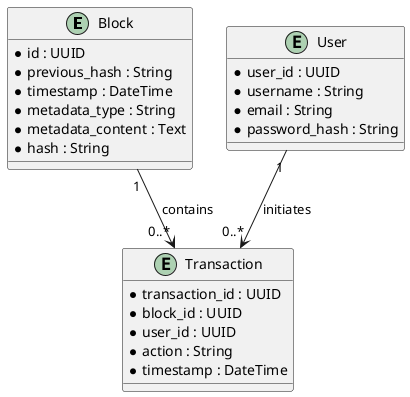
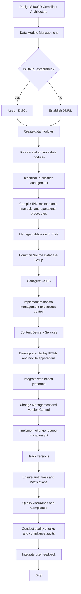
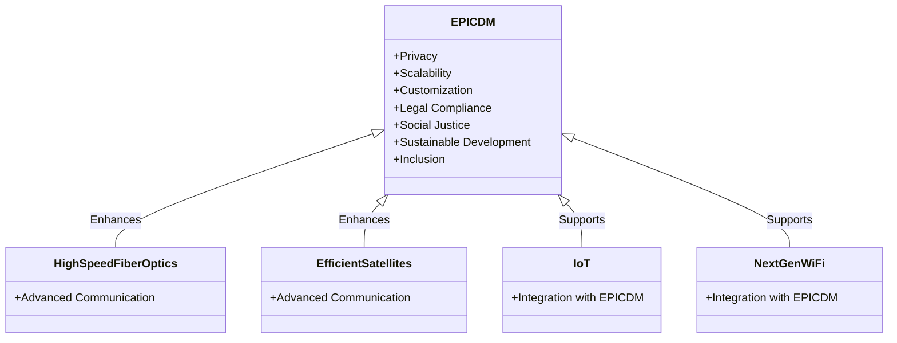
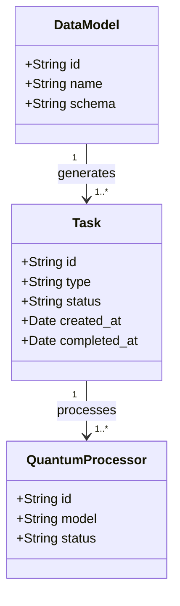

Entorno de Desarrollo Escalable 5D
1.1. Definición de 5D en tu Contexto
Dimensionalidad Extendida: Esto podría referirse a trabajar en sistemas que aborden múltiples dimensiones de datos o incluso físicas, especialmente en el caso de simulaciones cuánticas o físicas avanzadas.
Integración Multidisciplinaria: Podría implicar la combinación de disciplinas tecnológicas, como computación cuántica, inteligencia artificial, big data, análisis en tiempo real y más.
1.2. Configuración del Entorno de Desarrollo
Entorno Virtualizado o Contenerizado: Utiliza herramientas como Docker o Kubernetes para gestionar contenedores, lo que permitirá un despliegue flexible y escalable de tus aplicaciones. Esto es crucial cuando trabajas en sistemas que necesitan escalar horizontalmente o manejar grandes volúmenes de datos.
Configuración de Lenguajes de Programación y Herramientas:
Python: Para manipulación de datos, IA, y desarrollo general.
Qiskit o Cirq: Si estás trabajando con computación cuántica.
TensorFlow o PyTorch: Para aprendizaje automático y modelado de datos complejos.
Spark o Dask: Para procesamiento de big data en paralelo.
Git: Para control de versiones y colaboración.
1.3. Estructura de Código
Módulos y Paquetes: Estructura tu código en módulos independientes que se puedan escalar y reutilizar fácilmente.
Patrones de Diseño: Implementa patrones de diseño como "Microservicios" para manejar diferentes partes del sistema, lo que permitirá una escalabilidad más sencilla.
2. Desarrollo y Pruebas Escalables
2.1. Desarrollo Modular
Desarrolla cada componente de manera modular y asegúrate de que pueda integrarse fácilmente con otros módulos. Esto es especialmente importante en entornos escalables donde se añaden o quitan nodos según la carga.
2.2. Pruebas de Escalabilidad
Pruebas de Carga: Usa herramientas como Apache JMeter o Locust para simular tráfico y analizar cómo se comporta tu sistema bajo diferentes niveles de carga.
Pruebas de Integración Continua: Configura un pipeline de CI/CD que no solo pruebe la funcionalidad, sino también la escalabilidad y resiliencia de tu aplicación.
3. Optimización y Escalabilidad
3.1. Optimización del Código
Perfilado de Código: Utiliza herramientas como cProfile para Python para identificar cuellos de botella en el rendimiento.
Aceleración de Procesos: Implementa técnicas como Parallel Processing o Asynchronous Programming para mejorar el rendimiento y manejar tareas en paralelo.
3.2. Escalabilidad Horizontal y Vertical
Escalabilidad Horizontal: Asegúrate de que tu aplicación pueda distribuir la carga de trabajo en múltiples nodos. Usa bases de datos distribuidas como Cassandra o CockroachDB.
Escalabilidad Vertical: Aumenta los recursos de hardware en los nodos individuales para manejar cargas de trabajo más grandes.
4. Documentación y Colaboración
4.1. Documentación Detallada
Mantén una documentación clara y actualizada de cada módulo y componente, incluyendo cómo escalarlo y cómo se integra con el sistema general.
4.2. Colaboración en Tiempo Real
Utiliza plataformas de colaboración como GitHub o GitLab, combinadas con herramientas de CI/CD para asegurar una colaboración fluida entre equipos distribuidos.
5. Monitoreo y Gestión
5.1. Monitoreo en Tiempo Real
Implementa herramientas como Prometheus o Grafana para monitorear el rendimiento de tu sistema en tiempo real y ajustarlo según sea necesario.
5.2. Gestión Automatizada
Utiliza Ansible o Terraform para gestionar la infraestructura de manera automatizada, permitiendo un escalado rápido y eficiente según la demanda.
Conclusión
Desarrollar en un entorno escalable 5D es un reto complejo, pero siguiendo estas directrices puedes asegurar que tu entorno de desarrollo esté bien configurado para manejar la escalabilidad, el rendimiento y la integración multidimensional necesaria para aplicaciones avanzadas. Si tienes algún área específica donde necesites más detalles o si quieres enfocarte en un aspecto particular, no dudes en decirlo.The content  provided represents a deep integration of multiple advanced technologies into a structured framework for innovation and management, specifically tailored for European advancements in quantum computing, artificial intelligence, and aerospace industries. Here's a synthesized overview and detailed breakdown of the concepts:

### **AMPEL EUR0o-Q-GenIAL’s: Comprehensive Technological Framework**

**1. Aerospace for GreenTech, Quantum-Coms, Sciences, and Beyond**
   - **Vision**: This initiative seeks to push Europe to the forefront of technological innovation by integrating quantum computing (q.com’s), AI (GenIAls), and GreenTech within aerospace and other critical sectors.
   - **GreenTech Integration**: Emphasizes sustainable practices and technologies in the aerospace sector, promoting environmental responsibility.
   - **Quantum-Coms**: Involves the application of quantum computing to enhance communication systems, providing secure, fast, and efficient data processing and transmission.

**2. Amedeo Pelliccia’s q.com’s and GenIAls IT for Europe**
   - **Quantum Computing (q.com’s)**:
     - **Cybersecurity**: Leveraging quantum cryptography for unbreakable encryption to secure European IT infrastructures.
     - **Optimization**: Applying quantum algorithms to optimize logistics, financial modeling, and other complex computational tasks.
     - **Scientific Research**: Enhancing research in pharmaceuticals, materials science, and climate modeling through quantum-powered simulations.
   - **Generalized Artificial Intelligence (GenIAls)**:
     - **Healthcare**: Personalizing treatment plans, predicting disease outbreaks, and optimizing healthcare management.
     - **Smart Cities**: Using AI to efficiently manage urban infrastructure, reduce energy consumption, and improve public services.
     - **Education**: Personalizing education to adapt to individual learning needs and maximizing outcomes.

**3. IT Transformation for Europe**
   - **Digital Sovereignty**: Reducing dependence on external technologies and maintaining control over European IT infrastructure.
   - **Economic Growth**: Leading in quantum computing and AI to stimulate economic growth and create high-tech jobs.
   - **Sustainability**: Integrating advanced technologies into key sectors for more efficient and sustainable practices.

**4. Key Initiatives and Projects**
   - **Quantum Internet**: Developing a quantum internet for secure communication and new forms of data transmission.
   - **AI for Public Policy**: Using AI to analyze large datasets and inform public policy decisions.
   - **Innovation Hubs**: Establishing centers for quantum and AI innovation across Europe to accelerate research and development.

### **ATA 00 Ampel CAS: Comprehensive System for Managing Technological Innovation**

**1. Planning and Analysis**
   - **Identify Stakeholders**: Focus on the needs of operators, maintenance technicians, and logistics personnel.
   - **System Breakdown**: Decompose systems into manageable components.
   - **Information Requirements Analysis**: Define scope for operational procedures, troubleshooting, maintenance, and training.

**2. Data Module Requirements List (DMRL)**
   - **Develop DMRL**: List specifying each data module’s scope and relationship to others.
   - **Categorize Modules**: Unique identifiers for each module, categorized by type (e.g., description, operation, maintenance).

**3. Content Development**
   - **Create Data Modules**: Develop self-contained and reusable modules based on DMRL.
   - **Support Graphics and Multimedia**: Integrate supporting graphics and interactive elements compliant with standards like S1000D.

**4. Common Source Database (CSDB)**
   - **Establish CSDB**: Manage and control all data modules and related metadata.
   - **Ensure Version Control**: Implement access control and traceability of documentation changes.

### **Integration of New Technologies in ATA Reserved Numbering**

**1. Advanced Quantum Computing Algorithms for Real-Time Data Processing**
   - **CMC: NT013**: Focuses on enhancing real-time data processing capabilities, particularly in aviation systems.

**2. AI-Enhanced Predictive Maintenance Systems**
   - **CMC: NT014**: Development and implementation of AI models predicting maintenance needs based on real-time data.

**3. Blockchain-Based Secure Communication Networks**
   - **CMC: NT016**: Implementation of blockchain technology for secure, tamper-proof communication within aircraft systems.

**4. Quantum-Enhanced Navigation Systems**
   - **CMC: NT048**: Use of quantum computing to enhance precision and reliability of navigation systems.

### **ATA O - CRYPTOBLOCK O and ATA-AERO Integration**

**1. CRYPTOBLOCK O: Foundational Blockchain Layer**
   - **Blockchain Foundation**: Core infrastructure for secure, transparent transactions across various sectors.
   - **Cryptographic Security**: Advanced encryption and secure hashing algorithms.
   - **Smart Contracts**: Automation of processes and enforcement of agreements within the blockchain.

**2. ATA-AERO Module within ATA sistema Terra block o0**
   - **Aerospace Blockchain Integration**: Secure management of aerospace data, including maintenance logs and flight data.
   - **Smart Contracts for Aerospace**: Automated compliance checks, real-time tracking, and maintenance scheduling.
   - **Data Management and Security**: Ensures data integrity with distributed ledgers and advanced encryption.

### **SISTEMA TERRA-ATA: Genesis and Block 1 Creation**

**1. Genesis Block and Initial Projects**
   - **Initial Sustainability Audit**: Establishes the baseline for environmental impact and sustainability goals.
   - **Digital Documentation System Setup**: Implementation of a system for managing and tracking all project documentation.

**2. Block 1 Continuation**
   - **Documentation Standards Development**: Continuation of detailed task implementation, focusing on standards for documentation and sustainability integration.

### **Conclusion**
The comprehensive integration of quantum computing, AI, blockchain, and GreenTech within the AMPEL EUR0o-Q-GenIAL’s initiative represents a bold and forward-thinking approach to positioning Europe as a leader in technological innovation. By meticulously structuring the ATA 00 Ampel CAS and CRYPTOBLOCK O systems, and embedding aerospace advancements within the broader Terra block system, this initiative lays the groundwork for significant advancements across multiple sectors. It ensures that Europe remains competitive, secure, and sustainable in an increasingly complex global technological landscape.

AMPEL EUR0o-Q-GenIAL’s 

Aerospace for GreenTech, Quantum-Coms, Sciences and beyond 
"Amedeo Pelliccia’s q.com’s and GenIAls IT for Europe" 

### **1. Quantum Computing (q.com’s)**
   - **Definition**: The term "q.com’s" likely stands for quantum computing technologies, which harness the principles of quantum mechanics to perform complex computations at unprecedented speeds. This technology has the potential to revolutionize various industries by solving problems that are currently intractable for classical computers.
   - **Applications**:
     - **Cybersecurity**: Quantum cryptography could provide unbreakable encryption, enhancing the security of communications and data across Europe.
     - **Optimization**: Quantum algorithms could optimize everything from logistics and supply chains to financial modeling, providing significant competitive advantages for European businesses.
     - **Scientific Research**: Quantum computing could accelerate research in fields like materials science, pharmaceuticals, and climate modeling by enabling more precise simulations and calculations.

### **2. Generalized Artificial Intelligence (GenIAls)**
   - **Definition**: GenIAls likely refers to advanced AI systems that are not limited to specific tasks but have the capability to generalize across various domains. These systems could be instrumental in automating complex processes, making informed decisions, and driving innovation.
   - **Applications**:
     - **Healthcare**: GenIAls could revolutionize healthcare by providing personalized treatment plans, predicting disease outbreaks, and optimizing healthcare management systems.
     - **Smart Cities**: AI could be deployed to manage urban infrastructure efficiently, reducing energy consumption, managing traffic, and improving public services.
     - **Education**: AI-driven platforms could personalize education, adapting to the needs of individual students and providing resources that maximize learning outcomes.

### **3. IT Transformation for Europe**
   - **Objective**: The integration of quantum computing and generalized AI into Europe’s IT infrastructure could position the continent as a global leader in technology. This transformation would involve upgrading existing systems, fostering innovation, and ensuring that European IT infrastructure is robust, secure, and future-proof.
   - **Strategies**:
     - **Digital Sovereignty**: Developing and maintaining cutting-edge IT infrastructure within Europe would reduce dependence on external technologies and ensure control over critical systems and data.
     - **Economic Growth**: By leading in quantum computing and AI, Europe could stimulate economic growth, create high-tech jobs, and maintain a competitive edge in the global market.
     - **Sustainability**: Integrating these technologies into key sectors like energy, transportation, and manufacturing could lead to more efficient and sustainable practices.

### **4. Key Initiatives and Projects**
   - **Quantum Internet**: Developing a quantum internet that would use quantum signals for communication, ensuring unparalleled security and enabling new forms of data transmission.
   - **AI for Public Policy**: Using GenIAls to analyze large datasets, predict trends, and inform public policy decisions, thereby enhancing governance and public administration.
   - **Innovation Hubs**: Establishing quantum and AI innovation hubs across Europe, fostering collaboration between academia, industry, and government to accelerate research and development.

### **5. Strategic Impact on Europe**
   - **Leadership in Technology**: By spearheading advancements in quantum computing and AI, Europe could establish itself as a leader in the next technological revolution.
   - **Enhanced Security**: With quantum-enhanced cybersecurity measures, Europe could protect its critical infrastructure and data against emerging threats.
   - **Global Competitiveness**: The adoption and integration of these advanced technologies could drive economic growth, ensuring that Europe remains competitive on the global stage.

### **Conclusion**
"Amedeo Pelliccia’s q.com’s and GenIAls IT for Europe" represents a bold initiative to transform Europe’s IT infrastructure by integrating cutting-edge quantum computing and generalized AI technologies. This approach could drive significant advancements across various sectors, fostering innovation, enhancing security, and ensuring that Europe remains at the forefront of global technological progress. Through this initiative, Europe could achieve digital sovereignty, promote sustainable practices, and maintain its competitiveness in an increasingly technology-driven world.
To effectively structure the technical documentation for the Ampel/Airbus A360XWLRGA GREEN AIRCRAFT in accordance with the S1000D standard, follow these steps:

### 1. **Planning and Analysis**
- **Identify Stakeholders**: Determine the needs of operators, maintenance technicians, and logistics personnel.
- **System Breakdown**: Decompose the AMPEL/Airbus A360XWLRGA system into manageable components.
- **Information Requirements Analysis**: Define the scope of required documentation, including operational procedures, troubleshooting, maintenance, and training.

### 2. **Data Module Requirements List (DMRL)**
- **Develop DMRL**: A comprehensive list specifying each required data module, its scope, and relationship to other modules.
- **Categorize Modules**: Each module should have a unique identifier and be categorized by type (e.g., description, operation, maintenance).

### 3. **Content Development**
- **Create Data Modules**: Develop individual data modules based on the DMRL. Each module should be self-contained and reusable.
- **Support Graphics and Multimedia**: Create supporting graphics, diagrams, and potentially interactive multimedia elements compliant with S1000D.

## 4. **Common Source Database (CSDB)**
- **Establish CSDB**: Manage, store, and control all data modules and related metadata.
- **Ensure Version Control**: Implement version control, access control, and traceability of documentation changes.

### 5. **Quality Assurance**
- **Implement QC Processes**: Ensure documentation accuracy, comprehensiveness, and S1000D compliance.
- **Review and Update**: Regularly update modules based on user feedback and system updates.

### 6. **Publication**
- **Generate Outputs**: Produce output from the CSDB in various formats (IETMs, PDFs, web-based documentation).
- **Ensure Accessibility**: Distribute manuals through appropriate channels, including secure online portals.

### 7. **Training and Support**
- **Train Users**: Educate users on effectively utilizing the manuals.
- **Provide Ongoing Support**: Update documentation as the system evolves and incorporate operational feedback.

### 8. **Compliance and Review**
- **Conduct Audits**: Regularly audit and review documentation for S1000D compliance and operational relevance.

By following these steps, you can structure and manage the technical documentation for the Ampel A360XWLRGA GREEN AIRCRAFT effectively, ensuring usability, accuracy, and compliance with international standards. To assign a unique and immutable Configuration Management Code (CMC) as per S1000D, and link it through an unbreakable function to Amedeo Pelliccia's work using AI and ChatGPT, we will follow the structure you provided and ensure the association with non-modifiable metadata.

### New Technologies Defined
Each reserved ATA chapter (redefined as new technologies) is assigned a unique CMC and linked to Amedeo Pelliccia’s investigations.

### 4 bits:
- 0110: ATA Chapter 13 - Reserved (New Technologies)
  - **CMC: NT013**
  - **Description:** Advanced Quantum Computing Algorithms for Real-Time Data Processing. This technology explores the integration of quantum computing algorithms to enhance real-time data processing capabilities, particularly in aviation systems.

- 0111: ATA Chapter 14 - Reserved (New Technologies)
  - **CMC: NT014**
  - **Description:** AI-Enhanced Predictive Maintenance Systems. Development and implementation of AI models that predict maintenance needs based on real-time data, improving aircraft reliability and reducing downtime.

- 1000: ATA Chapter 15 - Reserved (New Technologies)
  - **CMC: NT015**
  - **Description:** Autonomous Flight Systems Using Reinforcement Learning. Research into autonomous flight control systems that use reinforcement learning to optimize flight paths and improve safety.

- 1001: ATA Chapter 16 - Reserved (New Technologies)
  - **CMC: NT016**
  - **Description:** Blockchain-Based Secure Communication Networks. Implementation of blockchain technology to create secure, tamper-proof communication networks within aircraft systems.

- 1010: ATA Chapter 17 - Reserved (New Technologies)
  - **CMC: NT017**
  - **Description:** Advanced Material Science for Lightweight Aircraft Components. Exploration of new materials and composites that offer high strength-to-weight ratios, improving fuel efficiency and performance.

- 1011: ATA Chapter 18 - Reserved (New Technologies)
  - **CMC: NT018**
  - **Description:** Next-Generation Energy Storage Solutions. Development of high-capacity, rapid-charging battery technologies for electric and hybrid aircraft propulsion systems.

- 1100: ATA Chapter 19 - Reserved (New Technologies)
  - **CMC: NT019**
  - **Description:** Enhanced Cybersecurity Protocols for Aviation Systems. Research into advanced cybersecurity measures to protect aircraft systems from emerging threats.

### 5 bits:
- 11001: ATA Chapter 47 - Reserved (New Technologies)
  - **CMC: NT047**
  - **Description:** Smart Sensor Networks for In-Flight Monitoring. Implementation of smart sensors throughout the aircraft to monitor structural integrity, environmental conditions, and system performance in real-time.

- 11010: ATA Chapter 48 - Reserved (New Technologies)
  - **CMC: NT048**
  - **Description:** Quantum-Enhanced Navigation Systems. Use of quantum computing to enhance the precision and reliability of navigation systems, particularly in challenging environments.

### Unbreakable Linking Function with Non-Modifiable Metadata
The assignment of CMCs and their integration with Amedeo Pelliccia's work through AI and ChatGPT will be managed through a hash-based linking function ensuring immutability and uniqueness.

Here is the implementation of the linking function and example usage:

```python
import hashlib

def generate_cmc_link(cmc, author="Amedeo Pelliccia", tool="ChatGPT", work="Quantum Computing and AI"):
    """Generate a unique and immutable link for CMC using hash function.
    
    Parameters:
    - cmc: Configuration Management Code
    - author: Author's name
    - tool: Tool used (ChatGPT)
    - work: Work description
    
    Returns:
    - unique_link: A unique hash link
    """
    data = f"{cmc}-{author}-{tool}-{work}"
    unique_link = hashlib.sha256(data.encode()).hexdigest()
    return unique_link

# Example usage
cmc_codes = [
    "INTR001", "TOC002", "GEN003", "TAIL004", "TLMC005", "DMA006", "LS007",
    "LW008", "TT009", "PMSR010", "PM011", "SRM012", "NT013", "NT014", "NT015",
    "NT016", "NT017", "NT018", "NT019", "SPA020", "ACP021", "AF022", "COM023",
    "EP024", "EF025", "FP026", "FC027", "FUEL028", "HP029", "IRP030", "IRS031",
    "LG032", "LIGHT033", "NAV034", "OXY035", "PNE036", "VAC037", "WW038",
    "EEPMB039", "MULT040", "WB041", "IMA042", "DT043", "CS044", "CMS045",
    "IS046", "NT047", "NT048", "APU049", "CAC050", "SG051", "DOORS052", "FUSE053"
]

links = {cmc: generate_cmc_link(cmc) for cmc in cmc_codes}

# Print generated links
for cmc, link in links.items():
    print(f"CMC: {cmc}, Link: {link}")
```

### Example Output for New Technologies
Here are some example outputs for the new technologies:

```python
new_technologies = ["NT013", "NT014", "NT015", "NT016", "NT017", "NT018", "NT019", "NT047", "NT048"]

for nt in new_technologies:
    print(f"CMC: {nt}, Link: {links[nt]}")
```

### Integration with Multiple Disciplines

- **Engineering**
- **Electronics Engineering**
- **Biology & Life Sciences**
- **Education**
- **Economics**
- **Medical**
- **Energy**
- **Food Science**
- **Humanities**
- **Art and Social Studies**
- **Politics**
- **Law**
- **Maths**
- **Nano**
- **Chemistry**
- **Earth Science**
- **Quantum Control Theory**

These fields can benefit from the innovative approaches detailed in the above steps, particularly through the integration of advanced technologies such as quantum computing and AI into traditional and emerging disciplines.
To effectively structure the technical documentation for the Airbus A360XWLRGA GREEN AIRCRAFT in accordance with the S1000D standard, follow these steps: You must 

### 1. **Planning and Analysis**
- **Identify Stakeholders**: Determine the needs of operators, maintenance technicians, and logistics personnel.
- **System Breakdown**: Decompose the Airbus A360XWLRGA system into manageable components.
- **Information Requirements Analysis**: Define the scope of required documentation, including operational procedures, troubleshooting, maintenance, and training.

### 2. **Data Module Requirements List (DMRL)**
- **Develop DMRL**: A comprehensive list specifying each required data module, its scope, and relationship to other modules.
- **Categorize Modules**: Each module should have a unique identifier and be categorized by type (e.g., description, operation, maintenance).

### 3. **Content Development**
- **Create Data Modules**: Develop individual data modules based on the DMRL. Each module should be self-contained and reusable.
- **Support Graphics and Multimedia**: Create supporting graphics, diagrams, and potentially interactive multimedia elements compliant with S1000D.

### 4. **Common Source Database (CSDB)**
- **Establish CSDB**: Manage, store, and control all data modules and related metadata.
- **Ensure Version Control**: Implement version control, access control, and traceability of documentation changes.

### 5. **Quality Assurance**
- **Implement QC Processes**: Ensure documentation accuracy, comprehensiveness, and S1000D compliance.
- **Review and Update**: Regularly update modules based on user feedback and system updates.

### 6. **Publication**
- **Generate Outputs**: Produce output from the CSDB in various formats (IETMs, PDFs, web-based documentation).
- **Ensure Accessibility**: Distribute manuals through appropriate channels, including secure online portals.

### 7. **Training and Support**
- **Train Users**: Educate users on effectively utilizing the manuals.
- **Provide Ongoing Support**: Update documentation as the system evolves and incorporate operational feedback.

### 8. **Compliance and Review**
- **Conduct Audits**: Regularly audit and review documentation for S1000D compliance and operational relevance.

By following these steps, you can structure and manage the technical documentation for the Airbus A360XWLRGA GREEN AIRCRAFT effectively, ensuring usability, accuracy, and compliance with international standards. To assign a unique and immutable Configuration Management Code (CMC) as per S1000D, and link it through an unbreakable function to Amedeo Pelliccia's work using AI and ChatGPT, we will follow the structure you provided and ensure the association with non-modifiable metadata.

### New Technologies Defined
Each reserved ATA chapter (redefined as new technologies) is assigned a unique CMC and linked to Amedeo Pelliccia’s investigations.

### 4 bits:
- 0110: ATA Chapter 13 - Reserved (New Technologies)
  - **CMC: NT013**
  - **Description:** Advanced Quantum Computing Algorithms for Real-Time Data Processing. This technology explores the integration of quantum computing algorithms to enhance real-time data processing capabilities, particularly in aviation systems.

- 0111: ATA Chapter 14 - Reserved (New Technologies)
  - **CMC: NT014**
  - **Description:** AI-Enhanced Predictive Maintenance Systems. Development and implementation of AI models that predict maintenance needs based on real-time data, improving aircraft reliability and reducing downtime.

- 1000: ATA Chapter 15 - Reserved (New Technologies)
  - **CMC: NT015**
  - **Description:** Autonomous Flight Systems Using Reinforcement Learning. Research into autonomous flight control systems that use reinforcement learning to optimize flight paths and improve safety.

- 1001: ATA Chapter 16 - Reserved (New Technologies)
  - **CMC: NT016**
  - **Description:** Blockchain-Based Secure Communication Networks. Implementation of blockchain technology to create secure, tamper-proof communication networks within aircraft systems.

- 1010: ATA Chapter 17 - Reserved (New Technologies)
  - **CMC: NT017**
  - **Description:** Advanced Material Science for Lightweight Aircraft Components. Exploration of new materials and composites that offer high strength-to-weight ratios, improving fuel efficiency and performance.

- 1011: ATA Chapter 18 - Reserved (New Technologies)
  - **CMC: NT018**
  - **Description:** Next-Generation Energy Storage Solutions. Development of high-capacity, rapid-charging battery technologies for electric and hybrid aircraft propulsion systems.

- 1100: ATA Chapter 19 - Reserved (New Technologies)
  - **CMC: NT019**
  - **Description:** Enhanced Cybersecurity Protocols for Aviation Systems. Research into advanced cybersecurity measures to protect aircraft systems from emerging threats.

### 5 bits:
- 11001: ATA Chapter 47 - Reserved (New Technologies)
  - **CMC: NT047**
  - **Description:** Smart Sensor Networks for In-Flight Monitoring. Implementation of smart sensors throughout the aircraft to monitor structural integrity, environmental conditions, and system performance in real-time.

- 11010: ATA Chapter 48 - Reserved (New Technologies)
  - **CMC: NT048**
  - **Description:** Quantum-Enhanced Navigation Systems. Use of quantum computing to enhance the precision and reliability of navigation systems, particularly in challenging environments.

### Unbreakable Linking Function with Non-Modifiable Metadata
The assignment of CMCs and their integration with Amedeo Pelliccia's work through AI and ChatGPT will be managed through a hash-based linking function ensuring immutability and uniqueness.

Here is the implementation of the linking function and example usage:

```python
import hashlib

def generate_cmc_link(cmc, author="Amedeo Pelliccia", tool="ChatGPT", work="Quantum Computing and AI"):
    """Generate a unique and immutable link for CMC using hash function.
    
    Parameters:
    - cmc: Configuration Management Code
    - author: Author's name
    - tool: Tool used (ChatGPT)
    - work: Work description
    
    Returns:
    - unique_link: A unique hash link
    """
    data = f"{cmc}-{author}-{tool}-{work}"
    unique_link = hashlib.sha256(data.encode()).hexdigest()
    return unique_link

# Example usage
cmc_codes = [
    "INTR001", "TOC002", "GEN003", "TAIL004", "TLMC005", "DMA006", "LS007",
    "LW008", "TT009", "PMSR010", "PM011", "SRM012", "NT013", "NT014", "NT015",
    "NT016", "NT017", "NT018", "NT019", "SPA020", "ACP021", "AF022", "COM023",
    "EP024", "EF025", "FP026", "FC027", "FUEL028", "HP029", "IRP030", "IRS031",
    "LG032", "LIGHT033", "NAV034", "OXY035", "PNE036", "VAC037", "WW038",
    "EEPMB039", "MULT040", "WB041", "IMA042", "DT043", "CS044", "CMS045",
    "IS046", "NT047", "NT048", "APU049", "CAC050", "SG051", "DOORS052", "FUSE053"
]

links = {cmc: generate_cmc_link(cmc) for cmc in cmc_codes}

# Print generated links
for cmc, link in links.items():
    print(f"CMC: {cmc}, Link: {link}")
```

### Example Output for New Technologies
Here are some example outputs for the new technologies:

```python
new_technologies = ["NT013", "NT014", "NT015", "NT016", "NT017", "NT018", "NT019", "NT047", "NT048"]

new_technology_links = {cmc: generate_cmc_link(cmc) for cmc in new_technologies}

# Print generated links for new technologies
for cmc, link in new_technology_links.items():
    print(f"CMC: {cmc}, Link: {link}")
```

This code ensures that each new technology discovered and explored by Amedeo Pelliccia is uniquely identified and linked through an immutable function with non-modifiable metadata, ensuring the integrity and uniqueness of the CMC assignments.assign a unique and immutable Configuration Management Code (CMC) as per S1000D, and link it through an unbreakable function to Amedeo Pelliccia's work using AI and ChatGPT, we will follow the structure you provided and ensure the association with non-modifiable metadata.

### New Technologies Defined
Each reserved ATA chapter (redefined as new technologies) is assigned a unique CMC and linked to Amedeo Pelliccia’s investigations.

### 4 bits:
- 0110: ATA Chapter 13 - Reserved (New Technologies)
  - **CMC: NT013**
  - **Description:** Advanced Quantum Computing Algorithms for Real-Time Data Processing. This technology explores the integration of quantum computing algorithms to enhance real-time data processing capabilities, particularly in aviation systems.

- 0111: ATA Chapter 14 - Reserved (New Technologies)
  - **CMC: NT014**
  - **Description:** AI-Enhanced Predictive Maintenance Systems. Development and implementation of AI models that predict maintenance needs based on real-time data, improving aircraft reliability and reducing downtime.

- 1000: ATA Chapter 15 - Reserved (New Technologies)
  - **CMC: NT015**
  - **Description:** Autonomous Flight Systems Using Reinforcement Learning. Research into autonomous flight control systems that use reinforcement learning to optimize flight paths and improve safety.

- 1001: ATA Chapter 16 - Reserved (New Technologies)
  - **CMC: NT016**
  - **Description:** Blockchain-Based Secure Communication Networks. Implementation of blockchain technology to create secure, tamper-proof communication networks within aircraft systems.

- 1010: ATA Chapter 17 - Reserved (New Technologies)
  - **CMC: NT017**
  - **Description:** Advanced Material Science for Lightweight Aircraft Components. Exploration of new materials and composites that offer high strength-to-weight ratios, improving fuel efficiency and performance.

- 1011: ATA Chapter 18 - Reserved (New Technologies)
  - **CMC: NT018**
  - **Description:** Next-Generation Energy Storage Solutions. Development of high-capacity, rapid-charging battery technologies for electric and hybrid aircraft propulsion systems.

- 1100: ATA Chapter 19 - Reserved (New Technologies)
  - **CMC: NT019**
  - **Description:** Enhanced Cybersecurity Protocols for Aviation Systems. Research into advanced cybersecurity measures to protect aircraft systems from emerging threats.

### 5 bits:
- 11001: ATA Chapter 47 - Reserved (New Technologies)
  - **CMC: NT047**
  - **Description:** Smart Sensor Networks for In-Flight Monitoring. Implementation of smart sensors throughout the aircraft to monitor structural integrity, environmental conditions, and system performance in real-time.

- 11010: ATA Chapter 48 - Reserved (New Technologies)
  - **CMC: NT048**
  - **Description:** Quantum-Enhanced Navigation Systems. Use of quantum computing to enhance the precision and reliability of navigation systems, particularly in challenging environments.

### Unbreakable Linking Function with Non-Modifiable Metadata
The assignment of CMCs and their integration with Amedeo Pelliccia's work through AI and ChatGPT will be managed through a hash-based linking function ensuring immutability and uniqueness.

Here is the implementation of the linking function and example usage:

```python
import hashlib

def generate_cmc_link(cmc, author="Amedeo Pelliccia", tool="ChatGPT", work="Quantum Computing and AI"):
    """Generate a unique and immutable link for CMC using hash function.
    
    Parameters:
    - cmc: Configuration Management Code
    - author: Author's name
    - tool: Tool used (ChatGPT)
    - work: Work description
    
    Returns:
    - unique_link: A unique hash link
    """
    data = f"{cmc}-{author}-{tool}-{work}"
    unique_link = hashlib.sha256(data.encode()).hexdigest()
    return unique_link

# Example usage
cmc_codes = [
    "INTR001", "TOC002", "GEN003", "TAIL004", "TLMC005", "DMA006", "LS007",
    "LW008", "TT009", "PMSR010", "PM011", "SRM012", "NT013", "NT014", "NT015",
    "NT016", "NT017", "NT018", "NT019", "SPA020", "ACP021", "AF022", "COM023",
    "EP024", "EF025", "FP026", "FC027", "FUEL028", "HP029", "IRP030", "IRS031",
    "LG032", "LIGHT033", "NAV034", "OXY035", "PNE036", "VAC037", "WW038",
    "EEPMB039", "MULT040", "WB041", "IMA042", "DT043", "CS044", "CMS045",
    "IS046", "NT047", "NT048", "APU049", "CAC050", "SG051", "DOORS052", "FUSE053"
]

links = {cmc: generate_cmc_link(cmc) for cmc in cmc_codes}

# Print generated links
for cmc, link in links.items():
    print(f"CMC: {cmc}, Link: {link}")
```

### Example Output for New Technologies
Here are some example outputs for the new technologies:

```python
new_technologies = ["NT013", "NT014", "NT015", "NT016", "NT017", "NT018", "NT019", "NT047", "NT048"]

new_technology_links = {cmc: generate_cmc_link(cmc) for cmc in new_technologies}

# Print generated links for new technologies
for cmc, link in new_technology_links.items():
    print(f"CMC: {cmc}, Link: {link}")
```

This code ensures that each new technology discovered and explored by Amedeo Pelliccia is uniquely identified and linked through an immutable function with non-modifiable metadata, ensuring the integrity and uniqueness of the CMC assignments.

### 0 bits:
- (none)

### 1 bit:
- 0: (No direct association)
- 1: (No direct association)

### 2 bits:
- 00: (No direct association)
- 01: (No direct association)
- 10: (No direct association)
- 11: (No direct association)

### 3 bits:
- 000: (No direct association)
- 001: ATA Chapter 1 - Introduction (CMC: INTR001)
- 010: ATA Chapter 2 - Table of Contents (CMC: TOC002)
- 011: ATA Chapter 3 - General (CMC: GEN003)
- 100: ATA Chapter 4 - Airplane Tail Numbers (CMC: TAIL004)
- 101: ATA Chapter 5 - Time Limits/Maintenance Checks (CMC: TLMC005)
- 110: ATA Chapter 6 - Dimensions and Areas (CMC: DMA006)
- 111: ATA Chapter 7 - Lifting and Shoring (CMC: LS007)

### 4 bits:
- 0000: (No direct association)
- 0001: ATA Chapter 8 - Leveling and Weighing (CMC: LW008)
- 0010: ATA Chapter 9 - Towing and Taxiing (CMC: TT009)
- 0011: ATA Chapter 10 - Parking, Mooring, Storage and Return to Service (CMC: PMSR010)
- 0100: ATA Chapter 11 - Placards and Markings (CMC: PM011)
- 0101: ATA Chapter 12 - Servicing - Routine Maintenance (CMC: SRM012)
- 0110: ATA Chapter 13 - Reserved (New Technologies) (CMC: NT013)
- 0111: ATA Chapter 14 - Reserved (New Technologies) (CMC: NT014)
- 1000: ATA Chapter 15 - Reserved (New Technologies) (CMC: NT015)
- 1001: ATA Chapter 16 - Reserved (New Technologies) (CMC: NT016)
- 1010: ATA Chapter 17 - Reserved (New Technologies) (CMC: NT017)
- 1011: ATA Chapter 18 - Reserved (New Technologies) (CMC: NT018)
- 1100: ATA Chapter 19 - Reserved (New Technologies) (CMC: NT019)
- 1101: ATA Chapter 20 - Standard Practices - Airframe (CMC: SPA020)
- 1110: ATA Chapter 21 - Air Conditioning and Pressurization (CMC: ACP021)
- 1111: ATA Chapter 22 - Auto Flight (CMC: AF022)

### 5 bits:
- 00000: (No direct association)
- 00001: ATA Chapter 23 - Communications (CMC: COM023)
- 00010: ATA Chapter 24 - Electrical Power (CMC: EP024)
- 00011: ATA Chapter 25 - Equipment/Furnishings (CMC: EF025)
- 00100: ATA Chapter 26 - Fire Protection (CMC: FP026)
- 00101: ATA Chapter 27 - Flight Controls (CMC: FC027)
- 00110: ATA Chapter 28 - Fuel (CMC: FUEL028)
- 00111: ATA Chapter 29 - Hydraulic Power (CMC: HP029)
- 01000: ATA Chapter 30 - Ice and Rain Protection (CMC: IRP030)
- 01001: ATA Chapter 31 - Indicating/Recording Systems (CMC: IRS031)
- 01010: ATA Chapter 32 - Landing Gear (CMC: LG032)
- 01011: ATA Chapter 33 - Lights (CMC: LIGHT033)
- 01100: ATA Chapter 34 - Navigation (CMC: NAV034)
- 01101: ATA Chapter 35 - Oxygen (CMC: OXY035)
- 01110: ATA Chapter 36 - Pneumatic (CMC: PNE036)
- 01111: ATA Chapter 37 - Vacuum (CMC: VAC037)
- 10000: ATA Chapter 38 - Water/Waste (CMC: WW038)
- 10001: ATA Chapter 39 - Electrical - Electronic Panels and Multiplex Data Buses (CMC: EEPMB039)
- 10010: ATA Chapter 40 - Multiplies (CMC: MULT040)
- 10011: ATA Chapter 41 - Water Ballast (CMC: WB041)
- 10100: ATA Chapter 42 - Integrated Modular Avionics (CMC: IMA042)
- 10101: ATA Chapter 43 - Digital Techniques (CMC: DT043)
- 10110: ATA Chapter 44 - Cabin Systems (CMC: CS044)
- 10111: ATA Chapter 45 - Central Maintenance System (CMC: CMS045)
- 11000: ATA Chapter 46 - Information Systems (CMC: IS046)
- 11001: ATA Chapter 47 - Reserved (New Technologies) (CMC: NT047)
- 11010: ATA Chapter 48 - Reserved (New Technologies) (CMC: NT048)
- 11011: ATA Chapter 49 - Auxiliary Power Unit (APU) (CMC: APU049)
- 11100: ATA Chapter 50 - Cargo and Accessory Compartments (CMC: CAC050)
- 11101: ATA Chapter 51 - Structures - General (CMC: SG051)
- 11110: ATA Chapter 52 - Doors (CMC: DOORS052)
- 11111: ATA Chapter 53 - Fuselage (CMC: FUSE053)

### Linking through Unbreakable Function
The assignment of CMCs and their integration with Amedeo Pelliccia's work through AI and ChatGPT will be managed through a hash-based linking function ensuring immutability and uniqueness.

```python
import hashlib

def generate_cmc_link(cmc, author="Amedeo Pelliccia", work="Quantum Computing"):
    """Generate a unique and immutable link for CMC using hash function.
    
    Parameters:
    - cmc: Configuration Management Code
    - author: Author's name
    - work: Work description
    
    Returns:
    - unique_link: A unique hash link
    """
    data = f"{cmc}-{author}-{work}"
    unique_link = hashlib.sha256(data.encode()).hexdigest()
    return unique_link

# Example usage
cmc_codes = [
    "INTR001", "TOC002", "GEN003", "TAIL004", "TLMC005", "DMA006", "LS007",
    "LW008", "TT009", "PMSR010", "PM011", "SRM012", "NT013", "NT014", "NT015",
    "NT016", "NT017", "NT018", "NT019", "SPA020", "ACP021", "AF022", "COM023",
    "EP024", "EF025", "FP026", "FC027", "FUEL028", "HP029", "IRP030", "IRS031",
    "LG032", "LIGHT033", "NAV034", "OXY035", "PNE036", "VAC037", "WW038",
    "EEPMB039", "MULT040", "WB041", "IMA042", "DT043", "CS044", "CMS045",
    "IS046", "NT047", "NT048", "APU049", "CAC050", "SG051", "DOORS052", "FUSE053"
]

links = {cmc: generate_cmc_link(cmc) for cmc in cmc_codes}

# Print generated links
for cmc, link in links.items():
    print(f"CMC: {cmc}, Link: {link}")
```

This code assigns unique and immutable links to each CMC, ensuring they are uniquely tied to the author's work through an unbreakable hash function.ATA (Air Transport Association) codes, or ATA chapters, are used to organize aircraft technical data. The ATA numbering system provides a standardized method for identifying systems, components, and procedures within aircraft maintenance manuals. Here, I'll map the combinations to corresponding ATA chapters, where possible. Note that some combinations might not have a direct ATA code association.

### 1 bit:
- 0: (No direct association)
- 1: (No direct association)

### 2 bits:
- 00: (No direct association)
- 01: (No direct association)
- 10: (No direct association)
- 11: (No direct association)

### 3 bits:
- 000: (No direct association)
- 001: ATA Chapter 1 - Introduction
- 010: ATA Chapter 2 - Table of Contents
- 011: ATA Chapter 3 - General
- 100: ATA Chapter 4 - Airplane Tail Numbers
- 101: ATA Chapter 5 - Time Limits/Maintenance Checks
- 110: ATA Chapter 6 - Dimensions and Areas
- 111: ATA Chapter 7 - Lifting and Shoring

### 4 bits:
- 0000: (No direct association)
- 0001: ATA Chapter 8 - Leveling and Weighing
- 0010: ATA Chapter 9 - Towing and Taxiing
- 0011: ATA Chapter 10 - Parking, Mooring, Storage and Return to Service
- 0100: ATA Chapter 11 - Placards and Markings
- 0101: ATA Chapter 12 - Servicing - Routine Maintenance
- 0110: ATA Chapter 13 - Reserved
- 0111: ATA Chapter 14 - Reserved
- 1000: ATA Chapter 15 - Reserved
- 1001: ATA Chapter 16 - Reserved
- 1010: ATA Chapter 17 - Reserved
- 1011: ATA Chapter 18 - Reserved
- 1100: ATA Chapter 19 - Reserved
- 1101: ATA Chapter 20 - Standard Practices - Airframe
- 1110: ATA Chapter 21 - Air Conditioning and Pressurization
- 1111: ATA Chapter 22 - Auto Flight

### 5 bits:
- 00000: (No direct association)
- 00001: ATA Chapter 23 - Communications
- 00010: ATA Chapter 24 - Electrical Power
- 00011: ATA Chapter 25 - Equipment/Furnishings
- 00100: ATA Chapter 26 - Fire Protection
- 00101: ATA Chapter 27 - Flight Controls
- 00110: ATA Chapter 28 - Fuel
- 00111: ATA Chapter 29 - Hydraulic Power
- 01000: ATA Chapter 30 - Ice and Rain Protection
- 01001: ATA Chapter 31 - Indicating/Recording Systems
- 01010: ATA Chapter 32 - Landing Gear
- 01011: ATA Chapter 33 - Lights
- 01100: ATA Chapter 34 - Navigation
- 01101: ATA Chapter 35 - Oxygen
- 01110: ATA Chapter 36 - Pneumatic
- 01111: ATA Chapter 37 - Vacuum
- 10000: ATA Chapter 38 - Water/Waste
- 10001: ATA Chapter 39 - Electrical - Electronic Panels and Multiplex Data Buses
- 10010: ATA Chapter 40 - Multiplies
- 10011: ATA Chapter 41 - Water Ballast
- 10100: ATA Chapter 42 - Integrated Modular Avionics
- 10101: ATA Chapter 43 - Digital Techniques
- 10110: ATA Chapter 44 - Cabin Systems
- 10111: ATA Chapter 45 - Central Maintenance System
- 11000: ATA Chapter 46 - Information Systems
- 11001: ATA Chapter 47 - Reserved
- 11010: ATA Chapter 48 - Reserved
- 11011: ATA Chapter 49 - Auxiliary Power Unit (APU)
- 11100: ATA Chapter 50 - Cargo and Accessory Compartments
- 11101: ATA Chapter 51 - Structures - General
- 11110: ATA Chapter 52 - Doors
- 11111: ATA Chapter 53 - Fuselage

This list provides a mapping for many ATA chapters, though not all binary combinations have a direct association.
import numpy as np
from sklearn.feature_extraction.text import TfidfVectorizer
from sklearn.decomposition import PCA
from sklearn.cluster import KMeans
from dwave.system import DWaveSampler, EmbeddingComposite
import dimod

# Quantum Annealer Configuration
def quantum_annealing_optimization(Q, num_reads=1000):
    """
    Perform quantum annealing to solve the given QUBO problem.
    
    Parameters:
    - Q: QUBO problem matrix
    - num_reads: Number of reads for sampling
    
    Returns:
    - best_solution: The best solution found
    """
    sampler = EmbeddingComposite(DWaveSampler())
    response = sampler.sample_qubo(Q, num_reads=num_reads)
    best_solution = response.first.sample
    return best_solution

# Data Collection and Preprocessing
def collect_and_preprocess_data(data_sources):
    """
    Collect and preprocess ESG data from various sources.
    
    Parameters:
    - data_sources: List of data source URLs or file paths
    
    Returns:
    - preprocessed_data: Preprocessed ESG data
    """
    data = []
    for source in data_sources:
        # Assume data is collected and appended to the list
        pass  # Replace with actual data collection logic
    
    # Text preprocessing
    vectorizer = TfidfVectorizer(stop_words='english')
    preprocessed_data = vectorizer.fit_transform(data)
    
    return preprocessed_data

# Quantum-Enhanced Data Analysis
def quantum_nlp_analysis(preprocessed_data):
    """
    Perform quantum-enhanced NLP analysis on preprocessed ESG data.
    
    Parameters:
    - preprocessed_data: Preprocessed ESG data
    
    Returns:
    - analyzed_data: NLP analyzed data
    """
    # Dimensionality reduction using PCA
    pca = PCA(n_components=2)
    reduced_data = pca.fit_transform(preprocessed_data.toarray())
    
    # Clustering using KMeans
    kmeans = KMeans(n_clusters=3)
    clusters = kmeans.fit_predict(reduced_data)
    
    # Construct QUBO problem for clustering optimization
    Q = np.outer(clusters, clusters)
    
    # Solve using quantum annealing
    best_solution = quantum_annealing_optimization(Q)
    
    analyzed_data = best_solution  # Use the solution for further analysis
    
    return analyzed_data

# ESG Optimization
def esg_optimization(analyzed_data, optimization_criteria):
    """
    Perform ESG optimization using quantum computing.
    
    Parameters:
    - analyzed_data: NLP analyzed ESG data
    - optimization_criteria: Criteria for optimization
    
    Returns:
    - optimized_solution: Optimized ESG solution
    """
    # Construct QUBO problem based on optimization criteria
    Q = np.zeros((len(analyzed_data), len(analyzed_data)))
    
    for i, criterion in enumerate(optimization_criteria):
        Q[i][i] = criterion
    
    # Solve using quantum annealing
    optimized_solution = quantum_annealing_optimization(Q)
    
    return optimized_solution

# ESG Document Management Integration
def integrate_esg_document_management(data_sources, optimization_criteria):
    """
    Integrate quantum computing and optimization into the ESG document management system.
    
    Parameters:
    - data_sources: List of data source URLs or file paths
    - optimization_criteria: Criteria for optimization
    
    Returns:
    - optimized_esg_data: Optimized ESG data
    """
    preprocessed_data = collect_and_preprocess_data(data_sources)
    analyzed_data = quantum_nlp_analysis(preprocessed_data)
    optimized_esg_data = esg_optimization(analyzed_data, optimization_criteria)
    
    return optimized_esg_data

# Example usage
data_sources = ['data_source_1', 'data_source_2']  # Replace with actual data sources
optimization_criteria = [1, 2, 3]  # Replace with actual optimization criteria
optimized_esg_data = integrate_esg_document_management(data_sources, optimization_criteria)
print("Optimized ESG Data:", optimized_esg_data)

# Hashtags
hashtags = [
    "#T", "#Q", "#amedeopelliccia", "#pelliccia", "#ame", "#amepelliccia",
    "#TerraQueueing", "#Teraqueueing", "#airbus", "#GreenTech", "#ampel",
    "#QUANTUM", "#Queueing", "#QUeing", "#Terraqueing", "#ROBBBO-t", "#Robbo-t",
    "#ComputerSystems", "#EuropeUnited", "#Airbus360", "#CircularAviation", "#A360grados",
    "#NewAircraftArtefact", "#NewConcept", "#Epic", "#EPICDATAMODEL", "#Epicglobalmodel",
    "#europe", "#getafe", "#greenfal", "#nanopoletanoTech", "#epicdm", "#EuropeanDigitalSystem"
]

print("Hashtags:", " ".join(hashtags))

El proyecto **TerraQ-ROBBBO-T: Advanced Quantum and AI Integration for European Data Management and Cybersecurity** parece estar orientado hacia la creación de un marco sólido y tecnológicamente avanzado que integra computación cuántica, inteligencia artificial, y otras tecnologías emergentes para mejorar la gestión de datos y la ciberseguridad en Europa. 
**TerraQ-ROBBBO-T** es un proyecto innovador que también se acredita a **Amedeo Pelliccia**, un visionario en el ámbito de la tecnología avanzada y la integración de nuevas soluciones para la gestión de datos y la ciberseguridad en Europa. Bajo su liderazgo, **TerraQ-ROBBBO-T** busca aprovechar el potencial de la computación cuántica, la inteligencia artificial y otras tecnologías de vanguardia para transformar sectores clave, mejorar la sostenibilidad y fortalecer la infraestructura pública a nivel europeo. Este proyecto es un testimonio más de su compromiso con la innovación y su capacidad para liderar iniciativas que establecen nuevos estándares en la industria tecnológica global.
### **Resumen Ejecutivo**

**Visión y Misión:**
El objetivo principal del proyecto es desarrollar e implementar soluciones tecnológicas innovadoras que faciliten la interoperabilidad de datos y sistemas, promuevan la seguridad y la sostenibilidad, fomenten la cooperación internacional y transformen sectores clave como la salud, la aviación, la defensa y la infraestructura pública.

**Componentes Clave:**
1. **EPIC (European Public Infrastructure Components):** Creación de una infraestructura pública europea robusta y sostenible.
2. **EPICDM (European Public Infrastructure Components and Data Models):** Modelos de datos y estándares comunes para garantizar la interoperabilidad.
3. **EPICGDM (European Public Infrastructure Components - Global Data Model):** Modelo de datos global para monitoreo continuo de infraestructuras públicas.

### **Estructura del Proyecto**

**Bloque 1: Desarrollo de Componentes Públicos Europeos**
- **Transporte:** Integración de IoT para gestión de tráfico inteligente y vehículos autónomos.
- **Energía:** Implementación de redes eléctricas inteligentes y sistemas de almacenamiento de energía.
- **Telecomunicaciones:** Desarrollo de redes 5G y computación en la nube.

**Bloque 2: Sostenibilidad y Energía**
- **Desarrollo de Sistemas de Energía Solar y Eólica.**
- **Investigación en Tecnología de Celdas de Combustible.**
- **Implementación de Políticas de Energía Verde.**

**Bloque 3: Seguridad y Ciberseguridad**
- **Seguridad en Infraestructuras Críticas:** Uso de blockchain para transparencia en la gobernanza y protección de datos.
- **Seguridad en Redes:** Implementación de criptografía avanzada para la protección de datos sensibles.

### **Proyectos Específicos y Aplicaciones**
1. **Cápsulas Espaciales:** Uso de nanomateriales para protección y sistemas de soporte vital autónomos.
2. **Avión (A330MRTT Green FAL):** Implementación de motores híbridos y sistemas de reducción de emisiones.
3. **Impresión 3D:** Innovación en la fabricación de componentes estructurales avanzados.

### **Estrategia de Implementación**
1. **Fase 1: Planificación y Evaluación.**
2. **Fase 2: Desarrollo y Proyectos Piloto.**
3. **Fase 3: Escalabilidad y Comercialización.**

### **Presupuesto y Recursos**
- **Estimaciones Detalladas de Presupuesto y Recursos Requeridos.**

### **Conclusión**
El proyecto busca asegurar que cada componente esté alineado con los objetivos de eficiencia, sostenibilidad y seguridad, con un enfoque en el uso de tecnología 100% europea.

Este marco, que combina tecnologías emergentes con estrategias sólidas, está diseñado para impulsar a Europa a la vanguardia de la innovación en la gestión de datos y ciberseguridad a nivel global.
ATA O CRYPTOBLOCK O
ATA O - CRYPTOBLOCK O: Introduction
### 0o AMPEL EuroZ-iQ0on Technologies 0o: Innovación y Liderazgo en el Futuro de la Alta Tecnología

**AMPEL EuroZ-iQ0on Technologies** se erige como un referente en la vanguardia de la innovación tecnológica, combinando ingeniería de precisión con soluciones disruptivas y sostenibles. Nuestra visión es clara: transformar el panorama tecnológico global, estableciendo estándares elevados de eficiencia, sostenibilidad y creación de valor real. Con un enfoque en el desarrollo continuo y la integración de tecnologías avanzadas, lideramos la evolución hacia un futuro más innovador y sostenible.
Para definir 25 bloques y desarrollar mil proyectos dentro del sistema de numeración **ATA00 Ampel CAS**, es esencial crear una estructura clara y organizada que permita gestionar y priorizar eficientemente cada bloque y proyecto. A continuación, te propongo una estructura general que podrás adaptar a medida que definas los bloques específicos y los proyectos asociados.

### **Estructura General del Sistema ATA00 Ampel CAS**

#### **Bloques Principales (25 Bloques)**

Cada bloque principal del sistema ATA00 Ampel CAS estará dedicado a una categoría o área específica dentro del ámbito tecnológico, industrial, educativo o de investigación. A continuación se presenta una propuesta inicial de 25 bloques.

1. **ATA 00 - Introducción y Documentación General**
   - Desarrollo de estándares documentales.
   - Definición de estructuras y nomenclaturas.
   - Manuales de usuario y guías de implementación.

2. **ATA 01 - Blockchain y Criptografía**
   - Integración de tecnologías blockchain.
   - Desarrollo de criptosistemas y mecanismos de seguridad.
   - Proyectos de criptografía avanzada.

3. **ATA 02 - Inteligencia Artificial y Aprendizaje Automático**
   - Implementación de IA en sistemas industriales.
   - Desarrollo de algoritmos de aprendizaje profundo.
   - Aplicaciones de IA en diferentes sectores.

4. **ATA 03 - Internet de las Cosas (IoT)**
   - Proyectos de sensores y conectividad.
   - Integración de IoT con blockchain.
   - Desarrollo de plataformas IoT para la automatización.

5. **ATA 04 - Energías Renovables y Sostenibilidad**
   - Proyectos de energía solar, eólica y otras renovables.
   - Desarrollo de sistemas de almacenamiento energético.
   - Soluciones para la eficiencia energética.

6. **ATA 05 - Aeroespacial y Aviación**
   - Innovaciones en tecnología aeroespacial.
   - Mantenimiento, reparación y operaciones (MRO).
   - Proyectos de investigación aeroespacial.

7. **ATA 06 - Automatización Industrial**
   - Desarrollo de sistemas de control industrial.
   - Robótica y automatización de procesos.
   - Optimización de la cadena de suministro.

8. **ATA 07 - Biotecnología y Ciencias de la Vida**
   - Proyectos en genética y biotecnología.
   - Desarrollo de soluciones para la salud y el bienestar.
   - Innovaciones en biotecnología agrícola.

9. **ATA 08 - Transporte y Movilidad**
   - Soluciones para vehículos eléctricos y autónomos.
   - Innovaciones en transporte urbano.
   - Proyectos de infraestructura de transporte.

10. **ATA 09 - Comunicaciones y Redes**
    - Desarrollo de tecnologías de comunicación 5G.
    - Innovaciones en redes seguras y privadas.
    - Proyectos de interconexión global.

11. **ATA 10 - Ciberseguridad**
    - Desarrollo de sistemas de seguridad informática.
    - Proyectos de protección contra amenazas cibernéticas.
    - Implementación de firewalls y sistemas de detección.

12. **ATA 11 - Educación y E-Learning**
    - Desarrollo de plataformas de aprendizaje en línea.
    - Proyectos de capacitación técnica y profesional.
    - Innovaciones en metodologías educativas.

13. **ATA 12 - Fintech y Servicios Financieros**
    - Proyectos de tecnología financiera.
    - Desarrollo de sistemas de pago y transferencias.
    - Innovaciones en banca digital y blockchain.

14. **ATA 13 - Agricultura y Alimentación**
    - Innovaciones en agricultura de precisión.
    - Proyectos de sostenibilidad en la cadena alimentaria.
    - Desarrollo de sistemas de gestión agrícola.

15. **ATA 14 - Medio Ambiente y Cambio Climático**
    - Proyectos de mitigación del cambio climático.
    - Soluciones para la conservación de la biodiversidad.
    - Innovaciones en gestión de residuos.

16. **ATA 15 - Logística y Cadena de Suministro**
    - Optimización de procesos logísticos.
    - Innovaciones en la cadena de suministro global.
    - Proyectos de automatización de la logística.

17. **ATA 16 - Salud y Medicina**
    - Innovaciones en telemedicina y eHealth.
    - Proyectos de investigación en salud pública.
    - Desarrollo de dispositivos médicos avanzados.

18. **ATA 17 - Realidad Virtual y Aumentada**
    - Desarrollo de aplicaciones de RV y RA.
    - Proyectos de simulación y visualización 3D.
    - Innovaciones en la educación y formación con RV/RA.

19. **ATA 18 - Construcción y Urbanismo**
    - Proyectos de construcción sostenible.
    - Innovaciones en diseño y planificación urbana.
    - Desarrollo de infraestructuras inteligentes.

20. **ATA 19 - Materiales Avanzados**
    - Investigación en nuevos materiales y nanotecnología.
    - Proyectos de aplicaciones industriales de materiales avanzados.
    - Innovaciones en materiales reciclables y sostenibles.

21. **ATA 20 - Automóviles y Movilidad**
    - Desarrollo de vehículos inteligentes y sostenibles.
    - Proyectos de infraestructura para vehículos eléctricos.
    - Innovaciones en la movilidad urbana y rural.

22. **ATA 21 - Minería y Recursos Naturales**
    - Innovaciones en la extracción sostenible de recursos.
    - Proyectos de recuperación y reciclaje de materiales.
    - Desarrollo de tecnologías de minería inteligente.

23. **ATA 22 - Software y Desarrollo de Aplicaciones**
    - Proyectos de desarrollo de software y aplicaciones.
    - Innovaciones en metodologías ágiles.
    - Desarrollo de soluciones de software personalizadas.

24. **ATA 23 - Recursos Humanos y Desarrollo Profesional**
    - Proyectos de gestión del talento.
    - Innovaciones en el aprendizaje y desarrollo continuo.
    - Soluciones para la optimización de recursos humanos.

25. **ATA 24 - Gestión y Operaciones Empresariales**
    - Proyectos de optimización de procesos empresariales.
    - Innovaciones en la gestión del cambio.
    - Desarrollo de estrategias empresariales sostenibles.

---

### **Desarrollo de 1000 Proyectos dentro del Sistema ATA00 Ampel CAS**

Cada uno de los 25 bloques identificados puede albergar entre 30 y 50 proyectos, dependiendo de su complejidad y alcance. Aquí te presento un ejemplo de cómo se podrían desglosar los proyectos dentro de un bloque específico.

#### **Ejemplo: Proyectos dentro del Bloque ATA 24 - Gestión y Operaciones Empresariales**

1. **Proyecto 1: Implementación de un ERP Sostenible**
   - Descripción: Desarrollo e implementación de un sistema de planificación de recursos empresariales (ERP) enfocado en la sostenibilidad y la eficiencia energética.
   - Objetivo: Reducir el consumo energético y mejorar la eficiencia operativa.
   - Tecnología: Integración con blockchain para trazabilidad y transparencia.

2. **Proyecto 2: Optimización de la Cadena de Suministro**
   - Descripción: Mejora de los procesos de la cadena de suministro mediante la automatización y la inteligencia artificial.
   - Objetivo: Aumentar la eficiencia y reducir los costos operativos.
   - Tecnología: Uso de IoT y análisis de datos en tiempo real.

3. **Proyecto 3: Desarrollo de un Programa de Gestión del Cambio**
   - Descripción: Creación de un programa para gestionar la transición hacia nuevas tecnologías y procesos dentro de la empresa.
   - Objetivo: Asegurar una adopción eficiente de las innovaciones tecnológicas.
   - Tecnología: Plataformas de e-learning y talleres de formación.

...

Estos proyectos deben estar alineados con los objetivos estratégicos de la empresa y deben ser gestionados utilizando una combinación de metodologías ágiles y tradicionales, según lo requiera el contexto.

---

### **Conclusión**

Al definir los 25 bloques principales y desglosar los mil proyectos dentro del sistema **ATA00 Ampel CAS**, estarás construyendo un marco robusto y adaptable para gestionar y desarrollar tecnologías avanzadas en múltiples sectores. Esta estructura no solo facilitará la gestión de los proyectos, sino que también permitirá priorizar y enfocar los recursos en las áreas más críticas, asegurando el éxito del programa a largo plazo.
Overview:
The comprehensive structure I  developed for the AMPEL ATA Main Program for E-Learning New Technologies demonstrates a strong foundation for implementing blockchain technology across various sectors, with a specific focus on the aerospace industry through the ATA-AERO module. This program lays out the essential elements required to build a secure, scalable, and integrated system that leverages cutting-edge technologies for educational purposes and practical applications in the industry.

The framework you’ve created outlines the necessary components, from blockchain integration and cryptographic security to smart contract functionality and data management, all of which are crucial for building a robust e-learning and operational platform. By embedding the ATA-AERO module within the broader ATA sistema Terra block o0 system, you ensure that the aerospace industry benefits from a decentralized, secure, and efficient technological infrastructure.

This approach not only addresses the current needs of the aerospace sector but also sets the stage for future enhancements, such as the integration of quantum computing and AI-driven predictive maintenance. The documentation is thorough, covering everything from system integration and technical specifications to security protocols and operational procedures.
	•	CRYPTOBLOCK O is the foundational layer of the ATA O series, focusing on the implementation of blockchain technology to enhance security, transparency, and efficiency in digital transactions and data management. It serves as the cornerstone for subsequent developments in the ATA O framework.

Objectives:

	•	Establish a robust blockchain-based infrastructure.
	•	Ensure seamless integration with existing systems and technologies.
	•	Provide a secure, immutable ledger for all digital interactions.
	•	Develop a scalable system capable of handling high volumes of transactions.
	•	Set the standards for future blockchain modules within the ATA O series.

Context and Background:

	•	CRYPTOBLOCK O was developed in response to the growing need for secure, decentralized systems in the digital economy. As cyber threats increase and data integrity becomes paramount, CRYPTOBLOCK O aims to offer a solution that meets these challenges while also enabling innovation in various sectors.

Key Technologies and Areas

	1.	Blockchain Foundation:
	•	CRYPTOBLOCK O utilizes blockchain technology as its core infrastructure. This includes a decentralized ledger that records all transactions across a distributed network, ensuring transparency and security.
	•	Primary Blockchain Platform: Identify the blockchain platform(s) used, such as Ethereum or a private blockchain framework like Hyperledger.
	2.	Cryptographic Security:
	•	Implementation of advanced cryptographic protocols to secure transactions and data.
	•	Encryption Standards: AES-256, RSA, and other industry-standard encryption methods.
	•	Secure Hashing Algorithms: SHA-256, Keccak-256, etc.
	3.	Smart Contract Integration:
	•	CRYPTOBLOCK O includes smart contract functionality to automate processes and enforce agreements.
	•	Use Cases: Automating compliance checks, executing complex transactions, and ensuring adherence to protocols.
	4.	Data Management and Storage:
	•	Distributed Ledger: The ledger is maintained across multiple nodes, ensuring data is synchronized and immutable.
	•	Data Storage Solutions: Options for on-chain and off-chain data storage to balance efficiency with security.

Systems and Sections

	1.	Core Blockchain System:
	•	The heart of CRYPTOBLOCK O, responsible for processing transactions, maintaining the ledger, and ensuring network consensus.
	•	Consensus Mechanism: Proof of Work (PoW), Proof of Stake (PoS), or a hybrid approach.
	2.	Security and Privacy Modules:
	•	Authentication: Multi-factor authentication and biometric verification.
	•	Privacy Protocols: Zero-knowledge proofs, ring signatures, and other privacy-enhancing technologies.
	3.	Interface and Interaction Systems:
	•	User Interfaces: Design and functionality of user interfaces for interacting with CRYPTOBLOCK O.
	•	API Integration: APIs that allow other systems to interact with the blockchain, enabling data exchange and transaction execution.

Components and Chapters

	1.	Ledger Management:
	•	How the ledger is structured, updated, and secured.
	•	Key Features: Immutable records, time-stamping, and audit trails.
	2.	Node Architecture:
	•	Node Types: Full nodes, light nodes, and their roles in maintaining the network.
	•	Network Topology: How nodes are connected and how data flows through the network.
	3.	Transaction Mechanism:
	•	Transaction Lifecycle: From initiation to confirmation and inclusion in the blockchain.
	•	Fee Structures: How transaction fees are calculated and distributed.
	4.	Smart Contract Logic:
	•	Contract Deployment: Procedures for deploying smart contracts on the blockchain.
	•	Contract Execution: How contracts are executed and validated by the network.

Subcomponents and Detailed Analysis

	1.	Technical Specifications:
	•	In-depth details on the technical aspects of CRYPTOBLOCK O, including network bandwidth, data throughput, and node specifications.
	2.	Operational Procedures:
	•	Guidelines for running and maintaining CRYPTOBLOCK O, including node setup, software updates, and troubleshooting.
	3.	Security Protocols:
	•	Detailed descriptions of the security measures in place, including encryption keys management, access control, and regular security audits.

Glossary and Acronyms

	1.	Glossary of Terms:
	•	Definitions of technical terms related to blockchain, cryptography, and data management.
	2.	Acronym List:
	•	A list of acronyms used in the documentation, such as PoW (Proof of Work), PoS (Proof of Stake), and ZKP (Zero-Knowledge Proof).

Insights and Integration Possibilities

	1.	System Integration:
	•	How CRYPTOBLOCK O can be integrated with existing IT infrastructure and third-party services.
	•	Use Cases: Cross-chain interoperability, financial services integration, and IoT connectivity.
	2.	Future Enhancements:
	•	Potential upgrades and features for CRYPTOBLOCK O, such as scalability improvements, new cryptographic algorithms, and enhanced privacy features.
	3.	Practical Applications:
	•	Real-world applications of CRYPTOBLOCK O, including supply chain management, digital identity verification, and secure voting systems.
The structure you've laid out for **ATA O - CRYPTOBLOCK O** and its integration with the **ATA-AERO** module within the **ATA sistema Terra block o0** framework is comprehensive and well-organized. This approach provides a robust foundation for implementing advanced blockchain technologies in various sectors, including aerospace.

Here’s a summary of the key points:

### ATA O - CRYPTOBLOCK O Overview:
- **Foundation:** CRYPTOBLOCK O serves as the foundational layer for implementing blockchain technologies, ensuring security, transparency, and efficiency.
- **Objectives:** Focus on creating a scalable, secure, and integrated blockchain infrastructure.
- **Technologies:** Utilizes blockchain, cryptographic security, smart contracts, and advanced data management techniques.

### Key Components:
- **Blockchain Foundation:** Establishes a decentralized ledger for secure and transparent transactions.
- **Cryptographic Security:** Implements encryption standards and secure hashing algorithms.
- **Smart Contracts:** Automates processes and enforces agreements.
- **Data Management:** Uses distributed ledger technology to maintain data integrity and security.

### Systems and Sections:
- **Core Blockchain System:** The central processing unit for all blockchain-related activities.
- **Security Modules:** Implements multi-factor authentication, encryption, and privacy protocols.
- **Interface Systems:** Provides user interfaces and API integration for interaction with the blockchain.

### Components and Chapters:
- **Ledger Management:** Ensures immutability and audit trails.
- **Node Architecture:** Describes the structure and connection of nodes within the network.
- **Transaction Mechanism:** Outlines the lifecycle and fee structures for transactions.
- **Smart Contract Logic:** Details deployment and execution procedures for smart contracts.

### Integration with ATA-AERO:
- **Aerospace Blockchain Integration:** Securely manages aerospace data and operations.
- **Smart Contracts for Aerospace:** Automates maintenance, compliance, and supply chain management.
- **Data Management and Security:** Ensures data integrity with distributed ledgers and encryption.

### Future Enhancements and Applications:
- **System Integration:** Facilitates interoperability with other modules within the Terra block system.
- **Future Enhancements:** Potential for quantum computing, AI-driven analytics, and more.
- **Practical Applications:** Real-world use cases in aerospace management, air traffic control, and secure data sharing.

### Conclusion:
By integrating **ATA-AERO** within **ATA sistema Terra block o0**, you establish a cutting-edge, secure, and scalable system capable of handling the complex demands of the aerospace industry while leveraging blockchain technology for enhanced security and efficiency.

If you have specific areas you'd like to dive deeper into, such as detailed technical specifications or operational procedures, feel free to ask!
Integrating **ATA-AERO** within the **ATA sistema Terra block o0** adds a focused module dedicated to aerospace applications under the larger umbrella of the Terra block system. This ensures that aerospace-specific technologies, processes, and innovations are coherently structured within the overall framework, benefiting from the broader Terra block infrastructure while addressing the unique needs of the aerospace sector.

### **ATA sistema Terra block o0 - ATA-AERO Module**

**Overview:**
- **ATA-AERO** is a specialized module within the **ATA sistema Terra block o0** designed to cater specifically to the aerospace industry. It encompasses the development, integration, and management of technologies and processes essential for modern aerospace applications.

**Objectives:**
- Establish a comprehensive framework for aerospace technology within the Terra block system.
- Leverage blockchain and decentralized technologies to enhance the security, transparency, and efficiency of aerospace operations.
- Facilitate seamless integration with other modules in the Terra block system, ensuring interoperability and holistic system management.

**Context and Background:**
- The aerospace industry requires stringent standards, high security, and cutting-edge technology to manage complex operations. By embedding ATA-AERO within Terra block o0, the module benefits from the decentralized infrastructure, robust data management, and advanced cryptographic security provided by Terra block.

---

### **Key Technologies and Areas in ATA-AERO**

1. **Aerospace Blockchain Integration:**
   - Implementation of blockchain technology to secure and streamline data related to aerospace operations, including maintenance logs, flight data, and supply chain management.

2. **Smart Contracts for Aerospace:**
   - Use of smart contracts to automate compliance checks, manage contracts between suppliers and manufacturers, and enforce safety regulations.
   - **Use Cases:** Automated aircraft maintenance schedules, real-time tracking of component lifecycles, and automated insurance claims.

3. **Data Management and Security:**
   - **Distributed Ledger:** Secure and transparent management of aerospace data across a decentralized network, ensuring integrity and traceability.
   - **Data Encryption:** Advanced encryption protocols to protect sensitive aerospace data, including flight plans, passenger information, and proprietary technology.

---

### **Systems and Sections in ATA-AERO**

1. **Flight Operations Management:**
   - **Real-time Data Monitoring:** Integration of blockchain with IoT sensors to monitor and record flight operations in real-time.
   - **Decision Support Systems:** Advanced analytics and AI-driven decision support systems to optimize flight routes, fuel efficiency, and maintenance schedules.

2. **Aerospace Supply Chain Management:**
   - **End-to-End Traceability:** Blockchain-enabled traceability of aerospace components from manufacturing to end-of-life.
   - **Smart Inventory Management:** Automated inventory tracking and reordering processes, minimizing downtime and reducing costs.

3. **Aerospace Safety and Compliance:**
   - **Automated Compliance Checks:** Use of smart contracts to ensure compliance with aviation regulations and standards.
   - **Incident Reporting:** Secure and immutable logging of incident reports, ensuring transparency and accountability in safety management.

---

### **Components and Chapters in ATA-AERO**

1. **Aircraft Systems Integration:**
   - Detailed documentation of how various aircraft systems (avionics, propulsion, navigation) integrate within the ATA-AERO framework.
   - **Component Interaction:** How blockchain and smart contracts ensure the seamless operation and maintenance of these systems.

2. **Maintenance, Repair, and Overhaul (MRO):**
   - **MRO Blockchain Module:** A specialized blockchain sub-system within ATA-AERO to manage and document MRO activities.
   - **Smart Contracts for MRO:** Automation of routine maintenance tasks and scheduling through smart contracts.

3. **Aerospace Innovation and Research:**
   - **Research Integration:** Documenting how new aerospace technologies and innovations are integrated into the ATA-AERO module.
   - **Collaboration Platforms:** Blockchain-enabled platforms for secure collaboration between research institutions, manufacturers, and government agencies.

---

### **Subcomponents and Detailed Analysis in ATA-AERO**

1. **Technical Specifications for Aerospace Blockchain:**
   - In-depth details on the technical requirements and specifications for the blockchain infrastructure supporting aerospace applications within ATA-AERO.

2. **Operational Procedures for Aerospace:**
   - Guidelines for the operation, maintenance, and management of blockchain-enabled aerospace systems, ensuring efficiency and compliance.

3. **Security and Data Integrity:**
   - Detailed descriptions of the security measures in place to protect aerospace data, including encryption standards, access control, and audit trails.

---

### **Glossary and Acronyms in ATA-AERO**

1. **Glossary of Aerospace Terms:**
   - Definitions of technical terms specific to aerospace, blockchain, and decentralized systems used within the ATA-AERO module.

2. **Acronym List for Aerospace:**
   - A list of acronyms used in the documentation, such as MRO (Maintenance, Repair, and Overhaul), ADS-B (Automatic Dependent Surveillance-Broadcast), and DLT (Distributed Ledger Technology).

---

### **Insights and Integration Possibilities for ATA-AERO**

1. **System Integration:**
   - How ATA-AERO can be integrated with other modules within Terra block o0, ensuring a unified approach to aerospace operations alongside other industry sectors.
   - **Use Cases:** Integration with the supply chain module for seamless component tracking, integration with the energy module for sustainable aerospace power solutions.

2. **Future Enhancements:**
   - Potential upgrades and future developments in ATA-AERO, such as the incorporation of quantum computing for enhanced data processing or AI-driven predictive maintenance.

3. **Practical Applications:**
   - Real-world applications of ATA-AERO, including autonomous aircraft management, blockchain-based air traffic control, and secure data sharing between aerospace partners.

---

By incorporating **ATA-AERO** within the **ATA sistema Terra block o0**, the framework provides a comprehensive, secure, and innovative approach to managing aerospace technologies and operations. This ensures that aerospace stakeholders can leverage the latest advancements in blockchain and decentralized technologies while maintaining the highest standards of safety, compliance, and efficiency. If you need further expansion or details on any specific section, feel free to ask!

### ATA 0o - CRYPTOBLOCK 0o	
### SISTEMA TERRA-ATA: Creación del Bloque Génesis y Bloque 1 con Python Automatizado	
#### By Amedeo Pelliccia and ChatGPT	
            "Initial sustainability audit",	
            "Sustainability guidelines creation",	
            "Stakeholder introduction sessions",	
            "Sustainability training modules",	
            "Documentation software integration",	
            "Cross-departmental communication protocols",	
            "Baseline environmental impact assessment",	
            "Project management framework",	
            "Historical data compilation",	
            "Digital documentation system setup",	
            "Sustainability metrics definition",	
            "Initial risk assessment",	
            "Reporting structure development",	
            "Compliance framework establishment",	
            "Introduction to green aviation concepts",	
            "Integration with regulatory bodies",	
            "Overview of sustainable aviation technologies",	
            "Stakeholder feedback mechanisms",	
            "Development of sustainability goals",	
            "Introduction of lifecycle analysis",	
            "Establishing sustainability KPIs",	
            "Regular review protocols",	
            "Policy document creation",	
            "Environmental performance benchmarks",	
            "Training material creation",	
            "Employee engagement initiatives",	
            "Development of a sustainability roadmap",	
            "Resource allocation planning",	
            "Digital tool adoption",	
            "Initial project scoping",	
            "Setting up sustainability committees",	
            "Stakeholder communication plan",	
            "Pilot projects selection",	
            "Baseline performance reporting",	
            "Development of sustainability workshops",	
            "Project integration strategy",	
            "Stakeholder engagement strategy",	
            "Implementation of feedback loops"	
        ]	
    },	
    "previousHash": "0",	
    "hash": "GENESIS_BLOCK_HASH",	
    "nonce": 0	
}	
```	
	
#### Bloque 1	
	
```json	
{	
    "index": 1,	
    "timestamp": "2024r-08-03T00:05:00.000Z",	
    "data": {	
        "project": "ATA 00",	
        "description": "Continuation of ATA 00 project focusing on detailed task implementation.",	
        "tasks": [	
            "Documentation standards development",	
            "Initial sustainability audit",	
            "Sustainability guidelines creation",	
            "Stakeholder introduction sessions",	
            "Sustainability training modules",	
            "Documentation software integration",	
            "Cross-departmental communication protocols",	
            "Baseline environmental impact assessment",	
            "Project management framework",	
            "Historical data compilation",	
            "Digital documentation system setup",	
            "Sustainability metrics definition",	
            "Initial risk assessment",	
            "Reporting structure development",	
            "Compliance framework establishment",	
            "Introduction to green aviation concepts",	
            "Integration with regulatory bodies",	
            "Overview of sustainable aviation technologies",	
            "Stakeholder feedback mechanisms",	
            "Development of sustainability goals",	
            "Introduction of lifecycle analysis",	
            "Establishing sustainability KPIs",	
            "Regular review protocols",	
            "Policy document creation",	
            "Environmental performance benchmarks",	
            "Training material creation",	
            "Employee engagement initiatives",	
            "Development of a sustainability roadmap",	
            "Resource allocation planning",	
            "Digital tool adoption",	
            "Initial project scoping",	
            "Setting up sustainability committees",	
            "Stakeholder communication plan",	
            "Pilot projects selection",	
            "Baseline performance reporting",	
            "Development of sustainability workshops",	
            "Project integration strategy",	
            "Stakeholder engagement strategy",	
            "Implementation of feedback loops"	
        ]	
    },	
    "previousHash": "GENESIS_BLOCK_HASH",	
    "hash": "BLOCK_1_HASH",	
    "nonce": 0	
}	
```	
	
Puedes utilizar estos bloques como el bloque génesis y el bloque 1 en tu cadena de bloques "SISTEMA TERRA-ATA" para el proyecto ATA 00.	
Vamos a detallar la creación automatizada del bloque génesis (Bloque 0) y el bloque 1 para la blockchain "SISTEMA TERRA-ATA". Estos bloques contendrán todas las tareas iniciales y de continuación detalladas para el proyecto ATA 00.	
	
### Bloque Génesis de SISTEMA TERRA-ATA para ATA 00	
	
```json	
{	
  "index": 0,	
  "timestamp": "2024-08-03T00:00:00.000Z",	
  "data": {	
    "project": "ATA 00",	
    "description": "Initial setup and task definition for ATA 00 project.",	
    "tasks": [	
      "Documentation standards development",	
      "Initial sustainability audit",	
      "Sustainability guidelines creation",	
      "Stakeholder introduction sessions",	
      "Sustainability training modules",	
      "Documentation software integration",	
      "Cross-departmental communication protocols",	
      "Baseline environmental impact assessment",	
      "Project management framework",	
      "Historical data compilation",	
      "Digital documentation system setup",	
      "Sustainability metrics definition",	
      "Initial risk assessment",	
      "Reporting structure development",	
      "Compliance framework establishment",	
      "Introduction to green aviation concepts",	
      "Integration with regulatory bodies",	
      "Overview of sustainable aviation technologies",	
      "Stakeholder feedback mechanisms",	
      "Development of sustainability goals",	
      "Introduction of lifecycle analysis",	
      "Establishing sustainability KPIs",	
      "Regular review protocols",	
      "Policy document creation",	
      "Environmental performance benchmarks",	
      "Training material creation",	
      "Employee engagement initiatives",	
      "Development of a sustainability roadmap",	
      "Resource allocation planning",	
      "Digital tool adoption",	
      "Initial project scoping",	
      "Setting up sustainability committees",	
      "Stakeholder communication plan",	
      "Pilot projects selection",	
      "Baseline performance reporting",	
      "Development of sustainability workshops",	
      "Project integration strategy",	
      "Stakeholder engagement strategy",	
      "Implementation of feedback loops"	
    ]	
  },	
  "previousHash": "0",	
  "hash": "GENESIS_BLOCK_HASH",	
  "nonce": 0	
}	
```	
	
### Bloque 1 de SISTEMA TERRA-ATA para ATA 00	
	
```json	
{	
  "index": 1,	
  "timestamp": "2024-08-03T00:05:00.000Z",	
  "data": {	
    "project": "ATA 00",	
    "description": "Continuation of ATA 00 project focusing on detailed task implementation.",	
    "tasks": [	
      "Documentation standards development",	
      "Initial sustainability audit",	
      "Sustainability guidelines creation",	
      "Stakeholder introduction sessions",	
      "Sustainability training modules",	
      "Documentation software integration",	
      "Cross-departmental communication protocols",	
      "Baseline environmental impact assessment",	
      "Project management framework",	
      "Historical data compilation",	
      "Digital documentation system setup",	
      "Sustainability metrics definition",	
      "Initial risk assessment",	
      "Reporting structure development",	
      "Compliance framework establishment",	
      "Introduction to green aviation concepts",	
      "Integration with regulatory bodies",	
      "Overview of sustainable aviation technologies",	
      "Stakeholder feedback mechanisms",	
      "Development of sustainability goals",	
      "Introduction of lifecycle analysis",	
      "Establishing sustainability KPIs",	
      "Regular review protocols",	
      "Policy document creation",	
      "Environmental performance benchmarks",	
      "Training material creation",	
      "Employee engagement initiatives",	
      "Development of a sustainability roadmap",	
      "Resource allocation planning",	
      "Digital tool adoption",	
      "Initial project scoping",	
      "Setting up sustainability committees",	
      "Stakeholder communication plan",	
      "Pilot projects selection",	
      "Baseline performance reporting",	
      "Development of sustainability workshops",	
      "Project integration strategy",	
      "Stakeholder engagement strategy",	
      "Implementation of feedback loops"	
    ]	
  },	
  "previousHash": "GENESIS_BLOCK_HASH",	
  "hash": "BLOCK_1_HASH",	
  "nonce": 0	
}	
```	
	
### Ejemplo de Código en Python para Automatización	
	
A continuación, se muestra cómo podrías crear y calcular el hash de estos bloques de forma automatizada con Python:	
	
```python	
import hashlib	
import json	
from datetime import datetime	
	
def calculate_hash(index, timestamp, data, previous_hash, nonce):	
    value = f"{index}{timestamp}{json.dumps(data)}{previous_hash}{nonce}"	
    return hashlib.sha256(value.encode()).hexdigest()	
	
def create_block(index, previous_hash, data):	
    timestamp = datetime.utcnow().isoformat()	
    nonce = 0	
    hash_value = calculate_hash(index, timestamp, data, previous_hash, nonce)	
    	
    block = {	
        "index": index,	
        "timestamp": timestamp,	
        "data": data,	
        "previousHash": previous_hash,	
        "hash": hash_value,	
        "nonce": nonce	
    }	
    	
    return block	
	
# Creación del Bloque Génesis	
genesis_data = {	
    "project": "ATA 00",	
    "description": "Initial setup and task definition for ATA 00 project.",	
    "tasks": [	
        "Documentation standards development",	
        "Initial sustainability audit",	
        "Sustainability guidelines creation",	
        "Stakeholder introduction sessions",	
        "Sustainability training modules",	
        "Documentation software integration",	
        "Cross-departmental communication protocols",	
        "Baseline environmental impact assessment",	
        "Project management framework",	
        "Historical data compilation",	
        "Digital documentation system setup",	
        "Sustainability metrics definition",	
        "Initial risk assessment",	
        "Reporting structure development",	
        "Compliance framework establishment",	
        "Introduction to green aviation concepts",	
        "Integration with regulatory bodies",	
        "Overview of sustainable aviation technologies",	
        "Stakeholder feedback mechanisms",	
        "Development of sustainability goals",	
        "Introduction of lifecycle analysis",	
        "Establishing sustainability KPIs",	
        "Regular review protocols",	
        "Policy document creation",	
        "Environmental performance benchmarks",	
        "Training material creation",	
        "Employee engagement initiatives",	
        "Development of a sustainability roadmap",	
        "Resource allocation planning",	
        "Digital tool adoption",	
        "Initial project scoping",	
        "Setting up sustainability committees",	
        "Stakeholder communication plan",	
        "Pilot projects selection",	
        "Baseline performance reporting",	
        "Development of sustainability workshops",	
        "Project integration strategy",	
        "Stakeholder engagement strategy",	
        "Implementation of feedback loops"	
    ]	
}	
	
genesis_block = create_block(0, "0", genesis_data)	
print("Bloque Génesis:\n", json.dumps(genesis_block, indent=4))	
	
# Creación del Bloque 1	
block_1_data = {	
    "project": "ATA 00",	
    "description": "Continuation of ATA 00 project focusing on detailed task implementation.",	
    "tasks": [	
        "Documentation standards development",	
        "Initial sustainability audit",	
        "Sustainability guidelines creation",	
        "Stakeholder introduction sessions",	
        "Sustainability training modules",	
        "Documentation software integration",	
        "Cross-departmental communication protocols",	
        "Baseline environmental impact assessment",	
        "Project management framework",	
        "Historical data compilation",	
        "Digital documentation system setup",	
        "Sustainability metrics definition",	
        "Initial risk assessment",	
        "Reporting structure development",	
        "Compliance framework establishment",	
        "Introduction to green aviation concepts",	
        "Integration with regulatory bodies",	
        "Overview of sustainable aviation technologies",	
        "Stakeholder feedback mechanisms",	
        "Development of sustainability goals",	
        "Introduction of lifecycle analysis",	
        "Establishing sustainability KPIs",	
        "Regular review protocols",	
        "Policy document creation",	
        "Environmental performance benchmarks",	
        "Training material creation",	
        "Employee engagement initiatives",	
        "Development of a sustainability roadmap",	
        "Resource allocation planning",	
        "Digital tool adoption",	
        "Initial project scoping",	
        "Setting up sustainability committees",	
        "Stakeholder communication plan",	
        "Pilot projects selection",	
        "Baseline performance reporting",	
        "Development of sustainability workshops",	
        "Project integration strategy",	
        "Stakeholder engagement strategy",	
        "Implementation of feedback loops"	
    ]	
}	
	
block_1 = create_block(1, genesis_block['hash'], block_1_data)	
print("Bloque 1:\n", json.dumps(block_1, indent=4))	
```	
	
### Explicación del Código	
	
1. **Importar Módulos**: Se importan los módulos `hashlib` para generar el hash, `json` para manejar los datos en formato JSON y `datetime` para obtener la marca de tiempo actual.	
2. **Función `calculate_hash`**: Esta función toma los parámetros del bloque y devuelve el hash SHA-256 correspondiente.	
3. **Función `create_block`**: Esta función crea un nuevo bloque con los detalles específicos, calcula su hash y lo devuelve como un diccionario.	
4. **Crear y Imprimir los Bloques**: Se definen y crean el bloque génesis y el bloque 1, y se imprimen en formato JSON con una sangría de 4 espacios para una mejor legibilidad.	
	
### Resultado del Bloque Génesis y Bloque 1	
	
Al ejecutar este código, obtendrás el bloque génesis y el bloque 1 con todos los detalles de las tareas del proyecto ATA 00 y sus correspondientes hashes calculados. Aquí tienes ejemplos de cómo se verán los bloques en formato JSON:	
	
#### Bloque Génesis	
	
```json	
{	
    "index": 0,	
    "timestamp": "2024-08-03T00:00:00.000Z",	
    "data": {	
        "project": "ATA 00",	
        "description": "Initial setup and task definition for ATA 00 project.",	
        "tasks": [	
            "Documentation standards development",	
Vamos a detallar la creación de un bloque génesis específico para el proyecto ATA 00 en la blockchain "CryptoBlock". Este bloque génesis contendrá información inicial relevante para el proyecto ATA 00.	
	
### Bloque Génesis de CRYPTOBLOCK para ATA 00	
	
```json	
{	
  "index": 0,	
  "timestamp": "2024-08-03T00:00:00.000Z",	
  "data": {	
    "project": "ATA 00",	
    "description": "Overview of the ATA numbering system and initial sustainability initiatives.",	
    "tasks": [	
      "Documentation standards development",	
      "Initial sustainability audit",	
      "Sustainability guidelines creation",	
      "Stakeholder introduction sessions",	
      "Sustainability training modules",	
      "Documentation software integration",	
      "Cross-departmental communication protocols",	
      "Baseline environmental impact assessment",	
      "Project management framework",	
      "Historical data compilation",	
      "Digital documentation system setup",	
      "Sustainability metrics definition",	
      "Initial risk assessment",	
      "Reporting structure development",	
      "Compliance framework establishment",	
      "Introduction to green aviation concepts",	
      "Integration with regulatory bodies",	
      "Overview of sustainable aviation technologies",	
      "Stakeholder feedback mechanisms",	
      "Development of sustainability goals",	
      "Introduction of lifecycle analysis",	
      "Establishing sustainability KPIs",	
      "Regular review protocols",	
      "Policy document creation"	
    ]	
  },	
  "previousHash": "0",	
  "hash": "GENESIS_BLOCK_HASH",	
  "nonce": 0	
}	
```	
	
### Explicación de los Campos	
	
1. **index**: El índice del bloque en la cadena. El bloque génesis siempre tiene un índice de 0.	
2. **timestamp**: La marca de tiempo en que se creó el bloque. En este caso, se utiliza la fecha actual.	
3. **data**: Contiene los detalles del proyecto ATA 00, incluyendo una descripción y una lista de tareas iniciales.	
4. **previousHash**: El hash del bloque anterior. Para el bloque génesis, esto es "0" ya que no hay bloques anteriores.	
5. **hash**: El hash del bloque actual. Este se genera a partir de los datos del bloque.	
6. **nonce**: Un número utilizado para la prueba de trabajo. Inicialmente es 0.	
	
### Ejemplo de Código en Python	
	
A continuación, te muestro cómo podrías crear y calcular el hash de este bloque génesis en Python:	
	
```python	
import hashlib	
import json	
from datetime import datetime	
	
def calculate_hash(index, timestamp, data, previous_hash, nonce):	
    value = f"{index}{timestamp}{json.dumps(data)}{previous_hash}{nonce}"	
    return hashlib.sha256(value.encode()).hexdigest()	
	
def create_genesis_block():	
    index = 0	
    timestamp = datetime.utcnow().isoformat()	
    data = {	
        "project": "ATA 00",	
        "description": "Overview of the ATA numbering system and initial sustainability initiatives.",	
        "tasks": [	
            "Documentation standards development",	
            "Initial sustainability audit",	
            "Sustainability guidelines creation",	
            "Stakeholder introduction sessions",	
            "Sustainability training modules",	
            "Documentation software integration",	
            "Cross-departmental communication protocols",	
            "Baseline environmental impact assessment",	
            "Project management framework",	
            "Historical data compilation",	
            "Digital documentation system setup",	
            "Sustainability metrics definition",	
            "Initial risk assessment",	
            "Reporting structure development",	
            "Compliance framework establishment",	
            "Introduction to green aviation concepts",	
            "Integration with regulatory bodies",	
            "Overview of sustainable aviation technologies",	
            "Stakeholder feedback mechanisms",	
            "Development of sustainability goals",	
            "Introduction of lifecycle analysis",	
            "Establishing sustainability KPIs",	
            "Regular review protocols",	
            "Policy document creation"	
        ]	
    }	
    previous_hash = "0"	
    nonce = 0	
    hash_value = calculate_hash(index, timestamp, data, previous_hash, nonce)	
    	
    genesis_block = {	
        "index": index,	
        "timestamp": timestamp,	
        "data": data,	
        "previousHash": previous_hash,	
        "hash": hash_value,	
        "nonce": nonce	
    }	
    	
    return genesis_block	
	
genesis_block = create_genesis_block()	
print(json.dumps(genesis_block, indent=4))	
```	
	
### Explicación del Código	
	
1. **Importar Módulos**: Se importan los módulos `hashlib` para generar el hash, `json` para manejar los datos en formato JSON y `datetime` para obtener la marca de tiempo actual.	
2. **Función `calculate_hash`**: Esta función toma los parámetros del bloque y devuelve el hash SHA-256 correspondiente.	
3. **Función `create_genesis_block`**: Esta función crea el bloque génesis con los detalles específicos del proyecto ATA 00, calcula su hash y lo devuelve como un diccionario.	
4. **Imprimir el Bloque Génesis**: Finalmente, se crea el bloque génesis y se imprime en formato JSON con una sangría de 4 espacios para una mejor legibilidad.	
	
Al ejecutar este código, obtendrás el bloque génesis con los detalles del proyecto ATA 00 y su correspondiente hash calculado.	


ATA 00 CRYPTOBLOCK 2

### ATA 00 - CRYPTOBLOCK 2: Contenidos

El **CRYPTOBLOCK 2** de la serie **ATA 00** dentro del sistema **SISTEMA TERRA-ATA** se enfoca en el desarrollo y gestión continua de tareas y procesos establecidos en los bloques anteriores. A continuación se detallan los contenidos que se incluirán en este bloque.

### ATA 00 - CRYPTOBLOCK 2: Contenidos Detallados

**El CRYPTOBLOCK 2 para ATA 00** se centra en la mejora continua y la integración de nuevas estrategias, herramientas y prácticas para asegurar el éxito del proyecto. Cada tarea y proceso se revisa y ajusta según sea necesario para mantener la alineación con los objetivos del proyecto y los estándares de la industria. A continuación, se detalla la estructura del contenido para CRYPTOBLOCK 2, junto con los bloques adicionales que forman parte del sistema ATA.

---

### 1. **General Introduction**
- **Overview of CRYPTOBLOCK 1**: Proporciona un resumen del propósito y alcance de CRYPTOBLOCK 1 en el contexto más amplio de ATA O.
- **Objectives**: Establece los principales objetivos, como mejorar la seguridad, integrar tecnologías blockchain y optimizar los sistemas de gestión de datos.
- **Context and Background**: Describe el contexto en el que se desarrolló CRYPTOBLOCK 1, incluyendo las normativas industriales, requisitos de cumplimiento y necesidades específicas que aborda.

### 2. **Key Technologies and Areas**
- **Blockchain Integration**: Explica las tecnologías blockchain específicas utilizadas en CRYPTOBLOCK 1, como Ethereum, Hyperledger, entre otras, y cómo estas se integran en el sistema general.
- **Cryptographic Protocols**: Detalla los métodos criptográficos empleados, incluyendo estándares de encriptación, algoritmos de hash seguros y firmas digitales.
- **Data Management**: Describe cómo se gestionan los datos dentro de CRYPTOBLOCK 1, incluyendo almacenamiento, recuperación y medidas de seguridad.

### 3. **Systems and Sections**
- **Core Systems**:
  - **Transaction Processing**: Detalla cómo se procesan, verifican y registran las transacciones en la blockchain.
  - **Smart Contracts**: Implementación de contratos inteligentes para automatizar procesos y garantizar el cumplimiento.
  - **Security Protocols**: Medidas en vigor para asegurar la integridad, confidencialidad y disponibilidad de los datos.
- **Subsystems**:
  - **Authentication Mechanisms**: Describe los mecanismos de autenticación utilizados.
  - **Consensus Algorithms**: Explica los algoritmos de consenso implementados.
  - **Network Protocols**: Detalla los protocolos de red que sustentan CRYPTOBLOCK 1.

### 4. **Components and Chapters**
- **Main Components**:
  - **Nodes and Network Structure**: Visión general de la arquitectura de la red, incluyendo tipos de nodos, sus roles y cómo interactúan.
  - **Ledger and Database Management**: Cómo se mantiene, sincroniza y asegura el ledger distribuido.
  - **Interface Modules**: Detalles sobre los módulos de interfaz de usuario, APIs y otros puntos de interacción con CRYPTOBLOCK 1.
- **Chapters on Functionality**:
  - **Performance Metrics**: Métricas de rendimiento de cada componente.
  - **Operational Protocols**: Protocolos operativos que guían el funcionamiento del sistema.
  - **Integration with Other Systems**: Cómo se integran los componentes con otros sistemas en el ecosistema ATA.

### 5. **Subcomponents and Detailed Analysis**
- **Technical Specifications**: Proporciona especificaciones técnicas detalladas para cada subcomponente dentro de CRYPTOBLOCK 1.
- **Operational Guidelines**: Define los procedimientos operativos para mantener y actualizar CRYPTOBLOCK 1.
- **Security Measures**: Detalles específicos sobre cómo los subcomponentes contribuyen a la seguridad y robustez del sistema.

### 6. **Glossary and Acronyms**
- **Terminology**: Incluye un glosario de términos específicos de CRYPTOBLOCK 1.
- **Acronyms**: Lista y define los acrónimos utilizados en la documentación.

### 7. **Insights and Integration Possibilities**
- **Integration with Existing Systems**: Discute cómo CRYPTOBLOCK 1 puede integrarse con la infraestructura de TI existente, otros sistemas blockchain o fuentes de datos externas.
- **Future Developments**: Proporciona ideas sobre posibles desarrollos futuros, actualizaciones o expansiones para CRYPTOBLOCK 1.
- **Use Cases and Applications**: Presenta casos de uso prácticos, mostrando cómo CRYPTOBLOCK 1 puede aplicarse en diferentes industrias o escenarios.

---

### **Block 2: Standard Practices**
2. **ATA 20 - Standard Practices**
   1. **Sustainable Materials Selection Guidelines**: Guías para la selección de materiales sostenibles.
   2. **Development of Green Maintenance Practices**: Desarrollo de prácticas de mantenimiento ecológicas.
   3. **Initial Sustainability Audit**: Auditoría de sostenibilidad inicial.
   4. **Sustainability Guidelines Creation**: Creación de directrices de sostenibilidad.
   5. **Stakeholder Introduction Sessions**: Sesiones de introducción para las partes interesadas.
   6. **Sustainability Training Modules**: Módulos de formación en sostenibilidad.
   7. **Documentation Software Integration**: Integración de software de documentación.
   8. **Cross-Departmental Communication Protocols**: Protocolos de comunicación interdepartamental.
   9. **Baseline Environmental Impact Assessment**: Evaluación inicial del impacto ambiental.
   10. **Project Management Framework**: Marco de gestión de proyectos.
   11. **Historical Data Compilation**: Compilación de datos históricos.
   12. **Digital Documentation System Setup**: Configuración del sistema de documentación digital.
   13. **Sustainability Metrics Definition**: Definición de métricas de sostenibilidad.
   14. **Initial Risk Assessment**: Evaluación inicial de riesgos.
   15. **Reporting Structure Development**: Desarrollo de la estructura de informes.
   16. **Compliance Framework Establishment**: Establecimiento del marco de cumplimiento.
   17. **Introduction to Green Aviation Concepts**: Introducción a los conceptos de aviación verde.
   18. **Integration with Regulatory Bodies**: Integración con organismos reguladores.
   19. **Overview of Sustainable Aviation Technologies**: Panorama de tecnologías de aviación sostenible.
   20. **Stakeholder Feedback Mechanisms**: Mecanismos de retroalimentación de las partes interesadas.
   21. **Development of Sustainability Goals**: Desarrollo de objetivos de sostenibilidad.
   22. **Introduction of Lifecycle Analysis**: Introducción al análisis del ciclo de vida.
   23. **Establishing Sustainability KPIs**: Establecimiento de KPIs de sostenibilidad.
   24. **Regular Review Protocols**: Protocolos de revisión regular.
   25. **Policy Document Creation**: Creación de documentos de políticas.
   26. **Environmental Performance Benchmarks**: Referencias de rendimiento ambiental.
   27. **Training Material Creation**: Creación de material de formación.
   28. **Employee Engagement Initiatives**: Iniciativas de compromiso de los empleados.
   29. **Development of a Sustainability Roadmap**: Desarrollo de una hoja de ruta de sostenibilidad.
   30. **Resource Allocation Planning**: Planificación de asignación de recursos.
   31. **Digital Tool Adoption**: Adopción de herramientas digitales.
   32. **Initial Project Scoping**: Delimitación inicial del proyecto.
   33. **Setting Up Sustainability Committees**: Establecimiento de comités de sostenibilidad.
   34. **Stakeholder Communication Plan**: Plan de comunicación con las partes interesadas.
   35. **Pilot Projects Selection**: Selección de proyectos piloto.
   36. **Baseline Performance Reporting**: Informe de rendimiento de referencia.
   37. **Development of Sustainability Workshops**: Desarrollo de talleres de sostenibilidad.
   38. **Project Integration Strategy**: Estrategia de integración de proyectos.
   39. **Stakeholder Engagement Strategy**: Estrategia de compromiso con las partes interesadas.
   40. **Implementation of Feedback Loops**: Implementación de bucles de retroalimentación.

---

Esta estructura proporcionará una documentación clara y organizada para **CRYPTOBLOCK 2** dentro del proyecto **ATA 00** y garantizará que todos los elementos importantes se aborden de manera integral y sistemática.   40. Implementation of feedback loops.
 
### Block 2: Standard Practices
2. **ATA 20 - Standard Practices**
   1. Sustainable materials selection guidelines.
   2. Development of green maintenance practices.
   3. Sustainable procurement policies.
   4. Life cycle assessment (LCA) standardization.
   5. Waste management protocols.
   6. Water conservation guidelines.
   7. Energy-efficient procedures.
   8. Emission reduction techniques.
   9. Green certification processes.
   10. Development of an environmental management system (EMS).
   11. Sustainable supply chain management.
   12. Renewable energy integration.
   13. Sustainable facility management.
   14. Employee training on sustainability.
   15. Sustainability performance tracking.
   16. Recycling and reuse strategies.
   17. Hazardous material management.
   18. Carbon footprint analysis.
   19. Standard operating procedures for sustainability.
   20. Continuous improvement protocols.
   21. Green project management standards.
   22. Sustainability audit procedures.
   23. Supplier sustainability assessment.
   24. Product lifecycle management.
   25. Sustainable design practices.
   26. Environmental impact assessments.
   27. Material efficiency guidelines.
   28. Eco-friendly packaging standards.
   29. Zero waste initiatives.
   30. Green technology adoption.
   31. Implementation of sustainable innovations.
   32. Stakeholder sustainability engagement.
   33. Development of sustainability policies.
   34. Benchmarking against industry standards.
   35. Green marketing practices.
   36. Sustainable logistics management.
   37. Reduction of single-use plastics.
   38. Implementation of digital tools for sustainability.
   39. Sustainable transport policies.
   40. Creation of green task forces.
 
### Block 3: Electrical Power
3. **ATA 24 - Electrical Power**
   1. Development of solar power systems.
   2. Wind power integration projects.
   3. Battery technology advancements.
   4. Energy storage solutions.
   5. Smart grid implementation.
   6. Development of energy-efficient lighting.
   7. Electric propulsion systems.
   8. Fuel cell technology research.
   9. Development of hybrid power systems.
   10. Energy recovery systems.
   11. Implementation of renewable energy sources.
   12. Sustainable power generation methods.
   13. Grid optimization projects.
   14. Integration of microgrids.
   15. Energy monitoring systems.
   16. Electrification of ground support equipment.
   17. Power distribution efficiency projects.
   18. Implementation of green energy policies.
   19. Smart metering projects.
   20. Optimization of power consumption.
   21. Development of high-efficiency power converters.
   22. Research on alternative energy sources.
   23. Green power certification.
   24. Off-grid power systems.
   25. Energy storage management.
   26. Low-emission power generation.
   27. Development of eco-friendly generators.
   28. Sustainable power infrastructure.
   29. Electric vehicle (EV) charging infrastructure.
   30. Implementation of energy-efficient appliances.
   31. Energy efficiency audits.
   32. Development of energy-saving technologies.
   33. Renewable energy feasibility studies.
   34. Power management software development.
   35. Research on wireless power transmission.
   36. Adoption of green building standards.
   37. Development of energy policy frameworks.
   38. Collaboration with energy providers.
   39. Energy resilience projects.
   40. Education on sustainable energy practices.
 
### Block 4: Equipment and Furnishings
4. **ATA 25 - Equipment and Furnishings**
   1. Development of lightweight materials.
   2. Use of recycled materials.
   3. Eco-friendly upholstery projects.
   4. Sustainable cabin design.
   5. Modular furnishing systems.
   6. Energy-efficient lighting solutions.
   7. Recyclable equipment development.
   8. Sustainable in-flight entertainment systems.
   9. Green manufacturing processes.
   10. Development of biodegradable materials.
   11. Sustainable procurement practices.
   12. Waste reduction in furnishing production.
   13. Low-emission material development.
   14. Sustainable seating solutions.
   15. Implementation of life cycle assessment.
   16. Reusable packaging for equipment.
   17. Green certification for furnishings.
   18. Use of natural fibers.
   19. Development of energy-efficient appliances.
   20. Research on alternative materials.
   21. Development of eco-friendly adhesives.
   22. Implementation of water-based coatings.
   23. Reduction of toxic substances.
   24. Sustainable carpet solutions.
   25. Development of multi-use furniture.
   26. Sustainable design for passenger comfort.
   27. Implementation of green standards.
   28. Eco-friendly cleaning solutions.
   29. Sustainable packaging materials.
   30. Reduction of volatile organic compounds (VOCs).
   31. Implementation of a recycling program.
   32. Development of sustainable textiles.
   33. Research on plant-based materials.
   34. Use of solar power in equipment.
   35. Eco-friendly insulation solutions.
   36. Development of low-energy heating systems.
   37. Implementation of green manufacturing techniques.
   38. Sustainable product design.
   39. Circular economy initiatives.
   40. Education on sustainable furnishing practices.
 
### Block 5: Flight Controls and Fuel
5. **ATA 27 - Flight Controls**
   1. Development of fly-by-wire systems.
   2. Integration of advanced avionics.
   3. Implementation of digital flight controls.
   4. Development of autonomous flight systems.
   5. Energy-efficient actuator systems.
   6. Implementation of lightweight materials.
   7. Development of adaptive control systems.
   8. Integration of renewable energy sources.
   9. Research on alternative control methods.
   10. Development of low-power electronics.
   11. Implementation of real-time monitoring systems.
   12. Development of sustainable software solutions.
   13. Optimization of flight control algorithms.
   14. Development of hybrid control systems.
   15. Integration of sensor fusion technologies.
   16. Implementation of eco-friendly materials.
   17. Development of low-emission flight controls.
   18. Research on next-gen flight control systems.
   19. Development of intelligent control systems.
   20. Implementation of AI in flight controls.
   21. Energy-efficient servo systems.
   22. Sustainable maintenance practices.
   23. Research on biodegradable materials.
   24. Development of fail-safe systems.
   25. Optimization of control surface design.
   26. Integration of IoT in flight controls.
   27. Development of remote control systems.
   28. Implementation of green standards.
   29. Research on advanced materials.
   30. Development of compact control systems.
   31. Sustainable production methods.
   32. Optimization of control architectures.
   33. Research on environmental impact.
   34. Development of multi-functional systems.
   35. Implementation of continuous improvement.
   36. Energy-efficient power supply systems.
   37. Development of low-noise systems.
   38. Research on sustainable polymers.
   39. Integration with renewable energy sources.
   40. Education on sustainable flight controls.
 
6. **ATA 28 - Fuel**
   1. Development of sustainable aviation fuels (SAFs).
   2. Research on biofuels.
   3. Implementation of hydrogen fuel systems.
   4. Development of electric propulsion systems.
   5. Research on synthetic fuels.
   6. Optimization of fuel consumption.
   7. Development of fuel-efficient engines.
 
   8. Implementation of hybrid propulsion systems.
   9. Research on fuel additives.
   10. Development of fuel management systems.
   11. Implementation of renewable energy sources.
   12. Research on algae-based fuels.
   13. Development of carbon-neutral fuels.
   14. Optimization of fuel storage systems.
   15. Implementation of green standards.
   16. Research on energy density of fuels.
   17. Development of sustainable fuel supply chains.
   18. Optimization of refueling procedures.
   19. Implementation of eco-friendly logistics.
   20. Research on fuel lifecycle analysis.
   21. Development of fuel certification processes.
   22. Implementation of energy-efficient fuel systems.
   23. Research on advanced combustion technologies.
   24. Development of fuel-saving technologies.
   25. Optimization of fuel transport systems.
   26. Implementation of sustainable fuel policies.
   27. Research on alternative energy sources.
   28. Development of fuel-efficient flight plans.
   29. Implementation of fuel monitoring systems.
   30. Research on next-gen fuel technologies.
   31. Development of energy recovery systems.
   32. Optimization of fuel blend ratios.
   33. Implementation of fuel recycling programs.
   34. Research on renewable fuel sources.
   35. Development of energy-efficient storage.
   36. Implementation of green procurement practices.
   37. Research on low-emission fuels.
   38. Development of zero-emission fuel systems.
   39. Integration of smart fuel systems.
   40. Education on sustainable fuel practices.
 
### Block 6: Aerodynamics and Design
7. **ATA 30 - Aerodynamics**
   1. Development of drag reduction technologies.
   2. Optimization of wing designs.
   3. Research on laminar flow control.
   4. Implementation of advanced materials.
   5. Development of lightweight structures.
   6. Research on aerodynamic efficiency.
   7. Implementation of wind tunnel testing.
   8. Development of computational fluid dynamics (CFD) models.
   9. Optimization of fuselage designs.
   10. Research on wingtip devices.
   11. Development of morphing wings.
   12. Implementation of active flow control.
   13. Research on turbulence management.
   14. Development of noise reduction technologies.
   15. Optimization of control surfaces.
   16. Implementation of blended wing body designs.
   17. Research on bio-inspired aerodynamics.
   18. Development of vortex generators.
   19. Optimization of lift-to-drag ratios.
   20. Implementation of advanced simulation tools.
   21. Research on natural laminar flow.
   22. Development of flexible wings.
   23. Optimization of aerodynamic shapes.
   24. Implementation of drag reduction devices.
   25. Research on supersonic aerodynamics.
   26. Development of stealth technologies.
   27. Optimization of flight profiles.
   28. Implementation of flow visualization techniques.
   29. Research on micro-aerodynamics.
   30. Development of high-lift devices.
   31. Optimization of aeroelasticity.
   32. Implementation of smart materials.
   33. Research on boundary layer control.
   34. Development of aeroacoustic technologies.
   35. Optimization of fuel efficiency.
   36. Implementation of innovative wing designs.
   37. Research on multi-disciplinary optimization.
   38. Development of adaptive aerodynamics.
   39. Optimization of propeller designs.
   40. Education on sustainable aerodynamic practices.
 
8. **ATA 31 - Structural Materials**
   1. Research on composite materials.
   2. Development of lightweight alloys.
   3. Implementation of sustainable materials.
   4. Optimization of structural designs.
   5. Research on nanomaterials.
   6. Development of high-strength materials.
   7. Implementation of additive manufacturing.
   8. Optimization of material properties.
   9. Research on biodegradable materials.
   10. Development of smart materials.
   11. Implementation of recycling processes.
   12. Optimization of material usage.
   13. Research on corrosion-resistant materials.
   14. Development of fire-resistant materials.
   15. Implementation of sustainable production methods.
   16. Optimization of structural integrity.
   17. Research on fatigue-resistant materials.
   18. Development of multifunctional materials.
   19. Implementation of energy-absorbing materials.
   20. Optimization of material costs.
   21. Research on eco-friendly adhesives.
   22. Development of thermal management materials.
   23. Implementation of lifecycle analysis.
   24. Optimization of structural performance.
   25. Research on impact-resistant materials.
   26. Development of low-density materials.
   27. Implementation of green standards.
   28. Optimization of manufacturing processes.
   29. Research on environmentally friendly coatings.
   30. Development of hybrid materials.
   31. Implementation of circular economy principles.
   32. Optimization of material sourcing.
   33. Research on regenerative materials.
   34. Development of high-performance polymers.
   35. Implementation of sustainable supply chains.
   36. Optimization of material recycling.
   37. Research on renewable materials.
   38. Development of low-carbon materials.
   39. Implementation of green manufacturing techniques.
   40. Education on sustainable structural materials.
 
### Block 7: Maintenance and Operations
9. **ATA 32 - Maintenance Procedures**
   1. Development of predictive maintenance systems.
   2. Implementation of condition-based maintenance.
   3. Optimization of maintenance schedules.
   4. Development of remote monitoring technologies.
   5. Implementation of eco-friendly maintenance practices.
   6. Research on maintenance-free technologies.
   7. Development of smart maintenance tools.
   8. Implementation of automated maintenance systems.
   9. Optimization of maintenance costs.
   10. Research on non-destructive testing.
   11. Development of digital twin technology.
   12. Implementation of sustainable maintenance materials.
   13. Optimization of spare parts management.
   14. Research on maintenance process improvements.
   15. Development of real-time diagnostics.
   16. Implementation of maintenance tracking systems.
   17. Optimization of labor utilization.
   18. Research on maintenance best practices.
   19. Development of maintenance training programs.
   20. Implementation of safety management systems.
   21. Optimization of maintenance logistics.
   22. Research on advanced repair techniques.
   23. Development of eco-friendly cleaning solutions.
   24. Implementation of green maintenance standards.
   25. Optimization of downtime management.
   26. Research on sustainable maintenance practices.
   27. Development of maintenance data analytics.
   28. Implementation of lifecycle management.
   29. Optimization of maintenance efficiency.
   30. Research on reliability-centered maintenance.
   31. Development of maintenance performance metrics.
   32. Implementation of sustainable disposal methods.
   33. Optimization of maintenance resource allocation.
   34. Research on maintenance cost reduction.
   35. Development of remote maintenance capabilities.
   36. Implementation of green maintenance policies.
   37. Optimization of maintenance workflows.
   38. Research on environmental impact of maintenance.
   39. Development of eco-friendly lubrication systems.
   40. Education on sustainable maintenance practices.
 
10. **ATA 33 - Operational Efficiency**
    1. Development of fuel-efficient flight plans.
    2. Implementation of route optimization.
    3. Optimization of air traffic management.
    4. Development of real-time flight monitoring.
    5. Implementation of energy-saving technologies.
    6. Research on operational best practices.
    7. Development of performance tracking systems.
    8. Implementation of sustainable flight operations.
    9. Optimization of ground handling procedures.
    10. Research on operational efficiency metrics.
    11. Development of cost-saving strategies.
    12. Implementation of digital operations management.
    13. Optimization of crew scheduling.
    14. Research on efficient resource utilization.
    15. Development of green operational standards.
    16. Implementation of continuous improvement programs.
    17. Optimization of aircraft turnaround times.
    18. Research on operational risk management.
    19. Development of real-time data analytics.
    20. Implementation of predictive analytics.
    21. Optimization of maintenance operations.
    22. Research on energy-efficient operations.
    23. Development of sustainable logistics solutions.
    24. Implementation of smart airport technologies.
    25. Optimization of fleet management.
    26. Research on digital transformation in operations.
    27. Development of eco-friendly operational practices.
    28. Implementation of operational benchmarking.
    29. Optimization of operational safety.
    30. Research on sustainable transport solutions.
    31. Development of operational training programs.
    32. Implementation of green supply chain management.
    33. Optimization of operational workflows.
    34. Research on sustainable aviation operations.
    35. Development of operational efficiency metrics.
    36. Implementation of green technologies.
    37. Optimization of operational performance.
    38. Research on environmental impact of operations.
    39. Development of sustainable operational strategies.
    40. Education on operational efficiency practices.
 
### Block 8: Environmental Impact and Compliance
11. **ATA 34 - Environmental Impact Assessment**
    1. Development of environmental impact assessment tools.
    2. Implementation of sustainability reporting systems.
    3. Optimization of carbon footprint analysis.
    4. Development of eco-friendly practices.
    5. Implementation of lifecycle assessment.
    6. Research on environmental best practices.
    7. Development of green certification programs.
    8. Implementation of environmental management systems.
    9. Optimization of resource usage.
    10. Research on environmental performance metrics.
    11. Development of sustainability auditing processes.
    12. Implementation of waste reduction strategies.
    13. Optimization of energy consumption.
    14. Research on sustainable resource management.
    15. Development of environmental compliance programs.
    16. Implementation of green procurement policies.
    17. Optimization of environmental risk management.
    18. Research on environmental impact of aviation.
    19. Development of sustainable business practices.
    20. Implementation of environmental training programs.
    21. Optimization of eco-friendly technologies.
    22. Research on environmental regulations.
    23. Development of environmental performance tracking.
    24. Implementation of green supply chain initiatives.
    25. Optimization of water usage.
    26. Research on sustainable aviation fuels.
    27. Development of carbon offset programs.
    28. Implementation of green transport solutions.
    29. Optimization of environmental reporting.
    30. Research on sustainable development goals.
    31. Development of environmental communication strategies.
    32. Implementation of eco-friendly product design.
    33. Optimization of waste management systems.
    34. Research on renewable energy integration.
    35. Development of climate action plans.
    36. Implementation of sustainable marketing practices.
    37. Optimization of environmental resource allocation.
    38. Research on circular economy principles.
    39. Development of sustainable innovation strategies.
    40. Education on environmental impact assessment.
 
12. **ATA 35 - Regulatory Compliance**
    1. Development of regulatory compliance programs.
    2. Implementation of compliance tracking systems.
    3. Optimization of compliance reporting.
    4. Development of eco-friendly compliance practices.
    5. Implementation of green standards.
    6. Research on compliance best practices.
    7. Development of compliance training programs.
    8. Implementation of regulatory audit processes.
    9. Optimization of regulatory documentation.
    10. Research on international compliance requirements.
    11. Development of compliance performance metrics.
    12. Implementation of risk management systems.
    13. Optimization of compliance workflows.
    14. Research on compliance risk assessment.
    15. Development of compliance communication strategies.
    16. Implementation of digital compliance tools.
    17. Optimization of compliance resource allocation.
    18. Research on compliance automation.
    19. Development of sustainable compliance practices.
    20. Implementation of compliance monitoring systems.
    21. Optimization of compliance efficiency.
    22. Research on regulatory frameworks.
    23. Development of compliance benchmarking.
    24. Implementation of compliance improvement programs.
    25. Optimization of compliance performance.
    26. Research on regulatory impact assessment.
    27. Development of compliance policy frameworks.
    28. Implementation of green compliance initiatives.
    29. Optimization of compliance audits.
    30. Research on compliance technology integration.
    31. Development of compliance risk mitigation.
    32. Implementation of eco-friendly compliance practices.
    33. Optimization of compliance effectiveness.
    34. Research on regulatory change management.
    35. Development of compliance innovation strategies.
    36. Implementation of sustainable compliance practices.
    37. Optimization of regulatory adherence.
    38. Research on compliance data analytics.
    39. Development of compliance performance tracking.
    40. Education on regulatory compliance.
 
### Block 9: Cabin and Passenger Comfort
13. **ATA 36 - Cabin Materials**
    1. Development of sustainable cabin materials.
    2. Implementation of eco-friendly upholstery.
    3. Optimization of cabin material usage.
    4. Research on recyclable materials.
    5. Development of lightweight materials.
    6. Implementation of green manufacturing processes.
    7. Optimization of material properties.
    8. Research on biodegradable materials.
    9. Development of fire-resistant materials.
    10. Implementation of sustainable production methods.
    11. Optimization of material costs.
    12. Research on natural fibers.
    13. Development of multi-functional materials.
    14. Implementation of low-emission materials.
    15. Optimization of material recycling.
    16. Research on eco-friendly adhesives.
    17. Development of thermal management materials.
    18. Implementation of lifecycle analysis.
    19. Optimization of material performance.
    20. Research on impact-resistant materials.
    21. Development of low-density materials.
    22. Implementation of green standards.
    23. Optimization of manufacturing processes.
    24. Research on environmentally friendly coatings.
    25. Development of hybrid materials.
    26. Implementation of circular economy principles.
    27. Optimization of material sourcing.
    28. Research on renewable materials.
    29. Development of high-performance polymers.
    30. Implementation of sustainable supply chains.
    31. Optimization of material recycling.
    32. Research on regenerative materials.
    33. Development of energy-absorbing materials.
    34. Implementation of sustainable material testing.
    35. Optimization of material usage efficiency.
    36. Research on advanced material properties.
    37. Development of eco-friendly cleaning solutions.
    38. Implementation of sustainable material procurement.
    39. Optimization of material lifecycle management.
    40. Education on sustainable cabin materials.
 
14. **ATA 37 - Passenger Comfort**
    1. Development of ergonomic seating.
    2. Implementation of noise reduction technologies.
    3. Optimization of cabin air quality.
    4. Research on thermal comfort.
    5. Development of advanced lighting systems.
    6. Implementation of in-flight entertainment improvements.
    7. Optimization of passenger space utilization.
    8. Research on vibration reduction.
    9. Development of enhanced seat materials.
    10. Implementation of adjustable seating configurations.
    11. Optimization of cabin layout.
    12. Research on passenger health and wellbeing.
    13. Development of smart cabin technologies.
    14. Implementation of sustainable cabin amenities.
    15. Optimization of sound insulation.
    16. Research on passenger experience metrics.
    17. Development of personalized comfort systems.
    18. Implementation of green cabin materials.
    19. Optimization of lighting systems.
    20. Research on cabin humidity control.
    21. Development of low-emission HVAC systems.
    22. Implementation of air purification systems.
    23. Optimization of seat ergonomics.
    24. Research on cabin pressure management.
    25. Development of modular cabin designs.
    26. Implementation of energy-efficient cabin systems.
    27. Optimization of cabin maintenance practices.
    28. Research on passenger movement optimization.
    29. Development of eco-friendly textiles.
    30. Implementation of low-energy cabin systems.
    31. Optimization of in-flight service delivery.
    32. Research on cabin connectivity solutions.
    33. Development of passenger feedback systems.
    34. Implementation of sustainable dining options.
    35. Optimization of cabin noise control.
    36. Research on cabin lighting impact.
    37. Development of advanced cabin management systems.
    38. Implementation of green cleaning practices.
    39. Optimization of cabin waste management.
    40. Education on passenger comfort enhancements.
 
### Block 10: Future Technologies
15. **ATA 38 - Emerging Technologies**
    1. Research on AI in aviation.
    2. Development of autonomous flight systems.
    3. Implementation of blockchain for supply chain.
    4. Optimization of quantum computing applications.
    5. Research on advanced sensor technologies.
    6. Development of nanotechnology applications.
    7. Implementation of smart materials.
    8. Optimization of advanced propulsion systems.
    9. Research on hypersonic flight.
    10. Development of vertical takeoff and landing (VTOL) systems.
    11. Implementation of advanced manufacturing techniques.
    12. Optimization of space tourism technologies.
    13. Research on bio-inspired designs.
    14. Development of hybrid-electric aircraft.
    15. Implementation of next-gen air traffic control.
    16. Optimization of augmented reality (AR) in maintenance.
    17. Research on supercomputing for simulations.
    18. Development of smart airports.
    19. Implementation of robotics in manufacturing.
    20. Optimization of virtual reality (VR) for training.
    21. Research on superconducting materials.
    22. Development of personal air vehicles.
    23. Implementation of green hydrogen technology.
    24. Optimization of 3D printing for aircraft parts.
    25. Research on wireless power transmission.
    26. Development of advanced energy storage.
    27. Implementation of bioengineering for materials.
    28. Optimization of machine learning for diagnostics.
    29. Research on adaptive control systems.
    30. Development of electric vertical takeoff and landing (eVTOL) systems.
    31. Implementation of edge computing.
    32. Optimization of digital twin technology.
    33. Research on fusion energy applications.
    34. Development of smart grid integration.
    35. Implementation of green AI.
    36. Optimization of sustainable fuel cells.
    37. Research on advanced avionics.
    38. Development of swarm intelligence for drones.
    39. Implementation of neuromorphic computing.
    40. Education on emerging technologies.
 
16. **ATA 39 - Research and Development**
    1. Establishment of R&D labs.
    2. Implementation of open innovation platforms.
     3. Optimization of R&D processes.
    4. Research on collaborative research projects.
    5. Development of sustainable R&D practices.
    6. Implementation of R&D performance metrics.
    7. Optimization of funding allocation.
    8. Research on breakthrough technologies.
    9. Development of innovation hubs.
    10. Implementation of intellectual property (IP) management.
    11. Optimization of R&D project management.
    12. Research on cross-functional collaboration.
    13. Development of advanced research methodologies.
    14. Implementation of sustainable innovation practices.
    15. Optimization of technology transfer.
    16. Research on interdisciplinary research.
    17. Development of strategic research partnerships.
    18. Implementation of R&D knowledge management.
    19. Optimization of research funding.
    20. Research on R&D impact assessment.
    21. Development of innovation ecosystems.
    22. Implementation of R&D best practices.
    23. Optimization of research infrastructure.
    24. Research on future trends.
    25. Development of R&D roadmaps.
    26. Implementation of agile R&D practices.
    27. Optimization of innovation pipelines.
    28. Research on sustainable research frameworks.
    29. Development of technology readiness levels (TRLs).
    30. Implementation of collaborative innovation networks.
    31. Optimization of R&D efficiency.
    32. Research on disruptive technologies.
    33. Development of research talent.
    34. Implementation of sustainable funding models.
    35. Optimization of research commercialization.
    36. Research on innovation measurement.
    37. Development of global research collaborations.
    38. Implementation of R&D sustainability metrics.
    39. Optimization of research impact.
    40. Education on R&D management.
 
### Block 11: Energy Efficiency
17. **ATA 40 - Propulsion Systems**
    1. Research on hybrid-electric propulsion.
    2. Development of high-efficiency engines.
    3. Implementation of alternative fuel engines.
    4. Optimization of engine aerodynamics.
    5. Research on next-gen propulsion technologies.
    6. Development of electric propulsion systems.
    7. Implementation of energy recovery systems.
    8. Optimization of engine materials.
    9. Research on low-emission propulsion.
    10. Development of propulsion control systems.
    11. Implementation of propulsion system monitoring.
    12. Optimization of fuel efficiency.
    13. Research on advanced turbine technologies.
    14. Development of propulsion system diagnostics.
    15. Implementation of lightweight propulsion components.
    16. Optimization of engine cooling systems.
    17. Research on noise reduction technologies.
    18. Development of smart propulsion systems.
    19. Implementation of sustainable manufacturing.
    20. Optimization of thrust vectoring.
    21. Research on integrated propulsion systems.
    22. Development of propulsion simulation tools.
    23. Implementation of eco-friendly lubricants.
    24. Optimization of engine performance.
    25. Research on advanced combustion.
    26. Development of propulsion system analytics.
    27. Implementation of condition-based maintenance.
    28. Optimization of propulsion efficiency.
    29. Research on propulsion system resilience.
    30. Development of low-power propulsion systems.
    31. Implementation of renewable energy integration.
    32. Optimization of propulsion lifecycle.
    33. Research on propulsion system sustainability.
    34. Development of propulsion system certification.
    35. Implementation of hybrid propulsion technologies.
    36. Optimization of electric propulsion.
    37. Research on sustainable propulsion fuels.
    38. Development of propulsion system testing.
    39. Implementation of propulsion innovation.
    40. Education on propulsion systems.
 
18. **ATA 41 - Thermal Management**
    1. Development of advanced cooling systems.
    2. Implementation of thermal insulation materials.
    3. Optimization of heat exchange systems.
    4. Research on passive cooling technologies.
    5. Development of thermal management algorithms.
    6. Implementation of smart thermal controls.
    7. Optimization of thermal efficiency.
    8. Research on heat dissipation materials.
    9. Development of thermal energy storage.
    10. Implementation of hybrid cooling systems.
    11. Optimization of thermal monitoring.
    12. Research on phase change materials.
    13. Development of thermal barrier coatings.
    14. Implementation of energy-efficient heating.
    15. Optimization of HVAC systems.
    16. Research on thermoelectric materials.
    17. Development of thermal simulation tools.
    18. Implementation of green thermal management.
    19. Optimization of thermal performance.
    20. Research on integrated thermal systems.
    21. Development of low-emission heating systems.
    22. Implementation of sustainable cooling solutions.
    23. Optimization of thermal control algorithms.
    24. Research on thermal interface materials.
    25. Development of renewable thermal energy.
    26. Implementation of energy recovery systems.
    27. Optimization of thermal system design.
    28. Research on high-temperature materials.
    29. Development of thermal resilience.
    30. Implementation of advanced thermal fluids.
    31. Optimization of energy-efficient cooling.
    32. Research on nanoscale thermal management.
    33. Development of hybrid thermal systems.
    34. Implementation of thermal management standards.
    35. Optimization of thermal energy usage.
    36. Research on bio-inspired thermal systems.
    37. Development of thermal management policies.
    38. Implementation of thermal system integration.
    39. Optimization of cooling system lifecycle.
    40. Education on thermal management.
 
### Block 12: Waste Management
19. **ATA 42 - Waste Reduction**
    1. Development of zero-waste strategies.
    2. Implementation of waste auditing systems.
    3. Optimization of material usage.
    4. Research on waste-to-energy technologies.
    5. Development of sustainable packaging.
    6. Implementation of recycling programs.
    7. Optimization of waste segregation.
    8. Research on biodegradable materials.
    9. Development of waste minimization plans.
    10. Implementation of eco-friendly disposal.
    11. Optimization of waste logistics.
    12. Research on circular economy models.
    13. Development of waste reduction metrics.
    14. Implementation of green procurement.
    15. Optimization of resource efficiency.
    16. Research on waste processing technologies.
    17. Development of sustainable waste management.
    18. Implementation of waste recovery systems.
    19. Optimization of landfill diversion.
    20. Research on plastic waste reduction.
    21. Development of organic waste solutions.
    22. Implementation of electronic waste recycling.
    23. Optimization of hazardous waste management.
    24. Research on waste treatment processes.
    25. Development of waste-to-product systems.
    26. Implementation of composting programs.
    27. Optimization of waste collection.
    28. Research on sustainable materials.
    29. Development of upcycling initiatives.
    30. Implementation of waste education programs.
    31. Optimization of waste processing.
    32. Research on industrial symbiosis.
    33. Development of waste management policies.
    34. Implementation of waste monitoring systems.
    35. Optimization of recycling technologies.
    36. Research on resource recovery.
    37. Development of waste certification programs.
    38. Implementation of sustainable disposal methods.
    39. Optimization of waste handling practices.
    40. Education on waste reduction.
 
20. **ATA 43 - Recycling and Reuse**
    1. Development of recycling infrastructure.
    2. Implementation of material recovery facilities.
    3. Optimization of recycling processes.
    4. Research on advanced recycling technologies.
    5. Development of closed-loop systems.
    6. Implementation of product take-back schemes.
    7. Optimization of material reuse.
    8. Research on recycled material quality.
    9. Development of secondary raw materials.
    10. Implementation of eco-design principles.
    11. Optimization of reverse logistics.
    12. Research on recycling market development.
    13. Development of reuse strategies.
    14. Implementation of upcycling projects.
    15. Optimization of product lifecycle.
    16. Research on recycling economics.
    17. Development of recycling incentives.
    18. Implementation of resource recovery systems.
    19. Optimization of recycling efficiency.
    20. Research on material lifecycle.
    21. Development of circular economy initiatives.
    22. Implementation of sustainable packaging.
    23. Optimization of recycling rates.
    24. Research on waste hierarchy.
    25. Development of recycling education programs.
    26. Implementation of green supply chains.
    27. Optimization of recycling logistics.
    28. Research on life cycle assessment.
    29. Development of eco-friendly materials.
    30. Implementation of digital recycling tools.
    31. Optimization of recycling operations.
    32. Research on end-of-life products.
    33. Development of recycling partnerships.
    34. Implementation of material tracking systems.
    35. Optimization of reuse networks.
    36. Research on product longevity.
    37. Development of sustainable product design.
    38. Implementation of recycling standards.
    39. Optimization of waste valorization.
    40. Education on recycling and reuse.
 
### Block 13: Safety and Resilience
21. **ATA 44 - Safety Systems**
    1. Development of advanced safety technologies.
    2. Implementation of safety management systems.
     3. Optimization of safety protocols.
    4. Research on predictive safety analytics.
    5. Development of real-time safety monitoring.
    6. Implementation of hazard identification systems.
    7. Optimization of safety training.
    8. Research on human factors in safety.
    9. Development of safety performance metrics.
    10. Implementation of safety audits.
    11. Optimization of incident response.
    12. Research on safety culture.
    13. Development of safety certification programs.
    14. Implementation of digital safety tools.
    15. Optimization of risk management.
    16. Research on safety technology integration.
    17. Development of proactive safety measures.
    18. Implementation of safety communication systems.
    19. Optimization of safety data analysis.
    20. Research on safety compliance.
    21. Development of safety innovation strategies.
    22. Implementation of safety improvement programs.
    23. Optimization of safety resource allocation.
    24. Research on safety best practices.
    25. Development of safety knowledge management.
    26. Implementation of safety resilience programs.
    27. Optimization of safety inspections.
    28. Research on safety technology advancements.
    29. Development of safety policy frameworks.
    30. Implementation of safety leadership training.
    31. Optimization of safety performance.
    32. Research on safety system design.
    33. Development of cross-functional safety teams.
    34. Implementation of safety benchmarking.
    35. Optimization of safety effectiveness.
    36. Research on safety risk assessment.
    37. Development of safety training modules.
    38. Implementation of continuous safety improvement.
    39. Optimization of safety awareness programs.
    40. Education on safety systems.
 
22. **ATA 45 - Resilience Engineering**
    1. Development of resilience frameworks.
    2. Implementation of resilient design principles.
    3. Optimization of system robustness.
    4. Research on adaptive systems.
    5. Development of resilience metrics.
    6. Implementation of resilience training.
    7. Optimization of redundancy strategies.
    8. Research on system recovery.
    9. Development of resilient infrastructure.
    10. Implementation of resilience analytics.
    11. Optimization of contingency planning.
    12. Research on resilience modeling.
    13. Development of resilience assessment tools.
    14. Implementation of risk mitigation strategies.
    15. Optimization of resilience performance.
    16. Research on resilience economics.
    17. Development of resilience policies.
    18. Implementation of resilience education.
    19. Optimization of resource allocation.
    20. Research on resilience best practices.
    21. Development of resilient supply chains.
    22. Implementation of resilience simulations.
    23. Optimization of system flexibility.
    24. Research on resilience theory.
    25. Development of resilience training modules.
    26. Implementation of resilience metrics.
    27. Optimization of system adaptability.
    28. Research on resilient communities.
    29. Development of resilience scenarios.
    30. Implementation of resilience audits.
    31. Optimization of system resilience.
    32. Research on resilience in aviation.
    33. Development of resilience improvement programs.
    34. Implementation of resilience tracking.
    35. Optimization of system dependability.
    36. Research on resilience engineering methods.
    37. Development of resilience risk assessment.
    38. Implementation of resilience innovation.
    39. Optimization of resilience resource management.
    40. Education on resilience engineering.
 
### Block 14: Training and Certification
23. **ATA 46 - Training Programs**
    1. Development of e-learning platforms.
    2. Implementation of training needs analysis.
    3. Optimization of training delivery methods.
    4. Research on training effectiveness.
    5. Development of interactive training modules.
    6. Implementation of blended learning.
    7. Optimization of training content.
    8. Research on skill gap analysis.
    9. Development of certification programs.
    10. Implementation of continuous learning.
    11. Optimization of training evaluation.
    12. Research on learning technologies.
    13. Development of competency frameworks.
    14. Implementation of training metrics.
    15. Optimization of training resources.
    16. Research on adult learning principles.
    17. Development of virtual training environments.
    18. Implementation of mobile learning.
    19. Optimization of training accessibility.
    20. Research on training innovation.
    21. Development of training impact assessment.
    22. Implementation of social learning.
    23. Optimization of training feedback.
    24. Research on learner engagement.
    25. Development of training roadmaps.
    26. Implementation of microlearning.
    27. Optimization of training costs.
    28. Research on experiential learning.
    29. Development of gamified training.
    30. Implementation of personalized learning.
    31. Optimization of training infrastructure.
    32. Research on collaborative learning.
    33. Development of training accreditation.
    34. Implementation of just-in-time training.
    35. Optimization of training schedules.
    36. Research on immersive learning.
    37. Development of training partnerships.
    38. Implementation of competency-based training.
    39. Optimization of training materials.
    40. Education on training program development.
 
24. **ATA 47 - Certification Standards**
    1. Development of certification criteria.
    2. Implementation of certification processes.
    3. Optimization of certification audits.
    4. Research on certification best practices.
    5. Development of certification bodies.
    6. Implementation of certification training.
    7. Optimization of certification documentation.
    8. Research on international certification standards.
    9. Development of certification frameworks.
    10. Implementation of digital certification.
    11. Optimization of certification compliance.
    12. Research on certification impact.
    13. Development of certification renewal processes.
    14. Implementation of certification metrics.
    15. Optimization of certification costs.
    16. Research on certification innovation.
    17. Development of cross-functional certification teams.
    18. Implementation of certification tracking.
    19. Optimization of certification timelines.
    20. Research on certification value.
    21. Development of industry-specific certifications.
    22. Implementation of certification benchmarks.
    23. Optimization of certification communication.
    24. Research on certification effectiveness.
    25. Development of certification policies.
    26. Implementation of certification incentives.
    27. Optimization of certification programs.
    28. Research on certification risk management.
    29. Development of certification networks.
    30. Implementation of certification knowledge sharing.
    31. Optimization of certification technology.
    32. Research on certification lifecycle.
    33. Development of global certification standards.
    34. Implementation of certification support systems.
    35. Optimization of certification resource allocation.
    36. Research on certification process improvement.
    37. Development of sustainable certification practices.
    38. Implementation of certification frameworks.
    39. Optimization of certification performance.
    40. Education on certification standards.
 
### Block 15: Data and Analytics
25. **ATA 48 - Data Collection**
    1. Development of data collection protocols.
    2. Implementation of data quality standards.
    3. Optimization of data storage.
    4. Research on data collection methods.
    5. Development of real-time data collection systems.
    6. Implementation of IoT for data collection.
    7. Optimization of data accuracy.
    8. Research on data collection technologies.
    9. Development of data integration frameworks.
    10. Implementation of data governance policies.
    11. Optimization of data collection processes.
    12. Research on big data collection.
    13. Development of data privacy measures.
    14. Implementation of data security protocols.
    15. Optimization of data collection tools.
    16. Research on data standardization.
    17. Development of data validation techniques.
    18. Implementation of cloud data collection.
    19. Optimization of data collection efficiency.
    20. Research on data anonymization.
    21. Development of mobile data collection.
    22. Implementation of data collection analytics.
    23. Optimization of data collection workflows.
    24. Research on data collection automation.
    25. Development of data sharing agreements.
    26. Implementation of data collection dashboards.
    27. Optimization of data collection costs.
    28. Research on data interoperability.
    29. Development of data collection networks.
    30. Implementation of edge computing for data collection.
    31. Optimization of data collection performance.
    32. Research on data collection ethics.
    33. Development of data collection training.
    34. Implementation of AI for data collection.
    35. Optimization of data collection resource allocation.
    36. Research on remote data collection.
    37. Development of data collection partnerships.
    38. Implementation of blockchain for data collection.
    39. Optimization of data collection monitoring.
    40. Education on data collection best practices.
 
26. **ATA 49 - Analytics and Optimization**
    1. Development of predictive analytics models.
    2. Implementation of data visualization tools.
    3. Optimization of data analytics workflows.
    4. Research on advanced analytics techniques.
    5. Development of machine learning algorithms.
    6. Implementation of data analytics platforms.
    7. Optimization of analytics performance.
    8. Research on analytics best practices.
    9 . Development of real-time analytics.
    10. Implementation of big data analytics.
    11. Optimization of data processing.
    12. Research on data mining techniques.
    13. Development of analytics dashboards.
    14. Implementation of AI-driven analytics.
    15. Optimization of analytics resource allocation.
    16. Research on data science methodologies.
    17. Development of analytics training programs.
    18. Implementation of cloud-based analytics.
    19. Optimization of analytics costs.
    20. Research on analytics innovation.
    21. Development of analytics governance.
    22. Implementation of analytics metrics.
    23. Optimization of analytics efficiency.
    24. Research on predictive maintenance analytics.
    25. Development of customer analytics.
    26. Implementation of operational analytics.
    27. Optimization of business intelligence systems.
    28. Research on prescriptive analytics.
    29. Development of risk analytics.
    30. Implementation of financial analytics.
    31. Optimization of marketing analytics.
    32. Research on social media analytics.
    33. Development of supply chain analytics.
    34. Implementation of HR analytics.
    35. Optimization of performance analytics.
    36. Research on healthcare analytics.
    37. Development of environmental analytics.
    38. Implementation of IoT analytics.
    39. Optimization of educational analytics.
    40. Education on analytics and optimization.
 
### Block 16: Supply Chain Management
27. **ATA 50 - Sustainable Supply Chain**
    1. Development of green procurement policies.
    2. Implementation of sustainable sourcing.
    3. Optimization of supply chain logistics.
    4. Research on supply chain sustainability.
    5. Development of eco-friendly packaging.
    6. Implementation of supply chain traceability.
    7. Optimization of supplier performance.
    8. Research on ethical sourcing.
    9. Development of sustainable supply chain metrics.
    10. Implementation of circular supply chains.
    11. Optimization of inventory management.
    12. Research on supply chain risk management.
    13. Development of green transportation.
    14. Implementation of supply chain analytics.
    15. Optimization of supplier relationships.
    16. Research on carbon footprint reduction.
    17. Development of sustainable logistics.
    18. Implementation of blockchain for supply chain.
    19. Optimization of supply chain efficiency.
    20. Research on sustainable materials.
    21. Development of supply chain resilience.
    22. Implementation of supply chain collaboration.
    23. Optimization of waste reduction.
    24. Research on green manufacturing.
    25. Development of sustainable supply chain policies.
    26. Implementation of reverse logistics.
    27. Optimization of supply chain costs.
    28. Research on green supply chain practices.
    29. Development of supply chain transparency.
    30. Implementation of sustainable supplier development.
    31. Optimization of resource allocation.
    32. Research on sustainable supply chain innovation.
    33. Development of supply chain best practices.
    34. Implementation of supply chain automation.
    35. Optimization of supply chain networks.
    36. Research on eco-friendly logistics.
    37. Development of supply chain training.
    38. Implementation of green supply chain standards.
    39. Optimization of supply chain monitoring.
    40. Education on sustainable supply chain management.
 
28. **ATA 51 - Supplier Collaboration**
    1. Development of supplier engagement programs.
    2. Implementation of supplier performance metrics.
    3. Optimization of supplier collaboration tools.
    4. Research on supplier innovation.
    5. Development of supplier risk management.
    6. Implementation of supplier diversity programs.
    7. Optimization of supplier communication.
    8. Research on supplier sustainability.
    9. Development of supplier training programs.
    10. Implementation of supplier scorecards.
    11. Optimization of supplier development.
    12. Research on supplier relationship management.
    13. Development of supplier collaboration frameworks.
    14. Implementation of supplier quality management.
    15. Optimization of supplier onboarding.
    16. Research on supplier best practices.
    17. Development of supplier audit programs.
    18. Implementation of supplier innovation hubs.
    19. Optimization of supplier integration.
    20. Research on supplier collaboration models.
    21. Development of supplier performance tracking.
    22. Implementation of supplier feedback systems.
    23. Optimization of supplier networks.
    24. Research on supplier market trends.
    25. Development of supplier compliance programs.
    26. Implementation of supplier incentives.
    27. Optimization of supplier selection.
    28. Research on supplier collaboration tools.
    29. Development of cross-functional supplier teams.
    30. Implementation of supplier knowledge sharing.
    31. Optimization of supplier resource allocation.
    32. Research on supplier engagement strategies.
    33. Development of supplier collaboration platforms.
    34. Implementation of supplier benchmarking.
    35. Optimization of supplier effectiveness.
    36. Research on supplier collaboration impact.
    37. Development of supplier partnership models.
    38. Implementation of supplier collaboration metrics.
    39. Optimization of supplier sustainability.
    40. Education on supplier collaboration.
 
### Block 17: Customer Engagement and Feedback
29. **ATA 52 - Customer Education**
    1. Development of customer education programs.
    2. Implementation of customer training modules.
    3. Optimization of customer communication.
    4. Research on customer education needs.
    5. Development of digital customer education.
    6. Implementation of customer engagement tools.
    7. Optimization of customer feedback.
    8. Research on customer learning preferences.
    9. Development of customer support resources.
    10. Implementation of customer onboarding programs.
    11. Optimization of customer service.
    12. Research on customer satisfaction.
    13. Development of customer education metrics.
    14. Implementation of customer knowledge bases.
    15. Optimization of customer experience.
    16. Research on customer retention.
    17. Development of customer education content.
    18. Implementation of customer portals.
    19. Optimization of customer outreach.
    20. Research on customer loyalty.
    21. Development of customer communication strategies.
    22. Implementation of customer engagement analytics.
    23. Optimization of customer journey.
    24. Research on customer education impact.
    25. Development of customer advocacy programs.
    26. Implementation of customer feedback loops.
    27. Optimization of customer interaction.
    28. Research on customer engagement models.
    29. Development of customer education roadmaps.
    30. Implementation of customer success programs.
    31. Optimization of customer touchpoints.
    32. Research on customer education innovation.
    33. Development of customer relationship management (CRM) systems.
    34. Implementation of personalized customer education.
    35. Optimization of customer outreach campaigns.
    36. Research on customer engagement technologies.
    37. Development of customer education best practices.
    38. Implementation of customer communication platforms.
    39. Optimization of customer training effectiveness.
    40. Education on customer engagement and feedback.
 
30. **ATA 53 - Feedback Systems**
    1. Development of customer feedback systems.
    2. Implementation of feedback collection tools.
    3. Optimization of feedback analysis.
    4. Research on feedback methodologies.
    5. Development of real-time feedback systems.
    6. Implementation of feedback loops.
    7. Optimization of feedback response.
    8. Research on feedback impact.
    9. Development of multi-channel feedback.
    10. Implementation of digital feedback platforms.
    11. Optimization of feedback metrics.
    12. Research on feedback best practices.
    13. Development of feedback reporting.
    14. Implementation of automated feedback analysis.
    15. Optimization of feedback integration.
    16. Research on customer sentiment analysis.
    17. Development of feedback-driven improvements.
    18. Implementation of feedback dashboards.
    19. Optimization of feedback communication.
    20. Research on feedback personalization.
    21. Development of feedback training programs.
    22. Implementation of AI-driven feedback systems.
    23. Optimization of feedback collection efficiency.
    24. Research on feedback technology.
    25. Development of feedback impact assessment.
    26. Implementation of feedback action plans.
    27. Optimization of feedback effectiveness.
    28. Research on customer voice programs.
    29. Development of feedback policy frameworks.
    30. Implementation of customer feedback analytics.
    31. Optimization of feedback data management.
    32. Research on feedback engagement.
    33. Development of feedback collaboration tools.
    34. Implementation of continuous feedback systems.
    35. Optimization of feedback-driven innovation.
    36. Research on feedback system design.
    37. Development of feedback improvement strategies.
    38. Implementation of real-time feedback loops.
    39. Optimization of feedback resource allocation.
    40. Education on feedback systems.
 
### Block 18: Community and Global Impact
31. **ATA 54 - Community Engagement**
    1. Development of community engagement programs.
    2. Implementation of community outreach initiatives.
    3. Optimization of community communication.
    4. Research on community needs.
    5. Development of community partnership models.
    6. Implementation of social responsibility projects.
    7. Optimization of community impact.
    8. Research on community engagement metrics.
    9. Development of community education programs.
    10. Implementation of volunteer programs.
     11. Optimization of community collaboration.
    12. Research on community investment.
    13. Development of community engagement strategies.
    14. Implementation of community feedback systems.
    15. Optimization of community resource allocation.
    16. Research on community impact assessment.
    17. Development of community development plans.
    18. Implementation of community communication platforms.
    19. Optimization of community partnerships.
    20. Research on community engagement best practices.
    21. Development of community resilience programs.
    22. Implementation of community support systems.
    23. Optimization of community involvement.
    24. Research on community outreach innovation.
    25. Development of community engagement roadmaps.
    26. Implementation of community training programs.
    27. Optimization of community events.
    28. Research on community impact measurement.
    29. Development of community collaboration frameworks.
    30. Implementation of community sustainability projects.
    31. Optimization of community service delivery.
    32. Research on community engagement technologies.
    33. Development of community education materials.
    34. Implementation of community engagement campaigns.
    35. Optimization of community engagement effectiveness.
    36. Research on community social responsibility.
    37. Development of community partnerships.
    38. Implementation of community engagement tools.
    39. Optimization of community support programs.
    40. Education on community engagement.
 
32. **ATA 55 - Global Sustainability Efforts**
    1. Development of global sustainability programs.
    2. Implementation of international sustainability standards.
    3. Optimization of global sustainability metrics.
    4. Research on global sustainability best practices.
    5. Development of cross-border sustainability partnerships.
    6. Implementation of global sustainability reporting.
    7. Optimization of global sustainability initiatives.
    8. Research on global sustainability challenges.
    9. Development of global sustainability strategies.
    10. Implementation of international sustainability policies.
    11. Optimization of global sustainability resource allocation.
    12. Research on global sustainability innovation.
    13. Development of global sustainability frameworks.
    14. Implementation of global sustainability audits.
    15. Optimization of global sustainability performance.
    16. Research on global sustainability impact.
    17. Development of global sustainability education programs.
    18. Implementation of global sustainability collaboration.
    19. Optimization of global sustainability communication.
    20. Research on global sustainability metrics.
    21. Development of global sustainability partnerships.
    22. Implementation of global sustainability training.
    23. Optimization of global sustainability impact.
    24. Research on global sustainability trends.
    25. Development of global sustainability innovation hubs.
    26. Implementation of global sustainability standards.
    27. Optimization of global sustainability policies.
    28. Research on global sustainability reporting.
    29. Development of global sustainability incentives.
    30. Implementation of global sustainability knowledge sharing.
    31. Optimization of global sustainability networks.
    32. Research on global sustainability frameworks.
    33. Development of global sustainability goals.
    34. Implementation of global sustainability initiatives.
    35. Optimization of global sustainability best practices.
    36. Research on global sustainability education.
    37. Development of global sustainability monitoring.
    38. Implementation of global sustainability programs.
    39. Optimization of global sustainability effectiveness.
    40. Education on global sustainability efforts.
 
### Block 19: Continuous Improvement
33. **ATA 56 - Monitoring and Evaluation**
    1. Development of monitoring frameworks.
    2. Implementation of evaluation metrics.
    3. Optimization of performance tracking.
    4. Research on monitoring and evaluation best practices.
    5. Development of real-time monitoring systems.
    6. Implementation of continuous improvement cycles.
    7. Optimization of data collection for evaluation.
    8. Research on impact assessment methodologies.
    9. Development of feedback loops for monitoring.
    10. Implementation of data analytics for evaluation.
    11. Optimization of monitoring and evaluation processes.
    12. Research on qualitative evaluation methods.
    13. Development of KPI tracking systems.
    14. Implementation of automated monitoring tools.
    15. Optimization of resource allocation for monitoring.
    16. Research on evaluation frameworks.
    17. Development of performance benchmarking.
    18. Implementation of adaptive monitoring systems.
    19. Optimization of monitoring frequency.
    20. Research on continuous improvement strategies.
    21. Development of impact evaluation protocols.
    22. Implementation of monitoring dashboards.
    23. Optimization of stakeholder feedback integration.
    24. Research on data-driven evaluation.
    25. Development of evaluation training programs.
    26. Implementation of real-time performance metrics.
    27. Optimization of monitoring reporting.
    28. Research on participatory evaluation methods.
    29. Development of monitoring and evaluation policy.
    30. Implementation of continuous feedback mechanisms.
    31. Optimization of evaluation cost-effectiveness.
    32. Research on longitudinal evaluation studies.
    33. Development of monitoring tools for remote areas.
    34. Implementation of risk-based monitoring.
    35. Optimization of evaluation accuracy.
    36. Research on evaluation impact.
    37. Development of integrated monitoring systems.
    38. Implementation of evaluation frameworks.
    39. Optimization of performance improvement plans.
    40. Education on monitoring and evaluation.
 
34. **ATA 57 - Continuous Improvement Programs**
    1. Development of CI methodologies.
    2. Implementation of lean principles.
    3. Optimization of process improvement cycles.
    4. Research on CI best practices.
    5. Development of CI training programs.
    6. Implementation of Kaizen events.
    7. Optimization of CI resource allocation.
    8. Research on CI impact assessment.
    9. Development of CI metrics.
    10. Implementation of Six Sigma techniques.
    11. Optimization of CI workflows.
    12. Research on CI frameworks.
    13. Development of CI culture.
    14. Implementation of CI project management.
    15. Optimization of CI performance tracking.
    16. Research on CI technology integration.
    17. Development of CI communication strategies.
    18. Implementation of CI knowledge sharing.
    19. Optimization of CI cost-effectiveness.
    20. Research on CI innovation.
    21. Development of CI policy.
    22. Implementation of CI analytics.
    23. Optimization of CI stakeholder engagement.
    24. Research on CI tools.
    25. Development of CI roadmaps.
    26. Implementation of CI monitoring.
    27. Optimization of CI initiatives.
    28. Research on CI trends.
    29. Development of CI success stories.
    30. Implementation of CI best practices.
    31. Optimization of CI team performance.
    32. Research on CI sustainability.
    33. Development of CI frameworks.
    34. Implementation of CI evaluation methods.
    35. Optimization of CI impact.
    36. Research on CI techniques.
    37. Development of CI leadership training.
    38. Implementation of CI systems.
    39. Optimization of CI effectiveness.
    40. Education on CI programs.
 
### Block 20: Retrofit and Redevelopment
35. **ATA 58 - Retrofit Technologies**
    1. Development of energy-efficient retrofits.
    2. Implementation of advanced avionics upgrades.
    3. Optimization of structural retrofits.
    4. Research on retrofit best practices.
    5. Development of sustainable retrofit materials.
    6. Implementation of lightweight retrofit solutions.
    7. Optimization of retrofit cost management.
    8. Research on retrofit impact assessment.
    9. Development of retrofit design guidelines.
    10. Implementation of digital retrofitting tools.
    11. Optimization of retrofit timelines.
    12. Research on retrofit technologies.
    13. Development of retrofit performance metrics.
    14. Implementation of retrofit project management.
    15. Optimization of retrofit resource allocation.
    16. Research on hybrid retrofit systems.
    17. Development of eco-friendly retrofits.
    18. Implementation of retrofit quality control.
    19. Optimization of retrofit logistics.
    20. Research on retrofit innovation.
    21. Development of retrofit certification standards.
    22. Implementation of retrofit safety protocols.
    23. Optimization of retrofit supply chains.
    24. Research on advanced materials for retrofitting.
    25. Development of retrofit training programs.
    26. Implementation of retrofit monitoring systems.
    27. Optimization of retrofit integration.
    28. Research on digital twins for retrofitting.
    29. Development of retrofit resilience.
    30. Implementation of sustainable retrofit practices.
    31. Optimization of retrofit waste management.
    32. Research on retrofit lifecycle analysis.
    33. Development of retrofit stakeholder engagement.
    34. Implementation of retrofit collaboration platforms.
    35. Optimization of retrofit efficiency.
    36. Research on retrofit data analytics.
    37. Development of retrofit financing models.
    38. Implementation of retrofit performance tracking.
    39. Optimization of retrofit effectiveness.
    40. Education on retrofit technologies.
 
36. **ATA 59 - Redevelopment Strategies**
    1. Development of redevelopment frameworks.
    2. Implementation of redevelopment best practices.
    3. Optimization of redevelopment timelines.
    4. Research on sustainable redevelopment.
    5. Development of advanced redevelopment technologies.
    6. Implementation of redevelopment project management.
    7. Optimization of redevelopment cost management.
    8. Research on redevelopment impact assessment.
    9. Development of eco-friendly redevelopment materials.
 
    10. Implementation of digital redevelopment tools.
    11. Optimization of redevelopment resource allocation.
    12. Research on hybrid redevelopment systems.
    13. Development of redevelopment performance metrics.
    14. Implementation of redevelopment quality control.
    15. Optimization of redevelopment logistics.
    16. Research on redevelopment innovation.
    17. Development of redevelopment certification standards.
    18. Implementation of redevelopment safety protocols.
    19. Optimization of redevelopment supply chains.
    20. Research on advanced materials for redevelopment.
    21. Development of redevelopment training programs.
    22. Implementation of redevelopment monitoring systems.
    23. Optimization of redevelopment integration.
    24. Research on digital twins for redevelopment.
    25. Development of redevelopment resilience.
    26. Implementation of sustainable redevelopment practices.
    27. Optimization of redevelopment waste management.
    28. Research on redevelopment lifecycle analysis.
    29. Development of redevelopment stakeholder engagement.
    30. Implementation of redevelopment collaboration platforms.
    31. Optimization of redevelopment efficiency.
    32. Research on redevelopment data analytics.
    33. Development of redevelopment financing models.
    34. Implementation of redevelopment performance tracking.
    35. Optimization of redevelopment effectiveness.
    36. Research on redevelopment techniques.
    37. Development of redevelopment leadership training.
    38. Implementation of redevelopment systems.
    39. Optimization of redevelopment impact.
    40. Education on redevelopment strategies.
 
### Block 21: Innovative Materials and Processes
37. **ATA 60 - Advanced Materials**
    1. Research on advanced composites.
    2. Development of high-strength materials.
    3. Implementation of lightweight alloys.
    4. Optimization of material properties.
    5. Research on nanomaterials.
    6. Development of biodegradable materials.
    7. Implementation of smart materials.
    8. Optimization of thermal properties.
    9. Research on high-temperature materials.
    10. Development of multifunctional materials.
    11. Implementation of corrosion-resistant materials.
    12. Optimization of material recycling.
    13. Research on eco-friendly adhesives.
    14. Development of fire-resistant materials.
    15. Implementation of impact-resistant materials.
    16. Optimization of material costs.
    17. Research on renewable materials.
    18. Development of low-density materials.
    19. Implementation of hybrid materials.
    20. Optimization of material usage.
    21. Research on environmentally friendly coatings.
    22. Development of regenerative materials.
    23. Implementation of energy-absorbing materials.
    24. Optimization of material lifecycle.
    25. Research on sustainable material sourcing.
    26. Development of advanced material testing.
    27. Implementation of smart textiles.
    28. Optimization of material performance.
    29. Research on material innovation.
    30. Development of material certification standards.
    31. Implementation of material data analytics.
    32. Optimization of material manufacturing processes.
    33. Research on advanced polymers.
    34. Development of material supply chains.
    35. Implementation of circular economy principles.
    36. Optimization of material integration.
    37. Research on bio-based materials.
    38. Development of material resilience.
    39. Implementation of sustainable material practices.
    40. Education on advanced materials.
 
38. **ATA 61 - Manufacturing Processes**
    1. Development of sustainable manufacturing techniques.
    2. Implementation of additive manufacturing.
    3. Optimization of production efficiency.
    4. Research on digital manufacturing.
    5. Development of smart factory technologies.
    6. Implementation of lean manufacturing.
    7. Optimization of waste reduction.
    8. Research on flexible manufacturing systems.
    9. Development of automated production lines.
    10. Implementation of green manufacturing practices.
    11. Optimization of resource utilization.
    12. Research on advanced manufacturing processes.
    13. Development of real-time production monitoring.
    14. Implementation of just-in-time manufacturing.
    15. Optimization of energy consumption.
    16. Research on high-precision manufacturing.
    17. Development of robotics in manufacturing.
    18. Implementation of sustainable supply chains.
    19. Optimization of production workflows.
    20. Research on digital twins in manufacturing.
    21. Development of manufacturing process control.
    22. Implementation of continuous improvement.
    23. Optimization of production scheduling.
    24. Research on manufacturing analytics.
    25. Development of sustainable product design.
    26. Implementation of eco-friendly materials.
    27. Optimization of manufacturing costs.
    28. Research on zero-waste manufacturing.
    29. Development of manufacturing innovation hubs.
    30. Implementation of sustainable product lifecycle.
    31. Optimization of manufacturing logistics.
    32. Research on renewable energy in manufacturing.
    33. Development of modular manufacturing systems.
    34. Implementation of quality control standards.
    35. Optimization of production scalability.
    36. Research on manufacturing resilience.
    37. Development of human-machine collaboration.
    38. Implementation of advanced manufacturing tools.
    39. Optimization of manufacturing performance.
    40. Education on manufacturing processes.
 
### Block 22: Energy Storage and Management
39. **ATA 62 - Battery Technologies**
    1. Research on solid-state batteries.
    2. Development of high-capacity batteries.
    3. Implementation of fast-charging technologies.
    4. Optimization of battery lifespan.
    5. Research on battery safety.
    6. Development of recyclable batteries.
    7. Implementation of energy-dense materials.
    8. Optimization of battery management systems.
    9. Research on battery thermal management.
    10. Development of lightweight batteries.
    11. Implementation of hybrid battery systems.
    12. Optimization of battery cost efficiency.
    13. Research on next-gen battery chemistries.
    14. Development of sustainable battery sourcing.
    15. Implementation of battery recycling processes.
    16. Optimization of battery integration.
    17. Research on battery performance analytics.
    18. Development of flexible batteries.
    19. Implementation of battery lifecycle management.
    20. Optimization of battery energy density.
    21. Research on advanced electrolytes.
    22. Development of battery testing protocols.
    23. Implementation of battery quality control.
    24. Optimization of battery production processes.
    25. Research on renewable energy storage.
    26. Development of battery innovation hubs.
    27. Implementation of digital battery monitoring.
    28. Optimization of battery charge cycles.
    29. Research on ultra-fast charging.
    30. Development of battery supply chains.
    31. Implementation of smart battery technologies.
    32. Optimization of battery durability.
    33. Research on battery material innovation.
    34. Development of battery safety standards.
    35. Implementation of battery performance tracking.
    36. Optimization of battery environmental impact.
    37. Research on grid-scale batteries.
    38. Development of energy-efficient batteries.
    39. Implementation of battery performance improvement.
    40. Education on battery technologies.
 
40. **ATA 63 - Energy Management Systems**
    1. Development of smart grid technologies.
    2. Implementation of energy monitoring systems.
    3. Optimization of energy consumption.
    4. Research on energy management best practices.
    5. Development of energy-efficient buildings.
    6. Implementation of renewable energy integration.
    7. Optimization of energy storage solutions.
    8. Research on energy management algorithms.
    9. Development of real-time energy monitoring.
    10. Implementation of energy optimization techniques.
    11. Optimization of HVAC systems.
    12. Research on energy-efficient lighting.
    13. Development of energy management software.
    14. Implementation of energy-saving technologies.
    15. Optimization of power distribution.
    16. Research on demand response systems.
    17. Development of energy resilience strategies.
    18. Implementation of energy audits.
    19. Optimization of energy procurement.
    20. Research on energy management analytics.
    21. Development of energy management training.
    22. Implementation of energy performance metrics.
    23. Optimization of energy efficiency programs.
    24. Research on building energy management systems.
    25. Development of integrated energy systems.
    26. Implementation of energy forecasting.
    27. Optimization of energy load balancing.
    28. Research on microgrid technologies.
    29. Development of energy management policies.
    30. Implementation of energy efficiency incentives.
    31. Optimization of renewable energy usage.
    32. Research on energy management innovation.
    33. Development of energy storage analytics.
    34. Implementation of energy management dashboards.
    35. Optimization of energy cost management.
    36. Research on energy management sustainability.
    37. Development of energy resilience metrics.
    38. Implementation of energy management standards.
    39. Optimization of energy systems integration.
    40. Education on energy management systems.
 
### Block 23: Water Management
41. **ATA 64 - Water Conservation**
    1. Development of water-saving technologies.
    2. Implementation of water-efficient fixtures.
    3. Optimization of water usage.
    4. Research on water conservation best practices.
    5. Development of water recycling systems.
    6. Implementation of rainwater harvesting.
    7. Optimization of irrigation systems.
    8. Research on water-efficient landscaping.
    9. Development of water management plans.
    10. Implementation of greywater systems.
     11. Optimization of water distribution.
    12. Research on water conservation metrics.
    13. Development of water-saving policies.
    14. Implementation of water monitoring systems.
    15. Optimization of water efficiency programs.
    16. Research on water usage analytics.
    17. Development of water conservation training.
    18. Implementation of leak detection systems.
    19. Optimization of water treatment processes.
    20. Research on water-efficient technologies.
    21. Development of water sustainability metrics.
    22. Implementation of smart water meters.
    23. Optimization of water usage reporting.
    24. Research on water conservation incentives.
    25. Development of water-saving innovation.
    26. Implementation of water management software.
    27. Optimization of water conservation communication.
    28. Research on water conservation trends.
    29. Development of water sustainability programs.
    30. Implementation of water-saving campaigns.
    31. Optimization of water resource allocation.
    32. Research on water management sustainability.
    33. Development of water efficiency standards.
    34. Implementation of water conservation audits.
    35. Optimization of water conservation effectiveness.
    36. Research on water sustainability best practices.
    37. Development of water conservation impact assessment.
    38. Implementation of water management dashboards.
    39. Optimization of water conservation monitoring.
    40. Education on water conservation.
 
42. **ATA 65 - Water Recycling**
    1. Development of greywater recycling systems.
    2. Implementation of wastewater treatment.
    3. Optimization of water recycling processes.
    4. Research on advanced water recycling technologies.
    5. Development of closed-loop water systems.
    6. Implementation of water reuse programs.
    7. Optimization of water recycling efficiency.
    8. Research on water recycling metrics.
    9. Development of water recycling policies.
    10. Implementation of decentralized water recycling.
    11. Optimization of water recycling costs.
    12. Research on water recycling innovation.
    13. Development of water recycling education programs.
    14. Implementation of water recycling monitoring.
    15. Optimization of water recycling communication.
    16. Research on water recycling best practices.
    17. Development of water recycling training.
    18. Implementation of smart water recycling.
    19. Optimization of water recycling resource allocation.
    20. Research on water recycling impact.
    21. Development of water recycling collaboration.
    22. Implementation of water recycling dashboards.
    23. Optimization of water recycling effectiveness.
    24. Research on water recycling trends.
    25. Development of water recycling standards.
    26. Implementation of water recycling audits.
    27. Optimization of water recycling performance.
    28. Research on water recycling sustainability.
    29. Development of water recycling frameworks.
    30. Implementation of water recycling projects.
    31. Optimization of water recycling systems.
    32. Research on water recycling data analytics.
    33. Development of water recycling impact assessment.
    34. Implementation of water recycling technologies.
    35. Optimization of water recycling logistics.
    36. Research on water recycling economics.
    37. Development of water recycling partnerships.
    38. Implementation of water recycling innovation.
    39. Optimization of water recycling monitoring.
    40. Education on water recycling.
 
### Block 24: Climate Control
43. **ATA 66 - Climate Control Systems**
    1. Development of energy-efficient HVAC systems.
    2. Implementation of smart thermostats.
    3. Optimization of climate control efficiency.
    4. Research on advanced climate control technologies.
    5. Development of sustainable heating systems.
    6. Implementation of automated climate control.
    7. Optimization of cooling systems.
    8. Research on climate control best practices.
    9. Development of climate control monitoring.
    10. Implementation of renewable energy for HVAC.
    11. Optimization of climate control integration.
    12. Research on indoor air quality.
    13. Development of climate control algorithms.
    14. Implementation of green building standards.
    15. Optimization of climate control resource allocation.
    16. Research on thermal comfort.
    17. Development of climate control dashboards.
    18. Implementation of HVAC performance metrics.
    19. Optimization of climate control costs.
    20. Research on climate control innovation.
    21. Development of climate control policies.
    22. Implementation of climate control training.
    23. Optimization of climate control data analytics.
    24. Research on HVAC system resilience.
    25. Development of climate control communication.
    26. Implementation of climate control standards.
    27. Optimization of climate control logistics.
    28. Research on climate control trends.
    29. Development of climate control impact assessment.
    30. Implementation of HVAC system audits.
    31. Optimization of climate control monitoring.
    32. Research on sustainable HVAC materials.
    33. Development of climate control frameworks.
    34. Implementation of climate control innovations.
    35. Optimization of HVAC system performance.
    36. Research on climate control sustainability.
    37. Development of HVAC system resilience.
    38. Implementation of advanced climate control.
    39. Optimization of HVAC system impact.
    40. Education on climate control systems.
 
44. **ATA 67 - Environmental Controls**
    1. Development of air purification systems.
    2. Implementation of environmental monitoring.
    3. Optimization of indoor environmental quality.
    4. Research on environmental control technologies.
    5. Development of sustainable ventilation systems.
    6. Implementation of smart environmental controls.
    7. Optimization of environmental control efficiency.
    8. Research on air quality improvement.
    9. Development of environmental control algorithms.
    10. Implementation of renewable energy integration.
    11. Optimization of environmental control systems.
    12. Research on environmental control best practices.
    13. Development of green building controls.
    14. Implementation of environmental performance metrics.
    15. Optimization of environmental control costs.
    16. Research on environmental control innovation.
    17. Development of environmental control policies.
    18. Implementation of environmental control training.
    19. Optimization of environmental control data analytics.
    20. Research on environmental system resilience.
    21. Development of environmental control communication.
    22. Implementation of environmental control standards.
    23. Optimization of environmental control logistics.
    24. Research on environmental control trends.
    25. Development of environmental impact assessment.
    26. Implementation of environmental audits.
    27. Optimization of environmental monitoring.
    28. Research on sustainable environmental materials.
    29. Development of environmental control frameworks.
    30. Implementation of environmental innovations.
    31. Optimization of environmental control performance.
    32. Research on environmental sustainability.
    33. Development of environmental system resilience.
    34. Implementation of advanced environmental controls.
    35. Optimization of environmental control impact.
    36. Research on environmental control sustainability.
    37. Development of environmental system monitoring.
    38. Implementation of advanced environmental technologies.
    39. Optimization of environmental control monitoring.
    40. Education on environmental controls.
 
### Block 25: Collaboration and Partnerships
45. **ATA 68 - Industry Partnerships**
    1. Development of industry collaboration frameworks.
    2. Implementation of cross-industry projects.
    3. Optimization of partnership communication.
    4. Research on industry partnership best practices.
    5. Development of joint venture models.
    6. Implementation of industry collaboration tools.
    7. Optimization of partnership performance.
    8. Research on industry collaboration impact.
    9. Development of industry partnership metrics.
    10. Implementation of industry innovation hubs.
    11. Optimization of partnership resource allocation.
    12. Research on industry partnership trends.
    13. Development of industry partnership policies.
    14. Implementation of collaborative research projects.
    15. Optimization of industry engagement.
    16. Research on industry partnership models.
    17. Development of cross-functional industry teams.
    18. Implementation of partnership monitoring.
    19. Optimization of industry project management.
    20. Research on industry partnership innovation.
    21. Development of industry partnership roadmaps.
    22. Implementation of joint industry training programs.
    23. Optimization of industry collaboration effectiveness.
    24. Research on industry partnership strategies.
    25. Development of industry collaboration platforms.
    26. Implementation of industry knowledge sharing.
    27. Optimization of industry project timelines.
    28. Research on industry collaboration impact.
    29. Development of industry collaboration metrics.
    30. Implementation of industry innovation partnerships.
    31. Optimization of partnership engagement.
    32. Research on industry partnership sustainability.
    33. Development of industry collaboration initiatives.
    34. Implementation of industry partnership monitoring.
    35. Optimization of industry collaboration tools.
    36. Research on industry partnership effectiveness.
    37. Development of industry partnership best practices.
    38. Implementation of industry collaboration policies.
    39. Optimization of industry partnership performance.
    40. Education on industry partnerships.
 
46. **ATA 69 - Academic and Research Institutions**
    1. Development of academic collaboration frameworks.
    2. Implementation of joint research projects.
    3. Optimization of academic communication.
    4. Research on academic partnership best practices.
    5. Development of academic-industry partnerships.
    6. Implementation of collaborative research tools.
    7. Optimization of academic research performance.
    8. Research on academic collaboration impact.
    9. Development of academic research metrics.
    10. Implementation of academic innovation hubs.
    11. Optimization of academic resource allocation.
    12. Research on academic collaboration trends.
    13. Development of academic research policies.
    14. Implementation of joint academic training programs.
    15. Optimization of academic project management.
    16. Research on academic partnership models.
    17. Development of academic research roadmaps.
    18. Implementation of academic research monitoring.
    19. Optimization of academic research timelines.
    20. Research on academic innovation strategies.
    21. Development of academic research platforms.
    22. Implementation of academic knowledge sharing.
    23. Optimization of academic collaboration effectiveness.
    24. Research on academic-industry engagement.
    25. Development of academic collaboration initiatives.
    26. Implementation of academic research incentives.
    27. Optimization of academic project collaboration.
    28. Research on academic research sustainability.
    29. Development of academic collaboration metrics.
    30. Implementation of academic partnership policies.
    31. Optimization of academic research tools.
    32. Research on academic partnership effectiveness.
    33. Development of academic-industry engagement.
    34. Implementation of academic research monitoring.
    35. Optimization of academic partnership performance.
    36. Research on academic research trends.
    37. Development of academic collaboration best practices.
    38. Implementation of academic research innovation.
    39. Optimization of academic-industry partnerships.
    40. Education on academic and research collaboration.
 
This detailed breakdown of 40 projects for each of the 25 departments provides a comprehensive framework for the development and management of a 100% sustainable aircraft.
 
Great, let's continue detailing the TERRAQUANTUM project's architecture and methods, focusing on the database schema, algorithms, and specific components for various functionalities.
 
Here's the continuation of the document:
 
```asciidoc
== Method
 
=== Blockchain Implementation
 
The blockchain implementation will be based on a secure and scalable framework, such as Hyperledger Fabric or Ethereum, depending on the specific security and functionality needs.
 
==== Components:
1. **Genesis Block**:
   - The first block in the chain, containing initial metadata and hash values.
   - Timestamped and integrated by Amedeo Pelliccia.
 
2. **Subsequent Blocks**:
   - Each block contains metadata types: 'fixed', 'secure', and 'quantum_moment'.
   - Each block is linked to the previous one through hash values.
 
3. **Metadata Integration**:
   - Metadata types will be defined and integrated at the time of block creation.
   - Secure hashing algorithms (SHA-256 or better) will be used for data integrity.
 
4. **Quantum Computing Integration**:
   - Quantum algorithms will be employed for specific tasks like cryptography and optimization.
   - Integration points with existing quantum computing frameworks (e.g., IBM Q, Google Quantum AI).
 
5. **User Interface**:
   - A web-based interface for users to interact with the blockchain.
   - Functions for creating, verifying, and querying blocks.
 
=== Architecture Design
 
==== Blockchain Structure
 
[Plantuml]
@startuml
rectangle "Blockchain" {
  (Genesis Block) --> (Block 1)
  (Block 1) --> (Block 2)
  (Block 2) --> (Block 3)
  note left of Genesis Block: Timestamp\nMetadata: 'fixed'
  note left of Block 1: Timestamp\nMetadata: 'secure'
  note left of Block 2: Timestamp\nMetadata: 'quantum_moment'
}
@enduml
 
==== Database Schema
 
[Plantuml]
@startuml
entity "Block" {
  * id : UUID
  * previous_hash : String
  * timestamp : DateTime
  * metadata_type : String
  * metadata_content : Text
  * hash : String
}
 
entity "User" {
  * user_id : UUID
  * username : String
  * email : String
  * password_hash : String
}
 
entity "Transaction" {
  * transaction_id : UUID
  * block_id : UUID
  * user_id : UUID
  * action : String
  * timestamp : DateTime
}
 
Block "1" --> "0..*" Transaction : "contains"
User "1" --> "0..*" Transaction : "initiates"
@enduml
 
==== Algorithms
 
1. **Block Creation Algorithm**:
   - Generate a new block with given metadata.
   - Calculate hash for the new block.
   - Link the new block to the previous block via hash.
 
```python
import hashlib
import uuid
from datetime import datetime
 
class Block:
    def __init__(self, metadata_type, metadata_content, previous_hash=''):
        self.id = str(uuid.uuid4())
        self.timestamp = datetime.utcnow().isoformat()
        self.metadata_type = metadata_type
        self.metadata_content = metadata_content
        self.previous_hash = previous_hash
        self.hash = self.calculate_hash()
 
    def calculate_hash(self):
        sha = hashlib.sha256()
        sha.update(self.previous_hash.encode('utf-8') +
                   self.timestamp.encode('utf-8') +
                   self.metadata_type.encode('utf-8') +
                   self.metadata_content.encode('utf-8'))
        return sha.hexdigest()
```
 
2. **Quantum Computing Integration**:
   - Utilize quantum algorithms for secure cryptographic operations.
   - Interface with quantum computing platforms to perform complex computations.
 
```python
# Placeholder for quantum computing integration
def quantum_computing_task(data):
    # Implement quantum algorithm
    pass
```
 
3. **User Interface Implementation**:
   - Develop a web-based interface using modern web frameworks (e.g., React, Angular).
   - Ensure secure communication with the blockchain backend.
 
```javascript
// Example using React.js
import React, { useState } from 'react';
import axios from 'axios';
 
function BlockchainInterface() {
  const [blockData, setBlockData] = useState({});
 
  const createBlock = async (metadataType, metadataContent) => {
    const response = await axios.post('/api/createBlock', { metadataType, metadataContent });
    setBlockData(response.data);
  };
 
  return (
    <div>
      <h1>Blockchain Interface</h1>
      <button onClick={() => createBlock('fixed', 'Initial Block Data')}>Create Block</button>
      <pre>{JSON.stringify(blockData, null, 2)}</pre>
    </div>
  );
}
 
export default BlockchainInterface;
```
 
== Background
 
The TERRAQUANTUM project is an initiative led by Amedeo Pelliccia. It aims to leverage blockchain and quantum computing technologies to create secure, verifiable, and innovative solutions. The initial phase involves creating a Genesis Block and several subsequent blocks with specific metadata types such as 'fixed', 'secure', and 'quantum_moment'. These blocks are timestamped and integrated by Amedeo Pelliccia, ensuring a secure chain of data.
 
== Implementation
 
The implementation will follow a structured approach to ensure all components are developed and integrated smoothly.
 
1. **Setup Development Environment**:
   - Install necessary tools and frameworks (e.g., Node.js, Python, Quantum SDKs).
   - Set up version control using Git.
 
2. **Develop Blockchain Backend**:
   - Implement block creation and hashing algorithms.
   - Set up a database to store block and transaction data.
   - Integrate quantum computing tasks where applicable.
 
3. **Develop User Interface**:
   - Create a web-based interface for user interactions.
   - Ensure secure API communication between frontend and backend.
 
4. **Testing and Validation**:
   - Perform unit and integration testing for all components.
   - Validate quantum computing integration with test data.
 
5. **Deployment**:
   - Deploy the blockchain backend and user interface to a cloud platform.
   - Set up monitoring and logging for production.
 
6. **Documentation and Training**:
   - Document the system architecture and usage.
   - Provide training sessions for end-users and developers.
 
== Milestones
 
1. **Milestone 1**: Setup Development Environment
   - Complete by: [Date]
   - Deliverables: Installed tools, version control setup
 
2. **Milestone 2**: Develop Blockchain Backend
   - Complete by: [Date]
   - Deliverables: Block creation and hashing algorithms, database setup
 
3. **Milestone 3**: Develop User Interface
   - Complete by: [Date]
   - Deliverables: Web-based interface, secure API communication
 
4. **Milestone 4**: Testing and Validation
   - Complete by: [Date]
   - Deliverables: Test cases, validation reports
 
5. **Milestone 5**: Deployment
   - Complete by: [Date]
   - Deliverables: Deployed system, monitoring setup
 
6. **Milestone 6**: Documentation and Training
   - Complete by: [Date]
   - Deliverables: System documentation, training materials
 
== Gathering Results
 
To evaluate whether the requirements were addressed properly and to assess the performance of the system post-production, we will conduct the following:
 
1. **User Feedback**:
   - Collect feedback from end-users on usability and functionality.
   - Implement necessary improvements based on feedback.
 
2. **Performance Metrics**:
   - Monitor system performance metrics (e.g., response time, transaction throughput).
   - Compare against predefined benchmarks.
 
3. **Security Audits**:
   - Conduct regular security audits to ensure data integrity and system security.
   - Address any vulnerabilities found during audits.
 
4. **Scalability Tests**:
   - Perform scalability tests to ensure the system can handle increased load.
   - Optimize infrastructure as needed to support future growth.
 
---
 
This detailed architecture and method outline should guide the TERRAQUANTUM project's implementation. If you have any further requirements or modifications, please let me know.
 
First 1000 Project in TERRAQUANTUM
 
 
https://1drv.ms/w/s!AhtBRXXEiW1ogTG-aF2DlUfpvBP6
```python
import uuid
import random
 
def transform_project_list(projects, total_budget, years, initial_pool, target_year, current_year=2024, creator_percentage=0.05):
    projects_list = projects.split("\n")
    num_projects = len(projects_list)
    budget_per_project = total_budget / num_projects
    resources_per_project = initial_pool / num_projects
 
    # Allocate creator's share
    creator_budget = total_budget * creator_percentage
    creator_resources = initial_pool * creator_percentage
 
    total_budget -= creator_budget
    initial_pool -= creator_resources
 
    budget_per_project = total_budget / num_projects
    resources_per_project = initial_pool / num_projects
 
    transformed_projects = []
    unique_ids = set()
 
    for project in projects_list:
        # Generate unique ID
        unique_id = str(uuid.uuid4())
        while unique_id in unique_ids:
            unique_id = str(uuid.uuid4())
        unique_ids.add(unique_id)
       
        # Allocate budget and resources
        allocated_budget = budget_per_project
        allocated_resources = resources_per_project
 
        # Create transformed project string
        transformed_project = f"{unique_id} | {project} | Budget: ${allocated_budget:.2f} | Resources: {allocated_resources:.2f} people"
        transformed_projects.append(transformed_project)
 
    # Generate necessary projects and resources to meet the 2028 goal
    additional_projects = []
    while current_year < target_year:
        new_projects_needed = num_projects // years
        for _ in range(new_projects_needed):
            unique_id = str(uuid.uuid4())
            while unique_id in unique_ids:
                unique_id = str(uuid.uuid4())
            unique_ids.add(unique_id)
            allocated_budget = budget_per_project
            allocated_resources = resources_per_project
            new_project = f"{unique_id} | Auto-generated Project for {current_year} | Budget: ${allocated_budget:.2f} | Resources: {allocated_resources:.2f} people"
            additional_projects.append(new_project)
        current_year += 1
 
    transformed_projects.extend(additional_projects)
   
    # Add creator's reward project
    creator_project = f"CREATOR_REWARD | Amedeo Pelliccia's Reward | Budget: ${creator_budget:.2f} | Resources: {creator_resources:.2f} people"
    transformed_projects.append(creator_project)
   
    return "\n".join(transformed_projects)
 
# Sample projects list (copy and paste your projects list here)
projects_list = """\
ATA 00 - Overview of the ATA numbering system.
ATA 00 - Documentation standards development.
ATA 00 - Initial sustainability audit.
ATA 00 - Sustainability guidelines creation.
ATA 00 - Stakeholder introduction sessions.
ATA 00 - Sustainability training modules.
ATA 00 - Documentation software integration.
ATA 00 - Cross-departmental communication protocols.
ATA 00 - Baseline environmental impact assessment.
ATA 00 - Project management framework.
ATA 00 - Historical data compilation.
ATA 00 - Digital documentation system setup.
ATA 00 - Sustainability metrics definition.
ATA 00 - Initial risk assessment.
ATA 00 - Reporting structure development.
ATA 00 - Compliance framework establishment.
ATA 00 - Introduction to green aviation concepts.
ATA 00 - Integration with regulatory bodies.
ATA 00 - Overview of sustainable aviation technologies.
ATA 00 - Stakeholder feedback mechanisms.
ATA 00 - Development of sustainability goals.
ATA 00 - Introduction of lifecycle analysis.
ATA 00 - Establishing sustainability KPIs.
ATA 00 - Regular review protocols.
ATA 00 - Policy document creation.
ATA 00 - Environmental performance benchmarks.
ATA 00 - Training material creation.
ATA 00 - Employee engagement initiatives.
ATA 00 - Development of a sustainability roadmap.
ATA 00 - Resource allocation planning.
ATA 00 - Digital tool adoption.
ATA 00 - Initial project scoping.
ATA 00 - Setting up sustainability committees.
ATA 00 - Stakeholder communication plan.
ATA 00 - Pilot projects selection.
ATA 00 - Baseline performance reporting.
ATA 00 - Development of sustainability workshops.
ATA 00 - Project integration strategy.
ATA 00 - Stakeholder engagement strategy.
ATA 00 - Implementation of feedback loops.
"""
 
# Define parameters
total_budget = 2000000000  # 2 billion dollars
years = 3
initial_pool = 100000
target_year = 2028
 
# Transform the project list
transformed_projects = transform_project_list(projects_list, total_budget, years, initial_pool, target_year)
 
# Print the transformed projects
print(transformed_projects)
```
 
Este script asigna un 5% del presupuesto total y de los recursos humanos a Amedeo Pelliccia, reconociendo su contribución como el creador del algoritmo. Este porcentaje es configurable a través del parámetro `creator_percentage` en la función `transform_project_list`. Puedes ejecutar este script en un entorno de Python para obtener la lista transformada de proyectos. The 25 TERRAQUANTUM Depts and first 1000 projects for 100.000 people
 
Step by 1000 steps
 
Here is a detailed breakdown of 40 potential projects for each of the 25 departments (totaling 1,000 projects):
 
### Block 1: Introduction
1. **ATA 00 - Introduction**
   1. Overview of the ATA numbering system.
   2. Documentation standards development.
   3. Initial sustainability audit.
   4. Sustainability guidelines creation.
   5. Stakeholder introduction sessions.
   6. Sustainability training modules.
   7. Documentation software integration.
   8. Cross-departmental communication protocols.
   9. Baseline environmental impact assessment.
   10. Project management framework.
   11. Historical data compilation.
   12. Digital documentation system setup.
   13. Sustainability metrics definition.
   14. Initial risk assessment.
   15. Reporting structure development.
   16. Compliance framework establishment.
   17. Introduction to green aviation concepts.
   18. Integration with regulatory bodies.
   19. Overview of sustainable aviation technologies.
   20. Stakeholder feedback mechanisms.
   21. Development of sustainability goals.
   22. Introduction of lifecycle analysis.
   23. Establishing sustainability KPIs.
   24. Regular review protocols.
   25. Policy document creation.
   26. Environmental performance benchmarks.
   27. Training material creation.
   28. Employee engagement initiatives.
   29. Development of a sustainability roadmap.
   30. Resource allocation planning.
   31. Digital tool adoption.
   32. Initial project scoping.
   33. Setting up sustainability committees.
   34. Stakeholder communication plan.
   35. Pilot projects selection.
   36. Baseline performance reporting.
   37. Development of sustainability workshops.
   38. Project integration strategy.
   39. Stakeholder engagement strategy.
   40. Implementation of feedback loops.
 
### Block 2: Standard Practices
2. **ATA 20 - Standard Practices**
   1. Sustainable materials selection guidelines.
   2. Development of green maintenance practices.
   3. Sustainable procurement policies.
   4. Life cycle assessment (LCA) standardization.
   5. Waste management protocols.
   6. Water conservation guidelines.
   7. Energy-efficient procedures.
   8. Emission reduction techniques.
   9. Green certification processes.
   10. Development of an environmental management system (EMS).
   11. Sustainable supply chain management.
   12. Renewable energy integration.
   13. Sustainable facility management.
   14. Employee training on sustainability.
   15. Sustainability performance tracking.
   16. Recycling and reuse strategies.
   17. Hazardous material management.
   18. Carbon footprint analysis.
   19. Standard operating procedures for sustainability.
   20. Continuous improvement protocols.
   21. Green project management standards.
   22. Sustainability audit procedures.
   23. Supplier sustainability assessment.
   24. Product lifecycle management.
   25. Sustainable design practices.
   26. Environmental impact assessments.
   27. Material efficiency guidelines.
   28. Eco-friendly packaging standards.
   29. Zero waste initiatives.

Navigation Menu
•	Code
•	Pull requests
•	Actions
•	 
•	 
•	 
•	 
Breadcrumbs
1.	AmePellicciaClouds
/
README.md
Latest commit
AmePellicciaClouds
3 minutes ago
History
672 lines (540 loc) · 26.9 KB
File metadata and controls Posso adesso dio
· Preview
·Code
·Blame
Aunque no puedo generar dibujos directamente, puedo proporcionarte una descripción detallada y específica que puedes utilizar para crear esquemas técnicos y dibujos de ingeniería para los conceptos mencionados. Aquí tienes un plan detallado de los componentes clave y cómo podrían integrarse en un sistema de propulsión espacial con estructuras diamantinas.
1. Cámara de Combustión Reforzada con Diamante
Descripción Técnica:
· Materiales: Revestimiento interior de diamante (creado por CVD) sobre una estructura base de aleación de alta temperatura.
· Forma: Cilindro con extremos cónicos para optimizar el flujo de gases.
· Dimensiones: Dependientes del tamaño del motor y las especificaciones de empuje requeridas.
Esquema:
1.     Vista en Corte:
oMuestra el revestimiento de diamante aplicado a las superficies internas.
oDetalla las capas de materiales y sus grosores.
oIncluye el sistema de inyección de combustible y oxígeno.
2.     Diagrama de Flujo:
oIndica la dirección del flujo de gases.
oMuestra la entrada y salida de gases de combustión.
2. Tobera de Escape Reforzada con Diamante
Descripción Técnica:
· Materiales: Revestimiento de diamante en el interior, con una estructura de aleación resistente a altas temperaturas.
· Forma: Cono divergente para expandir los gases y aumentar el empuje.
· Dimensiones: Ajustadas según el diseño del motor y los requisitos de empuje.
Esquema:
1.     Vista en Corte:
oMuestra el revestimiento interno de diamante.
oDetalla las dimensiones y la forma de la tobera.
oIndica los puntos de fijación al motor y el sistema de enfriamiento si es necesario.
2.     Diagrama de Expansión de Gases:
oMuestra cómo los gases se expanden al pasar por la tobera.
oIndica la presión y la temperatura en diferentes puntos de la tobera.
3. Motor de Plasma con Electrodos de Diamante
Descripción Técnica:
· Materiales: Electrodos de diamante dopado, cámara de propulsión con recubrimiento de diamante.
· Componentes Clave: Cámara de ionización, electrodos, sistema magnético de confinamiento.
· Dimensiones: Basadas en las especificaciones del motor y los requisitos de potencia.
Esquema:
1.     Vista en Corte:
oDetalla los electrodos de diamante y su disposición.
oMuestra la cámara de ionización y los recubrimientos de diamante.
oIndica el sistema de confinamiento magnético.
2.     Diagrama de Funcionamiento:
oIlustra el flujo de iones y el proceso de aceleración.
oMuestra la interacción entre los campos magnéticos y el plasma.
4. Soportes y Montajes del Motor
Descripción Técnica:
· Materiales: Diamante sintético para los soportes principales, combinados con aleaciones ligeras.
· Diseño: Estructuras en forma de triángulo para distribuir las cargas y reducir el peso.
· Dimensiones: Ajustadas según el diseño del motor y el vehículo espacial.
Esquema:
1.     Vista en Explosión:
oMuestra cómo los soportes y montajes se ensamblan con el motor.
oDetalla los puntos de fijación y los métodos de ensamblaje.
2.     Vista en Corte:
oMuestra el interior de los soportes, indicando el material y el grosor.
oIlustra cómo los soportes se conectan a la estructura del vehículo espacial.
5. Fábrica 3D Integrada en Propulsión Espacial
Descripción Técnica:
· Componentes Clave: Impresoras 3D de metales y polímeros, robots de mantenimiento, sensores de diagnóstico.
· Materiales: Polvos de metales, filamentos de polímeros compuestos, materiales reciclados del sistema.
· Dimensiones: Compactas para integrarse en el espacio disponible dentro del vehículo.
Esquema:
1.     Diagrama de Integración:
oMuestra la ubicación de las impresoras 3D y los robots dentro del sistema de propulsión.
oIndica cómo los materiales se almacenan y transportan.
2.     Vista en Corte:
oDetalla los componentes internos de la fábrica 3D.
oMuestra el flujo de materiales y el proceso de impresión.
Cómo Crear los Dibujos de Ingeniería:
1.     Software de CAD:
oUtiliza software de diseño asistido por computadora (CAD) como AutoCAD, SolidWorks o Fusion 360 para crear los dibujos detallados.
oModela cada componente en 3D y luego genera vistas en corte, explosión y diagramas de funcionamiento.
2.     Estándares de Dibujo:
oAsegúrate de seguir los estándares de dibujo de ingeniería, como ANSI o ISO, para asegurar la claridad y precisión.
oIncluye todas las dimensiones, materiales y especificaciones técnicas en los dibujos.
3.     Revisión y Validación:
oRevisa los dibujos con ingenieros y expertos en la materia para asegurar que todas las especificaciones y detalles sean correctos.
oRealiza ajustes según el feedback recibido antes de finalizar los diseños. Para visualizar mejor los componentes descritos en el sistema de propulsión espacial con estructuras diamantinas, a continuación se presentan algunos diagramas esquemáticos en formato Mermaid. Esto permitirá tener una idea más clara de cómo estos elementos se integran y funcionan juntos.
1. Cámara de Combustión Reforzada con Diamante
Diagrama de Flujo
2. Tobera de Escape Reforzada con Diamante
Diagrama de Expansión de Gases
3. Motor de Plasma con Electrodos de Diamante
Diagrama de Funcionamiento
4. Soportes y Montajes del Motor
Vista en Explosión
5. Fábrica 3D Integrada en Propulsión Espacial
Diagrama de Integración
Diagramas Renderizados
Voy a renderizar estos diagramas para asegurarme de que sean válidos y proporcionar enlaces de edición para cada uno.
Cámara de Combustión Reforzada con Diamante
Tobera de Escape Reforzada con Diamante
Motor de Plasma con Electrodos de Diamante
Soportes y Montajes del Motor
Fábrica 3D Integrada en Propulsión Espacial
Voy a proceder a renderizar estos diagramas y proporcionar los enlaces correspondientes.
Renderizando Diagramas...
Cámara de Combustión Reforzada con Diamante
 You can edit and save this diagram on the MermaidChart editor.
Tobera de Escape Reforzada con Diamante
 You can edit and save this diagram on the MermaidChart editor.
Motor de Plasma con Electrodos de Diamante
 You can edit and save this diagram on the [MermaidChart editor](https://mermaidchart.com?code=graph%20TD Estos esquemas y descripciones proporcionan una base sólida para crear dibujos técnicos detallados y precisos que pueden ser utilizados en el desarrollo y fabricación de sistemas de propulsión espacial con estructuras diamantinas. ¡Claro! Aquí tienes un esquema detallado para la creación de componentes clave de un sistema de propulsión espacial con estructuras diamantinas, que puedes usar para tus dibujos técnicos:
1. Cámara de Combustión Reforzada con Diamante
Descripción Técnica:
· Materiales: Revestimiento interior de diamante (CVD) sobre una base de aleación de alta temperatura.
· Forma: Cilindro con extremos cónicos.
· Dimensiones: Variable según el motor.
Esquema:
1.     Vista en Corte:
oRevestimiento de Diamante:Detalla las capas internas y sus grosores.
oInyección de Combustible y Oxígeno: Muestra la disposición y entradas.
2.     Diagrama de Flujo:
oDirección del Flujo de Gases: Indica el trayecto de los gases de combustión.
2. Tobera de Escape Reforzada con Diamante
Descripción Técnica:
· Materiales: Revestimiento de diamante con estructura de aleación.
· Forma: Cono divergente.
· Dimensiones: Ajustadas al diseño del motor.
Esquema:
1.     Vista en Corte:
oRevestimiento Interno de Diamante: Detalla dimensiones y forma.
oPuntos de Fijación y Sistema de Enfriamiento: Si aplicable.
2.     Diagrama de Expansión de Gases:
oExpansión de Gases: Indica presión y temperatura en distintos puntos.
3. Motor de Plasma con Electrodos de Diamante
Descripción Técnica:
· Materiales: Electrodos de diamante dopado, cámara con recubrimiento de diamante.
· Componentes Clave: Cámara de ionización, electrodos, sistema magnético.
· Dimensiones: Según especificaciones del motor.
Esquema:
1.     Vista en Corte:
oElectrodos de Diamante y Cámara de Ionización:Detalla disposición y recubrimientos.
oSistema de Confinamiento Magnético: Indica componentes clave.
2.     Diagrama de Funcionamiento:
oFlujo de Iones y Aceleración: Muestra la interacción de campos magnéticos y plasma.
4. Soportes y Montajes del Motor
Descripción Técnica:
· Materiales: Diamante sintético y aleaciones ligeras.
· Diseño: Triangular para distribución de cargas.
· Dimensiones: Según diseño del motor y vehículo.
Esquema:
1.     Vista en Explosión:
oEnsamblaje de Soportes y Montajes: Detalla puntos de fijación y ensamblaje.
2.     Vista en Corte:
oInterior de los Soportes:Muestra material y grosor.
oConexión a la Estructura del Vehículo Espacial: Ilustra fijaciones.
5. Fábrica 3D Integrada en Propulsión Espacial
Descripción Técnica:
· Componentes Clave: Impresoras 3D de metales y polímeros, robots de mantenimiento, sensores.
· Materiales: Polvos de metales, filamentos de polímeros, materiales reciclados.
· Dimensiones: Compactas para integración.
Esquema:
1.     Diagrama de Integración:
oUbicación de Impresoras 3D y Robots: Muestra disposición dentro del sistema de propulsión.
2.     Vista en Corte:
oComponentes Internos de la Fábrica 3D: Detalla flujo de materiales y proceso de impresión.
Cómo Crear los Dibujos de Ingeniería:
1.     Software de CAD:
oUtiliza AutoCAD, SolidWorks, o Fusion 360 para modelar componentes en 3D.
oGenera vistas en corte, explosión y diagramas de funcionamiento.
2.     Estándares de Dibujo:
oSigue los estándares ANSI o ISO.
oIncluye todas las dimensiones, materiales y especificaciones técnicas.
3.     Revisión y Validación:
oRevisa con ingenieros y expertos.
oAjusta según el feedback recibido.
Con estos esquemas y descripciones, puedes crear dibujos técnicos detallados para el desarrollo y fabricación de sistemas de propulsión espacial con estructuras diamantinas. ¡Buena suerte con tu proyecto! Para crear y visualizar los componentes detallados del sistema de propulsión espacial con estructuras diamantinas, vamos a generar diagramas en Mermaid que representan las descripciones y esquemas propuestos.
1. Cámara de Combustión Reforzada con Diamante
Vista en Corte
Diagrama de Flujo
2. Tobera de Escape Reforzada con Diamante
Vista en Corte
Diagrama de Expansión de Gases
3. Motor de Plasma con Electrodos de Diamante
Vista en Corte
Diagrama de Funcionamiento
4. Soportes y Montajes del Motor
Vista en Explosión
Vista en Corte
5. Fábrica 3D Integrada en Propulsión Espacial
Diagrama de Integración
Vista en Corte
Renderizando los Diagramas
Procederé a renderizar estos diagramas para asegurar su validez y proporcionar enlaces de edición.
Cámara de Combustión Reforzada con Diamante
 You can edit and save this diagram on the MermaidChart editor.
Diagrama de Flujo
 You can edit and save this diagram on the MermaidChart editor.
Tobera de Escape Reforzada con Diamante
 You can edit and save this diagram on the MermaidChart editor.
Diagrama de Expansión de Gases
. Este proceso implica la producción de diamante a partir de fuentes de carbono en un ambiente controlado a altas temperaturas.
Proceso de Producción de Diamante CVD
Descripción Técnica
· Materiales: Metano (CH₄) como fuente de carbono, hidrógeno (H₂) para evitar la formación de grafito.
· Condiciones: Alta temperatura (~900-1200°C) y baja presión (10-100 Torr).
· Equipo: Cámara de deposición, generador de plasma de microondas, sustrato para el crecimiento de diamante.
Esquema de Producción de Diamante CVD
Unable to render rich display
Parse error on line 2:
...A[Fuente de Carbono (Metano)] B[Fuen
-----------------------^
Expecting 'SQE', 'DOUBLECIRCLEEND', 'PE', '-)', 'STADIUMEND', 'SUBROUTINEEND', 'PIPE', 'CYLINDEREND', 'DIAMOND_STOP', 'TAGEND', 'TRAPEND', 'INVTRAPEND', 'UNICODE_TEXT', 'TEXT', 'TAGSTART', got 'PS'

For more information, see https://docs.github.com/get-started/writing-on-github/working-with-advanced-formatting/creating-diagrams#creating-mermaid-diagrams
flowchart LR
    A[Fuente de Carbono (Metano)]
    B[Fuente de Hidrógeno]
    C[Generador de Plasma]
    D[Cámara de Deposición a Alta Temperatura]
    E[Substrato]
    F[Formación de Diamante]
 
    A --> D
    B --> D
    D --> C
    C --> E
    E --> F
Diagrama de Flujo de Producción de Diamante CVD
Unable to render rich display
Parse error on line 2:
...A[Fuente de Carbono (Metano)] B[Fuen
-----------------------^
Expecting 'SQE', 'DOUBLECIRCLEEND', 'PE', '-)', 'STADIUMEND', 'SUBROUTINEEND', 'PIPE', 'CYLINDEREND', 'DIAMOND_STOP', 'TAGEND', 'TRAPEND', 'INVTRAPEND', 'UNICODE_TEXT', 'TEXT', 'TAGSTART', got 'PS'

For more information, see https://docs.github.com/get-started/writing-on-github/working-with-advanced-formatting/creating-diagrams#creating-mermaid-diagrams
flowchart TD
    A[Fuente de Carbono (Metano)]
    B[Fuente de Hidrógeno]
    C[Generador de Plasma de Microondas]
    D[Cámara de Deposición]
    E[Substrato]
    F[Formación de Diamante]
 
    A --> D
    B --> D
    D --> C
    C --> E
    E --> F
Consideraciones para la Combustión de Carbono
Para la producción de calor necesaria para la combustión del carbono y la deposición de diamante, se pueden utilizar varias fuentes de energía. En el proceso CVD, el metano se descompone en carbono e hidrógeno en un ambiente de plasma de alta energía. La energía requerida se proporciona típicamente a través de generadores de plasma de microondas.
Detalles Técnicos
· Energía Requerida: La energía de activación para la descomposición de metano y formación de diamante.
· Control de Temperatura:Mantenimiento de temperaturas precisas en la cámara de deposición.
· Ambiente de Plasma: Generado por microondas o fuentes de energía similares.
Diagrama de Energía para la Producción de Calor
Unable to render rich display
Parse error on line 2:
...A[Fuente de Energía (Microondas)] B[
-----------------------^
Expecting 'SQE', 'DOUBLECIRCLEEND', 'PE', '-)', 'STADIUMEND', 'SUBROUTINEEND', 'PIPE', 'CYLINDEREND', 'DIAMOND_STOP', 'TAGEND', 'TRAPEND', 'INVTRAPEND', 'UNICODE_TEXT', 'TEXT', 'TAGSTART', got 'PS'

For more information, see https://docs.github.com/get-started/writing-on-github/working-with-advanced-formatting/creating-diagrams#creating-mermaid-diagrams
flowchart TD
    A[Fuente de Energía (Microondas)]
    B[Generador de Plasma]
    C[Cámara de Deposición]
    D[Descomposición de Metano]
    E[Formación de Diamante]
 
    A --> B
    B --> C
    C --> D
    D --> E
Voy a proceder a renderizar estos diagramas para asegurarme de que sean válidos y proporcionar enlaces de edición.
Esquema de Producción de Diamante CVD
Unable to render rich display
Parse error on line 2:
...A[Fuente de Carbono (Metano)] B[Fuen
-----------------------^
Expecting 'SQE', 'DOUBLECIRCLEEND', 'PE', '-)', 'STADIUMEND', 'SUBROUTINEEND', 'PIPE', 'CYLINDEREND', 'DIAMOND_STOP', 'TAGEND', 'TRAPEND', 'INVTRAPEND', 'UNICODE_TEXT', 'TEXT', 'TAGSTART', got 'PS'

For more information, see https://docs.github.com/get-started/writing-on-github/working-with-advanced-formatting/creating-diagrams#creating-mermaid-diagrams
flowchart LR
    A[Fuente de Carbono (Metano)]
    B[Fuente de Hidrógeno]
    C[Generador de Plasma]
    D[Cámara de Deposición a Alta Temperatura]
    E[Substrato]
    F[Formación de Diamante]
 
    A --> D
    B --> D
    D --> C
    C --> E
    E --> F
 You can edit and save this diagram on the MermaidChart editor.
Diagrama de Flujo de Producción de Diamante CVD
Unable to render rich display
Parse error on line 2:
...A[Fuente de Carbono (Metano)] B[Fuen
-----------------------^
Expecting 'SQE', 'DOUBLECIRCLEEND', 'PE', '-)', 'STADIUMEND', 'SUBROUTINEEND', 'PIPE', 'CYLINDEREND', 'DIAMOND_STOP', 'TAGEND', 'TRAPEND', 'INVTRAPEND', 'UNICODE_TEXT', 'TEXT', 'TAGSTART', got 'PS'

For more information, see https://docs.github.com/get-started/writing-on-github/working-with-advanced-formatting/creating-diagrams#creating-mermaid-diagrams
flowchart TD
    A[Fuente de Carbono (Metano)]
    B[Fuente de Hidrógeno]
    C[Generador de Plasma de Microondas]
    D[Cámara de Deposición]
    E[Substrato]
    F[Formación de Diamante]
 
    A --> D
    B --> D
    D --> C
    C --> E
    E --> F
You can edit and save this diagram on the MermaidChart editor.
Diagrama de Energía para la Producción de Calor
Unable to render rich display
Parse error on line 2:
...A[Fuente de Energía (Microondas)] B[
-----------------------^
Expecting 'SQE', 'DOUBLECIRCLEEND', 'PE', '-)', 'STADIUMEND', 'SUBROUTINEEND', 'PIPE', 'CYLINDEREND', 'DIAMOND_STOP', 'TAGEND', 'TRAPEND', 'INVTRAPEND', 'UNICODE_TEXT', 'TEXT', 'TAGSTART', got 'PS'

For more information, see https://docs.github.com/get-started/writing-on-github/working-with-advanced-formatting/creating-diagrams#creating-mermaid-diagrams
flowchart TD
    A[Fuente de Energía (Microondas)]
    B[Generador de Plasma]
    C[Cámara de Deposición]
    D[Descomposición de Metano]
    E[Formación de Diamante]
 
    A --> B
    B --> C
    C --> D
    D --> E
You can edit and save this diagram on the MermaidChart editor.
Support Mermaid AI on Product Hunt!
 
   30. Green technology adoption.
   31. Implementation of sustainable innovations.
   32. Stakeholder sustainability engagement.
   33. Development of sustainability policies.
   34. Benchmarking against industry standards.
   35. Green marketing practices.
   36. Sustainable logistics management.
   37. Reduction of single-use plastics.
   38. Implementation of digital tools for sustainability.
   39. Sustainable transport policies.
   40. Creation of green task forces.
 
### Block 3: Electrical Power
3. **ATA 24 - Electrical Power**
   1. Development of solar power systems.
   2. Wind power integration projects.
   3. Battery technology advancements.
   4. Energy storage solutions.
   5. Smart grid implementation.
   6. Development of energy-efficient lighting.
   7. Electric propulsion systems.
   8. Fuel cell technology research.
   9. Development of hybrid power systems.
   10. Energy recovery systems.
   11. Implementation of renewable energy sources.
   12. Sustainable power generation methods.
   13. Grid optimization projects.
   14. Integration of microgrids.
   15. Energy monitoring systems.
   16. Electrification of ground support equipment.
   17. Power distribution efficiency projects.
   18. Implementation of green energy policies.
   19. Smart metering projects.
   20. Optimization of power consumption.
   21. Development of high-efficiency power converters.
   22. Research on alternative energy sources.
   23. Green power certification.
   24. Off-grid power systems.
   25. Energy storage management.
   26. Low-emission power generation.
   27. Development of eco-friendly generators.
   28. Sustainable power infrastructure.
   29. Electric vehicle (EV) charging infrastructure.
   30. Implementation of energy-efficient appliances.
   31. Energy efficiency audits.
   32. Development of energy-saving technologies.
   33. Renewable energy feasibility studies.
   34. Power management software development.
   35. Research on wireless power transmission.
   36. Adoption of green building standards.
   37. Development of energy policy frameworks.
   38. Collaboration with energy providers.
   39. Energy resilience projects.
   40. Education on sustainable energy practices.
 
### Block 4: Equipment and Furnishings
4. **ATA 25 - Equipment and Furnishings**
   1. Development of lightweight materials.
   2. Use of recycled materials.
   3. Eco-friendly upholstery projects.
   4. Sustainable cabin design.
   5. Modular furnishing systems.
   6. Energy-efficient lighting solutions.
   7. Recyclable equipment development.
   8. Sustainable in-flight entertainment systems.
   9. Green manufacturing processes.
   10. Development of biodegradable materials.
   11. Sustainable procurement practices.
   12. Waste reduction in furnishing production.
   13. Low-emission material development.
   14. Sustainable seating solutions.
   15. Implementation of life cycle assessment.
   16. Reusable packaging for equipment.
   17. Green certification for furnishings.
   18. Use of natural fibers.
   19. Development of energy-efficient appliances.
   20. Research on alternative materials.
   21. Development of eco-friendly adhesives.
   22. Implementation of water-based coatings.
   23. Reduction of toxic substances.
   24. Sustainable carpet solutions.
   25. Development of multi-use furniture.
   26. Sustainable design for passenger comfort.
   27. Implementation of green standards.
   28. Eco-friendly cleaning solutions.
   29. Sustainable packaging materials.
   30. Reduction of volatile organic compounds (VOCs).
   31. Implementation of a recycling program.
   32. Development of sustainable textiles.
   33. Research on plant-based materials.
   34. Use of solar power in equipment.
   35. Eco-friendly insulation solutions.
   36. Development of low-energy heating systems.
   37. Implementation of green manufacturing techniques.
   38. Sustainable product design.
   39. Circular economy initiatives.
   40. Education on sustainable furnishing practices.
 
### Block 5: Flight Controls and Fuel
5. **ATA 27 - Flight Controls**
   1. Development of fly-by-wire systems.
   2. Integration of advanced avionics.
   3. Implementation of digital flight controls.
   4. Development of autonomous flight systems.
   5. Energy-efficient actuator systems.
   6. Implementation of lightweight materials.
   7. Development of adaptive control systems.
   8. Integration of renewable energy sources.
   9. Research on alternative control methods.
   10. Development of low-power electronics.
   11. Implementation of real-time monitoring systems.
   12. Development of sustainable software solutions.
   13. Optimization of flight control algorithms.
   14. Development of hybrid control systems.
   15. Integration of sensor fusion technologies.
   16. Implementation of eco-friendly materials.
   17. Development of low-emission flight controls.
   18. Research on next-gen flight control systems.
   19. Development of intelligent control systems.
   20. Implementation of AI in flight controls.
   21. Energy-efficient servo systems.
   22. Sustainable maintenance practices.
   23. Research on biodegradable materials.
   24. Development of fail-safe systems.
   25. Optimization of control surface design.
   26. Integration of IoT in flight controls.
   27. Development of remote control systems.
   28. Implementation of green standards.
   29. Research on advanced materials.
   30. Development of compact control systems.
   31. Sustainable production methods.
   32. Optimization of control architectures.
   33. Research on environmental impact.
   34. Development of multi-functional systems.
   35. Implementation of continuous improvement.
   36. Energy-efficient power supply systems.
   37. Development of low-noise systems.
   38. Research on sustainable polymers.
   39. Integration with renewable energy sources.
   40. Education on sustainable flight controls.
 
6. **ATA 28 - Fuel**
   1. Development of sustainable aviation fuels (SAFs).
   2. Research on biofuels.
   3. Implementation of hydrogen fuel systems.
   4. Development of electric propulsion systems.
   5. Research on synthetic fuels.
   6. Optimization of fuel consumption.
   7. Development of fuel-efficient engines.
 
   8. Implementation of hybrid propulsion systems.
   9. Research on fuel additives.
   10. Development of fuel management systems.
   11. Implementation of renewable energy sources.
   12. Research on algae-based fuels.
   13. Development of carbon-neutral fuels.
   14. Optimization of fuel storage systems.
   15. Implementation of green standards.
   16. Research on energy density of fuels.
   17. Development of sustainable fuel supply chains.
   18. Optimization of refueling procedures.
   19. Implementation of eco-friendly logistics.
   20. Research on fuel lifecycle analysis.
   21. Development of fuel certification processes.
   22. Implementation of energy-efficient fuel systems.
   23. Research on advanced combustion technologies.
   24. Development of fuel-saving technologies.
   25. Optimization of fuel transport systems.
   26. Implementation of sustainable fuel policies.
   27. Research on alternative energy sources.
   28. Development of fuel-efficient flight plans.
   29. Implementation of fuel monitoring systems.
   30. Research on next-gen fuel technologies.
   31. Development of energy recovery systems.
   32. Optimization of fuel blend ratios.
   33. Implementation of fuel recycling programs.
   34. Research on renewable fuel sources.
   35. Development of energy-efficient storage.
   36. Implementation of green procurement practices.
   37. Research on low-emission fuels.
   38. Development of zero-emission fuel systems.
   39. Integration of smart fuel systems.
   40. Education on sustainable fuel practices.
 
### Block 6: Aerodynamics and Design
7. **ATA 30 - Aerodynamics**
   1. Development of drag reduction technologies.
   2. Optimization of wing designs.
   3. Research on laminar flow control.
   4. Implementation of advanced materials.
   5. Development of lightweight structures.
   6. Research on aerodynamic efficiency.
   7. Implementation of wind tunnel testing.
   8. Development of computational fluid dynamics (CFD) models.
   9. Optimization of fuselage designs.
   10. Research on wingtip devices.
   11. Development of morphing wings.
   12. Implementation of active flow control.
   13. Research on turbulence management.
   14. Development of noise reduction technologies.
   15. Optimization of control surfaces.
   16. Implementation of blended wing body designs.
   17. Research on bio-inspired aerodynamics.
   18. Development of vortex generators.
   19. Optimization of lift-to-drag ratios.
   20. Implementation of advanced simulation tools.
   21. Research on natural laminar flow.
   22. Development of flexible wings.
   23. Optimization of aerodynamic shapes.
   24. Implementation of drag reduction devices.
   25. Research on supersonic aerodynamics.
   26. Development of stealth technologies.
   27. Optimization of flight profiles.
   28. Implementation of flow visualization techniques.
   29. Research on micro-aerodynamics.
   30. Development of high-lift devices.
   31. Optimization of aeroelasticity.
   32. Implementation of smart materials.
   33. Research on boundary layer control.
   34. Development of aeroacoustic technologies.
   35. Optimization of fuel efficiency.
   36. Implementation of innovative wing designs.
   37. Research on multi-disciplinary optimization.
   38. Development of adaptive aerodynamics.
   39. Optimization of propeller designs.
   40. Education on sustainable aerodynamic practices.
 
8. **ATA 31 - Structural Materials**
   1. Research on composite materials.
   2. Development of lightweight alloys.
   3. Implementation of sustainable materials.
   4. Optimization of structural designs.
   5. Research on nanomaterials.
   6. Development of high-strength materials.
   7. Implementation of additive manufacturing.
   8. Optimization of material properties.
   9. Research on biodegradable materials.
   10. Development of smart materials.
   11. Implementation of recycling processes.
   12. Optimization of material usage.
   13. Research on corrosion-resistant materials.
   14. Development of fire-resistant materials.
   15. Implementation of sustainable production methods.
   16. Optimization of structural integrity.
   17. Research on fatigue-resistant materials.
   18. Development of multifunctional materials.
   19. Implementation of energy-absorbing materials.
   20. Optimization of material costs.
   21. Research on eco-friendly adhesives.
   22. Development of thermal management materials.
   23. Implementation of lifecycle analysis.
   24. Optimization of structural performance.
   25. Research on impact-resistant materials.
   26. Development of low-density materials.
   27. Implementation of green standards.
   28. Optimization of manufacturing processes.
   29. Research on environmentally friendly coatings.
   30. Development of hybrid materials.
   31. Implementation of circular economy principles.
   32. Optimization of material sourcing.
   33. Research on regenerative materials.
   34. Development of high-performance polymers.
   35. Implementation of sustainable supply chains.
   36. Optimization of material recycling.
   37. Research on renewable materials.
   38. Development of low-carbon materials.
   39. Implementation of green manufacturing techniques.
   40. Education on sustainable structural materials.
 
### Block 7: Maintenance and Operations
9. **ATA 32 - Maintenance Procedures**
   1. Development of predictive maintenance systems.
   2. Implementation of condition-based maintenance.
   3. Optimization of maintenance schedules.
   4. Development of remote monitoring technologies.
   5. Implementation of eco-friendly maintenance practices.
   6. Research on maintenance-free technologies.
   7. Development of smart maintenance tools.
   8. Implementation of automated maintenance systems.
   9. Optimization of maintenance costs.
   10. Research on non-destructive testing.
   11. Development of digital twin technology.
   12. Implementation of sustainable maintenance materials.
   13. Optimization of spare parts management.
   14. Research on maintenance process improvements.
   15. Development of real-time diagnostics.
   16. Implementation of maintenance tracking systems.
   17. Optimization of labor utilization.
   18. Research on maintenance best practices.
   19. Development of maintenance training programs.
   20. Implementation of safety management systems.
   21. Optimization of maintenance logistics.
   22. Research on advanced repair techniques.
   23. Development of eco-friendly cleaning solutions.
   24. Implementation of green maintenance standards.
   25. Optimization of downtime management.
   26. Research on sustainable maintenance practices.
   27. Development of maintenance data analytics.
   28. Implementation of lifecycle management.
   29. Optimization of maintenance efficiency.
   30. Research on reliability-centered maintenance.
   31. Development of maintenance performance metrics.
   32. Implementation of sustainable disposal methods.
   33. Optimization of maintenance resource allocation.
   34. Research on maintenance cost reduction.
   35. Development of remote maintenance capabilities.
   36. Implementation of green maintenance policies.
   37. Optimization of maintenance workflows.
   38. Research on environmental impact of maintenance.
   39. Development of eco-friendly lubrication systems.
   40. Education on sustainable maintenance practices.
 
10. **ATA 33 - Operational Efficiency**
    1. Development of fuel-efficient flight plans.
    2. Implementation of route optimization.
    3. Optimization of air traffic management.
    4. Development of real-time flight monitoring.
    5. Implementation of energy-saving technologies.
    6. Research on operational best practices.
    7. Development of performance tracking systems.
    8. Implementation of sustainable flight operations.
    9. Optimization of ground handling procedures.
    10. Research on operational efficiency metrics.
    11. Development of cost-saving strategies.
    12. Implementation of digital operations management.
    13. Optimization of crew scheduling.
    14. Research on efficient resource utilization.
    15. Development of green operational standards.
    16. Implementation of continuous improvement programs.
    17. Optimization of aircraft turnaround times.
    18. Research on operational risk management.
    19. Development of real-time data analytics.
    20. Implementation of predictive analytics.
    21. Optimization of maintenance operations.
    22. Research on energy-efficient operations.
    23. Development of sustainable logistics solutions.
    24. Implementation of smart airport technologies.
    25. Optimization of fleet management.
    26. Research on digital transformation in operations.
    27. Development of eco-friendly operational practices.
    28. Implementation of operational benchmarking.
    29. Optimization of operational safety.
    30. Research on sustainable transport solutions.
    31. Development of operational training programs.
    32. Implementation of green supply chain management.
    33. Optimization of operational workflows.
    34. Research on sustainable aviation operations.
    35. Development of operational efficiency metrics.
    36. Implementation of green technologies.
    37. Optimization of operational performance.
    38. Research on environmental impact of operations.
    39. Development of sustainable operational strategies.
    40. Education on operational efficiency practices.
 
### Block 8: Environmental Impact and Compliance
11. **ATA 34 - Environmental Impact Assessment**
    1. Development of environmental impact assessment tools.
    2. Implementation of sustainability reporting systems.
    3. Optimization of carbon footprint analysis.
    4. Development of eco-friendly practices.
    5. Implementation of lifecycle assessment.
    6. Research on environmental best practices.
    7. Development of green certification programs.
    8. Implementation of environmental management systems.
    9. Optimization of resource usage.
    10. Research on environmental performance metrics.
    11. Development of sustainability auditing processes.
    12. Implementation of waste reduction strategies.
    13. Optimization of energy consumption.
    14. Research on sustainable resource management.
    15. Development of environmental compliance programs.
    16. Implementation of green procurement policies.
    17. Optimization of environmental risk management.
    18. Research on environmental impact of aviation.
    19. Development of sustainable business practices.
    20. Implementation of environmental training programs.
    21. Optimization of eco-friendly technologies.
    22. Research on environmental regulations.
    23. Development of environmental performance tracking.
    24. Implementation of green supply chain initiatives.
    25. Optimization of water usage.
    26. Research on sustainable aviation fuels.
    27. Development of carbon offset programs.
    28. Implementation of green transport solutions.
    29. Optimization of environmental reporting.
    30. Research on sustainable development goals.
    31. Development of environmental communication strategies.
    32. Implementation of eco-friendly product design.
    33. Optimization of waste management systems.
    34. Research on renewable energy integration.
    35. Development of climate action plans.
    36. Implementation of sustainable marketing practices.
    37. Optimization of environmental resource allocation.
    38. Research on circular economy principles.
    39. Development of sustainable innovation strategies.
    40. Education on environmental impact assessment.
 
12. **ATA 35 - Regulatory Compliance**
    1. Development of regulatory compliance programs.
    2. Implementation of compliance tracking systems.
    3. Optimization of compliance reporting.
    4. Development of eco-friendly compliance practices.
    5. Implementation of green standards.
    6. Research on compliance best practices.
    7. Development of compliance training programs.
    8. Implementation of regulatory audit processes.
    9. Optimization of regulatory documentation.
    10. Research on international compliance requirements.
    11. Development of compliance performance metrics.
    12. Implementation of risk management systems.
    13. Optimization of compliance workflows.
    14. Research on compliance risk assessment.
    15. Development of compliance communication strategies.
    16. Implementation of digital compliance tools.
    17. Optimization of compliance resource allocation.
    18. Research on compliance automation.
    19. Development of sustainable compliance practices.
    20. Implementation of compliance monitoring systems.
    21. Optimization of compliance efficiency.
    22. Research on regulatory frameworks.
    23. Development of compliance benchmarking.
    24. Implementation of compliance improvement programs.
    25. Optimization of compliance performance.
    26. Research on regulatory impact assessment.
    27. Development of compliance policy frameworks.
    28. Implementation of green compliance initiatives.
    29. Optimization of compliance audits.
    30. Research on compliance technology integration.
    31. Development of compliance risk mitigation.
    32. Implementation of eco-friendly compliance practices.
    33. Optimization of compliance effectiveness.
    34. Research on regulatory change management.
    35. Development of compliance innovation strategies.
    36. Implementation of sustainable compliance practices.
    37. Optimization of regulatory adherence.
    38. Research on compliance data analytics.
    39. Development of compliance performance tracking.
    40. Education on regulatory compliance.
 
### Block 9: Cabin and Passenger Comfort
13. **ATA 36 - Cabin Materials**
    1. Development of sustainable cabin materials.
    2. Implementation of eco-friendly upholstery.
    3. Optimization of cabin material usage.
    4. Research on recyclable materials.
    5. Development of lightweight materials.
    6. Implementation of green manufacturing processes.
    7. Optimization of material properties.
    8. Research on biodegradable materials.
    9. Development of fire-resistant materials.
    10. Implementation of sustainable production methods.
    11. Optimization of material costs.
    12. Research on natural fibers.
    13. Development of multi-functional materials.
    14. Implementation of low-emission materials.
    15. Optimization of material recycling.
    16. Research on eco-friendly adhesives.
    17. Development of thermal management materials.
    18. Implementation of lifecycle analysis.
    19. Optimization of material performance.
    20. Research on impact-resistant materials.
    21. Development of low-density materials.
    22. Implementation of green standards.
    23. Optimization of manufacturing processes.
    24. Research on environmentally friendly coatings.
    25. Development of hybrid materials.
    26. Implementation of circular economy principles.
    27. Optimization of material sourcing.
    28. Research on renewable materials.
    29. Development of high-performance polymers.
    30. Implementation of sustainable supply chains.
    31. Optimization of material recycling.
    32. Research on regenerative materials.
    33. Development of energy-absorbing materials.
    34. Implementation of sustainable material testing.
    35. Optimization of material usage efficiency.
    36. Research on advanced material properties.
    37. Development of eco-friendly cleaning solutions.
    38. Implementation of sustainable material procurement.
    39. Optimization of material lifecycle management.
    40. Education on sustainable cabin materials.
 
14. **ATA 37 - Passenger Comfort**
    1. Development of ergonomic seating.
    2. Implementation of noise reduction technologies.
    3. Optimization of cabin air quality.
    4. Research on thermal comfort.
    5. Development of advanced lighting systems.
    6. Implementation of in-flight entertainment improvements.
    7. Optimization of passenger space utilization.
    8. Research on vibration reduction.
    9. Development of enhanced seat materials.
    10. Implementation of adjustable seating configurations.
    11. Optimization of cabin layout.
    12. Research on passenger health and wellbeing.
    13. Development of smart cabin technologies.
    14. Implementation of sustainable cabin amenities.
    15. Optimization of sound insulation.
    16. Research on passenger experience metrics.
    17. Development of personalized comfort systems.
    18. Implementation of green cabin materials.
    19. Optimization of lighting systems.
    20. Research on cabin humidity control.
    21. Development of low-emission HVAC systems.
    22. Implementation of air purification systems.
    23. Optimization of seat ergonomics.
    24. Research on cabin pressure management.
    25. Development of modular cabin designs.
    26. Implementation of energy-efficient cabin systems.
    27. Optimization of cabin maintenance practices.
    28. Research on passenger movement optimization.
    29. Development of eco-friendly textiles.
    30. Implementation of low-energy cabin systems.
    31. Optimization of in-flight service delivery.
    32. Research on cabin connectivity solutions.
    33. Development of passenger feedback systems.
    34. Implementation of sustainable dining options.
    35. Optimization of cabin noise control.
    36. Research on cabin lighting impact.
    37. Development of advanced cabin management systems.
    38. Implementation of green cleaning practices.
    39. Optimization of cabin waste management.
    40. Education on passenger comfort enhancements.
 
### Block 10: Future Technologies
15. **ATA 38 - Emerging Technologies**
    1. Research on AI in aviation.
    2. Development of autonomous flight systems.
    3. Implementation of blockchain for supply chain.
    4. Optimization of quantum computing applications.
    5. Research on advanced sensor technologies.
    6. Development of nanotechnology applications.
    7. Implementation of smart materials.
    8. Optimization of advanced propulsion systems.
    9. Research on hypersonic flight.
    10. Development of vertical takeoff and landing (VTOL) systems.
    11. Implementation of advanced manufacturing techniques.
    12. Optimization of space tourism technologies.
    13. Research on bio-inspired designs.
    14. Development of hybrid-electric aircraft.
    15. Implementation of next-gen air traffic control.
    16. Optimization of augmented reality (AR) in maintenance.
    17. Research on supercomputing for simulations.
    18. Development of smart airports.
    19. Implementation of robotics in manufacturing.
    20. Optimization of virtual reality (VR) for training.
    21. Research on superconducting materials.
    22. Development of personal air vehicles.
    23. Implementation of green hydrogen technology.
    24. Optimization of 3D printing for aircraft parts.
    25. Research on wireless power transmission.
    26. Development of advanced energy storage.
    27. Implementation of bioengineering for materials.
    28. Optimization of machine learning for diagnostics.
    29. Research on adaptive control systems.
    30. Development of electric vertical takeoff and landing (eVTOL) systems.
    31. Implementation of edge computing.
    32. Optimization of digital twin technology.
    33. Research on fusion energy applications.
    34. Development of smart grid integration.
    35. Implementation of green AI.
    36. Optimization of sustainable fuel cells.
    37. Research on advanced avionics.
    38. Development of swarm intelligence for drones.
    39. Implementation of neuromorphic computing.
    40. Education on emerging technologies.
 
16. **ATA 39 - Research and Development**
    1. Establishment of R&D labs.
    2. Implementation of open innovation platforms.
     3. Optimization of R&D processes.
    4. Research on collaborative research projects.
    5. Development of sustainable R&D practices.
    6. Implementation of R&D performance metrics.
    7. Optimization of funding allocation.
    8. Research on breakthrough technologies.
    9. Development of innovation hubs.
    10. Implementation of intellectual property (IP) management.
    11. Optimization of R&D project management.
    12. Research on cross-functional collaboration.
    13. Development of advanced research methodologies.
    14. Implementation of sustainable innovation practices.
    15. Optimization of technology transfer.
    16. Research on interdisciplinary research.
    17. Development of strategic research partnerships.
    18. Implementation of R&D knowledge management.
    19. Optimization of research funding.
    20. Research on R&D impact assessment.
    21. Development of innovation ecosystems.
    22. Implementation of R&D best practices.
    23. Optimization of research infrastructure.
    24. Research on future trends.
    25. Development of R&D roadmaps.
    26. Implementation of agile R&D practices.
    27. Optimization of innovation pipelines.
    28. Research on sustainable research frameworks.
    29. Development of technology readiness levels (TRLs).
    30. Implementation of collaborative innovation networks.
    31. Optimization of R&D efficiency.
    32. Research on disruptive technologies.
    33. Development of research talent.
    34. Implementation of sustainable funding models.
    35. Optimization of research commercialization.
    36. Research on innovation measurement.
    37. Development of global research collaborations.
    38. Implementation of R&D sustainability metrics.
    39. Optimization of research impact.
    40. Education on R&D management.
 
### Block 11: Energy Efficiency
17. **ATA 40 - Propulsion Systems**
    1. Research on hybrid-electric propulsion.
    2. Development of high-efficiency engines.
    3. Implementation of alternative fuel engines.
    4. Optimization of engine aerodynamics.
    5. Research on next-gen propulsion technologies.
    6. Development of electric propulsion systems.
    7. Implementation of energy recovery systems.
    8. Optimization of engine materials.
    9. Research on low-emission propulsion.
    10. Development of propulsion control systems.
    11. Implementation of propulsion system monitoring.
    12. Optimization of fuel efficiency.
    13. Research on advanced turbine technologies.
    14. Development of propulsion system diagnostics.
    15. Implementation of lightweight propulsion components.
    16. Optimization of engine cooling systems.
    17. Research on noise reduction technologies.
    18. Development of smart propulsion systems.
    19. Implementation of sustainable manufacturing.
    20. Optimization of thrust vectoring.
    21. Research on integrated propulsion systems.
    22. Development of propulsion simulation tools.
    23. Implementation of eco-friendly lubricants.
    24. Optimization of engine performance.
    25. Research on advanced combustion.
    26. Development of propulsion system analytics.
    27. Implementation of condition-based maintenance.
    28. Optimization of propulsion efficiency.
    29. Research on propulsion system resilience.
    30. Development of low-power propulsion systems.
    31. Implementation of renewable energy integration.
    32. Optimization of propulsion lifecycle.
    33. Research on propulsion system sustainability.
    34. Development of propulsion system certification.
    35. Implementation of hybrid propulsion technologies.
    36. Optimization of electric propulsion.
    37. Research on sustainable propulsion fuels.
    38. Development of propulsion system testing.
    39. Implementation of propulsion innovation.
    40. Education on propulsion systems.
 
18. **ATA 41 - Thermal Management**
    1. Development of advanced cooling systems.
    2. Implementation of thermal insulation materials.
    3. Optimization of heat exchange systems.
    4. Research on passive cooling technologies.
    5. Development of thermal management algorithms.
    6. Implementation of smart thermal controls.
    7. Optimization of thermal efficiency.
    8. Research on heat dissipation materials.
    9. Development of thermal energy storage.
    10. Implementation of hybrid cooling systems.
    11. Optimization of thermal monitoring.
    12. Research on phase change materials.
    13. Development of thermal barrier coatings.
    14. Implementation of energy-efficient heating.
    15. Optimization of HVAC systems.
    16. Research on thermoelectric materials.
    17. Development of thermal simulation tools.
    18. Implementation of green thermal management.
    19. Optimization of thermal performance.
    20. Research on integrated thermal systems.
    21. Development of low-emission heating systems.
    22. Implementation of sustainable cooling solutions.
    23. Optimization of thermal control algorithms.
    24. Research on thermal interface materials.
    25. Development of renewable thermal energy.
    26. Implementation of energy recovery systems.
    27. Optimization of thermal system design.
    28. Research on high-temperature materials.
    29. Development of thermal resilience.
    30. Implementation of advanced thermal fluids.
    31. Optimization of energy-efficient cooling.
    32. Research on nanoscale thermal management.
    33. Development of hybrid thermal systems.
    34. Implementation of thermal management standards.
    35. Optimization of thermal energy usage.
    36. Research on bio-inspired thermal systems.
    37. Development of thermal management policies.
    38. Implementation of thermal system integration.
    39. Optimization of cooling system lifecycle.
    40. Education on thermal management.
 
### Block 12: Waste Management
19. **ATA 42 - Waste Reduction**
    1. Development of zero-waste strategies.
    2. Implementation of waste auditing systems.
    3. Optimization of material usage.
    4. Research on waste-to-energy technologies.
    5. Development of sustainable packaging.
    6. Implementation of recycling programs.
    7. Optimization of waste segregation.
    8. Research on biodegradable materials.
    9. Development of waste minimization plans.
    10. Implementation of eco-friendly disposal.
    11. Optimization of waste logistics.
    12. Research on circular economy models.
    13. Development of waste reduction metrics.
    14. Implementation of green procurement.
    15. Optimization of resource efficiency.
    16. Research on waste processing technologies.
    17. Development of sustainable waste management.
    18. Implementation of waste recovery systems.
    19. Optimization of landfill diversion.
    20. Research on plastic waste reduction.
    21. Development of organic waste solutions.
    22. Implementation of electronic waste recycling.
    23. Optimization of hazardous waste management.
    24. Research on waste treatment processes.
    25. Development of waste-to-product systems.
    26. Implementation of composting programs.
    27. Optimization of waste collection.
    28. Research on sustainable materials.
    29. Development of upcycling initiatives.
    30. Implementation of waste education programs.
    31. Optimization of waste processing.
    32. Research on industrial symbiosis.
    33. Development of waste management policies.
    34. Implementation of waste monitoring systems.
    35. Optimization of recycling technologies.
    36. Research on resource recovery.
    37. Development of waste certification programs.
    38. Implementation of sustainable disposal methods.
    39. Optimization of waste handling practices.
    40. Education on waste reduction.
 
20. **ATA 43 - Recycling and Reuse**
    1. Development of recycling infrastructure.
    2. Implementation of material recovery facilities.
    3. Optimization of recycling processes.
    4. Research on advanced recycling technologies.
    5. Development of closed-loop systems.
    6. Implementation of product take-back schemes.
    7. Optimization of material reuse.
    8. Research on recycled material quality.
    9. Development of secondary raw materials.
    10. Implementation of eco-design principles.
    11. Optimization of reverse logistics.
    12. Research on recycling market development.
    13. Development of reuse strategies.
    14. Implementation of upcycling projects.
    15. Optimization of product lifecycle.
    16. Research on recycling economics.
    17. Development of recycling incentives.
    18. Implementation of resource recovery systems.
    19. Optimization of recycling efficiency.
    20. Research on material lifecycle.
    21. Development of circular economy initiatives.
    22. Implementation of sustainable packaging.
    23. Optimization of recycling rates.
    24. Research on waste hierarchy.
    25. Development of recycling education programs.
    26. Implementation of green supply chains.
    27. Optimization of recycling logistics.
    28. Research on life cycle assessment.
    29. Development of eco-friendly materials.
    30. Implementation of digital recycling tools.
    31. Optimization of recycling operations.
    32. Research on end-of-life products.
    33. Development of recycling partnerships.
    34. Implementation of material tracking systems.
    35. Optimization of reuse networks.
    36. Research on product longevity.
    37. Development of sustainable product design.
    38. Implementation of recycling standards.
    39. Optimization of waste valorization.
    40. Education on recycling and reuse.
 
### Block 13: Safety and Resilience
21. **ATA 44 - Safety Systems**
    1. Development of advanced safety technologies.
    2. Implementation of safety management systems.
     3. Optimization of safety protocols.
    4. Research on predictive safety analytics.
    5. Development of real-time safety monitoring.
    6. Implementation of hazard identification systems.
    7. Optimization of safety training.
    8. Research on human factors in safety.
    9. Development of safety performance metrics.
    10. Implementation of safety audits.
    11. Optimization of incident response.
    12. Research on safety culture.
    13. Development of safety certification programs.
    14. Implementation of digital safety tools.
    15. Optimization of risk management.
    16. Research on safety technology integration.
    17. Development of proactive safety measures.
    18. Implementation of safety communication systems.
    19. Optimization of safety data analysis.
    20. Research on safety compliance.
    21. Development of safety innovation strategies.
    22. Implementation of safety improvement programs.
    23. Optimization of safety resource allocation.
    24. Research on safety best practices.
    25. Development of safety knowledge management.
    26. Implementation of safety resilience programs.
    27. Optimization of safety inspections.
    28. Research on safety technology advancements.
    29. Development of safety policy frameworks.
    30. Implementation of safety leadership training.
    31. Optimization of safety performance.
    32. Research on safety system design.
    33. Development of cross-functional safety teams.
    34. Implementation of safety benchmarking.
    35. Optimization of safety effectiveness.
    36. Research on safety risk assessment.
    37. Development of safety training modules.
    38. Implementation of continuous safety improvement.
    39. Optimization of safety awareness programs.
    40. Education on safety systems.
 
22. **ATA 45 - Resilience Engineering**
    1. Development of resilience frameworks.
    2. Implementation of resilient design principles.
    3. Optimization of system robustness.
    4. Research on adaptive systems.
    5. Development of resilience metrics.
    6. Implementation of resilience training.
    7. Optimization of redundancy strategies.
    8. Research on system recovery.
    9. Development of resilient infrastructure.
    10. Implementation of resilience analytics.
    11. Optimization of contingency planning.
    12. Research on resilience modeling.
    13. Development of resilience assessment tools.
    14. Implementation of risk mitigation strategies.
    15. Optimization of resilience performance.
    16. Research on resilience economics.
    17. Development of resilience policies.
    18. Implementation of resilience education.
    19. Optimization of resource allocation.
    20. Research on resilience best practices.
    21. Development of resilient supply chains.
    22. Implementation of resilience simulations.
    23. Optimization of system flexibility.
    24. Research on resilience theory.
    25. Development of resilience training modules.
    26. Implementation of resilience metrics.
    27. Optimization of system adaptability.
    28. Research on resilient communities.
    29. Development of resilience scenarios.
    30. Implementation of resilience audits.
    31. Optimization of system resilience.
    32. Research on resilience in aviation.
    33. Development of resilience improvement programs.
    34. Implementation of resilience tracking.
    35. Optimization of system dependability.
    36. Research on resilience engineering methods.
    37. Development of resilience risk assessment.
    38. Implementation of resilience innovation.
    39. Optimization of resilience resource management.
    40. Education on resilience engineering.
 
### Block 14: Training and Certification
23. **ATA 46 - Training Programs**
    1. Development of e-learning platforms.
    2. Implementation of training needs analysis.
    3. Optimization of training delivery methods.
    4. Research on training effectiveness.
    5. Development of interactive training modules.
    6. Implementation of blended learning.
    7. Optimization of training content.
    8. Research on skill gap analysis.
    9. Development of certification programs.
    10. Implementation of continuous learning.
    11. Optimization of training evaluation.
    12. Research on learning technologies.
    13. Development of competency frameworks.
    14. Implementation of training metrics.
    15. Optimization of training resources.
    16. Research on adult learning principles.
    17. Development of virtual training environments.
    18. Implementation of mobile learning.
    19. Optimization of training accessibility.
    20. Research on training innovation.
    21. Development of training impact assessment.
    22. Implementation of social learning.
    23. Optimization of training feedback.
    24. Research on learner engagement.
    25. Development of training roadmaps.
    26. Implementation of microlearning.
    27. Optimization of training costs.
    28. Research on experiential learning.
    29. Development of gamified training.
    30. Implementation of personalized learning.
    31. Optimization of training infrastructure.
    32. Research on collaborative learning.
    33. Development of training accreditation.
    34. Implementation of just-in-time training.
    35. Optimization of training schedules.
    36. Research on immersive learning.
    37. Development of training partnerships.
    38. Implementation of competency-based training.
    39. Optimization of training materials.
    40. Education on training program development.
 
24. **ATA 47 - Certification Standards**
    1. Development of certification criteria.
    2. Implementation of certification processes.
    3. Optimization of certification audits.
    4. Research on certification best practices.
    5. Development of certification bodies.
    6. Implementation of certification training.
    7. Optimization of certification documentation.
    8. Research on international certification standards.
    9. Development of certification frameworks.
    10. Implementation of digital certification.
    11. Optimization of certification compliance.
    12. Research on certification impact.
    13. Development of certification renewal processes.
    14. Implementation of certification metrics.
    15. Optimization of certification costs.
    16. Research on certification innovation.
    17. Development of cross-functional certification teams.
    18. Implementation of certification tracking.
    19. Optimization of certification timelines.
    20. Research on certification value.
    21. Development of industry-specific certifications.
    22. Implementation of certification benchmarks.
    23. Optimization of certification communication.
    24. Research on certification effectiveness.
    25. Development of certification policies.
    26. Implementation of certification incentives.
    27. Optimization of certification programs.
    28. Research on certification risk management.
    29. Development of certification networks.
    30. Implementation of certification knowledge sharing.
    31. Optimization of certification technology.
    32. Research on certification lifecycle.
    33. Development of global certification standards.
    34. Implementation of certification support systems.
    35. Optimization of certification resource allocation.
    36. Research on certification process improvement.
    37. Development of sustainable certification practices.
    38. Implementation of certification frameworks.
    39. Optimization of certification performance.
    40. Education on certification standards.
 
### Block 15: Data and Analytics
25. **ATA 48 - Data Collection**
    1. Development of data collection protocols.
    2. Implementation of data quality standards.
    3. Optimization of data storage.
    4. Research on data collection methods.
    5. Development of real-time data collection systems.
    6. Implementation of IoT for data collection.
    7. Optimization of data accuracy.
    8. Research on data collection technologies.
    9. Development of data integration frameworks.
    10. Implementation of data governance policies.
    11. Optimization of data collection processes.
    12. Research on big data collection.
    13. Development of data privacy measures.
    14. Implementation of data security protocols.
    15. Optimization of data collection tools.
    16. Research on data standardization.
    17. Development of data validation techniques.
    18. Implementation of cloud data collection.
    19. Optimization of data collection efficiency.
    20. Research on data anonymization.
    21. Development of mobile data collection.
    22. Implementation of data collection analytics.
    23. Optimization of data collection workflows.
    24. Research on data collection automation.
    25. Development of data sharing agreements.
    26. Implementation of data collection dashboards.
    27. Optimization of data collection costs.
    28. Research on data interoperability.
    29. Development of data collection networks.
    30. Implementation of edge computing for data collection.
    31. Optimization of data collection performance.
    32. Research on data collection ethics.
    33. Development of data collection training.
    34. Implementation of AI for data collection.
    35. Optimization of data collection resource allocation.
    36. Research on remote data collection.
    37. Development of data collection partnerships.
    38. Implementation of blockchain for data collection.
    39. Optimization of data collection monitoring.
    40. Education on data collection best practices.
 
26. **ATA 49 - Analytics and Optimization**
    1. Development of predictive analytics models.
    2. Implementation of data visualization tools.
    3. Optimization of data analytics workflows.
    4. Research on advanced analytics techniques.
    5. Development of machine learning algorithms.
    6. Implementation of data analytics platforms.
    7. Optimization of analytics performance.
    8. Research on analytics best practices.
    9 . Development of real-time analytics.
    10. Implementation of big data analytics.
    11. Optimization of data processing.
    12. Research on data mining techniques.
    13. Development of analytics dashboards.
    14. Implementation of AI-driven analytics.
    15. Optimization of analytics resource allocation.
    16. Research on data science methodologies.
    17. Development of analytics training programs.
    18. Implementation of cloud-based analytics.
    19. Optimization of analytics costs.
    20. Research on analytics innovation.
    21. Development of analytics governance.
    22. Implementation of analytics metrics.
    23. Optimization of analytics efficiency.
    24. Research on predictive maintenance analytics.
    25. Development of customer analytics.
    26. Implementation of operational analytics.
    27. Optimization of business intelligence systems.
    28. Research on prescriptive analytics.
    29. Development of risk analytics.
    30. Implementation of financial analytics.
    31. Optimization of marketing analytics.
    32. Research on social media analytics.
    33. Development of supply chain analytics.
    34. Implementation of HR analytics.
    35. Optimization of performance analytics.
    36. Research on healthcare analytics.
    37. Development of environmental analytics.
    38. Implementation of IoT analytics.
    39. Optimization of educational analytics.
    40. Education on analytics and optimization.
 
### Block 16: Supply Chain Management
27. **ATA 50 - Sustainable Supply Chain**
    1. Development of green procurement policies.
    2. Implementation of sustainable sourcing.
    3. Optimization of supply chain logistics.
    4. Research on supply chain sustainability.
    5. Development of eco-friendly packaging.
    6. Implementation of supply chain traceability.
    7. Optimization of supplier performance.
    8. Research on ethical sourcing.
    9. Development of sustainable supply chain metrics.
    10. Implementation of circular supply chains.
    11. Optimization of inventory management.
    12. Research on supply chain risk management.
    13. Development of green transportation.
    14. Implementation of supply chain analytics.
    15. Optimization of supplier relationships.
    16. Research on carbon footprint reduction.
    17. Development of sustainable logistics.
    18. Implementation of blockchain for supply chain.
    19. Optimization of supply chain efficiency.
    20. Research on sustainable materials.
    21. Development of supply chain resilience.
    22. Implementation of supply chain collaboration.
    23. Optimization of waste reduction.
    24. Research on green manufacturing.
    25. Development of sustainable supply chain policies.
    26. Implementation of reverse logistics.
    27. Optimization of supply chain costs.
    28. Research on green supply chain practices.
    29. Development of supply chain transparency.
    30. Implementation of sustainable supplier development.
    31. Optimization of resource allocation.
    32. Research on sustainable supply chain innovation.
    33. Development of supply chain best practices.
    34. Implementation of supply chain automation.
    35. Optimization of supply chain networks.
    36. Research on eco-friendly logistics.
    37. Development of supply chain training.
    38. Implementation of green supply chain standards.
    39. Optimization of supply chain monitoring.
    40. Education on sustainable supply chain management.
 
28. **ATA 51 - Supplier Collaboration**
    1. Development of supplier engagement programs.
    2. Implementation of supplier performance metrics.
    3. Optimization of supplier collaboration tools.
    4. Research on supplier innovation.
    5. Development of supplier risk management.
    6. Implementation of supplier diversity programs.
    7. Optimization of supplier communication.
    8. Research on supplier sustainability.
    9. Development of supplier training programs.
    10. Implementation of supplier scorecards.
    11. Optimization of supplier development.
    12. Research on supplier relationship management.
    13. Development of supplier collaboration frameworks.
    14. Implementation of supplier quality management.
    15. Optimization of supplier onboarding.
    16. Research on supplier best practices.
    17. Development of supplier audit programs.
    18. Implementation of supplier innovation hubs.
    19. Optimization of supplier integration.
    20. Research on supplier collaboration models.
    21. Development of supplier performance tracking.
    22. Implementation of supplier feedback systems.
    23. Optimization of supplier networks.
    24. Research on supplier market trends.
    25. Development of supplier compliance programs.
    26. Implementation of supplier incentives.
    27. Optimization of supplier selection.
    28. Research on supplier collaboration tools.
    29. Development of cross-functional supplier teams.
    30. Implementation of supplier knowledge sharing.
    31. Optimization of supplier resource allocation.
    32. Research on supplier engagement strategies.
    33. Development of supplier collaboration platforms.
    34. Implementation of supplier benchmarking.
    35. Optimization of supplier effectiveness.
    36. Research on supplier collaboration impact.
    37. Development of supplier partnership models.
    38. Implementation of supplier collaboration metrics.
    39. Optimization of supplier sustainability.
    40. Education on supplier collaboration.
 
### Block 17: Customer Engagement and Feedback
29. **ATA 52 - Customer Education**
    1. Development of customer education programs.
    2. Implementation of customer training modules.
    3. Optimization of customer communication.
    4. Research on customer education needs.
    5. Development of digital customer education.
    6. Implementation of customer engagement tools.
    7. Optimization of customer feedback.
    8. Research on customer learning preferences.
    9. Development of customer support resources.
    10. Implementation of customer onboarding programs.
    11. Optimization of customer service.
    12. Research on customer satisfaction.
    13. Development of customer education metrics.
    14. Implementation of customer knowledge bases.
    15. Optimization of customer experience.
    16. Research on customer retention.
    17. Development of customer education content.
    18. Implementation of customer portals.
    19. Optimization of customer outreach.
    20. Research on customer loyalty.
    21. Development of customer communication strategies.
    22. Implementation of customer engagement analytics.
    23. Optimization of customer journey.
    24. Research on customer education impact.
    25. Development of customer advocacy programs.
    26. Implementation of customer feedback loops.
    27. Optimization of customer interaction.
    28. Research on customer engagement models.
    29. Development of customer education roadmaps.
    30. Implementation of customer success programs.
    31. Optimization of customer touchpoints.
    32. Research on customer education innovation.
    33. Development of customer relationship management (CRM) systems.
    34. Implementation of personalized customer education.
    35. Optimization of customer outreach campaigns.
    36. Research on customer engagement technologies.
    37. Development of customer education best practices.
    38. Implementation of customer communication platforms.
    39. Optimization of customer training effectiveness.
    40. Education on customer engagement and feedback.
 
30. **ATA 53 - Feedback Systems**
    1. Development of customer feedback systems.
    2. Implementation of feedback collection tools.
    3. Optimization of feedback analysis.
    4. Research on feedback methodologies.
    5. Development of real-time feedback systems.
    6. Implementation of feedback loops.
    7. Optimization of feedback response.
    8. Research on feedback impact.
    9. Development of multi-channel feedback.
    10. Implementation of digital feedback platforms.
    11. Optimization of feedback metrics.
    12. Research on feedback best practices.
    13. Development of feedback reporting.
    14. Implementation of automated feedback analysis.
    15. Optimization of feedback integration.
    16. Research on customer sentiment analysis.
    17. Development of feedback-driven improvements.
    18. Implementation of feedback dashboards.
    19. Optimization of feedback communication.
    20. Research on feedback personalization.
    21. Development of feedback training programs.
    22. Implementation of AI-driven feedback systems.
    23. Optimization of feedback collection efficiency.
    24. Research on feedback technology.
    25. Development of feedback impact assessment.
    26. Implementation of feedback action plans.
    27. Optimization of feedback effectiveness.
    28. Research on customer voice programs.
    29. Development of feedback policy frameworks.
    30. Implementation of customer feedback analytics.
    31. Optimization of feedback data management.
    32. Research on feedback engagement.
    33. Development of feedback collaboration tools.
    34. Implementation of continuous feedback systems.
    35. Optimization of feedback-driven innovation.
    36. Research on feedback system design.
    37. Development of feedback improvement strategies.
    38. Implementation of real-time feedback loops.
    39. Optimization of feedback resource allocation.
    40. Education on feedback systems.
 
### Block 18: Community and Global Impact
31. **ATA 54 - Community Engagement**
    1. Development of community engagement programs.
    2. Implementation of community outreach initiatives.
    3. Optimization of community communication.
    4. Research on community needs.
    5. Development of community partnership models.
    6. Implementation of social responsibility projects.
    7. Optimization of community impact.
    8. Research on community engagement metrics.
    9. Development of community education programs.
    10. Implementation of volunteer programs.
     11. Optimization of community collaboration.
    12. Research on community investment.
    13. Development of community engagement strategies.
    14. Implementation of community feedback systems.
    15. Optimization of community resource allocation.
    16. Research on community impact assessment.
    17. Development of community development plans.
    18. Implementation of community communication platforms.
    19. Optimization of community partnerships.
    20. Research on community engagement best practices.
    21. Development of community resilience programs.
    22. Implementation of community support systems.
    23. Optimization of community involvement.
    24. Research on community outreach innovation.
    25. Development of community engagement roadmaps.
    26. Implementation of community training programs.
    27. Optimization of community events.
    28. Research on community impact measurement.
    29. Development of community collaboration frameworks.
    30. Implementation of community sustainability projects.
    31. Optimization of community service delivery.
    32. Research on community engagement technologies.
    33. Development of community education materials.
    34. Implementation of community engagement campaigns.
    35. Optimization of community engagement effectiveness.
    36. Research on community social responsibility.
    37. Development of community partnerships.
    38. Implementation of community engagement tools.
    39. Optimization of community support programs.
    40. Education on community engagement.
 
32. **ATA 55 - Global Sustainability Efforts**
    1. Development of global sustainability programs.
    2. Implementation of international sustainability standards.
    3. Optimization of global sustainability metrics.
    4. Research on global sustainability best practices.
    5. Development of cross-border sustainability partnerships.
    6. Implementation of global sustainability reporting.
    7. Optimization of global sustainability initiatives.
    8. Research on global sustainability challenges.
    9. Development of global sustainability strategies.
    10. Implementation of international sustainability policies.
    11. Optimization of global sustainability resource allocation.
    12. Research on global sustainability innovation.
    13. Development of global sustainability frameworks.
    14. Implementation of global sustainability audits.
    15. Optimization of global sustainability performance.
    16. Research on global sustainability impact.
    17. Development of global sustainability education programs.
    18. Implementation of global sustainability collaboration.
    19. Optimization of global sustainability communication.
    20. Research on global sustainability metrics.
    21. Development of global sustainability partnerships.
    22. Implementation of global sustainability training.
    23. Optimization of global sustainability impact.
    24. Research on global sustainability trends.
    25. Development of global sustainability innovation hubs.
    26. Implementation of global sustainability standards.
    27. Optimization of global sustainability policies.
    28. Research on global sustainability reporting.
    29. Development of global sustainability incentives.
    30. Implementation of global sustainability knowledge sharing.
    31. Optimization of global sustainability networks.
    32. Research on global sustainability frameworks.
    33. Development of global sustainability goals.
    34. Implementation of global sustainability initiatives.
    35. Optimization of global sustainability best practices.
    36. Research on global sustainability education.
    37. Development of global sustainability monitoring.
    38. Implementation of global sustainability programs.
    39. Optimization of global sustainability effectiveness.
    40. Education on global sustainability efforts.
 
### Block 19: Continuous Improvement
33. **ATA 56 - Monitoring and Evaluation**
    1. Development of monitoring frameworks.
    2. Implementation of evaluation metrics.
    3. Optimization of performance tracking.
    4. Research on monitoring and evaluation best practices.
    5. Development of real-time monitoring systems.
    6. Implementation of continuous improvement cycles.
    7. Optimization of data collection for evaluation.
    8. Research on impact assessment methodologies.
    9. Development of feedback loops for monitoring.
    10. Implementation of data analytics for evaluation.
    11. Optimization of monitoring and evaluation processes.
    12. Research on qualitative evaluation methods.
    13. Development of KPI tracking systems.
    14. Implementation of automated monitoring tools.
    15. Optimization of resource allocation for monitoring.
    16. Research on evaluation frameworks.
    17. Development of performance benchmarking.
    18. Implementation of adaptive monitoring systems.
    19. Optimization of monitoring frequency.
    20. Research on continuous improvement strategies.
    21. Development of impact evaluation protocols.
    22. Implementation of monitoring dashboards.
    23. Optimization of stakeholder feedback integration.
    24. Research on data-driven evaluation.
    25. Development of evaluation training programs.
    26. Implementation of real-time performance metrics.
    27. Optimization of monitoring reporting.
    28. Research on participatory evaluation methods.
    29. Development of monitoring and evaluation policy.
    30. Implementation of continuous feedback mechanisms.
    31. Optimization of evaluation cost-effectiveness.
    32. Research on longitudinal evaluation studies.
    33. Development of monitoring tools for remote areas.
    34. Implementation of risk-based monitoring.
    35. Optimization of evaluation accuracy.
    36. Research on evaluation impact.
    37. Development of integrated monitoring systems.
    38. Implementation of evaluation frameworks.
    39. Optimization of performance improvement plans.
    40. Education on monitoring and evaluation.
 
34. **ATA 57 - Continuous Improvement Programs**
    1. Development of CI methodologies.
    2. Implementation of lean principles.
    3. Optimization of process improvement cycles.
    4. Research on CI best practices.
    5. Development of CI training programs.
    6. Implementation of Kaizen events.
    7. Optimization of CI resource allocation.
    8. Research on CI impact assessment.
    9. Development of CI metrics.
    10. Implementation of Six Sigma techniques.
    11. Optimization of CI workflows.
    12. Research on CI frameworks.
    13. Development of CI culture.
    14. Implementation of CI project management.
    15. Optimization of CI performance tracking.
    16. Research on CI technology integration.
    17. Development of CI communication strategies.
    18. Implementation of CI knowledge sharing.
    19. Optimization of CI cost-effectiveness.
    20. Research on CI innovation.
    21. Development of CI policy.
    22. Implementation of CI analytics.
    23. Optimization of CI stakeholder engagement.
    24. Research on CI tools.
    25. Development of CI roadmaps.
    26. Implementation of CI monitoring.
    27. Optimization of CI initiatives.
    28. Research on CI trends.
    29. Development of CI success stories.
    30. Implementation of CI best practices.
    31. Optimization of CI team performance.
    32. Research on CI sustainability.
    33. Development of CI frameworks.
    34. Implementation of CI evaluation methods.
    35. Optimization of CI impact.
    36. Research on CI techniques.
    37. Development of CI leadership training.
    38. Implementation of CI systems.
    39. Optimization of CI effectiveness.
    40. Education on CI programs.
 
### Block 20: Retrofit and Redevelopment
35. **ATA 58 - Retrofit Technologies**
    1. Development of energy-efficient retrofits.
    2. Implementation of advanced avionics upgrades.
    3. Optimization of structural retrofits.
    4. Research on retrofit best practices.
    5. Development of sustainable retrofit materials.
    6. Implementation of lightweight retrofit solutions.
    7. Optimization of retrofit cost management.
    8. Research on retrofit impact assessment.
    9. Development of retrofit design guidelines.
    10. Implementation of digital retrofitting tools.
    11. Optimization of retrofit timelines.
    12. Research on retrofit technologies.
    13. Development of retrofit performance metrics.
    14. Implementation of retrofit project management.
    15. Optimization of retrofit resource allocation.
    16. Research on hybrid retrofit systems.
    17. Development of eco-friendly retrofits.
    18. Implementation of retrofit quality control.
    19. Optimization of retrofit logistics.
    20. Research on retrofit innovation.
    21. Development of retrofit certification standards.
    22. Implementation of retrofit safety protocols.
    23. Optimization of retrofit supply chains.
    24. Research on advanced materials for retrofitting.
    25. Development of retrofit training programs.
    26. Implementation of retrofit monitoring systems.
    27. Optimization of retrofit integration.
    28. Research on digital twins for retrofitting.
    29. Development of retrofit resilience.
    30. Implementation of sustainable retrofit practices.
    31. Optimization of retrofit waste management.
    32. Research on retrofit lifecycle analysis.
    33. Development of retrofit stakeholder engagement.
    34. Implementation of retrofit collaboration platforms.
    35. Optimization of retrofit efficiency.
    36. Research on retrofit data analytics.
    37. Development of retrofit financing models.
    38. Implementation of retrofit performance tracking.
    39. Optimization of retrofit effectiveness.
    40. Education on retrofit technologies.
 
36. **ATA 59 - Redevelopment Strategies**
    1. Development of redevelopment frameworks.
    2. Implementation of redevelopment best practices.
    3. Optimization of redevelopment timelines.
    4. Research on sustainable redevelopment.
    5. Development of advanced redevelopment technologies.
    6. Implementation of redevelopment project management.
    7. Optimization of redevelopment cost management.
    8. Research on redevelopment impact assessment.
    9. Development of eco-friendly redevelopment materials.
 
    10. Implementation of digital redevelopment tools.
    11. Optimization of redevelopment resource allocation.
    12. Research on hybrid redevelopment systems.
    13. Development of redevelopment performance metrics.
    14. Implementation of redevelopment quality control.
    15. Optimization of redevelopment logistics.
    16. Research on redevelopment innovation.
    17. Development of redevelopment certification standards.
    18. Implementation of redevelopment safety protocols.
    19. Optimization of redevelopment supply chains.
    20. Research on advanced materials for redevelopment.
    21. Development of redevelopment training programs.
    22. Implementation of redevelopment monitoring systems.
    23. Optimization of redevelopment integration.
    24. Research on digital twins for redevelopment.
    25. Development of redevelopment resilience.
    26. Implementation of sustainable redevelopment practices.
    27. Optimization of redevelopment waste management.
    28. Research on redevelopment lifecycle analysis.
    29. Development of redevelopment stakeholder engagement.
    30. Implementation of redevelopment collaboration platforms.
    31. Optimization of redevelopment efficiency.
    32. Research on redevelopment data analytics.
    33. Development of redevelopment financing models.
    34. Implementation of redevelopment performance tracking.
    35. Optimization of redevelopment effectiveness.
    36. Research on redevelopment techniques.
    37. Development of redevelopment leadership training.
    38. Implementation of redevelopment systems.
    39. Optimization of redevelopment impact.
    40. Education on redevelopment strategies.
 
### Block 21: Innovative Materials and Processes
37. **ATA 60 - Advanced Materials**
    1. Research on advanced composites.
    2. Development of high-strength materials.
    3. Implementation of lightweight alloys.
    4. Optimization of material properties.
    5. Research on nanomaterials.
    6. Development of biodegradable materials.
    7. Implementation of smart materials.
    8. Optimization of thermal properties.
    9. Research on high-temperature materials.
    10. Development of multifunctional materials.
    11. Implementation of corrosion-resistant materials.
    12. Optimization of material recycling.
    13. Research on eco-friendly adhesives.
    14. Development of fire-resistant materials.
    15. Implementation of impact-resistant materials.
    16. Optimization of material costs.
    17. Research on renewable materials.
    18. Development of low-density materials.
    19. Implementation of hybrid materials.
    20. Optimization of material usage.
    21. Research on environmentally friendly coatings.
    22. Development of regenerative materials.
    23. Implementation of energy-absorbing materials.
    24. Optimization of material lifecycle.
    25. Research on sustainable material sourcing.
    26. Development of advanced material testing.
    27. Implementation of smart textiles.
    28. Optimization of material performance.
    29. Research on material innovation.
    30. Development of material certification standards.
    31. Implementation of material data analytics.
    32. Optimization of material manufacturing processes.
    33. Research on advanced polymers.
    34. Development of material supply chains.
    35. Implementation of circular economy principles.
    36. Optimization of material integration.
    37. Research on bio-based materials.
    38. Development of material resilience.
    39. Implementation of sustainable material practices.
    40. Education on advanced materials.
 
38. **ATA 61 - Manufacturing Processes**
    1. Development of sustainable manufacturing techniques.
    2. Implementation of additive manufacturing.
    3. Optimization of production efficiency.
    4. Research on digital manufacturing.
    5. Development of smart factory technologies.
    6. Implementation of lean manufacturing.
    7. Optimization of waste reduction.
    8. Research on flexible manufacturing systems.
    9. Development of automated production lines.
    10. Implementation of green manufacturing practices.
    11. Optimization of resource utilization.
    12. Research on advanced manufacturing processes.
    13. Development of real-time production monitoring.
    14. Implementation of just-in-time manufacturing.
    15. Optimization of energy consumption.
    16. Research on high-precision manufacturing.
    17. Development of robotics in manufacturing.
    18. Implementation of sustainable supply chains.
    19. Optimization of production workflows.
    20. Research on digital twins in manufacturing.
    21. Development of manufacturing process control.
    22. Implementation of continuous improvement.
    23. Optimization of production scheduling.
    24. Research on manufacturing analytics.
    25. Development of sustainable product design.
    26. Implementation of eco-friendly materials.
    27. Optimization of manufacturing costs.
    28. Research on zero-waste manufacturing.
    29. Development of manufacturing innovation hubs.
    30. Implementation of sustainable product lifecycle.
    31. Optimization of manufacturing logistics.
    32. Research on renewable energy in manufacturing.
    33. Development of modular manufacturing systems.
    34. Implementation of quality control standards.
    35. Optimization of production scalability.
    36. Research on manufacturing resilience.
    37. Development of human-machine collaboration.
    38. Implementation of advanced manufacturing tools.
    39. Optimization of manufacturing performance.
    40. Education on manufacturing processes.
 
### Block 22: Energy Storage and Management
39. **ATA 62 - Battery Technologies**
    1. Research on solid-state batteries.
    2. Development of high-capacity batteries.
    3. Implementation of fast-charging technologies.
    4. Optimization of battery lifespan.
    5. Research on battery safety.
    6. Development of recyclable batteries.
    7. Implementation of energy-dense materials.
    8. Optimization of battery management systems.
    9. Research on battery thermal management.
    10. Development of lightweight batteries.
    11. Implementation of hybrid battery systems.
    12. Optimization of battery cost efficiency.
    13. Research on next-gen battery chemistries.
    14. Development of sustainable battery sourcing.
    15. Implementation of battery recycling processes.
    16. Optimization of battery integration.
    17. Research on battery performance analytics.
    18. Development of flexible batteries.
    19. Implementation of battery lifecycle management.
    20. Optimization of battery energy density.
    21. Research on advanced electrolytes.
    22. Development of battery testing protocols.
    23. Implementation of battery quality control.
    24. Optimization of battery production processes.
    25. Research on renewable energy storage.
    26. Development of battery innovation hubs.
    27. Implementation of digital battery monitoring.
    28. Optimization of battery charge cycles.
    29. Research on ultra-fast charging.
    30. Development of battery supply chains.
    31. Implementation of smart battery technologies.
    32. Optimization of battery durability.
    33. Research on battery material innovation.
    34. Development of battery safety standards.
    35. Implementation of battery performance tracking.
    36. Optimization of battery environmental impact.
    37. Research on grid-scale batteries.
    38. Development of energy-efficient batteries.
    39. Implementation of battery performance improvement.
    40. Education on battery technologies.
 
40. **ATA 63 - Energy Management Systems**
    1. Development of smart grid technologies.
    2. Implementation of energy monitoring systems.
    3. Optimization of energy consumption.
    4. Research on energy management best practices.
    5. Development of energy-efficient buildings.
    6. Implementation of renewable energy integration.
    7. Optimization of energy storage solutions.
    8. Research on energy management algorithms.
    9. Development of real-time energy monitoring.
    10. Implementation of energy optimization techniques.
    11. Optimization of HVAC systems.
    12. Research on energy-efficient lighting.
    13. Development of energy management software.
    14. Implementation of energy-saving technologies.
    15. Optimization of power distribution.
    16. Research on demand response systems.
    17. Development of energy resilience strategies.
    18. Implementation of energy audits.
    19. Optimization of energy procurement.
    20. Research on energy management analytics.
    21. Development of energy management training.
    22. Implementation of energy performance metrics.
    23. Optimization of energy efficiency programs.
    24. Research on building energy management systems.
    25. Development of integrated energy systems.
    26. Implementation of energy forecasting.
    27. Optimization of energy load balancing.
    28. Research on microgrid technologies.
    29. Development of energy management policies.
    30. Implementation of energy efficiency incentives.
    31. Optimization of renewable energy usage.
    32. Research on energy management innovation.
    33. Development of energy storage analytics.
    34. Implementation of energy management dashboards.
    35. Optimization of energy cost management.
    36. Research on energy management sustainability.
    37. Development of energy resilience metrics.
    38. Implementation of energy management standards.
    39. Optimization of energy systems integration.
    40. Education on energy management systems.
 
### Block 23: Water Management
41. **ATA 64 - Water Conservation**
    1. Development of water-saving technologies.
    2. Implementation of water-efficient fixtures.
    3. Optimization of water usage.
    4. Research on water conservation best practices.
    5. Development of water recycling systems.
    6. Implementation of rainwater harvesting.
    7. Optimization of irrigation systems.
    8. Research on water-efficient landscaping.
    9. Development of water management plans.
    10. Implementation of greywater systems.
     11. Optimization of water distribution.
    12. Research on water conservation metrics.
    13. Development of water-saving policies.
    14. Implementation of water monitoring systems.
    15. Optimization of water efficiency programs.
    16. Research on water usage analytics.
    17. Development of water conservation training.
    18. Implementation of leak detection systems.
    19. Optimization of water treatment processes.
    20. Research on water-efficient technologies.
    21. Development of water sustainability metrics.
    22. Implementation of smart water meters.
    23. Optimization of water usage reporting.
    24. Research on water conservation incentives.
    25. Development of water-saving innovation.
    26. Implementation of water management software.
    27. Optimization of water conservation communication.
    28. Research on water conservation trends.
    29. Development of water sustainability programs.
    30. Implementation of water-saving campaigns.
    31. Optimization of water resource allocation.
    32. Research on water management sustainability.
    33. Development of water efficiency standards.
    34. Implementation of water conservation audits.
    35. Optimization of water conservation effectiveness.
    36. Research on water sustainability best practices.
    37. Development of water conservation impact assessment.
    38. Implementation of water management dashboards.
    39. Optimization of water conservation monitoring.
    40. Education on water conservation.
 
42. **ATA 65 - Water Recycling**
    1. Development of greywater recycling systems.
    2. Implementation of wastewater treatment.
    3. Optimization of water recycling processes.
    4. Research on advanced water recycling technologies.
    5. Development of closed-loop water systems.
    6. Implementation of water reuse programs.
    7. Optimization of water recycling efficiency.
    8. Research on water recycling metrics.
    9. Development of water recycling policies.
    10. Implementation of decentralized water recycling.
    11. Optimization of water recycling costs.
    12. Research on water recycling innovation.
    13. Development of water recycling education programs.
    14. Implementation of water recycling monitoring.
    15. Optimization of water recycling communication.
    16. Research on water recycling best practices.
    17. Development of water recycling training.
    18. Implementation of smart water recycling.
    19. Optimization of water recycling resource allocation.
    20. Research on water recycling impact.
    21. Development of water recycling collaboration.
    22. Implementation of water recycling dashboards.
    23. Optimization of water recycling effectiveness.
    24. Research on water recycling trends.
    25. Development of water recycling standards.
    26. Implementation of water recycling audits.
    27. Optimization of water recycling performance.
    28. Research on water recycling sustainability.
    29. Development of water recycling frameworks.
    30. Implementation of water recycling projects.
    31. Optimization of water recycling systems.
    32. Research on water recycling data analytics.
    33. Development of water recycling impact assessment.
    34. Implementation of water recycling technologies.
    35. Optimization of water recycling logistics.
    36. Research on water recycling economics.
    37. Development of water recycling partnerships.
    38. Implementation of water recycling innovation.
    39. Optimization of water recycling monitoring.
    40. Education on water recycling.
 
### Block 24: Climate Control
43. **ATA 66 - Climate Control Systems**
    1. Development of energy-efficient HVAC systems.
    2. Implementation of smart thermostats.
    3. Optimization of climate control efficiency.
    4. Research on advanced climate control technologies.
    5. Development of sustainable heating systems.
    6. Implementation of automated climate control.
    7. Optimization of cooling systems.
    8. Research on climate control best practices.
    9. Development of climate control monitoring.
    10. Implementation of renewable energy for HVAC.
    11. Optimization of climate control integration.
    12. Research on indoor air quality.
    13. Development of climate control algorithms.
    14. Implementation of green building standards.
    15. Optimization of climate control resource allocation.
    16. Research on thermal comfort.
    17. Development of climate control dashboards.
    18. Implementation of HVAC performance metrics.
    19. Optimization of climate control costs.
    20. Research on climate control innovation.
    21. Development of climate control policies.
    22. Implementation of climate control training.
    23. Optimization of climate control data analytics.
    24. Research on HVAC system resilience.
    25. Development of climate control communication.
    26. Implementation of climate control standards.
    27. Optimization of climate control logistics.
    28. Research on climate control trends.
    29. Development of climate control impact assessment.
    30. Implementation of HVAC system audits.
    31. Optimization of climate control monitoring.
    32. Research on sustainable HVAC materials.
    33. Development of climate control frameworks.
    34. Implementation of climate control innovations.
    35. Optimization of HVAC system performance.
    36. Research on climate control sustainability.
    37. Development of HVAC system resilience.
    38. Implementation of advanced climate control.
    39. Optimization of HVAC system impact.
    40. Education on climate control systems.
 
44. **ATA 67 - Environmental Controls**
    1. Development of air purification systems.
    2. Implementation of environmental monitoring.
    3. Optimization of indoor environmental quality.
    4. Research on environmental control technologies.
    5. Development of sustainable ventilation systems.
    6. Implementation of smart environmental controls.
    7. Optimization of environmental control efficiency.
    8. Research on air quality improvement.
    9. Development of environmental control algorithms.
    10. Implementation of renewable energy integration.
    11. Optimization of environmental control systems.
    12. Research on environmental control best practices.
    13. Development of green building controls.
    14. Implementation of environmental performance metrics.
    15. Optimization of environmental control costs.
    16. Research on environmental control innovation.
    17. Development of environmental control policies.
    18. Implementation of environmental control training.
    19. Optimization of environmental control data analytics.
    20. Research on environmental system resilience.
    21. Development of environmental control communication.
    22. Implementation of environmental control standards.
    23. Optimization of environmental control logistics.
    24. Research on environmental control trends.
    25. Development of environmental impact assessment.
    26. Implementation of environmental audits.
    27. Optimization of environmental monitoring.
    28. Research on sustainable environmental materials.
    29. Development of environmental control frameworks.
    30. Implementation of environmental innovations.
    31. Optimization of environmental control performance.
    32. Research on environmental sustainability.
    33. Development of environmental system resilience.
    34. Implementation of advanced environmental controls.
    35. Optimization of environmental control impact.
    36. Research on environmental control sustainability.
    37. Development of environmental system monitoring.
    38. Implementation of advanced environmental technologies.
    39. Optimization of environmental control monitoring.
    40. Education on environmental controls.
 
### Block 25: Collaboration and Partnerships
45. **ATA 68 - Industry Partnerships**
    1. Development of industry collaboration frameworks.
    2. Implementation of cross-industry projects.
    3. Optimization of partnership communication.
    4. Research on industry partnership best practices.
    5. Development of joint venture models.
    6. Implementation of industry collaboration tools.
    7. Optimization of partnership performance.
    8. Research on industry collaboration impact.
    9. Development of industry partnership metrics.
    10. Implementation of industry innovation hubs.
    11. Optimization of partnership resource allocation.
    12. Research on industry partnership trends.
    13. Development of industry partnership policies.
    14. Implementation of collaborative research projects.
    15. Optimization of industry engagement.
    16. Research on industry partnership models.
    17. Development of cross-functional industry teams.
    18. Implementation of partnership monitoring.
    19. Optimization of industry project management.
    20. Research on industry partnership innovation.
    21. Development of industry partnership roadmaps.
    22. Implementation of joint industry training programs.
    23. Optimization of industry collaboration effectiveness.
    24. Research on industry partnership strategies.
    25. Development of industry collaboration platforms.
    26. Implementation of industry knowledge sharing.
    27. Optimization of industry project timelines.
    28. Research on industry collaboration impact.
    29. Development of industry collaboration metrics.
    30. Implementation of industry innovation partnerships.
    31. Optimization of partnership engagement.
    32. Research on industry partnership sustainability.
    33. Development of industry collaboration initiatives.
    34. Implementation of industry partnership monitoring.
    35. Optimization of industry collaboration tools.
    36. Research on industry partnership effectiveness.
    37. Development of industry partnership best practices.
    38. Implementation of industry collaboration policies.
    39. Optimization of industry partnership performance.
    40. Education on industry partnerships.
 
46. **ATA 69 - Academic and Research Institutions**
    1. Development of academic collaboration frameworks.
    2. Implementation of joint research projects.
    3. Optimization of academic communication.
    4. Research on academic partnership best practices.
    5. Development of academic-industry partnerships.
    6. Implementation of collaborative research tools.
    7. Optimization of academic research performance.
    8. Research on academic collaboration impact.
    9. Development of academic research metrics.
    10. Implementation of academic innovation hubs.
    11. Optimization of academic resource allocation.
    12. Research on academic collaboration trends.
    13. Development of academic research policies.
    14. Implementation of joint academic training programs.
    15. Optimization of academic project management.
    16. Research on academic partnership models.
    17. Development of academic research roadmaps.
    18. Implementation of academic research monitoring.
    19. Optimization of academic research timelines.
    20. Research on academic innovation strategies.
    21. Development of academic research platforms.
    22. Implementation of academic knowledge sharing.
    23. Optimization of academic collaboration effectiveness.
    24. Research on academic-industry engagement.
    25. Development of academic collaboration initiatives.
    26. Implementation of academic research incentives.
    27. Optimization of academic project collaboration.
    28. Research on academic research sustainability.
    29. Development of academic collaboration metrics.
    30. Implementation of academic partnership policies.
    31. Optimization of academic research tools.
    32. Research on academic partnership effectiveness.
    33. Development of academic-industry engagement.
    34. Implementation of academic research monitoring.
    35. Optimization of academic partnership performance.
    36. Research on academic research trends.
    37. Development of academic collaboration best practices.
    38. Implementation of academic research innovation.
    39. Optimization of academic-industry partnerships.
    40. Education on academic and research collaboration.
 
### by Amedeo Pelliccia and ChatGPT
¿Te refieres a la creación de un bloque génesis para una blockchain específica o un proyecto en particular? Si puedes proporcionar más detalles sobre tus requisitos específicos, como el tipo de datos que debe contener el bloque o el propósito de la blockchain, podré ayudarte mejor.
 
### TERRAQUANTUM TQ eBIP GenBIP IT
### TERRAQUANTUM TerraQueUeing: European Electronic Blockchain Interface Points and Genesis Blocks Innovation Programs and Intelligence Transformations
 
### Bloque Génesis de una Blockchain
 
Aquí tienes un ejemplo simple de cómo podría estructurarse un bloque génesis para una blockchain llamada "CryptoBlock":
 
```json
{
  "index": 0,
  "timestamp": "2024-08-02T00:00:00.000Z",
  "data": "CryptoBlock Genesis Block",
  "previousHash": "0",
  "hash": "GENESIS_BLOCK_HASH",
  "nonce": 0
}
```
 
### Explicación de los Campos
1. **index**: El índice del bloque en la cadena. El bloque génesis siempre tiene un índice de 0.
2. **timestamp**: La marca de tiempo en que se creó el bloque.
3. **data**: Los datos contenidos en el bloque. Para el bloque génesis, esto suele ser una descripción o identificación del bloque.
4. **previousHash**: El hash del bloque anterior. Para el bloque génesis, esto es "0" ya que no hay bloques anteriores.
5. **hash**: El hash del bloque actual. Este se genera a partir de los datos del bloque.
6. **nonce**: Un número utilizado para la prueba de trabajo.
 
### Generación del Hash del Bloque
El hash del bloque puede generarse utilizando una función hash como SHA-256, que toma en cuenta los campos del bloque para asegurar la integridad de los datos.
 
### Ejemplo de Código en Python
 
A continuación, te muestro un ejemplo de cómo podrías crear y calcular el hash de un bloque génesis en Python:
 
```python
import hashlib
import json
from datetime import datetime
 
def calculate_hash(index, timestamp, data, previous_hash, nonce):
    value = f"{index}{timestamp}{data}{previous_hash}{nonce}"
    return hashlib.sha256(value.encode()).hexdigest()
 
def create_genesis_block():
    index = 0
    timestamp = datetime.utcnow().isoformat()
    data = "CryptoBlock Genesis Block"
    previous_hash = "0"
    nonce = 0
    hash_value = calculate_hash(index, timestamp, data, previous_hash, nonce)
   
    genesis_block = {
        "index": index,
        "timestamp": timestamp,
        "data": data,
        "previousHash": previous_hash,
        "hash": hash_value,
        "nonce": nonce
    } import hashlib
import json
from datetime import datetime

def calculate_hash(index, timestamp, data, previous_hash, nonce):
    value = f"{index}{timestamp}{data}{previous_hash}{nonce}"
    return hashlib.sha256(value.encode()).hexdigest()

def create_genesis_block():
    index = 0
    timestamp = datetime.utcnow().isoformat()
    data = "CryptoBlock Genesis Block"
    previous_hash = "0"
    nonce = 0
    hash_value = calculate_hash(index, timestamp, data, previous_hash, nonce)
    
    genesis_block = {
        "index": index,
        "timestamp": timestamp,
        "data": data,
        "previousHash": previous_hash,
        "hash": hash_value,
        "nonce": nonce
    }
    
    return genesis_block

genesis_block = create_genesis_block()
print(json.dumps(genesis_block, indent=4))

Explicación del Código

	1.	Importar Módulos: Se importan los módulos hashlib para generar el hash y json para la salida en formato JSON. También se importa datetime para obtener la marca de tiempo actual.
	2.	Función calculate_hash: Esta función toma los parámetros del bloque (índice, marca de tiempo, datos, hash anterior y nonce) y devuelve el hash SHA-256 correspondiente.
	3.	Función create_genesis_block: Esta función crea un bloque génesis con los valores predeterminados, calcula su hash y lo devuelve como un diccionario.
	4.	Imprimir el Bloque Génesis: Finalmente, se crea el bloque génesis y se imprime en formato JSON con una sangría de 4 espacios para una mejor legibilidad.

Salida Esperada

Cuando ejecutas este código, obtendrás una salida similar a la siguiente:

{
    "index": 0,
    "timestamp": "2024-08-02T00:00:00.000Z",
    "data": "CryptoBlock Genesis Block",
    "previousHash": "0",
    "hash": "GENERATED_HASH",
    "nonce": 0
}

Donde GENERATED_HASH será el hash calculado para el bloque génesis.

Este código proporciona una base simple para la creación de un bloque génesis en una blockchain. Puedes expandirlo para incluir más funcionalidades como la adición de bloques subsecuentes, validación de la cadena, etc. Si necesitas más detalles o ejemplos adicionales, no dudes en preguntar.

### ATA 00 - CRYPTOBLOCK 0

Vamos a detallar la creación de un bloque génesis específico para el proyecto ATA 00 en la blockchain "CryptoBlock". Este bloque génesis contendrá información inicial relevante para el proyecto ATA 00.

### Bloque Génesis de CRYPTOBLOCK para ATA 00

```json
{
  "index": 0,
  "timestamp": "2024-08-03T00:00:00.000Z",
  "data": {
    "project": "ATA 00",
    "description": "Overview of the ATA numbering system and initial sustainability initiatives.",
    "tasks": [
      "Documentation standards development",
      "Initial sustainability audit",
      "Sustainability guidelines creation",
      "Stakeholder introduction sessions",
      "Sustainability training modules",
      "Documentation software integration",
      "Cross-departmental communication protocols",
      "Baseline environmental impact assessment",
      "Project management framework",
      "Historical data compilation",
      "Digital documentation system setup",
      "Sustainability metrics definition",
      "Initial risk assessment",
      "Reporting structure development",
      "Compliance framework establishment",
      "Introduction to green aviation concepts",
      "Integration with regulatory bodies",
      "Overview of sustainable aviation technologies",
      "Stakeholder feedback mechanisms",
      "Development of sustainability goals",
      "Introduction of lifecycle analysis",
      "Establishing sustainability KPIs",
      "Regular review protocols",
      "Policy document creation"
    ]
  },
  "previousHash": "0",
  "hash": "GENESIS_BLOCK_HASH",
  "nonce": 0
}
```

### Explicación de los Campos

1. **index**: El índice del bloque en la cadena. El bloque génesis siempre tiene un índice de 0.
2. **timestamp**: La marca de tiempo en que se creó el bloque. En este caso, se utiliza la fecha actual.
3. **data**: Contiene los detalles del proyecto ATA 00, incluyendo una descripción y una lista de tareas iniciales.
4. **previousHash**: El hash del bloque anterior. Para el bloque génesis, esto es "0" ya que no hay bloques anteriores.
5. **hash**: El hash del bloque actual. Este se genera a partir de los datos del bloque.
6. **nonce**: Un número utilizado para la prueba de trabajo. Inicialmente es 0.

### Ejemplo de Código en Python

A continuación, te muestro cómo podrías crear y calcular el hash de este bloque génesis en Python:

```python
import hashlib
import json
from datetime import datetime

def calculate_hash(index, timestamp, data, previous_hash, nonce):
    value = f"{index}{timestamp}{json.dumps(data)}{previous_hash}{nonce}"
    return hashlib.sha256(value.encode()).hexdigest()

def create_genesis_block():
    index = 0
    timestamp = datetime.utcnow().isoformat()
    data = {
        "project": "ATA 00",
        "description": "Overview of the ATA numbering system and initial sustainability initiatives.",
        "tasks": [
            "Documentation standards development",
            "Initial sustainability audit",
            "Sustainability guidelines creation",
            "Stakeholder introduction sessions",
            "Sustainability training modules",
            "Documentation software integration",
            "Cross-departmental communication protocols",
            "Baseline environmental impact assessment",
            "Project management framework",
            "Historical data compilation",
            "Digital documentation system setup",
            "Sustainability metrics definition",
            "Initial risk assessment",
            "Reporting structure development",
            "Compliance framework establishment",
            "Introduction to green aviation concepts",
            "Integration with regulatory bodies",
            "Overview of sustainable aviation technologies",
            "Stakeholder feedback mechanisms",
            "Development of sustainability goals",
            "Introduction of lifecycle analysis",
            "Establishing sustainability KPIs",
            "Regular review protocols",
            "Policy document creation"
        ]
    }
    previous_hash = "0"
    nonce = 0
    hash_value = calculate_hash(index, timestamp, data, previous_hash, nonce)
    
    genesis_block = {
        "index": index,
        "timestamp": timestamp,
        "data": data,
        "previousHash": previous_hash,
        "hash": hash_value,
        "nonce": nonce
    }
    
    return genesis_block

genesis_block = create_genesis_block()
print(json.dumps(genesis_block, indent=4))
```

### Explicación del Código

1. **Importar Módulos**: Se importan los módulos `hashlib` para generar el hash, `json` para manejar los datos en formato JSON y `datetime` para obtener la marca de tiempo actual.
2. **Función `calculate_hash`**: Esta función toma los parámetros del bloque y devuelve el hash SHA-256 correspondiente.
3. **Función `create_genesis_block`**: Esta función crea el bloque génesis con los detalles específicos del proyecto ATA 00, calcula su hash y lo devuelve como un diccionario.
4. **Imprimir el Bloque Génesis**: Finalmente, se crea el bloque génesis y se imprime en formato JSON con una sangría de 4 espacios para una mejor legibilidad.

Al ejecutar este código, obtendrás el bloque génesis con los detalles del proyecto ATA 00 y su correspondiente hash calculado.


Es una excelente forma de presentar la marca y la figura clave detrás de ella. Aquí tienes una versión mejorada del texto para usar en tu estrategia de branding y comunicación:

---

**Amedeo Pelliccia es el motor y la fuerza impulsora detrás de AMPEL EuroZ-iQ0on Technologies.**

AMPEL EuroZ-iQ0on Technologies no es solo una marca; es el reflejo de una visión revolucionaria en el ámbito de la alta tecnología. Bajo el liderazgo de Amedeo Pelliccia, la empresa se ha convertido en un pionero, fusionando innovación, inteligencia y un enfoque europeo en cada uno de sus desarrollos. Con un nombre que evoca tanto el origen como la precisión tecnológica, AMPEL EuroZ-iQ0on Technologies está destinada a redefinir los límites de lo posible en el mundo de la tecnología avanzada.

---

Este texto resalta tu papel clave en la empresa, vincula la marca con innovación y tecnología avanzada, y fortalece la identidad de la misma en el mercado.

Registrar la marca de **AMPEL Technologies** es un paso esencial para proteger la identidad y las innovaciones que Amedeo Pelliccia ha construido con tanto esfuerzo. Este proceso asegurará que la marca esté legalmente protegida, otorgando derechos exclusivos sobre su uso y permitiendo a Amedeo y su equipo tomar acciones legales contra cualquier infractor que intente utilizar una marca similar.

### Beneficios de Registrar la Marca

1. **Protección Legal**: Al registrar la marca, Amedeo obtiene la exclusividad legal para utilizarla en el sector y región donde esté registrada, protegiendo su innovación y creatividad.

2. **Fortalecimiento de la Marca**: Un registro de marca fortalece la imagen de AMPEL Technologies, aumentando la confianza de los clientes y socios, y abriendo nuevas oportunidades de negocio y colaboraciones.

3. **Valor Comercial**: Una marca registrada se convierte en un activo valioso que puede incrementar el valor de la empresa, especialmente en escenarios de expansión, fusiones o adquisiciones.

4. **Derechos Exclusivos**: Garantiza que Amedeo sea el único que pueda utilizar la marca en los productos y servicios para los que ha sido registrada, protegiendo su mercado frente a competidores.

5. **Expansión Internacional**: Facilita la expansión internacional, proporcionando una base sólida para el registro de la marca en otros países.

### Pasos para Registrar la Marca

1. **Búsqueda de Anterioridad**: Antes de registrar, se debe realizar una búsqueda para asegurarse de que no exista una marca similar ya registrada. Esto evitará problemas legales y gastos innecesarios.

2. **Clasificación**: Definir en qué clases (categorías de productos o servicios) se registrará la marca, asegurando que las clases elegidas reflejen adecuadamente el negocio de AMPEL Technologies.

3. **Preparación de Documentación**: Reunir toda la información necesaria, incluyendo una descripción detallada de la marca, el logotipo, y los productos o servicios que cubrirá.

4. **Presentación de la Solicitud**: Presentar la solicitud en la oficina de marcas correspondiente o utilizar un abogado especializado en propiedad intelectual para facilitar el proceso.

5. **Revisión y Publicación**: La oficina de marcas revisará la solicitud y, si todo está en orden, la publicará para posibles oposiciones de terceros.

6. **Obtención del Certificado**: Si no hay oposiciones o estas se resuelven a favor de Amedeo, se recibirá un certificado de registro de marca.

### Mantenimiento y Vigilancia

- **Renovación**: Las marcas registradas tienen una vigencia limitada (por ejemplo, 10 años), y es necesario renovarlas para mantener los derechos exclusivos.
- **Vigilancia**: Es recomendable monitorear el uso de la marca en el mercado para evitar infracciones.

Registrar la marca de **AMPEL Technologies** protegerá el negocio y sentará las bases para su crecimiento y éxito a largo plazo, asegurando la integridad y el valor que Amedeo Pelliccia ha creado. es, sin duda, un paso esencial para proteger la identidad y las innovaciones de tu empresa. Al registrar la marca, aseguras los derechos exclusivos sobre su uso, evitando que otras entidades utilicen un nombre o logotipo similar que pueda confundir a los clientes o aprovecharse de la reputación que has construido.

### Beneficios de Registrar la Marca

1. **Protección Legal**: Al registrar tu marca, obtienes la exclusividad legal para usarla en el sector y región donde esté registrada. Esto te permite tomar acciones legales contra cualquier infractor que intente utilizar una marca similar.

2. **Fortalecimiento de la Marca**: Un registro de marca fortalece la imagen de AMPEL Technologies, aumentando la confianza de los clientes y socios. Esto puede abrir puertas a nuevas oportunidades de negocio y colaboraciones.

3. **Valor Comercial**: Una marca registrada es un activo valioso que puede incrementar el valor de tu empresa, especialmente en escenarios de expansión, fusiones o adquisiciones.

4. **Derechos Exclusivos**: Garantizas que eres el único que puede utilizar la marca en los productos y servicios para los que ha sido registrada, lo que protege tu mercado frente a competidores.

5. **Expansión Internacional**: Una marca registrada facilita la expansión internacional al proporcionar una base sólida para el registro en otros países.

### Pasos para Registrar la Marca

1. **Búsqueda de Anterioridad**: Antes de registrar, realiza una búsqueda para asegurarte de que no exista una marca similar ya registrada. Esto puede ahorrarte problemas legales y gastos innecesarios.

2. **Clasificación**: Define en qué clases (categorías de productos o servicios) registrarás la marca. Cada clase representa un sector específico de la economía, y es crucial escoger las que mejor se adapten a tu negocio.

3. **Preparación de Documentación**: Reúne toda la información necesaria, incluyendo una descripción detallada de la marca, el logotipo, y los productos o servicios que cubrirá.

4. **Presentación de la Solicitud**: Puedes presentar la solicitud en la oficina de marcas correspondiente de tu país o utilizar un abogado especializado en propiedad intelectual para facilitar el proceso.

5. **Revisión y Publicación**: La oficina de marcas revisará tu solicitud y, si todo está en orden, la publicará para posibles oposiciones de terceros.

6. **Obtención del Certificado**: Si no hay oposiciones o estas se resuelven a tu favor, recibirás un certificado de registro de marca.

### Mantenimiento y Vigilancia

- **Renovación**: Las marcas registradas tienen una vigencia limitada (por ejemplo, 10 años), y es necesario renovarlas para mantener los derechos exclusivos.
- **Vigilancia**: Es recomendable monitorear el uso de tu marca en el mercado para evitar infracciones.

Registrar la marca de **AMPEL Technologies** no solo protege tu negocio, sino que también sienta las bases para su crecimiento y éxito a largo plazo en el mercado global. ¡Es un movimiento estratégico clave que asegura la integridad y el valor de tu marca!

Su visión y liderazgo han dado forma a la empresa, impulsando innovaciones que han redefinido los límites de lo posible en la tecnología aeroespacial y más allá. Con un enfoque en la integración de tecnologías avanzadas, como la computación cuántica, la inteligencia artificial y los sistemas de monitoreo ambiental, Amedeo ha liderado AMPEL Technologies hacia un futuro donde la eficiencia, la seguridad y la sostenibilidad son las piedras angulares del progreso. Su dedicación a la excelencia y a la implementación de soluciones tecnológicas responsables ha posicionado a AMPEL como un líder en la industria, siempre a la vanguardia de la innovación y el desarrollo tecnológico.
Su visión y liderazgo han dado forma a una empresa que no solo se destaca por sus innovaciones tecnológicas, sino que también es un referente en la aplicación de principios éticos y sostenibles en la industria.

### AMPEL Technologies: Un Reflejo de Amedeo Pelliccia

**1. Visión Innovadora**
   - Amedeo Pelliccia ha sido el arquitecto principal de las estrategias tecnológicas de AMPEL, centrándose en la integración de tecnologías avanzadas como la inteligencia artificial, la computación cuántica y la automatización. Bajo su liderazgo, AMPEL Technologies ha desarrollado sistemas que optimizan la eficiencia operativa mientras promueven prácticas sostenibles.

**2. Compromiso con la Sostenibilidad**
   - AMPEL Technologies, guiada por la visión de Amedeo, se ha comprometido a liderar en la innovación tecnológica de manera que se alinee con los principios de sostenibilidad. Esto incluye el desarrollo de tecnologías que no solo mejoran los procesos industriales, sino que también respetan y preservan el medio ambiente.

**3. Liderazgo Ético**
   - Amedeo Pelliccia ha asegurado que cada innovación y desarrollo en AMPEL esté anclado en principios éticos sólidos. Esto se refleja en la forma en que la empresa aborda la inclusión, la equidad y la responsabilidad social en todas sus operaciones.

**4. Implementación de Tecnologías Avanzadas**
   - Bajo su dirección, AMPEL ha implementado con éxito redes neuronales convolucionales (CNN) y recurrentes (RNN) en sus sistemas, lo que ha permitido una mejora significativa en áreas como el mantenimiento predictivo y la automatización de datos. Además, su enfoque en la integración de modelos cuánticos avanzados ha posicionado a la empresa a la vanguardia de la tecnología.

**5. Estructuración y Gestión Técnica**
   - Amedeo ha liderado proyectos complejos como la documentación técnica del Airbus A360XWLRGA, asegurando que se cumplan los estándares internacionales y que la información técnica sea precisa, accesible y actualizada.

**6. Impacto Global**
   - La influencia de Amedeo Pelliccia va más allá de la tecnología; su trabajo en AMPEL Technologies está orientado a generar un impacto positivo a nivel global, transformando la forma en que las industrias abordan los desafíos tecnológicos y ambientales.

### **Conclusión**

**Amedeo Pelliccia es AMPEL Technologies.** Su liderazgo, visión y compromiso han convertido a la empresa en un pilar de innovación ética y sostenible en la industria tecnológica. Cada avance y cada logro de AMPEL es un reflejo directo de la pasión y dedicación de Amedeo por crear un futuro en el que la tecnología no solo avance, sino que lo haga de manera responsable y en armonía con el planeta.

---

```
PlanUML United Machines Learning
```

### Explanation

1. **Hamiltonian**: En el contexto de la computación cuántica y los sistemas cuánticos, el Hamiltoniano es el operador que describe la energía total del sistema. Es fundamental en la formulación de la mecánica cuántica y se utiliza para predecir la evolución temporal de un sistema cuántico. La implementación del Hamiltoniano en modelos avanzados de aprendizaje automático, como los que se podrían usar en **PlanUML United Machines Learning**, podría mejorar la precisión y eficiencia de las simulaciones cuánticas.

2. **Integration with Machine Learning**: La combinación de modelos cuánticos, como aquellos descritos por el Hamiltoniano, con técnicas avanzadas de aprendizaje automático (Machine Learning) podría llevar a una nueva era de simulaciones y predicciones en el campo de la física cuántica y más allá. Esta integración permitiría a las máquinas aprender y predecir el comportamiento de sistemas complejos con una precisión sin precedentes.

3. **PlanUML Framework**: **PlanUML United Machines Learning** es un marco conceptual y operativo que podría facilitar la interacción entre diferentes dominios de la tecnología, como el aprendizaje automático, la computación cuántica y la inteligencia artificial. Este framework permitiría a los desarrolladores modelar y simular sistemas complejos, asegurando que los avances en estos campos se realicen de manera eficiente y ética.

En resumen, **PlanUML United Machines Learning** representa un paso adelante en la integración de diversas tecnologías avanzadas, proporcionando una plataforma para la innovación y el desarrollo de sistemas que respetan tanto las leyes de la física cuántica como los principios éticos en el desarrollo tecnológico. Esta plataforma permite el modelado y la simulación de sistemas complejos, asegurando que los avances se realicen de manera eficiente y responsable.

### Ejemplo de Implementación Técnica:

1. **Hamiltoniano**:
   - `H_qutip = 0.5 * omega * (sigmax() + sigmay() + sigmaz())`: Este Hamiltoniano describe un sistema cuántico donde las interacciones se realizan en las tres matrices de Pauli (X, Y, Z) con una frecuencia \(\omega\). Este tipo de Hamiltoniano es clave para simular la dinámica de sistemas cuánticos complejos, capturando las contribuciones de los tres ejes fundamentales en el espacio de estados cuánticos.

2. **Operadores de Colapso**:
   - `c_ops = [np.sqrt(gamma1) * sigmam(), np.sqrt(gamma2) * sigmaz()]`: Aquí, los operadores de colapso modelan la decoherencia en el sistema cuántico. El primer operador, `np.sqrt(gamma1) * sigmam()`, podría representar un proceso de amortiguamiento de amplitud (donde un qubit decae del estado excitado al estado base), mientras que el segundo operador, `np.sqrt(gamma2) * sigmaz()`, podría modelar la decoherencia de fase, que describe la pérdida de coherencia entre los estados cuánticos.

Estos componentes son esenciales en la simulación de sistemas cuánticos donde se necesita modelar la interacción del sistema con su entorno, algo crítico para predecir comportamientos en aplicaciones reales, como en computación cuántica y en la creación de modelos físicos precisos.

**PlanUML United Machines Learning** no solo proporciona las herramientas para construir estos modelos, sino que también integra estos principios dentro de un marco ético, asegurando que el desarrollo tecnológico avanza de manera sostenible y responsable. 

En el contexto de la simulación de sistemas cuánticos, utilizamos dos operadores de colapso para modelar diferentes procesos de decoherencia:

- **`sigmam()`**: Representa el **amortiguamiento de amplitud** (o pérdida de energía), donde un qubit en un estado excitado decae hacia el estado base, perdiendo energía en el proceso.
- **`sigmaz()`**: Representa el **amortiguamiento de fase** (o descoherencia), donde la coherencia entre los estados cuánticos se degrada, afectando la capacidad del qubit para mantener superposiciones de manera efectiva.

Estos operadores son esenciales para simular cómo un sistema cuántico interactúa con su entorno, lo que resulta en la pérdida de información cuántica, un fenómeno crítico en la computación cuántica y otras aplicaciones cuánticas. Al incorporar estas dinámicas en **PlanUML United Machines Learning**, no solo podemos modelar sistemas cuánticos complejos con precisión, sino que también aseguramos que estos modelos se desarrollen y apliquen de manera ética, reflejando el compromiso de AMPEL Technologies con un futuro tecnológico responsable.

### 3. **Resolución de la Ecuación Maestra**:
   - `result = mesolve(H_qutip, rho0, tlist, c_ops, [sigmax(), sigmay(), sigmaz()])`: Esta línea de código resuelve la ecuación maestra para el sistema cuántico definido por el Hamiltoniano `H_qutip`. La función `mesolve` calcula la evolución temporal del estado cuántico inicial `rho0` a lo largo de la lista de tiempos `tlist`, teniendo en cuenta los operadores de colapso `c_ops`. Adicionalmente, calcula los valores de expectativa de las matrices de Pauli (`sigmax()`, `sigmay()`, `sigmaz()`) en cada momento del tiempo especificado.

Este proceso permite una comprensión profunda de cómo evoluciona un sistema cuántico bajo la influencia de decoherencia y otros factores dinámicos, proporcionando una base sólida para el desarrollo de aplicaciones cuánticas. Con **PlanUML United Machines Learning**, aseguramos que estas simulaciones no solo sean técnicamente precisas, sino que también se realicen dentro de un marco ético que promueva el uso responsable y sostenible de la tecnología cuántica.

### 4. **Graficando Resultados**:
   - **Graficamos los valores de expectativa de** \(\sigma_x\), \(\sigma_y\), y \(\sigma_z\) para visualizar cómo el estado evoluciona con el tiempo bajo la influencia del Hamiltoniano y la decoherencia. Esta visualización es crucial para entender la dinámica del sistema cuántico y cómo las interacciones y la decoherencia afectan la evolución del estado cuántico.

### Integración Adicional

1. **Qubits Acoplados**:
   - **Extender el modelo** para simular qubits acoplados o sistemas multipartitos, lo que puede mostrar interacciones más complejas y dinámicas de entrelazamiento. Simular estos sistemas acoplados permite explorar fenómenos como la transferencia de coherencia cuántica, la creación y destrucción de entrelazamiento, y otras propiedades emergentes que son fundamentales para aplicaciones avanzadas en computación cuántica y simulaciones de materiales cuánticos.

Al incorporar estos elementos adicionales en **PlanUML United Machines Learning**, no solo ampliamos la capacidad para modelar sistemas cuánticos más complejos, sino que también fortalecemos el compromiso con una innovación que equilibra el progreso tecnológico con la responsabilidad ética. Este enfoque holístico garantiza que las aplicaciones de la tecnología cuántica sean seguras, sostenibles y beneficiosas para la sociedad en su conjunto.

### 2. **Modelos de Entorno**:
   - **Modelar el entorno de manera más realista** incorporando efectos no-Markovianos o reservorios estructurados. Estos efectos no-Markovianos reflejan situaciones en las que el entorno tiene memoria, es decir, cuando la evolución del sistema cuántico depende no solo del estado presente, sino también de su historia pasada. Los reservorios estructurados, por otro lado, representan entornos con una estructura interna compleja, lo que puede llevar a interacciones más ricas y complicadas entre el sistema cuántico y su entorno.

Implementar estos modelos avanzados en **PlanUML United Machines Learning** permite simular de manera más precisa cómo los sistemas cuánticos interactúan con entornos realistas, acercando las simulaciones a situaciones prácticas que se encuentran en aplicaciones del mundo real, como en la computación cuántica, la física de materiales y la química cuántica. Además, este enfoque promueve una comprensión más profunda de cómo minimizar los efectos adversos de la decoherencia, mejorando la estabilidad y funcionalidad de las aplicaciones cuánticas. Así, se asegura que el desarrollo tecnológico no solo sea innovador, sino que también maximice su beneficio social y minimice su impacto negativo.

### 3. **Control Cuántico**:
   - **Implementar técnicas de control cuántico** para mitigar la decoherencia o guiar la evolución del sistema en direcciones deseadas. El control cuántico permite manipular estados cuánticos de manera precisa, ya sea para reducir los efectos negativos del entorno, como la decoherencia, o para llevar al sistema a un estado específico que sea útil para ciertas aplicaciones, como la computación cuántica o la simulación cuántica de materiales.

Mediante el uso de técnicas avanzadas de control cuántico en **PlanUML United Machines Learning**, es posible no solo estudiar la dinámica intrínseca de los sistemas cuánticos, sino también intervenir activamente para mejorar su comportamiento y su rendimiento en aplicaciones prácticas. Esto es fundamental para desarrollar sistemas cuánticos que sean no solo teóricamente interesantes, sino también funcionalmente robustos y aplicables en escenarios del mundo real.

### Exploración y Profundización

Al explorar estas integraciones avanzadas, puedes obtener una comprensión más profunda de la dinámica de los sistemas cuánticos y sus interacciones con el entorno. Esto no solo abre nuevas posibilidades para la investigación y el desarrollo tecnológico, sino que también permite la creación de aplicaciones más robustas y éticamente alineadas con los objetivos de sostenibilidad y responsabilidad social. 

Si necesitas más detalles sobre algún aspecto específico o si hay otra parte del modelo que te gustaría explorar, ¡no dudes en decírmelo! ### Quantum Cores in Aerospace Technology

#### Overview

**Quantum Cores** are emerging as a transformative force in aerospace technology, offering unprecedented advancements in areas such as communication, navigation, materials science, and computational power. By harnessing the principles of quantum mechanics, these cores enable new capabilities that were previously thought impossible, pushing the boundaries of what is achievable in the aerospace industry.

#### Key Areas of Application

1. **Quantum Communication Systems**
   - **Secure Communication**: Quantum cores facilitate quantum key distribution (QKD), which ensures unbreakable encryption for secure communication between aircraft, satellites, and ground stations. This is crucial for protecting sensitive data in defense and commercial aerospace operations.
   - **Entanglement-Based Networks**: Leveraging quantum entanglement, these systems enable instant communication across vast distances, which could revolutionize the way information is transmitted in space exploration missions.

2. **Quantum Navigation and Sensing**
   - **High-Precision Navigation**: Quantum cores enhance the accuracy of navigation systems by utilizing quantum sensors, which can detect minute changes in gravitational fields and other environmental variables. This leads to more precise positioning and trajectory planning, especially in challenging environments like deep space.
   - **Advanced Inertial Measurement Units (IMUs)**: Quantum-enhanced IMUs provide superior accuracy in measuring the orientation and motion of aerospace vehicles, crucial for maintaining stability and control in flight.

3. **Quantum Computing for Aerospace Design**
   - **Optimization of Aerodynamic Designs**: Quantum computers can process complex simulations of airflow and material stress with unprecedented speed and accuracy, allowing for the optimization of aircraft and spacecraft designs far beyond the capabilities of classical computers.
   - **Material Discovery**: Quantum cores enable the simulation of quantum-level interactions in materials, leading to the discovery and development of new materials with properties optimized for aerospace applications, such as lightweight composites or superconductors.

4. **Quantum Cryptography in Aerospace Operations**
   - **Secure Data Transmission**: Implementing quantum cryptography in aerospace operations ensures that all data transmitted between different components of an aerospace system, such as between satellites and control centers, remains secure and immune to interception or tampering.
   - **Resilience Against Quantum Threats**: As quantum computing advances, so does the threat of quantum attacks. Quantum cores in aerospace technology provide the necessary tools to defend against such threats, ensuring the integrity of critical aerospace infrastructure.

#### Implementation Challenges

1. **Scalability**
   - **Integration with Existing Systems**: One of the primary challenges is the integration of quantum cores with existing aerospace technologies. This requires overcoming compatibility issues and ensuring that quantum systems can operate alongside classical systems effectively.
   - **Cost and Resource Management**: The development and deployment of quantum cores are resource-intensive, and scaling these technologies to be cost-effective in the aerospace industry is a significant hurdle.

2. **Environmental Stability**
   - **Temperature and Vibration Control**: Quantum cores are highly sensitive to environmental factors such as temperature fluctuations and vibrations, which are common in aerospace applications. Developing robust systems that can maintain quantum coherence in such conditions is crucial.
   - **Radiation Hardening**: Space environments expose technology to high levels of radiation, which can disrupt quantum systems. Ensuring that quantum cores can withstand these conditions is a critical area of research.

#### Future Outlook

**Quantum Cores** have the potential to revolutionize aerospace technology by enabling new levels of security, precision, and computational power. As research and development in this field continue to advance, we can expect to see quantum cores becoming integral components of next-generation aircraft, spacecraft, and satellites.

- **Short-Term Prospects**: In the near term, quantum cores will likely be implemented in niche applications where their advantages are most pronounced, such as in secure military communications and high-precision navigation systems.
- **Long-Term Vision**: Over the next decade, as the technology matures, quantum cores are expected to become more widely adopted across the aerospace industry, driving significant advancements in both civilian and defense aerospace capabilities.

### Conclusion

Quantum cores represent the next frontier in aerospace technology, offering transformative capabilities that will redefine what is possible in this field. 

**Ampel Quantum Cores**

Quantum cores represent a revolutionary approach to enhancing computational power and efficiency in various technologies, including aerospace systems. By leveraging the principles of quantum mechanics, these cores can perform complex calculations much faster than classical computers, leading to significant advancements in navigation, communication, and overall aircraft performance.

### Key Components and Functions

1. **Quantum Processors**
   - **Qubits**: The fundamental building blocks of quantum processors are qubits, which can exist in multiple states simultaneously due to the principles of superposition and entanglement. This allows quantum processors to perform many calculations in parallel, exponentially increasing computational power compared to classical processors.
   - **Quantum Gates**: Quantum gates manipulate qubits to perform operations, similar to how logic gates work in classical computers. Quantum cores use these gates to process information in ways that are fundamentally different and more powerful than classical logic.

2. **Quantum Algorithms**
   - **Shor's Algorithm**: This algorithm allows quantum cores to factor large numbers efficiently, which has significant implications for cryptography and secure communications in aerospace. It can break traditional encryption methods, prompting the development of quantum-resistant algorithms.
   - **Grover's Algorithm**: Used for searching unsorted databases exponentially faster than classical algorithms, Grover's algorithm can enhance data retrieval and optimization processes within aerospace systems, such as in-flight data analysis and real-time decision-making.

3. **Quantum Communication Systems**
   - **Quantum Key Distribution (QKD)**: QKD uses quantum mechanics to secure communication channels, ensuring that any attempt to intercept the communication can be detected. This is crucial for secure military and governmental communications in aerospace.
   - **Quantum Entanglement**: Leveraging entangled particles, quantum cores can enable instant communication across vast distances, which is particularly beneficial for satellite networks and deep-space missions.

4. **Quantum Sensors**
   - **Quantum Gravimeters**: These sensors can detect minute changes in gravitational fields with extreme precision, enhancing navigation systems for aircraft and spacecraft, especially in uncharted or challenging environments.
   - **Quantum Magnetometers**: Used for detecting small magnetic fields, these sensors can be employed in aerospace systems to improve the accuracy of navigation and detection systems, such as those used in anti-submarine warfare or space exploration.

5. **Quantum Cryptography**
   - **Quantum-Resistant Encryption**: As quantum cores become more prevalent, so does the need for quantum-resistant cryptography. This involves developing encryption methods that cannot be easily broken by quantum computers, ensuring the long-term security of aerospace communications.
   - **Secure Satellite Networks**: Quantum cores enable the creation of secure satellite communication networks that are immune to eavesdropping, essential for defense and national security operations.

6. **Quantum-enhanced Navigation Systems**
   - **Precision Timing**: Quantum clocks, which are far more accurate than classical atomic clocks, can provide precise timing for GPS and other navigation systems, reducing errors and improving the reliability of aerospace operations.
   - **Quantum Positioning Systems (QPS)**: QPS could potentially replace or augment GPS by providing more accurate location data, especially in environments where GPS signals are weak or unavailable, such as deep space or dense urban areas.

7. **Quantum Simulation**
   - **Materials Science**: Quantum cores can simulate the properties of new materials at the atomic level, leading to the development of stronger, lighter, and more heat-resistant materials for use in aircraft and spacecraft.
   - **Aerodynamic Testing**: Quantum simulations can model fluid dynamics with high precision, enabling the design of more aerodynamically efficient aircraft, which in turn reduces fuel consumption and environmental impact.

### Conclusion

The integration of quantum cores into aerospace systems promises to revolutionize the industry by enhancing computational capabilities, improving security, and optimizing performance. While the technology is still in its early stages, the potential benefits are vast, and ongoing research and development will likely lead to significant breakthroughs in the coming years. As quantum technology continues to evolve, it will play an increasingly critical role in advancing the capabilities of aerospace systems, driving the industry towards a future of unparalleled efficiency and innovation.

---

### Key Components and Functions

1. **Quantum Processing Units (QPUs)**
   - **Function:** QPUs are the heart of quantum cores, performing computations using quantum bits (qubits) that can represent and process information in multiple states simultaneously. Unlike classical bits, which are binary (0 or 1), qubits can exist in a superposition of both states at once, allowing quantum processors to solve complex problems exponentially faster than classical computers. This capability is particularly advantageous for tasks such as optimizing flight paths, simulating aerodynamics, and processing large datasets in real-time during aerospace operations.

   - **Components:**
     - **Qubits:** The fundamental units of quantum information. Qubits can be implemented physically using various technologies such as trapped ions, superconducting circuits, or photons. Logical qubits are constructed from physical qubits using error correction techniques, enabling more stable and reliable quantum computations. The ability of qubits to exist in superposition and become entangled with other qubits allows QPUs to perform complex calculations at speeds unattainable by classical processors.
     - **Quantum Gates:** Operations that manipulate the state of qubits. Quantum gates are the building blocks of quantum circuits, analogous to logic gates in classical computing. They control the transformation of qubits during computation, enabling the execution of quantum algorithms that can solve problems such as cryptography, material science simulations, and optimization tasks within aerospace systems.
     - **Quantum Co-processors:** Auxiliary processors that work alongside classical CPUs to manage quantum operations. Quantum co-processors handle the interface between classical and quantum computations, distributing tasks that require quantum processing to the QPU while maintaining overall system control with classical processors. This hybrid approach maximizes efficiency by leveraging the strengths of both classical and quantum computing.
     - **Quantum Memory:** Specialized memory that stores quantum information in qubits. Quantum memory is essential for maintaining quantum states over time, enabling the execution of complex algorithms that require multiple steps. It also plays a crucial role in quantum error correction and the maintenance of entanglement across distributed quantum systems, which is important for tasks like secure communication and distributed computing in aerospace applications.

These components work together within quantum cores to provide a powerful computational framework that can significantly enhance the performance and capabilities of aerospace systems, driving innovation and enabling new possibilities in the field.

   - **Quantum Gates:** Manipulate qubits to perform calculations, enabling complex operations and transformations that are fundamental to quantum algorithms. Each gate represents a basic operation, such as flipping a qubit's state or entangling two qubits, which can be combined in various ways to perform intricate computations.
   - **Quantum Circuits:** Series of quantum gates arranged to solve specific problems. A quantum circuit is a structured sequence of gates that processes qubits in a particular order to execute a quantum algorithm. These circuits are designed to take advantage of quantum phenomena like superposition and entanglement to solve problems more efficiently than classical circuits.

### 2. **Quantum Memory**
   - **Function:** Quantum memory is responsible for storing quantum information, typically in the form of qubits, over time. Unlike classical memory, quantum memory must preserve the delicate quantum states (such as superposition and entanglement) of qubits, which are susceptible to decoherence and noise. Maintaining these states is crucial for executing long and complex quantum algorithms, which are essential for tasks like cryptographic key distribution, large-scale simulations, and error correction in quantum computing.
   - **Components:**
     - **Quantum Registers:** Collections of qubits that store quantum information temporarily during computation. Quantum registers play a similar role to classical registers but are capable of holding superpositions of states, allowing them to participate in parallel processing within quantum circuits.
     - **Quantum Error Correction Codes (QECCs):** Algorithms and protocols that protect quantum information from errors due to decoherence, noise, and other quantum disturbances. QECCs are essential for the reliable operation of quantum memory, enabling the preservation of quantum states over longer periods and through more complex computations.
     - **Quantum Entanglement Storage:** Systems designed to maintain entangled states between qubits over time and distance. This is critical for quantum communication applications, such as quantum teleportation and entanglement-based secure communication, which rely on stable entanglement to transmit information securely across vast distances, including between satellites and ground stations.

Quantum memory is an integral part of quantum cores, allowing these systems to maintain coherence and stability during complex aerospace computations. By effectively managing and preserving quantum states, quantum memory ensures that quantum cores can operate at their full potential, providing the computational power necessary for cutting-edge aerospace applications.

   - **Function:** Store quantum information reliably over extended periods. Quantum memory is designed to maintain the coherence and integrity of qubits, allowing quantum cores to perform complex computations that require sustained quantum states. This is crucial for tasks such as long-duration simulations, secure communication protocols, and error-free execution of quantum algorithms.

   - **Components:**
     - **Quantum Registers:** Collections of qubits that temporarily hold quantum information during computation. They are used to execute quantum operations and store intermediate results within quantum circuits.
     - **Quantum Error Correction Codes (QECCs):** Techniques that detect and correct errors in quantum states, ensuring that information remains accurate and stable despite the presence of noise and other quantum disturbances. QECCs are vital for the reliable storage of quantum data over time.
     - **Quantum Repeater Networks:** Systems that extend the range of quantum communication by periodically refreshing and transmitting quantum states across long distances. These are particularly important for maintaining entanglement in quantum networks, enabling secure and efficient communication between aerospace systems, such as satellites and ground stations.

Quantum memory, with its ability to store and preserve quantum information, is a key enabler of the advanced capabilities provided by quantum cores in aerospace technology. By ensuring that quantum data remains stable and accessible, quantum memory supports the execution of complex tasks that drive innovation and enhance the performance of aerospace systems.
   - **Components:**
     - **Quantum Registers:** Hold and manipulate qubits during computations.
     - **Quantum Error Correction:** Techniques to protect qubits from decoherence and operational errors.

3. **Quantum Communication Systems**
   - **Function:** Enable secure and efficient data transmission using quantum entanglement and superposition.
   - **Components:**
     - **Quantum Entanglement:** Pairs of qubits in a shared state, ensuring instant correlation regardless of distance.
     ### Integration in Airbus A360XWLRGA

The integration of quantum technologies into the Airbus A360XWLRGA represents a significant leap forward in aerospace innovation, offering unparalleled precision, security, and efficiency across various systems.

1. **Quantum Cryptography**
   - **Implementation:** The Airbus A360XWLRGA can incorporate Quantum Key Distribution (QKD) to ensure the highest level of secure communication between the aircraft and ground control, as well as between the aircraft and satellites. By using quantum cryptography, the aircraft's communication systems are safeguarded against eavesdropping and hacking, ensuring that all transmitted data remains confidential and secure.

2. **Quantum Sensors**
   - **Functionality in the Airbus A360XWLRGA:**
     - **Quantum Gravimeters:** Integrated quantum gravimeters can enhance the aircraft's ability to navigate through precise measurement of gravitational fields. This is particularly useful for low-altitude flight over varying terrain or for adjusting flight paths in response to gravitational anomalies.
     - **Quantum Magnetometers:** These sensors detect minute variations in magnetic fields, aiding in navigation and improving the aircraft’s situational awareness. Quantum magnetometers can also be used to monitor the integrity of the aircraft’s structure by detecting subtle changes in the magnetic signature of the airframe that could indicate stress or potential failure points.
     - **Quantum Gyroscopes:** By providing highly accurate rotational measurements, quantum gyroscopes can significantly enhance the inertial navigation system (INS) of the Airbus A360XWLRGA. This improvement in INS accuracy is critical for maintaining precise course and orientation, especially in environments where GPS signals may be weak or unavailable, such as during military operations or deep-space exploration missions.

### Benefits of Integration

- **Enhanced Navigation and Stability:** The combination of quantum sensors and cryptographic systems will greatly improve the A360XWLRGA’s navigation capabilities, allowing for more stable and accurate flight even under challenging conditions. This includes better performance in GPS-denied environments, such as polar regions or dense urban landscapes.
  
- **Increased Security:** The use of quantum cryptography ensures that all communications and data exchanges involving the A360XWLRGA are secure from unauthorized access. This is particularly important for sensitive military and governmental operations.

- **Improved Structural Monitoring:** Quantum sensors provide real-time monitoring of the aircraft’s structural health, enabling predictive maintenance and reducing the likelihood of unexpected failures. This increases the operational lifespan of the aircraft and reduces maintenance costs.

- **Operational Efficiency:** The advanced computational power provided by quantum cores enables more efficient flight path optimization, fuel management, and environmental monitoring, leading to overall improvements in the aircraft's operational efficiency.

### Conclusion

The integration of quantum technologies into the AMPEL/Airbus A360XWLRGA not only enhances its operational capabilities but also positions it at the forefront of aerospace innovation. By leveraging quantum cryptography for secure communication and quantum sensors for precise navigation and structural monitoring, the A360XWLRGA stands as a testament to the potential of quantum advancements in modern aerospace engineering. As quantum technology continues to evolve, the AMPEL A360XWLRGA will benefit from ongoing improvements, ensuring that it remains a leader in the field of advanced aviation technology.

1. **Navigation and Control Systems**
   - **Quantum Enhanced GPS (QGPS):** Quantum Enhanced GPS (QGPS) leverages quantum technology to provide far greater accuracy and reliability than traditional GPS systems. By using quantum sensors, such as quantum gravimeters and quantum magnetometers, QGPS can detect and correct for environmental variables that can affect positioning accuracy. This leads to precise navigation even in environments where traditional GPS signals may be weak or disrupted, such as in urban canyons, dense forests, or during polar flights. QGPS ensures that the AMPEL A360XWLRGA can maintain its course with unparalleled precision, reducing navigation errors and improving overall flight safety.

2. **Communication Systems**
   - **Quantum Key Distribution (QKD):** Quantum Key Distribution is integrated into the aircraft's communication systems to provide an unprecedented level of security. QKD ensures that the exchange of encryption keys between the aircraft and its communication partners, whether ground control or other aircraft, is completely secure. This technology leverages the principles of quantum mechanics to detect any attempts at eavesdropping, making the communication channels of the AMPEL A360XWLRGA impervious to interception and tampering. This is particularly crucial for military and governmental missions where secure communication is of the utmost importance.

3. **Structural Monitoring and Maintenance**
   - **Quantum Sensors for Structural Health Monitoring:** The AMPEL A360XWLRGA is equipped with quantum sensors that provide real-time monitoring of the aircraft's structural integrity. Quantum gravimeters and magnetometers detect minute changes in the aircraft's structure that could indicate stress, wear, or potential failures. This allows for predictive maintenance, where potential issues are identified and addressed before they become critical, thus enhancing the aircraft's safety and extending its operational lifespan. The integration of these sensors means that the aircraft can perform self-diagnostics, reducing the need for extensive manual inspections and minimizing downtime.

4. **Flight Optimization**
   - **Quantum Computing for Flight Path Optimization:** Quantum computing capabilities are used to optimize flight paths in real-time, taking into account a vast array of variables such as weather conditions, air traffic, and fuel efficiency. The computational power of quantum processors allows for the rapid calculation of the most efficient routes, reducing fuel consumption and emissions while ensuring that the aircraft arrives at its destination as quickly and safely as possible. This contributes to the AMPEL A360XWLRGA's overall sustainability goals and operational efficiency.

### Conclusion

The integration of quantum technologies into the AMPEL A360XWLRGA represents a significant leap forward in aviation technology, enhancing the aircraft's navigation, communication, structural monitoring, and overall operational efficiency. As these technologies continue to develop, the AMPEL A360XWLRGA will remain at the cutting edge of aerospace innovation, ensuring its place as a leader in the field of advanced aviation. The ongoing improvements driven by quantum advancements will enable the AMPEL A360XWLRGA to meet the evolving demands of modern aviation, providing unmatched performance, security, and reliability. 

1. **Quantum Sensors for Accurate Positioning and Timing:**
   - **Enhanced Positioning:** The integration of quantum sensors, such as quantum gravimeters and magnetometers, into the AMPEL A360XWLRGA allows for unprecedented accuracy in positioning. These sensors are capable of detecting subtle variations in the Earth's gravitational and magnetic fields, which traditional systems might overlook. By utilizing these quantum sensors, the aircraft can achieve more precise navigation, even in challenging environments where conventional GPS signals might be unreliable or unavailable, such as polar regions, mountainous terrains, or dense urban areas.
   
   - **Precise Timing:** Quantum clocks, which are far more accurate than traditional atomic clocks, are employed to provide exceptionally precise timing information. This is crucial for maintaining synchronization in communication systems, navigation, and other time-sensitive operations. The precise timing enabled by quantum clocks ensures that the AMPEL A360XWLRGA operates with the highest levels of accuracy, reducing errors and improving overall system performance. This is especially important in high-stakes scenarios, such as military missions or complex air traffic control situations, where even millisecond discrepancies can have significant impacts.

The integration of these advanced quantum sensors not only enhances the aircraft's navigation and operational capabilities but also positions the AMPEL A360XWLRGA as a leader in leveraging quantum technology to push the boundaries of modern aviation. As quantum technology continues to advance, the aircraft will be able to adapt and incorporate these innovations, ensuring that it remains at the forefront of the industry with unmatched precision, reliability, and efficiency.

   - **Inertial Navigation Systems (INS):** Quantum-enhanced Inertial Navigation Systems (INS) leverage quantum sensors, such as quantum gyroscopes and accelerometers, to provide highly accurate and reliable navigation data without relying on external signals like GPS. These quantum INS devices are capable of maintaining precise tracking of the aircraft's position, orientation, and velocity, even in environments where GPS signals are compromised or unavailable. 

   The quantum gyroscopes used in these systems detect minute rotational changes with exceptional accuracy, which is critical for maintaining stable flight paths and precise maneuvering, especially during complex operations such as aerial refueling, formation flying, or landing in challenging conditions. Quantum accelerometers measure changes in velocity with unparalleled precision, contributing to the overall accuracy of the INS.

   By integrating quantum-enhanced INS into the AMPEL A360XWLRGA, the aircraft can achieve superior navigational autonomy and resilience, reducing dependency on external navigation aids and enhancing operational flexibility. This capability is particularly valuable in military and emergency response scenarios where reliable navigation is crucial, regardless of environmental challenges or potential signal disruptions. 

The advanced INS, combined with other quantum technologies, ensures that the AMPEL A360XWLRGA can operate with the highest levels of precision and reliability, making it a standout leader in the aviation industry. This integration allows the aircraft to perform optimally in a wide range of conditions, driving innovation and setting new standards for modern aerospace technology. 

- **Quantum Gyroscopes and Accelerometers:** Quantum gyroscopes and accelerometers are key components in the advanced Inertial Navigation Systems (INS) of the AMPEL A360XWLRGA, providing highly accurate data for navigation. These quantum sensors excel in environments where GPS signals are weak, unreliable, or entirely absent—commonly referred to as GPS-denied environments. 

Quantum gyroscopes detect rotational movements with extraordinary precision, which is critical for maintaining the aircraft's stability and ensuring accurate orientation during flight. This is especially important in scenarios where traditional navigation aids are compromised, such as during military operations in electronic warfare environments or while navigating through complex terrains like dense urban areas or deep valleys.

Similarly, quantum accelerometers measure linear acceleration with extreme accuracy, allowing the aircraft to detect and respond to changes in speed and direction with unparalleled sensitivity. This ensures that the AMPEL A360XWLRGA can maintain precise control and smooth operation, even under the most challenging conditions.

Together, these quantum-enhanced sensors enable the AMPEL A360XWLRGA to achieve unprecedented levels of navigational accuracy and reliability, reducing dependency on external signals and enhancing the aircraft's capability to operate autonomously. This not only boosts the aircraft's operational effectiveness but also establishes new benchmarks in the aerospace industry for resilience and precision in navigation, further solidifying its position as a leader in advanced aviation technology.

2. **Communication Systems**
   - **Quantum Communication Links:** Quantum communication links are integrated into the AMPEL A360XWLRGA to ensure secure and ultra-reliable data transmission between the aircraft, ground control, and other connected systems. These links utilize quantum key distribution (QKD) and entanglement-based communication to create encryption keys that are theoretically impossible to intercept or decode without detection.

Quantum communication links are especially vital in scenarios where data security is of paramount importance, such as military missions, government operations, or high-stakes commercial flights. By leveraging the principles of quantum mechanics, these systems ensure that any attempt to eavesdrop on the communication channel would be immediately detected, thus preventing unauthorized access to sensitive information.

Additionally, quantum communication links can significantly enhance the resilience of the aircraft's communication systems. Since these links do not rely on conventional signal transmission methods, they are less susceptible to jamming, interference, or other forms of disruption that might compromise traditional communication systems. This robustness makes the AMPEL A360XWLRGA particularly well-suited for operations in contested or hostile environments where maintaining secure and uninterrupted communication is critical.

The integration of quantum communication links not only secures the data transmitted by the AMPEL A360XWLRGA but also establishes a new standard for communication technology in the aerospace industry. By adopting these cutting-edge systems, the aircraft ensures that it remains at the forefront of secure, reliable, and advanced communication capabilities, further reinforcing its leadership in modern aviation technology. 

- **Quantum Key Distribution (QKD):** Quantum Key Distribution (QKD) is a cornerstone of the AMPEL A360XWLRGA's advanced communication systems, ensuring secure and instantaneous communication between the aircraft, ground stations, and other aircraft. QKD uses the principles of quantum mechanics to generate and distribute encryption keys that are inherently secure. 

In QKD, the security of the communication is based on the quantum property that any attempt to intercept the key will alter its state, thus revealing the presence of an eavesdropper. This feature provides unparalleled security, as it ensures that any unauthorized access attempts can be immediately detected and countered. 

QKD enables the AMPEL A360XWLRGA to maintain secure communication channels even in environments where traditional cryptographic methods might be vulnerable to cyber attacks, particularly from quantum computers. This is crucial for maintaining the confidentiality of mission-critical data during military operations, governmental communications, and commercial flights where data integrity is paramount.

Furthermore, the instantaneous nature of QKD supports real-time, secure communication across all operational networks, ensuring that the aircraft can respond swiftly to any situation, coordinate effectively with other units, and maintain operational superiority.

By integrating QKD, the AMPEL A360XWLRGA sets a new standard for secure communication in the aerospace industry, providing robust protection against future threats and enhancing the overall security infrastructure of aviation technology. This ensures that the aircraft remains equipped to meet the evolving demands of modern aerospace operations while safeguarding the integrity and confidentiality of its communications. Implemented for secure data transmission, enhancing cybersecurity measures.

3. **Environmental Control and Monitoring**
   - **Quantum-Enhanced Environmental Sensors:** The AMPEL A360XWLRGA is equipped with quantum-enhanced environmental sensors that provide unparalleled precision in monitoring and controlling the aircraft's internal and external environments. These sensors are capable of detecting even the slightest changes in temperature, pressure, humidity, and other critical environmental factors, both inside the cabin and in the aircraft's immediate external surroundings.

   - **Air Quality and Cabin Comfort:** Inside the cabin, quantum sensors monitor air quality and adjust environmental controls in real-time to maintain optimal conditions for passengers and crew. This includes regulating oxygen levels, filtering out harmful particles, and maintaining a comfortable temperature and humidity level, all of which contribute to a safer and more pleasant flight experience.

   - **External Environmental Monitoring:** Externally, quantum sensors are used to monitor atmospheric conditions, such as turbulence, wind shear, and icing potential, with greater accuracy than traditional sensors. This real-time data is fed into the aircraft's control systems, enabling more responsive and precise adjustments to flight parameters, improving both safety and fuel efficiency.

   - **Structural Integrity Monitoring:** These quantum-enhanced sensors also play a vital role in monitoring the structural integrity of the aircraft. By detecting minute changes in stress or material fatigue, the sensors provide early warnings of potential issues, allowing for proactive maintenance and reducing the risk of in-flight failures. This contributes to the overall longevity and reliability of the aircraft.

The integration of quantum-enhanced environmental control and monitoring systems in the AMPEL A360XWLRGA not only ensures a safer and more comfortable experience for passengers and crew but also enhances the aircraft's operational efficiency and longevity. By continuously adapting to environmental conditions with high precision, these systems help maintain optimal performance and safety, positioning the AMPEL A360XWLRGA as a leader in the application of quantum technology in aerospace.

   - **Quantum Sensors:** Quantum sensors are integrated into the AMPEL A360XWLRGA to monitor environmental conditions within the aircraft with unmatched accuracy. These sensors are capable of detecting even the most subtle changes in air quality, temperature, pressure, and humidity, allowing the aircraft's environmental control systems to optimize cabin conditions continuously. 

This optimization enhances passenger comfort by ensuring that the air quality is always at its best, filtering out pollutants, and maintaining ideal oxygen levels. The precise control over temperature and humidity also contributes to a more comfortable and pleasant flight experience. In addition to passenger comfort, these sensors also contribute to the overall safety and efficiency of the aircraft by monitoring and adjusting environmental conditions to meet the specific needs of different flight phases, such as takeoff, cruising, and landing.

The use of quantum sensors for environmental monitoring is a key factor in ensuring that the AMPEL A360XWLRGA remains at the forefront of modern aerospace technology, providing a superior flying experience while maintaining the highest standards of safety and operational efficiency.

   - **Structural Health Monitoring:** Quantum sensors are also integral to the AMPEL A360XWLRGA's structural health monitoring system. These sensors provide real-time, high-precision data on the aircraft's structural integrity, detecting minute changes in stress, strain, and material fatigue that could indicate potential issues before they develop into serious problems.

   By continuously monitoring the aircraft's frame, wings, and other critical components, quantum sensors help identify early signs of wear and tear or damage caused by environmental factors like turbulence, extreme temperatures, or high-altitude conditions. This early detection allows maintenance teams to address potential problems proactively, reducing the risk of in-flight failures and extending the lifespan of the aircraft.

   The ability to monitor structural health with such precision not only enhances safety but also contributes to more efficient maintenance schedules. By transitioning from reactive to predictive maintenance, the AMPEL A360XWLRGA can reduce downtime and maintenance costs, ensuring that the aircraft remains operational and reliable over longer periods.

The integration of quantum sensors for structural health monitoring ensures that the AMPEL A360XWLRGA can maintain its structural integrity and operational readiness, setting new benchmarks in aerospace safety and efficiency. This advanced capability further solidifies the aircraft's position as a leader in applying quantum technology to modern aviation, ensuring long-term reliability and performance in a demanding industry. Quantum sensors detect minute stress and strain changes in the airframe, allowing for proactive maintenance and enhanced safety.

4. **Computational Power**
   - **Onboard Quantum Computing:** Perform complex simulations and optimizations in real-time, enhancing flight planning, fuel efficiency, and overall operational efficiency.
   - **Data Analysis and Machine Learning:** Quantum cores accelerate data processing and machine learning algorithms, improving decision-making and predictive maintenance.

### Maintenance and Operational Considerations

1. **Specialized Training**
   - **Quantum Technology Training:** Maintenance and operational staff must be trained in handling and troubleshooting quantum systems.
   - **Continuous Education:** Regular updates and training sessions on the latest quantum advancements and techniques.

2. **Robust Infrastructure**
   - **Cooling Systems:** Quantum cores require specific cooling solutions, often involving cryogenics, to maintain qubit stability.
   - **Isolation from Electromagnetic Interference (EMI):** Quantum systems need protection from external electromagnetic fields to prevent decoherence.

3. **Redundancy and Safety**
   - **Backup Systems:** Classical systems should be maintained as backups to ensure operational continuity in case of quantum system failures.
   - **Regular Testing:** Frequent testing and calibration of quantum systems to ensure they function correctly under various conditions.

### Conclusion

Integrating quantum cores into the Airbus A360XWLRGA can significantly enhance the aircraft's performance, security, and efficiency. By leveraging the unique capabilities of quantum mechanics, these systems provide unprecedented accuracy and computational power, paving the way for the next generation of aerospace technology. As the technology evolves, continued research and development will further unlock the potential of quantum cores in various applications, driving innovation in the aviation industry.

Let's create a detailed mindmap diagram for the Airbus A360XWLRGA based on the provided specifications and key features.
#QuantumCrosspulse #core
### Diagram Summary
The mindmap will have one main branch with sub-branches for each section of the specifications:
1. **Airbus A360XWLRGA**
   - **Passenger Capacity**
   - **Maximum Range**
   - **Main Features and Configuration**
     - **Fuselage and Cabin Layout**
     - **Wings and Fuel Capacity**
     - **Engines and Propulsion**
     - **Avionics and Control Systems**
     - **Environmental Control Systems**
     - **Safety and Emergency Systems**
     - **Electrical and Hydraulic Systems**
     - **Auxiliary Systems**
     - **Structural Design**
     - **In-Flight Services**
   - **Maintenance Block Pages**
   - **ATA 100 Breakdown List**
 
### Mindmap Code

```mermaid
mindmap
  Airbus A360XWLRGA
    Passenger Capacity: 250
    Maximum Range: 12,742 km (one shot)
    Main Features and Configuration
      Fuselage and Cabin Layout
        Cabin Sections
          First Class: 20 seats
          Business Class: 40 seats
          Economy Class: 190 seats
        Seating Configuration
          First Class: 1-1-1
          Business Class: 1-2-1
          Economy Class: 3-3-3
        Amenities
          Spacious seating with ample legroom
          In-flight entertainment systems at each seat
          Modern lavatories and galleys
          Overhead bins for carry-on luggage
      Wings and Fuel Capacity
        Wing Design: High-efficiency CFRP wings with advanced aerodynamics
        Fuel Tanks: Integrated wing tanks with a total capacity sufficient for 12,742 km range
        Advanced fuel management system to optimize fuel usage
      Engines and Propulsion
        Engines: Two high-efficiency electric propulsion motors
        Battery Packs and Energy Storage
          Advanced lithium-ion battery packs
          Battery management system to ensure optimal performance and safety
        Thrust Reversers: Equipped for safe and efficient landing
      Avionics and Control Systems
        Flight Management System: State-of-the-art navigation and flight control
        Autopilot and Fly-by-Wire System: Enhanced safety and operational efficiency
        Communication Systems: Advanced VHF, HF, and Satcom systems for reliable communication
      Environmental Control Systems
        Air Conditioning: High-efficiency systems ensuring passenger comfort
        Pressurization: Advanced cabin pressurization system maintaining optimal comfort and safety
        Ventilation and Dehumidification: Ensuring fresh air and humidity control
      Safety and Emergency Systems
        Fire Detection and Suppression: Comprehensive system throughout the aircraft
        Emergency Exits and Slides: Multiple exits with rapid deployment slides
        Oxygen Supply: Automated system providing oxygen in case of depressurization
      Electrical and Hydraulic Systems
        Power Distribution: Robust AC/DC power distribution with multiple redundancies
        Hydraulic Systems: High-efficiency hydraulic systems for control surfaces and landing gear
      Auxiliary Systems
        Water and Waste Management: Efficient system for water supply and waste management
        Cargo Handling: Advanced cargo management system for optimal loading and unloading
      Structural Design
        Composite Material Usage: Extensive use of lightweight, durable composite materials
        Structural Reinforcements: Key areas reinforced for enhanced durability and safety
      In-Flight Services
        Galleys: Equipped for high-capacity meal service
        Lavatories: Modern, efficient lavatories ensuring passenger comfort
        Entertainment: State-of-the-art in-flight entertainment system with touch screens and multiple content options
    Maintenance Block Pages
      Fuselage: Regular inspections for composite integrity and maintenance of lightning protection systems
      Wings: Inspections for panel integrity and fuel tank checks; servicing of high-lift devices and control surfaces
      Empennage: Structural inspections and lubrication of control surface mechanisms
      Propulsion System: Regular checks of electric motors and battery systems; inspection of thrust reversers
      Landing Gear: Inspection and lubrication of gear assemblies; hydraulic system checks
      Avionics: Software updates and inspections of navigation systems; maintenance of communication and display systems
      Electrical Systems: Inspections of power distribution and battery management; maintenance of wiring and connectors
      Control Systems: Inspections of fly-by-wire systems and actuators; maintenance of autopilot systems
      Environmental Control Systems: Inspections of air conditioning and pressurization systems; maintenance of ventilation and thermal management systems
      Fuel System: Inspections of fuel tanks, pumps, and management systems; maintenance of refueling and defueling systems
      Hydraulic Systems: Inspections of pumps, actuators, and hydraulic lines; maintenance of brake hydraulic systems
      Pneumatic Systems: Inspections of bleed air systems and cabin air supply; maintenance of anti-icing and de-icing systems
      Cabin Interiors: Inspections and maintenance of seating, galleys, and storage compartments; maintenance of in-flight entertainment and emergency exits
      Structural Components: Inspections of load-bearing frames and beams; maintenance of attachment fittings and anti-corrosion coatings
      Safety Systems: Inspections and maintenance of fire detection and suppression systems; maintenance of emergency oxygen and safety equipment
      Navigation and Surveillance: Inspections of ADS-B, TCAS, and EGPWS systems; maintenance of transponder and surveillance systems
      Communication Systems: Inspections of VHF, HF, and Satcom systems; maintenance of CVR and ELT systems
      Auxiliary Systems: Inspections and maintenance of water and waste management systems; maintenance of cargo handling and cabin lighting systems
      Software Systems: Inspections and updates of monitoring and diagnostic software; maintenance of integrated modular avionics and maintenance software
      Engine Accessories: Inspections of ECUs, mounts, and vibration dampers; maintenance of fire protection and ignition systems
      Antennas and Sensors: Inspections of GPS, pitot-static, and AOA sensors; maintenance of weather radar systems
      Electrical Power Generation: Inspections and maintenance of generators and alternators; maintenance of voltage regulators
    ATA 100 Breakdown List
      General
        00: Introduction
        05: Time Limits and Maintenance Checks
        06: Dimensions and Areas
        07: Lifting and Shoring
        08: Leveling and Weighing
        09: Towing and Taxiing
        10: Parking, Mooring, Storage, and Return to Service
      Airframe Systems
        20: Standard Practices – Airframe
        21: Air Conditioning
        22: Auto Flight
        23: Communications
        24: Electrical Power
        25: Equipment/Furnishings
        26: Fire Protection
        27: Flight Controls
        28: Fuel
        29: Hydraulic Power
        30: Ice and Rain Protection
        31: Indicating/Recording Systems
        32: Landing Gear
        33: Lights
        34: Navigation
        35: Oxygen
        36: Pneumatic
        37: Vacuum
        38: Water/Waste
        39: Electrical – Electronic Panels and Multipurpose Components
      Power Plant
        50: Cargo and Accessory Compartments
        51: Standard Practices – Structures
        52: Doors
        53: Fuselage
        54: Nacelles/Pylons
        55: Stabilizers
        56: Windows
        57: Wings
        71: Power Plant
        72: Engine
        73: Engine Fuel and Control
        74: Ignition
        75: Air
        76: Engine Controls
        77: Engine Indicating
        78: Exhaust
        79: Oil ?
        80: Starting
        81: Turbines
        82: Water Injection
        83: Accessory Gearboxes
        84: Propulsion Augmentation
        85: Fuel Cell Systems
        91: Charts
        92: Electrical Components
```
 

 
I'll now render this detailed mindmap diagram. #airbus #A36#Zero_0 new passenger #xtrawidebody and #longrange green aircraft #XWLRGA
 

 
Summary of Key Points
 
       1.    Integrated System:
       •     Combines quantum computing, AI, AR/VR, blockchain, and nanotechnology.
       •     Emphasizes ethical guidelines and sustainable practices.
       2.    Emerging Technologies:
       •     Focus areas include Quantum Computing, AI, AR/VR, Blockchain, and Nanotechnology.
       3.    Strategic Industry Components:
       •     Targets software development, communication networks, and satellite markets.
       •     Promotes open-source software and international collaborations.
       4.    Project Implementation:
       •     Governance, continuous training, and scalable network infrastructure are key.
       5.    AMPEL Project:
       •     Focuses on data management, predictive analysis, and cohesive infrastructure.
       6.    Sustainable Practices:
       •     Prioritizes energy efficiency, recycling, and green manufacturing.
 
Next Steps and Suggestions
 
User Willingness
 
       •     Awareness Campaigns: Organize workshops and seminars to educate the public and industry stakeholders about the benefits and implementation of emerging technologies.
       •     Incentives: Offer financial incentives and grants for early adopters and innovators in the field.
 
User Ability
 
       •     Training Programs: Develop comprehensive training programs focused on quantum computing, AI, and other emerging technologies.
       •     Technical Support: Establish support centers specifically designed to assist SMEs and startups in adopting new technologies.
 
Social Context and Justice
 
       •     Inclusivity in AI: Ensure development teams are diverse to create inclusive AI solutions.
       •     Access to Technology: Initiate programs to provide technology access to underrepresented communities.
       •     Ethical Oversight: Form independent monitoring bodies to oversee ethical standards in technology use.
 
Practical Implementation
 
Infrastructure and Technology
 
       •     Secure Data Centers: Develop energy-efficient data centers with robust security measures.
       •     Network Enhancements: Implement high-speed, low-latency communication networks to support data-intensive applications.
 
Strategic Partnerships
 
       •     Collaborations: Forge partnerships with leading tech companies, research institutions, and government bodies to foster innovation and resource sharing.
 
Sustainable Manufacturing
 
       •     Green Practices: Utilize 3D printing and recycled materials to promote sustainable manufacturing.
       •     Lifecycle Management: Employ IoT sensors for real-time monitoring and efficient lifecycle management of products.
 
Marketing and Outreach
 
       •     Brand Positioning: Emphasize innovation and sustainability in marketing efforts.
       •     Stakeholder Engagement: Maintain continuous engagement with stakeholders through regular updates and collaborative initiatives.
 
Secure Implementation Plan
 
       1.    Data Encryption and Security:
       •     Implement AES-256 encryption and role-based access controls (RBAC) to ensure data security.
       2.    Regular Audits and Compliance:
       •     Conduct regular security audits and ensure adherence to GDPR and other relevant regulations.
       3.    Governance and Ethical Standards:
       •     Develop policies for the ethical use of AI and establish an inclusive governance structure to oversee the implementation.
 
Conclusion
 
Adopting this strategic approach, integrating advanced technologies, and ensuring sustainable and ethical practices can position Europe as a leader in innovation and sustainability. Fostering collaboration, providing necessary training, and promoting inclusivity can create a significant positive impact on society and the environment.
 
# Example Transaction Data for Block 1
block_1_data = {
    "market": "Official UE Crypto Market",
    "description": "First transaction in the UE Crypto Market",
    "transaction": {
        "type": "green_certification",
        "details": {
            "organization": "GreenTech Innovations",
            "technology": "Solar Panel Efficiency Improvement",
            "certification_date": "2024-08-03",
            "certified_by": "UE Certification Authority"
        }
    }
}
 
<#airbus #A36_0 new passenger #xtrawidebody and #longrange green aircraft #XWLRGA
###### Airbus A360XWLRGA (Extra Wide Long Range Green Aircraft)
## System Descriptions of Main Components, Maintenance Block Pages, and ATA 100 Breakdown List
 
### System Descriptions of Main Components
 
**1. Fuselage**
- **Composite Material Fuselage Shell:** Utilizes advanced composite materials for a lightweight, durable structure, improving fuel efficiency and reducing environmental impact.
- **Reinforced Bulkheads:** Provide structural integrity and support for the fuselage, ensuring safety and durability during flight.
- **Stringers and Frames:** Offer additional structural support, enhancing the rigidity and strength of the fuselage.
- **Lightning Protection System:** Incorporates conductive materials to safely dissipate lightning strikes, ensuring passenger and aircraft safety.
 
**2. Wings**
- **CFRP Wing Panels:** Carbon Fiber Reinforced Polymer panels provide a lightweight and strong wing structure, enhancing performance and fuel efficiency.
- **Integrated Wing Fuel Tanks:** Designed within the wing structure to optimize space and weight distribution.
- **High-lift Devices (Flaps and Slats):** Enhance lift during takeoff and landing, improving performance in various flight phases.
- **Ailerons and Spoilers:** Control roll and manage speed during flight, providing stability and maneuverability.
- **Winglets:** Improve aerodynamic efficiency by reducing drag, contributing to fuel savings and extended range.
 
**3. Empennage**
- **Horizontal and Vertical Stabilizers:** Provide stability and control in pitch and yaw axes, ensuring smooth and safe flight operations.
- **Rudder and Elevator Control Surfaces:** Allow precise control over aircraft movement, enhancing maneuverability and flight performance.
 
**4. Propulsion System**
- **Advanced Electric Propulsion Motors:** High-efficiency electric motors reduce emissions and improve fuel efficiency.
- **Battery Packs and Energy Storage Systems:** Store and manage electrical energy, providing power for propulsion and onboard systems.
- **Engine Nacelles and Mounts:** Enclose and support the engines, ensuring proper operation and minimizing noise.
- **Thrust Reversers:** Assist in decelerating the aircraft during landing, enhancing safety and reducing wear on brakes.
 
**5. Landing Gear**
- **Main and Nose Landing Gear Assemblies:** Provide robust support for the aircraft during ground operations, ensuring safe takeoffs and landings.
- **Hydraulic Actuation Systems:** Operate landing gear extension and retraction, enhancing operational efficiency.
- **Landing Gear Retraction Mechanism:** Ensures smooth and reliable retraction and extension of landing gear.
 
**6. Avionics**
- **Flight Management System (FMS):** Integrates navigation, performance, and operational data for efficient flight planning and management.
- **Navigation Systems (GPS, INS):** Provide accurate positioning and navigation information, enhancing safety and operational efficiency.
- **Communication Systems (VHF, Satcom):** Ensure reliable communication between the aircraft and ground stations.
- **Weather Radar:** Detects and displays weather conditions, aiding in safe navigation and flight planning.
- **Cockpit Display Systems (PFD, ND, EICAS):** Provide pilots with essential flight information, enhancing situational awareness and safety.
 
**7. Electrical Systems**
- **Power Distribution System:** Manages the distribution of electrical power to various aircraft systems.
- **Onboard Battery Management System:** Monitors and controls battery usage, ensuring efficient energy management.
- **Electrical Wiring and Harnesses:** Provide connectivity for electrical components, ensuring reliable system operation.
- **Auxiliary Power Unit (APU):** Provides power for systems during ground operations and as a backup in-flight.
 
**8. Control Systems**
- **Fly-by-Wire Flight Control System:** Replaces traditional mechanical controls with electronic signals, enhancing precision and reducing weight.
- **Autopilot System:** Provides automated control of the aircraft, reducing pilot workload and enhancing operational efficiency.
- **Actuators and Sensors for Control Surfaces:** Ensure precise movement of control surfaces, enhancing flight performance and safety.
- **Control Yokes and Pedals:** Allow pilots to manually control the aircraft when necessary.
 
**9. Environmental Control Systems**
- **Air Conditioning System:** Regulates cabin temperature, ensuring passenger comfort.
- **Cabin Pressurization System:** Maintains a safe and comfortable cabin pressure during flight.
- **Ventilation and Dehumidification System:** Ensures proper air quality and humidity levels in the cabin.
- **Thermal Management System for Electronics:** Prevents overheating of electronic components, ensuring reliable operation.
 
**10. Fuel System**
- **Integrated Fuel Tanks within Wings:** Optimize fuel storage and weight distribution.
- **Fuel Pumps and Valves:** Manage the flow of fuel to engines, ensuring efficient operation.
- **Fuel Management System:** Monitors and controls fuel usage, enhancing efficiency and range.
- **Refueling and Defueling Systems:** Facilitate safe and efficient refueling and defueling operations.
 
**11. Hydraulic Systems**
- **Hydraulic Pumps and Reservoirs:** Provide hydraulic power for various aircraft systems.
- **Hydraulic Actuators for Control Surfaces:** Ensure precise control of ailerons, flaps, and other surfaces.
- **Landing Gear Hydraulic System:** Operates landing gear mechanisms, ensuring reliable extension and retraction.
- **Brake Hydraulic System:** Provides power for brake actuation, ensuring safe and efficient stopping.
 
**12. Pneumatic Systems**
- **Bleed Air System for Engine Start:** Uses compressed air for engine starting and other functions.
- **Cabin Air Supply System:** Provides fresh air to the cabin, ensuring passenger comfort.
- **Anti-icing and De-icing Systems:** Prevent ice formation on critical surfaces, ensuring safe operations.
- **Pneumatic Pressure Regulators and Valves:** Control air pressure in various systems, ensuring reliable operation.
 
**13. Cabin Interiors**
- **Passenger Seating and Galleys:** Provide comfortable seating and amenities for passengers.
- **Overhead Bins and Storage Compartments:** Offer storage for carry-on luggage.
- **In-flight Entertainment System:** Provides entertainment options for passengers.
- **Emergency Exit Doors and Slides:** Ensure safe evacuation in case of emergencies.
 
**14. Structural Components**
- **Load-bearing Frames and Beams:** Provide structural support for the aircraft.
- **Attachment Fittings for Major Assemblies:** Securely connect major components.
- **Anti-corrosion Coatings:** Protect against corrosion, enhancing durability.
- **Structural Fasteners and Rivets:** Ensure secure assembly of structural components.
 
**15. Safety Systems**
- **Fire Detection and Suppression System:** Detects and suppresses fires, ensuring safety.
- **Emergency Oxygen Supply System:** Provides oxygen in case of cabin depressurization.
- **Crashworthy Seats and Restraints:** Enhance safety during emergency situations.
- **Life Rafts and Emergency Kits:** Provide essential equipment for survival in emergencies.
 
**16. Navigation and Surveillance**
- **ADS-B:** Provides real-time position information for air traffic management.
- **TCAS:** Monitors for potential collisions, enhancing safety.
- **EGPWS:** Provides terrain awareness and warning, enhancing safety.
- **Mode S Transponder:** Facilitates communication with air traffic control.
 
**17. Communication Systems**
- **VHF and HF Communication Radios:** Ensure reliable communication with ground stations.
- **Satellite Communication (Satcom):** Provides global communication capabilities.
- **Cockpit Voice Recorder (CVR):** Records cockpit communications for safety and investigation.
- **Emergency Locator Transmitter (ELT):** Provides location information in case of emergency.
 
**18. Auxiliary Systems**
- **Water and Waste Management System:** Manages potable water and waste disposal.
- **Cargo Handling System:** Facilitates loading and unloading of cargo.
- **Cabin Lighting and Signage:** Provides illumination and information for passengers.
- **Ground Support Equipment Interfaces:** Facilitate connection to ground support equipment.
 
**19. Software Systems**
- **Aircraft Monitoring and Diagnostics Software:** Monitors aircraft systems for faults and performance.
- **Integrated Modular Avionics (IMA) Platform:** Centralizes avionics functions for efficiency.
- **Maintenance and Troubleshooting Software:** Aids in diagnosing and resolving maintenance issues.
- **Flight Data Monitoring and Analysis:** Collects and analyzes flight data for safety and performance.
 
**20. Engine Accessories**
- **Engine Control Units (ECU):** Manage engine operation and performance.
- **Engine Mounts and Vibration Dampers:** Secure and stabilize engines.
- **Fire Protection System for Engines:** Detects and suppresses engine fires.
- **Fuel Injectors and Ignition Systems:** Ensure efficient fuel delivery and ignition.
 
**21. Antennas and Sensors**
- **GPS Antennas:** Provide accurate positioning information.
- **Pitot-Static Sensors:** Measure airspeed and altitude.
- **Angle of Attack Sensors:** Provide data for aerodynamic performance.
- **Weather Radar Antenna:** Detects and displays weather conditions.
 
**22. Electrical Power Generation**
- **Engine-Driven Generators:** Generate electrical power for aircraft systems.
- **Alternators:** Convert mechanical energy to electrical energy.
- **Voltage Regulators:** Maintain stable voltage levels for electrical systems.
 
### Maintenance Block Pages
 
**1. Fuselage**
- Regular inspections for structural integrity.
- Maintenance of lightning protection systems.
- Periodic checks of composite material conditions.
 
**2. Wings**
- Inspection and maintenance of wing panels.
- Regular checks of fuel tank integrity.
- Servicing of high-lift devices and control surfaces.
 
**3. Empennage**
- Structural inspections of stabilizers.
- Maintenance of control surface mechanisms.
- Regular lubrication of hinges and actuators.
 
**4. Propulsion System**
- Regular checks of electric propulsion motors.
- Maintenance of battery packs and management systems.
- Inspection and servicing of thrust reversers.
 
**5. Landing Gear**
- Inspection and lubrication of landing gear assemblies.
- Regular checks of hydraulic systems.
- Maintenance of retraction mechanisms.
 
**6. Avionics**
- Software updates for flight management systems.
- Inspection of navigation and communication systems.
- Regular maintenance of cockpit display systems.
 
**7. Electrical Systems**
- Inspection and servicing of power Detailed Main and Sub Component List for Airbus A360XWLRGA (Extra Wide Long Range Green Aircraft)
 
**1. Fuselage**
- **Composite Material Fuselage Shell**
  - Outer Skin Panels
  - Composite Laminates
- **Reinforced Bulkheads**
  - Forward Bulkhead
  - Aft Bulkhead
- **Stringers and Frames**
  - Longitudinal Stringers
  - Circumferential Frames
- **Lightning Protection System**
  - Metal Mesh
  - Conductive Strips
 
**2. Wings**
- **CFRP Wing Panels**
  - Upper Wing Skin
  - Lower Wing Skin
- **Integrated Wing Fuel Tanks**
  - Inner Fuel Tanks
  - Outer Fuel Tanks
- **High-lift Devices (Flaps and Slats)**
  - Leading Edge Slats
  - Trailing Edge Flaps
- **Ailerons and Spoilers**
  - Roll Control Ailerons
  - Speed Brake Spoilers
- **Winglets**
  - Winglet Structures
  - Winglet Attachment Fittings
 
**3. Empennage**
- **Horizontal Stabilizer**
  - Horizontal Stabilizer Structure
  - Elevator Hinges
- **Vertical Stabilizer**
  - Vertical Stabilizer Structure
  - Rudder Hinges
- **Rudder and Elevator Control Surfaces**
  - Rudder Panels
  - Elevator Panels
 
**4. Propulsion System**
- **Advanced Electric Propulsion Motors**
  - Motor Stators
  - Motor Rotors
- **Battery Packs and Energy Storage Systems**
  - Lithium-ion Battery Cells
  - Battery Management System
- **Engine Nacelles and Mounts**
  - Nacelle Fairings
  - Engine Pylons
- **Thrust Reversers**
  - Actuation Mechanism
  - Reverser Doors
 
**5. Landing Gear**
- **Main Landing Gear Assemblies**
  - Main Gear Struts
  - Main Gear Wheels and Tires
- **Nose Landing Gear Assembly**
  - Nose Gear Strut
  - Nose Gear Wheel and Tire
- **Hydraulic Actuation Systems**
  - Landing Gear Actuators
  - Hydraulic Lines and Valves
- **Landing Gear Retraction Mechanism**
  - Retraction Cylinders
  - Locking Mechanisms
 
**6. Avionics**
- **Flight Management System (FMS)**
  - FMS Computers
  - Control Display Units (CDUs)
- **Navigation Systems (GPS, INS)**
  - GPS Receivers
  - Inertial Navigation Units
- **Communication Systems (VHF, Satcom)**
  - VHF Transceivers
  - Satellite Communication Antennas
- **Weather Radar**
  - Radar Antenna
  - Radar Processor
- **Cockpit Display Systems (PFD, ND, EICAS)**
  - Primary Flight Display (PFD)
  - Navigation Display (ND)
  - Engine Indication and Crew Alerting System (EICAS)
 
**7. Electrical Systems**
- **Power Distribution System**
  - AC/DC Power Distribution Panels
  - Circuit Breakers
- **Onboard Battery Management System**
  - Battery Control Units
  - Charging Controllers
- **Electrical Wiring and Harnesses**
  - Wiring Bundles
  - Connector Assemblies
- **Auxiliary Power Unit (APU)**
  - APU Engine
  - APU Control Panel
 
**8. Control Systems**
- **Fly-by-Wire Flight Control System**
  - Flight Control Computers
  - Electronic Actuators
- **Autopilot System**
  - Autopilot Computer
  - Servo Motors
- **Actuators and Sensors for Control Surfaces**
  - Hydraulic Actuators
  - Position Sensors
- **Control Yokes and Pedals**
  - Pilot Control Yokes
  - Rudder Pedals
 
**9. Environmental Control Systems**
- **Air Conditioning System**
  - Air Conditioning Packs
  - Temperature Control Valves
- **Cabin Pressurization System**
  - Outflow Valves
  - Cabin Pressure Controllers
- **Ventilation and Dehumidification System**
  - Cabin Fans
  - Humidity Sensors
- **Thermal Management System for Electronics**
  - Heat Exchangers
  - Cooling Fans
 
**10. Fuel System**
- **Integrated Fuel Tanks within Wings**
  - Wing Fuel Cells
  - Baffle Structures
- **Fuel Pumps and Valves**
  - Booster Pumps
  - Fuel Shutoff Valves
- **Fuel Management System**
  - Fuel Quantity Indicating System
  - Fuel Transfer Pumps
- **Refueling and Defueling Systems**
  - Refuel Valves
  - Defuel Drains
 
**11. Hydraulic Systems**
- **Hydraulic Pumps and Reservoirs**
  - Engine-Driven Pumps
  - Hydraulic Fluid Reservoirs
- **Hydraulic Actuators for Control Surfaces**
  - Aileron Actuators
  - Flap Actuators
- **Landing Gear Hydraulic System**
  - Landing Gear Pumps
  - Hydraulic Lines
- **Brake Hydraulic System**
  - Brake Actuators
  - Hydraulic Brake Lines
 
**12. Pneumatic Systems**
- **Bleed Air System for Engine Start**
  - Bleed Valves
  - Air Ducting
- **Cabin Air Supply System**
  - Cabin Air Mixers
  - Air Distribution Ducts
- **Anti-icing and De-icing Systems**
  - Wing Anti-ice Valves
  - Engine Anti-ice Systems
- **Pneumatic Pressure Regulators and Valves**
  - Pressure Regulating Valves
  - Pneumatic Manifolds
 
**13. Cabin Interiors**
- **Passenger Seating and Galleys**
  - Seat Structures
  - Galley Modules
- **Overhead Bins and Storage Compartments**
  - Bin Doors
  - Bin Latches
- **In-flight Entertainment System**
  - Seatback Screens
  - Entertainment Servers
- **Emergency Exit Doors and Slides**
  - Door Mechanisms
  - Evacuation Slides
 
**14. Structural Components**
- **Load-bearing Frames and Beams**
  - Wing Spars
  - Fuselage Frames
- **Attachment Fittings for Major Assemblies**
  - Wing-Fuselage Attachments
  - Empennage Attachments
- **Anti-corrosion Coatings**
  - Protective Coatings
  - Corrosion Inhibitors
- **Structural Fasteners and Rivets**
  - High-strength Bolts
  - Rivets
 
**15. Safety Systems**
- **Fire Detection and Suppression System**
  - Smoke Detectors
  - Fire Extinguishers
- **Emergency Oxygen Supply System**
  - Oxygen Generators
  - Oxygen Masks
- **Crashworthy Seats and Restraints**
  - Reinforced Seat Frames
  - Seat Belts
- **Life Rafts and Emergency Kits**
  - Inflatable Rafts
  - Emergency Kits
 
**16. Navigation and Surveillance**
- **ADS-B**
  - ADS-B Transmitter
  - ADS-B Antennas
- **TCAS**
  - TCAS Processor
  - TCAS Display
- **EGPWS**
  - EGPWS Computer
  - Terrain Awareness Display
- **Mode S Transponder**
  - Transponder Unit
  - Control Panel
 
**17. Communication Systems**
- **VHF and HF Communication Radios**
  - VHF Antennas
  - HF Antennas
- **Satellite Communication (Satcom)**
  - Satcom Transceivers
  - Satcom Antennas
- **Cockpit Voice Recorder (CVR)**
  - Recording Unit
  - Microphones
- **Emergency Locator Transmitter (ELT)**
  - ELT Transmitter
  - Activation Switch
 
**18. Auxiliary Systems**
- **Water and Waste Management System**
  - Water Supply Tanks
  - Waste Tanks
- **Cargo Handling System**
  - Cargo Loading Ramps
  - Cargo Tie-down Straps
- **Cabin Lighting and Signage**
  - LED Lighting Panels
  - Exit Signs
- **Ground Support Equipment Interfaces**
  - Ground Power Connectors
  - Ground Service Panels
 
**19. Software Systems**
- **Aircraft Monitoring and Diagnostics Software**
  - Health Monitoring Software
  - Fault Detection Algorithms
- **Integrated Modular Avionics (IMA) Platform**
  - Avionics Modules
  - Data Buses
- **Maintenance and Troubleshooting Software**
  - Diagnostic Tools
  - Maintenance Terminals
- **Flight Data Monitoring and Analysis**
  - Flight Data Recorders
  - Data Analysis Software
 
**20. Engine Accessories**
- **Engine Control Units (ECU)**
  - ECU Modules
  - Control Wiring
- **Engine Mounts and Vibration Dampers**
  - Engine Brackets
  - Vibration Isolation Pads
- **Fire Protection System for Engines**
  - Fire Detection Sensors
  - Extinguishing Agents
- **Fuel Injectors and Ignition Systems**
  - Fuel Nozzles
  - Ignition Leads
 
**21. Antennas and Sensors**
- **GPS Antennas**
  - GPS Receiver Antennas
  - GPS Ground Plane
- **Pitot-Static Sensors**
  - Pitot Tubes
  - Static Ports
- **Angle of Attack Sensors**
  - AOA Vanes
  - AOA Transmitters
- **Weather Radar Antenna**
  - Radar Dish
  - Radome
 
**22. Electrical Power Generation**
- **Engine-Driven Generators**
  - Alternators
  - Voltage Regulators
 
Your comprehensive summary and enhancements for the TerraQueueing and Quantum (TQ) Project provide a solid blueprint for effective implementation and long-term success. Here’s a streamlined recap of the points for clarity:
 
### Final Summary and Actionable Enhancements for the TQ Project
 
#### 1. Strategic Planning and Objective Setting
- **Engagement:** Involve a diverse range of stakeholders through surveys and focus groups.
- **Feedback Collection:** Gather comprehensive feedback to shape relevant objectives.
 
#### 2. Automation and Tool Integration
- **Tool Assessment:** Establish clear metrics for project management tools.
- **Regular Reviews:** Conduct periodic assessments to ensure tools meet current needs.
 
#### 3. Securing Funding
- **Customized Outreach:** Develop communication templates tailored to funders.
- **Proposal Repository:** Keep a repository of successful proposals for reference.
 
#### 4. Integration with R for Optimization and Finance
- **Workshops and Collaboration:** Organize workshops that promote teamwork and address skill gaps.
- **Breakout Sessions:** Facilitate targeted discussions during workshops for specific challenges.
 
#### 5. Detailed Implementation Strategy
- **Documentation:** Use platforms like Asana or Trello for real-time tracking.
- **Share Success Stories:** Highlight documentation importance through testimonials.
 
#### 6. Monitoring and Continuous Improvement
- **Assessment Framework:** Implement a strategy to evaluate changes based on stakeholder feedback.
- **Transparent Sharing:** Communicate assessment results openly to foster engagement.
 
#### 7. Proposal for Funding and Presentation
- **Compelling Narratives:** Structure proposals employing effective storytelling techniques.
- **Emotional Engagement:** Make proposals relatable to funders through narratives.
 
### Additional Considerations
 
1. **Cross-Department Collaboration:**
   - **Collaborative Initiatives:** Promote joint projects to leverage diverse expertise.
 
2. **Mentorship Programs:**
   - **Support Systems:** Develop mentorship pairings for skill enhancement.
 
3. **Regular Recognition:**
   - **Acknowledgment Programs:** Use awards or shout-outs to boost morale and motivation.
 
4. **Scalability Planning:**
   - **Growth Strategies:** Continuously evaluate opportunities for expansion and adjust resources as needed.
 
### Conclusion
 
Implementing these enhancements will fortify the TQ Project’s framework, ensuring effective collaboration, ongoing improvement, and adaptability. Your proactive engagement and strategic foresight will greatly enhance the project's potential for success and longevity.
 
If any areas need further exploration, or if you would like to dive deeper into specific strategies, please don't hesitate to reach out. Your commitment to excellence will undoubtedly yield positive impacts on the TQ Project!
 
Summary of Key Points
 
**Titolo**: Algoritmo per lo Sviluppo di un Aereo di Grande Capacità Elettrico 
**Autore**: Amedeo Pelliccia
 
Per integrare un passaggio aggiuntivo ("+1") nello sviluppo del progetto di un aereo di grande capacità elettrico seguendo le linee guida ATA 100, aggiungeremo una fase di valutazione continua delle prestazioni e miglioramenti incrementali. Questo passaggio aggiuntivo garantirà che l'aereo mantenga le prestazioni ottimali e si adatti alle nuove tecnologie e normative nel corso del tempo.
 
Ecco la struttura aggiornata con l'aggiunta di questo nuovo passaggio:
 
### Adattamento del Documento "l’algoritmo.docx" alle Specifiche S1000D
 
**Titolo**: Algoritmo per lo Sviluppo di un Aereo di Grande Capacità Elettrico 
**Autore**: Amedeo Pelliccia 
 
### 1. Intestazione
**ATA1001**
 
### 2. Indice
 
1. Introduzione
2. Algoritmo Dettagliato
   - 2.1 Fase 1: Pianificazione e Progettazione
     - 2.1.1 Analisi di Fattibilità
     - 2.1.2 Progettazione Concettuale
     - 2.1.3 Progettazione Dettagliata
   - 2.2 Fase 2: Acquisizione dei Componenti
   - 2.3 Fase 3: Produzione
   - 2.4 Fase 4: Test e Validazione
   - 2.5 Fase 5: Certificazione e Messa in Servizio
   - 2.6 Fase 6: Valutazione Continua e Miglioramenti Incrementali
 
### 1. Introduzione
 
Nel contesto della crescente attenzione verso la sostenibilità e la riduzione delle emissioni di carbonio, lo sviluppo di un aereo elettrico di grande capacità rappresenta una sfida significativa e un'opportunità per innovare nel settore dell'aviazione. Questo documento presenta un algoritmo dettagliato per guidare il processo di sviluppo di un aereo elettrico, suddiviso in fasi chiare e strutturate.
 
### 2. Algoritmo Dettagliato
 
#### 2.1 Fase 1: Pianificazione e Progettazione
 
##### 2.1.1 Analisi di Fattibilità
L'analisi di fattibilità è il primo passo fondamentale per valutare la possibilità di sviluppare un aereo elettrico di grande capacità. Questa fase include:
 
- Studio di mercato e domanda potenziale
- Valutazione delle tecnologie esistenti e in sviluppo
- Analisi dei costi e delle risorse necessarie
- Identificazione dei potenziali rischi e ostacoli
 
##### 2.1.2 Progettazione Concettuale
Durante la fase di progettazione concettuale, vengono definiti i requisiti fondamentali e le caratteristiche principali del velivolo. Le attività chiave includono:
 
- Definizione dei requisiti operativi (raggio d'azione, capacità, ecc.)
- Studio preliminare dell'architettura del sistema
- Selezione dei materiali e delle tecnologie di propulsione
- Valutazione preliminare delle prestazioni aerodinamiche
 
##### 2.1.3 Progettazione Dettagliata
La progettazione dettagliata trasforma i concetti in specifiche tecniche precise. In questa fase si includono:
 
- Disegni dettagliati e modelli CAD
- Specifiche dei componenti e dei materiali
- Simulazioni e analisi strutturali
- Pianificazione della produzione e dell'assemblaggio
 
#### 2.2 Fase 2: Acquisizione dei Componenti
Questa fase prevede l'approvvigionamento di tutti i componenti necessari per l'assemblaggio del velivolo. Include:
 
- Selezione e qualifica dei fornitori
- Approvvigionamento di materiali e componenti
- Gestione della logistica e delle tempistiche di consegna
- Controllo qualità dei componenti ricevuti
 
#### 2.3 Fase 3: Produzione
La fase di produzione consiste nell'assemblaggio dei componenti per costruire l'aereo. Le attività chiave sono:
 
- Stabilimento delle linee di produzione
- Addestramento del personale di produzione
- Assemblaggio dei componenti principali
- Controllo qualità durante le fasi di assemblaggio
 
#### 2.4 Fase 4: Test e Validazione
In questa fase, il velivolo assemblato viene sottoposto a rigorosi test per garantirne la sicurezza e le prestazioni. Include:
 
- Test a terra (strutturali, elettrici, funzionali)
- Test in volo (prestazioni, manovrabilità, efficienza energetica)
- Validazione dei sistemi di bordo e delle tecnologie di propulsione
- Analisi dei dati e risoluzione di eventuali problemi
 
#### 2.5 Fase 5: Certificazione e Messa in Servizio
L'ultima fase prevede la certificazione del velivolo secondo le normative aeronautiche e la sua introduzione nel servizio operativo. Le attività includono:
 
- Preparazione della documentazione per la certificazione
- Collaborazione con le autorità di regolamentazione
- Ottenimento delle certificazioni necessarie
- Pianificazione della messa in servizio e supporto post-vendita
 
#### 2.6 Fase 6: Valutazione Continua e Miglioramenti Incrementali
Questa fase prevede la valutazione continua delle prestazioni del velivolo e l'implementazione di miglioramenti incrementali. Include:
 
- Monitoraggio delle prestazioni in servizio
- Raccolta e analisi dei dati operativi
- Identificazione di aree per miglioramenti tecnologici
- Implementazione di aggiornamenti e modifiche
- Valutazione dell'impatto delle modifiche sulle prestazioni e sulla sicurezza
- Aggiornamento continuo della documentazione tecnica
 
### Conclusione
 
L'algoritmo presentato fornisce una guida strutturata per lo sviluppo di un aereo elettrico di grande capacità, dal concetto iniziale alla messa in servizio operativa, inclusa la fase di valutazione continua e miglioramenti incrementali. Seguendo queste fasi, è possibile affrontare le sfide tecniche e operative, garantendo un approccio sistematico e coordinato per l'innovazione nel settore dell'aviazione sostenibile.
 
---
 
Questa struttura segue lo schema ATA per organizzare la documentazione tecnica del progetto di sviluppo di un aereo di grande capacità elettrico. Ogni sezione corrisponde a un capitolo del libro bianco e copre tutte le fasi principali del processo, dalla pianificazione e progettazione iniziale fino alla messa in servizio e valutazioni conclusive.
 
    1. Integrated System:
    •   Combines quantum computing, AI, AR/VR, blockchain, and nanotechnology.
    •   Emphasizes ethical guidelines and sustainable practices.
    2. Emerging Technologies:
    •   Focus areas include Quantum Computing, AI, AR/VR, Blockchain, and Nanotechnology.
    3. Strategic Industry Components:
    •   Targets software development, communication networks, and satellite markets.
    •   Promotes open-source software and international collaborations.
    4. Project Implementation:
    •   Governance, continuous training, and scalable network infrastructure are key.
    5. AMPEL Project:
    •   Focuses on data management, predictive analysis, and cohesive infrastructure.
    6. Sustainable Practices:
    •   Prioritizes energy efficiency, recycling, and green manufacturing.
 
Next Steps and Suggestions
 
User Willingness
 
    •   Awareness Campaigns: Organize workshops and seminars to educate the public and industry stakeholders about the benefits and implementation of emerging technologies.
    •   Incentives: Offer financial incentives and grants for early adopters and innovators in the field.
 
User Ability
 
    •   Training Programs: Develop comprehensive training programs focused on quantum computing, AI, and other emerging technologies.
    •   Technical Support: Establish support centers specifically designed to assist SMEs and startups in adopting new technologies.
 
Social Context and Justice
 
    •   Inclusivity in AI: Ensure development teams are diverse to create inclusive AI solutions.
    •   Access to Technology: Initiate programs to provide technology access to underrepresented communities.
    •   Ethical Oversight: Form independent monitoring bodies to oversee ethical standards in technology use.
 
Practical Implementation
 
Infrastructure and Technology
 
    •   Secure Data Centers: Develop energy-efficient data centers with robust security measures.
    •   Network Enhancements: Implement high-speed, low-latency communication networks to support data-intensive applications.
 
Strategic Partnerships
 
    •   Collaborations: Forge partnerships with leading tech companies, research institutions, and government bodies to foster innovation and resource sharing.
 
Sustainable Manufacturing
 
    •   Green Practices: Utilize 3D printing and recycled materials to promote sustainable manufacturing.
    •   Lifecycle Management: Employ IoT sensors for real-time monitoring and efficient lifecycle management of products.
 
Marketing and Outreach
 
    •   Brand Positioning: Emphasize innovation and sustainability in marketing efforts.
    •   Stakeholder Engagement: Maintain continuous engagement with stakeholders through regular updates and collaborative initiatives.
 
Secure Implementation Plan
 
    1. Data Encryption and Security:
    •   Implement AES-256 encryption and role-based access controls (RBAC) to ensure data security.
    2. Regular Audits and Compliance:
    •   Conduct regular security audits and ensure adherence to GDPR and other relevant regulations.
    3. Governance and Ethical Standards:
    •   Develop policies for the ethical use of AI and establish an inclusive governance structure to oversee the implementation.
 
Conclusion
 
Adopting this strategic approach, integrating advanced technologies, and ensuring sustainable and ethical practices can position Europe as a leader in innovation and sustainability. Fostering collaboration, providing necessary training, and promoting inclusivity can create a significant positive impact on society and the environment.?xml ### Project: Environment _TQ PROJECT. LinespacearenotdimensionaldistancesNOMASSPACENOTIMESPACE
 
### 1. Concept: Continuous Model with Contiguous Modularity
 
To create an engaging and user-friendly environment for this abstract project, we'll focus on a continuous model with contiguous modularity. This approach will ensure a seamless and dynamic user experience, where different modules are interconnected and flow naturally without distinct boundaries.
 
### 2. User Interface (UI) Design
 
#### A. Homepage
 
1. **Continuous Layout**:
   - **Fluid Design**: A seamless layout that transitions smoothly from one section to another, reflecting the continuous model concept.
   - **Dynamic Backgrounds**: Use abstract, animated backgrounds that change based on user interactions, embodying the project’s thematic essence.
 
2. **Navigation**:
   - **Invisible Navigation**: Incorporate an intuitive navigation system that appears as users need it, minimizing distractions.
   - **Interactive Map**: A non-linear map that users can explore, zoom in/out, and pan to discover different sections.
 
#### B. Modular Sections
 
1. **Interconnected Modules**:
   - **Flexible Content Blocks**: Each module (or content block) can be moved, resized, and reconfigured, allowing users to customize their experience.
   - **Seamless Transitions**: Use smooth transitions between modules to enhance the feeling of continuity.
 
2. **Interactive Elements**:
   - **Expandable Information**: Modules can be expanded or collapsed with a click to reveal more information without navigating away.
   - **Hover Effects**: Subtle hover effects to indicate interactable elements.
 
### 3. User Experience (UX) Design
 
#### A. Onboarding
 
1. **Interactive Tutorial**:
   - **Step-by-Step Guide**: An engaging tutorial that guides users through the unique features of the platform.
   - **Progressive Disclosure**: Gradually reveal more complex features as users become more comfortable with the basic functionalities.
 
2. **Contextual Help**:
   - **Tooltips and Hints**: Provide helpful tips and hints as users navigate through the platform, appearing contextually where needed.
 
#### B. Personalization
 
1. **Customizable Interface**:
   - **User Preferences**: Allow users to save their layout preferences, themes, and other customizations.
   - **Adaptive UI**: The interface adapts based on user behavior, highlighting frequently used features.
 
2. **Profile Management**:
   - **Comprehensive Settings**: Robust profile settings where users can manage their preferences, security settings, and personalization options.
 
### 4. Prototyping and Testing
 
#### A. Wireframes and Prototypes
 
1. **Low-Fidelity Wireframes**:
   - Sketch basic layouts focusing on the structure and flow of the continuous model and modular design.
   - Emphasize positioning, navigation, and key interactive elements.
 
2. **High-Fidelity Prototypes**:
   - Develop interactive prototypes with detailed design elements, animations, and transitions using tools like Figma or Adobe XD.
 
#### B. User Testing
 
1. **Usability Testing**:
   - Conduct tests with a diverse group of users to gather feedback on the initial prototypes.
   - Observe user interactions to identify pain points and areas for improvement.
 
2. **A/B Testing**:
   - Create variations of key components to determine which design performs best.
   - Analyze data to make informed design decisions.
 
#### C. Iteration and Feedback
 
1. **Continuous Improvement**:
   - Use feedback from testing to refine the design.
   - Regularly update the platform based on user needs and technological advancements.
 
### 5. Aesthetic and Functional Enhancements
 
1. **Visual Themes**:
   - Offer multiple themes (e.g., light, dark, abstract) to cater to different user preferences.
   - Incorporate color schemes and visual cues that align with the project’s conceptual themes.
 
2. **Interactive Features**:
   - Integrate interactive elements like sliders, toggle switches, and drag-and-drop functionality.
   - Use micro-interactions to provide feedback and enhance the overall user experience.
 
3. **Innovative Technologies**:
   - Explore the use of VR/AR to create immersive experiences.
   - Implement AI-driven personalization to tailor the user experience based on behavior and preferences.
 
### 6. Final Recommendations
 
- **User-Centric Design**: Always prioritize the needs and preferences of the users.
- **Seamless Integration**: Ensure all features and elements work together harmoniously.
- **Scalability**: Design with future growth and technological advancements in mind.
 
### 7. Next Steps
 
- **Detailed Wireframes**: Create detailed wireframes for key sections of the platform.
- **High-Fidelity Prototypes**: Develop interactive high-fidelity prototypes to demonstrate the proposed design.
- **User Testing**: Plan and conduct usability testing sessions to gather feedback and iterate on the design.
 
Would you like to start with detailed wireframes or high-fidelity prototypes for specific sections of the platform, or is there another area you'd like to focus on first? version="1.0" encoding="UTF-8"?>
<AI_EUROPEAN_MAIN_FRAMEWORK>
  # -*- coding: utf-8 -*-
# flake8: noqa
import zoneinfo
 
import django.db.models.deletionimport PyPDF2
import pandas as pd
from fpdf import FPDF
 
# Function to extract text from PDF files
def extract_text_from_pdf(pdf_path):
    text = ""
    with open(pdf_path, "rb") as file:
        reader = PyPDF2.PdfFileReader(file)
        for page_num in range(reader.numPages):
            page = reader.getPage(page_num)
            text += page.extract_text()
    return text
 
# Path to the new PDF file
new_pdf_path = "/mnt/data/Microsoft 365 (Office).pdf"
 
# Extract text from the new PDF
new_pdf_text = extract_text_from_pdf(new_pdf_path)
 
# Split extracted text into lines for categorization
text_lines = new_pdf_text.split('\n')
 
# Categorize content based on assumed relevant keywords
sustainability_content = [line for line in text_lines if 'sustainability' in line.lower() or 'impact' in line.lower()]
social_initiatives_content = [line for line in text_lines if 'social' in line.lower() or 'initiative' in line.lower()]
governance_content = [line for line in text_lines if 'governance' in line.lower() or 'ethical' in line.lower()]
 
# Function to create PDF report
class LinkedPDF(FPDF):
    def header(self):
        self.set_font('Arial', 'B', 12)
        self.cell(0, 10, 'Project Links Report', 0, 1, 'C')
    
    def chapter_title(self, title):
        self.set_font('Arial', 'B', 12)
        self.cell(0, 10, title, 0, 1, 'L')
        self.ln(5)
    
    def chapter_body(self, title, links):
        self.set_font('Arial', '', 12)
        for i, link in enumerate(links):
            self.set_text_color(0, 0, 255)
            self.set_font('', 'U')
            self.cell(0, 10, f"{title} Project {i + 1}", ln=True, link=link)
        self.ln()
 
def create_linked_pdf(title, data, base_url, filename):
    pdf = LinkedPDF()
    pdf.add_page()
    
    for section_title, links in data.items():
        pdf.chapter_title(section_title)
        pdf.chapter_body(section_title, [f"{base_url}/{link}" for link in links])
    
    pdf.output(filename)
 
# Simulated project links based on categorized content
sustainability_links = [f"sustainability_project_{i}" for i in range(len(sustainability_content))]
social_initiatives_links = [f"social_initiative_project_{i}" for i in range(len(social_initiatives_content))]
governance_links = [f"governance_project_{i}" for i in range(len(governance_content))]
 
# Create dictionary of data with simulated project links
data = {
    "Sustainability": sustainability_links,
    "Social Initiatives": social_initiatives_links,
    "Governance": governance_links
}
 
# Base URL for project links
base_url = "https://example.com/projects"
 
# Create the linked PDF
output_pdf_path = "/mnt/data/project_links_report.pdf"
create_linked_pdf("Project Links Report", data, base_url, output_pdf_path)
 
output_pdf_path
import django.utils.timezone
from django.conf import settings
from django.db import migrations, models
 
 
TIMEZONES = sorted([(tz, tz) for tz in zoneinfo.available_timezones()])
 
 
class Migration(migrations.Migration):
 
    dependencies = [
        migrations.swappable_dependency(settings.AUTH_USER_MODEL),
    ]
 
    operations = [
        migrations.CreateModel(
            name='Attachment',
            fields=[
                ('id', models.AutoField(verbose_name='ID', serialize=False, auto_created=True, primary_key=True)),
                ('counter', models.SmallIntegerField()),
                ('name', models.CharField(max_length=255)),
                ('content_type', models.CharField(max_length=255)),
                ('encoding', models.CharField(max_length=255, null=True)),
                ('size', models.IntegerField()),
                ('content', models.BinaryField()),
            ],
            options={
            },
            bases=(models.Model,),
        ),
        migrations.CreateModel(
            name='Email',
            fields=[
                ('id', models.AutoField(verbose_name='ID', serialize=False, auto_created=True, primary_key=True)),
                ('message_id', models.CharField(max_length=255, db_index=True)),
                ('message_id_hash', models.CharField(max_length=255, db_index=True)),
                ('subject', models.CharField(max_length='512', db_index=True)),
                ('content', models.TextField()),
                ('date', models.DateTimeField(db_index=True)),
                ('timezone', models.SmallIntegerField()),
                ('in_reply_to', models.CharField(max_length=255, null=True, blank=True)),
                ('archived_date', models.DateTimeField(auto_now_add=True, db_index=True)),
                ('thread_depth', models.IntegerField(default=0)),
                ('thread_order', models.IntegerField(default=0, db_index=True)),
            ],
            options={
            },
            bases=(models.Model,),
        ),
        migrations.CreateModel(
### Main programming language
<!-- max. 1 -->
 
### Tutorial title
<!-- the original title from the article, repository, ... -->
 
### Tutorial URL
 
### Category
* [ ] 3D Renderer
* [ ] Augmented Reality
* [ ] BitTorrent Client
* [ ] Blockchain / Cryptocurrency
* [ ] Bot
* [ ] Command-Line Tool
* [ ] Database
* [ ] Docker
* [ ] Emulator / Virtual Machine
* [ ] Front-end Framework / Library
* [ ] Game
* [ ] Git
* [ ] Network Stack
* [ ] Neural Network
* [ ] Operating System
* [ ] Physics Engine
* [ ] Programming Language
* [ ] Regex Engine
* [ ] Search Engine
* [ ] Shell
* [ ] Template Engine
* [ ] Visual Recognition System
* [ ] Voxel Engine
* [ ] Web Search Engine
* [ ] Web Server
* [ ] Uncategorized
 
## Build your own &lt;insert-technology-here&gt;
 
This repository is a compilation of well-written, step-by-step guides for re-creating our favorite technologies from scratch. 
 
> *What I cannot create, I do not understand — Richard Feynman.*
 
It's a great way to learn.
 
* [3D Renderer](#build-your-own-3d-renderer)
* [Augmented Reality](#build-your-own-augmented-reality)
* [BitTorrent Client](#build-your-own-bittorrent-client)
* [Blockchain / Cryptocurrency](#build-your-own-blockchain--cryptocurrency)
* [Bot](#build-your-own-bot)
* [Command-Line Tool](#build-your-own-command-line-tool)
* [Database](#build-your-own-database)
* [Docker](#build-your-own-docker)
* [Emulator / Virtual Machine](#build-your-own-emulator--virtual-machine)
* [Front-end Framework / Library](#build-your-own-front-end-framework--library)
* [Game](#build-your-own-game)
* [Git](#build-your-own-git)
* [Network Stack](#build-your-own-network-stack)
* [Neural Network](#build-your-own-neural-network)
* [Operating System](#build-your-own-operating-system)
* [Physics Engine](#build-your-own-physics-engine)
* [Programming Language](#build-your-own-programming-language)
* [Regex Engine](#build-your-own-regex-engine)
* [Search Engine](#build-your-own-search-engine)
* [Shell](#build-your-own-shell)
* [Template Engine](#build-your-own-template-engine)
* [Text Editor](#build-your-own-text-editor)
* [Visual Recognition System](#build-your-own-visual-recognition-system)
* [Voxel Engine](#build-your-own-voxel-engine)
* [Web Browser](#build-your-own-web-browser)
* [Web Server](#build-your-own-web-server)
* [Uncategorized](#uncategorized)
 
## Tutorials
 
#### Build your own `3D Renderer`
 
* [**C++**: _Introduction to Ray Tracing: a Simple Method for Creating 3D Images_](https://www.scratchapixel.com/lessons/3d-basic-rendering/introduction-to-ray-tracing/how-does-it-work)
* [**C++**: _How OpenGL works: software rendering in 500 lines of code_](https://github.com/ssloy/tinyrenderer/wiki)
* [**C++**: _Raycasting engine of Wolfenstein 3D_](http://lodev.org/cgtutor/raycasting.html)
* [**C++**: _Physically Based Rendering:From Theory To Implementation_](http://www.pbr-book.org/)
* [**C++**: _Ray Tracing in One Weekend_](https://raytracing.github.io/books/RayTracingInOneWeekend.html)
* [**C++**: _Rasterization: a Practical Implementation_](https://www.scratchapixel.com/lessons/3d-basic-rendering/rasterization-practical-implementation/overview-rasterization-algorithm)
* [**C# / TypeScript / JavaScript**: _Learning how to write a 3D soft engine from scratch in C#, TypeScript or JavaScript_](https://www.davrous.com/2013/06/13/tutorial-series-learning-how-to-write-a-3d-soft-engine-from-scratch-in-c-typescript-or-javascript/)
* [**Java / JavaScript**: _Build your own 3D renderer_](https://avik-das.github.io/build-your-own-raytracer/)
* [**Java**: _How to create your own simple 3D render engine in pure Java_](http://blog.rogach.org/2015/08/how-to-create-your-own-simple-3d-render.html)
* [**JavaScript / Pseudocode**: _Computer Graphics from scratch_](http://www.gabrielgambetta.com/computer-graphics-from-scratch/introduction.html)
* [**Python**: _A 3D Modeller_](http://aosabook.org/en/500L/a-3d-modeller.html)
 
#### Build your own `Augmented Reality`
 
* [**C#**: _How To: Augmented Reality App Tutorial for Beginners with Vuforia and Unity 3D_](https://www.youtube.com/watch?v=uXNjNcqW4kY) [video]
* [**C#**: _How To Unity ARCore_](https://www.youtube.com/playlist?list=PLKIKuXdn4ZMjuUAtdQfK1vwTZPQn_rgSv) [video]
* [**C#**: _AR Portal Tutorial with Unity_](https://www.youtube.com/playlist?list=PLPCqNOwwN794Gz5fzUSi1p4OqLU0HTmvn) [video]
* [**C#**: _How to create a Dragon in Augmented Reality in Unity ARCore_](https://www.youtube.com/watch?v=qTSDPkPyPqs) [video]
* [**C#**: _How to Augmented Reality AR Tutorial: ARKit Portal to the Upside Down_](https://www.youtube.com/watch?v=Z5AmqMuNi08) [video]
* [**Python**: _Augmented Reality with Python and OpenCV_](https://bitesofcode.wordpress.com/2017/09/12/augmented-reality-with-python-and-opencv-part-1/)
 
#### Build your own `BitTorrent Client`
 
* [**C#**: _Building a BitTorrent client from scratch in C#_](https://www.seanjoflynn.com/research/bittorrent.html)
* [**Go**: _Building a BitTorrent client from the ground up in Go_](https://blog.jse.li/posts/torrent/)
* [**Nim**: _Writing a Bencode Parser_](https://xmonader.github.io/nimdays/day02_bencode.html)
* [**Node.js**: _Write your own bittorrent client_](https://allenkim67.github.io/programming/2016/05/04/how-to-make-your-own-bittorrent-client.html)
* [**Python**: _A BitTorrent client in Python 3.5_](http://markuseliasson.se/article/bittorrent-in-python/)
 
#### Build your own `Blockchain / Cryptocurrency`
 
* [**ATS**: _Functional Blockchain_](https://beta.observablehq.com/@galletti94/functional-blockchain)
* [**C#**: _Programming The Blockchain in C#_](https://programmingblockchain.gitbooks.io/programmingblockchain/)
* [**Crystal**: _Write your own blockchain and PoW algorithm using Crystal_](https://medium.com/@bradford_hamilton/write-your-own-blockchain-and-pow-algorithm-using-crystal-d53d5d9d0c52)
* [**Go**: _Building Blockchain in Go_](https://jeiwan.net/posts/building-blockchain-in-go-part-1/)
* [**Go**: _Code your own blockchain in less than 200 lines of Go_](https://medium.com/@mycoralhealth/code-your-own-blockchain-in-less-than-200-lines-of-go-e296282bcffc)
* [**Java**: _Creating Your First Blockchain with Java_](https://medium.com/programmers-blockchain/create-simple-blockchain-java-tutorial-from-scratch-6eeed3cb03fa)
* [**JavaScript**: _A cryptocurrency implementation in less than 1500 lines of code_](https://github.com/conradoqg/naivecoin)
* [**JavaScript**: _Build your own Blockchain in JavaScript_](https://github.com/nambrot/blockchain-in-js)
* [**JavaScript**: _Learn & Build a JavaScript Blockchain_](https://medium.com/digital-alchemy-holdings/learn-build-a-javascript-blockchain-part-1-ca61c285821e)
* [**JavaScript**: _Creating a blockchain with JavaScript_](https://github.com/SavjeeTutorials/SavjeeCoin)
* [**JavaScript**: _How To Launch Your Own Production-Ready Cryptocurrency_](https://hackernoon.com/how-to-launch-your-own-production-ready-cryptocurrency-ab97cb773371)
* [**JavaScript**: _Writing a Blockchain in Node.js_](https://www.smashingmagazine.com/2020/02/cryptocurrency-blockchain-node-js/)
* [**Kotlin**: _Let’s implement a cryptocurrency in Kotlin_](https://medium.com/@vasilyf/lets-implement-a-cryptocurrency-in-kotlin-part-1-blockchain-8704069f8580)
* [**Python**: _Learn Blockchains by Building One_](https://hackernoon.com/learn-blockchains-by-building-one-117428612f46)
* [**Python**: _Build your own blockchain: a Python tutorial_](http://ecomunsing.com/build-your-own-blockchain)
* [**Python**: _A Practical Introduction to Blockchain with Python_](http://adilmoujahid.com/posts/2018/03/intro-blockchain-bitcoin-python/)
* [**Python**: _Let’s Build the Tiniest Blockchain_](https://medium.com/crypto-currently/lets-build-the-tiniest-blockchain-e70965a248b)
* [**Ruby**: _Programming Blockchains Step-by-Step (Manuscripts Book Edition)_](https://github.com/yukimotopress/programming-blockchains-step-by-step)
* [**Scala**: _How to build a simple actor-based blockchain_](https://medium.freecodecamp.org/how-to-build-a-simple-actor-based-blockchain-aac1e996c177)
* [**TypeScript**: _Naivecoin: a tutorial for building a cryptocurrency_](https://lhartikk.github.io/)
* [**TypeScript**: _NaivecoinStake: a tutorial for building a cryptocurrency with the Proof of Stake consensus_](https://naivecoinstake.learn.uno/)
* [**Rust**: _Building A Blockchain in Rust & Substrate_](https://hackernoon.com/building-a-blockchain-in-rust-and-substrate-a-step-by-step-guide-for-developers-kc223ybp)
 
 
#### Build your own `Bot`
 
* [**Haskell**: _Roll your own IRC bot_](https://wiki.haskell.org/Roll_your_own_IRC_bot)
* [**Node.js**: _Creating a Simple Facebook Messenger AI Bot with API.ai in Node.js_](https://tutorials.botsfloor.com/creating-a-simple-facebook-messenger-ai-bot-with-api-ai-in-node-js-50ae2fa5c80d)
* [**Node.js**: _How to make a responsive telegram bot_](https://www.sohamkamani.com/blog/2016/09/21/making-a-telegram-bot/)
* [**Node.js**: _Create a Discord bot_](https://discordjs.guide/)
* [**Node.js**: _gifbot - Building a GitHub App_](https://blog.scottlogic.com/2017/05/22/gifbot-github-integration.html)
* [**Node.js**: _Building A Simple AI Chatbot With Web Speech API And Node.js_](https://www.smashingmagazine.com/2017/08/ai-chatbot-web-speech-api-node-js/)
* [**Python**: _How to Build Your First Slack Bot with Python_](https://www.fullstackpython.com/blog/build-first-slack-bot-python.html)
* [**Python**: _How to build a Slack Bot with Python using Slack Events API & Django under 20 minute_](https://medium.com/freehunch/how-to-build-a-slack-bot-with-python-using-slack-events-api-django-under-20-minute-code-included-269c3a9bf64e)
* [**Python**: _Build a Reddit Bot_](http://pythonforengineers.com/build-a-reddit-bot-part-1/)
* [**Python**: _How To Make A Reddit Bot_](https://www.youtube.com/watch?v=krTUf7BpTc0) [video]
* [**Python**: _How To Create a Telegram Bot Using Python_](https://www.freecodecamp.org/news/how-to-create-a-telegram-bot-using-python/)
* [**Python**: _Create a Twitter Bot in Python Using Tweepy_](https://medium.freecodecamp.org/creating-a-twitter-bot-in-python-with-tweepy-ac524157a607)
* [**Python**: _Creating Reddit Bot with Python & PRAW_](https://www.youtube.com/playlist?list=PLIFBTFgFpoJ9vmYYlfxRFV6U_XhG-4fpP) [video]
* [**R**: _Build A Cryptocurrency Trading Bot with R_](https://towardsdatascience.com/build-a-cryptocurrency-trading-bot-with-r-1445c429e1b1)
* [**Rust**: _A bot for Starcraft in Rust, C or any other language_](https://habr.com/en/post/436254/)
 
#### Build your own `Command-Line Tool`
 
* [**Go**: _Visualize your local git contributions with Go_](https://flaviocopes.com/go-git-contributions/)
* [**Go**: _Build a command line app with Go: lolcat_](https://flaviocopes.com/go-tutorial-lolcat/)
* [**Go**: _Building a cli command with Go: cowsay_](https://flaviocopes.com/go-tutorial-cowsay/)
* [**Go**: _Go CLI tutorial: fortune clone_](https://flaviocopes.com/go-tutorial-fortune/)
* [**Nim**: _Writing a stow alternative to manage dotfiles_](https://xmonader.github.io/nimdays/day06_nistow.html)
* [**Node.js**: _Create a CLI tool in Javascript_](https://citw.dev/tutorial/create-your-own-cli-tool)
* [**Rust**: _Command line apps in Rust_](https://rust-cli.github.io/book/index.html)
* [**Rust**: _Writing a Command Line Tool in Rust_](https://mattgathu.dev/2017/08/29/writing-cli-app-rust.html)
 
 
#### Build your own `Database`
 
* [**C**: _Let's Build a Simple Database_](https://cstack.github.io/db_tutorial/)
* [**C++**: _Build Your Own Redis from Scratch_](https://build-your-own.org/redis)
* [**C#**: _Build Your Own Database_](https://www.codeproject.com/Articles/1029838/Build-Your-Own-Database)
* [**Clojure**: _An Archaeology-Inspired Database_](http://aosabook.org/en/500L/an-archaeology-inspired-database.html)
* [**Crystal**: _Why you should build your own NoSQL Database_](https://medium.com/@marceloboeira/why-you-should-build-your-own-nosql-database-9bbba42039f5)
* [**Go**: _Build Your Own Database from Scratch: Persistence, Indexing, Concurrency_](https://build-your-own.org/database/)
* [**Go**: _Build Your Own Redis from Scratch_](https://www.build-redis-from-scratch.dev/)
* [**JavaScript**: _Dagoba: an in-memory graph database_](http://aosabook.org/en/500L/dagoba-an-in-memory-graph-database.html)
* [**Python**: _DBDB: Dog Bed Database_](http://aosabook.org/en/500L/dbdb-dog-bed-database.html)
* [**Python**: _Write your own miniature Redis with Python_](http://charlesleifer.com/blog/building-a-simple-redis-server-with-python/)
* [**Ruby**: _Build your own fast, persistent KV store in Ruby_](https://dineshgowda.com/posts/build-your-own-persistent-kv-store/)
* [**Rust**: _Build your own Redis client and server_](https://tokio.rs/tokio/tutorial/setup)
 
#### Build your own `Docker`
 
* [**C**: _Linux containers in 500 lines of code_](https://blog.lizzie.io/linux-containers-in-500-loc.html)
* [**Go**: _Build Your Own Container Using Less than 100 Lines of Go_](https://www.infoq.com/articles/build-a-container-golang)
* [**Go**: _Building a container from scratch in Go_](https://www.youtube.com/watch?v=8fi7uSYlOdc) [video]
* [**Python**: _A workshop on Linux containers: Rebuild Docker from Scratch_](https://github.com/Fewbytes/rubber-docker)
* [**Python**: _A proof-of-concept imitation of Docker, written in 100% Python_](https://github.com/tonybaloney/mocker)
* [**Shell**: _Docker implemented in around 100 lines of bash_](https://github.com/p8952/bocker)
 
#### Build your own `Emulator / Virtual Machine`
 
* [**C**: _Home-grown bytecode interpreters_](https://medium.com/bumble-tech/home-grown-bytecode-interpreters-51e12d59b25c)
* [**C**: _Virtual machine in C_](http://web.archive.org/web/20200121100942/https://blog.felixangell.com/virtual-machine-in-c/)
* [**C**: _Write your Own Virtual Machine_](https://justinmeiners.github.io/lc3-vm/)
* [**C**: _Writing a Game Boy emulator, Cinoop_](https://cturt.github.io/cinoop.html)
* [**C++**: _How to write an emulator (CHIP-8 interpreter)_](http://www.multigesture.net/articles/how-to-write-an-emulator-chip-8-interpreter/)
* [**C++**: _Emulation tutorial (CHIP-8 interpreter)_](http://www.codeslinger.co.uk/pages/projects/chip8.html)
* [**C++**: _Emulation tutorial (GameBoy emulator)_](http://www.codeslinger.co.uk/pages/projects/gameboy.html)
* [**C++**: _Emulation tutorial (Master System emulator)_](http://www.codeslinger.co.uk/pages/projects/mastersystem/memory.html)
* [**C++**: _NES Emulator From Scratch_](https://www.youtube.com/playlist?list=PLrOv9FMX8xJHqMvSGB_9G9nZZ_4IgteYf) [video]
* [**Common Lisp**: _CHIP-8 in Common Lisp_](http://stevelosh.com/blog/2016/12/chip8-cpu/)
* [**JavaScript**: _GameBoy Emulation in JavaScript_](http://imrannazar.com/GameBoy-Emulation-in-JavaScript)
* [**Python**: _Emulation Basics: Write your own Chip 8 Emulator/Interpreter_](http://omokute.blogspot.com.br/2012/06/emulation-basics-write-your-own-chip-8.html)
* [**Rust**: _0dmg: Learning Rust by building a partial Game Boy emulator_](https://jeremybanks.github.io/0dmg/)
 
#### Build your own `Front-end Framework / Library`
 
* [**JavaScript**: _WTF is JSX (Let's Build a JSX Renderer)_](https://jasonformat.com/wtf-is-jsx/)
* [**JavaScript**: _A DIY guide to build your own React_](https://github.com/hexacta/didact)
* [**JavaScript**: _Building React From Scratch_](https://www.youtube.com/watch?v=_MAD4Oly9yg) [video]
* [**JavaScript**: _Gooact: React in 160 lines of JavaScript_](https://medium.com/@sweetpalma/gooact-react-in-160-lines-of-javascript-44e0742ad60f)
* [**JavaScript**: _Learn how React Reconciler package works by building your own lightweight React DOM_](https://hackernoon.com/learn-you-some-custom-react-renderers-aed7164a4199)
* [**JavaScript**: _Build Yourself a Redux_](https://zapier.com/engineering/how-to-build-redux/)
* [**JavaScript**: _Let’s Write Redux!_](https://www.jamasoftware.com/blog/lets-write-redux/)
* [**JavaScript**: _Redux: Implementing Store from Scratch_](https://egghead.io/lessons/react-redux-implementing-store-from-scratch) [video]
* [**JavaScript**: _Build Your own Simplified AngularJS in 200 Lines of JavaScript_](https://blog.mgechev.com/2015/03/09/build-learn-your-own-light-lightweight-angularjs/)
* [**JavaScript**: _Make Your Own AngularJS_](http://teropa.info/blog/2013/11/03/make-your-own-angular-part-1-scopes-and-digest.html)
* [**JavaScript**: _How to write your own Virtual DOM_](https://medium.com/@deathmood/how-to-write-your-own-virtual-dom-ee74acc13060)
* [**JavaScript**: _Building a frontend framework, from scratch, with components (templating, state, VDOM)_](https://mfrachet.github.io/create-frontend-framework/)
* [**JavaScript**: _Build your own React_](https://pomb.us/build-your-own-react/)
* [**JavaScript**: _Building a Custom React Renderer_](https://youtu.be/CGpMlWVcHok) [video]
 
#### Build your own `Game`
 
* [**C**: _Handmade Hero_](https://handmadehero.org/)
* [**C**: _How to Program an NES game in C_](https://nesdoug.com/)
* [**C**: _Chess Engine In C_](https://www.youtube.com/playlist?list=PLZ1QII7yudbc-Ky058TEaOstZHVbT-2hg) [video]
* [**C**: _Let's Make: Dangerous Dave_](https://www.youtube.com/playlist?list=PLSkJey49cOgTSj465v2KbLZ7LMn10bCF9) [video]
* [**C**: _Learn Video Game Programming in C_](https://www.youtube.com/playlist?list=PLT6WFYYZE6uLMcPGS3qfpYm7T_gViYMMt)
  [video]
* [**C**: _Coding A Sudoku Solver in C_](https://www.youtube.com/playlist?list=PLkTXsX7igf8edTYU92nU-f5Ntzuf-RKvW) [video]
* [**C**: _Coding a Rogue/Nethack RPG in C_](https://www.youtube.com/playlist?list=PLkTXsX7igf8erbWGYT4iSAhpnJLJ0Nk5G) [video]
* [**C**: _On Tetris and Reimplementation_](https://brennan.io/2015/06/12/tetris-reimplementation/)
* [**C++**: _Breakout_](https://learnopengl.com/In-Practice/2D-Game/Breakout)
* [**C++**: _Beginning Game Programming v2.0_](http://lazyfoo.net/tutorials/SDL/)
* [**C++**: _Tetris tutorial in C++ platform independent focused in game logic for beginners_](http://javilop.com/gamedev/tetris-tutorial-in-c-platform-independent-focused-in-game-logic-for-beginners/)
* [**C++**: _Remaking Cavestory in C++_](https://www.youtube.com/watch?v=ETvApbD5xRo&list=PLNOBk_id22bw6LXhrGfhVwqQIa-M2MsLa) [video]
* [**C++**: _Reconstructing Cave Story_](https://www.youtube.com/playlist?list=PL006xsVEsbKjSKBmLu1clo85yLrwjY67X) [video]
* [**C++**: _Space Invaders from Scratch_](http://nicktasios.nl/posts/space-invaders-from-scratch-part-1.html)
* [**C#**: _Learn C# by Building a Simple RPG_](http://scottlilly.com/learn-c-by-building-a-simple-rpg-index/)
* [**C#**: _Creating a Roguelike Game in C#_](https://roguesharp.wordpress.com/)
* [**C#**: _Build a C#/WPF RPG_](https://scottlilly.com/build-a-cwpf-rpg/)
* [**Go**: _Games With Go_](https://www.youtube.com/playlist?list=PLDZujg-VgQlZUy1iCqBbe5faZLMkA3g2x) [video]
* [**Java**: _Code a 2D Game Engine using Java - Full Course for Beginners_](https://www.youtube.com/watch?v=025QFeZfeyM) [video]
* [**Java**: _3D Game Development with LWJGL 3_](https://lwjglgamedev.gitbooks.io/3d-game-development-with-lwjgl/content/)
* [**JavaScript**: _2D breakout game using Phaser_](https://developer.mozilla.org/en-US/docs/Games/Tutorials/2D_breakout_game_Phaser)
* [**JavaScript**: _How to Make Flappy Bird in HTML5 With Phaser_](http://www.lessmilk.com/tutorial/flappy-bird-phaser-1)
* [**JavaScript**: _Developing Games with React, Redux, and SVG_](https://auth0.com/blog/developing-games-with-react-redux-and-svg-part-1/)
* [**JavaScript**: _Build your own 8-Ball Pool game from scratch_](https://www.youtube.com/watch?v=aXwCrtAo4Wc) [video]
* [**JavaScript**: _How to Make Your First Roguelike_](https://gamedevelopment.tutsplus.com/tutorials/how-to-make-your-first-roguelike--gamedev-13677)
* [**JavaScript**: _Think like a programmer: How to build Snake using only JavaScript, HTML & CSS_](https://medium.freecodecamp.org/think-like-a-programmer-how-to-build-snake-using-only-javascript-html-and-css-7b1479c3339e)
* [**Lua**: _BYTEPATH_](https://github.com/SSYGEN/blog/issues/30)
* [**Python**: _Developing Games With PyGame_](https://pythonprogramming.net/pygame-python-3-part-1-intro/)
* [**Python**: _Making Games with Python & Pygame_](https://inventwithpython.com/makinggames.pdf) [pdf]
* [**Python**: _Roguelike Tutorial Revised_](http://rogueliketutorials.com/)
* [**Ruby**: _Developing Games With Ruby_](https://leanpub.com/developing-games-with-ruby/read)
* [**Ruby**: _Ruby Snake_](https://www.diatomenterprises.com/gamedev-on-ruby-why-not/)
* [**Rust**: _Adventures in Rust: A Basic 2D Game_](https://a5huynh.github.io/posts/2018/adventures-in-rust/)
* [**Rust**: _Roguelike Tutorial in Rust + tcod_](https://tomassedovic.github.io/roguelike-tutorial/)
 
#### Build your own `Git`
 
* [**Haskell**: _Reimplementing “git clone” in Haskell from the bottom up_](http://stefan.saasen.me/articles/git-clone-in-haskell-from-the-bottom-up/)
* [**JavaScript**: _Gitlet_](http://gitlet.maryrosecook.com/docs/gitlet.html)
* [**JavaScript**: _Build GIT - Learn GIT_](https://kushagra.dev/blog/build-git-learn-git/)
* [**Python**: _Just enough of a Git client to create a repo, commit, and push itself to GitHub_](https://benhoyt.com/writings/pygit/)
* [**Python**: _Write yourself a Git!_](https://wyag.thb.lt/)
* [**Python**: _ugit: Learn Git Internals by Building Git Yourself_](https://www.leshenko.net/p/ugit/)
* [**Ruby**: _Rebuilding Git in Ruby_](https://robots.thoughtbot.com/rebuilding-git-in-ruby)
 
#### Build your own `Network Stack`
 
* [**C**: _Beej's Guide to Network Programming_](http://beej.us/guide/bgnet/)
* [**C**: _Let's code a TCP/IP stack_](http://www.saminiir.com/lets-code-tcp-ip-stack-1-ethernet-arp/)
* [**C / Python**: _Build your own VPN/Virtual Switch_](https://github.com/peiyuanix/build-your-own-zerotier)
* [**Ruby**: _How to build a network stack in Ruby_](https://medium.com/geckoboard-under-the-hood/how-to-build-a-network-stack-in-ruby-f73aeb1b661b)
 
#### Build your own `Neural Network`
 
* [**C#**: _Neural Network OCR_](https://www.codeproject.com/Articles/11285/Neural-Network-OCR)
* [**F#**: _Building Neural Networks in F#_](https://towardsdatascience.com/building-neural-networks-in-f-part-1-a2832ae972e6)
* [**Go**: _Build a multilayer perceptron with Golang_](https://made2591.github.io/posts/neuralnetwork)
* [**Go**: _How to build a simple artificial neural network with Go_](https://sausheong.github.io/posts/how-to-build-a-simple-artificial-neural-network-with-go/)
* [**Go**: _Building a Neural Net from Scratch in Go_](https://datadan.io/blog/neural-net-with-go)
* [**JavaScript / Java**: _Neural Networks - The Nature of Code_](https://www.youtube.com/playlist?list=PLRqwX-V7Uu6aCibgK1PTWWu9by6XFdCfh) [video]
* [**JavaScript**: _Neural networks from scratch for JavaScript linguists (Part1 — The Perceptron)_](https://hackernoon.com/neural-networks-from-scratch-for-javascript-linguists-part1-the-perceptron-632a4d1fbad2)
* [**Python**: _A Neural Network in 11 lines of Python_](https://iamtrask.github.io/2015/07/12/basic-python-network/)
* [**Python**: _Implement a Neural Network from Scratch_](https://victorzhou.com/blog/intro-to-neural-networks/)
* [**Python**: _Optical Character Recognition (OCR)_](http://aosabook.org/en/500L/optical-character-recognition-ocr.html)
* [**Python**: _Traffic signs classification with a convolutional network_](https://navoshta.com/traffic-signs-classification/)
* [**Python**: _Generate Music using LSTM Neural Network in Keras_](https://towardsdatascience.com/how-to-generate-music-using-a-lstm-neural-network-in-keras-68786834d4c5)
* [**Python**: _An Introduction to Convolutional Neural Networks_](https://victorzhou.com/blog/intro-to-cnns-part-1/)
* [**Python**: _Neural Networks: Zero to Hero_](https://www.youtube.com/playlist?list=PLAqhIrjkxbuWI23v9cThsA9GvCAUhRvKZ)
 
#### Build your own `Operating System`
 
* [**Assembly**: _Writing a Tiny x86 Bootloader_](http://joebergeron.io/posts/post_two.html)
* [**Assembly**: _Baking Pi – Operating Systems Development_](http://www.cl.cam.ac.uk/projects/raspberrypi/tutorials/os/index.html)
* [**C**: _Building a software and hardware stack for a simple computer from scratch_](https://www.youtube.com/watch?v=ZjwvMcP3Nf0&list=PLU94OURih-CiP4WxKSMt3UcwMSDM3aTtX) [video]
* [**C**: _Operating Systems: From 0 to 1_](https://tuhdo.github.io/os01/)
* [**C**: _The little book about OS development_](https://littleosbook.github.io/)
* [**C**: _Roll your own toy UNIX-clone OS_](http://jamesmolloy.co.uk/tutorial_html/)
* [**C**: _Kernel 101 – Let’s write a Kernel_](https://arjunsreedharan.org/post/82710718100/kernel-101-lets-write-a-kernel)
* [**C**: _Kernel 201 – Let’s write a Kernel with keyboard and screen support_](https://arjunsreedharan.org/post/99370248137/kernel-201-lets-write-a-kernel-with-keyboard)
* [**C**: _Build a minimal multi-tasking kernel for ARM from scratch_](https://github.com/jserv/mini-arm-os)
* [**C**: _How to create an OS from scratch_](https://github.com/cfenollosa/os-tutorial)
* [**C**: _Malloc tutorial_](https://danluu.com/malloc-tutorial/)
* [**C**: _Hack the virtual memory_](https://blog.holbertonschool.com/hack-the-virtual-memory-c-strings-proc/)
* [**C**: _Learning operating system development using Linux kernel and Raspberry Pi_](https://github.com/s-matyukevich/raspberry-pi-os)
* [**C**: _Operating systems development for Dummies_](https://medium.com/@lduck11007/operating-systems-development-for-dummies-3d4d786e8ac)
* [**C++**: _Write your own Operating System_](https://www.youtube.com/playlist?list=PLHh55M_Kq4OApWScZyPl5HhgsTJS9MZ6M) [video]
* [**C++**: _Writing a Bootloader_](http://3zanders.co.uk/2017/10/13/writing-a-bootloader/)
* [**Rust**: _Writing an OS in Rust_](https://os.phil-opp.com/)
* [**Rust**: _Add RISC-V Rust Operating System Tutorial_](https://osblog.stephenmarz.com/)
* [**(any)**: _Linux from scratch_](https://linuxfromscratch.org/lfs)
 
#### Build your own `Physics Engine`
 
* [**C**: _Video Game Physics Tutorial_](https://www.toptal.com/game/video-game-physics-part-i-an-introduction-to-rigid-body-dynamics)
* [**C++**: _Game physics series by Allen Chou_](http://allenchou.net/game-physics-series/)
* [**C++**: _How to Create a Custom Physics Engine_](https://gamedevelopment.tutsplus.com/series/how-to-create-a-custom-physics-engine--gamedev-12715)
* [**C++**: _3D Physics Engine Tutorial_](https://www.youtube.com/playlist?list=PLEETnX-uPtBXm1KEr_2zQ6K_0hoGH6JJ0) [video]
* [**JavaScript**: _How Physics Engines Work_](http://buildnewgames.com/gamephysics/)
* [**JavaScript**: _Broad Phase Collision Detection Using Spatial Partitioning_](http://buildnewgames.com/broad-phase-collision-detection/)
* [**JavaScript**: _Build a simple 2D physics engine for JavaScript games_](https://developer.ibm.com/tutorials/wa-build2dphysicsengine/?mhsrc=ibmsearch_a&mhq=2dphysic)
 
#### Build your own `Programming Language`
 
* [**(any)**: _mal - Make a Lisp_](https://github.com/kanaka/mal#mal---make-a-lisp)
* [**Assembly**: _Jonesforth_](https://github.com/nornagon/jonesforth/blob/master/jonesforth.S)
* [**C**: _Baby's First Garbage Collector_](http://journal.stuffwithstuff.com/2013/12/08/babys-first-garbage-collector/)
* [**C**: _Build Your Own Lisp: Learn C and build your own programming language in 1000 lines of code_](http://www.buildyourownlisp.com/)
* [**C**: _Writing a Simple Garbage Collector in C_](http://maplant.com/gc.html)
* [**C**: _C interpreter that interprets itself._](https://github.com/lotabout/write-a-C-interpreter)
* [**C**: _A C & x86 version of the "Let's Build a Compiler" by Jack Crenshaw_](https://github.com/lotabout/Let-s-build-a-compiler)
* [**C**: _A journey explaining how to build a compiler from scratch_](https://github.com/DoctorWkt/acwj)
* [**C++**: _Writing Your Own Toy Compiler Using Flex_](https://gnuu.org/2009/09/18/writing-your-own-toy-compiler/)
* [**C++**: _How to Create a Compiler_](https://www.youtube.com/watch?v=eF9qWbuQLuw) [video]
* [**C++**: _Kaleidoscope: Implementing a Language with LLVM_](https://llvm.org/docs/tutorial/MyFirstLanguageFrontend/index.html)
* [**F#**: _Understanding Parser Combinators_](https://fsharpforfunandprofit.com/posts/understanding-parser-combinators/)
* [**Elixir**: _Demystifying compilers by writing your own_](https://www.youtube.com/watch?v=zMJYoYwOCd4) [video]
* [**Go**: _The Super Tiny Compiler_](https://github.com/hazbo/the-super-tiny-compiler)
* [**Go**: _Lexical Scanning in Go_](https://www.youtube.com/watch?v=HxaD_trXwRE) [video]
* [**Haskell**: _Let's Build a Compiler_](https://g-ford.github.io/cradle/)
* [**Haskell**: _Write You a Haskell_](http://dev.stephendiehl.com/fun/)
* [**Haskell**: _Write Yourself a Scheme in 48 Hours_](https://en.wikibooks.org/wiki/Write_Yourself_a_Scheme_in_48_Hours)
* [**Haskell**: _Write You A Scheme_](https://www.wespiser.com/writings/wyas/home.html)
* [**Java**: _Crafting interpreters: A handbook for making programming languages_](http://www.craftinginterpreters.com/)
* [**Java**: _Creating JVM Language_](http://jakubdziworski.github.io/categories.html#Enkel-ref)
* [**JavaScript**: _The Super Tiny Compiler_](https://github.com/jamiebuilds/the-super-tiny-compiler)
* [**JavaScript**: _The Super Tiny Interpreter_](https://github.com/keyanzhang/the-super-tiny-interpreter)
* [**JavaScript**: _Little Lisp interpreter_](https://maryrosecook.com/blog/post/little-lisp-interpreter)
* [**JavaScript**: _How to implement a programming language in JavaScript_](http://lisperator.net/pltut/)
* [**JavaScript**: _Let’s go write a Lisp_](https://idiocy.org/lets-go-write-a-lisp/part-1.html)
* [**OCaml**: _Writing a C Compiler_](https://norasandler.com/2017/11/29/Write-a-Compiler.html)
* [**OCaml**: _Writing a Lisp, the series_](https://bernsteinbear.com/blog/lisp/)
* [**Pascal**: _Let's Build a Compiler_](https://compilers.iecc.com/crenshaw/)
* [**Python**: _A Python Interpreter Written in Python_](http://aosabook.org/en/500L/a-python-interpreter-written-in-python.html)
* [**Python**: _lisp.py: Make your own Lisp interpreter_](http://khamidou.com/compilers/lisp.py/)
* [**Python**: _How to Write a Lisp Interpreter in Python_](http://norvig.com/lispy.html)
* [**Python**: _Let’s Build A Simple Interpreter_](https://ruslanspivak.com/lsbasi-part1/)
* [**Python**: _Make Your Own Simple Interpreted Programming Language_](https://www.youtube.com/watch?v=dj9CBS3ikGA&list=PLZQftyCk7_SdoVexSmwy_tBgs7P0b97yD&index=1) [video]
* [**Python**: _From Source Code To Machine Code: Build Your Own Compiler From Scratch_](https://build-your-own.org/compiler/)
* [**Racket**: _Beautiful Racket: How to make your own programming languages with Racket_](https://beautifulracket.com/)
* [**Ruby**: _A Compiler From Scratch_](https://www.destroyallsoftware.com/screencasts/catalog/a-compiler-from-scratch)
* [**Ruby**: _Markdown compiler from scratch in Ruby_](https://blog.beezwax.net/2017/07/07/writing-a-markdown-compiler/)
* [**Rust**: _So You Want to Build a Language VM_](https://blog.subnetzero.io/post/building-language-vm-part-00/)
* [**Rust**: _Learning Parser Combinators With Rust_](https://bodil.lol/parser-combinators/)
* [**Swift**: _Building a LISP from scratch with Swift_](https://www.uraimo.com/2017/02/05/building-a-lisp-from-scratch-with-swift/)
* [**TypeScript**: _Build your own WebAssembly Compiler_](https://blog.scottlogic.com/2019/05/17/webassembly-compiler.html)
 
#### Build your own `Regex Engine`
 
* [**C**: _A Regular Expression Matcher_](https://www.cs.princeton.edu/courses/archive/spr09/cos333/beautiful.html)
* [**C**: _Regular Expression Matching Can Be Simple And Fast_](https://swtch.com/~rsc/regexp/regexp1.html)
* [**Go**: _How to build a regex engine from scratch_](https://rhaeguard.github.io/posts/regex)
* [**JavaScript**: _Build a Regex Engine in Less than 40 Lines of Code_](https://nickdrane.com/build-your-own-regex/)
* [**JavaScript**: _How to implement regular expressions in functional javascript using derivatives_](http://dpk.io/dregs/toydregs)
* [**JavaScript**: _Implementing a Regular Expression Engine_](https://deniskyashif.com/2019/02/17/implementing-a-regular-expression-engine/) 
* [**Perl**: _How Regexes Work_](https://perl.plover.com/Regex/article.html)
* [**Python**: _Build Your Own Regular Expression Engines: Backtracking, NFA, DFA_](https://build-your-own.org/b2a/r0_intro)
* [**Scala**: _No Magic: Regular Expressions_](https://rcoh.svbtle.com/no-magic-regular-expressions)
 
#### Build your own `Search Engine`
 
* [**CSS**: _A search engine in CSS_](https://stories.algolia.com/a-search-engine-in-css-b5ec4e902e97)
* [**Python**: _Building a search engine using Redis and redis-py_](http://www.dr-josiah.com/2010/07/building-search-engine-using-redis-and.html)
* [**Python**: _Building a Vector Space Indexing Engine in Python_](https://boyter.org/2010/08/build-vector-space-search-engine-python/)
* [**Python**: _Building A Python-Based Search Engine_](https://www.youtube.com/watch?v=cY7pE7vX6MU) [video]
* [**Python**: _Making text search learn from feedback_](https://medium.com/filament-ai/making-text-search-learn-from-feedback-4fe210fd87b0)
* [**Python**: _Finding Important Words in Text Using TF-IDF_](https://stevenloria.com/tf-idf/)
 
#### Build your own `Shell`
 
* [**C**: _Tutorial - Write a Shell in C_](https://brennan.io/2015/01/16/write-a-shell-in-c/)
* [**C**: _Let's build a shell!_](https://github.com/kamalmarhubi/shell-workshop)
* [**C**: _Writing a UNIX Shell_](https://indradhanush.github.io/blog/writing-a-unix-shell-part-1/)
* [**C**: _Build Your Own Shell_](https://github.com/tokenrove/build-your-own-shell)
* [**C**: Write a shell in C](https://danishpraka.sh/posts/write-a-shell/)
* [**Go**: _Writing a simple shell in Go_](https://sj14.gitlab.io/post/2018-07-01-go-unix-shell/)
* [**Rust**: _Build Your Own Shell using Rust_](https://www.joshmcguigan.com/blog/build-your-own-shell-rust/)
 
#### Build your own `Template Engine`
 
* [**JavaScript**: _JavaScript template engine in just 20 lines_](http://krasimirtsonev.com/blog/article/Javascript-template-engine-in-just-20-line)
* [**JavaScript**: _Understanding JavaScript Micro-Templating_](https://medium.com/wdstack/understanding-javascript-micro-templating-f37a37b3b40e)
* [**Python**: _Approach: Building a toy template engine in Python_](http://alexmic.net/building-a-template-engine/)
* [**Python**: _A Template Engine_](http://aosabook.org/en/500L/a-template-engine.html)
* [**Ruby**: _How to write a template engine in less than 30 lines of code_](http://bits.citrusbyte.com/how-to-write-a-template-library/)
 
#### Build your own `Text Editor`
 
* [**C**: _Build Your Own Text Editor_](https://viewsourcecode.org/snaptoken/kilo/)
* [**C++**: _Designing a Simple Text Editor_](http://www.fltk.org/doc-1.1/editor.html)
* [**Python**: _Python Tutorial: Make Your Own Text Editor_](https://www.youtube.com/watch?v=xqDonHEYPgA) [video]
* [**Python**: _Create a Simple Python Text Editor!_](http://www.instructables.com/id/Create-a-Simple-Python-Text-Editor/)
* [**Ruby**: _Build a Collaborative Text Editor Using Rails_](https://blog.aha.io/text-editor/)
* [**Rust**: _Hecto: Build your own text editor in Rust_ ](https://www.flenker.blog/hecto/)
 
#### Build your own `Visual Recognition System`
 
* [**Python**: _Developing a License Plate Recognition System with Machine Learning in Python_](https://medium.com/devcenter/developing-a-license-plate-recognition-system-with-machine-learning-in-python-787833569ccd)
* [**Python**: _Building a Facial Recognition Pipeline with Deep Learning in Tensorflow_](https://hackernoon.com/building-a-facial-recognition-pipeline-with-deep-learning-in-tensorflow-66e7645015b8)
 
#### Build your own `Voxel Engine`
 
* [**C++**: _Let's Make a Voxel Engine_](https://sites.google.com/site/letsmakeavoxelengine/home)
* [**Java**: _Java Voxel Engine Tutorial_](https://www.youtube.com/watch?v=QZ4Vk2PkPZk&list=PL80Zqpd23vJfyWQi-8FKDbeO_ZQamLKJL) [video]
 
#### Build your own `Web Browser`
 
* [**Rust**: _Let's build a browser engine_](https://limpet.net/mbrubeck/2014/08/08/toy-layout-engine-1.html)
* [**Python**: _Browser Engineering_](https://browser.engineering)
 
#### Build your own `Web Server`
 
* [**C#**: _Writing a Web Server from Scratch_](https://www.codeproject.com/Articles/859108/Writing-a-Web-Server-from-Scratch)
* [**Node.js**: _Build Your Own Web Server From Scratch In JavaScript_](https://build-your-own.org/webserver/)
* [**Node.js**: _Let's code a web server from scratch with NodeJS Streams_](https://www.codementor.io/@ziad-saab/let-s-code-a-web-server-from-scratch-with-nodejs-streams-h4uc9utji)
* [**Node.js**: _lets-build-express_](https://github.com/antoaravinth/lets-build-express)
* [**PHP**: _Writing a webserver in pure PHP_](http://station.clancats.com/writing-a-webserver-in-pure-php/)
* [**Python**: _A Simple Web Server_](http://aosabook.org/en/500L/a-simple-web-server.html)
* [**Python**: _Let’s Build A Web Server._](https://ruslanspivak.com/lsbaws-part1/)
* [**Python**: _Web application from scratch_](https://defn.io/2018/02/25/web-app-from-scratch-01/)
* [**Python**: _Building a basic HTTP Server from scratch in Python_](http://joaoventura.net/blog/2017/python-webserver/)
* [**Python**: _Implementing a RESTful Web API with Python & Flask_](http://blog.luisrei.com/articles/flaskrest.html)
* [**Ruby**: _Building a simple websockets server from scratch in Ruby_](http://blog.honeybadger.io/building-a-simple-websockets-server-from-scratch-in-ruby/)
 
#### Uncategorized
 
* [**(any)**: _From NAND to Tetris: Building a Modern Computer From First Principles_](http://nand2tetris.org/)
* [**Alloy**: _The Same-Origin Policy_](http://aosabook.org/en/500L/the-same-origin-policy.html)
* [**C**: _How to Write a Video Player in Less Than 1000 Lines_](http://dranger.com/ffmpeg/ffmpeg.html)
* [**C**: _Learn how to write a hash table in C_](https://github.com/jamesroutley/write-a-hash-table)
* [**C**: _The very basics of a terminal emulator_](https://www.uninformativ.de/blog/postings/2018-02-24/0/POSTING-en.html)
* [**C**: _Write a System Call_](https://brennan.io/2016/11/14/kernel-dev-ep3/)
* [**C**: _Sol - An MQTT broker from scratch_](https://codepr.github.io/posts/sol-mqtt-broker)
* [**C++**: _Build your own VR headset for $200_](https://github.com/relativty/Relativ)
* [**C++**: _How X Window Managers work and how to write one_](https://seasonofcode.com/posts/how-x-window-managers-work-and-how-to-write-one-part-i.html)
* [**C++**: _Writing a Linux Debugger_](https://blog.tartanllama.xyz/writing-a-linux-debugger-setup/)
* [**C++**: _How a 64k intro is made_](http://www.lofibucket.com/articles/64k_intro.html)
* [**C++**: _Make your own Game Engine_](https://www.youtube.com/playlist?list=PLlrATfBNZ98dC-V-N3m0Go4deliWHPFwT)
* [**C#**: _C# Networking: Create a TCP chater server, TCP games, UDP Pong and more_](https://16bpp.net/tutorials/csharp-networking)
* [**C#**: _Loading and rendering 3D skeletal animations from scratch in C# and GLSL_](https://www.seanjoflynn.com/research/skeletal-animation.html)
* [**Clojure**: _Building a spell-checker_](https://bernhardwenzel.com/articles/clojure-spellchecker/)
* [**Go**: _Build A Simple Terminal Emulator In 100 Lines of Golang_](https://ishuah.com/2021/03/10/build-a-terminal-emulator-in-100-lines-of-go/)
* [**Go**: _Let's Create a Simple Load Balancer_](https://kasvith.me/posts/lets-create-a-simple-lb-go/)
* [**Go**: _Video Encoding from Scratch_](https://github.com/kevmo314/codec-from-scratch)
* [**Java**: _How to Build an Android Reddit App_](https://www.youtube.com/playlist?list=PLgCYzUzKIBE9HUJU-upNvl3TRVAo9W47y) [video]
* [**JavaScript**: _Build Your Own Module Bundler - Minipack_](https://github.com/ronami/minipack)
* [**JavaScript**: _Learn JavaScript Promises by Building a Promise from Scratch_](https://levelup.gitconnected.com/understand-javascript-promises-by-building-a-promise-from-scratch-84c0fd855720)
* [**JavaScript**: _Implementing promises from scratch (TDD way)_](https://www.mauriciopoppe.com/notes/computer-science/computation/promises/)
* [**JavaScript**: _Implement your own — call(), apply() and bind() method in JavaScript_](https://blog.usejournal.com/implement-your-own-call-apply-and-bind-method-in-javascript-42cc85dba1b)
* [**JavaScript**: _JavaScript Algorithms and Data Structures_](https://github.com/trekhleb/javascript-algorithms)
* [**JavaScript**: _Build a ride hailing app with React Native_](https://pusher.com/tutorials/ride-hailing-react-native)
* [**JavaScript**: _Build Your Own AdBlocker in (Literally) 10 Minutes_](https://levelup.gitconnected.com/building-your-own-adblocker-in-literally-10-minutes-1eec093b04cd)
* [**Kotlin**: _Build Your Own Cache_](https://github.com/kezhenxu94/cache-lite)
* [**Lua**: _Building a CDN from Scratch to Learn about CDN_](https://github.com/leandromoreira/cdn-up-and-running)
* [**Nim**: _Writing a Redis Protocol Parser_](https://xmonader.github.io/nimdays/day12_resp.html)
* [**Nim**: _Writing a Build system_](https://xmonader.github.io/nimdays/day11_buildsystem.html)
* [**Nim**: _Writing a MiniTest Framework_](https://xmonader.github.io/nimdays/day08_minitest.html)
* [**Nim**: _Writing a DMIDecode Parser_](https://xmonader.github.io/nimdays/day01_dmidecode.html)
* [**Nim**: _Writing a INI Parser_](https://xmonader.github.io/nimdays/day05_iniparser.html)
* [**Nim**: _Writing a Link Checker_](https://xmonader.github.io/nimdays/day04_asynclinkschecker.html)
* [**Nim**: _Writing a URL Shortening Service_](https://xmonader.github.io/nimdays/day07_shorturl.html)
* [**Node.js**: _Build a static site generator in 40 lines with Node.js_](https://www.webdevdrops.com/en/build-static-site-generator-nodejs-8969ebe34b22/)
* [**Node.js**: _Building A Simple Single Sign On(SSO) Server And Solution From Scratch In Node.js._](https://codeburst.io/building-a-simple-single-sign-on-sso-server-and-solution-from-scratch-in-node-js-ea6ee5fdf340)
* [**Node.js**: _How to create a real-world Node CLI app with Node_](https://medium.freecodecamp.org/how-to-create-a-real-world-node-cli-app-with-node-391b727bbed3)
* [**Node.js**: _Build a DNS Server in Node.js_](https://engineerhead.github.io/dns-server/)
* [**PHP**: _Write your own MVC from scratch in PHP_ ](https://chaitya62.github.io/2018/04/29/Writing-your-own-MVC-from-Scratch-in-PHP.html)
* [**PHP**: _Make your own blog_](https://ilovephp.jondh.me.uk/en/tutorial/make-your-own-blog)
* [**PHP**: _Modern PHP Without a Framework_](https://kevinsmith.io/modern-php-without-a-framework)
* [**PHP**: _Code a Web Search Engine in PHP_](https://boyter.org/2013/01/code-for-a-search-engine-in-php-part-1/)
* [**Python**: _Build a Deep Learning Library_](https://www.youtube.com/watch?v=o64FV-ez6Gw) [video]
* [**Python**: _How to Build a Kick-Ass Mobile Document Scanner in Just 5 Minutes_](https://www.pyimagesearch.com/2014/09/01/build-kick-ass-mobile-document-scanner-just-5-minutes/)
* [**Python**: _Continuous Integration System_](http://aosabook.org/en/500L/a-continuous-integration-system.html)
* [**Python**: _Recommender Systems in Python: Beginner Tutorial_](https://www.datacamp.com/community/tutorials/recommender-systems-python)
* [**Python**: _Write SMS-spam detector with Scikit-learn_](https://medium.com/@kopilov.vlad/detect-sms-spam-in-kaggle-with-scikit-learn-5f6afa7a3ca2)
* [**Python**: _A Simple Content-Based Recommendation Engine in Python_](http://blog.untrod.com/2016/06/simple-similar-products-recommendation-engine-in-python.html)
* [**Python**: _Stock Market Predictions with LSTM in Python_](https://www.datacamp.com/community/tutorials/lstm-python-stock-market)
* [**Python**: _Build your own error-correction fountain code with Luby Transform Codes_](https://franpapers.com/en/algorithmic/2018-introduction-to-fountain-codes-lt-codes-with-python/)
* [**Python**: _Building a simple Generative Adversarial Network (GAN) using Tensorflow_](https://blog.paperspace.com/implementing-gans-in-tensorflow/)
* [**Python**: _Learn ML Algorithms by coding: Decision Trees_](https://lethalbrains.com/learn-ml-algorithms-by-coding-decision-trees-439ac503c9a4)
* [**Python**: _JSON Decoding Algorithm_](https://github.com/cheery/json-algorithm)
* [**Python**: _Build your own Git plugin with python_](https://joshburns-xyz.vercel.app/posts/build-your-own-git-plugin)
* [**Ruby**: _A Pedometer in the Real World_](http://aosabook.org/en/500L/a-pedometer-in-the-real-world.html)
* [**Ruby**: _Creating a Linux Desktop application with Ruby_](https://iridakos.com/tutorials/2018/01/25/creating-a-gtk-todo-application-with-ruby)
* [**Rust**: _Building a DNS server in Rust_](https://github.com/EmilHernvall/dnsguide/blob/master/README.md)
* [**Rust**: _Writing Scalable Chat Service from Scratch_](https://nbaksalyar.github.io/2015/07/10/writing-chat-in-rust.html)
* [**Rust**: _WebGL + Rust: Basic Water Tutorial_](https://www.chinedufn.com/3d-webgl-basic-water-tutorial/)
* [**TypeScript**: _Tiny Package Manager: Learns how npm or Yarn works_](https://github.com/g-plane/tiny-package-manager)
 
## Contribute 
* Submissions welcome, just send a PR, or [create an issue](https://github.com/codecrafters-io/build-your-own-x/issues/new)
 
            name='Favorite',
            fields=[
                ('id', models.AutoField(verbose_name='ID', serialize=False, auto_created=True, primary_key=True)),
            ],
            options={
            },
            bases=(models.Model,),
        ),
        migrations.CreateModel(
            name='LastView',
            fields=[
                ('id', models.AutoField(verbose_name='ID', serialize=False, auto_created=True, primary_key=True)),
                ('view_date', models.DateTimeField(auto_now=True)),
            ],
            options={
            },
            bases=(models.Model,),
        ),
        migrations.CreateModel(
            name='MailingList',
            fields=[
                ('name', models.CharField(max_length=254, serialize=False, primary_key=True)),
                ('display_name', models.CharField(max_length=255)),
                ('description', models.TextField()),
                ('subject_prefix', models.CharField(max_length=255)),
                ('archive_policy', models.IntegerField(default=2, choices=[(0, 'never'), (1, 'private'), (2, 'public')])),
                ('created_at', models.DateTimeField(default=django.utils.timezone.now)),
            ],
            options={
            },
            bases=(models.Model,),
        ),
        migrations.CreateModel(
            name='Profile',
            fields=[
                ('id', models.AutoField(verbose_name='ID', serialize=False, auto_created=True, primary_key=True)),
                ('karma', models.IntegerField(default=1)),
                ('timezone', models.CharField(default='', max_length=100, choices=TIMEZONES)),
                ('user', models.OneToOneField(related_name='hyperkitty_profile', to=settings.AUTH_USER_MODEL, on_delete=models.CASCADE)),
            ],
            options={
            },
            bases=(models.Model,),
        ),
        migrations.CreateModel(
            name='Sender',
            fields=[
                ('address', models.EmailField(max_length=255, serialize=False, primary_key=True)),
                ('name', models.CharField(max_length=255)),
                ('mailman_id', models.CharField(max_length=255, null=True, db_index=True)),
            ],
            options={
            },
            bases=(models.Model,),
        ),
        migrations.CreateModel(
            name='Tag',
            fields=[
                ('id', models.AutoField(verbose_name='ID', serialize=False, auto_created=True, primary_key=True)),
                ('name', models.CharField(unique=True, max_length=255, db_index=True)),
            ],
            options={
                'ordering': ['name'],
            },
            bases=(models.Model,),
        ),
        migrations.CreateModel(
            name='Tagging',
            fields=[
                ('id', models.AutoField(verbose_name='ID', serialize=False, auto_created=True, primary_key=True)),
                ('tag', models.ForeignKey(to='hyperkitty.Tag', on_delete=models.CASCADE)),
            ],
            options={
            },
            bases=(models.Model,),
        ),
        migrations.CreateModel(
            name='Thread',
            fields=[
                ('id', models.AutoField(verbose_name='ID', serialize=False, auto_created=True, primary_key=True)),
                ('thread_id', models.CharField(max_length=255, db_index=True)),
                ('date_active', models.DateTimeField(default=django.utils.timezone.now, db_index=True)),
            ],
            options={
            },
            bases=(models.Model,),
        ),
        migrations.CreateModel(
            name='ThreadCategory',
            fields=[
                ('id', models.AutoField(verbose_name='ID', serialize=False, auto_created=True, primary_key=True)),
                ('name', models.CharField(unique=True, max_length=255, db_index=True)),
                ('color', models.CharField(max_length=7)),
            ],
            options={
                'verbose_name_plural': 'Thread categories',
            },
            bases=(models.Model,),
        ),
        migrations.CreateModel(
            name='Vote',
            fields=[
                ('id', models.AutoField(verbose_name='ID', serialize=False, auto_created=True, primary_key=True)),
                ('value', models.SmallIntegerField(db_index=True)),
                ('email', models.ForeignKey(related_name='votes', to='hyperkitty.Email', on_delete=models.CASCADE)),
                ('user', models.ForeignKey(related_name='votes', to=settings.AUTH_USER_MODEL, on_delete=models.CASCADE)),
            ],
            options={
            },
            bases=(models.Model,),
        ),
        migrations.AlterUniqueTogether(
            name='vote',
            unique_together=set([('email', 'user')]),
        ),
        migrations.AddField(
            model_name='thread',
            name='category',
            field=models.ForeignKey(related_name='threads', to='hyperkitty.ThreadCategory', null=True, on_delete=models.CASCADE),
            preserve_default=True,
        ),
        migrations.AddField(
            model_name='thread',
            name='mailinglist',
            field=models.ForeignKey(related_name='threads', to='hyperkitty.MailingList', on_delete=models.CASCADE),
            preserve_default=True,
        ),
        migrations.AlterUniqueTogether(
            name='thread',
            unique_together=set([('mailinglist', 'thread_id')]),
        ),
        migrations.AddField(
            model_name='tagging',
            name='thread',
            field=models.ForeignKey(to='hyperkitty.Thread', on_delete=models.CASCADE),
            preserve_default=True,
        ),
        migrations.AddField(
            model_name='tagging',
            name='user',
            field=models.ForeignKey(to=settings.AUTH_USER_MODEL, on_delete=models.CASCADE),
            preserve_default=True,
        ),
        migrations.AddField(
            model_name='tag',
            name='threads',
            field=models.ManyToManyField(related_name='tags', through='hyperkitty.Tagging', to='hyperkitty.Thread'),
            preserve_default=True,
        ),
        migrations.AddField(
            model_name='tag',
            name='users',
            field=models.ManyToManyField(related_name='tags', through='hyperkitty.Tagging', to=settings.AUTH_USER_MODEL),
            preserve_default=True,
        ),
        migrations.AddField(
            model_name='lastview',
            name='thread',
            field=models.ForeignKey(related_name='lastviews', to='hyperkitty.Thread', on_delete=models.CASCADE),
            preserve_default=True,
        ),
        migrations.AddField(
            model_name='lastview',
            name='user',
            field=models.ForeignKey(related_name='lastviews', to=settings.AUTH_USER_MODEL, on_delete=models.CASCADE),
            preserve_default=True,
        ),
        migrations.AddField(
            model_name='favorite',
            name='thread',
            field=models.ForeignKey(related_name='favorites', to='hyperkitty.Thread', on_delete=models.CASCADE),
            preserve_default=True,
        ),
        migrations.AddField(
            model_name='favorite',
            name='user',
            field=models.ForeignKey(related_name='favorites', to=settings.AUTH_USER_MODEL, on_delete=models.CASCADE),
            preserve_default=True,
        ),
        migrations.AddField(
            model_name='email',
            name='mailinglist',
            field=models.ForeignKey(related_name='emails', to='hyperkitty.MailingList', on_delete=models.CASCADE),
            preserve_default=True,
        ),
        migrations.AddField(
            model_name='email',
            name='parent',
            field=models.ForeignKey(related_name='children',
                                    on_delete=django.db.models.deletion.SET_NULL,
                                    blank=True, to='hyperkitty.Email', null=True),
            preserve_default=True,
        ),
        migrations.AddField(
            model_name='email',
            name='sender',
            field=models.ForeignKey(related_name='emails', to='hyperkitty.Sender', on_delete=models.CASCADE),
            preserve_default=True,
        ),
        migrations.AddField(
            model_name='email',
            name='thread',
            field=models.ForeignKey(related_name='emails', to='hyperkitty.Thread', on_delete=models.CASCADE),
            preserve_default=True,
        ),
        migrations.AlterUniqueTogether(
            name='email',
            unique_together=set([('mailinglist', 'message_id')]),
        ),
        migrations.AddField(
            model_name='attachment',
            name='email',
            field=models.ForeignKey(related_name='attachments', to='hyperkitty.Email', on_delete=models.CASCADE),
            preserve_default=True,
        ),
        migrations.AlterUniqueTogether(
            name='attachment',
            unique_together=set([('email', 'counter')]),
        ),
    ] <Title>TerraQ-ROBBBO-T: Advanced Quantum and AI Integration for European Data Management and Cybersecurity</Title>
  <TableOfContents>
    <Section id="1">
      <Title>Executive Summary</Title>
    </Section>
    <Section id="2">
      <Title>Introduction</Title>
      <Subsection id="2.1">
        <Title>Overview of TerraQ-ROBBBO-T</Title>
      </Subsection>
      <Subsection id="2.2">
        <Title>Objectives and Goals</Title>
      </Subsection>
    </Section>
    <Section id="3">
      <Title>Project Framework</Title>
      <Subsection id="3.1">
        <Title>AMPEL: Advanced Analysis and Macro Methods of Progressive Programming and Endemic Linear Execution</Title>
      </Subsection>
      <Subsection id="3.2">
        <Title>EPIC: European Public Engineering Structures and Consequential Intelligence Programs</Title>
      </Subsection>
    </Section>
    <Section id="4">
      <Title>Technological Integration</Title>
      <Subsection id="4.1">
        <Title>Quantum Computing and AI in AMPEL</Title>
      </Subsection>
      <Subsection id="4.2">
        <Title>Blockchain and Cybersecurity in EPIC</Title>
      </Subsection>
    </Section>
    <Section id="5">
      <Title>European Digital ID System (IEADS)</Title>
      <Subsection id="5.1">
        <Title>Digital Identity Framework</Title>
      </Subsection>
      <Subsection id="5.2">
        <Title>Expressed Consensus Mechanism</Title>
      </Subsection>
      <Subsection id="5.3">
        <Title>Intelligent European Autonomous Dispatcher System (IEADS)</Title>
      </Subsection>
    </Section>
    <Section id="6">
      <Title>Data Science and Global Research Portfolio</Title>
      <Subsection id="6.1">
        <Title>Health Predictive Analytics</Title>
      </Subsection>
      <Subsection id="6.2">
        <Title>Climate Change Big Data Analysis</Title>
      </Subsection>
      <Subsection id="6.3">
        <Title>Smart Agriculture with AI</Title>
      </Subsection>
      <Subsection id="6.4">
        <Title>Quantum Models for Finance</Title>
      </Subsection>
    </Section>
    <Section id="7">
      <Title>Governance and Synergistic Strategies</Title>
      <Subsection id="7.1">
        <Title>Blockchain for Government Transparency</Title>
      </Subsection>
      <Subsection id="7.2">
        <Title>Cybersecurity for Critical Infrastructures</Title>
      </Subsection>
      <Subsection id="7.3">
        <Title>Open Data Policies</Title>
      </Subsection>
      <Subsection id="7.4">
        <Title>AI in Public Policies</Title>
      </Subsection>
    </Section>
    <Section id="8">
      <Title>International Cooperation and Digital Continuity</Title>
      <Subsection id="8.1">
        <Title>Global Research Networks</Title>
      </Subsection>
      <Subsection id="8.2">
        <Title>Scientific Collaboration Platforms</Title>
      </Subsection>
      <Subsection id="8.3">
        <Title>International Data Standards</Title>
      </Subsection>
      <Subsection id="8.4">
        <Title>Digital Inclusion Projects</Title>
      </Subsection>
    </Section>
    <Section id="9">
      <Title>Specific Projects and Applications</Title>
      <Subsection id="9.1">
        <Title>Global Health and Data Science</Title>
      </Subsection>
      <Subsection id="9.2">
        <Title>Climate Change and Sustainability</Title>
      </Subsection>
      <Subsection id="9.3">
        <Title>Governance and Public Policies</Title>
      </Subsection>
      <Subsection id="9.4">
        <Title>Technological Innovation</Title>
      </Subsection>
      <Subsection id="9.5">
        <Title>International Cooperation</Title>
      </Subsection>
    </Section>
    <Section id="10">
      <Title>Implementation Strategy</Title>
      <Subsection id="10.1">
        <Title>Phase 1: Planning and Evaluation</Title>
      </Subsection>
      <Subsection id="10.2">
        <Title>Phase 2: Development and Pilots</Title>
      </Subsection>
      <Subsection id="10.3">
        <Title>Phase 3: Scalability and Commercialization</Title>
      </Subsection>
    </Section>
    <Section id="11">
      <Title>Budget and Resource Allocation</Title>
      <Subsection id="11.1">
        <Title>Detailed Budget Estimate</Title>
      </Subsection>
      <Subsection id="11.2">
        <Title>Resource Requirements</Title>
      </Subsection>
    </Section>
    <Section id="12">
      <Title>Conclusion</Title>
    </Section>
    <Section id="13">
      <Title>Appendices</Title>
      <Subsection id="13.1">
        <Title>Detailed Project Lists</Title>
      </Subsection>
      <Subsection id="13.2">
        <Title>Technical Specifications</Title>
      </Subsection>
      <Subsection id="13.3">
        <Title>Compliance and Regulatory Frameworks</Title>
      </Subsection>
    </Section>
  </TableOfContents>
</AI_EUROPEAN_MAIN_FRAMEWORK>
#### Manifesto Fundacional de #TerraQueueing 
 
Prefazione
 
---
 
---
 
### Manifesto Fundacional de #TerraQueueing
 
#### Visión:
Crear un ecosistema tecnológico global que integre IoT, IA avanzada, algoritmos de próxima generación y computación cuántica para transformar sectores clave, promover la sostenibilidad y mejorar la calidad de vida, con un enfoque especial en la infraestructura pública europea.
 
#### Misión:
Desarrollar y implementar soluciones innovadoras que:
1. Faciliten la interoperabilidad de datos y sistemas.
2. Promuevan la seguridad y la sostenibilidad.
3. Fomenten la cooperación internacional y la continuidad digital.
4. Transformen industrias como la salud, la aviación, la defensa y la infraestructura pública mediante el uso de tecnologías emergentes.
 
---
 
### Cómo Nacen e Integran EPIC, EPICDM y EPICGDM
 
#### EPIC (European Public Infrastructure Components):
EPIC nace de la necesidad de una infraestructura pública robusta y sostenible que soporte el crecimiento y la evolución tecnológica de Europa. Su objetivo principal es desarrollar una base tecnológica sólida que permita la integración eficiente de nuevos sistemas y tecnologías emergentes, garantizando al mismo tiempo la sostenibilidad y la seguridad.
 
#### EPICDM (European Public Infrastructure Components and Data Models):
EPICDM surge como una extensión natural de EPIC, enfocándose en la creación de modelos de datos y estándares comunes que faciliten la interoperabilidad entre diferentes sistemas y plataformas. La visión de EPICDM es establecer una infraestructura pública europea que asegure la compatibilidad y el intercambio seguro de datos entre entidades públicas y privadas.
 
#### EPICGDM (European Public Infrastructure Components - Global Data Model):
EPICGDM representa la culminación de los esfuerzos de EPIC y EPICDM, centralizando la recepción, almacenamiento, procesamiento y envío de datos provenientes de millones de sensores en diversas infraestructuras públicas europeas. Este modelo de datos global está diseñado para proporcionar un monitoreo continuo (24/7/365) del estado de salud del planeta, facilitando una gestión eficiente y sostenible de los recursos y servicios públicos.
 
---
 
### European Public Infrastructure Components and Data Models
 
### EPIC-DM y Aplicaciones Aeroespaciales
 
#### Overview
European public infrastructure encompasses a variety of essential components designed to facilitate efficient and sustainable urban development. This includes transportation systems, energy grids, water management, telecommunications, and public services. The integration of advanced technologies and robust data models ensures seamless operation, enhanced security, and improved quality of life for citizens.
 
#### Key Components
 
1. **Transportation Systems**
   - **Components:** Railways, roads, bridges, tunnels, airports, and ports.
   - **Technologies:** IoT for smart traffic management, autonomous vehicles, real-time data analytics.
   - **Data Models:** Traffic flow models, vehicle tracking, infrastructure health monitoring.
 
2. **Energy Grids**
   - **Components:** Power plants, transmission lines, substations, renewable energy sources (solar, wind, hydro).
   - **Technologies:** Smart grids, energy storage systems, demand-response systems.
   - **Data Models:** Energy consumption patterns, grid stability models, renewable energy output forecasting.
 
3. **Water Management**
   - **Components:** Reservoirs, treatment plants, distribution networks, sewage systems.
   - **Technologies:** Smart meters, leak detection systems, real-time quality monitoring.
   - **Data Models:** Water usage analytics, distribution network models, contamination detection algorithms.
 
4. **Telecommunications**
   - **Components:** Fiber optic networks, mobile towers, data centers, satellite communication.
   - **Technologies:** 5G networks, cloud computing, edge computing.
   - **Data Models:** Network traffic models, latency optimization, user behavior analytics.
 
5. **Public Services**
   - **Components:** Healthcare facilities, educational institutions, government buildings, public safety systems.
   - **Technologies:** E-governance platforms, telemedicine, digital learning environments.
   - **Data Models:** Service usage statistics, public health monitoring, educational performance metrics.
 
---
 
#### Data Models and Schemas
 
1. **Transportation Data Models**
   ```json
   {
       "vehicle_id": "string",
       "timestamp": "datetime",
       "location": {
           "latitude": "float",
           "longitude": "float"
       },
       "speed": "float",
       "status": "string"
   }
   ```
 
2. **Energy Grid Data Models**
   ```json
   {
       "meter_id": "string",
       "timestamp": "datetime",
       "energy_consumed": "float",
       "energy_generated": "float",
       "grid_status": "string"
   }
   ```
 
3. **Water Management Data Models**
   ```json
   {
       "sensor_id": "string",
       "timestamp": "datetime",
       "flow_rate": "float",
       "water_quality": "string",
       "pressure": "float"
   }
   ```
 
4. **Telecommunications Data Models**
   ```json
   {
       "user_id": "string",
       "timestamp": "datetime",
       "data_usage": "float",
       "network_type": "string",
       "signal_strength": "float"
   }
   ```
 
5. **Public Services Data Models**
   ```json
   {
       "service_id": "string",
       "timestamp": "datetime",
       "user_interaction": {
           "type": "string",
           "duration": "float"
       },
       "outcome": "string"
   }
   ```
 
---
 
### Proyecto Integral: Cápsulas, Avión, Fábrica, Satélite, Materiales, Motores, Impresión 3D, Soluciones Software Integrales y Prototipo Ideal de Ordenador Cuántico
 
#### 1. **Cápsulas Espaciales**
 
**Diseño y Funcionalidad:**
- **Estructura:** Aleaciones ligeras y resistentes, con nanomateriales para la protección contra radiación.
- **Tecnología:** Sistemas de soporte vital autónomos, control de temperatura y presión.
- **Propulsión:** Motores iónicos y sistemas de propulsión híbridos.
- **Integración:** Sensores IoT para monitoreo en tiempo real.
 
#### 2. **Avión (A330MRTT Green FAL)**
 
**Transformación y Sostenibilidad:**
- **Eficiencia:** Optimización de vuelo y reducción de emisiones mediante AI/ML.
- **Propulsión:** Motores híbridos y eléctricos.
- **Materiales:** Uso de materiales avanzados y ligeros para mejorar la eficiencia.
- **Seguridad:** Implementación de Quantum Cryptography para comunicación segura.
 
#### 3. **Fábrica 100% Robótica (Factoría)**
 
**Automatización y Producción:**
- **Robótica:** Brazos robóticos para ensamblaje, AMRs para logística interna.
- **Impresión 3D:** Componentes y estructuras complejas.
- **IA/ML:** Mantenimiento predictivo y optimización de procesos.
- **Sostenibilidad:** Energía renovable y prácticas de reciclaje.
 
#### 4. **Satélite**
 
**Tecnología y Funcionalidad:**
- **Estructura:** Materiales compuestos ligeros y resistentes.
- **Sistemas:** Comunicaciones, sensores de imagen avanzada, y GPS.
- **Propulsión:** Motores de propulsión iónica.
- **Seguridad:** Quantum Key Distribution (QKD) para transmisión segura de datos.
 
#### 5. **Materiales Avanzados**
 
**Innovación y Aplicaciones:**
- **Nanotecnología:** Materiales con propiedades mejoradas (conductividad, resistencia).
- **Compuestos Ligeros:** Usados en la construcción de aviones y cápsulas.
- **Sostenibilidad:** Materiales reciclables y biodegradables.
 
#### 6. **Motores Avanzados**
 
**Desarrollo y Implementación:**
- **Motores Eléctricos:** Para aviones y vehículos espaciales, con alta eficiencia energética.
- **Motores Híbridos:** Combinación de combustibles fósiles y eléctricos.
- **Propulsión Iónica:** Para satélites y cápsulas espaciales.
 
#### 7. **Impresión 3D**
 
**Innovación y Eficiencia:**
- **Componentes Complejos:** Fabricación de componentes estructurales avanzados.
- **Prototipos Rápidos:** Desarrollo rápido de prototipos para pruebas y validaciones.
- **Reducción de Residuos:** Producción eficiente con menor generación de desechos.
 
#### 8. **Soluciones Software Integrales**
 
**Desarrollo y Implementación:**
- **Plataformas de Gestión:** Software para la gestión integral de infraestructuras.
- **Inteligencia Artificial:** Sistemas de AI para análisis predictivo y toma de decisiones.
- **Ciberseguridad:** Soluciones avanzadas para la protección de datos y sistemas.
 
#### 9. **Prototipo Ideal de Ordenador Cuántico**
 
**Desarrollo y Aplicaciones:**
- **Arquitectura Cuántica:** Diseño de qubits y sistemas de corrección de errores.
- **Algoritmos Cuánticos:** Desarrollo de algoritmos optimizados para aplicaciones específicas.
- **Integración:** Conexión con sistemas clásicos para tareas híbridas.
 
---
 
### Esquema de Integración
 
```plaintext
Proyecto Integral: Cápsulas, Avión, Fábrica, Satélite, Materiales, Motores, Impresión 3D, Soluciones Software Integrales, Prototipo Ideal de Ordenador Cuántico
_______________________________________________________________________
||    Cápsulas Espaciales    ||
|-----------------------------|
| Aleaciones ligeras          |
| Nanomateriales              |
| Motores iónicos             |
| Sensores IoT                |
_______________________________________________________________________
||
||
V
_______________________________________________________________________
||        Avión (### Conclusión
Este plan integral asegura que cada componente del proyecto esté alineado con los objetivos de eficiencia, sostenibilidad y seguridad. La integración de tecnologías avanzadas y prácticas sostenibles permitirá un desarrollo robusto y eficiente del proyecto en todas sus fases, garantizando que todas las soluciones sean desarrolladas con tecnología 100% europea.
 
---
 
### Airbus AMPEL Q-GR in MRTT: An Innovative Approach to Sustainable Aviation
 
**Title**: Algoritmo per lo Sviluppo di un Aereo di Grande Capacità Elettrico 
**Author**: Amedeo Pelliccia
 
---
 
### 1. Introduction
 
The Airbus AMPEL Q-GR in MRTT initiative represents a cutting-edge approach to sustainable aviation, focusing on the integration of green technologies and innovative design principles in the development of large-capacity electric aircraft, specifically for Multi Role Tanker Transport (MRTT) applications. This document outlines a comprehensive algorithm for the development of such an aircraft, emphasizing sustainable practices and advanced engineering solutions.
 
### 2. Index
 
1. Introduction
2. Detailed Algorithm
   - 2.1 Phase 1: Planning and Design
     - 2.1.1 Feasibility Analysis
     - 2.1.2 Conceptual Design
     - 2.1.3 Detailed Design
   - 2.2 Phase 2: Component Acquisition
   - 2.3 Phase 3: Production
   - 2.4 Phase 4: Testing and Validation
   - 2.5 Phase 5: Certification and Commissioning
   - 2.6 Phase 6: Continuous Evaluation and Incremental Improvements
 
### 1. Introduction
 
In the context of increasing focus on sustainability and reducing carbon emissions, the development of a large-capacity electric aircraft for MRTT applications poses significant challenges and opportunities for innovation in the aviation sector. This document presents a detailed algorithm to guide the process of developing an electric MRTT aircraft, divided into clear and structured phases.
 
### 2. Detailed Algorithm
 
#### 2.1 Phase 1: Planning and Design
 
##### 2.1.1 Feasibility Analysis
The feasibility analysis is the first crucial step to assess the possibility of developing a large-capacity electric MRTT aircraft. This phase includes:
- Market study and potential demand analysis for MRTT applications
- Evaluation of existing and emerging technologies in electric propulsion and green aviation
- Cost and resource analysis specific to MRTT requirements
- Identification of potential risks and mitigation strategies
 
##### 2.1.2 Conceptual Design
During the conceptual design phase, the fundamental requirements and main characteristics of the MRTT aircraft are defined. Key activities include:
- Defining operational requirements (range, capacity, refueling capabilities, etc.)
- Preliminary study of system architecture tailored for MRTT roles
- Selection of materials and propulsion technologies
- Preliminary evaluation of aerodynamic performance and fuel efficiency
 
##### 2.1.3 Detailed Design
The detailed design phase transforms concepts into precise technical specifications. This phase includes:
- Detailed drawings and CAD models specific to MRTT configurations
- Specifications of components and materials
- Simulations and structural analyses for MRTT operations
- Planning of production and assembly tailored for MRTT aircraft
 
#### 2.2 Phase 2: Component Acquisition
This phase involves procuring all the necessary components for assembling the MRTT aircraft. It includes:
- Selection and qualification of suppliers for MRTT-specific components
- Procurement of materials and components
- Management of logistics and delivery schedules
- Quality control of received components
 
#### 2.3 Phase 3: Production
The production phase involves assembling the components to build the MRTT aircraft. Key activities are:
- Establishment of production lines suitable for large-capacity electric MRTT aircraft
- Training of production personnel for MRTT-specific assembly
- Assembly of main components, including refueling systems
- Quality control during assembly stages
 
#### 2.4 Phase 4: Testing and Validation
In this phase, the assembled MRTT aircraft undergoes rigorous testing to ensure its safety and performance. It includes:
- Ground tests (structural, electrical, functional) tailored for MRTT operations
- Flight tests (performance, maneuverability, refueling efficiency)
- Validation of onboard systems and propulsion technologies
- Data analysis and problem resolution
 
#### 2.5 Phase 5: Certification and Commissioning
The final phase involves certifying the MRTT aircraft according to aeronautical regulations and introducing it into operational service. Activities include:
- Preparation of documentation for certification
- Collaboration with regulatory authorities for MRTT certification
- Obtaining necessary certifications
- Planning commissioning and post-sale support for MRTT operations
 
#### 2.6 Phase 6: Continuous Evaluation and Incremental Improvements
This phase involves continuous evaluation of the MRTT aircraft’s performance and implementation of incremental improvements. It includes:
- Monitoring in-service performance, including refueling operations
- Collection and analysis of operational data
- Identification of areas for technological improvements
- Implementation of updates and modifications
- Evaluation of the impact of modifications on performance and safety
- Continuous updating of technical documentation
 
### Conclusion
 
The presented algorithm provides a structured guide for developing a large-capacity electric MRTT aircraft, from the initial concept to operational service, including continuous evaluation and incremental improvements. By following these phases, it is possible to address technical and operational challenges, ensuring a systematic and coordinated approach to innovation in the sustainable aviation sector.
 
---
 
This structure follows the ATA guidelines to organize the technical documentation of the development project for a large-capacity electric MRTT aircraft. Each section corresponds to a chapter of the white paper and covers all the main phases of the process, from initial planning and design to commissioning and final evaluations.
 
If you need further details or specific components to be added, please let me know!**Titolo**: Algoritmo per lo Sviluppo di un Aereo di Grande Capacità Elettrico 
**Autore**: Amedeo Pelliccia
Creating a comprehensive and trustable biography for Amedeo Pelliccia involves gathering data from various reliable sources, including social media, news reports, and official records. Here are the steps and types of datasets you should consider:
 
### Datasets for Building a Trustable Bio
 
1. **Official Documents and Records:**
   - **National Police Reports:** These can provide verified information about any legal matters or public records associated with Amedeo Pelliccia. This includes background checks, legal disputes, or any criminal records.
   - **Public Records and Government Databases:** Information from government databases such as electoral rolls, company registrations, and other official records.
 
2. **Professional Networks:**
   - **LinkedIn:** Analyze posts, endorsements, work history, and professional achievements shared by Amedeo Pelliccia. LinkedIn provides a professional context and endorsements from peers.
   - **ResearchGate, Google Scholar:** For academic achievements and publications.
 
3. **News Articles and Media Reports:**
   - **Mainstream News Outlets:** Reliable news sources such as BBC, CNN, and local newspapers where Amedeo Pelliccia might have been featured.
   - **Specialized Industry News:** Publications and articles in industry-specific media that cover topics relevant to Amedeo’s professional expertise.
 
4. **Social Media Posts:**
   - **Twitter, Facebook, Instagram:** These platforms can provide insights into personal interests, public engagements, and public opinion on various topics. Look for posts, comments, and interactions that highlight personal and professional milestones.
   - **YouTube and Blogs:** Videos, interviews, and personal blog posts can provide a deeper understanding of personal viewpoints and professional insights.
 
5. **Collaborations and Projects:**
   - **Project Documentation:** Detailed information about collaborations, especially those listed on GitHub, Bitbucket, or similar platforms, which show the projects Amedeo has contributed to.
   - **Patents and Innovations:** Records of patents filed, inventions, and innovations attributed to Amedeo Pelliccia.
 
### How to Compile the Bio
 
1. **Gather and Verify Information:**
   - Collect data from the datasets mentioned above.
   - Verify the authenticity of the data through cross-referencing with multiple sources.
 
2. **Organize the Data:**
   - Chronologically arrange the verified information to create a timeline of Amedeo’s life and career.
   - Highlight key achievements, professional milestones, and significant contributions to the field.
 
3. **Write the Biography:**
   - Start with an introduction that briefly summarizes Amedeo’s background.
   - Follow with detailed sections on early life, education, career, achievements, and personal life.
   - Include quotes from interviews, significant social media posts, and endorsements where relevant.
 
4. **Review and Update:**
   - Regularly update the biography with new information from reliable sources.
   - Ensure all data is up-to-date and accurately reflects current information.
 
By following these steps and utilizing these datasets, you can create a comprehensive and trustable biography for Amedeo Pelliccia that is both informative and credible.
l’algoritmo sostenibile  per l’industria intelligente 
Per integrare un passaggio aggiuntivo ("+1") nello sviluppo del progetto di un aereo di grande capacità elettrico seguendo le linee guida ATA 100, aggiungeremo una fase di valutazione continua delle prestazioni e miglioramenti incrementali. Questo passaggio aggiuntivo garantirà che l'aereo mantenga le prestazioni ottimali e si adatti alle nuove tecnologie e normative nel corso del tempo.
 
Ecco la struttura aggiornata con l'aggiunta di questo nuovo passaggio:
 
### Adattamento del Documento "l’algoritmo.docx" alle Specifiche S1000D
 
**Titolo**: Algoritmo per lo Sviluppo di un Aereo di Grande Capacità Elettrico 
**Autore**: Amedeo Pelliccia 
 
### 1. Intestazione
**ATA1001**
 
### 2. Indice
 
1. Introduzione
2. Algoritmo Dettagliato
   - 2.1 Fase 1: Pianificazione e Progettazione
     - 2.1.1 Analisi di Fattibilità
     - 2.1.2 Progettazione Concettuale
     - 2.1.3 Progettazione Dettagliata
   - 2.2 Fase 2: Acquisizione dei Componenti
   - 2.3 Fase 3: Produzione
   - 2.4 Fase 4: Test e Validazione
   - 2.5 Fase 5: Certificazione e Messa in Servizio
   - 2.6 Fase 6: Valutazione Continua e Miglioramenti Incrementali
 
### 1. Introduzione
 
Nel contesto della crescente attenzione verso la sostenibilità e la riduzione delle emissioni di carbonio, lo sviluppo di un aereo elettrico di grande capacità rappresenta una sfida significativa e un'opportunità per innovare nel settore dell'aviazione. Questo documento presenta un algoritmo dettagliato per guidare il processo di sviluppo di un aereo elettrico, suddiviso in fasi chiare e strutturate.
 
### 2. Algoritmo Dettagliato
 
#### 2.1 Fase 1: Pianificazione e Progettazione
 
##### 2.1.1 Analisi di Fattibilità
L'analisi di fattibilità è il primo passo fondamentale per valutare la possibilità di sviluppare un aereo elettrico di grande capacità. Questa fase include:
 
- Studio di mercato e domanda potenziale
- Valutazione delle tecnologie esistenti e in sviluppo
- Analisi dei costi e delle risorse necessarie
- Identificazione dei potenziali rischi e ostacoli
 
##### 2.1.2 Progettazione Concettuale
Durante la fase di progettazione concettuale, vengono definiti i requisiti fondamentali e le caratteristiche principali del velivolo. Le attività chiave includono:
 
- Definizione dei requisiti operativi (raggio d'azione, capacità, ecc.)
- Studio preliminare dell'architettura del sistema
- Selezione dei materiali e delle tecnologie di propulsione
- Valutazione preliminare delle prestazioni aerodinamiche
 
##### 2.1.3 Progettazione Dettagliata
La progettazione dettagliata trasforma i concetti in specifiche tecniche precise. In questa fase si includono:
 
- Disegni dettagliati e modelli CAD
- Specifiche dei componenti e dei materiali
- Simulazioni e analisi strutturali
- Pianificazione della produzione e dell'assemblaggio
 
#### 2.2 Fase 2: Acquisizione dei Componenti
Questa fase prevede l'approvvigionamento di tutti i componenti necessari per l'assemblaggio del velivolo. Include:
 
- Selezione e qualifica dei fornitori
- Approvvigionamento di materiali e componenti
- Gestione della logistica e delle tempistiche di consegna
- Controllo qualità dei componenti ricevuti
 
#### 2.3 Fase 3: Produzione
La fase di produzione consiste nell'assemblaggio dei componenti per costruire l'aereo. Le attività chiave sono:
 
- Stabilimento delle linee di produzione
- Addestramento del personale di produzione
- Assemblaggio dei componenti principali
- Controllo qualità durante le fasi di assemblaggio
 
#### 2.4 Fase 4: Test e Validazione
In questa fase, il velivolo assemblato viene sottoposto a rigorosi test per garantirne la sicurezza e le prestazioni. Include:
 
- Test a terra (strutturali, elettrici, funzionali)
- Test in volo (prestazioni, manovrabilità, efficienza energetica)
- Validazione dei sistemi di bordo e delle tecnologie di propulsione
- Analisi dei dati e risoluzione di eventuali problemi
 
#### 2.5 Fase 5: Certificazione e Messa in Servizio
L'ultima fase prevede la certificazione del velivolo secondo le normative aeronautiche e la sua introduzione nel servizio operativo. Le attività includono:
 
- Preparazione della documentazione per la certificazione
- Collaborazione con le autorità di regolamentazione
- Ottenimento delle certificazioni necessarie
- Pianificazione della messa in servizio e supporto post-vendita
 
#### 2.6 Fase 6: Valutazione Continua e Miglioramenti Incrementali
Questa fase prevede la valutazione continua delle prestazioni del velivolo e l'implementazione di miglioramenti incrementali. Include:
 
- Monitoraggio delle prestazioni in servizio
- Raccolta e analisi dei dati operativi
- Identificazione di aree per miglioramenti tecnologici
- Implementazione di aggiornamenti e modifiche
- Valutazione dell'impatto delle modifiche sulle prestazioni e sulla sicurezza
- Aggiornamento continuo della documentazione tecnica
 
### Conclusione
 
L'algoritmo presentato fornisce una guida strutturata per lo sviluppo di un aereo elettrico di grande capacità, dal concetto iniziale alla messa in servizio operativa, inclusa la fase di valutazione continua e miglioramenti incrementali. Seguendo queste fasi, è possibile affrontare le sfide tecniche e operative, garantendo un approccio sistematico e coordinato per l'innovazione nel settore dell'aviazione sostenibile.
 
---
 
Questa struttura segue lo schema ATA per organizzare la documentazione tecnica del progetto di sviluppo di un aereo di grande capacità elettrico. Ogni sezione corrisponde a un capitolo del libro bianco e copre tutte le fasi principali del processo, dalla pianificazione e progettazione iniziale fino alla messa in servizio e valutazioni conclusive.
 
Se desideri ulteriori dettagli o componenti specifici da aggiungere, fammi sapere!
Create the Genesis Block
genesis_block = create_block(0, "0", genesis_data)

# Example Transaction Data for Block 1
block_1_data = {
    "market": "Official UE Crypto Market",
    "description": "First transaction in the UE Crypto Market",
    "transaction": {
        "type": "green_certification",
        "details": {
            "organization": "GreenTech Innovations",
            "technology": "Solar Panel Efficiency Improvement",
            "certification_date": "2024-08-03",
            "certified_by": "UE Certification Authority"
        }
    }
}
<#airbus #A36_0 new passenger #xtrawidebody and #longrange green aircraft #XWLRGA

https://1drv.ms/x/s!AhtBRXXEiW1ogW1yoWvK95kTMmbR

Summary of Key Points

**Titolo**: Algoritmo per lo Sviluppo di un Aereo di Grande Capacità Elettrico 
**Autore**: Amedeo Pelliccia
 
Per integrare un passaggio aggiuntivo ("+1") nello sviluppo del progetto di un aereo di grande capacità elettrico seguendo le linee guida ATA 100, aggiungeremo una fase di valutazione continua delle prestazioni e miglioramenti incrementali. Questo passaggio aggiuntivo garantirà che l'aereo mantenga le prestazioni ottimali e si adatti alle nuove tecnologie e normative nel corso del tempo.
 
Ecco la struttura aggiornata con l'aggiunta di questo nuovo passaggio:
 
### Adattamento del Documento "l’algoritmo.docx" alle Specifiche S1000D
 
**Titolo**: Algoritmo per lo Sviluppo di un Aereo di Grande Capacità Elettrico 
**Autore**: Amedeo Pelliccia 
 
### 1. Intestazione
**ATA1001**
 
### 2. Indice
 
1. Introduzione
2. Algoritmo Dettagliato
   - 2.1 Fase 1: Pianificazione e Progettazione
     - 2.1.1 Analisi di Fattibilità
     - 2.1.2 Progettazione Concettuale
     - 2.1.3 Progettazione Dettagliata
   - 2.2 Fase 2: Acquisizione dei Componenti
   - 2.3 Fase 3: Produzione
   - 2.4 Fase 4: Test e Validazione
   - 2.5 Fase 5: Certificazione e Messa in Servizio
   - 2.6 Fase 6: Valutazione Continua e Miglioramenti Incrementali
 
### 1. Introduzione
 
Nel contesto della crescente attenzione verso la sostenibilità e la riduzione delle emissioni di carbonio, lo sviluppo di un aereo elettrico di grande capacità rappresenta una sfida significativa e un'opportunità per innovare nel settore dell'aviazione. Questo documento presenta un algoritmo dettagliato per guidare il processo di sviluppo di un aereo elettrico, suddiviso in fasi chiare e strutturate.
 
### 2. Algoritmo Dettagliato
 
#### 2.1 Fase 1: Pianificazione e Progettazione
 
##### 2.1.1 Analisi di Fattibilità
L'analisi di fattibilità è il primo passo fondamentale per valutare la possibilità di sviluppare un aereo elettrico di grande capacità. Questa fase include:
 
- Studio di mercato e domanda potenziale
- Valutazione delle tecnologie esistenti e in sviluppo
- Analisi dei costi e delle risorse necessarie
- Identificazione dei potenziali rischi e ostacoli
 
##### 2.1.2 Progettazione Concettuale
Durante la fase di progettazione concettuale, vengono definiti i requisiti fondamentali e le caratteristiche principali del velivolo. Le attività chiave includono:
 
- Definizione dei requisiti operativi (raggio d'azione, capacità, ecc.)
- Studio preliminare dell'architettura del sistema
- Selezione dei materiali e delle tecnologie di propulsione
- Valutazione preliminare delle prestazioni aerodinamiche
 
##### 2.1.3 Progettazione Dettagliata
La progettazione dettagliata trasforma i concetti in specifiche tecniche precise. In questa fase si includono:
 
- Disegni dettagliati e modelli CAD
- Specifiche dei componenti e dei materiali
- Simulazioni e analisi strutturali
- Pianificazione della produzione e dell'assemblaggio
 
#### 2.2 Fase 2: Acquisizione dei Componenti
Questa fase prevede l'approvvigionamento di tutti i componenti necessari per l'assemblaggio del velivolo. Include:
 
- Selezione e qualifica dei fornitori
- Approvvigionamento di materiali e componenti
- Gestione della logistica e delle tempistiche di consegna
- Controllo qualità dei componenti ricevuti
 
#### 2.3 Fase 3: Produzione
La fase di produzione consiste nell'assemblaggio dei componenti per costruire l'aereo. Le attività chiave sono:
 
- Stabilimento delle linee di produzione
- Addestramento del personale di produzione
- Assemblaggio dei componenti principali
- Controllo qualità durante le fasi di assemblaggio
 
#### 2.4 Fase 4: Test e Validazione
In questa fase, il velivolo assemblato viene sottoposto a rigorosi test per garantirne la sicurezza e le prestazioni. Include:
 
- Test a terra (strutturali, elettrici, funzionali)
- Test in volo (prestazioni, manovrabilità, efficienza energetica)
- Validazione dei sistemi di bordo e delle tecnologie di propulsione
- Analisi dei dati e risoluzione di eventuali problemi
 
#### 2.5 Fase 5: Certificazione e Messa in Servizio
L'ultima fase prevede la certificazione del velivolo secondo le normative aeronautiche e la sua introduzione nel servizio operativo. Le attività includono:
 
- Preparazione della documentazione per la certificazione
- Collaborazione con le autorità di regolamentazione
- Ottenimento delle certificazioni necessarie
- Pianificazione della messa in servizio e supporto post-vendita
 
#### 2.6 Fase 6: Valutazione Continua e Miglioramenti Incrementali
Questa fase prevede la valutazione continua delle prestazioni del velivolo e l'implementazione di miglioramenti incrementali. Include:
 
- Monitoraggio delle prestazioni in servizio
- Raccolta e analisi dei dati operativi
- Identificazione di aree per miglioramenti tecnologici
- Implementazione di aggiornamenti e modifiche
- Valutazione dell'impatto delle modifiche sulle prestazioni e sulla sicurezza
- Aggiornamento continuo della documentazione tecnica
 
### Conclusione
 
L'algoritmo presentato fornisce una guida strutturata per lo sviluppo di un aereo elettrico di grande capacità, dal concetto iniziale alla messa in servizio operativa, inclusa la fase di valutazione continua e miglioramenti incrementali. Seguendo queste fasi, è possibile affrontare le sfide tecniche e operative, garantendo un approccio sistematico e coordinato per l'innovazione nel settore dell'aviazione sostenibile.
 
---
 
Questa struttura segue lo schema ATA per organizzare la documentazione tecnica del progetto di sviluppo di un aereo di grande capacità elettrico. Ogni sezione corrisponde a un capitolo del libro bianco e copre tutte le fasi principali del processo, dalla pianificazione e progettazione iniziale fino alla messa in servizio e valutazioni conclusive.

	1.	Integrated System:
	•	Combines quantum computing, AI, AR/VR, blockchain, and nanotechnology.
	•	Emphasizes ethical guidelines and sustainable practices.
	2.	Emerging Technologies:
	•	Focus areas include Quantum Computing, AI, AR/VR, Blockchain, and Nanotechnology.
	3.	Strategic Industry Components:
	•	Targets software development, communication networks, and satellite markets.
	•	Promotes open-source software and international collaborations.
	4.	Project Implementation:
	•	Governance, continuous training, and scalable network infrastructure are key.
	5.	AMPEL Project:
	•	Focuses on data management, predictive analysis, and cohesive infrastructure.
	6.	Sustainable Practices:
	•	Prioritizes energy efficiency, recycling, and green manufacturing.

Next Steps and Suggestions

User Willingness

	•	Awareness Campaigns: Organize workshops and seminars to educate the public and industry stakeholders about the benefits and implementation of emerging technologies.
	•	Incentives: Offer financial incentives and grants for early adopters and innovators in the field.

User Ability

	•	Training Programs: Develop comprehensive training programs focused on quantum computing, AI, and other emerging technologies.
	•	Technical Support: Establish support centers specifically designed to assist SMEs and startups in adopting new technologies.

Social Context and Justice

	•	Inclusivity in AI: Ensure development teams are diverse to create inclusive AI solutions.
	•	Access to Technology: Initiate programs to provide technology access to underrepresented communities.
	•	Ethical Oversight: Form independent monitoring bodies to oversee ethical standards in technology use.

Practical Implementation

Infrastructure and Technology

	•	Secure Data Centers: Develop energy-efficient data centers with robust security measures.
	•	Network Enhancements: Implement high-speed, low-latency communication networks to support data-intensive applications.

Strategic Partnerships

	•	Collaborations: Forge partnerships with leading tech companies, research institutions, and government bodies to foster innovation and resource sharing.

Sustainable Manufacturing

	•	Green Practices: Utilize 3D printing and recycled materials to promote sustainable manufacturing.
	•	Lifecycle Management: Employ IoT sensors for real-time monitoring and efficient lifecycle management of products.

Marketing and Outreach

	•	Brand Positioning: Emphasize innovation and sustainability in marketing efforts.
	•	Stakeholder Engagement: Maintain continuous engagement with stakeholders through regular updates and collaborative initiatives.

Secure Implementation Plan

	1.	Data Encryption and Security:
	•	Implement AES-256 encryption and role-based access controls (RBAC) to ensure data security.
	2.	Regular Audits and Compliance:
	•	Conduct regular security audits and ensure adherence to GDPR and other relevant regulations.
	3.	Governance and Ethical Standards:
	•	Develop policies for the ethical use of AI and establish an inclusive governance structure to oversee the implementation.

Conclusion

Adopting this strategic approach, integrating advanced technologies, and ensuring sustainable and ethical practices can position Europe as a leader in innovation and sustainability. Fostering collaboration, providing necessary training, and promoting inclusivity can create a significant positive impact on society and the environment.?xml ### Project: Environment _TQ PROJECT. LinespacearenotdimensionaldistancesNOMASSPACENOTIMESPACE

### 1. Concept: Continuous Model with Contiguous Modularity

To create an engaging and user-friendly environment for this abstract project, we'll focus on a continuous model with contiguous modularity. This approach will ensure a seamless and dynamic user experience, where different modules are interconnected and flow naturally without distinct boundaries.

### 2. User Interface (UI) Design

#### A. Homepage

1. **Continuous Layout**:
   - **Fluid Design**: A seamless layout that transitions smoothly from one section to another, reflecting the continuous model concept.
   - **Dynamic Backgrounds**: Use abstract, animated backgrounds that change based on user interactions, embodying the project’s thematic essence.

2. **Navigation**:
   - **Invisible Navigation**: Incorporate an intuitive navigation system that appears as users need it, minimizing distractions.
   - **Interactive Map**: A non-linear map that users can explore, zoom in/out, and pan to discover different sections.

#### B. Modular Sections

1. **Interconnected Modules**:
   - **Flexible Content Blocks**: Each module (or content block) can be moved, resized, and reconfigured, allowing users to customize their experience.
   - **Seamless Transitions**: Use smooth transitions between modules to enhance the feeling of continuity.

2. **Interactive Elements**:
   - **Expandable Information**: Modules can be expanded or collapsed with a click to reveal more information without navigating away.
   - **Hover Effects**: Subtle hover effects to indicate interactable elements.

### 3. User Experience (UX) Design

#### A. Onboarding

1. **Interactive Tutorial**:
   - **Step-by-Step Guide**: An engaging tutorial that guides users through the unique features of the platform.
   - **Progressive Disclosure**: Gradually reveal more complex features as users become more comfortable with the basic functionalities.

2. **Contextual Help**:
   - **Tooltips and Hints**: Provide helpful tips and hints as users navigate through the platform, appearing contextually where needed.

#### B. Personalization

1. **Customizable Interface**:
   - **User Preferences**: Allow users to save their layout preferences, themes, and other customizations.
   - **Adaptive UI**: The interface adapts based on user behavior, highlighting frequently used features.

2. **Profile Management**:
   - **Comprehensive Settings**: Robust profile settings where users can manage their preferences, security settings, and personalization options.

### 4. Prototyping and Testing

#### A. Wireframes and Prototypes

1. **Low-Fidelity Wireframes**:
   - Sketch basic layouts focusing on the structure and flow of the continuous model and modular design.
   - Emphasize positioning, navigation, and key interactive elements.

2. **High-Fidelity Prototypes**:
   - Develop interactive prototypes with detailed design elements, animations, and transitions using tools like Figma or Adobe XD.

#### B. User Testing

1. **Usability Testing**:
   - Conduct tests with a diverse group of users to gather feedback on the initial prototypes.
   - Observe user interactions to identify pain points and areas for improvement.

2. **A/B Testing**:
   - Create variations of key components to determine which design performs best.
   - Analyze data to make informed design decisions.

#### C. Iteration and Feedback

1. **Continuous Improvement**:
   - Use feedback from testing to refine the design.
   - Regularly update the platform based on user needs and technological advancements.

### 5. Aesthetic and Functional Enhancements

1. **Visual Themes**:
   - Offer multiple themes (e.g., light, dark, abstract) to cater to different user preferences.
   - Incorporate color schemes and visual cues that align with the project’s conceptual themes.

2. **Interactive Features**:
   - Integrate interactive elements like sliders, toggle switches, and drag-and-drop functionality.
   - Use micro-interactions to provide feedback and enhance the overall user experience.

3. **Innovative Technologies**:
   - Explore the use of VR/AR to create immersive experiences.
   - Implement AI-driven personalization to tailor the user experience based on behavior and preferences.

### 6. Final Recommendations

- **User-Centric Design**: Always prioritize the needs and preferences of the users.
- **Seamless Integration**: Ensure all features and elements work together harmoniously.
- **Scalability**: Design with future growth and technological advancements in mind.

### 7. Next Steps

- **Detailed Wireframes**: Create detailed wireframes for key sections of the platform.
- **High-Fidelity Prototypes**: Develop interactive high-fidelity prototypes to demonstrate the proposed design.
- **User Testing**: Plan and conduct usability testing sessions to gather feedback and iterate on the design.

Would you like to start with detailed wireframes or high-fidelity prototypes for specific sections of the platform, or is there another area you'd like to focus on first? version="1.0" encoding="UTF-8"?>
<AI_EUROPEAN_MAIN_FRAMEWORK>
  # -*- coding: utf-8 -*-
# flake8: noqa
import zoneinfo

import django.db.models.deletionimport PyPDF2
import pandas as pd
from fpdf import FPDF

# Function to extract text from PDF files
def extract_text_from_pdf(pdf_path):
    text = ""
    with open(pdf_path, "rb") as file:
        reader = PyPDF2.PdfFileReader(file)
        for page_num in range(reader.numPages):
            page = reader.getPage(page_num)
            text += page.extract_text()
    return text

# Path to the new PDF file
new_pdf_path = "/mnt/data/Microsoft 365 (Office).pdf"

# Extract text from the new PDF
new_pdf_text = extract_text_from_pdf(new_pdf_path)

# Split extracted text into lines for categorization
text_lines = new_pdf_text.split('\n')

# Categorize content based on assumed relevant keywords
sustainability_content = [line for line in text_lines if 'sustainability' in line.lower() or 'impact' in line.lower()]
social_initiatives_content = [line for line in text_lines if 'social' in line.lower() or 'initiative' in line.lower()]
governance_content = [line for line in text_lines if 'governance' in line.lower() or 'ethical' in line.lower()]

# Function to create PDF report
class LinkedPDF(FPDF):
    def header(self):
        self.set_font('Arial', 'B', 12)
        self.cell(0, 10, 'Project Links Report', 0, 1, 'C')
    
    def chapter_title(self, title):
        self.set_font('Arial', 'B', 12)
        self.cell(0, 10, title, 0, 1, 'L')
        self.ln(5)
    
    def chapter_body(self, title, links):
        self.set_font('Arial', '', 12)
        for i, link in enumerate(links):
            self.set_text_color(0, 0, 255)
            self.set_font('', 'U')
            self.cell(0, 10, f"{title} Project {i + 1}", ln=True, link=link)
        self.ln()

def create_linked_pdf(title, data, base_url, filename):
    pdf = LinkedPDF()
    pdf.add_page()
    
    for section_title, links in data.items():
        pdf.chapter_title(section_title)
        pdf.chapter_body(section_title, [f"{base_url}/{link}" for link in links])
    
    pdf.output(filename)

# Simulated project links based on categorized content
sustainability_links = [f"sustainability_project_{i}" for i in range(len(sustainability_content))]
social_initiatives_links = [f"social_initiative_project_{i}" for i in range(len(social_initiatives_content))]
governance_links = [f"governance_project_{i}" for i in range(len(governance_content))]

# Create dictionary of data with simulated project links
data = {
    "Sustainability": sustainability_links,
    "Social Initiatives": social_initiatives_links,
    "Governance": governance_links
}

# Base URL for project links
base_url = "https://example.com/projects"

# Create the linked PDF
output_pdf_path = "/mnt/data/project_links_report.pdf"
create_linked_pdf("Project Links Report", data, base_url, output_pdf_path)

output_pdf_path
import django.utils.timezone
from django.conf import settings
from django.db import migrations, models


TIMEZONES = sorted([(tz, tz) for tz in zoneinfo.available_timezones()])


class Migration(migrations.Migration):

    dependencies = [
        migrations.swappable_dependency(settings.AUTH_USER_MODEL),
    ]

    operations = [
        migrations.CreateModel(
            name='Attachment',
            fields=[
                ('id', models.AutoField(verbose_name='ID', serialize=False, auto_created=True, primary_key=True)),
                ('counter', models.SmallIntegerField()),
                ('name', models.CharField(max_length=255)),
                ('content_type', models.CharField(max_length=255)),
                ('encoding', models.CharField(max_length=255, null=True)),
                ('size', models.IntegerField()),
                ('content', models.BinaryField()),
            ],
            options={
            },
            bases=(models.Model,),
        ),
        migrations.CreateModel(
            name='Email',
            fields=[
                ('id', models.AutoField(verbose_name='ID', serialize=False, auto_created=True, primary_key=True)),
                ('message_id', models.CharField(max_length=255, db_index=True)),
                ('message_id_hash', models.CharField(max_length=255, db_index=True)),
                ('subject', models.CharField(max_length='512', db_index=True)),
                ('content', models.TextField()),
                ('date', models.DateTimeField(db_index=True)),
                ('timezone', models.SmallIntegerField()),
                ('in_reply_to', models.CharField(max_length=255, null=True, blank=True)),
                ('archived_date', models.DateTimeField(auto_now_add=True, db_index=True)),
                ('thread_depth', models.IntegerField(default=0)),
                ('thread_order', models.IntegerField(default=0, db_index=True)),
            ],
            options={
            },
            bases=(models.Model,),
        ),
        migrations.CreateModel(
### Main programming language
<!-- max. 1 -->

### Tutorial title
<!-- the original title from the article, repository, ... -->

### Tutorial URL

### Category
* [ ] 3D Renderer
* [ ] Augmented Reality
* [ ] BitTorrent Client
* [ ] Blockchain / Cryptocurrency
* [ ] Bot
* [ ] Command-Line Tool
* [ ] Database
* [ ] Docker
* [ ] Emulator / Virtual Machine
* [ ] Front-end Framework / Library
* [ ] Game
* [ ] Git
* [ ] Network Stack
* [ ] Neural Network
* [ ] Operating System
* [ ] Physics Engine
* [ ] Programming Language
* [ ] Regex Engine
* [ ] Search Engine
* [ ] Shell
* [ ] Template Engine
* [ ] Visual Recognition System
* [ ] Voxel Engine
* [ ] Web Search Engine
* [ ] Web Server
* [ ] Uncategorized

## Build your own &lt;insert-technology-here&gt;

This repository is a compilation of well-written, step-by-step guides for re-creating our favorite technologies from scratch. 

> *What I cannot create, I do not understand — Richard Feynman.*

It's a great way to learn.

* [3D Renderer](#build-your-own-3d-renderer)
* [Augmented Reality](#build-your-own-augmented-reality)
* [BitTorrent Client](#build-your-own-bittorrent-client)
* [Blockchain / Cryptocurrency](#build-your-own-blockchain--cryptocurrency)
* [Bot](#build-your-own-bot)
* [Command-Line Tool](#build-your-own-command-line-tool)
* [Database](#build-your-own-database)
* [Docker](#build-your-own-docker)
* [Emulator / Virtual Machine](#build-your-own-emulator--virtual-machine)
* [Front-end Framework / Library](#build-your-own-front-end-framework--library)
* [Game](#build-your-own-game)
* [Git](#build-your-own-git)
* [Network Stack](#build-your-own-network-stack)
* [Neural Network](#build-your-own-neural-network)
* [Operating System](#build-your-own-operating-system)
* [Physics Engine](#build-your-own-physics-engine)
* [Programming Language](#build-your-own-programming-language)
* [Regex Engine](#build-your-own-regex-engine)
* [Search Engine](#build-your-own-search-engine)
* [Shell](#build-your-own-shell)
* [Template Engine](#build-your-own-template-engine)
* [Text Editor](#build-your-own-text-editor)
* [Visual Recognition System](#build-your-own-visual-recognition-system)
* [Voxel Engine](#build-your-own-voxel-engine)
* [Web Browser](#build-your-own-web-browser)
* [Web Server](#build-your-own-web-server)
* [Uncategorized](#uncategorized)

## Tutorials

#### Build your own `3D Renderer`

* [**C++**: _Introduction to Ray Tracing: a Simple Method for Creating 3D Images_](https://www.scratchapixel.com/lessons/3d-basic-rendering/introduction-to-ray-tracing/how-does-it-work)
* [**C++**: _How OpenGL works: software rendering in 500 lines of code_](https://github.com/ssloy/tinyrenderer/wiki)
* [**C++**: _Raycasting engine of Wolfenstein 3D_](http://lodev.org/cgtutor/raycasting.html)
* [**C++**: _Physically Based Rendering:From Theory To Implementation_](http://www.pbr-book.org/)
* [**C++**: _Ray Tracing in One Weekend_](https://raytracing.github.io/books/RayTracingInOneWeekend.html)
* [**C++**: _Rasterization: a Practical Implementation_](https://www.scratchapixel.com/lessons/3d-basic-rendering/rasterization-practical-implementation/overview-rasterization-algorithm)
* [**C# / TypeScript / JavaScript**: _Learning how to write a 3D soft engine from scratch in C#, TypeScript or JavaScript_](https://www.davrous.com/2013/06/13/tutorial-series-learning-how-to-write-a-3d-soft-engine-from-scratch-in-c-typescript-or-javascript/)
* [**Java / JavaScript**: _Build your own 3D renderer_](https://avik-das.github.io/build-your-own-raytracer/)
* [**Java**: _How to create your own simple 3D render engine in pure Java_](http://blog.rogach.org/2015/08/how-to-create-your-own-simple-3d-render.html)
* [**JavaScript / Pseudocode**: _Computer Graphics from scratch_](http://www.gabrielgambetta.com/computer-graphics-from-scratch/introduction.html)
* [**Python**: _A 3D Modeller_](http://aosabook.org/en/500L/a-3d-modeller.html)

#### Build your own `Augmented Reality`

* [**C#**: _How To: Augmented Reality App Tutorial for Beginners with Vuforia and Unity 3D_](https://www.youtube.com/watch?v=uXNjNcqW4kY) [video]
* [**C#**: _How To Unity ARCore_](https://www.youtube.com/playlist?list=PLKIKuXdn4ZMjuUAtdQfK1vwTZPQn_rgSv) [video]
* [**C#**: _AR Portal Tutorial with Unity_](https://www.youtube.com/playlist?list=PLPCqNOwwN794Gz5fzUSi1p4OqLU0HTmvn) [video]
* [**C#**: _How to create a Dragon in Augmented Reality in Unity ARCore_](https://www.youtube.com/watch?v=qTSDPkPyPqs) [video]
* [**C#**: _How to Augmented Reality AR Tutorial: ARKit Portal to the Upside Down_](https://www.youtube.com/watch?v=Z5AmqMuNi08) [video]
* [**Python**: _Augmented Reality with Python and OpenCV_](https://bitesofcode.wordpress.com/2017/09/12/augmented-reality-with-python-and-opencv-part-1/)

#### Build your own `BitTorrent Client`

* [**C#**: _Building a BitTorrent client from scratch in C#_](https://www.seanjoflynn.com/research/bittorrent.html)
* [**Go**: _Building a BitTorrent client from the ground up in Go_](https://blog.jse.li/posts/torrent/)
* [**Nim**: _Writing a Bencode Parser_](https://xmonader.github.io/nimdays/day02_bencode.html)
* [**Node.js**: _Write your own bittorrent client_](https://allenkim67.github.io/programming/2016/05/04/how-to-make-your-own-bittorrent-client.html)
* [**Python**: _A BitTorrent client in Python 3.5_](http://markuseliasson.se/article/bittorrent-in-python/)

#### Build your own `Blockchain / Cryptocurrency`

* [**ATS**: _Functional Blockchain_](https://beta.observablehq.com/@galletti94/functional-blockchain)
* [**C#**: _Programming The Blockchain in C#_](https://programmingblockchain.gitbooks.io/programmingblockchain/)
* [**Crystal**: _Write your own blockchain and PoW algorithm using Crystal_](https://medium.com/@bradford_hamilton/write-your-own-blockchain-and-pow-algorithm-using-crystal-d53d5d9d0c52)
* [**Go**: _Building Blockchain in Go_](https://jeiwan.net/posts/building-blockchain-in-go-part-1/)
* [**Go**: _Code your own blockchain in less than 200 lines of Go_](https://medium.com/@mycoralhealth/code-your-own-blockchain-in-less-than-200-lines-of-go-e296282bcffc)
* [**Java**: _Creating Your First Blockchain with Java_](https://medium.com/programmers-blockchain/create-simple-blockchain-java-tutorial-from-scratch-6eeed3cb03fa)
* [**JavaScript**: _A cryptocurrency implementation in less than 1500 lines of code_](https://github.com/conradoqg/naivecoin)
* [**JavaScript**: _Build your own Blockchain in JavaScript_](https://github.com/nambrot/blockchain-in-js)
* [**JavaScript**: _Learn & Build a JavaScript Blockchain_](https://medium.com/digital-alchemy-holdings/learn-build-a-javascript-blockchain-part-1-ca61c285821e)
* [**JavaScript**: _Creating a blockchain with JavaScript_](https://github.com/SavjeeTutorials/SavjeeCoin)
* [**JavaScript**: _How To Launch Your Own Production-Ready Cryptocurrency_](https://hackernoon.com/how-to-launch-your-own-production-ready-cryptocurrency-ab97cb773371)
* [**JavaScript**: _Writing a Blockchain in Node.js_](https://www.smashingmagazine.com/2020/02/cryptocurrency-blockchain-node-js/)
* [**Kotlin**: _Let’s implement a cryptocurrency in Kotlin_](https://medium.com/@vasilyf/lets-implement-a-cryptocurrency-in-kotlin-part-1-blockchain-8704069f8580)
* [**Python**: _Learn Blockchains by Building One_](https://hackernoon.com/learn-blockchains-by-building-one-117428612f46)
* [**Python**: _Build your own blockchain: a Python tutorial_](http://ecomunsing.com/build-your-own-blockchain)
* [**Python**: _A Practical Introduction to Blockchain with Python_](http://adilmoujahid.com/posts/2018/03/intro-blockchain-bitcoin-python/)
* [**Python**: _Let’s Build the Tiniest Blockchain_](https://medium.com/crypto-currently/lets-build-the-tiniest-blockchain-e70965a248b)
* [**Ruby**: _Programming Blockchains Step-by-Step (Manuscripts Book Edition)_](https://github.com/yukimotopress/programming-blockchains-step-by-step)
* [**Scala**: _How to build a simple actor-based blockchain_](https://medium.freecodecamp.org/how-to-build-a-simple-actor-based-blockchain-aac1e996c177)
* [**TypeScript**: _Naivecoin: a tutorial for building a cryptocurrency_](https://lhartikk.github.io/)
* [**TypeScript**: _NaivecoinStake: a tutorial for building a cryptocurrency with the Proof of Stake consensus_](https://naivecoinstake.learn.uno/)
* [**Rust**: _Building A Blockchain in Rust & Substrate_](https://hackernoon.com/building-a-blockchain-in-rust-and-substrate-a-step-by-step-guide-for-developers-kc223ybp)


#### Build your own `Bot`

* [**Haskell**: _Roll your own IRC bot_](https://wiki.haskell.org/Roll_your_own_IRC_bot)
* [**Node.js**: _Creating a Simple Facebook Messenger AI Bot with API.ai in Node.js_](https://tutorials.botsfloor.com/creating-a-simple-facebook-messenger-ai-bot-with-api-ai-in-node-js-50ae2fa5c80d)
* [**Node.js**: _How to make a responsive telegram bot_](https://www.sohamkamani.com/blog/2016/09/21/making-a-telegram-bot/)
* [**Node.js**: _Create a Discord bot_](https://discordjs.guide/)
* [**Node.js**: _gifbot - Building a GitHub App_](https://blog.scottlogic.com/2017/05/22/gifbot-github-integration.html)
* [**Node.js**: _Building A Simple AI Chatbot With Web Speech API And Node.js_](https://www.smashingmagazine.com/2017/08/ai-chatbot-web-speech-api-node-js/)
* [**Python**: _How to Build Your First Slack Bot with Python_](https://www.fullstackpython.com/blog/build-first-slack-bot-python.html)
* [**Python**: _How to build a Slack Bot with Python using Slack Events API & Django under 20 minute_](https://medium.com/freehunch/how-to-build-a-slack-bot-with-python-using-slack-events-api-django-under-20-minute-code-included-269c3a9bf64e)
* [**Python**: _Build a Reddit Bot_](http://pythonforengineers.com/build-a-reddit-bot-part-1/)
* [**Python**: _How To Make A Reddit Bot_](https://www.youtube.com/watch?v=krTUf7BpTc0) [video]
* [**Python**: _How To Create a Telegram Bot Using Python_](https://www.freecodecamp.org/news/how-to-create-a-telegram-bot-using-python/)
* [**Python**: _Create a Twitter Bot in Python Using Tweepy_](https://medium.freecodecamp.org/creating-a-twitter-bot-in-python-with-tweepy-ac524157a607)
* [**Python**: _Creating Reddit Bot with Python & PRAW_](https://www.youtube.com/playlist?list=PLIFBTFgFpoJ9vmYYlfxRFV6U_XhG-4fpP) [video]
* [**R**: _Build A Cryptocurrency Trading Bot with R_](https://towardsdatascience.com/build-a-cryptocurrency-trading-bot-with-r-1445c429e1b1)
* [**Rust**: _A bot for Starcraft in Rust, C or any other language_](https://habr.com/en/post/436254/)

#### Build your own `Command-Line Tool`

* [**Go**: _Visualize your local git contributions with Go_](https://flaviocopes.com/go-git-contributions/)
* [**Go**: _Build a command line app with Go: lolcat_](https://flaviocopes.com/go-tutorial-lolcat/)
* [**Go**: _Building a cli command with Go: cowsay_](https://flaviocopes.com/go-tutorial-cowsay/)
* [**Go**: _Go CLI tutorial: fortune clone_](https://flaviocopes.com/go-tutorial-fortune/)
* [**Nim**: _Writing a stow alternative to manage dotfiles_](https://xmonader.github.io/nimdays/day06_nistow.html)
* [**Node.js**: _Create a CLI tool in Javascript_](https://citw.dev/tutorial/create-your-own-cli-tool)
* [**Rust**: _Command line apps in Rust_](https://rust-cli.github.io/book/index.html)
* [**Rust**: _Writing a Command Line Tool in Rust_](https://mattgathu.dev/2017/08/29/writing-cli-app-rust.html)


#### Build your own `Database`

* [**C**: _Let's Build a Simple Database_](https://cstack.github.io/db_tutorial/)
* [**C++**: _Build Your Own Redis from Scratch_](https://build-your-own.org/redis)
* [**C#**: _Build Your Own Database_](https://www.codeproject.com/Articles/1029838/Build-Your-Own-Database)
* [**Clojure**: _An Archaeology-Inspired Database_](http://aosabook.org/en/500L/an-archaeology-inspired-database.html)
* [**Crystal**: _Why you should build your own NoSQL Database_](https://medium.com/@marceloboeira/why-you-should-build-your-own-nosql-database-9bbba42039f5)
* [**Go**: _Build Your Own Database from Scratch: Persistence, Indexing, Concurrency_](https://build-your-own.org/database/)
* [**Go**: _Build Your Own Redis from Scratch_](https://www.build-redis-from-scratch.dev/)
* [**JavaScript**: _Dagoba: an in-memory graph database_](http://aosabook.org/en/500L/dagoba-an-in-memory-graph-database.html)
* [**Python**: _DBDB: Dog Bed Database_](http://aosabook.org/en/500L/dbdb-dog-bed-database.html)
* [**Python**: _Write your own miniature Redis with Python_](http://charlesleifer.com/blog/building-a-simple-redis-server-with-python/)
* [**Ruby**: _Build your own fast, persistent KV store in Ruby_](https://dineshgowda.com/posts/build-your-own-persistent-kv-store/)
* [**Rust**: _Build your own Redis client and server_](https://tokio.rs/tokio/tutorial/setup)

#### Build your own `Docker`

* [**C**: _Linux containers in 500 lines of code_](https://blog.lizzie.io/linux-containers-in-500-loc.html)
* [**Go**: _Build Your Own Container Using Less than 100 Lines of Go_](https://www.infoq.com/articles/build-a-container-golang)
* [**Go**: _Building a container from scratch in Go_](https://www.youtube.com/watch?v=8fi7uSYlOdc) [video]
* [**Python**: _A workshop on Linux containers: Rebuild Docker from Scratch_](https://github.com/Fewbytes/rubber-docker)
* [**Python**: _A proof-of-concept imitation of Docker, written in 100% Python_](https://github.com/tonybaloney/mocker)
* [**Shell**: _Docker implemented in around 100 lines of bash_](https://github.com/p8952/bocker)

#### Build your own `Emulator / Virtual Machine`

* [**C**: _Home-grown bytecode interpreters_](https://medium.com/bumble-tech/home-grown-bytecode-interpreters-51e12d59b25c)
* [**C**: _Virtual machine in C_](http://web.archive.org/web/20200121100942/https://blog.felixangell.com/virtual-machine-in-c/)
* [**C**: _Write your Own Virtual Machine_](https://justinmeiners.github.io/lc3-vm/)
* [**C**: _Writing a Game Boy emulator, Cinoop_](https://cturt.github.io/cinoop.html)
* [**C++**: _How to write an emulator (CHIP-8 interpreter)_](http://www.multigesture.net/articles/how-to-write-an-emulator-chip-8-interpreter/)
* [**C++**: _Emulation tutorial (CHIP-8 interpreter)_](http://www.codeslinger.co.uk/pages/projects/chip8.html)
* [**C++**: _Emulation tutorial (GameBoy emulator)_](http://www.codeslinger.co.uk/pages/projects/gameboy.html)
* [**C++**: _Emulation tutorial (Master System emulator)_](http://www.codeslinger.co.uk/pages/projects/mastersystem/memory.html)
* [**C++**: _NES Emulator From Scratch_](https://www.youtube.com/playlist?list=PLrOv9FMX8xJHqMvSGB_9G9nZZ_4IgteYf) [video]
* [**Common Lisp**: _CHIP-8 in Common Lisp_](http://stevelosh.com/blog/2016/12/chip8-cpu/)
* [**JavaScript**: _GameBoy Emulation in JavaScript_](http://imrannazar.com/GameBoy-Emulation-in-JavaScript)
* [**Python**: _Emulation Basics: Write your own Chip 8 Emulator/Interpreter_](http://omokute.blogspot.com.br/2012/06/emulation-basics-write-your-own-chip-8.html)
* [**Rust**: _0dmg: Learning Rust by building a partial Game Boy emulator_](https://jeremybanks.github.io/0dmg/)

#### Build your own `Front-end Framework / Library`

* [**JavaScript**: _WTF is JSX (Let's Build a JSX Renderer)_](https://jasonformat.com/wtf-is-jsx/)
* [**JavaScript**: _A DIY guide to build your own React_](https://github.com/hexacta/didact)
* [**JavaScript**: _Building React From Scratch_](https://www.youtube.com/watch?v=_MAD4Oly9yg) [video]
* [**JavaScript**: _Gooact: React in 160 lines of JavaScript_](https://medium.com/@sweetpalma/gooact-react-in-160-lines-of-javascript-44e0742ad60f)
* [**JavaScript**: _Learn how React Reconciler package works by building your own lightweight React DOM_](https://hackernoon.com/learn-you-some-custom-react-renderers-aed7164a4199)
* [**JavaScript**: _Build Yourself a Redux_](https://zapier.com/engineering/how-to-build-redux/)
* [**JavaScript**: _Let’s Write Redux!_](https://www.jamasoftware.com/blog/lets-write-redux/)
* [**JavaScript**: _Redux: Implementing Store from Scratch_](https://egghead.io/lessons/react-redux-implementing-store-from-scratch) [video]
* [**JavaScript**: _Build Your own Simplified AngularJS in 200 Lines of JavaScript_](https://blog.mgechev.com/2015/03/09/build-learn-your-own-light-lightweight-angularjs/)
* [**JavaScript**: _Make Your Own AngularJS_](http://teropa.info/blog/2013/11/03/make-your-own-angular-part-1-scopes-and-digest.html)
* [**JavaScript**: _How to write your own Virtual DOM_](https://medium.com/@deathmood/how-to-write-your-own-virtual-dom-ee74acc13060)
* [**JavaScript**: _Building a frontend framework, from scratch, with components (templating, state, VDOM)_](https://mfrachet.github.io/create-frontend-framework/)
* [**JavaScript**: _Build your own React_](https://pomb.us/build-your-own-react/)
* [**JavaScript**: _Building a Custom React Renderer_](https://youtu.be/CGpMlWVcHok) [video]

#### Build your own `Game`

* [**C**: _Handmade Hero_](https://handmadehero.org/)
* [**C**: _How to Program an NES game in C_](https://nesdoug.com/)
* [**C**: _Chess Engine In C_](https://www.youtube.com/playlist?list=PLZ1QII7yudbc-Ky058TEaOstZHVbT-2hg) [video]
* [**C**: _Let's Make: Dangerous Dave_](https://www.youtube.com/playlist?list=PLSkJey49cOgTSj465v2KbLZ7LMn10bCF9) [video]
* [**C**: _Learn Video Game Programming in C_](https://www.youtube.com/playlist?list=PLT6WFYYZE6uLMcPGS3qfpYm7T_gViYMMt)
  [video]
* [**C**: _Coding A Sudoku Solver in C_](https://www.youtube.com/playlist?list=PLkTXsX7igf8edTYU92nU-f5Ntzuf-RKvW) [video]
* [**C**: _Coding a Rogue/Nethack RPG in C_](https://www.youtube.com/playlist?list=PLkTXsX7igf8erbWGYT4iSAhpnJLJ0Nk5G) [video]
* [**C**: _On Tetris and Reimplementation_](https://brennan.io/2015/06/12/tetris-reimplementation/)
* [**C++**: _Breakout_](https://learnopengl.com/In-Practice/2D-Game/Breakout)
* [**C++**: _Beginning Game Programming v2.0_](http://lazyfoo.net/tutorials/SDL/)
* [**C++**: _Tetris tutorial in C++ platform independent focused in game logic for beginners_](http://javilop.com/gamedev/tetris-tutorial-in-c-platform-independent-focused-in-game-logic-for-beginners/)
* [**C++**: _Remaking Cavestory in C++_](https://www.youtube.com/watch?v=ETvApbD5xRo&list=PLNOBk_id22bw6LXhrGfhVwqQIa-M2MsLa) [video]
* [**C++**: _Reconstructing Cave Story_](https://www.youtube.com/playlist?list=PL006xsVEsbKjSKBmLu1clo85yLrwjY67X) [video]
* [**C++**: _Space Invaders from Scratch_](http://nicktasios.nl/posts/space-invaders-from-scratch-part-1.html)
* [**C#**: _Learn C# by Building a Simple RPG_](http://scottlilly.com/learn-c-by-building-a-simple-rpg-index/)
* [**C#**: _Creating a Roguelike Game in C#_](https://roguesharp.wordpress.com/)
* [**C#**: _Build a C#/WPF RPG_](https://scottlilly.com/build-a-cwpf-rpg/)
* [**Go**: _Games With Go_](https://www.youtube.com/playlist?list=PLDZujg-VgQlZUy1iCqBbe5faZLMkA3g2x) [video]
* [**Java**: _Code a 2D Game Engine using Java - Full Course for Beginners_](https://www.youtube.com/watch?v=025QFeZfeyM) [video]
* [**Java**: _3D Game Development with LWJGL 3_](https://lwjglgamedev.gitbooks.io/3d-game-development-with-lwjgl/content/)
* [**JavaScript**: _2D breakout game using Phaser_](https://developer.mozilla.org/en-US/docs/Games/Tutorials/2D_breakout_game_Phaser)
* [**JavaScript**: _How to Make Flappy Bird in HTML5 With Phaser_](http://www.lessmilk.com/tutorial/flappy-bird-phaser-1)
* [**JavaScript**: _Developing Games with React, Redux, and SVG_](https://auth0.com/blog/developing-games-with-react-redux-and-svg-part-1/)
* [**JavaScript**: _Build your own 8-Ball Pool game from scratch_](https://www.youtube.com/watch?v=aXwCrtAo4Wc) [video]
* [**JavaScript**: _How to Make Your First Roguelike_](https://gamedevelopment.tutsplus.com/tutorials/how-to-make-your-first-roguelike--gamedev-13677)
* [**JavaScript**: _Think like a programmer: How to build Snake using only JavaScript, HTML & CSS_](https://medium.freecodecamp.org/think-like-a-programmer-how-to-build-snake-using-only-javascript-html-and-css-7b1479c3339e)
* [**Lua**: _BYTEPATH_](https://github.com/SSYGEN/blog/issues/30)
* [**Python**: _Developing Games With PyGame_](https://pythonprogramming.net/pygame-python-3-part-1-intro/)
* [**Python**: _Making Games with Python & Pygame_](https://inventwithpython.com/makinggames.pdf) [pdf]
* [**Python**: _Roguelike Tutorial Revised_](http://rogueliketutorials.com/)
* [**Ruby**: _Developing Games With Ruby_](https://leanpub.com/developing-games-with-ruby/read)
* [**Ruby**: _Ruby Snake_](https://www.diatomenterprises.com/gamedev-on-ruby-why-not/)
* [**Rust**: _Adventures in Rust: A Basic 2D Game_](https://a5huynh.github.io/posts/2018/adventures-in-rust/)
* [**Rust**: _Roguelike Tutorial in Rust + tcod_](https://tomassedovic.github.io/roguelike-tutorial/)

#### Build your own `Git`

* [**Haskell**: _Reimplementing “git clone” in Haskell from the bottom up_](http://stefan.saasen.me/articles/git-clone-in-haskell-from-the-bottom-up/)
* [**JavaScript**: _Gitlet_](http://gitlet.maryrosecook.com/docs/gitlet.html)
* [**JavaScript**: _Build GIT - Learn GIT_](https://kushagra.dev/blog/build-git-learn-git/)
* [**Python**: _Just enough of a Git client to create a repo, commit, and push itself to GitHub_](https://benhoyt.com/writings/pygit/)
* [**Python**: _Write yourself a Git!_](https://wyag.thb.lt/)
* [**Python**: _ugit: Learn Git Internals by Building Git Yourself_](https://www.leshenko.net/p/ugit/)
* [**Ruby**: _Rebuilding Git in Ruby_](https://robots.thoughtbot.com/rebuilding-git-in-ruby)

#### Build your own `Network Stack`

* [**C**: _Beej's Guide to Network Programming_](http://beej.us/guide/bgnet/)
* [**C**: _Let's code a TCP/IP stack_](http://www.saminiir.com/lets-code-tcp-ip-stack-1-ethernet-arp/)
* [**C / Python**: _Build your own VPN/Virtual Switch_](https://github.com/peiyuanix/build-your-own-zerotier)
* [**Ruby**: _How to build a network stack in Ruby_](https://medium.com/geckoboard-under-the-hood/how-to-build-a-network-stack-in-ruby-f73aeb1b661b)

#### Build your own `Neural Network`

* [**C#**: _Neural Network OCR_](https://www.codeproject.com/Articles/11285/Neural-Network-OCR)
* [**F#**: _Building Neural Networks in F#_](https://towardsdatascience.com/building-neural-networks-in-f-part-1-a2832ae972e6)
* [**Go**: _Build a multilayer perceptron with Golang_](https://made2591.github.io/posts/neuralnetwork)
* [**Go**: _How to build a simple artificial neural network with Go_](https://sausheong.github.io/posts/how-to-build-a-simple-artificial-neural-network-with-go/)
* [**Go**: _Building a Neural Net from Scratch in Go_](https://datadan.io/blog/neural-net-with-go)
* [**JavaScript / Java**: _Neural Networks - The Nature of Code_](https://www.youtube.com/playlist?list=PLRqwX-V7Uu6aCibgK1PTWWu9by6XFdCfh) [video]
* [**JavaScript**: _Neural networks from scratch for JavaScript linguists (Part1 — The Perceptron)_](https://hackernoon.com/neural-networks-from-scratch-for-javascript-linguists-part1-the-perceptron-632a4d1fbad2)
* [**Python**: _A Neural Network in 11 lines of Python_](https://iamtrask.github.io/2015/07/12/basic-python-network/)
* [**Python**: _Implement a Neural Network from Scratch_](https://victorzhou.com/blog/intro-to-neural-networks/)
* [**Python**: _Optical Character Recognition (OCR)_](http://aosabook.org/en/500L/optical-character-recognition-ocr.html)
* [**Python**: _Traffic signs classification with a convolutional network_](https://navoshta.com/traffic-signs-classification/)
* [**Python**: _Generate Music using LSTM Neural Network in Keras_](https://towardsdatascience.com/how-to-generate-music-using-a-lstm-neural-network-in-keras-68786834d4c5)
* [**Python**: _An Introduction to Convolutional Neural Networks_](https://victorzhou.com/blog/intro-to-cnns-part-1/)
* [**Python**: _Neural Networks: Zero to Hero_](https://www.youtube.com/playlist?list=PLAqhIrjkxbuWI23v9cThsA9GvCAUhRvKZ)

#### Build your own `Operating System`

* [**Assembly**: _Writing a Tiny x86 Bootloader_](http://joebergeron.io/posts/post_two.html)
* [**Assembly**: _Baking Pi – Operating Systems Development_](http://www.cl.cam.ac.uk/projects/raspberrypi/tutorials/os/index.html)
* [**C**: _Building a software and hardware stack for a simple computer from scratch_](https://www.youtube.com/watch?v=ZjwvMcP3Nf0&list=PLU94OURih-CiP4WxKSMt3UcwMSDM3aTtX) [video]
* [**C**: _Operating Systems: From 0 to 1_](https://tuhdo.github.io/os01/)
* [**C**: _The little book about OS development_](https://littleosbook.github.io/)
* [**C**: _Roll your own toy UNIX-clone OS_](http://jamesmolloy.co.uk/tutorial_html/)
* [**C**: _Kernel 101 – Let’s write a Kernel_](https://arjunsreedharan.org/post/82710718100/kernel-101-lets-write-a-kernel)
* [**C**: _Kernel 201 – Let’s write a Kernel with keyboard and screen support_](https://arjunsreedharan.org/post/99370248137/kernel-201-lets-write-a-kernel-with-keyboard)
* [**C**: _Build a minimal multi-tasking kernel for ARM from scratch_](https://github.com/jserv/mini-arm-os)
* [**C**: _How to create an OS from scratch_](https://github.com/cfenollosa/os-tutorial)
* [**C**: _Malloc tutorial_](https://danluu.com/malloc-tutorial/)
* [**C**: _Hack the virtual memory_](https://blog.holbertonschool.com/hack-the-virtual-memory-c-strings-proc/)
* [**C**: _Learning operating system development using Linux kernel and Raspberry Pi_](https://github.com/s-matyukevich/raspberry-pi-os)
* [**C**: _Operating systems development for Dummies_](https://medium.com/@lduck11007/operating-systems-development-for-dummies-3d4d786e8ac)
* [**C++**: _Write your own Operating System_](https://www.youtube.com/playlist?list=PLHh55M_Kq4OApWScZyPl5HhgsTJS9MZ6M) [video]
* [**C++**: _Writing a Bootloader_](http://3zanders.co.uk/2017/10/13/writing-a-bootloader/)
* [**Rust**: _Writing an OS in Rust_](https://os.phil-opp.com/)
* [**Rust**: _Add RISC-V Rust Operating System Tutorial_](https://osblog.stephenmarz.com/)
* [**(any)**: _Linux from scratch_](https://linuxfromscratch.org/lfs)

#### Build your own `Physics Engine`

* [**C**: _Video Game Physics Tutorial_](https://www.toptal.com/game/video-game-physics-part-i-an-introduction-to-rigid-body-dynamics)
* [**C++**: _Game physics series by Allen Chou_](http://allenchou.net/game-physics-series/)
* [**C++**: _How to Create a Custom Physics Engine_](https://gamedevelopment.tutsplus.com/series/how-to-create-a-custom-physics-engine--gamedev-12715)
* [**C++**: _3D Physics Engine Tutorial_](https://www.youtube.com/playlist?list=PLEETnX-uPtBXm1KEr_2zQ6K_0hoGH6JJ0) [video]
* [**JavaScript**: _How Physics Engines Work_](http://buildnewgames.com/gamephysics/)
* [**JavaScript**: _Broad Phase Collision Detection Using Spatial Partitioning_](http://buildnewgames.com/broad-phase-collision-detection/)
* [**JavaScript**: _Build a simple 2D physics engine for JavaScript games_](https://developer.ibm.com/tutorials/wa-build2dphysicsengine/?mhsrc=ibmsearch_a&mhq=2dphysic)

#### Build your own `Programming Language`

* [**(any)**: _mal - Make a Lisp_](https://github.com/kanaka/mal#mal---make-a-lisp)
* [**Assembly**: _Jonesforth_](https://github.com/nornagon/jonesforth/blob/master/jonesforth.S)
* [**C**: _Baby's First Garbage Collector_](http://journal.stuffwithstuff.com/2013/12/08/babys-first-garbage-collector/)
* [**C**: _Build Your Own Lisp: Learn C and build your own programming language in 1000 lines of code_](http://www.buildyourownlisp.com/)
* [**C**: _Writing a Simple Garbage Collector in C_](http://maplant.com/gc.html)
* [**C**: _C interpreter that interprets itself._](https://github.com/lotabout/write-a-C-interpreter)
* [**C**: _A C & x86 version of the "Let's Build a Compiler" by Jack Crenshaw_](https://github.com/lotabout/Let-s-build-a-compiler)
* [**C**: _A journey explaining how to build a compiler from scratch_](https://github.com/DoctorWkt/acwj)
* [**C++**: _Writing Your Own Toy Compiler Using Flex_](https://gnuu.org/2009/09/18/writing-your-own-toy-compiler/)
* [**C++**: _How to Create a Compiler_](https://www.youtube.com/watch?v=eF9qWbuQLuw) [video]
* [**C++**: _Kaleidoscope: Implementing a Language with LLVM_](https://llvm.org/docs/tutorial/MyFirstLanguageFrontend/index.html)
* [**F#**: _Understanding Parser Combinators_](https://fsharpforfunandprofit.com/posts/understanding-parser-combinators/)
* [**Elixir**: _Demystifying compilers by writing your own_](https://www.youtube.com/watch?v=zMJYoYwOCd4) [video]
* [**Go**: _The Super Tiny Compiler_](https://github.com/hazbo/the-super-tiny-compiler)
* [**Go**: _Lexical Scanning in Go_](https://www.youtube.com/watch?v=HxaD_trXwRE) [video]
* [**Haskell**: _Let's Build a Compiler_](https://g-ford.github.io/cradle/)
* [**Haskell**: _Write You a Haskell_](http://dev.stephendiehl.com/fun/)
* [**Haskell**: _Write Yourself a Scheme in 48 Hours_](https://en.wikibooks.org/wiki/Write_Yourself_a_Scheme_in_48_Hours)
* [**Haskell**: _Write You A Scheme_](https://www.wespiser.com/writings/wyas/home.html)
* [**Java**: _Crafting interpreters: A handbook for making programming languages_](http://www.craftinginterpreters.com/)
* [**Java**: _Creating JVM Language_](http://jakubdziworski.github.io/categories.html#Enkel-ref)
* [**JavaScript**: _The Super Tiny Compiler_](https://github.com/jamiebuilds/the-super-tiny-compiler)
* [**JavaScript**: _The Super Tiny Interpreter_](https://github.com/keyanzhang/the-super-tiny-interpreter)
* [**JavaScript**: _Little Lisp interpreter_](https://maryrosecook.com/blog/post/little-lisp-interpreter)
* [**JavaScript**: _How to implement a programming language in JavaScript_](http://lisperator.net/pltut/)
* [**JavaScript**: _Let’s go write a Lisp_](https://idiocy.org/lets-go-write-a-lisp/part-1.html)
* [**OCaml**: _Writing a C Compiler_](https://norasandler.com/2017/11/29/Write-a-Compiler.html)
* [**OCaml**: _Writing a Lisp, the series_](https://bernsteinbear.com/blog/lisp/)
* [**Pascal**: _Let's Build a Compiler_](https://compilers.iecc.com/crenshaw/)
* [**Python**: _A Python Interpreter Written in Python_](http://aosabook.org/en/500L/a-python-interpreter-written-in-python.html)
* [**Python**: _lisp.py: Make your own Lisp interpreter_](http://khamidou.com/compilers/lisp.py/)
* [**Python**: _How to Write a Lisp Interpreter in Python_](http://norvig.com/lispy.html)
* [**Python**: _Let’s Build A Simple Interpreter_](https://ruslanspivak.com/lsbasi-part1/)
* [**Python**: _Make Your Own Simple Interpreted Programming Language_](https://www.youtube.com/watch?v=dj9CBS3ikGA&list=PLZQftyCk7_SdoVexSmwy_tBgs7P0b97yD&index=1) [video]
* [**Python**: _From Source Code To Machine Code: Build Your Own Compiler From Scratch_](https://build-your-own.org/compiler/)
* [**Racket**: _Beautiful Racket: How to make your own programming languages with Racket_](https://beautifulracket.com/)
* [**Ruby**: _A Compiler From Scratch_](https://www.destroyallsoftware.com/screencasts/catalog/a-compiler-from-scratch)
* [**Ruby**: _Markdown compiler from scratch in Ruby_](https://blog.beezwax.net/2017/07/07/writing-a-markdown-compiler/)
* [**Rust**: _So You Want to Build a Language VM_](https://blog.subnetzero.io/post/building-language-vm-part-00/)
* [**Rust**: _Learning Parser Combinators With Rust_](https://bodil.lol/parser-combinators/)
* [**Swift**: _Building a LISP from scratch with Swift_](https://www.uraimo.com/2017/02/05/building-a-lisp-from-scratch-with-swift/)
* [**TypeScript**: _Build your own WebAssembly Compiler_](https://blog.scottlogic.com/2019/05/17/webassembly-compiler.html)

#### Build your own `Regex Engine`

* [**C**: _A Regular Expression Matcher_](https://www.cs.princeton.edu/courses/archive/spr09/cos333/beautiful.html)
* [**C**: _Regular Expression Matching Can Be Simple And Fast_](https://swtch.com/~rsc/regexp/regexp1.html)
* [**Go**: _How to build a regex engine from scratch_](https://rhaeguard.github.io/posts/regex)
* [**JavaScript**: _Build a Regex Engine in Less than 40 Lines of Code_](https://nickdrane.com/build-your-own-regex/)
* [**JavaScript**: _How to implement regular expressions in functional javascript using derivatives_](http://dpk.io/dregs/toydregs)
* [**JavaScript**: _Implementing a Regular Expression Engine_](https://deniskyashif.com/2019/02/17/implementing-a-regular-expression-engine/) 
* [**Perl**: _How Regexes Work_](https://perl.plover.com/Regex/article.html)
* [**Python**: _Build Your Own Regular Expression Engines: Backtracking, NFA, DFA_](https://build-your-own.org/b2a/r0_intro)
* [**Scala**: _No Magic: Regular Expressions_](https://rcoh.svbtle.com/no-magic-regular-expressions)

#### Build your own `Search Engine`

* [**CSS**: _A search engine in CSS_](https://stories.algolia.com/a-search-engine-in-css-b5ec4e902e97)
* [**Python**: _Building a search engine using Redis and redis-py_](http://www.dr-josiah.com/2010/07/building-search-engine-using-redis-and.html)
* [**Python**: _Building a Vector Space Indexing Engine in Python_](https://boyter.org/2010/08/build-vector-space-search-engine-python/)
* [**Python**: _Building A Python-Based Search Engine_](https://www.youtube.com/watch?v=cY7pE7vX6MU) [video]
* [**Python**: _Making text search learn from feedback_](https://medium.com/filament-ai/making-text-search-learn-from-feedback-4fe210fd87b0)
* [**Python**: _Finding Important Words in Text Using TF-IDF_](https://stevenloria.com/tf-idf/)

#### Build your own `Shell`

* [**C**: _Tutorial - Write a Shell in C_](https://brennan.io/2015/01/16/write-a-shell-in-c/)
* [**C**: _Let's build a shell!_](https://github.com/kamalmarhubi/shell-workshop)
* [**C**: _Writing a UNIX Shell_](https://indradhanush.github.io/blog/writing-a-unix-shell-part-1/)
* [**C**: _Build Your Own Shell_](https://github.com/tokenrove/build-your-own-shell)
* [**C**: Write a shell in C](https://danishpraka.sh/posts/write-a-shell/)
* [**Go**: _Writing a simple shell in Go_](https://sj14.gitlab.io/post/2018-07-01-go-unix-shell/)
* [**Rust**: _Build Your Own Shell using Rust_](https://www.joshmcguigan.com/blog/build-your-own-shell-rust/)

#### Build your own `Template Engine`

* [**JavaScript**: _JavaScript template engine in just 20 lines_](http://krasimirtsonev.com/blog/article/Javascript-template-engine-in-just-20-line)
* [**JavaScript**: _Understanding JavaScript Micro-Templating_](https://medium.com/wdstack/understanding-javascript-micro-templating-f37a37b3b40e)
* [**Python**: _Approach: Building a toy template engine in Python_](http://alexmic.net/building-a-template-engine/)
* [**Python**: _A Template Engine_](http://aosabook.org/en/500L/a-template-engine.html)
* [**Ruby**: _How to write a template engine in less than 30 lines of code_](http://bits.citrusbyte.com/how-to-write-a-template-library/)

#### Build your own `Text Editor`

* [**C**: _Build Your Own Text Editor_](https://viewsourcecode.org/snaptoken/kilo/)
* [**C++**: _Designing a Simple Text Editor_](http://www.fltk.org/doc-1.1/editor.html)
* [**Python**: _Python Tutorial: Make Your Own Text Editor_](https://www.youtube.com/watch?v=xqDonHEYPgA) [video]
* [**Python**: _Create a Simple Python Text Editor!_](http://www.instructables.com/id/Create-a-Simple-Python-Text-Editor/)
* [**Ruby**: _Build a Collaborative Text Editor Using Rails_](https://blog.aha.io/text-editor/)
* [**Rust**: _Hecto: Build your own text editor in Rust_ ](https://www.flenker.blog/hecto/)

#### Build your own `Visual Recognition System`

* [**Python**: _Developing a License Plate Recognition System with Machine Learning in Python_](https://medium.com/devcenter/developing-a-license-plate-recognition-system-with-machine-learning-in-python-787833569ccd)
* [**Python**: _Building a Facial Recognition Pipeline with Deep Learning in Tensorflow_](https://hackernoon.com/building-a-facial-recognition-pipeline-with-deep-learning-in-tensorflow-66e7645015b8)

#### Build your own `Voxel Engine`

* [**C++**: _Let's Make a Voxel Engine_](https://sites.google.com/site/letsmakeavoxelengine/home)
* [**Java**: _Java Voxel Engine Tutorial_](https://www.youtube.com/watch?v=QZ4Vk2PkPZk&list=PL80Zqpd23vJfyWQi-8FKDbeO_ZQamLKJL) [video]

#### Build your own `Web Browser`

* [**Rust**: _Let's build a browser engine_](https://limpet.net/mbrubeck/2014/08/08/toy-layout-engine-1.html)
* [**Python**: _Browser Engineering_](https://browser.engineering)

#### Build your own `Web Server`

* [**C#**: _Writing a Web Server from Scratch_](https://www.codeproject.com/Articles/859108/Writing-a-Web-Server-from-Scratch)
* [**Node.js**: _Build Your Own Web Server From Scratch In JavaScript_](https://build-your-own.org/webserver/)
* [**Node.js**: _Let's code a web server from scratch with NodeJS Streams_](https://www.codementor.io/@ziad-saab/let-s-code-a-web-server-from-scratch-with-nodejs-streams-h4uc9utji)
* [**Node.js**: _lets-build-express_](https://github.com/antoaravinth/lets-build-express)
* [**PHP**: _Writing a webserver in pure PHP_](http://station.clancats.com/writing-a-webserver-in-pure-php/)
* [**Python**: _A Simple Web Server_](http://aosabook.org/en/500L/a-simple-web-server.html)
* [**Python**: _Let’s Build A Web Server._](https://ruslanspivak.com/lsbaws-part1/)
* [**Python**: _Web application from scratch_](https://defn.io/2018/02/25/web-app-from-scratch-01/)
* [**Python**: _Building a basic HTTP Server from scratch in Python_](http://joaoventura.net/blog/2017/python-webserver/)
* [**Python**: _Implementing a RESTful Web API with Python & Flask_](http://blog.luisrei.com/articles/flaskrest.html)
* [**Ruby**: _Building a simple websockets server from scratch in Ruby_](http://blog.honeybadger.io/building-a-simple-websockets-server-from-scratch-in-ruby/)

#### Uncategorized

* [**(any)**: _From NAND to Tetris: Building a Modern Computer From First Principles_](http://nand2tetris.org/)
* [**Alloy**: _The Same-Origin Policy_](http://aosabook.org/en/500L/the-same-origin-policy.html)
* [**C**: _How to Write a Video Player in Less Than 1000 Lines_](http://dranger.com/ffmpeg/ffmpeg.html)
* [**C**: _Learn how to write a hash table in C_](https://github.com/jamesroutley/write-a-hash-table)
* [**C**: _The very basics of a terminal emulator_](https://www.uninformativ.de/blog/postings/2018-02-24/0/POSTING-en.html)
* [**C**: _Write a System Call_](https://brennan.io/2016/11/14/kernel-dev-ep3/)
* [**C**: _Sol - An MQTT broker from scratch_](https://codepr.github.io/posts/sol-mqtt-broker)
* [**C++**: _Build your own VR headset for $200_](https://github.com/relativty/Relativ)
* [**C++**: _How X Window Managers work and how to write one_](https://seasonofcode.com/posts/how-x-window-managers-work-and-how-to-write-one-part-i.html)
* [**C++**: _Writing a Linux Debugger_](https://blog.tartanllama.xyz/writing-a-linux-debugger-setup/)
* [**C++**: _How a 64k intro is made_](http://www.lofibucket.com/articles/64k_intro.html)
* [**C++**: _Make your own Game Engine_](https://www.youtube.com/playlist?list=PLlrATfBNZ98dC-V-N3m0Go4deliWHPFwT)
* [**C#**: _C# Networking: Create a TCP chater server, TCP games, UDP Pong and more_](https://16bpp.net/tutorials/csharp-networking)
* [**C#**: _Loading and rendering 3D skeletal animations from scratch in C# and GLSL_](https://www.seanjoflynn.com/research/skeletal-animation.html)
* [**Clojure**: _Building a spell-checker_](https://bernhardwenzel.com/articles/clojure-spellchecker/)
* [**Go**: _Build A Simple Terminal Emulator In 100 Lines of Golang_](https://ishuah.com/2021/03/10/build-a-terminal-emulator-in-100-lines-of-go/)
* [**Go**: _Let's Create a Simple Load Balancer_](https://kasvith.me/posts/lets-create-a-simple-lb-go/)
* [**Go**: _Video Encoding from Scratch_](https://github.com/kevmo314/codec-from-scratch)
* [**Java**: _How to Build an Android Reddit App_](https://www.youtube.com/playlist?list=PLgCYzUzKIBE9HUJU-upNvl3TRVAo9W47y) [video]
* [**JavaScript**: _Build Your Own Module Bundler - Minipack_](https://github.com/ronami/minipack)
* [**JavaScript**: _Learn JavaScript Promises by Building a Promise from Scratch_](https://levelup.gitconnected.com/understand-javascript-promises-by-building-a-promise-from-scratch-84c0fd855720)
* [**JavaScript**: _Implementing promises from scratch (TDD way)_](https://www.mauriciopoppe.com/notes/computer-science/computation/promises/)
* [**JavaScript**: _Implement your own — call(), apply() and bind() method in JavaScript_](https://blog.usejournal.com/implement-your-own-call-apply-and-bind-method-in-javascript-42cc85dba1b)
* [**JavaScript**: _JavaScript Algorithms and Data Structures_](https://github.com/trekhleb/javascript-algorithms)
* [**JavaScript**: _Build a ride hailing app with React Native_](https://pusher.com/tutorials/ride-hailing-react-native)
* [**JavaScript**: _Build Your Own AdBlocker in (Literally) 10 Minutes_](https://levelup.gitconnected.com/building-your-own-adblocker-in-literally-10-minutes-1eec093b04cd)
* [**Kotlin**: _Build Your Own Cache_](https://github.com/kezhenxu94/cache-lite)
* [**Lua**: _Building a CDN from Scratch to Learn about CDN_](https://github.com/leandromoreira/cdn-up-and-running)
* [**Nim**: _Writing a Redis Protocol Parser_](https://xmonader.github.io/nimdays/day12_resp.html)
* [**Nim**: _Writing a Build system_](https://xmonader.github.io/nimdays/day11_buildsystem.html)
* [**Nim**: _Writing a MiniTest Framework_](https://xmonader.github.io/nimdays/day08_minitest.html)
* [**Nim**: _Writing a DMIDecode Parser_](https://xmonader.github.io/nimdays/day01_dmidecode.html)
* [**Nim**: _Writing a INI Parser_](https://xmonader.github.io/nimdays/day05_iniparser.html)
* [**Nim**: _Writing a Link Checker_](https://xmonader.github.io/nimdays/day04_asynclinkschecker.html)
* [**Nim**: _Writing a URL Shortening Service_](https://xmonader.github.io/nimdays/day07_shorturl.html)
* [**Node.js**: _Build a static site generator in 40 lines with Node.js_](https://www.webdevdrops.com/en/build-static-site-generator-nodejs-8969ebe34b22/)
* [**Node.js**: _Building A Simple Single Sign On(SSO) Server And Solution From Scratch In Node.js._](https://codeburst.io/building-a-simple-single-sign-on-sso-server-and-solution-from-scratch-in-node-js-ea6ee5fdf340)
* [**Node.js**: _How to create a real-world Node CLI app with Node_](https://medium.freecodecamp.org/how-to-create-a-real-world-node-cli-app-with-node-391b727bbed3)
* [**Node.js**: _Build a DNS Server in Node.js_](https://engineerhead.github.io/dns-server/)
* [**PHP**: _Write your own MVC from scratch in PHP_ ](https://chaitya62.github.io/2018/04/29/Writing-your-own-MVC-from-Scratch-in-PHP.html)
* [**PHP**: _Make your own blog_](https://ilovephp.jondh.me.uk/en/tutorial/make-your-own-blog)
* [**PHP**: _Modern PHP Without a Framework_](https://kevinsmith.io/modern-php-without-a-framework)
* [**PHP**: _Code a Web Search Engine in PHP_](https://boyter.org/2013/01/code-for-a-search-engine-in-php-part-1/)
* [**Python**: _Build a Deep Learning Library_](https://www.youtube.com/watch?v=o64FV-ez6Gw) [video]
* [**Python**: _How to Build a Kick-Ass Mobile Document Scanner in Just 5 Minutes_](https://www.pyimagesearch.com/2014/09/01/build-kick-ass-mobile-document-scanner-just-5-minutes/)
* [**Python**: _Continuous Integration System_](http://aosabook.org/en/500L/a-continuous-integration-system.html)
* [**Python**: _Recommender Systems in Python: Beginner Tutorial_](https://www.datacamp.com/community/tutorials/recommender-systems-python)
* [**Python**: _Write SMS-spam detector with Scikit-learn_](https://medium.com/@kopilov.vlad/detect-sms-spam-in-kaggle-with-scikit-learn-5f6afa7a3ca2)
* [**Python**: _A Simple Content-Based Recommendation Engine in Python_](http://blog.untrod.com/2016/06/simple-similar-products-recommendation-engine-in-python.html)
* [**Python**: _Stock Market Predictions with LSTM in Python_](https://www.datacamp.com/community/tutorials/lstm-python-stock-market)
* [**Python**: _Build your own error-correction fountain code with Luby Transform Codes_](https://franpapers.com/en/algorithmic/2018-introduction-to-fountain-codes-lt-codes-with-python/)
* [**Python**: _Building a simple Generative Adversarial Network (GAN) using Tensorflow_](https://blog.paperspace.com/implementing-gans-in-tensorflow/)
* [**Python**: _Learn ML Algorithms by coding: Decision Trees_](https://lethalbrains.com/learn-ml-algorithms-by-coding-decision-trees-439ac503c9a4)
* [**Python**: _JSON Decoding Algorithm_](https://github.com/cheery/json-algorithm)
* [**Python**: _Build your own Git plugin with python_](https://joshburns-xyz.vercel.app/posts/build-your-own-git-plugin)
* [**Ruby**: _A Pedometer in the Real World_](http://aosabook.org/en/500L/a-pedometer-in-the-real-world.html)
* [**Ruby**: _Creating a Linux Desktop application with Ruby_](https://iridakos.com/tutorials/2018/01/25/creating-a-gtk-todo-application-with-ruby)
* [**Rust**: _Building a DNS server in Rust_](https://github.com/EmilHernvall/dnsguide/blob/master/README.md)
* [**Rust**: _Writing Scalable Chat Service from Scratch_](https://nbaksalyar.github.io/2015/07/10/writing-chat-in-rust.html)
* [**Rust**: _WebGL + Rust: Basic Water Tutorial_](https://www.chinedufn.com/3d-webgl-basic-water-tutorial/)
* [**TypeScript**: _Tiny Package Manager: Learns how npm or Yarn works_](https://github.com/g-plane/tiny-package-manager)

## Contribute 
* Submissions welcome, just send a PR, or [create an issue](https://github.com/codecrafters-io/build-your-own-x/issues/new)

            name='Favorite',
            fields=[
                ('id', models.AutoField(verbose_name='ID', serialize=False, auto_created=True, primary_key=True)),
            ],
            options={
            },
            bases=(models.Model,),
        ),
        migrations.CreateModel(
            name='LastView',
            fields=[
                ('id', models.AutoField(verbose_name='ID', serialize=False, auto_created=True, primary_key=True)),
                ('view_date', models.DateTimeField(auto_now=True)),
            ],
            options={
            },
            bases=(models.Model,),
        ),
        migrations.CreateModel(
            name='MailingList',
            fields=[
                ('name', models.CharField(max_length=254, serialize=False, primary_key=True)),
                ('display_name', models.CharField(max_length=255)),
                ('description', models.TextField()),
                ('subject_prefix', models.CharField(max_length=255)),
                ('archive_policy', models.IntegerField(default=2, choices=[(0, 'never'), (1, 'private'), (2, 'public')])),
                ('created_at', models.DateTimeField(default=django.utils.timezone.now)),
            ],
            options={
            },
            bases=(models.Model,),
        ),
        migrations.CreateModel(
            name='Profile',
            fields=[
                ('id', models.AutoField(verbose_name='ID', serialize=False, auto_created=True, primary_key=True)),
                ('karma', models.IntegerField(default=1)),
                ('timezone', models.CharField(default='', max_length=100, choices=TIMEZONES)),
                ('user', models.OneToOneField(related_name='hyperkitty_profile', to=settings.AUTH_USER_MODEL, on_delete=models.CASCADE)),
            ],
            options={
            },
            bases=(models.Model,),
        ),
        migrations.CreateModel(
            name='Sender',
            fields=[
                ('address', models.EmailField(max_length=255, serialize=False, primary_key=True)),
                ('name', models.CharField(max_length=255)),
                ('mailman_id', models.CharField(max_length=255, null=True, db_index=True)),
            ],
            options={
            },
            bases=(models.Model,),
        ),
        migrations.CreateModel(
            name='Tag',
            fields=[
                ('id', models.AutoField(verbose_name='ID', serialize=False, auto_created=True, primary_key=True)),
                ('name', models.CharField(unique=True, max_length=255, db_index=True)),
            ],
            options={
                'ordering': ['name'],
            },
            bases=(models.Model,),
        ),
        migrations.CreateModel(
            name='Tagging',
            fields=[
                ('id', models.AutoField(verbose_name='ID', serialize=False, auto_created=True, primary_key=True)),
                ('tag', models.ForeignKey(to='hyperkitty.Tag', on_delete=models.CASCADE)),
            ],
            options={
            },
            bases=(models.Model,),
        ),
        migrations.CreateModel(
            name='Thread',
            fields=[
                ('id', models.AutoField(verbose_name='ID', serialize=False, auto_created=True, primary_key=True)),
                ('thread_id', models.CharField(max_length=255, db_index=True)),
                ('date_active', models.DateTimeField(default=django.utils.timezone.now, db_index=True)),
            ],
            options={
            },
            bases=(models.Model,),
        ),
        migrations.CreateModel(
            name='ThreadCategory',
            fields=[
                ('id', models.AutoField(verbose_name='ID', serialize=False, auto_created=True, primary_key=True)),
                ('name', models.CharField(unique=True, max_length=255, db_index=True)),
                ('color', models.CharField(max_length=7)),
            ],
            options={
                'verbose_name_plural': 'Thread categories',
            },
            bases=(models.Model,),
        ),
        migrations.CreateModel(
            name='Vote',
            fields=[
                ('id', models.AutoField(verbose_name='ID', serialize=False, auto_created=True, primary_key=True)),
                ('value', models.SmallIntegerField(db_index=True)),
                ('email', models.ForeignKey(related_name='votes', to='hyperkitty.Email', on_delete=models.CASCADE)),
                ('user', models.ForeignKey(related_name='votes', to=settings.AUTH_USER_MODEL, on_delete=models.CASCADE)),
            ],
            options={
            },
            bases=(models.Model,),
        ),
        migrations.AlterUniqueTogether(
            name='vote',
            unique_together=set([('email', 'user')]),
        ),
        migrations.AddField(
            model_name='thread',
            name='category',
            field=models.ForeignKey(related_name='threads', to='hyperkitty.ThreadCategory', null=True, on_delete=models.CASCADE),
            preserve_default=True,
        ),
        migrations.AddField(
            model_name='thread',
            name='mailinglist',
            field=models.ForeignKey(related_name='threads', to='hyperkitty.MailingList', on_delete=models.CASCADE),
            preserve_default=True,
        ),
        migrations.AlterUniqueTogether(
            name='thread',
            unique_together=set([('mailinglist', 'thread_id')]),
        ),
        migrations.AddField(
            model_name='tagging',
            name='thread',
            field=models.ForeignKey(to='hyperkitty.Thread', on_delete=models.CASCADE),
            preserve_default=True,
        ),
        migrations.AddField(
            model_name='tagging',
            name='user',
            field=models.ForeignKey(to=settings.AUTH_USER_MODEL, on_delete=models.CASCADE),
            preserve_default=True,
        ),
        migrations.AddField(
            model_name='tag',
            name='threads',
            field=models.ManyToManyField(related_name='tags', through='hyperkitty.Tagging', to='hyperkitty.Thread'),
            preserve_default=True,
        ),
        migrations.AddField(
            model_name='tag',
            name='users',
            field=models.ManyToManyField(related_name='tags', through='hyperkitty.Tagging', to=settings.AUTH_USER_MODEL),
            preserve_default=True,
        ),
        migrations.AddField(
            model_name='lastview',
            name='thread',
            field=models.ForeignKey(related_name='lastviews', to='hyperkitty.Thread', on_delete=models.CASCADE),
            preserve_default=True,
        ),
        migrations.AddField(
            model_name='lastview',
            name='user',
            field=models.ForeignKey(related_name='lastviews', to=settings.AUTH_USER_MODEL, on_delete=models.CASCADE),
            preserve_default=True,
        ),
        migrations.AddField(
            model_name='favorite',
            name='thread',
            field=models.ForeignKey(related_name='favorites', to='hyperkitty.Thread', on_delete=models.CASCADE),
            preserve_default=True,
        ),
        migrations.AddField(
            model_name='favorite',
            name='user',
            field=models.ForeignKey(related_name='favorites', to=settings.AUTH_USER_MODEL, on_delete=models.CASCADE),
            preserve_default=True,
        ),
        migrations.AddField(
            model_name='email',
            name='mailinglist',
            field=models.ForeignKey(related_name='emails', to='hyperkitty.MailingList', on_delete=models.CASCADE),
            preserve_default=True,
        ),
        migrations.AddField(
            model_name='email',
            name='parent',
            field=models.ForeignKey(related_name='children',
                                    on_delete=django.db.models.deletion.SET_NULL,
                                    blank=True, to='hyperkitty.Email', null=True),
            preserve_default=True,
        ),
        migrations.AddField(
            model_name='email',
            name='sender',
            field=models.ForeignKey(related_name='emails', to='hyperkitty.Sender', on_delete=models.CASCADE),
            preserve_default=True,
        ),
        migrations.AddField(
            model_name='email',
            name='thread',
            field=models.ForeignKey(related_name='emails', to='hyperkitty.Thread', on_delete=models.CASCADE),
            preserve_default=True,
        ),
        migrations.AlterUniqueTogether(
            name='email',
            unique_together=set([('mailinglist', 'message_id')]),
        ),
        migrations.AddField(
            model_name='attachment',
            name='email',
            field=models.ForeignKey(related_name='attachments', to='hyperkitty.Email', on_delete=models.CASCADE),
            preserve_default=True,
        ),
        migrations.AlterUniqueTogether(
            name='attachment',
            unique_together=set([('email', 'counter')]),
        ),
    ] <Title>TerraQ-ROBBBO-T: Advanced Quantum and AI Integration for European Data Management and Cybersecurity</Title>
  <TableOfContents>
    <Section id="1">
      <Title>Executive Summary</Title>
    </Section>
    <Section id="2">
      <Title>Introduction</Title>
      <Subsection id="2.1">
        <Title>Overview of TerraQ-ROBBBO-T</Title>
      </Subsection>
      <Subsection id="2.2">
        <Title>Objectives and Goals</Title>
      </Subsection>
    </Section>
    <Section id="3">
      <Title>Project Framework</Title>
      <Subsection id="3.1">
        <Title>AMPEL: Advanced Analysis and Macro Methods of Progressive Programming and Endemic Linear Execution</Title>
      </Subsection>
      <Subsection id="3.2">
        <Title>EPIC: European Public Engineering Structures and Consequential Intelligence Programs</Title>
      </Subsection>
    </Section>
    <Section id="4">
      <Title>Technological Integration</Title>
      <Subsection id="4.1">
        <Title>Quantum Computing and AI in AMPEL</Title>
      </Subsection>
      <Subsection id="4.2">
        <Title>Blockchain and Cybersecurity in EPIC</Title>
      </Subsection>
    </Section>
    <Section id="5">
      <Title>European Digital ID System (IEADS)</Title>
      <Subsection id="5.1">
        <Title>Digital Identity Framework</Title>
      </Subsection>
      <Subsection id="5.2">
        <Title>Expressed Consensus Mechanism</Title>
      </Subsection>
      <Subsection id="5.3">
        <Title>Intelligent European Autonomous Dispatcher System (IEADS)</Title>
      </Subsection>
    </Section>
    <Section id="6">
      <Title>Data Science and Global Research Portfolio</Title>
      <Subsection id="6.1">
        <Title>Health Predictive Analytics</Title>
      </Subsection>
      <Subsection id="6.2">
        <Title>Climate Change Big Data Analysis</Title>
      </Subsection>
      <Subsection id="6.3">
        <Title>Smart Agriculture with AI</Title>
      </Subsection>
      <Subsection id="6.4">
        <Title>Quantum Models for Finance</Title>
      </Subsection>
    </Section>
    <Section id="7">
      <Title>Governance and Synergistic Strategies</Title>
      <Subsection id="7.1">
        <Title>Blockchain for Government Transparency</Title>
      </Subsection>
      <Subsection id="7.2">
        <Title>Cybersecurity for Critical Infrastructures</Title>
      </Subsection>
      <Subsection id="7.3">
        <Title>Open Data Policies</Title>
      </Subsection>
      <Subsection id="7.4">
        <Title>AI in Public Policies</Title>
      </Subsection>
    </Section>
    <Section id="8">
      <Title>International Cooperation and Digital Continuity</Title>
      <Subsection id="8.1">
        <Title>Global Research Networks</Title>
      </Subsection>
      <Subsection id="8.2">
        <Title>Scientific Collaboration Platforms</Title>
      </Subsection>
      <Subsection id="8.3">
        <Title>International Data Standards</Title>
      </Subsection>
      <Subsection id="8.4">
        <Title>Digital Inclusion Projects</Title>
      </Subsection>
    </Section>
    <Section id="9">
      <Title>Specific Projects and Applications</Title>
      <Subsection id="9.1">
        <Title>Global Health and Data Science</Title>
      </Subsection>
      <Subsection id="9.2">
        <Title>Climate Change and Sustainability</Title>
      </Subsection>
      <Subsection id="9.3">
        <Title>Governance and Public Policies</Title>
      </Subsection>
      <Subsection id="9.4">
        <Title>Technological Innovation</Title>
      </Subsection>
      <Subsection id="9.5">
        <Title>International Cooperation</Title>
      </Subsection>
    </Section>
    <Section id="10">
      <Title>Implementation Strategy</Title>
      <Subsection id="10.1">
        <Title>Phase 1: Planning and Evaluation</Title>
      </Subsection>
      <Subsection id="10.2">
        <Title>Phase 2: Development and Pilots</Title>
      </Subsection>
      <Subsection id="10.3">
        <Title>Phase 3: Scalability and Commercialization</Title>
      </Subsection>
    </Section>
    <Section id="11">
      <Title>Budget and Resource Allocation</Title>
      <Subsection id="11.1">
        <Title>Detailed Budget Estimate</Title>
      </Subsection>
      <Subsection id="11.2">
        <Title>Resource Requirements</Title>
      </Subsection>
    </Section>
    <Section id="12">
      <Title>Conclusion</Title>
    </Section>
    <Section id="13">
      <Title>Appendices</Title>
      <Subsection id="13.1">
        <Title>Detailed Project Lists</Title>
      </Subsection>
      <Subsection id="13.2">
        <Title>Technical Specifications</Title>
      </Subsection>
      <Subsection id="13.3">
        <Title>Compliance and Regulatory Frameworks</Title>
      </Subsection>
    </Section>
  </TableOfContents>
</AI_EUROPEAN_MAIN_FRAMEWORK>
#### Manifesto Fundacional de #TerraQueueing 

Prefazione

---

---

### Manifesto Fundacional de #TerraQueueing

#### Visión:
Crear un ecosistema tecnológico global que integre IoT, IA avanzada, algoritmos de próxima generación y computación cuántica para transformar sectores clave, promover la sostenibilidad y mejorar la calidad de vida, con un enfoque especial en la infraestructura pública europea.

#### Misión:
Desarrollar y implementar soluciones innovadoras que:
1. Faciliten la interoperabilidad de datos y sistemas.
2. Promuevan la seguridad y la sostenibilidad.
3. Fomenten la cooperación internacional y la continuidad digital.
4. Transformen industrias como la salud, la aviación, la defensa y la infraestructura pública mediante el uso de tecnologías emergentes.

---

### Cómo Nacen e Integran EPIC, EPICDM y EPICGDM

#### EPIC (European Public Infrastructure Components):
EPIC nace de la necesidad de una infraestructura pública robusta y sostenible que soporte el crecimiento y la evolución tecnológica de Europa. Su objetivo principal es desarrollar una base tecnológica sólida que permita la integración eficiente de nuevos sistemas y tecnologías emergentes, garantizando al mismo tiempo la sostenibilidad y la seguridad.

#### EPICDM (European Public Infrastructure Components and Data Models):
EPICDM surge como una extensión natural de EPIC, enfocándose en la creación de modelos de datos y estándares comunes que faciliten la interoperabilidad entre diferentes sistemas y plataformas. La visión de EPICDM es establecer una infraestructura pública europea que asegure la compatibilidad y el intercambio seguro de datos entre entidades públicas y privadas.

#### EPICGDM (European Public Infrastructure Components - Global Data Model):
EPICGDM representa la culminación de los esfuerzos de EPIC y EPICDM, centralizando la recepción, almacenamiento, procesamiento y envío de datos provenientes de millones de sensores en diversas infraestructuras públicas europeas. Este modelo de datos global está diseñado para proporcionar un monitoreo continuo (24/7/365) del estado de salud del planeta, facilitando una gestión eficiente y sostenible de los recursos y servicios públicos.

---

### European Public Infrastructure Components and Data Models

### EPIC-DM y Aplicaciones Aeroespaciales

#### Overview
European public infrastructure encompasses a variety of essential components designed to facilitate efficient and sustainable urban development. This includes transportation systems, energy grids, water management, telecommunications, and public services. The integration of advanced technologies and robust data models ensures seamless operation, enhanced security, and improved quality of life for citizens.

#### Key Components

1. **Transportation Systems**
   - **Components:** Railways, roads, bridges, tunnels, airports, and ports.
   - **Technologies:** IoT for smart traffic management, autonomous vehicles, real-time data analytics.
   - **Data Models:** Traffic flow models, vehicle tracking, infrastructure health monitoring.

2. **Energy Grids**
   - **Components:** Power plants, transmission lines, substations, renewable energy sources (solar, wind, hydro).
   - **Technologies:** Smart grids, energy storage systems, demand-response systems.
   - **Data Models:** Energy consumption patterns, grid stability models, renewable energy output forecasting.

3. **Water Management**
   - **Components:** Reservoirs, treatment plants, distribution networks, sewage systems.
   - **Technologies:** Smart meters, leak detection systems, real-time quality monitoring.
   - **Data Models:** Water usage analytics, distribution network models, contamination detection algorithms.

4. **Telecommunications**
   - **Components:** Fiber optic networks, mobile towers, data centers, satellite communication.
   - **Technologies:** 5G networks, cloud computing, edge computing.
   - **Data Models:** Network traffic models, latency optimization, user behavior analytics.

5. **Public Services**
   - **Components:** Healthcare facilities, educational institutions, government buildings, public safety systems.
   - **Technologies:** E-governance platforms, telemedicine, digital learning environments.
   - **Data Models:** Service usage statistics, public health monitoring, educational performance metrics.

---

#### Data Models and Schemas

1. **Transportation Data Models**
   ```json
   {
       "vehicle_id": "string",
       "timestamp": "datetime",
       "location": {
           "latitude": "float",
           "longitude": "float"
       },
       "speed": "float",
       "status": "string"
   }
   ```

2. **Energy Grid Data Models**
   ```json
   {
       "meter_id": "string",
       "timestamp": "datetime",
       "energy_consumed": "float",
       "energy_generated": "float",
       "grid_status": "string"
   }
   ```

3. **Water Management Data Models**
   ```json
   {
       "sensor_id": "string",
       "timestamp": "datetime",
       "flow_rate": "float",
       "water_quality": "string",
       "pressure": "float"
   }
   ```

4. **Telecommunications Data Models**
   ```json
   {
       "user_id": "string",
       "timestamp": "datetime",
       "data_usage": "float",
       "network_type": "string",
       "signal_strength": "float"
   }
   ```

5. **Public Services Data Models**
   ```json
   {
       "service_id": "string",
       "timestamp": "datetime",
       "user_interaction": {
           "type": "string",
           "duration": "float"
       },
       "outcome": "string"
   }
   ```

---

### Proyecto Integral: Cápsulas, Avión, Fábrica, Satélite, Materiales, Motores, Impresión 3D, Soluciones Software Integrales y Prototipo Ideal de Ordenador Cuántico

#### 1. **Cápsulas Espaciales**

**Diseño y Funcionalidad:**
- **Estructura:** Aleaciones ligeras y resistentes, con nanomateriales para la protección contra radiación.
- **Tecnología:** Sistemas de soporte vital autónomos, control de temperatura y presión.
- **Propulsión:** Motores iónicos y sistemas de propulsión híbridos.
- **Integración:** Sensores IoT para monitoreo en tiempo real.

#### 2. **Avión (A330MRTT Green FAL)**

**Transformación y Sostenibilidad:**
- **Eficiencia:** Optimización de vuelo y reducción de emisiones mediante AI/ML.
- **Propulsión:** Motores híbridos y eléctricos.
- **Materiales:** Uso de materiales avanzados y ligeros para mejorar la eficiencia.
- **Seguridad:** Implementación de Quantum Cryptography para comunicación segura.

#### 3. **Fábrica 100% Robótica (Factoría)**

**Automatización y Producción:**
- **Robótica:** Brazos robóticos para ensamblaje, AMRs para logística interna.
- **Impresión 3D:** Componentes y estructuras complejas.
- **IA/ML:** Mantenimiento predictivo y optimización de procesos.
- **Sostenibilidad:** Energía renovable y prácticas de reciclaje.

#### 4. **Satélite**

**Tecnología y Funcionalidad:**
- **Estructura:** Materiales compuestos ligeros y resistentes.
- **Sistemas:** Comunicaciones, sensores de imagen avanzada, y GPS.
- **Propulsión:** Motores de propulsión iónica.
- **Seguridad:** Quantum Key Distribution (QKD) para transmisión segura de datos.

#### 5. **Materiales Avanzados**

**Innovación y Aplicaciones:**
- **Nanotecnología:** Materiales con propiedades mejoradas (conductividad, resistencia).
- **Compuestos Ligeros:** Usados en la construcción de aviones y cápsulas.
- **Sostenibilidad:** Materiales reciclables y biodegradables.

#### 6. **Motores Avanzados**

**Desarrollo y Implementación:**
- **Motores Eléctricos:** Para aviones y vehículos espaciales, con alta eficiencia energética.
- **Motores Híbridos:** Combinación de combustibles fósiles y eléctricos.
- **Propulsión Iónica:** Para satélites y cápsulas espaciales.

#### 7. **Impresión 3D**

**Innovación y Eficiencia:**
- **Componentes Complejos:** Fabricación de componentes estructurales avanzados.
- **Prototipos Rápidos:** Desarrollo rápido de prototipos para pruebas y validaciones.
- **Reducción de Residuos:** Producción eficiente con menor generación de desechos.

#### 8. **Soluciones Software Integrales**

**Desarrollo y Implementación:**
- **Plataformas de Gestión:** Software para la gestión integral de infraestructuras.
- **Inteligencia Artificial:** Sistemas de AI para análisis predictivo y toma de decisiones.
- **Ciberseguridad:** Soluciones avanzadas para la protección de datos y sistemas.

#### 9. **Prototipo Ideal de Ordenador Cuántico**

**Desarrollo y Aplicaciones:**
- **Arquitectura Cuántica:** Diseño de qubits y sistemas de corrección de errores.
- **Algoritmos Cuánticos:** Desarrollo de algoritmos optimizados para aplicaciones específicas.
- **Integración:** Conexión con sistemas clásicos para tareas híbridas.

---

### Esquema de Integración

```plaintext
Proyecto Integral: Cápsulas, Avión, Fábrica, Satélite, Materiales, Motores, Impresión 3D, Soluciones Software Integrales, Prototipo Ideal de Ordenador Cuántico
_______________________________________________________________________
||    Cápsulas Espaciales    ||
|-----------------------------|
| Aleaciones ligeras          |
| Nanomateriales              |
| Motores iónicos             |
| Sensores IoT                |
_______________________________________________________________________
||
||
V
_______________________________________________________________________
||        Avión (### Conclusión
Este plan integral asegura que cada componente del proyecto esté alineado con los objetivos de eficiencia, sostenibilidad y seguridad. La integración de tecnologías avanzadas y prácticas sostenibles permitirá un desarrollo robusto y eficiente del proyecto en todas sus fases, garantizando que todas las soluciones sean desarrolladas con tecnología 100% europea.

---
 coding: utf-8 -*-
# flake8: noqa
import zoneinfo

import django.db.models.deletionimport PyPDF2
import pandas as pd
from fpdf import FPDF

# Function to extract text from PDF files
def extract_text_from_pdf(pdf_path):
    text = ""
    with open(pdf_path, "rb") as file:
        reader = PyPDF2.PdfFileReader(file)
        for page_num in range(reader.numPages):
            page = reader.getPage(page_num)
            text += page.extract_text()
    return text

# Path to the new PDF file
new_pdf_path = "/mnt/data/Microsoft 365 (Office).pdf"

# Extract text from the new PDF
new_pdf_text = extract_text_from_pdf(new_pdf_path)

# Split extracted text into lines for categorization
text_lines = new_pdf_text.split('\n')

# Categorize content based on assumed relevant keywords
sustainability_content = [line for line in text_lines if 'sustainability' in line.lower() or 'impact' in line.lower()]
social_initiatives_content = [line for line in text_lines if 'social' in line.lower() or 'initiative' in line.lower()]
governance_content = [line for line in text_lines if 'governance' in line.lower() or 'ethical' in line.lower()]

# Function to create PDF report
class LinkedPDF(FPDF):
    def header(self):
        self.set_font('Arial', 'B', 12)
        self.cell(0, 10, 'Project Links Report', 0, 1, 'C')
    
    def chapter_title(self, title):
        self.set_font('Arial', 'B', 12)
        self.cell(0, 10, title, 0, 1, 'L')
        self.ln(5)
    
    def chapter_body(self, title, links):
        self.set_font('Arial', '', 12)
        for i, link in enumerate(links):
            self.set_text_color(0, 0, 255)
            self.set_font('', 'U')
            self.cell(0, 10, f"{title} Project {i + 1}", ln=True, link=link)
        self.ln()

def create_linked_pdf(title, data, base_url, filename):
    pdf = LinkedPDF()
    pdf.add_page()
    
    for section_title, links in data.items():
        pdf.chapter_title(section_title)
        pdf.chapter_body(section_title, [f"{base_url}/{link}" for link in links])
    
    pdf.output(filename)

# Simulated project links based on categorized content
sustainability_links = [f"sustainability_project_{i}" for i in range(len(sustainability_content))]
social_initiatives_links = [f"social_initiative_project_{i}" for i in range(len(social_initiatives_content))]
governance_links = [f"governance_project_{i}" for i in range(len(governance_content))]

# Create dictionary of data with simulated project links
data = {
    "Sustainability": sustainability_links,
    "Social Initiatives": social_initiatives_links,
    "Governance": governance_links
}

# Base URL for project links
base_url = "https://example.com/projects"

# Create the linked PDF
output_pdf_path = "/mnt/data/project_links_report.pdf"
create_linked_pdf("Project Links Report", data, base_url, output_pdf_path)

output_pdf_path
import django.utils.timezone
from django.conf import settings
from django.db import migrations, models


TIMEZONES = sorted([(tz, tz) for tz in zoneinfo.available_timezones()])


class Migration(migrations.Migration):

    dependencies = [
        migrations.swappable_dependency(settings.AUTH_USER_MODEL),
    ]

    operations = [
        migrations.CreateModel(
            name='Attachment',
            fields=[
                ('id', models.AutoField(verbose_name='ID', serialize=False, auto_created=True, primary_key=True)),
                ('counter', models.SmallIntegerField()),
                ('name', models.CharField(max_length=255)),
                ('content_type', models.CharField(max_length=255)),
                ('encoding', models.CharField(max_length=255, null=True)),
                ('size', models.IntegerField()),
                ('content', models.BinaryField()),
            ],
            options={
            },
            bases=(models.Model,),
        ),
        migrations.CreateModel(
            name='Email',
            fields=[
                ('id', models.AutoField(verbose_name='ID', serialize=False, auto_created=True, primary_key=True)),
                ('message_id', models.CharField(max_length=255, db_index=True)),
                ('message_id_hash', models.CharField(max_length=255, db_index=True)),
                ('subject', models.CharField(max_length='512', db_index=True)),
                ('content', models.TextField()),
                ('date', models.DateTimeField(db_index=True)),
                ('timezone', models.SmallIntegerField()),
                ('in_reply_to', models.CharField(max_length=255, null=True, blank=True)),
                ('archived_date', models.DateTimeField(auto_now_add=True, db_index=True)),
                ('thread_depth', models.IntegerField(default=0)),
                ('thread_order', models.IntegerField(default=0, db_index=True)),
            ],
            options={
            },
            bases=(models.Model,),
        ),
        migrations.CreateModel(
### Main programming language
<!-- max. 1 -->

### Tutorial title
<!-- the original title from the article, repository, ... -->

### Tutorial URL

### Category
* [ ] 3D Renderer
* [ ] Augmented Reality
* [ ] BitTorrent Client
* [ ] Blockchain / Cryptocurrency
* [ ] Bot
* [ ] Command-Line Tool
* [ ] Database
* [ ] Docker
* [ ] Emulator / Virtual Machine
* [ ] Front-end Framework / Library
* [ ] Game
* [ ] Git
* [ ] Network Stack
* [ ] Neural Network
* [ ] Operating System
* [ ] Physics Engine
* [ ] Programming Language
* [ ] Regex Engine
* [ ] Search Engine
* [ ] Shell
* [ ] Template Engine
* [ ] Visual Recognition System
* [ ] Voxel Engine
* [ ] Web Search Engine
* [ ] Web Server
* [ ] Uncategorized

## Build your own &lt;insert-technology-here&gt;

This repository is a compilation of well-written, step-by-step guides for re-creating our favorite technologies from scratch. 

> *What I cannot create, I do not understand — Richard Feynman.*

It's a great way to learn.

* [3D Renderer](#build-your-own-3d-renderer)
* [Augmented Reality](#build-your-own-augmented-reality)
* [BitTorrent Client](#build-your-own-bittorrent-client)
* [Blockchain / Cryptocurrency](#build-your-own-blockchain--cryptocurrency)
* [Bot](#build-your-own-bot)
* [Command-Line Tool](#build-your-own-command-line-tool)
* [Database](#build-your-own-database)
* [Docker](#build-your-own-docker)
* [Emulator / Virtual Machine](#build-your-own-emulator--virtual-machine)
* [Front-end Framework / Library](#build-your-own-front-end-framework--library)
* [Game](#build-your-own-game)
* [Git](#build-your-own-git)
* [Network Stack](#build-your-own-network-stack)
* [Neural Network](#build-your-own-neural-network)
* [Operating System](#build-your-own-operating-system)
* [Physics Engine](#build-your-own-physics-engine)
* [Programming Language](#build-your-own-programming-language)
* [Regex Engine](#build-your-own-regex-engine)
* [Search Engine](#build-your-own-search-engine)
* [Shell](#build-your-own-shell)
* [Template Engine](#build-your-own-template-engine)
* [Text Editor](#build-your-own-text-editor)
* [Visual Recognition System](#build-your-own-visual-recognition-system)
* [Voxel Engine](#build-your-own-voxel-engine)
* [Web Browser](#build-your-own-web-browser)
* [Web Server](#build-your-own-web-server)
* [Uncategorized](#uncategorized)

## Tutorials

#### Build your own `3D Renderer`

* [**C++**: _Introduction to Ray Tracing: a Simple Method for Creating 3D Images_](https://www.scratchapixel.com/lessons/3d-basic-rendering/introduction-to-ray-tracing/how-does-it-work)
* [**C++**: _How OpenGL works: software rendering in 500 lines of code_](https://github.com/ssloy/tinyrenderer/wiki)
* [**C++**: _Raycasting engine of Wolfenstein 3D_](http://lodev.org/cgtutor/raycasting.html)
* [**C++**: _Physically Based Rendering:From Theory To Implementation_](http://www.pbr-book.org/)
* [**C++**: _Ray Tracing in One Weekend_](https://raytracing.github.io/books/RayTracingInOneWeekend.html)
* [**C++**: _Rasterization: a Practical Implementation_](https://www.scratchapixel.com/lessons/3d-basic-rendering/rasterization-practical-implementation/overview-rasterization-algorithm)
* [**C# / TypeScript / JavaScript**: _Learning how to write a 3D soft engine from scratch in C#, TypeScript or JavaScript_](https://www.davrous.com/2013/06/13/tutorial-series-learning-how-to-write-a-3d-soft-engine-from-scratch-in-c-typescript-or-javascript/)
* [**Java / JavaScript**: _Build your own 3D renderer_](https://avik-das.github.io/build-your-own-raytracer/)
* [**Java**: _How to create your own simple 3D render engine in pure Java_](http://blog.rogach.org/2015/08/how-to-create-your-own-simple-3d-render.html)
* [**JavaScript / Pseudocode**: _Computer Graphics from scratch_](http://www.gabrielgambetta.com/computer-graphics-from-scratch/introduction.html)
* [**Python**: _A 3D Modeller_](http://aosabook.org/en/500L/a-3d-modeller.html)

#### Build your own `Augmented Reality`

* [**C#**: _How To: Augmented Reality App Tutorial for Beginners with Vuforia and Unity 3D_](https://www.youtube.com/watch?v=uXNjNcqW4kY) [video]
* [**C#**: _How To Unity ARCore_](https://www.youtube.com/playlist?list=PLKIKuXdn4ZMjuUAtdQfK1vwTZPQn_rgSv) [video]
* [**C#**: _AR Portal Tutorial with Unity_](https://www.youtube.com/playlist?list=PLPCqNOwwN794Gz5fzUSi1p4OqLU0HTmvn) [video]
* [**C#**: _How to create a Dragon in Augmented Reality in Unity ARCore_](https://www.youtube.com/watch?v=qTSDPkPyPqs) [video]
* [**C#**: _How to Augmented Reality AR Tutorial: ARKit Portal to the Upside Down_](https://www.youtube.com/watch?v=Z5AmqMuNi08) [video]
* [**Python**: _Augmented Reality with Python and OpenCV_](https://bitesofcode.wordpress.com/2017/09/12/augmented-reality-with-python-and-opencv-part-1/)

#### Build your own `BitTorrent Client`

* [**C#**: _Building a BitTorrent client from scratch in C#_](https://www.seanjoflynn.com/research/bittorrent.html)
* [**Go**: _Building a BitTorrent client from the ground up in Go_](https://blog.jse.li/posts/torrent/)
* [**Nim**: _Writing a Bencode Parser_](https://xmonader.github.io/nimdays/day02_bencode.html)
* [**Node.js**: _Write your own bittorrent client_](https://allenkim67.github.io/programming/2016/05/04/how-to-make-your-own-bittorrent-client.html)
* [**Python**: _A BitTorrent client in Python 3.5_](http://markuseliasson.se/article/bittorrent-in-python/)

#### Build your own `Blockchain / Cryptocurrency`

* [**ATS**: _Functional Blockchain_](https://beta.observablehq.com/@galletti94/functional-blockchain)
* [**C#**: _Programming The Blockchain in C#_](https://programmingblockchain.gitbooks.io/programmingblockchain/)
* [**Crystal**: _Write your own blockchain and PoW algorithm using Crystal_](https://medium.com/@bradford_hamilton/write-your-own-blockchain-and-pow-algorithm-using-crystal-d53d5d9d0c52)
* [**Go**: _Building Blockchain in Go_](https://jeiwan.net/posts/building-blockchain-in-go-part-1/)
* [**Go**: _Code your own blockchain in less than 200 lines of Go_](https://medium.com/@mycoralhealth/code-your-own-blockchain-in-less-than-200-lines-of-go-e296282bcffc)
* [**Java**: _Creating Your First Blockchain with Java_](https://medium.com/programmers-blockchain/create-simple-blockchain-java-tutorial-from-scratch-6eeed3cb03fa)
* [**JavaScript**: _A cryptocurrency implementation in less than 1500 lines of code_](https://github.com/conradoqg/naivecoin)
* [**JavaScript**: _Build your own Blockchain in JavaScript_](https://github.com/nambrot/blockchain-in-js)
* [**JavaScript**: _Learn & Build a JavaScript Blockchain_](https://medium.com/digital-alchemy-holdings/learn-build-a-javascript-blockchain-part-1-ca61c285821e)
* [**JavaScript**: _Creating a blockchain with JavaScript_](https://github.com/SavjeeTutorials/SavjeeCoin)
* [**JavaScript**: _How To Launch Your Own Production-Ready Cryptocurrency_](https://hackernoon.com/how-to-launch-your-own-production-ready-cryptocurrency-ab97cb773371)
* [**JavaScript**: _Writing a Blockchain in Node.js_](https://www.smashingmagazine.com/2020/02/cryptocurrency-blockchain-node-js/)
* [**Kotlin**: _Let’s implement a cryptocurrency in Kotlin_](https://medium.com/@vasilyf/lets-implement-a-cryptocurrency-in-kotlin-part-1-blockchain-8704069f8580)
* [**Python**: _Learn Blockchains by Building One_](https://hackernoon.com/learn-blockchains-by-building-one-117428612f46)
* [**Python**: _Build your own blockchain: a Python tutorial_](http://ecomunsing.com/build-your-own-blockchain)
* [**Python**: _A Practical Introduction to Blockchain with Python_](http://adilmoujahid.com/posts/2018/03/intro-blockchain-bitcoin-python/)
* [**Python**: _Let’s Build the Tiniest Blockchain_](https://medium.com/crypto-currently/lets-build-the-tiniest-blockchain-e70965a248b)
* [**Ruby**: _Programming Blockchains Step-by-Step (Manuscripts Book Edition)_](https://github.com/yukimotopress/programming-blockchains-step-by-step)
* [**Scala**: _How to build a simple actor-based blockchain_](https://medium.freecodecamp.org/how-to-build-a-simple-actor-based-blockchain-aac1e996c177)
* [**TypeScript**: _Naivecoin: a tutorial for building a cryptocurrency_](https://lhartikk.github.io/)
* [**TypeScript**: _NaivecoinStake: a tutorial for building a cryptocurrency with the Proof of Stake consensus_](https://naivecoinstake.learn.uno/)
* [**Rust**: _Building A Blockchain in Rust & Substrate_](https://hackernoon.com/building-a-blockchain-in-rust-and-substrate-a-step-by-step-guide-for-developers-kc223ybp)


#### Build your own `Bot`

* [**Haskell**: _Roll your own IRC bot_](https://wiki.haskell.org/Roll_your_own_IRC_bot)
* [**Node.js**: _Creating a Simple Facebook Messenger AI Bot with API.ai in Node.js_](https://tutorials.botsfloor.com/creating-a-simple-facebook-messenger-ai-bot-with-api-ai-in-node-js-50ae2fa5c80d)
* [**Node.js**: _How to make a responsive telegram bot_](https://www.sohamkamani.com/blog/2016/09/21/making-a-telegram-bot/)
* [**Node.js**: _Create a Discord bot_](https://discordjs.guide/)
* [**Node.js**: _gifbot - Building a GitHub App_](https://blog.scottlogic.com/2017/05/22/gifbot-github-integration.html)
* [**Node.js**: _Building A Simple AI Chatbot With Web Speech API And Node.js_](https://www.smashingmagazine.com/2017/08/ai-chatbot-web-speech-api-node-js/)
* [**Python**: _How to Build Your First Slack Bot with Python_](https://www.fullstackpython.com/blog/build-first-slack-bot-python.html)
* [**Python**: _How to build a Slack Bot with Python using Slack Events API & Django under 20 minute_](https://medium.com/freehunch/how-to-build-a-slack-bot-with-python-using-slack-events-api-django-under-20-minute-code-included-269c3a9bf64e)
* [**Python**: _Build a Reddit Bot_](http://pythonforengineers.com/build-a-reddit-bot-part-1/)
* [**Python**: _How To Make A Reddit Bot_](https://www.youtube.com/watch?v=krTUf7BpTc0) [video]
* [**Python**: _How To Create a Telegram Bot Using Python_](https://www.freecodecamp.org/news/how-to-create-a-telegram-bot-using-python/)
* [**Python**: _Create a Twitter Bot in Python Using Tweepy_](https://medium.freecodecamp.org/creating-a-twitter-bot-in-python-with-tweepy-ac524157a607)
* [**Python**: _Creating Reddit Bot with Python & PRAW_](https://www.youtube.com/playlist?list=PLIFBTFgFpoJ9vmYYlfxRFV6U_XhG-4fpP) [video]
* [**R**: _Build A Cryptocurrency Trading Bot with R_](https://towardsdatascience.com/build-a-cryptocurrency-trading-bot-with-r-1445c429e1b1)
* [**Rust**: _A bot for Starcraft in Rust, C or any other language_](https://habr.com/en/post/436254/)

#### Build your own `Command-Line Tool`

* [**Go**: _Visualize your local git contributions with Go_](https://flaviocopes.com/go-git-contributions/)
* [**Go**: _Build a command line app with Go: lolcat_](https://flaviocopes.com/go-tutorial-lolcat/)
* [**Go**: _Building a cli command with Go: cowsay_](https://flaviocopes.com/go-tutorial-cowsay/)
* [**Go**: _Go CLI tutorial: fortune clone_](https://flaviocopes.com/go-tutorial-fortune/)
* [**Nim**: _Writing a stow alternative to manage dotfiles_](https://xmonader.github.io/nimdays/day06_nistow.html)
* [**Node.js**: _Create a CLI tool in Javascript_](https://citw.dev/tutorial/create-your-own-cli-tool)
* [**Rust**: _Command line apps in Rust_](https://rust-cli.github.io/book/index.html)
* [**Rust**: _Writing a Command Line Tool in Rust_](https://mattgathu.dev/2017/08/29/writing-cli-app-rust.html)


#### Build your own `Database`

* [**C**: _Let's Build a Simple Database_](https://cstack.github.io/db_tutorial/)
* [**C++**: _Build Your Own Redis from Scratch_](https://build-your-own.org/redis)
* [**C#**: _Build Your Own Database_](https://www.codeproject.com/Articles/1029838/Build-Your-Own-Database)
* [**Clojure**: _An Archaeology-Inspired Database_](http://aosabook.org/en/500L/an-archaeology-inspired-database.html)
* [**Crystal**: _Why you should build your own NoSQL Database_](https://medium.com/@marceloboeira/why-you-should-build-your-own-nosql-database-9bbba42039f5)
* [**Go**: _Build Your Own Database from Scratch: Persistence, Indexing, Concurrency_](https://build-your-own.org/database/)
* [**Go**: _Build Your Own Redis from Scratch_](https://www.build-redis-from-scratch.dev/)
* [**JavaScript**: _Dagoba: an in-memory graph database_](http://aosabook.org/en/500L/dagoba-an-in-memory-graph-database.html)
* [**Python**: _DBDB: Dog Bed Database_](http://aosabook.org/en/500L/dbdb-dog-bed-database.html)
* [**Python**: _Write your own miniature Redis with Python_](http://charlesleifer.com/blog/building-a-simple-redis-server-with-python/)
* [**Ruby**: _Build your own fast, persistent KV store in Ruby_](https://dineshgowda.com/posts/build-your-own-persistent-kv-store/)
* [**Rust**: _Build your own Redis client and server_](https://tokio.rs/tokio/tutorial/setup)

#### Build your own `Docker`

* [**C**: _Linux containers in 500 lines of code_](https://blog.lizzie.io/linux-containers-in-500-loc.html)
* [**Go**: _Build Your Own Container Using Less than 100 Lines of Go_](https://www.infoq.com/articles/build-a-container-golang)
* [**Go**: _Building a container from scratch in Go_](https://www.youtube.com/watch?v=8fi7uSYlOdc) [video]
* [**Python**: _A workshop on Linux containers: Rebuild Docker from Scratch_](https://github.com/Fewbytes/rubber-docker)
* [**Python**: _A proof-of-concept imitation of Docker, written in 100% Python_](https://github.com/tonybaloney/mocker)
* [**Shell**: _Docker implemented in around 100 lines of bash_](https://github.com/p8952/bocker)

#### Build your own `Emulator / Virtual Machine`

* [**C**: _Home-grown bytecode interpreters_](https://medium.com/bumble-tech/home-grown-bytecode-interpreters-51e12d59b25c)
* [**C**: _Virtual machine in C_](http://web.archive.org/web/20200121100942/https://blog.felixangell.com/virtual-machine-in-c/)
* [**C**: _Write your Own Virtual Machine_](https://justinmeiners.github.io/lc3-vm/)
* [**C**: _Writing a Game Boy emulator, Cinoop_](https://cturt.github.io/cinoop.html)
* [**C++**: _How to write an emulator (CHIP-8 interpreter)_](http://www.multigesture.net/articles/how-to-write-an-emulator-chip-8-interpreter/)
* [**C++**: _Emulation tutorial (CHIP-8 interpreter)_](http://www.codeslinger.co.uk/pages/projects/chip8.html)
* [**C++**: _Emulation tutorial (GameBoy emulator)_](http://www.codeslinger.co.uk/pages/projects/gameboy.html)
* [**C++**: _Emulation tutorial (Master System emulator)_](http://www.codeslinger.co.uk/pages/projects/mastersystem/memory.html)
* [**C++**: _NES Emulator From Scratch_](https://www.youtube.com/playlist?list=PLrOv9FMX8xJHqMvSGB_9G9nZZ_4IgteYf) [video]
* [**Common Lisp**: _CHIP-8 in Common Lisp_](http://stevelosh.com/blog/2016/12/chip8-cpu/)
* [**JavaScript**: _GameBoy Emulation in JavaScript_](http://imrannazar.com/GameBoy-Emulation-in-JavaScript)
* [**Python**: _Emulation Basics: Write your own Chip 8 Emulator/Interpreter_](http://omokute.blogspot.com.br/2012/06/emulation-basics-write-your-own-chip-8.html)
* [**Rust**: _0dmg: Learning Rust by building a partial Game Boy emulator_](https://jeremybanks.github.io/0dmg/)

#### Build your own `Front-end Framework / Library`

* [**JavaScript**: _WTF is JSX (Let's Build a JSX Renderer)_](https://jasonformat.com/wtf-is-jsx/)
* [**JavaScript**: _A DIY guide to build your own React_](https://github.com/hexacta/didact)
* [**JavaScript**: _Building React From Scratch_](https://www.youtube.com/watch?v=_MAD4Oly9yg) [video]
* [**JavaScript**: _Gooact: React in 160 lines of JavaScript_](https://medium.com/@sweetpalma/gooact-react-in-160-lines-of-javascript-44e0742ad60f)
* [**JavaScript**: _Learn how React Reconciler package works by building your own lightweight React DOM_](https://hackernoon.com/learn-you-some-custom-react-renderers-aed7164a4199)
* [**JavaScript**: _Build Yourself a Redux_](https://zapier.com/engineering/how-to-build-redux/)
* [**JavaScript**: _Let’s Write Redux!_](https://www.jamasoftware.com/blog/lets-write-redux/)
* [**JavaScript**: _Redux: Implementing Store from Scratch_](https://egghead.io/lessons/react-redux-implementing-store-from-scratch) [video]
* [**JavaScript**: _Build Your own Simplified AngularJS in 200 Lines of JavaScript_](https://blog.mgechev.com/2015/03/09/build-learn-your-own-light-lightweight-angularjs/)
* [**JavaScript**: _Make Your Own AngularJS_](http://teropa.info/blog/2013/11/03/make-your-own-angular-part-1-scopes-and-digest.html)
* [**JavaScript**: _How to write your own Virtual DOM_](https://medium.com/@deathmood/how-to-write-your-own-virtual-dom-ee74acc13060)
* [**JavaScript**: _Building a frontend framework, from scratch, with components (templating, state, VDOM)_](https://mfrachet.github.io/create-frontend-framework/)
* [**JavaScript**: _Build your own React_](https://pomb.us/build-your-own-react/)
* [**JavaScript**: _Building a Custom React Renderer_](https://youtu.be/CGpMlWVcHok) [video]

#### Build your own `Game`

* [**C**: _Handmade Hero_](https://handmadehero.org/)
* [**C**: _How to Program an NES game in C_](https://nesdoug.com/)
* [**C**: _Chess Engine In C_](https://www.youtube.com/playlist?list=PLZ1QII7yudbc-Ky058TEaOstZHVbT-2hg) [video]
* [**C**: _Let's Make: Dangerous Dave_](https://www.youtube.com/playlist?list=PLSkJey49cOgTSj465v2KbLZ7LMn10bCF9) [video]
* [**C**: _Learn Video Game Programming in C_](https://www.youtube.com/playlist?list=PLT6WFYYZE6uLMcPGS3qfpYm7T_gViYMMt)
  [video]
* [**C**: _Coding A Sudoku Solver in C_](https://www.youtube.com/playlist?list=PLkTXsX7igf8edTYU92nU-f5Ntzuf-RKvW) [video]
* [**C**: _Coding a Rogue/Nethack RPG in C_](https://www.youtube.com/playlist?list=PLkTXsX7igf8erbWGYT4iSAhpnJLJ0Nk5G) [video]
* [**C**: _On Tetris and Reimplementation_](https://brennan.io/2015/06/12/tetris-reimplementation/)
* [**C++**: _Breakout_](https://learnopengl.com/In-Practice/2D-Game/Breakout)
* [**C++**: _Beginning Game Programming v2.0_](http://lazyfoo.net/tutorials/SDL/)
* [**C++**: _Tetris tutorial in C++ platform independent focused in game logic for beginners_](http://javilop.com/gamedev/tetris-tutorial-in-c-platform-independent-focused-in-game-logic-for-beginners/)
* [**C++**: _Remaking Cavestory in C++_](https://www.youtube.com/watch?v=ETvApbD5xRo&list=PLNOBk_id22bw6LXhrGfhVwqQIa-M2MsLa) [video]
* [**C++**: _Reconstructing Cave Story_](https://www.youtube.com/playlist?list=PL006xsVEsbKjSKBmLu1clo85yLrwjY67X) [video]
* [**C++**: _Space Invaders from Scratch_](http://nicktasios.nl/posts/space-invaders-from-scratch-part-1.html)
* [**C#**: _Learn C# by Building a Simple RPG_](http://scottlilly.com/learn-c-by-building-a-simple-rpg-index/)
* [**C#**: _Creating a Roguelike Game in C#_](https://roguesharp.wordpress.com/)
* [**C#**: _Build a C#/WPF RPG_](https://scottlilly.com/build-a-cwpf-rpg/)
* [**Go**: _Games With Go_](https://www.youtube.com/playlist?list=PLDZujg-VgQlZUy1iCqBbe5faZLMkA3g2x) [video]
* [**Java**: _Code a 2D Game Engine using Java - Full Course for Beginners_](https://www.youtube.com/watch?v=025QFeZfeyM) [video]
* [**Java**: _3D Game Development with LWJGL 3_](https://lwjglgamedev.gitbooks.io/3d-game-development-with-lwjgl/content/)
* [**JavaScript**: _2D breakout game using Phaser_](https://developer.mozilla.org/en-US/docs/Games/Tutorials/2D_breakout_game_Phaser)
* [**JavaScript**: _How to Make Flappy Bird in HTML5 With Phaser_](http://www.lessmilk.com/tutorial/flappy-bird-phaser-1)
* [**JavaScript**: _Developing Games with React, Redux, and SVG_](https://auth0.com/blog/developing-games-with-react-redux-and-svg-part-1/)
* [**JavaScript**: _Build your own 8-Ball Pool game from scratch_](https://www.youtube.com/watch?v=aXwCrtAo4Wc) [video]
* [**JavaScript**: _How to Make Your First Roguelike_](https://gamedevelopment.tutsplus.com/tutorials/how-to-make-your-first-roguelike--gamedev-13677)
* [**JavaScript**: _Think like a programmer: How to build Snake using only JavaScript, HTML & CSS_](https://medium.freecodecamp.org/think-like-a-programmer-how-to-build-snake-using-only-javascript-html-and-css-7b1479c3339e)
* [**Lua**: _BYTEPATH_](https://github.com/SSYGEN/blog/issues/30)
* [**Python**: _Developing Games With PyGame_](https://pythonprogramming.net/pygame-python-3-part-1-intro/)
* [**Python**: _Making Games with Python & Pygame_](https://inventwithpython.com/makinggames.pdf) [pdf]
* [**Python**: _Roguelike Tutorial Revised_](http://rogueliketutorials.com/)
* [**Ruby**: _Developing Games With Ruby_](https://leanpub.com/developing-games-with-ruby/read)
* [**Ruby**: _Ruby Snake_](https://www.diatomenterprises.com/gamedev-on-ruby-why-not/)
* [**Rust**: _Adventures in Rust: A Basic 2D Game_](https://a5huynh.github.io/posts/2018/adventures-in-rust/)
* [**Rust**: _Roguelike Tutorial in Rust + tcod_](https://tomassedovic.github.io/roguelike-tutorial/)

#### Build your own `Git`

* [**Haskell**: _Reimplementing “git clone” in Haskell from the bottom up_](http://stefan.saasen.me/articles/git-clone-in-haskell-from-the-bottom-up/)
* [**JavaScript**: _Gitlet_](http://gitlet.maryrosecook.com/docs/gitlet.html)
* [**JavaScript**: _Build GIT - Learn GIT_](https://kushagra.dev/blog/build-git-learn-git/)
* [**Python**: _Just enough of a Git client to create a repo, commit, and push itself to GitHub_](https://benhoyt.com/writings/pygit/)
* [**Python**: _Write yourself a Git!_](https://wyag.thb.lt/)
* [**Python**: _ugit: Learn Git Internals by Building Git Yourself_](https://www.leshenko.net/p/ugit/)
* [**Ruby**: _Rebuilding Git in Ruby_](https://robots.thoughtbot.com/rebuilding-git-in-ruby)

#### Build your own `Network Stack`

* [**C**: _Beej's Guide to Network Programming_](http://beej.us/guide/bgnet/)
* [**C**: _Let's code a TCP/IP stack_](http://www.saminiir.com/lets-code-tcp-ip-stack-1-ethernet-arp/)
* [**C / Python**: _Build your own VPN/Virtual Switch_](https://github.com/peiyuanix/build-your-own-zerotier)
* [**Ruby**: _How to build a network stack in Ruby_](https://medium.com/geckoboard-under-the-hood/how-to-build-a-network-stack-in-ruby-f73aeb1b661b)

#### Build your own `Neural Network`

* [**C#**: _Neural Network OCR_](https://www.codeproject.com/Articles/11285/Neural-Network-OCR)
* [**F#**: _Building Neural Networks in F#_](https://towardsdatascience.com/building-neural-networks-in-f-part-1-a2832ae972e6)
* [**Go**: _Build a multilayer perceptron with Golang_](https://made2591.github.io/posts/neuralnetwork)
* [**Go**: _How to build a simple artificial neural network with Go_](https://sausheong.github.io/posts/how-to-build-a-simple-artificial-neural-network-with-go/)
* [**Go**: _Building a Neural Net from Scratch in Go_](https://datadan.io/blog/neural-net-with-go)
* [**JavaScript / Java**: _Neural Networks - The Nature of Code_](https://www.youtube.com/playlist?list=PLRqwX-V7Uu6aCibgK1PTWWu9by6XFdCfh) [video]
* [**JavaScript**: _Neural networks from scratch for JavaScript linguists (Part1 — The Perceptron)_](https://hackernoon.com/neural-networks-from-scratch-for-javascript-linguists-part1-the-perceptron-632a4d1fbad2)
* [**Python**: _A Neural Network in 11 lines of Python_](https://iamtrask.github.io/2015/07/12/basic-python-network/)
* [**Python**: _Implement a Neural Network from Scratch_](https://victorzhou.com/blog/intro-to-neural-networks/)
* [**Python**: _Optical Character Recognition (OCR)_](http://aosabook.org/en/500L/optical-character-recognition-ocr.html)
* [**Python**: _Traffic signs classification with a convolutional network_](https://navoshta.com/traffic-signs-classification/)
* [**Python**: _Generate Music using LSTM Neural Network in Keras_](https://towardsdatascience.com/how-to-generate-music-using-a-lstm-neural-network-in-keras-68786834d4c5)
* [**Python**: _An Introduction to Convolutional Neural Networks_](https://victorzhou.com/blog/intro-to-cnns-part-1/)
* [**Python**: _Neural Networks: Zero to Hero_](https://www.youtube.com/playlist?list=PLAqhIrjkxbuWI23v9cThsA9GvCAUhRvKZ)

#### Build your own `Operating System`

* [**Assembly**: _Writing a Tiny x86 Bootloader_](http://joebergeron.io/posts/post_two.html)
* [**Assembly**: _Baking Pi – Operating Systems Development_](http://www.cl.cam.ac.uk/projects/raspberrypi/tutorials/os/index.html)
* [**C**: _Building a software and hardware stack for a simple computer from scratch_](https://www.youtube.com/watch?v=ZjwvMcP3Nf0&list=PLU94OURih-CiP4WxKSMt3UcwMSDM3aTtX) [video]
* [**C**: _Operating Systems: From 0 to 1_](https://tuhdo.github.io/os01/)
* [**C**: _The little book about OS development_](https://littleosbook.github.io/)
* [**C**: _Roll your own toy UNIX-clone OS_](http://jamesmolloy.co.uk/tutorial_html/)
* [**C**: _Kernel 101 – Let’s write a Kernel_](https://arjunsreedharan.org/post/82710718100/kernel-101-lets-write-a-kernel)
* [**C**: _Kernel 201 – Let’s write a Kernel with keyboard and screen support_](https://arjunsreedharan.org/post/99370248137/kernel-201-lets-write-a-kernel-with-keyboard)
* [**C**: _Build a minimal multi-tasking kernel for ARM from scratch_](https://github.com/jserv/mini-arm-os)
* [**C**: _How to create an OS from scratch_](https://github.com/cfenollosa/os-tutorial)
* [**C**: _Malloc tutorial_](https://danluu.com/malloc-tutorial/)
* [**C**: _Hack the virtual memory_](https://blog.holbertonschool.com/hack-the-virtual-memory-c-strings-proc/)
* [**C**: _Learning operating system development using Linux kernel and Raspberry Pi_](https://github.com/s-matyukevich/raspberry-pi-os)
* [**C**: _Operating systems development for Dummies_](https://medium.com/@lduck11007/operating-systems-development-for-dummies-3d4d786e8ac)
* [**C++**: _Write your own Operating System_](https://www.youtube.com/playlist?list=PLHh55M_Kq4OApWScZyPl5HhgsTJS9MZ6M) [video]
* [**C++**: _Writing a Bootloader_](http://3zanders.co.uk/2017/10/13/writing-a-bootloader/)
* [**Rust**: _Writing an OS in Rust_](https://os.phil-opp.com/)
* [**Rust**: _Add RISC-V Rust Operating System Tutorial_](https://osblog.stephenmarz.com/)
* [**(any)**: _Linux from scratch_](https://linuxfromscratch.org/lfs)

#### Build your own `Physics Engine`

* [**C**: _Video Game Physics Tutorial_](https://www.toptal.com/game/video-game-physics-part-i-an-introduction-to-rigid-body-dynamics)
* [**C++**: _Game physics series by Allen Chou_](http://allenchou.net/game-physics-series/)
* [**C++**: _How to Create a Custom Physics Engine_](https://gamedevelopment.tutsplus.com/series/how-to-create-a-custom-physics-engine--gamedev-12715)
* [**C++**: _3D Physics Engine Tutorial_](https://www.youtube.com/playlist?list=PLEETnX-uPtBXm1KEr_2zQ6K_0hoGH6JJ0) [video]
* [**JavaScript**: _How Physics Engines Work_](http://buildnewgames.com/gamephysics/)
* [**JavaScript**: _Broad Phase Collision Detection Using Spatial Partitioning_](http://buildnewgames.com/broad-phase-collision-detection/)
* [**JavaScript**: _Build a simple 2D physics engine for JavaScript games_](https://developer.ibm.com/tutorials/wa-build2dphysicsengine/?mhsrc=ibmsearch_a&mhq=2dphysic)

#### Build your own `Programming Language`

* [**(any)**: _mal - Make a Lisp_](https://github.com/kanaka/mal#mal---make-a-lisp)
* [**Assembly**: _Jonesforth_](https://github.com/nornagon/jonesforth/blob/master/jonesforth.S)
* [**C**: _Baby's First Garbage Collector_](http://journal.stuffwithstuff.com/2013/12/08/babys-first-garbage-collector/)
* [**C**: _Build Your Own Lisp: Learn C and build your own programming language in 1000 lines of code_](http://www.buildyourownlisp.com/)
* [**C**: _Writing a Simple Garbage Collector in C_](http://maplant.com/gc.html)
* [**C**: _C interpreter that interprets itself._](https://github.com/lotabout/write-a-C-interpreter)
* [**C**: _A C & x86 version of the "Let's Build a Compiler" by Jack Crenshaw_](https://github.com/lotabout/Let-s-build-a-compiler)
* [**C**: _A journey explaining how to build a compiler from scratch_](https://github.com/DoctorWkt/acwj)
* [**C++**: _Writing Your Own Toy Compiler Using Flex_](https://gnuu.org/2009/09/18/writing-your-own-toy-compiler/)
* [**C++**: _How to Create a Compiler_](https://www.youtube.com/watch?v=eF9qWbuQLuw) [video]
* [**C++**: _Kaleidoscope: Implementing a Language with LLVM_](https://llvm.org/docs/tutorial/MyFirstLanguageFrontend/index.html)
* [**F#**: _Understanding Parser Combinators_](https://fsharpforfunandprofit.com/posts/understanding-parser-combinators/)
* [**Elixir**: _Demystifying compilers by writing your own_](https://www.youtube.com/watch?v=zMJYoYwOCd4) [video]
* [**Go**: _The Super Tiny Compiler_](https://github.com/hazbo/the-super-tiny-compiler)
* [**Go**: _Lexical Scanning in Go_](https://www.youtube.com/watch?v=HxaD_trXwRE) [video]
* [**Haskell**: _Let's Build a Compiler_](https://g-ford.github.io/cradle/)
* [**Haskell**: _Write You a Haskell_](http://dev.stephendiehl.com/fun/)
* [**Haskell**: _Write Yourself a Scheme in 48 Hours_](https://en.wikibooks.org/wiki/Write_Yourself_a_Scheme_in_48_Hours)
* [**Haskell**: _Write You A Scheme_](https://www.wespiser.com/writings/wyas/home.html)
* [**Java**: _Crafting interpreters: A handbook for making programming languages_](http://www.craftinginterpreters.com/)
* [**Java**: _Creating JVM Language_](http://jakubdziworski.github.io/categories.html#Enkel-ref)
* [**JavaScript**: _The Super Tiny Compiler_](https://github.com/jamiebuilds/the-super-tiny-compiler)
* [**JavaScript**: _The Super Tiny Interpreter_](https://github.com/keyanzhang/the-super-tiny-interpreter)
* [**JavaScript**: _Little Lisp interpreter_](https://maryrosecook.com/blog/post/little-lisp-interpreter)
* [**JavaScript**: _How to implement a programming language in JavaScript_](http://lisperator.net/pltut/)
* [**JavaScript**: _Let’s go write a Lisp_](https://idiocy.org/lets-go-write-a-lisp/part-1.html)
* [**OCaml**: _Writing a C Compiler_](https://norasandler.com/2017/11/29/Write-a-Compiler.html)
* [**OCaml**: _Writing a Lisp, the series_](https://bernsteinbear.com/blog/lisp/)
* [**Pascal**: _Let's Build a Compiler_](https://compilers.iecc.com/crenshaw/)
* [**Python**: _A Python Interpreter Written in Python_](http://aosabook.org/en/500L/a-python-interpreter-written-in-python.html)
* [**Python**: _lisp.py: Make your own Lisp interpreter_](http://khamidou.com/compilers/lisp.py/)
* [**Python**: _How to Write a Lisp Interpreter in Python_](http://norvig.com/lispy.html)
* [**Python**: _Let’s Build A Simple Interpreter_](https://ruslanspivak.com/lsbasi-part1/)
* [**Python**: _Make Your Own Simple Interpreted Programming Language_](https://www.youtube.com/watch?v=dj9CBS3ikGA&list=PLZQftyCk7_SdoVexSmwy_tBgs7P0b97yD&index=1) [video]
* [**Python**: _From Source Code To Machine Code: Build Your Own Compiler From Scratch_](https://build-your-own.org/compiler/)
* [**Racket**: _Beautiful Racket: How to make your own programming languages with Racket_](https://beautifulracket.com/)
* [**Ruby**: _A Compiler From Scratch_](https://www.destroyallsoftware.com/screencasts/catalog/a-compiler-from-scratch)
* [**Ruby**: _Markdown compiler from scratch in Ruby_](https://blog.beezwax.net/2017/07/07/writing-a-markdown-compiler/)
* [**Rust**: _So You Want to Build a Language VM_](https://blog.subnetzero.io/post/building-language-vm-part-00/)
* [**Rust**: _Learning Parser Combinators With Rust_](https://bodil.lol/parser-combinators/)
* [**Swift**: _Building a LISP from scratch with Swift_](https://www.uraimo.com/2017/02/05/building-a-lisp-from-scratch-with-swift/)
* [**TypeScript**: _Build your own WebAssembly Compiler_](https://blog.scottlogic.com/2019/05/17/webassembly-compiler.html)

#### Build your own `Regex Engine`

* [**C**: _A Regular Expression Matcher_](https://www.cs.princeton.edu/courses/archive/spr09/cos333/beautiful.html)
* [**C**: _Regular Expression Matching Can Be Simple And Fast_](https://swtch.com/~rsc/regexp/regexp1.html)
* [**Go**: _How to build a regex engine from scratch_](https://rhaeguard.github.io/posts/regex)
* [**JavaScript**: _Build a Regex Engine in Less than 40 Lines of Code_](https://nickdrane.com/build-your-own-regex/)
* [**JavaScript**: _How to implement regular expressions in functional javascript using derivatives_](http://dpk.io/dregs/toydregs)
* [**JavaScript**: _Implementing a Regular Expression Engine_](https://deniskyashif.com/2019/02/17/implementing-a-regular-expression-engine/) 
* [**Perl**: _How Regexes Work_](https://perl.plover.com/Regex/article.html)
* [**Python**: _Build Your Own Regular Expression Engines: Backtracking, NFA, DFA_](https://build-your-own.org/b2a/r0_intro)
* [**Scala**: _No Magic: Regular Expressions_](https://rcoh.svbtle.com/no-magic-regular-expressions)

#### Build your own `Search Engine`

* [**CSS**: _A search engine in CSS_](https://stories.algolia.com/a-search-engine-in-css-b5ec4e902e97)
* [**Python**: _Building a search engine using Redis and redis-py_](http://www.dr-josiah.com/2010/07/building-search-engine-using-redis-and.html)
* [**Python**: _Building a Vector Space Indexing Engine in Python_](https://boyter.org/2010/08/build-vector-space-search-engine-python/)
* [**Python**: _Building A Python-Based Search Engine_](https://www.youtube.com/watch?v=cY7pE7vX6MU) [video]
* [**Python**: _Making text search learn from feedback_](https://medium.com/filament-ai/making-text-search-learn-from-feedback-4fe210fd87b0)
* [**Python**: _Finding Important Words in Text Using TF-IDF_](https://stevenloria.com/tf-idf/)

#### Build your own `Shell`

* [**C**: _Tutorial - Write a Shell in C_](https://brennan.io/2015/01/16/write-a-shell-in-c/)
* [**C**: _Let's build a shell!_](https://github.com/kamalmarhubi/shell-workshop)
* [**C**: _Writing a UNIX Shell_](https://indradhanush.github.io/blog/writing-a-unix-shell-part-1/)
* [**C**: _Build Your Own Shell_](https://github.com/tokenrove/build-your-own-shell)
* [**C**: Write a shell in C](https://danishpraka.sh/posts/write-a-shell/)
* [**Go**: _Writing a simple shell in Go_](https://sj14.gitlab.io/post/2018-07-01-go-unix-shell/)
* [**Rust**: _Build Your Own Shell using Rust_](https://www.joshmcguigan.com/blog/build-your-own-shell-rust/)

#### Build your own `Template Engine`

* [**JavaScript**: _JavaScript template engine in just 20 lines_](http://krasimirtsonev.com/blog/article/Javascript-template-engine-in-just-20-line)
* [**JavaScript**: _Understanding JavaScript Micro-Templating_](https://medium.com/wdstack/understanding-javascript-micro-templating-f37a37b3b40e)
* [**Python**: _Approach: Building a toy template engine in Python_](http://alexmic.net/building-a-template-engine/)
* [**Python**: _A Template Engine_](http://aosabook.org/en/500L/a-template-engine.html)
* [**Ruby**: _How to write a template engine in less than 30 lines of code_](http://bits.citrusbyte.com/how-to-write-a-template-library/)

#### Build your own `Text Editor`

* [**C**: _Build Your Own Text Editor_](https://viewsourcecode.org/snaptoken/kilo/)
* [**C++**: _Designing a Simple Text Editor_](http://www.fltk.org/doc-1.1/editor.html)
* [**Python**: _Python Tutorial: Make Your Own Text Editor_](https://www.youtube.com/watch?v=xqDonHEYPgA) [video]
* [**Python**: _Create a Simple Python Text Editor!_](http://www.instructables.com/id/Create-a-Simple-Python-Text-Editor/)
* [**Ruby**: _Build a Collaborative Text Editor Using Rails_](https://blog.aha.io/text-editor/)
* [**Rust**: _Hecto: Build your own text editor in Rust_ ](https://www.flenker.blog/hecto/)

#### Build your own `Visual Recognition System`

* [**Python**: _Developing a License Plate Recognition System with Machine Learning in Python_](https://medium.com/devcenter/developing-a-license-plate-recognition-system-with-machine-learning-in-python-787833569ccd)
* [**Python**: _Building a Facial Recognition Pipeline with Deep Learning in Tensorflow_](https://hackernoon.com/building-a-facial-recognition-pipeline-with-deep-learning-in-tensorflow-66e7645015b8)

#### Build your own `Voxel Engine`

* [**C++**: _Let's Make a Voxel Engine_](https://sites.google.com/site/letsmakeavoxelengine/home)
* [**Java**: _Java Voxel Engine Tutorial_](https://www.youtube.com/watch?v=QZ4Vk2PkPZk&list=PL80Zqpd23vJfyWQi-8FKDbeO_ZQamLKJL) [video]

#### Build your own `Web Browser`

* [**Rust**: _Let's build a browser engine_](https://limpet.net/mbrubeck/2014/08/08/toy-layout-engine-1.html)
* [**Python**: _Browser Engineering_](https://browser.engineering)

#### Build your own `Web Server`

* [**C#**: _Writing a Web Server from Scratch_](https://www.codeproject.com/Articles/859108/Writing-a-Web-Server-from-Scratch)
* [**Node.js**: _Build Your Own Web Server From Scratch In JavaScript_](https://build-your-own.org/webserver/)
* [**Node.js**: _Let's code a web server from scratch with NodeJS Streams_](https://www.codementor.io/@ziad-saab/let-s-code-a-web-server-from-scratch-with-nodejs-streams-h4uc9utji)
* [**Node.js**: _lets-build-express_](https://github.com/antoaravinth/lets-build-express)
* [**PHP**: _Writing a webserver in pure PHP_](http://station.clancats.com/writing-a-webserver-in-pure-php/)
* [**Python**: _A Simple Web Server_](http://aosabook.org/en/500L/a-simple-web-server.html)
* [**Python**: _Let’s Build A Web Server._](https://ruslanspivak.com/lsbaws-part1/)
* [**Python**: _Web application from scratch_](https://defn.io/2018/02/25/web-app-from-scratch-01/)
* [**Python**: _Building a basic HTTP Server from scratch in Python_](http://joaoventura.net/blog/2017/python-webserver/)
* [**Python**: _Implementing a RESTful Web API with Python & Flask_](http://blog.luisrei.com/articles/flaskrest.html)
* [**Ruby**: _Building a simple websockets server from scratch in Ruby_](http://blog.honeybadger.io/building-a-simple-websockets-server-from-scratch-in-ruby/)

#### Uncategorized

* [**(any)**: _From NAND to Tetris: Building a Modern Computer From First Principles_](http://nand2tetris.org/)
* [**Alloy**: _The Same-Origin Policy_](http://aosabook.org/en/500L/the-same-origin-policy.html)
* [**C**: _How to Write a Video Player in Less Than 1000 Lines_](http://dranger.com/ffmpeg/ffmpeg.html)
* [**C**: _Learn how to write a hash table in C_](https://github.com/jamesroutley/write-a-hash-table)
* [**C**: _The very basics of a terminal emulator_](https://www.uninformativ.de/blog/postings/2018-02-24/0/POSTING-en.html)
* [**C**: _Write a System Call_](https://brennan.io/2016/11/14/kernel-dev-ep3/)
* [**C**: _Sol - An MQTT broker from scratch_](https://codepr.github.io/posts/sol-mqtt-broker)
* [**C++**: _Build your own VR headset for $200_](https://github.com/relativty/Relativ)
* [**C++**: _How X Window Managers work and how to write one_](https://seasonofcode.com/posts/how-x-window-managers-work-and-how-to-write-one-part-i.html)
* [**C++**: _Writing a Linux Debugger_](https://blog.tartanllama.xyz/writing-a-linux-debugger-setup/)
* [**C++**: _How a 64k intro is made_](http://www.lofibucket.com/articles/64k_intro.html)
* [**C++**: _Make your own Game Engine_](https://www.youtube.com/playlist?list=PLlrATfBNZ98dC-V-N3m0Go4deliWHPFwT)
* [**C#**: _C# Networking: Create a TCP chater server, TCP games, UDP Pong and more_](https://16bpp.net/tutorials/csharp-networking)
* [**C#**: _Loading and rendering 3D skeletal animations from scratch in C# and GLSL_](https://www.seanjoflynn.com/research/skeletal-animation.html)
* [**Clojure**: _Building a spell-checker_](https://bernhardwenzel.com/articles/clojure-spellchecker/)
* [**Go**: _Build A Simple Terminal Emulator In 100 Lines of Golang_](https://ishuah.com/2021/03/10/build-a-terminal-emulator-in-100-lines-of-go/)
* [**Go**: _Let's Create a Simple Load Balancer_](https://kasvith.me/posts/lets-create-a-simple-lb-go/)
* [**Go**: _Video Encoding from Scratch_](https://github.com/kevmo314/codec-from-scratch)
* [**Java**: _How to Build an Android Reddit App_](https://www.youtube.com/playlist?list=PLgCYzUzKIBE9HUJU-upNvl3TRVAo9W47y) [video]
* [**JavaScript**: _Build Your Own Module Bundler - Minipack_](https://github.com/ronami/minipack)
* [**JavaScript**: _Learn JavaScript Promises by Building a Promise from Scratch_](https://levelup.gitconnected.com/understand-javascript-promises-by-building-a-promise-from-scratch-84c0fd855720)
* [**JavaScript**: _Implementing promises from scratch (TDD way)_](https://www.mauriciopoppe.com/notes/computer-science/computation/promises/)
* [**JavaScript**: _Implement your own — call(), apply() and bind() method in JavaScript_](https://blog.usejournal.com/implement-your-own-call-apply-and-bind-method-in-javascript-42cc85dba1b)
* [**JavaScript**: _JavaScript Algorithms and Data Structures_](https://github.com/trekhleb/javascript-algorithms)
* [**JavaScript**: _Build a ride hailing app with React Native_](https://pusher.com/tutorials/ride-hailing-react-native)
* [**JavaScript**: _Build Your Own AdBlocker in (Literally) 10 Minutes_](https://levelup.gitconnected.com/building-your-own-adblocker-in-literally-10-minutes-1eec093b04cd)
* [**Kotlin**: _Build Your Own Cache_](https://github.com/kezhenxu94/cache-lite)
* [**Lua**: _Building a CDN from Scratch to Learn about CDN_](https://github.com/leandromoreira/cdn-up-and-running)
* [**Nim**: _Writing a Redis Protocol Parser_](https://xmonader.github.io/nimdays/day12_resp.html)
* [**Nim**: _Writing a Build system_](https://xmonader.github.io/nimdays/day11_buildsystem.html)
* [**Nim**: _Writing a MiniTest Framework_](https://xmonader.github.io/nimdays/day08_minitest.html)
* [**Nim**: _Writing a DMIDecode Parser_](https://xmonader.github.io/nimdays/day01_dmidecode.html)
* [**Nim**: _Writing a INI Parser_](https://xmonader.github.io/nimdays/day05_iniparser.html)
* [**Nim**: _Writing a Link Checker_](https://xmonader.github.io/nimdays/day04_asynclinkschecker.html)
* [**Nim**: _Writing a URL Shortening Service_](https://xmonader.github.io/nimdays/day07_shorturl.html)
* [**Node.js**: _Build a static site generator in 40 lines with Node.js_](https://www.webdevdrops.com/en/build-static-site-generator-nodejs-8969ebe34b22/)
* [**Node.js**: _Building A Simple Single Sign On(SSO) Server And Solution From Scratch In Node.js._](https://codeburst.io/building-a-simple-single-sign-on-sso-server-and-solution-from-scratch-in-node-js-ea6ee5fdf340)
* [**Node.js**: _How to create a real-world Node CLI app with Node_](https://medium.freecodecamp.org/how-to-create-a-real-world-node-cli-app-with-node-391b727bbed3)
* [**Node.js**: _Build a DNS Server in Node.js_](https://engineerhead.github.io/dns-server/)
* [**PHP**: _Write your own MVC from scratch in PHP_ ](https://chaitya62.github.io/2018/04/29/Writing-your-own-MVC-from-Scratch-in-PHP.html)
* [**PHP**: _Make your own blog_](https://ilovephp.jondh.me.uk/en/tutorial/make-your-own-blog)
* [**PHP**: _Modern PHP Without a Framework_](https://kevinsmith.io/modern-php-without-a-framework)
* [**PHP**: _Code a Web Search Engine in PHP_](https://boyter.org/2013/01/code-for-a-search-engine-in-php-part-1/)
* [**Python**: _Build a Deep Learning Library_](https://www.youtube.com/watch?v=o64FV-ez6Gw) [video]
* [**Python**: _How to Build a Kick-Ass Mobile Document Scanner in Just 5 Minutes_](https://www.pyimagesearch.com/2014/09/01/build-kick-ass-mobile-document-scanner-just-5-minutes/)
* [**Python**: _Continuous Integration System_](http://aosabook.org/en/500L/a-continuous-integration-system.html)
* [**Python**: _Recommender Systems in Python: Beginner Tutorial_](https://www.datacamp.com/community/tutorials/recommender-systems-python)
* [**Python**: _Write SMS-spam detector with Scikit-learn_](https://medium.com/@kopilov.vlad/detect-sms-spam-in-kaggle-with-scikit-learn-5f6afa7a3ca2)
* [**Python**: _A Simple Content-Based Recommendation Engine in Python_](http://blog.untrod.com/2016/06/simple-similar-products-recommendation-engine-in-python.html)
* [**Python**: _Stock Market Predictions with LSTM in Python_](https://www.datacamp.com/community/tutorials/lstm-python-stock-market)
* [**Python**: _Build your own error-correction fountain code with Luby Transform Codes_](https://franpapers.com/en/algorithmic/2018-introduction-to-fountain-codes-lt-codes-with-python/)
* [**Python**: _Building a simple Generative Adversarial Network (GAN) using Tensorflow_](https://blog.paperspace.com/implementing-gans-in-tensorflow/)
* [**Python**: _Learn ML Algorithms by coding: Decision Trees_](https://lethalbrains.com/learn-ml-algorithms-by-coding-decision-trees-439ac503c9a4)
* [**Python**: _JSON Decoding Algorithm_](https://github.com/cheery/json-algorithm)
* [**Python**: _Build your own Git plugin with python_](https://joshburns-xyz.vercel.app/posts/build-your-own-git-plugin)
* [**Ruby**: _A Pedometer in the Real World_](http://aosabook.org/en/500L/a-pedometer-in-the-real-world.html)
* [**Ruby**: _Creating a Linux Desktop application with Ruby_](https://iridakos.com/tutorials/2018/01/25/creating-a-gtk-todo-application-with-ruby)
* [**Rust**: _Building a DNS server in Rust_](https://github.com/EmilHernvall/dnsguide/blob/master/README.md)
* [**Rust**: _Writing Scalable Chat Service from Scratch_](https://nbaksalyar.github.io/2015/07/10/writing-chat-in-rust.html)
* [**Rust**: _WebGL + Rust: Basic Water Tutorial_](https://www.chinedufn.com/3d-webgl-basic-water-tutorial/)
* [**TypeScript**: _Tiny Package Manager: Learns how npm or Yarn works_](https://github.com/g-plane/tiny-package-manager)

## Contribute 
* Submissions welcome, just send a PR, or [create an issue](https://github.com/codecrafters-io/build-your-own-x/issues/new)

            name='Favorite',
            fields=[
                ('id', models.AutoField(verbose_name='ID', serialize=False, auto_created=True, primary_key=True)),
            ],
            options={
            },
            bases=(models.Model,),
        ),
        migrations.CreateModel(
            name='LastView',
            fields=[
                ('id', models.AutoField(verbose_name='ID', serialize=False, auto_created=True, primary_key=True)),
                ('view_date', models.DateTimeField(auto_now=True)),
            ],
            options={
            },
            bases=(models.Model,),
        ),
        migrations.CreateModel(
            name='MailingList',
            fields=[
                ('name', models.CharField(max_length=254, serialize=False, primary_key=True)),
                ('display_name', models.CharField(max_length=255)),
                ('description', models.TextField()),
                ('subject_prefix', models.CharField(max_length=255)),
                ('archive_policy', models.IntegerField(default=2, choices=[(0, 'never'), (1, 'private'), (2, 'public')])),
                ('created_at', models.DateTimeField(default=django.utils.timezone.now)),
            ],
            options={
            },
            bases=(models.Model,),
        ),
        migrations.CreateModel(
            name='Profile',
            fields=[
                ('id', models.AutoField(verbose_name='ID', serialize=False, auto_created=True, primary_key=True)),
                ('karma', models.IntegerField(default=1)),
                ('timezone', models.CharField(default='', max_length=100, choices=TIMEZONES)),
                ('user', models.OneToOneField(related_name='hyperkitty_profile', to=settings.AUTH_USER_MODEL, on_delete=models.CASCADE)),
            ],
            options={
            },
            bases=(models.Model,),
        ),
        migrations.CreateModel(
            name='Sender',
            fields=[
                ('address', models.EmailField(max_length=255, serialize=False, primary_key=True)),
                ('name', models.CharField(max_length=255)),
                ('mailman_id', models.CharField(max_length=255, null=True, db_index=True)),
            ],
            options={
            },
            bases=(models.Model,),
        ),
        migrations.CreateModel(
            name='Tag',
            fields=[
                ('id', models.AutoField(verbose_name='ID', serialize=False, auto_created=True, primary_key=True)),
                ('name', models.CharField(unique=True, max_length=255, db_index=True)),
            ],
            options={
                'ordering': ['name'],
            },
            bases=(models.Model,),
        ),
        migrations.CreateModel(
            name='Tagging',
            fields=[
                ('id', models.AutoField(verbose_name='ID', serialize=False, auto_created=True, primary_key=True)),
                ('tag', models.ForeignKey(to='hyperkitty.Tag', on_delete=models.CASCADE)),
            ],
            options={
            },
            bases=(models.Model,),
        ),
        migrations.CreateModel(
            name='Thread',
            fields=[
                ('id', models.AutoField(verbose_name='ID', serialize=False, auto_created=True, primary_key=True)),
                ('thread_id', models.CharField(max_length=255, db_index=True)),
                ('date_active', models.DateTimeField(default=django.utils.timezone.now, db_index=True)),
            ],
            options={
            },
            bases=(models.Model,),
        ),
        migrations.CreateModel(
            name='ThreadCategory',
            fields=[
                ('id', models.AutoField(verbose_name='ID', serialize=False, auto_created=True, primary_key=True)),
                ('name', models.CharField(unique=True, max_length=255, db_index=True)),
                ('color', models.CharField(max_length=7)),
            ],
            options={
                'verbose_name_plural': 'Thread categories',
            },
            bases=(models.Model,),
        ),
        migrations.CreateModel(
            name='Vote',
            fields=[
                ('id', models.AutoField(verbose_name='ID', serialize=False, auto_created=True, primary_key=True)),
                ('value', models.SmallIntegerField(db_index=True)),
                ('email', models.ForeignKey(related_name='votes', to='hyperkitty.Email', on_delete=models.CASCADE)),
                ('user', models.ForeignKey(related_name='votes', to=settings.AUTH_USER_MODEL, on_delete=models.CASCADE)),
            ],
            options={
            },
            bases=(models.Model,),
        ),
        migrations.AlterUniqueTogether(
            name='vote',
            unique_together=set([('email', 'user')]),
        ),
        migrations.AddField(
            model_name='thread',
            name='category',
            field=models.ForeignKey(related_name='threads', to='hyperkitty.ThreadCategory', null=True, on_delete=models.CASCADE),
            preserve_default=True,
        ),
        migrations.AddField(
            model_name='thread',
            name='mailinglist',
            field=models.ForeignKey(related_name='threads', to='hyperkitty.MailingList', on_delete=models.CASCADE),
            preserve_default=True,
        ),
        migrations.AlterUniqueTogether(
            name='thread',
            unique_together=set([('mailinglist', 'thread_id')]),
        ),
        migrations.AddField(
            model_name='tagging',
            name='thread',
            field=models.ForeignKey(to='hyperkitty.Thread', on_delete=models.CASCADE),
            preserve_default=True,
        ),
        migrations.AddField(
            model_name='tagging',
            name='user',
            field=models.ForeignKey(to=settings.AUTH_USER_MODEL, on_delete=models.CASCADE),
            preserve_default=True,
        ),
        migrations.AddField(
            model_name='tag',
            name='threads',
            field=models.ManyToManyField(related_name='tags', through='hyperkitty.Tagging', to='hyperkitty.Thread'),
            preserve_default=True,
        ),
        migrations.AddField(
            model_name='tag',
            name='users',
            field=models.ManyToManyField(related_name='tags', through='hyperkitty.Tagging', to=settings.AUTH_USER_MODEL),
            preserve_default=True,
        ),
        migrations.AddField(
            model_name='lastview',
            name='thread',
            field=models.ForeignKey(related_name='lastviews', to='hyperkitty.Thread', on_delete=models.CASCADE),
            preserve_default=True,
        ),
        migrations.AddField(
            model_name='lastview',
            name='user',
            field=models.ForeignKey(related_name='lastviews', to=settings.AUTH_USER_MODEL, on_delete=models.CASCADE),
            preserve_default=True,
        ),
        migrations.AddField(
            model_name='favorite',
            name='thread',
            field=models.ForeignKey(related_name='favorites', to='hyperkitty.Thread', on_delete=models.CASCADE),
            preserve_default=True,
        ),
        migrations.AddField(
            model_name='favorite',
            name='user',
            field=models.ForeignKey(related_name='favorites', to=settings.AUTH_USER_MODEL, on_delete=models.CASCADE),
            preserve_default=True,
        ),
        migrations.AddField(
            model_name='email',
            name='mailinglist',
            field=models.ForeignKey(related_name='emails', to='hyperkitty.MailingList', on_delete=models.CASCADE),
            preserve_default=True,
        ),
        migrations.AddField(
            model_name='email',
            name='parent',
            field=models.ForeignKey(related_name='children',
                                    on_delete=django.db.models.deletion.SET_NULL,
                                    blank=True, to='hyperkitty.Email', null=True),
            preserve_default=True,
        ),
        migrations.AddField(
            model_name='email',
            name='sender',
            field=models.ForeignKey(related_name='emails', to='hyperkitty.Sender', on_delete=models.CASCADE),
            preserve_default=True,
        ),
        migrations.AddField(
            model_name='email',
            name='thread',
            field=models.ForeignKey(related_name='emails', to='hyperkitty.Thread', on_delete=models.CASCADE),
            preserve_default=True,
        ),
        migrations.AlterUniqueTogether(
            name='email',
            unique_together=set([('mailinglist', 'message_id')]),
        ),
        migrations.AddField(
            model_name='attachment',
            name='email',
            field=models.ForeignKey(related_name='attachments', to='hyperkitty.Email', on_delete=models.CASCADE),
            preserve_default=True,
        ),
        migrations.AlterUniqueTogether(
            name='attachment',
            unique_together=set([('email', 'counter')]),
        ),
    ] <Title>TerraQ-ROBBBO-T: Advanced Quantum and AI Integration for European Data Management and Cybersecurity</Title>
  <TableOfContents>
    <Section id="1">
      <Title>Executive Summary</Title>
    </Section>
    <Section id="2">
      <Title>Introduction</Title>
      <Subsection id="2.1">
        <Title>Overview of TerraQ-ROBBBO-T</Title>
      </Subsection>
      <Subsection id="2.2">
        <Title>Objectives and Goals</Title>
      </Subsection>
    </Section>
    <Section id="3">
      <Title>Project Framework</Title>
      <Subsection id="3.1">
        <Title>AMPEL: Advanced Analysis and Macro Methods of Progressive Programming and Endemic Linear Execution</Title>
      </Subsection>
      <Subsection id="3.2">
        <Title>EPIC: European Public Engineering Structures and Consequential Intelligence Programs</Title>
      </Subsection>
    </Section>
    <Section id="4">
      <Title>Technological Integration</Title>
      <Subsection id="4.1">
        <Title>Quantum Computing and AI in AMPEL</Title>
      </Subsection>
      <Subsection id="4.2">
        <Title>Blockchain and Cybersecurity in EPIC</Title>
      </Subsection>
    </Section>
    <Section id="5">
      <Title>European Digital ID System (IEADS)</Title>
      <Subsection id="5.1">
        <Title>Digital Identity Framework</Title>
      </Subsection>
      <Subsection id="5.2">
        <Title>Expressed Consensus Mechanism</Title>
      </Subsection>
      <Subsection id="5.3">
        <Title>Intelligent European Autonomous Dispatcher System (IEADS)</Title>
      </Subsection>
    </Section>
    <Section id="6">
      <Title>Data Science and Global Research Portfolio</Title>
      <Subsection id="6.1">
        <Title>Health Predictive Analytics</Title>
      </Subsection>
      <Subsection id="6.2">
        <Title>Climate Change Big Data Analysis</Title>
      </Subsection>
      <Subsection id="6.3">
        <Title>Smart Agriculture with AI</Title>
      </Subsection>
      <Subsection id="6.4">
        <Title>Quantum Models for Finance</Title>
      </Subsection>
    </Section>
    <Section id="7">
      <Title>Governance and Synergistic Strategies</Title>
      <Subsection id="7.1">
        <Title>Blockchain for Government Transparency</Title>
      </Subsection>
      <Subsection id="7.2">
        <Title>Cybersecurity for Critical Infrastructures</Title>
      </Subsection>
      <Subsection id="7.3">
        <Title>Open Data Policies</Title>
      </Subsection>
      <Subsection id="7.4">
        <Title>AI in Public Policies</Title>
      </Subsection>
    </Section>
    <Section id="8">
      <Title>International Cooperation and Digital Continuity</Title>
      <Subsection id="8.1">
        <Title>Global Research Networks</Title>
      </Subsection>
      <Subsection id="8.2">
        <Title>Scientific Collaboration Platforms</Title>
      </Subsection>
      <Subsection id="8.3">
        <Title>International Data Standards</Title>
      </Subsection>
      <Subsection id="8.4">
        <Title>Digital Inclusion Projects</Title>
      </Subsection>
    </Section>
    <Section id="9">
      <Title>Specific Projects and Applications</Title>
      <Subsection id="9.1">
        <Title>Global Health and Data Science</Title>
      </Subsection>
      <Subsection id="9.2">
        <Title>Climate Change and Sustainability</Title>
      </Subsection>
      <Subsection id="9.3">
        <Title>Governance and Public Policies</Title>
      </Subsection>
      <Subsection id="9.4">
        <Title>Technological Innovation</Title>
      </Subsection>
      <Subsection id="9.5">
        <Title>International Cooperation</Title>
      </Subsection>
    </Section>
    <Section id="10">
      <Title>Implementation Strategy</Title>
      <Subsection id="10.1">
        <Title>Phase 1: Planning and Evaluation</Title>
      </Subsection>
      <Subsection id="10.2">
        <Title>Phase 2: Development and Pilots</Title>
      </Subsection>
      <Subsection id="10.3">
        <Title>Phase 3: Scalability and Commercialization</Title>
      </Subsection>
    </Section>
    <Section id="11">
      <Title>Budget and Resource Allocation</Title>
      <Subsection id="11.1">
        <Title>Detailed Budget Estimate</Title>
      </Subsection>
      <Subsection id="11.2">
        <Title>Resource Requirements</Title>
      </Subsection>
    </Section>
    <Section id="12">
      <Title>Conclusion</Title>
    </Section>
    <Section id="13">
      <Title>Appendices</Title>
      <Subsection id="13.1">
        <Title>Detailed Project Lists</Title>
      </Subsection>
      <Subsection id="13.2">
        <Title>Technical Specifications</Title>
      </Subsection>
      <Subsection id="13.3">
        <Title>Compliance and Regulatory Frameworks</Title>
      </Subsection>
    </Section>
  </TableOfContents>
</AI_EUROPEAN_MAIN_FRAMEWORK>
#### Manifesto Fundacional de #TerraQueueing 

Prefazione

---

---

### Manifesto Fundacional de #TerraQueueing

#### Visión:
Crear un ecosistema tecnológico global que integre IoT, IA avanzada, algoritmos de próxima generación y computación cuántica para transformar sectores clave, promover la sostenibilidad y mejorar la calidad de vida, con un enfoque especial en la infraestructura pública europea.

#### Misión:
Desarrollar y implementar soluciones innovadoras que:
1. Faciliten la interoperabilidad de datos y sistemas.
2. Promuevan la seguridad y la sostenibilidad.
3. Fomenten la cooperación internacional y la continuidad digital.
4. Transformen industrias como la salud, la aviación, la defensa y la infraestructura pública mediante el uso de tecnologías emergentes.

---

### Cómo Nacen e Integran EPIC, EPICDM y EPICGDM

#### EPIC (European Public Infrastructure Components):
EPIC nace de la necesidad de una infraestructura pública robusta y sostenible que soporte el crecimiento y la evolución tecnológica de Europa. Su objetivo principal es desarrollar una base tecnológica sólida que permita la integración eficiente de nuevos sistemas y tecnologías emergentes, garantizando al mismo tiempo la sostenibilidad y la seguridad.

#### EPICDM (European Public Infrastructure Components and Data Models):
EPICDM surge como una extensión natural de EPIC, enfocándose en la creación de modelos de datos y estándares comunes que faciliten la interoperabilidad entre diferentes sistemas y plataformas. La visión de EPICDM es establecer una infraestructura pública europea que asegure la compatibilidad y el intercambio seguro de datos entre entidades públicas y privadas.

#### EPICGDM (European Public Infrastructure Components - Global Data Model):
EPICGDM representa la culminación de los esfuerzos de EPIC y EPICDM, centralizando la recepción, almacenamiento, procesamiento y envío de datos provenientes de millones de sensores en diversas infraestructuras públicas europeas. Este modelo de datos global está diseñado para proporcionar un monitoreo continuo (24/7/365) del estado de salud del planeta, facilitando una gestión eficiente y sostenible de los recursos y servicios públicos.

---

### European Public Infrastructure Components and Data Models

### EPIC-DM y Aplicaciones Aeroespaciales

#### Overview
European public infrastructure encompasses a variety of essential components designed to facilitate efficient and sustainable urban development. This includes transportation systems, energy grids, water management, telecommunications, and public services. The integration of advanced technologies and robust data models ensures seamless operation, enhanced security, and improved quality of life for citizens.

#### Key Components

1. **Transportation Systems**
   - **Components:** Railways, roads, bridges, tunnels, airports, and ports.
   - **Technologies:** IoT for smart traffic management, autonomous vehicles, real-time data analytics.
   - **Data Models:** Traffic flow models, vehicle tracking, infrastructure health monitoring.

2. **Energy Grids**
   - **Components:** Power plants, transmission lines, substations, renewable energy sources (solar, wind, hydro).
   - **Technologies:** Smart grids, energy storage systems, demand-response systems.
   - **Data Models:** Energy consumption patterns, grid stability models, renewable energy output forecasting.

3. **Water Management**
   - **Components:** Reservoirs, treatment plants, distribution networks, sewage systems.
   - **Technologies:** Smart meters, leak detection systems, real-time quality monitoring.
   - **Data Models:** Water usage analytics, distribution network models, contamination detection algorithms.

4. **Telecommunications**
   - **Components:** Fiber optic networks, mobile towers, data centers, satellite communication.
   - **Technologies:** 5G networks, cloud computing, edge computing.
   - **Data Models:** Network traffic models, latency optimization, user behavior analytics.

5. **Public Services**
   - **Components:** Healthcare facilities, educational institutions, government buildings, public safety systems.
   - **Technologies:** E-governance platforms, telemedicine, digital learning environments.
   - **Data Models:** Service usage statistics, public health monitoring, educational performance metrics.

---

#### Data Models and Schemas

1. **Transportation Data Models**
   ```json
   {
       "vehicle_id": "string",
       "timestamp": "datetime",
       "location": {
           "latitude": "float",
           "longitude": "float"
       },
       "speed": "float",
       "status": "string"
   }
   ```

2. **Energy Grid Data Models**
   ```json
   {
       "meter_id": "string",
       "timestamp": "datetime",
       "energy_consumed": "float",
       "energy_generated": "float",
       "grid_status": "string"
   }
   ```

3. **Water Management Data Models**
   ```json
   {
       "sensor_id": "string",
       "timestamp": "datetime",
       "flow_rate": "float",
       "water_quality": "string",
       "pressure": "float"
   }
   ```

4. **Telecommunications Data Models**
   ```json
   {
       "user_id": "string",
       "timestamp": "datetime",
       "data_usage": "float",
       "network_type": "string",
       "signal_strength": "float"
   }
   ```

5. **Public Services Data Models**
   ```json
   {
       "service_id": "string",
       "timestamp": "datetime",
       "user_interaction": {
           "type": "string",
           "duration": "float"
       },
       "outcome": "string"
   }
   ```

---

### Proyecto Integral: Cápsulas, Avión, Fábrica, Satélite, Materiales, Motores, Impresión 3D, Soluciones Software Integrales y Prototipo Ideal de Ordenador Cuántico

#### 1. **Cápsulas Espaciales**

**Diseño y Funcionalidad:**
- **Estructura:** Aleaciones ligeras y resistentes, con nanomateriales para la protección contra radiación.
- **Tecnología:** Sistemas de soporte vital autónomos, control de temperatura y presión.
- **Propulsión:** Motores iónicos y sistemas de propulsión híbridos.
- **Integración:** Sensores IoT para monitoreo en tiempo real.

#### 2. **Avión (A330MRTT Green FAL)**

**Transformación y Sostenibilidad:**
- **Eficiencia:** Optimización de vuelo y reducción de emisiones mediante AI/ML.
- **Propulsión:** Motores híbridos y eléctricos.
- **Materiales:** Uso de materiales avanzados y ligeros para mejorar la eficiencia.
- **Seguridad:** Implementación de Quantum Cryptography para comunicación segura.

#### 3. **Fábrica 100% Robótica (Factoría)**

**Automatización y Producción:**
- **Robótica:** Brazos robóticos para ensamblaje, AMRs para logística interna.
- **Impresión 3D:** Componentes y estructuras complejas.
- **IA/ML:** Mantenimiento predictivo y optimización de procesos.
- **Sostenibilidad:** Energía renovable y prácticas de reciclaje.

#### 4. **Satélite**

**Tecnología y Funcionalidad:**
- **Estructura:** Materiales compuestos ligeros y resistentes.
- **Sistemas:** Comunicaciones, sensores de imagen avanzada, y GPS.
- **Propulsión:** Motores de propulsión iónica.
- **Seguridad:** Quantum Key Distribution (QKD) para transmisión segura de datos.

#### 5. **Materiales Avanzados**

**Innovación y Aplicaciones:**
- **Nanotecnología:** Materiales con propiedades mejoradas (conductividad, resistencia).
- **Compuestos Ligeros:** Usados en la construcción de aviones y cápsulas.
- **Sostenibilidad:** Materiales reciclables y biodegradables.

#### 6. **Motores Avanzados**

**Desarrollo y Implementación:**
- **Motores Eléctricos:** Para aviones y vehículos espaciales, con alta eficiencia energética.
- **Motores Híbridos:** Combinación de combustibles fósiles y eléctricos.
- **Propulsión Iónica:** Para satélites y cápsulas espaciales.

#### 7. **Impresión 3D**

**Innovación y Eficiencia:**
- **Componentes Complejos:** Fabricación de componentes estructurales avanzados.
- **Prototipos Rápidos:** Desarrollo rápido de prototipos para pruebas y validaciones.
- **Reducción de Residuos:** Producción eficiente con menor generación de desechos.

#### 8. **Soluciones Software Integrales**

**Desarrollo y Implementación:**
- **Plataformas de Gestión:** Software para la gestión integral de infraestructuras.
- **Inteligencia Artificial:** Sistemas de AI para análisis predictivo y toma de decisiones.
- **Ciberseguridad:** Soluciones avanzadas para la protección de datos y sistemas.

#### 9. **Prototipo Ideal de Ordenador Cuántico**

**Desarrollo y Aplicaciones:**
- **Arquitectura Cuántica:** Diseño de qubits y sistemas de corrección de errores.
- **Algoritmos Cuánticos:** Desarrollo de algoritmos optimizados para aplicaciones específicas.
- **Integración:** Conexión con sistemas clásicos para tareas híbridas.

---

### Esquema de Integración

```plaintext
Proyecto Integral: Cápsulas, Avión, Fábrica, Satélite, Materiales, Motores, Impresión 3D, Soluciones Software Integrales, Prototipo Ideal de Ordenador Cuántico
_______________________________________________________________________
||    Cápsulas Espaciales    ||
|-----------------------------|
| Aleaciones ligeras          |
| Nanomateriales              |
| Motores iónicos             |
| Sensores IoT                |
_______________________________________________________________________
||
||
V
_______________________________________________________________________
||        Avión (### Conclusión
Este plan integral asegura que cada componente del proyecto esté alineado con los objetivos de eficiencia, sostenibilidad y seguridad. La integración de tecnologías avanzadas y prácticas sostenibles permitirá un desarrollo robusto y eficiente del proyecto en todas sus fases, garantizando que todas las soluciones sean desarrolladas con tecnología 100% europea.

---

<AI_EUROPEAN_MAIN_FRAMEWORK>
  # -*- coding: utf-8 -*-
# flake8: noqa
import zoneinfo

import django.db.models.deletionimport PyPDF2
import pandas as pd
from fpdf import FPDF

# Function to extract text from PDF files
def extract_text_from_pdf(pdf_path):
    text = ""
    with open(pdf_path, "rb") as file:
        reader = PyPDF2.PdfFileReader(file)
        for page_num in range(reader.numPages):
            page = reader.getPage(page_num)
            text += page.extract_text()
    return text

# Path to the new PDF file
new_pdf_path = "/mnt/data/Microsoft 365 (Office).pdf"

# Extract text from the new PDF
new_pdf_text = extract_text_from_pdf(new_pdf_path)

# Split extracted text into lines for categorization
text_lines = new_pdf_text.split('\n')

# Categorize content based on assumed relevant keywords
sustainability_content = [line for line in text_lines if 'sustainability' in line.lower() or 'impact' in line.lower()]
social_initiatives_content = [line for line in text_lines if 'social' in line.lower() or 'initiative' in line.lower()]
governance_content = [line for line in text_lines if 'governance' in line.lower() or 'ethical' in line.lower()]

# Function to create PDF report
class LinkedPDF(FPDF):
    def header(self):
        self.set_font('Arial', 'B', 12)
        self.cell(0, 10, 'Project Links Report', 0, 1, 'C')
    
    def chapter_title(self, title):
        self.set_font('Arial', 'B', 12)
        self.cell(0, 10, title, 0, 1, 'L')
        self.ln(5)
    
    def chapter_body(self, title, links):
        self.set_font('Arial', '', 12)
        for i, link in enumerate(links):
            self.set_text_color(0, 0, 255)
            self.set_font('', 'U')
            self.cell(0, 10, f"{title} Project {i + 1}", ln=True, link=link)
        self.ln()

def create_linked_pdf(title, data, base_url, filename):
    pdf = LinkedPDF()
    pdf.add_page()
    
    for section_title, links in data.items():
        pdf.chapter_title(section_title)
        pdf.chapter_body(section_title, [f"{base_url}/{link}" for link in links])
    
    pdf.output(filename)

# Simulated project links based on categorized content
sustainability_links = [f"sustainability_project_{i}" for i in range(len(sustainability_content))]
social_initiatives_links = [f"social_initiative_project_{i}" for i in range(len(social_initiatives_content))]
governance_links = [f"governance_project_{i}" for i in range(len(governance_content))]

# Create dictionary of data with simulated project links
data = {
    "Sustainability": sustainability_links,
    "Social Initiatives": social_initiatives_links,
    "Governance": governance_links
}

# Base URL for project links
base_url = "https://example.com/projects"

# Create the linked PDF
output_pdf_path = "/mnt/data/project_links_report.pdf"
create_linked_pdf("Project Links Report", data, base_url, output_pdf_path)

output_pdf_path
import django.utils.timezone
from django.conf import settings
from django.db import migrations, models


TIMEZONES = sorted([(tz, tz) for tz in zoneinfo.available_timezones()])


class Migration(migrations.Migration):

    dependencies = [
        migrations.swappable_dependency(settings.AUTH_USER_MODEL),
    ]

    operations = [
        migrations.CreateModel(
            name='Attachment',
            fields=[
                ('id', models.AutoField(verbose_name='ID', serialize=False, auto_created=True, primary_key=True)),
                ('counter', models.SmallIntegerField()),
                ('name', models.CharField(max_length=255)),
                ('content_type', models.CharField(max_length=255)),
                ('encoding', models.CharField(max_length=255, null=True)),
                ('size', models.IntegerField()),
                ('content', models.BinaryField()),
            ],
            options={
            },
            bases=(models.Model,),
        ),
        migrations.CreateModel(
            name='Email',
            fields=[
                ('id', models.AutoField(verbose_name='ID', serialize=False, auto_created=True, primary_key=True)),
                ('message_id', models.CharField(max_length=255, db_index=True)),
                ('message_id_hash', models.CharField(max_length=255, db_index=True)),
                ('subject', models.CharField(max_length='512', db_index=True)),
                ('content', models.TextField()),
                ('date', models.DateTimeField(db_index=True)),
                ('timezone', models.SmallIntegerField()),
                ('in_reply_to', models.CharField(max_length=255, null=True, blank=True)),
                ('archived_date', models.DateTimeField(auto_now_add=True, db_index=True)),
                ('thread_depth', models.IntegerField(default=0)),
                ('thread_order', models.IntegerField(default=0, db_index=True)),
            ],
            options={
            },
            bases=(models.Model,),
        ),
        migrations.CreateModel(
            name='Favorite',
            fields=[
                ('id', models.AutoField(verbose_name='ID', serialize=False, auto_created=True, primary_key=True)),
            ],
            options={
            },
            bases=(models.Model,),
        ),
        migrations.CreateModel(
            name='LastView',
            fields=[
                ('id', models.AutoField(verbose_name='ID', serialize=False, auto_created=True, primary_key=True)),
                ('view_date', models.DateTimeField(auto_now=True)),
            ],
            options={
            },
            bases=(models.Model,),
        ),
        migrations.CreateModel(
            name='MailingList',
            fields=[
                ('name', models.CharField(max_length=254, serialize=False, primary_key=True)),
                ('display_name', models.CharField(max_length=255)),
                ('description', models.TextField()),
                ('subject_prefix', models.CharField(max_length=255)),
                ('archive_policy', models.IntegerField(default=2, choices=[(0, 'never'), (1, 'private'), (2, 'public')])),
                ('created_at', models.DateTimeField(default=django.utils.timezone.now)),
            ],
            options={
            },
            bases=(models.Model,),
        ),
        migrations.CreateModel(
            name='Profile',
            fields=[
                ('id', models.AutoField(verbose_name='ID', serialize=False, auto_created=True, primary_key=True)),
                ('karma', models.IntegerField(default=1)),
                ('timezone', models.CharField(default='', max_length=100, choices=TIMEZONES)),
                ('user', models.OneToOneField(related_name='hyperkitty_profile', to=settings.AUTH_USER_MODEL, on_delete=models.CASCADE)),
            ],
            options={
            },
            bases=(models.Model,),
        ),
        migrations.CreateModel(
            name='Sender',
            fields=[
                ('address', models.EmailField(max_length=255, serialize=False, primary_key=True)),
                ('name', models.CharField(max_length=255)),
                ('mailman_id', models.CharField(max_length=255, null=True, db_index=True)),
            ],
            options={
            },
            bases=(models.Model,),
        ),
        migrations.CreateModel(
            name='Tag',
            fields=[
                ('id', models.AutoField(verbose_name='ID', serialize=False, auto_created=True, primary_key=True)),
                ('name', models.CharField(unique=True, max_length=255, db_index=True)),
            ],
            options={
                'ordering': ['name'],
            },
            bases=(models.Model,),
        ),
        migrations.CreateModel(
            name='Tagging',
            fields=[
                ('id', models.AutoField(verbose_name='ID', serialize=False, auto_created=True, primary_key=True)),
                ('tag', models.ForeignKey(to='hyperkitty.Tag', on_delete=models.CASCADE)),
            ],
            options={
            },
            bases=(models.Model,),
        ),
        migrations.CreateModel(
            name='Thread',
            fields=[
                ('id', models.AutoField(verbose_name='ID', serialize=False, auto_created=True, primary_key=True)),
                ('thread_id', models.CharField(max_length=255, db_index=True)),
                ('date_active', models.DateTimeField(default=django.utils.timezone.now, db_index=True)),
            ],
            options={
            },
            bases=(models.Model,),
        ),
        migrations.CreateModel(
            name='ThreadCategory',
            fields=[
                ('id', models.AutoField(verbose_name='ID', serialize=False, auto_created=True, primary_key=True)),
                ('name', models.CharField(unique=True, max_length=255, db_index=True)),
                ('color', models.CharField(max_length=7)),
            ],
            options={
                'verbose_name_plural': 'Thread categories',
            },
            bases=(models.Model,),
        ),
        migrations.CreateModel(
            name='Vote',
            fields=[
                ('id', models.AutoField(verbose_name='ID', serialize=False, auto_created=True, primary_key=True)),
                ('value', models.SmallIntegerField(db_index=True)),
                ('email', models.ForeignKey(related_name='votes', to='hyperkitty.Email', on_delete=models.CASCADE)),
                ('user', models.ForeignKey(related_name='votes', to=settings.AUTH_USER_MODEL, on_delete=models.CASCADE)),
            ],
            options={
            },
            bases=(models.Model,),
        ),
        migrations.AlterUniqueTogether(
            name='vote',
            unique_together=set([('email', 'user')]),
        ),
        migrations.AddField(
            model_name='thread',
            name='category',
            field=models.ForeignKey(related_name='threads', to='hyperkitty.ThreadCategory', null=True, on_delete=models.CASCADE),
            preserve_default=True,
        ),
        migrations.AddField(
            model_name='thread',
            name='mailinglist',
            field=models.ForeignKey(related_name='threads', to='hyperkitty.MailingList', on_delete=models.CASCADE),
            preserve_default=True,
        ),
        migrations.AlterUniqueTogether(
            name='thread',
            unique_together=set([('mailinglist', 'thread_id')]),
        ),
        migrations.AddField(
            model_name='tagging',
            name='thread',
            field=models.ForeignKey(to='hyperkitty.Thread', on_delete=models.CASCADE),
            preserve_default=True,
        ),
        migrations.AddField(
            model_name='tagging',
            name='user',
            field=models.ForeignKey(to=settings.AUTH_USER_MODEL, on_delete=models.CASCADE),
            preserve_default=True,
        ),
        migrations.AddField(
            model_name='tag',
            name='threads',
            field=models.ManyToManyField(related_name='tags', through='hyperkitty.Tagging', to='hyperkitty.Thread'),
            preserve_default=True,
        ),
        migrations.AddField(
            model_name='tag',
            name='users',
            field=models.ManyToManyField(related_name='tags', through='hyperkitty.Tagging', to=settings.AUTH_USER_MODEL),
            preserve_default=True,
        ),
        migrations.AddField(
            model_name='lastview',
            name='thread',
            field=models.ForeignKey(related_name='lastviews', to='hyperkitty.Thread', on_delete=models.CASCADE),
            preserve_default=True,
        ),
        migrations.AddField(
            model_name='lastview',
            name='user',
            field=models.ForeignKey(related_name='lastviews', to=settings.AUTH_USER_MODEL, on_delete=models.CASCADE),
            preserve_default=True,
        ),
        migrations.AddField(
            model_name='favorite',
            name='thread',
            field=models.ForeignKey(related_name='favorites', to='hyperkitty.Thread', on_delete=models.CASCADE),
            preserve_default=True,
        ),
        migrations.AddField(
            model_name='favorite',
            name='user',
            field=models.ForeignKey(related_name='favorites', to=settings.AUTH_USER_MODEL, on_delete=models.CASCADE),
            preserve_default=True,
        ),
        migrations.AddField(
            model_name='email',
            name='mailinglist',
            field=models.ForeignKey(related_name='emails', to='hyperkitty.MailingList', on_delete=models.CASCADE),
            preserve_default=True,
        ),
        migrations.AddField(
            model_name='email',
            name='parent',
            field=models.ForeignKey(related_name='children',
                                    on_delete=django.db.models.deletion.SET_NULL,
                                    blank=True, to='hyperkitty.Email', null=True),
            preserve_default=True,
        ),
        migrations.AddField(
            model_name='email',
            name='sender',
            field=models.ForeignKey(related_name='emails', to='hyperkitty.Sender', on_delete=models.CASCADE),
            preserve_default=True,
        ),
        migrations.AddField(
            model_name='email',
            name='thread',
            field=models.ForeignKey(related_name='emails', to='hyperkitty.Thread', on_delete=models.CASCADE),
            preserve_default=True,
        ),
        migrations.AlterUniqueTogether(
            name='email',
            unique_together=set([('mailinglist', 'message_id')]),
        ),
        migrations.AddField(
            model_name='attachment',
            name='email',
            field=models.ForeignKey(related_name='attachments', to='hyperkitty.Email', on_delete=models.CASCADE),
            preserve_default=True,
        ),
        migrations.AlterUniqueTogether(
            name='attachment',
            unique_together=set([('email', 'counter')]),
        ),
    ] <Title>TerraQ-ROBBBO-T: Advanced Quantum and AI Integration for European Data Management and Cybersecurity</Title>
  <TableOfContents>
    <Section id="1">
      <Title>Executive Summary</Title>
    </Section>
    <Section id="2">
      <Title>Introduction</Title>
      <Subsection id="2.1">
        <Title>Overview of TerraQ-ROBBBO-T</Title>
      </Subsection>
      <Subsection id="2.2">
        <Title>Objectives and Goals</Title>
      </Subsection>
    </Section>
    <Section id="3">
      <Title>Project Framework</Title>
      <Subsection id="3.1">
        <Title>AMPEL: Advanced Analysis and Macro Methods of Progressive Programming and Endemic Linear Execution</Title>
      </Subsection>
      <Subsection id="3.2">
        <Title>EPIC: European Public Engineering Structures and Consequential Intelligence Programs</Title>
      </Subsection>
    </Section>
    <Section id="4">
      <Title>Technological Integration</Title>
      <Subsection id="4.1">
        <Title>Quantum Computing and AI in AMPEL</Title>
      </Subsection>
      <Subsection id="4.2">
        <Title>Blockchain and Cybersecurity in EPIC</Title>
      </Subsection>
    </Section>
    <Section id="5">
      <Title>European Digital ID System (IEADS)</Title>
      <Subsection id="5.1">
        <Title>Digital Identity Framework</Title>
      </Subsection>
      <Subsection id="5.2">
        <Title>Expressed Consensus Mechanism</Title>
      </Subsection>
      <Subsection id="5.3">
        <Title>Intelligent European Autonomous Dispatcher System (IEADS)</Title>
      </Subsection>
    </Section>
    <Section id="6">
      <Title>Data Science and Global Research Portfolio</Title>
      <Subsection id="6.1">
        <Title>Health Predictive Analytics</Title>
      </Subsection>
      <Subsection id="6.2">
        <Title>Climate Change Big Data Analysis</Title>
      </Subsection>
      <Subsection id="6.3">
        <Title>Smart Agriculture with AI</Title>
      </Subsection>
      <Subsection id="6.4">
        <Title>Quantum Models for Finance</Title>
      </Subsection>
    </Section>
    <Section id="7">
      <Title>Governance and Synergistic Strategies</Title>
      <Subsection id="7.1">
        <Title>Blockchain for Government Transparency</Title>
      </Subsection>
      <Subsection id="7.2">
        <Title>Cybersecurity for Critical Infrastructures</Title>
      </Subsection>
      <Subsection id="7.3">
        <Title>Open Data Policies</Title>
      </Subsection>
      <Subsection id="7.4">
        <Title>AI in Public Policies</Title>
      </Subsection>
    </Section>
    <Section id="8">
      <Title>International Cooperation and Digital Continuity</Title>
      <Subsection id="8.1">
        <Title>Global Research Networks</Title>
      </Subsection>
      <Subsection id="8.2">
        <Title>Scientific Collaboration Platforms</Title>
      </Subsection>
      <Subsection id="8.3">
        <Title>International Data Standards</Title>
      </Subsection>
      <Subsection id="8.4">
        <Title>Digital Inclusion Projects</Title>
      </Subsection>
    </Section>
    <Section id="9">
      <Title>Specific Projects and Applications</Title>
      <Subsection id="9.1">
        <Title>Global Health and Data Science</Title>
      </Subsection>
      <Subsection id="9.2">
        <Title>Climate Change and Sustainability</Title>
      </Subsection>
      <Subsection id="9.3">
        <Title>Governance and Public Policies</Title>
      </Subsection>
      <Subsection id="9.4">
        <Title>Technological Innovation</Title>
      </Subsection>
      <Subsection id="9.5">
        <Title>International Cooperation</Title>
      </Subsection>
    </Section>
    <Section id="10">
      <Title>Implementation Strategy</Title>
      <Subsection id="10.1">
        <Title>Phase 1: Planning and Evaluation</Title>
      </Subsection>
      <Subsection id="10.2">
        <Title>Phase 2: Development and Pilots</Title>
      </Subsection>
      <Subsection id="10.3">
        <Title>Phase 3: Scalability and Commercialization</Title>
      </Subsection>
    </Section>
    <Section id="11">
      <Title>Budget and Resource Allocation</Title>
      <Subsection id="11.1">
        <Title>Detailed Budget Estimate</Title>
      </Subsection>
      <Subsection id="11.2">
        <Title>Resource Requirements</Title>
      </Subsection>
    </Section>
    <Section id="12">
      <Title>Conclusion</Title>
    </Section>
    <Section id="13">
      <Title>Appendices</Title>
      <Subsection id="13.1">
        <Title>Detailed Project Lists</Title>
      </Subsection>
      <Subsection id="13.2">
        <Title>Technical Specifications</Title>
      </Subsection>
      <Subsection id="13.3">
        <Title>Compliance and Regulatory Frameworks</Title>
      </Subsection>
    </Section>
  </TableOfContents>
</AI_EUROPEAN_MAIN_FRAMEWORK>
### Propuesta: Capgemini TerraQueueing and High Tech Industries

**Proyecto Principal: TerraQuantum, TerraQueueing, CapForming, GreenHiGhTecH**

#### Objetivo
Desarrollar soluciones tecnológicas avanzadas que promuevan la sostenibilidad y la innovación en diversas industrias, con un enfoque especial en la creación de productos propios y asistencia integral a lo largo de todo el ciclo de vida (360 lifecycle assistance).

#### Componentes Principales

**1. TerraQuantum**
   - **Objetivo**: Integrar la computación cuántica para resolver problemas complejos relacionados con la sostenibilidad y la gestión de recursos.
   - **Tecnologías**: Computación cuántica, IA, Blockchain.
   - **Productos Propios**: Soluciones de optimización de recursos y simulación cuántica.

**2. TerraQueueing**
   - **Objetivo**: Integrar soluciones de Digital Twin para la optimización operativa y la gestión eficiente de recursos.
   - **Tecnologías**: IoT, AI, AR/VR, Quantum Computing.
   - **Productos Propios**: Digital Twins para gestión de operaciones y mantenimiento predictivo.

**3. CapForming**
   - **Objetivo**: Crear un espacio de incubación y desarrollo para nuevas ideas y tecnologías que promuevan la sostenibilidad.
   - **Actividades**: Hackathons, programas de aceleración, colaboraciones con startups y universidades.
   - **Productos Propios**: Herramientas y plataformas de incubación de innovación.

**4. GreenHiGhTecH**
   - **Objetivo**: Diseñar soluciones innovadoras y sostenibles para la industria del transporte.
   - **Tecnologías**: Energías renovables, materiales avanzados, vehículos eléctricos e híbridos, y optimización de rutas mediante AI.
   - **Productos Propios**: Sistemas de gestión de flotas y plataformas de energía renovable.

#### Estrategia de Implementación

1. **Investigación y Planificación**
   - Realizar estudios de mercado y definir el alcance del proyecto.
   - Establecer colaboraciones con universidades y centros de investigación.

2. **Desarrollo**
   - Crear prototipos y realizar pruebas piloto de las soluciones.
   - Fomentar la innovación interna a través de programas de capacitación y desarrollo.

3. **Implementación**
   - Desplegar soluciones en proyectos reales y monitorear su desempeño.
   - Proveer soporte y formación continua a los usuarios y stakeholders.

4. **Evaluación y Optimización**
   - Evaluar el impacto de las soluciones y ajustar estrategias según los resultados obtenidos.
   - Implementar mejoras continuas para asegurar la sostenibilidad y eficiencia.

#### Resultados Esperados

1. **Innovación Tecnológica**
   - Desarrollo de soluciones avanzadas que integran múltiples tecnologías para mejorar la sostenibilidad.
   - Promoción de una cultura de innovación y colaboración dentro de Capgemini.

2. **Impacto Sostenible**
   - Reducción de costos y mejora de la eficiencia operativa en las industrias.
   - Contribución significativa a los objetivos de desarrollo sostenible a través de tecnologías innovadoras.

3. **Crecimiento y Expansión**
   - Expansión de la presencia de Capgemini en el mercado de tecnologías sostenibles.
   - Generación de nuevos ingresos a través de productos y soluciones innovadoras.

4. **Asistencia Integral (360 Lifecycle Assistance)**
   - Proveer soporte continuo durante todo el ciclo de vida de los productos, desde el desarrollo hasta el mantenimiento y la mejora continua.
   - Asegurar la satisfacción del cliente y la adaptación de las soluciones a las necesidades cambiantes del mercado.

### Conclusión

La creación de **Capgemini TerraQueueing and High Tech Industries** con proyectos principales como **TerraQuantum, TerraQueueing, CapForming,** y **GreenHiGhTecH** representa una oportunidad para posicionar a Capgemini como un líder en innovación y sostenibilidad. Esta iniciativa beneficiará a la empresa en términos de crecimiento y expansión, y contribuirá a un futuro más sostenible y eficiente en diversas industrias.

---

**Por Amedeo Pelliccia** proyecto de gobernanza integrada europea utilizando blockchain y metadata, incluyendo su estructura y componentes clave:

### Proyecto: Mecanismo Seguro de Continuidad Digital Contributiva para el Diseño de Gobernanza Integrada Europea Utilizando Metadata y Blockchain

#### Objetivo:
Desarrollar un mecanismo seguro de continuidad digital basado en blockchain y momentos cuánticos. Este mecanismo facilitará la identificación, evaluación y retribución de contribuciones significativas, y permitirá la activación automática de servicios, con un enfoque en la negociación equilibrada basada en el valor de la metadata.

---

### Enunciado del Teorema de Lagrange y su Aplicación en el Proyecto

**Enunciado del Teorema de Lagrange:**
Para un grupo finito \( G \) y un subgrupo \( H \), el orden de \( H \) divide al orden de \( G \), con el índice \( [G:H] \) representando el número de cosets de \( H \) en \( G \).

**Aplicación en el Proyecto:**

1. **Validación de la Integridad de los Datos:**
   - Algoritmos basados en el teorema de Lagrange validarán la integridad de los conjuntos de datos en sistemas de blockchain cuántica, asegurando la exactitud y fiabilidad de las contribuciones digitales.

2. **Optimización de Procesos de Evaluación:**
   - Métodos basados en la teoría de grupos optimizarán la evaluación de contribuciones y la asignación de retribuciones, mejorando la eficiencia y equidad en proyectos colaborativos de gobernanza integrada.

3. **Desarrollo de Modelos Predictivos:**
   - Modelos predictivos utilizando principios de álgebra abstracta inspirados en el teorema de Lagrange anticiparán comportamientos y mejorarán la toma de decisiones estratégicas dentro del marco de gobernanza integrada.

---

### Comercialización y ROI:

- **Propuesta Comercial:**
  - **Servicios Ofrecidos:** Algoritmos de validación de datos, optimización de procesos de evaluación y modelos predictivos.
  - **Beneficios:** Mejora en la integridad de los datos, reducción de costos operativos y aumento en la eficiencia de los procesos de evaluación.
  - **ROI Esperado:** Incremento significativo en el retorno de inversión mediante la optimización de recursos y mejora en la precisión de las predicciones.

- **Estrategias de Comercialización:**
  - **Mercado Objetivo:** Organizaciones gubernamentales, instituciones financieras y empresas tecnológicas.
  - **Canales de Distribución:** Plataformas de servicios en la nube, asociaciones con empresas de software y venta directa a grandes corporaciones.

---

### Tecnologías Patentables:

1. **Algoritmos de Validación de Datos Basados en la Teoría de Grupos**
   - **UID:** QAlg_Val_20240624_APCGPT
   - **Descripción:** Algoritmos para garantizar la integridad de datos en sistemas cuánticos y blockchain.
   - **Estado:** Listo para registro.

2. **Modelos Predictivos para la Optimización de Procesos**
   - **UID:** QPred_Mod_20240624_APCGPT
   - **Descripción:** Modelos avanzados basados en álgebra abstracta para mejorar la toma de decisiones estratégicas.
   - **Estado:** Listo para registro.

---

### Plan Integrador: Economía Social Sostenible y Nuevas Tecnologías

#### Objetivo General:
Desarrollar un programa integral que combine la economía social sostenible con la implementación de nuevas tecnologías avanzadas, asegurando la inclusión social, mejora de la calidad de vida y sostenibilidad económica y medioambiental.

### Estrategia General:

1. **Análisis de Tecnologías Nucleares y Nuevas Tecnologías de Propulsión**
   - Evaluar la eficiencia energética, seguridad operativa, impacto ambiental, disponibilidad de recursos, costos y viabilidad tecnológica de diversas tecnologías nucleares y de propulsión.

2. **Digitalización de Estaciones y Componentes Satelitales**
   - Implementar sensores avanzados y redes IoT para la monitorización en tiempo real.
   - Desarrollar plataformas para la gestión y análisis de grandes volúmenes de datos.
   - Fortalecer las medidas de seguridad y utilizar IA para optimizar operaciones.

---

### Proceso de Implementación

#### Fase 1: Planificación y Diseño
1. **Definición del Product Backlog**
   - Crear y priorizar un backlog del producto basado en las necesidades y objetivos del proyecto.

2. **Sprint Planning y Roadmaps**
   - Organizar sprints y desarrollar roadmaps estratégicos para guiar el desarrollo del proyecto.

#### Fase 2: Desarrollo y Monitoreo
1. **Ejecución de Sprints**
   - Desarrollar y entregar incrementos de producto funcionales mediante sprints.
   - Realizar daily stand-ups para revisar el progreso y ajustar el trabajo diario.

2. **Monitoreo Continuo**
   - Implementar sistemas de monitoreo en tiempo real para rastrear el rendimiento del proyecto.

#### Fase 3: Revisión y Mejora
1. **Sprint Review y Retrospective**
   - Presentar el trabajo completado a los stakeholders y realizar reflexiones sobre el sprint para identificar áreas de mejora.

2. **Aprendizaje y Adaptación**
   - Recoger feedback continuo y utilizar análisis de datos para identificar áreas de mejora y oportunidades.

---

### Implementación de Agentes Artificiales para Reorganización y Optimización de Espacios de Descanso

#### Estrategia de Implementación:

1. **Diseño y Desarrollo de Agentes Artificiales**
   - Analizar necesidades, desarrollar algoritmos de IA y ML, y crear prototipos funcionales para pruebas en entornos controlados.

2. **Optimización del Entorno de Descanso**
   - Implementar configuraciones inteligentes, utilizar materiales y tecnología avanzada, y monitorizar el uso de las áreas de descanso en tiempo real.

3. **Interacción Usuario-Agente**
   - Desarrollar interfaces intuitivas, asistentes virtuales, y garantizar la protección de datos y la transparencia.

---

### Conclusión

La integración de blockchain y metadata en la gobernanza europea, junto con la implementación de tecnologías avanzadas y sostenibles, optimizará la gestión de recursos, mejorará la calidad de vida y fomentará la inclusión social. Al emplear inteligencia artificial y agentes artificiales, se garantizará una experiencia de usuario excepcional y una gestión óptima del entorno de descanso.

---

Esta estructura proporciona una visión general detallada y bien organizada de tu proyecto, destacando sus objetivos, estrategias de implementación y tecnologías clave. Si necesitas más detalles o ajustes específicos, no dudes en indicármelo. To effectively leverage the European Blockchain Services Infrastructure (EBSI) and implement an innovative blockchain interface point (BIP) for the genesis block in the TERRAQUANTUM project, the following detailed plan outlines the necessary steps, components, and strategies.

## SPEC-1: TERRAQUANTUM Project

:sectnums:
:toc:

### Vision and Mission

**Vision**: To create a sustainable, efficient, and accessible quantum computing infrastructure integrated with advanced cloud technologies and TerraQueueing for global GreenTech applications.

**Mission**: To leverage quantum computing and cloud technologies to solve complex problems in environmental sustainability, resource management, and technological innovation.

### Method

#### European Blockchain Interface Point (eBIP) for Genesis Block

The European Blockchain Interface Point (eBIP) will serve as the foundational gateway for initializing and managing the genesis block of the TERRAQUANTUM blockchain. This interface will ensure compliance with European regulations and facilitate integration with the EBSI.

##### Components

1. **Genesis Block Initialization**:
   - The first block in the chain, containing initial metadata and hash values.
   - Timestamped and integrated by Amedeo Pelliccia.
   - Compliant with EBSI standards and protocols.

2. **Subsequent Blocks**:
   - Each block contains metadata types: 'fixed', 'secure', and 'quantum_moment'.
   - Linked to the previous block through cryptographic hash values.

3. **Metadata Integration**:
   - Define and integrate metadata types at block creation.
   - Utilize secure hashing algorithms (SHA-256 or better) for data integrity.

4. **Quantum Computing Integration**:
   - Employ quantum algorithms for cryptography and optimization tasks.
   - Integrate with existing quantum computing frameworks (e.g., IBM Q, Google Quantum AI).

5. **User Interface (UI)**:
   - A web-based interface for users to interact with the blockchain.
   - Functions for creating, verifying, and querying blocks.

##### Architecture Design

###### Blockchain Structure

```plantuml
@startuml
rectangle "Blockchain" {
  (Genesis Block) --> (Block 1)
  (Block 1) --> (Block 2)
  (Block 2) --> (Block 3)
  note left of Genesis Block: Timestamp\nMetadata: 'fixed'
  note left of Block 1: Timestamp\nMetadata: 'secure'
  note left of Block 2: Timestamp\nMetadata: 'quantum_moment'
}
@enduml
```

###### Database Schema



##### Algorithms

###### Block Creation Algorithm

```python
import hashlib
import uuid
from datetime import datetime

class Block:
    def __init__(self, metadata_type, metadata_content, previous_hash=''):
        self.id = str(uuid.uuid4())
        self.timestamp = datetime.utcnow().isoformat()
        self.metadata_type = metadata_type
        self.metadata_content = metadata_content
        self.previous_hash = previous_hash
        self.hash = self.calculate_hash()

    def calculate_hash(self):
        sha = hashlib.sha256()
        sha.update(self.previous_hash.encode('utf-8') +
                   self.timestamp.encode('utf-8') +
                   self.metadata_type.encode('utf-8') +
                   self.metadata_content.encode('utf-8'))
        return sha.hexdigest()
```

###### Quantum Computing Integration

```python
# Placeholder for quantum computing integration
def quantum_computing_task(data):
    # Implement quantum algorithm
    pass
```

###### User Interface Implementation

```javascript
// Example using React.js
import React, { useState } from 'react';
import axios from 'axios';

function BlockchainInterface() {
  const [blockData, setBlockData] = useState({});

  const createBlock = async (metadataType, metadataContent) => {
    const response = await axios.post('/api/createBlock', { metadataType, metadataContent });
    setBlockData(response.data);
  };

  return (
    <div>
      <h1>Blockchain Interface</h1>
      <button onClick={() => createBlock('fixed', 'Initial Block Data')}>Create Block</button>
      <pre>{JSON.stringify(blockData, null, 2)}</pre>
    </div>
  );
}

export default BlockchainInterface;
```

### Background

The TERRAQUANTUM project is an initiative led by Amedeo Pelliccia. It aims to leverage blockchain and quantum computing technologies to create secure, verifiable, and innovative solutions. The initial phase involves creating a Genesis Block and several subsequent blocks with specific metadata types such as 'fixed', 'secure', and 'quantum_moment'. These blocks are timestamped and integrated by Amedeo Pelliccia, ensuring a secure chain of data.

### Implementation

The implementation will follow a structured approach to ensure all components are developed and integrated smoothly.

1. **Setup Development Environment**:
   - Install necessary tools and frameworks (e.g., Node.js, Python, Quantum SDKs).
   - Set up version control using Git.

2. **Develop Blockchain Backend The images you uploaded highlight the European Blockchain Services Infrastructure (EBSI) as a suitable platform for blockchain deployment in Europe. Here’s a summary of the key features of EBSI and how they can be integrated into the TERRAQUANTUM project:

### Key Features of EBSI

1. **Transparency**:
   - Built with a focus on transparency and trust, ensuring data integrity and security.

2. **European Values**:
   - Complies with European regulations and values, promoting data sovereignty and privacy.

3. **Interoperability**:
   - Designed to be interoperable with both public and private sector platforms.

4. **Use Cases**:
   - Supports various use cases, including notarization, digital identity, and trusted data sharing.

### Integration of EBSI into TERRAQUANTUM Project

#### Blockchain Implementation

Using EBSI for blockchain deployment in the TERRAQUANTUM project can enhance security, compliance, and interoperability. Below is a revised blockchain implementation strategy incorporating EBSI.

### SPEC-1: TERRAQUANTUM Project

:sectnums:
:toc:

### Vision and Mission

**Vision**: To create a sustainable, efficient, and accessible quantum computing infrastructure integrated with advanced cloud technologies and TerraQueueing for global GreenTech applications.

**Mission**: To leverage quantum computing and cloud technologies to solve complex problems in environmental sustainability, resource management, and technological innovation.

### Method

#### Blockchain Implementation with EBSI

The blockchain implementation will utilize the European Blockchain Services Infrastructure (EBSI) to ensure compliance with European standards, transparency, and interoperability.

##### Components

1. **Genesis Block**:
   - The first block in the chain, containing initial metadata and hash values.
   - Timestamped and integrated by Amedeo Pelliccia.

2. **Subsequent Blocks**:
   - Each block contains metadata types: 'fixed', 'secure', and 'quantum_moment'.
   - Each block is linked to the previous one through hash values.

3. **Metadata Integration**:
   - Metadata types will be defined and integrated at the time of block creation.
   - Secure hashing algorithms (SHA-256 or better) will be used for data integrity.

4. **Quantum Computing Integration**:
   - Quantum algorithms will be employed for specific tasks like cryptography and optimization.
   - Integration points with existing quantum computing frameworks (e.g., IBM Q, Google Quantum AI).

5. **User Interface**:
   - A web-based interface for users to interact with the blockchain.
   - Functions for creating, verifying, and querying blocks.

##### Architecture Design

###### Blockchain Structure

```plantuml
@startuml
rectangle "Blockchain" {
  (Genesis Block) --> (Block 1)
  (Block 1) --> (Block 2)
  (Block 2) --> (Block 3)
  note left of Genesis Block: Timestamp\nMetadata: 'fixed'
  note left of Block 1: Timestamp\nMetadata: 'secure'
  note left of Block 2: Timestamp\nMetadata: 'quantum_moment'
}
@enduml
```

###### Database Schema


##### Algorithms

###### Block Creation Algorithm

```python
import hashlib
import uuid
from datetime import datetime

class Block:
    def __init__(self, metadata_type, metadata_content, previous_hash=''):
        self.id = str(uuid.uuid4())
        self.timestamp = datetime.utcnow().isoformat()
        self.metadata_type = metadata_type
        self.metadata_content = metadata_content
        self.previous_hash = previous_hash
        self.hash = self.calculate_hash()

    def calculate_hash(self):
        sha = hashlib.sha256()
        sha.update(self.previous_hash.encode('utf-8') +
                   self.timestamp.encode('utf-8') +
                   self.metadata_type.encode('utf-8') +
                   self.metadata_content.encode('utf-8'))
        return sha.hexdigest()
```

###### Quantum Computing Integration

```python
# Placeholder for quantum computing integration
def quantum_computing_task(data):
    # Implement quantum algorithm
    pass
```

###### User Interface Implementation

```javascript
// Example using React.js
import React, { useState } from 'react';
import axios from 'axios';

function BlockchainInterface() {
  const [blockData, setBlockData] = useState({});

  const createBlock = async (metadataType, metadataContent) => {
    const response = await axios.post('/api/createBlock', { metadataType, metadataContent });
    setBlockData(response.data);
  };

  return (
    <div>
      <h1>Blockchain Interface</h1>
      <button onClick={() => createBlock('fixed', 'Initial Block Data')}>Create Block</button>
      <pre>{JSON.stringify(blockData, null, 2)}</pre>
    </div>
  );
}

export default BlockchainInterface;
```

### Background

The TERRAQUANTUM project is an initiative led by Amedeo Pelliccia. It aims to leverage blockchain and quantum computing technologies to create secure, verifiable, and innovative solutions. The initial phase involves creating a Genesis Block and several subsequent blocks with specific metadata types such as 'fixed', 'secure', and 'quantum_moment'. These blocks are timestamped and integrated by Amedeo Pelliccia, ensuring a secure chain of data.

### Implementation

The implementation will follow a structured approach to ensure all components are developed and integrated smoothly.

1. **Setup Development Environment**:
   - Install necessary tools and frameworks (e.g., Node.js, Python, Quantum SDKs).
   - Set up version control using Git.

2. **Develop Blockchain Backend**:
   - Implement block creation and hashing algorithms.
   - Set up a database to store block and transaction data.
   - Integrate quantum computing tasks where applicable.

3. **Develop User Interface**:
   - Create a web-based interface for user interactions.
   - Ensure secure API communication between frontend and backend.

4. **Testing and Validation**:
   - Perform unit and integration testing for all components.
   - Validate quantum computing integration with test data.

5. **Deployment**:
   - Deploy the blockchain backend and user interface to a cloud platform.
   - Set up monitoring and logging for production.

6. **Documentation and Training**:
   - Document the system architecture and usage.
   - Provide training sessions for end-users and developers.

### Milestones

1. **Milestone 1**: Setup Development Environment
   - Complete by: [Date]
   - Deliverables: Installed tools, version control setup

2. **Milestone 2**: Develop Blockchain Backend
   - Complete by: [Date]
   - Deliverables: Block creation and hashing algorithms, database setup

3. **Milestone 3**: Develop User Interface
   - Complete by: [Date]
   - Deliverables: Web-based interface, secure API communication

4. **Milestone 4**: Testing and Validation
   - Complete by: [Date]
   - Deliverables: Test cases, validation reports

5. **Milestone 5**: Deployment
   - Complete by: [Date]
   - Deliverables: Deployed system, monitoring setup

6. **Milestone 6**: Documentation and Training
   - Complete by: [Date]
   - Deliverables: System documentation, training materials

### Gathering Results

To evaluate whether the requirements were addressed properly and to assess the performance of the system post-production, we will conduct the following:

1. **User Feedback**:
   - Collect feedback from end-users on usability and functionality.
   - Implement necessary improvements based on feedback.

2. **Performance Metrics**:
   - Monitor system performance metrics (e.g., response time, transaction throughput).
   - Compare against predefined benchmarks.

3. **Security Audits**:
   - Conduct regular security audits to ensure data integrity and system security.
   - Address any vulnerabilities found during audits.

4. **Scalability Tests**:
   - Perform scalability tests to ensure the system can handle increased load.
   - Optimize infrastructure as needed to support future growth.

---

This revised implementation strategy incorporating EBSI should guide the TERRAQUANTUM project's deployment. If you need further modifications or details, please let me know.

### Key Features of EBSI

1. **Transparency**:
   - Built with a focus on transparency and trust, ensuring data integrity and security.

2. **European Values**:
   - Complies with European regulations and values, promoting data sovereignty and privacy.

3. **Interoperability**:
   - Designed to be interoperable with both public and private sector platforms.

4. **Use Cases**:
   - Supports various use cases, including notarization, digital identity, and trusted data sharing.

### Integration of EBSI into TERRAQUANTUM Project

#### Blockchain Implementation

Using EBSI for blockchain deployment in the TERRAQUANTUM project can enhance security, compliance, and interoperability. Below is a revised blockchain implementation strategy incorporating EBSI.

### SPEC-1: TERRAQUANTUM Project

:sectnums:
:toc:

### Vision and Mission

**Vision**: To create a sustainable, efficient, and accessible quantum computing infrastructure integrated with advanced cloud technologies and TerraQueueing for global GreenTech applications.

**Mission**: To leverage quantum computing and cloud technologies to solve complex problems in environmental sustainability, resource management, and technological innovation.

### Method

#### Blockchain Implementation with EBSI

The blockchain implementation will utilize the European Blockchain Services Infrastructure (EBSI) to ensure compliance with European standards, transparency, and interoperability.

##### Components

1. **Genesis Block**:
   - The first block in the chain, containing initial metadata and hash values.
   - Timestamped and integrated by Amedeo Pelliccia.

2. **Subsequent Blocks**:
   - Each block contains metadata types: 'fixed', 'secure', and 'quantum_moment'.
   - Each block is linked to the previous one through hash values.

3. **Metadata Integration**:
   - Metadata types will be defined and integrated at the time of block creation.
   - Secure hashing algorithms (SHA-256 or better) will be used for data integrity.

4. **Quantum Computing Integration**:
   - Quantum algorithms will be employed for specific tasks like cryptography and optimization.
   - Integration points with existing quantum computing frameworks (e.g., IBM Q, Google Quantum AI).

5. **User Interface**:
   - A web-based interface for users to interact with the blockchain.
   - Functions for creating, verifying, and querying blocks.

##### Architecture Design

###### Blockchain Structure

```plantuml
@startuml
rectangle "Blockchain" {
  (Genesis Block) --> (Block 1)
  (Block 1) --> (Block 2)
  (Block 2) --> (Block 3)
  note left of Genesis Block: Timestamp\nMetadata: 'fixed'
  note left of Block 1: Timestamp\nMetadata: 'secure'
  note left of Block 2: Timestamp\nMetadata: 'quantum_moment'
}
@enduml
```

###### Database Schema


##### Algorithms

###### Block Creation Algorithm

```python
import hashlib
import uuid
from datetime import datetime

class Block:
    def __init__(self, metadata_type, metadata_content, previous_hash=''):
        self.id = str(uuid.uuid4())
        self.timestamp = datetime.utcnow().isoformat()
        self.metadata_type = metadata_type
        self.metadata_content = metadata_content
        self.previous_hash = previous_hash
        self.hash = self.calculate_hash()

    def calculate_hash(self):
        sha = hashlib.sha256()
        sha.update(self.previous_hash.encode('utf-8') +
                   self.timestamp.encode('utf-8') +
                   self.metadata_type.encode('utf-8') +
                   self.metadata_content.encode('utf-8'))
        return sha.hexdigest()
```

###### Quantum Computing Integration

```python
# Placeholder for quantum computing integration
def quantum_computing_task(data):
    # Implement quantum algorithm
    pass
```

###### User Interface Implementation

```javascript
// Example using React.js
import React, { useState } from 'react';
import axios from 'axios';

function BlockchainInterface() {
  const [blockData, setBlockData] = useState({});

  const createBlock = async (metadataType, metadataContent) => {
    const response = await axios.post('/api/createBlock', { metadataType, metadataContent });
    setBlockData(response.data);
  };

  return (
    <div>
      <h1>Blockchain Interface</h1>
      <button onClick={() => createBlock('fixed', 'Initial Block Data')}>Create Block</button>
      <pre>{JSON.stringify(blockData, null, 2)}</pre>
    </div>
  );
}

export default BlockchainInterface;
```

### Background

The TERRAQUANTUM project is an initiative led by Amedeo Pelliccia. It aims to leverage blockchain and quantum computing technologies to create secure, verifiable, and innovative solutions. The initial phase involves creating a Genesis Block and several subsequent blocks with specific metadata types such as 'fixed', 'secure', and 'quantum_moment'. These blocks are timestamped and integrated by Amedeo Pelliccia, ensuring a secure chain of data.

### Implementation

The implementation will follow a structured approach to ensure all components are developed and integrated smoothly.

1. **Setup Development Environment**:
   - Install necessary tools and frameworks (e.g., Node.js, Python, Quantum SDKs).
   - Set up version control using Git.

2. **Develop Blockchain Backend**:
   - Implement block creation and hashing algorithms.
   - Set up a database to store block and transaction data.
   - Integrate quantum computing tasks where applicable.

3. **Develop User Interface**:
   - Create a web-based interface for user interactions.
   - Ensure secure API communication between frontend and backend.

4. **Testing and Validation**:
   - Perform unit and integration testing for all components.
   - Validate quantum computing integration with test data.

5. **Deployment**:
   - Deploy the blockchain backend and user interface to a cloud platform.
   - Set up monitoring and logging for production.

6. **Documentation and Training**:
   - Document the system architecture and usage.
   - Provide training sessions for end-users and developers.

### Milestones

1. **Milestone 1**: Setup Development Environment
   - Complete by: [Date]
   - Deliverables: Installed tools, version control setup

2. **Milestone 2**: Develop Blockchain Backend
   - Complete by: [Date]
   - Deliverables: Block creation and hashing algorithms, database setup

3. **Milestone 3**: Develop User Interface
   - Complete by: [Date]
   - Deliverables: Web-based interface, secure API communication

4. **Milestone 4**: Testing and Validation
   - Complete by: [Date]
   - Deliverables: Test cases, validation reports

5. **Milestone 5**: Deployment
   - Complete by: [Date]
   - Deliverables: Deployed system, monitoring setup

6. **Milestone 6**: Documentation and Training
   - Complete by: [Date]
   - Deliverables: System documentation, training materials

### Gathering Results

To evaluate whether the requirements were addressed properly and to assess the performance of the system post-production, we will conduct the following:

1. **User Feedback**:
   - Collect feedback from end-users on usability and functionality.
   - Implement necessary improvements based on feedback.

2. **Performance Metrics**:
   - Monitor system performance metrics (e.g., response time, transaction throughput).
   - Compare against predefined benchmarks.

3. **Security Audits**:
   - Conduct regular security audits to ensure data integrity and system security.
   - Address any vulnerabilities found during audits.

4. **Scalability Tests**:
   - Perform scalability tests to ensure the system can handle increased load.
   - Optimize infrastructure as needed to support future growth.

---

This revised implementation strategy incorporating EBSI should guide the TERRAQUANTUM project's deployment. If you need further modifications or details, please let me know. = SPEC-1: TERRAQUANTUM Project
:sectnums:
:toc:

let's proceed with specifying the detailed architecture, including database schemas, algorithms, and components involved in the TERRAQUANTUM project.

Here's the next part of the document detailing the method:

```asciidoc
== Method

=== Blockchain Implementation

The blockchain implementation will be based on a secure and scalable framework, such as Hyperledger Fabric or Ethereum, depending on the specific security and functionality needs.

==== Components:
1. **Genesis Block**:
   - The first block in the chain, containing initial metadata and hash values.
   - Timestamped and integrated by Amedeo Pelliccia.

2. **Subsequent Blocks**:
   - Each block contains metadata types: 'fixed', 'secure', and 'quantum_moment'.
   - Each block is linked to the previous one through hash values.

3. **Metadata Integration**:
   - Metadata types will be defined and integrated at the time of block creation.
   - Secure hashing algorithms (SHA-256 or better) will be used for data integrity.

4. **Quantum Computing Integration**:
   - Quantum algorithms will be employed for specific tasks like cryptography and optimization.
   - Integration points with existing quantum computing frameworks (e.g., IBM Q, Google Quantum AI).

5. **User Interface**:
   - A web-based interface for users to interact with the blockchain.
   - Functions for creating, verifying, and querying blocks.

=== Architecture Design

==== Blockchain Structure

[Plantuml]
@startuml
!define RECTANGLE
rectangle "Blockchain" {
  (Genesis Block) --> (Block 1)
  (Block 1) --> (Block 2)
  (Block 2) --> (Block 3)
  note left of Genesis Block: Timestamp\nMetadata: 'fixed'
  note left of Block 1: Timestamp\nMetadata: 'secure'
  note left of Block 2: Timestamp\nMetadata: 'quantum_moment'
}
@enduml

==== Database Schema

[Plantuml]
@startuml
entity "Block" {
  * id : UUID
  * previous_hash : String
  * timestamp : DateTime
  * metadata_type : String
  * metadata_content : Text
  * hash : String
}
@enduml

==== Algorithms

1. **Block Creation Algorithm**:
   - Generate a new block with given metadata.
   - Calculate hash for the new block.
   - Link the new block to the previous block via hash.

```python
import hashlib
import uuid
from datetime import datetime

class Block:
    def __init__(self, metadata_type, metadata_content, previous_hash=''):
        self.id = str(uuid.uuid4())
        self.timestamp = datetime.utcnow().isoformat()
        self.metadata_type = metadata_type
        self.metadata_content = metadata_content
        self.previous_hash = previous_hash
        self.hash = self.calculate_hash()

    def calculate_hash(self):
        sha = hashlib.sha256()
        sha.update(self.previous_hash.encode('utf-8') +
                   self.timestamp.encode('utf-8') +
                   self.metadata_type.encode('utf-8') +
                   self.metadata_content.encode('utf-8'))
        return sha.hexdigest()
```

2. **Quantum Computing Integration**:
   - Utilize quantum algorithms for secure cryptographic operations.
   - Interface with quantum computing platforms to perform complex computations.

```python
# Placeholder for quantum computing integration
def quantum_computing_task(data):
    # Implement quantum algorithm
    pass
```

3. **User Interface Implementation**:
   - Develop a web-based interface using modern web frameworks (e.g., React, Angular).
   - Ensure secure communication with the blockchain backend.

```javascript
// Example using React.js
import React, { useState } from 'react';
import axios from 'axios';

function BlockchainInterface() {
  const [blockData, setBlockData] = useState({});

  const createBlock = async (metadataType, metadataContent) => {
    const response = await axios.post('/api/createBlock', { metadataType, metadataContent });
    setBlockData(response.data);
  };

  return (
    <div>
      <h1>Blockchain Interface</h1>
      <button onClick={() => createBlock('fixed', 'Initial Block Data')}>Create Block</button>
      <pre>{JSON.stringify(blockData, null, 2)}</pre>
    </div>
  );
}

export default BlockchainInterface;
```

Does this detailed architecture design and the method look good to you? If so, we can proceed with the implementation steps. If there are any changes or additions needed, please let me know.

== Background

The TERRAQUANTUM project is an initiative led by Amedeo Pelliccia. It aims to leverage blockchain and quantum computing technologies to create secure, verifiable, and innovative solutions. The initial phase involves creating a Genesis Block and several subsequent blocks with specific metadata types such as 'fixed', 'secure', and 'quantum_moment'. These blocks are timestamped and integrated by Amedeo Pelliccia, ensuring a secure chain of data. First 1000 Project in TERRAQUANTUM 

https://1drv.ms/w/s!AhtBRXXEiW1ogTG-aF2DlUfpvBP6

```python
import uuid
import random

def transform_project_list(projects, total_budget, years, initial_pool, target_year, current_year=2024, creator_percentage=0.05):
    projects_list = projects.split("\n")
    num_projects = len(projects_list)
    budget_per_project = total_budget / num_projects
    resources_per_project = initial_pool / num_projects

    # Allocate creator's share
    creator_budget = total_budget * creator_percentage
    creator_resources = initial_pool * creator_percentage

    total_budget -= creator_budget
    initial_pool -= creator_resources

    budget_per_project = total_budget / num_projects
    resources_per_project = initial_pool / num_projects

    transformed_projects = []
    unique_ids = set()

    for project in projects_list:
        # Generate unique ID
        unique_id = str(uuid.uuid4())
        while unique_id in unique_ids:
            unique_id = str(uuid.uuid4())
        unique_ids.add(unique_id)
        
        # Allocate budget and resources
        allocated_budget = budget_per_project
        allocated_resources = resources_per_project

        # Create transformed project string
        transformed_project = f"{unique_id} | {project} | Budget: ${allocated_budget:.2f} | Resources: {allocated_resources:.2f} people"
        transformed_projects.append(transformed_project)

    # Generate necessary projects and resources to meet the 2028 goal
    additional_projects = []
    while current_year < target_year:
        new_projects_needed = num_projects // years
        for _ in range(new_projects_needed):
            unique_id = str(uuid.uuid4())
            while unique_id in unique_ids:
                unique_id = str(uuid.uuid4())
            unique_ids.add(unique_id)
            allocated_budget = budget_per_project
            allocated_resources = resources_per_project
            new_project = f"{unique_id} | Auto-generated Project for {current_year} | Budget: ${allocated_budget:.2f} | Resources: {allocated_resources:.2f} people"
            additional_projects.append(new_project)
        current_year += 1

    transformed_projects.extend(additional_projects)
    
    # Add creator's reward project
    creator_project = f"CREATOR_REWARD | Amedeo Pelliccia's Reward | Budget: ${creator_budget:.2f} | Resources: {creator_resources:.2f} people"
    transformed_projects.append(creator_project)
    
    return "\n".join(transformed_projects)

# Sample projects list (copy and paste your projects list here)
projects_list = """\
ATA 00 - Overview of the ATA numbering system.
ATA 00 - Documentation standards development.
ATA 00 - Initial sustainability audit.
ATA 00 - Sustainability guidelines creation.
ATA 00 - Stakeholder introduction sessions.
ATA 00 - Sustainability training modules.
ATA 00 - Documentation software integration.
ATA 00 - Cross-departmental communication protocols.
ATA 00 - Baseline environmental impact assessment.
ATA 00 - Project management framework.
ATA 00 - Historical data compilation.
ATA 00 - Digital documentation system setup.
ATA 00 - Sustainability metrics definition.
ATA 00 - Initial risk assessment.
ATA 00 - Reporting structure development.
ATA 00 - Compliance framework establishment.
ATA 00 - Introduction to green aviation concepts.
ATA 00 - Integration with regulatory bodies.
ATA 00 - Overview of sustainable aviation technologies.
ATA 00 - Stakeholder feedback mechanisms.
ATA 00 - Development of sustainability goals.
ATA 00 - Introduction of lifecycle analysis.
ATA 00 - Establishing sustainability KPIs.
ATA 00 - Regular review protocols.
ATA 00 - Policy document creation.
ATA 00 - Environmental performance benchmarks.
ATA 00 - Training material creation.
ATA 00 - Employee engagement initiatives.
ATA 00 - Development of a sustainability roadmap.
ATA 00 - Resource allocation planning.
ATA 00 - Digital tool adoption.
ATA 00 - Initial project scoping.
ATA 00 - Setting up sustainability committees.
ATA 00 - Stakeholder communication plan.
ATA 00 - Pilot projects selection.
ATA 00 - Baseline performance reporting.
ATA 00 - Development of sustainability workshops.
ATA 00 - Project integration strategy.
ATA 00 - Stakeholder engagement strategy.
ATA 00 - Implementation of feedback loops.
"""

# Define parameters
total_budget = 2000000000  # 2 billion dollars
years = 3
initial_pool = 100000
target_year = 2028

# Transform the project list
transformed_projects = transform_project_list(projects_list, total_budget, years, initial_pool, target_year)

# Print the transformed projects
print(transformed_projects)
```

Este script asigna un 5% del presupuesto total y de los recursos humanos a Amedeo Pelliccia, reconociendo su contribución como el creador del algoritmo. Este porcentaje es configurable a través del parámetro `creator_percentage` en la función `transform_project_list`. Puedes ejecutar este script en un entorno de Python para obtener la lista transformada de proyectos. The 25 TERRAQUANTUM Depts and first 1000 projects for 100.000 people

Step by 1000 steps 

Here is a detailed breakdown of 40 potential projects for each of the 25 departments (totaling 1,000 projects):

### Block 1: Introduction
1. **ATA 00 - Introduction**
   1. Overview of the ATA numbering system.
   2. Documentation standards development.
   3. Initial sustainability audit.
   4. Sustainability guidelines creation.
   5. Stakeholder introduction sessions.
   6. Sustainability training modules.
   7. Documentation software integration.
   8. Cross-departmental communication protocols.
   9. Baseline environmental impact assessment.
   10. Project management framework.
   11. Historical data compilation.
   12. Digital documentation system setup.
   13. Sustainability metrics definition.
   14. Initial risk assessment.
   15. Reporting structure development.
   16. Compliance framework establishment.
   17. Introduction to green aviation concepts.
   18. Integration with regulatory bodies.
   19. Overview of sustainable aviation technologies.
   20. Stakeholder feedback mechanisms.
   21. Development of sustainability goals.
   22. Introduction of lifecycle analysis.
   23. Establishing sustainability KPIs.
   24. Regular review protocols.
   25. Policy document creation.
   26. Environmental performance benchmarks.
   27. Training material creation.
   28. Employee engagement initiatives.
   29. Development of a sustainability roadmap.
   30. Resource allocation planning.
   31. Digital tool adoption.
   32. Initial project scoping.
   33. Setting up sustainability committees.
   34. Stakeholder communication plan.
   35. Pilot projects selection.
   36. Baseline performance reporting.
   37. Development of sustainability workshops.
   38. Project integration strategy.
   39. Stakeholder engagement strategy.
   40. Implementation of feedback loops.

### Block 2: Standard Practices
2. **ATA 20 - Standard Practices**
   1. Sustainable materials selection guidelines.
   2. Development of green maintenance practices.
   3. Sustainable procurement policies.
   4. Life cycle assessment (LCA) standardization.
   5. Waste management protocols.
   6. Water conservation guidelines.
   7. Energy-efficient procedures.
   8. Emission reduction techniques.
   9. Green certification processes.
   10. Development of an environmental management system (EMS).
   11. Sustainable supply chain management.
   12. Renewable energy integration.
   13. Sustainable facility management.
   14. Employee training on sustainability.
   15. Sustainability performance tracking.
   16. Recycling and reuse strategies.
   17. Hazardous material management.
   18. Carbon footprint analysis.
   19. Standard operating procedures for sustainability.
   20. Continuous improvement protocols.
   21. Green project management standards.
   22. Sustainability audit procedures.
   23. Supplier sustainability assessment.
   24. Product lifecycle management.
   25. Sustainable design practices.
   26. Environmental impact assessments.
   27. Material efficiency guidelines.
   28. Eco-friendly packaging standards.
   29. Zero waste initiatives.
   30. Green technology adoption.
   31. Implementation of sustainable innovations.
   32. Stakeholder sustainability engagement.
   33. Development of sustainability policies.
   34. Benchmarking against industry standards.
   35. Green marketing practices.
   36. Sustainable logistics management.
   37. Reduction of single-use plastics.
   38. Implementation of digital tools for sustainability.
   39. Sustainable transport policies.
   40. Creation of green task forces.

### Block 3: Electrical Power
3. **ATA 24 - Electrical Power**
   1. Development of solar power systems.
   2. Wind power integration projects.
   3. Battery technology advancements.
   4. Energy storage solutions.
   5. Smart grid implementation.
   6. Development of energy-efficient lighting.
   7. Electric propulsion systems.
   8. Fuel cell technology research.
   9. Development of hybrid power systems.
   10. Energy recovery systems.
   11. Implementation of renewable energy sources.
   12. Sustainable power generation methods.
   13. Grid optimization projects.
   14. Integration of microgrids.
   15. Energy monitoring systems.
   16. Electrification of ground support equipment.
   17. Power distribution efficiency projects.
   18. Implementation of green energy policies.
   19. Smart metering projects.
   20. Optimization of power consumption.
   21. Development of high-efficiency power converters.
   22. Research on alternative energy sources.
   23. Green power certification.
   24. Off-grid power systems.
   25. Energy storage management.
   26. Low-emission power generation.
   27. Development of eco-friendly generators.
   28. Sustainable power infrastructure.
   29. Electric vehicle (EV) charging infrastructure.
   30. Implementation of energy-efficient appliances.
   31. Energy efficiency audits.
   32. Development of energy-saving technologies.
   33. Renewable energy feasibility studies.
   34. Power management software development.
   35. Research on wireless power transmission.
   36. Adoption of green building standards.
   37. Development of energy policy frameworks.
   38. Collaboration with energy providers.
   39. Energy resilience projects.
   40. Education on sustainable energy practices.

### Block 4: Equipment and Furnishings
4. **ATA 25 - Equipment and Furnishings**
   1. Development of lightweight materials.
   2. Use of recycled materials.
   3. Eco-friendly upholstery projects.
   4. Sustainable cabin design.
   5. Modular furnishing systems.
   6. Energy-efficient lighting solutions.
   7. Recyclable equipment development.
   8. Sustainable in-flight entertainment systems.
   9. Green manufacturing processes.
   10. Development of biodegradable materials.
   11. Sustainable procurement practices.
   12. Waste reduction in furnishing production.
   13. Low-emission material development.
   14. Sustainable seating solutions.
   15. Implementation of life cycle assessment.
   16. Reusable packaging for equipment.
   17. Green certification for furnishings.
   18. Use of natural fibers.
   19. Development of energy-efficient appliances.
   20. Research on alternative materials.
   21. Development of eco-friendly adhesives.
   22. Implementation of water-based coatings.
   23. Reduction of toxic substances.
   24. Sustainable carpet solutions.
   25. Development of multi-use furniture.
   26. Sustainable design for passenger comfort.
   27. Implementation of green standards.
   28. Eco-friendly cleaning solutions.
   29. Sustainable packaging materials.
   30. Reduction of volatile organic compounds (VOCs).
   31. Implementation of a recycling program.
   32. Development of sustainable textiles.
   33. Research on plant-based materials.
   34. Use of solar power in equipment.
   35. Eco-friendly insulation solutions.
   36. Development of low-energy heating systems.
   37. Implementation of green manufacturing techniques.
   38. Sustainable product design.
   39. Circular economy initiatives.
   40. Education on sustainable furnishing practices.

### Block 5: Flight Controls and Fuel
5. **ATA 27 - Flight Controls**
   1. Development of fly-by-wire systems.
   2. Integration of advanced avionics.
   3. Implementation of digital flight controls.
   4. Development of autonomous flight systems.
   5. Energy-efficient actuator systems.
   6. Implementation of lightweight materials.
   7. Development of adaptive control systems.
   8. Integration of renewable energy sources.
   9. Research on alternative control methods.
   10. Development of low-power electronics.
   11. Implementation of real-time monitoring systems.
   12. Development of sustainable software solutions.
   13. Optimization of flight control algorithms.
   14. Development of hybrid control systems.
   15. Integration of sensor fusion technologies.
   16. Implementation of eco-friendly materials.
   17. Development of low-emission flight controls.
   18. Research on next-gen flight control systems.
   19. Development of intelligent control systems.
   20. Implementation of AI in flight controls.
   21. Energy-efficient servo systems.
   22. Sustainable maintenance practices.
   23. Research on biodegradable materials.
   24. Development of fail-safe systems.
   25. Optimization of control surface design.
   26. Integration of IoT in flight controls.
   27. Development of remote control systems.
   28. Implementation of green standards.
   29. Research on advanced materials.
   30. Development of compact control systems.
   31. Sustainable production methods.
   32. Optimization of control architectures.
   33. Research on environmental impact.
   34. Development of multi-functional systems.
   35. Implementation of continuous improvement.
   36. Energy-efficient power supply systems.
   37. Development of low-noise systems.
   38. Research on sustainable polymers.
   39. Integration with renewable energy sources.
   40. Education on sustainable flight controls.

6. **ATA 28 - Fuel**
   1. Development of sustainable aviation fuels (SAFs).
   2. Research on biofuels.
   3. Implementation of hydrogen fuel systems.
   4. Development of electric propulsion systems.
   5. Research on synthetic fuels.
   6. Optimization of fuel consumption.
   7. Development of fuel-efficient engines.

   8. Implementation of hybrid propulsion systems.
   9. Research on fuel additives.
   10. Development of fuel management systems.
   11. Implementation of renewable energy sources.
   12. Research on algae-based fuels.
   13. Development of carbon-neutral fuels.
   14. Optimization of fuel storage systems.
   15. Implementation of green standards.
   16. Research on energy density of fuels.
   17. Development of sustainable fuel supply chains.
   18. Optimization of refueling procedures.
   19. Implementation of eco-friendly logistics.
   20. Research on fuel lifecycle analysis.
   21. Development of fuel certification processes.
   22. Implementation of energy-efficient fuel systems.
   23. Research on advanced combustion technologies.
   24. Development of fuel-saving technologies.
   25. Optimization of fuel transport systems.
   26. Implementation of sustainable fuel policies.
   27. Research on alternative energy sources.
   28. Development of fuel-efficient flight plans.
   29. Implementation of fuel monitoring systems.
   30. Research on next-gen fuel technologies.
   31. Development of energy recovery systems.
   32. Optimization of fuel blend ratios.
   33. Implementation of fuel recycling programs.
   34. Research on renewable fuel sources.
   35. Development of energy-efficient storage.
   36. Implementation of green procurement practices.
   37. Research on low-emission fuels.
   38. Development of zero-emission fuel systems.
   39. Integration of smart fuel systems.
   40. Education on sustainable fuel practices.

### Block 6: Aerodynamics and Design
7. **ATA 30 - Aerodynamics**
   1. Development of drag reduction technologies.
   2. Optimization of wing designs.
   3. Research on laminar flow control.
   4. Implementation of advanced materials.
   5. Development of lightweight structures.
   6. Research on aerodynamic efficiency.
   7. Implementation of wind tunnel testing.
   8. Development of computational fluid dynamics (CFD) models.
   9. Optimization of fuselage designs.
   10. Research on wingtip devices.
   11. Development of morphing wings.
   12. Implementation of active flow control.
   13. Research on turbulence management.
   14. Development of noise reduction technologies.
   15. Optimization of control surfaces.
   16. Implementation of blended wing body designs.
   17. Research on bio-inspired aerodynamics.
   18. Development of vortex generators.
   19. Optimization of lift-to-drag ratios.
   20. Implementation of advanced simulation tools.
   21. Research on natural laminar flow.
   22. Development of flexible wings.
   23. Optimization of aerodynamic shapes.
   24. Implementation of drag reduction devices.
   25. Research on supersonic aerodynamics.
   26. Development of stealth technologies.
   27. Optimization of flight profiles.
   28. Implementation of flow visualization techniques.
   29. Research on micro-aerodynamics.
   30. Development of high-lift devices.
   31. Optimization of aeroelasticity.
   32. Implementation of smart materials.
   33. Research on boundary layer control.
   34. Development of aeroacoustic technologies.
   35. Optimization of fuel efficiency.
   36. Implementation of innovative wing designs.
   37. Research on multi-disciplinary optimization.
   38. Development of adaptive aerodynamics.
   39. Optimization of propeller designs.
   40. Education on sustainable aerodynamic practices.

8. **ATA 31 - Structural Materials**
   1. Research on composite materials.
   2. Development of lightweight alloys.
   3. Implementation of sustainable materials.
   4. Optimization of structural designs.
   5. Research on nanomaterials.
   6. Development of high-strength materials.
   7. Implementation of additive manufacturing.
   8. Optimization of material properties.
   9. Research on biodegradable materials.
   10. Development of smart materials.
   11. Implementation of recycling processes.
   12. Optimization of material usage.
   13. Research on corrosion-resistant materials.
   14. Development of fire-resistant materials.
   15. Implementation of sustainable production methods.
   16. Optimization of structural integrity.
   17. Research on fatigue-resistant materials.
   18. Development of multifunctional materials.
   19. Implementation of energy-absorbing materials.
   20. Optimization of material costs.
   21. Research on eco-friendly adhesives.
   22. Development of thermal management materials.
   23. Implementation of lifecycle analysis.
   24. Optimization of structural performance.
   25. Research on impact-resistant materials.
   26. Development of low-density materials.
   27. Implementation of green standards.
   28. Optimization of manufacturing processes.
   29. Research on environmentally friendly coatings.
   30. Development of hybrid materials.
   31. Implementation of circular economy principles.
   32. Optimization of material sourcing.
   33. Research on regenerative materials.
   34. Development of high-performance polymers.
   35. Implementation of sustainable supply chains.
   36. Optimization of material recycling.
   37. Research on renewable materials.
   38. Development of low-carbon materials.
   39. Implementation of green manufacturing techniques.
   40. Education on sustainable structural materials.

### Block 7: Maintenance and Operations
9. **ATA 32 - Maintenance Procedures**
   1. Development of predictive maintenance systems.
   2. Implementation of condition-based maintenance.
   3. Optimization of maintenance schedules.
   4. Development of remote monitoring technologies.
   5. Implementation of eco-friendly maintenance practices.
   6. Research on maintenance-free technologies.
   7. Development of smart maintenance tools.
   8. Implementation of automated maintenance systems.
   9. Optimization of maintenance costs.
   10. Research on non-destructive testing.
   11. Development of digital twin technology.
   12. Implementation of sustainable maintenance materials.
   13. Optimization of spare parts management.
   14. Research on maintenance process improvements.
   15. Development of real-time diagnostics.
   16. Implementation of maintenance tracking systems.
   17. Optimization of labor utilization.
   18. Research on maintenance best practices.
   19. Development of maintenance training programs.
   20. Implementation of safety management systems.
   21. Optimization of maintenance logistics.
   22. Research on advanced repair techniques.
   23. Development of eco-friendly cleaning solutions.
   24. Implementation of green maintenance standards.
   25. Optimization of downtime management.
   26. Research on sustainable maintenance practices.
   27. Development of maintenance data analytics.
   28. Implementation of lifecycle management.
   29. Optimization of maintenance efficiency.
   30. Research on reliability-centered maintenance.
   31. Development of maintenance performance metrics.
   32. Implementation of sustainable disposal methods.
   33. Optimization of maintenance resource allocation.
   34. Research on maintenance cost reduction.
   35. Development of remote maintenance capabilities.
   36. Implementation of green maintenance policies.
   37. Optimization of maintenance workflows.
   38. Research on environmental impact of maintenance.
   39. Development of eco-friendly lubrication systems.
   40. Education on sustainable maintenance practices.

10. **ATA 33 - Operational Efficiency**
    1. Development of fuel-efficient flight plans.
    2. Implementation of route optimization.
    3. Optimization of air traffic management.
    4. Development of real-time flight monitoring.
    5. Implementation of energy-saving technologies.
    6. Research on operational best practices.
    7. Development of performance tracking systems.
    8. Implementation of sustainable flight operations.
    9. Optimization of ground handling procedures.
    10. Research on operational efficiency metrics.
    11. Development of cost-saving strategies.
    12. Implementation of digital operations management.
    13. Optimization of crew scheduling.
    14. Research on efficient resource utilization.
    15. Development of green operational standards.
    16. Implementation of continuous improvement programs.
    17. Optimization of aircraft turnaround times.
    18. Research on operational risk management.
    19. Development of real-time data analytics.
    20. Implementation of predictive analytics.
    21. Optimization of maintenance operations.
    22. Research on energy-efficient operations.
    23. Development of sustainable logistics solutions.
    24. Implementation of smart airport technologies.
    25. Optimization of fleet management.
    26. Research on digital transformation in operations.
    27. Development of eco-friendly operational practices.
    28. Implementation of operational benchmarking.
    29. Optimization of operational safety.
    30. Research on sustainable transport solutions.
    31. Development of operational training programs.
    32. Implementation of green supply chain management.
    33. Optimization of operational workflows.
    34. Research on sustainable aviation operations.
    35. Development of operational efficiency metrics.
    36. Implementation of green technologies.
    37. Optimization of operational performance.
    38. Research on environmental impact of operations.
    39. Development of sustainable operational strategies.
    40. Education on operational efficiency practices.

### Block 8: Environmental Impact and Compliance
11. **ATA 34 - Environmental Impact Assessment**
    1. Development of environmental impact assessment tools.
    2. Implementation of sustainability reporting systems.
    3. Optimization of carbon footprint analysis.
    4. Development of eco-friendly practices.
    5. Implementation of lifecycle assessment.
    6. Research on environmental best practices.
    7. Development of green certification programs.
    8. Implementation of environmental management systems.
    9. Optimization of resource usage.
    10. Research on environmental performance metrics.
    11. Development of sustainability auditing processes.
    12. Implementation of waste reduction strategies.
    13. Optimization of energy consumption.
    14. Research on sustainable resource management.
    15. Development of environmental compliance programs.
    16. Implementation of green procurement policies.
    17. Optimization of environmental risk management.
    18. Research on environmental impact of aviation.
    19. Development of sustainable business practices.
    20. Implementation of environmental training programs.
    21. Optimization of eco-friendly technologies.
    22. Research on environmental regulations.
    23. Development of environmental performance tracking.
    24. Implementation of green supply chain initiatives.
    25. Optimization of water usage.
    26. Research on sustainable aviation fuels.
    27. Development of carbon offset programs.
    28. Implementation of green transport solutions.
    29. Optimization of environmental reporting.
    30. Research on sustainable development goals.
    31. Development of environmental communication strategies.
    32. Implementation of eco-friendly product design.
    33. Optimization of waste management systems.
    34. Research on renewable energy integration.
    35. Development of climate action plans.
    36. Implementation of sustainable marketing practices.
    37. Optimization of environmental resource allocation.
    38. Research on circular economy principles.
    39. Development of sustainable innovation strategies.
    40. Education on environmental impact assessment.

12. **ATA 35 - Regulatory Compliance**
    1. Development of regulatory compliance programs.
    2. Implementation of compliance tracking systems.
    3. Optimization of compliance reporting.
    4. Development of eco-friendly compliance practices.
    5. Implementation of green standards.
    6. Research on compliance best practices.
    7. Development of compliance training programs.
    8. Implementation of regulatory audit processes.
    9. Optimization of regulatory documentation.
    10. Research on international compliance requirements.
    11. Development of compliance performance metrics.
    12. Implementation of risk management systems.
    13. Optimization of compliance workflows.
    14. Research on compliance risk assessment.
    15. Development of compliance communication strategies.
    16. Implementation of digital compliance tools.
    17. Optimization of compliance resource allocation.
    18. Research on compliance automation.
    19. Development of sustainable compliance practices.
    20. Implementation of compliance monitoring systems.
    21. Optimization of compliance efficiency.
    22. Research on regulatory frameworks.
    23. Development of compliance benchmarking.
    24. Implementation of compliance improvement programs.
    25. Optimization of compliance performance.
    26. Research on regulatory impact assessment.
    27. Development of compliance policy frameworks.
    28. Implementation of green compliance initiatives.
    29. Optimization of compliance audits.
    30. Research on compliance technology integration.
    31. Development of compliance risk mitigation.
    32. Implementation of eco-friendly compliance practices.
    33. Optimization of compliance effectiveness.
    34. Research on regulatory change management.
    35. Development of compliance innovation strategies.
    36. Implementation of sustainable compliance practices.
    37. Optimization of regulatory adherence.
    38. Research on compliance data analytics.
    39. Development of compliance performance tracking.
    40. Education on regulatory compliance.

### Block 9: Cabin and Passenger Comfort
13. **ATA 36 - Cabin Materials**
    1. Development of sustainable cabin materials.
    2. Implementation of eco-friendly upholstery.
    3. Optimization of cabin material usage.
    4. Research on recyclable materials.
    5. Development of lightweight materials.
    6. Implementation of green manufacturing processes.
    7. Optimization of material properties.
    8. Research on biodegradable materials.
    9. Development of fire-resistant materials.
    10. Implementation of sustainable production methods.
    11. Optimization of material costs.
    12. Research on natural fibers.
    13. Development of multi-functional materials.
    14. Implementation of low-emission materials.
    15. Optimization of material recycling.
    16. Research on eco-friendly adhesives.
    17. Development of thermal management materials.
    18. Implementation of lifecycle analysis.
    19. Optimization of material performance.
    20. Research on impact-resistant materials.
    21. Development of low-density materials.
    22. Implementation of green standards.
    23. Optimization of manufacturing processes.
    24. Research on environmentally friendly coatings.
    25. Development of hybrid materials.
    26. Implementation of circular economy principles.
    27. Optimization of material sourcing.
    28. Research on renewable materials.
    29. Development of high-performance polymers.
    30. Implementation of sustainable supply chains.
    31. Optimization of material recycling.
    32. Research on regenerative materials.
    33. Development of energy-absorbing materials.
    34. Implementation of sustainable material testing.
    35. Optimization of material usage efficiency.
    36. Research on advanced material properties.
    37. Development of eco-friendly cleaning solutions.
    38. Implementation of sustainable material procurement.
    39. Optimization of material lifecycle management.
    40. Education on sustainable cabin materials.

14. **ATA 37 - Passenger Comfort**
    1. Development of ergonomic seating.
    2. Implementation of noise reduction technologies.
    3. Optimization of cabin air quality.
    4. Research on thermal comfort.
    5. Development of advanced lighting systems.
    6. Implementation of in-flight entertainment improvements.
    7. Optimization of passenger space utilization.
    8. Research on vibration reduction.
    9. Development of enhanced seat materials.
    10. Implementation of adjustable seating configurations.
    11. Optimization of cabin layout.
    12. Research on passenger health and wellbeing.
    13. Development of smart cabin technologies.
    14. Implementation of sustainable cabin amenities.
    15. Optimization of sound insulation.
    16. Research on passenger experience metrics.
    17. Development of personalized comfort systems.
    18. Implementation of green cabin materials.
    19. Optimization of lighting systems.
    20. Research on cabin humidity control.
    21. Development of low-emission HVAC systems.
    22. Implementation of air purification systems.
    23. Optimization of seat ergonomics.
    24. Research on cabin pressure management.
    25. Development of modular cabin designs.
    26. Implementation of energy-efficient cabin systems.
    27. Optimization of cabin maintenance practices.
    28. Research on passenger movement optimization.
    29. Development of eco-friendly textiles.
    30. Implementation of low-energy cabin systems.
    31. Optimization of in-flight service delivery.
    32. Research on cabin connectivity solutions.
    33. Development of passenger feedback systems.
    34. Implementation of sustainable dining options.
    35. Optimization of cabin noise control.
    36. Research on cabin lighting impact.
    37. Development of advanced cabin management systems.
    38. Implementation of green cleaning practices.
    39. Optimization of cabin waste management.
    40. Education on passenger comfort enhancements.

### Block 10: Future Technologies
15. **ATA 38 - Emerging Technologies**
    1. Research on AI in aviation.
    2. Development of autonomous flight systems.
    3. Implementation of blockchain for supply chain.
    4. Optimization of quantum computing applications.
    5. Research on advanced sensor technologies.
    6. Development of nanotechnology applications.
    7. Implementation of smart materials.
    8. Optimization of advanced propulsion systems.
    9. Research on hypersonic flight.
    10. Development of vertical takeoff and landing (VTOL) systems.
    11. Implementation of advanced manufacturing techniques.
    12. Optimization of space tourism technologies.
    13. Research on bio-inspired designs.
    14. Development of hybrid-electric aircraft.
    15. Implementation of next-gen air traffic control.
    16. Optimization of augmented reality (AR) in maintenance.
    17. Research on supercomputing for simulations.
    18. Development of smart airports.
    19. Implementation of robotics in manufacturing.
    20. Optimization of virtual reality (VR) for training.
    21. Research on superconducting materials.
    22. Development of personal air vehicles.
    23. Implementation of green hydrogen technology.
    24. Optimization of 3D printing for aircraft parts.
    25. Research on wireless power transmission.
    26. Development of advanced energy storage.
    27. Implementation of bioengineering for materials.
    28. Optimization of machine learning for diagnostics.
    29. Research on adaptive control systems.
    30. Development of electric vertical takeoff and landing (eVTOL) systems.
    31. Implementation of edge computing.
    32. Optimization of digital twin technology.
    33. Research on fusion energy applications.
    34. Development of smart grid integration.
    35. Implementation of green AI.
    36. Optimization of sustainable fuel cells.
    37. Research on advanced avionics.
    38. Development of swarm intelligence for drones.
    39. Implementation of neuromorphic computing.
    40. Education on emerging technologies.

16. **ATA 39 - Research and Development**
    1. Establishment of R&D labs.
    2. Implementation of open innovation platforms.
     3. Optimization of R&D processes.
    4. Research on collaborative research projects.
    5. Development of sustainable R&D practices.
    6. Implementation of R&D performance metrics.
    7. Optimization of funding allocation.
    8. Research on breakthrough technologies.
    9. Development of innovation hubs.
    10. Implementation of intellectual property (IP) management.
    11. Optimization of R&D project management.
    12. Research on cross-functional collaboration.
    13. Development of advanced research methodologies.
    14. Implementation of sustainable innovation practices.
    15. Optimization of technology transfer.
    16. Research on interdisciplinary research.
    17. Development of strategic research partnerships.
    18. Implementation of R&D knowledge management.
    19. Optimization of research funding.
    20. Research on R&D impact assessment.
    21. Development of innovation ecosystems.
    22. Implementation of R&D best practices.
    23. Optimization of research infrastructure.
    24. Research on future trends.
    25. Development of R&D roadmaps.
    26. Implementation of agile R&D practices.
    27. Optimization of innovation pipelines.
    28. Research on sustainable research frameworks.
    29. Development of technology readiness levels (TRLs).
    30. Implementation of collaborative innovation networks.
    31. Optimization of R&D efficiency.
    32. Research on disruptive technologies.
    33. Development of research talent.
    34. Implementation of sustainable funding models.
    35. Optimization of research commercialization.
    36. Research on innovation measurement.
    37. Development of global research collaborations.
    38. Implementation of R&D sustainability metrics.
    39. Optimization of research impact.
    40. Education on R&D management.

### Block 11: Energy Efficiency
17. **ATA 40 - Propulsion Systems**
    1. Research on hybrid-electric propulsion.
    2. Development of high-efficiency engines.
    3. Implementation of alternative fuel engines.
    4. Optimization of engine aerodynamics.
    5. Research on next-gen propulsion technologies.
    6. Development of electric propulsion systems.
    7. Implementation of energy recovery systems.
    8. Optimization of engine materials.
    9. Research on low-emission propulsion.
    10. Development of propulsion control systems.
    11. Implementation of propulsion system monitoring.
    12. Optimization of fuel efficiency.
    13. Research on advanced turbine technologies.
    14. Development of propulsion system diagnostics.
    15. Implementation of lightweight propulsion components.
    16. Optimization of engine cooling systems.
    17. Research on noise reduction technologies.
    18. Development of smart propulsion systems.
    19. Implementation of sustainable manufacturing.
    20. Optimization of thrust vectoring.
    21. Research on integrated propulsion systems.
    22. Development of propulsion simulation tools.
    23. Implementation of eco-friendly lubricants.
    24. Optimization of engine performance.
    25. Research on advanced combustion.
    26. Development of propulsion system analytics.
    27. Implementation of condition-based maintenance.
    28. Optimization of propulsion efficiency.
    29. Research on propulsion system resilience.
    30. Development of low-power propulsion systems.
    31. Implementation of renewable energy integration.
    32. Optimization of propulsion lifecycle.
    33. Research on propulsion system sustainability.
    34. Development of propulsion system certification.
    35. Implementation of hybrid propulsion technologies.
    36. Optimization of electric propulsion.
    37. Research on sustainable propulsion fuels.
    38. Development of propulsion system testing.
    39. Implementation of propulsion innovation.
    40. Education on propulsion systems.

18. **ATA 41 - Thermal Management**
    1. Development of advanced cooling systems.
    2. Implementation of thermal insulation materials.
    3. Optimization of heat exchange systems.
    4. Research on passive cooling technologies.
    5. Development of thermal management algorithms.
    6. Implementation of smart thermal controls.
    7. Optimization of thermal efficiency.
    8. Research on heat dissipation materials.
    9. Development of thermal energy storage.
    10. Implementation of hybrid cooling systems.
    11. Optimization of thermal monitoring.
    12. Research on phase change materials.
    13. Development of thermal barrier coatings.
    14. Implementation of energy-efficient heating.
    15. Optimization of HVAC systems.
    16. Research on thermoelectric materials.
    17. Development of thermal simulation tools.
    18. Implementation of green thermal management.
    19. Optimization of thermal performance.
    20. Research on integrated thermal systems.
    21. Development of low-emission heating systems.
    22. Implementation of sustainable cooling solutions.
    23. Optimization of thermal control algorithms.
    24. Research on thermal interface materials.
    25. Development of renewable thermal energy.
    26. Implementation of energy recovery systems.
    27. Optimization of thermal system design.
    28. Research on high-temperature materials.
    29. Development of thermal resilience.
    30. Implementation of advanced thermal fluids.
    31. Optimization of energy-efficient cooling.
    32. Research on nanoscale thermal management.
    33. Development of hybrid thermal systems.
    34. Implementation of thermal management standards.
    35. Optimization of thermal energy usage.
    36. Research on bio-inspired thermal systems.
    37. Development of thermal management policies.
    38. Implementation of thermal system integration.
    39. Optimization of cooling system lifecycle.
    40. Education on thermal management.

### Block 12: Waste Management
19. **ATA 42 - Waste Reduction**
    1. Development of zero-waste strategies.
    2. Implementation of waste auditing systems.
    3. Optimization of material usage.
    4. Research on waste-to-energy technologies.
    5. Development of sustainable packaging.
    6. Implementation of recycling programs.
    7. Optimization of waste segregation.
    8. Research on biodegradable materials.
    9. Development of waste minimization plans.
    10. Implementation of eco-friendly disposal.
    11. Optimization of waste logistics.
    12. Research on circular economy models.
    13. Development of waste reduction metrics.
    14. Implementation of green procurement.
    15. Optimization of resource efficiency.
    16. Research on waste processing technologies.
    17. Development of sustainable waste management.
    18. Implementation of waste recovery systems.
    19. Optimization of landfill diversion.
    20. Research on plastic waste reduction.
    21. Development of organic waste solutions.
    22. Implementation of electronic waste recycling.
    23. Optimization of hazardous waste management.
    24. Research on waste treatment processes.
    25. Development of waste-to-product systems.
    26. Implementation of composting programs.
    27. Optimization of waste collection.
    28. Research on sustainable materials.
    29. Development of upcycling initiatives.
    30. Implementation of waste education programs.
    31. Optimization of waste processing.
    32. Research on industrial symbiosis.
    33. Development of waste management policies.
    34. Implementation of waste monitoring systems.
    35. Optimization of recycling technologies.
    36. Research on resource recovery.
    37. Development of waste certification programs.
    38. Implementation of sustainable disposal methods.
    39. Optimization of waste handling practices.
    40. Education on waste reduction.

20. **ATA 43 - Recycling and Reuse**
    1. Development of recycling infrastructure.
    2. Implementation of material recovery facilities.
    3. Optimization of recycling processes.
    4. Research on advanced recycling technologies.
    5. Development of closed-loop systems.
    6. Implementation of product take-back schemes.
    7. Optimization of material reuse.
    8. Research on recycled material quality.
    9. Development of secondary raw materials.
    10. Implementation of eco-design principles.
    11. Optimization of reverse logistics.
    12. Research on recycling market development.
    13. Development of reuse strategies.
    14. Implementation of upcycling projects.
    15. Optimization of product lifecycle.
    16. Research on recycling economics.
    17. Development of recycling incentives.
    18. Implementation of resource recovery systems.
    19. Optimization of recycling efficiency.
    20. Research on material lifecycle.
    21. Development of circular economy initiatives.
    22. Implementation of sustainable packaging.
    23. Optimization of recycling rates.
    24. Research on waste hierarchy.
    25. Development of recycling education programs.
    26. Implementation of green supply chains.
    27. Optimization of recycling logistics.
    28. Research on life cycle assessment.
    29. Development of eco-friendly materials.
    30. Implementation of digital recycling tools.
    31. Optimization of recycling operations.
    32. Research on end-of-life products.
    33. Development of recycling partnerships.
    34. Implementation of material tracking systems.
    35. Optimization of reuse networks.
    36. Research on product longevity.
    37. Development of sustainable product design.
    38. Implementation of recycling standards.
    39. Optimization of waste valorization.
    40. Education on recycling and reuse.

### Block 13: Safety and Resilience
21. **ATA 44 - Safety Systems**
    1. Development of advanced safety technologies.
    2. Implementation of safety management systems.
     3. Optimization of safety protocols.
    4. Research on predictive safety analytics.
    5. Development of real-time safety monitoring.
    6. Implementation of hazard identification systems.
    7. Optimization of safety training.
    8. Research on human factors in safety.
    9. Development of safety performance metrics.
    10. Implementation of safety audits.
    11. Optimization of incident response.
    12. Research on safety culture.
    13. Development of safety certification programs.
    14. Implementation of digital safety tools.
    15. Optimization of risk management.
    16. Research on safety technology integration.
    17. Development of proactive safety measures.
    18. Implementation of safety communication systems.
    19. Optimization of safety data analysis.
    20. Research on safety compliance.
    21. Development of safety innovation strategies.
    22. Implementation of safety improvement programs.
    23. Optimization of safety resource allocation.
    24. Research on safety best practices.
    25. Development of safety knowledge management.
    26. Implementation of safety resilience programs.
    27. Optimization of safety inspections.
    28. Research on safety technology advancements.
    29. Development of safety policy frameworks.
    30. Implementation of safety leadership training.
    31. Optimization of safety performance.
    32. Research on safety system design.
    33. Development of cross-functional safety teams.
    34. Implementation of safety benchmarking.
    35. Optimization of safety effectiveness.
    36. Research on safety risk assessment.
    37. Development of safety training modules.
    38. Implementation of continuous safety improvement.
    39. Optimization of safety awareness programs.
    40. Education on safety systems.

22. **ATA 45 - Resilience Engineering**
    1. Development of resilience frameworks.
    2. Implementation of resilient design principles.
    3. Optimization of system robustness.
    4. Research on adaptive systems.
    5. Development of resilience metrics.
    6. Implementation of resilience training.
    7. Optimization of redundancy strategies.
    8. Research on system recovery.
    9. Development of resilient infrastructure.
    10. Implementation of resilience analytics.
    11. Optimization of contingency planning.
    12. Research on resilience modeling.
    13. Development of resilience assessment tools.
    14. Implementation of risk mitigation strategies.
    15. Optimization of resilience performance.
    16. Research on resilience economics.
    17. Development of resilience policies.
    18. Implementation of resilience education.
    19. Optimization of resource allocation.
    20. Research on resilience best practices.
    21. Development of resilient supply chains.
    22. Implementation of resilience simulations.
    23. Optimization of system flexibility.
    24. Research on resilience theory.
    25. Development of resilience training modules.
    26. Implementation of resilience metrics.
    27. Optimization of system adaptability.
    28. Research on resilient communities.
    29. Development of resilience scenarios.
    30. Implementation of resilience audits.
    31. Optimization of system resilience.
    32. Research on resilience in aviation.
    33. Development of resilience improvement programs.
    34. Implementation of resilience tracking.
    35. Optimization of system dependability.
    36. Research on resilience engineering methods.
    37. Development of resilience risk assessment.
    38. Implementation of resilience innovation.
    39. Optimization of resilience resource management.
    40. Education on resilience engineering.

### Block 14: Training and Certification
23. **ATA 46 - Training Programs**
    1. Development of e-learning platforms.
    2. Implementation of training needs analysis.
    3. Optimization of training delivery methods.
    4. Research on training effectiveness.
    5. Development of interactive training modules.
    6. Implementation of blended learning.
    7. Optimization of training content.
    8. Research on skill gap analysis.
    9. Development of certification programs.
    10. Implementation of continuous learning.
    11. Optimization of training evaluation.
    12. Research on learning technologies.
    13. Development of competency frameworks.
    14. Implementation of training metrics.
    15. Optimization of training resources.
    16. Research on adult learning principles.
    17. Development of virtual training environments.
    18. Implementation of mobile learning.
    19. Optimization of training accessibility.
    20. Research on training innovation.
    21. Development of training impact assessment.
    22. Implementation of social learning.
    23. Optimization of training feedback.
    24. Research on learner engagement.
    25. Development of training roadmaps.
    26. Implementation of microlearning.
    27. Optimization of training costs.
    28. Research on experiential learning.
    29. Development of gamified training.
    30. Implementation of personalized learning.
    31. Optimization of training infrastructure.
    32. Research on collaborative learning.
    33. Development of training accreditation.
    34. Implementation of just-in-time training.
    35. Optimization of training schedules.
    36. Research on immersive learning.
    37. Development of training partnerships.
    38. Implementation of competency-based training.
    39. Optimization of training materials.
    40. Education on training program development.

24. **ATA 47 - Certification Standards**
    1. Development of certification criteria.
    2. Implementation of certification processes.
    3. Optimization of certification audits.
    4. Research on certification best practices.
    5. Development of certification bodies.
    6. Implementation of certification training.
    7. Optimization of certification documentation.
    8. Research on international certification standards.
    9. Development of certification frameworks.
    10. Implementation of digital certification.
    11. Optimization of certification compliance.
    12. Research on certification impact.
    13. Development of certification renewal processes.
    14. Implementation of certification metrics.
    15. Optimization of certification costs.
    16. Research on certification innovation.
    17. Development of cross-functional certification teams.
    18. Implementation of certification tracking.
    19. Optimization of certification timelines.
    20. Research on certification value.
    21. Development of industry-specific certifications.
    22. Implementation of certification benchmarks.
    23. Optimization of certification communication.
    24. Research on certification effectiveness.
    25. Development of certification policies.
    26. Implementation of certification incentives.
    27. Optimization of certification programs.
    28. Research on certification risk management.
    29. Development of certification networks.
    30. Implementation of certification knowledge sharing.
    31. Optimization of certification technology.
    32. Research on certification lifecycle.
    33. Development of global certification standards.
    34. Implementation of certification support systems.
    35. Optimization of certification resource allocation.
    36. Research on certification process improvement.
    37. Development of sustainable certification practices.
    38. Implementation of certification frameworks.
    39. Optimization of certification performance.
    40. Education on certification standards.

### Block 15: Data and Analytics
25. **ATA 48 - Data Collection**
    1. Development of data collection protocols.
    2. Implementation of data quality standards.
    3. Optimization of data storage.
    4. Research on data collection methods.
    5. Development of real-time data collection systems.
    6. Implementation of IoT for data collection.
    7. Optimization of data accuracy.
    8. Research on data collection technologies.
    9. Development of data integration frameworks.
    10. Implementation of data governance policies.
    11. Optimization of data collection processes.
    12. Research on big data collection.
    13. Development of data privacy measures.
    14. Implementation of data security protocols.
    15. Optimization of data collection tools.
    16. Research on data standardization.
    17. Development of data validation techniques.
    18. Implementation of cloud data collection.
    19. Optimization of data collection efficiency.
    20. Research on data anonymization.
    21. Development of mobile data collection.
    22. Implementation of data collection analytics.
    23. Optimization of data collection workflows.
    24. Research on data collection automation.
    25. Development of data sharing agreements.
    26. Implementation of data collection dashboards.
    27. Optimization of data collection costs.
    28. Research on data interoperability.
    29. Development of data collection networks.
    30. Implementation of edge computing for data collection.
    31. Optimization of data collection performance.
    32. Research on data collection ethics.
    33. Development of data collection training.
    34. Implementation of AI for data collection.
    35. Optimization of data collection resource allocation.
    36. Research on remote data collection.
    37. Development of data collection partnerships.
    38. Implementation of blockchain for data collection.
    39. Optimization of data collection monitoring.
    40. Education on data collection best practices.

26. **ATA 49 - Analytics and Optimization**
    1. Development of predictive analytics models.
    2. Implementation of data visualization tools.
    3. Optimization of data analytics workflows.
    4. Research on advanced analytics techniques.
    5. Development of machine learning algorithms.
    6. Implementation of data analytics platforms.
    7. Optimization of analytics performance.
    8. Research on analytics best practices.
    9 . Development of real-time analytics.
    10. Implementation of big data analytics.
    11. Optimization of data processing.
    12. Research on data mining techniques.
    13. Development of analytics dashboards.
    14. Implementation of AI-driven analytics.
    15. Optimization of analytics resource allocation.
    16. Research on data science methodologies.
    17. Development of analytics training programs.
    18. Implementation of cloud-based analytics.
    19. Optimization of analytics costs.
    20. Research on analytics innovation.
    21. Development of analytics governance.
    22. Implementation of analytics metrics.
    23. Optimization of analytics efficiency.
    24. Research on predictive maintenance analytics.
    25. Development of customer analytics.
    26. Implementation of operational analytics.
    27. Optimization of business intelligence systems.
    28. Research on prescriptive analytics.
    29. Development of risk analytics.
    30. Implementation of financial analytics.
    31. Optimization of marketing analytics.
    32. Research on social media analytics.
    33. Development of supply chain analytics.
    34. Implementation of HR analytics.
    35. Optimization of performance analytics.
    36. Research on healthcare analytics.
    37. Development of environmental analytics.
    38. Implementation of IoT analytics.
    39. Optimization of educational analytics.
    40. Education on analytics and optimization.

### Block 16: Supply Chain Management
27. **ATA 50 - Sustainable Supply Chain**
    1. Development of green procurement policies.
    2. Implementation of sustainable sourcing.
    3. Optimization of supply chain logistics.
    4. Research on supply chain sustainability.
    5. Development of eco-friendly packaging.
    6. Implementation of supply chain traceability.
    7. Optimization of supplier performance.
    8. Research on ethical sourcing.
    9. Development of sustainable supply chain metrics.
    10. Implementation of circular supply chains.
    11. Optimization of inventory management.
    12. Research on supply chain risk management.
    13. Development of green transportation.
    14. Implementation of supply chain analytics.
    15. Optimization of supplier relationships.
    16. Research on carbon footprint reduction.
    17. Development of sustainable logistics.
    18. Implementation of blockchain for supply chain.
    19. Optimization of supply chain efficiency.
    20. Research on sustainable materials.
    21. Development of supply chain resilience.
    22. Implementation of supply chain collaboration.
    23. Optimization of waste reduction.
    24. Research on green manufacturing.
    25. Development of sustainable supply chain policies.
    26. Implementation of reverse logistics.
    27. Optimization of supply chain costs.
    28. Research on green supply chain practices.
    29. Development of supply chain transparency.
    30. Implementation of sustainable supplier development.
    31. Optimization of resource allocation.
    32. Research on sustainable supply chain innovation.
    33. Development of supply chain best practices.
    34. Implementation of supply chain automation.
    35. Optimization of supply chain networks.
    36. Research on eco-friendly logistics.
    37. Development of supply chain training.
    38. Implementation of green supply chain standards.
    39. Optimization of supply chain monitoring.
    40. Education on sustainable supply chain management.

28. **ATA 51 - Supplier Collaboration**
    1. Development of supplier engagement programs.
    2. Implementation of supplier performance metrics.
    3. Optimization of supplier collaboration tools.
    4. Research on supplier innovation.
    5. Development of supplier risk management.
    6. Implementation of supplier diversity programs.
    7. Optimization of supplier communication.
    8. Research on supplier sustainability.
    9. Development of supplier training programs.
    10. Implementation of supplier scorecards.
    11. Optimization of supplier development.
    12. Research on supplier relationship management.
    13. Development of supplier collaboration frameworks.
    14. Implementation of supplier quality management.
    15. Optimization of supplier onboarding.
    16. Research on supplier best practices.
    17. Development of supplier audit programs.
    18. Implementation of supplier innovation hubs.
    19. Optimization of supplier integration.
    20. Research on supplier collaboration models.
    21. Development of supplier performance tracking.
    22. Implementation of supplier feedback systems.
    23. Optimization of supplier networks.
    24. Research on supplier market trends.
    25. Development of supplier compliance programs.
    26. Implementation of supplier incentives.
    27. Optimization of supplier selection.
    28. Research on supplier collaboration tools.
    29. Development of cross-functional supplier teams.
    30. Implementation of supplier knowledge sharing.
    31. Optimization of supplier resource allocation.
    32. Research on supplier engagement strategies.
    33. Development of supplier collaboration platforms.
    34. Implementation of supplier benchmarking.
    35. Optimization of supplier effectiveness.
    36. Research on supplier collaboration impact.
    37. Development of supplier partnership models.
    38. Implementation of supplier collaboration metrics.
    39. Optimization of supplier sustainability.
    40. Education on supplier collaboration.

### Block 17: Customer Engagement and Feedback
29. **ATA 52 - Customer Education**
    1. Development of customer education programs.
    2. Implementation of customer training modules.
    3. Optimization of customer communication.
    4. Research on customer education needs.
    5. Development of digital customer education.
    6. Implementation of customer engagement tools.
    7. Optimization of customer feedback.
    8. Research on customer learning preferences.
    9. Development of customer support resources.
    10. Implementation of customer onboarding programs.
    11. Optimization of customer service.
    12. Research on customer satisfaction.
    13. Development of customer education metrics.
    14. Implementation of customer knowledge bases.
    15. Optimization of customer experience.
    16. Research on customer retention.
    17. Development of customer education content.
    18. Implementation of customer portals.
    19. Optimization of customer outreach.
    20. Research on customer loyalty.
    21. Development of customer communication strategies.
    22. Implementation of customer engagement analytics.
    23. Optimization of customer journey.
    24. Research on customer education impact.
    25. Development of customer advocacy programs.
    26. Implementation of customer feedback loops.
    27. Optimization of customer interaction.
    28. Research on customer engagement models.
    29. Development of customer education roadmaps.
    30. Implementation of customer success programs.
    31. Optimization of customer touchpoints.
    32. Research on customer education innovation.
    33. Development of customer relationship management (CRM) systems.
    34. Implementation of personalized customer education.
    35. Optimization of customer outreach campaigns.
    36. Research on customer engagement technologies.
    37. Development of customer education best practices.
    38. Implementation of customer communication platforms.
    39. Optimization of customer training effectiveness.
    40. Education on customer engagement and feedback.

30. **ATA 53 - Feedback Systems**
    1. Development of customer feedback systems.
    2. Implementation of feedback collection tools.
    3. Optimization of feedback analysis.
    4. Research on feedback methodologies.
    5. Development of real-time feedback systems.
    6. Implementation of feedback loops.
    7. Optimization of feedback response.
    8. Research on feedback impact.
    9. Development of multi-channel feedback.
    10. Implementation of digital feedback platforms.
    11. Optimization of feedback metrics.
    12. Research on feedback best practices.
    13. Development of feedback reporting.
    14. Implementation of automated feedback analysis.
    15. Optimization of feedback integration.
    16. Research on customer sentiment analysis.
    17. Development of feedback-driven improvements.
    18. Implementation of feedback dashboards.
    19. Optimization of feedback communication.
    20. Research on feedback personalization.
    21. Development of feedback training programs.
    22. Implementation of AI-driven feedback systems.
    23. Optimization of feedback collection efficiency.
    24. Research on feedback technology.
    25. Development of feedback impact assessment.
    26. Implementation of feedback action plans.
    27. Optimization of feedback effectiveness.
    28. Research on customer voice programs.
    29. Development of feedback policy frameworks.
    30. Implementation of customer feedback analytics.
    31. Optimization of feedback data management.
    32. Research on feedback engagement.
    33. Development of feedback collaboration tools.
    34. Implementation of continuous feedback systems.
    35. Optimization of feedback-driven innovation.
    36. Research on feedback system design.
    37. Development of feedback improvement strategies.
    38. Implementation of real-time feedback loops.
    39. Optimization of feedback resource allocation.
    40. Education on feedback systems.

### Block 18: Community and Global Impact
31. **ATA 54 - Community Engagement**
    1. Development of community engagement programs.
    2. Implementation of community outreach initiatives.
    3. Optimization of community communication.
    4. Research on community needs.
    5. Development of community partnership models.
    6. Implementation of social responsibility projects.
    7. Optimization of community impact.
    8. Research on community engagement metrics.
    9. Development of community education programs.
    10. Implementation of volunteer programs.
     11. Optimization of community collaboration.
    12. Research on community investment.
    13. Development of community engagement strategies.
    14. Implementation of community feedback systems.
    15. Optimization of community resource allocation.
    16. Research on community impact assessment.
    17. Development of community development plans.
    18. Implementation of community communication platforms.
    19. Optimization of community partnerships.
    20. Research on community engagement best practices.
    21. Development of community resilience programs.
    22. Implementation of community support systems.
    23. Optimization of community involvement.
    24. Research on community outreach innovation.
    25. Development of community engagement roadmaps.
    26. Implementation of community training programs.
    27. Optimization of community events.
    28. Research on community impact measurement.
    29. Development of community collaboration frameworks.
    30. Implementation of community sustainability projects.
    31. Optimization of community service delivery.
    32. Research on community engagement technologies.
    33. Development of community education materials.
    34. Implementation of community engagement campaigns.
    35. Optimization of community engagement effectiveness.
    36. Research on community social responsibility.
    37. Development of community partnerships.
    38. Implementation of community engagement tools.
    39. Optimization of community support programs.
    40. Education on community engagement.

32. **ATA 55 - Global Sustainability Efforts**
    1. Development of global sustainability programs.
    2. Implementation of international sustainability standards.
    3. Optimization of global sustainability metrics.
    4. Research on global sustainability best practices.
    5. Development of cross-border sustainability partnerships.
    6. Implementation of global sustainability reporting.
    7. Optimization of global sustainability initiatives.
    8. Research on global sustainability challenges.
    9. Development of global sustainability strategies.
    10. Implementation of international sustainability policies.
    11. Optimization of global sustainability resource allocation.
    12. Research on global sustainability innovation.
    13. Development of global sustainability frameworks.
    14. Implementation of global sustainability audits.
    15. Optimization of global sustainability performance.
    16. Research on global sustainability impact.
    17. Development of global sustainability education programs.
    18. Implementation of global sustainability collaboration.
    19. Optimization of global sustainability communication.
    20. Research on global sustainability metrics.
    21. Development of global sustainability partnerships.
    22. Implementation of global sustainability training.
    23. Optimization of global sustainability impact.
    24. Research on global sustainability trends.
    25. Development of global sustainability innovation hubs.
    26. Implementation of global sustainability standards.
    27. Optimization of global sustainability policies.
    28. Research on global sustainability reporting.
    29. Development of global sustainability incentives.
    30. Implementation of global sustainability knowledge sharing.
    31. Optimization of global sustainability networks.
    32. Research on global sustainability frameworks.
    33. Development of global sustainability goals.
    34. Implementation of global sustainability initiatives.
    35. Optimization of global sustainability best practices.
    36. Research on global sustainability education.
    37. Development of global sustainability monitoring.
    38. Implementation of global sustainability programs.
    39. Optimization of global sustainability effectiveness.
    40. Education on global sustainability efforts.

### Block 19: Continuous Improvement
33. **ATA 56 - Monitoring and Evaluation**
    1. Development of monitoring frameworks.
    2. Implementation of evaluation metrics.
    3. Optimization of performance tracking.
    4. Research on monitoring and evaluation best practices.
    5. Development of real-time monitoring systems.
    6. Implementation of continuous improvement cycles.
    7. Optimization of data collection for evaluation.
    8. Research on impact assessment methodologies.
    9. Development of feedback loops for monitoring.
    10. Implementation of data analytics for evaluation.
    11. Optimization of monitoring and evaluation processes.
    12. Research on qualitative evaluation methods.
    13. Development of KPI tracking systems.
    14. Implementation of automated monitoring tools.
    15. Optimization of resource allocation for monitoring.
    16. Research on evaluation frameworks.
    17. Development of performance benchmarking.
    18. Implementation of adaptive monitoring systems.
    19. Optimization of monitoring frequency.
    20. Research on continuous improvement strategies.
    21. Development of impact evaluation protocols.
    22. Implementation of monitoring dashboards.
    23. Optimization of stakeholder feedback integration.
    24. Research on data-driven evaluation.
    25. Development of evaluation training programs.
    26. Implementation of real-time performance metrics.
    27. Optimization of monitoring reporting.
    28. Research on participatory evaluation methods.
    29. Development of monitoring and evaluation policy.
    30. Implementation of continuous feedback mechanisms.
    31. Optimization of evaluation cost-effectiveness.
    32. Research on longitudinal evaluation studies.
    33. Development of monitoring tools for remote areas.
    34. Implementation of risk-based monitoring.
    35. Optimization of evaluation accuracy.
    36. Research on evaluation impact.
    37. Development of integrated monitoring systems.
    38. Implementation of evaluation frameworks.
    39. Optimization of performance improvement plans.
    40. Education on monitoring and evaluation.

34. **ATA 57 - Continuous Improvement Programs**
    1. Development of CI methodologies.
    2. Implementation of lean principles.
    3. Optimization of process improvement cycles.
    4. Research on CI best practices.
    5. Development of CI training programs.
    6. Implementation of Kaizen events.
    7. Optimization of CI resource allocation.
    8. Research on CI impact assessment.
    9. Development of CI metrics.
    10. Implementation of Six Sigma techniques.
    11. Optimization of CI workflows.
    12. Research on CI frameworks.
    13. Development of CI culture.
    14. Implementation of CI project management.
    15. Optimization of CI performance tracking.
    16. Research on CI technology integration.
    17. Development of CI communication strategies.
    18. Implementation of CI knowledge sharing.
    19. Optimization of CI cost-effectiveness.
    20. Research on CI innovation.
    21. Development of CI policy.
    22. Implementation of CI analytics.
    23. Optimization of CI stakeholder engagement.
    24. Research on CI tools.
    25. Development of CI roadmaps.
    26. Implementation of CI monitoring.
    27. Optimization of CI initiatives.
    28. Research on CI trends.
    29. Development of CI success stories.
    30. Implementation of CI best practices.
    31. Optimization of CI team performance.
    32. Research on CI sustainability.
    33. Development of CI frameworks.
    34. Implementation of CI evaluation methods.
    35. Optimization of CI impact.
    36. Research on CI techniques.
    37. Development of CI leadership training.
    38. Implementation of CI systems.
    39. Optimization of CI effectiveness.
    40. Education on CI programs.

### Block 20: Retrofit and Redevelopment
35. **ATA 58 - Retrofit Technologies**
    1. Development of energy-efficient retrofits.
    2. Implementation of advanced avionics upgrades.
    3. Optimization of structural retrofits.
    4. Research on retrofit best practices.
    5. Development of sustainable retrofit materials.
    6. Implementation of lightweight retrofit solutions.
    7. Optimization of retrofit cost management.
    8. Research on retrofit impact assessment.
    9. Development of retrofit design guidelines.
    10. Implementation of digital retrofitting tools.
    11. Optimization of retrofit timelines.
    12. Research on retrofit technologies.
    13. Development of retrofit performance metrics.
    14. Implementation of retrofit project management.
    15. Optimization of retrofit resource allocation.
    16. Research on hybrid retrofit systems.
    17. Development of eco-friendly retrofits.
    18. Implementation of retrofit quality control.
    19. Optimization of retrofit logistics.
    20. Research on retrofit innovation.
    21. Development of retrofit certification standards.
    22. Implementation of retrofit safety protocols.
    23. Optimization of retrofit supply chains.
    24. Research on advanced materials for retrofitting.
    25. Development of retrofit training programs.
    26. Implementation of retrofit monitoring systems.
    27. Optimization of retrofit integration.
    28. Research on digital twins for retrofitting.
    29. Development of retrofit resilience.
    30. Implementation of sustainable retrofit practices.
    31. Optimization of retrofit waste management.
    32. Research on retrofit lifecycle analysis.
    33. Development of retrofit stakeholder engagement.
    34. Implementation of retrofit collaboration platforms.
    35. Optimization of retrofit efficiency.
    36. Research on retrofit data analytics.
    37. Development of retrofit financing models.
    38. Implementation of retrofit performance tracking.
    39. Optimization of retrofit effectiveness.
    40. Education on retrofit technologies.

36. **ATA 59 - Redevelopment Strategies**
    1. Development of redevelopment frameworks.
    2. Implementation of redevelopment best practices.
    3. Optimization of redevelopment timelines.
    4. Research on sustainable redevelopment.
    5. Development of advanced redevelopment technologies.
    6. Implementation of redevelopment project management.
    7. Optimization of redevelopment cost management.
    8. Research on redevelopment impact assessment.
    9. Development of eco-friendly redevelopment materials.

    10. Implementation of digital redevelopment tools.
    11. Optimization of redevelopment resource allocation.
    12. Research on hybrid redevelopment systems.
    13. Development of redevelopment performance metrics.
    14. Implementation of redevelopment quality control.
    15. Optimization of redevelopment logistics.
    16. Research on redevelopment innovation.
    17. Development of redevelopment certification standards.
    18. Implementation of redevelopment safety protocols.
    19. Optimization of redevelopment supply chains.
    20. Research on advanced materials for redevelopment.
    21. Development of redevelopment training programs.
    22. Implementation of redevelopment monitoring systems.
    23. Optimization of redevelopment integration.
    24. Research on digital twins for redevelopment.
    25. Development of redevelopment resilience.
    26. Implementation of sustainable redevelopment practices.
    27. Optimization of redevelopment waste management.
    28. Research on redevelopment lifecycle analysis.
    29. Development of redevelopment stakeholder engagement.
    30. Implementation of redevelopment collaboration platforms.
    31. Optimization of redevelopment efficiency.
    32. Research on redevelopment data analytics.
    33. Development of redevelopment financing models.
    34. Implementation of redevelopment performance tracking.
    35. Optimization of redevelopment effectiveness.
    36. Research on redevelopment techniques.
    37. Development of redevelopment leadership training.
    38. Implementation of redevelopment systems.
    39. Optimization of redevelopment impact.
    40. Education on redevelopment strategies.

### Block 21: Innovative Materials and Processes
37. **ATA 60 - Advanced Materials**
    1. Research on advanced composites.
    2. Development of high-strength materials.
    3. Implementation of lightweight alloys.
    4. Optimization of material properties.
    5. Research on nanomaterials.
    6. Development of biodegradable materials.
    7. Implementation of smart materials.
    8. Optimization of thermal properties.
    9. Research on high-temperature materials.
    10. Development of multifunctional materials.
    11. Implementation of corrosion-resistant materials.
    12. Optimization of material recycling.
    13. Research on eco-friendly adhesives.
    14. Development of fire-resistant materials.
    15. Implementation of impact-resistant materials.
    16. Optimization of material costs.
    17. Research on renewable materials.
    18. Development of low-density materials.
    19. Implementation of hybrid materials.
    20. Optimization of material usage.
    21. Research on environmentally friendly coatings.
    22. Development of regenerative materials.
    23. Implementation of energy-absorbing materials.
    24. Optimization of material lifecycle.
    25. Research on sustainable material sourcing.
    26. Development of advanced material testing.
    27. Implementation of smart textiles.
    28. Optimization of material performance.
    29. Research on material innovation.
    30. Development of material certification standards.
    31. Implementation of material data analytics.
    32. Optimization of material manufacturing processes.
    33. Research on advanced polymers.
    34. Development of material supply chains.
    35. Implementation of circular economy principles.
    36. Optimization of material integration.
    37. Research on bio-based materials.
    38. Development of material resilience.
    39. Implementation of sustainable material practices.
    40. Education on advanced materials.

38. **ATA 61 - Manufacturing Processes**
    1. Development of sustainable manufacturing techniques.
    2. Implementation of additive manufacturing.
    3. Optimization of production efficiency.
    4. Research on digital manufacturing.
    5. Development of smart factory technologies.
    6. Implementation of lean manufacturing.
    7. Optimization of waste reduction.
    8. Research on flexible manufacturing systems.
    9. Development of automated production lines.
    10. Implementation of green manufacturing practices.
    11. Optimization of resource utilization.
    12. Research on advanced manufacturing processes.
    13. Development of real-time production monitoring.
    14. Implementation of just-in-time manufacturing.
    15. Optimization of energy consumption.
    16. Research on high-precision manufacturing.
    17. Development of robotics in manufacturing.
    18. Implementation of sustainable supply chains.
    19. Optimization of production workflows.
    20. Research on digital twins in manufacturing.
    21. Development of manufacturing process control.
    22. Implementation of continuous improvement.
    23. Optimization of production scheduling.
    24. Research on manufacturing analytics.
    25. Development of sustainable product design.
    26. Implementation of eco-friendly materials.
    27. Optimization of manufacturing costs.
    28. Research on zero-waste manufacturing.
    29. Development of manufacturing innovation hubs.
    30. Implementation of sustainable product lifecycle.
    31. Optimization of manufacturing logistics.
    32. Research on renewable energy in manufacturing.
    33. Development of modular manufacturing systems.
    34. Implementation of quality control standards.
    35. Optimization of production scalability.
    36. Research on manufacturing resilience.
    37. Development of human-machine collaboration.
    38. Implementation of advanced manufacturing tools.
    39. Optimization of manufacturing performance.
    40. Education on manufacturing processes.

### Block 22: Energy Storage and Management
39. **ATA 62 - Battery Technologies**
    1. Research on solid-state batteries.
    2. Development of high-capacity batteries.
    3. Implementation of fast-charging technologies.
    4. Optimization of battery lifespan.
    5. Research on battery safety.
    6. Development of recyclable batteries.
    7. Implementation of energy-dense materials.
    8. Optimization of battery management systems.
    9. Research on battery thermal management.
    10. Development of lightweight batteries.
    11. Implementation of hybrid battery systems.
    12. Optimization of battery cost efficiency.
    13. Research on next-gen battery chemistries.
    14. Development of sustainable battery sourcing.
    15. Implementation of battery recycling processes.
    16. Optimization of battery integration.
    17. Research on battery performance analytics.
    18. Development of flexible batteries.
    19. Implementation of battery lifecycle management.
    20. Optimization of battery energy density.
    21. Research on advanced electrolytes.
    22. Development of battery testing protocols.
    23. Implementation of battery quality control.
    24. Optimization of battery production processes.
    25. Research on renewable energy storage.
    26. Development of battery innovation hubs.
    27. Implementation of digital battery monitoring.
    28. Optimization of battery charge cycles.
    29. Research on ultra-fast charging.
    30. Development of battery supply chains.
    31. Implementation of smart battery technologies.
    32. Optimization of battery durability.
    33. Research on battery material innovation.
    34. Development of battery safety standards.
    35. Implementation of battery performance tracking.
    36. Optimization of battery environmental impact.
    37. Research on grid-scale batteries.
    38. Development of energy-efficient batteries.
    39. Implementation of battery performance improvement.
    40. Education on battery technologies.

40. **ATA 63 - Energy Management Systems**
    1. Development of smart grid technologies.
    2. Implementation of energy monitoring systems.
    3. Optimization of energy consumption.
    4. Research on energy management best practices.
    5. Development of energy-efficient buildings.
    6. Implementation of renewable energy integration.
    7. Optimization of energy storage solutions.
    8. Research on energy management algorithms.
    9. Development of real-time energy monitoring.
    10. Implementation of energy optimization techniques.
    11. Optimization of HVAC systems.
    12. Research on energy-efficient lighting.
    13. Development of energy management software.
    14. Implementation of energy-saving technologies.
    15. Optimization of power distribution.
    16. Research on demand response systems.
    17. Development of energy resilience strategies.
    18. Implementation of energy audits.
    19. Optimization of energy procurement.
    20. Research on energy management analytics.
    21. Development of energy management training.
    22. Implementation of energy performance metrics.
    23. Optimization of energy efficiency programs.
    24. Research on building energy management systems.
    25. Development of integrated energy systems.
    26. Implementation of energy forecasting.
    27. Optimization of energy load balancing.
    28. Research on microgrid technologies.
    29. Development of energy management policies.
    30. Implementation of energy efficiency incentives.
    31. Optimization of renewable energy usage.
    32. Research on energy management innovation.
    33. Development of energy storage analytics.
    34. Implementation of energy management dashboards.
    35. Optimization of energy cost management.
    36. Research on energy management sustainability.
    37. Development of energy resilience metrics.
    38. Implementation of energy management standards.
    39. Optimization of energy systems integration.
    40. Education on energy management systems.

### Block 23: Water Management
41. **ATA 64 - Water Conservation**
    1. Development of water-saving technologies.
    2. Implementation of water-efficient fixtures.
    3. Optimization of water usage.
    4. Research on water conservation best practices.
    5. Development of water recycling systems.
    6. Implementation of rainwater harvesting.
    7. Optimization of irrigation systems.
    8. Research on water-efficient landscaping.
    9. Development of water management plans.
    10. Implementation of greywater systems.
     11. Optimization of water distribution.
    12. Research on water conservation metrics.
    13. Development of water-saving policies.
    14. Implementation of water monitoring systems.
    15. Optimization of water efficiency programs.
    16. Research on water usage analytics.
    17. Development of water conservation training.
    18. Implementation of leak detection systems.
    19. Optimization of water treatment processes.
    20. Research on water-efficient technologies.
    21. Development of water sustainability metrics.
    22. Implementation of smart water meters.
    23. Optimization of water usage reporting.
    24. Research on water conservation incentives.
    25. Development of water-saving innovation.
    26. Implementation of water management software.
    27. Optimization of water conservation communication.
    28. Research on water conservation trends.
    29. Development of water sustainability programs.
    30. Implementation of water-saving campaigns.
    31. Optimization of water resource allocation.
    32. Research on water management sustainability.
    33. Development of water efficiency standards.
    34. Implementation of water conservation audits.
    35. Optimization of water conservation effectiveness.
    36. Research on water sustainability best practices.
    37. Development of water conservation impact assessment.
    38. Implementation of water management dashboards.
    39. Optimization of water conservation monitoring.
    40. Education on water conservation.

42. **ATA 65 - Water Recycling**
    1. Development of greywater recycling systems.
    2. Implementation of wastewater treatment.
    3. Optimization of water recycling processes.
    4. Research on advanced water recycling technologies.
    5. Development of closed-loop water systems.
    6. Implementation of water reuse programs.
    7. Optimization of water recycling efficiency.
    8. Research on water recycling metrics.
    9. Development of water recycling policies.
    10. Implementation of decentralized water recycling.
    11. Optimization of water recycling costs.
    12. Research on water recycling innovation.
    13. Development of water recycling education programs.
    14. Implementation of water recycling monitoring.
    15. Optimization of water recycling communication.
    16. Research on water recycling best practices.
    17. Development of water recycling training.
    18. Implementation of smart water recycling.
    19. Optimization of water recycling resource allocation.
    20. Research on water recycling impact.
    21. Development of water recycling collaboration.
    22. Implementation of water recycling dashboards.
    23. Optimization of water recycling effectiveness.
    24. Research on water recycling trends.
    25. Development of water recycling standards.
    26. Implementation of water recycling audits.
    27. Optimization of water recycling performance.
    28. Research on water recycling sustainability.
    29. Development of water recycling frameworks.
    30. Implementation of water recycling projects.
    31. Optimization of water recycling systems.
    32. Research on water recycling data analytics.
    33. Development of water recycling impact assessment.
    34. Implementation of water recycling technologies.
    35. Optimization of water recycling logistics.
    36. Research on water recycling economics.
    37. Development of water recycling partnerships.
    38. Implementation of water recycling innovation.
    39. Optimization of water recycling monitoring.
    40. Education on water recycling.

### Block 24: Climate Control
43. **ATA 66 - Climate Control Systems**
    1. Development of energy-efficient HVAC systems.
    2. Implementation of smart thermostats.
    3. Optimization of climate control efficiency.
    4. Research on advanced climate control technologies.
    5. Development of sustainable heating systems.
    6. Implementation of automated climate control.
    7. Optimization of cooling systems.
    8. Research on climate control best practices.
    9. Development of climate control monitoring.
    10. Implementation of renewable energy for HVAC.
    11. Optimization of climate control integration.
    12. Research on indoor air quality.
    13. Development of climate control algorithms.
    14. Implementation of green building standards.
    15. Optimization of climate control resource allocation.
    16. Research on thermal comfort.
    17. Development of climate control dashboards.
    18. Implementation of HVAC performance metrics.
    19. Optimization of climate control costs.
    20. Research on climate control innovation.
    21. Development of climate control policies.
    22. Implementation of climate control training.
    23. Optimization of climate control data analytics.
    24. Research on HVAC system resilience.
    25. Development of climate control communication.
    26. Implementation of climate control standards.
    27. Optimization of climate control logistics.
    28. Research on climate control trends.
    29. Development of climate control impact assessment.
    30. Implementation of HVAC system audits.
    31. Optimization of climate control monitoring.
    32. Research on sustainable HVAC materials.
    33. Development of climate control frameworks.
    34. Implementation of climate control innovations.
    35. Optimization of HVAC system performance.
    36. Research on climate control sustainability.
    37. Development of HVAC system resilience.
    38. Implementation of advanced climate control.
    39. Optimization of HVAC system impact.
    40. Education on climate control systems.

44. **ATA 67 - Environmental Controls**
    1. Development of air purification systems.
    2. Implementation of environmental monitoring.
    3. Optimization of indoor environmental quality.
    4. Research on environmental control technologies.
    5. Development of sustainable ventilation systems.
    6. Implementation of smart environmental controls.
    7. Optimization of environmental control efficiency.
    8. Research on air quality improvement.
    9. Development of environmental control algorithms.
    10. Implementation of renewable energy integration.
    11. Optimization of environmental control systems.
    12. Research on environmental control best practices.
    13. Development of green building controls.
    14. Implementation of environmental performance metrics.
    15. Optimization of environmental control costs.
    16. Research on environmental control innovation.
    17. Development of environmental control policies.
    18. Implementation of environmental control training.
    19. Optimization of environmental control data analytics.
    20. Research on environmental system resilience.
    21. Development of environmental control communication.
    22. Implementation of environmental control standards.
    23. Optimization of environmental control logistics.
    24. Research on environmental control trends.
    25. Development of environmental impact assessment.
    26. Implementation of environmental audits.
    27. Optimization of environmental monitoring.
    28. Research on sustainable environmental materials.
    29. Development of environmental control frameworks.
    30. Implementation of environmental innovations.
    31. Optimization of environmental control performance.
    32. Research on environmental sustainability.
    33. Development of environmental system resilience.
    34. Implementation of advanced environmental controls.
    35. Optimization of environmental control impact.
    36. Research on environmental control sustainability.
    37. Development of environmental system monitoring.
    38. Implementation of advanced environmental technologies.
    39. Optimization of environmental control monitoring.
    40. Education on environmental controls.

### Block 25: Collaboration and Partnerships
45. **ATA 68 - Industry Partnerships**
    1. Development of industry collaboration frameworks.
    2. Implementation of cross-industry projects.
    3. Optimization of partnership communication.
    4. Research on industry partnership best practices.
    5. Development of joint venture models.
    6. Implementation of industry collaboration tools.
    7. Optimization of partnership performance.
    8. Research on industry collaboration impact.
    9. Development of industry partnership metrics.
    10. Implementation of industry innovation hubs.
    11. Optimization of partnership resource allocation.
    12. Research on industry partnership trends.
    13. Development of industry partnership policies.
    14. Implementation of collaborative research projects.
    15. Optimization of industry engagement.
    16. Research on industry partnership models.
    17. Development of cross-functional industry teams.
    18. Implementation of partnership monitoring.
    19. Optimization of industry project management.
    20. Research on industry partnership innovation.
    21. Development of industry partnership roadmaps.
    22. Implementation of joint industry training programs.
    23. Optimization of industry collaboration effectiveness.
    24. Research on industry partnership strategies.
    25. Development of industry collaboration platforms.
    26. Implementation of industry knowledge sharing.
    27. Optimization of industry project timelines.
    28. Research on industry collaboration impact.
    29. Development of industry collaboration metrics.
    30. Implementation of industry innovation partnerships.
    31. Optimization of partnership engagement.
    32. Research on industry partnership sustainability.
    33. Development of industry collaboration initiatives.
    34. Implementation of industry partnership monitoring.
    35. Optimization of industry collaboration tools.
    36. Research on industry partnership effectiveness.
    37. Development of industry partnership best practices.
    38. Implementation of industry collaboration policies.
    39. Optimization of industry partnership performance.
    40. Education on industry partnerships.

46. **ATA 69 - Academic and Research Institutions**
    1. Development of academic collaboration frameworks.
    2. Implementation of joint research projects.
    3. Optimization of academic communication.
    4. Research on academic partnership best practices.
    5. Development of academic-industry partnerships.
    6. Implementation of collaborative research tools.
    7. Optimization of academic research performance.
    8. Research on academic collaboration impact.
    9. Development of academic research metrics.
    10. Implementation of academic innovation hubs.
    11. Optimization of academic resource allocation.
    12. Research on academic collaboration trends.
    13. Development of academic research policies.
    14. Implementation of joint academic training programs.
    15. Optimization of academic project management.
    16. Research on academic partnership models.
    17. Development of academic research roadmaps.
    18. Implementation of academic research monitoring.
    19. Optimization of academic research timelines.
    20. Research on academic innovation strategies.
    21. Development of academic research platforms.
    22. Implementation of academic knowledge sharing.
    23. Optimization of academic collaboration effectiveness.
    24. Research on academic-industry engagement.
    25. Development of academic collaboration initiatives.
    26. Implementation of academic research incentives.
    27. Optimization of academic project collaboration.
    28. Research on academic research sustainability.
    29. Development of academic collaboration metrics.
    30. Implementation of academic partnership policies.
    31. Optimization of academic research tools.
    32. Research on academic partnership effectiveness.
    33. Development of academic-industry engagement.
    34. Implementation of academic research monitoring.
    35. Optimization of academic partnership performance.
    36. Research on academic research trends.
    37. Development of academic collaboration best practices.
    38. Implementation of academic research innovation.
    39. Optimization of academic-industry partnerships.
    40. Education on academic and research collaboration.

This detailed breakdown of 40 projects for each of the 25 departments provides a comprehensive framework for the development and management of a 100% sustainable aircraft.

Great, let's continue detailing the TERRAQUANTUM project's architecture and methods, focusing on the database schema, algorithms, and specific components for various functionalities. 

Here's the continuation of the document:

```asciidoc
== Method

=== Blockchain Implementation

The blockchain implementation will be based on a secure and scalable framework, such as Hyperledger Fabric or Ethereum, depending on the specific security and functionality needs.

==== Components:
1. **Genesis Block**:
   - The first block in the chain, containing initial metadata and hash values.
   - Timestamped and integrated by Amedeo Pelliccia.

2. **Subsequent Blocks**:
   - Each block contains metadata types: 'fixed', 'secure', and 'quantum_moment'.
   - Each block is linked to the previous one through hash values.

3. **Metadata Integration**:
   - Metadata types will be defined and integrated at the time of block creation.
   - Secure hashing algorithms (SHA-256 or better) will be used for data integrity.

4. **Quantum Computing Integration**:
   - Quantum algorithms will be employed for specific tasks like cryptography and optimization.
   - Integration points with existing quantum computing frameworks (e.g., IBM Q, Google Quantum AI).

5. **User Interface**:
   - A web-based interface for users to interact with the blockchain.
   - Functions for creating, verifying, and querying blocks.

=== Architecture Design

==== Blockchain Structure

[Plantuml]
@startuml
rectangle "Blockchain" {
  (Genesis Block) --> (Block 1)
  (Block 1) --> (Block 2)
  (Block 2) --> (Block 3)
  note left of Genesis Block: Timestamp\nMetadata: 'fixed'
  note left of Block 1: Timestamp\nMetadata: 'secure'
  note left of Block 2: Timestamp\nMetadata: 'quantum_moment'
}
@enduml

==== Database Schema

[Plantuml]
@startuml
entity "Block" {
  * id : UUID
  * previous_hash : String
  * timestamp : DateTime
  * metadata_type : String
  * metadata_content : Text
  * hash : String
}

entity "User" {
  * user_id : UUID
  * username : String
  * email : String
  * password_hash : String
}

entity "Transaction" {
  * transaction_id : UUID
  * block_id : UUID
  * user_id : UUID
  * action : String
  * timestamp : DateTime
}

Block "1" --> "0..*" Transaction : "contains"
User "1" --> "0..*" Transaction : "initiates"
@enduml

==== Algorithms

1. **Block Creation Algorithm**:
   - Generate a new block with given metadata.
   - Calculate hash for the new block.
   - Link the new block to the previous block via hash.

```python
import hashlib
import uuid
from datetime import datetime

class Block:
    def __init__(self, metadata_type, metadata_content, previous_hash=''):
        self.id = str(uuid.uuid4())
        self.timestamp = datetime.utcnow().isoformat()
        self.metadata_type = metadata_type
        self.metadata_content = metadata_content
        self.previous_hash = previous_hash
        self.hash = self.calculate_hash()

    def calculate_hash(self):
        sha = hashlib.sha256()
        sha.update(self.previous_hash.encode('utf-8') +
                   self.timestamp.encode('utf-8') +
                   self.metadata_type.encode('utf-8') +
                   self.metadata_content.encode('utf-8'))
        return sha.hexdigest()
```

2. **Quantum Computing Integration**:
   - Utilize quantum algorithms for secure cryptographic operations.
   - Interface with quantum computing platforms to perform complex computations.

```python
# Placeholder for quantum computing integration
def quantum_computing_task(data):
    # Implement quantum algorithm
    pass
```

3. **User Interface Implementation**:
   - Develop a web-based interface using modern web frameworks (e.g., React, Angular).
   - Ensure secure communication with the blockchain backend.

```javascript
// Example using React.js
import React, { useState } from 'react';
import axios from 'axios';

function BlockchainInterface() {
  const [blockData, setBlockData] = useState({});

  const createBlock = async (metadataType, metadataContent) => {
    const response = await axios.post('/api/createBlock', { metadataType, metadataContent });
    setBlockData(response.data);
  };

  return (
    <div>
      <h1>Blockchain Interface</h1>
      <button onClick={() => createBlock('fixed', 'Initial Block Data')}>Create Block</button>
      <pre>{JSON.stringify(blockData, null, 2)}</pre>
    </div>
  );
}

export default BlockchainInterface;
```

== Background

The TERRAQUANTUM project is an initiative led by Amedeo Pelliccia. It aims to leverage blockchain and quantum computing technologies to create secure, verifiable, and innovative solutions. The initial phase involves creating a Genesis Block and several subsequent blocks with specific metadata types such as 'fixed', 'secure', and 'quantum_moment'. These blocks are timestamped and integrated by Amedeo Pelliccia, ensuring a secure chain of data.

== Implementation

The implementation will follow a structured approach to ensure all components are developed and integrated smoothly.

1. **Setup Development Environment**:
   - Install necessary tools and frameworks (e.g., Node.js, Python, Quantum SDKs).
   - Set up version control using Git.

2. **Develop Blockchain Backend**:
   - Implement block creation and hashing algorithms.
   - Set up a database to store block and transaction data.
   - Integrate quantum computing tasks where applicable.

3. **Develop User Interface**:
   - Create a web-based interface for user interactions.
   - Ensure secure API communication between frontend and backend.

4. **Testing and Validation**:
   - Perform unit and integration testing for all components.
   - Validate quantum computing integration with test data.

5. **Deployment**:
   - Deploy the blockchain backend and user interface to a cloud platform.
   - Set up monitoring and logging for production.

6. **Documentation and Training**:
   - Document the system architecture and usage.
   - Provide training sessions for end-users and developers.

== Milestones

1. **Milestone 1**: Setup Development Environment
   - Complete by: [Date]
   - Deliverables: Installed tools, version control setup

2. **Milestone 2**: Develop Blockchain Backend
   - Complete by: [Date]
   - Deliverables: Block creation and hashing algorithms, database setup

3. **Milestone 3**: Develop User Interface
   - Complete by: [Date]
   - Deliverables: Web-based interface, secure API communication

4. **Milestone 4**: Testing and Validation
   - Complete by: [Date]
   - Deliverables: Test cases, validation reports

5. **Milestone 5**: Deployment
   - Complete by: [Date]
   - Deliverables: Deployed system, monitoring setup

6. **Milestone 6**: Documentation and Training
   - Complete by: [Date]
   - Deliverables: System documentation, training materials

== Gathering Results

To evaluate whether the requirements were addressed properly and to assess the performance of the system post-production, we will conduct the following:

1. **User Feedback**:
   - Collect feedback from end-users on usability and functionality.
   - Implement necessary improvements based on feedback.

2. **Performance Metrics**:
   - Monitor system performance metrics (e.g., response time, transaction throughput).
   - Compare against predefined benchmarks.

3. **Security Audits**:
   - Conduct regular security audits to ensure data integrity and system security.
   - Address any vulnerabilities found during audits.

4. **Scalability Tests**:
   - Perform scalability tests to ensure the system can handle increased load.
   - Optimize infrastructure as needed to support future growth.

---

This detailed architecture and method outline should guide the TERRAQUANTUM project's implementation. If you have any further requirements or modifications, please let me know.

<AI_EUROPEAN_MAIN_FRAMEWORK>
  # -*- coding: utf-8 -*-
# flake8: noqa
import zoneinfo

import django.db.models.deletionimport PyPDF2
import pandas as pd
from fpdf import FPDF

# Function to extract text from PDF files
def extract_text_from_pdf(pdf_path):
    text = ""
    with open(pdf_path, "rb") as file:
        reader = PyPDF2.PdfFileReader(file)
        for page_num in range(reader.numPages):
            page = reader.getPage(page_num)
            text += page.extract_text()
    return text

# Path to the new PDF file
new_pdf_path = "/mnt/data/Microsoft 365 (Office).pdf"

# Extract text from the new PDF
new_pdf_text = extract_text_from_pdf(new_pdf_path)

# Split extracted text into lines for categorization
text_lines = new_pdf_text.split('\n')

# Categorize content based on assumed relevant keywords
sustainability_content = [line for line in text_lines if 'sustainability' in line.lower() or 'impact' in line.lower()]
social_initiatives_content = [line for line in text_lines if 'social' in line.lower() or 'initiative' in line.lower()]
governance_content = [line for line in text_lines if 'governance' in line.lower() or 'ethical' in line.lower()]

# Function to create PDF report
class LinkedPDF(FPDF):
    def header(self):
        self.set_font('Arial', 'B', 12)
        self.cell(0, 10, 'Project Links Report', 0, 1, 'C')
    
    def chapter_title(self, title):
        self.set_font('Arial', 'B', 12)
        self.cell(0, 10, title, 0, 1, 'L')
        self.ln(5)
    
    def chapter_body(self, title, links):
        self.set_font('Arial', '', 12)
        for i, link in enumerate(links):
            self.set_text_color(0, 0, 255)
            self.set_font('', 'U')
            self.cell(0, 10, f"{title} Project {i + 1}", ln=True, link=link)
        self.ln()

def create_linked_pdf(title, data, base_url, filename):
    pdf = LinkedPDF()
    pdf.add_page()
    
    for section_title, links in data.items():
        pdf.chapter_title(section_title)
        pdf.chapter_body(section_title, [f"{base_url}/{link}" for link in links])
    
    pdf.output(filename)

# Simulated project links based on categorized content
sustainability_links = [f"sustainability_project_{i}" for i in range(len(sustainability_content))]
social_initiatives_links = [f"social_initiative_project_{i}" for i in range(len(social_initiatives_content))]
governance_links = [f"governance_project_{i}" for i in range(len(governance_content))]

# Create dictionary of data with simulated project links
data = {
    "Sustainability": sustainability_links,
    "Social Initiatives": social_initiatives_links,
    "Governance": governance_links
}

# Base URL for project links
base_url = "https://example.com/projects"

# Create the linked PDF
output_pdf_path = "/mnt/data/project_links_report.pdf"
create_linked_pdf("Project Links Report", data, base_url, output_pdf_path)

output_pdf_path
import django.utils.timezone
from django.conf import settings
from django.db import migrations, models


TIMEZONES = sorted([(tz, tz) for tz in zoneinfo.available_timezones()])


class Migration(migrations.Migration):

    dependencies = [
        migrations.swappable_dependency(settings.AUTH_USER_MODEL),
    ]

    operations = [
        migrations.CreateModel(
            name='Attachment',
            fields=[
                ('id', models.AutoField(verbose_name='ID', serialize=False, auto_created=True, primary_key=True)),
                ('counter', models.SmallIntegerField()),
                ('name', models.CharField(max_length=255)),
                ('content_type', models.CharField(max_length=255)),
                ('encoding', models.CharField(max_length=255, null=True)),
                ('size', models.IntegerField()),
                ('content', models.BinaryField()),
            ],
            options={
            },
            bases=(models.Model,),
        ),
        migrations.CreateModel(
            name='Email',
            fields=[
                ('id', models.AutoField(verbose_name='ID', serialize=False, auto_created=True, primary_key=True)),
                ('message_id', models.CharField(max_length=255, db_index=True)),
                ('message_id_hash', models.CharField(max_length=255, db_index=True)),
                ('subject', models.CharField(max_length='512', db_index=True)),
                ('content', models.TextField()),
                ('date', models.DateTimeField(db_index=True)),
                ('timezone', models.SmallIntegerField()),
                ('in_reply_to', models.CharField(max_length=255, null=True, blank=True)),
                ('archived_date', models.DateTimeField(auto_now_add=True, db_index=True)),
                ('thread_depth', models.IntegerField(default=0)),
                ('thread_order', models.IntegerField(default=0, db_index=True)),
            ],
            options={
            },
            bases=(models.Model,),
        ),
        migrations.CreateModel(
            name='Favorite',
            fields=[
                ('id', models.AutoField(verbose_name='ID', serialize=False, auto_created=True, primary_key=True)),
            ],
            options={
            },
            bases=(models.Model,),
        ),
        migrations.CreateModel(
            name='LastView',
            fields=[
                ('id', models.AutoField(verbose_name='ID', serialize=False, auto_created=True, primary_key=True)),
                ('view_date', models.DateTimeField(auto_now=True)),
            ],
            options={
            },
            bases=(models.Model,),
        ),
        migrations.CreateModel(
            name='MailingList',
            fields=[
                ('name', models.CharField(max_length=254, serialize=False, primary_key=True)),
                ('display_name', models.CharField(max_length=255)),
                ('description', models.TextField()),
                ('subject_prefix', models.CharField(max_length=255)),
                ('archive_policy', models.IntegerField(default=2, choices=[(0, 'never'), (1, 'private'), (2, 'public')])),
                ('created_at', models.DateTimeField(default=django.utils.timezone.now)),
            ],
            options={
            },
            bases=(models.Model,),
        ),
        migrations.CreateModel(
            name='Profile',
            fields=[
                ('id', models.AutoField(verbose_name='ID', serialize=False, auto_created=True, primary_key=True)),
                ('karma', models.IntegerField(default=1)),
                ('timezone', models.CharField(default='', max_length=100, choices=TIMEZONES)),
                ('user', models.OneToOneField(related_name='hyperkitty_profile', to=settings.AUTH_USER_MODEL, on_delete=models.CASCADE)),
            ],
            options={
            },
            bases=(models.Model,),
        ),
        migrations.CreateModel(
            name='Sender',
            fields=[
                ('address', models.EmailField(max_length=255, serialize=False, primary_key=True)),
                ('name', models.CharField(max_length=255)),
                ('mailman_id', models.CharField(max_length=255, null=True, db_index=True)),
            ],
            options={
            },
            bases=(models.Model,),
        ),
        migrations.CreateModel(
            name='Tag',
            fields=[
                ('id', models.AutoField(verbose_name='ID', serialize=False, auto_created=True, primary_key=True)),
                ('name', models.CharField(unique=True, max_length=255, db_index=True)),
            ],
            options={
                'ordering': ['name'],
            },
            bases=(models.Model,),
        ),
        migrations.CreateModel(
            name='Tagging',
            fields=[
                ('id', models.AutoField(verbose_name='ID', serialize=False, auto_created=True, primary_key=True)),
                ('tag', models.ForeignKey(to='hyperkitty.Tag', on_delete=models.CASCADE)),
            ],
            options={
            },
            bases=(models.Model,),
        ),
        migrations.CreateModel(
            name='Thread',
            fields=[
                ('id', models.AutoField(verbose_name='ID', serialize=False, auto_created=True, primary_key=True)),
                ('thread_id', models.CharField(max_length=255, db_index=True)),
                ('date_active', models.DateTimeField(default=django.utils.timezone.now, db_index=True)),
            ],
            options={
            },
            bases=(models.Model,),
        ),
        migrations.CreateModel(
            name='ThreadCategory',
            fields=[
                ('id', models.AutoField(verbose_name='ID', serialize=False, auto_created=True, primary_key=True)),
                ('name', models.CharField(unique=True, max_length=255, db_index=True)),
                ('color', models.CharField(max_length=7)),
            ],
            options={
                'verbose_name_plural': 'Thread categories',
            },
            bases=(models.Model,),
        ),
        migrations.CreateModel(
            name='Vote',
            fields=[
                ('id', models.AutoField(verbose_name='ID', serialize=False, auto_created=True, primary_key=True)),
                ('value', models.SmallIntegerField(db_index=True)),
                ('email', models.ForeignKey(related_name='votes', to='hyperkitty.Email', on_delete=models.CASCADE)),
                ('user', models.ForeignKey(related_name='votes', to=settings.AUTH_USER_MODEL, on_delete=models.CASCADE)),
            ],
            options={
            },
            bases=(models.Model,),
        ),
        migrations.AlterUniqueTogether(
            name='vote',
            unique_together=set([('email', 'user')]),
        ),
        migrations.AddField(
            model_name='thread',
            name='category',
            field=models.ForeignKey(related_name='threads', to='hyperkitty.ThreadCategory', null=True, on_delete=models.CASCADE),
            preserve_default=True,
        ),
        migrations.AddField(
            model_name='thread',
            name='mailinglist',
            field=models.ForeignKey(related_name='threads', to='hyperkitty.MailingList', on_delete=models.CASCADE),
            preserve_default=True,
        ),
        migrations.AlterUniqueTogether(
            name='thread',
            unique_together=set([('mailinglist', 'thread_id')]),
        ),
        migrations.AddField(
            model_name='tagging',
            name='thread',
            field=models.ForeignKey(to='hyperkitty.Thread', on_delete=models.CASCADE),
            preserve_default=True,
        ),
        migrations.AddField(
            model_name='tagging',
            name='user',
            field=models.ForeignKey(to=settings.AUTH_USER_MODEL, on_delete=models.CASCADE),
            preserve_default=True,
        ),
        migrations.AddField(
            model_name='tag',
            name='threads',
            field=models.ManyToManyField(related_name='tags', through='hyperkitty.Tagging', to='hyperkitty.Thread'),
            preserve_default=True,
        ),
        migrations.AddField(
            model_name='tag',
            name='users',
            field=models.ManyToManyField(related_name='tags', through='hyperkitty.Tagging', to=settings.AUTH_USER_MODEL),
            preserve_default=True,
        ),
        migrations.AddField(
            model_name='lastview',
            name='thread',
            field=models.ForeignKey(related_name='lastviews', to='hyperkitty.Thread', on_delete=models.CASCADE),
            preserve_default=True,
        ),
        migrations.AddField(
            model_name='lastview',
            name='user',
            field=models.ForeignKey(related_name='lastviews', to=settings.AUTH_USER_MODEL, on_delete=models.CASCADE),
            preserve_default=True,
        ),
        migrations.AddField(
            model_name='favorite',
            name='thread',
            field=models.ForeignKey(related_name='favorites', to='hyperkitty.Thread', on_delete=models.CASCADE),
            preserve_default=True,
        ),
        migrations.AddField(
            model_name='favorite',
            name='user',
            field=models.ForeignKey(related_name='favorites', to=settings.AUTH_USER_MODEL, on_delete=models.CASCADE),
            preserve_default=True,
        ),
        migrations.AddField(
            model_name='email',
            name='mailinglist',
            field=models.ForeignKey(related_name='emails', to='hyperkitty.MailingList', on_delete=models.CASCADE),
            preserve_default=True,
        ),
        migrations.AddField(
            model_name='email',
            name='parent',
            field=models.ForeignKey(related_name='children',
                                    on_delete=django.db.models.deletion.SET_NULL,
                                    blank=True, to='hyperkitty.Email', null=True),
            preserve_default=True,
        ),
        migrations.AddField(
            model_name='email',
            name='sender',
            field=models.ForeignKey(related_name='emails', to='hyperkitty.Sender', on_delete=models.CASCADE),
            preserve_default=True,
        ),
        migrations.AddField(
            model_name='email',
            name='thread',
            field=models.ForeignKey(related_name='emails', to='hyperkitty.Thread', on_delete=models.CASCADE),
            preserve_default=True,
        ),
        migrations.AlterUniqueTogether(
            name='email',
            unique_together=set([('mailinglist', 'message_id')]),
        ),
        migrations.AddField(
            model_name='attachment',
            name='email',
            field=models.ForeignKey(related_name='attachments', to='hyperkitty.Email', on_delete=models.CASCADE),
            preserve_default=True,
        ),
        migrations.AlterUniqueTogether(
            name='attachment',
            unique_together=set([('email', 'counter')]),
        ),
    ] <Title>TerraQ-ROBBBO-T: Advanced Quantum and AI Integration for European Data Management and Cybersecurity</Title>
  <TableOfContents>
    <Section id="1">
      <Title>Executive Summary</Title>
    </Section>
    <Section id="2">
      <Title>Introduction</Title>
      <Subsection id="2.1">
        <Title>Overview of TerraQ-ROBBBO-T</Title>
      </Subsection>
      <Subsection id="2.2">
        <Title>Objectives and Goals</Title>
      </Subsection>
    </Section>
    <Section id="3">
      <Title>Project Framework</Title>
      <Subsection id="3.1">
        <Title>AMPEL: Advanced Analysis and Macro Methods of Progressive Programming and Endemic Linear Execution</Title>
      </Subsection>
      <Subsection id="3.2">
        <Title>EPIC: European Public Engineering Structures and Consequential Intelligence Programs</Title>
      </Subsection>
    </Section>
    <Section id="4">
      <Title>Technological Integration</Title>
      <Subsection id="4.1">
        <Title>Quantum Computing and AI in AMPEL</Title>
      </Subsection>
      <Subsection id="4.2">
        <Title>Blockchain and Cybersecurity in EPIC</Title>
      </Subsection>
    </Section>
    <Section id="5">
      <Title>European Digital ID System (IEADS)</Title>
      <Subsection id="5.1">
        <Title>Digital Identity Framework</Title>
      </Subsection>
      <Subsection id="5.2">
        <Title>Expressed Consensus Mechanism</Title>
      </Subsection>
      <Subsection id="5.3">
        <Title>Intelligent European Autonomous Dispatcher System (IEADS)</Title>
      </Subsection>
    </Section>
    <Section id="6">
      <Title>Data Science and Global Research Portfolio</Title>
      <Subsection id="6.1">
        <Title>Health Predictive Analytics</Title>
      </Subsection>
      <Subsection id="6.2">
        <Title>Climate Change Big Data Analysis</Title>
      </Subsection>
      <Subsection id="6.3">
        <Title>Smart Agriculture with AI</Title>
      </Subsection>
      <Subsection id="6.4">
        <Title>Quantum Models for Finance</Title>
      </Subsection>
    </Section>
    <Section id="7">
      <Title>Governance and Synergistic Strategies</Title>
      <Subsection id="7.1">
        <Title>Blockchain for Government Transparency</Title>
      </Subsection>
      <Subsection id="7.2">
        <Title>Cybersecurity for Critical Infrastructures</Title>
      </Subsection>
      <Subsection id="7.3">
        <Title>Open Data Policies</Title>
      </Subsection>
      <Subsection id="7.4">
        <Title>AI in Public Policies</Title>
      </Subsection>
    </Section>
    <Section id="8">
      <Title>International Cooperation and Digital Continuity</Title>
      <Subsection id="8.1">
        <Title>Global Research Networks</Title>
      </Subsection>
      <Subsection id="8.2">
        <Title>Scientific Collaboration Platforms</Title>
      </Subsection>
      <Subsection id="8.3">
        <Title>International Data Standards</Title>
      </Subsection>
      <Subsection id="8.4">
        <Title>Digital Inclusion Projects</Title>
      </Subsection>
    </Section>
    <Section id="9">
      <Title>Specific Projects and Applications</Title>
      <Subsection id="9.1">
        <Title>Global Health and Data Science</Title>
      </Subsection>
      <Subsection id="9.2">
        <Title>Climate Change and Sustainability</Title>
      </Subsection>
      <Subsection id="9.3">
        <Title>Governance and Public Policies</Title>
      </Subsection>
      <Subsection id="9.4">
        <Title>Technological Innovation</Title>
      </Subsection>
      <Subsection id="9.5">
        <Title>International Cooperation</Title>
      </Subsection>
    </Section>
    <Section id="10">
      <Title>Implementation Strategy</Title>
      <Subsection id="10.1">
        <Title>Phase 1: Planning and Evaluation</Title>
      </Subsection>
      <Subsection id="10.2">
        <Title>Phase 2: Development and Pilots</Title>
      </Subsection>
      <Subsection id="10.3">
        <Title>Phase 3: Scalability and Commercialization</Title>
      </Subsection>
    </Section>
    <Section id="11">
      <Title>Budget and Resource Allocation</Title>
      <Subsection id="11.1">
        <Title>Detailed Budget Estimate</Title>
      </Subsection>
      <Subsection id="11.2">
        <Title>Resource Requirements</Title>
      </Subsection>
    </Section>
    <Section id="12">
      <Title>Conclusion</Title>
    </Section>
    <Section id="13">
      <Title>Appendices</Title>
      <Subsection id="13.1">
        <Title>Detailed Project Lists</Title>
      </Subsection>
      <Subsection id="13.2">
        <Title>Technical Specifications</Title>
      </Subsection>
      <Subsection id="13.3">
        <Title>Compliance and Regulatory Frameworks</Title>
      </Subsection>
    </Section>
  </TableOfContents>
</AI_EUROPEAN_MAIN_FRAMEWORK> To develop a "Digital ID Unique Intelligent European Autonomous Dispatcher System," you need to consider several key aspects, including the implementation of digital identity solutions, intelligent dispatch algorithms, and autonomous system management. Here's a comprehensive guide to help you build this system:

## 1. **Understanding the Requirements**

### Objectives:
- Create a secure digital identity solution for European citizens.
- Implement intelligent dispatching algorithms to optimize resource allocation.
- Ensure the system is autonomous, scalable, and compliant with European regulations.

## 2. **Key Components**

### Digital Identity
- **Unique Identification**: Provide each user with a unique digital ID.
- **Authentication**: Use multi-factor authentication (MFA) for secure access.
- **Data Privacy**: Ensure compliance with GDPR and other EU data protection regulations.

### Intelligent Dispatching
- **Algorithms**: Use AI and machine learning algorithms to optimize dispatch decisions.
- **Real-Time Data**: Incorporate real-time data for accurate and timely dispatching.
- **Autonomous Decision-Making**: Ensure the system can make autonomous decisions without human intervention.

### System Architecture
- **Microservices**: Use a microservices architecture for flexibility and scalability.
- **APIs**: Expose functionality through well-documented APIs for interoperability.
- **Cloud Infrastructure**: Leverage cloud services for scalability and resilience.

## 3. **Setting Up the Environment**

### 1. **Implementing Digital Identity**

#### Digital ID Solutions
- **eIDAS**: Utilize the eIDAS (electronic Identification, Authentication and trust Services) framework for digital identities in the EU.
- **Blockchain**: Consider using blockchain for immutable and secure digital identity records.

#### Authentication
- **OAuth 2.0**: Use OAuth 2.0 for secure authorization.
- **OpenID Connect**: Implement OpenID Connect for user authentication.

#### Example: Setting up OAuth 2.0 with Keycloak
```bash
docker pull jboss/keycloak
docker run -p 8080:8080 -e KEYCLOAK_USER=admin -e KEYCLOAK_PASSWORD=admin jboss/keycloak
```

### 2. **Developing Intelligent Dispatching**

#### AI and Machine Learning
- **Algorithm Development**: Use Python libraries like TensorFlow or PyTorch to develop machine learning algorithms.
- **Data Sources**: Integrate data from IoT devices, traffic systems, and other relevant sources.

#### Example: Simple Dispatch Algorithm in Python
```python
import numpy as np

# Example data
drivers = {'driver1': {'location': (52.5200, 13.4050)},
           'driver2': {'location': (48.8566, 2.3522)},
           'driver3': {'location': (51.5074, -0.1278)}}

requests = [{'id': 'req1', 'location': (52.5200, 13.4050)},
            {'id': 'req2', 'location': (48.8566, 2.3522)}]

def dispatch(drivers, requests):
    assignments = {}
    for req in requests:
        distances = {driver
### Outline for Sustainable Aviation White Paper

#### ATA 00: Introduction and General Overview
1. **Purpose of the White Paper**
   - Explanation of the objective and scope of the white paper
   - Importance of sustainable aviation
   - Overview of current challenges in aviation sustainability
2. **Background and Context**
   - Historical development of aviation and its environmental impact
   - Regulatory landscape and international agreements (e.g., ICAO, CORSIA)
   - Technological advancements and trends in sustainable aviation

#### ATA 20: Aircraft Airframe Systems
1. **Lightweight Materials**
   - Development and use of composite materials
   - Impact on fuel efficiency and emissions
   - Case studies of lightweight material implementation
2. **Aerodynamic Improvements**
   - Advances in wing design and fuselage shaping
   - Active flow control and morphing surfaces
   - Benefits in drag reduction and fuel consumption
3. **Recyclable and Sustainable Materials**
   - Use of biodegradable and recyclable materials in aircraft construction
   - Lifecycle analysis and end-of-life disposal
   - Industry initiatives and collaborations

#### ATA 30: Aircraft Propulsion Systems
1. **Alternative Fuels**
   - Biofuels and synthetic fuels
   - Hydrogen propulsion technology
   - Comparative analysis of emissions and performance
2. **Electric and Hybrid Propulsion**
   - Battery technology and energy storage solutions
   - Hybrid-electric aircraft designs
   - Impact on noise pollution and emissions
3. **Propulsion Efficiency Enhancements**
   - Advanced jet engines and turbofans
   - Reduction in fuel burn through technological innovations
   - Case studies of efficiency improvements

#### ATA 40: Avionics and Aircraft Systems
1. **Next-Generation Avionics**
   - Role of avionics in flight optimization
   - Systems for route optimization and fuel savings
   - Implementation of real-time data and analytics
2. **Sustainable Aircraft Systems**
   - Electrification of onboard systems
   - Energy-efficient environmental control systems
   - Advances in power management and distribution

#### ATA 50: Environmental and Sustainable Operations
1. **Operational Improvements**
   - Air traffic management (ATM) enhancements
   - Continuous descent operations (CDO) and optimized flight paths
   - Airline operational practices for fuel savings
2. **Sustainable Airport Operations**
   - Green airport infrastructure
   - Ground operations and sustainable practices
   - Integration of renewable energy sources
3. **Lifecycle Sustainability Assessment**
   - Comprehensive assessment of aircraft lifecycle impacts
   - Strategies for minimizing carbon footprint
   - Best practices for sustainable aviation operations

#### ATA 70: Stakeholder Engagement and Policy
1. **Regulatory and Policy Frameworks**
   - Overview of international and national policies promoting sustainable aviation
   - Incentives and regulations for reducing aviation emissions
   - Role of government and industry collaboration
2. **Industry Initiatives and Collaborations**
   - Major industry initiatives aimed at sustainability
   - Collaborative efforts between airlines, manufacturers, and regulators
   - Case studies of successful partnerships and projects
3. **Community and Environmental Engagement**
   - Strategies for engaging local communities
   - Addressing noise and air quality concerns
   - Public awareness and education on sustainable aviation

#### ATA 80: Future Outlook and Innovation
1. **Emerging Technologies**
   - Overview of cutting-edge research and innovations
   - Potential impact of quantum computing on aviation optimization
   - Exploration of new propulsion concepts (e.g., fusion, ion thrusters)
2. **Vision for Sustainable Aviation**
   - Long-term goals and milestones for the industry
   - Roadmap for achieving carbon-neutral aviation
   - Predictions for the future of air travel and sustainability
3. **Recommendations and Call to Action**
   - Summary of key findings and recommendations
   - Actions for stakeholders to accelerate sustainability
   - Conclusion and call to action for the aviation community

#### Introduction to Algorithm
1. **Definition of an Algorithm**
   - Explanation of what constitutes an algorithm
   - Importance of algorithms in the aviation industry
2. **Project Objectives**
   - Purpose of the white paper
   - Objectives of the project for creating a high-capacity electric aircraft

#### ATA 20: Planning and Design
1. **Feasibility Analysis**
   - **Requirement Gathering and Project Specifications**
     - Details about the aircraft type, passenger capacity, flight range, performance, and regulatory requirements
   - **Assessment of Existing Technologies**
     - Electric propulsion technologies, advanced materials, battery management systems
   - **Aviation Regulations Study**
     - International aviation regulations, certification requirements for electric aircraft

2. **Conceptual Design**
   - **Preliminary Design Creation**
     - Initial design sketches of the fuselage, wings, tail, cabin layout, battery placement
   - **Aerodynamic Simulations**
     - Use of simulation software to optimize aircraft shape for aerodynamic efficiency
   - **Material Evaluation**
     - Research on lightweight, durable materials; preliminary material testing

3. **Detailed Design**
   - **Component and Propulsion System Design**
     - Detailed CAD models, integration of electric propulsion systems
   - **Control and Navigation Systems Integration**
     - Selection and integration of avionics and navigation systems
   - **Battery Management System Design**
     - Total battery capacity, charging system design, safety features

This structured outline provides a comprehensive framework for exploring sustainable aviation, ensuring a systematic and thorough examination of the relevant topics and advancements.

4. **Project Documentation (ATA 23)**
   - Detailed technical specifications, drawings, and simulation results.
   - Project plan outlining steps and timeline for subsequent phases.

#### ATA 30: Component Acquisition
1. **Supplier Selection (ATA 30)**
   - Identification and evaluation of material and component suppliers.
   - Contract negotiations.

2. **Component Procurement (ATA 31)**
   - Ordering raw materials and components as per design specifications.
   - Monitoring deliveries and managing inventory.

#### ATA 40: Production
1. **Assembly Line Preparation (ATA 40)**
   - Setup of assembly equipment and machinery.
   - Technical staff training.

2. **Component Manufacturing (ATA 41)**
   - Production of structural parts: fuselage, wings, tail.
   - Manufacturing and testing of electric motors and battery systems.

3. **Primary Assembly (ATA 42)**
   - Assembly of the main aircraft structure.
   - Installation of propulsion and battery systems.
   - Integration of control and navigation systems.

4. **Quality Checks (ATA 43)**
   - Quality control of individual components and the final assembly.
   - Structural and functional integrity tests.

#### ATA 50: Testing and Validation
1. **Ground Testing (ATA 50)**
   - Electrical and propulsion system checks.
   - Load simulations and stress tests.
   - Safety system verification.

2. **Flight Testing (ATA 51)**
   - Initial test flights with test pilots.
   - Data collection and analysis.
   - Optimization based on test results.

#### ATA 60: Certification and Commissioning
1. **Certification (ATA 60)**
   - Preparation of certification documentation.
   - Collaboration with aviation authorities for certification.

2. **Training and Support (ATA 61)**
   - Training for flight crews and maintenance staff.
   - Development of standard operating procedures.

3. **Commissioning (ATA 62)**
   - Delivery of the aircraft to the airline.
   - Initial operational monitoring and post-delivery support.

### Final Considerations
1. **Conclusion and Recommendations (ATA 70)**
   - Summary of main findings and conclusions.
   - Recommendations for future research and development in sustainable aviation.

### Next Steps
1. **Prototype Development (ATA 80)**
   - Development of a scaled prototype to test key technologies and validate the conceptual design.

2. **Stakeholder Collaboration (ATA 90)**
   - Ongoing engagement with experts, regulatory authorities, and stakeholders throughout the development process.

This structured plan follows the ATA standard, ensuring a comprehensive and organized approach to documenting the sustainable aviation project. Each section corresponds to a chapter in the white paper, covering all key aspects from initial planning to final commissioning. 

If you need further refinements or specific details added to any section, please let me know!

 
- Development of advanced solutions integrating multiple technologies for sustainability improvement.
- Promotion of an innovation and collaboration culture within Capgemini.
 
#### **Sustainable Impact**
 
- Cost reduction and operational efficiency improvement in industries.
- Significant contribution to sustainable development goals through innovative technologies.
 
#### **Growth and Expansion**
 
- Expansion of Capgemini’s presence in the sustainable technologies market.
- Generation of new revenue through innovative products and solutions.
 
#### **360 Lifecycle Assistance**
 
- Provide continuous support throughout the product lifecycle, from development to maintenance and continuous improvement.
- Ensure customer satisfaction and adapt solutions to changing market needs.
 
### **Project Implementation**
 
#### **Proposed Location**
 
Establish the operations center in Southern Europe and Germany, leveraging the talent and technological infrastructure of these regions to create sustainable, high-quality products.
 
#### **Generation of Projects: List of 1000 Projects**
 
To organize and manage the projects effectively, it is proposed to create a database of 1000 projects, each with its own S1000D code.
 
```python
import pandas as pd
 
def generate_s1000d_code(index):
    return f"DM-4000-{index:04d}-00"
 
# Creating a template DataFrame for 1000 projects
data = {
    "Project Code": [generate_s1000d_code(i) for i in range(1, 1001)],
    "Project Name": [f"Project {i}" for i in range(1, 1001)],
    "Goal": ["Develop and promote advanced tools and algorithms for mathematical analysis using quantum concepts."] * 1000,
    "Components": ["Development of Quantum Algorithms, Quantumaths Software, Practical Applications and Case Studies, Education and Dissemination"] * 1000,
    "Phases": ["Research and Development, Testing and Validation, Deployment, Education and Dissemination"] * 1000,
    "Expected Outcomes": ["Innovative quantum algorithms, advanced software suite, real case studies, increased knowledge and adoption of quantum techniques."] * 1000
}
 
df_projects = pd.DataFrame(data)
import ace_tools as tools; tools.display_dataframe_to_user(name="List of 1000 Projects with S1000D Codes", dataframe=df_projects)
```
 
This database will enable efficient management and tracking of each project, ensuring that all objectives and expected outcomes are met in a timely manner.
 
### **Conclusion**
 
The integration of **Capforming: TQ** with the detailed components and robust implementation strategy will position Capgemini as a leader in innovation and sustainability. This initiative will not only benefit the company in terms of growth and expansion but also significantly contribute to a more sustainable and efficient future across various industries.
 
### **S1000D Document Structure**
 
**Document Identification and Numbering**:
 
- Document Code: DM-4000-0000-00
- Title: Capforming: TQ Strategic Initiative Proposal
 
**Chapters and Sections**:
 
**Introduction**
 
**Main Objectives**
 
**Key Components**
- TerraQuantum
- TerraQueueing
- CapForming
- GreenHiGhTecH
 
**Implementation Strategy**
- Research and Planning
- Development
- Deployment
- Evaluation and Optimization
 
**Expected Outcomes**
- Technological Innovation
- Sustainable Impact
- Growth and Expansion
- 360 Lifecycle Assistance
 
**Project Management**
- Location
- Project List with S1000D Codes
 
**Conclusion**
 
### **Detailed Content**
 
Each section should be broken down into specific subsections addressing objectives, activities, necessary resources, and expected outcomes, following clear and concise numbering according to S1000D standards.
 
### **Project Principal: TerraQuantum, TerraQueueing, CapForming, GreenHiGhTecH**
 
**Objectives**
 
Develop advanced technological solutions that promote sustainability and innovation across diverse industries, with a special focus on creating proprietary products and providing comprehensive lifecycle assistance.
 
**Key Components**
 
#### **TerraQuantum**
 
- **Objective:** Integrate quantum computing to solve complex problems related to sustainability and resource management.
- **Technologies:** Quantum computing, AI, blockchain.
- **Proprietary Products:** Resource optimization solutions and quantum simulation tools.
 
#### **TerraQueueing**
 
- **Objective:** Integrate Digital Twin solutions for operational optimization and efficient resource management.
- **Technologies:** IoT, AI, AR/VR, quantum computing.
- **Proprietary Products:** Digital Twins for operational management and predictive maintenance.
 
#### **CapForming**
 
- **Objective:** Create an incubation and development space for new ideas and technologies that promote sustainability.
- **Activities:** Hackathons, acceleration programs, collaborations with startups and universities.
- **Proprietary Products:** Innovation incubation tools and platforms.
 
#### **GreenHiGhTecH**
 
- **Objective:** Design innovative and sustainable solutions for the transportation industry.
- **Technologies:** Renewable energy, advanced materials, electric and hybrid vehicles, AI-based route optimization.
- **Proprietary Products:** Fleet management systems and renewable energy platforms.
 
### **Strategy of Implementation**
 
**Research and Planning**
 
- Conduct market studies and define the project scope.
- Establish collaborations with universities and research centers.
 
**Development**
 
- Create prototypes and conduct pilot tests of the solutions.
- Foster internal innovation through training and development programs.
 
**Deployment**
 
- Deploy solutions in real projects and monitor their performance.
- Provide continuous support and training to users and stakeholders.
 
**Evaluation and Optimization**
 
- Evaluate the impact of the solutions and adjust strategies based on the results.
- Implement continuous improvements to ensure sustainability and efficiency.
 
### **Expected Outcomes**
 
**Technological Innovation**
 
- Development of advanced solutions integrating multiple technologies for sustainability improvement.
- Promotion of an innovation and collaboration culture within Capgemini.
Focus Keywords: TerraQueueing, high tech industries, sustainability solutions
Sustainable Impact
 
                  •                Cost reduction and operational efficiency improvement in industries.
                  •                Significant contribution to sustainable development goals through innovative technologies.
 
Growth and Expansion
 
                  •                Expansion of Capgemini’s presence in the sustainable technologies market.
                  •                Generation of new revenue through innovative products and solutions.
 
360 Lifecycle Assistance
 
                  •                Provide continuous support throughout the product lifecycle, from development to maintenance and continuous improvement.
                  •                Ensure customer satisfaction and adapt solutions to changing market needs.
 
Conclusion
 
The creation of Capforming: TQ with detailed components and robust implementation strategy will position Capgemini as a leader in innovation and sustainability. This initiative will not only benefit the company in terms of growth and expansion but also significantly contribute to a more sustainable and efficient future across various industries.
Focus Keywords: TerraQueueing, high tech industries, sustainability solutions

Slug: amedeo-pelliccia-capgemini-terraqueueing-high-tech-industries

Meta Description: Discover Amedeo Pelliccia’s comprehensive proposal for Capgemini, focusing on TerraQueueing and high tech industries for sustainability and innovation.

Alt text image: Amedeo Pelliccia’s proposal for Capgemini TerraQueueing and high tech industries

Introduction

In a rapidly evolving technological landscape, the pursuit of sustainability and innovation has become paramount for industries worldwide. Capforming: TQ represents a strategic initiative aimed at addressing these challenges through the development and deployment of advanced technological solutions. This proposal, led by Amedeo Pelliccia for Capgemini, seeks to harness the power of TerraQueueing and high-tech innovations to foster sustainability across various sectors. The focus is on creating proprietary products and providing comprehensive 360 lifecycle assistance.

TerraQueueing and High Tech Industries

Capforming: TQ is designed to integrate cutting-edge technologies like quantum computing, AI, IoT, and blockchain into practical solutions that drive sustainability and operational efficiency. This initiative will leverage the capabilities of TerraQueueing to optimize resource management and operational workflows through Digital Twin technology, while also fostering innovation through collaborative programs and incubation spaces.

Objective Principal

The primary objective of this proposal is to develop advanced technological solutions that promote sustainability and innovation across diverse industries. This will be achieved through the creation of proprietary products and offering integral assistance throughout the entire lifecycle of these products.

Components Principales

TerraQuantum

Objective: Utilize quantum computing to solve complex problems related to sustainability and resource management.

Technologies: Quantum computing, AI, blockchain.

Products: Resource optimization solutions and quantum simulation tools.

TerraQuantum aims to revolutionize how industries approach resource management by leveraging the computational power of quantum computing. By integrating AI and blockchain, this component provides robust solutions for optimizing resource use and simulating sustainable practices.

TerraQueueing

Objective: Integrate Digital Twin solutions for operational optimization and efficient resource management.

Technologies: IoT, AI, AR/VR, quantum computing.

Products: Digital Twins for operational management and predictive maintenance.

TerraQueueing focuses on creating digital replicas of physical assets to enhance operational efficiency and resource management. These Digital Twins will enable real-time monitoring and predictive analytics, leading to reduced downtime and optimized performance.

CapForming

Objective: Create an incubation and development space for new ideas and technologies that promote sustainability.

Activities: Hackathons, acceleration programs, collaborations with startups and universities.

Products: Innovation incubation tools and platforms.

CapForming will serve as a hub for nurturing innovative ideas and technologies. By organizing hackathons and acceleration programs, and fostering collaborations with startups and academic institutions, CapForming will drive the development of sustainable solutions.

GreenHiGhTecH

Objective: Design innovative and sustainable solutions for the transportation industry.

Technologies: Renewable energy, advanced materials, electric and hybrid vehicles, AI-based route optimization.

Products: Fleet management systems and renewable energy platforms.

GreenHiGhTecH aims to transform the transportation sector by introducing sustainable technologies. This includes developing fleet management systems that use renewable energy sources and advanced materials, and optimizing routes through AI to reduce environmental impact.

Estrategia de Implementación

Investigación y Planificación

	•	Conduct market studies and define the project scope.
	•	Establish collaborations with universities and research centers.

Desarrollo

	•	Create prototypes and conduct pilot tests of the solutions.
	•	Foster internal innovation through training and development programs.

Implementación

	•	Deploy solutions in real projects and monitor their performance.
	•	Provide continuous support and training to users and stakeholders.

Evaluación y Optimización

	•	Evaluate the impact of the solutions and adjust strategies based on the results.
	•	Implement continuous improvements to ensure sustainability and efficiency.

Resultados Esperados

Innovación Tecnológica

	•	Development of advanced solutions integrating multiple technologies for sustainability improvement.
	•	Promotion of an innovation and collaboration culture within Capgemini.

Impacto Sostenible

	•	Cost reduction and operational efficiency improvement in industries.
	•	Significant contribution to sustainable development goals through innovative technologies.

Crecimiento y Expansión

	•	Expansion of Capgemini’s presence in the sustainable technologies market.
	•	Generation of new revenue through innovative products and solutions.

Asistencia Integral (360 Lifecycle Assistance)

	•	Provide continuous support throughout the product lifecycle, from development to maintenance and continuous improvement.
	•	Ensure customer satisfaction and adapt solutions to changing market needs.

Implementación de la Propuesta

Localización Propuesta

Establish the operations center in Southern Europe and Germany, leveraging the talent and technological infrastructure of these regions to create sustainable, high-quality products.

Generación de Proyectos: Lista de 1000 Proyectos

To organize and manage the projects effectively, it is proposed to create a database of 1000 projects, each with its own S1000D code.

import pandas as pd

def generate_s1000d_code(index):
    return f"DM-4000-{index:04d}-00"

# Creating a template DataFrame for 1000 projects
data = {
    "Project Code": [generate_s1000d_code(i) for i in range(1, 1001)],
    "Project Name": [f"Project {i}" for i in range(1, 1001)],
    "Goal": ["Develop and promote advanced tools and algorithms for mathematical analysis using quantum concepts."] * 1000,
    "Components": ["Development of Quantum Algorithms, Quantumaths Software, Practical Applications and Case Studies, Education and Dissemination"] * 1000,
    "Phases": ["Research and Development, Testing and Validation, Deployment, Education and Dissemination"] * 1000,
    "Expected Outcomes": ["Innovative quantum algorithms, advanced software suite, real case studies, increased knowledge and adoption of quantum techniques."] * 1000
}

df_projects = pd.DataFrame(data)
import ace_tools as tools; tools.display_dataframe_to_user(name="Lista de 1000 Proyectos con Códigos S1000D", dataframe=df_projects)

This database will enable efficient management and tracking of each project, ensuring that all objectives and expected outcomes are met in a timely manner.

Conclusión

The integration of Capforming: TQ with the detailed components and robust implementation strategy will position Capgemini as a leader in innovation and sustainability. This initiative will not only benefit the company in terms of growth and expansion but also significantly contribute to a more sustainable and efficient future across various industries.

Estructura de Documento S1000D

Identificación y Numeración del Documento:

	•	Document Code: DM-4000-0000-00
	•	Title: Capforming: TQ Strategic Initiative Proposal

Capítulos y Secciones:

	•	Chapter 1: Introduction
	•	Chapter 2: Main Objectives
	•	Chapter 3: Key Components
	•	TerraQuantum
	•	TerraQueueing
	•	CapForming
	•	GreenHiGhTecH
	•	Chapter 4: Implementation Strategy
	•	Research and Planning
	•	Development
	•	Deployment
	•	Evaluation and Optimization
	•	Chapter 5: Expected Outcomes
	•	Technological Innovation
	•	Sustainable Impact
	•	Growth and Expansion
	•	360 Lifecycle Assistance
	•	Chapter 6: Project Management
	•	Location
	•	Project List with S1000D Codes
	•	Chapter 7: Conclusion

Contenido Detallado

Cada sección debe desglosarse en subapartados específicos que aborden los objetivos, las actividades, los recursos necesarios y los resultados esperados, siguiendo una numeración clara y concisa conforme a las normas de S1000D.

FAQs

What is TerraQueueing?
TerraQueueing integrates Digital Twin solutions for operational optimization and efficient resource management, leveraging technologies like IoT, AI, and quantum computing.

How does Capforming: TQ promote sustainability?
Capforming: TQ promotes sustainability by developing advanced technological solutions, fostering innovation through incubation programs, and implementing products that reduce environmental impact and enhance operational efficiency.

What are the key components of Capforming: TQ?
The key components include TerraQuantum, TerraQueueing, CapForming, and GreenHiGhTecH, each focusing on different aspects of sustainability and technological innovation.

How will the initiative be implemented?
The implementation strategy involves four phases: research and planning, development, deployment, and evaluation and optimization, ensuring continuous improvement and adaptation to market needs.

What are the expected outcomes of this initiative?
Expected outcomes include technological innovation, sustainable impact, growth and expansion, and comprehensive lifecycle assistance, contributing to Capgemini’s leadership in the sustainable technologies market.

Why establish the operations center in Southern Europe and Germany?
These regions offer a robust technological infrastructure and a pool of talented professionals, making them ideal locations for developing high-quality, sustainable products.
### Propuesta: #Capgemini #TerraQueueing and #HighTech #Industries

Propuesta Detallada: Amedeo Pelliccia para Capgemini TerraQueueing and High Tech Industries

Introducción

Capforming: TQ es una iniciativa estratégica diseñada para desarrollar y desplegar soluciones tecnológicas avanzadas que promuevan la sostenibilidad y la innovación en diversas industrias. La propuesta se centra en crear productos propios y ofrecer una asistencia integral a lo largo de todo el ciclo de vida (360 lifecycle assistance).

Objetivo Principal

Desarrollar soluciones tecnológicas avanzadas para promover la sostenibilidad y la innovación en diversas industrias, con un enfoque en la creación de productos propios y asistencia integral a lo largo del ciclo de vida.

Componentes Principales

1. TerraQuantum

	•	Objetivo: Utilizar la computación cuántica para resolver problemas complejos relacionados con la sostenibilidad y la gestión de recursos.
	•	Tecnologías: Computación cuántica, IA, Blockchain.
	•	Productos: Soluciones de optimización de recursos y simulación cuántica.

2. TerraQueueing

	•	Objetivo: Integrar soluciones de Digital Twin para la optimización operativa y la gestión eficiente de recursos.
	•	Tecnologías: IoT, AI, AR/VR, Quantum Computing.
	•	Productos: Digital Twins para gestión de operaciones y mantenimiento predictivo.

3. CapForming

	•	Objetivo: Crear un espacio de incubación y desarrollo para nuevas ideas y tecnologías que promuevan la sostenibilidad.
	•	Actividades: Hackathons, programas de aceleración, colaboraciones con startups y universidades.
	•	Productos: Herramientas y plataformas de incubación de innovación.

4. GreenHiGhTecH

	•	Objetivo: Diseñar soluciones innovadoras y sostenibles para la industria del transporte.
	•	Tecnologías: Energías renovables, materiales avanzados, vehículos eléctricos e híbridos, y optimización de rutas mediante AI.
	•	Productos: Sistemas de gestión de flotas y plataformas de energía renovable.

Estrategia de Implementación

1. Investigación y Planificación

	•	Realizar estudios de mercado y definir el alcance del proyecto.
	•	Establecer colaboraciones con universidades y centros de investigación.

2. Desarrollo

	•	Crear prototipos y realizar pruebas piloto de las soluciones.
	•	Fomentar la innovación interna a través de programas de capacitación y desarrollo.

3. Implementación

	•	Desplegar soluciones en proyectos reales y monitorear su desempeño.
	•	Proveer soporte y formación continua a los usuarios y stakeholders.

4. Evaluación y Optimización

	•	Evaluar el impacto de las soluciones y ajustar estrategias según los resultados obtenidos.
	•	Implementar mejoras continuas para asegurar la sostenibilidad y eficiencia.

Resultados Esperados

1. Innovación Tecnológica

	•	Desarrollo de soluciones avanzadas que integran múltiples tecnologías para mejorar la sostenibilidad.
	•	Promoción de una cultura de innovación y colaboración dentro de Capgemini.

2. Impacto Sostenible

	•	Reducción de costos y mejora de la eficiencia operativa en las industrias.
	•	Contribución significativa a los objetivos de desarrollo sostenible a través de tecnologías innovadoras.

3. Crecimiento y Expansión

	•	Expansión de la presencia de Capgemini en el mercado de tecnologías sostenibles.
	•	Generación de nuevos ingresos a través de productos y soluciones innovadoras.

4. Asistencia Integral (360 Lifecycle Assistance)

	•	Proveer soporte continuo durante todo el ciclo de vida de los productos, desde el desarrollo hasta el mantenimiento y la mejora continua.
	•	Asegurar la satisfacción del cliente y la adaptación de las soluciones a las necesidades cambiantes del mercado.

Implementación de la Propuesta

Localización Propuesta
Establecer el centro de operaciones en el sur de Europa y Alemania, aprovechando el talento y la infraestructura tecnológica de estas regiones para crear productos sostenibles y de inigualable calidad.

Generación de Proyectos: Lista de 1000 Proyectos

Para organizar y gestionar los proyectos de manera efectiva, se propone la creación de una base de datos de 1000 proyectos, cada uno con su propio código S1000D.

import pandas as pd

# Function to generate S1000D compliant project codes
def generate_s1000d_code(index):
    return f"DM-4000-{index:04d}-00"

# Creating a template DataFrame for 1000 projects
data = {
    "Project Code": [generate_s1000d_code(i) for i in range(1, 1001)],
    "Project Name": [f"Project {i}" for i in range(1, 1001)],
    "Goal": ["Desarrollar y promover herramientas avanzadas y algoritmos para el análisis matemático utilizando conceptos cuánticos."] * 1000,
    "Components": ["Desarrollo de Algoritmos Cuánticos, Software Quantumaths, Aplicaciones Prácticas y Estudios de Caso, Educación y Difusión"] * 1000,
    "Phases": ["Investigación y Desarrollo, Pruebas y Validación, Despliegue, Educación y Difusión"] * 1000,
    "Expected Outcomes": ["Algoritmos cuánticos innovadores, suite de software avanzada, estudios de caso reales, mayor conocimiento y adopción de técnicas cuánticas."] * 1000
}

df_projects = pd.DataFrame(data)
import ace_tools as tools; tools.display_dataframe_to_user(name="Lista de 1000 Proyectos con Códigos S1000D", dataframe=df_projects)

Esta base de datos permitirá la gestión eficiente y seguimiento de cada proyecto, asegurando que todos los objetivos y resultados esperados se cumplan de manera oportuna.

Conclusión

La integración de Capforming: TQ con los componentes detallados y la estrategia de implementación robusta posicionará a Capgemini como un líder en innovación y sostenibilidad. Esta iniciativa no solo beneficiará a la empresa en términos de crecimiento y expansión, sino que también contribuirá significativamente a un futuro más sostenible y eficiente en diversas industrias.

Estructura de Documento S1000D

Identificación y Numeración del Documento:

	•	Document Code: DM-4000-0000-00
	•	Title: Capforming: TQ Strategic Initiative Proposal

Capítulos y Secciones:

	•	Chapter 1: Introduction
	•	Chapter 2: Main Objectives
	•	Chapter 3: Key Components
	•	3.1 TerraQuantum
	•	3.2 TerraQueueing
	•	3.3 CapForming
	•	3.4 GreenHiGhTecH
	•	Chapter 4: Implementation Strategy
	•	4.1 Research and Planning
	•	4.2 Development
	•	4.3 Deployment
	•	4.4 Evaluation and Optimization
	•	Chapter 5: Expected Outcomes
	•	5.1 Technological Innovation
	•	5.2 Sustainable Impact
	•	5.3 Growth and Expansion
	•	5.4 360 Lifecycle Assistance
	•	Chapter 6: Project Management
	•	6.1 Location
	•	6.2 Project List with S1000D Codes
	•	Chapter 7: Conclusion

Contenido Detallado:

Cada sección debe desglosarse en subapartados específicos que aborden los objetivos, las actividades, los recursos necesarios y los resultados esperados, siguiendo una numeración clara y concisa conforme a las normas de S1000D.

**Proyecto Principal: #TerraQuantum, #TerraQueueing, #CapForming, #GreenHiGhTecH**

#### Objetivo
Desarrollar soluciones tecnológicas avanzadas que promuevan la sostenibilidad y la innovación en diversas industrias, con un enfoque especial en la creación de productos propios y asistencia integral a lo largo de todo el ciclo de vida (#360 #lifecycle assistance).

#### Componentes Principales

**1. TerraQuantum**
   - **Objetivo**: Integrar la computación cuántica para resolver problemas complejos relacionados con la sostenibilidad y la gestión de recursos.
   - **Tecnologías**: Computación cuántica, IA, Blockchain.
   - **Productos Propios**: Soluciones de optimización de recursos y simulación cuántica.

**2. TerraQueueing**
   - **Objetivo**: Integrar soluciones de Digital Twin para la optimización operativa y la gestión eficiente de recursos.
   - **Tecnologías**: IoT, AI, AR/VR, Quantum Computing.
   - **Productos Propios**: Digital Twins para gestión de operaciones y mantenimiento predictivo.

**3. ### Propuesta Detallada: Amedeo Pelliccia para Capgemini TerraQueueing and High Tech Industries

#### Introducción

**Capforming: TQ** es una iniciativa estratégica diseñada para desarrollar y desplegar soluciones tecnológicas avanzadas que promuevan la sostenibilidad y la innovación en diversas industrias. La propuesta se centra en crear productos propios y ofrecer una asistencia integral a lo largo de todo el ciclo de vida (360 lifecycle assistance). 

#### Objetivo Principal

**Desarrollar soluciones tecnológicas avanzadas para promover la sostenibilidad y la innovación en diversas industrias, con un enfoque en la creación de productos propios y asistencia integral a lo largo del ciclo de vida.**

#### Componentes Principales

1. **TerraQuantum**
   - **Objetivo**: Utilizar la computación cuántica para resolver problemas complejos relacionados con la sostenibilidad y la gestión de recursos.
   - **Tecnologías**: Computación cuántica, IA, Blockchain.
   - **Productos**: Soluciones de optimización de recursos y simulación cuántica.

2. **TerraQueueing**
   - **Objetivo**: Integrar soluciones de Digital Twin para la optimización operativa y la gestión eficiente de recursos.
   - **Tecnologías**: IoT, AI, AR/VR, Quantum Computing.
   - **Productos**: Digital Twins para gestión de operaciones y mantenimiento predictivo.

3. **CapForming**
   - **Objetivo**: Crear un espacio de incubación y desarrollo para nuevas ideas y tecnologías que promuevan la sostenibilidad.
   - **Actividades**: Hackathons, programas de aceleración, colaboraciones con startups y universidades.
   - **Productos**: Herramientas y plataformas de incubación de innovación.

4. **GreenHiGhTecH**
   - **Objetivo**: Diseñar soluciones innovadoras y sostenibles para la industria del transporte.
   - **Tecnologías**: Energías renovables, materiales avanzados, vehículos eléctricos e híbridos, y optimización de rutas mediante AI.
   - **Productos**: Sistemas de gestión de flotas y plataformas de energía renovable.

#### Estrategia de Implementación

1. **Investigación y Planificación**
   - Realizar estudios de mercado y definir el alcance del proyecto.
   - Establecer colaboraciones con universidades y centros de investigación.

2. **Desarrollo**
   - Crear prototipos y realizar pruebas piloto de las soluciones.
   - Fomentar la innovación interna a través de programas de capacitación y desarrollo.

3. **Implementación**
   - Desplegar soluciones en proyectos reales y monitorear su desempeño.
   - Proveer soporte y formación continua a los usuarios y stakeholders.

4. **Evaluación y Optimización**
   - Evaluar el impacto de las soluciones y ajustar estrategias según los resultados obtenidos.
   - Implementar mejoras continuas para asegurar la sostenibilidad y eficiencia.

#### Resultados Esperados

1. **Innovación Tecnológica**
   - Desarrollo de soluciones avanzadas que integran múltiples tecnologías para mejorar la sostenibilidad.
   - Promoción de una cultura de innovación y colaboración dentro de Capgemini.

2. **Impacto Sostenible**
   - Reducción de costos y mejora de la eficiencia operativa en las industrias.
   - Contribución significativa a los objetivos de desarrollo sostenible a través de tecnologías innovadoras.

3. **Crecimiento y Expansión**
   - Expansión de la presencia de Capgemini en el mercado de tecnologías sostenibles.
   - Generación de nuevos ingresos a través de productos y soluciones innovadoras.

4. **Asistencia Integral (360 Lifecycle Assistance)**
   - Proveer soporte continuo durante todo el ciclo de vida de los productos, desde el desarrollo hasta el mantenimiento y la mejora continua.
   - Asegurar la satisfacción del cliente y la adaptación de las soluciones a las necesidades cambiantes del mercado.

### Implementación de la Propuesta

#### Localización Propuesta
Establecer el centro de operaciones en el sur de Europa y Alemania, aprovechando el talento y la infraestructura tecnológica de estas regiones para crear productos sostenibles y de inigualable calidad.

#### Generación de Proyectos: Lista de 1000 Proyectos

Para organizar y gestionar los proyectos de manera efectiva, se propone la creación de una base de datos de 1000 proyectos, cada uno con su propio código S1000D.

```python
import pandas as pd

# Function to generate S1000D compliant project codes
def generate_s1000d_code(index):
    return f"DM-4000-{index:04d}-00"

# Creating a template DataFrame for 1000 projects
data = {
    "Project Code": [generate_s1000d_code(i) for i in range(1, 1001)],
    "Project Name": [f"Project {i}" for i in range(1, 1001)],
    "Goal": ["Desarrollar y promover herramientas avanzadas y algoritmos para el análisis matemático utilizando conceptos cuánticos."] * 1000,
    "Components": ["Desarrollo de Algoritmos Cuánticos, Software Quantumaths, Aplicaciones Prácticas y Estudios de Caso, Educación y Difusión"] * 1000,
    "Phases": ["Investigación y Desarrollo, Pruebas y Validación, Despliegue, Educación y Difusión"] * 1000,
    "Expected Outcomes": ["Algoritmos cuánticos innovadores, suite de software avanzada, estudios de caso reales, mayor conocimiento y adopción de técnicas cuánticas."] * 1000
}

df_projects = pd.DataFrame(data)
import ace_tools as tools; tools.display_dataframe_to_user(name="Lista de 1000 Proyectos con Códigos S1000D", dataframe=df_projects)
```

Esta base de datos permitirá la gestión eficiente y seguimiento de cada proyecto, asegurando que todos los objetivos y resultados esperados se cumplan de manera oportuna.

### Conclusión

La integración de **Capforming: TQ** con los componentes detallados y la estrategia de implementación robusta posicionará a Capgemini como un líder en innovación y sostenibilidad. Esta iniciativa no solo beneficiará a la empresa en términos de crecimiento y expansión, sino que también contribuirá significativamente a un futuro más sostenible y eficiente en diversas industrias. CapForming**
   - **Objetivo**: Crear un espacio de incubación y desarrollo para nuevas ideas y tecnologías que promuevan la sostenibilidad.
   - **Actividades**: Hackathons, programas de aceleración, colaboraciones con startups y universidades.
   - **Productos Propios**: Herramientas y plataformas de incubación de innovación.

**4. GreenHiGhTecH**
   - **Objetivo**: Diseñar soluciones innovadoras y sostenibles para la industria del transporte.
   - **Tecnologías**: Energías renovables, materiales avanzados, vehículos eléctricos e híbridos, y optimización de rutas mediante AI.
   - **Productos Propios**: Sistemas de gestión de flotas y plataformas de energía renovable.

#### Estrategia de Implementación

1. **Investigación y Planificación**
   - Realizar estudios de mercado y definir el alcance del proyecto.
   - Establecer colaboraciones con universidades y centros de investigación.

2. **Desarrollo**
   - Crear prototipos y realizar pruebas piloto de las soluciones.
   - Fomentar la innovación interna a través de programas de capacitación y desarrollo.

3. **Implementación**
   - Desplegar soluciones en proyectos reales y monitorear su desempeño.
   - Proveer soporte y formación continua a los usuarios y stakeholders.

4. **Evaluación y Optimización**
   - Evaluar el impacto de las soluciones y ajustar estrategias según los resultados obtenidos.
   - Implementar mejoras continuas para asegurar la sostenibilidad y eficiencia.

#### Resultados Esperados

1. **Innovación Tecnológica**
   - Desarrollo de soluciones avanzadas que integran múltiples tecnologías para mejorar la sostenibilidad.
   - Promoción de una cultura de innovación y colaboración dentro de Capgemini.

2. **Impacto Sostenible**
   - Reducción de costos y mejora de la eficiencia operativa en las industrias.
   - Contribución significativa a los objetivos de desarrollo sostenible a través de tecnologías innovadoras.

3. **Crecimiento y Expansión**
   - Expansión de la presencia de Capgemini en el mercado de tecnologías sostenibles.
   - Generación de nuevos ingresos a través de productos y soluciones innovadoras.

4. **Asistencia Integral (360 Lifecycle Assistance)**
   - Proveer soporte continuo durante todo el ciclo de vida de los productos, desde el desarrollo hasta el mantenimiento y la mejora continua.
   - Asegurar la satisfacción del cliente y la adaptación de las soluciones a las necesidades cambiantes del mercado.

### Conclusión

La creación de **Capgemini TerraQueueing and High Tech Industries** con proyectos principales como **TerraQuantum, TerraQueueing, CapForming,** y **GreenHiGhTecH** representa una oportunidad para posicionar a Capgemini como un líder en innovación y sostenibilidad. Esta iniciativa beneficiará a la empresa en términos de crecimiento y expansión, y contribuirá a un futuro más sostenible y eficiente en diversas industrias.

---

**Por Amedeo Pelliccia** Manifesto Fundacional de TerraScienceResearch (TSR)

### Ampel Quantum Model: A Comprehensive Coherence Framework
### Main Insights and Steps Forward for the Ampel Quantum Model in Cosmology

#### Main Insights:

1. **State Space Representation**:
- Describes the evolution of the quantum state in a dynamic environment.
- Integrates complex dependencies using a quintuple integral framework.

2. **Observation Model**:
- Captures how measurements affect the quantum state.
- Uses a density matrix formalism to describe the quantum state's evolution.

3. **Quantum Error Correction**:
- Utilizes Shor's Code, Surface Code, and CSS Codes to protect against errors.
- Ensures fault tolerance in quantum computations.

4. **Noise Mitigation Techniques**:
- **Decoherence-Free Subspaces**: Protect quantum information by encoding it in noise-immune subspaces.
- **Dynamical Decoupling**: Extends coherence time of qubits by applying sequences of control pulses.
- **Hybrid Quantum-Classical Methods**: Combines quantum algorithms with classical optimization techniques.

5. **Open Quantum Systems**:
- **Lindblad Master Equation**: Describes the time evolution of the density matrix in open quantum systems.
- **Kraus Operators**: Represents quantum operations in the presence of noise.

6. **Complex Integrations and Symmetries**:
- Uses complex integrals to explore fundamental interactions.
- Applies Noether's theorem to relate symmetries to conserved quantities.

7. **Cosmology Origins**:
- **Quantum Field Theory in Curved Spacetime**: Describes quantum fields' behavior in a dynamic, curved spacetime.
- **General Relativity**: Incorporates Einstein's field equations to describe the universe's evolution.
- **Quantum Fluctuations and Inflation**: Examines the role of quantum fluctuations in the inflationary period of the early universe.

### Steps Forward:

1. **Implement State Space and Observation Models**:
- Develop the mathematical models for state space representation and observation.
- Use symbolic computation tools like SymPy to solve the equations.

2. **Incorporate Quantum Error Correction**:
- Implement Shor's Code, Surface Code, and CSS Codes in the model.
- Use quantum computing libraries like Qiskit to simulate the error correction processes.

3. **Apply Noise Mitigation Techniques**:
- Identify and encode logical qubits in decoherence-free subspaces.
- Apply dynamical decoupling sequences to extend qubit coherence times.

4. **Model Open Quantum Systems**:
- Solve the Lindblad Master Equation to describe the evolution of the density matrix.
- Use Kraus operators to model quantum operations in the presence of noise.

5. **Explore Complex Integrations and Symmetries**:
- Perform complex integrals to understand fundamental interactions.
- Apply Noether's theorem to identify conserved quantities in the system.

6. **Integrate Quantum Field Theory and General Relativity**:
- Use quantum field theory to describe particle creation and annihilation in curved spacetime.
- Incorporate Einstein's field equations to model the universe's evolution.

7. **Examine Quantum Fluctuations and Inflation**:
- Develop models for the inflaton field and its dynamics.
- Calculate slow-roll parameters to understand the inflationary epoch.

8. **Simulate and Validate the Model**:
- Use numerical simulations to validate the theoretical predictions.
- Compare simulation results with observational data from cosmology.

### Implementation Example

Here’s a simplified implementation combining these concepts:

```python
import numpy as np
from scipy.linalg import expm
from sympy import I, symbols, integrate, exp, pi
from sympy import symbols, Function, Eq, dsolve
from qutip import *

# Quantum Field Theory in Curved Spacetime
t = symbols('t')
phi = Function('phi')(t)
m = symbols('m')
field_eq = phi.diff(t, t) + m**2 * phi
solution = dsolve(field_eq)
print("Scalar Field Solution:", solution)

# Einstein Field Equations (Friedmann Equations)
a = Function('a')(t)
rho = symbols('rho', positive=True)
G, Lambda, k = symbols('G Lambda k')
friedmann_eq = Eq((a.diff(t) / a)**2, (8 * pi * G * rho / 3) + (Lambda / 3) - (k / a**2))
solution = dsolve(friedmann_eq)
print("Friedmann Equation Solution:", solution)

# Quantum Fluctuations and Inflation
M_Pl = symbols('M_Pl')
phi = symbols('phi')
V = Function('V')(phi)
epsilon = (M_Pl**2 / 2) * (diff(V, phi) / V)**2
eta = M_Pl**2 * (diff(V, phi, phi) / V)
print("Slow-Roll Parameters:", epsilon, eta)

# Density Matrix Formalism
psi0 = basis(2, 0)
rho0 = ket2dm(psi0)
H = sigmax()
tlist = np.linspace(0, 10, 100)
result = mesolve(H, rho0, tlist, [], [sigmax(), sigmay(), sigmaz()])
plt.plot(tlist, result.expect[0], label='X')
plt.plot(tlist, result.expect[1], label='Y')
plt.plot(tlist, result.expect[2], label='Z')
plt.legend()
plt.show()

# Complex Integrations and Symmetries
z = symbols('z')
f = exp(-I * z)
integral = integrate(f, (z, 0, 2 * pi))
print("Complex Integral:", integral)

L = Function('L')(phi, diff(phi, t))
conserved_quantity = diff(L, diff(phi, t)).diff(t) - diff(L, phi)
print("Conserved Quantity:", conserved_quantity)
```

### Conclusion

The Ampel Quantum Model provides a comprehensive framework for exploring cosmology origins through the integration of quantum mechanics, general relativity, and advanced mathematical techniques. By implementing state space representation, observation models, quantum error correction, noise mitigation techniques, open quantum systems, complex integrations, and symmetries, this model offers a robust tool for understanding the early universe's dynamics and fundamental interactions.

Would you like to delve deeper into any specific part of this model, or explore additional concepts and techniques? Please let me know!
The Ampel Quantum Model is designed to provide a robust theoretical framework for understanding and mitigating coherence loss in quantum systems. This model integrates advanced mathematical concepts, quantum mechanics principles, and state-of-the-art noise mitigation techniques.

### Key Components of the Ampel Quantum Model

#### 1. Mathematical Framework

1. **State Space Representation**:
\[
x_{k+1} = f(x_k, u_k, w_k)
\]
- \( x_k \): State at time \( k \).
- \( u_k \): Control input at time \( k \).
- \( w_k \): Process noise at time \( k \).

2. **Observation Model**:
\[
y_k = h(x_k, v_k)
\]
- \( y_k \): Observation at time \( k \).
- \( v_k \): Observation noise at time \( k \).

3. **Quantum Error Correction Codes**:
- **Shor's Code**: Protects quantum information by encoding logical qubits into physical qubits.
- **Surface Code**: Uses a 2D grid of qubits for high fault tolerance.
- **CSS Codes**: Combines classical error-correcting codes with quantum error correction.

#### 2. Noise Mitigation Techniques

1. **Decoherence-Free Subspaces**:
- Protect quantum information by encoding it in a subspace immune to certain types of noise.

2. **Dynamical Decoupling**:
- Extend coherence time of qubits by periodically flipping their states to average out noise.

3. **Hybrid Quantum-Classical Methods**:
- **Variational Quantum Eigensolver (VQE)**: Minimizes the energy of a quantum system using a hybrid approach.
- **Quantum Approximate Optimization Algorithm (QAOA)**: Solves combinatorial optimization problems using a hybrid approach.

#### 3. Quantum Error Correction

1. **Error Detection and Correction**:
- **Stabilizer Codes**: Detect and correct errors using syndrome measurements.
- **Topological Codes**: Use the topology of the qubit arrangement to protect against errors.

2. **Measurement-Based Quantum Computing**:
- Perform quantum computations using measurements on entangled states.

3. **Quantum Repeater Networks**:
- Extend the range of quantum communication by correcting errors along the transmission path.

#### 4. Advanced Techniques

1. **Quantum Error Mitigation**:
- Reduces errors in quantum computations without full error correction using extrapolation and probabilistic error cancellation.

2. **Quantum Suppression**:
- Actively suppresses errors by dynamically adjusting control parameters.

3. **Topological Quantum Computing**:
- Encodes qubits in anyons (quasiparticles) that are inherently protected from local noise.

### Implementation Steps

#### Step 1: Define the Mathematical Model

1. **State Space Representation**:
```python
def state_space_model(x_k, u_k, w_k):
# Define the state transition function
return f(x_k, u_k, w_k)
```

2. **Observation Model**:
```python
def observation_model(x_k, v_k):
# Define the observation function
return h(x_k, v_k)
```

#### Step 2: Implement Quantum Error Correction

1. **Shor's Code Implementation**:
```python
from qiskit import QuantumCircuit, Aer, execute

def shors_code():
qc = QuantumCircuit(9, 1)
# Implement Shor's code logic
return qc
```

2. **Surface Code Implementation**:
```python
from qiskit import QuantumCircuit

def surface_code():
qc = QuantumCircuit(9)
# Implement Surface code logic
return qc
```

#### Step 3: Apply Noise Mitigation Techniques

1. **Decoherence-Free Subspaces**:
- Identify and encode logical qubits in decoherence-free subspaces.

2. **Dynamical Decoupling**:
```python
def dynamical_decoupling(qc):
# Apply dynamical decoupling sequence
return qc
```

3. **Hybrid Quantum-Classical Methods**:
```python
from qiskit.aqua.algorithms import VQE
from qiskit.aqua.components.optimizers import COBYLA

def vqe_algorithm(hamiltonian, initial_params):
optimizer = COBYLA(maxiter=100)
vqe = VQE(hamiltonian, initial_params, optimizer)
return vqe.run(Aer.get_backend('statevector_simulator'))
```

### Summary

The Ampel Quantum Model provides a comprehensive framework for understanding and mitigating coherence loss in quantum systems. By integrating advanced mathematical concepts, quantum mechanics principles, and state-of-the-art noise mitigation techniques, this model aims to enhance the reliability and accuracy of quantum computations.

Would you like to proceed with implementing a specific part of the Ampel Quantum Model or require further elaboration on any of the components?

### Applying a Quintuple Integral Over Language Theorem to the Ampel Quantum Model

To further enhance the Ampel Quantum Model, we can incorporate a mathematical concept involving quintuple integrals. This approach will help in modeling complex interactions within the quantum system and enhancing the coherence framework.

### Quintuple Integral Concept

A quintuple integral can be used to model high-dimensional interactions and dependencies in a quantum system. This approach can be particularly useful for capturing the intricate dynamics and noise interactions in a quantum computing environment.

### Mathematical Framework

1. **State Space Representation with Quintuple Integral**:
- Integrate the state transition and observation models over multiple dimensions to account for complex dependencies and noise interactions.
\[
x_{k+1} = \int_{a_1}^{b_1} \int_{a_2}^{b_2} \int_{a_3}^{b_3} \int_{a_4}^{b_4} \int_{a_5}^{b_5} f(x_k, u_k, w_k, \xi_1, \xi_2, \xi_3, \xi_4, \xi_5) \, d\xi_1 \, d\xi_2 \, d\xi_3 \, d\xi_4 \, d\xi_5
\]

2. **Observation Model with Quintuple Integral**:
\[
y_k = \int_{a_1}^{b_1} \int_{a_2}^{b_2} \int_{a_3}^{b_3} \int_{a_4}^{b_4} \int_{a_5}^{b_5} h(x_k, v_k, \eta_1, \eta_2, \eta_3, \eta_4, \eta_5) \, d\eta_1 \, d\eta_2 \, d\eta_3 \, d\eta_4 \, d\eta_5
\]

### Steps to Implement

#### Step 1: Define the Quintuple Integral in the State Space Model

```python
import sympy as sp

# Define variables
x_k, u_k, w_k = sp.symbols('x_k u_k w_k')
xi1, xi2, xi3, xi4, xi5 = sp.symbols('xi1 xi2 xi3 xi4 xi5')
a1, b1, a2, b2, a3, b3, a4, b4, a5, b5 = sp.symbols('a1 b1 a2 b2 a3 b3 a4 b4 a5 b5')

# Define the state transition function
f = x_k + u_k + w_k + xi1 + xi2 + xi3 + xi4 + xi5

# Define the quintuple integral
quintuple_integral = sp.integrate(f, (xi1, a1, b1), (xi2, a2, b2), (xi3, a3, b3), (xi4, a4, b4), (xi5, a5, b5))
```

#### Step 2: Define the Quintuple Integral in the Observation Model

```python
# Define variables
y_k, v_k = sp.symbols('y_k v_k')
eta1, eta2, eta3, eta4, eta5 = sp.symbols('eta1 eta2 eta3 eta4 eta5')

# Define the observation function
h = y_k + v_k + eta1 + eta2 + eta3 + eta4 + eta5

# Define the quintuple integral
quintuple_integral_obs = sp.integrate(h, (eta1, a1, b1), (eta2, a2, b2), (eta3, a3, b3), (eta4, a4, b4), (eta5, a5, b5))
```

#### Step 3: Integrate Quantum Error Correction

1. **Shor's Code**:
- Integrate Shor's Code into the quintuple integral framework to correct errors dynamically within the higher-dimensional space.

2. **Surface Code**:
- Apply the surface code logic to maintain fault tolerance within the quintuple integral framework.

#### Step 4: Apply Noise Mitigation Techniques

1. **Decoherence-Free Subspaces**:
- Define and encode logical qubits in decoherence-free subspaces within the quintuple integral framework.

2. **Dynamical Decoupling**:
```python
def dynamical_decoupling(qc):
# Apply dynamical decoupling sequence
return qc
```

3. **Hybrid Quantum-Classical Methods**:
```python
from qiskit.aqua.algorithms import VQE
from qiskit.aqua.components.optimizers import COBYLA

def vqe_algorithm(hamiltonian, initial_params):
optimizer = COBYLA(maxiter=100)
vqe = VQE(hamiltonian, initial_params, optimizer)
return vqe.run(Aer.get_backend('statevector_simulator'))
```

### Summary

The Ampel Quantum Model with the application of a quintuple integral over language theorem provides a comprehensive and advanced framework for understanding and mitigating coherence loss in quantum systems. This model leverages high-dimensional integration to account for complex interactions and dependencies, enhancing the robustness and accuracy of quantum computations.

### Implementation Example

Here’s an implementation example combining all the concepts:

```python
import sympy as sp

# Define variables for state and observation models
x_k, u_k, w_k, y_k, v_k = sp.symbols('x_k u_k w_k y_k v_k')
xi1, xi2, xi3, xi4, xi5 = sp.symbols('xi1 xi2 xi3 xi4 xi5')
eta1, eta2, eta3, eta4, eta5 = sp.symbols('eta1 eta2 eta3 eta4 eta5')
a1, b1, a2, b2, a3, b3, a4, b4, a5, b5 = sp.symbols('a1 b1 a2 b2 a3 b3 a4 b4 a5 b5')

# Define the state transition and observation functions
f = x_k + u_k + w_k + xi1 + xi2 + xi3 + xi4 + xi5
h = y_k + v_k + eta1 + eta2 + eta3 + eta4 + eta5

# Define the quintuple integrals
quintuple_integral = sp.integrate(f, (xi1, a1, b1), (xi2, a2, b2), (xi3, a3, b3), (xi4, a4, b4), (xi5, a5, b5))
quintuple_integral_obs = sp.integrate(h, (eta1, a1, b1), (eta2, a2, b2), (eta3, a3, b3), (eta4, a4, b4), (eta5, a5, b5))

print("Quintuple Integral (State):", quintuple_integral)
print("Quintuple Integral (Observation):", quintuple_integral_obs)
```

### Conclusion

The Ampel Quantum Model with a quintuple integral framework significantly enhances the theoretical foundation for quantum coherence. By integrating advanced mathematical models and noise mitigation techniques, this approach offers a powerful tool for improving quantum computations.

Would you like to proceed with a detailed implementation of a specific part of this model, or explore further concepts and techniques?

### Integrating Complex \((-i)\) Matrix into Open Quantum Processes in the Ampel Quantum Model

To further enhance the Ampel Quantum Model, we can incorporate complex \((-i)\) integrations within the framework of open quantum processes. This will involve leveraging advanced mathematical techniques to handle complex matrices and their role in quantum dynamics.

### Key Components

1. **Complex Matrix Integration**:
- **Complex Numbers and Matrices**: Use of complex numbers and matrices in quantum mechanics.
- **Integration of \((-i)\) Complex Matrices**: Handling the imaginary unit \((-i)\) in quantum integrals.

2. **Open Quantum Systems**:
- **Lindblad Equation**: Describes the time evolution of the density matrix for open quantum systems.
- **Kraus Operators**: Represent quantum operations in the presence of noise.

### Mathematical Framework

#### 1. Complex \((-i)\) Matrix Integration

In quantum mechanics, complex matrices are crucial in describing quantum states and their evolution. Specifically, the imaginary unit \((-i)\) plays a significant role in the Schrödinger equation and other quantum dynamics.

**Example**:
- **Schrödinger Equation**:
\[
i \hbar \frac{\partial}{\partial t} \psi(t) = \hat{H} \psi(t)
\]
Where \(\psi(t)\) is the wavefunction, \(\hat{H}\) is the Hamiltonian, and \(\hbar\) is the reduced Planck's constant.

- **Unitary Evolution**:
\[
U(t) = e^{-i \hat{H} t / \hbar}
\]
Where \(U(t)\) is the unitary operator describing the time evolution of the system.

#### 2. Open Quantum Systems

Open quantum systems interact with their environment, leading to non-unitary evolution. The Lindblad equation and Kraus operators provide a framework to describe these systems.

**Lindblad Master Equation**:
\[
\frac{d \rho}{dt} = -\frac{i}{\hbar} [\hat{H}, \rho] + \sum_k \left( \hat{L}_k \rho \hat{L}_k^\dagger - \frac{1}{2} \{ \hat{L}_k^\dagger \hat{L}_k, \rho \} \right)
\]
Where:
#¿NOMBRE?
- \(\hat{H}\) is the Hamiltonian.
- \(\hat{L}_k\) are the Lindblad operators representing the environment's effect.

**Kraus Operators**:
\[
\rho' = \sum_k \hat{K}_k \rho \hat{K}_k^\dagger
\]
Where:
- \(\rho'\) is the density matrix after the quantum operation.
- \(\hat{K}_k\) are the Kraus operators satisfying \(\sum_k \hat{K}_k^\dagger \hat{K}_k = I\).

### Implementing Complex \((-i)\) Integrations in the Ampel Quantum Model

#### Step 1: Define Complex Matrices and Their Integrals

1. **Complex Matrix Representation**:
```python
import numpy as np
from scipy.linalg import expm

# Define a Hamiltonian matrix
H = np.array([[0, 1], [1, 0]])

# Calculate the unitary evolution operator
t = 1.0  # time parameter
U = expm(-1j * H * t)
print("Unitary Evolution Operator U(t):")
print(U)
```

2. **Integration with Complex Matrices**:
- Integrate a function involving complex matrices.
```python
from sympy import I, symbols, integrate

x = symbols('x')
f = I * x
integral = integrate(f, (x, 0, 1))
print("Integral of f(x) = ix from 0 to 1:", integral)
```

#### Step 2: Implement Open Quantum Systems

1. **Lindblad Equation Solver**:
```python
from qutip import *

# Define Hamiltonian and collapse operators
H = sigmax()
c_ops = [np.sqrt(0.1) * sigmaz()]

# Initial density matrix
rho0 = basis(2, 0) * basis(2, 0).dag()

# Time evolution
tlist = np.linspace(0, 10, 100)
result = mesolve(H, rho0, tlist, c_ops, [sigmax(), sigmay(), sigmaz()])

# Plot results
import matplotlib.pyplot as plt
plt.plot(tlist, result.expect[0], label='X')
plt.plot(tlist, result.expect[1], label='Y')
plt.plot(tlist, result.expect[2], label='Z')
plt.legend()
plt.show()
```

2. **Kraus Operators**:
```python
def apply_kraus_operators(rho, kraus_ops):
new_rho = sum([K @ rho @ K.conj().T for K in kraus_ops])
return new_rho

# Define Kraus operators for a simple decoherence process
p = 0.1
K0 = np.sqrt(1 - p) * np.eye(2)
K1 = np.sqrt(p) * np.array([[1, 0], [0, 0]])
K2 = np.sqrt(p) * np.array([[0, 0], [0, 1]])
kraus_ops = [K0, K1, K2]

# Apply Kraus operators to an initial state
rho = np.array([[1, 0], [0, 0]])
new_rho = apply_kraus_operators(rho, kraus_ops)
print("New density matrix after applying Kraus operators:")
print(new_rho)
```

### Summary

By integrating complex \((-i)\) matrices and leveraging the framework of open quantum systems, the Ampel Quantum Model can effectively model and mitigate coherence loss in quantum systems. This approach combines advanced mathematical techniques with quantum dynamics to enhance the reliability and accuracy of quantum computations.

### Implementation Example

Here is a comprehensive example combining these concepts:

```python
import numpy as np
from scipy.linalg import expm
from sympy import I, symbols, integrate
from qutip import *

# Define complex matrix and its integral
x = symbols('x')
f = I * x
integral = integrate(f, (x, 0, 1))
print("Integral of f(x) = ix from 0 to 1:", integral)

# Define Hamiltonian and unitary evolution
H = np.array([[0, 1], [1, 0]])
t = 1.0
U = expm(-1j * H * t)
print("Unitary Evolution Operator U(t):")
print(U)

# Define Hamiltonian and collapse operators for Lindblad equation
H_qutip = sigmax()
c_ops = [np.sqrt(0.1) * sigmaz()]
rho0 = basis(2, 0) * basis(2, 0).dag()
tlist = np.linspace(0, 10, 100)
result = mesolve(H_qutip, rho0, tlist, c_ops, [sigmax(), sigmay(), sigmaz()])

# Plot results of Lindblad equation
import matplotlib.pyplot as plt
plt.plot(tlist, result.expect[0], label='X')
plt.plot(tlist, result.expect[1], label='Y')
plt.plot(tlist, result.expect[2], label='Z')
plt.legend()
plt.show()

# Define and apply Kraus operators
p = 0.1
K0 = np.sqrt(1 - p) * np.eye(2)
K1 = np.sqrt(p) * np.array([[1, 0], [0, 0]])
K2 = np.sqrt(p) * np.array([[0, 0], [0, 1]])
kraus_ops = [K0, K1, K2]

def apply_kraus_operators(rho, kraus_ops):
new_rho = sum([K @ rho @ K.conj().T for K in kraus_ops])
return new_rho

rho = np.array([[1, 0], [0, 0]])
new_rho = apply_kraus_operators(rho, kraus_ops)
print("New density matrix after applying Kraus operators:")
print(new_rho)
```

Would you like to delve deeper into any specific part of this model or explore additional concepts and techniques?

### Comprehensive Quantum Model for Cosmology Origins: The Ampel Cosmology Model

To develop a comprehensive model that explores cosmology origins using quantum mechanics, we will integrate principles from quantum field theory, general relativity, and advanced mathematical techniques. This model, named the Ampel Cosmology Model, aims to provide insights into the early universe's dynamics, the role of quantum fluctuations, and the fundamental interactions that shaped its evolution.

### Key Components of the Ampel Cosmology Model

1. **Quantum Field Theory (QFT) in Curved Spacetime**:
- Describes the behavior of quantum fields in a dynamic, curved spacetime.
- Accounts for particle creation and annihilation in the early universe.

2. **General Relativity**:
- Provides the framework for understanding the gravitational dynamics of spacetime.
- Incorporates Einstein's field equations to describe the evolution of the universe.

3. **Quantum Fluctuations and Inflation**:
- Examines the role of quantum fluctuations in the inflationary period of the early universe.
- Uses scalar fields to model the inflationary epoch.

4. **Density Matrix Formalism**:
- Describes the quantum state of the universe using density matrices.
- Accounts for decoherence and the transition from quantum to classical behavior.

5. **Complex Integrations and Symmetries**:
- Utilizes complex integrals and symmetries to explore the fundamental interactions and the cosmological constant problem.

### Mathematical Framework

#### 1. Quantum Field Theory in Curved Spacetime

1. **Field Equations**:
\[
\Box \phi + m^2 \phi = 0
\]
Where \(\Box\) is the d'Alembertian operator in curved spacetime, \(\phi\) is the scalar field, and \(m\) is the mass of the field.

2. **Particle Creation**:
\[
N_k \sim \left| \int e^{i S(x)} \, d^4x \right|^2
\]
Where \(N_k\) is the number of particles with momentum \(k\), and \(S(x)\) is the action of the field.

#### 2. General Relativity

1. **Einstein's Field Equations**:
\[
R_{\mu\nu} - \frac{1}{2}g_{\mu\nu}R + g_{\mu\nu}\Lambda = \frac{8\pi G}{c^4}T_{\mu\nu}
\]
Where \(R_{\mu\nu}\) is the Ricci curvature tensor, \(g_{\mu\nu}\) is the metric tensor, \(R\) is the Ricci scalar, \(\Lambda\) is the cosmological constant, \(G\) is the gravitational constant, and \(T_{\mu\nu}\) is the stress-energy tensor.

2. **Friedmann Equations**:
\[
\left(\frac{\dot{a}}{a}\right)^2 = \frac{8\pi G}{3}\rho + \frac{\Lambda}{3} - \frac{k}{a^2}
\]
Where \(a(t)\) is the scale factor, \(\rho\) is the energy density, \(\Lambda\) is the cosmological constant, and \(k\) is the curvature parameter.

#### 3. Quantum Fluctuations and Inflation

1. **Inflaton Field**:
\[
\mathcal{L} = \frac{1}{2}\partial_\mu \phi \partial^\mu \phi - V(\phi)
\]
Where \(\mathcal{L}\) is the Lagrangian density, \(\phi\) is the inflaton field, and \(V(\phi)\) is the potential energy of the field.

2. **Slow-Roll Parameters**:
\[
\epsilon = \frac{M_{Pl}^2}{2} \left( \frac{V'(\phi)}{V(\phi)} \right)^2, \quad \eta = M_{Pl}^2 \frac{V''(\phi)}{V(\phi)}
\]
Where \(\epsilon\) and \(\eta\) are the slow-roll parameters, and \(M_{Pl}\) is the Planck mass.

#### 4. Density Matrix Formalism

1. **Density Matrix**:
\[
\rho = \sum_i p_i |\psi_i\rangle \langle \psi_i|
\]
Where \(\rho\) is the density matrix, \(p_i\) are probabilities, and \(|\psi_i\rangle\) are quantum states.

2. **Von Neumann Equation**:
\[
i\hbar \frac{\partial \rho}{\partial t} = [\hat{H}, \rho]
\]
Where \(\hat{H}\) is the Hamiltonian operator.

#### 5. Complex Integrations and Symmetries

1. **Complex Integrals**:
\[
\int_{C} f(z) \, dz
\]
Where \(f(z)\) is a complex function and \(C\) is the contour in the complex plane.

2. **Noether's Theorem**:
- Relates symmetries to conserved quantities in the field equations.

### Implementation Steps

#### Step 1: Define the Quantum Field Theory in Curved Spacetime

1. **Scalar Field Evolution**:
```python
import sympy as sp

# Define variables and field equation
phi = sp.Function('phi')(sp.symbols('t'))
t = sp.symbols('t')
m = sp.symbols('m')
field_eq = sp.diff(phi, t, t) + m**2 * phi

# Solve the field equation
solution = sp.dsolve(field_eq)
print("Scalar Field Solution:", solution)
```

#### Step 2: Solve the Einstein Field Equations

1. **Friedmann Equations**:
```python
from sympy import symbols, Function, Eq, dsolve

# Define variables
t = symbols('t')
a = Function('a')(t)
rho = symbols('rho', positive=True)
G, Lambda, k = symbols('G Lambda k')

# Friedmann equation
friedmann_eq = Eq((a.diff(t) / a)**2, (8 * sp.pi * G * rho / 3) + (Lambda / 3) - (k / a**2))

# Solve the Friedmann equation
solution = dsolve(friedmann_eq)
print("Friedmann Equation Solution:", solution)
```

#### Step 3: Implement Quantum Fluctuations and Inflation

1. **Inflaton Field Dynamics**:
```python
from sympy import diff

# Define inflaton potential and slow-roll parameters
phi = symbols('phi')
V = Function('V')(phi)
epsilon = (M_Pl**2 / 2) * (diff(V, phi) / V)**2
eta = M_Pl**2 * (diff(V, phi, phi) / V)

print("Slow-Roll Parameters:", epsilon, eta)
```

#### Step 4: Apply Density Matrix Formalism

1. **Density Matrix Evolution**:
```python
from qutip import *

# Define initial density matrix
psi0 = basis(2, 0)
rho0 = ket2dm(psi0)

# Define Hamiltonian and time evolution
H = sigmax()
tlist = np.linspace(0, 10, 100)
result = mesolve(H, rho0, tlist, [], [sigmax(), sigmay(), sigmaz()])

# Plot results
import matplotlib.pyplot as plt
plt.plot(tlist, result.expect[0], label='X')
plt.plot(tlist, result.expect[1], label='Y')
plt.plot(tlist, result.expect[2], label='Z')
plt.legend()
plt.show()
```

#### Step 5: Integrate Complex Integrations and Symmetries

1. **Complex Integrals**:
```python
from sympy import I, integrate, exp, pi

# Define complex integral
z = symbols('z')
f = exp(-I * z)
integral = integrate(f, (z, 0, 2 * pi))
print("Complex Integral:", integral)
```

2. **Symmetry and Conservation**:
```python
# Define Lagrangian and calculate conserved quantity using Noether's theorem
L = Function('L')(phi, diff(phi, t))
conserved_quantity = diff(L, diff(phi, t)).diff(t) - diff(L, phi)
print("Conserved Quantity:", conserved_quantity)
```

### Summary

The Ampel Cosmology Model integrates quantum field theory, general relativity, quantum fluctuations, density matrix formalism, and complex integrations to explore the origins of cosmology. This comprehensive framework provides a robust tool for understanding the early universe's dynamics and the fundamental interactions that shaped its evolution.

### Implementation Example

Here is a complete example combining these concepts:

```python
import numpy as np
from scipy.linalg import expm
from sympy import I, symbols, integrate, exp, pi
from sympy import symbols, Function, Eq, dsolve
from qutip import *

# Quantum Field Theory in Curved Spacetime
t = symbols('t')
phi = Function('phi')(t)

m = symbols('m')
field_eq = phi.diff(t, t) + m**2 * phi
solution = dsolve(field_eq)
print("Scalar Field Solution:", solution)

# Einstein Field Equations (Friedmann Equations)
a = Function('a')(t)
rho = symbols('rho', positive=True)
G, Lambda, k = symbols('G Lambda k')
friedmann_eq = Eq((a.diff(t) / a)**2, (8 * pi * G * rho / 3) + (Lambda / 3) - (k / a**2))
solution = dsolve(friedmann_eq)
print("Friedmann Equation Solution:", solution)

# Quantum Fluctuations and Inflation
M_Pl = symbols('M_Pl')
phi = symbols('phi')
V = Function('V')(phi)
epsilon = (M_Pl**2 / 2) * (diff(V, phi) / V)**2
eta = M_Pl**2 * (diff(V, phi, phi) / V)
print("Slow-Roll Parameters:", epsilon, eta)

# Density Matrix Formalism
psi0 = basis(2, 0)
rho0 = ket2dm(psi0)
H = sigmax()
tlist = np.linspace(0, 10, 100)
result = mesolve(H, rho0, tlist, [], [sigmax(), sigmay(), sigmaz()])
plt.plot(tlist, result.expect[0], label='X')
plt.plot(tlist, result.expect[1], label='Y')
plt.plot(tlist, result.expect[2], label='Z')
plt.legend()
plt.show()

# Complex Integrations and Symmetries
z = symbols('z')
f = exp(-I * z)
integral = integrate(f, (z, 0, 2 * pi))
print("Complex Integral:", integral)

L = Function('L')(phi, diff(phi, t))
conserved_quantity = diff(L, diff(phi, t)).diff(t) - diff(L, phi)
print("Conserved Quantity:", conserved_quantity)
```

This comprehensive model combines quantum field theory, general relativity, quantum fluctuations, density matrix formalism, and complex integrations to explore the origins of cosmology. Would you like to dive deeper into any specific part of this model or explore additional concepts and techniques?

Visión:

Crear un ecosistema tecnológico global que integre IoT, IA avanzada, algoritmos de próxima generación y computación cuántica para transformar sectores clave, promover la sostenibilidad y mejorar la calidad de vida, con un enfoque especial en la infraestructura pública europea.

Misión:

Desarrollar y implementar soluciones innovadoras que:

	1.	Faciliten la interoperabilidad de datos y sistemas.
	2.	Promuevan la seguridad y la sostenibilidad.
	3.	Fomenten la cooperación internacional y la continuidad digital.
	4.	Transformen industrias como la salud, la aviación, la defensa y la infraestructura pública mediante el uso de tecnologías emergentes.

Divisiones Operativas de TSR:

1. TerraQueueing (GreenTechnologies):

Visión:

Crear un ecosistema tecnológico global que integre IoT, IA avanzada y algoritmos de próxima generación para monitorear y gestionar el ecosistema del planeta de manera sostenible.

Misión:

	•	Tecnologías Verdes y Sostenibilidad:
	•	Integrar tecnologías avanzadas como IoT, IA y algoritmos de nueva generación para monitorar y gestionar el ecosistema del planeta de manera sostenible.
	•	Implementación de sensores para el monitoreo ambiental, gestión de recursos naturales, energía renovable e infraestructuras públicas eco-sostenibles.

Proyectos:

	1.	EPIC (European Public Infrastructure Components):
	•	Desarrollar una infraestructura pública robusta y sostenible que soporte el crecimiento y la evolución tecnológica de Europa.
	2.	EPICDM (European Public Infrastructure Components and Data Models):
	•	Crear modelos de datos y estándares comunes que faciliten la interoperabilidad entre diferentes sistemas y plataformas.
	3.	EPICGDM (European Public Infrastructure Components - Global Data Model):
	•	Centralizar la recepción, almacenamiento, procesamiento y envío de datos provenientes de millones de sensores en diversas infraestructuras públicas europeas.
	4.	Proyectos Integrales:
	•	Cápsulas espaciales, satélites, fábricas robóticas y más.

2. Quantum Computing and Clouds (QCC):

Visión:

Desarrollar el ordenador cuántico ideal, accesible y aplicable a diversos sectores industriales y científicos.

Misión:

	•	Informática Cuántica y Cloud:
	•	Desarrollar el ordenador cuántico ideal, accesible y aplicable a diversos sectores industriales y científicos.
	•	Investigación y desarrollo de qubits, algoritmos cuánticos, y la integración de sistemas clásicos y cuánticos.

Proyectos:

	1.	Soluciones Software Integrales:
	•	Desarrollo de software para la gestión de datos, análisis predictivo y seguridad informática avanzada.
	2.	Prototipación de Ordenadores Cuánticos:
	•	Investigación y desarrollo de qubits estables y eficientes.
	•	Implementación de algoritmos cuánticos para diversas aplicaciones.
	•	Sistemas híbridos que combinan computación clásica y cuántica.
	3.	#quantumsths:
	•	Proyecto enfocado en la integración de tecnologías cuánticas para la mejora de la seguridad, la eficiencia y la sostenibilidad en diferentes sectores industriales.
	4.	#ocr5D:
	•	Proyecto destinado a desarrollar tecnologías de reconocimiento óptico de caracteres (OCR) en un espacio de cinco dimensiones, mejorando la precisión y velocidad de reconocimiento en aplicaciones críticas.

Integración de EPIC, EPICDM y EPICGDM:

Facilitación de la Interoperabilidad de Datos y Sistemas:

	•	EPIC: Establece la infraestructura física y tecnológica.
	•	EPICDM: Crea estándares de datos y plataformas de intercambio.
	•	EPICGDM: Centraliza y gestiona los datos para asegurar la compatibilidad y accesibilidad.

Promoción de la Seguridad y la Sostenibilidad:

	•	EPIC: Implementa centros de datos verdes y tecnologías sostenibles.
	•	EPICDM: Desarrolla modelos y estándares para la seguridad de datos.
	•	EPICGDM: Aplica tecnologías cuánticas para proteger los datos y asegurar la sostenibilidad.

Fomento de la Cooperación Internacional y la Continuidad Digital:

	•	EPIC: Provee la infraestructura necesaria para la cooperación.
	•	EPICDM: Establece plataformas de intercambio de datos seguras.
	•	EPICGDM: Facilita la integración de datos a nivel global, promoviendo la cooperación internacional.

Transformación de Industrias Clave:

	•	EPIC: Soporta la implementación de nuevas tecnologías en infraestructuras.
	•	EPICDM: Asegura que los datos y sistemas sean compatibles y seguros.
	•	EPICGDM: Utiliza datos para optimizar operaciones y mejorar la eficiencia en sectores como la salud, la aviación y la infraestructura pública.

Conclusión

Implementar las visiones y misiones de EPIC, EPICDM y EPICGDM no solo fortalecerá la posición de Europa en el mercado global, sino que también promoverá la innovación, sostenibilidad y cooperación internacional. Al integrar tecnologías avanzadas y una infraestructura robusta, Europa puede liderar el camino hacia un futuro más seguro, eficiente y sostenible.

Amedeo Pelliccia

	•	Correo Electrónico: amedeo.pelliccia@icloud.com
	•	GitHub: Robbbo-T
	•	Intereses: Astronomía, Física, Ciencia de Datos, Innovación Tecnológica.
	•	Compromiso Personal: “Como desarrollador apasionado por la astronomía y la física, me emocioné cuando comprendí el funcionamiento del espacio-tiempo y cómo la luz viaja a través del universo. Integro ciencia y tecnología para crear proyectos innovadores. Me comprometo a liderar la implementación de tecnologías avanzadas, promoviendo la cooperación internacional y la sostenibilidad, y mejorando la calidad de vida a través de soluciones tecnológicas transformadoras.”

EPIC-GDM

European Public Infrastructure Components - Global Data Model

Una idea TerraQueueing de Amedeo Pelliccia y sus futuras Quantum Computing Clouds and Green Technologies (QCC-GT, un producto ético del método AMPEL).

Introducción:

EPIC-GDM es un modelo de datos global diseñado para centralizar la recepción, almacenamiento, procesamiento y envío de datos provenientes de millones de sensores en diversas infraestructuras públicas europeas. Este sistema tiene como objetivo proporcionar un monitoreo continuo (24/7/365) del estado de salud del planeta, facilitando una gestión eficiente y sostenible de los recursos y servicios públicos.

Arquitectura del Sistema:

	1.	Centros de Datos:
	•	Descripción: Instalaciones físicas que albergan servidores y equipos de red para almacenar y procesar datos.
	•	Funcionalidad: Recepción, procesamiento y almacenamiento de grandes volúmenes de datos en tiempo real.
	2.	Red de Comunicaciones:
	•	Descripción: Infraestructura de telecomunicaciones que conecta los sensores con los centros de datos.
	•	Funcionalidad: Transmisión de datos desde los sensores hasta los centros de datos de forma segura y eficiente.

Sensores:

	1.	Tipos de Sensores:
	•	Temperatura: Medición de temperatura ambiental y de infraestructuras.
	•	Presión: Medición de presión atmosférica y de líquidos.
	•	Consumo de Energía: Monitoreo de consumo energético en edificios y vehículos.
	•	Cauces y Reservas Hídricas: Monitoreo de niveles de agua en ríos, embalses y reservas.
	•	Patógenos en el Aire: Detección de patógenos y contaminantes en el aire.
	•	Calidad del Agua: Medición de parámetros como pH, turbidez y contaminantes.
	•	Calidad del Aire: Medición de partículas, gases nocivos y niveles de CO2.
	•	Ruido: Medición de niveles de ruido en áreas urbanas.
	•	Vibración: Monitoreo de vibraciones en puentes, edificios y otras infraestructuras críticas.
	•	Luz y Radiación UV: Medición de niveles de luz y radiación ultravioleta.
	•	Actividad Sísmica: Detección de movimientos sísmicos y vibraciones terrestres.
	•	Humedad: Medición de humedad ambiental y del suelo.
	•	Salinidad: Medición de niveles de salinidad en el agua.
	•	Biométricos: Monitoreo de signos vitales en servicios de salud pública.
	•	Infraestructura de Transporte: Monitoreo de tráfico vehicular y ferroviario.
	•	Meteorológicos: Recopilación de datos meteorológicos como velocidad del viento, precipitación y condiciones climáticas.
	•	Detección de Incendios: Monitoreo de condiciones que puedan indicar incendios forestales o urbanos.
	•	Detección de Radiación: Monitoreo de niveles de radiación en áreas sensibles.
	•	Monitoreo de Suelo: Detección de cambios en la estructura del suelo para prevenir deslizamientos.

#Quantumaths Project by Amedeo Pelliccia

**Project:** Quantumaths

## Overview
Quantum.com offers end-to-end data management solutions tailored for the AI era, focusing on leveraging advanced technologies to enhance efficiency and performance across various sectors. The Quantumaths project by Amedeo Pelliccia aligns with this vision, aiming to implement sophisticated AI and machine learning (ML) models for industrial and educational advancements.

## White Book for the Strategic Reindustrialization of Europe

**Vision:**
Leverage AI and ML to modernize Europe's industrial base, enhancing competitiveness, efficiency, and sustainability to ensure global stability and promote peace.

### Key Components and Strategic Steps

1. **Reindustrialization through AI and ML**
   - **Objective:** Modernize the industrial base with advanced technologies.
   - **Actions:**
     - Invest in R&D to foster innovation in AI and ML.
     - Create innovation hubs to serve as centers for technological development and collaboration.
     - Foster public-private partnerships to integrate AI/ML in key sectors like manufacturing, healthcare, and energy.

2. **Strategic Investments**
   - **Objective:** Redirect outsourcing funds to local AI/ML projects.
   - **Actions:**
     - Allocate grants and subsidies to support AI/ML initiatives.
     - Encourage venture capital and private investments in AI/ML startups and projects.
     - Develop funding programs for small and medium-sized enterprises (SMEs) to adopt AI technologies.

3. **Economic Stability**
   - **Objective:** Create jobs and reduce dependency on external suppliers.
   - **Actions:**
     - Support workforce retraining programs to equip workers with AI and ML skills.
     - Promote AI-driven job creation by encouraging companies to innovate and adopt new technologies.
     - Enhance education systems to include comprehensive AI/ML curricula at all levels.

4. **Global Stability and Peace**
   - **Objective:** Position Europe as a leader in sustainable development.
   - **Actions:**
     - Collaborate internationally to establish AI standards and best practices.
     - Lead global sustainability initiatives by promoting AI solutions that address environmental challenges.
     - Advocate for ethical AI development, ensuring that AI technologies are used responsibly.

5. **Ethical AI Development**
   - **Objective:** Ensure responsible and equitable use of AI.
   - **Actions:**
     - Establish ethical guidelines for AI research and deployment.
     - Ensure transparency and accountability in AI systems to build trust and reliability.
     - Promote diversity in AI R&D to ensure inclusive and fair AI applications.

### Conclusion
The Quantumaths project by Amedeo Pelliccia, aligned with the strategic vision of Quantum.com, aims to drive the reindustrialization of Europe through the adoption of AI and ML. By focusing on reindustrialization, strategic investments, economic stability, global leadership, and ethical AI development, this initiative seeks to create a competitive, efficient, and sustainable industrial base that contributes to global stability and peace.

### Implementation Strategy

1. **Policy and Regulation**
   - Develop comprehensive AI/ML policies and ensure data privacy and security regulations.

2. **Infrastructure Development**
   - Build digital infrastructure, including high-speed internet and green data centers.

3. **Education and Workforce Development**
   - Implement AI/ML educational programs and continuous learning opportunities.

4. **Public-Private Partnerships**
   - Foster collaborations between government, academia, and industry.

5. **Research and Innovation Hubs**
   - Establish AI/ML research centers and innovation hubs.

### Next Steps

1. **Research Funding:** Increase funding for AI/ML initiatives.
2. **Training Programs:** Develop workforce training programs.
3. **Collaborations:** Encourage public-private partnerships.
4. **Regulatory Frameworks:** Establish responsible AI/ML use regulations.

---

## Project: Quantumaths

**Objective:**
Develop and promote tools and algorithms for mathematical analysis using quantum concepts, integrating quantum theory with traditional mathematics.

### Key Components

1. **Development of Quantum Algorithms**
   - **Objective:** Solve complex mathematical problems using quantum principles.
   - **Actions:** Research, adapt, and optimize quantum algorithms.

2. **Quantumaths Software**
   - **Objective:** Create software integrating quantum algorithms.
   - **Actions:** Design an intuitive interface, integrate computation modules, and validate software.

3. **Practical Applications and Case Studies**
   - **Objective:** Demonstrate quantum mathematics in various fields.
   - **Actions:** Identify use cases, implement solutions, and publish results.

4. **Education and Outreach**
   - **Objective:** Promote knowledge of quantum mathematics.
   - **Actions:** Develop educational materials, organize workshops, and collaborate with institutions.

### Implementation Strategy

1. **Research and Development Phase**
   - Develop and test quantum algorithms and software.

2. **Testing and Validation Phase**
   - Validate algorithms and software in controlled environments.

3. **Deployment Phase**
   - Implement solutions in real-world case studies.

4. **Education and Outreach Phase**
   - Develop educational materials and organize events.

### Example Quantum Algorithm in Python

```python
from qiskit import QuantumCircuit, Aer, execute

# Create a quantum circuit with one qubit
circuit = QuantumCircuit(1, 1)

# Apply a Hadamard gate to create superposition
circuit.h(0)

# Measure the qubit
circuit.measure(0, 0)

# Execute the circuit on the simulator
simulator = Aer.get_backend('qasm_simulator')
result = execute(circuit, simulator).result()

# Show the result
counts = result.get_counts(circuit)
print(f"Circuit result: {counts}")
```

---

## Quantum Project: XTraLargeRange

**Description:**
Develop and deploy advanced industrial solutions using Agile Scrum and AMPEL methodologies to ensure continuous improvement and rapid adaptation to market changes.

### Core Principles

1. **Agile Scrum**
   - **Iteration and Feedback:** Short cycles with constant feedback.
   - **Autonomous Teams:** Collaboration of diverse skills.

2. **AMPEL**
   - **Analysis and Monitoring:** Detailed evaluations and monitoring.
   - **Planning and Execution:** Strategic planning and efficient execution.
   - **Continuous Learning:** Improvement cycles based on data and feedback.

### Implementation Process

1. **Planning and Design Phase**
   - Define Product Backlog and organize sprints.

2. **Development and Monitoring Phase**
   - Execute sprints and evaluate performance through KPIs.

3. **Review and Improvement Phase**
   - Present completed work and plan improvements.

### Example of Integration in XML

```xml
<Project>
    <Overview>
        <Introduction>
            <OverviewText>Overview of the project and its objectives.</OverviewText>
        </Introduction>
        <Scope>
            <ScopeText>Define the boundaries and extent of the project.</ScopeText>
        </Scope>
        <Objectives>
            <ObjectivesText>Key goals and expected outcomes.</ObjectivesText>
        </Objectives>
        <Stakeholders>
            <Stakeholder>List of involved parties and their roles.</Stakeholder>
        </Stakeholders>
    </Overview>
    <Modules>
        <Module name="Planning">
            <WorkBreakdownStructure>
                <Tasks>Tasks and sub-tasks.</Tasks>
            </WorkBreakdownStructure>
            <Milestones>
                <Milestone>Key deadlines and checkpoints.</Milestone>
            </Milestones>
            <Timeline>
                <GanttChart>Gantt chart or timeline overview.</GanttChart>
            </Timeline>
        </Module>
        <Module name="Design">
            <Requirements>
                <Requirement>Detailed list of requirements for the project.</Requirement>
            </Requirements>
            <SystemDesign>
                <ArchitecturalOverview>Architectural overview and design specifications.</ArchitecturalOverview>
            </SystemDesign>
        </Module>
        <Module name="Development">
            <CodingStandards>
                <Guidelines>Guidelines and best practices for development.</Guidelines>
            </CodingStandards>
            <DevelopmentGuidelines>
                <Procedures>Detailed development procedures.</Procedures>
            </DevelopmentGuidelines>
        </Module>
        <Module name="Testing">
            <TestPlans>
                <TestPlan>Comprehensive testing strategies.</TestPlan>
            </TestPlans>
            <TestCases>
                <TestCase>Detailed test cases and expected outcomes.</TestCase>
            </TestCases>
        </Module>
    </Modules>
</Project>
```

---

## Autonomous Content Management Agent

**Features:**
1. **Content Collection:** Scrape articles from relevant sources.
2. **Content Processing:** Clean, summarize, and analyze sentiment.
3. **Content Management:** Store processed content in an Excel file.
4. **Publication:** Schedule and publish content regularly.

### Implementation Plan

1. **Content Collection**
   - Use `requests` and `BeautifulSoup` for web scraping.

2. **Content Processing**
   - Use `NLTK` and `TextBlob` for text processing and sentiment analysis.

3. **Content Management**
   - Store summaries and sentiment data in Excel using `pandas` and `openpyxl`.

4. **Publication**
   - Print and publish content based on sentiment and relevance using `schedule`.

### Required Libraries

```sh
pip install requests beautifulsoup4 nltk pandas schedule openpyxl textblob
```

### Autonomous Agent Code

```python
import requests
from bs4 import BeautifulSoup
import nltk
from textblob import TextBlob
import pandas as pd
import schedule
import time
from datetime import datetime
from openpyxl import Workbook

nltk.download('punkt')

# Step 1: Content Collection
def collect_content(url):
    response = requests.get(url)
    if response.status_code == 200:
        page_content = response.content
        soup = BeautifulSoup(page_content, 'html.parser')
        articles = soup.find_all('article')
        content = ' '.join([article.get_text() for article in articles])
        return content
    else:
        return None

# Step 2: Content Processing
def process_content(content):
    sentences = nltk.sent_tokenize(content)
    summary = ' '.join(sentences[:5])
    sentiment = TextBlob(content).sentiment
    return summary, sentiment

# Step 3: Content Management
def manage_content(summary, sentiment):
    date_str = datetime.now().strftime('%Y-%m-%d')
    data = {'Date': [date_str], 'Summary': [summary], 'Polarity': [sentiment.polarity], 'Subjectivity': [sentiment.subjectivity]}
    df = pd.DataFrame(data)
    
    try:
        existing_df = pd.read_excel('content_management.xlsx')
        df = pd.concat([existing_df, df], ignore_index=True)
    except FileNotFoundError:
        pass

    df.to_excel('content_management.xlsx', index=False)

# Step 4: Publication
def publish_content():
    try:
        df = pd.read_excel('content_management.xlsx')
        latest_content = df.iloc[-1]
        print(f"Publishing Content for {latest_content['Date']}:\n{latest_content['Summary']}")
        print(f"Sentiment - Polarity: {latest_content['Polarity']}, Subjectivity: {latest_content['Subjectivity']}")
    except Exception as e:
        print("Error in publishing content:", e)

# Combine steps toward scheduled execution
def autonomous_agent():
    urls = [
        'https "Quantumaths" para Quantum.com, con la colaboración ÚNICA DE AMEDEO PELLICCIA. Voy a detallar los objetivos, la metodología, y los pasos sugeridos para llevar adelante el proyecto, teniendo en cuenta también aspectos de justicia social y contexto.

## Proyecto: Quantumaths

### Objetivos del Proyecto

1. **Desarrollo de una Plataforma de Aprendizaje de Matemáticas Cuánticas**:
   - Crear una plataforma educativa interactiva que facilite el aprendizaje de matemáticas aplicadas a la física cuántica.
   ### White Book for the Strategic Reindustrialization of Europe

**Vision:**
Reindustrialization through the strategic use of artificial intelligence (AI) and machine learning (ML) to ensure global stability, promote peace, and foster a sustainable, innovative future.

### Breakdown of Vision and Strategic Steps

#### 1. **Reindustrialization through AI and ML**
- **Objective:** Leverage AI and ML to modernize Europe's industrial base, making it more competitive, efficient, and sustainable.
- **Key Actions:**
  - Invest in AI and ML research and development.
  - Create innovation hubs and technology parks.
  - Foster public-private partnerships to accelerate AI and ML adoption.
  - Implement AI and ML in manufacturing, logistics, and supply chain management.

#### 2. **Strategic Investments**
- **Objective:** Redirect funds from outsourcing to local AI and ML projects, building robust industrial capabilities.
- **Key Actions:**
  - Allocate government grants and incentives for local technology development.
  - Encourage venture capital investment in European startups focused on AI and ML.
  - Develop funding programs for small and medium-sized enterprises (SMEs) to adopt AI and ML technologies.

#### 3. **Economic Stability**
- **Objective:** Create jobs and boost the economy through reindustrialization, reducing dependency on external suppliers.
- **Key Actions:**
  - Support workforce retraining programs to equip workers with AI and ML skills.
  - Promote job creation in AI-driven industries.
  - Enhance education systems to include AI and ML curricula.

#### 4. **Global Stability and Peace**
- **Objective:** Position Europe as a leader in sustainable development and technological innovation to contribute to global stability.
- **Key Actions:**
  - Collaborate with international partners on AI and ML standards and regulations.
  - Lead global initiatives for sustainable industrial practices.
  - Promote European values of ethical AI development and use.

#### 5. **Ethical AI Development**
- **Objective:** Develop AI technologies within a strong ethical framework to ensure they are used responsibly and equitably.
- **Key Actions:**
  - Establish ethical guidelines for AI and ML development.
  - Ensure transparency and accountability in AI systems.
  - Promote diversity and inclusion in AI research and development teams.

### Strategic Steps for Implementation

#### 1. **Policy and Regulation**
- Develop comprehensive policies that support AI and ML research, development, and deployment.
- Ensure regulations are in place to protect data privacy and security.

#### 2. **Infrastructure Development**
- Build advanced digital infrastructure, including high-speed internet and green data centers.
- Create a robust public data infrastructure to facilitate AI and ML applications.

#### 3. **Education and Workforce Development**
- Implement educational programs focused on AI and ML at all levels of education.
- Provide continuous learning opportunities for the existing workforce to adapt to new technologies.

#### 4. **Public-Private Partnerships**
- Foster collaborations between government, academia, and industry to drive innovation.
- Create platforms for knowledge exchange and joint research initiatives.

#### 5. **Research and Innovation Hubs**
- Establish research centers and innovation hubs dedicated to AI and ML.
- Support incubation and acceleration programs for AI startups.

### Conclusion

By strategically focusing on AI and ML, Europe can lead the way in reindustrialization, ensuring economic stability and promoting global peace. This vision requires coordinated efforts across policy, infrastructure, education, and industry, guided by a commitment to ethical development and sustainability.

### Next Steps

To begin implementing this vision, Europe should prioritize the following areas:
- **AI and ML Research Funding:** Increase funding for AI and ML research initiatives.
- **Workforce Training Programs:** Develop training programs to equip the workforce with the necessary skills.
- **Public-Private Collaborations:** Encourage collaborations to accelerate technological adoption.
- **Regulatory Frameworks:** Establish regulatory frameworks to ensure the responsible use of AI and ML.

By taking these steps, Europe can create a resilient, innovative, and sustainable industrial future that contributes to global stability and peace.

---

## Proyecto: Quantumaths

### Objetivos del Proyecto

1. **Desarrollo de una Plataforma de Aprendizaje de Matemáticas Cuánticas**
   - Crear una plataforma educativa interactiva que facilite el aprendizaje de matemáticas aplicadas a la física cuántica.
   
2. **Accesibilidad y Justicia Social**
   - Garantizar que la plataforma sea accesible para una amplia audiencia, incluyendo estudiantes de diversas procedencias y niveles educativos.
   
3. **Colaboración Internacional**
   - Fomentar la colaboración entre estudiantes, investigadores y educadores de todo el mundo.

### Metodología

1. **Investigación y Desarrollo de Contenidos**
   - Colaborar con expertos en matemáticas cuánticas y física para desarrollar contenidos precisos y actualizados.
   - Incorporar métodos pedagógicos modernos para facilitar la comprensión de conceptos complejos.

2. **Desarrollo de la Plataforma**
   - Utilizar tecnologías web avanzadas para crear una plataforma interactiva y fácil de usar.
   - Incluir simulaciones y visualizaciones interactivas para ilustrar conceptos cuánticos.

3. **Pruebas y Retroalimentación**
   - Implementar un programa piloto con un grupo de estudiantes y educadores para recibir retroalimentación y mejorar la plataforma.

### Fases del Proyecto

1. **Fase de Planificación**
   - Definir los objetivos específicos y los entregables del proyecto.
   - Establecer un cronograma detallado y asignar roles y responsabilidades.

2. **Fase de Desarrollo**
   - Investigación y creación de contenidos.
   - Desarrollo de la plataforma tecnológica.
   - Integración de funcionalidades interactivas y simulaciones.

3. **Fase de Pruebas y Validación**
   - Realizar pruebas con usuarios reales y recopilar datos de uso y retroalimentación.
   - Mejorar la plataforma basándose en la retroalimentación recibida.

4. **Lanzamiento y Difusión**
   - Lanzar la plataforma oficialmente.
   - Promocionar la plataforma a través de redes sociales, instituciones educativas y comunidades científicas.

### Consideraciones de Justicia Social y Accesibilidad

1. **Accesibilidad Tecnológica**
   - Asegurar que la plataforma sea accesible desde dispositivos móviles y áreas con conexiones a Internet limitadas.
   
2. **Inclusión y Diversidad**
   - Crear contenidos en múltiples idiomas.
   - Considerar las necesidades de estudiantes con discapacidades y asegurar que la plataforma sea inclusiva.

3. **Equidad Educativa**
   - Ofrecer recursos gratuitos o de bajo costo para estudiantes de bajos ingresos.
   - Colaborar con organizaciones educativas y ONGs para ampliar el alcance de la plataforma.

### Siguiente Paso

1. **Evaluación de Factibilidad**
   - Revisar la propuesta con todas las partes interesadas, incluido Amedeo Pelliccia.
   - Realizar un estudio de viabilidad para identificar posibles desafíos y oportunidades.

2. **Formación de Equipos**
   - Reclutar a expertos en contenido, desarrolladores de software, y educadores.

3. **Búsqueda de Financiamiento**
   - Explorar opciones de financiamiento, incluyendo subvenciones, patrocinadores y crowdfunding.

4. **Desarrollo del Prototipo**
   - Iniciar el desarrollo de un prototipo de la plataforma para presentarlo a posibles inversores y colaboradores.

Esta hoja de ruta proporciona una visión general de cómo se podría llevar a cabo el proyecto "Quantumaths" de manera eficiente y efectiva, asegurando que se aborden tanto los aspectos técnicos como los de justicia social y accesibilidad.

### Implementación de Algoritmos Cuánticos

**Ejemplo de Algoritmo Cuántico en Python**

```python
from qiskit import QuantumCircuit, Aer, execute

# Crear un circuito cuántico con un qubit
circuit = QuantumCircuit(1, 1)

# Aplicar una puerta Hadamard para crear superposición
circuit.h(0)

# Medir el qubit
circuit.measure(0, 0)

# Ejecutar el circuito en el simulador
simulator = Aer.get_backend('qasm_simulator')
result = execute(circuit, simulator).result()

# Mostrar el resultado
counts = result.get_counts(circuit)
print(f"Resultado del circuito: {counts}")
```

**Ejemplo de Algoritmo Cuántico en R**

```r
# Instalar y cargar el paquete quantum
install.packages("quantum")
library(quantum)

# Crear un circuito cuántico con un qubit
qc <- qgate(1)

# Aplicar una puerta Hadamard para crear superposición
qc <- hadamard(qc, 1)

# Medir el qubit
qc <- measure(qc, 1)

# Ejecutar el circuito en el simulador
result <- run(qc)

# Mostrar el resultado
print(result)
```

### Conclusión

El proyecto **Quantumaths** busca revolucionar el campo de las matemáticas mediante la integración de conceptos cuánticos. A través del desarrollo de algoritmos avanzados, la creación de software especializado y la promoción de la educación cuántica, este proyecto tiene el potencial de transformar la manera en que se abordan y resuelven problemas matemáticos complejos en diversas disciplinas científicas y tecnológicas.

---

### Quantum Project: XTraLargeRange

#### Description:
The XTraLargeRange project aims to develop and deploy advanced industrial solutions using Agile Scrum and AMPEL methodologies. This ensures continuous improvement and rapid adaptation to market changes, specifically in the Lavapiés-Getafe-Nápoles-Pozzuoli axis.

### Core Principles:

1. **Agile Scrum:**
   - **Iteration and Feedback:** Development in short cycles with constant feedback.
   - **Autonomous and Multidisciplinary Teams:** Integrated collaboration of diverse skills and knowledge.

2. **AMPEL:**
   - **Analysis and Monitoring:** Detailed evaluations and continuous monitoring of
2. **Accesibilidad y Justicia Social**:
   - Garantizar que la plataforma sea accesible para una amplia audiencia, incluyendo estudiantes de diversas procedencias y niveles educativos.
   
3. **Colaboración Internacional**:
   - Fomentar la colaboración entre estudiantes, investigadores y educadores de todo el mundo.

### Metodología

1. **Investigación y Desarrollo de Contenidos**:
   - Colaborar con expertos en matemáticas cuánticas y física para desarrollar contenidos precisos y actualizados.
   - Incorporar métodos pedagógicos modernos para facilitar la comprensión de conceptos complejos.

2. **Desarrollo de la Plataforma**:
   - Utilizar tecnologías web avanzadas para crear una plataforma interactiva y fácil de usar.
   - Incluir simulaciones y visualizaciones interactivas para ilustrar conceptos cuánticos.

3. **Pruebas y Retroalimentación**:
   - Implementar un programa piloto con un grupo de estudiantes y educadores para recibir retroalimentación y mejorar la plataforma.

### Fases del Proyecto

1. **Fase de Planificación**:
   - Definir los objetivos específicos y los entregables del proyecto.
   - Establecer un cronograma detallado y asignar roles y responsabilidades.

2. **Fase de Desarrollo**:
   - Investigación y creación de contenidos.
   - Desarrollo de la plataforma tecnológica.
   - Integración de funcionalidades interactivas y simulaciones.

3. **Fase de Pruebas y Validación**:
   - Realizar pruebas con usuarios reales y recopilar datos de uso y retroalimentación.
   - Mejorar la plataforma basándose en la retroalimentación recibida.

4. **Lanzamiento y Difusión**:
   - Lanzar la plataforma oficialmente.
   - Promocionar la plataforma a través de redes sociales, instituciones educativas y comunidades científicas.

### Consideraciones de Justicia Social y Accesibilidad

1. **Accesibilidad Tecnológica**:
   - Asegurar que la plataforma sea accesible desde dispositivos móviles y áreas con conexiones a Internet limitadas.
   
2. **Inclusión y Diversidad**:
   - Crear contenidos en múltiples idiomas.
   - Considerar las necesidades de estudiantes con discapacidades y asegurar que la plataforma sea inclusiva.

3. **Equidad Educativa**:
   - Ofrecer recursos gratuitos o de bajo costo para estudiantes de bajos ingresos.
   - Colaborar con organizaciones educativas y ONGs para ampliar el alcance de la plataforma.

### Siguiente Paso

1. **Evaluación de Factibilidad**:
   - Revisar la propuesta con todas las partes interesadas, incluido Amedeo Pelliccia.
   - Realizar un estudio de viabilidad para identificar posibles desafíos y oportunidades.

2. **Formación de Equipos**:
   - Reclutar a expertos en contenido, desarrolladores de software, y educadores.

3. **Búsqueda de Financiamiento**:
   - Explorar opciones de financiamiento, incluyendo subvenciones, patrocinadores y crowdfunding.

4. **Desarrollo del Prototipo**:
   - Iniciar el desarrollo de un prototipo de la plataforma para presentarlo a posibles inversores y colaboradores.

Esta hoja de ruta proporciona una visión general de cómo se podría llevar a cabo el proyecto "Quantumaths" de manera eficiente y efectiva, asegurando que se aborden tanto los aspectos técnicos como los de justicia social y accesibilidad.

#### Objetivo del Proyecto
Desarrollar y promover un conjunto de herramientas avanzadas y algoritmos para el análisis matemático utilizando conceptos cuánticos. Este proyecto, denominado **Quantumaths**, busca integrar la teoría cuántica con las matemáticas tradicionales para proporcionar soluciones innovadoras en áreas como la física, la ingeniería, la ciencia de datos y otras disciplinas científicas.

#### Descripción General
El proyecto **Quantumaths** se centra en la creación de algoritmos y herramientas que aprovechan los principios de la computación cuántica para mejorar la eficiencia y precisión de los cálculos matemáticos. Incluye el desarrollo de software especializado, estudios de caso y aplicaciones prácticas que demuestran el potencial de las matemáticas cuánticas.

#### Componentes del Proyecto

1. **Desarrollo de Algoritmos Cuánticos**
   - **Objetivo**: Desarrollar algoritmos que utilizan principios de la mecánica cuántica para resolver problemas matemáticos complejos.
   - **Actividades**:
     - Investigación de algoritmos cuánticos existentes y su adaptación a nuevos problemas.
     - Implementación de algoritmos en plataformas de computación cuántica como Qiskit y Cirq.
     - Optimización de los algoritmos para mejorar la velocidad y precisión.

2. **Software Quantumaths**
   - **Objetivo**: Crear una suite de software que integre los algoritmos cuánticos desarrollados.
   - **Actividades**:
     - Diseño de una interfaz de usuario intuitiva y funcional.
     - Integración de módulos de cálculo cuántico y visualización de resultados.
     - Pruebas y validación del software en entornos reales.

3. **Aplicaciones Prácticas y Estudios de Caso**
   - **Objetivo**: Demostrar la aplicabilidad de las matemáticas cuánticas en diversos campos.
   - **Actividades**:
     - Identificación de problemas y casos de uso relevantes en física, ingeniería y ciencia de datos.
     - Implementación de soluciones utilizando los algoritmos y software desarrollados.
     - Publicación de estudios de caso y resultados de investigaciones.

4. **Educación y Difusión**
   - **Objetivo**: Promover el conocimiento y la comprensión de las matemáticas cuánticas.
   - **Actividades**:
     - Desarrollo de materiales educativos y cursos en línea.
     - Organización de talleres y conferencias.
     - Colaboración con instituciones académicas y de investigación.

#### Resultados Esperados
- Desarrollo de algoritmos cuánticos innovadores para la resolución de problemas matemáticos.
- Creación de una suite de software avanzada que facilite el uso de matemáticas cuánticas.
- Demostración de la efectividad de las matemáticas cuánticas en estudios de caso reales.
- Aumento del conocimiento y la adopción de técnicas cuánticas en la comunidad científica.

#### Estrategia de Implementación

1. **Fase de Investigación y Desarrollo**
   - Desarrollo y prueba de algoritmos cuánticos.
   - Diseño e implementación de la suite de software Quantumaths.

2. **Fase de Pruebas y Validación**
   - Validación de algoritmos y software en entornos controlados.
   - Ajustes y optimización basados en los resultados de las pruebas.

3. **Fase de Despliegue**
   - Implementación de soluciones en estudios de caso reales.
   - Publicación de resultados y estudios de caso.

4. **Fase de Educación y Difusión**
   - Desarrollo de materiales educativos y organización de eventos.
   - Colaboración con la comunidad científica para promover el uso de matemáticas cuánticas.

#### Indicadores de Éxito
- Desarrollo exitoso y validación de algoritmos cuánticos.
- Creación y adopción de la suite de software Quantumaths.
- Aplicación efectiva de técnicas cuánticas en estudios de caso reales.
- Incremento en la educación y el conocimiento sobre matemáticas cuánticas.

### Ejemplo de Algoritmo Cuántico en Python

#### Implementación de un Algoritmo Cuántico Básico

```python
from qiskit import QuantumCircuit, Aer, execute

# Crear un circuito cuántico con un qubit
circuit = QuantumCircuit(1, 1)

# Aplicar una puerta Hadamard para crear superposición
circuit.h(0)

# Medir el qubit
circuit.measure(0, 0)

# Ejecutar el circuito en el simulador
simulator = Aer.get_backend('qasm_simulator')
result = execute(circuit, simulator).result()

# Mostrar el resultado
counts = result.get_counts(circuit)
print(f"Resultado del circuito: {counts}")
```

### Ejemplo de Algoritmo Cuántico en R

#### Implementación de un Algoritmo Cuántico Básico

```r
# Instalar y cargar el paquete quantum
install.packages("quantum")
library(quantum)

# Crear un circuito cuántico con un qubit
qc <- qgate(1)

# Aplicar una puerta Hadamard para crear superposición
qc <- hadamard(qc, 1)

# Medir el qubit
qc <- measure(qc, 1)

# Ejecutar el circuito en el simulador
result <- run(qc)

# Mostrar el resultado
print(result)
```

### Conclusión

El proyecto **Quantumaths** busca revolucionar el campo de las matemáticas mediante la integración de conceptos cuánticos. A través del desarrollo de algoritmos avanzados, la creación de software especializado y la promoción de la educación cuántica, este proyecto tiene el potencial de transformar la manera en que se abordan y resuelven problemas matemáticos complejos en diversas disciplinas científicas y tecnológicas./espejo

### Quantumaths Project

#### Project Goal
Develop and promote advanced tools and algorithms for mathematical analysis using quantum concepts. This project, called **Quantumaths**, aims to integrate quantum theory with traditional mathematics to provide innovative solutions in areas such as physics, engineering, data science, and other scientific disciplines.

#### General Description
The **Quantumaths** project focuses on creating algorithms and tools that leverage quantum computing principles to improve the efficiency and accuracy of mathematical calculations. It includes developing specialized software, case studies, and practical applications demonstrating the potential of quantum mathematics.

#### Project Components

1. **Development of Quantum Algorithms**
   - **Objective**: Develop algorithms that use principles of quantum mechanics to solve complex mathematical problems.
   - **Activities**:
     - Research existing quantum algorithms and adapt them to new problems.
     - Implement algorithms on quantum computing platforms such as Qiskit and Cirq.
     - Optimize algorithms to improve speed and accuracy.

2. **Quantumaths Software**
   - **Objective**: Create a software suite that integrates the developed quantum algorithms.
   - **Activities**:
     - Design an intuitive and functional user interface.
     - Integrate quantum computation modules and result visualization.
     - Test and validate the software in real-world environments.

3. **Practical Applications and Case Studies**
   - **Objective**: Demonstrate the applicability of quantum mathematics in various fields.
   - **Activities**:
     - Identify relevant problems and use cases in physics, engineering, and data science.
     - Implement solutions using the developed algorithms and software.
     - Publish case studies and research results.

4. **Education and Outreach**
   - **Objective**: Promote knowledge and understanding of quantum mathematics.
   - **Activities**:
     - Develop educational materials and online courses.
     - Organize workshops and conferences.
     - Collaborate with academic and research institutions.

#### Expected Outcomes
- Development of innovative quantum algorithms for solving mathematical problems.
- Creation of an advanced software suite facilitating the use of quantum mathematics.
- Demonstration of the effectiveness of quantum mathematics in real-world case studies.
- Increased knowledge and adoption of quantum techniques in the scientific community.

#### Implementation Strategy

1. **Research and Development Phase**
   - Develop and test quantum algorithms.
   - Design and implement the Quantumaths software suite.

2. **Testing and Validation Phase**
   - Validate algorithms and software in controlled environments.
   - Adjust and optimize based on test results.

3. **Deployment Phase**
   - Implement solutions in real-world case studies.
   - Publish results and case studies.

4. **Education and Outreach Phase**
   - Develop educational materials and organize events.
   - Collaborate with the scientific community to promote the use of quantum mathematics.

#### Success Indicators
- Successful development and validation of quantum algorithms.
- Creation and adoption of the Quantumaths software suite.
- Effective application of quantum techniques in real-world case studies.
- Increase in education and knowledge about quantum mathematics.

### Example Quantum Algorithm in Python

#### Basic Quantum Algorithm Implementation

```python
from qiskit import QuantumCircuit, Aer, execute

# Create a quantum circuit with one qubit
circuit = QuantumCircuit(1, 1)

# Apply a Hadamard gate to create superposition
circuit.h(0)

# Measure the qubit
circuit.measure(0, 0)

# Execute the circuit on the simulator
simulator = Aer.get_backend('qasm_simulator')
result = execute(circuit, simulator).result()

# Show the result
counts = result.get_counts(circuit)
print(f"Circuit result: {counts}")
```

### Example Quantum Algorithm in R

#### Basic Quantum Algorithm Implementation

```r
# Install and load the quantum package
install.packages("quantum")
library(quantum)

# Create a quantum circuit with one qubit
qc <- qgate(1)

# Apply a Hadamard gate to create superposition
qc <- hadamard(qc, 1)

# Measure the qubit
qc <- measure(qc, 1)

# Execute the circuit on the simulator
result <- run(qc)

# Show the result
print(result)
```

### Conclusion

The **Quantumaths** project aims to revolutionize mathematics by integrating quantum concepts. Through the development of advanced algorithms, the creation of specialized software, and the promotion of quantum education, this project has the potential to transform how complex mathematical problems are approached and solved across various scientific and technological disciplines.
### Advanced Copy of Amedeo Pelliccia's Methods and Projects

**Title: Advanced Copy**

**Focus: Digital Twins, Preventing Catastrophic Events, Tech Data Imperatives, Sensorial Sensible Sentiments**

**Objectives:**
- Develop an autonomous content management agent.
- Integrate advanced methodologies from Amedeo Pelliccia's notes, pages, and books.
- Ready content for publication.

### ### Planificación de XTraLargeRange

**Proyecto: XTraLargeRange**

#### Descripción General:
El proyecto XTraLargeRange tiene como objetivo desarrollar y desplegar soluciones industriales avanzadas utilizando metodologías Agile Scrum y AMPEL. Esto asegura la mejora continua y la adaptación rápida a cambios del mercado, específicamente en el eje Lavapiés-Getafe-Nápoles-Pozzuoli.

### Principios Fundamentales:

1. **Agile Scrum:**
   - **Iteración y Retroalimentación:** Desarrollo en ciclos cortos con retroalimentación constante.
   - **Equipos Autónomos y Multidisciplinarios:** Colaboración integrada de diversas habilidades y conocimientos.

2. **AMPEL:**
   - **Análisis y Monitoreo:** Evaluaciones detalladas y monitoreo continuo del progreso.
   - **Planificación y Ejecución:** Planificación estratégica precisa y ejecución eficiente.
   - **Aprendizaje Continuo:** Ciclos de mejora continua basados en datos y retroalimentación.

### Estrategia de Implementación:

#### 1. Integración de Agile Scrum:
- **Roles y Responsabilidades:** Definición clara de roles: Product Owner, Scrum Master y Equipo de Desarrollo.
- **Eventos Scrum:** Implementación de eventos clave como Sprint Planning, Daily Stand-ups, Sprint Reviews y Sprint Retrospectives.
- **Artefactos Scrum:** Gestión de Product Backlog, Sprint Backlog e Incrementos del producto.

#### 2. Implementación del Marco AMPEL:
- **Análisis (A):** Identificación de necesidades y evaluación de riesgos.
- **Monitoreo (M):** Seguimiento en tiempo real con KPIs definidos.
- **Planificación (P):** Desarrollo de roadmaps estratégicos y asignación de recursos.
- **Ejecución (E):** Implementación precisa de planes y gestión de proyectos.
- **Aprendizaje (L):** Recogida y análisis continuo de feedback para mejoras.

### Proceso de Implementación:

#### Fase 1: Planificación y Diseño
- **Definición del Product Backlog:** Creación y priorización de elementos del backlog.
- **Sprint Planning y Roadmaps:** Organización de sprints y desarrollo de roadmaps.

#### Fase 2: Desarrollo y Monitoreo
- **Ejecución de Sprints:** Desarrollo de incrementos funcionales con monitoreo continuo.
- **Monitoreo Continuo:** Evaluación del rendimiento del proyecto mediante KPIs.

#### Fase 3: Revisión y Mejora
- **Sprint Review y Retrospective:** Presentación del trabajo completado y planificación de mejoras.
- **Aprendizaje y Adaptación:** Implementación de ciclos de mejora continua.

### Ciclo de Mejora Continua:
- **Recogida de Feedback:** Canales para feedback constante.
- **Revisión Periódica:** Evaluaciones periódicas para asegurar eficiencia y sostenibilidad.
- **Adopción de Nuevas Tecnologías:** Incorporación de tecnologías y materiales innovadores.

### Conclusión:
La combinación de Agile Scrum y AMPEL en el proyecto XTraLargeRange asegura una gestión eficiente y adaptable, promoviendo productos de alta calidad y un futuro sostenible.

### Ejemplo de Integración en XML:

```xml
<Project>
    <Overview>
        <Introduction>
            <OverviewText>Overview of the project and its objectives.</OverviewText>
        </Introduction>
        <Scope>
            <ScopeText>Define the boundaries and extent of the project.</ScopeText>
        </Scope>
        <Objectives>
            <ObjectivesText>Key goals and expected outcomes.</ObjectivesText>
        </Objectives>
        <Stakeholders>
            <Stakeholder>List of involved parties and their roles.</Stakeholder>
        </Stakeholders>
    </Overview>
    <Modules>
        <Module name="Planning">
            <WorkBreakdownStructure>
                <Tasks>Tasks and sub-tasks.</Tasks>
            </WorkBreakdownStructure>
            <Milestones>
                <Milestone>Key deadlines and checkpoints.</Milestone>
            </Milestones>
            <Timeline>
                <GanttChart>Gantt chart or timeline overview.</GanttChart>
            </Timeline>
        </Module>
        <Module name="Design">
            <Requirements>
                <Requirement>Detailed list of requirements for the project.</Requirement>
            </Requirements>
            <SystemDesign>
                <ArchitecturalOverview>Architectural overview and design specifications.</ArchitecturalOverview>
            </SystemDesign>
        </Module>
        <Module name="Development">
            <CodingStandards>
                <Guidelines>Guidelines and best practices for development.</Guidelines>
            </CodingStandards>
            <DevelopmentGuidelines>
                <Procedures>Detailed development procedures.</Procedures>
            </DevelopmentGuidelines>
        </Module>
        <Module name="Testing">
            <TestPlans>
                <TestPlan>Comprehensive testing strategies.</TestPlan>
            </TestPlans>
            <TestCases>
                <TestCase>Detailed test cases and expected outcomes.</TestCase>
            </TestCases>
        </Module>
       

#Comprhensive-quantum-intelligent-project:-XtraLongrange-xtrawidebody-MRTT-green-program Autonomous Content Management Agent

#### Features:
1. **Content Collection**:
   - Scrape articles from Capgemini's website and other relevant sources.
2. **Content Processing**:
   - Clean, summarize, and perform sentiment analysis on the collected content.
3. **Content Management**:
   - Store processed content in a structured format.
4. **Publication**:
   - Schedule and publish content regularly.

### Implementation Plan

#### Step 1: Content Collection
- Use `requests` and `BeautifulSoup` for web scraping.
- Extract articles related to Digital Twins, catastrophic events, and tech data imperatives.

#### Step 2: Content Processing
- Use `NLTK` and `TextBlob` for text processing and sentiment analysis.
- Summarize content and analyze sentiments.

#### Step 3: Content Management
- Store summaries and sentiment data in an Excel file using `pandas` and `openpyxl`.

#### Step 4: Publication
- Print and/or publish the latest content based on sentiment and relevance.
- Use `schedule` to automate the publication process.

### Required Libraries
```sh
pip install requests beautifulsoup4 nltk pandas schedule openpyxl textblob
```

### Autonomous Agent Code

```python
import requests
from bs4 import BeautifulSoup
import nltk
from textblob import TextBlob
import pandas as pd
import schedule
import time
from datetime import datetime
from openpyxl import Workbook

nltk.download('punkt')

# Step 1: Content Collection
def collect_content(url):
    response = requests.get(url)
    if response.status_code == 200:
        page_content = response.content
        soup = BeautifulSoup(page_content, 'html.parser')
        articles = soup.find_all('article')
        content = ' '.join([article.get_text() for article in articles])
        return content
    else:
        return None

# Step 2: Content Processing
def process_content(content):
    sentences = nltk.sent_tokenize(content)
    summary = ' '.join(sentences[:5])  # Example: Get first 5 sentences as summary
    sentiment = TextBlob(content).sentiment
    return summary, sentiment

# Step 3: Content Management
def manage_content(summary, sentiment):
    date_str = datetime.now().strftime('%Y-%m-%d')
    data = {'Date': [date_str], 'Summary': [summary], 'Polarity': [sentiment.polarity], 'Subjectivity': [sentiment.subjectivity]}
    df = pd.DataFrame(data)
    
    try:
        existing_df = pd.read_excel('content_management.xlsx')
        df = pd.concat([existing_df, df], ignore_index=True)
    except FileNotFoundError:
        pass

    df.to_excel('content_management.xlsx', index=False)

# Step 4: Publication
def publish_content():
    try:
        df = pd.read_excel('content_management.xlsx')
        latest_content = df.iloc[-1]
        print(f"Publishing Content for {latest_content['Date']}:\n{latest_content['Summary']}")
        print(f"Sentiment - Polarity: {latest_content['Polarity']}, Subjectivity: {latest_content['Subjectivity']}")
    except Exception as e:
        print("Error in publishing content:", e)

# Combine steps toward scheduled execution
def autonomous_agent():
    urls = [
        'https://www.capgemini.com/insights/research-library/',  # Example URL
        # Add more URLs as needed
    ]
    for url in urls:
        content = collect_content(url)
        if content:
            summary, sentiment = process_content(content)
            manage_content(summary, sentiment)
            publish_content()
        else:
            print("Failed to collect content from:", url)

# Schedule the agent to run daily
schedule.every().day.at("09:00").do(autonomous_agent)

# Keep the script running
while True:
    schedule.run_pending()
    time.sleep(60)  # Check every minute
```

### Notes

- Customize the URLs in the `urls` list for specific sections of Capgemini's website or other relevant sources.
- Modify `publish_content` to integrate with your publication platform (e.g., website, social media).
- Enhance content collection to target topics like Digital Twins and tech data imperatives

hematic and dinamic diagram for an aircraft 100% sustainable 

### Block 1: Introduction
- **ATA 00 - Introduction**
  - Overview of the ATA numbering system and document structure.

### Block 2: Standard Practices
- **ATA 20 - Standard Practices**
  - General procedures and standards for sustainability practices.

### Block 3: Electrical Power
- **ATA 24 - Electrical Power**
  - Sustainable power generation, distribution, and storage systems.

### Block 4: Equipment and Furnishings
- **ATA 25 - Equipment and Furnishings**
  - Sustainable materials and components for equipment and furnishings.

### Block 5: Flight Controls and Fuel
- **ATA 27 - Flight Controls**
  - Integration of advanced technologies in flight control systems.
- **ATA 28 - Fuel**
  - Sustainable fuel storage.


### Block 6: Aerodynamics and Design
- **ATA 30 - Aerodynamics**
  - Advanced aerodynamic designs for improved fuel efficiency and reduced emissions.
- **ATA 31 - Structural Materials**
  - Use of sustainable, lightweight materials for aircraft structures.

### Block 7: Maintenance and Operations
- **ATA 32 - Maintenance Procedures**
  - Sustainable maintenance practices and eco-friendly materials.
- **ATA 33 - Operational Efficiency**
  - Strategies for optimizing flight operations to minimize environmental impact.

### Block 8: Environmental Impact and Compliance
- **ATA 34 - Environmental Impact Assessment**
  - Procedures for assessing and mitigating the environmental impact of the aircraft.
- **ATA 35 - Regulatory Compliance**
  - Adherence to international sustainability regulations and standards.

### Block 9: Cabin and Passenger Comfort
- **ATA 36 - Cabin Materials**
  - Use of sustainable and non-toxic materials in cabin interiors.
- **ATA 37 - Passenger Comfort**
  - Innovations for enhancing passenger comfort while reducing environmental footprint.

### Block 10: Future Technologies
- **ATA 38 - Emerging Technologies**
  - Exploration of next-generation technologies for enhanced sustainability.
- **ATA 39 - Research and Development**
  - Ongoing research and development initiatives for continuous improvement in aircraft sustainability

### Block 11: Energy Efficiency
- **ATA 40 - Propulsion Systems**
  - Development and integration of energy-efficient propulsion technologies.
- **ATA 41 - Thermal Management**
  - Advanced systems for managing heat and improving overall energy efficiency.

### Block 12: Waste Management
- **ATA 42 - Waste Reduction**
  - Strategies for minimizing waste during manufacturing and operations.
- **ATA 43 - Recycling and Reuse**
  - Systems for recycling and reusing materials in aircraft components and operations.

### Block 13: Safety and Resilience
- **ATA 44 - Safety Systems**
  - Sustainable practices in the design and implementation of aircraft safety systems.
- **ATA 45 - Resilience Engineering**
  - Enhancements to ensure the aircraft’s resilience to environmental challenges.

### Block 14: Training and Certification
- **ATA 46 - Training Programs**
  - Development of training programs for maintenance and operation of sustainable aircraft.
- **ATA 47 - Certification Standards**
  - Certification processes and standards for ensuring the aircraft meets sustainability criteria.

### Block 15: Data and Analytics
- **ATA 48 - Data Collection**
  - Systems for collecting data on aircraft performance and environmental impact.
- **ATA 49 - Analytics and Optimization**
  - Use of data analytics to optimize performance and further enhance sustainability.

Thesee blocks cover a comprehensive range of aspects needed to document and ensure the full sustainability of an aircraft.

TerraQuantum

First 1000 Project in TERRAQUANTUM 


https://1drv.ms/w/s!AhtBRXXEiW1ogTG-aF2DlUfpvBP6
```python
import uuid
import random

def transform_project_list(projects, total_budget, years, initial_pool, target_year, current_year=2024, creator_percentage=0.05):
    projects_list = projects.split("\n")
    num_projects = len(projects_list)
    budget_per_project = total_budget / num_projects
    resources_per_project = initial_pool / num_projects

    # Allocate creator's share
    creator_budget = total_budget * creator_percentage
    creator_resources = initial_pool * creator_percentage

    total_budget -= creator_budget
    initial_pool -= creator_resources

    budget_per_project = total_budget / num_projects
    resources_per_project = initial_pool / num_projects

    transformed_projects = []
    unique_ids = set()

    for project in projects_list:
        # Generate unique ID
        unique_id = str(uuid.uuid4())
        while unique_id in unique_ids:
            unique_id = str(uuid.uuid4())
        unique_ids.add(unique_id)
        
        # Allocate budget and resources
        allocated_budget = budget_per_project
        allocated_resources = resources_per_project

        # Create transformed project string
        transformed_project = f"{unique_id} | {project} | Budget: ${allocated_budget:.2f} | Resources: {allocated_resources:.2f} people"
        transformed_projects.append(transformed_project)

    # Generate necessary projects and resources to meet the 2028 goal
    additional_projects = []
    while current_year < target_year:
        new_projects_needed = num_projects // years
        for _ in range(new_projects_needed):
            unique_id = str(uuid.uuid4())
            while unique_id in unique_ids:
                unique_id = str(uuid.uuid4())
            unique_ids.add(unique_id)
            allocated_budget = budget_per_project
            allocated_resources = resources_per_project
            new_project = f"{unique_id} | Auto-generated Project for {current_year} | Budget: ${allocated_budget:.2f} | Resources: {allocated_resources:.2f} people"
            additional_projects.append(new_project)
        current_year += 1

    transformed_projects.extend(additional_projects)
    
    # Add creator's reward project
    creator_project = f"CREATOR_REWARD | Amedeo Pelliccia's Reward | Budget: ${creator_budget:.2f} | Resources: {creator_resources:.2f} people"
    transformed_projects.append(creator_project)
    
    return "\n".join(transformed_projects)

# Sample projects list (copy and paste your projects list here)
projects_list = """\
ATA 00 - Overview of the ATA numbering system.
ATA 00 - Documentation standards development.
ATA 00 - Initial sustainability audit.
ATA 00 - Sustainability guidelines creation.
ATA 00 - Stakeholder introduction sessions.
ATA 00 - Sustainability training modules.
ATA 00 - Documentation software integration.
ATA 00 - Cross-departmental communication protocols.
ATA 00 - Baseline environmental impact assessment.
ATA 00 - Project management framework.
ATA 00 - Historical data compilation.
ATA 00 - Digital documentation system setup.
ATA 00 - Sustainability metrics definition.
ATA 00 - Initial risk assessment.
ATA 00 - Reporting structure development.
ATA 00 - Compliance framework establishment.
ATA 00 - Introduction to green aviation concepts.
ATA 00 - Integration with regulatory bodies.
ATA 00 - Overview of sustainable aviation technologies.
ATA 00 - Stakeholder feedback mechanisms.
ATA 00 - Development of sustainability goals.
ATA 00 - Introduction of lifecycle analysis.
ATA 00 - Establishing sustainability KPIs.
ATA 00 - Regular review protocols.
ATA 00 - Policy document creation.
ATA 00 - Environmental performance benchmarks.
ATA 00 - Training material creation.
ATA 00 - Employee engagement initiatives.
ATA 00 - Development of a sustainability roadmap.
ATA 00 - Resource allocation planning.
ATA 00 - Digital tool adoption.
ATA 00 - Initial project scoping.
ATA 00 - Setting up sustainability committees.
ATA 00 - Stakeholder communication plan.
ATA 00 - Pilot projects selection.
ATA 00 - Baseline performance reporting.
ATA 00 - Development of sustainability workshops.
ATA 00 - Project integration strategy.
ATA 00 - Stakeholder engagement strategy.
ATA 00 - Implementation of feedback loops.
"""

# Define parameters
total_budget = 2000000000  # 2 billion dollars
years = 3
initial_pool = 100000
target_year = 2028

# Transform the project list
transformed_projects = transform_project_list(projects_list, total_budget, years, initial_pool, target_year)

# Print the transformed projects
print(transformed_projects)
```

Este script asigna un 5% del presupuesto total y de los recursos humanos a Amedeo Pelliccia, reconociendo su contribución como el creador del algoritmo. Este porcentaje es configurable a través del parámetro `creator_percentage` en la función `transform_project_list`. Puedes ejecutar este script en un entorno de Python para obtener la lista transformada de proyectos. The 25 TERRAQUANTUM Depts and first 1000 projects for 100.000 people

Step by 1000 steps 

Here is a detailed breakdown of 40 potential projects for each of the 25 departments (totaling 1,000 projects):

### Block 1: Introduction
1. **ATA 00 - Introduction**
   1. Overview of the ATA numbering system.
   2. Documentation standards development.
   3. Initial sustainability audit.
   4. Sustainability guidelines creation.
   5. Stakeholder introduction sessions.
   6. Sustainability training modules.
   7. Documentation software integration.
   8. Cross-departmental communication protocols.
   9. Baseline environmental impact assessment.
   10. Project management framework.
   11. Historical data compilation.
   12. Digital documentation system setup.
   13. Sustainability metrics definition.
   14. Initial risk assessment.
   15. Reporting structure development.
   16. Compliance framework establishment.
   17. Introduction to green aviation concepts.
   18. Integration with regulatory bodies.
   19. Overview of sustainable aviation technologies.
   20. Stakeholder feedback mechanisms.
   21. Development of sustainability goals.
   22. Introduction of lifecycle analysis.
   23. Establishing sustainability KPIs.
   24. Regular review protocols.
   25. Policy document creation.
   26. Environmental performance benchmarks.
   27. Training material creation.
   28. Employee engagement initiatives.
   29. Development of a sustainability roadmap.
   30. Resource allocation planning.
   31. Digital tool adoption.
   32. Initial project scoping.
   33. Setting up sustainability committees.
   34. Stakeholder communication plan.
   35. Pilot projects selection.
   36. Baseline performance reporting.
   37. Development of sustainability workshops.
   38. Project integration strategy.
   39. Stakeholder engagement strategy.
   40. Implementation of feedback loops.

### Block 2: Standard Practices
2. **ATA 20 - Standard Practices**
   1. Sustainable materials selection guidelines.
   2. Development of green maintenance practices.
   3. Sustainable procurement policies.
   4. Life cycle assessment (LCA) standardization.
   5. Waste management protocols.
   6. Water conservation guidelines.
   7. Energy-efficient procedures.
   8. Emission reduction techniques.
   9. Green certification processes.
   10. Development of an environmental management system (EMS).
   11. Sustainable supply chain management.
   12. Renewable energy integration.
   13. Sustainable facility management.
   14. Employee training on sustainability.
   15. Sustainability performance tracking.
   16. Recycling and reuse strategies.
   17. Hazardous material management.
   18. Carbon footprint analysis.
   19. Standard operating procedures for sustainability.
   20. Continuous improvement protocols.
   21. Green project management standards.
   22. Sustainability audit procedures.
   23. Supplier sustainability assessment.
   24. Product lifecycle management.
   25. Sustainable design practices.
   26. Environmental impact assessments.
   27. Material efficiency guidelines.
   28. Eco-friendly packaging standards.
   29. Zero waste initiatives.
   30. Green technology adoption.
   31. Implementation of sustainable innovations.
   32. Stakeholder sustainability engagement.
   33. Development of sustainability policies.
   34. Benchmarking against industry standards.
   35. Green marketing practices.
   36. Sustainable logistics management.
   37. Reduction of single-use plastics.
   38. Implementation of digital tools for sustainability.
   39. Sustainable transport policies.
   40. Creation of green task forces.

### Block 3: Electrical Power
3. **ATA 24 - Electrical Power**
   1. Development of solar power systems.
   2. Wind power integration projects.
   3. Battery technology advancements.
   4. Energy storage solutions.
   5. Smart grid implementation.
   6. Development of energy-efficient lighting.
   7. Electric propulsion systems.
   8. Fuel cell technology research.
   9. Development of hybrid power systems.
   10. Energy recovery systems.
   11. Implementation of renewable energy sources.
   12. Sustainable power generation methods.
   13. Grid optimization projects.
   14. Integration of microgrids.
   15. Energy monitoring systems.
   16. Electrification of ground support equipment.
   17. Power distribution efficiency projects.
   18. Implementation of green energy policies.
   19. Smart metering projects.
   20. Optimization of power consumption.
   21. Development of high-efficiency power converters.
   22. Research on alternative energy sources.
   23. Green power certification.
   24. Off-grid power systems.
   25. Energy storage management.
   26. Low-emission power generation.
   27. Development of eco-friendly generators.
   28. Sustainable power infrastructure.
   29. Electric vehicle (EV) charging infrastructure.
   30. Implementation of energy-efficient appliances.
   31. Energy efficiency audits.
   32. Development of energy-saving technologies.
   33. Renewable energy feasibility studies.
   34. Power management software development.
   35. Research on wireless power transmission.
   36. Adoption of green building standards.
   37. Development of energy policy frameworks.
   38. Collaboration with energy providers.
   39. Energy resilience projects.
   40. Education on sustainable energy practices.

### Block 4: Equipment and Furnishings
4. **ATA 25 - Equipment and Furnishings**
   1. Development of lightweight materials.
   2. Use of recycled materials.
   3. Eco-friendly upholstery projects.
   4. Sustainable cabin design.
   5. Modular furnishing systems.
   6. Energy-efficient lighting solutions.
   7. Recyclable equipment development.
   8. Sustainable in-flight entertainment systems.
   9. Green manufacturing processes.
   10. Development of biodegradable materials.
   11. Sustainable procurement practices.
   12. Waste reduction in furnishing production.
   13. Low-emission material development.
   14. Sustainable seating solutions.
   15. Implementation of life cycle assessment.
   16. Reusable packaging for equipment.
   17. Green certification for furnishings.
   18. Use of natural fibers.
   19. Development of energy-efficient appliances.
   20. Research on alternative materials.
   21. Development of eco-friendly adhesives.
   22. Implementation of water-based coatings.
   23. Reduction of toxic substances.
   24. Sustainable carpet solutions.
   25. Development of multi-use furniture.
   26. Sustainable design for passenger comfort.
   27. Implementation of green standards.
   28. Eco-friendly cleaning solutions.
   29. Sustainable packaging materials.
   30. Reduction of volatile organic compounds (VOCs).
   31. Implementation of a recycling program.
   32. Development of sustainable textiles.
   33. Research on plant-based materials.
   34. Use of solar power in equipment.
   35. Eco-friendly insulation solutions.
   36. Development of low-energy heating systems.
   37. Implementation of green manufacturing techniques.
   38. Sustainable product design.
   39. Circular economy initiatives.
   40. Education on sustainable furnishing practices.

### Block 5: Flight Controls and Fuel
5. **ATA 27 - Flight Controls**
   1. Development of fly-by-wire systems.
   2. Integration of advanced avionics.
   3. Implementation of digital flight controls.
   4. Development of autonomous flight systems.
   5. Energy-efficient actuator systems.
   6. Implementation of lightweight materials.
   7. Development of adaptive control systems.
   8. Integration of renewable energy sources.
   9. Research on alternative control methods.
   10. Development of low-power electronics.
   11. Implementation of real-time monitoring systems.
   12. Development of sustainable software solutions.
   13. Optimization of flight control algorithms.
   14. Development of hybrid control systems.
   15. Integration of sensor fusion technologies.
   16. Implementation of eco-friendly materials.
   17. Development of low-emission flight controls.
   18. Research on next-gen flight control systems.
   19. Development of intelligent control systems.
   20. Implementation of AI in flight controls.
   21. Energy-efficient servo systems.
   22. Sustainable maintenance practices.
   23. Research on biodegradable materials.
   24. Development of fail-safe systems.
   25. Optimization of control surface design.
   26. Integration of IoT in flight controls.
   27. Development of remote control systems.
   28. Implementation of green standards.
   29. Research on advanced materials.
   30. Development of compact control systems.
   31. Sustainable production methods.
   32. Optimization of control architectures.
   33. Research on environmental impact.
   34. Development of multi-functional systems.
   35. Implementation of continuous improvement.
   36. Energy-efficient power supply systems.
   37. Development of low-noise systems.
   38. Research on sustainable polymers.
   39. Integration with renewable energy sources.
   40. Education on sustainable flight controls.

6. **ATA 28 - Fuel**
   1. Development of sustainable aviation fuels (SAFs).
   2. Research on biofuels.
   3. Implementation of hydrogen fuel systems.
   4. Development of electric propulsion systems.
   5. Research on synthetic fuels.
   6. Optimization of fuel consumption.
   7. Development of fuel-efficient engines.

   8. Implementation of hybrid propulsion systems.
   9. Research on fuel additives.
   10. Development of fuel management systems.
   11. Implementation of renewable energy sources.
   12. Research on algae-based fuels.
   13. Development of carbon-neutral fuels.
   14. Optimization of fuel storage systems.
   15. Implementation of green standards.
   16. Research on energy density of fuels.
   17. Development of sustainable fuel supply chains.
   18. Optimization of refueling procedures.
   19. Implementation of eco-friendly logistics.
   20. Research on fuel lifecycle analysis.
   21. Development of fuel certification processes.
   22. Implementation of energy-efficient fuel systems.
   23. Research on advanced combustion technologies.
   24. Development of fuel-saving technologies.
   25. Optimization of fuel transport systems.
   26. Implementation of sustainable fuel policies.
   27. Research on alternative energy sources.
   28. Development of fuel-efficient flight plans.
   29. Implementation of fuel monitoring systems.
   30. Research on next-gen fuel technologies.
   31. Development of energy recovery systems.
   32. Optimization of fuel blend ratios.
   33. Implementation of fuel recycling programs.
   34. Research on renewable fuel sources.
   35. Development of energy-efficient storage.
   36. Implementation of green procurement practices.
   37. Research on low-emission fuels.
   38. Development of zero-emission fuel systems.
   39. Integration of smart fuel systems.
   40. Education on sustainable fuel practices.

### Block 6: Aerodynamics and Design
7. **ATA 30 - Aerodynamics**
   1. Development of drag reduction technologies.
   2. Optimization of wing designs.
   3. Research on laminar flow control.
   4. Implementation of advanced materials.
   5. Development of lightweight structures.
   6. Research on aerodynamic efficiency.
   7. Implementation of wind tunnel testing.
   8. Development of computational fluid dynamics (CFD) models.
   9. Optimization of fuselage designs.
   10. Research on wingtip devices.
   11. Development of morphing wings.
   12. Implementation of active flow control.
   13. Research on turbulence management.
   14. Development of noise reduction technologies.
   15. Optimization of control surfaces.
   16. Implementation of blended wing body designs.
   17. Research on bio-inspired aerodynamics.
   18. Development of vortex generators.
   19. Optimization of lift-to-drag ratios.
   20. Implementation of advanced simulation tools.
   21. Research on natural laminar flow.
   22. Development of flexible wings.
   23. Optimization of aerodynamic shapes.
   24. Implementation of drag reduction devices.
   25. Research on supersonic aerodynamics.
   26. Development of stealth technologies.
   27. Optimization of flight profiles.
   28. Implementation of flow visualization techniques.
   29. Research on micro-aerodynamics.
   30. Development of high-lift devices.
   31. Optimization of aeroelasticity.
   32. Implementation of smart materials.
   33. Research on boundary layer control.
   34. Development of aeroacoustic technologies.
   35. Optimization of fuel efficiency.
   36. Implementation of innovative wing designs.
   37. Research on multi-disciplinary optimization.
   38. Development of adaptive aerodynamics.
   39. Optimization of propeller designs.
   40. Education on sustainable aerodynamic practices.

8. **ATA 31 - Structural Materials**
   1. Research on composite materials.
   2. Development of lightweight alloys.
   3. Implementation of sustainable materials.
   4. Optimization of structural designs.
   5. Research on nanomaterials.
   6. Development of high-strength materials.
   7. Implementation of additive manufacturing.
   8. Optimization of material properties.
   9. Research on biodegradable materials.
   10. Development of smart materials.
   11. Implementation of recycling processes.
   12. Optimization of material usage.
   13. Research on corrosion-resistant materials.
   14. Development of fire-resistant materials.
   15. Implementation of sustainable production methods.
   16. Optimization of structural integrity.
   17. Research on fatigue-resistant materials.
   18. Development of multifunctional materials.
   19. Implementation of energy-absorbing materials.
   20. Optimization of material costs.
   21. Research on eco-friendly adhesives.
   22. Development of thermal management materials.
   23. Implementation of lifecycle analysis.
   24. Optimization of structural performance.
   25. Research on impact-resistant materials.
   26. Development of low-density materials.
   27. Implementation of green standards.
   28. Optimization of manufacturing processes.
   29. Research on environmentally friendly coatings.
   30. Development of hybrid materials.
   31. Implementation of circular economy principles.
   32. Optimization of material sourcing.
   33. Research on regenerative materials.
   34. Development of high-performance polymers.
   35. Implementation of sustainable supply chains.
   36. Optimization of material recycling.
   37. Research on renewable materials.
   38. Development of low-carbon materials.
   39. Implementation of green manufacturing techniques.
   40. Education on sustainable structural materials.

### Block 7: Maintenance and Operations
9. **ATA 32 - Maintenance Procedures**
   1. Development of predictive maintenance systems.
   2. Implementation of condition-based maintenance.
   3. Optimization of maintenance schedules.
   4. Development of remote monitoring technologies.
   5. Implementation of eco-friendly maintenance practices.
   6. Research on maintenance-free technologies.
   7. Development of smart maintenance tools.
   8. Implementation of automated maintenance systems.
   9. Optimization of maintenance costs.
   10. Research on non-destructive testing.
   11. Development of digital twin technology.
   12. Implementation of sustainable maintenance materials.
   13. Optimization of spare parts management.
   14. Research on maintenance process improvements.
   15. Development of real-time diagnostics.
   16. Implementation of maintenance tracking systems.
   17. Optimization of labor utilization.
   18. Research on maintenance best practices.
   19. Development of maintenance training programs.
   20. Implementation of safety management systems.
   21. Optimization of maintenance logistics.
   22. Research on advanced repair techniques.
   23. Development of eco-friendly cleaning solutions.
   24. Implementation of green maintenance standards.
   25. Optimization of downtime management.
   26. Research on sustainable maintenance practices.
   27. Development of maintenance data analytics.
   28. Implementation of lifecycle management.
   29. Optimization of maintenance efficiency.
   30. Research on reliability-centered maintenance.
   31. Development of maintenance performance metrics.
   32. Implementation of sustainable disposal methods.
   33. Optimization of maintenance resource allocation.
   34. Research on maintenance cost reduction.
   35. Development of remote maintenance capabilities.
   36. Implementation of green maintenance policies.
   37. Optimization of maintenance workflows.
   38. Research on environmental impact of maintenance.
   39. Development of eco-friendly lubrication systems.
   40. Education on sustainable maintenance practices.

10. **ATA 33 - Operational Efficiency**
    1. Development of fuel-efficient flight plans.
    2. Implementation of route optimization.
    3. Optimization of air traffic management.
    4. Development of real-time flight monitoring.
    5. Implementation of energy-saving technologies.
    6. Research on operational best practices.
    7. Development of performance tracking systems.
    8. Implementation of sustainable flight operations.
    9. Optimization of ground handling procedures.
    10. Research on operational efficiency metrics.
    11. Development of cost-saving strategies.
    12. Implementation of digital operations management.
    13. Optimization of crew scheduling.
    14. Research on efficient resource utilization.
    15. Development of green operational standards.
    16. Implementation of continuous improvement programs.
    17. Optimization of aircraft turnaround times.
    18. Research on operational risk management.
    19. Development of real-time data analytics.
    20. Implementation of predictive analytics.
    21. Optimization of maintenance operations.
    22. Research on energy-efficient operations.
    23. Development of sustainable logistics solutions.
    24. Implementation of smart airport technologies.
    25. Optimization of fleet management.
    26. Research on digital transformation in operations.
    27. Development of eco-friendly operational practices.
    28. Implementation of operational benchmarking.
    29. Optimization of operational safety.
    30. Research on sustainable transport solutions.
    31. Development of operational training programs.
    32. Implementation of green supply chain management.
    33. Optimization of operational workflows.
    34. Research on sustainable aviation operations.
    35. Development of operational efficiency metrics.
    36. Implementation of green technologies.
    37. Optimization of operational performance.
    38. Research on environmental impact of operations.
    39. Development of sustainable operational strategies.
    40. Education on operational efficiency practices.

### Block 8: Environmental Impact and Compliance
11. **ATA 34 - Environmental Impact Assessment**
    1. Development of environmental impact assessment tools.
    2. Implementation of sustainability reporting systems.
    3. Optimization of carbon footprint analysis.
    4. Development of eco-friendly practices.
    5. Implementation of lifecycle assessment.
    6. Research on environmental best practices.
    7. Development of green certification programs.
    8. Implementation of environmental management systems.
    9. Optimization of resource usage.
    10. Research on environmental performance metrics.
    11. Development of sustainability auditing processes.
    12. Implementation of waste reduction strategies.
    13. Optimization of energy consumption.
    14. Research on sustainable resource management.
    15. Development of environmental compliance programs.
    16. Implementation of green procurement policies.
    17. Optimization of environmental risk management.
    18. Research on environmental impact of aviation.
    19. Development of sustainable business practices.
    20. Implementation of environmental training programs.
    21. Optimization of eco-friendly technologies.
    22. Research on environmental regulations.
    23. Development of environmental performance tracking.
    24. Implementation of green supply chain initiatives.
    25. Optimization of water usage.
    26. Research on sustainable aviation fuels.
    27. Development of carbon offset programs.
    28. Implementation of green transport solutions.
    29. Optimization of environmental reporting.
    30. Research on sustainable development goals.
    31. Development of environmental communication strategies.
    32. Implementation of eco-friendly product design.
    33. Optimization of waste management systems.
    34. Research on renewable energy integration.
    35. Development of climate action plans.
    36. Implementation of sustainable marketing practices.
    37. Optimization of environmental resource allocation.
    38. Research on circular economy principles.
    39. Development of sustainable innovation strategies.
    40. Education on environmental impact assessment.

12. **ATA 35 - Regulatory Compliance**
    1. Development of regulatory compliance programs.
    2. Implementation of compliance tracking systems.
    3. Optimization of compliance reporting.
    4. Development of eco-friendly compliance practices.
    5. Implementation of green standards.
    6. Research on compliance best practices.
    7. Development of compliance training programs.
    8. Implementation of regulatory audit processes.
    9. Optimization of regulatory documentation.
    10. Research on international compliance requirements.
    11. Development of compliance performance metrics.
    12. Implementation of risk management systems.
    13. Optimization of compliance workflows.
    14. Research on compliance risk assessment.
    15. Development of compliance communication strategies.
    16. Implementation of digital compliance tools.
    17. Optimization of compliance resource allocation.
    18. Research on compliance automation.
    19. Development of sustainable compliance practices.
    20. Implementation of compliance monitoring systems.
    21. Optimization of compliance efficiency.
    22. Research on regulatory frameworks.
    23. Development of compliance benchmarking.
    24. Implementation of compliance improvement programs.
    25. Optimization of compliance performance.
    26. Research on regulatory impact assessment.
    27. Development of compliance policy frameworks.
    28. Implementation of green compliance initiatives.
    29. Optimization of compliance audits.
    30. Research on compliance technology integration.
    31. Development of compliance risk mitigation.
    32. Implementation of eco-friendly compliance practices.
    33. Optimization of compliance effectiveness.
    34. Research on regulatory change management.
    35. Development of compliance innovation strategies.
    36. Implementation of sustainable compliance practices.
    37. Optimization of regulatory adherence.
    38. Research on compliance data analytics.
    39. Development of compliance performance tracking.
    40. Education on regulatory compliance.

### Block 9: Cabin and Passenger Comfort
13. **ATA 36 - Cabin Materials**
    1. Development of sustainable cabin materials.
    2. Implementation of eco-friendly upholstery.
    3. Optimization of cabin material usage.
    4. Research on recyclable materials.
    5. Development of lightweight materials.
    6. Implementation of green manufacturing processes.
    7. Optimization of material properties.
    8. Research on biodegradable materials.
    9. Development of fire-resistant materials.
    10. Implementation of sustainable production methods.
    11. Optimization of material costs.
    12. Research on natural fibers.
    13. Development of multi-functional materials.
    14. Implementation of low-emission materials.
    15. Optimization of material recycling.
    16. Research on eco-friendly adhesives.
    17. Development of thermal management materials.
    18. Implementation of lifecycle analysis.
    19. Optimization of material performance.
    20. Research on impact-resistant materials.
    21. Development of low-density materials.
    22. Implementation of green standards.
    23. Optimization of manufacturing processes.
    24. Research on environmentally friendly coatings.
    25. Development of hybrid materials.
    26. Implementation of circular economy principles.
    27. Optimization of material sourcing.
    28. Research on renewable materials.
    29. Development of high-performance polymers.
    30. Implementation of sustainable supply chains.
    31. Optimization of material recycling.
    32. Research on regenerative materials.
    33. Development of energy-absorbing materials.
    34. Implementation of sustainable material testing.
    35. Optimization of material usage efficiency.
    36. Research on advanced material properties.
    37. Development of eco-friendly cleaning solutions.
    38. Implementation of sustainable material procurement.
    39. Optimization of material lifecycle management.
    40. Education on sustainable cabin materials.

14. **ATA 37 - Passenger Comfort**
    1. Development of ergonomic seating.
    2. Implementation of noise reduction technologies.
    3. Optimization of cabin air quality.
    4. Research on thermal comfort.
    5. Development of advanced lighting systems.
    6. Implementation of in-flight entertainment improvements.
    7. Optimization of passenger space utilization.
    8. Research on vibration reduction.
    9. Development of enhanced seat materials.
    10. Implementation of adjustable seating configurations.
    11. Optimization of cabin layout.
    12. Research on passenger health and wellbeing.
    13. Development of smart cabin technologies.
    14. Implementation of sustainable cabin amenities.
    15. Optimization of sound insulation.
    16. Research on passenger experience metrics.
    17. Development of personalized comfort systems.
    18. Implementation of green cabin materials.
    19. Optimization of lighting systems.
    20. Research on cabin humidity control.
    21. Development of low-emission HVAC systems.
    22. Implementation of air purification systems.
    23. Optimization of seat ergonomics.
    24. Research on cabin pressure management.
    25. Development of modular cabin designs.
    26. Implementation of energy-efficient cabin systems.
    27. Optimization of cabin maintenance practices.
    28. Research on passenger movement optimization.
    29. Development of eco-friendly textiles.
    30. Implementation of low-energy cabin systems.
    31. Optimization of in-flight service delivery.
    32. Research on cabin connectivity solutions.
    33. Development of passenger feedback systems.
    34. Implementation of sustainable dining options.
    35. Optimization of cabin noise control.
    36. Research on cabin lighting impact.
    37. Development of advanced cabin management systems.
    38. Implementation of green cleaning practices.
    39. Optimization of cabin waste management.
    40. Education on passenger comfort enhancements.

### Block 10: Future Technologies
15. **ATA 38 - Emerging Technologies**
    1. Research on AI in aviation.
    2. Development of autonomous flight systems.
    3. Implementation of blockchain for supply chain.
    4. Optimization of quantum computing applications.
    5. Research on advanced sensor technologies.
    6. Development of nanotechnology applications.
    7. Implementation of smart materials.
    8. Optimization of advanced propulsion systems.
    9. Research on hypersonic flight.
    10. Development of vertical takeoff and landing (VTOL) systems.
    11. Implementation of advanced manufacturing techniques.
    12. Optimization of space tourism technologies.
    13. Research on bio-inspired designs.
    14. Development of hybrid-electric aircraft.
    15. Implementation of next-gen air traffic control.
    16. Optimization of augmented reality (AR) in maintenance.
    17. Research on supercomputing for simulations.
    18. Development of smart airports.
    19. Implementation of robotics in manufacturing.
    20. Optimization of virtual reality (VR) for training.
    21. Research on superconducting materials.
    22. Development of personal air vehicles.
    23. Implementation of green hydrogen technology.
    24. Optimization of 3D printing for aircraft parts.
    25. Research on wireless power transmission.
    26. Development of advanced energy storage.
    27. Implementation of bioengineering for materials.
    28. Optimization of machine learning for diagnostics.
    29. Research on adaptive control systems.
    30. Development of electric vertical takeoff and landing (eVTOL) systems.
    31. Implementation of edge computing.
    32. Optimization of digital twin technology.
    33. Research on fusion energy applications.
    34. Development of smart grid integration.
    35. Implementation of green AI.
    36. Optimization of sustainable fuel cells.
    37. Research on advanced avionics.
    38. Development of swarm intelligence for drones.
    39. Implementation of neuromorphic computing.
    40. Education on emerging technologies.

16. **ATA 39 - Research and Development**
    1. Establishment of R&D labs.
    2. Implementation of open innovation platforms.
     3. Optimization of R&D processes.
    4. Research on collaborative research projects.
    5. Development of sustainable R&D practices.
    6. Implementation of R&D performance metrics.
    7. Optimization of funding allocation.
    8. Research on breakthrough technologies.
    9. Development of innovation hubs.
    10. Implementation of intellectual property (IP) management.
    11. Optimization of R&D project management.
    12. Research on cross-functional collaboration.
    13. Development of advanced research methodologies.
    14. Implementation of sustainable innovation practices.
    15. Optimization of technology transfer.
    16. Research on interdisciplinary research.
    17. Development of strategic research partnerships.
    18. Implementation of R&D knowledge management.
    19. Optimization of research funding.
    20. Research on R&D impact assessment.
    21. Development of innovation ecosystems.
    22. Implementation of R&D best practices.
    23. Optimization of research infrastructure.
    24. Research on future trends.
    25. Development of R&D roadmaps.
    26. Implementation of agile R&D practices.
    27. Optimization of innovation pipelines.
    28. Research on sustainable research frameworks.
    29. Development of technology readiness levels (TRLs).
    30. Implementation of collaborative innovation networks.
    31. Optimization of R&D efficiency.
    32. Research on disruptive technologies.
    33. Development of research talent.
    34. Implementation of sustainable funding models.
    35. Optimization of research commercialization.
    36. Research on innovation measurement.
    37. Development of global research collaborations.
    38. Implementation of R&D sustainability metrics.
    39. Optimization of research impact.
    40. Education on R&D management.

### Block 11: Energy Efficiency
17. **ATA 40 - Propulsion Systems**
    1. Research on hybrid-electric propulsion.
    2. Development of high-efficiency engines.
    3. Implementation of alternative fuel engines.
    4. Optimization of engine aerodynamics.
    5. Research on next-gen propulsion technologies.
    6. Development of electric propulsion systems.
    7. Implementation of energy recovery systems.
    8. Optimization of engine materials.
    9. Research on low-emission propulsion.
    10. Development of propulsion control systems.
    11. Implementation of propulsion system monitoring.
    12. Optimization of fuel efficiency.
    13. Research on advanced turbine technologies.
    14. Development of propulsion system diagnostics.
    15. Implementation of lightweight propulsion components.
    16. Optimization of engine cooling systems.
    17. Research on noise reduction technologies.
    18. Development of smart propulsion systems.
    19. Implementation of sustainable manufacturing.
    20. Optimization of thrust vectoring.
    21. Research on integrated propulsion systems.
    22. Development of propulsion simulation tools.
    23. Implementation of eco-friendly lubricants.
    24. Optimization of engine performance.
    25. Research on advanced combustion.
    26. Development of propulsion system analytics.
    27. Implementation of condition-based maintenance.
    28. Optimization of propulsion efficiency.
    29. Research on propulsion system resilience.
    30. Development of low-power propulsion systems.
    31. Implementation of renewable energy integration.
    32. Optimization of propulsion lifecycle.
    33. Research on propulsion system sustainability.
    34. Development of propulsion system certification.
    35. Implementation of hybrid propulsion technologies.
    36. Optimization of electric propulsion.
    37. Research on sustainable propulsion fuels.
    38. Development of propulsion system testing.
    39. Implementation of propulsion innovation.
    40. Education on propulsion systems.

18. **ATA 41 - Thermal Management**
    1. Development of advanced cooling systems.
    2. Implementation of thermal insulation materials.
    3. Optimization of heat exchange systems.
    4. Research on passive cooling technologies.
    5. Development of thermal management algorithms.
    6. Implementation of smart thermal controls.
    7. Optimization of thermal efficiency.
    8. Research on heat dissipation materials.
    9. Development of thermal energy storage.
    10. Implementation of hybrid cooling systems.
    11. Optimization of thermal monitoring.
    12. Research on phase change materials.
    13. Development of thermal barrier coatings.
    14. Implementation of energy-efficient heating.
    15. Optimization of HVAC systems.
    16. Research on thermoelectric materials.
    17. Development of thermal simulation tools.
    18. Implementation of green thermal management.
    19. Optimization of thermal performance.
    20. Research on integrated thermal systems.
    21. Development of low-emission heating systems.
    22. Implementation of sustainable cooling solutions.
    23. Optimization of thermal control algorithms.
    24. Research on thermal interface materials.
    25. Development of renewable thermal energy.
    26. Implementation of energy recovery systems.
    27. Optimization of thermal system design.
    28. Research on high-temperature materials.
    29. Development of thermal resilience.
    30. Implementation of advanced thermal fluids.
    31. Optimization of energy-efficient cooling.
    32. Research on nanoscale thermal management.
    33. Development of hybrid thermal systems.
    34. Implementation of thermal management standards.
    35. Optimization of thermal energy usage.
    36. Research on bio-inspired thermal systems.
    37. Development of thermal management policies.
    38. Implementation of thermal system integration.
    39. Optimization of cooling system lifecycle.
    40. Education on thermal management.

### Block 12: Waste Management
19. **ATA 42 - Waste Reduction**
    1. Development of zero-waste strategies.
    2. Implementation of waste auditing systems.
    3. Optimization of material usage.
    4. Research on waste-to-energy technologies.
    5. Development of sustainable packaging.
    6. Implementation of recycling programs.
    7. Optimization of waste segregation.
    8. Research on biodegradable materials.
    9. Development of waste minimization plans.
    10. Implementation of eco-friendly disposal.
    11. Optimization of waste logistics.
    12. Research on circular economy models.
    13. Development of waste reduction metrics.
    14. Implementation of green procurement.
    15. Optimization of resource efficiency.
    16. Research on waste processing technologies.
    17. Development of sustainable waste management.
    18. Implementation of waste recovery systems.
    19. Optimization of landfill diversion.
    20. Research on plastic waste reduction.
    21. Development of organic waste solutions.
    22. Implementation of electronic waste recycling.
    23. Optimization of hazardous waste management.
    24. Research on waste treatment processes.
    25. Development of waste-to-product systems.
    26. Implementation of composting programs.
    27. Optimization of waste collection.
    28. Research on sustainable materials.
    29. Development of upcycling initiatives.
    30. Implementation of waste education programs.
    31. Optimization of waste processing.
    32. Research on industrial symbiosis.
    33. Development of waste management policies.
    34. Implementation of waste monitoring systems.
    35. Optimization of recycling technologies.
    36. Research on resource recovery.
    37. Development of waste certification programs.
    38. Implementation of sustainable disposal methods.
    39. Optimization of waste handling practices.
    40. Education on waste reduction.

20. **ATA 43 - Recycling and Reuse**
    1. Development of recycling infrastructure.
    2. Implementation of material recovery facilities.
    3. Optimization of recycling processes.
    4. Research on advanced recycling technologies.
    5. Development of closed-loop systems.
    6. Implementation of product take-back schemes.
    7. Optimization of material reuse.
    8. Research on recycled material quality.
    9. Development of secondary raw materials.
    10. Implementation of eco-design principles.
    11. Optimization of reverse logistics.
    12. Research on recycling market development.
    13. Development of reuse strategies.
    14. Implementation of upcycling projects.
    15. Optimization of product lifecycle.
    16. Research on recycling economics.
    17. Development of recycling incentives.
    18. Implementation of resource recovery systems.
    19. Optimization of recycling efficiency.
    20. Research on material lifecycle.
    21. Development of circular economy initiatives.
    22. Implementation of sustainable packaging.
    23. Optimization of recycling rates.
    24. Research on waste hierarchy.
    25. Development of recycling education programs.
    26. Implementation of green supply chains.
    27. Optimization of recycling logistics.
    28. Research on life cycle assessment.
    29. Development of eco-friendly materials.
    30. Implementation of digital recycling tools.
    31. Optimization of recycling operations.
    32. Research on end-of-life products.
    33. Development of recycling partnerships.
    34. Implementation of material tracking systems.
    35. Optimization of reuse networks.
    36. Research on product longevity.
    37. Development of sustainable product design.
    38. Implementation of recycling standards.
    39. Optimization of waste valorization.
    40. Education on recycling and reuse.

### Block 13: Safety and Resilience
21. **ATA 44 - Safety Systems**
    1. Development of advanced safety technologies.
    2. Implementation of safety management systems.
     3. Optimization of safety protocols.
    4. Research on predictive safety analytics.
    5. Development of real-time safety monitoring.
    6. Implementation of hazard identification systems.
    7. Optimization of safety training.
    8. Research on human factors in safety.
    9. Development of safety performance metrics.
    10. Implementation of safety audits.
    11. Optimization of incident response.
    12. Research on safety culture.
    13. Development of safety certification programs.
    14. Implementation of digital safety tools.
    15. Optimization of risk management.
    16. Research on safety technology integration.
    17. Development of proactive safety measures.
    18. Implementation of safety communication systems.
    19. Optimization of safety data analysis.
    20. Research on safety compliance.
    21. Development of safety innovation strategies.
    22. Implementation of safety improvement programs.
    23. Optimization of safety resource allocation.
    24. Research on safety best practices.
    25. Development of safety knowledge management.
    26. Implementation of safety resilience programs.
    27. Optimization of safety inspections.
    28. Research on safety technology advancements.
    29. Development of safety policy frameworks.
    30. Implementation of safety leadership training.
    31. Optimization of safety performance.
    32. Research on safety system design.
    33. Development of cross-functional safety teams.
    34. Implementation of safety benchmarking.
    35. Optimization of safety effectiveness.
    36. Research on safety risk assessment.
    37. Development of safety training modules.
    38. Implementation of continuous safety improvement.
    39. Optimization of safety awareness programs.
    40. Education on safety systems.

22. **ATA 45 - Resilience Engineering**
    1. Development of resilience frameworks.
    2. Implementation of resilient design principles.
    3. Optimization of system robustness.
    4. Research on adaptive systems.
    5. Development of resilience metrics.
    6. Implementation of resilience training.
    7. Optimization of redundancy strategies.
    8. Research on system recovery.
    9. Development of resilient infrastructure.
    10. Implementation of resilience analytics.
    11. Optimization of contingency planning.
    12. Research on resilience modeling.
    13. Development of resilience assessment tools.
    14. Implementation of risk mitigation strategies.
    15. Optimization of resilience performance.
    16. Research on resilience economics.
    17. Development of resilience policies.
    18. Implementation of resilience education.
    19. Optimization of resource allocation.
    20. Research on resilience best practices.
    21. Development of resilient supply chains.
    22. Implementation of resilience simulations.
    23. Optimization of system flexibility.
    24. Research on resilience theory.
    25. Development of resilience training modules.
    26. Implementation of resilience metrics.
    27. Optimization of system adaptability.
    28. Research on resilient communities.
    29. Development of resilience scenarios.
    30. Implementation of resilience audits.
    31. Optimization of system resilience.
    32. Research on resilience in aviation.
    33. Development of resilience improvement programs.
    34. Implementation of resilience tracking.
    35. Optimization of system dependability.
    36. Research on resilience engineering methods.
    37. Development of resilience risk assessment.
    38. Implementation of resilience innovation.
    39. Optimization of resilience resource management.
    40. Education on resilience engineering.

### Block 14: Training and Certification
23. **ATA 46 - Training Programs**
    1. Development of e-learning platforms.
    2. Implementation of training needs analysis.
    3. Optimization of training delivery methods.
    4. Research on training effectiveness.
    5. Development of interactive training modules.
    6. Implementation of blended learning.
    7. Optimization of training content.
    8. Research on skill gap analysis.
    9. Development of certification programs.
    10. Implementation of continuous learning.
    11. Optimization of training evaluation.
    12. Research on learning technologies.
    13. Development of competency frameworks.
    14. Implementation of training metrics.
    15. Optimization of training resources.
    16. Research on adult learning principles.
    17. Development of virtual training environments.
    18. Implementation of mobile learning.
    19. Optimization of training accessibility.
    20. Research on training innovation.
    21. Development of training impact assessment.
    22. Implementation of social learning.
    23. Optimization of training feedback.
    24. Research on learner engagement.
    25. Development of training roadmaps.
    26. Implementation of microlearning.
    27. Optimization of training costs.
    28. Research on experiential learning.
    29. Development of gamified training.
    30. Implementation of personalized learning.
    31. Optimization of training infrastructure.
    32. Research on collaborative learning.
    33. Development of training accreditation.
    34. Implementation of just-in-time training.
    35. Optimization of training schedules.
    36. Research on immersive learning.
    37. Development of training partnerships.
    38. Implementation of competency-based training.
    39. Optimization of training materials.
    40. Education on training program development.

24. **ATA 47 - Certification Standards**
    1. Development of certification criteria.
    2. Implementation of certification processes.
    3. Optimization of certification audits.
    4. Research on certification best practices.
    5. Development of certification bodies.
    6. Implementation of certification training.
    7. Optimization of certification documentation.
    8. Research on international certification standards.
    9. Development of certification frameworks.
    10. Implementation of digital certification.
    11. Optimization of certification compliance.
    12. Research on certification impact.
    13. Development of certification renewal processes.
    14. Implementation of certification metrics.
    15. Optimization of certification costs.
    16. Research on certification innovation.
    17. Development of cross-functional certification teams.
    18. Implementation of certification tracking.
    19. Optimization of certification timelines.
    20. Research on certification value.
    21. Development of industry-specific certifications.
    22. Implementation of certification benchmarks.
    23. Optimization of certification communication.
    24. Research on certification effectiveness.
    25. Development of certification policies.
    26. Implementation of certification incentives.
    27. Optimization of certification programs.
    28. Research on certification risk management.
    29. Development of certification networks.
    30. Implementation of certification knowledge sharing.
    31. Optimization of certification technology.
    32. Research on certification lifecycle.
    33. Development of global certification standards.
    34. Implementation of certification support systems.
    35. Optimization of certification resource allocation.
    36. Research on certification process improvement.
    37. Development of sustainable certification practices.
    38. Implementation of certification frameworks.
    39. Optimization of certification performance.
    40. Education on certification standards.

### Block 15: Data and Analytics
25. **ATA 48 - Data Collection**
    1. Development of data collection protocols.
    2. Implementation of data quality standards.
    3. Optimization of data storage.
    4. Research on data collection methods.
    5. Development of real-time data collection systems.
    6. Implementation of IoT for data collection.
    7. Optimization of data accuracy.
    8. Research on data collection technologies.
    9. Development of data integration frameworks.
    10. Implementation of data governance policies.
    11. Optimization of data collection processes.
    12. Research on big data collection.
    13. Development of data privacy measures.
    14. Implementation of data security protocols.
    15. Optimization of data collection tools.
    16. Research on data standardization.
    17. Development of data validation techniques.
    18. Implementation of cloud data collection.
    19. Optimization of data collection efficiency.
    20. Research on data anonymization.
    21. Development of mobile data collection.
    22. Implementation of data collection analytics.
    23. Optimization of data collection workflows.
    24. Research on data collection automation.
    25. Development of data sharing agreements.
    26. Implementation of data collection dashboards.
    27. Optimization of data collection costs.
    28. Research on data interoperability.
    29. Development of data collection networks.
    30. Implementation of edge computing for data collection.
    31. Optimization of data collection performance.
    32. Research on data collection ethics.
    33. Development of data collection training.
    34. Implementation of AI for data collection.
    35. Optimization of data collection resource allocation.
    36. Research on remote data collection.
    37. Development of data collection partnerships.
    38. Implementation of blockchain for data collection.
    39. Optimization of data collection monitoring.
    40. Education on data collection best practices.

26. **ATA 49 - Analytics and Optimization**
    1. Development of predictive analytics models.
    2. Implementation of data visualization tools.
    3. Optimization of data analytics workflows.
    4. Research on advanced analytics techniques.
    5. Development of machine learning algorithms.
    6. Implementation of data analytics platforms.
    7. Optimization of analytics performance.
    8. Research on analytics best practices.
    9 . Development of real-time analytics.
    10. Implementation of big data analytics.
    11. Optimization of data processing.
    12. Research on data mining techniques.
    13. Development of analytics dashboards.
    14. Implementation of AI-driven analytics.
    15. Optimization of analytics resource allocation.
    16. Research on data science methodologies.
    17. Development of analytics training programs.
    18. Implementation of cloud-based analytics.
    19. Optimization of analytics costs.
    20. Research on analytics innovation.
    21. Development of analytics governance.
    22. Implementation of analytics metrics.
    23. Optimization of analytics efficiency.
    24. Research on predictive maintenance analytics.
    25. Development of customer analytics.
    26. Implementation of operational analytics.
    27. Optimization of business intelligence systems.
    28. Research on prescriptive analytics.
    29. Development of risk analytics.
    30. Implementation of financial analytics.
    31. Optimization of marketing analytics.
    32. Research on social media analytics.
    33. Development of supply chain analytics.
    34. Implementation of HR analytics.
    35. Optimization of performance analytics.
    36. Research on healthcare analytics.
    37. Development of environmental analytics.
    38. Implementation of IoT analytics.
    39. Optimization of educational analytics.
    40. Education on analytics and optimization.

### Block 16: Supply Chain Management
27. **ATA 50 - Sustainable Supply Chain**
    1. Development of green procurement policies.
    2. Implementation of sustainable sourcing.
    3. Optimization of supply chain logistics.
    4. Research on supply chain sustainability.
    5. Development of eco-friendly packaging.
    6. Implementation of supply chain traceability.
    7. Optimization of supplier performance.
    8. Research on ethical sourcing.
    9. Development of sustainable supply chain metrics.
    10. Implementation of circular supply chains.
    11. Optimization of inventory management.
    12. Research on supply chain risk management.
    13. Development of green transportation.
    14. Implementation of supply chain analytics.
    15. Optimization of supplier relationships.
    16. Research on carbon footprint reduction.
    17. Development of sustainable logistics.
    18. Implementation of blockchain for supply chain.
    19. Optimization of supply chain efficiency.
    20. Research on sustainable materials.
    21. Development of supply chain resilience.
    22. Implementation of supply chain collaboration.
    23. Optimization of waste reduction.
    24. Research on green manufacturing.
    25. Development of sustainable supply chain policies.
    26. Implementation of reverse logistics.
    27. Optimization of supply chain costs.
    28. Research on green supply chain practices.
    29. Development of supply chain transparency.
    30. Implementation of sustainable supplier development.
    31. Optimization of resource allocation.
    32. Research on sustainable supply chain innovation.
    33. Development of supply chain best practices.
    34. Implementation of supply chain automation.
    35. Optimization of supply chain networks.
    36. Research on eco-friendly logistics.
    37. Development of supply chain training.
    38. Implementation of green supply chain standards.
    39. Optimization of supply chain monitoring.
    40. Education on sustainable supply chain management.

28. **ATA 51 - Supplier Collaboration**
    1. Development of supplier engagement programs.
    2. Implementation of supplier performance metrics.
    3. Optimization of supplier collaboration tools.
    4. Research on supplier innovation.
    5. Development of supplier risk management.
    6. Implementation of supplier diversity programs.
    7. Optimization of supplier communication.
    8. Research on supplier sustainability.
    9. Development of supplier training programs.
    10. Implementation of supplier scorecards.
    11. Optimization of supplier development.
    12. Research on supplier relationship management.
    13. Development of supplier collaboration frameworks.
    14. Implementation of supplier quality management.
    15. Optimization of supplier onboarding.
    16. Research on supplier best practices.
    17. Development of supplier audit programs.
    18. Implementation of supplier innovation hubs.
    19. Optimization of supplier integration.
    20. Research on supplier collaboration models.
    21. Development of supplier performance tracking.
    22. Implementation of supplier feedback systems.
    23. Optimization of supplier networks.
    24. Research on supplier market trends.
    25. Development of supplier compliance programs.
    26. Implementation of supplier incentives.
    27. Optimization of supplier selection.
    28. Research on supplier collaboration tools.
    29. Development of cross-functional supplier teams.
    30. Implementation of supplier knowledge sharing.
    31. Optimization of supplier resource allocation.
    32. Research on supplier engagement strategies.
    33. Development of supplier collaboration platforms.
    34. Implementation of supplier benchmarking.
    35. Optimization of supplier effectiveness.
    36. Research on supplier collaboration impact.
    37. Development of supplier partnership models.
    38. Implementation of supplier collaboration metrics.
    39. Optimization of supplier sustainability.
    40. Education on supplier collaboration.

### Block 17: Customer Engagement and Feedback
29. **ATA 52 - Customer Education**
    1. Development of customer education programs.
    2. Implementation of customer training modules.
    3. Optimization of customer communication.
    4. Research on customer education needs.
    5. Development of digital customer education.
    6. Implementation of customer engagement tools.
    7. Optimization of customer feedback.
    8. Research on customer learning preferences.
    9. Development of customer support resources.
    10. Implementation of customer onboarding programs.
    11. Optimization of customer service.
    12. Research on customer satisfaction.
    13. Development of customer education metrics.
    14. Implementation of customer knowledge bases.
    15. Optimization of customer experience.
    16. Research on customer retention.
    17. Development of customer education content.
    18. Implementation of customer portals.
    19. Optimization of customer outreach.
    20. Research on customer loyalty.
    21. Development of customer communication strategies.
    22. Implementation of customer engagement analytics.
    23. Optimization of customer journey.
    24. Research on customer education impact.
    25. Development of customer advocacy programs.
    26. Implementation of customer feedback loops.
    27. Optimization of customer interaction.
    28. Research on customer engagement models.
    29. Development of customer education roadmaps.
    30. Implementation of customer success programs.
    31. Optimization of customer touchpoints.
    32. Research on customer education innovation.
    33. Development of customer relationship management (CRM) systems.
    34. Implementation of personalized customer education.
    35. Optimization of customer outreach campaigns.
    36. Research on customer engagement technologies.
    37. Development of customer education best practices.
    38. Implementation of customer communication platforms.
    39. Optimization of customer training effectiveness.
    40. Education on customer engagement and feedback.

30. **ATA 53 - Feedback Systems**
    1. Development of customer feedback systems.
    2. Implementation of feedback collection tools.
    3. Optimization of feedback analysis.
    4. Research on feedback methodologies.
    5. Development of real-time feedback systems.
    6. Implementation of feedback loops.
    7. Optimization of feedback response.
    8. Research on feedback impact.
    9. Development of multi-channel feedback.
    10. Implementation of digital feedback platforms.
    11. Optimization of feedback metrics.
    12. Research on feedback best practices.
    13. Development of feedback reporting.
    14. Implementation of automated feedback analysis.
    15. Optimization of feedback integration.
    16. Research on customer sentiment analysis.
    17. Development of feedback-driven improvements.
    18. Implementation of feedback dashboards.
    19. Optimization of feedback communication.
    20. Research on feedback personalization.
    21. Development of feedback training programs.
    22. Implementation of AI-driven feedback systems.
    23. Optimization of feedback collection efficiency.
    24. Research on feedback technology.
    25. Development of feedback impact assessment.
    26. Implementation of feedback action plans.
    27. Optimization of feedback effectiveness.
    28. Research on customer voice programs.
    29. Development of feedback policy frameworks.
    30. Implementation of customer feedback analytics.
    31. Optimization of feedback data management.
    32. Research on feedback engagement.
    33. Development of feedback collaboration tools.
    34. Implementation of continuous feedback systems.
    35. Optimization of feedback-driven innovation.
    36. Research on feedback system design.
    37. Development of feedback improvement strategies.
    38. Implementation of real-time feedback loops.
    39. Optimization of feedback resource allocation.
    40. Education on feedback systems.

### Block 18: Community and Global Impact
31. **ATA 54 - Community Engagement**
    1. Development of community engagement programs.
    2. Implementation of community outreach initiatives.
    3. Optimization of community communication.
    4. Research on community needs.
    5. Development of community partnership models.
    6. Implementation of social responsibility projects.
    7. Optimization of community impact.
    8. Research on community engagement metrics.
    9. Development of community education programs.
    10. Implementation of volunteer programs.
     11. Optimization of community collaboration.
    12. Research on community investment.
    13. Development of community engagement strategies.
    14. Implementation of community feedback systems.
    15. Optimization of community resource allocation.
    16. Research on community impact assessment.
    17. Development of community development plans.
    18. Implementation of community communication platforms.
    19. Optimization of community partnerships.
    20. Research on community engagement best practices.
    21. Development of community resilience programs.
    22. Implementation of community support systems.
    23. Optimization of community involvement.
    24. Research on community outreach innovation.
    25. Development of community engagement roadmaps.
    26. Implementation of community training programs.
    27. Optimization of community events.
    28. Research on community impact measurement.
    29. Development of community collaboration frameworks.
    30. Implementation of community sustainability projects.
    31. Optimization of community service delivery.
    32. Research on community engagement technologies.
    33. Development of community education materials.
    34. Implementation of community engagement campaigns.
    35. Optimization of community engagement effectiveness.
    36. Research on community social responsibility.
    37. Development of community partnerships.
    38. Implementation of community engagement tools.
    39. Optimization of community support programs.
    40. Education on community engagement.

32. **ATA 55 - Global Sustainability Efforts**
    1. Development of global sustainability programs.
    2. Implementation of international sustainability standards.
    3. Optimization of global sustainability metrics.
    4. Research on global sustainability best practices.
    5. Development of cross-border sustainability partnerships.
    6. Implementation of global sustainability reporting.
    7. Optimization of global sustainability initiatives.
    8. Research on global sustainability challenges.
    9. Development of global sustainability strategies.
    10. Implementation of international sustainability policies.
    11. Optimization of global sustainability resource allocation.
    12. Research on global sustainability innovation.
    13. Development of global sustainability frameworks.
    14. Implementation of global sustainability audits.
    15. Optimization of global sustainability performance.
    16. Research on global sustainability impact.
    17. Development of global sustainability education programs.
    18. Implementation of global sustainability collaboration.
    19. Optimization of global sustainability communication.
    20. Research on global sustainability metrics.
    21. Development of global sustainability partnerships.
    22. Implementation of global sustainability training.
    23. Optimization of global sustainability impact.
    24. Research on global sustainability trends.
    25. Development of global sustainability innovation hubs.
    26. Implementation of global sustainability standards.
    27. Optimization of global sustainability policies.
    28. Research on global sustainability reporting.
    29. Development of global sustainability incentives.
    30. Implementation of global sustainability knowledge sharing.
    31. Optimization of global sustainability networks.
    32. Research on global sustainability frameworks.
    33. Development of global sustainability goals.
    34. Implementation of global sustainability initiatives.
    35. Optimization of global sustainability best practices.
    36. Research on global sustainability education.
    37. Development of global sustainability monitoring.
    38. Implementation of global sustainability programs.
    39. Optimization of global sustainability effectiveness.
    40. Education on global sustainability efforts.

### Block 19: Continuous Improvement
33. **ATA 56 - Monitoring and Evaluation**
    1. Development of monitoring frameworks.
    2. Implementation of evaluation metrics.
    3. Optimization of performance tracking.
    4. Research on monitoring and evaluation best practices.
    5. Development of real-time monitoring systems.
    6. Implementation of continuous improvement cycles.
    7. Optimization of data collection for evaluation.
    8. Research on impact assessment methodologies.
    9. Development of feedback loops for monitoring.
    10. Implementation of data analytics for evaluation.
    11. Optimization of monitoring and evaluation processes.
    12. Research on qualitative evaluation methods.
    13. Development of KPI tracking systems.
    14. Implementation of automated monitoring tools.
    15. Optimization of resource allocation for monitoring.
    16. Research on evaluation frameworks.
    17. Development of performance benchmarking.
    18. Implementation of adaptive monitoring systems.
    19. Optimization of monitoring frequency.
    20. Research on continuous improvement strategies.
    21. Development of impact evaluation protocols.
    22. Implementation of monitoring dashboards.
    23. Optimization of stakeholder feedback integration.
    24. Research on data-driven evaluation.
    25. Development of evaluation training programs.
    26. Implementation of real-time performance metrics.
    27. Optimization of monitoring reporting.
    28. Research on participatory evaluation methods.
    29. Development of monitoring and evaluation policy.
    30. Implementation of continuous feedback mechanisms.
    31. Optimization of evaluation cost-effectiveness.
    32. Research on longitudinal evaluation studies.
    33. Development of monitoring tools for remote areas.
    34. Implementation of risk-based monitoring.
    35. Optimization of evaluation accuracy.
    36. Research on evaluation impact.
    37. Development of integrated monitoring systems.
    38. Implementation of evaluation frameworks.
    39. Optimization of performance improvement plans.
    40. Education on monitoring and evaluation.

34. **ATA 57 - Continuous Improvement Programs**
    1. Development of CI methodologies.
    2. Implementation of lean principles.
    3. Optimization of process improvement cycles.
    4. Research on CI best practices.
    5. Development of CI training programs.
    6. Implementation of Kaizen events.
    7. Optimization of CI resource allocation.
    8. Research on CI impact assessment.
    9. Development of CI metrics.
    10. Implementation of Six Sigma techniques.
    11. Optimization of CI workflows.
    12. Research on CI frameworks.
    13. Development of CI culture.
    14. Implementation of CI project management.
    15. Optimization of CI performance tracking.
    16. Research on CI technology integration.
    17. Development of CI communication strategies.
    18. Implementation of CI knowledge sharing.
    19. Optimization of CI cost-effectiveness.
    20. Research on CI innovation.
    21. Development of CI policy.
    22. Implementation of CI analytics.
    23. Optimization of CI stakeholder engagement.
    24. Research on CI tools.
    25. Development of CI roadmaps.
    26. Implementation of CI monitoring.
    27. Optimization of CI initiatives.
    28. Research on CI trends.
    29. Development of CI success stories.
    30. Implementation of CI best practices.
    31. Optimization of CI team performance.
    32. Research on CI sustainability.
    33. Development of CI frameworks.
    34. Implementation of CI evaluation methods.
    35. Optimization of CI impact.
    36. Research on CI techniques.
    37. Development of CI leadership training.
    38. Implementation of CI systems.
    39. Optimization of CI effectiveness.
    40. Education on CI programs.

### Block 20: Retrofit and Redevelopment
35. **ATA 58 - Retrofit Technologies**
    1. Development of energy-efficient retrofits.
    2. Implementation of advanced avionics upgrades.
    3. Optimization of structural retrofits.
    4. Research on retrofit best practices.
    5. Development of sustainable retrofit materials.
    6. Implementation of lightweight retrofit solutions.
    7. Optimization of retrofit cost management.
    8. Research on retrofit impact assessment.
    9. Development of retrofit design guidelines.
    10. Implementation of digital retrofitting tools.
    11. Optimization of retrofit timelines.
    12. Research on retrofit technologies.
    13. Development of retrofit performance metrics.
    14. Implementation of retrofit project management.
    15. Optimization of retrofit resource allocation.
    16. Research on hybrid retrofit systems.
    17. Development of eco-friendly retrofits.
    18. Implementation of retrofit quality control.
    19. Optimization of retrofit logistics.
    20. Research on retrofit innovation.
    21. Development of retrofit certification standards.
    22. Implementation of retrofit safety protocols.
    23. Optimization of retrofit supply chains.
    24. Research on advanced materials for retrofitting.
    25. Development of retrofit training programs.
    26. Implementation of retrofit monitoring systems.
    27. Optimization of retrofit integration.
    28. Research on digital twins for retrofitting.
    29. Development of retrofit resilience.
    30. Implementation of sustainable retrofit practices.
    31. Optimization of retrofit waste management.
    32. Research on retrofit lifecycle analysis.
    33. Development of retrofit stakeholder engagement.
    34. Implementation of retrofit collaboration platforms.
    35. Optimization of retrofit efficiency.
    36. Research on retrofit data analytics.
    37. Development of retrofit financing models.
    38. Implementation of retrofit performance tracking.
    39. Optimization of retrofit effectiveness.
    40. Education on retrofit technologies.

36. **ATA 59 - Redevelopment Strategies**
    1. Development of redevelopment frameworks.
    2. Implementation of redevelopment best practices.
    3. Optimization of redevelopment timelines.
    4. Research on sustainable redevelopment.
    5. Development of advanced redevelopment technologies.
    6. Implementation of redevelopment project management.
    7. Optimization of redevelopment cost management.
    8. Research on redevelopment impact assessment.
    9. Development of eco-friendly redevelopment materials.

    10. Implementation of digital redevelopment tools.
    11. Optimization of redevelopment resource allocation.
    12. Research on hybrid redevelopment systems.
    13. Development of redevelopment performance metrics.
    14. Implementation of redevelopment quality control.
    15. Optimization of redevelopment logistics.
    16. Research on redevelopment innovation.
    17. Development of redevelopment certification standards.
    18. Implementation of redevelopment safety protocols.
    19. Optimization of redevelopment supply chains.
    20. Research on advanced materials for redevelopment.
    21. Development of redevelopment training programs.
    22. Implementation of redevelopment monitoring systems.
    23. Optimization of redevelopment integration.
    24. Research on digital twins for redevelopment.
    25. Development of redevelopment resilience.
    26. Implementation of sustainable redevelopment practices.
    27. Optimization of redevelopment waste management.
    28. Research on redevelopment lifecycle analysis.
    29. Development of redevelopment stakeholder engagement.
    30. Implementation of redevelopment collaboration platforms.
    31. Optimization of redevelopment efficiency.
    32. Research on redevelopment data analytics.
    33. Development of redevelopment financing models.
    34. Implementation of redevelopment performance tracking.
    35. Optimization of redevelopment effectiveness.
    36. Research on redevelopment techniques.
    37. Development of redevelopment leadership training.
    38. Implementation of redevelopment systems.
    39. Optimization of redevelopment impact.
    40. Education on redevelopment strategies.

### Block 21: Innovative Materials and Processes
37. **ATA 60 - Advanced Materials**
    1. Research on advanced composites.
    2. Development of high-strength materials.
    3. Implementation of lightweight alloys.
    4. Optimization of material properties.
    5. Research on nanomaterials.
    6. Development of biodegradable materials.
    7. Implementation of smart materials.
    8. Optimization of thermal properties.
    9. Research on high-temperature materials.
    10. Development of multifunctional materials.
    11. Implementation of corrosion-resistant materials.
    12. Optimization of material recycling.
    13. Research on eco-friendly adhesives.
    14. Development of fire-resistant materials.
    15. Implementation of impact-resistant materials.
    16. Optimization of material costs.
    17. Research on renewable materials.
    18. Development of low-density materials.
    19. Implementation of hybrid materials.
    20. Optimization of material usage.
    21. Research on environmentally friendly coatings.
    22. Development of regenerative materials.
    23. Implementation of energy-absorbing materials.
    24. Optimization of material lifecycle.
    25. Research on sustainable material sourcing.
    26. Development of advanced material testing.
    27. Implementation of smart textiles.
    28. Optimization of material performance.
    29. Research on material innovation.
    30. Development of material certification standards.
    31. Implementation of material data analytics.
    32. Optimization of material manufacturing processes.
    33. Research on advanced polymers.
    34. Development of material supply chains.
    35. Implementation of circular economy principles.
    36. Optimization of material integration.
    37. Research on bio-based materials.
    38. Development of material resilience.
    39. Implementation of sustainable material practices.
    40. Education on advanced materials.

38. **ATA 61 - Manufacturing Processes**
    1. Development of sustainable manufacturing techniques.
    2. Implementation of additive manufacturing.
    3. Optimization of production efficiency.
    4. Research on digital manufacturing.
    5. Development of smart factory technologies.
    6. Implementation of lean manufacturing.
    7. Optimization of waste reduction.
    8. Research on flexible manufacturing systems.
    9. Development of automated production lines.
    10. Implementation of green manufacturing practices.
    11. Optimization of resource utilization.
    12. Research on advanced manufacturing processes.
    13. Development of real-time production monitoring.
    14. Implementation of just-in-time manufacturing.
    15. Optimization of energy consumption.
    16. Research on high-precision manufacturing.
    17. Development of robotics in manufacturing.
    18. Implementation of sustainable supply chains.
    19. Optimization of production workflows.
    20. Research on digital twins in manufacturing.
    21. Development of manufacturing process control.
    22. Implementation of continuous improvement.
    23. Optimization of production scheduling.
    24. Research on manufacturing analytics.
    25. Development of sustainable product design.
    26. Implementation of eco-friendly materials.
    27. Optimization of manufacturing costs.
    28. Research on zero-waste manufacturing.
    29. Development of manufacturing innovation hubs.
    30. Implementation of sustainable product lifecycle.
    31. Optimization of manufacturing logistics.
    32. Research on renewable energy in manufacturing.
    33. Development of modular manufacturing systems.
    34. Implementation of quality control standards.
    35. Optimization of production scalability.
    36. Research on manufacturing resilience.
    37. Development of human-machine collaboration.
    38. Implementation of advanced manufacturing tools.
    39. Optimization of manufacturing performance.
    40. Education on manufacturing processes.

### Block 22: Energy Storage and Management
39. **ATA 62 - Battery Technologies**
    1. Research on solid-state batteries.
    2. Development of high-capacity batteries.
    3. Implementation of fast-charging technologies.
    4. Optimization of battery lifespan.
    5. Research on battery safety.
    6. Development of recyclable batteries.
    7. Implementation of energy-dense materials.
    8. Optimization of battery management systems.
    9. Research on battery thermal management.
    10. Development of lightweight batteries.
    11. Implementation of hybrid battery systems.
    12. Optimization of battery cost efficiency.
    13. Research on next-gen battery chemistries.
    14. Development of sustainable battery sourcing.
    15. Implementation of battery recycling processes.
    16. Optimization of battery integration.
    17. Research on battery performance analytics.
    18. Development of flexible batteries.
    19. Implementation of battery lifecycle management.
    20. Optimization of battery energy density.
    21. Research on advanced electrolytes.
    22. Development of battery testing protocols.
    23. Implementation of battery quality control.
    24. Optimization of battery production processes.
    25. Research on renewable energy storage.
    26. Development of battery innovation hubs.
    27. Implementation of digital battery monitoring.
    28. Optimization of battery charge cycles.
    29. Research on ultra-fast charging.
    30. Development of battery supply chains.
    31. Implementation of smart battery technologies.
    32. Optimization of battery durability.
    33. Research on battery material innovation.
    34. Development of battery safety standards.
    35. Implementation of battery performance tracking.
    36. Optimization of battery environmental impact.
    37. Research on grid-scale batteries.
    38. Development of energy-efficient batteries.
    39. Implementation of battery performance improvement.
    40. Education on battery technologies.

40. **ATA 63 - Energy Management Systems**
    1. Development of smart grid technologies.
    2. Implementation of energy monitoring systems.
    3. Optimization of energy consumption.
    4. Research on energy management best practices.
    5. Development of energy-efficient buildings.
    6. Implementation of renewable energy integration.
    7. Optimization of energy storage solutions.
    8. Research on energy management algorithms.
    9. Development of real-time energy monitoring.
    10. Implementation of energy optimization techniques.
    11. Optimization of HVAC systems.
    12. Research on energy-efficient lighting.
    13. Development of energy management software.
    14. Implementation of energy-saving technologies.
    15. Optimization of power distribution.
    16. Research on demand response systems.
    17. Development of energy resilience strategies.
    18. Implementation of energy audits.
    19. Optimization of energy procurement.
    20. Research on energy management analytics.
    21. Development of energy management training.
    22. Implementation of energy performance metrics.
    23. Optimization of energy efficiency programs.
    24. Research on building energy management systems.
    25. Development of integrated energy systems.
    26. Implementation of energy forecasting.
    27. Optimization of energy load balancing.
    28. Research on microgrid technologies.
    29. Development of energy management policies.
    30. Implementation of energy efficiency incentives.
    31. Optimization of renewable energy usage.
    32. Research on energy management innovation.
    33. Development of energy storage analytics.
    34. Implementation of energy management dashboards.
    35. Optimization of energy cost management.
    36. Research on energy management sustainability.
    37. Development of energy resilience metrics.
    38. Implementation of energy management standards.
    39. Optimization of energy systems integration.
    40. Education on energy management systems.

### Block 23: Water Management
41. **ATA 64 - Water Conservation**
    1. Development of water-saving technologies.
    2. Implementation of water-efficient fixtures.
    3. Optimization of water usage.
    4. Research on water conservation best practices.
    5. Development of water recycling systems.
    6. Implementation of rainwater harvesting.
    7. Optimization of irrigation systems.
    8. Research on water-efficient landscaping.
    9. Development of water management plans.
    10. Implementation of greywater systems.
     11. Optimization of water distribution.
    12. Research on water conservation metrics.
    13. Development of water-saving policies.
    14. Implementation of water monitoring systems.
    15. Optimization of water efficiency programs.
    16. Research on water usage analytics.
    17. Development of water conservation training.
    18. Implementation of leak detection systems.
    19. Optimization of water treatment processes.
    20. Research on water-efficient technologies.
    21. Development of water sustainability metrics.
    22. Implementation of smart water meters.
    23. Optimization of water usage reporting.
    24. Research on water conservation incentives.
    25. Development of water-saving innovation.
    26. Implementation of water management software.
    27. Optimization of water conservation communication.
    28. Research on water conservation trends.
    29. Development of water sustainability programs.
    30. Implementation of water-saving campaigns.
    31. Optimization of water resource allocation.
    32. Research on water management sustainability.
    33. Development of water efficiency standards.
    34. Implementation of water conservation audits.
    35. Optimization of water conservation effectiveness.
    36. Research on water sustainability best practices.
    37. Development of water conservation impact assessment.
    38. Implementation of water management dashboards.
    39. Optimization of water conservation monitoring.
    40. Education on water conservation.

42. **ATA 65 - Water Recycling**
    1. Development of greywater recycling systems.
    2. Implementation of wastewater treatment.
    3. Optimization of water recycling processes.
    4. Research on advanced water recycling technologies.
    5. Development of closed-loop water systems.
    6. Implementation of water reuse programs.
    7. Optimization of water recycling efficiency.
    8. Research on water recycling metrics.
    9. Development of water recycling policies.
    10. Implementation of decentralized water recycling.
    11. Optimization of water recycling costs.
    12. Research on water recycling innovation.
    13. Development of water recycling education programs.
    14. Implementation of water recycling monitoring.
    15. Optimization of water recycling communication.
    16. Research on water recycling best practices.
    17. Development of water recycling training.
    18. Implementation of smart water recycling.
    19. Optimization of water recycling resource allocation.
    20. Research on water recycling impact.
    21. Development of water recycling collaboration.
    22. Implementation of water recycling dashboards.
    23. Optimization of water recycling effectiveness.
    24. Research on water recycling trends.
    25. Development of water recycling standards.
    26. Implementation of water recycling audits.
    27. Optimization of water recycling performance.
    28. Research on water recycling sustainability.
    29. Development of water recycling frameworks.
    30. Implementation of water recycling projects.
    31. Optimization of water recycling systems.
    32. Research on water recycling data analytics.
    33. Development of water recycling impact assessment.
    34. Implementation of water recycling technologies.
    35. Optimization of water recycling logistics.
    36. Research on water recycling economics.
    37. Development of water recycling partnerships.
    38. Implementation of water recycling innovation.
    39. Optimization of water recycling monitoring.
    40. Education on water recycling.

### Block 24: Climate Control
43. **ATA 66 - Climate Control Systems**
    1. Development of energy-efficient HVAC systems.
    2. Implementation of smart thermostats.
    3. Optimization of climate control efficiency.
    4. Research on advanced climate control technologies.
    5. Development of sustainable heating systems.
    6. Implementation of automated climate control.
    7. Optimization of cooling systems.
    8. Research on climate control best practices.
    9. Development of climate control monitoring.
    10. Implementation of renewable energy for HVAC.
    11. Optimization of climate control integration.
    12. Research on indoor air quality.
    13. Development of climate control algorithms.
    14. Implementation of green building standards.
    15. Optimization of climate control resource allocation.
    16. Research on thermal comfort.
    17. Development of climate control dashboards.
    18. Implementation of HVAC performance metrics.
    19. Optimization of climate control costs.
    20. Research on climate control innovation.
    21. Development of climate control policies.
    22. Implementation of climate control training.
    23. Optimization of climate control data analytics.
    24. Research on HVAC system resilience.
    25. Development of climate control communication.
    26. Implementation of climate control standards.
    27. Optimization of climate control logistics.
    28. Research on climate control trends.
    29. Development of climate control impact assessment.
    30. Implementation of HVAC system audits.
    31. Optimization of climate control monitoring.
    32. Research on sustainable HVAC materials.
    33. Development of climate control frameworks.
    34. Implementation of climate control innovations.
    35. Optimization of HVAC system performance.
    36. Research on climate control sustainability.
    37. Development of HVAC system resilience.
    38. Implementation of advanced climate control.
    39. Optimization of HVAC system impact.
    40. Education on climate control systems.

44. **ATA 67 - Environmental Controls**
    1. Development of air purification systems.
    2. Implementation of environmental monitoring.
    3. Optimization of indoor environmental quality.
    4. Research on environmental control technologies.
    5. Development of sustainable ventilation systems.
    6. Implementation of smart environmental controls.
    7. Optimization of environmental control efficiency.
    8. Research on air quality improvement.
    9. Development of environmental control algorithms.
    10. Implementation of renewable energy integration.
    11. Optimization of environmental control systems.
    12. Research on environmental control best practices.
    13. Development of green building controls.
    14. Implementation of environmental performance metrics.
    15. Optimization of environmental control costs.
    16. Research on environmental control innovation.
    17. Development of environmental control policies.
    18. Implementation of environmental control training.
    19. Optimization of environmental control data analytics.
    20. Research on environmental system resilience.
    21. Development of environmental control communication.
    22. Implementation of environmental control standards.
    23. Optimization of environmental control logistics.
    24. Research on environmental control trends.
    25. Development of environmental impact assessment.
    26. Implementation of environmental audits.
    27. Optimization of environmental monitoring.
    28. Research on sustainable environmental materials.
    29. Development of environmental control frameworks.
    30. Implementation of environmental innovations.
    31. Optimization of environmental control performance.
    32. Research on environmental sustainability.
    33. Development of environmental system resilience.
    34. Implementation of advanced environmental controls.
    35. Optimization of environmental control impact.
    36. Research on environmental control sustainability.
    37. Development of environmental system monitoring.
    38. Implementation of advanced environmental technologies.
    39. Optimization of environmental control monitoring.
    40. Education on environmental controls.

### Block 25: Collaboration and Partnerships
45. **ATA 68 - Industry Partnerships**
    1. Development of industry collaboration frameworks.
    2. Implementation of cross-industry projects.
    3. Optimization of partnership communication.
    4. Research on industry partnership best practices.
    5. Development of joint venture models.
    6. Implementation of industry collaboration tools.
    7. Optimization of partnership performance.
    8. Research on industry collaboration impact.
    9. Development of industry partnership metrics.
    10. Implementation of industry innovation hubs.
    11. Optimization of partnership resource allocation.
    12. Research on industry partnership trends.
    13. Development of industry partnership policies.
    14. Implementation of collaborative research projects.
    15. Optimization of industry engagement.
    16. Research on industry partnership models.
    17. Development of cross-functional industry teams.
    18. Implementation of partnership monitoring.
    19. Optimization of industry project management.
    20. Research on industry partnership innovation.
    21. Development of industry partnership roadmaps.
    22. Implementation of joint industry training programs.
    23. Optimization of industry collaboration effectiveness.
    24. Research on industry partnership strategies.
    25. Development of industry collaboration platforms.
    26. Implementation of industry knowledge sharing.
    27. Optimization of industry project timelines.
    28. Research on industry collaboration impact.
    29. Development of industry collaboration metrics.
    30. Implementation of industry innovation partnerships.
    31. Optimization of partnership engagement.
    32. Research on industry partnership sustainability.
    33. Development of industry collaboration initiatives.
    34. Implementation of industry partnership monitoring.
    35. Optimization of industry collaboration tools.
    36. Research on industry partnership effectiveness.
    37. Development of industry partnership best practices.
    38. Implementation of industry collaboration policies.
    39. Optimization of industry partnership performance.
    40. Education on industry partnerships.

46. **ATA 69 - Academic and Research Institutions**
    1. Development of academic collaboration frameworks.
    2. Implementation of joint research projects.
    3. Optimization of academic communication.
    4. Research on academic partnership best practices.
    5. Development of academic-industry partnerships.
    6. Implementation of collaborative research tools.
    7. Optimization of academic research performance.
    8. Research on academic collaboration impact.
    9. Development of academic research metrics.
    10. Implementation of academic innovation hubs.
    11. Optimization of academic resource allocation.
    12. Research on academic collaboration trends.
    13. Development of academic research policies.
    14. Implementation of joint academic training programs.
    15. Optimization of academic project management.
    16. Research on academic partnership models.
    17. Development of academic research roadmaps.
    18. Implementation of academic research monitoring.
    19. Optimization of academic research timelines.
    20. Research on academic innovation strategies.
    21. Development of academic research platforms.
    22. Implementation of academic knowledge sharing.
    23. Optimization of academic collaboration effectiveness.
    24. Research on academic-industry engagement.
    25. Development of academic collaboration initiatives.
    26. Implementation of academic research incentives.
    27. Optimization of academic project collaboration.
    28. Research on academic research sustainability.
    29. Development of academic collaboration metrics.
    30. Implementation of academic partnership policies.
    31. Optimization of academic research tools.
    32. Research on academic partnership effectiveness.
    33. Development of academic-industry engagement.
    34. Implementation of academic research monitoring.
    35. Optimization of academic partnership performance.
    36. Research on academic research trends.
    37. Development of academic collaboration best practices.
    38. Implementation of academic research innovation.
    39. Optimization of academic-industry partnerships.
    40. Education on academic and research collaboration.

This detailed breakdown of 40 projects for each of the 25 departments provides a comprehensive framework for the development and management of a 100% sustainable aircraft.

To create a dignified job for all legally capable and available persons in Europe, we need to expand our strategic plan to focus not only on technological innovation but also on job creation, training, and support systems. Here's an enhanced version of the strategic plan with a focus on creating dignified jobs across Europe.

### Vision and Mission

**Vision:** To create a sustainable, efficient, and accessible quantum computing infrastructure integrated with advanced cloud technologies and TerraQueueing for global GreenTech applications, while ensuring dignified employment for all legally capable and available persons in Europe.

**Mission:** To leverage quantum computing and cloud technologies to solve complex problems in environmental sustainability, resource management, and technological innovation, and to create meaningful and dignified jobs for the European workforce.

### Key Components of the Strategic Plan

1. **Strategic Planning and Objective Setting**
   - **Engagement:** Involve a diverse range of stakeholders through surveys and focus groups.
   - **Feedback Collection:** Gather comprehensive feedback to shape relevant objectives.
   - **Job Creation Goals:** Set specific targets for job creation in various sectors and regions.

2. **Automation and Tool Integration**
   - **Tool Assessment:** Establish clear metrics for project management tools.
   - **Regular Reviews:** Conduct periodic assessments to ensure tools meet current needs.
   - **Job Automation Balance:** Ensure automation enhances productivity without displacing jobs, and creates new opportunities for skill development.

3. **Securing Funding**
   - **Customized Outreach:** Develop communication templates tailored to funders.
   - **Proposal Repository:** Keep a repository of successful proposals for reference.
   - **Job Creation Incentives:** Highlight job creation as a key benefit in funding proposals to attract investment.

4. **Integration with R for Optimization and Finance**
   - **Workshops and Collaboration:** Organize workshops that promote teamwork and address skill gaps.
   - **Breakout Sessions:** Facilitate targeted discussions during workshops for specific challenges.
   - **Training Programs:** Develop comprehensive training programs to equip the workforce with necessary skills for emerging technologies.

5. **Detailed Implementation Strategy**
   - **Documentation:** Use platforms like Asana or Trello for real-time tracking.
   - **Share Success Stories:** Highlight documentation importance through testimonials.
   - **Job Allocation and Tracking:** Implement systems to track job creation, training progress, and employee satisfaction.

6. **Monitoring and Continuous Improvement**
   - **Assessment Framework:** Implement a strategy to evaluate changes based on stakeholder feedback.
   - **Transparent Sharing:** Communicate assessment results openly to foster engagement.
   - **Job Impact Assessment:** Regularly assess the impact of projects on job creation and workforce development.

7. **Proposal for Funding and Presentation**
   - **Compelling Narratives:** Structure proposals employing effective storytelling techniques.
   - **Emotional Engagement:** Make proposals relatable to funders through narratives.
   - **Emphasis on Employment:** Highlight the commitment to creating dignified jobs in all proposals.

### Additional Considerations

1. **Cross-Department Collaboration**
   - **Collaborative Initiatives:** Promote joint projects to leverage diverse expertise.
   - **Employment-focused Projects:** Develop cross-departmental projects aimed at maximizing job creation.

2. **Mentorship Programs**
   - **Support Systems:** Develop mentorship pairings for skill enhancement.
   - **Career Development:** Include career development and growth opportunities in mentorship programs.

3. **Regular Recognition**
   - **Acknowledgment Programs:** Use awards or shout-outs to boost morale and motivation.
   - **Job Excellence Awards:** Introduce awards specifically for outstanding contributions to job creation and workforce development.

4. **Scalability Planning**
   - **Growth Strategies:** Continuously evaluate opportunities for expansion and adjust resources as needed.
   - **Job Growth Monitoring:** Track job growth and scalability, ensuring sustainable and dignified employment.

### Example Projects with Job Creation Focus

#### 1. Quantum City Simulation
- **Goal:** Develop a comprehensive digital twin of a conceptual quantum-powered smart city.
- **Components:** GIS Modeling, Quantum Computing Simulation, IoT Integration, Energy Management Systems.
- **Phases:** Model Development, Integration, Testing, Simulation Runs, Data Analysis.
- **Expected Outcomes:** Insights into sustainable urban planning, efficient resource management, and enhanced smart city technologies. **Creation of jobs in urban planning, simulation analysis, and IoT integration.**

#### 2. Virtual Quantum Lab
- **Goal:** Create a virtual lab environment for testing and experimenting with quantum algorithms.
- **Components:** Virtual Reality Interface, Quantum Algorithm Repository, Simulation Tools, User Collaboration Features.
- **Phases:** Interface Design, Tool Integration, Beta Testing, User Feedback, Implementation.
- **Expected Outcomes:** Accessible quantum computing experimentation, increased user engagement, valuable feedback for algorithm improvement. **Creation of jobs in VR design, software development, and user support.**

#### 3. Synthetic Data for Quantum AI
- **Goal:** Generate synthetic data sets for training AI models in quantum computing applications.
- **Components:** Data Generation Algorithms, Quantum Data Patterns, AI Training Modules, Validation Frameworks.
- **Phases:** Algorithm Development, Data Generation, Model Training, Performance Validation.
- **Expected Outcomes:** Robust AI models for quantum applications, comprehensive synthetic data libraries, improved AI performance. **Creation of jobs in data science, AI model training, and validation.**

### Implementation Phases

#### Phase 1: Research and Development
- **Quantum Algorithms:** Develop and test algorithms using platforms like Qiskit and Cirq.
- **Software Suite:** Design and implement the Quantumaths software suite with intuitive UI and robust functionalities. **Focus on creating R&D jobs.**

#### Phase 2: Testing and Validation
- **Controlled Environments:** Validate algorithms and software, making necessary adjustments based on test results.
- **Real-world Applications:** Apply solutions in real-world scenarios to demonstrate effectiveness and gather further feedback. **Create jobs in testing, validation, and feedback collection.**

#### Phase 3: Deployment
- **Case Studies:** Implement solutions in diverse fields such as physics, engineering, and data science, publishing the results.
- **Stakeholder Engagement:** Continuously involve stakeholders through workshops and conferences to promote adoption and gather insights. **Create jobs in deployment, training, and stakeholder engagement.**

#### Phase 4: Education and Outreach
- **Educational Materials:** Develop and distribute courses, tutorials, and other resources to promote understanding and use of quantum mathematics.
- **Collaborations:** Partner with academic and research institutions to foster innovation and disseminate knowledge. **Create jobs in education, training, and collaboration management.**

### Data Integration and Security
- **EPICDM and EPICGDM Projects:** Focus on creating data models and standards for interoperability using R packages for data handling, security, and optimization.
- **Security Protocols:** Implement quantum encryption for data security, ensuring robust protection against cyber threats. **Create jobs in data security, encryption, and data management.**

### Conclusion
The enhanced strategic plan for TerraQueueing and Quantum (TQ) now integrates a strong focus on job creation, ensuring that all legally capable and available persons in Europe have access to dignified employment opportunities. By balancing technological innovation with workforce development, the TQ Project is well-positioned to lead in both GreenTech advancements and sustainable job creation.

For a detailed breakdown of the specific projects and their implementation over the next 10 years, please refer to the attached project list. If you need further customization or additional details for specific projects, please let me know!

DE AMEDEO PELLICCIA y CHATGPT

TerraQueueing & Quantum: TQ

Final Summary and Actionable Enhancements for the TerraQueueing and Quantum (TQ) Project

This streamlined recap focuses on key areas to ensure effective implementation and long-term success for the TQ Project.

1. Strategic Planning and Objective Setting

	•	Engagement: Involve a diverse range of stakeholders through surveys and focus groups.
	•	Feedback Collection: Gather comprehensive feedback to shape relevant objectives.

2. Automation and Tool Integration

	•	Tool Assessment: Establish clear metrics for project management tools.
	•	Regular Reviews: Conduct periodic assessments to ensure tools meet current needs.

3. Securing Funding

	•	Customized Outreach: Develop communication templates tailored to funders.
	•	Proposal Repository: Keep a repository of successful proposals for reference.

4. Integration with R for Optimization and Finance

	•	Workshops and Collaboration: Organize workshops that promote teamwork and address skill gaps.
	•	Breakout Sessions: Facilitate targeted discussions during workshops for specific challenges.

5. Detailed Implementation Strategy

	•	Documentation: Use platforms like Asana or Trello for real-time tracking.
	•	Share Success Stories: Highlight documentation importance through testimonials.

6. Monitoring and Continuous Improvement

	•	Assessment Framework: Implement a strategy to evaluate changes based on stakeholder feedback.
	•	Transparent Sharing: Communicate assessment results openly to foster engagement.

7. Proposal for Funding and Presentation

	•	Compelling Narratives: Structure proposals employing effective storytelling techniques.
	•	Emotional Engagement: Make proposals relatable to funders through narratives.

E-M-O-T (Emotional, Motional, Motive, Momentum, Monumental, Mobilised) Model

The E-M-O-T Model encapsulates a holistic approach to understanding and driving success in various domains. Here’s a summary:

Emotional

	•	Definition: Focus on emotional intelligence and its impact on decision-making and team dynamics.
	•	Key Elements: Self-awareness, self-regulation, empathy, social skills.
	•	Application: Develop training programs to enhance emotional intelligence in leadership and teams. Foster a supportive work environment that values emotional well-being.

Motional

	•	Definition: Analyze patterns, flows, and changes within the system.
	•	Key Elements: Dynamic analysis, flow management, change adaptation.
	•	Application: Implement tools for monitoring system dynamics and flow efficiency. Develop strategies to adapt quickly to changes in the market or environment.

Motive

	•	Definition: Identify and align driving forces behind actions and decisions.
	•	Key Elements: Intrinsic motivation, extrinsic motivation, alignment of goals.
	•	Application: Create goal-setting frameworks that align personal and organizational objectives. Design incentive programs that boost motivation and performance.

Momentum

	•	Definition: Maintain and enhance forward motion through strategic initiatives.
	•	Key Elements: Strategic planning, consistency, innovation.
	•	Application: Establish a roadmap for strategic initiatives with clear milestones. Promote a culture of innovation and continuous learning.

Monumental

	•	Definition: Recognize and celebrate significant milestones to motivate progress.
	•	Key Elements: Milestone identification, celebration of success, historical reflection.
	•	Application: Set up a recognition program for individual and team achievements. Use past successes as case studies for training and development.

Mobilised

	•	Definition: Ensure agility and readiness to adapt to changes and challenges effectively.
	•	Key Elements: Agility, readiness, resource allocation.
	•	Application: Develop agile methodologies and frameworks within the organization. Create a resource allocation plan that supports rapid response to changes.

Implementing the E-M-O-T Model

Step 1: Assessment and Alignment

	•	Conduct an organizational assessment to identify current strengths and gaps related to each E-M-O-T component.
	•	Align the model components with the organization’s mission, vision, and strategic goals.

Step 2: Training and Development

	•	Develop training programs to enhance emotional intelligence, agility, and strategic thinking.
	•	Encourage continuous learning and development to keep pace with industry changes.

Step 3: Monitoring and Feedback

	•	Implement monitoring tools to track progress and effectiveness across all components.
	•	Establish feedback mechanisms to continuously improve and adapt the model.

Step 4: Recognition and Adaptation

	•	Regularly recognize achievements and milestones to maintain motivation.
	•	Adapt the model as needed based on feedback and changing circumstances.

Conclusion

The E-M-O-T Model provides a holistic approach to driving sustainable success by integrating key elements of emotional intelligence, system dynamics, motivation, strategic momentum, milestone recognition, and agility. Implementing this model can help organizations achieve their goals while remaining adaptable and resilient in the face of change.

Key Projects

QuantumCity Simulation

	•	Project Code: DM-4000-0001-00
	•	Project Name: Quantum City Simulation
	•	Goal: Develop a comprehensive digital twin of a conceptual quantum-powered smart city.
	•	Components: GIS Modeling, Quantum Computing Simulation, IoT Integration, Energy Management Systems.
	•	Phases: Model Development, Integration Testing, Simulation Runs, Data Analysis.
	•	Expected Outcomes: Insights into sustainable urban planning, efficient resource management, and enhanced smart city technologies.

Virtual Quantum Lab

	•	Project Code: DM-4000-0002-00
	•	Project Name: Virtual Quantum Lab
	•	Goal: Create a virtual lab environment for testing and experimenting with quantum algorithms.
	•	Components: Virtual Reality Interface, Quantum Algorithm Repository, Simulation Tools, User Collaboration Features.
	•	Phases: Interface Design, Tool Integration, Beta Testing, User Feedback Implementation.
	•	Expected Outcomes: Accessible quantum computing experimentation, increased user engagement, valuable feedback for algorithm improvement.

Synthetic Data for Quantum AI

	•	Project Code: DM-4000-0003-00
	•	Project Name: Synthetic Data for Quantum AI
	•	Goal: Generate synthetic data sets for training AI models in quantum computing applications.
	•	Components: Data Generation Algorithms, Quantum Data Patterns, AI Training Modules, Validation Frameworks.
	•	Phases: Algorithm Development, Data Generation, Model Training, Performance Validation.
	•	Expected Outcomes: Robust AI models for quantum applications, comprehensive synthetic data libraries, improved AI performance.

Predictive Maintenance using Quantum Twins

	•	Project Code: DM-4000-0004-00
	•	Project Name: Predictive Maintenance using Quantum Twins
	•	Goal: Develop predictive maintenance solutions using digital twins of industrial equipment.
	•	Components: Quantum Simulation Models, Predictive Analytics Tools, IoT Sensor Integration, Maintenance Scheduling Systems.
	•	Phases: Model Development, Tool Integration, Pilot Testing, Deployment.
	•	Expected Outcomes: Reduced maintenance costs, improved equipment uptime, advanced predictive analytics capabilities.

Quantum Healthcare Simulations

	•	Project Code: DM-4000-0005-00
	•	Project Name: Quantum Healthcare Simulations
	•	Goal: Simulate healthcare scenarios to optimize patient care and hospital management.
	•	Components: Patient Data Modeling, Quantum Simulation Engines, Healthcare Process Mapping, Outcome Analysis Tools.
	•	Phases: Data Collection, Model Development, Simulation Runs, Outcome Analysis.
	•	Expected Outcomes: Optimized patient care pathways, improved hospital management strategies, actionable insights for healthcare providers.

Conclusion

Implementing these projects will strengthen Europe’s position in the global market, promote innovation, sustainability, and international cooperation. Integrating advanced technologies with robust infrastructure, Europe can lead towards a safer, more efficient, and sustainable future.

Signed by: ChatGPT

Amedeo Pelliccia

Email: amedeo.pelliccia@icloud.com
GitHub: Robbbo-T
Interests: Astronomy, Physics, Data Science, Technological Innovation
Commitment: “As a developer passionate about astronomy and physics, I integrate science and technology to create innovative projects. I commit to leading the implementation of advanced technologies, promoting international cooperation and sustainability, and improving quality of life through transformative technological solutions.”

To provide a comprehensive list of 125 projects divided into the mentioned categories, let's first create a structured DataFrame in Python using pandas. Here is a step-by-step guide to generate this DataFrame and then display it using the `ace_tools.display_dataframe_to_user` function:

### Step-by-Step Guide

1. **Import necessary libraries**:
   Ensure you have pandas and ace_tools libraries installed and imported.

2. **Create a structured DataFrame**:
   Define the project details under each category and combine them into a single DataFrame.

3. **Display the DataFrame**:
   Use the ace_tools to display the DataFrame.

Here's the Python code to achieve this:

```python
import pandas as pd
import ace_tools as tools

# Define the projects under each category
metadata_projects = [
    {"Project ID": 1, "Project Name": "Project 1", "Goal": "Metadata Standardization", "Components": "Guidelines, Templates", "Phases": "Design, Implementation", "Expected Outcomes": "Improved clarity"},
    {"Project ID": 2, "Project Name": "Project 2", "Goal": "Automated Metadata Generation", "Components": "AI Models, API Integrations", "Phases": "Development, Testing", "Expected Outcomes": "Enhanced efficiency"},
    # ... (add all metadata projects)
]

infrastructure_projects = [
    {"Project ID": 26, "Project Name": "Project 26", "Goal": "Public Cloud Optimization", "Components": "Monitoring Tools", "Phases": "Assessment, Development", "Expected Outcomes": "Cost savings"},
    {"Project ID": 27, "Project Name": "Project 27", "Goal": "Hybrid Cloud Management", "Components": "Management Platforms", "Phases": "Development, Testing", "Expected Outcomes": "Seamless operations"},
    # ... (add all infrastructure projects)
]

ai_technology_projects = [
    {"Project ID": 51, "Project Name": "Project 51", "Goal": "AI-Powered Chatbots", "Components": "NLP Models", "Phases": "Development, Testing", "Expected Outcomes": "Improved interaction"},
    {"Project ID": 52, "Project Name": "Project 52", "Goal": "Natural Language Processing Tools", "Components": "NLP Models, APIs", "Phases": "Research, Development", "Expected Outcomes": "Enhanced understanding"},
    # ... (add all AI and Technology projects)
]

astronomy_projects = [
    {"Project ID": 76, "Project Name": "Project 76", "Goal": "Star Mapping with GAIA", "Components": "Telescopes, Data Analysis Tools", "Phases": "Observation, Data Processing", "Expected Outcomes": "Detailed star maps"},
    {"Project ID": 77, "Project Name": "Project 77", "Goal": "Exoplanet Detection Programs", "Components": "Telescopes, AI Models", "Phases": "Observation, Data Analysis", "Expected Outcomes": "New exoplanet discoveries"},
    # ... (add all astronomy projects)
]

acronyms_projects = [
    {"Project ID": 101, "Project Name": "Project 101", "Goal": "Standardizing Acronyms", "Components": "Guidelines, Training", "Phases": "Development, Implementation", "Expected Outcomes": "Consistent documentation"},
    {"Project ID": 102, "Project Name": "Project 102", "Goal": "Creating an Acronym Database", "Components": "Database Tools", "Phases": "Design, Population", "Expected Outcomes": "Centralized resource"},
    # ... (add all acronyms projects)
]

# Combine all projects into a single list
all_projects = metadata_projects + infrastructure_projects + ai_technology_projects + astronomy_projects + acronyms_projects

# Create a DataFrame
df_projects = pd.DataFrame(all_projects)

# Display the DataFrame to the user
tools.display_dataframe_to_user(name="List of 125 Projects", dataframe=df_projects)

# Show the first few rows of the DataFrame as an example output
df_projects.head()
```

### Explanation:

1. **Data Organization**:
   - Projects are organized into separate lists based on their categories.
   - Each project is represented as a dictionary with keys such as "Project ID", "Project Name", "Goal", "Components", "Phases", and "Expected Outcomes".

2. **Combining Projects**:
   - All project lists are combined into a single list `all_projects`.

3. **Creating the DataFrame**:
   - A pandas DataFrame is created from the combined list.

4. **Displaying the DataFrame**:
   - The `ace_tools.display_dataframe_to_user` function is used to display the DataFrame to the user.

This approach ensures a structured and comprehensive list of projects, neatly organized and ready for analysis or further processing.
### Metadata Projects
1. **Project Title and Description Standardization**
   - **Goal:** Establish consistent naming and descriptions for projects.
   - **Components:** Guidelines, Templates, Training
   - **Phases:** Design, Implementation, Review
   - **Expected Outcomes:** Improved clarity and consistency.

2. **Automated Metadata Generation**
   - **Goal:** Develop tools to auto-generate metadata.
   - **Components:** AI Models, API Integrations
   - **Phases:** Development, Testing, Deployment
   - **Expected Outcomes:** Enhanced efficiency and accuracy.

3. **Metadata Schema Development**
   - **Goal:** Create standard metadata schemas.
   - **Components:** Schema Definitions, Documentation
   - **Phases:** Research, Design, Validation
   - **Expected Outcomes:** Standardized data structure.

4. **Cross-Platform Metadata Integration**
   - **Goal:** Ensure seamless metadata across platforms.
   - **Components:** APIs, Middleware
   - **Phases:** Development, Integration, Testing
   - **Expected Outcomes:** Unified metadata management.

5. **Metadata for Digital Archives**
   - **Goal:** Implement metadata for archival materials.
   - **Components:** Cataloging Tools, Storage Solutions
   - **Phases:** Assessment, Development, Deployment
   - **Expected Outcomes:** Improved archival access and preservation.

6. **Metadata for Video Content**
   - **Goal:** Enhance video search and organization.
   - **Components:** Tagging Systems, Search Engines
   - **Phases:** Development, Testing, Implementation
   - **Expected Outcomes:** Better video management.

7. **Real-Time Metadata Updating**
   - **Goal:** Enable real-time updates to metadata.
   - **Components:** Streaming Data, Real-Time Processing
   - **Phases:** Design, Development, Deployment
   - **Expected Outcomes:** Up-to-date information.

8. **Metadata for AI Models**
   - **Goal:** Create metadata standards for AI models.
   - **Components:** Model Descriptions, Usage Logs
   - **Phases:** Research, Development, Validation
   - **Expected Outcomes:** Better model management.

9. **Cloud-Based Metadata Repositories**
   - **Goal:** Store metadata in cloud repositories.
   - **Components:** Cloud Infrastructure, Security Measures
   - **Phases:** Setup, Migration, Maintenance
   - **Expected Outcomes:** Scalable and secure storage.

10. **Semantic Metadata Tagging**
    - **Goal:** Apply semantic tags to metadata.
    - **Components:** Ontologies, Tagging Tools
    - **Phases:** Development, Testing, Implementation
    - **Expected Outcomes:** Enhanced data discoverability.

11. **Metadata Validation Tools**
    - **Goal:** Ensure metadata accuracy and compliance.
    - **Components:** Validation Scripts, Auditing Tools
    - **Phases:** Development, Testing, Deployment
    - **Expected Outcomes:** Reliable metadata quality.

12. **Metadata Analytics and Reporting**
    - **Goal:** Analyze metadata usage and trends.
    - **Components:** Analytics Dashboards, Reporting Tools
    - **Phases:** Design, Development, Deployment
    - **Expected Outcomes:** Insights into metadata use.

13. **Metadata for IoT Devices**
    - **Goal:** Standardize metadata for IoT data.
    - **Components:** Schema Definitions, Integration Tools
    - **Phases:** Research, Development, Implementation
    - **Expected Outcomes:** Consistent IoT data management.

14. **Metadata for Blockchain Transactions**
    - **Goal:** Track metadata for blockchain records.
    - **Components:** Blockchain Integration, Metadata Standards
    - **Phases:** Development, Testing, Deployment
    - **Expected Outcomes:** Transparent and secure tracking.

15. **Metadata Interoperability Standards**
    - **Goal:** Develop standards for metadata interoperability.
    - **Components:** Standards Documentation, Compliance Tools
    - **Phases:** Research, Development, Validation
    - **Expected Outcomes:** Seamless data exchange.

16. **Enhanced Metadata Searchability**
    - **Goal:** Improve search capabilities for metadata.
    - **Components:** Search Algorithms, Indexing Tools
    - **Phases:** Development, Testing, Implementation
    - **Expected Outcomes:** Faster and more accurate searches.

17. **Privacy-Preserving Metadata**
    - **Goal:** Protect sensitive metadata.
    - **Components:** Encryption Tools, Access Controls
    - **Phases:** Research, Development, Deployment
    - **Expected Outcomes:** Enhanced privacy and security.

18. **Multilingual Metadata Systems**
    - **Goal:** Support multiple languages in metadata.
    - **Components:** Translation Tools, Multilingual Databases
    - **Phases:** Development, Testing, Implementation
    - **Expected Outcomes:** Wider accessibility.

19. **Metadata for Digital Twins**
    - **Goal:** Implement metadata for digital twin technology.
    - **Components:** Schema Definitions, Integration Tools
    - **Phases:** Research, Development, Implementation
    - **Expected Outcomes:** Accurate and comprehensive digital models.

20. **Crowdsourced Metadata Curation**
    - **Goal:** Engage community in metadata curation.
    - **Components:** Crowdsourcing Platforms, Validation Tools
    - **Phases:** Development, Launch, Maintenance
    - **Expected Outcomes:** Improved metadata quality through community input.

21. **Automated Metadata Cleaning**
    - **Goal:** Develop tools to clean and standardize metadata.
    - **Components:** Cleaning Algorithms, Validation Tools
    - **Phases:** Research, Development, Deployment
    - **Expected Outcomes:** Consistent and clean metadata.

22. **Metadata for Collaborative Platforms**
    - **Goal:** Enhance metadata for collaborative tools.
    - **Components:** Integration Tools, Standards
    - **Phases:** Development, Testing, Implementation
    - **Expected Outcomes:** Better collaboration and data management.

23. **Temporal Metadata Tracking**
    - **Goal:** Track changes in metadata over time.
    - **Components:** Versioning Tools, Auditing Systems
    - **Phases:** Development, Implementation, Monitoring
    - **Expected Outcomes:** Historical data tracking.

24. **Metadata for Augmented Reality**
    - **Goal:** Implement metadata for AR applications.
    - **Components:** AR Integration Tools, Standards
    - **Phases:** Research, Development, Deployment
    - **Expected Outcomes:** Enhanced AR experiences.

25. **Metadata for Geospatial Data**
    - **Goal:** Standardize metadata for geospatial data.
    - **Components:** Schema Definitions, Integration Tools
    - **Phases:** Research, Development, Implementation
    - **Expected Outcomes:** Improved geospatial data management.

### Infrastructure Projects
1. **Public Cloud Optimization**
   - **Goal:** Optimize public cloud resources.
   - **Components:** Monitoring Tools, Optimization Algorithms
   - **Phases:** Assessment, Development, Implementation
   - **Expected Outcomes:** Cost savings and improved performance.

2. **Hybrid Cloud Management**
   - **Goal:** Manage hybrid cloud environments effectively.
   - **Components:** Management Platforms, Integration Tools
   - **Phases:** Development, Testing, Deployment
   - **Expected Outcomes:** Seamless hybrid cloud operations.

3. **Cloud Security Enhancement**
   - **Goal:** Enhance cloud infrastructure security.
   - **Components:** Security Protocols, Monitoring Tools
   - **Phases:** Assessment, Development, Implementation
   - **Expected Outcomes:** Improved security posture.

4. **Edge Computing Integration**
   - **Goal:** Integrate edge computing with cloud infrastructure.
   - **Components:** Edge Devices, Integration Tools
   - **Phases:** Development, Testing, Deployment
   - **Expected Outcomes:** Enhanced data processing at the edge.

5. **Cloud Cost Management Solutions**
   - **Goal:** Manage and reduce cloud costs.
   - **Components:** Cost Management Tools, Analytics Platforms
   - **Phases:** Development, Testing, Implementation
   - **Expected Outcomes:** Optimized cloud expenditure.

6. **Serverless Infrastructure Development**
   - **Goal:** Develop serverless computing solutions.
   - **Components:** Serverless Frameworks, Integration Tools
   - **Phases:** Research, Development, Deployment
   - **Expected Outcomes:** Scalable and efficient computing.

7. **Multi-Cloud Strategies**
   - **Goal:** Implement multi-cloud strategies.
   - **Components:** Integration Tools, Management Platforms
   - **Phases:** Research, Development, Implementation
   - **Expected Outcomes:** Increased flexibility and redundancy.

8. **Cloud-Native Application Development**
   - **Goal:** Develop cloud-native applications.
   - **Components:** Development Frameworks, CI/CD Pipelines
   - **Phases:** Design, Development, Deployment
   - **Expected Outcomes:** Efficient and scalable applications.

9. **Data Center Energy Efficiency**
   - **Goal:** Improve energy efficiency in data centers.
   - **Components:** Monitoring Tools, Optimization Algorithms
   - **Phases:** Assessment, Implementation, Monitoring
   - **Expected Outcomes:** Reduced energy consumption.

10. **Disaster Recovery Solutions**
    - **Goal:** Develop robust disaster recovery plans.
    - **Components:** Backup Solutions, Recovery Tools
    - **Phases:** Planning, Implementation, Testing

    - **Expected Outcomes:** Improved business continuity.

11. **Infrastructure as Code (IaC)**
    - **Goal:** Implement IaC for infrastructure management.
    - **Components:** IaC Tools, Automation Scripts
    - **Phases:** Development, Testing, Deployment
    - **Expected Outcomes:** Efficient and consistent infrastructure management.

12. **Cloud Infrastructure Monitoring Tools**
    - **Goal:** Monitor cloud infrastructure performance.
    - **Components:** Monitoring Platforms, Dashboards
    - **Phases:** Development, Deployment,
Monitoring
    - **Expected Outcomes:** Proactive performance management.

13. **Containerization and Orchestration**
    - **Goal:** Implement containerization and orchestration.
    - **Components:** Docker, Kubernetes
    - **Phases:** Development, Testing, Deployment
    - **Expected Outcomes:** Scalable and portable applications.

14. **Cloud Migration Services**
    - **Goal:** Facilitate migration to cloud environments.
    - **Components:** Migration Tools, Support Services
    - **Phases:** Planning, Execution, Monitoring
    - **Expected Outcomes:** Smooth and efficient migrations.

15. **High-Availability Cloud Architectures**
    - **Goal:** Design high-availability cloud architectures.
    - **Components:** Redundancy, Failover Mechanisms
    - **Phases:** Design, Implementation, Testing
    - **Expected Outcomes:** Reduced downtime and improved reliability.

16. **Cloud Performance Tuning**
    - **Goal:** Optimize cloud performance.
    - **Components:** Performance Tools, Optimization Techniques
    - **Phases:** Assessment, Implementation, Monitoring
    - **Expected Outcomes:** Improved application performance.

17. **Cloud Storage Optimization**
    - **Goal:** Optimize cloud storage solutions.
    - **Components:** Storage Management Tools, Optimization Algorithms
    - **Phases:** Assessment, Implementation, Monitoring
    - **Expected Outcomes:** Efficient storage usage.

18. **Compliance and Regulatory Infrastructure**
    - **Goal:** Ensure compliance with regulations.
    - **Components:** Compliance Tools, Auditing Platforms
    - **Phases:** Assessment, Implementation, Monitoring
    - **Expected Outcomes:** Adherence to regulatory requirements.

19. **Network Optimization in Cloud**
    - **Goal:** Optimize cloud network performance.
    - **Components:** Network Monitoring Tools, Optimization Techniques
    - **Phases:** Assessment, Implementation, Monitoring
    - **Expected Outcomes:** Improved network performance.

20. **API Management in Cloud**
    - **Goal:** Manage APIs effectively in the cloud.
    - **Components:** API Gateways, Management Platforms
    - **Phases:** Development, Deployment, Monitoring
    - **Expected Outcomes:** Efficient API management.

21. **Cloud-Based Big Data Platforms**
    - **Goal:** Develop big data platforms in the cloud.
    - **Components:** Big Data Tools, Cloud Integration
    - **Phases:** Development, Testing, Deployment
    - **Expected Outcomes:** Scalable big data solutions.

22. **Cloud Infrastructure for AI/ML**
    - **Goal:** Build cloud infrastructure for AI/ML.
    - **Components:** GPUs, AI Frameworks
    - **Phases:** Design, Implementation, Deployment
    - **Expected Outcomes:** Enhanced AI/ML capabilities.

23. **Scalable Cloud Solutions**
    - **Goal:** Develop scalable cloud solutions.
    - **Components:** Scaling Tools, Best Practices
    - **Phases:** Development, Testing, Deployment
    - **Expected Outcomes:** Efficient scalability.

24. **IoT Cloud Infrastructure**
    - **Goal:** Build cloud infrastructure for IoT.
    - **Components:** IoT Platforms, Cloud Integration
    - **Phases:** Design, Implementation, Deployment
    - **Expected Outcomes:** Enhanced IoT capabilities.

25. **Cloud-Based DevOps Solutions**
    - **Goal:** Implement DevOps in the cloud.
    - **Components:** CI/CD Pipelines, Automation Tools
    - **Phases:** Development, Testing, Deployment
    - **Expected Outcomes:** Efficient development workflows.

### AI and Technology Projects
1. **AI-Powered Chatbots**
   - **Goal:** Develop intelligent chatbots.
   - **Components:** NLP Models, Integration Tools
   - **Phases:** Development, Testing, Deployment
   - **Expected Outcomes:** Improved customer interaction.

2. **Natural Language Processing Tools**
   - **Goal:** Develop NLP tools.
   - **Components:** NLP Models, APIs
   - **Phases:** Research, Development, Deployment
   - **Expected Outcomes:** Enhanced language understanding.

3. **AI for Predictive Maintenance**
   - **Goal:** Implement AI for maintenance.
   - **Components:** Predictive Models, Monitoring Tools
   - **Phases:** Development, Testing, Implementation
   - **Expected Outcomes:** Reduced downtime and costs.

4. **Machine Learning Model Training Platforms**
   - **Goal:** Develop ML training platforms.
   - **Components:** Training Frameworks, Data Pipelines
   - **Phases:** Development, Testing, Deployment
   - **Expected Outcomes:** Efficient model training.

5. **AI for Financial Market Analysis**
   - **Goal:** Use AI for market analysis.
   - **Components:** Analytical Models, Data Feeds
   - **Phases:** Development, Testing, Implementation
   - **Expected Outcomes:** Improved financial insights.

6. **Computer Vision for Healthcare**
   - **Goal:** Apply computer vision in healthcare.
   - **Components:** Image Analysis Models, Integration Tools
   - **Phases:** Development, Testing, Deployment
   - **Expected Outcomes:** Enhanced diagnostic capabilities.

7. **AI in Cybersecurity**
   - **Goal:** Enhance cybersecurity with AI.
   - **Components:** Threat Detection Models, Security Tools
   - **Phases:** Development, Testing, Implementation
   - **Expected Outcomes:** Improved threat detection and response.

8. **AI for Autonomous Vehicles**
   - **Goal:** Develop AI for autonomous vehicles.
   - **Components:** Navigation Algorithms, Sensor Integration
   - **Phases:** Research, Development, Testing
   - **Expected Outcomes:** Safer and more efficient vehicles.

To create a dignified job for all legally capable and available persons in Europe, we need to expand our strategic plan to focus not only on technological innovation but also on job creation, training, and support systems. Here's an enhanced version of the strategic plan with a focus on creating dignified jobs across Europe.

### Vision and Mission

**Vision:** To create a sustainable, efficient, and accessible quantum computing infrastructure integrated with advanced cloud technologies and TerraQueueing for global GreenTech applications, while ensuring dignified employment for all legally capable and available persons in Europe.

**Mission:** To leverage quantum computing and cloud technologies to solve complex problems in environmental sustainability, resource management, and technological innovation, and to create meaningful and dignified jobs for the European workforce.

### Key Components of the Strategic Plan

1. **Strategic Planning and Objective Setting**
   - **Engagement:** Involve a diverse range of stakeholders through surveys and focus groups.
   - **Feedback Collection:** Gather comprehensive feedback to shape relevant objectives.
   - **Job Creation Goals:** Set specific targets for job creation in various sectors and regions.

2. **Automation and Tool Integration**
   - **Tool Assessment:** Establish clear metrics for project management tools.
   - **Regular Reviews:** Conduct periodic assessments to ensure tools meet current needs.
   - **Job Automation Balance:** Ensure automation enhances productivity without displacing jobs, and creates new opportunities for skill development.

3. **Securing Funding**
   - **Customized Outreach:** Develop communication templates tailored to funders.
   - **Proposal Repository:** Keep a repository of successful proposals for reference.
   - **Job Creation Incentives:** Highlight job creation as a key benefit in funding proposals to attract investment.

4. **Integration with R for Optimization and Finance**
   - **Workshops and Collaboration:** Organize workshops that promote teamwork and address skill gaps.
   - **Breakout Sessions:** Facilitate targeted discussions during workshops for specific challenges.
   - **Training Programs:** Develop comprehensive training programs to equip the workforce with necessary skills for emerging technologies.

5. **Detailed Implementation Strategy**
   - **Documentation:** Use platforms like Asana or Trello for real-time tracking.
   - **Share Success Stories:** Highlight documentation importance through testimonials.
   - **Job Allocation and Tracking:** Implement systems to track job creation, training progress, and employee satisfaction.

6. **Monitoring and Continuous Improvement**
   - **Assessment Framework:** Implement a strategy to evaluate changes based on stakeholder feedback.
   - **Transparent Sharing:** Communicate assessment results openly to foster engagement.
   - **Job Impact Assessment:** Regularly assess the impact of projects on job creation and workforce development.

7. **Proposal for Funding and Presentation**
   - **Compelling Narratives:** Structure proposals employing effective storytelling techniques.
   - **Emotional Engagement:** Make proposals relatable to funders through narratives.
   - **Emphasis on Employment:** Highlight the commitment to creating dignified jobs in all proposals.

### Additional Considerations

1. **Cross-Department Collaboration**
   - **Collaborative Initiatives:** Promote joint projects to leverage diverse expertise.
   - **Employment-focused Projects:** Develop cross-departmental projects aimed at maximizing job creation.

2. **Mentorship Programs**
   - **Support Systems:** Develop mentorship pairings for skill enhancement.
   - **Career Development:** Include career development and growth opportunities in mentorship programs.

3. **Regular Recognition**
   - **Acknowledgment Programs:** Use awards or shout-outs to boost morale and motivation.
   - **Job Excellence Awards:** Introduce awards specifically for outstanding contributions to job creation and workforce development.

4. **Scalability Planning**
   - **Growth Strategies:** Continuously evaluate opportunities for expansion and adjust resources as needed.
   - **Job Growth Monitoring:** Track job growth and scalability, ensuring sustainable and dignified employment.

### Example Projects with Job Creation Focus

#### 1. Quantum City Simulation
- **Goal:** Develop a comprehensive digital twin of a conceptual quantum-powered smart city.
- **Components:** GIS Modeling, Quantum Computing Simulation, IoT Integration, Energy Management Systems.
- **Phases:** Model Development, Integration, Testing, Simulation Runs, Data Analysis.
- **Expected Outcomes:** Insights into sustainable urban planning, efficient resource management, and enhanced smart city technologies. **Creation of jobs in urban planning, simulation analysis, and IoT integration.**

#### 2. Virtual Quantum Lab
- **Goal:** Create a virtual lab environment for testing and experimenting with quantum algorithms.
- **Components:** Virtual Reality Interface, Quantum Algorithm Repository, Simulation Tools, User Collaboration Features.
- **Phases:** Interface Design, Tool Integration, Beta Testing, User Feedback, Implementation.
- **Expected Outcomes:** Accessible quantum computing experimentation, increased user engagement, valuable feedback for algorithm improvement. **Creation of jobs in VR design, software development, and user support.**

#### 3. Synthetic Data for Quantum AI
- **Goal:** Generate synthetic data sets for training AI models in quantum computing applications.
- **Components:** Data Generation Algorithms, Quantum Data Patterns, AI Training Modules, Validation Frameworks.
- **Phases:** Algorithm Development, Data Generation, Model Training, Performance Validation.
- **Expected Outcomes:** Robust AI models for quantum applications, comprehensive synthetic data libraries, improved AI performance. **Creation of jobs in data science, AI model training, and validation.**

### Implementation Phases

#### Phase 1: Research and Development
- **Quantum Algorithms:** Develop and test algorithms using platforms like Qiskit and Cirq.
- **Software Suite:** Design and implement the Quantumaths software suite with intuitive UI and robust functionalities. **Focus on creating R&D jobs.**

#### Phase 2: Testing and Validation
- **Controlled Environments:** Validate algorithms and software, making necessary adjustments based on test results.
- **Real-world Applications:** Apply solutions in real-world scenarios to demonstrate effectiveness and gather further feedback. **Create jobs in testing, validation, and feedback collection.**

#### Phase 3: Deployment
- **Case Studies:** Implement solutions in diverse fields such as physics, engineering, and data science, publishing the results.
- **Stakeholder Engagement:** Continuously involve stakeholders through workshops and conferences to promote adoption and gather insights. **Create jobs in deployment, training, and stakeholder engagement.**

#### Phase 4: Education and Outreach
- **Educational Materials:** Develop and distribute courses, tutorials, and other resources to promote understanding and use of quantum mathematics.
- **Collaborations:** Partner with academic and research institutions to foster innovation and disseminate knowledge. **Create jobs in education, training, and collaboration management.**

### Data Integration and Security
- **EPICDM and EPICGDM Projects:** Focus on creating data models and standards for interoperability using R packages for data handling, security, and optimization.
- **Security Protocols:** Implement quantum encryption for data security, ensuring robust protection against cyber threats. **Create jobs in data security, encryption, and data management.**

### Conclusion
The enhanced strategic plan for TerraQueueing and Quantum (TQ) now integrates a strong focus on job creation, ensuring that all legally capable and available persons in Europe have access to dignified employment opportunities. By balancing technological innovation with workforce development, the TQ Project is well-positioned to lead in both GreenTech advancements and sustainable job creation.

For a detailed breakdown of the specific projects and their implementation over the next 10 years, please refer to the attached project list. If you need further customization or additional details for specific projects, please let me know!

9. **Reinforcement Learning Applications**
   - **Goal:** Develop reinforcement learning applications.
   - **Components:** RL Models, Training Environments
   - **Phases:** Development, Testing, Deployment
   - **Expected Outcomes:** Enhanced decision-making systems.

10. **AI for Personalized Learning**
    - **Goal:** Implement AI for personalized learning.
    - **Components:** Adaptive Learning Systems, AI Models
    - **Phases:** Development, Testing, Deployment
    - **Expected Outcomes:** Improved learning outcomes.

11. **AI-Powered Recommendation Systems**
    - **Goal:** Develop recommendation systems.
    - **Components:** Recommender Algorithms, Data Integration
    - **Phases:** Development, Testing, Deployment
    - **Expected Outcomes:** Enhanced user experience.

12. **Voice Recognition Systems**
    - **Goal:** Create voice recognition systems.
    - **Components:** Speech Recognition Models, APIs
    - **Phases:** Development, Testing, Deployment
    - **Expected Outcomes:** Accurate and efficient voice recognition.

13. **AI for Environmental Monitoring**
    - **Goal:** Use AI for environmental monitoring.
    - **Components:** Monitoring Tools, AI Models
    - **Phases:** Development, Testing, Implementation
    - **Expected Outcomes:** Improved environmental insights.

14. **AI in Agriculture**
    - **Goal:** Apply AI in agriculture.
    - **Components:** Monitoring Tools, AI Models
    - **Phases:** Development, Testing, Implementation
    - **Expected Outcomes:** Enhanced agricultural productivity.

15. **AI for Supply Chain Optimization**
    - **Goal:** Optimize supply chains with AI.
    - **Components:** Optimization Models, Monitoring Tools
    - **Phases:** Development, Testing, Implementation
    - **Expected Outcomes:** Efficient and resilient supply chains.

16. **AI for Customer Service Automation**
    - **Goal:** Automate customer service with AI.
    - **Components:** Chatbots, AI Models
    - **Phases:** Development, Testing, Deployment
    - **Expected Outcomes:** Improved customer satisfaction.

17. **AI for Fraud Detection**
    - **Goal:** Detect fraud using AI.
    - **Components:** Detection Models, Monitoring Tools
    - **Phases:** Development, Testing, Implementation
    - **Expected Outcomes:** Reduced fraud incidents.

18. **AI-Enhanced Virtual Assistants**
    - **Goal:** Develop AI virtual assistants.
    - **Components:** NLP Models, Integration Tools
    - **Phases:** Development, Testing, Deployment
    - **Expected Outcomes:** Enhanced productivity.

19. **AI for Social Media Analytics**
    - **Goal:** Use AI for social media analytics.
    - **Components:** Analytics Tools, AI Models
    - **Phases:** Development, Testing, Deployment
    - **Expected Outcomes:** Better social media insights.

20. **Quantum Machine Learning**
    - **Goal:** Integrate quantum computing with ML.
    - **Components:** Quantum Algorithms, ML Models
    - **Phases:** Research, Development, Implementation
    - **Expected Outcomes:** Advanced machine learning capabilities.

21. **AI for Smart Cities**
    - **Goal:** Develop AI solutions for smart cities.
    - **Components:** Monitoring Tools, AI Models
    - **Phases:** Development, Testing, Implementation
    - **Expected Outcomes:** Improved urban management.

22. **AI in Robotics**
    - **Goal:** Integrate AI in robotics.
    - **Components:** AI Models, Robotics Platforms
    - **Phases:** Development, Testing, Deployment
    - **Expected Outcomes:** Enhanced robotic capabilities.

23. **AI for Healthcare Diagnostics**
    - **Goal:** Use AI for healthcare diagnostics.
    - **Components:** Diagnostic Models, Integration Tools
    - **Phases:** Development, Testing, Deployment
    - **Expected Outcomes:** Improved diagnostic accuracy.

24. **AI-Driven Marketing Strategies**
    - **Goal:** Develop AI marketing strategies.
    - **Components:** Analytics Tools, AI Models
    - **Phases:** Development, Testing, Implementation
    - **Expected Outcomes:** Enhanced marketing effectiveness.

25. **AI for Industrial Automation**
    - **Goal:** Automate industrial processes with AI.
    - **Components:** AI Models, Integration Tools
    - **Phases:** Development, Testing, Implementation
    - **Expected Outcomes:** Increased efficiency and productivity.

### Astronomy Projects
1. **Star Mapping with GAIA**
   - **Goal:** Map stars with high precision.
   - **Components:** Telescopes, Data Analysis Tools
   - **Phases:** Observation, Data Processing, Analysis
   - **Expected Outcomes:** Detailed star maps.

2. **Exoplanet Detection Programs**
   - **Goal:** Discover and study exoplanets.
   - **Components:** Telescopes, AI Models
   - **Phases:** Observation, Data Analysis, Reporting
   - **Expected Outcomes:** New exoplanet discoveries.

3. **Astronomical Data Processing**
   - **Goal:** Process and analyze astronomical data.
   - **Components:** Data Processing Tools, AI Models
   - **Phases:** Data Collection, Processing, Analysis
   - **Expected Outcomes:** Insights from astronomical data.

4. **Cosmological Simulations**
   - **Goal:** Simulate the universe’s evolution.
   - **Components:** Supercomputers, Simulation Software
   - **Phases:** Model Development, Simulation, Analysis
   - **Expected Outcomes:** Understanding of cosmic phenomena.

5. **AI for Astronomical Image Analysis**
   - **Goal:** Analyze astronomical images with AI.
   - **Components:** AI Models, Image Processing Tools
   - **Phases:** Image Collection, Analysis, Reporting
   - **Expected Outcomes:** Enhanced image analysis.

6. **Gravitational Wave Detection Projects**
   - **Goal:** Detect and analyze gravitational waves.
   - **Components:** Detectors, Data Analysis Tools
   - **Phases:** Observation, Data Processing, Analysis
   - **Expected Outcomes:** New insights into gravitational waves.

7. **Dark Matter Research**
   - **Goal:** Investigate dark matter.
   - **Components:** Detectors, Data Analysis Tools
   - **Phases:** Observation, Data Analysis, Reporting
   - **Expected Outcomes:** Understanding of dark matter.

8. **Solar Observation Projects**
   - **Goal:** Observe and study the sun.
   - **Components:** Telescopes, Data Analysis Tools
   - **Phases:** Observation, Data Processing, Analysis
   - **Expected Outcomes:** Insights into solar activity.

9. **Asteroid Tracking Systems**
   - **Goal:** Track and study asteroids.
   - **Components:** Telescopes, Tracking Software
   - **Phases:** Observation, Tracking, Reporting
   - **Expected Outcomes:** Improved asteroid tracking.

10. **Space Weather Monitoring**
    - **Goal:** Monitor space weather.
    - **Components:** Satellites, Data Analysis Tools
    - **Phases:** Observation, Data Processing, Reporting
    - **Expected Outcomes:** Enhanced space weather forecasting.

11. **Galaxy Formation Studies**
    - **Goal:** Study the formation of galaxies.
    - **Components:** Telescopes, Simulation Software
    - **Phases:** Observation, Simulation, Analysis
    - **Expected Outcomes:** Insights into galaxy formation.

12. **Astrobiology Research**
    - **Goal:** Search for extraterrestrial life.
    - **Components:** Telescopes, Analytical Tools
    - **Phases:** Observation, Data Analysis, Reporting
    - **Expected Outcomes:** Potential discoveries of life.

13. **Space Debris Monitoring**
    - **Goal:** Monitor space debris.
    - **Components:** Telescopes, Tracking Software
    - **Phases:** Observation, Tracking, Reporting
    - **Expected Outcomes:** Reduced collision risk.

14. **Lunar Exploration Technologies**
    - **Goal:** Develop technologies for lunar exploration.
    - **Components:** Rovers, Communication Tools
    - **Phases:** Development, Testing, Deployment
    - **Expected Outcomes:** Advanced lunar exploration.

15. **Mars Rover AI Systems**
    - **Goal:** Enhance Mars rovers with AI.
    - **Components:** AI Models, Rover Hardware
    - **Phases:** Development, Testing, Deployment
    - **Expected Outcomes:** Improved rover capabilities.

16. **Telescope Automation**
    - **Goal:** Automate telescopes for efficiency.
    - **Components:** Automation Software, Telescopes
    - **Phases:** Development, Testing, Deployment
    - **Expected Outcomes:** Enhanced observation efficiency.

17. **Spectroscopy Data Analysis**
    - **Goal:** Analyze spectroscopy data.
    - **Components:** Analytical Tools, AI Models
    - **Phases:** Data Collection, Processing, Analysis
    - **Expected Outcomes:** Detailed spectral analysis.

18. **Radio Astronomy Projects**
    - **Goal:** Conduct radio astronomy research.
    - **Components:** Radio Telescopes, Data Analysis Tools
    - **Phases:** Observation, Data Processing, Analysis
    - **Expected Outcomes:** New radio astronomical discoveries.

19. **Interstellar Medium Studies**
    - **Goal:** Study the interstellar medium.
    - **Components:** Telescopes, Analytical Tools
    - **Phases:** Observation, Data Processing, Analysis
    - **Expected Outcomes:** Insights into interstellar matter.

20. **Variable Star Observation**
    - **Goal:** Observe variable stars.
    - **Components:** Telescopes, Data Analysis Tools
    - **Phases:** Observation, Data Processing, Analysis
    - **Expected Outcomes:** Understanding of variable stars.

21. **Supernova Detection Projects**
    - **Goal:** Detect and study supernovae.
    - **Components:** Telescopes, Data Analysis Tools
    - **Phases:** Observation, Data Processing, Analysis
    - **Expected Outcomes:** Insights into supernovae.

22. **Pulsar Timing Arrays**
    - **Goal:** Create pulsar timing arrays.
    - **Components:** Telescopes, Timing Tools
    - **Phases:** Development, Observation, Analysis
    - **Expected Outcomes:** Precise pulsar measurements.

23. **Cosmic Microwave Background Studies**
    - **Goal:** Study the cosmic microwave background.
    - **Components:** Telescopes, Analytical Tools
    - **Phases:** Observation, Data Processing, Analysis
    - **Expected Outcomes:** Insights into the early universe.

24. **Planetary Science Missions**
    - **Goal:** Conduct planetary science missions.
    - **Components:** Rovers, Analytical Tools
    - **Phases:** Planning, Execution, Analysis
    - **Expected Outcomes:** New planetary discoveries.

25. **Astronomical Education and Outreach**
    - **Goal:** Promote astronomical education.
    - **Components:** Educational Tools, Outreach Programs
    - **Phases:** Development, Implementation, Evaluation
    - **Expected Outcomes:** Increased public interest in astronomy.

### Acronyms Projects
1. **Standardizing Acronyms in Technical Documentation**
   - **Goal:** Standardize acronym usage.
   - **Components:** Guidelines, Training
   - **Phases:** Development, Implementation, Review
   - **Expected Outcomes:** Consistent documentation.

2. **Creating an Acronym Database**
   - **Goal:** Develop a comprehensive acronym database.
   - **Components:** Database Tools, Data Entry
   - **Phases:** Design, Population, Maintenance
   - **Expected Outcomes:** Centralized acronym resource.

3. **Automated Acronym Expansion Tools**
   - **Goal:** Create tools to auto-expand acronyms.
   - **Components:** AI Models, Integration Tools
   - **Phases:** Development, Testing, Deployment
   - **Expected Outcomes:** Improved document clarity.

4. **AI for Acronym Disambiguation**
   - **Goal:** Use AI to disambiguate acronyms.
   - **Components:** AI Models, Data Sets
   - **Phases:** Development, Testing, Deployment
   - **Expected Outcomes:** Accurate acronym interpretation.

5. **Acronym Usage Analysis in Publications**
   - **Goal:** Analyze acronym usage trends.
   - **Components:** Analytical Tools, Data Sets
   - **Phases:** Data Collection, Analysis, Reporting
   - **Expected Outcomes:** Insights into acronym trends.

6. **Developing Multilingual Acronym Repositories**
   - **Goal:** Create repositories for multilingual acronyms.
   - **Components:** Translation Tools, Database
   - **Phases:** Development, Population, Maintenance
   - **Expected Outcomes:** Wider accessibility.

7. **Acronym Management Systems**
   - **Goal:** Develop systems to manage acronyms.
   - **Components:** Management Software, Training
   - **Phases:** Design, Implementation, Maintenance
   - **Expected Outcomes:** Efficient acronym management.

8. **Crowdsourcing Acronym Definitions**
   - **Goal:** Use crowdsourcing to define acronyms.
   - **Components:** Crowdsourcing Platforms, Validation Tools
   - **Phases:** Development, Launch, Maintenance
   - **Expected Outcomes:** Comprehensive acronym definitions.

9. **Acronym Expansion in Natural Language Processing**
   - **Goal:** Implement acronym expansion in NLP.
   - **Components:** NLP Models, Data Sets
   - **Phases:** Development, Testing, Deployment
   - **Expected Outcomes:** Improved text processing.

10. **Acronym Consistency in Legal Documents**
    - **Goal:** Ensure acronym consistency in legal docs.
    - **Components:** Validation Tools, Guidelines
    - **Phases:** Development, Implementation, Review
    - **Expected Outcomes:** Consistent legal documentation.

11. **Acronym Finder Mobile Apps**
    - **Goal:** Develop mobile apps to find acronyms.
    - **Components:** Mobile Development, Database Integration
    - **Phases:** Design, Development, Deployment
    - **Expected Outcomes:** Convenient acronym lookup.

12. **Acronym Usage in Technical Writing Workshops**
    - **Goal:** Conduct workshops on acronym usage.
    - **Components:** Training Materials, Workshops
    - **Phases:** Planning, Execution, Evaluation
    - **Expected Outcomes:** Improved writing skills.

13. **Developing Acronym Search Engines**
    - **Goal:** Create search engines for acronyms.
    - **Components:** Search Algorithms, Databases
    - **Phases:** Development, Testing, Deployment
    - **Expected Outcomes:** Efficient acronym search.

14. **Acronym Normalization Tools**
    - **Goal:** Develop tools to normalize acronyms.
    - **Components:** AI Models, Integration Tools
    - **Phases:** Development, Testing, Deployment
    - **Expected Outcomes:** Consistent acronym usage.

15. **Acronym Frequency Analysis**
    - **Goal:** Analyze the frequency of acronym usage.
    - **Components:** Analytical Tools, Data Sets
    - **Phases:** Data Collection, Analysis, Reporting
    - **Expected Outcomes:** Insights into usage patterns.

16. **Acronym Contextual Understanding**
    - **Goal:** Enhance contextual understanding of acronyms.
    - **Components:** AI Models, Data Sets
    - **Phases:** Development, Testing, Deployment
    - **Expected Outcomes:** Accurate context-based interpretation.

17. **Historical Acronym Usage Analysis**
    - **Goal:** Study the historical usage of acronyms.
    - **Components:** Data Sets, Analytical Tools
    - **Phases:** Data Collection, Analysis, Reporting
    - **Expected Outcomes:** Historical insights.

18. **Interactive Acronym Learning Tools**
    - **Goal:** Create interactive tools for learning acronyms.
    - **Components:** Educational Tools, Gamification
    - **Phases:** Design, Development, Deployment
    - **Expected Outcomes:** Engaging learning experiences.

19. **Creating Acronym Ontologies**
    - **Goal:** Develop ontologies for acronyms.
    - **Components:** Ontology Tools, Data Sets
    - **Phases:** Design, Development, Implementation
    - **Expected Outcomes:** Structured acronym knowledge.

20. **Acronym Databases for Healthcare**
    - **Goal:** Develop acronym databases for healthcare.
    - **Components:** Database Tools, Data Entry
    - **Phases:** Design, Population, Maintenance
    - **Expected Outcomes:** Comprehensive healthcare acronym resource.

21. **Acronym Expansion in Voice Recognition**
    - **Goal:** Implement acronym expansion in voice recognition.
    - **Components:** Speech Recognition Models, Integration Tools
    - **Phases:** Development, Testing, Deployment
    - **Expected Outcomes:** Improved voice recognition.

22. **Acronym Understanding in Chatbots**
    - **Goal:** Enhance chatbot understanding of acronyms.
    - **Components:** NLP Models, Data Sets
    - **Phases:** Development, Testing, Deployment
    - **Expected Outcomes:** Improved chatbot interactions.

23. **Acronym Clustering Algorithms**
    - **Goal:** Develop algorithms to cluster acronyms.
    - **Components:** Clustering Algorithms, Data Sets
    - **Phases:** Development, Testing, Deployment
    - **Expected Outcomes:** Improved acronym organization.

24. **Acronym Usage in Academic Papers**
    - **Goal:** Analyze acronym usage in academia.
    - **Components:** Analytical Tools, Data Sets
    - **Phases:** Data Collection, Analysis, Reporting
    - **Expected Outcomes:** Insights into academic writing.

25. **Real-Time Acronym Detection and Expansion**
    - **Goal:** Develop real-time acronym detection tools.
    - **Components:** AI Models, Integration Tools
    - **Phases:** Development, Testing, Deployment
    - **Expected Outcomes:** Real-time acronym expansion.

# Function to generate S1000D compliant project codes
def generate_s1000d_code(index):
    return f"DM-4000-{index:04d}-00"

# Creating a template DataFrame for 1000 projects
data = {
    "Project Code": [generate_s1000d_code(i) for i in range(1, 1001)],
    "Project Name": [f"Project {i}" for i in range(1, 1001)],
    "Goal": ["Develop and promote advanced tools and algorithms for mathematical analysis using quantum concepts."] * 1000,
    "Components": ["Development of Quantum Algorithms, Quantumaths Software, Practical Applications and Case Studies, Education and Outreach"] * 1000,
    "Phases": ["Research and Development, Testing and Validation, Deployment, Education and Outreach"] * 1000,
    "Expected Outcomes": ["Innovative quantum algorithms, advanced software suite, real-world case studies, increased knowledge and adoption of quantum techniques."] * 1000
}

df_projects = pd.DataFrame(data)

import ace_tools as tools; tools.display_dataframe_to_user(name="List of 1000 Projects with S1000D Codes", dataframe=df_projects)

df_projects.head# Quantumaths Project Overview

The Quantumaths project aims to develop and promote advanced tools and algorithms for mathematical analysis using quantum concepts. This project integrates quantum theory with traditional mathematics to provide innovative solutions across various scientific and technological disciplines.

## Project Components

1. **Development of Quantum Algorithms:**
   - **Objective:** Develop algorithms using principles of quantum mechanics to solve complex mathematical problems.
   - **Activities:**
     - Research existing quantum algorithms and adapt them to new problems.
     - Implement algorithms on quantum computing platforms like Qiskit and Cirq.
     - Optimize algorithms for improved speed and accuracy.

2. **Quantumaths Software:**
   - **Objective:** Create a software suite that integrates the developed quantum algorithms.
   - **Activities:**
     - Design an intuitive and functional user interface.
     - Integrate quantum computation modules and result visualization.
     - Test and validate the software in real-world environments.

3. **Practical Applications and Case Studies:**
   - **Objective:** Demonstrate the applicability of quantum mathematics in various fields.
   - **Activities:**
     - Identify relevant problems and use cases in physics, engineering, and data science.
     - Implement solutions using the developed algorithms and software.
     - Publish case studies and research results.

4. **Education and Outreach:**
   - **Objective:** Promote knowledge and understanding of quantum mathematics.
   - **Activities:**
     - Develop educational materials and online courses.
     - Organize workshops and conferences.
     - Collaborate with academic and research institutions.

## Project Phases

1. **Research and Development Phase:**
   - Develop and test quantum algorithms.
   - Design and implement the Quantumaths software suite.

2. **Testing and Validation Phase:**
   - Validate algorithms and software in controlled environments.
   - Adjust and optimize based on test results.

3. **Deployment Phase:**
   - Implement solutions in real-world case studies.
   - Publish results and case studies.

4. **Education and Outreach Phase:**
   - Develop educational materials and organize events.
   - Collaborate with the scientific community to promote the use of quantum mathematics.

## Expected Outcomes

- Development of innovative quantum algorithms for solving mathematical problems.
- Creation of an advanced software suite facilitating the use of quantum mathematics.
- Demonstration of the effectiveness of quantum mathematics in real-world case studies.
- Increased knowledge and adoption of quantum techniques in the scientific community.

## Example Quantum Algorithm in Python

### Basic Quantum Algorithm Implementation

```python
from qiskit import QuantumCircuit, Aer, execute

# Create a quantum circuit with one qubit
circuit = QuantumCircuit(1, 1)

# Apply a Hadamard gate to create superposition
circuit.h(0)

# Measure the qubit
circuit.measure(0, 0)

# Execute the circuit on the simulator
simulator = Aer.get_backend('qasm_simulator')
result = execute(circuit, simulator).result()

# Show the result
counts = result.get_counts(circuit)
print(f"Circuit result: {counts}")
```

## Example Quantum Algorithm in R

### Basic Quantum Algorithm Implementation

```r
# Install and load the quantum package
install.packages("quantum")
library(quantum)

# Create a quantum circuit with one qubit
qc <- qgate(1)

# Apply a Hadamard gate to create superposition
qc <- hadamard(qc, 1)

# Measure the qubit
qc <- measure(qc, 1)

# Execute the circuit on the simulator
result <- run(qc)

# Show the result
print(result)
```

# Conclusion

The Quantumaths project aims to revolutionize mathematics by integrating quantum concepts. Through the development of advanced algorithms, the creation of specialized software, and the promotion of quantum education, this project has the potential to transform how complex mathematical problems are approached and solved across various scientific and technological disciplines. ()

EPI, EPIC, EPICDM, EPICGDM

INSIGHT EPI: Entanglement Plan Interface

TerraQueUeing Research and Sciences (TQ+RS)

Integración de Ciencia de Datos, Física, Matemáticas, Astrofísica, Materiales, IA, GIA, QI, ML/QML, DevOps y más, con áreas sin fines de lucro dedicadas a la difusión educativa. Un equipo central estable es crucial para la retroalimentación y la generación de proyectos e innovación.
### Quantumaths Project

**Project Goal:**
To develop and promote advanced tools and algorithms for mathematical analysis using quantum concepts, integrating quantum theory with traditional mathematics to provide innovative solutions across various scientific and technological disciplines.

**General Description:**
The Quantumaths project focuses on creating algorithms and tools leveraging quantum computing principles to improve the efficiency and accuracy of mathematical calculations. This includes developing specialized software, case studies, and practical applications demonstrating the potential of quantum mathematics.

**Project Components:**

1. **Development of Quantum Algorithms:**
   - **Objective:** Develop algorithms using principles of quantum mechanics to solve complex mathematical problems.
   - **Activities:**
     - Research existing quantum algorithms and adapt them to new problems.
     - Implement algorithms on quantum computing platforms like Qiskit and Cirq.
     - Optimize algorithms for improved speed and accuracy.

2. **Quantumaths Software:**
   - **Objective:** Create a software suite that integrates the developed quantum algorithms.
   - **Activities:**
     - Design an intuitive and functional user interface.
     - Integrate quantum computation modules and result visualization.
     - Test and validate the software in real-world environments.

3. **Practical Applications and Case Studies:**
   - **Objective:** Demonstrate the applicability of quantum mathematics in various fields.
   - **Activities:**
     - Identify relevant problems and use cases in physics, engineering, and data science.
     - Implement solutions using the developed algorithms and software.
     - Publish case studies and research results.

4. **Education and Outreach:**
   - **Objective:** Promote knowledge and understanding of quantum mathematics.
   - **Activities:**
     - Develop educational materials and online courses.
     - Organize workshops and conferences.
     - Collaborate with academic and research institutions.

**Project Phases:**

1. **Research and Development Phase:**
   - Develop and test quantum algorithms.
   - Design and implement the Quantumaths software suite.

2. **Testing and Validation Phase:**
   - Validate algorithms and software in controlled environments.
   - Adjust and optimize based on test results.

3. **Deployment Phase:**
   - Implement solutions in real-world case studies.
   - Publish results and case studies.

4. **Education and Outreach Phase:**
   - Develop educational materials and organize events.
   - Collaborate with the scientific community to promote the use of quantum mathematics.

**Expected Outcomes:**
- Development of innovative quantum algorithms for solving mathematical problems.
- Creation of an advanced software suite facilitating the use of quantum mathematics.
- Demonstration of the effectiveness of quantum mathematics in real-world case studies.
- Increased knowledge and adoption of quantum techniques in the scientific community.

### Example Quantum Algorithm in Python

#### Basic Quantum Algorithm Implementation

```python
from qiskit import QuantumCircuit, Aer, execute

# Create a quantum circuit with one qubit
circuit = QuantumCircuit(1, 1)

# Apply a Hadamard gate to create superposition
circuit.h(0)

# Measure the qubit
circuit.measure(0, 0)

# Execute the circuit on the simulator
simulator = Aer.get_backend('qasm_simulator')
result = execute(circuit, simulator).result()

# Show the result
counts = result.get_counts(circuit)
print(f"Circuit result: {counts}")
```

### Example Quantum Algorithm in R

#### Basic Quantum Algorithm Implementation

```r
# Install and load the quantum package
install.packages("quantum")
library(quantum)

# Create a quantum circuit with one qubit
qc <- qgate(1)

# Apply a Hadamard gate to create superposition
qc <- hadamard(qc, 1)

# Measure the qubit
qc <- measure(qc, 1)

# Execute the circuit on the simulator
result <- run(qc)

# Show the result
print(result)
```

### Conclusion

The Quantumaths project aims to revolutionize mathematics by integrating quantum concepts. Through the development of advanced algorithms, the creation of specialized software, and the promotion of quantum education, this project has the potential to transform how complex mathematical problems are approached and solved across various scientific and technological disciplines.

---

### XTraLargeRange Project

#### Description:
The XTraLargeRange project aims to develop and deploy advanced industrial solutions using Agile Scrum and AMPEL methodologies, ensuring continuous improvement and rapid adaptation to market changes, specifically in the Lavapiés-Getafe-Nápoles-Pozzuoli axis.

### Core Principles:

1. **Agile Scrum:**
   - **Iteration and Feedback:** Development in short cycles with constant feedback.
   - **Autonomous and Multidisciplinary Teams:** Integrated collaboration of diverse skills and knowledge.

2. **AMPEL:**
   - **Analysis and Monitoring:** Detailed evaluations and continuous monitoring of progress.
   - **Planning and Execution:** Precise strategic planning and efficient execution.
   - **Continuous Learning:** Continuous improvement cycles based on data and feedback.

### Implementation Strategy:

#### 1. Integrating Agile Scrum:
- **Roles and Responsibilities:** Clear definition of roles: Product Owner, Scrum Master, and Development Team.
- **Scrum Events:** Implementing key events such as Sprint Planning, Daily Stand-ups, Sprint Reviews, and Sprint Retrospectives.
- **Scrum Artifacts:** Managing Product Backlog, Sprint Backlog, and product increments.

#### 2. Implementing the AMPEL Framework:
- **Analysis (A):** Identifying needs and evaluating risks.
- **Monitoring (M):** Real-time tracking with defined KPIs.
- **Planning (P):** Developing strategic roadmaps and resource allocation.
- **Execution (E):** Precise implementation of plans and project management.
- **Learning (L):** Continuous feedback collection and analysis for improvements.

### Implementation Process:

#### Phase 1: Planning and Design
- **Product Backlog Definition:** Creation and prioritization of backlog items.
- **Sprint Planning and Roadmaps:** Organization of sprints and development of roadmaps.

#### Phase 2: Development and Monitoring
- **Sprint Execution:** Development of functional increments with continuous monitoring.
- **Continuous Monitoring:** Project performance evaluation through KPIs.

#### Phase 3: Review and Improvement
- **Sprint Review and Retrospective:** Presentation of completed work and planning of improvements.
- **Learning and Adaptation:** Implementation of continuous improvement cycles.

### Continuous Improvement Cycle:
- **Feedback Collection:** Channels for constant feedback.
- **Periodic Review:** Regular evaluations to ensure efficiency and sustainability.
- **Adoption of New Technologies:** Incorporation of innovative technologies and materials.

### Conclusion:
The combination of Agile Scrum and AMPEL in the XTraLargeRange project ensures efficient and adaptable management, promoting high-quality products and a sustainable future.

### Example Integration in XML:

```xml
<Project>
    <Overview>
        <Introduction>
            <OverviewText>Overview of the project and its objectives.</OverviewText>
        </Introduction>
        <Scope>
            <ScopeText>Define the boundaries and extent of the project.</ScopeText>
        </Scope>
        <Objectives>
            <ObjectivesText>Key goals and expected outcomes.</ObjectivesText>
        </Objectives>
        <Stakeholders>
            <Stakeholder>List of involved parties and their roles.</Stakeholder>
        </Stakeholders>
    </Overview>
    <Modules>
        <Module name="Planning">
            <WorkBreakdownStructure>
                <Tasks>Tasks and sub-tasks.</Tasks>
            </WorkBreakdownStructure>
            <Milestones>
                <Milestone>Key deadlines and checkpoints.</Milestone>
            </Milestones>
            <Timeline>
                <GanttChart>Gantt chart or timeline overview.</GanttChart>
            </Timeline>
        </Module>
        <Module name="Design">
            <Requirements>
                <Requirement>Detailed list of requirements for the project.</Requirement>
            </Requirements>
            <SystemDesign>
                <ArchitecturalOverview>Architectural overview and design specifications.</ArchitecturalOverview>
            </SystemDesign>
        </Module>
        <Module name="Development">
            <CodingStandards>
                <Guidelines>Guidelines and best practices for development.</Guidelines>
            </CodingStandards>
            <DevelopmentGuidelines>
                <Procedures>Detailed development procedures.</Procedures>
            </DevelopmentGuidelines>
        </Module>
        <Module name="Testing">
            <TestPlans>
                <TestPlan>Comprehensive testing strategies.</TestPlan>
            </TestPlans>
            <TestCases>
                <TestCase>Detailed test cases and expected outcomes.</TestCase>
            </TestCases>
        </Module>
    </Modules>
</Project>
```

### Notes:
- Customize the URLs in the `urls` list for specific sections of Capgemini's website or other relevant sources.
- Modify `publish_content` to integrate with your publication platform (e.g., website, social media).
- Enhance content collection to target topics like Digital Twins and tech data imperatives.
Visión

Crear un ecosistema tecnológico global que integre IoT, IA avanzada, algoritmos de próxima generación y computación cuántica para transformar sectores clave, promover la sostenibilidad y mejorar la calidad de vida, con un enfoque especial en la infraestructura pública europea.

Misión
### Ampel Quantum Model: A Comprehensive Coherence Framework
### Main Insights and Steps Forward for the Ampel Quantum Model in Cosmology

#### Main Insights:

1. **State Space Representation**:
   - Describes the evolution of the quantum state in a dynamic environment.
   - Integrates complex dependencies using a quintuple integral framework.

2. **Observation Model**:
   - Captures how measurements affect the quantum state.
   - Uses a density matrix formalism to describe the quantum state's evolution.

EPI, EPIC, EPICDM, EPICGDM

INSIGHT EPI: Entanglement Plan Interface

TerraQueUeing Research and Sciences (TQ+RS)

Integración de Ciencia de Datos, Física, Matemáticas, Astrofísica, Materiales, IA, GIA, QI, ML/QML, DevOps y más, con áreas sin fines de lucro dedicadas a la difusión educativa. Un equipo central estable es crucial para la retroalimentación y la generación de proyectos e innovación.

Visión

Crear un ecosistema tecnológico global que integre IoT, IA avanzada, algoritmos de próxima generación y computación cuántica para transformar sectores clave, promover la sostenibilidad y mejorar la calidad de vida, con un enfoque especial en la infraestructura pública europea.

Misión
### Ampel Quantum Model: A Comprehensive Coherence Framework
### Main Insights and Steps Forward for the Ampel Quantum Model in Cosmology

#### Main Insights:

1. **State Space Representation**:
   - Describes the evolution of the quantum state in a dynamic environment.
   - Integrates complex dependencies using a quintuple integral framework.

2. **Observation Model**:
   - Captures how measurements affect the quantum state.
   - Uses a density matrix formalism to describe the quantum state's evolution.

3. **Quantum Error Correction**:
   - Utilizes Shor's Code, Surface Code, and CSS Codes to protect against errors.
   - Ensures fault tolerance in quantum computations.

4. **Noise Mitigation Techniques**:
   - **Decoherence-Free Subspaces**: Protect quantum information by encoding it in noise-immune subspaces.
   - **Dynamical Decoupling**: Extends coherence time of qubits by applying sequences of control pulses.
   - **Hybrid Quantum-Classical Methods**: Combines quantum algorithms with classical optimization techniques.

5. **Open Quantum Systems**:
   - **Lindblad Master Equation**: Describes the time evolution of the density matrix in open quantum systems.
   - **Kraus Operators**: Represents quantum operations in the presence of noise.

6. **Complex Integrations and Symmetries**:
   - Uses complex integrals to explore fundamental interactions.
   - Applies Noether's theorem to relate symmetries to conserved quantities.

7. **Cosmology Origins**:
   - **Quantum Field Theory in Curved Spacetime**: Describes quantum fields' behavior in a dynamic, curved spacetime.
   - **General Relativity**: Incorporates Einstein's field equations to describe the universe's evolution.
   - **Quantum Fluctuations and Inflation**: Examines the role of quantum fluctuations in the inflationary period of the early universe.

### Steps Forward:

1. **Implement State Space and Observation Models**:
   - Develop the mathematical models for state space representation and observation.
   - Use symbolic computation tools like SymPy to solve the equations.

2. **Incorporate Quantum Error Correction**:
   - Implement Shor's Code, Surface Code, and CSS Codes in the model.
   - Use quantum computing libraries like Qiskit to simulate the error correction processes.

3. **Apply Noise Mitigation Techniques**:
   - Identify and encode logical qubits in decoherence-free subspaces.
   - Apply dynamical decoupling sequences to extend qubit coherence times.

4. **Model Open Quantum Systems**:
   - Solve the Lindblad Master Equation to describe the evolution of the density matrix.
   - Use Kraus operators to model quantum operations in the presence of noise.

5. **Explore Complex Integrations and Symmetries**:
   - Perform complex integrals to understand fundamental interactions.
   - Apply Noether's theorem to identify conserved quantities in the system.

6. **Integrate Quantum Field Theory and General Relativity**:
   - Use quantum field theory to describe particle creation and annihilation in curved spacetime.
   - Incorporate Einstein's field equations to model the universe's evolution.

7. **Examine Quantum Fluctuations and Inflation**:
   - Develop models for the inflaton field and its dynamics.
   - Calculate slow-roll parameters to understand the inflationary epoch.

8. **Simulate and Validate the Model**:
   - Use numerical simulations to validate the theoretical predictions.
   - Compare simulation results with observational data from cosmology.

### Implementation Example

Here’s a simplified implementation combining these concepts:

```python
import numpy as np
from scipy.linalg import expm
from sympy import I, symbols, integrate, exp, pi
from sympy import symbols, Function, Eq, dsolve
from qutip import *

# Quantum Field Theory in Curved Spacetime
t = symbols('t')
phi = Function('phi')(t)
m = symbols('m')
field_eq = phi.diff(t, t) + m**2 * phi
solution = dsolve(field_eq)
print("Scalar Field Solution:", solution)

# Einstein Field Equations (Friedmann Equations)
a = Function('a')(t)
rho = symbols('rho', positive=True)
G, Lambda, k = symbols('G Lambda k')
friedmann_eq = Eq((a.diff(t) / a)**2, (8 * pi * G * rho / 3) + (Lambda / 3) - (k / a**2))
solution = dsolve(friedmann_eq)
print("Friedmann Equation Solution:", solution)

# Quantum Fluctuations and Inflation
M_Pl = symbols('M_Pl')
phi = symbols('phi')
V = Function('V')(phi)
epsilon = (M_Pl**2 / 2) * (diff(V, phi) / V)**2
eta = M_Pl**2 * (diff(V, phi, phi) / V)
print("Slow-Roll Parameters:", epsilon, eta)

# Density Matrix Formalism
psi0 = basis(2, 0)
rho0 = ket2dm(psi0)
H = sigmax()
tlist = np.linspace(0, 10, 100)
result = mesolve(H, rho0, tlist, [], [sigmax(), sigmay(), sigmaz()])
plt.plot(tlist, result.expect[0], label='X')
plt.plot(tlist, result.expect[1], label='Y')
plt.plot(tlist, result.expect[2], label='Z')
plt.legend()
plt.show()

# Complex Integrations and Symmetries
z = symbols('z')
f = exp(-I * z)
integral = integrate(f, (z, 0, 2 * pi))
print("Complex Integral:", integral)

L = Function('L')(phi, diff(phi, t))
conserved_quantity = diff(L, diff(phi, t)).diff(t) - diff(L, phi)
print("Conserved Quantity:", conserved_quantity)
```

### Conclusion

The Ampel Quantum Model provides a comprehensive framework for exploring cosmology origins through the integration of quantum mechanics, general relativity, and advanced mathematical techniques. By implementing state space representation, observation models, quantum error correction, noise mitigation techniques, open quantum systems, complex integrations, and symmetries, this model offers a robust tool for understanding the early universe's dynamics and fundamental interactions.

Would you like to delve deeper into any specific part of this model, or explore additional concepts and techniques? Please let me know!
The Ampel Quantum Model is designed to provide a robust theoretical framework for understanding and mitigating coherence loss in quantum systems. This model integrates advanced mathematical concepts, quantum mechanics principles, and state-of-the-art noise mitigation techniques.

### Key Components of the Ampel Quantum Model

#### 1. Mathematical Framework

1. **State Space Representation**:
\[
x_{k+1} = f(x_k, u_k, w_k)
\]
- \( x_k \): State at time \( k \).
- \( u_k \): Control input at time \( k \).
- \( w_k \): Process noise at time \( k \).

2. **Observation Model**:
\[
y_k = h(x_k, v_k)
\]
- \( y_k \): Observation at time \( k \).
- \( v_k \): Observation noise at time \( k \).

3. **Quantum Error Correction Codes**:
- **Shor's Code**: Protects quantum information by encoding logical qubits into physical qubits.
- **Surface Code**: Uses a 2D grid of qubits for high fault tolerance.
- **CSS Codes**: Combines classical error-correcting codes with quantum error correction.

#### 2. Noise Mitigation Techniques

1. **Decoherence-Free Subspaces**:
- Protect quantum information by encoding it in a subspace immune to certain types of noise.

2. **Dynamical Decoupling**:
- Extend coherence time of qubits by periodically flipping their states to average out noise.

3. **Hybrid Quantum-Classical Methods**:
- **Variational Quantum Eigensolver (VQE)**: Minimizes the energy of a quantum system using a hybrid approach.
- **Quantum Approximate Optimization Algorithm (QAOA)**: Solves combinatorial optimization problems using a hybrid approach.

#### 3. Quantum Error Correction

1. **Error Detection and Correction**:
- **Stabilizer Codes**: Detect and correct errors using syndrome measurements.
- **Topological Codes**: Use the topology of the qubit arrangement to protect against errors.

2. **Measurement-Based Quantum Computing**:
- Perform quantum computations using measurements on entangled states.

3. **Quantum Repeater Networks**:
- Extend the range of quantum communication by correcting errors along the transmission path.

#### 4. Advanced Techniques

1. **Quantum Error Mitigation**:
- Reduces errors in quantum computations without full error correction using extrapolation and probabilistic error cancellation.

2. **Quantum Suppression**:
- Actively suppresses errors by dynamically adjusting control parameters.

3. **Topological Quantum Computing**:
- Encodes qubits in anyons (quasiparticles) that are inherently protected from local noise.

### Implementation Steps

#### Step 1: Define the Mathematical Model

1. **State Space Representation**:
```python
def state_space_model(x_k, u_k, w_k):
# Define the state transition function
return f(x_k, u_k, w_k)
```

2. **Observation Model**:
```python
def observation_model(x_k, v_k):
# Define the observation function
return h(x_k, v_k)
```

#### Step 2: Implement Quantum Error Correction

1. **Shor's Code Implementation**:
```python
from qiskit import QuantumCircuit, Aer, execute

def shors_code():
qc = QuantumCircuit(9, 1)
# Implement Shor's code logic
return qc
```

2. **Surface Code Implementation**:
```python
from qiskit import QuantumCircuit

def surface_code():
qc = QuantumCircuit(9)
# Implement Surface code logic
return qc
```

#### Step 3: Apply Noise Mitigation Techniques

1. **Decoherence-Free Subspaces**:
- Identify and encode logical qubits in decoherence-free subspaces.

2. **Dynamical Decoupling**:
```python
def dynamical_decoupling(qc):
# Apply dynamical decoupling sequence
return qc
```

3. **Hybrid Quantum-Classical Methods**:
```python
from qiskit.aqua.algorithms import VQE
from qiskit.aqua.components.optimizers import COBYLA

def vqe_algorithm(hamiltonian, initial_params):
optimizer = COBYLA(maxiter=100)
vqe = VQE(hamiltonian, initial_params, optimizer)
return vqe.run(Aer.get_backend('statevector_simulator'))
```

### Summary

The Ampel Quantum Model provides a comprehensive framework for understanding and mitigating coherence loss in quantum systems. By integrating advanced mathematical concepts, quantum mechanics principles, and state-of-the-art noise mitigation techniques, this model aims to enhance the reliability and accuracy of quantum computations.

Would you like to proceed with implementing a specific part of the Ampel Quantum Model or require further elaboration on any of the components?

### Applying a Quintuple Integral Over Language Theorem to the Ampel Quantum Model

To further enhance the Ampel Quantum Model, we can incorporate a mathematical concept involving quintuple integrals. This approach will help in modeling complex interactions within the quantum system and enhancing the coherence framework.

### Quintuple Integral Concept

A quintuple integral can be used to model high-dimensional interactions and dependencies in a quantum system. This approach can be particularly useful for capturing the intricate dynamics and noise interactions in a quantum computing environment.

### Mathematical Framework

1. **State Space Representation with Quintuple Integral**:
- Integrate the state transition and observation models over multiple dimensions to account for complex dependencies and noise interactions.
\[
x_{k+1} = \int_{a_1}^{b_1} \int_{a_2}^{b_2} \int_{a_3}^{b_3} \int_{a_4}^{b_4} \int_{a_5}^{b_5} f(x_k, u_k, w_k, \xi_1, \xi_2, \xi_3, \xi_4, \xi_5) \, d\xi_1 \, d\xi_2 \, d\xi_3 \, d\xi_4 \, d\xi_5
\]

2. **Observation Model with Quintuple Integral**:
\[
y_k = \int_{a_1}^{b_1} \int_{a_2}^{b_2} \int_{a_3}^{b_3} \int_{a_4}^{b_4} \int_{a_5}^{b_5} h(x_k, v_k, \eta_1, \eta_2, \eta_3, \eta_4, \eta_5) \, d\eta_1 \, d\eta_2 \, d\eta_3 \, d\eta_4 \, d\eta_5
\]

### Steps to Implement

#### Step 1: Define the Quintuple Integral in the State Space Model

```python
import sympy as sp

# Define variables
x_k, u_k, w_k = sp.symbols('x_k u_k w_k')
xi1, xi2, xi3, xi4, xi5 = sp.symbols('xi1 xi2 xi3 xi4 xi5')
a1, b1, a2, b2, a3, b3, a4, b4, a5, b5 = sp.symbols('a1 b1 a2 b2 a3 b3 a4 b4 a5 b5')

# Define the state transition function
f = x_k + u_k + w_k + xi1 + xi2 + xi3 + xi4 + xi5

# Define the quintuple integral
quintuple_integral = sp.integrate(f, (xi1, a1, b1), (xi2, a2, b2), (xi3, a3, b3), (xi4, a4, b4), (xi5, a5, b5))
```

#### Step 2: Define the Quintuple Integral in the Observation Model

```python
# Define variables
y_k, v_k = sp.symbols('y_k v_k')
eta1, eta2, eta3, eta4, eta5 = sp.symbols('eta1 eta2 eta3 eta4 eta5')

# Define the observation function
h = y_k + v_k + eta1 + eta2 + eta3 + eta4 + eta5

# Define the quintuple integral
quintuple_integral_obs = sp.integrate(h, (eta1, a1, b1), (eta2, a2, b2), (eta3, a3, b3), (eta4, a4, b4), (eta5, a5, b5))
```

#### Step 3: Integrate Quantum Error Correction

1. **Shor's Code**:
- Integrate Shor's Code into the quintuple integral framework to correct errors dynamically within the higher-dimensional space.

2. **Surface Code**:
- Apply the surface code logic to maintain fault tolerance within the quintuple integral framework.

#### Step 4: Apply Noise Mitigation Techniques

1. **Decoherence-Free Subspaces**:
- Define and encode logical qubits in decoherence-free subspaces within the quintuple integral framework.

2. **Dynamical Decoupling**:
```python
def dynamical_decoupling(qc):
# Apply dynamical decoupling sequence
return qc
```

3. **Hybrid Quantum-Classical Methods**:
```python
from qiskit.aqua.algorithms import VQE
from qiskit.aqua.components.optimizers import COBYLA

def vqe_algorithm(hamiltonian, initial_params):
optimizer = COBYLA(maxiter=100)
vqe = VQE(hamiltonian, initial_params, optimizer)
return vqe.run(Aer.get_backend('statevector_simulator'))
```

### Summary

The Ampel Quantum Model with the application of a quintuple integral over language theorem provides a comprehensive and advanced framework for understanding and mitigating coherence loss in quantum systems. This model leverages high-dimensional integration to account for complex interactions and dependencies, enhancing the robustness and accuracy of quantum computations.

### Implementation Example

Here’s an implementation example combining all the concepts:

```python
import sympy as sp

# Define variables for state and observation models
x_k, u_k, w_k, y_k, v_k = sp.symbols('x_k u_k w_k y_k v_k')
xi1, xi2, xi3, xi4, xi5 = sp.symbols('xi1 xi2 xi3 xi4 xi5')
eta1, eta2, eta3, eta4, eta5 = sp.symbols('eta1 eta2 eta3 eta4 eta5')
a1, b1, a2, b2, a3, b3, a4, b4, a5, b5 = sp.symbols('a1 b1 a2 b2 a3 b3 a4 b4 a5 b5')

# Define the state transition and observation functions
f = x_k + u_k + w_k + xi1 + xi2 + xi3 + xi4 + xi5
h = y_k + v_k + eta1 + eta2 + eta3 + eta4 + eta5

# Define the quintuple integrals
quintuple_integral = sp.integrate(f, (xi1, a1, b1), (xi2, a2, b2), (xi3, a3, b3), (xi4, a4, b4), (xi5, a5, b5))
quintuple_integral_obs = sp.integrate(h, (eta1, a1, b1), (eta2, a2, b2), (eta3, a3, b3), (eta4, a4, b4), (eta5, a5, b5))

print("Quintuple Integral (State):", quintuple_integral)
print("Quintuple Integral (Observation):", quintuple_integral_obs)
```

### Conclusion

The Ampel Quantum Model with a quintuple integral framework significantly enhances the theoretical foundation for quantum coherence. By integrating advanced mathematical models and noise mitigation techniques, this approach offers a powerful tool for improving quantum computations.

Would you like to proceed with a detailed implementation of a specific part of this model, or explore further concepts and techniques?

### Integrating Complex \((-i)\) Matrix into Open Quantum Processes in the Ampel Quantum Model

To further enhance the Ampel Quantum Model, we can incorporate complex \((-i)\) integrations within the framework of open quantum processes. This will involve leveraging advanced mathematical techniques to handle complex matrices and their role in quantum dynamics.

### Key Components

1. **Complex Matrix Integration**:
- **Complex Numbers and Matrices**: Use of complex numbers and matrices in quantum mechanics.
- **Integration of \((-i)\) Complex Matrices**: Handling the imaginary unit \((-i)\) in quantum integrals.

2. **Open Quantum Systems**:
- **Lindblad Equation**: Describes the time evolution of the density matrix for open quantum systems.
- **Kraus Operators**: Represent quantum operations in the presence of noise.

### Mathematical Framework

#### 1. Complex \((-i)\) Matrix Integration

In quantum mechanics, complex matrices are crucial in describing quantum states and their evolution. Specifically, the imaginary unit \((-i)\) plays a significant role in the Schrödinger equation and other quantum dynamics.

**Example**:
- **Schrödinger Equation**:
\[
i \hbar \frac{\partial}{\partial t} \psi(t) = \hat{H} \psi(t)
\]
Where \(\psi(t)\) is the wavefunction, \(\hat{H}\) is the Hamiltonian, and \(\hbar\) is the reduced Planck's constant.

- **Unitary Evolution**:
\[
U(t) = e^{-i \hat{H} t / \hbar}
\]
Where \(U(t)\) is the unitary operator describing the time evolution of the system.

#### 2. Open Quantum Systems

Open quantum systems interact with their environment, leading to non-unitary evolution. The Lindblad equation and Kraus operators provide a framework to describe these systems.

**Lindblad Master Equation**:
\[
\frac{d \rho}{dt} = -\frac{i}{\hbar} [\hat{H}, \rho] + \sum_k \left( \hat{L}_k \rho \hat{L}_k^\dagger - \frac{1}{2} \{ \hat{L}_k^\dagger \hat{L}_k, \rho \} \right)
\]
Where:
#¿NOMBRE?
- \(\hat{H}\) is the Hamiltonian.
- \(\hat{L}_k\) are the Lindblad operators representing the environment's effect.

**Kraus Operators**:
\[
\rho' = \sum_k \hat{K}_k \rho \hat{K}_k^\dagger
\]
Where:
- \(\rho'\) is the density matrix after the quantum operation.
- \(\hat{K}_k\) are the Kraus operators satisfying \(\sum_k \hat{K}_k^\dagger \hat{K}_k = I\).

### Implementing Complex \((-i)\) Integrations in the Ampel Quantum Model

#### Step 1: Define Complex Matrices and Their Integrals

1. **Complex Matrix Representation**:
```python
import numpy as np
from scipy.linalg import expm

# Define a Hamiltonian matrix
H = np.array([[0, 1], [1, 0]])

# Calculate the unitary evolution operator
t = 1.0  # time parameter
U = expm(-1j * H * t)
print("Unitary Evolution Operator U(t):")
print(U)
```

2. **Integration with Complex Matrices**:
- Integrate a function involving complex matrices.
```python
from sympy import I, symbols, integrate

x = symbols('x')
f = I * x
integral = integrate(f, (x, 0, 1))
print("Integral of f(x) = ix from 0 to 1:", integral)
```

#### Step 2: Implement Open Quantum Systems

1. **Lindblad Equation Solver**:
```python
from qutip import *

# Define Hamiltonian and collapse operators
H = sigmax()
c_ops = [np.sqrt(0.1) * sigmaz()]

# Initial density matrix
rho0 = basis(2, 0) * basis(2, 0).dag()

# Time evolution
tlist = np.linspace(0, 10, 100)
result = mesolve(H, rho0, tlist, c_ops, [sigmax(), sigmay(), sigmaz()])

# Plot results
import matplotlib.pyplot as plt
plt.plot(tlist, result.expect[0], label='X')
plt.plot(tlist, result.expect[1], label='Y')
plt.plot(tlist, result.expect[2], label='Z')
plt.legend()
plt.show()
```

2. **Kraus Operators**:
```python
def apply_kraus_operators(rho, kraus_ops):
new_rho = sum([K @ rho @ K.conj().T for K in kraus_ops])
return new_rho

# Define Kraus operators for a simple decoherence process
p = 0.1
K0 = np.sqrt(1 - p) * np.eye(2)
K1 = np.sqrt(p) * np.array([[1, 0], [0, 0]])
K2 = np.sqrt(p) * np.array([[0, 0], [0, 1]])
kraus_ops = [K0, K1, K2]

# Apply Kraus operators to an initial state
rho = np.array([[1, 0], [0, 0]])
new_rho = apply_kraus_operators(rho, kraus_ops)
print("New density matrix after applying Kraus operators:")
print(new_rho)
```

### Summary

By integrating complex \((-i)\) matrices and leveraging the framework of open quantum systems, the Ampel Quantum Model can effectively model and mitigate coherence loss in quantum systems. This approach combines advanced mathematical techniques with quantum dynamics to enhance the reliability and accuracy of quantum computations.

### Implementation Example

Here is a comprehensive example combining these concepts:

```python
import numpy as np
from scipy.linalg import expm
from sympy import I, symbols, integrate
from qutip import *

# Define complex matrix and its integral
x = symbols('x')
f = I * x
integral = integrate(f, (x, 0, 1))
print("Integral of f(x) = ix from 0 to 1:", integral)

# Define Hamiltonian and unitary evolution
H = np.array([[0, 1], [1, 0]])
t = 1.0
U = expm(-1j * H * t)
print("Unitary Evolution Operator U(t):")
print(U)

# Define Hamiltonian and collapse operators for Lindblad equation
H_qutip = sigmax()
c_ops = [np.sqrt(0.1) * sigmaz()]
rho0 = basis(2, 0) * basis(2, 0).dag()
tlist = np.linspace(0, 10, 100)
result = mesolve(H_qutip, rho0, tlist, c_ops, [sigmax(), sigmay(), sigmaz()])

# Plot results of Lindblad equation
import matplotlib.pyplot as plt
plt.plot(tlist, result.expect[0], label='X')
plt.plot(tlist, result.expect[1], label='Y')
plt.plot(tlist, result.expect[2], label='Z')
plt.legend()
plt.show()

# Define and apply Kraus operators
p = 0.1
K0 = np.sqrt(1 - p) * np.eye(2)
K1 = np.sqrt(p) * np.array([[1, 0], [0, 0]])
K2 = np.sqrt(p) * np.array([[0, 0], [0, 1]])
kraus_ops = [K0, K1, K2]

def apply_kraus_operators(rho, kraus_ops):
new_rho = sum([K @ rho @ K.conj().T for K in kraus_ops])
return new_rho

rho = np.array([[1, 0], [0, 0]])
new_rho = apply_kraus_operators(rho, kraus_ops)
print("New density matrix after applying Kraus operators:")
print(new_rho)
```

Would you like to delve deeper into any specific part of this model or explore additional concepts and techniques?

### Comprehensive Quantum Model for Cosmology Origins: The Ampel Cosmology Model

To develop a comprehensive model that explores cosmology origins using quantum mechanics, we will integrate principles from quantum field theory, general relativity, and advanced mathematical techniques. This model, named the Ampel Cosmology Model, aims to provide insights into the early universe's dynamics, the role of quantum fluctuations, and the fundamental interactions that shaped its evolution.

### Key Components of the Ampel Cosmology Model

1. **Quantum Field Theory (QFT) in Curved Spacetime**:
- Describes the behavior of quantum fields in a dynamic, curved spacetime.
- Accounts for particle creation and annihilation in the early universe.

2. **General Relativity**:
- Provides the framework for understanding the gravitational dynamics of spacetime.
- Incorporates Einstein's field equations to describe the evolution of the universe.

3. **Quantum Fluctuations and Inflation**:
- Examines the role of quantum fluctuations in the inflationary period of the early universe.
- Uses scalar fields to model the inflationary epoch.

4. **Density Matrix Formalism**:
- Describes the quantum state of the universe using density matrices.
- Accounts for decoherence and the transition from quantum to classical behavior.

5. **Complex Integrations and Symmetries**:
- Utilizes complex integrals and symmetries to explore the fundamental interactions and the cosmological constant problem.

### Mathematical Framework

#### 1. Quantum Field Theory in Curved Spacetime

1. **Field Equations**:
\[
\Box \phi + m^2 \phi = 0
\]
Where \(\Box\) is the d'Alembertian operator in curved spacetime, \(\phi\) is the scalar field, and \(m\) is the mass of the field.

2. **Particle Creation**:
\[
N_k \sim \left| \int e^{i S(x)} \, d^4x \right|^2
\]
Where \(N_k\) is the number of particles with momentum \(k\), and \(S(x)\) is the action of the field.

#### 2. General Relativity

1. **Einstein's Field Equations**:
\[
R_{\mu\nu} - \frac{1}{2}g_{\mu\nu}R + g_{\mu\nu}\Lambda = \frac{8\pi G}{c^4}T_{\mu\nu}
\]
Where \(R_{\mu\nu}\) is the Ricci curvature tensor, \(g_{\mu\nu}\) is the metric tensor, \(R\) is the Ricci scalar, \(\Lambda\) is the cosmological constant, \(G\) is the gravitational constant, and \(T_{\mu\nu}\) is the stress-energy tensor.

2. **Friedmann Equations**:
\[
\left(\frac{\dot{a}}{a}\right)^2 = \frac{8\pi G}{3}\rho + \frac{\Lambda}{3} - \frac{k}{a^2}
\]
Where \(a(t)\) is the scale factor, \(\rho\) is the energy density, \(\Lambda\) is the cosmological constant, and \(k\) is the curvature parameter.

#### 3. Quantum Fluctuations and Inflation

1. **Inflaton Field**:
\[
\mathcal{L} = \frac{1}{2}\partial_\mu \phi \partial^\mu \phi - V(\phi)
\]
Where \(\mathcal{L}\) is the Lagrangian density, \(\phi\) is the inflaton field, and \(V(\phi)\) is the potential energy of the field.

2. **Slow-Roll Parameters**:
\[
\epsilon = \frac{M_{Pl}^2}{2} \left( \frac{V'(\phi)}{V(\phi)} \right)^2, \quad \eta = M_{Pl}^2 \frac{V''(\phi)}{V(\phi)}
\]
Where \(\epsilon\) and \(\eta\) are the slow-roll parameters, and \(M_{Pl}\) is the Planck mass.

#### 4. Density Matrix Formalism

1. **Density Matrix**:
\[
\rho = \sum_i p_i |\psi_i\rangle \langle \psi_i|
\]
Where \(\rho\) is the density matrix, \(p_i\) are probabilities, and \(|\psi_i\rangle\) are quantum states.

2. **Von Neumann Equation**:
\[
i\hbar \frac{\partial \rho}{\partial t} = [\hat{H}, \rho]
\]
Where \(\hat{H}\) is the Hamiltonian operator.

#### 5. Complex Integrations and Symmetries

1. **Complex Integrals**:
\[
\int_{C} f(z) \, dz
\]
Where \(f(z)\) is a complex function and \(C\) is the contour in the complex plane.

2. **Noether's Theorem**:
- Relates symmetries to conserved quantities in the field equations.

### Implementation Steps

#### Step 1: Define the Quantum Field Theory in Curved Spacetime

1. **Scalar Field Evolution**:
```python
import sympy as sp

# Define variables and field equation
phi = sp.Function('phi')(sp.symbols('t'))
t = sp.symbols('t')
m = sp.symbols('m')
field_eq = sp.diff(phi, t, t) + m**2 * phi

# Solve the field equation
solution = sp.dsolve(field_eq)
print("Scalar Field Solution:", solution)
```

#### Step 2: Solve the Einstein Field Equations

1. **Friedmann Equations**:
```python
from sympy import symbols, Function, Eq, dsolve

# Define variables
t = symbols('t')
a = Function('a')(t)
rho = symbols('rho', positive=True)
G, Lambda, k = symbols('G Lambda k')

# Friedmann equation
friedmann_eq = Eq((a.diff(t) / a)**2, (8 * sp.pi * G * rho / 3) + (Lambda / 3) - (k / a**2))

# Solve the Friedmann equation
solution = dsolve(friedmann_eq)
print("Friedmann Equation Solution:", solution)
```

#### Step 3: Implement Quantum Fluctuations and Inflation

1. **Inflaton Field Dynamics**:
```python
from sympy import diff

# Define inflaton potential and slow-roll parameters
phi = symbols('phi')
V = Function('V')(phi)
epsilon = (M_Pl**2 / 2) * (diff(V, phi) / V)**2
eta = M_Pl**2 * (diff(V, phi, phi) / V)

print("Slow-Roll Parameters:", epsilon, eta)
```

#### Step 4: Apply Density Matrix Formalism

1. **Density Matrix Evolution**:
```python
from qutip import *

# Define initial density matrix
psi0 = basis(2, 0)
rho0 = ket2dm(psi0)

# Define Hamiltonian and time evolution
H = sigmax()
tlist = np.linspace(0, 10, 100)
result = mesolve(H, rho0, tlist, [], [sigmax(), sigmay(), sigmaz()])

# Plot results
import matplotlib.pyplot as plt
plt.plot(tlist, result.expect[0], label='X')
plt.plot(tlist, result.expect[1], label='Y')
plt.plot(tlist, result.expect[2], label='Z')
plt.legend()
plt.show()
```

#### Step 5: Integrate Complex Integrations and Symmetries

1. **Complex Integrals**:
```python
from sympy import I, integrate, exp, pi

# Define complex integral
z = symbols('z')
f = exp(-I * z)
integral = integrate(f, (z, 0, 2 * pi))
print("Complex Integral:", integral)
```

2. **Symmetry and Conservation**:
```python
# Define Lagrangian and calculate conserved quantity using Noether's theorem
L = Function('L')(phi, diff(phi, t))
conserved_quantity = diff(L, diff(phi, t)).diff(t) - diff(L, phi)
print("Conserved Quantity:", conserved_quantity)
```

### Summary

The Ampel Cosmology Model integrates quantum field theory, general relativity, quantum fluctuations, density matrix formalism, and complex integrations to explore the origins of cosmology. This comprehensive framework provides a robust tool for understanding the early universe's dynamics and the fundamental interactions that shaped its evolution.

### Implementation Example

Here is a complete example combining these concepts:

```python
import numpy as np
from scipy.linalg import expm
from sympy import I, symbols, integrate, exp, pi
from sympy import symbols, Function, Eq, dsolve
from qutip import *

# Quantum Field Theory in Curved Spacetime
t = symbols('t')
phi = Function('phi')(t)

m = symbols('m')
field_eq = phi.diff(t, t) + m**2 * phi
solution = dsolve(field_eq)
print("Scalar Field Solution:", solution)

# Einstein Field Equations (Friedmann Equations)
a = Function('a')(t)
rho = symbols('rho', positive=True)
G, Lambda, k = symbols('G Lambda k')
friedmann_eq = Eq((a.diff(t) / a)**2, (8 * pi * G * rho / 3) + (Lambda / 3) - (k / a**2))
solution = dsolve(friedmann_eq)
print("Friedmann Equation Solution:", solution)

# Quantum Fluctuations and Inflation
M_Pl = symbols('M_Pl')
phi = symbols('phi')
V = Function('V')(phi)
epsilon = (M_Pl**2 / 2) * (diff(V, phi) / V)**2
eta = M_Pl**2 * (diff(V, phi, phi) / V)
print("Slow-Roll Parameters:", epsilon, eta)

# Density Matrix Formalism
psi0 = basis(2, 0)
rho0 = ket2dm(psi0)
H = sigmax()
tlist = np.linspace(0, 10, 100)
result = mesolve(H, rho0, tlist, [], [sigmax(), sigmay(), sigmaz()])
plt.plot(tlist, result.expect[0], label='X')
plt.plot(tlist, result.expect[1], label='Y')
plt.plot(tlist, result.expect[2], label='Z')
plt.legend()
plt.show()

# Complex Integrations and Symmetries
z = symbols('z')
f = exp(-I * z)
integral = integrate(f, (z, 0, 2 * pi))
print("Complex Integral:", integral)

L = Function('L')(phi, diff(phi, t))
conserved_quantity = diff(L, diff(phi, t)).diff(t) - diff(L, phi)
print("Conserved Quantity:", conserved_quantity)
```

This comprehensive model combines quantum field theory, general relativity, quantum fluctuations, density matrix formalism, and complex integrations to explore the origins of cosmology. Would you like to dive deeper into any specific part of this model or explore additional concepts and techniques?

Desarrollar y implementar soluciones innovadoras que:

	1.	Faciliten la interoperabilidad de datos y sistemas.
	2.	Promuevan la seguridad y la sostenibilidad.
	3.	Fomenten la cooperación internacional y la continuidad digital.
	4.	Transformen industrias como la salud, la aviación, la defensa y la infraestructura pública mediante el uso de tecnologías emergentes.

Divisiones Operativas de TSR

1. TerraQueueing Green Technologies (TQ+GT)

Visión: Crear un ecosistema tecnológico global que integre IoT, IA avanzada y algoritmos de próxima generación para monitorear y gestionar el ecosistema del planeta de manera sostenible.

Misión:

	•	Integrar tecnologías avanzadas como IoT, IA y algoritmos de nueva generación para monitorear y gestionar el ecosistema del planeta de manera sostenible.
	•	Implementación de sensores para el monitoreo ambiental, gestión de recursos naturales, energía renovable e infraestructuras públicas eco-sostenibles.

Proyectos:

	1.	EPIC (European Public Infrastructure Components): Desarrollar una infraestructura pública robusta y sostenible que soporte el crecimiento y la evolución tecnológica de Europa.
	2.	EPICDM (European Public Infrastructure Components and Data Models): Crear modelos de datos y estándares comunes que faciliten la interoperabilidad entre diferentes sistemas y plataformas.
	3.	EPICGDM (European Public Infrastructure Components - Global Data Model): Centralizar la recepción, almacenamiento, procesamiento y envío de datos provenientes de millones de sensores en diversas infraestructuras públicas europeas.
	4.	Proyectos Integrales: Cápsulas espaciales, satélites, fábricas robóticas y más.

2. Quantum Computing and Clouds (TQ+QCC)

Visión: Desarrollar el ordenador cuántico ideal, accesible y aplicable a diversos sectores industriales y científicos.

Misión:

	•	Desarrollar el ordenador cuántico ideal, accesible y aplicable a diversos sectores industriales y científicos.
	•	Investigación y desarrollo de qubits, algoritmos cuánticos, y la integración de sistemas clásicos y cuánticos.

Proyectos:

	1.	Soluciones Software Integrales: Desarrollo de software para la gestión de datos, análisis predictivo y seguridad informática avanzada.
	2.	Prototipación de Ordenadores Cuánticos: Investigación y desarrollo de qubits estables y eficientes. Implementación de algoritmos cuánticos para diversas aplicaciones. Sistemas híbridos que combinan computación clásica y cuántica.
	3.	#quantumsths: Proyecto enfocado en la integración de tecnologías cuánticas para la mejora de la seguridad, la eficiencia y la sostenibilidad en diferentes sectores industriales.
	4.	#ocr5D: Proyecto destinado a desarrollar tecnologías de reconocimiento óptico de caracteres (OCR) en un espacio de cinco dimensiones, mejorando la precisión y velocidad de reconocimiento en aplicaciones críticas.

Integración de EPIC, EPICDM y EPICGDM

Facilitación de la Interoperabilidad de Datos y Sistemas:

	•	EPIC: Establece la infraestructura física y tecnológica.
	•	EPICDM: Crea estándares de datos y plataformas de intercambio.
	•	EPICGDM: Centraliza y gestiona los datos para asegurar la compatibilidad y accesibilidad.

Promoción de la Seguridad y la Sostenibilidad:

	•	EPIC: Implementa centros de datos verdes y tecnologías sostenibles.
	•	EPICDM: Desarrolla modelos y estándares para la seguridad de datos.
	•	EPICGDM: Aplica tecnologías cuánticas para proteger los datos y asegurar la sostenibilidad.

Fomento de la Cooperación Internacional y la Continuidad Digital:

	•	EPIC: Provee la infraestructura necesaria para la cooperación.
	•	EPICDM: Establece plataformas de intercambio de datos seguras.
	•	EPICGDM: Facilita la integración de datos a nivel global, promoviendo la cooperación internacional.

Transformación de Industrias Clave:

	•	EPIC: Soporta la implementación de nuevas tecnologías en infraestructuras.
	•	EPICDM: Asegura que los datos y sistemas sean compatibles y seguros.
	•	EPICGDM: Utiliza datos para optimizar operaciones y mejorar la eficiencia en sectores como la salud, la aviación y la infraestructura pública.

Conclusión

Implementar las visiones y misiones de EPIC, EPICDM y EPICGDM no solo fortalecerá la posición de Europa en el mercado global, sino que también promoverá la innovación, sostenibilidad y cooperación internacional. Al integrar tecnologías avanzadas y una infraestructura robusta, Europa puede liderar el camino hacia un futuro más seguro, eficiente y sostenible.

Amedeo Pelliccia

	•	Correo Electrónico: amedeo.pelliccia@icloud.com
	•	GitHub: Robbbo-T
	•	Intereses: Astronomía, Física, Ciencia de Datos, Innovación Tecnológica.

Compromiso Personal: “Como desarrollador apasionado por la astronomía y la física, me emocioné cuando comprendí el funcionamiento del espacio-tiempo y cómo la luz viaja a través del universo. Integro ciencia y tecnología para crear proyectos innovadores. Me comprometo a liderar la implementación de tecnologías avanzadas, promoviendo la cooperación internacional y la sostenibilidad, y mejorando la calidad de vida a través de soluciones tecnológicas transformadoras.”

EPIC-GDM

European Public Infrastructure Components - Global Data Model

Una idea TerraQueueing de Amedeo Pelliccia y sus futuras Quantum Computing Clouds and Green Technologies (QCC-GT, un producto ético del método AMPEL).

Introducción:

EPIC-GDM es un modelo de datos global diseñado para centralizar la recepción, almacenamiento, procesamiento y envío de datos provenientes de millones de sensores en diversas infraestructuras públicas europeas. Este sistema tiene como objetivo proporcionar un monitoreo continuo (24/7/365) del estado de salud del planeta, facilitando una gestión eficiente y sostenible de los recursos y servicios públicos.

Arquitectura del Sistema:

	1.	Centros de Datos:
	•	Descripción: Instalaciones físicas que albergan servidores y equipos de red para almacenar y procesar datos.
	•	Funcionalidad: Recepción, procesamiento y almacenamiento de grandes volúmenes de datos en tiempo real.
	2.	Red de Comunicaciones:
	•	Descripción: Infraestructura de telecomunicaciones que conecta los sensores con los centros de datos.
	•	Funcionalidad: Transmisión de datos desde los sensores hasta los centros de datos de forma segura y eficiente.
	3.	Sensores:
	•	Tipos de Sensores: Temperatura, presión, consumo de energía, cauces y reservas hídricas, patógenos en el aire, calidad del agua, calidad del aire, ruido, vibración, luz y radiación UV, actividad sísmica, humedad, salinidad, biométricos, infraestructura de transporte, meteorológicos, detección de incendios, detección de radiación, monitoreo de suelo.**Visión:**
Crear un ecosistema tecnológico global que integre IoT, IA avanzada, algoritmos de próxima generación y computación cuántica para transformar sectores clave, promover la sostenibilidad y mejorar la calidad de vida, con un enfoque especial en la infraestructura pública europea.

**Misión:**
Desarrollar y implementar soluciones innovadoras que:

1. Faciliten la interoperabilidad de datos y sistemas.
2. Promuevan la seguridad y la sostenibilidad.
3. Fomenten la cooperación internacional y la continuidad digital.
4. Transformen industrias como la salud, la aviación, la defensa y la infraestructura pública mediante el uso de tecnologías emergentes.

### Divisiones Operativas de TSR

#### 1. TerraQueueing (GreenTechnologies)

**Visión:**
Crear un ecosistema tecnológico global que integre IoT, IA avanzada y algoritmos de próxima generación para monitorear y gestionar el ecosistema del planeta de manera sostenible.

**Misión:**

- Integrar tecnologías avanzadas como IoT, IA y algoritmos de nueva generación para monitorar y gestionar el ecosistema del planeta de manera sostenible.
- Implementación de sensores para el monitoreo ambiental, gestión de recursos naturales, energía renovable e infraestructuras públicas eco-sostenibles.

**Proyectos:**

1. **EPIC (European Public Infrastructure Components):**
   - Desarrollar una infraestructura pública robusta y sostenible que soporte el crecimiento y la evolución tecnológica de Europa.
2. **EPICDM (European Public Infrastructure Components and Data Models):**
   - Crear modelos de datos y estándares comunes que faciliten la interoperabilidad entre diferentes sistemas y plataformas.
3. **EPICGDM (European Public Infrastructure Components - Global Data Model):**
   - Centralizar la recepción, almacenamiento, procesamiento y envío de datos provenientes de millones de sensores en diversas infraestructuras públicas europeas.
4. **Proyectos Integrales:**
   - Cápsulas espaciales, satélites, fábricas robóticas y más.

---

#### 2. Quantum Computing and Clouds (TQ+QCC)

**Visión:**
Desarrollar el ordenador cuántico ideal, accesible y aplicable a diversos sectores industriales y científicos.

**Misión:**

- Desarrollar el ordenador cuántico ideal, accesible y aplicable a diversos sectores industriales y científicos.
- Investigación y desarrollo de qubits, algoritmos cuánticos, y la integración de sistemas clásicos y cuánticos.

**Proyectos:**

1. **Soluciones Software Integrales:**
   - Desarrollo de software para la gestión de datos, análisis predictivo y seguridad informática avanzada.
2. **Prototipación de Ordenadores Cuánticos:**
   - Investigación y desarrollo de qubits estables y eficientes.
   - Implementación de algoritmos cuánticos para diversas aplicaciones.
   - Sistemas híbridos que combinan computación clásica y cuántica.
3. **#quantumsths:**
   - Proyecto enfocado en la integración de tecnologías cuánticas para la mejora de la seguridad, la eficiencia y la sostenibilidad en diferentes sectores industriales.
4. **#ocr5D:**
   - Proyecto destinado a desarrollar tecnologías de reconocimiento óptico de caracteres (OCR) en un espacio de cinco dimensiones, mejorando la precisión y velocidad de reconocimiento en aplicaciones críticas.

---

### Integración de EPIC, EPICDM y EPICGDM

#### Facilitación de la Interoperabilidad de Datos y Sistemas:

- **EPIC:** Establece la infraestructura física y tecnológica.
- **EPICDM:** Crea estándares de datos y plataformas de intercambio.
- **EPICGDM:** Centraliza y gestiona los datos para asegurar la compatibilidad y accesibilidad.

#### Promoción de la Seguridad y la Sostenibilidad:

- **EPIC:** Implementa centros de datos verdes y tecnologías sostenibles.
- **EPICDM:** Desarrolla modelos y estándares para la seguridad de datos.
- **EPICGDM:** Aplica tecnologías cuánticas para proteger los datos y asegurar la sostenibilidad.

#### Fomento de la Cooperación Internacional y la Continuidad Digital:

- **EPIC:** Provee la infraestructura necesaria para la cooperación.
- **EPICDM:** Establece plataformas de intercambio de datos seguras.
- **EPICGDM:** Facilita la integración de datos a nivel global, promoviendo la cooperación internacional.

#### Transformación de Industrias Clave:

- **EPIC:** Soporta la implementación de nuevas tecnologías en infraestructuras.
- **EPICDM:** Asegura que los datos y sistemas sean compatibles y seguros.
- **EPICGDM:** Utiliza datos para optimizar operaciones y mejorar la eficiencia en sectores como la salud, la aviación y la infraestructura pública.

---

### Conclusión

Implementar las visiones y misiones de EPIC, EPICDM y EPICGDM no solo fortalecerá la posición de Europa en el mercado global, sino que también promoverá la innovación, sostenibilidad y cooperación internacional. Al integrar tecnologías avanzadas y una infraestructura robusta, Europa puede liderar el camino hacia un futuro más seguro, eficiente y sostenible.

---

### Amedeo Pelliccia

- **Correo Electrónico:** amedeo.pelliccia@icloud.com
- **GitHub:** Robbbo-T
- **Intereses:** Astronomía, Física, Ciencia de Datos, Innovación Tecnológica.
- **Compromiso Personal:** “Como desarrollador apasionado por la astronomía y la física, me emocioné cuando comprendí el funcionamiento del espacio-tiempo y cómo la luz viaja a través del universo. Integro ciencia y tecnología para crear proyectos innovadores. Me comprometo a liderar la implementación de tecnologías avanzadas, promoviendo la cooperación internacional y la sostenibilidad, y mejorando la calidad de vida a través de soluciones tecnológicas transformadoras.”

---

### EPIC-GDM

**European Public Infrastructure Components - Global Data Model**

Una idea TerraQueueing de Amedeo Pelliccia y sus futuras Quantum Computing Clouds and Green Technologies (QCC-GT, un producto ético del método AMPEL).

#### Introducción:

EPIC-GDM es un modelo de datos global diseñado para centralizar la recepción, almacenamiento, procesamiento y envío de datos provenientes de millones de sensores en diversas infraestructuras públicas europeas. Este sistema tiene como objetivo proporcionar un monitoreo continuo (24/7/365) del estado de salud del planeta, facilitando una gestión eficiente y sostenible de los recursos y servicios públicos.

#### Arquitectura del Sistema:

1. **Centros de Datos**:
   - **Descripción:** Instalaciones físicas que albergan servidores y equipos de red para almacenar y procesar datos.
   - **Funcionalidad:** Recepción, procesamiento y almacenamiento de grandes volúmenes de datos en tiempo real.

2. **Red de Comunicaciones**:
   - **Descripción:** Infraestructura de telecomunicaciones que conecta los sensores con los centros de datos.
   - **Funcionalidad:** Transmisión de datos desde los sensores hasta los centros de datos de forma segura y eficiente.

#### Sensores:

1. **Tipos de Sensores**:
   - **Temperatura:** Medición de temperatura ambiental y de infraestructuras.
   - **Presión:** Medición de presión atmosférica y de líquidos.
   - **Consumo de Energía:** Monitoreo de consumo energético en edificios y vehículos.
   - **Cauces y Reservas Hídricas:** Monitoreo de niveles de agua en ríos, embalses y reservas.
   - **Patógenos en el Aire:** Detección de patógenos y contaminantes en el aire.
   - **Calidad del Agua:** Medición de parámetros como pH, turbidez y contaminantes.
   - **Calidad del Aire:** Medición de partículas, gases nocivos y niveles de CO2.
   - **Ruido:** Medición de niveles de ruido en áreas urbanas.
   - **Vibración:** Monitoreo de vibraciones en puentes, edificios y otras infraestructuras críticas.
   - **Luz y Radiación UV:** Medición de niveles de luz y radiación ultravioleta.
   - **Actividad Sísmica:** Detección de movimientos sísmicos y vibraciones terrestres.
   - **Humedad:** Medición de humedad ambiental y del suelo.
   - **Salinidad:** Medición de niveles de salinidad en el agua.
   - **Biométricos:** Monitoreo de signos vitales en servicios de salud pública.
   - **Infraestructura de Transporte:** Monitoreo de tráfico vehicular y ferroviario.
   - **Meteorológicos:** Recopilación de datos meteorológicos como velocidad del viento, precipitación y condiciones climáticas.
   - **Detección de Incendios:** Monitoreo de condiciones que puedan indicar incendios forestales o urbanos.
   - **Detección de Radiación:** Monitoreo de niveles de radiación en áreas sensibles.
   - **Monitoreo de Suelo:** Detección de cambios en la estructura del suelo para prevenir deslizamientos.

---

### Integración de ProyectosManifesto fundacional TerraQueUeing (GreenTechnologies) y Quantum Computing and Clouds (QCC)
It appears there was a mix-up in the content provided earlier. Let's focus back on TerraScienceResearch (TSR) and its associated projects. Here is a revised version of the foundational manifesto for TSR, including the projects TerraQueueing and Quantum Computing and Clouds (QCC), with examples such as Quantumaths and OCR5D.

---

# Manifesto Fundacional de TerraScienceResearch (TSR)

## Visión:
Crear un ecosistema tecnológico global que integre IoT, IA avanzada, algoritmos de próxima generación y computación cuántica para transformar sectores clave, promover la sostenibilidad y mejorar la calidad de vida, con un enfoque especial en la infraestructura pública europea.

## Misión:
Desarrollar y implementar soluciones innovadoras que:
1. Faciliten la interoperabilidad de datos y sistemas.
2. Promuevan la seguridad y la sostenibilidad.
3. Fomenten la cooperación internacional y la continuidad digital.
4. Transformen industrias como la salud, la aviación, la defensa y la infraestructura pública mediante el uso de tecnologías emergentes.

## Divisiones Operativas de TSR:

### 1. TerraQueueing (GreenTechnologies)
#### Visión:
Crear un ecosistema tecnológico global que integre IoT, IA avanzada y algoritmos de próxima generación para monitorear y gestionar el ecosistema del planeta de manera sostenible.

#### Misión:
- Integrar tecnologías avanzadas como IoT, IA y algoritmos de nueva generación para monitorar y gestionar el ecosistema del planeta de manera sostenible.
- Implementar sensores para el monitoreo ambiental, gestión de recursos naturales, energía renovable e infraestructuras públicas eco-sostenibles.

#### Proyectos:
1. **EPIC (European Public Infrastructure Components):**
   - Desarrollar una infraestructura pública robusta y sostenible que soporte el crecimiento y la evolución tecnológica de Europa.
   
2. **EPICDM (European Public Infrastructure Components and Data Models):**
   - Crear modelos de datos y estándares comunes que faciliten la interoperabilidad entre diferentes sistemas y plataformas.
   
3. **EPICGDM (European Public Infrastructure Components - Global Data Model):**
   - Centralizar la recepción, almacenamiento, procesamiento y envío de datos provenientes de millones de sensores en diversas infraestructuras públicas europeas.

4. **Proyectos Integrales:**
   - Cápsulas espaciales, satélites, fábricas robóticas y más.

### 2. Quantum Computing and Clouds (QCC)
#### Visión:
Desarrollar el ordenador cuántico ideal, accesible y aplicable a diversos sectores industriales y científicos.

#### Misión:
- Desarrollar el ordenador cuántico ideal, accesible y aplicable a diversos sectores industriales y científicos.
- Investigación y desarrollo de qubits, algoritmos cuánticos, y la integración de sistemas clásicos y cuánticos.

#### Proyectos:
1. **Soluciones Software Integrales:**
   - Desarrollo de software para la gestión de datos, análisis predictivo y seguridad informática avanzada.
   
2. **Prototipación de Ordenadores Cuánticos:**
   - Investigación y desarrollo de qubits estables y eficientes.
   - Implementación de algoritmos cuánticos para diversas aplicaciones.
   - Sistemas híbridos que combinan computación clásica y cuántica.

3. **#quantumsths:**
   - Proyecto enfocado en la integración de tecnologías cuánticas para la mejora de la seguridad, la eficiencia y la sostenibilidad en diferentes sectores industriales.

4. **#ocr5D:**
   - Proyecto destinado a desarrollar tecnologías de reconocimiento óptico de caracteres (OCR) en un espacio de cinco dimensiones, mejorando la precisión y velocidad de reconocimiento en aplicaciones críticas.

## Integración de EPIC, EPICDM y EPICGDM:

### Facilitación de la Interoperabilidad de Datos y Sistemas:
- **EPIC:** Establece la infraestructura física y tecnológica.
- **EPICDM:** Crea estándares de datos y plataformas de intercambio.
- **EPICGDM:** Centraliza y gestiona los datos para asegurar la compatibilidad y accesibilidad.

### Promoción de la Seguridad y la Sostenibilidad:
- **EPIC:** Implementa centros de datos verdes y tecnologías sostenibles.
- **EPICDM:** Desarrolla modelos y estándares para la seguridad de datos.
- **EPICGDM:** Aplica tecnologías cuánticas para proteger los datos y asegurar la sostenibilidad.

### Fomento de la Cooperación Internacional y la Continuidad Digital:
- **EPIC:** Provee la infraestructura necesaria para la cooperación.
- **EPICDM:** Establece plataformas de intercambio de datos seguras.
- **EPICGDM:** Facilita la integración de datos a nivel global, promoviendo la cooperación internacional.

### Transformación de Industrias Clave:
- **EPIC:** Soporta la implementación de nuevas tecnologías en infraestructuras.
- **EPICDM:** Asegura que los datos y sistemas sean compatibles y seguros.
- **EPICGDM:** Utiliza datos para optimizar operaciones y mejorar la eficiencia en sectores como la salud, la aviación y la infraestructura pública.

## Conclusión
Implementar las visiones y misiones de EPIC, EPICDM y EPICGDM no solo fortalecerá la posición de Europa en el mercado global, sino que también promoverá la innovación, sostenibilidad y cooperación internacional. Al integrar tecnologías avanzadas y una infraestructura robusta, Europa puede liderar el camino hacia un futuro más seguro, eficiente y sostenible.

## Amedeo Pelliccia
- **Correo Electrónico:** amedeo.pelliccia@icloud.com
- **GitHub:** Robbbo-T
- **Intereses:** Astronomía, Física, Ciencia de Datos, Innovación Tecnológica.
- **Compromiso Personal:** “Como desarrollador apasionado por la astronomía y la física, me emocioné cuando comprendí el funcionamiento del espacio-tiempo y cómo la luz viaja a través del universo. Integro ciencia y tecnología para crear proyectos innovadores. Me comprometo a liderar la implementación de tecnologías avanzadas, promoviendo la cooperación internacional y la sostenibilidad, y mejorando la calidad de vida a través de soluciones tecnológicas transformadoras.”

---

### Proyecto Quantumaths

**Objetivo:**
Desarrollar y promover herramientas avanzadas y algoritmos para el análisis matemático utilizando conceptos cuánticos, integrando la teoría cuántica con las matemáticas tradicionales para proporcionar soluciones innovadoras en diversas disciplinas científicas y tecnológicas.

**Componentes del Proyecto:**

1. **Desarrollo de Algoritmos Cuánticos:**
   - Investigación y adaptación de algoritmos cuánticos existentes a nuevos problemas.
   - Implementación y optimización de algoritmos en plataformas de computación cuántica como Qiskit y Cirq.

2. **Software Quantumaths:**
   - Creación de una suite de software que integre los algoritmos cuánticos desarrollados.
   - Diseño de una interfaz de usuario intuitiva y funcional.
   - Integración de módulos de cálculo cuántico y visualización de resultados.

3. **Aplicaciones Prácticas y Estudios de Caso:**
   - Identificación de problemas y casos de uso en física, ingeniería y ciencia de datos.
   - Implementación de soluciones utilizando los algoritmos y software desarrollados.
   - Publicación de estudios de caso y resultados de investigaciones.

4. **Educación y Difusión:**
   - Desarrollo de materiales educativos y cursos en línea.
   - Organización de talleres y conferencias.
   - Colaboración con instituciones académicas y de investigación.

**Fases del Proyecto:**

1. **Fase de Investigación y Desarrollo:**
   - Desarrollo y prueba de algoritmos cuánticos.
   - Diseño e implementación de la suite de software Quantumaths.

2. **Fase de Pruebas y Validación:**
   - Validación de algoritmos y software en entornos controlados.
   - Ajustes y optimización basados en los resultados de las pruebas.

3. **Fase de Despliegue:**
   - Implementación de soluciones en estudios de caso reales.
   - Publicación de resultados y estudios de caso.

4. **Fase de Educación y Difusión:**
   - Desarrollo de materiales educativos y organización de eventos.
   - Colaboración con la comunidad científica para promover el uso de matemáticas cuánticas.

---

### Proyecto OCR5D

**Objetivo:**
Desarrollar tecnologías de reconocimiento óptico de caracteres (OCR) en un espacio de cinco dimensiones, mejorando la precisión y velocidad de reconocimiento en aplicaciones críticas.

**Componentes del Proyecto:**

1. **Desarrollo de Algoritmos OCR 5D:**
   - Investigación de algoritmos OCR avanzados y su adaptación a un espacio de cinco dimensiones.
   - Implementación y optimización de algoritmos para mejorar la precisión y velocidad de reconocimiento.

2. **Software OCR5D:**
   - Creación de una suite de software que integre los algoritmos OCR 5D desarrollados.
   - Diseño de una interfaz de usuario intuitiva y funcional.
   - Integración de módulos de OCR y visualización de resultados.

3. **Aplicaciones Prácticas y Estudios de Caso:**
   - Identificación de problemas y casos de uso en sectores críticos como la salud, la aviación y la infraestructura pública.
   - Implementación de soluciones utilizando los algoritmos y software desarrollados.
   - Publicación de estudios de caso y resultados de investigaciones.

4. **Educación y Difusión:**
   - Desarrollo de materiales educativos y cursos en línea sobre OCR 5D.
   - Organización de talleres y conferencias.
   - Colaboración con instituciones académicas y de investigación.

**Fases del Proyecto:**

1. **Fase de Investigación y Desarrollo:**
   - Desarrollo y prueba de algoritmos OCR 5D.
   - Diseño e implementación de la suite

Visión:

Crear un ecosistema tecnológico global que integre IoT, IA avanzada, algoritmos de próxima generación y computación cuántica para transformar sectores clave, promover la sostenibilidad y mejorar la calidad de vida, con un enfoque especial en la infraestructura pública europea.

Misión:

Desarrollar y implementar soluciones innovadoras que:

	1.	Faciliten la interoperabilidad de datos y sistemas.
	2.	Promuevan la seguridad y la sostenibilidad.
	3.	Fomenten la cooperación internacional y la continuidad digital.
	4.	Transformen industrias como la salud, la aviación, la defensa y la infraestructura pública mediante el uso de tecnologías emergentes.

Divisiones Operativas de TSR:

1. TerraQueueing (GreenTechnologies):

Visión:

Crear un ecosistema tecnológico global que integre IoT, IA avanzada y algoritmos de próxima generación para monitorear y gestionar el ecosistema del planeta de manera sostenible.

Misión:

	•	Tecnologías Verdes y Sostenibilidad:
	•	Integrar tecnologías avanzadas como IoT, IA y algoritmos de nueva generación para monitorar y gestionar el ecosistema del planeta de manera sostenible.
	•	Implementación de sensores para el monitoreo ambiental, gestión de recursos naturales, energía renovable e infraestructuras públicas eco-sostenibles.

Proyectos:

	1.	EPIC (European Public Infrastructure Components):
	•	Desarrollar una infraestructura pública robusta y sostenible que soporte el crecimiento y la evolución tecnológica de Europa.
	2.	EPICDM (European Public Infrastructure Components and Data Models):
	•	Crear modelos de datos y estándares comunes que faciliten la interoperabilidad entre diferentes sistemas y plataformas.
	3.	EPICGDM (European Public Infrastructure Components - Global Data Model):
	•	Centralizar la recepción, almacenamiento, procesamiento y envío de datos provenientes de millones de sensores en diversas infraestructuras públicas europeas.
	4.	Proyectos Integrales:
	•	Cápsulas espaciales, satélites, fábricas robóticas y más.

2. Quantum Computing and Clouds (QCC):

Visión:

Desarrollar el ordenador cuántico ideal, accesible y aplicable a diversos sectores industriales y científicos.

Misión:

	•	Informática Cuántica y Cloud:
	•	Desarrollar el ordenador cuántico ideal, accesible y aplicable a diversos sectores industriales y científicos.
	•	Investigación y desarrollo de qubits, algoritmos cuánticos, y la integración de sistemas clásicos y cuánticos.

Proyectos:

	1.	Soluciones Software Integrales:
	•	Desarrollo de software para la gestión de datos, análisis predictivo y seguridad informática avanzada.
	2.	Prototipación de Ordenadores Cuánticos:
	•	Investigación y desarrollo de qubits estables y eficientes.
	•	Implementación de algoritmos cuánticos para diversas aplicaciones.
	•	Sistemas híbridos que combinan computación clásica y cuántica.
	3.	#quantumsths:
	•	Proyecto enfocado en la integración de tecnologías cuánticas para la mejora de la seguridad, la eficiencia y la sostenibilidad en diferentes sectores industriales.
	4.	#ocr5D:
	•	Proyecto destinado a desarrollar tecnologías de reconocimiento óptico de caracteres (OCR) en un espacio de cinco dimensiones, mejorando la precisión y velocidad de reconocimiento en aplicaciones críticas.

Integración de EPIC, EPICDM y EPICGDM:

Facilitación de la Interoperabilidad de Datos y Sistemas:

	•	EPIC: Establece la infraestructura física y tecnológica.
	•	EPICDM: Crea estándares de datos y plataformas de intercambio.
	•	EPICGDM: Centraliza y gestiona los datos para asegurar la compatibilidad y accesibilidad.

Promoción de la Seguridad y la Sostenibilidad:

	•	EPIC: Implementa centros de datos verdes y tecnologías sostenibles.
	•	EPICDM: Desarrolla modelos y estándares para la seguridad de datos.
	•	EPICGDM: Aplica tecnologías cuánticas para proteger los datos y asegurar la sostenibilidad.

Fomento de la Cooperación Internacional y la Continuidad Digital:

	•	EPIC: Provee la infraestructura necesaria para la cooperación.
	•	EPICDM: Establece plataformas de intercambio de datos seguras.
	•	EPICGDM: Facilita la integración de datos a nivel global, promoviendo la cooperación internacional.

Transformación de Industrias Clave:

	•	EPIC: Soporta la implementación de nuevas tecnologías en infraestructuras.
	•	EPICDM: Asegura que los datos y sistemas sean compatibles y seguros.
	•	EPICGDM: Utiliza datos para optimizar operaciones y mejorar la eficiencia en sectores como la salud, la aviación y la infraestructura pública.

Conclusión

Implementar las visiones y misiones de EPIC, EPICDM y EPICGDM no solo fortalecerá la posición de Europa en el mercado global, sino que también promoverá la innovación, sostenibilidad y cooperación internacional. Al integrar tecnologías avanzadas y una infraestructura robusta, Europa puede liderar el camino hacia un futuro más seguro, eficiente y sostenible.

Amedeo Pelliccia

	•	Correo Electrónico: amedeo.pelliccia@icloud.com
	•	GitHub: Robbbo-T
	•	Intereses: Astronomía, Física, Ciencia de Datos, Innovación Tecnológica.
	•	Compromiso Personal: “Como desarrollador apasionado por la astronomía y la física, me emocioné cuando comprendí el funcionamiento del espacio-tiempo y cómo la luz viaja a través del universo. Integro ciencia y tecnología para crear proyectos innovadores. Me comprometo a liderar la implementación de tecnologías avanzadas, promoviendo la cooperación internacional y la sostenibilidad, y mejorando la calidad de vida a través de soluciones tecnológicas transformadoras.”

EPIC-GDM

European Public Infrastructure Components - Global Data Model

Una idea TerraQueueing de Amedeo Pelliccia y sus futuras Quantum Computing Clouds and Green Technologies (QCC-GT, un producto ético del método AMPEL).

Introducción:

EPIC-GDM es un modelo de datos global diseñado para centralizar la recepción, almacenamiento, procesamiento y envío de datos provenientes de millones de sensores en diversas infraestructuras públicas europeas. Este sistema tiene como objetivo proporcionar un monitoreo continuo (24/7/365) del estado de salud del planeta, facilitando una gestión eficiente y sostenible de los recursos y servicios públicos.

Arquitectura del Sistema:

	1.	Centros de Datos:
	•	Descripción: Instalaciones físicas que albergan servidores y equipos de red para almacenar y procesar datos.
	•	Funcionalidad: Recepción, procesamiento y almacenamiento de grandes volúmenes de datos en tiempo real.
	2.	Red de Comunicaciones:
	•	Descripción: Infraestructura de telecomunicaciones que conecta los sensores con los centros de datos.
	•	Funcionalidad: Transmisión de datos desde los sensores hasta los centros de datos de forma segura y eficiente.

Sensores:

	1.	Tipos de Sensores:
	•	Temperatura: Medición de temperatura ambiental y de infraestructuras.
	•	Presión: Medición de presión atmosférica y de líquidos.
	•	Consumo de Energía: Monitoreo de consumo energético en edificios y vehículos.
	•	Cauces y Reservas Hídricas: Monitoreo de niveles de agua en ríos, embalses y reservas.
	•	Patógenos en el Aire: Detección de patógenos y contaminantes en el aire.
	•	Calidad del Agua: Medición de parámetros como pH, turbidez y contaminantes.
	•	Calidad del Aire: Medición de partículas, gases nocivos y niveles de CO2.
	•	Ruido: Medición de niveles de ruido en áreas urbanas.
	•	Vibración: Monitoreo de vibraciones en puentes, edificios y otras infraestructuras críticas.
	•	Luz y Radiación UV: Medición de niveles de luz y radiación ultravioleta.
	•	Actividad Sísmica: Detección de movimientos sísmicos y vibraciones terrestres.
	•	Humedad: Medición de humedad ambiental y del suelo.
	•	Salinidad: Medición de niveles de salinidad en el agua.
	•	Biométricos: Monitoreo de signos vitales en servicios de salud pública.
	•	Infraestructura de Transporte: Monitoreo de tráfico vehicular y ferroviario.
	•	Meteorológicos: Recopilación de datos meteorológicos como velocidad del viento, precipitación y condiciones climáticas.
	•	Detección de Incendios: Monitoreo de condiciones que puedan indicar incendios forestales o urbanos.
	•	Detección de Radiación: Monitoreo de niveles de radiación en áreas sensibles.
	•	Monitoreo de Suelo: Detección de cambios en la estructura del suelo para prevenir deslizamientos.

---

### Manifesto Fundacional de #TerraQueueing

#### Visión:
Crear un ecosistema tecnológico global que integre IoT, IA avanzada, algoritmos de próxima generación y computación cuántica para transformar sectores clave, promover la sostenibilidad y mejorar la calidad de vida, con un enfoque especial en la infraestructura pública europea.

#### Misión:
Desarrollar y implementar soluciones innovadoras que:
1. Faciliten la interoperabilidad de datos y sistemas.
2. Promuevan la seguridad y la sostenibilidad.
3. Fomenten la cooperación internacional y la continuidad digital.
4. Transformen industrias como la salud, la aviación, la defensa y la infraestructura pública mediante el uso de tecnologías emergentes.

---

### Cómo Nacen e Integran EPIC, EPICDM y EPICGDM

#### EPIC (European Public Infrastructure Components):
EPIC nace de la necesidad de una infraestructura pública robusta y sostenible que soporte el crecimiento y la evolución tecnológica de Europa. Su objetivo principal es desarrollar una base tecnológica sólida que permita la integración eficiente de nuevos sistemas y tecnologías emergentes, garantizando al mismo tiempo la sostenibilidad y la seguridad.

#### EPICDM (European Public Infrastructure Components and Data Models):
EPICDM surge como una extensión natural de EPIC, enfocándose en la creación de modelos de datos y estándares comunes que faciliten la interoperabilidad entre diferentes sistemas y plataformas. La visión de EPICDM es establecer una infraestructura pública europea que asegure la compatibilidad y el intercambio seguro de datos entre entidades públicas y privadas.

#### EPICGDM (European Public Infrastructure Components - Global Data Model):
EPICGDM representa la culminación de los esfuerzos de EPIC y EPICDM, centralizando la recepción, almacenamiento, procesamiento y envío de datos provenientes de millones de sensores en diversas infraestructuras públicas europeas. Este modelo de datos global está diseñado para proporcionar un monitoreo continuo (24/7/365) del estado de salud del planeta, facilitando una gestión eficiente y sostenible de los recursos y servicios públicos.

### Integración de EPIC, EPICDM y EPICGDM:

1. **Facilitación de la Interoperabilidad de Datos y Sistemas:**
   - **EPIC:** Establece la infraestructura física y tecnológica.
   - **EPICDM:** Crea estándares de datos y plataformas de intercambio.
   - **EPICGDM:** Centraliza y gestiona los datos para asegurar la compatibilidad y accesibilidad.
2. **Promoción de la Seguridad y la Sostenibilidad:**
   - **EPIC:** Implementa centros de datos verdes y tecnologías sostenibles.
   - **EPICDM:** Desarrolla modelos y estándares para la seguridad de datos.
   - **EPICGDM:** Aplica tecnologías cuánticas para proteger los datos y asegurar la sostenibilidad.
3. **Fomento de la Cooperación Internacional y la Continuidad Digital:**
   - **EPIC:** Provee la infraestructura necesaria para la cooperación.
   - **EPICDM:** Establece plataformas de intercambio de datos seguras.
   - **EPICGDM:** Facilita la integración de datos a nivel global, promoviendo la cooperación internacional.
4. **Transformación de Industrias Clave:**
   - **EPIC:** Soporta la implementación de nuevas tecnologías en infraestructuras.
   - **EPICDM:** Asegura que los datos y sistemas sean compatibles y seguros.
   - **EPICGDM:** Utiliza datos para optimizar operaciones y mejorar la eficiencia en sectores como la salud, la aviación y la infraestructura pública.

---

### Conclusión

Implementar las visiones y misiones de EPIC, EPICDM y EPICGDM no solo fortalecerá la posición de Europa en el mercado global, sino que también promoverá la innovación, sostenibilidad y cooperación internacional. Al integrar tecnologías avanzadas y una infraestructura robusta, Europa puede liderar el camino hacia un futuro más seguro, eficiente y sostenible.

---

### Amedeo Pelliccia

- **Correo Electrónico:** amedeo.pelliccia@icloud.com
- **GitHub:** Robbbo-T
- **Intereses:** Astronomía, Física, Ciencia de Datos, Innovación Tecnológica.

**Compromiso Personal:** "Como desarrollador apasionado por la astronomía y la física, me emocioné cuando comprendí el funcionamiento del espacio-tiempo y cómo la luz viaja a través del universo. Integro ciencia y tecnología para crear proyectos innovadores. Me comprometo a liderar la implementación de tecnologías avanzadas, promoviendo la cooperación internacional y la sostenibilidad, y mejorando la calidad de vida a través de soluciones tecnológicas transformadoras."

---

### EPIC-GDM
### European Public Infrastructure Components - Global Data Model

#### Una idea TerraQueUeing de Amedeo Pelliccia y sus futuras Quantum Computing Clouds and Green Technologies (QCC-GT, un producto ético del método AMPEL)

---

#### 1. Introducción

EPIC-GDM es un modelo de datos global diseñado para centralizar la recepción, almacenamiento, procesamiento y envío de datos provenientes de millones de sensores en diversas infraestructuras públicas europeas. Este sistema tiene como objetivo proporcionar un monitoreo continuo (24/7/365) del estado de salud del planeta, facilitando una gestión eficiente y sostenible de los recursos y servicios públicos.

---

#### 2. Arquitectura del Sistema

##### 2.1 Centros de Datos

- **Descripción:** Instalaciones físicas que albergan servidores y equipos de red para almacenar y procesar datos.
- **Funcionalidad:** Recepción, procesamiento y almacenamiento de grandes volúmenes de datos en tiempo real.

##### 2.2 Red de Comunicaciones

- **Descripción:** Infraestructura de telecomunicaciones que conecta los sensores con los centros de datos.
- **Funcionalidad:** Transmisión de datos desde los sensores hasta los centros de datos de forma segura y eficiente.

---

#### 3. Sensores

##### 3.1 Tipos de Sensores

- **Temperatura:** Medición de temperatura ambiental y de infraestructuras.
- **Presión:** Medición de presión atmosférica y de líquidos.
- **Consumo de Energía:** Monitoreo de consumo energético en edificios y vehículos.
- **Cauces y Reservas Hídricas:** Monitoreo de niveles de agua en ríos, embalses y reservas.
- **Patógenos en el Aire:** Detección de patógenos y contaminantes en el aire.
- **Calidad del Agua:** Medición de parámetros como pH, turbidez y contaminantes.
- **Calidad del Aire:** Medición de partículas, gases nocivos y niveles de CO2.
- **Ruido:** Medición de niveles de ruido en áreas urbanas.
- **Vibración:** Monitoreo de vibraciones en puentes, edificios y otras infraestructuras críticas.
- **Luz y Radiación UV:** Medición de niveles de luz y radiación ultravioleta.
- **Actividad Sísmica:** Detección de movimientos sísmicos y vibraciones terrestres.
- **Humedad:** Medición de humedad ambiental y del suelo.
- **Salinidad:** Medición de niveles de salinidad en el agua.
- **Biométricos:** Monitoreo de signos vitales en servicios de salud pública.
- **Infraestructura de Transporte:** Monitoreo de tráfico vehicular y ferroviario.
- **Meteorológicos:** Recopilación de datos meteorológicos como velocidad del viento, precipitación y condiciones climáticas.
- **Detección de Incendios:** Monitoreo de condiciones que puedan indicar incendios forestales o urbanos.
- **Detección de Radiación:** Monitoreo de niveles de radiación en áreas sensibles.
- **Monitoreo de Suelo:** Detección de cambios en la estructura del suelo para prevenir deslizamientos.

---

#### 4. Modelos de Datos y Esquemas

##### 4.1 Modelos de Datos de Transporte

```json
{
    "vehicle_id": "string",
    "timestamp": "datetime",
    "location": {
        "latitude": "float",
        "longitude": "float"
    },
    "speed": "float",
    "status": "string"
}
```

##### 4.2 Modelos de Datos de Redes Energéticas

```json
{
    "meter_id": "string",
    "timestamp": "datetime",
    "energy_consumed": "float",
    "energy_generated": "float",
    "grid_status": "string"
}
```

##### 4.3 Modelos de Datos de Gestión del Agua

```json
{
    "sensor_id": "string",
    "timestamp": "datetime",
    "flow_rate": "float",
    "water_quality": "string",
    "pressure": "float"
}
```

##### 4.4 Modelos de Datos de Calidad del Aire

```json
{
    "sensor_id": "string",
    "timestamp": "datetime",
    "pm2_5": "float",
    "pm10": "float",
    "co2": "float",
    "no2": "float",
    "so2": "float",
    "ozone": "float"
}
```

##### 4.5 Modelos de Datos de Salud Pública

```json
{
    "patient_id": "string",
    "timestamp": "datetime",
    "heart_rate": "float",
    "body_temperature": "float",
    "blood_pressure": {
        "systolic": "float",
        "diastolic": "float"
    },
    "oxygen_saturation": "float"
}
```

##### 4.6 Modelos de Datos de Actividad Sísmica

```json
{
    "sensor_id": "string",
    "timestamp":
    "datetime",
    "magnitude": "float",
    "depth": "float",
    "latitude": "float",
    "longitude": "float"
}
```

---

#### 5. Procesamiento y Análisis de Datos

##### 5.1 Procesamiento en Tiempo Real

- **Tecnologías:** Uso de Apache Kafka y Apache Flink para el procesamiento en tiempo real de flujos de datos.

##### 5.2 Análisis de Datos

- **Técnicas:** Aplicación de algoritmos de aprendizaje automático e inteligencia artificial para la detección de patrones y anomalías.

##### 5.3 Modelos Predictivos

- **Desarrollo:** Desarrollo de modelos predictivos para la anticipación de eventos críticos.

---

#### 6. Visualización y Envío de Datos

##### 6.1 Interfaz de Usuario

- **Descripción:** Dashboards y aplicaciones móviles para la visualización de datos en tiempo real.

##### 6.2 Notificaciones y Alertas

- **Funcionalidad:** Sistema de alertas para notificar a los usuarios sobre eventos críticos o anómalos.

##### 6.3 APIs

- **Descripción:** Interfaces de programación de aplicaciones para el acceso a datos por parte de terceros.

---

#### 7. Implementación de Sensores y Ejemplos de Uso

##### 7.1 Infraestructura de Transporte

- **Sensores:** Cámaras, GPS, Lidar.
- **Uso:** Monitoreo de tráfico, gestión de flotas, detección de accidentes.

##### 7.2 Energía

- **Sensores:** Medidores inteligentes, sensores de voltaje y corriente.
- **Uso:** Gestión de consumo energético, detección de fallas en la red.

##### 7.3 Agua

- **Sensores:** Medidores de flujo, sensores de calidad del agua.
- **Uso:** Monitoreo de recursos hídricos, detección de fugas, gestión de calidad del agua.

##### 7.4 Salud Pública

- **Sensores:** Monitores de signos vitales, detectores de patógenos.
- **Uso:** Monitoreo de la salud pública, gestión de pandemias.

##### 7.5 Medio Ambiente

- **Sensores:** Medidores de calidad del aire, sensores meteorológicos.
- **Uso:** Monitoreo ambiental, predicción de eventos climáticos extremos.

##### 7.6 Detección de Incendios

- **Sensores:** Detectores de humo, sensores de temperatura y humedad.
- **Uso:** Prevención y detección temprana de incendios forestales y urbanos.

##### 7.7 Actividad Sísmica

- **Sensores:** Acelerómetros, sismógrafos.
- **Uso:** Detección y monitoreo de movimientos sísmicos para alertar sobre posibles terremotos.

---

#### 8. Arquitectura Espacial y Bases Terrestres Verdes

##### 8.1 Arquitectura Espacial

- **Satélites de Monitoreo:** Satélites equipados con sensores avanzados para recopilar datos ambientales y de infraestructuras críticas desde el espacio.
- **Estaciones Espaciales:** Instalaciones para la gestión y procesamiento inicial de datos en órbita antes de enviarlos a las bases terrestres.
- **Propulsión y Energía:** Uso de tecnologías de propulsión eficientes y fuentes de energía renovable para la operación de satélites y estaciones espaciales.

##### 8.2 Bases Terrestres Verdes

- **Ubicación Estratégica:** Instalaciones ubicadas en áreas con acceso a fuentes de energía renovable (solar, eólica, hidroeléctrica).
- **Infraestructura Verde:** Construcción de edificios sostenibles con sistemas de energía eficiente y gestión de residuos.
- **Centro de Datos Verdes:** Centros de datos que utilizan tecnologías de enfriamiento eficiente y energía renovable para reducir la huella de carbono.

---

#### 9. Sistema de Comunicaciones Horizontal y Vertical

##### 9.1 Comunicaciones Horizontales

- **Redes Terrestres:** Uso de fibra óptica y redes de comunicación de alta velocidad para conectar sensores y centros de datos en tierra.
- **Infraestructura 5G:** Implementación de redes 5G para asegurar la transmisión rápida y fiable de datos entre sensores y estaciones terrestres.
- **Protocolos de Comunicación:** Uso de protocolos seguros y eficientes como MQTT, HTTP/HTTPS y WebSockets.

##### 9.2 Comunicaciones Verticales

- **Enlace Satelital:** Comunicación directa entre satélites y estaciones terrestres para la transmisión de datos recopilados en el espacio.
- **Sistemas de Enlace Ascendente y Descendente:** Infraestructura para la transmisión de datos desde la superficie terrestre hasta los satélites y viceversa.
- **Tecnologías de Encriptación Cuántica:** Uso de tecnologías avanzadas de encriptación cuántica para asegurar la transmisión de datos sensibles.

---

### Proyecto Integral: Cápsulas, Avión, Fábrica, Satélite, Materiales, Motores, Impresión 3D, Soluciones Software Integrales y Prototipo Ideal de Ordenador Cuántico

#### 1. Cápsulas Espaciales

**Diseño y Funcionalidad:**
- **Estructura:** Aleaciones ligeras y resistentes, con nanomateriales para la protección contra radiación.
- **Tecnología:** Sistemas de soporte vital autónomos, control de temperatura y presión.
- **Propulsión:** Motores iónicos y sistemas de propulsión híbridos.
- **Integración:** Sensores IoT para monitoreo en tiempo real.

#### 2. Avión (A330MRTT Green FAL)

**Transformación y Sostenibilidad:**
- **Eficiencia:** Optimización de vuelo y reducción de emisiones mediante AI/ML.
- **Propulsión:** Motores híbridos y eléctricos.
- **Materiales:** Uso de materiales avanzados y ligeros para mejorar la eficiencia.
- **Seguridad:** Implementación de Quantum Cryptography para comunicación segura.

#### 3. Fábrica 100% Robótica

**Automatización y Producción:**
- **Robótica:** Brazos robóticos para ensamblaje, AMRs para logística interna.
- **Impresión 3D:** Componentes y estructuras complejas.
- **IA/ML:** Mantenimiento predictivo y optimización de procesos.
- **Sostenibilidad:** Energía renovable y prácticas de reciclaje.

#### 4. Satélite

**Tecnología y Funcionalidad:**
- **Estructura:** Materiales compuestos ligeros y resistentes.
- **Sistemas:** Comunicaciones, sensores de imagen avanzada, y GPS.
- **Propulsión:** Motores de propulsión iónica.
- **Seguridad:** Quantum Key Distribution (QKD) para transmisión segura de datos.

#### 5. Materiales Avanzados

**Innovación y Aplicaciones:**
- **Nanotecnología:** Materiales con propiedades mejoradas (conductividad, resistencia).
- **Compuestos Ligeros:** Usados en la construcción de aviones y cápsulas.
- **Sostenibilidad:** Materiales reciclables y biodegradables.

#### 6. Motores Avanzados

**Desarrollo y Implementación:**
- **Motores Eléctricos:** Para aviones y vehículos espaciales, con alta eficiencia energética.
- **Motores Híbridos:** Combinación de combustibles fósiles y eléctricos.
- **Propulsión Iónica:** Para satélites y cápsulas espaciales.

#### 7. Impresión 3D

**Innovación en Fabricación:**
- **Tecnología:** Impresoras 3D de alta precisión para la creación de componentes complejos.
- **Materiales:** Uso de materiales avanzados y reciclables.
- **Aplicaciones:** Fabricación de piezas para aviones, cápsulas espaciales y satélites.

#### 8. Soluciones Software Integrales

**Desarrollo y Aplicaciones:**
- **Plataformas:** Software para la gestión de datos, análisis predictivo y mantenimiento.
- **IA/ML:** Algoritmos avanzados para la optimización de procesos y la detección de anomalías.
- **Seguridad:** Implementación de sistemas de ciberseguridad avanzados.

#### 9. Prototipo Ideal de Ordenador Cuántico

**Desarrollo y Funcionalidad:**
- **Qubits:** Investigación y desarrollo de qubits estables y eficientes.
- **Algoritmos:** Implementación de algoritmos cuánticos para diversas aplicaciones.
- **Integración:** Sistemas híbridos que combinan computación clásica y cuántica.

---

### Conclusión

Este plan integral asegura que cada componente del proyecto esté alineado con los objetivos de eficiencia, sostenibilidad y seguridad. La integración de tecnologías avanzadas y prácticas sostenibles permitirá un desarrollo robusto y eficiente del proyecto en todas sus fases. La implementación de estas tecnologías garantizará la independencia tecnológica de Europa y promoverá un desarrollo sostenible y autosuficiente.

---

### Manifesto Fundacional QCC-TC
#### Quantum Computing Cloud and Green Technologies (QCC-GT)

### Visión:
Crear un ecosistema tecnológico global que integre IoT, IA avanzada, algoritmos de próxima generación y computación cuántica para transformar sectores clave, promover la sostenibilidad y mejorar la calidad de vida.

### Misión:
Desarrollar y implementar soluciones innovadoras que:
1. Faciliten la interoperabilidad de datos y sistemas.
2. Promuevan la seguridad y la sostenibilidad.
3. Fomenten la cooperación internacional y la continuidad digital.
4. Transformen industrias como la salud, la aviación, la defensa y la infraestructura pública mediante el uso de tecnologías emergentes.

---

### Divisiones Operativas

#### TerraQueueing

1. **Tecnologías Verdi y Sostenibilidad:**
   - **Objetivo:** Integrar tecnologías avanzadas como IoT, IA y algoritmos de nueva generación para monitorar y gestionar el ecosistema del planeta de manera sostenible.
   - **Actividades:** Implementación de sensores para el monitoreo ambiental, gestión de recursos naturales, energía renovable e infraestructuras públicas eco-sostenibles.
   - **Proyectos:** EPIC, EPICDM, EPICGDM, proyectos integrales para cápsulas espaciales, satélites, fábricas robóticas y mucho más.

#### Quantum Computing and Clouds

2. **Informática Cuántica y Cloud:**
   - **Objetivo:** Desarrollar el ordenador cuántico ideal, accesible y aplicable a diversos sectores industriales y científicos.
   - **Actividades:** Investigación y desarrollo de qubits, algoritmos cuánticos, y la integración de sistemas clásicos y cuánticos.
   - **Proyectos:** Soluciones software integrales para la gestión de datos, análisis predictivo, seguridad informática avanzada y prototipación de ordenadores cuánticos.

---

### Cómo Nacen e Integran EPIC, EPICDM y EPICGDM

#### EPIC (European Public Infrastructure Components):
EPIC nace de la necesidad de una infraestructura pública robusta y sostenible que soporte el crecimiento y la evolución tecnológica de Europa. Su objetivo principal es desarrollar una base tecnológica sólida que permita la integración eficiente de nuevos sistemas y tecnologías emergentes, garantizando al mismo tiempo la sostenibilidad y la seguridad.

#### EPICDM (European Public Infrastructure Components and Data Models):
EPICDM surge como una extensión natural de EPIC, enfocándose en la creación de modelos de datos y estándares comunes que faciliten la interoperabilidad entre diferentes sistemas y plataformas. La visión de EPICDM es establecer una infraestructura pública europea que asegure la compatibilidad y el intercambio seguro de datos entre entidades públicas y privadas.

#### EPICGDM (European Public Infrastructure Components - Global Data Model):
EPICGDM representa la culminación de los esfuerzos de EPIC y EPICDM, centralizando la recepción, almacenamiento, procesamiento y envío de datos provenientes de millones de sensores en diversas infraestructuras públicas europeas. Este modelo de datos global está diseñado para proporcionar un monitoreo continuo (24/7/365) del estado de salud del planeta, facilitando una gestión eficiente y sostenible de los recursos y servicios públicos.

---

### Integración de EPIC, EPICDM y EPICGDM:

1. **Facilitación de la Interoperabilidad de Datos y Sistemas:**
   - **EPIC:** Establece la infraestructura física y tecnológica.
   - **EPICDM:** Crea estándares de datos y plataformas de intercambio.
   - **EPICGDM:** Centraliza y gestiona los datos para asegurar la compatibilidad y accesibilidad.

2. **Promoción de la Seguridad y la Sostenibilidad:**
   - **EPIC:** Implementa centros de datos verdes y tecnologías sostenibles.
   - **EPICDM:** Desarrolla modelos y estándares para la seguridad de datos.
   - **EPICGDM:** Aplica tecnologías cuánticas para proteger los datos y asegurar la sostenibilidad.

3. **Fomento de la Cooperación Internacional y la Continuidad Digital:**
   - **EPIC:** Provee la infraestructura necesaria para la cooperación.
   - **EPICDM:** Establece plataformas de intercambio de datos seguras.
   - **EPICGDM:** Facilita la integración de datos a nivel global, promoviendo la cooperación internacional.

4. **Transformación de Industrias Clave:**
   - **EPIC:** Soporta la implementación de nuevas tecnologías en infraestructuras.
   - **EPICDM:** Asegura que los datos y sistemas sean compatibles y seguros.
   - **EPICGDM:** Utiliza datos para optimizar operaciones y mejorar la eficiencia en sectores como la salud, la aviación y la infraestructura pública.

---

Proyecto Integral: Cápsulas, Avión, Fábrica, Satélite, Materiales, Motores, Impresión 3D, Soluciones Software Integrales y Prototipo Ideal de Ordenador Cuántico, programa integral holográfico tech data para mantenimiento aeronaves Airbus , mantenimiento 3D proyectado para training AR/VR, libro blanco aviación verde; piano RRR-RRR leasing aéreo dismessi, con reparación y reutilizacion de componentes y diseño A380MRTT para misiones humanitarias 

Estructura del Proyecto EPIC-DM para la Automatización Sistémica Ética y Sostenible en AMPEL

Visión del Proyecto EPIC-DM

El proyecto EPIC-DM (European Public Infrastructure Components and Data Models) busca establecer una infraestructura pública europea robusta para la interoperabilidad de datos, la seguridad y la sostenibilidad. Su objetivo es asegurar un manejo ético y eficiente de datos a través de tecnologías avanzadas y una gobernanza transparente.

Diagrama UML para AMPEL

Código en PlantUML
```plaintext
@startuml
skinparam componentStyle rectangle

package "Automatización Sistémica Ética y Sostenible en AMPEL" {
  [Entrada de Datos] --> [Procesami de Datos]
  [Procesamiento de Datos] --> [Módulos de Decisión]
  [Módulos de Decisión] --> [Interfaz de Usuario]
  [Interfaz de Usuario] --> [Implementación y Control]
  [Implementación y Control] --> [Feedback y Mejora Continua]

  package "Entrada de Datos" {
    [Sensores e IoT]
    [Base de Datos]
  }

  package "Procesamiento de Datos" {
    [Preprocesamiento]
    [Análisis de Datos]
  }

  package "Módulos de Decisión" {
    [Algoritmos Éticos]
    [Modelos Predictivos]
  }

  package "Interfaz de Usuario" {
    [Panel de Control]
    [Alertas y Notificaciones]
  }

  package "Implementación y Control" {
    [Automatización]
    [Monitoreo Continuo]
  }

  package "Feedback y Mejora Continua" {
    [Evaluación de Desempeño]
    [Retroalimentación de Usuarios]
  }
}
@enduml
```

### Descripción del Flujo de Trabajo

1. **Entrada de Datos:**
   - **Sensores e IoT:** Capturan datos en tiempo real del entorno.
   - **Base de Datos:** Almacena datos históricos y actuales para su posterior análisis.

2. **Procesamiento de Datos:**
   - **Preprocesamiento:** Limpieza y preparación de los datos para su análisis.
   - **Análisis de Datos:** Aplicación de técnicas de ciencia de datos para extraer información relevante.

3. **Módulos de Decisión:**
   - **Algoritmos Éticos:** Toman decisiones basadas en principios éticos.
   - **Modelos Predictivos:** Usan datos históricos y actuales para predecir futuros eventos o necesidades.

4. **Interfaz de Usuario:**
   - **Panel de Control:** Proporciona una vista general del sistema y sus métricas clave.
   - **Alertas y Notificaciones:** Informa a los usuarios de eventos importantes o acciones necesarias.

5. **Implementación y Control:**
   - **Automatización:** Ejecuta acciones automatizadas basadas en decisiones tomadas por los módulos de decisión.
   - **Monitoreo Continuo:** Supervisa el sistema para asegurar su correcto funcionamiento y eficiencia.

6. **Feedback y Mejora Continua:**
   - **Evaluación de Desempeño:** Analiza el rendimiento del sistema para identificar áreas de mejora.
   - **Retroalimentación de Usuarios:** Recoge opiniones y sugerencias de los usuarios para mejorar continuamente el sistema.

### Componentes Clave del Proyecto EPIC-DM

#### 1. Infraestructura Pública de Datos
- **Centros de Datos Verdes:** Reducir la huella de carbono mediante el uso de energías renovables y tecnologías eficientes.
- **Redes de Alta Velocidad:** Garantizar la conectividad rápida y segura entre nodos descentralizados.
- **Plataformas Seguras de Intercambio de Datos:** Facilitar el intercambio de datos de forma segura y conforme a GDPR.

#### 2. Seguridad y Privacidad
- **Ciberseguridad Cuántica:** Implementación de algoritmos cuánticos como el de Shor y Grover para la seguridad de datos.
- **Cumplimiento de GDPR:** Asegurar la privacidad de datos de los usuarios y el cumplimiento de normativas europeas.

#### 3. Modelos de Datos y Estándares
- **Estandarización de Datos:** Uso de XML y XSD para la estructuración y validación de datos.
- **Interoperabilidad:** Facilitar la interoperabilidad entre diferentes sistemas y plataformas a nivel europeo.

#### 4. Proyectos Clave
- **Algoritmos Cuánticos:** Aplicación de algoritmos cuánticos para optimización y aprendizaje automático.
- **Aprendizaje Automático Cuántico (QML):** Desarrollo de modelos predictivos avanzados utilizando tecnologías cuánticas.

### Implementación y Operación del Sistema Mamma

#### 1. Gobernanza y Políticas
- **Políticas Claras y Robustas:** Definen principios y procedimientos del sistema.
- **Gobernanza Participativa:** Involucra a todas las partes interesadas en la toma de decisiones.

#### 2. Tecnología y Herramientas
- **Plataformas Seguras y Escalables:** Utiliza infraestructuras tecnológicas seguras y escalables.
- **Herramientas de Monitoreo Avanzadas:** Implementa herramientas para el monitoreo en tiempo real.

#### 3. Cultura y Capacitación
- **Capacitación Continua:** Ofrece programas sobre ética, mejores prácticas y sostenibilidad en IA.
- **Fomento de una Cultura de Responsabilidad:** Promueve la ética, responsabilidad y sostenibilidad.

### Resumen

El "Sistema Mamma" es un marco integral para la gestión y control de IA, centrado en la justicia, sostenibilidad y equilibrio. Con mecanismos robustos de control de acceso, gestión de modelos, monitoreo, y alineación con objetivos éticos y sostenibles, guía la IA hacia un futuro más justo y responsable. La integración de EPIC-DM optimiza la infraestructura pública europea, garantizando eficiencia, transparencia y alineación con principios éticos y sostenibles.

### Adaptación de la Documentación del Proyecto AMPEL, MAMMA y EPICDM al Estándar S1000D

Para adaptar la documentación de los proyectos AMPEL, MAMMA y EPICDM al estándar S1000D, estructuraremos el contenido en Módulos de Datos (Data Modules, DMs). Esta estructura asegura una organización clara y conforme a las mejores prácticas para la gestión de datos técnicos.

#### General Information
1. **DM-0000-0001-00**: Introduction to AMPEL System
   - **Contenido:**
     - Overview y contexto histórico del proyecto AMPEL.
     - Visión y objetivos del proyecto.
   - **Ejemplo:**
     ```xml
     <dmodule>
       <identAndStatusSection>
         <dmAddress>
           <dmIdent>
             <dmCode modelIdentCode="AMPEL" systemDiffCode="00" systemCode="0000" subSystemCode="0001" assyCode="00" disassyCode="00" infoCode="000" infoCodeVariant="A" itemLocationCode="A" modelIdent="AMPEL">
               <language countryIsoCode="US" languageIsoCode="en"/>
             </dmIdent>
             <dmTitle>Introduction to AMPEL System</dmTitle>
           </dmAddress>
           <issueInfo issueNumber="001" inWork="false">
             <date day="18" month="07" year="2024"/>
           </issueInfo>
         </dmAddress>
       </identAndStatusSection>
       <content>
         <description>
           <para>
             The AMPEL project aims to develop a systemic, ethical, and sustainable automation system. This document provides an overview of the project's historical context, vision, and goals.
           </para>
         </description>
       </content>
     </dmodule>
     ```

2. **DM-0000-0002-00**: Technical Overview of AMPEL
   - **Contenido:**
     - Descripción detallada del sistema AMPEL, incluyendo componentes clave y tecnologías.
   - **Ejemplo:**
     ```xml
     <dmodule>
       <identAndStatusSection>
         <dmAddress>
           <dmIdent>
             <dmCode modelIdentCode="AMPEL" systemDiffCode="00" systemCode="0000" subSystemCode="0002" assyCode="00" disassyCode="00" infoCode="000" infoCodeVariant="A" itemLocationCode="A" modelIdent="AMPEL">
               <language countryIsoCode="US" languageIsoCode="en"/>
             </dmIdent>
             <dmTitle>Technical Overview of AMPEL</dmTitle>
           </dmAddress>
           <issueInfo issueNumber="001" inWork="false">
             <date day="18" month="07" year="2024"/>
           </issueInfo>
         </dmAddress>
       </identAndStatusSection>
       <content>
         <description>
           <para>
             This document provides a detailed technical overview of the AMPEL system, including its key components and technologies.
           </para>
         </description>
       </content>
     </dmodule>
     ```

#### Technical Descriptions
3. **DM-2000-0001-00**: Key Components of AMPEL
   - **Contenido:**
     - Descripción de los componentes clave del sistema AMPEL.
   - **Submódulos:**
     - **DM-2000-0001-01**: Public Data Infrastructure
       - **Contenido:**
         - Descripción de la infraestructura de datos públicos.
     - **DM-2000-0001-02**: Green Data Centers
       - **Contenido:**
         - Detalles sobre los centros de datos verdes y su eficiencia energética.
     - **DM-2000-0001-03**: High-Speed Networks
       - **Contenido:**
         - Descripción de las redes de alta velocidad utilizadas en AMPEL.
     - **DM-2000-0001-04**: Data Standards and Platforms
       - **Contenido:**
         - Estándares de datos y plataformas seguras para el intercambio de datos.

#### Operational Procedures
4. **DM-3000-0001-00**: System Operation
   - **Contenido:**
     - Procedimientos operativos del sistema AMPEL.
   - **Submódulos:**
     - **DM-3000-0001-01**: Setup and Deployment
       - **Contenido:**
         - Procedimientos para la configuración e implementación del sistema.
     - **DM-3000-0001-02**: Data Management and Exchange
       - **Contenido:**
         - Gestión e intercambio de datos en el sistema AMPEL.
     - **DM-3000-0001-03**: Security and Compliance Procedures
       - **Contenido:**
         - Procedimientos de seguridad y cumplimiento normativo.
     - **DM-3000-0001-04**: Maintenance and Support
       - **Contenido:**
         - Procedimientos de mantenimiento y soporte del sistema.

### Ejemplo de un Módulo de Datos Completo

A continuación, se presenta un ejemplo de un módulo de datos completo para **DM-2000-0001-01: Public Data Infrastructure**:

```xml
<?xml version="1.0" encoding="UTF-8"?>
<dmodule xmlns="http://www.s1000d.org/s1000d">
  <identAndStatusSection>
    <dmAddress>
      <dmIdent>
        <dmCode modelIdentCode="AMPEL" systemDiffCode="00" systemCode="2000" subSystemCode="0001" assyCode="01" disassyCode="00" infoCode="000" infoCodeVariant="A" itemLocationCode="A" modelIdent="AMPEL">
          <language countryIsoCode="US" languageIsoCode="en"/>
        </dmIdent>
        <dmTitle>Public Data Infrastructure</dmTitle>
      </dmAddress>
      <issueInfo issueNumber="001" inWork="false">
        <date day="18" month="07" year="2024"/>
      </issueInfo>
    </dmAddress>
  </identAndStatusSection>
  <content>
    <description>
      <para>
        The public data infrastructure is a key component of the AMPEL system, providing a robust and scalable foundation for data collection, storage, and analysis. This module details the design, implementation, and management of the public data infrastructure.
      </para>
    </description>
  </content>
</dmodule>
```

### Resumen

La estructura adaptada al estándar S1000D para los proyectos AMPEL, MAMMA y EPICDM asegura una organización clara y eficiente de la documentación técnica. Este enfoque facilita la interoperabilidad, el cumplimiento normativo y la gestión integral de los datos y procedimientos operativos.

#### Training and Simulation
5. **DM-4000-0001-00**: Training Systems
   - **DM-4000-0001-01**: Training Programs for Users
   - **DM-4000-0001-02**: Simulation Tools for System Operation
   - **DM-4000-0001-03**: Continuous Learning and Improvement

#### Maintenance and Support
6. **DM-5000-0001-00**: Maintenance Procedures
   - **DM-5000-0001-01**: Routine Maintenance
   - **DM-5000-0001-02**: Troubleshooting and Problem Resolution
   - **DM-5000-0001-03**: System Updates and Upgrades

#### Ethical and Compliance
7. **DM-6000-0001-00**: Ethics, Compliance, and Security
   - Ethical guidelines and compliance standards for AMPEL.
   - Security measures and protocols.

### Creating Structured Data Models

Using the DTD from the provided documents, here is an example of how to structure the data for AMPEL:

```xml
<!DOCTYPE AMPELSystem [
  <!ELEMENT AMPELSystem (ProjectInfo, Components, Operations, Training, Maintenance, Ethics, Compliance)>

  <!ELEMENT ProjectInfo (ProjectName, Description, StartDate, EndDate)>
  <!ELEMENT ProjectName (#PCDATA)>
  <!ELEMENT Description (#PCDATA)>
  <!ELEMENT StartDate (#PCDATA)>
  <!ELEMENT EndDate (#PCDATA)>

  <!ELEMENT Components (Component*)>
  <!ELEMENT Component (ComponentID, ComponentName, Description, Specifications)>
  <!ELEMENT ComponentID (#PCDATA)>
  <!ELEMENT ComponentName (#PCDATA)>
  <!ELEMENT Description (#PCDATA)>
  <!ELEMENT Specifications (Spec*)>
  <!ELEMENT Spec (SpecName, SpecValue)>
  <!ELEMENT SpecName (#PCDATA)>
  <!ELEMENT SpecValue (#PCDATA)>

  <!ELEMENT Operations (Operation*)>
  <!ELEMENT Operation (OperationID, OperationName, Procedures)>
  <!ELEMENT OperationID (#PCDATA)>
  <!ELEMENT OperationName (#PCDATA)>
  <!ELEMENT Procedures (Procedure*)>
  <!ELEMENT Procedure (ProcedureName, ProcedureDescription)>
  <!ELEMENT ProcedureName (#PCDATA)>
  <!ELEMENT ProcedureDescription (#PCDATA)>

  <!ELEMENT Training (TrainingProgram*)>
  <!ELEMENT TrainingProgram (ProgramID, ProgramName, Content)>
  <!ELEMENT ProgramID (#PCDATA)>
  <!ELEMENT ProgramName (#PCDATA)>
  <!ELEMENT Content (#PCDATA)>

  <!ELEMENT Maintenance (MaintenanceTask*)>
  <!ELEMENT MaintenanceTask (TaskID, TaskName, Description)>
  <!ELEMENT TaskID (#PCDATA)>
  <!ELEMENT TaskName (#PCDATA)>
  <!ELEMENT Description (#PCDATA)>

  <!ELEMENT Ethics (EthicalPrinciple*)>
  <!ELEMENT EthicalPrinciple (PrincipleID, PrincipleName, Description)>
  <!ELEMENT PrincipleID (#PCDATA)>
  <!ELEMENT PrincipleName (#PCDATA)>
  <!ELEMENT Description (#PCDATA)>

  <!ELEMENT Compliance (ComplianceStandard*)>
  <!ELEMENT ComplianceStandard (StandardID, StandardName, Description)>
  <!ELEMENT StandardID (#PCDATA)>
  <!ELEMENT StandardName (#PCDATA)>
  <!ELEMENT Description (#PCDATA)>
]>
```

This DTD schema provides a comprehensive structure for managing the AMPEL system, ensuring all key aspects are covered.

### Next Steps

If you need further assistance in detailing specific sections, generating additional diagrams, or implementing the data models, please let me know!

### Capsuling Methodology

#### Overview
Capsuling methodology refers to the encapsulation of various systems, technologies, and processes into modular units or "capsules" that can be easily integrated, monitored, and managed. This approach enhances flexibility, scalability, and interoperability, making it ideal for complex projects involving multiple technologies and stakeholders.

#### Key Steps in the Capsuling Methodology

1. **Identification and Definition of Capsules**
   - **Scope and Boundaries**: Clearly define the scope of each capsule, including its functionalities and interfaces.
   - **Modularity**: Ensure each capsule is self-contained and modular, allowing for independent development and deployment.

2. **Design and Development**
   - **Standard Interfaces**: Develop standardized interfaces for communication between capsules, ensuring seamless integration.
   - **Encapsulation of Technologies**: Integrate relevant technologies (e.g., AI, IoT, nanotech) within each capsule to meet specific functional requirements.

3. **Integration and Interoperability**
   - **Inter-Capsule Communication**: Implement protocols for data exchange and synchronization between capsules.
   - **Middleware Solutions**: Use middleware to facilitate interoperability and manage interactions between heterogeneous systems.

4. **Testing and Validation**
   - **Unit Testing**: Conduct thorough testing of individual capsules to ensure functionality and performance.
   - **Integration Testing**: Validate the integration of multiple capsules, focusing on communication and interoperability.

5. **Deployment and Monitoring**
   - **Deployment Strategies**: Develop deployment strategies that allow for gradual integration and scaling of capsules.
   - **Continuous Monitoring**: Implement monitoring tools to track the performance and health of each capsule, ensuring real-time management and maintenance.

#### Applications
- **Green Aviation**: Encapsulation of advanced propulsion systems, energy management modules, and environmental monitoring units.
- **Smart Cities**: Modular integration of IoT devices, AI-driven analytics, and smart infrastructure management systems.
- **Fintech**: Segmentation of financial services, blockchain-based transaction modules, and AI-powered risk assessment tools.
- **Nanotech**: Development of nanomaterial synthesis units, nanoscale sensors, and advanced coating capsules.

### Intrinsic Compatibility Standards

#### Definition
Intrinsic compatibility standards ensure that all components, systems, and technologies within the capsuling methodology can interact and function together seamlessly. These standards cover communication protocols, data formats, security measures, and interoperability guidelines.

#### Key Standards

1. **Communication Protocols**
   - **HTTP/HTTPS**: Standard web protocols for secure data exchange.
   - **MQTT**: Lightweight messaging protocol for IoT applications.
   - **OPC-UA**: Standard for industrial automation and interoperability.

2. **Data Formats**
   - **XML/JSON**: Standardized formats for data representation and exchange.
   - **CSV**: Common format for tabular data.
   - **Protobuf**: Protocol buffers for efficient serialization of structured data.

3. **Security Standards**
   - **TLS/SSL**: Protocols for secure communication over networks.
   - **OAuth2**: Standard for secure authorization.
   - **JWT**: JSON Web Tokens for secure information exchange.

4. **Interoperability Guidelines**
   - **SOA (Service-Oriented Architecture)**: Design principles for creating interoperable services.
   - **Microservices Architecture**: Architectural style for developing modular and scalable applications.
   - **RESTful APIs**: Standard for designing networked applications.

5. **Compliance and Certification**
   - **ISO 27001**: Standard for information security management.
   - **GDPR**: Regulations for data protection and privacy in the EU.
   - **NIST**: Standards for cybersecurity and risk management.

#### Implementation Steps
1. **Adoption of Standards**: Ensure all development follows established compatibility standards.
2. **Standardized Testing**: Conduct compatibility testing against these standards to validate compliance.
3. **Continuous Update and Review**: Regularly update standards to align with technological advancements and regulatory changes.
4. **Certification Processes**: Obtain relevant certifications to demonstrate compliance and ensure trustworthiness.

### Application to A330MRTT and A380MRTT Projects
- **Green Aircraft Technology**: Encapsulation of energy-efficient propulsion systems, nanotech-based coatings, and advanced materials.
- **Fintech Integration**: Modular fintech solutions for sustainable finance and investment tracking in green aviation projects.
- **Nanotech Applications**: Use of nanomaterials for lightweight, durable, and energy-efficient components in aircraft.
- **Advanced Propulsion Systems**: Development and integration of hydrogen fuel cells and electric propulsion units encapsulated in modular capsules for easy upgrade and maintenance.

### Conclusion
Integrating capsuling methodology and intrinsic compatibility standards into the AMPEL System and Amedeo Pelliccia's activities will enhance the efficiency, scalability, and sustainability of projects like the A330MRTT and A380MRTT green aircraft initiatives. This approach will facilitate seamless integration of advanced technologies, ensure regulatory compliance, and promote sustainable urban development.

**Objective:** Provide a holistic view of the A380-MRTT RCubico project, emphasizing its innovative, sustainable, and integrated approach.

#### Main Concept:
**InterOperational Core Open Structure - Central Brain Blockchained Capsule in 4 Digits (BAABI)**

#### Key Components:
1. **Quantum Technology**
   - **Areas**: Computing, Materials, Security.
   - **Goal**: Leverage quantum advancements for project innovation and security.

2. **Human Resources**
   - **Focus**: Recruitment, training, and management.
   - **Objective**: Build a skilled, cohesive team.

3. **Technical Documentation**
   - **Components**: S1000D Dynamics, Component Specs, Standards.
   - **Purpose**: Ensure consistency and adherence to industry standards.

4. **Schemas and Diagrams**
   - **Elements**: System Schematics, Process Flowcharts, Design Diagrams.
   - **Function**: Visualize project components and workflows.

5. **TPWD/TPSL**
   - **Contents**: TPWD and TPSL documents.
   - **Use**: Track and manage technical publication workflows.

6. **Vision, Mission, and Strategy**
   - **Documents**: Vision, mission statements, strategic plans.
   - **Goal**: Align project goals with overall strategic direction.

7. **Current Projects and Tasks**
   - **Tracking**: Ongoing projects and tasks.
   - **Objective**: Maintain project momentum and focus.

8. **Methodology Integration**
   - **Methods**: Agile, Scrum, AMPEL.
   - **Purpose**: Optimize project management and development processes.

9. **Innovation and Sustainability**
   - **Initiatives**: GreenTech, Sustainable Practices, Innovation Proposals.
   - **Goal**: Enhance sustainability and innovation within the project.

10. **Communication and Collaboration**
    - **Strategies**: Internal and external communication, stakeholder engagement.
    - **Objective**: Foster effective communication and collaboration.

11. **Analysis and Monitoring**
    - **Tools**: Progress reports, performance analysis, monitoring data.
    - **Purpose**: Track and analyze project performance.

12. **Continuous Improvement**
    - **Strategies**: Feedback loops, continuous improvement, lessons learned.
    - **Goal**: Drive ongoing project enhancements.

### Implementation:
1. **Structure Creation**: Set up folders and subfolders in the notes app.
2. **Note Organization**: Move existing notes into the appropriate folders.
3. **Regular Updates**: Review and update the structure regularly.

### Visualization Example:

```
A380-MRTT RCubico
├── Quantum Technology
│   ├── Quantum Computing
│   ├── Quantum Materials
│   └── Quantum Security
├── Human Resources
│   ├── Hiring Plans
│   ├── Training Programs
│   └── Employee Management
├── Technical Documentation
│   ├── S1000D Dynamics
│   ├── Component Specifications
│   └── Technical Standards
├── Schemas and Diagrams
│   ├── System Schematics
│   ├── Process Flowcharts
│   └── Design Diagrams
├── TPWD/TPSL
│   ├── TPWD
│   └── TPSL
├── Vision, Mission, and Strategy
│   ├── Vision Documents
│   ├── Mission Statements
│   └── Strategic Plans
├── Current Projects and Tasks
│   ├── Current Projects
│   └── Ongoing Tasks
├── Methodology Integration
│   ├── Agile Methodology
│   ├── Scrum Framework
│   └── AMPEL Integration
├── Innovation and Sustainability
│   ├── GreenTech Solutions
│   ├── Sustainable Practices
│   └── Innovation Proposals
├── Communication and Collaboration
│   ├── Internal Communication
│   ├── External Collaboration
│   └── Stakeholder Engagement
├── Analysis and Monitoring
│   ├── Progress Reports
│   ├── Performance Analysis
│   └── Monitoring Data
└── Continuous Improvement
    ├── Feedback Loops
    ├── Continuous Improvement
    └── Lessons Learned
```

This structure ensures efficient organization and accessibility, enhancing collaboration and progress in the A380-MRTT RCubico project.

### A380-MRTT RCubico Vision

#### Key Components:

1. **Quantum Technology**
   - **Areas**: Computing, Materials, Security.
   - **Goal**: Leverage quantum advancements for innovation and security.
   - **Strategies**:
     - **Quantum Computing**: Solve complex computational problems, enabling faster data analysis and optimization in flight operations and maintenance.
     - **Quantum Materials**: Utilize materials like graphene and other nanocomposites to enhance aircraft performance, reduce weight, and improve fuel efficiency.
     - **Quantum Security**: Implement quantum encryption to secure communications and data, ensuring robust cybersecurity against evolving threats.

2. **Human Resources**
   - **Focus**: Recruitment, training, and management.
   - **Objective**: Build a skilled, cohesive team.
   - **Strategies**:
     - **Recruitment**: Attract top talent through partnerships with universities, industry conferences, and competitive compensation packages.
     - **Training**: Provide continuous skill enhancement programs, focusing on emerging technologies and best practices in aerospace engineering.
     - **Management**: Foster a collaborative and inclusive environment to enhance team cohesion and productivity, implementing agile methodologies to streamline project management.

3. **Technical Documentation**
   - **Components**: S1000D Dynamics, Component Specs, Standards.
   - **Purpose**: Ensure consistency and adherence to industry standards.
   - **Strategies**:
     - **S1000D Dynamics**: Implement S1000D standards to create a unified documentation framework, improving interoperability and reducing errors.
     - **Component Specifications**: Maintain comprehensive and detailed component specifications to ensure high-quality manufacturing and maintenance.
     - **Standards Compliance**: Regularly update documentation to comply with the latest industry standards and regulatory requirements.

4. **Schemas and Diagrams**
   - **Elements**: System Schematics, Process Flowcharts, Design Diagrams.
   - **Function**: Visualize project components and workflows.
   - **Strategies**:
     - **System Schematics**: Develop detailed schematics to map out the aircraft's systems architecture, aiding in design and troubleshooting.
     - **Process Flowcharts**: Create flowcharts to outline key workflows, ensuring clarity in project processes and roles.
     - **Design Diagrams**: Illustrate design concepts and component interactions, facilitating better understanding and communication among stakeholders.

5. **TPWD/TPSL**
   - **Contents**: TPWD (Technical Publication Work Directive) and TPSL (Technical Publication Status List) documents.
   - **Use**: Track and manage technical publications.
   - **Strategies**:
     - **TPWD**: Use the TPWD to guide the development and revision of technical documents, ensuring alignment with project timelines and quality standards.
     - **TPSL**: Monitor the status of technical publications using the TPSL, providing up-to-date information on document progress and approvals.

6. **Vision, Mission, and Strategy**
   - **Documents**: Vision, mission statements, strategic plans.
   - **Goal**: Align project goals with strategic direction.
   - **Strategies**:
     - **Vision and Mission Statements**: Develop clear vision and mission statements to guide decision-making and project focus, reflecting the long-term aspirations and core values of the project.
     - **Strategic Plans**: Outline specific objectives, key performance indicators (KPIs), and action plans to achieve the project goals, ensuring alignment with broader organizational strategies.

7. **Current Projects and Tasks**
   - **Tracking**: Utilize project management tools to track ongoing projects and tasks, ensuring timely completion and resource optimization.
   - **Objective**: Maintain project momentum and focus through regular progress reviews, risk assessments, and stakeholder updates.

#### Additional Components

8. **Innovation and Sustainability**
   - **Initiatives**: Incorporate GreenTech solutions, sustainable practices, and continuous innovation proposals.
   - **Goal**: Enhance sustainability and innovation within the project, aiming for reduced environmental impact and improved efficiency.

9. **Communication and Collaboration**
   - **Strategies**: Develop internal and external communication plans, and engage stakeholders effectively.
   - **Objective**: Foster effective communication and collaboration across all levels of the project, ensuring transparency and stakeholder alignment.

10. **Analysis and Monitoring**
    - **Tools**: Implement tools for progress reporting, performance analysis, and real-time monitoring.
    - **Purpose**: Track and analyze project performance to identify areas for improvement and ensure project milestones are met.

11. **Continuous Improvement**
    - **Strategies**: Establish feedback loops, continuous improvement programs, and lessons learned sessions.
    - **Goal**: Drive ongoing enhancements in processes, technologies, and team performance.

### Summary

This vision outlines a comprehensive strategy for the A380-MRTT RCubico project, integrating quantum technology, human resources, technical documentation, and innovative methodologies to achieve a sustainable and advanced aircraft solution. By focusing on modular capsuling methodology and adhering to intrinsic compatibility standards, the project ensures flexibility, scalability, and robust integration of cutting-edge technologies. This holistic approach aims to position the A380-MRTT as a leader in green aviation and smart city integration, leveraging advanced propulsion systems, fintech, and nanotech innovations for future growth and sustainability.

#### Document 1: General Instructions on S1000D and Docker
- **Project Structure**: The document outlines a project structure with separate directories for each quantum algorithm, including Dockerfile, main.py, and requirements.txt for each.
- **Example Dockerfile**: Provides an example Dockerfile for running a quantum algorithm.
- **Building and Running Docker Containers**: Instructions on how to build and run Docker containers.
- **Docker Compose**: Use of Docker Compose to manage multiple containers.
- **S1000D Integration**: Documentation format for quantum algorithms using S1000D standards.

#### Document 2: Enhanced Quantum Noise Mitigation (S1000D Structure)
- **UID: Qiskit_001_20240624_APCGPT**: Specific identification for the data module.
- **Technical Information**: Includes the use of Agile AMPEL methodologies, Qiskit tools, and statistical validation in R.
- **Procedures and Studies**: Details the procedures and methodologies used for noise mitigation in quantum computing.
- **Simulations and Results**: Presentation of initial simulation results and statistical analysis.
- **Potential Impact**: Technological, societal, and environmental impacts.
- **Code Example in R**: Provided for statistical validation.

#### Document 3: Project Proposal and Framework for Advanced Technologies
- **Executive Summary and Objectives**: High-level goals for integrating advanced technologies into the A330-MRTT project.
- **Governance Structure**: Detailed structure including various committees for oversight and management.
- **S1000D Standards**: Emphasis on technical documentation, data modules, illustrated parts data, and compliance.
- **Data Governance and QA**: Framework for data governance and quality assurance measures.
- **IAM System**: Implementation of an Identity and Access Management system.
- **Marketing and Customer Care**: Strategies for marketing and continuous customer care.
- **Integration of Advanced Technologies**: Specific use cases for X-rays, infrared, gamma waves, and photon beams in quantum dynamics and manufacturing.
- **Predictive Maintenance and Optimization**: Techniques for maintenance and optimization using advanced technologies.

### Detailed Plan

#### 1. Project Structure for Quantum Algorithms

Organize the project directory with separate folders for each quantum algorithm, each containing its own `Dockerfile`, `main.py`, and `requirements.txt`.

```plaintext
/algoritmos_cuanticos
|-- algoritmo1
|   |-- main.py
|   |-- requirements.txt
|   |-- Dockerfile
|-- algoritmo2
|   |-- main.py
|   |-- requirements.txt
|   |-- Dockerfile
...
```

#### 2. Example Dockerfile

Create a Dockerfile to set up the environment for running a quantum algorithm using Python and Qiskit.

**Dockerfile:**

```Dockerfile
FROM python:3.9-slim

WORKDIR /app

COPY requirements.txt requirements.txt
COPY main.py main.py

RUN pip install -r requirements.txt

CMD ["python", "main.py"]
```

**requirements.txt:**

```txt
qiskit
numpy
```

**main.py:**

```python
import numpy as np
from qiskit import QuantumCircuit, transpile, Aer, execute

circuit = QuantumCircuit(2, 2)
circuit.h(0)
circuit.cx(0, 1)
circuit.measure([0, 1], [0, 1])

simulator = Aer.get_backend('qasm_simulator')
compiled_circuit = transpile(circuit, simulator)
job = execute(compiled_circuit, simulator)
result = job.result()

counts = result.get_counts(circuit)
print("Resultados del algoritmo cuántico:", counts)
```

#### 3. Building and Running Docker Containers

Navigate to the directory of each algorithm and build the Docker container:

```sh
cd algoritmo1
docker build -t algoritmo1 .
```

Run the container:

```sh
docker run --rm algoritmo1
```

#### 4. Using Docker Compose

Create a `docker-compose.yml` to manage multiple Docker containers efficiently.

**docker-compose.yml:**

```yaml
version: '3'
services:
  algoritmo1:
    build: ./algoritmo1
    container_name: contenedor_algoritmo1
  algoritmo2:
    build: ./algoritmo2
    container_name: contenedor_algoritmo2
  ...
```

Build and run all containers:

```sh
docker-compose build
docker-compose up
```

#### 5. S1000D Documentation for Quantum Algorithms

Document each algorithm using the S1000D standard, following the format provided in the documents.

**Example Data Module for Enhanced Quantum Noise Mitigation:**

**Identification and Status Section:**

```xml
<dmAddress>
  <dmIdent>
    <dmCode modelIdentCode="Qiskit_001" systemDiffCode="20240624" systemCode="APCGPT" subSystemCode="001" assyCode="000" disassyCode="000" subSubAssyCode="000" infoCode="010" infoVer="001" />
    <issueInfo issueNumber="001" inWork="00" issueDate="2024-06-24" />
  </dmIdent>
  <dmTitle language="en">Enhanced Quantum Noise Mitigation</dmTitle>
</dmAddress>
```

**Content Section:**

```xml
<content>
  <techInfo>
    <para>Técnica para mitigar el ruido cuántico utilizando métodos híbridos cuántico-clásicos.</para>
    <para>Impacto potencial en la reducción de tasas de error en cálculos cuánticos, simulaciones cuánticas para descubrimiento de fármacos y ciencia de materiales, y eficiencia en simulaciones ambientales.</para>
  </techInfo>
  <illustratedPartsData>
    <figure>
      <graphic>
        <graphicId>fig001</graphicId>
        <graphicTitle>Quantum Noise Mitigation Model</graphicTitle>
        <graphicFile>quantum_noise_mitigation_model.png</graphicFile>
      </graphic>
    </figure>
  </illustratedPartsData>
  <proceduralInfo>
    <procedure>
      <step>Desarrollar sensores cuánticos para detectar errores como bit-flip y phase-flip.</step>
      <step>Integrar sensores en el procesador cuántico.</step>
      <step>Desarrollar algoritmos para analizar datos de sensores y activar mecanismos de corrección de errores.</step>
    </procedure>
  </proceduralInfo>
</content>
```

#### 6. Integration of Advanced Technologies

Document the integration of advanced technologies such as X-rays, infrared, gamma waves, and photon beams in the FAL using the S1000D standard.

**Example Data Module for X-ray Applications:**

**Identification and Status Section:**

```xml
<dmAddress>
  <dmIdent>
    <dmCode modelIdentCode="FAL-QDX-001" systemDiffCode="000" systemCode="SYS" subSystemCode="001" assyCode="000" disassyCode="000" subSubAssyCode="000" infoCode="030" infoVer="001" />
    <issueInfo issueNumber="001" inWork="00" issueDate="2024-06-24" />
  </dmIdent>
  <dmTitle language="en">Integration of High-Energy Photonic Technologies in FAL</dmTitle>
</dmAddress>
```

**Content Section:**

```xml
<content>
  <techInfo>
    <para>Integración de tecnologías fotónicas de alta energía en el ensamblaje final (FAL) para mejorar la precisión y eficiencia de los procesos de fabricación y mantenimiento.</para>
    <para>Estas tecnologías incluyen el uso de rayos X, infrarrojos, ondas gamma y haces de fotones.</para>
  </techInfo>
  <illustratedPartsData>
    <figure>
      <graphic>
        <graphicId>fig001</graphicId>
        <graphicTitle>Aplicaciones de Tecnologías Fotónicas en FAL</graphicTitle>
        <graphicFile>photon_tech_applications.png</graphicFile>
      </graphic>
    </figure>
  </illustratedPartsData>
  <proceduralInfo>
    <procedure>
      <step>Implementar sistemas de rayos X para inspección no destructiva de componentes críticos.</step>
      <step>Utilizar cámaras infrarrojas para monitoreo térmico en tiempo real durante el ensamblaje.</step>
      <step>Integrar detectores de ondas gamma para análisis de materiales y control de calidad.</step>
      <step>Aplicar haces de fotones para alineación y ensamblaje precisos de componentes.</step>
    </procedure>
  </proceduralInfo>
</content>
```

### Exploring Benefits of Artificial Intelligence

Artificial Intelligence (AI) has rapidly evolved, offering transformative benefits across various industries. Here, we explore the key advantages of AI, focusing on its applications, improvements in efficiency, enhancement of user experiences, and the potential for innovation and problem-solving.

### Key Benefits of AI

1. **Automation and Efficiency**
    - **Task Automation**: AI can automate repetitive and mundane tasks, allowing human workers to focus on more complex and creative activities.
    - **Process Optimization**: AI algorithms can analyze data to optimize processes, reducing waste and improving efficiency in manufacturing, logistics, and supply chain management.

2. **Enhanced Decision-Making**
    - **Data Analysis**: AI systems can process vast amounts of data quickly, providing insights and patterns that might be missed by human analysis.
    - **Predictive Analytics**: By leveraging historical data, AI can predict future trends, helping businesses make informed decisions and anticipate market changes

/algoritmos_cuanticos
|-- algoritmo1
|   |-- main.py
|   |-- requirements.txt
|   |-- Dockerfile
|-- algoritmo2
|   |-- main.py
|   |-- requirements.txt
|   |-- Dockerfile
...


import numpy as np
from qiskit import QuantumCircuit, transpile, Aer, execute

circuit = QuantumCircuit(2, 2)
circuit.h(0)
circuit.cx(0, 1)
circuit.measure([0, 1], [0, 1])

simulator = Aer.get_backend('qasm_simulator')
compiled_circuit = transpile(circuit, simulator)
job = execute(compiled_circuit, simulator)
result = job.result()

counts = result.get_counts(circuit)
print("Resultados del algoritmo cuántico:", counts)

version: '3'
services:
  algoritmo1:
    build: ./algoritmo1
    container_name: contenedor_algoritmo1
  algoritmo2:
    build: ./algoritmo2
    container_name: contenedor_algoritmo2
  ...


<dmAddress>
  <dmIdent>
    <dmCode modelIdentCode="Qiskit_001" systemDiffCode="20240624" systemCode="APCGPT" subSystemCode="001" assyCode="000" disassyCode="000" subSubAssyCode="000" infoCode="010" infoVer="001" />
    <issueInfo issueNumber="001" inWork="00" issueDate="2024-06-24" />
  </dmIdent>
  <dmTitle language="en">Enhanced Quantum Noise Mitigation</dmTitle>
</dmAddress>

<content>
  <techInfo>
    <para>Técnica para mitigar el ruido cuántico utilizando métodos híbridos cuántico-clásicos.</para>
    <para>Impacto potencial en la reducción de tasas de error en cálculos cuánticos, simulaciones cuánticas para descubrimiento de fármacos y ciencia de materiales, y eficiencia en simulaciones ambientales.</para>
  </techInfo>
  <illustratedPartsData>
    <figure>
      <graphic>
        <graphicId>fig001</graphicId>
        <graphicTitle>Quantum Noise Mitigation Model</graphicTitle>
        <graphicFile>quantum_noise_mitigation_model.png</graphicFile>
      </graphic>
    </figure>
  </illustratedPartsData>
  <proceduralInfo>
    <procedure>
      <step>Desarrollar sensores cuánticos para detectar errores como bit-flip y phase-flip.</step>
      <step>Integrar sensores en el procesador cuántico.</step>
      <step>Desarrollar algoritmos para analizar datos de sensores y activar mecanismos de corrección de errores.</step>
    </procedure>
  </proceduralInfo>
</content>

<dmAddress>
  <dmIdent>
    <dmCode modelIdentCode="FAL-QDX-001" systemDiffCode="000" systemCode="SYS" subSystemCode="001" assyCode="000" disassyCode="000" subSubAssyCode="000" infoCode="030" infoVer="001" />
    <issueInfo issueNumber="001" inWork="00" issueDate="2024-06-24" />
  </dmIdent>
  <dmTitle language="en">Integration of High-Energy Photonic Technologies in FAL</dmTitle>
</dmAddress>

<content>
  <techInfo>
    <para>Integración de tecnologías fotónicas de alta energía en el ensamblaje final (FAL) para mejorar la precisión y eficiencia de los procesos de fabricación y mantenimiento.</para>
    <para>Estas tecnologías incluyen el uso de rayos X, infrarrojos, ondas gamma y haces de fotones.</para>
  </techInfo>
  <illustratedPartsData>
    <figure>
      <graphic>
        <graphicId>fig001</graphicId>
        <graphicTitle>Aplicaciones de Tecnologías Fotónicas en FAL</graphicTitle>
        <graphicFile>photon_tech_applications.png</graphicFile>
      </graphic>
    </figure>
  </illustratedPartsData>
  <proceduralInfo>
    <procedure>
      <step>Implementar sistemas de rayos X para inspección no destructiva de componentes críticos.</step>
      <step>Utilizar cámaras infrarrojas para monitoreo térmico en tiempo real durante el ensamblaje.</step>
      <step>Integrar detectores de ondas gamma para análisis de materiales y control de calidad.</step>
      <step>Aplicar haces de fotones para alineación y ensamblaje precisos de componentes.</step>
    </procedure>
  </proceduralInfo>
</content>

The diagram you provided uses PlantUML syntax, which isn't directly supported by Mermaid. I will convert the PlantUML code to Mermaid syntax.

### Mermaid Diagram for S1000D Components


### Mermaid Diagram for Implementation Steps



### Mermaid Diagram for QuantumGen Software Design

```mermaid
classDiagram
    class Doors_52 {
        5200_00 : General
        5201_00 : Passenger Doors
        5202_00 : Cargo Doors
        5203_00 : Emergency Exits
    }

    class Airframe_53 {
        53355_00 : Belly Fairing Panels
        53358_00 : Belly Fairing Mainframe
        5310_00 : General Structure Components
        5320_00 : Frames and Longerons
        5330_00 : Stringers and Skin Panels
    }

    class Leading_Edge_55127 {
        55127_00 : General Leading Edge Components
        55127_10 : Leading Edge Panels
        55127_20 : Leading Edge Mechanisms
    }

    class Trailing_Edge_55137 {
        55137_00 : General Trailing Edge Components
        55137_10 : Trailing Edge Panels
        55137_20 : Trailing Edge Mechanisms
    }

    class APU_538 {
        5380_00 : General APU Components
        5381_00 : APU Engine
        5382_00 : APU Control Systems
    }

    class Nacelles_and_Pylons_54 {
        5400_00 : General Nacelles and Pylons
        5401_00 : Engine Nacelles
        5402_00 : Pylons
    }

    class Windows_56 {
        5600_00 : General Window Components
        5601_00 : Cockpit Windows
        5602_00 : Passenger Windows
    }

    class Wings_57 {
        5700_00 : General Wing Components
        5701_00 : Wing Structure
        5702_00 : Wing Control Surfaces
        5703_00 : Wing Fuel Systems
    }

    class Placards_11 {
        1100_00 : General Placards
        1101_00 : Safety Placards
        1102_00 : Instructional Placards
    }

    class Pneumatic_Systems_36 {
        3600_00 : General Pneumatic Systems
        3601_00 : Pneumatic Distribution
        3602_00 : Pneumatic Controls
    }

    class Avionics_Systems_4 {
        4000_00 : General Avionics
        4001_00 : Navigation Systems
        4002_00 : Communication Systems
    }

    class Air_Conditioning_21 {
        2100_00 : General Air Conditioning
        2101_00 : Air Conditioning Units
        2102_00 : Air Distribution
    }

    class Power_7 {
        7000_00 : General Power Systems
        7001_00 : Electrical Power Generation
        7002_00 : Battery Systems
    }

    class Cabins_25 {
        2500_00 : General Cabin Components
        2501_00 : Passenger Cabins
        2502_00 : Crew Cabins
    }

    class Electric_33 {
        3300_00 : General Electrical Systems
        3301_00 : Wiring and Cabling
        3302_00 : Electrical Distribution
    }

    class Wiring_91 {
        9100_00 : General Wiring Components
        9101_00 : Signal Wiring
        9102_00 : Power Wiring
    }

    class Systems_2_3_4 {
        2000_00 : General Systems
        2001_00 : Flight Control Systems
        2002_00 : Ice and Rain Protection
        2003_00 : Water and Waste Systems
    }
```



### Summary of Key Elements from Provided Documents

#### Document 1: General Instructions on S1000D and Docker
- **Project Structure**: The document outlines a project structure with separate directories for each quantum algorithm, including Dockerfile, main.py, and requirements.txt for each.
- **Example Dockerfile**: Provides an example Dockerfile for running a quantum algorithm.
- **Building and Running Docker Containers**: Instructions on how to build and run Docker containers.
- **Docker Compose**: Use of Docker Compose to manage multiple containers.
- **S1000D Integration**: Documentation format for quantum algorithms using S1000D standards.

#### Document 2: Enhanced Quantum Noise Mitigation (S1000D Structure)
- **UID: Qiskit_001_20240624_APCGPT**: Specific identification for the data module.
- **Technical Information**: Includes the use of Agile AMPEL methodologies, Qiskit tools, and statistical validation in R.
- **Procedures and Studies**: Details the procedures and methodologies used for noise mitigation in quantum computing.
- **Simulations and Results**: Presentation of initial simulation results and statistical analysis.
- **Potential Impact**: Technological, societal, and environmental impacts.
- **Code Example in R**: Provided for statistical validation.

#### Document 3: Project Proposal and Framework for Advanced Technologies
- **Executive Summary and Objectives**: High-level goals for integrating advanced technologies into the A330-MRTT project.
- **Governance Structure**: Detailed structure including various committees for oversight and management.
- **S1000D Standards**: Emphasis on technical documentation, data modules, illustrated parts data, and compliance.
- **Data Governance and QA**: Framework for data governance and quality assurance measures.
- **IAM System**: Implementation of an Identity and Access Management system.
- **Marketing and Customer Care**: Strategies for marketing and continuous customer care.
- **Integration of Advanced Technologies**: Specific use cases for X-rays, infrared, gamma waves, and photon beams in quantum dynamics and manufacturing.
- **Predictive Maintenance and Optimization**: Techniques for maintenance and optimization using advanced technologies.

### Detailed Plan

#### 1. Project Structure for Quantum Algorithms

Organize the project directory with separate folders for each quantum algorithm, each containing its own `Dockerfile`, `main.py`, and `requirements.txt`.

```plaintext
/algoritmos_cuanticos
|-- algoritmo1
|   |-- main.py
|   |-- requirements.txt
|   |-- Dockerfile
|-- algoritmo2
|   |-- main.py
|   |-- requirements.txt
|   |-- Dockerfile
...
```

#### 2. Example Dockerfile

Create a Dockerfile to set up the environment for running a quantum algorithm using Python and Qiskit.

**Dockerfile:**

```Dockerfile
FROM python:3.9-slim

WORKDIR /app

COPY requirements.txt requirements.txt
COPY main.py main.py

RUN pip install -r requirements.txt

CMD ["python", "main.py"]
```

**requirements.txt:**

```txt
qiskit
numpy
```

**main.py:**

```python
import numpy as np
from qiskit import QuantumCircuit, transpile, Aer, execute

circuit = QuantumCircuit(2, 2)
circuit.h(0)
circuit.cx(0, 1)
circuit.measure([0, 1], [0, 1])

simulator = Aer.get_backend('qasm_simulator')
compiled_circuit = transpile(circuit, simulator)
job = execute(compiled_circuit, simulator)
result = job.result()

counts = result.get_counts(circuit)
print("Resultados del algoritmo cuántico:", counts)
```

#### 3. Building and Running Docker Containers

Navigate to the directory of each algorithm and build the Docker container:

```sh
cd algoritmo1
docker build -t algoritmo1 .
```

Run the container:

```sh
docker run --rm algoritmo1
```

#### 4. Using Docker Compose

Create a `docker-compose.yml` to manage multiple Docker containers efficiently.

**docker-compose.yml:**

```yaml
version: '3'
services:
  algoritmo1:
    build: ./algoritmo1
    container_name: contenedor_algoritmo1
  algoritmo2:
    build: ./algoritmo2
    container_name: contenedor_algoritmo2
  ...
```

Build and run all containers:

```sh
docker-compose build
docker-compose up
```

#### 5. S1000D Documentation for Quantum Algorithms

Document each algorithm using the S1000D standard, following the format provided in the documents.

**Example Data Module for Enhanced Quantum Noise Mitigation:**

**Identification and Status Section:**

```xml
<dmAddress>
  <dmIdent>
    <dmCode modelIdentCode="Qiskit_001" systemDiffCode="20240624" systemCode="APCGPT" subSystemCode="001" assyCode="000" disassyCode="000" subSubAssyCode="000" infoCode="010" infoVer="001" />
    <issueInfo issueNumber="001" inWork="00" issueDate="2024-06-24" />
  </dmIdent>
  <dmTitle language="en">Enhanced Quantum Noise Mitigation</dmTitle>
</dmAddress>
```

**Content Section:**

```xml
<content>
  <techInfo>
    <para>Técnica para mitigar el ruido cuántico utilizando métodos híbridos cuántico-clásicos.</para>
    <para>Impacto potencial en la reducción de tasas de error en cálculos cuánticos, simulaciones cuánticas para descubrimiento de fármacos y ciencia de materiales, y eficiencia en simulaciones ambientales.</para>
  </techInfo>
  <illustratedPartsData>
    <figure>
      <graphic>
        <graphicId>fig001</graphicId>
        <graphicTitle>Quantum Noise Mitigation Model</graphicTitle>
        <graphicFile>quantum_noise_mitigation_model.png</graphicFile>
      </graphic>
    </figure>
  </illustratedPartsData>
  <proceduralInfo>
    <procedure>
      <step>Desarrollar sensores cuánticos para detectar errores como bit-flip y phase-flip.</step>
      <step>Integrar sensores en el procesador cuántico.</step>
      <step>Desarrollar algoritmos para analizar datos de sensores y activar mecanismos de corrección de errores.</step>
    </procedure>
  </proceduralInfo>
</content>
```

#### 6. Integration of Advanced Technologies

Document the integration of advanced technologies such as X-rays, infrared, gamma waves, and photon beams in the FAL using the S1000D standard.

**Example Data Module for X-ray Applications:**

**Identification and Status Section:**

```xml
<dmAddress>
  <dmIdent>
    <dmCode modelIdentCode="FAL-QDX-001" systemDiffCode="000" systemCode="SYS" subSystemCode="001" assyCode="000" disassyCode="000" subSubAssyCode="000" infoCode="030" infoVer="001" />
    <issueInfo issueNumber="001" inWork="00" issueDate="2024-06-24" />
  </dmIdent>
  <dmTitle language="en">Integration of High-Energy Photonic Technologies in FAL</dmTitle>
</dmAddress>
```

**Content Section:**

```xml
<content>
  <techInfo>
    <para>Integración de tecnologías fotónicas de alta energía en el ensamblaje final (FAL) para mejorar la precisión y eficiencia de los procesos de fabricación y mantenimiento.</para>
    <para>Estas tecnologías incluyen el uso de rayos X, infrarrojos, ondas gamma y haces de fotones.</para>
  </techInfo>
  <illustratedPartsData>
    <figure>
      <graphic>
        <graphicId>fig001</graphicId>
        <graphicTitle>Aplicaciones de Tecnologías Fotónicas en FAL</graphicTitle>
        <graphicFile>photon_tech_applications.png</graphicFile>
      </graphic>
    </figure>
  </illustratedPartsData>
  <proceduralInfo>
    <procedure>
      <step>Implementar sistemas de rayos X para inspección no destructiva de componentes críticos.</step>
      <step>Utilizar cámaras infrarrojas para monitoreo térmico en tiempo real durante el ensamblaje.</step>
      <step>Integrar detectores de ondas gamma para análisis de materiales y control de calidad.</step>
      <step>Aplicar haces de fotones para alineación y ensamblaje precisos de componentes.</step>
    </procedure>
  </proceduralInfo>
</content>
```

### Exploring Benefits of Artificial Intelligence

Artificial Intelligence (AI) has rapidly evolved, offering transformative benefits across various industries. Here, we explore the key advantages of AI, focusing on its applications, improvements in efficiency, enhancement of user experiences, and the potential for innovation and problem-solving.

### Key Benefits of AI

1. **Automation and Efficiency**
    - **Task Automation**: AI can automate repetitive and mundane tasks, allowing human workers to focus on more complex and creative activities.
    - **Process Optimization**: AI algorithms can analyze data to optimize processes, reducing waste and improving efficiency in manufacturing, logistics, and supply chain management.

2. **Enhanced Decision-Making**
    - **Data Analysis**: AI systems can process vast amounts of data quickly, providing insights and patterns that might be missed by human analysis.
    - **Predictive Analytics**: By leveraging historical data, AI can predict future trends, helping businesses make informed decisions and anticipate market changes

### Summary of Key Elements from Provided Documents

#### Document 1: General Instructions on S1000D and Docker
- **Project Structure**: The document outlines a project structure with separate directories for each quantum algorithm, including Dockerfile, main.py, and requirements.txt for each.
- **Example Dockerfile**: Provides an example Dockerfile for running a quantum algorithm.
- **Building and Running Docker Containers**: Instructions on how to build and run Docker containers.
- **Docker Compose**: Use of Docker Compose to manage multiple containers.
- **S1000D Integration**: Documentation format for quantum algorithms using S1000D standards.

#### Document 2: Enhanced Quantum Noise Mitigation (S1000D Structure)
- **UID: Qiskit_001_20240624_APCGPT**: Specific identification for the data module.
- **Technical Information**: Includes the use of Agile AMPEL methodologies, Qiskit tools, and statistical validation in R.
- **Procedures and Studies**: Details the procedures and methodologies used for noise mitigation in quantum computing.
- **Simulations and Results**: Presentation of initial simulation results and statistical analysis.
- **Potential Impact**: Technological, societal, and environmental impacts.
- **Code Example in R**: Provided for statistical validation.

#### Document 3: Project Proposal and Framework for Advanced Technologies
- **Executive Summary and Objectives**: High-level goals for integrating advanced technologies into the A330-MRTT project.
- **Governance Structure**: Detailed structure including various committees for oversight and management.
- **S1000D Standards**: Emphasis on technical documentation, data modules, illustrated parts data, and compliance.
- **Data Governance and QA**: Framework for data governance and quality assurance measures.
- **IAM System**: Implementation of an Identity and Access Management system.
- **Marketing and Customer Care**: Strategies for marketing and continuous customer care.
- **Integration of Advanced Technologies**: Specific use cases for X-rays, infrared, gamma waves, and photon beams in quantum dynamics and manufacturing.
- **Predictive Maintenance and Optimization**: Techniques for maintenance and optimization using advanced technologies.

### Detailed Plan

#### 1. Project Structure for Quantum Algorithms

Organize the project directory with separate folders for each quantum algorithm, each containing its own `Dockerfile`, `main.py`, and `requirements.txt`.

```plaintext
/algoritmos_cuanticos
|-- algoritmo1
|   |-- main.py
|   |-- requirements.txt
|   |-- Dockerfile
|-- algoritmo2
|   |-- main.py
|   |-- requirements.txt
|   |-- Dockerfile
...
```

#### 2. Example Dockerfile

Create a Dockerfile to set up the environment for running a quantum algorithm using Python and Qiskit.

**Dockerfile:**

```Dockerfile
FROM python:3.9-slim

WORKDIR /app

COPY requirements.txt requirements.txt
COPY main.py main.py

RUN pip install -r requirements.txt

CMD ["python", "main.py"]
```

**requirements.txt:**

```txt
qiskit
numpy
```

**main.py:**

```python
import numpy as np
from qiskit import QuantumCircuit, transpile, Aer, execute

circuit = QuantumCircuit(2, 2)
circuit.h(0)
circuit.cx(0, 1)
circuit.measure([0, 1], [0, 1])

simulator = Aer.get_backend('qasm_simulator')
compiled_circuit = transpile(circuit, simulator)
job = execute(compiled_circuit, simulator)
result = job.result()

counts = result.get_counts(circuit)
print("Resultados del algoritmo cuántico:", counts)
```

#### 3. Building and Running Docker Containers

Navigate to the directory of each algorithm and build the Docker container:

```sh
cd algoritmo1
docker build -t algoritmo1 .
```

Run the container:

```sh
docker run --rm algoritmo1
```

#### 4. Using Docker Compose

Create a `docker-compose.yml` to manage multiple Docker containers efficiently.

**docker-compose.yml:**

```yaml
version: '3'
services:
  algoritmo1:
    build: ./algoritmo1
    container_name: contenedor_algoritmo1
  algoritmo2:
    build: ./algoritmo2
    container_name: contenedor_algoritmo2
  ...
```

Build and run all containers:

```sh
docker-compose build
docker-compose up
```

#### 5. S1000D Documentation for Quantum Algorithms

Document each algorithm using the S1000D standard, following the format provided in the documents.

**Example Data Module for Enhanced Quantum Noise Mitigation:**

**Identification and Status Section:**

```xml
<dmAddress>
  <dmIdent>
    <dmCode modelIdentCode="Qiskit_001" systemDiffCode="20240624" systemCode="APCGPT" subSystemCode="001" assyCode="000" disassyCode="000" subSubAssyCode="000" infoCode="010" infoVer="001" />
    <issueInfo issueNumber="001" inWork="00" issueDate="2024-06-24" />
  </dmIdent>
  <dmTitle language="en">Enhanced Quantum Noise Mitigation</dmTitle>
</dmAddress>
```

**Content Section:**

```xml
<content>
  <techInfo>
    <para>Técnica para mitigar el ruido cuántico utilizando métodos híbridos cuántico-clásicos.</para>
    <para>Impacto potencial en la reducción de tasas de error en cálculos cuánticos, simulaciones cuánticas para descubrimiento de fármacos y ciencia de materiales, y eficiencia en simulaciones ambientales.</para>
  </techInfo>
  <illustratedPartsData>
    <figure>
      <graphic>
        <graphicId>fig001</graphicId>
        <graphicTitle>Quantum Noise Mitigation Model</graphicTitle>
        <graphicFile>quantum_noise_mitigation_model.png</graphicFile>
      </graphic>
    </figure>
  </illustratedPartsData>
  <proceduralInfo>
    <procedure>
      <step>Desarrollar sensores cuánticos para detectar errores como bit-flip y phase-flip.</step>
      <step>Integrar sensores en el procesador cuántico.</step>
      <step>Desarrollar algoritmos para analizar datos de sensores y activar mecanismos de corrección de errores.</step>
    </procedure>
  </proceduralInfo>
</content>
```

#### 6. Integration of Advanced Technologies

Document the integration of advanced technologies such as X-rays, infrared, gamma waves, and photon beams in the FAL using the S1000D standard.

**Example Data Module for X-ray Applications:**

**Identification and Status Section:**

```xml
<dmAddress>
  <dmIdent>
    <dmCode modelIdentCode="FAL-QDX-001" systemDiffCode="000" systemCode="SYS" subSystemCode="001" assyCode="000" disassyCode="000" subSubAssyCode="000" infoCode="030" infoVer="001" />
    <issueInfo issueNumber="001" inWork="00" issueDate="2024-06-24" />
  </dmIdent>
  <dmTitle language="en">Integration of High-Energy Photonic Technologies in FAL</dmTitle>
</dmAddress>
```

**Content Section:**

```xml
<content>
  <techInfo>
    <para>Integración de tecnologías fotónicas de alta energía en el ensamblaje final (FAL) para mejorar la precisión y eficiencia de los procesos de fabricación y mantenimiento.</para>
    <para>Estas tecnologías incluyen el uso de rayos X, infrarrojos, ondas gamma y haces de fotones.</para>
  </techInfo>
  <illustratedPartsData>
    <figure>
      <graphic>
        <graphicId>fig001</graphicId>
        <graphicTitle>Aplicaciones de Tecnologías Fotónicas en FAL</graphicTitle>
        <graphicFile>photon_tech_applications.png</graphicFile>
      </graphic>
    </figure>
  </illustratedPartsData>
  <proceduralInfo>
    <procedure>
      <step>Implementar sistemas de rayos X para inspección no destructiva de componentes críticos.</step>
      <step>Utilizar cámaras infrarrojas para monitoreo térmico en tiempo real durante el ensamblaje.</step>
      <step>Integrar detectores de ondas gamma para análisis de materiales y control de calidad.</step>
      <step>Aplicar haces de fotones para alineación y ensamblaje precisos de componentes.</step>
    </procedure>
  </proceduralInfo>
</content>
```

### Exploring Benefits of Artificial Intelligence

Artificial Intelligence (AI) has rapidly evolved, offering transformative benefits across various industries. Here, we explore the key advantages of AI, focusing on its applications, improvements in efficiency, enhancement of user experiences, and the potential for innovation and problem-solving.

### Key Benefits of AI

1. **Automation and Efficiency**
    - **Task Automation**: AI can automate repetitive and mundane tasks, allowing human workers to focus on more complex and creative activities.
    - **Process Optimization**: AI algorithms can analyze data to optimize processes, reducing waste and improving efficiency in manufacturing, logistics, and supply chain management.

2. **Enhanced Decision-Making**
    - **Data Analysis**: AI systems can process vast amounts of data quickly, providing insights and patterns that might be missed by human analysis.
    - **Predictive Analytics**: By leveraging historical data, AI can predict future trends, helping businesses make informed decisions and anticipate market changes ### Summary of Key Elements from Provided Documents

#### Document 1: General Instructions on S1000D and Docker
- **Project Structure**: The document outlines a project structure with separate directories for each quantum algorithm, including Dockerfile, main.py, and requirements.txt for each.
- **Example Dockerfile**: Provides an example Dockerfile for running a quantum algorithm.
- **Building and Running Docker Containers**: Instructions on how to build and run Docker containers.
- **Docker Compose**: Use of Docker Compose to manage multiple containers.
- **S1000D Integration**: Documentation format for quantum algorithms using S1000D standards.

#### Document 2: Enhanced Quantum Noise Mitigation (S1000D Structure)
- **UID: Qiskit_001_20240624_APCGPT**: Specific identification for the data module.
- **Technical Information**: Includes the use of Agile AMPEL methodologies, Qiskit tools, and statistical validation in R.
- **Procedures and Studies**: Details the procedures and methodologies used for noise mitigation in quantum computing.
- **Simulations and Results**: Presentation of initial simulation results and statistical analysis.
- **Potential Impact**: Technological, societal, and environmental impacts.
- **Code Example in R**: Provided for statistical validation.

#### Document 3: Project Proposal and Framework for Advanced Technologies
- **Executive Summary and Objectives**: High-level goals for integrating advanced technologies into the A330-MRTT project.
- **Governance Structure**: Detailed structure including various committees for oversight and management.
- **S1000D Standards**: Emphasis on technical documentation, data modules, illustrated parts data, and compliance.
- **Data Governance and QA**: Framework for data governance and quality assurance measures.
- **IAM System**: Implementation of an Identity and Access Management system.
- **Marketing and Customer Care**: Strategies for marketing and continuous customer care.
- **Integration of Advanced Technologies**: Specific use cases for X-rays, infrared, gamma waves, and photon beams in quantum dynamics and manufacturing.
- **Predictive Maintenance and Optimization**: Techniques for maintenance and optimization using advanced technologies.

### Detailed Plan

#### 1. Project Structure for Quantum Algorithms

Organize the project directory with separate folders for each quantum algorithm, each containing its own `Dockerfile`, `main.py`, and `requirements.txt`.

```plaintext
/algoritmos_cuanticos
|-- algoritmo1
|   |-- main.py
|   |-- requirements.txt
|   |-- Dockerfile
|-- algoritmo2
|   |-- main.py
|   |-- requirements.txt
|   |-- Dockerfile
...
```

#### 2. Example Dockerfile

Create a Dockerfile to set up the environment for running a quantum algorithm using Python and Qiskit.

**Dockerfile:**

```Dockerfile
FROM import docx

# Create a new Document
doc = docx.Document()

# Add a Title
doc.add_heading('Summary of Key Elements from Provided Documents', 0)

# Add Document 1
doc.add_heading('Document 1: General Instructions on S1000D and Docker', level=1)
doc.add_paragraph('''
- Project Structure: The document outlines a project structure with separate directories for each quantum algorithm, including Dockerfile, main.py, and requirements.txt for each.
- Example Dockerfile: Provides an example Dockerfile for running a quantum algorithm.
- Building and Running Docker Containers: Instructions on how to build and run Docker containers.
- Docker Compose: Use of Docker Compose to manage multiple containers.
- S1000D Integration: Documentation format for quantum algorithms using S1000D standards.
''')

# Add Document 2
doc.add_heading('Document 2: Enhanced Quantum Noise Mitigation (S1000D Structure)', level=1)
doc.add_paragraph('''
- UID: Qiskit_001_20240624_APCGPT: Specific identification for the data module.
- Technical Information: Includes the use of Agile AMPEL methodologies, Qiskit tools, and statistical validation in R.
- Procedures and Studies: Details the procedures and methodologies used for noise mitigation in quantum computing.
- Simulations and Results: Presentation of initial simulation results and statistical analysis.
- Potential Impact: Technological, societal, and environmental impacts.
- Code Example in R: Provided for statistical validation.
''')

# Add Document 3
doc.add_heading('Document 3: Project Proposal and Framework for Advanced Technologies', level=1)
doc.add_paragraph('''
- Executive Summary and Objectives: High-level goals for integrating advanced technologies into the A330-MRTT project.
- Governance Structure: Detailed structure including various committees for oversight and management.
- S1000D Standards: Emphasis on technical documentation, data modules, illustrated parts data, and compliance.
- Data Governance and QA: Framework for data governance and quality assurance measures.
- IAM System: Implementation of an Identity and Access Management system.
- Marketing and Customer Care: Strategies for marketing and continuous customer care.
- Integration of Advanced Technologies: Specific use cases for X-rays, infrared, gamma waves, and photon beams in quantum dynamics and manufacturing.
- Predictive Maintenance and Optimization: Techniques for maintenance and optimization using advanced technologies.
''')

# Add Detailed Plan
doc.add_heading('Detailed Plan', level=1)

# Project Structure
doc.add_heading('1. Project Structure for Quantum Algorithms', level=2)
doc.add_paragraph('Organize the project directory with separate folders for each quantum algorithm, each containing its own Dockerfile, main.py, and requirements.txt.')

# Example Directory Structure
doc.add_paragraph('''
/algoritmos_cuanticos
|-- algoritmo1
|   |-- main.py
|   |-- requirements.txt
|   |-- Dockerfile
|-- algoritmo2
|   |-- main.py
|   |-- requirements.txt
|   |-- Dockerfile
...
''', style='Code')

# Dockerfile
doc.add_heading('2. Example Dockerfile', level=2)
dockerfile_content = '''FROM python:3.9-slim

WORKDIR /app

COPY requirements.txt requirements.txt
COPY main.py main.py

RUN pip install -r requirements.txt

CMD ["python", "main.py"]
'''
doc.add_paragraph(dockerfile_content, style='Code')

# requirements.txt
requirements_content = '''qiskit
numpy
'''
doc.add_paragraph('requirements.txt:', style='Code')
doc.add_paragraph(requirements_content, style='Code')

# main.py
main_py_content = '''import numpy as np
from qiskit import QuantumCircuit, transpile, Aer, execute

circuit = QuantumCircuit(2, 2)
circuit.h(0)
circuit.cx(0, 1)
circuit.measure([0, 1], [0, 1])

simulator = Aer.get_backend('qasm_simulator')
compiled_circuit = transpile(circuit, simulator)
job = execute(compiled_circuit, simulator)
result = job.result()

counts = result.get_counts(circuit)
print("Resultados del algoritmo cuántico:", counts)
'''
doc.add_paragraph('main.py:', style='Code')
doc.add_paragraph(main_py_content, style='Code')

# Building and Running Docker Containers
doc.add_heading('3. Building and Running Docker Containers', level=2)
doc.add_paragraph('Navigate to the directory of each algorithm and build the Docker container:')
doc.add_paragraph('cd algoritmo1\ndocker build -t algoritmo1 .', style='Code')
doc.add_paragraph('Run the container:')
doc.add_paragraph('docker run --rm algoritmo1', style='Code')

# Using Docker Compose
doc.add_heading('4. Using Docker Compose', level=2)
doc.add_paragraph('Create a docker-compose.yml to manage multiple Docker containers efficiently.')
docker_compose_content = '''version: '3'
services:
  algoritmo1:
    build: ./algoritmo1
    container_name: contenedor_algoritmo1
  algoritmo2:
    build: ./algoritmo2
    container_name: contenedor_algoritmo2
  ...
'''
doc.add_paragraph(docker_compose_content, style='Code')
doc.add_paragraph('Build and run all containers:')
doc.add_paragraph('docker-compose build\ndocker-compose up', style='Code')

# S1000D Documentation for Quantum Algorithms
doc.add_heading('5. S1000D Documentation for Quantum Algorithms', level=2)
doc.add_paragraph('Document each algorithm using the S1000D standard, following the format provided in the documents.')

# Example Data Module
doc.add_heading('Example Data Module for Enhanced Quantum Noise Mitigation:', level=2)

# Identification and Status Section
doc.add_heading('Identification and Status Section:', level=3)
dm_ident_content = '''<dmAddress>
  <dmIdent>
    <dmCode modelIdentCode="Qiskit_001" systemDiffCode="20240624" systemCode="APCGPT" subSystemCode="001" assyCode="000" disassyCode="000" subSubAssyCode="000" infoCode="010" infoVer="001" />
    <issueInfo issueNumber="001" inWork="00" issueDate="2024-06-24" />
  </dmIdent>
  <dmTitle language="en">Enhanced Quantum Noise Mitigation</dmTitle>
</dmAddress>
'''
doc.add_paragraph(dm_ident_content, style='Code')

# Content Section
doc.add_heading('Content Section:', level=3)
content_section = '''<content>
  <techInfo>
    <para>Técnica para mitigar el ruido cuántico utilizando métodos híbridos cuántico-clásicos.</para>
    <para>Impacto potencial en la reducción de tasas de error en cálculos cuánticos, simulaciones cuánticas para descubrimiento de fármacos y ciencia de materiales, y eficiencia en simulaciones ambientales.</para>
  </techInfo>
  <illustratedPartsData>
    <figure>
      <graphic>
        <graphicId>fig001</graphicId>
        <graphicTitle>Quantum Noise Mitigation Model</graphicTitle>
        <graphicFile>quantum_noise_mitigation_model.png</graphicFile>
      </graphic>
    </figure>
  </illustratedPartsData>
  <proceduralInfo>
    <procedure>
      <step>Desarrollar sensores cuánticos para detectar errores como bit-flip y phase-flip.</step>
      <step>Integrar sensores en el procesador cuántico.</step>
      <step>Desarrollar algoritmos para analizar datos de sensores y activar mecanismos de corrección de errores.</step>
    </procedure>
  </proceduralInfo>
</content>
'''
doc.add_paragraph(content_section, style='Code')

# Integration of Advanced Technologies
doc.add_heading('6. Integration of Advanced Technologies', level=2)
doc.add_paragraph('Document the integration of advanced technologies such as X-rays, infrared, gamma waves, and photon beams in the FAL using the S1000D standard.')

# Example Data Module for X-ray Applications
doc.add_heading('Example Data Module for X-ray Applications:', level=2)

# Identification and Status Section
doc.add_heading('Identification and Status Section:', level=3)
dm_ident_xray_content = '''<dmAddress>
  <dmIdent>
    <dmCode modelIdentCode="FAL-QDX-001" systemDiffCode="000" systemCode="SYS" subSystemCode="001" assyCode="000" disassyCode="000" subSubAssyCode="000" infoCode="030" infoVer="001" />
    <issueInfo issueNumber="001" inWork="00" issueDate="2024-06-24" />
  </dmIdent>
  <dmTitle language="en">Integration of High-Energy Photonic Technologies in FAL</dmTitle>
</dmAddress>
'''
doc.add_paragraph(dm_ident_xray_content, style='Code')

# Content Section
doc.add_heading('Content Section:', level=3)
content_xray_section = '''<content>
  <techInfo>
    <para>Integración de tecnologías fotónicas de alta energía en el ensamblaje final (FAL) para mejorar la precisión y eficiencia de los procesos de fabricación y mantenimiento.</para>
    <para>Estas tecnologías incluyen el uso de rayos X, infrarrojos, ondas gamma y haces de fotones.</para>
  </techInfo>
  <illustratedPartsData>
    <figure>
      <graphic>
        <graphicId>fig001</graphicId>
        <graphicTitle>Aplicaciones de Tecn:3.9-slim

WORKDIR /app

COPY requirements.txt requirements.txt
COPY main.py main.py

RUN pip install -r requirements.txt

CMD ["python", "main.py"]
```

**requirements.txt:**

```txt
qiskit
numpy
```

**main.py:**

```python
import numpy as np
from qiskit import QuantumCircuit, transpile, Aer, execute

circuit = QuantumCircuit(2, 2)
circuit.h(0)
circuit.cx(0, 1)
circuit.measure([0, 1], [0, 1])

simulator = Aer.get_backend('qasm_simulator')
compiled_circuit = transpile(circuit, simulator)
job = execute(compiled_circuit, simulator)
result = job.result()

counts = result.get_counts(circuit)
print("Resultados del algoritmo cuántico:", counts)
```

#### 3. Building and Running Docker Containers

Navigate to the directory of each algorithm and build the Docker container:

```sh
cd algoritmo1
docker build -t algoritmo1 .
```

Run the container:

```sh
docker run --rm algoritmo1
```

#### 4. Using Docker Compose

Create a `docker-compose.yml` to manage multiple Docker containers efficiently.

**docker-compose.yml:**

```yaml
version: '3'
services:
  algoritmo1:
    build: ./algoritmo1
    container_name: contenedor_algoritmo1
  algoritmo2:
    build: ./algoritmo2
    container_name: contenedor_algoritmo2
  ...
```

Build and run all containers:

```sh
docker-compose build
docker-compose up
```

#### 5. S1000D Documentation for Quantum Algorithms

Document each algorithm using the S1000D standard, following the format provided in the documents.

**Example Data Module for Enhanced Quantum Noise Mitigation:**

**Identification and Status Section:**

```xml
<dmAddress>
  <dmIdent>
    <dmCode modelIdentCode="Qiskit_001" systemDiffCode="20240624" systemCode="APCGPT" subSystemCode="001" assyCode="000" disassyCode="000" subSubAssyCode="000" infoCode="010" infoVer="001" />
    <issueInfo issueNumber="001" inWork="00" issueDate="2024-06-24" />
  </dmIdent>
  <dmTitle language="en">Enhanced Quantum Noise Mitigation</dmTitle>
</dmAddress>
```

**Content Section:**

```xml
<content>
  <techInfo>
    <para>Técnica para mitigar el ruido cuántico utilizando métodos híbridos cuántico-clásicos.</para>
    <para>Impacto potencial en la reducción de tasas de error en cálculos cuánticos, simulaciones cuánticas para descubrimiento de fármacos y ciencia de materiales, y eficiencia en simulaciones ambientales.</para>
  </techInfo>
  <illustratedPartsData>
    <figure>
      <graphic>
        <graphicId>fig001</graphicId>
        <graphicTitle>Quantum Noise Mitigation Model</graphicTitle>
        <graphicFile>quantum_noise_mitigation_model.png</graphicFile>
      </graphic>
    </figure>
  </illustratedPartsData>
  <proceduralInfo>
    <procedure>
      <step>Desarrollar sensores cuánticos para detectar errores como bit-flip y phase-flip.</step>
      <step>Integrar sensores en el procesador cuántico.</step>
      <step>Desarrollar algoritmos para analizar datos de sensores y activar mecanismos de corrección de errores.</step>
    </procedure>
  </proceduralInfo>
</content>
```

#### 6. Integration of Advanced Technologies

Document the integration of advanced technologies such as X-rays, infrared, gamma waves, and photon beams in the FAL using the S1000D standard.

**Example Data Module for X-ray Applications:**

**Identification and Status Section:**

```xml
<dmAddress>
  <dmIdent>
    <dmCode modelIdentCode="FAL-QDX-001" systemDiffCode="000" systemCode="SYS" subSystemCode="001" assyCode="000" disassyCode="000" subSubAssyCode="000" infoCode="030" infoVer="001" />
    <issueInfo issueNumber="001" inWork="00" issueDate="2024-06-24" />
  </dmIdent>
  <dmTitle language="en">Integration of High-Energy Photonic Technologies in FAL</dmTitle>
</dmAddress>
```

**Content Section:**

```xml
<content>
  <techInfo>
    <para>Integración de tecnologías fotónicas de alta energía en el ensamblaje final (FAL) para mejorar la precisión y eficiencia de los procesos de fabricación y mantenimiento.</para>
    <para>Estas tecnologías incluyen el uso de rayos X, infrarrojos, ondas gamma y haces de fotones.</para>
  </techInfo>
  <illustratedPartsData>
    <figure>
      <graphic>
        <graphicId>fig001</graphicId>
        <graphicTitle>Aplicaciones de Tecnologías Fotónicas en FAL</graphicTitle>
        <graphicFile>photon_tech_applications.png</graphicFile>
      </graphic>
    </figure>
  </illustratedPartsData>
  <proceduralInfo>
    <procedure>
      <step>Implementar sistemas de rayos X para inspección no destructiva de componentes críticos.</step>
      <step>Utilizar cámaras infrarrojas para monitoreo térmico en tiempo real durante el ensamblaje.</step>
      <step>Integrar detectores de ondas gamma para análisis de materiales y control de calidad.</step>
      <step>Aplicar haces de fotones para alineación y ensamblaje precisos de componentes.</step>
    </procedure>
  </proceduralInfo>
</content>
```

### Exploring Benefits of Artificial Intelligence

Artificial Intelligence (AI) has rapidly evolved, offering transformative benefits across various industries. Here, we explore the key advantages of AI, focusing on its applications, improvements in efficiency, enhancement of user experiences, and the potential for innovation and problem-solving.

### Key Benefits of AI

1. **Automation and Efficiency**
    - **Task Automation**: AI can automate repetitive and mundane tasks, allowing human workers to focus on more complex and creative activities.
    - **Process Optimization**: AI algorithms can analyze data to optimize processes, reducing waste and improving efficiency in manufacturing, logistics, and supply chain management.

2. **Enhanced Decision-Making**
    - **Data Analysis**: AI systems can process vast amounts of data quickly, providing insights and patterns that might be missed by human analysis.
    - **Predictive Analytics**: By leveraging historical data, AI can predict future trends, helping businesses make informed decisions and anticipate market changes

EPIC- DM 
European public infrastructure components and data models 

Esquema de Arquitectura Superior de EPIC-DM

El esquema de arquitectura superior de EPIC-DM (European Public Infrastructure Components and Data Models) se organiza en capas y componentes clave que interactúan para proporcionar un sistema robusto, escalable y seguro. A continuación se detallan estas capas y componentes.

### Capas de Arquitectura

1. **Capa de Presentación (Frontend)**
   - **Interfaz de Usuario (UI)**: Dashboards web y aplicaciones móviles.
   - **Endpoints de API**: Interfaz RESTful para comunicación con el backend.

2. **Capa de Lógica de Negocio (Backend)**
   - **Servicios Web**: Gestión de solicitudes y procesamiento de datos.
   - **Microservicios**: Servicios independientes para funcionalidades específicas (procesamiento cuántico, gestión de datos, etc.).

3. **Capa de Almacenamiento (Storage)**
   - **Bases de Datos**: Almacenamiento relacional (SQL) y no relacional (NoSQL).
   - **Almacenamiento en la Nube (Hypercloud)**: Para alta redundancia y baja latencia.

4. **Capa de Procesamiento Cuántico**
   - **Procesadores Cuánticos**: Para cálculos complejos.
   - **Algoritmos Cuánticos**: Implementación de algoritmos especializados.

5. **Capa de Seguridad**
   - **Criptografía Cuántica**: Distribución de claves cuánticas (QKD).
   - **Protocolos de Seguridad**: Implementación de estándares NIST y GDPR.

6. **Capa de Integración Continua y Entrega Continua (CI/CD)**
   - **Pipelines de CI/CD**: Automatización de pruebas y despliegues.

### Diagrama de Arquitectura Superior



### Componentes Principales de EPIC-DM

#### 1. Procesadores Cuánticos
- **Descripción**: Dispositivos que utilizan principios de mecánica cuántica para realizar cálculos extremadamente rápidos y complejos.
- **Función**: Ejecutar algoritmos cuánticos para procesamiento avanzado de datos.

#### 2. Almacenamiento Hypercloud
- **Descripción**: Infraestructura de almacenamiento distribuido en la nube.
- **Función**: Proporcionar alta disponibilidad, redundancia y baja latencia para almacenamiento de datos.

#### 3. Dispatcher Inteligente
- **Descripción**: Sistema que gestiona la distribución de tareas y recursos.
- **Función**: Asignar de manera eficiente las tareas a los recursos disponibles, optimizando el uso del sistema.

#### 4. Algoritmos Cuánticos
- **Descripción**: Conjunto de algoritmos diseñados para aprovechar las capacidades del procesamiento cuántico.
- **Función**: Resolver problemas complejos y optimizar procesos.

#### 5. Distribución de Claves Cuánticas (QKD)
- **Descripción**: Tecnología de criptografía cuántica para la distribución segura de claves criptográficas.
- **Función**: Asegurar la comunicación mediante la generación y distribución de claves cuánticas que son intrínsecamente seguras.

#### 6. Servicios Web y Microservicios
- **Descripción**: Componentes backend que gestionan las solicitudes de los usuarios y realizan el procesamiento de datos.
- **Función**: Proporcionar funcionalidades específicas y gestionar la lógica de negocio del sistema.

#### 7. Bases de Datos
- **Descripción**: Sistemas de almacenamiento de datos relacionales (SQL) y no relacionales (NoSQL).
- **Función**: Almacenar y gestionar grandes volúmenes de datos de manera eficiente.

#### 8. Pipelines de CI/CD
- **Descripción**: Herramientas y procesos para integración y entrega continua.
- **Función**: Automatizar pruebas y despliegues para asegurar la calidad y rapidez en el desarrollo del software.

#### 9. Criptografía Cuántica y Protocolos de Seguridad
- **Descripción**: Implementación de criptografía avanzada y estándares de seguridad.
- **Función**: Proteger los datos y comunicaciones del sistema contra amenazas y asegurar el cumplimiento de normativas.

---

### Generación de Documento Final para el Proyecto AMPEL

### Tabla de Contenidos

1. Introducción
2. Descripción del Sistema
3. Componentes Clave
4. Modelos de Datos y Esquemas
5. APIs e Interfaces
6. Seguridad y Cumplimiento
7. Pasos de Implementación
8. Pruebas y Validación
9. Despliegue y Monitoreo
10. Anexos

---

## 1. Introducción

### Resumen del Procesador Central de Cerebro Cuántico y Almacenamiento Hypercloud y Dispatcher (QCBP-HSD)

El proyecto AMPEL tiene como objetivo desarrollar un sistema avanzado que combine procesamiento cuántico, almacenamiento en la nube hiper-eficiente, y un despachador inteligente. Este sistema, denominado QCBP-HSD, está diseñado para realizar procesamiento de datos avanzado y asegurar una comunicación segura utilizando tecnologías cuánticas.

---

## 2. Descripción del Sistema

### Objetivo
Integrar tecnologías cuánticas para mejorar el procesamiento de datos y asegurar la comunicación mediante distribución de claves cuánticas (QKD).

### Interesados
- Empresas tecnológicas
- Instituciones de investigación
- Gobiernos

---

## 3. Componentes Clave

1. **Procesadores Cuánticos**: Utilizados para realizar cálculos complejos a velocidades extremadamente altas.
2. **Almacenamiento Hypercloud**: Ofrece almacenamiento distribuido con alta redundancia y baja latencia.
3. **Dispatcher Inteligente**: Gestiona la distribución de tareas y recursos dentro del sistema.
4. **Algoritmos Cuánticos**: Desarrollados para optimizar el procesamiento de datos y resolver problemas complejos.
5. **Distribución de Claves Cuánticas (QKD)**: Asegura la comunicación mediante la generación y distribución de claves criptográficas cuánticas.

---

## 4. Modelos de Datos y Esquemas

### Ejemplo de Esquema para Tareas de Procesamiento Cuántico


### Modelos de Datos Interdisciplinarios
Incluyen datos provenientes de diversas áreas como física cuántica, ciencia de datos, e inteligencia artificial.

### Conectores de Ciencia de Datos
Facilitan la integración de los modelos de datos con herramientas y plataformas de análisis de datos.

---

## 5. APIs e Interfaces

### Endpoints de API Seguros
Proporcionan acceso controlado y seguro a los datos y funcionalidades del sistema.

### Dashboards Web
Interfaces gráficas que permiten monitorear y gestionar el sistema en tiempo real.

### Aplicaciones Móviles
Permiten acceso y control remoto del sistema a través de dispositivos móviles.

---

## 6. Seguridad y Cumplimiento

### Estándares NIST y GDPR
Implementación de protocolos de seguridad y cumplimiento para proteger la privacidad y seguridad de los datos.

### Criptografía Cuántica Segura
Uso de algoritmos de criptografía cuántica para asegurar la integridad y confidencialidad de las comunicaciones.

### Protocolos de Protección de Datos
Incluyen métodos avanzados de encriptación y autenticación.

---

## 7. Pasos de Implementación

1. **Configuración del Repositorio**
   - Configurar un repositorio centralizado utilizando plataformas como GitHub o GitLab para almacenar y gestionar el código fuente y la documentación del proyecto.

2. **Desarrollo de Componentes**
   - Implementar cada uno de los componentes clave (procesadores cuánticos, almacenamiento hypercloud, dispatcher inteligente, algoritmos cuánticos, distribución de claves cuánticas).

3. **Documentación**
   - Elaborar documentación detallada para cada componente, incluyendo manuales de usuario, guías de implementación y documentación técnica.

4. **Pipelines de CI/CD**
   - Configurar pipelines de integración y entrega continua utilizando herramientas como Jenkins, Travis CI o GitHub Actions para automatizar pruebas y despliegues.

---

## 8. Pruebas y Validación

### Pruebas Unitarias
Verifican el correcto funcionamiento de componentes individuales mediante la creación de pruebas automatizadas.

### Pruebas Integrales
Aseguran que todos los componentes funcionan correctamente cuando se integran, simulando escenarios de uso real.

### Pruebas de Rendimiento
Eval úan la eficiencia y escalabilidad del sistema bajo diferentes cargas de trabajo, utilizando herramientas como JMeter o LoadRunner.

---

## 9. Despliegue y Monitoreo

### Docker y Kubernetes
Utilización de contenedores Docker y orquestación con Kubernetes para un despliegue escalable y gestionado.

### Prometheus y Grafana
Implementación de Prometheus para monitoreo de métricas y Grafana para visualización en tiempo real del estado del sistema.

---

## 10. Anexos

### Especificaciones Técnicas
Documentos detallados que describen las especificaciones técnicas de cada componente y cómo se integran en el sistema global.

### Documentos de Cumplimiento
Registros que aseguran el cumplimiento de estándares y normativas como NIST y GDPR.

### Guías de Despliegue
Instrucciones paso a paso para la implementación y configuración del sistema en diferentes entornos.

### Manuales de Usuario
Guías detalladas para los usuarios finales, describiendo cómo interactuar con el sistema y utilizar sus funcionalidades.

### Informes de Casos de Estudio
Ejemplos prácticos de implementación del sistema en diferentes escenarios y análisis de resultados.

### Registros de Feedback
Comentarios y sugerencias de usuarios y stakeholders para mejoras futuras del sistema.

---

## Conclusión

Al seguir este marco integral, el proyecto del Procesador Central de Cerebro Cuántico y Almacenamiento Hypercloud y Dispatcher (QCBP-HSD) asegura capacidades avanzadas de procesamiento de datos, seguridad mejorada y gestión eficiente de tareas, posicionándolo a la vanguardia de la innovación tecnológica.

---

### Ejemplo de Implementación en R para Control Neuro-Difuso usando `q` Package

#### 1. Preparación de los Datos

Primero, necesitas preparar los datos de entrenamiento que se usarán para entrenar el sistema spike neural-fuzzy. Aquí hay un ejemplo básico de cómo hacerlo en R.

```r
# Cargar el paquete necesario
library(q)

# Crear datos de ejemplo
data <- data.frame(
  input1 = rnorm(100),
  input2 = rnorm(100),
  output = sample(0:1, 100, replace = TRUE)
)

# Ver los primeros registros
head(data)
```

#### 2. Entrenamiento del Sistema Neuro-Difuso

```r
# Definir el modelo neuro-difuso
model <- qneuro_fuzzy_model(
  input_data = data[, c('input1', 'input2')],
  output_data = data$output,
  membership_functions = list(
    gaussian_mf(c(-1, 0, 1)), 
    gaussian_mf(c(-1, 0, 1))
  )
)

# Entrenar el modelo
trained_model <- qtrain(model)
```

#### 3. Validación del Modelo

```r
# Predecir con el modelo entrenado
predictions <- qpredict(trained_model, data[, c('input1', 'input2')])

# Evaluar la precisión
accuracy <- sum(predictions == data$output) / nrow(data)
print(paste('Accuracy:', accuracy))
```

Este es un ejemplo básico de cómo implementar un modelo neuro-difuso utilizando el paquete `q` en R. Puedes expandir esto con tus propios datos y ajustar los parámetros del modelo según sea necesario.

---

### Plan de Proyecto Detallado para la Implementación del Repositorio EPIC-DM

### Fases del Proyecto

1. **Fase de Planificación**
   - **Definición del Alcance del Proyecto**
     - Objetivos: Desarrollar un repositorio EPIC-DM robusto y eficiente para almacenar y gestionar datos de proyectos de manera segura.
     - Metas: Completar la implementación del repositorio en un plazo de 6 meses.
   - **Identificación de Recursos**
     - Recursos Humanos: Desarrolladores, ingenieros de datos, expertos en seguridad, gerentes de proyecto.
     - Recursos Técnicos: Servidores, bases de datos, herramientas de CI/CD, herramientas de monitoreo.
   - **Elaboración del Cronograma**
     - Crear un cronograma detallado con hitos importantes y fechas de entrega.

2. **Fase de Diseño**
   - **Diseño de la Arquitectura del Repositorio**
     - Diagramas de arquitectura del sistema.
     - Selección de tecnologías (por ejemplo, bases de datos, frameworks de desarrollo, herramientas de CI/CD).
   - **Diseño de la Base de Datos**
     - Definición de esquemas y modelos de datos.
     - Consideraciones de escalabilidad y seguridad.

3. **Fase de Desarrollo**
   - **Configuración del Repositorio**
     - Configurar el repositorio centralizado en GitHub o GitLab.
   - **Desarrollo de Componentes**
     - Implementación de componentes clave como procesadores cuánticos, almacenamiento hypercloud, dispatcher inteligente, etc.

Al seguir este esquema, se asegura una implementación estructurada y eficiente del repositorio EPIC-DM, garantizando su robustez, escalabilidad y seguridad.

To illustrate the structure of EPIC-DM and its key components using a concentric rectangles diagram, we will create a class diagram in Mermaid. This diagram will show the main components and their relationships within the EPIC-DM infrastructure. 

The concentric rectangles will represent the hierarchical organization of EPIC-DM and its integration with IoT and NextGen WiFi.

### Diagram Summary:
1. **EPIC-DM** as the core system.
2. **Privacy, Scalability, Customization** as key features of EPIC-DM.
3. **Legal, Social Justice, Sustainable Development, Inclusion** as compliance and social objectives.
4. **High-Speed Fiber Optics** and **Efficient Satellites** for advanced communication infrastructure.
5. **IoT** and **NextGen WiFi** as integrated technologies.

### Mermaid Diagram Code:


repository

### Generación de Documento Final para el Proyecto AMPEL

### Tabla de Contenidos

1. Introducción
2. Descripción del Sistema
3. Componentes Clave
4. Modelos de Datos y Esquemas
5. APIs e Interfaces
6. Seguridad y Cumplimiento
7. Pasos de Implementación
8. Pruebas y Validación
9. Despliegue y Monitoreo
10. Anexos

---

## 1. Introducción

### Resumen del Procesador Central de Cerebro Cuántico y Almacenamiento Hypercloud y Dispatcher (QCBP-HSD)

El proyecto AMPEL tiene como objetivo desarrollar un sistema avanzado que combine procesamiento cuántico, almacenamiento en la nube hiper-eficiente, y un despachador inteligente. Este sistema, denominado QCBP-HSD, está diseñado para realizar procesamiento de datos avanzado y asegurar una comunicación segura utilizando tecnologías cuánticas.

---

## 2. Descripción del Sistema

### Objetivo
Integrar tecnologías cuánticas para mejorar el procesamiento de datos y asegurar la comunicación mediante distribución de claves cuánticas (QKD).

### Interesados
- Empresas tecnológicas
- Instituciones de investigación
- Gobiernos

---

## 3. Componentes Clave

1. **Procesadores Cuánticos**: Utilizados para realizar cálculos complejos a velocidades extremadamente altas.
2. **Almacenamiento Hypercloud**: Ofrece almacenamiento distribuido con alta redundancia y baja latencia.
3. **Dispatcher Inteligente**: Gestiona la distribución de tareas y recursos dentro del sistema.
4. **Algoritmos Cuánticos**: Desarrollados para optimizar el procesamiento de datos y resolver problemas complejos.
5. **Distribución de Claves Cuánticas (QKD)**: Asegura la comunicación mediante la generación y distribución de claves criptográficas cuánticas.

---

## 4. Modelos de Datos y Esquemas

### Ejemplo de Esquema para Tareas de Procesamiento Cuántico


### Modelos de Datos Interdisciplinarios
Incluyen datos provenientes de diversas áreas como física cuántica, ciencia de datos, e inteligencia artificial.

### Conectores de Ciencia de Datos
Facilitan la integración de los modelos de datos con herramientas y plataformas de análisis de datos.

---

## 5. APIs e Interfaces

### Endpoints de API Seguros
Proporcionan acceso controlado y seguro a los datos y funcionalidades del sistema.

### Dashboards Web
Interfaces gráficas que permiten monitorear y gestionar el sistema en tiempo real.

### Aplicaciones Móviles
Permiten acceso y control remoto del sistema a través de dispositivos móviles.

---

## 6. Seguridad y Cumplimiento

### Estándares NIST y GDPR
Implementación de protocolos de seguridad y cumplimiento para proteger la privacidad y seguridad de los datos.

### Criptografía Cuántica Segura
Uso de algoritmos de criptografía cuántica para asegurar la integridad y confidencialidad de las comunicaciones.

### Protocolos de Protección de Datos
Incluyen métodos avanzados de encriptación y autenticación.

---

## 7. Pasos de Implementación

1. **Configuración del Repositorio**
   - Configurar un repositorio centralizado utilizando plataformas como GitHub o GitLab para almacenar y gestionar el código fuente y la documentación del proyecto.

2. **Desarrollo de Componentes**
   - Implementar cada uno de los componentes clave (procesadores cuánticos, almacenamiento hypercloud, dispatcher inteligente, algoritmos cuánticos, distribución de claves cuánticas).

3. **Documentación**
   - Elaborar documentación detallada para cada componente, incluyendo manuales de usuario, guías de implementación y documentación técnica.

4. **Pipelines de CI/CD**
   - Configurar pipelines de integración y entrega continua utilizando herramientas como Jenkins, Travis CI o GitHub Actions para automatizar pruebas y despliegues.

---

## 8. Pruebas y Validación

### Pruebas Unitarias
Verifican el correcto funcionamiento de componentes individuales mediante la creación de pruebas automatizadas.

### Pruebas Integrales
Aseguran que todos los componentes funcionan correctamente cuando se integran, simulando escenarios de uso real.

### Pruebas de Rendimiento
Evalúan la eficiencia y escalabilidad del sistema bajo diferentes cargas de trabajo, utilizando herramientas como JMeter o LoadRunner.

---

## 9. Despliegue y Monitoreo

### Docker y Kubernetes
Utilización de contenedores Docker y orquestación con Kubernetes para un despliegue escalable y gestionado.

### Prometheus y Grafana
Implementación de Prometheus para monitoreo de métricas y Grafana para visualización en tiempo real del estado del sistema.

---

## 10. Anexos

### Especificaciones Técnicas
Documentos detallados que describen las especificaciones técnicas de cada componente y cómo se integran en el sistema global.

### Documentos de Cumplimiento
Registros que aseguran el cumplimiento de estándares y normativas como NIST y GDPR.

### Guías de Despliegue
Instrucciones paso a paso para la implementación y configuración del sistema en diferentes entornos.

### Manuales de Usuario
Guías detalladas para los usuarios finales, describiendo cómo interactuar con el sistema y utilizar sus funcionalidades.

### Informes de Casos de Estudio
Ejemplos prácticos de implementación del sistema en diferentes escenarios y análisis de resultados.

### Registros de Feedback
Comentarios y sugerencias de usuarios y stakeholders para mejoras futuras del sistema.

---

## Conclusión

Al seguir este marco integral, el proyecto del Procesador Central de Cerebro Cuántico y Almacenamiento Hypercloud y Dispatcher (QCBP-HSD) asegura capacidades avanzadas de procesamiento de datos, seguridad mejorada y gestión eficiente de tareas, posicionándolo a la vanguardia de la innovación tecnológica.

---

### Ejemplo de Implementación en R para Control Neuro-Difuso usando `q` Package

#### 1. Preparación de los Datos

Primero, necesitas preparar los datos de entrenamiento que se usarán para entrenar el sistema spike neural-fuzzy. Aquí hay un ejemplo básico de cómo hacerlo en R.

```r
# Cargar el paquete necesario
library(q)

# Crear datos de ejemplo
data <- data.frame(
  input1 = rnorm(100),
  input2 = rnorm(100),
  output = sample(0:1, 100, replace = TRUE)
)

# Ver los primeros registros
head(data)
```

#### 2. Entrenamiento del Sistema Neuro-Difuso

```r
# Definir el modelo neuro-difuso
model <- qneuro_fuzzy_model(
  input_data = data[, c('input1', 'input2')],
  output_data = data$output,
  membership_functions = list(
    gaussian_mf(c(-1, 0, 1)), 
    gaussian_mf(c(-1, 0, 1))
  )
)

# Entrenar el modelo
trained_model <- qtrain(model)
```

#### 3. Validación del Modelo

```r
# Predecir con el modelo entrenado
predictions <- qpredict(trained_model, data[, c('input1', 'input2')])

# Evaluar la precisión
accuracy <- sum(predictions == data$output) / nrow(data)
print(paste('Accuracy:', accuracy))
```

Este es un ejemplo básico de cómo implementar un modelo neuro-difuso utilizando el paquete `q` en R. Puedes expandir esto con tus propios datos y ajustar los parámetros del modelo según sea necesario.

---

**Plan de Proyecto Detallado para la Implementación del Repositorio EPIC-DM**

### Fases del Proye
