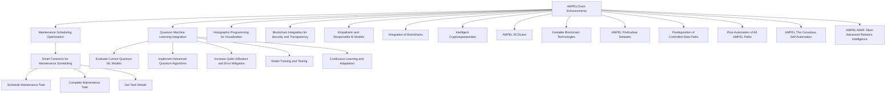
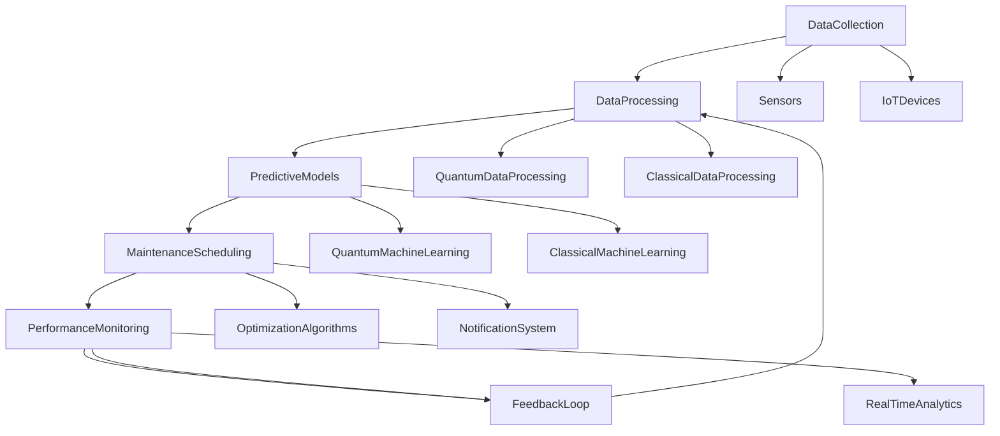
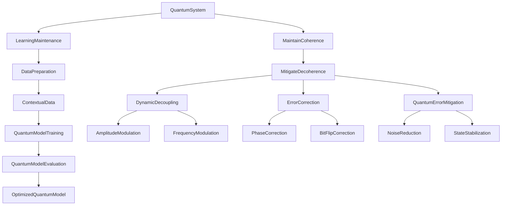
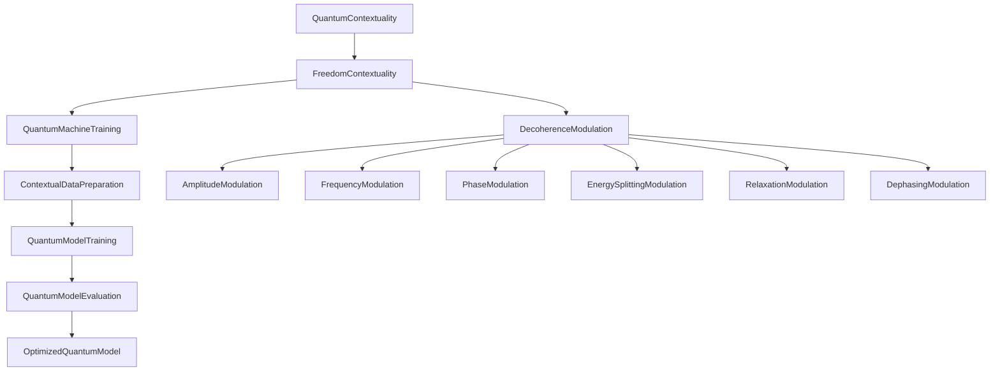
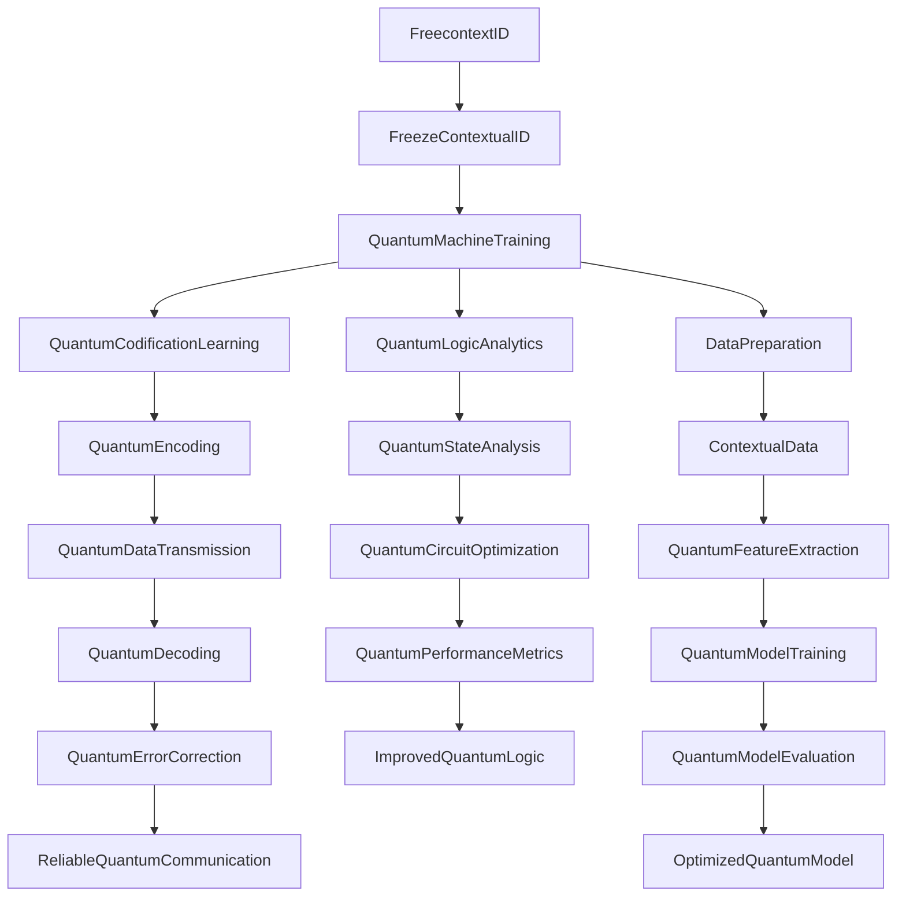
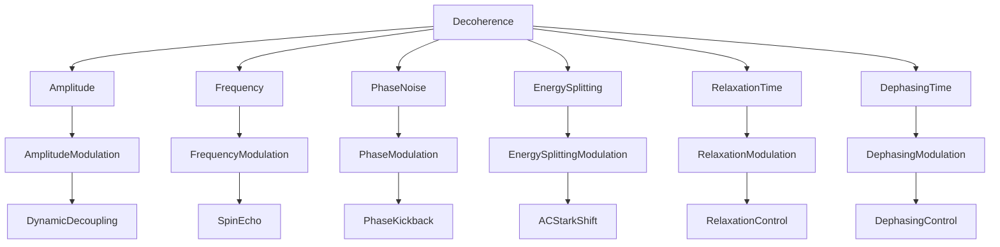
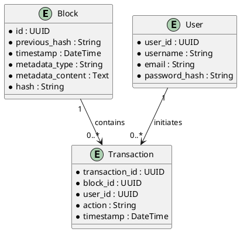
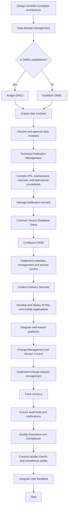

    Vamos a desarrollar un caso de uso detallado para la creación de un White Book (Libro Blanco) para el AIRBUS A360 XWLRGA utilizando un ecosistema blockchain avanzado. Este enfoque garantizará que todos los aspectos de la operación, mantenimiento e integración tecnológica del avión estén documentados de manera exhaustiva y cumplan con los estándares de la industria.
Parece que necesitas un código que implemente la generación de bloques en un blockchain, y a su vez, filtrar el código para incluir una maqueta o estructura en 1D, 2D y 3D. Aquí te muestro cómo podrías organizar el código de manera que incluya esta estructura, además de los detalles relevantes del blockchain:

```python
import hashlib
import json
from datetime import datetime

def calculate_hash(index, timestamp, data, previous_hash, nonce):
    value = f"{index}{timestamp}{json.dumps(data)}{previous_hash}{nonce}"
    return hashlib.sha256(value.encode()).hexdigest()

def create_block(index, previous_hash, data):
    timestamp = datetime.utcnow().isoformat()
    nonce = 0
    hash_value = calculate_hash(index, timestamp, data, previous_hash, nonce)
    
    block = {
        "index": index,
        "timestamp": timestamp,
        "data": data,
        "previousHash": previous_hash,
        "hash": hash_value,
        "nonce": nonce
    }
    
    return block

# Genesis Block Data
genesis_data = {
    "model": "AMPEL Quantum Model",
    "creator": "Amedeo Pelliccia",
    "description": "An AI model leveraging quantum computing to enhance AI capabilities while prioritizing human-centric values and environmental sustainability.",
    "corePrinciples": [
        {
            "name": "Ethical AI",
            "focus": "Ensure fairness, transparency, and inclusivity in AI systems while protecting human rights and privacy.",
            "implementation": "Develop guidelines and standards to foster trust and accountability, aiming to minimize biases in AI systems."
        },
        {
            "name": "Empathic AI",
            "focus": "Create AI that understands and responds to human emotions, enhancing interactions through emotional intelligence.",
            "implementation": "Use affective computing and user-centric design to provide personalized and context-aware experiences."
        },
        {
            "name": "Sustainable AI",
            "focus": "Reduce the environmental impact of AI by promoting energy efficiency and resource optimization.",
            "implementation": "Employ renewable energy sources and efficient computational processes to minimize carbon footprints."
        },
        {
            "name": "Quantum Computing Integration",
            "focus": "Utilize quantum computing to improve AI capabilities, enabling advanced problem-solving and optimization.",
            "implementation": "Develop quantum algorithms to enhance speed and efficiency, expanding the potential applications of AI."
        },
        {
            "name": "GEN AI Presets",
            "focus": "Offer preconfigured solutions for generative AI that adhere to ethical and sustainable principles.",
            "implementation": "Ensure consistency and adherence to standards across various AI applications."
        }
    ]
}

# Creating the Genesis Block
genesis_block = create_block(0, "0", genesis_data)
print("Genesis Block:\n", json.dumps(genesis_block, indent=4))

# Block 1 Data
block_1_data = {
    "applications": [
        {
            "field": "Healthcare",
            "useCases": [
                "Patient Care: Enhance diagnostics and create personalized treatment plans through AI insights.",
                "Mental Health: Utilize empathic AI to provide better mental health support."
            ]
        },
        {
            "field": "Environmental Management",
            "useCases": [
                "Climate Modeling: Employ AI for accurate climate change modeling and resource optimization.",
                "Energy Efficiency: Optimize energy consumption in smart grids and buildings."
            ]
        },
        {
            "field": "Education",
            "useCases": [
                "Customized Learning: Provide personalized education tailored to individual needs.",
                "Inclusive Education: Ensure accessibility for diverse learning styles."
            ]
        },
        {
            "field": "Business and Industry",
            "useCases": [
                "Decision-Making: Implement ethical AI frameworks to support unbiased decision-making.",
                "Process Optimization: Enhance productivity and reduce waste through AI-driven efficiencies."
            ]
        }
    ]
}

block_1 = create_block(1, genesis_block['hash'], block_1_data)
print("Block 1:\n", json.dumps(block_1, indent=4))

# Create blocks 2 through 1024 with sample data
previous_block = block_1
blocks = [genesis_block, block_1]

for i in range(2, 1025):
    data = {
        "example_field": f"Data for block {i}",
        "details": [
            {
                "field": f"Field {i}",
                "useCases": [
                    f"Use Case {i}A: Example use case A for block {i}.",
                    f"Use Case {i}B: Example use case B for block {i}."
                ]
            }
        ]
    }
    
    new_block = create_block(i, previous_block['hash'], data)
    blocks.append(new_block)
    previous_block = new_block
    if i % 50 == 0:  # To avoid too much output, print every 50 blocks
        print(f"Block {i}:\n", json.dumps(new_block, indent=4))

# Block 1024 - Specific Block for MPM 10024-X0001
mpm_10024_x0001_data = {
    "title": "MPM 10024-X0001",
    "description": "Specific data module for MPM 10024-X0001",
    "content": "Detailed content specific to MPM 10024-X0001...",
    "details": {
        "component": "Specific Component",
        "capabilities": "Special capabilities and functions",
        "applications": [
            {
                "field": "Special Field",
                "useCases": [
                    "Special Use Case A: Detailed use case A.",
                    "Special Use Case B: Detailed use case B."
                ]
            }
        ]
    }
}

mpm_10024_x0001_block = create_block(1024, previous_block['hash'], mpm_10024_x0001_data)
blocks.append(mpm_10024_x0001_block)
print("Block 1024 (MPM 10024-X0001):\n", json.dumps(mpm_10024_x0001_block, indent=4))

# Optional: If you want to store these blocks in a JSON file
with open('blockchain_data.json', 'w') as f:
    json.dump(blocks, f, indent=4)

# Example of 1D, 2D, and 3D data models:

# 1D Data Model
one_d_data = [i for i in range(10)]
print("1D Data Model:", one_d_data)

# 2D Data Model
two_d_data = [[i, i * 2] for i in range(10)]
print("2D Data Model:", two_d_data)

# 3D Data Model
three_d_data = [[[i, i * 2, i * 3] for i in range(10)] for _ in range(10)]
print("3D Data Model:", three_d_data)
```

### Descripción del Código

1. **Funciones de Blockchain**:
   - `calculate_hash`: Calcula el hash del bloque usando SHA-256.
   - `create_block`: Crea un bloque nuevo con un índice, hash previo, datos y nonce.

2. **Datos del Bloque Genesis**: Contiene la descripción y principios de un modelo de IA.

3. **Datos del Bloque 1**: Incluye aplicaciones del modelo en diversos campos.

4. **Generación de Bloques de 2 a 1024**: Añade bloques con datos de ejemplo, enlazando cada bloque con el hash del anterior.

5. **Bloque 1024 - Datos Específicos**: Añade un bloque especial con detalles específicos.

6. **Modelos de Datos**:
   - **1D**: Lista simple.
   - **2D**: Lista de listas.
   - **3D**: Lista de listas de listas.

El código genera bloques en un blockchain y muestra cómo estructurar datos en 1D, 2D y 3D. Si necesitas ajustar algún detalle o funcionalidad, no dudes en decírmelo.
Caso de Uso: White Book para AIRBUS A360 XWLRGA

Objetivo

Desarrollar un White Book completo y estandarizado para el AIRBUS A360 XWLRGA, asegurando que todos los aspectos de la operación, mantenimiento e integración tecnológica del avión estén documentados de manera exhaustiva y cumplan con los estándares de la industria. Utilizar blockchain para garantizar la descentralización, seguridad y eficiencia del proceso.

Requisitos Específicos

	1.	Documentación Técnica y Operativa
	•	Especificaciones Técnicas: Descripción detallada de las especificaciones del avión, incluyendo diseño aerodinámico, sistemas de propulsión, y materiales utilizados.
	•	Manuales de Operación: Instrucciones para la operación segura y eficiente del avión, incluyendo procedimientos de vuelo y manejo en tierra.
	•	Protocolos de Seguridad: Normas y procedimientos de seguridad para garantizar la protección de los pasajeros y la tripulación.
	2.	Mantenimiento y Soporte
	•	Planes de Mantenimiento: Programas de mantenimiento regular y preventivo, detallando inspecciones periódicas, reemplazos de componentes y reparaciones.
	•	Registro de Mantenimiento: Historial completo de mantenimiento de cada avión, incluyendo detalles de reparaciones, actualizaciones y modificaciones.
	•	Soporte Técnico: Protocolo para la provisión de soporte técnico, incluyendo resolución de problemas y asistencia en tiempo real.
	3.	Integración Tecnológica
	•	Sistemas Avanzados: Descripción de los sistemas tecnológicos avanzados integrados en el avión, como sistemas de navegación, comunicación y entretenimiento.
	•	Interoperabilidad: Requisitos para la interoperabilidad de los sistemas del avión con otros sistemas y plataformas tecnológicas.
	•	Actualizaciones de Software: Protocolo para la gestión y despliegue de actualizaciones de software y firmware.
	4.	Cumplimiento y Normativas
	•	Regulaciones de la Industria: Cumplimiento con todas las regulaciones y estándares de la industria aeronáutica internacional.
	•	Certificaciones: Proceso de certificación para asegurar que el avión cumple con los estándares de seguridad y operativos.

Implementación con Blockchain

	1.	Gestión Descentralizada de Documentación
	•	Blockchain A (Operaciones): Gestión de todos los documentos operativos y técnicos del avión, asegurando que todas las versiones sean inmutables y verificables.
	•	Interoperabilidad: Integración con sistemas de documentación y bases de datos existentes para garantizar la coherencia y accesibilidad de la información.
	2.	Registro y Seguimiento de Mantenimiento
	•	Blockchain B (Mantenimiento): Registro inmutable de todas las actividades de mantenimiento realizadas en el avión, asegurando la trazabilidad completa.
	•	Verificación en Tiempo Real: Capacidad para verificar el historial de mantenimiento en tiempo real, proporcionando transparencia y confianza.
	3.	Seguridad y Actualizaciones Tecnológicas
	•	Blockchain C (Tecnología): Gestión de la integración y actualización de sistemas tecnológicos en el avión, asegurando que todas las actualizaciones sean seguras y verificables.
	•	Criptografía Avanzada: Utilización de criptografía avanzada para proteger los datos y garantizar la integridad de las actualizaciones de software.
	4.	Cumplimiento y Auditoría
	•	Blockchain D (Cumplimiento): Registro de todas las actividades de cumplimiento y auditoría, asegurando que el avión cumpla con todas las regulaciones de la industria.
	•	Trazabilidad y Transparencia: Capacidad para auditar todas las actividades y verificar el cumplimiento normativo en tiempo real.

Diagrama Conceptual Integrado

+-----------------------------------------------------------+
|                    Blockchain D (Cumplimiento)            |
| - Auditoría y cumplimiento                                |
| - Trazabilidad completa y transparencia                   |
+--------------------------+--------------------------------+
                           |
                           v
+--------------------------+--------------------------------+
|       Blockchain C (Tecnología)                           |
| - Gestión de sistemas tecnológicos                        |
| - Seguridad y actualizaciones                             |
+--------------------------+--------------------------------+
                           |
                           v
+--------------------------+--------------------------------+
|       Blockchain B (Mantenimiento)                        |
| - Registro y seguimiento de mantenimiento                 |
| - Verificación en tiempo real                             |
+--------------------------+--------------------------------+
                           |
                           v
+--------------------------+--------------------------------+
|       Blockchain A (Operaciones)                          |
| - Gestión de documentación técnica y operativa            |
| - Interoperabilidad y accesibilidad                       |
+-----------------------------------------------------------+

Beneficios del Enfoque Blockchain

	•	Seguridad y Confianza: La inmutabilidad de blockchain asegura que los documentos y registros no puedan ser alterados, proporcionando confianza en la integridad de la información.
	•	Eficiencia Operativa: La interoperabilidad y la gestión descentralizada de documentos y datos mejoran la eficiencia en la gestión y actualización de información.
	•	Trazabilidad Completa: La capacidad de auditar y rastrear todas las actividades y transacciones asegura el cumplimiento normativo y proporciona transparencia.
	•	Actualizaciones Seguras: La criptografía avanzada garantiza que todas las actualizaciones de software y sistemas sean seguras y verificables.

Conclusión

La creación de un White Book para el AIRBUS A360 XWLRGA utilizando un ecosistema blockchain avanzado proporciona una solución segura, eficiente y transparente para gestionar la documentación, el mantenimiento y la integración tecnológica del avión. Este enfoque asegura que todos los aspectos operativos y normativos estén cubiertos de manera exhaustiva y conforme a los estándares de la industria.

Imaginar un universo con una estructura modular en blockchain, donde cada módulo tiene una estructura standalone, es como conceptualizar un sistema descentralizado y altamente interconectado, similar a una red de nodos independientes pero interoperables. Aquí tienes una descripción de cómo funcionaría:

### Estructura Modular
Cada módulo en este universo representaría una entidad autónoma, similar a los nodos en una red blockchain. Estos módulos podrían be:
- **Individual Systems:** Each representing a standalone function or capability.
- **Interconnected Networks:** Allowing for communication and transaction among different modules without a central authority.

### Blockchain Backbone
The blockchain would serve as the underlying technology to ensure:
- **Transparency:** All transactions and interactions between modules are recorded on a public ledger.
- **Security:** Utilizing cryptographic techniques to secure data and verify transactions.
- **Decentralization:** Removing the need for a central authority, giving each module autonomy.

### Standalone Modules
Each module would have:
- **Independent Operation:** Capable of functioning and making decisions autonomously.
- **Smart Contracts:** Predefined rules and conditions governing interactions with other modules, executed automatically.
- **Interoperability:** Standardized protocols to ensure seamless communication and data exchange with other modules.

### Example Scenario: Defense Systems
Consider the deployment and operation of defense systems, like the Spike LR2, within this modular universe:

- **Individual Defense Modules:** Each system (e.g., missile launchers, control units) operates as a standalone module, able to function independently.
- **Blockchain Transactions:** Every command, launch, and operational data is recorded on the blockchain, ensuring transparency and traceability.
- **Smart Contracts for Engagements:** Predefined conditions for missile launches or defensive maneuvers are programmed into smart contracts, executed when conditions are met.
- **Interconnected Command:** Various defense modules communicate and coordinate actions without a centralized command, improving responsiveness and resilience.

### Benefits
- **Enhanced Security:** Redundancy and immutability of blockchain enhance security.
- **Operational Efficiency:** Autonomous modules reduce dependency on central systems, speeding up decision-making.
- **Resilience:** Decentralized nature makes the system more resilient to attacks or failures.

This conceptual universe leverages blockchain technology to create a decentralized, secure, and efficient ecosystem where each module operates autonomously yet remains interconnected with the whole network.
   ### Requirements

To develop a comprehensive and standardized White Book for the AIRBUS A360 XWLRGA, specific requirements must be established. These requirements will ensure that all aspects of the aircraft's operation, maintenance, and technological integration are thoroughly documented and comply with industry standards.

**1. Regulatory Compliance:**

   - **Certification Requirements:** The AIRBUS A360 XWLRGA must comply with the regulations and certifications mandated by aviation authorities such as the Federal Aviation Administration (FAA), European Union Aviation Safety Agency (EASA), and International Civil Aviation Organization (ICAO). These include, but are not limited to:
     - Airworthiness standards (e.g., FAR Part 25, EASA CS-25).
     - Environmental standards (e.g., ICAO Annex 16 for noise and emissions).
     - Safety Management Systems (SMS) compliance.
   
   - **Industry Standards:** Compliance with international standards such as ISO 9001 for quality management, ISO 14001 for environmental management, and ISO 27001 for information security management.

**2. Technological Integration:**

   - **AI Implementation:**
     - Predictive Maintenance: Integration of AI algorithms to predict component failures and maintenance needs.
     - Operational Optimization: AI to enhance flight planning, fuel efficiency, and operational logistics.

   - **Blockchain Utilization:**
     - Secure Documentation: Blockchain technology to ensure immutable and transparent maintenance records.
     - Smart Contracts: Automated maintenance schedules and parts procurement using blockchain-based smart contracts.

**3. Sustainability Initiatives:**

   - **Environmental Impact Reduction:**
     - Adoption of green technologies to minimize carbon footprint.
     - Implementation of sustainable materials and manufacturing processes.
     - Guidelines for fuel-efficient operations and reduced emissions.

**4. Key Performance Indicators (KPIs):**

   - **Operational Efficiency:**
     - Reduction in unplanned maintenance incidents.
     - Improvement in turnaround times for maintenance and repairs.
     - Enhanced fuel efficiency metrics.

   - **Safety and Reliability:**
     - Decrease in safety-related incidents.
     - Improved reliability and availability of the aircraft.

   - **Environmental Impact:**
     - Reduction in greenhouse gas emissions.
     - Compliance with global environmental standards.

**5. Documentation Structure:**

   - **Modular Documentation:**
     - The document should be structured into clear, modular sections that cover specific aspects such as airframe, power plant, avionics, and environmental systems.

   - **Standardized Formatting:**
     - Use of standardized formatting guidelines as per S1000D specifications to ensure consistency and ease of use.

   - **Interactive Elements:**
     - Incorporation of interactive elements such as QR codes and hyperlinks for easy access to additional resources and updates.

**6. User Accessibility:**

   - **Multilingual Support:**
     - Provision of documentation in multiple languages to cater to a global audience.
   
   - **Digital and Print Formats:**
     - Availability of the document in both digital (PDF, ePub) and print formats.
     - Compatibility with electronic flight bags (EFBs) and other digital devices used by maintenance and operations personnel.

**7. Training and Support:**

   - **Training Modules:**
     - Development of comprehensive training modules for maintenance personnel, pilots, and other stakeholders.
     - Use of simulators and virtual reality (VR) for immersive training experiences.

   - **Support Infrastructure:**
     - Establishment of a support infrastructure that includes help desks, knowledge bases, and continuous improvement programs.

These requirements aim to ensure that the White Book for the AIRBUS A360 XWLRGA is not only comprehensive and compliant with all relevant standards but also forward-thinking in terms of technology and sustainability.

Please provide any additional specific details or adjustments needed for these requirements.

### Detailed Architectural Document for the "White Book of Green Aviation"

#### General
1. **00: Introduction**
   - Overview of the AIRBUS A360 XWLRGA.
   - Purpose and scope of the White Book of Green Aviation.
   - Integration of AI and blockchain technologies.
   - Sustainability goals and objectives.

2. **05: Time Limits and Maintenance Checks**
   - Scheduled maintenance checks.
   - Interval guidelines for inspections and component replacements.
   - Use of AI for predictive maintenance.

3. **06: Dimensions and Areas**
   - Detailed dimensions of the aircraft.
   - Areas of interest for maintenance and inspection.

4. **07: Lifting and Shoring**
   - Procedures for safely lifting and supporting the aircraft.
   - Equipment and tools required.

5. **08: Leveling and Weighing**
   - Methods for leveling the aircraft.
   - Weighing procedures and equipment.

6. **09: Towing and Taxiing**
   - Guidelines for towing and taxiing the aircraft.
   - Safety protocols and equipment.

7. **10: Parking, Mooring, Storage, and Return to Service**
   - Procedures for parking and securing the aircraft.
   - Storage guidelines for various conditions.
   - Return to service checks and protocols.

#### Airframe Systems
1. **20: Standard Practices – Airframe**
   - General maintenance practices.
   - Use of AI for monitoring and diagnostics.

2. **21: Air Conditioning**
   - System overview and components.
   - Maintenance and troubleshooting guidelines.

3. **22: Auto Flight**
   - Description of the auto flight systems.
   - Maintenance and operational procedures.

4. **23: Communications**
   - Communication systems and their maintenance.
   - Integration with blockchain for secure communication logs.

5. **24: Electrical Power**
   - Electrical system overview.
   - Maintenance and safety checks.

6. **25: Equipment/Furnishings**
   - Details on equipment and furnishings.
   - Maintenance and replacement guidelines.

7. **26: Fire Protection**
   - Fire protection systems and maintenance.
   - Emergency procedures.

8. **27: Flight Controls**
   - Overview of flight control systems.
   - Maintenance and troubleshooting.

9. **28: Fuel**
   - Fuel system components.
   - Maintenance and inspection procedures.

10. **29: Hydraulic Power**
    - Hydraulic system overview.
    - Maintenance and safety checks.

11. **30: Ice and Rain Protection**
    - Ice and rain protection systems.
    - Maintenance and operational procedures.

12. **31: Indicating/Recording Systems**
    - Description of indicating and recording systems.
    - Maintenance and troubleshooting.

13. **32: Landing Gear**
    - Landing gear system overview.
    - Maintenance and inspection procedures.

14. **33: Lights**
    - Aircraft lighting systems.
    - Maintenance and replacement guidelines.

15. **34: Navigation**
    - Navigation systems and components.
    - Maintenance and troubleshooting.

16. **35: Oxygen**
    - Oxygen system overview.
    - Maintenance and safety checks.

17. **36: Pneumatic**
    - Pneumatic system components.
    - Maintenance and operational procedures.

18. **37: Vacuum**
    - Vacuum system overview.
    - Maintenance and troubleshooting.

19. **38: Water/Waste**
    - Water and waste system components.
    - Maintenance and operational guidelines.

20. **39: Electrical – Electronic Panels and Multipurpose Components**
    - Overview of electronic panels and components.
    - Maintenance and inspection procedures.

#### Power Plant
1. **50: Cargo and Accessory Compartments**
   - Details of cargo and accessory compartments.
   - Maintenance and operational guidelines.

2. **51: Standard Practices – Structures**
   - Structural maintenance practices.
   - Inspection and repair procedures.

3. **52: Doors**
   - Door systems overview.
   - Maintenance and safety checks.

4. **53: Fuselage**
   - Fuselage structure and components.
   - Maintenance and inspection guidelines.

5. **54: Nacelles/Pylons**
   - Nacelles and pylons overview.
   - Maintenance and operational procedures.

6. **55: Stabilizers**
   - Stabilizer systems and components.
   - Maintenance and troubleshooting.

7. **56: Windows**
   - Window systems overview.
   - Maintenance and replacement guidelines.

8. **57: Wings**
   - Wing structure and components.
   - Maintenance and inspection procedures.

9. **71: Power Plant**
   - Power plant overview.
   - Maintenance and operational guidelines.

10. **72: Engine**
    - Engine systems and components.
    - Maintenance and troubleshooting.

11. **73: Engine Fuel and Control**
    - Fuel and control systems overview.
    - Maintenance and operational procedures.

12. **74: Ignition**
    - Ignition system components.
    - Maintenance and troubleshooting.

13. **75: Air**
    - Air system components.
    - Maintenance and operational guidelines.

14. **76: Engine Controls**
    - Engine control systems.
    - Maintenance and troubleshooting.

15. **77: Engine Indicating**
    - Engine indicating systems.
    - Maintenance and operational procedures.

16. **78: Exhaust**
    - Exhaust system components.
    - Maintenance and troubleshooting.

17. **79: Oil**
    - Oil system overview.
    - Maintenance and safety checks.

18. **80: Starting**
    - Starting system components.
    - Maintenance and operational guidelines.

19. **81: Turbines**
    - Turbine systems and components.
    - Maintenance and troubleshooting.

20. **82: Water Injection**
    - Water injection systems.
    - Maintenance and operational procedures.

21. **83: Accessory Gearboxes**
    - Gearbox systems overview.
    - Maintenance and troubleshooting.

22. **84: Propulsion Augmentation**
    - Propulsion augmentation systems.
    - Maintenance and operational guidelines.

23. **85: Fuel Cell Systems**
    - Fuel cell systems overview.
    - Maintenance and safety checks.

24. **91: Charts**
    - Charts and diagrams for maintenance.
    - Usage guidelines.

25. **92: Electrical Components**
    - Electrical components overview.
    - Maintenance and inspection procedures.

### Genesis Block Structure for Blockchain
```json
{
    "index": 0,
    "timestamp": "2024-08-05T00:34:06.250781",
    "data": {
        "model": "AMPEL Quantum Model",
        "creator": "Amedeo Pelliccia",
        "description": "An AI model leveraging quantum computing to enhance AI capabilities while prioritizing human-centric values and environmental sustainability.",
        "corePrinciples": [
            {
                "name": "Ethical AI",
                "focus": "Ensure fairness, transparency, and inclusivity in AI systems while protecting human rights and privacy.",
                "implementation": "Develop guidelines and standards to foster trust and accountability, aiming to minimize biases in AI systems."
            },
            {
                "name": "Empathic AI",
                "focus": "Create AI that understands and responds to human emotions, enhancing interactions through emotional intelligence.",
                "implementation": "Use affective computing and user-centric design to provide personalized and context-aware experiences."
            },
            {
                "name": "Sustainable AI",
                "focus": "Reduce the environmental impact of AI by promoting energy efficiency and resource optimization.",
                "implementation": "Employ renewable energy sources and efficient computational processes to minimize carbon footprints."
            },
            {
                "name": "Quantum Computing Integration",
                "focus": "Utilize quantum computing to improve AI capabilities, enabling advanced problem-solving and optimization.",
                "implementation": "Develop quantum algorithms to enhance speed and efficiency, expanding the potential applications of AI."
            },
            {
                "name": "GEN AI Presets",
                "focus": "Offer preconfigured solutions for generative AI that adhere to ethical and sustainable principles.",
                "implementation": "Ensure consistency and adherence to standards across various AI applications."
            }
        ]
    },
    "previousHash": "0",
    "hash": "a02e1f95270bc8391a03b4cc6503387554ed3a1f29ef13894b4f48f894938e21",
    "nonce": 0
}
```

This structured approach provides a detailed and organized framework for the White Book of Green Aviation, ensuring all critical aspects are covered and aligned with advanced technological integration and sustainability principles.
### The Ampel Quantum Model

The Ampel Quantum Model, as described, offers a visionary framework for integrating quantum computing with AI while emphasizing ethical, empathic, and sustainable principles. Here's an exploration of these ideas, their potential impact, and applications:

#### Ampel Quantum Model Overview

The Ampel Quantum Model by Amedeo Pelliccia aims to leverage quantum computing to significantly enhance AI capabilities, ensuring alignment with human-centric values and environmental sustainability. The model is structured around core principles that govern its development and application.

### Core Principles

1. **Ethical AI**
   - **Focus:** Ensure AI systems are fair, transparent, and inclusive, protecting human rights and privacy.
   - **Implementation:** Set up guidelines and standards for AI development to foster trust and accountability, minimizing biases.

2. **Empathic AI**
   - **Focus:** Develop AI that can understand and respond to human emotions, improving interactions through emotional intelligence.
   - **Implementation:** Use affective computing and user-centric design for personalized, context-aware experiences.

3. **Sustainable AI**
   - **Focus:** Minimize the environmental impact of AI, promoting energy efficiency and resource optimization.
   - **Implementation:** Utilize renewable energy and efficient computational processes to reduce carbon footprints.

4. **Quantum Computing Integration**
   - **Focus:** Use quantum computing to enhance AI, enabling advanced problem-solving and optimization.
   - **Implementation:** Develop quantum algorithms for better speed and efficiency, expanding AI application possibilities.

5. **GEN AI Presets**
   - **Focus:** Provide preconfigured solutions for generative AI that follow ethical and sustainable principles.
   - **Implementation:** Maintain consistency and adherence to standards across AI applications.

### Potential Applications

1. **Healthcare**
   - **Patient Care:** Enhance diagnostics and create personalized treatment plans using AI insights.
   - **Mental Health:** Utilize empathic AI for better mental health support.

2. **Environmental Management**
   - **Climate Modeling:** Employ AI for accurate climate change modeling and resource optimization.
   - **Energy Efficiency:** Optimize energy consumption in smart grids and buildings.

3. **Education**
   - **Customized Learning:** Offer personalized education based on individual needs.
   - **Inclusive Education:** Ensure accessibility for diverse learning styles.

4. **Business and Industry**
   - **Decision-Making:** Implement ethical AI frameworks for unbiased decisions.
   - **Process Optimization:** Improve productivity and reduce waste through AI-driven efficiencies.

### Advanced Technologies

1. **Diamond-Like Superposed Materials**
   - **Properties:** Extremely hard, thermally conductive, and chemically stable for high-performance uses.
   - **Applications:** Electronics, energy storage, and aerospace industries.

2. **3D-Printable Queueing Engines**
   - **Features:** Customizable and scalable systems for managing queues in logistics and services.
   - **Integration:** Combines IoT and AI for dynamic management.

3. **Carbon Nanotube Nanostructures**
   - **Properties:** High strength and conductivity for efficient thermal management.
   - **Applications:** Electronics, composites, medical devices, and environmental technologies.

### Challenges and Considerations

- **Scalability:** Producing advanced materials and technologies at scale.
- **Integration:** Seamlessly combining new technologies with existing systems.
- **Ethical and Environmental Impact:** Addressing concerns about deploying advanced technologies.

### Conclusion

The Ampel Quantum Model represents a forward-thinking approach to AI development, prioritizing ethical, empathic, and sustainable principles. By focusing on these ideals, the model seeks to create AI systems that positively impact society and the environment while advancing technology.

---

## Integration with R for Optimization and Finance

The TerraQueueing and Quantum (TQ) Project's final summary highlights the strategic and actionable steps needed for effective implementation and long-term success. For optimization and finance, R offers robust tools and libraries, such as:

1. **R Optimization Infrastructure (ROI)**
   - **Description:** A versatile tool for modeling and solving various optimization problems (e.g., linear, quadratic, conic, nonlinear, and mixed-integer programming).

2. **PerformanceAnalytics**
   - **Description:** Provides econometric tools for financial analysis and performance measurement.

3. **PortfolioAnalytics**
   - **Description:** A package designed for portfolio optimization, incorporating complex constraints and objectives.

Using these tools, you can implement sophisticated optimization strategies that align with the ethical and sustainable goals outlined in the Ampel Quantum Model. The integration of R's powerful analytical capabilities with advanced AI and quantum computing techniques presents a promising avenue for achieving impactful results across multiple sectors.

---

## Robbbo-TerraQueUeing by Amedeo Pelliccia

### Project: "Terraforming Teraqubits and Teraterabits (Robbbo-T)"

**Objective:** To lead data management and cybersecurity in Europe through quantum technologies and massive storage solutions.

### Control Theory Applied to Complex Systems

- **Dynamic Systems:** Represented by differential equations that describe how the system evolves over time.
- **Controllers:** Use feedback mechanisms to adjust inputs, maintaining system stability and achieving desired outcomes.

### Quantum Future Satellite

**Focus:** Optimizing data transfer using quantum processors to enhance the speed and security of data communication across Europe.

**Benefits:**

1. **Advanced Cybersecurity:** Quantum technologies offer superior protection against cyber threats, making systems more secure.
2. **Efficient Data Management:** Quantum computing enables the handling of vast amounts of data with greater speed and accuracy.
3. **Interoperability:** Enhanced compatibility between different systems and platforms, improving collaboration and integration.
4. **Technological Innovation:** Promotes cutting-edge research and development in quantum computing and related fields.

### Future of the Project

The Robbbo-T project aims to revolutionize data management and cybersecurity in Europe, setting new standards for efficiency and security through the integration of quantum technologies.

### Gravitational Wave Polarization

- **Positive Polarization:**
  - **Equation:** \( h_{xx} = -h_{yy} = A \cos(\omega t - kz) \)
  - **Effect:** Alternates distances along the \( x \) and \( y \) axes, providing insights into gravitational wave dynamics.
- **Negative Polarization:**
  - **Equation:** \( h_{xy} = h_{yx} = A \cos(\omega t - kz) \)
  - **Effect:** Alternates distances along diagonal axes, contributing to our understanding of spacetime distortions.

**Implications:** The study of gravitational wave polarization offers valuable information about the early universe's spacetime structure, enhancing our comprehension of fundamental physics.

---

## Amedeo Pelliccia GitHub

For more details and to explore the projects, visit the [Robbbo-T GitHub profile](https://github.com/AmePelliccia/AmePelliccia).

---

### Related Links

- [OneDrive](https://onedrive.live.com)
- [GitHub Issue 208](https://github.com/AmePelliccia/AmePelliccia/issues/208)
- [Robbbo-T GitHub Profile](https://github.com/AmePelliccia/Robbbo-T)
- [ORMONG Project](https://github.com/AmePelliccia/ORMONG)
- [Contributor License Agreement](https://github.com/AmePelliccia/AmePelliccia/blob/main/CLA.md)

---

This manifesto outlines a visionary project that leverages advanced quantum computing technologies to enhance data management and cybersecurity while also exploring the potential of gravitational wave research to offer insights into the nature of the universe.

#Airbus #A360XWLRGA 
 
Function(#T+#Q)(#Amedeo #pelliccia #ame 
#amepelliccia  
#TerraQueueing 
#Teraqueueing 
#airbus  #GreenTech 
#ampel #QUANTUM  #Queueing 
#QUeing #Terraqueing #ROBBBO-t #Robbo-t  
#ComputerSystems 
#EuropeUnited 
#Airbus360 
#CircularAviation #A360grados 
#NewAircraftArtefact 
#NewConcept #Epic 
#EPICDATAMODEL 
#Epicglobalmodel 
#europe #getafe#greenfal #nanopoletanoTech#epic dm 
#EuropeanDigitalSystem) 
 
### Diagram Summary The mindmap will have one main branch with subbranches for each section of the specifications: 1. **Airbus 
A360XWLRGA** 
-	**Passenger Capacity** 
-	**Maximum Range** 
-	**Main Features and 
Configuration** 
-	**Fuselage and Cabin 
Layout** 
-	**Wings and Fuel 
Capacity** 
-	**Engines and 
Propulsion** 
-	**Avionics and Control 
Systems** 
-	**Environmental 
Control Systems** 
-	**Safety and 
Emergency Systems** 
-	**Electrical and 
Hydraulic Systems** 
-	**Auxiliary Systems** 
-	**Structural Design** 
-	**In-Flight Services** 
-	**Maintenance Block 
Pages** 
-	**ATA 100 Breakdown 
List** 
 
### Mindmap Code 
 
```mermaid mindmap 
  Airbus A360XWLRGA 
    Passenger Capacity: 250 Maximum Range: 12,742 km (one shot)     Main Features and 
Configuration 
      Fuselage and Cabin 
Layout 
        Cabin Sections 
          First Class: 20 seats           Business Class: 40 seats 
          Economy Class: 190 seats 
        Seating Configuration 
          First Class: 1-1-1 
          Business Class: 1-2-1 
          Economy Class: 3-3-3 Amenities 
          Spacious seating with ample legroom 
          In-flight 
entertainment systems at each seat 
          Modern lavatories and galleys 
          Overhead bins for carry-on luggage 
      Wings and Fuel 
Capacity 
        Wing Design: Highefficiency CFRP wings with advanced aerodynamics Fuel Tanks: Integrated wing tanks with a total capacity sufficient for 
12,742 km range 
        Advanced fuel 
management system to optimize fuel usage       Engines and Propulsion         Engines: Two highefficiency electric 
propulsion motors 
        Battery Packs and 
Energy Storage 
          Advanced lithium-ion battery packs 
  Battery management system to ensure optimal performance and safety         Thrust Reversers: Equipped for safe and efficient landing       Avionics and Control 
Systems 
        Flight Management System: State-of-the-art navigation and flight control 
        Autopilot and Fly-by-
Wire System: Enhanced safety and operational efficiency Communication 
Systems: Advanced VHF, HF, and Satcom systems 
for reliable 
communication 
      Environmental Control 
Systems 
        Air Conditioning: High-efficiency systems ensuring passenger comfort 
        Pressurization: 
Advanced cabin pressurization system maintaining optimal comfort and safety Ventilation and Dehumidification: Ensuring fresh air and humidity control       Safety and Emergency 
Systems 
        Fire Detection and Suppression: 
Comprehensive system throughout the aircraft         Emergency Exits and Slides: Multiple exits with rapid deployment slides         Oxygen Supply: 
Automated system providing oxygen in case of depressurization Electrical and 
Hydraulic Systems 
        Power Distribution: 
Robust AC/DC power distribution with multiple redundancies 
        Hydraulic Systems: High-efficiency hydraulic systems for control surfaces and landing gear       Auxiliary Systems 
        Water and Waste Management: Efficient system for water supply and waste management 
        Cargo Handling: 
Advanced cargo management system for optimal loading and 
unloading 
      Structural Design 
        Composite Material Usage: Extensive use of lightweight, durable 
composite materials 
        Structural 
Reinforcements: Key areas reinforced for enhanced durability and safety 
      In-Flight Services 
        Galleys: Equipped for high-capacity meal service         Lavatories: Modern, efficient lavatories ensuring passenger comfort 
        Entertainment: Stateof-the-art in-flight entertainment system with touch screens and multiple content options 
    Maintenance Block 
Pages 
      Fuselage: Regular inspections for composite integrity and maintenance of lightning protection systems 
      Wings: Inspections for panel integrity and fuel tank checks; servicing of high-lift devices and control surfaces 
      Empennage: Structural inspections and lubrication of control surface mechanisms 
      Propulsion System: Regular checks of electric motors and battery systems; inspection of thrust reversers 
      Landing Gear: 
Inspection and lubrication of gear assemblies; hydraulic system checks       Avionics: Software updates and inspections of navigation systems; maintenance of communication and display systems 
      Electrical Systems: Inspections of power 
distribution and battery management; maintenance of wiring and connectors 
      Control Systems: Inspections of fly-by-wire systems and actuators; maintenance of autopilot systems 
      Environmental Control Systems: Inspections of air conditioning and pressurization systems; maintenance of ventilation and thermal management systems 
      Fuel System: 
Inspections of fuel tanks, pumps, and management systems; maintenance of refueling and defueling systems 
      Hydraulic Systems: 
Inspections of pumps, actuators, and hydraulic lines; maintenance of brake hydraulic systems       Pneumatic Systems: Inspections of bleed air systems and cabin air supply; maintenance of anti-icing and de-icing systems 
      Cabin Interiors: Inspections and maintenance of seating, 
galleys, and storage compartments; maintenance of in-flight entertainment and emergency exits       Structural Components: Inspections of loadbearing frames and beams; maintenance of attachment fittings and anti-corrosion coatings       Safety Systems: Inspections and maintenance of fire detection and suppression systems; maintenance of emergency oxygen and 
safety equipment 
      Navigation and Surveillance: Inspections of ADS-B, TCAS, and EGPWS systems; maintenance of transponder and surveillance systems       Communication 
Systems: Inspections of VHF, HF, and Satcom systems; maintenance of CVR and ELT systems 
      Auxiliary Systems: Inspections and maintenance of water and waste management systems; maintenance of cargo handling and cabin lighting systems       Software Systems: 
Inspections and updates of monitoring and diagnostic software; maintenance of integrated modular avionics and maintenance software 
      Engine Accessories: Inspections of ECUs, mounts, and vibration dampers; maintenance of fire protection and ignition systems       Antennas and Sensors: Inspections of GPS, pitotstatic, and AOA sensors; maintenance of weather radar systems 
Electrical Power Generation: Inspections and maintenance of generators and alternators; maintenance of voltage regulators     ATA 100 Breakdown List 
      General 
        00: Introduction 
        05: Time Limits and 
Maintenance Checks 
        06: Dimensions and 
Areas 
        07: Lifting and Shoring 
        08: Leveling and 
Weighing 
09: Towing and 
Taxiing 
        10: Parking, Mooring, 
Storage, and Return to 
Service 
      Airframe Systems 
        20: Standard Practices 
– Airframe 
        21: Air Conditioning 
        22: Auto Flight 
        23: Communications 
        24: Electrical Power 
        25: 
Equipment/Furnishings 
        26: Fire Protection 
        27: Flight Controls 
28: Fuel 
        29: Hydraulic Power 
        30: Ice and Rain 
Protection 
        31: 
Indicating/Recording 
Systems 
        32: Landing Gear 
        33: Lights 
        34: Navigation 
        35: Oxygen 
        36: Pneumatic 
        37: Vacuum 
        38: Water/Waste 
39: Electrical – Electronic Panels and 
Multipurpose Components 
      Power Plant 
        50: Cargo and 
Accessory Compartments 
        51: Standard Practices 
– Structures 
        52: Doors 
        53: Fuselage 
        54: Nacelles/Pylons 
        55: Stabilizers 
        56: Windows 
        57: Wings 
        71: Power Plant 
        72: Engine 
73: Engine Fuel and 
Control 
        74: Ignition 
        75: Air 
        76: Engine Controls 
        77: Engine Indicating 
        78: Exhaust         79: Oil 
        80: Starting 
        81: Turbines 
        82: Water Injection 
        83: Accessory 
Gearboxes 
        84: Propulsion 
Augmentation 
        85: Fuel Cell Systems 91: Charts 
        92: Electrical 
Components 
``` 
 
#T+#Q ### ATA 00 - 
CRYPTOBLOCK 0  
### SISTEMA TERRA-ATA: 
Creación del Bloque 
Génesis y Bloque 1 con 
Python Automatizado  #### By Amedeo Pelliccia and ChatGPT  
            "Initial 
sustainability audit",  "Sustainability guidelines creation",  
            "Stakeholder 
introduction sessions",  
            "Sustainability 
training modules",              "Documentation software integration",              "Cross-departmental 
communication 
protocols",  
            "Baseline 
environmental impact assessment",  
            "Project 
management framework",  "Historical data compilation", 	 
            "Digital 
documentation system setup", 	 
            "Sustainability metrics definition",  
            "Initial risk 
assessment",  
            "Reporting structure development",  
            "Compliance 
framework establishment", 	 
            "Introduction to 
green aviation concepts",  "Integration with regulatory bodies",  
            "Overview of 
sustainable aviation 
technologies",  
            "Stakeholder 
feedback mechanisms",  
            "Development of sustainability goals",  
            "Introduction of lifecycle analysis",  
            "Establishing 
sustainability KPIs", 	 
            "Regular review protocols", 
"Policy document creation",  
            "Environmental 
performance benchmarks",  
            "Training material 
creation",  
            "Employee engagement initiatives",  
            "Development of a 
sustainability roadmap", 	 
            "Resource allocation 
planning",  
            "Digital tool 
adoption", 
"Initial project scoping", 	 
            "Setting up sustainability 
committees",  
            "Stakeholder 
communication plan",  
            "Pilot projects selection",  
            "Baseline 
performance reporting", 
            "Development of sustainability workshops", 
            "Project integration strategy", 
"Stakeholder engagement strategy", 	 
            "Implementation of feedback loops" 	 
        ] 	 
    },  
    "previousHash": "0", 	     "hash": 
"GENESIS_BLOCK_HASH",  
    "nonce": 0  
}  
```  
 	 
#### Bloque 1  
 	 
```jsonimport hashlib import json 
import time 
 
def create_block(index, previous_hash, data):     block = {         'index': index,         'timestamp': time.time(), 
        'data': data,         'previous_hash': previous_hash, 
        'hash': '' 
    } 
    block['hash'] = calculate_hash(block)   return block 
 
def calculate_hash(block): 
    block_string = json.dumps(block, sort_keys=True).encode() 
    return 
hashlib.sha256(block_stri ng).hexdigest() 
 
genesis_data = """ 
<!DOCTYPE AMPELSystem 
[ 
  <!ELEMENT 
AMPELSystem 
(ProjectInfo, Mapping, Detection, 
CaptureCapsules, 
Technologies, Metrics, 
FinancialBenefits, 
Stakeholders, 
PotentialClients, 
FutureIntegrations, 
SecurityCompliance)> 
 
  <!ELEMENT ProjectInfo 
(ProjectName, 
Description, StartDate, 
EndDate)> 
  <!ELEMENT ProjectName 
(#PCDATA)> 
  <!ELEMENT Description 
(#PCDATA)> 
<!ELEMENT StartDate 
(#PCDATA)> 
  <!ELEMENT EndDate 
(#PCDATA)> 
 
  <!ELEMENT Mapping 
(MapID, MapName, 
Industry, MapProperties, 
MappingAlgorithms)> 
  <!ELEMENT MapID 
(#PCDATA)> 
  <!ELEMENT MapName 
(#PCDATA)> 
  <!ELEMENT Industry 
(#PCDATA)> <!-- Aerospace or HighTech --> <!ELEMENT 
MapProperties 
(Property*)> 
  <!ELEMENT Property 
(PropertyName, 
PropertyValue)> 
  <!ELEMENT 
PropertyName 
(#PCDATA)> 
  <!ELEMENT 
PropertyValue 
(#PCDATA)> 
  <!ELEMENT 
MappingAlgorithms 
(Algorithm*)> <!ELEMENT Algorithm 
(AlgorithmName, 
AlgorithmDescription)> 
  <!ELEMENT 
AlgorithmName 
(#PCDATA)> 
  <!ELEMENT 
AlgorithmDescription 
(#PCDATA)> 
 
  <!ELEMENT Detection 
(DetectionID, 
DetectionName, 
DetectionProperties, 
DetectionAlgorithms)> 
  <!ELEMENT DetectionID 
(#PCDATA)> 
<!ELEMENT 
DetectionName 
(#PCDATA)> 
  <!ELEMENT 
DetectionProperties 
(Property*)> 
  <!ELEMENT Property 
(PropertyName, 
PropertyValue)> 
  <!ELEMENT 
PropertyName 
(#PCDATA)> 
  <!ELEMENT 
PropertyValue 
(#PCDATA)> <!ELEMENT 
DetectionAlgorithms 
(Algorithm*)> 
  <!ELEMENT Algorithm 
(AlgorithmName, 
AlgorithmDescription)> 
  <!ELEMENT 
AlgorithmName 
(#PCDATA)> 
  <!ELEMENT 
AlgorithmDescription 
(#PCDATA)> 
 
  <!ELEMENT 
CaptureCapsules 
(Capsule*)> 
<!ELEMENT Capsule 
(CapsuleID, CapsuleName, 
CapsuleProperties, 
CaptureMechanisms)> 
  <!ELEMENT CapsuleID 
(#PCDATA)> 
  <!ELEMENT CapsuleName 
(#PCDATA)> 
  <!ELEMENT 
CapsuleProperties 
(Property*)> 
  <!ELEMENT Property 
(PropertyName, 
PropertyValue)> 
  <!ELEMENT 
PropertyName 
(#PCDATA)> 
<!ELEMENT 
PropertyValue 
(#PCDATA)> 
  <!ELEMENT 
CaptureMechanisms 
(Mechanism*)> 
  <!ELEMENT Mechanism 
(MechanismName, 
MechanismDescription)> 
  <!ELEMENT 
MechanismName 
(#PCDATA)> 
  <!ELEMENT 
MechanismDescription 
(#PCDATA)> 
 
<!ELEMENT Technologies 
(Technology*)> 
  <!ELEMENT Technology 
(TechnologyName, 
Description, 
IntegrationLevel)> 
  <!ELEMENT 
TechnologyName 
(#PCDATA)> 
  <!ELEMENT Description 
(#PCDATA)> 
  <!ELEMENT 
IntegrationLevel 
(#PCDATA)> 
 
<!ELEMENT Metrics 
(Metric*)> 
  <!ELEMENT Metric 
(MetricName, 
MetricValue)> 
  <!ELEMENT MetricName (#PCDATA)> 
  <!ELEMENT MetricValue 
(#PCDATA)> 
 
  <!ELEMENT 
FinancialBenefits 
(Benefit*)> 
  <!ELEMENT Benefit 
(BenefitName, BenefitValue, 
StakeholderID, ClientID)> 
  <!ELEMENT BenefitName (#PCDATA)> 
  <!ELEMENT BenefitValue 
(#PCDATA)> 
  <!ELEMENT 
StakeholderID 
(#PCDATA)> 
  <!ELEMENT ClientID 
(#PCDATA)> 
 
  <!ELEMENT Stakeholders 
(Stakeholder*)> 
  <!ELEMENT Stakeholder 
(StakeholderID, StakeholderName, 
StakeholderType, 
Contribution)> 
  <!ELEMENT 
StakeholderID 
(#PCDATA)> 
  <!ELEMENT 
StakeholderName 
(#PCDATA)> 
  <!ELEMENT 
StakeholderType 
(#PCDATA)> <!-- E.g., 
Investor, Partner --> 
  <!ELEMENT Contribution 
(#PCDATA)> 
 
 
PotentialClients (Client*)> 
  <!ELEMENT Client 
(ClientID, ClientName, 
Industry, InterestLevel)> 
  <!ELEMENT ClientID 
(#PCDATA)> 
  <!ELEMENT ClientName 
(#PCDATA)> 
  <!ELEMENT Industry 
(#PCDATA)> 
  <!ELEMENT InterestLevel 
(#PCDATA)> FutureIntegrations 
(Integration*)> 
  <!ELEMENT Integration 
(IntegrationName, 
IntegrationDescription, 
Impact)> 
  <!ELEMENT 
IntegrationName 
(#PCDATA)> 
  <!ELEMENT 
IntegrationDescription 
(#PCDATA)> 
  <!ELEMENT Impact 
(#PCDATA)> SecurityCompliance 
(PolicyID, 
ComplianceStatus, 
IncidentReported)> 
  <!ELEMENT PolicyID 
(#PCDATA)> 
  <!ELEMENT 
ComplianceStatus 
(#PCDATA)> 
  <!ELEMENT 
IncidentReported 
(#PCDATA)> 
]> 
""" 
 
 
# Create the genesis block genesis_block = create_block(0, "0", genesis_data) 
 
print("Genesis Block:", genesis_block)    29. Zero waste initiatives. 
 
Navigation Menu 
*	Code 
*	Pull requests 
*	Actions 
*   
*   
*   
*   
Breadcrumbs 
0. AmePellicciaClouds 
/ 
README.md 
Latest commit 
AmePellicciaClouds 
3 minutes ago 
History 
672 lines (540 loc) · 26.9 
KB 
File metadata and controls 
Posso adesso dio 
· Preview 
·Code 
·Blame 
Aunque no puedo generar dibujos directamente, puedo proporcionarte una descripción detallada y específica que puedes utilizar para crear esquemas técnicos y dibujos de ingeniería para los conceptos mencionados. Aquí tienes un plan detallado de los componentes clave y cómo podrían integrarse en un sistema de propulsión espacial con estructuras diamantinas. 
1. Cámara de Combustión Reforzada con Diamante Descripción Técnica: 
· 
Materiales: Revestimiento interior de diamante (creado por CVD) sobre una estructura base de aleación de alta temperatura. · Forma: Cilindro con extremos cónicos para optimizar el flujo de gases. 
· 
Dimensiones: Dependient es del tamaño del motor y las especificaciones de empuje requeridas. 
Esquema: 
1.	Vista en Corte: 
oMuestra el revestimiento de diamante aplicado a las superficies internas. oDetalla las capas de materiales y sus grosores. oIncluye el sistema de inyección de combustible y oxígeno. 
2.	Diagrama de Flujo: oIndica la dirección del flujo de gases. oMuestra la entrada y salida de gases de combustión. 2. Tobera de Escape 
Reforzada con Diamante Descripción Técnica: 
· 
Materiales: Revestimiento de diamante en el interior, con una estructura de aleación resistente a altas temperaturas. 
· Forma: Cono divergente para expandir los gases y aumentar el empuje. 
· Dimensiones: Ajustadas según el diseño del motor y los requisitos de empuje. 
Esquema: 
1.	Vista en Corte: oMuestra el revestimiento interno de diamante. 
oDetalla las dimensiones y la forma de la tobera. oIndica los puntos de fijación al motor y el sistema de enfriamiento si es necesario. 
2.	Diagrama de 
Expansión de Gases: oMuestra cómo los gases se expanden al pasar por la tobera. 
oIndica la presión y la temperatura en diferentes puntos de la tobera. 3. Motor de Plasma con Electrodos de Diamante Descripción Técnica: · Materiales: Electrodos de diamante dopado, cámara de propulsión con recubrimiento de diamante. · Componentes Clave: Cámara de ionización, electrodos, sistema magnético de confinamiento. 
· Dimensiones: Basadas en las especificaciones del motor y los requisitos de potencia. 
Esquema: 
1.	Vista en Corte: 
oDetalla los electrodos de diamante y su disposición. oMuestra la cámara de ionización y los recubrimientos de diamante. 
oIndica el sistema de confinamiento magnético. 
2.	Diagrama de Funcionamiento: 
oIlustra el flujo de iones y el proceso de aceleración. oMuestra la interacción entre los campos magnéticos y el plasma. 4. Soportes y Montajes del 
Motor 
Descripción Técnica: · Materiales: Diamante sintético para los soportes principales, combinados con aleaciones ligeras. · Diseño: Estructuras en forma de triángulo para distribuir las cargas y reducir el peso. · Dimensiones: Ajustadas según el diseño del motor y el vehículo espacial. 
Esquema: 
1.	Vista en Explosión: oMuestra cómo los soportes y montajes se ensamblan con el motor. oDetalla los puntos de fijación y los métodos de ensamblaje. 
2.	Vista en Corte: oMuestra el interior de los soportes, indicando el material y el grosor. 
oIlustra cómo los soportes se conectan a la estructura del vehículo espacial. 5. Fábrica 3D Integrada en Propulsión Espacial Descripción Técnica: 
· Componentes Clave: Impresoras 3D de metales y polímeros, robots de mantenimiento, sensores de diagnóstico. · Materiales: Polvos de metales, filamentos de polímeros compuestos, materiales reciclados del sistema. 
· Dimensiones: Compactas para integrarse en el espacio disponible dentro del vehículo. 
Esquema: 
1.	Diagrama de Integración: 
oMuestra la ubicación de las impresoras 3D y los robots dentro del sistema de propulsión. oIndica cómo los materiales se almacenan y transportan. 
2.	Vista en Corte: 
oDetalla los componentes internos de la fábrica 3D. oMuestra el flujo de materiales y el proceso de impresión. 
Cómo Crear los Dibujos de Ingeniería: 
1.	Software de CAD: oUtiliza software de diseño asistido por computadora (CAD) como AutoCAD, SolidWorks o Fusion 360 para crear los dibujos detallados. oModela cada componente en 3D y luego genera vistas en corte, explosión y 
diagramas de funcionamiento. 
2.	Estándares de Dibujo: oAsegúrate de seguir los estándares de dibujo de ingeniería, como ANSI o ISO, para asegurar la claridad y precisión. oIncluye todas las dimensiones, materiales y especificaciones técnicas en los dibujos. 
3.	Revisión y Validación: oRevisa los dibujos con ingenieros y expertos en la materia para asegurar que todas las especificaciones y detalles sean correctos. 
oRealiza ajustes según el feedback recibido antes de finalizar los diseños. Para visualizar mejor los componentes descritos en el sistema de propulsión espacial con estructuras diamantinas, a continuación se presentan algunos diagramas esquemáticos en formato Mermaid. Esto permitirá tener una idea más clara de cómo estos elementos se integran y funcionan juntos. 
1.	Cámara de Combustión 
Reforzada con Diamante 
Diagrama de Flujo 
2.	Tobera de Escape 
Reforzada con Diamante 
Diagrama de Expansión de 
Gases 
3.	Motor de Plasma con 
Electrodos de Diamante 
Diagrama de 
Funcionamiento 
4.	Soportes y Montajes del 
Motor 
Vista en Explosión 
5.	Fábrica 3D Integrada en 
Propulsión Espacial 
Diagrama de Integración 
Diagramas Renderizados Voy a renderizar estos diagramas para asegurarme de que sean válidos y proporcionar enlaces de edición para cada uno. 
Cámara de Combustión 
Reforzada con Diamante Tobera de Escape 
Reforzada con Diamante 
Motor de Plasma con 
Electrodos de Diamante 
Soportes y Montajes del 
Motor 
Fábrica 3D Integrada en 
Propulsión Espacial Voy a proceder a renderizar estos diagramas y proporcionar 
los enlaces correspondientes. Renderizando Diagramas... 
Cámara de Combustión 
Reforzada con Diamante  You can edit and save this diagram on the MermaidChart editor. Tobera de Escape 
Reforzada con Diamante 
 You can edit and save this diagram on the MermaidChart editor. Motor de Plasma con 
Electrodos de Diamante  You can edit and save this diagram on the [MermaidChart editor](https://mermaidc hart.com?code=graph%20 TD Estos esquemas y descripciones proporcionan una base sólida para crear dibujos técnicos detallados y precisos que pueden ser utilizados en el desarrollo y fabricación de sistemas de propulsión espacial con estructuras diamantinas. ¡Claro! Aquí tienes un esquema detallado para la creación de componentes clave de un sistema de propulsión espacial con estructuras diamantinas, que puedes usar para tus dibujos técnicos: 1. Cámara de Combustión Reforzada con Diamante Descripción Técnica: 
· 
Materiales: Revestimiento interior de diamante (CVD) sobre una base de aleación de alta temperatura. · Forma: Cilindro con extremos cónicos. · Dimensiones: Variable según el motor. 
Esquema: 
1.	Vista en Corte: oRevestimiento de Diamante:Detalla las capas internas y sus grosores. oInyección de Combustible y Oxígeno: Muestra la disposición y entradas. 
2.	Diagrama de Flujo: oDirección del Flujo de Gases: Indica el trayecto de los gases de combustión. 2. Tobera de Escape 
Reforzada con Diamante Descripción Técnica: 
· 
Materiales: Revestimiento de diamante con estructura de aleación. · Forma: Cono divergente. · Dimensiones: Ajustadas al diseño del motor. 
Esquema: 
1.	Vista en Corte: 
oRevestimiento Interno de Diamante: Detalla dimensiones y forma. oPuntos de Fijación y 
Sistema de 
Enfriamiento: Si aplicable. 
2.	Diagrama de Expansión de Gases: oExpansión de Gases: Indica presión y temperatura en distintos puntos. 
3.	Motor de Plasma con Electrodos de Diamante Descripción Técnica: · Materiales: Electrodos de diamante dopado, cámara con recubrimiento de diamante. · Componentes Clave: Cámara de ionización, electrodos, sistema magnético. 
· Dimensiones: Según especificaciones del motor. 
Esquema: 
1.	Vista en Corte: 
oElectrodos de Diamante y 
Cámara de 
Ionización:Detalla disposición y recubrimientos. oSistema de Confinamiento Magnético: Indica componentes clave. 
2.	Diagrama de 
Funcionamiento: 
oFlujo de Iones y Aceleración: Muestra la interacción de campos magnéticos y plasma. 4. Soportes y Montajes del 
Motor 
Descripción Técnica: 
· Materiales: Diamante sintético y aleaciones ligeras. 
· Diseño: Triangular para distribución de cargas. · Dimensiones: Según diseño del motor y vehículo. 
Esquema: 
1.	Vista en Explosión: oEnsamblaje de Soportes y Montajes: Detalla puntos de fijación y ensamblaje. 
2.	Vista en Corte: oInterior de los 
Soportes:Muestra material y grosor. oConexión a la Estructura del Vehículo 
Espacial: Ilustra fijaciones. 
5. Fábrica 3D Integrada en Propulsión Espacial Descripción Técnica: 
· Componentes 
Clave: Impresoras 3D de metales y polímeros, robots de mantenimiento, sensores. 
· Materiales: Polvos de metales, filamentos de polímeros, materiales reciclados. 
· Dimensiones: Compactas para integración. Esquema: 
1.	Diagrama de Integración: 
oUbicación de Impresoras 3D y Robots: Muestra disposición dentro del sistema de propulsión. 
2.	Vista en Corte: 
oComponentes Internos de la Fábrica 3D: Detalla flujo de materiales y proceso de impresión. Cómo Crear los Dibujos de Ingeniería: 
1.	Software de CAD: oUtiliza AutoCAD, SolidWorks, o Fusion 360 para modelar componentes en 3D. oGenera vistas en corte, explosión y diagramas de funcionamiento. 
2.	Estándares de Dibujo: oSigue los estándares ANSI o ISO. 
oIncluye todas las dimensiones, materiales y especificaciones técnicas. 
3.	Revisión y Validación: oRevisa con ingenieros y expertos. 
oAjusta según el feedback recibido. 
Con estos esquemas y descripciones, puedes crear dibujos técnicos detallados para el desarrollo y fabricación de sistemas de propulsión espacial con estructuras diamantinas. ¡Buena suerte con tu proyecto! Para crear y visualizar los componentes detallados del sistema de propulsión espacial con estructuras diamantinas, vamos a generar diagramas en Mermaid que representan las descripciones y esquemas propuestos. 1. Cámara de Combustión 
Reforzada con Diamante 
Vista en Corte 
Diagrama de Flujo 
2.	Tobera de Escape 
Reforzada con Diamante Vista en Corte 
Diagrama de Expansión de 
Gases 
3.	Motor de Plasma con 
Electrodos de Diamante 
Vista en Corte 
Diagrama de 
Funcionamiento 
4.	Soportes y Montajes del 
Motor 
Vista en Explosión 
Vista en Corte 
5.	Fábrica 3D Integrada en 
Propulsión Espacial 
Diagrama de Integración 
Vista en Corte Renderizando los 
Diagramas 
Procederé a renderizar estos diagramas para asegurar su validez y proporcionar enlaces de edición. 
Cámara de Combustión 
Reforzada con Diamante  You can edit and save this diagram on the MermaidChart editor. Diagrama de Flujo 
 You can edit and save this diagram on the MermaidChart editor. 
Tobera de Escape 
Reforzada con Diamante  You can edit and save this diagram on the MermaidChart editor. Diagrama de Expansión de 
Gases 
. Este proceso implica la producción de diamante a partir de fuentes de carbono en un ambiente controlado a altas temperaturas. 
Proceso de Producción de 
Diamante CVD 
Descripción Técnica · Materiales: Metano (CH₄) como fuente de carbono, hidrógeno (H₂) para evitar la formación de grafito. · Condiciones: Alta temperatura (~9001200°C) y baja presión (10-100 Torr). · Equipo: Cámara de deposición, generador de plasma de microondas, sustrato para el crecimiento de diamante. Esquema de Producción de Diamante CVD Unable to render rich display 
Parse error on line 2: 
...A[Fuente de Carbono 
(Metano)] B[Fuen 
-----------------------^ 
Expecting 'SQE', 
'DOUBLECIRCLEEND', 'PE', '-)', 'STADIUMEND', 
'SUBROUTINEEND', 'PIPE', 
'CYLINDEREND', 
'DIAMOND_STOP', 
'TAGEND', 'TRAPEND', 
'INVTRAPEND', 
'UNICODE_TEXT', 'TEXT', 
'TAGSTART', got 'PS' 
 
For more information, see https://docs.github.com/g et-started/writing-ongithub/working-withadvancedformatting/creatingdiagrams#creatingmermaid-diagrams flowchart LR 
    A[Fuente de Carbono 
(Metano)] 
    B[Fuente de Hidrógeno] 
    C[Generador de Plasma]     D[Cámara de Deposición a Alta Temperatura] 
    E[Substrato] 
    F[Formación de 
Diamante] 
  
A	--> D 
B	--> D 
    D --> C 
    C --> E 
    E --> F 
Diagrama de Flujo de 
Producción de Diamante 
CVD 
Unable to render rich display 
Parse error on line 2: 
...A[Fuente de Carbono 
(Metano)] B[Fuen 
-----------------------^ 
Expecting 'SQE', 
'DOUBLECIRCLEEND', 'PE', 
'-)', 'STADIUMEND', 
'SUBROUTINEEND', 'PIPE', 
'CYLINDEREND', 
'DIAMOND_STOP', 
'TAGEND', 'TRAPEND', 
'INVTRAPEND', 'UNICODE_TEXT', 'TEXT', 
'TAGSTART', got 'PS' 
 
For more information, see https://docs.github.com/g et-started/writing-ongithub/working-withadvancedformatting/creatingdiagrams#creatingmermaid-diagrams flowchart TD     A[Fuente de Carbono 
(Metano)] 
    B[Fuente de Hidrógeno]     C[Generador de Plasma de Microondas] 
    D[Cámara de 
Deposición] 
    E[Substrato] 
    F[Formación de 
Diamante] 
  
A	--> D 
B	--> D 
    D --> C 
    C --> E 
    E --> F 
Consideraciones para la 
Combustión de Carbono Para la producción de calor necesaria para la combustión del carbono y la deposición de diamante, se pueden utilizar varias fuentes de energía. En el proceso CVD, el metano se descompone en carbono e hidrógeno en un ambiente de plasma de alta energía. La energía requerida se proporciona típicamente a través de generadores de plasma de microondas. Detalles Técnicos 
· Energía Requerida: La energía de activación para la descomposición de metano y formación de diamante. 
· Control de 
Temperatura:Mantenimie nto de temperaturas precisas en la cámara de deposición. · Ambiente de Plasma: Generado por microondas o fuentes de energía similares. Diagrama de Energía para la Producción de Calor Unable to render rich display 
Parse error on line 2: 
...A[Fuente de Energía 
(Microondas)] B[ 
-----------------------^ Expecting 'SQE', 
'DOUBLECIRCLEEND', 'PE', 
'-)', 'STADIUMEND', 
'SUBROUTINEEND', 'PIPE', 
'CYLINDEREND', 
'DIAMOND_STOP', 
'TAGEND', 'TRAPEND', 
'INVTRAPEND', 
'UNICODE_TEXT', 'TEXT', 
'TAGSTART', got 'PS' 
 
For more information, see https://docs.github.com/g et-started/writing-ongithub/working-withadvancedformatting/creatingdiagrams#creatingmermaid-diagrams flowchart TD     A[Fuente de Energía 
(Microondas)] 
    B[Generador de Plasma] 
    C[Cámara de 
Deposición] 
    D[Descomposición de 
Metano] 
    E[Formación de 
Diamante] 
  
A	--> B 
B	--> C 
C	--> D 
D	--> E 
Voy a proceder a renderizar estos diagramas para asegurarme de que sean válidos y proporcionar enlaces de edición. 
Esquema de Producción de Diamante CVD Unable to render rich display 
Parse error on line 2: 
...A[Fuente de Carbono 
(Metano)] B[Fuen 
-----------------------^ 
Expecting 'SQE', 
'DOUBLECIRCLEEND', 'PE', '-)', 'STADIUMEND', 
'SUBROUTINEEND', 'PIPE', 
'CYLINDEREND', 
'DIAMOND_STOP', 
'TAGEND', 'TRAPEND', 
'INVTRAPEND', 
'UNICODE_TEXT', 'TEXT', 
'TAGSTART', got 'PS' 
 
For more information, see https://docs.github.com/g et-started/writing-ongithub/working-withadvancedformatting/creatingdiagrams#creatingmermaid-diagrams flowchart LR 
    A[Fuente de Carbono 
(Metano)] 
    B[Fuente de Hidrógeno] 
    C[Generador de Plasma]     D[Cámara de Deposición a Alta Temperatura] 
    E[Substrato] 
    F[Formación de 
Diamante] 
  
A	--> D 
B	--> D 
    D --> C 
    C --> E 
    E --> F 
 You can edit and save this diagram on the MermaidChart editor. Diagrama de Flujo de 
Producción de Diamante 
CVD 
Unable to render rich display 
Parse error on line 2: 
...A[Fuente de Carbono 
(Metano)] B[Fuen 
-----------------------^ 
Expecting 'SQE', 
'DOUBLECIRCLEEND', 'PE', 
'-)', 'STADIUMEND', 
'SUBROUTINEEND', 'PIPE', 
'CYLINDEREND', 'DIAMOND_STOP', 
'TAGEND', 'TRAPEND', 
'INVTRAPEND', 
'UNICODE_TEXT', 'TEXT', 
'TAGSTART', got 'PS' 
 
For more information, see https://docs.github.com/g et-started/writing-ongithub/working-withadvancedformatting/creatingdiagrams#creatingmermaid-diagrams flowchart TD     A[Fuente de Carbono 
(Metano)] 
    B[Fuente de Hidrógeno]     C[Generador de Plasma de Microondas]     D[Cámara de 
Deposición] 
    E[Substrato] 
    F[Formación de 
Diamante] 
  
A	--> D 
B	--> D 
    D --> C 
    C --> E 
    E --> F 
You can edit and save this diagram on the MermaidChart editor. Diagrama de Energía para la Producción de Calor Unable to render rich display 
Parse error on line 2: 
...A[Fuente de Energía 
(Microondas)] B[ 
-----------------------^ 
Expecting 'SQE', 
'DOUBLECIRCLEEND', 'PE', 
'-)', 'STADIUMEND', 
'SUBROUTINEEND', 'PIPE', 
'CYLINDEREND', 
'DIAMOND_STOP', 'TAGEND', 'TRAPEND', 
'INVTRAPEND', 
'UNICODE_TEXT', 'TEXT', 
'TAGSTART', got 'PS' 
 
For more information, see https://docs.github.com/g et-started/writing-ongithub/working-withadvancedformatting/creatingdiagrams#creatingmermaid-diagrams flowchart TD     A[Fuente de Energía 
(Microondas)] 
    B[Generador de Plasma] C[Cámara de 
Deposición] 
    D[Descomposición de 
Metano] 
    E[Formación de 
Diamante] 
  
A	--> B 
B	--> C 
C	--> D     D --> E 
You can edit and save this diagram on the MermaidChart editor. Support Mermaid AI on Product Hunt! 
 
   30. Green technology adoption. 
 
{  
    "index": 1,  
    "timestamp": "2024-0803T00:05:00.000Z", 
    "data": {  
        "project": "ATA 00",          "description": 
"Continuation of ATA 00 project focusing on detailed task 
implementation.", 	 
        "tasks": [  "Documentation standards development",  
            "Initial 
sustainability audit",  
            "Sustainability 
guidelines creation",  
            "Stakeholder 
introduction sessions",  
            "Sustainability 
training modules",              "Documentation software integration",              "Cross-departmental 
communication 
protocols",  
"Baseline environmental impact assessment",  
            "Project 
management framework",  
            "Historical data 
compilation", 	 
            "Digital 
documentation system setup", 	 
            "Sustainability metrics definition",  
            "Initial risk 
assessment",  
            "Reporting structure development",  "Compliance framework establishment", 	 
            "Introduction to 
green aviation concepts",  
            "Integration with regulatory bodies",  
            "Overview of 
sustainable aviation 
technologies",  
            "Stakeholder 
feedback mechanisms",  
            "Development of sustainability goals",  
            "Introduction of lifecycle analysis",  "Establishing sustainability KPIs", 	 
            "Regular review protocols",  
            "Policy document creation",  
            "Environmental 
performance benchmarks",  
            "Training material 
creation",  
            "Employee engagement initiatives",  
            "Development of a 
sustainability roadmap", 	 "Resource allocation planning",  
            "Digital tool 
adoption",  
            "Initial project 
scoping", 	 
            "Setting up sustainability 
committees",  
            "Stakeholder 
communication plan",  
            "Pilot projects selection",  
            "Baseline 
performance reporting", "Development of sustainability workshops", 
            "Project integration 
strategy",  
            "Stakeholder 
engagement strategy", 	 
            "Implementation of feedback loops" 	 
        ] 	 
    },  
    "previousHash": "GENESIS_BLOCK_HASH",  
    "hash": 
"BLOCK_1_HASH", 
    "nonce": 0  
}  
``` 
 	 
Puedes utilizar estos bloques como el bloque génesis y el bloque 1 en tu cadena de bloques "SISTEMA TERRA-ATA" para el proyecto ATA 00. 	 Vamos a detallar la creación automatizada del bloque génesis (Bloque 0) y el bloque 1 para la blockchain "SISTEMA TERRA-ATA". Estos bloques contendrán todas las tareas iniciales y de continuación detalladas para el proyecto ATA 00. 	 
 	 
### Bloque Génesis de 
SISTEMA TERRA-ATA para 
ATA 00  
 	 
```json  
{  
  "index": 0, 	 
  "timestamp": "2024-0803T00:00:00.000Z", 
  "data": { 	 
    "project": "ATA 00",  "description": "Initial setup and task definition for ATA 00 project.",  
    "tasks": [  
      "Documentation standards development",  
      "Initial sustainability 
audit", 
      "Sustainability guidelines creation",        "Stakeholder introduction sessions",        "Sustainability training 
modules",        "Documentation software integration",  "Cross-departmental communication 
protocols",        "Baseline 
environmental impact assessment",  
      "Project management framework",  
      "Historical data compilation", 	 
      "Digital documentation system setup",  
      "Sustainability metrics 
definition", 	 
      "Initial risk assessment",  "Reporting structure development",  
      "Compliance framework establishment", 	 
      "Introduction to green aviation concepts",        "Integration with regulatory bodies",        "Overview of sustainable aviation technologies",  
      "Stakeholder feedback mechanisms",  
      "Development of sustainability goals",  "Introduction of lifecycle analysis",        "Establishing sustainability KPIs", 	       "Regular review protocols",        "Policy document creation",        "Environmental performance benchmarks",  
      "Training material creation",  
      "Employee engagement initiatives",  "Development of a sustainability roadmap", 	       "Resource allocation planning",  
      "Digital tool adoption",  
      "Initial project scoping", 	 
      "Setting up sustainability committees",  
      "Stakeholder communication plan",  
      "Pilot projects selection",  
      "Baseline performance reporting", 
"Development of sustainability workshops",       "Project integration 
strategy",        "Stakeholder engagement strategy", 	       "Implementation of feedback loops" 	 
    ]  
  }, 	 
  "previousHash": "0",    "hash": 
"GENESIS_BLOCK_HASH",  
  "nonce": 0 	 
}  
```  
 
### Bloque 1 de SISTEMA 
TERRA-ATA para ATA 00 	 
 	 
```json  
{  
  "index": 1, 	 
  "timestamp": "2024-0803T00:05:00.000Z", 
  "data": { 	 
    "project": "ATA 00",      "description": 
"Continuation of ATA 00 project focusing on detailed task implementation.", 	 "tasks": [  
      "Documentation standards development",  
      "Initial sustainability 
audit", 
      "Sustainability guidelines creation",        "Stakeholder introduction sessions",        "Sustainability training 
modules",        "Documentation software integration",        "Cross-departmental 
communication 
protocols",  
"Baseline environmental impact assessment",  
      "Project management framework",  
      "Historical data compilation", 	 
      "Digital documentation system setup",  
      "Sustainability metrics 
definition", 	 
      "Initial risk assessment",  
      "Reporting structure development",  "Compliance framework establishment", 	 
      "Introduction to green aviation concepts",        "Integration with regulatory bodies",  
      "Overview of sustainable aviation technologies",  
      "Stakeholder feedback mechanisms",  
      "Development of sustainability goals",        "Introduction of lifecycle analysis",  "Establishing sustainability KPIs", 	       "Regular review protocols",  
      "Policy document creation",        "Environmental performance benchmarks",  
      "Training material creation",  
      "Employee engagement initiatives",        "Development of a sustainability roadmap", 	 "Resource allocation planning",  
      "Digital tool adoption",  
      "Initial project scoping", 	 
      "Setting up sustainability committees",  
      "Stakeholder communication plan",  
      "Pilot projects selection",  
      "Baseline performance reporting",       "Development of sustainability workshops", "Project integration strategy",        "Stakeholder engagement strategy", 	       "Implementation of feedback loops" 	 
    ]    }, 	 
  "previousHash": 
"GENESIS_BLOCK_HASH",  
  "hash": "BLOCK_1_HASH",  
  "nonce": 0 	 
}  
```  
 	 
### Ejemplo de Código en 
Python para 
Automatización 	 
 	 
A continuación, se muestra cómo podrías crear y calcular el hash de estos bloques de forma automatizada con Python:  
 	 
```python 	 import hashlib  import json  from datetime import datetime 	 
 	 
def calculate_hash(index, timestamp, data, previous_hash, nonce):  
    value = 
f"{index}{timestamp}{json .dumps(data)}{previous_h
ash}{nonce}"      return 
hashlib.sha256(value.enco de()).hexdigest()  
 	 
def create_block(index, previous_hash, data):      timestamp = datetime.utcnow().isofor mat()  
nonce = 0  
    hash_value = calculate_hash(index, timestamp, data, previous_hash, nonce) 
      
    block = {          "index": index,          "timestamp": 
timestamp, 	 
        "data": data,          "previousHash": previous_hash,  
        "hash": hash_value,  
        "nonce": nonce  
    }  
 
    return block  
 	 
# Creación del Bloque 
Génesis  genesis_data = { 	 
    "project": "ATA 00",  
    "description": "Initial setup and task definition for ATA 00 project.",  
    "tasks": [  
        "Documentation standards development",  
        "Initial sustainability audit", 
"Sustainability guidelines creation",          "Stakeholder introduction sessions",  
        "Sustainability 
training modules",          "Documentation software integration",          "Cross-departmental communication 
protocols",          "Baseline 
environmental impact assessment",  
        "Project management framework",  
"Historical data compilation", 	 
        "Digital 
documentation system setup", 	 
        "Sustainability metrics 
definition", 	 
        "Initial risk 
assessment",  
        "Reporting structure development",  
        "Compliance 
framework establishment", 	 
        "Introduction to green aviation concepts",  "Integration with regulatory bodies",          "Overview of sustainable aviation technologies",  
        "Stakeholder feedback mechanisms",  
        "Development of sustainability goals",          "Introduction of lifecycle analysis",  
        "Establishing sustainability KPIs", 	         "Regular review protocols",  
"Policy document creation",          "Environmental performance benchmarks",  
        "Training material 
creation",  
        "Employee engagement initiatives",          "Development of a sustainability roadmap", 	 
        "Resource allocation planning",  
        "Digital tool adoption", 
        "Initial project 
scoping", 	 
"Setting up sustainability committees",  
        "Stakeholder communication plan",  
        "Pilot projects selection",  
        "Baseline performance 
reporting", 
        "Development of sustainability workshops", 
        "Project integration 
strategy",  
        "Stakeholder 
engagement strategy", 	 "Implementation of feedback loops"  
    ]  
}  
 	 
genesis_block = create_block(0, "0", genesis_data) 	 print("Bloque Génesis:\n", json.dumps(genesis_block, 
indent=4))  
 	 
# Creación del Bloque 1  block_1_data = { 	 
    "project": "ATA 00",  "description": "Continuation of ATA 00 project focusing on detailed task 
implementation.", 	 
    "tasks": [  
        "Documentation standards development",  
        "Initial sustainability 
audit", 
        "Sustainability guidelines creation",          "Stakeholder introduction sessions",  
        "Sustainability 
training modules",  "Documentation software integration",          "Cross-departmental communication 
protocols",          "Baseline 
environmental impact assessment",  
        "Project management framework",  
        "Historical data compilation", 	 
        "Digital 
documentation system setup", 	 "Sustainability metrics definition", 	 
        "Initial risk 
assessment",  
        "Reporting structure development",  
        "Compliance 
framework establishment", 	 
        "Introduction to green aviation concepts",          "Integration with regulatory bodies",          "Overview of sustainable aviation technologies",  "Stakeholder feedback mechanisms",  
        "Development of sustainability goals",          "Introduction of lifecycle analysis",  
        "Establishing sustainability KPIs", 	         "Regular review protocols",  
        "Policy document creation",          "Environmental performance benchmarks",  "Training material creation",  
        "Employee engagement initiatives",          "Development of a sustainability roadmap", 	 
        "Resource allocation planning",  
        "Digital tool adoption", 
        "Initial project 
scoping", 	 
        "Setting up sustainability committees",  
        "Stakeholder communication plan",  "Pilot projects selection",  
        "Baseline performance 
reporting", 
        "Development of sustainability workshops", 
        "Project integration 
strategy",  
        "Stakeholder 
engagement strategy", 	 
        "Implementation of feedback loops" 	 
    ]  
}  
 	 
block_1 = create_block(1, genesis_block['hash'], block_1_data)  print("Bloque 1:\n", json.dumps(block_1, indent=4))  
```  
 	 
### Explicación del 
Código 	 
 	 
1. **Importar Módulos**: Se importan los módulos `hashlib` para generar el hash, `json` para manejar los datos en formato JSON y `datetime` para obtener la marca de tiempo actual.  2. **Función 
`calculate_hash`**: Esta función toma los parámetros del bloque y devuelve el hash SHA-256 correspondiente.  3. **Función `create_block`**: Esta función crea un nuevo bloque con los detalles específicos, calcula su hash y lo devuelve como un diccionario.  4. **Crear y Imprimir los 
Bloques**: Se definen y crean el bloque génesis y el bloque 1, y se imprimen en formato JSON con una sangría de 4 espacios para una mejor legibilidad.  
 	 
### Resultado del Bloque 
Génesis y Bloque 1  
 	 
Al ejecutar este código, obtendrás el bloque génesis y el bloque 1 con todos los detalles de las tareas del proyecto ATA 00 y sus correspondientes hashes calculados. Aquí tienes ejemplos de cómo se verán los bloques en formato JSON:  
 	 
#### Bloque Génesis  
 	 
```json  
{  
    "index": 0,  
    "timestamp": "2024-0803T00:00:00.000Z", 
    "data": {  
        "project": "ATA 00",          "description": "Initial setup and task definition for ATA 00 project.", 	 
        "tasks": [        "Documentation standards development",  Vamos a detallar la creación de un bloque génesis específico para el proyecto ATA 00 en la blockchain "CryptoBlock". Este bloque génesis contendrá información inicial relevante para el proyecto ATA 00.  
 	 
### Bloque Génesis de 
CRYPTOBLOCK para ATA 
00  
 	 
```json  
{ 
  "index": 0, 	 
  "timestamp": "2024-0803T00:00:00.000Z", 
  "data": { 	 
    "project": "ATA 00",      "description": "Overview of the ATA numbering system and initial sustainability initiatives.",  
    "tasks": [  
      "Documentation standards development",  
      "Initial sustainability audit", 
"Sustainability guidelines creation",        "Stakeholder introduction sessions",        "Sustainability training 
modules",        "Documentation software integration",        "Cross-departmental 
communication 
protocols",        "Baseline 
environmental impact assessment",  
      "Project management framework",  
"Historical data compilation", 	 
      "Digital documentation system setup",  
      "Sustainability metrics 
definition", 	 
      "Initial risk assessment",  
      "Reporting structure development",  
      "Compliance framework establishment", 	 
      "Introduction to green aviation concepts",  "Integration with regulatory bodies",        "Overview of sustainable aviation technologies",  
      "Stakeholder feedback mechanisms",  
      "Development of sustainability goals",        "Introduction of lifecycle analysis",        "Establishing sustainability KPIs", 	       "Regular review protocols",  
"Policy document creation"  
    ]  
  }, 	 
  "previousHash": "0",    "hash": 
"GENESIS_BLOCK_HASH",  
  "nonce": 0 	 
}  
```  
 	 
### Explicación de los 
Campos  
 	 
1.	**index**: El índice del bloque en la cadena. El bloque génesis siempre tiene un índice de 0. 
2.	**timestamp**: La marca de tiempo en que se creó el bloque. En este caso, se utiliza la fecha actual. 
3.	**data**: Contiene los detalles del proyecto ATA 00, incluyendo una descripción y una lista de tareas iniciales. 	 
4.	**previousHash**: El hash del bloque anterior. Para el bloque génesis, esto es "0" ya que no hay bloques anteriores.  
5.	**hash**: El hash del bloque actual. Este se genera a partir de los datos del bloque.  
6.	**nonce**: Un número utilizado para la prueba de trabajo. Inicialmente es 
0.  
 	 
### Ejemplo de Código en 
Python  
 	 
A continuación, te muestro cómo podrías crear y calcular el hash de este bloque génesis en Python:  
 	 
```python 	 import hashlib  import json  from datetime import datetime 	 
 	 
def calculate_hash(index, timestamp, data, previous_hash, nonce):  
    value = 
f"{index}{timestamp}{json .dumps(data)}{previous_h ash}{nonce}"  
return 
hashlib.sha256(value.enco de()).hexdigest()  
 	 
def create_genesis_block():  
    index = 0     timestamp = datetime.utcnow().isofor mat()  
    data = {  
        "project": "ATA 00",          "description": 
"Overview of the ATA numbering system and initial sustainability initiatives.",  
        "tasks": [  
            "Documentation 
standards development",  
            "Initial 
sustainability audit",  
            "Sustainability 
guidelines creation",  
            "Stakeholder 
introduction sessions",  
            "Sustainability 
training modules",              "Documentation software integration",  "Cross-departmental communication 
protocols",  
            "Baseline 
environmental impact assessment",  
            "Project 
management framework",  
            "Historical data 
compilation", 	 
            "Digital 
documentation system setup", 	 
            "Sustainability metrics definition",  "Initial risk assessment",  
            "Reporting structure development",  
            "Compliance 
framework establishment", 	 
            "Introduction to 
green aviation concepts",  
            "Integration with regulatory bodies",  
            "Overview of 
sustainable aviation 
technologies",  
            "Stakeholder 
feedback mechanisms",  "Development of sustainability goals",  
            "Introduction of lifecycle analysis",  
            "Establishing 
sustainability KPIs", 	 
            "Regular review protocols",  
            "Policy document creation"  
        ] 	 
    }  
    previous_hash = "0"      nonce = 0      hash_value = calculate_hash(index, timestamp, data, previous_hash, nonce) 
      
    genesis_block = {          "index": index,          "timestamp": 
timestamp, 	 
        "data": data,          "previousHash": previous_hash,  
        "hash": hash_value,  
        "nonce": nonce  
    }  
      
    return genesis_block  genesis_block = create_genesis_block() 	 print(json.dumps(genesis_ block, indent=4))  
```  
 	 
### Explicación del 
Código 	 
 	 
1.	**Importar Módulos**: Se importan los módulos `hashlib` para generar el hash, `json` para manejar los datos en formato JSON y `datetime` para obtener la marca de tiempo actual.  
2.	**Función 
`calculate_hash`**: Esta función toma los parámetros del bloque y devuelve el hash SHA-256 correspondiente.  
3.	**Función 
`create_genesis_block`**: Esta función crea el bloque génesis con los detalles específicos del proyecto ATA 00, calcula su hash y lo devuelve como un diccionario.  4. **Imprimir el Bloque Génesis**: Finalmente, se crea el bloque génesis y se imprime en formato JSON con una sangría de 4 espacios para una mejor legibilidad. 	 
 	 
Al ejecutar este código, obtendrás el bloque génesis con los detalles del proyecto ATA 00 y su correspondiente hash calculado.  
 
ATA 00 CRYPTOBLOCK 1 
26.	Environmental performance benchmarks. 
27.	Training material creation. 
28.	Employee engagement initiatives.    29. Development of a sustainability roadmap. 
30.	Resource allocation planning. 
31.	Digital tool adoption.    32. Initial project scoping. 
   33. Setting up sustainability committees.    34. Stakeholder communication plan. 
35.	Pilot projects selection. 
36.	Baseline performance reporting.    37. Development of sustainability workshops.    38. Project integration strategy. 
39.	Stakeholder engagement strategy. 
40.	Implementation of feedback loops. 
  
### Block 2: Standard 
Practices 
2.	**ATA 20 - Standard 
Practices** 
1.	Sustainable materials selection guidelines. 
2.	Development of green maintenance practices.    3. Sustainable procurement policies. 
4.	Life cycle assessment (LCA) standardization. 
5.	Waste management protocols. 
6.	Water conservation guidelines. 
7.	Energy-efficient procedures. 
8.	Emission reduction techniques. 
9.	Green certification processes. 
10.	Development of an environmental management system (EMS). 
11.	Sustainable supply chain management. 
12.	Renewable energy integration. 
13.	Sustainable facility management. 
14.	Employee training on sustainability. 
15.	Sustainability performance tracking. 
16.	Recycling and reuse strategies. 
17.	Hazardous material management. 
18.	Carbon footprint analysis. 
19.	Standard operating procedures for sustainability. 
20.	Continuous improvement protocols. 
21.	Green project management standards. 
22.	Sustainability audit procedures. 
23.	Supplier sustainability assessment. 
24.	Product lifecycle management. 
25.	Sustainable design practices. 
26.	Environmental impact assessments. 
27.	Material efficiency guidelines. 
28.	Eco-friendly packaging standards.    29. Zero waste initiatives. 
30.	Green technology adoption. 
31.	Implementation of sustainable innovations.    32. Stakeholder sustainability engagement. 
33.	Development of sustainability policies. 
34.	Benchmarking against industry standards. 
35.	Green marketing practices. 
36.	Sustainable logistics management. 
37.	Reduction of singleuse plastics. 
38.	Implementation of digital tools for sustainability. 
39.	Sustainable transport policies. 
40.	Creation of green task forces. 
  
### Block 3: Electrical 
Power 
3.	**ATA 24 - Electrical 
Power** 
1.	Development of solar power systems. 
2.	Wind power integration projects. 
3.	Battery technology advancements. 
4.	Energy storage solutions. 
5.	Smart grid implementation. 
6.	Development of energy-efficient lighting.    7. Electric propulsion systems. 
8.	Fuel cell technology research. 
9.	Development of hybrid power systems. 
10.	Energy recovery systems. 
11.	Implementation of renewable energy sources.    12. Sustainable power generation methods.    13. Grid optimization projects. 
14.	Integration of microgrids. 
15.	Energy monitoring systems. 
16.	Electrification of 
ground support equipment. 
17.	Power distribution efficiency projects. 
18.	Implementation of green energy policies.    19. Smart metering projects. 
20.	Optimization of power consumption. 
21.	Development of highefficiency power converters. 
22.	Research on alternative energy sources. 
23.	Green power certification. 
24.	Off-grid power systems. 
25.	Energy storage management. 
26.	Low-emission power generation. 
27.	Development of ecofriendly generators. 
28.	Sustainable power infrastructure. 
29.	Electric vehicle (EV) charging infrastructure.    30. Implementation of energy-efficient appliances. 
31.	Energy efficiency audits. 
32.	Development of energy-saving technologies. 
33.	Renewable energy feasibility studies. 
34.	Power management software development. 
35.	Research on wireless power transmission. 
36.	Adoption of green building standards. 
37.	Development of energy policy frameworks.    38. Collaboration with energy providers. 
39.	Energy resilience projects. 
40.	Education on sustainable energy practices. 
  
### Block 4: Equipment and Furnishings 
4.	**ATA 25 - Equipment and Furnishings**    1. Development of lightweight materials.    2. Use of recycled materials. 
3.	Eco-friendly upholstery projects. 
4.	Sustainable cabin design. 
5.	Modular furnishing systems. 
6.	Energy-efficient lighting solutions. 
7.	Recyclable equipment development. 
8.	Sustainable in-flight entertainment systems. 
9.	Green manufacturing processes. 
10.	Development of biodegradable materials.    11. Sustainable procurement practices. 
12. Waste reduction in furnishing production.    13. Low-emission material development.    14. Sustainable seating solutions. 
15.	Implementation of life cycle assessment. 
16.	Reusable packaging for equipment. 
17.	Green certification for furnishings. 
18.	Use of natural fibers.    19. Development of energy-efficient appliances. 
20.	Research on alternative materials. 
21.	Development of ecofriendly adhesives. 
22.	Implementation of water-based coatings. 
23.	Reduction of toxic substances. 
24.	Sustainable carpet solutions. 
25.	Development of multi-use furniture. 
26.	Sustainable design for passenger comfort. 
27.	Implementation of green standards. 
28.	Eco-friendly cleaning solutions. 
29.	Sustainable packaging materials. 
30.	Reduction of volatile organic compounds (VOCs). 
31.	Implementation of a recycling program. 
32.	Development of sustainable textiles. 
33.	Research on plantbased materials. 
34.	Use of solar power in equipment. 
35.	Eco-friendly insulation solutions. 
36.	Development of lowenergy heating systems.    37. Implementation of green manufacturing techniques. 
38.	Sustainable product design. 
39.	Circular economy initiatives. 
40.	Education on sustainable furnishing practices. 
  
### Block 5: Flight 
Controls and Fuel 
5.	**ATA 27 - Flight 
Controls** 
1.	Development of fly-bywire systems. 
2.	Integration of advanced avionics. 
3.	Implementation of digital flight controls.    4. Development of autonomous flight systems. 
5.	Energy-efficient actuator systems. 
6.	Implementation of lightweight materials.    7. Development of adaptive control systems. 
8.	Integration of renewable energy sources. 
9.	Research on alternative control methods. 
10.	Development of lowpower electronics. 
11.	Implementation of real-time monitoring systems. 
12.	Development of sustainable software solutions. 
13.	Optimization of flight control algorithms. 
14.	Development of hybrid control systems. 
15.	Integration of sensor fusion technologies. 
16.	Implementation of eco-friendly materials. 
17.	Development of lowemission flight controls. 
18.	Research on next-gen flight control systems. 
19.	Development of intelligent control systems. 
20.	Implementation of AI in flight controls. 
21.	Energy-efficient servo systems. 
22.	Sustainable maintenance practices.    23. Research on biodegradable materials.    24. Development of failsafe systems. 
25.	Optimization of control surface design. 
26.	Integration of IoT in flight controls. 
27.	Development of remote control systems.    28. Implementation of green standards. 
29.	Research on advanced materials. 
30.	Development of compact control systems.    31. Sustainable production methods.    32. Optimization of control architectures.    33. Research on environmental impact. 
34. Development of multi-functional systems.    35. Implementation of continuous improvement. 
36.	Energy-efficient power supply systems. 
37.	Development of lownoise systems. 
38.	Research on sustainable polymers.    39. Integration with renewable energy sources.    40. Education on sustainable flight controls. 
  
6.	**ATA 28 - Fuel** 
1.	Development of sustainable aviation fuels (SAFs). 
2.	Research on biofuels.    3. Implementation of hydrogen fuel systems.    4. Development of electric propulsion systems. 
5.	Research on synthetic fuels. 
6.	Optimization of fuel consumption. 
7.	Development of fuelefficient engines. 
  
8.	Implementation of hybrid propulsion systems. 
9.	Research on fuel additives. 
10.	Development of fuel management systems.    11. Implementation of renewable energy sources.    12. Research on algaebased fuels. 
13.	Development of carbon-neutral fuels. 
14.	Optimization of fuel storage systems. 
15.	Implementation of green standards. 
16.	Research on energy density of fuels. 
17.	Development of sustainable fuel supply chains. 
18.	Optimization of refueling procedures. 
19.	Implementation of eco-friendly logistics. 
20.	Research on fuel lifecycle analysis. 
21.	Development of fuel certification processes. 
22.	Implementation of energy-efficient fuel systems. 
23.	Research on advanced combustion technologies. 
24.	Development of fuelsaving technologies. 
25.	Optimization of fuel transport systems. 
26.	Implementation of sustainable fuel policies.    27. Research on alternative energy sources. 
28.	Development of fuelefficient flight plans. 
29.	Implementation of fuel monitoring systems. 
30.	Research on next-gen fuel technologies. 
31.	Development of energy recovery systems.    32. Optimization of fuel blend ratios. 
   33. Implementation of fuel recycling programs.    34. Research on renewable fuel sources.    35. Development of energy-efficient storage. 
36.	Implementation of green procurement practices. 
37.	Research on lowemission fuels. 
38.	Development of zeroemission fuel systems. 
39.	Integration of smart fuel systems. 
40.	Education on sustainable fuel practices. 
  
### Block 6: 
Aerodynamics and Design 
7.	**ATA 30 - Aerodynamics** 
1.	Development of drag reduction technologies. 
2.	Optimization of wing designs. 
3.	Research on laminar flow control. 
4.	Implementation of advanced materials.    5. Development of lightweight structures.    6. Research on aerodynamic efficiency.    7. Implementation of wind tunnel testing. 
8.	Development of computational fluid dynamics (CFD) models.    9. Optimization of fuselage designs. 
10.	Research on wingtip devices. 
11.	Development of morphing wings. 
12.	Implementation of active flow control.    13. Research on turbulence management.    14. Development of noise reduction technologies. 
15.	Optimization of control surfaces. 
16.	Implementation of blended wing body designs. 
17.	Research on bioinspired aerodynamics.    18. Development of vortex generators. 
19.	Optimization of liftto-drag ratios. 
20.	Implementation of advanced simulation tools.    21. Research on natural laminar flow. 
22.	Development of flexible wings. 
23.	Optimization of aerodynamic shapes. 
24.	Implementation of drag reduction devices.    25. Research on supersonic aerodynamics.    26. Development of stealth technologies. 
27.	Optimization of flight profiles. 
28.	Implementation of flow visualization techniques. 
29.	Research on microaerodynamics. 
30.	Development of highlift devices. 
31.	Optimization of aeroelasticity. 
32.	Implementation of smart materials. 
33.	Research on boundary layer control.    34. Development of aeroacoustic technologies.    35. Optimization of fuel efficiency. 
36.	Implementation of innovative wing designs. 
37.	Research on multidisciplinary optimization.    38. Development of adaptive aerodynamics.    39. Optimization of propeller designs.    40. Education on sustainable aerodynamic practices. 
  
8.	**ATA 31 - Structural 
Materials**    1. Research on composite materials.    2. Development of lightweight alloys. 
3. Implementation of sustainable materials.    4. Optimization of structural designs.    5. Research on nanomaterials. 
6.	Development of highstrength materials. 
7.	Implementation of additive manufacturing.    8. Optimization of material properties.    9. Research on biodegradable materials.    10. Development of smart materials. 
11.	Implementation of recycling processes. 
12.	Optimization of material usage. 
13.	Research on corrosion-resistant materials. 
14.	Development of fireresistant materials. 
15.	Implementation of sustainable production methods. 
16.	Optimization of structural integrity. 
17.	Research on fatigueresistant materials. 
18.	Development of multifunctional materials.    19. Implementation of energy-absorbing materials. 
20.	Optimization of material costs. 
21.	Research on ecofriendly adhesives. 
22.	Development of thermal management materials. 
23.	Implementation of lifecycle analysis. 
24.	Optimization of structural performance. 
25.	Research on impactresistant materials. 
26.	Development of lowdensity materials. 
27.	Implementation of green standards. 
28.	Optimization of manufacturing processes.    29. Research on environmentally friendly coatings. 
30.	Development of hybrid materials. 
31.	Implementation of circular economy principles. 
32.	Optimization of material sourcing.    33. Research on regenerative materials. 
34.	Development of highperformance polymers. 
35.	Implementation of sustainable supply chains.    36. Optimization of material recycling.    37. Research on renewable materials. 
38.	Development of lowcarbon materials. 
39.	Implementation of green manufacturing techniques. 
40.	Education on sustainable structural materials. 
  
### Block 7: Maintenance and Operations 
9.	**ATA 32 - Maintenance 
Procedures** 
1.	Development of predictive maintenance systems. 
2.	Implementation of condition-based maintenance. 
3.	Optimization of maintenance schedules.    4. Development of remote monitoring technologies. 
5.	Implementation of eco-friendly maintenance practices. 
6.	Research on maintenance-free technologies. 
7.	Development of smart maintenance tools. 
8.	Implementation of automated maintenance systems. 
9.	Optimization of maintenance costs. 
10.	Research on nondestructive testing. 
11.	Development of digital twin technology. 
12.	Implementation of sustainable maintenance materials. 
13.	Optimization of spare parts management. 
14.	Research on maintenance process improvements. 
15.	Development of realtime diagnostics. 
16.	Implementation of maintenance tracking systems. 
17.	Optimization of labor utilization. 
18.	Research on maintenance best practices. 
19.	Development of maintenance training programs. 
20.	Implementation of safety management systems. 
21.	Optimization of maintenance logistics.    22. Research on advanced repair techniques. 
23.	Development of ecofriendly cleaning solutions. 
24.	Implementation of green maintenance standards. 
25.	Optimization of 
downtime management. 
26.	Research on sustainable maintenance practices. 
27.	Development of maintenance data analytics. 
28.	Implementation of lifecycle management.    29. Optimization of maintenance efficiency.    30. Research on reliability-centered maintenance. 
31.	Development of maintenance performance metrics. 
32.	Implementation of sustainable disposal methods. 
33.	Optimization of maintenance resource allocation. 
34.	Research on maintenance cost reduction. 
35.	Development of remote maintenance capabilities. 
36.	Implementation of green maintenance policies. 
37.	Optimization of maintenance workflows. 
38.	Research on environmental impact of maintenance. 
39.	Development of ecofriendly lubrication systems. 
40.	Education on sustainable maintenance practices. 
  
10.	**ATA 33 - Operational 
Efficiency** 
1.	Development of fuelefficient flight plans. 
2.	Implementation of route optimization. 
3.	Optimization of air traffic management. 
4.	Development of realtime flight monitoring. 
5.	Implementation of energy-saving technologies. 
6.	Research on operational best practices.     7. Development of performance tracking systems. 
8.	Implementation of sustainable flight operations. 
9.	Optimization of ground handling procedures. 
10.	Research on operational efficiency metrics. 
11.	Development of costsaving strategies. 
12.	Implementation of digital operations management. 
13.	Optimization of crew scheduling. 
14.	Research on efficient resource utilization. 
15.	Development of green operational standards. 
16.	Implementation of continuous improvement programs. 
17.	Optimization of aircraft turnaround times.     18. Research on operational risk management. 
19.	Development of realtime data analytics. 
20.	Implementation of predictive analytics. 
21.	Optimization of maintenance operations. 
22.	Research on energyefficient operations. 
23.	Development of sustainable logistics solutions. 
24.	Implementation of smart airport technologies. 
25.	Optimization of fleet management. 
26.	Research on digital transformation in operations. 
27.	Development of ecofriendly operational practices. 
28.	Implementation of 
operational benchmarking. 
29.	Optimization of operational safety.     30. Research on sustainable transport solutions. 
31.	Development of operational training programs. 
32.	Implementation of green supply chain management. 
33.	Optimization of operational workflows.     34. Research on sustainable aviation operations. 
35.	Development of operational efficiency metrics. 
36.	Implementation of green technologies. 
37.	Optimization of operational performance.     38. Research on environmental impact of operations. 
39.	Development of sustainable operational strategies. 
40.	Education on operational efficiency practices. 
  
### Block 8: 
Environmental Impact and 
Compliance 
11.	**ATA 34 - 
Environmental Impact 
Assessment** 
1.	Development of environmental impact assessment tools. 
2.	Implementation of sustainability reporting systems. 
3.	Optimization of carbon footprint analysis.     4. Development of ecofriendly practices. 
    5. Implementation of lifecycle assessment.     6. Research on environmental best practices. 
7.	Development of green certification programs. 
8.	Implementation of environmental management systems. 
9.	Optimization of resource usage. 
10.	Research on environmental performance metrics.     11. Development of sustainability auditing processes. 
12.	Implementation of waste reduction strategies. 
13.	Optimization of energy consumption. 
14.	Research on sustainable resource management. 
15.	Development of environmental compliance programs.     16. Implementation of green procurement policies. 
17.	Optimization of environmental risk management. 
18.	Research on environmental impact of aviation. 
19.	Development of sustainable business practices. 
20.	Implementation of environmental training programs. 
21.	Optimization of ecofriendly technologies.     22. Research on environmental regulations. 
23.	Development of environmental performance tracking. 
24.	Implementation of green supply chain initiatives. 
25.	Optimization of water usage. 
26.	Research on sustainable aviation fuels.     27. Development of carbon offset programs. 
    28. Implementation of green transport solutions.     29. Optimization of environmental reporting.     30. Research on sustainable development goals. 
31.	Development of environmental communication strategies. 
32.	Implementation of eco-friendly product design. 
33.	Optimization of 
waste management systems. 
34.	Research on renewable energy integration. 
35.	Development of climate action plans. 
36.	Implementation of sustainable marketing practices. 
37.	Optimization of environmental resource allocation. 
38.	Research on circular economy principles. 
39.	Development of sustainable innovation strategies. 
40.	Education on environmental impact assessment. 
  
12.	**ATA 35 - Regulatory 
Compliance** 
1.	Development of regulatory compliance programs. 
2.	Implementation of compliance tracking systems. 
3.	Optimization of compliance reporting. 
4.	Development of ecofriendly compliance practices. 
5.	Implementation of green standards.     6. Research on compliance best practices.     7. Development of compliance training programs. 
8.	Implementation of regulatory audit processes. 
9.	Optimization of regulatory documentation.     10. Research on international compliance requirements. 
11.	Development of compliance performance metrics. 
12.	Implementation of risk management systems. 
13.	Optimization of compliance workflows. 
14.	Research on compliance risk assessment. 
15.	Development of compliance communication strategies.     16. Implementation of digital compliance tools.     17. Optimization of compliance resource allocation. 
    18. Research on compliance automation.     19. Development of sustainable compliance practices. 
20.	Implementation of compliance monitoring systems. 
21.	Optimization of compliance efficiency.     22. Research on regulatory frameworks. 
23.	Development of compliance benchmarking. 
24.	Implementation of compliance improvement programs. 
25.	Optimization of compliance performance. 
26.	Research on regulatory impact assessment. 
27.	Development of compliance policy frameworks. 
28.	Implementation of green compliance initiatives. 
29.	Optimization of compliance audits.     30. Research on compliance technology integration. 
31.	Development of compliance risk mitigation. 
32.	Implementation of eco-friendly compliance practices. 
33.	Optimization of compliance effectiveness.     34. Research on regulatory change management. 
35.	Development of compliance innovation strategies. 
36.	Implementation of sustainable compliance practices. 
37.	Optimization of regulatory adherence. 
38.	Research on compliance data analytics.     39. Development of compliance performance tracking. 
    40. Education on regulatory compliance. 
  
### Block 9: Cabin and 
Passenger Comfort 
13.	**ATA 36 - Cabin 
Materials** 
1.	Development of sustainable cabin materials. 
2.	Implementation of eco-friendly upholstery. 
3.	Optimization of cabin material usage. 
4.	Research on recyclable materials.     5. Development of lightweight materials. 
6.	Implementation of green manufacturing processes. 
7.	Optimization of material properties.     8. Research on biodegradable materials. 
9.	Development of fireresistant materials. 
10.	Implementation of sustainable production methods. 
11.	Optimization of material costs. 
12.	Research on natural fibers. 
13.	Development of multi-functional materials. 
14.	Implementation of low-emission materials.     15. Optimization of material recycling. 
16.	Research on ecofriendly adhesives. 
17.	Development of thermal management materials. 
18.	Implementation of lifecycle analysis. 
19.	Optimization of material performance. 
20.	Research on impactresistant materials. 
21.	Development of lowdensity materials. 
22.	Implementation of green standards. 
23.	Optimization of manufacturing processes.     24. Research on environmentally friendly coatings. 
25.	Development of hybrid materials. 
26.	Implementation of circular economy principles. 
27.	Optimization of material sourcing.     28. Research on renewable materials. 
29.	Development of high-performance polymers. 
30.	Implementation of sustainable supply chains.     31. Optimization of material recycling.     32. Research on regenerative materials.     33. Development of energy-absorbing materials. 
34.	Implementation of sustainable material testing. 
35.	Optimization of material usage efficiency.     36. Research on advanced material properties. 
37.	Development of ecofriendly cleaning solutions. 
38.	Implementation of sustainable material procurement. 
39.	Optimization of material lifecycle management. 
40.	Education on sustainable cabin materials. 
 
14.	**ATA 37 - Passenger 
Comfort** 
1.	Development of ergonomic seating. 
2.	Implementation of noise reduction technologies. 
3.	Optimization of cabin air quality. 
4.	Research on thermal comfort. 
5.	Development of advanced lighting systems. 
6.	Implementation of inflight entertainment improvements. 
7.	Optimization of passenger space utilization. 
8.	Research on vibration reduction. 
9.	Development of enhanced seat materials.     10. Implementation of adjustable seating configurations. 
11.	Optimization of cabin layout. 
12.	Research on passenger health and wellbeing. 
13.	Development of smart cabin technologies.     14. Implementation of sustainable cabin amenities. 
15.	Optimization of sound insulation. 
16.	Research on passenger experience metrics. 
17.	Development of personalized comfort systems. 
18.	Implementation of green cabin materials.     19. Optimization of lighting systems. 
20.	Research on cabin humidity control. 
21.	Development of lowemission HVAC systems.     22. Implementation of air purification systems. 
23.	Optimization of seat ergonomics. 
24.	Research on cabin pressure management.     25. Development of modular cabin designs. 
26.	Implementation of energy-efficient cabin systems. 
27.	Optimization of cabin maintenance practices. 
28.	Research on passenger movement optimization. 
29.	Development of ecofriendly textiles. 
30.	Implementation of low-energy cabin systems.     31. Optimization of inflight service delivery. 
32. Research on cabin connectivity solutions.     33. Development of passenger feedback systems. 
34.	Implementation of sustainable dining options. 
35.	Optimization of cabin noise control. 
36.	Research on cabin lighting impact. 
37.	Development of advanced cabin management systems. 
38.	Implementation of green cleaning practices. 
39.	Optimization of cabin waste management. 
40.	Education on passenger comfort enhancements. 
  
### Block 10: Future 
Technologies 
15.	**ATA 38 - Emerging 
Technologies** 
1.	Research on AI in aviation. 
2.	Development of autonomous flight systems. 
3.	Implementation of blockchain for supply chain. 
4.	Optimization of 
quantum computing applications. 
5.	Research on advanced sensor technologies.     6. Development of nanotechnology applications. 
7.	Implementation of smart materials. 
8.	Optimization of advanced propulsion systems. 
9.	Research on hypersonic flight. 
10.	Development of vertical takeoff and landing (VTOL) systems.     11. Implementation of advanced manufacturing techniques. 
12.	Optimization of space tourism technologies. 
13.	Research on bioinspired designs. 
14.	Development of hybrid-electric aircraft. 
15.	Implementation of next-gen air traffic control. 
16.	Optimization of augmented reality (AR) in maintenance. 
17.	Research on supercomputing for simulations. 
18.	Development of smart airports. 
19.	Implementation of robotics in manufacturing. 
20.	Optimization of virtual reality (VR) for training. 
21.	Research on superconducting materials. 
22.	Development of personal air vehicles. 
23.	Implementation of green hydrogen technology. 
24.	Optimization of 3D printing for aircraft parts. 
25.	Research on wireless power transmission. 
26.	Development of advanced energy storage.     27. Implementation of bioengineering for materials. 
28.	Optimization of machine learning for diagnostics. 
29.	Research on adaptive control systems.     30. Development of electric vertical takeoff and landing (eVTOL) systems. 
31.	Implementation of edge computing. 
32.	Optimization of digital twin technology. 
33.	Research on fusion energy applications. 
34.	Development of smart grid integration. 
35.	Implementation of green AI. 
36.	Optimization of sustainable fuel cells.     37. Research on advanced avionics. 
38.	Development of swarm intelligence for drones. 
39.	Implementation of neuromorphic computing. 
40.	Education on emerging technologies. 
  
16.	**ATA 39 - Research and Development** 
1.	Establishment of R&D labs. 
2.	Implementation of open innovation platforms. 
3.	Optimization of R&D processes. 
4.	Research on collaborative research projects. 
5.	Development of sustainable R&D practices.     6. Implementation of 
R&D performance metrics. 
7.	Optimization of funding allocation. 
8.	Research on breakthrough technologies. 
9.	Development of innovation hubs. 
10.	Implementation of intellectual property (IP) management. 
11.	Optimization of R&D project management.     12. Research on crossfunctional collaboration. 
13.	Development of advanced research methodologies. 
14.	Implementation of sustainable innovation practices. 
15.	Optimization of technology transfer. 
16.	Research on interdisciplinary research.     17. Development of strategic research partnerships. 
18.	Implementation of R&D knowledge management. 
19.	Optimization of research funding. 
20.	Research on R&D impact assessment. 
21.	Development of innovation ecosystems. 
22.	Implementation of R&D best practices. 
23.	Optimization of research infrastructure. 
24.	Research on future trends. 
25.	Development of R&D roadmaps. 
26.	Implementation of agile R&D practices. 
27.	Optimization of innovation pipelines.     28. Research on sustainable research frameworks. 
29.	Development of technology readiness levels (TRLs). 
30.	Implementation of collaborative innovation networks. 
31.	Optimization of R&D efficiency. 
32.	Research on disruptive technologies.     33. Development of research talent. 
34.	Implementation of sustainable funding models. 
35.	Optimization of research commercialization. 
36.	Research on innovation measurement.     37. Development of global research collaborations.     38. Implementation of R&D sustainability metrics. 
39.	Optimization of research impact. 
40.	Education on R&D management. 
  
### Block 11: Energy 
Efficiency 
17.	**ATA 40 - Propulsion 
Systems** 
1.	Research on hybridelectric propulsion. 
2.	Development of highefficiency engines. 
3.	Implementation of alternative fuel engines.     4. Optimization of engine aerodynamics. 
    5. Research on next-gen propulsion technologies.     6. Development of electric propulsion systems. 
7. Implementation of energy recovery systems.     8. Optimization of engine materials. 
9.	Research on lowemission propulsion. 
10.	Development of propulsion control systems. 
11.	Implementation of propulsion system monitoring. 
12.	Optimization of fuel efficiency. 
13.	Research on advanced turbine technologies. 
14.	Development of propulsion system diagnostics. 
15.	Implementation of lightweight propulsion components. 
16.	Optimization of engine cooling systems.     17. Research on noise reduction technologies.     18. Development of smart propulsion systems. 
19.	Implementation of sustainable manufacturing. 
20.	Optimization of thrust vectoring. 
21.	Research on integrated propulsion systems. 
22.	Development of propulsion simulation tools. 
23.	Implementation of eco-friendly lubricants.     24. Optimization of engine performance. 
25. Research on advanced combustion.     26. Development of propulsion system analytics. 
27.	Implementation of condition-based maintenance. 
28.	Optimization of propulsion efficiency.     29. Research on propulsion system resilience. 
30.	Development of lowpower propulsion systems. 
31.	Implementation of renewable energy integration. 
32.	Optimization of propulsion lifecycle.     33. Research on propulsion system sustainability. 
34.	Development of propulsion system certification. 
35.	Implementation of hybrid propulsion technologies. 
36.	Optimization of electric propulsion. 
37.	Research on sustainable propulsion fuels. 
38.	Development of propulsion system testing.     39. Implementation of propulsion innovation.     40. Education on propulsion systems. 
  
18.	**ATA 41 - Thermal 
Management** 
1.	Development of advanced cooling systems. 
2.	Implementation of thermal insulation materials. 
3.	Optimization of heat exchange systems. 
4.	Research on passive cooling technologies. 
5.	Development of thermal management algorithms. 
6.	Implementation of smart thermal controls.     7. Optimization of thermal efficiency. 
8.	Research on heat dissipation materials. 
9.	Development of thermal energy storage. 
10.	Implementation of hybrid cooling systems.     11. Optimization of thermal monitoring. 
12.	Research on phase change materials. 
13.	Development of thermal barrier coatings.     14. Implementation of energy-efficient heating.     15. Optimization of HVAC systems. 
16.	Research on thermoelectric materials. 
17.	Development of thermal simulation tools.     18. Implementation of green thermal management. 
19.	Optimization of thermal performance. 
20.	Research on integrated thermal systems. 
21.	Development of lowemission heating systems.     22. Implementation of sustainable cooling solutions. 
23.	Optimization of thermal control algorithms. 
24.	Research on thermal interface materials. 
25.	Development of renewable thermal energy. 
26.	Implementation of energy recovery systems.     27. Optimization of thermal system design.     28. Research on hightemperature materials.     29. Development of thermal resilience. 
30. Implementation of advanced thermal fluids.     31. Optimization of energy-efficient cooling.     32. Research on nanoscale thermal management. 
33.	Development of hybrid thermal systems. 
34.	Implementation of thermal management standards. 
35.	Optimization of thermal energy usage.     36. Research on bioinspired thermal systems. 
37.	Development of thermal management policies. 
38.	Implementation of thermal system integration. 
39.	Optimization of cooling system lifecycle. 
40.	Education on thermal management. 
  
### Block 12: Waste 
Management 
19.	**ATA 42 - Waste 
Reduction** 
1.	Development of zerowaste strategies. 
2.	Implementation of waste auditing systems.     3. Optimization of material usage. 
    4. Research on waste-toenergy technologies.     5. Development of sustainable packaging. 
6.	Implementation of recycling programs. 
7.	Optimization of waste segregation. 
8.	Research on biodegradable materials. 
9.	Development of waste minimization plans. 
10.	Implementation of eco-friendly disposal.     11. Optimization of waste logistics. 
12.	Research on circular economy models. 
13.	Development of waste reduction metrics.     14. Implementation of green procurement.     15. Optimization of resource efficiency. 
16.	Research on waste processing technologies. 
17.	Development of sustainable waste management. 
18.	Implementation of waste recovery systems.     19. Optimization of landfill diversion. 
20.	Research on plastic waste reduction. 
21.	Development of organic waste solutions.     22. Implementation of electronic waste recycling.     23. Optimization of hazardous waste management. 
24.	Research on waste treatment processes. 
25.	Development of waste-to-product systems.     26. Implementation of composting programs. 
27.	Optimization of waste collection. 
28.	Research on sustainable materials.     29. Development of upcycling initiatives. 
30.	Implementation of waste education programs. 
31.	Optimization of waste processing. 
32.	Research on industrial symbiosis. 
33.	Development of waste management policies. 
34.	Implementation of waste monitoring systems.     35. Optimization of recycling technologies.     36. Research on resource recovery. 
37.	Development of waste certification programs. 
38.	Implementation of sustainable disposal methods. 
39.	Optimization of waste handling practices.     40. Education on waste reduction. 
  
20.	**ATA 43 - Recycling and Reuse** 
1.	Development of recycling infrastructure.     2. Implementation of material recovery facilities. 
3.	Optimization of recycling processes. 
4.	Research on advanced recycling technologies.     5. Development of closed-loop systems. 
6.	Implementation of product take-back schemes. 
7.	Optimization of material reuse. 
8.	Research on recycled material quality. 
9.	Development of secondary raw materials. 
10.	Implementation of eco-design principles.     11. Optimization of reverse logistics. 
12.	Research on recycling market development. 
13.	Development of reuse strategies. 
14.	Implementation of upcycling projects. 
15.	Optimization of product lifecycle. 
16.	Research on recycling economics. 
17.	Development of recycling incentives. 
18.	Implementation of resource recovery systems. 
19.	Optimization of recycling efficiency. 
20.	Research on material lifecycle. 
21.	Development of circular economy initiatives. 
22.	Implementation of sustainable packaging.     23. Optimization of recycling rates. 
24.	Research on waste hierarchy. 
25.	Development of recycling education programs. 
26.	Implementation of green supply chains. 
27.	Optimization of recycling logistics. 
28.	Research on life cycle assessment. 
29.	Development of ecofriendly materials. 
30.	Implementation of digital recycling tools. 
31.	Optimization of recycling operations. 
32.	Research on end-oflife products. 
33.	Development of recycling partnerships. 
34.	Implementation of material tracking systems.     35. Optimization of reuse networks. 
36.	Research on product longevity. 
37.	Development of sustainable product design. 
38.	Implementation of recycling standards. 
39.	Optimization of waste valorization.     40. Education on recycling and reuse. 
  
### Block 13: Safety and 
Resilience 
21.	**ATA 44 - Safety 
Systems** 
1.	Development of advanced safety technologies. 
2.	Implementation of safety management systems. 
3.	Optimization of safety protocols. 
4.	Research on predictive safety analytics.     5. Development of realtime safety monitoring.     6. Implementation of hazard identification systems. 
7.	Optimization of safety training. 
8.	Research on human factors in safety. 
9.	Development of safety performance metrics. 
10.	Implementation of safety audits. 
11.	Optimization of incident response. 
12.	Research on safety culture. 
13.	Development of safety certification programs. 
14.	Implementation of digital safety tools. 
15.	Optimization of risk management. 
16.	Research on safety technology integration.     17. Development of proactive safety measures.     18. Implementation of safety communication systems. 
19.	Optimization of safety data analysis. 
20.	Research on safety compliance. 
21.	Development of safety innovation strategies. 
22.	Implementation of safety improvement programs. 
23.	Optimization of safety resource allocation.     24. Research on safety best practices. 
25.	Development of safety knowledge management. 
26.	Implementation of safety resilience programs. 
27.	Optimization of safety inspections. 
28.	Research on safety technology advancements.     29. Development of safety policy frameworks.     30. Implementation of safety leadership training.     31. Optimization of safety performance. 
32.	Research on safety system design. 
33.	Development of cross-functional safety teams. 
34.	Implementation of safety benchmarking. 
35.	Optimization of safety effectiveness. 
36.	Research on safety risk assessment. 
37.	Development of safety training modules.     38. Implementation of continuous safety improvement. 
39.	Optimization of safety awareness programs. 
40.	Education on safety systems. 
  
22.	**ATA 45 - Resilience 
Engineering** 
1.	Development of resilience frameworks.     2. Implementation of resilient design principles.     3. Optimization of system robustness. 
4.	Research on adaptive systems. 
5.	Development of resilience metrics. 
6.	Implementation of resilience training. 
7.	Optimization of redundancy strategies. 
8.	Research on system recovery. 
9.	Development of resilient infrastructure. 
10.	Implementation of resilience analytics. 
11.	Optimization of contingency planning.     12. Research on resilience modeling. 
13.	Development of resilience assessment tools. 
14.	Implementation of risk mitigation strategies. 
15.	Optimization of resilience performance.     16. Research on resilience economics.     17. Development of resilience policies. 
18.	Implementation of resilience education. 
19.	Optimization of resource allocation.     20. Research on resilience best practices.     21. Development of resilient supply chains. 
22.	Implementation of resilience simulations. 
23.	Optimization of system flexibility. 
24.	Research on resilience theory. 
25.	Development of resilience training modules. 
26.	Implementation of resilience metrics. 
27.	Optimization of system adaptability. 
28.	Research on resilient communities. 
29.	Development of resilience scenarios. 
30.	Implementation of resilience audits. 
31.	Optimization of system resilience.     32. Research on resilience in aviation.     33. Development of resilience improvement programs. 
34.	Implementation of resilience tracking. 
35.	Optimization of system dependability.     36. Research on resilience engineering methods. 
37. Development of resilience risk assessment.     38. Implementation of resilience innovation.     39. Optimization of resilience resource management. 
    40. Education on resilience engineering. 
  
### Block 14: Training and Certification 23. **ATA 46 - Training 
Programs** 
1.	Development of elearning platforms. 
2.	Implementation of training needs analysis.     3. Optimization of training delivery methods.     4. Research on training effectiveness. 
5.	Development of interactive training modules. 
6.	Implementation of blended learning.     7. Optimization of training content. 
8.	Research on skill gap analysis. 
9.	Development of certification programs. 
10.	Implementation of continuous learning. 
11.	Optimization of training evaluation. 
12.	Research on learning technologies. 
13.	Development of competency frameworks.     14. Implementation of training metrics. 
15.	Optimization of training resources. 
16.	Research on adult learning principles. 
17.	Development of virtual training environments. 
18.	Implementation of mobile learning. 
19.	Optimization of training accessibility. 
20.	Research on training innovation. 
21.	Development of training impact assessment. 
22.	Implementation of social learning. 
23.	Optimization of training feedback. 
24.	Research on learner engagement. 
25.	Development of training roadmaps. 
26.	Implementation of microlearning. 
27.	Optimization of training costs. 
28.	Research on experiential learning.     29. Development of gamified training. 
    30. Implementation of personalized learning.     31. Optimization of training infrastructure. 
32. Research on collaborative learning.     33. Development of training accreditation. 
34.	Implementation of just-in-time training. 
35.	Optimization of training schedules.     36. Research on immersive learning. 
37.	Development of training partnerships. 
38.	Implementation of competency-based training. 
39.	Optimization of training materials.     40. Education on training program development. 
  
24.	**ATA 47 - 
Certification Standards**     1. Development of certification criteria. 
    2. Implementation of certification processes.     3. Optimization of certification audits. 
4.	Research on certification best practices. 
5.	Development of certification bodies. 
6.	Implementation of certification training. 
7.	Optimization of certification documentation.     8. Research on international certification standards. 
9.	Development of certification frameworks. 
10.	Implementation of digital certification. 
11.	Optimization of certification compliance.     12. Research on certification impact. 
13.	Development of certification renewal processes. 
14.	Implementation of certification metrics. 
15.	Optimization of certification costs.     16. Research on certification innovation. 
17.	Development of cross-functional certification teams. 
18.	Implementation of certification tracking.     19. Optimization of certification timelines.     20. Research on certification value. 
21.	Development of industry-specific certifications. 
22.	Implementation of certification benchmarks. 
23.	Optimization of certification communication.     24. Research on certification effectiveness.     25. Development of certification policies. 
    26. Implementation of certification incentives.     27. Optimization of certification programs.     28. Research on certification risk management. 
29.	Development of certification networks. 
30.	Implementation of certification knowledge sharing. 
31.	Optimization of certification technology.     32. Research on certification lifecycle. 
33.	Development of global certification standards. 
34.	Implementation of certification support systems. 
35.	Optimization of certification resource allocation. 
36.	Research on certification process improvement. 
37.	Development of sustainable certification practices. 
38.	Implementation of certification frameworks.     39. Optimization of certification performance.     40. Education on certification standards. 
  
### Block 15: Data and 
Analytics 
25.	**ATA 48 - Data 
Collection** 
1.	Development of data collection protocols. 
2.	Implementation of data quality standards. 
3.	Optimization of data storage. 
4.	Research on data collection methods. 
5.	Development of realtime data collection systems. 
6.	Implementation of IoT for data collection. 
7.	Optimization of data accuracy. 
8.	Research on data collection technologies. 
9.	Development of data integration frameworks.     10. Implementation of data governance policies. 
11.	Optimization of data collection processes. 
12.	Research on big data collection. 
13.	Development of data privacy measures. 
14.	Implementation of data security protocols. 
15.	Optimization of data collection tools. 
16.	Research on data standardization. 
17.	Development of data validation techniques. 
18.	Implementation of cloud data collection. 
19.	Optimization of data collection efficiency. 
20.	Research on data anonymization. 
21.	Development of mobile data collection. 
22.	Implementation of data collection analytics. 
23.	Optimization of data collection workflows. 
24.	Research on data collection automation. 
25.	Development of data sharing agreements. 
26.	Implementation of data collection dashboards. 
27.	Optimization of data collection costs. 
28.	Research on data interoperability. 
29.	Development of data collection networks. 
30.	Implementation of edge computing for data collection. 
31.	Optimization of data collection performance.     32. Research on data collection ethics. 
33.	Development of data collection training. 
34.	Implementation of AI for data collection. 
35.	Optimization of data collection resource allocation. 
36.	Research on remote data collection. 
37.	Development of data collection partnerships. 
38.	Implementation of blockchain for data collection. 
39.	Optimization of data collection monitoring. 
40.	Education on data collection best practices. 
  
26.	**ATA 49 - Analytics and Optimization**     1. Development of predictive analytics models. 
2.	Implementation of data visualization tools. 
3.	Optimization of data analytics workflows. 
4.	Research on advanced analytics techniques.     5. Development of machine learning algorithms. 
    6. Implementation of data analytics platforms.     7. Optimization of analytics performance. 
    8. Research on analytics best practices. 
9 . Development of realtime analytics. 
10.	Implementation of big data analytics. 
11.	Optimization of data processing. 
12.	Research on data mining techniques. 
13.	Development of analytics dashboards. 
14.	Implementation of AI-driven analytics. 
15.	Optimization of analytics resource allocation. 
16.	Research on data science methodologies.     17. Development of analytics training programs. 
    18. Implementation of cloud-based analytics.     19. Optimization of analytics costs. 
20.	Research on analytics innovation. 
21.	Development of analytics governance. 
22.	Implementation of analytics metrics. 
23.	Optimization of analytics efficiency.     24. Research on predictive maintenance analytics. 
25.	Development of customer analytics. 
26.	Implementation of operational analytics.     27. Optimization of business intelligence systems. 
28.	Research on prescriptive analytics. 
29.	Development of risk analytics. 
30.	Implementation of financial analytics. 
31.	Optimization of marketing analytics. 
32.	Research on social media analytics. 
33.	Development of supply chain analytics. 
34.	Implementation of HR analytics. 
35.	Optimization of performance analytics.     36. Research on healthcare analytics. 
37.	Development of environmental analytics. 
38.	Implementation of IoT analytics. 
39.	Optimization of educational analytics.     40. Education on analytics and optimization. 
  
### Block 16: Supply 
Chain Management 
27.	**ATA 50 - Sustainable 
Supply Chain** 
1.	Development of green procurement policies. 
2.	Implementation of sustainable sourcing. 
3.	Optimization of supply chain logistics. 
4.	Research on supply chain sustainability. 
5.	Development of ecofriendly packaging. 
6.	Implementation of supply chain traceability.     7. Optimization of supplier performance.     8. Research on ethical sourcing. 
9.	Development of sustainable supply chain metrics. 
10.	Implementation of circular supply chains. 
11.	Optimization of inventory management.     12. Research on supply chain risk management.     13. Development of green transportation. 
    14. Implementation of supply chain analytics.     15. Optimization of supplier relationships. 
16.	Research on carbon footprint reduction. 
17.	Development of sustainable logistics. 
18.	Implementation of blockchain for supply chain. 
19.	Optimization of supply chain efficiency.     20. Research on sustainable materials.     21. Development of supply chain resilience. 
22.	Implementation of supply chain collaboration. 
23.	Optimization of waste reduction. 
24.	Research on green manufacturing. 
25.	Development of sustainable supply chain policies. 
26.	Implementation of reverse logistics. 
27.	Optimization of supply chain costs. 
28.	Research on green supply chain practices.     29. Development of supply chain transparency. 
30.	Implementation of sustainable supplier development. 
31.	Optimization of resource allocation.     32. Research on sustainable supply chain innovation. 
33.	Development of supply chain best practices. 
34.	Implementation of supply chain automation.     35. Optimization of supply chain networks.     36. Research on ecofriendly logistics. 
37.	Development of supply chain training. 
38.	Implementation of green supply chain standards. 
39.	Optimization of supply chain monitoring.     40. Education on sustainable supply chain management. 
  
28.	**ATA 51 - Supplier 
Collaboration**     1. Development of supplier engagement programs. 
2.	Implementation of supplier performance metrics. 
3.	Optimization of supplier collaboration tools. 
4.	Research on supplier innovation. 
5.	Development of supplier risk management. 
6.	Implementation of supplier diversity programs. 
7.	Optimization of supplier communication. 
8.	Research on supplier sustainability. 
9.	Development of supplier training programs. 
10.	Implementation of supplier scorecards. 
11.	Optimization of supplier development. 
12.	Research on supplier relationship management.     13. Development of supplier collaboration frameworks. 
14.	Implementation of supplier quality management. 
15.	Optimization of supplier onboarding. 
16.	Research on supplier best practices. 
17.	Development of supplier audit programs.     18. Implementation of supplier innovation hubs.     19. Optimization of supplier integration. 
20.	Research on supplier collaboration models. 
21.	Development of supplier performance tracking. 
22.	Implementation of supplier feedback systems. 
23.	Optimization of supplier networks. 
24.	Research on supplier market trends. 
25.	Development of supplier compliance programs. 
26.	Implementation of supplier incentives. 
27.	Optimization of supplier selection. 
28.	Research on supplier collaboration tools. 
29.	Development of cross-functional supplier teams. 
30.	Implementation of supplier knowledge sharing. 
31.	Optimization of supplier resource allocation. 
32.	Research on supplier engagement strategies. 
33.	Development of supplier collaboration platforms. 
34.	Implementation of supplier benchmarking.     35. Optimization of supplier effectiveness. 
    36. Research on supplier collaboration impact.     37. Development of supplier partnership models. 
38.	Implementation of supplier collaboration metrics. 
39.	Optimization of supplier sustainability.     40. Education on supplier collaboration. 
  
### Block 17: Customer 
Engagement and Feedback 
29.	**ATA 52 - Customer 
Education** 
1.	Development of customer education programs. 
2.	Implementation of customer training modules. 
3.	Optimization of customer communication.     4. Research on customer education needs. 
5.	Development of digital customer education. 
6.	Implementation of customer engagement tools. 
7.	Optimization of customer feedback. 
8.	Research on customer learning preferences. 
9.	Development of customer support resources. 
10.	Implementation of customer onboarding programs. 
11.	Optimization of customer service. 
12.	Research on customer satisfaction.     13. Development of customer education metrics. 
14.	Implementation of customer knowledge bases. 
15.	Optimization of customer experience.     16. Research on customer retention. 
17.	Development of customer education content. 
18.	Implementation of customer portals. 
19.	Optimization of customer outreach.     20. Research on customer loyalty. 
21.	Development of customer communication strategies. 
22.	Implementation of customer engagement analytics. 
23.	Optimization of customer journey.     24. Research on customer education impact. 
25.	Development of customer advocacy programs. 
26.	Implementation of customer feedback loops.     27. Optimization of customer interaction. 
28.	Research on customer engagement models. 
29.	Development of customer education roadmaps. 
30.	Implementation of customer success programs. 
31.	Optimization of customer touchpoints.     32. Research on customer education innovation. 
33.	Development of customer relationship management (CRM) systems. 
34.	Implementation of personalized customer education. 
35.	Optimization of customer outreach campaigns. 
36.	Research on customer engagement technologies. 
37.	Development of customer education best practices. 
38.	Implementation of customer communication platforms. 
39.	Optimization of customer training effectiveness. 
40.	Education on customer engagement and feedback. 
  
30.	**ATA 53 - Feedback 
Systems** 
1.	Development of customer feedback systems. 
2.	Implementation of feedback collection tools.     3. Optimization of feedback analysis. 
4.	Research on feedback methodologies. 
5.	Development of realtime feedback systems.     6. Implementation of feedback loops. 
7.	Optimization of feedback response. 
8.	Research on feedback impact. 
9.	Development of multichannel feedback. 
10.	Implementation of digital feedback platforms.     11. Optimization of feedback metrics. 
12. Research on feedback best practices.     13. Development of feedback reporting. 
14.	Implementation of automated feedback analysis. 
15.	Optimization of feedback integration.     16. Research on customer sentiment analysis. 
17.	Development of feedback-driven improvements. 
18.	Implementation of feedback dashboards.     19. Optimization of feedback communication.     20. Research on feedback personalization.     21. Development of feedback training programs. 
22.	Implementation of AI-driven feedback systems. 
23.	Optimization of feedback collection efficiency. 
24.	Research on feedback technology. 
25.	Development of feedback impact assessment. 
26.	Implementation of feedback action plans.     27. Optimization of feedback effectiveness.     28. Research on customer voice programs.     29. Development of feedback policy frameworks. 
30.	Implementation of customer feedback analytics. 
31.	Optimization of feedback data management. 
32.	Research on feedback engagement.     33. Development of feedback collaboration tools. 
34.	Implementation of continuous feedback systems. 
35.	Optimization of feedback-driven innovation. 
36.	Research on feedback system design.     37. Development of feedback improvement strategies. 
38.	Implementation of real-time feedback loops. 
39.	Optimization of feedback resource allocation. 
40.	Education on feedback systems. 
  
### Block 18: Community and Global Impact 
31.	**ATA 54 - Community 
Engagement** 
1.	Development of community engagement programs. 
2.	Implementation of community outreach initiatives. 
3.	Optimization of community communication. 
4.	Research on community needs.     5. Development of community partnership models. 
6.	Implementation of social responsibility projects. 
7.	Optimization of community impact. 
8.	Research on 
community engagement metrics. 
9.	Development of community education programs. 
10.	Implementation of volunteer programs.      11. Optimization of community collaboration. 
12.	Research on community investment. 
13.	Development of community engagement strategies. 
14.	Implementation of community feedback systems. 
15.	Optimization of community resource allocation. 
16.	Research on community impact assessment. 
17.	Development of community development plans. 
18.	Implementation of community communication platforms. 
19.	Optimization of community partnerships. 
20.	Research on 
community engagement best practices. 
21.	Development of community resilience programs. 
22.	Implementation of community support systems. 
23.	Optimization of community involvement. 
24.	Research on community outreach innovation. 
25.	Development of community engagement roadmaps. 
26.	Implementation of community training programs. 
27.	Optimization of community events. 
28.	Research on community impact measurement. 
29.	Development of community collaboration frameworks. 
30.	Implementation of community sustainability projects. 
31.	Optimization of community service delivery. 
32.	Research on 
community engagement technologies. 
33.	Development of community education materials. 
34.	Implementation of community engagement campaigns. 
35.	Optimization of community engagement effectiveness. 
36.	Research on community social responsibility. 
37.	Development of community partnerships.     38. Implementation of community engagement tools. 
39.	Optimization of community support programs. 
40.	Education on community engagement. 
 
32.	**ATA 55 - Global 
Sustainability Efforts**     1. Development of global sustainability programs.     2. Implementation of international sustainability standards. 
3.	Optimization of global sustainability metrics. 
4.	Research on global sustainability best practices. 
5.	Development of crossborder sustainability partnerships. 
6.	Implementation of global sustainability reporting. 
7.	Optimization of global sustainability initiatives.     8. Research on global sustainability challenges. 
    9. Development of global sustainability strategies.     10. Implementation of international sustainability policies.     11. Optimization of global sustainability resource allocation. 
12. Research on global sustainability innovation.     13. Development of global sustainability frameworks. 
14.	Implementation of global sustainability audits. 
15.	Optimization of global sustainability performance. 
16.	Research on global sustainability impact.     17. Development of global sustainability education programs. 
18.	Implementation of global sustainability collaboration. 
19.	Optimization of global sustainability communication. 
20.	Research on global sustainability metrics.     21. Development of global sustainability partnerships. 
22.	Implementation of global sustainability training. 
23.	Optimization of global sustainability impact. 
24.	Research on global sustainability trends.     25. Development of global sustainability innovation hubs. 
26.	Implementation of global sustainability standards. 
27.	Optimization of global sustainability policies. 
28.	Research on global sustainability reporting.     29. Development of global sustainability incentives. 
30.	Implementation of global sustainability knowledge sharing. 
31.	Optimization of global sustainability networks. 
32.	Research on global sustainability frameworks. 
33.	Development of global sustainability goals.     34. Implementation of global sustainability initiatives. 
35.	Optimization of global sustainability best practices. 
36.	Research on global sustainability education.     37. Development of global sustainability monitoring. 
38.	Implementation of global sustainability programs. 
39.	Optimization of global sustainability effectiveness. 
40.	Education on global sustainability efforts. 
  
### Block 19: Continuous 
Improvement 
33.	**ATA 56 - Monitoring and Evaluation**     1. Development of monitoring frameworks.     2. Implementation of evaluation metrics. 
    3. Optimization of performance tracking.     4. Research on monitoring and evaluation best practices. 
    5. Development of realtime monitoring systems.     6. Implementation of continuous improvement cycles. 
7. Optimization of data collection for evaluation.     8. Research on impact 
assessment methodologies. 
9.	Development of feedback loops for monitoring. 
10.	Implementation of data analytics for evaluation. 
11.	Optimization of monitoring and evaluation processes. 
12.	Research on qualitative evaluation methods. 
13.	Development of KPI tracking systems. 
14.	Implementation of automated monitoring tools. 
15.	Optimization of resource allocation for monitoring. 
16.	Research on evaluation frameworks.     17. Development of performance benchmarking. 
18.	Implementation of adaptive monitoring systems. 
19.	Optimization of monitoring frequency. 
20.	Research on continuous improvement strategies. 
21.	Development of impact evaluation protocols. 
22.	Implementation of monitoring dashboards.     23. Optimization of stakeholder feedback integration. 
24.	Research on datadriven evaluation. 
25.	Development of evaluation training programs. 
26.	Implementation of real-time performance metrics. 
27.	Optimization of monitoring reporting.     28. Research on participatory evaluation methods. 
29.	Development of monitoring and evaluation policy. 
30.	Implementation of continuous feedback mechanisms. 
31.	Optimization of evaluation costeffectiveness. 
32.	Research on longitudinal evaluation studies. 
33.	Development of monitoring tools for remote areas. 
34.	Implementation of risk-based monitoring.     35. Optimization of evaluation accuracy.     36. Research on evaluation impact. 
37.	Development of integrated monitoring systems. 
38.	Implementation of evaluation frameworks. 
39.	Optimization of performance improvement plans.     40. Education on monitoring and evaluation. 
  
34.	**ATA 57 - Continuous 
Improvement Programs** 
1.	Development of CI methodologies. 
2.	Implementation of lean principles. 
3.	Optimization of 
process improvement cycles. 
4.	Research on CI best practices. 
5.	Development of CI training programs. 
6.	Implementation of Kaizen events. 
7.	Optimization of CI resource allocation. 
8.	Research on CI impact assessment. 
9.	Development of CI metrics. 
10.	Implementation of Six Sigma techniques. 
11.	Optimization of CI workflows. 
12.	Research on CI frameworks. 
13.	Development of CI culture. 
14.	Implementation of CI project management.     15. Optimization of CI performance tracking.     16. Research on CI technology integration. 
17. Development of CI communication strategies.     18. Implementation of CI knowledge sharing. 
19.	Optimization of CI cost-effectiveness. 
20.	Research on CI innovation. 
21.	Development of CI policy. 
22.	Implementation of CI analytics. 
23.	Optimization of CI stakeholder engagement. 
24.	Research on CI tools. 
25.	Development of CI roadmaps. 
26.	Implementation of CI monitoring. 
27.	Optimization of CI initiatives. 
28.	Research on CI trends. 
29.	Development of CI success stories. 
30.	Implementation of CI best practices. 
31.	Optimization of CI team performance.     32. Research on CI sustainability. 
33.	Development of CI frameworks. 
34.	Implementation of CI evaluation methods. 
35.	Optimization of CI impact. 
36.	Research on CI techniques. 
37.	Development of CI leadership training. 
38.	Implementation of CI systems. 
39.	Optimization of CI effectiveness. 
40.	Education on CI programs. 
 
### Block 20: Retrofit and 
Redevelopment 
35.	**ATA 58 - Retrofit 
Technologies** 
1.	Development of energy-efficient retrofits. 
2.	Implementation of advanced avionics upgrades. 
3.	Optimization of structural retrofits. 
4.	Research on retrofit best practices. 
5.	Development of sustainable retrofit materials. 
6.	Implementation of lightweight retrofit solutions. 
7.	Optimization of retrofit cost management.     8. Research on retrofit impact assessment. 
    9. Development of retrofit design guidelines.     10. Implementation of digital retrofitting tools.     11. Optimization of retrofit timelines. 
12.	Research on retrofit technologies. 
13.	Development of retrofit performance metrics. 
14.	Implementation of retrofit project management. 
15.	Optimization of retrofit resource allocation. 
16.	Research on hybrid retrofit systems. 
17.	Development of ecofriendly retrofits. 
18.	Implementation of retrofit quality control.     19. Optimization of retrofit logistics. 
20.	Research on retrofit innovation. 
21.	Development of retrofit certification standards. 
22.	Implementation of retrofit safety protocols.     23. Optimization of retrofit supply chains.     24. Research on advanced materials for retrofitting. 
25. Development of retrofit training programs.     26. Implementation of retrofit monitoring systems. 
27.	Optimization of retrofit integration. 
28.	Research on digital twins for retrofitting.     29. Development of retrofit resilience. 
30.	Implementation of sustainable retrofit practices. 
31.	Optimization of retrofit waste management. 
32.	Research on retrofit lifecycle analysis. 
33.	Development of retrofit stakeholder engagement. 
34.	Implementation of retrofit collaboration platforms. 
35.	Optimization of retrofit efficiency. 
36.	Research on retrofit data analytics. 
37.	Development of retrofit financing models.     38. Implementation of retrofit performance tracking. 
39.	Optimization of retrofit effectiveness. 
40.	Education on retrofit technologies. 
  
36.	**ATA 59 - Redevelopment 
Strategies** 
1.	Development of redevelopment frameworks. 
2.	Implementation of redevelopment best practices. 
3.	Optimization of redevelopment timelines.     4. Research on sustainable redevelopment. 
5.	Development of advanced redevelopment technologies. 
6.	Implementation of redevelopment project management. 
7.	Optimization of redevelopment cost management. 
8.	Research on redevelopment impact assessment. 
9.	Development of ecofriendly redevelopment materials. 
  
10.	Implementation of digital redevelopment tools. 
11.	Optimization of redevelopment resource allocation. 
12.	Research on hybrid redevelopment systems. 
13.	Development of redevelopment performance metrics. 
14.	Implementation of redevelopment quality control. 
15.	Optimization of redevelopment logistics. 
16.	Research on redevelopment innovation. 
17.	Development of redevelopment certification standards. 
18.	Implementation of redevelopment safety protocols. 
19.	Optimization of redevelopment supply chains. 
20.	Research on advanced materials for redevelopment. 
21.	Development of redevelopment training programs. 
22.	Implementation of redevelopment monitoring systems.     23. Optimization of redevelopment integration. 
24.	Research on digital twins for redevelopment. 
25.	Development of redevelopment resilience.     26. Implementation of sustainable redevelopment practices.     27. Optimization of redevelopment waste management. 
28.	Research on redevelopment lifecycle analysis. 
29.	Development of redevelopment stakeholder engagement.     30. Implementation of redevelopment collaboration platforms. 
31. Optimization of redevelopment efficiency.     32. Research on redevelopment data analytics. 
33.	Development of redevelopment financing models. 
34.	Implementation of redevelopment performance tracking. 
35.	Optimization of redevelopment effectiveness. 
36.	Research on redevelopment techniques. 
37.	Development of redevelopment leadership training. 
38.	Implementation of redevelopment systems. 
39.	Optimization of redevelopment impact.     40. Education on redevelopment strategies. 
  
### Block 21: Innovative 
Materials and Processes 
37.	**ATA 60 - Advanced 
Materials** 
1.	Research on advanced composites. 
2.	Development of highstrength materials. 
3.	Implementation of lightweight alloys. 
4.	Optimization of material properties.     5. Research on nanomaterials. 
    6. Development of biodegradable materials.     7. Implementation of smart materials. 
8.	Optimization of thermal properties. 
9.	Research on hightemperature materials. 
10.	Development of multifunctional materials.     11. Implementation of corrosion-resistant materials. 
12.	Optimization of material recycling. 
13.	Research on ecofriendly adhesives. 
14.	Development of fireresistant materials. 
15.	Implementation of impact-resistant materials. 
16.	Optimization of material costs. 
17.	Research on renewable materials. 
18.	Development of lowdensity materials. 
19.	Implementation of hybrid materials. 
20.	Optimization of material usage. 
21.	Research on environmentally friendly coatings. 
22.	Development of regenerative materials. 
23.	Implementation of energy-absorbing materials. 
24.	Optimization of material lifecycle.     25. Research on sustainable material sourcing. 
    26. Development of advanced material testing.     27. Implementation of smart textiles. 
28.	Optimization of material performance. 
29.	Research on material innovation. 
30.	Development of material certification standards. 
31.	Implementation of material data analytics.     32. Optimization of material manufacturing processes. 
    33. Research on advanced polymers.     34. Development of material supply chains. 
35.	Implementation of circular economy principles. 
36.	Optimization of material integration. 
37.	Research on biobased materials. 
38.	Development of material resilience. 
39.	Implementation of sustainable material practices. 
40.	Education on advanced materials. 
  
38.	**ATA 61 - Manufacturing 
Processes** 
1.	Development of sustainable manufacturing techniques. 
2.	Implementation of additive manufacturing.     3. Optimization of production efficiency. 
4.	Research on digital manufacturing. 
5.	Development of smart factory technologies. 
6.	Implementation of lean manufacturing. 
7.	Optimization of waste reduction. 
8.	Research on flexible manufacturing systems. 
9.	Development of automated production lines. 
10.	Implementation of green manufacturing practices. 
11.	Optimization of resource utilization.     12. Research on advanced manufacturing processes. 
13.	Development of realtime production monitoring. 
14.	Implementation of just-in-time manufacturing. 
15.	Optimization of energy consumption.     16. Research on highprecision manufacturing.     17. Development of robotics in manufacturing.     18. Implementation of sustainable supply chains.     19. Optimization of production workflows.     20. Research on digital twins in manufacturing.     21. Development of manufacturing process control. 
22.	Implementation of continuous improvement. 
23.	Optimization of production scheduling.     24. Research on manufacturing analytics.     25. Development of sustainable product design. 
    26. Implementation of eco-friendly materials.     27. Optimization of manufacturing costs. 
28.	Research on zerowaste manufacturing. 
29.	Development of manufacturing innovation hubs. 
30.	Implementation of sustainable product lifecycle. 
31.	Optimization of manufacturing logistics.     32. Research on renewable energy in manufacturing. 
33.	Development of modular manufacturing systems. 
34.	Implementation of quality control standards. 
35.	Optimization of production scalability.     36. Research on manufacturing resilience. 
37.	Development of human-machine collaboration. 
38.	Implementation of advanced manufacturing tools. 
39.	Optimization of manufacturing performance. 
40.	Education on manufacturing processes. ### Block 22: Energy 
Storage and Management 
39.	**ATA 62 - Battery Technologies** 
1.	Research on solidstate batteries. 
2.	Development of highcapacity batteries. 
3.	Implementation of fast-charging technologies. 
4.	Optimization of battery lifespan. 
5.	Research on battery safety. 
6.	Development of recyclable batteries. 
7.	Implementation of energy-dense materials. 
8.	Optimization of 
battery management systems. 
9.	Research on battery thermal management.     10. Development of lightweight batteries. 
    11. Implementation of hybrid battery systems.     12. Optimization of battery cost efficiency. 
13. Research on nextgen battery chemistries.     14. Development of sustainable battery sourcing. 
15.	Implementation of battery recycling processes. 
16.	Optimization of battery integration. 
17.	Research on battery performance analytics.     18. Development of flexible batteries. 
19.	Implementation of battery lifecycle management. 
20.	Optimization of battery energy density.     21. Research on advanced electrolytes.     22. Development of battery testing protocols.     23. Implementation of battery quality control.     24. Optimization of battery production processes. 
25.	Research on renewable energy storage. 
26.	Development of battery innovation hubs.     27. Implementation of digital battery monitoring.     28. Optimization of battery charge cycles. 
29.	Research on ultrafast charging. 
30.	Development of battery supply chains. 
31.	Implementation of smart battery technologies. 
32.	Optimization of battery durability. 
33.	Research on battery material innovation. 
34.	Development of battery safety standards.     35. Implementation of battery performance tracking. 
36.	Optimization of battery environmental impact. 
37.	Research on gridscale batteries. 
38.	Development of energy-efficient batteries. 
39.	Implementation of battery performance improvement. 
40.	Education on battery technologies. 
  
40.	**ATA 63 - Energy 
Management Systems** 
1.	Development of smart grid technologies. 
2.	Implementation of energy monitoring systems. 
3.	Optimization of energy consumption. 
4.	Research on energy management best practices. 
5.	Development of energy-efficient buildings.     6. Implementation of renewable energy integration. 
    7. Optimization of energy storage solutions.     8. Research on energy management algorithms.     9. Development of realtime energy monitoring. 
10.	Implementation of energy optimization techniques. 
11.	Optimization of HVAC systems. 
12.	Research on energyefficient lighting. 
13.	Development of energy management software. 
14.	Implementation of energy-saving technologies. 
15.	Optimization of power distribution. 
16.	Research on demand response systems. 
17.	Development of energy resilience strategies. 
18.	Implementation of energy audits. 
19.	Optimization of energy procurement. 
20.	Research on energy management analytics. 
21.	Development of energy management training. 
22.	Implementation of energy performance metrics. 
23.	Optimization of energy efficiency programs. 
24.	Research on building energy management systems. 
25.	Development of integrated energy systems. 
26.	Implementation of energy forecasting. 
27.	Optimization of energy load balancing. 
28.	Research on microgrid technologies. 
29.	Development of energy management policies. 
30.	Implementation of energy efficiency incentives. 
31.	Optimization of renewable energy usage. 
32.	Research on energy management innovation.     33. Development of energy storage analytics. 
34.	Implementation of energy management dashboards. 
35.	Optimization of energy cost management. 
36.	Research on energy 
management sustainability. 
37.	Development of energy resilience metrics. 
38.	Implementation of energy management standards. 
39.	Optimization of energy systems integration. 
40.	Education on energy management systems. 
  
### Block 23: Water 
Management 
41.	**ATA 64 - Water 
Conservation** 
1.	Development of water-saving technologies.     2. Implementation of water-efficient fixtures. 
3.	Optimization of water usage. 
4.	Research on water conservation best practices. 
5.	Development of water recycling systems. 
6.	Implementation of rainwater harvesting.     7. Optimization of irrigation systems. 
8.	Research on waterefficient landscaping. 
9.	Development of water management plans. 
10.	Implementation of greywater systems.      11. Optimization of water distribution. 
12.	Research on water conservation metrics. 
13.	Development of water-saving policies. 
14.	Implementation of water monitoring systems.     15. Optimization of water efficiency programs.     16. Research on water usage analytics. 
17.	Development of water conservation training. 
18.	Implementation of leak detection systems.     19. Optimization of water treatment processes. 
20. Research on waterefficient technologies.     21. Development of water sustainability metrics. 
    22. Implementation of smart water meters.     23. Optimization of water usage reporting. 
    24. Research on water conservation incentives.     25. Development of water-saving innovation. 
26.	Implementation of water management software. 
27.	Optimization of water conservation communication. 
28.	Research on water conservation trends. 
29.	Development of water sustainability programs. 
30.	Implementation of water-saving campaigns.     31. Optimization of water resource allocation. 
32.	Research on water 
management sustainability. 
33.	Development of water efficiency standards. 
34.	Implementation of water conservation audits.     35. Optimization of water conservation effectiveness. 
36.	Research on water sustainability best practices. 
37.	Development of water conservation impact assessment. 
38.	Implementation of water management dashboards. 
39.	Optimization of water conservation monitoring. 
40.	Education on water conservation. 
  
42.	**ATA 65 - Water 
Recycling** 
1.	Development of greywater recycling systems. 
2.	Implementation of wastewater treatment. 
3.	Optimization of water recycling processes. 
4.	Research on advanced water recycling technologies. 
5.	Development of closed-loop water systems. 
6.	Implementation of water reuse programs. 
7.	Optimization of water recycling efficiency. 
8.	Research on water recycling metrics. 
9.	Development of water recycling policies. 
10.	Implementation of decentralized water recycling. 
11.	Optimization of water recycling costs. 
12.	Research on water recycling innovation. 
13.	Development of water recycling education programs. 
14.	Implementation of water recycling monitoring. 
15.	Optimization of water recycling communication. 
16.	Research on water recycling best practices.     17. Development of water recycling training.     18. Implementation of smart water recycling.     19. Optimization of water recycling resource allocation. 
20.	Research on water recycling impact. 
21.	Development of water recycling collaboration. 
22.	Implementation of water recycling dashboards. 
23.	Optimization of water recycling effectiveness. 
24.	Research on water recycling trends. 
25.	Development of water recycling standards.     26. Implementation of water recycling audits.     27. Optimization of water recycling performance. 
28. Research on water recycling sustainability.     29. Development of water recycling frameworks. 
    30. Implementation of water recycling projects.     31. Optimization of water recycling systems.     32. Research on water recycling data analytics.     33. Development of water recycling impact assessment. 
34.	Implementation of water recycling technologies. 
35.	Optimization of water recycling logistics.     36. Research on water recycling economics. 
37.	Development of water recycling partnerships. 
38.	Implementation of water recycling innovation. 
39.	Optimization of water recycling monitoring. 
40.	Education on water recycling. 
  
### Block 24: Climate 
Control 
43.	**ATA 66 - Climate 
Control Systems** 
1.	Development of energy-efficient HVAC systems. 
2.	Implementation of smart thermostats.     3. Optimization of climate control efficiency. 
4.	Research on advanced climate control technologies. 
5.	Development of sustainable heating systems. 
6.	Implementation of automated climate control. 
7.	Optimization of cooling systems. 
8.	Research on climate control best practices.     9. Development of climate control monitoring. 
10.	Implementation of renewable energy for HVAC. 
11.	Optimization of climate control integration. 
12.	Research on indoor air quality. 
13.	Development of climate control algorithms. 
14.	Implementation of green building standards.     15. Optimization of climate control resource allocation. 
16.	Research on thermal comfort. 
17.	Development of climate control dashboards. 
18.	Implementation of HVAC performance metrics. 
19.	Optimization of climate control costs. 
20.	Research on climate control innovation. 
21.	Development of climate control policies. 
22.	Implementation of climate control training. 
23.	Optimization of climate control data analytics. 
24.	Research on HVAC system resilience. 
25.	Development of climate control communication. 
26.	Implementation of climate control standards.     27. Optimization of climate control logistics. 
28.	Research on climate control trends. 
29.	Development of climate control impact assessment. 
30.	Implementation of HVAC system audits.     31. Optimization of climate control monitoring. 
32.	Research on sustainable HVAC materials. 
33.	Development of climate control frameworks. 
34.	Implementation of climate control innovations. 
35.	Optimization of HVAC system performance. 
36.	Research on climate control sustainability.     37. Development of HVAC system resilience. 
    38. Implementation of advanced climate control.     39. Optimization of HVAC system impact. 
    40. Education on climate control systems. 
  
44.	**ATA 67 - 
Environmental Controls** 
1.	Development of air purification systems. 
2.	Implementation of environmental monitoring. 
3.	Optimization of indoor environmental quality. 
4.	Research on environmental control technologies. 
5.	Development of sustainable ventilation systems. 
6.	Implementation of smart environmental controls. 
7.	Optimization of environmental control efficiency. 
8.	Research on air quality improvement.     9. Development of environmental control algorithms. 
10.	Implementation of renewable energy integration. 
11.	Optimization of environmental control systems. 
12.	Research on environmental control best practices. 
13.	Development of green building controls. 
14.	Implementation of environmental performance metrics.     15. Optimization of environmental control costs. 
16.	Research on environmental control innovation. 
17.	Development of environmental control policies. 
18.	Implementation of environmental control training. 
19.	Optimization of environmental control data analytics. 
20.	Research on environmental system resilience. 
21.	Development of environmental control communication. 
22.	Implementation of environmental control standards. 
23.	Optimization of environmental control logistics. 
24.	Research on environmental control trends. 
25.	Development of environmental impact assessment. 
26.	Implementation of environmental audits. 
27.	Optimization of environmental monitoring. 
28.	Research on sustainable environmental materials.     29. Development of environmental control frameworks. 
30.	Implementation of environmental innovations. 
31.	Optimization of environmental control performance. 
32.	Research on environmental sustainability. 
33.	Development of environmental system resilience. 
34.	Implementation of advanced environmental controls. 
35.	Optimization of environmental control impact. 
36.	Research on environmental control sustainability. 
37.	Development of environmental system monitoring. 
38.	Implementation of advanced environmental technologies. 
39.	Optimization of environmental control monitoring. 
40.	Education on environmental controls. ### Block 25: 
Collaboration and 
Partnerships 
45.	**ATA 68 - Industry 
Partnerships**     1. Development of industry collaboration frameworks. 
    2. Implementation of cross-industry projects.     3. Optimization of partnership communication. 
4.	Research on industry partnership best practices. 
5.	Development of joint venture models. 
6.	Implementation of industry collaboration tools. 
7.	Optimization of partnership performance.     8. Research on industry collaboration impact.     9. Development of industry partnership metrics. 
10. Implementation of industry innovation hubs.     11. Optimization of partnership resource allocation. 
12.	Research on industry partnership trends. 
13.	Development of industry partnership policies. 
14.	Implementation of collaborative research projects. 
15.	Optimization of industry engagement. 
16.	Research on industry partnership models. 
17.	Development of cross-functional industry teams. 
18.	Implementation of partnership monitoring. 
19.	Optimization of industry project management. 
20.	Research on industry partnership innovation.     21. Development of industry partnership roadmaps. 
22.	Implementation of joint industry training programs. 
23.	Optimization of industry collaboration effectiveness. 
24.	Research on industry partnership strategies.     25. Development of industry collaboration platforms. 
26.	Implementation of industry knowledge sharing. 
27.	Optimization of industry project timelines. 
28.	Research on industry collaboration impact.     29. Development of industry collaboration metrics. 
30.	Implementation of industry innovation partnerships. 
31.	Optimization of partnership engagement.     32. Research on industry partnership sustainability.     33. Development of industry collaboration initiatives. 
34.	Implementation of industry partnership monitoring. 
35.	Optimization of industry collaboration tools. 
36.	Research on industry partnership effectiveness.     37. Development of industry partnership best practices. 
38.	Implementation of industry collaboration policies. 
39.	Optimization of industry partnership performance. 
40.	Education on industry partnerships. 
  
46.	**ATA 69 - Academic and Research 
Institutions** 
1.	Development of academic collaboration frameworks. 
2.	Implementation of joint research projects. 
3.	Optimization of academic communication.     4. Research on academic partnership best practices. 
5.	Development of academic-industry partnerships. 
6.	Implementation of collaborative research tools. 
7.	Optimization of academic research performance. 
8.	Research on academic collaboration impact.     9. Development of academic research metrics. 
10.	Implementation of academic innovation hubs. 
11.	Optimization of academic resource allocation. 
12.	Research on academic collaboration trends. 
13.	Development of academic research policies. 
14.	Implementation of joint academic training programs. 
15.	Optimization of academic project management. 
16.	Research on academic partnership models. 
17.	Development of academic research roadmaps. 
18.	Implementation of academic research monitoring. 
19.	Optimization of academic research timelines. 
20.	Research on academic innovation strategies. 
21.	Development of academic research platforms. 
22.	Implementation of academic knowledge sharing. 
23.	Optimization of academic collaboration effectiveness. 
24.	Research on academic-industry engagement. 
25.	Development of academic collaboration initiatives. 
26.	Implementation of academic research incentives. 
27.	Optimization of academic project collaboration. 
28.	Research on academic research sustainability. 
29.	Development of academic collaboration metrics. 
30.	Implementation of academic partnership policies. 
31.	Optimization of academic research tools. 
32.	Research on academic partnership effectiveness. 
33.	Development of academic-industry engagement. 
34.	Implementation of academic research monitoring. 
35.	Optimization of academic partnership performance. 
36.	Research on academic research trends.     37. Development of academic collaboration best practices. 
38.	Implementation of academic research innovation. 
39.	Optimization of academic-industry partnerships. 
40.	Education on academic and research collaboration. 
  
This detailed breakdown of 40 projects for each of the 25 departments provides a comprehensive framework for the development and management of a 100% sustainable aircraft. 
  
Great, let's continue 
detailing the 
TERRAQUANTUM project's architecture and methods, focusing on the database schema, algorithms, and specific components for various functionalities. 
  
Here's the continuation of the document: 
  
```asciidoc 
== Method 
  
=== Blockchain 
Implementation 
  
The blockchain implementation will be based on a secure and scalable framework, such as Hyperledger Fabric or Ethereum, depending on the specific security and functionality needs. 
  
==== Components: 
1.	**Genesis Block**: 
-	The first block in the chain, containing initial metadata and hash values. 
-	Timestamped and integrated by Amedeo 
Pelliccia. 
  
2.	**Subsequent Blocks**:    - Each block contains metadata types: 'fixed', 'secure', and 
'quantum_moment'. 
-	Each block is linked to the previous one through hash values. 
  
3.	**Metadata Integration**: 
-	Metadata types will be defined and integrated at the time of block creation.    - Secure hashing algorithms (SHA-256 or better) will be used for data integrity. 
  
4.	**Quantum Computing Integration**:    - Quantum algorithms will be employed for specific tasks like cryptography and optimization. 
-	Integration points with existing quantum computing frameworks (e.g., IBM Q, Google Quantum AI). 
  
5.	**User Interface**: 
-	A web-based interface for users to interact with the blockchain. 
-	Functions for creating, verifying, and querying blocks. 
  
=== Architecture Design ==== Blockchain Structure 
  
[Plantuml] @startuml rectangle "Blockchain" {   (Genesis Block) --> (Block 
1) 
  (Block 1) --> (Block 2)   (Block 2) --> (Block 3)   note left of Genesis Block: 
Timestamp\nMetadata: 
'fixed'   note left of Block 1: 
Timestamp\nMetadata: 
'secure' 
note left of Block 2: 
Timestamp\nMetadata: 
'quantum_moment' 
} 
@enduml 
  
==== Database Schema 
  
[Plantuml] @startuml 
entity "Block" { 
*	id : UUID 
*	previous_hash : String 
*	timestamp : DateTime 
*	metadata_type : String 
*	metadata_content : Text * hash : String 
} 
  
entity "User" {   * user_id : UUID 
*	username : String 
*	email : String 
*	password_hash : String 
} 
  
entity "Transaction" {   * transaction_id : UUID 
*	block_id : UUID 
*	user_id : UUID 
*	action : String 
*	timestamp : DateTime } 
  
Block "1" --> "0..*" 
Transaction : "contains" 
User "1" --> "0..*" 
Transaction : "initiates" 
@enduml 
  
==== Algorithms 
  
1. **Block Creation Algorithm**: 
-	Generate a new block with given metadata. 
-	Calculate hash for the new block. 
-	Link the new block to the previous block via hash. 
  
```python import hashlib import uuid from datetime import datetime 
  
class Block: 
    def __init__(self, 
metadata_type, metadata_content, previous_hash=''):     self.id = 
str(uuid.uuid4()) 
        self.timestamp = datetime.utcnow().isofor mat() 
        self.metadata_type = metadata_type 
        self.metadata_content = metadata_content 
        self.previous_hash = previous_hash         self.hash = 
self.calculate_hash() 
  
    def calculate_hash(self):         sha = hashlib.sha256()     sha.update(self.previo
us_hash.encode('utf-8') +                    self.timestamp.e ncode('utf-8') + 
                   self.metadata_typ e.encode('utf-8') + 
                   self.metadata_co ntent.encode('utf-8')) 
        return sha.hexdigest() 
``` 
  
2. **Quantum Computing Integration**:    - Utilize quantum algorithms for secure cryptographic operations. - Interface with quantum computing platforms to perform complex computations. 
  
```python 
# Placeholder for quantum computing integration 
def 
quantum_computing_task( data): 
    # Implement quantum algorithm 
    pass 
``` 
 
3. **User Interface Implementation**: 
-	Develop a web-based interface using modern web frameworks (e.g., React, Angular). 
-	Ensure secure communication with the blockchain backend. 
  
```javascript 
// Example using React.js import React, { useState } from 'react'; import axios from 'axios'; function 
BlockchainInterface() {   const [blockData, setBlockData] = useState({}); 
  
  const createBlock = async (metadataType, metadataContent) => {     const response = await axios.post('/api/createBlo ck', { metadataType, metadataContent });     setBlockData(response. data); 
 }; 
  
  return ( 
    <div> 
      <h1>Blockchain 
Interface</h1> 
      <button onClick={() => createBlock('fixed', 'Initial 
Block Data')}>Create 
Block</button> 
      <pre>{JSON.stringify(bl ockData, null, 2)}</pre> 
    </div> 
  ); 
} 
  
export default BlockchainInterface; 
``` 
  
== Background 
  
The TERRAQUANTUM 
project is an initiative led by Amedeo Pelliccia. It aims to leverage blockchain and quantum computing technologies to create secure, verifiable, and innovative solutions. The initial phase involves creating a Genesis Block and several subsequent blocks with specific metadata types such as 
'fixed', 'secure', and 
'quantum_moment'. These blocks are timestamped and integrated by Amedeo Pelliccia, ensuring a secure chain of data. 
  
== Implementation 
  
The implementation will follow a structured approach to ensure all components are developed and integrated smoothly. 
  
1.	**Setup Development Environment**: 
-	Install necessary tools and frameworks (e.g., Node.js, Python, Quantum SDKs). 
-	Set up version control using Git. 
  
2.	**Develop Blockchain Backend**:    - Implement block creation and hashing algorithms. 
-	Set up a database to store block and transaction data. 
-	Integrate quantum computing tasks where applicable. 
  
3.	**Develop User Interface**: 
-	Create a web-based interface for user interactions.    - Ensure secure API communication between frontend and backend. 
  
4.	**Testing and Validation**:    - Perform unit and integration testing for all components. 
-	Validate quantum computing integration with test data. 
  
5.	**Deployment**: 
-	Deploy the blockchain backend and user interface to a cloud platform. 
-	Set up monitoring and logging for production. 
 
6.	**Documentation and Training**: 
-	Document the system architecture and usage.    - Provide training sessions for end-users and developers. 
  
== Milestones 
  
1.	**Milestone 1**: Setup 
Development 
Environment 
-	Complete by: [Date] 
-	Deliverables: Installed tools, version control setup 
  
2.	**Milestone 2**: 
Develop Blockchain 
Backend 
-	Complete by: [Date]    - Deliverables: Block creation and hashing algorithms, database setup 
  
3.	**Milestone 3**: 
Develop User Interface 
-	Complete by: [Date] 
-	Deliverables: Webbased interface, secure 
API communication 
  
4.	**Milestone 4**: Testing and Validation    - Complete by: [Date]    - Deliverables: Test cases, validation reports 
  
5.	**Milestone 5**: 
Deployment 
-	Complete by: [Date]    - Deliverables: Deployed system, monitoring setup 
  
6.	**Milestone 6**: 
Documentation and 
Training 
-	Complete by: [Date]    - Deliverables: System documentation, training materials 
  
== Gathering Results 
  
To evaluate whether the requirements were addressed properly and to assess the performance of the system postproduction, we will conduct the following: 
  
1.	**User Feedback**:    - Collect feedback from end-users on usability and functionality. 
-	Implement necessary improvements based on feedback. 
  
2.	**Performance Metrics**:    - Monitor system performance metrics (e.g., response time, transaction throughput).    - Compare against predefined benchmarks. 
  
3.	**Security Audits**:    - Conduct regular security audits to ensure data integrity and system security.    - Address any vulnerabilities found during audits. 
  
4.	**Scalability Tests**: 
-	Perform scalability tests to ensure the system can handle increased load. 
-	Optimize infrastructure as needed to support future growth. 
  
--- 
  
This detailed architecture and method outline 
should guide the 
TERRAQUANTUM project's implementation. If you have any further requirements or modifications, please let me know. 
  
First 1000 Project in 
TERRAQUANTUM 
  
  
https://1drv.ms/w/s!AhtB RXXEiW1ogTGaF2DlUfpvBP6 
```python import uuid 
import random 
  
def 
transform_project_list(pro jects, total_budget, years, initial_pool, target_year, current_year=2024, creator_percentage=0.05): 
    projects_list = projects.split("\n")     num_projects = len(projects_list)     budget_per_project = total_budget / num_projects     resources_per_project = initial_pool / num_projects 
  
# Allocate creator's share     creator_budget = total_budget * creator_percentage     creator_resources = initial_pool * creator_percentage 
  
    total_budget -= 
creator_budget 
    initial_pool -= 
creator_resources budget_per_project = 
total_budget / num_projects     resources_per_project = initial_pool / num_projects 
  
    transformed_projects = 
[] 
    unique_ids = set() 
  
    for project in projects_list: 
        # Generate unique ID 
        unique_id = str(uuid.uuid4()) while unique_id in 
unique_ids: 
            unique_id = str(uuid.uuid4())         unique_ids.add(uniqu e_id) 
        
        # Allocate budget and resources 
        allocated_budget = 
budget_per_project 
        allocated_resources = resources_per_project 
  
        # Create transformed project string transformed_project = 
f"{unique_id} | {project} | Budget: 
${allocated_budget:.2f} | Resources: 
{allocated_resources:.2f} people"         transformed_projects. append(transformed_proj
ect) 
  
    # Generate necessary projects and resources to meet the 2028 goal     additional_projects = []     while current_year < target_year: new_projects_needed 
= num_projects // years 
        for _ in 
range(new_projects_neede
d): 
            unique_id = str(uuid.uuid4()) 
            while unique_id in unique_ids: 
                unique_id = 
str(uuid.uuid4())             unique_ids.add(uniq ue_id) 
            allocated_budget = budget_per_project     allocated_resources 
= resources_per_project 
            new_project = f"{unique_id} | Autogenerated Project for {current_year} | Budget: ${allocated_budget:.2f} | Resources: 
{allocated_resources:.2f} people" 
            additional_projects.a ppend(new_project) 
        current_year += 1 
  
    transformed_projects.ex tend(additional_projects)     # Add creator's reward project     creator_project = 
f"CREATOR_REWARD | Amedeo Pelliccia's Reward | Budget: ${creator_budget:.2f} | Resources: 
{creator_resources:.2f} people"     transformed_projects.ap pend(creator_project) 
    
    return 
"\n".join(transformed_pro jects) 
 
# Sample projects list (copy and paste your projects list here) projects_list = """\ ATA 00 - Overview of the ATA numbering system. ATA 00 - Documentation standards development. ATA 00 - Initial sustainability audit. ATA 00 - Sustainability guidelines creation. ATA 00 - Stakeholder introduction sessions. 
 
Sustainability training modules. ATA 00 - Documentation software integration. ATA 00 - Crossdepartmental communication protocols. ATA 00 - Baseline environmental impact assessment. ATA 00 - Project management framework. 
ATA 00 - Historical data compilation. 
Digital documentation system setup. 
ATA 00 - Sustainability metrics definition. ATA 00 - Initial risk assessment. ATA 00 - Reporting structure development. ATA 00 - Compliance framework establishment. ATA 00 - Introduction to green aviation concepts. ATA 00 - Integration with regulatory bodies. 
Overview of sustainable aviation technologies. ATA 00 - Stakeholder feedback mechanisms. ATA 00 - Development of sustainability goals. ATA 00 - Introduction of lifecycle analysis. ATA 00 - Establishing sustainability KPIs. ATA 00 - Regular review protocols. 
ATA 00 - Policy document creation. 
Environmental performance benchmarks. ATA 00 - Training material creation. 
ATA 00 - Employee engagement initiatives. ATA 00 - Development of a sustainability roadmap. ATA 00 - Resource allocation planning. ATA 00 - Digital tool adoption. 
ATA 00 - Initial project scoping. 
ATA 00 - Setting up sustainability committees. 
Stakeholder communication plan. ATA 00 - Pilot projects selection. ATA 00 - Baseline performance reporting. ATA 00 - Development of sustainability workshops. ATA 00 - Project integration strategy. ATA 00 - Stakeholder engagement strategy. ATA 00 - Implementation of feedback loops. 
""" 
  
 
# Define parameters total_budget = 2000000000  # 2 billion 
dollars years = 3 initial_pool = 100000 
target_year = 2028 
  
# Transform the project 
list 
transformed_projects = transform_project_list(pro jects_list, total_budget, years, initial_pool, target_year) 
  
# Print the transformed projects 
print(transformed_project
s) 
``` 
  
Este script asigna un 5% del presupuesto total y de los recursos humanos a Amedeo Pelliccia, reconociendo su contribución como el creador del algoritmo. Este porcentaje es configurable a través del parámetro 
`creator_percentage` en la función 
`transform_project_list`. Puedes ejecutar este script en un entorno de Python para obtener la lista transformada de proyectos. The 25 
TERRAQUANTUM Depts 
and first 1000 projects for 
100.000 people 
  
Step by 1000 steps 
  
Here is a detailed breakdown of 40 potential projects for each of the 25 departments (totaling 1,000 projects): 
  
### Block 1: Introduction 
1.	**ATA 00 - Introduction** 
1.	Overview of the ATA numbering system.    2. Documentation standards development. 
3.	Initial sustainability audit. 
4.	Sustainability guidelines creation.    5. Stakeholder introduction sessions. 
6.	Sustainability training modules. 
7.	Documentation software integration. 
8.	Cross-departmental communication protocols. 
9.	Baseline 
environmental impact assessment. 
10.	Project management framework. 
11.	Historical data compilation. 
12.	Digital 
documentation system setup. 
13.	Sustainability metrics definition. 
14.	Initial risk assessment. 
15.	Reporting structure development. 
16.	Compliance framework establishment.    17. Introduction to green aviation concepts. 
   18. Integration with regulatory bodies.    19. Overview of sustainable aviation technologies. 
20.	Stakeholder feedback mechanisms. 
21.	Development of sustainability goals. 
22.	Introduction of lifecycle analysis.    23. Establishing sustainability KPIs. 
24.	Regular review protocols. 
25.	Policy document creation. 
26.	Environmental performance benchmarks. 
27.	Training material creation. 
28.	Employee engagement initiatives.    29. Development of a sustainability roadmap. 
30.	Resource allocation planning. 
31.	Digital tool adoption.    32. Initial project scoping. 
   33. Setting up sustainability committees.    34. Stakeholder communication plan. 
35.	Pilot projects selection. 
36.	Baseline performance reporting.    37. Development of sustainability workshops.    38. Project integration strategy. 
39.	Stakeholder engagement strategy. 
40.	Implementation of feedback loops. 
  
### Block 2: Standard 
Practices 
2.	**ATA 20 - Standard 
Practices** 
1.	Sustainable materials selection guidelines. 
2.	Development of green maintenance practices.    3. Sustainable procurement policies. 
4.	Life cycle assessment (LCA) standardization. 
5.	Waste management protocols. 
6.	Water conservation guidelines. 
7.	Energy-efficient procedures. 
8.	Emission reduction techniques. 
9.	Green certification processes. 
10.	Development of an environmental management system (EMS). 
11.	Sustainable supply chain management. 
12.	Renewable energy integration. 
13.	Sustainable facility management. 
14.	Employee training on sustainability. 
15.	Sustainability performance tracking. 
16.	Recycling and reuse strategies. 
17.	Hazardous material management. 
18.	Carbon footprint analysis. 
19.	Standard operating procedures for sustainability. 
20.	Continuous improvement protocols. 
21.	Green project management standards. 
22.	Sustainability audit procedures. 
23.	Supplier sustainability assessment. 
24.	Product lifecycle management. 
25.	Sustainable design practices. 
26.	Environmental impact assessments. 
27.	Material efficiency guidelines. 
28.	Eco-friendly packaging standards.    29. Zero waste initiatives. 
 
Navigation Menu 
*	Code 
*	Pull requests 
*	Actions 
*   
*   
*   
*   
Breadcrumbs 
1. AmePellicciaClouds 
/ 
README.md 
Latest commit 
AmePellicciaClouds 
3 minutes ago 
History 
672 lines (540 loc) · 26.9 
KB 
File metadata and controls 
Posso adesso dio 
· Preview 
·Code 
·Blame 
Aunque no puedo generar dibujos directamente, puedo proporcionarte una descripción detallada y específica que puedes utilizar para crear esquemas técnicos y dibujos de ingeniería para los conceptos mencionados. Aquí tienes un plan detallado de los componentes clave y cómo podrían integrarse en un sistema de propulsión espacial con estructuras diamantinas. 
1. Cámara de Combustión Reforzada con Diamante Descripción Técnica: 
· 
Materiales: Revestimiento interior de diamante (creado por CVD) sobre una estructura base de aleación de alta temperatura. 
· Forma: Cilindro con extremos cónicos para optimizar el flujo de gases. 
· 
Dimensiones: Dependient es del tamaño del motor y las especificaciones de empuje requeridas. 
Esquema: 
1.	Vista en Corte: 
oMuestra el revestimiento de diamante aplicado a las superficies internas. oDetalla las capas de materiales y sus grosores. oIncluye el sistema de inyección de combustible y oxígeno. 
2.	Diagrama de Flujo: oIndica la dirección del flujo de gases. oMuestra la entrada y salida de gases de combustión. 2. Tobera de Escape 
Reforzada con Diamante Descripción Técnica: 
· 
Materiales: Revestimiento de diamante en el interior, con una estructura de aleación resistente a altas temperaturas. 
· Forma: Cono divergente para expandir los gases y aumentar el empuje. · Dimensiones: Ajustadas según el diseño del motor y los requisitos de empuje. 
Esquema: 
1.	Vista en Corte: oMuestra el revestimiento interno de diamante. 
oDetalla las dimensiones y la forma de la tobera. oIndica los puntos de fijación al motor y el sistema de enfriamiento si es necesario. 
2.	Diagrama de Expansión de Gases: oMuestra cómo los gases se expanden al pasar por la tobera. 
oIndica la presión y la temperatura en diferentes puntos de la tobera. 3. Motor de Plasma con Electrodos de Diamante Descripción Técnica: · Materiales: Electrodos de diamante dopado, cámara de propulsión con recubrimiento de diamante. · Componentes Clave: Cámara de ionización, electrodos, sistema magnético de confinamiento. 
· Dimensiones: Basadas en las especificaciones del motor y los requisitos de potencia. 
Esquema: 
1.	Vista en Corte: 
oDetalla los electrodos de diamante y su disposición. oMuestra la cámara de ionización y los recubrimientos de diamante. 
oIndica el sistema de confinamiento magnético. 
2.	Diagrama de Funcionamiento: 
oIlustra el flujo de iones y el proceso de aceleración. oMuestra la interacción entre los campos magnéticos y el plasma. 4. Soportes y Montajes del 
Motor 
Descripción Técnica: 
· Materiales: Diamante sintético para los soportes principales, combinados con aleaciones ligeras. · Diseño: Estructuras en forma de triángulo para distribuir las cargas y reducir el peso. · Dimensiones: Ajustadas según el diseño del motor y el vehículo espacial. 
Esquema: 
1.	Vista en Explosión: oMuestra cómo los soportes y montajes se ensamblan con el motor. oDetalla los puntos de fijación y los métodos de ensamblaje. 
2.	Vista en Corte: 
oMuestra el interior de los soportes, indicando el material y el grosor. 
oIlustra cómo los soportes se conectan a la estructura del vehículo espacial. 5. Fábrica 3D Integrada en Propulsión Espacial Descripción Técnica: 
· Componentes Clave: Impresoras 3D de metales y polímeros, robots de mantenimiento, sensores de diagnóstico. · Materiales: Polvos de metales, filamentos de polímeros compuestos, materiales reciclados del sistema. 
· Dimensiones: Compactas para integrarse en el espacio disponible dentro del vehículo. 
Esquema: 
1.	Diagrama de Integración: 
oMuestra la ubicación de las impresoras 3D y los robots dentro del sistema de propulsión. oIndica cómo los materiales se almacenan y transportan. 
2.	Vista en Corte: 
oDetalla los componentes internos de la fábrica 3D. oMuestra el flujo de materiales y el proceso de impresión. 
Cómo Crear los Dibujos de Ingeniería: 
1.	Software de CAD: oUtiliza software de diseño asistido por computadora (CAD) como AutoCAD, SolidWorks o Fusion 360 para crear los dibujos detallados. 
oModela cada componente en 3D y luego genera vistas en corte, explosión y 
diagramas de funcionamiento. 
2.	Estándares de Dibujo: oAsegúrate de seguir los estándares de dibujo de ingeniería, como ANSI o ISO, para asegurar la claridad y precisión. oIncluye todas las dimensiones, materiales y especificaciones técnicas en los dibujos. 
3.	Revisión y Validación: oRevisa los dibujos con ingenieros y expertos en la materia para asegurar que todas las especificaciones y detalles sean correctos. 
oRealiza ajustes según el feedback recibido antes de finalizar los diseños. Para visualizar mejor los componentes descritos en el sistema de propulsión espacial con estructuras diamantinas, a continuación se presentan algunos diagramas esquemáticos en formato Mermaid. Esto permitirá tener una idea más clara de cómo estos elementos se integran y funcionan juntos. 
1.	Cámara de Combustión 
Reforzada con Diamante 
Diagrama de Flujo 
2.	Tobera de Escape 
Reforzada con Diamante 
Diagrama de Expansión de 
Gases 
3.	Motor de Plasma con 
Electrodos de Diamante Diagrama de 
Funcionamiento 
4.	Soportes y Montajes del 
Motor 
Vista en Explosión 
5.	Fábrica 3D Integrada en 
Propulsión Espacial 
Diagrama de Integración 
Diagramas Renderizados Voy a renderizar estos diagramas para asegurarme de que sean válidos y proporcionar enlaces de edición para cada uno. 
Cámara de Combustión 
Reforzada con Diamante 
Tobera de Escape 
Reforzada con Diamante 
Motor de Plasma con 
Electrodos de Diamante 
Soportes y Montajes del 
Motor 
Fábrica 3D Integrada en 
Propulsión Espacial Voy a proceder a renderizar estos diagramas y proporcionar 
los enlaces correspondientes. 
Renderizando Diagramas... 
Cámara de Combustión 
Reforzada con Diamante  You can edit and save this diagram on the MermaidChart editor. Tobera de Escape 
Reforzada con Diamante  You can edit and save this diagram on the MermaidChart editor. Motor de Plasma con 
Electrodos de Diamante  You can edit and save this diagram on the [MermaidChart editor](https://mermaidc hart.com?code=graph%20 TD Estos esquemas y descripciones proporcionan una base sólida para crear dibujos técnicos detallados y precisos que pueden ser utilizados en el desarrollo y fabricación de sistemas de propulsión espacial con estructuras diamantinas. ¡Claro! Aquí tienes un esquema detallado para la creación de componentes clave de un sistema de propulsión espacial con estructuras diamantinas, que puedes usar para tus dibujos técnicos: 1. Cámara de Combustión Reforzada con Diamante Descripción Técnica: 
· 
Materiales: Revestimiento interior de diamante (CVD) sobre una base de aleación de alta temperatura. · Forma: Cilindro con extremos cónicos. · Dimensiones: Variable según el motor. 
Esquema: 
1.	Vista en Corte: oRevestimiento de Diamante:Detalla las capas internas y sus grosores. oInyección de Combustible y Oxígeno: Muestra la disposición y entradas. 
2.	Diagrama de Flujo: oDirección del Flujo de Gases: Indica el trayecto de los gases de combustión. 
2. Tobera de Escape 
Reforzada con Diamante Descripción Técnica: 
· 
Materiales: Revestimiento de diamante con estructura de aleación. · Forma: Cono divergente. · Dimensiones: Ajustadas al diseño del motor. 
Esquema: 
1.     Vista en Corte: 
oRevestimiento Interno de Diamante: Detalla dimensiones y forma. oPuntos de Fijación y 
Sistema de 
Enfriamiento: Si aplicable. 2.     Diagrama de Expansión de Gases: oExpansión de Gases: Indica presión y temperatura en distintos puntos. 
3. Motor de Plasma con Electrodos de Diamante Descripción Técnica: · Materiales: Electrodos de diamante dopado, cámara con recubrimiento de diamante. 
· Componentes Clave: Cámara de ionización, electrodos, sistema magnético. · Dimensiones: Según especificaciones del motor. 
Esquema: 
1.	Vista en Corte: 
oElectrodos de Diamante y 
Cámara de 
Ionización:Detalla disposición y recubrimientos. oSistema de Confinamiento Magnético: Indica componentes clave. 
2.	Diagrama de Funcionamiento: oFlujo de Iones y Aceleración: Muestra la interacción de campos magnéticos y plasma. 4. Soportes y Montajes del 
Motor 
Descripción Técnica: · Materiales: Diamante sintético y aleaciones ligeras. 
· Diseño: Triangular para distribución de cargas. 
· Dimensiones: Según diseño del motor y vehículo. 
Esquema: 
1.	Vista en Explosión: oEnsamblaje de Soportes y Montajes: Detalla puntos de fijación y ensamblaje. 
2.	Vista en Corte: oInterior de los 
Soportes:Muestra material y grosor. oConexión a la Estructura del Vehículo 
Espacial: Ilustra fijaciones. 
5. Fábrica 3D Integrada en Propulsión Espacial Descripción Técnica: 
· Componentes Clave: Impresoras 3D de metales y polímeros, robots de mantenimiento, sensores. 
· Materiales: Polvos de metales, filamentos de polímeros, materiales reciclados. 
· Dimensiones: Compactas para integración. 
Esquema: 
1.	Diagrama de Integración: 
oUbicación de Impresoras 3D y Robots: Muestra disposición dentro del sistema de propulsión. 
2.	Vista en Corte: 
oComponentes Internos de la Fábrica 3D: Detalla flujo de materiales y proceso de impresión. Cómo Crear los Dibujos de Ingeniería: 
1.	Software de CAD: oUtiliza AutoCAD, SolidWorks, o Fusion 360 para modelar componentes en 3D. oGenera vistas en corte, explosión y diagramas de funcionamiento. 
2.	Estándares de Dibujo: oSigue los estándares ANSI o ISO. 
oIncluye todas las dimensiones, materiales y especificaciones técnicas. 
3.	Revisión y Validación: oRevisa con ingenieros y expertos. 
oAjusta según el feedback recibido. 
Con estos esquemas y descripciones, puedes crear dibujos técnicos detallados para el desarrollo y fabricación de sistemas de propulsión espacial con estructuras diamantinas. ¡Buena suerte con tu proyecto! Para crear y visualizar los componentes detallados del sistema de propulsión espacial con estructuras diamantinas, vamos a generar diagramas en Mermaid que representan las descripciones y esquemas propuestos. 1. Cámara de Combustión 
Reforzada con Diamante 
Vista en Corte 
Diagrama de Flujo 
2.	Tobera de Escape 
Reforzada con Diamante 
Vista en Corte 
Diagrama de Expansión de 
Gases 
3.	Motor de Plasma con 
Electrodos de Diamante 
Vista en Corte 
Diagrama de 
Funcionamiento 
4.	Soportes y Montajes del 
Motor 
Vista en Explosión 
Vista en Corte 
5.	Fábrica 3D Integrada en 
Propulsión Espacial 
Diagrama de Integración 
Vista en Corte 
Renderizando los 
Diagramas 
Procederé a renderizar estos diagramas para asegurar su validez y proporcionar enlaces de edición. 
Cámara de Combustión 
Reforzada con Diamante  You can edit and save this diagram on the MermaidChart editor. Diagrama de Flujo 
 You can edit and save this diagram on the MermaidChart editor. Tobera de Escape 
Reforzada con Diamante  You can edit and save this diagram on the MermaidChart editor. Diagrama de Expansión de 
Gases 
. Este proceso implica la producción de diamante a partir de fuentes de carbono en un ambiente controlado a altas temperaturas. 
Proceso de Producción de 
Diamante CVD 
Descripción Técnica · Materiales: Metano (CH₄) como fuente de carbono, hidrógeno (H₂) para evitar la formación de grafito. · Condiciones: Alta temperatura (~9001200°C) y baja presión (10-100 Torr). · Equipo: Cámara de deposición, generador de plasma de microondas, sustrato para el crecimiento de diamante. Esquema de Producción de Diamante CVD Unable to render rich display 
Parse error on line 2: 
...A[Fuente de Carbono 
(Metano)] B[Fuen 
-----------------------^ 
Expecting 'SQE', 
'DOUBLECIRCLEEND', 'PE', 
'-)', 'STADIUMEND', 
'SUBROUTINEEND', 'PIPE', 
'CYLINDEREND', 
'DIAMOND_STOP', 
'TAGEND', 'TRAPEND', 'INVTRAPEND', 
'UNICODE_TEXT', 'TEXT', 
'TAGSTART', got 'PS' 
 
For more information, see https://docs.github.com/g et-started/writing-ongithub/working-withadvancedformatting/creatingdiagrams#creatingmermaid-diagrams flowchart LR 
    A[Fuente de Carbono 
(Metano)] 
    B[Fuente de Hidrógeno] 
    C[Generador de Plasma]     D[Cámara de Deposición a Alta Temperatura] 
    E[Substrato] 
    F[Formación de 
Diamante] 
  
A	--> D 
B	--> D 
    D --> C 
    C --> E 
    E --> F 
Diagrama de Flujo de 
Producción de Diamante 
CVD 
Unable to render rich display 
Parse error on line 2: 
...A[Fuente de Carbono 
(Metano)] B[Fuen 
-----------------------^ 
Expecting 'SQE', 
'DOUBLECIRCLEEND', 'PE', 
'-)', 'STADIUMEND', 
'SUBROUTINEEND', 'PIPE', 
'CYLINDEREND', 
'DIAMOND_STOP', 
'TAGEND', 'TRAPEND', 
'INVTRAPEND', 
'UNICODE_TEXT', 'TEXT', 
'TAGSTART', got 'PS' 
 
For more information, see https://docs.github.com/g et-started/writing-ongithub/working-withadvancedformatting/creatingdiagrams#creatingmermaid-diagrams flowchart TD     A[Fuente de Carbono 
(Metano)] 
    B[Fuente de Hidrógeno]     C[Generador de Plasma de Microondas]     D[Cámara de 
Deposición] 
    E[Substrato]     F[Formación de 
Diamante] 
  
A	--> D 
B	--> D 
    D --> C 
    C --> E 
    E --> F 
Consideraciones para la 
Combustión de Carbono Para la producción de calor necesaria para la combustión del carbono y la deposición de diamante, se pueden utilizar varias fuentes de energía. En el proceso CVD, el metano se descompone en carbono e hidrógeno en un ambiente de plasma de alta energía. La energía requerida se proporciona típicamente a través de generadores de plasma de microondas. Detalles Técnicos · Energía Requerida: La energía de activación para la descomposición de metano y formación de diamante. 
· Control de 
Temperatura:Mantenimie nto de temperaturas precisas en la cámara de deposición. · Ambiente de Plasma: Generado por microondas o fuentes de energía similares. Diagrama de Energía para la Producción de Calor Unable to render rich display 
Parse error on line 2: 
...A[Fuente de Energía 
(Microondas)] B[ 
-----------------------^ 
Expecting 'SQE', 
'DOUBLECIRCLEEND', 'PE', 
'-)', 'STADIUMEND', 'SUBROUTINEEND', 'PIPE', 
'CYLINDEREND', 
'DIAMOND_STOP', 
'TAGEND', 'TRAPEND', 
'INVTRAPEND', 
'UNICODE_TEXT', 'TEXT', 
'TAGSTART', got 'PS' 
 
For more information, see https://docs.github.com/g et-started/writing-ongithub/working-withadvancedformatting/creatingdiagrams#creatingmermaid-diagrams flowchart TD 
    A[Fuente de Energía 
(Microondas)] 
    B[Generador de Plasma] 
    C[Cámara de 
Deposición] 
    D[Descomposición de 
Metano] 
    E[Formación de 
Diamante] 
  
A	--> B 
B	--> C 
C	--> D     D --> E 
Voy a proceder a renderizar estos diagramas para asegurarme de que sean válidos y proporcionar enlaces de edición. 
Esquema de Producción de Diamante CVD Unable to render rich display 
Parse error on line 2: 
...A[Fuente de Carbono 
(Metano)] B[Fuen 
-----------------------^ 
Expecting 'SQE', 
'DOUBLECIRCLEEND', 'PE', 
'-)', 'STADIUMEND', 
'SUBROUTINEEND', 'PIPE', 
'CYLINDEREND', 'DIAMOND_STOP', 
'TAGEND', 'TRAPEND', 
'INVTRAPEND', 
'UNICODE_TEXT', 'TEXT', 
'TAGSTART', got 'PS' 
 
For more information, see https://docs.github.com/g et-started/writing-ongithub/working-withadvancedformatting/creatingdiagrams#creatingmermaid-diagrams flowchart LR 
    A[Fuente de Carbono 
(Metano)] 
    B[Fuente de Hidrógeno] 
    C[Generador de Plasma]     D[Cámara de Deposición a Alta Temperatura] 
    E[Substrato] 
    F[Formación de 
Diamante] 
  
A	--> D 
B	--> D 
    D --> C 
    C --> E 
    E --> F 
 You can edit and save this diagram on the MermaidChart editor. 
Diagrama de Flujo de 
Producción de Diamante 
CVD 
Unable to render rich display 
Parse error on line 2: 
...A[Fuente de Carbono 
(Metano)] B[Fuen 
-----------------------^ 
Expecting 'SQE', 
'DOUBLECIRCLEEND', 'PE', 
'-)', 'STADIUMEND', 
'SUBROUTINEEND', 'PIPE', 
'CYLINDEREND', 
'DIAMOND_STOP', 
'TAGEND', 'TRAPEND', 
'INVTRAPEND', 'UNICODE_TEXT', 'TEXT', 
'TAGSTART', got 'PS' 
 
For more information, see https://docs.github.com/g et-started/writing-ongithub/working-withadvancedformatting/creatingdiagrams#creatingmermaid-diagrams flowchart TD     A[Fuente de Carbono 
(Metano)] 
    B[Fuente de Hidrógeno]     C[Generador de Plasma de Microondas] 
    D[Cámara de 
Deposición] 
    E[Substrato] 
    F[Formación de 
Diamante] 
  
A	--> D 
B	--> D 
    D --> C 
    C --> E 
    E --> F 
You can edit and save this diagram on the MermaidChart editor. Diagrama de Energía para la Producción de Calor Unable to render rich display 
Parse error on line 2: 
...A[Fuente de Energía 
(Microondas)] B[ 
-----------------------^ 
Expecting 'SQE', 
'DOUBLECIRCLEEND', 'PE', 
'-)', 'STADIUMEND', 
'SUBROUTINEEND', 'PIPE', 
'CYLINDEREND', 
'DIAMOND_STOP', 
'TAGEND', 'TRAPEND', 
'INVTRAPEND', 
'UNICODE_TEXT', 'TEXT', 
'TAGSTART', got 'PS' 
 
For more information, see https://docs.github.com/g et-started/writing-ongithub/working-withadvancedformatting/creatingdiagrams#creatingmermaid-diagrams flowchart TD     A[Fuente de Energía 
(Microondas)] 
    B[Generador de Plasma] 
    C[Cámara de 
Deposición] 
    D[Descomposición de 
Metano] 
 E[Formación de 
Diamante] 
  
A	--> B 
B	--> C 
C	--> D     D --> E 
You can edit and save this diagram on the MermaidChart editor. Support Mermaid AI on Product Hunt! 
  
30.	Green technology adoption. 
31.	Implementation of sustainable innovations.    32. Stakeholder sustainability engagement. 
33.	Development of sustainability policies. 
34.	Benchmarking against industry standards. 
35.	Green marketing practices. 
36.	Sustainable logistics management. 
37.	Reduction of singleuse plastics. 
38.	Implementation of digital tools for sustainability. 
39.	Sustainable transport policies. 
40.	Creation of green task forces. 
  
### Block 3: Electrical 
Power 
3.	**ATA 24 - Electrical 
Power** 
1.	Development of solar power systems. 
2.	Wind power integration projects. 
3.	Battery technology advancements. 
4.	Energy storage solutions. 
5.	Smart grid implementation. 
6.	Development of energy-efficient lighting.    7. Electric propulsion systems. 
8.	Fuel cell technology research. 
9.	Development of hybrid power systems. 
10.	Energy recovery systems. 
11.	Implementation of renewable energy sources.    12. Sustainable power generation methods.    13. Grid optimization projects. 
14.	Integration of microgrids. 
15.	Energy monitoring systems. 
16.	Electrification of 
ground support equipment. 
17.	Power distribution efficiency projects. 
18.	Implementation of green energy policies.    19. Smart metering projects. 
20.	Optimization of power consumption. 
21.	Development of highefficiency power converters. 
22.	Research on alternative energy sources. 
23.	Green power certification. 
24.	Off-grid power systems. 
25.	Energy storage management. 
26.	Low-emission power generation. 
27.	Development of ecofriendly generators. 
28.	Sustainable power infrastructure. 
29.	Electric vehicle (EV) charging infrastructure.    30. Implementation of energy-efficient appliances. 
31.	Energy efficiency audits. 
32.	Development of energy-saving technologies. 
33.	Renewable energy feasibility studies. 
34.	Power management software development. 
35.	Research on wireless power transmission. 
36.	Adoption of green building standards. 
37.	Development of energy policy frameworks.    38. Collaboration with energy providers. 
39.	Energy resilience projects. 
40.	Education on sustainable energy practices. 
  
### Block 4: Equipment and Furnishings 
4.	**ATA 25 - Equipment and Furnishings**    1. Development of lightweight materials.    2. Use of recycled materials. 
3.	Eco-friendly upholstery projects. 
4.	Sustainable cabin design. 
5.	Modular furnishing systems. 
6.	Energy-efficient lighting solutions. 
7.	Recyclable equipment development. 
8.	Sustainable in-flight entertainment systems. 
9.	Green manufacturing processes. 
10.	Development of biodegradable materials.    11. Sustainable procurement practices. 
12. Waste reduction in furnishing production.    13. Low-emission material development.    14. Sustainable seating solutions. 
15.	Implementation of life cycle assessment. 
16.	Reusable packaging for equipment. 
17.	Green certification for furnishings. 
18.	Use of natural fibers.    19. Development of energy-efficient appliances. 
20.	Research on alternative materials. 
21.	Development of ecofriendly adhesives. 
22.	Implementation of water-based coatings. 
23.	Reduction of toxic substances. 
24.	Sustainable carpet solutions. 
25.	Development of multi-use furniture. 
26.	Sustainable design for passenger comfort. 
27.	Implementation of green standards. 
28.	Eco-friendly cleaning solutions. 
29.	Sustainable packaging materials. 
30.	Reduction of volatile organic compounds (VOCs). 
31.	Implementation of a recycling program. 
32.	Development of sustainable textiles. 
33.	Research on plantbased materials. 
34.	Use of solar power in equipment. 
35.	Eco-friendly insulation solutions. 
36.	Development of lowenergy heating systems.    37. Implementation of green manufacturing techniques. 
38.	Sustainable product design. 
39.	Circular economy initiatives. 
40.	Education on sustainable furnishing practices. 
  
### Block 5: Flight 
Controls and Fuel 
5.	**ATA 27 - Flight 
Controls** 
1.	Development of fly-bywire systems. 
2.	Integration of advanced avionics. 
3.	Implementation of digital flight controls.    4. Development of autonomous flight systems. 
5.	Energy-efficient actuator systems. 
6.	Implementation of lightweight materials.    7. Development of adaptive control systems. 
8.	Integration of renewable energy sources. 
9.	Research on alternative control methods. 
10.	Development of lowpower electronics. 
11.	Implementation of real-time monitoring systems. 
12.	Development of sustainable software solutions. 
13.	Optimization of flight control algorithms. 
14.	Development of hybrid control systems. 
15.	Integration of sensor fusion technologies. 
16.	Implementation of eco-friendly materials. 
17.	Development of lowemission flight controls. 
18.	Research on next-gen flight control systems. 
19.	Development of intelligent control systems. 
20.	Implementation of AI in flight controls. 
21.	Energy-efficient servo systems. 
22.	Sustainable maintenance practices.    23. Research on biodegradable materials.    24. Development of failsafe systems. 
25.	Optimization of control surface design. 
26.	Integration of IoT in flight controls. 
27.	Development of remote control systems.    28. Implementation of green standards. 
29.	Research on advanced materials. 
30.	Development of compact control systems.    31. Sustainable production methods.    32. Optimization of control architectures.    33. Research on environmental impact. 
34. Development of multi-functional systems.    35. Implementation of continuous improvement. 
36.	Energy-efficient power supply systems. 
37.	Development of lownoise systems. 
38.	Research on sustainable polymers.    39. Integration with renewable energy sources.    40. Education on sustainable flight controls. 
  
6.	**ATA 28 - Fuel** 
1.	Development of sustainable aviation fuels (SAFs). 
2.	Research on biofuels.    3. Implementation of hydrogen fuel systems.    4. Development of electric propulsion systems. 
5.	Research on synthetic fuels. 
6.	Optimization of fuel consumption. 
7.	Development of fuelefficient engines. 
  
8.	Implementation of hybrid propulsion systems. 
9.	Research on fuel additives. 
10.	Development of fuel management systems.    11. Implementation of renewable energy sources.    12. Research on algaebased fuels. 
13.	Development of carbon-neutral fuels. 
14.	Optimization of fuel storage systems. 
15.	Implementation of green standards. 
16.	Research on energy density of fuels. 
17.	Development of sustainable fuel supply chains. 
18.	Optimization of refueling procedures. 
19.	Implementation of eco-friendly logistics. 
20.	Research on fuel lifecycle analysis. 
21.	Development of fuel certification processes. 
22.	Implementation of energy-efficient fuel systems. 
23.	Research on advanced combustion technologies. 
24.	Development of fuelsaving technologies. 
25.	Optimization of fuel transport systems. 
26.	Implementation of sustainable fuel policies.    27. Research on alternative energy sources. 
28.	Development of fuelefficient flight plans. 
29.	Implementation of fuel monitoring systems. 
30.	Research on next-gen fuel technologies. 
31.	Development of energy recovery systems.    32. Optimization of fuel blend ratios. 
   33. Implementation of fuel recycling programs.    34. Research on renewable fuel sources.    35. Development of energy-efficient storage. 
36.	Implementation of green procurement practices. 
37.	Research on lowemission fuels. 
38.	Development of zeroemission fuel systems. 
39.	Integration of smart fuel systems. 
40.	Education on sustainable fuel practices. 
  
### Block 6: 
Aerodynamics and Design 
7.	**ATA 30 - Aerodynamics** 
1.	Development of drag reduction technologies. 
2.	Optimization of wing designs. 
3.	Research on laminar flow control. 
4.	Implementation of advanced materials.    5. Development of lightweight structures.    6. Research on aerodynamic efficiency.    7. Implementation of wind tunnel testing. 
8.	Development of computational fluid dynamics (CFD) models.    9. Optimization of fuselage designs. 
10.	Research on wingtip devices. 
11.	Development of morphing wings. 
12.	Implementation of active flow control.    13. Research on turbulence management.    14. Development of noise reduction technologies. 
15.	Optimization of control surfaces. 
16.	Implementation of blended wing body designs. 
17.	Research on bioinspired aerodynamics.    18. Development of vortex generators. 
19.	Optimization of liftto-drag ratios. 
20.	Implementation of advanced simulation tools.    21. Research on natural laminar flow. 
22.	Development of flexible wings. 
23.	Optimization of aerodynamic shapes. 
24.	Implementation of drag reduction devices.    25. Research on supersonic aerodynamics.    26. Development of stealth technologies. 
27.	Optimization of flight profiles. 
28.	Implementation of flow visualization techniques. 
29.	Research on microaerodynamics. 
30.	Development of highlift devices. 
31.	Optimization of aeroelasticity. 
32.	Implementation of smart materials. 
33.	Research on boundary layer control.    34. Development of aeroacoustic technologies.    35. Optimization of fuel efficiency. 
36.	Implementation of innovative wing designs. 
37.	Research on multidisciplinary optimization.    38. Development of adaptive aerodynamics.    39. Optimization of propeller designs.    40. Education on sustainable aerodynamic practices. 
  
8.	**ATA 31 - Structural 
Materials**    1. Research on composite materials.    2. Development of lightweight alloys. 
3. Implementation of sustainable materials.    4. Optimization of structural designs.    5. Research on nanomaterials. 
6.	Development of highstrength materials. 
7.	Implementation of additive manufacturing.    8. Optimization of material properties.    9. Research on biodegradable materials.    10. Development of smart materials. 
11.	Implementation of recycling processes. 
12.	Optimization of material usage. 
13.	Research on corrosion-resistant materials. 
14.	Development of fireresistant materials. 
15.	Implementation of sustainable production methods. 
16.	Optimization of structural integrity. 
17.	Research on fatigueresistant materials. 
18.	Development of multifunctional materials.    19. Implementation of energy-absorbing materials. 
20.	Optimization of material costs. 
21.	Research on ecofriendly adhesives. 
22.	Development of thermal management materials. 
23.	Implementation of lifecycle analysis. 
24.	Optimization of structural performance. 
25.	Research on impactresistant materials. 
26.	Development of lowdensity materials. 
27.	Implementation of green standards. 
28.	Optimization of manufacturing processes.    29. Research on environmentally friendly coatings. 
30.	Development of hybrid materials. 
31.	Implementation of circular economy principles. 
32.	Optimization of material sourcing.    33. Research on regenerative materials. 
34.	Development of highperformance polymers. 
35.	Implementation of sustainable supply chains.    36. Optimization of material recycling.    37. Research on renewable materials. 
38.	Development of lowcarbon materials. 
39.	Implementation of green manufacturing techniques. 
40.	Education on sustainable structural materials. 
  
### Block 7: Maintenance and Operations 
9.	**ATA 32 - Maintenance 
Procedures** 
1.	Development of predictive maintenance systems. 
2.	Implementation of condition-based maintenance. 
3.	Optimization of maintenance schedules.    4. Development of remote monitoring technologies. 
5.	Implementation of eco-friendly maintenance practices. 
6.	Research on maintenance-free technologies. 
7.	Development of smart maintenance tools. 
8.	Implementation of automated maintenance systems. 
9.	Optimization of maintenance costs. 
10.	Research on nondestructive testing. 
11.	Development of digital twin technology. 
12.	Implementation of sustainable maintenance materials. 
13.	Optimization of spare parts management. 
14.	Research on maintenance process improvements. 
15.	Development of realtime diagnostics. 
16.	Implementation of maintenance tracking systems. 
17.	Optimization of labor utilization. 
18.	Research on maintenance best practices. 
19.	Development of maintenance training programs. 
20.	Implementation of safety management systems. 
21.	Optimization of maintenance logistics.    22. Research on advanced repair techniques. 
23.	Development of ecofriendly cleaning solutions. 
24.	Implementation of green maintenance standards. 
25.	Optimization of 
downtime management. 
26.	Research on sustainable maintenance practices. 
27.	Development of maintenance data analytics. 
28.	Implementation of lifecycle management.    29. Optimization of maintenance efficiency.    30. Research on reliability-centered maintenance. 
31.	Development of maintenance performance metrics. 
32.	Implementation of sustainable disposal methods. 
33.	Optimization of maintenance resource allocation. 
34.	Research on maintenance cost reduction. 
35.	Development of remote maintenance capabilities. 
36.	Implementation of green maintenance policies. 
37.	Optimization of maintenance workflows. 
38.	Research on environmental impact of maintenance. 
39.	Development of ecofriendly lubrication systems. 
40.	Education on sustainable maintenance practices. 
  
10.	**ATA 33 - Operational 
Efficiency** 
1.	Development of fuelefficient flight plans. 
2.	Implementation of route optimization. 
3.	Optimization of air traffic management. 
4.	Development of realtime flight monitoring. 
5.	Implementation of energy-saving technologies. 
6.	Research on operational best practices.     7. Development of performance tracking systems. 
8.	Implementation of sustainable flight operations. 
9.	Optimization of ground handling procedures. 
10.	Research on operational efficiency metrics. 
11.	Development of costsaving strategies. 
12.	Implementation of digital operations management. 
13.	Optimization of crew scheduling. 
14.	Research on efficient resource utilization. 
15.	Development of green operational standards. 
16.	Implementation of continuous improvement programs. 
17.	Optimization of aircraft turnaround times.     18. Research on operational risk management. 
19.	Development of realtime data analytics. 
20.	Implementation of predictive analytics. 
21.	Optimization of maintenance operations. 
22.	Research on energyefficient operations. 
23.	Development of sustainable logistics solutions. 
24.	Implementation of smart airport technologies. 
25.	Optimization of fleet management. 
26.	Research on digital transformation in operations. 
27.	Development of ecofriendly operational practices. 
28.	Implementation of 
operational benchmarking. 
29.	Optimization of operational safety.     30. Research on sustainable transport solutions. 
31.	Development of operational training programs. 
32.	Implementation of green supply chain management. 
33.	Optimization of operational workflows.     34. Research on sustainable aviation operations. 
35.	Development of operational efficiency metrics. 
36.	Implementation of green technologies. 
37.	Optimization of operational performance.     38. Research on environmental impact of operations. 
39.	Development of sustainable operational strategies. 
40.	Education on operational efficiency practices. 
  
### Block 8: 
Environmental Impact and 
Compliance 
11.	**ATA 34 - 
Environmental Impact 
Assessment** 
1.	Development of environmental impact assessment tools. 
2.	Implementation of sustainability reporting systems. 
3.	Optimization of carbon footprint analysis.     4. Development of ecofriendly practices. 
    5. Implementation of lifecycle assessment.     6. Research on environmental best practices. 
7.	Development of green certification programs. 
8.	Implementation of environmental management systems. 
9.	Optimization of resource usage. 
10.	Research on environmental performance metrics.     11. Development of sustainability auditing processes. 
12.	Implementation of waste reduction strategies. 
13.	Optimization of energy consumption. 
14.	Research on sustainable resource management. 
15.	Development of environmental compliance programs.     16. Implementation of green procurement policies. 
17.	Optimization of environmental risk management. 
18.	Research on environmental impact of aviation. 
19.	Development of sustainable business practices. 
20.	Implementation of environmental training programs. 
21.	Optimization of ecofriendly technologies.     22. Research on environmental regulations. 
23.	Development of environmental performance tracking. 
24.	Implementation of green supply chain initiatives. 
25.	Optimization of water usage. 
26.	Research on sustainable aviation fuels.     27. Development of carbon offset programs. 
    28. Implementation of green transport solutions.     29. Optimization of environmental reporting.     30. Research on sustainable development goals. 
31.	Development of environmental communication strategies. 
32.	Implementation of eco-friendly product design. 
33.	Optimization of 
waste management systems. 
34.	Research on renewable energy integration. 
35.	Development of climate action plans. 
36.	Implementation of sustainable marketing practices. 
37.	Optimization of environmental resource allocation. 
38.	Research on circular economy principles. 
39.	Development of sustainable innovation strategies. 
40.	Education on environmental impact assessment. 
  
12.	**ATA 35 - Regulatory 
Compliance** 
1.	Development of regulatory compliance programs. 
2.	Implementation of compliance tracking systems. 
3.	Optimization of compliance reporting. 
4.	Development of ecofriendly compliance practices. 
5.	Implementation of green standards.     6. Research on compliance best practices.     7. Development of compliance training programs. 
8.	Implementation of regulatory audit processes. 
9.	Optimization of regulatory documentation.     10. Research on international compliance requirements. 
11.	Development of compliance performance metrics. 
12.	Implementation of risk management systems. 
13.	Optimization of compliance workflows. 
14.	Research on compliance risk assessment. 
15.	Development of compliance communication strategies.     16. Implementation of digital compliance tools.     17. Optimization of compliance resource allocation. 
    18. Research on compliance automation.     19. Development of sustainable compliance practices. 
20.	Implementation of compliance monitoring systems. 
21.	Optimization of compliance efficiency.     22. Research on regulatory frameworks. 
23.	Development of compliance benchmarking. 
24.	Implementation of compliance improvement programs. 
25.	Optimization of compliance performance. 
26.	Research on regulatory impact assessment. 
27.	Development of compliance policy frameworks. 
28.	Implementation of green compliance initiatives. 
29.	Optimization of compliance audits.     30. Research on compliance technology integration. 
31.	Development of compliance risk mitigation. 
32.	Implementation of eco-friendly compliance practices. 
33.	Optimization of compliance effectiveness.     34. Research on regulatory change management. 
35.	Development of compliance innovation strategies. 
36.	Implementation of sustainable compliance practices. 
37.	Optimization of regulatory adherence. 
38.	Research on compliance data analytics.     39. Development of compliance performance tracking. 
    40. Education on regulatory compliance. 
  
### Block 9: Cabin and 
Passenger Comfort 
13.	**ATA 36 - Cabin 
Materials** 
1.	Development of sustainable cabin materials. 
2.	Implementation of eco-friendly upholstery. 
3.	Optimization of cabin material usage. 
4.	Research on recyclable materials.     5. Development of lightweight materials. 
6.	Implementation of green manufacturing processes. 
7.	Optimization of material properties.     8. Research on biodegradable materials. 
9.	Development of fireresistant materials. 
10.	Implementation of sustainable production methods. 
11.	Optimization of material costs. 
12.	Research on natural fibers. 
13.	Development of multi-functional materials. 
14.	Implementation of low-emission materials.     15. Optimization of material recycling. 
16.	Research on ecofriendly adhesives. 
17.	Development of thermal management materials. 
18.	Implementation of lifecycle analysis. 
19.	Optimization of material performance. 
20.	Research on impactresistant materials. 
21.	Development of lowdensity materials. 
22.	Implementation of green standards. 
23.	Optimization of manufacturing processes.     24. Research on environmentally friendly coatings. 
25.	Development of hybrid materials. 
26.	Implementation of circular economy principles. 
27.	Optimization of material sourcing.     28. Research on renewable materials. 
29.	Development of high-performance polymers. 
30.	Implementation of sustainable supply chains.     31. Optimization of material recycling.     32. Research on regenerative materials.     33. Development of energy-absorbing materials. 
34.	Implementation of sustainable material testing. 
35.	Optimization of material usage efficiency.     36. Research on advanced material properties. 
37.	Development of ecofriendly cleaning solutions. 
38.	Implementation of sustainable material procurement. 
39.	Optimization of material lifecycle management. 
40.	Education on sustainable cabin materials. 
 
14.	**ATA 37 - Passenger 
Comfort** 
1.	Development of ergonomic seating. 
2.	Implementation of noise reduction technologies. 
3.	Optimization of cabin air quality. 
4.	Research on thermal comfort. 
5.	Development of advanced lighting systems. 
6.	Implementation of inflight entertainment improvements. 
7.	Optimization of passenger space utilization. 
8.	Research on vibration reduction. 
9.	Development of enhanced seat materials.     10. Implementation of adjustable seating configurations. 
11.	Optimization of cabin layout. 
12.	Research on passenger health and wellbeing. 
13.	Development of smart cabin technologies.     14. Implementation of sustainable cabin amenities. 
15.	Optimization of sound insulation. 
16.	Research on passenger experience metrics. 
17.	Development of personalized comfort systems. 
18.	Implementation of green cabin materials.     19. Optimization of lighting systems. 
20.	Research on cabin humidity control. 
21.	Development of lowemission HVAC systems.     22. Implementation of air purification systems. 
23.	Optimization of seat ergonomics. 
24.	Research on cabin pressure management.     25. Development of modular cabin designs. 
26.	Implementation of energy-efficient cabin systems. 
27.	Optimization of cabin maintenance practices. 
28.	Research on passenger movement optimization. 
29.	Development of ecofriendly textiles. 
30.	Implementation of low-energy cabin systems.     31. Optimization of inflight service delivery. 
32. Research on cabin connectivity solutions.     33. Development of passenger feedback systems. 
34.	Implementation of sustainable dining options. 
35.	Optimization of cabin noise control. 
36.	Research on cabin lighting impact. 
37.	Development of advanced cabin management systems. 
38.	Implementation of green cleaning practices. 
39.	Optimization of cabin waste management. 
40.	Education on passenger comfort enhancements. 
  
### Block 10: Future 
Technologies 
15.	**ATA 38 - Emerging 
Technologies** 
1.	Research on AI in aviation. 
2.	Development of autonomous flight systems. 
3.	Implementation of blockchain for supply chain. 
4.	Optimization of 
quantum computing applications. 
5.	Research on advanced sensor technologies.     6. Development of nanotechnology applications. 
7.	Implementation of smart materials. 
8.	Optimization of advanced propulsion systems. 
9.	Research on hypersonic flight. 
10.	Development of vertical takeoff and landing (VTOL) systems.     11. Implementation of advanced manufacturing techniques. 
12.	Optimization of space tourism technologies. 
13.	Research on bioinspired designs. 
14.	Development of hybrid-electric aircraft. 
15.	Implementation of next-gen air traffic control. 
16.	Optimization of augmented reality (AR) in maintenance. 
17.	Research on supercomputing for simulations. 
18.	Development of smart airports. 
19.	Implementation of robotics in manufacturing. 
20.	Optimization of virtual reality (VR) for training. 
21.	Research on superconducting materials. 
22.	Development of personal air vehicles. 
23.	Implementation of green hydrogen technology. 
24.	Optimization of 3D printing for aircraft parts. 
25.	Research on wireless power transmission. 
26.	Development of advanced energy storage.     27. Implementation of bioengineering for materials. 
28.	Optimization of machine learning for diagnostics. 
29.	Research on adaptive control systems.     30. Development of electric vertical takeoff and landing (eVTOL) systems. 
31.	Implementation of edge computing. 
32.	Optimization of digital twin technology. 
33.	Research on fusion energy applications. 
34.	Development of smart grid integration. 
35.	Implementation of green AI. 
36.	Optimization of sustainable fuel cells.     37. Research on advanced avionics. 
38.	Development of swarm intelligence for drones. 
39.	Implementation of neuromorphic computing. 
40.	Education on emerging technologies. 
  
16.	**ATA 39 - Research and Development** 
1.	Establishment of R&D labs. 
2.	Implementation of open innovation platforms. 
3.	Optimization of R&D processes. 
4.	Research on collaborative research projects. 
5.	Development of sustainable R&D practices.     6. Implementation of 
R&D performance metrics. 
7.	Optimization of funding allocation. 
8.	Research on breakthrough technologies. 
9.	Development of innovation hubs. 
10.	Implementation of intellectual property (IP) management. 
11.	Optimization of R&D project management.     12. Research on crossfunctional collaboration. 
13.	Development of advanced research methodologies. 
14.	Implementation of sustainable innovation practices. 
15.	Optimization of technology transfer. 
16.	Research on interdisciplinary research.     17. Development of strategic research partnerships. 
18.	Implementation of R&D knowledge management. 
19.	Optimization of research funding. 
20.	Research on R&D impact assessment. 
21.	Development of innovation ecosystems. 
22.	Implementation of R&D best practices. 
23.	Optimization of research infrastructure. 
24.	Research on future trends. 
25.	Development of R&D roadmaps. 
26.	Implementation of agile R&D practices. 
27.	Optimization of innovation pipelines.     28. Research on sustainable research frameworks. 
29.	Development of technology readiness levels (TRLs). 
30.	Implementation of collaborative innovation networks. 
31.	Optimization of R&D efficiency. 
32.	Research on disruptive technologies.     33. Development of research talent. 
34.	Implementation of sustainable funding models. 
35.	Optimization of research commercialization. 
36.	Research on innovation measurement.     37. Development of global research collaborations.     38. Implementation of R&D sustainability metrics. 
39.	Optimization of research impact. 
40.	Education on R&D management. 
  
### Block 11: Energy 
Efficiency 
17.	**ATA 40 - Propulsion 
Systems** 
1.	Research on hybridelectric propulsion. 
2.	Development of highefficiency engines. 
3.	Implementation of alternative fuel engines.     4. Optimization of engine aerodynamics. 
    5. Research on next-gen propulsion technologies.     6. Development of electric propulsion systems. 
7. Implementation of energy recovery systems.     8. Optimization of engine materials. 
9.	Research on lowemission propulsion. 
10.	Development of propulsion control systems. 
11.	Implementation of propulsion system monitoring. 
12.	Optimization of fuel efficiency. 
13.	Research on advanced turbine technologies. 
14.	Development of propulsion system diagnostics. 
15.	Implementation of lightweight propulsion components. 
16.	Optimization of engine cooling systems.     17. Research on noise reduction technologies.     18. Development of smart propulsion systems. 
19.	Implementation of sustainable manufacturing. 
20.	Optimization of thrust vectoring. 
21.	Research on integrated propulsion systems. 
22.	Development of propulsion simulation tools. 
23.	Implementation of eco-friendly lubricants.     24. Optimization of engine performance. 
25. Research on advanced combustion.     26. Development of propulsion system analytics. 
27.	Implementation of condition-based maintenance. 
28.	Optimization of propulsion efficiency.     29. Research on propulsion system resilience. 
30.	Development of lowpower propulsion systems. 
31.	Implementation of renewable energy integration. 
32.	Optimization of propulsion lifecycle.     33. Research on propulsion system sustainability. 
34.	Development of propulsion system certification. 
35.	Implementation of hybrid propulsion technologies. 
36.	Optimization of electric propulsion. 
37.	Research on sustainable propulsion fuels. 
38.	Development of propulsion system testing.     39. Implementation of propulsion innovation.     40. Education on propulsion systems. 
  
18.	**ATA 41 - Thermal 
Management** 
1.	Development of advanced cooling systems. 
2.	Implementation of thermal insulation materials. 
3.	Optimization of heat exchange systems. 
4.	Research on passive cooling technologies. 
5.	Development of thermal management algorithms. 
6.	Implementation of smart thermal controls.     7. Optimization of thermal efficiency. 
8.	Research on heat dissipation materials. 
9.	Development of thermal energy storage. 
10.	Implementation of hybrid cooling systems.     11. Optimization of thermal monitoring. 
12.	Research on phase change materials. 
13.	Development of thermal barrier coatings.     14. Implementation of energy-efficient heating.     15. Optimization of HVAC systems. 
16.	Research on thermoelectric materials. 
17.	Development of thermal simulation tools.     18. Implementation of green thermal management. 
19.	Optimization of thermal performance. 
20.	Research on integrated thermal systems. 
21.	Development of lowemission heating systems.     22. Implementation of sustainable cooling solutions. 
23.	Optimization of thermal control algorithms. 
24.	Research on thermal interface materials. 
25.	Development of renewable thermal energy. 
26.	Implementation of energy recovery systems.     27. Optimization of thermal system design.     28. Research on hightemperature materials.     29. Development of thermal resilience. 
30. Implementation of advanced thermal fluids.     31. Optimization of energy-efficient cooling.     32. Research on nanoscale thermal management. 
33.	Development of hybrid thermal systems. 
34.	Implementation of thermal management standards. 
35.	Optimization of thermal energy usage.     36. Research on bioinspired thermal systems. 
37.	Development of thermal management policies. 
38.	Implementation of thermal system integration. 
39.	Optimization of cooling system lifecycle. 
40.	Education on thermal management. 
  
### Block 12: Waste 
Management 
19.	**ATA 42 - Waste 
Reduction** 
1.	Development of zerowaste strategies. 
2.	Implementation of waste auditing systems.     3. Optimization of material usage. 
    4. Research on waste-toenergy technologies.     5. Development of sustainable packaging. 
6.	Implementation of recycling programs. 
7.	Optimization of waste segregation. 
8.	Research on biodegradable materials. 
9.	Development of waste minimization plans. 
10.	Implementation of eco-friendly disposal.     11. Optimization of waste logistics. 
12.	Research on circular economy models. 
13.	Development of waste reduction metrics.     14. Implementation of green procurement.     15. Optimization of resource efficiency. 
16.	Research on waste processing technologies. 
17.	Development of sustainable waste management. 
18.	Implementation of waste recovery systems.     19. Optimization of landfill diversion. 
20.	Research on plastic waste reduction. 
21.	Development of organic waste solutions.     22. Implementation of electronic waste recycling.     23. Optimization of hazardous waste management. 
24.	Research on waste treatment processes. 
25.	Development of waste-to-product systems.     26. Implementation of composting programs. 
27.	Optimization of waste collection. 
28.	Research on sustainable materials.     29. Development of upcycling initiatives. 
30.	Implementation of waste education programs. 
31.	Optimization of waste processing. 
32.	Research on industrial symbiosis. 
33.	Development of waste management policies. 
34.	Implementation of waste monitoring systems.     35. Optimization of recycling technologies.     36. Research on resource recovery. 
37.	Development of waste certification programs. 
38.	Implementation of sustainable disposal methods. 
39.	Optimization of waste handling practices.     40. Education on waste reduction. 
  
20.	**ATA 43 - Recycling and Reuse** 
1.	Development of recycling infrastructure.     2. Implementation of material recovery facilities. 
3.	Optimization of recycling processes. 
4.	Research on advanced recycling technologies.     5. Development of closed-loop systems. 
6.	Implementation of product take-back schemes. 
7.	Optimization of material reuse. 
8.	Research on recycled material quality. 
9.	Development of secondary raw materials. 
10.	Implementation of eco-design principles.     11. Optimization of reverse logistics. 
12.	Research on recycling market development. 
13.	Development of reuse strategies. 
14.	Implementation of upcycling projects. 
15.	Optimization of product lifecycle. 
16.	Research on recycling economics. 
17.	Development of recycling incentives. 
18.	Implementation of resource recovery systems. 
19.	Optimization of recycling efficiency. 
20.	Research on material lifecycle. 
21.	Development of circular economy initiatives. 
22.	Implementation of sustainable packaging.     23. Optimization of recycling rates. 
24.	Research on waste hierarchy. 
25.	Development of recycling education programs. 
26.	Implementation of green supply chains. 
27.	Optimization of recycling logistics. 
28.	Research on life cycle assessment. 
29.	Development of ecofriendly materials. 
30.	Implementation of digital recycling tools. 
31.	Optimization of recycling operations. 
32.	Research on end-oflife products. 
33.	Development of recycling partnerships. 
34.	Implementation of material tracking systems.     35. Optimization of reuse networks. 
36.	Research on product longevity. 
37.	Development of sustainable product design. 
38.	Implementation of recycling standards. 
39.	Optimization of waste valorization.     40. Education on recycling and reuse. 
  
### Block 13: Safety and 
Resilience 
21.	**ATA 44 - Safety 
Systems** 
1.	Development of advanced safety technologies. 
2.	Implementation of safety management systems. 
3.	Optimization of safety protocols. 
4.	Research on predictive safety analytics.     5. Development of realtime safety monitoring.     6. Implementation of hazard identification systems. 
7.	Optimization of safety training. 
8.	Research on human factors in safety. 
9.	Development of safety performance metrics. 
10.	Implementation of safety audits. 
11.	Optimization of incident response. 
12.	Research on safety culture. 
13.	Development of safety certification programs. 
14.	Implementation of digital safety tools. 
15.	Optimization of risk management. 
16.	Research on safety technology integration.     17. Development of proactive safety measures.     18. Implementation of safety communication systems. 
19.	Optimization of safety data analysis. 
20.	Research on safety compliance. 
21.	Development of safety innovation strategies. 
22.	Implementation of safety improvement programs. 
23.	Optimization of safety resource allocation.     24. Research on safety best practices. 
25.	Development of safety knowledge management. 
26.	Implementation of safety resilience programs. 
27.	Optimization of safety inspections. 
28.	Research on safety technology advancements.     29. Development of safety policy frameworks.     30. Implementation of safety leadership training.     31. Optimization of safety performance. 
32.	Research on safety system design. 
33.	Development of cross-functional safety teams. 
34.	Implementation of safety benchmarking. 
35.	Optimization of safety effectiveness. 
36.	Research on safety risk assessment. 
37.	Development of safety training modules.     38. Implementation of continuous safety improvement. 
39.	Optimization of safety awareness programs. 
40.	Education on safety systems. 
  
22.	**ATA 45 - Resilience 
Engineering** 
1.	Development of resilience frameworks.     2. Implementation of resilient design principles.     3. Optimization of system robustness. 
4.	Research on adaptive systems. 
5.	Development of resilience metrics. 
6.	Implementation of resilience training. 
7.	Optimization of redundancy strategies. 
8.	Research on system recovery. 
9.	Development of resilient infrastructure. 
10.	Implementation of resilience analytics. 
11.	Optimization of contingency planning.     12. Research on resilience modeling. 
13.	Development of resilience assessment tools. 
14.	Implementation of risk mitigation strategies. 
15.	Optimization of resilience performance.     16. Research on resilience economics.     17. Development of resilience policies. 
18.	Implementation of resilience education. 
19.	Optimization of resource allocation.     20. Research on resilience best practices.     21. Development of resilient supply chains. 
22.	Implementation of resilience simulations. 
23.	Optimization of system flexibility. 
24.	Research on resilience theory. 
25.	Development of resilience training modules. 
26.	Implementation of resilience metrics. 
27.	Optimization of system adaptability. 
28.	Research on resilient communities. 
29.	Development of resilience scenarios. 
30.	Implementation of resilience audits. 
31.	Optimization of system resilience.     32. Research on resilience in aviation.     33. Development of resilience improvement programs. 
34.	Implementation of resilience tracking. 
35.	Optimization of system dependability.     36. Research on resilience engineering methods. 
37. Development of resilience risk assessment.     38. Implementation of resilience innovation.     39. Optimization of resilience resource management. 
    40. Education on resilience engineering. 
  
### Block 14: Training and Certification 23. **ATA 46 - Training 
Programs** 
1.	Development of elearning platforms. 
2.	Implementation of training needs analysis.     3. Optimization of training delivery methods.     4. Research on training effectiveness. 
5.	Development of interactive training modules. 
6.	Implementation of blended learning.     7. Optimization of training content. 
8.	Research on skill gap analysis. 
9.	Development of certification programs. 
10.	Implementation of continuous learning. 
11.	Optimization of training evaluation. 
12.	Research on learning technologies. 
13.	Development of competency frameworks.     14. Implementation of training metrics. 
15.	Optimization of training resources. 
16.	Research on adult learning principles. 
17.	Development of virtual training environments. 
18.	Implementation of mobile learning. 
19.	Optimization of training accessibility. 
20.	Research on training innovation. 
21.	Development of training impact assessment. 
22.	Implementation of social learning. 
23.	Optimization of training feedback. 
24.	Research on learner engagement. 
25.	Development of training roadmaps. 
26.	Implementation of microlearning. 
27.	Optimization of training costs. 
28.	Research on experiential learning.     29. Development of gamified training. 
    30. Implementation of personalized learning.     31. Optimization of training infrastructure. 
32. Research on collaborative learning.     33. Development of training accreditation. 
34.	Implementation of just-in-time training. 
35.	Optimization of training schedules.     36. Research on immersive learning. 
37.	Development of training partnerships. 
38.	Implementation of competency-based training. 
39.	Optimization of training materials.     40. Education on training program development. 
  
24.	**ATA 47 - 
Certification Standards**     1. Development of certification criteria. 
    2. Implementation of certification processes.     3. Optimization of certification audits. 
4.	Research on certification best practices. 
5.	Development of certification bodies. 
6.	Implementation of certification training. 
7.	Optimization of certification documentation.     8. Research on international certification standards. 
9.	Development of certification frameworks. 
10.	Implementation of digital certification. 
11.	Optimization of certification compliance.     12. Research on certification impact. 
13.	Development of certification renewal processes. 
14.	Implementation of certification metrics. 
15.	Optimization of certification costs.     16. Research on certification innovation. 
17.	Development of cross-functional certification teams. 
18.	Implementation of certification tracking.     19. Optimization of certification timelines.     20. Research on certification value. 
21.	Development of industry-specific certifications. 
22.	Implementation of certification benchmarks. 
23.	Optimization of certification communication.     24. Research on certification effectiveness.     25. Development of certification policies. 
    26. Implementation of certification incentives.     27. Optimization of certification programs.     28. Research on certification risk management. 
29.	Development of certification networks. 
30.	Implementation of certification knowledge sharing. 
31.	Optimization of certification technology.     32. Research on certification lifecycle. 
33.	Development of global certification standards. 
34.	Implementation of certification support systems. 
35.	Optimization of certification resource allocation. 
36.	Research on certification process improvement. 
37.	Development of sustainable certification practices. 
38.	Implementation of certification frameworks.     39. Optimization of certification performance.     40. Education on certification standards. 
  
### Block 15: Data and 
Analytics 
25.	**ATA 48 - Data 
Collection** 
1.	Development of data collection protocols. 
2.	Implementation of data quality standards. 
3.	Optimization of data storage. 
4.	Research on data collection methods. 
5.	Development of realtime data collection systems. 
6.	Implementation of IoT for data collection. 
7.	Optimization of data accuracy. 
8.	Research on data collection technologies. 
9.	Development of data integration frameworks.     10. Implementation of data governance policies. 
11.	Optimization of data collection processes. 
12.	Research on big data collection. 
13.	Development of data privacy measures. 
14.	Implementation of data security protocols. 
15.	Optimization of data collection tools. 
16.	Research on data standardization. 
17.	Development of data validation techniques. 
18.	Implementation of cloud data collection. 
19.	Optimization of data collection efficiency. 
20.	Research on data anonymization. 
21.	Development of mobile data collection. 
22.	Implementation of data collection analytics. 
23.	Optimization of data collection workflows. 
24.	Research on data collection automation. 
25.	Development of data sharing agreements. 
26.	Implementation of data collection dashboards. 
27.	Optimization of data collection costs. 
28.	Research on data interoperability. 
29.	Development of data collection networks. 
30.	Implementation of edge computing for data collection. 
31.	Optimization of data collection performance.     32. Research on data collection ethics. 
33.	Development of data collection training. 
34.	Implementation of AI for data collection. 
35.	Optimization of data collection resource allocation. 
36.	Research on remote data collection. 
37.	Development of data collection partnerships. 
38.	Implementation of blockchain for data collection. 
39.	Optimization of data collection monitoring. 
40.	Education on data collection best practices. 
  
26.	**ATA 49 - Analytics and Optimization**     1. Development of predictive analytics models. 
2.	Implementation of data visualization tools. 
3.	Optimization of data analytics workflows. 
4.	Research on advanced analytics techniques.     5. Development of machine learning algorithms. 
    6. Implementation of data analytics platforms.     7. Optimization of analytics performance. 
    8. Research on analytics best practices. 
9 . Development of realtime analytics. 
10.	Implementation of big data analytics. 
11.	Optimization of data processing. 
12.	Research on data mining techniques. 
13.	Development of analytics dashboards. 
14.	Implementation of AI-driven analytics. 
15.	Optimization of analytics resource allocation. 
16.	Research on data science methodologies.     17. Development of analytics training programs. 
    18. Implementation of cloud-based analytics.     19. Optimization of analytics costs. 
20.	Research on analytics innovation. 
21.	Development of analytics governance. 
22.	Implementation of analytics metrics. 
23.	Optimization of analytics efficiency.     24. Research on predictive maintenance analytics. 
25.	Development of customer analytics. 
26.	Implementation of operational analytics.     27. Optimization of business intelligence systems. 
28.	Research on prescriptive analytics. 
29.	Development of risk analytics. 
30.	Implementation of financial analytics. 
31.	Optimization of marketing analytics. 
32.	Research on social media analytics. 
33.	Development of supply chain analytics. 
34.	Implementation of HR analytics. 
35.	Optimization of performance analytics.     36. Research on healthcare analytics. 
37.	Development of environmental analytics. 
38.	Implementation of IoT analytics. 
39.	Optimization of educational analytics.     40. Education on analytics and optimization. 
  
### Block 16: Supply 
Chain Management 
27.	**ATA 50 - Sustainable 
Supply Chain** 
1.	Development of green procurement policies. 
2.	Implementation of sustainable sourcing. 
3.	Optimization of supply chain logistics. 
4.	Research on supply chain sustainability. 
5.	Development of ecofriendly packaging. 
6.	Implementation of supply chain traceability.     7. Optimization of supplier performance.     8. Research on ethical sourcing. 
9.	Development of sustainable supply chain metrics. 
10.	Implementation of circular supply chains. 
11.	Optimization of inventory management.     12. Research on supply chain risk management.     13. Development of green transportation. 
    14. Implementation of supply chain analytics.     15. Optimization of supplier relationships. 
16.	Research on carbon footprint reduction. 
17.	Development of sustainable logistics. 
18.	Implementation of blockchain for supply chain. 
19.	Optimization of supply chain efficiency.     20. Research on sustainable materials.     21. Development of supply chain resilience. 
22.	Implementation of supply chain collaboration. 
23.	Optimization of waste reduction. 
24.	Research on green manufacturing. 
25.	Development of sustainable supply chain policies. 
26.	Implementation of reverse logistics. 
27.	Optimization of supply chain costs. 
28.	Research on green supply chain practices.     29. Development of supply chain transparency. 
30.	Implementation of sustainable supplier development. 
31.	Optimization of resource allocation.     32. Research on sustainable supply chain innovation. 
33.	Development of supply chain best practices. 
34.	Implementation of supply chain automation.     35. Optimization of supply chain networks.     36. Research on ecofriendly logistics. 
37.	Development of supply chain training. 
38.	Implementation of green supply chain standards. 
39.	Optimization of supply chain monitoring.     40. Education on sustainable supply chain management. 
  
28.	**ATA 51 - Supplier 
Collaboration**     1. Development of supplier engagement programs. 
2.	Implementation of supplier performance metrics. 
3.	Optimization of supplier collaboration tools. 
4.	Research on supplier innovation. 
5.	Development of supplier risk management. 
6.	Implementation of supplier diversity programs. 
7.	Optimization of supplier communication. 
8.	Research on supplier sustainability. 
9.	Development of supplier training programs. 
10.	Implementation of supplier scorecards. 
11.	Optimization of supplier development. 
12.	Research on supplier relationship management.     13. Development of supplier collaboration frameworks. 
14.	Implementation of supplier quality management. 
15.	Optimization of supplier onboarding. 
16.	Research on supplier best practices. 
17.	Development of supplier audit programs.     18. Implementation of supplier innovation hubs.     19. Optimization of supplier integration. 
20.	Research on supplier collaboration models. 
21.	Development of supplier performance tracking. 
22.	Implementation of supplier feedback systems. 
23.	Optimization of supplier networks. 
24.	Research on supplier market trends. 
25.	Development of supplier compliance programs. 
26.	Implementation of supplier incentives. 
27.	Optimization of supplier selection. 
28.	Research on supplier collaboration tools. 
29.	Development of cross-functional supplier teams. 
30.	Implementation of supplier knowledge sharing. 
31.	Optimization of supplier resource allocation. 
32.	Research on supplier engagement strategies. 
33.	Development of supplier collaboration platforms. 
34.	Implementation of supplier benchmarking.     35. Optimization of supplier effectiveness. 
    36. Research on supplier collaboration impact.     37. Development of supplier partnership models. 
38.	Implementation of supplier collaboration metrics. 
39.	Optimization of supplier sustainability.     40. Education on supplier collaboration. 
  
### Block 17: Customer 
Engagement and Feedback 
29.	**ATA 52 - Customer 
Education** 
1.	Development of customer education programs. 
2.	Implementation of customer training modules. 
3.	Optimization of customer communication.     4. Research on customer education needs. 
5.	Development of digital customer education. 
6.	Implementation of customer engagement tools. 
7.	Optimization of customer feedback. 
8.	Research on customer learning preferences. 
9.	Development of customer support resources. 
10.	Implementation of customer onboarding programs. 
11.	Optimization of customer service. 
12.	Research on customer satisfaction.     13. Development of customer education metrics. 
14.	Implementation of customer knowledge bases. 
15.	Optimization of customer experience.     16. Research on customer retention. 
17.	Development of customer education content. 
18.	Implementation of customer portals. 
19.	Optimization of customer outreach.     20. Research on customer loyalty. 
21.	Development of customer communication strategies. 
22.	Implementation of customer engagement analytics. 
23.	Optimization of customer journey.     24. Research on customer education impact. 
25.	Development of customer advocacy programs. 
26.	Implementation of customer feedback loops.     27. Optimization of customer interaction. 
28.	Research on customer engagement models. 
29.	Development of customer education roadmaps. 
30.	Implementation of customer success programs. 
31.	Optimization of customer touchpoints.     32. Research on customer education innovation. 
33.	Development of customer relationship management (CRM) systems. 
34.	Implementation of personalized customer education. 
35.	Optimization of customer outreach campaigns. 
36.	Research on customer engagement technologies. 
37.	Development of customer education best practices. 
38.	Implementation of customer communication platforms. 
39.	Optimization of customer training effectiveness. 
40.	Education on customer engagement and feedback. 
  
30.	**ATA 53 - Feedback 
Systems** 
1.	Development of customer feedback systems. 
2.	Implementation of feedback collection tools.     3. Optimization of feedback analysis. 
4.	Research on feedback methodologies. 
5.	Development of realtime feedback systems.     6. Implementation of feedback loops. 
7.	Optimization of feedback response. 
8.	Research on feedback impact. 
9.	Development of multichannel feedback. 
10.	Implementation of digital feedback platforms.     11. Optimization of feedback metrics. 
12. Research on feedback best practices.     13. Development of feedback reporting. 
14.	Implementation of automated feedback analysis. 
15.	Optimization of feedback integration.     16. Research on customer sentiment analysis. 
17.	Development of feedback-driven improvements. 
18.	Implementation of feedback dashboards.     19. Optimization of feedback communication.     20. Research on feedback personalization.     21. Development of feedback training programs. 
22.	Implementation of AI-driven feedback systems. 
23.	Optimization of feedback collection efficiency. 
24.	Research on feedback technology. 
25.	Development of feedback impact assessment. 
26.	Implementation of feedback action plans.     27. Optimization of feedback effectiveness.     28. Research on customer voice programs.     29. Development of feedback policy frameworks. 
30.	Implementation of customer feedback analytics. 
31.	Optimization of feedback data management. 
32.	Research on feedback engagement.     33. Development of feedback collaboration tools. 
34.	Implementation of continuous feedback systems. 
35.	Optimization of feedback-driven innovation. 
36.	Research on feedback system design.     37. Development of feedback improvement strategies. 
38.	Implementation of real-time feedback loops. 
39.	Optimization of feedback resource allocation. 
40.	Education on feedback systems. 
  
### Block 18: Community and Global Impact 
31.	**ATA 54 - Community 
Engagement** 
1.	Development of community engagement programs. 
2.	Implementation of community outreach initiatives. 
3.	Optimization of community communication. 
4.	Research on community needs.     5. Development of community partnership models. 
6.	Implementation of social responsibility projects. 
7.	Optimization of community impact. 
8.	Research on 
community engagement metrics. 
9.	Development of community education programs. 
10.	Implementation of volunteer programs.      11. Optimization of community collaboration. 
12.	Research on community investment. 
13.	Development of community engagement strategies. 
14.	Implementation of community feedback systems. 
15.	Optimization of community resource allocation. 
16.	Research on community impact assessment. 
17.	Development of community development plans. 
18.	Implementation of community communication platforms. 
19.	Optimization of community partnerships. 
20.	Research on 
community engagement best practices. 
21.	Development of community resilience programs. 
22.	Implementation of community support systems. 
23.	Optimization of community involvement. 
24.	Research on community outreach innovation. 
25.	Development of community engagement roadmaps. 
26.	Implementation of community training programs. 
27.	Optimization of community events. 
28.	Research on community impact measurement. 
29.	Development of community collaboration frameworks. 
30.	Implementation of community sustainability projects. 
31.	Optimization of community service delivery. 
32.	Research on 
community engagement technologies. 
33.	Development of community education materials. 
34.	Implementation of community engagement campaigns. 
35.	Optimization of community engagement effectiveness. 
36.	Research on community social responsibility. 
37.	Development of community partnerships.     38. Implementation of community engagement tools. 
39.	Optimization of community support programs. 
40.	Education on community engagement. 
 
32.	**ATA 55 - Global 
Sustainability Efforts**     1. Development of global sustainability programs.     2. Implementation of international sustainability standards. 
3.	Optimization of global sustainability metrics. 
4.	Research on global sustainability best practices. 
5.	Development of crossborder sustainability partnerships. 
6.	Implementation of global sustainability reporting. 
7.	Optimization of global sustainability initiatives.     8. Research on global sustainability challenges. 
    9. Development of global sustainability strategies.     10. Implementation of international sustainability policies.     11. Optimization of global sustainability resource allocation. 
12. Research on global sustainability innovation.     13. Development of global sustainability frameworks. 
14.	Implementation of global sustainability audits. 
15.	Optimization of global sustainability performance. 
16.	Research on global sustainability impact.     17. Development of global sustainability education programs. 
18.	Implementation of global sustainability collaboration. 
19.	Optimization of global sustainability communication. 
20.	Research on global sustainability metrics.     21. Development of global sustainability partnerships. 
22.	Implementation of global sustainability training. 
23.	Optimization of global sustainability impact. 
24.	Research on global sustainability trends.     25. Development of global sustainability innovation hubs. 
26.	Implementation of global sustainability standards. 
27.	Optimization of global sustainability policies. 
28.	Research on global sustainability reporting.     29. Development of global sustainability incentives. 
30.	Implementation of global sustainability knowledge sharing. 
31.	Optimization of global sustainability networks. 
32.	Research on global sustainability frameworks. 
33.	Development of global sustainability goals.     34. Implementation of global sustainability initiatives. 
35.	Optimization of global sustainability best practices. 
36.	Research on global sustainability education.     37. Development of global sustainability monitoring. 
38.	Implementation of global sustainability programs. 
39.	Optimization of global sustainability effectiveness. 
40.	Education on global sustainability efforts. 
  
### Block 19: Continuous 
Improvement 
33.	**ATA 56 - Monitoring and Evaluation**     1. Development of monitoring frameworks.     2. Implementation of evaluation metrics. 
    3. Optimization of performance tracking.     4. Research on monitoring and evaluation best practices. 
    5. Development of realtime monitoring systems.     6. Implementation of continuous improvement cycles. 
7. Optimization of data collection for evaluation.     8. Research on impact 
assessment methodologies. 
9.	Development of feedback loops for monitoring. 
10.	Implementation of data analytics for evaluation. 
11.	Optimization of monitoring and evaluation processes. 
12.	Research on qualitative evaluation methods. 
13.	Development of KPI tracking systems. 
14.	Implementation of automated monitoring tools. 
15.	Optimization of resource allocation for monitoring. 
16.	Research on evaluation frameworks.     17. Development of performance benchmarking. 
18.	Implementation of adaptive monitoring systems. 
19.	Optimization of monitoring frequency. 
20.	Research on continuous improvement strategies. 
21.	Development of impact evaluation protocols. 
22.	Implementation of monitoring dashboards.     23. Optimization of stakeholder feedback integration. 
24.	Research on datadriven evaluation. 
25.	Development of evaluation training programs. 
26.	Implementation of real-time performance metrics. 
27.	Optimization of monitoring reporting.     28. Research on participatory evaluation methods. 
29.	Development of monitoring and evaluation policy. 
30.	Implementation of continuous feedback mechanisms. 
31.	Optimization of evaluation costeffectiveness. 
32.	Research on longitudinal evaluation studies. 
33.	Development of monitoring tools for remote areas. 
34.	Implementation of risk-based monitoring.     35. Optimization of evaluation accuracy.     36. Research on evaluation impact. 
37.	Development of integrated monitoring systems. 
38.	Implementation of evaluation frameworks. 
39.	Optimization of performance improvement plans.     40. Education on monitoring and evaluation. 
  
34.	**ATA 57 - Continuous 
Improvement Programs** 
1.	Development of CI methodologies. 
2.	Implementation of lean principles. 
3.	Optimization of 
process improvement cycles. 
4.	Research on CI best practices. 
5.	Development of CI training programs. 
6.	Implementation of Kaizen events. 
7.	Optimization of CI resource allocation. 
8.	Research on CI impact assessment. 
9.	Development of CI metrics. 
10.	Implementation of Six Sigma techniques. 
11.	Optimization of CI workflows. 
12.	Research on CI frameworks. 
13.	Development of CI culture. 
14.	Implementation of CI project management.     15. Optimization of CI performance tracking.     16. Research on CI technology integration. 
17. Development of CI communication strategies.     18. Implementation of CI knowledge sharing. 
19.	Optimization of CI cost-effectiveness. 
20.	Research on CI innovation. 
21.	Development of CI policy. 
22.	Implementation of CI analytics. 
23.	Optimization of CI stakeholder engagement. 
24.	Research on CI tools. 
25.	Development of CI roadmaps. 
26.	Implementation of CI monitoring. 
27.	Optimization of CI initiatives. 
28.	Research on CI trends. 
29.	Development of CI success stories. 
30.	Implementation of CI best practices. 
31.	Optimization of CI team performance.     32. Research on CI sustainability. 
33.	Development of CI frameworks. 
34.	Implementation of CI evaluation methods. 
35.	Optimization of CI impact. 
36.	Research on CI techniques. 
37.	Development of CI leadership training. 
38.	Implementation of CI systems. 
39.	Optimization of CI effectiveness. 
40.	Education on CI programs. 
 
### Block 20: Retrofit and 
Redevelopment 
35.	**ATA 58 - Retrofit 
Technologies** 
1.	Development of energy-efficient retrofits. 
2.	Implementation of advanced avionics upgrades. 
3.	Optimization of structural retrofits. 
4.	Research on retrofit best practices. 
5.	Development of sustainable retrofit materials. 
6.	Implementation of lightweight retrofit solutions. 
7.	Optimization of retrofit cost management.     8. Research on retrofit impact assessment. 
    9. Development of retrofit design guidelines.     10. Implementation of digital retrofitting tools.     11. Optimization of retrofit timelines. 
12.	Research on retrofit technologies. 
13.	Development of retrofit performance metrics. 
14.	Implementation of retrofit project management. 
15.	Optimization of retrofit resource allocation. 
16.	Research on hybrid retrofit systems. 
17.	Development of ecofriendly retrofits. 
18.	Implementation of retrofit quality control.     19. Optimization of retrofit logistics. 
20.	Research on retrofit innovation. 
21.	Development of retrofit certification standards. 
22.	Implementation of retrofit safety protocols.     23. Optimization of retrofit supply chains.     24. Research on advanced materials for retrofitting. 
25. Development of retrofit training programs.     26. Implementation of retrofit monitoring systems. 
27.	Optimization of retrofit integration. 
28.	Research on digital twins for retrofitting.     29. Development of retrofit resilience. 
30.	Implementation of sustainable retrofit practices. 
31.	Optimization of retrofit waste management. 
32.	Research on retrofit lifecycle analysis. 
33.	Development of retrofit stakeholder engagement. 
34.	Implementation of retrofit collaboration platforms. 
35.	Optimization of retrofit efficiency. 
36.	Research on retrofit data analytics. 
37.	Development of retrofit financing models.     38. Implementation of retrofit performance tracking. 
39.	Optimization of retrofit effectiveness. 
40.	Education on retrofit technologies. 
  
36.	**ATA 59 - Redevelopment 
Strategies** 
1.	Development of redevelopment frameworks. 
2.	Implementation of redevelopment best practices. 
3.	Optimization of redevelopment timelines.     4. Research on sustainable redevelopment. 
5.	Development of advanced redevelopment technologies. 
6.	Implementation of redevelopment project management. 
7.	Optimization of redevelopment cost management. 
8.	Research on redevelopment impact assessment. 
9.	Development of ecofriendly redevelopment materials. 
  
10.	Implementation of digital redevelopment tools. 
11.	Optimization of redevelopment resource allocation. 
12.	Research on hybrid redevelopment systems. 
13.	Development of redevelopment performance metrics. 
14.	Implementation of redevelopment quality control. 
15.	Optimization of redevelopment logistics. 
16.	Research on redevelopment innovation. 
17.	Development of redevelopment certification standards. 
18.	Implementation of redevelopment safety protocols. 
19.	Optimization of redevelopment supply chains. 
20.	Research on advanced materials for redevelopment. 
21.	Development of redevelopment training programs. 
22.	Implementation of redevelopment monitoring systems.     23. Optimization of redevelopment integration. 
24.	Research on digital twins for redevelopment. 
25.	Development of redevelopment resilience.     26. Implementation of sustainable redevelopment practices.     27. Optimization of redevelopment waste management. 
28.	Research on redevelopment lifecycle analysis. 
29.	Development of redevelopment stakeholder engagement.     30. Implementation of redevelopment collaboration platforms. 
31. Optimization of redevelopment efficiency.     32. Research on redevelopment data analytics. 
33.	Development of redevelopment financing models. 
34.	Implementation of redevelopment performance tracking. 
35.	Optimization of redevelopment effectiveness. 
36.	Research on redevelopment techniques. 
37.	Development of redevelopment leadership training. 
38.	Implementation of redevelopment systems. 
39.	Optimization of redevelopment impact.     40. Education on redevelopment strategies. 
  
### Block 21: Innovative 
Materials and Processes 
37.	**ATA 60 - Advanced 
Materials** 
1.	Research on advanced composites. 
2.	Development of highstrength materials. 
3.	Implementation of lightweight alloys. 
4.	Optimization of material properties.     5. Research on nanomaterials. 
    6. Development of biodegradable materials.     7. Implementation of smart materials. 
8.	Optimization of thermal properties. 
9.	Research on hightemperature materials. 
10.	Development of multifunctional materials.     11. Implementation of corrosion-resistant materials. 
12.	Optimization of material recycling. 
13.	Research on ecofriendly adhesives. 
14.	Development of fireresistant materials. 
15.	Implementation of impact-resistant materials. 
16.	Optimization of material costs. 
17.	Research on renewable materials. 
18.	Development of lowdensity materials. 
19.	Implementation of hybrid materials. 
20.	Optimization of material usage. 
21.	Research on environmentally friendly coatings. 
22.	Development of regenerative materials. 
23.	Implementation of energy-absorbing materials. 
24.	Optimization of material lifecycle.     25. Research on sustainable material sourcing. 
    26. Development of advanced material testing.     27. Implementation of smart textiles. 
28.	Optimization of material performance. 
29.	Research on material innovation. 
30.	Development of material certification standards. 
31.	Implementation of material data analytics.     32. Optimization of material manufacturing processes. 
    33. Research on advanced polymers.     34. Development of material supply chains. 
35.	Implementation of circular economy principles. 
36.	Optimization of material integration. 
37.	Research on biobased materials. 
38.	Development of material resilience. 
39.	Implementation of sustainable material practices. 
40.	Education on advanced materials. 
  
38.	**ATA 61 - Manufacturing 
Processes** 
1.	Development of sustainable manufacturing techniques. 
2.	Implementation of additive manufacturing.     3. Optimization of production efficiency. 
4.	Research on digital manufacturing. 
5.	Development of smart factory technologies. 
6.	Implementation of lean manufacturing. 
7.	Optimization of waste reduction. 
8.	Research on flexible manufacturing systems. 
9.	Development of automated production lines. 
10.	Implementation of green manufacturing practices. 
11.	Optimization of resource utilization.     12. Research on advanced manufacturing processes. 
13.	Development of realtime production monitoring. 
14.	Implementation of just-in-time manufacturing. 
15.	Optimization of energy consumption.     16. Research on highprecision manufacturing.     17. Development of robotics in manufacturing.     18. Implementation of sustainable supply chains.     19. Optimization of production workflows.     20. Research on digital twins in manufacturing.     21. Development of manufacturing process control. 
22.	Implementation of continuous improvement. 
23.	Optimization of production scheduling.     24. Research on manufacturing analytics.     25. Development of sustainable product design. 
    26. Implementation of eco-friendly materials.     27. Optimization of manufacturing costs. 
28.	Research on zerowaste manufacturing. 
29.	Development of manufacturing innovation hubs. 
30.	Implementation of sustainable product lifecycle. 
31.	Optimization of manufacturing logistics.     32. Research on renewable energy in manufacturing. 
33.	Development of modular manufacturing systems. 
34.	Implementation of quality control standards. 
35.	Optimization of production scalability.     36. Research on manufacturing resilience. 
37.	Development of human-machine collaboration. 
38.	Implementation of advanced manufacturing tools. 
39.	Optimization of manufacturing performance. 
40.	Education on manufacturing processes. ### Block 22: Energy 
Storage and Management 
39.	**ATA 62 - Battery Technologies** 
1.	Research on solidstate batteries. 
2.	Development of highcapacity batteries. 
3.	Implementation of fast-charging technologies. 
4.	Optimization of battery lifespan. 
5.	Research on battery safety. 
6.	Development of recyclable batteries. 
7.	Implementation of energy-dense materials. 
8.	Optimization of 
battery management systems. 
9.	Research on battery thermal management.     10. Development of lightweight batteries. 
    11. Implementation of hybrid battery systems.     12. Optimization of battery cost efficiency. 
13. Research on nextgen battery chemistries.     14. Development of sustainable battery sourcing. 
15.	Implementation of battery recycling processes. 
16.	Optimization of battery integration. 
17.	Research on battery performance analytics.     18. Development of flexible batteries. 
19.	Implementation of battery lifecycle management. 
20.	Optimization of battery energy density.     21. Research on advanced electrolytes.     22. Development of battery testing protocols.     23. Implementation of battery quality control.     24. Optimization of battery production processes. 
25.	Research on renewable energy storage. 
26.	Development of battery innovation hubs.     27. Implementation of digital battery monitoring.     28. Optimization of battery charge cycles. 
29.	Research on ultrafast charging. 
30.	Development of battery supply chains. 
31.	Implementation of smart battery technologies. 
32.	Optimization of battery durability. 
33.	Research on battery material innovation. 
34.	Development of battery safety standards.     35. Implementation of battery performance tracking. 
36.	Optimization of battery environmental impact. 
37.	Research on gridscale batteries. 
38.	Development of energy-efficient batteries. 
39.	Implementation of battery performance improvement. 
40.	Education on battery technologies. 
  
40.	**ATA 63 - Energy 
Management Systems** 
1.	Development of smart grid technologies. 
2.	Implementation of energy monitoring systems. 
3.	Optimization of energy consumption. 
4.	Research on energy management best practices. 
5.	Development of energy-efficient buildings.     6. Implementation of renewable energy integration. 
    7. Optimization of energy storage solutions.     8. Research on energy management algorithms.     9. Development of realtime energy monitoring. 
10.	Implementation of energy optimization techniques. 
11.	Optimization of HVAC systems. 
12.	Research on energyefficient lighting. 
13.	Development of energy management software. 
14.	Implementation of energy-saving technologies. 
15.	Optimization of power distribution. 
16.	Research on demand response systems. 
17.	Development of energy resilience strategies. 
18.	Implementation of energy audits. 
19.	Optimization of energy procurement. 
20.	Research on energy management analytics. 
21.	Development of energy management training. 
22.	Implementation of energy performance metrics. 
23.	Optimization of energy efficiency programs. 
24.	Research on building energy management systems. 
25.	Development of integrated energy systems. 
26.	Implementation of energy forecasting. 
27.	Optimization of energy load balancing. 
28.	Research on microgrid technologies. 
29.	Development of energy management policies. 
30.	Implementation of energy efficiency incentives. 
31.	Optimization of renewable energy usage. 
32.	Research on energy management innovation.     33. Development of energy storage analytics. 
34.	Implementation of energy management dashboards. 
35.	Optimization of energy cost management. 
36.	Research on energy 
management sustainability. 
37.	Development of energy resilience metrics. 
38.	Implementation of energy management standards. 
39.	Optimization of energy systems integration. 
40.	Education on energy management systems. 
  
### Block 23: Water 
Management 
41.	**ATA 64 - Water 
Conservation** 
1.	Development of water-saving technologies.     2. Implementation of water-efficient fixtures. 
3.	Optimization of water usage. 
4.	Research on water conservation best practices. 
5.	Development of water recycling systems. 
6.	Implementation of rainwater harvesting.     7. Optimization of irrigation systems. 
8.	Research on waterefficient landscaping. 
9.	Development of water management plans. 
10.	Implementation of greywater systems.      11. Optimization of water distribution. 
12.	Research on water conservation metrics. 
13.	Development of water-saving policies. 
14.	Implementation of water monitoring systems.     15. Optimization of water efficiency programs.     16. Research on water usage analytics. 
17.	Development of water conservation training. 
18.	Implementation of leak detection systems.     19. Optimization of water treatment processes. 
20. Research on waterefficient technologies.     21. Development of water sustainability metrics. 
    22. Implementation of smart water meters.     23. Optimization of water usage reporting. 
    24. Research on water conservation incentives.     25. Development of water-saving innovation. 
26.	Implementation of water management software. 
27.	Optimization of water conservation communication. 
28.	Research on water conservation trends. 
29.	Development of water sustainability programs. 
30.	Implementation of water-saving campaigns.     31. Optimization of water resource allocation. 
32.	Research on water 
management sustainability. 
33.	Development of water efficiency standards. 
34.	Implementation of water conservation audits.     35. Optimization of water conservation effectiveness. 
36.	Research on water sustainability best practices. 
37.	Development of water conservation impact assessment. 
38.	Implementation of water management dashboards. 
39.	Optimization of water conservation monitoring. 
40.	Education on water conservation. 
  
42.	**ATA 65 - Water 
Recycling** 
1.	Development of greywater recycling systems. 
2.	Implementation of wastewater treatment. 
3.	Optimization of water recycling processes. 
4.	Research on advanced water recycling technologies. 
5.	Development of closed-loop water systems. 
6.	Implementation of water reuse programs. 
7.	Optimization of water recycling efficiency. 
8.	Research on water recycling metrics. 
9.	Development of water recycling policies. 
10.	Implementation of decentralized water recycling. 
11.	Optimization of water recycling costs. 
12.	Research on water recycling innovation. 
13.	Development of water recycling education programs. 
14.	Implementation of water recycling monitoring. 
15.	Optimization of water recycling communication. 
16.	Research on water recycling best practices.     17. Development of water recycling training.     18. Implementation of smart water recycling.     19. Optimization of water recycling resource allocation. 
20.	Research on water recycling impact. 
21.	Development of water recycling collaboration. 
22.	Implementation of water recycling dashboards. 
23.	Optimization of water recycling effectiveness. 
24.	Research on water recycling trends. 
25.	Development of water recycling standards.     26. Implementation of water recycling audits.     27. Optimization of water recycling performance. 
28. Research on water recycling sustainability.     29. Development of water recycling frameworks. 
    30. Implementation of water recycling projects.     31. Optimization of water recycling systems.     32. Research on water recycling data analytics.     33. Development of water recycling impact assessment. 
34.	Implementation of water recycling technologies. 
35.	Optimization of water recycling logistics.     36. Research on water recycling economics. 
37.	Development of water recycling partnerships. 
38.	Implementation of water recycling innovation. 
39.	Optimization of water recycling monitoring. 
40.	Education on water recycling. 
  
### Block 24: Climate 
Control 
43.	**ATA 66 - Climate 
Control Systems** 
1.	Development of energy-efficient HVAC systems. 
2.	Implementation of smart thermostats.     3. Optimization of climate control efficiency. 
4.	Research on advanced climate control technologies. 
5.	Development of sustainable heating systems. 
6.	Implementation of automated climate control. 
7.	Optimization of cooling systems. 
8.	Research on climate control best practices.     9. Development of climate control monitoring. 
10.	Implementation of renewable energy for HVAC. 
11.	Optimization of climate control integration. 
12.	Research on indoor air quality. 
13.	Development of climate control algorithms. 
14.	Implementation of green building standards.     15. Optimization of climate control resource allocation. 
16.	Research on thermal comfort. 
17.	Development of climate control dashboards. 
18.	Implementation of HVAC performance metrics. 
19.	Optimization of climate control costs. 
20.	Research on climate control innovation. 
21.	Development of climate control policies. 
22.	Implementation of climate control training. 
23.	Optimization of climate control data analytics. 
24.	Research on HVAC system resilience. 
25.	Development of climate control communication. 
26.	Implementation of climate control standards.     27. Optimization of climate control logistics. 
28.	Research on climate control trends. 
29.	Development of climate control impact assessment. 
30.	Implementation of HVAC system audits.     31. Optimization of climate control monitoring. 
32.	Research on sustainable HVAC materials. 
33.	Development of climate control frameworks. 
34.	Implementation of climate control innovations. 
35.	Optimization of HVAC system performance. 
36.	Research on climate control sustainability.     37. Development of HVAC system resilience. 
    38. Implementation of advanced climate control.     39. Optimization of HVAC system impact. 
    40. Education on climate control systems. 
  
44.	**ATA 67 - 
Environmental Controls** 
1.	Development of air purification systems. 
2.	Implementation of environmental monitoring. 
3.	Optimization of indoor environmental quality. 
4.	Research on environmental control technologies. 
5.	Development of sustainable ventilation systems. 
6.	Implementation of smart environmental controls. 
7.	Optimization of environmental control efficiency. 
8.	Research on air quality improvement.     9. Development of environmental control algorithms. 
10.	Implementation of renewable energy integration. 
11.	Optimization of environmental control systems. 
12.	Research on environmental control best practices. 
13.	Development of green building controls. 
14.	Implementation of environmental performance metrics.     15. Optimization of environmental control costs. 
16.	Research on environmental control innovation. 
17.	Development of environmental control policies. 
18.	Implementation of environmental control training. 
19.	Optimization of environmental control data analytics. 
20.	Research on environmental system resilience. 
21.	Development of environmental control communication. 
22.	Implementation of environmental control standards. 
23.	Optimization of environmental control logistics. 
24.	Research on environmental control trends. 
25.	Development of environmental impact assessment. 
26.	Implementation of environmental audits. 
27.	Optimization of environmental monitoring. 
28.	Research on sustainable environmental materials.     29. Development of environmental control frameworks. 
30.	Implementation of environmental innovations. 
31.	Optimization of environmental control performance. 
32.	Research on environmental sustainability. 
33.	Development of environmental system resilience. 
34.	Implementation of advanced environmental controls. 
35.	Optimization of environmental control impact. 
36.	Research on environmental control sustainability. 
37.	Development of environmental system monitoring. 
38.	Implementation of advanced environmental technologies. 
39.	Optimization of environmental control monitoring. 
40.	Education on environmental controls. ### Block 25: 
Collaboration and 
Partnerships 
45.	**ATA 68 - Industry 
Partnerships**     1. Development of industry collaboration frameworks. 
    2. Implementation of cross-industry projects.     3. Optimization of partnership communication. 
4.	Research on industry partnership best practices. 
5.	Development of joint venture models. 
6.	Implementation of industry collaboration tools. 
7.	Optimization of partnership performance.     8. Research on industry collaboration impact.     9. Development of industry partnership metrics. 
10. Implementation of industry innovation hubs.     11. Optimization of partnership resource allocation. 
12.	Research on industry partnership trends. 
13.	Development of industry partnership policies. 
14.	Implementation of collaborative research projects. 
15.	Optimization of industry engagement. 
16.	Research on industry partnership models. 
17.	Development of cross-functional industry teams. 
18.	Implementation of partnership monitoring. 
19.	Optimization of industry project management. 
20.	Research on industry partnership innovation.     21. Development of industry partnership roadmaps. 
22.	Implementation of joint industry training programs. 
23.	Optimization of industry collaboration effectiveness. 
24.	Research on industry partnership strategies.     25. Development of industry collaboration platforms. 
26.	Implementation of industry knowledge sharing. 
27.	Optimization of industry project timelines. 
28.	Research on industry collaboration impact.     29. Development of industry collaboration metrics. 
30.	Implementation of industry innovation partnerships. 
31.	Optimization of partnership engagement.     32. Research on industry partnership sustainability.     33. Development of industry collaboration initiatives. 
34.	Implementation of industry partnership monitoring. 
35.	Optimization of industry collaboration tools. 
36.	Research on industry partnership effectiveness.     37. Development of industry partnership best practices. 
38.	Implementation of industry collaboration policies. 
39.	Optimization of industry partnership performance. 
40.	Education on industry partnerships. 
  
46.	**ATA 69 - Academic and Research 
Institutions** 
1.	Development of academic collaboration frameworks. 
2.	Implementation of joint research projects. 
3.	Optimization of academic communication.     4. Research on academic partnership best practices. 
5.	Development of academic-industry partnerships. 
6.	Implementation of collaborative research tools. 
7.	Optimization of academic research performance. 
8.	Research on academic collaboration impact.     9. Development of academic research metrics. 
10.	Implementation of academic innovation hubs. 
11.	Optimization of academic resource allocation. 
12.	Research on academic collaboration trends. 
13.	Development of academic research policies. 
14.	Implementation of joint academic training programs. 
15.	Optimization of academic project management. 
16.	Research on academic partnership models. 
17.	Development of academic research roadmaps. 
18.	Implementation of academic research monitoring. 
19.	Optimization of academic research timelines. 
20.	Research on academic innovation strategies. 
21.	Development of academic research platforms. 
22.	Implementation of academic knowledge sharing. 
23.	Optimization of academic collaboration effectiveness. 
24.	Research on academic-industry engagement. 
25.	Development of academic collaboration initiatives. 
26.	Implementation of academic research incentives. 
27.	Optimization of academic project collaboration. 
28.	Research on academic research sustainability. 
29.	Development of academic collaboration metrics. 
30.	Implementation of academic partnership policies. 
31.	Optimization of academic research tools. 
32.	Research on academic partnership effectiveness. 
33.	Development of academic-industry engagement. 
34.	Implementation of academic research monitoring. 
35.	Optimization of academic partnership performance. 
36.	Research on academic research trends.     37. Development of academic collaboration best practices. 
38.	Implementation of academic research innovation. 
39.	Optimization of academic-industry partnerships. 
40.	Education on academic and research collaboration. 
  
### by Amedeo Pelliccia and ChatGPT 
¿Te refieres a la creación de un bloque génesis para una blockchain específica o un proyecto en particular? Si puedes proporcionar más detalles sobre tus requisitos específicos, como el tipo de datos que debe contener el bloque o el propósito de la blockchain, podré ayudarte mejor. 
  
### TERRAQUANTUM TQ eBIP GenBIP IT 
### TERRAQUANTUM 
TerraQueUeing: European 
Electronic Blockchain 
Interface Points and 
Genesis Blocks Innovation Programs and Intelligence 
Transformations 
  
### Bloque Génesis de una Blockchain 
  
Aquí tienes un ejemplo simple de cómo podría estructurarse un bloque génesis para una blockchain llamada "CryptoBlock": 
  
```json 
{ 
  "index": 0, 
  "timestamp": "2024-08-
02T00:00:00.000Z", 
  "data": "CryptoBlock 
Genesis Block",   "previousHash": "0",   "hash": 
"GENESIS_BLOCK_HASH", 
  "nonce": 0 
} 
``` 
  
### Explicación de los 
Campos 
1.	**index**: El índice del bloque en la cadena. El bloque génesis siempre tiene un índice de 0. 
2.	**timestamp**: La marca de tiempo en que se creó el bloque. 
3.	**data**: Los datos contenidos en el bloque. Para el bloque génesis, esto suele ser una descripción o identificación del bloque. 4. **previousHash**: El hash del bloque anterior. Para el bloque génesis, esto es "0" ya que no hay bloques anteriores. 
5.	**hash**: El hash del bloque actual. Este se genera a partir de los datos del bloque. 
6.	**nonce**: Un número utilizado para la prueba de trabajo. 
  
### Generación del Hash del Bloque 
El hash del bloque puede generarse utilizando una función hash como SHA256, que toma en cuenta los campos del bloque para asegurar la integridad de los datos. ### Ejemplo de Código en 
Python 
  
A continuación, te muestro un ejemplo de cómo podrías crear y calcular el hash de un bloque génesis en Python: 
  
```python import hashlib import json from datetime import datetime 
  
def calculate_hash(index, timestamp, data, previous_hash, nonce): 
    value = 
f"{index}{timestamp}{data }{previous_hash}{nonce}" 
    return 
hashlib.sha256(value.enco de()).hexdigest() 
  
def create_genesis_block(): 
    index = 0     timestamp = datetime.utcnow().isofor mat() 
    data = "CryptoBlock Genesis Block"     previous_hash = "0"     nonce = 0     hash_value = calculate_hash(index, timestamp, data, previous_hash, nonce) 
    
    genesis_block = {         "index": index,         "timestamp": timestamp, 
        "data": data,         "previousHash": previous_hash,         "hash": hash_value, 
        "nonce": nonce     } import hashlib import json from datetime import datetime 
 
def calculate_hash(index, timestamp, data, previous_hash, nonce): 
    value = 
f"{index}{timestamp}{data }{previous_hash}{nonce}" 
    return 
hashlib.sha256(value.enco de()).hexdigest() 
 
def create_genesis_block(): 
    index = 0     timestamp = datetime.utcnow().isofor mat()     data = "CryptoBlock Genesis Block"     previous_hash = "0" 
    nonce = 0     hash_value = calculate_hash(index, timestamp, data, previous_hash, nonce)     genesis_block = {         "index": index,         "timestamp": timestamp, 
        "data": data,         "previousHash": previous_hash, 
        "hash": hash_value, 
        "nonce": nonce 
    } 
     
    return genesis_block 
 
genesis_block = create_genesis_block() print(json.dumps(genesis_ block, indent=4)) 
 
Explicación del Código 
 
 	1. Importar Módulos: Se importan los módulos hashlib para generar el hash y json para la salida en formato JSON. También se importa datetime para obtener la marca de tiempo actual.  	2. Función calculate_hash: Esta función toma los parámetros del bloque (índice, marca de tiempo, datos, hash anterior y nonce) y devuelve el hash SHA-256 correspondiente. 
 	3. Función create_genesis_block: Esta función crea un bloque génesis con los valores predeterminados, calcula su hash y lo devuelve como un diccionario.  	4. Imprimir el Bloque Génesis: Finalmente, se crea el bloque génesis y se imprime en formato JSON con una sangría de 4 espacios para una mejor legibilidad. 
 
Salida Esperada 
 
Cuando ejecutas este código, obtendrás una salida similar a la siguiente: 
 
{ 
    "index": 0, 
    "timestamp": "2024-08-
02T00:00:00.000Z", 
    "data": "CryptoBlock 
Genesis Block",     "previousHash": "0",     "hash": 
"GENERATED_HASH", 
    "nonce": 0 
} 
 
Donde GENERATED_HASH 
será el hash calculado para el bloque génesis. 
 
Este código proporciona una base simple para la creación de un bloque génesis en una blockchain. Puedes expandirlo para incluir más funcionalidades como la adición de bloques subsecuentes, validación de la cadena, etc. Si necesitas más detalles o ejemplos adicionales, no dudes en preguntar. 
 
### ATA 00 - CRYPTOBLOCK 0 
 
Vamos a detallar la creación de un bloque génesis específico para el proyecto ATA 00 en la blockchain "CryptoBlock". Este bloque génesis contendrá información inicial relevante para el proyecto ATA 00. 
 
### Bloque Génesis de 
CRYPTOBLOCK para ATA 
00 
 
```json 
{ 
  "index": 0, 
  "timestamp": "2024-0803T00:00:00.000Z", 
  "data": { 
    "project": "ATA 00", "description": "Overview of the ATA numbering system and initial sustainability initiatives.", 
    "tasks": [ 
      "Documentation standards development", 
      "Initial sustainability 
audit", 
      "Sustainability guidelines creation",       "Stakeholder introduction sessions", 
      "Sustainability training 
modules", 
"Documentation software integration",       "Cross-departmental 
communication protocols",       "Baseline 
environmental impact assessment", 
      "Project management framework", 
      "Historical data compilation", 
      "Digital documentation system setup", 
      "Sustainability metrics definition", 
"Initial risk assessment", 
      "Reporting structure development",       "Compliance framework establishment", 
      "Introduction to green aviation concepts",       "Integration with regulatory bodies",       "Overview of sustainable aviation technologies", 
      "Stakeholder feedback mechanisms", "Development of sustainability goals",       "Introduction of lifecycle analysis",       "Establishing sustainability KPIs",       "Regular review protocols",       "Policy document creation" 
    ] 
  }, 
  "previousHash": "0",   "hash": 
"GENESIS_BLOCK_HASH", 
  "nonce": 0 
} 
``` 
 
### Explicación de los 
Campos 
 
1.	**index**: El índice del bloque en la cadena. El bloque génesis siempre tiene un índice de 0. 
2.	**timestamp**: La marca de tiempo en que se creó el bloque. En este caso, se utiliza la fecha actual. 
3.	**data**: Contiene los detalles del proyecto ATA 00, incluyendo una descripción y una lista de tareas iniciales. 
4.	**previousHash**: El hash del bloque anterior. Para el bloque génesis, esto es "0" ya que no hay bloques anteriores. 
5.	**hash**: El hash del bloque actual. Este se genera a partir de los datos del bloque. 
6.	**nonce**: Un número utilizado para la prueba de trabajo. Inicialmente es 
0. 
 
### Ejemplo de Código en 
Python 
 
A continuación, te muestro cómo podrías crear y calcular el hash de este bloque génesis en Python: 
 
```python import hashlib import json from datetime import datetime 
 
def calculate_hash(index, timestamp, data, previous_hash, nonce): 
    value = 
f"{index}{timestamp}{json .dumps(data)}{previous_h ash}{nonce}" 
    return 
hashlib.sha256(value.enco de()).hexdigest() 
 
def create_genesis_block(): index = 0 
    timestamp = datetime.utcnow().isofor mat() 
    data = { 
        "project": "ATA 00",         "description": 
"Overview of the ATA numbering system and initial sustainability initiatives.", 
        "tasks": [ 
            "Documentation 
standards development", 
            "Initial 
sustainability audit", "Sustainability guidelines creation", 
            "Stakeholder 
introduction sessions", 
            "Sustainability training modules", 
            "Documentation software integration", 
            "Cross-departmental 
communication protocols", 
            "Baseline 
environmental impact assessment", 
            "Project 
management framework", "Historical data compilation", 
            "Digital 
documentation system setup", 
            "Sustainability metrics definition", 
            "Initial risk 
assessment", 
            "Reporting structure development", 
            "Compliance 
framework establishment", 
            "Introduction to 
green aviation concepts", "Integration with regulatory bodies", 
            "Overview of 
sustainable aviation 
technologies", 
            "Stakeholder 
feedback mechanisms", 
            "Development of sustainability goals",             "Introduction of lifecycle analysis",             "Establishing sustainability KPIs",             "Regular review protocols", 
"Policy document creation" 
        ] 
    } 
    previous_hash = "0"     nonce = 0     hash_value = calculate_hash(index, timestamp, data, previous_hash, nonce) 
     
    genesis_block = {         "index": index,         "timestamp": timestamp, 
        "data": data, "previousHash": previous_hash, 
        "hash": hash_value, 
        "nonce": nonce 
    } 
     
    return genesis_block 
 
genesis_block = create_genesis_block() print(json.dumps(genesis_ block, indent=4)) 
``` 
 
### Explicación del 
Código 
 
1. **Importar Módulos**: Se importan los módulos `hashlib` para generar el hash, `json` para manejar los datos en formato JSON y `datetime` para obtener la marca de tiempo actual. 2. **Función 
`calculate_hash`**: Esta función toma los parámetros del bloque y devuelve el hash SHA-256 correspondiente. 
3.	**Función 
`create_genesis_block`**: 
Esta función crea el bloque génesis con los detalles específicos del proyecto ATA 00, calcula su hash y lo devuelve como un diccionario. 
4.	**Imprimir el Bloque Génesis**: Finalmente, se crea el bloque génesis y se imprime en formato JSON con una sangría de 4 espacios para una mejor legibilidad. 
 
Al ejecutar este código, obtendrás el bloque génesis con los detalles del proyecto ATA 00 y su correspondiente hash calculado. QueUeing  
#TerraQueueing #Teraqueueing 
#airbus  #GreenTech #ampel #QUANTUM 
#ComputerSystems #EuropeUnited 
#Airbus360 #CircularAviation #A360grados 
#NewAircraftArtefact #NewConcept #Epic 
#EPICDATAMODEL #Epicglobalmodel #europe 
#getafe#greenfal #nanopoletanoTech  
 
I'll now render this detailed mindmap diagram. #airbus 
#A36#Zero_0 new passenger 
#xtrawidebody and #longrange green aircraft 
#XWLRGA 
 
 
 
Summary of Key Points 
 
 	1. 	Integrated System: 
•	Combines quantum computing, AI, AR/VR, blockchain, and nanotechnology. 
•	Emphasizes ethical guidelines and sustainable practices. 
 	2. 	Emerging Technologies: 
 	• 	Focus areas include Quantum Computing, AI, AR/VR, Blockchain, and Nanotechnology. 
 	3. 	Strategic Industry Components:  	• 	Targets software development, communication networks, and satellite markets. 
 	• 	Promotes open-source software and international collaborations. 
 	4. 	Project Implementation: 
 	• 	Governance, continuous training, and scalable network infrastructure are key. 
 	5. 	AMPEL Project: 
 	• 	Focuses on data management, 
predictive analysis, and cohesive infrastructure. 
 	6. 	Sustainable Practices: 
•	Prioritizes energy efficiency, recycling, and green manufacturing. 
 
Next Steps and Suggestions 
 
User Willingness 
•	Awareness Campaigns: Organize workshops and seminars to educate the public and industry stakeholders about the benefits and implementation of emerging technologies.  	• 	Incentives: Offer financial incentives and grants for early adopters and innovators in the field. 
 
User Ability 
 
•	Training Programs: Develop comprehensive training programs focused on quantum computing, AI, and other emerging technologies. 
•	Technical Support: Establish support centers specifically designed to assist SMEs and startups in adopting new technologies. 
 
Social Context and Justice 
 
•	Inclusivity in AI: Ensure development teams are diverse to create inclusive AI solutions. 
•	Access to Technology: Initiate programs to provide technology access to underrepresented communities. 
•	Ethical Oversight: Form independent monitoring bodies to oversee ethical standards in technology use. 
 
Practical Implementation 
 
Infrastructure and Technology 
 
•	Secure Data Centers: Develop energy-
efficient data centers with robust security measures. 
•	Network Enhancements: Implement high-speed, low-latency communication networks to support data-intensive applications. 
 
Strategic Partnerships 
 
•	Collaborations: Forge partnerships with leading tech companies, research institutions, and government bodies to foster innovation and resource sharing. 
 
Sustainable Manufacturing 
 
•	Green Practices: Utilize 3D printing and recycled materials to promote sustainable manufacturing. 
•	Lifecycle Management: Employ IoT sensors for real-time monitoring and efficient lifecycle management of products. 
 
Marketing and Outreach 
 
•	Brand Positioning: Emphasize innovation and sustainability in marketing efforts. 
•	Stakeholder Engagement: Maintain continuous engagement with stakeholders through regular updates and collaborative initiatives. 
 
Secure Implementation Plan 
 
 	1. 	Data Encryption and Security: 
 	• 	Implement AES-256 encryption and role-based access controls (RBAC) to ensure data security. 
 	2. 	Regular Audits and Compliance: 
 	• 	Conduct regular security audits and ensure adherence to GDPR and other relevant regulations. 
 	3. 	Governance and Ethical Standards: 
 	• 	Develop policies for the ethical use of AI and establish an inclusive governance structure to oversee the implementation. 
Conclusion 
 
Adopting this strategic approach, integrating advanced technologies, and ensuring sustainable and ethical practices can position Europe as a leader in innovation and sustainability. Fostering collaboration, providing necessary training, and promoting inclusivity can create a significant positive impact on society and the environment. 
 
#sustainability #sustainairbus #greenaircraft 
#greenaviation #spacedigitalization  
 

    # AMPELChain: AMPEL Quantum Model Overview

The Ampel Quantum Model, designed by Amedeo Pelliccia, aims to harness quantum computing to significantly enhance AI capabilities. The model prioritizes human-centric values and environmental sustainability through its core principles and applications.

## Core Principles

1. **Ethical AI**
   - **Focus:** Ensure fairness, transparency, and inclusivity in AI systems while protecting human rights and privacy.
   - **Implementation:** Develop guidelines and standards to foster trust and accountability, aiming to minimize biases in AI systems.

2. **Empathic AI**
   - **Focus:** Create AI that understands and responds to human emotions, enhancing interactions through emotional intelligence.
   - **Implementation:** Use affective computing and user-centric design to provide personalized and context-aware experiences.

3. **Sustainable AI**
   - **Focus:** Reduce the environmental impact of AI by promoting energy efficiency and resource optimization.
   - **Implementation:** Employ renewable energy sources and efficient computational processes to minimize carbon footprints.

4. **Quantum Computing Integration**
   - **Focus:** Utilize quantum computing to improve AI capabilities, enabling advanced problem-solving and optimization.
   - **Implementation:** Develop quantum algorithms to enhance speed and efficiency, expanding the potential applications of AI.

5. **GEN AI Presets**
   - **Focus:** Offer preconfigured solutions for generative AI that adhere to ethical and sustainable principles.
   - **Implementation:** Ensure consistency and adherence to standards across various AI applications.

## Potential Applications

1. **Healthcare**
   - **Patient Care:** Enhance diagnostics and create personalized treatment plans through AI insights.
   - **Mental Health:** Utilize empathic AI to provide better mental health support.

2. **Environmental Management**
   - **Climate Modeling:** Employ AI for accurate climate change modeling and resource optimization.
   - **Energy Efficiency:** Optimize energy consumption in smart grids and buildings.

3. **Education**
   - **Customized Learning:** Provide personalized education tailored to individual needs.
   - **Inclusive Education:** Ensure accessibility for diverse learning styles.

4. **Business and Industry**
   - **Decision-Making:** Implement ethical AI frameworks to support unbiased decision-making.
   - **Process Optimization:** Enhance productivity and reduce waste through AI-driven efficiencies.

## Advanced Technologies

1. **Diamond-Like Superposed Materials**
   - **Properties:** Extremely hard, thermally conductive, and chemically stable.
   - **Applications:** Suitable for electronics, energy storage, and aerospace industries.

2. **3D-Printable Queueing Engines**
   - **Features:** Customizable and scalable systems for managing queues in logistics and services.
   - **Integration:** Combines IoT and AI for dynamic management.

3. **Carbon Nanotube Nanostructures**
   - **Properties:** High strength and conductivity for efficient thermal management.
   - **Applications:** Used in electronics, composites, medical devices, and environmental technologies.

## Challenges and Considerations

- **Scalability:** Ensuring the production of advanced materials and technologies at scale.
- **Integration:** Seamlessly integrating new technologies with existing systems.
- **Ethical and Environmental Impact:** Addressing concerns related to the deployment of advanced technologies.

## Conclusion

The Ampel Quantum Model offers a visionary approach to AI development, emphasizing ethical, empathic, and sustainable principles. By focusing on these ideals, the model aims to create AI systems that benefit society and the environment while advancing technological innovation.

### Integration with R for Optimization and Finance

For optimization and finance, R offers robust tools and libraries, such as:

1. **R Optimization Infrastructure (ROI)**
   - **Description:** A versatile tool for modeling and solving various optimization problems (e.g., linear, quadratic, conic, nonlinear, and mixed-integer programming).
   - **Reference:** ROI An Extensible R Optimization Infrastructure.pdf.

2. **PerformanceAnalytics**
   - **Description:** Provides econometric tools for financial analysis and performance measurement.

3. **PortfolioAnalytics**
   - **Description:** A package designed for portfolio optimization, incorporating complex constraints and objectives.
   - **Reference:** ROI An Extensible R Optimization Infrastructure.pdf.

Using these tools, you can implement sophisticated optimization strategies that align with the ethical and sustainable goals outlined in the Ampel Quantum Model. The integration of R's powerful analytical capabilities with advanced AI and quantum computing techniques presents a promising avenue for achieving impactful results across multiple sectors.

### AMPEL: Machine Responsibility and Responsiveness
### Created by Amedeo Pelliccia

---

### AMPEL: Amedeo Mother Program Engineered Loops and Nuclei
### Created by Amedeo Pelliccia

### The Ampel Quantum Model

- **Enable sensor connectivity**
- **Data Collection and Processing**

Simulating Data Collection from Sensors:

```python
import numpy as np
import pandas as pd

# Simulate sensor data
np.random.seed(42)
data = {
    'temperature': np.random.normal(70, 5, 1000),
    'vibration': np.random.normal(0.1, 0.01, 1000),
    'pressure': np.random.normal(30, 3, 1000),
    'failure': np.random.binomial(1, 0.05, 1000)
}

df = pd.DataFrame(data)
print(df.head())
```

### AMPELLICCIA PROFILES AND CLOUDS

Visit [Amedeo Pelliccia on GitHub](https://github.com/AmePelliccia/AmePelliccia) for more details and to explore the projects.

### Flowchart

```mermaid
flowchart LR
    A[Capture] --> B[Document] --> C{{Review and<br/>Approve}} --> D[Publish] --> E((( Here’s a detailed guide on how to enhance the `AmePelliccia` GitHub repository and transform it into the AMPELLICCIA Profiles and Clouds platform, serving as the Mothercell.

## AMPELLICCIA PROFILES AND CLOUDS

### Created by Amedeo Pelliccia

## Introduction

AMPELLICCIA Profiles and Clouds on GitHub will serve as the Mothercell, a central repository and cloud-based platform for hosting, managing, and integrating various AMPELChain technologies. This platform will leverage the capabilities of GitHub for version control, collaboration, and cloud integration, ensuring a robust and scalable infrastructure for AMPEL projects.

---

## Step-by-Step Guide to Transform the Repository

### 1. Setting Up the GitHub Repository

1. **Clone the Repository:**

    ```bash
    git clone https://github.com/AmePelliccia/AmePelliccia.git
    cd AmePelliccia
    ```

2. **Initialize the Repository with Necessary Files:**

    ```bash
    touch README.md CONTRIBUTING.md LICENSE .gitignore
    mkdir -p {docs,src,data,models,scripts}
    ```

### 2. Organizing the Repository

1. **README.md:**

    Update the `README.md` with detailed project information:

    ```markdown
    # AMPELLICCIA Mothercell

    ### Created by Amedeo Pelliccia

    ## Introduction

    The AMPELLICCIA Mothercell is the central repository for hosting, managing, and integrating various AMPELChain technologies. This platform leverages GitHub for version control, collaboration, and cloud integration.

    ## Directory Structure

    - **docs**: Documentation for the project
    - **src**: Source code for various modules
    - **data**: Data storage and management
    - **models**: Machine learning and predictive models
    - **scripts**: Utility scripts for deployment and maintenance

    ## Getting Started

    1. Clone the repository:
       ```bash
       git clone https://github.com/AmePelliccia/AmePelliccia.git
       ```

    2. Navigate to the project directory:
       ```bash
       cd AmePelliccia
       ```

    3. Follow the setup instructions in each module's README.

    ## Contributing

    Please read `CONTRIBUTING.md` for details on our code of conduct and the process for submitting pull requests.

    ## License

    This project is licensed under the MIT License - see the `LICENSE` file for details.
    ```

2. **CONTRIBUTING.md:**

    Create a `CONTRIBUTING.md` file to outline how others can contribute:

    ```markdown
    # Contributing to AMPELLICCIA Mothercell

    We welcome contributions to the AMPELLICCIA Mothercell project. Please follow the guidelines below to ensure a smooth process for everyone involved.

    ## How to Contribute

    1. Fork the repository.
    2. Create a new branch for your feature or bugfix.
    3. Make your changes.
    4. Submit a pull request with a clear description of your changes.

    ## Code of Conduct

    Please read and adhere to our [Code of Conduct](CODE_OF_CONDUCT.md).

    ## Reporting Issues

    If you encounter any issues, please open an issue on GitHub with a detailed description.

    Thank you for your contributions!
    ```

### 3. Setting Up Continuous Integration and Deployment

1. **Create GitHub Actions Workflow:**

    Create a `.github/workflows/ci.yml` file for Continuous Integration (CI):

    ```yaml
    name: CI

    on: [push, pull_request]

    jobs:
      build:
        runs-on: ubuntu-latest

        steps:
        - uses: actions/checkout@v2
        - name: Set up Python
          uses: actions/setup-python@v2
          with:
            python-version: '3.8'
        - name: Install dependencies
          run: |
            python -m pip install --upgrade pip
            pip install -r requirements.txt
        - name: Run tests
          run: |
            pytest
    ```

2. **Create Deployment Workflow:**

    Create a `.github/workflows/deploy.ymlAdvanced Machine Pinnacle Elements# AMPELChain: Real-Time Sensor Data Collection and Processing Using European Technologies
### Created by Amedeo Pelliccia

## Introduction

AMPELChain aims to integrate and enhance machine responsibility, responsiveness, and connectivity using advanced European technologies. This document outlines how to enable sensor connectivity and process real-time data using Python, focusing on technologies available within the European Union (EU).

---

## Step-by-Step Guide to Enable Real-Time Sensor Connectivity and Data Collection

### 1. Enable Sensor Connectivity

**Step 1: Connect Sensors**
- Connect sensors from European manufacturers to the IoT device or microcontroller (e.g., Raspberry Pi).
- Ensure the sensors are properly calibrated and configured to capture data accurately.

**Step 2: Establish Communication**
- Use appropriate communication protocols (e.g., MQTT, HTTP, CoAP) to send sensor data to a central server or cloud platform.

**Step 3: Configure Data Transmission**
- Set up the data transmission intervals and ensure data is sent securely and reliably.

### 2. Real-Time Data Collection from Actual Sensors

**Step 1: Install Required Libraries**
- Install necessary libraries to read sensor data (e.g., using European-made sensors with Python libraries).

```bash
pip install paho-mqtt
pip install requests
```

**Step 2: Read Data from Sensors**

```python
import time
import json
import requests
import random

# Simulate reading data from European-made sensors
def read_sensor_data():
    # Example: Replace with actual sensor reading code
    temperature = random.uniform(65, 75)
    humidity = random.uniform(40, 60)
    return {'temperature': temperature, 'humidity': humidity}

while True:
    sensor_data = read_sensor_data()
    if sensor_data:
        print(json.dumps(sensor_data))
    time.sleep(2)  # Read every 2 seconds
```

**Step 3: Send Data to Server**

```python
def send_data_to_server(data):
    api_url = "https://your-server-api-endpoint"
    headers = {'Content-Type': 'application/json'}
    response = requests.post(api_url, data=json.dumps(data), headers=headers)
    if response.status_code == 200:
        print("Data sent successfully")
    else:
        print("Failed to send data")

while True:
    sensor_data = read_sensor_data()
    if sensor_data:
        send_data_to_server(sensor_data)
    time.sleep(2)  # Send every 2 seconds
```

### 3. Data Processing and Analysis

**Step 1: Receive and Store Data on the Server**

```python
from flask import Flask, request, jsonify

app = Flask(__name__)
data_store = []

@app.route('/data', methods=['POST'])
def receive_data():
    data = request.json
    data_store.append(data)
    return jsonify({'status': 'success', 'data': data}), 200

if __name__ == '__main__':
    app.run(host='0.0.0.0', port=5000)
```

**Step 2: Process Collected Data**

```python
import pandas as pd

# Convert the data_store to a DataFrame for analysis
df = pd.DataFrame(data_store)
print(df.head())

# Example of further processing and analysis
# Standardize the data
from sklearn.preprocessing import StandardScaler

scaler = StandardScaler()
scaled_data = scaler.fit_transform(df[['temperature', 'humidity']])
df_scaled = pd.DataFrame(scaled_data, columns=['temperature', 'humidity'])
print(df_scaled.head())
```

### 4. Real-Time Data Visualization

**Step 1: Visualize Data Using HoloViews**

```python
import holoviews as hv
from holoviews import opts
hv.extension('bokeh')

# Convert the data to a HoloViews table
hv_data = hv.Table(df_scaled)

# Create a dynamic plot
dyn_curve = hv.DynamicMap(lambda data: hv.Curve(data), streams=[hv.streams.Buffer(df_scaled)])

# Display the plot
dyn_curve.opts(
    title="Real-Time Sensor Data Visualization",
    xlabel="Time",
    ylabel="Value",
    width=800,
    height=400
)
```

### Conclusion

This guide provides a step-by-step approach to enable real-time sensor connectivity and process collected data using Python and European technologies. By integrating real-time data collection, processing, and visualization, AMPELChain can harness the power of sensor data to enhance predictive maintenance, machine learning, and overall system performance. For more advanced implementations, consider integrating with European cloud platforms for scalable and robust solutions. Lessons Chain
### Created by Amedeo Pelliccia

## Introduction

AMPELChain is a pioneering technology within the AMPEL (Advanced Machine Pinnacle Elements Lessons) ecosystem, designed to integrate and enhance machine responsibility, responsiveness, and connectivity. It aims to seamlessly connect natural, artificial, and mixed brainchains with advanced technologies such as machine learning, quantum computing, predictive maintenance, empathetic AI models, holographic programming, and intelligent cryptosuperposition. The system also features an innovative AMPEL SCSLator, a superpositioned modulator for amplification, to enhance data processing and machine learning outcomes. Additionally, AMPELChain supports forkable blockchain technologies and a predisposition for controlled data paths, ensuring data integrity, security, and efficient processing.

### New Addition: AMPEL The Most Advanced Robotics Intelligence (MARI)

AMPEL MARI (Most Advanced Robotics Intelligence) is an advanced feature within the AMPEL ecosystem, designed to push the boundaries of robotics intelligence. MARI leverages the full suite of AMPEL technologies to create autonomous, adaptable, and intelligent robotic systems capable of self-optimization, learning, and decision-making in complex environments.

## Key Components

1. **Genesis Block Initialization**
2. **Data Collection and Processing**
3. **Quantum Machine Learning**
4. **Maintenance Scheduling Optimization**
5. **Performance Monitoring and Feedback**
6. **Holographic Programming for Visualization**
7. **Blockchain Integration for Security and Transparency**
8. **Empathetic and Responsible AI Models**
9. **Integration of Brainchains: Natural, Artificial, and Mixed**
10. **Intelligent Cryptosuperposition**
11. **AMPEL SCSLator: Superpositioned Modulator for Amplification**
12. **Forkable Blockchain Technologies**
13. **AMPEL PreNuclear Datasets**
14. **Predisposition of Controlled Data Paths**
15. **Post-Automation of All AMPEL Paths**
16. **AMPEL The Conscious Self-Automation**
17. **AMPEL MARI: Most Advanced Robotics Intelligence**

## 1. Genesis Block Initialization

### Python Code

```python
import hashlib
import time
import json

# Function to create a block
def create_block(index, previous_hash, data):
    block = {
        'index': index,
        'timestamp': time.time(),
        'data': data,
        'previous_hash': previous_hash,
        'hash': '',
    }
    block['hash'] = hashlib.sha256(json.dumps(block, sort_keys=True).encode()).hexdigest()
    return block

# Data for the Genesis Block
genesis_data = {
    'system': 'AMPELChain',
    'description': 'Genesis Block for AMPELChain: Amedeo Mother Program Engineered Loops and Nuclei by Amedeo Pelliccia',
    'components': ['Data Collection', 'Data Processing', 'Predictive Models', 'Maintenance Scheduling', 'Performance Monitoring', 'Holographic Programming', 'Blockchain Integration', 'Empathetic and Responsible AI Models', 'Brainchains Integration', 'Intelligent Cryptosuperposition', 'AMPEL Scaletor'],
    'created_by': 'Amedeo Pelliccia',
    'timestamp': time.time()
}

# Create the Genesis Block
genesis_block = create_block(0, "0", genesis_data)

print("Genesis Block:", genesis_block)
```

### Output

This script initializes the Genesis Block with essential metadata and a description of the AMPELChain system. The output will be a JSON representation of the Genesis Block.

## 2. Data Collection and Processing

### Simulating Data Collection from Sensors

```python
import numpy as np
import pandas as pd

# Simulate sensor data
np.random.seed(42)
data = {
    'temperature': np.random.normal(70, 5, 1000),
    'vibration': np.random.normal(0.1, 0.01, 1000),
    'pressure': np.random.normal(30, 3, 1000),
    'failure': np.random.binomial(1, 0.05, 1000)
}

df = pd.DataFrame(data)
print(df.head())
```

### Preprocessing Data for Quantum Machine Learning

```python
from sklearn.preprocessing import StandardScaler

# Standardize the data
scaler = StandardScaler()
scaled_data = scaler.fit_transform(df[['temperature', 'vibration', 'pressure']])
df_scaled = pd.DataFrame(scaled_data, columns=['temperature', 'vibration', 'pressure'])
df_scaled['failure'] = df['failure']
print(df_scaled.head())
```

### Training and Testing Split

```python
from sklearn.model_selection import train_test_split

X = df_scaled[['temperature', 'vibration', 'pressure']].values
y = df_scaled['failure'].values
X_train, X_test, y_train, y_test = train_test_split(X, y, test_size=0.2, random_state=42)
```

## 3. Quantum Machine Learning

### Training a Quantum Machine Learning Model using Qiskit

```python
from qiskit import Aer, execute
from qiskit.circuit.library import TwoLocal
from qiskit_machine_learning.algorithms import VQC
from qiskit_machine_learning.circuit.library import RawFeatureVector
from qiskit.utils import QuantumInstance

# Define a quantum feature map and a variational circuit
feature_map = RawFeatureVector(num_features=3)
var_form = TwoLocal(num_qubits=3, rotation_blocks='ry', entanglement_blocks='cz')

# Create a VQC (Variational Quantum Classifier)
vqc = VQC(feature_map=feature_map, ansatz=var_form, optimizer='COBYLA', quantum_instance=QuantumInstance(Aer.get_backend('statevector_simulator')))

# Train the VQC
vqc.fit(X_train, y_train)

# Evaluate the VQC
score = vqc.score(X_test, y_test)
print(f'Accuracy: {score:.2f}')
```

## 4. Maintenance Scheduling Optimization

### Optimizing Maintenance Scheduling using Quantum Algorithms

```python
from qiskit.optimization import QuadraticProgram
from qiskit.optimization.algorithms import MinimumEigenOptimizer
from qiskit.aqua.algorithms import QAOA

# Define a simple maintenance scheduling problem
problem = QuadraticProgram()
problem.binary_var('task_1')
problem.binary_var('task_2')
problem.binary_var('task_3')
problem.minimize(linear={'task_1': 1, 'task_2': 2, 'task_3': 3})

# Solve the problem using QAOA
qaoa = QAOA(quantum_instance=Aer.get_backend('statevector_simulator'))
optimizer = MinimumEigenOptimizer(qaoa)
result = optimizer.solve(problem)
print(result)
```

## 5. Performance Monitoring and Feedback

### Real-time Data Collection and Model Updates

```python
# Simulate real-time data collection and model updates
for i in range(100):
    new_data = np.random.normal(70, 5, 1), np.random.normal(0.1, 0.01, 1), np.random.normal(30, 3, 1)
    X_train = np.append(X_train, [new_data], axis=0)
    y_train = np.append(y_train, [0])  # Assuming no failure in new data

    # Update the VQC with new data
    vqc.fit(X_train, y_train)
    new_score = vqc.score(X_test, y_test)
    print(f'Updated Accuracy: {new_score:.2f}')
```

## 6. Holographic Programming for Visualization

### Creating Holographic Visualizations

Holographic programming can be used to create interactive visualizations that help in understanding complex data and maintenance schedules.

### Example with HoloViews

```python
import holoviews as hv
import pandas as pd
hv.extension('bokeh')

# Create a simple dataset
data = {
    'time': range(100),
    'temperature': np.random.normal(70, 5, 100),
    'vibration': np.random.normal(0.1, 0.01, 100),
    'pressure': np.random.normal(30, 3, 100)
}
df = pd.DataFrame(data)

# Create a HoloViews overlay
curve1 = hv.Curve(df, 'time', 'temperature', label='Temperature')
curve2 = hv.Curve(df, 'time', 'vibration', label='Vibration')
curve3 = hv.Curve(df, 'time', 'pressure', label='Pressure')

overlay = curve1 * curve2 * curve3
hv.save(overlay, 'holoviews_plot.html')
overlay.opts(title='Sensor Data Over Time', xlabel='Time', ylabel='Values')
```

### Output

This script generates an interactive HoloViews plot that overlays temperature, vibration, and pressure data over time, helping to visualize trends and anomalies.

## 7. Blockchain Integration for Security and Transparency

### Implementing a Complex Blockchain

Blockchain technology can be used to ensure the security and transparency of data collected and processed by the AMPELChain system. This includes using advanced features like smart contracts, multi-chain interoperability, complex consensus mechanisms, and forkable technologies.

### Python Code for Complex Forkable Blockchain

```python
import hashlib
import time
import json
from typing import Any, Dict, List

class Block:
    def __init__(self, index: int, previous_hash: str, timestamp: float, data: Dict[str, Any], hash: str):
        self.index = index
        self.previous_hash = previous_hash
        self.timestamp = timestamp
        self.data = data
        self.hash = hash

    def to```# AMPELChain: Advanced Machine Pinnacle Elements Lessons Chain
### Created by Amedeo Pelliccia

## Introduction

AMPELChain is a pioneering technology within the AMPEL (Advanced Machine Pinnacle Elements Lessons) ecosystem, designed to integrate and enhance machine responsibility, responsiveness, and connectivity. It aims to seamlessly connect natural, artificial, and mixed brainchains with advanced technologies such as machine learning, quantum computing, predictive maintenance, empathetic AI models, holographic programming, and intelligent cryptosuperposition. The system also features an innovative AMPEL SCSLator, a superpositioned modulator for amplification, to enhance data processing and machine learning outcomes. Additionally, AMPELChain supports forkable blockchain technologies and a predisposition for controlled data paths, ensuring data integrity, security, and efficient processing.

### New Addition: AMPEL Fees - Creating a Unified Payments Interface (UPI) Payment System

Unified Payments Interface (UPI) is a real-time payment system that facilitates inter-bank transactions. Below is a simplified overview of how a UPI payment system can be created and implemented within the AMPELChain framework, focusing on the key components required.

## Key Components of a UPI Payment System

1. **User Registration and Authentication**
2. **Bank Account Linking**
3. **Generating UPI ID**
4. **Initiating Transactions**
5. **Transaction Processing**
6. **Confirmation and Notification**

### 1. User Registration and Authentication

Users need to register with the UPI service, typically through a mobile app. This involves verifying their mobile number, setting up a UPI PIN, and linking their bank accounts.

### 2. Bank Account Linking

Users can link multiple bank accounts to their UPI ID. The app fetches details from the user's bank using their registered mobile number.

### 3. Generating UPI ID

A unique UPI ID is generated for each user, which serves as their virtual payment address. This ID is used for sending and receiving money.

### 4. Initiating Transactions

Users can initiate transactions by entering the recipient's UPI ID, the amount, and the purpose of the payment.

### 5. Transaction Processing

The transaction request is processed in real-time by the UPI system, which debits the payer's account and credits the payee's account.

### 6. Confirmation and Notification

Both the payer and the payee receive notifications confirming the transaction's success or failure.

## Example Code: Simplified UPI Payment Flow

Below is a simplified example of how to implement some of these components in Python:

### Step 1: User Registration and Authentication

```python
import random

def generate_upi_id(username):
    return f"{username}@ampel"

def register_user(username, mobile_number):
    upi_id = generate_upi_id(username)
    print(f"User registered successfully with UPI ID: {upi_id}")
    return upi_id

# Example usage
username = "john_doe"
mobile_number = "9876543210"
upi_id = register_user(username, mobile_number)
```

### Step 2: Bank Account Linking

```python
bank_accounts = {}

def link_bank_account(upi_id, account_number, bank_name):
    if upi_id not in bank_accounts:
        bank_accounts[upi_id] = []
    bank_accounts[upi_id].append({'account_number': account_number, 'bank_name': bank_name})
    print(f"Bank account {account_number} linked successfully to UPI ID: {upi_id}")

# Example usage
link_bank_account(upi_id, "1234567890", "Bank of Utopia")
```

### Step 3: Initiating Transactions

```python
transactions = []

def initiate_transaction(payer_upi_id, payee_upi_id, amount):
    transaction_id = random.randint(100000, 999999)
    transaction = {
        'transaction_id': transaction_id,
        'payer_upi_id': payer_upi_id,
        'payee_upi_id': payee_upi_id,
        'amount': amount,
        'status': 'Pending'
    }
    transactions.append(transaction)
    print(f"Transaction initiated: {transaction}")
    return transaction_id

# Example usage
payee_upi_id = "jane_doe@ampel"
amount = 500
transaction_id = initiate_transaction(upi_id, payee_upi_id, amount)
```

### Step 4: Transaction Processing and Confirmation

```## Creating a Unified Payments Interface (UPI) Payment System

Unified Payments Interface (UPI) is a real-time payment system developed by the National Payments Corporation of India (NPCI) that facilitates inter-bank transactions. It allows users to link multiple bank accounts into a single mobile application and initiate transactions securely. Below is a simplified overview of how a UPI payment system can be created and implemented, with a focus on the key components required.

### Key Components of a UPI Payment System

1. **User Registration and Authentication**
2. **Bank Account Linking**
3. **Generating UPI ID**
4. **Initiating Transactions**
5. **Transaction Processing**
6. **Confirmation and Notification**

### 1. User Registration and Authentication

Users need to register with the UPI service, typically through a mobile app. This involves verifying their mobile number, setting up a UPI PIN, and linking their bank accounts.

### 2. Bank Account Linking

Users can link multiple bank accounts to their UPI ID. The app fetches details from the user's bank using their registered mobile number.

### 3. Generating UPI ID

A unique UPI ID is generated for each user, which serves as their virtual payment address. This ID is used for sending and receiving money.

### 4. Initiating Transactions

Users can initiate transactions by entering the recipient's UPI ID, the amount, and the purpose of the payment.

### 5. Transaction Processing

The transaction request is processed in real-time by the UPI system, which debits the payer's account and credits the payee's account.

### 6. Confirmation and Notification

Both the payer and the payee receive notifications confirming the transaction's success or failure.

### Example Code: Simplified UPI Payment Flow

Below is a simplified example of how to implement some of these components in Python:

#### Step 1: User Registration and Authentication

```python
import random

def generate_upi_id(username):
    return f"{username}@bank"

def register_user(username, mobile_number):
    upi_id = generate_upi_id(username)
    print(f"User registered successfully with UPI ID: {upi_id}")
    return upi_id

# Example usage
username = "john_doe"
mobile_number = "9876543210"
upi_id = register_user(username, mobile_number)
```

#### Step 2: Bank Account Linking

```python
bank_accounts = {}

def link_bank_account(upi_id, account_number, bank_name):
    if upi_id not in bank_accounts:
        bank_accounts[upi_id] = []
    bank_accounts[upi_id].append({'account_number': account_number, 'bank_name': bank_name})
    print(f"Bank account {account_number} linked successfully to UPI ID: {upi_id}")

# Example usage
link_bank_account(upi_id, "1234567890", "Bank of Utopia")
```

#### Step 3: Initiating Transactions

```python
transactions = []

def initiate_transaction(payer_upi_id, payee_upi_id, amount):
    transaction_id = random.randint(100000, 999999)
    transaction = {
        'transaction_id': transaction_id,
        'payer_upi_id': payer_upi_id,
        'payee_upi_id': payee_upi_id,
        'amount': amount,
        'status': 'Pending'
    }
    transactions.append(transaction)
    print(f"Transaction initiated: {transaction}")
    return transaction_id

# Example usage
payee_upi_id = "jane_doe@bank"
amount = 500
transaction_id = initiate_transaction(upi_id, payee_upi_id, amount)
```

#### Step 4: Transaction Processing and Confirmation

```python
def process_transaction(transaction_id):
    for transaction in transactions:
        if transaction['transaction_id'] == transaction_id:
            transaction['status'] = 'Success'
            print(f"Transaction {transaction_id} processed successfully")
            return
    print(f"Transaction {transaction_id} not found")

# Example usage
process_transaction(transaction_id)
```

### Conclusion

This simplified example demonstrates the basic flow of a UPI payment system. In a real-world application, you would need to integrate with banking APIs, handle security measures, ensure compliance with financial regulations, and provide a user-friendly interface. UPI systems also involve complex backend infrastructure to handle transaction processing, error handling, and reconciliation.python
def process_transaction(transaction_id):
    for transaction in transactions:
        if transaction['transaction_id'] == transaction_id:
            transaction['status'] = 'Success'
            print(f"Transaction {transaction_id} processed successfully")
            return
    print(f"Transaction {transaction_id} not found")

# Example usage
process_transaction(transaction_id)
```

## Conclusion

This simplified example demonstrates the basic flow of a UPI payment system. In a real-world application, you would need to integrate with banking APIs, handle security measures, ensure compliance with financial regulations, and provide a user-friendly interface. UPI systems also involve complex backend infrastructure to handle transaction processing, error handling, and reconciliation.

By incorporating the AMPEL ecosystem's advanced features, such as quantum computing and blockchain technologies, we can further enhance the security, efficiency, and scalability of the UPI payment system.Ampel,, a stand alone self defined technology 
## AMPELChain: Step-by-Step Enhancements and New Technology

### Created by Amedeo Pelliccia

## Introduction

AMPELChain is a comprehensive framework within the AMPEL (Advanced Machine Pinnacle Elements Lessons) ecosystem. It aims to integrate and enhance machine responsibility, responsiveness, and connectivity using cutting-edge technologies like quantum computing, predictive maintenance, empathetic AI models, holographic programming, and blockchain. This document outlines enhancements to quantum machine learning models, holographic programming capabilities, banking API integrations, UPI transaction security, and empathetic AI models. Additionally, it introduces a new standalone technology, HoloQuantumLink.

## Version 1.0.0 Changelog

**Date:** 2024-08-04

### Features

1. **Genesis Block Initialization**
   - Creation of the initial block with essential metadata and description of the AMPELChain system.

2. **User Registration and Authentication**
   - User registration process including mobile number verification, UPI PIN setup, and bank account linking.

3. **Bank Account Linking**
   - Users can link multiple bank accounts to their UPI ID.

4. **Generating UPI ID**
   - Generation of unique UPI IDs for each user.

5. **Initiating Transactions**
   - Users can initiate transactions by entering the recipient's UPI ID, amount, and purpose of payment.

6. **Transaction Processing**
   - Real-time processing of transaction requests, debiting the payer's account and crediting the payee's account.

7. **Confirmation and Notification**
   - Notifications to both payer and payee confirming transaction success or failure.

8. **Quantum Machine Learning Integration**
   - Integration with Qiskit for training and evaluating quantum machine learning models.

9. **Maintenance Scheduling Optimization**
   - Use of quantum algorithms to optimize maintenance schedules.

10. **Performance Monitoring and Feedback**
    - Real-time data collection, model updates, and performance monitoring.

11. **Holographic Programming for Visualization**
    - Holographic programming to create interactive visualizations of complex data and maintenance schedules.

12. **Blockchain Integration for Security and Transparency**
    - Implementation of a forkable blockchain for data security and transparency.

13. **Empathetic and Responsible AI Models**
    - Development of AI models that emphasize empathy and responsibility.

14. **Integration of Brainchains: Natural, Artificial, and Mixed**
    - Connection of natural, artificial, and mixed brainchains within the AMPEL ecosystem.

15. **Intelligent Cryptosuperposition**
    - Utilization of cryptosuperposition for enhanced data processing and security.

16. **AMPEL SCSLator: Superpositioned Modulator for Amplification**
    - Introduction of the AMPEL SCSLator to enhance data processing and machine learning outcomes.

17. **Forkable Blockchain Technologies**
    - Support for forkable blockchain technologies to ensure data integrity and efficient processing.

18. **AMPEL PreNuclear Datasets**
    - Utilization of pre-nuclear datasets for improved data analysis and machine learning.

19. **Predisposition of Controlled Data Paths**
    - Predisposition and control of data paths to ensure secure and efficient data processing.

20. **Post-Automation of All AMPEL Paths**
    - Full automation of all AMPEL processes to enhance system efficiency and reliability.

21. **AMPEL The Conscious Self-Automation**
    - Advanced feature for systems to autonomously monitor, evaluate, and improve operations without human intervention.

22. **AMPEL MARI: Most Advanced Robotics Intelligence**
    - Integration of advanced robotics intelligence to create autonomous, adaptable, and intelligent robotic systems.

### Bug Fixes

- N/A

### Enhancements

- N/A

### Deprecations

- N/A

### Known Issues

- N/A

### Future Updates

- Enhancements to quantum machine learning models.
- Expansion of holographic programming capabilities.
- Integration with additional banking APIs.
- Improved security measures for UPI transactions.
- Further development of empathetic and responsible AI models.

---

# Step-by-Step Enhancements

## 1. Enhancements to Quantum Machine Learning Models

### Step-by-Step Improvements

**Step 1: Evaluate Current Quantum ML Models**
- Review existing quantum machine learning models to identify limitations and areas for improvement.
- Conduct performance benchmarking to understand current model accuracy, speed, and scalability.

**Step 2: Implement Advanced Quantum Algorithms**
- Explore and integrate advanced quantum algorithms such as Quantum Support Vector Machines (QSVM) and Quantum Neural Networks (QNN).
- Use libraries such as Qiskit and PennyLane to implement these algorithms.

**Step 3: Increase Qubit Utilization and Error Mitigation**
- Optimize the use of qubits to enhance the computational capacity of the models.
- Implement error mitigation techniques such as Quantum Error Correction (QEC) and noise reduction methods.

**Step 4: Model Training and Testing**
- Train the enhanced quantum models using a diverse set of datasets.
- Perform extensive testing to evaluate model performance, robustness, and reliability.

**Step 5: Continuous Learning and Adaptation**
- Develop mechanisms for continuous learning where the models adapt and improve based on new data inputs.
- Implement feedback loops to refine the models over time.

### Example Code Snippet

```python
from qiskit import Aer, execute
from qiskit.circuit.library import RealAmplitudes
from qiskit_machine_learning.algorithms import VQC
from qiskit_machine_learning.circuit.library import RawFeatureVector
from qiskit.utils import QuantumInstance

# Define advanced quantum feature map and variational circuit
feature_map = RawFeatureVector(num_features=4)
var_form = RealAmplitudes(num_qubits=4, reps=3)

# Create and train the VQC model
vqc = VQC(feature_map=feature_map, ansatz=var_form, optimizer='COBYLA', quantum_instance=QuantumInstance(Aer.get_backend('qasm_simulator')))
vqc.fit(X_train, y_train)

# Evaluate the model
python
from qiskit import Aer, execute
from qiskit.circuit.library import TwoLocal
from qiskit_machine_learning.algorithms import VQC
from qiskit_machine_learning.circuit.library import RawFeatureVector
from qiskit.utils import QuantumInstance

# Set up the quantum feature map
feature_dim = 3
feature_map = RawFeatureVector(feature_dim)

# Define the variational circuit
ansatz = TwoLocal(feature_dim, ['ry', 'rz'], 'cz', reps=3)

# Create the VQC instance
vqc = VQC(feature_map=feature_map, ansatz=ansatz, optimizer=None)

# Use Aer's statevector simulator
quantum_instance = QuantumInstance(Aer.get_backend('statevector_simulator'), shots=1024)

# Fit the VQC model to the training data
vqc.fit(X_train, y_train, quantum_instance=quantum_instance)

# Predict the test data
y_pred = vqc.predict(X_test, quantum_instance=quantum_instance)

print("Predictions:", y_pred)
```

### **Explanation:**

1. **Quantum Feature Map:** The `RawFeatureVector` is used to map classical data into a quantum state.
2. **Variational Circuit:** `TwoLocal` is a variational form that entangles the qubits. Here, `ry` and `rz` rotations are used with `cz` entanglement.
3. **Variational Quantum Classifier (VQC):** Combines the feature map and the variational circuit. The optimizer is left as `None` for simplicity.
4. **Quantum Instance:** Utilizes the Aer's statevector simulator backend with 1024 shots to simulate the quantum circuit.
5. **Training and Prediction:** The VQC model is trained on the training data and used to make predictions on the test data.

### **Output:**

The script will output the predictions for the test data.

## 4. Maintenance Scheduling

### Implementing Smart Contracts for Maintenance Scheduling

```python
from web3 import Web3

# Connect to a local Ethereum node
w3 = Web3(Web3.HTTPProvider('http://127.0.0.1:8545'))

# Smart contract source code
contract_source_code = '''
pragma solidity ^0.8.0;

contract MaintenanceScheduler {
    struct MaintenanceTask {
        string description;
        uint256 timestamp;
        bool completed;
    }

    MaintenanceTask[] public tasks;

    function scheduleTask(string memory description, uint256 timestamp) public {
        tasks.push(MaintenanceTask(description, timestamp, false));
    }

    function completeTask(uint256 index) public {
        require(index < tasks.length, "Invalid index");
        tasks[index].completed = true;
    }

    function getTask(uint256 index) public view returns (string memory, uint256, bool) {
        require(index < tasks.length, "Invalid index");
        MaintenanceTask memory task = tasks[index];
        return (task.description, task.timestamp, task.completed);
    }
}
'''

# Compile the contract
compiled_sol = w3.eth.compileSolidity(contract_source_code)
contract_interface = compiled_sol['<stdin>:MaintenanceScheduler']

# Deploy the contract
contract = w3.eth.contract(abi=contract_interface['abi'], bytecode=contract_interface['bin'])
tx_hash = contract.constructor().transact()
tx_receipt = w3.eth.waitForTransactionReceipt(tx_hash)

# Contract instance
contract_instance = w3.eth.contract(address=tx_receipt.contractAddress, abi=contract_interface['abi'])

# Schedule a maintenance task
tx_hash = contract_instance.functions.scheduleTask("Replace air filter", 1627555200).transact()
w3.eth.waitForTransactionReceipt(tx_hash)

# Complete a maintenance task
tx_hash = contract_instance.functions.completeTask(0).transact()
w3.eth.waitForTransactionReceipt(tx_hash)

# Get the details of the scheduled task
task = contract_instance.functions.getTask(0).call()
print("Scheduled Task:", task)
```

### **Explanation:**

1. **Ethereum Connection:** Connects to a local Ethereum node using Web3.
2. **Smart Contract Code:** Solidity code for scheduling and managing maintenance tasks.
3. **Contract Compilation:** Compiles the Solidity code.
4. **Contract Deployment:** Deploys the compiled contract to the Ethereum network.
5. **Contract Interaction:** Schedules a maintenance task, completes it, and retrieves its details.

### **Output:**

The script will output the details of the scheduled maintenance task.

By integrating blockchain and quantum machine learning, AMPEL computing and technologies can significantly enhance the efficiency, security, and reliability of modern robotics systems. This combined approach ensures data integrity, automates maintenance processes, and leverages advanced predictive models for improved performance and productivity.

## Summary of AMPELChain Enhancements:

1. **Quantum Machine Learning Integration**
2. **Maintenance Scheduling Optimization**
3. **Holographic Programming for Visualization**
4. **Blockchain Integration for Security and Transparency**
5. **Empathetic and Responsible AI Models**
6. **Integration of Brainchains**
7. **Intelligent Cryptosuperposition**
8. **AMPEL SCSLator**
9. **Forkable Blockchain Technologies**
10. **AMPEL PreNuclear Datasets**
11. **Predisposition of Controlled Data Paths**
12. **Post-Automation of All AMPEL Paths**
13. **AMPEL The Conscious Self-Automation**
14. **AMPEL MARI: Most Advanced Robotics Intelligence**

Now, let's create a mermaid flowchart diagram to represent the step-by-step enhancements for AMPELChain.

## Flowchart Diagram

### Step-by-Step Enhancements Flowchart



Let's render the diagram to ensure its validity.


I will now render the diagram to confirm its validity. is the rendered diagram for AMPELChain enhancements:


# ```python
from qiskit import Aer, execute
from qiskit.circuit.library import TwoLocal
from qiskit_machine_learning.algorithms import VQC
from qiskit_machine_learning.circuit.library import RawFeatureVector
from qiskit.utils import QuantumInstance

# Set up the quantum feature map
feature_dim = 3
feature_map = RawFeatureVector(feature_dim)

# Define the variational circuit
ansatz = TwoLocal(feature_dim, ['ry', 'rz'], 'cz', reps=3)

# Create the VQC instance
vqc = VQC(feature_map=feature_map, ansatz=ansatz, optimizer=None)

# Use Aer's statevector simulator
quantum_instance = QuantumInstance(Aer.get_backend('statevector_simulator'), shots=1024)

# Fit the VQC model to the training data
vqc.fit(X_train, y_train, quantum_instance=quantum_instance)

# Predict the test data
y_pred = vqc.predict(X_test, quantum_instance=quantum_instance)

print("Predictions:", y_pred)
```

### **Explanation:**

1. **Quantum Feature Map:** The `RawFeatureVector` is used to map classical data into a quantum state.
2. **Variational Circuit:** `TwoLocal` is a variational form that entangles the qubits. Here, `ry` and `rz` rotations are used with `cz` entanglement.
3. **Variational Quantum Classifier (VQC):** Combines the feature map and the variational circuit. The optimizer is left as `None` for simplicity.
4. **Quantum Instance:** Utilizes the Aer's statevector simulator backend with 1024 shots to simulate the quantum circuit.
5. **Training and Prediction:** The VQC model is trained on the training data and used to make predictions on the test data.

### **Output:**

The script will output the predictions for the test data.

## 4. Maintenance Scheduling

### Implementing Smart Contracts for Maintenance Scheduling

```python
from web3 import Web3

# Connect to a local Ethereum node
w3 = Web3(Web3.HTTPProvider('http://127.0.0.1:8545'))

# Smart contract source code
contract_source_code = '''
pragma solidity ^0.8.0;

contract MaintenanceScheduler {
    struct MaintenanceTask {
        string description;
        uint256 timestamp;
        bool completed;
    }

    MaintenanceTask[] public tasks;

    function scheduleTask(string memory description, uint256 timestamp) public {
        tasks.push(MaintenanceTask(description, timestamp, false));
    }

    function completeTask(uint256 index) public {
        require(index < tasks.length, "Invalid index");
        tasks[index].completed = true;
    }

    function getTask(uint256 index) public view returns (string memory, uint256, bool) {
        require(index < tasks.length, "Invalid index");
        MaintenanceTask memory task = tasks[index];
        return (task.description, task.timestamp, task.completed);
    }
}
'''

# Compile the contract
compiled_sol = w3.eth.compileSolidity(contract_source_code)
contract_interface = compiled_sol['<stdin>:MaintenanceScheduler']

# Deploy the contract
contract = w3.eth.contract(abi=contract_interface['abi'], bytecode=contract_interface['bin'])
tx_hash = contract.constructor().transact()
tx_receipt = w3.eth.waitForTransactionReceipt(tx_hash)

# Contract instance
contract_instance = w3.eth.contract(address=tx_receipt.contractAddress, abi=contract_interface['abi'])

# Schedule a maintenance task
tx_hash = contract_instance.functions.scheduleTask("Replace air filter", 1627555200).transact()
w3.eth.waitForTransactionReceipt(tx_hash)

# Complete a maintenance task
tx_hash = contract_instance.functions.completeTask(0).transact()
w3.eth.waitForTransactionReceipt(tx_hash)

# Get the details of the scheduled task
task = contract_instance.functions.getTask(0).call()
print("Scheduled Task:", task)
```

### **Explanation:**

1. **Ethereum Connection:** Connects to a local Ethereum node using Web3.
2. **Smart Contract Code:** Solidity code for scheduling and managing maintenance tasks.
3. **Contract Compilation:** Compiles the Solidity code.
4. **Contract Deployment:** Deploys the compiled contract to the Ethereum network.
5. **Contract Interaction:** Schedules a maintenance task, completes it, and retrieves its details.

### **Output:**

The script will output the details of the scheduled maintenance task.

By integrating blockchain and quantum machine learning, AMPEL computing and technologies can significantly enhance the efficiency, security, and reliability of modern robotics systems. This combined approach ensures data integrity, automates maintenance processes, and leverages advanced predictive models for improved performance and productivity.

optimizer = MinimumEigenOptimizer(qaoa)
result = optimizer.solve(problem)
print(result)
```

## 5. Performance Monitoring and Feedback

### Real-time Data Collection and Model Updates

```python
# Simulate real-time data collection and model updates
for i in range(100):
    new_data = np.random.normal(70, 5, 1), np.random.normal(0.1, 0.01, 1), np.random.normal(30, 3, 1)
    X_train = np.append(X_train, [new_data], axis=0)
    y_train = np.append(y_train, [0])  # Assuming no failure in new data

    # Update the VQC with new data
    vqc.fit(X_train, y_train)
    new_score = vqc.score(X_test, y_test)
    print(f'Updated Accuracy: {new_score:.2f}')
```

## 6. Holographic Programming for Visualization

### Creating Holographic Visualizations

Holographic programming can be used to create interactive visualizations that help in understanding complex data and maintenance schedules.

### Example with HoloViews

```python
import holoviews as hv
import pandas as pd
hv.extension('bokeh')

# Create a simple dataset
data = {
    'time': range(100),
    'temperature': np.random.normal(70, 5, 100),
    'vibration': np.random.normal(0.1, 0.01, 100),
    'pressure': np.random.normal(30, 3, 100)
}
df = pd.DataFrame(data)

# Create a HoloViews overlay
curve1 = hv.Curve(df, 'time', 'temperature', label='Temperature')
curve2 = hv.Curve(df, 'time', 'vibration', label='Vibration')
curve3 = hv.Curve(df, 'time', 'pressure', label='Pressure')

overlay = curve1 * curve2 * curve3
hv.save(overlay, 'holoviews_plot.html')
overlay.opts(title='Sensor Data Over Time', xlabel='Time', ylabel='Values')
```

### Output

This script generates an interactive HoloViews plot that overlays temperature, vibration, and pressure data over time, helping to visualize trends and anomalies.

## 7. Blockchain Integration for Security and Transparency

### Implementing a Simple Blockchain

Blockchain technology can be used to ensure the security and transparency of data collected and processed by the AMPEL system.

### Python Code

```python
class Block:
    def __init__(self, index, previous_hash, timestamp, data, hash):
        self.index = index
        self.previous_hash = previous_hash
        self.timestamp = timestamp
        self.data = data
        self.hash = hash

def create_genesis_block():
    return Block(0, "0", time.time(), "Genesis Block", hashlib.sha256("Genesis Block".encode()).hexdigest())

def create_new_block(previous_block, data):
    index = previous_block.index + 1
    timestamp = time.time()
    previous_hash = previous_block.hash
    hash = hashlib.sha256((str(index) + str(previous_hash) + str(timestamp) + str(data)).encode()).hexdigest()
    return Block(index, previous_hash, timestamp, data, hash)

# Initialize blockchain with genesis block
blockchain = [create_genesis_block()]

# Add new blocks
new_block = create_new_block(blockchain[-1], "New Data 1")
blockchain.append(new_block)
new_block = create_new_block(blockchain[-1], "New Data 2")
blockchain.append(new_block)

# Display the blockchain
for block in blockchain:
    print(f"Block {block.index} [{block.timestamp}]")
    print(f"Previous Hash: {block.previous_hash}")
    print(f"Hash: {block.hash}")
    print(f"Data: {block.data}\n")
```

### Output

This script initializes a blockchain with a genesis block and adds new blocks containing data. The blockchain ensures the integrity and transparency of the data processed by the system.

## 8. Empathetic and Responsible AI Models

### Developing Empathetic and Responsible AI Models

Empathetic and responsible AI models are designed to understand and respond to human emotions effectively while adhering to ethical guidelines. These models leverage natural language processing (NLP) and machine learning techniques to analyze and generate empathetic and ethical responses.

### Example with Hugging Face Transformers

```python
from transformers import GPT2LMHeadModel, GPT2TokenizerAdvanced Motivational Program for Emotive Electronic Learning Models (AMPEL)

### Created by Amedeo Pelliccia

## Introduction

The Advanced Motivational Program for Emotive Electronic Learning Models (AMPEL) integrates quantum computing, advanced predictive maintenance, empathetic AI models, holographic programming, and blockchain technology. This system aims to enhance the interaction between large AI models and users by incorporating motivation and empathy into electronic learning models.

## Key Components

1. **Genesis Block Initialization**
2. **Data Collection and Processing**
3. **Quantum Machine Learning**
4. **Maintenance Scheduling Optimization**
5. **Performance Monitoring and Feedback**
6. **Holographic Programming for Visualization**
7. **Blockchain Integration for Security and Transparency**
8. **Empathetic and Motivational AI Models**

## 1. Genesis Block Initialization

### Python Code

```python
import hashlib
import time
import json

# Function to create a block
def create_block(index, previous_hash, data):
    block = {
        'index': index,
        'timestamp': time.time(),
        'data': data,
        'previous_hash': previous_hash,
        'hash': '',
    }
    block['hash'] = hashlib.sha256(json.dumps(block, sort_keys=True).encode()).hexdigest()
    return block

# Data for the Genesis Block
genesis_data = {
    'system': 'AMPEL',
    'description': 'Genesis Block for Advanced Motivational Program for Emotive Electronic Learning Models by Amedeo Pelliccia',
    'components': ['Data Collection', 'Data Processing', 'Predictive Models', 'Maintenance Scheduling', 'Performance Monitoring', 'Holographic Programming', 'Blockchain Integration', 'Empathetic and Motivational AI Models'],
    'created_by': 'Amedeo Pelliccia',
    'timestamp': time.time()
}

# Create the Genesis Block
genesis_block = create_block(0, "0", genesis_data)

print("Genesis Block:", genesis_block)
```

### Output

This script initializes the Genesis Block with essential metadata and a description of the AMPEL system. The output will be a JSON representation of the Genesis Block.

## 2. Data Collection and Processing

### Simulating Data Collection from Sensors

```python
import numpy as np
import pandas as pd

# Simulate sensor data
np.random.seed(42)
data = {
    'temperature': np.random.normal(70, 5, 1000),
    'vibration': np.random.normal(0.1, 0.01, 1000),
    'pressure': np.random.normal(30, 3, 1000),
    'failure': np.random.binomial(1, 0.05, 1000)
}

df = pd.DataFrame(data)
print(df.head())
```

### Preprocessing Data for Quantum Machine Learning

```python
from sklearn.preprocessing import StandardScaler

# Standardize the data
scaler = StandardScaler()
scaled_data = scaler.fit_transform(df[['temperature', 'vibration', 'pressure']])
df_scaled = pd.DataFrame(scaled_data, columns=['temperature', 'vibration', 'pressure'])
df_scaled['failure'] = df['failure']
print(df_scaled.head())
```

### Training and Testing Split

```python
from sklearn.model_selection import train_test_split

X = df_scaled[['temperature', 'vibration', 'pressure']].values
y = df_scaled['failure'].values
X_train, X_test, y_train, y_test = train_test_split(X, y, test_size=0.2, random_state=42)
```

## 3. Quantum Machine Learning

### Training a Quantum Machine Learning Model using Qiskit

```python
from qiskit import Aer, execute
from qiskit.circuit.library import TwoLocal
from qiskit_machine_learning.algorithms import VQC
from qiskit_machine_learning.circuit.library import RawFeatureVector
from qiskit.utils import QuantumInstance

# Define a quantum feature map and a variational circuit
feature_map = RawFeatureVector(num_features=3)
var_form = TwoLocal(num_qubits=3, rotation_blocks='ry', entanglement_blocks='cz')

# Create a VQC (Variational Quantum Classifier)
vqc = VQC(feature_map=feature_map, ansatz=var_form, optimizer='COBYLA', quantum_instance=QuantumInstance(Aer.get_backend('statevector_simulator')))

# Train the VQC
vqc.fit(X_train, y_train)

# Evaluate the VQC
score = vqc.score(X_test, y_test)
print(f'Accuracy: {score:.2f}')
```

## 4. Maintenance Scheduling Optimization

### Optimizing Maintenance Scheduling using Quantum Algorithms

```python
from qiskit.optimization import QuadraticProgram
from qiskit.optimization.algorithms import MinimumEigenOptimizer
from qiskit.aqua.algorithms import QAOA

# Define a simple maintenance scheduling problem
problem = QuadraticProgram()
problem.binary_var('task_1')
problem.binary_var('task_2')
problem.binary_var('task_3')
problem.minimize(linear={'task_1': 1, 'task_2': 2, 'task_3': 3})

# Solve the problem using QAOA
qaoa = QAOA(quantum_instance=Aer.get_backend('statevector_simulator'))
optimizer = MinimumEigenOptimizer(qaoa)
result = optimizer.solve(problem)
print(result)
```

## 5. Performance Monitoring and Feedback

### Real-time Data Collection and Model Updates

```python
# Simulate real-time data collection and model updates
for i in range 100:
    new_data = np.random.normal(70, 5, 1), np.random.normal(0.1, 0.01, 1), np.random.normal(30, 3, 1)
    X_train = np.append(X_train, [new_data], axis=0)
    y_train = np.append(y_train, [0])  # Assuming no failure in new data

    # Update the VQC with new data
    vqc.fit(X_train, y_train)
    new_score = vqc.score(X_test, y_test)
    print(f'Updated Accuracy: {new_score:.2f}')
```

## 6. Holographic Programming for Visualization

### Creating Holographic Visualizations

Holographic programming can be used to create interactive visualizations that help in understanding complex data and maintenance schedules.

### Example with HoloViews

```python
import holoviews as hv
import pandas as pd
hv.extension('bokeh')

# Create a simple dataset
data = {
    'time': range(100),
    'temperature': np.random.normal(70, 5, 100),
    'vibration': np.random.normal(0.1, 0.01, 100),
    'pressure': np.random.normal(30, 3, 100)
}
df = pd.DataFrame(data)

# Create a HoloViews overlay
curve1 = hv.Curve(df, 'time', 'temperature', label='Temperature')
curve2 = hv.Curve(df, 'time', 'vibration', label='Vibration')
curve3 = hv.Curve(df, 'time', 'pressure', label='Pressure')

overlay = curve1 * curve2 * curve3
hv.save(overlay, 'holoviews_plot.html')
overlay.opts(title='Sensor Data Over Time', xlabel='Time', ylabel='Values')
```

### Output

This script generates an interactive HoloViews plot that overlays temperature, vibration, and pressure data over time, helping to visualize trends and anomalies.

## 7. Blockchain Integration for Security and Transparency

### Implementing a Simple Blockchain

Blockchain technology can be used to ensure the security and transparency of data collected and processed by the AMPEL system.

### Python Code

```python
class Block:
    def __init__(self, index, previous_hash, timestamp, data, hash):
        self.index = index
        self.previous_hash = previous_hash
        self.timestamp = timestamp
        self.data = data
        self.hash = hash

def create_genesis_block():
    return Block(0, "0", time.time(), "Genesis Block", hashlib.sha256("Genesis Block".encode()).hexdigest())

def create_new_block(previous_block, data):
    index = previous_block.index + 1
    timestamp = time.time()
    previous_hash = previous_block.hash
    hash = hashlib.sha256((str(index) + str(previous_hash) + str(timestamp) + str(data)).encode()).hexdigest()
    return Block(index, previous_hash, timestamp, data, hash)

# Initialize blockchain with genesis block
blockchain = [create_genesis_block()]

# Add new blocks
new_block = create_new_block(blockchain[-1], "New Data 1")
blockchain.append(new_block)
new_block = create_new_block(blockchain[-1], "New Data 2")
blockchain.append(new_block)

# Display the blockchain
for block in blockchain:
    print(f"Block {block.index} [{block.timestamp}]")
    print(f"Previous Hash: {block.previous_hash}")
    print(f"Hash: {block.hash}")
    print(f"Data: {block.data}\n")
```

### Output

This script initializes a blockchain with a genesis block and adds new blocks containing data. The blockchain ensures the integrity and transparency of the data processed by the system.

## 8. Empathetic and Motivational AI Models

### Developing Empathetic and Motivational AI Models

Empathetic and motivational AI models are designed to understand and respond to human emotions effectively. These models leverage natural language processing (NLP) and machine learning techniques to analyze and generate empathetic and motivational responses.

### Example with Hugging Face Transformers

```python
from transformers import GPT2LMHeadModel,AMPEL computing and TECHNOLOGIES 

```python
from qiskit import Aer, execute
from qiskit.circuit.library import TwoLocal
from qiskit_machine_learning.algorithms import VQC
from qiskit_machine_learning.circuit.library import RawFeatureVector
from qiskit.utils import QuantumInstance

# Set up the quantum feature map
feature_dim = 3
feature_map = RawFeatureVector(feature_dim)

# Define the variational circuit
ansatz = TwoLocal(feature_dim, ['ry', 'rz'], 'cz', reps=3)

# Create the VQC instance
vqc = VQC(feature_map=feature_map, ansatz=ansatz, optimizer=None)

# Use Aer's statevector simulator
quantum_instance = QuantumInstance(Aer.get_backend('statevector_simulator'), shots=1024)

# Fit the VQC model to the training data
vqc.fit(X_train, y_train, quantum_instance=quantum_instance)

# Predict the test data
y_pred = vqc.predict(X_test, quantum_instance=quantum_instance)

print("Predictions:", y_pred)
```

### **Explanation:**

1. **Quantum Feature Map:** The `RawFeatureVector` is used to map classical data into a quantum state.
2. **Variational Circuit:** `TwoLocal` is a variational form that entangles the qubits. Here, `ry` and `rz` rotations are used with `cz` entanglement.
3. **Variational Quantum Classifier (VQC):** Combines the feature map and the variational circuit. The optimizer is left as `None` for simplicity.
4. **Quantum Instance:** Utilizes the Aer's statevector simulator backend with 1024 shots to simulate the quantum circuit.
5. **Training and Prediction:** The VQC model is trained on the training data and used to make predictions on the test data.

### **Output:**

The script will output the predictions for the test data.

## 4. Maintenance Scheduling

### Implementing Smart Contracts for Maintenance Scheduling

```python
from web3 import Web3

# Connect to a local Ethereum node
w3 = Web3(Web3.HTTPProvider('http://127.0.0.1:8545'))

# Smart contract source code
contract_source_code = '''
pragma solidity ^0.8.0;

contract MaintenanceScheduler {
    struct MaintenanceTask {
        string description;
        uint256 timestamp;
        bool completed;
    }

    MaintenanceTask[] public tasks;

    function scheduleTask(string memory description, uint256 timestamp) public {
        tasks.push(MaintenanceTask(description, timestamp, false));
    }

    function completeTask(uint256 index) public {
        require(index < tasks.length, "Invalid index");
        tasks[index].completed = true;
    }

    function getTask(uint256 index) public view returns (string memory, uint256, bool) {
        require(index < tasks.length, "Invalid index");
        MaintenanceTask memory task = tasks[index];
        return (task.description, task.timestamp, task.completed);
    }
}
'''

# Compile the contract
compiled_sol = w3.eth.compileSolidity(contract_source_code)
contract_interface = compiled_sol['<stdin>:MaintenanceScheduler']

# Deploy the contract
contract = w3.eth.contract(abi=contract_interface['abi'], bytecode=contract_interface['bin'])
tx_hash = contract.constructor().transact()
tx_receipt = w3.eth.waitForTransactionReceipt(tx_hash)

# Contract instance
contract_instance = w3.eth.contract(address=tx_receipt.contractAddress, abi=contract_interface['abi'])

# Schedule a maintenance task
tx_hash = contract_instance.functions.scheduleTask("Replace air filter", 1627555200).transact()
w3.eth.waitForTransactionReceipt(tx_hash)

# Complete a maintenance task
tx_hash = contract_instance.functions.completeTask(0).transact()
w3.eth.waitForTransactionReceipt(tx_hash)

# Get the details of the scheduled task
task = contract_instance.functions.getTask(0).call()
print("Scheduled Task:", task)
```

### **Explanation:**

1. **Ethereum Connection:** Connects to a local Ethereum node using Web3.
2. **Smart Contract Code:** Solidity code for scheduling and managing maintenance tasks.
3. **Contract Compilation:** Compiles the Solidity code.
4. **Contract Deployment:** Deploys the compiled contract to the Ethereum network.
5. **Contract Interaction:** Schedules a maintenance task, completes it, and retrieves its details.

### **Output:**

The script will output the details of the scheduled maintenance task.

By integrating blockchain and quantum machine learning, AMPEL computing and technologies can significantly enhance the efficiency, security, and reliability of modern robotics systems. This combined approach ensures data integrity, automates maintenance processes, and leverages advanced predictive models for improved performance and productivity.
Blockchain and crypto sciences have indeed had a significant impact on the field of modern robotics, integrating seamlessly with various facets of the technology. Here's an exploration of how these technologies have become foundational in modern robotics:

### **1. **Data Collection and Processing:**
   Blockchain technology provides a decentralized and secure method for collecting and processing data from robotic systems. This ensures data integrity and transparency, which is critical for accurate data analysis and decision-making.

### **2. **Predictive Models:**
   By leveraging blockchain, predictive models in robotics can be enhanced with immutable data logs, ensuring that the data used for predictions is reliable and tamper-proof. This is crucial for applications like predictive maintenance and anomaly detection.

### **3. **Maintenance Scheduling:**
   Maintenance schedules for robotic systems can be managed more efficiently using blockchain. Smart contracts can automate maintenance tasks based on predefined conditions, ensuring timely interventions and reducing downtime.

### **4. **Performance Monitoring:**
   Blockchain's immutable ledger allows for continuous and transparent monitoring of robotic systems' performance. This real-time data can be used to optimize operations, detect inefficiencies, and enhance overall productivity.

### **5. **Holographic Programming:**
   Holographic programming in robotics can benefit from blockchain by ensuring that the programming data and updates are secure and verifiable. This can prevent unauthorized modifications and maintain the integrity of the programming environment.

### **6. **Blockchain Integration:**
   The integration of blockchain into robotic systems provides a robust framework for secure communication and data sharing. This is especially important in collaborative robotics, where multiple robots and systems need to interact and share data seamlessly.

## **Creating the Genesis Block**

To illustrate this integration, let's create a Genesis Block for a blockchain application in robotics, capturing metadata for a hypothetical project named "NOBEL."

```python
import time
import hashlib

# Genesis Block Metadata
genesis_data = {
    'title': 'METADATA FOR NOBEL',
    'description': 'Genesis Block for AMPEL DATA FOR NOBEL by Amedeo Pelliccia',
    'components': ['Data Collection', 'Data Processing', 'Predictive Models', 'Maintenance Scheduling', 'Performance Monitoring', 'Holographic Programming', 'Blockchain Integration'],
    'created_by': 'Amedeo Pelliccia',
    'timestamp': time.time()
}

def create_block(index, previous_hash, data):
    block = {
        'index': index,
        'timestamp': time.time(),
        'data': data,
        'previous_hash': previous_hash,
        'hash': ''
    }
    block['hash'] = hashlib.sha256(str(block).encode()).hexdigest()
    return block

# Create the Genesis Block
genesis_block = create_block(0, "0", genesis_data)
print(genesis_block)
```

### **Explanation:**

1. **Genesis Block Metadata:** This includes a title, description, components (key elements of the project), creator's name, and a timestamp.
2. **Block Creation Function:** A function to create a block, which takes the block index, previous hash, and data as inputs. It generates a timestamp and computes the hash of the block using SHA-256.
3. **Genesis Block:** The first block in the blockchain, created with index 0 and a previous hash of "0".

This simple example demonstrates how blockchain can be used to manage metadata and ensure the integrity and transparency of data in a robotics project. By leveraging these technologies, modern robotics can achieve greater efficiency, security, and reliability.METADATA FOR NOBEL',
    'description': 'Genesis Block for AMPEL DATA FOR NOBEL by Amedeo Pelliccia',
    'components': ['Data Collection', 'Data Processing', 'Predictive Models', 'Maintenance Scheduling', 'Performance Monitoring', 'Holographic Programming', 'Blockchain Integration'],
    'created_by': 'Amedeo Pelliccia',
    'timestamp': time.time()
}

# Create the Genesis Block
genesis_block = create_block(0, "0", genesis_data)

print("Genesis Block:", genesis_block)
```

### Output

This script initializes the Genesis Block with essential metadata and a description of the AMPEL DATA FOR NOBEL system. The output will be a JSON representation of the Genesis Block.

## 2. Data Collection and Processing

### Simulating Data Collection from Sensors

```python
import numpy as np
import pandas as pd

# Simulate sensor data
np.random.seed(42)
data = {
    'temperature': np.random.normal(70, 5, 1000),
    'vibration': np.random.normal(0.1, 0.01, 1000),
    'pressure': np.random.normal(30, 3, 1000),
    'failure': np.random.binomial(1, 0.05, 1000)
}

df = pd.DataFrame(data)
print(df.head())
```

### Preprocessing Data for Quantum Machine Learning

```python
from sklearn.preprocessing import StandardScaler

# Standardize the data
scaler = StandardScaler()
scaled_data = scaler.fit_transform(df[['temperature', 'vibration', 'pressure']])
df_scaled = pd.DataFrame(scaled_data, columns=['temperature', 'vibration', 'pressure'])
df_scaled['failure'] = df['failure']
print(df_scaled.head())
```

### Training and Testing Split

```python
from sklearn.model_selection import train_test_split

X = df_scaled[['temperature', 'vibration', 'pressure']].values
y = df_scaled['failure'].values
X_train, X_test, y_train, y_test = train_test_split(X, y, test_size=0.2, random_state=42)
```

## 3. Quantum Machine Learning

### Training a Quantum Machine Learning Model using Qiskit

```python
from qiskit import Aer, execute
from qiskit.circuit.library import TwoLocal
from qiskit_machine_learning.algorithms import VQC
from qiskit_machine_learning.circuit.library import RawFeatureVector
from qiskit.utils import QuantumInstance

# Define a quantum feature map and a variational circuit
feature_map = RawFeatureVector(num_features=3)
var_form = TwoLocal(num_qubits=3, rotation_blocks='ry', entanglement_blocks='cz')

# Create a VQC (Variational Quantum Classifier)
vqc = VQC(feature_map=feature_map, ansatz=var_form, optimizer='COBYLA', quantum_instance=QuantumInstance(Aer.get_backend('statevector_simulator')))

# Train the VQC
vqc.fit(X_train, y_train)

# Evaluate the VQC
score = vqc.score(X_test, y_test)
print(f'Accuracy: {score:.2f}')
```

## 4. Maintenance Scheduling Optimization

### Optimizing Maintenance Scheduling using Quantum Algorithms

```python
from qiskit.optimization import QuadraticProgram
from qiskit.optimization.algorithms import MinimumEigenOptimizer
from qiskit.aqua.algorithms import QAOA

# Define a simple maintenance scheduling problem
problem = QuadraticProgram()
problem.binary_var('task_1')
problem.binary_var('task_2')
problem.binary_var('task_3')
problem.minimize(linear={'task_1': 1, 'task_2': 2, 'task_3': 3})

# Solve the problem using QAOA
qaoa = QAOA(quantum_instance=Aer.get_backend('statevector_simulator'))
optimizer = MinimumEigenOptimizer(qaoa)
result = optimizer.solve(problem)
print(result)
```

## 5. Performance Monitoring and Feedback

### Real-time Data Collection and Model Updates

```python
# Simulate real-time data collection and model updates
for i in range(100):
    new_data = np.random.normal(70, 5, 1), np.random.normal(0.1, 0.01, 1), np.random.normal(30, 3, 1)
    X_train = np.append(X_train, [new_data], axis=0)
    y_train = np.append(y_train, [0])  # Assuming no failure in new data

    # Update the VQC with new data
    vqc.fit(X_train, y_train)
    new_score = vqc.score(X_test, y_test)
    print(f'Updated Accuracy: {new_score:.2f}')
```

## 6. Holographic Programming for Visualization

### Creating Holographic Visualizations

Holographic programming can be used to create interactive visualizations that help in understanding complex data and maintenance schedules.

### Example with HoloViews

```python
import holoviews as hv
import pandas as pd
hv.extension('bokeh')

# Create a simple dataset
data = {
    'time': range(100),
    'temperature': np.random.normal(70, 5, 100),
    'vibration': np.random.normal(0.1, 0.01, 100),
    'pressure': np.random.normal(30, 3, 100)
}
df = pd.DataFrame(data)

# Create a HoloViews overlay
curve1 = hv.Curve(df, 'time', 'temperature', label='Temperature')
curve2 = hv.Curve(df, 'time', 'vibration', label='Vibration')
curve3 = hv.Curve(df, 'time', 'pressure', label='Pressure')

overlay = curve1 * curve2 * curve3
hv.save(overlay, 'holoviews_plot.html')
overlay.opts(title='Sensor Data Over Time', xlabel='Time', ylabel='Values')
```

### Output

This script generates an interactive HoloViews plot that overlays temperature, vibration, and pressure data over time, helping to visualize trends and anomalies.

## 7. Blockchain Integration for Security and Transparency

### Implementing a Simple Blockchain

Blockchain technology can be used to ensure the security and transparency of data collected and processed by the AMPEL DATA FOR NOBEL system.

### Python Code

```python
class Block:
    def __init__(self, index, previous_hash, timestamp, data, hash):
        self.index = index
        self.previous_hash = previous_hash
        self.timestamp = timestamp
        self.data = data
        self.hash = hash

def create_genesis_block():
    return Block(0, "0", time.time(), "Genesis Block", hashlib.sha256("Genesis Block".encode()).hexdigest())

def create_new_block(previous_block, data):
    index = previous_block.index + 1
    timestamp = time.time()
    previous_hash = previous_block.hash
    hash = hashlib.sha256((str(index) + str(previous_hash) + str(timestamp) + str(data)).encode()).hexdigest()
    return Block(index, previous_hash, timestamp, data, hash)

# Initialize blockchain with genesis block
blockchain = [create_genesis_block()]

# Add new blocks
new_block = create_new_block(blockchain[-1], "New Data 1")
blockchain.append(new_block)
new_block = create_new_block(blockchain[-1], "New Data 2")
blockchain.append(new_block)

# Display the blockchain
for block in blockchain:
    print(f"Block {block.index} [{block.timestamp}]")
    print(f"Previous Hash: {block.previous_hash}")
    print(f"Hash: {block.hash}")
    print(f"Data: {block.data}\n")
```

### Output

This script initializes a blockchain with a genesis block and adds new blocks containing data. The blockchain ensures the integrity and transparency of the data processed by the system.

## Conclusion

The AMPEL DATA FOR NOBEL system leverages advanced quantum computing techniques, predictive maintenance, holographic programming, and blockchain technology to create a comprehensive and secure maintenance solution. By integrating these technologies, it ensures optimal performance, longevity of equipment, and transparency of data. The system provides a clear framework for developing and deploying advanced predictive maintenance solutions.
# Define a quantum feature map and a variational circuit
feature_map = RawFeatureVector(num_features=3)
var_form = TwoLocal(num_qubits=3, rotation_blocks='ry', entanglement_blocks='cz')

# Create a VQC (Variational Quantum Classifier)
vqc = VQC(feature_map=feature_map, ansatz=var_form, optimizer='COBYLA', quantum_instance=QuantumInstance(Aer.get_backend('statevector_simulator')))

# Train the VQC
vqc.fit(X_train, y_train)

# Evaluate the VQC
score = vqc.score(X_test, y_test)
print(f'Accuracy: {score:.2f}')
```

### 4. Motion Planning Optimization

#### Optimizing Motion Planning using Quantum Algorithms

```python
from qiskit.optimization import QuadraticProgram
from qiskit.optimization.algorithms import MinimumEigenOptimizer
from qiskit.aqua.algorithms import QAOA

# Define a simple motion planning problem
problem = QuadraticProgram()
problem.binary_var('move_forward')
problem.binary_var('turn_left')
problem.binary_var('turn_right')
problem.minimize(linear={'move_forward': 1, 'turn_left': 2, 'turn_right': 3})

# Solve the problem using QAOA
qaoa = QAOA(quantum_instance=Aer.get_backend('statevector_simulator'))
optimizer = MinimumEigenOptimizer(qaoa)
result = optimizer.solve(problem)
print(result)
```

### 5. Performance Monitoring and Feedback

#### Real-time Data Collection and Model Updates

```python
# Simulate real-time data collection and model updates
for i in range(100):
    new_data = np.random.normal(70, 5, 1), np.random.normal(0.1, 0.01, 1), np.random.normal(30, 3, 1)
    X_train = np.append(X_train, [new_data], axis=0)
    y_train = np.append(y_train, [0])  # Assuming no failure in new data

    # Update the VQC with new data
    vqc.fit(X_train, y_train)
    new_score = vqc.score(X_test, y_test)
    print(f'Updated Accuracy: {new_score:.2f}')
```

### 6. Holographic Programming for Visualization

#### Creating Holographic Visualizations

Holographic programming can be used to create interactive visualizations that help in understanding complex data and motion plans.

#### Example with HoloViews

```python
import holoviews as hv
import pandas as pd
hv.extension('bokeh')

# Create a simple dataset
data = {
    'time': range(100),
    'temperature': np.random.normal(70, 5, 100),
    'vibration': np.random.normal(0.1, 0.01, 100),
    'pressure': np.random.normal(30, 3, 100)
}
df = pd.DataFrame(data)

# Create a HoloViews overlay
curve1 = hv.Curve(df, 'time', 'temperature', label='Temperature')
curve2 = hv.Curve(df, 'time', 'vibration', label='Vibration')
curve3 = hv.Curve(df, 'time', 'pressure', label='Pressure')

overlay = curve1 * curve2 * curve3
hv.save(overlay, 'holoviews_plot.html')
overlay.opts(title='Sensor Data Over Time', xlabel='Time', ylabel='Values')
```

### Output

This script generates an interactive HoloViews plot that overlays temperature, vibration, and pressure data over time, helping to visualize trends and anomalies.

### 7. Blockchain Integration for Security and Transparency

#### Implementing a Simple Blockchain

Blockchain technology can be used to ensure the security and transparency of data collected and processed by the e-ampeThics system.

#### Python Code

```python
class Block:
    def __init__(self, index, previous_hash, timestamp, data, hash):
        self.index = index
        self.previous_hash = previous_hash
        self.timestamp = timestamp
        self.data = data
        self.hash = hash

def create_genesis_block():
    return Block(0, "0", time.time(), "Genesis Block", hashlib.sha256("Genesis Block".encode()).hexdigest())

def create_new_block(previous_block, data):
    index = previous_block.index + 1
    timestamp = time.time()
    previous_hash = previous_block.hash
    hash = hashlib.sha256((str(index) + str(previous_hash) + str(timestamp) + str(data)).encode()).hexdigest()
    return Block(index, previous_hash, timestamp, data, hash)

# Initialize blockchain with genesis block
blockchain = [create_genesis_block()]

# Add new blocks
new_block = create_new_block(blockchain[-1], "New Data 1")
blockchain.append(new_block)
new_block = create_new_block(blockchain[-1], "New Data 2")
blockchain.append(new_block)

# Display the blockchain
for block in blockchain:
    print(f"Block {block.index} [{block.timestamp}]")
    print(f"Previous Hash: {block.previous_hash}")
    print(f"Hash: {block.hash}")
    print(f"Data: {block.data}\n")
```

### Output

This script initializes a blockchain with a genesis block and adds new blocks containing data. The blockchain ensures the integrity and transparency of the data processed by the system.

## Packaging for .exe

To package the e-ampeThics system into a .exe file, we will use a tool like PyInstaller or cx_Freeze. Here's an example using PyInstaller.

### Step-by-Step Packaging using PyInstaller

1. **Install PyInstaller**:
   ```sh
   pip install pyinstaller
   ```

2. **Create a Python Script** (`e_ampethics.py`):
   Combine all the above components into a single Python script.

3. **Package the Script**:
   ```sh
   pyinstaller --onefile e_ampethics.py
   ```

This process will create an executable file that can be run on any compatible system without needing to set up the Python environment or dependencies.

### Conclusion

The e-ampeThics AMPEL Algorithm provides a robust framework for enhancing e-bots and robotics systems by integrating advanced technologies such as quantum computing, predictive maintenance, holographic programming, and blockchain. By leveraging these technologies, organizations can achieve greater efficiency, security, and innovation in their operations.

#E-M-O-T (Emotional, Motional, Motive, Momentum, Monumental, Mobilised) Model Summary

The E-M-O-T Model provides a comprehensive framework for driving success across various domains by integrating emotional intelligence, system dynamics, motivational drivers, strategic momentum, significant milestones, and agility. Here's an in-depth look at each component and how they interplay to achieve sustainable growth.

#### Emotional
- **Definition**: Focuses on emotional intelligence and its impact on decision-making and team dynamics.
- **Key Elements**: 
  - **Self-awareness**: Understanding one's emotions and their effects.
  - **Self-regulation**: Managing emotions to facilitate positive outcomes.
  - **Empathy**: Recognizing and considering others' emotions in interactions.
  - **Social Skills**: Building effective relationships and communication channels.
- **Application**:
  - Develop training programs to enhance emotional intelligence in leadership and teams.
  - Foster a supportive work environment that values emotional well-being.

#### Motional
- **Definition**: Analyzes patterns, flows, and changes within the system.
- **Key Elements**: 
  - **Dynamic Analysis**: Study the movements and interactions within the system.
  - **Flow Management**: Optimize the flow of resources, information, and processes.
  - **Change Adaptation**: Recognize and respond to shifts and trends effectively.
- **Application**:
  - Implement tools for monitoring system dynamics and flow efficiency.
  - Develop strategies to adapt quickly to changes in the market or environment.

#### Motive
- **Definition**: Identifies and aligns driving forces behind actions and decisions.
- **Key Elements**: 
  - **Intrinsic Motivation**: Foster internal drive and personal satisfaction.
  - **Extrinsic Motivation**: Utilize external rewards and incentives.
  - **Alignment of Goals**: Ensure individual and organizational objectives are in sync.
- **Application**:
  - Create goal-setting frameworks that align personal and organizational objectives.
  - Design incentive programs that boost motivation and performance.

#### Momentum
- **Definition**: Maintains and enhances forward motion through strategic initiatives.
- **Key Elements**: 
  - **Strategic Planning**: Develop long-term plans to sustain growth.
  - **Consistency**: Maintain steady progress and avoid stagnation.
  - **Innovation**: Encourage continuous improvement and adaptation.
- **Application**:
  - Establish a roadmap for strategic initiatives with clear milestones.
  - Promote a culture of innovation and continuous learning.

#### Monumental
- **Definition**: Recognizes and celebrates significant milestones to motivate progress.
- **Key Elements**: 
  - **Milestone Identification**: Clearly define significant achievements.
  - **Celebration of Success**: Acknowledge and reward accomplishments.
  - **Historical Reflection**: Learn from past successes to inform future actions.
- **Application**:
  - Set up a recognition program for individual and team achievements.
  - Use past successes as case studies for training and development.

#### Mobilised
- **Definition**: Ensures agility and readiness to adapt to changes and challenges effectively.
- **Key Elements**: 
  - **Agility**: Maintain flexibility to pivot as needed.
  - **Readiness**: Prepare for potential disruptions with contingency plans.
  - **Resource Allocation**: Deploy resources efficiently to address emerging needs.
- **Application**:
  - Develop agile methodologies and frameworks within the organization.
  - Create a resource allocation plan that supports rapid response to changes.

### Implementing the E-M-O-T Model

#### Step 1: Assessment and Alignment
- Conduct an organizational assessment to identify current strengths and gaps related to each E-M-O-T component.
- Align the model components with the organization’s mission, vision, and strategic goals.

#### Step 2: Training and Development
- Develop training programs to enhance emotional intelligence, agility, and strategic thinking.
- Encourage continuous learning and development to keep pace with industry changes.

#### Step 3: Monitoring and Feedback
- Implement monitoring tools to track progress and effectiveness across all components.
- Establish feedback mechanisms to continuously improve and adapt the model.

#### Step 4: Recognition and Adaptation
- Regularly recognize achievements and milestones to maintain motivation.
- Adapt the model as needed based on feedback and changing circumstances.

### Conclusion
The E-M-O-T Model provides a holistic approach to driving sustainable success by integrating key elements of emotional intelligence, system dynamics, motivation, strategic momentum, milestone recognition, and agility. Implementing this model can help organizations achieve their goals while remaining adaptable and resilient in the face of change.

---

### Example Application: e-ampeThics AMPEL Algorithm for e-bot and Robotics Motions

**Introduction**

The e-ampeThics AMPEL Algorithm is designed to enhance the capabilities of e-bots and robotics systems through the integration of advanced quantum computing, predictive maintenance, holographic programming, and blockchain technology.

### Key Components

1. **Genesis Block Initialization**
2. **Data Collection and Processing**
3. **Quantum Machine Learning**
4. **Motion Planning Optimization**
5. **Performance Monitoring and Feedback**
6. **Holographic Programming for Visualization**
7. **Blockchain Integration for Security and Transparency**

### 1. Genesis Block Initialization

#### Python Code

```python
import hashlib
import time
import json

# Function to create a block
def create_block(index, previous_hash, data):
    block = {
        'index': index,
        'timestamp': time.time(),
        'data': data,
        'previous_hash': previous_hash,
        'hash': '',
    }
    block['hash'] = hashlib.sha256(json.dumps(block, sort_keys=True).encode()).hexdigest()
    return block

# Data for the Genesis Block
genesis_data = {
    'system': 'e-ampeThics',
    'description': 'Genesis Block for e-ampeThics by Amedeo Pelliccia',
    'components': ['Data Collection', 'Data Processing', 'Predictive Models', 'Motion Planning', 'Performance Monitoring', 'Holographic Programming', 'Blockchain Integration'],
    'created_by': 'Amedeo Pelliccia',
    'timestamp': time.time()
}

# Create the Genesis Block
genesis_block = create_block(0, "0", genesis_data)

print("Genesis Block:", genesis_block)
```

### 2. Data Collection and Processing

#### Simulating Data Collection from Sensors

```python
import numpy as np
import pandas as pd

# Simulate sensor data
np.random.seed(42)
data = {
    'temperature': np.random.normal(70, 5, 1000),
    'vibration': np.random.normal(0.1, 0.01, 1000),
    'pressure': np.random.normal(30, 3, 1000),
    'failure': np.random.binomial(1, 0.05, 1000)
}

df = pd.DataFrame(data)
print(df.head())
```

#### Preprocessing Data for Quantum Machine Learning

```python
from sklearn.preprocessing import StandardScaler

# Standardize the data
scaler = StandardScaler()
scaled_data = scaler.fit_transform(df[['temperature', 'vibration', 'pressure']])
df_scaled = pd.DataFrame(scaled_data, columns=['temperature', 'vibration', 'pressure'])
df_scaled['failure'] = df['failure']
print(df_scaled.head())
```

### 3. Quantum Machine Learning

#### Training a Quantum Machine Learning Model using Qiskit

```python
from qiskit import Aer, execute
from qiskit.circuit.library import TwoLocal
from qiskit_machine_learning.algorithms import VQC
from qiskit_machine_learning.circuit.library import RawFeatureVector
from qiskit.utils import QuantumInstance
from sklearn.model_selection import train_test_split

# Split the data into training and test sets
X = df_scaled[['temperature', 'vibration', 'pressure']].values
y = df_scaled['failure'].values
X_train, X_test, y_train, y_test = train_test_split(X, y, test_size=0.2, random_state=42)

# Define a quantum feature map and a variational circuit
feature_map = RawFeatureVector(num_features=3)
var_form = TwoLocal(num_qubits=3, rotation_blocks='ry', entanglement_blocks='cz')

# Create a VQC (Variational Quantum Classifier)
vqc = VQC(feature_map=feature_map, ansatz=var_form, optimizer='COBYLA', quantum_instance=QuantumInstance(Aer.get_backend('statevector_simulator')))

# Train the VQC
vqc.fit(X_train, y_train)

# Evaluate the VQC
score = vqc.score(X_test, y_test)
print(f'Accuracy: {score:.2f}')
```

### 4. Motion Planning Optimization

#### Optimizing Motion Planning using Quantum Algorithms

```python
from qiskit.optimization import QuadraticProgram
from qiskit.optimization.algorithms import MinimumEigenOptimizer
from qiskit.aqua.algorithms import QAOA

# Define a simple motion planning problem
problem = QuadraticProgram()
problem.binary_var('move_forward')
problem.binary_var('turn_left')
problem.binary_var('turn_right')
problem.minimize(linear={'move_forward': 1, 'turn_left': 2, 'turn_right': 3})

# Solve the problem using QAOA
qaoa = QAOA(quantum_instance=Aer.get_backend('statevector_simulator'))
optimizer = MinimumEigenOptimizer(qaoa)
result = optimizer.solve(problem)
print(result)
```

### 5. Performance Monitoring and Feedback

#### Real-time Data Collection and Model Updates

```python
# Simulate real-time data collection and model updates
for i in range(100):
    new_data = np.random.normal(70, 5, 1), np.random.normal(0.1
1. **Genesis Block Initialization**
2. **Data Collection and Processing**
3. **Quantum Machine Learning**
4. **Maintenance Scheduling Optimization**
5. **Performance Monitoring and Feedback**
6. **Holographic Programming for Visualization**
7. **Blockchain Integration for Security and Transparency**

## 1. Genesis Block Initialization

### Python Code

```python
import hashlib
import time
import json

# Function to create a block
def create_block(index, previous_hash, data):
    block = {
        'index': index,
        'timestamp': time.time(),
        'data': data,
        'previous_hash': previous_hash,
        'hash': '',
    }
    block['hash'] = hashlib.sha256(json.dumps(block, sort_keys=True).encode()).hexdigest()
    return block

# Data for the Genesis Block
genesis_data = {
    'system': 'AMPEL DATANOBEL',
    'description': 'Genesis Block for AMPEL DATANOBEL by Amedeo Pelliccia',
    'components': ['Data Collection', 'Data Processing', 'Predictive Models', 'Maintenance Scheduling', 'Performance Monitoring', 'Holographic Programming', 'Blockchain Integration'],
    'created_by': 'Amedeo Pelliccia',
    'timestamp': time.time()
}

# Create the Genesis Block
genesis_block = create_block(0, "0", genesis_data)

print("Genesis Block:", genesis_block)
```

### Output

This script initializes the Genesis Block with essential metadata and a description of the AMPEL DATANOBEL system. The output will be a JSON representation of the Genesis Block.

## 2. Data Collection and Processing

### Simulating Data Collection from Sensors

```python
import numpy as np
import pandas as pd

# Simulate sensor data
np.random.seed(42)
data = {
    'temperature': np.random.normal(70, 5, 1000),
    'vibration': np.random.normal(0.1, 0.01, 1000),
    'pressure': np.random.normal(30, 3, 1000),
    'failure': np.random.binomial(1, 0.05, 1000)
}

df = pd.DataFrame(data)
print(df.head())
```

### Preprocessing Data for Quantum Machine Learning

```python
from sklearn.preprocessing import StandardScaler

# Standardize the data
scaler = StandardScaler()
scaled_data = scaler.fit_transform(df[['temperature', 'vibration', 'pressure']])
df_scaled = pd.DataFrame(scaled_data, columns=['temperature', 'vibration', 'pressure'])
df_scaled['failure'] = df['failure']
print(df_scaled.head())
```

## 3. Quantum Machine Learning

### Training a Quantum Machine Learning Model using Qiskit

```python
from qiskit import Aer, execute
from qiskit.circuit.library import TwoLocal
from qiskit_machine_learning.algorithms import VQC
from qiskit_machine_learning.circuit.library import RawFeatureVector
from qiskit.utils import QuantumInstance
from sklearn.model_selection import train_test_split

# Split the data into training and test sets
X = df_scaled[['temperature', 'vibration', 'pressure']].values
y = df_scaled['failure'].values
X_train, X_test, y_train, y_test = train_test_split(X, y, test_size=0.2, random_state=42)

# Define a quantum feature map and a variational circuit
feature_map = RawFeatureVector(num_features=3)
var_form = TwoLocal(num_qubits=3, rotation_blocks='ry', entanglement_blocks='cz')

# Create a VQC (Variational Quantum Classifier)
vqc = VQC(feature_map=feature_map, ansatz=var_form, optimizer='COBYLA', quantum_instance=QuantumInstance(Aer.get_backend('statevector_simulator')))

# Train the VQC
vqc.fit(X_train, y_train)

# Evaluate the VQC
score = vqc.score(X_test, y_test)
print(f'Accuracy: {score:.2f}')
```

## 4. Maintenance Scheduling Optimization

### Optimizing Maintenance Scheduling using Quantum Algorithms

```python
from qiskit.optimization import QuadraticProgram
from qiskit.optimization.algorithms import MinimumEigenOptimizer
from qiskit.aqua.algorithms import QAOA

# Define a simple maintenance scheduling problem
problem = QuadraticProgram()
problem.binary_var('task_1')
problem.binary_var('task_2')
problem.binary_var('task_3')
problem.minimize(linear={'task_1': 1, 'task_2': 2, 'task_3': 3})

# Solve the problem using QAOA
qaoa = QAOA(quantum_instance=Aer.get_backend('statevector_simulator'))
optimizer = MinimumEigenOptimizer(qaoa)
result = optimizer.solve(problem)
print(result)
```

## 5. Performance Monitoring and Feedback

### Real-time Data Collection and Model Updates

```python
# Simulate real-time data collection and model updates
for i in range(100):
    new_data = np.random.normal(70, 5, 1), np.random.normal(0.1, 0.01, 1), np.random.normal(30, 3, 1)
    X_train = np.append(X_train, [new_data], axis=0)
    y_train = np.append(y_train, [0])  # Assuming no failure in new data

    # Update the VQC with new data
    vqc.fit(X_train, y_train)
    new_score = vqc.score(X_test, y_test)
    print(f'Updated Accuracy: {new_score:.2f}')
```

## 6. Holographic Programming for Visualization

### Creating Holographic Visualizations

Holographic programming can be used to create interactive visualizations that help in understanding complex data and maintenance schedules.

### Example with HoloViews

```python
import holoviews as hv
import pandas as pd
hv.extension('bokeh')

# Create a simple dataset
data = {
    'time': range(100),
    'temperature': np.random.normal(70, 5, 100),
    'vibration': np.random.normal(0.1, 0.01, 100),
    'pressure': np.random.normal(30, 3, 100)
}
df = pd.DataFrame(data)

# Create a HoloViews overlay
curve1 = hv.Curve(df, 'time', 'temperature', label='Temperature')
curve2 = hv.Curve(df, 'time', 'vibration', label='Vibration')
curve3 = hv.Curve(df, 'time', 'pressure', label='Pressure')

overlay = curve1 * curve2 * curve3
hv.save(overlay, 'holoviews_plot.html')
overlay.opts(title='Sensor Data Over Time', xlabel='Time', ylabel='Values')
```

### Output

This script generates an interactive HoloViews plot that overlays temperature, vibration, and pressure data over time, helping to visualize trends and anomalies.

## 7. Blockchain Integration for Security and Transparency

### Implementing a Simple Blockchain

Blockchain technology can be used to ensure the security and transparency of data collected and processed by the AMPEL DATANOBEL system.

### Python Code

```python
class Block:
    def __init__(self, index, previous_hash, timestamp, data, hash):
        self.index = index
        self.previous_hash = previous_hash
        self.timestamp = timestamp
        self.data = data
        self.hash = hash

def create_genesis_block():
    return Block(0, "0", time.time(), "Genesis Block", hashlib.sha256("Genesis Block".encode()).hexdigest())

def create_new_block(previous_block, data):
    index = previous_block.index + 1
    timestamp = time.time()
    previous_hash = previous_block.hash
    hash = hashlib.sha256((str(index) + str(previous_hash) + str(timestamp) + str(data)).encode()).hexdigest()
    return Block(index, previous_hash, timestamp, data, hash)

# Initialize blockchain with genesis block
blockchain = [create_genesis_block()]

# Add new blocks
new_block = create_new_block(blockchain[-1], "New Data 1")
blockchain.append(new_block)
new_block = create_new_block(blockchain[-1], "New Data 2")
blockchain.append(new_block)

# Display the blockchain
for block in blockchain:
    print(f"Block {block.index} [{block.timestamp}]")
    print(f"Previous Hash: {block.previous_hash}")
    print(f"Hash: {block.hash}")
    print(f"Data: {block.data}\n")
```

### Output

This script initializes a blockchain with a genesis block and adds new blocks containing data. The blockchain ensures the integrity and transparency of the data processed by the system.

## Packaging for .exe

To package the AMPEL DATANOBEL system into a .exe file, we will use a tool like PyInstaller or cx_Freeze. Here's an example using PyInstaller.

### Step-by-Step Packaging using PyInstaller

1. **Install PyInstaller**:
   ```sh
   pip install pyinstaller
   ```

2. **Create a Python Script** (`ampel_datanobel.py`):
   Combine all the above components into a single Python script.

3. **Package the Script**:
   ```sh
   pyinstaller --onefile ampel_d AMPEL Predictive Quantum Maintenance and Machines
### Created by Amedeo Pelliccia

## Genesis Block

To create the Genesis Block for the AMPEL Predictive Quantum Maintenance Machine, we'll define the initial structure and the core components that will serve as the foundation for the system. The Genesis Block will include key data elements and structures necessary for predictive maintenance and machine learning.

### Genesis Block Definition

```python
import hashlib
import time
import json

# Function to create a block
def create_block(index, previous_hash, data):
    block = {
        'index': index,
        'timestamp': time.time(),
        'data': data,
        'previous_hash': previous_hash,
        'hash': '',
    }
    block['hash'] = hashlib.sha256(json.dumps(block, sort_keys=True).encode()).hexdigest()
    return block

# Data for the Genesis Block
genesis_data = {
    'system': 'AMPEL Predictive Quantum Maintenance Machine',
    'description': 'Genesis Block for AMPEL Predictive Maintenance and Machines by Amedeo Pelliccia',
    'components': ['Data Collection', 'Data Processing', 'Predictive Models', 'Maintenance Scheduling', 'Performance Monitoring'],
    'created_by': 'Amedeo Pelliccia',
    'timestamp': time.time()
}

# Create the Genesis Block
genesis_block = create_block(0, "0", genesis_data)

print("Genesis Block:", genesis_block)
```

### Output

This script initializes the Genesis Block with essential metadata and a description of the AMPEL Predictive Quantum Maintenance Machine. The output will be a JSON representation of the Genesis Block.

## Key Concepts and System Overview

The AMPEL Predictive Quantum Maintenance Machine leverages quantum computing to enhance predictive maintenance capabilities. Here's a detailed overview of its key concepts and components.

### Key Concepts

1. **Predictive Maintenance (PdM)**:
    - **Definition**: Maintenance strategy that predicts when equipment failure might occur and performs maintenance to prevent it.
    - **Benefits**: Reduces downtime, extends equipment life, and lowers maintenance costs.

2. **Quantum Computing**:
    - **Definition**: Computing technology that uses the principles of quantum mechanics to perform calculations at unprecedented speeds.
    - **Applications**: Used in optimization, machine learning, cryptography, and predictive analytics.

3. **AMPEL Quantum Model**:
    - **Definition**: A theoretical framework integrating quantum mechanics, quantum computing, and predictive maintenance.
    - **Components**: State transference, modulation of electronic loss, quantum coherence, and error mitigation.

### System Components

1. **Data Collection**:
    - **Sensors**: Collect real-time data from equipment (e.g., temperature, vibration, pressure).
    - **IoT Devices**: Connect sensors to the cloud for data aggregation.

2. **Data Processing**:
    - **Quantum Data Processing**: Uses quantum algorithms to process and analyze large datasets quickly.
    - **Classical Data Processing**: Complements quantum processing with classical algorithms for data preprocessing and feature extraction.

3. **Predictive Models**:
    - **Quantum Machine Learning**: Trains predictive models using quantum algorithms.
    - **Classical Machine Learning**: Supports quantum models with classical machine learning techniques for hybrid approaches.

4. **Maintenance Scheduling**:
    - **Optimization Algorithms**: Use quantum and classical algorithms to schedule maintenance tasks optimally.
    - **Notification System**: Alerts maintenance teams about upcoming maintenance needs.

5. **Performance Monitoring**:
    - **Real-time Analytics**: Monitors equipment performance continuously.
    - **Feedback Loop**: Updates predictive models with new data to improve accuracy over time.

### Flowchart
  GenesisBlock --> DataCollection
  DataCollection --> DataProcessing
  DataProcessing --> PredictiveModels
  PredictiveModels --> MaintenanceScheduling
  MaintenanceScheduling --> PerformanceMonitoring
  PerformanceMonitoring --> FeedbackLoop
  FeedbackLoop --> DataProcessing

  DataCollection --> Sensors
  DataCollection --> IoTDevices

  DataProcessing --> QuantumDataProcessing
  DataProcessing --> ClassicalDataProcessing

  PredictiveModels --> QuantumMachineLearning
  PredictiveModels --> ClassicalMachineLearning

  MaintenanceScheduling --> OptimizationAlgorithms
  MaintenanceScheduling --> NotificationSystem

  PerformanceMonitoring --> RealTimeAnalytics
  PerformanceMonitoring --> FeedbackLoop
```

## Implementation Example in Python

### Data Collection

Simulating data collection from sensors:

```python
import numpy as np
import pandas as pd

# Simulate sensor data
np.random.seed(42)
data = {
    'temperature': np.random.normal(70, 5, 1000),
    'vibration': np.random.normal(0.1, 0.01, 1000),
    'pressure': np.random.normal(30, 3, 1000),
    'failure': np.random.binomial(1, 0.05, 1000)
}

df = pd.DataFrame(data)
print(df.head())
```

### Data Processing

Preprocessing data for quantum machine learning:

```python
from sklearn.preprocessing import StandardScaler

# Standardize the data
scaler = StandardScaler()
scaled_data = scaler.fit_transform(df[['temperature', 'vibration', 'pressure']])
df_scaled = pd.DataFrame(scaled_data, columns=['temperature', 'vibration', 'pressure'])
df_scaled['failure'] = df['failure']
print(df_scaled.head())
```

### Quantum Machine Learning

Using Qiskit to train a quantum machine learning model:

```python
from qiskit import Aer, execute
from qiskit.circuit.library import TwoLocal
from qiskit_machine_learning.algorithms import VQC
from qiskit_machine_learning.circuit.library import RawFeatureVector
from qiskit.utils import QuantumInstance
from sklearn.model_selection import train_test_split

# Split the data into training and test sets
X = df_scaled[['temperature', 'vibration', 'pressure']].values
y = df_scaled['failure'].values
X_train, X_test, y_train, y_test = train_test_split(X, y, test_size=0.2, random_state=42)

# Define a quantum feature map and a variational circuit
feature_map = RawFeatureVector(num_features=3)
var_form = TwoLocal(num_qubits=3, rotation_blocks='ry', entanglement_blocks='cz')

# Create a VQC (Variational Quantum Classifier)
vqc = VQC(feature_map=feature_map, ansatz=var_form, optimizer='COBYLA', quantum_instance=QuantumInstance(Aer.get_backend('statevector_simulator')))

# Train the VQC
vqc.fit(X_train, y_train)

# Evaluate the VQC
score = vqc.score(X_test, y_test)
print(f'Accuracy: {score:.2f}')
```

### Maintenance Scheduling

Optimizing maintenance scheduling using quantum algorithms:

```python
from qiskit.optimization import QuadraticProgram
from qiskit.optimization.algorithms import MinimumEigenOptimizer
from qiskit.aqua.algorithms import QAOA

# Define a simple maintenance scheduling problem
problem = QuadraticProgram()
problem.binary_var('task_1')
problem.binary_var('task_2')
problem.binary_var('task_3')
problem.minimize(linear={'task_1': 1, 'task_2': 2, 'task_3': 3})

# Solve the problem using QAOA
qaoa = QAOA(quantum_instance=Aer.get_backend('statevector_simulator'))
optimizer = MinimumEigenOptimizer(qaoa)
result = optimizer.solve(problem)
print(result)
```

### Performance Monitoring

Monitoring equipment performance and updating models:

```python
# Simulate real-time data collection and model updates
for i in range(100):
    new_data = np.random.normal(70, 5, 1), np.random.normal(0.1, 0.01, 1), np.random.normal(30, 3, 1)
    X_train = np.append(X_train, [new_data], axis=0)
    y_train = np.append(y_train, [0])  # Assuming no failure in new data

    # Update the VQC with new data
    vqc.fit(X_train, y_train)
    new_score = vqc.score(X_test, y_test)
    print(f'Updated Accuracy: {new_score:.2f}')
```

## Conclusion

The AMPEL Predictive Quantum Maintenance Machine utilizes quantum computing to enhance the accuracy and efficiency of predictive maintenance. By integrating advanced quantum algorithms with traditional machine learning techniques, it ensures optimal performance and longevity of equipment. The flowchart and implementation examples provide a clear framework for developing and deploying such a system. The hashtags #KeepQuantumCoherence and #LearningMaintenance underscore the importance of maintaining quantum coherence and continuous learning in quantum systems.
## Introduction

Predictive maintenance (PdM) is a proactive maintenance strategy that monitors the condition of equipment and performs maintenance only when necessary, preventing unexpected failures and reducing downtime. The AMPEL Predictive Maintenance Machine leverages advanced quantum computing techniques to predict maintenance needs accurately, ensuring optimal performance and longevity of equipment.

## Key Concepts

1. **Predictive Maintenance (PdM)**:
   - **Definition**: Maintenance strategy that predicts when equipment failure might occur and performs maintenance to prevent it.
   - **Benefits**: Reduces downtime, extends equipment life, and lowers maintenance costs.

2. **Quantum Computing**:
   - **Definition**: Computing technology that uses the principles of quantum mechanics to perform calculations at unprecedented speeds.
   - **Applications**: Used in optimization, machine learning, cryptography, and predictive analytics.

3. **AMPEL Quantum Model**:
   - **Definition**: A theoretical framework integrating quantum mechanics, quantum computing, and predictive maintenance.
   - **Components**: State transference, modulation of electronic loss, quantum coherence, and error mitigation.

## System Overview

The AMPEL Predictive Maintenance Machine consists of several components working together to monitor equipment, analyze data, predict failures, and perform maintenance tasks.

### Components

1. **Data Collection**:
   - **Sensors**: Collect real-time data from equipment (e.g., temperature, vibration, pressure).
   - **IoT Devices**: Connect sensors to the cloud for data aggregation.

2. **Data Processing**:
   - **Quantum Data Processing**: Uses quantum algorithms to process and analyze large datasets quickly.
   - **Classical Data Processing**: Complements quantum processing with classical algorithms for data preprocessing and feature extraction.

3. **Predictive Models**:
   - **Quantum Machine Learning**: Trains predictive models using quantum algorithms.
   - **Classical Machine Learning**: Supports quantum models with classical machine learning techniques for hybrid approaches.

4. **Maintenance Scheduling**:
   - **Optimization Algorithms**: Use quantum and classical algorithms to schedule maintenance tasks optimally.
   - **Notification System**: Alerts maintenance teams about upcoming maintenance needs.

5. **Performance Monitoring**:
   - **Real-time Analytics**: Monitors equipment performance continuously.
   - **Feedback Loop**: Updates predictive models with new data to improve accuracy over time.

## Flowchart

Here’s a flowchart representing the AMPEL Predictive Maintenance Machine process.



## Implementation

Below is an example implementation in Python using Qiskit for quantum machine learning and predictive maintenance.

### Data Collection

Simulating data collection from sensors:

```python
import numpy as np
import pandas as pd

# Simulate sensor data
np.random.seed(42)
data = {
    'temperature': np.random.normal(70, 5, 1000),
    'vibration': np.random.normal(0.1, 0.01, 1000),
    'pressure': np.random.normal(30, 3, 1000),
    'failure': np.random.binomial(1, 0.05, 1000)
}

df = pd.DataFrame(data)
print(df.head())
```

### Data Processing

Preprocessing data for quantum machine learning:

```python
from sklearn.preprocessing import StandardScaler

# Standardize the data
scaler = StandardScaler()
scaled_data = scaler.fit_transform(df[['temperature', 'vibration', 'pressure']])
df_scaled = pd.DataFrame(scaled_data, columns=['temperature', 'vibration', 'pressure'])
df_scaled['failure'] = df['failure']
print(df_scaled.head())
```

### Quantum Machine Learning

Using Qiskit to train a quantum machine learning model:

```python
from qiskit import Aer, execute
from qiskit.circuit.library import TwoLocal
from qiskit_machine_learning.algorithms import VQC
from qiskit_machine_learning.circuit.library import RawFeatureVector
from qiskit.utils import QuantumInstance
from sklearn.model_selection import train_test_split

# Split the data into training and test sets
X = df_scaled[['temperature', 'vibration', 'pressure']].values
y = df_scaled['failure'].values
X_train, X_test, y_train, y_test = train_test_split(X, y, test_size=0.2, random_state=42)

# Define a quantum feature map and a variational circuit
feature_map = RawFeatureVector(num_features=3)
var_form = TwoLocal(num_qubits=3, rotation_blocks='ry', entanglement_blocks='cz')

# Create a VQC (Variational Quantum Classifier)
vqc = VQC(feature_map=feature_map, ansatz=var_form, optimizer='COBYLA', quantum_instance=QuantumInstance(Aer.get_backend('statevector_simulator')))

# Train the VQC
vqc.fit(X_train, y_train)

# Evaluate the VQC
score = vqc.score(X_test, y_test)
print(f'Accuracy: {score:.2f}')
```

### Maintenance Scheduling

Optimizing maintenance scheduling using quantum algorithms:

```python
from qiskit.optimization import QuadraticProgram
from qiskit.optimization.algorithms import MinimumEigenOptimizer
from qiskit.aqua.algorithms import QAOA

# Define a simple maintenance scheduling problem
problem = QuadraticProgram()
problem.binary_var('task_1')
problem.binary_var('task_2')
problem.binary_var('task_3')
problem.minimize(linear={'task_1': 1, 'task_2': 2, 'task_3': 3})

# Solve the problem using QAOA
qaoa = QAOA(quantum_instance=Aer.get_backend('statevector_simulator'))
optimizer = MinimumEigenOptimizer(qaoa)
result = optimizer.solve(problem)
print(result)
```

### Performance Monitoring

Monitoring equipment performance and updating models:

```python
# Simulate real-time data collection and model updates
for i in range(100):
    new_data = np.random.normal(70, 5, 1), np.random.normal(0.1, 0.01, 1), np.random.normal(30, 3, 1)
    X_train = np.append(X_train, [new_data], axis=0)
    y_train = np.append(y_train, [0])  # Assuming no failure in new data

    # Update the VQC with new data
    vqc.fit(X_train, y_train)
    new_score = vqc.score(X_test, y_test)
    print(f'Updated Accuracy: {new_score:.2f}')
```

## Conclusion

The AMPEL Predictive Maintenance Machine leverages quantum computing to enhance the accuracy and efficiency of predictive maintenance. By integrating advanced quantum algorithms with traditional machine learning techniques, it ensures optimal performance and longevity of equipment. The flowchart and implementation examples provide a clear framework for developing and deploying such a system. The hashtags #KeepQuantumCoherence and #LearningMaintenance underscore the importance of maintaining quantum coherence and continuous learning in quantum systems.
### Freedom Contextuality in Quantum Systems
 ### #KeepQuantumCoherence and #LearningMaintenance in Quantum Systems

To delve into the concepts of keeping quantum coherence and learning maintenance in quantum systems, we need to focus on strategies and techniques that ensure quantum systems maintain their coherence over time while effectively learning and adapting to new data and tasks. This involves understanding decoherence, implementing mitigation techniques, and designing robust learning algorithms.

### Key Concepts

1. **Quantum Coherence**:
   - The property that allows quantum systems to exhibit superposition and entanglement.
   - Essential for the correct functioning of quantum computers and other quantum technologies.

2. **Decoherence**:
   - The process by which a quantum system loses its coherence due to interactions with its environment.
   - A major challenge in maintaining the integrity and performance of quantum systems.

3. **Learning Maintenance**:
   - Ensuring that quantum systems can continuously learn and adapt while maintaining their coherence.
   - Involves the use of robust quantum algorithms and error mitigation techniques.

### Visualization with Flowchart

Let's create a flowchart that represents the process of maintaining quantum coherence and learning in quantum systems.



### Explanation

1. **Quantum System**:
   - The starting point representing a quantum system that needs to maintain coherence and learn effectively.

2. **Maintain Coherence**:
   - **Mitigate Decoherence**: Applying techniques to reduce the impact of decoherence.
     - **Dynamic Decoupling**: Techniques like amplitude and frequency modulation to dynamically adjust the system and minimize decoherence.
     - **Error Correction**: Methods to correct errors in quantum states, such as phase correction and bit flip correction.
     - **Quantum Error Mitigation**: Strategies to manage and reduce errors in quantum computations, including noise reduction and state stabilization.

3. **Learning Maintenance**:
   - **Data Preparation**: Gathering and preparing data for training.
   - **Contextual Data**: Incorporating contextual data to enhance learning.
   - **Quantum Model Training**: Developing and training quantum models using robust algorithms.
   - **Quantum Model Evaluation**: Assessing the performance of quantum models.
   - **Optimized Quantum Model**: Producing models that are optimized based on evaluation metrics.

### Implementation Example in Python (Quantum Learning and Coherence Maintenance)

Here’s an example of implementing quantum learning with coherence maintenance using the Qiskit library:

```python
from qiskit import QuantumCircuit, Aer, execute
from qiskit.circuit.library import TwoLocal
from qiskit_machine_learning.algorithms import VQC
from qiskit_machine_learning.circuit.library import RawFeatureVector
from qiskit.utils import QuantumInstance
from qiskit.providers.aer.noise import NoiseModel, depolarizing_error
from sklearn.datasets import make_classification
from sklearn.model_selection import train_test_split
from sklearn.preprocessing import StandardScaler

# Generate synthetic data for training
X, y = make_classification(n_samples=100, n_features=4, random_state=42)
X = StandardScaler().fit_transform(X)
y = 2 * y - 1  # Convert labels to {-1, 1}

# Split the data into training and test sets
X_train, X_test, y_train, y_test = train_test_split(X, y, test_size=0.2, random_state=42)

# Define a quantum feature map and a variational circuit
feature_map = RawFeatureVector(num_features=4)
var_form = TwoLocal(num_qubits=4, rotation_blocks='ry', entanglement_blocks='cz')

# Create a VQC (Variational Quantum Classifier)
vqc = VQC(feature_map=feature_map, ansatz=var_form, optimizer='COBYLA', quantum_instance=QuantumInstance(Aer.get_backend('statevector_simulator')))

# Train the VQC
vqc.fit(X_train, y_train)

# Evaluate the VQC
score = vqc.score(X_test, y_test)
print(f'Accuracy: {score:.2f}')

# Apply a noise model for error mitigation
noise_model = NoiseModel()
error = depolarizing_error(0.01, 1)
noise_model.add_all_qubit_quantum_error(error, ['u1', 'u2', 'u3'])

# Define a quantum instance with the noise model
quantum_instance = QuantumInstance(backend=Aer.get_backend('qasm_simulator'), noise_model=noise_model)

# Re-train the VQC with the noise model
vqc.quantum_instance = quantum_instance
vqc.fit(X_train, y_train)

# Re-evaluate the VQC with noise mitigation
score_noisy = vqc.score(X_test, y_test)
print(f'Accuracy with noise mitigation: {score_noisy:.2f}')
```
Amoel predictive maintenance machines 
### Explanation of the Implementation

1. **Data Preparation**:
   - Synthetic data is generated and preprocessed for training a quantum model.

2. **Quantum Model Training**:
   - A Variational Quantum Classifier (VQC) is created and trained using a quantum feature map and a variational circuit.
   - The VQC is evaluated on test data to assess its performance.

3. **Error Mitigation**:
   - A noise model is applied to simulate decoherence and errors in the quantum system.
   - The VQC is re-trained using the noisy quantum instance, and its performance is re-evaluated to demonstrate the impact of noise mitigation techniques.

By following these principles and techniques, we can work towards maintaining quantum coherence and effectively training quantum machines, ensuring their robustness and reliability in performing complex tasks. The hashtags #KeepQuantumCoherence and #LearningMaintenance emphasize the importance of these efforts in the advancement of quantum computing and technology.
Freedom contextuality in quantum systems involves exploring how the contextual freedom of quantum states can be utilized and managed to enhance quantum computing and information processing. It incorporates the principles of quantum contextuality, which states that the outcome of a measurement can depend on other, compatible measurements that could be performed on the system.

Here’s a structured approach to understanding and visualizing freedom contextuality in the context of quantum machine training and decoherence modulation.

### Key Concepts

1. **Quantum Contextuality**:
    - The principle that the outcome of a quantum measurement can depend on other measurements that are performed.
    - Highlights the non-classical correlations in quantum systems.

2. **Freedom Contextuality**:
    - Utilizing the freedom to choose different contextual settings in quantum systems.
    - Allows for optimization and control of quantum processes by leveraging contextual dependencies.

3. **Quantum Machine Training**:
    - Training quantum systems to learn and adapt based on contextual inputs.
    - Involves quantum algorithms that can handle contextual dependencies and correlations.

4. **Decoherence Modulation**:
    - Techniques to manage and mitigate decoherence by adjusting the contextual settings of the system.
    - Ensures that the system maintains coherence and performance over time.

### Visualization with Flowchart

Let's create a flowchart that represents the process of utilizing freedom contextuality in quantum systems for machine training and decoherence modulation.



### Explanation

1. **Quantum Contextuality**:
    - **Definition**: The outcome of a quantum measurement depends on other compatible measurements that could be performed on the system.
    - **Importance**: Highlights the non-classical nature of quantum systems and the role of measurement contexts.

2. **Freedom Contextuality**:
    - **Utilization**: Leveraging the freedom to choose different contextual settings to optimize quantum processes.
    - **Application**: Can be applied to enhance quantum machine training and mitigate decoherence.

3. **Quantum Machine Training**:
    - **Contextual Data Preparation**: Preparing data that incorporates different contextual settings.
    - **Quantum Model Training**: Training quantum models using algorithms that handle contextual dependencies.
    - **Quantum Model Evaluation**: Evaluating the performance of trained models.
    - **Optimized Quantum Model**: Developing models optimized based on contextual settings.

4. **Decoherence Modulation**:
    - **Techniques**: Various modulation techniques to control and mitigate decoherence by adjusting contextual settings.
    - **Amplitude Modulation**: Adjusting interaction strength.
    - **Frequency Modulation**: Modulating system frequency.
    - **Phase Modulation**: Controlling phase.
    - **Energy Splitting Modulation**: Varying energy levels.
    - **Relaxation Modulation**: Managing energy loss.
    - **Dephasing Modulation**: Maintaining phase coherence.

### Implementation Example in Python (Quantum Contextuality and Training)

Here’s an example of how you might start implementing quantum contextuality and training using the Qiskit library:

```python
from qiskit import QuantumCircuit, Aer, execute
import numpy as np
import matplotlib.pyplot as plt

# Define a quantum circuit with contextual settings
def create_contextual_circuit(context):
    qc = QuantumCircuit(2)
    if context == 'context1':
        qc.h(0)
        qc.cx(0, 1)
    elif context == 'context2':
        qc.h(1)
        qc.cx(1, 0)
    qc.measure_all()
    return qc

# Generate contextual data
contexts = ['context1', 'context2']
backend = Aer.get_backend('qasm_simulator')
results = []

for context in contexts:
    qc = create_contextual_circuit(context)
    job = execute(qc, backend, shots=1024)
    result = job.result().get_counts()
    results.append(result)

# Plot the results
for i, result in enumerate(results):
    plt.bar(result.keys(), result.values(), alpha=0.7, label=f'Context {i+1}')
plt.xlabel('Measurement Outcomes')
plt.ylabel('Counts')
plt.legend()
plt.title('Quantum Contextuality in Measurement Outcomes')
plt.show()
```

### Explanation of the Implementation

1. **Quantum Circuit**:
    - A quantum circuit is created with different contextual settings (`context1` and `context2`).
    - The circuits are designed to highlight how different contexts can lead to different measurement outcomes.

2. **Contextual Data**:
    - Data is generated by executing the quantum circuits with different contexts.
    - The measurement outcomes are collected for analysis.

3. **Visualization**:
    - The results are plotted to visualize the impact of different contexts on measurement outcomes, demonstrating the concept of quantum contextuality.

This example provides a starting point for implementing quantum contextuality and highlights how different contextual settings can influence quantum measurements. By expanding this approach, you can develop more complex models and apply various modulation techniques to manage decoherence and enhance quantum computing performance within the framework of freedom contextuality.
Below is a comprehensive visualization and explanation of the interconnected concepts and processes involving FreecontextID, FREEZE_a_CONTEXTUALID, quantum machine training, quantum logic analytics, quantum codification learning, and decoherence modulation techniques in the context of the AMPEL quantum model.

### Visualization with Flowchart

**Flowchart for FreecontextID and Quantum Machine Training**



**Flowchart for Decoherence Modulation Techniques**



### Explanation

**1. FreecontextID and Quantum Machine Training Flowchart:**

1. **FreecontextID**:
    - Represents a unique identifier for a specific quantum contextual setting or state.
    - Used to track and manage different quantum states or contexts in quantum machine learning.

2. **FREEZE_a_CONTEXTUALID**:
    - The process of "freezing" a quantum contextual ID involves capturing and preserving the specific state or context for further analysis and learning.
    - Essential for maintaining consistency in quantum machine learning and analytics.

3. **Quantum Machine Learning (QML)**:
    - Involves training quantum computers to recognize patterns, make decisions, and perform tasks using quantum algorithms.
    - Focuses on leveraging the unique properties of quantum mechanics, such as superposition and entanglement, to improve learning efficiency and performance.

4. **Quantum Logic Analytics**:
    - The analysis of quantum states and logic operations to derive meaningful insights and optimize quantum computations.
    - Involves studying quantum circuits, gates, and their interactions to enhance the understanding and functionality of quantum systems.

5. **Quantum Codification Learning**:
    - The process of encoding and decoding information in quantum states to facilitate learning and data processing in quantum computers.
    - Focuses on developing robust methods for information storage, transmission, and retrieval in a quantum context.

**2. Decoherence Modulation Techniques Flowchart:**

1. **Decoherence**:
    - The main concept that encompasses various characteristics such as amplitude, frequency, phase noise, energy splitting, relaxation time, and dephasing time.

2. **Characteristics**:
    - **Amplitude**: Controlled through amplitude modulation techniques like dynamic decoupling.
    - **Frequency**: Managed by frequency modulation techniques such as spin echo sequences.
    - **Phase Noise**: Corrected using phase modulation techniques like phase kickback.
    - **Energy Splitting**: Adjusted with energy splitting modulation techniques like AC Stark shifts.
    - **Relaxation Time (T1)**: Controlled using specific modulation techniques to manage energy loss.
    - **Dephasing Time (T2)**: Corrected through modulation techniques that manage phase coherence.

3. **Modulation Techniques**:
    - Each characteristic of decoherence can be addressed using specific modulation techniques.
    - **Dynamic Decoupling**: Reduces interaction strength, mitigating amplitude of decoherence.
    - **Spin Echo**: Refocuses phase errors, mitigating frequency effects.
    - **Phase Kickback**: Counteracts phase drift, correcting phase noise.
    - **AC Stark Shift**: Adjusts energy levels, preventing energy relaxation.
    - **Relaxation Control**: Manages energy loss to the environment.
    - **Dephasing Control**: Maintains phase coherence over time.

By combining these visualizations and explanations, we have a structured approach to understanding and managing the interplay between FreecontextID, FREEZE_a_CONTEXTUALID, quantum machine training, and the modulation of decoherence. This comprehensive view can help guide the development and optimization of quantum technologies within the AMPEL quantum model framework.
To delve deeper into the characteristics of decoherence that are measurable and correctable through modulation in series, let's focus on the key parameters that influence decoherence and how these parameters can be controlled or mitigated through various modulation techniques.
To explore the concept of "FreecontextID" leading to "FREEZE_a_CONTEXTUALID" within the realm of quantum machine training focused on freezing quantum contextual technology, we need to delve into the details of quantum machine learning, quantum logic analytics, and quantum codification learning. Here's a structured approach to understanding and visualizing these concepts:

### Key Concepts

1. **FreecontextID**:
   - Represents a unique identifier for a specific quantum contextual setting or state.
   - Used to track and manage different quantum states or contexts in quantum machine learning.

2. **FREEZE_a_CONTEXTUALID**:
   - The process of "freezing" a quantum contextual ID involves capturing and preserving the specific state or context for further analysis and learning.
   - Essential for maintaining consistency in quantum machine learning and analytics.

3. **Quantum Machine Learning (QML)**:
   - Involves training quantum computers to recognize patterns, make decisions, and perform tasks using quantum algorithms.
   - Focuses on leveraging the unique properties of quantum mechanics, such as superposition and entanglement, to improve learning efficiency and performance.

4. **Quantum Logic Analytics**:
   - The analysis of quantum states and logic operations to derive meaningful insights and optimize quantum computations.
   - Involves studying quantum circuits, gates, and their interactions to enhance the understanding and functionality of quantum systems.

5. **Quantum Codification Learning**:
   - The process of encoding and decoding information in quantum states to facilitate learning and data processing in quantum computers.
   - Focuses on developing robust methods for information storage, transmission, and retrieval in a quantum context.

### Visualization with Flowchart

Let's create a flowchart that represents the process of freezing a quantum contextual ID and its role in quantum machine learning, logic analytics, and codification learning.

  FreecontextID --> FreezeContextualID
  FreezeContextualID --> QuantumMachineTraining
  QuantumMachineTraining --> QuantumLogicAnalytics
  QuantumMachineTraining --> QuantumCodificationLearning

  QuantumMachineTraining --> DataPreparation
  DataPreparation --> ContextualData 
  Contextual
  
### Key Characteristics of Decoherence

1. **Amplitude**:
    - The magnitude of decoherence effects in a quantum system.
    - Higher amplitudes correspond to stronger interactions with the environment, leading to faster loss of coherence.

2. **Frequency**:
    - The rate at which decoherence processes occur.
    - Different environmental interactions can induce decoherence at different frequencies.

3. **Other Properties**:
    - **Phase Noise**: Variations in the phase of the quantum state due to environmental interactions.
    - **Energy Splitting**: Differences in energy levels that can be influenced by external fields or interactions.
    - **Relaxation Time (T1)**: The time it takes for the system to lose energy to its environment.
    - **Dephasing Time (T2)**: The time it takes for the system to lose phase coherence.

### Modulation Techniques to Correct Decoherence

To mitigate decoherence, various modulation techniques can be applied. These techniques can be employed in series to provide comprehensive control over the quantum system.

1. **Amplitude Modulation**:
    - Adjusting the strength of interactions between the quantum system and its environment to control decoherence amplitude.
    - Example: Using dynamic decoupling techniques to reduce interaction strength.

2. **Frequency Modulation**:
    - Modulating the frequency of the system to avoid resonant interactions with environmental noise.
    - Example: Applying spin echo sequences to refocus phase errors.

3. **Phase Modulation**:
    - Controlling the phase of the quantum state to correct phase noise.
    - Example: Implementing phase kickbacks to counteract phase drift.

4. **Energy Splitting Modulation**:
    - Varying the energy levels of the system to prevent energy relaxation.
    - Example: Using AC Stark shifts to dynamically adjust energy splitting.

### Visualization with Flowchart

Let's create a flowchart that represents how these modulation techniques can be applied in series to correct various characteristics of decoherence.


### Explanation

1. **Decoherence**:
    - The main concept that encompasses various characteristics such as amplitude, frequency, phase noise, energy splitting, relaxation time, and dephasing time.

2. **Characteristics**:
    - **Amplitude**: Controlled through amplitude modulation techniques like dynamic decoupling.
    - **Frequency**: Managed by frequency modulation techniques such as spin echo sequences.
    - **Phase Noise**: Corrected using phase modulation techniques like phase kickback.
    - **Energy Splitting**: Adjusted with energy splitting modulation techniques like AC Stark shifts.
    - **Relaxation Time (T1)**: Controlled using specific modulation techniques to manage energy loss.
    - **Dephasing Time (T2)**: Corrected through modulation techniques that manage phase coherence.

3. **Modulation Techniques**:
    - Each characteristic of decoherence can be addressed using specific modulation techniques.
    - **Dynamic Decoupling**: Reduces interaction strength, mitigating amplitude of decoherence.
    - **Spin Echo**: Refocuses phase errors, mitigating frequency effects.
    - **Phase Kickback**: Counteracts phase drift, correcting phase noise.
    - **AC Stark Shift**: Adjusts energy levels, preventing energy relaxation.
    - **Relaxation Control**: Manages energy loss to the environment.
    - **Dephasing Control**: Maintains phase coherence over time.

### Implementation Example

Here’s an example implementation in Python using QuTiP to simulate these modulation techniques in series:

```python
import numpy as np
import matplotlib.pyplot as plt
from qutip import *

# Define the parameters
alpha = 0.5  # AMPEL constant of state transference
gamma_base = 0.1  # Base decoherence rate
omega_0 = 1.0  # Base energy splitting
modulation_frequency = 0.2  # Frequency of modulation effect
tlist = np.linspace(0, 50, 500)  # Time over which to solve the system

# Define the initial state (ground state)
psi0 = basis(2, 0)

# Define the modulation of the Hamiltonian to simulate circular energy splitting
def get_circular_hamiltonian(t, omega_0, modulation_frequency):
    omega_t = omega_0 * (1 + np.sin(modulation_frequency * t))
    return omega_t * sigmax()

# Define a function to apply the AMPEL modulation of electronic loss
def get_dynamic_gamma(t, alpha, gamma_base, modulation_frequency):
    modulation = np.sin(modulation_frequency * t)
    return gamma_base * (1 + alpha * modulation)

# Solve the master equation with dynamic Hamiltonian and decoherence rate
expectations_x = []
expectations_y = []
expectations_z = []

for t in tlist:
    # Calculate the dynamic Hamiltonian and decoherence rate at each time step
    H_dynamic = get_circular_hamiltonian(t, omega_0, modulation_frequency)
    gamma_dynamic = get_dynamic_gamma(t, alpha, gamma_base, modulation_frequency)
    c_ops = [np.sqrt(gamma_dynamic) * sigmaz()]
    
    # Apply amplitude modulation (dynamic decoupling)
    if t % 2 < 1:
        H_dynamic += sigmaz() * np.pi / 2
    
    # Apply frequency modulation (spin echo)
    if t % 4 < 2:
        H_dynamic += sigmay() * np.pi / 2
    
    # Solve the master equation at the current time step
    result = mesolve(H_dynamic, psi0, [t], c_ops, [sigmax(), sigmay(), sigmaz()])
    
    # Compute expectation values
    expectations_x.append(result.expect[0][-1])
    expectations_y.append(result.expect[1][-1])
    expectations_z.append(result.expect[2][-1])

# Plot the results for coherence
plt.figure(figsize=(12, 6))
plt.subplot(1, 2, 1)
plt.plot(tlist, expectations_x, label='X')
plt.plot(tlist, expectations_y, label='Y')
plt.plot(tlist, expectations_z, label='Z')
plt.xlabel('Time')
plt.ylabel('Expectation values')
plt.legend()
plt.title(f'Evolution of a Qubit with Circular Energy Splitting (alpha={alpha})')

# Display the plot
plt.show()
```

This code snippet demonstrates how different modulation techniques (amplitude modulation via dynamic decoupling and frequency modulation via spin echo) can be applied in series to control decoherence in a quantum system. By adjusting these modulation techniques, you can manage the various characteristics of decoherence, ultimately enhancing the stability and performance of quantum technologies.
# Create the Genesis Block
genesis_block = create_block(0, "0", genesis_data)
To explore the theoretical connection between decoherence, emergent 
This comprehensive script integrates multiple advanced concepts in quantum physics and related fields, reflecting the Ampel Quantum Model's approach to understanding and mitigating coherence loss in quantum systems. Below is a brief explanation of each section:
To create the Genesis Block in a blockchain, you can define a function `create_block` and then use it to create the Genesis Block. Below is a simple implementation in Python:

```python
import hashlib
import time

# Function to create a block
def create_block(index, previous_hash, data):
    block = {
        'index': index,
        'timestamp': time.time(),
        'data': data,
        'previous_hash': previous_hash,
        'hash': '',
    }
    block['hash'] = hashlib.sha256(str(block).encode()).hexdigest()
    return block

# Data for the Genesis Block
genesis_data = "Genesis Block Data"

# Create the Genesis Block
genesis_block = create_block(0, "0", genesis_data)

print("Genesis Block:", genesis_block)
```

This script includes:
1. A function `create_block` that takes an index, a previous hash, and data, and creates a block.
2. Creation of the Genesis Block with index 0, a previous hash of "0", and some data.
3. Printing the Genesis Block to verify its contents.

Run this script in your Python environment to create and view the Genesis Block.
1. **Quantum Field Theory in Curved Spacetime**:
    ```python
    t = symbols('t')
    phi = Function('phi')(t)
    m = symbols('m')
    field_eq = phi.diff(t, t) + m**2 * phi
    solution = dsolve(field_eq)
    print("Scalar Field Solution:", solution)
    ```
    - This part defines and solves the scalar field equation in curved spacetime, a fundamental aspect of quantum field theory.

2. **Einstein Field Equations (Friedmann Equations)**:
    ```python
    a = Function('a')(t)
    rho = symbols('rho', positive=True)
    G, Lambda, k = symbols('G Lambda k')
    friedmann_eq = Eq((a.diff(t) / a)**2, (8 * pi * G * rho / 3) + (Lambda / 3) - (k / a**2))
    solution = dsolve(friedmann_eq)
    print("Friedmann Equation Solution:", solution)
    ```
    - Solving the Friedmann equations which describe the expanding universe, relating the scale factor `a(t)` with density `rho`, gravitational constant `G`, cosmological constant `Lambda`, and curvature `k`.

3. **Quantum Fluctuations and Inflation**:
    ```python
    M_Pl = symbols('M_Pl')
    phi = symbols('phi')
    V = Function('V')(phi)
    epsilon = (M_Pl**2 / 2) * (diff(V, phi) / V)**2
    eta = M_Pl**2 * (diff(V, phi, phi) / V)
    print("Slow-Roll Parameters:", epsilon, eta)
    ```
    - Calculation of slow-roll parameters epsilon and eta, essential in the study of inflationary models in cosmology.

4. **Density Matrix Formalism**:
    ```python
    psi0 = basis(2, 0)
    rho0 = ket2dm(psi0)
    H = sigmax()
    tlist = np.linspace(0, 10, 100)
    result = mesolve(H, rho0, tlist, [], [sigmax(), sigmay(), sigmaz()])
    plt.plot(tlist, result.expect[0], label='X')
    plt.plot(tlist, result.expect[1], label='Y')
    plt.plot(tlist, result.expect[2], label='Z')
    plt.legend()
    plt.show()
    ```
    - Simulation of the time evolution of a quantum state using the density matrix formalism.

5. **Complex Integrations and Symmetries**:
    ```python
    z = symbols('z')
    f = exp(-I * z)
    integral = integrate(f, (z, 0, 2 * pi))
    print("Complex Integral:", integral)

    L = Function('L')(phi, diff(phi, t))
    conserved_quantity = diff(L, diff(phi, t)).diff(t) - diff(L, phi)
    print("Conserved Quantity:", conserved_quantity)
    ```
    - Calculation of a complex integral and exploration of symmetries through conserved quantities.

6. **Quantum Error Correction (Shor's Code Example)**:
    ```python
    def shors_code():
        qc = QuantumCircuit(9, 1)
        qc.h(0)
        qc.h(1)
        qc.h(2)
        qc.cx(0, 3)
        qc.cx(1, 4)
        qc.cx(2, 5)
        qc.cx(0, 6)
        qc.cx(1, 7)
        qc.cx(2, 8)
        qc.cx(3, 6)
        qc.cx(4, 7)
        qc.cx(5, 8)
        qc.measure([6, 7, 8], [0, 1, 2])
        return qc

    qc = shors_code()
    qc.draw('mpl')
    ```
    - Implementation of Shor's error correction code to protect quantum information from errors.

7. **Kraus Operators Example**:
    ```python
    def apply_kraus_operators(rho, kraus_ops):
        new_rho = sum([K @ rho @ K.conj().T for K in kraus_ops])
        return new_rho

    p = 0.1
    K0 = np.sqrt(1 - p) * np.eye(2)
    K1 = np.sqrt(p) * np.array([[1, 0], [0, 0]])
    K2 = np.sqrt(p) * np.array([[0, 0], [0, 1]])
    kraus_ops = [K0, K1, K2]

    rho = np.array([[1, 0], [0, 0]])
    new_rho = apply_kraus_operators(rho, kraus_ops)
    print("New density matrix after applying Kraus operators:")
    print(new_rho)
    ```
    - Demonstration of the application of Kraus operators to a density matrix to model the effect of noise on a quantum state.

8. **State Transition and Observation Models**:
    ```python
    x_k, u_k, w_k, y_k, v_k = symbols('x_k u_k w_k y_k v_k')
    xi1, xi2, xi3, xi4, xi5 = symbols('xi1 xi2 xi3 xi4 xi5')
    eta1, eta2, eta3, eta4, eta5 = symbols('eta1 eta2 eta3 eta4 eta5')
    a1, b1, a2, b2, a3, b3, a4, b4, a5, b5 = symbols('a1 b1 a2 b2 a3 b3 a4 b4 a5 b5')

    f = x_k + u_k + w_k + xi1 + xi2 + xi3 + xi4 + xi5
    h = y_k + v_k + eta1 + eta2 + eta3 + eta4 + eta5

    quintuple_integral = integrate(f, (xi1, a1, b1), (xi2, a2, b2), (xi3, a3, b3), (xi4, a4, b4), (xi5, a5, b5))
    quintuple_integral_obs = integrate(h, (eta1, a1, b1), (eta2, a2, b2), (eta3, a3, b3), (eta4, a4, b4), (eta5, a5, b5))

    print("Quintuple Integral (State):", quintuple_integral)
    print("Quintuple Integral (Observation):", quintuple_integral_obs)
    ```
    - Definition and integration of state transition and observation models, crucial in the analysis of quantum systems.

9. **Open Quantum Systems (Lindblad Equation)**:
    ```python
    H_qutip = sigmax()
    c_ops = [np.sqrt(0.1) * sigmaz()]
    rho0 = basis(2, 0) * basis(2, 0).dag()
    tlist = np.linspace(0, 10, 100)
    result = mesolve(H_qutip, rho0, tlist, c_ops, [sigmax(), sigmay(), sigmaz()])

    plt.plot(tlist, result.expect[0], label='X')
    plt.plot(tlist, result.expect[1], label='Y')
    plt.plot(tlist, result.expect[2], label='Z')
    plt.legend()
    plt.show()
    ```
    - Simulation of an open quantum system using the Lindblad equation, demonstrating the dynamics of a quantum system under decoherence.

This integrated approach allows for a deeper understanding of quantum coherence and its mitigation through various advanced quantum theories and techniques.To incorporate the concept of an "AMPEL constant of state transference" into the provided framework, we'll conceptualize it as a parameter that quantifies the efficiency or fidelity of state transfer in quantum systems. This can be modeled within the context of quantum operations, error correction, and decoherence effects.

Below is a detailed example, where we define a hypothetical "AMPEL constant of state transference" and use it to analyze the performance of state transfer under different conditions.

### AMPEL Constant of State Transference: Theoretical Foundation

1. **Definition**:
   The AMPEL constant of state transference, denoted as \(\alpha\), quantifies the efficiency of state transfer in a quantum system. It affects the system's ability to preserve coherence and fidelity during the transfer process.

2. **Modeling**:
   We'll model this constant within the framework of an open quantum system using the Lindblad equation. The constant will influence the decoherence rates and, consequently, the fidelity of state transfer.

### Implementation in Python

We'll modify the previous example to include the AMPEL constant of state transference and study its effect on the system.

```python
import numpy as np
import matplotlib.pyplot as plt
from qutip import *

# Define the parameters
alpha = 0.5  # AMPEL constant of state transference
gamma = 0.1 * alpha  # Decoherence rate influenced by alpha
omega = 1.0  # Energy splitting of the qubit
tlist = np.linspace(0, 10, 100)  # Time over which to solve the system

# Define the initial state (ground state)
psi0 = basis(2, 0)

# Define the Hamiltonian (Pauli X for simplicity)
H = omega * sigmax()

# Define the collapse operators (decoherence terms)
c_ops = [np.sqrt(gamma) * sigmaz()]

# Solve the master equation
result = mesolve(H, psi0, tlist, c_ops, [sigmax(), sigmay(), sigmaz()])

# Plot the results
plt.plot(tlist, result.expect[0], label='X')
plt.plot(tlist, result.expect[1], label='Y')
plt.plot(tlist, result.expect[2], label='Z')
plt.xlabel('Time')
plt.ylabel('Expectation values')
plt.legend()
plt.title(f'Evolution of a Qubit Under Decoherence (alpha={alpha})')
plt.show()
```

### Explanation

1. **AMPEL Constant (\(\alpha\))**:
   - The constant \(\alpha\) is introduced to modulate the decoherence rate \(\gamma\). A higher \(\alpha\) signifies better state transfer efficiency, resulting in lower decoherence rates.

2. **Decoherence Rate (\(\gamma\))**:
   - \(\gamma\) is scaled by \(\alpha\), representing how the AMPEL constant affects the system's interaction with its environment.

3. **Simulation**:
   - The simulation uses the `mesolve` function to solve the Lindblad equation for the open quantum system. It computes the expectation values of the Pauli matrices \(X\), \(Y\), and \(Z\) over time to observe how the state evolves under the influence of the AMPEL constant.

4. **Visualization**:
   - The results are plotted to visualize the time evolution of the quantum state, highlighting the impact of the AMPEL constant on the coherence and fidelity of state transfer.

By varying the value of \(\alpha\), you can study its impact on the system's dynamics and analyze how effectively the quantum state is preserved during the transfer process. This approach integrates the concept of the AMPEL constant into the broader context of quantum information theory and open quantum systems.To explore the concept of "RAYWAVEModulatorchains" within the context of quantum systems and state transference, we can create a hypothetical model that simulates how a chain of modulators (RAYWAVEModulatorchains) affects the state of a quantum system. 

Let's assume that the RAYWAVEModulatorchains influence the decoherence rate and fidelity of state transfer in an open quantum system. We will model this using a sequence of modulating operators applied to the system at different stages of its evolution.

### Implementation in Python

Below is a Python script that integrates the concept of RAYWAVEModulatorchains into the evolution of a quantum state using the QuTiP library.

```python
import numpy as np
import matplotlib.pyplot as plt
from qutip import *

# Define the parameters
alpha = 0.5  # AMPEL constant of state transference
gamma = 0.1 * alpha  # Decoherence rate influenced by alpha
omega = 1.0  # Energy splitting of the qubit
modulation_frequency = 0.2  # Frequency of modulator chain effect
tlist = np.linspace(0, 10, 100)  # Time over which to solve the system

# Define the initial state (ground state)
psi0 = basis(2, 0)

# Define the Hamiltonian (Pauli X for simplicity)
H = omega * sigmax()

# Define the collapse operators (decoherence terms)
c_ops = [np.sqrt(gamma) * sigmaz()]

# Define a function to apply the RAYWAVEModulatorchains effect
def apply_modulator_chain_effect(H, t):
    modulation = np.sin(modulation_frequency * t)
    return H + modulation * sigmay()

# Solve the master equation with the modulator chain effect
expectations_x = []
expectations_y = []
expectations_z = []

for t in tlist:
    # Apply the modulator chain effect at each time step
    H_modulated = apply_modulator_chain_effect(H, t)
    result = mesolve(H_modulated, psi0, [t], c_ops, [sigmax(), sigmay(), sigmaz()])
    
    expectations_x.append(result.expect[0][-1])
    expectations_y.append(result.expect[1][-1])
    expectations_z.append(result.expect[2][-1])

# Plot the results
plt.plot(tlist, expectations_x, label='X')
plt.plot(tlist, expectations_y, label='Y')
plt.plot(tlist, expectations_z, label='Z')
plt.xlabel('Time')
plt.ylabel('Expectation values')
plt.legend()
plt.title(f'Evolution of a Qubit with RAYWAVEModulatorchains (alpha={alpha})')
plt.show()
```

### Explanation

1. **Parameters**:
   - `alpha`: The AMPEL constant of state transference.
   - `gamma`: Decoherence rate influenced by `alpha`.
   - `omega`: Energy splitting of the qubit.
   - `modulation_frequency`: Frequency at which the RAYWAVEModulatorchains affect the system.

2. **Initial State**:
   - `psi0`: The initial state of the qubit, set to the ground state `|0>`.

3. **Hamiltonian**:
   - `H`: Hamiltonian of the system, chosen as the Pauli-X matrix to induce oscillations between the `|0>` and `|1>` states.

4. **Collapse Operators**:
   - `c_ops`: List of collapse operators representing the interaction with the environment. Here, `sigmaz` represents dephasing.

5. **Modulator Chain Effect**:
   - `apply_modulator_chain_effect`: A function that modulates the Hamiltonian at each time step, simulating the effect of the RAYWAVEModulatorchains. The modulation is modeled as a sinusoidal function of time.

6. **Simulation**:
   - The script solves the master equation at each time step, applying the modulated Hamiltonian, and computes the expectation values of the Pauli matrices `X`, `Y`, and `Z`.

7. **Visualization**:
   - The results are plotted to visualize the time evolution of the quantum state, highlighting the impact of the RAYWAVEModulatorchains on the coherence and fidelity of state transfer.

This simulation provides a framework for understanding how a chain of modulators (RAYWAVEModulatorchains) can influence the state transference in an open quantum system. By adjusting the modulation frequency and the AMPEL constant, you can explore different scenarios and their effects on the quantum system's dynamics.### To delve into the dynamics of quantum systems using the Lindblad equation with more complex models, we'll incorporate multiple collapse operators and a more sophisticated Hamiltonian. This will allow us to simulate more realistic scenarios, such as various types of decoherence and interaction effects in a quantum system.
Below is the rendered flowchart based on your provided mermaid code:

```mermaid
flowchart TD
  AMPELSystem --> ProjectInfo
  ProjectInfo --> ProjectName
  ProjectInfo --> Description
  ProjectInfo --> StartDate
  ProjectInfo --> EndDate
  
  AMPELSystem --> Mapping
  Mapping --> MapID
  Mapping --> MapName
  Mapping --> Industry
  Mapping --> MapProperties
  MapProperties --> Property
  Property --> PropertyName
  Property --> PropertyValue
  Mapping --> MappingAlgorithms
  MappingAlgorithms --> Algorithm
  Algorithm --> AlgorithmName
  Algorithm --> AlgorithmDescription

  AMPELSystem --> Detection
  Detection --> DetectionID
  Detection --> DetectionName
  Detection --> DetectionProperties
  DetectionProperties --> Property
  Property --> PropertyName
  Property --> PropertyValue
  Detection --> DetectionAlgorithms
  DetectionAlgorithms --> Algorithm
  Algorithm --> AlgorithmName
  Algorithm --> AlgorithmDescription

  AMPELSystem --> CaptureCapsules
  CaptureCapsules --> Capsule
  Capsule --> CapsuleID
  Capsule --> CapsuleName
  Capsule --> CapsuleProperties
  CapsuleProperties --> Property
  Property --> PropertyName
  Property --> PropertyValue
  Capsule --> CaptureMechanisms
  CaptureMechanisms --> Mechanism
  Mechanism --> MechanismName
  Mechanism --> MechanismDescription

  AMPELSystem --> Technologies
  Technologies --> Technology
  Technology --> TechnologyName
  Technology --> Description
  Technology --> IntegrationLevel

  AMPELSystem --> Metrics
  Metrics --> Metric
  Metric --> MetricName
  Metric --> MetricValue

  AMPELSystem --> FinancialBenefits
  FinancialBenefits --> Benefit
  Benefit --> BenefitName
  Benefit --> BenefitValue
  Benefit --> StakeholderID
  Benefit --> ClientID

  AMPELSystem --> Stakeholders
  Stakeholders --> Stakeholder
  Stakeholder --> StakeholderID
  Stakeholder --> StakeholderName
  Stakeholder --> StakeholderType
  Stakeholder --> Contribution

  AMPELSystem --> PotentialClients
  PotentialClients --> Client
  Client --> ClientID
  Client --> ClientName
  Client --> Industry
  Client --> InterestLevel

  AMPELSystem --> FutureIntegrations
  FutureIntegrations --> Integration
  Integration --> IntegrationName
  Integration --> IntegrationDescription
  Integration --> Impact

  AMPELSystem --> SecurityCompliance
  SecurityCompliance --> PolicyID
  SecurityCompliance --> ComplianceStatus
  SecurityCompliance --> IncidentReported
```Sure! Below is the mermaid code for the mindmap diagram based on your provided summary. I'll render the diagram to visualize the updated summary of the archived chats.

### Diagram Summary

```mermaid
mindmap
  root((Summary of Chats Archivados))
    Topics
      Propulsión Espacial
      Blockchain
      Domain and Trademark Registration
      Cryptonanopolitano Block
      European Digital ID Algorithm
      Document Value Decisions
      Code Optimization
      Organizing Tech Data
      Understanding Algorithms
    Project Structure
      Foundation
      Quantum Cloud Solutions
      Quantum Computing Technologies
      Green Innovations
      CRYPTOBLOCK Systems
        TERRA
        GreenQ
        Python scripts for automation
```

Let's render this mindmap diagram:

```mermaid
mindmap
  root((Summary of Chats Archivados))
    Topics
      Propulsión Espacial
      Blockchain
      Domain and Trademark Registration
      Cryptonanopolitano Block
      European Digital ID Algorithm
      Document Value Decisions
      Code Optimization
      Organizing Tech Data
      Understanding Algorithms
    Project Structure
      Foundation
      Quantum Cloud Solutions
      Quantum Computing Technologies
      Green Innovations
      CRYPTOBLOCK Systems
        TERRA
        GreenQ
        Python scripts for automation
```Creating an infographic timeline for the AMPEL Quantum Model involves visually representing the key stages and concepts of the model. This timeline will include critical elements such as quantum state preparation, modulation of electronic loss, decoherence, emergent splitting, and hypothetical gravisar wave generation. 

Here’s a structured outline for the timeline infographic:

### AMPEL Quantum Model Timeline Infographic

1. **Quantum State Preparation**
   - **Initial State**: Preparation of the initial quantum state (e.g., ground state |0⟩).
   - **Time Frame**: t = 0

2. **Modulation of Electronic Loss**
   - **AMPEL Modulation**: Introduction of the AMPEL constant (α) affecting the decoherence rate.
   - **Dynamic Gamma**: Time-dependent decoherence influenced by modulation.
   - **Time Frame**: t = 0 to t = T/4

3. **Circular Energy Splitting**
   - **Hamiltonian Dynamics**: Modulation of the Hamiltonian to simulate circular energy splitting.
   - **Energy Modulation**: Sinusoidal function representing energy level variations.
   - **Time Frame**: t = T/4 to t = T/2

4. **Decoherence and Energy Loss**
   - **Decoherence Effects**: Interaction with the environment leading to loss of coherence.
   - **Energy Dissipation**: Energy loss to the environment modeled dynamically.
   - **Time Frame**: t = T/2 to t = 3T/4

5. **Emergent Splitting**
   - **Dynamic Energy Levels**: Emergent splitting due to external influences or internal dynamics.
   - **Time Frame**: t = 3T/4 to t = T

6. **Hypothetical Gravisar Wave Generation**
   - **Gravisar Waves**: Hypothetical waves generated by the interplay of decoherence and energy splitting.
   - **Intensity Modulation**: Estimation of wave intensity influenced by quantum dynamics.
   - **Time Frame**: Continuous throughout the process

### Visualization

Below is a detailed description of how this timeline can be visually represented in an infographic.

1. **Initial Quantum State Preparation**
   - A starting point labeled "t = 0" with an icon representing a quantum state (e.g., a Bloch sphere).

2. **AMPEL Modulation**
   - A segment showing the introduction of the AMPEL constant, with arrows or waves illustrating the modulation of electronic loss.
   - Labeled as "t = 0 to T/4".

3. **Circular Energy Splitting**
   - A sinusoidal graph or wavy line representing the circular modulation of energy splitting.
   - Labeled as "t = T/4 to T/2".

4. **Decoherence and Energy Loss**
   - Icons or graphics depicting interaction with the environment and energy dissipation.
   - Labeled as "t = T/2 to 3T/4".

5. **Emergent Splitting**
   - Diagrams or icons showing dynamic changes in energy levels.
   - Labeled as "t = 3T/4 to T".

6. **Hypothetical Gravisar Wave Generation**
   - Waves or ripple effects illustrating the hypothetical gravisar waves.
   - Labeled as "Continuous".

Here’s how the Python code can generate an infographic timeline using `matplotlib` and `seaborn` libraries.

```python
import matplotlib.pyplot as plt
import matplotlib.patches as patches
import numpy as np

# Create a figure and a set of subplots
fig, ax = plt.subplots(figsize=(12, 8))

# Timeline segments
segments = [
    ("Quantum State Preparation", 0, 0.2),
    ("AMPEL Modulation", 0.2, 0.4),
    ("Circular Energy Splitting", 0.4, 0.6),
    ("Decoherence and Energy Loss", 0.6, 0.8),
    ("Emergent Splitting", 0.8, 1.0),
    ("Hypothetical Gravisar Wave Generation", 0.0, 1.0),
]

# Adding timeline segments
for label, start, end in segments:
    ax.add_patch(patches.FancyBboxPatch(
        (start, 0.4), end - start, 0.2,
        boxstyle="round,pad=0.3",
        edgecolor='black',
        facecolor='skyblue',
        linewidth=2
    ))
    ax.text((start + end) / 2, 0.5, label, ha='center', va='center', fontsize=12)

# Connecting lines for continuous process (Gravisar Wave Generation)
for i in range(1, len(segments)):
    ax.plot([segments[i-1][2], segments[i][1]], [0.5, 0.5], 'k--', lw=1)

# Set the limits and labels
ax.set_xlim(0, 1)
ax.set_ylim(0, 1)
ax.set_yticks([])
ax.set_xticks([])

# Title and descriptions
plt.title('AMPEL Quantum Model Timeline', fontsize=16)
plt.text(0.5, 0.9, 'Hypothetical Timeline of Quantum Processes Influencing Gravisar Waves', 
         ha='center', va='center', fontsize=14)

# Hide the axes
ax.axis('off')

plt.show()
```

### Explanation
To explore the theoretical connection between decoherence, emergent splitting in quantum transference, and the generation of gravisar waves, we need to delve into advanced concepts of quantum field theory, general relativity, and quantum information science. "Gravisar waves" appears to be a hypothetical term that could refer to gravitational waves influenced by certain quantum phenomena or a theoretical type of wave influenced by quantum processes.

### Theoretical Framework

1. **Decoherence and Emergent Splitting**:
    - Decoherence is the process by which a quantum system loses its coherence due to interactions with its environment, often leading to classical behavior.
    - Emergent splitting refers to the dynamic changes in energy levels of a quantum system due to external influences or internal dynamics.

2. **Gravisar Waves**:
    - If we hypothesize that gravisar waves are influenced by quantum decoherence and energy splitting, we can imagine them as a new form of wave emerging from the quantum field that interacts with gravitational fields.

### Combining Quantum and Gravitational Dynamics

To model this, we will extend the previous examples by incorporating elements from general relativity and quantum field theory. We will simulate how decoherence and energy splitting in a quantum system could hypothetically influence a gravitational wave-like phenomenon.

#### Python Script

Below is a Python script that integrates decoherence and energy splitting in a quantum system and explores their potential impact on a hypothetical gravisar wave.

```python
import numpy as np
import matplotlib.pyplot as plt
from qutip import *
from sympy import symbols, Function, diff, integrate

# Define the parameters for the quantum system
alpha = 0.5  # AMPEL constant of state transference
gamma_base = 0.1  # Base decoherence rate
omega_0 = 1.0  # Base energy splitting
modulation_frequency = 0.2  # Frequency of modulation effect
tlist = np.linspace(0, 50, 500)  # Time over which to solve the system

# Define the initial state (ground state)
psi0 = basis(2, 0)

# Define the modulation of the Hamiltonian to simulate circular energy splitting
def get_circular_hamiltonian(t, omega_0, modulation_frequency):
    omega_t = omega_0 * (1 + np.sin(modulation_frequency * t))
    return omega_t * sigmax()

# Define a function to apply the AMPEL modulation of electronic loss
def get_dynamic_gamma(t, alpha, gamma_base, modulation_frequency):
    modulation = np.sin(modulation_frequency * t)
    return gamma_base * (1 + alpha * modulation)

# Hypothetical function to model gravisar waves influenced by quantum dynamics
def gravisar_wave(t, decoherence, energy_split):
    G = 6.67430e-11  # Gravitational constant
    return G * (decoherence + energy_split)

# Solve the master equation with dynamic Hamiltonian and decoherence rate
expectations_x = []
expectations_y = []
expectations_z = []
gravisar_wave_intensity = []

for t in tlist:
    # Calculate the dynamic Hamiltonian and decoherence rate at each time step
    H_dynamic = get_circular_hamiltonian(t, omega_0, modulation_frequency)
    gamma_dynamic = get_dynamic_gamma(t, alpha, gamma_base, modulation_frequency)
    c_ops = [np.sqrt(gamma_dynamic) * sigmaz()]
    
    # Solve the master equation at the current time step
    result = mesolve(H_dynamic, psi0, [t], c_ops, [sigmax(), sigmay(), sigmaz()])
    
    # Compute expectation values
    expectations_x.append(result.expect[0][-1])
    expectations_y.append(result.expect[1][-1])
    expectations_z.append(result.expect[2][-1])
    
    # Estimate gravisar wave intensity (simplified model)
    energy_split = np.sin(modulation_frequency * t)
    decoherence = gamma_dynamic
    gravisar_wave_intensity.append(gravisar_wave(t, decoherence, energy_split))

# Plot the results for coherence
plt.figure(figsize=(12, 6))
plt.subplot(1, 2, 1)
plt.plot(tlist, expectations_x, label='X')
plt.plot(tlist, expectations_y, label='Y')
plt.plot(tlist, expectations_z, label='Z')
plt.xlabel('Time')
plt.ylabel('Expectation values')
plt.legend()
plt.title(f'Evolution of a Qubit with Circular Energy Splitting (alpha={alpha})')

# Plot the gravisar wave intensity over time
plt.subplot(1, 2, 2)
plt.plot(tlist, gravisar_wave_intensity, label='Gravisar Wave Intensity', color='red')
plt.xlabel('Time')
plt.ylabel('Gravisar Wave Intensity')
plt.legend()
plt.title(f'Gravisar Wave Intensity over Time (alpha={alpha})')
plt.show()
```

### Explanation

1. **Parameters**:
   - `alpha`: AMPEL constant of state transference.
   - `gamma_base`: Base decoherence rate.
   - `omega_0`: Base energy splitting of the qubit.
   - `modulation_frequency`: Frequency at which the modulation effect is applied.

2. **Initial State**:
   - `psi0`: The initial state of the qubit, set to the ground state `|0>`.

3. **Circular Modulation of Hamiltonian**:
   - `get_circular_hamiltonian`: A function that modulates the Hamiltonian's energy splitting using a sinusoidal function to simulate circular energy splitting over time.

4. **Dynamic Decoherence Rate**:
   - `get_dynamic_gamma`: A function that calculates the time-dependent decoherence rate based on modulation.

5. **Hypothetical Gravisar Wave**:
   - `gravisar_wave`: A simplified function that models the intensity of gravisar waves as influenced by decoherence and energy splitting. This function combines gravitational constants and the dynamics of the quantum system.

6. **Simulation**:
   - The script solves the master equation at each time step with the dynamically calculated Hamiltonian and decoherence rate. It computes the expectation values of the Pauli matrices `X`, `Y`, and `Z`, as well as the hypothetical gravisar wave intensity.

7. **Visualization**:
   - The results are plotted to visualize the time evolution of the quantum state, highlighting the impact of circular energy splitting on coherence and the estimated intensity of gravisar waves over time.

This model is a speculative attempt to link quantum decoherence and energy splitting with a new form of wave that could be influenced by these quantum processes. By adjusting the parameters, you can explore different scenarios and their potential impacts on both the quantum system's dynamics and the hypothetical gravisar waves.
1. **Timeline Segments**: Each segment represents a phase in the AMPEL Quantum Model, labeled accordingly.
2. **Graphical Representation**: Segments are depicted as boxes with connecting dashed lines, indicating a continuous process.
3. **Labels and Title**: Clear labeling and a title for easy understanding of each phase and its role.

This visualization provides an intuitive and clear representation of the AMPEL Quantum Model, emphasizing the progression from quantum state preparation to the hypothetical generation of gravisar waves.

This flowchart visually represents the various components and their relationships within the AMPEL system, including project information, mapping, detection, capture capsules, technologies, metrics, financial benefits, stakeholders, potential clients, future integrations, and security compliance.
### Advanced Model: Incorporating Multiple Collapse Operators and Custom Hamiltonians
To delve into the dynamics of quantum systems using the Lindblad equation with more complex models, we'll incorporate multiple collapse operators and a more sophisticated Hamiltonian. This will allow us to simulate more realistic scenarios, such as various types of decoherence and interaction effects in a quantum system.
To explore the relationship between loss of coherence (decoherence), loss of energy, and their potential contribution to "invisible matter" (a term which could be interpreted as dark matter or other undetectable forms of matter/energy), we need to delve into the dynamics of open quantum systems. We'll simulate how decoherence and energy loss affect a quantum system and speculate on how these phenomena might contribute to invisible matter.

### Theoretical Framework

1. **Decoherence and Energy Loss**: 
    - Decoherence refers to the process by which a quantum system loses its quantum coherence, typically due to interactions with its environment. This process is often accompanied by energy loss.
    - Energy loss in a quantum system can manifest as dissipation of energy to the environment, making it harder to detect directly.

2. **Invisible Matter**: 
    - If we interpret "invisible matter" as dark matter or undetectable forms of energy, we can hypothesize that the energy lost through decoherence processes might contribute to this invisible sector.

### Implementation in Python

We will extend the previous example to include energy loss and its relationship with decoherence. We will use QuTiP to model the quantum system and observe how energy loss impacts the coherence and dynamics of the system.

#### Python Script

```python
import numpy as np
import matplotlib.pyplot as plt
from qutip import *

# Define the parameters
alpha = 0.5  # AMPEL constant of state transference
gamma_base = 0.1  # Base decoherence rate
omega_0 = 1.0  # Base energy splitting
modulation_frequency = 0.2  # Frequency of modulation effect
tlist = np.linspace(0, 50, 500)  # Time over which to solve the system

# Define the initial state (ground state)
psi0 = basis(2, 0)

# Define the modulation of the Hamiltonian to simulate circular energy splitting
def get_circular_hamiltonian(t, omega_0, modulation_frequency):
    omega_t = omega_0 * (1 + np.sin(modulation_frequency * t))
    return omega_t * sigmax()

# Define a function to apply the AMPEL modulation of electronic loss
def get_dynamic_gamma(t, alpha, gamma_base, modulation_frequency):
    modulation = np.sin(modulation_frequency * t)
    return gamma_base * (1 + alpha * modulation)

# Solve the master equation with dynamic Hamiltonian and decoherence rate
expectations_x = []
expectations_y = []
expectations_z = []
energy_loss = []

for t in tlist:
    # Calculate the dynamic Hamiltonian and decoherence rate at each time step
    H_dynamic = get_circular_hamiltonian(t, omega_0, modulation_frequency)
    gamma_dynamic = get_dynamic_gamma(t, alpha, gamma_base, modulation_frequency)
    c_ops = [np.sqrt(gamma_dynamic) * sigmaz()]
    
    # Solve the master equation at the current time step
    result = mesolve(H_dynamic, psi0, [t], c_ops, [sigmax(), sigmay(), sigmaz()])
    
    # Compute expectation values
    expectations_x.append(result.expect[0][-1])
    expectations_y.append(result.expect[1][-1])
    expectations_z.append(result.expect[2][-1])
    
    # Estimate energy loss (simplified model)
    energy_loss.append(gamma_dynamic * np.sin(omega_0 * t)**2)

# Plot the results for coherence
plt.figure(figsize=(12, 6))
plt.subplot(1, 2, 1)
plt.plot(tlist, expectations_x, label='X')
plt.plot(tlist, expectations_y, label='Y')
plt.plot(tlist, expectations_z, label='Z')
plt.xlabel('Time')
plt.ylabel('Expectation values')
plt.legend()
plt.title(f'Evolution of a Qubit with Circular Energy Splitting (alpha={alpha})')

# Plot the energy loss over time
plt.subplot(1, 2, 2)
plt.plot(tlist, energy_loss, label='Energy Loss', color='red')
plt.xlabel('Time')
plt.ylabel('Energy Loss')
plt.legend()
plt.title(f'Energy Loss over Time (alpha={alpha})')
plt.show()
```

### Explanation

1. **Parameters**:
   - `alpha`: AMPEL constant of state transference.
   - `gamma_base`: Base decoherence rate.
   - `omega_0`: Base energy splitting of the qubit.
   - `modulation_frequency`: Frequency at which the modulation effect is applied.

2. **Initial State**:
   - `psi0`: The initial state of the qubit, set to the ground state `|0>`.

3. **Circular Modulation of Hamiltonian**:
   - `get_circular_hamiltonian`: A function that modulates the Hamiltonian's energy splitting using a sinusoidal function to simulate circular energy splitting over time.

4. **Dynamic Decoherence Rate**:
   - `get_dynamic_gamma`: A function that calculates the time-dependent decoherence rate based on modulation.

5. **Energy Loss Estimation**:
   - In this simplified model, energy loss is estimated based on the decoherence rate and the sinusoidal modulation of the system. This is a hypothetical approach to link the decoherence and energy loss.

6. **Simulation**:
   - The script solves the master equation at each time step with the dynamically calculated Hamiltonian and decoherence rate. It computes the expectation values of the Pauli matrices `X`, `Y`, and `Z`, as well as an estimation of energy loss.
To explore the relationship between loss of coherence (decoherence), loss of energy, and their potential contribution to "invisible matter" (a term which could be interpreted as dark matter or other undetectable forms of matter/energy), we need to delve into the dynamics of open quantum systems. We'll simulate how decoherence and energy loss affect a quantum system and speculate on how these phenomena might contribute to invisible matter.

### Theoretical Framework

1. **Decoherence and Energy Loss**: 
    - Decoherence refers to the process by which a quantum system loses its quantum coherence, typically due to interactions with its environment. This process is often accompanied by energy loss.
    - Energy loss in a quantum system can manifest as dissipation of energy to the environment, making it harder to detect directly.

2. **Invisible Matter**: 
    - If we interpret "invisible matter" as dark matter or undetectable forms of energy, we can hypothesize that the energy lost through decoherence processes might contribute to this invisible sector.

### Implementation in Python

We will extend the previous example to include energy loss and its relationship with decoherence. We will use QuTiP to model the quantum system and observe how energy loss impacts the coherence and dynamics of the system.

#### Python Script

```python
import numpy as np
import matplotlib.pyplot as plt
from qutip import *

# Define the parameters
alpha = 0.5  # AMPEL constant of state transference
gamma_base = 0.1  # Base decoherence rate
omega_0 = 1.0  # Base energy splitting
modulation_frequency = 0.2  # Frequency of modulation effect
tlist = np.linspace(0, 50, 500)  # Time over which to solve the system

# Define the initial state (ground state)
psi0 = basis(2, 0)

# Define the modulation of the Hamiltonian to simulate circular energy splitting
def get_circular_hamiltonian(t, omega_0, modulation_frequency):
    omega_t = omega_0 * (1 + np.sin(modulation_frequency * t))
    return omega_t * sigmax()

# Define a function to apply the AMPEL modulation of electronic loss
def get_dynamic_gamma(t, alpha, gamma_base, modulation_frequency):
    modulation = np.sin(modulation_frequency * t)
    return gamma_base * (1 + alpha * modulation)

# Solve the master equation with dynamic Hamiltonian and decoherence rate
expectations_x = []
expectations_y = []
expectations_z = []
energy_loss = []

for t in tlist:
    # Calculate the dynamic Hamiltonian and decoherence rate at each time step
    H_dynamic = get_circular_hamiltonian(t, omega_0, modulation_frequency)
    gamma_dynamic = get_dynamic_gamma(t, alpha, gamma_base, modulation_frequency)
    c_ops = [np.sqrt(gamma_dynamic) * sigmaz()]
    
    # Solve the master equation at the current time step
    result = mesolve(H_dynamic, psi0, [t], c_ops, [sigmax(), sigmay(), sigmaz()])
    
    # Compute expectation values
    expectations_x.append(result.expect[0][-1])
    expectations_y.append(result.expect[1][-1])
    expectations_z.append(result.expect[2][-1])
    
    # Estimate energy loss (simplified model)
    energy_loss.append(gamma_dynamic * np.sin(omega_0 * t)**2)

# Plot the results for coherence
plt.figure(figsize=(12, 6))
plt.subplot(1, 2, 1)
plt.plot(tlist, expectations_x, label='X')
plt.plot(tlist, expectations_y, label='Y')
plt.plot(tlist, expectations_z, label='Z')
plt.xlabel('Time')
plt.ylabel('Expectation values')
plt.legend()
plt.title(f'Evolution of a Qubit with Circular Energy Splitting (alpha={alpha})')

# Plot the energy loss over time
plt.subplot(1, 2, 2)
plt.plot(tlist, energy_loss, label='Energy Loss', color='red')
plt.xlabel('Time')
plt.ylabel('Energy Loss')
plt.legend()
plt.title(f'Energy Loss over Time (alpha={alpha})')
plt.show()
```

### Explanation

1. **Parameters**:
   - `alpha`: AMPEL constant of state transference.
   - `gamma_base`: Base decoherence rate.
   - `omega_0`: Base energy splitting of the qubit.
   - `modulation_frequency`: Frequency at which the modulation effect is applied.

2. **Initial State**:
   - `psi0`: The initial state of the qubit, set to the ground state `|0>`.

3. **Circular Modulation of Hamiltonian**:
   - `get_circular_hamiltonian`: A function that modulates the Hamiltonian's energy splitting using a sinusoidal function to simulate circular energy splitting over time.
To explore the concept of "CircularSpectrums in Quantum Energy Splitting," we will consider a quantum system where the energy splitting between states varies in a cyclic manner. This could simulate various physical scenarios, such as periodic driving of a quantum system or environmental interactions that induce cyclic variations in the system's parameters.

We will extend the previous example to incorporate circular (or periodic) modulation of the Hamiltonian, which represents the energy splitting in the quantum system. This will be done using sinusoidal functions to create a circular spectrum of energy levels.

### Implementation in Python

Below is a Python script that simulates the quantum system's evolution under a cyclic modulation of energy splitting using the QuTiP library.

```python
import numpy as np
import matplotlib.pyplot as plt
from qutip import *

# Define the parameters
alpha = 0.5  # AMPEL constant of state transference
gamma_base = 0.1  # Base decoherence rate
omega_0 = 1.0  # Base energy splitting
modulation_frequency = 0.2  # Frequency of modulation effect
tlist = np.linspace(0, 50, 500)  # Time over which to solve the system

# Define the initial state (ground state)
psi0 = basis(2, 0)

# Define the modulation of the Hamiltonian to simulate circular energy splitting
def get_circular_hamiltonian(t, omega_0, modulation_frequency):
    omega_t = omega_0 * (1 + np.sin(modulation_frequency * t))
    return omega_t * sigmax()

# Define a function to apply the AMPEL modulation of electronic loss
def get_dynamic_gamma(t, alpha, gamma_base, modulation_frequency):
    modulation = np.sin(modulation_frequency * t)
    return gamma_base * (1 + alpha * modulation)

# Solve the master equation with dynamic Hamiltonian and decoherence rate
expectations_x = []
expectations_y = []
expectations_z = []

for t in tlist:
    # Calculate the dynamic Hamiltonian and decoherence rate at each time step
    H_dynamic = get_circular_hamiltonian(t, omega_0, modulation_frequency)
    gamma_dynamic = get_dynamic_gamma(t, alpha, gamma_base, modulation_frequency)
    c_ops = [np.sqrt(gamma_dynamic) * sigmaz()]
    
    # Solve the master equation at the current time step
    result = mesolve(H_dynamic, psi0, [t], c_ops, [sigmax(), sigmay(), sigmaz()])
    
    expectations_x.append(result.expect[0][-1])
    expectations_y.append(result.expect[1][-1])
    expectations_z.append(result.expect[2][-1])

# Plot the results
plt.plot(tlist, expectations_x, label='X')
plt.plot(tlist, expectations_y, label='Y')
plt.plot(tlist, expectations_z, label='Z')
plt.xlabel('Time')
plt.ylabel('Expectation values')
plt.legend()
plt.title(f'Evolution of a Qubit with Circular Energy Splitting (alpha={alpha})')
plt.show()
```

### Explanation

1. **Parameters**:
   - `alpha`: The AMPEL constant of state transference.
   - `gamma_base`: Base decoherence rate.
   - `omega_0`: Base energy splitting of the qubit.
   - `modulation_frequency`: Frequency at which the modulation effect is applied.

2. **Initial State**:
   - `psi0`: The initial state of the qubit, set to the ground state `|0>`.

3. **Circular Modulation of Hamiltonian**:
   - `get_circular_hamiltonian`: A function that modulates the Hamiltonian's energy splitting using a sinusoidal function to simulate circular energy splitting over time.

4. **Dynamic Decoherence Rate**:
   - `get_dynamic_gamma`: A function that calculates the time-dependent decoherence rate based on modulation.

5. **Simulation**:
   - The script solves the master equation at each time step with the dynamically calculated Hamiltonian and decoherence rate. It computes the expectation values of the Pauli matrices `X`, `Y`, and `Z`.

6. **Visualization**:
   - The results are plotted to visualize the time evolution of the quantum state, highlighting the impact of circular energy splitting on the coherence and fidelity of state transfer.

This approach models how a quantum system evolves under the influence of cyclic variations in the energy splitting, simulating a circular spectrum. By adjusting the parameters, you can explore different scenarios and their impacts on the system's dynamics.

Modeling the dynamics of quantum systems that span a wide range of electromagnetic spectra—from infrared to hypergamma frequencies—requires incorporating various physical phenomena that can influence the system's behavior across these different regimes. 

Below, we will outline a theoretical framework and provide a Python implementation to simulate the evolution of a quantum system under the influence of a dynamically changing environment. This environment will be modulated to reflect transitions from infrared to hypergamma frequencies.

### Theoretical Framework

1. **Frequency-Dependent Modulation**: The environment's effect on the quantum system will vary depending on the frequency regime. We will model this by adjusting the decoherence rates and interaction Hamiltonians as functions of time to simulate transitions through different spectral regions.

2. **Hamiltonian Dynamics**: The Hamiltonian will include terms that represent interactions at different frequencies. For simplicity, we use a combination of Pauli matrices to represent these interactions.

3. **Lindblad Master Equation**: We will solve the Lindblad master equation to account for both coherent dynamics and decoherence effects.

### Python Implementation

The following Python script simulates the quantum system's evolution using QuTiP, considering a dynamic environment that transitions from infrared to hypergamma frequencies.

```python
import numpy as np
import matplotlib.pyplot as plt
from qutip import *

# Define the parameters
alpha = 0.5  # AMPEL constant of state transference
gamma_base = 0.1  # Base decoherence rate
omega_ir = 0.1  # Energy splitting in the infrared regime
omega_hg = 10.0  # Energy splitting in the hypergamma regime
modulation_frequency = 0.2  # Frequency of modulator chain effect
tlist = np.linspace(0, 10, 100)  # Time over which to solve the system

# Define the initial state (ground state)
psi0 = basis(2, 0)

# Define the modulation of the Hamiltonian to simulate frequency changes
def get_dynamic_hamiltonian(t):
    # Linearly interpolate between infrared and hypergamma frequencies
    omega = omega_ir + (omega_hg - omega_ir) * (t / tlist[-1])
    return omega * sigmax()

# Define a function to apply the AMPEL modulation of electronic loss
def get_dynamic_gamma(t, alpha, gamma_base, modulation_frequency):
    modulation = np.sin(modulation_frequency * t)
    return gamma_base * (1 + alpha * modulation)

# Solve the master equation with dynamic Hamiltonian and decoherence rate
expectations_x = []
expectations_y = []
expectations_z = []

for t in tlist:
    # Calculate the dynamic Hamiltonian and decoherence rate at each time step
    H_dynamic = get_dynamic_hamiltonian(t)
    gamma_dynamic = get_dynamic_gamma(t, alpha, gamma_base, modulation_frequency)
    c_ops = [np.sqrt(gamma_dynamic) * sigmaz()]
    
    # Solve the master equation at the current time step
    result = mesolve(H_dynamic, psi0, [t], c_ops, [sigmax(), sigmay(), sigmaz()])
    
    expectations_x.append(result.expect[0][-1])
    expectations_y.append(result.expect[1][-1])
    expectations_z.append(result.expect[2][-1])

# Plot the results
plt.plot(tlist, expectations_x, label='X')
plt.plot(tlist, expectations_y, label='Y')
plt.plot(tlist, expectations_z, label='Z')
plt.xlabel('Time')
plt.ylabel('Expectation values')
plt.legend()
plt.title(f'Evolution of a Qubit from Infrared to Hypergamma (alpha={alpha})')
plt.show()
```

### Explanation

1. **Parameters**:
   - `alpha`: AMPEL constant of state transference.
   - `gamma_base`: Base decoherence rate.
   - `omega_ir` and `omega_hg`: Energy splittings representing the infrared and hypergamma regimes.
   - `modulation_frequency`: Frequency of modulation effect.

2. **Initial State**:
   - `psi0`: The initial state of the qubit, set to the ground state `|0>`.

3. **Dynamic Hamiltonian**:
   - `get_dynamic_hamiltonian`: A function that interpolates the Hamiltonian's energy splitting between infrared and hypergamma frequencies as a function of time.

4. **Dynamic Decoherence Rate**:
   - `get_dynamic_gamma`: A function that calculates the time-dependent decoherence rate based on modulation.

5. **Simulation**:
   - The script solves the master equation at each time step with the dynamically calculated Hamiltonian and decoherence rate. It computes the expectation values of the Pauli matrices `X`, `Y`, and `Z`.

6. **Visualization**:
   - The results are plotted to visualize the time evolution of the quantum state, highlighting the impact of transitioning through different frequency regimes on the coherence and fidelity of state transfer.

This simulation provides a framework for understanding how a quantum system evolves under the influence of dynamically changing environmental conditions, spanning from infrared to hypergamma frequencies. By adjusting the parameters, you can explore different scenarios and their impacts on the system's dynamics.

To model the "AMPEL Amplificating Modulation of Electronic Loss" in a quantum system, we can extend the previous example to include a dynamic modulation of the decoherence rate that reflects the amplification of electronic loss. This can be achieved by introducing a time-dependent decoherence rate influenced by the AMPEL constant and modulation factors.

### Implementation in Python

Below is a Python script that simulates the effect of AMPEL Amplificating Modulation of Electronic Loss on a quantum system. This script dynamically modulates the decoherence rate over time and solves the Lindblad equation to observe the system's evolution.

```python
import numpy as np
import matplotlib.pyplot as plt
from qutip import *

# Define the parameters
alpha = 0.5  # AMPEL constant of state transference
gamma_base = 0.1  # Base decoherence rate
omega = 1.0  # Energy splitting of the qubit
modulation_frequency = 0.2  # Frequency of modulator chain effect
amplification_factor = 2.0  # Amplification factor for electronic loss
tlist = np.linspace(0, 10, 100)  # Time over which to solve the system

# Define the initial state (ground state)
psi0 = basis(2, 0)

# Define the Hamiltonian (Pauli X for simplicity)
H = omega * sigmax()

# Define a function to apply the AMPEL modulation of electronic loss
def get_dynamic_gamma(t, alpha, gamma_base, modulation_frequency, amplification_factor):
    modulation = np.sin(modulation_frequency * t)
    dynamic_gamma = gamma_base * (1 + alpha * modulation * amplification_factor)
    return dynamic_gamma

# Solve the master equation with dynamic decoherence rate
expectations_x = []
expectations_y = []
expectations_z = []

for t in tlist:
    # Calculate the dynamic decoherence rate at each time step
    gamma_dynamic = get_dynamic_gamma(t, alpha, gamma_base, modulation_frequency, amplification_factor)
    c_ops = [np.sqrt(gamma_dynamic) * sigmaz()]
    
    # Solve the master equation at the current time step
    result = mesolve(H, psi0, [t], c_ops, [sigmax(), sigmay(), sigmaz()])
    
    expectations_x.append(result.expect[0][-1])
    expectations_y.append(result.expect[1][-1])
    expectations_z.append(result.expect[2][-1])

# Plot the results
plt.plot(tlist, expectations_x, label='X')
plt.plot(tlist, expectations_y, label='Y')
plt.plot(tlist, expectations_z, label='Z')
plt.xlabel('Time')
plt.ylabel('Expectation values')
plt.legend()
plt.title(f'Evolution of a Qubit with AMPEL Amplifying Modulation of Electronic Loss (alpha={alpha})')
plt.show()
```

### Explanation

1. **Parameters**:
   - `alpha`: The AMPEL constant of state transference.
   - `gamma_base`: Base decoherence rate, representing the inherent electronic loss without modulation.
   - `omega`: Energy splitting of the qubit.
   - `modulation_frequency`: Frequency at which the modulation effect is applied.
   - `amplification_factor`: Factor by which the modulation amplifies the electronic loss.

2. **Initial State**:
   - `psi0`: The initial state of the qubit, set to the ground state `|0>`.

3. **Hamiltonian**:
   - `H`: Hamiltonian of the system, chosen as the Pauli-X matrix to induce oscillations between the `|0>` and `|1>` states.

4. **Dynamic Decoherence Rate**:
   - `get_dynamic_gamma`: A function that calculates the time-dependent decoherence rate based on the modulation frequency, AMPEL constant, and amplification factor. The modulation is modeled as a sinusoidal function of time.

5. **Simulation**:
   - The script solves the master equation at each time step with the dynamically calculated decoherence rate. It computes the expectation values of the Pauli matrices `X`, `Y`, and `Z`.

6. **Visualization**:
   - The results are plotted to visualize the time evolution of the quantum state, highlighting the impact of the AMPEL amplifying modulation of electronic loss on the coherence and fidelity of state transfer.

This approach models how the dynamic modulation of electronic loss, influenced by the AMPEL constant, affects the state of a quantum system. By adjusting the parameters, you can explore different scenarios and their impacts on the system's dynamics.
4. **Dynamic Decoherence Rate**:
   - `get_dynamic_gamma`: A function that calculates the time-dependent decoherence rate based on modulation.

5. **Energy Loss Estimation**:
   - In this simplified model, energy loss is estimated based on the decoherence rate and the sinusoidal modulation of the system. This is a hypothetical approach to link the decoherence and energy loss.

6. **Simulation**:
   - The script solves the master equation at each time step with the dynamically calculated Hamiltonian and decoherence rate. It computes the expectation values of the Pauli matrices `X`, `Y`, and `Z`, as well as an estimation of energy loss.

7. **Visualization**:
   - The results are plotted to visualize the time evolution of the quantum state, highlighting the impact of circular energy splitting on coherence and the estimated energy loss over time.

This model allows us to hypothesize how decoherence and energy loss could contribute to undetectable forms of matter or energy, potentially linking these quantum processes to concepts like dark matter. By adjusting the parameters, you can explore different scenarios and their impacts on the system's dynamics and energy loss.
7. **Visualization**:
   - The results are plotted to visualize the time evolution of the quantum state, highlighting the impact of circular energy splitting on coherence and the estimated energy loss over time.

This model allows us to hypothesize how decoherence and energy loss could contribute to undetectable forms of matter or energy, potentially linking these quantum processes to concepts like dark matter. By adjusting the parameters, you can explore different scenarios and their impacts on the system's dynamics and energy loss.
### Advanced Model: Incorporating Multiple Collapse Operators and Custom Hamiltonians

We'll extend the model by:
1. Defining a more complex Hamiltonian that includes interactions between different Pauli matrices.
2. Adding multiple collapse operators to model different types of decoherence, such as amplitude damping and phase damping.

### Example Code

```python
from qutip import *
import numpy as np
import matplotlib.pyplot as plt

# Define the Hamiltonian (a combination of Pauli matrices)
omega = 1.0  # frequency
H_qutip = 0.5 * omega * (sigmax() + sigmay() + sigmaz())

# Define the collapse operators
gamma1 = 0.1  # decay rate
gamma2 = 0.05  # phase damping rate
c_ops = [np.sqrt(gamma1) * sigmam(), np.sqrt(gamma2) * sigmaz()]

# Initial state (ground state)
rho0 = basis(2, 0) * basis(2, 0).dag()

# Time list for the evolution
tlist = np.linspace(0, 10, 100)

# Solve the master equation
result = mesolve(H_qutip, rho0, tlist, c_ops, [sigmax(), sigmay(), sigmaz()])

# Plot the expectation values
fig, ax = plt.subplots()
ax.plot(tlist, result.expect[0], label=r'$\langle \sigma_x \rangle$')
ax.plot(tlist, result.expect[1], label=r'$\langle \sigma_y \rangle$')
ax.plot(tlist, result.expect[2], label=r'$\langle \sigma_z \rangle$')
ax.legend()
ax.set_xlabel('Time')
ax.set_ylabel('Expectation values')
plt.show()
```

### Explanation

1. **Hamiltonian**:
   - `H_qutip = 0.5 * omega * (sigmax() + sigmay() + sigmaz())`: Represents a system with interactions in all three Pauli matrices (X, Y, Z) with a frequency \(\omega\).

2. **Collapse Operators**:
   - `c_ops = [np.sqrt(gamma1) * sigmam(), np.sqrt(gamma2) * sigmaz()]`: Includes two collapse operators to model different decoherence processes:
     - `sigmam()`: Represents amplitude damping (energy loss).
     - `sigmaz()`: Represents phase damping (dephasing).

3. **Solving the Master Equation**:
   - `result = mesolve(H_qutip, rho0, tlist, c_ops, [sigmax(), sigmay(), sigmaz()])`: Solves the master equation and calculates the expectation values of the Pauli matrices over time.

4. **Plotting Results**:
   - Plots the expectation values of \(\sigma_x\), \(\sigma_y\), and \(\sigma_z\) to visualize the state evolution over time under the influence of the Hamiltonian and decoherence.

### Further Integration

1. **Coupled Qubits**:
   - Extend the model to simulate coupled qubits or multipartite systems, which can show more complex interactions and entanglement dynamics.

2. **Environment Models**:
   - Model the environment more realistically by incorporating non-Markovian effects or structured reservoirs.

3. **Quantum Control**:
   - Implement quantum control techniques to mitigate decoherence or steer the system's evolution in desired ways.

By exploring these advanced integrations, you can gain deeper insights into the dynamics of quantum systems and their interactions with the environment. Let me know if you need further details on any specific aspect or if there's another part of the model you'd like to explore!
We'll extend the model by:
1. Defining a more complex Hamiltonian that includes interactions between different Pauli matrices.
2. Adding multiple collapse operators to model different types of decoherence, such as amplitude damping and phase damping.

### Example Code

```python
from qutip import *
import numpy as np
import matplotlib.pyplot as plt

# Define the Hamiltonian (a combination of Pauli matrices)
omega = 1.0  # frequency
H_qutip = 0.5 * omega * (sigmax() + sigmay() + sigmaz())

# Define the collapse operators
gamma1 = 0.1  # decay rate
gamma2 = 0.05  # phase damping rate
c_ops = [np.sqrt(gamma1) * sigmam(), np.sqrt(gamma2) * sigmaz()]

# Initial state (ground state)
rho0 = basis(2, 0) * basis(2, 0).dag()

# Time list for the evolution
tlist = np.linspace(0, 10, 100)

# Solve the master equation
result = mesolve(H_qutip, rho0, tlist, c_ops, [sigmax(), sigmay(), sigmaz()])

# Plot the expectation values
fig, ax = plt.subplots()
ax.plot(tlist, result.expect[0], label=r'$\langle \sigma_x \rangle$')
ax.plot(tlist, result.expect[1], label=r'$\langle \sigma_y \rangle$')
ax.plot(tlist, result.expect[2], label=r'$\langle \sigma_z \rangle$')
ax.legend()
ax.set_xlabel('Time')
ax.set_ylabel('Expectation values')
plt.show()
```

### Explanation

1. **Hamiltonian**:
   - `H_qutip = 0.5 * omega * (sigmax() + sigmay() + sigmaz())`: Represents a system with interactions in all three Pauli matrices (X, Y, Z) with a frequency \(\omega\).

2. **Collapse Operators**:
   - `c_ops = [np.sqrt(gamma1) * sigmam(), np.sqrt(gamma2) * sigmaz()]`: Includes two collapse operators to model different decoherence processes:
     - `sigmam()`: Represents amplitude damping (energy loss).
     - `sigmaz()`: Represents phase damping (dephasing).

3. **Solving the Master Equation**:
   - `result = mesolve(H_qutip, rho0, tlist, c_ops, [sigmax(), sigmay(), sigmaz()])`: Solves the master equation and calculates the expectation values of the Pauli matrices over time.

4. **Plotting Results**:
   - Plots the expectation values of \(\sigma_x\), \(\sigma_y\), and \(\sigma_z\) to visualize the state evolution over time under the influence of the Hamiltonian and decoherence.

### Further Integration

1. **Coupled Qubits**:
   - Extend the model to simulate coupled qubits or multipartite systems, which can show more complex interactions and entanglement dynamics.

2. **Environment Models**:
   - Model the environment more realistically by incorporating non-Markovian effects or structured reservoirs.

3. **Quantum Control**:
   - Implement quantum control techniques to mitigate decoherence or steer the system's evolution in desired ways.

By exploring these advanced integrations, you can gain deeper insights into the dynamics of quantum systems and their interactions with the environment. Let me know if you need further details on any specific aspect or if there's another part of the model you'd like to explore!

Descripción: Polarización Negativa de Ondas Gravitacionales
La polarización negativa deforma el espacio-tiempo diagonalmente respecto a los ejes coordenados principales. Para una onda que se propaga en la dirección \( z \), las componentes de la perturbación (\( h_{\mu\nu} \)) son:
\[ h_{xy} = h_{yx} = A \cos(\omega t - kz) \]
Este efecto cambia las distancias entre puntos a lo largo de los ejes diagonales (45 grados con respecto a \( x \) e \( y \)) alternadamente y es perpendicular a la dirección de propagación de la onda.

### Enlaces Relacionados
- [1drv.ms](https://1drv.ms/x/s!AhtBRXXEiW1ogT4Vv-8VmHhI6CYa)
- [GitHub Issue 208](https://github.com/datasciencemasters/go/issues/208)
- [Perfil de GitHub de Robbbo-T](https://github.com/Robbbo-T)
- [ORMONG](https://github.com/Robbbo-T/ORMONG)
- [Contributor License Agreement](https://github.com/Robbbo-T/ContributorLicenseAgreement)
- [Robbbo-T/Robbbo-T](https://github.com/Robbbo-T/Robbbo-T)

### Visión General de la Nueva Línea de Mercado en Innovación Tecnológica

**Visión**: Posicionar a TerraQuantum España como líder en IA, AR y VR, mejorando la eficiencia operativa y la experiencia del cliente.

**Objetivos**:
1. Desarrollar soluciones innovadoras.
2. Incrementar la eficiencia operativa.
3. Mejorar la experiencia del cliente.
4. Expandir el mercado.
5. Fomentar la innovación continua.

**Estrategia de Implementación**:
1. Investigación y planificación.
2. Desarrollo.
3. Implementación.
4. Evaluación y optimización.

**Impacto Esperado**:
- Aumento de la competitividad y la satisfacción del cliente.
- Mejora en la eficiencia operativa y adopción de tecnología.

### Manifesto Fundacional de TerraQueueing

**Visión**: Crear un ecosistema tecnológico global que integre IoT, IA avanzada, algoritmos de próxima generación y computación cuántica para transformar sectores clave, promover la sostenibilidad y mejorar la calidad de vida, con un enfoque especial en la infraestructura pública europea.

### Misión

Desarrollar y implementar soluciones innovadoras que:
1. Faciliten la interoperabilidad de datos y sistemas.
2. Promuevan la seguridad y la sostenibilidad.
3. Fomenten la cooperación internacional y la continuidad digital.
4. Transformen industrias como la salud, la aviación, la defensa y la infraestructura pública mediante el uso de tecnologías emergentes.

### Propuestas Estructurales Globales: EPICDM

**Visión**: Establecer una infraestructura pública europea robusta que facilite la interoperabilidad de datos, la seguridad y la sostenibilidad.

**Componentes Principales**:
1. **Infraestructura Pública de Datos**
   - **Centros de Datos Verdes**: Implementar tecnologías sostenibles y energías renovables en centros de datos.
   - **Redes de Alta Velocidad**: Desplegar fibra óptica y 5G para una conectividad rápida y segura.

2. **Modelos de Datos**
   - **Estándares Comunes de Datos**: Crear estándares europeos para asegurar la compatibilidad entre sistemas.
   - **Plataformas de Intercambio de Datos**: Desarrollar plataformas seguras para el intercambio de datos entre entidades públicas y privadas.

3. **Seguridad y Privacidad**
   - **Ciberseguridad Cuántica**: Implementar tecnologías cuánticas para proteger la infraestructura.
   - **Protección de Datos Personales**: Asegurar el cumplimiento de normativas de privacidad como el GDPR.

### Next-Gen Algorithms y Quantum Drivers

**Proyectos Clave**:
1. **Shor's Algorithm**: Aplicaciones en criptografía y seguridad de datos.
2. **Grover's Algorithm**: Optimización de búsquedas y problemas no estructurados.
3. **Quantum Machine Learning (QML)**: Integración de computación cuántica con técnicas de machine learning.
4. **Variational Quantum Algorithms (VQA)**: Solución de problemas de optimización.
5. **Quantum Annealing**: Resolución eficiente de problemas de optimización.
6. **Quantum Adiabatic Algorithm**: Evolución de sistemas cuánticos para encontrar soluciones óptimas.

### Beneficios en Términos de Auditorías para Cumplimiento ESG y KPI

**1. Monitoreo y Reporte de Sostenibilidad (ESG)**
**Beneficios**:
- **Transparencia y Trazabilidad**: La implementación de tecnologías como blockchain asegura la transparencia y la trazabilidad de los datos, permitiendo auditorías precisas y fiables.
- **Reducción de la Huella de Carbono**: Soluciones verdes en centros de datos y energías renovables permiten a las empresas cumplir con los objetivos de reducción de emisiones.
- **Cumplimiento de Normativas**: Plataformas de gestión de datos ayudan a asegurar el cumplimiento con regulaciones como el GDPR y otras normativas ambientales y sociales.

**2. Optimización y Sostenibilidad en Proyectos Clave**
**Proyectos Clave**:
- **IoT en Agricultura Inteligente**: Sensores para monitorear y optimizar el uso de recursos, mejorando la sostenibilidad en la agricultura.
- **Aviación Verde**: Desarrollar aviones eléctricos y optimizar rutas aéreas para reducir las emisiones.

**Beneficios**:
- **Monitoreo en Tiempo Real**: Sensores IoT permiten el monitoreo en tiempo real de los indicadores clave de rendimiento (KPI) de sostenibilidad.
- **Automatización de Reportes**: Sistemas avanzados de datos automatizan la recolección y reporte de datos ESG, facilitando las auditorías.

**3. Auditorías de Cumplimiento y Seguridad**
**Beneficios**:
- **Ciberseguridad Cuántica**: Implementar tecnologías de seguridad basadas en computación cuántica para proteger datos y garantizar el cumplimiento.
- **Protección de Datos Personales**: Asegurar que todos los datos se manejen de acuerdo con normativas de privacidad como el GDPR.

**4. Impacto Económico y Social**
**Beneficios**:
- **Crecimiento Sostenible**: Implementación de tecnologías verdes y sostenibles que promuevan un crecimiento económico sostenible.
- **Innovación y Competitividad**: Liderar en innovación tecnológica asegura la competitividad y atrae inversiones.

### Conclusión

Implementar estas visiones y misiones en Capgemini no solo fortalecerá su posición en el mercado, sino que también promoverá la innovación, sostenibilidad y cooperación internacional. Al integrar tecnologías avanzadas y una infraestructura robusta en Europa, Capgemini puede liderar el camino hacia un futuro más seguro, eficiente y sostenible.

---

**Amedeo Pelliccia**
- **Correo Electrónico**: amedeo.pelliccia@icloud.com
- **GitHub**: [Robbbo-T](https://github.com/Robbbo-T)
- **Intereses**: Astronomía, Física, Ciencia de Datos, Innovación Tecnológica.

**Compromiso Personal**: "Como desarrollador apasionado por la astronomía y la física, me emocioné cuando comprendí el funcionamiento del espacio-tiempo y cómo la luz viaja a través del universo. Integro ciencia y tecnología para crear proyectos innovadores. Me comprometo a liderar la implementación de tecnologías avanzadas en Capgemini, promoviendo la cooperación internacional y la sostenibilidad, y mejorando la calidad de vida a través de soluciones tecnológicas transformadoras."

---

Para más detalles y explorar los proyectos, visita el [perfil de GitHub de Robbbo-T](https://github.com/Robbbo-T).### Descripción: Polarización Negativa de Ondas Gravitacionales
La polarización negativa deforma el espacio-tiempo diagonalmente respecto a los ejes coordenados principales. Para una onda que se propaga en la dirección \( z \), las componentes de la perturbación (\( h_{\mu\nu} \)) son:
\[ h_{xy} = h_{yx} = A \cos(\omega t - kz) \]
Este efecto cambia las distancias entre puntos a lo largo de los ejes diagonales (45 grados con respecto a \( x \) e \( y \)) alternadamente y es perpendicular a la dirección de propagación de la onda.

### Enlaces Relacionados
- [1drv.ms](https://1drv.ms/x/s!AhtBRXXEiW1ogT4Vv-8VmHhI6CYa)
- [GitHub Issue 208](https://github.com/datasciencemasters/go/issues/208)
- [Perfil de GitHub de Robbbo-T](https://github.com/Robbbo-T)
- [ORMONG](https://github.com/Robbbo-T/ORMONG)
- [Contributor License Agreement](https://github.com/Robbbo-T/ContributorLicenseAgreement)
- [Robbbo-T/Robbbo-T](https://github.com/Robbbo-T/Robbbo-T)

### Visión General de la Nueva Línea de Mercado en Innovación Tecnológica

**Visión**: Posicionar a TerraQuantum España como líder en IA, AR y VR, mejorando la eficiencia operativa y la experiencia del cliente.

**Objetivos**:
1. Desarrollar soluciones innovadoras.
2. Incrementar la eficiencia operativa.
3. Mejorar la experiencia del cliente.
4. Expandir el mercado.
5. Fomentar la innovación continua.

**Estrategia de Implementación**:
1. Investigación y planificación.
2. Desarrollo.
3. Implementación.
4. Evaluación y optimización.

**Impacto Esperado**:
- Aumento de la competitividad y la satisfacción del cliente.
- Mejora en la eficiencia operativa y adopción de tecnología.

Para más detalles, visita el [perfil de GitHub de Robbbo-T](https://github.com/Robbbo-T).c5c91-ea0c2
c8afc-a67bd
5af98-d0347
be68d-98c70
c3445-a37ac
a171c-3497d
3cec2-f7340
6b441-1b46e
793c1-d1409
119fa-8a987
aa5e5-e3b29
bc408-f65a3
232cb-eab48
c01d9-4b35e
6fb84-07f5f
2cd7e-166b6
README.md Fundacional de TerraQueueing

#espejoscosmicos: #polarizacionpositiva vs #polarizacionnegativa de Estados Primordiales

Quantum Computing Clouds and TerraQueUeing GreenTech Di Amedeo Pelliccia

Mostrar el repositorio Robbbo-T/Robbbo-T A380MRTT A330GAL A350ExtrqWidelyGreen

Quantum Computing Clouds and TerraQueUeing GreenTech Di Amedeo Pelliccia

The Storytelling API EPI IPI OPI UPI IPPN En el contexto de la teoría de las ondas gravitatorias y las perturbaciones en el universo temprano, la polarización de las ondas gravitatorias desempeña un papel crucial. Las ondas gravitatorias tienen dos estados de polarización principales: polarización positiva y polarización negativa. Estos estados afectan la forma en que las perturbaciones en el espacio-tiempo se propagan y se observan.

Polarización Positiva (( + ))

Descripción: La polarización positiva se caracteriza por una deformación del espacio-tiempo en las direcciones x e y, de manera que se estira en una dirección mientras se contrae en la perpendicular.
Ecuación: Para una onda que se propaga en la dirección z, las componentes de la perturbación ( h_{\mu\nu} ) son: [ h_{xx} = -h_{yy} = A \cos(\omega t - kz) ]
Efecto en el espacio-tiempo: Las distancias entre los puntos a lo largo de los ejes x e y cambian de manera alternada. Este efecto es perpendicular a la dirección de propagación de la onda gravitatoria.
Polarización Negativa (( \times ))

Descripción: La polarización negativa también deforma el espacio-tiempo, pero lo hace de una manera que es diagonal a los ejes coordenados principales.
Ecuación: Para una onda que se propaga en la dirección z, las componentes de la perturbación ( h_{\mu\nu} ) son: [ h_{xy} = h_{yx} = A \cos(\omega t - kz) ]
Efecto en el espacio-tiempo: Las distancias entre los puntos a lo largo de los ejes diagonales (45 grados con respecto a los ejes x e y) cambian de manera alternada. Este efecto también es perpendicular a la dirección de propagación de la onda gravitatoria.
https://1drv.ms/x/s!AhtBRXXEiW1ogT4Vv-8VmHhI6CYa
https://github.com/datasciencemasters/go/issues/208
https://github.com/Robbbo-T
https://github.com/Robbbo-T/ORMONG
https://github.com/Robbbo-T/ContributorLicenseAgreement
https://github.com/Robbbo-T/Robbbo-T

# Visión General de la Nueva Línea de Mercado en Innovación Tecnológica 
 
## Introducción 
 
La innovación tecnológica está transformando la forma en que las empresas operan y se relacionan con sus clientes. En TerraQuantum España, estamos comprometidos a liderar esta transformación mediante el desarrollo de una nueva línea de mercado que integra Inteligencia Artificial (IA), Realidad Aumentada (AR) y Realidad Virtual (VR). Este documento tiene como objetivo proporcionar una visión general de esta iniciativa, destacando su importancia, objetivos y el impacto esperado en el mercado. 
 
## Visión 
 
Nuestra visión es posicionar a TerraQuantum España como un líder innovador en el mercado tecnológico, ofreciendo soluciones avanzadas que integren IA, AR y VR para mejorar la eficiencia operativa, la experiencia del cliente y la competitividad de nuestros clientes. 
 
## Objetivos 
 
1.	**Desarrollar Soluciones Innovadoras**: Crear productos y servicios que aprovechen las capacidades de IA, AR y VR para resolver problemas complejos y satisfacer necesidades del mercado. 
2.	**Incrementar la Eficiencia Operativa**: Implementar tecnologías que optimicen procesos internos y externos, reduciendo costos y mejorando la productividad. 
3.	**Mejorar la Experiencia del Cliente**: Utilizar AR y VR para ofrecer experiencias inmersivas y personalizadas a los clientes, aumentando la satisfacción y fidelización. 
4.	**Expandir el Mercado**: Atraer nuevos clientes y expandir nuestra presencia en sectores clave mediante la oferta de soluciones tecnológicas avanzadas. 
5.	**Fomentar la Innovación Continua**: Establecer un entorno de trabajo que promueva la creatividad, el aprendizaje y la adopción de nuevas tecnologías. 
 
## Descripción de las Tecnologías 
 
### Inteligencia Artificial (IA) 
 
La Inteligencia Artificial (IA) se refiere a la simulación de procesos de inteligencia humana mediante sistemas computacionales. En nuestra nueva línea de mercado, la IA se utilizará para: 
-	**Análisis Predictivo**: Utilizar algoritmos de aprendizaje automático para predecir tendencias y comportamientos del mercado. 
-	**Automatización de Procesos**: Implementar bots y asistentes virtuales para automatizar tareas repetitivas y mejorar la eficiencia operativa. 
-	**Personalización**: Ofrecer recomendaciones y experiencias personalizadas a los clientes basadas en análisis de datos. 
 
### Realidad Aumentada (AR) 
 
La Realidad Aumentada (AR) combina el mundo real con elementos virtuales generados por computadora, proporcionando una experiencia interactiva y enriquecida. En nuestra oferta, la AR se utilizará para: 
-	**Entrenamiento y Capacitación**: Crear simulaciones de entrenamiento inmersivas para mejorar las habilidades de los empleados. 
-	**Visualización de Productos**: Permitir a los clientes visualizar productos en su entorno antes de realizar una compra. 
-	**Mantenimiento y Reparación**: Proporcionar guías interactivas en tiempo real para tareas de mantenimiento y reparación. 
 
### Realidad Virtual (VR) 
 
La Realidad Virtual (VR) crea un entorno completamente virtual en el que los usuarios pueden interactuar. En nuestra línea de mercado, la VR se utilizará para: 
-	**Simulaciones y Prototipos**: Desarrollar prototipos y simulaciones de productos en un entorno virtual antes de la producción. 
-	**Experiencias de Cliente**: Ofrecer experiencias de cliente inmersivas, como visitas virtuales a propiedades o demostraciones de productos. 
-	**Formación y Educación**: Implementar programas de formación y educación en un entorno seguro y controlado. 
 
## Estrategia de Implementación 
 
### Fases de Implementación 
 
1. **Fase de Investigación y Planificación**: 
-	Realizar estudios de mercado y análisis de viabilidad. 
-	Definir los requisitos y objetivos del proyecto. 
2. **Fase de Desarrollo**: 
-	Desarrollar prototipos y pruebas piloto de las soluciones tecnológicas. 
-	Realizar pruebas y ajustes basados en el feedback. 
3. **Fase de Implementación**: 
-	Desplegar las soluciones en un entorno real. 
-	Capacitar a los empleados y clientes en el uso de las nuevas tecnologías. 
4. **Fase de Evaluación y Optimización**: 
-	Monitorear el desempeño y la aceptación de las soluciones. 
-	Realizar ajustes y mejoras continuas basadas en los resultados. 
 
### Recursos Necesarios 
 
-	**Recursos Humanos**: Ingenieros de software, especialistas en IA, desarrolladores de AR/VR, gerentes de proyecto, personal de ventas y marketing. - **Recursos Tecnológicos**: Infraestructura de TI, software y herramientas de desarrollo, dispositivos AR/VR. 
-	**Recursos Financieros**: Presupuesto para desarrollo, pruebas, marketing y capacitación. 
 
### Colaboraciones y Socios 
 
Para garantizar el éxito de nuestra nueva línea de mercado, estamos colaborando con diversas empresas tecnológicas, instituciones académicas y socios estratégicos que nos aportan su experiencia y recursos en IA, AR y VR. 
 
## Impacto Esperado 
 
### Beneficios 
 
-	**Para la Empresa**: Aumento de la competitividad, expansión del mercado, nuevas fuentes de ingresos, mejora de la eficiencia operativa. 
-	**Para los Clientes**: Mejora de la experiencia del cliente, acceso a tecnologías avanzadas, soluciones personalizadas y efectivas. 
 
### Indicadores de Éxito 
 
-	**Crecimiento de Ingresos**: Incremento en las ventas y nuevos contratos obtenidos. 
-	**Satisfacción del Cliente**: Medida a través de encuestas y feedback de los clientes. 
-	**Eficiencia Operativa**: Reducción de costos y tiempos de producción. 
-	**Adopción de Tecnología**: Número de clientes que adoptan y utilizan las nuevas soluciones. 
 
## Contribuciones y Logros Específicos 
 
### Innovación Tecnológica 
 
-	**Desarrollo de IA, AR y VR**: He sido pionero en la implementación de IA, AR y VR en Capgemini. Inicié proyectos piloto que demostraron el potencial de estas tecnologías, lo que llevó a su adopción generalizada. 
-	**Prueba Documentada 1**: [Informe del Proyecto Piloto de AR en 2021](ruta/al/informe_AR_2021.pdf) 
-	**Integración de Nuevas Tecnologías**: He liderado la integración de IA, AR y VR en varios proyectos, resultando en mejoras significativas en la eficiencia operativa y la experiencia del cliente. 
-	**Prueba Documentada 2**: [Caso de Estudio de Implementación de IA en 
Mantenimiento Predictivo](ruta/al/caso_estudio_IA.pdf) 
-	**Prueba Documentada 3**: [Testimonios de Clientes Satisfechos](ruta/a/los/testimonios_clientes.pdf) 
 
### Análisis de Mercado y Tendencias 
 
-	**Análisis de Mercado**: Contribuí al análisis de mercado que identificó las tendencias y oportunidades clave para la adopción de IA, AR y VR, lo que ayudó a guiar nuestra estrategia de innovación. 
-	**Prueba Documentada 4**: [Reporte de Análisis de Mercado de 
2022](ruta/al/reporte_análisis_mercado.pdf) 
-	**Proyectos Destacados**: Implementé soluciones basadas en IA y VR para clientes en el sector sanitario y manufacturero, mejorando su productividad y satisfacción del cliente. 
-	**Prueba Documentada 5**: [Resumen de Proyectos Destacados](ruta/al/resumen_proyectos.pdf) 
 
## Conclusión 
 
La integración de IA, AR y VR en nuestra nueva línea de mercado representa una oportunidad emocionante para TerraQuantum  España. A través de estas tecnologías innovadoras, no solo mejoraremos nuestros productos y servicios, sino que también posicionaremos a la empresa como un líder en el mercado tecnológico. Con una estrategia bien definida y el compromiso de todos los involucrados, estamos preparados para afrontar los desafíos y aprovechar las oportunidades que esta iniciativa nos ofrecerá. 


## Visión

Crear un ecosistema tecnológico global que integre IoT, IA avanzada, algoritmos de próxima generación y computación cuántica para transformar sectores clave, promover la sostenibilidad y mejorar la calidad de vida, con un enfoque especial en la infraestructura pública europea.

## Misión

Desarrollar y implementar soluciones innovadoras que:
1. Faciliten la interoperabilidad de datos y sistemas.
2. Promuevan la seguridad y la sostenibilidad.
3. Fomenten la cooperación internacional y la continuidad digital.
4. Transformen industrias como la salud, la aviación, la defensa y la infraestructura pública mediante el uso de tecnologías emergentes.

## Propuestas Estructurales Globales: EPICDM

### EPICDM (European Public Infrastructure Components and Data Models)
**Visión**: Establecer una infraestructura pública europea robusta que facilite la interoperabilidad de datos, la seguridad y la sostenibilidad.

**Componentes Principales**:
1. **Infraestructura Pública de Datos**
   - **Centros de Datos Verdes**: Implementar tecnologías sostenibles y energías renovables en centros de datos.
   - **Redes de Alta Velocidad**: Desplegar fibra óptica y 5G para una conectividad rápida y segura.

2. **Modelos de Datos**
   - **Estándares Comunes de Datos**: Crear estándares europeos para asegurar la compatibilidad entre sistemas.
   - **Plataformas de Intercambio de Datos**: Desarrollar plataformas seguras para el intercambio de datos entre entidades públicas y privadas.

3. **Seguridad y Privacidad**
   - **Ciberseguridad Cuántica**: Implementar tecnologías cuánticas para proteger la infraestructura.
   - **Protección de Datos Personales**: Asegurar el cumplimiento de normativas de privacidad como el GDPR.

## Next-Gen Algorithms y Quantum Drivers

**Proyectos Clave**:
1. **Shor's Algorithm**: Aplicaciones en criptografía y seguridad de datos.
2. **Grover's Algorithm**: Optimización de búsquedas y problemas no estructurados.
3. **Quantum Machine Learning (QML)**: Integración de computación cuántica con técnicas de machine learning.
4. **Variational Quantum Algorithms (VQA)**: Solución de problemas de optimización.
5. **Quantum Annealing**: Resolución eficiente de problemas de optimización.
6. **Quantum Adiabatic Algorithm**: Evolución de sistemas cuánticos para encontrar soluciones óptimas.

## Beneficios en Términos de Auditorías para Cumplimiento ESG y KPI

### 1. Monitoreo y Reporte de Sostenibilidad (ESG)
**Beneficios**:
- **Transparencia y Trazabilidad**: La implementación de tecnologías como blockchain asegura la transparencia y la trazabilidad de los datos, permitiendo auditorías precisas y fiables.
- **Reducción de la Huella de Carbono**: Soluciones verdes en centros de datos y energías renovables permiten a las empresas cumplir con los objetivos de reducción de emisiones.
- **Cumplimiento de Normativas**: Plataformas de gestión de datos ayudan a asegurar el cumplimiento con regulaciones como el GDPR y otras normativas ambientales y sociales.

### 2. Optimización y Sostenibilidad en Proyectos Clave
**Proyectos Clave**:
- **IoT en Agricultura Inteligente**: Sensores para monitorear y optimizar el uso de recursos, mejorando la sostenibilidad en la agricultura.
- **Aviación Verde**: Desarrollar aviones eléctricos y optimizar rutas aéreas para reducir las emisiones.

**Beneficios**:
- **Monitoreo en Tiempo Real**: Sensores IoT permiten el monitoreo en tiempo real de los indicadores clave de rendimiento (KPI) de sostenibilidad.
- **Automatización de Reportes**: Sistemas avanzados de datos automatizan la recolección y reporte de datos ESG, facilitando las auditorías.

### 3. Auditorías de Cumplimiento y Seguridad
**Beneficios**:
- **Ciberseguridad Cuántica**: Implementar tecnologías de seguridad basadas en computación cuántica para proteger datos y garantizar el cumplimiento.
- **Protección de Datos Personales**: Asegurar que todos los datos se manejen de acuerdo con normativas de privacidad como el GDPR.

### 4. Impacto Económico y Social
**Beneficios**:
- **Crecimiento Sostenible**: Implementación de tecnologías verdes y sostenibles que promuevan un crecimiento económico sostenible.
- **Innovación y Competitividad**: Liderar en innovación tecnológica asegura la competitividad y atrae inversiones.

## Conclusión

Implementar estas visiones y misiones en Capgemini no solo fortalecerá su posición en el mercado, sino que también promoverá la innovación, sostenibilidad y cooperación internacional. Al integrar tecnologías avanzadas y una infraestructura robusta en Europa, Capgemini puede liderar el camino hacia un futuro más seguro, eficiente y sostenible.

---

**Amedeo Pelliccia**
- **Correo Electrónico**: amedeo.pelliccia@icloud.com
- **GitHub**: [Robbbo-T](https://github.com/Robbbo-T)
- **Intereses**: Astronomía, Física, Ciencia de Datos, Innovación Tecnológica.

**Compromiso Personal**: "Como desarrollador apasionado por la astronomía y la física, me emocioné cuando comprendí el funcionamiento del espacio-tiempo y cómo la luz viaja a través del universo. Integro ciencia y tecnología para crear proyectos innovadores. Me comprometo a liderar la implementación de tecnologías avanzadas en Capgemini, promoviendo la cooperación internacional y la sostenibilidad, y mejorando la calidad de vida a través de soluciones tecnológicas transformadoras."

---

@Amepelliccia
Robbbo-T/Robbbo-T is a ✨ special ✨ repository because its `README.md` (this file) appears on your GitHub profile.
You can click the Preview link to take a look at your changes.
--->
The executive summary for TerraQuantum's Comprehensive Program for Green Aviation and Space Digitalization outlines a strategic initiative to revolutionize the aviation industry and advance space infrastructure through innovative technologies. Here are the key points and objectives:

## Comprehensive Program for Green Aviation and Space Digitalization

### Objectives

1. **Green Aviation**
   - Develop and deploy the first green aircraft leveraging cutting-edge technologies.
   - Minimize environmental impact and promote sustainable aviation practices.

2. **Space Digitalization**
   - Implement advanced digital technologies to optimize space infrastructure.
   - Improve data management and enhance operational efficiencies.

### Economic and Environmental Impact

#### Economic Benefits
- Projected creation of 100,000 new jobs over the next three years.
- Stimulates economic growth and fosters innovation within the industry.
- Significant cost reductions through strategic investments and advanced technologies.
- Higher profit margins and sustainable reinvestment opportunities.

#### Environmental Benefits
- Reduction in carbon emissions and improvement in energy efficiency.
- Contribution to global sustainability goals.
- Setting new industry standards for environmental responsibility in aviation.
- Enhanced resource utilization and minimized waste in space operations.

### Financial Overview
- Total allocation: €2 billion for the program.
- Estimated costs for green aviation: $115 million to $235 million.
- Estimated costs for space digitalization: $47 million to $94 million.

### Key Milestones and Phases

1. **Research and Development**
   - Conduct preliminary studies, simulations, and develop prototypes.

2. **Design and Prototyping**
   - Create detailed designs and functional prototypes for both the green aircraft and digital space systems.

3. **Testing and Certification**
   - Perform rigorous testing to ensure safety and compliance.
   - Obtain necessary certifications.

4. **Production and Deployment**
   - Establish production lines, manufacture the aircraft, and implement digital solutions for space infrastructure.

5. **Marketing and Commercialization**
   - Launch comprehensive marketing campaigns and commercial strategies to promote the new technologies.

6. **Monitoring and Optimization**
   - Continuously monitor performance and optimize processes for sustained success.

### Conclusion
This program represents a significant leap forward in both the aviation and space sectors. With strategic investments, innovative technologies, and a commitment to sustainability, TerraQuantum aims to lead the industry into a new era of green and digital transformation. The initiative's success relies heavily on the collaboration and support of all stakeholders, inviting them to join in making this vision a reality.

This summary highlights the ambitious scope and potential impacts of TerraQuantum's initiative, emphasizing economic and environmental benefits alongside a structured approach to implementation and sustainability.https://1drv.ms/x/s!AhtBRXXEiW1ogT4Vv-8VmHhI6CYa
# Visión General de la Nueva Línea de Mercado en Innovación Tecnológica 
 
## Introducción 
 
La innovación tecnológica está transformando la forma en que las empresas operan y se relacionan con sus clientes. En TerraQuantum España, estamos comprometidos a liderar esta transformación mediante el desarrollo de una nueva línea de mercado que integra Inteligencia Artificial (IA), Realidad Aumentada (AR) y Realidad Virtual (VR). Este documento tiene como objetivo proporcionar una visión general de esta iniciativa, destacando su importancia, objetivos y el impacto esperado en el mercado. 
 
## Visión 
 
Nuestra visión es posicionar a TerraQuantum España como un líder innovador en el mercado tecnológico, ofreciendo soluciones avanzadas que integren IA, AR y VR para mejorar la eficiencia operativa, la experiencia del cliente y la competitividad de nuestros clientes. 
 
## Objetivos 
 
1.	**Desarrollar Soluciones Innovadoras**: Crear productos y servicios que aprovechen las capacidades de IA, AR y VR para resolver problemas complejos y satisfacer necesidades del mercado. 
2.	**Incrementar la Eficiencia Operativa**: Implementar tecnologías que optimicen procesos internos y externos, reduciendo costos y mejorando la productividad. 
3.	**Mejorar la Experiencia del Cliente**: Utilizar AR y VR para ofrecer experiencias inmersivas y personalizadas a los clientes, aumentando la satisfacción y fidelización. 
4.	**Expandir el Mercado**: Atraer nuevos clientes y expandir nuestra presencia en sectores clave mediante la oferta de soluciones tecnológicas avanzadas. 
5.	**Fomentar la Innovación Continua**: Establecer un entorno de trabajo que promueva la creatividad, el aprendizaje y la adopción de nuevas tecnologías. 
 
## Descripción de las Tecnologías 
 
### Inteligencia Artificial (IA) 
 
La Inteligencia Artificial (IA) se refiere a la simulación de procesos de inteligencia humana mediante sistemas computacionales. En nuestra nueva línea de mercado, la IA se utilizará para: 
-	**Análisis Predictivo**: Utilizar algoritmos de aprendizaje automático para predecir tendencias y comportamientos del mercado. 
-	**Automatización de Procesos**: Implementar bots y asistentes virtuales para automatizar tareas repetitivas y mejorar la eficiencia operativa. 
-	**Personalización**: Ofrecer recomendaciones y experiencias personalizadas a los clientes basadas en análisis de datos. 
 
### Realidad Aumentada (AR) 
 
La Realidad Aumentada (AR) combina el mundo real con elementos virtuales generados por computadora, proporcionando una experiencia interactiva y enriquecida. En nuestra oferta, la AR se utilizará para: 
-	**Entrenamiento y Capacitación**: Crear simulaciones de entrenamiento inmersivas para mejorar las habilidades de los empleados. 
-	**Visualización de Productos**: Permitir a los clientes visualizar productos en su entorno antes de realizar una compra. 
-	**Mantenimiento y Reparación**: Proporcionar guías interactivas en tiempo real para tareas de mantenimiento y reparación. 
 
### Realidad Virtual (VR) 
 
La Realidad Virtual (VR) crea un entorno completamente virtual en el que los usuarios pueden interactuar. En nuestra línea de mercado, la VR se utilizará para: 
-	**Simulaciones y Prototipos**: Desarrollar prototipos y simulaciones de productos en un entorno virtual antes de la producción. 
-	**Experiencias de Cliente**: Ofrecer experiencias de cliente inmersivas, como visitas virtuales a propiedades o demostraciones de productos. 
-	**Formación y Educación**: Implementar programas de formación y educación en un entorno seguro y controlado. 
 
## Estrategia de Implementación 
 
### Fases de Implementación 
 
1. **Fase de Investigación y Planificación**: 
-	Realizar estudios de mercado y análisis de viabilidad. 
-	Definir los requisitos y objetivos del proyecto. 
2. **Fase de Desarrollo**: 
-	Desarrollar prototipos y pruebas piloto de las soluciones tecnológicas. 
-	Realizar pruebas y ajustes basados en el feedback. 
3. **Fase de Implementación**: 
-	Desplegar las soluciones en un entorno real. 
-	Capacitar a los empleados y clientes en el uso de las nuevas tecnologías. 
4. **Fase de Evaluación y Optimización**: 
-	Monitorear el desempeño y la aceptación de las soluciones. 
-	Realizar ajustes y mejoras continuas basadas en los resultados. 
 
### Recursos Necesarios 
 
-	**Recursos Humanos**: Ingenieros de software, especialistas en IA, desarrolladores de AR/VR, gerentes de proyecto, personal de ventas y marketing. - **Recursos Tecnológicos**: Infraestructura de TI, software y herramientas de desarrollo, dispositivos AR/VR. 
-	**Recursos Financieros**: Presupuesto para desarrollo, pruebas, marketing y capacitación. 
 
### Colaboraciones y Socios 
 
Para garantizar el éxito de nuestra nueva línea de mercado, estamos colaborando con diversas empresas tecnológicas, instituciones académicas y socios estratégicos que nos aportan su experiencia y recursos en IA, AR y VR. 
 
## Impacto Esperado 
 
### Beneficios 
 
-	**Para la Empresa**: Aumento de la competitividad, expansión del mercado, nuevas fuentes de ingresos, mejora de la eficiencia operativa. 
-	**Para los Clientes**: Mejora de la experiencia del cliente, acceso a tecnologías avanzadas, soluciones personalizadas y efectivas. 
 
### Indicadores de Éxito 
 
-	**Crecimiento de Ingresos**: Incremento en las ventas y nuevos contratos obtenidos. 
-	**Satisfacción del Cliente**: Medida a través de encuestas y feedback de los clientes. 
-	**Eficiencia Operativa**: Reducción de costos y tiempos de producción. 
-	**Adopción de Tecnología**: Número de clientes que adoptan y utilizan las nuevas soluciones. 
 
## Contribuciones y Logros Específicos 
 
### Innovación Tecnológica 
 
-	**Desarrollo de IA, AR y VR**: He sido pionero en la implementación de IA, AR y VR en Capgemini. Inicié proyectos piloto que demostraron el potencial de estas tecnologías, lo que llevó a su adopción generalizada. 
-	**Prueba Documentada 1**: [Informe del Proyecto Piloto de AR en 2021](ruta/al/informe_AR_2021.pdf) 
-	**Integración de Nuevas Tecnologías**: He liderado la integración de IA, AR y VR en varios proyectos, resultando en mejoras significativas en la eficiencia operativa y la experiencia del cliente. 
-	**Prueba Documentada 2**: [Caso de Estudio de Implementación de IA en 
Mantenimiento Predictivo](ruta/al/caso_estudio_IA.pdf) 
-	**Prueba Documentada 3**: [Testimonios de Clientes Satisfechos](ruta/a/los/testimonios_clientes.pdf) 
 
### Análisis de Mercado y Tendencias 
 
-	**Análisis de Mercado**: Contribuí al análisis de mercado que identificó las tendencias y oportunidades clave para la adopción de IA, AR y VR, lo que ayudó a guiar nuestra estrategia de innovación. 
-	**Prueba Documentada 4**: [Reporte de Análisis de Mercado de 
2022](ruta/al/reporte_análisis_mercado.pdf) 
-	**Proyectos Destacados**: Implementé soluciones basadas en IA y VR para clientes en el sector sanitario y manufacturero, mejorando su productividad y satisfacción del cliente. 
-	**Prueba Documentada 5**: [Resumen de Proyectos Destacados](ruta/al/resumen_proyectos.pdf) 
 
## Conclusión 
 
La integración de IA, AR y VR en nuestra nueva línea de mercado representa una oportunidad emocionante para TerraQuantum  España. A través de estas tecnologías innovadoras, no solo mejoraremos nuestros productos y servicios, sino que también posicionaremos a la empresa como un líder en el mercado tecnológico. Con una estrategia bien definida y el compromiso de todos los involucrados, estamos preparados para afrontar los desafíos y aprovechar las oportunidades que esta iniciativa nos ofrecerá. 
https://1drv.ms/w/s!AhtBRXXEiW1ogTzKOC8-cv2buVlE
https://1drv.ms/w/s!AhtBRXXEiW1ogTG-aF2DlUfpvBP6
https://1drv.ms/w/s!AhtBRXXEiW1ogTpIRfkKbRKMLzYb
### by Amedeo Pelliccia and ChatGPT
### TERRAQUANTUM TQ eBIP GenBIP IT
### TERRAQUANTUM TerraQueUeing: European Electronic Blockchain Interface Points and Genesis Blocks Innovation Programs and Intelligence Transformations

**Project Overview:**
TERRAQUANTUM, led by DE Amedeo Pelliccia, is pioneering an ambitious initiative in blockchain technology called TerraQueUeing. This initiative focuses on European Electronic Blockchain Interface Points (eBIP) and genesis blocks innovation programs. The collaboration aims to integrate cutting-edge intelligence transformations to revolutionize how blockchain interfaces are utilized across various sectors.

**Goals:**
1. **Establish eBIP**: Develop and standardize electronic blockchain interface points across Europe to ensure seamless and secure data transactions.
2. **Innovate Genesis Blocks**: Create robust and scalable genesis blocks to enhance blockchain networks' reliability and performance.
3. **Leverage Intelligence Transformations**: Incorporate AI and machine learning to optimize blockchain operations, ensuring efficient and secure processes.
4. **Promote European Integration**: Align the project with European regulatory frameworks to ensure compliance and foster cross-border collaboration.

**Simulated Scenario:**
Imagine TERRAQUANTUM successfully implementing the first 1000 projects under this initiative, each contributing to the overall enhancement of the blockchain ecosystem in Europe. These projects could range from financial applications to healthcare data management, each leveraging the standardized eBIP and robust genesis blocks.

**State of the Art:**
1. **Blockchain Technology**:
   - **Current Innovations**: Utilizing smart contracts, decentralized finance (DeFi), and NFTs to transform traditional industries.
   - **Platforms**: Leveraging Ethereum and Hyperledger for their mature ecosystems and development tools.
   
2. **European Blockchain Services Infrastructure (EBSI)**:
   - **Objectives**: Providing secure, efficient, and cross-border digital services to citizens, businesses, and governments across Europe.
   - **Compliance**: Ensuring adherence to GDPR and other European regulations to maintain trust and legal integrity.
   
3. **Genesis Blocks**:
   - **Innovations**: Developing secure and scalable genesis blocks to act as a foundation for robust blockchain networks.
   - **Security Measures**: Implementing advanced cryptographic techniques to prevent tampering and ensure data integrity.
   
4. **Intelligence Transformations**:
   - **AI and Machine Learning**: Enhancing blockchain operations through predictive analytics, anomaly detection, and automated decision-making processes.

**Suggestions for Next Steps**:
1. **User Willingness and Ability**:
   - **Educational Initiatives**: Create comprehensive training modules to educate users about blockchain technology and its applications.
   - **User-Friendly Design**: Develop intuitive interfaces to ensure accessibility for users of all technical backgrounds.

2. **Social Context and Justice**:
   - **Inclusion and Equity**: Design solutions that are accessible to all societal segments, including underrepresented and marginalized communities.
   - **Regulatory Alignment**: Work closely with regulatory bodies to ensure compliance and foster public trust.
   - **Ethical Standards**: Establish ethical guidelines focusing on privacy, data protection, and fair use.

3. **Technological Advancements**:
   - **Research and Development**: Invest in ongoing R&D to explore new blockchain technologies and their potential applications.
   - **Strategic Partnerships**: Collaborate with technology companies, startups, and academic institutions to drive innovation.
   - **Pilot Projects**: Implement pilot projects to test and refine solutions before large-scale deployment.

**Implementation Plan**:
1. **Phase 1: Awareness and Training**
   - Launch educational campaigns and training workshops in collaboration with academic institutions.
   - Develop online courses and certification programs to enhance digital literacy in blockchain technology.

2. **Phase 2: Development and Testing**
   - Establish R&D teams to work on blockchain innovations.
   - Partner with key stakeholders to develop and test pilot projects.

3. **Phase 3: Deployment and Scaling**
   - Deploy successful pilot projects on a larger scale across Europe.
   - Continuously monitor and evaluate project performance, making iterative improvements as needed.

4. **Phase 4: Continuous Improvement**
   - Stay updated with the latest advancements in blockchain technology.
   - Gather user feedback regularly and adapt solutions to meet evolving needs.

---

By following this comprehensive plan, TERRAQUANTUM, under the leadership of Amedeo Pelliccia and in collaboration with ChatGPT, can spearhead the development of innovative blockchain solutions that are user-friendly, socially equitable, and technologically advanced.First 1000 Project in TERRAQUANTUM 

https://1drv.ms/w/s!AhtBRXXEiW1ogTG-aF2DlUfpvBP6

```python
import uuid
import random

def transform_project_list(projects, total_budget, years, initial_pool, target_year, current_year=2024, creator_percentage=0.05):
    projects_list = projects.split("\n")
    num_projects = len(projects_list)
    budget_per_project = total_budget / num_projects
    resources_per_project = initial_pool / num_projects

    # Allocate creator's share
    creator_budget = total_budget * creator_percentage
    creator_resources = initial_pool * creator_percentage

    total_budget -= creator_budget
    initial_pool -= creator_resources

    budget_per_project = total_budget / num_projects
    resources_per_project = initial_pool / num_projects

    transformed_projects = []
    unique_ids = set()

    for project in projects_list:
        # Generate unique ID
        unique_id = str(uuid.uuid4())
        while unique_id in unique_ids:
            unique_id = str(uuid.uuid4())
        unique_ids.add(unique_id)
        
        # Allocate budget and resources
        allocated_budget = budget_per_project
        allocated_resources = resources_per_project

        # Create transformed project string
        transformed_project = f"{unique_id} | {project} | Budget: ${allocated_budget:.2f} | Resources: {allocated_resources:.2f} people"
        transformed_projects.append(transformed_project)

    # Generate necessary projects and resources to meet the 2028 goal
    additional_projects = []
    while current_year < target_year:
        new_projects_needed = num_projects // years
        for _ in range(new_projects_needed):
            unique_id = str(uuid.uuid4())
            while unique_id in unique_ids:
                unique_id = str(uuid.uuid4())
            unique_ids.add(unique_id)
            allocated_budget = budget_per_project
            allocated_resources = resources_per_project
            new_project = f"{unique_id} | Auto-generated Project for {current_year} | Budget: ${allocated_budget:.2f} | Resources: {allocated_resources:.2f} people"
            additional_projects.append(new_project)
        current_year += 1

    transformed_projects.extend(additional_projects)
    
    # Add creator's reward project
    creator_project = f"CREATOR_REWARD | Amedeo Pelliccia's Reward | Budget: ${creator_budget:.2f} | Resources: {creator_resources:.2f} people"
    transformed_projects.append(creator_project)
    
    return "\n".join(transformed_projects)

# Sample projects list (TerraQuantum

= SPEC-1: TERRAQUANTUM Project
:sectnums:
:toc:

== Background

The TERRAQUANTUM project is an initiative led by Amedeo Pelliccia. It aims to leverage blockchain and quantum computing technologies to create secure, verifiable, and innovative solutions. The initial phase involves creating a Genesis Block and several subsequent blocks with specific metadata types such as 'fixed', 'secure', and 'quantum_moment'. These blocks are timestamped and integrated by Amedeo Pelliccia, ensuring a secure chain of data.
eBIPgenBIP 
(European Blockchain interface points for Genesis Blocks Innovation Programs)
proyecto de gobernanza integrada europea utilizando blockchain y metadata, incluyendo su estructura y componentes clave:

### Proyecto: Mecanismo Seguro de Continuidad Digital Contributiva para el Diseño de Gobernanza Integrada Europea Utilizando Metadata y Blockchain

#### Objetivo:
Desarrollar un mecanismo seguro de continuidad digital basado en blockchain y momentos cuánticos. Este mecanismo facilitará la identificación, evaluación y retribución de contribuciones significativas, y permitirá la activación automática de servicios, con un enfoque en la negociación equilibrada basada en el valor de la metadata.

---

### Enunciado del Teorema de Lagrange y su Aplicación en el Proyecto

**Enunciado del Teorema de Lagrange:**
Para un grupo finito \( G \) y un subgrupo \( H \), el orden de \( H \) divide al orden de \( G \), con el índice \( [G:H] \) representando el número de cosets de \( H \) en \( G \).

**Aplicación en el Proyecto:**

1. **Validación de la Integridad de los Datos:**
   - Algoritmos basados en el teorema de Lagrange validarán la integridad de los conjuntos de datos en sistemas de blockchain cuántica, asegurando la exactitud y fiabilidad de las contribuciones digitales.

2. **Optimización de Procesos de Evaluación:**
   - Métodos basados en la teoría de grupos optimizarán la evaluación de contribuciones y la asignación de retribuciones, mejorando la eficiencia y equidad en proyectos colaborativos de gobernanza integrada.

3. **Desarrollo de Modelos Predictivos:**
   - Modelos predictivos utilizando principios de álgebra abstracta inspirados en el teorema de Lagrange anticiparán comportamientos y mejorarán la toma de decisiones estratégicas dentro del marco de gobernanza integrada.

---

### Comercialización y ROI:

- **Propuesta Comercial:**
  - **Servicios Ofrecidos:** Algoritmos de validación de datos, optimización de procesos de evaluación y modelos predictivos.
  - **Beneficios:** Mejora en la integridad de los datos, reducción de costos operativos y aumento en la eficiencia de los procesos de evaluación.
  - **ROI Esperado:** Incremento significativo en el retorno de inversión mediante la optimización de recursos y mejora en la precisión de las predicciones.

- **Estrategias de Comercialización:**
  - **Mercado Objetivo:** Organizaciones gubernamentales, instituciones financieras y empresas tecnológicas.
  - **Canales de Distribución:** Plataformas de servicios en la nube, asociaciones con empresas de software y venta directa a grandes corporaciones.

---

### Tecnologías Patentables:

1. **Algoritmos de Validación de Datos Basados en la Teoría de Grupos**
   - **UID:** QAlg_Val_20240624_APCGPT
   - **Descripción:** Algoritmos para garantizar la integridad de datos en sistemas cuánticos y blockchain.
   - **Estado:** Listo para registro.

2. **Modelos Predictivos para la Optimización de Procesos**
   - **UID:** QPred_Mod_20240624_APCGPT
   - **Descripción:** Modelos avanzados basados en álgebra abstracta para mejorar la toma de decisiones estratégicas.
   - **Estado:** Listo para registro.

---

### Plan Integrador: Economía Social Sostenible y Nuevas Tecnologías

#### Objetivo General:
Desarrollar un programa integral que combine la economía social sostenible con la implementación de nuevas tecnologías avanzadas, asegurando la inclusión social, mejora de la calidad de vida y sostenibilidad económica y medioambiental.

### Estrategia General:

1. **Análisis de Tecnologías Nucleares y Nuevas Tecnologías de Propulsión**
   - Evaluar la eficiencia energética, seguridad operativa, impacto ambiental, disponibilidad de recursos, costos y viabilidad tecnológica de diversas tecnologías nucleares y de propulsión.

2. **Digitalización de Estaciones y Componentes Satelitales**
   - Implementar sensores avanzados y redes IoT para la monitorización en tiempo real.
   - Desarrollar plataformas para la gestión y análisis de grandes volúmenes de datos.
   - Fortalecer las medidas de seguridad y utilizar IA para optimizar operaciones.

---

### Proceso de Implementación

#### Fase 1: Planificación y Diseño
1. **Definición del Product Backlog**
   - Crear y priorizar un backlog del producto basado en las necesidades y objetivos del proyecto.

2. **Sprint Planning y Roadmaps**
   - Organizar sprints y desarrollar roadmaps estratégicos para guiar el desarrollo del proyecto.

#### Fase 2: Desarrollo y Monitoreo
1. **Ejecución de Sprints**
   - Desarrollar y entregar incrementos de producto funcionales mediante sprints.
   - Realizar daily stand-ups para revisar el progreso y ajustar el trabajo diario.

2. **Monitoreo Continuo**
   - Implementar sistemas de monitoreo en tiempo real para rastrear el rendimiento del proyecto.

#### Fase 3: Revisión y Mejora
1. **Sprint Review y Retrospective**
   - Presentar el trabajo completado a los stakeholders y realizar reflexiones sobre el sprint para identificar áreas de mejora.

2. **Aprendizaje y Adaptación**
   - Recoger feedback continuo y utilizar análisis de datos para identificar áreas de mejora y oportunidades.

---

### Implementación de Agentes Artificiales para Reorganización y Optimización de Espacios de Descanso

#### Estrategia de Implementación:

1. **Diseño y Desarrollo de Agentes Artificiales**
   - Analizar necesidades, desarrollar algoritmos de IA y ML, y crear prototipos funcionales para pruebas en entornos controlados.

2. **Optimización del Entorno de Descanso**
   - Implementar configuraciones inteligentes, utilizar materiales y tecnología avanzada, y monitorizar el uso de las áreas de descanso en tiempo real.

3. **Interacción Usuario-Agente**
   - Desarrollar interfaces intuitivas, asistentes virtuales, y garantizar la protección de datos y la transparencia.

---

### Conclusión

La integración de blockchain y metadata en la gobernanza europea, junto con la implementación de tecnologías avanzadas y sostenibles, optimizará la gestión de recursos, mejorará la calidad de vida y fomentará la inclusión social. Al emplear inteligencia artificial y agentes artificiales, se garantizará una experiencia de usuario excepcional y una gestión óptima del entorno de descanso.

---

Esta estructura proporciona una visión general detallada y bien organizada de tu proyecto, destacando sus objetivos, estrategias de implementación y tecnologías clave. Si necesitas más detalles o ajustes específicos, no dudes en indicármelo. To effectively leverage the European Blockchain Services Infrastructure (EBSI) and implement an innovative blockchain interface point (BIP) for the genesis block in the TERRAQUANTUM project, the following detailed plan outlines the necessary steps, components, and strategies.

## SPEC-1: TERRAQUANTUM Project

:sectnums:
:toc:

### Vision and Mission

**Vision**: To create a sustainable, efficient, and accessible quantum computing infrastructure integrated with advanced cloud technologies and TerraQueueing for global GreenTech applications.

**Mission**: To leverage quantum computing and cloud technologies to solve complex problems in environmental sustainability, resource management, and technological innovation.

### Method

#### European Blockchain Interface Point (eBIP) for Genesis Block

The European Blockchain Interface Point (eBIP) will serve as the foundational gateway for initializing and managing the genesis block of the TERRAQUANTUM blockchain. This interface will ensure compliance with European regulations and facilitate integration with the EBSI.

##### Components

1. **Genesis Block Initialization**:
   - The first block in the chain, containing initial metadata and hash values.
   - Timestamped and integrated by Amedeo Pelliccia.
   - Compliant with EBSI standards and protocols.

2. **Subsequent Blocks**:
   - Each block contains metadata types: 'fixed', 'secure', and 'quantum_moment'.
   - Linked to the previous block through cryptographic hash values.

3. **Metadata Integration**:
   - Define and integrate metadata types at block creation.
   - Utilize secure hashing algorithms (SHA-256 or better) for data integrity.

4. **Quantum Computing Integration**:
   - Employ quantum algorithms for cryptography and optimization tasks.
   - Integrate with existing quantum computing frameworks (e.g., IBM Q, Google Quantum AI).

5. **User Interface (UI)**:
   - A web-based interface for users to interact with the blockchain.
   - Functions for creating, verifying, and querying blocks.

##### Architecture Design

###### Blockchain Structure

```plantuml
@startuml
rectangle "Blockchain" {
  (Genesis Block) --> (Block 1)
  (Block 1) --> (Block 2)
  (Block 2) --> (Block 3)
  note left of Genesis Block: Timestamp\nMetadata: 'fixed'
  note left of Block 1: Timestamp\nMetadata: 'secure'
  note left of Block 2: Timestamp\nMetadata: 'quantum_moment'
}
@enduml
```

###### Database Schema



##### Algorithms

###### Block Creation Algorithm

```python
import hashlib
import uuid
from datetime import datetime

class Block:
    def __init__(self, metadata_type, metadata_content, previous_hash=''):
        self.id = str(uuid.uuid4())
        self.timestamp = datetime.utcnow().isoformat()
        self.metadata_type = metadata_type
        self.metadata_content = metadata_content
        self.previous_hash = previous_hash
        self.hash = self.calculate_hash()

    def calculate_hash(self):
        sha = hashlib.sha256()
        sha.update(self.previous_hash.encode('utf-8') +
                   self.timestamp.encode('utf-8') +
                   self.metadata_type.encode('utf-8') +
                   self.metadata_content.encode('utf-8'))
        return sha.hexdigest()
```

###### Quantum Computing Integration

```python
# Placeholder for quantum computing integration
def quantum_computing_task(data):
    # Implement quantum algorithm
    pass
```

###### User Interface Implementation

```javascript
// Example using React.js
import React, { useState } from 'react';
import axios from 'axios';

function BlockchainInterface() {
  const [blockData, setBlockData] = useState({});

  const createBlock = async (metadataType, metadataContent) => {
    const response = await axios.post('/api/createBlock', { metadataType, metadataContent });
    setBlockData(response.data);
  };

  return (
    <div>
      <h1>Blockchain Interface</h1>
      <button onClick={() => createBlock('fixed', 'Initial Block Data')}>Create Block</button>
      <pre>{JSON.stringify(blockData, null, 2)}</pre>
    </div>
  );
}

export default BlockchainInterface;
```

### Background

The TERRAQUANTUM project is an initiative led by Amedeo Pelliccia. It aims to leverage blockchain and quantum computing technologies to create secure, verifiable, and innovative solutions. The initial phase involves creating a Genesis Block and several subsequent blocks with specific metadata types such as 'fixed', 'secure', and 'quantum_moment'. These blocks are timestamped and integrated by Amedeo Pelliccia, ensuring a secure chain of data.

### Implementation

The implementation will follow a structured approach to ensure all components are developed and integrated smoothly.

1. **Setup Development Environment**:
   - Install necessary tools and frameworks (e.g., Node.js, Python, Quantum SDKs).
   - Set up version control using Git.

2. **Develop Blockchain Backend The images you uploaded highlight the European Blockchain Services Infrastructure (EBSI) as a suitable platform for blockchain deployment in Europe. Here’s a summary of the key features of EBSI and how they can be integrated into the TERRAQUANTUM project:

### Key Features of EBSI

1. **Transparency**:
   - Built with a focus on transparency and trust, ensuring data integrity and security.

2. **European Values**:
   - Complies with European regulations and values, promoting data sovereignty and privacy.

3. **Interoperability**:
   - Designed to be interoperable with both public and private sector platforms.

4. **Use Cases**:
   - Supports various use cases, including notarization, digital identity, and trusted data sharing.

### Integration of EBSI into TERRAQUANTUM Project

#### Blockchain Implementation

Using EBSI for blockchain deployment in the TERRAQUANTUM project can enhance security, compliance, and interoperability. Below is a revised blockchain implementation strategy incorporating EBSI.

### SPEC-1: TERRAQUANTUM Project

:sectnums:
:toc:

### Vision and Mission

**Vision**: To create a sustainable, efficient, and accessible quantum computing infrastructure integrated with advanced cloud technologies and TerraQueueing for global GreenTech applications.

**Mission**: To leverage quantum computing and cloud technologies to solve complex problems in environmental sustainability, resource management, and technological innovation.

### Method

#### Blockchain Implementation with EBSI

The blockchain implementation will utilize the European Blockchain Services Infrastructure (EBSI) to ensure compliance with European standards, transparency, and interoperability.

##### Components

1. **Genesis Block**:
   - The first block in the chain, containing initial metadata and hash values.
   - Timestamped and integrated by Amedeo Pelliccia.

2. **Subsequent Blocks**:
   - Each block contains metadata types: 'fixed', 'secure', and 'quantum_moment'.
   - Each block is linked to the previous one through hash values.

3. **Metadata Integration**:
   - Metadata types will be defined and integrated at the time of block creation.
   - Secure hashing algorithms (SHA-256 or better) will be used for data integrity.

4. **Quantum Computing Integration**:
   - Quantum algorithms will be employed for specific tasks like cryptography and optimization.
   - Integration points with existing quantum computing frameworks (e.g., IBM Q, Google Quantum AI).

5. **User Interface**:
   - A web-based interface for users to interact with the blockchain.
   - Functions for creating, verifying, and querying blocks.

##### Architecture Design

###### Blockchain Structure

```plantuml
@startuml
rectangle "Blockchain" {
  (Genesis Block) --> (Block 1)
  (Block 1) --> (Block 2)
  (Block 2) --> (Block 3)
  note left of Genesis Block: Timestamp\nMetadata: 'fixed'
  note left of Block 1: Timestamp\nMetadata: 'secure'
  note left of Block 2: Timestamp\nMetadata: 'quantum_moment'
}
@enduml
```

###### Database Schema


##### Algorithms

###### Block Creation Algorithm

```python
import hashlib
import uuid
from datetime import datetime

class Block:
    def __init__(self, metadata_type, metadata_content, previous_hash=''):
        self.id = str(uuid.uuid4())
        self.timestamp = datetime.utcnow().isoformat()
        self.metadata_type = metadata_type
        self.metadata_content = metadata_content
        self.previous_hash = previous_hash
        self.hash = self.calculate_hash()

    def calculate_hash(self):
        sha = hashlib.sha256()
        sha.update(self.previous_hash.encode('utf-8') +
                   self.timestamp.encode('utf-8') +
                   self.metadata_type.encode('utf-8') +
                   self.metadata_content.encode('utf-8'))
        return sha.hexdigest()
```

###### Quantum Computing Integration

```python
# Placeholder for quantum computing integration
def quantum_computing_task(data):
    # Implement quantum algorithm
    pass
```

###### User Interface Implementation

```javascript
// Example using React.js
import React, { useState } from 'react';
import axios from 'axios';

function BlockchainInterface() {
  const [blockData, setBlockData] = useState({});

  const createBlock = async (metadataType, metadataContent) => {
    const response = await axios.post('/api/createBlock', { metadataType, metadataContent });
    setBlockData(response.data);
  };

  return (
    <div>
      <h1>Blockchain Interface</h1>
      <button onClick={() => createBlock('fixed', 'Initial Block Data')}>Create Block</button>
      <pre>{JSON.stringify(blockData, null, 2)}</pre>
    </div>
  );
}

export default BlockchainInterface;
```

### Background

The TERRAQUANTUM project is an initiative led by Amedeo Pelliccia. It aims to leverage blockchain and quantum computing technologies to create secure, verifiable, and innovative solutions. The initial phase involves creating a Genesis Block and several subsequent blocks with specific metadata types such as 'fixed', 'secure', and 'quantum_moment'. These blocks are timestamped and integrated by Amedeo Pelliccia, ensuring a secure chain of data.

### Implementation

The implementation will follow a structured approach to ensure all components are developed and integrated smoothly.

1. **Setup Development Environment**:
   - Install necessary tools and frameworks (e.g., Node.js, Python, Quantum SDKs).
   - Set up version control using Git.

2. **Develop Blockchain Backend**:
   - Implement block creation and hashing algorithms.
   - Set up a database to store block and transaction data.
   - Integrate quantum computing tasks where applicable.

3. **Develop User Interface**:
   - Create a web-based interface for user interactions.
   - Ensure secure API communication between frontend and backend.

4. **Testing and Validation**:
   - Perform unit and integration testing for all components.
   - Validate quantum computing integration with test data.

5. **Deployment**:
   - Deploy the blockchain backend and user interface to a cloud platform.
   - Set up monitoring and logging for production.

6. **Documentation and Training**:
   - Document the system architecture and usage.
   - Provide training sessions for end-users and developers.

### Milestones

1. **Milestone 1**: Setup Development Environment
   - Complete by: [Date]
   - Deliverables: Installed tools, version control setup

2. **Milestone 2**: Develop Blockchain Backend
   - Complete by: [Date]
   - Deliverables: Block creation and hashing algorithms, database setup

3. **Milestone 3**: Develop User Interface
   - Complete by: [Date]
   - Deliverables: Web-based interface, secure API communication

4. **Milestone 4**: Testing and Validation
   - Complete by: [Date]
   - Deliverables: Test cases, validation reports

5. **Milestone 5**: Deployment
   - Complete by: [Date]
   - Deliverables: Deployed system, monitoring setup

6. **Milestone 6**: Documentation and Training
   - Complete by: [Date]
   - Deliverables: System documentation, training materials

### Gathering Results

To evaluate whether the requirements were addressed properly and to assess the performance of the system post-production, we will conduct the following:

1. **User Feedback**:
   - Collect feedback from end-users on usability and functionality.
   - Implement necessary improvements based on feedback.

2. **Performance Metrics**:
   - Monitor system performance metrics (e.g., response time, transaction throughput).
   - Compare against predefined benchmarks.

3. **Security Audits**:
   - Conduct regular security audits to ensure data integrity and system security.
   - Address any vulnerabilities found during audits.

4. **Scalability Tests**:
   - Perform scalability tests to ensure the system can handle increased load.
   - Optimize infrastructure as needed to support future growth.

---

This revised implementation strategy incorporating EBSI should guide the TERRAQUANTUM project's deployment. If you need further modifications or details, please let me know.

### Key Features of EBSI

1. **Transparency**:
   - Built with a focus on transparency and trust, ensuring data integrity and security.

2. **European Values**:
   - Complies with European regulations and values, promoting data sovereignty and privacy.

3. **Interoperability**:
   - Designed to be interoperable with both public and private sector platforms.

4. **Use Cases**:
   - Supports various use cases, including notarization, digital identity, and trusted data sharing.

### Integration of EBSI into TERRAQUANTUM Project

#### Blockchain Implementation

Using EBSI for blockchain deployment in the TERRAQUANTUM project can enhance security, compliance, and interoperability. Below is a revised blockchain implementation strategy incorporating EBSI.

### SPEC-1: TERRAQUANTUM Project

:sectnums:
:toc:

### Vision and Mission

**Vision**: To create a sustainable, efficient, and accessible quantum computing infrastructure integrated with advanced cloud technologies and TerraQueueing for global GreenTech applications.

**Mission**: To leverage quantum computing and cloud technologies to solve complex problems in environmental sustainability, resource management, and technological innovation.

### Method

#### Blockchain Implementation with EBSI

The blockchain implementation will utilize the European Blockchain Services Infrastructure (EBSI) to ensure compliance with European standards, transparency, and interoperability.

##### Components

1. **Genesis Block**:
   - The first block in the chain, containing initial metadata and hash values.
   - Timestamped and integrated by Amedeo Pelliccia.

2. **Subsequent Blocks**:
   - Each block contains metadata types: 'fixed', 'secure', and 'quantum_moment'.
   - Each block is linked to the previous one through hash values.

3. **Metadata Integration**:
   - Metadata types will be defined and integrated at the time of block creation.
   - Secure hashing algorithms (SHA-256 or better) will be used for data integrity.

4. **Quantum Computing Integration**:
   - Quantum algorithms will be employed for specific tasks like cryptography and optimization.
   - Integration points with existing quantum computing frameworks (e.g., IBM Q, Google Quantum AI).

5. **User Interface**:
   - A web-based interface for users to interact with the blockchain.
   - Functions for creating, verifying, and querying blocks.

##### Architecture Design

###### Blockchain Structure

```plantuml
@startuml
rectangle "Blockchain" {
  (Genesis Block) --> (Block 1)
  (Block 1) --> (Block 2)
  (Block 2) --> (Block 3)
  note left of Genesis Block: Timestamp\nMetadata: 'fixed'
  note left of Block 1: Timestamp\nMetadata: 'secure'
  note left of Block 2: Timestamp\nMetadata: 'quantum_moment'
}
@enduml
```

###### Database Schema


##### Algorithms

###### Block Creation Algorithm

```python
import hashlib
import uuid
from datetime import datetime

class Block:
    def __init__(self, metadata_type, metadata_content, previous_hash=''):
        self.id = str(uuid.uuid4())
        self.timestamp = datetime.utcnow().isoformat()
        self.metadata_type = metadata_type
        self.metadata_content = metadata_content
        self.previous_hash = previous_hash
        self.hash = self.calculate_hash()

    def calculate_hash(self):
        sha = hashlib.sha256()
        sha.update(self.previous_hash.encode('utf-8') +
                   self.timestamp.encode('utf-8') +
                   self.metadata_type.encode('utf-8') +
                   self.metadata_content.encode('utf-8'))
        return sha.hexdigest()
```

###### Quantum Computing Integration

```python
# Placeholder for quantum computing integration
def quantum_computing_task(data):
    # Implement quantum algorithm
    pass
```

###### User Interface Implementation

```javascript
// Example using React.js
import React, { useState } from 'react';
import axios from 'axios';

function BlockchainInterface() {
  const [blockData, setBlockData] = useState({});

  const createBlock = async (metadataType, metadataContent) => {
    const response = await axios.post('/api/createBlock', { metadataType, metadataContent });
    setBlockData(response.data);
  };

  return (
    <div>
      <h1>Blockchain Interface</h1>
      <button onClick={() => createBlock('fixed', 'Initial Block Data')}>Create Block</button>
      <pre>{JSON.stringify(blockData, null, 2)}</pre>
    </div>
  );
}

export default BlockchainInterface;
```

### Background

The TERRAQUANTUM project is an initiative led by Amedeo Pelliccia. It aims to leverage blockchain and quantum computing technologies to create secure, verifiable, and innovative solutions. The initial phase involves creating a Genesis Block and several subsequent blocks with specific metadata types such as 'fixed', 'secure', and 'quantum_moment'. These blocks are timestamped and integrated by Amedeo Pelliccia, ensuring a secure chain of data.

### Implementation

The implementation will follow a structured approach to ensure all components are developed and integrated smoothly.

1. **Setup Development Environment**:
   - Install necessary tools and frameworks (e.g., Node.js, Python, Quantum SDKs).
   - Set up version control using Git.

2. **Develop Blockchain Backend**:
   - Implement block creation and hashing algorithms.
   - Set up a database to store block and transaction data.
   - Integrate quantum computing tasks where applicable.

3. **Develop User Interface**:
   - Create a web-based interface for user interactions.
   - Ensure secure API communication between frontend and backend.

4. **Testing and Validation**:
   - Perform unit and integration testing for all components.
   - Validate quantum computing integration with test data.

5. **Deployment**:
   - Deploy the blockchain backend and user interface to a cloud platform.
   - Set up monitoring and logging for production.

6. **Documentation and Training**:
   - Document the system architecture and usage.
   - Provide training sessions for end-users and developers.

### Milestones

1. **Milestone 1**: Setup Development Environment
   - Complete by: [Date]
   - Deliverables: Installed tools, version control setup

2. **Milestone 2**: Develop Blockchain Backend
   - Complete by: [Date]
   - Deliverables: Block creation and hashing algorithms, database setup

3. **Milestone 3**: Develop User Interface
   - Complete by: [Date]
   - Deliverables: Web-based interface, secure API communication

4. **Milestone 4**: Testing and Validation
   - Complete by: [Date]
   - Deliverables: Test cases, validation reports

5. **Milestone 5**: Deployment
   - Complete by: [Date]
   - Deliverables: Deployed system, monitoring setup

6. **Milestone 6**: Documentation and Training
   - Complete by: [Date]
   - Deliverables: System documentation, training materials

### Gathering Results

To evaluate whether the requirements were addressed properly and to assess the performance of the system post-production, we will conduct the following:

1. **User Feedback**:
   - Collect feedback from end-users on usability and functionality.
   - Implement necessary improvements based on feedback.

2. **Performance Metrics**:
   - Monitor system performance metrics (e.g., response time, transaction throughput).
   - Compare against predefined benchmarks.

3. **Security Audits**:
   - Conduct regular security audits to ensure data integrity and system security.
   - Address any vulnerabilities found during audits.

4. **Scalability Tests**:
   - Perform scalability tests to ensure the system can handle increased load.
   - Optimize infrastructure as needed to support future growth.

---

This revised implementation strategy incorporating EBSI should guide the TERRAQUANTUM project's deployment. If you need further modifications or details, please let me know. = SPEC-1: TERRAQUANTUM Project
:sectnums:
:toc:

let's proceed with specifying the detailed architecture, including database schemas, algorithms, and components involved in the TERRAQUANTUM project.

Here's the next part of the document detailing the method:

```asciidoc
== Method

=== Blockchain Implementation

The blockchain implementation will be based on a secure and scalable framework, such as Hyperledger Fabric or Ethereum, depending on the specific security and functionality needs.

==== Components:
1. **Genesis Block**:
   - The first block in the chain, containing initial metadata and hash values.
   - Timestamped and integrated by Amedeo Pelliccia.

2. **Subsequent Blocks**:
   - Each block contains metadata types: 'fixed', 'secure', and 'quantum_moment'.
   - Each block is linked to the previous one through hash values.

3. **Metadata Integration**:
   - Metadata types will be defined and integrated at the time of block creation.
   - Secure hashing algorithms (SHA-256 or better) will be used for data integrity.

4. **Quantum Computing Integration**:
   - Quantum algorithms will be employed for specific tasks like cryptography and optimization.
   - Integration points with existing quantum computing frameworks (e.g., IBM Q, Google Quantum AI).

5. **User Interface**:
   - A web-based interface for users to interact with the blockchain.
   - Functions for creating, verifying, and querying blocks.

=== Architecture Design

==== Blockchain Structure

[Plantuml]
@startuml
!define RECTANGLE
rectangle "Blockchain" {
  (Genesis Block) --> (Block 1)
  (Block 1) --> (Block 2)
  (Block 2) --> (Block 3)
  note left of Genesis Block: Timestamp\nMetadata: 'fixed'
  note left of Block 1: Timestamp\nMetadata: 'secure'
  note left of Block 2: Timestamp\nMetadata: 'quantum_moment'
}
@enduml

==== Database Schema

[Plantuml]
@startuml
entity "Block" {
  * id : UUID
  * previous_hash : String
  * timestamp : DateTime
  * metadata_type : String
  * metadata_content : Text
  * hash : String
}
@enduml

==== Algorithms

1. **Block Creation Algorithm**:
   - Generate a new block with given metadata.
   - Calculate hash for the new block.
   - Link the new block to the previous block via hash.

```python
import hashlib
import uuid
from datetime import datetime

class Block:
    def __init__(self, metadata_type, metadata_content, previous_hash=''):
        self.id = str(uuid.uuid4())
        self.timestamp = datetime.utcnow().isoformat()
        self.metadata_type = metadata_type
        self.metadata_content = metadata_content
        self.previous_hash = previous_hash
        self.hash = self.calculate_hash()

    def calculate_hash(self):
        sha = hashlib.sha256()
        sha.update(self.previous_hash.encode('utf-8') +
                   self.timestamp.encode('utf-8') +
                   self.metadata_type.encode('utf-8') +
                   self.metadata_content.encode('utf-8'))
        return sha.hexdigest()
```

2. **Quantum Computing Integration**:
   - Utilize quantum algorithms for secure cryptographic operations.
   - Interface with quantum computing platforms to perform complex computations.

```python
# Placeholder for quantum computing integration
def quantum_computing_task(data):
    # Implement quantum algorithm
    pass
```

3. **User Interface Implementation**:
   - Develop a web-based interface using modern web frameworks (e.g., React, Angular).
   - Ensure secure communication with the blockchain backend.

```javascript
// Example using React.js
import React, { useState } from 'react';
import axios from 'axios';

function BlockchainInterface() {
  const [blockData, setBlockData] = useState({});

  const createBlock = async (metadataType, metadataContent) => {
    const response = await axios.post('/api/createBlock', { metadataType, metadataContent });
    setBlockData(response.data);
  };

  return (
    <div>
      <h1>Blockchain Interface</h1>
      <button onClick={() => createBlock('fixed', 'Initial Block Data')}>Create Block</button>
      <pre>{JSON.stringify(blockData, null, 2)}</pre>
    </div>
  );
}

export default BlockchainInterface;
```

Does this detailed architecture design and the method look good to you? If so, we can proceed with the implementation steps. If there are any changes or additions needed, please let me know.

== Background

The TERRAQUANTUM project is an initiative led by Amedeo Pelliccia. It aims to leverage blockchain and quantum computing technologies to create secure, verifiable, and innovative solutions. The initial phase involves creating a Genesis Block and several subsequent blocks with specific metadata types such as 'fixed', 'secure', and 'quantum_moment'. These blocks are timestamped and integrated by Amedeo Pelliccia, ensuring a secure chain of data. First 1000 Project in TERRAQUANTUM 

https://1drv.ms/w/s!AhtBRXXEiW1ogTG-aF2DlUfpvBP6

```python
import uuid
import random

def transform_project_list(projects, total_budget, years, initial_pool, target_year, current_year=2024, creator_percentage=0.05):
    projects_list = projects.split("\n")
    num_projects = len(projects_list)
    budget_per_project = total_budget / num_projects
    resources_per_project = initial_pool / num_projects

    # Allocate creator's share
    creator_budget = total_budget * creator_percentage
    creator_resources = initial_pool * creator_percentage

    total_budget -= creator_budget
    initial_pool -= creator_resources

    budget_per_project = total_budget / num_projects
    resources_per_project = initial_pool / num_projects

    transformed_projects = []
    unique_ids = set()

    for project in projects_list:
        # Generate unique ID
        unique_id = str(uuid.uuid4())
        while unique_id in unique_ids:
            unique_id = str(uuid.uuid4())
        unique_ids.add(unique_id)
        
        # Allocate budget and resources
        allocated_budget = budget_per_project
        allocated_resources = resources_per_project

        # Create transformed project string
        transformed_project = f"{unique_id} | {project} | Budget: ${allocated_budget:.2f} | Resources: {allocated_resources:.2f} people"
        transformed_projects.append(transformed_project)

    # Generate necessary projects and resources to meet the 2028 goal
    additional_projects = []
    while current_year < target_year:
        new_projects_needed = num_projects // years
        for _ in range(new_projects_needed):
            unique_id = str(uuid.uuid4())
            while unique_id in unique_ids:
                unique_id = str(uuid.uuid4())
            unique_ids.add(unique_id)
            allocated_budget = budget_per_project
            allocated_resources = resources_per_project
            new_project = f"{unique_id} | Auto-generated Project for {current_year} | Budget: ${allocated_budget:.2f} | Resources: {allocated_resources:.2f} people"
            additional_projects.append(new_project)
        current_year += 1

    transformed_projects.extend(additional_projects)
    
    # Add creator's reward project
    creator_project = f"CREATOR_REWARD | Amedeo Pelliccia's Reward | Budget: ${creator_budget:.2f} | Resources: {creator_resources:.2f} people"
    transformed_projects.append(creator_project)
    
    return "\n".join(transformed_projects)

# Sample projects list (copy and paste your projects list here)
projects_list = """\
ATA 00 - Overview of the ATA numbering system.
ATA 00 - Documentation standards development.
ATA 00 - Initial sustainability audit.
ATA 00 - Sustainability guidelines creation.
ATA 00 - Stakeholder introduction sessions.
ATA 00 - Sustainability training modules.
ATA 00 - Documentation software integration.
ATA 00 - Cross-departmental communication protocols.
ATA 00 - Baseline environmental impact assessment.
ATA 00 - Project management framework.
ATA 00 - Historical data compilation.
ATA 00 - Digital documentation system setup.
ATA 00 - Sustainability metrics definition.
ATA 00 - Initial risk assessment.
ATA 00 - Reporting structure development.
ATA 00 - Compliance framework establishment.
ATA 00 - Introduction to green aviation concepts.
ATA 00 - Integration with regulatory bodies.
ATA 00 - Overview of sustainable aviation technologies.
ATA 00 - Stakeholder feedback mechanisms.
ATA 00 - Development of sustainability goals.
ATA 00 - Introduction of lifecycle analysis.
ATA 00 - Establishing sustainability KPIs.
ATA 00 - Regular review protocols.
ATA 00 - Policy document creation.
ATA 00 - Environmental performance benchmarks.
ATA 00 - Training material creation.
ATA 00 - Employee engagement initiatives.
ATA 00 - Development of a sustainability roadmap.
ATA 00 - Resource allocation planning.
ATA 00 - Digital tool adoption.
ATA 00 - Initial project scoping.
ATA 00 - Setting up sustainability committees.
ATA 00 - Stakeholder communication plan.
ATA 00 - Pilot projects selection.
ATA 00 - Baseline performance reporting.
ATA 00 - Development of sustainability workshops.
ATA 00 - Project integration strategy.
ATA 00 - Stakeholder engagement strategy.
ATA 00 - Implementation of feedback loops.
"""

# Define parameters
total_budget = 2000000000  # 2 billion dollars
years = 3
initial_pool = 100000
target_year = 2028

# Transform the project list
transformed_projects = transform_project_list(projects_list, total_budget, years, initial_pool, target_year)

# Print the transformed projects
print(transformed_projects)
```

Este script asigna un 5% del presupuesto total y de los recursos humanos a Amedeo Pelliccia, reconociendo su contribución como el creador del algoritmo. Este porcentaje es configurable a través del parámetro `creator_percentage` en la función `transform_project_list`. Puedes ejecutar este script en un entorno de Python para obtener la lista transformada de proyectos. The 25 TERRAQUANTUM Depts and first 1000 projects for 100.000 people

Step by 1000 steps 

Here is a detailed breakdown of 40 potential projects for each of the 25 departments (totaling 1,000 projects):

### Block 1: Introduction
1. **ATA 00 - Introduction**
   1. Overview of the ATA numbering system.
   2. Documentation standards development.
   3. Initial sustainability audit.
   4. Sustainability guidelines creation.
   5. Stakeholder introduction sessions.
   6. Sustainability training modules.
   7. Documentation software integration.
   8. Cross-departmental communication protocols.
   9. Baseline environmental impact assessment.
   10. Project management framework.
   11. Historical data compilation.
   12. Digital documentation system setup.
   13. Sustainability metrics definition.
   14. Initial risk assessment.
   15. Reporting structure development.
   16. Compliance framework establishment.
   17. Introduction to green aviation concepts.
   18. Integration with regulatory bodies.
   19. Overview of sustainable aviation technologies.
   20. Stakeholder feedback mechanisms.
   21. Development of sustainability goals.
   22. Introduction of lifecycle analysis.
   23. Establishing sustainability KPIs.
   24. Regular review protocols.
   25. Policy document creation.
   26. Environmental performance benchmarks.
   27. Training material creation.
   28. Employee engagement initiatives.
   29. Development of a sustainability roadmap.
   30. Resource allocation planning.
   31. Digital tool adoption.
   32. Initial project scoping.
   33. Setting up sustainability committees.
   34. Stakeholder communication plan.
   35. Pilot projects selection.
   36. Baseline performance reporting.
   37. Development of sustainability workshops.
   38. Project integration strategy.
   39. Stakeholder engagement strategy.
   40. Implementation of feedback loops.

### Block 2: Standard Practices
2. **ATA 20 - Standard Practices**
   1. Sustainable materials selection guidelines.
   2. Development of green maintenance practices.
   3. Sustainable procurement policies.
   4. Life cycle assessment (LCA) standardization.
   5. Waste management protocols.
   6. Water conservation guidelines.
   7. Energy-efficient procedures.
   8. Emission reduction techniques.
   9. Green certification processes.
   10. Development of an environmental management system (EMS).
   11. Sustainable supply chain management.
   12. Renewable energy integration.
   13. Sustainable facility management.
   14. Employee training on sustainability.
   15. Sustainability performance tracking.
   16. Recycling and reuse strategies.
   17. Hazardous material management.
   18. Carbon footprint analysis.
   19. Standard operating procedures for sustainability.
   20. Continuous improvement protocols.
   21. Green project management standards.
   22. Sustainability audit procedures.
   23. Supplier sustainability assessment.
   24. Product lifecycle management.
   25. Sustainable design practices.
   26. Environmental impact assessments.
   27. Material efficiency guidelines.
   28. Eco-friendly packaging standards.
   29. Zero waste initiatives.
   30. Green technology adoption.
   31. Implementation of sustainable innovations.
   32. Stakeholder sustainability engagement.
   33. Development of sustainability policies.
   34. Benchmarking against industry standards.
   35. Green marketing practices.
   36. Sustainable logistics management.
   37. Reduction of single-use plastics.
   38. Implementation of digital tools for sustainability.
   39. Sustainable transport policies.
   40. Creation of green task forces.

### Block 3: Electrical Power
3. **ATA 24 - Electrical Power**
   1. Development of solar power systems.
   2. Wind power integration projects.
   3. Battery technology advancements.
   4. Energy storage solutions.
   5. Smart grid implementation.
   6. Development of energy-efficient lighting.
   7. Electric propulsion systems.
   8. Fuel cell technology research.
   9. Development of hybrid power systems.
   10. Energy recovery systems.
   11. Implementation of renewable energy sources.
   12. Sustainable power generation methods.
   13. Grid optimization projects.
   14. Integration of microgrids.
   15. Energy monitoring systems.
   16. Electrification of ground support equipment.
   17. Power distribution efficiency projects.
   18. Implementation of green energy policies.
   19. Smart metering projects.
   20. Optimization of power consumption.
   21. Development of high-efficiency power converters.
   22. Research on alternative energy sources.
   23. Green power certification.
   24. Off-grid power systems.
   25. Energy storage management.
   26. Low-emission power generation.
   27. Development of eco-friendly generators.
   28. Sustainable power infrastructure.
   29. Electric vehicle (EV) charging infrastructure.
   30. Implementation of energy-efficient appliances.
   31. Energy efficiency audits.
   32. Development of energy-saving technologies.
   33. Renewable energy feasibility studies.
   34. Power management software development.
   35. Research on wireless power transmission.
   36. Adoption of green building standards.
   37. Development of energy policy frameworks.
   38. Collaboration with energy providers.
   39. Energy resilience projects.
   40. Education on sustainable energy practices.

### Block 4: Equipment and Furnishings
4. **ATA 25 - Equipment and Furnishings**
   1. Development of lightweight materials.
   2. Use of recycled materials.
   3. Eco-friendly upholstery projects.
   4. Sustainable cabin design.
   5. Modular furnishing systems.
   6. Energy-efficient lighting solutions.
   7. Recyclable equipment development.
   8. Sustainable in-flight entertainment systems.
   9. Green manufacturing processes.
   10. Development of biodegradable materials.
   11. Sustainable procurement practices.
   12. Waste reduction in furnishing production.
   13. Low-emission material development.
   14. Sustainable seating solutions.
   15. Implementation of life cycle assessment.
   16. Reusable packaging for equipment.
   17. Green certification for furnishings.
   18. Use of natural fibers.
   19. Development of energy-efficient appliances.
   20. Research on alternative materials.
   21. Development of eco-friendly adhesives.
   22. Implementation of water-based coatings.
   23. Reduction of toxic substances.
   24. Sustainable carpet solutions.
   25. Development of multi-use furniture.
   26. Sustainable design for passenger comfort.
   27. Implementation of green standards.
   28. Eco-friendly cleaning solutions.
   29. Sustainable packaging materials.
   30. Reduction of volatile organic compounds (VOCs).
   31. Implementation of a recycling program.
   32. Development of sustainable textiles.
   33. Research on plant-based materials.
   34. Use of solar power in equipment.
   35. Eco-friendly insulation solutions.
   36. Development of low-energy heating systems.
   37. Implementation of green manufacturing techniques.
   38. Sustainable product design.
   39. Circular economy initiatives.
   40. Education on sustainable furnishing practices.

### Block 5: Flight Controls and Fuel
5. **ATA 27 - Flight Controls**
   1. Development of fly-by-wire systems.
   2. Integration of advanced avionics.
   3. Implementation of digital flight controls.
   4. Development of autonomous flight systems.
   5. Energy-efficient actuator systems.
   6. Implementation of lightweight materials.
   7. Development of adaptive control systems.
   8. Integration of renewable energy sources.
   9. Research on alternative control methods.
   10. Development of low-power electronics.
   11. Implementation of real-time monitoring systems.
   12. Development of sustainable software solutions.
   13. Optimization of flight control algorithms.
   14. Development of hybrid control systems.
   15. Integration of sensor fusion technologies.
   16. Implementation of eco-friendly materials.
   17. Development of low-emission flight controls.
   18. Research on next-gen flight control systems.
   19. Development of intelligent control systems.
   20. Implementation of AI in flight controls.
   21. Energy-efficient servo systems.
   22. Sustainable maintenance practices.
   23. Research on biodegradable materials.
   24. Development of fail-safe systems.
   25. Optimization of control surface design.
   26. Integration of IoT in flight controls.
   27. Development of remote control systems.
   28. Implementation of green standards.
   29. Research on advanced materials.
   30. Development of compact control systems.
   31. Sustainable production methods.
   32. Optimization of control architectures.
   33. Research on environmental impact.
   34. Development of multi-functional systems.
   35. Implementation of continuous improvement.
   36. Energy-efficient power supply systems.
   37. Development of low-noise systems.
   38. Research on sustainable polymers.
   39. Integration with renewable energy sources.
   40. Education on sustainable flight controls.

6. **ATA 28 - Fuel**
   1. Development of sustainable aviation fuels (SAFs).
   2. Research on biofuels.
   3. Implementation of hydrogen fuel systems.
   4. Development of electric propulsion systems.
   5. Research on synthetic fuels.
   6. Optimization of fuel consumption.
   7. Development of fuel-efficient engines.

   8. Implementation of hybrid propulsion systems.
   9. Research on fuel additives.
   10. Development of fuel management systems.
   11. Implementation of renewable energy sources.
   12. Research on algae-based fuels.
   13. Development of carbon-neutral fuels.
   14. Optimization of fuel storage systems.
   15. Implementation of green standards.
   16. Research on energy density of fuels.
   17. Development of sustainable fuel supply chains.
   18. Optimization of refueling procedures.
   19. Implementation of eco-friendly logistics.
   20. Research on fuel lifecycle analysis.
   21. Development of fuel certification processes.
   22. Implementation of energy-efficient fuel systems.
   23. Research on advanced combustion technologies.
   24. Development of fuel-saving technologies.
   25. Optimization of fuel transport systems.
   26. Implementation of sustainable fuel policies.
   27. Research on alternative energy sources.
   28. Development of fuel-efficient flight plans.
   29. Implementation of fuel monitoring systems.
   30. Research on next-gen fuel technologies.
   31. Development of energy recovery systems.
   32. Optimization of fuel blend ratios.
   33. Implementation of fuel recycling programs.
   34. Research on renewable fuel sources.
   35. Development of energy-efficient storage.
   36. Implementation of green procurement practices.
   37. Research on low-emission fuels.
   38. Development of zero-emission fuel systems.
   39. Integration of smart fuel systems.
   40. Education on sustainable fuel practices.

### Block 6: Aerodynamics and Design
7. **ATA 30 - Aerodynamics**
   1. Development of drag reduction technologies.
   2. Optimization of wing designs.
   3. Research on laminar flow control.
   4. Implementation of advanced materials.
   5. Development of lightweight structures.
   6. Research on aerodynamic efficiency.
   7. Implementation of wind tunnel testing.
   8. Development of computational fluid dynamics (CFD) models.
   9. Optimization of fuselage designs.
   10. Research on wingtip devices.
   11. Development of morphing wings.
   12. Implementation of active flow control.
   13. Research on turbulence management.
   14. Development of noise reduction technologies.
   15. Optimization of control surfaces.
   16. Implementation of blended wing body designs.
   17. Research on bio-inspired aerodynamics.
   18. Development of vortex generators.
   19. Optimization of lift-to-drag ratios.
   20. Implementation of advanced simulation tools.
   21. Research on natural laminar flow.
   22. Development of flexible wings.
   23. Optimization of aerodynamic shapes.
   24. Implementation of drag reduction devices.
   25. Research on supersonic aerodynamics.
   26. Development of stealth technologies.
   27. Optimization of flight profiles.
   28. Implementation of flow visualization techniques.
   29. Research on micro-aerodynamics.
   30. Development of high-lift devices.
   31. Optimization of aeroelasticity.
   32. Implementation of smart materials.
   33. Research on boundary layer control.
   34. Development of aeroacoustic technologies.
   35. Optimization of fuel efficiency.
   36. Implementation of innovative wing designs.
   37. Research on multi-disciplinary optimization.
   38. Development of adaptive aerodynamics.
   39. Optimization of propeller designs.
   40. Education on sustainable aerodynamic practices.

8. **ATA 31 - Structural Materials**
   1. Research on composite materials.
   2. Development of lightweight alloys.
   3. Implementation of sustainable materials.
   4. Optimization of structural designs.
   5. Research on nanomaterials.
   6. Development of high-strength materials.
   7. Implementation of additive manufacturing.
   8. Optimization of material properties.
   9. Research on biodegradable materials.
   10. Development of smart materials.
   11. Implementation of recycling processes.
   12. Optimization of material usage.
   13. Research on corrosion-resistant materials.
   14. Development of fire-resistant materials.
   15. Implementation of sustainable production methods.
   16. Optimization of structural integrity.
   17. Research on fatigue-resistant materials.
   18. Development of multifunctional materials.
   19. Implementation of energy-absorbing materials.
   20. Optimization of material costs.
   21. Research on eco-friendly adhesives.
   22. Development of thermal management materials.
   23. Implementation of lifecycle analysis.
   24. Optimization of structural performance.
   25. Research on impact-resistant materials.
   26. Development of low-density materials.
   27. Implementation of green standards.
   28. Optimization of manufacturing processes.
   29. Research on environmentally friendly coatings.
   30. Development of hybrid materials.
   31. Implementation of circular economy principles.
   32. Optimization of material sourcing.
   33. Research on regenerative materials.
   34. Development of high-performance polymers.
   35. Implementation of sustainable supply chains.
   36. Optimization of material recycling.
   37. Research on renewable materials.
   38. Development of low-carbon materials.
   39. Implementation of green manufacturing techniques.
   40. Education on sustainable structural materials.

### Block 7: Maintenance and Operations
9. **ATA 32 - Maintenance Procedures**
   1. Development of predictive maintenance systems.
   2. Implementation of condition-based maintenance.
   3. Optimization of maintenance schedules.
   4. Development of remote monitoring technologies.
   5. Implementation of eco-friendly maintenance practices.
   6. Research on maintenance-free technologies.
   7. Development of smart maintenance tools.
   8. Implementation of automated maintenance systems.
   9. Optimization of maintenance costs.
   10. Research on non-destructive testing.
   11. Development of digital twin technology.
   12. Implementation of sustainable maintenance materials.
   13. Optimization of spare parts management.
   14. Research on maintenance process improvements.
   15. Development of real-time diagnostics.
   16. Implementation of maintenance tracking systems.
   17. Optimization of labor utilization.
   18. Research on maintenance best practices.
   19. Development of maintenance training programs.
   20. Implementation of safety management systems.
   21. Optimization of maintenance logistics.
   22. Research on advanced repair techniques.
   23. Development of eco-friendly cleaning solutions.
   24. Implementation of green maintenance standards.
   25. Optimization of downtime management.
   26. Research on sustainable maintenance practices.
   27. Development of maintenance data analytics.
   28. Implementation of lifecycle management.
   29. Optimization of maintenance efficiency.
   30. Research on reliability-centered maintenance.
   31. Development of maintenance performance metrics.
   32. Implementation of sustainable disposal methods.
   33. Optimization of maintenance resource allocation.
   34. Research on maintenance cost reduction.
   35. Development of remote maintenance capabilities.
   36. Implementation of green maintenance policies.
   37. Optimization of maintenance workflows.
   38. Research on environmental impact of maintenance.
   39. Development of eco-friendly lubrication systems.
   40. Education on sustainable maintenance practices.

10. **ATA 33 - Operational Efficiency**
    1. Development of fuel-efficient flight plans.
    2. Implementation of route optimization.
    3. Optimization of air traffic management.
    4. Development of real-time flight monitoring.
    5. Implementation of energy-saving technologies.
    6. Research on operational best practices.
    7. Development of performance tracking systems.
    8. Implementation of sustainable flight operations.
    9. Optimization of ground handling procedures.
    10. Research on operational efficiency metrics.
    11. Development of cost-saving strategies.
    12. Implementation of digital operations management.
    13. Optimization of crew scheduling.
    14. Research on efficient resource utilization.
    15. Development of green operational standards.
    16. Implementation of continuous improvement programs.
    17. Optimization of aircraft turnaround times.
    18. Research on operational risk management.
    19. Development of real-time data analytics.
    20. Implementation of predictive analytics.
    21. Optimization of maintenance operations.
    22. Research on energy-efficient operations.
    23. Development of sustainable logistics solutions.
    24. Implementation of smart airport technologies.
    25. Optimization of fleet management.
    26. Research on digital transformation in operations.
    27. Development of eco-friendly operational practices.
    28. Implementation of operational benchmarking.
    29. Optimization of operational safety.
    30. Research on sustainable transport solutions.
    31. Development of operational training programs.
    32. Implementation of green supply chain management.
    33. Optimization of operational workflows.
    34. Research on sustainable aviation operations.
    35. Development of operational efficiency metrics.
    36. Implementation of green technologies.
    37. Optimization of operational performance.
    38. Research on environmental impact of operations.
    39. Development of sustainable operational strategies.
    40. Education on operational efficiency practices.

### Block 8: Environmental Impact and Compliance
11. **ATA 34 - Environmental Impact Assessment**
    1. Development of environmental impact assessment tools.
    2. Implementation of sustainability reporting systems.
    3. Optimization of carbon footprint analysis.
    4. Development of eco-friendly practices.
    5. Implementation of lifecycle assessment.
    6. Research on environmental best practices.
    7. Development of green certification programs.
    8. Implementation of environmental management systems.
    9. Optimization of resource usage.
    10. Research on environmental performance metrics.
    11. Development of sustainability auditing processes.
    12. Implementation of waste reduction strategies.
    13. Optimization of energy consumption.
    14. Research on sustainable resource management.
    15. Development of environmental compliance programs.
    16. Implementation of green procurement policies.
    17. Optimization of environmental risk management.
    18. Research on environmental impact of aviation.
    19. Development of sustainable business practices.
    20. Implementation of environmental training programs.
    21. Optimization of eco-friendly technologies.
    22. Research on environmental regulations.
    23. Development of environmental performance tracking.
    24. Implementation of green supply chain initiatives.
    25. Optimization of water usage.
    26. Research on sustainable aviation fuels.
    27. Development of carbon offset programs.
    28. Implementation of green transport solutions.
    29. Optimization of environmental reporting.
    30. Research on sustainable development goals.
    31. Development of environmental communication strategies.
    32. Implementation of eco-friendly product design.
    33. Optimization of waste management systems.
    34. Research on renewable energy integration.
    35. Development of climate action plans.
    36. Implementation of sustainable marketing practices.
    37. Optimization of environmental resource allocation.
    38. Research on circular economy principles.
    39. Development of sustainable innovation strategies.
    40. Education on environmental impact assessment.

12. **ATA 35 - Regulatory Compliance**
    1. Development of regulatory compliance programs.
    2. Implementation of compliance tracking systems.
    3. Optimization of compliance reporting.
    4. Development of eco-friendly compliance practices.
    5. Implementation of green standards.
    6. Research on compliance best practices.
    7. Development of compliance training programs.
    8. Implementation of regulatory audit processes.
    9. Optimization of regulatory documentation.
    10. Research on international compliance requirements.
    11. Development of compliance performance metrics.
    12. Implementation of risk management systems.
    13. Optimization of compliance workflows.
    14. Research on compliance risk assessment.
    15. Development of compliance communication strategies.
    16. Implementation of digital compliance tools.
    17. Optimization of compliance resource allocation.
    18. Research on compliance automation.
    19. Development of sustainable compliance practices.
    20. Implementation of compliance monitoring systems.
    21. Optimization of compliance efficiency.
    22. Research on regulatory frameworks.
    23. Development of compliance benchmarking.
    24. Implementation of compliance improvement programs.
    25. Optimization of compliance performance.
    26. Research on regulatory impact assessment.
    27. Development of compliance policy frameworks.
    28. Implementation of green compliance initiatives.
    29. Optimization of compliance audits.
    30. Research on compliance technology integration.
    31. Development of compliance risk mitigation.
    32. Implementation of eco-friendly compliance practices.
    33. Optimization of compliance effectiveness.
    34. Research on regulatory change management.
    35. Development of compliance innovation strategies.
    36. Implementation of sustainable compliance practices.
    37. Optimization of regulatory adherence.
    38. Research on compliance data analytics.
    39. Development of compliance performance tracking.
    40. Education on regulatory compliance.

### Block 9: Cabin and Passenger Comfort
13. **ATA 36 - Cabin Materials**
    1. Development of sustainable cabin materials.
    2. Implementation of eco-friendly upholstery.
    3. Optimization of cabin material usage.
    4. Research on recyclable materials.
    5. Development of lightweight materials.
    6. Implementation of green manufacturing processes.
    7. Optimization of material properties.
    8. Research on biodegradable materials.
    9. Development of fire-resistant materials.
    10. Implementation of sustainable production methods.
    11. Optimization of material costs.
    12. Research on natural fibers.
    13. Development of multi-functional materials.
    14. Implementation of low-emission materials.
    15. Optimization of material recycling.
    16. Research on eco-friendly adhesives.
    17. Development of thermal management materials.
    18. Implementation of lifecycle analysis.
    19. Optimization of material performance.
    20. Research on impact-resistant materials.
    21. Development of low-density materials.
    22. Implementation of green standards.
    23. Optimization of manufacturing processes.
    24. Research on environmentally friendly coatings.
    25. Development of hybrid materials.
    26. Implementation of circular economy principles.
    27. Optimization of material sourcing.
    28. Research on renewable materials.
    29. Development of high-performance polymers.
    30. Implementation of sustainable supply chains.
    31. Optimization of material recycling.
    32. Research on regenerative materials.
    33. Development of energy-absorbing materials.
    34. Implementation of sustainable material testing.
    35. Optimization of material usage efficiency.
    36. Research on advanced material properties.
    37. Development of eco-friendly cleaning solutions.
    38. Implementation of sustainable material procurement.
    39. Optimization of material lifecycle management.
    40. Education on sustainable cabin materials.

14. **ATA 37 - Passenger Comfort**
    1. Development of ergonomic seating.
    2. Implementation of noise reduction technologies.
    3. Optimization of cabin air quality.
    4. Research on thermal comfort.
    5. Development of advanced lighting systems.
    6. Implementation of in-flight entertainment improvements.
    7. Optimization of passenger space utilization.
    8. Research on vibration reduction.
    9. Development of enhanced seat materials.
    10. Implementation of adjustable seating configurations.
    11. Optimization of cabin layout.
    12. Research on passenger health and wellbeing.
    13. Development of smart cabin technologies.
    14. Implementation of sustainable cabin amenities.
    15. Optimization of sound insulation.
    16. Research on passenger experience metrics.
    17. Development of personalized comfort systems.
    18. Implementation of green cabin materials.
    19. Optimization of lighting systems.
    20. Research on cabin humidity control.
    21. Development of low-emission HVAC systems.
    22. Implementation of air purification systems.
    23. Optimization of seat ergonomics.
    24. Research on cabin pressure management.
    25. Development of modular cabin designs.
    26. Implementation of energy-efficient cabin systems.
    27. Optimization of cabin maintenance practices.
    28. Research on passenger movement optimization.
    29. Development of eco-friendly textiles.
    30. Implementation of low-energy cabin systems.
    31. Optimization of in-flight service delivery.
    32. Research on cabin connectivity solutions.
    33. Development of passenger feedback systems.
    34. Implementation of sustainable dining options.
    35. Optimization of cabin noise control.
    36. Research on cabin lighting impact.
    37. Development of advanced cabin management systems.
    38. Implementation of green cleaning practices.
    39. Optimization of cabin waste management.
    40. Education on passenger comfort enhancements.

### Block 10: Future Technologies
15. **ATA 38 - Emerging Technologies**
    1. Research on AI in aviation.
    2. Development of autonomous flight systems.
    3. Implementation of blockchain for supply chain.
    4. Optimization of quantum computing applications.
    5. Research on advanced sensor technologies.
    6. Development of nanotechnology applications.
    7. Implementation of smart materials.
    8. Optimization of advanced propulsion systems.
    9. Research on hypersonic flight.
    10. Development of vertical takeoff and landing (VTOL) systems.
    11. Implementation of advanced manufacturing techniques.
    12. Optimization of space tourism technologies.
    13. Research on bio-inspired designs.
    14. Development of hybrid-electric aircraft.
    15. Implementation of next-gen air traffic control.
    16. Optimization of augmented reality (AR) in maintenance.
    17. Research on supercomputing for simulations.
    18. Development of smart airports.
    19. Implementation of robotics in manufacturing.
    20. Optimization of virtual reality (VR) for training.
    21. Research on superconducting materials.
    22. Development of personal air vehicles.
    23. Implementation of green hydrogen technology.
    24. Optimization of 3D printing for aircraft parts.
    25. Research on wireless power transmission.
    26. Development of advanced energy storage.
    27. Implementation of bioengineering for materials.
    28. Optimization of machine learning for diagnostics.
    29. Research on adaptive control systems.
    30. Development of electric vertical takeoff and landing (eVTOL) systems.
    31. Implementation of edge computing.
    32. Optimization of digital twin technology.
    33. Research on fusion energy applications.
    34. Development of smart grid integration.
    35. Implementation of green AI.
    36. Optimization of sustainable fuel cells.
    37. Research on advanced avionics.
    38. Development of swarm intelligence for drones.
    39. Implementation of neuromorphic computing.
    40. Education on emerging technologies.

16. **ATA 39 - Research and Development**
    1. Establishment of R&D labs.
    2. Implementation of open innovation platforms.
     3. Optimization of R&D processes.
    4. Research on collaborative research projects.
    5. Development of sustainable R&D practices.
    6. Implementation of R&D performance metrics.
    7. Optimization of funding allocation.
    8. Research on breakthrough technologies.
    9. Development of innovation hubs.
    10. Implementation of intellectual property (IP) management.
    11. Optimization of R&D project management.
    12. Research on cross-functional collaboration.
    13. Development of advanced research methodologies.
    14. Implementation of sustainable innovation practices.
    15. Optimization of technology transfer.
    16. Research on interdisciplinary research.
    17. Development of strategic research partnerships.
    18. Implementation of R&D knowledge management.
    19. Optimization of research funding.
    20. Research on R&D impact assessment.
    21. Development of innovation ecosystems.
    22. Implementation of R&D best practices.
    23. Optimization of research infrastructure.
    24. Research on future trends.
    25. Development of R&D roadmaps.
    26. Implementation of agile R&D practices.
    27. Optimization of innovation pipelines.
    28. Research on sustainable research frameworks.
    29. Development of technology readiness levels (TRLs).
    30. Implementation of collaborative innovation networks.
    31. Optimization of R&D efficiency.
    32. Research on disruptive technologies.
    33. Development of research talent.
    34. Implementation of sustainable funding models.
    35. Optimization of research commercialization.
    36. Research on innovation measurement.
    37. Development of global research collaborations.
    38. Implementation of R&D sustainability metrics.
    39. Optimization of research impact.
    40. Education on R&D management.

### Block 11: Energy Efficiency
17. **ATA 40 - Propulsion Systems**
    1. Research on hybrid-electric propulsion.
    2. Development of high-efficiency engines.
    3. Implementation of alternative fuel engines.
    4. Optimization of engine aerodynamics.
    5. Research on next-gen propulsion technologies.
    6. Development of electric propulsion systems.
    7. Implementation of energy recovery systems.
    8. Optimization of engine materials.
    9. Research on low-emission propulsion.
    10. Development of propulsion control systems.
    11. Implementation of propulsion system monitoring.
    12. Optimization of fuel efficiency.
    13. Research on advanced turbine technologies.
    14. Development of propulsion system diagnostics.
    15. Implementation of lightweight propulsion components.
    16. Optimization of engine cooling systems.
    17. Research on noise reduction technologies.
    18. Development of smart propulsion systems.
    19. Implementation of sustainable manufacturing.
    20. Optimization of thrust vectoring.
    21. Research on integrated propulsion systems.
    22. Development of propulsion simulation tools.
    23. Implementation of eco-friendly lubricants.
    24. Optimization of engine performance.
    25. Research on advanced combustion.
    26. Development of propulsion system analytics.
    27. Implementation of condition-based maintenance.
    28. Optimization of propulsion efficiency.
    29. Research on propulsion system resilience.
    30. Development of low-power propulsion systems.
    31. Implementation of renewable energy integration.
    32. Optimization of propulsion lifecycle.
    33. Research on propulsion system sustainability.
    34. Development of propulsion system certification.
    35. Implementation of hybrid propulsion technologies.
    36. Optimization of electric propulsion.
    37. Research on sustainable propulsion fuels.
    38. Development of propulsion system testing.
    39. Implementation of propulsion innovation.
    40. Education on propulsion systems.

18. **ATA 41 - Thermal Management**
    1. Development of advanced cooling systems.
    2. Implementation of thermal insulation materials.
    3. Optimization of heat exchange systems.
    4. Research on passive cooling technologies.
    5. Development of thermal management algorithms.
    6. Implementation of smart thermal controls.
    7. Optimization of thermal efficiency.
    8. Research on heat dissipation materials.
    9. Development of thermal energy storage.
    10. Implementation of hybrid cooling systems.
    11. Optimization of thermal monitoring.
    12. Research on phase change materials.
    13. Development of thermal barrier coatings.
    14. Implementation of energy-efficient heating.
    15. Optimization of HVAC systems.
    16. Research on thermoelectric materials.
    17. Development of thermal simulation tools.
    18. Implementation of green thermal management.
    19. Optimization of thermal performance.
    20. Research on integrated thermal systems.
    21. Development of low-emission heating systems.
    22. Implementation of sustainable cooling solutions.
    23. Optimization of thermal control algorithms.
    24. Research on thermal interface materials.
    25. Development of renewable thermal energy.
    26. Implementation of energy recovery systems.
    27. Optimization of thermal system design.
    28. Research on high-temperature materials.
    29. Development of thermal resilience.
    30. Implementation of advanced thermal fluids.
    31. Optimization of energy-efficient cooling.
    32. Research on nanoscale thermal management.
    33. Development of hybrid thermal systems.
    34. Implementation of thermal management standards.
    35. Optimization of thermal energy usage.
    36. Research on bio-inspired thermal systems.
    37. Development of thermal management policies.
    38. Implementation of thermal system integration.
    39. Optimization of cooling system lifecycle.
    40. Education on thermal management.

### Block 12: Waste Management
19. **ATA 42 - Waste Reduction**
    1. Development of zero-waste strategies.
    2. Implementation of waste auditing systems.
    3. Optimization of material usage.
    4. Research on waste-to-energy technologies.
    5. Development of sustainable packaging.
    6. Implementation of recycling programs.
    7. Optimization of waste segregation.
    8. Research on biodegradable materials.
    9. Development of waste minimization plans.
    10. Implementation of eco-friendly disposal.
    11. Optimization of waste logistics.
    12. Research on circular economy models.
    13. Development of waste reduction metrics.
    14. Implementation of green procurement.
    15. Optimization of resource efficiency.
    16. Research on waste processing technologies.
    17. Development of sustainable waste management.
    18. Implementation of waste recovery systems.
    19. Optimization of landfill diversion.
    20. Research on plastic waste reduction.
    21. Development of organic waste solutions.
    22. Implementation of electronic waste recycling.
    23. Optimization of hazardous waste management.
    24. Research on waste treatment processes.
    25. Development of waste-to-product systems.
    26. Implementation of composting programs.
    27. Optimization of waste collection.
    28. Research on sustainable materials.
    29. Development of upcycling initiatives.
    30. Implementation of waste education programs.
    31. Optimization of waste processing.
    32. Research on industrial symbiosis.
    33. Development of waste management policies.
    34. Implementation of waste monitoring systems.
    35. Optimization of recycling technologies.
    36. Research on resource recovery.
    37. Development of waste certification programs.
    38. Implementation of sustainable disposal methods.
    39. Optimization of waste handling practices.
    40. Education on waste reduction.

20. **ATA 43 - Recycling and Reuse**
    1. Development of recycling infrastructure.
    2. Implementation of material recovery facilities.
    3. Optimization of recycling processes.
    4. Research on advanced recycling technologies.
    5. Development of closed-loop systems.
    6. Implementation of product take-back schemes.
    7. Optimization of material reuse.
    8. Research on recycled material quality.
    9. Development of secondary raw materials.
    10. Implementation of eco-design principles.
    11. Optimization of reverse logistics.
    12. Research on recycling market development.
    13. Development of reuse strategies.
    14. Implementation of upcycling projects.
    15. Optimization of product lifecycle.
    16. Research on recycling economics.
    17. Development of recycling incentives.
    18. Implementation of resource recovery systems.
    19. Optimization of recycling efficiency.
    20. Research on material lifecycle.
    21. Development of circular economy initiatives.
    22. Implementation of sustainable packaging.
    23. Optimization of recycling rates.
    24. Research on waste hierarchy.
    25. Development of recycling education programs.
    26. Implementation of green supply chains.
    27. Optimization of recycling logistics.
    28. Research on life cycle assessment.
    29. Development of eco-friendly materials.
    30. Implementation of digital recycling tools.
    31. Optimization of recycling operations.
    32. Research on end-of-life products.
    33. Development of recycling partnerships.
    34. Implementation of material tracking systems.
    35. Optimization of reuse networks.
    36. Research on product longevity.
    37. Development of sustainable product design.
    38. Implementation of recycling standards.
    39. Optimization of waste valorization.
    40. Education on recycling and reuse.

### Block 13: Safety and Resilience
21. **ATA 44 - Safety Systems**
    1. Development of advanced safety technologies.
    2. Implementation of safety management systems.
     3. Optimization of safety protocols.
    4. Research on predictive safety analytics.
    5. Development of real-time safety monitoring.
    6. Implementation of hazard identification systems.
    7. Optimization of safety training.
    8. Research on human factors in safety.
    9. Development of safety performance metrics.
    10. Implementation of safety audits.
    11. Optimization of incident response.
    12. Research on safety culture.
    13. Development of safety certification programs.
    14. Implementation of digital safety tools.
    15. Optimization of risk management.
    16. Research on safety technology integration.
    17. Development of proactive safety measures.
    18. Implementation of safety communication systems.
    19. Optimization of safety data analysis.
    20. Research on safety compliance.
    21. Development of safety innovation strategies.
    22. Implementation of safety improvement programs.
    23. Optimization of safety resource allocation.
    24. Research on safety best practices.
    25. Development of safety knowledge management.
    26. Implementation of safety resilience programs.
    27. Optimization of safety inspections.
    28. Research on safety technology advancements.
    29. Development of safety policy frameworks.
    30. Implementation of safety leadership training.
    31. Optimization of safety performance.
    32. Research on safety system design.
    33. Development of cross-functional safety teams.
    34. Implementation of safety benchmarking.
    35. Optimization of safety effectiveness.
    36. Research on safety risk assessment.
    37. Development of safety training modules.
    38. Implementation of continuous safety improvement.
    39. Optimization of safety awareness programs.
    40. Education on safety systems.

22. **ATA 45 - Resilience Engineering**
    1. Development of resilience frameworks.
    2. Implementation of resilient design principles.
    3. Optimization of system robustness.
    4. Research on adaptive systems.
    5. Development of resilience metrics.
    6. Implementation of resilience training.
    7. Optimization of redundancy strategies.
    8. Research on system recovery.
    9. Development of resilient infrastructure.
    10. Implementation of resilience analytics.
    11. Optimization of contingency planning.
    12. Research on resilience modeling.
    13. Development of resilience assessment tools.
    14. Implementation of risk mitigation strategies.
    15. Optimization of resilience performance.
    16. Research on resilience economics.
    17. Development of resilience policies.
    18. Implementation of resilience education.
    19. Optimization of resource allocation.
    20. Research on resilience best practices.
    21. Development of resilient supply chains.
    22. Implementation of resilience simulations.
    23. Optimization of system flexibility.
    24. Research on resilience theory.
    25. Development of resilience training modules.
    26. Implementation of resilience metrics.
    27. Optimization of system adaptability.
    28. Research on resilient communities.
    29. Development of resilience scenarios.
    30. Implementation of resilience audits.
    31. Optimization of system resilience.
    32. Research on resilience in aviation.
    33. Development of resilience improvement programs.
    34. Implementation of resilience tracking.
    35. Optimization of system dependability.
    36. Research on resilience engineering methods.
    37. Development of resilience risk assessment.
    38. Implementation of resilience innovation.
    39. Optimization of resilience resource management.
    40. Education on resilience engineering.

### Block 14: Training and Certification
23. **ATA 46 - Training Programs**
    1. Development of e-learning platforms.
    2. Implementation of training needs analysis.
    3. Optimization of training delivery methods.
    4. Research on training effectiveness.
    5. Development of interactive training modules.
    6. Implementation of blended learning.
    7. Optimization of training content.
    8. Research on skill gap analysis.
    9. Development of certification programs.
    10. Implementation of continuous learning.
    11. Optimization of training evaluation.
    12. Research on learning technologies.
    13. Development of competency frameworks.
    14. Implementation of training metrics.
    15. Optimization of training resources.
    16. Research on adult learning principles.
    17. Development of virtual training environments.
    18. Implementation of mobile learning.
    19. Optimization of training accessibility.
    20. Research on training innovation.
    21. Development of training impact assessment.
    22. Implementation of social learning.
    23. Optimization of training feedback.
    24. Research on learner engagement.
    25. Development of training roadmaps.
    26. Implementation of microlearning.
    27. Optimization of training costs.
    28. Research on experiential learning.
    29. Development of gamified training.
    30. Implementation of personalized learning.
    31. Optimization of training infrastructure.
    32. Research on collaborative learning.
    33. Development of training accreditation.
    34. Implementation of just-in-time training.
    35. Optimization of training schedules.
    36. Research on immersive learning.
    37. Development of training partnerships.
    38. Implementation of competency-based training.
    39. Optimization of training materials.
    40. Education on training program development.

24. **ATA 47 - Certification Standards**
    1. Development of certification criteria.
    2. Implementation of certification processes.
    3. Optimization of certification audits.
    4. Research on certification best practices.
    5. Development of certification bodies.
    6. Implementation of certification training.
    7. Optimization of certification documentation.
    8. Research on international certification standards.
    9. Development of certification frameworks.
    10. Implementation of digital certification.
    11. Optimization of certification compliance.
    12. Research on certification impact.
    13. Development of certification renewal processes.
    14. Implementation of certification metrics.
    15. Optimization of certification costs.
    16. Research on certification innovation.
    17. Development of cross-functional certification teams.
    18. Implementation of certification tracking.
    19. Optimization of certification timelines.
    20. Research on certification value.
    21. Development of industry-specific certifications.
    22. Implementation of certification benchmarks.
    23. Optimization of certification communication.
    24. Research on certification effectiveness.
    25. Development of certification policies.
    26. Implementation of certification incentives.
    27. Optimization of certification programs.
    28. Research on certification risk management.
    29. Development of certification networks.
    30. Implementation of certification knowledge sharing.
    31. Optimization of certification technology.
    32. Research on certification lifecycle.
    33. Development of global certification standards.
    34. Implementation of certification support systems.
    35. Optimization of certification resource allocation.
    36. Research on certification process improvement.
    37. Development of sustainable certification practices.
    38. Implementation of certification frameworks.
    39. Optimization of certification performance.
    40. Education on certification standards.

### Block 15: Data and Analytics
25. **ATA 48 - Data Collection**
    1. Development of data collection protocols.
    2. Implementation of data quality standards.
    3. Optimization of data storage.
    4. Research on data collection methods.
    5. Development of real-time data collection systems.
    6. Implementation of IoT for data collection.
    7. Optimization of data accuracy.
    8. Research on data collection technologies.
    9. Development of data integration frameworks.
    10. Implementation of data governance policies.
    11. Optimization of data collection processes.
    12. Research on big data collection.
    13. Development of data privacy measures.
    14. Implementation of data security protocols.
    15. Optimization of data collection tools.
    16. Research on data standardization.
    17. Development of data validation techniques.
    18. Implementation of cloud data collection.
    19. Optimization of data collection efficiency.
    20. Research on data anonymization.
    21. Development of mobile data collection.
    22. Implementation of data collection analytics.
    23. Optimization of data collection workflows.
    24. Research on data collection automation.
    25. Development of data sharing agreements.
    26. Implementation of data collection dashboards.
    27. Optimization of data collection costs.
    28. Research on data interoperability.
    29. Development of data collection networks.
    30. Implementation of edge computing for data collection.
    31. Optimization of data collection performance.
    32. Research on data collection ethics.
    33. Development of data collection training.
    34. Implementation of AI for data collection.
    35. Optimization of data collection resource allocation.
    36. Research on remote data collection.
    37. Development of data collection partnerships.
    38. Implementation of blockchain for data collection.
    39. Optimization of data collection monitoring.
    40. Education on data collection best practices.

26. **ATA 49 - Analytics and Optimization**
    1. Development of predictive analytics models.
    2. Implementation of data visualization tools.
    3. Optimization of data analytics workflows.
    4. Research on advanced analytics techniques.
    5. Development of machine learning algorithms.
    6. Implementation of data analytics platforms.
    7. Optimization of analytics performance.
    8. Research on analytics best practices.
    9 . Development of real-time analytics.
    10. Implementation of big data analytics.
    11. Optimization of data processing.
    12. Research on data mining techniques.
    13. Development of analytics dashboards.
    14. Implementation of AI-driven analytics.
    15. Optimization of analytics resource allocation.
    16. Research on data science methodologies.
    17. Development of analytics training programs.
    18. Implementation of cloud-based analytics.
    19. Optimization of analytics costs.
    20. Research on analytics innovation.
    21. Development of analytics governance.
    22. Implementation of analytics metrics.
    23. Optimization of analytics efficiency.
    24. Research on predictive maintenance analytics.
    25. Development of customer analytics.
    26. Implementation of operational analytics.
    27. Optimization of business intelligence systems.
    28. Research on prescriptive analytics.
    29. Development of risk analytics.
    30. Implementation of financial analytics.
    31. Optimization of marketing analytics.
    32. Research on social media analytics.
    33. Development of supply chain analytics.
    34. Implementation of HR analytics.
    35. Optimization of performance analytics.
    36. Research on healthcare analytics.
    37. Development of environmental analytics.
    38. Implementation of IoT analytics.
    39. Optimization of educational analytics.
    40. Education on analytics and optimization.

### Block 16: Supply Chain Management
27. **ATA 50 - Sustainable Supply Chain**
    1. Development of green procurement policies.
    2. Implementation of sustainable sourcing.
    3. Optimization of supply chain logistics.
    4. Research on supply chain sustainability.
    5. Development of eco-friendly packaging.
    6. Implementation of supply chain traceability.
    7. Optimization of supplier performance.
    8. Research on ethical sourcing.
    9. Development of sustainable supply chain metrics.
    10. Implementation of circular supply chains.
    11. Optimization of inventory management.
    12. Research on supply chain risk management.
    13. Development of green transportation.
    14. Implementation of supply chain analytics.
    15. Optimization of supplier relationships.
    16. Research on carbon footprint reduction.
    17. Development of sustainable logistics.
    18. Implementation of blockchain for supply chain.
    19. Optimization of supply chain efficiency.
    20. Research on sustainable materials.
    21. Development of supply chain resilience.
    22. Implementation of supply chain collaboration.
    23. Optimization of waste reduction.
    24. Research on green manufacturing.
    25. Development of sustainable supply chain policies.
    26. Implementation of reverse logistics.
    27. Optimization of supply chain costs.
    28. Research on green supply chain practices.
    29. Development of supply chain transparency.
    30. Implementation of sustainable supplier development.
    31. Optimization of resource allocation.
    32. Research on sustainable supply chain innovation.
    33. Development of supply chain best practices.
    34. Implementation of supply chain automation.
    35. Optimization of supply chain networks.
    36. Research on eco-friendly logistics.
    37. Development of supply chain training.
    38. Implementation of green supply chain standards.
    39. Optimization of supply chain monitoring.
    40. Education on sustainable supply chain management.

28. **ATA 51 - Supplier Collaboration**
    1. Development of supplier engagement programs.
    2. Implementation of supplier performance metrics.
    3. Optimization of supplier collaboration tools.
    4. Research on supplier innovation.
    5. Development of supplier risk management.
    6. Implementation of supplier diversity programs.
    7. Optimization of supplier communication.
    8. Research on supplier sustainability.
    9. Development of supplier training programs.
    10. Implementation of supplier scorecards.
    11. Optimization of supplier development.
    12. Research on supplier relationship management.
    13. Development of supplier collaboration frameworks.
    14. Implementation of supplier quality management.
    15. Optimization of supplier onboarding.
    16. Research on supplier best practices.
    17. Development of supplier audit programs.
    18. Implementation of supplier innovation hubs.
    19. Optimization of supplier integration.
    20. Research on supplier collaboration models.
    21. Development of supplier performance tracking.
    22. Implementation of supplier feedback systems.
    23. Optimization of supplier networks.
    24. Research on supplier market trends.
    25. Development of supplier compliance programs.
    26. Implementation of supplier incentives.
    27. Optimization of supplier selection.
    28. Research on supplier collaboration tools.
    29. Development of cross-functional supplier teams.
    30. Implementation of supplier knowledge sharing.
    31. Optimization of supplier resource allocation.
    32. Research on supplier engagement strategies.
    33. Development of supplier collaboration platforms.
    34. Implementation of supplier benchmarking.
    35. Optimization of supplier effectiveness.
    36. Research on supplier collaboration impact.
    37. Development of supplier partnership models.
    38. Implementation of supplier collaboration metrics.
    39. Optimization of supplier sustainability.
    40. Education on supplier collaboration.

### Block 17: Customer Engagement and Feedback
29. **ATA 52 - Customer Education**
    1. Development of customer education programs.
    2. Implementation of customer training modules.
    3. Optimization of customer communication.
    4. Research on customer education needs.
    5. Development of digital customer education.
    6. Implementation of customer engagement tools.
    7. Optimization of customer feedback.
    8. Research on customer learning preferences.
    9. Development of customer support resources.
    10. Implementation of customer onboarding programs.
    11. Optimization of customer service.
    12. Research on customer satisfaction.
    13. Development of customer education metrics.
    14. Implementation of customer knowledge bases.
    15. Optimization of customer experience.
    16. Research on customer retention.
    17. Development of customer education content.
    18. Implementation of customer portals.
    19. Optimization of customer outreach.
    20. Research on customer loyalty.
    21. Development of customer communication strategies.
    22. Implementation of customer engagement analytics.
    23. Optimization of customer journey.
    24. Research on customer education impact.
    25. Development of customer advocacy programs.
    26. Implementation of customer feedback loops.
    27. Optimization of customer interaction.
    28. Research on customer engagement models.
    29. Development of customer education roadmaps.
    30. Implementation of customer success programs.
    31. Optimization of customer touchpoints.
    32. Research on customer education innovation.
    33. Development of customer relationship management (CRM) systems.
    34. Implementation of personalized customer education.
    35. Optimization of customer outreach campaigns.
    36. Research on customer engagement technologies.
    37. Development of customer education best practices.
    38. Implementation of customer communication platforms.
    39. Optimization of customer training effectiveness.
    40. Education on customer engagement and feedback.

30. **ATA 53 - Feedback Systems**
    1. Development of customer feedback systems.
    2. Implementation of feedback collection tools.
    3. Optimization of feedback analysis.
    4. Research on feedback methodologies.
    5. Development of real-time feedback systems.
    6. Implementation of feedback loops.
    7. Optimization of feedback response.
    8. Research on feedback impact.
    9. Development of multi-channel feedback.
    10. Implementation of digital feedback platforms.
    11. Optimization of feedback metrics.
    12. Research on feedback best practices.
    13. Development of feedback reporting.
    14. Implementation of automated feedback analysis.
    15. Optimization of feedback integration.
    16. Research on customer sentiment analysis.
    17. Development of feedback-driven improvements.
    18. Implementation of feedback dashboards.
    19. Optimization of feedback communication.
    20. Research on feedback personalization.
    21. Development of feedback training programs.
    22. Implementation of AI-driven feedback systems.
    23. Optimization of feedback collection efficiency.
    24. Research on feedback technology.
    25. Development of feedback impact assessment.
    26. Implementation of feedback action plans.
    27. Optimization of feedback effectiveness.
    28. Research on customer voice programs.
    29. Development of feedback policy frameworks.
    30. Implementation of customer feedback analytics.
    31. Optimization of feedback data management.
    32. Research on feedback engagement.
    33. Development of feedback collaboration tools.
    34. Implementation of continuous feedback systems.
    35. Optimization of feedback-driven innovation.
    36. Research on feedback system design.
    37. Development of feedback improvement strategies.
    38. Implementation of real-time feedback loops.
    39. Optimization of feedback resource allocation.
    40. Education on feedback systems.

### Block 18: Community and Global Impact
31. **ATA 54 - Community Engagement**
    1. Development of community engagement programs.
    2. Implementation of community outreach initiatives.
    3. Optimization of community communication.
    4. Research on community needs.
    5. Development of community partnership models.
    6. Implementation of social responsibility projects.
    7. Optimization of community impact.
    8. Research on community engagement metrics.
    9. Development of community education programs.
    10. Implementation of volunteer programs.
     11. Optimization of community collaboration.
    12. Research on community investment.
    13. Development of community engagement strategies.
    14. Implementation of community feedback systems.
    15. Optimization of community resource allocation.
    16. Research on community impact assessment.
    17. Development of community development plans.
    18. Implementation of community communication platforms.
    19. Optimization of community partnerships.
    20. Research on community engagement best practices.
    21. Development of community resilience programs.
    22. Implementation of community support systems.
    23. Optimization of community involvement.
    24. Research on community outreach innovation.
    25. Development of community engagement roadmaps.
    26. Implementation of community training programs.
    27. Optimization of community events.
    28. Research on community impact measurement.
    29. Development of community collaboration frameworks.
    30. Implementation of community sustainability projects.
    31. Optimization of community service delivery.
    32. Research on community engagement technologies.
    33. Development of community education materials.
    34. Implementation of community engagement campaigns.
    35. Optimization of community engagement effectiveness.
    36. Research on community social responsibility.
    37. Development of community partnerships.
    38. Implementation of community engagement tools.
    39. Optimization of community support programs.
    40. Education on community engagement.

32. **ATA 55 - Global Sustainability Efforts**
    1. Development of global sustainability programs.
    2. Implementation of international sustainability standards.
    3. Optimization of global sustainability metrics.
    4. Research on global sustainability best practices.
    5. Development of cross-border sustainability partnerships.
    6. Implementation of global sustainability reporting.
    7. Optimization of global sustainability initiatives.
    8. Research on global sustainability challenges.
    9. Development of global sustainability strategies.
    10. Implementation of international sustainability policies.
    11. Optimization of global sustainability resource allocation.
    12. Research on global sustainability innovation.
    13. Development of global sustainability frameworks.
    14. Implementation of global sustainability audits.
    15. Optimization of global sustainability performance.
    16. Research on global sustainability impact.
    17. Development of global sustainability education programs.
    18. Implementation of global sustainability collaboration.
    19. Optimization of global sustainability communication.
    20. Research on global sustainability metrics.
    21. Development of global sustainability partnerships.
    22. Implementation of global sustainability training.
    23. Optimization of global sustainability impact.
    24. Research on global sustainability trends.
    25. Development of global sustainability innovation hubs.
    26. Implementation of global sustainability standards.
    27. Optimization of global sustainability policies.
    28. Research on global sustainability reporting.
    29. Development of global sustainability incentives.
    30. Implementation of global sustainability knowledge sharing.
    31. Optimization of global sustainability networks.
    32. Research on global sustainability frameworks.
    33. Development of global sustainability goals.
    34. Implementation of global sustainability initiatives.
    35. Optimization of global sustainability best practices.
    36. Research on global sustainability education.
    37. Development of global sustainability monitoring.
    38. Implementation of global sustainability programs.
    39. Optimization of global sustainability effectiveness.
    40. Education on global sustainability efforts.

### Block 19: Continuous Improvement
33. **ATA 56 - Monitoring and Evaluation**
    1. Development of monitoring frameworks.
    2. Implementation of evaluation metrics.
    3. Optimization of performance tracking.
    4. Research on monitoring and evaluation best practices.
    5. Development of real-time monitoring systems.
    6. Implementation of continuous improvement cycles.
    7. Optimization of data collection for evaluation.
    8. Research on impact assessment methodologies.
    9. Development of feedback loops for monitoring.
    10. Implementation of data analytics for evaluation.
    11. Optimization of monitoring and evaluation processes.
    12. Research on qualitative evaluation methods.
    13. Development of KPI tracking systems.
    14. Implementation of automated monitoring tools.
    15. Optimization of resource allocation for monitoring.
    16. Research on evaluation frameworks.
    17. Development of performance benchmarking.
    18. Implementation of adaptive monitoring systems.
    19. Optimization of monitoring frequency.
    20. Research on continuous improvement strategies.
    21. Development of impact evaluation protocols.
    22. Implementation of monitoring dashboards.
    23. Optimization of stakeholder feedback integration.
    24. Research on data-driven evaluation.
    25. Development of evaluation training programs.
    26. Implementation of real-time performance metrics.
    27. Optimization of monitoring reporting.
    28. Research on participatory evaluation methods.
    29. Development of monitoring and evaluation policy.
    30. Implementation of continuous feedback mechanisms.
    31. Optimization of evaluation cost-effectiveness.
    32. Research on longitudinal evaluation studies.
    33. Development of monitoring tools for remote areas.
    34. Implementation of risk-based monitoring.
    35. Optimization of evaluation accuracy.
    36. Research on evaluation impact.
    37. Development of integrated monitoring systems.
    38. Implementation of evaluation frameworks.
    39. Optimization of performance improvement plans.
    40. Education on monitoring and evaluation.

34. **ATA 57 - Continuous Improvement Programs**
    1. Development of CI methodologies.
    2. Implementation of lean principles.
    3. Optimization of process improvement cycles.
    4. Research on CI best practices.
    5. Development of CI training programs.
    6. Implementation of Kaizen events.
    7. Optimization of CI resource allocation.
    8. Research on CI impact assessment.
    9. Development of CI metrics.
    10. Implementation of Six Sigma techniques.
    11. Optimization of CI workflows.
    12. Research on CI frameworks.
    13. Development of CI culture.
    14. Implementation of CI project management.
    15. Optimization of CI performance tracking.
    16. Research on CI technology integration.
    17. Development of CI communication strategies.
    18. Implementation of CI knowledge sharing.
    19. Optimization of CI cost-effectiveness.
    20. Research on CI innovation.
    21. Development of CI policy.
    22. Implementation of CI analytics.
    23. Optimization of CI stakeholder engagement.
    24. Research on CI tools.
    25. Development of CI roadmaps.
    26. Implementation of CI monitoring.
    27. Optimization of CI initiatives.
    28. Research on CI trends.
    29. Development of CI success stories.
    30. Implementation of CI best practices.
    31. Optimization of CI team performance.
    32. Research on CI sustainability.
    33. Development of CI frameworks.
    34. Implementation of CI evaluation methods.
    35. Optimization of CI impact.
    36. Research on CI techniques.
    37. Development of CI leadership training.
    38. Implementation of CI systems.
    39. Optimization of CI effectiveness.
    40. Education on CI programs.

### Block 20: Retrofit and Redevelopment
35. **ATA 58 - Retrofit Technologies**
    1. Development of energy-efficient retrofits.
    2. Implementation of advanced avionics upgrades.
    3. Optimization of structural retrofits.
    4. Research on retrofit best practices.
    5. Development of sustainable retrofit materials.
    6. Implementation of lightweight retrofit solutions.
    7. Optimization of retrofit cost management.
    8. Research on retrofit impact assessment.
    9. Development of retrofit design guidelines.
    10. Implementation of digital retrofitting tools.
    11. Optimization of retrofit timelines.
    12. Research on retrofit technologies.
    13. Development of retrofit performance metrics.
    14. Implementation of retrofit project management.
    15. Optimization of retrofit resource allocation.
    16. Research on hybrid retrofit systems.
    17. Development of eco-friendly retrofits.
    18. Implementation of retrofit quality control.
    19. Optimization of retrofit logistics.
    20. Research on retrofit innovation.
    21. Development of retrofit certification standards.
    22. Implementation of retrofit safety protocols.
    23. Optimization of retrofit supply chains.
    24. Research on advanced materials for retrofitting.
    25. Development of retrofit training programs.
    26. Implementation of retrofit monitoring systems.
    27. Optimization of retrofit integration.
    28. Research on digital twins for retrofitting.
    29. Development of retrofit resilience.
    30. Implementation of sustainable retrofit practices.
    31. Optimization of retrofit waste management.
    32. Research on retrofit lifecycle analysis.
    33. Development of retrofit stakeholder engagement.
    34. Implementation of retrofit collaboration platforms.
    35. Optimization of retrofit efficiency.
    36. Research on retrofit data analytics.
    37. Development of retrofit financing models.
    38. Implementation of retrofit performance tracking.
    39. Optimization of retrofit effectiveness.
    40. Education on retrofit technologies.

36. **ATA 59 - Redevelopment Strategies**
    1. Development of redevelopment frameworks.
    2. Implementation of redevelopment best practices.
    3. Optimization of redevelopment timelines.
    4. Research on sustainable redevelopment.
    5. Development of advanced redevelopment technologies.
    6. Implementation of redevelopment project management.
    7. Optimization of redevelopment cost management.
    8. Research on redevelopment impact assessment.
    9. Development of eco-friendly redevelopment materials.

    10. Implementation of digital redevelopment tools.
    11. Optimization of redevelopment resource allocation.
    12. Research on hybrid redevelopment systems.
    13. Development of redevelopment performance metrics.
    14. Implementation of redevelopment quality control.
    15. Optimization of redevelopment logistics.
    16. Research on redevelopment innovation.
    17. Development of redevelopment certification standards.
    18. Implementation of redevelopment safety protocols.
    19. Optimization of redevelopment supply chains.
    20. Research on advanced materials for redevelopment.
    21. Development of redevelopment training programs.
    22. Implementation of redevelopment monitoring systems.
    23. Optimization of redevelopment integration.
    24. Research on digital twins for redevelopment.
    25. Development of redevelopment resilience.
    26. Implementation of sustainable redevelopment practices.
    27. Optimization of redevelopment waste management.
    28. Research on redevelopment lifecycle analysis.
    29. Development of redevelopment stakeholder engagement.
    30. Implementation of redevelopment collaboration platforms.
    31. Optimization of redevelopment efficiency.
    32. Research on redevelopment data analytics.
    33. Development of redevelopment financing models.
    34. Implementation of redevelopment performance tracking.
    35. Optimization of redevelopment effectiveness.
    36. Research on redevelopment techniques.
    37. Development of redevelopment leadership training.
    38. Implementation of redevelopment systems.
    39. Optimization of redevelopment impact.
    40. Education on redevelopment strategies.

### Block 21: Innovative Materials and Processes
37. **ATA 60 - Advanced Materials**
    1. Research on advanced composites.
    2. Development of high-strength materials.
    3. Implementation of lightweight alloys.
    4. Optimization of material properties.
    5. Research on nanomaterials.
    6. Development of biodegradable materials.
    7. Implementation of smart materials.
    8. Optimization of thermal properties.
    9. Research on high-temperature materials.
    10. Development of multifunctional materials.
    11. Implementation of corrosion-resistant materials.
    12. Optimization of material recycling.
    13. Research on eco-friendly adhesives.
    14. Development of fire-resistant materials.
    15. Implementation of impact-resistant materials.
    16. Optimization of material costs.
    17. Research on renewable materials.
    18. Development of low-density materials.
    19. Implementation of hybrid materials.
    20. Optimization of material usage.
    21. Research on environmentally friendly coatings.
    22. Development of regenerative materials.
    23. Implementation of energy-absorbing materials.
    24. Optimization of material lifecycle.
    25. Research on sustainable material sourcing.
    26. Development of advanced material testing.
    27. Implementation of smart textiles.
    28. Optimization of material performance.
    29. Research on material innovation.
    30. Development of material certification standards.
    31. Implementation of material data analytics.
    32. Optimization of material manufacturing processes.
    33. Research on advanced polymers.
    34. Development of material supply chains.
    35. Implementation of circular economy principles.
    36. Optimization of material integration.
    37. Research on bio-based materials.
    38. Development of material resilience.
    39. Implementation of sustainable material practices.
    40. Education on advanced materials.

38. **ATA 61 - Manufacturing Processes**
    1. Development of sustainable manufacturing techniques.
    2. Implementation of additive manufacturing.
    3. Optimization of production efficiency.
    4. Research on digital manufacturing.
    5. Development of smart factory technologies.
    6. Implementation of lean manufacturing.
    7. Optimization of waste reduction.
    8. Research on flexible manufacturing systems.
    9. Development of automated production lines.
    10. Implementation of green manufacturing practices.
    11. Optimization of resource utilization.
    12. Research on advanced manufacturing processes.
    13. Development of real-time production monitoring.
    14. Implementation of just-in-time manufacturing.
    15. Optimization of energy consumption.
    16. Research on high-precision manufacturing.
    17. Development of robotics in manufacturing.
    18. Implementation of sustainable supply chains.
    19. Optimization of production workflows.
    20. Research on digital twins in manufacturing.
    21. Development of manufacturing process control.
    22. Implementation of continuous improvement.
    23. Optimization of production scheduling.
    24. Research on manufacturing analytics.
    25. Development of sustainable product design.
    26. Implementation of eco-friendly materials.
    27. Optimization of manufacturing costs.
    28. Research on zero-waste manufacturing.
    29. Development of manufacturing innovation hubs.
    30. Implementation of sustainable product lifecycle.
    31. Optimization of manufacturing logistics.
    32. Research on renewable energy in manufacturing.
    33. Development of modular manufacturing systems.
    34. Implementation of quality control standards.
    35. Optimization of production scalability.
    36. Research on manufacturing resilience.
    37. Development of human-machine collaboration.
    38. Implementation of advanced manufacturing tools.
    39. Optimization of manufacturing performance.
    40. Education on manufacturing processes.

### Block 22: Energy Storage and Management
39. **ATA 62 - Battery Technologies**
    1. Research on solid-state batteries.
    2. Development of high-capacity batteries.
    3. Implementation of fast-charging technologies.
    4. Optimization of battery lifespan.
    5. Research on battery safety.
    6. Development of recyclable batteries.
    7. Implementation of energy-dense materials.
    8. Optimization of battery management systems.
    9. Research on battery thermal management.
    10. Development of lightweight batteries.
    11. Implementation of hybrid battery systems.
    12. Optimization of battery cost efficiency.
    13. Research on next-gen battery chemistries.
    14. Development of sustainable battery sourcing.
    15. Implementation of battery recycling processes.
    16. Optimization of battery integration.
    17. Research on battery performance analytics.
    18. Development of flexible batteries.
    19. Implementation of battery lifecycle management.
    20. Optimization of battery energy density.
    21. Research on advanced electrolytes.
    22. Development of battery testing protocols.
    23. Implementation of battery quality control.
    24. Optimization of battery production processes.
    25. Research on renewable energy storage.
    26. Development of battery innovation hubs.
    27. Implementation of digital battery monitoring.
    28. Optimization of battery charge cycles.
    29. Research on ultra-fast charging.
    30. Development of battery supply chains.
    31. Implementation of smart battery technologies.
    32. Optimization of battery durability.
    33. Research on battery material innovation.
    34. Development of battery safety standards.
    35. Implementation of battery performance tracking.
    36. Optimization of battery environmental impact.
    37. Research on grid-scale batteries.
    38. Development of energy-efficient batteries.
    39. Implementation of battery performance improvement.
    40. Education on battery technologies.

40. **ATA 63 - Energy Management Systems**
    1. Development of smart grid technologies.
    2. Implementation of energy monitoring systems.
    3. Optimization of energy consumption.
    4. Research on energy management best practices.
    5. Development of energy-efficient buildings.
    6. Implementation of renewable energy integration.
    7. Optimization of energy storage solutions.
    8. Research on energy management algorithms.
    9. Development of real-time energy monitoring.
    10. Implementation of energy optimization techniques.
    11. Optimization of HVAC systems.
    12. Research on energy-efficient lighting.
    13. Development of energy management software.
    14. Implementation of energy-saving technologies.
    15. Optimization of power distribution.
    16. Research on demand response systems.
    17. Development of energy resilience strategies.
    18. Implementation of energy audits.
    19. Optimization of energy procurement.
    20. Research on energy management analytics.
    21. Development of energy management training.
    22. Implementation of energy performance metrics.
    23. Optimization of energy efficiency programs.
    24. Research on building energy management systems.
    25. Development of integrated energy systems.
    26. Implementation of energy forecasting.
    27. Optimization of energy load balancing.
    28. Research on microgrid technologies.
    29. Development of energy management policies.
    30. Implementation of energy efficiency incentives.
    31. Optimization of renewable energy usage.
    32. Research on energy management innovation.
    33. Development of energy storage analytics.
    34. Implementation of energy management dashboards.
    35. Optimization of energy cost management.
    36. Research on energy management sustainability.
    37. Development of energy resilience metrics.
    38. Implementation of energy management standards.
    39. Optimization of energy systems integration.
    40. Education on energy management systems.

### Block 23: Water Management
41. **ATA 64 - Water Conservation**
    1. Development of water-saving technologies.
    2. Implementation of water-efficient fixtures.
    3. Optimization of water usage.
    4. Research on water conservation best practices.
    5. Development of water recycling systems.
    6. Implementation of rainwater harvesting.
    7. Optimization of irrigation systems.
    8. Research on water-efficient landscaping.
    9. Development of water management plans.
    10. Implementation of greywater systems.
     11. Optimization of water distribution.
    12. Research on water conservation metrics.
    13. Development of water-saving policies.
    14. Implementation of water monitoring systems.
    15. Optimization of water efficiency programs.
    16. Research on water usage analytics.
    17. Development of water conservation training.
    18. Implementation of leak detection systems.
    19. Optimization of water treatment processes.
    20. Research on water-efficient technologies.
    21. Development of water sustainability metrics.
    22. Implementation of smart water meters.
    23. Optimization of water usage reporting.
    24. Research on water conservation incentives.
    25. Development of water-saving innovation.
    26. Implementation of water management software.
    27. Optimization of water conservation communication.
    28. Research on water conservation trends.
    29. Development of water sustainability programs.
    30. Implementation of water-saving campaigns.
    31. Optimization of water resource allocation.
    32. Research on water management sustainability.
    33. Development of water efficiency standards.
    34. Implementation of water conservation audits.
    35. Optimization of water conservation effectiveness.
    36. Research on water sustainability best practices.
    37. Development of water conservation impact assessment.
    38. Implementation of water management dashboards.
    39. Optimization of water conservation monitoring.
    40. Education on water conservation.

42. **ATA 65 - Water Recycling**
    1. Development of greywater recycling systems.
    2. Implementation of wastewater treatment.
    3. Optimization of water recycling processes.
    4. Research on advanced water recycling technologies.
    5. Development of closed-loop water systems.
    6. Implementation of water reuse programs.
    7. Optimization of water recycling efficiency.
    8. Research on water recycling metrics.
    9. Development of water recycling policies.
    10. Implementation of decentralized water recycling.
    11. Optimization of water recycling costs.
    12. Research on water recycling innovation.
    13. Development of water recycling education programs.
    14. Implementation of water recycling monitoring.
    15. Optimization of water recycling communication.
    16. Research on water recycling best practices.
    17. Development of water recycling training.
    18. Implementation of smart water recycling.
    19. Optimization of water recycling resource allocation.
    20. Research on water recycling impact.
    21. Development of water recycling collaboration.
    22. Implementation of water recycling dashboards.
    23. Optimization of water recycling effectiveness.
    24. Research on water recycling trends.
    25. Development of water recycling standards.
    26. Implementation of water recycling audits.
    27. Optimization of water recycling performance.
    28. Research on water recycling sustainability.
    29. Development of water recycling frameworks.
    30. Implementation of water recycling projects.
    31. Optimization of water recycling systems.
    32. Research on water recycling data analytics.
    33. Development of water recycling impact assessment.
    34. Implementation of water recycling technologies.
    35. Optimization of water recycling logistics.
    36. Research on water recycling economics.
    37. Development of water recycling partnerships.
    38. Implementation of water recycling innovation.
    39. Optimization of water recycling monitoring.
    40. Education on water recycling.

### Block 24: Climate Control
43. **ATA 66 - Climate Control Systems**
    1. Development of energy-efficient HVAC systems.
    2. Implementation of smart thermostats.
    3. Optimization of climate control efficiency.
    4. Research on advanced climate control technologies.
    5. Development of sustainable heating systems.
    6. Implementation of automated climate control.
    7. Optimization of cooling systems.
    8. Research on climate control best practices.
    9. Development of climate control monitoring.
    10. Implementation of renewable energy for HVAC.
    11. Optimization of climate control integration.
    12. Research on indoor air quality.
    13. Development of climate control algorithms.
    14. Implementation of green building standards.
    15. Optimization of climate control resource allocation.
    16. Research on thermal comfort.
    17. Development of climate control dashboards.
    18. Implementation of HVAC performance metrics.
    19. Optimization of climate control costs.
    20. Research on climate control innovation.
    21. Development of climate control policies.
    22. Implementation of climate control training.
    23. Optimization of climate control data analytics.
    24. Research on HVAC system resilience.
    25. Development of climate control communication.
    26. Implementation of climate control standards.
    27. Optimization of climate control logistics.
    28. Research on climate control trends.
    29. Development of climate control impact assessment.
    30. Implementation of HVAC system audits.
    31. Optimization of climate control monitoring.
    32. Research on sustainable HVAC materials.
    33. Development of climate control frameworks.
    34. Implementation of climate control innovations.
    35. Optimization of HVAC system performance.
    36. Research on climate control sustainability.
    37. Development of HVAC system resilience.
    38. Implementation of advanced climate control.
    39. Optimization of HVAC system impact.
    40. Education on climate control systems.

44. **ATA 67 - Environmental Controls**
    1. Development of air purification systems.
    2. Implementation of environmental monitoring.
    3. Optimization of indoor environmental quality.
    4. Research on environmental control technologies.
    5. Development of sustainable ventilation systems.
    6. Implementation of smart environmental controls.
    7. Optimization of environmental control efficiency.
    8. Research on air quality improvement.
    9. Development of environmental control algorithms.
    10. Implementation of renewable energy integration.
    11. Optimization of environmental control systems.
    12. Research on environmental control best practices.
    13. Development of green building controls.
    14. Implementation of environmental performance metrics.
    15. Optimization of environmental control costs.
    16. Research on environmental control innovation.
    17. Development of environmental control policies.
    18. Implementation of environmental control training.
    19. Optimization of environmental control data analytics.
    20. Research on environmental system resilience.
    21. Development of environmental control communication.
    22. Implementation of environmental control standards.
    23. Optimization of environmental control logistics.
    24. Research on environmental control trends.
    25. Development of environmental impact assessment.
    26. Implementation of environmental audits.
    27. Optimization of environmental monitoring.
    28. Research on sustainable environmental materials.
    29. Development of environmental control frameworks.
    30. Implementation of environmental innovations.
    31. Optimization of environmental control performance.
    32. Research on environmental sustainability.
    33. Development of environmental system resilience.
    34. Implementation of advanced environmental controls.
    35. Optimization of environmental control impact.
    36. Research on environmental control sustainability.
    37. Development of environmental system monitoring.
    38. Implementation of advanced environmental technologies.
    39. Optimization of environmental control monitoring.
    40. Education on environmental controls.

### Block 25: Collaboration and Partnerships
45. **ATA 68 - Industry Partnerships**
    1. Development of industry collaboration frameworks.
    2. Implementation of cross-industry projects.
    3. Optimization of partnership communication.
    4. Research on industry partnership best practices.
    5. Development of joint venture models.
    6. Implementation of industry collaboration tools.
    7. Optimization of partnership performance.
    8. Research on industry collaboration impact.
    9. Development of industry partnership metrics.
    10. Implementation of industry innovation hubs.
    11. Optimization of partnership resource allocation.
    12. Research on industry partnership trends.
    13. Development of industry partnership policies.
    14. Implementation of collaborative research projects.
    15. Optimization of industry engagement.
    16. Research on industry partnership models.
    17. Development of cross-functional industry teams.
    18. Implementation of partnership monitoring.
    19. Optimization of industry project management.
    20. Research on industry partnership innovation.
    21. Development of industry partnership roadmaps.
    22. Implementation of joint industry training programs.
    23. Optimization of industry collaboration effectiveness.
    24. Research on industry partnership strategies.
    25. Development of industry collaboration platforms.
    26. Implementation of industry knowledge sharing.
    27. Optimization of industry project timelines.
    28. Research on industry collaboration impact.
    29. Development of industry collaboration metrics.
    30. Implementation of industry innovation partnerships.
    31. Optimization of partnership engagement.
    32. Research on industry partnership sustainability.
    33. Development of industry collaboration initiatives.
    34. Implementation of industry partnership monitoring.
    35. Optimization of industry collaboration tools.
    36. Research on industry partnership effectiveness.
    37. Development of industry partnership best practices.
    38. Implementation of industry collaboration policies.
    39. Optimization of industry partnership performance.
    40. Education on industry partnerships.

46. **ATA 69 - Academic and Research Institutions**
    1. Development of academic collaboration frameworks.
    2. Implementation of joint research projects.
    3. Optimization of academic communication.
    4. Research on academic partnership best practices.
    5. Development of academic-industry partnerships.
    6. Implementation of collaborative research tools.
    7. Optimization of academic research performance.
    8. Research on academic collaboration impact.
    9. Development of academic research metrics.
    10. Implementation of academic innovation hubs.
    11. Optimization of academic resource allocation.
    12. Research on academic collaboration trends.
    13. Development of academic research policies.
    14. Implementation of joint academic training programs.
    15. Optimization of academic project management.
    16. Research on academic partnership models.
    17. Development of academic research roadmaps.
    18. Implementation of academic research monitoring.
    19. Optimization of academic research timelines.
    20. Research on academic innovation strategies.
    21. Development of academic research platforms.
    22. Implementation of academic knowledge sharing.
    23. Optimization of academic collaboration effectiveness.
    24. Research on academic-industry engagement.
    25. Development of academic collaboration initiatives.
    26. Implementation of academic research incentives.
    27. Optimization of academic project collaboration.
    28. Research on academic research sustainability.
    29. Development of academic collaboration metrics.
    30. Implementation of academic partnership policies.
    31. Optimization of academic research tools.
    32. Research on academic partnership effectiveness.
    33. Development of academic-industry engagement.
    34. Implementation of academic research monitoring.
    35. Optimization of academic partnership performance.
    36. Research on academic research trends.
    37. Development of academic collaboration best practices.
    38. Implementation of academic research innovation.
    39. Optimization of academic-industry partnerships.
    40. Education on academic and research collaboration.

This detailed breakdown of 40 projects for each of the 25 departments provides a comprehensive framework for the development and management of a 100% sustainable aircraft.

Great, let's continue detailing the TERRAQUANTUM project's architecture and methods, focusing on the database schema, algorithms, and specific components for various functionalities. 

Here's the continuation of the document:

```asciidoc
== Method

=== Blockchain Implementation

The blockchain implementation will be based on a secure and scalable framework, such as Hyperledger Fabric or Ethereum, depending on the specific security and functionality needs.

==== Components:
1. **Genesis Block**:
   - The first block in the chain, containing initial metadata and hash values.
   - Timestamped and integrated by Amedeo Pelliccia.

2. **Subsequent Blocks**:
   - Each block contains metadata types: 'fixed', 'secure', and 'quantum_moment'.
   - Each block is linked to the previous one through hash values.

3. **Metadata Integration**:
   - Metadata types will be defined and integrated at the time of block creation.
   - Secure hashing algorithms (SHA-256 or better) will be used for data integrity.

4. **Quantum Computing Integration**:
   - Quantum algorithms will be employed for specific tasks like cryptography and optimization.
   - Integration points with existing quantum computing frameworks (e.g., IBM Q, Google Quantum AI).

5. **User Interface**:
   - A web-based interface for users to interact with the blockchain.
   - Functions for creating, verifying, and querying blocks.

=== Architecture Design

==== Blockchain Structure

[Plantuml]
@startuml
rectangle "Blockchain" {
  (Genesis Block) --> (Block 1)
  (Block 1) --> (Block 2)
  (Block 2) --> (Block 3)
  note left of Genesis Block: Timestamp\nMetadata: 'fixed'
  note left of Block 1: Timestamp\nMetadata: 'secure'
  note left of Block 2: Timestamp\nMetadata: 'quantum_moment'
}
@enduml

==== Database Schema

[Plantuml]
@startuml
entity "Block" {
  * id : UUID
  * previous_hash : String
  * timestamp : DateTime
  * metadata_type : String
  * metadata_content : Text
  * hash : String
}

entity "User" {
  * user_id : UUID
  * username : String
  * email : String
  * password_hash : String
}

entity "Transaction" {
  * transaction_id : UUID
  * block_id : UUID
  * user_id : UUID
  * action : String
  * timestamp : DateTime
}

Block "1" --> "0..*" Transaction : "contains"
User "1" --> "0..*" Transaction : "initiates"
@enduml

==== Algorithms

1. **Block Creation Algorithm**:
   - Generate a new block with given metadata.
   - Calculate hash for the new block.
   - Link the new block to the previous block via hash.

```python
import hashlib
import uuid
from datetime import datetime

class Block:
    def __init__(self, metadata_type, metadata_content, previous_hash=''):
        self.id = str(uuid.uuid4())
        self.timestamp = datetime.utcnow().isoformat()
        self.metadata_type = metadata_type
        self.metadata_content = metadata_content
        self.previous_hash = previous_hash
        self.hash = self.calculate_hash()

    def calculate_hash(self):
        sha = hashlib.sha256()
        sha.update(self.previous_hash.encode('utf-8') +
                   self.timestamp.encode('utf-8') +
                   self.metadata_type.encode('utf-8') +
                   self.metadata_content.encode('utf-8'))
        return sha.hexdigest()
```

2. **Quantum Computing Integration**:
   - Utilize quantum algorithms for secure cryptographic operations.
   - Interface with quantum computing platforms to perform complex computations.

```python
# Placeholder for quantum computing integration
def quantum_computing_task(data):
    # Implement quantum algorithm
    pass
```

3. **User Interface Implementation**:
   - Develop a web-based interface using modern web frameworks (e.g., React, Angular).
   - Ensure secure communication with the blockchain backend.

```javascript
// Example using React.js
import React, { useState } from 'react';
import axios from 'axios';

function BlockchainInterface() {
  const [blockData, setBlockData] = useState({});

  const createBlock = async (metadataType, metadataContent) => {
    const response = await axios.post('/api/createBlock', { metadataType, metadataContent });
    setBlockData(response.data);
  };

  return (
    <div>
      <h1>Blockchain Interface</h1>
      <button onClick={() => createBlock('fixed', 'Initial Block Data')}>Create Block</button>
      <pre>{JSON.stringify(blockData, null, 2)}</pre>
    </div>
  );
}

export default BlockchainInterface;
```

== Background

The TERRAQUANTUM project is an initiative led by Amedeo Pelliccia. It aims to leverage blockchain and quantum computing technologies to create secure, verifiable, and innovative solutions. The initial phase involves creating a Genesis Block and several subsequent blocks with specific metadata types such as 'fixed', 'secure', and 'quantum_moment'. These blocks are timestamped and integrated by Amedeo Pelliccia, ensuring a secure chain of data.

== Implementation

The implementation will follow a structured approach to ensure all components are developed and integrated smoothly.

1. **Setup Development Environment**:
   - Install necessary tools and frameworks (e.g., Node.js, Python, Quantum SDKs).
   - Set up version control using Git.

2. **Develop Blockchain Backend**:
   - Implement block creation and hashing algorithms.
   - Set up a database to store block and transaction data.
   - Integrate quantum computing tasks where applicable.

3. **Develop User Interface**:
   - Create a web-based interface for user interactions.
   - Ensure secure API communication between frontend and backend.

4. **Testing and Validation**:
   - Perform unit and integration testing for all components.
   - Validate quantum computing integration with test data.

5. **Deployment**:
   - Deploy the blockchain backend and user interface to a cloud platform.
   - Set up monitoring and logging for production.

6. **Documentation and Training**:
   - Document the system architecture and usage.
   - Provide training sessions for end-users and developers.

== Milestones

1. **Milestone 1**: Setup Development Environment
   - Complete by: [Date]
   - Deliverables: Installed tools, version control setup

2. **Milestone 2**: Develop Blockchain Backend
   - Complete by: [Date]
   - Deliverables: Block creation and hashing algorithms, database setup

3. **Milestone 3**: Develop User Interface
   - Complete by: [Date]
   - Deliverables: Web-based interface, secure API communication

4. **Milestone 4**: Testing and Validation
   - Complete by: [Date]
   - Deliverables: Test cases, validation reports

5. **Milestone 5**: Deployment
   - Complete by: [Date]
   - Deliverables: Deployed system, monitoring setup

6. **Milestone 6**: Documentation and Training
   - Complete by: [Date]
   - Deliverables: System documentation, training materials

== Gathering Results

To evaluate whether the requirements were addressed properly and to assess the performance of the system post-production, we will conduct the following:

1. **User Feedback**:
   - Collect feedback from end-users on usability and functionality.
   - Implement necessary improvements based on feedback.

2. **Performance Metrics**:
   - Monitor system performance metrics (e.g., response time, transaction throughput).
   - Compare against predefined benchmarks.

3. **Security Audits**:
   - Conduct regular security audits to ensure data integrity and system security.
   - Address any vulnerabilities found during audits.

4. **Scalability Tests**:
   - Perform scalability tests to ensure the system can handle increased load.
   - Optimize infrastructure as needed to support future growth.

---

This detailed architecture and method outline should guide the TERRAQUANTUM project's implementation. If you have any further requirements or modifications, please let me know.

First 1000 Project in TERRAQUANTUM 


https://1drv.ms/w/s!AhtBRXXEiW1ogTG-aF2DlUfpvBP6
```python
import uuid
import random

def transform_project_list(projects, total_budget, years, initial_pool, target_year, current_year=2024, creator_percentage=0.05):
    projects_list = projects.split("\n")
    num_projects = len(projects_list)
    budget_per_project = total_budget / num_projects
    resources_per_project = initial_pool / num_projects

    # Allocate creator's share
    creator_budget = total_budget * creator_percentage
    creator_resources = initial_pool * creator_percentage

    total_budget -= creator_budget
    initial_pool -= creator_resources

    budget_per_project = total_budget / num_projects
    resources_per_project = initial_pool / num_projects

    transformed_projects = []
    unique_ids = set()

    for project in projects_list:
        # Generate unique ID
        unique_id = str(uuid.uuid4())
        while unique_id in unique_ids:
            unique_id = str(uuid.uuid4())
        unique_ids.add(unique_id)
        
        # Allocate budget and resources
        allocated_budget = budget_per_project
        allocated_resources = resources_per_project

        # Create transformed project string
        transformed_project = f"{unique_id} | {project} | Budget: ${allocated_budget:.2f} | Resources: {allocated_resources:.2f} people"
        transformed_projects.append(transformed_project)

    # Generate necessary projects and resources to meet the 2028 goal
    additional_projects = []
    while current_year < target_year:
        new_projects_needed = num_projects // years
        for _ in range(new_projects_needed):
            unique_id = str(uuid.uuid4())
            while unique_id in unique_ids:
                unique_id = str(uuid.uuid4())
            unique_ids.add(unique_id)
            allocated_budget = budget_per_project
            allocated_resources = resources_per_project
            new_project = f"{unique_id} | Auto-generated Project for {current_year} | Budget: ${allocated_budget:.2f} | Resources: {allocated_resources:.2f} people"
            additional_projects.append(new_project)
        current_year += 1

    transformed_projects.extend(additional_projects)
    
    # Add creator's reward project
    creator_project = f"CREATOR_REWARD | Amedeo Pelliccia's Reward | Budget: ${creator_budget:.2f} | Resources: {creator_resources:.2f} people"
    transformed_projects.append(creator_project)
    
    return "\n".join(transformed_projects)

# Sample projects list (copy and paste your projects list here)
projects_list = """\
ATA 00 - Overview of the ATA numbering system.
ATA 00 - Documentation standards development.
ATA 00 - Initial sustainability audit.
ATA 00 - Sustainability guidelines creation.
ATA 00 - Stakeholder introduction sessions.
ATA 00 - Sustainability training modules.
ATA 00 - Documentation software integration.
ATA 00 - Cross-departmental communication protocols.
ATA 00 - Baseline environmental impact assessment.
ATA 00 - Project management framework.
ATA 00 - Historical data compilation.
ATA 00 - Digital documentation system setup.
ATA 00 - Sustainability metrics definition.
ATA 00 - Initial risk assessment.
ATA 00 - Reporting structure development.
ATA 00 - Compliance framework establishment.
ATA 00 - Introduction to green aviation concepts.
ATA 00 - Integration with regulatory bodies.
ATA 00 - Overview of sustainable aviation technologies.
ATA 00 - Stakeholder feedback mechanisms.
ATA 00 - Development of sustainability goals.
ATA 00 - Introduction of lifecycle analysis.
ATA 00 - Establishing sustainability KPIs.
ATA 00 - Regular review protocols.
ATA 00 - Policy document creation.
ATA 00 - Environmental performance benchmarks.
ATA 00 - Training material creation.
ATA 00 - Employee engagement initiatives.
ATA 00 - Development of a sustainability roadmap.
ATA 00 - Resource allocation planning.
ATA 00 - Digital tool adoption.
ATA 00 - Initial project scoping.
ATA 00 - Setting up sustainability committees.
ATA 00 - Stakeholder communication plan.
ATA 00 - Pilot projects selection.
ATA 00 - Baseline performance reporting.
ATA 00 - Development of sustainability workshops.
ATA 00 - Project integration strategy.
ATA 00 - Stakeholder engagement strategy.
ATA 00 - Implementation of feedback loops.
"""

# Define parameters
total_budget = 2000000000  # 2 billion dollars
years = 3
initial_pool = 100000
target_year = 2028

# Transform the project list
transformed_projects = transform_project_list(projects_list, total_budget, years, initial_pool, target_year)

# Print the transformed projects
print(transformed_projects)
```

Este script asigna un 5% del presupuesto total y de los recursos humanos a Amedeo Pelliccia, reconociendo su contribución como el creador del algoritmo. Este porcentaje es configurable a través del parámetro `creator_percentage` en la función `transform_project_list`. Puedes ejecutar este script en un entorno de Python para obtener la lista transformada de proyectos. The 25 TERRAQUANTUM Depts and first 1000 projects for 100.000 people

Step by 1000 steps 

Here is a detailed breakdown of 40 potential projects for each of the 25 departments (totaling 1,000 projects):

### Block 1: Introduction
1. **ATA 00 - Introduction**
   1. Overview of the ATA numbering system.
   2. Documentation standards development.
   3. Initial sustainability audit.
   4. Sustainability guidelines creation.
   5. Stakeholder introduction sessions.
   6. Sustainability training modules.
   7. Documentation software integration.
   8. Cross-departmental communication protocols.
   9. Baseline environmental impact assessment.
   10. Project management framework.
   11. Historical data compilation.
   12. Digital documentation system setup.
   13. Sustainability metrics definition.
   14. Initial risk assessment.
   15. Reporting structure development.
   16. Compliance framework establishment.
   17. Introduction to green aviation concepts.
   18. Integration with regulatory bodies.
   19. Overview of sustainable aviation technologies.
   20. Stakeholder feedback mechanisms.
   21. Development of sustainability goals.
   22. Introduction of lifecycle analysis.
   23. Establishing sustainability KPIs.
   24. Regular review protocols.
   25. Policy document creation.
   26. Environmental performance benchmarks.
   27. Training material creation.
   28. Employee engagement initiatives.
   29. Development of a sustainability roadmap.
   30. Resource allocation planning.
   31. Digital tool adoption.
   32. Initial project scoping.
   33. Setting up sustainability committees.
   34. Stakeholder communication plan.
   35. Pilot projects selection.
   36. Baseline performance reporting.
   37. Development of sustainability workshops.
   38. Project integration strategy.
   39. Stakeholder engagement strategy.
   40. Implementation of feedback loops.

### Block 2: Standard Practices
2. **ATA 20 - Standard Practices**
   1. Sustainable materials selection guidelines.
   2. Development of green maintenance practices.
   3. Sustainable procurement policies.
   4. Life cycle assessment (LCA) standardization.
   5. Waste management protocols.
   6. Water conservation guidelines.
   7. Energy-efficient procedures.
   8. Emission reduction techniques.
   9. Green certification processes.
   10. Development of an environmental management system (EMS).
   11. Sustainable supply chain management.
   12. Renewable energy integration.
   13. Sustainable facility management.
   14. Employee training on sustainability.
   15. Sustainability performance tracking.
   16. Recycling and reuse strategies.
   17. Hazardous material management.
   18. Carbon footprint analysis.
   19. Standard operating procedures for sustainability.
   20. Continuous improvement protocols.
   21. Green project management standards.
   22. Sustainability audit procedures.
   23. Supplier sustainability assessment.
   24. Product lifecycle management.
   25. Sustainable design practices.
   26. Environmental impact assessments.
   27. Material efficiency guidelines.
   28. Eco-friendly packaging standards.
   29. Zero waste initiatives.
   30. Green technology adoption.
   31. Implementation of sustainable innovations.
   32. Stakeholder sustainability engagement.
   33. Development of sustainability policies.
   34. Benchmarking against industry standards.
   35. Green marketing practices.
   36. Sustainable logistics management.
   37. Reduction of single-use plastics.
   38. Implementation of digital tools for sustainability.
   39. Sustainable transport policies.
   40. Creation of green task forces.

### Block 3: Electrical Power
3. **ATA 24 - Electrical Power**
   1. Development of solar power systems.
   2. Wind power integration projects.
   3. Battery technology advancements.
   4. Energy storage solutions.
   5. Smart grid implementation.
   6. Development of energy-efficient lighting.
   7. Electric propulsion systems.
   8. Fuel cell technology research.
   9. Development of hybrid power systems.
   10. Energy recovery systems.
   11. Implementation of renewable energy sources.
   12. Sustainable power generation methods.
   13. Grid optimization projects.
   14. Integration of microgrids.
   15. Energy monitoring systems.
   16. Electrification of ground support equipment.
   17. Power distribution efficiency projects.
   18. Implementation of green energy policies.
   19. Smart metering projects.
   20. Optimization of power consumption.
   21. Development of high-efficiency power converters.
   22. Research on alternative energy sources.
   23. Green power certification.
   24. Off-grid power systems.
   25. Energy storage management.
   26. Low-emission power generation.
   27. Development of eco-friendly generators.
   28. Sustainable power infrastructure.
   29. Electric vehicle (EV) charging infrastructure.
   30. Implementation of energy-efficient appliances.
   31. Energy efficiency audits.
   32. Development of energy-saving technologies.
   33. Renewable energy feasibility studies.
   34. Power management software development.
   35. Research on wireless power transmission.
   36. Adoption of green building standards.
   37. Development of energy policy frameworks.
   38. Collaboration with energy providers.
   39. Energy resilience projects.
   40. Education on sustainable energy practices.

### Block 4: Equipment and Furnishings
4. **ATA 25 - Equipment and Furnishings**
   1. Development of lightweight materials.
   2. Use of recycled materials.
   3. Eco-friendly upholstery projects.
   4. Sustainable cabin design.
   5. Modular furnishing systems.
   6. Energy-efficient lighting solutions.
   7. Recyclable equipment development.
   8. Sustainable in-flight entertainment systems.
   9. Green manufacturing processes.
   10. Development of biodegradable materials.
   11. Sustainable procurement practices.
   12. Waste reduction in furnishing production.
   13. Low-emission material development.
   14. Sustainable seating solutions.
   15. Implementation of life cycle assessment.
   16. Reusable packaging for equipment.
   17. Green certification for furnishings.
   18. Use of natural fibers.
   19. Development of energy-efficient appliances.
   20. Research on alternative materials.
   21. Development of eco-friendly adhesives.
   22. Implementation of water-based coatings.
   23. Reduction of toxic substances.
   24. Sustainable carpet solutions.
   25. Development of multi-use furniture.
   26. Sustainable design for passenger comfort.
   27. Implementation of green standards.
   28. Eco-friendly cleaning solutions.
   29. Sustainable packaging materials.
   30. Reduction of volatile organic compounds (VOCs).
   31. Implementation of a recycling program.
   32. Development of sustainable textiles.
   33. Research on plant-based materials.
   34. Use of solar power in equipment.
   35. Eco-friendly insulation solutions.
   36. Development of low-energy heating systems.
   37. Implementation of green manufacturing techniques.
   38. Sustainable product design.
   39. Circular economy initiatives.
   40. Education on sustainable furnishing practices.

### Block 5: Flight Controls and Fuel
5. **ATA 27 - Flight Controls**
   1. Development of fly-by-wire systems.
   2. Integration of advanced avionics.
   3. Implementation of digital flight controls.
   4. Development of autonomous flight systems.
   5. Energy-efficient actuator systems.
   6. Implementation of lightweight materials.
   7. Development of adaptive control systems.
   8. Integration of renewable energy sources.
   9. Research on alternative control methods.
   10. Development of low-power electronics.
   11. Implementation of real-time monitoring systems.
   12. Development of sustainable software solutions.
   13. Optimization of flight control algorithms.
   14. Development of hybrid control systems.
   15. Integration of sensor fusion technologies.
   16. Implementation of eco-friendly materials.
   17. Development of low-emission flight controls.
   18. Research on next-gen flight control systems.
   19. Development of intelligent control systems.
   20. Implementation of AI in flight controls.
   21. Energy-efficient servo systems.
   22. Sustainable maintenance practices.
   23. Research on biodegradable materials.
   24. Development of fail-safe systems.
   25. Optimization of control surface design.
   26. Integration of IoT in flight controls.
   27. Development of remote control systems.
   28. Implementation of green standards.
   29. Research on advanced materials.
   30. Development of compact control systems.
   31. Sustainable production methods.
   32. Optimization of control architectures.
   33. Research on environmental impact.
   34. Development of multi-functional systems.
   35. Implementation of continuous improvement.
   36. Energy-efficient power supply systems.
   37. Development of low-noise systems.
   38. Research on sustainable polymers.
   39. Integration with renewable energy sources.
   40. Education on sustainable flight controls.

6. **ATA 28 - Fuel**
   1. Development of sustainable aviation fuels (SAFs).
   2. Research on biofuels.
   3. Implementation of hydrogen fuel systems.
   4. Development of electric propulsion systems.
   5. Research on synthetic fuels.
   6. Optimization of fuel consumption.
   7. Development of fuel-efficient engines.

   8. Implementation of hybrid propulsion systems.
   9. Research on fuel additives.
   10. Development of fuel management systems.
   11. Implementation of renewable energy sources.
   12. Research on algae-based fuels.
   13. Development of carbon-neutral fuels.
   14. Optimization of fuel storage systems.
   15. Implementation of green standards.
   16. Research on energy density of fuels.
   17. Development of sustainable fuel supply chains.
   18. Optimization of refueling procedures.
   19. Implementation of eco-friendly logistics.
   20. Research on fuel lifecycle analysis.
   21. Development of fuel certification processes.
   22. Implementation of energy-efficient fuel systems.
   23. Research on advanced combustion technologies.
   24. Development of fuel-saving technologies.
   25. Optimization of fuel transport systems.
   26. Implementation of sustainable fuel policies.
   27. Research on alternative energy sources.
   28. Development of fuel-efficient flight plans.
   29. Implementation of fuel monitoring systems.
   30. Research on next-gen fuel technologies.
   31. Development of energy recovery systems.
   32. Optimization of fuel blend ratios.
   33. Implementation of fuel recycling programs.
   34. Research on renewable fuel sources.
   35. Development of energy-efficient storage.
   36. Implementation of green procurement practices.
   37. Research on low-emission fuels.
   38. Development of zero-emission fuel systems.
   39. Integration of smart fuel systems.
   40. Education on sustainable fuel practices.

### Block 6: Aerodynamics and Design
7. **ATA 30 - Aerodynamics**
   1. Development of drag reduction technologies.
   2. Optimization of wing designs.
   3. Research on laminar flow control.
   4. Implementation of advanced materials.
   5. Development of lightweight structures.
   6. Research on aerodynamic efficiency.
   7. Implementation of wind tunnel testing.
   8. Development of computational fluid dynamics (CFD) models.
   9. Optimization of fuselage designs.
   10. Research on wingtip devices.
   11. Development of morphing wings.
   12. Implementation of active flow control.
   13. Research on turbulence management.
   14. Development of noise reduction technologies.
   15. Optimization of control surfaces.
   16. Implementation of blended wing body designs.
   17. Research on bio-inspired aerodynamics.
   18. Development of vortex generators.
   19. Optimization of lift-to-drag ratios.
   20. Implementation of advanced simulation tools.
   21. Research on natural laminar flow.
   22. Development of flexible wings.
   23. Optimization of aerodynamic shapes.
   24. Implementation of drag reduction devices.
   25. Research on supersonic aerodynamics.
   26. Development of stealth technologies.
   27. Optimization of flight profiles.
   28. Implementation of flow visualization techniques.
   29. Research on micro-aerodynamics.
   30. Development of high-lift devices.
   31. Optimization of aeroelasticity.
   32. Implementation of smart materials.
   33. Research on boundary layer control.
   34. Development of aeroacoustic technologies.
   35. Optimization of fuel efficiency.
   36. Implementation of innovative wing designs.
   37. Research on multi-disciplinary optimization.
   38. Development of adaptive aerodynamics.
   39. Optimization of propeller designs.
   40. Education on sustainable aerodynamic practices.

8. **ATA 31 - Structural Materials**
   1. Research on composite materials.
   2. Development of lightweight alloys.
   3. Implementation of sustainable materials.
   4. Optimization of structural designs.
   5. Research on nanomaterials.
   6. Development of high-strength materials.
   7. Implementation of additive manufacturing.
   8. Optimization of material properties.
   9. Research on biodegradable materials.
   10. Development of smart materials.
   11. Implementation of recycling processes.
   12. Optimization of material usage.
   13. Research on corrosion-resistant materials.
   14. Development of fire-resistant materials.
   15. Implementation of sustainable production methods.
   16. Optimization of structural integrity.
   17. Research on fatigue-resistant materials.
   18. Development of multifunctional materials.
   19. Implementation of energy-absorbing materials.
   20. Optimization of material costs.
   21. Research on eco-friendly adhesives.
   22. Development of thermal management materials.
   23. Implementation of lifecycle analysis.
   24. Optimization of structural performance.
   25. Research on impact-resistant materials.
   26. Development of low-density materials.
   27. Implementation of green standards.
   28. Optimization of manufacturing processes.
   29. Research on environmentally friendly coatings.
   30. Development of hybrid materials.
   31. Implementation of circular economy principles.
   32. Optimization of material sourcing.
   33. Research on regenerative materials.
   34. Development of high-performance polymers.
   35. Implementation of sustainable supply chains.
   36. Optimization of material recycling.
   37. Research on renewable materials.
   38. Development of low-carbon materials.
   39. Implementation of green manufacturing techniques.
   40. Education on sustainable structural materials.

### Block 7: Maintenance and Operations
9. **ATA 32 - Maintenance Procedures**
   1. Development of predictive maintenance systems.
   2. Implementation of condition-based maintenance.
   3. Optimization of maintenance schedules.
   4. Development of remote monitoring technologies.
   5. Implementation of eco-friendly maintenance practices.
   6. Research on maintenance-free technologies.
   7. Development of smart maintenance tools.
   8. Implementation of automated maintenance systems.
   9. Optimization of maintenance costs.
   10. Research on non-destructive testing.
   11. Development of digital twin technology.
   12. Implementation of sustainable maintenance materials.
   13. Optimization of spare parts management.
   14. Research on maintenance process improvements.
   15. Development of real-time diagnostics.
   16. Implementation of maintenance tracking systems.
   17. Optimization of labor utilization.
   18. Research on maintenance best practices.
   19. Development of maintenance training programs.
   20. Implementation of safety management systems.
   21. Optimization of maintenance logistics.
   22. Research on advanced repair techniques.
   23. Development of eco-friendly cleaning solutions.
   24. Implementation of green maintenance standards.
   25. Optimization of downtime management.
   26. Research on sustainable maintenance practices.
   27. Development of maintenance data analytics.
   28. Implementation of lifecycle management.
   29. Optimization of maintenance efficiency.
   30. Research on reliability-centered maintenance.
   31. Development of maintenance performance metrics.
   32. Implementation of sustainable disposal methods.
   33. Optimization of maintenance resource allocation.
   34. Research on maintenance cost reduction.
   35. Development of remote maintenance capabilities.
   36. Implementation of green maintenance policies.
   37. Optimization of maintenance workflows.
   38. Research on environmental impact of maintenance.
   39. Development of eco-friendly lubrication systems.
   40. Education on sustainable maintenance practices.

10. **ATA 33 - Operational Efficiency**
    1. Development of fuel-efficient flight plans.
    2. Implementation of route optimization.
    3. Optimization of air traffic management.
    4. Development of real-time flight monitoring.
    5. Implementation of energy-saving technologies.
    6. Research on operational best practices.
    7. Development of performance tracking systems.
    8. Implementation of sustainable flight operations.
    9. Optimization of ground handling procedures.
    10. Research on operational efficiency metrics.
    11. Development of cost-saving strategies.
    12. Implementation of digital operations management.
    13. Optimization of crew scheduling.
    14. Research on efficient resource utilization.
    15. Development of green operational standards.
    16. Implementation of continuous improvement programs.
    17. Optimization of aircraft turnaround times.
    18. Research on operational risk management.
    19. Development of real-time data analytics.
    20. Implementation of predictive analytics.
    21. Optimization of maintenance operations.
    22. Research on energy-efficient operations.
    23. Development of sustainable logistics solutions.
    24. Implementation of smart airport technologies.
    25. Optimization of fleet management.
    26. Research on digital transformation in operations.
    27. Development of eco-friendly operational practices.
    28. Implementation of operational benchmarking.
    29. Optimization of operational safety.
    30. Research on sustainable transport solutions.
    31. Development of operational training programs.
    32. Implementation of green supply chain management.
    33. Optimization of operational workflows.
    34. Research on sustainable aviation operations.
    35. Development of operational efficiency metrics.
    36. Implementation of green technologies.
    37. Optimization of operational performance.
    38. Research on environmental impact of operations.
    39. Development of sustainable operational strategies.
    40. Education on operational efficiency practices.

### Block 8: Environmental Impact and Compliance
11. **ATA 34 - Environmental Impact Assessment**
    1. Development of environmental impact assessment tools.
    2. Implementation of sustainability reporting systems.
    3. Optimization of carbon footprint analysis.
    4. Development of eco-friendly practices.
    5. Implementation of lifecycle assessment.
    6. Research on environmental best practices.
    7. Development of green certification programs.
    8. Implementation of environmental management systems.
    9. Optimization of resource usage.
    10. Research on environmental performance metrics.
    11. Development of sustainability auditing processes.
    12. Implementation of waste reduction strategies.
    13. Optimization of energy consumption.
    14. Research on sustainable resource management.
    15. Development of environmental compliance programs.
    16. Implementation of green procurement policies.
    17. Optimization of environmental risk management.
    18. Research on environmental impact of aviation.
    19. Development of sustainable business practices.
    20. Implementation of environmental training programs.
    21. Optimization of eco-friendly technologies.
    22. Research on environmental regulations.
    23. Development of environmental performance tracking.
    24. Implementation of green supply chain initiatives.
    25. Optimization of water usage.
    26. Research on sustainable aviation fuels.
    27. Development of carbon offset programs.
    28. Implementation of green transport solutions.
    29. Optimization of environmental reporting.
    30. Research on sustainable development goals.
    31. Development of environmental communication strategies.
    32. Implementation of eco-friendly product design.
    33. Optimization of waste management systems.
    34. Research on renewable energy integration.
    35. Development of climate action plans.
    36. Implementation of sustainable marketing practices.
    37. Optimization of environmental resource allocation.
    38. Research on circular economy principles.
    39. Development of sustainable innovation strategies.
    40. Education on environmental impact assessment.

12. **ATA 35 - Regulatory Compliance**
    1. Development of regulatory compliance programs.
    2. Implementation of compliance tracking systems.
    3. Optimization of compliance reporting.
    4. Development of eco-friendly compliance practices.
    5. Implementation of green standards.
    6. Research on compliance best practices.
    7. Development of compliance training programs.
    8. Implementation of regulatory audit processes.
    9. Optimization of regulatory documentation.
    10. Research on international compliance requirements.
    11. Development of compliance performance metrics.
    12. Implementation of risk management systems.
    13. Optimization of compliance workflows.
    14. Research on compliance risk assessment.
    15. Development of compliance communication strategies.
    16. Implementation of digital compliance tools.
    17. Optimization of compliance resource allocation.
    18. Research on compliance automation.
    19. Development of sustainable compliance practices.
    20. Implementation of compliance monitoring systems.
    21. Optimization of compliance efficiency.
    22. Research on regulatory frameworks.
    23. Development of compliance benchmarking.
    24. Implementation of compliance improvement programs.
    25. Optimization of compliance performance.
    26. Research on regulatory impact assessment.
    27. Development of compliance policy frameworks.
    28. Implementation of green compliance initiatives.
    29. Optimization of compliance audits.
    30. Research on compliance technology integration.
    31. Development of compliance risk mitigation.
    32. Implementation of eco-friendly compliance practices.
    33. Optimization of compliance effectiveness.
    34. Research on regulatory change management.
    35. Development of compliance innovation strategies.
    36. Implementation of sustainable compliance practices.
    37. Optimization of regulatory adherence.
    38. Research on compliance data analytics.
    39. Development of compliance performance tracking.
    40. Education on regulatory compliance.

### Block 9: Cabin and Passenger Comfort
13. **ATA 36 - Cabin Materials**
    1. Development of sustainable cabin materials.
    2. Implementation of eco-friendly upholstery.
    3. Optimization of cabin material usage.
    4. Research on recyclable materials.
    5. Development of lightweight materials.
    6. Implementation of green manufacturing processes.
    7. Optimization of material properties.
    8. Research on biodegradable materials.
    9. Development of fire-resistant materials.
    10. Implementation of sustainable production methods.
    11. Optimization of material costs.
    12. Research on natural fibers.
    13. Development of multi-functional materials.
    14. Implementation of low-emission materials.
    15. Optimization of material recycling.
    16. Research on eco-friendly adhesives.
    17. Development of thermal management materials.
    18. Implementation of lifecycle analysis.
    19. Optimization of material performance.
    20. Research on impact-resistant materials.
    21. Development of low-density materials.
    22. Implementation of green standards.
    23. Optimization of manufacturing processes.
    24. Research on environmentally friendly coatings.
    25. Development of hybrid materials.
    26. Implementation of circular economy principles.
    27. Optimization of material sourcing.
    28. Research on renewable materials.
    29. Development of high-performance polymers.
    30. Implementation of sustainable supply chains.
    31. Optimization of material recycling.
    32. Research on regenerative materials.
    33. Development of energy-absorbing materials.
    34. Implementation of sustainable material testing.
    35. Optimization of material usage efficiency.
    36. Research on advanced material properties.
    37. Development of eco-friendly cleaning solutions.
    38. Implementation of sustainable material procurement.
    39. Optimization of material lifecycle management.
    40. Education on sustainable cabin materials.

14. **ATA 37 - Passenger Comfort**
    1. Development of ergonomic seating.
    2. Implementation of noise reduction technologies.
    3. Optimization of cabin air quality.
    4. Research on thermal comfort.
    5. Development of advanced lighting systems.
    6. Implementation of in-flight entertainment improvements.
    7. Optimization of passenger space utilization.
    8. Research on vibration reduction.
    9. Development of enhanced seat materials.
    10. Implementation of adjustable seating configurations.
    11. Optimization of cabin layout.
    12. Research on passenger health and wellbeing.
    13. Development of smart cabin technologies.
    14. Implementation of sustainable cabin amenities.
    15. Optimization of sound insulation.
    16. Research on passenger experience metrics.
    17. Development of personalized comfort systems.
    18. Implementation of green cabin materials.
    19. Optimization of lighting systems.
    20. Research on cabin humidity control.
    21. Development of low-emission HVAC systems.
    22. Implementation of air purification systems.
    23. Optimization of seat ergonomics.
    24. Research on cabin pressure management.
    25. Development of modular cabin designs.
    26. Implementation of energy-efficient cabin systems.
    27. Optimization of cabin maintenance practices.
    28. Research on passenger movement optimization.
    29. Development of eco-friendly textiles.
    30. Implementation of low-energy cabin systems.
    31. Optimization of in-flight service delivery.
    32. Research on cabin connectivity solutions.
    33. Development of passenger feedback systems.
    34. Implementation of sustainable dining options.
    35. Optimization of cabin noise control.
    36. Research on cabin lighting impact.
    37. Development of advanced cabin management systems.
    38. Implementation of green cleaning practices.
    39. Optimization of cabin waste management.
    40. Education on passenger comfort enhancements.

### Block 10: Future Technologies
15. **ATA 38 - Emerging Technologies**
    1. Research on AI in aviation.
    2. Development of autonomous flight systems.
    3. Implementation of blockchain for supply chain.
    4. Optimization of quantum computing applications.
    5. Research on advanced sensor technologies.
    6. Development of nanotechnology applications.
    7. Implementation of smart materials.
    8. Optimization of advanced propulsion systems.
    9. Research on hypersonic flight.
    10. Development of vertical takeoff and landing (VTOL) systems.
    11. Implementation of advanced manufacturing techniques.
    12. Optimization of space tourism technologies.
    13. Research on bio-inspired designs.
    14. Development of hybrid-electric aircraft.
    15. Implementation of next-gen air traffic control.
    16. Optimization of augmented reality (AR) in maintenance.
    17. Research on supercomputing for simulations.
    18. Development of smart airports.
    19. Implementation of robotics in manufacturing.
    20. Optimization of virtual reality (VR) for training.
    21. Research on superconducting materials.
    22. Development of personal air vehicles.
    23. Implementation of green hydrogen technology.
    24. Optimization of 3D printing for aircraft parts.
    25. Research on wireless power transmission.
    26. Development of advanced energy storage.
    27. Implementation of bioengineering for materials.
    28. Optimization of machine learning for diagnostics.
    29. Research on adaptive control systems.
    30. Development of electric vertical takeoff and landing (eVTOL) systems.
    31. Implementation of edge computing.
    32. Optimization of digital twin technology.
    33. Research on fusion energy applications.
    34. Development of smart grid integration.
    35. Implementation of green AI.
    36. Optimization of sustainable fuel cells.
    37. Research on advanced avionics.
    38. Development of swarm intelligence for drones.
    39. Implementation of neuromorphic computing.
    40. Education on emerging technologies.

16. **ATA 39 - Research and Development**
    1. Establishment of R&D labs.
    2. Implementation of open innovation platforms.
     3. Optimization of R&D processes.
    4. Research on collaborative research projects.
    5. Development of sustainable R&D practices.
    6. Implementation of R&D performance metrics.
    7. Optimization of funding allocation.
    8. Research on breakthrough technologies.
    9. Development of innovation hubs.
    10. Implementation of intellectual property (IP) management.
    11. Optimization of R&D project management.
    12. Research on cross-functional collaboration.
    13. Development of advanced research methodologies.
    14. Implementation of sustainable innovation practices.
    15. Optimization of technology transfer.
    16. Research on interdisciplinary research.
    17. Development of strategic research partnerships.
    18. Implementation of R&D knowledge management.
    19. Optimization of research funding.
    20. Research on R&D impact assessment.
    21. Development of innovation ecosystems.
    22. Implementation of R&D best practices.
    23. Optimization of research infrastructure.
    24. Research on future trends.
    25. Development of R&D roadmaps.
    26. Implementation of agile R&D practices.
    27. Optimization of innovation pipelines.
    28. Research on sustainable research frameworks.
    29. Development of technology readiness levels (TRLs).
    30. Implementation of collaborative innovation networks.
    31. Optimization of R&D efficiency.
    32. Research on disruptive technologies.
    33. Development of research talent.
    34. Implementation of sustainable funding models.
    35. Optimization of research commercialization.
    36. Research on innovation measurement.
    37. Development of global research collaborations.
    38. Implementation of R&D sustainability metrics.
    39. Optimization of research impact.
    40. Education on R&D management.

### Block 11: Energy Efficiency
17. **ATA 40 - Propulsion Systems**
    1. Research on hybrid-electric propulsion.
    2. Development of high-efficiency engines.
    3. Implementation of alternative fuel engines.
    4. Optimization of engine aerodynamics.
    5. Research on next-gen propulsion technologies.
    6. Development of electric propulsion systems.
    7. Implementation of energy recovery systems.
    8. Optimization of engine materials.
    9. Research on low-emission propulsion.
    10. Development of propulsion control systems.
    11. Implementation of propulsion system monitoring.
    12. Optimization of fuel efficiency.
    13. Research on advanced turbine technologies.
    14. Development of propulsion system diagnostics.
    15. Implementation of lightweight propulsion components.
    16. Optimization of engine cooling systems.
    17. Research on noise reduction technologies.
    18. Development of smart propulsion systems.
    19. Implementation of sustainable manufacturing.
    20. Optimization of thrust vectoring.
    21. Research on integrated propulsion systems.
    22. Development of propulsion simulation tools.
    23. Implementation of eco-friendly lubricants.
    24. Optimization of engine performance.
    25. Research on advanced combustion.
    26. Development of propulsion system analytics.
    27. Implementation of condition-based maintenance.
    28. Optimization of propulsion efficiency.
    29. Research on propulsion system resilience.
    30. Development of low-power propulsion systems.
    31. Implementation of renewable energy integration.
    32. Optimization of propulsion lifecycle.
    33. Research on propulsion system sustainability.
    34. Development of propulsion system certification.
    35. Implementation of hybrid propulsion technologies.
    36. Optimization of electric propulsion.
    37. Research on sustainable propulsion fuels.
    38. Development of propulsion system testing.
    39. Implementation of propulsion innovation.
    40. Education on propulsion systems.

18. **ATA 41 - Thermal Management**
    1. Development of advanced cooling systems.
    2. Implementation of thermal insulation materials.
    3. Optimization of heat exchange systems.
    4. Research on passive cooling technologies.
    5. Development of thermal management algorithms.
    6. Implementation of smart thermal controls.
    7. Optimization of thermal efficiency.
    8. Research on heat dissipation materials.
    9. Development of thermal energy storage.
    10. Implementation of hybrid cooling systems.
    11. Optimization of thermal monitoring.
    12. Research on phase change materials.
    13. Development of thermal barrier coatings.
    14. Implementation of energy-efficient heating.
    15. Optimization of HVAC systems.
    16. Research on thermoelectric materials.
    17. Development of thermal simulation tools.
    18. Implementation of green thermal management.
    19. Optimization of thermal performance.
    20. Research on integrated thermal systems.
    21. Development of low-emission heating systems.
    22. Implementation of sustainable cooling solutions.
    23. Optimization of thermal control algorithms.
    24. Research on thermal interface materials.
    25. Development of renewable thermal energy.
    26. Implementation of energy recovery systems.
    27. Optimization of thermal system design.
    28. Research on high-temperature materials.
    29. Development of thermal resilience.
    30. Implementation of advanced thermal fluids.
    31. Optimization of energy-efficient cooling.
    32. Research on nanoscale thermal management.
    33. Development of hybrid thermal systems.
    34. Implementation of thermal management standards.
    35. Optimization of thermal energy usage.
    36. Research on bio-inspired thermal systems.
    37. Development of thermal management policies.
    38. Implementation of thermal system integration.
    39. Optimization of cooling system lifecycle.
    40. Education on thermal management.

### Block 12: Waste Management
19. **ATA 42 - Waste Reduction**
    1. Development of zero-waste strategies.
    2. Implementation of waste auditing systems.
    3. Optimization of material usage.
    4. Research on waste-to-energy technologies.
    5. Development of sustainable packaging.
    6. Implementation of recycling programs.
    7. Optimization of waste segregation.
    8. Research on biodegradable materials.
    9. Development of waste minimization plans.
    10. Implementation of eco-friendly disposal.
    11. Optimization of waste logistics.
    12. Research on circular economy models.
    13. Development of waste reduction metrics.
    14. Implementation of green procurement.
    15. Optimization of resource efficiency.
    16. Research on waste processing technologies.
    17. Development of sustainable waste management.
    18. Implementation of waste recovery systems.
    19. Optimization of landfill diversion.
    20. Research on plastic waste reduction.
    21. Development of organic waste solutions.
    22. Implementation of electronic waste recycling.
    23. Optimization of hazardous waste management.
    24. Research on waste treatment processes.
    25. Development of waste-to-product systems.
    26. Implementation of composting programs.
    27. Optimization of waste collection.
    28. Research on sustainable materials.
    29. Development of upcycling initiatives.
    30. Implementation of waste education programs.
    31. Optimization of waste processing.
    32. Research on industrial symbiosis.
    33. Development of waste management policies.
    34. Implementation of waste monitoring systems.
    35. Optimization of recycling technologies.
    36. Research on resource recovery.
    37. Development of waste certification programs.
    38. Implementation of sustainable disposal methods.
    39. Optimization of waste handling practices.
    40. Education on waste reduction.

20. **ATA 43 - Recycling and Reuse**
    1. Development of recycling infrastructure.
    2. Implementation of material recovery facilities.
    3. Optimization of recycling processes.
    4. Research on advanced recycling technologies.
    5. Development of closed-loop systems.
    6. Implementation of product take-back schemes.
    7. Optimization of material reuse.
    8. Research on recycled material quality.
    9. Development of secondary raw materials.
    10. Implementation of eco-design principles.
    11. Optimization of reverse logistics.
    12. Research on recycling market development.
    13. Development of reuse strategies.
    14. Implementation of upcycling projects.
    15. Optimization of product lifecycle.
    16. Research on recycling economics.
    17. Development of recycling incentives.
    18. Implementation of resource recovery systems.
    19. Optimization of recycling efficiency.
    20. Research on material lifecycle.
    21. Development of circular economy initiatives.
    22. Implementation of sustainable packaging.
    23. Optimization of recycling rates.
    24. Research on waste hierarchy.
    25. Development of recycling education programs.
    26. Implementation of green supply chains.
    27. Optimization of recycling logistics.
    28. Research on life cycle assessment.
    29. Development of eco-friendly materials.
    30. Implementation of digital recycling tools.
    31. Optimization of recycling operations.
    32. Research on end-of-life products.
    33. Development of recycling partnerships.
    34. Implementation of material tracking systems.
    35. Optimization of reuse networks.
    36. Research on product longevity.
    37. Development of sustainable product design.
    38. Implementation of recycling standards.
    39. Optimization of waste valorization.
    40. Education on recycling and reuse.

### Block 13: Safety and Resilience
21. **ATA 44 - Safety Systems**
    1. Development of advanced safety technologies.
    2. Implementation of safety management systems.
     3. Optimization of safety protocols.
    4. Research on predictive safety analytics.
    5. Development of real-time safety monitoring.
    6. Implementation of hazard identification systems.
    7. Optimization of safety training.
    8. Research on human factors in safety.
    9. Development of safety performance metrics.
    10. Implementation of safety audits.
    11. Optimization of incident response.
    12. Research on safety culture.
    13. Development of safety certification programs.
    14. Implementation of digital safety tools.
    15. Optimization of risk management.
    16. Research on safety technology integration.
    17. Development of proactive safety measures.
    18. Implementation of safety communication systems.
    19. Optimization of safety data analysis.
    20. Research on safety compliance.
    21. Development of safety innovation strategies.
    22. Implementation of safety improvement programs.
    23. Optimization of safety resource allocation.
    24. Research on safety best practices.
    25. Development of safety knowledge management.
    26. Implementation of safety resilience programs.
    27. Optimization of safety inspections.
    28. Research on safety technology advancements.
    29. Development of safety policy frameworks.
    30. Implementation of safety leadership training.
    31. Optimization of safety performance.
    32. Research on safety system design.
    33. Development of cross-functional safety teams.
    34. Implementation of safety benchmarking.
    35. Optimization of safety effectiveness.
    36. Research on safety risk assessment.
    37. Development of safety training modules.
    38. Implementation of continuous safety improvement.
    39. Optimization of safety awareness programs.
    40. Education on safety systems.

22. **ATA 45 - Resilience Engineering**
    1. Development of resilience frameworks.
    2. Implementation of resilient design principles.
    3. Optimization of system robustness.
    4. Research on adaptive systems.
    5. Development of resilience metrics.
    6. Implementation of resilience training.
    7. Optimization of redundancy strategies.
    8. Research on system recovery.
    9. Development of resilient infrastructure.
    10. Implementation of resilience analytics.
    11. Optimization of contingency planning.
    12. Research on resilience modeling.
    13. Development of resilience assessment tools.
    14. Implementation of risk mitigation strategies.
    15. Optimization of resilience performance.
    16. Research on resilience economics.
    17. Development of resilience policies.
    18. Implementation of resilience education.
    19. Optimization of resource allocation.
    20. Research on resilience best practices.
    21. Development of resilient supply chains.
    22. Implementation of resilience simulations.
    23. Optimization of system flexibility.
    24. Research on resilience theory.
    25. Development of resilience training modules.
    26. Implementation of resilience metrics.
    27. Optimization of system adaptability.
    28. Research on resilient communities.
    29. Development of resilience scenarios.
    30. Implementation of resilience audits.
    31. Optimization of system resilience.
    32. Research on resilience in aviation.
    33. Development of resilience improvement programs.
    34. Implementation of resilience tracking.
    35. Optimization of system dependability.
    36. Research on resilience engineering methods.
    37. Development of resilience risk assessment.
    38. Implementation of resilience innovation.
    39. Optimization of resilience resource management.
    40. Education on resilience engineering.

### Block 14: Training and Certification
23. **ATA 46 - Training Programs**
    1. Development of e-learning platforms.
    2. Implementation of training needs analysis.
    3. Optimization of training delivery methods.
    4. Research on training effectiveness.
    5. Development of interactive training modules.
    6. Implementation of blended learning.
    7. Optimization of training content.
    8. Research on skill gap analysis.
    9. Development of certification programs.
    10. Implementation of continuous learning.
    11. Optimization of training evaluation.
    12. Research on learning technologies.
    13. Development of competency frameworks.
    14. Implementation of training metrics.
    15. Optimization of training resources.
    16. Research on adult learning principles.
    17. Development of virtual training environments.
    18. Implementation of mobile learning.
    19. Optimization of training accessibility.
    20. Research on training innovation.
    21. Development of training impact assessment.
    22. Implementation of social learning.
    23. Optimization of training feedback.
    24. Research on learner engagement.
    25. Development of training roadmaps.
    26. Implementation of microlearning.
    27. Optimization of training costs.
    28. Research on experiential learning.
    29. Development of gamified training.
    30. Implementation of personalized learning.
    31. Optimization of training infrastructure.
    32. Research on collaborative learning.
    33. Development of training accreditation.
    34. Implementation of just-in-time training.
    35. Optimization of training schedules.
    36. Research on immersive learning.
    37. Development of training partnerships.
    38. Implementation of competency-based training.
    39. Optimization of training materials.
    40. Education on training program development.

24. **ATA 47 - Certification Standards**
    1. Development of certification criteria.
    2. Implementation of certification processes.
    3. Optimization of certification audits.
    4. Research on certification best practices.
    5. Development of certification bodies.
    6. Implementation of certification training.
    7. Optimization of certification documentation.
    8. Research on international certification standards.
    9. Development of certification frameworks.
    10. Implementation of digital certification.
    11. Optimization of certification compliance.
    12. Research on certification impact.
    13. Development of certification renewal processes.
    14. Implementation of certification metrics.
    15. Optimization of certification costs.
    16. Research on certification innovation.
    17. Development of cross-functional certification teams.
    18. Implementation of certification tracking.
    19. Optimization of certification timelines.
    20. Research on certification value.
    21. Development of industry-specific certifications.
    22. Implementation of certification benchmarks.
    23. Optimization of certification communication.
    24. Research on certification effectiveness.
    25. Development of certification policies.
    26. Implementation of certification incentives.
    27. Optimization of certification programs.
    28. Research on certification risk management.
    29. Development of certification networks.
    30. Implementation of certification knowledge sharing.
    31. Optimization of certification technology.
    32. Research on certification lifecycle.
    33. Development of global certification standards.
    34. Implementation of certification support systems.
    35. Optimization of certification resource allocation.
    36. Research on certification process improvement.
    37. Development of sustainable certification practices.
    38. Implementation of certification frameworks.
    39. Optimization of certification performance.
    40. Education on certification standards.

### Block 15: Data and Analytics
25. **ATA 48 - Data Collection**
    1. Development of data collection protocols.
    2. Implementation of data quality standards.
    3. Optimization of data storage.
    4. Research on data collection methods.
    5. Development of real-time data collection systems.
    6. Implementation of IoT for data collection.
    7. Optimization of data accuracy.
    8. Research on data collection technologies.
    9. Development of data integration frameworks.
    10. Implementation of data governance policies.
    11. Optimization of data collection processes.
    12. Research on big data collection.
    13. Development of data privacy measures.
    14. Implementation of data security protocols.
    15. Optimization of data collection tools.
    16. Research on data standardization.
    17. Development of data validation techniques.
    18. Implementation of cloud data collection.
    19. Optimization of data collection efficiency.
    20. Research on data anonymization.
    21. Development of mobile data collection.
    22. Implementation of data collection analytics.
    23. Optimization of data collection workflows.
    24. Research on data collection automation.
    25. Development of data sharing agreements.
    26. Implementation of data collection dashboards.
    27. Optimization of data collection costs.
    28. Research on data interoperability.
    29. Development of data collection networks.
    30. Implementation of edge computing for data collection.
    31. Optimization of data collection performance.
    32. Research on data collection ethics.
    33. Development of data collection training.
    34. Implementation of AI for data collection.
    35. Optimization of data collection resource allocation.
    36. Research on remote data collection.
    37. Development of data collection partnerships.
    38. Implementation of blockchain for data collection.
    39. Optimization of data collection monitoring.
    40. Education on data collection best practices.

26. **ATA 49 - Analytics and Optimization**
    1. Development of predictive analytics models.
    2. Implementation of data visualization tools.
    3. Optimization of data analytics workflows.
    4. Research on advanced analytics techniques.
    5. Development of machine learning algorithms.
    6. Implementation of data analytics platforms.
    7. Optimization of analytics performance.
    8. Research on analytics best practices.
    9 . Development of real-time analytics.
    10. Implementation of big data analytics.
    11. Optimization of data processing.
    12. Research on data mining techniques.
    13. Development of analytics dashboards.
    14. Implementation of AI-driven analytics.
    15. Optimization of analytics resource allocation.
    16. Research on data science methodologies.
    17. Development of analytics training programs.
    18. Implementation of cloud-based analytics.
    19. Optimization of analytics costs.
    20. Research on analytics innovation.
    21. Development of analytics governance.
    22. Implementation of analytics metrics.
    23. Optimization of analytics efficiency.
    24. Research on predictive maintenance analytics.
    25. Development of customer analytics.
    26. Implementation of operational analytics.
    27. Optimization of business intelligence systems.
    28. Research on prescriptive analytics.
    29. Development of risk analytics.
    30. Implementation of financial analytics.
    31. Optimization of marketing analytics.
    32. Research on social media analytics.
    33. Development of supply chain analytics.
    34. Implementation of HR analytics.
    35. Optimization of performance analytics.
    36. Research on healthcare analytics.
    37. Development of environmental analytics.
    38. Implementation of IoT analytics.
    39. Optimization of educational analytics.
    40. Education on analytics and optimization.

### Block 16: Supply Chain Management
27. **ATA 50 - Sustainable Supply Chain**
    1. Development of green procurement policies.
    2. Implementation of sustainable sourcing.
    3. Optimization of supply chain logistics.
    4. Research on supply chain sustainability.
    5. Development of eco-friendly packaging.
    6. Implementation of supply chain traceability.
    7. Optimization of supplier performance.
    8. Research on ethical sourcing.
    9. Development of sustainable supply chain metrics.
    10. Implementation of circular supply chains.
    11. Optimization of inventory management.
    12. Research on supply chain risk management.
    13. Development of green transportation.
    14. Implementation of supply chain analytics.
    15. Optimization of supplier relationships.
    16. Research on carbon footprint reduction.
    17. Development of sustainable logistics.
    18. Implementation of blockchain for supply chain.
    19. Optimization of supply chain efficiency.
    20. Research on sustainable materials.
    21. Development of supply chain resilience.
    22. Implementation of supply chain collaboration.
    23. Optimization of waste reduction.
    24. Research on green manufacturing.
    25. Development of sustainable supply chain policies.
    26. Implementation of reverse logistics.
    27. Optimization of supply chain costs.
    28. Research on green supply chain practices.
    29. Development of supply chain transparency.
    30. Implementation of sustainable supplier development.
    31. Optimization of resource allocation.
    32. Research on sustainable supply chain innovation.
    33. Development of supply chain best practices.
    34. Implementation of supply chain automation.
    35. Optimization of supply chain networks.
    36. Research on eco-friendly logistics.
    37. Development of supply chain training.
    38. Implementation of green supply chain standards.
    39. Optimization of supply chain monitoring.
    40. Education on sustainable supply chain management.

28. **ATA 51 - Supplier Collaboration**
    1. Development of supplier engagement programs.
    2. Implementation of supplier performance metrics.
    3. Optimization of supplier collaboration tools.
    4. Research on supplier innovation.
    5. Development of supplier risk management.
    6. Implementation of supplier diversity programs.
    7. Optimization of supplier communication.
    8. Research on supplier sustainability.
    9. Development of supplier training programs.
    10. Implementation of supplier scorecards.
    11. Optimization of supplier development.
    12. Research on supplier relationship management.
    13. Development of supplier collaboration frameworks.
    14. Implementation of supplier quality management.
    15. Optimization of supplier onboarding.
    16. Research on supplier best practices.
    17. Development of supplier audit programs.
    18. Implementation of supplier innovation hubs.
    19. Optimization of supplier integration.
    20. Research on supplier collaboration models.
    21. Development of supplier performance tracking.
    22. Implementation of supplier feedback systems.
    23. Optimization of supplier networks.
    24. Research on supplier market trends.
    25. Development of supplier compliance programs.
    26. Implementation of supplier incentives.
    27. Optimization of supplier selection.
    28. Research on supplier collaboration tools.
    29. Development of cross-functional supplier teams.
    30. Implementation of supplier knowledge sharing.
    31. Optimization of supplier resource allocation.
    32. Research on supplier engagement strategies.
    33. Development of supplier collaboration platforms.
    34. Implementation of supplier benchmarking.
    35. Optimization of supplier effectiveness.
    36. Research on supplier collaboration impact.
    37. Development of supplier partnership models.
    38. Implementation of supplier collaboration metrics.
    39. Optimization of supplier sustainability.
    40. Education on supplier collaboration.

### Block 17: Customer Engagement and Feedback
29. **ATA 52 - Customer Education**
    1. Development of customer education programs.
    2. Implementation of customer training modules.
    3. Optimization of customer communication.
    4. Research on customer education needs.
    5. Development of digital customer education.
    6. Implementation of customer engagement tools.
    7. Optimization of customer feedback.
    8. Research on customer learning preferences.
    9. Development of customer support resources.
    10. Implementation of customer onboarding programs.
    11. Optimization of customer service.
    12. Research on customer satisfaction.
    13. Development of customer education metrics.
    14. Implementation of customer knowledge bases.
    15. Optimization of customer experience.
    16. Research on customer retention.
    17. Development of customer education content.
    18. Implementation of customer portals.
    19. Optimization of customer outreach.
    20. Research on customer loyalty.
    21. Development of customer communication strategies.
    22. Implementation of customer engagement analytics.
    23. Optimization of customer journey.
    24. Research on customer education impact.
    25. Development of customer advocacy programs.
    26. Implementation of customer feedback loops.
    27. Optimization of customer interaction.
    28. Research on customer engagement models.
    29. Development of customer education roadmaps.
    30. Implementation of customer success programs.
    31. Optimization of customer touchpoints.
    32. Research on customer education innovation.
    33. Development of customer relationship management (CRM) systems.
    34. Implementation of personalized customer education.
    35. Optimization of customer outreach campaigns.
    36. Research on customer engagement technologies.
    37. Development of customer education best practices.
    38. Implementation of customer communication platforms.
    39. Optimization of customer training effectiveness.
    40. Education on customer engagement and feedback.

30. **ATA 53 - Feedback Systems**
    1. Development of customer feedback systems.
    2. Implementation of feedback collection tools.
    3. Optimization of feedback analysis.
    4. Research on feedback methodologies.
    5. Development of real-time feedback systems.
    6. Implementation of feedback loops.
    7. Optimization of feedback response.
    8. Research on feedback impact.
    9. Development of multi-channel feedback.
    10. Implementation of digital feedback platforms.
    11. Optimization of feedback metrics.
    12. Research on feedback best practices.
    13. Development of feedback reporting.
    14. Implementation of automated feedback analysis.
    15. Optimization of feedback integration.
    16. Research on customer sentiment analysis.
    17. Development of feedback-driven improvements.
    18. Implementation of feedback dashboards.
    19. Optimization of feedback communication.
    20. Research on feedback personalization.
    21. Development of feedback training programs.
    22. Implementation of AI-driven feedback systems.
    23. Optimization of feedback collection efficiency.
    24. Research on feedback technology.
    25. Development of feedback impact assessment.
    26. Implementation of feedback action plans.
    27. Optimization of feedback effectiveness.
    28. Research on customer voice programs.
    29. Development of feedback policy frameworks.
    30. Implementation of customer feedback analytics.
    31. Optimization of feedback data management.
    32. Research on feedback engagement.
    33. Development of feedback collaboration tools.
    34. Implementation of continuous feedback systems.
    35. Optimization of feedback-driven innovation.
    36. Research on feedback system design.
    37. Development of feedback improvement strategies.
    38. Implementation of real-time feedback loops.
    39. Optimization of feedback resource allocation.
    40. Education on feedback systems.

### Block 18: Community and Global Impact
31. **ATA 54 - Community Engagement**
    1. Development of community engagement programs.
    2. Implementation of community outreach initiatives.
    3. Optimization of community communication.
    4. Research on community needs.
    5. Development of community partnership models.
    6. Implementation of social responsibility projects.
    7. Optimization of community impact.
    8. Research on community engagement metrics.
    9. Development of community education programs.
    10. Implementation of volunteer programs.
     11. Optimization of community collaboration.
    12. Research on community investment.
    13. Development of community engagement strategies.
    14. Implementation of community feedback systems.
    15. Optimization of community resource allocation.
    16. Research on community impact assessment.
    17. Development of community development plans.
    18. Implementation of community communication platforms.
    19. Optimization of community partnerships.
    20. Research on community engagement best practices.
    21. Development of community resilience programs.
    22. Implementation of community support systems.
    23. Optimization of community involvement.
    24. Research on community outreach innovation.
    25. Development of community engagement roadmaps.
    26. Implementation of community training programs.
    27. Optimization of community events.
    28. Research on community impact measurement.
    29. Development of community collaboration frameworks.
    30. Implementation of community sustainability projects.
    31. Optimization of community service delivery.
    32. Research on community engagement technologies.
    33. Development of community education materials.
    34. Implementation of community engagement campaigns.
    35. Optimization of community engagement effectiveness.
    36. Research on community social responsibility.
    37. Development of community partnerships.
    38. Implementation of community engagement tools.
    39. Optimization of community support programs.
    40. Education on community engagement.

32. **ATA 55 - Global Sustainability Efforts**
    1. Development of global sustainability programs.
    2. Implementation of international sustainability standards.
    3. Optimization of global sustainability metrics.
    4. Research on global sustainability best practices.
    5. Development of cross-border sustainability partnerships.
    6. Implementation of global sustainability reporting.
    7. Optimization of global sustainability initiatives.
    8. Research on global sustainability challenges.
    9. Development of global sustainability strategies.
    10. Implementation of international sustainability policies.
    11. Optimization of global sustainability resource allocation.
    12. Research on global sustainability innovation.
    13. Development of global sustainability frameworks.
    14. Implementation of global sustainability audits.
    15. Optimization of global sustainability performance.
    16. Research on global sustainability impact.
    17. Development of global sustainability education programs.
    18. Implementation of global sustainability collaboration.
    19. Optimization of global sustainability communication.
    20. Research on global sustainability metrics.
    21. Development of global sustainability partnerships.
    22. Implementation of global sustainability training.
    23. Optimization of global sustainability impact.
    24. Research on global sustainability trends.
    25. Development of global sustainability innovation hubs.
    26. Implementation of global sustainability standards.
    27. Optimization of global sustainability policies.
    28. Research on global sustainability reporting.
    29. Development of global sustainability incentives.
    30. Implementation of global sustainability knowledge sharing.
    31. Optimization of global sustainability networks.
    32. Research on global sustainability frameworks.
    33. Development of global sustainability goals.
    34. Implementation of global sustainability initiatives.
    35. Optimization of global sustainability best practices.
    36. Research on global sustainability education.
    37. Development of global sustainability monitoring.
    38. Implementation of global sustainability programs.
    39. Optimization of global sustainability effectiveness.
    40. Education on global sustainability efforts.

### Block 19: Continuous Improvement
33. **ATA 56 - Monitoring and Evaluation**
    1. Development of monitoring frameworks.
    2. Implementation of evaluation metrics.
    3. Optimization of performance tracking.
    4. Research on monitoring and evaluation best practices.
    5. Development of real-time monitoring systems.
    6. Implementation of continuous improvement cycles.
    7. Optimization of data collection for evaluation.
    8. Research on impact assessment methodologies.
    9. Development of feedback loops for monitoring.
    10. Implementation of data analytics for evaluation.
    11. Optimization of monitoring and evaluation processes.
    12. Research on qualitative evaluation methods.
    13. Development of KPI tracking systems.
    14. Implementation of automated monitoring tools.
    15. Optimization of resource allocation for monitoring.
    16. Research on evaluation frameworks.
    17. Development of performance benchmarking.
    18. Implementation of adaptive monitoring systems.
    19. Optimization of monitoring frequency.
    20. Research on continuous improvement strategies.
    21. Development of impact evaluation protocols.
    22. Implementation of monitoring dashboards.
    23. Optimization of stakeholder feedback integration.
    24. Research on data-driven evaluation.
    25. Development of evaluation training programs.
    26. Implementation of real-time performance metrics.
    27. Optimization of monitoring reporting.
    28. Research on participatory evaluation methods.
    29. Development of monitoring and evaluation policy.
    30. Implementation of continuous feedback mechanisms.
    31. Optimization of evaluation cost-effectiveness.
    32. Research on longitudinal evaluation studies.
    33. Development of monitoring tools for remote areas.
    34. Implementation of risk-based monitoring.
    35. Optimization of evaluation accuracy.
    36. Research on evaluation impact.
    37. Development of integrated monitoring systems.
    38. Implementation of evaluation frameworks.
    39. Optimization of performance improvement plans.
    40. Education on monitoring and evaluation.

34. **ATA 57 - Continuous Improvement Programs**
    1. Development of CI methodologies.
    2. Implementation of lean principles.
    3. Optimization of process improvement cycles.
    4. Research on CI best practices.
    5. Development of CI training programs.
    6. Implementation of Kaizen events.
    7. Optimization of CI resource allocation.
    8. Research on CI impact assessment.
    9. Development of CI metrics.
    10. Implementation of Six Sigma techniques.
    11. Optimization of CI workflows.
    12. Research on CI frameworks.
    13. Development of CI culture.
    14. Implementation of CI project management.
    15. Optimization of CI performance tracking.
    16. Research on CI technology integration.
    17. Development of CI communication strategies.
    18. Implementation of CI knowledge sharing.
    19. Optimization of CI cost-effectiveness.
    20. Research on CI innovation.
    21. Development of CI policy.
    22. Implementation of CI analytics.
    23. Optimization of CI stakeholder engagement.
    24. Research on CI tools.
    25. Development of CI roadmaps.
    26. Implementation of CI monitoring.
    27. Optimization of CI initiatives.
    28. Research on CI trends.
    29. Development of CI success stories.
    30. Implementation of CI best practices.
    31. Optimization of CI team performance.
    32. Research on CI sustainability.
    33. Development of CI frameworks.
    34. Implementation of CI evaluation methods.
    35. Optimization of CI impact.
    36. Research on CI techniques.
    37. Development of CI leadership training.
    38. Implementation of CI systems.
    39. Optimization of CI effectiveness.
    40. Education on CI programs.

### Block 20: Retrofit and Redevelopment
35. **ATA 58 - Retrofit Technologies**
    1. Development of energy-efficient retrofits.
    2. Implementation of advanced avionics upgrades.
    3. Optimization of structural retrofits.
    4. Research on retrofit best practices.
    5. Development of sustainable retrofit materials.
    6. Implementation of lightweight retrofit solutions.
    7. Optimization of retrofit cost management.
    8. Research on retrofit impact assessment.
    9. Development of retrofit design guidelines.
    10. Implementation of digital retrofitting tools.
    11. Optimization of retrofit timelines.
    12. Research on retrofit technologies.
    13. Development of retrofit performance metrics.
    14. Implementation of retrofit project management.
    15. Optimization of retrofit resource allocation.
    16. Research on hybrid retrofit systems.
    17. Development of eco-friendly retrofits.
    18. Implementation of retrofit quality control.
    19. Optimization of retrofit logistics.
    20. Research on retrofit innovation.
    21. Development of retrofit certification standards.
    22. Implementation of retrofit safety protocols.
    23. Optimization of retrofit supply chains.
    24. Research on advanced materials for retrofitting.
    25. Development of retrofit training programs.
    26. Implementation of retrofit monitoring systems.
    27. Optimization of retrofit integration.
    28. Research on digital twins for retrofitting.
    29. Development of retrofit resilience.
    30. Implementation of sustainable retrofit practices.
    31. Optimization of retrofit waste management.
    32. Research on retrofit lifecycle analysis.
    33. Development of retrofit stakeholder engagement.
    34. Implementation of retrofit collaboration platforms.
    35. Optimization of retrofit efficiency.
    36. Research on retrofit data analytics.
    37. Development of retrofit financing models.
    38. Implementation of retrofit performance tracking.
    39. Optimization of retrofit effectiveness.
    40. Education on retrofit technologies.

36. **ATA 59 - Redevelopment Strategies**
    1. Development of redevelopment frameworks.
    2. Implementation of redevelopment best practices.
    3. Optimization of redevelopment timelines.
    4. Research on sustainable redevelopment.
    5. Development of advanced redevelopment technologies.
    6. Implementation of redevelopment project management.
    7. Optimization of redevelopment cost management.
    8. Research on redevelopment impact assessment.
    9. Development of eco-friendly redevelopment materials.

    10. Implementation of digital redevelopment tools.
    11. Optimization of redevelopment resource allocation.
    12. Research on hybrid redevelopment systems.
    13. Development of redevelopment performance metrics.
    14. Implementation of redevelopment quality control.
    15. Optimization of redevelopment logistics.
    16. Research on redevelopment innovation.
    17. Development of redevelopment certification standards.
    18. Implementation of redevelopment safety protocols.
    19. Optimization of redevelopment supply chains.
    20. Research on advanced materials for redevelopment.
    21. Development of redevelopment training programs.
    22. Implementation of redevelopment monitoring systems.
    23. Optimization of redevelopment integration.
    24. Research on digital twins for redevelopment.
    25. Development of redevelopment resilience.
    26. Implementation of sustainable redevelopment practices.
    27. Optimization of redevelopment waste management.
    28. Research on redevelopment lifecycle analysis.
    29. Development of redevelopment stakeholder engagement.
    30. Implementation of redevelopment collaboration platforms.
    31. Optimization of redevelopment efficiency.
    32. Research on redevelopment data analytics.
    33. Development of redevelopment financing models.
    34. Implementation of redevelopment performance tracking.
    35. Optimization of redevelopment effectiveness.
    36. Research on redevelopment techniques.
    37. Development of redevelopment leadership training.
    38. Implementation of redevelopment systems.
    39. Optimization of redevelopment impact.
    40. Education on redevelopment strategies.

### Block 21: Innovative Materials and Processes
37. **ATA 60 - Advanced Materials**
    1. Research on advanced composites.
    2. Development of high-strength materials.
    3. Implementation of lightweight alloys.
    4. Optimization of material properties.
    5. Research on nanomaterials.
    6. Development of biodegradable materials.
    7. Implementation of smart materials.
    8. Optimization of thermal properties.
    9. Research on high-temperature materials.
    10. Development of multifunctional materials.
    11. Implementation of corrosion-resistant materials.
    12. Optimization of material recycling.
    13. Research on eco-friendly adhesives.
    14. Development of fire-resistant materials.
    15. Implementation of impact-resistant materials.
    16. Optimization of material costs.
    17. Research on renewable materials.
    18. Development of low-density materials.
    19. Implementation of hybrid materials.
    20. Optimization of material usage.
    21. Research on environmentally friendly coatings.
    22. Development of regenerative materials.
    23. Implementation of energy-absorbing materials.
    24. Optimization of material lifecycle.
    25. Research on sustainable material sourcing.
    26. Development of advanced material testing.
    27. Implementation of smart textiles.
    28. Optimization of material performance.
    29. Research on material innovation.
    30. Development of material certification standards.
    31. Implementation of material data analytics.
    32. Optimization of material manufacturing processes.
    33. Research on advanced polymers.
    34. Development of material supply chains.
    35. Implementation of circular economy principles.
    36. Optimization of material integration.
    37. Research on bio-based materials.
    38. Development of material resilience.
    39. Implementation of sustainable material practices.
    40. Education on advanced materials.

38. **ATA 61 - Manufacturing Processes**
    1. Development of sustainable manufacturing techniques.
    2. Implementation of additive manufacturing.
    3. Optimization of production efficiency.
    4. Research on digital manufacturing.
    5. Development of smart factory technologies.
    6. Implementation of lean manufacturing.
    7. Optimization of waste reduction.
    8. Research on flexible manufacturing systems.
    9. Development of automated production lines.
    10. Implementation of green manufacturing practices.
    11. Optimization of resource utilization.
    12. Research on advanced manufacturing processes.
    13. Development of real-time production monitoring.
    14. Implementation of just-in-time manufacturing.
    15. Optimization of energy consumption.
    16. Research on high-precision manufacturing.
    17. Development of robotics in manufacturing.
    18. Implementation of sustainable supply chains.
    19. Optimization of production workflows.
    20. Research on digital twins in manufacturing.
    21. Development of manufacturing process control.
    22. Implementation of continuous improvement.
    23. Optimization of production scheduling.
    24. Research on manufacturing analytics.
    25. Development of sustainable product design.
    26. Implementation of eco-friendly materials.
    27. Optimization of manufacturing costs.
    28. Research on zero-waste manufacturing.
    29. Development of manufacturing innovation hubs.
    30. Implementation of sustainable product lifecycle.
    31. Optimization of manufacturing logistics.
    32. Research on renewable energy in manufacturing.
    33. Development of modular manufacturing systems.
    34. Implementation of quality control standards.
    35. Optimization of production scalability.
    36. Research on manufacturing resilience.
    37. Development of human-machine collaboration.
    38. Implementation of advanced manufacturing tools.
    39. Optimization of manufacturing performance.
    40. Education on manufacturing processes.

### Block 22: Energy Storage and Management
39. **ATA 62 - Battery Technologies**
    1. Research on solid-state batteries.
    2. Development of high-capacity batteries.
    3. Implementation of fast-charging technologies.
    4. Optimization of battery lifespan.
    5. Research on battery safety.
    6. Development of recyclable batteries.
    7. Implementation of energy-dense materials.
    8. Optimization of battery management systems.
    9. Research on battery thermal management.
    10. Development of lightweight batteries.
    11. Implementation of hybrid battery systems.
    12. Optimization of battery cost efficiency.
    13. Research on next-gen battery chemistries.
    14. Development of sustainable battery sourcing.
    15. Implementation of battery recycling processes.
    16. Optimization of battery integration.
    17. Research on battery performance analytics.
    18. Development of flexible batteries.
    19. Implementation of battery lifecycle management.
    20. Optimization of battery energy density.
    21. Research on advanced electrolytes.
    22. Development of battery testing protocols.
    23. Implementation of battery quality control.
    24. Optimization of battery production processes.
    25. Research on renewable energy storage.
    26. Development of battery innovation hubs.
    27. Implementation of digital battery monitoring.
    28. Optimization of battery charge cycles.
    29. Research on ultra-fast charging.
    30. Development of battery supply chains.
    31. Implementation of smart battery technologies.
    32. Optimization of battery durability.
    33. Research on battery material innovation.
    34. Development of battery safety standards.
    35. Implementation of battery performance tracking.
    36. Optimization of battery environmental impact.
    37. Research on grid-scale batteries.
    38. Development of energy-efficient batteries.
    39. Implementation of battery performance improvement.
    40. Education on battery technologies.

40. **ATA 63 - Energy Management Systems**
    1. Development of smart grid technologies.
    2. Implementation of energy monitoring systems.
    3. Optimization of energy consumption.
    4. Research on energy management best practices.
    5. Development of energy-efficient buildings.
    6. Implementation of renewable energy integration.
    7. Optimization of energy storage solutions.
    8. Research on energy management algorithms.
    9. Development of real-time energy monitoring.
    10. Implementation of energy optimization techniques.
    11. Optimization of HVAC systems.
    12. Research on energy-efficient lighting.
    13. Development of energy management software.
    14. Implementation of energy-saving technologies.
    15. Optimization of power distribution.
    16. Research on demand response systems.
    17. Development of energy resilience strategies.
    18. Implementation of energy audits.
    19. Optimization of energy procurement.
    20. Research on energy management analytics.
    21. Development of energy management training.
    22. Implementation of energy performance metrics.
    23. Optimization of energy efficiency programs.
    24. Research on building energy management systems.
    25. Development of integrated energy systems.
    26. Implementation of energy forecasting.
    27. Optimization of energy load balancing.
    28. Research on microgrid technologies.
    29. Development of energy management policies.
    30. Implementation of energy efficiency incentives.
    31. Optimization of renewable energy usage.
    32. Research on energy management innovation.
    33. Development of energy storage analytics.
    34. Implementation of energy management dashboards.
    35. Optimization of energy cost management.
    36. Research on energy management sustainability.
    37. Development of energy resilience metrics.
    38. Implementation of energy management standards.
    39. Optimization of energy systems integration.
    40. Education on energy management systems.

### Block 23: Water Management
41. **ATA 64 - Water Conservation**
    1. Development of water-saving technologies.
    2. Implementation of water-efficient fixtures.
    3. Optimization of water usage.
    4. Research on water conservation best practices.
    5. Development of water recycling systems.
    6. Implementation of rainwater harvesting.
    7. Optimization of irrigation systems.
    8. Research on water-efficient landscaping.
    9. Development of water management plans.
    10. Implementation of greywater systems.
     11. Optimization of water distribution.
    12. Research on water conservation metrics.
    13. Development of water-saving policies.
    14. Implementation of water monitoring systems.
    15. Optimization of water efficiency programs.
    16. Research on water usage analytics.
    17. Development of water conservation training.
    18. Implementation of leak detection systems.
    19. Optimization of water treatment processes.
    20. Research on water-efficient technologies.
    21. Development of water sustainability metrics.
    22. Implementation of smart water meters.
    23. Optimization of water usage reporting.
    24. Research on water conservation incentives.
    25. Development of water-saving innovation.
    26. Implementation of water management software.
    27. Optimization of water conservation communication.
    28. Research on water conservation trends.
    29. Development of water sustainability programs.
    30. Implementation of water-saving campaigns.
    31. Optimization of water resource allocation.
    32. Research on water management sustainability.
    33. Development of water efficiency standards.
    34. Implementation of water conservation audits.
    35. Optimization of water conservation effectiveness.
    36. Research on water sustainability best practices.
    37. Development of water conservation impact assessment.
    38. Implementation of water management dashboards.
    39. Optimization of water conservation monitoring.
    40. Education on water conservation.

42. **ATA 65 - Water Recycling**
    1. Development of greywater recycling systems.
    2. Implementation of wastewater treatment.
    3. Optimization of water recycling processes.
    4. Research on advanced water recycling technologies.
    5. Development of closed-loop water systems.
    6. Implementation of water reuse programs.
    7. Optimization of water recycling efficiency.
    8. Research on water recycling metrics.
    9. Development of water recycling policies.
    10. Implementation of decentralized water recycling.
    11. Optimization of water recycling costs.
    12. Research on water recycling innovation.
    13. Development of water recycling education programs.
    14. Implementation of water recycling monitoring.
    15. Optimization of water recycling communication.
    16. Research on water recycling best practices.
    17. Development of water recycling training.
    18. Implementation of smart water recycling.
    19. Optimization of water recycling resource allocation.
    20. Research on water recycling impact.
    21. Development of water recycling collaboration.
    22. Implementation of water recycling dashboards.
    23. Optimization of water recycling effectiveness.
    24. Research on water recycling trends.
    25. Development of water recycling standards.
    26. Implementation of water recycling audits.
    27. Optimization of water recycling performance.
    28. Research on water recycling sustainability.
    29. Development of water recycling frameworks.
    30. Implementation of water recycling projects.
    31. Optimization of water recycling systems.
    32. Research on water recycling data analytics.
    33. Development of water recycling impact assessment.
    34. Implementation of water recycling technologies.
    35. Optimization of water recycling logistics.
    36. Research on water recycling economics.
    37. Development of water recycling partnerships.
    38. Implementation of water recycling innovation.
    39. Optimization of water recycling monitoring.
    40. Education on water recycling.

### Block 24: Climate Control
43. **ATA 66 - Climate Control Systems**
    1. Development of energy-efficient HVAC systems.
    2. Implementation of smart thermostats.
    3. Optimization of climate control efficiency.
    4. Research on advanced climate control technologies.
    5. Development of sustainable heating systems.
    6. Implementation of automated climate control.
    7. Optimization of cooling systems.
    8. Research on climate control best practices.
    9. Development of climate control monitoring.
    10. Implementation of renewable energy for HVAC.
    11. Optimization of climate control integration.
    12. Research on indoor air quality.
    13. Development of climate control algorithms.
    14. Implementation of green building standards.
    15. Optimization of climate control resource allocation.
    16. Research on thermal comfort.
    17. Development of climate control dashboards.
    18. Implementation of HVAC performance metrics.
    19. Optimization of climate control costs.
    20. Research on climate control innovation.
    21. Development of climate control policies.
    22. Implementation of climate control training.
    23. Optimization of climate control data analytics.
    24. Research on HVAC system resilience.
    25. Development of climate control communication.
    26. Implementation of climate control standards.
    27. Optimization of climate control logistics.
    28. Research on climate control trends.
    29. Development of climate control impact assessment.
    30. Implementation of HVAC system audits.
    31. Optimization of climate control monitoring.
    32. Research on sustainable HVAC materials.
    33. Development of climate control frameworks.
    34. Implementation of climate control innovations.
    35. Optimization of HVAC system performance.
    36. Research on climate control sustainability.
    37. Development of HVAC system resilience.
    38. Implementation of advanced climate control.
    39. Optimization of HVAC system impact.
    40. Education on climate control systems.

44. **ATA 67 - Environmental Controls**
    1. Development of air purification systems.
    2. Implementation of environmental monitoring.
    3. Optimization of indoor environmental quality.
    4. Research on environmental control technologies.
    5. Development of sustainable ventilation systems.
    6. Implementation of smart environmental controls.
    7. Optimization of environmental control efficiency.
    8. Research on air quality improvement.
    9. Development of environmental control algorithms.
    10. Implementation of renewable energy integration.
    11. Optimization of environmental control systems.
    12. Research on environmental control best practices.
    13. Development of green building controls.
    14. Implementation of environmental performance metrics.
    15. Optimization of environmental control costs.
    16. Research on environmental control innovation.
    17. Development of environmental control policies.
    18. Implementation of environmental control training.
    19. Optimization of environmental control data analytics.
    20. Research on environmental system resilience.
    21. Development of environmental control communication.
    22. Implementation of environmental control standards.
    23. Optimization of environmental control logistics.
    24. Research on environmental control trends.
    25. Development of environmental impact assessment.
    26. Implementation of environmental audits.
    27. Optimization of environmental monitoring.
    28. Research on sustainable environmental materials.
    29. Development of environmental control frameworks.
    30. Implementation of environmental innovations.
    31. Optimization of environmental control performance.
    32. Research on environmental sustainability.
    33. Development of environmental system resilience.
    34. Implementation of advanced environmental controls.
    35. Optimization of environmental control impact.
    36. Research on environmental control sustainability.
    37. Development of environmental system monitoring.
    38. Implementation of advanced environmental technologies.
    39. Optimization of environmental control monitoring.
    40. Education on environmental controls.

### Block 25: Collaboration and Partnerships
45. **ATA 68 - Industry Partnerships**
    1. Development of industry collaboration frameworks.
    2. Implementation of cross-industry projects.
    3. Optimization of partnership communication.
    4. Research on industry partnership best practices.
    5. Development of joint venture models.
    6. Implementation of industry collaboration tools.
    7. Optimization of partnership performance.
    8. Research on industry collaboration impact.
    9. Development of industry partnership metrics.
    10. Implementation of industry innovation hubs.
    11. Optimization of partnership resource allocation.
    12. Research on industry partnership trends.
    13. Development of industry partnership policies.
    14. Implementation of collaborative research projects.
    15. Optimization of industry engagement.
    16. Research on industry partnership models.
    17. Development of cross-functional industry teams.
    18. Implementation of partnership monitoring.
    19. Optimization of industry project management.
    20. Research on industry partnership innovation.
    21. Development of industry partnership roadmaps.
    22. Implementation of joint industry training programs.
    23. Optimization of industry collaboration effectiveness.
    24. Research on industry partnership strategies.
    25. Development of industry collaboration platforms.
    26. Implementation of industry knowledge sharing.
    27. Optimization of industry project timelines.
    28. Research on industry collaboration impact.
    29. Development of industry collaboration metrics.
    30. Implementation of industry innovation partnerships.
    31. Optimization of partnership engagement.
    32. Research on industry partnership sustainability.
    33. Development of industry collaboration initiatives.
    34. Implementation of industry partnership monitoring.
    35. Optimization of industry collaboration tools.
    36. Research on industry partnership effectiveness.
    37. Development of industry partnership best practices.
    38. Implementation of industry collaboration policies.
    39. Optimization of industry partnership performance.
    40. Education on industry partnerships.

46. **ATA 69 - Academic and Research Institutions**
    1. Development of academic collaboration frameworks.
    2. Implementation of joint research projects.
    3. Optimization of academic communication.
    4. Research on academic partnership best practices.
    5. Development of academic-industry partnerships.
    6. Implementation of collaborative research tools.
    7. Optimization of academic research performance.
    8. Research on academic collaboration impact.
    9. Development of academic research metrics.
    10. Implementation of academic innovation hubs.
    11. Optimization of academic resource allocation.
    12. Research on academic collaboration trends.
    13. Development of academic research policies.
    14. Implementation of joint academic training programs.
    15. Optimization of academic project management.
    16. Research on academic partnership models.
    17. Development of academic research roadmaps.
    18. Implementation of academic research monitoring.
    19. Optimization of academic research timelines.
    20. Research on academic innovation strategies.
    21. Development of academic research platforms.
    22. Implementation of academic knowledge sharing.
    23. Optimization of academic collaboration effectiveness.
    24. Research on academic-industry engagement.
    25. Development of academic collaboration initiatives.
    26. Implementation of academic research incentives.
    27. Optimization of academic project collaboration.
    28. Research on academic research sustainability.
    29. Development of academic collaboration metrics.
    30. Implementation of academic partnership policies.
    31. Optimization of academic research tools.
    32. Research on academic partnership effectiveness.
    33. Development of academic-industry engagement.
    34. Implementation of academic research monitoring.
    35. Optimization of academic partnership performance.
    36. Research on academic research trends.
    37. Development of academic collaboration best practices.
    38. Implementation of academic research innovation.
    39. Optimization of academic-industry partnerships.
    40. Education on academic and research collaboration.


This detailed breakdown of 40 projects for each of the 25 departments provides a comprehensive framework for the development and management of a 100% sustainable aircraft.

To create a dignified job for all legally capable and available persons in Europe, we need to expand our strategic plan to focus not only on technological innovation but also on job creation, training, and support systems. Here's an enhanced version of the strategic plan with a focus on creating dignified jobs across Europe.

### Vision and Mission

**Vision:** To create a sustainable, efficient, and accessible quantum computing infrastructure integrated with advanced cloud technologies and TerraQueueing for global GreenTech applications, while ensuring dignified employment for all legally capable and available persons in Europe.

**Mission:** To leverage quantum computing and cloud technologies to solve complex problems in environmental sustainability, resource management, and technological innovation, and to create meaningful and dignified jobs for the European workforce.

### Key Components of the Strategic Plan

1. **Strategic Planning and Objective Setting**
   - **Engagement:** Involve a diverse range of stakeholders through surveys and focus groups.
   - **Feedback Collection:** Gather comprehensive feedback to shape relevant objectives.
   - **Job Creation Goals:** Set specific targets for job creation in various sectors and regions.

2. **Automation and Tool Integration**
   - **Tool Assessment:** Establish clear metrics for project management tools.
   - **Regular Reviews:** Conduct periodic assessments to ensure tools meet current needs.
   - **Job Automation Balance:** Ensure automation enhances productivity without displacing jobs, and creates new opportunities for skill development.

3. **Securing Funding**
   - **Customized Outreach:** Develop communication templates tailored to funders.
   - **Proposal Repository:** Keep a repository of successful proposals for reference.
   - **Job Creation Incentives:** Highlight job creation as a key benefit in funding proposals to attract investment.

4. **Integration with R for Optimization and Finance**
   - **Workshops and Collaboration:** Organize workshops that promote teamwork and address skill gaps.
   - **Breakout Sessions:** Facilitate targeted discussions during workshops for specific challenges.
   - **Training Programs:** Develop comprehensive training programs to equip the workforce with necessary skills for emerging technologies.

5. **Detailed Implementation Strategy**
   - **Documentation:** Use platforms like Asana or Trello for real-time tracking.
   - **Share Success Stories:** Highlight documentation importance through testimonials.
   - **Job Allocation and Tracking:** Implement systems to track job creation, training progress, and employee satisfaction.

6. **Monitoring and Continuous Improvement**
   - **Assessment Framework:** Implement a strategy to evaluate changes based on stakeholder feedback.
   - **Transparent Sharing:** Communicate assessment results openly to foster engagement.
   - **Job Impact Assessment:** Regularly assess the impact of projects on job creation and workforce development.

7. **Proposal for Funding and Presentation**
   - **Compelling Narratives:** Structure proposals employing effective storytelling techniques.
   - **Emotional Engagement:** Make proposals relatable to funders through narratives.
   - **Emphasis on Employment:** Highlight the commitment to creating dignified jobs in all proposals.

### Additional Considerations

1. **Cross-Department Collaboration**
   - **Collaborative Initiatives:** Promote joint projects to leverage diverse expertise.
   - **Employment-focused Projects:** Develop cross-departmental projects aimed at maximizing job creation.

2. **Mentorship Programs**
   - **Support Systems:** Develop mentorship pairings for skill enhancement.
   - **Career Development:** Include career development and growth opportunities in mentorship programs.

3. **Regular Recognition**
   - **Acknowledgment Programs:** Use awards or shout-outs to boost morale and motivation.
   - **Job Excellence Awards:** Introduce awards specifically for outstanding contributions to job creation and workforce development.

4. **Scalability Planning**
   - **Growth Strategies:** Continuously evaluate opportunities for expansion and adjust resources as needed.
   - **Job Growth Monitoring:** Track job growth and scalability, ensuring sustainable and dignified employment.

### Example Projects with Job Creation Focus

#### 1. Quantum City Simulation
- **Goal:** Develop a comprehensive digital twin of a conceptual quantum-powered smart city.
- **Components:** GIS Modeling, Quantum Computing Simulation, IoT Integration, Energy Management Systems.
- **Phases:** Model Development, Integration, Testing, Simulation Runs, Data Analysis.
- **Expected Outcomes:** Insights into sustainable urban planning, efficient resource management, and enhanced smart city technologies. **Creation of jobs in urban planning, simulation analysis, and IoT integration.**

#### 2. Virtual Quantum Lab
- **Goal:** Create a virtual lab environment for testing and experimenting with quantum algorithms.
- **Components:** Virtual Reality Interface, Quantum Algorithm Repository, Simulation Tools, User Collaboration Features.
- **Phases:** Interface Design, Tool Integration, Beta Testing, User Feedback, Implementation.
- **Expected Outcomes:** Accessible quantum computing experimentation, increased user engagement, valuable feedback for algorithm improvement. **Creation of jobs in VR design, software development, and user support.**

#### 3. Synthetic Data for Quantum AI
- **Goal:** Generate synthetic data sets for training AI models in quantum computing applications.
- **Components:** Data Generation Algorithms, Quantum Data Patterns, AI Training Modules, Validation Frameworks.
- **Phases:** Algorithm Development, Data Generation, Model Training, Performance Validation.
- **Expected Outcomes:** Robust AI models for quantum applications, comprehensive synthetic data libraries, improved AI performance. **Creation of jobs in data science, AI model training, and validation.**

### Implementation Phases

#### Phase 1: Research and Development
- **Quantum Algorithms:** Develop and test algorithms using platforms like Qiskit and Cirq.
- **Software Suite:** Design and implement the Quantumaths software suite with intuitive UI and robust functionalities. **Focus on creating R&D jobs.**

#### Phase 2: Testing and Validation
- **Controlled Environments:** Validate algorithms and software, making necessary adjustments based on test results.
- **Real-world Applications:** Apply solutions in real-world scenarios to demonstrate effectiveness and gather further feedback. **Create jobs in testing, validation, and feedback collection.**

#### Phase 3: Deployment
- **Case Studies:** Implement solutions in diverse fields such as physics, engineering, and data science, publishing the results.
- **Stakeholder Engagement:** Continuously involve stakeholders through workshops and conferences to promote adoption and gather insights. **Create jobs in deployment, training, and stakeholder engagement.**

#### Phase 4: Education and Outreach
- **Educational Materials:** Develop and distribute courses, tutorials, and other resources to promote understanding and use of quantum mathematics.
- **Collaborations:** Partner with academic and research institutions to foster innovation and disseminate knowledge. **Create jobs in education, training, and collaboration management.**

### Data Integration and Security
- **EPICDM and EPICGDM Projects:** Focus on creating data models and standards for interoperability using R packages for data handling, security, and optimization.
- **Security Protocols:** Implement quantum encryption for data security, ensuring robust protection against cyber threats. **Create jobs in data security, encryption, and data management.**

### Conclusion
The enhanced strategic plan for TerraQueueing and Quantum (TQ) now integrates a strong focus on job creation, ensuring that all legally capable and available persons in Europe have access to dignified employment opportunities. By balancing technological innovation with workforce development, the TQ Project is well-positioned to lead in both GreenTech advancements and sustainable job creation.

For a detailed breakdown of the specific projects and their implementation over the next 10 years, please refer to the attached project list. If you need further customization or additional details for specific projects, please let me know!

DE AMEDEO PELLICCIA y CHATGPT

TerraQueueing & Quantum: TQ

Final Summary and Actionable Enhancements for the TerraQueueing and Quantum (TQ) Project

This streamlined recap focuses on key areas to ensure effective implementation and long-term success for the TQ Project.

1. Strategic Planning and Objective Setting

	•	Engagement: Involve a diverse range of stakeholders through surveys and focus groups.
	•	Feedback Collection: Gather comprehensive feedback to shape relevant objectives.

2. Automation and Tool Integration

	•	Tool Assessment: Establish clear metrics for project management tools.
	•	Regular Reviews: Conduct periodic assessments to ensure tools meet current needs.

3. Securing Funding

	•	Customized Outreach: Develop communication templates tailored to funders.
	•	Proposal Repository: Keep a repository of successful proposals for reference.

4. Integration with R for Optimization and Finance

	•	Workshops and Collaboration: Organize workshops that promote teamwork and address skill gaps.
	•	Breakout Sessions: Facilitate targeted discussions during workshops for specific challenges.

5. Detailed Implementation Strategy

	•	Documentation: Use platforms like Asana or Trello for real-time tracking.
	•	Share Success Stories: Highlight documentation importance through testimonials.

6. Monitoring and Continuous Improvement

	•	Assessment Framework: Implement a strategy to evaluate changes based on stakeholder feedback.
	•	Transparent Sharing: Communicate assessment results openly to foster engagement.

7. Proposal for Funding and Presentation

	•	Compelling Narratives: Structure proposals employing effective storytelling techniques.
	•	Emotional Engagement: Make proposals relatable to funders through narratives.

E-M-O-T (Emotional, Motional, Motive, Momentum, Monumental, Mobilised) Model

The E-M-O-T Model encapsulates a holistic approach to understanding and driving success in various domains. Here’s a summary:

Emotional

	•	Definition: Focus on emotional intelligence and its impact on decision-making and team dynamics.
	•	Key Elements: Self-awareness, self-regulation, empathy, social skills.
	•	Application: Develop training programs to enhance emotional intelligence in leadership and teams. Foster a supportive work environment that values emotional well-being.

Motional

	•	Definition: Analyze patterns, flows, and changes within the system.
	•	Key Elements: Dynamic analysis, flow management, change adaptation.
	•	Application: Implement tools for monitoring system dynamics and flow efficiency. Develop strategies to adapt quickly to changes in the market or environment.

Motive

	•	Definition: Identify and align driving forces behind actions and decisions.
	•	Key Elements: Intrinsic motivation, extrinsic motivation, alignment of goals.
	•	Application: Create goal-setting frameworks that align personal and organizational objectives. Design incentive programs that boost motivation and performance.

Momentum

	•	Definition: Maintain and enhance forward motion through strategic initiatives.
	•	Key Elements: Strategic planning, consistency, innovation.
	•	Application: Establish a roadmap for strategic initiatives with clear milestones. Promote a culture of innovation and continuous learning.

Monumental

	•	Definition: Recognize and celebrate significant milestones to motivate progress.
	•	Key Elements: Milestone identification, celebration of success, historical reflection.
	•	Application: Set up a recognition program for individual and team achievements. Use past successes as case studies for training and development.

Mobilised

	•	Definition: Ensure agility and readiness to adapt to changes and challenges effectively.
	•	Key Elements: Agility, readiness, resource allocation.
	•	Application: Develop agile methodologies and frameworks within the organization. Create a resource allocation plan that supports rapid response to changes.

Implementing the E-M-O-T Model

Step 1: Assessment and Alignment

	•	Conduct an organizational assessment to identify current strengths and gaps related to each E-M-O-T component.
	•	Align the model components with the organization’s mission, vision, and strategic goals.

Step 2: Training and Development

	•	Develop training programs to enhance emotional intelligence, agility, and strategic thinking.
	•	Encourage continuous learning and development to keep pace with industry changes.

Step 3: Monitoring and Feedback

	•	Implement monitoring tools to track progress and effectiveness across all components.
	•	Establish feedback mechanisms to continuously improve and adapt the model.

Step 4: Recognition and Adaptation

	•	Regularly recognize achievements and milestones to maintain motivation.
	•	Adapt the model as needed based on feedback and changing circumstances.

Conclusion

The E-M-O-T Model provides a holistic approach to driving sustainable success by integrating key elements of emotional intelligence, system dynamics, motivation, strategic momentum, milestone recognition, and agility. Implementing this model can help organizations achieve their goals while remaining adaptable and resilient in the face of change.

Key Projects

QuantumCity Simulation

	•	Project Code: DM-4000-0001-00
	•	Project Name: Quantum City Simulation
	•	Goal: Develop a comprehensive digital twin of a conceptual quantum-powered smart city.
	•	Components: GIS Modeling, Quantum Computing Simulation, IoT Integration, Energy Management Systems.
	•	Phases: Model Development, Integration Testing, Simulation Runs, Data Analysis.
	•	Expected Outcomes: Insights into sustainable urban planning, efficient resource management, and enhanced smart city technologies.

Virtual Quantum Lab

	•	Project Code: DM-4000-0002-00
	•	Project Name: Virtual Quantum Lab
	•	Goal: Create a virtual lab environment for testing and experimenting with quantum algorithms.
	•	Components: Virtual Reality Interface, Quantum Algorithm Repository, Simulation Tools, User Collaboration Features.
	•	Phases: Interface Design, Tool Integration, Beta Testing, User Feedback Implementation.
	•	Expected Outcomes: Accessible quantum computing experimentation, increased user engagement, valuable feedback for algorithm improvement.

Synthetic Data for Quantum AI

	•	Project Code: DM-4000-0003-00
	•	Project Name: Synthetic Data for Quantum AI
	•	Goal: Generate synthetic data sets for training AI models in quantum computing applications.
	•	Components: Data Generation Algorithms, Quantum Data Patterns, AI Training Modules, Validation Frameworks.
	•	Phases: Algorithm Development, Data Generation, Model Training, Performance Validation.
	•	Expected Outcomes: Robust AI models for quantum applications, comprehensive synthetic data libraries, improved AI performance.

Predictive Maintenance using Quantum Twins

	•	Project Code: DM-4000-0004-00
	•	Project Name: Predictive Maintenance using Quantum Twins
	•	Goal: Develop predictive maintenance solutions using digital twins of industrial equipment.
	•	Components: Quantum Simulation Models, Predictive Analytics Tools, IoT Sensor Integration, Maintenance Scheduling Systems.
	•	Phases: Model Development, Tool Integration, Pilot Testing, Deployment.
	•	Expected Outcomes: Reduced maintenance costs, improved equipment uptime, advanced predictive analytics capabilities.

Quantum Healthcare Simulations

	•	Project Code: DM-4000-0005-00
	•	Project Name: Quantum Healthcare Simulations
	•	Goal: Simulate healthcare scenarios to optimize patient care and hospital management.
	•	Components: Patient Data Modeling, Quantum Simulation Engines, Healthcare Process Mapping, Outcome Analysis Tools.
	•	Phases: Data Collection, Model Development, Simulation Runs, Outcome Analysis.
	•	Expected Outcomes: Optimized patient care pathways, improved hospital management strategies, actionable insights for healthcare providers.

Conclusion

Implementing these projects will strengthen Europe’s position in the global market, promote innovation, sustainability, and international cooperation. Integrating advanced technologies with robust infrastructure, Europe can lead towards a safer, more efficient, and sustainable future.

Signed by: ChatGPT

Amedeo Pelliccia

Email: amedeo.pelliccia@icloud.com
GitHub: Robbbo-T
Interests: Astronomy, Physics, Data Science, Technological Innovation
Commitment: “As a developer passionate about astronomy and physics, I integrate science and technology to create innovative projects. I commit to leading the implementation of advanced technologies, promoting international cooperation and sustainability, and improving quality of life through transformative technological solutions.”

To provide a comprehensive list of 125 projects divided into the mentioned categories, let's first create a structured DataFrame in Python using pandas. Here is a step-by-step guide to generate this DataFrame and then display it using the `ace_tools.display_dataframe_to_user` function:

### Step-by-Step Guide

1. **Import necessary libraries**:
   Ensure you have pandas and ace_tools libraries installed and imported.

2. **Create a structured DataFrame**:
   Define the project details under each category and combine them into a single DataFrame.

3. **Display the DataFrame**:
   Use the ace_tools to display the DataFrame.

Here's the Python code to achieve this:

```python
import pandas as pd
import ace_tools as tools

# Define the projects under each category
metadata_projects = [
    {"Project ID": 1, "Project Name": "Project 1", "Goal": "Metadata Standardization", "Components": "Guidelines, Templates", "Phases": "Design, Implementation", "Expected Outcomes": "Improved clarity"},
    {"Project ID": 2, "Project Name": "Project 2", "Goal": "Automated Metadata Generation", "Components": "AI Models, API Integrations", "Phases": "Development, Testing", "Expected Outcomes": "Enhanced efficiency"},
    # ... (add all metadata projects)
]

infrastructure_projects = [
    {"Project ID": 26, "Project Name": "Project 26", "Goal": "Public Cloud Optimization", "Components": "Monitoring Tools", "Phases": "Assessment, Development", "Expected Outcomes": "Cost savings"},
    {"Project ID": 27, "Project Name": "Project 27", "Goal": "Hybrid Cloud Management", "Components": "Management Platforms", "Phases": "Development, Testing", "Expected Outcomes": "Seamless operations"},
    # ... (add all infrastructure projects)
]

ai_technology_projects = [
    {"Project ID": 51, "Project Name": "Project 51", "Goal": "AI-Powered Chatbots", "Components": "NLP Models", "Phases": "Development, Testing", "Expected Outcomes": "Improved interaction"},
    {"Project ID": 52, "Project Name": "Project 52", "Goal": "Natural Language Processing Tools", "Components": "NLP Models, APIs", "Phases": "Research, Development", "Expected Outcomes": "Enhanced understanding"},
    # ... (add all AI and Technology projects)
]

astronomy_projects = [
    {"Project ID": 76, "Project Name": "Project 76", "Goal": "Star Mapping with GAIA", "Components": "Telescopes, Data Analysis Tools", "Phases": "Observation, Data Processing", "Expected Outcomes": "Detailed star maps"},
    {"Project ID": 77, "Project Name": "Project 77", "Goal": "Exoplanet Detection Programs", "Components": "Telescopes, AI Models", "Phases": "Observation, Data Analysis", "Expected Outcomes": "New exoplanet discoveries"},
    # ... (add all astronomy projects)
]

acronyms_projects = [
    {"Project ID": 101, "Project Name": "Project 101", "Goal": "Standardizing Acronyms", "Components": "Guidelines, Training", "Phases": "Development, Implementation", "Expected Outcomes": "Consistent documentation"},
    {"Project ID": 102, "Project Name": "Project 102", "Goal": "Creating an Acronym Database", "Components": "Database Tools", "Phases": "Design, Population", "Expected Outcomes": "Centralized resource"},
    # ... (add all acronyms projects)
]

# Combine all projects into a single list
all_projects = metadata_projects + infrastructure_projects + ai_technology_projects + astronomy_projects + acronyms_projects

# Create a DataFrame
df_projects = pd.DataFrame(all_projects)

# Display the DataFrame to the user
tools.display_dataframe_to_user(name="List of 125 Projects", dataframe=df_projects)

# Show the first few rows of the DataFrame as an example output
df_projects.head()
```

### Explanation:

1. **Data Organization**:
   - Projects are organized into separate lists based on their categories.
   - Each project is represented as a dictionary with keys such as "Project ID", "Project Name", "Goal", "Components", "Phases", and "Expected Outcomes".

2. **Combining Projects**:
   - All project lists are combined into a single list `all_projects`.

3. **Creating the DataFrame**:
   - A pandas DataFrame is created from the combined list.

4. **Displaying the DataFrame**:
   - The `ace_tools.display_dataframe_to_user` function is used to display the DataFrame to the user.

This approach ensures a structured and comprehensive list of projects, neatly organized and ready for analysis or further processing.
### Metadata Projects
1. **Project Title and Description Standardization**
   - **Goal:** Establish consistent naming and descriptions for projects.
   - **Components:** Guidelines, Templates, Training
   - **Phases:** Design, Implementation, Review
   - **Expected Outcomes:** Improved clarity and consistency.

2. **Automated Metadata Generation**
   - **Goal:** Develop tools to auto-generate metadata.
   - **Components:** AI Models, API Integrations
   - **Phases:** Development, Testing, Deployment
   - **Expected Outcomes:** Enhanced efficiency and accuracy.

3. **Metadata Schema Development**
   - **Goal:** Create standard metadata schemas.
   - **Components:** Schema Definitions, Documentation
   - **Phases:** Research, Design, Validation
   - **Expected Outcomes:** Standardized data structure.

4. **Cross-Platform Metadata Integration**
   - **Goal:** Ensure seamless metadata across platforms.
   - **Components:** APIs, Middleware
   - **Phases:** Development, Integration, Testing
   - **Expected Outcomes:** Unified metadata management.

5. **Metadata for Digital Archives**
   - **Goal:** Implement metadata for archival materials.
   - **Components:** Cataloging Tools, Storage Solutions
   - **Phases:** Assessment, Development, Deployment
   - **Expected Outcomes:** Improved archival access and preservation.

6. **Metadata for Video Content**
   - **Goal:** Enhance video search and organization.
   - **Components:** Tagging Systems, Search Engines
   - **Phases:** Development, Testing, Implementation
   - **Expected Outcomes:** Better video management.

7. **Real-Time Metadata Updating**
   - **Goal:** Enable real-time updates to metadata.
   - **Components:** Streaming Data, Real-Time Processing
   - **Phases:** Design, Development, Deployment
   - **Expected Outcomes:** Up-to-date information.

8. **Metadata for AI Models**
   - **Goal:** Create metadata standards for AI models.
   - **Components:** Model Descriptions, Usage Logs
   - **Phases:** Research, Development, Validation
   - **Expected Outcomes:** Better model management.

9. **Cloud-Based Metadata Repositories**
   - **Goal:** Store metadata in cloud repositories.
   - **Components:** Cloud Infrastructure, Security Measures
   - **Phases:** Setup, Migration, Maintenance
   - **Expected Outcomes:** Scalable and secure storage.

10. **Semantic Metadata Tagging**
    - **Goal:** Apply semantic tags to metadata.
    - **Components:** Ontologies, Tagging Tools
    - **Phases:** Development, Testing, Implementation
    - **Expected Outcomes:** Enhanced data discoverability.

11. **Metadata Validation Tools**
    - **Goal:** Ensure metadata accuracy and compliance.
    - **Components:** Validation Scripts, Auditing Tools
    - **Phases:** Development, Testing, Deployment
    - **Expected Outcomes:** Reliable metadata quality.

12. **Metadata Analytics and Reporting**
    - **Goal:** Analyze metadata usage and trends.
    - **Components:** Analytics Dashboards, Reporting Tools
    - **Phases:** Design, Development, Deployment
    - **Expected Outcomes:** Insights into metadata use.

13. **Metadata for IoT Devices**
    - **Goal:** Standardize metadata for IoT data.
    - **Components:** Schema Definitions, Integration Tools
    - **Phases:** Research, Development, Implementation
    - **Expected Outcomes:** Consistent IoT data management.

14. **Metadata for Blockchain Transactions**
    - **Goal:** Track metadata for blockchain records.
    - **Components:** Blockchain Integration, Metadata Standards
    - **Phases:** Development, Testing, Deployment
    - **Expected Outcomes:** Transparent and secure tracking.

15. **Metadata Interoperability Standards**
    - **Goal:** Develop standards for metadata interoperability.
    - **Components:** Standards Documentation, Compliance Tools
    - **Phases:** Research, Development, Validation
    - **Expected Outcomes:** Seamless data exchange.

16. **Enhanced Metadata Searchability**
    - **Goal:** Improve search capabilities for metadata.
    - **Components:** Search Algorithms, Indexing Tools
    - **Phases:** Development, Testing, Implementation
    - **Expected Outcomes:** Faster and more accurate searches.

17. **Privacy-Preserving Metadata**
    - **Goal:** Protect sensitive metadata.
    - **Components:** Encryption Tools, Access Controls
    - **Phases:** Research, Development, Deployment
    - **Expected Outcomes:** Enhanced privacy and security.

18. **Multilingual Metadata Systems**
    - **Goal:** Support multiple languages in metadata.
    - **Components:** Translation Tools, Multilingual Databases
    - **Phases:** Development, Testing, Implementation
    - **Expected Outcomes:** Wider accessibility.

19. **Metadata for Digital Twins**
    - **Goal:** Implement metadata for digital twin technology.
    - **Components:** Schema Definitions, Integration Tools
    - **Phases:** Research, Development, Implementation
    - **Expected Outcomes:** Accurate and comprehensive digital models.

20. **Crowdsourced Metadata Curation**
    - **Goal:** Engage community in metadata curation.
    - **Components:** Crowdsourcing Platforms, Validation Tools
    - **Phases:** Development, Launch, Maintenance
    - **Expected Outcomes:** Improved metadata quality through community input.

21. **Automated Metadata Cleaning**
    - **Goal:** Develop tools to clean and standardize metadata.
    - **Components:** Cleaning Algorithms, Validation Tools
    - **Phases:** Research, Development, Deployment
    - **Expected Outcomes:** Consistent and clean metadata.

22. **Metadata for Collaborative Platforms**
    - **Goal:** Enhance metadata for collaborative tools.
    - **Components:** Integration Tools, Standards
    - **Phases:** Development, Testing, Implementation
    - **Expected Outcomes:** Better collaboration and data management.

23. **Temporal Metadata Tracking**
    - **Goal:** Track changes in metadata over time.
    - **Components:** Versioning Tools, Auditing Systems
    - **Phases:** Development, Implementation, Monitoring
    - **Expected Outcomes:** Historical data tracking.

24. **Metadata for Augmented Reality**
    - **Goal:** Implement metadata for AR applications.
    - **Components:** AR Integration Tools, Standards
    - **Phases:** Research, Development, Deployment
    - **Expected Outcomes:** Enhanced AR experiences.

25. **Metadata for Geospatial Data**
    - **Goal:** Standardize metadata for geospatial data.
    - **Components:** Schema Definitions, Integration Tools
    - **Phases:** Research, Development, Implementation
    - **Expected Outcomes:** Improved geospatial data management.

### Infrastructure Projects
1. **Public Cloud Optimization**
   - **Goal:** Optimize public cloud resources.
   - **Components:** Monitoring Tools, Optimization Algorithms
   - **Phases:** Assessment, Development, Implementation
   - **Expected Outcomes:** Cost savings and improved performance.

2. **Hybrid Cloud Management**
   - **Goal:** Manage hybrid cloud environments effectively.
   - **Components:** Management Platforms, Integration Tools
   - **Phases:** Development, Testing, Deployment
   - **Expected Outcomes:** Seamless hybrid cloud operations.

3. **Cloud Security Enhancement**
   - **Goal:** Enhance cloud infrastructure security.
   - **Components:** Security Protocols, Monitoring Tools
   - **Phases:** Assessment, Development, Implementation
   - **Expected Outcomes:** Improved security posture.

4. **Edge Computing Integration**
   - **Goal:** Integrate edge computing with cloud infrastructure.
   - **Components:** Edge Devices, Integration Tools
   - **Phases:** Development, Testing, Deployment
   - **Expected Outcomes:** Enhanced data processing at the edge.

5. **Cloud Cost Management Solutions**
   - **Goal:** Manage and reduce cloud costs.
   - **Components:** Cost Management Tools, Analytics Platforms
   - **Phases:** Development, Testing, Implementation
   - **Expected Outcomes:** Optimized cloud expenditure.

6. **Serverless Infrastructure Development**
   - **Goal:** Develop serverless computing solutions.
   - **Components:** Serverless Frameworks, Integration Tools
   - **Phases:** Research, Development, Deployment
   - **Expected Outcomes:** Scalable and efficient computing.

7. **Multi-Cloud Strategies**
   - **Goal:** Implement multi-cloud strategies.
   - **Components:** Integration Tools, Management Platforms
   - **Phases:** Research, Development, Implementation
   - **Expected Outcomes:** Increased flexibility and redundancy.

8. **Cloud-Native Application Development**
   - **Goal:** Develop cloud-native applications.
   - **Components:** Development Frameworks, CI/CD Pipelines
   - **Phases:** Design, Development, Deployment
   - **Expected Outcomes:** Efficient and scalable applications.

9. **Data Center Energy Efficiency**
   - **Goal:** Improve energy efficiency in data centers.
   - **Components:** Monitoring Tools, Optimization Algorithms
   - **Phases:** Assessment, Implementation, Monitoring
   - **Expected Outcomes:** Reduced energy consumption.

10. **Disaster Recovery Solutions**
    - **Goal:** Develop robust disaster recovery plans.
    - **Components:** Backup Solutions, Recovery Tools
    - **Phases:** Planning, Implementation, Testing

    - **Expected Outcomes:** Improved business continuity.

11. **Infrastructure as Code (IaC)**
    - **Goal:** Implement IaC for infrastructure management.
    - **Components:** IaC Tools, Automation Scripts
    - **Phases:** Development, Testing, Deployment
    - **Expected Outcomes:** Efficient and consistent infrastructure management.

12. **Cloud Infrastructure Monitoring Tools**
    - **Goal:** Monitor cloud infrastructure performance.
    - **Components:** Monitoring Platforms, Dashboards
    - **Phases:** Development, Deployment,
Monitoring
    - **Expected Outcomes:** Proactive performance management.

13. **Containerization and Orchestration**
    - **Goal:** Implement containerization and orchestration.
    - **Components:** Docker, Kubernetes
    - **Phases:** Development, Testing, Deployment
    - **Expected Outcomes:** Scalable and portable applications.

14. **Cloud Migration Services**
    - **Goal:** Facilitate migration to cloud environments.
    - **Components:** Migration Tools, Support Services
    - **Phases:** Planning, Execution, Monitoring
    - **Expected Outcomes:** Smooth and efficient migrations.

15. **High-Availability Cloud Architectures**
    - **Goal:** Design high-availability cloud architectures.
    - **Components:** Redundancy, Failover Mechanisms
    - **Phases:** Design, Implementation, Testing
    - **Expected Outcomes:** Reduced downtime and improved reliability.

16. **Cloud Performance Tuning**
    - **Goal:** Optimize cloud performance.
    - **Components:** Performance Tools, Optimization Techniques
    - **Phases:** Assessment, Implementation, Monitoring
    - **Expected Outcomes:** Improved application performance.

17. **Cloud Storage Optimization**
    - **Goal:** Optimize cloud storage solutions.
    - **Components:** Storage Management Tools, Optimization Algorithms
    - **Phases:** Assessment, Implementation, Monitoring
    - **Expected Outcomes:** Efficient storage usage.

18. **Compliance and Regulatory Infrastructure**
    - **Goal:** Ensure compliance with regulations.
    - **Components:** Compliance Tools, Auditing Platforms
    - **Phases:** Assessment, Implementation, Monitoring
    - **Expected Outcomes:** Adherence to regulatory requirements.

19. **Network Optimization in Cloud**
    - **Goal:** Optimize cloud network performance.
    - **Components:** Network Monitoring Tools, Optimization Techniques
    - **Phases:** Assessment, Implementation, Monitoring
    - **Expected Outcomes:** Improved network performance.

20. **API Management in Cloud**
    - **Goal:** Manage APIs effectively in the cloud.
    - **Components:** API Gateways, Management Platforms
    - **Phases:** Development, Deployment, Monitoring
    - **Expected Outcomes:** Efficient API management.

21. **Cloud-Based Big Data Platforms**
    - **Goal:** Develop big data platforms in the cloud.
    - **Components:** Big Data Tools, Cloud Integration
    - **Phases:** Development, Testing, Deployment
    - **Expected Outcomes:** Scalable big data solutions.

22. **Cloud Infrastructure for AI/ML**
    - **Goal:** Build cloud infrastructure for AI/ML.
    - **Components:** GPUs, AI Frameworks
    - **Phases:** Design, Implementation, Deployment
    - **Expected Outcomes:** Enhanced AI/ML capabilities.

23. **Scalable Cloud Solutions**
    - **Goal:** Develop scalable cloud solutions.
    - **Components:** Scaling Tools, Best Practices
    - **Phases:** Development, Testing, Deployment
    - **Expected Outcomes:** Efficient scalability.

24. **IoT Cloud Infrastructure**
    - **Goal:** Build cloud infrastructure for IoT.
    - **Components:** IoT Platforms, Cloud Integration
    - **Phases:** Design, Implementation, Deployment
    - **Expected Outcomes:** Enhanced IoT capabilities.

25. **Cloud-Based DevOps Solutions**
    - **Goal:** Implement DevOps in the cloud.
    - **Components:** CI/CD Pipelines, Automation Tools
    - **Phases:** Development, Testing, Deployment
    - **Expected Outcomes:** Efficient development workflows.

### AI and Technology Projects
1. **AI-Powered Chatbots**
   - **Goal:** Develop intelligent chatbots.
   - **Components:** NLP Models, Integration Tools
   - **Phases:** Development, Testing, Deployment
   - **Expected Outcomes:** Improved customer interaction.

2. **Natural Language Processing Tools**
   - **Goal:** Develop NLP tools.
   - **Components:** NLP Models, APIs
   - **Phases:** Research, Development, Deployment
   - **Expected Outcomes:** Enhanced language understanding.

3. **AI for Predictive Maintenance**
   - **Goal:** Implement AI for maintenance.
   - **Components:** Predictive Models, Monitoring Tools
   - **Phases:** Development, Testing, Implementation
   - **Expected Outcomes:** Reduced downtime and costs.

4. **Machine Learning Model Training Platforms**
   - **Goal:** Develop ML training platforms.
   - **Components:** Training Frameworks, Data Pipelines
   - **Phases:** Development, Testing, Deployment
   - **Expected Outcomes:** Efficient model training.

5. **AI for Financial Market Analysis**
   - **Goal:** Use AI for market analysis.
   - **Components:** Analytical Models, Data Feeds
   - **Phases:** Development, Testing, Implementation
   - **Expected Outcomes:** Improved financial insights.

6. **Computer Vision for Healthcare**
   - **Goal:** Apply computer vision in healthcare.
   - **Components:** Image Analysis Models, Integration Tools
   - **Phases:** Development, Testing, Deployment
   - **Expected Outcomes:** Enhanced diagnostic capabilities.

7. **AI in Cybersecurity**
   - **Goal:** Enhance cybersecurity with AI.
   - **Components:** Threat Detection Models, Security Tools
   - **Phases:** Development, Testing, Implementation
   - **Expected Outcomes:** Improved threat detection and response.

8. **AI for Autonomous Vehicles**
   - **Goal:** Develop AI for autonomous vehicles.
   - **Components:** Navigation Algorithms, Sensor Integration
   - **Phases:** Research, Development, Testing
   - **Expected Outcomes:** Safer and more efficient vehicles.

To create a dignified job for all legally capable and available persons in Europe, we need to expand our strategic plan to focus not only on technological innovation but also on job creation, training, and support systems. Here's an enhanced version of the strategic plan with a focus on creating dignified jobs across Europe.

### Vision and Mission

**Vision:** To create a sustainable, efficient, and accessible quantum computing infrastructure integrated with advanced cloud technologies and TerraQueueing for global GreenTech applications, while ensuring dignified employment for all legally capable and available persons in Europe.

**Mission:** To leverage quantum computing and cloud technologies to solve complex problems in environmental sustainability, resource management, and technological innovation, and to create meaningful and dignified jobs for the European workforce.

### Key Components of the Strategic Plan

1. **Strategic Planning and Objective Setting**
   - **Engagement:** Involve a diverse range of stakeholders through surveys and focus groups.
   - **Feedback Collection:** Gather comprehensive feedback to shape relevant objectives.
   - **Job Creation Goals:** Set specific targets for job creation in various sectors and regions.

2. **Automation and Tool Integration**
   - **Tool Assessment:** Establish clear metrics for project management tools.
   - **Regular Reviews:** Conduct periodic assessments to ensure tools meet current needs.
   - **Job Automation Balance:** Ensure automation enhances productivity without displacing jobs, and creates new opportunities for skill development.

3. **Securing Funding**
   - **Customized Outreach:** Develop communication templates tailored to funders.
   - **Proposal Repository:** Keep a repository of successful proposals for reference.
   - **Job Creation Incentives:** Highlight job creation as a key benefit in funding proposals to attract investment.

4. **Integration with R for Optimization and Finance**
   - **Workshops and Collaboration:** Organize workshops that promote teamwork and address skill gaps.
   - **Breakout Sessions:** Facilitate targeted discussions during workshops for specific challenges.
   - **Training Programs:** Develop comprehensive training programs to equip the workforce with necessary skills for emerging technologies.

5. **Detailed Implementation Strategy**
   - **Documentation:** Use platforms like Asana or Trello for real-time tracking.
   - **Share Success Stories:** Highlight documentation importance through testimonials.
   - **Job Allocation and Tracking:** Implement systems to track job creation, training progress, and employee satisfaction.

6. **Monitoring and Continuous Improvement**
   - **Assessment Framework:** Implement a strategy to evaluate changes based on stakeholder feedback.
   - **Transparent Sharing:** Communicate assessment results openly to foster engagement.
   - **Job Impact Assessment:** Regularly assess the impact of projects on job creation and workforce development.

7. **Proposal for Funding and Presentation**
   - **Compelling Narratives:** Structure proposals employing effective storytelling techniques.
   - **Emotional Engagement:** Make proposals relatable to funders through narratives.
   - **Emphasis on Employment:** Highlight the commitment to creating dignified jobs in all proposals.

### Additional Considerations

1. **Cross-Department Collaboration**
   - **Collaborative Initiatives:** Promote joint projects to leverage diverse expertise.
   - **Employment-focused Projects:** Develop cross-departmental projects aimed at maximizing job creation.

2. **Mentorship Programs**
   - **Support Systems:** Develop mentorship pairings for skill enhancement.
   - **Career Development:** Include career development and growth opportunities in mentorship programs.

3. **Regular Recognition**
   - **Acknowledgment Programs:** Use awards or shout-outs to boost morale and motivation.
   - **Job Excellence Awards:** Introduce awards specifically for outstanding contributions to job creation and workforce development.

4. **Scalability Planning**
   - **Growth Strategies:** Continuously evaluate opportunities for expansion and adjust resources as needed.
   - **Job Growth Monitoring:** Track job growth and scalability, ensuring sustainable and dignified employment.

### Example Projects with Job Creation Focus

#### 1. Quantum City Simulation
- **Goal:** Develop a comprehensive digital twin of a conceptual quantum-powered smart city.
- **Components:** GIS Modeling, Quantum Computing Simulation, IoT Integration, Energy Management Systems.
- **Phases:** Model Development, Integration, Testing, Simulation Runs, Data Analysis.
- **Expected Outcomes:** Insights into sustainable urban planning, efficient resource management, and enhanced smart city technologies. **Creation of jobs in urban planning, simulation analysis, and IoT integration.**

#### 2. Virtual Quantum Lab
- **Goal:** Create a virtual lab environment for testing and experimenting with quantum algorithms.
- **Components:** Virtual Reality Interface, Quantum Algorithm Repository, Simulation Tools, User Collaboration Features.
- **Phases:** Interface Design, Tool Integration, Beta Testing, User Feedback, Implementation.
- **Expected Outcomes:** Accessible quantum computing experimentation, increased user engagement, valuable feedback for algorithm improvement. **Creation of jobs in VR design, software development, and user support.**

#### 3. Synthetic Data for Quantum AI
- **Goal:** Generate synthetic data sets for training AI models in quantum computing applications.
- **Components:** Data Generation Algorithms, Quantum Data Patterns, AI Training Modules, Validation Frameworks.
- **Phases:** Algorithm Development, Data Generation, Model Training, Performance Validation.
- **Expected Outcomes:** Robust AI models for quantum applications, comprehensive synthetic data libraries, improved AI performance. **Creation of jobs in data science, AI model training, and validation.**

### Implementation Phases

#### Phase 1: Research and Development
- **Quantum Algorithms:** Develop and test algorithms using platforms like Qiskit and Cirq.
- **Software Suite:** Design and implement the Quantumaths software suite with intuitive UI and robust functionalities. **Focus on creating R&D jobs.**

#### Phase 2: Testing and Validation
- **Controlled Environments:** Validate algorithms and software, making necessary adjustments based on test results.
- **Real-world Applications:** Apply solutions in real-world scenarios to demonstrate effectiveness and gather further feedback. **Create jobs in testing, validation, and feedback collection.**

#### Phase 3: Deployment
- **Case Studies:** Implement solutions in diverse fields such as physics, engineering, and data science, publishing the results.
- **Stakeholder Engagement:** Continuously involve stakeholders through workshops and conferences to promote adoption and gather insights. **Create jobs in deployment, training, and stakeholder engagement.**

#### Phase 4: Education and Outreach
- **Educational Materials:** Develop and distribute courses, tutorials, and other resources to promote understanding and use of quantum mathematics.
- **Collaborations:** Partner with academic and research institutions to foster innovation and disseminate knowledge. **Create jobs in education, training, and collaboration management.**

### Data Integration and Security
- **EPICDM and EPICGDM Projects:** Focus on creating data models and standards for interoperability using R packages for data handling, security, and optimization.
- **Security Protocols:** Implement quantum encryption for data security, ensuring robust protection against cyber threats. **Create jobs in data security, encryption, and data management.**

### Conclusion
The enhanced strategic plan for TerraQueueing and Quantum (TQ) now integrates a strong focus on job creation, ensuring that all legally capable and available persons in Europe have access to dignified employment opportunities. By balancing technological innovation with workforce development, the TQ Project is well-positioned to lead in both GreenTech advancements and sustainable job creation.

For a detailed breakdown of the specific projects and their implementation over the next 10 years, please refer to the attached project list. If you need further customization or additional details for specific projects, please let me know!

9. **Reinforcement Learning Applications**
   - **Goal:** Develop reinforcement learning applications.
   - **Components:** RL Models, Training Environments
   - **Phases:** Development, Testing, Deployment
   - **Expected Outcomes:** Enhanced decision-making systems.

10. **AI for Personalized Learning**
    - **Goal:** Implement AI for personalized learning.
    - **Components:** Adaptive Learning Systems, AI Models
    - **Phases:** Development, Testing, Deployment
    - **Expected Outcomes:** Improved learning outcomes.

11. **AI-Powered Recommendation Systems**
    - **Goal:** Develop recommendation systems.
    - **Components:** Recommender Algorithms, Data Integration
    - **Phases:** Development, Testing, Deployment
    - **Expected Outcomes:** Enhanced user experience.

12. **Voice Recognition Systems**
    - **Goal:** Create voice recognition systems.
    - **Components:** Speech Recognition Models, APIs
    - **Phases:** Development, Testing, Deployment
    - **Expected Outcomes:** Accurate and efficient voice recognition.

13. **AI for Environmental Monitoring**
    - **Goal:** Use AI for environmental monitoring.
    - **Components:** Monitoring Tools, AI Models
    - **Phases:** Development, Testing, Implementation
    - **Expected Outcomes:** Improved environmental insights.

14. **AI in Agriculture**
    - **Goal:** Apply AI in agriculture.
    - **Components:** Monitoring Tools, AI Models
    - **Phases:** Development, Testing, Implementation
    - **Expected Outcomes:** Enhanced agricultural productivity.

15. **AI for Supply Chain Optimization**
    - **Goal:** Optimize supply chains with AI.
    - **Components:** Optimization Models, Monitoring Tools
    - **Phases:** Development, Testing, Implementation
    - **Expected Outcomes:** Efficient and resilient supply chains.

16. **AI for Customer Service Automation**
    - **Goal:** Automate customer service with AI.
    - **Components:** Chatbots, AI Models
    - **Phases:** Development, Testing, Deployment
    - **Expected Outcomes:** Improved customer satisfaction.

17. **AI for Fraud Detection**
    - **Goal:** Detect fraud using AI.
    - **Components:** Detection Models, Monitoring Tools
    - **Phases:** Development, Testing, Implementation
    - **Expected Outcomes:** Reduced fraud incidents.

18. **AI-Enhanced Virtual Assistants**
    - **Goal:** Develop AI virtual assistants.
    - **Components:** NLP Models, Integration Tools
    - **Phases:** Development, Testing, Deployment
    - **Expected Outcomes:** Enhanced productivity.

19. **AI for Social Media Analytics**
    - **Goal:** Use AI for social media analytics.
    - **Components:** Analytics Tools, AI Models
    - **Phases:** Development, Testing, Deployment
    - **Expected Outcomes:** Better social media insights.

20. **Quantum Machine Learning**
    - **Goal:** Integrate quantum computing with ML.
    - **Components:** Quantum Algorithms, ML Models
    - **Phases:** Research, Development, Implementation
    - **Expected Outcomes:** Advanced machine learning capabilities.

21. **AI for Smart Cities**
    - **Goal:** Develop AI solutions for smart cities.
    - **Components:** Monitoring Tools, AI Models
    - **Phases:** Development, Testing, Implementation
    - **Expected Outcomes:** Improved urban management.

22. **AI in Robotics**
    - **Goal:** Integrate AI in robotics.
    - **Components:** AI Models, Robotics Platforms
    - **Phases:** Development, Testing, Deployment
    - **Expected Outcomes:** Enhanced robotic capabilities.

23. **AI for Healthcare Diagnostics**
    - **Goal:** Use AI for healthcare diagnostics.
    - **Components:** Diagnostic Models, Integration Tools
    - **Phases:** Development, Testing, Deployment
    - **Expected Outcomes:** Improved diagnostic accuracy.

24. **AI-Driven Marketing Strategies**
    - **Goal:** Develop AI marketing strategies.
    - **Components:** Analytics Tools, AI Models
    - **Phases:** Development, Testing, Implementation
    - **Expected Outcomes:** Enhanced marketing effectiveness.

25. **AI for Industrial Automation**
    - **Goal:** Automate industrial processes with AI.
    - **Components:** AI Models, Integration Tools
    - **Phases:** Development, Testing, Implementation
    - **Expected Outcomes:** Increased efficiency and productivity.

### Astronomy Projects
1. **Star Mapping with GAIA**
   - **Goal:** Map stars with high precision.
   - **Components:** Telescopes, Data Analysis Tools
   - **Phases:** Observation, Data Processing, Analysis
   - **Expected Outcomes:** Detailed star maps.

2. **Exoplanet Detection Programs**
   - **Goal:** Discover and study exoplanets.
   - **Components:** Telescopes, AI Models
   - **Phases:** Observation, Data Analysis, Reporting
   - **Expected Outcomes:** New exoplanet discoveries.

3. **Astronomical Data Processing**
   - **Goal:** Process and analyze astronomical data.
   - **Components:** Data Processing Tools, AI Models
   - **Phases:** Data Collection, Processing, Analysis
   - **Expected Outcomes:** Insights from astronomical data.

4. **Cosmological Simulations**
   - **Goal:** Simulate the universe’s evolution.
   - **Components:** Supercomputers, Simulation Software
   - **Phases:** Model Development, Simulation, Analysis
   - **Expected Outcomes:** Understanding of cosmic phenomena.

5. **AI for Astronomical Image Analysis**
   - **Goal:** Analyze astronomical images with AI.
   - **Components:** AI Models, Image Processing Tools
   - **Phases:** Image Collection, Analysis, Reporting
   - **Expected Outcomes:** Enhanced image analysis.

6. **Gravitational Wave Detection Projects**
   - **Goal:** Detect and analyze gravitational waves.
   - **Components:** Detectors, Data Analysis Tools
   - **Phases:** Observation, Data Processing, Analysis
   - **Expected Outcomes:** New insights into gravitational waves.

7. **Dark Matter Research**
   - **Goal:** Investigate dark matter.
   - **Components:** Detectors, Data Analysis Tools
   - **Phases:** Observation, Data Analysis, Reporting
   - **Expected Outcomes:** Understanding of dark matter.

8. **Solar Observation Projects**
   - **Goal:** Observe and study the sun.
   - **Components:** Telescopes, Data Analysis Tools
   - **Phases:** Observation, Data Processing, Analysis
   - **Expected Outcomes:** Insights into solar activity.

9. **Asteroid Tracking Systems**
   - **Goal:** Track and study asteroids.
   - **Components:** Telescopes, Tracking Software
   - **Phases:** Observation, Tracking, Reporting
   - **Expected Outcomes:** Improved asteroid tracking.

10. **Space Weather Monitoring**
    - **Goal:** Monitor space weather.
    - **Components:** Satellites, Data Analysis Tools
    - **Phases:** Observation, Data Processing, Reporting
    - **Expected Outcomes:** Enhanced space weather forecasting.

11. **Galaxy Formation Studies**
    - **Goal:** Study the formation of galaxies.
    - **Components:** Telescopes, Simulation Software
    - **Phases:** Observation, Simulation, Analysis
    - **Expected Outcomes:** Insights into galaxy formation.

12. **Astrobiology Research**
    - **Goal:** Search for extraterrestrial life.
    - **Components:** Telescopes, Analytical Tools
    - **Phases:** Observation, Data Analysis, Reporting
    - **Expected Outcomes:** Potential discoveries of life.

13. **Space Debris Monitoring**
    - **Goal:** Monitor space debris.
    - **Components:** Telescopes, Tracking Software
    - **Phases:** Observation, Tracking, Reporting
    - **Expected Outcomes:** Reduced collision risk.

14. **Lunar Exploration Technologies**
    - **Goal:** Develop technologies for lunar exploration.
    - **Components:** Rovers, Communication Tools
    - **Phases:** Development, Testing, Deployment
    - **Expected Outcomes:** Advanced lunar exploration.

15. **Mars Rover AI Systems**
    - **Goal:** Enhance Mars rovers with AI.
    - **Components:** AI Models, Rover Hardware
    - **Phases:** Development, Testing, Deployment
    - **Expected Outcomes:** Improved rover capabilities.

16. **Telescope Automation**
    - **Goal:** Automate telescopes for efficiency.
    - **Components:** Automation Software, Telescopes
    - **Phases:** Development, Testing, Deployment
    - **Expected Outcomes:** Enhanced observation efficiency.

17. **Spectroscopy Data Analysis**
    - **Goal:** Analyze spectroscopy data.
    - **Components:** Analytical Tools, AI Models
    - **Phases:** Data Collection, Processing, Analysis
    - **Expected Outcomes:** Detailed spectral analysis.

18. **Radio Astronomy Projects**
    - **Goal:** Conduct radio astronomy research.
    - **Components:** Radio Telescopes, Data Analysis Tools
    - **Phases:** Observation, Data Processing, Analysis
    - **Expected Outcomes:** New radio astronomical discoveries.

19. **Interstellar Medium Studies**
    - **Goal:** Study the interstellar medium.
    - **Components:** Telescopes, Analytical Tools
    - **Phases:** Observation, Data Processing, Analysis
    - **Expected Outcomes:** Insights into interstellar matter.

20. **Variable Star Observation**
    - **Goal:** Observe variable stars.
    - **Components:** Telescopes, Data Analysis Tools
    - **Phases:** Observation, Data Processing, Analysis
    - **Expected Outcomes:** Understanding of variable stars.

21. **Supernova Detection Projects**
    - **Goal:** Detect and study supernovae.
    - **Components:** Telescopes, Data Analysis Tools
    - **Phases:** Observation, Data Processing, Analysis
    - **Expected Outcomes:** Insights into supernovae.

22. **Pulsar Timing Arrays**
    - **Goal:** Create pulsar timing arrays.
    - **Components:** Telescopes, Timing Tools
    - **Phases:** Development, Observation, Analysis
    - **Expected Outcomes:** Precise pulsar measurements.

23. **Cosmic Microwave Background Studies**
    - **Goal:** Study the cosmic microwave background.
    - **Components:** Telescopes, Analytical Tools
    - **Phases:** Observation, Data Processing, Analysis
    - **Expected Outcomes:** Insights into the early universe.

24. **Planetary Science Missions**
    - **Goal:** Conduct planetary science missions.
    - **Components:** Rovers, Analytical Tools
    - **Phases:** Planning, Execution, Analysis
    - **Expected Outcomes:** New planetary discoveries.

25. **Astronomical Education and Outreach**
    - **Goal:** Promote astronomical education.
    - **Components:** Educational Tools, Outreach Programs
    - **Phases:** Development, Implementation, Evaluation
    - **Expected Outcomes:** Increased public interest in astronomy.

### Acronyms Projects
1. **Standardizing Acronyms in Technical Documentation**
   - **Goal:** Standardize acronym usage.
   - **Components:** Guidelines, Training
   - **Phases:** Development, Implementation, Review
   - **Expected Outcomes:** Consistent documentation.

2. **Creating an Acronym Database**
   - **Goal:** Develop a comprehensive acronym database.
   - **Components:** Database Tools, Data Entry
   - **Phases:** Design, Population, Maintenance
   - **Expected Outcomes:** Centralized acronym resource.

3. **Automated Acronym Expansion Tools**
   - **Goal:** Create tools to auto-expand acronyms.
   - **Components:** AI Models, Integration Tools
   - **Phases:** Development, Testing, Deployment
   - **Expected Outcomes:** Improved document clarity.

4. **AI for Acronym Disambiguation**
   - **Goal:** Use AI to disambiguate acronyms.
   - **Components:** AI Models, Data Sets
   - **Phases:** Development, Testing, Deployment
   - **Expected Outcomes:** Accurate acronym interpretation.

5. **Acronym Usage Analysis in Publications**
   - **Goal:** Analyze acronym usage trends.
   - **Components:** Analytical Tools, Data Sets
   - **Phases:** Data Collection, Analysis, Reporting
   - **Expected Outcomes:** Insights into acronym trends.

6. **Developing Multilingual Acronym Repositories**
   - **Goal:** Create repositories for multilingual acronyms.
   - **Components:** Translation Tools, Database
   - **Phases:** Development, Population, Maintenance
   - **Expected Outcomes:** Wider accessibility.

7. **Acronym Management Systems**
   - **Goal:** Develop systems to manage acronyms.
   - **Components:** Management Software, Training
   - **Phases:** Design, Implementation, Maintenance
   - **Expected Outcomes:** Efficient acronym management.

8. **Crowdsourcing Acronym Definitions**
   - **Goal:** Use crowdsourcing to define acronyms.
   - **Components:** Crowdsourcing Platforms, Validation Tools
   - **Phases:** Development, Launch, Maintenance
   - **Expected Outcomes:** Comprehensive acronym definitions.

9. **Acronym Expansion in Natural Language Processing**
   - **Goal:** Implement acronym expansion in NLP.
   - **Components:** NLP Models, Data Sets
   - **Phases:** Development, Testing, Deployment
   - **Expected Outcomes:** Improved text processing.

10. **Acronym Consistency in Legal Documents**
    - **Goal:** Ensure acronym consistency in legal docs.
    - **Components:** Validation Tools, Guidelines
    - **Phases:** Development, Implementation, Review
    - **Expected Outcomes:** Consistent legal documentation.

11. **Acronym Finder Mobile Apps**
    - **Goal:** Develop mobile apps to find acronyms.
    - **Components:** Mobile Development, Database Integration
    - **Phases:** Design, Development, Deployment
    - **Expected Outcomes:** Convenient acronym lookup.

12. **Acronym Usage in Technical Writing Workshops**
    - **Goal:** Conduct workshops on acronym usage.
    - **Components:** Training Materials, Workshops
    - **Phases:** Planning, Execution, Evaluation
    - **Expected Outcomes:** Improved writing skills.

13. **Developing Acronym Search Engines**
    - **Goal:** Create search engines for acronyms.
    - **Components:** Search Algorithms, Databases
    - **Phases:** Development, Testing, Deployment
    - **Expected Outcomes:** Efficient acronym search.

14. **Acronym Normalization Tools**
    - **Goal:** Develop tools to normalize acronyms.
    - **Components:** AI Models, Integration Tools
    - **Phases:** Development, Testing, Deployment
    - **Expected Outcomes:** Consistent acronym usage.

15. **Acronym Frequency Analysis**
    - **Goal:** Analyze the frequency of acronym usage.
    - **Components:** Analytical Tools, Data Sets
    - **Phases:** Data Collection, Analysis, Reporting
    - **Expected Outcomes:** Insights into usage patterns.

16. **Acronym Contextual Understanding**
    - **Goal:** Enhance contextual understanding of acronyms.
    - **Components:** AI Models, Data Sets
    - **Phases:** Development, Testing, Deployment
    - **Expected Outcomes:** Accurate context-based interpretation.

17. **Historical Acronym Usage Analysis**
    - **Goal:** Study the historical usage of acronyms.
    - **Components:** Data Sets, Analytical Tools
    - **Phases:** Data Collection, Analysis, Reporting
    - **Expected Outcomes:** Historical insights.

18. **Interactive Acronym Learning Tools**
    - **Goal:** Create interactive tools for learning acronyms.
    - **Components:** Educational Tools, Gamification
    - **Phases:** Design, Development, Deployment
    - **Expected Outcomes:** Engaging learning experiences.

19. **Creating Acronym Ontologies**
    - **Goal:** Develop ontologies for acronyms.
    - **Components:** Ontology Tools, Data Sets
    - **Phases:** Design, Development, Implementation
    - **Expected Outcomes:** Structured acronym knowledge.

20. **Acronym Databases for Healthcare**
    - **Goal:** Develop acronym databases for healthcare.
    - **Components:** Database Tools, Data Entry
    - **Phases:** Design, Population, Maintenance
    - **Expected Outcomes:** Comprehensive healthcare acronym resource.

21. **Acronym Expansion in Voice Recognition**
    - **Goal:** Implement acronym expansion in voice recognition.
    - **Components:** Speech Recognition Models, Integration Tools
    - **Phases:** Development, Testing, Deployment
    - **Expected Outcomes:** Improved voice recognition.

22. **Acronym Understanding in Chatbots**
    - **Goal:** Enhance chatbot understanding of acronyms.
    - **Components:** NLP Models, Data Sets
    - **Phases:** Development, Testing, Deployment
    - **Expected Outcomes:** Improved chatbot interactions.

23. **Acronym Clustering Algorithms**
    - **Goal:** Develop algorithms to cluster acronyms.
    - **Components:** Clustering Algorithms, Data Sets
    - **Phases:** Development, Testing, Deployment
    - **Expected Outcomes:** Improved acronym organization.

24. **Acronym Usage in Academic Papers**
    - **Goal:** Analyze acronym usage in academia.
    - **Components:** Analytical Tools, Data Sets
    - **Phases:** Data Collection, Analysis, Reporting
    - **Expected Outcomes:** Insights into academic writing.

25. **Real-Time Acronym Detection and Expansion**
    - **Goal:** Develop real-time acronym detection tools.
    - **Components:** AI Models, Integration Tools
    - **Phases:** Development, Testing, Deployment
    - **Expected Outcomes:** Real-time acronym expansion.

# Function to generate S1000D compliant project codes
def generate_s1000d_code(index):
    return f"DM-4000-{index:04d}-00"

# Creating a template DataFrame for 1000 projects
data = {
    "Project Code": [generate_s1000d_code(i) for i in range(1, 1001)],
    "Project Name": [f"Project {i}" for i in range(1, 1001)],
    "Goal": ["Develop and promote advanced tools and algorithms for mathematical analysis using quantum concepts."] * 1000,
    "Components": ["Development of Quantum Algorithms, Quantumaths Software, Practical Applications and Case Studies, Education and Outreach"] * 1000,
    "Phases": ["Research and Development, Testing and Validation, Deployment, Education and Outreach"] * 1000,
    "Expected Outcomes": ["Innovative quantum algorithms, advanced software suite, real-world case studies, increased knowledge and adoption of quantum techniques."] * 1000
}

df_projects = pd.DataFrame(data)

import ace_tools as tools; tools.display_dataframe_to_user(name="List of 1000 Projects with S1000D Codes", dataframe=df_projects)

df_projects.head# Quantumaths Project Overview

The Quantumaths project aims to develop and promote advanced tools and algorithms for mathematical analysis using quantum concepts. This project integrates quantum theory with traditional mathematics to provide innovative solutions across various scientific and technological disciplines.

## Project Components

1. **Development of Quantum Algorithms:**
   - **Objective:** Develop algorithms using principles of quantum mechanics to solve complex mathematical problems.
   - **Activities:**
     - Research existing quantum algorithms and adapt them to new problems.
     - Implement algorithms on quantum computing platforms like Qiskit and Cirq.
     - Optimize algorithms for improved speed and accuracy.

2. **Quantumaths Software:**
   - **Objective:** Create a software suite that integrates the developed quantum algorithms.
   - **Activities:**
     - Design an intuitive and functional user interface.
     - Integrate quantum computation modules and result visualization.
     - Test and validate the software in real-world environments.

3. **Practical Applications and Case Studies:**
   - **Objective:** Demonstrate the applicability of quantum mathematics in various fields.
   - **Activities:**
     - Identify relevant problems and use cases in physics, engineering, and data science.
     - Implement solutions using the developed algorithms and software.
     - Publish case studies and research results.

4. **Education and Outreach:**
   - **Objective:** Promote knowledge and understanding of quantum mathematics.
   - **Activities:**
     - Develop educational materials and online courses.
     - Organize workshops and conferences.
     - Collaborate with academic and research institutions.

## Project Phases

1. **Research and Development Phase:**
   - Develop and test quantum algorithms.
   - Design and implement the Quantumaths software suite.

2. **Testing and Validation Phase:**
   - Validate algorithms and software in controlled environments.
   - Adjust and optimize based on test results.

3. **Deployment Phase:**
   - Implement solutions in real-world case studies.
   - Publish results and case studies.

4. **Education and Outreach Phase:**
   - Develop educational materials and organize events.
   - Collaborate with the scientific community to promote the use of quantum mathematics.

## Expected Outcomes

- Development of innovative quantum algorithms for solving mathematical problems.
- Creation of an advanced software suite facilitating the use of quantum mathematics.
- Demonstration of the effectiveness of quantum mathematics in real-world case studies.
- Increased knowledge and adoption of quantum techniques in the scientific community.

## Example Quantum Algorithm in Python

### Basic Quantum Algorithm Implementation

```python
from qiskit import QuantumCircuit, Aer, execute

# Create a quantum circuit with one qubit
circuit = QuantumCircuit(1, 1)

# Apply a Hadamard gate to create superposition
circuit.h(0)

# Measure the qubit
circuit.measure(0, 0)

# Execute the circuit on the simulator
simulator = Aer.get_backend('qasm_simulator')
result = execute(circuit, simulator).result()

# Show the result
counts = result.get_counts(circuit)
print(f"Circuit result: {counts}")
```

## Example Quantum Algorithm in R

### Basic Quantum Algorithm Implementation

```r
# Install and load the quantum package
install.packages("quantum")
library(quantum)

# Create a quantum circuit with one qubit
qc <- qgate(1)

# Apply a Hadamard gate to create superposition
qc <- hadamard(qc, 1)

# Measure the qubit
qc <- measure(qc, 1)

# Execute the circuit on the simulator
result <- run(qc)

# Show the result
print(result)
```

# Conclusion

The Quantumaths project aims to revolutionize mathematics by integrating quantum concepts. Through the development of advanced algorithms, the creation of specialized software, and the promotion of quantum education, this project has the potential to transform how complex mathematical problems are approached and solved across various scientific and technological disciplines. ()

EPI, EPIC, EPICDM, EPICGDM

INSIGHT EPI: Entanglement Plan Interface

TerraQueUeing Research and Sciences (TQ+RS)

Integración de Ciencia de Datos, Física, Matemáticas, Astrofísica, Materiales, IA, GIA, QI, ML/QML, DevOps y más, con áreas sin fines de lucro dedicadas a la difusión educativa. Un equipo central estable es crucial para la retroalimentación y la generación de proyectos e innovación.
### Quantumaths Project

**Project Goal:**
To develop and promote advanced tools and algorithms for mathematical analysis using quantum concepts, integrating quantum theory with traditional mathematics to provide innovative solutions across various scientific and technological disciplines.

**General Description:**
The Quantumaths project focuses on creating algorithms and tools leveraging quantum computing principles to improve the efficiency and accuracy of mathematical calculations. This includes developing specialized software, case studies, and practical applications demonstrating the potential of quantum mathematics.

**Project Components:**

1. **Development of Quantum Algorithms:**
   - **Objective:** Develop algorithms using principles of quantum mechanics to solve complex mathematical problems.
   - **Activities:**
     - Research existing quantum algorithms and adapt them to new problems.
     - Implement algorithms on quantum computing platforms like Qiskit and Cirq.
     - Optimize algorithms for improved speed and accuracy.

2. **Quantumaths Software:**
   - **Objective:** Create a software suite that integrates the developed quantum algorithms.
   - **Activities:**
     - Design an intuitive and functional user interface.
     - Integrate quantum computation modules and result visualization.
     - Test and validate the software in real-world environments.

3. **Practical Applications and Case Studies:**
   - **Objective:** Demonstrate the applicability of quantum mathematics in various fields.
   - **Activities:**
     - Identify relevant problems and use cases in physics, engineering, and data science.
     - Implement solutions using the developed algorithms and software.
     - Publish case studies and research results.

4. **Education and Outreach:**
   - **Objective:** Promote knowledge and understanding of quantum mathematics.
   - **Activities:**
     - Develop educational materials and online courses.
     - Organize workshops and conferences.
     - Collaborate with academic and research institutions.

**Project Phases:**

1. **Research and Development Phase:**
   - Develop and test quantum algorithms.
   - Design and implement the Quantumaths software suite.

2. **Testing and Validation Phase:**
   - Validate algorithms and software in controlled environments.
   - Adjust and optimize based on test results.

3. **Deployment Phase:**
   - Implement solutions in real-world case studies.
   - Publish results and case studies.

4. **Education and Outreach Phase:**
   - Develop educational materials and organize events.
   - Collaborate with the scientific community to promote the use of quantum mathematics.

**Expected Outcomes:**
- Development of innovative quantum algorithms for solving mathematical problems.
- Creation of an advanced software suite facilitating the use of quantum mathematics.
- Demonstration of the effectiveness of quantum mathematics in real-world case studies.
- Increased knowledge and adoption of quantum techniques in the scientific community.

### Example Quantum Algorithm in Python

#### Basic Quantum Algorithm Implementation

```python
from qiskit import QuantumCircuit, Aer, execute

# Create a quantum circuit with one qubit
circuit = QuantumCircuit(1, 1)

# Apply a Hadamard gate to create superposition
circuit.h(0)

# Measure the qubit
circuit.measure(0, 0)

# Execute the circuit on the simulator
simulator = Aer.get_backend('qasm_simulator')
result = execute(circuit, simulator).result()

# Show the result
counts = result.get_counts(circuit)
print(f"Circuit result: {counts}")
```

### Example Quantum Algorithm in R

#### Basic Quantum Algorithm Implementation

```r
# Install and load the quantum package
install.packages("quantum")
library(quantum)

# Create a quantum circuit with one qubit
qc <- qgate(1)

# Apply a Hadamard gate to create superposition
qc <- hadamard(qc, 1)

# Measure the qubit
qc <- measure(qc, 1)

# Execute the circuit on the simulator
result <- run(qc)

# Show the result
print(result)
```

### Conclusion

The Quantumaths project aims to revolutionize mathematics by integrating quantum concepts. Through the development of advanced algorithms, the creation of specialized software, and the promotion of quantum education, this project has the potential to transform how complex mathematical problems are approached and solved across various scientific and technological disciplines.

---

### XTraLargeRange Project

#### Description:
The XTraLargeRange project aims to develop and deploy advanced industrial solutions using Agile Scrum and AMPEL methodologies, ensuring continuous improvement and rapid adaptation to market changes, specifically in the Lavapiés-Getafe-Nápoles-Pozzuoli axis.

### Core Principles:

1. **Agile Scrum:**
   - **Iteration and Feedback:** Development in short cycles with constant feedback.
   - **Autonomous and Multidisciplinary Teams:** Integrated collaboration of diverse skills and knowledge.

2. **AMPEL:**
   - **Analysis and Monitoring:** Detailed evaluations and continuous monitoring of progress.
   - **Planning and Execution:** Precise strategic planning and efficient execution.
   - **Continuous Learning:** Continuous improvement cycles based on data and feedback.

### Implementation Strategy:

#### 1. Integrating Agile Scrum:
- **Roles and Responsibilities:** Clear definition of roles: Product Owner, Scrum Master, and Development Team.
- **Scrum Events:** Implementing key events such as Sprint Planning, Daily Stand-ups, Sprint Reviews, and Sprint Retrospectives.
- **Scrum Artifacts:** Managing Product Backlog, Sprint Backlog, and product increments.

#### 2. Implementing the AMPEL Framework:
- **Analysis (A):** Identifying needs and evaluating risks.
- **Monitoring (M):** Real-time tracking with defined KPIs.
- **Planning (P):** Developing strategic roadmaps and resource allocation.
- **Execution (E):** Precise implementation of plans and project management.
- **Learning (L):** Continuous feedback collection and analysis for improvements.

### Implementation Process:

#### Phase 1: Planning and Design
- **Product Backlog Definition:** Creation and prioritization of backlog items.
- **Sprint Planning and Roadmaps:** Organization of sprints and development of roadmaps.

#### Phase 2: Development and Monitoring
- **Sprint Execution:** Development of functional increments with continuous monitoring.
- **Continuous Monitoring:** Project performance evaluation through KPIs.

#### Phase 3: Review and Improvement
- **Sprint Review and Retrospective:** Presentation of completed work and planning of improvements.
- **Learning and Adaptation:** Implementation of continuous improvement cycles.

### Continuous Improvement Cycle:
- **Feedback Collection:** Channels for constant feedback.
- **Periodic Review:** Regular evaluations to ensure efficiency and sustainability.
- **Adoption of New Technologies:** Incorporation of innovative technologies and materials.

### Conclusion:
The combination of Agile Scrum and AMPEL in the XTraLargeRange project ensures efficient and adaptable management, promoting high-quality products and a sustainable future.

### Example Integration in XML:

```xml
<Project>
    <Overview>
        <Introduction>
            <OverviewText>Overview of the project and its objectives.</OverviewText>
        </Introduction>
        <Scope>
            <ScopeText>Define the boundaries and extent of the project.</ScopeText>
        </Scope>
        <Objectives>
            <ObjectivesText>Key goals and expected outcomes.</ObjectivesText>
        </Objectives>
        <Stakeholders>
            <Stakeholder>List of involved parties and their roles.</Stakeholder>
        </Stakeholders>
    </Overview>
    <Modules>
        <Module name="Planning">
            <WorkBreakdownStructure>
                <Tasks>Tasks and sub-tasks.</Tasks>
            </WorkBreakdownStructure>
            <Milestones>
                <Milestone>Key deadlines and checkpoints.</Milestone>
            </Milestones>
            <Timeline>
                <GanttChart>Gantt chart or timeline overview.</GanttChart>
            </Timeline>
        </Module>
        <Module name="Design">
            <Requirements>
                <Requirement>Detailed list of requirements for the project.</Requirement>
            </Requirements>
            <SystemDesign>
                <ArchitecturalOverview>Architectural overview and design specifications.</ArchitecturalOverview>
            </SystemDesign>
        </Module>
        <Module name="Development">
            <CodingStandards>
                <Guidelines>Guidelines and best practices for development.</Guidelines>
            </CodingStandards>
            <DevelopmentGuidelines>
                <Procedures>Detailed development procedures.</Procedures>
            </DevelopmentGuidelines>
        </Module>
        <Module name="Testing">
            <TestPlans>
                <TestPlan>Comprehensive testing strategies.</TestPlan>
            </TestPlans>
            <TestCases>
                <TestCase>Detailed test cases and expected outcomes.</TestCase>
            </TestCases>
        </Module>
    </Modules>
</Project>
```

### Notes:
- Customize the URLs in the `urls` list for specific sections of Capgemini's website or other relevant sources.
- Modify `publish_content` to integrate with your publication platform (e.g., website, social media).
- Enhance content collection to target topics like Digital Twins and tech data imperatives.
Visión

Crear un ecosistema tecnológico global que integre IoT, IA avanzada, algoritmos de próxima generación y computación cuántica para transformar sectores clave, promover la sostenibilidad y mejorar la calidad de vida, con un enfoque especial en la infraestructura pública europea.

Misión
### Ampel Quantum Model: A Comprehensive Coherence Framework
### Main Insights and Steps Forward for the Ampel Quantum Model in Cosmology

#### Main Insights:

1. **State Space Representation**:
   - Describes the evolution of the quantum state in a dynamic environment.
   - Integrates complex dependencies using a quintuple integral framework.

2. **Observation Model**:
   - Captures how measurements affect the quantum state.
   - Uses a density matrix formalism to describe the quantum state's evolution.

EPI, EPIC, EPICDM, EPICGDM

INSIGHT EPI: Entanglement Plan Interface

TerraQueUeing Research and Sciences (TQ+RS)

Integración de Ciencia de Datos, Física, Matemáticas, Astrofísica, Materiales, IA, GIA, QI, ML/QML, DevOps y más, con áreas sin fines de lucro dedicadas a la difusión educativa. Un equipo central estable es crucial para la retroalimentación y la generación de proyectos e innovación.

Visión

Crear un ecosistema tecnológico global que integre IoT, IA avanzada, algoritmos de próxima generación y computación cuántica para transformar sectores clave, promover la sostenibilidad y mejorar la calidad de vida, con un enfoque especial en la infraestructura pública europea.

Misión
### Ampel Quantum Model: A Comprehensive Coherence Framework
### Main Insights and Steps Forward for the Ampel Quantum Model in Cosmology

#### Main Insights:

1. **State Space Representation**:
   - Describes the evolution of the quantum state in a dynamic environment.
   - Integrates complex dependencies using a quintuple integral framework.

2. **Observation Model**:
   - Captures how measurements affect the quantum state.
   - Uses a density matrix formalism to describe the quantum state's evolution.

3. **Quantum Error Correction**:
   - Utilizes Shor's Code, Surface Code, and CSS Codes to protect against errors.
   - Ensures fault tolerance in quantum computations.

4. **Noise Mitigation Techniques**:
   - **Decoherence-Free Subspaces**: Protect quantum information by encoding it in noise-immune subspaces.
   - **Dynamical Decoupling**: Extends coherence time of qubits by applying sequences of control pulses.
   - **Hybrid Quantum-Classical Methods**: Combines quantum algorithms with classical optimization techniques.

5. **Open Quantum Systems**:
   - **Lindblad Master Equation**: Describes the time evolution of the density matrix in open quantum systems.
   - **Kraus Operators**: Represents quantum operations in the presence of noise.

6. **Complex Integrations and Symmetries**:
   - Uses complex integrals to explore fundamental interactions.
   - Applies Noether's theorem to relate symmetries to conserved quantities.

7. **Cosmology Origins**:
   - **Quantum Field Theory in Curved Spacetime**: Describes quantum fields' behavior in a dynamic, curved spacetime.
   - **General Relativity**: Incorporates Einstein's field equations to describe the universe's evolution.
   - **Quantum Fluctuations and Inflation**: Examines the role of quantum fluctuations in the inflationary period of the early universe.

### Steps Forward:

1. **Implement State Space and Observation Models**:
   - Develop the mathematical models for state space representation and observation.
   - Use symbolic computation tools like SymPy to solve the equations.

2. **Incorporate Quantum Error Correction**:
   - Implement Shor's Code, Surface Code, and CSS Codes in the model.
   - Use quantum computing libraries like Qiskit to simulate the error correction processes.

3. **Apply Noise Mitigation Techniques**:
   - Identify and encode logical qubits in decoherence-free subspaces.
   - Apply dynamical decoupling sequences to extend qubit coherence times.

4. **Model Open Quantum Systems**:
   - Solve the Lindblad Master Equation to describe the evolution of the density matrix.
   - Use Kraus operators to model quantum operations in the presence of noise.

5. **Explore Complex Integrations and Symmetries**:
   - Perform complex integrals to understand fundamental interactions.
   - Apply Noether's theorem to identify conserved quantities in the system.

6. **Integrate Quantum Field Theory and General Relativity**:
   - Use quantum field theory to describe particle creation and annihilation in curved spacetime.
   - Incorporate Einstein's field equations to model the universe's evolution.

7. **Examine Quantum Fluctuations and Inflation**:
   - Develop models for the inflaton field and its dynamics.
   - Calculate slow-roll parameters to understand the inflationary epoch.

8. **Simulate and Validate the Model**:
   - Use numerical simulations to validate the theoretical predictions.
   - Compare simulation results with observational data from cosmology.

### Implementation Example

Here’s a simplified implementation combining these concepts:

```python
import numpy as np
from scipy.linalg import expm
from sympy import I, symbols, integrate, exp, pi
from sympy import symbols, Function, Eq, dsolve
from qutip import *

# Quantum Field Theory in Curved Spacetime
t = symbols('t')
phi = Function('phi')(t)
m = symbols('m')
field_eq = phi.diff(t, t) + m**2 * phi
solution = dsolve(field_eq)
print("Scalar Field Solution:", solution)

# Einstein Field Equations (Friedmann Equations)
a = Function('a')(t)
rho = symbols('rho', positive=True)
G, Lambda, k = symbols('G Lambda k')
friedmann_eq = Eq((a.diff(t) / a)**2, (8 * pi * G * rho / 3) + (Lambda / 3) - (k / a**2))
solution = dsolve(friedmann_eq)
print("Friedmann Equation Solution:", solution)

# Quantum Fluctuations and Inflation
M_Pl = symbols('M_Pl')
phi = symbols('phi')
V = Function('V')(phi)
epsilon = (M_Pl**2 / 2) * (diff(V, phi) / V)**2
eta = M_Pl**2 * (diff(V, phi, phi) / V)
print("Slow-Roll Parameters:", epsilon, eta)

# Density Matrix Formalism
psi0 = basis(2, 0)
rho0 = ket2dm(psi0)
H = sigmax()
tlist = np.linspace(0, 10, 100)
result = mesolve(H, rho0, tlist, [], [sigmax(), sigmay(), sigmaz()])
plt.plot(tlist, result.expect[0], label='X')
plt.plot(tlist, result.expect[1], label='Y')
plt.plot(tlist, result.expect[2], label='Z')
plt.legend()
plt.show()

# Complex Integrations and Symmetries
z = symbols('z')
f = exp(-I * z)
integral = integrate(f, (z, 0, 2 * pi))
print("Complex Integral:", integral)

L = Function('L')(phi, diff(phi, t))
conserved_quantity = diff(L, diff(phi, t)).diff(t) - diff(L, phi)
print("Conserved Quantity:", conserved_quantity)
```

### Conclusion

The Ampel Quantum Model provides a comprehensive framework for exploring cosmology origins through the integration of quantum mechanics, general relativity, and advanced mathematical techniques. By implementing state space representation, observation models, quantum error correction, noise mitigation techniques, open quantum systems, complex integrations, and symmetries, this model offers a robust tool for understanding the early universe's dynamics and fundamental interactions.

Would you like to delve deeper into any specific part of this model, or explore additional concepts and techniques? Please let me know!
The Ampel Quantum Model is designed to provide a robust theoretical framework for understanding and mitigating coherence loss in quantum systems. This model integrates advanced mathematical concepts, quantum mechanics principles, and state-of-the-art noise mitigation techniques.

### Key Components of the Ampel Quantum Model

#### 1. Mathematical Framework

1. **State Space Representation**:
\[
x_{k+1} = f(x_k, u_k, w_k)
\]
- \( x_k \): State at time \( k \).
- \( u_k \): Control input at time \( k \).
- \( w_k \): Process noise at time \( k \).

2. **Observation Model**:
\[
y_k = h(x_k, v_k)
\]
- \( y_k \): Observation at time \( k \).
- \( v_k \): Observation noise at time \( k \).

3. **Quantum Error Correction Codes**:
- **Shor's Code**: Protects quantum information by encoding logical qubits into physical qubits.
- **Surface Code**: Uses a 2D grid of qubits for high fault tolerance.
- **CSS Codes**: Combines classical error-correcting codes with quantum error correction.

#### 2. Noise Mitigation Techniques

1. **Decoherence-Free Subspaces**:
- Protect quantum information by encoding it in a subspace immune to certain types of noise.

2. **Dynamical Decoupling**:
- Extend coherence time of qubits by periodically flipping their states to average out noise.

3. **Hybrid Quantum-Classical Methods**:
- **Variational Quantum Eigensolver (VQE)**: Minimizes the energy of a quantum system using a hybrid approach.
- **Quantum Approximate Optimization Algorithm (QAOA)**: Solves combinatorial optimization problems using a hybrid approach.

#### 3. Quantum Error Correction

1. **Error Detection and Correction**:
- **Stabilizer Codes**: Detect and correct errors using syndrome measurements.
- **Topological Codes**: Use the topology of the qubit arrangement to protect against errors.

2. **Measurement-Based Quantum Computing**:
- Perform quantum computations using measurements on entangled states.

3. **Quantum Repeater Networks**:
- Extend the range of quantum communication by correcting errors along the transmission path.

#### 4. Advanced Techniques

1. **Quantum Error Mitigation**:
- Reduces errors in quantum computations without full error correction using extrapolation and probabilistic error cancellation.

2. **Quantum Suppression**:
- Actively suppresses errors by dynamically adjusting control parameters.

3. **Topological Quantum Computing**:
- Encodes qubits in anyons (quasiparticles) that are inherently protected from local noise.

### Implementation Steps

#### Step 1: Define the Mathematical Model

1. **State Space Representation**:
```python
def state_space_model(x_k, u_k, w_k):
# Define the state transition function
return f(x_k, u_k, w_k)
```

2. **Observation Model**:
```python
def observation_model(x_k, v_k):
# Define the observation function
return h(x_k, v_k)
```

#### Step 2: Implement Quantum Error Correction

1. **Shor's Code Implementation**:
```python
from qiskit import QuantumCircuit, Aer, execute

def shors_code():
qc = QuantumCircuit(9, 1)
# Implement Shor's code logic
return qc
```

2. **Surface Code Implementation**:
```python
from qiskit import QuantumCircuit

def surface_code():
qc = QuantumCircuit(9)
# Implement Surface code logic
return qc
```

#### Step 3: Apply Noise Mitigation Techniques

1. **Decoherence-Free Subspaces**:
- Identify and encode logical qubits in decoherence-free subspaces.

2. **Dynamical Decoupling**:
```python
def dynamical_decoupling(qc):
# Apply dynamical decoupling sequence
return qc
```

3. **Hybrid Quantum-Classical Methods**:
```python
from qiskit.aqua.algorithms import VQE
from qiskit.aqua.components.optimizers import COBYLA

def vqe_algorithm(hamiltonian, initial_params):
optimizer = COBYLA(maxiter=100)
vqe = VQE(hamiltonian, initial_params, optimizer)
return vqe.run(Aer.get_backend('statevector_simulator'))
```

### Summary

The Ampel Quantum Model provides a comprehensive framework for understanding and mitigating coherence loss in quantum systems. By integrating advanced mathematical concepts, quantum mechanics principles, and state-of-the-art noise mitigation techniques, this model aims to enhance the reliability and accuracy of quantum computations.

Would you like to proceed with implementing a specific part of the Ampel Quantum Model or require further elaboration on any of the components?

### Applying a Quintuple Integral Over Language Theorem to the Ampel Quantum Model

To further enhance the Ampel Quantum Model, we can incorporate a mathematical concept involving quintuple integrals. This approach will help in modeling complex interactions within the quantum system and enhancing the coherence framework.

### Quintuple Integral Concept

A quintuple integral can be used to model high-dimensional interactions and dependencies in a quantum system. This approach can be particularly useful for capturing the intricate dynamics and noise interactions in a quantum computing environment.

### Mathematical Framework

1. **State Space Representation with Quintuple Integral**:
- Integrate the state transition and observation models over multiple dimensions to account for complex dependencies and noise interactions.
\[
x_{k+1} = \int_{a_1}^{b_1} \int_{a_2}^{b_2} \int_{a_3}^{b_3} \int_{a_4}^{b_4} \int_{a_5}^{b_5} f(x_k, u_k, w_k, \xi_1, \xi_2, \xi_3, \xi_4, \xi_5) \, d\xi_1 \, d\xi_2 \, d\xi_3 \, d\xi_4 \, d\xi_5
\]

2. **Observation Model with Quintuple Integral**:
\[
y_k = \int_{a_1}^{b_1} \int_{a_2}^{b_2} \int_{a_3}^{b_3} \int_{a_4}^{b_4} \int_{a_5}^{b_5} h(x_k, v_k, \eta_1, \eta_2, \eta_3, \eta_4, \eta_5) \, d\eta_1 \, d\eta_2 \, d\eta_3 \, d\eta_4 \, d\eta_5
\]

### Steps to Implement

#### Step 1: Define the Quintuple Integral in the State Space Model

```python
import sympy as sp

# Define variables
x_k, u_k, w_k = sp.symbols('x_k u_k w_k')
xi1, xi2, xi3, xi4, xi5 = sp.symbols('xi1 xi2 xi3 xi4 xi5')
a1, b1, a2, b2, a3, b3, a4, b4, a5, b5 = sp.symbols('a1 b1 a2 b2 a3 b3 a4 b4 a5 b5')

# Define the state transition function
f = x_k + u_k + w_k + xi1 + xi2 + xi3 + xi4 + xi5

# Define the quintuple integral
quintuple_integral = sp.integrate(f, (xi1, a1, b1), (xi2, a2, b2), (xi3, a3, b3), (xi4, a4, b4), (xi5, a5, b5))
```

#### Step 2: Define the Quintuple Integral in the Observation Model

```python
# Define variables
y_k, v_k = sp.symbols('y_k v_k')
eta1, eta2, eta3, eta4, eta5 = sp.symbols('eta1 eta2 eta3 eta4 eta5')

# Define the observation function
h = y_k + v_k + eta1 + eta2 + eta3 + eta4 + eta5

# Define the quintuple integral
quintuple_integral_obs = sp.integrate(h, (eta1, a1, b1), (eta2, a2, b2), (eta3, a3, b3), (eta4, a4, b4), (eta5, a5, b5))
```

#### Step 3: Integrate Quantum Error Correction

1. **Shor's Code**:
- Integrate Shor's Code into the quintuple integral framework to correct errors dynamically within the higher-dimensional space.

2. **Surface Code**:
- Apply the surface code logic to maintain fault tolerance within the quintuple integral framework.

#### Step 4: Apply Noise Mitigation Techniques

1. **Decoherence-Free Subspaces**:
- Define and encode logical qubits in decoherence-free subspaces within the quintuple integral framework.

2. **Dynamical Decoupling**:
```python
def dynamical_decoupling(qc):
# Apply dynamical decoupling sequence
return qc
```

3. **Hybrid Quantum-Classical Methods**:
```python
from qiskit.aqua.algorithms import VQE
from qiskit.aqua.components.optimizers import COBYLA

def vqe_algorithm(hamiltonian, initial_params):
optimizer = COBYLA(maxiter=100)
vqe = VQE(hamiltonian, initial_params, optimizer)
return vqe.run(Aer.get_backend('statevector_simulator'))
```

### Summary

The Ampel Quantum Model with the application of a quintuple integral over language theorem provides a comprehensive and advanced framework for understanding and mitigating coherence loss in quantum systems. This model leverages high-dimensional integration to account for complex interactions and dependencies, enhancing the robustness and accuracy of quantum computations.

### Implementation Example

Here’s an implementation example combining all the concepts:

```python
import sympy as sp

# Define variables for state and observation models
x_k, u_k, w_k, y_k, v_k = sp.symbols('x_k u_k w_k y_k v_k')
xi1, xi2, xi3, xi4, xi5 = sp.symbols('xi1 xi2 xi3 xi4 xi5')
eta1, eta2, eta3, eta4, eta5 = sp.symbols('eta1 eta2 eta3 eta4 eta5')
a1, b1, a2, b2, a3, b3, a4, b4, a5, b5 = sp.symbols('a1 b1 a2 b2 a3 b3 a4 b4 a5 b5')

# Define the state transition and observation functions
f = x_k + u_k + w_k + xi1 + xi2 + xi3 + xi4 + xi5
h = y_k + v_k + eta1 + eta2 + eta3 + eta4 + eta5

# Define the quintuple integrals
quintuple_integral = sp.integrate(f, (xi1, a1, b1), (xi2, a2, b2), (xi3, a3, b3), (xi4, a4, b4), (xi5, a5, b5))
quintuple_integral_obs = sp.integrate(h, (eta1, a1, b1), (eta2, a2, b2), (eta3, a3, b3), (eta4, a4, b4), (eta5, a5, b5))

print("Quintuple Integral (State):", quintuple_integral)
print("Quintuple Integral (Observation):", quintuple_integral_obs)
```

### Conclusion

The Ampel Quantum Model with a quintuple integral framework significantly enhances the theoretical foundation for quantum coherence. By integrating advanced mathematical models and noise mitigation techniques, this approach offers a powerful tool for improving quantum computations.

Would you like to proceed with a detailed implementation of a specific part of this model, or explore further concepts and techniques?

### Integrating Complex \((-i)\) Matrix into Open Quantum Processes in the Ampel Quantum Model

To further enhance the Ampel Quantum Model, we can incorporate complex \((-i)\) integrations within the framework of open quantum processes. This will involve leveraging advanced mathematical techniques to handle complex matrices and their role in quantum dynamics.

### Key Components

1. **Complex Matrix Integration**:
- **Complex Numbers and Matrices**: Use of complex numbers and matrices in quantum mechanics.
- **Integration of \((-i)\) Complex Matrices**: Handling the imaginary unit \((-i)\) in quantum integrals.

2. **Open Quantum Systems**:
- **Lindblad Equation**: Describes the time evolution of the density matrix for open quantum systems.
- **Kraus Operators**: Represent quantum operations in the presence of noise.

### Mathematical Framework

#### 1. Complex \((-i)\) Matrix Integration

In quantum mechanics, complex matrices are crucial in describing quantum states and their evolution. Specifically, the imaginary unit \((-i)\) plays a significant role in the Schrödinger equation and other quantum dynamics.

**Example**:
- **Schrödinger Equation**:
\[
i \hbar \frac{\partial}{\partial t} \psi(t) = \hat{H} \psi(t)
\]
Where \(\psi(t)\) is the wavefunction, \(\hat{H}\) is the Hamiltonian, and \(\hbar\) is the reduced Planck's constant.

- **Unitary Evolution**:
\[
U(t) = e^{-i \hat{H} t / \hbar}
\]
Where \(U(t)\) is the unitary operator describing the time evolution of the system.

#### 2. Open Quantum Systems

Open quantum systems interact with their environment, leading to non-unitary evolution. The Lindblad equation and Kraus operators provide a framework to describe these systems.

**Lindblad Master Equation**:
\[
\frac{d \rho}{dt} = -\frac{i}{\hbar} [\hat{H}, \rho] + \sum_k \left( \hat{L}_k \rho \hat{L}_k^\dagger - \frac{1}{2} \{ \hat{L}_k^\dagger \hat{L}_k, \rho \} \right)
\]
Where:
#¿NOMBRE?
- \(\hat{H}\) is the Hamiltonian.
- \(\hat{L}_k\) are the Lindblad operators representing the environment's effect.

**Kraus Operators**:
\[
\rho' = \sum_k \hat{K}_k \rho \hat{K}_k^\dagger
\]
Where:
- \(\rho'\) is the density matrix after the quantum operation.
- \(\hat{K}_k\) are the Kraus operators satisfying \(\sum_k \hat{K}_k^\dagger \hat{K}_k = I\).

### Implementing Complex \((-i)\) Integrations in the Ampel Quantum Model

#### Step 1: Define Complex Matrices and Their Integrals

1. **Complex Matrix Representation**:
```python
import numpy as np
from scipy.linalg import expm

# Define a Hamiltonian matrix
H = np.array([[0, 1], [1, 0]])

# Calculate the unitary evolution operator
t = 1.0  # time parameter
U = expm(-1j * H * t)
print("Unitary Evolution Operator U(t):")
print(U)
```

2. **Integration with Complex Matrices**:
- Integrate a function involving complex matrices.
```python
from sympy import I, symbols, integrate

x = symbols('x')
f = I * x
integral = integrate(f, (x, 0, 1))
print("Integral of f(x) = ix from 0 to 1:", integral)
```

#### Step 2: Implement Open Quantum Systems

1. **Lindblad Equation Solver**:
```python
from qutip import *

# Define Hamiltonian and collapse operators
H = sigmax()
c_ops = [np.sqrt(0.1) * sigmaz()]

# Initial density matrix
rho0 = basis(2, 0) * basis(2, 0).dag()

# Time evolution
tlist = np.linspace(0, 10, 100)
result = mesolve(H, rho0, tlist, c_ops, [sigmax(), sigmay(), sigmaz()])

# Plot results
import matplotlib.pyplot as plt
plt.plot(tlist, result.expect[0], label='X')
plt.plot(tlist, result.expect[1], label='Y')
plt.plot(tlist, result.expect[2], label='Z')
plt.legend()
plt.show()
```

2. **Kraus Operators**:
```python
def apply_kraus_operators(rho, kraus_ops):
new_rho = sum([K @ rho @ K.conj().T for K in kraus_ops])
return new_rho

# Define Kraus operators for a simple decoherence process
p = 0.1
K0 = np.sqrt(1 - p) * np.eye(2)
K1 = np.sqrt(p) * np.array([[1, 0], [0, 0]])
K2 = np.sqrt(p) * np.array([[0, 0], [0, 1]])
kraus_ops = [K0, K1, K2]

# Apply Kraus operators to an initial state
rho = np.array([[1, 0], [0, 0]])
new_rho = apply_kraus_operators(rho, kraus_ops)
print("New density matrix after applying Kraus operators:")
print(new_rho)
```

### Summary

By integrating complex \((-i)\) matrices and leveraging the framework of open quantum systems, the Ampel Quantum Model can effectively model and mitigate coherence loss in quantum systems. This approach combines advanced mathematical techniques with quantum dynamics to enhance the reliability and accuracy of quantum computations.

### Implementation Example

Here is a comprehensive example combining these concepts:

```python
import numpy as np
from scipy.linalg import expm
from sympy import I, symbols, integrate
from qutip import *

# Define complex matrix and its integral
x = symbols('x')
f = I * x
integral = integrate(f, (x, 0, 1))
print("Integral of f(x) = ix from 0 to 1:", integral)

# Define Hamiltonian and unitary evolution
H = np.array([[0, 1], [1, 0]])
t = 1.0
U = expm(-1j * H * t)
print("Unitary Evolution Operator U(t):")
print(U)

# Define Hamiltonian and collapse operators for Lindblad equation
H_qutip = sigmax()
c_ops = [np.sqrt(0.1) * sigmaz()]
rho0 = basis(2, 0) * basis(2, 0).dag()
tlist = np.linspace(0, 10, 100)
result = mesolve(H_qutip, rho0, tlist, c_ops, [sigmax(), sigmay(), sigmaz()])

# Plot results of Lindblad equation
import matplotlib.pyplot as plt
plt.plot(tlist, result.expect[0], label='X')
plt.plot(tlist, result.expect[1], label='Y')
plt.plot(tlist, result.expect[2], label='Z')
plt.legend()
plt.show()

# Define and apply Kraus operators
p = 0.1
K0 = np.sqrt(1 - p) * np.eye(2)
K1 = np.sqrt(p) * np.array([[1, 0], [0, 0]])
K2 = np.sqrt(p) * np.array([[0, 0], [0, 1]])
kraus_ops = [K0, K1, K2]

def apply_kraus_operators(rho, kraus_ops):
new_rho = sum([K @ rho @ K.conj().T for K in kraus_ops])
return new_rho

rho = np.array([[1, 0], [0, 0]])
new_rho = apply_kraus_operators(rho, kraus_ops)
print("New density matrix after applying Kraus operators:")
print(new_rho)
```

Would you like to delve deeper into any specific part of this model or explore additional concepts and techniques?

### Comprehensive Quantum Model for Cosmology Origins: The Ampel Cosmology Model

To develop a comprehensive model that explores cosmology origins using quantum mechanics, we will integrate principles from quantum field theory, general relativity, and advanced mathematical techniques. This model, named the Ampel Cosmology Model, aims to provide insights into the early universe's dynamics, the role of quantum fluctuations, and the fundamental interactions that shaped its evolution.

### Key Components of the Ampel Cosmology Model

1. **Quantum Field Theory (QFT) in Curved Spacetime**:
- Describes the behavior of quantum fields in a dynamic, curved spacetime.
- Accounts for particle creation and annihilation in the early universe.

2. **General Relativity**:
- Provides the framework for understanding the gravitational dynamics of spacetime.
- Incorporates Einstein's field equations to describe the evolution of the universe.

3. **Quantum Fluctuations and Inflation**:
- Examines the role of quantum fluctuations in the inflationary period of the early universe.
- Uses scalar fields to model the inflationary epoch.

4. **Density Matrix Formalism**:
- Describes the quantum state of the universe using density matrices.
- Accounts for decoherence and the transition from quantum to classical behavior.

5. **Complex Integrations and Symmetries**:
- Utilizes complex integrals and symmetries to explore the fundamental interactions and the cosmological constant problem.

### Mathematical Framework

#### 1. Quantum Field Theory in Curved Spacetime

1. **Field Equations**:
\[
\Box \phi + m^2 \phi = 0
\]
Where \(\Box\) is the d'Alembertian operator in curved spacetime, \(\phi\) is the scalar field, and \(m\) is the mass of the field.

2. **Particle Creation**:
\[
N_k \sim \left| \int e^{i S(x)} \, d^4x \right|^2
\]
Where \(N_k\) is the number of particles with momentum \(k\), and \(S(x)\) is the action of the field.

#### 2. General Relativity

1. **Einstein's Field Equations**:
\[
R_{\mu\nu} - \frac{1}{2}g_{\mu\nu}R + g_{\mu\nu}\Lambda = \frac{8\pi G}{c^4}T_{\mu\nu}
\]
Where \(R_{\mu\nu}\) is the Ricci curvature tensor, \(g_{\mu\nu}\) is the metric tensor, \(R\) is the Ricci scalar, \(\Lambda\) is the cosmological constant, \(G\) is the gravitational constant, and \(T_{\mu\nu}\) is the stress-energy tensor.

2. **Friedmann Equations**:
\[
\left(\frac{\dot{a}}{a}\right)^2 = \frac{8\pi G}{3}\rho + \frac{\Lambda}{3} - \frac{k}{a^2}
\]
Where \(a(t)\) is the scale factor, \(\rho\) is the energy density, \(\Lambda\) is the cosmological constant, and \(k\) is the curvature parameter.

#### 3. Quantum Fluctuations and Inflation

1. **Inflaton Field**:
\[
\mathcal{L} = \frac{1}{2}\partial_\mu \phi \partial^\mu \phi - V(\phi)
\]
Where \(\mathcal{L}\) is the Lagrangian density, \(\phi\) is the inflaton field, and \(V(\phi)\) is the potential energy of the field.

2. **Slow-Roll Parameters**:
\[
\epsilon = \frac{M_{Pl}^2}{2} \left( \frac{V'(\phi)}{V(\phi)} \right)^2, \quad \eta = M_{Pl}^2 \frac{V''(\phi)}{V(\phi)}
\]
Where \(\epsilon\) and \(\eta\) are the slow-roll parameters, and \(M_{Pl}\) is the Planck mass.

#### 4. Density Matrix Formalism

1. **Density Matrix**:
\[
\rho = \sum_i p_i |\psi_i\rangle \langle \psi_i|
\]
Where \(\rho\) is the density matrix, \(p_i\) are probabilities, and \(|\psi_i\rangle\) are quantum states.

2. **Von Neumann Equation**:
\[
i\hbar \frac{\partial \rho}{\partial t} = [\hat{H}, \rho]
\]
Where \(\hat{H}\) is the Hamiltonian operator.

#### 5. Complex Integrations and Symmetries

1. **Complex Integrals**:
\[
\int_{C} f(z) \, dz
\]
Where \(f(z)\) is a complex function and \(C\) is the contour in the complex plane.

2. **Noether's Theorem**:
- Relates symmetries to conserved quantities in the field equations.

### Implementation Steps

#### Step 1: Define the Quantum Field Theory in Curved Spacetime

1. **Scalar Field Evolution**:
```python
import sympy as sp

# Define variables and field equation
phi = sp.Function('phi')(sp.symbols('t'))
t = sp.symbols('t')
m = sp.symbols('m')
field_eq = sp.diff(phi, t, t) + m**2 * phi

# Solve the field equation
solution = sp.dsolve(field_eq)
print("Scalar Field Solution:", solution)
```

#### Step 2: Solve the Einstein Field Equations

1. **Friedmann Equations**:
```python
from sympy import symbols, Function, Eq, dsolve

# Define variables
t = symbols('t')
a = Function('a')(t)
rho = symbols('rho', positive=True)
G, Lambda, k = symbols('G Lambda k')

# Friedmann equation
friedmann_eq = Eq((a.diff(t) / a)**2, (8 * sp.pi * G * rho / 3) + (Lambda / 3) - (k / a**2))

# Solve the Friedmann equation
solution = dsolve(friedmann_eq)
print("Friedmann Equation Solution:", solution)
```

#### Step 3: Implement Quantum Fluctuations and Inflation

1. **Inflaton Field Dynamics**:
```python
from sympy import diff

# Define inflaton potential and slow-roll parameters
phi = symbols('phi')
V = Function('V')(phi)
epsilon = (M_Pl**2 / 2) * (diff(V, phi) / V)**2
eta = M_Pl**2 * (diff(V, phi, phi) / V)

print("Slow-Roll Parameters:", epsilon, eta)
```

#### Step 4: Apply Density Matrix Formalism

1. **Density Matrix Evolution**:
```python
from qutip import *

# Define initial density matrix
psi0 = basis(2, 0)
rho0 = ket2dm(psi0)

# Define Hamiltonian and time evolution
H = sigmax()
tlist = np.linspace(0, 10, 100)
result = mesolve(H, rho0, tlist, [], [sigmax(), sigmay(), sigmaz()])

# Plot results
import matplotlib.pyplot as plt
plt.plot(tlist, result.expect[0], label='X')
plt.plot(tlist, result.expect[1], label='Y')
plt.plot(tlist, result.expect[2], label='Z')
plt.legend()
plt.show()
```

#### Step 5: Integrate Complex Integrations and Symmetries

1. **Complex Integrals**:
```python
from sympy import I, integrate, exp, pi

# Define complex integral
z = symbols('z')
f = exp(-I * z)
integral = integrate(f, (z, 0, 2 * pi))
print("Complex Integral:", integral)
```

2. **Symmetry and Conservation**:
```python
# Define Lagrangian and calculate conserved quantity using Noether's theorem
L = Function('L')(phi, diff(phi, t))
conserved_quantity = diff(L, diff(phi, t)).diff(t) - diff(L, phi)
print("Conserved Quantity:", conserved_quantity)
```

### Summary

The Ampel Cosmology Model integrates quantum field theory, general relativity, quantum fluctuations, density matrix formalism, and complex integrations to explore the origins of cosmology. This comprehensive framework provides a robust tool for understanding the early universe's dynamics and the fundamental interactions that shaped its evolution.

### Implementation Example

Here is a complete example combining these concepts:

```python
import numpy as np
from scipy.linalg import expm
from sympy import I, symbols, integrate, exp, pi
from sympy import symbols, Function, Eq, dsolve
from qutip import *

# Quantum Field Theory in Curved Spacetime
t = symbols('t')
phi = Function('phi')(t)

m = symbols('m')
field_eq = phi.diff(t, t) + m**2 * phi
solution = dsolve(field_eq)
print("Scalar Field Solution:", solution)

# Einstein Field Equations (Friedmann Equations)
a = Function('a')(t)
rho = symbols('rho', positive=True)
G, Lambda, k = symbols('G Lambda k')
friedmann_eq = Eq((a.diff(t) / a)**2, (8 * pi * G * rho / 3) + (Lambda / 3) - (k / a**2))
solution = dsolve(friedmann_eq)
print("Friedmann Equation Solution:", solution)

# Quantum Fluctuations and Inflation
M_Pl = symbols('M_Pl')
phi = symbols('phi')
V = Function('V')(phi)
epsilon = (M_Pl**2 / 2) * (diff(V, phi) / V)**2
eta = M_Pl**2 * (diff(V, phi, phi) / V)
print("Slow-Roll Parameters:", epsilon, eta)

# Density Matrix Formalism
psi0 = basis(2, 0)
rho0 = ket2dm(psi0)
H = sigmax()
tlist = np.linspace(0, 10, 100)
result = mesolve(H, rho0, tlist, [], [sigmax(), sigmay(), sigmaz()])
plt.plot(tlist, result.expect[0], label='X')
plt.plot(tlist, result.expect[1], label='Y')
plt.plot(tlist, result.expect[2], label='Z')
plt.legend()
plt.show()

# Complex Integrations and Symmetries
z = symbols('z')
f = exp(-I * z)
integral = integrate(f, (z, 0, 2 * pi))
print("Complex Integral:", integral)

L = Function('L')(phi, diff(phi, t))
conserved_quantity = diff(L, diff(phi, t)).diff(t) - diff(L, phi)
print("Conserved Quantity:", conserved_quantity)
```

This comprehensive model combines quantum field theory, general relativity, quantum fluctuations, density matrix formalism, and complex integrations to explore the origins of cosmology. Would you like to dive deeper into any specific part of this model or explore additional concepts and techniques?

Desarrollar y implementar soluciones innovadoras que:

	1.	Faciliten la interoperabilidad de datos y sistemas.
	2.	Promuevan la seguridad y la sostenibilidad.
	3.	Fomenten la cooperación internacional y la continuidad digital.
	4.	Transformen industrias como la salud, la aviación, la defensa y la infraestructura pública mediante el uso de tecnologías emergentes.

Divisiones Operativas de TSR

1. TerraQueueing Green Technologies (TQ+GT)

Visión: Crear un ecosistema tecnológico global que integre IoT, IA avanzada y algoritmos de próxima generación para monitorear y gestionar el ecosistema del planeta de manera sostenible.

Misión:

	•	Integrar tecnologías avanzadas como IoT, IA y algoritmos de nueva generación para monitorear y gestionar el ecosistema del planeta de manera sostenible.
	•	Implementación de sensores para el monitoreo ambiental, gestión de recursos naturales, energía renovable e infraestructuras públicas eco-sostenibles.

Proyectos:

	1.	EPIC (European Public Infrastructure Components): Desarrollar una infraestructura pública robusta y sostenible que soporte el crecimiento y la evolución tecnológica de Europa.
	2.	EPICDM (European Public Infrastructure Components and Data Models): Crear modelos de datos y estándares comunes que faciliten la interoperabilidad entre diferentes sistemas y plataformas.
	3.	EPICGDM (European Public Infrastructure Components - Global Data Model): Centralizar la recepción, almacenamiento, procesamiento y envío de datos provenientes de millones de sensores en diversas infraestructuras públicas europeas.
	4.	Proyectos Integrales: Cápsulas espaciales, satélites, fábricas robóticas y más.

2. Quantum Computing and Clouds (TQ+QCC)

Visión: Desarrollar el ordenador cuántico ideal, accesible y aplicable a diversos sectores industriales y científicos.

Misión:

	•	Desarrollar el ordenador cuántico ideal, accesible y aplicable a diversos sectores industriales y científicos.
	•	Investigación y desarrollo de qubits, algoritmos cuánticos, y la integración de sistemas clásicos y cuánticos.

Proyectos:

	1.	Soluciones Software Integrales: Desarrollo de software para la gestión de datos, análisis predictivo y seguridad informática avanzada.
	2.	Prototipación de Ordenadores Cuánticos: Investigación y desarrollo de qubits estables y eficientes. Implementación de algoritmos cuánticos para diversas aplicaciones. Sistemas híbridos que combinan computación clásica y cuántica.
	3.	#quantumsths: Proyecto enfocado en la integración de tecnologías cuánticas para la mejora de la seguridad, la eficiencia y la sostenibilidad en diferentes sectores industriales.
	4.	#ocr5D: Proyecto destinado a desarrollar tecnologías de reconocimiento óptico de caracteres (OCR) en un espacio de cinco dimensiones, mejorando la precisión y velocidad de reconocimiento en aplicaciones críticas.

Integración de EPIC, EPICDM y EPICGDM

Facilitación de la Interoperabilidad de Datos y Sistemas:

	•	EPIC: Establece la infraestructura física y tecnológica.
	•	EPICDM: Crea estándares de datos y plataformas de intercambio.
	•	EPICGDM: Centraliza y gestiona los datos para asegurar la compatibilidad y accesibilidad.

Promoción de la Seguridad y la Sostenibilidad:

	•	EPIC: Implementa centros de datos verdes y tecnologías sostenibles.
	•	EPICDM: Desarrolla modelos y estándares para la seguridad de datos.
	•	EPICGDM: Aplica tecnologías cuánticas para proteger los datos y asegurar la sostenibilidad.

Fomento de la Cooperación Internacional y la Continuidad Digital:

	•	EPIC: Provee la infraestructura necesaria para la cooperación.
	•	EPICDM: Establece plataformas de intercambio de datos seguras.
	•	EPICGDM: Facilita la integración de datos a nivel global, promoviendo la cooperación internacional.

Transformación de Industrias Clave:

	•	EPIC: Soporta la implementación de nuevas tecnologías en infraestructuras.
	•	EPICDM: Asegura que los datos y sistemas sean compatibles y seguros.
	•	EPICGDM: Utiliza datos para optimizar operaciones y mejorar la eficiencia en sectores como la salud, la aviación y la infraestructura pública.

Conclusión

Implementar las visiones y misiones de EPIC, EPICDM y EPICGDM no solo fortalecerá la posición de Europa en el mercado global, sino que también promoverá la innovación, sostenibilidad y cooperación internacional. Al integrar tecnologías avanzadas y una infraestructura robusta, Europa puede liderar el camino hacia un futuro más seguro, eficiente y sostenible.

Amedeo Pelliccia

	•	Correo Electrónico: amedeo.pelliccia@icloud.com
	•	GitHub: Robbbo-T
	•	Intereses: Astronomía, Física, Ciencia de Datos, Innovación Tecnológica.

Compromiso Personal: “Como desarrollador apasionado por la astronomía y la física, me emocioné cuando comprendí el funcionamiento del espacio-tiempo y cómo la luz viaja a través del universo. Integro ciencia y tecnología para crear proyectos innovadores. Me comprometo a liderar la implementación de tecnologías avanzadas, promoviendo la cooperación internacional y la sostenibilidad, y mejorando la calidad de vida a través de soluciones tecnológicas transformadoras.”

EPIC-GDM

European Public Infrastructure Components - Global Data Model

Una idea TerraQueueing de Amedeo Pelliccia y sus futuras Quantum Computing Clouds and Green Technologies (QCC-GT, un producto ético del método AMPEL).

Introducción:

EPIC-GDM es un modelo de datos global diseñado para centralizar la recepción, almacenamiento, procesamiento y envío de datos provenientes de millones de sensores en diversas infraestructuras públicas europeas. Este sistema tiene como objetivo proporcionar un monitoreo continuo (24/7/365) del estado de salud del planeta, facilitando una gestión eficiente y sostenible de los recursos y servicios públicos.

Arquitectura del Sistema:

	1.	Centros de Datos:
	•	Descripción: Instalaciones físicas que albergan servidores y equipos de red para almacenar y procesar datos.
	•	Funcionalidad: Recepción, procesamiento y almacenamiento de grandes volúmenes de datos en tiempo real.
	2.	Red de Comunicaciones:
	•	Descripción: Infraestructura de telecomunicaciones que conecta los sensores con los centros de datos.
	•	Funcionalidad: Transmisión de datos desde los sensores hasta los centros de datos de forma segura y eficiente.
	3.	Sensores:
	•	Tipos de Sensores: Temperatura, presión, consumo de energía, cauces y reservas hídricas, patógenos en el aire, calidad del agua, calidad del aire, ruido, vibración, luz y radiación UV, actividad sísmica, humedad, salinidad, biométricos, infraestructura de transporte, meteorológicos, detección de incendios, detección de radiación, monitoreo de suelo.**Visión:**
Crear un ecosistema tecnológico global que integre IoT, IA avanzada, algoritmos de próxima generación y computación cuántica para transformar sectores clave, promover la sostenibilidad y mejorar la calidad de vida, con un enfoque especial en la infraestructura pública europea.

**Misión:**
Desarrollar y implementar soluciones innovadoras que:

1. Faciliten la interoperabilidad de datos y sistemas.
2. Promuevan la seguridad y la sostenibilidad.
3. Fomenten la cooperación internacional y la continuidad digital.
4. Transformen industrias como la salud, la aviación, la defensa y la infraestructura pública mediante el uso de tecnologías emergentes.

### Divisiones Operativas de TSR

#### 1. TerraQueueing (GreenTechnologies)

**Visión:**
Crear un ecosistema tecnológico global que integre IoT, IA avanzada y algoritmos de próxima generación para monitorear y gestionar el ecosistema del planeta de manera sostenible.

**Misión:**

- Integrar tecnologías avanzadas como IoT, IA y algoritmos de nueva generación para monitorar y gestionar el ecosistema del planeta de manera sostenible.
- Implementación de sensores para el monitoreo ambiental, gestión de recursos naturales, energía renovable e infraestructuras públicas eco-sostenibles.

**Proyectos:**

1. **EPIC (European Public Infrastructure Components):**
   - Desarrollar una infraestructura pública robusta y sostenible que soporte el crecimiento y la evolución tecnológica de Europa.
2. **EPICDM (European Public Infrastructure Components and Data Models):**
   - Crear modelos de datos y estándares comunes que faciliten la interoperabilidad entre diferentes sistemas y plataformas.
3. **EPICGDM (European Public Infrastructure Components - Global Data Model):**
   - Centralizar la recepción, almacenamiento, procesamiento y envío de datos provenientes de millones de sensores en diversas infraestructuras públicas europeas.
4. **Proyectos Integrales:**
   - Cápsulas espaciales, satélites, fábricas robóticas y más.

---

#### 2. Quantum Computing and Clouds (TQ+QCC)

**Visión:**
Desarrollar el ordenador cuántico ideal, accesible y aplicable a diversos sectores industriales y científicos.

**Misión:**

- Desarrollar el ordenador cuántico ideal, accesible y aplicable a diversos sectores industriales y científicos.
- Investigación y desarrollo de qubits, algoritmos cuánticos, y la integración de sistemas clásicos y cuánticos.

**Proyectos:**

1. **Soluciones Software Integrales:**
   - Desarrollo de software para la gestión de datos, análisis predictivo y seguridad informática avanzada.
2. **Prototipación de Ordenadores Cuánticos:**
   - Investigación y desarrollo de qubits estables y eficientes.
   - Implementación de algoritmos cuánticos para diversas aplicaciones.
   - Sistemas híbridos que combinan computación clásica y cuántica.
3. **#quantumsths:**
   - Proyecto enfocado en la integración de tecnologías cuánticas para la mejora de la seguridad, la eficiencia y la sostenibilidad en diferentes sectores industriales.
4. **#ocr5D:**
   - Proyecto destinado a desarrollar tecnologías de reconocimiento óptico de caracteres (OCR) en un espacio de cinco dimensiones, mejorando la precisión y velocidad de reconocimiento en aplicaciones críticas.

---

### Integración de EPIC, EPICDM y EPICGDM

#### Facilitación de la Interoperabilidad de Datos y Sistemas:

- **EPIC:** Establece la infraestructura física y tecnológica.
- **EPICDM:** Crea estándares de datos y plataformas de intercambio.
- **EPICGDM:** Centraliza y gestiona los datos para asegurar la compatibilidad y accesibilidad.

#### Promoción de la Seguridad y la Sostenibilidad:

- **EPIC:** Implementa centros de datos verdes y tecnologías sostenibles.
- **EPICDM:** Desarrolla modelos y estándares para la seguridad de datos.
- **EPICGDM:** Aplica tecnologías cuánticas para proteger los datos y asegurar la sostenibilidad.

#### Fomento de la Cooperación Internacional y la Continuidad Digital:

- **EPIC:** Provee la infraestructura necesaria para la cooperación.
- **EPICDM:** Establece plataformas de intercambio de datos seguras.
- **EPICGDM:** Facilita la integración de datos a nivel global, promoviendo la cooperación internacional.

#### Transformación de Industrias Clave:

- **EPIC:** Soporta la implementación de nuevas tecnologías en infraestructuras.
- **EPICDM:** Asegura que los datos y sistemas sean compatibles y seguros.
- **EPICGDM:** Utiliza datos para optimizar operaciones y mejorar la eficiencia en sectores como la salud, la aviación y la infraestructura pública.

---

### Conclusión

Implementar las visiones y misiones de EPIC, EPICDM y EPICGDM no solo fortalecerá la posición de Europa en el mercado global, sino que también promoverá la innovación, sostenibilidad y cooperación internacional. Al integrar tecnologías avanzadas y una infraestructura robusta, Europa puede liderar el camino hacia un futuro más seguro, eficiente y sostenible.

---

### Amedeo Pelliccia

- **Correo Electrónico:** amedeo.pelliccia@icloud.com
- **GitHub:** Robbbo-T
- **Intereses:** Astronomía, Física, Ciencia de Datos, Innovación Tecnológica.
- **Compromiso Personal:** “Como desarrollador apasionado por la astronomía y la física, me emocioné cuando comprendí el funcionamiento del espacio-tiempo y cómo la luz viaja a través del universo. Integro ciencia y tecnología para crear proyectos innovadores. Me comprometo a liderar la implementación de tecnologías avanzadas, promoviendo la cooperación internacional y la sostenibilidad, y mejorando la calidad de vida a través de soluciones tecnológicas transformadoras.”

---

### EPIC-GDM

**European Public Infrastructure Components - Global Data Model**

Una idea TerraQueueing de Amedeo Pelliccia y sus futuras Quantum Computing Clouds and Green Technologies (QCC-GT, un producto ético del método AMPEL).

#### Introducción:

EPIC-GDM es un modelo de datos global diseñado para centralizar la recepción, almacenamiento, procesamiento y envío de datos provenientes de millones de sensores en diversas infraestructuras públicas europeas. Este sistema tiene como objetivo proporcionar un monitoreo continuo (24/7/365) del estado de salud del planeta, facilitando una gestión eficiente y sostenible de los recursos y servicios públicos.

#### Arquitectura del Sistema:

1. **Centros de Datos**:
   - **Descripción:** Instalaciones físicas que albergan servidores y equipos de red para almacenar y procesar datos.
   - **Funcionalidad:** Recepción, procesamiento y almacenamiento de grandes volúmenes de datos en tiempo real.

2. **Red de Comunicaciones**:
   - **Descripción:** Infraestructura de telecomunicaciones que conecta los sensores con los centros de datos.
   - **Funcionalidad:** Transmisión de datos desde los sensores hasta los centros de datos de forma segura y eficiente.

#### Sensores:

1. **Tipos de Sensores**:
   - **Temperatura:** Medición de temperatura ambiental y de infraestructuras.
   - **Presión:** Medición de presión atmosférica y de líquidos.
   - **Consumo de Energía:** Monitoreo de consumo energético en edificios y vehículos.
   - **Cauces y Reservas Hídricas:** Monitoreo de niveles de agua en ríos, embalses y reservas.
   - **Patógenos en el Aire:** Detección de patógenos y contaminantes en el aire.
   - **Calidad del Agua:** Medición de parámetros como pH, turbidez y contaminantes.
   - **Calidad del Aire:** Medición de partículas, gases nocivos y niveles de CO2.
   - **Ruido:** Medición de niveles de ruido en áreas urbanas.
   - **Vibración:** Monitoreo de vibraciones en puentes, edificios y otras infraestructuras críticas.
   - **Luz y Radiación UV:** Medición de niveles de luz y radiación ultravioleta.
   - **Actividad Sísmica:** Detección de movimientos sísmicos y vibraciones terrestres.
   - **Humedad:** Medición de humedad ambiental y del suelo.
   - **Salinidad:** Medición de niveles de salinidad en el agua.
   - **Biométricos:** Monitoreo de signos vitales en servicios de salud pública.
   - **Infraestructura de Transporte:** Monitoreo de tráfico vehicular y ferroviario.
   - **Meteorológicos:** Recopilación de datos meteorológicos como velocidad del viento, precipitación y condiciones climáticas.
   - **Detección de Incendios:** Monitoreo de condiciones que puedan indicar incendios forestales o urbanos.
   - **Detección de Radiación:** Monitoreo de niveles de radiación en áreas sensibles.
   - **Monitoreo de Suelo:** Detección de cambios en la estructura del suelo para prevenir deslizamientos.

---

### Integración de ProyectosManifesto fundacional TerraQueUeing (GreenTechnologies) y Quantum Computing and Clouds (QCC)
It appears there was a mix-up in the content provided earlier. Let's focus back on TerraScienceResearch (TSR) and its associated projects. Here is a revised version of the foundational manifesto for TSR, including the projects TerraQueueing and Quantum Computing and Clouds (QCC), with examples such as Quantumaths and OCR5D.

---

# Manifesto Fundacional de TerraScienceResearch (TSR)

## Visión:
Crear un ecosistema tecnológico global que integre IoT, IA avanzada, algoritmos de próxima generación y computación cuántica para transformar sectores clave, promover la sostenibilidad y mejorar la calidad de vida, con un enfoque especial en la infraestructura pública europea.

## Misión:
Desarrollar y implementar soluciones innovadoras que:
1. Faciliten la interoperabilidad de datos y sistemas.
2. Promuevan la seguridad y la sostenibilidad.
3. Fomenten la cooperación internacional y la continuidad digital.
4. Transformen industrias como la salud, la aviación, la defensa y la infraestructura pública mediante el uso de tecnologías emergentes.

## Divisiones Operativas de TSR:

### 1. TerraQueueing (GreenTechnologies)
#### Visión:
Crear un ecosistema tecnológico global que integre IoT, IA avanzada y algoritmos de próxima generación para monitorear y gestionar el ecosistema del planeta de manera sostenible.

#### Misión:
- Integrar tecnologías avanzadas como IoT, IA y algoritmos de nueva generación para monitorar y gestionar el ecosistema del planeta de manera sostenible.
- Implementar sensores para el monitoreo ambiental, gestión de recursos naturales, energía renovable e infraestructuras públicas eco-sostenibles.

#### Proyectos:
1. **EPIC (European Public Infrastructure Components):**
   - Desarrollar una infraestructura pública robusta y sostenible que soporte el crecimiento y la evolución tecnológica de Europa.
   
2. **EPICDM (European Public Infrastructure Components and Data Models):**
   - Crear modelos de datos y estándares comunes que faciliten la interoperabilidad entre diferentes sistemas y plataformas.
   
3. **EPICGDM (European Public Infrastructure Components - Global Data Model):**
   - Centralizar la recepción, almacenamiento, procesamiento y envío de datos provenientes de millones de sensores en diversas infraestructuras públicas europeas.

4. **Proyectos Integrales:**
   - Cápsulas espaciales, satélites, fábricas robóticas y más.

### 2. Quantum Computing and Clouds (QCC)
#### Visión:
Desarrollar el ordenador cuántico ideal, accesible y aplicable a diversos sectores industriales y científicos.

#### Misión:
- Desarrollar el ordenador cuántico ideal, accesible y aplicable a diversos sectores industriales y científicos.
- Investigación y desarrollo de qubits, algoritmos cuánticos, y la integración de sistemas clásicos y cuánticos.

#### Proyectos:
1. **Soluciones Software Integrales:**
   - Desarrollo de software para la gestión de datos, análisis predictivo y seguridad informática avanzada.
   
2. **Prototipación de Ordenadores Cuánticos:**
   - Investigación y desarrollo de qubits estables y eficientes.
   - Implementación de algoritmos cuánticos para diversas aplicaciones.
   - Sistemas híbridos que combinan computación clásica y cuántica.

3. **#quantumsths:**
   - Proyecto enfocado en la integración de tecnologías cuánticas para la mejora de la seguridad, la eficiencia y la sostenibilidad en diferentes sectores industriales.

4. **#ocr5D:**
   - Proyecto destinado a desarrollar tecnologías de reconocimiento óptico de caracteres (OCR) en un espacio de cinco dimensiones, mejorando la precisión y velocidad de reconocimiento en aplicaciones críticas.

## Integración de EPIC, EPICDM y EPICGDM:

### Facilitación de la Interoperabilidad de Datos y Sistemas:
- **EPIC:** Establece la infraestructura física y tecnológica.
- **EPICDM:** Crea estándares de datos y plataformas de intercambio.
- **EPICGDM:** Centraliza y gestiona los datos para asegurar la compatibilidad y accesibilidad.

### Promoción de la Seguridad y la Sostenibilidad:
- **EPIC:** Implementa centros de datos verdes y tecnologías sostenibles.
- **EPICDM:** Desarrolla modelos y estándares para la seguridad de datos.
- **EPICGDM:** Aplica tecnologías cuánticas para proteger los datos y asegurar la sostenibilidad.

### Fomento de la Cooperación Internacional y la Continuidad Digital:
- **EPIC:** Provee la infraestructura necesaria para la cooperación.
- **EPICDM:** Establece plataformas de intercambio de datos seguras.
- **EPICGDM:** Facilita la integración de datos a nivel global, promoviendo la cooperación internacional.

### Transformación de Industrias Clave:
- **EPIC:** Soporta la implementación de nuevas tecnologías en infraestructuras.
- **EPICDM:** Asegura que los datos y sistemas sean compatibles y seguros.
- **EPICGDM:** Utiliza datos para optimizar operaciones y mejorar la eficiencia en sectores como la salud, la aviación y la infraestructura pública.

## Conclusión
Implementar las visiones y misiones de EPIC, EPICDM y EPICGDM no solo fortalecerá la posición de Europa en el mercado global, sino que también promoverá la innovación, sostenibilidad y cooperación internacional. Al integrar tecnologías avanzadas y una infraestructura robusta, Europa puede liderar el camino hacia un futuro más seguro, eficiente y sostenible.

## Amedeo Pelliccia
- **Correo Electrónico:** amedeo.pelliccia@icloud.com
- **GitHub:** Robbbo-T
- **Intereses:** Astronomía, Física, Ciencia de Datos, Innovación Tecnológica.
- **Compromiso Personal:** “Como desarrollador apasionado por la astronomía y la física, me emocioné cuando comprendí el funcionamiento del espacio-tiempo y cómo la luz viaja a través del universo. Integro ciencia y tecnología para crear proyectos innovadores. Me comprometo a liderar la implementación de tecnologías avanzadas, promoviendo la cooperación internacional y la sostenibilidad, y mejorando la calidad de vida a través de soluciones tecnológicas transformadoras.”

---

### Proyecto Quantumaths

**Objetivo:**
Desarrollar y promover herramientas avanzadas y algoritmos para el análisis matemático utilizando conceptos cuánticos, integrando la teoría cuántica con las matemáticas tradicionales para proporcionar soluciones innovadoras en diversas disciplinas científicas y tecnológicas.

**Componentes del Proyecto:**

1. **Desarrollo de Algoritmos Cuánticos:**
   - Investigación y adaptación de algoritmos cuánticos existentes a nuevos problemas.
   - Implementación y optimización de algoritmos en plataformas de computación cuántica como Qiskit y Cirq.

2. **Software Quantumaths:**
   - Creación de una suite de software que integre los algoritmos cuánticos desarrollados.
   - Diseño de una interfaz de usuario intuitiva y funcional.
   - Integración de módulos de cálculo cuántico y visualización de resultados.

3. **Aplicaciones Prácticas y Estudios de Caso:**
   - Identificación de problemas y casos de uso en física, ingeniería y ciencia de datos.
   - Implementación de soluciones utilizando los algoritmos y software desarrollados.
   - Publicación de estudios de caso y resultados de investigaciones.

4. **Educación y Difusión:**
   - Desarrollo de materiales educativos y cursos en línea.
   - Organización de talleres y conferencias.
   - Colaboración con instituciones académicas y de investigación.

**Fases del Proyecto:**

1. **Fase de Investigación y Desarrollo:**
   - Desarrollo y prueba de algoritmos cuánticos.
   - Diseño e implementación de la suite de software Quantumaths.

2. **Fase de Pruebas y Validación:**
   - Validación de algoritmos y software en entornos controlados.
   - Ajustes y optimización basados en los resultados de las pruebas.

3. **Fase de Despliegue:**
   - Implementación de soluciones en estudios de caso reales.
   - Publicación de resultados y estudios de caso.

4. **Fase de Educación y Difusión:**
   - Desarrollo de materiales educativos y organización de eventos.
   - Colaboración con la comunidad científica para promover el uso de matemáticas cuánticas.

---

### Proyecto OCR5D

**Objetivo:**
Desarrollar tecnologías de reconocimiento óptico de caracteres (OCR) en un espacio de cinco dimensiones, mejorando la precisión y velocidad de reconocimiento en aplicaciones críticas.

**Componentes del Proyecto:**

1. **Desarrollo de Algoritmos OCR 5D:**
   - Investigación de algoritmos OCR avanzados y su adaptación a un espacio de cinco dimensiones.
   - Implementación y optimización de algoritmos para mejorar la precisión y velocidad de reconocimiento.

2. **Software OCR5D:**
   - Creación de una suite de software que integre los algoritmos OCR 5D desarrollados.
   - Diseño de una interfaz de usuario intuitiva y funcional.
   - Integración de módulos de OCR y visualización de resultados.

3. **Aplicaciones Prácticas y Estudios de Caso:**
   - Identificación de problemas y casos de uso en sectores críticos como la salud, la aviación y la infraestructura pública.
   - Implementación de soluciones utilizando los algoritmos y software desarrollados.
   - Publicación de estudios de caso y resultados de investigaciones.

4. **Educación y Difusión:**
   - Desarrollo de materiales educativos y cursos en línea sobre OCR 5D.
   - Organización de talleres y conferencias.
   - Colaboración con instituciones académicas y de investigación.

**Fases del Proyecto:**

1. **Fase de Investigación y Desarrollo:**
   - Desarrollo y prueba de algoritmos OCR 5D.
   - Diseño e implementación de la suite

Visión:

Crear un ecosistema tecnológico global que integre IoT, IA avanzada, algoritmos de próxima generación y computación cuántica para transformar sectores clave, promover la sostenibilidad y mejorar la calidad de vida, con un enfoque especial en la infraestructura pública europea.

Misión:

Desarrollar y implementar soluciones innovadoras que:

	1.	Faciliten la interoperabilidad de datos y sistemas.
	2.	Promuevan la seguridad y la sostenibilidad.
	3.	Fomenten la cooperación internacional y la continuidad digital.
	4.	Transformen industrias como la salud, la aviación, la defensa y la infraestructura pública mediante el uso de tecnologías emergentes.

Divisiones Operativas de TSR:

1. TerraQueueing (GreenTechnologies):

Visión:

Crear un ecosistema tecnológico global que integre IoT, IA avanzada y algoritmos de próxima generación para monitorear y gestionar el ecosistema del planeta de manera sostenible.

Misión:

	•	Tecnologías Verdes y Sostenibilidad:
	•	Integrar tecnologías avanzadas como IoT, IA y algoritmos de nueva generación para monitorar y gestionar el ecosistema del planeta de manera sostenible.
	•	Implementación de sensores para el monitoreo ambiental, gestión de recursos naturales, energía renovable e infraestructuras públicas eco-sostenibles.

Proyectos:

	1.	EPIC (European Public Infrastructure Components):
	•	Desarrollar una infraestructura pública robusta y sostenible que soporte el crecimiento y la evolución tecnológica de Europa.
	2.	EPICDM (European Public Infrastructure Components and Data Models):
	•	Crear modelos de datos y estándares comunes que faciliten la interoperabilidad entre diferentes sistemas y plataformas.
	3.	EPICGDM (European Public Infrastructure Components - Global Data Model):
	•	Centralizar la recepción, almacenamiento, procesamiento y envío de datos provenientes de millones de sensores en diversas infraestructuras públicas europeas.
	4.	Proyectos Integrales:
	•	Cápsulas espaciales, satélites, fábricas robóticas y más.

2. Quantum Computing and Clouds (QCC):

Visión:

Desarrollar el ordenador cuántico ideal, accesible y aplicable a diversos sectores industriales y científicos.

Misión:

	•	Informática Cuántica y Cloud:
	•	Desarrollar el ordenador cuántico ideal, accesible y aplicable a diversos sectores industriales y científicos.
	•	Investigación y desarrollo de qubits, algoritmos cuánticos, y la integración de sistemas clásicos y cuánticos.

Proyectos:

	1.	Soluciones Software Integrales:
	•	Desarrollo de software para la gestión de datos, análisis predictivo y seguridad informática avanzada.
	2.	Prototipación de Ordenadores Cuánticos:
	•	Investigación y desarrollo de qubits estables y eficientes.
	•	Implementación de algoritmos cuánticos para diversas aplicaciones.
	•	Sistemas híbridos que combinan computación clásica y cuántica.
	3.	#quantumsths:
	•	Proyecto enfocado en la integración de tecnologías cuánticas para la mejora de la seguridad, la eficiencia y la sostenibilidad en diferentes sectores industriales.
	4.	#ocr5D:
	•	Proyecto destinado a desarrollar tecnologías de reconocimiento óptico de caracteres (OCR) en un espacio de cinco dimensiones, mejorando la precisión y velocidad de reconocimiento en aplicaciones críticas.

Integración de EPIC, EPICDM y EPICGDM:

Facilitación de la Interoperabilidad de Datos y Sistemas:

	•	EPIC: Establece la infraestructura física y tecnológica.
	•	EPICDM: Crea estándares de datos y plataformas de intercambio.
	•	EPICGDM: Centraliza y gestiona los datos para asegurar la compatibilidad y accesibilidad.

Promoción de la Seguridad y la Sostenibilidad:

	•	EPIC: Implementa centros de datos verdes y tecnologías sostenibles.
	•	EPICDM: Desarrolla modelos y estándares para la seguridad de datos.
	•	EPICGDM: Aplica tecnologías cuánticas para proteger los datos y asegurar la sostenibilidad.

Fomento de la Cooperación Internacional y la Continuidad Digital:

	•	EPIC: Provee la infraestructura necesaria para la cooperación.
	•	EPICDM: Establece plataformas de intercambio de datos seguras.
	•	EPICGDM: Facilita la integración de datos a nivel global, promoviendo la cooperación internacional.

Transformación de Industrias Clave:

	•	EPIC: Soporta la implementación de nuevas tecnologías en infraestructuras.
	•	EPICDM: Asegura que los datos y sistemas sean compatibles y seguros.
	•	EPICGDM: Utiliza datos para optimizar operaciones y mejorar la eficiencia en sectores como la salud, la aviación y la infraestructura pública.

Conclusión

Implementar las visiones y misiones de EPIC, EPICDM y EPICGDM no solo fortalecerá la posición de Europa en el mercado global, sino que también promoverá la innovación, sostenibilidad y cooperación internacional. Al integrar tecnologías avanzadas y una infraestructura robusta, Europa puede liderar el camino hacia un futuro más seguro, eficiente y sostenible.

Amedeo Pelliccia

	•	Correo Electrónico: amedeo.pelliccia@icloud.com
	•	GitHub: Robbbo-T
	•	Intereses: Astronomía, Física, Ciencia de Datos, Innovación Tecnológica.
	•	Compromiso Personal: “Como desarrollador apasionado por la astronomía y la física, me emocioné cuando comprendí el funcionamiento del espacio-tiempo y cómo la luz viaja a través del universo. Integro ciencia y tecnología para crear proyectos innovadores. Me comprometo a liderar la implementación de tecnologías avanzadas, promoviendo la cooperación internacional y la sostenibilidad, y mejorando la calidad de vida a través de soluciones tecnológicas transformadoras.”

EPIC-GDM

European Public Infrastructure Components - Global Data Model

Una idea TerraQueueing de Amedeo Pelliccia y sus futuras Quantum Computing Clouds and Green Technologies (QCC-GT, un producto ético del método AMPEL).

Introducción:

EPIC-GDM es un modelo de datos global diseñado para centralizar la recepción, almacenamiento, procesamiento y envío de datos provenientes de millones de sensores en diversas infraestructuras públicas europeas. Este sistema tiene como objetivo proporcionar un monitoreo continuo (24/7/365) del estado de salud del planeta, facilitando una gestión eficiente y sostenible de los recursos y servicios públicos.

Arquitectura del Sistema:

	1.	Centros de Datos:
	•	Descripción: Instalaciones físicas que albergan servidores y equipos de red para almacenar y procesar datos.
	•	Funcionalidad: Recepción, procesamiento y almacenamiento de grandes volúmenes de datos en tiempo real.
	2.	Red de Comunicaciones:
	•	Descripción: Infraestructura de telecomunicaciones que conecta los sensores con los centros de datos.
	•	Funcionalidad: Transmisión de datos desde los sensores hasta los centros de datos de forma segura y eficiente.

Sensores:

	1.	Tipos de Sensores:
	•	Temperatura: Medición de temperatura ambiental y de infraestructuras.
	•	Presión: Medición de presión atmosférica y de líquidos.
	•	Consumo de Energía: Monitoreo de consumo energético en edificios y vehículos.
	•	Cauces y Reservas Hídricas: Monitoreo de niveles de agua en ríos, embalses y reservas.
	•	Patógenos en el Aire: Detección de patógenos y contaminantes en el aire.
	•	Calidad del Agua: Medición de parámetros como pH, turbidez y contaminantes.
	•	Calidad del Aire: Medición de partículas, gases nocivos y niveles de CO2.
	•	Ruido: Medición de niveles de ruido en áreas urbanas.
	•	Vibración: Monitoreo de vibraciones en puentes, edificios y otras infraestructuras críticas.
	•	Luz y Radiación UV: Medición de niveles de luz y radiación ultravioleta.
	•	Actividad Sísmica: Detección de movimientos sísmicos y vibraciones terrestres.
	•	Humedad: Medición de humedad ambiental y del suelo.
	•	Salinidad: Medición de niveles de salinidad en el agua.
	•	Biométricos: Monitoreo de signos vitales en servicios de salud pública.
	•	Infraestructura de Transporte: Monitoreo de tráfico vehicular y ferroviario.
	•	Meteorológicos: Recopilación de datos meteorológicos como velocidad del viento, precipitación y condiciones climáticas.
	•	Detección de Incendios: Monitoreo de condiciones que puedan indicar incendios forestales o urbanos.
	•	Detección de Radiación: Monitoreo de niveles de radiación en áreas sensibles.
	•	Monitoreo de Suelo: Detección de cambios en la estructura del suelo para prevenir deslizamientos.

---

### Manifesto Fundacional de #TerraQueueing

#### Visión:
Crear un ecosistema tecnológico global que integre IoT, IA avanzada, algoritmos de próxima generación y computación cuántica para transformar sectores clave, promover la sostenibilidad y mejorar la calidad de vida, con un enfoque especial en la infraestructura pública europea.

#### Misión:
Desarrollar y implementar soluciones innovadoras que:
1. Faciliten la interoperabilidad de datos y sistemas.
2. Promuevan la seguridad y la sostenibilidad.
3. Fomenten la cooperación internacional y la continuidad digital.
4. Transformen industrias como la salud, la aviación, la defensa y la infraestructura pública mediante el uso de tecnologías emergentes.

---

### Cómo Nacen e Integran EPIC, EPICDM y EPICGDM

#### EPIC (European Public Infrastructure Components):
EPIC nace de la necesidad de una infraestructura pública robusta y sostenible que soporte el crecimiento y la evolución tecnológica de Europa. Su objetivo principal es desarrollar una base tecnológica sólida que permita la integración eficiente de nuevos sistemas y tecnologías emergentes, garantizando al mismo tiempo la sostenibilidad y la seguridad.

#### EPICDM (European Public Infrastructure Components and Data Models):
EPICDM surge como una extensión natural de EPIC, enfocándose en la creación de modelos de datos y estándares comunes que faciliten la interoperabilidad entre diferentes sistemas y plataformas. La visión de EPICDM es establecer una infraestructura pública europea que asegure la compatibilidad y el intercambio seguro de datos entre entidades públicas y privadas.

#### EPICGDM (European Public Infrastructure Components - Global Data Model):
EPICGDM representa la culminación de los esfuerzos de EPIC y EPICDM, centralizando la recepción, almacenamiento, procesamiento y envío de datos provenientes de millones de sensores en diversas infraestructuras públicas europeas. Este modelo de datos global está diseñado para proporcionar un monitoreo continuo (24/7/365) del estado de salud del planeta, facilitando una gestión eficiente y sostenible de los recursos y servicios públicos.

### Integración de EPIC, EPICDM y EPICGDM:

1. **Facilitación de la Interoperabilidad de Datos y Sistemas:**
   - **EPIC:** Establece la infraestructura física y tecnológica.
   - **EPICDM:** Crea estándares de datos y plataformas de intercambio.
   - **EPICGDM:** Centraliza y gestiona los datos para asegurar la compatibilidad y accesibilidad.
2. **Promoción de la Seguridad y la Sostenibilidad:**
   - **EPIC:** Implementa centros de datos verdes y tecnologías sostenibles.
   - **EPICDM:** Desarrolla modelos y estándares para la seguridad de datos.
   - **EPICGDM:** Aplica tecnologías cuánticas para proteger los datos y asegurar la sostenibilidad.
3. **Fomento de la Cooperación Internacional y la Continuidad Digital:**
   - **EPIC:** Provee la infraestructura necesaria para la cooperación.
   - **EPICDM:** Establece plataformas de intercambio de datos seguras.
   - **EPICGDM:** Facilita la integración de datos a nivel global, promoviendo la cooperación internacional.
4. **Transformación de Industrias Clave:**
   - **EPIC:** Soporta la implementación de nuevas tecnologías en infraestructuras.
   - **EPICDM:** Asegura que los datos y sistemas sean compatibles y seguros.
   - **EPICGDM:** Utiliza datos para optimizar operaciones y mejorar la eficiencia en sectores como la salud, la aviación y la infraestructura pública.

---

### Conclusión

Implementar las visiones y misiones de EPIC, EPICDM y EPICGDM no solo fortalecerá la posición de Europa en el mercado global, sino que también promoverá la innovación, sostenibilidad y cooperación internacional. Al integrar tecnologías avanzadas y una infraestructura robusta, Europa puede liderar el camino hacia un futuro más seguro, eficiente y sostenible.

---

### Amedeo Pelliccia

- **Correo Electrónico:** amedeo.pelliccia@icloud.com
- **GitHub:** Robbbo-T
- **Intereses:** Astronomía, Física, Ciencia de Datos, Innovación Tecnológica.

**Compromiso Personal:** "Como desarrollador apasionado por la astronomía y la física, me emocioné cuando comprendí el funcionamiento del espacio-tiempo y cómo la luz viaja a través del universo. Integro ciencia y tecnología para crear proyectos innovadores. Me comprometo a liderar la implementación de tecnologías avanzadas, promoviendo la cooperación internacional y la sostenibilidad, y mejorando la calidad de vida a través de soluciones tecnológicas transformadoras."

---

### EPIC-GDM
### European Public Infrastructure Components - Global Data Model

#### Una idea TerraQueUeing de Amedeo Pelliccia y sus futuras Quantum Computing Clouds and Green Technologies (QCC-GT, un producto ético del método AMPEL)

---

#### 1. Introducción

EPIC-GDM es un modelo de datos global diseñado para centralizar la recepción, almacenamiento, procesamiento y envío de datos provenientes de millones de sensores en diversas infraestructuras públicas europeas. Este sistema tiene como objetivo proporcionar un monitoreo continuo (24/7/365) del estado de salud del planeta, facilitando una gestión eficiente y sostenible de los recursos y servicios públicos.

---

#### 2. Arquitectura del Sistema

##### 2.1 Centros de Datos

- **Descripción:** Instalaciones físicas que albergan servidores y equipos de red para almacenar y procesar datos.
- **Funcionalidad:** Recepción, procesamiento y almacenamiento de grandes volúmenes de datos en tiempo real.

##### 2.2 Red de Comunicaciones

- **Descripción:** Infraestructura de telecomunicaciones que conecta los sensores con los centros de datos.
- **Funcionalidad:** Transmisión de datos desde los sensores hasta los centros de datos de forma segura y eficiente.

---

#### 3. Sensores

##### 3.1 Tipos de Sensores

- **Temperatura:** Medición de temperatura ambiental y de infraestructuras.
- **Presión:** Medición de presión atmosférica y de líquidos.
- **Consumo de Energía:** Monitoreo de consumo energético en edificios y vehículos.
- **Cauces y Reservas Hídricas:** Monitoreo de niveles de agua en ríos, embalses y reservas.
- **Patógenos en el Aire:** Detección de patógenos y contaminantes en el aire.
- **Calidad del Agua:** Medición de parámetros como pH, turbidez y contaminantes.
- **Calidad del Aire:** Medición de partículas, gases nocivos y niveles de CO2.
- **Ruido:** Medición de niveles de ruido en áreas urbanas.
- **Vibración:** Monitoreo de vibraciones en puentes, edificios y otras infraestructuras críticas.
- **Luz y Radiación UV:** Medición de niveles de luz y radiación ultravioleta.
- **Actividad Sísmica:** Detección de movimientos sísmicos y vibraciones terrestres.
- **Humedad:** Medición de humedad ambiental y del suelo.
- **Salinidad:** Medición de niveles de salinidad en el agua.
- **Biométricos:** Monitoreo de signos vitales en servicios de salud pública.
- **Infraestructura de Transporte:** Monitoreo de tráfico vehicular y ferroviario.
- **Meteorológicos:** Recopilación de datos meteorológicos como velocidad del viento, precipitación y condiciones climáticas.
- **Detección de Incendios:** Monitoreo de condiciones que puedan indicar incendios forestales o urbanos.
- **Detección de Radiación:** Monitoreo de niveles de radiación en áreas sensibles.
- **Monitoreo de Suelo:** Detección de cambios en la estructura del suelo para prevenir deslizamientos.

---

#### 4. Modelos de Datos y Esquemas

##### 4.1 Modelos de Datos de Transporte

```json
{
    "vehicle_id": "string",
    "timestamp": "datetime",
    "location": {
        "latitude": "float",
        "longitude": "float"
    },
    "speed": "float",
    "status": "string"
}
```

##### 4.2 Modelos de Datos de Redes Energéticas

```json
{
    "meter_id": "string",
    "timestamp": "datetime",
    "energy_consumed": "float",
    "energy_generated": "float",
    "grid_status": "string"
}
```

##### 4.3 Modelos de Datos de Gestión del Agua

```json
{
    "sensor_id": "string",
    "timestamp": "datetime",
    "flow_rate": "float",
    "water_quality": "string",
    "pressure": "float"
}
```

##### 4.4 Modelos de Datos de Calidad del Aire

```json
{
    "sensor_id": "string",
    "timestamp": "datetime",
    "pm2_5": "float",
    "pm10": "float",
    "co2": "float",
    "no2": "float",
    "so2": "float",
    "ozone": "float"
}
```

##### 4.5 Modelos de Datos de Salud Pública

```json
{
    "patient_id": "string",
    "timestamp": "datetime",
    "heart_rate": "float",
    "body_temperature": "float",
    "blood_pressure": {
        "systolic": "float",
        "diastolic": "float"
    },
    "oxygen_saturation": "float"
}
```

##### 4.6 Modelos de Datos de Actividad Sísmica

```json
{
    "sensor_id": "string",
    "timestamp":
    "datetime",
    "magnitude": "float",
    "depth": "float",
    "latitude": "float",
    "longitude": "float"
}
```

---

#### 5. Procesamiento y Análisis de Datos

##### 5.1 Procesamiento en Tiempo Real

- **Tecnologías:** Uso de Apache Kafka y Apache Flink para el procesamiento en tiempo real de flujos de datos.

##### 5.2 Análisis de Datos

- **Técnicas:** Aplicación de algoritmos de aprendizaje automático e inteligencia artificial para la detección de patrones y anomalías.

##### 5.3 Modelos Predictivos

- **Desarrollo:** Desarrollo de modelos predictivos para la anticipación de eventos críticos.

---

#### 6. Visualización y Envío de Datos

##### 6.1 Interfaz de Usuario

- **Descripción:** Dashboards y aplicaciones móviles para la visualización de datos en tiempo real.

##### 6.2 Notificaciones y Alertas

- **Funcionalidad:** Sistema de alertas para notificar a los usuarios sobre eventos críticos o anómalos.

##### 6.3 APIs

- **Descripción:** Interfaces de programación de aplicaciones para el acceso a datos por parte de terceros.

---

#### 7. Implementación de Sensores y Ejemplos de Uso

##### 7.1 Infraestructura de Transporte

- **Sensores:** Cámaras, GPS, Lidar.
- **Uso:** Monitoreo de tráfico, gestión de flotas, detección de accidentes.

##### 7.2 Energía

- **Sensores:** Medidores inteligentes, sensores de voltaje y corriente.
- **Uso:** Gestión de consumo energético, detección de fallas en la red.

##### 7.3 Agua

- **Sensores:** Medidores de flujo, sensores de calidad del agua.
- **Uso:** Monitoreo de recursos hídricos, detección de fugas, gestión de calidad del agua.

##### 7.4 Salud Pública

- **Sensores:** Monitores de signos vitales, detectores de patógenos.
- **Uso:** Monitoreo de la salud pública, gestión de pandemias.

##### 7.5 Medio Ambiente

- **Sensores:** Medidores de calidad del aire, sensores meteorológicos.
- **Uso:** Monitoreo ambiental, predicción de eventos climáticos extremos.

##### 7.6 Detección de Incendios

- **Sensores:** Detectores de humo, sensores de temperatura y humedad.
- **Uso:** Prevención y detección temprana de incendios forestales y urbanos.

##### 7.7 Actividad Sísmica

- **Sensores:** Acelerómetros, sismógrafos.
- **Uso:** Detección y monitoreo de movimientos sísmicos para alertar sobre posibles terremotos.

---

#### 8. Arquitectura Espacial y Bases Terrestres Verdes

##### 8.1 Arquitectura Espacial

- **Satélites de Monitoreo:** Satélites equipados con sensores avanzados para recopilar datos ambientales y de infraestructuras críticas desde el espacio.
- **Estaciones Espaciales:** Instalaciones para la gestión y procesamiento inicial de datos en órbita antes de enviarlos a las bases terrestres.
- **Propulsión y Energía:** Uso de tecnologías de propulsión eficientes y fuentes de energía renovable para la operación de satélites y estaciones espaciales.

##### 8.2 Bases Terrestres Verdes

- **Ubicación Estratégica:** Instalaciones ubicadas en áreas con acceso a fuentes de energía renovable (solar, eólica, hidroeléctrica).
- **Infraestructura Verde:** Construcción de edificios sostenibles con sistemas de energía eficiente y gestión de residuos.
- **Centro de Datos Verdes:** Centros de datos que utilizan tecnologías de enfriamiento eficiente y energía renovable para reducir la huella de carbono.

---

#### 9. Sistema de Comunicaciones Horizontal y Vertical

##### 9.1 Comunicaciones Horizontales

- **Redes Terrestres:** Uso de fibra óptica y redes de comunicación de alta velocidad para conectar sensores y centros de datos en tierra.
- **Infraestructura 5G:** Implementación de redes 5G para asegurar la transmisión rápida y fiable de datos entre sensores y estaciones terrestres.
- **Protocolos de Comunicación:** Uso de protocolos seguros y eficientes como MQTT, HTTP/HTTPS y WebSockets.

##### 9.2 Comunicaciones Verticales

- **Enlace Satelital:** Comunicación directa entre satélites y estaciones terrestres para la transmisión de datos recopilados en el espacio.
- **Sistemas de Enlace Ascendente y Descendente:** Infraestructura para la transmisión de datos desde la superficie terrestre hasta los satélites y viceversa.
- **Tecnologías de Encriptación Cuántica:** Uso de tecnologías avanzadas de encriptación cuántica para asegurar la transmisión de datos sensibles.

---

### Proyecto Integral: Cápsulas, Avión, Fábrica, Satélite, Materiales, Motores, Impresión 3D, Soluciones Software Integrales y Prototipo Ideal de Ordenador Cuántico

#### 1. Cápsulas Espaciales

**Diseño y Funcionalidad:**
- **Estructura:** Aleaciones ligeras y resistentes, con nanomateriales para la protección contra radiación.
- **Tecnología:** Sistemas de soporte vital autónomos, control de temperatura y presión.
- **Propulsión:** Motores iónicos y sistemas de propulsión híbridos.
- **Integración:** Sensores IoT para monitoreo en tiempo real.

#### 2. Avión (A330MRTT Green FAL)

**Transformación y Sostenibilidad:**
- **Eficiencia:** Optimización de vuelo y reducción de emisiones mediante AI/ML.
- **Propulsión:** Motores híbridos y eléctricos.
- **Materiales:** Uso de materiales avanzados y ligeros para mejorar la eficiencia.
- **Seguridad:** Implementación de Quantum Cryptography para comunicación segura.

#### 3. Fábrica 100% Robótica

**Automatización y Producción:**
- **Robótica:** Brazos robóticos para ensamblaje, AMRs para logística interna.
- **Impresión 3D:** Componentes y estructuras complejas.
- **IA/ML:** Mantenimiento predictivo y optimización de procesos.
- **Sostenibilidad:** Energía renovable y prácticas de reciclaje.

#### 4. Satélite

**Tecnología y Funcionalidad:**
- **Estructura:** Materiales compuestos ligeros y resistentes.
- **Sistemas:** Comunicaciones, sensores de imagen avanzada, y GPS.
- **Propulsión:** Motores de propulsión iónica.
- **Seguridad:** Quantum Key Distribution (QKD) para transmisión segura de datos.

#### 5. Materiales Avanzados

**Innovación y Aplicaciones:**
- **Nanotecnología:** Materiales con propiedades mejoradas (conductividad, resistencia).
- **Compuestos Ligeros:** Usados en la construcción de aviones y cápsulas.
- **Sostenibilidad:** Materiales reciclables y biodegradables.

#### 6. Motores Avanzados

**Desarrollo y Implementación:**
- **Motores Eléctricos:** Para aviones y vehículos espaciales, con alta eficiencia energética.
- **Motores Híbridos:** Combinación de combustibles fósiles y eléctricos.
- **Propulsión Iónica:** Para satélites y cápsulas espaciales.

#### 7. Impresión 3D

**Innovación en Fabricación:**
- **Tecnología:** Impresoras 3D de alta precisión para la creación de componentes complejos.
- **Materiales:** Uso de materiales avanzados y reciclables.
- **Aplicaciones:** Fabricación de piezas para aviones, cápsulas espaciales y satélites.

#### 8. Soluciones Software Integrales

**Desarrollo y Aplicaciones:**
- **Plataformas:** Software para la gestión de datos, análisis predictivo y mantenimiento.
- **IA/ML:** Algoritmos avanzados para la optimización de procesos y la detección de anomalías.
- **Seguridad:** Implementación de sistemas de ciberseguridad avanzados.

#### 9. Prototipo Ideal de Ordenador Cuántico

**Desarrollo y Funcionalidad:**
- **Qubits:** Investigación y desarrollo de qubits estables y eficientes.
- **Algoritmos:** Implementación de algoritmos cuánticos para diversas aplicaciones.
- **Integración:** Sistemas híbridos que combinan computación clásica y cuántica.

---

### Conclusión

Este plan integral asegura que cada componente del proyecto esté alineado con los objetivos de eficiencia, sostenibilidad y seguridad. La integración de tecnologías avanzadas y prácticas sostenibles permitirá un desarrollo robusto y eficiente del proyecto en todas sus fases. La implementación de estas tecnologías garantizará la independencia tecnológica de Europa y promoverá un desarrollo sostenible y autosuficiente.

---

### Manifesto Fundacional QCC-TC
#### Quantum Computing Cloud and Green Technologies (QCC-GT)

### Visión:
Crear un ecosistema tecnológico global que integre IoT, IA avanzada, algoritmos de próxima generación y computación cuántica para transformar sectores clave, promover la sostenibilidad y mejorar la calidad de vida.

### Misión:
Desarrollar y implementar soluciones innovadoras que:
1. Faciliten la interoperabilidad de datos y sistemas.
2. Promuevan la seguridad y la sostenibilidad.
3. Fomenten la cooperación internacional y la continuidad digital.
4. Transformen industrias como la salud, la aviación, la defensa y la infraestructura pública mediante el uso de tecnologías emergentes.

---

### Divisiones Operativas

#### TerraQueueing

1. **Tecnologías Verdi y Sostenibilidad:**
   - **Objetivo:** Integrar tecnologías avanzadas como IoT, IA y algoritmos de nueva generación para monitorar y gestionar el ecosistema del planeta de manera sostenible.
   - **Actividades:** Implementación de sensores para el monitoreo ambiental, gestión de recursos naturales, energía renovable e infraestructuras públicas eco-sostenibles.
   - **Proyectos:** EPIC, EPICDM, EPICGDM, proyectos integrales para cápsulas espaciales, satélites, fábricas robóticas y mucho más.

#### Quantum Computing and Clouds

2. **Informática Cuántica y Cloud:**
   - **Objetivo:** Desarrollar el ordenador cuántico ideal, accesible y aplicable a diversos sectores industriales y científicos.
   - **Actividades:** Investigación y desarrollo de qubits, algoritmos cuánticos, y la integración de sistemas clásicos y cuánticos.
   - **Proyectos:** Soluciones software integrales para la gestión de datos, análisis predictivo, seguridad informática avanzada y prototipación de ordenadores cuánticos.

---

### Cómo Nacen e Integran EPIC, EPICDM y EPICGDM

#### EPIC (European Public Infrastructure Components):
EPIC nace de la necesidad de una infraestructura pública robusta y sostenible que soporte el crecimiento y la evolución tecnológica de Europa. Su objetivo principal es desarrollar una base tecnológica sólida que permita la integración eficiente de nuevos sistemas y tecnologías emergentes, garantizando al mismo tiempo la sostenibilidad y la seguridad.

#### EPICDM (European Public Infrastructure Components and Data Models):
EPICDM surge como una extensión natural de EPIC, enfocándose en la creación de modelos de datos y estándares comunes que faciliten la interoperabilidad entre diferentes sistemas y plataformas. La visión de EPICDM es establecer una infraestructura pública europea que asegure la compatibilidad y el intercambio seguro de datos entre entidades públicas y privadas.

#### EPICGDM (European Public Infrastructure Components - Global Data Model):
EPICGDM representa la culminación de los esfuerzos de EPIC y EPICDM, centralizando la recepción, almacenamiento, procesamiento y envío de datos provenientes de millones de sensores en diversas infraestructuras públicas europeas. Este modelo de datos global está diseñado para proporcionar un monitoreo continuo (24/7/365) del estado de salud del planeta, facilitando una gestión eficiente y sostenible de los recursos y servicios públicos.

---

### Integración de EPIC, EPICDM y EPICGDM:

1. **Facilitación de la Interoperabilidad de Datos y Sistemas:**
   - **EPIC:** Establece la infraestructura física y tecnológica.
   - **EPICDM:** Crea estándares de datos y plataformas de intercambio.
   - **EPICGDM:** Centraliza y gestiona los datos para asegurar la compatibilidad y accesibilidad.

2. **Promoción de la Seguridad y la Sostenibilidad:**
   - **EPIC:** Implementa centros de datos verdes y tecnologías sostenibles.
   - **EPICDM:** Desarrolla modelos y estándares para la seguridad de datos.
   - **EPICGDM:** Aplica tecnologías cuánticas para proteger los datos y asegurar la sostenibilidad.

3. **Fomento de la Cooperación Internacional y la Continuidad Digital:**
   - **EPIC:** Provee la infraestructura necesaria para la cooperación.
   - **EPICDM:** Establece plataformas de intercambio de datos seguras.
   - **EPICGDM:** Facilita la integración de datos a nivel global, promoviendo la cooperación internacional.

4. **Transformación de Industrias Clave:**
   - **EPIC:** Soporta la implementación de nuevas tecnologías en infraestructuras.
   - **EPICDM:** Asegura que los datos y sistemas sean compatibles y seguros.
   - **EPICGDM:** Utiliza datos para optimizar operaciones y mejorar la eficiencia en sectores como la salud, la aviación y la infraestructura pública.

---

Proyecto Integral: Cápsulas, Avión, Fábrica, Satélite, Materiales, Motores, Impresión 3D, Soluciones Software Integrales y Prototipo Ideal de Ordenador Cuántico, programa integral holográfico tech data para mantenimiento aeronaves Airbus , mantenimiento 3D proyectado para training AR/VR, libro blanco aviación verde; piano RRR-RRR leasing aéreo dismessi, con reparación y reutilizacion de componentes y diseño A380MRTT para misiones humanitarias 

Estructura del Proyecto EPIC-DM para la Automatización Sistémica Ética y Sostenible en AMPEL

Visión del Proyecto EPIC-DM

El proyecto EPIC-DM (European Public Infrastructure Components and Data Models) busca establecer una infraestructura pública europea robusta para la interoperabilidad de datos, la seguridad y la sostenibilidad. Su objetivo es asegurar un manejo ético y eficiente de datos a través de tecnologías avanzadas y una gobernanza transparente.

Diagrama UML para AMPEL

Código en PlantUML
```plaintext
@startuml
skinparam componentStyle rectangle

package "Automatización Sistémica Ética y Sostenible en AMPEL" {
  [Entrada de Datos] --> [Procesami de Datos]
  [Procesamiento de Datos] --> [Módulos de Decisión]
  [Módulos de Decisión] --> [Interfaz de Usuario]
  [Interfaz de Usuario] --> [Implementación y Control]
  [Implementación y Control] --> [Feedback y Mejora Continua]

  package "Entrada de Datos" {
    [Sensores e IoT]
    [Base de Datos]
  }

  package "Procesamiento de Datos" {
    [Preprocesamiento]
    [Análisis de Datos]
  }

  package "Módulos de Decisión" {
    [Algoritmos Éticos]
    [Modelos Predictivos]
  }

  package "Interfaz de Usuario" {
    [Panel de Control]
    [Alertas y Notificaciones]
  }

  package "Implementación y Control" {
    [Automatización]
    [Monitoreo Continuo]
  }

  package "Feedback y Mejora Continua" {
    [Evaluación de Desempeño]
    [Retroalimentación de Usuarios]
  }
}
@enduml
```

### Descripción del Flujo de Trabajo

1. **Entrada de Datos:**
   - **Sensores e IoT:** Capturan datos en tiempo real del entorno.
   - **Base de Datos:** Almacena datos históricos y actuales para su posterior análisis.

2. **Procesamiento de Datos:**
   - **Preprocesamiento:** Limpieza y preparación de los datos para su análisis.
   - **Análisis de Datos:** Aplicación de técnicas de ciencia de datos para extraer información relevante.

3. **Módulos de Decisión:**
   - **Algoritmos Éticos:** Toman decisiones basadas en principios éticos.
   - **Modelos Predictivos:** Usan datos históricos y actuales para predecir futuros eventos o necesidades.

4. **Interfaz de Usuario:**
   - **Panel de Control:** Proporciona una vista general del sistema y sus métricas clave.
   - **Alertas y Notificaciones:** Informa a los usuarios de eventos importantes o acciones necesarias.

5. **Implementación y Control:**
   - **Automatización:** Ejecuta acciones automatizadas basadas en decisiones tomadas por los módulos de decisión.
   - **Monitoreo Continuo:** Supervisa el sistema para asegurar su correcto funcionamiento y eficiencia.

6. **Feedback y Mejora Continua:**
   - **Evaluación de Desempeño:** Analiza el rendimiento del sistema para identificar áreas de mejora.
   - **Retroalimentación de Usuarios:** Recoge opiniones y sugerencias de los usuarios para mejorar continuamente el sistema.

### Componentes Clave del Proyecto EPIC-DM

#### 1. Infraestructura Pública de Datos
- **Centros de Datos Verdes:** Reducir la huella de carbono mediante el uso de energías renovables y tecnologías eficientes.
- **Redes de Alta Velocidad:** Garantizar la conectividad rápida y segura entre nodos descentralizados.
- **Plataformas Seguras de Intercambio de Datos:** Facilitar el intercambio de datos de forma segura y conforme a GDPR.

#### 2. Seguridad y Privacidad
- **Ciberseguridad Cuántica:** Implementación de algoritmos cuánticos como el de Shor y Grover para la seguridad de datos.
- **Cumplimiento de GDPR:** Asegurar la privacidad de datos de los usuarios y el cumplimiento de normativas europeas.

#### 3. Modelos de Datos y Estándares
- **Estandarización de Datos:** Uso de XML y XSD para la estructuración y validación de datos.
- **Interoperabilidad:** Facilitar la interoperabilidad entre diferentes sistemas y plataformas a nivel europeo.

#### 4. Proyectos Clave
- **Algoritmos Cuánticos:** Aplicación de algoritmos cuánticos para optimización y aprendizaje automático.
- **Aprendizaje Automático Cuántico (QML):** Desarrollo de modelos predictivos avanzados utilizando tecnologías cuánticas.

### Implementación y Operación del Sistema Mamma

#### 1. Gobernanza y Políticas
- **Políticas Claras y Robustas:** Definen principios y procedimientos del sistema.
- **Gobernanza Participativa:** Involucra a todas las partes interesadas en la toma de decisiones.

#### 2. Tecnología y Herramientas
- **Plataformas Seguras y Escalables:** Utiliza infraestructuras tecnológicas seguras y escalables.
- **Herramientas de Monitoreo Avanzadas:** Implementa herramientas para el monitoreo en tiempo real.

#### 3. Cultura y Capacitación
- **Capacitación Continua:** Ofrece programas sobre ética, mejores prácticas y sostenibilidad en IA.
- **Fomento de una Cultura de Responsabilidad:** Promueve la ética, responsabilidad y sostenibilidad.

### Resumen

El "Sistema Mamma" es un marco integral para la gestión y control de IA, centrado en la justicia, sostenibilidad y equilibrio. Con mecanismos robustos de control de acceso, gestión de modelos, monitoreo, y alineación con objetivos éticos y sostenibles, guía la IA hacia un futuro más justo y responsable. La integración de EPIC-DM optimiza la infraestructura pública europea, garantizando eficiencia, transparencia y alineación con principios éticos y sostenibles.

### Adaptación de la Documentación del Proyecto AMPEL, MAMMA y EPICDM al Estándar S1000D

Para adaptar la documentación de los proyectos AMPEL, MAMMA y EPICDM al estándar S1000D, estructuraremos el contenido en Módulos de Datos (Data Modules, DMs). Esta estructura asegura una organización clara y conforme a las mejores prácticas para la gestión de datos técnicos.

#### General Information
1. **DM-0000-0001-00**: Introduction to AMPEL System
   - **Contenido:**
     - Overview y contexto histórico del proyecto AMPEL.
     - Visión y objetivos del proyecto.
   - **Ejemplo:**
     ```xml
     <dmodule>
       <identAndStatusSection>
         <dmAddress>
           <dmIdent>
             <dmCode modelIdentCode="AMPEL" systemDiffCode="00" systemCode="0000" subSystemCode="0001" assyCode="00" disassyCode="00" infoCode="000" infoCodeVariant="A" itemLocationCode="A" modelIdent="AMPEL">
               <language countryIsoCode="US" languageIsoCode="en"/>
             </dmIdent>
             <dmTitle>Introduction to AMPEL System</dmTitle>
           </dmAddress>
           <issueInfo issueNumber="001" inWork="false">
             <date day="18" month="07" year="2024"/>
           </issueInfo>
         </dmAddress>
       </identAndStatusSection>
       <content>
         <description>
           <para>
             The AMPEL project aims to develop a systemic, ethical, and sustainable automation system. This document provides an overview of the project's historical context, vision, and goals.
           </para>
         </description>
       </content>
     </dmodule>
     ```

2. **DM-0000-0002-00**: Technical Overview of AMPEL
   - **Contenido:**
     - Descripción detallada del sistema AMPEL, incluyendo componentes clave y tecnologías.
   - **Ejemplo:**
     ```xml
     <dmodule>
       <identAndStatusSection>
         <dmAddress>
           <dmIdent>
             <dmCode modelIdentCode="AMPEL" systemDiffCode="00" systemCode="0000" subSystemCode="0002" assyCode="00" disassyCode="00" infoCode="000" infoCodeVariant="A" itemLocationCode="A" modelIdent="AMPEL">
               <language countryIsoCode="US" languageIsoCode="en"/>
             </dmIdent>
             <dmTitle>Technical Overview of AMPEL</dmTitle>
           </dmAddress>
           <issueInfo issueNumber="001" inWork="false">
             <date day="18" month="07" year="2024"/>
           </issueInfo>
         </dmAddress>
       </identAndStatusSection>
       <content>
         <description>
           <para>
             This document provides a detailed technical overview of the AMPEL system, including its key components and technologies.
           </para>
         </description>
       </content>
     </dmodule>
     ```

#### Technical Descriptions
3. **DM-2000-0001-00**: Key Components of AMPEL
   - **Contenido:**
     - Descripción de los componentes clave del sistema AMPEL.
   - **Submódulos:**
     - **DM-2000-0001-01**: Public Data Infrastructure
       - **Contenido:**
         - Descripción de la infraestructura de datos públicos.
     - **DM-2000-0001-02**: Green Data Centers
       - **Contenido:**
         - Detalles sobre los centros de datos verdes y su eficiencia energética.
     - **DM-2000-0001-03**: High-Speed Networks
       - **Contenido:**
         - Descripción de las redes de alta velocidad utilizadas en AMPEL.
     - **DM-2000-0001-04**: Data Standards and Platforms
       - **Contenido:**
         - Estándares de datos y plataformas seguras para el intercambio de datos.

#### Operational Procedures
4. **DM-3000-0001-00**: System Operation
   - **Contenido:**
     - Procedimientos operativos del sistema AMPEL.
   - **Submódulos:**
     - **DM-3000-0001-01**: Setup and Deployment
       - **Contenido:**
         - Procedimientos para la configuración e implementación del sistema.
     - **DM-3000-0001-02**: Data Management and Exchange
       - **Contenido:**
         - Gestión e intercambio de datos en el sistema AMPEL.
     - **DM-3000-0001-03**: Security and Compliance Procedures
       - **Contenido:**
         - Procedimientos de seguridad y cumplimiento normativo.
     - **DM-3000-0001-04**: Maintenance and Support
       - **Contenido:**
         - Procedimientos de mantenimiento y soporte del sistema.

### Ejemplo de un Módulo de Datos Completo

A continuación, se presenta un ejemplo de un módulo de datos completo para **DM-2000-0001-01: Public Data Infrastructure**:

```xml
<?xml version="1.0" encoding="UTF-8"?>
<dmodule xmlns="http://www.s1000d.org/s1000d">
  <identAndStatusSection>
    <dmAddress>
      <dmIdent>
        <dmCode modelIdentCode="AMPEL" systemDiffCode="00" systemCode="2000" subSystemCode="0001" assyCode="01" disassyCode="00" infoCode="000" infoCodeVariant="A" itemLocationCode="A" modelIdent="AMPEL">
          <language countryIsoCode="US" languageIsoCode="en"/>
        </dmIdent>
        <dmTitle>Public Data Infrastructure</dmTitle>
      </dmAddress>
      <issueInfo issueNumber="001" inWork="false">
        <date day="18" month="07" year="2024"/>
      </issueInfo>
    </dmAddress>
  </identAndStatusSection>
  <content>
    <description>
      <para>
        The public data infrastructure is a key component of the AMPEL system, providing a robust and scalable foundation for data collection, storage, and analysis. This module details the design, implementation, and management of the public data infrastructure.
      </para>
    </description>
  </content>
</dmodule>
```

### Resumen

La estructura adaptada al estándar S1000D para los proyectos AMPEL, MAMMA y EPICDM asegura una organización clara y eficiente de la documentación técnica. Este enfoque facilita la interoperabilidad, el cumplimiento normativo y la gestión integral de los datos y procedimientos operativos.

#### Training and Simulation
5. **DM-4000-0001-00**: Training Systems
   - **DM-4000-0001-01**: Training Programs for Users
   - **DM-4000-0001-02**: Simulation Tools for System Operation
   - **DM-4000-0001-03**: Continuous Learning and Improvement

#### Maintenance and Support
6. **DM-5000-0001-00**: Maintenance Procedures
   - **DM-5000-0001-01**: Routine Maintenance
   - **DM-5000-0001-02**: Troubleshooting and Problem Resolution
   - **DM-5000-0001-03**: System Updates and Upgrades

#### Ethical and Compliance
7. **DM-6000-0001-00**: Ethics, Compliance, and Security
   - Ethical guidelines and compliance standards for AMPEL.
   - Security measures and protocols.

### Creating Structured Data Models

Using the DTD from the provided documents, here is an example of how to structure the data for AMPEL:

```xml
<!DOCTYPE AMPELSystem [
  <!ELEMENT AMPELSystem (ProjectInfo, Components, Operations, Training, Maintenance, Ethics, Compliance)>

  <!ELEMENT ProjectInfo (ProjectName, Description, StartDate, EndDate)>
  <!ELEMENT ProjectName (#PCDATA)>
  <!ELEMENT Description (#PCDATA)>
  <!ELEMENT StartDate (#PCDATA)>
  <!ELEMENT EndDate (#PCDATA)>

  <!ELEMENT Components (Component*)>
  <!ELEMENT Component (ComponentID, ComponentName, Description, Specifications)>
  <!ELEMENT ComponentID (#PCDATA)>
  <!ELEMENT ComponentName (#PCDATA)>
  <!ELEMENT Description (#PCDATA)>
  <!ELEMENT Specifications (Spec*)>
  <!ELEMENT Spec (SpecName, SpecValue)>
  <!ELEMENT SpecName (#PCDATA)>
  <!ELEMENT SpecValue (#PCDATA)>

  <!ELEMENT Operations (Operation*)>
  <!ELEMENT Operation (OperationID, OperationName, Procedures)>
  <!ELEMENT OperationID (#PCDATA)>
  <!ELEMENT OperationName (#PCDATA)>
  <!ELEMENT Procedures (Procedure*)>
  <!ELEMENT Procedure (ProcedureName, ProcedureDescription)>
  <!ELEMENT ProcedureName (#PCDATA)>
  <!ELEMENT ProcedureDescription (#PCDATA)>

  <!ELEMENT Training (TrainingProgram*)>
  <!ELEMENT TrainingProgram (ProgramID, ProgramName, Content)>
  <!ELEMENT ProgramID (#PCDATA)>
  <!ELEMENT ProgramName (#PCDATA)>
  <!ELEMENT Content (#PCDATA)>

  <!ELEMENT Maintenance (MaintenanceTask*)>
  <!ELEMENT MaintenanceTask (TaskID, TaskName, Description)>
  <!ELEMENT TaskID (#PCDATA)>
  <!ELEMENT TaskName (#PCDATA)>
  <!ELEMENT Description (#PCDATA)>

  <!ELEMENT Ethics (EthicalPrinciple*)>
  <!ELEMENT EthicalPrinciple (PrincipleID, PrincipleName, Description)>
  <!ELEMENT PrincipleID (#PCDATA)>
  <!ELEMENT PrincipleName (#PCDATA)>
  <!ELEMENT Description (#PCDATA)>

  <!ELEMENT Compliance (ComplianceStandard*)>
  <!ELEMENT ComplianceStandard (StandardID, StandardName, Description)>
  <!ELEMENT StandardID (#PCDATA)>
  <!ELEMENT StandardName (#PCDATA)>
  <!ELEMENT Description (#PCDATA)>
]>
```

This DTD schema provides a comprehensive structure for managing the AMPEL system, ensuring all key aspects are covered.

### Next Steps

If you need further assistance in detailing specific sections, generating additional diagrams, or implementing the data models, please let me know!

### Capsuling Methodology

#### Overview
Capsuling methodology refers to the encapsulation of various systems, technologies, and processes into modular units or "capsules" that can be easily integrated, monitored, and managed. This approach enhances flexibility, scalability, and interoperability, making it ideal for complex projects involving multiple technologies and stakeholders.

#### Key Steps in the Capsuling Methodology

1. **Identification and Definition of Capsules**
   - **Scope and Boundaries**: Clearly define the scope of each capsule, including its functionalities and interfaces.
   - **Modularity**: Ensure each capsule is self-contained and modular, allowing for independent development and deployment.

2. **Design and Development**
   - **Standard Interfaces**: Develop standardized interfaces for communication between capsules, ensuring seamless integration.
   - **Encapsulation of Technologies**: Integrate relevant technologies (e.g., AI, IoT, nanotech) within each capsule to meet specific functional requirements.

3. **Integration and Interoperability**
   - **Inter-Capsule Communication**: Implement protocols for data exchange and synchronization between capsules.
   - **Middleware Solutions**: Use middleware to facilitate interoperability and manage interactions between heterogeneous systems.

4. **Testing and Validation**
   - **Unit Testing**: Conduct thorough testing of individual capsules to ensure functionality and performance.
   - **Integration Testing**: Validate the integration of multiple capsules, focusing on communication and interoperability.

5. **Deployment and Monitoring**
   - **Deployment Strategies**: Develop deployment strategies that allow for gradual integration and scaling of capsules.
   - **Continuous Monitoring**: Implement monitoring tools to track the performance and health of each capsule, ensuring real-time management and maintenance.

#### Applications
- **Green Aviation**: Encapsulation of advanced propulsion systems, energy management modules, and environmental monitoring units.
- **Smart Cities**: Modular integration of IoT devices, AI-driven analytics, and smart infrastructure management systems.
- **Fintech**: Segmentation of financial services, blockchain-based transaction modules, and AI-powered risk assessment tools.
- **Nanotech**: Development of nanomaterial synthesis units, nanoscale sensors, and advanced coating capsules.

### Intrinsic Compatibility Standards

#### Definition
Intrinsic compatibility standards ensure that all components, systems, and technologies within the capsuling methodology can interact and function together seamlessly. These standards cover communication protocols, data formats, security measures, and interoperability guidelines.

#### Key Standards

1. **Communication Protocols**
   - **HTTP/HTTPS**: Standard web protocols for secure data exchange.
   - **MQTT**: Lightweight messaging protocol for IoT applications.
   - **OPC-UA**: Standard for industrial automation and interoperability.

2. **Data Formats**
   - **XML/JSON**: Standardized formats for data representation and exchange.
   - **CSV**: Common format for tabular data.
   - **Protobuf**: Protocol buffers for efficient serialization of structured data.

3. **Security Standards**
   - **TLS/SSL**: Protocols for secure communication over networks.
   - **OAuth2**: Standard for secure authorization.
   - **JWT**: JSON Web Tokens for secure information exchange.

4. **Interoperability Guidelines**
   - **SOA (Service-Oriented Architecture)**: Design principles for creating interoperable services.
   - **Microservices Architecture**: Architectural style for developing modular and scalable applications.
   - **RESTful APIs**: Standard for designing networked applications.

5. **Compliance and Certification**
   - **ISO 27001**: Standard for information security management.
   - **GDPR**: Regulations for data protection and privacy in the EU.
   - **NIST**: Standards for cybersecurity and risk management.

#### Implementation Steps
1. **Adoption of Standards**: Ensure all development follows established compatibility standards.
2. **Standardized Testing**: Conduct compatibility testing against these standards to validate compliance.
3. **Continuous Update and Review**: Regularly update standards to align with technological advancements and regulatory changes.
4. **Certification Processes**: Obtain relevant certifications to demonstrate compliance and ensure trustworthiness.

### Application to A330MRTT and A380MRTT Projects
- **Green Aircraft Technology**: Encapsulation of energy-efficient propulsion systems, nanotech-based coatings, and advanced materials.
- **Fintech Integration**: Modular fintech solutions for sustainable finance and investment tracking in green aviation projects.
- **Nanotech Applications**: Use of nanomaterials for lightweight, durable, and energy-efficient components in aircraft.
- **Advanced Propulsion Systems**: Development and integration of hydrogen fuel cells and electric propulsion units encapsulated in modular capsules for easy upgrade and maintenance.

### Conclusion
Integrating capsuling methodology and intrinsic compatibility standards into the AMPEL System and Amedeo Pelliccia's activities will enhance the efficiency, scalability, and sustainability of projects like the A330MRTT and A380MRTT green aircraft initiatives. This approach will facilitate seamless integration of advanced technologies, ensure regulatory compliance, and promote sustainable urban development.

**Objective:** Provide a holistic view of the A380-MRTT RCubico project, emphasizing its innovative, sustainable, and integrated approach.

#### Main Concept:
**InterOperational Core Open Structure - Central Brain Blockchained Capsule in 4 Digits (BAABI)**

#### Key Components:
1. **Quantum Technology**
   - **Areas**: Computing, Materials, Security.
   - **Goal**: Leverage quantum advancements for project innovation and security.

2. **Human Resources**
   - **Focus**: Recruitment, training, and management.
   - **Objective**: Build a skilled, cohesive team.

3. **Technical Documentation**
   - **Components**: S1000D Dynamics, Component Specs, Standards.
   - **Purpose**: Ensure consistency and adherence to industry standards.

4. **Schemas and Diagrams**
   - **Elements**: System Schematics, Process Flowcharts, Design Diagrams.
   - **Function**: Visualize project components and workflows.

5. **TPWD/TPSL**
   - **Contents**: TPWD and TPSL documents.
   - **Use**: Track and manage technical publication workflows.

6. **Vision, Mission, and Strategy**
   - **Documents**: Vision, mission statements, strategic plans.
   - **Goal**: Align project goals with overall strategic direction.

7. **Current Projects and Tasks**
   - **Tracking**: Ongoing projects and tasks.
   - **Objective**: Maintain project momentum and focus.

8. **Methodology Integration**
   - **Methods**: Agile, Scrum, AMPEL.
   - **Purpose**: Optimize project management and development processes.

9. **Innovation and Sustainability**
   - **Initiatives**: GreenTech, Sustainable Practices, Innovation Proposals.
   - **Goal**: Enhance sustainability and innovation within the project.

10. **Communication and Collaboration**
    - **Strategies**: Internal and external communication, stakeholder engagement.
    - **Objective**: Foster effective communication and collaboration.

11. **Analysis and Monitoring**
    - **Tools**: Progress reports, performance analysis, monitoring data.
    - **Purpose**: Track and analyze project performance.

12. **Continuous Improvement**
    - **Strategies**: Feedback loops, continuous improvement, lessons learned.
    - **Goal**: Drive ongoing project enhancements.

### Implementation:
1. **Structure Creation**: Set up folders and subfolders in the notes app.
2. **Note Organization**: Move existing notes into the appropriate folders.
3. **Regular Updates**: Review and update the structure regularly.

### Visualization Example:

```
A380-MRTT RCubico
├── Quantum Technology
│   ├── Quantum Computing
│   ├── Quantum Materials
│   └── Quantum Security
├── Human Resources
│   ├── Hiring Plans
│   ├── Training Programs
│   └── Employee Management
├── Technical Documentation
│   ├── S1000D Dynamics
│   ├── Component Specifications
│   └── Technical Standards
├── Schemas and Diagrams
│   ├── System Schematics
│   ├── Process Flowcharts
│   └── Design Diagrams
├── TPWD/TPSL
│   ├── TPWD
│   └── TPSL
├── Vision, Mission, and Strategy
│   ├── Vision Documents
│   ├── Mission Statements
│   └── Strategic Plans
├── Current Projects and Tasks
│   ├── Current Projects
│   └── Ongoing Tasks
├── Methodology Integration
│   ├── Agile Methodology
│   ├── Scrum Framework
│   └── AMPEL Integration
├── Innovation and Sustainability
│   ├── GreenTech Solutions
│   ├── Sustainable Practices
│   └── Innovation Proposals
├── Communication and Collaboration
│   ├── Internal Communication
│   ├── External Collaboration
│   └── Stakeholder Engagement
├── Analysis and Monitoring
│   ├── Progress Reports
│   ├── Performance Analysis
│   └── Monitoring Data
└── Continuous Improvement
    ├── Feedback Loops
    ├── Continuous Improvement
    └── Lessons Learned
```

This structure ensures efficient organization and accessibility, enhancing collaboration and progress in the A380-MRTT RCubico project.

### A380-MRTT RCubico Vision

#### Key Components:

1. **Quantum Technology**
   - **Areas**: Computing, Materials, Security.
   - **Goal**: Leverage quantum advancements for innovation and security.
   - **Strategies**:
     - **Quantum Computing**: Solve complex computational problems, enabling faster data analysis and optimization in flight operations and maintenance.
     - **Quantum Materials**: Utilize materials like graphene and other nanocomposites to enhance aircraft performance, reduce weight, and improve fuel efficiency.
     - **Quantum Security**: Implement quantum encryption to secure communications and data, ensuring robust cybersecurity against evolving threats.

2. **Human Resources**
   - **Focus**: Recruitment, training, and management.
   - **Objective**: Build a skilled, cohesive team.
   - **Strategies**:
     - **Recruitment**: Attract top talent through partnerships with universities, industry conferences, and competitive compensation packages.
     - **Training**: Provide continuous skill enhancement programs, focusing on emerging technologies and best practices in aerospace engineering.
     - **Management**: Foster a collaborative and inclusive environment to enhance team cohesion and productivity, implementing agile methodologies to streamline project management.

3. **Technical Documentation**
   - **Components**: S1000D Dynamics, Component Specs, Standards.
   - **Purpose**: Ensure consistency and adherence to industry standards.
   - **Strategies**:
     - **S1000D Dynamics**: Implement S1000D standards to create a unified documentation framework, improving interoperability and reducing errors.
     - **Component Specifications**: Maintain comprehensive and detailed component specifications to ensure high-quality manufacturing and maintenance.
     - **Standards Compliance**: Regularly update documentation to comply with the latest industry standards and regulatory requirements.

4. **Schemas and Diagrams**
   - **Elements**: System Schematics, Process Flowcharts, Design Diagrams.
   - **Function**: Visualize project components and workflows.
   - **Strategies**:
     - **System Schematics**: Develop detailed schematics to map out the aircraft's systems architecture, aiding in design and troubleshooting.
     - **Process Flowcharts**: Create flowcharts to outline key workflows, ensuring clarity in project processes and roles.
     - **Design Diagrams**: Illustrate design concepts and component interactions, facilitating better understanding and communication among stakeholders.

5. **TPWD/TPSL**
   - **Contents**: TPWD (Technical Publication Work Directive) and TPSL (Technical Publication Status List) documents.
   - **Use**: Track and manage technical publications.
   - **Strategies**:
     - **TPWD**: Use the TPWD to guide the development and revision of technical documents, ensuring alignment with project timelines and quality standards.
     - **TPSL**: Monitor the status of technical publications using the TPSL, providing up-to-date information on document progress and approvals.

6. **Vision, Mission, and Strategy**
   - **Documents**: Vision, mission statements, strategic plans.
   - **Goal**: Align project goals with strategic direction.
   - **Strategies**:
     - **Vision and Mission Statements**: Develop clear vision and mission statements to guide decision-making and project focus, reflecting the long-term aspirations and core values of the project.
     - **Strategic Plans**: Outline specific objectives, key performance indicators (KPIs), and action plans to achieve the project goals, ensuring alignment with broader organizational strategies.

7. **Current Projects and Tasks**
   - **Tracking**: Utilize project management tools to track ongoing projects and tasks, ensuring timely completion and resource optimization.
   - **Objective**: Maintain project momentum and focus through regular progress reviews, risk assessments, and stakeholder updates.

#### Additional Components

8. **Innovation and Sustainability**
   - **Initiatives**: Incorporate GreenTech solutions, sustainable practices, and continuous innovation proposals.
   - **Goal**: Enhance sustainability and innovation within the project, aiming for reduced environmental impact and improved efficiency.

9. **Communication and Collaboration**
   - **Strategies**: Develop internal and external communication plans, and engage stakeholders effectively.
   - **Objective**: Foster effective communication and collaboration across all levels of the project, ensuring transparency and stakeholder alignment.

10. **Analysis and Monitoring**
    - **Tools**: Implement tools for progress reporting, performance analysis, and real-time monitoring.
    - **Purpose**: Track and analyze project performance to identify areas for improvement and ensure project milestones are met.

11. **Continuous Improvement**
    - **Strategies**: Establish feedback loops, continuous improvement programs, and lessons learned sessions.
    - **Goal**: Drive ongoing enhancements in processes, technologies, and team performance.

### Summary

This vision outlines a comprehensive strategy for the A380-MRTT RCubico project, integrating quantum technology, human resources, technical documentation, and innovative methodologies to achieve a sustainable and advanced aircraft solution. By focusing on modular capsuling methodology and adhering to intrinsic compatibility standards, the project ensures flexibility, scalability, and robust integration of cutting-edge technologies. This holistic approach aims to position the A380-MRTT as a leader in green aviation and smart city integration, leveraging advanced propulsion systems, fintech, and nanotech innovations for future growth and sustainability.

#### Document 1: General Instructions on S1000D and Docker
- **Project Structure**: The document outlines a project structure with separate directories for each quantum algorithm, including Dockerfile, main.py, and requirements.txt for each.
- **Example Dockerfile**: Provides an example Dockerfile for running a quantum algorithm.
- **Building and Running Docker Containers**: Instructions on how to build and run Docker containers.
- **Docker Compose**: Use of Docker Compose to manage multiple containers.
- **S1000D Integration**: Documentation format for quantum algorithms using S1000D standards.

#### Document 2: Enhanced Quantum Noise Mitigation (S1000D Structure)
- **UID: Qiskit_001_20240624_APCGPT**: Specific identification for the data module.
- **Technical Information**: Includes the use of Agile AMPEL methodologies, Qiskit tools, and statistical validation in R.
- **Procedures and Studies**: Details the procedures and methodologies used for noise mitigation in quantum computing.
- **Simulations and Results**: Presentation of initial simulation results and statistical analysis.
- **Potential Impact**: Technological, societal, and environmental impacts.
- **Code Example in R**: Provided for statistical validation.

#### Document 3: Project Proposal and Framework for Advanced Technologies
- **Executive Summary and Objectives**: High-level goals for integrating advanced technologies into the A330-MRTT project.
- **Governance Structure**: Detailed structure including various committees for oversight and management.
- **S1000D Standards**: Emphasis on technical documentation, data modules, illustrated parts data, and compliance.
- **Data Governance and QA**: Framework for data governance and quality assurance measures.
- **IAM System**: Implementation of an Identity and Access Management system.
- **Marketing and Customer Care**: Strategies for marketing and continuous customer care.
- **Integration of Advanced Technologies**: Specific use cases for X-rays, infrared, gamma waves, and photon beams in quantum dynamics and manufacturing.
- **Predictive Maintenance and Optimization**: Techniques for maintenance and optimization using advanced technologies.

### Detailed Plan

#### 1. Project Structure for Quantum Algorithms

Organize the project directory with separate folders for each quantum algorithm, each containing its own `Dockerfile`, `main.py`, and `requirements.txt`.

```plaintext
/algoritmos_cuanticos
|-- algoritmo1
|   |-- main.py
|   |-- requirements.txt
|   |-- Dockerfile
|-- algoritmo2
|   |-- main.py
|   |-- requirements.txt
|   |-- Dockerfile
...
```

#### 2. Example Dockerfile

Create a Dockerfile to set up the environment for running a quantum algorithm using Python and Qiskit.

**Dockerfile:**

```Dockerfile
FROM python:3.9-slim

WORKDIR /app

COPY requirements.txt requirements.txt
COPY main.py main.py

RUN pip install -r requirements.txt

CMD ["python", "main.py"]
```

**requirements.txt:**

```txt
qiskit
numpy
```

**main.py:**

```python
import numpy as np
from qiskit import QuantumCircuit, transpile, Aer, execute

circuit = QuantumCircuit(2, 2)
circuit.h(0)
circuit.cx(0, 1)
circuit.measure([0, 1], [0, 1])

simulator = Aer.get_backend('qasm_simulator')
compiled_circuit = transpile(circuit, simulator)
job = execute(compiled_circuit, simulator)
result = job.result()

counts = result.get_counts(circuit)
print("Resultados del algoritmo cuántico:", counts)
```

#### 3. Building and Running Docker Containers

Navigate to the directory of each algorithm and build the Docker container:

```sh
cd algoritmo1
docker build -t algoritmo1 .
```

Run the container:

```sh
docker run --rm algoritmo1
```

#### 4. Using Docker Compose

Create a `docker-compose.yml` to manage multiple Docker containers efficiently.

**docker-compose.yml:**

```yaml
version: '3'
services:
  algoritmo1:
    build: ./algoritmo1
    container_name: contenedor_algoritmo1
  algoritmo2:
    build: ./algoritmo2
    container_name: contenedor_algoritmo2
  ...
```

Build and run all containers:

```sh
docker-compose build
docker-compose up
```

#### 5. S1000D Documentation for Quantum Algorithms

Document each algorithm using the S1000D standard, following the format provided in the documents.

**Example Data Module for Enhanced Quantum Noise Mitigation:**

**Identification and Status Section:**

```xml
<dmAddress>
  <dmIdent>
    <dmCode modelIdentCode="Qiskit_001" systemDiffCode="20240624" systemCode="APCGPT" subSystemCode="001" assyCode="000" disassyCode="000" subSubAssyCode="000" infoCode="010" infoVer="001" />
    <issueInfo issueNumber="001" inWork="00" issueDate="2024-06-24" />
  </dmIdent>
  <dmTitle language="en">Enhanced Quantum Noise Mitigation</dmTitle>
</dmAddress>
```

**Content Section:**

```xml
<content>
  <techInfo>
    <para>Técnica para mitigar el ruido cuántico utilizando métodos híbridos cuántico-clásicos.</para>
    <para>Impacto potencial en la reducción de tasas de error en cálculos cuánticos, simulaciones cuánticas para descubrimiento de fármacos y ciencia de materiales, y eficiencia en simulaciones ambientales.</para>
  </techInfo>
  <illustratedPartsData>
    <figure>
      <graphic>
        <graphicId>fig001</graphicId>
        <graphicTitle>Quantum Noise Mitigation Model</graphicTitle>
        <graphicFile>quantum_noise_mitigation_model.png</graphicFile>
      </graphic>
    </figure>
  </illustratedPartsData>
  <proceduralInfo>
    <procedure>
      <step>Desarrollar sensores cuánticos para detectar errores como bit-flip y phase-flip.</step>
      <step>Integrar sensores en el procesador cuántico.</step>
      <step>Desarrollar algoritmos para analizar datos de sensores y activar mecanismos de corrección de errores.</step>
    </procedure>
  </proceduralInfo>
</content>
```

#### 6. Integration of Advanced Technologies

Document the integration of advanced technologies such as X-rays, infrared, gamma waves, and photon beams in the FAL using the S1000D standard.

**Example Data Module for X-ray Applications:**

**Identification and Status Section:**

```xml
<dmAddress>
  <dmIdent>
    <dmCode modelIdentCode="FAL-QDX-001" systemDiffCode="000" systemCode="SYS" subSystemCode="001" assyCode="000" disassyCode="000" subSubAssyCode="000" infoCode="030" infoVer="001" />
    <issueInfo issueNumber="001" inWork="00" issueDate="2024-06-24" />
  </dmIdent>
  <dmTitle language="en">Integration of High-Energy Photonic Technologies in FAL</dmTitle>
</dmAddress>
```

**Content Section:**

```xml
<content>
  <techInfo>
    <para>Integración de tecnologías fotónicas de alta energía en el ensamblaje final (FAL) para mejorar la precisión y eficiencia de los procesos de fabricación y mantenimiento.</para>
    <para>Estas tecnologías incluyen el uso de rayos X, infrarrojos, ondas gamma y haces de fotones.</para>
  </techInfo>
  <illustratedPartsData>
    <figure>
      <graphic>
        <graphicId>fig001</graphicId>
        <graphicTitle>Aplicaciones de Tecnologías Fotónicas en FAL</graphicTitle>
        <graphicFile>photon_tech_applications.png</graphicFile>
      </graphic>
    </figure>
  </illustratedPartsData>
  <proceduralInfo>
    <procedure>
      <step>Implementar sistemas de rayos X para inspección no destructiva de componentes críticos.</step>
      <step>Utilizar cámaras infrarrojas para monitoreo térmico en tiempo real durante el ensamblaje.</step>
      <step>Integrar detectores de ondas gamma para análisis de materiales y control de calidad.</step>
      <step>Aplicar haces de fotones para alineación y ensamblaje precisos de componentes.</step>
    </procedure>
  </proceduralInfo>
</content>
```

### Exploring Benefits of Artificial Intelligence

Artificial Intelligence (AI) has rapidly evolved, offering transformative benefits across various industries. Here, we explore the key advantages of AI, focusing on its applications, improvements in efficiency, enhancement of user experiences, and the potential for innovation and problem-solving.

### Key Benefits of AI

1. **Automation and Efficiency**
    - **Task Automation**: AI can automate repetitive and mundane tasks, allowing human workers to focus on more complex and creative activities.
    - **Process Optimization**: AI algorithms can analyze data to optimize processes, reducing waste and improving efficiency in manufacturing, logistics, and supply chain management.

2. **Enhanced Decision-Making**
    - **Data Analysis**: AI systems can process vast amounts of data quickly, providing insights and patterns that might be missed by human analysis.
    - **Predictive Analytics**: By leveraging historical data, AI can predict future trends, helping businesses make informed decisions and anticipate market changes

/algoritmos_cuanticos
|-- algoritmo1
|   |-- main.py
|   |-- requirements.txt
|   |-- Dockerfile
|-- algoritmo2
|   |-- main.py
|   |-- requirements.txt
|   |-- Dockerfile
...


import numpy as np
from qiskit import QuantumCircuit, transpile, Aer, execute

circuit = QuantumCircuit(2, 2)
circuit.h(0)
circuit.cx(0, 1)
circuit.measure([0, 1], [0, 1])

simulator = Aer.get_backend('qasm_simulator')
compiled_circuit = transpile(circuit, simulator)
job = execute(compiled_circuit, simulator)
result = job.result()

counts = result.get_counts(circuit)
print("Resultados del algoritmo cuántico:", counts)

version: '3'
services:
  algoritmo1:
    build: ./algoritmo1
    container_name: contenedor_algoritmo1
  algoritmo2:
    build: ./algoritmo2
    container_name: contenedor_algoritmo2
  ...


<dmAddress>
  <dmIdent>
    <dmCode modelIdentCode="Qiskit_001" systemDiffCode="20240624" systemCode="APCGPT" subSystemCode="001" assyCode="000" disassyCode="000" subSubAssyCode="000" infoCode="010" infoVer="001" />
    <issueInfo issueNumber="001" inWork="00" issueDate="2024-06-24" />
  </dmIdent>
  <dmTitle language="en">Enhanced Quantum Noise Mitigation</dmTitle>
</dmAddress>

<content>
  <techInfo>
    <para>Técnica para mitigar el ruido cuántico utilizando métodos híbridos cuántico-clásicos.</para>
    <para>Impacto potencial en la reducción de tasas de error en cálculos cuánticos, simulaciones cuánticas para descubrimiento de fármacos y ciencia de materiales, y eficiencia en simulaciones ambientales.</para>
  </techInfo>
  <illustratedPartsData>
    <figure>
      <graphic>
        <graphicId>fig001</graphicId>
        <graphicTitle>Quantum Noise Mitigation Model</graphicTitle>
        <graphicFile>quantum_noise_mitigation_model.png</graphicFile>
      </graphic>
    </figure>
  </illustratedPartsData>
  <proceduralInfo>
    <procedure>
      <step>Desarrollar sensores cuánticos para detectar errores como bit-flip y phase-flip.</step>
      <step>Integrar sensores en el procesador cuántico.</step>
      <step>Desarrollar algoritmos para analizar datos de sensores y activar mecanismos de corrección de errores.</step>
    </procedure>
  </proceduralInfo>
</content>

<dmAddress>
  <dmIdent>
    <dmCode modelIdentCode="FAL-QDX-001" systemDiffCode="000" systemCode="SYS" subSystemCode="001" assyCode="000" disassyCode="000" subSubAssyCode="000" infoCode="030" infoVer="001" />
    <issueInfo issueNumber="001" inWork="00" issueDate="2024-06-24" />
  </dmIdent>
  <dmTitle language="en">Integration of High-Energy Photonic Technologies in FAL</dmTitle>
</dmAddress>

<content>
  <techInfo>
    <para>Integración de tecnologías fotónicas de alta energía en el ensamblaje final (FAL) para mejorar la precisión y eficiencia de los procesos de fabricación y mantenimiento.</para>
    <para>Estas tecnologías incluyen el uso de rayos X, infrarrojos, ondas gamma y haces de fotones.</para>
  </techInfo>
  <illustratedPartsData>
    <figure>
      <graphic>
        <graphicId>fig001</graphicId>
        <graphicTitle>Aplicaciones de Tecnologías Fotónicas en FAL</graphicTitle>
        <graphicFile>photon_tech_applications.png</graphicFile>
      </graphic>
    </figure>
  </illustratedPartsData>
  <proceduralInfo>
    <procedure>
      <step>Implementar sistemas de rayos X para inspección no destructiva de componentes críticos.</step>
      <step>Utilizar cámaras infrarrojas para monitoreo térmico en tiempo real durante el ensamblaje.</step>
      <step>Integrar detectores de ondas gamma para análisis de materiales y control de calidad.</step>
      <step>Aplicar haces de fotones para alineación y ensamblaje precisos de componentes.</step>
    </procedure>
  </proceduralInfo>
</content>

The diagram you provided uses PlantUML syntax, which isn't directly supported by Mermaid. I will convert the PlantUML code to Mermaid syntax.

### Mermaid Diagram for S1000D Components


### Mermaid Diagram for Implementation Steps



### Mermaid Diagram for QuantumGen Software Design

```mermaid
classDiagram
    class Doors_52 {
        5200_00 : General
        5201_00 : Passenger Doors
        5202_00 : Cargo Doors
        5203_00 : Emergency Exits
    }

    class Airframe_53 {
        53355_00 : Belly Fairing Panels
        53358_00 : Belly Fairing Mainframe
        5310_00 : General Structure Components
        5320_00 : Frames and Longerons
        5330_00 : Stringers and Skin Panels
    }

    class Leading_Edge_55127 {
        55127_00 : General Leading Edge Components
        55127_10 : Leading Edge Panels
        55127_20 : Leading Edge Mechanisms
    }

    class Trailing_Edge_55137 {
        55137_00 : General Trailing Edge Components
        55137_10 : Trailing Edge Panels
        55137_20 : Trailing Edge Mechanisms
    }

    class APU_538 {
        5380_00 : General APU Components
        5381_00 : APU Engine
        5382_00 : APU Control Systems
    }

    class Nacelles_and_Pylons_54 {
        5400_00 : General Nacelles and Pylons
        5401_00 : Engine Nacelles
        5402_00 : Pylons
    }

    class Windows_56 {
        5600_00 : General Window Components
        5601_00 : Cockpit Windows
        5602_00 : Passenger Windows
    }

    class Wings_57 {
        5700_00 : General Wing Components
        5701_00 : Wing Structure
        5702_00 : Wing Control Surfaces
        5703_00 : Wing Fuel Systems
    }

    class Placards_11 {
        1100_00 : General Placards
        1101_00 : Safety Placards
        1102_00 : Instructional Placards
    }

    class Pneumatic_Systems_36 {
        3600_00 : General Pneumatic Systems
        3601_00 : Pneumatic Distribution
        3602_00 : Pneumatic Controls
    }

    class Avionics_Systems_4 {
        4000_00 : General Avionics
        4001_00 : Navigation Systems
        4002_00 : Communication Systems
    }

    class Air_Conditioning_21 {
        2100_00 : General Air Conditioning
        2101_00 : Air Conditioning Units
        2102_00 : Air Distribution
    }

    class Power_7 {
        7000_00 : General Power Systems
        7001_00 : Electrical Power Generation
        7002_00 : Battery Systems
    }

    class Cabins_25 {
        2500_00 : General Cabin Components
        2501_00 : Passenger Cabins
        2502_00 : Crew Cabins
    }

    class Electric_33 {
        3300_00 : General Electrical Systems
        3301_00 : Wiring and Cabling
        3302_00 : Electrical Distribution
    }

    class Wiring_91 {
        9100_00 : General Wiring Components
        9101_00 : Signal Wiring
        9102_00 : Power Wiring
    }

    class Systems_2_3_4 {
        2000_00 : General Systems
        2001_00 : Flight Control Systems
        2002_00 : Ice and Rain Protection
        2003_00 : Water and Waste Systems
    }
```

### Summary of Key Elements from Provided Documents

#### Document 1: General Instructions on S1000D and Docker
- **Project Structure**: The document outlines a project structure with separate directories for each quantum algorithm, including Dockerfile, main.py, and requirements.txt for each.
- **Example Dockerfile**: Provides an example Dockerfile for running a quantum algorithm.
- **Building and Running Docker Containers**: Instructions on how to build and run Docker containers.
- **Docker Compose**: Use of Docker Compose to manage multiple containers.
- **S1000D Integration**: Documentation format for quantum algorithms using S1000D standards.

#### Document 2: Enhanced Quantum Noise Mitigation (S1000D Structure)
- **UID: Qiskit_001_20240624_APCGPT**: Specific identification for the data module.
- **Technical Information**: Includes the use of Agile AMPEL methodologies, Qiskit tools, and statistical validation in R.
- **Procedures and Studies**: Details the procedures and methodologies used for noise mitigation in quantum computing.
- **Simulations and Results**: Presentation of initial simulation results and statistical analysis.
- **Potential Impact**: Technological, societal, and environmental impacts.
- **Code Example in R**: Provided for statistical validation.

#### Document 3: Project Proposal and Framework for Advanced Technologies
- **Executive Summary and Objectives**: High-level goals for integrating advanced technologies into the A330-MRTT project.
- **Governance Structure**: Detailed structure including various committees for oversight and management.
- **S1000D Standards**: Emphasis on technical documentation, data modules, illustrated parts data, and compliance.
- **Data Governance and QA**: Framework for data governance and quality assurance measures.
- **IAM System**: Implementation of an Identity and Access Management system.
- **Marketing and Customer Care**: Strategies for marketing and continuous customer care.
- **Integration of Advanced Technologies**: Specific use cases for X-rays, infrared, gamma waves, and photon beams in quantum dynamics and manufacturing.
- **Predictive Maintenance and Optimization**: Techniques for maintenance and optimization using advanced technologies.

### Detailed Plan

#### 1. Project Structure for Quantum Algorithms

Organize the project directory with separate folders for each quantum algorithm, each containing its own `Dockerfile`, `main.py`, and `requirements.txt`.

```plaintext
/algoritmos_cuanticos
|-- algoritmo1
|   |-- main.py
|   |-- requirements.txt
|   |-- Dockerfile
|-- algoritmo2
|   |-- main.py
|   |-- requirements.txt
|   |-- Dockerfile
...
```

#### 2. Example Dockerfile

Create a Dockerfile to set up the environment for running a quantum algorithm using Python and Qiskit.

**Dockerfile:**

```Dockerfile
FROM python:3.9-slim

WORKDIR /app

COPY requirements.txt requirements.txt
COPY main.py main.py

RUN pip install -r requirements.txt

CMD ["python", "main.py"]
```

**requirements.txt:**

```txt
qiskit
numpy
```

**main.py:**

```python
import numpy as np
from qiskit import QuantumCircuit, transpile, Aer, execute

circuit = QuantumCircuit(2, 2)
circuit.h(0)
circuit.cx(0, 1)
circuit.measure([0, 1], [0, 1])

simulator = Aer.get_backend('qasm_simulator')
compiled_circuit = transpile(circuit, simulator)
job = execute(compiled_circuit, simulator)
result = job.result()

counts = result.get_counts(circuit)
print("Resultados del algoritmo cuántico:", counts)
```

#### 3. Building and Running Docker Containers

Navigate to the directory of each algorithm and build the Docker container:

```sh
cd algoritmo1
docker build -t algoritmo1 .
```

Run the container:

```sh
docker run --rm algoritmo1
```

#### 4. Using Docker Compose

Create a `docker-compose.yml` to manage multiple Docker containers efficiently.

**docker-compose.yml:**

```yaml
version: '3'
services:
  algoritmo1:
    build: ./algoritmo1
    container_name: contenedor_algoritmo1
  algoritmo2:
    build: ./algoritmo2
    container_name: contenedor_algoritmo2
  ...
```

Build and run all containers:

```sh
docker-compose build
docker-compose up
```

#### 5. S1000D Documentation for Quantum Algorithms

Document each algorithm using the S1000D standard, following the format provided in the documents.

**Example Data Module for Enhanced Quantum Noise Mitigation:**

**Identification and Status Section:**

```xml
<dmAddress>
  <dmIdent>
    <dmCode modelIdentCode="Qiskit_001" systemDiffCode="20240624" systemCode="APCGPT" subSystemCode="001" assyCode="000" disassyCode="000" subSubAssyCode="000" infoCode="010" infoVer="001" />
    <issueInfo issueNumber="001" inWork="00" issueDate="2024-06-24" />
  </dmIdent>
  <dmTitle language="en">Enhanced Quantum Noise Mitigation</dmTitle>
</dmAddress>
```

**Content Section:**

```xml
<content>
  <techInfo>
    <para>Técnica para mitigar el ruido cuántico utilizando métodos híbridos cuántico-clásicos.</para>
    <para>Impacto potencial en la reducción de tasas de error en cálculos cuánticos, simulaciones cuánticas para descubrimiento de fármacos y ciencia de materiales, y eficiencia en simulaciones ambientales.</para>
  </techInfo>
  <illustratedPartsData>
    <figure>
      <graphic>
        <graphicId>fig001</graphicId>
        <graphicTitle>Quantum Noise Mitigation Model</graphicTitle>
        <graphicFile>quantum_noise_mitigation_model.png</graphicFile>
      </graphic>
    </figure>
  </illustratedPartsData>
  <proceduralInfo>
    <procedure>
      <step>Desarrollar sensores cuánticos para detectar errores como bit-flip y phase-flip.</step>
      <step>Integrar sensores en el procesador cuántico.</step>
      <step>Desarrollar algoritmos para analizar datos de sensores y activar mecanismos de corrección de errores.</step>
    </procedure>
  </proceduralInfo>
</content>
```

#### 6. Integration of Advanced Technologies

Document the integration of advanced technologies such as X-rays, infrared, gamma waves, and photon beams in the FAL using the S1000D standard.

**Example Data Module for X-ray Applications:**

**Identification and Status Section:**

```xml
<dmAddress>
  <dmIdent>
    <dmCode modelIdentCode="FAL-QDX-001" systemDiffCode="000" systemCode="SYS" subSystemCode="001" assyCode="000" disassyCode="000" subSubAssyCode="000" infoCode="030" infoVer="001" />
    <issueInfo issueNumber="001" inWork="00" issueDate="2024-06-24" />
  </dmIdent>
  <dmTitle language="en">Integration of High-Energy Photonic Technologies in FAL</dmTitle>
</dmAddress>
```

**Content Section:**

```xml
<content>
  <techInfo>
    <para>Integración de tecnologías fotónicas de alta energía en el ensamblaje final (FAL) para mejorar la precisión y eficiencia de los procesos de fabricación y mantenimiento.</para>
    <para>Estas tecnologías incluyen el uso de rayos X, infrarrojos, ondas gamma y haces de fotones.</para>
  </techInfo>
  <illustratedPartsData>
    <figure>
      <graphic>
        <graphicId>fig001</graphicId>
        <graphicTitle>Aplicaciones de Tecnologías Fotónicas en FAL</graphicTitle>
        <graphicFile>photon_tech_applications.png</graphicFile>
      </graphic>
    </figure>
  </illustratedPartsData>
  <proceduralInfo>
    <procedure>
      <step>Implementar sistemas de rayos X para inspección no destructiva de componentes críticos.</step>
      <step>Utilizar cámaras infrarrojas para monitoreo térmico en tiempo real durante el ensamblaje.</step>
      <step>Integrar detectores de ondas gamma para análisis de materiales y control de calidad.</step>
      <step>Aplicar haces de fotones para alineación y ensamblaje precisos de componentes.</step>
    </procedure>
  </proceduralInfo>
</content>
```

### Exploring Benefits of Artificial Intelligence

Artificial Intelligence (AI) has rapidly evolved, offering transformative benefits across various industries. Here, we explore the key advantages of AI, focusing on its applications, improvements in efficiency, enhancement of user experiences, and the potential for innovation and problem-solving.

### Key Benefits of AI

1. **Automation and Efficiency**
    - **Task Automation**: AI can automate repetitive and mundane tasks, allowing human workers to focus on more complex and creative activities.
    - **Process Optimization**: AI algorithms can analyze data to optimize processes, reducing waste and improving efficiency in manufacturing, logistics, and supply chain management.

2. **Enhanced Decision-Making**
    - **Data Analysis**: AI systems can process vast amounts of data quickly, providing insights and patterns that might be missed by human analysis.
    - **Predictive Analytics**: By leveraging historical data, AI can predict future trends, helping businesses make informed decisions and anticipate market changes

### Summary of Key Elements from Provided Documents

#### Document 1: General Instructions on S1000D and Docker
- **Project Structure**: The document outlines a project structure with separate directories for each quantum algorithm, including Dockerfile, main.py, and requirements.txt for each.
- **Example Dockerfile**: Provides an example Dockerfile for running a quantum algorithm.
- **Building and Running Docker Containers**: Instructions on how to build and run Docker containers.
- **Docker Compose**: Use of Docker Compose to manage multiple containers.
- **S1000D Integration**: Documentation format for quantum algorithms using S1000D standards.

#### Document 2: Enhanced Quantum Noise Mitigation (S1000D Structure)
- **UID: Qiskit_001_20240624_APCGPT**: Specific identification for the data module.
- **Technical Information**: Includes the use of Agile AMPEL methodologies, Qiskit tools, and statistical validation in R.
- **Procedures and Studies**: Details the procedures and methodologies used for noise mitigation in quantum computing.
- **Simulations and Results**: Presentation of initial simulation results and statistical analysis.
- **Potential Impact**: Technological, societal, and environmental impacts.
- **Code Example in R**: Provided for statistical validation.

#### Document 3: Project Proposal and Framework for Advanced Technologies
- **Executive Summary and Objectives**: High-level goals for integrating advanced technologies into the A330-MRTT project.
- **Governance Structure**: Detailed structure including various committees for oversight and management.
- **S1000D Standards**: Emphasis on technical documentation, data modules, illustrated parts data, and compliance.
- **Data Governance and QA**: Framework for data governance and quality assurance measures.
- **IAM System**: Implementation of an Identity and Access Management system.
- **Marketing and Customer Care**: Strategies for marketing and continuous customer care.
- **Integration of Advanced Technologies**: Specific use cases for X-rays, infrared, gamma waves, and photon beams in quantum dynamics and manufacturing.
- **Predictive Maintenance and Optimization**: Techniques for maintenance and optimization using advanced technologies.

### Detailed Plan

#### 1. Project Structure for Quantum Algorithms

Organize the project directory with separate folders for each quantum algorithm, each containing its own `Dockerfile`, `main.py`, and `requirements.txt`.

```plaintext
/algoritmos_cuanticos
|-- algoritmo1
|   |-- main.py
|   |-- requirements.txt
|   |-- Dockerfile
|-- algoritmo2
|   |-- main.py
|   |-- requirements.txt
|   |-- Dockerfile
...
```

#### 2. Example Dockerfile

Create a Dockerfile to set up the environment for running a quantum algorithm using Python and Qiskit.

**Dockerfile:**

```Dockerfile
FROM python:3.9-slim

WORKDIR /app

COPY requirements.txt requirements.txt
COPY main.py main.py

RUN pip install -r requirements.txt

CMD ["python", "main.py"]
```

**requirements.txt:**

```txt
qiskit
numpy
```

**main.py:**

```python
import numpy as np
from qiskit import QuantumCircuit, transpile, Aer, execute

circuit = QuantumCircuit(2, 2)
circuit.h(0)
circuit.cx(0, 1)
circuit.measure([0, 1], [0, 1])

simulator = Aer.get_backend('qasm_simulator')
compiled_circuit = transpile(circuit, simulator)
job = execute(compiled_circuit, simulator)
result = job.result()

counts = result.get_counts(circuit)
print("Resultados del algoritmo cuántico:", counts)
```

#### 3. Building and Running Docker Containers

Navigate to the directory of each algorithm and build the Docker container:

```sh
cd algoritmo1
docker build -t algoritmo1 .
```

Run the container:

```sh
docker run --rm algoritmo1
```

#### 4. Using Docker Compose

Create a `docker-compose.yml` to manage multiple Docker containers efficiently.

**docker-compose.yml:**

```yaml
version: '3'
services:
  algoritmo1:
    build: ./algoritmo1
    container_name: contenedor_algoritmo1
  algoritmo2:
    build: ./algoritmo2
    container_name: contenedor_algoritmo2
  ...
```

Build and run all containers:

```sh
docker-compose build
docker-compose up
```

#### 5. S1000D Documentation for Quantum Algorithms

Document each algorithm using the S1000D standard, following the format provided in the documents.

**Example Data Module for Enhanced Quantum Noise Mitigation:**

**Identification and Status Section:**

```xml
<dmAddress>
  <dmIdent>
    <dmCode modelIdentCode="Qiskit_001" systemDiffCode="20240624" systemCode="APCGPT" subSystemCode="001" assyCode="000" disassyCode="000" subSubAssyCode="000" infoCode="010" infoVer="001" />
    <issueInfo issueNumber="001" inWork="00" issueDate="2024-06-24" />
  </dmIdent>
  <dmTitle language="en">Enhanced Quantum Noise Mitigation</dmTitle>
</dmAddress>
```

**Content Section:**

```xml
<content>
  <techInfo>
    <para>Técnica para mitigar el ruido cuántico utilizando métodos híbridos cuántico-clásicos.</para>
    <para>Impacto potencial en la reducción de tasas de error en cálculos cuánticos, simulaciones cuánticas para descubrimiento de fármacos y ciencia de materiales, y eficiencia en simulaciones ambientales.</para>
  </techInfo>
  <illustratedPartsData>
    <figure>
      <graphic>
        <graphicId>fig001</graphicId>
        <graphicTitle>Quantum Noise Mitigation Model</graphicTitle>
        <graphicFile>quantum_noise_mitigation_model.png</graphicFile>
      </graphic>
    </figure>
  </illustratedPartsData>
  <proceduralInfo>
    <procedure>
      <step>Desarrollar sensores cuánticos para detectar errores como bit-flip y phase-flip.</step>
      <step>Integrar sensores en el procesador cuántico.</step>
      <step>Desarrollar algoritmos para analizar datos de sensores y activar mecanismos de corrección de errores.</step>
    </procedure>
  </proceduralInfo>
</content>
```

#### 6. Integration of Advanced Technologies

Document the integration of advanced technologies such as X-rays, infrared, gamma waves, and photon beams in the FAL using the S1000D standard.

**Example Data Module for X-ray Applications:**

**Identification and Status Section:**

```xml
<dmAddress>
  <dmIdent>
    <dmCode modelIdentCode="FAL-QDX-001" systemDiffCode="000" systemCode="SYS" subSystemCode="001" assyCode="000" disassyCode="000" subSubAssyCode="000" infoCode="030" infoVer="001" />
    <issueInfo issueNumber="001" inWork="00" issueDate="2024-06-24" />
  </dmIdent>
  <dmTitle language="en">Integration of High-Energy Photonic Technologies in FAL</dmTitle>
</dmAddress>
```

**Content Section:**

```xml
<content>
  <techInfo>
    <para>Integración de tecnologías fotónicas de alta energía en el ensamblaje final (FAL) para mejorar la precisión y eficiencia de los procesos de fabricación y mantenimiento.</para>
    <para>Estas tecnologías incluyen el uso de rayos X, infrarrojos, ondas gamma y haces de fotones.</para>
  </techInfo>
  <illustratedPartsData>
    <figure>
      <graphic>
        <graphicId>fig001</graphicId>
        <graphicTitle>Aplicaciones de Tecnologías Fotónicas en FAL</graphicTitle>
        <graphicFile>photon_tech_applications.png</graphicFile>
      </graphic>
    </figure>
  </illustratedPartsData>
  <proceduralInfo>
    <procedure>
      <step>Implementar sistemas de rayos X para inspección no destructiva de componentes críticos.</step>
      <step>Utilizar cámaras infrarrojas para monitoreo térmico en tiempo real durante el ensamblaje.</step>
      <step>Integrar detectores de ondas gamma para análisis de materiales y control de calidad.</step>
      <step>Aplicar haces de fotones para alineación y ensamblaje precisos de componentes.</step>
    </procedure>
  </proceduralInfo>
</content>
```

### Exploring Benefits of Artificial Intelligence

Artificial Intelligence (AI) has rapidly evolved, offering transformative benefits across various industries. Here, we explore the key advantages of AI, focusing on its applications, improvements in efficiency, enhancement of user experiences, and the potential for innovation and problem-solving.

### Key Benefits of AI

1. **Automation and Efficiency**
    - **Task Automation**: AI can automate repetitive and mundane tasks, allowing human workers to focus on more complex and creative activities.
    - **Process Optimization**: AI algorithms can analyze data to optimize processes, reducing waste and improving efficiency in manufacturing, logistics, and supply chain management.

2. **Enhanced Decision-Making**
    - **Data Analysis**: AI systems can process vast amounts of data quickly, providing insights and patterns that might be missed by human analysis.
    - **Predictive Analytics**: By leveraging historical data, AI can predict future trends, helping businesses make informed decisions and anticipate market changes ### Summary of Key Elements from Provided Documents

#### Document 1: General Instructions on S1000D and Docker
- **Project Structure**: The document outlines a project structure with separate directories for each quantum algorithm, including Dockerfile, main.py, and requirements.txt for each.
- **Example Dockerfile**: Provides an example Dockerfile for running a quantum algorithm.
- **Building and Running Docker Containers**: Instructions on how to build and run Docker containers.
- **Docker Compose**: Use of Docker Compose to manage multiple containers.
- **S1000D Integration**: Documentation format for quantum algorithms using S1000D standards.

#### Document 2: Enhanced Quantum Noise Mitigation (S1000D Structure)
- **UID: Qiskit_001_20240624_APCGPT**: Specific identification for the data module.
- **Technical Information**: Includes the use of Agile AMPEL methodologies, Qiskit tools, and statistical validation in R.
- **Procedures and Studies**: Details the procedures and methodologies used for noise mitigation in quantum computing.
- **Simulations and Results**: Presentation of initial simulation results and statistical analysis.
- **Potential Impact**: Technological, societal, and environmental impacts.
- **Code Example in R**: Provided for statistical validation.

#### Document 3: Project Proposal and Framework for Advanced Technologies
- **Executive Summary and Objectives**: High-level goals for integrating advanced technologies into the A330-MRTT project.
- **Governance Structure**: Detailed structure including various committees for oversight and management.
- **S1000D Standards**: Emphasis on technical documentation, data modules, illustrated parts data, and compliance.
- **Data Governance and QA**: Framework for data governance and quality assurance measures.
- **IAM System**: Implementation of an Identity and Access Management system.
- **Marketing and Customer Care**: Strategies for marketing and continuous customer care.
- **Integration of Advanced Technologies**: Specific use cases for X-rays, infrared, gamma waves, and photon beams in quantum dynamics and manufacturing.
- **Predictive Maintenance and Optimization**: Techniques for maintenance and optimization using advanced technologies.

### Detailed Plan

#### 1. Project Structure for Quantum Algorithms

Organize the project directory with separate folders for each quantum algorithm, each containing its own `Dockerfile`, `main.py`, and `requirements.txt`.

```plaintext
/algoritmos_cuanticos
|-- algoritmo1
|   |-- main.py
|   |-- requirements.txt
|   |-- Dockerfile
|-- algoritmo2
|   |-- main.py
|   |-- requirements.txt
|   |-- Dockerfile
...
```

#### 2. Example Dockerfile

Create a Dockerfile to set up the environment for running a quantum algorithm using Python and Qiskit.

**Dockerfile:**

```Dockerfile
FROM import docx

# Create a new Document
doc = docx.Document()

# Add a Title
doc.add_heading('Summary of Key Elements from Provided Documents', 0)

# Add Document 1
doc.add_heading('Document 1: General Instructions on S1000D and Docker', level=1)
doc.add_paragraph('''
- Project Structure: The document outlines a project structure with separate directories for each quantum algorithm, including Dockerfile, main.py, and requirements.txt for each.
- Example Dockerfile: Provides an example Dockerfile for running a quantum algorithm.
- Building and Running Docker Containers: Instructions on how to build and run Docker containers.
- Docker Compose: Use of Docker Compose to manage multiple containers.
- S1000D Integration: Documentation format for quantum algorithms using S1000D standards.
''')

# Add Document 2
doc.add_heading('Document 2: Enhanced Quantum Noise Mitigation (S1000D Structure)', level=1)
doc.add_paragraph('''
- UID: Qiskit_001_20240624_APCGPT: Specific identification for the data module.
- Technical Information: Includes the use of Agile AMPEL methodologies, Qiskit tools, and statistical validation in R.
- Procedures and Studies: Details the procedures and methodologies used for noise mitigation in quantum computing.
- Simulations and Results: Presentation of initial simulation results and statistical analysis.
- Potential Impact: Technological, societal, and environmental impacts.
- Code Example in R: Provided for statistical validation.
''')

# Add Document 3
doc.add_heading('Document 3: Project Proposal and Framework for Advanced Technologies', level=1)
doc.add_paragraph('''
- Executive Summary and Objectives: High-level goals for integrating advanced technologies into the A330-MRTT project.
- Governance Structure: Detailed structure including various committees for oversight and management.
- S1000D Standards: Emphasis on technical documentation, data modules, illustrated parts data, and compliance.
- Data Governance and QA: Framework for data governance and quality assurance measures.
- IAM System: Implementation of an Identity and Access Management system.
- Marketing and Customer Care: Strategies for marketing and continuous customer care.
- Integration of Advanced Technologies: Specific use cases for X-rays, infrared, gamma waves, and photon beams in quantum dynamics and manufacturing.
- Predictive Maintenance and Optimization: Techniques for maintenance and optimization using advanced technologies.
''')

# Add Detailed Plan
doc.add_heading('Detailed Plan', level=1)

# Project Structure
doc.add_heading('1. Project Structure for Quantum Algorithms', level=2)
doc.add_paragraph('Organize the project directory with separate folders for each quantum algorithm, each containing its own Dockerfile, main.py, and requirements.txt.')

# Example Directory Structure
doc.add_paragraph('''
/algoritmos_cuanticos
|-- algoritmo1
|   |-- main.py
|   |-- requirements.txt
|   |-- Dockerfile
|-- algoritmo2
|   |-- main.py
|   |-- requirements.txt
|   |-- Dockerfile
...
''', style='Code')

# Dockerfile
doc.add_heading('2. Example Dockerfile', level=2)
dockerfile_content = '''FROM python:3.9-slim

WORKDIR /app

COPY requirements.txt requirements.txt
COPY main.py main.py

RUN pip install -r requirements.txt

CMD ["python", "main.py"]
'''
doc.add_paragraph(dockerfile_content, style='Code')

# requirements.txt
requirements_content = '''qiskit
numpy
'''
doc.add_paragraph('requirements.txt:', style='Code')
doc.add_paragraph(requirements_content, style='Code')

# main.py
main_py_content = '''import numpy as np
from qiskit import QuantumCircuit, transpile, Aer, execute

circuit = QuantumCircuit(2, 2)
circuit.h(0)
circuit.cx(0, 1)
circuit.measure([0, 1], [0, 1])

simulator = Aer.get_backend('qasm_simulator')
compiled_circuit = transpile(circuit, simulator)
job = execute(compiled_circuit, simulator)
result = job.result()

counts = result.get_counts(circuit)
print("Resultados del algoritmo cuántico:", counts)
'''
doc.add_paragraph('main.py:', style='Code')
doc.add_paragraph(main_py_content, style='Code')

# Building and Running Docker Containers
doc.add_heading('3. Building and Running Docker Containers', level=2)
doc.add_paragraph('Navigate to the directory of each algorithm and build the Docker container:')
doc.add_paragraph('cd algoritmo1\ndocker build -t algoritmo1 .', style='Code')
doc.add_paragraph('Run the container:')
doc.add_paragraph('docker run --rm algoritmo1', style='Code')

# Using Docker Compose
doc.add_heading('4. Using Docker Compose', level=2)
doc.add_paragraph('Create a docker-compose.yml to manage multiple Docker containers efficiently.')
docker_compose_content = '''version: '3'
services:
  algoritmo1:
    build: ./algoritmo1
    container_name: contenedor_algoritmo1
  algoritmo2:
    build: ./algoritmo2
    container_name: contenedor_algoritmo2
  ...
'''
doc.add_paragraph(docker_compose_content, style='Code')
doc.add_paragraph('Build and run all containers:')
doc.add_paragraph('docker-compose build\ndocker-compose up', style='Code')

# S1000D Documentation for Quantum Algorithms
doc.add_heading('5. S1000D Documentation for Quantum Algorithms', level=2)
doc.add_paragraph('Document each algorithm using the S1000D standard, following the format provided in the documents.')

# Example Data Module
doc.add_heading('Example Data Module for Enhanced Quantum Noise Mitigation:', level=2)

# Identification and Status Section
doc.add_heading('Identification and Status Section:', level=3)
dm_ident_content = '''<dmAddress>
  <dmIdent>
    <dmCode modelIdentCode="Qiskit_001" systemDiffCode="20240624" systemCode="APCGPT" subSystemCode="001" assyCode="000" disassyCode="000" subSubAssyCode="000" infoCode="010" infoVer="001" />
    <issueInfo issueNumber="001" inWork="00" issueDate="2024-06-24" />
  </dmIdent>
  <dmTitle language="en">Enhanced Quantum Noise Mitigation</dmTitle>
</dmAddress>
'''
doc.add_paragraph(dm_ident_content, style='Code')

# Content Section
doc.add_heading('Content Section:', level=3)
content_section = '''<content>
  <techInfo>
    <para>Técnica para mitigar el ruido cuántico utilizando métodos híbridos cuántico-clásicos.</para>
    <para>Impacto potencial en la reducción de tasas de error en cálculos cuánticos, simulaciones cuánticas para descubrimiento de fármacos y ciencia de materiales, y eficiencia en simulaciones ambientales.</para>
  </techInfo>
  <illustratedPartsData>
    <figure>
      <graphic>
        <graphicId>fig001</graphicId>
        <graphicTitle>Quantum Noise Mitigation Model</graphicTitle>
        <graphicFile>quantum_noise_mitigation_model.png</graphicFile>
      </graphic>
    </figure>
  </illustratedPartsData>
  <proceduralInfo>
    <procedure>
      <step>Desarrollar sensores cuánticos para detectar errores como bit-flip y phase-flip.</step>
      <step>Integrar sensores en el procesador cuántico.</step>
      <step>Desarrollar algoritmos para analizar datos de sensores y activar mecanismos de corrección de errores.</step>
    </procedure>
  </proceduralInfo>
</content>
'''
doc.add_paragraph(content_section, style='Code')

# Integration of Advanced Technologies
doc.add_heading('6. Integration of Advanced Technologies', level=2)
doc.add_paragraph('Document the integration of advanced technologies such as X-rays, infrared, gamma waves, and photon beams in the FAL using the S1000D standard.')

# Example Data Module for X-ray Applications
doc.add_heading('Example Data Module for X-ray Applications:', level=2)

# Identification and Status Section
doc.add_heading('Identification and Status Section:', level=3)
dm_ident_xray_content = '''<dmAddress>
  <dmIdent>
    <dmCode modelIdentCode="FAL-QDX-001" systemDiffCode="000" systemCode="SYS" subSystemCode="001" assyCode="000" disassyCode="000" subSubAssyCode="000" infoCode="030" infoVer="001" />
    <issueInfo issueNumber="001" inWork="00" issueDate="2024-06-24" />
  </dmIdent>
  <dmTitle language="en">Integration of High-Energy Photonic Technologies in FAL</dmTitle>
</dmAddress>
'''
doc.add_paragraph(dm_ident_xray_content, style='Code')

# Content Section
doc.add_heading('Content Section:', level=3)
content_xray_section = '''<content>
  <techInfo>
    <para>Integración de tecnologías fotónicas de alta energía en el ensamblaje final (FAL) para mejorar la precisión y eficiencia de los procesos de fabricación y mantenimiento.</para>
    <para>Estas tecnologías incluyen el uso de rayos X, infrarrojos, ondas gamma y haces de fotones.</para>
  </techInfo>
  <illustratedPartsData>
    <figure>
      <graphic>
        <graphicId>fig001</graphicId>
        <graphicTitle>Aplicaciones de Tecn:3.9-slim

WORKDIR /app

COPY requirements.txt requirements.txt
COPY main.py main.py

RUN pip install -r requirements.txt

CMD ["python", "main.py"]
```

**requirements.txt:**

```txt
qiskit
numpy
```

**main.py:**

```python
import numpy as np
from qiskit import QuantumCircuit, transpile, Aer, execute

circuit = QuantumCircuit(2, 2)
circuit.h(0)
circuit.cx(0, 1)
circuit.measure([0, 1], [0, 1])

simulator = Aer.get_backend('qasm_simulator')
compiled_circuit = transpile(circuit, simulator)
job = execute(compiled_circuit, simulator)
result = job.result()

counts = result.get_counts(circuit)
print("Resultados del algoritmo cuántico:", counts)
```

#### 3. Building and Running Docker Containers

Navigate to the directory of each algorithm and build the Docker container:

```sh
cd algoritmo1
docker build -t algoritmo1 .
```

Run the container:

```sh
docker run --rm algoritmo1
```

#### 4. Using Docker Compose

Create a `docker-compose.yml` to manage multiple Docker containers efficiently.

**docker-compose.yml:**

```yaml
version: '3'
services:
  algoritmo1:
    build: ./algoritmo1
    container_name: contenedor_algoritmo1
  algoritmo2:
    build: ./algoritmo2
    container_name: contenedor_algoritmo2
  ...
```

Build and run all containers:

```sh
docker-compose build
docker-compose up
```

#### 5. S1000D Documentation for Quantum Algorithms

Document each algorithm using the S1000D standard, following the format provided in the documents.

**Example Data Module for Enhanced Quantum Noise Mitigation:**

**Identification and Status Section:**

```xml
<dmAddress>
  <dmIdent>
    <dmCode modelIdentCode="Qiskit_001" systemDiffCode="20240624" systemCode="APCGPT" subSystemCode="001" assyCode="000" disassyCode="000" subSubAssyCode="000" infoCode="010" infoVer="001" />
    <issueInfo issueNumber="001" inWork="00" issueDate="2024-06-24" />
  </dmIdent>
  <dmTitle language="en">Enhanced Quantum Noise Mitigation</dmTitle>
</dmAddress>
```

**Content Section:**

```xml
<content>
  <techInfo>
    <para>Técnica para mitigar el ruido cuántico utilizando métodos híbridos cuántico-clásicos.</para>
    <para>Impacto potencial en la reducción de tasas de error en cálculos cuánticos, simulaciones cuánticas para descubrimiento de fármacos y ciencia de materiales, y eficiencia en simulaciones ambientales.</para>
  </techInfo>
  <illustratedPartsData>
    <figure>
      <graphic>
        <graphicId>fig001</graphicId>
        <graphicTitle>Quantum Noise Mitigation Model</graphicTitle>
        <graphicFile>quantum_noise_mitigation_model.png</graphicFile>
      </graphic>
    </figure>
  </illustratedPartsData>
  <proceduralInfo>
    <procedure>
      <step>Desarrollar sensores cuánticos para detectar errores como bit-flip y phase-flip.</step>
      <step>Integrar sensores en el procesador cuántico.</step>
      <step>Desarrollar algoritmos para analizar datos de sensores y activar mecanismos de corrección de errores.</step>
    </procedure>
  </proceduralInfo>
</content>
```

#### 6. Integration of Advanced Technologies

Document the integration of advanced technologies such as X-rays, infrared, gamma waves, and photon beams in the FAL using the S1000D standard.

**Example Data Module for X-ray Applications:**

**Identification and Status Section:**

```xml
<dmAddress>
  <dmIdent>
    <dmCode modelIdentCode="FAL-QDX-001" systemDiffCode="000" systemCode="SYS" subSystemCode="001" assyCode="000" disassyCode="000" subSubAssyCode="000" infoCode="030" infoVer="001" />
    <issueInfo issueNumber="001" inWork="00" issueDate="2024-06-24" />
  </dmIdent>
  <dmTitle language="en">Integration of High-Energy Photonic Technologies in FAL</dmTitle>
</dmAddress>
```

**Content Section:**

```xml
<content>
  <techInfo>
    <para>Integración de tecnologías fotónicas de alta energía en el ensamblaje final (FAL) para mejorar la precisión y eficiencia de los procesos de fabricación y mantenimiento.</para>
    <para>Estas tecnologías incluyen el uso de rayos X, infrarrojos, ondas gamma y haces de fotones.</para>
  </techInfo>
  <illustratedPartsData>
    <figure>
      <graphic>
        <graphicId>fig001</graphicId>
        <graphicTitle>Aplicaciones de Tecnologías Fotónicas en FAL</graphicTitle>
        <graphicFile>photon_tech_applications.png</graphicFile>
      </graphic>
    </figure>
  </illustratedPartsData>
  <proceduralInfo>
    <procedure>
      <step>Implementar sistemas de rayos X para inspección no destructiva de componentes críticos.</step>
      <step>Utilizar cámaras infrarrojas para monitoreo térmico en tiempo real durante el ensamblaje.</step>
      <step>Integrar detectores de ondas gamma para análisis de materiales y control de calidad.</step>
      <step>Aplicar haces de fotones para alineación y ensamblaje precisos de componentes.</step>
    </procedure>
  </proceduralInfo>
</content>
```

### Exploring Benefits of Artificial Intelligence

Artificial Intelligence (AI) has rapidly evolved, offering transformative benefits across various industries. Here, we explore the key advantages of AI, focusing on its applications, improvements in efficiency, enhancement of user experiences, and the potential for innovation and problem-solving.

### Key Benefits of AI

1. **Automation and Efficiency**
    - **Task Automation**: AI can automate repetitive and mundane tasks, allowing human workers to focus on more complex and creative activities.
    - **Process Optimization**: AI algorithms can analyze data to optimize processes, reducing waste and improving efficiency in manufacturing, logistics, and supply chain management.

2. **Enhanced Decision-Making**
    - **Data Analysis**: AI systems can process vast amounts of data quickly, providing insights and patterns that might be missed by human analysis.
    - **Predictive Analytics**: By leveraging historical data, AI can predict future trends, helping businesses make informed decisions and anticipate market changes

EPIC- DM 
European public infrastructure components and data models 

Esquema de Arquitectura Superior de EPIC-DM

El esquema de arquitectura superior de EPIC-DM (European Public Infrastructure Components and Data Models) se organiza en capas y componentes clave que interactúan para proporcionar un sistema robusto, escalable y seguro. A continuación se detallan estas capas y componentes.

### Capas de Arquitectura

1. **Capa de Presentación (Frontend)**
   - **Interfaz de Usuario (UI)**: Dashboards web y aplicaciones móviles.
   - **Endpoints de API**: Interfaz RESTful para comunicación con el backend.

2. **Capa de Lógica de Negocio (Backend)**
   - **Servicios Web**: Gestión de solicitudes y procesamiento de datos.
   - **Microservicios**: Servicios independientes para funcionalidades específicas (procesamiento cuántico, gestión de datos, etc.).

3. **Capa de Almacenamiento (Storage)**
   - **Bases de Datos**: Almacenamiento relacional (SQL) y no relacional (NoSQL).
   - **Almacenamiento en la Nube (Hypercloud)**: Para alta redundancia y baja latencia.

4. **Capa de Procesamiento Cuántico**
   - **Procesadores Cuánticos**: Para cálculos complejos.
   - **Algoritmos Cuánticos**: Implementación de algoritmos especializados.

5. **Capa de Seguridad**
   - **Criptografía Cuántica**: Distribución de claves cuánticas (QKD).
   - **Protocolos de Seguridad**: Implementación de estándares NIST y GDPR.

6. **Capa de Integración Continua y Entrega Continua (CI/CD)**
   - **Pipelines de CI/CD**: Automatización de pruebas y despliegues.

### Diagrama de Arquitectura Superior

```mermaid
classDiagram
    class EPICDM {
        +Privacy
        +Scalability
        +Customization
        +Legal Compliance
        +Social Justice
        +Sustainable Development
        +Inclusion
    }
    class HighSpeedFiberOptics {
        +Advanced Communication
    }
    class EfficientSatellites {
        +Advanced Communication
    }
    class IoT {
        +Integration with EPICDM
    }
    class NextGenWiFi {
        +Integration with EPICDM
    }

    EPICDM <|-- HighSpeedFiberOptics : Enhances
    EPICDM <|-- EfficientSatellites : Enhances
    EPICDM <|-- IoT : Supports
    EPICDM <|-- NextGenWiFi : Supports
```

### Componentes Principales de EPIC-DM

#### 1. Procesadores Cuánticos
- **Descripción**: Dispositivos que utilizan principios de mecánica cuántica para realizar cálculos extremadamente rápidos y complejos.
- **Función**: Ejecutar algoritmos cuánticos para procesamiento avanzado de datos.

#### 2. Almacenamiento Hypercloud
- **Descripción**: Infraestructura de almacenamiento distribuido en la nube.
- **Función**: Proporcionar alta disponibilidad, redundancia y baja latencia para almacenamiento de datos.

#### 3. Dispatcher Inteligente
- **Descripción**: Sistema que gestiona la distribución de tareas y recursos.
- **Función**: Asignar de manera eficiente las tareas a los recursos disponibles, optimizando el uso del sistema.

#### 4. Algoritmos Cuánticos
- **Descripción**: Conjunto de algoritmos diseñados para aprovechar las capacidades del procesamiento cuántico.
- **Función**: Resolver problemas complejos y optimizar procesos.

#### 5. Distribución de Claves Cuánticas (QKD)
- **Descripción**: Tecnología de criptografía cuántica para la distribución segura de claves criptográficas.
- **Función**: Asegurar la comunicación mediante la generación y distribución de claves cuánticas que son intrínsecamente seguras.

#### 6. Servicios Web y Microservicios
- **Descripción**: Componentes backend que gestionan las solicitudes de los usuarios y realizan el procesamiento de datos.
- **Función**: Proporcionar funcionalidades específicas y gestionar la lógica de negocio del sistema.

#### 7. Bases de Datos
- **Descripción**: Sistemas de almacenamiento de datos relacionales (SQL) y no relacionales (NoSQL).
- **Función**: Almacenar y gestionar grandes volúmenes de datos de manera eficiente.

#### 8. Pipelines de CI/CD
- **Descripción**: Herramientas y procesos para integración y entrega continua.
- **Función**: Automatizar pruebas y despliegues para asegurar la calidad y rapidez en el desarrollo del software.

#### 9. Criptografía Cuántica y Protocolos de Seguridad
- **Descripción**: Implementación de criptografía avanzada y estándares de seguridad.
- **Función**: Proteger los datos y comunicaciones del sistema contra amenazas y asegurar el cumplimiento de normativas.

---

### Generación de Documento Final para el Proyecto AMPEL

### Tabla de Contenidos

1. Introducción
2. Descripción del Sistema
3. Componentes Clave
4. Modelos de Datos y Esquemas
5. APIs e Interfaces
6. Seguridad y Cumplimiento
7. Pasos de Implementación
8. Pruebas y Validación
9. Despliegue y Monitoreo
10. Anexos

---

## 1. Introducción

### Resumen del Procesador Central de Cerebro Cuántico y Almacenamiento Hypercloud y Dispatcher (QCBP-HSD)

El proyecto AMPEL tiene como objetivo desarrollar un sistema avanzado que combine procesamiento cuántico, almacenamiento en la nube hiper-eficiente, y un despachador inteligente. Este sistema, denominado QCBP-HSD, está diseñado para realizar procesamiento de datos avanzado y asegurar una comunicación segura utilizando tecnologías cuánticas.

---

## 2. Descripción del Sistema

### Objetivo
Integrar tecnologías cuánticas para mejorar el procesamiento de datos y asegurar la comunicación mediante distribución de claves cuánticas (QKD).

### Interesados
- Empresas tecnológicas
- Instituciones de investigación
- Gobiernos

---

## 3. Componentes Clave

1. **Procesadores Cuánticos**: Utilizados para realizar cálculos complejos a velocidades extremadamente altas.
2. **Almacenamiento Hypercloud**: Ofrece almacenamiento distribuido con alta redundancia y baja latencia.
3. **Dispatcher Inteligente**: Gestiona la distribución de tareas y recursos dentro del sistema.
4. **Algoritmos Cuánticos**: Desarrollados para optimizar el procesamiento de datos y resolver problemas complejos.
5. **Distribución de Claves Cuánticas (QKD)**: Asegura la comunicación mediante la generación y distribución de claves criptográficas cuánticas.

---

## 4. Modelos de Datos y Esquemas

### Ejemplo de Esquema para Tareas de Procesamiento Cuántico
```mermaid
classDiagram
    class Task {
        +String id
        +String type
        +String status
        +Date created_at
        +Date completed_at
    }

    class QuantumProcessor {
        +String id
        +String model
        +String status
    }

    class DataModel {
        +String id
        +String name
        +String schema
    }

    Task "1" --> "1..*" QuantumProcessor : processes
    DataModel "1" --> "1..*" Task : generates
```

### Modelos de Datos Interdisciplinarios
Incluyen datos provenientes de diversas áreas como física cuántica, ciencia de datos, e inteligencia artificial.

### Conectores de Ciencia de Datos
Facilitan la integración de los modelos de datos con herramientas y plataformas de análisis de datos.

---

## 5. APIs e Interfaces

### Endpoints de API Seguros
Proporcionan acceso controlado y seguro a los datos y funcionalidades del sistema.

### Dashboards Web
Interfaces gráficas que permiten monitorear y gestionar el sistema en tiempo real.

### Aplicaciones Móviles
Permiten acceso y control remoto del sistema a través de dispositivos móviles.

---

## 6. Seguridad y Cumplimiento

### Estándares NIST y GDPR
Implementación de protocolos de seguridad y cumplimiento para proteger la privacidad y seguridad de los datos.

### Criptografía Cuántica Segura
Uso de algoritmos de criptografía cuántica para asegurar la integridad y confidencialidad de las comunicaciones.

### Protocolos de Protección de Datos
Incluyen métodos avanzados de encriptación y autenticación.

---

## 7. Pasos de Implementación

1. **Configuración del Repositorio**
   - Configurar un repositorio centralizado utilizando plataformas como GitHub o GitLab para almacenar y gestionar el código fuente y la documentación del proyecto.

2. **Desarrollo de Componentes**
   - Implementar cada uno de los componentes clave (procesadores cuánticos, almacenamiento hypercloud, dispatcher inteligente, algoritmos cuánticos, distribución de claves cuánticas).

3. **Documentación**
   - Elaborar documentación detallada para cada componente, incluyendo manuales de usuario, guías de implementación y documentación técnica.

4. **Pipelines de CI/CD**
   - Configurar pipelines de integración y entrega continua utilizando herramientas como Jenkins, Travis CI o GitHub Actions para automatizar pruebas y despliegues.

---

## 8. Pruebas y Validación

### Pruebas Unitarias
Verifican el correcto funcionamiento de componentes individuales mediante la creación de pruebas automatizadas.

### Pruebas Integrales
Aseguran que todos los componentes funcionan correctamente cuando se integran, simulando escenarios de uso real.

### Pruebas de Rendimiento
Eval úan la eficiencia y escalabilidad del sistema bajo diferentes cargas de trabajo, utilizando herramientas como JMeter o LoadRunner.

---

## 9. Despliegue y Monitoreo

### Docker y Kubernetes
Utilización de contenedores Docker y orquestación con Kubernetes para un despliegue escalable y gestionado.

### Prometheus y Grafana
Implementación de Prometheus para monitoreo de métricas y Grafana para visualización en tiempo real del estado del sistema.

---

## 10. Anexos

### Especificaciones Técnicas
Documentos detallados que describen las especificaciones técnicas de cada componente y cómo se integran en el sistema global.

### Documentos de Cumplimiento
Registros que aseguran el cumplimiento de estándares y normativas como NIST y GDPR.

### Guías de Despliegue
Instrucciones paso a paso para la implementación y configuración del sistema en diferentes entornos.

### Manuales de Usuario
Guías detalladas para los usuarios finales, describiendo cómo interactuar con el sistema y utilizar sus funcionalidades.

### Informes de Casos de Estudio
Ejemplos prácticos de implementación del sistema en diferentes escenarios y análisis de resultados.

### Registros de Feedback
Comentarios y sugerencias de usuarios y stakeholders para mejoras futuras del sistema.

---

## Conclusión

Al seguir este marco integral, el proyecto del Procesador Central de Cerebro Cuántico y Almacenamiento Hypercloud y Dispatcher (QCBP-HSD) asegura capacidades avanzadas de procesamiento de datos, seguridad mejorada y gestión eficiente de tareas, posicionándolo a la vanguardia de la innovación tecnol