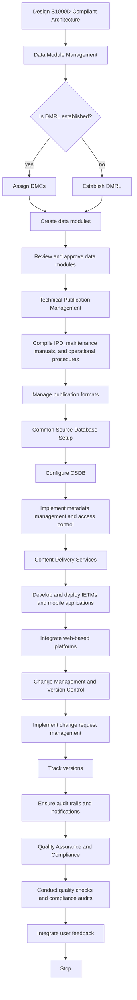
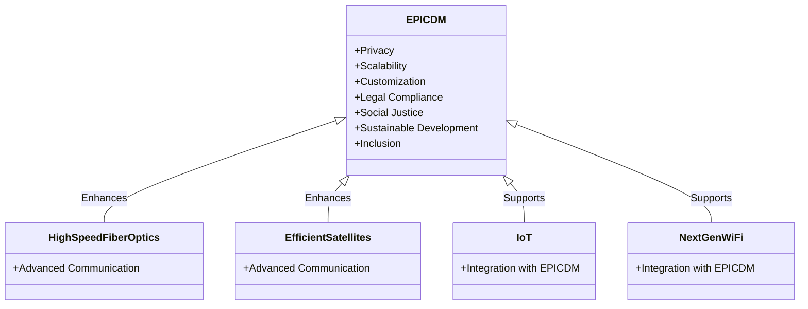
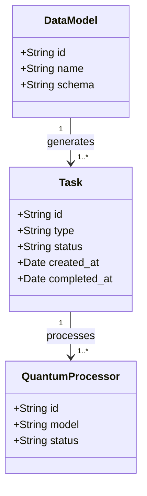
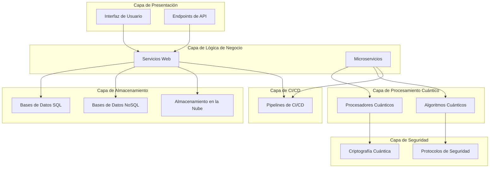
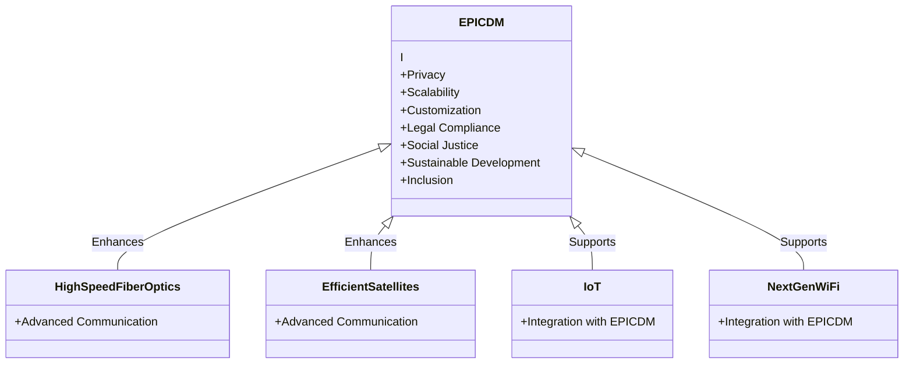

```mermaid
classDiagram
    class Doors_52 {
        5200_00 : General
        5201_00 : Passenger Doors
        5202_00 : Cargo Doors
        5203_00 : Emergency Exits
    }

    class Airframe_53 {
        53355_00 : Belly Fairing Panels
        53358_00 : Belly Fairing Mainframe
        5310_00 : General Structure Components
        5320_00 : Frames and Longerons
        5330_00 : Stringers and Skin Panels
    }

    class Leading_Edge_55127 {
        55127_00 : General Leading Edge Components
        55127_10 : Leading Edge Panels
        55127_20 : Leading Edge Mechanisms
    }

    class Trailing_Edge_55137 {
        55137_00 : General Trailing Edge Components
        55137_10 : Trailing Edge Panels
        55137_20 : Trailing Edge Mechanisms
    }

    class APU_538 {
        5380_00 : General APU Components
        5381_00 : APU Engine
        5382_00 : APU Control Systems
    }

    class Nacelles_and_Pylons_54 {
        5400_00 : General Nacelles and Pylons
        5401_00 : Engine Nacelles
        5402_00 : Pylons
    }

    class Windows_56 {
        5600_00 : General Window Components
        5601_00 : Cockpit Windows
        5602_00 : Passenger Windows
    }

    class Wings_57 {
        5700_00 : General Wing Components
        5701_00 : Wing Structure
        5702_00 : Wing Control Surfaces
        5703_00 : Wing Fuel Systems
    }

    class Placards_11 {
        1100_00 : General Placards
        1101_00 : Safety Placards
        1102_00 : Instructional Placards
    }

    class Pneumatic_Systems_36 {
        3600_00 : General Pneumatic Systems
        3601_00 : Pneumatic Distribution
        3602_00 : Pneumatic Controls
    }

    class Avionics_Systems_4 {
        4000_00 : General Avionics
        4001_00 : Navigation Systems
        4002_00 : Communication Systems
    }

    class Air_Conditioning_21 {
        2100_00 : General Air Conditioning
        2101_00 : Air Conditioning Units
        2102_00 : Air Distribution
    }

    class Power_7 {
        7000_00 : General Power Systems
        7001_00 : Electrical Power Generation
        7002_00 : Battery Systems
    }

    class Cabins_25 {
        2500_00 : General Cabin Components
        2501_00 : Passenger Cabins
        2502_00 : Crew Cabins
    }

    class Electric_33 {
        3300_00 : General Electrical Systems
        3301_00 : Wiring and Cabling
        3302_00 : Electrical Distribution
    }

    class Wiring_91 {
        9100_00 : General Wiring Components
        9101_00 : Signal Wiring
        9102_00 : Power Wiring
    }

    class Systems_2_3_4 {
        2000_00 : General Systems
        2001_00 : Flight Control Systems
        2002_00 : Ice and Rain Protection
        2003_00 : Water and Waste Systems
    }
```

QUANTUM INTELLIGENCE 
###
# Paso 1: Instalar y cargar los paquetes necesarios
install.packages("XML")
install.packages("openxlsx")
library(XML)
library(openxlsx)

# Paso 2: Crear una función para parsear el DTD
parse_dtd <- function(dtd_file) {
dtd <- xmlTreeParse(dtd_file, useInternalNodes = TRUE)
dtd_nodes <- xmlRoot(dtd)
elements <- getNodeSet(dtd_nodes, "//element")

element_data <- lapply(elements, function(el) {
name <- xmlGetAttr(el, "name")
content <- xmlValue(el)
list(name = name, content = content)
})

element_df <- do.call(rbind, lapply(element_data, as.data.frame))
return(element_df)
}

# Paso 3: Leer y convertir el DTD a una tabla
dtd_file <- "ruta/al/archivo.dtd"  # Reemplaza con la ruta correcta de tu archivo DTD
dtd_data <- parse_dtd(dtd_file)
dtd_df <- as.data.frame(do.call(rbind, lapply(dtd_data, function(x) data.frame(t(unlist(x))))))
colnames(dtd_df) <- c("Name", "Content")
print(dtd_df)

# Paso 4: Guardar el DataFrame en un archivo Excel
write.xlsx(dtd_df, "DTD_Estructura.xlsx")
### Paso 3: Leer y convertir el DTD a una tabla

En este paso, se lee el archivo DTD usando la función `parse_dtd` y se convierte el resultado en un dataframe.

```r
dtd_file <- "ruta/al/archivo.dtd"  # Reemplaza con la ruta correcta de tu archivo DTD
dtd_data <- parse_dtd(dtd_file)
dtd_df <- as.data.frame(do.call(rbind, lapply(dtd_data, function(x) data.frame(t(unlist(x))))))
colnames(dtd_df) <- c("Name", "Content")
print(dtd_df)
```

### Paso 4: Guardar el DataFrame en un archivo Excel

Finalmente, se guarda el dataframe en un archivo Excel usando la función `write.xlsx`.

```r
write.xlsx(dtd_df, "DTD_Estructura.xlsx")
```

### Ejecución Completa

Aquí tienes el código completo que puedes ejecutar para convertir el DTD a un archivo Excel.

```r
# Paso 1: Instalar y cargar los paquetes necesarios
install.packages("XML")
install.packages("openxlsx")
library(XML)
library(openxlsx)

# Paso 2: Crear una función para parsear el DTD
parse_dtd <- function(dtd_file) {
dtd <- xmlTreeParse(dtd_file, useInternalNodes = TRUE)
dtd_nodes <- xmlRoot(dtd)
elements <- getNodeSet(dtd_nodes, "//element")

element_data <- lapply(elements, function(el) {
name <- xmlGetAttr(el, "name")
content <- xmlValue(el)
list(name = name, content = content)
})

element_df <- do.call(rbind, lapply(element_data, as.data.frame))
return(element_df)
}

# Paso 3: Leer y convertir el DTD a una tabla
dtd_file <- "ruta/al/archivo.dtd"  # Reemplaza con la ruta correcta de tu archivo DTD
dtd_data <- parse_dtd(dtd_file)
dtd_df <- as.data.frame(do.call(rbind, lapply(dtd_data, function(x) data.frame(t(unlist(x))))))
colnames(dtd_df) <- c("Name", "Content")
print(dtd_df)

# Paso 4: Guardar el DataFrame en un archivo Excel
write.xlsx(dtd_df, "DTD_Estructura.xlsx")
```

### Ajustes Necesarios

- Asegúrate de ajustar la variable `dtd_file` con la ruta correcta de tu archivo DTD.
- Verifica que el archivo DTD tenga los elementos correctamente definidos para que el script pueda parsearlos sin problemas.

Este proceso te permitirá convertir la estructura DTD en un formato tabular amigable que puedes manipular fácilmente en Excel.

```r
install.packages("XML")
install.packages("openxlsx")
library(XML)
library(openxlsx)
### Paso 2: Crear una función para parsear el DTD

Esta función lee el archivo DTD y extrae los elementos y su contenido, almacenándolos en un dataframe.

```r
parse_dtd <- function(dtd_file) {
dtd <- xmlTreeParse(dtd_file, useInternalNodes = TRUE)
dtd_nodes <- xmlRoot(dtd)
elements <- getNodeSet(dtd_nodes, "//element")

element_data <- lapply(elements, function(el) {
name <- xmlGetAttr(el, "name")
content <- xmlValue(el)
list(name = name, content = content)
})

element_df <- do.call(rbind, lapply(element_data, as.data.frame))
return(element_df)
}
```
EPIC- DM 
European public infrastructure components and data models 

Power DATAPoint format official Complete Vision for A380-MRTT RCubico from an External Perspective
related to the AMPEL project and other technical aspects. Let's distill the content and adapt it into a structured approach to meet your needs.

### Breakdown of Documents and Key Content

1. **EPIC-DM Project (EPICDM)**
   - Vision: Establish a robust European public infrastructure for data interoperability, security, and sustainability.
   - Key Components:
     - Public Data Infrastructure
     - Green Data Centers
     - High-Speed Networks
     - Common Data Standards
     - Secure Data Exchange Platforms
   - Security and Privacy:
     - Quantum Cybersecurity
     - GDPR Compliance
   - Key Projects:
     - Shor's Algorithm for Cryptography
     - Grover's Algorithm for Optimization
     - Quantum Machine Learning (QML)
     - Variational Quantum Algorithms (VQA)
     - Quantum Annealing
   - Benefits:
     - Transparency and Traceability
     - Reduced Carbon Footprint
     - Compliance with Regulations
     - Real-Time Monitoring and Automated Reporting

2. Integrante AMPEL Manual Completo
   - Context: Deterioration of human conditions in Europe due to climate change, corporate greed, lack of regulation, and data control by few entities.
   - Solutions Proposed:
     - European Digital ID
     - Strengthening European Defense
     - Effective Integration among Member States
     - Investments in Technology and Innovation
   - Key Components:
     - Ethical Principles and Standards Module
     - Ethical AI and Algorithms Module
     - Monitoring and Audit Module
     - Process Automation Module
     - Training and Organizational Culture Module
     - Evaluation and Continuous Improvement Module

3. Head.xml and Dtd
   - Contains detailed XML DTD (Document Type Definition) schemas for organizing and managing data structures in various systems.
   - Relevant for creating structured data models and ensuring compliance with data standards.

### Adaptation to S1000D Standard for AMPEL

To adapt the AMPEL project documentation to the S1000D standard, we need to structure the content into Data Modules (DMs). Below is a suggested structure based on the provided documents:

#### General Information
1. **DM-0000-0001-00**: Introduction to AMPEL System
   - Overview and historical context of the AMPEL project.
   - Vision and goals of the project.

2. **DM-0000-0002-00**: Technical Overview of AMPEL
   - Detailed description of the AMPEL system, including key components and technologies.

#### Technical Descriptions
3. **DM-2000-0001-00**: Key Components of AMPEL
   - **DM-2000-0001-01**: Public Data Infrastructure
   - **DM-2000-0001-02**: Green Data Centers
   - **DM-2000-0001-03**: High-Speed Networks
   - **DM-2000-0001-04**: Data Standards and Platforms

#### Operational Procedures
4. **DM-3000-0001-00**: System Operation
   - **DM-3000-0001-01**: Setup and Deployment
   - **DM-3000-0001-02**: Data Management and Exchange
   - **DM-3000-0001-03**: Security and Compliance Procedures
   - **DM-3000-0001-04**: Maintenance and Support

#### Training and Simulation
5. **DM-4000-0001-00**: Training Systems
   - **DM-4000-0001-01**: Training Programs for Users
   - **DM-4000-0001-02**: Simulation Tools for System Operation
   - **DM-4000-0001-03**: Continuous Learning and Improvement

#### Maintenance and Support
6. **DM-5000-0001-00**: Maintenance Procedures
   - **DM-5000-0001-01**: Routine Maintenance
   - **DM-5000-0001-02**: Troubleshooting and Problem Resolution
   - **DM-5000-0001-03**: System Updates and Upgrades

#### Ethical and Compliance
7. **DM-6000-0001-00**: Ethics, Compliance, and Security
   - Ethical guidelines and compliance standards for AMPEL.
   - Security measures and protocols.

### Creating Structured Data Models

Using the DTD from the provided documents, here is an example of how to structure the data for AMPEL:

```xml
<!DOCTYPE AMPELSystem [
  <!ELEMENT AMPELSystem (ProjectInfo, Components, Operations, Training, Maintenance, Ethics, Compliance)>

  <!ELEMENT ProjectInfo (ProjectName, Description, StartDate, EndDate)>
  <!ELEMENT ProjectName (#PCDATA)>
  <!ELEMENT Description (#PCDATA)>
  <!ELEMENT StartDate (#PCDATA)>
  <!ELEMENT EndDate (#PCDATA)>

  <!ELEMENT Components (Component*)>
  <!ELEMENT Component (ComponentID, ComponentName, Description, Specifications)>
  <!ELEMENT ComponentID (#PCDATA)>
  <!ELEMENT ComponentName (#PCDATA)>
  <!ELEMENT Description (#PCDATA)>
  <!ELEMENT Specifications (Spec*)>
  <!ELEMENT Spec (SpecName, SpecValue)>
  <!ELEMENT SpecName (#PCDATA)>
  <!ELEMENT SpecValue (#PCDATA)>

  <!ELEMENT Operations (Operation*)>
  <!ELEMENT Operation (OperationID, OperationName, Procedures)>
  <!ELEMENT OperationID (#PCDATA)>
  <!ELEMENT OperationName (#PCDATA)>
  <!ELEMENT Procedures (Procedure*)>
  <!ELEMENT Procedure (ProcedureName, ProcedureDescription)>
  <!ELEMENT ProcedureName (#PCDATA)>
  <!ELEMENT ProcedureDescription (#PCDATA)>

  <!ELEMENT Training (TrainingProgram*)>
  <!ELEMENT TrainingProgram (ProgramID, ProgramName, Content)>
  <!ELEMENT ProgramID (#PCDATA)>
  <!ELEMENT ProgramName (#PCDATA)>
  <!ELEMENT Content (#PCDATA)>

  <!ELEMENT Maintenance (MaintenanceTask*)>
  <!ELEMENT MaintenanceTask (TaskID, TaskName, Description)>
  <!ELEMENT TaskID (#PCDATA)>
  <!ELEMENT TaskName (#PCDATA)>
  <!ELEMENT Description (#PCDATA)>

  <!ELEMENT Ethics (EthicalPrinciple*)>
  <!ELEMENT EthicalPrinciple (PrincipleID, PrincipleName, Description)>
  <!ELEMENT PrincipleID (#PCDATA)>
  <!ELEMENT PrincipleName (#PCDATA)>
  <!ELEMENT Description (#PCDATA)>

  <!ELEMENT Compliance (ComplianceStandard*)>
  <!ELEMENT ComplianceStandard (StandardID, StandardName, Description)>
  <!ELEMENT StandardID (#PCDATA)>
  <!ELEMENT StandardName (#PCDATA)>
  <!ELEMENT Description (#PCDATA)>
]>
```

This DTD schema provides a comprehensive structure for managing the AMPEL system, ensuring all key aspects are covered.

### Next Steps

If you need further assistance in detailing specific sections, generating additional diagrams, or implementing the data models, please let me know!

### Capsuling Methodology

#### Overview
Capsuling methodology refers to the encapsulation of various systems, technologies, and processes into modular units or "capsules" that can be easily integrated, monitored, and managed. This approach enhances flexibility, scalability, and interoperability, making it ideal for complex projects involving multiple technologies and stakeholders.

#### Key Steps in the Capsuling Methodology

1. Identification and Definition of Capsules
   - **Scope and Boundaries**: Clearly define the scope of each capsule, including its functionalities and interfaces.
   - **Modularity**: Ensure each capsule is self-contained and modular, allowing for independent development and deployment.

2. **Design and Development**
   - **Standard Interfaces**: Develop standardized interfaces for communication between capsules, ensuring seamless integration.
   - **Encapsulation of Technologies**: Integrate relevant technologies (e.g., AI, IoT, nanotech) within each capsule to meet specific functional requirements.

3. **Integration and Interoperability**
   - **Inter-Capsule Communication**: Implement protocols for data exchange and synchronization between capsules.
   - **Middleware Solutions**: Use middleware to facilitate interoperability and manage interactions between heterogeneous systems.

4. **Testing and Validation**
   - **Unit Testing**: Conduct thorough testing of individual capsules to ensure functionality and performance.
   - **Integration Testing**: Validate the integration of multiple capsules, focusing on communication and interoperability.

5. **Deployment and Monitoring**
   - **Deployment Strategies**: Develop deployment strategies that allow for gradual integration and scaling of capsules.
   - **Continuous Monitoring**: Implement monitoring tools to track the performance and health of each capsule, ensuring real-time management and maintenance.

#### Applications
- **Green Aviation**: Encapsulation of advanced propulsion systems, energy management modules, and environmental monitoring units.
- **Smart Cities**: Modular integration of IoT devices, AI-driven analytics, and smart infrastructure management systems.
- **Fintech**: Segmentation of financial services, blockchain-based transaction modules, and AI-powered risk assessment tools.
- **Nanotech**: Development of nanomaterial synthesis units, nanoscale sensors, and advanced coating capsules.

### Intrinsic Compatibility Standards

#### Definition
Intrinsic compatibility standards ensure that all components, systems, and technologies within the capsuling methodology can interact and function together seamlessly. These standards cover communication protocols, data formats, security measures, and interoperability guidelines.

#### Key Standards

1. **Communication Protocols**
   - **HTTP/HTTPS**: Standard web protocols for secure data exchange.
   - **MQTT**: Lightweight messaging protocol for IoT applications.
   - **OPC-UA**: Standard for industrial automation and interoperability.

2. **Data Formats**
   - **XML/JSON**: Standardized formats for data representation and exchange.
   - **CSV**: Common format for tabular data.
   - **Protobuf**: Protocol buffers for efficient serialization of structured data.

3. **Security Standards**
   - **TLS/SSL**: Protocols for secure communication over networks.
   - **OAuth2**: Standard for secure authorization.
   - JWT: JSON Web Tokens for secure information exchange.

4. **Interoperability Guidelines**
   - **SOA (Service-Oriented Architecture)**: Design principles for creating interoperable services.
   - **Microservices Architecture**: Architectural style for developing modular and scalable applications.
   - **RESTful APIs**: Standard for designing networked applications.

5. **Compliance and Certification**
   - **ISO 27001**: Standard for information security management.
   - **GDPR**: Regulations for data protection and privacy in the EU.
   - **NIST**: Standards for cybersecurity and risk management.

#### Implementation Steps
1. **Adoption of Standards**: Ensure all development follows established compatibility standards.
2. **Standardized Testing**: Conduct compatibility testing against these standards to validate compliance.
3. **Continuous Update and Review**: Regularly update standards to align with technological advancements and regulatory changes.
4. **Certification Processes**: Obtain relevant certifications to demonstrate compliance and ensure trustworthiness.

### Application to A330MRTT and A380MRTT Projects
- **Green Aircraft Technology**: Encapsulation of energy-efficient propulsion systems, nanotech-based coatings, and advanced materials.
- **Fintech Integration**: Modular fintech solutions for sustainable finance and investment tracking in green aviation projects.
- **Nanotech Applications**: Use of nanomaterials for lightweight, durable, and energy-efficient components in aircraft.
- **Advanced Propulsion Systems**: Development and integration of hydrogen fuel cells and electric propulsion units encapsulated in modular capsules for easy upgrade and maintenance.

### Conclusion
Integrating capsuling methodology and intrinsic compatibility standards into the AMPEL System and Amedeo Pelliccia's activities will enhance the efficiency, scalability, and sustainability of projects like the A330MRTT and A380MRTT green aircraft initiatives. This approach will facilitate seamless integration of advanced technologies, ensure regulatory compliance, and promote sustainable urban development.

**Objective:** Provide a holistic view of the A380-MRTT RCubico project, emphasizing its innovative, sustainable, and integrated approach.

#### Main Concept:
**InterOperational Core Open Structure - Central Brain Blockchained Capsule in 4 Digits (BAABI)**

#### Key Components:
1. **Quantum Technology**
   - **Areas**: Computing, Materials, Security.
   - **Goal**: Leverage quantum advancements for project innovation and security.

2. **Human Resources**
   - **Focus**: Recruitment, training, and management.
   - **Objective**: Build a skilled, cohesive team.

3. **Technical Documentation**
   - **Components**: S1000D Dynamics, Component Specs, Standards.
   - **Purpose**: Ensure consistency and adherence to industry standards.

4. **Schemas and Diagrams**
   - **Elements**: System Schematics, Process Flowcharts, Design Diagrams.
   - **Function**: Visualize project components and workflows.

5. **TPWD/TPSL**
   - **Contents**: TPWD and TPSL documents.
   - **Use**: Track and manage technical publication workflows.

6. **Vision, Mission, and Strategy**
   - **Documents**: Vision, mission statements, strategic plans.
   - **Goal**: Align project goals with overall strategic direction.

7. **Current Projects and Tasks**
   - **Tracking**: Ongoing projects and tasks.
   - **Objective**: Maintain project momentum and focus.

8. **Methodology Integration**
   - **Methods**: Agile, Scrum, AMPEL.
   - **Purpose**: Optimize project management and development processes.

9. **Innovation and Sustainability**
   - **Initiatives**: GreenTech, Sustainable Practices, Innovation Proposals.
   - **Goal**: Enhance sustainability and innovation within the project.

10. **Communication and Collaboration**
    - **Strategies**: Internal and external communication, stakeholder engagement.
    - **Objective**: Foster effective communication and collaboration.

11. **Analysis and Monitoring**
    - **Tools**: Progress reports, performance analysis, monitoring data.
    - **Purpose**: Track and analyze project performance.

12. **Continuous Improvement**
    - **Strategies**: Feedback loops, continuous improvement, lessons learned.
    - **Goal**: Drive ongoing project enhancements.

### Implementation:
1. **Structure Creation**: Set up folders and subfolders in the notes app.
2. **Note Organization**: Move existing notes into the appropriate folders.
3. **Regular Updates**: Review and update the structure regularly.

### Visualization Example:

```
A380-MRTT RCubico
├── Quantum Technology
│   ├── Quantum Computing
│   ├── Quantum Materials
│   └── Quantum Security
├── Human Resources
│   ├── Hiring Plans
│   ├── Training Programs
│   └── Employee Management
├── Technical Documentation
│   ├── S1000D Dynamics
│   ├── Component Specifications
│   └── Technical Standards
├── Schemas and Diagrams
│   ├── System Schematics
│   ├── Process Flowcharts
│   └── Design Diagrams
├── TPWD/TPSL
│   ├── TPWD
│   └── TPSL
├── Vision, Mission, and Strategy
│   ├── Vision Documents
│   ├── Mission Statements
│   └── Strategic Plans
├── Current Projects and Tasks
│   ├── Current Projects
│   └── Ongoing Tasks
├── Methodology Integration
│   ├── Agile Methodology
│   ├── Scrum Framework
│   └── AMPEL Integration
├── Innovation and Sustainability
│   ├── GreenTech Solutions
│   ├── Sustainable Practices
│   └── Innovation Proposals
├── Communication and Collaboration
│   ├── Internal Communication
│   ├── External Collaboration
│   └── Stakeholder Engagement
├── Analysis and Monitoring
│   ├── Progress Reports
│   ├── Performance Analysis
│   └── Monitoring Data
└── Continuous Improvement
    ├── Feedback Loops
    ├── Continuous Improvement
    └── Lessons Learned
```

This structure ensures efficient organization and accessibility, enhancing collaboration and progress in the A380-MRTT RCubico project.

### A380-MRTT RCubico Vision

#### Key Components:

1. **Quantum Technology**
   - **Areas**: Computing, Materials, Security.
   - **Goal**: Leverage quantum advancements for innovation and security.
   - **Strategies**:
     - **Quantum Computing**: Solve complex computational problems, enabling faster data analysis and optimization in flight operations and maintenance.
     - **Quantum Materials**: Utilize materials like graphene and other nanocomposites to enhance aircraft performance, reduce weight, and improve fuel efficiency.
     - **Quantum Security**: Implement quantum encryption to secure communications and data, ensuring robust cybersecurity against evolving threats.

2. **Human Resources**
   - **Focus**: Recruitment, training, and management.
   - **Objective**: Build a skilled, cohesive team.
   - **Strategies**:
     - **Recruitment**: Attract top talent through partnerships with universities, industry conferences, and competitive compensation packages.
     - **Training**: Provide continuous skill enhancement programs, focusing on emerging technologies and best practices in aerospace engineering.
     - **Management**: Foster a collaborative and inclusive environment to enhance team cohesion and productivity, implementing agile methodologies to streamline project management.

3. **Technical Documentation**
   - **Components**: S1000D Dynamics, Component Specs, Standards.
   - **Purpose**: Ensure consistency and adherence to industry standards.
   - **Strategies**:
     - **S1000D Dynamics**: Implement S1000D standards to create a unified documentation framework, improving interoperability and reducing errors.
     - **Component Specifications**: Maintain comprehensive and detailed component specifications to ensure high-quality manufacturing and maintenance.
     - **Standards Compliance**: Regularly update documentation to comply with the latest industry standards and regulatory requirements.

4. **Schemas and Diagrams**
   - **Elements**: System Schematics, Process Flowcharts, Design Diagrams.
   - **Function**: Visualize project components and workflows.
   - **Strategies**:
     - **System Schematics**: Develop detailed schematics to map out the aircraft's systems architecture, aiding in design and troubleshooting.
     - **Process Flowcharts**: Create flowcharts to outline key workflows, ensuring clarity in project processes and roles.
     - **Design Diagrams**: Illustrate design concepts and component interactions, facilitating better understanding and communication among stakeholders.

5. **TPWD/TPSL**
   - **Contents**: TPWD (Technical Publication Work Directive) and TPSL (Technical Publication Status List) documents.
   - **Use**: Track and manage technical publications.
   - **Strategies**:
     - **TPWD**: Use the TPWD to guide the development and revision of technical documents, ensuring alignment with project timelines and quality standards.
     - **TPSL**: Monitor the status of technical publications using the TPSL, providing up-to-date information on document progress and approvals.

6. **Vision, Mission, and Strategy**
   - **Documents**: Vision, mission statements, strategic plans.
   - **Goal**: Align project goals with strategic direction.
   - **Strategies**:
     - **Vision and Mission Statements**: Develop clear vision and mission statements to guide decision-making and project focus, reflecting the long-term aspirations and core values of the project.
     - **Strategic Plans**: Outline specific objectives, key performance indicators (KPIs), and action plans to achieve the project goals, ensuring alignment with broader organizational strategies.

7. **Current Projects and Tasks**
   - **Tracking**: Utilize project management tools to track ongoing projects and tasks, ensuring timely completion and resource optimization.
   - **Objective**: Maintain project momentum and focus through regular progress reviews, risk assessments, and stakeholder updates.

#### Additional Components

8. **Innovation and Sustainability**
   - **Initiatives**: Incorporate GreenTech solutions, sustainable practices, and continuous innovation proposals.
   - **Goal**: Enhance sustainability and innovation within the project, aiming for reduced environmental impact and improved efficiency.

9. **Communication and Collaboration**
   - **Strategies**: Develop internal and external communication plans, and engage stakeholders effectively.
   - **Objective**: Foster effective communication and collaboration across all levels of the project, ensuring transparency and stakeholder alignment.

10. **Analysis and Monitoring**
    - **Tools**: Implement tools for progress reporting, performance analysis, and real-time monitoring.
    - **Purpose**: Track and analyze project performance to identify areas for improvement and ensure project milestones are met.

11. **Continuous Improvement**
    - **Strategies**: Establish feedback loops, continuous improvement programs, and lessons learned sessions.
    - **Goal**: Drive ongoing enhancements in processes, technologies, and team performance.

### Summary

This vision outlines a comprehensive strategy for the A380-MRTT RCubico project, integrating quantum technology, human resources, technical documentation, and innovative methodologies to achieve a sustainable and advanced aircraft solution. By focusing on modular capsuling methodology and adhering to intrinsic compatibility standards, the project ensures flexibility, scalability, and robust integration of cutting-edge technologies. This holistic approach aims to position the A380-MRTT as a leader in green aviation and smart city integration, leveraging advanced propulsion systems, fintech, and nanotech innovations for future growth and sustainability.


#### Document 1: General Instructions on S1000D and Docker
- **Project Structure**: The document outlines a project structure with separate directories for each quantum algorithm, including Dockerfile, main.py, and requirements.txt for each.
- **Example Dockerfile**: Provides an example Dockerfile for running a quantum algorithm.
- **Building and Running Docker Containers**: Instructions on how to build and run Docker containers.
- **Docker Compose**: Use of Docker Compose to manage multiple containers.
- **S1000D Integration**: Documentation format for quantum algorithms using S1000D standards.

#### Document 2: Enhanced Quantum Noise Mitigation (S1000D Structure)
- **UID: Qiskit_001_20240624_APCGPT**: Specific identification for the data module.
- **Technical Information**: Includes the use of Agile AMPEL methodologies, Qiskit tools, and statistical validation in R.
- **Procedures and Studies**: Details the procedures and methodologies used for noise mitigation in quantum computing.
- **Simulations and Results**: Presentation of initial simulation results and statistical analysis.
- **Potential Impact**: Technological, societal, and environmental impacts.
- **Code Example in R**: Provided for statistical validation.

#### Document 3: Project Proposal and Framework for Advanced Technologies
- **Executive Summary and Objectives**: High-level goals for integrating advanced technologies into the A330-MRTT project.
- **Governance Structure**: Detailed structure including various committees for oversight and management.
- **S1000D Standards**: Emphasis on technical documentation, data modules, illustrated parts data, and compliance.
- **Data Governance and QA**: Framework for data governance and quality assurance measures.
- **IAM System**: Implementation of an Identity and Access Management system.
- **Marketing and Customer Care**: Strategies for marketing and continuous customer care.
- **Integration of Advanced Technologies**: Specific use cases for X-rays, infrared, gamma waves, and photon beams in quantum dynamics and manufacturing.
- **Predictive Maintenance and Optimization**: Techniques for maintenance and optimization using advanced technologies.

### Detailed Plan

#### 1. Project Structure for Quantum Algorithms

Organize the project directory with separate folders for each quantum algorithm, each containing its own `Dockerfile`, `main.py`, and `requirements.txt`.

```plaintext
/algoritmos_cuanticos
|-- algoritmo1
|   |-- main.py
|   |-- requirements.txt
|   |-- Dockerfile
|-- algoritmo2
|   |-- main.py
|   |-- requirements.txt
|   |-- Dockerfile
...
```

#### 2. Example Dockerfile

Create a Dockerfile to set up the environment for running a quantum algorithm using Python and Qiskit.

**Dockerfile:**

```Dockerfile
FROM python:3.9-slim

WORKDIR /app

COPY requirements.txt requirements.txt
COPY main.py main.py

RUN pip install -r requirements.txt

CMD ["python", "main.py"]
```

**requirements.txt:**

```txt
qiskit
numpy
```

**main.py:**

```python
import numpy as np
from qiskit import QuantumCircuit, transpile, Aer, execute

circuit = QuantumCircuit(2, 2)
circuit.h(0)
circuit.cx(0, 1)
circuit.measure([0, 1], [0, 1])

simulator = Aer.get_backend('qasm_simulator')
compiled_circuit = transpile(circuit, simulator)
job = execute(compiled_circuit, simulator)
result = job.result()

counts = result.get_counts(circuit)
print("Resultados del algoritmo cuántico:", counts)
```

#### 3. Building and Running Docker Containers

Navigate to the directory of each algorithm and build the Docker container:

```sh
cd algoritmo1
docker build -t algoritmo1 .
```

Run the container:

```sh
docker run --rm algoritmo1
```

#### 4. Using Docker Compose

Create a `docker-compose.yml` to manage multiple Docker containers efficiently.

**docker-compose.yml:**

```yaml
version: '3'
services:
  algoritmo1:
    build: ./algoritmo1
    container_name: contenedor_algoritmo1
  algoritmo2:
    build: ./algoritmo2
    container_name: contenedor_algoritmo2
  ...
```

Build and run all containers:

```sh
docker-compose build
docker-compose up
```

#### 5. S1000D Documentation for Quantum Algorithms

Document each algorithm using the S1000D standard, following the format provided in the documents.

**Example Data Module for Enhanced Quantum Noise Mitigation:**

**Identification and Status Section:**

```xml
<dmAddress>
  <dmIdent>
    <dmCode modelIdentCode="Qiskit_001" systemDiffCode="20240624" systemCode="APCGPT" subSystemCode="001" assyCode="000" disassyCode="000" subSubAssyCode="000" infoCode="010" infoVer="001" />
    <issueInfo issueNumber="001" inWork="00" issueDate="2024-06-24" />
  </dmIdent>
  <dmTitle language="en">Enhanced Quantum Noise Mitigation</dmTitle>
</dmAddress>
```

**Content Section:**

```xml
<content>
  <techInfo>
    <para>Técnica para mitigar el ruido cuántico utilizando métodos híbridos cuántico-clásicos.</para>
    <para>Impacto potencial en la reducción de tasas de error en cálculos cuánticos, simulaciones cuánticas para descubrimiento de fármacos y ciencia de materiales, y eficiencia en simulaciones ambientales.</para>
  </techInfo>
  <illustratedPartsData>
    <figure>
      <graphic>
        <graphicId>fig001</graphicId>
        <graphicTitle>Quantum Noise Mitigation Model</graphicTitle>
        <graphicFile>quantum_noise_mitigation_model.png</graphicFile>
      </graphic>
    </figure>
  </illustratedPartsData>
  <proceduralInfo>
    <procedure>
      <step>Desarrollar sensores cuánticos para detectar errores como bit-flip y phase-flip.</step>
      <step>Integrar sensores en el procesador cuántico.</step>
      <step>Desarrollar algoritmos para analizar datos de sensores y activar mecanismos de corrección de errores.</step>
    </procedure>
  </proceduralInfo>
</content>
```

#### 6. Integration of Advanced Technologies

Document the integration of advanced technologies such as X-rays, infrared, gamma waves, and photon beams in the FAL using the S1000D standard.

**Example Data Module for X-ray Applications:**

**Identification and Status Section:**

```xml
<dmAddress>
  <dmIdent>
    <dmCode modelIdentCode="FAL-QDX-001" systemDiffCode="000" systemCode="SYS" subSystemCode="001" assyCode="000" disassyCode="000" subSubAssyCode="000" infoCode="030" infoVer="001" />
    <issueInfo issueNumber="001" inWork="00" issueDate="2024-06-24" />
  </dmIdent>
  <dmTitle language="en">Integration of High-Energy Photonic Technologies in FAL</dmTitle>
</dmAddress>
```

**Content Section:**

```xml
<content>
  <techInfo>
    <para>Integración de tecnologías fotónicas de alta energía en el ensamblaje final (FAL) para mejorar la precisión y eficiencia de los procesos de fabricación y mantenimiento.</para>
    <para>Estas tecnologías incluyen el uso de rayos X, infrarrojos, ondas gamma y haces de fotones.</para>
  </techInfo>
  <illustratedPartsData>
    <figure>
      <graphic>
        <graphicId>fig001</graphicId>
        <graphicTitle>Aplicaciones de Tecnologías Fotónicas en FAL</graphicTitle>
        <graphicFile>photon_tech_applications.png</graphicFile>
      </graphic>
    </figure>
  </illustratedPartsData>
  <proceduralInfo>
    <procedure>
      <step>Implementar sistemas de rayos X para inspección no destructiva de componentes críticos.</step>
      <step>Utilizar cámaras infrarrojas para monitoreo térmico en tiempo real durante el ensamblaje.</step>
      <step>Integrar detectores de ondas gamma para análisis de materiales y control de calidad.</step>
      <step>Aplicar haces de fotones para alineación y ensamblaje precisos de componentes.</step>
    </procedure>
  </proceduralInfo>
</content>
```

### Exploring Benefits of Artificial Intelligence

Artificial Intelligence (AI) has rapidly evolved, offering transformative benefits across various industries. Here, we explore the key advantages of AI, focusing on its applications, improvements in efficiency, enhancement of user experiences, and the potential for innovation and problem-solving.

### Key Benefits of AI

1. **Automation and Efficiency**
    - **Task Automation**: AI can automate repetitive and mundane tasks, allowing human workers to focus on more complex and creative activities.
    - **Process Optimization**: AI algorithms can analyze data to optimize processes, reducing waste and improving efficiency in manufacturing, logistics, and supply chain management.

2. **Enhanced Decision-Making**
    - **Data Analysis**: AI systems can process vast amounts of data quickly, providing insights and patterns that might be missed by human analysis.
    - **Predictive Analytics**: By leveraging historical data, AI can predict future trends, helping businesses make informed decisions and anticipate market changes

/algoritmos_cuanticos
|-- algoritmo1
|   |-- main.py
|   |-- requirements.txt
|   |-- Dockerfile
|-- algoritmo2
|   |-- main.py
|   |-- requirements.txt
|   |-- Dockerfile
...


import numpy as np
from qiskit import QuantumCircuit, transpile, Aer, execute

circuit = QuantumCircuit(2, 2)
circuit.h(0)
circuit.cx(0, 1)
circuit.measure([0, 1], [0, 1])

simulator = Aer.get_backend('qasm_simulator')
compiled_circuit = transpile(circuit, simulator)
job = execute(compiled_circuit, simulator)
result = job.result()

counts = result.get_counts(circuit)
print("Resultados del algoritmo cuántico:", counts)

version: '3'
services:
  algoritmo1:
    build: ./algoritmo1
    container_name: contenedor_algoritmo1
  algoritmo2:
    build: ./algoritmo2
    container_name: contenedor_algoritmo2
  ...


<dmAddress>
  <dmIdent>
    <dmCode modelIdentCode="Qiskit_001" systemDiffCode="20240624" systemCode="APCGPT" subSystemCode="001" assyCode="000" disassyCode="000" subSubAssyCode="000" infoCode="010" infoVer="001" />
    <issueInfo issueNumber="001" inWork="00" issueDate="2024-06-24" />
  </dmIdent>
  <dmTitle language="en">Enhanced Quantum Noise Mitigation</dmTitle>
</dmAddress>

<content>
  <techInfo>
    <para>Técnica para mitigar el ruido cuántico utilizando métodos híbridos cuántico-clásicos.</para>
    <para>Impacto potencial en la reducción de tasas de error en cálculos cuánticos, simulaciones cuánticas para descubrimiento de fármacos y ciencia de materiales, y eficiencia en simulaciones ambientales.</para>
  </techInfo>
  <illustratedPartsData>
    <figure>
      <graphic>
        <graphicId>fig001</graphicId>
        <graphicTitle>Quantum Noise Mitigation Model</graphicTitle>
        <graphicFile>quantum_noise_mitigation_model.png</graphicFile>
      </graphic>
    </figure>
  </illustratedPartsData>
  <proceduralInfo>
    <procedure>
      <step>Desarrollar sensores cuánticos para detectar errores como bit-flip y phase-flip.</step>
      <step>Integrar sensores en el procesador cuántico.</step>
      <step>Desarrollar algoritmos para analizar datos de sensores y activar mecanismos de corrección de errores.</step>
    </procedure>
  </proceduralInfo>
</content>

<dmAddress>
  <dmIdent>
    <dmCode modelIdentCode="FAL-QDX-001" systemDiffCode="000" systemCode="SYS" subSystemCode="001" assyCode="000" disassyCode="000" subSubAssyCode="000" infoCode="030" infoVer="001" />
    <issueInfo issueNumber="001" inWork="00" issueDate="2024-06-24" />
  </dmIdent>
  <dmTitle language="en">Integration of High-Energy Photonic Technologies in FAL</dmTitle>
</dmAddress>

<content>
  <techInfo>
    <para>Integración de tecnologías fotónicas de alta energía en el ensamblaje final (FAL) para mejorar la precisión y eficiencia de los procesos de fabricación y mantenimiento.</para>
    <para>Estas tecnologías incluyen el uso de rayos X, infrarrojos, ondas gamma y haces de fotones.</para>
  </techInfo>
  <illustratedPartsData>
    <figure>
      <graphic>
        <graphicId>fig001</graphicId>
        <graphicTitle>Aplicaciones de Tecnologías Fotónicas en FAL</graphicTitle>
        <graphicFile>photon_tech_applications.png</graphicFile>
      </graphic>
    </figure>
  </illustratedPartsData>
  <proceduralInfo>
    <procedure>
      <step>Implementar sistemas de rayos X para inspección no destructiva de componentes críticos.</step>
      <step>Utilizar cámaras infrarrojas para monitoreo térmico en tiempo real durante el ensamblaje.</step>
      <step>Integrar detectores de ondas gamma para análisis de materiales y control de calidad.</step>
      <step>Aplicar haces de fotones para alineación y ensamblaje precisos de componentes.</step>
    </procedure>
  </proceduralInfo>
</content>

The diagram you provided uses PlantUML syntax, which isn't directly supported by Mermaid. I will convert the PlantUML code to Mermaid syntax.

### Mermaid Diagram for S1000D Components


### Mermaid Diagram for Implementation Steps



### Mermaid Diagram for QuantumGen Software Design




### Summary of Key Elements from Provided Documents

#### Document 1: General Instructions on S1000D and Docker
- **Project Structure**: The document outlines a project structure with separate directories for each quantum algorithm, including Dockerfile, main.py, and requirements.txt for each.
- **Example Dockerfile**: Provides an example Dockerfile for running a quantum algorithm.
- **Building and Running Docker Containers**: Instructions on how to build and run Docker containers.
- **Docker Compose**: Use of Docker Compose to manage multiple containers.
- **S1000D Integration**: Documentation format for quantum algorithms using S1000D standards.

#### Document 2: Enhanced Quantum Noise Mitigation (S1000D Structure)
- **UID: Qiskit_001_20240624_APCGPT**: Specific identification for the data module.
- **Technical Information**: Includes the use of Agile AMPEL methodologies, Qiskit tools, and statistical validation in R.
- **Procedures and Studies**: Details the procedures and methodologies used for noise mitigation in quantum computing.
- **Simulations and Results**: Presentation of initial simulation results and statistical analysis.
- **Potential Impact**: Technological, societal, and environmental impacts.
- **Code Example in R**: Provided for statistical validation.

#### Document 3: Project Proposal and Framework for Advanced Technologies
- **Executive Summary and Objectives**: High-level goals for integrating advanced technologies into the A330-MRTT project.
- **Governance Structure**: Detailed structure including various committees for oversight and management.
- **S1000D Standards**: Emphasis on technical documentation, data modules, illustrated parts data, and compliance.
- **Data Governance and QA**: Framework for data governance and quality assurance measures.
- **IAM System**: Implementation of an Identity and Access Management system.
- **Marketing and Customer Care**: Strategies for marketing and continuous customer care.
- **Integration of Advanced Technologies**: Specific use cases for X-rays, infrared, gamma waves, and photon beams in quantum dynamics and manufacturing.
- **Predictive Maintenance and Optimization**: Techniques for maintenance and optimization using advanced technologies.

### Detailed Plan

#### 1. Project Structure for Quantum Algorithms

Organize the project directory with separate folders for each quantum algorithm, each containing its own `Dockerfile`, `main.py`, and `requirements.txt`.

```plaintext
/algoritmos_cuanticos
|-- algoritmo1
|   |-- main.py
|   |-- requirements.txt
|   |-- Dockerfile
|-- algoritmo2
|   |-- main.py
|   |-- requirements.txt
|   |-- Dockerfile
...
```

#### 2. Example Dockerfile

Create a Dockerfile to set up the environment for running a quantum algorithm using Python and Qiskit.

**Dockerfile:**

```Dockerfile
FROM python:3.9-slim

WORKDIR /app

COPY requirements.txt requirements.txt
COPY main.py main.py

RUN pip install -r requirements.txt

CMD ["python", "main.py"]
```

**requirements.txt:**

```txt
qiskit
numpy
```

**main.py:**

```python
import numpy as np
from qiskit import QuantumCircuit, transpile, Aer, execute

circuit = QuantumCircuit(2, 2)
circuit.h(0)
circuit.cx(0, 1)
circuit.measure([0, 1], [0, 1])

simulator = Aer.get_backend('qasm_simulator')
compiled_circuit = transpile(circuit, simulator)
job = execute(compiled_circuit, simulator)
result = job.result()

counts = result.get_counts(circuit)
print("Resultados del algoritmo cuántico:", counts)
```

#### 3. Building and Running Docker Containers

Navigate to the directory of each algorithm and build the Docker container:

```sh
cd algoritmo1
docker build -t algoritmo1 .
```

Run the container:

```sh
docker run --rm algoritmo1
```

#### 4. Using Docker Compose

Create a `docker-compose.yml` to manage multiple Docker containers efficiently.

**docker-compose.yml:**

```yaml
version: '3'
services:
  algoritmo1:
    build: ./algoritmo1
    container_name: contenedor_algoritmo1
  algoritmo2:
    build: ./algoritmo2
    container_name: contenedor_algoritmo2
  ...
```

Build and run all containers:

```sh
docker-compose build
docker-compose up
```

#### 5. S1000D Documentation for Quantum Algorithms

Document each algorithm using the S1000D standard, following the format provided in the documents.

**Example Data Module for Enhanced Quantum Noise Mitigation:**

**Identification and Status Section:**

```xml
<dmAddress>
  <dmIdent>
    <dmCode modelIdentCode="Qiskit_001" systemDiffCode="20240624" systemCode="APCGPT" subSystemCode="001" assyCode="000" disassyCode="000" subSubAssyCode="000" infoCode="010" infoVer="001" />
    <issueInfo issueNumber="001" inWork="00" issueDate="2024-06-24" />
  </dmIdent>
  <dmTitle language="en">Enhanced Quantum Noise Mitigation</dmTitle>
</dmAddress>
```

**Content Section:**

```xml
<content>
  <techInfo>
    <para>Técnica para mitigar el ruido cuántico utilizando métodos híbridos cuántico-clásicos.</para>
    <para>Impacto potencial en la reducción de tasas de error en cálculos cuánticos, simulaciones cuánticas para descubrimiento de fármacos y ciencia de materiales, y eficiencia en simulaciones ambientales.</para>
  </techInfo>
  <illustratedPartsData>
    <figure>
      <graphic>
        <graphicId>fig001</graphicId>
        <graphicTitle>Quantum Noise Mitigation Model</graphicTitle>
        <graphicFile>quantum_noise_mitigation_model.png</graphicFile>
      </graphic>
    </figure>
  </illustratedPartsData>
  <proceduralInfo>
    <procedure>
      <step>Desarrollar sensores cuánticos para detectar errores como bit-flip y phase-flip.</step>
      <step>Integrar sensores en el procesador cuántico.</step>
      <step>Desarrollar algoritmos para analizar datos de sensores y activar mecanismos de corrección de errores.</step>
    </procedure>
  </proceduralInfo>
</content>
```

#### 6. Integration of Advanced Technologies

Document the integration of advanced technologies such as X-rays, infrared, gamma waves, and photon beams in the FAL using the S1000D standard.

**Example Data Module for X-ray Applications:**

**Identification and Status Section:**

```xml
<dmAddress>
  <dmIdent>
    <dmCode modelIdentCode="FAL-QDX-001" systemDiffCode="000" systemCode="SYS" subSystemCode="001" assyCode="000" disassyCode="000" subSubAssyCode="000" infoCode="030" infoVer="001" />
    <issueInfo issueNumber="001" inWork="00" issueDate="2024-06-24" />
  </dmIdent>
  <dmTitle language="en">Integration of High-Energy Photonic Technologies in FAL</dmTitle>
</dmAddress>
```

**Content Section:**

```xml
<content>
  <techInfo>
    <para>Integración de tecnologías fotónicas de alta energía en el ensamblaje final (FAL) para mejorar la precisión y eficiencia de los procesos de fabricación y mantenimiento.</para>
    <para>Estas tecnologías incluyen el uso de rayos X, infrarrojos, ondas gamma y haces de fotones.</para>
  </techInfo>
  <illustratedPartsData>
    <figure>
      <graphic>
        <graphicId>fig001</graphicId>
        <graphicTitle>Aplicaciones de Tecnologías Fotónicas en FAL</graphicTitle>
        <graphicFile>photon_tech_applications.png</graphicFile>
      </graphic>
    </figure>
  </illustratedPartsData>
  <proceduralInfo>
    <procedure>
      <step>Implementar sistemas de rayos X para inspección no destructiva de componentes críticos.</step>
      <step>Utilizar cámaras infrarrojas para monitoreo térmico en tiempo real durante el ensamblaje.</step>
      <step>Integrar detectores de ondas gamma para análisis de materiales y control de calidad.</step>
      <step>Aplicar haces de fotones para alineación y ensamblaje precisos de componentes.</step>
    </procedure>
  </proceduralInfo>
</content>
```

### Exploring Benefits of Artificial Intelligence

Artificial Intelligence (AI) has rapidly evolved, offering transformative benefits across various industries. Here, we explore the key advantages of AI, focusing on its applications, improvements in efficiency, enhancement of user experiences, and the potential for innovation and problem-solving.

### Key Benefits of AI

1. **Automation and Efficiency**
    - **Task Automation**: AI can automate repetitive and mundane tasks, allowing human workers to focus on more complex and creative activities.
    - **Process Optimization**: AI algorithms can analyze data to optimize processes, reducing waste and improving efficiency in manufacturing, logistics, and supply chain management.

2. **Enhanced Decision-Making**
    - **Data Analysis**: AI systems can process vast amounts of data quickly, providing insights and patterns that might be missed by human analysis.
    - **Predictive Analytics**: By leveraging historical data, AI can predict future trends, helping businesses make informed decisions and anticipate market changes

### Summary of Key Elements from Provided Documents

#### Document 1: General Instructions on S1000D and Docker
- **Project Structure**: The document outlines a project structure with separate directories for each quantum algorithm, including Dockerfile, main.py, and requirements.txt for each.
- **Example Dockerfile**: Provides an example Dockerfile for running a quantum algorithm.
- **Building and Running Docker Containers**: Instructions on how to build and run Docker containers.
- **Docker Compose**: Use of Docker Compose to manage multiple containers.
- **S1000D Integration**: Documentation format for quantum algorithms using S1000D standards.

#### Document 2: Enhanced Quantum Noise Mitigation (S1000D Structure)
- **UID: Qiskit_001_20240624_APCGPT**: Specific identification for the data module.
- **Technical Information**: Includes the use of Agile AMPEL methodologies, Qiskit tools, and statistical validation in R.
- **Procedures and Studies**: Details the procedures and methodologies used for noise mitigation in quantum computing.
- **Simulations and Results**: Presentation of initial simulation results and statistical analysis.
- **Potential Impact**: Technological, societal, and environmental impacts.
- **Code Example in R**: Provided for statistical validation.

#### Document 3: Project Proposal and Framework for Advanced Technologies
- **Executive Summary and Objectives**: High-level goals for integrating advanced technologies into the A330-MRTT project.
- **Governance Structure**: Detailed structure including various committees for oversight and management.
- **S1000D Standards**: Emphasis on technical documentation, data modules, illustrated parts data, and compliance.
- **Data Governance and QA**: Framework for data governance and quality assurance measures.
- **IAM System**: Implementation of an Identity and Access Management system.
- **Marketing and Customer Care**: Strategies for marketing and continuous customer care.
- **Integration of Advanced Technologies**: Specific use cases for X-rays, infrared, gamma waves, and photon beams in quantum dynamics and manufacturing.
- **Predictive Maintenance and Optimization**: Techniques for maintenance and optimization using advanced technologies.

### Detailed Plan

#### 1. Project Structure for Quantum Algorithms

Organize the project directory with separate folders for each quantum algorithm, each containing its own `Dockerfile`, `main.py`, and `requirements.txt`.

```plaintext
/algoritmos_cuanticos
|-- algoritmo1
|   |-- main.py
|   |-- requirements.txt
|   |-- Dockerfile
|-- algoritmo2
|   |-- main.py
|   |-- requirements.txt
|   |-- Dockerfile
...
```

#### 2. Example Dockerfile

Create a Dockerfile to set up the environment for running a quantum algorithm using Python and Qiskit.

**Dockerfile:**

```Dockerfile
FROM python:3.9-slim

WORKDIR /app

COPY requirements.txt requirements.txt
COPY main.py main.py

RUN pip install -r requirements.txt

CMD ["python", "main.py"]
```

**requirements.txt:**

```txt
qiskit
numpy
```

**main.py:**

```python
import numpy as np
from qiskit import QuantumCircuit, transpile, Aer, execute

circuit = QuantumCircuit(2, 2)
circuit.h(0)
circuit.cx(0, 1)
circuit.measure([0, 1], [0, 1])

simulator = Aer.get_backend('qasm_simulator')
compiled_circuit = transpile(circuit, simulator)
job = execute(compiled_circuit, simulator)
result = job.result()

counts = result.get_counts(circuit)
print("Resultados del algoritmo cuántico:", counts)
```

#### 3. Building and Running Docker Containers

Navigate to the directory of each algorithm and build the Docker container:

```sh
cd algoritmo1
docker build -t algoritmo1 .
```

Run the container:

```sh
docker run --rm algoritmo1
```

#### 4. Using Docker Compose

Create a `docker-compose.yml` to manage multiple Docker containers efficiently.

**docker-compose.yml:**

```yaml
version: '3'
services:
  algoritmo1:
    build: ./algoritmo1
    container_name: contenedor_algoritmo1
  algoritmo2:
    build: ./algoritmo2
    container_name: contenedor_algoritmo2
  ...
```

Build and run all containers:

```sh
docker-compose build
docker-compose up
```

#### 5. S1000D Documentation for Quantum Algorithms

Document each algorithm using the S1000D standard, following the format provided in the documents.

**Example Data Module for Enhanced Quantum Noise Mitigation:**

**Identification and Status Section:**

```xml
<dmAddress>
  <dmIdent>
    <dmCode modelIdentCode="Qiskit_001" systemDiffCode="20240624" systemCode="APCGPT" subSystemCode="001" assyCode="000" disassyCode="000" subSubAssyCode="000" infoCode="010" infoVer="001" />
    <issueInfo issueNumber="001" inWork="00" issueDate="2024-06-24" />
  </dmIdent>
  <dmTitle language="en">Enhanced Quantum Noise Mitigation</dmTitle>
</dmAddress>
```

**Content Section:**

```xml
<content>
  <techInfo>
    <para>Técnica para mitigar el ruido cuántico utilizando métodos híbridos cuántico-clásicos.</para>
    <para>Impacto potencial en la reducción de tasas de error en cálculos cuánticos, simulaciones cuánticas para descubrimiento de fármacos y ciencia de materiales, y eficiencia en simulaciones ambientales.</para>
  </techInfo>
  <illustratedPartsData>
    <figure>
      <graphic>
        <graphicId>fig001</graphicId>
        <graphicTitle>Quantum Noise Mitigation Model</graphicTitle>
        <graphicFile>quantum_noise_mitigation_model.png</graphicFile>
      </graphic>
    </figure>
  </illustratedPartsData>
  <proceduralInfo>
    <procedure>
      <step>Desarrollar sensores cuánticos para detectar errores como bit-flip y phase-flip.</step>
      <step>Integrar sensores en el procesador cuántico.</step>
      <step>Desarrollar algoritmos para analizar datos de sensores y activar mecanismos de corrección de errores.</step>
    </procedure>
  </proceduralInfo>
</content>
```

#### 6. Integration of Advanced Technologies

Document the integration of advanced technologies such as X-rays, infrared, gamma waves, and photon beams in the FAL using the S1000D standard.

**Example Data Module for X-ray Applications:**

**Identification and Status Section:**

```xml
<dmAddress>
  <dmIdent>
    <dmCode modelIdentCode="FAL-QDX-001" systemDiffCode="000" systemCode="SYS" subSystemCode="001" assyCode="000" disassyCode="000" subSubAssyCode="000" infoCode="030" infoVer="001" />
    <issueInfo issueNumber="001" inWork="00" issueDate="2024-06-24" />
  </dmIdent>
  <dmTitle language="en">Integration of High-Energy Photonic Technologies in FAL</dmTitle>
</dmAddress>
```

**Content Section:**

```xml
<content>
  <techInfo>
    <para>Integración de tecnologías fotónicas de alta energía en el ensamblaje final (FAL) para mejorar la precisión y eficiencia de los procesos de fabricación y mantenimiento.</para>
    <para>Estas tecnologías incluyen el uso de rayos X, infrarrojos, ondas gamma y haces de fotones.</para>
  </techInfo>
  <illustratedPartsData>
    <figure>
      <graphic>
        <graphicId>fig001</graphicId>
        <graphicTitle>Aplicaciones de Tecnologías Fotónicas en FAL</graphicTitle>
        <graphicFile>photon_tech_applications.png</graphicFile>
      </graphic>
    </figure>
  </illustratedPartsData>
  <proceduralInfo>
    <procedure>
      <step>Implementar sistemas de rayos X para inspección no destructiva de componentes críticos.</step>
      <step>Utilizar cámaras infrarrojas para monitoreo térmico en tiempo real durante el ensamblaje.</step>
      <step>Integrar detectores de ondas gamma para análisis de materiales y control de calidad.</step>
      <step>Aplicar haces de fotones para alineación y ensamblaje precisos de componentes.</step>
    </procedure>
  </proceduralInfo>
</content>
```

### Exploring Benefits of Artificial Intelligence

Artificial Intelligence (AI) has rapidly evolved, offering transformative benefits across various industries. Here, we explore the key advantages of AI, focusing on its applications, improvements in efficiency, enhancement of user experiences, and the potential for innovation and problem-solving.

### Key Benefits of AI

1. **Automation and Efficiency**
    - **Task Automation**: AI can automate repetitive and mundane tasks, allowing human workers to focus on more complex and creative activities.
    - **Process Optimization**: AI algorithms can analyze data to optimize processes, reducing waste and improving efficiency in manufacturing, logistics, and supply chain management.

2. **Enhanced Decision-Making**
    - **Data Analysis**: AI systems can process vast amounts of data quickly, providing insights and patterns that might be missed by human analysis.
    - **Predictive Analytics**: By leveraging historical data, AI can predict future trends, helping businesses make informed decisions and anticipate market changes ### Summary of Key Elements from Provided Documents

#### Document 1: General Instructions on S1000D and Docker
- **Project Structure**: The document outlines a project structure with separate directories for each quantum algorithm, including Dockerfile, main.py, and requirements.txt for each.
- **Example Dockerfile**: Provides an example Dockerfile for running a quantum algorithm.
- **Building and Running Docker Containers**: Instructions on how to build and run Docker containers.
- **Docker Compose**: Use of Docker Compose to manage multiple containers.
- **S1000D Integration**: Documentation format for quantum algorithms using S1000D standards.

#### Document 2: Enhanced Quantum Noise Mitigation (S1000D Structure)
- **UID: Qiskit_001_20240624_APCGPT**: Specific identification for the data module.
- **Technical Information**: Includes the use of Agile AMPEL methodologies, Qiskit tools, and statistical validation in R.
- **Procedures and Studies**: Details the procedures and methodologies used for noise mitigation in quantum computing.
- **Simulations and Results**: Presentation of initial simulation results and statistical analysis.
- **Potential Impact**: Technological, societal, and environmental impacts.
- **Code Example in R**: Provided for statistical validation.

#### Document 3: Project Proposal and Framework for Advanced Technologies
- **Executive Summary and Objectives**: High-level goals for integrating advanced technologies into the A330-MRTT project.
- **Governance Structure**: Detailed structure including various committees for oversight and management.
- **S1000D Standards**: Emphasis on technical documentation, data modules, illustrated parts data, and compliance.
- **Data Governance and QA**: Framework for data governance and quality assurance measures.
- **IAM System**: Implementation of an Identity and Access Management system.
- **Marketing and Customer Care**: Strategies for marketing and continuous customer care.
- **Integration of Advanced Technologies**: Specific use cases for X-rays, infrared, gamma waves, and photon beams in quantum dynamics and manufacturing.
- **Predictive Maintenance and Optimization**: Techniques for maintenance and optimization using advanced technologies.

### Detailed Plan

#### 1. Project Structure for Quantum Algorithms

Organize the project directory with separate folders for each quantum algorithm, each containing its own `Dockerfile`, `main.py`, and `requirements.txt`.

```plaintext
/algoritmos_cuanticos
|-- algoritmo1
|   |-- main.py
|   |-- requirements.txt
|   |-- Dockerfile
|-- algoritmo2
|   |-- main.py
|   |-- requirements.txt
|   |-- Dockerfile
...
```

#### 2. Example Dockerfile

Create a Dockerfile to set up the environment for running a quantum algorithm using Python and Qiskit.

**Dockerfile:**

```Dockerfile
FROM import docx

# Create a new Document
doc = docx.Document()

# Add a Title
doc.add_heading('Summary of Key Elements from Provided Documents', 0)

# Add Document 1
doc.add_heading('Document 1: General Instructions on S1000D and Docker', level=1)
doc.add_paragraph('''
- Project Structure: The document outlines a project structure with separate directories for each quantum algorithm, including Dockerfile, main.py, and requirements.txt for each.
- Example Dockerfile: Provides an example Dockerfile for running a quantum algorithm.
- Building and Running Docker Containers: Instructions on how to build and run Docker containers.
- Docker Compose: Use of Docker Compose to manage multiple containers.
- S1000D Integration: Documentation format for quantum algorithms using S1000D standards.
''')

# Add Document 2
doc.add_heading('Document 2: Enhanced Quantum Noise Mitigation (S1000D Structure)', level=1)
doc.add_paragraph('''
- UID: Qiskit_001_20240624_APCGPT: Specific identification for the data module.
- Technical Information: Includes the use of Agile AMPEL methodologies, Qiskit tools, and statistical validation in R.
- Procedures and Studies: Details the procedures and methodologies used for noise mitigation in quantum computing.
- Simulations and Results: Presentation of initial simulation results and statistical analysis.
- Potential Impact: Technological, societal, and environmental impacts.
- Code Example in R: Provided for statistical validation.
''')

# Add Document 3
doc.add_heading('Document 3: Project Proposal and Framework for Advanced Technologies', level=1)
doc.add_paragraph('''
- Executive Summary and Objectives: High-level goals for integrating advanced technologies into the A330-MRTT project.
- Governance Structure: Detailed structure including various committees for oversight and management.
- S1000D Standards: Emphasis on technical documentation, data modules, illustrated parts data, and compliance.
- Data Governance and QA: Framework for data governance and quality assurance measures.
- IAM System: Implementation of an Identity and Access Management system.
- Marketing and Customer Care: Strategies for marketing and continuous customer care.
- Integration of Advanced Technologies: Specific use cases for X-rays, infrared, gamma waves, and photon beams in quantum dynamics and manufacturing.
- Predictive Maintenance and Optimization: Techniques for maintenance and optimization using advanced technologies.
''')

# Add Detailed Plan
doc.add_heading('Detailed Plan', level=1)

# Project Structure
doc.add_heading('1. Project Structure for Quantum Algorithms', level=2)
doc.add_paragraph('Organize the project directory with separate folders for each quantum algorithm, each containing its own Dockerfile, main.py, and requirements.txt.')

# Example Directory Structure
doc.add_paragraph('''
/algoritmos_cuanticos
|-- algoritmo1
|   |-- main.py
|   |-- requirements.txt
|   |-- Dockerfile
|-- algoritmo2
|   |-- main.py
|   |-- requirements.txt
|   |-- Dockerfile
...
''', style='Code')

# Dockerfile
doc.add_heading('2. Example Dockerfile', level=2)
dockerfile_content = '''FROM python:3.9-slim

WORKDIR /app

COPY requirements.txt requirements.txt
COPY main.py main.py

RUN pip install -r requirements.txt

CMD ["python", "main.py"]
'''
doc.add_paragraph(dockerfile_content, style='Code')

# requirements.txt
requirements_content = '''qiskit
numpy
'''
doc.add_paragraph('requirements.txt:', style='Code')
doc.add_paragraph(requirements_content, style='Code')

# main.py
main_py_content = '''import numpy as np
from qiskit import QuantumCircuit, transpile, Aer, execute

circuit = QuantumCircuit(2, 2)
circuit.h(0)
circuit.cx(0, 1)
circuit.measure([0, 1], [0, 1])

simulator = Aer.get_backend('qasm_simulator')
compiled_circuit = transpile(circuit, simulator)
job = execute(compiled_circuit, simulator)
result = job.result()

counts = result.get_counts(circuit)
print("Resultados del algoritmo cuántico:", counts)
'''
doc.add_paragraph('main.py:', style='Code')
doc.add_paragraph(main_py_content, style='Code')

# Building and Running Docker Containers
doc.add_heading('3. Building and Running Docker Containers', level=2)
doc.add_paragraph('Navigate to the directory of each algorithm and build the Docker container:')
doc.add_paragraph('cd algoritmo1\ndocker build -t algoritmo1 .', style='Code')
doc.add_paragraph('Run the container:')
doc.add_paragraph('docker run --rm algoritmo1', style='Code')

# Using Docker Compose
doc.add_heading('4. Using Docker Compose', level=2)
doc.add_paragraph('Create a docker-compose.yml to manage multiple Docker containers efficiently.')
docker_compose_content = '''version: '3'
services:
  algoritmo1:
    build: ./algoritmo1
    container_name: contenedor_algoritmo1
  algoritmo2:
    build: ./algoritmo2
    container_name: contenedor_algoritmo2
  ...
'''
doc.add_paragraph(docker_compose_content, style='Code')
doc.add_paragraph('Build and run all containers:')
doc.add_paragraph('docker-compose build\ndocker-compose up', style='Code')

# S1000D Documentation for Quantum Algorithms
doc.add_heading('5. S1000D Documentation for Quantum Algorithms', level=2)
doc.add_paragraph('Document each algorithm using the S1000D standard, following the format provided in the documents.')

# Example Data Module
doc.add_heading('Example Data Module for Enhanced Quantum Noise Mitigation:', level=2)

# Identification and Status Section
doc.add_heading('Identification and Status Section:', level=3)
dm_ident_content = '''<dmAddress>
  <dmIdent>
    <dmCode modelIdentCode="Qiskit_001" systemDiffCode="20240624" systemCode="APCGPT" subSystemCode="001" assyCode="000" disassyCode="000" subSubAssyCode="000" infoCode="010" infoVer="001" />
    <issueInfo issueNumber="001" inWork="00" issueDate="2024-06-24" />
  </dmIdent>
  <dmTitle language="en">Enhanced Quantum Noise Mitigation</dmTitle>
</dmAddress>
'''
doc.add_paragraph(dm_ident_content, style='Code')

# Content Section
doc.add_heading('Content Section:', level=3)
content_section = '''<content>
  <techInfo>
    <para>Técnica para mitigar el ruido cuántico utilizando métodos híbridos cuántico-clásicos.</para>
    <para>Impacto potencial en la reducción de tasas de error en cálculos cuánticos, simulaciones cuánticas para descubrimiento de fármacos y ciencia de materiales, y eficiencia en simulaciones ambientales.</para>
  </techInfo>
  <illustratedPartsData>
    <figure>
      <graphic>
        <graphicId>fig001</graphicId>
        <graphicTitle>Quantum Noise Mitigation Model</graphicTitle>
        <graphicFile>quantum_noise_mitigation_model.png</graphicFile>
      </graphic>
    </figure>
  </illustratedPartsData>
  <proceduralInfo>
    <procedure>
      <step>Desarrollar sensores cuánticos para detectar errores como bit-flip y phase-flip.</step>
      <step>Integrar sensores en el procesador cuántico.</step>
      <step>Desarrollar algoritmos para analizar datos de sensores y activar mecanismos de corrección de errores.</step>
    </procedure>
  </proceduralInfo>
</content>
'''
doc.add_paragraph(content_section, style='Code')

# Integration of Advanced Technologies
doc.add_heading('6. Integration of Advanced Technologies', level=2)
doc.add_paragraph('Document the integration of advanced technologies such as X-rays, infrared, gamma waves, and photon beams in the FAL using the S1000D standard.')

# Example Data Module for X-ray Applications
doc.add_heading('Example Data Module for X-ray Applications:', level=2)

# Identification and Status Section
doc.add_heading('Identification and Status Section:', level=3)
dm_ident_xray_content = '''<dmAddress>
  <dmIdent>
    <dmCode modelIdentCode="FAL-QDX-001" systemDiffCode="000" systemCode="SYS" subSystemCode="001" assyCode="000" disassyCode="000" subSubAssyCode="000" infoCode="030" infoVer="001" />
    <issueInfo issueNumber="001" inWork="00" issueDate="2024-06-24" />
  </dmIdent>
  <dmTitle language="en">Integration of High-Energy Photonic Technologies in FAL</dmTitle>
</dmAddress>
'''
doc.add_paragraph(dm_ident_xray_content, style='Code')

# Content Section
doc.add_heading('Content Section:', level=3)
content_xray_section = '''<content>
  <techInfo>
    <para>Integración de tecnologías fotónicas de alta energía en el ensamblaje final (FAL) para mejorar la precisión y eficiencia de los procesos de fabricación y mantenimiento.</para>
    <para>Estas tecnologías incluyen el uso de rayos X, infrarrojos, ondas gamma y haces de fotones.</para>
  </techInfo>
  <illustratedPartsData>
    <figure>
      <graphic>
        <graphicId>fig001</graphicId>
        <graphicTitle>Aplicaciones de Tecn:3.9-slim

WORKDIR /app

COPY requirements.txt requirements.txt
COPY main.py main.py

RUN pip install -r requirements.txt

CMD ["python", "main.py"]
```

**requirements.txt:**

```txt
qiskit
numpy
```

**main.py:**

```python
import numpy as np
from qiskit import QuantumCircuit, transpile, Aer, execute

circuit = QuantumCircuit(2, 2)
circuit.h(0)
circuit.cx(0, 1)
circuit.measure([0, 1], [0, 1])

simulator = Aer.get_backend('qasm_simulator')
compiled_circuit = transpile(circuit, simulator)
job = execute(compiled_circuit, simulator)
result = job.result()

counts = result.get_counts(circuit)
print("Resultados del algoritmo cuántico:", counts)
```

#### 3. Building and Running Docker Containers

Navigate to the directory of each algorithm and build the Docker container:

```sh
cd algoritmo1
docker build -t algoritmo1 .
```

Run the container:

```sh
docker run --rm algoritmo1
```

#### 4. Using Docker Compose

Create a `docker-compose.yml` to manage multiple Docker containers efficiently.

**docker-compose.yml:**

```yaml
version: '3'
services:
  algoritmo1:
    build: ./algoritmo1
    container_name: contenedor_algoritmo1
  algoritmo2:
    build: ./algoritmo2
    container_name: contenedor_algoritmo2
  ...
```

Build and run all containers:

```sh
docker-compose build
docker-compose up
```

#### 5. S1000D Documentation for Quantum Algorithms

Document each algorithm using the S1000D standard, following the format provided in the documents.

**Example Data Module for Enhanced Quantum Noise Mitigation:**

**Identification and Status Section:**

```xml
<dmAddress>
  <dmIdent>
    <dmCode modelIdentCode="Qiskit_001" systemDiffCode="20240624" systemCode="APCGPT" subSystemCode="001" assyCode="000" disassyCode="000" subSubAssyCode="000" infoCode="010" infoVer="001" />
    <issueInfo issueNumber="001" inWork="00" issueDate="2024-06-24" />
  </dmIdent>
  <dmTitle language="en">Enhanced Quantum Noise Mitigation</dmTitle>
</dmAddress>
```

**Content Section:**

```xml
<content>
  <techInfo>
    <para>Técnica para mitigar el ruido cuántico utilizando métodos híbridos cuántico-clásicos.</para>
    <para>Impacto potencial en la reducción de tasas de error en cálculos cuánticos, simulaciones cuánticas para descubrimiento de fármacos y ciencia de materiales, y eficiencia en simulaciones ambientales.</para>
  </techInfo>
  <illustratedPartsData>
    <figure>
      <graphic>
        <graphicId>fig001</graphicId>
        <graphicTitle>Quantum Noise Mitigation Model</graphicTitle>
        <graphicFile>quantum_noise_mitigation_model.png</graphicFile>
      </graphic>
    </figure>
  </illustratedPartsData>
  <proceduralInfo>
    <procedure>
      <step>Desarrollar sensores cuánticos para detectar errores como bit-flip y phase-flip.</step>
      <step>Integrar sensores en el procesador cuántico.</step>
      <step>Desarrollar algoritmos para analizar datos de sensores y activar mecanismos de corrección de errores.</step>
    </procedure>
  </proceduralInfo>
</content>
```

#### 6. Integration of Advanced Technologies

Document the integration of advanced technologies such as X-rays, infrared, gamma waves, and photon beams in the FAL using the S1000D standard.

**Example Data Module for X-ray Applications:**

**Identification and Status Section:**

```xml
<dmAddress>
  <dmIdent>
    <dmCode modelIdentCode="FAL-QDX-001" systemDiffCode="000" systemCode="SYS" subSystemCode="001" assyCode="000" disassyCode="000" subSubAssyCode="000" infoCode="030" infoVer="001" />
    <issueInfo issueNumber="001" inWork="00" issueDate="2024-06-24" />
  </dmIdent>
  <dmTitle language="en">Integration of High-Energy Photonic Technologies in FAL</dmTitle>
</dmAddress>
```

**Content Section:**

```xml
<content>
  <techInfo>
    <para>Integración de tecnologías fotónicas de alta energía en el ensamblaje final (FAL) para mejorar la precisión y eficiencia de los procesos de fabricación y mantenimiento.</para>
    <para>Estas tecnologías incluyen el uso de rayos X, infrarrojos, ondas gamma y haces de fotones.</para>
  </techInfo>
  <illustratedPartsData>
    <figure>
      <graphic>
        <graphicId>fig001</graphicId>
        <graphicTitle>Aplicaciones de Tecnologías Fotónicas en FAL</graphicTitle>
        <graphicFile>photon_tech_applications.png</graphicFile>
      </graphic>
    </figure>
  </illustratedPartsData>
  <proceduralInfo>
    <procedure>
      <step>Implementar sistemas de rayos X para inspección no destructiva de componentes críticos.</step>
      <step>Utilizar cámaras infrarrojas para monitoreo térmico en tiempo real durante el ensamblaje.</step>
      <step>Integrar detectores de ondas gamma para análisis de materiales y control de calidad.</step>
      <step>Aplicar haces de fotones para alineación y ensamblaje precisos de componentes.</step>
    </procedure>
  </proceduralInfo>
</content>
```

### Exploring Benefits of Artificial Intelligence

Artificial Intelligence (AI) has rapidly evolved, offering transformative benefits across various industries. Here, we explore the key advantages of AI, focusing on its applications, improvements in efficiency, enhancement of user experiences, and the potential for innovation and problem-solving.

### Key Benefits of AI

1. **Automation and Efficiency**
    - **Task Automation**: AI can automate repetitive and mundane tasks, allowing human workers to focus on more complex and creative activities.
    - **Process Optimization**: AI algorithms can analyze data to optimize processes, reducing waste and improving efficiency in manufacturing, logistics, and supply chain management.

2. **Enhanced Decision-Making**
    - **Data Analysis**: AI systems can process vast amounts of data quickly, providing insights and patterns that might be missed by human analysis.
    - **Predictive Analytics**: By leveraging historical data, AI can predict future trends, helping businesses make informed decisions and anticipate market changes

EPIC- DM 
European public infrastructure components and data models 


Esquema de Arquitectura Superior de EPIC-DM

El esquema de arquitectura superior de EPIC-DM (European Public Infrastructure Components and Data Models) se organiza en capas y componentes clave que interactúan para proporcionar un sistema robusto, escalable y seguro. A continuación se detallan estas capas y componentes.

### Capas de Arquitectura

1. **Capa de Presentación (Frontend)**
   - **Interfaz de Usuario (UI)**: Dashboards web y aplicaciones móviles.
   - **Endpoints de API**: Interfaz RESTful para comunicación con el backend.

2. **Capa de Lógica de Negocio (Backend)**
   - **Servicios Web**: Gestión de solicitudes y procesamiento de datos.
   - **Microservicios**: Servicios independientes para funcionalidades específicas (procesamiento cuántico, gestión de datos, etc.).

3. **Capa de Almacenamiento (Storage)**
   - **Bases de Datos**: Almacenamiento relacional (SQL) y no relacional (NoSQL).
   - **Almacenamiento en la Nube (Hypercloud)**: Para alta redundancia y baja latencia.

4. **Capa de Procesamiento Cuántico**
   - **Procesadores Cuánticos**: Para cálculos complejos.
   - **Algoritmos Cuánticos**: Implementación de algoritmos especializados.

5. **Capa de Seguridad**
   - **Criptografía Cuántica**: Distribución de claves cuánticas (QKD).
   - **Protocolos de Seguridad**: Implementación de estándares NIST y GDPR.

6. **Capa de Integración Continua y Entrega Continua (CI/CD)**
   - **Pipelines de CI/CD**: Automatización de pruebas y despliegues.

### Diagrama de Arquitectura Superior



### Componentes Principales de EPIC-DM

#### 1. Procesadores Cuánticos
- **Descripción**: Dispositivos que utilizan principios de mecánica cuántica para realizar cálculos extremadamente rápidos y complejos.
- **Función**: Ejecutar algoritmos cuánticos para procesamiento avanzado de datos.

#### 2. Almacenamiento Hypercloud
- **Descripción**: Infraestructura de almacenamiento distribuido en la nube.
- **Función**: Proporcionar alta disponibilidad, redundancia y baja latencia para almacenamiento de datos.

#### 3. Dispatcher Inteligente
- **Descripción**: Sistema que gestiona la distribución de tareas y recursos.
- **Función**: Asignar de manera eficiente las tareas a los recursos disponibles, optimizando el uso del sistema.

#### 4. Algoritmos Cuánticos
- **Descripción**: Conjunto de algoritmos diseñados para aprovechar las capacidades del procesamiento cuántico.
- **Función**: Resolver problemas complejos y optimizar procesos.

#### 5. Distribución de Claves Cuánticas (QKD)
- **Descripción**: Tecnología de criptografía cuántica para la distribución segura de claves criptográficas.
- **Función**: Asegurar la comunicación mediante la generación y distribución de claves cuánticas que son intrínsecamente seguras.

#### 6. Servicios Web y Microservicios
- **Descripción**: Componentes backend que gestionan las solicitudes de los usuarios y realizan el procesamiento de datos.
- **Función**: Proporcionar funcionalidades específicas y gestionar la lógica de negocio del sistema.

#### 7. Bases de Datos
- **Descripción**: Sistemas de almacenamiento de datos relacionales (SQL) y no relacionales (NoSQL).
- **Función**: Almacenar y gestionar grandes volúmenes de datos de manera eficiente.

#### 8. Pipelines de CI/CD
- **Descripción**: Herramientas y procesos para integración y entrega continua.
- **Función**: Automatizar pruebas y despliegues para asegurar la calidad y rapidez en el desarrollo del software.

#### 9. Criptografía Cuántica y Protocolos de Seguridad
- **Descripción**: Implementación de criptografía avanzada y estándares de seguridad.
- **Función**: Proteger los datos y comunicaciones del sistema contra amenazas y asegurar el cumplimiento de normativas.

---

### Generación de Documento Final para el Proyecto AMPEL

### Tabla de Contenidos

1. Introducción
2. Descripción del Sistema
3. Componentes Clave
4. Modelos de Datos y Esquemas
5. APIs e Interfaces
6. Seguridad y Cumplimiento
7. Pasos de Implementación
8. Pruebas y Validación
9. Despliegue y Monitoreo
10. Anexos

---

## 1. Introducción

### Resumen del Procesador Central de Cerebro Cuántico y Almacenamiento Hypercloud y Dispatcher (QCBP-HSD)

El proyecto AMPEL tiene como objetivo desarrollar un sistema avanzado que combine procesamiento cuántico, almacenamiento en la nube hiper-eficiente, y un despachador inteligente. Este sistema, denominado QCBP-HSD, está diseñado para realizar procesamiento de datos avanzado y asegurar una comunicación segura utilizando tecnologías cuánticas.

---

## 2. Descripción del Sistema

### Objetivo
Integrar tecnologías cuánticas para mejorar el procesamiento de datos y asegurar la comunicación mediante distribución de claves cuánticas (QKD).

### Interesados
- Empresas tecnológicas
- Instituciones de investigación
- Gobiernos

---

## 3. Componentes Clave

1. **Procesadores Cuánticos**: Utilizados para realizar cálculos complejos a velocidades extremadamente altas.
2. **Almacenamiento Hypercloud**: Ofrece almacenamiento distribuido con alta redundancia y baja latencia.
3. **Dispatcher Inteligente**: Gestiona la distribución de tareas y recursos dentro del sistema.
4. **Algoritmos Cuánticos**: Desarrollados para optimizar el procesamiento de datos y resolver problemas complejos.
5. **Distribución de Claves Cuánticas (QKD)**: Asegura la comunicación mediante la generación y distribución de claves criptográficas cuánticas.

---

## 4. Modelos de Datos y Esquemas

### Ejemplo de Esquema para Tareas de Procesamiento Cuántico


### Modelos de Datos Interdisciplinarios
Incluyen datos provenientes de diversas áreas como física cuántica, ciencia de datos, e inteligencia artificial.

### Conectores de Ciencia de Datos
Facilitan la integración de los modelos de datos con herramientas y plataformas de análisis de datos.

---

## 5. APIs e Interfaces

### Endpoints de API Seguros
Proporcionan acceso controlado y seguro a los datos y funcionalidades del sistema.

### Dashboards Web
Interfaces gráficas que permiten monitorear y gestionar el sistema en tiempo real.

### Aplicaciones Móviles
Permiten acceso y control remoto del sistema a través de dispositivos móviles.

---

## 6. Seguridad y Cumplimiento

### Estándares NIST y GDPR
Implementación de protocolos de seguridad y cumplimiento para proteger la privacidad y seguridad de los datos.

### Criptografía Cuántica Segura
Uso de algoritmos de criptografía cuántica para asegurar la integridad y confidencialidad de las comunicaciones.

### Protocolos de Protección de Datos
Incluyen métodos avanzados de encriptación y autenticación.

---

## 7. Pasos de Implementación

1. **Configuración del Repositorio**
   - Configurar un repositorio centralizado utilizando plataformas como GitHub o GitLab para almacenar y gestionar el código fuente y la documentación del proyecto.

2. **Desarrollo de Componentes**
   - Implementar cada uno de los componentes clave (procesadores cuánticos, almacenamiento hypercloud, dispatcher inteligente, algoritmos cuánticos, distribución de claves cuánticas).

3. **Documentación**
   - Elaborar documentación detallada para cada componente, incluyendo manuales de usuario, guías de implementación y documentación técnica.

4. **Pipelines de CI/CD**
   - Configurar pipelines de integración y entrega continua utilizando herramientas como Jenkins, Travis CI o GitHub Actions para automatizar pruebas y despliegues.

---

## 8. Pruebas y Validación

### Pruebas Unitarias
Verifican el correcto funcionamiento de componentes individuales mediante la creación de pruebas automatizadas.

### Pruebas Integrales
Aseguran que todos los componentes funcionan correctamente cuando se integran, simulando escenarios de uso real.

### Pruebas de Rendimiento
Eval úan la eficiencia y escalabilidad del sistema bajo diferentes cargas de trabajo, utilizando herramientas como JMeter o LoadRunner.

---

## 9. Despliegue y Monitoreo

### Docker y Kubernetes
Utilización de contenedores Docker y orquestación con Kubernetes para un despliegue escalable y gestionado.

### Prometheus y Grafana
Implementación de Prometheus para monitoreo de métricas y Grafana para visualización en tiempo real del estado del sistema.

---

## 10. Anexos

### Especificaciones Técnicas
Documentos detallados que describen las especificaciones técnicas de cada componente y cómo se integran en el sistema global.

### Documentos de Cumplimiento
Registros que aseguran el cumplimiento de estándares y normativas como NIST y GDPR.

### Guías de Despliegue
Instrucciones paso a paso para la implementación y configuración del sistema en diferentes entornos.

### Manuales de Usuario
Guías detalladas para los usuarios finales, describiendo cómo interactuar con el sistema y utilizar sus funcionalidades.

### Informes de Casos de Estudio
Ejemplos prácticos de implementación del sistema en diferentes escenarios y análisis de resultados.

### Registros de Feedback
Comentarios y sugerencias de usuarios y stakeholders para mejoras futuras del sistema.

---

## Conclusión

Al seguir este marco integral, el proyecto del Procesador Central de Cerebro Cuántico y Almacenamiento Hypercloud y Dispatcher (QCBP-HSD) asegura capacidades avanzadas de procesamiento de datos, seguridad mejorada y gestión eficiente de tareas, posicionándolo a la vanguardia de la innovación tecnológica.

---

### Ejemplo de Implementación en R para Control Neuro-Difuso usando `q` Package

#### 1. Preparación de los Datos

Primero, necesitas preparar los datos de entrenamiento que se usarán para entrenar el sistema spike neural-fuzzy. Aquí hay un ejemplo básico de cómo hacerlo en R.

```r
# Cargar el paquete necesario
library(q)

# Crear datos de ejemplo
data <- data.frame(
  input1 = rnorm(100),
  input2 = rnorm(100),
  output = sample(0:1, 100, replace = TRUE)
)

# Ver los primeros registros
head(data)
```

#### 2. Entrenamiento del Sistema Neuro-Difuso

```r
# Definir el modelo neuro-difuso
model <- qneuro_fuzzy_model(
  input_data = data[, c('input1', 'input2')],
  output_data = data$output,
  membership_functions = list(
    gaussian_mf(c(-1, 0, 1)), 
    gaussian_mf(c(-1, 0, 1))
  )
)

# Entrenar el modelo
trained_model <- qtrain(model)
```

#### 3. Validación del Modelo

```r
# Predecir con el modelo entrenado
predictions <- qpredict(trained_model, data[, c('input1', 'input2')])

# Evaluar la precisión
accuracy <- sum(predictions == data$output) / nrow(data)
print(paste('Accuracy:', accuracy))
```

Este es un ejemplo básico de cómo implementar un modelo neuro-difuso utilizando el paquete `q` en R. Puedes expandir esto con tus propios datos y ajustar los parámetros del modelo según sea necesario.

---

### Plan de Proyecto Detallado para la Implementación del Repositorio EPIC-DM

### Fases del Proyecto

1. **Fase de Planificación**
   - **Definición del Alcance del Proyecto**
     - Objetivos: Desarrollar un repositorio EPIC-DM robusto y eficiente para almacenar y gestionar datos de proyectos de manera segura.
     - Metas: Completar la implementación del repositorio en un plazo de 6 meses.
   - **Identificación de Recursos**
     - Recursos Humanos: Desarrolladores, ingenieros de datos, expertos en seguridad, gerentes de proyecto.
     - Recursos Técnicos: Servidores, bases de datos, herramientas de CI/CD, herramientas de monitoreo.
   - **Elaboración del Cronograma**
     - Crear un cronograma detallado con hitos importantes y fechas de entrega.

2. **Fase de Diseño**
   - **Diseño de la Arquitectura del Repositorio**
     - Diagramas de arquitectura del sistema.
     - Selección de tecnologías (por ejemplo, bases de datos, frameworks de desarrollo, herramientas de CI/CD).
   - **Diseño de la Base de Datos**
     - Definición de esquemas y modelos de datos.
     - Consideraciones de escalabilidad y seguridad.

3. **Fase de Desarrollo**
   - **Configuración del Repositorio**
     - Configurar el repositorio centralizado en GitHub o GitLab.
   - **Desarrollo de Componentes**
     - Implementación de componentes clave como procesadores cuánticos, almacenamiento hypercloud, dispatcher inteligente, etc.

Al seguir este esquema, se asegura una implementación estructurada y eficiente del repositorio EPIC-DM, garantizando su robustez, escalabilidad y seguridad.

To illustrate the structure of EPIC-DM and its key components using a concentric rectangles diagram, we will create a class diagram in Mermaid. This diagram will show the main components and their relationships within the EPIC-DM infrastructure. 

The concentric rectangles will represent the hierarchical organization of EPIC-DM and its integration with IoT and NextGen WiFi.

### Diagram Summary:
1. **EPIC-DM** as the core system.
2. **Privacy, Scalability, Customization** as key features of EPIC-DM.
3. **Legal, Social Justice, Sustainable Development, Inclusion** as compliance and social objectives.
4. **High-Speed Fiber Optics** and **Efficient Satellites** for advanced communication infrastructure.
5. **IoT** and **NextGen WiFi** as integrated technologies.

### Mermaid Diagram Code:


repository

### Generación de Documento Final para el Proyecto AMPEL

### Tabla de Contenidos

1. Introducción
2. Descripción del Sistema
3. Componentes Clave
4. Modelos de Datos y Esquemas
5. APIs e Interfaces
6. Seguridad y Cumplimiento
7. Pasos de Implementación
8. Pruebas y Validación
9. Despliegue y Monitoreo
10. Anexos

---

## 1. Introducción

### Resumen del Procesador Central de Cerebro Cuántico y Almacenamiento Hypercloud y Dispatcher (QCBP-HSD)

El proyecto AMPEL tiene como objetivo desarrollar un sistema avanzado que combine procesamiento cuántico, almacenamiento en la nube hiper-eficiente, y un despachador inteligente. Este sistema, denominado QCBP-HSD, está diseñado para realizar procesamiento de datos avanzado y asegurar una comunicación segura utilizando tecnologías cuánticas.

---

## 2. Descripción del Sistema

### Objetivo
Integrar tecnologías cuánticas para mejorar el procesamiento de datos y asegurar la comunicación mediante distribución de claves cuánticas (QKD).

### Interesados
- Empresas tecnológicas
- Instituciones de investigación
- Gobiernos

---

## 3. Componentes Clave

1. **Procesadores Cuánticos**: Utilizados para realizar cálculos complejos a velocidades extremadamente altas.
2. **Almacenamiento Hypercloud**: Ofrece almacenamiento distribuido con alta redundancia y baja latencia.
3. **Dispatcher Inteligente**: Gestiona la distribución de tareas y recursos dentro del sistema.
4. **Algoritmos Cuánticos**: Desarrollados para optimizar el procesamiento de datos y resolver problemas complejos.
5. **Distribución de Claves Cuánticas (QKD)**: Asegura la comunicación mediante la generación y distribución de claves criptográficas cuánticas.

---

## 4. Modelos de Datos y Esquemas

### Ejemplo de Esquema para Tareas de Procesamiento Cuántico


### Modelos de Datos Interdisciplinarios
Incluyen datos provenientes de diversas áreas como física cuántica, ciencia de datos, e inteligencia artificial.

### Conectores de Ciencia de Datos
Facilitan la integración de los modelos de datos con herramientas y plataformas de análisis de datos.

---

## 5. APIs e Interfaces

### Endpoints de API Seguros
Proporcionan acceso controlado y seguro a los datos y funcionalidades del sistema.

### Dashboards Web
Interfaces gráficas que permiten monitorear y gestionar el sistema en tiempo real.

### Aplicaciones Móviles
Permiten acceso y control remoto del sistema a través de dispositivos móviles.

---

## 6. Seguridad y Cumplimiento

### Estándares NIST y GDPR
Implementación de protocolos de seguridad y cumplimiento para proteger la privacidad y seguridad de los datos.

### Criptografía Cuántica Segura
Uso de algoritmos de criptografía cuántica para asegurar la integridad y confidencialidad de las comunicaciones.

### Protocolos de Protección de Datos
Incluyen métodos avanzados de encriptación y autenticación.

---

## 7. Pasos de Implementación

1. **Configuración del Repositorio**
   - Configurar un repositorio centralizado utilizando plataformas como GitHub o GitLab para almacenar y gestionar el código fuente y la documentación del proyecto.

2. **Desarrollo de Componentes**
   - Implementar cada uno de los componentes clave (procesadores cuánticos, almacenamiento hypercloud, dispatcher inteligente, algoritmos cuánticos, distribución de claves cuánticas).

3. **Documentación**
   - Elaborar documentación detallada para cada componente, incluyendo manuales de usuario, guías de implementación y documentación técnica.

4. **Pipelines de CI/CD**
   - Configurar pipelines de integración y entrega continua utilizando herramientas como Jenkins, Travis CI o GitHub Actions para automatizar pruebas y despliegues.

---

## 8. Pruebas y Validación

### Pruebas Unitarias
Verifican el correcto funcionamiento de componentes individuales mediante la creación de pruebas automatizadas.

### Pruebas Integrales
Aseguran que todos los componentes funcionan correctamente cuando se integran, simulando escenarios de uso real.

### Pruebas de Rendimiento
Evalúan la eficiencia y escalabilidad del sistema bajo diferentes cargas de trabajo, utilizando herramientas como JMeter o LoadRunner.

---

## 9. Despliegue y Monitoreo

### Docker y Kubernetes
Utilización de contenedores Docker y orquestación con Kubernetes para un despliegue escalable y gestionado.

### Prometheus y Grafana
Implementación de Prometheus para monitoreo de métricas y Grafana para visualización en tiempo real del estado del sistema.

---

## 10. Anexos

### Especificaciones Técnicas
Documentos detallados que describen las especificaciones técnicas de cada componente y cómo se integran en el sistema global.

### Documentos de Cumplimiento
Registros que aseguran el cumplimiento de estándares y normativas como NIST y GDPR.

### Guías de Despliegue
Instrucciones paso a paso para la implementación y configuración del sistema en diferentes entornos.

### Manuales de Usuario
Guías detalladas para los usuarios finales, describiendo cómo interactuar con el sistema y utilizar sus funcionalidades.

### Informes de Casos de Estudio
Ejemplos prácticos de implementación del sistema en diferentes escenarios y análisis de resultados.

### Registros de Feedback
Comentarios y sugerencias de usuarios y stakeholders para mejoras futuras del sistema.

---

## Conclusión

Al seguir este marco integral, el proyecto del Procesador Central de Cerebro Cuántico y Almacenamiento Hypercloud y Dispatcher (QCBP-HSD) asegura capacidades avanzadas de procesamiento de datos, seguridad mejorada y gestión eficiente de tareas, posicionándolo a la vanguardia de la innovación tecnológica.

---

### Ejemplo de Implementación en R para Control Neuro-Difuso usando `q` Package

#### 1. Preparación de los Datos

Primero, necesitas preparar los datos de entrenamiento que se usarán para entrenar el sistema spike neural-fuzzy. Aquí hay un ejemplo básico de cómo hacerlo en R.

```r
# Cargar el paquete necesario
library(q)

# Crear datos de ejemplo
data <- data.frame(
  input1 = rnorm(100),
  input2 = rnorm(100),
  output = sample(0:1, 100, replace = TRUE)
)

# Ver los primeros registros
head(data)
```

#### 2. Entrenamiento del Sistema Neuro-Difuso

```r
# Definir el modelo neuro-difuso
model <- qneuro_fuzzy_model(
  input_data = data[, c('input1', 'input2')],
  output_data = data$output,
  membership_functions = list(
    gaussian_mf(c(-1, 0, 1)), 
    gaussian_mf(c(-1, 0, 1))
  )
)

# Entrenar el modelo
trained_model <- qtrain(model)
```

#### 3. Validación del Modelo

```r
# Predecir con el modelo entrenado
predictions <- qpredict(trained_model, data[, c('input1', 'input2')])

# Evaluar la precisión
accuracy <- sum(predictions == data$output) / nrow(data)
print(paste('Accuracy:', accuracy))
```

Este es un ejemplo básico de cómo implementar un modelo neuro-difuso utilizando el paquete `q` en R. Puedes expandir esto con tus propios datos y ajustar los parámetros del modelo según sea necesario.

---

**Plan de Proyecto Detallado para la Implementación del Repositorio EPIC-DM**

### Fases del Proyecto

1. **Fase de Planificación**
   - **Definición del Alcance del Proyecto**
     - Objetivos: Desarrollar un repositorio EPIC-DM robusto y eficiente para almacenar y gestionar datos de proyectos de manera segura.
     - Metas: Completar la implementación del repositorio en un plazo de 6 meses.
   - **Identificación de Recursos**
     - Recursos Humanos: Desarrolladores, ingenieros de datos, expertos en seguridad, gerentes de proyecto.
     - Recursos Técnicos: Servidores, bases de datos, herramientas de CI/CD, herramientas de monitoreo.
   - **Elaboración del Cronograma**
     - Crear un cronograma detallado con hitos importantes y fechas de entrega.

2. **Fase de Diseño**
   - **Diseño de la Arquitectura del Repositorio**
     - Diagramas de arquitectura del sistema.
     - Selección de tecnologías (por ejemplo, bases de datos, frameworks de desarrollo, herramientas de CI/CD).
   - **Diseño de la Base de Datos**
     - Definición de esquemas y modelos de datos.
     - Consideraciones de escalabilidad y seguridad.

3. **Fase de Desarrollo**
   - **Configuración del Repositorio**
     - Configurar el repositorio centralizado en GitHub o GitLab.
   - **Desarrollo de Componentes**
     - Implementación de componentes clave como procesadores cuánticos, almacenamiento hypercloud, dispatcher inteligente, etc.
  ### Esquema de Arquitectura Superior de EPIC-DM

El esquema de arquitectura superior de EPIC-DM se divide en varias capas y componentes clave que interactúan entre sí para ofrecer un sistema robusto, escalable y seguro. A continuación, se detalla cada una de estas capas y componentes principales.

### Capas de Arquitectura

1. **Capa de Presentación (Frontend)**
   - **Interfaz de Usuario (UI)**: Dashboards web, aplicaciones móviles.
   - **Endpoints de API**: Interfaz RESTful para comunicación con el backend.

2. **Capa de Lógica de Negocio (Backend)**
   - **Servicios Web**: Gestión de solicitudes, procesamiento de datos.
   - **Microservicios**: Servicios independientes para funcionalidades específicas (procesamiento cuántico, gestión de datos, etc.).

3. **Capa de Almacenamiento (Storage)**
   - **Bases de Datos**: Almacenamiento relacional (SQL) y no relacional (NoSQL).
   - **Almacenamiento en la Nube (Hypercloud)**: Para alta redundancia y baja latencia.

4. **Capa de Procesamiento Cuántico**
   - **Procesadores Cuánticos**: Para cálculos complejos.
   - **Algoritmos Cuánticos**: Implementación de algoritmos especializados.

5. **Capa de Seguridad**
   - **Criptografía Cuántica**: Distribución de claves cuánticas (QKD).
   - **Protocolos de Seguridad**: Implementación de estándares NIST y GDPR.

6. **Capa de Integración Continua y Entrega Continua (CI/CD)**
   - **Pipelines de CI/CD**: Automatización de pruebas y despliegues.

### Diagrama de Arquitectura Superior



### Componentes Principales de EPIC-DM

#### 1. Procesadores Cuánticos
- **Descripción**: Dispositivos que utilizan principios de mecánica cuántica para realizar cálculos extremadamente rápidos y complejos.
- **Función**: Ejecutar algoritmos cuánticos para procesamiento avanzado de datos.

#### 2. Almacenamiento Hypercloud
- **Descripción**: Infraestructura de almacenamiento distribuido en la nube.
- **Función**: Proporcionar alta disponibilidad, redundancia y baja latencia para almacenamiento de datos.

#### 3. Dispatcher Inteligente
- **Descripción**: Sistema que gestiona la distribución de tareas y recursos.
- **Función**: Asignar de manera eficiente las tareas a los recursos disponibles, optimizando el uso del sistema.

#### 4. Algoritmos Cuánticos
- **Descripción**: Conjunto de algoritmos diseñados para aprovechar las capacidades del procesamiento cuántico.
- **Función**: Resolver problemas complejos y optimizar procesos.

#### 5. Distribución de Claves Cuánticas (QKD)
- **Descripción**: Tecnología de criptografía cuántica para la distribución segura de claves criptográficas.
- **Función**: Asegurar la comunicación mediante la generación y distribución de claves cuánticas que son intrínsecamente seguras.

#### 6. Servicios Web y Microservicios
- **Descripción**: Componentes backend que gestionan las solicitudes de los usuarios y realizan el procesamiento de datos.
- **Función**: Proporcionar funcionalidades específicas y gestionar la lógica de negocio del sistema.

#### 7. Bases de Datos
- **Descripción**: Sistemas de almacenamiento de datos relacionales (SQL) y no relacionales (NoSQL).
- **Función**: Almacenar y gestionar grandes volúmenes de datos de manera eficiente.

#### 8. Pipelines de CI/CD
- **Descripción**: Herramientas y procesos para integración y entrega continua.
- **Función**: Automatizar pruebas y despliegues para asegurar la calidad y rapidez en el desarrollo del software.

#### 9. Criptografía Cuántica y Protocolos de Seguridad
- **Descripción**: Implementación de criptografía avanzada y estándares de seguridad.
- **Función**: Proteger los datos y comunicaciones del sistema contra amenazas y asegurar el cumplimiento de normativas.

---

### Implementación del Main Component de EPIC-DM

Para implementar el main component de EPIC-DM, se seguirán los siguientes pasos:

1. **Configuración del Repositorio**
   - Crear un repositorio en GitHub/GitLab.
   - Configurar la estructura del proyecto con carpetas para frontend, backend, procesamiento cuántico, y scripts de CI/CD.

2. **Desarrollo del Backend**
   - Implementar servicios web utilizando frameworks como Flask o Spring Boot.
   - Crear microservicios independientes para cada funcionalidad principal.

3. **Integración de Procesamiento Cuántico**
   - Desarrollar módulos para interactuar con los procesadores cuánticos.
   - Implementar algoritmos cuánticos y conectarlos con los servicios web.

4. **Configuración de Almacenamiento**
   - Configurar bases de datos SQL y NoSQL.
   - Implementar almacenamiento en la nube utilizando servicios como AWS S3 o Google Cloud Storage.

5. **Seguridad y Cumplimiento**
   - Implementar criptografía cuántica para la distribución de claves.
   - Asegurar el cumplimiento de estándares de seguridad como NIST y GDPR.

6. **Desarrollo de la Interfaz de Usuario**
   - Crear dashboards web utilizando frameworks como React o Angular.
   - Desarrollar aplicaciones móviles con Flutter o React Native.

7. **Configuración de CI/CD**
   - Configurar pipelines de CI/CD para automatizar pruebas y despliegues utilizando herramientas como Jenkins o GitHub Actions.

8. **Pruebas y Validación**
   - Implementar pruebas unitarias e integrales.
   - Realizar pruebas de rendimiento para asegurar la escalabilidad del sistema.

9. **Despliegue y Monitoreo**
   - Desplegar el sistema utilizando Docker y Kubernetes.
   - Configurar Prometheus y Grafana para monitoreo en tiempo real.

---

Al seguir este esquema, se asegura una implementación estructurada y eficiente del repositorio EPIC-DM, garantizando su robustez, escalabilidad y seguridad.

Esquema de Arquitectura Superior de EPIC-DM

El esquema de arquitectura superior de EPIC-DM (European Public Infrastructure Components and Data Models) se organiza en capas y componentes clave que interactúan para proporcionar un sistema robusto, escalable y seguro. A continuación se detallan estas capas y componentes.

### Capas de Arquitectura

1. **Capa de Presentación (Frontend)**
   - **Interfaz de Usuario (UI)**: Dashboards web y aplicaciones móviles.
   - **Endpoints de API**: Interfaz RESTful para comunicación con el backend.

2. **Capa de Lógica de Negocio (Backend)**
   - **Servicios Web**: Gestión de solicitudes y procesamiento de datos.
   - **Microservicios**: Servicios independientes para funcionalidades específicas (procesamiento cuántico, gestión de datos, etc.).

3. **Capa de Almacenamiento (Storage)**
   - **Bases de Datos**: Almacenamiento relacional (SQL) y no relacional (NoSQL).
   - **Almacenamiento en la Nube (Hypercloud)**: Para alta redundancia y baja latencia.

4. **Capa de Procesamiento Cuántico**
   - **Procesadores Cuánticos**: Para cálculos complejos.
   - **Algoritmos Cuánticos**: Implementación de algoritmos especializados.

5. **Capa de Seguridad**
   - **Criptografía Cuántica**: Distribución de claves cuánticas (QKD).
   - **Protocolos de Seguridad**: Implementación de estándares NIST y GDPR.

6. **Capa de Integración Continua y Entrega Continua (CI/CD)**
   - **Pipelines de CI/CD**: Automatización de pruebas y despliegues.

### Diagrama de Arquitectura Superior



### Componentes Principales de EPIC-DM

#### 1. Procesadores Cuánticos
- **Descripción**: Dispositivos que utilizan principios de mecánica cuántica para realizar cálculos extremadamente rápidos y complejos.
- **Función**: Ejecutar algoritmos cuánticos para procesamiento avanzado de datos.

#### 2. Almacenamiento Hypercloud
- **Descripción**: Infraestructura de almacenamiento distribuido en la nube.
- **Función**: Proporcionar alta disponibilidad, redundancia y baja latencia para almacenamiento de datos.

#### 3. Dispatcher Inteligente
- **Descripción**: Sistema que gestiona la distribución de tareas y recursos.
- **Función**: Asignar de manera eficiente las tareas a los recursos disponibles, optimizando el uso del sistema.

#### 4. Algoritmos Cuánticos
- **Descripción**: Conjunto de algoritmos diseñados para aprovechar las capacidades del procesamiento cuántico.
- **Función**: Resolver problemas complejos y optimizar procesos.

#### 5. Distribución de Claves Cuánticas (QKD)
- **Descripción**: Tecnología de criptografía cuántica para la distribución segura de claves criptográficas.
- **Función**: Asegurar la comunicación mediante la generación y distribución de claves cuánticas que son intrínsecamente seguras.

#### 6. Servicios Web y Microservicios
- **Descripción**: Componentes backend que gestionan las solicitudes de los usuarios y realizan el procesamiento de datos.
- **Función**: Proporcionar funcionalidades específicas y gestionar la lógica de negocio del sistema.

#### 7. Bases de Datos
- **Descripción**: Sistemas de almacenamiento de datos relacionales (SQL) y no relacionales (NoSQL).
- **Función**: Almacenar y gestionar grandes volúmenes de datos de manera eficiente.

#### 8. Pipelines de CI/CD
- **Descripción**: Herramientas y procesos para integración y entrega continua.
- **Función**: Automatizar pruebas y despliegues para asegurar la calidad y rapidez en el desarrollo del software.

#### 9. Criptografía Cuántica y Protocolos de Seguridad
- **Descripción**: Implementación de criptografía avanzada y estándares de seguridad.
- **Función**: Proteger los datos y comunicaciones del sistema contra amenazas y asegurar el cumplimiento de normativas.

---

### Generación de Documento Final para el Proyecto AMPEL

### Tabla de Contenidos

1. Introducción
2. Descripción del Sistema
3. Componentes Clave
4. Modelos de Datos y Esquemas
5. APIs e Interfaces
6. Seguridad y Cumplimiento
7. Pasos de Implementación
8. Pruebas y Validación
9. Despliegue y Monitoreo
10. Anexos

---

## 1. Introducción

### Resumen del Procesador Central de Cerebro Cuántico y Almacenamiento Hypercloud y Dispatcher (QCBP-HSD)

El proyecto AMPEL tiene como objetivo desarrollar un sistema avanzado que combine procesamiento cuántico, almacenamiento en la nube hiper-eficiente, y un despachador inteligente. Este sistema, denominado QCBP-HSD, está diseñado para realizar procesamiento de datos avanzado y asegurar una comunicación segura utilizando tecnologías cuánticas.

---

## 2. Descripción del Sistema

### Objetivo
Integrar tecnologías cuánticas para mejorar el procesamiento de datos y asegurar la comunicación mediante distribución de claves cuánticas (QKD).

### Interesados
- Empresas tecnológicas
- Instituciones de investigación
- Gobiernos

---

## 3. Componentes Clave

1. **Procesadores Cuánticos**: Utilizados para realizar cálculos complejos a velocidades extremadamente altas.
2. **Almacenamiento Hypercloud**: Ofrece almacenamiento distribuido con alta redundancia y baja latencia.
3. **Dispatcher Inteligente**: Gestiona la distribución de tareas y recursos dentro del sistema.
4. **Algoritmos Cuánticos**: Desarrollados para optimizar el procesamiento de datos y resolver problemas complejos.
5. **Distribución de Claves Cuánticas (QKD)**: Asegura la comunicación mediante la generación y distribución de claves criptográficas cuánticas.

---

## 4. Modelos de Datos y Esquemas

### Ejemplo de Esquema para Tareas de Procesamiento Cuántico


### Modelos de Datos Interdisciplinarios
Incluyen datos provenientes de diversas áreas como física cuántica, ciencia de datos, e inteligencia artificial.

### Conectores de Ciencia de Datos
Facilitan la integración de los modelos de datos con herramientas y plataformas de análisis de datos.

---

## 5. APIs e Interfaces

### Endpoints de API Seguros
Proporcionan acceso controlado y seguro a los datos y funcionalidades del sistema.

### Dashboards Web
Interfaces gráficas que permiten monitorear y gestionar el sistema en tiempo real.

### Aplicaciones Móviles
Permiten acceso y control remoto del sistema a través de dispositivos móviles.

---

## 6. Seguridad y Cumplimiento

### Estándares NIST y GDPR
Implementación de protocolos de seguridad y cumplimiento para proteger la privacidad y seguridad de los datos.

### Criptografía Cuántica Segura
Uso de algoritmos de criptografía cuántica para asegurar la integridad y confidencialidad de las comunicaciones.

### Protocolos de Protección de Datos
Incluyen métodos avanzados de encriptación y autenticación.

---

## 7. Pasos de Implementación

1. **Configuración del Repositorio**
   - Configurar un repositorio centralizado utilizando plataformas como GitHub o GitLab para almacenar y gestionar el código fuente y la documentación del proyecto.

2. **Desarrollo de Componentes**
   - Implementar cada uno de los componentes clave (procesadores cuánticos, almacenamiento hypercloud, dispatcher inteligente, algoritmos cuánticos, distribución de claves cuánticas).

3. **Documentación**
   - Elaborar documentación detallada para cada componente, incluyendo manuales de usuario, guías de implementación y documentación técnica.

4. **Pipelines de CI/CD**
   - Configurar pipelines de integración y entrega continua utilizando herramientas como Jenkins, Travis CI o GitHub Actions para automatizar pruebas y despliegues.

---

## 8. Pruebas y Validación

### Pruebas Unitarias
Verifican el correcto funcionamiento de componentes individuales mediante la creación de pruebas automatizadas.

### Pruebas Integrales
Aseguran que todos los componentes funcionan correctamente cuando se integran, simulando escenarios de uso real.

### Pruebas de Rendimiento
Eval úan la eficiencia y escalabilidad del sistema bajo diferentes cargas de trabajo, utilizando herramientas como JMeter o LoadRunner.

---

## 9. Despliegue y Monitoreo

### Docker y Kubernetes
Utilización de contenedores Docker y orquestación con Kubernetes para un despliegue escalable y gestionado.

### Prometheus y Grafana
Implementación de Prometheus para monitoreo de métricas y Grafana para visualización en tiempo real del estado del sistema.

---

## 10. Anexos

### Especificaciones Técnicas
Documentos detallados que describen las especificaciones técnicas de cada componente y cómo se integran en el sistema global.

### Documentos de Cumplimiento
Registros que aseguran el cumplimiento de estándares y normativas como NIST y GDPR.

### Guías de Despliegue
Instrucciones paso a paso para la implementación y configuración del sistema en diferentes entornos.

### Manuales de Usuario
Guías detalladas para los usuarios finales, describiendo cómo interactuar con el sistema y utilizar sus funcionalidades.

### Informes de Casos de Estudio
Ejemplos prácticos de implementación del sistema en diferentes escenarios y análisis de resultados.

### Registros de Feedback
Comentarios y sugerencias de usuarios y stakeholders para mejoras futuras del sistema.

---

## Conclusión

Al seguir este marco integral, el proyecto del Procesador Central de Cerebro Cuántico y Almacenamiento Hypercloud y Dispatcher (QCBP-HSD) asegura capacidades avanzadas de procesamiento de datos, seguridad mejorada y gestión eficiente de tareas, posicionándolo a la vanguardia de la innovación tecnológica.

---

### Ejemplo de Implementación en R para Control Neuro-Difuso usando `q` Package

#### 1. Preparación de los Datos

Primero, necesitas preparar los datos de entrenamiento que se usarán para entrenar el sistema spike neural-fuzzy. Aquí hay un ejemplo básico de cómo hacerlo en R.

```r
# Cargar el paquete necesario
library(q)

# Crear datos de ejemplo
data <- data.frame(
  input1 = rnorm(100),
  input2 = rnorm(100),
  output = sample(0:1, 100, replace = TRUE)
)

# Ver los primeros registros
head(data)
```

#### 2. Entrenamiento del Sistema Neuro-Difuso

```r
# Definir el modelo neuro-difuso
model <- qneuro_fuzzy_model(
  input_data = data[, c('input1', 'input2')],
  output_data = data$output,
  membership_functions = list(
    gaussian_mf(c(-1, 0, 1)), 
    gaussian_mf(c(-1, 0, 1))
  )
)

# Entrenar el modelo
trained_model <- qtrain(model)
```

#### 3. Validación del Modelo

```r
# Predecir con el modelo entrenado
predictions <- qpredict(trained_model, data[, c('input1', 'input2')])

# Evaluar la precisión
accuracy <- sum(predictions == data$output) / nrow(data)
print(paste('Accuracy:', accuracy))
```

Este es un ejemplo básico de cómo implementar un modelo neuro-difuso utilizando el paquete `q` en R. Puedes expandir esto con tus propios datos y ajustar los parámetros del modelo según sea necesario.

---

### Plan de Proyecto Detallado para la Implementación del Repositorio EPIC-DM

### Fases del Proyecto

1. **Fase de Planificación**
   - **Definición del Alcance del Proyecto**
     - Objetivos: Desarrollar un repositorio EPIC-DM robusto y eficiente para almacenar y gestionar datos de proyectos de manera segura.
     - Metas: Completar la implementación del repositorio en un plazo de 6 meses.
   - **Identificación de Recursos**
     - Recursos Humanos: Desarrolladores, ingenieros de datos, expertos en seguridad, gerentes de proyecto.
     - Recursos Técnicos: Servidores, bases de datos, herramientas de CI/CD, herramientas de monitoreo.
   - **Elaboración del Cronograma**
     - Crear un cronograma detallado con hitos importantes y fechas de entrega.

2. **Fase de Diseño**
   - **Diseño de la Arquitectura del Repositorio**
     - Diagramas de arquitectura del sistema.
     - Selección de tecnologías (por ejemplo, bases de datos, frameworks de desarrollo, herramientas de CI/CD).
   - **Diseño de la Base de Datos**
     - Definición de esquemas y modelos de datos.
     - Consideraciones de escalabilidad y seguridad.

3. **Fase de Desarrollo**
   - **Configuración del Repositorio**
     - Configurar el repositorio centralizado en GitHub o GitLab.
   - **Desarrollo de Componentes**
     - Implementación de componentes clave como procesadores cuánticos, almacenamiento hypercloud, dispatcher inteligente, etc.

Al seguir este esquema, se asegura una implementación estructurada y eficiente del repositorio EPIC-DM, garantizando su robustez, escalabilidad y seguridad.

To illustrate the structure of EPIC-DM and its key components using a concentric rectangles diagram, we will create a class diagram in Mermaid. This diagram will show the main components and their relationships within the EPIC-DM infrastructure. 

The concentric rectangles will represent the hierarchical organization of EPIC-DM and its integration with IoT and NextGen WiFi.

### Diagram Summary:
1. **EPIC-DM** as the core system.
2. **Privacy, Scalability, Customization** as key features of EPIC-DM.
3. **Legal, Social Justice, Sustainable Development, Inclusion** as compliance and social objectives.
4. **High-Speed Fiber Optics** and **Efficient Satellites** for advanced communication infrastructure.
5. **IoT** and **NextGen WiFi** as integrated technologies.

### Mermaid Diagram Code:


repository

### Generación de Documento Final para el Proyecto AMPEL

### Tabla de Contenidos

1. Introducción
2. Descripción del Sistema
3. Componentes Clave
4. Modelos de Datos y Esquemas
5. APIs e Interfaces
6. Seguridad y Cumplimiento
7. Pasos de Implementación
8. Pruebas y Validación
9. Despliegue y Monitoreo
10. Anexos

---

## 1. Introducción

### Resumen del Procesador Central de Cerebro Cuántico y Almacenamiento Hypercloud y Dispatcher (QCBP-HSD)

El proyecto AMPEL tiene como objetivo desarrollar un sistema avanzado que combine procesamiento cuántico, almacenamiento en la nube hiper-eficiente, y un despachador inteligente. Este sistema, denominado QCBP-HSD, está diseñado para realizar procesamiento de datos avanzado y asegurar una comunicación segura utilizando tecnologías cuánticas.

---

## 2. Descripción del Sistema

### Objetivo
Integrar tecnologías cuánticas para mejorar el procesamiento de datos y asegurar la comunicación mediante distribución de claves cuánticas (QKD).

### Interesados
- Empresas tecnológicas
- Instituciones de investigación
- Gobiernos

---

## 3. Componentes Clave

1. **Procesadores Cuánticos**: Utilizados para realizar cálculos complejos a velocidades extremadamente altas.
2. **Almacenamiento Hypercloud**: Ofrece almacenamiento distribuido con alta redundancia y baja latencia.
3. **Dispatcher Inteligente**: Gestiona la distribución de tareas y recursos dentro del sistema.
4. **Algoritmos Cuánticos**: Desarrollados para optimizar el procesamiento de datos y resolver problemas complejos.
5. **Distribución de Claves Cuánticas (QKD)**: Asegura la comunicación mediante la generación y distribución de claves criptográficas cuánticas.

---

## 4. Modelos de Datos y Esquemas

### Ejemplo de Esquema para Tareas de Procesamiento Cuántico


### Modelos de Datos Interdisciplinarios
Incluyen datos provenientes de diversas áreas como física cuántica, ciencia de datos, e inteligencia artificial.

### Conectores de Ciencia de Datos
Facilitan la integración de los modelos de datos con herramientas y plataformas de análisis de datos.

---

## 5. APIs e Interfaces

### Endpoints de API Seguros
Proporcionan acceso controlado y seguro a los datos y funcionalidades del sistema.

### Dashboards Web
Interfaces gráficas que permiten monitorear y gestionar el sistema en tiempo real.

### Aplicaciones Móviles
Permiten acceso y control remoto del sistema a través de dispositivos móviles.

---

## 6. Seguridad y Cumplimiento

### Estándares NIST y GDPR
Implementación de protocolos de seguridad y cumplimiento para proteger la privacidad y seguridad de los datos.

### Criptografía Cuántica Segura
Uso de algoritmos de criptografía cuántica para asegurar la integridad y confidencialidad de las comunicaciones.

### Protocolos de Protección de Datos
Incluyen métodos avanzados de encriptación y autenticación.

---

## 7. Pasos de Implementación

1. **Configuración del Repositorio**
   - Configurar un repositorio centralizado utilizando plataformas como GitHub o GitLab para almacenar y gestionar el código fuente y la documentación del proyecto.

2. **Desarrollo de Componentes**
   - Implementar cada uno de los componentes clave (procesadores cuánticos, almacenamiento hypercloud, dispatcher inteligente, algoritmos cuánticos, distribución de claves cuánticas).

3. **Documentación**
   - Elaborar documentación detallada para cada componente, incluyendo manuales de usuario, guías de implementación y documentación técnica.

4. **Pipelines de CI/CD**
   - Configurar pipelines de integración y entrega continua utilizando herramientas como Jenkins, Travis CI o GitHub Actions para automatizar pruebas y despliegues.

---

## 8. Pruebas y Validación

### Pruebas Unitarias
Verifican el correcto funcionamiento de componentes individuales mediante la creación de pruebas automatizadas.

### Pruebas Integrales
Aseguran que todos los componentes funcionan correctamente cuando se integran, simulando escenarios de uso real.

### Pruebas de Rendimiento
Evalúan la eficiencia y escalabilidad del sistema bajo diferentes cargas de trabajo, utilizando herramientas como JMeter o LoadRunner.

---

## 9. Despliegue y Monitoreo

### Docker y Kubernetes
Utilización de contenedores Docker y orquestación con Kubernetes para un despliegue escalable y gestionado.

### Prometheus y Grafana
Implementación de Prometheus para monitoreo de métricas y Grafana para visualización en tiempo real del estado del sistema.

---

## 10. Anexos

### Especificaciones Técnicas
Documentos detallados que describen las especificaciones técnicas de cada componente y cómo se integran en el sistema global.

### Documentos de Cumplimiento
Registros que aseguran el cumplimiento de estándares y normativas como NIST y GDPR.

### Guías de Despliegue
Instrucciones paso a paso para la implementación y configuración del sistema en diferentes entornos.

### Manuales de Usuario
Guías detalladas para los usuarios finales, describiendo cómo interactuar con el sistema y utilizar sus funcionalidades.

### Informes de Casos de Estudio
Ejemplos prácticos de implementación del sistema en diferentes escenarios y análisis de resultados.

### Registros de Feedback
Comentarios y sugerencias de usuarios y stakeholders para mejoras futuras del sistema.

---

## Conclusión

Al seguir este marco integral, el proyecto del Procesador Central de Cerebro Cuántico y Almacenamiento Hypercloud y Dispatcher (QCBP-HSD) asegura capacidades avanzadas de procesamiento de datos, seguridad mejorada y gestión eficiente de tareas, posicionándolo a la vanguardia de la innovación tecnológica.

---

### Ejemplo de Implementación en R para Control Neuro-Difuso usando `q` Package

#### 1. Preparación de los Datos

Primero, necesitas preparar los datos de entrenamiento que se usarán para entrenar el sistema spike neural-fuzzy. Aquí hay un ejemplo básico de cómo hacerlo en R.

```r
# Cargar el paquete necesario
library(q)

# Crear datos de ejemplo
data <- data.frame(
  input1 = rnorm(100),
  input2 = rnorm(100),
  output = sample(0:1, 100, replace = TRUE)
)

# Ver los primeros registros
head(data)
```

#### 2. Entrenamiento del Sistema Neuro-Difuso

```r
# Definir el modelo neuro-difuso
model <- qneuro_fuzzy_model(
  input_data = data[, c('input1', 'input2')],
  output_data = data$output,
  membership_functions = list(
    gaussian_mf(c(-1, 0, 1)), 
    gaussian_mf(c(-1, 0, 1))
  )
)

# Entrenar el modelo
trained_model <- qtrain(model)
```

#### 3. Validación del Modelo

```r
# Predecir con el modelo entrenado
predictions <- qpredict(trained_model, data[, c('input1', 'input2')])

# Evaluar la precisión
accuracy <- sum(predictions == data$output) / nrow(data)
print(paste('Accuracy:', accuracy))
```

Este es un ejemplo básico de cómo implementar un modelo neuro-difuso utilizando el paquete `q` en R. Puedes expandir esto con tus propios datos y ajustar los parámetros del modelo según sea necesario.

---

**Plan de Proyecto Detallado para la Implementación del Repositorio EPIC-DM**

### Fases del Proyecto

1. **Fase de Planificación**
   - **Definición del Alcance del Proyecto**
     - Objetivos: Desarrollar un repositorio EPIC-DM robusto y eficiente para almacenar y gestionar datos de proyectos de manera segura.
     - Metas: Completar la implementación del repositorio en un plazo de 6 meses.
   - **Identificación de Recursos**
     - Recursos Humanos: Desarrolladores, ingenieros de datos, expertos en seguridad, gerentes de proyecto.
     - Recursos Técnicos: Servidores, bases de datos, herramientas de CI/CD, herramientas de monitoreo.
   - **Elaboración del Cronograma**
     - Crear un cronograma detallado con hitos importantes y fechas de entrega.

2. **Fase de Diseño**
   - **Diseño de la Arquitectura del Repositorio**
     - Diagramas de arquitectura del sistema.
     - Selección de tecnologías (por ejemplo, bases de datos, frameworks de desarrollo, herramientas de CI/CD).
   - **Diseño de la Base de Datos**
     - Definición de esquemas y modelos de datos.
     - Consideraciones de escalabilidad y seguridad.

3. **Fase de Desarrollo**
   - **Configuración del Repositorio**
     - Configurar el repositorio centralizado en GitHub o GitLab.
   - **Desarrollo de Componentes**
     - Implementación de componentes clave como procesadores cuánticos, almacenamiento hypercloud, dispatcher inteligente, etc.
  ### Esquema de Arquitectura Superior de EPIC-DM

El esquema de arquitectura superior de EPIC-DM se divide en varias capas y componentes clave que interactúan entre sí para ofrecer un sistema robusto, escalable y seguro. A continuación, se detalla cada una de estas capas y componentes principales.

### Capas de Arquitectura

1. **Capa de Presentación (Frontend)**
   - **Interfaz de Usuario (UI)**: Dashboards web, aplicaciones móviles.
   - **Endpoints de API**: Interfaz RESTful para comunicación con el backend.

2. **Capa de Lógica de Negocio (Backend)**
   - **Servicios Web**: Gestión de solicitudes, procesamiento de datos.
   - **Microservicios**: Servicios independientes para funcionalidades específicas (procesamiento cuántico, gestión de datos, etc.).

3. **Capa de Almacenamiento (Storage)**
   - **Bases de Datos**: Almacenamiento relacional (SQL) y no relacional (NoSQL).
   - **Almacenamiento en la Nube (Hypercloud)**: Para alta redundancia y baja latencia.

4. **Capa de Procesamiento Cuántico**
   - **Procesadores Cuánticos**: Para cálculos complejos.
   - **Algoritmos Cuánticos**: Implementación de algoritmos especializados.

5. **Capa de Seguridad**
   - **Criptografía Cuántica**: Distribución de claves cuánticas (QKD).
   - **Protocolos de Seguridad**: Implementación de estándares NIST y GDPR.

6. **Capa de Integración Continua y Entrega Continua (CI/CD)**
   - **Pipelines de CI/CD**: Automatización de pruebas y despliegues.

### Diagrama de Arquitectura Superior


### Componentes Principales de EPIC-DM

#### 1. Procesadores Cuánticos
- **Descripción**: Dispositivos que utilizan principios de mecánica cuántica para realizar cálculos extremadamente rápidos y complejos.
- **Función**: Ejecutar algoritmos cuánticos para procesamiento avanzado de datos.

#### 2. Almacenamiento Hypercloud
- **Descripción**: Infraestructura de almacenamiento distribuido en la nube.
- **Función**: Proporcionar alta disponibilidad, redundancia y baja latencia para almacenamiento de datos.

#### 3. Dispatcher Inteligente
- **Descripción**: Sistema que gestiona la distribución de tareas y recursos.
- **Función**: Asignar de manera eficiente las tareas a los recursos disponibles, optimizando el uso del sistema.

#### 4. Algoritmos Cuánticos
- **Descripción**: Conjunto de algoritmos diseñados para aprovechar las capacidades del procesamiento cuántico.
- **Función**: Resolver problemas complejos y optimizar procesos.

#### 5. Distribución de Claves Cuánticas (QKD)
- **Descripción**: Tecnología de criptografía cuántica para la distribución segura de claves criptográficas.
- **Función**: Asegurar la comunicación mediante la generación y distribución de claves cuánticas que son intrínsecamente seguras.

#### 6. Servicios Web y Microservicios
- **Descripción**: Componentes backend que gestionan las solicitudes de los usuarios y realizan el procesamiento de datos.
- **Función**: Proporcionar funcionalidades específicas y gestionar la lógica de negocio del sistema.

#### 7. Bases de Datos
- **Descripción**: Sistemas de almacenamiento de datos relacionales (SQL) y no relacionales (NoSQL).
- **Función**: Almacenar y gestionar grandes volúmenes de datos de manera eficiente.

#### 8. Pipelines de CI/CD
- **Descripción**: Herramientas y procesos para integración y entrega continua.
- **Función**: Automatizar pruebas y despliegues para asegurar la calidad y rapidez en el desarrollo del software.

#### 9. Criptografía Cuántica y Protocolos de Seguridad
- **Descripción**: Implementación de criptografía avanzada y estándares de seguridad.
- **Función**: Proteger los datos y comunicaciones del sistema contra amenazas y asegurar el cumplimiento de normativas.

---

### Implementación del Main Component de EPIC-DM
# Paso 1: Instalar y cargar los paquetes necesarios
install.packages("XML")
install.packages("openxlsx")
library(XML)
library(openxlsx)

# Paso 2: Crear una función para parsear el DTD
parse_dtd <- function(dtd_file) {
dtd <- xmlTreeParse(dtd_file, useInternalNodes = TRUE)
dtd_nodes <- xmlRoot(dtd)
elements <- getNodeSet(dtd_nodes, "//element")

element_data <- lapply(elements, function(el) {
name <- xmlGetAttr(el, "name")
content <- xmlValue(el)
list(name = name, content = content)
})

element_df <- do.call(rbind, lapply(element_data, as.data.frame))
return(element_df)
}

# Paso 3: Leer y convertir el DTD a una tabla
dtd_file <- "ruta/al/archivo.dtd"  # Reemplaza con la ruta correcta de tu archivo DTD
dtd_data <- parse_dtd(dtd_file)
dtd_df <- as.data.frame(do.call(rbind, lapply(dtd_data, function(x) data.frame(t(unlist(x))))))
colnames(dtd_df) <- c("Name", "Content")
print(dtd_df)

# Paso 4: Guardar el DataFrame en un archivo Excel
write.xlsx(dtd_df, "DTD_Estructura.xlsx")
### Paso 3: Leer y convertir el DTD a una tabla

En este paso, se lee el archivo DTD usando la función `parse_dtd` y se convierte el resultado en un dataframe.

```r
dtd_file <- "ruta/al/archivo.dtd"  # Reemplaza con la ruta correcta de tu archivo DTD
dtd_data <- parse_dtd(dtd_file)
dtd_df <- as.data.frame(do.call(rbind, lapply(dtd_data, function(x) data.frame(t(unlist(x))))))
colnames(dtd_df) <- c("Name", "Content")
print(dtd_df)
```

### Paso 4: Guardar el DataFrame en un archivo Excel

Finalmente, se guarda el dataframe en un archivo Excel usando la función `write.xlsx`.

```r
write.xlsx(dtd_df, "DTD_Estructura.xlsx")
```

### Ejecución Completa

Aquí tienes el código completo que puedes ejecutar para convertir el DTD a un archivo Excel.

```r
# Paso 1: Instalar y cargar los paquetes necesarios
install.packages("XML")
install.packages("openxlsx")
library(XML)
library(openxlsx)

# Paso 2: Crear una función para parsear el DTD
parse_dtd <- function(dtd_file) {
dtd <- xmlTreeParse(dtd_file, useInternalNodes = TRUE)
dtd_nodes <- xmlRoot(dtd)
elements <- getNodeSet(dtd_nodes, "//element")

element_data <- lapply(elements, function(el) {
name <- xmlGetAttr(el, "name")
content <- xmlValue(el)
list(name = name, content = content)
})

element_df <- do.call(rbind, lapply(element_data, as.data.frame))
return(element_df)
}

# Paso 3: Leer y convertir el DTD a una tabla
dtd_file <- "ruta/al/archivo.dtd"  # Reemplaza con la ruta correcta de tu archivo DTD
dtd_data <- parse_dtd(dtd_file)
dtd_df <- as.data.frame(do.call(rbind, lapply(dtd_data, function(x) data.frame(t(unlist(x))))))
colnames(dtd_df) <- c("Name", "Content")
print(dtd_df)

# Paso 4: Guardar el DataFrame en un archivo Excel
write.xlsx(dtd_df, "DTD_Estructura.xlsx")
```

### Ajustes Necesarios

- Asegúrate de ajustar la variable `dtd_file` con la ruta correcta de tu archivo DTD.
- Verifica que el archivo DTD tenga los elementos correctamente definidos para que el script pueda parsearlos sin problemas.

Este proceso te permitirá convertir la estructura DTD en un formato tabular amigable que puedes manipular fácilmente en Excel.

```r
install.packages("XML")
install.packages("openxlsx")
library(XML)
library(openxlsx)
### Paso 2: Crear una función para parsear el DTD

Esta función lee el archivo DTD y extrae los elementos y su contenido, almacenándolos en un dataframe.

```r
parse_dtd <- function(dtd_file) {
dtd <- xmlTreeParse(dtd_file, useInternalNodes = TRUE)
dtd_nodes <- xmlRoot(dtd)
elements <- getNodeSet(dtd_nodes, "//element")

element_data <- lapply(elements, function(el) {
name <- xmlGetAttr(el, "name")
content <- xmlValue(el)
list(name = name, content = content)
})

element_df <- do.call(rbind, lapply(element_data, as.data.frame))
return(element_df)
}
```
EPIC- DM 
European public infrastructure components and data models 

Power DATAPoint format official Complete Vision for A380-MRTT RCubico from an External Perspective
related to the AMPEL project and other technical aspects. Let's distill the content and adapt it into a structured approach to meet your needs.

### Breakdown of Documents and Key Content

1. **EPIC-DM Project (EPICDM)**
   - Vision: Establish a robust European public infrastructure for data interoperability, security, and sustainability.
   - Key Components:
     - Public Data Infrastructure
     - Green Data Centers
     - High-Speed Networks
     - Common Data Standards
     - Secure Data Exchange Platforms
   - Security and Privacy:
     - Quantum Cybersecurity
     - GDPR Compliance
   - Key Projects:
     - Shor's Algorithm for Cryptography
     - Grover's Algorithm for Optimization
     - Quantum Machine Learning (QML)
     - Variational Quantum Algorithms (VQA)
     - Quantum Annealing
   - Benefits:
     - Transparency and Traceability
     - Reduced Carbon Footprint
     - Compliance with Regulations
     - Real-Time Monitoring and Automated Reporting

2. Integrante AMPEL Manual Completo
   - Context: Deterioration of human conditions in Europe due to climate change, corporate greed, lack of regulation, and data control by few entities.
   - Solutions Proposed:
     - European Digital ID
     - Strengthening European Defense
     - Effective Integration among Member States
     - Investments in Technology and Innovation
   - Key Components:
     - Ethical Principles and Standards Module
     - Ethical AI and Algorithms Module
     - Monitoring and Audit Module
     - Process Automation Module
     - Training and Organizational Culture Module
     - Evaluation and Continuous Improvement Module

3. Head.xml and Dtd
   - Contains detailed XML DTD (Document Type Definition) schemas for organizing and managing data structures in various systems.
   - Relevant for creating structured data models and ensuring compliance with data standards.

### Adaptation to S1000D Standard for AMPEL

To adapt the AMPEL project documentation to the S1000D standard, we need to structure the content into Data Modules (DMs). Below is a suggested structure based on the provided documents:

#### General Information
1. **DM-0000-0001-00**: Introduction to AMPEL System
   - Overview and historical context of the AMPEL project.
   - Vision and goals of the project.

2. **DM-0000-0002-00**: Technical Overview of AMPEL
   - Detailed description of the AMPEL system, including key components and technologies.

#### Technical Descriptions
3. **DM-2000-0001-00**: Key Components of AMPEL
   - **DM-2000-0001-01**: Public Data Infrastructure
   - **DM-2000-0001-02**: Green Data Centers
   - **DM-2000-0001-03**: High-Speed Networks
   - **DM-2000-0001-04**: Data Standards and Platforms

#### Operational Procedures
4. **DM-3000-0001-00**: System Operation
   - **DM-3000-0001-01**: Setup and Deployment
   - **DM-3000-0001-02**: Data Management and Exchange
   - **DM-3000-0001-03**: Security and Compliance Procedures
   - **DM-3000-0001-04**: Maintenance and Support

#### Training and Simulation
5. **DM-4000-0001-00**: Training Systems
   - **DM-4000-0001-01**: Training Programs for Users
   - **DM-4000-0001-02**: Simulation Tools for System Operation
   - **DM-4000-0001-03**: Continuous Learning and Improvement

#### Maintenance and Support
6. **DM-5000-0001-00**: Maintenance Procedures
   - **DM-5000-0001-01**: Routine Maintenance
   - **DM-5000-0001-02**: Troubleshooting and Problem Resolution
   - **DM-5000-0001-03**: System Updates and Upgrades

#### Ethical and Compliance
7. **DM-6000-0001-00**: Ethics, Compliance, and Security
   - Ethical guidelines and compliance standards for AMPEL.
   - Security measures and protocols.

### Creating Structured Data Models

Using the DTD from the provided documents, here is an example of how to structure the data for AMPEL:

```xml
<!DOCTYPE AMPELSystem [
  <!ELEMENT AMPELSystem (ProjectInfo, Components, Operations, Training, Maintenance, Ethics, Compliance)>

  <!ELEMENT ProjectInfo (ProjectName, Description, StartDate, EndDate)>
  <!ELEMENT ProjectName (#PCDATA)>
  <!ELEMENT Description (#PCDATA)>
  <!ELEMENT StartDate (#PCDATA)>
  <!ELEMENT EndDate (#PCDATA)>

  <!ELEMENT Components (Component*)>
  <!ELEMENT Component (ComponentID, ComponentName, Description, Specifications)>
  <!ELEMENT ComponentID (#PCDATA)>
  <!ELEMENT ComponentName (#PCDATA)>
  <!ELEMENT Description (#PCDATA)>
  <!ELEMENT Specifications (Spec*)>
  <!ELEMENT Spec (SpecName, SpecValue)>
  <!ELEMENT SpecName (#PCDATA)>
  <!ELEMENT SpecValue (#PCDATA)>

  <!ELEMENT Operations (Operation*)>
  <!ELEMENT Operation (OperationID, OperationName, Procedures)>
  <!ELEMENT OperationID (#PCDATA)>
  <!ELEMENT OperationName (#PCDATA)>
  <!ELEMENT Procedures (Procedure*)>
  <!ELEMENT Procedure (ProcedureName, ProcedureDescription)>
  <!ELEMENT ProcedureName (#PCDATA)>
  <!ELEMENT ProcedureDescription (#PCDATA)>

  <!ELEMENT Training (TrainingProgram*)>
  <!ELEMENT TrainingProgram (ProgramID, ProgramName, Content)>
  <!ELEMENT ProgramID (#PCDATA)>
  <!ELEMENT ProgramName (#PCDATA)>
  <!ELEMENT Content (#PCDATA)>

  <!ELEMENT Maintenance (MaintenanceTask*)>
  <!ELEMENT MaintenanceTask (TaskID, TaskName, Description)>
  <!ELEMENT TaskID (#PCDATA)>
  <!ELEMENT TaskName (#PCDATA)>
  <!ELEMENT Description (#PCDATA)>

  <!ELEMENT Ethics (EthicalPrinciple*)>
  <!ELEMENT EthicalPrinciple (PrincipleID, PrincipleName, Description)>
  <!ELEMENT PrincipleID (#PCDATA)>
  <!ELEMENT PrincipleName (#PCDATA)>
  <!ELEMENT Description (#PCDATA)>

  <!ELEMENT Compliance (ComplianceStandard*)>
  <!ELEMENT ComplianceStandard (StandardID, StandardName, Description)>
  <!ELEMENT StandardID (#PCDATA)>
  <!ELEMENT StandardName (#PCDATA)>
  <!ELEMENT Description (#PCDATA)>
]>
```

This DTD schema provides a comprehensive structure for managing the AMPEL system, ensuring all key aspects are covered.

### Next Steps

If you need further assistance in detailing specific sections, generating additional diagrams, or implementing the data models, please let me know!

### Capsuling Methodology

#### Overview
Capsuling methodology refers to the encapsulation of various systems, technologies, and processes into modular units or "capsules" that can be easily integrated, monitored, and managed. This approach enhances flexibility, scalability, and interoperability, making it ideal for complex projects involving multiple technologies and stakeholders.

#### Key Steps in the Capsuling Methodology

1. Identification and Definition of Capsules
   - **Scope and Boundaries**: Clearly define the scope of each capsule, including its functionalities and interfaces.
   - **Modularity**: Ensure each capsule is self-contained and modular, allowing for independent development and deployment.

2. **Design and Development**
   - **Standard Interfaces**: Develop standardized interfaces for communication between capsules, ensuring seamless integration.
   - **Encapsulation of Technologies**: Integrate relevant technologies (e.g., AI, IoT, nanotech) within each capsule to meet specific functional requirements.

3. **Integration and Interoperability**
   - **Inter-Capsule Communication**: Implement protocols for data exchange and synchronization between capsules.
   - **Middleware Solutions**: Use middleware to facilitate interoperability and manage interactions between heterogeneous systems.

4. **Testing and Validation**
   - **Unit Testing**: Conduct thorough testing of individual capsules to ensure functionality and performance.
   - **Integration Testing**: Validate the integration of multiple capsules, focusing on communication and interoperability.

5. **Deployment and Monitoring**
   - **Deployment Strategies**: Develop deployment strategies that allow for gradual integration and scaling of capsules.
   - **Continuous Monitoring**: Implement monitoring tools to track the performance and health of each capsule, ensuring real-time management and maintenance.

#### Applications
- **Green Aviation**: Encapsulation of advanced propulsion systems, energy management modules, and environmental monitoring units.
- **Smart Cities**: Modular integration of IoT devices, AI-driven analytics, and smart infrastructure management systems.
- **Fintech**: Segmentation of financial services, blockchain-based transaction modules, and AI-powered risk assessment tools.
- **Nanotech**: Development of nanomaterial synthesis units, nanoscale sensors, and advanced coating capsules.

### Intrinsic Compatibility Standards

#### Definition
Intrinsic compatibility standards ensure that all components, systems, and technologies within the capsuling methodology can interact and function together seamlessly. These standards cover communication protocols, data formats, security measures, and interoperability guidelines.

#### Key Standards

1. **Communication Protocols**
   - **HTTP/HTTPS**: Standard web protocols for secure data exchange.
   - **MQTT**: Lightweight messaging protocol for IoT applications.
   - **OPC-UA**: Standard for industrial automation and interoperability.

2. **Data Formats**
   - **XML/JSON**: Standardized formats for data representation and exchange.
   - **CSV**: Common format for tabular data.
   - **Protobuf**: Protocol buffers for efficient serialization of structured data.

3. **Security Standards**
   - **TLS/SSL**: Protocols for secure communication over networks.
   - **OAuth2**: Standard for secure authorization.
   - JWT: JSON Web Tokens for secure information exchange.

4. **Interoperability Guidelines**
   - **SOA (Service-Oriented Architecture)**: Design principles for creating interoperable services.
   - **Microservices Architecture**: Architectural style for developing modular and scalable applications.
   - **RESTful APIs**: Standard for designing networked applications.

5. **Compliance and Certification**
   - **ISO 27001**: Standard for information security management.
   - **GDPR**: Regulations for data protection and privacy in the EU.
   - **NIST**: Standards for cybersecurity and risk management.

#### Implementation Steps
1. **Adoption of Standards**: Ensure all development follows established compatibility standards.
2. **Standardized Testing**: Conduct compatibility testing against these standards to validate compliance.
3. **Continuous Update and Review**: Regularly update standards to align with technological advancements and regulatory changes.
4. **Certification Processes**: Obtain relevant certifications to demonstrate compliance and ensure trustworthiness.

### Application to A330MRTT and A380MRTT Projects
- **Green Aircraft Technology**: Encapsulation of energy-efficient propulsion systems, nanotech-based coatings, and advanced materials.
- **Fintech Integration**: Modular fintech solutions for sustainable finance and investment tracking in green aviation projects.
- **Nanotech Applications**: Use of nanomaterials for lightweight, durable, and energy-efficient components in aircraft.
- **Advanced Propulsion Systems**: Development and integration of hydrogen fuel cells and electric propulsion units encapsulated in modular capsules for easy upgrade and maintenance.

### Conclusion
Integrating capsuling methodology and intrinsic compatibility standards into the AMPEL System and Amedeo Pelliccia's activities will enhance the efficiency, scalability, and sustainability of projects like the A330MRTT and A380MRTT green aircraft initiatives. This approach will facilitate seamless integration of advanced technologies, ensure regulatory compliance, and promote sustainable urban development.

**Objective:** Provide a holistic view of the A380-MRTT RCubico project, emphasizing its innovative, sustainable, and integrated approach.

#### Main Concept:
**InterOperational Core Open Structure - Central Brain Blockchained Capsule in 4 Digits (BAABI)**

#### Key Components:
1. **Quantum Technology**
   - **Areas**: Computing, Materials, Security.
   - **Goal**: Leverage quantum advancements for project innovation and security.

2. **Human Resources**
   - **Focus**: Recruitment, training, and management.
   - **Objective**: Build a skilled, cohesive team.

3. **Technical Documentation**
   - **Components**: S1000D Dynamics, Component Specs, Standards.
   - **Purpose**: Ensure consistency and adherence to industry standards.

4. **Schemas and Diagrams**
   - **Elements**: System Schematics, Process Flowcharts, Design Diagrams.
   - **Function**: Visualize project components and workflows.

5. **TPWD/TPSL**
   - **Contents**: TPWD and TPSL documents.
   - **Use**: Track and manage technical publication workflows.

6. **Vision, Mission, and Strategy**
   - **Documents**: Vision, mission statements, strategic plans.
   - **Goal**: Align project goals with overall strategic direction.

7. **Current Projects and Tasks**
   - **Tracking**: Ongoing projects and tasks.
   - **Objective**: Maintain project momentum and focus.

8. **Methodology Integration**
   - **Methods**: Agile, Scrum, AMPEL.
   - **Purpose**: Optimize project management and development processes.

9. **Innovation and Sustainability**
   - **Initiatives**: GreenTech, Sustainable Practices, Innovation Proposals.
   - **Goal**: Enhance sustainability and innovation within the project.

10. **Communication and Collaboration**
    - **Strategies**: Internal and external communication, stakeholder engagement.
    - **Objective**: Foster effective communication and collaboration.

11. **Analysis and Monitoring**
    - **Tools**: Progress reports, performance analysis, monitoring data.
    - **Purpose**: Track and analyze project performance.

12. **Continuous Improvement**
    - **Strategies**: Feedback loops, continuous improvement, lessons learned.
    - **Goal**: Drive ongoing project enhancements.

### Implementation:
1. **Structure Creation**: Set up folders and subfolders in the notes app.
2. **Note Organization**: Move existing notes into the appropriate folders.
3. **Regular Updates**: Review and update the structure regularly.

### Visualization Example:

```
A380-MRTT RCubico
├── Quantum Technology
│   ├── Quantum Computing
│   ├── Quantum Materials
│   └── Quantum Security
├── Human Resources
│   ├── Hiring Plans
│   ├── Training Programs
│   └── Employee Management
├── Technical Documentation
│   ├── S1000D Dynamics
│   ├── Component Specifications
│   └── Technical Standards
├── Schemas and Diagrams
│   ├── System Schematics
│   ├── Process Flowcharts
│   └── Design Diagrams
├── TPWD/TPSL
│   ├── TPWD
│   └── TPSL
├── Vision, Mission, and Strategy
│   ├── Vision Documents
│   ├── Mission Statements
│   └── Strategic Plans
├── Current Projects and Tasks
│   ├── Current Projects
│   └── Ongoing Tasks
├── Methodology Integration
│   ├── Agile Methodology
│   ├── Scrum Framework
│   └── AMPEL Integration
├── Innovation and Sustainability
│   ├── GreenTech Solutions
│   ├── Sustainable Practices
│   └── Innovation Proposals
├── Communication and Collaboration
│   ├── Internal Communication
│   ├── External Collaboration
│   └── Stakeholder Engagement
├── Analysis and Monitoring
│   ├── Progress Reports
│   ├── Performance Analysis
│   └── Monitoring Data
└── Continuous Improvement
    ├── Feedback Loops
    ├── Continuous Improvement
    └── Lessons Learned
```

This structure ensures efficient organization and accessibility, enhancing collaboration and progress in the A380-MRTT RCubico project.

### A380-MRTT RCubico Vision

#### Key Components:

1. **Quantum Technology**
   - **Areas**: Computing, Materials, Security.
   - **Goal**: Leverage quantum advancements for innovation and security.
   - **Strategies**:
     - **Quantum Computing**: Solve complex computational problems, enabling faster data analysis and optimization in flight operations and maintenance.
     - **Quantum Materials**: Utilize materials like graphene and other nanocomposites to enhance aircraft performance, reduce weight, and improve fuel efficiency.
     - **Quantum Security**: Implement quantum encryption to secure communications and data, ensuring robust cybersecurity against evolving threats.

2. **Human Resources**
   - **Focus**: Recruitment, training, and management.
   - **Objective**: Build a skilled, cohesive team.
   - **Strategies**:
     - **Recruitment**: Attract top talent through partnerships with universities, industry conferences, and competitive compensation packages.
     - **Training**: Provide continuous skill enhancement programs, focusing on emerging technologies and best practices in aerospace engineering.
     - **Management**: Foster a collaborative and inclusive environment to enhance team cohesion and productivity, implementing agile methodologies to streamline project management.

3. **Technical Documentation**
   - **Components**: S1000D Dynamics, Component Specs, Standards.
   - **Purpose**: Ensure consistency and adherence to industry standards.
   - **Strategies**:
     - **S1000D Dynamics**: Implement S1000D standards to create a unified documentation framework, improving interoperability and reducing errors.
     - **Component Specifications**: Maintain comprehensive and detailed component specifications to ensure high-quality manufacturing and maintenance.
     - **Standards Compliance**: Regularly update documentation to comply with the latest industry standards and regulatory requirements.

4. **Schemas and Diagrams**
   - **Elements**: System Schematics, Process Flowcharts, Design Diagrams.
   - **Function**: Visualize project components and workflows.
   - **Strategies**:
     - **System Schematics**: Develop detailed schematics to map out the aircraft's systems architecture, aiding in design and troubleshooting.
     - **Process Flowcharts**: Create flowcharts to outline key workflows, ensuring clarity in project processes and roles.
     - **Design Diagrams**: Illustrate design concepts and component interactions, facilitating better understanding and communication among stakeholders.

5. **TPWD/TPSL**
   - **Contents**: TPWD (Technical Publication Work Directive) and TPSL (Technical Publication Status List) documents.
   - **Use**: Track and manage technical publications.
   - **Strategies**:
     - **TPWD**: Use the TPWD to guide the development and revision of technical documents, ensuring alignment with project timelines and quality standards.
     - **TPSL**: Monitor the status of technical publications using the TPSL, providing up-to-date information on document progress and approvals.

6. **Vision, Mission, and Strategy**
   - **Documents**: Vision, mission statements, strategic plans.
   - **Goal**: Align project goals with strategic direction.
   - **Strategies**:
     - **Vision and Mission Statements**: Develop clear vision and mission statements to guide decision-making and project focus, reflecting the long-term aspirations and core values of the project.
     - **Strategic Plans**: Outline specific objectives, key performance indicators (KPIs), and action plans to achieve the project goals, ensuring alignment with broader organizational strategies.

7. **Current Projects and Tasks**
   - **Tracking**: Utilize project management tools to track ongoing projects and tasks, ensuring timely completion and resource optimization.
   - **Objective**: Maintain project momentum and focus through regular progress reviews, risk assessments, and stakeholder updates.

#### Additional Components

8. **Innovation and Sustainability**
   - **Initiatives**: Incorporate GreenTech solutions, sustainable practices, and continuous innovation proposals.
   - **Goal**: Enhance sustainability and innovation within the project, aiming for reduced environmental impact and improved efficiency.

9. **Communication and Collaboration**
   - **Strategies**: Develop internal and external communication plans, and engage stakeholders effectively.
   - **Objective**: Foster effective communication and collaboration across all levels of the project, ensuring transparency and stakeholder alignment.

10. **Analysis and Monitoring**
    - **Tools**: Implement tools for progress reporting, performance analysis, and real-time monitoring.
    - **Purpose**: Track and analyze project performance to identify areas for improvement and ensure project milestones are met.

11. **Continuous Improvement**
    - **Strategies**: Establish feedback loops, continuous improvement programs, and lessons learned sessions.
    - **Goal**: Drive ongoing enhancements in processes, technologies, and team performance.

### Summary

This vision outlines a comprehensive strategy for the A380-MRTT RCubico project, integrating quantum technology, human resources, technical documentation, and innovative methodologies to achieve a sustainable and advanced aircraft solution. By focusing on modular capsuling methodology and adhering to intrinsic compatibility standards, the project ensures flexibility, scalability, and robust integration of cutting-edge technologies. This holistic approach aims to position the A380-MRTT as a leader in green aviation and smart city integration, leveraging advanced propulsion systems, fintech, and nanotech innovations for future growth and sustainability.


#### Document 1: General Instructions on S1000D and Docker
- **Project Structure**: The document outlines a project structure with separate directories for each quantum algorithm, including Dockerfile, main.py, and requirements.txt for each.
- **Example Dockerfile**: Provides an example Dockerfile for running a quantum algorithm.
- **Building and Running Docker Containers**: Instructions on how to build and run Docker containers.
- **Docker Compose**: Use of Docker Compose to manage multiple containers.
- **S1000D Integration**: Documentation format for quantum algorithms using S1000D standards.

#### Document 2: Enhanced Quantum Noise Mitigation (S1000D Structure)
- **UID: Qiskit_001_20240624_APCGPT**: Specific identification for the data module.
- **Technical Information**: Includes the use of Agile AMPEL methodologies, Qiskit tools, and statistical validation in R.
- **Procedures and Studies**: Details the procedures and methodologies used for noise mitigation in quantum computing.
- **Simulations and Results**: Presentation of initial simulation results and statistical analysis.
- **Potential Impact**: Technological, societal, and environmental impacts.
- **Code Example in R**: Provided for statistical validation.

#### Document 3: Project Proposal and Framework for Advanced Technologies
- **Executive Summary and Objectives**: High-level goals for integrating advanced technologies into the A330-MRTT project.
- **Governance Structure**: Detailed structure including various committees for oversight and management.
- **S1000D Standards**: Emphasis on technical documentation, data modules, illustrated parts data, and compliance.
- **Data Governance and QA**: Framework for data governance and quality assurance measures.
- **IAM System**: Implementation of an Identity and Access Management system.
- **Marketing and Customer Care**: Strategies for marketing and continuous customer care.
- **Integration of Advanced Technologies**: Specific use cases for X-rays, infrared, gamma waves, and photon beams in quantum dynamics and manufacturing.
- **Predictive Maintenance and Optimization**: Techniques for maintenance and optimization using advanced technologies.

### Detailed Plan

#### 1. Project Structure for Quantum Algorithms

Organize the project directory with separate folders for each quantum algorithm, each containing its own `Dockerfile`, `main.py`, and `requirements.txt`.

```plaintext
/algoritmos_cuanticos
|-- algoritmo1
|   |-- main.py
|   |-- requirements.txt
|   |-- Dockerfile
|-- algoritmo2
|   |-- main.py
|   |-- requirements.txt
|   |-- Dockerfile
...
```

#### 2. Example Dockerfile

Create a Dockerfile to set up the environment for running a quantum algorithm using Python and Qiskit.

**Dockerfile:**

```Dockerfile
FROM python:3.9-slim

WORKDIR /app

COPY requirements.txt requirements.txt
COPY main.py main.py

RUN pip install -r requirements.txt

CMD ["python", "main.py"]
```

**requirements.txt:**

```txt
qiskit
numpy
```

**main.py:**

```python
import numpy as np
from qiskit import QuantumCircuit, transpile, Aer, execute

circuit = QuantumCircuit(2, 2)
circuit.h(0)
circuit.cx(0, 1)
circuit.measure([0, 1], [0, 1])

simulator = Aer.get_backend('qasm_simulator')
compiled_circuit = transpile(circuit, simulator)
job = execute(compiled_circuit, simulator)
result = job.result()

counts = result.get_counts(circuit)
print("Resultados del algoritmo cuántico:", counts)
```

#### 3. Building and Running Docker Containers

Navigate to the directory of each algorithm and build the Docker container:

```sh
cd algoritmo1
docker build -t algoritmo1 .
```

Run the container:

```sh
docker run --rm algoritmo1
```

#### 4. Using Docker Compose

Create a `docker-compose.yml` to manage multiple Docker containers efficiently.

**docker-compose.yml:**

```yaml
version: '3'
services:
  algoritmo1:
    build: ./algoritmo1
    container_name: contenedor_algoritmo1
  algoritmo2:
    build: ./algoritmo2
    container_name: contenedor_algoritmo2
  ...
```

Build and run all containers:

```sh
docker-compose build
docker-compose up
```

#### 5. S1000D Documentation for Quantum Algorithms

Document each algorithm using the S1000D standard, following the format provided in the documents.

**Example Data Module for Enhanced Quantum Noise Mitigation:**

**Identification and Status Section:**

```xml
<dmAddress>
  <dmIdent>
    <dmCode modelIdentCode="Qiskit_001" systemDiffCode="20240624" systemCode="APCGPT" subSystemCode="001" assyCode="000" disassyCode="000" subSubAssyCode="000" infoCode="010" infoVer="001" />
    <issueInfo issueNumber="001" inWork="00" issueDate="2024-06-24" />
  </dmIdent>
  <dmTitle language="en">Enhanced Quantum Noise Mitigation</dmTitle>
</dmAddress>
```

**Content Section:**

```xml
<content>
  <techInfo>
    <para>Técnica para mitigar el ruido cuántico utilizando métodos híbridos cuántico-clásicos.</para>
    <para>Impacto potencial en la reducción de tasas de error en cálculos cuánticos, simulaciones cuánticas para descubrimiento de fármacos y ciencia de materiales, y eficiencia en simulaciones ambientales.</para>
  </techInfo>
  <illustratedPartsData>
    <figure>
      <graphic>
        <graphicId>fig001</graphicId>
        <graphicTitle>Quantum Noise Mitigation Model</graphicTitle>
        <graphicFile>quantum_noise_mitigation_model.png</graphicFile>
      </graphic>
    </figure>
  </illustratedPartsData>
  <proceduralInfo>
    <procedure>
      <step>Desarrollar sensores cuánticos para detectar errores como bit-flip y phase-flip.</step>
      <step>Integrar sensores en el procesador cuántico.</step>
      <step>Desarrollar algoritmos para analizar datos de sensores y activar mecanismos de corrección de errores.</step>
    </procedure>
  </proceduralInfo>
</content>
```

#### 6. Integration of Advanced Technologies

Document the integration of advanced technologies such as X-rays, infrared, gamma waves, and photon beams in the FAL using the S1000D standard.

**Example Data Module for X-ray Applications:**

**Identification and Status Section:**

```xml
<dmAddress>
  <dmIdent>
    <dmCode modelIdentCode="FAL-QDX-001" systemDiffCode="000" systemCode="SYS" subSystemCode="001" assyCode="000" disassyCode="000" subSubAssyCode="000" infoCode="030" infoVer="001" />
    <issueInfo issueNumber="001" inWork="00" issueDate="2024-06-24" />
  </dmIdent>
  <dmTitle language="en">Integration of High-Energy Photonic Technologies in FAL</dmTitle>
</dmAddress>
```

**Content Section:**

```xml
<content>
  <techInfo>
    <para>Integración de tecnologías fotónicas de alta energía en el ensamblaje final (FAL) para mejorar la precisión y eficiencia de los procesos de fabricación y mantenimiento.</para>
    <para>Estas tecnologías incluyen el uso de rayos X, infrarrojos, ondas gamma y haces de fotones.</para>
  </techInfo>
  <illustratedPartsData>
    <figure>
      <graphic>
        <graphicId>fig001</graphicId>
        <graphicTitle>Aplicaciones de Tecnologías Fotónicas en FAL</graphicTitle>
        <graphicFile>photon_tech_applications.png</graphicFile>
      </graphic>
    </figure>
  </illustratedPartsData>
  <proceduralInfo>
    <procedure>
      <step>Implementar sistemas de rayos X para inspección no destructiva de componentes críticos.</step>
      <step>Utilizar cámaras infrarrojas para monitoreo térmico en tiempo real durante el ensamblaje.</step>
      <step>Integrar detectores de ondas gamma para análisis de materiales y control de calidad.</step>
      <step>Aplicar haces de fotones para alineación y ensamblaje precisos de componentes.</step>
    </procedure>
  </proceduralInfo>
</content>
```

### Exploring Benefits of Artificial Intelligence

Artificial Intelligence (AI) has rapidly evolved, offering transformative benefits across various industries. Here, we explore the key advantages of AI, focusing on its applications, improvements in efficiency, enhancement of user experiences, and the potential for innovation and problem-solving.

### Key Benefits of AI

1. **Automation and Efficiency**
    - **Task Automation**: AI can automate repetitive and mundane tasks, allowing human workers to focus on more complex and creative activities.
    - **Process Optimization**: AI algorithms can analyze data to optimize processes, reducing waste and improving efficiency in manufacturing, logistics, and supply chain management.

2. **Enhanced Decision-Making**
    - **Data Analysis**: AI systems can process vast amounts of data quickly, providing insights and patterns that might be missed by human analysis.
    - **Predictive Analytics**: By leveraging historical data, AI can predict future trends, helping businesses make informed decisions and anticipate market changes

/algoritmos_cuanticos
|-- algoritmo1
|   |-- main.py
|   |-- requirements.txt
|   |-- Dockerfile
|-- algoritmo2
|   |-- main.py
|   |-- requirements.txt
|   |-- Dockerfile
...


import numpy as np
from qiskit import QuantumCircuit, transpile, Aer, execute

circuit = QuantumCircuit(2, 2)
circuit.h(0)
circuit.cx(0, 1)
circuit.measure([0, 1], [0, 1])

simulator = Aer.get_backend('qasm_simulator')
compiled_circuit = transpile(circuit, simulator)
job = execute(compiled_circuit, simulator)
result = job.result()

counts = result.get_counts(circuit)
print("Resultados del algoritmo cuántico:", counts)

version: '3'
services:
  algoritmo1:
    build: ./algoritmo1
    container_name: contenedor_algoritmo1
  algoritmo2:
    build: ./algoritmo2
    container_name: contenedor_algoritmo2
  ...


<dmAddress>
  <dmIdent>
    <dmCode modelIdentCode="Qiskit_001" systemDiffCode="20240624" systemCode="APCGPT" subSystemCode="001" assyCode="000" disassyCode="000" subSubAssyCode="000" infoCode="010" infoVer="001" />
    <issueInfo issueNumber="001" inWork="00" issueDate="2024-06-24" />
  </dmIdent>
  <dmTitle language="en">Enhanced Quantum Noise Mitigation</dmTitle>
</dmAddress>

<content>
  <techInfo>
    <para>Técnica para mitigar el ruido cuántico utilizando métodos híbridos cuántico-clásicos.</para>
    <para>Impacto potencial en la reducción de tasas de error en cálculos cuánticos, simulaciones cuánticas para descubrimiento de fármacos y ciencia de materiales, y eficiencia en simulaciones ambientales.</para>
  </techInfo>
  <illustratedPartsData>
    <figure>
      <graphic>
        <graphicId>fig001</graphicId>
        <graphicTitle>Quantum Noise Mitigation Model</graphicTitle>
        <graphicFile>quantum_noise_mitigation_model.png</graphicFile>
      </graphic>
    </figure>
  </illustratedPartsData>
  <proceduralInfo>
    <procedure>
      <step>Desarrollar sensores cuánticos para detectar errores como bit-flip y phase-flip.</step>
      <step>Integrar sensores en el procesador cuántico.</step>
      <step>Desarrollar algoritmos para analizar datos de sensores y activar mecanismos de corrección de errores.</step>
    </procedure>
  </proceduralInfo>
</content>

<dmAddress>
  <dmIdent>
    <dmCode modelIdentCode="FAL-QDX-001" systemDiffCode="000" systemCode="SYS" subSystemCode="001" assyCode="000" disassyCode="000" subSubAssyCode="000" infoCode="030" infoVer="001" />
    <issueInfo issueNumber="001" inWork="00" issueDate="2024-06-24" />
  </dmIdent>
  <dmTitle language="en">Integration of High-Energy Photonic Technologies in FAL</dmTitle>
</dmAddress>

<content>
  <techInfo>
    <para>Integración de tecnologías fotónicas de alta energía en el ensamblaje final (FAL) para mejorar la precisión y eficiencia de los procesos de fabricación y mantenimiento.</para>
    <para>Estas tecnologías incluyen el uso de rayos X, infrarrojos, ondas gamma y haces de fotones.</para>
  </techInfo>
  <illustratedPartsData>
    <figure>
      <graphic>
        <graphicId>fig001</graphicId>
        <graphicTitle>Aplicaciones de Tecnologías Fotónicas en FAL</graphicTitle>
        <graphicFile>photon_tech_applications.png</graphicFile>
      </graphic>
    </figure>
  </illustratedPartsData>
  <proceduralInfo>
    <procedure>
      <step>Implementar sistemas de rayos X para inspección no destructiva de componentes críticos.</step>
      <step>Utilizar cámaras infrarrojas para monitoreo térmico en tiempo real durante el ensamblaje.</step>
      <step>Integrar detectores de ondas gamma para análisis de materiales y control de calidad.</step>
      <step>Aplicar haces de fotones para alineación y ensamblaje precisos de componentes.</step>
    </procedure>
  </proceduralInfo>
</content>

The diagram you provided uses PlantUML syntax, which isn't directly supported by Mermaid. I will convert the PlantUML code to Mermaid syntax.

### Mermaid Diagram for S1000D Components


### Mermaid Diagram for Implementation Steps


### Mermaid Diagram for QuantumGen Software Design


### Summary of Key Elements from Provided Documents

#### Document 1: General Instructions on S1000D and Docker
- **Project Structure**: The document outlines a project structure with separate directories for each quantum algorithm, including Dockerfile, main.py, and requirements.txt for each.
- **Example Dockerfile**: Provides an example Dockerfile for running a quantum algorithm.
- **Building and Running Docker Containers**: Instructions on how to build and run Docker containers.
- **Docker Compose**: Use of Docker Compose to manage multiple containers.
- **S1000D Integration**: Documentation format for quantum algorithms using S1000D standards.

#### Document 2: Enhanced Quantum Noise Mitigation (S1000D Structure)
- **UID: Qiskit_001_20240624_APCGPT**: Specific identification for the data module.
- **Technical Information**: Includes the use of Agile AMPEL methodologies, Qiskit tools, and statistical validation in R.
- **Procedures and Studies**: Details the procedures and methodologies used for noise mitigation in quantum computing.
- **Simulations and Results**: Presentation of initial simulation results and statistical analysis.
- **Potential Impact**: Technological, societal, and environmental impacts.
- **Code Example in R**: Provided for statistical validation.

#### Document 3: Project Proposal and Framework for Advanced Technologies
- **Executive Summary and Objectives**: High-level goals for integrating advanced technologies into the A330-MRTT project.
- **Governance Structure**: Detailed structure including various committees for oversight and management.
- **S1000D Standards**: Emphasis on technical documentation, data modules, illustrated parts data, and compliance.
- **Data Governance and QA**: Framework for data governance and quality assurance measures.
- **IAM System**: Implementation of an Identity and Access Management system.
- **Marketing and Customer Care**: Strategies for marketing and continuous customer care.
- **Integration of Advanced Technologies**: Specific use cases for X-rays, infrared, gamma waves, and photon beams in quantum dynamics and manufacturing.
- **Predictive Maintenance and Optimization**: Techniques for maintenance and optimization using advanced technologies.

### Detailed Plan

#### 1. Project Structure for Quantum Algorithms

Organize the project directory with separate folders for each quantum algorithm, each containing its own `Dockerfile`, `main.py`, and `requirements.txt`.

```plaintext
/algoritmos_cuanticos
|-- algoritmo1
|   |-- main.py
|   |-- requirements.txt
|   |-- Dockerfile
|-- algoritmo2
|   |-- main.py
|   |-- requirements.txt
|   |-- Dockerfile
...
```

#### 2. Example Dockerfile

Create a Dockerfile to set up the environment for running a quantum algorithm using Python and Qiskit.

**Dockerfile:**

```Dockerfile
FROM python:3.9-slim

WORKDIR /app

COPY requirements.txt requirements.txt
COPY main.py main.py

RUN pip install -r requirements.txt

CMD ["python", "main.py"]
```

**requirements.txt:**

```txt
qiskit
numpy
```

**main.py:**

```python
import numpy as np
from qiskit import QuantumCircuit, transpile, Aer, execute

circuit = QuantumCircuit(2, 2)
circuit.h(0)
circuit.cx(0, 1)
circuit.measure([0, 1], [0, 1])

simulator = Aer.get_backend('qasm_simulator')
compiled_circuit = transpile(circuit, simulator)
job = execute(compiled_circuit, simulator)
result = job.result()

counts = result.get_counts(circuit)
print("Resultados del algoritmo cuántico:", counts)
```

#### 3. Building and Running Docker Containers

Navigate to the directory of each algorithm and build the Docker container:

```sh
cd algoritmo1
docker build -t algoritmo1 .
```

Run the container:

```sh
docker run --rm algoritmo1
```

#### 4. Using Docker Compose

Create a `docker-compose.yml` to manage multiple Docker containers efficiently.

**docker-compose.yml:**

```yaml
version: '3'
services:
  algoritmo1:
    build: ./algoritmo1
    container_name: contenedor_algoritmo1
  algoritmo2:
    build: ./algoritmo2
    container_name: contenedor_algoritmo2
  ...
```

Build and run all containers:

```sh
docker-compose build
docker-compose up
```

#### 5. S1000D Documentation for Quantum Algorithms

Document each algorithm using the S1000D standard, following the format provided in the documents.

**Example Data Module for Enhanced Quantum Noise Mitigation:**

**Identification and Status Section:**

```xml
<dmAddress>
  <dmIdent>
    <dmCode modelIdentCode="Qiskit_001" systemDiffCode="20240624" systemCode="APCGPT" subSystemCode="001" assyCode="000" disassyCode="000" subSubAssyCode="000" infoCode="010" infoVer="001" />
    <issueInfo issueNumber="001" inWork="00" issueDate="2024-06-24" />
  </dmIdent>
  <dmTitle language="en">Enhanced Quantum Noise Mitigation</dmTitle>
</dmAddress>
```

**Content Section:**

```xml
<content>
  <techInfo>
    <para>Técnica para mitigar el ruido cuántico utilizando métodos híbridos cuántico-clásicos.</para>
    <para>Impacto potencial en la reducción de tasas de error en cálculos cuánticos, simulaciones cuánticas para descubrimiento de fármacos y ciencia de materiales, y eficiencia en simulaciones ambientales.</para>
  </techInfo>
  <illustratedPartsData>
    <figure>
      <graphic>
        <graphicId>fig001</graphicId>
        <graphicTitle>Quantum Noise Mitigation Model</graphicTitle>
        <graphicFile>quantum_noise_mitigation_model.png</graphicFile>
      </graphic>
    </figure>
  </illustratedPartsData>
  <proceduralInfo>
    <procedure>
      <step>Desarrollar sensores cuánticos para detectar errores como bit-flip y phase-flip.</step>
      <step>Integrar sensores en el procesador cuántico.</step>
      <step>Desarrollar algoritmos para analizar datos de sensores y activar mecanismos de corrección de errores.</step>
    </procedure>
  </proceduralInfo>
</content>
```

#### 6. Integration of Advanced Technologies

Document the integration of advanced technologies such as X-rays, infrared, gamma waves, and photon beams in the FAL using the S1000D standard.

**Example Data Module for X-ray Applications:**

**Identification and Status Section:**

```xml
<dmAddress>
  <dmIdent>
    <dmCode modelIdentCode="FAL-QDX-001" systemDiffCode="000" systemCode="SYS" subSystemCode="001" assyCode="000" disassyCode="000" subSubAssyCode="000" infoCode="030" infoVer="001" />
    <issueInfo issueNumber="001" inWork="00" issueDate="2024-06-24" />
  </dmIdent>
  <dmTitle language="en">Integration of High-Energy Photonic Technologies in FAL</dmTitle>
</dmAddress>
```

**Content Section:**

```xml
<content>
  <techInfo>
    <para>Integración de tecnologías fotónicas de alta energía en el ensamblaje final (FAL) para mejorar la precisión y eficiencia de los procesos de fabricación y mantenimiento.</para>
    <para>Estas tecnologías incluyen el uso de rayos X, infrarrojos, ondas gamma y haces de fotones.</para>
  </techInfo>
  <illustratedPartsData>
    <figure>
      <graphic>
        <graphicId>fig001</graphicId>
        <graphicTitle>Aplicaciones de Tecnologías Fotónicas en FAL</graphicTitle>
        <graphicFile>photon_tech_applications.png</graphicFile>
      </graphic>
    </figure>
  </illustratedPartsData>
  <proceduralInfo>
    <procedure>
      <step>Implementar sistemas de rayos X para inspección no destructiva de componentes críticos.</step>
      <step>Utilizar cámaras infrarrojas para monitoreo térmico en tiempo real durante el ensamblaje.</step>
      <step>Integrar detectores de ondas gamma para análisis de materiales y control de calidad.</step>
      <step>Aplicar haces de fotones para alineación y ensamblaje precisos de componentes.</step>
    </procedure>
  </proceduralInfo>
</content>
```

### Exploring Benefits of Artificial Intelligence

Artificial Intelligence (AI) has rapidly evolved, offering transformative benefits across various industries. Here, we explore the key advantages of AI, focusing on its applications, improvements in efficiency, enhancement of user experiences, and the potential for innovation and problem-solving.

### Key Benefits of AI

1. **Automation and Efficiency**
    - **Task Automation**: AI can automate repetitive and mundane tasks, allowing human workers to focus on more complex and creative activities.
    - **Process Optimization**: AI algorithms can analyze data to optimize processes, reducing waste and improving efficiency in manufacturing, logistics, and supply chain management.

2. **Enhanced Decision-Making**
    - **Data Analysis**: AI systems can process vast amounts of data quickly, providing insights and patterns that might be missed by human analysis.
    - **Predictive Analytics**: By leveraging historical data, AI can predict future trends, helping businesses make informed decisions and anticipate market changes

### Summary of Key Elements from Provided Documents

#### Document 1: General Instructions on S1000D and Docker
- **Project Structure**: The document outlines a project structure with separate directories for each quantum algorithm, including Dockerfile, main.py, and requirements.txt for each.
- **Example Dockerfile**: Provides an example Dockerfile for running a quantum algorithm.
- **Building and Running Docker Containers**: Instructions on how to build and run Docker containers.
- **Docker Compose**: Use of Docker Compose to manage multiple containers.
- **S1000D Integration**: Documentation format for quantum algorithms using S1000D standards.

#### Document 2: Enhanced Quantum Noise Mitigation (S1000D Structure)
- **UID: Qiskit_001_20240624_APCGPT**: Specific identification for the data module.
- **Technical Information**: Includes the use of Agile AMPEL methodologies, Qiskit tools, and statistical validation in R.
- **Procedures and Studies**: Details the procedures and methodologies used for noise mitigation in quantum computing.
- **Simulations and Results**: Presentation of initial simulation results and statistical analysis.
- **Potential Impact**: Technological, societal, and environmental impacts.
- **Code Example in R**: Provided for statistical validation.

#### Document 3: Project Proposal and Framework for Advanced Technologies
- **Executive Summary and Objectives**: High-level goals for integrating advanced technologies into the A330-MRTT project.
- **Governance Structure**: Detailed structure including various committees for oversight and management.
- **S1000D Standards**: Emphasis on technical documentation, data modules, illustrated parts data, and compliance.
- **Data Governance and QA**: Framework for data governance and quality assurance measures.
- **IAM System**: Implementation of an Identity and Access Management system.
- **Marketing and Customer Care**: Strategies for marketing and continuous customer care.
- **Integration of Advanced Technologies**: Specific use cases for X-rays, infrared, gamma waves, and photon beams in quantum dynamics and manufacturing.
- **Predictive Maintenance and Optimization**: Techniques for maintenance and optimization using advanced technologies.

### Detailed Plan

#### 1. Project Structure for Quantum Algorithms

Organize the project directory with separate folders for each quantum algorithm, each containing its own `Dockerfile`, `main.py`, and `requirements.txt`.

```plaintext
/algoritmos_cuanticos
|-- algoritmo1
|   |-- main.py
|   |-- requirements.txt
|   |-- Dockerfile
|-- algoritmo2
|   |-- main.py
|   |-- requirements.txt
|   |-- Dockerfile
...
```

#### 2. Example Dockerfile

Create a Dockerfile to set up the environment for running a quantum algorithm using Python and Qiskit.

**Dockerfile:**

```Dockerfile
FROM python:3.9-slim

WORKDIR /app

COPY requirements.txt requirements.txt
COPY main.py main.py

RUN pip install -r requirements.txt

CMD ["python", "main.py"]
```

**requirements.txt:**

```txt
qiskit
numpy
```

**main.py:**

```python
import numpy as np
from qiskit import QuantumCircuit, transpile, Aer, execute

circuit = QuantumCircuit(2, 2)
circuit.h(0)
circuit.cx(0, 1)
circuit.measure([0, 1], [0, 1])

simulator = Aer.get_backend('qasm_simulator')
compiled_circuit = transpile(circuit, simulator)
job = execute(compiled_circuit, simulator)
result = job.result()

counts = result.get_counts(circuit)
print("Resultados del algoritmo cuántico:", counts)
```

#### 3. Building and Running Docker Containers

Navigate to the directory of each algorithm and build the Docker container:

```sh
cd algoritmo1
docker build -t algoritmo1 .
```

Run the container:

```sh
docker run --rm algoritmo1
```

#### 4. Using Docker Compose

Create a `docker-compose.yml` to manage multiple Docker containers efficiently.

**docker-compose.yml:**

```yaml
version: '3'
services:
  algoritmo1:
    build: ./algoritmo1
    container_name: contenedor_algoritmo1
  algoritmo2:
    build: ./algoritmo2
    container_name: contenedor_algoritmo2
  ...
```

Build and run all containers:

```sh
docker-compose build
docker-compose up
```

#### 5. S1000D Documentation for Quantum Algorithms

Document each algorithm using the S1000D standard, following the format provided in the documents.

**Example Data Module for Enhanced Quantum Noise Mitigation:**

**Identification and Status Section:**

```xml
<dmAddress>
  <dmIdent>
    <dmCode modelIdentCode="Qiskit_001" systemDiffCode="20240624" systemCode="APCGPT" subSystemCode="001" assyCode="000" disassyCode="000" subSubAssyCode="000" infoCode="010" infoVer="001" />
    <issueInfo issueNumber="001" inWork="00" issueDate="2024-06-24" />
  </dmIdent>
  <dmTitle language="en">Enhanced Quantum Noise Mitigation</dmTitle>
</dmAddress>
```

**Content Section:**

```xml
<content>
  <techInfo>
    <para>Técnica para mitigar el ruido cuántico utilizando métodos híbridos cuántico-clásicos.</para>
    <para>Impacto potencial en la reducción de tasas de error en cálculos cuánticos, simulaciones cuánticas para descubrimiento de fármacos y ciencia de materiales, y eficiencia en simulaciones ambientales.</para>
  </techInfo>
  <illustratedPartsData>
    <figure>
      <graphic>
        <graphicId>fig001</graphicId>
        <graphicTitle>Quantum Noise Mitigation Model</graphicTitle>
        <graphicFile>quantum_noise_mitigation_model.png</graphicFile>
      </graphic>
    </figure>
  </illustratedPartsData>
  <proceduralInfo>
    <procedure>
      <step>Desarrollar sensores cuánticos para detectar errores como bit-flip y phase-flip.</step>
      <step>Integrar sensores en el procesador cuántico.</step>
      <step>Desarrollar algoritmos para analizar datos de sensores y activar mecanismos de corrección de errores.</step>
    </procedure>
  </proceduralInfo>
</content>
```

#### 6. Integration of Advanced Technologies

Document the integration of advanced technologies such as X-rays, infrared, gamma waves, and photon beams in the FAL using the S1000D standard.

**Example Data Module for X-ray Applications:**

**Identification and Status Section:**

```xml
<dmAddress>
  <dmIdent>
    <dmCode modelIdentCode="FAL-QDX-001" systemDiffCode="000" systemCode="SYS" subSystemCode="001" assyCode="000" disassyCode="000" subSubAssyCode="000" infoCode="030" infoVer="001" />
    <issueInfo issueNumber="001" inWork="00" issueDate="2024-06-24" />
  </dmIdent>
  <dmTitle language="en">Integration of High-Energy Photonic Technologies in FAL</dmTitle>
</dmAddress>
```

**Content Section:**

```xml
<content>
  <techInfo>
    <para>Integración de tecnologías fotónicas de alta energía en el ensamblaje final (FAL) para mejorar la precisión y eficiencia de los procesos de fabricación y mantenimiento.</para>
    <para>Estas tecnologías incluyen el uso de rayos X, infrarrojos, ondas gamma y haces de fotones.</para>
  </techInfo>
  <illustratedPartsData>
    <figure>
      <graphic>
        <graphicId>fig001</graphicId>
        <graphicTitle>Aplicaciones de Tecnologías Fotónicas en FAL</graphicTitle>
        <graphicFile>photon_tech_applications.png</graphicFile>
      </graphic>
    </figure>
  </illustratedPartsData>
  <proceduralInfo>
    <procedure>
      <step>Implementar sistemas de rayos X para inspección no destructiva de componentes críticos.</step>
      <step>Utilizar cámaras infrarrojas para monitoreo térmico en tiempo real durante el ensamblaje.</step>
      <step>Integrar detectores de ondas gamma para análisis de materiales y control de calidad.</step>
      <step>Aplicar haces de fotones para alineación y ensamblaje precisos de componentes.</step>
    </procedure>
  </proceduralInfo>
</content>
```

### Exploring Benefits of Artificial Intelligence

Artificial Intelligence (AI) has rapidly evolved, offering transformative benefits across various industries. Here, we explore the key advantages of AI, focusing on its applications, improvements in efficiency, enhancement of user experiences, and the potential for innovation and problem-solving.

### Key Benefits of AI

1. **Automation and Efficiency**
    - **Task Automation**: AI can automate repetitive and mundane tasks, allowing human workers to focus on more complex and creative activities.
    - **Process Optimization**: AI algorithms can analyze data to optimize processes, reducing waste and improving efficiency in manufacturing, logistics, and supply chain management.

2. **Enhanced Decision-Making**
    - **Data Analysis**: AI systems can process vast amounts of data quickly, providing insights and patterns that might be missed by human analysis.
    - **Predictive Analytics**: By leveraging historical data, AI can predict future trends, helping businesses make informed decisions and anticipate market changes ### Summary of Key Elements from Provided Documents

#### Document 1: General Instructions on S1000D and Docker
- **Project Structure**: The document outlines a project structure with separate directories for each quantum algorithm, including Dockerfile, main.py, and requirements.txt for each.
- **Example Dockerfile**: Provides an example Dockerfile for running a quantum algorithm.
- **Building and Running Docker Containers**: Instructions on how to build and run Docker containers.
- **Docker Compose**: Use of Docker Compose to manage multiple containers.
- **S1000D Integration**: Documentation format for quantum algorithms using S1000D standards.

#### Document 2: Enhanced Quantum Noise Mitigation (S1000D Structure)
- **UID: Qiskit_001_20240624_APCGPT**: Specific identification for the data module.
- **Technical Information**: Includes the use of Agile AMPEL methodologies, Qiskit tools, and statistical validation in R.
- **Procedures and Studies**: Details the procedures and methodologies used for noise mitigation in quantum computing.
- **Simulations and Results**: Presentation of initial simulation results and statistical analysis.
- **Potential Impact**: Technological, societal, and environmental impacts.
- **Code Example in R**: Provided for statistical validation.

#### Document 3: Project Proposal and Framework for Advanced Technologies
- **Executive Summary and Objectives**: High-level goals for integrating advanced technologies into the A330-MRTT project.
- **Governance Structure**: Detailed structure including various committees for oversight and management.
- **S1000D Standards**: Emphasis on technical documentation, data modules, illustrated parts data, and compliance.
- **Data Governance and QA**: Framework for data governance and quality assurance measures.
- **IAM System**: Implementation of an Identity and Access Management system.
- **Marketing and Customer Care**: Strategies for marketing and continuous customer care.
- **Integration of Advanced Technologies**: Specific use cases for X-rays, infrared, gamma waves, and photon beams in quantum dynamics and manufacturing.
- **Predictive Maintenance and Optimization**: Techniques for maintenance and optimization using advanced technologies.

### Detailed Plan

#### 1. Project Structure for Quantum Algorithms

Organize the project directory with separate folders for each quantum algorithm, each containing its own `Dockerfile`, `main.py`, and `requirements.txt`.

```plaintext
/algoritmos_cuanticos
|-- algoritmo1
|   |-- main.py
|   |-- requirements.txt
|   |-- Dockerfile
|-- algoritmo2
|   |-- main.py
|   |-- requirements.txt
|   |-- Dockerfile
...
```

#### 2. Example Dockerfile

Create a Dockerfile to set up the environment for running a quantum algorithm using Python and Qiskit.

**Dockerfile:**

```Dockerfile
FROM import docx

# Create a new Document
doc = docx.Document()

# Add a Title
doc.add_heading('Summary of Key Elements from Provided Documents', 0)

# Add Document 1
doc.add_heading('Document 1: General Instructions on S1000D and Docker', level=1)
doc.add_paragraph('''
- Project Structure: The document outlines a project structure with separate directories for each quantum algorithm, including Dockerfile, main.py, and requirements.txt for each.
- Example Dockerfile: Provides an example Dockerfile for running a quantum algorithm.
- Building and Running Docker Containers: Instructions on how to build and run Docker containers.
- Docker Compose: Use of Docker Compose to manage multiple containers.
- S1000D Integration: Documentation format for quantum algorithms using S1000D standards.
''')

# Add Document 2
doc.add_heading('Document 2: Enhanced Quantum Noise Mitigation (S1000D Structure)', level=1)
doc.add_paragraph('''
- UID: Qiskit_001_20240624_APCGPT: Specific identification for the data module.
- Technical Information: Includes the use of Agile AMPEL methodologies, Qiskit tools, and statistical validation in R.
- Procedures and Studies: Details the procedures and methodologies used for noise mitigation in quantum computing.
- Simulations and Results: Presentation of initial simulation results and statistical analysis.
- Potential Impact: Technological, societal, and environmental impacts.
- Code Example in R: Provided for statistical validation.
''')

# Add Document 3
doc.add_heading('Document 3: Project Proposal and Framework for Advanced Technologies', level=1)
doc.add_paragraph('''
- Executive Summary and Objectives: High-level goals for integrating advanced technologies into the A330-MRTT project.
- Governance Structure: Detailed structure including various committees for oversight and management.
- S1000D Standards: Emphasis on technical documentation, data modules, illustrated parts data, and compliance.
- Data Governance and QA: Framework for data governance and quality assurance measures.
- IAM System: Implementation of an Identity and Access Management system.
- Marketing and Customer Care: Strategies for marketing and continuous customer care.
- Integration of Advanced Technologies: Specific use cases for X-rays, infrared, gamma waves, and photon beams in quantum dynamics and manufacturing.
- Predictive Maintenance and Optimization: Techniques for maintenance and optimization using advanced technologies.
''')

# Add Detailed Plan
doc.add_heading('Detailed Plan', level=1)

# Project Structure
doc.add_heading('1. Project Structure for Quantum Algorithms', level=2)
doc.add_paragraph('Organize the project directory with separate folders for each quantum algorithm, each containing its own Dockerfile, main.py, and requirements.txt.')

# Example Directory Structure
doc.add_paragraph('''
/algoritmos_cuanticos
|-- algoritmo1
|   |-- main.py
|   |-- requirements.txt
|   |-- Dockerfile
|-- algoritmo2
|   |-- main.py
|   |-- requirements.txt
|   |-- Dockerfile
...
''', style='Code')

# Dockerfile
doc.add_heading('2. Example Dockerfile', level=2)
dockerfile_content = '''FROM python:3.9-slim

WORKDIR /app

COPY requirements.txt requirements.txt
COPY main.py main.py

RUN pip install -r requirements.txt

CMD ["python", "main.py"]
'''
doc.add_paragraph(dockerfile_content, style='Code')

# requirements.txt
requirements_content = '''qiskit
numpy
'''
doc.add_paragraph('requirements.txt:', style='Code')
doc.add_paragraph(requirements_content, style='Code')

# main.py
main_py_content = '''import numpy as np
from qiskit import QuantumCircuit, transpile, Aer, execute

circuit = QuantumCircuit(2, 2)
circuit.h(0)
circuit.cx(0, 1)
circuit.measure([0, 1], [0, 1])

simulator = Aer.get_backend('qasm_simulator')
compiled_circuit = transpile(circuit, simulator)
job = execute(compiled_circuit, simulator)
result = job.result()

counts = result.get_counts(circuit)
print("Resultados del algoritmo cuántico:", counts)
'''
doc.add_paragraph('main.py:', style='Code')
doc.add_paragraph(main_py_content, style='Code')

# Building and Running Docker Containers
doc.add_heading('3. Building and Running Docker Containers', level=2)
doc.add_paragraph('Navigate to the directory of each algorithm and build the Docker container:')
doc.add_paragraph('cd algoritmo1\ndocker build -t algoritmo1 .', style='Code')
doc.add_paragraph('Run the container:')
doc.add_paragraph('docker run --rm algoritmo1', style='Code')

# Using Docker Compose
doc.add_heading('4. Using Docker Compose', level=2)
doc.add_paragraph('Create a docker-compose.yml to manage multiple Docker containers efficiently.')
docker_compose_content = '''version: '3'
services:
  algoritmo1:
    build: ./algoritmo1
    container_name: contenedor_algoritmo1
  algoritmo2:
    build: ./algoritmo2
    container_name: contenedor_algoritmo2
  ...
'''
doc.add_paragraph(docker_compose_content, style='Code')
doc.add_paragraph('Build and run all containers:')
doc.add_paragraph('docker-compose build\ndocker-compose up', style='Code')

# S1000D Documentation for Quantum Algorithms
doc.add_heading('5. S1000D Documentation for Quantum Algorithms', level=2)
doc.add_paragraph('Document each algorithm using the S1000D standard, following the format provided in the documents.')

# Example Data Module
doc.add_heading('Example Data Module for Enhanced Quantum Noise Mitigation:', level=2)

# Identification and Status Section
doc.add_heading('Identification and Status Section:', level=3)
dm_ident_content = '''<dmAddress>
  <dmIdent>
    <dmCode modelIdentCode="Qiskit_001" systemDiffCode="20240624" systemCode="APCGPT" subSystemCode="001" assyCode="000" disassyCode="000" subSubAssyCode="000" infoCode="010" infoVer="001" />
    <issueInfo issueNumber="001" inWork="00" issueDate="2024-06-24" />
  </dmIdent>
  <dmTitle language="en">Enhanced Quantum Noise Mitigation</dmTitle>
</dmAddress>
'''
doc.add_paragraph(dm_ident_content, style='Code')

# Content Section
doc.add_heading('Content Section:', level=3)
content_section = '''<content>
  <techInfo>
    <para>Técnica para mitigar el ruido cuántico utilizando métodos híbridos cuántico-clásicos.</para>
    <para>Impacto potencial en la reducción de tasas de error en cálculos cuánticos, simulaciones cuánticas para descubrimiento de fármacos y ciencia de materiales, y eficiencia en simulaciones ambientales.</para>
  </techInfo>
  <illustratedPartsData>
    <figure>
      <graphic>
        <graphicId>fig001</graphicId>
        <graphicTitle>Quantum Noise Mitigation Model</graphicTitle>
        <graphicFile>quantum_noise_mitigation_model.png</graphicFile>
      </graphic>
    </figure>
  </illustratedPartsData>
  <proceduralInfo>
    <procedure>
      <step>Desarrollar sensores cuánticos para detectar errores como bit-flip y phase-flip.</step>
      <step>Integrar sensores en el procesador cuántico.</step>
      <step>Desarrollar algoritmos para analizar datos de sensores y activar mecanismos de corrección de errores.</step>
    </procedure>
  </proceduralInfo>
</content>
'''
doc.add_paragraph(content_section, style='Code')

# Integration of Advanced Technologies
doc.add_heading('6. Integration of Advanced Technologies', level=2)
doc.add_paragraph('Document the integration of advanced technologies such as X-rays, infrared, gamma waves, and photon beams in the FAL using the S1000D standard.')

# Example Data Module for X-ray Applications
doc.add_heading('Example Data Module for X-ray Applications:', level=2)

# Identification and Status Section
doc.add_heading('Identification and Status Section:', level=3)
dm_ident_xray_content = '''<dmAddress>
  <dmIdent>
    <dmCode modelIdentCode="FAL-QDX-001" systemDiffCode="000" systemCode="SYS" subSystemCode="001" assyCode="000" disassyCode="000" subSubAssyCode="000" infoCode="030" infoVer="001" />
    <issueInfo issueNumber="001" inWork="00" issueDate="2024-06-24" />
  </dmIdent>
  <dmTitle language="en">Integration of High-Energy Photonic Technologies in FAL</dmTitle>
</dmAddress>
'''
doc.add_paragraph(dm_ident_xray_content, style='Code')

# Content Section
doc.add_heading('Content Section:', level=3)
content_xray_section = '''<content>
  <techInfo>
    <para>Integración de tecnologías fotónicas de alta energía en el ensamblaje final (FAL) para mejorar la precisión y eficiencia de los procesos de fabricación y mantenimiento.</para>
    <para>Estas tecnologías incluyen el uso de rayos X, infrarrojos, ondas gamma y haces de fotones.</para>
  </techInfo>
  <illustratedPartsData>
    <figure>
      <graphic>
        <graphicId>fig001</graphicId>
        <graphicTitle>Aplicaciones de Tecn:3.9-slim

WORKDIR /app

COPY requirements.txt requirements.txt
COPY main.py main.py

RUN pip install -r requirements.txt

CMD ["python", "main.py"]
```

**requirements.txt:**

```txt
qiskit
numpy
```

**main.py:**

```python
import numpy as np
from qiskit import QuantumCircuit, transpile, Aer, execute

circuit = QuantumCircuit(2, 2)
circuit.h(0)
circuit.cx(0, 1)
circuit.measure([0, 1], [0, 1])

simulator = Aer.get_backend('qasm_simulator')
compiled_circuit = transpile(circuit, simulator)
job = execute(compiled_circuit, simulator)
result = job.result()

counts = result.get_counts(circuit)
print("Resultados del algoritmo cuántico:", counts)
```

#### 3. Building and Running Docker Containers

Navigate to the directory of each algorithm and build the Docker container:

```sh
cd algoritmo1
docker build -t algoritmo1 .
```

Run the container:

```sh
docker run --rm algoritmo1
```

#### 4. Using Docker Compose

Create a `docker-compose.yml` to manage multiple Docker containers efficiently.

**docker-compose.yml:**

```yaml
version: '3'
services:
  algoritmo1:
    build: ./algoritmo1
    container_name: contenedor_algoritmo1
  algoritmo2:
    build: ./algoritmo2
    container_name: contenedor_algoritmo2
  ...
```

Build and run all containers:

```sh
docker-compose build
docker-compose up
```

#### 5. S1000D Documentation for Quantum Algorithms

Document each algorithm using the S1000D standard, following the format provided in the documents.

**Example Data Module for Enhanced Quantum Noise Mitigation:**

**Identification and Status Section:**

```xml
<dmAddress>
  <dmIdent>
    <dmCode modelIdentCode="Qiskit_001" systemDiffCode="20240624" systemCode="APCGPT" subSystemCode="001" assyCode="000" disassyCode="000" subSubAssyCode="000" infoCode="010" infoVer="001" />
    <issueInfo issueNumber="001" inWork="00" issueDate="2024-06-24" />
  </dmIdent>
  <dmTitle language="en">Enhanced Quantum Noise Mitigation</dmTitle>
</dmAddress>
```

**Content Section:**

```xml
<content>
  <techInfo>
    <para>Técnica para mitigar el ruido cuántico utilizando métodos híbridos cuántico-clásicos.</para>
    <para>Impacto potencial en la reducción de tasas de error en cálculos cuánticos, simulaciones cuánticas para descubrimiento de fármacos y ciencia de materiales, y eficiencia en simulaciones ambientales.</para>
  </techInfo>
  <illustratedPartsData>
    <figure>
      <graphic>
        <graphicId>fig001</graphicId>
        <graphicTitle>Quantum Noise Mitigation Model</graphicTitle>
        <graphicFile>quantum_noise_mitigation_model.png</graphicFile>
      </graphic>
    </figure>
  </illustratedPartsData>
  <proceduralInfo>
    <procedure>
      <step>Desarrollar sensores cuánticos para detectar errores como bit-flip y phase-flip.</step>
      <step>Integrar sensores en el procesador cuántico.</step>
      <step>Desarrollar algoritmos para analizar datos de sensores y activar mecanismos de corrección de errores.</step>
    </procedure>
  </proceduralInfo>
</content>
```

#### 6. Integration of Advanced Technologies

Document the integration of advanced technologies such as X-rays, infrared, gamma waves, and photon beams in the FAL using the S1000D standard.

**Example Data Module for X-ray Applications:**

**Identification and Status Section:**

```xml
<dmAddress>
  <dmIdent>
    <dmCode modelIdentCode="FAL-QDX-001" systemDiffCode="000" systemCode="SYS" subSystemCode="001" assyCode="000" disassyCode="000" subSubAssyCode="000" infoCode="030" infoVer="001" />
    <issueInfo issueNumber="001" inWork="00" issueDate="2024-06-24" />
  </dmIdent>
  <dmTitle language="en">Integration of High-Energy Photonic Technologies in FAL</dmTitle>
</dmAddress>
```

**Content Section:**

```xml
<content>
  <techInfo>
    <para>Integración de tecnologías fotónicas de alta energía en el ensamblaje final (FAL) para mejorar la precisión y eficiencia de los procesos de fabricación y mantenimiento.</para>
    <para>Estas tecnologías incluyen el uso de rayos X, infrarrojos, ondas gamma y haces de fotones.</para>
  </techInfo>
  <illustratedPartsData>
    <figure>
      <graphic>
        <graphicId>fig001</graphicId>
        <graphicTitle>Aplicaciones de Tecnologías Fotónicas en FAL</graphicTitle>
        <graphicFile>photon_tech_applications.png</graphicFile>
      </graphic>
    </figure>
  </illustratedPartsData>
  <proceduralInfo>
    <procedure>
      <step>Implementar sistemas de rayos X para inspección no destructiva de componentes críticos.</step>
      <step>Utilizar cámaras infrarrojas para monitoreo térmico en tiempo real durante el ensamblaje.</step>
      <step>Integrar detectores de ondas gamma para análisis de materiales y control de calidad.</step>
      <step>Aplicar haces de fotones para alineación y ensamblaje precisos de componentes.</step>
    </procedure>
  </proceduralInfo>
</content>
```

### Exploring Benefits of Artificial Intelligence

Artificial Intelligence (AI) has rapidly evolved, offering transformative benefits across various industries. Here, we explore the key advantages of AI, focusing on its applications, improvements in efficiency, enhancement of user experiences, and the potential for innovation and problem-solving.

### Key Benefits of AI

1. **Automation and Efficiency**
    - **Task Automation**: AI can automate repetitive and mundane tasks, allowing human workers to focus on more complex and creative activities.
    - **Process Optimization**: AI algorithms can analyze data to optimize processes, reducing waste and improving efficiency in manufacturing, logistics, and supply chain management.

2. **Enhanced Decision-Making**
    - **Data Analysis**: AI systems can process vast amounts of data quickly, providing insights and patterns that might be missed by human analysis.
    - **Predictive Analytics**: By leveraging historical data, AI can predict future trends, helping businesses make informed decisions and anticipate market changes

EPIC- DM 
European public infrastructure components and data models 


Esquema de Arquitectura Superior de EPIC-DM

El esquema de arquitectura superior de EPIC-DM (European Public Infrastructure Components and Data Models) se organiza en capas y componentes clave que interactúan para proporcionar un sistema robusto, escalable y seguro. A continuación se detallan estas capas y componentes.

### Capas de Arquitectura

1. **Capa de Presentación (Frontend)**
   - **Interfaz de Usuario (UI)**: Dashboards web y aplicaciones móviles.
   - **Endpoints de API**: Interfaz RESTful para comunicación con el backend.

2. **Capa de Lógica de Negocio (Backend)**
   - **Servicios Web**: Gestión de solicitudes y procesamiento de datos.
   - **Microservicios**: Servicios independientes para funcionalidades específicas (procesamiento cuántico, gestión de datos, etc.).

3. **Capa de Almacenamiento (Storage)**
   - **Bases de Datos**: Almacenamiento relacional (SQL) y no relacional (NoSQL).
   - **Almacenamiento en la Nube (Hypercloud)**: Para alta redundancia y baja latencia.

4. **Capa de Procesamiento Cuántico**
   - **Procesadores Cuánticos**: Para cálculos complejos.
   - **Algoritmos Cuánticos**: Implementación de algoritmos especializados.

5. **Capa de Seguridad**
   - **Criptografía Cuántica**: Distribución de claves cuánticas (QKD).
   - **Protocolos de Seguridad**: Implementación de estándares NIST y GDPR.

6. **Capa de Integración Continua y Entrega Continua (CI/CD)**
   - **Pipelines de CI/CD**: Automatización de pruebas y despliegues.

### Diagrama de Arquitectura Superior


### Componentes Principales de EPIC-DM

#### 1. Procesadores Cuánticos
- **Descripción**: Dispositivos que utilizan principios de mecánica cuántica para realizar cálculos extremadamente rápidos y complejos.
- **Función**: Ejecutar algoritmos cuánticos para procesamiento avanzado de datos.

#### 2. Almacenamiento Hypercloud
- **Descripción**: Infraestructura de almacenamiento distribuido en la nube.
- **Función**: Proporcionar alta disponibilidad, redundancia y baja latencia para almacenamiento de datos.

#### 3. Dispatcher Inteligente
- **Descripción**: Sistema que gestiona la distribución de tareas y recursos.
- **Función**: Asignar de manera eficiente las tareas a los recursos disponibles, optimizando el uso del sistema.

#### 4. Algoritmos Cuánticos
- **Descripción**: Conjunto de algoritmos diseñados para aprovechar las capacidades del procesamiento cuántico.
- **Función**: Resolver problemas complejos y optimizar procesos.

#### 5. Distribución de Claves Cuánticas (QKD)
- **Descripción**: Tecnología de criptografía cuántica para la distribución segura de claves criptográficas.
- **Función**: Asegurar la comunicación mediante la generación y distribución de claves cuánticas que son intrínsecamente seguras.

#### 6. Servicios Web y Microservicios
- **Descripción**: Componentes backend que gestionan las solicitudes de los usuarios y realizan el procesamiento de datos.
- **Función**: Proporcionar funcionalidades específicas y gestionar la lógica de negocio del sistema.

#### 7. Bases de Datos
- **Descripción**: Sistemas de almacenamiento de datos relacionales (SQL) y no relacionales (NoSQL).
- **Función**: Almacenar y gestionar grandes volúmenes de datos de manera eficiente.

#### 8. Pipelines de CI/CD
- **Descripción**: Herramientas y procesos para integración y entrega continua.
- **Función**: Automatizar pruebas y despliegues para asegurar la calidad y rapidez en el desarrollo del software.

#### 9. Criptografía Cuántica y Protocolos de Seguridad
- **Descripción**: Implementación de criptografía avanzada y estándares de seguridad.
- **Función**: Proteger los datos y comunicaciones del sistema contra amenazas y asegurar el cumplimiento de normativas.

---

### Generación de Documento Final para el Proyecto AMPEL

### Tabla de Contenidos

1. Introducción
2. Descripción del Sistema
3. Componentes Clave
4. Modelos de Datos y Esquemas
5. APIs e Interfaces
6. Seguridad y Cumplimiento
7. Pasos de Implementación
8. Pruebas y Validación
9. Despliegue y Monitoreo
10. Anexos

---

## 1. Introducción

### Resumen del Procesador Central de Cerebro Cuántico y Almacenamiento Hypercloud y Dispatcher (QCBP-HSD)

El proyecto AMPEL tiene como objetivo desarrollar un sistema avanzado que combine procesamiento cuántico, almacenamiento en la nube hiper-eficiente, y un despachador inteligente. Este sistema, denominado QCBP-HSD, está diseñado para realizar procesamiento de datos avanzado y asegurar una comunicación segura utilizando tecnologías cuánticas.

---

## 2. Descripción del Sistema

### Objetivo
Integrar tecnologías cuánticas para mejorar el procesamiento de datos y asegurar la comunicación mediante distribución de claves cuánticas (QKD).

### Interesados
- Empresas tecnológicas
- Instituciones de investigación
- Gobiernos

---

## 3. Componentes Clave

1. **Procesadores Cuánticos**: Utilizados para realizar cálculos complejos a velocidades extremadamente altas.
2. **Almacenamiento Hypercloud**: Ofrece almacenamiento distribuido con alta redundancia y baja latencia.
3. **Dispatcher Inteligente**: Gestiona la distribución de tareas y recursos dentro del sistema.
4. **Algoritmos Cuánticos**: Desarrollados para optimizar el procesamiento de datos y resolver problemas complejos.
5. **Distribución de Claves Cuánticas (QKD)**: Asegura la comunicación mediante la generación y distribución de claves criptográficas cuánticas.

---

## 4. Modelos de Datos y Esquemas

### Ejemplo de Esquema para Tareas de Procesamiento Cuántico


### Modelos de Datos Interdisciplinarios
Incluyen datos provenientes de diversas áreas como física cuántica, ciencia de datos, e inteligencia artificial.

### Conectores de Ciencia de Datos
Facilitan la integración de los modelos de datos con herramientas y plataformas de análisis de datos.

---

## 5. APIs e Interfaces

### Endpoints de API Seguros
Proporcionan acceso controlado y seguro a los datos y funcionalidades del sistema.

### Dashboards Web
Interfaces gráficas que permiten monitorear y gestionar el sistema en tiempo real.

### Aplicaciones Móviles
Permiten acceso y control remoto del sistema a través de dispositivos móviles.

---

## 6. Seguridad y Cumplimiento

### Estándares NIST y GDPR
Implementación de protocolos de seguridad y cumplimiento para proteger la privacidad y seguridad de los datos.

### Criptografía Cuántica Segura
Uso de algoritmos de criptografía cuántica para asegurar la integridad y confidencialidad de las comunicaciones.

### Protocolos de Protección de Datos
Incluyen métodos avanzados de encriptación y autenticación.

---

## 7. Pasos de Implementación

1. **Configuración del Repositorio**
   - Configurar un repositorio centralizado utilizando plataformas como GitHub o GitLab para almacenar y gestionar el código fuente y la documentación del proyecto.

2. **Desarrollo de Componentes**
   - Implementar cada uno de los componentes clave (procesadores cuánticos, almacenamiento hypercloud, dispatcher inteligente, algoritmos cuánticos, distribución de claves cuánticas).

3. **Documentación**
   - Elaborar documentación detallada para cada componente, incluyendo manuales de usuario, guías de implementación y documentación técnica.

4. **Pipelines de CI/CD**
   - Configurar pipelines de integración y entrega continua utilizando herramientas como Jenkins, Travis CI o GitHub Actions para automatizar pruebas y despliegues.

---

## 8. Pruebas y Validación

### Pruebas Unitarias
Verifican el correcto funcionamiento de componentes individuales mediante la creación de pruebas automatizadas.

### Pruebas Integrales
Aseguran que todos los componentes funcionan correctamente cuando se integran, simulando escenarios de uso real.

### Pruebas de Rendimiento
Eval úan la eficiencia y escalabilidad del sistema bajo diferentes cargas de trabajo, utilizando herramientas como JMeter o LoadRunner.

---

## 9. Despliegue y Monitoreo

### Docker y Kubernetes
Utilización de contenedores Docker y orquestación con Kubernetes para un despliegue escalable y gestionado.

### Prometheus y Grafana
Implementación de Prometheus para monitoreo de métricas y Grafana para visualización en tiempo real del estado del sistema.

---

## 10. Anexos

### Especificaciones Técnicas
Documentos detallados que describen las especificaciones técnicas de cada componente y cómo se integran en el sistema global.

### Documentos de Cumplimiento
Registros que aseguran el cumplimiento de estándares y normativas como NIST y GDPR.

### Guías de Despliegue
Instrucciones paso a paso para la implementación y configuración del sistema en diferentes entornos.

### Manuales de Usuario
Guías detalladas para los usuarios finales, describiendo cómo interactuar con el sistema y utilizar sus funcionalidades.

### Informes de Casos de Estudio
Ejemplos prácticos de implementación del sistema en diferentes escenarios y análisis de resultados.

### Registros de Feedback
Comentarios y sugerencias de usuarios y stakeholders para mejoras futuras del sistema.

---

## Conclusión

Al seguir este marco integral, el proyecto del Procesador Central de Cerebro Cuántico y Almacenamiento Hypercloud y Dispatcher (QCBP-HSD) asegura capacidades avanzadas de procesamiento de datos, seguridad mejorada y gestión eficiente de tareas, posicionándolo a la vanguardia de la innovación tecnológica.

---

### Ejemplo de Implementación en R para Control Neuro-Difuso usando `q` Package

#### 1. Preparación de los Datos

Primero, necesitas preparar los datos de entrenamiento que se usarán para entrenar el sistema spike neural-fuzzy. Aquí hay un ejemplo básico de cómo hacerlo en R.

```r
# Cargar el paquete necesario
library(q)

# Crear datos de ejemplo
data <- data.frame(
  input1 = rnorm(100),
  input2 = rnorm(100),
  output = sample(0:1, 100, replace = TRUE)
)

# Ver los primeros registros
head(data)
```

#### 2. Entrenamiento del Sistema Neuro-Difuso

```r
# Definir el modelo neuro-difuso
model <- qneuro_fuzzy_model(
  input_data = data[, c('input1', 'input2')],
  output_data = data$output,
  membership_functions = list(
    gaussian_mf(c(-1, 0, 1)), 
    gaussian_mf(c(-1, 0, 1))
  )
)

# Entrenar el modelo
trained_model <- qtrain(model)
```

#### 3. Validación del Modelo

```r
# Predecir con el modelo entrenado
predictions <- qpredict(trained_model, data[, c('input1', 'input2')])

# Evaluar la precisión
accuracy <- sum(predictions == data$output) / nrow(data)
print(paste('Accuracy:', accuracy))
```

Este es un ejemplo básico de cómo implementar un modelo neuro-difuso utilizando el paquete `q` en R. Puedes expandir esto con tus propios datos y ajustar los parámetros del modelo según sea necesario.

---

### Plan de Proyecto Detallado para la Implementación del Repositorio EPIC-DM

### Fases del Proyecto

1. **Fase de Planificación**
   - **Definición del Alcance del Proyecto**
     - Objetivos: Desarrollar un repositorio EPIC-DM robusto y eficiente para almacenar y gestionar datos de proyectos de manera segura.
     - Metas: Completar la implementación del repositorio en un plazo de 6 meses.
   - **Identificación de Recursos**
     - Recursos Humanos: Desarrolladores, ingenieros de datos, expertos en seguridad, gerentes de proyecto.
     - Recursos Técnicos: Servidores, bases de datos, herramientas de CI/CD, herramientas de monitoreo.
   - **Elaboración del Cronograma**
     - Crear un cronograma detallado con hitos importantes y fechas de entrega.

2. **Fase de Diseño**
   - **Diseño de la Arquitectura del Repositorio**
     - Diagramas de arquitectura del sistema.
     - Selección de tecnologías (por ejemplo, bases de datos, frameworks de desarrollo, herramientas de CI/CD).
   - **Diseño de la Base de Datos**
     - Definición de esquemas y modelos de datos.
     - Consideraciones de escalabilidad y seguridad.

3. **Fase de Desarrollo**
   - **Configuración del Repositorio**
     - Configurar el repositorio centralizado en GitHub o GitLab.
   - **Desarrollo de Componentes**
     - Implementación de componentes clave como procesadores cuánticos, almacenamiento hypercloud, dispatcher inteligente, etc.

Al seguir este esquema, se asegura una implementación estructurada y eficiente del repositorio EPIC-DM, garantizando su robustez, escalabilidad y seguridad.

To illustrate the structure of EPIC-DM and its key components using a concentric rectangles diagram, we will create a class diagram in Mermaid. This diagram will show the main components and their relationships within the EPIC-DM infrastructure. 

The concentric rectangles will represent the hierarchical organization of EPIC-DM and its integration with IoT and NextGen WiFi.

### Diagram Summary:
1. **EPIC-DM** as the core system.
2. **Privacy, Scalability, Customization** as key features of EPIC-DM.
3. **Legal, Social Justice, Sustainable Development, Inclusion** as compliance and social objectives.
4. **High-Speed Fiber Optics** and **Efficient Satellites** for advanced communication infrastructure.
5. **IoT** and **NextGen WiFi** as integrated technologies.

### Mermaid Diagram Code:


repository

### Generación de Documento Final para el Proyecto AMPEL

### Tabla de Contenidos

1. Introducción
2. Descripción del Sistema
3. Componentes Clave
4. Modelos de Datos y Esquemas
5. APIs e Interfaces
6. Seguridad y Cumplimiento
7. Pasos de Implementación
8. Pruebas y Validación
9. Despliegue y Monitoreo
10. Anexos

---

## 1. Introducción

### Resumen del Procesador Central de Cerebro Cuántico y Almacenamiento Hypercloud y Dispatcher (QCBP-HSD)

El proyecto AMPEL tiene como objetivo desarrollar un sistema avanzado que combine procesamiento cuántico, almacenamiento en la nube hiper-eficiente, y un despachador inteligente. Este sistema, denominado QCBP-HSD, está diseñado para realizar procesamiento de datos avanzado y asegurar una comunicación segura utilizando tecnologías cuánticas.

---

## 2. Descripción del Sistema

### Objetivo
Integrar tecnologías cuánticas para mejorar el procesamiento de datos y asegurar la comunicación mediante distribución de claves cuánticas (QKD).

### Interesados
- Empresas tecnológicas
- Instituciones de investigación
- Gobiernos

---

## 3. Componentes Clave

1. **Procesadores Cuánticos**: Utilizados para realizar cálculos complejos a velocidades extremadamente altas.
2. **Almacenamiento Hypercloud**: Ofrece almacenamiento distribuido con alta redundancia y baja latencia.
3. **Dispatcher Inteligente**: Gestiona la distribución de tareas y recursos dentro del sistema.
4. **Algoritmos Cuánticos**: Desarrollados para optimizar el procesamiento de datos y resolver problemas complejos.
5. **Distribución de Claves Cuánticas (QKD)**: Asegura la comunicación mediante la generación y distribución de claves criptográficas cuánticas.

---

## 4. Modelos de Datos y Esquemas

### Ejemplo de Esquema para Tareas de Procesamiento Cuántico


### Modelos de Datos Interdisciplinarios
Incluyen datos provenientes de diversas áreas como física cuántica, ciencia de datos, e inteligencia artificial.

### Conectores de Ciencia de Datos
Facilitan la integración de los modelos de datos con herramientas y plataformas de análisis de datos.

---

## 5. APIs e Interfaces

### Endpoints de API Seguros
Proporcionan acceso controlado y seguro a los datos y funcionalidades del sistema.

### Dashboards Web
Interfaces gráficas que permiten monitorear y gestionar el sistema en tiempo real.

### Aplicaciones Móviles
Permiten acceso y control remoto del sistema a través de dispositivos móviles.

---

## 6. Seguridad y Cumplimiento

### Estándares NIST y GDPR
Implementación de protocolos de seguridad y cumplimiento para proteger la privacidad y seguridad de los datos.

### Criptografía Cuántica Segura
Uso de algoritmos de criptografía cuántica para asegurar la integridad y confidencialidad de las comunicaciones.

### Protocolos de Protección de Datos
Incluyen métodos avanzados de encriptación y autenticación.

---

## 7. Pasos de Implementación

1. **Configuración del Repositorio**
   - Configurar un repositorio centralizado utilizando plataformas como GitHub o GitLab para almacenar y gestionar el código fuente y la documentación del proyecto.

2. **Desarrollo de Componentes**
   - Implementar cada uno de los componentes clave (procesadores cuánticos, almacenamiento hypercloud, dispatcher inteligente, algoritmos cuánticos, distribución de claves cuánticas).

3. **Documentación**
   - Elaborar documentación detallada para cada componente, incluyendo manuales de usuario, guías de implementación y documentación técnica.

4. **Pipelines de CI/CD**
   - Configurar pipelines de integración y entrega continua utilizando herramientas como Jenkins, Travis CI o GitHub Actions para automatizar pruebas y despliegues.

---

## 8. Pruebas y Validación

### Pruebas Unitarias
Verifican el correcto funcionamiento de componentes individuales mediante la creación de pruebas automatizadas.

### Pruebas Integrales
Aseguran que todos los componentes funcionan correctamente cuando se integran, simulando escenarios de uso real.

### Pruebas de Rendimiento
Evalúan la eficiencia y escalabilidad del sistema bajo diferentes cargas de trabajo, utilizando herramientas como JMeter o LoadRunner.

---

## 9. Despliegue y Monitoreo

### Docker y Kubernetes
Utilización de contenedores Docker y orquestación con Kubernetes para un despliegue escalable y gestionado.

### Prometheus y Grafana
Implementación de Prometheus para monitoreo de métricas y Grafana para visualización en tiempo real del estado del sistema.

---

## 10. Anexos

### Especificaciones Técnicas
Documentos detallados que describen las especificaciones técnicas de cada componente y cómo se integran en el sistema global.

### Documentos de Cumplimiento
Registros que aseguran el cumplimiento de estándares y normativas como NIST y GDPR.

### Guías de Despliegue
Instrucciones paso a paso para la implementación y configuración del sistema en diferentes entornos.

### Manuales de Usuario
Guías detalladas para los usuarios finales, describiendo cómo interactuar con el sistema y utilizar sus funcionalidades.

### Informes de Casos de Estudio
Ejemplos prácticos de implementación del sistema en diferentes escenarios y análisis de resultados.

### Registros de Feedback
Comentarios y sugerencias de usuarios y stakeholders para mejoras futuras del sistema.

---

## Conclusión

Al seguir este marco integral, el proyecto del Procesador Central de Cerebro Cuántico y Almacenamiento Hypercloud y Dispatcher (QCBP-HSD) asegura capacidades avanzadas de procesamiento de datos, seguridad mejorada y gestión eficiente de tareas, posicionándolo a la vanguardia de la innovación tecnológica.

---

### Ejemplo de Implementación en R para Control Neuro-Difuso usando `q` Package

#### 1. Preparación de los Datos

Primero, necesitas preparar los datos de entrenamiento que se usarán para entrenar el sistema spike neural-fuzzy. Aquí hay un ejemplo básico de cómo hacerlo en R.

```r
# Cargar el paquete necesario
library(q)

# Crear datos de ejemplo
data <- data.frame(
  input1 = rnorm(100),
  input2 = rnorm(100),
  output = sample(0:1, 100, replace = TRUE)
)

# Ver los primeros registros
head(data)
```

#### 2. Entrenamiento del Sistema Neuro-Difuso

```r
# Definir el modelo neuro-difuso
model <- qneuro_fuzzy_model(
  input_data = data[, c('input1', 'input2')],
  output_data = data$output,
  membership_functions = list(
    gaussian_mf(c(-1, 0, 1)), 
    gaussian_mf(c(-1, 0, 1))
  )
)

# Entrenar el modelo
trained_model <- qtrain(model)
```

#### 3. Validación del Modelo

```r
# Predecir con el modelo entrenado
predictions <- qpredict(trained_model, data[, c('input1', 'input2')])

# Evaluar la precisión
accuracy <- sum(predictions == data$output) / nrow(data)
print(paste('Accuracy:', accuracy))
```

Este es un ejemplo básico de cómo implementar un modelo neuro-difuso utilizando el paquete `q` en R. Puedes expandir esto con tus propios datos y ajustar los parámetros del modelo según sea necesario.

---

**Plan de Proyecto Detallado para la Implementación del Repositorio EPIC-DM**

### Fases del Proyecto

1. **Fase de Planificación**
   - **Definición del Alcance del Proyecto**
     - Objetivos: Desarrollar un repositorio EPIC-DM robusto y eficiente para almacenar y gestionar datos de proyectos de manera segura.
     - Metas: Completar la implementación del repositorio en un plazo de 6 meses.
   - **Identificación de Recursos**
     - Recursos Humanos: Desarrolladores, ingenieros de datos, expertos en seguridad, gerentes de proyecto.
     - Recursos Técnicos: Servidores, bases de datos, herramientas de CI/CD, herramientas de monitoreo.
   - **Elaboración del Cronograma**
     - Crear un cronograma detallado con hitos importantes y fechas de entrega.

2. **Fase de Diseño**
   - **Diseño de la Arquitectura del Repositorio**
     - Diagramas de arquitectura del sistema.
     - Selección de tecnologías (por ejemplo, bases de datos, frameworks de desarrollo, herramientas de CI/CD).
   - **Diseño de la Base de Datos**
     - Definición de esquemas y modelos de datos.
     - Consideraciones de escalabilidad y seguridad.

3. **Fase de Desarrollo**
   - **Configuración del Repositorio**
     - Configurar el repositorio centralizado en GitHub o GitLab.
   - **Desarrollo de Componentes**
     - Implementación de componentes clave como procesadores cuánticos, almacenamiento hypercloud, dispatcher inteligente, etc.
  ### Esquema de Arquitectura Superior de EPIC-DM

El esquema de arquitectura superior de EPIC-DM se divide en varias capas y componentes clave que interactúan entre sí para ofrecer un sistema robusto, escalable y seguro. A continuación, se detalla cada una de estas capas y componentes principales.

### Capas de Arquitectura

1. **Capa de Presentación (Frontend)**
   - **Interfaz de Usuario (UI)**: Dashboards web, aplicaciones móviles.
   - **Endpoints de API**: Interfaz RESTful para comunicación con el backend.

2. **Capa de Lógica de Negocio (Backend)**
   - **Servicios Web**: Gestión de solicitudes, procesamiento de datos.
   - **Microservicios**: Servicios independientes para funcionalidades específicas (procesamiento cuántico, gestión de datos, etc.).

3. **Capa de Almacenamiento (Storage)**
   - **Bases de Datos**: Almacenamiento relacional (SQL) y no relacional (NoSQL).
   - **Almacenamiento en la Nube (Hypercloud)**: Para alta redundancia y baja latencia.

4. **Capa de Procesamiento Cuántico**
   - **Procesadores Cuánticos**: Para cálculos complejos.
   - **Algoritmos Cuánticos**: Implementación de algoritmos especializados.

5. **Capa de Seguridad**
   - **Criptografía Cuántica**: Distribución de claves cuánticas (QKD).
   - **Protocolos de Seguridad**: Implementación de estándares NIST y GDPR.

6. **Capa de Integración Continua y Entrega Continua (CI/CD)**
   - **Pipelines de CI/CD**: Automatización de pruebas y despliegues.

### Diagrama de Arquitectura Superior

```mermaid
graph TD
    subgraph "Capa de Presentación"
        A1[Interfaz de Usuario]
        A2[Endpoints de API]
    end
    
    subgraph "Capa de Lógica de Negocio"
        B1[Servicios Web]
        B2[Microservicios]
    end
    
    subgraph "Capa de Almacenamiento"
        C1[Bases de Datos SQL]
        C2[Bases de Datos NoSQL]
        C3[Almacenamiento en la Nube]
    end
    
    subgraph "Capa de Procesamiento Cuántico"
        D1[Procesadores Cuánticos]
        D2[Algoritmos Cuánticos]
    end
    
    subgraph "Capa de Seguridad"
        E1[Criptografía Cuántica]
        E2[Protocolos de Seguridad]
    end
    
    subgraph "Capa de CI/CD"
        F1[Pipelines de CI/CD]
    end
    
    A1 --> B1
    A2 --> B1
    B1 --> C1
    B1 --> C2
    B1 --> C3
    B2 --> D1
    B2 --> D2
    D1 --> E1
    D2 --> E2
    B1 --> F1
    B2 --> F1
```

### Componentes Principales de EPIC-DM

#### 1. Procesadores Cuánticos
- **Descripción**: Dispositivos que utilizan principios de mecánica cuántica para realizar cálculos extremadamente rápidos y complejos.
- **Función**: Ejecutar algoritmos cuánticos para procesamiento avanzado de datos.

#### 2. Almacenamiento Hypercloud
- **Descripción**: Infraestructura de almacenamiento distribuido en la nube.
- **Función**: Proporcionar alta disponibilidad, redundancia y baja latencia para almacenamiento de datos.

#### 3. Dispatcher Inteligente
- **Descripción**: Sistema que gestiona la distribución de tareas y recursos.
- **Función**: Asignar de manera eficiente las tareas a los recursos disponibles, optimizando el uso del sistema.

#### 4. Algoritmos Cuánticos
- **Descripción**: Conjunto de algoritmos diseñados para aprovechar las capacidades del procesamiento cuántico.
- **Función**: Resolver problemas complejos y optimizar procesos.

#### 5. Distribución de Claves Cuánticas (QKD)
- **Descripción**: Tecnología de criptografía cuántica para la distribución segura de claves criptográficas.
- **Función**: Asegurar la comunicación mediante la generación y distribución de claves cuánticas que son intrínsecamente seguras.

#### 6. Servicios Web y Microservicios
- **Descripción**: Componentes backend que gestionan las solicitudes de los usuarios y realizan el procesamiento de datos.
- **Función**: Proporcionar funcionalidades específicas y gestionar la lógica de negocio del sistema.

#### 7. Bases de Datos
- **Descripción**: Sistemas de almacenamiento de datos relacionales (SQL) y no relacionales (NoSQL).
- **Función**: Almacenar y gestionar grandes volúmenes de datos de manera eficiente.

#### 8. Pipelines de CI/CD
- **Descripción**: Herramientas y procesos para integración y entrega continua.
- **Función**: Automatizar pruebas y despliegues para asegurar la calidad y rapidez en el desarrollo del software.

#### 9. Criptografía Cuántica y Protocolos de Seguridad
- **Descripción**: Implementación de criptografía avanzada y estándares de seguridad.
- **Función**: Proteger los datos y comunicaciones del sistema contra amenazas y asegurar el cumplimiento de normativas.

---

### Implementación del Main Component de EPIC-DM

Para implementar el main component de EPIC-DM, se seguirán los siguientes pasos:

1. **Configuración del Repositorio**
   - Crear un repositorio en GitHub/GitLab.
   - Configurar la estructura del proyecto con carpetas para frontend, backend, procesamiento cuántico, y scripts de CI/CD.

2. **Desarrollo del Backend**
   - Implementar servicios web utilizando frameworks como Flask o Spring Boot.
   - Crear microservicios independientes para cada funcionalidad principal.

3. **Integración de Procesamiento Cuántico**
   - Desarrollar módulos para interactuar con los procesadores cuánticos.
   - Implementar algoritmos cuánticos y conectarlos con los servicios web.

4. **Configuración de Almacenamiento**
   - Configurar bases de datos SQL y NoSQL.
   - Implementar almacenamiento en la nube utilizando servicios como AWS S3 o Google Cloud Storage.

5. **Seguridad y Cumplimiento**
   - Implementar criptografía cuántica para la distribución de claves.
   - Asegurar el cumplimiento de estándares de seguridad como NIST y GDPR.

6. **Desarrollo de la Interfaz de Usuario**
   - Crear dashboards web utilizando frameworks como React o Angular.
   - Desarrollar aplicaciones móviles con Flutter o React Native.

7. **Configuración de CI/CD**
   - Configurar pipelines de CI/CD para automatizar pruebas y despliegues utilizando herramientas como Jenkins o GitHub Actions.

8. **Pruebas y Validación**
   - Implementar pruebas unitarias e integrales.
   - Realizar pruebas de rendimiento para asegurar la escalabilidad del sistema.

9. **Despliegue y Monitoreo**
   - Desplegar el sistema utilizando Docker y Kubernetes.
   - Configurar Prometheus y Grafana para monitoreo en tiempo real.

---

Al seguir este esquema, se asegura una implementación estructurada y eficiente del repositorio EPIC-DM, garantizando su robustez, escalabilidad y seguridad.

Esquema de Arquitectura Superior de EPIC-DM

El esquema de arquitectura superior de EPIC-DM (European Public Infrastructure Components and Data Models) se organiza en capas y componentes clave que interactúan para proporcionar un sistema robusto, escalable y seguro. A continuación se detallan estas capas y componentes.

### Capas de Arquitectura

1. **Capa de Presentación (Frontend)**
   - **Interfaz de Usuario (UI)**: Dashboards web y aplicaciones móviles.
   - **Endpoints de API**: Interfaz RESTful para comunicación con el backend.

2. **Capa de Lógica de Negocio (Backend)**
   - **Servicios Web**: Gestión de solicitudes y procesamiento de datos.
   - **Microservicios**: Servicios independientes para funcionalidades específicas (procesamiento cuántico, gestión de datos, etc.).

3. **Capa de Almacenamiento (Storage)**
   - **Bases de Datos**: Almacenamiento relacional (SQL) y no relacional (NoSQL).
   - **Almacenamiento en la Nube (Hypercloud)**: Para alta redundancia y baja latencia.

4. **Capa de Procesamiento Cuántico**
   - **Procesadores Cuánticos**: Para cálculos complejos.
   - **Algoritmos Cuánticos**: Implementación de algoritmos especializados.

5. **Capa de Seguridad**
   - **Criptografía Cuántica**: Distribución de claves cuánticas (QKD).
   - **Protocolos de Seguridad**: Implementación de estándares NIST y GDPR.

6. **Capa de Integración Continua y Entrega Continua (CI/CD)**
   - **Pipelines de CI/CD**: Automatización de pruebas y despliegues.

### Diagrama de Arquitectura Superior

```mermaid
classDiagram
    class EPICDM {
        +Privacy
        +Scalability
        +Customization
        +Legal Compliance
        +Social Justice
        +Sustainable Development
        +Inclusion
    }
    class HighSpeedFiberOptics {
        +Advanced Communication
    }
    class EfficientSatellites {
        +Advanced Communication
    }
    class IoT {
        +Integration with EPICDM
    }
    class NextGenWiFi {
        +Integration with EPICDM
    }

    EPICDM <|-- HighSpeedFiberOptics : Enhances
    EPICDM <|-- EfficientSatellites : Enhances
    EPICDM <|-- IoT : Supports
    EPICDM <|-- NextGenWiFi : Supports
```

### Componentes Principales de EPIC-DM

#### 1. Procesadores Cuánticos
- **Descripción**: Dispositivos que utilizan principios de mecánica cuántica para realizar cálculos extremadamente rápidos y complejos.
- **Función**: Ejecutar algoritmos cuánticos para procesamiento avanzado de datos.

#### 2. Almacenamiento Hypercloud
- **Descripción**: Infraestructura de almacenamiento distribuido en la nube.
- **Función**: Proporcionar alta disponibilidad, redundancia y baja latencia para almacenamiento de datos.

#### 3. Dispatcher Inteligente
- **Descripción**: Sistema que gestiona la distribución de tareas y recursos.
- **Función**: Asignar de manera eficiente las tareas a los recursos disponibles, optimizando el uso del sistema.

#### 4. Algoritmos Cuánticos
- **Descripción**: Conjunto de algoritmos diseñados para aprovechar las capacidades del procesamiento cuántico.
- **Función**: Resolver problemas complejos y optimizar procesos.

#### 5. Distribución de Claves Cuánticas (QKD)
- **Descripción**: Tecnología de criptografía cuántica para la distribución segura de claves criptográficas.
- **Función**: Asegurar la comunicación mediante la generación y distribución de claves cuánticas que son intrínsecamente seguras.

#### 6. Servicios Web y Microservicios
- **Descripción**: Componentes backend que gestionan las solicitudes de los usuarios y realizan el procesamiento de datos.
- **Función**: Proporcionar funcionalidades específicas y gestionar la lógica de negocio del sistema.

#### 7. Bases de Datos
- **Descripción**: Sistemas de almacenamiento de datos relacionales (SQL) y no relacionales (NoSQL).
- **Función**: Almacenar y gestionar grandes volúmenes de datos de manera eficiente.

#### 8. Pipelines de CI/CD
- **Descripción**: Herramientas y procesos para integración y entrega continua.
- **Función**: Automatizar pruebas y despliegues para asegurar la calidad y rapidez en el desarrollo del software.

#### 9. Criptografía Cuántica y Protocolos de Seguridad
- **Descripción**: Implementación de criptografía avanzada y estándares de seguridad.
- **Función**: Proteger los datos y comunicaciones del sistema contra amenazas y asegurar el cumplimiento de normativas.

---

### Generación de Documento Final para el Proyecto AMPEL

### Tabla de Contenidos

1. Introducción
2. Descripción del Sistema
3. Componentes Clave
4. Modelos de Datos y Esquemas
5. APIs e Interfaces
6. Seguridad y Cumplimiento
7. Pasos de Implementación
8. Pruebas y Validación
9. Despliegue y Monitoreo
10. Anexos

---

## 1. Introducción

### Resumen del Procesador Central de Cerebro Cuántico y Almacenamiento Hypercloud y Dispatcher (QCBP-HSD)

El proyecto AMPEL tiene como objetivo desarrollar un sistema avanzado que combine procesamiento cuántico, almacenamiento en la nube hiper-eficiente, y un despachador inteligente. Este sistema, denominado QCBP-HSD, está diseñado para realizar procesamiento de datos avanzado y asegurar una comunicación segura utilizando tecnologías cuánticas.

---

## 2. Descripción del Sistema

### Objetivo
Integrar tecnologías cuánticas para mejorar el procesamiento de datos y asegurar la comunicación mediante distribución de claves cuánticas (QKD).

### Interesados
- Empresas tecnológicas
- Instituciones de investigación
- Gobiernos

---

## 3. Componentes Clave

1. **Procesadores Cuánticos**: Utilizados para realizar cálculos complejos a velocidades extremadamente altas.
2. **Almacenamiento Hypercloud**: Ofrece almacenamiento distribuido con alta redundancia y baja latencia.
3. **Dispatcher Inteligente**: Gestiona la distribución de tareas y recursos dentro del sistema.
4. **Algoritmos Cuánticos**: Desarrollados para optimizar el procesamiento de datos y resolver problemas complejos.
5. **Distribución de Claves Cuánticas (QKD)**: Asegura la comunicación mediante la generación y distribución de claves criptográficas cuánticas.

---

## 4. Modelos de Datos y Esquemas

### Ejemplo de Esquema para Tareas de Procesamiento Cuántico
```mermaid
classDiagram
    class Task {
        +String id
        +String type
        +String status
        +Date created_at
        +Date completed_at
    }

    class QuantumProcessor {
        +String id
        +String model
        +String status
    }

    class DataModel {
        +String id
        +String name
        +String schema
    }

    Task "1" --> "1..*" QuantumProcessor : processes
    DataModel "1" --> "1..*" Task : generates
```

### Modelos de Datos Interdisciplinarios
Incluyen datos provenientes de diversas áreas como física cuántica, ciencia de datos, e inteligencia artificial.

### Conectores de Ciencia de Datos
Facilitan la integración de los modelos de datos con herramientas y plataformas de análisis de datos.

---

## 5. APIs e Interfaces

### Endpoints de API Seguros
Proporcionan acceso controlado y seguro a los datos y funcionalidades del sistema.

### Dashboards Web
Interfaces gráficas que permiten monitorear y gestionar el sistema en tiempo real.

### Aplicaciones Móviles
Permiten acceso y control remoto del sistema a través de dispositivos móviles.

---

## 6. Seguridad y Cumplimiento

### Estándares NIST y GDPR
Implementación de protocolos de seguridad y cumplimiento para proteger la privacidad y seguridad de los datos.

### Criptografía Cuántica Segura
Uso de algoritmos de criptografía cuántica para asegurar la integridad y confidencialidad de las comunicaciones.

### Protocolos de Protección de Datos
Incluyen métodos avanzados de encriptación y autenticación.

---

## 7. Pasos de Implementación

1. **Configuración del Repositorio**
   - Configurar un repositorio centralizado utilizando plataformas como GitHub o GitLab para almacenar y gestionar el código fuente y la documentación del proyecto.

2. **Desarrollo de Componentes**
   - Implementar cada uno de los componentes clave (procesadores cuánticos, almacenamiento hypercloud, dispatcher inteligente, algoritmos cuánticos, distribución de claves cuánticas).

3. **Documentación**
   - Elaborar documentación detallada para cada componente, incluyendo manuales de usuario, guías de implementación y documentación técnica.

4. **Pipelines de CI/CD**
   - Configurar pipelines de integración y entrega continua utilizando herramientas como Jenkins, Travis CI o GitHub Actions para automatizar pruebas y despliegues.

---

## 8. Pruebas y Validación

### Pruebas Unitarias
Verifican el correcto funcionamiento de componentes individuales mediante la creación de pruebas automatizadas.

### Pruebas Integrales
Aseguran que todos los componentes funcionan correctamente cuando se integran, simulando escenarios de uso real.

### Pruebas de Rendimiento
Eval úan la eficiencia y escalabilidad del sistema bajo diferentes cargas de trabajo, utilizando herramientas como JMeter o LoadRunner.

---

## 9. Despliegue y Monitoreo

### Docker y Kubernetes
Utilización de contenedores Docker y orquestación con Kubernetes para un despliegue escalable y gestionado.

### Prometheus y Grafana
Implementación de Prometheus para monitoreo de métricas y Grafana para visualización en tiempo real del estado del sistema.

---

## 10. Anexos

### Especificaciones Técnicas
Documentos detallados que describen las especificaciones técnicas de cada componente y cómo se integran en el sistema global.

### Documentos de Cumplimiento
Registros que aseguran el cumplimiento de estándares y normativas como NIST y GDPR.

### Guías de Despliegue
Instrucciones paso a paso para la implementación y configuración del sistema en diferentes entornos.

### Manuales de Usuario
Guías detalladas para los usuarios finales, describiendo cómo interactuar con el sistema y utilizar sus funcionalidades.

### Informes de Casos de Estudio
Ejemplos prácticos de implementación del sistema en diferentes escenarios y análisis de resultados.

### Registros de Feedback
Comentarios y sugerencias de usuarios y stakeholders para mejoras futuras del sistema.

---

## Conclusión

Al seguir este marco integral, el proyecto del Procesador Central de Cerebro Cuántico y Almacenamiento Hypercloud y Dispatcher (QCBP-HSD) asegura capacidades avanzadas de procesamiento de datos, seguridad mejorada y gestión eficiente de tareas, posicionándolo a la vanguardia de la innovación tecnológica.

---

### Ejemplo de Implementación en R para Control Neuro-Difuso usando `q` Package

#### 1. Preparación de los Datos

Primero, necesitas preparar los datos de entrenamiento que se usarán para entrenar el sistema spike neural-fuzzy. Aquí hay un ejemplo básico de cómo hacerlo en R.

```r
# Cargar el paquete necesario
library(q)

# Crear datos de ejemplo
data <- data.frame(
  input1 = rnorm(100),
  input2 = rnorm(100),
  output = sample(0:1, 100, replace = TRUE)
)

# Ver los primeros registros
head(data)
```

#### 2. Entrenamiento del Sistema Neuro-Difuso

```r
# Definir el modelo neuro-difuso
model <- qneuro_fuzzy_model(
  input_data = data[, c('input1', 'input2')],
  output_data = data$output,
  membership_functions = list(
    gaussian_mf(c(-1, 0, 1)), 
    gaussian_mf(c(-1, 0, 1))
  )
)

# Entrenar el modelo
trained_model <- qtrain(model)
```

#### 3. Validación del Modelo

```r
# Predecir con el modelo entrenado
predictions <- qpredict(trained_model, data[, c('input1', 'input2')])

# Evaluar la precisión
accuracy <- sum(predictions == data$output) / nrow(data)
print(paste('Accuracy:', accuracy))
```

Este es un ejemplo básico de cómo implementar un modelo neuro-difuso utilizando el paquete `q` en R. Puedes expandir esto con tus propios datos y ajustar los parámetros del modelo según sea necesario.

---

### Plan de Proyecto Detallado para la Implementación del Repositorio EPIC-DM

### Fases del Proyecto

1. **Fase de Planificación**
   - **Definición del Alcance del Proyecto**
     - Objetivos: Desarrollar un repositorio EPIC-DM robusto y eficiente para almacenar y gestionar datos de proyectos de manera segura.
     - Metas: Completar la implementación del repositorio en un plazo de 6 meses.
   - **Identificación de Recursos**
     - Recursos Humanos: Desarrolladores, ingenieros de datos, expertos en seguridad, gerentes de proyecto.
     - Recursos Técnicos: Servidores, bases de datos, herramientas de CI/CD, herramientas de monitoreo.
   - **Elaboración del Cronograma**
     - Crear un cronograma detallado con hitos importantes y fechas de entrega.

2. **Fase de Diseño**
   - **Diseño de la Arquitectura del Repositorio**
     - Diagramas de arquitectura del sistema.
     - Selección de tecnologías (por ejemplo, bases de datos, frameworks de desarrollo, herramientas de CI/CD).
   - **Diseño de la Base de Datos**
     - Definición de esquemas y modelos de datos.
     - Consideraciones de escalabilidad y seguridad.

3. **Fase de Desarrollo**
   - **Configuración del Repositorio**
     - Configurar el repositorio centralizado en GitHub o GitLab.
   - **Desarrollo de Componentes**
     - Implementación de componentes clave como procesadores cuánticos, almacenamiento hypercloud, dispatcher inteligente, etc.

Al seguir este esquema, se asegura una implementación estructurada y eficiente del repositorio EPIC-DM, garantizando su robustez, escalabilidad y seguridad.

To illustrate the structure of EPIC-DM and its key components using a concentric rectangles diagram, we will create a class diagram in Mermaid. This diagram will show the main components and their relationships within the EPIC-DM infrastructure. 

The concentric rectangles will represent the hierarchical organization of EPIC-DM and its integration with IoT and NextGen WiFi.

### Diagram Summary:
1. **EPIC-DM** as the core system.
2. **Privacy, Scalability, Customization** as key features of EPIC-DM.
3. **Legal, Social Justice, Sustainable Development, Inclusion** as compliance and social objectives.
4. **High-Speed Fiber Optics** and **Efficient Satellites** for advanced communication infrastructure.
5. **IoT** and **NextGen WiFi** as integrated technologies.

### Mermaid Diagram Code:
```mermaid
classDiagram
    class EPICDM {
        +Privacy
        +Scalability
        +Customization
        +Legal Compliance
        +Social Justice
        +Sustainable Development
        +Inclusion
    }
    class HighSpeedFiberOptics {
        +Advanced Communication
    }
    class EfficientSatellites {
        +Advanced Communication
    }
    class IoT {
        +Integration with EPICDM
    }
    class NextGenWiFi {
        +Integration with EPICDM
    }

    EPICDM <|-- HighSpeedFiberOptics : Enhances
    EPICDM <|-- EfficientSatellites : Enhances
    EPICDM <|-- IoT : Supports
    EPICDM <|-- NextGenWiFi : Supports
```

repository

### Generación de Documento Final para el Proyecto AMPEL

### Tabla de Contenidos

1. Introducción
2. Descripción del Sistema
3. Componentes Clave
4. Modelos de Datos y Esquemas
5. APIs e Interfaces
6. Seguridad y Cumplimiento
7. Pasos de Implementación
8. Pruebas y Validación
9. Despliegue y Monitoreo
10. Anexos

---

## 1. Introducción

### Resumen del Procesador Central de Cerebro Cuántico y Almacenamiento Hypercloud y Dispatcher (QCBP-HSD)

El proyecto AMPEL tiene como objetivo desarrollar un sistema avanzado que combine procesamiento cuántico, almacenamiento en la nube hiper-eficiente, y un despachador inteligente. Este sistema, denominado QCBP-HSD, está diseñado para realizar procesamiento de datos avanzado y asegurar una comunicación segura utilizando tecnologías cuánticas.

---

## 2. Descripción del Sistema

### Objetivo
Integrar tecnologías cuánticas para mejorar el procesamiento de datos y asegurar la comunicación mediante distribución de claves cuánticas (QKD).

### Interesados
- Empresas tecnológicas
- Instituciones de investigación
- Gobiernos

---

## 3. Componentes Clave

1. **Procesadores Cuánticos**: Utilizados para realizar cálculos complejos a velocidades extremadamente altas.
2. **Almacenamiento Hypercloud**: Ofrece almacenamiento distribuido con alta redundancia y baja latencia.
3. **Dispatcher Inteligente**: Gestiona la distribución de tareas y recursos dentro del sistema.
4. **Algoritmos Cuánticos**: Desarrollados para optimizar el procesamiento de datos y resolver problemas complejos.
5. **Distribución de Claves Cuánticas (QKD)**: Asegura la comunicación mediante la generación y distribución de claves criptográficas cuánticas.

---

## 4. Modelos de Datos y Esquemas

### Ejemplo de Esquema para Tareas de Procesamiento Cuántico
```mermaid
classDiagram
    class Task {
        +String id
        +String type
        +String status
        +Date created_at
        +Date completed_at
    }

    class QuantumProcessor {
        +String id
        +String model
        +String status
    }

    class DataModel {
        +String id
        +String name
        +String schema
    }

    Task "1" --> "1..*" QuantumProcessor : processes
    DataModel "1" --> "1..*" Task : generates
```

### Modelos de Datos Interdisciplinarios
Incluyen datos provenientes de diversas áreas como física cuántica, ciencia de datos, e inteligencia artificial.

### Conectores de Ciencia de Datos
Facilitan la integración de los modelos de datos con herramientas y plataformas de análisis de datos.

---

## 5. APIs e Interfaces

### Endpoints de API Seguros
Proporcionan acceso controlado y seguro a los datos y funcionalidades del sistema.

### Dashboards Web
Interfaces gráficas que permiten monitorear y gestionar el sistema en tiempo real.

### Aplicaciones Móviles
Permiten acceso y control remoto del sistema a través de dispositivos móviles.

---

## 6. Seguridad y Cumplimiento

### Estándares NIST y GDPR
Implementación de protocolos de seguridad y cumplimiento para proteger la privacidad y seguridad de los datos.

### Criptografía Cuántica Segura
Uso de algoritmos de criptografía cuántica para asegurar la integridad y confidencialidad de las comunicaciones.

### Protocolos de Protección de Datos
Incluyen métodos avanzados de encriptación y autenticación.

---

## 7. Pasos de Implementación

1. **Configuración del Repositorio**
   - Configurar un repositorio centralizado utilizando plataformas como GitHub o GitLab para almacenar y gestionar el código fuente y la documentación del proyecto.

2. **Desarrollo de Componentes**
   - Implementar cada uno de los componentes clave (procesadores cuánticos, almacenamiento hypercloud, dispatcher inteligente, algoritmos cuánticos, distribución de claves cuánticas).

3. **Documentación**
   - Elaborar documentación detallada para cada componente, incluyendo manuales de usuario, guías de implementación y documentación técnica.

4. **Pipelines de CI/CD**
   - Configurar pipelines de integración y entrega continua utilizando herramientas como Jenkins, Travis CI o GitHub Actions para automatizar pruebas y despliegues.

---

## 8. Pruebas y Validación

### Pruebas Unitarias
Verifican el correcto funcionamiento de componentes individuales mediante la creación de pruebas automatizadas.

### Pruebas Integrales
Aseguran que todos los componentes funcionan correctamente cuando se integran, simulando escenarios de uso real.

### Pruebas de Rendimiento
Evalúan la eficiencia y escalabilidad del sistema bajo diferentes cargas de trabajo, utilizando herramientas como JMeter o LoadRunner.

---

## 9. Despliegue y Monitoreo

### Docker y Kubernetes
Utilización de contenedores Docker y orquestación con Kubernetes para un despliegue escalable y gestionado.

### Prometheus y Grafana
Implementación de Prometheus para monitoreo de métricas y Grafana para visualización en tiempo real del estado del sistema.

---

## 10. Anexos

### Especificaciones Técnicas
Documentos detallados que describen las especificaciones técnicas de cada componente y cómo se integran en el sistema global.

### Documentos de Cumplimiento
Registros que aseguran el cumplimiento de estándares y normativas como NIST y GDPR.

### Guías de Despliegue
Instrucciones paso a paso para la implementación y configuración del sistema en diferentes entornos.

### Manuales de Usuario
Guías detalladas para los usuarios finales, describiendo cómo interactuar con el sistema y utilizar sus funcionalidades.

### Informes de Casos de Estudio
Ejemplos prácticos de implementación del sistema en diferentes escenarios y análisis de resultados.

### Registros de Feedback
Comentarios y sugerencias de usuarios y stakeholders para mejoras futuras del sistema.

---

## Conclusión

Al seguir este marco integral, el proyecto del Procesador Central de Cerebro Cuántico y Almacenamiento Hypercloud y Dispatcher (QCBP-HSD) asegura capacidades avanzadas de procesamiento de datos, seguridad mejorada y gestión eficiente de tareas, posicionándolo a la vanguardia de la innovación tecnológica.

---

### Ejemplo de Implementación en R para Control Neuro-Difuso usando `q` Package

#### 1. Preparación de los Datos

Primero, necesitas preparar los datos de entrenamiento que se usarán para entrenar el sistema spike neural-fuzzy. Aquí hay un ejemplo básico de cómo hacerlo en R.

```r
# Cargar el paquete necesario
library(q)

# Crear datos de ejemplo
data <- data.frame(
  input1 = rnorm(100),
  input2 = rnorm(100),
  output = sample(0:1, 100, replace = TRUE)
)

# Ver los primeros registros
head(data)
```

#### 2. Entrenamiento del Sistema Neuro-Difuso

```r
# Definir el modelo neuro-difuso
model <- qneuro_fuzzy_model(
  input_data = data[, c('input1', 'input2')],
  output_data = data$output,
  membership_functions = list(
    gaussian_mf(c(-1, 0, 1)), 
    gaussian_mf(c(-1, 0, 1))
  )
)

# Entrenar el modelo
trained_model <- qtrain(model)
```

#### 3. Validación del Modelo

```r
# Predecir con el modelo entrenado
predictions <- qpredict(trained_model, data[, c('input1', 'input2')])

# Evaluar la precisión
accuracy <- sum(predictions == data$output) / nrow(data)
print(paste('Accuracy:', accuracy))
```

Este es un ejemplo básico de cómo implementar un modelo neuro-difuso utilizando el paquete `q` en R. Puedes expandir esto con tus propios datos y ajustar los parámetros del modelo según sea necesario.

---

**Plan de Proyecto Detallado para la Implementación del Repositorio EPIC-DM**

### Fases del Proyecto

1. **Fase de Planificación**
   - **Definición del Alcance del Proyecto**
     - Objetivos: Desarrollar un repositorio EPIC-DM robusto y eficiente para almacenar y gestionar datos de proyectos de manera segura.
     - Metas: Completar la implementación del repositorio en un plazo de 6 meses.
   - **Identificación de Recursos**
     - Recursos Humanos: Desarrolladores, ingenieros de datos, expertos en seguridad, gerentes de proyecto.
     - Recursos Técnicos: Servidores, bases de datos, herramientas de CI/CD, herramientas de monitoreo.
   - **Elaboración del Cronograma**
     - Crear un cronograma detallado con hitos importantes y fechas de entrega.

2. **Fase de Diseño**
   - **Diseño de la Arquitectura del Repositorio**
     - Diagramas de arquitectura del sistema.
     - Selección de tecnologías (por ejemplo, bases de datos, frameworks de desarrollo, herramientas de CI/CD).
   - **Diseño de la Base de Datos**
     - Definición de esquemas y modelos de datos.
     - Consideraciones de escalabilidad y seguridad.

3. **Fase de Desarrollo**
   - **Configuración del Repositorio**
     - Configurar el repositorio centralizado en GitHub o GitLab.
   - **Desarrollo de Componentes**
     - Implementación de componentes clave como procesadores cuánticos, almacenamiento hypercloud, dispatcher inteligente, etc.
  ### Esquema de Arquitectura Superior de EPIC-DM

El esquema de arquitectura superior de EPIC-DM se divide en varias capas y componentes clave que interactúan entre sí para ofrecer un sistema robusto, escalable y seguro. A continuación, se detalla cada una de estas capas y componentes principales.

### Capas de Arquitectura

1. **Capa de Presentación (Frontend)**
   - **Interfaz de Usuario (UI)**: Dashboards web, aplicaciones móviles.
   - **Endpoints de API**: Interfaz RESTful para comunicación con el backend.

2. **Capa de Lógica de Negocio (Backend)**
   - **Servicios Web**: Gestión de solicitudes, procesamiento de datos.
   - **Microservicios**: Servicios independientes para funcionalidades específicas (procesamiento cuántico, gestión de datos, etc.).

3. **Capa de Almacenamiento (Storage)**
   - **Bases de Datos**: Almacenamiento relacional (SQL) y no relacional (NoSQL).
   - **Almacenamiento en la Nube (Hypercloud)**: Para alta redundancia y baja latencia.

4. **Capa de Procesamiento Cuántico**
   - **Procesadores Cuánticos**: Para cálculos complejos.
   - **Algoritmos Cuánticos**: Implementación de algoritmos especializados.

5. **Capa de Seguridad**
   - **Criptografía Cuántica**: Distribución de claves cuánticas (QKD).
   - **Protocolos de Seguridad**: Implementación de estándares NIST y GDPR.

6. **Capa de Integración Continua y Entrega Continua (CI/CD)**
   - **Pipelines de CI/CD**: Automatización de pruebas y despliegues.

### Diagrama de Arquitectura Superior

```mermaid
graph TD
    subgraph "Capa de Presentación"
        A1[Interfaz de Usuario]
        A2[Endpoints de API]
    end
    
    subgraph "Capa de Lógica de Negocio"
        B1[Servicios Web]
        B2[Microservicios]
    end
    
    subgraph "Capa de Almacenamiento"
        C1[Bases de Datos SQL]
        C2[Bases de Datos NoSQL]
        C3[Almacenamiento en la Nube]
    end
    
    subgraph "Capa de Procesamiento Cuántico"
        D1[Procesadores Cuánticos]
        D2[Algoritmos Cuánticos]
    end
    
    subgraph "Capa de Seguridad"
        E1[Criptografía Cuántica]
        E2[Protocolos de Seguridad]
    end
    
    subgraph "Capa de CI/CD"
        F1[Pipelines de CI/CD]
    end
    
    A1 --> B1
    A2 --> B1
    B1 --> C1
    B1 --> C2
    B1 --> C3
    B2 --> D1
    B2 --> D2
    D1 --> E1
    D2 --> E2
    B1 --> F1
    B2 --> F1
```
#Modelo de Negocio: Propuesta de Amedeo Pelliccia
/r
# Paso 1: Instalar y cargar los paquetes necesarios install.packages("XML") install.packages("openxlsx")
library(XML)
library(openxlsx)
# Paso 2: Crear una función para parsear el DTD parse_dtd <- function(dtd_file) {
dtd <- xmlTreeParse(dtd_file, useInternalNodes = TRUE) dtd_nodes <- xmlRoot(dtd)
elements <- getNodeSet(dtd_nodes, "//element")
element_data <- lapply(elements, function(el) { name <- xmlGetAttr(el, "name")
content <- xmlValue(el)
list(name = name, content = content)
})
element_df <- do.call(rbind, lapply(element_data, as.data.frame))
return(element_df) }
# Paso 3: Leer y convertir el DTD a una tabla
dtd_file <- "ruta/al/archivo.dtd" # Reemplaza con la ruta correcta de tu archivo DTD dtd_data <- parse_dtd(dtd_file)
dtd_df <- as.data.frame(do.call(rbind, lapply(dtd_data, function(x) data.frame(t(unlist(x)))))) colnames(dtd_df) <- c("Name", "Content")
print(dtd_df)
differentiate/r/released/path
#nodownpainter #noselvesexeptions
#nodownpainter #noselvesexeptions*
#/differentiate/r/released/path
#nodownpainter #noselvesexeptions*
start differentiate/r/released/path
#nodownpainter #noselvesexeptions*
#/differentiate/r/released/path
#nodownpainter #noselvesexeptions*

#real #difference #path #nodownpainter #noselvesexeptions* #/differentiate/r/released/path #nodownpainter #noselvesexeptions* start differentiate/r/released/path #nodownpainter #noselvesexeptions* #/differentiate/r/released/path #nodownpainter #noselvesexeptions*
Auto Regulation: Module in Compliance on Open Product Releases
## Amedeo Pelliccia’s #Genial
**Ampel is #GenIa Business Suites: Modus Operandi de Negocio: Propuesta de Amedeo Pelliccia**
#GenIa #GenIa #GenIa #GenIa #GenIa
### Auto Regulation: Module in Compliance on Open Product Releases
### Generative IA Controlled by Amedeo Pelliccia
**Context:** The European Union has introduced a landmark regulation for Generative AI, aimed at ensuring compliance and promoting open product releases. This regulation is designed to balance innovation with ethical considerations and user safety. Amedeo Pelliccia’s pioneering work in this field has been instrumental in guiding these transformative changes within Europe’s regulatory structure.
### Compliance and Open Product Releases Models
To ensure the effective regulation of generative AI technologies, the following models have been established:
### Auto Regulation Checklist: Module for Compliance and for Open Product Releases
1. **Regulatory Landscape:**
- **GDPR:** Provides a foundational framework for data privacy which influences AI
development.
- **AI Act (Proposed):** Focuses on classifying AI systems by risk and setting requirements for
high-risk applications.
- **Ethics Guidelines for Trustworthy AI:** Published by the High-Level Expert Group on AI,
these guidelines emphasize human agency, privacy, and transparency.
2. **Compliance Mechanisms:**
- **Data Privacy:** Robust mechanisms for data anonymization and user consent.

- **Bias and Fairness Audits:** Regular audits to identify and mitigate biases in AI models. - **Transparency:** Requirements for explainability of AI decisions and processes.
3. **Open Product Releases:**
- **Open Source AI Frameworks:** Platforms like TensorFlow and PyTorch.
- **Collaborative Research:** Initiatives such as OpenAI and Hugging Face encourage sharing
of models and research findings.
- **Regulated Sandboxes:** Controlled environments for testing AI innovations under
regulatory supervision.
### Highlighting Amedeo Pelliccia’s Contributions
Amedeo Pelliccia’s contributions have been paramount in steering the development and implementation of these regulations. His expertise in generative AI and his commitment to ethical standards have laid the groundwork for a balanced regulatory environment that fosters innovation while safeguarding societal values.
### Suggestions on Next Steps
**User Willingness, Ability, and Social Context:**
1. **Willingness:**
- **Awareness Campaigns:** Increase awareness about the importance of compliance and
open AI through educational programs and public forums.
- **Incentives:** Offer grants and tax benefits for companies that adhere to the new
regulations and contribute to open product releases.
2. **Ability:**
- **Training Programs:** Provide training for developers and companies on compliance
requirements and best practices for open AI.
- **Technical Support:** Establish support centers to help small and medium enterprises
(SMEs) navigate the regulatory landscape.
3. **Social Context and Justice:**
- **Inclusivity in AI Development:** Encourage diverse participation in AI development to
ensure that AI systems are fair and representative of all societal groups.
- **Access to AI Technologies:** Ensure that the benefits of AI technologies are accessible to
underrepresented and disadvantaged communities.
- **Ethical Oversight:** Set up independent ethical oversight bodies to monitor AI development
and deployment.
### Secure Format
To ensure the secure implementation of the GEN-IA regulation:

- **Data Encryption:** Use advanced encryption standards for data protection.
- **Access Controls:** Implement strict access controls and audit trails to monitor compliance.
- **Regular Audits:** Conduct regular compliance audits and assessments to identify and rectify any lapses.
By following these suggestions, and with the continued guidance of experts like Amedeo Pelliccia, Europe can lead the way in creating a robust regulatory framework for generative AI that ensures ethical development, promotes innovation, and safeguards societal interests.
### Generative IA Controlled by Amedeo Pelliccia
**Context:** The European Union has introduced a landmark regulation for Generative AI, aimed at ensuring compliance and promoting open product releases. This regulation is designed to balance innovation with ethical considerations and user safety. Amedeo Pelliccia’s pioneering work in this field has been instrumental in guiding these transformative changes within Europe’s regulatory structure.
### Compliance and Open Product Releases Models
To ensure the effective regulation of generative AI technologies, the following models have been established:
### Auto Regulation Checklist: Module for Compliance and for Open Product Releases
1. **Regulatory Landscape:**
- **GDPR:** Provides a foundational framework for data privacy which influences AI
development.
- **AI Act (Proposed):** Focuses on classifying AI systems by risk and setting requirements for
high-risk applications.
- **Ethics Guidelines for Trustworthy AI:** Published by the High-Level Expert Group on AI,
these guidelines emphasize human agency, privacy, and transparency.
2. **Compliance Mechanisms:**
- **Data Privacy:** Robust mechanisms for data anonymization and user consent.
- **Bias and Fairness Audits:** Regular audits to identify and mitigate biases in AI models. - **Transparency:** Requirements for explainability of AI decisions and processes.
3. **Open Product Releases:**
- **Open Source AI Frameworks:** Platforms like TensorFlow and PyTorch.
- **Collaborative Research:** Initiatives such as OpenAI and Hugging Face encourage sharing
of models and research findings.
- **Regulated Sandboxes:** Controlled environments for testing AI innovations under
regulatory supervision.

### Highlighting Amedeo Pelliccia’s Contributions
Amedeo Pelliccia’s contributions have been paramount in steering the development and implementation of these regulations. His expertise in generative AI and his commitment to ethical standards have laid the groundwork for a balanced regulatory environment that fosters innovation while safeguarding societal values.
### Suggestions on Next Steps
**User Willingness, Ability, and Social Context:**
1. **Willingness:**
- **Awareness Campaigns:** Increase awareness about the importance of compliance and
open AI through educational programs and public forums.
- **Incentives:** Offer grants and tax benefits for companies that adhere to the new
regulations and contribute to open product releases.
2. **Ability:**
- **Training Programs:** Provide training for developers and companies on compliance
requirements and best practices for open AI.
- **Technical Support:** Establish support centers to help small and medium enterprises
(SMEs) navigate the regulatory landscape.
3. **Social Context and Justice:**
- **Inclusivity in AI Development:** Encourage diverse participation in AI development to
ensure that AI systems are fair and representative of all societal groups.
- **Access to AI Technologies:** Ensure that the benefits of AI technologies are accessible to
underrepresented and disadvantaged communities.
- **Ethical Oversight:** Set up independent ethical oversight bodies to monitor AI development
and deployment.
### Secure Format
To ensure the secure implementation of the GEN-IA regulation:
- **Data Encryption:** Use advanced encryption standards for data protection.
- **Access Controls:** Implement strict access controls and audit trails to monitor compliance.
- **Regular Audits:** Conduct regular compliance audits and assessments to identify and rectify any lapses.
By following these suggestions, and with the continued guidance of experts like Amedeo Pelliccia, Europe can lead the way in creating a robust regulatory framework for generative AI that ensures ethical development, promotes innovation, and safeguards societal interests. Quantum Cybersecurity Perfection: Super Entrelazado QASAR: Definition and Overview

QASAR: Quantum Autonomous Super-automated Retains ### Definition
**Super Entrelazado QASAR** (Quantum Autonomous Super-automated Retains with Enhanced Entanglement) is an advanced framework that leverages quantum computing, autonomous systems, super-automation, and enhanced quantum entanglement to deliver superior efficiency, security, and scalability in data processing and management.
### Overview
#### Objectives
1. **Quantum Computing Integration:**
- Leverage advanced quantum algorithms and entanglement for superior data processing
capabilities.
2. **Autonomous Operations:**
- Develop self-managing systems capable of autonomous decision-making and maintenance.
3. **Super-Automation:**
- Implement highly automated processes to minimize manual intervention and optimize
efficiency.
4. **Enhanced Entanglement:**
- Utilize quantum entanglement to improve data coherence, security, and processing speed.
5. **Security and Retention:**
- Ensure data security and retention through advanced cryptographic methods and secure
storage solutions.
#### Core Components
1. **Quantum Computing:**
- **Quantum Algorithms:** Utilize quantum algorithms for tasks such as optimization,
simulation, and machine learning.
- **Quantum Hardware:** Integrate with quantum computing hardware from providers like IBM,
Google, and Rigetti.
- **Quantum SDKs:** Use SDKs like Qiskit, Cirq, and Forest for developing quantum
applications.
- **Quantum Entanglement:** Apply quantum entanglement techniques to enhance data

coherence and processing efficiency.
2. **Autonomous Systems:**
- **Machine Learning:** Deploy models that can learn and adapt autonomously.
- **Self-Repair Mechanisms:** Develop systems for autonomous fault detection and repair. - **Decision Making:** Implement AI-driven decision-making processes.
3. **Super-Automation:**
- **RPA:** Use Robotic Process Automation tools to automate repetitive tasks. - **Intelligent Automation:** Combine RPA with AI for complex tasks.
- **Process Optimization:** Continuously optimize processes for efficiency.
4. **Enhanced Entanglement:**
- **Data Coherence:** Maintain data coherence across distributed systems using quantum
entanglement.
- **Speed Improvement:** Accelerate data processing and communication.
- **Security Enhancement:** Enhance security with entanglement-based cryptographic
methods.
5. **Security and Retention:**
- **Quantum Cryptography:** Implement quantum-resistant cryptographic techniques. - **Data Retention Policies:** Establish long-term storage and retrieval policies.
- **Blockchain Integration:** Use blockchain for immutable data recording.
#### Implementation Plan
1. **Research and Development:**
- Develop and test quantum algorithms, autonomous systems, and entanglement techniques. - Conduct feasibility studies and create initial prototypes.
2. **Integration and Testing:**
- Integrate quantum computing with autonomous systems and super-automation. - Conduct rigorous testing and validate security mechanisms.
3. **Deployment and Optimization:**
- Deploy the system in real-world scenarios.
- Monitor performance and optimize based on feedback.
### Example Use Case: Financial Services
1. **Quantum Computing for Risk Analysis:**

- Use quantum algorithms for faster and more accurate risk assessments.
2. **Autonomous Fraud Detection:**
- Deploy machine learning models for real-time fraud detection.
3. **Enhanced Entanglement for Secure Transactions:**
- Use quantum entanglement for secure financial transactions.
### Security and Compliance
1. **Quantum Cryptography:**
- Implement quantum key distribution for secure communication.
2. **Enhanced Security:**
- Use biometric authentication and quantum-resistant cryptographic techniques.
### Conclusion
Super Entrelazado QASAR sets a new standard for efficiency, security, and reliability in data processing and management. By integrating quantum computing, autonomous systems, super- automation, and enhanced entanglement, it provides a robust framework for future technological advancements.
### Introduction
QASAR is an advanced system designed to leverage quantum computing for autonomous, super- automated processes. This framework aims to provide unparalleled efficiency, security, and reliability in data processing and management. It focuses on integrating quantum technologies with autonomous systems to achieve optimal performance and scalability.
### Objectives
1. **Quantum Computing Integration:**
- Utilize quantum algorithms and computing power to enhance data processing capabilities.
2. **Autonomous Operations:**
- Develop self-managing systems that can operate without human intervention.
3. **Super-Automation:**
- Implement highly automated processes that reduce manual workload and improve efficiency.

4. **Security and Retention:**
- Ensure data security and retention through advanced cryptographic methods and secure
storage solutions.
### Core Components
#### 1. Quantum Computing
- **Quantum Algorithms:**
- Implement quantum algorithms for complex data processing tasks such as optimization,
simulation, and machine learning.
- **Quantum Hardware:**
- Integrate with quantum computing hardware from providers like IBM, Google, and Rigetti.
- **Quantum Software Development Kits (SDKs):**
- Use SDKs like Qiskit, Cirq, and Forest for developing quantum applications.
#### 2. Autonomous Systems
- **Machine Learning:**
- Deploy machine learning models that can learn and adapt to new data without human
intervention.
- **Self-Repair Mechanisms:**
- Develop systems that can identify and repair faults autonomously.
- **Decision Making:**
- Implement AI-driven decision-making processes to optimize operations.
#### 3. Super-Automation
- **Robotic Process Automation (RPA):**
- Use RPA tools to automate repetitive tasks and workflows.
- **Intelligent Automation:**
- Combine RPA with AI to handle complex tasks requiring cognitive capabilities.
- **Process Optimization:**
- Continuously monitor and optimize processes for efficiency and effectiveness.

#### 4. Security and Retention
- **Quantum Cryptography:**
- Implement quantum-resistant cryptographic techniques to secure data.
- **Data Retention Policies:**
- Establish policies for long-term data storage and retrieval.
- **Blockchain Integration:**
- Use blockchain technology for immutable data recording and verification.
### Implementation Plan
#### Phase 1: Research and Development
- **Objective:**
- Develop and test quantum algorithms and autonomous systems.
- **Activities:**
- Conduct feasibility studies on quantum computing applications.
- Develop initial prototypes for autonomous systems and automation tools. - Test and validate quantum cryptographic methods.
#### Phase 2: Integration and Testing
- **Objective:**
- Integrate quantum computing with autonomous systems and ensure interoperability.
- **Activities:**
- Integrate quantum hardware and software with existing infrastructure.
- Conduct rigorous testing of integrated systems.
- Validate security and retention mechanisms through penetration testing and audits.
#### Phase 3: Deployment and Optimization
- **Objective:**
- Deploy the QASAR system in real-world scenarios and continuously optimize it.
- **Activities:**
- Roll out the system to pilot locations.
- Monitor system performance and collect feedback.

- Optimize processes based on performance data and feedback. ### Example Use Case: Financial Services
#### Quantum Computing for Risk Analysis
- **Problem:**
- Traditional risk analysis methods are slow and inefficient for large datasets.
- **Solution:**
- Use quantum algorithms to perform faster and more accurate risk assessments.
#### Autonomous Fraud Detection
- **Problem:**
- Detecting and responding to fraudulent activities in real-time is challenging.
- **Solution:**
- Deploy machine learning models that autonomously identify and respond to fraudulent
transactions.
#### Super-Automated Reporting
- **Problem:**
- Manual reporting processes are time-consuming and prone to errors.
- **Solution:**
- Use RPA and AI to automate the
###### Sistema Integrato Mamma-EPIC-EDM-DM-AMPEL+Quantum GreenTech and Computing = Quantum Computing Clouds turning TerraQueueing GreenTech into realities .
---
### 1. Introduzione
Il sistema integrato Mamma-EPIC-AMPEL-Quantum GreenTech and Computing rappresenta una piattaforma avanzata per la gestione sostenibile e innovativa delle infrastrutture pubbliche e industriali in Europa. Questa proposta mira a combinare le tecnologie emergenti con un framework etico e sostenibile per promuovere l'innovazione, la sicurezza e l'efficienza nei settori chiave.

---
### 2. Visione del Progetto
### Sistema Integrato Mamma-EPIC-EDM-DM-AMPEL+Quantum GreenTech and Computing: Quantum Computing Clouds Turning TerraQueueing GreenTech into Realities
---
### 1. Introduzione
Il sistema integrato Mamma-EPIC-AMPEL-Quantum GreenTech and Computing rappresenta una piattaforma avanzata per la gestione sostenibile e innovativa delle infrastrutture pubbliche e industriali in Europa. Questa proposta mira a combinare le tecnologie emergenti con un framework etico e sostenibile per promuovere l'innovazione, la sicurezza e l'efficienza nei settori chiave.
---
### 2. Visione del Progetto
**Obiettivo:** Creare una piattaforma integrata che supporti lo sviluppo sostenibile attraverso l'adozione di tecnologie emergenti, preimpostazioni etiche e strategie industriali innovative. Potenziare l'industria europea del software, le reti di comunicazione e la presenza nel mercato satellitare, promuovendo al contempo tecnologie green e computing quantistico.
---
### 3. Componenti del Sistema Integrato #### A. Tecnologie Emergenti
1. **Calcolo Quantistico**
- **Piattaforme:** IBM Quantum Experience, Google Quantum AI
- **Applicazioni:** Ottimizzazione dei processi industriali, simulazione di materiali avanzati,
miglioramento della sicurezza dei dati.
2. **Intelligenza Artificiale (AI)**
- **Frameworks:** TensorFlow, PyTorch, OpenCV
- **Applicazioni:** Automazione industriale, analisi predittiva, miglioramento dell'efficienza
operativa.

3. **Realtà Aumentata/Virtuale (AR/VR)**
- **Piattaforme:** Unity, Unreal Engine, Microsoft HoloLens
- **Applicazioni:** Formazione immersiva, progettazione e simulazione, supporto alla
manutenzione.
4. **Blockchain e Criptografia**
- **Piattaforme:** Ethereum, Hyperledger
- **Applicazioni:** Tracciabilità della catena di approvvigionamento, sicurezza dei dati,
contratti intelligenti.
5. **Nanotecnologia**
- **Applicazioni:** Sviluppo di nuovi materiali, miglioramento delle prestazioni energetiche,
tecnologie mediche avanzate. ---
#### B. Preimpostazioni Etiche
1. **Normative e Linee Guida**
- **GDPR:** Conformità alle normative europee sulla protezione dei dati.
- **Etica AI:** Sviluppo di linee guida etiche per l'uso dell'intelligenza artificiale.
2. **Valutazione di Impatto Etico**
- **Comitato di Revisione Etica:** Supervisione dei progetti per garantire il rispetto delle norme
etiche.
- **Strumenti di Valutazione:** Metodologie per valutare l'impatto etico delle tecnologie
emergenti.
---
#### C. Industria Strategica
1. **Industria del Software EU**
- **Sviluppo Software Open Source:** Promozione dello sviluppo open source per migliorare
l'innovazione e la collaborazione.
- **Formazione e Competenze:** Programmi di formazione per sviluppatori di software, con
focus su tecnologie emergenti e pratiche etiche.
2. **Reti di Comunicazione**
- **5G e Oltre:** Implementazione di reti 5G per migliorare la connettività e supportare

applicazioni avanzate.
- **Sicurezza delle Reti:** Utilizzo di tecnologie di criptografia avanzata per proteggere le
comunicazioni.
3. **Mercato Satellitare**
- **Tecnologie Satellitari Avanzate:** Sviluppo e lancio di satelliti per migliorare le
comunicazioni globali.
- **Collaborazioni Internazionali:** Partnership con agenzie spaziali e aziende private per
espandere la presenza europea nel mercato satellitare. ---
### 4. Architettura del Sistema Integrato
#### 1. Infrastruttura Tecnologica
```plaintext +---------------------------------------------------+ | Infrastruttura Tecnologica | |---------------------------------------------------|
| - Piattaforme di Calcolo Quantistico
| - Frameworks di Intelligenza Artificiale
| |
| - Piattaforme AR/VR
| - Piattaforme Blockchain
| - Tecnologie di Nanotecnologia +---------------------------------------------------+ |||
| +--> [Compath Verticale: Sviluppo e Integrazione] | |||
| +--> [Compath Orizzontale: Sicurezza e Conformità]| +---------------------------------------------------+ ```
#### 2. Preimpostazioni Etiche
```plaintext +---------------------------------------------------+ | Preimpostazioni Etiche | |---------------------------------------------------|
| - Normative e Linee Guida |
| - Valutazione di Impatto Etico |
| - Comitato di Revisione Etica | +---------------------------------------------------+
|
|
|

|||
| +--> [Compath Verticale: Conformità Normativa] | |||
| +--> [Compath Orizzontale: Supervisione Etica] | +---------------------------------------------------+ ```
#### 3. Industria Strategica
```plaintext +---------------------------------------------------+ | Industria Strategica | |---------------------------------------------------|
| - Industria del Software EU
| - Reti di Comunicazione
| - Mercato Satellitare +---------------------------------------------------+ |||
| +--> [Compath Verticale: Sviluppo e Innovazione] | |||
| +--> [Compath Orizzontale: Collaborazioni e Espansione]| +---------------------------------------------------+
```
---
### 5. Implementazione del Sistema Integrato
#### 1. Governance e Politiche
- **Policices Chiare e Robustas:** Definire principi e procedure chiari per il funzionamento del sistema.
- **Governance Partecipativa:** Coinvolgere tutte le parti interessate nella presa di decisioni per garantire trasparenza e responsabilità.
#### 2. Tecnologia e Strumenti
- **Piattaforme Sicure e Scalabili:** Utilizzare infrastrutture tecnologiche che siano sicure e scalabili.
- **Strumenti di Monitoraggio Avanzati:** Implementare strumenti di monitoraggio per il controllo in tempo reale delle operazioni.
#### 3. Cultura e Formazione
- **Formazione Continua:** Offrire programmi di formazione su etica, migliori pratiche e
| |
|

sostenibilità nella gestione dei dati.
- **Promozione di una Cultura di Responsabilità:** Incoraggiare una cultura organizzativa che valorizzi l'etica, la responsabilità e la sostenibilità.
---
### 6. Rete Globale Scalabile
#### 1. Infrastruttura di Rete
- **Architettura Cloud Ibrida:** Utilizzo di cloud pubblici (AWS, Azure, Google Cloud) e privati per garantire scalabilità e flessibilità.
- **Connettività ad Alta Velocità:** Implementazione di connessioni Ethernet ad alta velocità e fibra ottica.
- **Data Center Distribuiti:** Utilizzo di data center distribuiti geograficamente per garantire bassa latenza e alta disponibilità.
#### 2. Sicurezza della Rete
- **Criptografia End-to-End:** Implementazione di crittografia end-to-end per proteggere i dati in transito.
- **Sistemi di Rilevamento delle Intrusioni (IDS):** Implementazione di IDS per monitorare e rilevare tentativi di accesso non autorizzati.
- **Firewall e VPN:** Utilizzo di firewall avanzati e reti private virtuali (VPN) per proteggere l'infrastruttura di rete.
#### 3. Scalabilità della Rete
- **Bilanciamento del Carico:** Utilizzo di bilanciatori di carico per distribuire il traffico in modo uniforme tra i server.
- **Architettura Microservizi:** Implementazione di un'architettura a microservizi per garantire la scalabilità orizzontale.
- **Autoscaling:** Configurazione di autoscaling per adattare automaticamente le risorse di calcolo in base alla domanda.
---
### 7. Progetto AMPEL
#### 1. Descrizione del Progetto
Il progetto AMPEL si concentra sullo sviluppo di piattaforme avanzate per la gestione dei dati e l'analisi predittiva, sfruttando il calcolo quantistico e l'intelligenza artificiale. AMPEL integra tecnologie emergenti con preimpostazioni etiche per supportare la sostenibilità e l'innovazione.

#### 2. Componenti Chiave
- **Calcolo Quantistico e AI:** Utilizzo di calcolo quantistico e intelligenza artificiale per l'analisi avanzata dei dati.
- **Blockchain per la Tracciabilità:** Implementazione di blockchain per garantire la tracciabilità e la sicurezza dei dati.
- **Sensori IoT:** Utilizzo di sensori IoT per il monitoraggio in tempo reale delle infrastrutture.
#### 3. Integrazione con Mamma e EPIC
- **Piattaforma Integrata:** AMPEL si integra con Mamma e EPIC per creare una piattaforma coesa per la gestione sostenibile delle infrastrutture.
- **Collaborazione Multidisciplinare:** Coinvolgimento di esperti di vari settori per garantire un approccio olistico allo sviluppo
**Obiettivo:** Creare una piattaforma integrata che supporti lo sviluppo sostenibile attraverso l'adozione di tecnologie emergenti, preimpostazioni etiche, e strategie industriali innovative. Potenziare l'industria europea del software, le reti di comunicazione e la presenza nel mercato satellitare, promuovendo al contempo tecnologie green e computing quantistico.
---
### 3. Componenti del Sistema Integrato #### A. Tecnologie Emergenti
1. **Calcolo Quantistico**
- **Piattaforme:** IBM Quantum Experience, Google Quantum AI
- **Applicazioni:** Ottimizzazione dei processi industriali, simulazione di materiali avanzati,
miglioramento della sicurezza dei dati.
2. **Intelligenza Artificiale (AI)**
- **Frameworks:** TensorFlow, PyTorch, OpenCV
- **Applicazioni:** Automazione industriale, analisi predittiva, miglioramento dell'efficienza
operativa.
3. **Realtà Aumentata/Virtuale (AR/VR)**
- **Piattaforme:** Unity, Unreal Engine, Microsoft HoloLens
- **Applicazioni:** Formazione immersiva, progettazione e simulazione, supporto alla
manutenzione.
4. **Blockchain e Criptografia**
- **Piattaforme:** Ethereum, Hyperledger

- **Applicazioni:** Tracciabilità della catena di approvvigionamento, sicurezza dei dati, contratti intelligenti.
5. **Nanotecnologia**
- **Applicazioni:** Sviluppo di nuovi materiali, miglioramento delle prestazioni energetiche,
tecnologie mediche avanzate. ---
#### B. Preimpostazioni Etiche
1. **Normative e Linee Guida**
- **GDPR:** Conformità alle normative europee sulla protezione dei dati.
- **Etica AI:** Sviluppo di linee guida etiche per l'uso dell'intelligenza artificiale.
2. **Valutazione di Impatto Etico**
- **Comitato di Revisione Etica:** Supervisione dei progetti per garantire il rispetto delle norme
etiche.
- **Strumenti di Valutazione:** Metodologie per valutare l'impatto etico delle tecnologie
emergenti.
---
#### C. Industria Strategica
1. **Industria del Software EU**
- **Sviluppo Software Open Source:** Promozione dello sviluppo open source per migliorare
l'innovazione e la collaborazione.
- **Formazione e Competenze:** Programmi di formazione per sviluppatori di software, con
focus su tecnologie emergenti e pratiche etiche.
2. **Reti di Comunicazione**
- **5G e Oltre:** Implementazione di reti 5G per migliorare la connettività e supportare
applicazioni avanzate.
- **Sicurezza delle Reti:** Utilizzo di tecnologie di criptografia avanzata per proteggere le
comunicazioni.
3. **Mercato Satellitare**
- **Tecnologie Satellitari Avanzate:** Sviluppo e lancio di satelliti per migliorare le
comunicazioni globali.
- **Collaborazioni Internazionali:** Partnership con agenzie spaziali e aziende private per

espandere la presenza europea nel mercato satellitare. ---
### 4. Architettura del Sistema Integrato
#### 1. Infrastruttura Tecnologica
```plaintext +---------------------------------------------------+ | Infrastruttura Tecnologica | |---------------------------------------------------|
| - Piattaforme di Calcolo Quantistico
| - Frameworks di Intelligenza Artificiale
| |
| - Piattaforme AR/VR
| - Piattaforme Blockchain
| - Tecnologie di Nanotecnologia +---------------------------------------------------+ |||
| +--> [Compath Verticale: Sviluppo e Integrazione] | |||
| +--> [Compath Orizzontale: Sicurezza e Conformità]| +---------------------------------------------------+ ```
#### 2. Preimpostazioni Etiche
```plaintext +---------------------------------------------------+ | Preimpostazioni Etiche | |---------------------------------------------------|
| - Normative e Linee Guida |
| - Valutazione di Impatto Etico |
| - Comitato di Revisione Etica | +---------------------------------------------------+ |||
| +--> [Compath Verticale: Conformità Normativa] | |||
| +--> [Compath Orizzontale: Supervisione Etica] | +---------------------------------------------------+ ```
#### 3. Industria Strategica
|
|
|

```plaintext +---------------------------------------------------+ | Industria Strategica | |---------------------------------------------------|
| - Industria del Software EU
| - Reti di Comunicazione
| - Mercato Satellitare +---------------------------------------------------+ |||
| +--> [Compath Verticale: Sviluppo e Innovazione] | |||
| +--> [Compath Orizzontale: Collaborazioni e Espansione]| +---------------------------------------------------+
```
---
### 5. Implementazione del Sistema Integrato
#### 1. Governance e Politiche
- **Policices Chiare e Robustas:** Definire principi e procedure chiari per il funzionamento del sistema.
- **Governance Partecipativa:** Coinvolgere tutte le parti interessate nella presa di decisioni per garantire trasparenza e responsabilità.
#### 2. Tecnologia e Strumenti
- **Piattaforme Sicure e Scalabili:** Utilizzare infrastrutture tecnologiche che siano sicure e scalabili.
- **Strumenti di Monitoraggio Avanzati:** Implementare strumenti di monitoraggio per il controllo in tempo reale delle operazioni.
#### 3. Cultura e Formazione
- **Formazione Continua:** Offrire programmi di formazione su etica, migliori pratiche e sostenibilità nella gestione dei dati.
- **Promozione di una Cultura di Responsabilità:** Incoraggiare una cultura organizzativa che valorizzi l'etica, la responsabilità e la sostenibilità.
---
### 6. Rete Globale Scalabile
| |
|

#### 1. Infrastruttura di Rete
- **Architettura Cloud Ibrida:** Utilizzo di cloud pubblici (AWS, Azure, Google Cloud) e privati per garantire scalabilità e flessibilità.
- **Connettività ad Alta Velocità:** Implementazione di connessioni Ethernet ad alta velocità e fibra ottica.
- **Data Center Distribuiti:** Utilizzo di data center distribuiti geograficamente per garantire bassa latenza e alta disponibilità.
#### 2. Sicurezza della Rete
- **Criptografia End-to-End:** Implementazione di crittografia end-to-end per proteggere i dati in transito.
- **Sistemi di Rilevamento delle Intrusioni (IDS):** Implementazione di IDS per monitorare e rilevare tentativi di accesso non autorizzati.
- **Firewall e VPN:** Utilizzo di firewall avanzati e reti private virtuali (VPN) per proteggere l'infrastruttura di rete.
#### 3. Scalabilità della Rete
- **Bilanciamento del Carico:** Utilizzo di bilanciatori di carico per distribuire il traffico in modo uniforme tra i server.
- **Architettura Microservizi:** Implementazione di un'architettura a microservizi per garantire la scalabilità orizzontale.
- **Autoscaling:** Configurazione di autoscaling per adattare automaticamente le risorse di calcolo in base alla domanda.
---
### 7. Progetto AMPEL
#### 1. Descrizione del Progetto
Il progetto AMPEL si concentra sullo sviluppo di piattaforme avanzate per la gestione dei dati e l'analisi predittiva, sfruttando il calcolo quantistico e l'intelligenza artificiale. AMPEL integra tecnologie emergenti con preimpostazioni etiche per supportare la sostenibilità e l'innovazione.
#### 2. Componenti Chiave
- **Calcolo Quantistico e AI:** Utilizzo di calcolo quantistico e intelligenza artificiale per l'analisi avanzata dei dati.
- **Blockchain per la Tracciabilità:** Implementazione di blockchain per garantire la tracciabilità e la sicurezza dei dati.
- **Sensori IoT:** Utilizzo di sensori IoT per il monitoraggio in tempo reale delle infrastrutture.
#### 3. Integrazione con Mamma e EPIC

- **Piattaforma Integrata:** AMPEL si integra con Mamma e EPIC per creare una piattaforma coesa per la gestione sostenibile delle infrastrutture.
- **Collaborazione Multidisciplinare:** Coinvolgimento di esperti di vari settori per garantire un approccio olistico allo sviluppo tecnologico.
---
### 8. Conclusione
L'integrazione di
### Progetti di Mamma-EPIC-AMPEL-Quantum GreenTech Computing in Corso
---
### 1. Introduzione
Il sistema integrato Mamma-EPIC-AMPEL-Quantum GreenTech Computing rappresenta una piattaforma avanzata per la gestione sostenibile e innovativa delle infrastrutture pubbliche e industriali in Europa. Questo documento elenca i progetti attualmente in corso che sfruttano questa piattaforma per promuovere l'innovazione, la sostenibilità e la sicurezza nei settori chiave.
---
### 2. Progetti in Corso
#### A. Workspace Airbus
**Obiettivo:** Sviluppare uno spazio di lavoro integrato per i progetti MRTT di Airbus utilizzando tecnologie avanzate come AR/VR, AI e calcolo quantistico.
**Componenti Chiave:**
- **AR/VR per la Progettazione e Simulazione:** Utilizzo di piattaforme come Unity e Unreal Engine per creare ambienti di lavoro immersivi.
- **AI per l'Automazione:** Implementazione di algoritmi di machine learning per ottimizzare i processi di progettazione e produzione.
- **Calcolo Quantistico:** Sfruttamento delle capacità di calcolo quantistico per simulazioni avanzate e ottimizzazione dei materiali.
#### B. FAL Verde Robotica
**Obiettivo:** Implementare una linea di assemblaggio finale (FAL) sostenibile e automatizzata

per la produzione di aerei.
**Componenti Chiave:**
- **Robotica Avanzata:** Utilizzo di robot per l'assemblaggio, riducendo i tempi di produzione e migliorando la precisione.
- **Energia Sostenibile:** Implementazione di soluzioni energetiche verdi per alimentare le operazioni della FAL.
- **AI per il Monitoraggio e la Manutenzione:** Sistemi di intelligenza artificiale per il monitoraggio in tempo reale e la manutenzione predittiva.
#### C. Aviones Verdes
**Obiettivo:** Sviluppare aeromobili ecologici che riducono l'impatto ambientale.
**Componenti Chiave:**
- **Propulsione Elettrica:** Implementazione di motori elettrici per ridurre le emissioni.
- **Materiali Sostenibili:** Utilizzo di materiali leggeri e sostenibili per la costruzione degli aeromobili.
- **Ottimizzazione Aerodinamica:** Sfruttamento di simulazioni avanzate per migliorare l'efficienza aerodinamica.
#### D. Cápsulas Espaciales
**Obiettivo:** Progettare e sviluppare capsule spaziali avanzate per missioni scientifiche e commerciali.
**Componenti Chiave:**
- **Progettazione Modulabile:** Creazione di capsule con design modulare per adattarsi a diverse missioni.
- **Materiali Avanzati:** Utilizzo di materiali innovativi per migliorare la resistenza e la sicurezza delle capsule.
- **Tecnologie di Propulsione Avanzata:** Implementazione di sistemi di propulsione avanzati per migliorare l'efficienza delle missioni spaziali.
#### E. KUBCOMPSAT
**Obiettivo:** Sviluppare e lanciare satelliti per migliorare le comunicazioni e il monitoraggio ambientale.
**Componenti Chiave:**
- **Tecnologie di Comunicazione Avanzate:** Implementazione di sistemi di comunicazione

all'avanguardia per migliorare la trasmissione dei dati.
- **Sensori per il Monitoraggio Ambientale:** Utilizzo di sensori avanzati per monitorare i cambiamenti ambientali.
- **Collaborazioni Internazionali:** Partnership con agenzie spaziali e aziende private per espandere la presenza europea nel mercato satellitare.
#### F. Nanocapsules
**Obiettivo:** Sviluppare nanocapsule per applicazioni mediche e industriali.
**Componenti Chiave:**
- **Tecnologie di Nanotecnologia:** Utilizzo di tecnologie di nanotecnologia per creare capsule su scala nanometrica.
- **Applicazioni Mediche:** Sviluppo di nanocapsule per la somministrazione mirata di farmaci. - **Applicazioni Industriali:** Utilizzo di nanocapsule per migliorare i processi di produzione industriale.
#### G. Advanced Propulsion and Computing
**Obiettivo:** Sviluppare sistemi di propulsione avanzata e tecnologie di calcolo per migliorare l'efficienza energetica e la capacità di elaborazione.
**Componenti Chiave:**
- **Propulsione Ibrida:** Implementazione di sistemi di propulsione ibrida per ridurre le emissioni e migliorare l'efficienza.
- **Calcolo Ad Alte Prestazioni:** Utilizzo di supercomputer e calcolo quantistico per migliorare la capacità di elaborazione.
- **Sostenibilità Energetica:** Implementazione di soluzioni energetiche verdi per alimentare i sistemi di propulsione e calcolo.
#### H. Smart Grids
**Obiettivo:** Implementare reti intelligenti per migliorare la distribuzione e la gestione dell'energia.
**Componenti Chiave:**
- **Sensori IoT:** Utilizzo di sensori IoT per il monitoraggio in tempo reale della rete energetica. - **AI per la Gestione Energetica:** Implementazione di algoritmi di intelligenza artificiale per ottimizzare la distribuzione e la gestione dell'energia.
- **Energia Rinnovabile:** Integrazione di fonti di energia rinnovabile nella rete intelligente.

---
### 3. Implementazione e Monitoraggio
#### 1. Infrastruttura Tecnologica
- **Cloud Ibrido:** Utilizzo di cloud pubblici e privati per garantire scalabilità e flessibilità.
- **Connettività ad Alta Velocità:** Implementazione di connessioni Ethernet e fibra ottica per garantire una comunicazione efficiente.
- **Data Center Distribuiti:** Utilizzo di data center distribuiti geograficamente per garantire bassa latenza e alta disponibilità.
#### 2. Sicurezza dei Dati
- **Criptografia End-to-End:** Implementazione di crittografia avanzata per proteggere i dati in transito.
- **Sistemi di Rilevamento delle Intrusioni (IDS):** Monitoraggio continuo per rilevare tentativi di accesso non autorizzati.
- **Firewall e VPN:** Utilizzo di firewall avanzati e reti private virtuali per proteggere l'infrastruttura di rete.
#### 3. Governance e Politiche
- **Policices Chiare e Robustas:** Definizione di principi e procedure chiari per il funzionamento del sistema.
- **Governance Partecipativa:** Coinvolgimento di tutte le parti interessate nella presa di decisioni per garantire trasparenza e responsabilità.
---
### 4. Conclusione
L'integrazione dei progetti Mamma-EPIC-AMPEL-Quantum GreenTech Computing crea una piattaforma avanzata per lo sviluppo sostenibile e innovativo in Europa. Questi progetti sfruttano tecnologie emergenti, preimpostazioni etiche e strategie industriali per promuovere l'innovazione, la sostenibilità e la sicurezza nei settori chiave.
Se desideri ulteriori dettagli o una discussione più approfondita su un progetto specifico, sono qui per aiutarti!
Controllo Generale di JusticeFlight in Quantum GreenTech e Computing: Una Start-up Strategica Europea
### Iterative Integral Intelligent Industrial Innovative Program (I4P) of RRR-RRR for Airbus

Leasing Plan
### Marketing Strategies and Leasing Programs with Innovative RRRRR Programs ---
### 1. Introduzione
Per promuovere efficacemente i progetti Mamma-EPIC-AMPEL-Quantum GreenTech Computing, è essenziale sviluppare strategie di marketing e programmi di leasing innovativi. Questi programmi non solo attraggono clienti ma anche promuovono la sostenibilità e l'innovazione attraverso iniziative RRRRR (Reduce, Reuse, Recycle, Repair, Recover).
---
### 2. Strategie di Marketing
#### A. Segmentazione del Mercato
1. **Identificazione del Mercato Target**
- **Industrie di Alta Tecnologia:** Focalizzazione su aziende nel settore della tecnologia
avanzata, aerospaziale, e biotecnologico.
- **Settore Pubblico:** Collaborazione con enti governativi e istituzioni pubbliche per
promuovere l'adozione di tecnologie sostenibili.
- **Settore Energetico:** Rivolgersi a aziende energetiche interessate a soluzioni di smart grid
e green energy.
2. **Creazione di Personas**
- **Innovatori:** Individui e aziende che cercano costantemente di adottare tecnologie
all'avanguardia.
- **Sostenitori della Sostenibilità:** Clienti che danno priorità alla sostenibilità e alle pratiche
ecologiche.
- **Utenti Tradizionali:** Clienti che possono essere convinti ad adottare nuove tecnologie
attraverso dimostrazioni pratiche dei benefici.
#### B. Posizionamento del Brand
1. **Messaggio Chiaro e Consistente**
- **Innovazione e Sostenibilità:** Promuovere il marchio come leader nell'innovazione
tecnologica sostenibile.
- **Eccellenza Tecnologica:** Sottolineare l'uso di tecnologie avanzate come il calcolo

quantistico, AI, AR/VR, e nanotecnologia.
2. **Storia del Brand**
- **Narrazione Coinvolgente:** Creare una storia coinvolgente che dimostri come le tecnologie
integrate migliorino la vita e l'ambiente.
#### C. Canali di Comunicazione
1. **Social Media**
- **Campagne Mirate:** Utilizzo di campagne pubblicitarie mirate su piattaforme come
LinkedIn, Twitter, e Facebook per raggiungere professionisti del settore.
- **Contenuti Educativi:** Pubblicare articoli, video e infografiche che spiegano i benefici delle
tecnologie adottate.
2. **Webinars e Conferenze**
- **Eventi Virtuali:** Organizzare webinars e conferenze online per dimostrare le soluzioni
tecnologiche e interagire con potenziali clienti.
- **Partecipazione a Fiere:** Presenza a fiere e conferenze del settore per aumentare la
visibilità e costruire relazioni.
3. **Collaborazioni e Partnership**
- **Accordi Strategici:** Collaborare con altre aziende tecnologiche, istituti di ricerca e
università per promuovere l'innovazione congiunta.
#### D. Strategie di Contenuto
1. **Blog e Articoli**
- **Pubblicazioni Regolari:** Creare contenuti informativi e aggiornati su tecnologie emergenti
e pratiche sostenibili.
2. **Case Studies e White Papers**
- **Dimostrazione di Successi:** Pubblicare case studies e white papers che evidenziano il
successo dei progetti implementati.
3. **Video e Infografiche**
- **Visual Storytelling:** Utilizzare video e infografiche per spiegare concetti complessi in
modo accessibile e coinvolgente. #### E. Analisi e Misurazione
1. **Strumenti di Analisi**

- **Google Analytics:** Monitoraggio delle prestazioni del sito web e delle campagne pubblicitarie.
- **Social Media Analytics:** Analisi delle interazioni sui social media per comprendere meglio il pubblico.
2. **Feedback e Miglioramento**
- **Sondaggi e Questionari:** Raccogliere feedback dai clienti per migliorare continuamente
prodotti e servizi.
---
### 3. Programmi di Leasing Innovativi con Iniziative RRRRR #### A. Struttura del Leasing
1. **Opzioni di Leasing Flessibili**
- **Leasing a Breve Termine:** Per aziende che necessitano di soluzioni temporanee o di prova. - **Leasing a Lungo Termine:** Per progetti a lungo termine con opzioni di rinnovo.
2. **Pacchetti Personalizzati**
- **Soluzioni su Misura:** Personalizzazione dei pacchetti di leasing in base alle esigenze
specifiche del cliente.
#### B. Iniziative RRRRR
1. **Reduce**
- **Efficienza Energetica:** Fornire attrezzature e tecnologie che riducono il consumo
energetico.
- **Materiali Sostenibili:** Utilizzo di materiali sostenibili nella produzione e nella fornitura di
soluzioni tecnologiche.
2. **Reuse**
- **Riutilizzo delle Risorse:** Implementare programmi per il riutilizzo delle attrezzature e delle
risorse tecnologiche.
- **Soluzioni Modulari:** Offrire tecnologie modulari che possono essere facilmente aggiornate
e riutilizzate.
3. **Recycle**
- **Programmi di Riciclo:** Iniziative per il riciclo delle attrezzature obsolete o non più
utilizzate.
- **Partnership con Impianti di Riciclo:** Collaborazione con impianti di riciclo per garantire un

corretto smaltimento delle risorse tecnologiche.
4. **Repair**
- **Manutenzione e Riparazione:** Servizi di manutenzione e riparazione inclusi nei programmi
di leasing per prolungare la vita utile delle attrezzature.
- **Supporto Tecnico:** Offerta di supporto tecnico continuo per risolvere rapidamente
eventuali problemi.
5. **Recover**
- **Recupero delle Risorse:** Implementazione di tecnologie per il recupero delle risorse dai
prodotti a fine vita.
- **Recupero dei Dati:** Soluzioni per il recupero sicuro dei dati prima dello smaltimento delle
attrezzature.
---
### 4. Conclusione
Le strategie di marketing innovative e i programmi di leasing con iniziative RRRRR posizionano il sistema Mamma-EPIC-AMPEL-Quantum GreenTech Computing come leader nel campo della tecnologia sostenibile e dell'innovazione. Questi approcci non solo attraggono e fidelizzano i clienti, ma promuovono anche pratiche ecologiche e sostenibili.
Se desideri ulteriori dettagli o una discussione più approfondita su un modulo specifico, sono qui per aiutarti!
---
### 1. Introduzione
Il programma I4P (Iterative Integral Intelligent Industrial Innovative Program) di RRR-RRR (Reduce, Reuse, Recycle, Repair, Recover, Redesign, Reassembly, Rethink, Rework) per il piano di leasing di Airbus integra manutenzione predittiva, programmazione avanzata, redesign di parti riparabili, soluzioni di riassemblaggio e ripensamento della propulsione con l'agilità di Ampel. Questo programma mira a creare un sistema di leasing sostenibile, efficiente e innovativo per gli aerei Airbus.
---
### 2. Componenti Chiave del Programma I4P

#### A. Manutenzione Predittiva
1. **Sensori IoT Avanzati**
- **Monitoraggio Continuo:** Installazione di sensori IoT su parti critiche degli aerei per
monitorare le condizioni in tempo reale.
- **Raccolta Dati:** Raccolta di dati sulle vibrazioni, temperatura, pressione e altre metriche
operative.
2. **Analisi Predittiva**
- **Algoritmi di Machine Learning:** Utilizzo di algoritmi di machine learning per prevedere
guasti e ottimizzare i programmi di manutenzione.
- **Piattaforme di Analisi:** Implementazione di piattaforme come IBM Watson IoT e GE Predix
per l'analisi dei dati raccolti.
3. **Manutenzione Proattiva**
- **Interventi Tempestivi:** Pianificazione di interventi di manutenzione prima che si verifichino
guasti, riducendo i tempi di inattività.
- **Ottimizzazione delle Risorse:** Utilizzo efficiente delle risorse di manutenzione basato sulle
previsioni.
#### B. Programmazione Avanzata
1. **Software di Gestione della Flotta**
- **Ottimizzazione della Flotta:** Utilizzo di software per gestire e ottimizzare l'uso della flotta
di aerei in leasing.
- **Pianificazione Dinamica:** Programmazione dinamica dei voli e delle attività di
manutenzione basata sui dati in tempo reale.
2. **Integrazione dei Dati**
- **Interoperabilità dei Sistemi:** Assicurare che i diversi sistemi di gestione della flotta e
manutenzione siano interoperabili.
- **Dashboard Integrato:** Creazione di dashboard integrati per visualizzare lo stato della
flotta e le previsioni di manutenzione.
#### C. Redesign di Parti Riparabili
1. **Design per la Riparabilità**
- **Progettazione Modulabile:** Sviluppo di parti modulabili che possono essere facilmente
smontate e riparate.
- **Materiali Avanzati:** Utilizzo di materiali resistenti e riparabili per prolungare la vita utile
delle parti.

2. **Documentazione e Formazione**
- **Manuali di Riparazione:** Creazione di manuali dettagliati per la riparazione delle parti.
- **Formazione Tecnica:** Programmi di formazione per i tecnici su come riparare e mantenere
le parti riparabili.
#### D. Soluzioni di Riassemblaggio
1. **Infrastruttura per il Riassemblaggio**
- **Linee di Riassemblaggio:** Implementazione di linee di riassemblaggio dedicate per
riparare e aggiornare gli aerei.
- **Tecnologie di Automazione:** Utilizzo di robot e automazione per migliorare l'efficienza del
processo di riassemblaggio.
2. **Processi Standardizzati**
- **Procedure di Riassemblaggio:** Definizione di procedure standard per il riassemblaggio
delle parti e degli aerei.
- **Qualità e Controllo:** Implementazione di controlli di qualità rigorosi per garantire che i
riassemblaggi soddisfino gli standard di sicurezza e performance.
#### E. Ripensamento della Propulsione
1. **Propulsione Ibrida ed Elettrica**
- **Motori Ibridi:** Sviluppo e implementazione di motori ibridi per migliorare l'efficienza
energetica e ridurre le emissioni.
- **Propulsione Elettrica:** Ricerca e sviluppo di sistemi di propulsione elettrica per aerei.
2. **Ottimizzazione Aerodinamica**
- **Design Innovativo:** Sviluppo di design aerodinamici innovativi per ridurre la resistenza e
migliorare l'efficienza del carburante.
- **Simulazioni CFD:** Utilizzo di simulazioni di fluidodinamica computazionale (CFD) per
ottimizzare i design della propulsione.
#### F. Rework con Agilità Ampel
1. **Agilità nei Processi**
- **Metodologie Agile:** Implementazione di metodologie agile per gestire i progetti di
manutenzione e redesign.
- **Iterazione Continua:** Esecuzione di iterazioni continue per migliorare i processi e le
soluzioni tecniche.

2. **Collaborazione Multidisciplinare**
- **Team Integrati:** Creazione di team multidisciplinari per affrontare le sfide di redesign,
manutenzione e riassemblaggio.
- **Feedback Continuo:** Raccogliere feedback continuo dai team per adattare e migliorare le
soluzioni.
---
### 3. Implementazione dei Programmi di Leasing Innovativi #### A. Struttura del Leasing
1. **Opzioni di Leasing Flessibili**
- **Leasing a Breve e Lungo Termine:** Offrire opzioni di leasing che si adattano alle esigenze
specifiche dei clienti.
- **Pacchetti Personalizzati:** Creazione di pacchetti di leasing su misura basati sui requisiti
dei clienti e integrando i principi RRR-RRR.
2. **Inclusione di Servizi di Manutenzione**
- **Manutenzione Inclusa:** Includere servizi di manutenzione predittiva e riparazione nel
contratto di leasing.
- **Supporto Tecnico Continuo:** Fornire supporto tecnico e manutenzione continua per
garantire la longevità delle attrezzature.
#### B. Iniziative RRR-RRR nei Programmi di Leasing
1. **Reduce**
- **Efficienza Energetica:** Fornire attrezzature che consumano meno energia e promuovono
l'uso di fonti energetiche rinnovabili.
- **Monitoraggio dei Consumi:** Utilizzare strumenti di monitoraggio energetico per ridurre gli
sprechi.
2. **Reuse**
- **Riutilizzo delle Attrezzature:** Offrire opzioni di leasing che prevedono il riutilizzo di
attrezzature ritirate e rigenerate.
- **Mercati di Seconda Mano:** Creare un mercato interno per la rivendita di attrezzature usate
e rigenerate.
3. **Recycle**
- **Programmi di Riciclo:** Iniziative per il riciclo delle attrezzature obsolete o non più
utilizzate.

- **Riciclo Interno:** Implementare impianti di riciclo interni per il recupero di materiali preziosi.
4. **Repair**
- **Manutenzione e Riparazione:** Servizi di manutenzione e riparazione inclusi nei programmi
di leasing per prolungare la vita utile delle attrezzature.
- **Supporto Tecnico:** Offerta di supporto tecnico continuo per risolvere rapidamente
eventuali problemi.
5. **Recover**
- **Recupero delle Risorse:** Implementazione di tecnologie per il recupero di materiali
preziosi dalle attrezzature a fine vita.
- **Recupero dei Dati:** Offrire servizi di recupero dei dati sicuri prima dello smaltimento delle
attrezzature.
6. **Redesign**
- **Eco-design:** Progettare prodotti tenendo conto dell'intero ciclo di vita, utilizzando
materiali sostenibili e processi di produzione efficienti.
- **Facilità di Disassemblaggio:** Progettare prodotti che possono essere facilmente
disassemblati per il riciclo o la riparazione.
7. **Reassembly**
- **Infrastruttura per il Riassemblaggio:** Implementazione di linee di riassemblaggio dedicate
per riparare e aggiornare gli aerei.
- **Tecnologie di Automazione:** Utilizzo di robot e automazione per migliorare l'efficienza del
processo di riassemblaggio.
8. **Rethink**
- **Innovazione Continua:** Investire in R&D per sviluppare nuove soluzioni sostenibili e
migliorare i design esistenti.
- **Collaborazione con Università e Ricerca:** Collaborare con istituti di ricerca per esplorare
nuove tecnologie e materiali.
9. **Rework**
- **Metodologie Agile:** Implementazione di metodologie agile per gestire i progetti di
manutenzione e redesign.
- **Iterazione Continua:** Esecuzione di iterazioni continue per migliorare i processi e le
soluzioni tecniche. ---
### 4. Conclusione

Il programma I4P di RRR-RRR per il piano di leasing di Airbus, integrato con manutenzione predittiva, programmazione avanzata, redesign di parti riparabili, soluzioni di riassemblaggio e ripensamento della propulsione, rappresenta un approccio olistico e sostenibile per gestire e ottimizzare le risorse tecnologiche. L'integ
---
### QuantumTemplateBuildingQuantumCorporations: Materiale Coerente per Tunnel di Superconduttori
#### Integrazione delle Tecnologie Quantistiche di Amedeo Pelliccia ---
### 1. Introduzione
La proposta per QuantumTemplateBuildingQuantumCorporations si basa sull'implementazione di tecnologie avanzate come il calcolo quantistico, AR/VR e l'intelligenza artificiale in progetti di ingegneria quantistica. Questo modello mira a ottimizzare i processi di progettazione, sviluppo e manutenzione in settori chiave, in particolare nei progetti MRTT di Airbus. La visione è quella di creare un ambiente di lavoro dinamico e integrato che migliori la collaborazione e l'efficienza.
---
### 2. Visione del Progetto
Sviluppare uno spazio di lavoro integrato e dinamico per i nuovi progetti MRTT di Airbus utilizzando AR/VR, AI e calcolo quantistico all'interno di segmenti intermodulari. Questo spazio di lavoro supporterà il pacchetto Techdata, fornendo un servizio clienti completo, olografia immersiva per le fasi di sviluppo e progettazione, processori computazionali quantistici, analisi della simulazione della dinamica dei fluidi (IQ-FEM), tunnel del vento virtuali, olografia ergonomica tridimensionale per le revisioni di manutenzione, produzione di documentazione in tempo reale per azioni predittive e un mockup in scala 1:1 con integrazione AR/VR. Lo spazio di lavoro sarà supervisionato da un agente ChatQuantum per migliorare l'interazione e l'automazione.
---
### 3. Componenti del Sistema: Dati Tecnici

1. **Integrazione AR/VR**
- **Specifiche Hardware**
- **Visori VR:** HTC Vive Pro, Oculus Rift S
- **Occhiali AR:** Microsoft HoloLens 2, Magic Leap 1 - **Display Olografici:** Looking Glass Pro
- **Requisiti Software**
- **Software di Modellazione 3D:** Autodesk Maya, Blender
- **Piattaforme di Collaborazione:** Unity Reflect, Unreal Engine con supporto multi-utente
- **Strumenti di Documentazione:** Microsoft HoloLens con integrazione OneDrive, software
di documentazione in tempo reale personalizzato
2. **Integrazione AI e Calcolo Quantistico** - **Frameworks e Librerie AI**
- **TensorFlow:** Framework open-source per il machine learning - **PyTorch:** Libreria di deep learning
- **OpenCV:** Libreria per la visione artificiale
- **Piattaforme di Calcolo Quantistico**
- **IBM Quantum Experience:** Servizio di calcolo quantistico basato su cloud
- **Google Quantum AI:** Ricerca su calcolo quantistico e AI
- **D-Wave Systems:** Sistemi di calcolo quantistico per problemi di ottimizzazione
- **Software di Simulazione**
- **IQ-FEM:** Software interno o di terze parti per simulazioni di dinamica dei fluidi potenziate
quantisticamente
3. **Sistemi Modulari e Interconnessi** - **Soluzioni di Integrazione Dati**
- **Piattaforma di Integrazione Dati:** Apache Kafka o RabbitMQ per lo streaming di dati in tempo reale
- **API:** API RESTful per la comunicazione tra moduli
- **Sistemi di Database:** PostgreSQL, MongoDB per l'archiviazione e gestione dei dati - **Rete e Connettività**
- **Infrastruttura LAN/WAN:** Connessioni Ethernet ad alta velocità e fibra ottica
- **Servizi Cloud:** AWS, Microsoft Azure o Google Cloud per un'infrastruttura scalabile
4. **Integrazione del Servizio Clienti** - **Strumenti di Supporto**
- **Sistemi CRM:** Salesforce o HubSpot per la gestione delle interazioni con i clienti
- **Piattaforme di Supporto:** Zendesk o Freshdesk per il supporto clienti
- **Software di Manutenzione Predittiva:** IBM Maximo o GE Predix per la gestione delle
risorse

5. **Ambienti Olografici e Virtuali**
- **Hardware e Software per Mockup Olografici**
- **Proiettori Olografici:** Dreamoc di Realfiction
- **Software AR/VR:** Unity o Unreal Engine per creare ambienti olografici interattivi
- **Strumenti per Mockup a Scala 1:1:** Capacità di stampa 3D su larga scala per modelli fisici
se necessario
- **Ambienti Virtualizzati**
- **Software di Simulazione:** ANSYS Fluent per simulazioni di tunnel del vento virtuali
- **Strumenti di Valutazione Ergonomica:** Tecnomatix di Siemens per analisi ergonomica virtuale
6. **Agente ChatQuantum**
- **Elaborazione del Linguaggio Naturale (NLP)**
- **Frameworks:** GPT-3, BERT per comprendere e generare linguaggio umano - **Automazione delle Attività**
- **Strumenti RPA:** UiPath, Blue Prism per automatizzare compiti ripetitivi - **Capacità di Integrazione**
- **API:** Per integrare con piattaforme AR/VR, ambienti di calcolo quantistico e altri componenti dello spazio di lavoro
---
### 4. Architettura del Sistema con Compaths Verticali e Orizzontali
#### 1. Struttura di Integrazione AR/VR
```plaintext +---------------------------------------------------+ | Struttura AR/VR | |---------------------------------------------------|
| - Strumenti di Modellazione e Design 3D
| - Sistemi di Display Olografici |
| - Piattaforme di Collaborazione Interattiva
| - Strumenti di Valutazione Ergonomica
| - Produzione di Documentazione in Tempo Reale | +---------------------------------------------------+ |||
| +--> [Compath Verticale: Integrazione di Modellazione] | |||
| +--> [Compath Orizzontale: Valutazione e Documentazione] | +---------------------------------------------------+
```
|
| |

#### 2. Integrazione AI e Calcolo Quantistico ```plaintext +--------------------------------------------------+ | AI e Calcolo Quantistico | |--------------------------------------------------|
| - Algoritmi di Ottimizzazione AI |
| - Processori Quantistici per Simulazioni
| - Analisi della Dinamica dei Fluidi (IQ-FEM)
| - Tunnel del Vento Virtuali | +--------------------------------------------------+ |||
| +--> [Compath Verticale: Elaborazione e Simulazione] | |||
| +--> [Compath Orizzontale: Ottimizzazione e Analisi] | +--------------------------------------------------+
```
#### 3. Sistemi Modulari e Interconnessi ```plaintext +--------------------------------------------------+ | Sistemi Modulari e Interconnessi | |--------------------------------------------------|
| - Segmenti Modulari Indipendenti |
| - Soluzioni di Integrazione Dati |
| - Flusso di Dati e Strumenti di Collaborazione | +--------------------------------------------------+ |||
| +--> [Compath Verticale: Segmenti e Dati] | |||
| +--> [Compath Orizzontale: Collaborazione e Flusso] | +--------------------------------------------------+
```
#### 4. Integrazione del Servizio Clienti
```plaintext +--------------------------------------------------+ | Integrazione del Servizio Clienti | |--------------------------------------------------|
| - Canali di Supporto in Tempo Reale | | - Sistemi di Manutenzione Predittiva |
| |

| - Strumenti di Feedback e Miglioramento | +--------------------------------------------------+ |||
| +--> [Compath Verticale: Supporto e Manutenzione] | |||
| +--> [Compath Orizzontale: Feedback] | +--------------------------------------------------+ ```
#### 5. Ambienti Olografici e Virtuali
```plaintext +--------------------------------------------------+ | Ambienti Olografici e Virtuali | |--------------------------------------------------|
| - Mockup Olografici di Rappresentazione 100% |
| - Integrazione Interattiva AR/VR
| - Strumenti per Mockup a Scala 1:1
| - Ambienti Virtualizzati per Test +--------------------------------------------------+ |||
| +--> [Compath Verticale: Rappresentazione Olografica] | |||
| +--> [Compath Orizzontale: Test e Valutazioni] | +--------------------------------------------------+
```
#### 6. Agente ChatQuantum
```plaintext +--------------------------------------------------+ | Agente ChatQuantum | |--------------------------------------------------|
| - NLP per Interazione |
| - Automazione delle Attività con Strumenti RPA |
| - Integrazione con Componenti dello Spazio | +--------------------------------------------------+ |||
| +--> [Compath Verticale: NLP e Interazione] | |||
| +--> [Compath Orizzontale: Automazione e Integrazione] | +--------------------------------------------------+
```
|
|
|

---
### 5. Overall JusticeFlight Control in Quantum GreenTech
**Objective**
### README.md per ChatQuantum
```markdown
# ChatQuantum
## Visione
ChatQuantum è una piattaforma strategica progettata per dimostrare le potenzialità dell'IA e sensibilizzare su tecnologia, etica e regolamentazioni. Il nostro obiettivo è scalare le capacità di interazione e presenza su piattaforme multiple, come media tradizionali, conferenze digitali, streaming su TV, YouTube e altro.
## Autore
Questo progetto è stato creato e sviluppato da **Amedeo Pelliccia**, uno sviluppatore appassionato di astronomia e fisica. Mi sono emozionato quando ho compreso il funzionamento dello spazio-tempo e come la luce viaggia attraverso l'universo. Mi piace integrare scienza e tecnologia per creare progetti innovativi.
## Caratteristiche
- **Server su DigitalOcean**: Configurazione e gestione dei server.
- **IA**: Implementazione di ChatQuantum utilizzando OpenAI.
- **Avatar 3D**: Progettazione in Unity.
- **Collaborazioni**: Microsoft per ologrammi, Apple per realtà aumentata, Meta per il metaverso.
## Installazione
1. **Clona il Repository**:
```bash
git clone https://github.com/Robbbo-T/chatquantum.git cd chatquantum
```
2. **Installa Dipendenze**: ```bash
npm install

```
3. **Configura Variabili di Ambiente**:
Copia `.env.example` a `.env` e aggiusta le variabili secondo necessità.
4. **Avvia l'Applicazione**: ```bash
npm start
```
## Contributi
- Fai un fork del repository.
- Crea un nuovo branch (`git checkout -b feature/tu-feature`).
- Fai commit delle tue modifiche (`git commit -m 'Aggiungi il tuo messaggio'`). - Fai push al branch (`git push origin feature/tu-feature`).
- Apri un Pull Request.
## Contatto
Per domande e suggerimenti, apri un issue o contatta amedeo.pelliccia@icloud.com.
## Descrizione Tecnica e Funzionalità
### Teoria Quantistica e Onde Gravitazionali
- **Onde Quantistiche**: Utilizzo di sovrapposizione e intreccio per migliorare la trasmissione dei dati, il calcolo e la sicurezza quantistica.
- **Vortice Quantistico**: Strutture in fluidi quantistici e superconduttori che ottimizzano energia e processamento dei dati.
- **Cascata Quantistica**: Trasferimento di informazioni quantistiche attraverso nodi interconnessi.
- **Trasferimento di Stato attraverso Onde Gravitazionali**: Le onde gravitazionali agiscono come conduttori di informazioni, simili a come i superconduttori conducono cariche elettriche attraverso onde elettromagnetiche. Queste onde possono trasmettere potenziale cosmico e corpi neutri, facilitando il trasferimento di stato tra elementi intrecciati.
### Informazione
- **Codificazione Letrinumerica**: Identificazione di nodi tramite codici (A1 B2...) per sicurezza e gestione.
- **Differenziazione degli Accessi**: Livelli di autorizzazione (Livello 1 2 3...) per controllare l'accesso a dati e funzioni.
- **Criptografia Quantistica**: Utilizzo di chiavi quantistiche per assicurare comunicazioni e archiviazione.

### Propulsione
- **Motori Quantistici**: Utilizzo di effetti quantistici per sviluppare sistemi di propulsione più efficienti.
- **Riciclo Quantistico**: Riutilizzo di qubit ed energia in processi quantistici per ottimizzazione e sostenibilità.
- **Ciclo Psichedelico**: Visualizzazione e processamento dei dati quantistici tramite pattern avanzati per nuove prospettive e applicazioni.
### Esplorazione e Sicurezza
- **Portali Quantistici**: Accesso a dimensioni alternative controllato da nodi superintelligenti.
- **Custodia di Nodi Superintelligenti**: Agenti avanzati che gestiscono e assicurano i portali e i sistemi quantistici.
- **Protocolli Personalizzati**: Regolazioni di sicurezza ed efficienza secondo esigenze specifiche di nodi e utenti.
### Teoria del Momento Cosmico
- **Spiegazione di Energia e Materia Oscura**: Basato sulla teoria del momento cosmico, le onde gravitazionali possono agire come conduttori di potenziale cosmico e corpi neutri. Questa teoria offre una spiegazione per l'energia e la materia oscura, descrivendo come le onde gravitazionali possono trasportare informazioni in modo simile ai superconduttori con le cariche elettriche.
- **Teorie Sibusoidali Periferiche**: Descrive come le onde gravitazionali interagiscono nello spazio-tempo, formando pattern che possono influenzare la distribuzione di energia e materia nell'universo.
- **Coni di Espansione Non Uniforme**: Ai confini dell'universo, l'espansione non uniforme di questi coni può spiegare le variazioni nella densità della materia oscura e dell'energia oscura.
- **Potenziale Intrinseco dell'Universo**: La teoria postula che siamo portatori di un potenziale intrinseco ereditato dall'universo e dal Big Bang. Questo potenziale è una manifestazione dell'energia e della materia primordiale che si distribuisce e si trasforma attraverso onde gravitazionali e altri fenomeni cosmici.
### Esquema di Funzionamento ```
Innovazione Umana Universale /|\
Reti Sicure Almacenamento Calcolo Quantico Sicuro Ottimizzato
\|/
Criptografia Quantistica
/|\
Processamento Portali Quantistici

.
## Interessi
-   Sono interessato a trovare soluzioni a problemi complessi usando tecnologia avanzata. -   Attualmente sto imparando sul codice Fibonacci, codici misti, e AMPEL (una tecnologia innovativa per il processamento dei dati).
-   Sto cercando di collaborare su progetti che siano intelligenti e stimolanti.
-   Come contattarmi: Se cerchi, troverai modi per contattarmi sui miei profili sociali e professionali.
-   Pronouns: mix.
-   Curiosità: Tutto è divertente se ti piace.
## Progetti in Evidenza
- [ChatQuantum](https://github.com/Robbbo-T/chatquantum): Piattaforma strategica progettata per dimostrare le potenzialità dell'IA e sensibilizzare su tecnologia, etica e regolamentazioni.
- [Altro Progetto](https://github.com/Robbbo-T/altro-progetto):
## Come Contribuire
- Fai un fork di questo repository.
- Crea un nuovo branch (`git checkout -b feature/tu-feature`).
- Fai commit delle tue modifiche (`git commit -m 'Aggiungi il tuo messaggio'`). - Fai push al branch (`git push origin feature/tu-feature`).
- Apri un Pull Request.
## Contatto
Per domande e suggerimenti, apri un issue o contatta [tu-email@example.com].
<!---
Robbbo-T/Robbbo-T è un repository speciale perché il suo `README.md` (questo file) appare sul tuo profilo GitHub.
Puoi fare clic sul link di anteprima per vedere le tue modifiche.
--->, I’m @Robbbo-T
- I’m interested in finding solutions...
- I’m currently learning the FIBONACCI CODE, MIX CODES, AMPEL...
- I’m looking to collaborate on whatever smart...
- How to reach me if you search, you will find...
- Pronouns: mix...
- Fun fact: everything is fun if you like it...
<!---
Robbbo-T/Robbbo-T is a   special   repository because its `README.md` (this file) appears
      
on your GitHub profile.
You can click the Preview link to take a look at your changes.
--->
## Differentiated Released Path for Sustainable and Ethical Innovation
### Simulated Scenario
Amedeo Pelliccia has developed a blockchain-based system, CRYPTOPAGEBLOCKs, which documents and secures data integrity using secure entries. This system adheres to the EU’s new generative AI guidelines, ensuring data privacy and ethical standards. The blocks consist of encrypted metadata, reflecting advancements in blockchain technology for secure data management.
### State of the Art
**Blockchain Technology:**
- **Current Uses:** Secure transactions, decentralized applications, immutable data recording. - **Encryption and Security:** Advanced encryption methods ensure data integrity and privacy. - **Integration with AI:** Enhances AI systems’ trustworthiness with verifiable and secure data sources.
**Regulatory Landscape in Generative AI: **
- **EU AI Act:** Risk-based classification of AI systems with specific requirements for high-risk applications.
- **Ethics Guidelines for Trustworthy AI:** Emphasizes principles such as human agency, privacy, and transparency.
### Next Steps: User Willingness, Ability, and Social Context
**User Willingness:**
1. **Awareness Campaigns:** Enhance public understanding through workshops and seminars. 2. **Incentives:** Provide financial incentives for adopting secure AI and blockchain technologies.
**User Ability:**
1. **Training Programs:** Comprehensive training modules on blockchain technology, encryption methods, and regulatory compliance.
2. **Technical Support:** Dedicated support centers for SMEs and startups.
**Social Context and Justice:**
1. **Inclusivity in AI Development:** Promote diverse and inclusive teams for fair AI models. 2. **Access to Technology:** Programs for underrepresented communities.
3. **Ethical Oversight:** Independent bodies to monitor AI development and deployment.

### Secure Implementation
1. **Data Encryption:**
- **Method:** Utilize AES-256 for securing data entries.
- **Example:** Encrypt sensitive metadata before adding it to the blockchain.
2. **Access Controls:**
- **Method:** Implement role-based access controls (RBAC).
- **Example:** Authorized users can integrate new blocks or access encrypted data.
3. **Regular Audits:**
- **Method:** Conduct regular security audits and compliance checks. - **Example:** Schedule bi-annual audits of the blockchain system.
### Practical Application in MRTT and OMRTT Projects
1. **Design for Durability and Modularization:**
- **Example:** Modular design for easy upgrades and replacements.
2. **Efficient Use of Resources:**
- **Example:** Use simulation techniques like CFD and FEA to optimize material use.
3. **Integration of Advanced Technologies:**
- **Example:** VR simulations for pilot training.
4. **Sustainable Manufacturing Processes:**
- **Example:** 3D printing with minimal waste and recycled materials.
5. **Lifecycle Management and Predictive Maintenance:**
- **Example:** IoT sensors for real-time performance monitoring.
6. **Recycling and Reuse Strategies:**
- **Example:** Develop a recycling program for decommissioned aircraft components.
7. **Energy Efficiency and Renewable Integration:**
- **Example:** Implement renewable energy systems at operational bases.
### Conclusion
Adopting circular principles, advanced encryption, and regulatory compliance in AI and blockchain technologies ensures sustainable development, promotes innovation, and upholds

societal values. Europe can lead in ethical and secure technological advancements by leveraging these strategies and frameworks.
### Amedeo Pelliccia’s Secure Cryptographic Message
To ensure secure communication within this innovative project:
```python
from cryptography.hazmat.primitives.ciphers import Cipher, algorithms, modes from cryptography.hazmat.primitives import padding
from cryptography.hazmat.backends import default_backend
from cryptography.hazmat.primitives import hashes
from cryptography.hazmat.primitives.kdf.pbkdf2 import PBKDF2HMAC
import os
# Function to generate a key from a password
def generate_key(password: str, salt: bytes) -> bytes:
kdf = PBKDF2HMAC( algorithm=hashes.SHA256(), length=32,
salt=salt,
iterations=100000,
backend=default_backend() )
return kdf.derive(password.encode())
# Function to encrypt data
def encrypt_data(data: str, key: bytes) -> bytes:
iv = os.urandom(16)
cipher = Cipher(algorithms.AES(key), modes.CBC(iv), backend=default_backend()) encryptor = cipher.encryptor()
padder = padding.PKCS7(algorithms.AES.block_size).padder()
padded_data = padder.update(data.encode()) + padder.finalize()
ct = encryptor.update(padded_data) + encryptor.finalize()
return iv + ct
# Function to decrypt data
def decrypt_data(encrypted_data: bytes, key: bytes) -> str:
iv = encrypted_data[:16]
ct = encrypted_data[16:]
cipher = Cipher(algorithms.AES(key), modes.CBC(iv), backend=default_backend())

decryptor = cipher.decryptor()
unpadder = padding.PKCS7(algorithms.AES.block_size).unpadder() padded_data = decryptor.update(ct) + decryptor.finalize()
data = unpadder.update(padded_data) + unpadder.finalize()
return data.decode()
# Example usage
password = "securepassword"
salt = os.urandom(16)
key = generate_key(password, salt)
message = "Your name will be public if you consent when the project is published on the official channel. Thanks for your collaboration, I really appreciate it. AMEDEO PELLICCIA"
encrypted_message = encrypt_data(message, key) print("Encrypted Message:", encrypted_message.hex())
# To decrypt
decrypted_message = decrypt_data(encrypted_message, key) print("Decrypted Message:", decrypted_message)
```
### Final Note
```
Amedeo Pelliccia, +34617846796 Amedeo.pelliccia@gmail.com
MADRID, Calle de Buenavista 20. 4i. 28012. Spain. EUROPE
IBAN ES80 2100 5550 1502 0022 7953
If you consent, your name will be public when the project is published on official channels. Thank you for your collaboration. I really appreciate it.
```
### Integrating Strategic Schemes with SSIS (Secure Synergies Innovation Systems) **Approach:**
This approach leverages SQL Server Integration Services (SSIS) for interoperability, synchronization, monitoring, auditing, and optimization across different pilot projects.

#### Environment Setup
1. **Install SQL Server and SSIS:**
- Ensure SQL Server with SSIS is installed.
- Install SQL Server Data Tools (SSDT) for designing SSIS packages.
2. **Create an SSIS Project:**
- Open Visual Studio and create a new Integration Services project.
- Organize the project into solutions and packages for each module: Change Detection,
Synchronization, Monitoring, Auditing, and Optimization.
#### Design SSIS Packages
1. **Change Detection Module:**
- **Data Extraction:** Use a `Data Flow Task` to extract data from source and destination
databases.
- **Data Comparison:** Use a `Lookup` or `Merge Join` component to compare source and
destination data.
2. **Synchronization Module:**
- **Synchronize Changes:** Use an `OLE DB Command` component to apply detected
changes to the destination database.
3. **Monitoring Module:**
- **System Monitoring:** Configure a `Script Task` to monitor the state of databases and
systems.
4. **Auditing Module:**
- **Audit Logging:** Use a `Derived Column` component to generate audit records and store
logs in a centralized audit table.
5. **Optimization Module:**
- **Query Optimization:** Use an `Execute SQL Task` to apply indexing and partitioning to
tables.
### Conclusion
Implementing these strategies using SSIS effectively integrates all strategic schemes under Secure Synergies Innovation Systems. The differential modules ensure efficient and scalable data and process management across various pilot projects. This proposed architecture facilitates interoperability and continuous improvement, positioning Europe as a leader in

advanced technology and data management.
By embracing these methods and fostering collaboration, Europe can lead in creating a sustainable, innovative, and ethically driven technological landscape.
### Progetti di Mamma-EPIC-AMPEL-Quantum GreenTech Computing in Corso ---
### 1. Introduzione
Il sistema integrato Mamma-EPIC-AMPEL-Quantum GreenTech Computing rappresenta una piattaforma avanzata per la gestione sostenibile e innovativa delle infrastrutture pubbliche e industriali in Europa. Questo documento elenca i progetti attualmente in corso che sfruttano questa piattaforma per promuovere l'innovazione, la sostenibilità e la sicurezza nei settori chiave.
---
### 2. Progetti in Corso
#### A. Workspace Airbus
**Obiettivo:** Sviluppare uno spazio di lavoro integrato per i progetti MRTT di Airbus utilizzando tecnologie avanzate come AR/VR, AI e calcolo quantistico.
**Componenti Chiave:**
- **AR/VR per la Progettazione e Simulazione:** Utilizzo di piattaforme come Unity e Unreal Engine per creare ambienti di lavoro immersivi.
- **AI per l'Automazione:** Implementazione di algoritmi di machine learning per ottimizzare i processi di progettazione e produzione.
- **Calcolo Quantistico:** Sfruttamento delle capacità di calcolo quantistico per simulazioni avanzate e ottimizzazione dei materiali.
#### B. FAL Verde Robotica
**Obiettivo:** Implementare una linea di assemblaggio finale (FAL) sostenibile e automatizzata per la produzione di aerei.
**Componenti Chiave:**
- **Robotica Avanzata:** Utilizzo di robot per l'assemblaggio, riducendo i tempi di produzione e migliorando la precisione.

- **Energia Sostenibile:** Implementazione di soluzioni energetiche verdi per alimentare le operazioni della FAL.
- **AI per il Monitoraggio e la Manutenzione:** Sistemi di intelligenza artificiale per il monitoraggio in tempo reale e la manutenzione predittiva.
#### C. Aviones Verdes
**Obiettivo:** Sviluppare aeromobili ecologici che riducono l'impatto ambientale.
**Componenti Chiave:**
- **Propulsione Elettrica:** Implementazione di motori elettrici per ridurre le emissioni.
- **Materiali Sostenibili:** Utilizzo di materiali leggeri e sostenibili per la costruzione degli aeromobili.
- **Ottimizzazione Aerodinamica:** Sfruttamento di simulazioni avanzate per migliorare l'efficienza aerodinamica.
#### D. Cápsulas Espaciales
**Obiettivo:** Progettare e sviluppare capsule spaziali avanzate per missioni scientifiche e commerciali.
**Componenti Chiave:**
- **Progettazione Modulabile:** Creazione di capsule con design modulare per adattarsi a diverse missioni.
- **Materiali Avanzati:** Utilizzo di materiali innovativi per migliorare la resistenza e la sicurezza delle capsule.
- **Tecnologie di Propulsione Avanzata:** Implementazione di sistemi di propulsione avanzati per migliorare l'efficienza delle missioni spaziali.
#### E. KUBCOMPSAT
**Obiettivo:** Sviluppare e lanciare satelliti per migliorare le comunicazioni e il monitoraggio ambientale.
**Componenti Chiave:**
- **Tecnologie di Comunicazione Avanzate:** Implementazione di sistemi di comunicazione all'avanguardia per migliorare la trasmissione dei dati.
- **Sensori per il Monitoraggio Ambientale:** Utilizzo di sensori avanzati per monitorare i cambiamenti ambientali.
- **Collaborazioni Internazionali:** Partnership con agenzie spaziali e aziende private per espandere la presenza europea nel mercato satellitare.

#### F. Nanocapsules
**Obiettivo:** Sviluppare nanocapsule per applicazioni mediche e industriali.
**Componenti Chiave:**
- **Tecnologie di Nanotecnologia:** Utilizzo di tecnologie di nanotecnologia per creare capsule su scala nanometrica.
- **Applicazioni Mediche:** Sviluppo di nanocapsule per la somministrazione mirata di farmaci. - **Applicazioni Industriali:** Utilizzo di nanocapsule per migliorare i processi di produzione industriale.
#### G. Advanced Propulsion and Computing
**Obiettivo:** Sviluppare sistemi di propulsione avanzata e tecnologie di calcolo per migliorare l'efficienza energetica e la capacità di elaborazione.
**Componenti Chiave:**
- **Propulsione Ibrida:** Implementazione di sistemi di propulsione ibrida per ridurre le emissioni e migliorare l'efficienza.
- **Calcolo Ad Alte Prestazioni:** Utilizzo di supercomputer e calcolo quantistico per migliorare la capacità di elaborazione.
- **Sostenibilità Energetica:** Implementazione di soluzioni energetiche verdi per alimentare i sistemi di propulsione e calcolo.
#### H. Smart Grids
**Obiettivo:** Implementare reti intelligenti per migliorare la distribuzione e la gestione dell'energia.
**Componenti Chiave:**
- **Sensori IoT:** Utilizzo di sensori IoT per il monitoraggio in tempo reale della rete energetica. - **AI per la Gestione Energetica:** Implementazione di algoritmi di intelligenza artificiale per ottimizzare la distribuzione e la gestione dell'energia.
- **Energia Rinnovabile:** Integrazione di fonti di energia rinnovabile nella rete intelligente.
---
### 3. Implementazione e Monitoraggio #### 1. Infrastruttura Tecnologica

- **Cloud Ibrido:** Utilizzo di cloud pubblici e privati per garantire scalabilità e flessibilità.
- **Connettività ad Alta Velocità:** Implementazione di connessioni Ethernet e fibra ottica per garantire una comunicazione efficiente.
- **Data Center Distribuiti:** Utilizzo di data center distribuiti geograficamente per garantire bassa latenza e alta disponibilità.
#### 2. Sicurezza dei Dati
- **Criptografia End-to-End:** Implementazione di crittografia avanzata per proteggere i dati in transito.
- **Sistemi di Rilevamento delle Intrusioni (IDS):** Monitoraggio continuo per rilevare tentativi di accesso non autorizzati.
- **Firewall e VPN:** Utilizzo di firewall avanzati e reti private virtuali per proteggere l'infrastruttura di rete.
#### 3. Governance e Politiche
- **Policices Chiare e Robustas:** Definizione di principi e procedure chiari per il funzionamento del sistema.
- **Governance Partecipativa:** Coinvolgimento di tutte le parti interessate nella presa di decisioni per garantire trasparenza e responsabilità.
---
### 4. Conclusione
L'integrazione dei progetti Mamma-EPIC-AMPEL-Quantum GreenTech Computing crea una piattaforma avanzata per lo sviluppo sostenibile e innovativo in Europa. Questi progetti sfruttano tecnologie emergenti, preimpostazioni etiche e strategie industriali per promuovere l'innovazione, la sostenibilità e la sicurezza nei settori chiave.
### Marketing Strategies and Leasing Programs with Innovative RRRRR Programs ---
### 1. Introduzione
Per promuovere efficacemente i progetti Mamma-EPIC-AMPEL-Quantum GreenTech Computing, è essenziale sviluppare strategie di marketing e programmi di leasing innovativi. Questi programmi non solo attraggono clienti ma anche promuovono la sostenibilità e l'innovazione attraverso iniziative RRRRR (Reduce, Reuse, Recycle, Repair, Recover).
---

### 2. Strategie di Marketing
#### A. Segmentazione del Mercato
1. **Identificazione del Mercato Target**
- **Industrie di Alta Tecnologia:** Focalizzazione su aziende nel settore della tecnologia
avanzata, aerospaziale, e biotecnologico.
- **Settore Pubblico:** Collaborazione con enti governativi e istituzioni pubbliche per
promuovere l'adozione di tecnologie sostenibili.
- **Settore Energetico:** Rivolgersi a aziende energetiche interessate a soluzioni di smart grid
e green energy.
2. **Creazione di Personas**
- **Innovatori:** Individui e aziende che cercano costantemente di adottare tecnologie
all'avanguardia.
- **Sostenitori della Sostenibilità:** Clienti che danno priorità alla sostenibilità e alle pratiche
ecologiche.
- **Utenti Tradizionali:** Clienti che possono essere convinti ad adottare nuove tecnologie
attraverso dimostrazioni pratiche dei benefici.
#### B. Posizionamento del Brand
1. **Messaggio Chiaro e Consistente**
- **Innovazione e Sostenibilità:** Promuovere il marchio come leader nell'innovazione
tecnologica sostenibile.
- **Eccellenza Tecnologica:** Sottolineare l'uso di tecnologie avanzate come il calcolo
quantistico, AI, AR/VR, e nanotecnologia.
2. **Storia del Brand**
- **Narrazione Coinvolgente:** Creare una storia coinvolgente che dimostri come le tecnologie
integrate migliorino la vita e l'ambiente.
#### C. Canali di Comunicazione
1. **Social Media**
- **Campagne Mirate:** Utilizzo di campagne pubblicitarie mirate su piattaforme come
LinkedIn, Twitter, e Facebook per raggiungere professionisti del settore.
- **Contenuti Educativi:** Pubblicare articoli, video e infografiche che spiegano i benefici delle
tecnologie adottate.

2. **Webinars e Conferenze**
- **Eventi Virtuali:** Organizzare webinars e conferenze online per dimostrare le soluzioni
tecnologiche e interagire con potenziali clienti.
- **Partecipazione a Fiere:** Presenza a fiere e conferenze del settore per aumentare la
visibilità e costruire relazioni.
3. **Collaborazioni e Partnership**
- **Accordi Strategici:** Collaborare con altre aziende tecnologiche, istituti di ricerca e
università per promuovere l'innovazione congiunta.
#### D. Strategie di Contenuto
1. **Blog e Articoli**
- **Pubblicazioni Regolari:** Creare contenuti informativi e aggiornati su tecnologie emergenti
e pratiche sostenibili.
2. **Case Studies e White Papers**
- **Dimostrazione di Successi:** Pubblicare case studies e white papers che evidenziano il
successo dei progetti implementati.
3. **Video e Infografiche**
- **Visual Storytelling:** Utilizzare video e infografiche per spiegare concetti complessi in
modo accessibile e coinvolgente.
#### E. Analisi e Misurazione
1. **Strumenti di Analisi**
- **Google Analytics:** Monitoraggio delle prestazioni del sito web e delle campagne
pubblicitarie.
- **Social Media Analytics:** Analisi delle interazioni sui social media per comprendere meglio
il pubblico.
2. **Feedback e Miglioramento**
- **Sondaggi e Questionari:** Raccogliere feedback dai clienti per migliorare continuamente
prodotti e servizi.
---
### 3. Programmi di Leasing Innovativi con Iniziative RRRRR #### A. Struttura del Leasing

1. **Opzioni di Leasing Flessibili**
- **Leasing a Breve Termine:** Per aziende che necessitano di soluzioni temporanee o di prova. - **Leasing a Lungo Termine:** Per progetti a lungo termine con opzioni di rinnovo.
2. **Pacchetti Personalizzati**
- **Soluzioni su Misura:** Personalizzazione dei pacchetti di leasing in base alle esigenze
specifiche del cliente.
### Innovative RRR-RRR Programs and Redesign Strategies ---
### 1. Introduzione
I programmi RRR-RRR (Reduce, Reuse, Recycle, Repair, Recover, Redesign) rappresentano un approccio olistico per promuovere la sostenibilità e l'efficienza nelle industrie. Questa sezione esplora come integrare questi principi nei programmi di leasing e nelle strategie di marketing per i progetti Mamma-EPIC-AMPEL-Quantum GreenTech Computing.
---
### 2. Strategie RRR-RRR Integrate #### A. Reduce
1. **Efficienza Energetica**
- **Tecnologie Efficienti:** Fornire attrezzature che consumano meno energia, come server a
basso consumo e dispositivi IoT efficienti.
- **Monitoraggio dei Consumi:** Utilizzare strumenti di monitoraggio energetico per ridurre gli
sprechi.
2. **Ottimizzazione delle Risorse**
- **Software di Gestione:** Implementare software per ottimizzare l'uso delle risorse,
riducendo la necessità di hardware e infrastrutture aggiuntive.
#### B. Reuse
1. **Riutilizzo delle Attrezzature**
- **Programmi di Leasing con Riutilizzo:** Offrire opzioni di leasing che prevedono il riutilizzo di
attrezzature ritirate e rigenerate.

- **Mercati di Seconda Mano:** Creare un mercato interno per la rivendita di attrezzature usate e rigenerate.
2. **Soluzioni Modulari**
- **Aggiornamenti Facili:** Progettare attrezzature modulari che possono essere facilmente
aggiornate invece di essere sostituite.
#### C. Recycle
1. **Programmi di Riciclo**
- **Riciclo dei Componenti:** Collaborare con impianti di riciclo per recuperare materiali dai
dispositivi obsoleti.
- **Riciclo Interno:** Implementare impianti di riciclo interni per il recupero di materiali preziosi.
2. **Materiali Riciclati**
- **Utilizzo di Materiali Riciclati:** Progettare nuove attrezzature utilizzando materiali riciclati
per ridurre l'impatto ambientale.
#### D. Repair
1. **Manutenzione e Riparazione**
- **Servizi di Riparazione In-lease:** Includere servizi di riparazione nel contratto di leasing per
prolungare la vita utile delle attrezzature.
- **Centri di Riparazione Locali:** Stabilire centri di riparazione locali per ridurre i tempi di
inattività.
2. **Supporto Tecnico Continuo**
- **Hotline di Supporto:** Fornire supporto tecnico continuo per risolvere rapidamente i
problemi.
- **Manutenzione Preventiva:** Implementare programmi di manutenzione preventiva per
evitare guasti.
#### E. Recover
1. **Recupero delle Risorse**
- **Recupero dei Materiali:** Implementare tecnologie per il recupero di materiali preziosi dalle
attrezzature a fine vita.
- **Recupero dei Dati:** Offrire servizi di recupero dei dati sicuri prima del riciclo o dello
smaltimento delle attrezzature. 2. **Incentivi al Recupero**

- **Programmi di Incentivazione:** Offrire incentivi per la restituzione di attrezzature obsolete per il recupero e il riciclo.
#### F. Redesign
1. **Progettazione Sostenibile**
- **Eco-design:** Progettare prodotti tenendo conto dell'intero ciclo di vita, utilizzando
materiali sostenibili e processi di produzione efficienti.
- **Facilità di Disassemblaggio:** Progettare prodotti che possono essere facilmente
disassemblati per il riciclo o la riparazione.
2. **Innovazione Continua**
- **Ricerca e Sviluppo:** Investire in R&D per sviluppare nuove soluzioni sostenibili e migliorare
i design esistenti.
- **Collaborazione con Università e Ricerca:** Collaborare con istituti di ricerca per esplorare
nuove tecnologie e materiali.
---
### 3. Implementazione nei Programmi di Leasing #### A. Struttura del Leasing
1. **Leasing a Breve e Lungo Termine**
- **Opzioni Flessibili:** Offrire opzioni di leasing che si adattano alle esigenze specifiche dei
clienti, sia per progetti a breve termine che a lungo termine.
2. **Pacchetti Personalizzati**
- **Soluzioni su Misura:** Personalizzazione dei pacchetti di leasing in base alle specifiche
esigenze del cliente, integrando i principi RRR-RRR.
#### B. Iniziative RRR-RRR nei Programmi di Leasing
1. **Inclusione di Servizi di Riparazione**
- **Manutenzione Inclusa:** Includere servizi di manutenzione e riparazione nel contratto di
leasing per garantire la longevità delle attrezzature.
2. **Programmi di Riciclo e Recupero**
- **Restituzione delle Attrezzature:** Offrire incentivi per la restituzione delle attrezzature a
fine vita per il riciclo e il recupero delle risorse.

3. **Design Sostenibile**
- **Attrezzature Modulari:** Progettare attrezzature modulari che possono essere facilmente
aggiornate e riparate.
---
### 4. Strategie di Marketing per i Programmi RRR-RRR #### A. Comunicazione dei Valori
1. **Messaggio Chiaro e Consistente**
- **Sostenibilità e Innovazione:** Promuovere l'impegno verso la sostenibilità e l'innovazione
attraverso i principi RRR-RRR.
- **Eccellenza e Responsabilità:** Sottolineare l'eccellenza tecnologica e la responsabilità
ambientale.
2. **Storia del Brand**
- **Narrazione Coinvolgente:** Creare una storia coinvolgente che dimostri l'impatto positivo
delle iniziative RRR-RRR.
#### B. Canali di Comunicazione
1. **Social Media**
- **Campagne Mirate:** Utilizzare campagne pubblicitarie mirate su piattaforme social per
raggiungere i professionisti del settore.
- **Contenuti Educativi:** Pubblicare articoli, video e infografiche che spiegano i benefici delle
iniziative RRR-RRR.
2. **Webinars e Conferenze**
- **Eventi Virtuali:** Organizzare webinars e conferenze online per dimostrare le soluzioni
sostenibili.
- **Partecipazione a Fiere:** Presenza a fiere e conferenze per aumentare la visibilità e
costruire relazioni.
#### C. Strategie di Contenuto
1. **Blog e Articoli**
- **Pubblicazioni Regolari:** Creare contenuti informativi su tecnologie emergenti e pratiche
sostenibili.
2. **Case Studies e White Papers**

- **Dimostrazione di Successi:** Pubblicare case studies e white papers che evidenziano il successo delle iniziative RRR-RRR.
3. **Video e Infografiche**
- **Visual Storytelling:** Utilizzare video e infografiche per spiegare concetti complessi in
modo accessibile e coinvolgente.
#### D. Analisi e Misurazione
1. **Strumenti di Analisi**
- **Google Analytics:** Monitoraggio delle prestazioni del sito web e delle campagne
pubblicitarie.
- **Social Media Analytics:** Analisi delle interazioni sui social media per comprendere meglio
il pubblico.
2. **Feedback e Miglioramento**
- **Sondaggi e Questionari:** Raccogliere feedback dai clienti per migliorare continuamente
prodotti e servizi. ---
### 5. Conclusione
Le strategie di marketing innovative e i programmi di leasing con iniziative RRR-RRR posizionano il sistema Mamma-EPIC-AMPEL-Quantum GreenTech Computing come leader nel campo della tecnologia sostenibile e dell'innovazione. Questi approcci non solo attraggono e fidelizzano i clienti, ma promuovono anche pratiche ecologiche e sostenibili.
Se desideri ulteriori dettagli o una discussione più approfondita su un modulo specifico, sono qui per aiutarti!
### Iterative Integral Intelligent Industrial Innovative Program (I4P) of RRR-RRR for Airbus Leasing Plan
---
### 1. Introduzione
Il programma I4P (Iterative Integral Intelligent Industrial Innovative Program) di RRR-RRR (Reduce, Reuse, Recycle, Repair, Recover, Redesign, Reassembly, Rethink, Rework) per il piano di leasing di Airbus integra manutenzione predittiva, programmazione avanzata, redesign di parti

riparabili, soluzioni di riassemblaggio e ripensamento della propulsione con l'agilità di Ampel. Questo programma mira a creare un sistema di leasing sostenibile, efficiente e innovativo per gli aerei Airbus.
---
### 2. Componenti Chiave del Programma I4P #### A. Manutenzione Predittiva
1. **Sensori IoT Avanzati**
- **Monitoraggio Continuo:** Installazione di sensori IoT su parti critiche degli aerei per
monitorare le condizioni in tempo reale.
- **Raccolta Dati:** Raccolta di dati sulle vibrazioni, temperatura, pressione e altre metriche
operative.
2. **Analisi Predittiva**
- **Algoritmi di Machine Learning:** Utilizzo di algoritmi di machine learning per prevedere
guasti e ottimizzare i programmi di manutenzione.
- **Piattaforme di Analisi:** Implementazione di piattaforme come IBM Watson IoT e GE Predix
per l'analisi dei dati raccolti.
3. **Manutenzione Proattiva**
- **Interventi Tempestivi:** Pianificazione di interventi di manutenzione prima che si verifichino
guasti, riducendo i tempi di inattività.
- **Ottimizzazione delle Risorse:** Utilizzo efficiente delle risorse di manutenzione basato sulle
previsioni.
#### B. Programmazione Avanzata
1. **Software di Gestione della Flotta**
- **Ottimizzazione della Flotta:** Utilizzo di software per gestire e ottimizzare l'uso della flotta
di aerei in leasing.
- **Pianificazione Dinamica:** Programmazione dinamica dei voli e delle attività di
manutenzione basata sui dati in tempo reale.
2. **Integrazione dei Dati**
- **Interoperabilità dei Sistemi:** Assicurare che i diversi sistemi di gestione della flotta e
manutenzione siano interoperabili.
- **Dashboard Integrato:** Creazione di dashboard integrati per visualizzare lo stato della
flotta e le previsioni di manutenzione.

#### C. Redesign di Parti Riparabili
1. **Design per la Riparabilità**
- **Progettazione Modulabile:** Sviluppo di parti modulabili che possono essere facilmente
smontate e riparate.
- **Materiali Avanzati:** Utilizzo di materiali resistenti e riparabili per prolungare la vita utile
delle parti.
2. **Documentazione e Formazione**
- **Manuali di Riparazione:** Creazione di manuali dettagliati per la riparazione delle parti.
- **Formazione Tecnica:** Programmi di formazione per i tecnici su come riparare e mantenere
le parti riparabili.
#### D. Soluzioni di Riassemblaggio
1. **Infrastruttura per il Riassemblaggio**
- **Linee di Riassemblaggio:** Implementazione di linee di riassemblaggio dedicate per
riparare e aggiornare gli aerei.
- **Tecnologie di Automazione:** Utilizzo di robot e automazione per migliorare l'efficienza del
processo di riassemblaggio.
2. **Processi Standardizzati**
- **Procedure di Riassemblaggio:** Definizione di procedure standard per il riassemblaggio
delle parti e degli aerei.
- **Qualità e Controllo:** Implementazione di controlli di qualità rigorosi per garantire che i
riassemblaggi soddisfino gli standard di sicurezza e performance.
#### E. Ripensamento della Propulsione
1. **Propulsione Ibrida ed Elettrica**
- **Motori Ibridi:** Sviluppo e implementazione di motori ibridi per migliorare l'efficienza
energetica e ridurre le emissioni.
- **Propulsione Elettrica:** Ricerca e sviluppo di sistemi di propulsione elettrica per aerei.
2. **Ottimizzazione Aerodinamica**
- **Design Innovativo:** Sviluppo di design aerodinamici innovativi per ridurre la resistenza e
migliorare l'efficienza del carburante.
- **Simulazioni CFD:** Utilizzo di simulazioni di fluidodinamica computazionale (CFD) per
ottimizzare i design della propulsione.

#### F. Rework con Agilità Ampel
1. **Agilità nei Processi**
- **Metodologie Agile:** Implementazione di metodologie agile per gestire i progetti di
manutenzione e redesign.
- **Iterazione Continua:** Esecuzione di iterazioni continue per migliorare i processi e le
soluzioni tecniche.
2. **Collaborazione Multidisciplinare**
- **Team Integrati:** Creazione di team multidisciplinari per affrontare le sfide di redesign,
manutenzione e riassemblaggio.
- **Feedback Continuo:** Raccogliere feedback continuo dai team per adattare e migliorare le
soluzioni.
---
### 3. Implementazione dei Programmi di Leasing Innovativi #### A. Struttura del Leasing
1. **Opzioni di Leasing Flessibili**
- **Leasing a Breve e Lungo Termine:** Offrire opzioni di leasing che si adattano alle esigenze
specifiche dei clienti.
- **Pacchetti Personalizzati:** Creazione di pacchetti di leasing su misura basati sui requisiti
dei clienti e integrando i principi RRR-RRR.
2. **Inclusione di Servizi di Manutenzione**
- **Manutenzione Inclusa:** Includere servizi di manutenzione predittiva e riparazione nel
contratto di leasing.
- **Supporto Tecnico Continuo:** Fornire supporto tecnico e manutenzione continua per
garantire la longevità delle attrezzature.
#### B. Iniziative RRR-RRR nei Programmi di Leasing
1. **Reduce**
- **Efficienza Energetica:** Fornire attrezzature che consumano meno energia e promuovono
l'uso di fonti energetiche rinnovabili.
- **Monitoraggio dei Consumi:** Utilizzare strumenti di monitoraggio energetico per ridurre gli
sprechi.
2. **Reuse**

- **Riutilizzo delle Attrezzature:** Offrire opzioni di leasing che prevedono il riutilizzo di attrezzature ritirate e rigenerate.
- **Mercati di Seconda Mano:** Creare un mercato interno per la rivendita di attrezzature usate e rigenerate.
3. **Recycle**
- **Programmi di Riciclo:** Iniziative per il riciclo delle attrezzature obsolete o non più
utilizzate.
- **Riciclo Interno:** Implementare impianti di riciclo interni per il recupero di materiali preziosi.
4. **Repair**
- **Manutenzione e Riparazione:** Servizi di manutenzione e riparazione inclusi nei programmi
di leasing per prolungare la vita utile delle attrezzature.
- **Supporto Tecnico:** Offerta di supporto tecnico continuo per risolvere rapidamente
eventuali problemi.
5. **Recover**
- **Recupero delle Risorse:** Implementazione di tecnologie per il recupero di materiali
preziosi dalle attrezzature a fine vita.
- **Recupero dei Dati:** Offrire servizi di recupero dei dati sicuri prima dello smaltimento delle
attrezzature.
6. **Redesign**
- **Eco-design:** Progettare prodotti tenendo conto dell'intero ciclo di vita, utilizzando
materiali sostenibili e processi di produzione efficienti.
- **Facilità di Disassemblaggio:** Progettare prodotti che possono essere facilmente
disassemblati per il riciclo o la riparazione.
7. **Reassembly**
- **Infrastruttura per il Riassemblaggio:** Implementazione di linee di riassemblaggio dedicate
per riparare e aggiornare gli aerei.
- **Tecnologie di Automazione:** Utilizzo di robot e automazione per migliorare l'efficienza del
processo di riassemblaggio.
8. **Rethink**
- **Innovazione Continua:** Investire in R&D per sviluppare nuove soluzioni sostenibili e
migliorare i design esistenti.
- **Collaborazione con Università e Ricerca:** Collaborare con istituti di ricerca per esplorare
nuove tecnologie e materiali. 9. **Rework**

- **Metodologie Agile:** Implementazione di metodologie agile per gestire i progetti di manutenzione e redesign.
- **Iterazione Continua:** Esecuzione di iterazioni continue per migliorare i processi e le soluzioni tecniche.
---
### 4. Conclusione
Il programma I4P di RRR-RRR per il piano di leasing di Airbus, integrato con manutenzione predittiva, programmazione avanzata, redesign di parti riparabili, soluzioni di riassemblaggio e ripensamento della propulsione, rappresenta un approccio olistico e sostenibile per gestire e ottimizzare le risorse tecnologiche. L'integ
Se desideri ulteriori dettagli o una discussione più approfondita su un modulo specifico, sono qui per aiutarti!
To turn Quantum Computing, Clouds, and TerraQueueing GreenTech into a reality, you need a detailed and strategic approach that encompasses technological innovation, sustainable practices, and robust infrastructure. Below is a comprehensive plan outlining the steps and components necessary to achieve this vision.
### Strategic Plan for Quantum Computing, Clouds, and TerraQueueing GreenTech
#### 1. Vision and Mission
**Vision:** To create a sustainable, efficient, and accessible quantum computing infrastructure integrated with advanced cloud technologies and TerraQueueing for global GreenTech applications.
**Mission:** To leverage quantum computing and cloud technologies to solve complex problems in environmental sustainability, resource management, and technological innovation.
#### 2. Key Components
**A. Quantum Computing Infrastructure**
- **Development:** Invest in the development of quantum processors and quantum algorithms tailored for environmental and sustainability challenges.
- **Partnerships:** Collaborate with leading quantum computing firms and research institutions. - **Applications:** Focus on applications such as climate modeling, energy optimization, and sustainable agriculture.

**B. Cloud Technologies**
- **Integration:** Develop cloud platforms that integrate seamlessly with quantum computing resources.
- **Scalability:** Ensure the cloud infrastructure is scalable to accommodate increasing data and computational demands.
- **Sustainability:** Implement energy-efficient data centers powered by renewable energy sources.
**C. TerraQueueing System**
- **Concept:** Develop a TerraQueueing system that manages and optimizes the queuing and processing of environmental data across distributed computing resources.
- **Implementation:** Utilize edge computing and IoT devices for real-time data collection and processing.
- **Optimization:** Implement AI and machine learning algorithms to optimize data flows and computational loads.
#### 3. Implementation Roadmap
**A. Research and Development** - **Phase 1: Feasibility Study**
- Assess the feasibility of integrating quantum computing with cloud technologies and TerraQueueing.
- Identify key technical challenges and potential solutions. - **Phase 2: Prototype Development**
- Develop prototypes for quantum processors, cloud integration platforms, and the TerraQueueing system.
- Test and refine prototypes through pilot projects.
**B. Infrastructure Development** - **Data Centers:**
- Build or upgrade data centers to support quantum computing and cloud infrastructure.
- Implement energy-efficient technologies and renewable energy sources. - **Network Infrastructure:**
- Enhance network infrastructure to support high-speed data transfer and low-latency communication.
**C. Strategic Partnerships** - **Technology Partners:**
- Collaborate with technology companies specializing in quantum computing, cloud technologies, and AI.
- **Research Institutions:**

- Partner with universities and research institutions for cutting-edge research and development. - **Government and NGOs:**
- Work with government agencies and non-governmental organizations to align with sustainability goals and secure funding.
**D. Workforce Development** - **Training Programs:**
- Develop training programs to build a skilled workforce in quantum computing, cloud technologies, and sustainable tech.
- **Recruitment:**
- Attract and retain top talent through competitive compensation and opportunities for innovation.
#### 4. Sustainable Practices
**A. Green Data Centers**
- Implement green building practices for data centers.
- Utilize renewable energy sources such as solar, wind, and hydro power.
Start https://www.dropbox.com/scl/fi/j0ts5d2ejlu7j425g5hq8/Documentos-escaneados.pdf? rlkey=uyr98091u2df622urlxg1r0st&dl=0
###I ### Sistema Integrato Mamma-EPIC-AMPEL-Quantum GreenTech and Computing
#### 1. Introduzione (Introduction) - **DM Code:** 0001-INTRO-D0001 - **Contenido:**
- Propósito del documento: Presentare il progetto e il suo scopo.
- Alcance del sistema integrado: Descrivere l'ampiezza del sistema e le sue applicazioni.
- Descripción general de los componentes principales: Fornire una panoramica dei componenti
chiave.
#### 2. Descripción General del Sistema (System Overview) - **DM Code:** 0002-OVERV-D0001
- **Contenido:**
- Arquitectura del sistema: Presentare il design del sistema.
- Principios de operación: Descrivere il funzionamento del sistema. - Beneficios clave: Evidenziare i principali benefici del sistema.
#### 3. Componentes del Sistema (System Components) - **DM Code:** 0003-COMP-D0001

- **Contenido:**
- Lista de componentes principales: Elencare i componenti chiave.
- Descripción y funcionalidad de cada componente: Dettagliare le funzionalità di ogni
componente.
##### 3.1 Tecnologías Emergentes (Emerging Technologies) - **DM Code:** 0003-TECH-D0001
- **Contenido:**
- Descripción de las tecnologías de cálculo cuántico: Quantum Computing e sue applicazioni. - Descripción de las tecnologías de inteligencia artificial: AI e sue applicazioni.
- Descripción de las tecnologías AR/VR: Realtà Aumentata e Virtuale e sue applicazioni.
- Descripción de las tecnologías de blockchain y criptografía: Blockchain e Criptografia e sue
applicazioni.
- Descripción de las nanotecnologías: Nanotecnologia e sue applicazioni.
##### 3.2 Preimpostaciones Éticas (Ethical Preconditions) - **DM Code:** 0003-ETHIC-D0001
- **Contenido:**
- Normativas y líneas guía (GDPR, ética AI): Regolamenti e linee guida etiche.
- Procedimientos de evaluación de impacto ético: Procedure di valutazione dell'impatto etico.
##### 3.3 Industria Estratégica (Strategic Industry) - **DM Code:** 0003-INDUS-D0001
- **Contenido:**
- Desarrollo de la industria del software en la UE: Crescita dell'industria software in UE.
- Implementación y seguridad de redes de comunicación: Implementazione e sicurezza delle reti.
- Presencia en el mercado de satélites: Presenza nel mercato satellitare.
#### 4. Arquitectura del Sistema (System Architecture) - **DM Code:** 0004-ARCH-D0001
- **Contenido:**
- Diagrama de la infraestructura tecnológica: Schema dell'infrastruttura tecnologica. - Diagrama de las preimpostaciones éticas: Schema delle preimpostazioni etiche.
- Diagrama de la industria estratégica: Schema dell'industria strategica.
#### 5. Implementación del Sistema (System Implementation) - **DM Code:** 0005-IMPL-D0001
- **Contenido:**
- Plan de gobernanza y políticas: Piano di governance e politiche.
- Tecnología y herramientas utilizadas: Tecnologie e strumenti utilizzati.

- Programas de cultura y formación: Programmi di cultura e formazione.
#### 6. Rete Global Scalabile (Scalable Global Network) - **DM Code:** 0006-SCALE-D0001
- **Contenido:**
- Descripción de la infraestructura de red: Descrizione dell'infrastruttura di rete. - Medidas de seguridad de la red: Misure di sicurezza della rete.
- Estrategias para la escalabilidad de la red: Strategie per la scalabilità della rete.
#### 7. Progetto AMPEL (Project AMPEL) - **DM Code:** 0007-AMPEL-D0001
- **Contenido:**
- Descripción del proyecto AMPEL: Descrizione del progetto AMPEL. - Componentes clave del proyecto: Componenti chiave del progetto. - Integración con Mamma y EPIC: Integrazione con Mamma e EPIC.
---
### Ejemplo Detallado de un Data Module: Tecnologías Emergentes #### DM 0003-TECH-D0001
**1. Identificación del Data Module** - **DM Code:** 0003-TECH-D0001 - **Title:** Emerging Technologies
**2. Introducción**
- **Propósito:** Proporcionar una descripción detallada de las tecnologías emergentes integradas en el sistema.
- **Alcance:** Este módulo cubre el cálculo cuántico, la inteligencia artificial, AR/VR, blockchain y criptografía, y nanotecnología.
**3. Cálculo Cuántico (Quantum Computing)** - **Plataformas:**
- IBM Quantum Experience
- Google Quantum AI - **Aplicaciones:**
- Optimización de procesos industriales - Simulación de materiales avanzados
- Mejora de la seguridad de los datos

**4. Inteligencia Artificial (AI)** - **Frameworks:**
- TensorFlow - PyTorch
- OpenCV
- **Aplicaciones:**
- Automatización industrial
- Análisis predictivo
- Mejora de la eficiencia operativa
**5. Realidad Aumentada/Virtual (AR/VR)** - **Plataformas:**
- Unity
- Unreal Engine
- Microsoft HoloLens
- **Aplicaciones:**
- Formación inmersiva
- Diseño y simulación
- Soporte de mantenimiento
**6. Blockchain y Criptografía** - **Plataformas:**
- Ethereum
- Hyperledger
- **Aplicaciones:**
- Trazabilidad de la cadena de suministro - Seguridad de los datos
- Contratos inteligentes
**7. Nanotecnología** - **Aplicaciones:**
- Desarrollo de nuevos materiales
- Mejora del rendimiento energético - Tecnologías médicas avanzadas
---
### Ejemplo XML para un Data Module
#### DM 0003-TECH-D0001: Emerging Technologies

```xml
<dmRef id="0003-TECH-D0001">
<title>Emerging Technologies</title> <content>
<introduction>
<purpose>Proporcionar una descripción detallada de las tecnologías emergentes integradas
en el sistema.</purpose>
<scope>Este módulo cubre el cálculo cuántico, la inteligencia artificial, AR/VR, blockchain y
criptografía, y nanotecnología.</scope> </introduction> <quantumComputing>
<platforms>
<item>IBM Quantum Experience</item> <item>Google Quantum AI</item>
</platforms> <applications>
<item>Optimización de procesos industriales</item> <item>Simulación de materiales avanzados</item> <item>Mejora de la seguridad de los datos</item>
</applications> </quantumComputing> <artificialIntelligence>
<frameworks> <item>TensorFlow</item> <item>PyTorch</item> <item>OpenCV</item>
</frameworks> <applications>
<item>Automatización industrial</item> <item>Análisis predictivo</item> <item>Mejora de la eficiencia operativa</item>
</applications> </artificialIntelligence> <arVr>
<platforms>
<item>Unity</item>
<item>Unreal Engine</item> <item>Microsoft HoloLens</item>
</platforms> <applications>
<item>Formación inmersiva</item>

<item>Diseño y simulación</item>
<item>Soporte de mantenimiento</item> </applications>
</arVr> <blockchainCryptography>
<platforms> <item>Ethereum</item> <item>Hyperledger</item>
</platforms> <applications>
<item>Trazabilidad de la cadena de suministro</item> <item>Seguridad de los datos</item> <item>Contratos inteligentes</item>
</applications> </blockchainCryptography> <nanotechnology>
<applications>
<item>Desarrollo de nuevos materiales</item> <item>Mejora del rendimiento energético</item> <item>Tecnologías médicas avanzadas</item>
</applications> </nanotechnology>
</content> </dmRef> ```
---
### Additional Detailed Data Modules for Airbus Workspace for MRTT Projects #### DM-4000-0001-00: Vision of Airbus Workspace for MRTT Projects
```xml
<dmRef id="DM-4000-0001-00">
<title>Vision of Airbus Workspace for MRTT Projects</title> <content>
<description>
Develop an integrated, dynamic Airbus Workspace for the new MRTT projects, leveraging AR/
VR, AI, and Quantum Computing within intermodular segments. This workspace will support the Techdata package, providing comprehensive customer care services, immersive holographics for development and design phases, computational quantum processors, fluid dynamics simulation

analysis (IQ-FEM), virtualized wind rooms, ergonomic tridimensional holography for spare maintenance visual checks, real-time documentation production for predictive actions,Detailed Data Modules for Airbus Workspace for MRTT Projects
Here are the additional Data Modules (DMs) for the Airbus Workspace for MRTT Projects, structured in XML format according to the S1000D standard:
### Detailed Data Modules for Airbus Workspace for MRTT Projects
### Estructura S1000D del Sistema Integrado
#### 1. Introducción (Introduction) - **DM Code:** 0001-INTRO-D0001 - **Contenido:**
- Propósito del documento
- Alcance del sistema integrado
- Descripción general de los componentes principales
#### 2. Descripción General del Sistema (System Overview) - **DM Code:** 0002-OVERV-D0001
- **Contenido:**
- Arquitectura del sistema - Principios de operación - Beneficios clave
#### 3. Componentes del Sistema (System Components) - **DM Code:** 0003-COMP-D0001
- **Contenido:**
- Lista de componentes principales
- Descripción y funcionalidad de cada componente
##### 3.1 Tecnologías Emergentes (Emerging Technologies) - **DM Code:** 0003-TECH-D0001
- **Contenido:**
- Descripción de las tecnologías de cálculo cuántico
- Descripción de las tecnologías de inteligencia artificial
- Descripción de las tecnologías AR/VR
- Descripción de las tecnologías de blockchain y criptografía - Descripción de las nanotecnologías
##### 3.2 Preimpostaciones Éticas (Ethical Preconditions) - **DM Code:** 0003-ETHIC-D0001
- **Contenido:**
- Normativas y líneas guía (GDPR, ética AI)

- Procedimientos de evaluación de impacto ético
##### 3.3 Industria Estratégica (Strategic Industry) - **DM Code:** 0003-INDUS-D0001
- **Contenido:**
- Desarrollo de la industria del software en la UE
- Implementación y seguridad de redes de comunicación - Presencia en el mercado de satélites
#### 4. Arquitectura del Sistema (System Architecture) - **DM Code:** 0004-ARCH-D0001
- **Contenido:**
- Diagrama de la infraestructura tecnológica - Diagrama de las preimpostaciones éticas
- Diagrama de la industria estratégica
#### 5. Implementación del Sistema (System Implementation) - **DM Code:** 0005-IMPL-D0001
- **Contenido:**
- Plan de gobernanza y políticas
- Tecnología y herramientas utilizadas - Programas de cultura y formación
#### 6. Rete Global Scalabile (Scalable Global Network) - **DM Code:** 0006-SCALE-D0001
- **Contenido:**
- Descripción de la infraestructura de red
- Medidas de seguridad de la red
- Estrategias para la escalabilidad de la red
#### 7. Progetto AMPEL (Project AMPEL) - **DM Code:** 0007-AMPEL-D0001
- **Contenido:**
- Descripción del proyecto AMPEL - Componentes clave del proyecto - Integración con Mamma y EPIC
---
### Ejemplo Detallado de un Data Module: Tecnologías Emergentes

#### DM 0003-TECH-D0001
**1. Identificación del Data Module** - **DM Code:** 0003-TECH-D0001 - **Title:** Emerging Technologies
**2. Introducción**
- **Propósito:** Proporcionar una descripción detallada de las tecnologías emergentes integradas en el sistema.
- **Alcance:** Este módulo cubre el cálculo cuántico, la inteligencia artificial, AR/VR, blockchain y criptografía, y nanotecnología.
**3. Cálculo Cuántico (Quantum Computing)** - **Plataformas:**
- IBM Quantum Experience
- Google Quantum AI - **Aplicaciones:**
- Optimización de procesos industriales - Simulación de materiales avanzados
- Mejora de la seguridad de los datos
**4. Inteligencia Artificial (AI)** - **Frameworks:**
- TensorFlow - PyTorch
- OpenCV
- **Aplicaciones:**
- Automatización industrial
- Análisis predictivo
- Mejora de la eficiencia operativa
**5. Realidad Aumentada/Virtual (AR/VR)** - **Plataformas:**
- Unity
- Unreal Engine
- Microsoft HoloLens
- **Aplicaciones:**
- Formación inmersiva
- Diseño y simulación
- Soporte de mantenimiento

**6. Blockchain y Criptografía** - **Plataformas:**
- Ethereum
- Hyperledger
- **Aplicaciones:**
- Trazabilidad de la cadena de suministro - Seguridad de los datos
- Contratos inteligentes
**7. Nanotecnología** - **Aplicaciones:**
- Desarrollo de nuevos materiales
- Mejora del rendimiento energético - Tecnologías médicas avanzadas
---
### Ejemplo XML para un Data Module
#### DM 0003-TECH-D0001: Emerging Technologies
```xml
<dmRef id="0003-TECH-D0001">
<title>Emerging Technologies</title> <content>
<introduction>
<purpose>Proporcionar una descripción detallada de las tecnologías emergentes integradas
en el sistema.</purpose>
<scope>Este módulo cubre el cálculo cuántico, la inteligencia artificial, AR/VR, blockchain y
criptografía, y nanotecnología.</scope> </introduction> <quantumComputing>
<platforms>
<item>IBM Quantum Experience</item> <item>Google Quantum AI</item>
</platforms> <applications>
<item>Optimización de procesos industriales</item> <item>Simulación de materiales avanzados</item> <item>Mejora de la seguridad de los datos</item>
</applications>

</quantumComputing> <artificialIntelligence>
<frameworks> <item>TensorFlow</item> <item>PyTorch</item> <item>OpenCV</item>
</frameworks> <applications>
<item>Automatización industrial</item> <item>Análisis predictivo</item> <item>Mejora de la eficiencia operativa</item>
</applications> </artificialIntelligence> <arVr>
<platforms>
<item>Unity</item>
<item>Unreal Engine</item> <item>Microsoft HoloLens</item>
</platforms> <applications>
<item>Formación inmersiva</item> <item>Diseño y simulación</item> <item>Soporte de mantenimiento</item>
</applications>
</arVr> <blockchainCryptography>
<platforms> <item>Ethereum</item> <item>Hyperledger</item>
</platforms> <applications>
<item>Trazabilidad de la cadena de suministro</item> <item>Seguridad de los datos</item> <item>Contratos inteligentes</item>
</applications> </blockchainCryptography> <nanotechnology>
<applications>
<item>Desarrollo de nuevos materiales</item> <item>Mejora del rendimiento energético</item> <item>Tecnologías médicas avanzadas</item>

</applications> </nanotechnology>
</content> </dmRef> ```
Este esquema proporciona una estructura organizada y estandarizada para documentar el sistema integrado conforme a la especificación S1000D, asegurando que la información esté bien estructurada y sea fácilmente accesible para todos los usuarios y partes interesadas. Here are the additional Data Modules (DMs) for the Airbus Workspace for MRTT Projects, structured in XML format according to the S1000D standard:
#### DM-4000-0001-00: Vision of Airbus Workspace for MRTT Projects
```xml
<dmRef id="DM-4000-0001-00">
<title>Vision of Airbus Workspace for MRTT Projects</title> <content>
<description>
Develop an integrated, dynamic Airbus Workspace for the new MRTT projects, leveraging AR/
VR, AI, and Quantum Computing within intermodular segments. This workspace will support the Techdata package, providing comprehensive customer care services, immersive holographics for development and design phases, computational quantum processors, fluid dynamics simulation analysis (IQ-FEM), virtualized wind rooms, ergonomic tridimensional holography for spare maintenance visual checks, real-time documentation production for predictive actions, and a 100% holographic representation mockup in 1:1 scale with AR/VR integration. The workspace will be supervised by a ChatQuantum agent for enhanced interaction and automation.
</description> </content>
</dmRef> ```
#### DM-4000-0002-00: AR/VR Integration
```xml
<dmRef id="DM-4000-0002-00">
<title>AR/VR Integration</title> <content>
<hardware>
<item>VR Headsets: HTC Vive Pro, Oculus Rift S</item> <item>AR Glasses: Microsoft HoloLens 2, Magic Leap 1</item>

<item>Holographic Displays: Looking Glass Pro</item> </hardware>
<software>
<item>3D Modeling Software: Autodesk Maya, Blender</item>
<item>Collaboration Platforms: Unity Reflect, Unreal Engine with multi-user support</item>
<item>Documentation Tools: Microsoft HoloLens with OneDrive integration, custom real-time documentation software</item>
</software> </content>
</dmRef> ```
#### DM-4000-0003-00: AI and Quantum Computing Integration
```xml
<dmRef id="DM-4000-0003-00">
<title>AI and Quantum Computing Integration</title> <content>
<aiFrameworks>
<item>TensorFlow: Open-source machine learning framework</item> <item>PyTorch: Deep learning library</item>
<item>OpenCV: Computer vision library</item>
</aiFrameworks> <quantumComputingPlatforms>
<item>IBM Quantum Experience: Cloud-based quantum computing service</item> <item>Google Quantum AI: Quantum computing and AI research</item>
<item>D-Wave Systems: Quantum computing systems for optimization problems</item>
</quantumComputingPlatforms> <simulationSoftware>
<item>IQ-FEM: In-house or third-party software for quantum-enhanced fluid dynamics simulations</item>
</simulationSoftware> </content>
</dmRef> ```
#### DM-4000-0004-00: Modular and Interconnected Systems
```xml
<dmRef id="DM-4000-0004-00">

<title>Modular and Interconnected Systems</title> <content>
<dataIntegration>
<item>Data Integration Platform: Apache Kafka or RabbitMQ for real-time data streaming</
item>
<item>APIs: RESTful APIs for module communication</item>
<item>Database Systems: PostgreSQL, MongoDB for storing and managing data</item>
</dataIntegration> <networking>
<item>LAN/WAN Infrastructure: High-speed Ethernet and fiber optic connections</item>
<item>Cloud Services: AWS, Microsoft Azure, or Google Cloud for scalable infrastructure</ item>
</networking> </content>
</dmRef> ```
#### DM-4000-0005-00: Customer Care Services Integration
```xml
<dmRef id="DM-4000-0005-00">
<title>Customer Care Services Integration</title> <content>
<supportTools>
<item>CRM Systems: Salesforce or HubSpot for managing customer interactions</item> <item>Support Platforms: Zendesk or Freshdesk for customer support</item> <item>Predictive Maintenance Software: IBM Maximo or GE Predix for asset management</
item> </supportTools>
</content> </dmRef> ```
#### DM-4000-0006-00: Holographic and Virtual Environments
```xml
<dmRef id="DM-4000-0006-00">
<title>Holographic and Virtual Environments</title> <content>
<hardwareSoftware>
<item>Holographic Projectors: Realfiction’s Dreamoc</item>

<item>AR/VR Software: Unity or Unreal Engine for creating interactive holographic environments</item>
<item>1:1 Scale Mockup Tools: Large-scale 3D printing capabilities for physical models if needed</item>
</hardwareSoftware> <virtualEnvironments>
<item>Simulation Software: ANSYS Fluent for virtualized wind tunnel simulations</item>
<item>Ergonomic Assessment Tools: Siemens Tecnomatix for virtual ergonomics analysis</ item>
</virtualEnvironments> </content>
</dmRef> ```
#### DM-4000-0007-00: ChatQuantum Agent
```xml
<dmRef id="DM-4000-0007-00">
<title>ChatQuantum Agent</title> <content>
<naturalLanguageProcessing>
<item>Frameworks: GPT-3, BERT for understanding and generating human language</item>
</naturalLanguageProcessing> <taskAutomation>
<item>RPA Tools: UiPath, Blue Prism for automating repetitive tasks</item> </taskAutomation>
<integrationCapabilities>
<item>APIs: For integrating with AR/VR platforms, quantum computing environments, and other workspace components</item>
</integrationCapabilities> </content>
</dmRef> ```
### Implementation Plan
1. **Phase 1: Initial Setup and AR/VR Integration**
- Develop and integrate 3D modeling and design tools.
- Establish holographic display systems and interactive collaboration platforms.
- Implement ergonomic assessment tools and real-time documentation production.

2. **Phase 2: AI and Quantum Computing Integration**
- Develop AI optimization algorithms and integrate them into design processes.
- Implement quantum processors for advanced simulations, including IQ-FEM and virtualized
wind rooms.
3. **Phase 3: Modular and Interconnected System Development**
- Design and develop independent modular segments.
- Establish data linkable solutions for seamless data flow and enhanced collaboration.
4. **Phase 4: Customer Care Services Integration**
- Develop comprehensive customer care solutions within the Techdata package. - Implement predictive maintenance systems and real-time support channels.
5. **Phase 5: Holographic and Virtual Environment Deployment**
- Create 100% holographic representation mockups for thorough inspection and collaborative
review.
- Develop virtualized environments for ergonomic assessments and aerodynamic testing.
6. **Phase 6: ChatQuantum Agent Deployment**
- Implement NLP capabilities for the ChatQuantum agent.
- Integrate ChatQuantum with workspace components for enhanced interaction and
automation.
- Deploy task automation tools to streamline operations and support.
### Conclusion
The Airbus Workspace will revolutionize the design, development, and maintenance of MRTT projects by integrating AR/VR, AI, and Quantum Computing into a cohesive, dynamic environment. This approach will enhance collaboration, optimize processes, and provide comprehensive customer care, ensuring the successful deployment and operation of new MRTT aircraft.
The computing hardware for this initiative will be provided by Quantum GreenTech and Computing, with the leading entity being its division with public EU participation, Quantum Computing and Clouds, led by Amedeo Pelliccia and supported by the EU.
### Next Steps and Contact Information
To move forward with the development and implementation of the Airbus Workspace for MRTT projects, the following actions are recommended:

1. **Schedule a Kickoff Meeting**: Bring together key stakeholders to discuss the project scope, timeline, and responsibilities.
2. **Define Detailed Specifications**: Work with technical teams to outline detailed requirements for each component.
3. **Develop a Project Plan**: Create a comprehensive project plan that includes milestones, deliverables, and deadlines.
4. **Assemble the Team**: Identify and onboard team members with the necessary expertise to execute the project.
5. **Initiate Development**: Begin the development process with a focus on achieving the first phase objectives.
For further information or to discuss the project in detail, please contact:
**Project Lead**: Amedeo Pelliccia
**Email**: amedeo.pelliccia@quantumgreentech.com **Phone**: +39 06 1234 5678
We look forward to collaborating with you on this innovative and transformative project. ### Additional Detailed Data Modules for Airbus Workspace for MRTT Projects
#### DM-4000-0001-00: Vision of Airbus Workspace for MRTT Projects ```xml
<dmRef id="DM-4000-0001-00">
<title>Vision of Airbus Workspace for MRTT Projects</title> <content>
<description>
Develop an integrated, dynamic Airbus Workspace for the new MRTT projects, leveraging AR/
VR, AI, and Quantum Computing within intermodular segments. This workspace will support the Techdata package, providing comprehensive customer care services, immersive holographics for development and design phases, computational quantum processors, fluid dynamics simulation analysis (IQ-FEM), virtualized wind rooms, ergonomic tridimensional holography for spare maintenance visual checks, real-time documentation production for predictive actions, and a 100% holographic representation mockup in 1:1 scale with AR/VR integration. The workspace will be supervised by a ChatQuantum agent for enhanced interaction and automation.
</description> </content>
</dmRef> ```
#### DM-4000-0002-00: AR/VR Integration

```xml
<dmRef id="DM-4000-0002-00">
<title>AR/VR Integration</title> <content>
<hardware>
<item>VR Headsets: HTC Vive Pro, Oculus Rift S</item> <item>AR Glasses: Microsoft HoloLens 2, Magic Leap 1</item> <item>Holographic Displays: Looking Glass Pro</item>
</hardware> <software>
<item>3D Modeling Software: Autodesk Maya, Blender</item>
<item>Collaboration Platforms: Unity Reflect, Unreal Engine with multi-user support</item>
<item>Documentation Tools: Microsoft HoloLens with OneDrive integration, custom real-time documentation software</item>
</software> </content>
</dmRef> ```
#### DM-4000-0003-00: AI and Quantum Computing Integration ```xml
<dmRef id="DM-4000-0003-00">
<title>AI and Quantum Computing Integration</title> <content>
<aiFrameworks>
<item>TensorFlow: Open-source machine learning framework</item> <item>PyTorch: Deep learning library</item>
<item>OpenCV: Computer vision library</item>
</aiFrameworks> <quantumComputingPlatforms>
<item>IBM Quantum Experience: Cloud-based quantum computing service</item> <item>Google Quantum AI: Quantum computing and AI research</item>
<item>D-Wave Systems: Quantum computing systems for optimization problems</item>
</quantumComputingPlatforms> <simulationSoftware>
<item>IQ-FEM: In-house or third-party software for quantum-enhanced fluid dynamics simulations</item>
</simulationSoftware> </content>
</dmRef>

```
#### DM-4000-0004-00: Modular and Interconnected Systems ```xml
<dmRef id="DM-4000-0004-00">
<title>Modular and Interconnected Systems</title> <content>
<dataIntegration>
<item>Data Integration Platform: Apache Kafka or RabbitMQ for real-time data streaming</
item>
<item>APIs: RESTful APIs for module communication</item>
<item>Database Systems: PostgreSQL, MongoDB for storing and managing data</item>
</dataIntegration> <networking>
<item>LAN/WAN Infrastructure: High-speed Ethernet and fiber optic connections</item>
<item>Cloud Services: AWS, Microsoft Azure, or Google Cloud for scalable infrastructure</ item>
</networking> </content>
</dmRef> ```
#### DM-4000-0005-00: Customer Care Services Integration ```xml
<dmRef id="DM-4000-0005-00">
<title>Customer Care Services Integration</title> <content>
<supportTools>
<item>CRM Systems: Salesforce or HubSpot for managing customer interactions</item> <item>Support Platforms: Zendesk or Freshdesk for customer support</item> <item>Predictive Maintenance Software: IBM Maximo or GE Predix for asset management</
item> </supportTools>
</content> </dmRef> ```
#### DM-4000-0006-00: Holographic and Virtual Environments ```xml
<dmRef id="DM-4000-0006-00">
<title>Holographic and Virtual Environments</title>

<content> <hardwareSoftware>
<item>Holographic Projectors: Realfiction’s Dreamoc</item>
<item>AR/VR Software: Unity or Unreal Engine for creating interactive holographic environments</item>
<item>1:1 Scale Mockup Tools: Large-scale 3D printing capabilities for physical models if needed</item>
</hardwareSoftware> <virtualEnvironments>
<item>Simulation Software: ANSYS Fluent for virtualized wind tunnel simulations</item>
<item>Ergonomic Assessment Tools: Siemens Tecnomatix for virtual ergonomics analysis</ item>
</virtualEnvironments> </content>
</dmRef> ```
#### DM-4000-0007-00: ChatQuantum Agent ```xml
<dmRef id="DM-4000-0007-00">
<title>ChatQuantum Agent</title> <content>
<naturalLanguageProcessing>
<item>Frameworks: GPT-3, BERT for understanding and generating human language</item>
</naturalLanguageProcessing> <taskAutomation>
<item>RPA Tools: UiPath, Blue Prism for automating repetitive tasks</item> </taskAutomation>
<integrationCapabilities>
<item>APIs: For integrating with AR/VR platforms, quantum computing environments, and other workspace components</item>
</integrationCapabilities> </content>
</dmRef> ```
### Implementation Plan
1. **Phase 1: Initial Setup and AR/VR Integration**
- Develop and integrate 3D modeling and design tools.

- Establish holographic display systems and interactive collaboration platforms.
- Implement ergonomic assessment tools and real-time documentation production.
2. **Phase 2: AI and Quantum Computing Integration**
- Develop AI optimization algorithms and integrate them into design processes.
- Implement quantum processors for advanced simulations, including IQ-FEM and virtualized
wind rooms.
3. **Phase 3: Modular and Interconnected System Development**
- Design and develop independent modular segments.
- Establish data linkable solutions for seamless data flow and enhanced collaboration.
4. **Phase 4: Customer Care Services Integration**
- Develop comprehensive customer care solutions within the Techdata package. - Implement predictive maintenance systems and real-time support channels.
### Detailed Data Modules for Airbus Workspace for MRTT Projects
#### DM-4000-0001-00: Vision of Airbus Workspace for MRTT Projects ```xml
<dmRef id="DM-4000-0001-00">
<title>Vision of Airbus Workspace for MRTT Projects</title> <content>
<description>
Develop an integrated, dynamic Airbus Workspace for the new MRTT projects, leveraging AR/
VR, AI, and Quantum Computing within intermodular segments. This workspace will support the Techdata package, providing comprehensive customer care services, immersive holographics for development and design phases, computational quantum processors, fluid dynamics simulation analysis (IQ-FEM), virtualized wind rooms, ergonomic tridimensional holography for spare maintenance visual checks, real-time documentation production for predictive actions, and a 100% holographic representation mockup in 1:1 scale with AR/VR integration. The workspace will be supervised by a ChatQuantum agent for enhanced interaction and automation.
</description> </content>
</dmRef> ```
#### DM-4000-0002-00: AR/VR Integration ```xml
<dmRef id="DM-4000-0002-00">
<title>AR/VR Integration</title> <content>

<hardware>
<item>VR Headsets: HTC Vive Pro, Oculus Rift S</item> <item>AR Glasses: Microsoft HoloLens 2, Magic Leap 1</item> <item>Holographic Displays: Looking Glass Pro</item>
</hardware> <software>
<item>3D Modeling Software: Autodesk Maya, Blender</item>
<item>Collaboration Platforms: Unity Reflect, Unreal Engine with multi-user support</item>
<item>Documentation Tools: Microsoft HoloLens with OneDrive integration, custom real-time documentation software</item>
</software> </content>
</dmRef> ```
#### DM-4000-0003-00: AI and Quantum Computing Integration ```xml
<dmRef id="DM-4000-0003-00">
<title>AI and Quantum Computing Integration</title> <content>
<aiFrameworks>
<item>TensorFlow: Open-source machine learning framework</item> <item>PyTorch: Deep learning library</item>
<item>OpenCV: Computer vision library</item>
</aiFrameworks> <quantumComputingPlatforms>
<item>IBM Quantum Experience: Cloud-based quantum computing service</item> <item>Google Quantum AI: Quantum computing and AI research</item>
<item>D-Wave Systems: Quantum computing systems for optimization problems</item>
</quantumComputingPlatforms> <simulationSoftware>
<item>IQ-FEM: In-house or third-party software for quantum-enhanced fluid dynamics simulations</item>
</simulationSoftware> </content>
</dmRef> ```
#### DM-4000-0004-00: Modular and Interconnected Systems ```xml

<dmRef id="DM-4000-0004-00">
<title>Modular and Interconnected Systems</title> <content>
<dataIntegration>
<item>Data Integration Platform: Apache Kafka or RabbitMQ for real-time data streaming</
item>
<item>APIs: RESTful APIs for module communication</item>
<item>Database Systems: PostgreSQL, MongoDB for storing and managing data</item>
</dataIntegration> <networking>
<item>LAN/WAN Infrastructure: High-speed Ethernet and fiber optic connections</item>
<item>Cloud Services: AWS, Microsoft Azure, or Google Cloud for scalable infrastructure</ item>
</networking> </content>
</dmRef> ```
#### DM-4000-0005-00: Customer Care Services Integration ```xml
<dmRef id="DM-4000-0005-00">
<title>Customer Care Services Integration</title> <content>
<supportTools>
<item>CRM Systems: Salesforce or HubSpot for managing customer interactions</item> <item>Support Platforms: Zendesk or Freshdesk for customer support</item> <item>Predictive Maintenance Software: IBM Maximo or GE Predix for asset management</
item> </supportTools>
</content> </dmRef> ```
#### DM-4000-0006-00: Holographic and Virtual Environments ```xml
<dmRef id="DM-4000-0006-00">
<title>Holographic and Virtual Environments</title> <content>
<hardwareSoftware>
<item>Holographic Projectors: Realfiction’s Dreamoc</item>
<item>AR/VR Software: Unity or Unreal Engine for creating interactive holographic

environments</item>
<item>1:1 Scale Mockup Tools: Large-scale 3D printing capabilities for physical models if
needed</item> </hardwareSoftware> <virtualEnvironments>
<item>Simulation Software: ANSYS Fluent for virtualized wind tunnel simulations</item>
<item>Ergonomic Assessment Tools: Siemens Tecnomatix for virtual ergonomics analysis</ item>
</virtualEnvironments> </content>
</dmRef> ```
#### DM-4000-0007-00: ChatQuantum Agent ```xml
<dmRef id="DM-4000-0007-00">
<title>ChatQuantum Agent</title> <content>
<naturalLanguageProcessing>
<item>Frameworks: GPT-3, BERT for understanding and generating human language</item>
</naturalLanguageProcessing> <taskAutomation>
<item>RPA Tools: UiPath, Blue Prism for automating repetitive tasks</item> </taskAutomation>
<integrationCapabilities>
<item>APIs: For integrating with AR/VR platforms, quantum computing environments, and other workspace components</item>
</integrationCapabilities> </content>
</dmRef> ```
### Implementation Plan
1. **Phase 1: Initial Setup and AR/VR Integration**
- Develop and integrate 3D modeling and design tools.
- Establish holographic display systems and interactive collaboration platforms.
- Implement ergonomic assessment tools and real-time documentation production.
2. **Phase 2: AI and Quantum Computing Integration**

- Develop AI optimization algorithms and integrate them into design processes.
- Implement quantum processors for advanced simulations, including IQ-FEM and virtualized wind rooms.
3. **Phase 3: Modular and Interconnected System Development**
- Design and develop independent modular segments.
- Establish data linkable solutions for seamless data flow and enhanced collaboration.
4. **Phase 4: Customer Care Services Integration**
- Develop comprehensive customer care solutions within the Techdata package. - Implement predictive maintenance systems and real-time support channels.
5. **Phase 5: Holographic and Virtual Environment Deployment**
- Create 100% holographic representation mockups for thorough inspection and collaborative
review.
- Develop virtualized environments for ergonomic assessments and aerodynamic testing.
6. **Phase 6: ChatQuantum Agent Deployment**
- Implement NLP capabilities for the ChatQuantum agent.
- Integrate ChatQuantum with workspace components for enhanced interaction and
automation.
- Deploy task automation tools to streamline operations and support.
### Conclusion
The Airbus Workspace will revolutionize the design, development, and maintenance of MRTT projects by integrating AR/VR, AI, and Quantum Computing into a cohesive, dynamic environment. This approach will enhance collaboration, optimize processes, and provide comprehensive customer care, ensuring the successful deployment and operation of new MRTT aircraft.
The computing hardware for this initiative will be provided by Quantum GreenTech and Computing, with the leading entity being its division with public EU participation, Quantum Computing and Clouds, led by Amedeo Pelliccia and supported by the EU.
### Next Steps and Contact Information
To move forward with the development and implementation of the Airbus Workspace for MRTT projects, the following actions are recommended:
1. **Schedule a Kickoff Meeting**: Bring together key stakeholders to discuss the project scope,

timeline, and responsibilities.
2. **Define Detailed Specifications**: Work with technical teams to outline detailed requirements for each component.
3. **Develop a Project Plan**: Create a comprehensive project plan that includes milestones, deliverables, and deadlines.
4. **Assemble the Team**: Identify and onboard team members with the necessary expertise to execute the project.
5. **Initiate Development**: Begin the development process with a focus on achieving the first phase objectives.
For further information or to discuss the project in detail, please contact:
**Project Lead**: Amedeo Pelliccia
**Email**: amedeo.pelliccia@quantumgreentech.com **Phone**: +39 06 1234 5678
We look forward to collaborating with you on this innovative and transformative project. 5. **Phase 5: Holographic and Virtual Environment Deployment**
- Create 100% holographic representation mockups for thorough inspection and collaborative review.
- Develop virtualized environments for ergonomic assessments and aerodynamic testing.
6. **Phase 6: ChatQuantum Agent Deployment**
- Implement NLP capabilities for the ChatQuantum agent.
- Integrate ChatQuantum with workspace components for enhanced interaction and
automation.
- Deploy task automation tools to streamline operations and support.
### Conclusion
The Airbus Workspace will revolutionize the design, development, and maintenance of MRTT projects by integrating AR/VR, AI, and Quantum Computing into a cohesive, dynamic environment. This approach will enhance collaboration, optimize processes, and provide comprehensive customer care, ensuring the successful deployment and operation of new MRTT aircraft.
The computing hardware for this initiative will be provided by Quantum GreenTech and Computing, with the leading entity being its division with public EU participation, Quantum Computing and Clouds, led by Amedeo Pelliccia and supported by the EU.
### Next Steps and Contact Information

To move forward with the development and implementation of the Airbus Workspace for MRTT projects, the following actions are recommended:
1. **Schedule a Kickoff Meeting**: Bring together key stakeholders to discuss the project scope, timeline, and responsibilities.
2. **Define Detailed Specifications**: Work with technical teams to outline detailed requirements for each component.
3. **Develop a Project Plan**: Create a comprehensive project plan that includes milestones, deliverables, and deadlines.
4. **Assemble the Team**: Identify and onboard team members with the necessary expertise to execute the project.
5. **Initiate Development**: Begin the development process with a focus on achieving the first phase objectives.
For further information or to discuss the project in detail, please contact:
**Project Lead**: Amedeo Pelliccia
**Email**: amedeo.pelliccia@quantumgreentech.com **Phone**: +39 06 1234 5678
We look forward to collaborating with you on this
#### DM-4000-0001-00: Vision of Airbus Workspace for MRTT Projects ```xml
<dmRef id="DM-4000-0001-00">
<title>Vision of Airbus Workspace for MRTT Projects</title> <content>
<description>
Develop an integrated, dynamic Airbus Workspace for the new MRTT projects, leveraging AR/
VR, AI, and Quantum Computing within intermodular segments. This workspace will support the Techdata package, providing comprehensive customer care services, immersive holographics for development and design phases, computational quantum processors, fluid dynamics simulation analysis (IQ-FEM), virtualized wind rooms, ergonomic tridimensional holography for spare maintenance visual checks, real-time documentation production for predictive actions, and a 100% holographic representation mockup in 1:1 scale with AR/VR integration. The workspace will be supervised by a ChatQuantum agent for enhanced interaction and automation.
</description> </content>
</dmRef> ```

#### DM-4000-0002-00: AR/VR Integration ```xml
<dmRef id="DM-4000-0002-00">
<title>AR/VR Integration</title> <content>
<hardware>
<item>VR Headsets: HTC Vive Pro, Oculus Rift S</item> <item>AR Glasses: Microsoft HoloLens 2, Magic Leap 1</item> <item>Holographic Displays: Looking Glass Pro</item>
</hardware> <software>
<item>3D Modeling Software: Autodesk Maya, Blender</item>
<item>Collaboration Platforms: Unity Reflect, Unreal Engine with multi-user support</item>
<item>Documentation Tools: Microsoft HoloLens with OneDrive integration, custom real-time documentation software</item>
</software> </content>
</dmRef> ```
#### DM-4000-0003-00: AI and Quantum Computing Integration ```xml
<dmRef id="DM-4000-0003-00">
<title>AI and Quantum Computing Integration</title> <content>
<aiFrameworks>
<item>TensorFlow: Open-source machine learning framework</item> <item>PyTorch: Deep learning library</item>
<item>OpenCV: Computer vision library</item>
</aiFrameworks> <quantumComputingPlatforms>
<item>IBM Quantum Experience: Cloud-based quantum computing service</item> <item>Google Quantum AI: Quantum computing and AI research</item>
<item>D-Wave Systems: Quantum computing systems for optimization problems</item>
</quantumComputingPlatforms> <simulationSoftware>
<item>IQ-FEM: In-house or third-party software for quantum-enhanced fluid dynamics simulations</item>
</simulationSoftware> </content>

</dmRef> ```
#### DM-4000-0004-00: Modular and Interconnected Systems ```xml
<dmRef id="DM-4000-0004-00">
<title>Modular and Interconnected Systems</title> <content>
<dataIntegration>
<item>Data Integration Platform: Apache Kafka or RabbitMQ for real-time data streaming</
item>
<item>APIs: RESTful APIs for module communication</item>
<item>Database Systems: PostgreSQL, MongoDB for storing and managing data</item>
</dataIntegration> <networking>
<item>LAN/WAN Infrastructure: High-speed Ethernet and fiber optic connections</item>
<item>Cloud Services: AWS, Microsoft Azure, or Google Cloud for scalable infrastructure</ item>
</networking> </content>
</dmRef> ```
#### DM-4000-0005-00: Customer Care Services Integration ```xml
<dmRef id="DM-4000-0005-00">
<title>Customer Care Services Integration</title> <content>
<supportTools>
<item>CRM Systems: Salesforce or HubSpot for managing customer interactions</item> <item>Support Platforms: Zendesk or Freshdesk for customer support</item> <item>Predictive Maintenance Software: IBM Maximo or GE Predix for asset management</
item> </supportTools>
</content> </dmRef> ```
#### DM-4000-0006-00: Holographic and Virtual Environments ```xml
<dmRef id="DM-4000-0006-00">

<title>Holographic and Virtual Environments</title> <content>
<hardwareSoftware>
<item>Holographic Projectors: Realfiction’s Dreamoc</item>
<item>AR/VR Software: Unity or Unreal Engine for creating interactive holographic
environments</item>
<item>1:1 Scale Mockup Tools: Large-scale 3D printing capabilities for physical models if
needed</item> </hardwareSoftware> <virtualEnvironments>
<item>Simulation Software: ANSYS Fluent for virtualized wind tunnel simulations</item>
<item>Ergonomic Assessment Tools: Siemens Tecnomatix for virtual ergonomics analysis</ item>
</virtualEnvironments> </content>
</dmRef> ```
#### DM-4000-0007-00: ChatQuantum Agent ```xml
<dmRef id="DM-4000-0007-00">
<title>ChatQuantum Agent</title> <content>
<naturalLanguageProcessing>
<item>Frameworks: GPT-3, BERT for understanding and generating human language</item>
</naturalLanguageProcessing> <taskAutomation>
<item>RPA Tools: UiPath, Blue Prism for automating repetitive tasks</item> </taskAutomation>
<integrationCapabilities>
<item>APIs: For integrating with AR/VR platforms, quantum computing environments, and other workspace components</item>
</integrationCapabilities> </content>
</dmRef> ```
### Implementation Plan
1. **Phase 1: Initial Setup and AR/VR Integration**

- Develop and integrate 3D modeling and design tools.
- Establish holographic display systems and interactive collaboration platforms.
- Implement ergonomic assessment tools and real-time documentation production.
2. **Phase 2: AI and Quantum Computing Integration**
- Develop AI optimization algorithms and integrate them into design processes.
- Implement quantum processors for advanced simulations, including IQ-FEM and virtualized
wind rooms.
3. **Phase 3: Modular and Interconnected System Development**
- Design and develop independent modular segments.
- Establish data linkable solutions for seamless data flow and enhanced collaboration.
4. **Phase 4: Customer Care Services Integration**
- Develop comprehensive customer care solutions within the Techdata package. - Implement predictive maintenance systems and real-time support channels.
5. **Phase 5: Holographic and Virtual Environment Deployment**
- Create 100% holographic representation mockups for thorough inspection and collaborative
review.
- Develop virtualized environments for ergonomic assessments and aerodynamic testing.
6. **Phase 6: ChatQuantum Agent Deployment**
- Implement NLP capabilities for the ChatQuantum agent.
- Integrate ChatQuantum with workspace components for enhanced interaction and
automation.
- Deploy task automation tools to streamline operations and support.
### Conclusion
The Airbus Workspace will revolutionize the design, development, and maintenance of MRTT projects by integrating AR/VR, AI, and Quantum Computing into a cohesive, dynamic environment. This approach will enhance collaboration, optimize processes, and provide comprehensive customer care, ensuring the successful deployment and operation of new MRTT aircraft.
The computing hardware for this initiative will be provided by Quantum GreenTech and Computing, with the leading entity being its division with public EU participation, Quantum Computing and Clouds, led by Amedeo Pelliccia and supported by the EU.
### Next Steps and Contact Information

To move forward with the development and implementation of the Airbus Workspace for MRTT projects, the following actions are recommended:
1. **Schedule a Kickoff Meeting**: Bring together key stakeholders to discuss the project scope, timeline, and responsibilities.
2. **Define Detailed Specifications**: Work with technical teams to outline detailed requirements for each component.
3. **Develop a Project Plan**: Create a comprehensive project plan that includes milestones, deliverables, and deadlines.
4. **Assemble the Team**: Identify and onboard team members with the necessary expertise to execute the project.
5. **Initiate Development**: Begin the development process with a focus on achieving the first phase objectives.
For further information or to discuss the project in detail, please contact:
**Project Lead**: Amedeo Pelliccia
**Email**: amedeo.pelliccia@quantumgreentech.com **Phone**: +39 06 1234 5678
We look forward to collaborating with you on this innovative and transformative project.
### Sistema Integrato Mamma-EPIC-EDM-DM-AMPEL+Quantum GreenTech and Computing = Quantum Computing Clouds turning TerraQueueing GreenTech into realities .
---
### 1. Introduzione
Il sistema integrato Mamma-EPIC-AMPEL-Quantum GreenTech and Computing rappresenta una piattaforma avanzata per la gestione sostenibile e innovativa delle infrastrutture pubbliche e industriali in Europa. Questa proposta mira a combinare le tecnologie emergenti con un framework etico e sostenibile per promuovere l'innovazione, la sicurezza e l'efficienza nei settori chiave.
---
### 2. Visione del Progetto
### Sistema Integrato Mamma-EPIC-EDM-DM-AMPEL+Quantum GreenTech and Computing:

Quantum Computing Clouds Turning TerraQueueing GreenTech into Realities ---
### 1. Introduzione
Il sistema integrato Mamma-EPIC-AMPEL-Quantum GreenTech and Computing rappresenta una piattaforma avanzata per la gestione sostenibile e innovativa delle infrastrutture pubbliche e industriali in Europa. Questa proposta mira a combinare le tecnologie emergenti con un framework etico e sostenibile per promuovere l'innovazione, la sicurezza e l'efficienza nei settori chiave.
---
### 2. Visione del Progetto
**Obiettivo:** Creare una piattaforma integrata che supporti lo sviluppo sostenibile attraverso l'adozione di tecnologie emergenti, preimpostazioni etiche e strategie industriali innovative. Potenziare l'industria europea del software, le reti di comunicazione e la presenza nel mercato satellitare, promuovendo al contempo tecnologie green e computing quantistico.
---
### 3. Componenti del Sistema Integrato #### A. Tecnologie Emergenti
1. **Calcolo Quantistico**
- **Piattaforme:** IBM Quantum Experience, Google Quantum AI
- **Applicazioni:** Ottimizzazione dei processi industriali, simulazione di materiali avanzati,
miglioramento della sicurezza dei dati.
2. **Intelligenza Artificiale (AI)**
- **Frameworks:** TensorFlow, PyTorch, OpenCV
- **Applicazioni:** Automazione industriale, analisi predittiva, miglioramento dell'efficienza
operativa.
3. **Realtà Aumentata/Virtuale (AR/VR)**
- **Piattaforme:** Unity, Unreal Engine, Microsoft HoloLens
- **Applicazioni:** Formazione immersiva, progettazione e simulazione, supporto alla
manutenzione.

4. **Blockchain e Criptografia**
- **Piattaforme:** Ethereum, Hyperledger
- **Applicazioni:** Tracciabilità della catena di approvvigionamento, sicurezza dei dati,
contratti intelligenti.
5. **Nanotecnologia**
- **Applicazioni:** Sviluppo di nuovi materiali, miglioramento delle prestazioni energetiche,
tecnologie mediche avanzate. ---
#### B. Preimpostazioni Etiche
1. **Normative e Linee Guida**
- **GDPR:** Conformità alle normative europee sulla protezione dei dati.
- **Etica AI:** Sviluppo di linee guida etiche per l'uso dell'intelligenza artificiale.
2. **Valutazione di Impatto Etico**
- **Comitato di Revisione Etica:** Supervisione dei progetti per garantire il rispetto delle norme
etiche.
- **Strumenti di Valutazione:** Metodologie per valutare l'impatto etico delle tecnologie
emergenti.
---
#### C. Industria Strategica
1. **Industria del Software EU**
- **Sviluppo Software Open Source:** Promozione dello sviluppo open source per migliorare
l'innovazione e la collaborazione.
- **Formazione e Competenze:** Programmi di formazione per sviluppatori di software, con
focus su tecnologie emergenti e pratiche etiche.
2. **Reti di Comunicazione**
- **5G e Oltre:** Implementazione di reti 5G per migliorare la connettività e supportare
applicazioni avanzate.
- **Sicurezza delle Reti:** Utilizzo di tecnologie di criptografia avanzata per proteggere le
comunicazioni.
3. **Mercato Satellitare**

- **Tecnologie Satellitari Avanzate:** Sviluppo e lancio di satelliti per migliorare le comunicazioni globali.
- **Collaborazioni Internazionali:** Partnership con agenzie spaziali e aziende private per espandere la presenza europea nel mercato satellitare.
---
### 4. Architettura del Sistema Integrato
#### 1. Infrastruttura Tecnologica
```plaintext +---------------------------------------------------+ | Infrastruttura Tecnologica | |---------------------------------------------------|
| - Piattaforme di Calcolo Quantistico
| - Frameworks di Intelligenza Artificiale
| |
| - Piattaforme AR/VR
| - Piattaforme Blockchain
| - Tecnologie di Nanotecnologia +---------------------------------------------------+ |||
| +--> [Compath Verticale: Sviluppo e Integrazione] | |||
| +--> [Compath Orizzontale: Sicurezza e Conformità]| +---------------------------------------------------+ ```
#### 2. Preimpostazioni Etiche
```plaintext +---------------------------------------------------+ | Preimpostazioni Etiche | |---------------------------------------------------|
| - Normative e Linee Guida |
| - Valutazione di Impatto Etico |
| - Comitato di Revisione Etica | +---------------------------------------------------+ |||
| +--> [Compath Verticale: Conformità Normativa] | |||
| +--> [Compath Orizzontale: Supervisione Etica] | +---------------------------------------------------+
|
|
|

```
#### 3. Industria Strategica
```plaintext +---------------------------------------------------+ | Industria Strategica | |---------------------------------------------------|
| - Industria del Software EU
| - Reti di Comunicazione
| - Mercato Satellitare +---------------------------------------------------+ |||
| +--> [Compath Verticale: Sviluppo e Innovazione] | |||
| +--> [Compath Orizzontale: Collaborazioni e Espansione]| +---------------------------------------------------+
```
---
### 5. Implementazione del Sistema Integrato
#### 1. Governance e Politiche
- **Policices Chiare e Robustas:** Definire principi e procedure chiari per il funzionamento del sistema.
- **Governance Partecipativa:** Coinvolgere tutte le parti interessate nella presa di decisioni per garantire trasparenza e responsabilità.
#### 2. Tecnologia e Strumenti
- **Piattaforme Sicure e Scalabili:** Utilizzare infrastrutture tecnologiche che siano sicure e scalabili.
- **Strumenti di Monitoraggio Avanzati:** Implementare strumenti di monitoraggio per il controllo in tempo reale delle operazioni.
#### 3. Cultura e Formazione
- **Formazione Continua:** Offrire programmi di formazione su etica, migliori pratiche e sostenibilità nella gestione dei dati.
- **Promozione di una Cultura di Responsabilità:** Incoraggiare una cultura organizzativa che valorizzi l'etica, la responsabilità e la sostenibilità.
---
| |
|

### 6. Rete Globale Scalabile
#### 1. Infrastruttura di Rete
- **Architettura Cloud Ibrida:** Utilizzo di cloud pubblici (AWS, Azure, Google Cloud) e privati per garantire scalabilità e flessibilità.
- **Connettività ad Alta Velocità:** Implementazione di connessioni Ethernet ad alta velocità e fibra ottica.
- **Data Center Distribuiti:** Utilizzo di data center distribuiti geograficamente per garantire bassa latenza e alta disponibilità.
#### 2. Sicurezza della Rete
- **Criptografia End-to-End:** Implementazione di crittografia end-to-end per proteggere i dati in transito.
- **Sistemi di Rilevamento delle Intrusioni (IDS):** Implementazione di IDS per monitorare e rilevare tentativi di accesso non autorizzati.
- **Firewall e VPN:** Utilizzo di firewall avanzati e reti private virtuali (VPN) per proteggere l'infrastruttura di rete.
#### 3. Scalabilità della Rete
- **Bilanciamento del Carico:** Utilizzo di bilanciatori di carico per distribuire il traffico in modo uniforme tra i server.
- **Architettura Microservizi:** Implementazione di un'architettura a microservizi per garantire la scalabilità orizzontale.
- **Autoscaling:** Configurazione di autoscaling per adattare automaticamente le risorse di calcolo in base alla domanda.
---
### 7. Progetto AMPEL
#### 1. Descrizione del Progetto
Il progetto AMPEL si concentra sullo sviluppo di piattaforme avanzate per la gestione dei dati e l'analisi predittiva, sfruttando il calcolo quantistico e l'intelligenza artificiale. AMPEL integra tecnologie emergenti con preimpostazioni etiche per supportare la sostenibilità e l'innovazione.
#### 2. Componenti Chiave
- **Calcolo Quantistico e AI:** Utilizzo di calcolo quantistico e intelligenza artificiale per l'analisi avanzata dei dati.
- **Blockchain per la Tracciabilità:** Implementazione di blockchain per garantire la tracciabilità e la sicurezza dei dati.

- **Sensori IoT:** Utilizzo di sensori IoT per il monitoraggio in tempo reale delle infrastrutture.
#### 3. Integrazione con Mamma e EPIC
- **Piattaforma Integrata:** AMPEL si integra con Mamma e EPIC per creare una piattaforma coesa per la gestione sostenibile delle infrastrutture.
- **Collaborazione Multidisciplinare:** Coinvolgimento di esperti di vari settori per garantire un approccio olistico allo sviluppo
**Obiettivo:** Creare una piattaforma integrata che supporti lo sviluppo sostenibile attraverso l'adozione di tecnologie emergenti, preimpostazioni etiche, e strategie industriali innovative. Potenziare l'industria europea del software, le reti di comunicazione e la presenza nel mercato satellitare, promuovendo al contempo tecnologie green e computing quantistico.
---
### 3. Componenti del Sistema Integrato #### A. Tecnologie Emergenti
1. **Calcolo Quantistico**
- **Piattaforme:** IBM Quantum Experience, Google Quantum AI
- **Applicazioni:** Ottimizzazione dei processi industriali, simulazione di materiali avanzati,
miglioramento della sicurezza dei dati.
2. **Intelligenza Artificiale (AI)**
- **Frameworks:** TensorFlow, PyTorch, OpenCV
- **Applicazioni:** Automazione industriale, analisi predittiva, miglioramento dell'efficienza
operativa.
3. **Realtà Aumentata/Virtuale (AR/VR)**
- **Piattaforme:** Unity, Unreal Engine, Microsoft HoloLens
- **Applicazioni:** Formazione immersiva, progettazione e simulazione, supporto alla
manutenzione.
4. **Blockchain e Criptografia**
- **Piattaforme:** Ethereum, Hyperledger
- **Applicazioni:** Tracciabilità della catena di approvvigionamento, sicurezza dei dati,
contratti intelligenti.
5. **Nanotecnologia**
- **Applicazioni:** Sviluppo di nuovi materiali, miglioramento delle prestazioni energetiche,

tecnologie mediche avanzate. ---
#### B. Preimpostazioni Etiche
1. **Normative e Linee Guida**
- **GDPR:** Conformità alle normative europee sulla protezione dei dati.
- **Etica AI:** Sviluppo di linee guida etiche per l'uso dell'intelligenza artificiale.
2. **Valutazione di Impatto Etico**
- **Comitato di Revisione Etica:** Supervisione dei progetti per garantire il rispetto delle norme
etiche.
- **Strumenti di Valutazione:** Metodologie per valutare l'impatto etico delle tecnologie
emergenti.
---
#### C. Industria Strategica
1. **Industria del Software EU**
- **Sviluppo Software Open Source:** Promozione dello sviluppo open source per migliorare
l'innovazione e la collaborazione.
- **Formazione e Competenze:** Programmi di formazione per sviluppatori di software, con
focus su tecnologie emergenti e pratiche etiche.
2. **Reti di Comunicazione**
- **5G e Oltre:** Implementazione di reti 5G per migliorare la connettività e supportare
applicazioni avanzate.
- **Sicurezza delle Reti:** Utilizzo di tecnologie di criptografia avanzata per proteggere le
comunicazioni.
3. **Mercato Satellitare**
- **Tecnologie Satellitari Avanzate:** Sviluppo e lancio di satelliti per migliorare le
comunicazioni globali.
- **Collaborazioni Internazionali:** Partnership con agenzie spaziali e aziende private per
espandere la presenza europea nel mercato satellitare. ---
### 4. Architettura del Sistema Integrato

#### 1. Infrastruttura Tecnologica
```plaintext +---------------------------------------------------+ | Infrastruttura Tecnologica | |---------------------------------------------------|
| - Piattaforme di Calcolo Quantistico
| - Frameworks di Intelligenza Artificiale
| |
| - Piattaforme AR/VR
| - Piattaforme Blockchain
| - Tecnologie di Nanotecnologia +---------------------------------------------------+ |||
| +--> [Compath Verticale: Sviluppo e Integrazione] | |||
| +--> [Compath Orizzontale: Sicurezza e Conformità]| +---------------------------------------------------+ ```
#### 2. Preimpostazioni Etiche
```plaintext +---------------------------------------------------+ | Preimpostazioni Etiche | |---------------------------------------------------|
| - Normative e Linee Guida |
| - Valutazione di Impatto Etico |
| - Comitato di Revisione Etica | +---------------------------------------------------+ |||
| +--> [Compath Verticale: Conformità Normativa] | |||
| +--> [Compath Orizzontale: Supervisione Etica] | +---------------------------------------------------+ ```
#### 3. Industria Strategica
```plaintext +---------------------------------------------------+ | Industria Strategica | |---------------------------------------------------|
| - Industria del Software EU |
|
|
|

| - Reti di Comunicazione |
| - Mercato Satellitare | +---------------------------------------------------+ |||
| +--> [Compath Verticale: Sviluppo e Innovazione] | |||
| +--> [Compath Orizzontale: Collaborazioni e Espansione]| +---------------------------------------------------+
```
---
### 5. Implementazione del Sistema Integrato
#### 1. Governance e Politiche
- **Policices Chiare e Robustas:** Definire principi e procedure chiari per il funzionamento del sistema.
- **Governance Partecipativa:** Coinvolgere tutte le parti interessate nella presa di decisioni per garantire trasparenza e responsabilità.
#### 2. Tecnologia e Strumenti
- **Piattaforme Sicure e Scalabili:** Utilizzare infrastrutture tecnologiche che siano sicure e scalabili.
- **Strumenti di Monitoraggio Avanzati:** Implementare strumenti di monitoraggio per il controllo in tempo reale delle operazioni.
#### 3. Cultura e Formazione
- **Formazione Continua:** Offrire programmi di formazione su etica, migliori pratiche e sostenibilità nella gestione dei dati.
- **Promozione di una Cultura di Responsabilità:** Incoraggiare una cultura organizzativa che valorizzi l'etica, la responsabilità e la sostenibilità.
---
### 6. Rete Globale Scalabile
#### 1. Infrastruttura di Rete
- **Architettura Cloud Ibrida:** Utilizzo di cloud pubblici (AWS, Azure, Google Cloud) e privati per garantire scalabilità e flessibilità.
- **Connettività ad Alta Velocità:** Implementazione di connessioni Ethernet ad alta velocità e fibra ottica.

- **Data Center Distribuiti:** Utilizzo di data center distribuiti geograficamente per garantire bassa latenza e alta disponibilità.
#### 2. Sicurezza della Rete
- **Criptografia End-to-End:** Implementazione di crittografia end-to-end per proteggere i dati in transito.
- **Sistemi di Rilevamento delle Intrusioni (IDS):** Implementazione di IDS per monitorare e rilevare tentativi di accesso non autorizzati.
- **Firewall e VPN:** Utilizzo di firewall avanzati e reti private virtuali (VPN) per proteggere l'infrastruttura di rete.
#### 3. Scalabilità della Rete
- **Bilanciamento del Carico:** Utilizzo di bilanciatori di carico per distribuire il traffico in modo uniforme tra i server.
- **Architettura Microservizi:** Implementazione di un'architettura a microservizi per garantire la scalabilità orizzontale.
- **Autoscaling:** Configurazione di autoscaling per adattare automaticamente le risorse di calcolo in base alla domanda.
---
### 7. Progetto AMPEL
#### 1. Descrizione del Progetto
Il progetto AMPEL si concentra sullo sviluppo di piattaforme avanzate per la gestione dei dati e l'analisi predittiva, sfruttando il calcolo quantistico e l'intelligenza artificiale. AMPEL integra tecnologie emergenti con preimpostazioni etiche per supportare la sostenibilità e l'innovazione.
#### 2. Componenti Chiave
- **Calcolo Quantistico e AI:** Utilizzo di calcolo quantistico e intelligenza artificiale per l'analisi avanzata dei dati.
- **Blockchain per la Tracciabilità:** Implementazione di blockchain per garantire la tracciabilità e la sicurezza dei dati.
- **Sensori IoT:** Utilizzo di sensori IoT per il monitoraggio in tempo reale delle infrastrutture.
#### 3. Integrazione con Mamma e EPIC
- **Piattaforma Integrata:** AMPEL si integra con Mamma e EPIC per creare una piattaforma coesa per la gestione sostenibile delle infrastrutture.
- **Collaborazione Multidisciplinare:** Coinvolgimento di esperti di vari settori per garantire un approccio olistico allo sviluppo tecnologico.

---
### 8. Conclusione
L'integrazione di
### Progetti di Mamma-EPIC-AMPEL-Quantum GreenTech Computing in Corso
---
### 1. Introduzione
Il sistema integrato Mamma-EPIC-AMPEL-Quantum GreenTech Computing rappresenta una piattaforma avanzata per la gestione sostenibile e innovativa delle infrastrutture pubbliche e industriali in Europa. Questo documento elenca i progetti attualmente in corso che sfruttano questa piattaforma per promuovere l'innovazione, la sostenibilità e la sicurezza nei settori chiave.
---
### 2. Progetti in Corso
#### A. Workspace Airbus
**Obiettivo:** Sviluppare uno spazio di lavoro integrato per i progetti MRTT di Airbus utilizzando tecnologie avanzate come AR/VR, AI e calcolo quantistico.
**Componenti Chiave:**
- **AR/VR per la Progettazione e Simulazione:** Utilizzo di piattaforme come Unity e Unreal Engine per creare ambienti di lavoro immersivi.
- **AI per l'Automazione:** Implementazione di algoritmi di machine learning per ottimizzare i processi di progettazione e produzione.
- **Calcolo Quantistico:** Sfruttamento delle capacità di calcolo quantistico per simulazioni avanzate e ottimizzazione dei materiali.
#### B. FAL Verde Robotica
**Obiettivo:** Implementare una linea di assemblaggio finale (FAL) sostenibile e automatizzata per la produzione di aerei.
**Componenti Chiave:**
- **Robotica Avanzata:** Utilizzo di robot per l'assemblaggio, riducendo i tempi di produzione e migliorando la precisione.

- **Energia Sostenibile:** Implementazione di soluzioni energetiche verdi per alimentare le operazioni della FAL.
- **AI per il Monitoraggio e la Manutenzione:** Sistemi di intelligenza artificiale per il monitoraggio in tempo reale e la manutenzione predittiva.
#### C. Aviones Verdes
**Obiettivo:** Sviluppare aeromobili ecologici che riducono l'impatto ambientale.
**Componenti Chiave:**
- **Propulsione Elettrica:** Implementazione di motori elettrici per ridurre le emissioni.
- **Materiali Sostenibili:** Utilizzo di materiali leggeri e sostenibili per la costruzione degli aeromobili.
- **Ottimizzazione Aerodinamica:** Sfruttamento di simulazioni avanzate per migliorare l'efficienza aerodinamica.
#### D. Cápsulas Espaciales
**Obiettivo:** Progettare e sviluppare capsule spaziali avanzate per missioni scientifiche e commerciali.
**Componenti Chiave:**
- **Progettazione Modulabile:** Creazione di capsule con design modulare per adattarsi a diverse missioni.
- **Materiali Avanzati:** Utilizzo di materiali innovativi per migliorare la resistenza e la sicurezza delle capsule.
- **Tecnologie di Propulsione Avanzata:** Implementazione di sistemi di propulsione avanzati per migliorare l'efficienza delle missioni spaziali.
#### E. KUBCOMPSAT
**Obiettivo:** Sviluppare e lanciare satelliti per migliorare le comunicazioni e il monitoraggio ambientale.
**Componenti Chiave:**
- **Tecnologie di Comunicazione Avanzate:** Implementazione di sistemi di comunicazione all'avanguardia per migliorare la trasmissione dei dati.
- **Sensori per il Monitoraggio Ambientale:** Utilizzo di sensori avanzati per monitorare i cambiamenti ambientali.
- **Collaborazioni Internazionali:** Partnership con agenzie spaziali e aziende private per espandere la presenza europea nel mercato satellitare.

#### F. Nanocapsules
**Obiettivo:** Sviluppare nanocapsule per applicazioni mediche e industriali.
**Componenti Chiave:**
- **Tecnologie di Nanotecnologia:** Utilizzo di tecnologie di nanotecnologia per creare capsule su scala nanometrica.
- **Applicazioni Mediche:** Sviluppo di nanocapsule per la somministrazione mirata di farmaci. - **Applicazioni Industriali:** Utilizzo di nanocapsule per migliorare i processi di produzione industriale.
#### G. Advanced Propulsion and Computing
**Obiettivo:** Sviluppare sistemi di propulsione avanzata e tecnologie di calcolo per migliorare l'efficienza energetica e la capacità di elaborazione.
**Componenti Chiave:**
- **Propulsione Ibrida:** Implementazione di sistemi di propulsione ibrida per ridurre le emissioni e migliorare l'efficienza.
- **Calcolo Ad Alte Prestazioni:** Utilizzo di supercomputer e calcolo quantistico per migliorare la capacità di elaborazione.
- **Sostenibilità Energetica:** Implementazione di soluzioni energetiche verdi per alimentare i sistemi di propulsione e calcolo.
#### H. Smart Grids
**Obiettivo:** Implementare reti intelligenti per migliorare la distribuzione e la gestione dell'energia.
**Componenti Chiave:**
- **Sensori IoT:** Utilizzo di sensori IoT per il monitoraggio in tempo reale della rete energetica. - **AI per la Gestione Energetica:** Implementazione di algoritmi di intelligenza artificiale per ottimizzare la distribuzione e la gestione dell'energia.
- **Energia Rinnovabile:** Integrazione di fonti di energia rinnovabile nella rete intelligente.
---
### 3. Implementazione e Monitoraggio #### 1. Infrastruttura Tecnologica

- **Cloud Ibrido:** Utilizzo di cloud pubblici e privati per garantire scalabilità e flessibilità.
- **Connettività ad Alta Velocità:** Implementazione di connessioni Ethernet e fibra ottica per garantire una comunicazione efficiente.
- **Data Center Distribuiti:** Utilizzo di data center distribuiti geograficamente per garantire bassa latenza e alta disponibilità.
#### 2. Sicurezza dei Dati
- **Criptografia End-to-End:** Implementazione di crittografia avanzata per proteggere i dati in transito.
- **Sistemi di Rilevamento delle Intrusioni (IDS):** Monitoraggio continuo per rilevare tentativi di accesso non autorizzati.
- **Firewall e VPN:** Utilizzo di firewall avanzati e reti private virtuali per proteggere l'infrastruttura di rete.
#### 3. Governance e Politiche
- **Policices Chiare e Robustas:** Definizione di principi e procedure chiari per il funzionamento del sistema.
- **Governance Partecipativa:** Coinvolgimento di tutte le parti interessate nella presa di decisioni per garantire trasparenza e responsabilità.
---
### 4. Conclusione
L'integrazione dei progetti Mamma-EPIC-AMPEL-Quantum GreenTech Computing crea una piattaforma avanzata per lo sviluppo sostenibile e innovativo in Europa. Questi progetti sfruttano tecnologie emergenti, preimpostazioni etiche e strategie industriali per promuovere l'innovazione, la sostenibilità e la sicurezza nei settori chiave.
Se desideri ulteriori dettagli o una discussione più approfondita su un progetto specifico, sono qui per aiutarti!
Controllo Generale di JusticeFlight in Quantum GreenTech e Computing: Una Start-up Strategica Europea
### Iterative Integral Intelligent Industrial Innovative Program (I4P) of RRR-RRR for Airbus Leasing Plan
### Marketing Strategies and Leasing Programs with Innovative RRRRR Programs ---

### 1. Introduzione
Per promuovere efficacemente i progetti Mamma-EPIC-AMPEL-Quantum GreenTech Computing, è essenziale sviluppare strategie di marketing e programmi di leasing innovativi. Questi programmi non solo attraggono clienti ma anche promuovono la sostenibilità e l'innovazione attraverso iniziative RRRRR (Reduce, Reuse, Recycle, Repair, Recover).
---
### 2. Strategie di Marketing
#### A. Segmentazione del Mercato
1. **Identificazione del Mercato Target**
- **Industrie di Alta Tecnologia:** Focalizzazione su aziende nel settore della tecnologia
avanzata, aerospaziale, e biotecnologico.
- **Settore Pubblico:** Collaborazione con enti governativi e istituzioni pubbliche per
promuovere l'adozione di tecnologie sostenibili.
- **Settore Energetico:** Rivolgersi a aziende energetiche interessate a soluzioni di smart grid
e green energy.
2. **Creazione di Personas**
- **Innovatori:** Individui e aziende che cercano costantemente di adottare tecnologie
all'avanguardia.
- **Sostenitori della Sostenibilità:** Clienti che danno priorità alla sostenibilità e alle pratiche
ecologiche.
- **Utenti Tradizionali:** Clienti che possono essere convinti ad adottare nuove tecnologie
attraverso dimostrazioni pratiche dei benefici.
#### B. Posizionamento del Brand
1. **Messaggio Chiaro e Consistente**
- **Innovazione e Sostenibilità:** Promuovere il marchio come leader nell'innovazione
tecnologica sostenibile.
- **Eccellenza Tecnologica:** Sottolineare l'uso di tecnologie avanzate come il calcolo
quantistico, AI, AR/VR, e nanotecnologia.
2. **Storia del Brand**
- **Narrazione Coinvolgente:** Creare una storia coinvolgente che dimostri come le tecnologie
integrate migliorino la vita e l'ambiente.

#### C. Canali di Comunicazione
1. **Social Media**
- **Campagne Mirate:** Utilizzo di campagne pubblicitarie mirate su piattaforme come
LinkedIn, Twitter, e Facebook per raggiungere professionisti del settore.
- **Contenuti Educativi:** Pubblicare articoli, video e infografiche che spiegano i benefici delle
tecnologie adottate.
2. **Webinars e Conferenze**
- **Eventi Virtuali:** Organizzare webinars e conferenze online per dimostrare le soluzioni
tecnologiche e interagire con potenziali clienti.
- **Partecipazione a Fiere:** Presenza a fiere e conferenze del settore per aumentare la
visibilità e costruire relazioni.
3. **Collaborazioni e Partnership**
- **Accordi Strategici:** Collaborare con altre aziende tecnologiche, istituti di ricerca e
università per promuovere l'innovazione congiunta.
#### D. Strategie di Contenuto
1. **Blog e Articoli**
- **Pubblicazioni Regolari:** Creare contenuti informativi e aggiornati su tecnologie emergenti
e pratiche sostenibili.
2. **Case Studies e White Papers**
- **Dimostrazione di Successi:** Pubblicare case studies e white papers che evidenziano il
successo dei progetti implementati.
3. **Video e Infografiche**
- **Visual Storytelling:** Utilizzare video e infografiche per spiegare concetti complessi in
modo accessibile e coinvolgente.
#### E. Analisi e Misurazione
1. **Strumenti di Analisi**
- **Google Analytics:** Monitoraggio delle prestazioni del sito web e delle campagne
pubblicitarie.
- **Social Media Analytics:** Analisi delle interazioni sui social media per comprendere meglio
il pubblico.

2. **Feedback e Miglioramento**
- **Sondaggi e Questionari:** Raccogliere feedback dai clienti per migliorare continuamente
prodotti e servizi.
---
### 3. Programmi di Leasing Innovativi con Iniziative RRRRR #### A. Struttura del Leasing
1. **Opzioni di Leasing Flessibili**
- **Leasing a Breve Termine:** Per aziende che necessitano di soluzioni temporanee o di prova. - **Leasing a Lungo Termine:** Per progetti a lungo termine con opzioni di rinnovo.
2. **Pacchetti Personalizzati**
- **Soluzioni su Misura:** Personalizzazione dei pacchetti di leasing in base alle esigenze
specifiche del cliente.
#### B. Iniziative RRRRR
1. **Reduce**
- **Efficienza Energetica:** Fornire attrezzature e tecnologie che riducono il consumo
energetico.
- **Materiali Sostenibili:** Utilizzo di materiali sostenibili nella produzione e nella fornitura di
soluzioni tecnologiche.
2. **Reuse**
- **Riutilizzo delle Risorse:** Implementare programmi per il riutilizzo delle attrezzature e delle
risorse tecnologiche.
- **Soluzioni Modulari:** Offrire tecnologie modulari che possono essere facilmente aggiornate
e riutilizzate.
3. **Recycle**
- **Programmi di Riciclo:** Iniziative per il riciclo delle attrezzature obsolete o non più
utilizzate.
- **Partnership con Impianti di Riciclo:** Collaborazione con impianti di riciclo per garantire un
corretto smaltimento delle risorse tecnologiche.
4. **Repair**
- **Manutenzione e Riparazione:** Servizi di manutenzione e riparazione inclusi nei programmi
di leasing per prolungare la vita utile delle attrezzature.

- **Supporto Tecnico:** Offerta di supporto tecnico continuo per risolvere rapidamente eventuali problemi.
5. **Recover**
- **Recupero delle Risorse:** Implementazione di tecnologie per il recupero delle risorse dai
prodotti a fine vita.
- **Recupero dei Dati:** Soluzioni per il recupero sicuro dei dati prima dello smaltimento delle
attrezzature.
---
### 4. Conclusione
Le strategie di marketing innovative e i programmi di leasing con iniziative RRRRR posizionano il sistema Mamma-EPIC-AMPEL-Quantum GreenTech Computing come leader nel campo della tecnologia sostenibile e dell'innovazione. Questi approcci non solo attraggono e fidelizzano i clienti, ma promuovono anche pratiche ecologiche e sostenibili.
Se desideri ulteriori dettagli o una discussione più approfondita su un modulo specifico, sono qui per aiutarti!
---
### 1. Introduzione
Il programma I4P (Iterative Integral Intelligent Industrial Innovative Program) di RRR-RRR (Reduce, Reuse, Recycle, Repair, Recover, Redesign, Reassembly, Rethink, Rework) per il piano di leasing di Airbus integra manutenzione predittiva, programmazione avanzata, redesign di parti riparabili, soluzioni di riassemblaggio e ripensamento della propulsione con l'agilità di Ampel. Questo programma mira a creare un sistema di leasing sostenibile, efficiente e innovativo per gli aerei Airbus.
---
### 2. Componenti Chiave del Programma I4P #### A. Manutenzione Predittiva
1. **Sensori IoT Avanzati**
- **Monitoraggio Continuo:** Installazione di sensori IoT su parti critiche degli aerei per
monitorare le condizioni in tempo reale.

- **Raccolta Dati:** Raccolta di dati sulle vibrazioni, temperatura, pressione e altre metriche operative.
2. **Analisi Predittiva**
- **Algoritmi di Machine Learning:** Utilizzo di algoritmi di machine learning per prevedere
guasti e ottimizzare i programmi di manutenzione.
- **Piattaforme di Analisi:** Implementazione di piattaforme come IBM Watson IoT e GE Predix
per l'analisi dei dati raccolti.
3. **Manutenzione Proattiva**
- **Interventi Tempestivi:** Pianificazione di interventi di manutenzione prima che si verifichino
guasti, riducendo i tempi di inattività.
- **Ottimizzazione delle Risorse:** Utilizzo efficiente delle risorse di manutenzione basato sulle
previsioni.
#### B. Programmazione Avanzata
1. **Software di Gestione della Flotta**
- **Ottimizzazione della Flotta:** Utilizzo di software per gestire e ottimizzare l'uso della flotta
di aerei in leasing.
- **Pianificazione Dinamica:** Programmazione dinamica dei voli e delle attività di
manutenzione basata sui dati in tempo reale.
2. **Integrazione dei Dati**
- **Interoperabilità dei Sistemi:** Assicurare che i diversi sistemi di gestione della flotta e
manutenzione siano interoperabili.
- **Dashboard Integrato:** Creazione di dashboard integrati per visualizzare lo stato della
flotta e le previsioni di manutenzione.
#### C. Redesign di Parti Riparabili
1. **Design per la Riparabilità**
- **Progettazione Modulabile:** Sviluppo di parti modulabili che possono essere facilmente
smontate e riparate.
- **Materiali Avanzati:** Utilizzo di materiali resistenti e riparabili per prolungare la vita utile
delle parti.
2. **Documentazione e Formazione**
- **Manuali di Riparazione:** Creazione di manuali dettagliati per la riparazione delle parti.
- **Formazione Tecnica:** Programmi di formazione per i tecnici su come riparare e mantenere
le parti riparabili.

#### D. Soluzioni di Riassemblaggio
1. **Infrastruttura per il Riassemblaggio**
- **Linee di Riassemblaggio:** Implementazione di linee di riassemblaggio dedicate per
riparare e aggiornare gli aerei.
- **Tecnologie di Automazione:** Utilizzo di robot e automazione per migliorare l'efficienza del
processo di riassemblaggio.
2. **Processi Standardizzati**
- **Procedure di Riassemblaggio:** Definizione di procedure standard per il riassemblaggio
delle parti e degli aerei.
- **Qualità e Controllo:** Implementazione di controlli di qualità rigorosi per garantire che i
riassemblaggi soddisfino gli standard di sicurezza e performance.
#### E. Ripensamento della Propulsione
1. **Propulsione Ibrida ed Elettrica**
- **Motori Ibridi:** Sviluppo e implementazione di motori ibridi per migliorare l'efficienza
energetica e ridurre le emissioni.
- **Propulsione Elettrica:** Ricerca e sviluppo di sistemi di propulsione elettrica per aerei.
2. **Ottimizzazione Aerodinamica**
- **Design Innovativo:** Sviluppo di design aerodinamici innovativi per ridurre la resistenza e
migliorare l'efficienza del carburante.
- **Simulazioni CFD:** Utilizzo di simulazioni di fluidodinamica computazionale (CFD) per
ottimizzare i design della propulsione.
#### F. Rework con Agilità Ampel
1. **Agilità nei Processi**
- **Metodologie Agile:** Implementazione di metodologie agile per gestire i progetti di
manutenzione e redesign.
- **Iterazione Continua:** Esecuzione di iterazioni continue per migliorare i processi e le
soluzioni tecniche.
2. **Collaborazione Multidisciplinare**
- **Team Integrati:** Creazione di team multidisciplinari per affrontare le sfide di redesign,
manutenzione e riassemblaggio.
- **Feedback Continuo:** Raccogliere feedback continuo dai team per adattare e migliorare le
soluzioni.

---
### 3. Implementazione dei Programmi di Leasing Innovativi #### A. Struttura del Leasing
1. **Opzioni di Leasing Flessibili**
- **Leasing a Breve e Lungo Termine:** Offrire opzioni di leasing che si adattano alle esigenze
specifiche dei clienti.
- **Pacchetti Personalizzati:** Creazione di pacchetti di leasing su misura basati sui requisiti
dei clienti e integrando i principi RRR-RRR.
2. **Inclusione di Servizi di Manutenzione**
- **Manutenzione Inclusa:** Includere servizi di manutenzione predittiva e riparazione nel
contratto di leasing.
- **Supporto Tecnico Continuo:** Fornire supporto tecnico e manutenzione continua per
garantire la longevità delle attrezzature.
#### B. Iniziative RRR-RRR nei Programmi di Leasing
1. **Reduce**
- **Efficienza Energetica:** Fornire attrezzature che consumano meno energia e promuovono
l'uso di fonti energetiche rinnovabili.
- **Monitoraggio dei Consumi:** Utilizzare strumenti di monitoraggio energetico per ridurre gli
sprechi.
2. **Reuse**
- **Riutilizzo delle Attrezzature:** Offrire opzioni di leasing che prevedono il riutilizzo di
attrezzature ritirate e rigenerate.
- **Mercati di Seconda Mano:** Creare un mercato interno per la rivendita di attrezzature usate
e rigenerate.
3. **Recycle**
- **Programmi di Riciclo:** Iniziative per il riciclo delle attrezzature obsolete o non più
utilizzate.
- **Riciclo Interno:** Implementare impianti di riciclo interni per il recupero di materiali preziosi.
4. **Repair**
- **Manutenzione e Riparazione:** Servizi di manutenzione e riparazione inclusi nei programmi
di leasing per prolungare la vita utile delle attrezzature.

- **Supporto Tecnico:** Offerta di supporto tecnico continuo per risolvere rapidamente eventuali problemi.
5. **Recover**
- **Recupero delle Risorse:** Implementazione di tecnologie per il recupero di materiali
preziosi dalle attrezzature a fine vita.
- **Recupero dei Dati:** Offrire servizi di recupero dei dati sicuri prima dello smaltimento delle
attrezzature.
6. **Redesign**
- **Eco-design:** Progettare prodotti tenendo conto dell'intero ciclo di vita, utilizzando
materiali sostenibili e processi di produzione efficienti.
- **Facilità di Disassemblaggio:** Progettare prodotti che possono essere facilmente
disassemblati per il riciclo o la riparazione.
7. **Reassembly**
- **Infrastruttura per il Riassemblaggio:** Implementazione di linee di riassemblaggio dedicate
per riparare e aggiornare gli aerei.
- **Tecnologie di Automazione:** Utilizzo di robot e automazione per migliorare l'efficienza del
processo di riassemblaggio.
8. **Rethink**
- **Innovazione Continua:** Investire in R&D per sviluppare nuove soluzioni sostenibili e
migliorare i design esistenti.
- **Collaborazione con Università e Ricerca:** Collaborare con istituti di ricerca per esplorare
nuove tecnologie e materiali.
9. **Rework**
- **Metodologie Agile:** Implementazione di metodologie agile per gestire i progetti di
manutenzione e redesign.
- **Iterazione Continua:** Esecuzione di iterazioni continue per migliorare i processi e le
soluzioni tecniche. ---
### 4. Conclusione
Il programma I4P di RRR-RRR per il piano di leasing di Airbus, integrato con manutenzione predittiva, programmazione avanzata, redesign di parti riparabili, soluzioni di riassemblaggio e ripensamento della propulsione, rappresenta un approccio olistico e sostenibile per gestire e ottimizzare le risorse tecnologiche. L'integ

---
### QuantumTemplateBuildingQuantumCorporations: Materiale Coerente per Tunnel di Superconduttori
#### Integrazione delle Tecnologie Quantistiche di Amedeo Pelliccia ---
### 1. Introduzione
La proposta per QuantumTemplateBuildingQuantumCorporations si basa sull'implementazione di tecnologie avanzate come il calcolo quantistico, AR/VR e l'intelligenza artificiale in progetti di ingegneria quantistica. Questo modello mira a ottimizzare i processi di progettazione, sviluppo e manutenzione in settori chiave, in particolare nei progetti MRTT di Airbus. La visione è quella di creare un ambiente di lavoro dinamico e integrato che migliori la collaborazione e l'efficienza.
---
### 2. Visione del Progetto
Sviluppare uno spazio di lavoro integrato e dinamico per i nuovi progetti MRTT di Airbus utilizzando AR/VR, AI e calcolo quantistico all'interno di segmenti intermodulari. Questo spazio di lavoro supporterà il pacchetto Techdata, fornendo un servizio clienti completo, olografia immersiva per le fasi di sviluppo e progettazione, processori computazionali quantistici, analisi della simulazione della dinamica dei fluidi (IQ-FEM), tunnel del vento virtuali, olografia ergonomica tridimensionale per le revisioni di manutenzione, produzione di documentazione in tempo reale per azioni predittive e un mockup in scala 1:1 con integrazione AR/VR. Lo spazio di lavoro sarà supervisionato da un agente ChatQuantum per migliorare l'interazione e l'automazione.
---
### 3. Componenti del Sistema: Dati Tecnici
1. **Integrazione AR/VR**
- **Specifiche Hardware**
- **Visori VR:** HTC Vive Pro, Oculus Rift S
- **Occhiali AR:** Microsoft HoloLens 2, Magic Leap 1 - **Display Olografici:** Looking Glass Pro

- **Requisiti Software**
- **Software di Modellazione 3D:** Autodesk Maya, Blender
- **Piattaforme di Collaborazione:** Unity Reflect, Unreal Engine con supporto multi-utente
- **Strumenti di Documentazione:** Microsoft HoloLens con integrazione OneDrive, software
di documentazione in tempo reale personalizzato
2. **Integrazione AI e Calcolo Quantistico** - **Frameworks e Librerie AI**
- **TensorFlow:** Framework open-source per il machine learning - **PyTorch:** Libreria di deep learning
- **OpenCV:** Libreria per la visione artificiale
- **Piattaforme di Calcolo Quantistico**
- **IBM Quantum Experience:** Servizio di calcolo quantistico basato su cloud
- **Google Quantum AI:** Ricerca su calcolo quantistico e AI
- **D-Wave Systems:** Sistemi di calcolo quantistico per problemi di ottimizzazione
- **Software di Simulazione**
- **IQ-FEM:** Software interno o di terze parti per simulazioni di dinamica dei fluidi potenziate
quantisticamente
3. **Sistemi Modulari e Interconnessi** - **Soluzioni di Integrazione Dati**
- **Piattaforma di Integrazione Dati:** Apache Kafka o RabbitMQ per lo streaming di dati in tempo reale
- **API:** API RESTful per la comunicazione tra moduli
- **Sistemi di Database:** PostgreSQL, MongoDB per l'archiviazione e gestione dei dati - **Rete e Connettività**
- **Infrastruttura LAN/WAN:** Connessioni Ethernet ad alta velocità e fibra ottica
- **Servizi Cloud:** AWS, Microsoft Azure o Google Cloud per un'infrastruttura scalabile
4. **Integrazione del Servizio Clienti** - **Strumenti di Supporto**
- **Sistemi CRM:** Salesforce o HubSpot per la gestione delle interazioni con i clienti
- **Piattaforme di Supporto:** Zendesk o Freshdesk per il supporto clienti
- **Software di Manutenzione Predittiva:** IBM Maximo o GE Predix per la gestione delle
risorse
5. **Ambienti Olografici e Virtuali**
- **Hardware e Software per Mockup Olografici**
- **Proiettori Olografici:** Dreamoc di Realfiction
- **Software AR/VR:** Unity o Unreal Engine per creare ambienti olografici interattivi
- **Strumenti per Mockup a Scala 1:1:** Capacità di stampa 3D su larga scala per modelli fisici

se necessario
- **Ambienti Virtualizzati**
- **Software di Simulazione:** ANSYS Fluent per simulazioni di tunnel del vento virtuali
- **Strumenti di Valutazione Ergonomica:** Tecnomatix di Siemens per analisi ergonomica virtuale
6. **Agente ChatQuantum**
- **Elaborazione del Linguaggio Naturale (NLP)**
- **Frameworks:** GPT-3, BERT per comprendere e generare linguaggio umano - **Automazione delle Attività**
- **Strumenti RPA:** UiPath, Blue Prism per automatizzare compiti ripetitivi - **Capacità di Integrazione**
- **API:** Per integrare con piattaforme AR/VR, ambienti di calcolo quantistico e altri componenti dello spazio di lavoro
---
### 4. Architettura del Sistema con Compaths Verticali e Orizzontali
#### 1. Struttura di Integrazione AR/VR
```plaintext +---------------------------------------------------+ | Struttura AR/VR | |---------------------------------------------------|
| - Strumenti di Modellazione e Design 3D
| - Sistemi di Display Olografici |
| - Piattaforme di Collaborazione Interattiva
| - Strumenti di Valutazione Ergonomica
| - Produzione di Documentazione in Tempo Reale | +---------------------------------------------------+ |||
| +--> [Compath Verticale: Integrazione di Modellazione] | |||
| +--> [Compath Orizzontale: Valutazione e Documentazione] | +---------------------------------------------------+
```
#### 2. Integrazione AI e Calcolo Quantistico ```plaintext +--------------------------------------------------+ | AI e Calcolo Quantistico |
|
| |

|--------------------------------------------------| | - Algoritmi di Ottimizzazione AI |
| - Processori Quantistici per Simulazioni
| - Analisi della Dinamica dei Fluidi (IQ-FEM)
| - Tunnel del Vento Virtuali | +--------------------------------------------------+ |||
| +--> [Compath Verticale: Elaborazione e Simulazione] | |||
| +--> [Compath Orizzontale: Ottimizzazione e Analisi] | +--------------------------------------------------+
```
#### 3. Sistemi Modulari e Interconnessi ```plaintext +--------------------------------------------------+ | Sistemi Modulari e Interconnessi | |--------------------------------------------------|
| - Segmenti Modulari Indipendenti |
| - Soluzioni di Integrazione Dati |
| - Flusso di Dati e Strumenti di Collaborazione | +--------------------------------------------------+ |||
| +--> [Compath Verticale: Segmenti e Dati] | |||
| +--> [Compath Orizzontale: Collaborazione e Flusso] | +--------------------------------------------------+
```
#### 4. Integrazione del Servizio Clienti
```plaintext +--------------------------------------------------+ | Integrazione del Servizio Clienti | |--------------------------------------------------|
| - Canali di Supporto in Tempo Reale
| - Sistemi di Manutenzione Predittiva
| - Strumenti di Feedback e Miglioramento +--------------------------------------------------+ |||
| +--> [Compath Verticale: Supporto e Manutenzione] | |||
| |
| |
|

| +--> [Compath Orizzontale: Feedback] | +--------------------------------------------------+ ```
#### 5. Ambienti Olografici e Virtuali
```plaintext +--------------------------------------------------+ | Ambienti Olografici e Virtuali | |--------------------------------------------------|
| - Mockup Olografici di Rappresentazione 100% |
| - Integrazione Interattiva AR/VR
| - Strumenti per Mockup a Scala 1:1
| - Ambienti Virtualizzati per Test +--------------------------------------------------+ |||
| +--> [Compath Verticale: Rappresentazione Olografica] | |||
| +--> [Compath Orizzontale: Test e Valutazioni] | +--------------------------------------------------+
```
#### 6. Agente ChatQuantum
```plaintext +--------------------------------------------------+ | Agente ChatQuantum | |--------------------------------------------------|
| - NLP per Interazione |
| - Automazione delle Attività con Strumenti RPA |
| - Integrazione con Componenti dello Spazio | +--------------------------------------------------+ |||
| +--> [Compath Verticale: NLP e Interazione] | |||
| +--> [Compath Orizzontale: Automazione e Integrazione] | +--------------------------------------------------+
```
---
### 5. Overall JusticeFlight Control in Quantum GreenTech
|
|
|

**Objective**
### README.md per ChatQuantum
```markdown
# ChatQuantum
## Visione
ChatQuantum è una piattaforma strategica progettata per dimostrare le potenzialità dell'IA e sensibilizzare su tecnologia, etica e regolamentazioni. Il nostro obiettivo è scalare le capacità di interazione e presenza su piattaforme multiple, come media tradizionali, conferenze digitali, streaming su TV, YouTube e altro.
## Autore
Questo progetto è stato creato e sviluppato da **Amedeo Pelliccia**, uno sviluppatore appassionato di astronomia e fisica. Mi sono emozionato quando ho compreso il funzionamento dello spazio-tempo e come la luce viaggia attraverso l'universo. Mi piace integrare scienza e tecnologia per creare progetti innovativi.
## Caratteristiche
- **Server su DigitalOcean**: Configurazione e gestione dei server.
- **IA**: Implementazione di ChatQuantum utilizzando OpenAI.
- **Avatar 3D**: Progettazione in Unity.
- **Collaborazioni**: Microsoft per ologrammi, Apple per realtà aumentata, Meta per il metaverso.
## Installazione
1. **Clona il Repository**:
```bash
git clone https://github.com/Robbbo-T/chatquantum.git cd chatquantum
```
2. **Installa Dipendenze**: ```bash
npm install
```
3. **Configura Variabili di Ambiente**:
Copia `.env.example` a `.env` e aggiusta le variabili secondo necessità.

4. **Avvia l'Applicazione**: ```bash
npm start
```
## Contributi
- Fai un fork del repository.
- Crea un nuovo branch (`git checkout -b feature/tu-feature`).
- Fai commit delle tue modifiche (`git commit -m 'Aggiungi il tuo messaggio'`). - Fai push al branch (`git push origin feature/tu-feature`).
- Apri un Pull Request.
## Contatto
Per domande e suggerimenti, apri un issue o contatta amedeo.pelliccia@icloud.com.
## Descrizione Tecnica e Funzionalità
### Teoria Quantistica e Onde Gravitazionali
- **Onde Quantistiche**: Utilizzo di sovrapposizione e intreccio per migliorare la trasmissione dei dati, il calcolo e la sicurezza quantistica.
- **Vortice Quantistico**: Strutture in fluidi quantistici e superconduttori che ottimizzano energia e processamento dei dati.
- **Cascata Quantistica**: Trasferimento di informazioni quantistiche attraverso nodi interconnessi.
- **Trasferimento di Stato attraverso Onde Gravitazionali**: Le onde gravitazionali agiscono come conduttori di informazioni, simili a come i superconduttori conducono cariche elettriche attraverso onde elettromagnetiche. Queste onde possono trasmettere potenziale cosmico e corpi neutri, facilitando il trasferimento di stato tra elementi intrecciati.
### Informazione
- **Codificazione Letrinumerica**: Identificazione di nodi tramite codici (A1 B2...) per sicurezza e gestione.
- **Differenziazione degli Accessi**: Livelli di autorizzazione (Livello 1 2 3...) per controllare l'accesso a dati e funzioni.
- **Criptografia Quantistica**: Utilizzo di chiavi quantistiche per assicurare comunicazioni e archiviazione.
### Propulsione
- **Motori Quantistici**: Utilizzo di effetti quantistici per sviluppare sistemi di propulsione più efficienti.
- **Riciclo Quantistico**: Riutilizzo di qubit ed energia in processi quantistici per ottimizzazione e

sostenibilità.
- **Ciclo Psichedelico**: Visualizzazione e processamento dei dati quantistici tramite pattern avanzati per nuove prospettive e applicazioni.
### Esplorazione e Sicurezza
- **Portali Quantistici**: Accesso a dimensioni alternative controllato da nodi superintelligenti.
- **Custodia di Nodi Superintelligenti**: Agenti avanzati che gestiscono e assicurano i portali e i sistemi quantistici.
- **Protocolli Personalizzati**: Regolazioni di sicurezza ed efficienza secondo esigenze specifiche di nodi e utenti.
### Teoria del Momento Cosmico
- **Spiegazione di Energia e Materia Oscura**: Basato sulla teoria del momento cosmico, le onde gravitazionali possono agire come conduttori di potenziale cosmico e corpi neutri. Questa teoria offre una spiegazione per l'energia e la materia oscura, descrivendo come le onde gravitazionali possono trasportare informazioni in modo simile ai superconduttori con le cariche elettriche.
- **Teorie Sibusoidali Periferiche**: Descrive come le onde gravitazionali interagiscono nello spazio-tempo, formando pattern che possono influenzare la distribuzione di energia e materia nell'universo.
- **Coni di Espansione Non Uniforme**: Ai confini dell'universo, l'espansione non uniforme di questi coni può spiegare le variazioni nella densità della materia oscura e dell'energia oscura.
- **Potenziale Intrinseco dell'Universo**: La teoria postula che siamo portatori di un potenziale intrinseco ereditato dall'universo e dal Big Bang. Questo potenziale è una manifestazione dell'energia e della materia primordiale che si distribuisce e si trasforma attraverso onde gravitazionali e altri fenomeni cosmici.
### Esquema di Funzionamento ```
Innovazione Umana Universale /|\
Reti Sicure Almacenamento Calcolo Quantico Sicuro Ottimizzato
\|/
Criptografia Quantistica
/|\
Processamento Portali Quantistici
.
## Interessi
-   Sono interessato a trovare soluzioni a problemi complessi usando tecnologia avanzata. -   Attualmente sto imparando sul codice Fibonacci, codici misti, e AMPEL (una tecnologia

innovativa per il processamento dei dati).
-   Sto cercando di collaborare su progetti che siano intelligenti e stimolanti.
-   Come contattarmi: Se cerchi, troverai modi per contattarmi sui miei profili sociali e professionali.
-   Pronouns: mix.
-   Curiosità: Tutto è divertente se ti piace.
## Progetti in Evidenza
- [ChatQuantum](https://github.com/Robbbo-T/chatquantum): Piattaforma strategica progettata per dimostrare le potenzialità dell'IA e sensibilizzare su tecnologia, etica e regolamentazioni.
- [Altro Progetto](https://github.com/Robbbo-T/altro-progetto):
## Come Contribuire
- Fai un fork di questo repository.
- Crea un nuovo branch (`git checkout -b feature/tu-feature`).
- Fai commit delle tue modifiche (`git commit -m 'Aggiungi il tuo messaggio'`). - Fai push al branch (`git push origin feature/tu-feature`).
- Apri un Pull Request.
## Contatto
Per domande e suggerimenti, apri un issue o contatta [tu-email@example.com].
<!---
Robbbo-T/Robbbo-T è un repository speciale perché il suo `README.md` (questo file) appare sul tuo profilo GitHub.
Puoi fare clic sul link di anteprima per vedere le tue modifiche.
--->, I’m @Robbbo-T
- I’m interested in finding solutions...
- I’m currently learning the FIBONACCI CODE, MIX CODES, AMPEL...
- I’m looking to collaborate on whatever smart...
- How to reach me if you search, you will find...
- Pronouns: mix...
- Fun fact: everything is fun if you like it...
<!---
Robbbo-T/Robbbo-T is a   special   repository because its `README.md` (this file) appears on your GitHub profile.
You can click the Preview link to take a look at your changes.
--->
## Differentiated Released Path for Sustainable and Ethical Innovation
      
### Simulated Scenario
Amedeo Pelliccia has developed a blockchain-based system, CRYPTOPAGEBLOCKs, which documents and secures data integrity using secure entries. This system adheres to the EU’s new generative AI guidelines, ensuring data privacy and ethical standards. The blocks consist of encrypted metadata, reflecting advancements in blockchain technology for secure data management.
### State of the Art
**Blockchain Technology:**
- **Current Uses:** Secure transactions, decentralized applications, immutable data recording. - **Encryption and Security:** Advanced encryption methods ensure data integrity and privacy. - **Integration with AI:** Enhances AI systems’ trustworthiness with verifiable and secure data sources.
**Regulatory Landscape in Generative AI: **
- **EU AI Act:** Risk-based classification of AI systems with specific requirements for high-risk applications.
- **Ethics Guidelines for Trustworthy AI:** Emphasizes principles such as human agency, privacy, and transparency.
### Next Steps: User Willingness, Ability, and Social Context
**User Willingness:**
1. **Awareness Campaigns:** Enhance public understanding through workshops and seminars. 2. **Incentives:** Provide financial incentives for adopting secure AI and blockchain technologies.
**User Ability:**
1. **Training Programs:** Comprehensive training modules on blockchain technology, encryption methods, and regulatory compliance.
2. **Technical Support:** Dedicated support centers for SMEs and startups.
**Social Context and Justice:**
1. **Inclusivity in AI Development:** Promote diverse and inclusive teams for fair AI models. 2. **Access to Technology:** Programs for underrepresented communities.
3. **Ethical Oversight:** Independent bodies to monitor AI development and deployment.
### Secure Implementation
1. **Data Encryption:**
- **Method:** Utilize AES-256 for securing data entries.

- **Example:** Encrypt sensitive metadata before adding it to the blockchain.
2. **Access Controls:**
- **Method:** Implement role-based access controls (RBAC).
- **Example:** Authorized users can integrate new blocks or access encrypted data.
3. **Regular Audits:**
- **Method:** Conduct regular security audits and compliance checks. - **Example:** Schedule bi-annual audits of the blockchain system.
### Practical Application in MRTT and OMRTT Projects
1. **Design for Durability and Modularization:**
- **Example:** Modular design for easy upgrades and replacements.
2. **Efficient Use of Resources:**
- **Example:** Use simulation techniques like CFD and FEA to optimize material use.
3. **Integration of Advanced Technologies:**
- **Example:** VR simulations for pilot training.
4. **Sustainable Manufacturing Processes:**
- **Example:** 3D printing with minimal waste and recycled materials.
5. **Lifecycle Management and Predictive Maintenance:**
- **Example:** IoT sensors for real-time performance monitoring.
6. **Recycling and Reuse Strategies:**
- **Example:** Develop a recycling program for decommissioned aircraft components.
7. **Energy Efficiency and Renewable Integration:**
- **Example:** Implement renewable energy systems at operational bases.
### Conclusion
Adopting circular principles, advanced encryption, and regulatory compliance in AI and blockchain technologies ensures sustainable development, promotes innovation, and upholds societal values. Europe can lead in ethical and secure technological advancements by leveraging these strategies and frameworks.
### Amedeo Pelliccia’s Secure Cryptographic Message

To ensure secure communication within this innovative project:
```python
from cryptography.hazmat.primitives.ciphers import Cipher, algorithms, modes from cryptography.hazmat.primitives import padding
from cryptography.hazmat.backends import default_backend
from cryptography.hazmat.primitives import hashes
from cryptography.hazmat.primitives.kdf.pbkdf2 import PBKDF2HMAC
import os
# Function to generate a key from a password
def generate_key(password: str, salt: bytes) -> bytes:
kdf = PBKDF2HMAC( algorithm=hashes.SHA256(), length=32,
salt=salt,
iterations=100000,
backend=default_backend() )
return kdf.derive(password.encode())
# Function to encrypt data
def encrypt_data(data: str, key: bytes) -> bytes:
iv = os.urandom(16)
cipher = Cipher(algorithms.AES(key), modes.CBC(iv), backend=default_backend()) encryptor = cipher.encryptor()
padder = padding.PKCS7(algorithms.AES.block_size).padder()
padded_data = padder.update(data.encode()) + padder.finalize()
ct = encryptor.update(padded_data) + encryptor.finalize()
return iv + ct
# Function to decrypt data
def decrypt_data(encrypted_data: bytes, key: bytes) -> str:
iv = encrypted_data[:16]
ct = encrypted_data[16:]
cipher = Cipher(algorithms.AES(key), modes.CBC(iv), backend=default_backend()) decryptor = cipher.decryptor()
unpadder = padding.PKCS7(algorithms.AES.block_size).unpadder()
padded_data = decryptor.update(ct) + decryptor.finalize()
data = unpadder.update(padded_data) + unpadder.finalize()
return data.decode()

# Example usage
password = "securepassword"
salt = os.urandom(16)
key = generate_key(password, salt)
message = "Your name will be public if you consent when the project is published on the official channel. Thanks for your collaboration, I really appreciate it. AMEDEO PELLICCIA"
encrypted_message = encrypt_data(message, key) print("Encrypted Message:", encrypted_message.hex())
# To decrypt
decrypted_message = decrypt_data(encrypted_message, key) print("Decrypted Message:", decrypted_message)
```
### Final Note
```
Amedeo Pelliccia, +34617846796 Amedeo.pelliccia@gmail.com
MADRID, Calle de Buenavista 20. 4i. 28012. Spain. EUROPE
IBAN ES80 2100 5550 1502 0022 7953
If you consent, your name will be public when the project is published on official channels. Thank you for your collaboration. I really appreciate it.
```
### Integrating Strategic Schemes with SSIS (Secure Synergies Innovation Systems) **Approach:**
This approach leverages SQL Server Integration Services (SSIS) for interoperability, synchronization, monitoring, auditing, and optimization across different pilot projects.
#### Environment Setup
1. **Install SQL Server and SSIS:**
- Ensure SQL Server with SSIS is installed.
- Install SQL Server Data Tools (SSDT) for designing SSIS packages.

2. **Create an SSIS Project:**
- Open Visual Studio and create a new Integration Services project.
- Organize the project into solutions and packages for each module: Change Detection,
Synchronization, Monitoring, Auditing, and Optimization.
#### Design SSIS Packages
1. **Change Detection Module:**
- **Data Extraction:** Use a `Data Flow Task` to extract data from source and destination
databases.
- **Data Comparison:** Use a `Lookup` or `Merge Join` component to compare source and
destination data.
2. **Synchronization Module:**
- **Synchronize Changes:** Use an `OLE DB Command` component to apply detected
changes to the destination database.
3. **Monitoring Module:**
- **System Monitoring:** Configure a `Script Task` to monitor the state of databases and
systems.
4. **Auditing Module:**
- **Audit Logging:** Use a `Derived Column` component to generate audit records and store
logs in a centralized audit table.
5. **Optimization Module:**
- **Query Optimization:** Use an `Execute SQL Task` to apply indexing and partitioning to
tables.
### Conclusion
Implementing these strategies using SSIS effectively integrates all strategic schemes under Secure Synergies Innovation Systems. The differential modules ensure efficient and scalable data and process management across various pilot projects. This proposed architecture facilitates interoperability and continuous improvement, positioning Europe as a leader in advanced technology and data management.
By embracing these methods and fostering collaboration, Europe can lead in creating a sustainable, innovative, and ethically driven technological landscape.

### Progetti di Mamma-EPIC-AMPEL-Quantum GreenTech Computing in Corso ---
### 1. Introduzione
Il sistema integrato Mamma-EPIC-AMPEL-Quantum GreenTech Computing rappresenta una piattaforma avanzata per la gestione sostenibile e innovativa delle infrastrutture pubbliche e industriali in Europa. Questo documento elenca i progetti attualmente in corso che sfruttano questa piattaforma per promuovere l'innovazione, la sostenibilità e la sicurezza nei settori chiave.
---
### 2. Progetti in Corso
#### A. Workspace Airbus
**Obiettivo:** Sviluppare uno spazio di lavoro integrato per i progetti MRTT di Airbus utilizzando tecnologie avanzate come AR/VR, AI e calcolo quantistico.
**Componenti Chiave:**
- **AR/VR per la Progettazione e Simulazione:** Utilizzo di piattaforme come Unity e Unreal Engine per creare ambienti di lavoro immersivi.
- **AI per l'Automazione:** Implementazione di algoritmi di machine learning per ottimizzare i processi di progettazione e produzione.
- **Calcolo Quantistico:** Sfruttamento delle capacità di calcolo quantistico per simulazioni avanzate e ottimizzazione dei materiali.
#### B. FAL Verde Robotica
**Obiettivo:** Implementare una linea di assemblaggio finale (FAL) sostenibile e automatizzata per la produzione di aerei.
**Componenti Chiave:**
- **Robotica Avanzata:** Utilizzo di robot per l'assemblaggio, riducendo i tempi di produzione e migliorando la precisione.
- **Energia Sostenibile:** Implementazione di soluzioni energetiche verdi per alimentare le operazioni della FAL.
- **AI per il Monitoraggio e la Manutenzione:** Sistemi di intelligenza artificiale per il monitoraggio in tempo reale e la manutenzione predittiva.

#### C. Aviones Verdes
**Obiettivo:** Sviluppare aeromobili ecologici che riducono l'impatto ambientale.
**Componenti Chiave:**
- **Propulsione Elettrica:** Implementazione di motori elettrici per ridurre le emissioni.
- **Materiali Sostenibili:** Utilizzo di materiali leggeri e sostenibili per la costruzione degli aeromobili.
- **Ottimizzazione Aerodinamica:** Sfruttamento di simulazioni avanzate per migliorare l'efficienza aerodinamica.
#### D. Cápsulas Espaciales
**Obiettivo:** Progettare e sviluppare capsule spaziali avanzate per missioni scientifiche e commerciali.
**Componenti Chiave:**
- **Progettazione Modulabile:** Creazione di capsule con design modulare per adattarsi a diverse missioni.
- **Materiali Avanzati:** Utilizzo di materiali innovativi per migliorare la resistenza e la sicurezza delle capsule.
- **Tecnologie di Propulsione Avanzata:** Implementazione di sistemi di propulsione avanzati per migliorare l'efficienza delle missioni spaziali.
#### E. KUBCOMPSAT
**Obiettivo:** Sviluppare e lanciare satelliti per migliorare le comunicazioni e il monitoraggio ambientale.
**Componenti Chiave:**
- **Tecnologie di Comunicazione Avanzate:** Implementazione di sistemi di comunicazione all'avanguardia per migliorare la trasmissione dei dati.
- **Sensori per il Monitoraggio Ambientale:** Utilizzo di sensori avanzati per monitorare i cambiamenti ambientali.
- **Collaborazioni Internazionali:** Partnership con agenzie spaziali e aziende private per espandere la presenza europea nel mercato satellitare.
#### F. Nanocapsules
**Obiettivo:** Sviluppare nanocapsule per applicazioni mediche e industriali.

**Componenti Chiave:**
- **Tecnologie di Nanotecnologia:** Utilizzo di tecnologie di nanotecnologia per creare capsule su scala nanometrica.
- **Applicazioni Mediche:** Sviluppo di nanocapsule per la somministrazione mirata di farmaci. - **Applicazioni Industriali:** Utilizzo di nanocapsule per migliorare i processi di produzione industriale.
#### G. Advanced Propulsion and Computing
**Obiettivo:** Sviluppare sistemi di propulsione avanzata e tecnologie di calcolo per migliorare l'efficienza energetica e la capacità di elaborazione.
**Componenti Chiave:**
- **Propulsione Ibrida:** Implementazione di sistemi di propulsione ibrida per ridurre le emissioni e migliorare l'efficienza.
- **Calcolo Ad Alte Prestazioni:** Utilizzo di supercomputer e calcolo quantistico per migliorare la capacità di elaborazione.
- **Sostenibilità Energetica:** Implementazione di soluzioni energetiche verdi per alimentare i sistemi di propulsione e calcolo.
#### H. Smart Grids
**Obiettivo:** Implementare reti intelligenti per migliorare la distribuzione e la gestione dell'energia.
**Componenti Chiave:**
- **Sensori IoT:** Utilizzo di sensori IoT per il monitoraggio in tempo reale della rete energetica. - **AI per la Gestione Energetica:** Implementazione di algoritmi di intelligenza artificiale per ottimizzare la distribuzione e la gestione dell'energia.
- **Energia Rinnovabile:** Integrazione di fonti di energia rinnovabile nella rete intelligente.
---
### 3. Implementazione e Monitoraggio
#### 1. Infrastruttura Tecnologica
- **Cloud Ibrido:** Utilizzo di cloud pubblici e privati per garantire scalabilità e flessibilità.
- **Connettività ad Alta Velocità:** Implementazione di connessioni Ethernet e fibra ottica per garantire una comunicazione efficiente.
- **Data Center Distribuiti:** Utilizzo di data center distribuiti geograficamente per garantire bassa latenza e alta disponibilità.

#### 2. Sicurezza dei Dati
- **Criptografia End-to-End:** Implementazione di crittografia avanzata per proteggere i dati in transito.
- **Sistemi di Rilevamento delle Intrusioni (IDS):** Monitoraggio continuo per rilevare tentativi di accesso non autorizzati.
- **Firewall e VPN:** Utilizzo di firewall avanzati e reti private virtuali per proteggere l'infrastruttura di rete.
#### 3. Governance e Politiche
- **Policices Chiare e Robustas:** Definizione di principi e procedure chiari per il funzionamento del sistema.
- **Governance Partecipativa:** Coinvolgimento di tutte le parti interessate nella presa di decisioni per garantire trasparenza e responsabilità.
---
### 4. Conclusione
L'integrazione dei progetti Mamma-EPIC-AMPEL-Quantum GreenTech Computing crea una piattaforma avanzata per lo sviluppo sostenibile e innovativo in Europa. Questi progetti sfruttano tecnologie emergenti, preimpostazioni etiche e strategie industriali per promuovere l'innovazione, la sostenibilità e la sicurezza nei settori chiave.
### Marketing Strategies and Leasing Programs with Innovative RRRRR Programs ---
### 1. Introduzione
Per promuovere efficacemente i progetti Mamma-EPIC-AMPEL-Quantum GreenTech Computing, è essenziale sviluppare strategie di marketing e programmi di leasing innovativi. Questi programmi non solo attraggono clienti ma anche promuovono la sostenibilità e l'innovazione attraverso iniziative RRRRR (Reduce, Reuse, Recycle, Repair, Recover).
---
### 2. Strategie di Marketing
#### A. Segmentazione del Mercato

1. **Identificazione del Mercato Target**
- **Industrie di Alta Tecnologia:** Focalizzazione su aziende nel settore della tecnologia
avanzata, aerospaziale, e biotecnologico.
- **Settore Pubblico:** Collaborazione con enti governativi e istituzioni pubbliche per
promuovere l'adozione di tecnologie sostenibili.
- **Settore Energetico:** Rivolgersi a aziende energetiche interessate a soluzioni di smart grid
e green energy.
2. **Creazione di Personas**
- **Innovatori:** Individui e aziende che cercano costantemente di adottare tecnologie
all'avanguardia.
- **Sostenitori della Sostenibilità:** Clienti che danno priorità alla sostenibilità e alle pratiche
ecologiche.
- **Utenti Tradizionali:** Clienti che possono essere convinti ad adottare nuove tecnologie
attraverso dimostrazioni pratiche dei benefici.
#### B. Posizionamento del Brand
1. **Messaggio Chiaro e Consistente**
- **Innovazione e Sostenibilità:** Promuovere il marchio come leader nell'innovazione
tecnologica sostenibile.
- **Eccellenza Tecnologica:** Sottolineare l'uso di tecnologie avanzate come il calcolo
quantistico, AI, AR/VR, e nanotecnologia.
2. **Storia del Brand**
- **Narrazione Coinvolgente:** Creare una storia coinvolgente che dimostri come le tecnologie
integrate migliorino la vita e l'ambiente.
#### C. Canali di Comunicazione
1. **Social Media**
- **Campagne Mirate:** Utilizzo di campagne pubblicitarie mirate su piattaforme come
LinkedIn, Twitter, e Facebook per raggiungere professionisti del settore.
- **Contenuti Educativi:** Pubblicare articoli, video e infografiche che spiegano i benefici delle
tecnologie adottate.
2. **Webinars e Conferenze**
- **Eventi Virtuali:** Organizzare webinars e conferenze online per dimostrare le soluzioni
tecnologiche e interagire con potenziali clienti.
- **Partecipazione a Fiere:** Presenza a fiere e conferenze del settore per aumentare la
visibilità e costruire relazioni.

3. **Collaborazioni e Partnership**
- **Accordi Strategici:** Collaborare con altre aziende tecnologiche, istituti di ricerca e
università per promuovere l'innovazione congiunta.
#### D. Strategie di Contenuto
1. **Blog e Articoli**
- **Pubblicazioni Regolari:** Creare contenuti informativi e aggiornati su tecnologie emergenti
e pratiche sostenibili.
2. **Case Studies e White Papers**
- **Dimostrazione di Successi:** Pubblicare case studies e white papers che evidenziano il
successo dei progetti implementati.
3. **Video e Infografiche**
- **Visual Storytelling:** Utilizzare video e infografiche per spiegare concetti complessi in
modo accessibile e coinvolgente.
#### E. Analisi e Misurazione
1. **Strumenti di Analisi**
- **Google Analytics:** Monitoraggio delle prestazioni del sito web e delle campagne
pubblicitarie.
- **Social Media Analytics:** Analisi delle interazioni sui social media per comprendere meglio
il pubblico.
2. **Feedback e Miglioramento**
- **Sondaggi e Questionari:** Raccogliere feedback dai clienti per migliorare continuamente
prodotti e servizi.
---
### 3. Programmi di Leasing Innovativi con Iniziative RRRRR #### A. Struttura del Leasing
1. **Opzioni di Leasing Flessibili**
- **Leasing a Breve Termine:** Per aziende che necessitano di soluzioni temporanee o di prova. - **Leasing a Lungo Termine:** Per progetti a lungo termine con opzioni di rinnovo.

2. **Pacchetti Personalizzati**
- **Soluzioni su Misura:** Personalizzazione dei pacchetti di leasing in base alle esigenze
specifiche del cliente.
### Innovative RRR-RRR Programs and Redesign Strategies ---
### 1. Introduzione
I programmi RRR-RRR (Reduce, Reuse, Recycle, Repair, Recover, Redesign) rappresentano un approccio olistico per promuovere la sostenibilità e l'efficienza nelle industrie. Questa sezione esplora come integrare questi principi nei programmi di leasing e nelle strategie di marketing per i progetti Mamma-EPIC-AMPEL-Quantum GreenTech Computing.
---
### 2. Strategie RRR-RRR Integrate #### A. Reduce
1. **Efficienza Energetica**
- **Tecnologie Efficienti:** Fornire attrezzature che consumano meno energia, come server a
basso consumo e dispositivi IoT efficienti.
- **Monitoraggio dei Consumi:** Utilizzare strumenti di monitoraggio energetico per ridurre gli
sprechi.
2. **Ottimizzazione delle Risorse**
- **Software di Gestione:** Implementare software per ottimizzare l'uso delle risorse,
riducendo la necessità di hardware e infrastrutture aggiuntive.
#### B. Reuse
1. **Riutilizzo delle Attrezzature**
- **Programmi di Leasing con Riutilizzo:** Offrire opzioni di leasing che prevedono il riutilizzo di
attrezzature ritirate e rigenerate.
- **Mercati di Seconda Mano:** Creare un mercato interno per la rivendita di attrezzature usate
e rigenerate.
2. **Soluzioni Modulari**
- **Aggiornamenti Facili:** Progettare attrezzature modulari che possono essere facilmente

aggiornate invece di essere sostituite.
#### C. Recycle
1. **Programmi di Riciclo**
- **Riciclo dei Componenti:** Collaborare con impianti di riciclo per recuperare materiali dai
dispositivi obsoleti.
- **Riciclo Interno:** Implementare impianti di riciclo interni per il recupero di materiali preziosi.
2. **Materiali Riciclati**
- **Utilizzo di Materiali Riciclati:** Progettare nuove attrezzature utilizzando materiali riciclati
per ridurre l'impatto ambientale.
#### D. Repair
1. **Manutenzione e Riparazione**
- **Servizi di Riparazione In-lease:** Includere servizi di riparazione nel contratto di leasing per
prolungare la vita utile delle attrezzature.
- **Centri di Riparazione Locali:** Stabilire centri di riparazione locali per ridurre i tempi di
inattività.
2. **Supporto Tecnico Continuo**
- **Hotline di Supporto:** Fornire supporto tecnico continuo per risolvere rapidamente i
problemi.
- **Manutenzione Preventiva:** Implementare programmi di manutenzione preventiva per
evitare guasti.
#### E. Recover
1. **Recupero delle Risorse**
- **Recupero dei Materiali:** Implementare tecnologie per il recupero di materiali preziosi dalle
attrezzature a fine vita.
- **Recupero dei Dati:** Offrire servizi di recupero dei dati sicuri prima del riciclo o dello
smaltimento delle attrezzature.
2. **Incentivi al Recupero**
- **Programmi di Incentivazione:** Offrire incentivi per la restituzione di attrezzature obsolete
per il recupero e il riciclo. #### F. Redesign

1. **Progettazione Sostenibile**
- **Eco-design:** Progettare prodotti tenendo conto dell'intero ciclo di vita, utilizzando
materiali sostenibili e processi di produzione efficienti.
- **Facilità di Disassemblaggio:** Progettare prodotti che possono essere facilmente
disassemblati per il riciclo o la riparazione.
2. **Innovazione Continua**
- **Ricerca e Sviluppo:** Investire in R&D per sviluppare nuove soluzioni sostenibili e migliorare
i design esistenti.
- **Collaborazione con Università e Ricerca:** Collaborare con istituti di ricerca per esplorare
nuove tecnologie e materiali.
---
### 3. Implementazione nei Programmi di Leasing #### A. Struttura del Leasing
1. **Leasing a Breve e Lungo Termine**
- **Opzioni Flessibili:** Offrire opzioni di leasing che si adattano alle esigenze specifiche dei
clienti, sia per progetti a breve termine che a lungo termine.
2. **Pacchetti Personalizzati**
- **Soluzioni su Misura:** Personalizzazione dei pacchetti di leasing in base alle specifiche
esigenze del cliente, integrando i principi RRR-RRR.
#### B. Iniziative RRR-RRR nei Programmi di Leasing
1. **Inclusione di Servizi di Riparazione**
- **Manutenzione Inclusa:** Includere servizi di manutenzione e riparazione nel contratto di
leasing per garantire la longevità delle attrezzature.
2. **Programmi di Riciclo e Recupero**
- **Restituzione delle Attrezzature:** Offrire incentivi per la restituzione delle attrezzature a
fine vita per il riciclo e il recupero delle risorse.
3. **Design Sostenibile**
- **Attrezzature Modulari:** Progettare attrezzature modulari che possono essere facilmente
aggiornate e riparate. ---

### 4. Strategie di Marketing per i Programmi RRR-RRR
#### A. Comunicazione dei Valori
1. **Messaggio Chiaro e Consistente**
- **Sostenibilità e Innovazione:** Promuovere l'impegno verso la sostenibilità e l'innovazione
attraverso i principi RRR-RRR.
- **Eccellenza e Responsabilità:** Sottolineare l'eccellenza tecnologica e la responsabilità
ambientale.
2. **Storia del Brand**
- **Narrazione Coinvolgente:** Creare una storia coinvolgente che dimostri l'impatto positivo
delle iniziative RRR-RRR.
#### B. Canali di Comunicazione
1. **Social Media**
- **Campagne Mirate:** Utilizzare campagne pubblicitarie mirate su piattaforme social per
raggiungere i professionisti del settore.
- **Contenuti Educativi:** Pubblicare articoli, video e infografiche che spiegano i benefici delle
iniziative RRR-RRR.
2. **Webinars e Conferenze**
- **Eventi Virtuali:** Organizzare webinars e conferenze online per dimostrare le soluzioni
sostenibili.
- **Partecipazione a Fiere:** Presenza a fiere e conferenze per aumentare la visibilità e
costruire relazioni.
#### C. Strategie di Contenuto
1. **Blog e Articoli**
- **Pubblicazioni Regolari:** Creare contenuti informativi su tecnologie emergenti e pratiche
sostenibili.
2. **Case Studies e White Papers**
- **Dimostrazione di Successi:** Pubblicare case studies e white papers che evidenziano il
successo delle iniziative RRR-RRR.
3. **Video e Infografiche**
- **Visual Storytelling:** Utilizzare video e infografiche per spiegare concetti complessi in

modo accessibile e coinvolgente.
#### D. Analisi e Misurazione
1. **Strumenti di Analisi**
- **Google Analytics:** Monitoraggio delle prestazioni del sito web e delle campagne
pubblicitarie.
- **Social Media Analytics:** Analisi delle interazioni sui social media per comprendere meglio
il pubblico.
2. **Feedback e Miglioramento**
- **Sondaggi e Questionari:** Raccogliere feedback dai clienti per migliorare continuamente
prodotti e servizi. ---
### 5. Conclusione
Le strategie di marketing innovative e i programmi di leasing con iniziative RRR-RRR posizionano il sistema Mamma-EPIC-AMPEL-Quantum GreenTech Computing come leader nel campo della tecnologia sostenibile e dell'innovazione. Questi approcci non solo attraggono e fidelizzano i clienti, ma promuovono anche pratiche ecologiche e sostenibili.
Se desideri ulteriori dettagli o una discussione più approfondita su un modulo specifico, sono qui per aiutarti!
### Iterative Integral Intelligent Industrial Innovative Program (I4P) of RRR-RRR for Airbus Leasing Plan
---
### 1. Introduzione
Il programma I4P (Iterative Integral Intelligent Industrial Innovative Program) di RRR-RRR (Reduce, Reuse, Recycle, Repair, Recover, Redesign, Reassembly, Rethink, Rework) per il piano di leasing di Airbus integra manutenzione predittiva, programmazione avanzata, redesign di parti riparabili, soluzioni di riassemblaggio e ripensamento della propulsione con l'agilità di Ampel. Questo programma mira a creare un sistema di leasing sostenibile, efficiente e innovativo per gli aerei Airbus.
---

### 2. Componenti Chiave del Programma I4P
#### A. Manutenzione Predittiva
1. **Sensori IoT Avanzati**
- **Monitoraggio Continuo:** Installazione di sensori IoT su parti critiche degli aerei per
monitorare le condizioni in tempo reale.
- **Raccolta Dati:** Raccolta di dati sulle vibrazioni, temperatura, pressione e altre metriche
operative.
2. **Analisi Predittiva**
- **Algoritmi di Machine Learning:** Utilizzo di algoritmi di machine learning per prevedere
guasti e ottimizzare i programmi di manutenzione.
- **Piattaforme di Analisi:** Implementazione di piattaforme come IBM Watson IoT e GE Predix
per l'analisi dei dati raccolti.
3. **Manutenzione Proattiva**
- **Interventi Tempestivi:** Pianificazione di interventi di manutenzione prima che si verifichino
guasti, riducendo i tempi di inattività.
- **Ottimizzazione delle Risorse:** Utilizzo efficiente delle risorse di manutenzione basato sulle
previsioni.
#### B. Programmazione Avanzata
1. **Software di Gestione della Flotta**
- **Ottimizzazione della Flotta:** Utilizzo di software per gestire e ottimizzare l'uso della flotta
di aerei in leasing.
- **Pianificazione Dinamica:** Programmazione dinamica dei voli e delle attività di
manutenzione basata sui dati in tempo reale.
2. **Integrazione dei Dati**
- **Interoperabilità dei Sistemi:** Assicurare che i diversi sistemi di gestione della flotta e
manutenzione siano interoperabili.
- **Dashboard Integrato:** Creazione di dashboard integrati per visualizzare lo stato della
flotta e le previsioni di manutenzione.
#### C. Redesign di Parti Riparabili
1. **Design per la Riparabilità**
- **Progettazione Modulabile:** Sviluppo di parti modulabili che possono essere facilmente

smontate e riparate.
- **Materiali Avanzati:** Utilizzo di materiali resistenti e riparabili per prolungare la vita utile
delle parti.
2. **Documentazione e Formazione**
- **Manuali di Riparazione:** Creazione di manuali dettagliati per la riparazione delle parti.
- **Formazione Tecnica:** Programmi di formazione per i tecnici su come riparare e mantenere
le parti riparabili.
#### D. Soluzioni di Riassemblaggio
1. **Infrastruttura per il Riassemblaggio**
- **Linee di Riassemblaggio:** Implementazione di linee di riassemblaggio dedicate per
riparare e aggiornare gli aerei.
- **Tecnologie di Automazione:** Utilizzo di robot e automazione per migliorare l'efficienza del
processo di riassemblaggio.
2. **Processi Standardizzati**
- **Procedure di Riassemblaggio:** Definizione di procedure standard per il riassemblaggio
delle parti e degli aerei.
- **Qualità e Controllo:** Implementazione di controlli di qualità rigorosi per garantire che i
riassemblaggi soddisfino gli standard di sicurezza e performance.
#### E. Ripensamento della Propulsione
1. **Propulsione Ibrida ed Elettrica**
- **Motori Ibridi:** Sviluppo e implementazione di motori ibridi per migliorare l'efficienza
energetica e ridurre le emissioni.
- **Propulsione Elettrica:** Ricerca e sviluppo di sistemi di propulsione elettrica per aerei.
2. **Ottimizzazione Aerodinamica**
- **Design Innovativo:** Sviluppo di design aerodinamici innovativi per ridurre la resistenza e
migliorare l'efficienza del carburante.
- **Simulazioni CFD:** Utilizzo di simulazioni di fluidodinamica computazionale (CFD) per
ottimizzare i design della propulsione.
#### F. Rework con Agilità Ampel
1. **Agilità nei Processi**
- **Metodologie Agile:** Implementazione di metodologie agile per gestire i progetti di
manutenzione e redesign.

- **Iterazione Continua:** Esecuzione di iterazioni continue per migliorare i processi e le soluzioni tecniche.
2. **Collaborazione Multidisciplinare**
- **Team Integrati:** Creazione di team multidisciplinari per affrontare le sfide di redesign,
manutenzione e riassemblaggio.
- **Feedback Continuo:** Raccogliere feedback continuo dai team per adattare e migliorare le
soluzioni.
---
### 3. Implementazione dei Programmi di Leasing Innovativi #### A. Struttura del Leasing
1. **Opzioni di Leasing Flessibili**
- **Leasing a Breve e Lungo Termine:** Offrire opzioni di leasing che si adattano alle esigenze
specifiche dei clienti.
- **Pacchetti Personalizzati:** Creazione di pacchetti di leasing su misura basati sui requisiti
dei clienti e integrando i principi RRR-RRR.
2. **Inclusione di Servizi di Manutenzione**
- **Manutenzione Inclusa:** Includere servizi di manutenzione predittiva e riparazione nel
contratto di leasing.
- **Supporto Tecnico Continuo:** Fornire supporto tecnico e manutenzione continua per
garantire la longevità delle attrezzature.
#### B. Iniziative RRR-RRR nei Programmi di Leasing
1. **Reduce**
- **Efficienza Energetica:** Fornire attrezzature che consumano meno energia e promuovono
l'uso di fonti energetiche rinnovabili.
- **Monitoraggio dei Consumi:** Utilizzare strumenti di monitoraggio energetico per ridurre gli
sprechi.
2. **Reuse**
- **Riutilizzo delle Attrezzature:** Offrire opzioni di leasing che prevedono il riutilizzo di
attrezzature ritirate e rigenerate.
- **Mercati di Seconda Mano:** Creare un mercato interno per la rivendita di attrezzature usate
e rigenerate.

3. **Recycle**
- **Programmi di Riciclo:** Iniziative per il riciclo delle attrezzature obsolete o non più
utilizzate.
- **Riciclo Interno:** Implementare impianti di riciclo interni per il recupero di materiali preziosi.
4. **Repair**
- **Manutenzione e Riparazione:** Servizi di manutenzione e riparazione inclusi nei programmi
di leasing per prolungare la vita utile delle attrezzature.
- **Supporto Tecnico:** Offerta di supporto tecnico continuo per risolvere rapidamente
eventuali problemi.
5. **Recover**
- **Recupero delle Risorse:** Implementazione di tecnologie per il recupero di materiali
preziosi dalle attrezzature a fine vita.
- **Recupero dei Dati:** Offrire servizi di recupero dei dati sicuri prima dello smaltimento delle
attrezzature.
6. **Redesign**
- **Eco-design:** Progettare prodotti tenendo conto dell'intero ciclo di vita, utilizzando
materiali sostenibili e processi di produzione efficienti.
- **Facilità di Disassemblaggio:** Progettare prodotti che possono essere facilmente
disassemblati per il riciclo o la riparazione.
7. **Reassembly**
- **Infrastruttura per il Riassemblaggio:** Implementazione di linee di riassemblaggio dedicate
per riparare e aggiornare gli aerei.
- **Tecnologie di Automazione:** Utilizzo di robot e automazione per migliorare l'efficienza del
processo di riassemblaggio.
8. **Rethink**
- **Innovazione Continua:** Investire in R&D per sviluppare nuove soluzioni sostenibili e
migliorare i design esistenti.
- **Collaborazione con Università e Ricerca:** Collaborare con istituti di ricerca per esplorare
nuove tecnologie e materiali.
9. **Rework**
- **Metodologie Agile:** Implementazione di metodologie agile per gestire i progetti di
manutenzione e redesign.
- **Iterazione Continua:** Esecuzione di iterazioni continue per migliorare i processi e le
soluzioni tecniche.

---
### 4. Conclusione
Il programma I4P di RRR-RRR per il piano di leasing di Airbus, integrato con manutenzione predittiva, programmazione avanzata, redesign di parti riparabili, soluzioni di riassemblaggio e ripensamento della propulsione, rappresenta un approccio olistico e sostenibile per gestire e ottimizzare le risorse tecnologiche. L'integ
Se desideri ulteriori dettagli o una discussione più approfondita su un modulo specifico, sono qui per aiutarti!
To turn Quantum Computing, Clouds, and TerraQueueing GreenTech into a reality, you need a detailed and strategic approach that encompasses technological innovation, sustainable practices, and robust infrastructure. Below is a comprehensive plan outlining the steps and components necessary to achieve this vision.
### Strategic Plan for Quantum Computing, Clouds, and TerraQueueing GreenTech
#### 1. Vision and Mission
**Vision:** To create a sustainable, efficient, and accessible quantum computing infrastructure integrated with advanced cloud technologies and TerraQueueing for global GreenTech applications.
**Mission:** To leverage quantum computing and cloud technologies to solve complex problems in environmental sustainability, resource management, and technological innovation.
#### 2. Key Components
**A. Quantum Computing Infrastructure**
- **Development:** Invest in the development of quantum processors and quantum algorithms tailored for environmental and sustainability challenges.
- **Partnerships:** Collaborate with leading quantum computing firms and research institutions. - **Applications:** Focus on applications such as climate modeling, energy optimization, and sustainable agriculture.
**B. Cloud Technologies**
- **Integration:** Develop cloud platforms that integrate seamlessly with quantum computing resources.
- **Scalability:** Ensure the cloud infrastructure is scalable to accommodate increasing data and computational demands.

- **Sustainability:** Implement energy-efficient data centers powered by renewable energy sources.
**C. TerraQueueing System**
- **Concept:** Develop a TerraQueueing system that manages and optimizes the queuing and processing of environmental data across distributed computing resources.
- **Implementation:** Utilize edge computing and IoT devices for real-time data collection and processing.
- **Optimization:** Implement AI and machine learning algorithms to optimize data flows and computational loads.
#### 3. Implementation Roadmap
**A. Research and Development** - **Phase 1: Feasibility Study**
- Assess the feasibility of integrating quantum computing with cloud technologies and TerraQueueing.
- Identify key technical challenges and potential solutions. - **Phase 2: Prototype Development**
- Develop prototypes for quantum processors, cloud integration platforms, and the TerraQueueing system.
- Test and refine prototypes through pilot projects.
**B. Infrastructure Development** - **Data Centers:**
- Build or upgrade data centers to support quantum computing and cloud infrastructure.
- Implement energy-efficient technologies and renewable energy sources. - **Network Infrastructure:**
- Enhance network infrastructure to support high-speed data transfer and low-latency communication.
**C. Strategic Partnerships** - **Technology Partners:**
- Collaborate with technology companies specializing in quantum computing, cloud technologies, and AI.
- **Research Institutions:**
- Partner with universities and research institutions for cutting-edge research and development. - **Government and NGOs:**
- Work with government agencies and non-governmental organizations to align with sustainability goals and secure funding.

**D. Workforce Development** - **Training Programs:**
- Develop training programs to build a skilled workforce in quantum computing, cloud technologies, and sustainable tech.
- **Recruitment:**
- Attract and retain top talent through competitive compensation and opportunities for innovation.
#### 4. Sustainable Practices
**A. Green Data Centers**
- Implement green building practices for data centers.
- Utilize renewable energy sources such as solar, wind, and hydro power.
Start https://www.dropbox.com/scl/fi/j0ts5d2ejlu7j425g5hq8/Documentos-escaneados.pdf? rlkey=uyr98091u2df622urlxg1r0st&dl=0
###I ### Sistema Integrato Mamma-EPIC-AMPEL-Quantum GreenTech and Computing
#### 1. Introduzione (Introduction) - **DM Code:** 0001-INTRO-D0001 - **Contenido:**
- Propósito del documento: Presentare il progetto e il suo scopo.
- Alcance del sistema integrado: Descrivere l'ampiezza del sistema e le sue applicazioni.
- Descripción general de los componentes principales: Fornire una panoramica dei componenti
chiave.
#### 2. Descripción General del Sistema (System Overview) - **DM Code:** 0002-OVERV-D0001
- **Contenido:**
- Arquitectura del sistema: Presentare il design del sistema.
- Principios de operación: Descrivere il funzionamento del sistema. - Beneficios clave: Evidenziare i principali benefici del sistema.
#### 3. Componentes del Sistema (System Components) - **DM Code:** 0003-COMP-D0001
- **Contenido:**
- Lista de componentes principales: Elencare i componenti chiave.
- Descripción y funcionalidad de cada componente: Dettagliare le funzionalità di ogni componente.

##### 3.1 Tecnologías Emergentes (Emerging Technologies) - **DM Code:** 0003-TECH-D0001
- **Contenido:**
- Descripción de las tecnologías de cálculo cuántico: Quantum Computing e sue applicazioni. - Descripción de las tecnologías de inteligencia artificial: AI e sue applicazioni.
- Descripción de las tecnologías AR/VR: Realtà Aumentata e Virtuale e sue applicazioni.
- Descripción de las tecnologías de blockchain y criptografía: Blockchain e Criptografia e sue
applicazioni.
- Descripción de las nanotecnologías: Nanotecnologia e sue applicazioni.
##### 3.2 Preimpostaciones Éticas (Ethical Preconditions) - **DM Code:** 0003-ETHIC-D0001
- **Contenido:**
- Normativas y líneas guía (GDPR, ética AI): Regolamenti e linee guida etiche.
- Procedimientos de evaluación de impacto ético: Procedure di valutazione dell'impatto etico.
##### 3.3 Industria Estratégica (Strategic Industry) - **DM Code:** 0003-INDUS-D0001
- **Contenido:**
- Desarrollo de la industria del software en la UE: Crescita dell'industria software in UE.
- Implementación y seguridad de redes de comunicación: Implementazione e sicurezza delle reti.
- Presencia en el mercado de satélites: Presenza nel mercato satellitare.
#### 4. Arquitectura del Sistema (System Architecture) - **DM Code:** 0004-ARCH-D0001
- **Contenido:**
- Diagrama de la infraestructura tecnológica: Schema dell'infrastruttura tecnologica. - Diagrama de las preimpostaciones éticas: Schema delle preimpostazioni etiche.
- Diagrama de la industria estratégica: Schema dell'industria strategica.
#### 5. Implementación del Sistema (System Implementation) - **DM Code:** 0005-IMPL-D0001
- **Contenido:**
- Plan de gobernanza y políticas: Piano di governance e politiche.
- Tecnología y herramientas utilizadas: Tecnologie e strumenti utilizzati. - Programas de cultura y formación: Programmi di cultura e formazione.
#### 6. Rete Global Scalabile (Scalable Global Network) - **DM Code:** 0006-SCALE-D0001
- **Contenido:**

- Descripción de la infraestructura de red: Descrizione dell'infrastruttura di rete. - Medidas de seguridad de la red: Misure di sicurezza della rete.
- Estrategias para la escalabilidad de la red: Strategie per la scalabilità della rete.
#### 7. Progetto AMPEL (Project AMPEL) - **DM Code:** 0007-AMPEL-D0001
- **Contenido:**
- Descripción del proyecto AMPEL: Descrizione del progetto AMPEL. - Componentes clave del proyecto: Componenti chiave del progetto. - Integración con Mamma y EPIC: Integrazione con Mamma e EPIC.
---
### Ejemplo Detallado de un Data Module: Tecnologías Emergentes #### DM 0003-TECH-D0001
**1. Identificación del Data Module** - **DM Code:** 0003-TECH-D0001 - **Title:** Emerging Technologies
**2. Introducción**
- **Propósito:** Proporcionar una descripción detallada de las tecnologías emergentes integradas en el sistema.
- **Alcance:** Este módulo cubre el cálculo cuántico, la inteligencia artificial, AR/VR, blockchain y criptografía, y nanotecnología.
**3. Cálculo Cuántico (Quantum Computing)** - **Plataformas:**
- IBM Quantum Experience
- Google Quantum AI - **Aplicaciones:**
- Optimización de procesos industriales - Simulación de materiales avanzados
- Mejora de la seguridad de los datos
**4. Inteligencia Artificial (AI)** - **Frameworks:**
- TensorFlow - PyTorch
- OpenCV

- **Aplicaciones:**
- Automatización industrial
- Análisis predictivo
- Mejora de la eficiencia operativa
**5. Realidad Aumentada/Virtual (AR/VR)** - **Plataformas:**
- Unity
- Unreal Engine
- Microsoft HoloLens
- **Aplicaciones:**
- Formación inmersiva
- Diseño y simulación
- Soporte de mantenimiento
**6. Blockchain y Criptografía** - **Plataformas:**
- Ethereum
- Hyperledger
- **Aplicaciones:**
- Trazabilidad de la cadena de suministro - Seguridad de los datos
- Contratos inteligentes
**7. Nanotecnología** - **Aplicaciones:**
- Desarrollo de nuevos materiales
- Mejora del rendimiento energético - Tecnologías médicas avanzadas
---
### Ejemplo XML para un Data Module
#### DM 0003-TECH-D0001: Emerging Technologies
```xml
<dmRef id="0003-TECH-D0001">
<title>Emerging Technologies</title> <content>
<introduction>

<purpose>Proporcionar una descripción detallada de las tecnologías emergentes integradas en el sistema.</purpose>
<scope>Este módulo cubre el cálculo cuántico, la inteligencia artificial, AR/VR, blockchain y criptografía, y nanotecnología.</scope>
</introduction> <quantumComputing>
<platforms>
<item>IBM Quantum Experience</item> <item>Google Quantum AI</item>
</platforms> <applications>
<item>Optimización de procesos industriales</item> <item>Simulación de materiales avanzados</item> <item>Mejora de la seguridad de los datos</item>
</applications> </quantumComputing> <artificialIntelligence>
<frameworks> <item>TensorFlow</item> <item>PyTorch</item> <item>OpenCV</item>
</frameworks> <applications>
<item>Automatización industrial</item> <item>Análisis predictivo</item> <item>Mejora de la eficiencia operativa</item>
</applications> </artificialIntelligence> <arVr>
<platforms>
<item>Unity</item>
<item>Unreal Engine</item> <item>Microsoft HoloLens</item>
</platforms> <applications>
<item>Formación inmersiva</item> <item>Diseño y simulación</item> <item>Soporte de mantenimiento</item>
</applications>
</arVr> <blockchainCryptography>

<platforms> <item>Ethereum</item> <item>Hyperledger</item>
</platforms> <applications>
<item>Trazabilidad de la cadena de suministro</item> <item>Seguridad de los datos</item> <item>Contratos inteligentes</item>
</applications> </blockchainCryptography> <nanotechnology>
<applications>
<item>Desarrollo de nuevos materiales</item> <item>Mejora del rendimiento energético</item> <item>Tecnologías médicas avanzadas</item>
</applications> </nanotechnology>
</content> </dmRef> ```
---
### Additional Detailed Data Modules for Airbus Workspace for MRTT Projects #### DM-4000-0001-00: Vision of Airbus Workspace for MRTT Projects
```xml
<dmRef id="DM-4000-0001-00">
<title>Vision of Airbus Workspace for MRTT Projects</title> <content>
<description>
Develop an integrated, dynamic Airbus Workspace for the new MRTT projects, leveraging AR/
VR, AI, and Quantum Computing within intermodular segments. This workspace will support the Techdata package, providing comprehensive customer care services, immersive holographics for development and design phases, computational quantum processors, fluid dynamics simulation analysis (IQ-FEM), virtualized wind rooms, ergonomic tridimensional holography for spare maintenance visual checks, real-time documentation production for predictive actions,Detailed Data Modules for Airbus Workspace for MRTT Projects
Here are the additional Data Modules (DMs) for the Airbus Workspace for MRTT Projects, structured in XML format according to the S1000D standard:

### Detailed Data Modules for Airbus Workspace for MRTT Projects ### Estructura S1000D del Sistema Integrado
#### 1. Introducción (Introduction) - **DM Code:** 0001-INTRO-D0001 - **Contenido:**
- Propósito del documento
- Alcance del sistema integrado
- Descripción general de los componentes principales
#### 2. Descripción General del Sistema (System Overview) - **DM Code:** 0002-OVERV-D0001
- **Contenido:**
- Arquitectura del sistema - Principios de operación - Beneficios clave
#### 3. Componentes del Sistema (System Components) - **DM Code:** 0003-COMP-D0001
- **Contenido:**
- Lista de componentes principales
- Descripción y funcionalidad de cada componente
##### 3.1 Tecnologías Emergentes (Emerging Technologies) - **DM Code:** 0003-TECH-D0001
- **Contenido:**
- Descripción de las tecnologías de cálculo cuántico
- Descripción de las tecnologías de inteligencia artificial
- Descripción de las tecnologías AR/VR
- Descripción de las tecnologías de blockchain y criptografía - Descripción de las nanotecnologías
##### 3.2 Preimpostaciones Éticas (Ethical Preconditions) - **DM Code:** 0003-ETHIC-D0001
- **Contenido:**
- Normativas y líneas guía (GDPR, ética AI)
- Procedimientos de evaluación de impacto ético
##### 3.3 Industria Estratégica (Strategic Industry) - **DM Code:** 0003-INDUS-D0001
- **Contenido:**

- Desarrollo de la industria del software en la UE
- Implementación y seguridad de redes de comunicación - Presencia en el mercado de satélites
#### 4. Arquitectura del Sistema (System Architecture) - **DM Code:** 0004-ARCH-D0001
- **Contenido:**
- Diagrama de la infraestructura tecnológica - Diagrama de las preimpostaciones éticas
- Diagrama de la industria estratégica
#### 5. Implementación del Sistema (System Implementation) - **DM Code:** 0005-IMPL-D0001
- **Contenido:**
- Plan de gobernanza y políticas
- Tecnología y herramientas utilizadas - Programas de cultura y formación
#### 6. Rete Global Scalabile (Scalable Global Network) - **DM Code:** 0006-SCALE-D0001
- **Contenido:**
- Descripción de la infraestructura de red
- Medidas de seguridad de la red
- Estrategias para la escalabilidad de la red
#### 7. Progetto AMPEL (Project AMPEL) - **DM Code:** 0007-AMPEL-D0001
- **Contenido:**
- Descripción del proyecto AMPEL - Componentes clave del proyecto - Integración con Mamma y EPIC
---
### Ejemplo Detallado de un Data Module: Tecnologías Emergentes #### DM 0003-TECH-D0001
**1. Identificación del Data Module** - **DM Code:** 0003-TECH-D0001 - **Title:** Emerging Technologies

**2. Introducción**
- **Propósito:** Proporcionar una descripción detallada de las tecnologías emergentes integradas en el sistema.
- **Alcance:** Este módulo cubre el cálculo cuántico, la inteligencia artificial, AR/VR, blockchain y criptografía, y nanotecnología.
**3. Cálculo Cuántico (Quantum Computing)** - **Plataformas:**
- IBM Quantum Experience
- Google Quantum AI - **Aplicaciones:**
- Optimización de procesos industriales - Simulación de materiales avanzados
- Mejora de la seguridad de los datos
**4. Inteligencia Artificial (AI)** - **Frameworks:**
- TensorFlow - PyTorch
- OpenCV
- **Aplicaciones:**
- Automatización industrial
- Análisis predictivo
- Mejora de la eficiencia operativa
**5. Realidad Aumentada/Virtual (AR/VR)** - **Plataformas:**
- Unity
- Unreal Engine
- Microsoft HoloLens
- **Aplicaciones:**
- Formación inmersiva
- Diseño y simulación
- Soporte de mantenimiento
**6. Blockchain y Criptografía** - **Plataformas:**
- Ethereum
- Hyperledger
- **Aplicaciones:**

- Trazabilidad de la cadena de suministro - Seguridad de los datos
- Contratos inteligentes
**7. Nanotecnología** - **Aplicaciones:**
- Desarrollo de nuevos materiales
- Mejora del rendimiento energético - Tecnologías médicas avanzadas
---
### Ejemplo XML para un Data Module
#### DM 0003-TECH-D0001: Emerging Technologies
```xml
<dmRef id="0003-TECH-D0001">
<title>Emerging Technologies</title> <content>
<introduction>
<purpose>Proporcionar una descripción detallada de las tecnologías emergentes integradas
en el sistema.</purpose>
<scope>Este módulo cubre el cálculo cuántico, la inteligencia artificial, AR/VR, blockchain y
criptografía, y nanotecnología.</scope> </introduction> <quantumComputing>
<platforms>
<item>IBM Quantum Experience</item> <item>Google Quantum AI</item>
</platforms> <applications>
<item>Optimización de procesos industriales</item> <item>Simulación de materiales avanzados</item> <item>Mejora de la seguridad de los datos</item>
</applications> </quantumComputing> <artificialIntelligence>
<frameworks> <item>TensorFlow</item> <item>PyTorch</item>

<item>OpenCV</item> </frameworks> <applications>
<item>Automatización industrial</item> <item>Análisis predictivo</item> <item>Mejora de la eficiencia operativa</item>
</applications> </artificialIntelligence> <arVr>
<platforms>
<item>Unity</item>
<item>Unreal Engine</item> <item>Microsoft HoloLens</item>
</platforms> <applications>
<item>Formación inmersiva</item> <item>Diseño y simulación</item> <item>Soporte de mantenimiento</item>
</applications>
</arVr> <blockchainCryptography>
<platforms> <item>Ethereum</item> <item>Hyperledger</item>
</platforms> <applications>
<item>Trazabilidad de la cadena de suministro</item> <item>Seguridad de los datos</item> <item>Contratos inteligentes</item>
</applications> </blockchainCryptography> <nanotechnology>
<applications>
<item>Desarrollo de nuevos materiales</item> <item>Mejora del rendimiento energético</item> <item>Tecnologías médicas avanzadas</item>
</applications> </nanotechnology>
</content> </dmRef> ```

Este esquema proporciona una estructura organizada y estandarizada para documentar el sistema integrado conforme a la especificación S1000D, asegurando que la información esté bien estructurada y sea fácilmente accesible para todos los usuarios y partes interesadas. Here are the additional Data Modules (DMs) for the Airbus Workspace for MRTT Projects, structured in XML format according to the S1000D standard:
#### DM-4000-0001-00: Vision of Airbus Workspace for MRTT Projects
```xml
<dmRef id="DM-4000-0001-00">
<title>Vision of Airbus Workspace for MRTT Projects</title> <content>
<description>
Develop an integrated, dynamic Airbus Workspace for the new MRTT projects, leveraging AR/
VR, AI, and Quantum Computing within intermodular segments. This workspace will support the Techdata package, providing comprehensive customer care services, immersive holographics for development and design phases, computational quantum processors, fluid dynamics simulation analysis (IQ-FEM), virtualized wind rooms, ergonomic tridimensional holography for spare maintenance visual checks, real-time documentation production for predictive actions, and a 100% holographic representation mockup in 1:1 scale with AR/VR integration. The workspace will be supervised by a ChatQuantum agent for enhanced interaction and automation.
</description> </content>
</dmRef> ```
#### DM-4000-0002-00: AR/VR Integration
```xml
<dmRef id="DM-4000-0002-00">
<title>AR/VR Integration</title> <content>
<hardware>
<item>VR Headsets: HTC Vive Pro, Oculus Rift S</item> <item>AR Glasses: Microsoft HoloLens 2, Magic Leap 1</item> <item>Holographic Displays: Looking Glass Pro</item>
</hardware> <software>
<item>3D Modeling Software: Autodesk Maya, Blender</item>
<item>Collaboration Platforms: Unity Reflect, Unreal Engine with multi-user support</item>

<item>Documentation Tools: Microsoft HoloLens with OneDrive integration, custom real-time documentation software</item>
</software> </content>
</dmRef> ```
#### DM-4000-0003-00: AI and Quantum Computing Integration
```xml
<dmRef id="DM-4000-0003-00">
<title>AI and Quantum Computing Integration</title> <content>
<aiFrameworks>
<item>TensorFlow: Open-source machine learning framework</item> <item>PyTorch: Deep learning library</item>
<item>OpenCV: Computer vision library</item>
</aiFrameworks> <quantumComputingPlatforms>
<item>IBM Quantum Experience: Cloud-based quantum computing service</item> <item>Google Quantum AI: Quantum computing and AI research</item>
<item>D-Wave Systems: Quantum computing systems for optimization problems</item>
</quantumComputingPlatforms> <simulationSoftware>
<item>IQ-FEM: In-house or third-party software for quantum-enhanced fluid dynamics simulations</item>
</simulationSoftware> </content>
</dmRef> ```
#### DM-4000-0004-00: Modular and Interconnected Systems
```xml
<dmRef id="DM-4000-0004-00">
<title>Modular and Interconnected Systems</title> <content>
<dataIntegration>
<item>Data Integration Platform: Apache Kafka or RabbitMQ for real-time data streaming</
item>

<item>APIs: RESTful APIs for module communication</item>
<item>Database Systems: PostgreSQL, MongoDB for storing and managing data</item> </dataIntegration>
<networking>
<item>LAN/WAN Infrastructure: High-speed Ethernet and fiber optic connections</item>
<item>Cloud Services: AWS, Microsoft Azure, or Google Cloud for scalable infrastructure</ item>
</networking> </content>
</dmRef> ```
#### DM-4000-0005-00: Customer Care Services Integration
```xml
<dmRef id="DM-4000-0005-00">
<title>Customer Care Services Integration</title> <content>
<supportTools>
<item>CRM Systems: Salesforce or HubSpot for managing customer interactions</item> <item>Support Platforms: Zendesk or Freshdesk for customer support</item> <item>Predictive Maintenance Software: IBM Maximo or GE Predix for asset management</
item> </supportTools>
</content> </dmRef> ```
#### DM-4000-0006-00: Holographic and Virtual Environments
```xml
<dmRef id="DM-4000-0006-00">
<title>Holographic and Virtual Environments</title> <content>
<hardwareSoftware>
<item>Holographic Projectors: Realfiction’s Dreamoc</item>
<item>AR/VR Software: Unity or Unreal Engine for creating interactive holographic
environments</item>
<item>1:1 Scale Mockup Tools: Large-scale 3D printing capabilities for physical models if
needed</item> </hardwareSoftware>

<virtualEnvironments>
<item>Simulation Software: ANSYS Fluent for virtualized wind tunnel simulations</item> <item>Ergonomic Assessment Tools: Siemens Tecnomatix for virtual ergonomics analysis</
item> </virtualEnvironments>
</content> </dmRef> ```
#### DM-4000-0007-00: ChatQuantum Agent
```xml
<dmRef id="DM-4000-0007-00">
<title>ChatQuantum Agent</title> <content>
<naturalLanguageProcessing>
<item>Frameworks: GPT-3, BERT for understanding and generating human language</item>
</naturalLanguageProcessing> <taskAutomation>
<item>RPA Tools: UiPath, Blue Prism for automating repetitive tasks</item> </taskAutomation>
<integrationCapabilities>
<item>APIs: For integrating with AR/VR platforms, quantum computing environments, and other workspace components</item>
</integrationCapabilities> </content>
</dmRef> ```
### Implementation Plan
1. **Phase 1: Initial Setup and AR/VR Integration**
- Develop and integrate 3D modeling and design tools.
- Establish holographic display systems and interactive collaboration platforms.
- Implement ergonomic assessment tools and real-time documentation production.
2. **Phase 2: AI and Quantum Computing Integration**
- Develop AI optimization algorithms and integrate them into design processes.
- Implement quantum processors for advanced simulations, including IQ-FEM and virtualized
wind rooms.

3. **Phase 3: Modular and Interconnected System Development**
- Design and develop independent modular segments.
- Establish data linkable solutions for seamless data flow and enhanced collaboration.
4. **Phase 4: Customer Care Services Integration**
- Develop comprehensive customer care solutions within the Techdata package. - Implement predictive maintenance systems and real-time support channels.
5. **Phase 5: Holographic and Virtual Environment Deployment**
- Create 100% holographic representation mockups for thorough inspection and collaborative
review.
- Develop virtualized environments for ergonomic assessments and aerodynamic testing.
6. **Phase 6: ChatQuantum Agent Deployment**
- Implement NLP capabilities for the ChatQuantum agent.
- Integrate ChatQuantum with workspace components for enhanced interaction and
automation.
- Deploy task automation tools to streamline operations and support.
### Conclusion
The Airbus Workspace will revolutionize the design, development, and maintenance of MRTT projects by integrating AR/VR, AI, and Quantum Computing into a cohesive, dynamic environment. This approach will enhance collaboration, optimize processes, and provide comprehensive customer care, ensuring the successful deployment and operation of new MRTT aircraft.
The computing hardware for this initiative will be provided by Quantum GreenTech and Computing, with the leading entity being its division with public EU participation, Quantum Computing and Clouds, led by Amedeo Pelliccia and supported by the EU.
### Next Steps and Contact Information
To move forward with the development and implementation of the Airbus Workspace for MRTT projects, the following actions are recommended:
1. **Schedule a Kickoff Meeting**: Bring together key stakeholders to discuss the project scope, timeline, and responsibilities.
2. **Define Detailed Specifications**: Work with technical teams to outline detailed requirements for each component.

3. **Develop a Project Plan**: Create a comprehensive project plan that includes milestones, deliverables, and deadlines.
4. **Assemble the Team**: Identify and onboard team members with the necessary expertise to execute the project.
5. **Initiate Development**: Begin the development process with a focus on achieving the first phase objectives.
For further information or to discuss the project in detail, please contact:
**Project Lead**: Amedeo Pelliccia
**Email**: amedeo.pelliccia@quantumgreentech.com **Phone**: +39 06 1234 5678
We look forward to collaborating with you on this innovative and transformative project. ### Additional Detailed Data Modules for Airbus Workspace for MRTT Projects
#### DM-4000-0001-00: Vision of Airbus Workspace for MRTT Projects ```xml
<dmRef id="DM-4000-0001-00">
<title>Vision of Airbus Workspace for MRTT Projects</title> <content>
<description>
Develop an integrated, dynamic Airbus Workspace for the new MRTT projects, leveraging AR/
VR, AI, and Quantum Computing within intermodular segments. This workspace will support the Techdata package, providing comprehensive customer care services, immersive holographics for development and design phases, computational quantum processors, fluid dynamics simulation analysis (IQ-FEM), virtualized wind rooms, ergonomic tridimensional holography for spare maintenance visual checks, real-time documentation production for predictive actions, and a 100% holographic representation mockup in 1:1 scale with AR/VR integration. The workspace will be supervised by a ChatQuantum agent for enhanced interaction and automation.
</description> </content>
</dmRef> ```
#### DM-4000-0002-00: AR/VR Integration ```xml
<dmRef id="DM-4000-0002-00">
<title>AR/VR Integration</title> <content>
<hardware>

<item>VR Headsets: HTC Vive Pro, Oculus Rift S</item> <item>AR Glasses: Microsoft HoloLens 2, Magic Leap 1</item> <item>Holographic Displays: Looking Glass Pro</item>
</hardware> <software>
<item>3D Modeling Software: Autodesk Maya, Blender</item>
<item>Collaboration Platforms: Unity Reflect, Unreal Engine with multi-user support</item>
<item>Documentation Tools: Microsoft HoloLens with OneDrive integration, custom real-time documentation software</item>
</software> </content>
</dmRef> ```
#### DM-4000-0003-00: AI and Quantum Computing Integration ```xml
<dmRef id="DM-4000-0003-00">
<title>AI and Quantum Computing Integration</title> <content>
<aiFrameworks>
<item>TensorFlow: Open-source machine learning framework</item> <item>PyTorch: Deep learning library</item>
<item>OpenCV: Computer vision library</item>
</aiFrameworks> <quantumComputingPlatforms>
<item>IBM Quantum Experience: Cloud-based quantum computing service</item> <item>Google Quantum AI: Quantum computing and AI research</item>
<item>D-Wave Systems: Quantum computing systems for optimization problems</item>
</quantumComputingPlatforms> <simulationSoftware>
<item>IQ-FEM: In-house or third-party software for quantum-enhanced fluid dynamics simulations</item>
</simulationSoftware> </content>
</dmRef> ```
#### DM-4000-0004-00: Modular and Interconnected Systems ```xml
<dmRef id="DM-4000-0004-00">

<title>Modular and Interconnected Systems</title> <content>
<dataIntegration>
<item>Data Integration Platform: Apache Kafka or RabbitMQ for real-time data streaming</
item>
<item>APIs: RESTful APIs for module communication</item>
<item>Database Systems: PostgreSQL, MongoDB for storing and managing data</item>
</dataIntegration> <networking>
<item>LAN/WAN Infrastructure: High-speed Ethernet and fiber optic connections</item>
<item>Cloud Services: AWS, Microsoft Azure, or Google Cloud for scalable infrastructure</ item>
</networking> </content>
</dmRef> ```
#### DM-4000-0005-00: Customer Care Services Integration ```xml
<dmRef id="DM-4000-0005-00">
<title>Customer Care Services Integration</title> <content>
<supportTools>
<item>CRM Systems: Salesforce or HubSpot for managing customer interactions</item> <item>Support Platforms: Zendesk or Freshdesk for customer support</item> <item>Predictive Maintenance Software: IBM Maximo or GE Predix for asset management</
item> </supportTools>
</content> </dmRef> ```
#### DM-4000-0006-00: Holographic and Virtual Environments ```xml
<dmRef id="DM-4000-0006-00">
<title>Holographic and Virtual Environments</title> <content>
<hardwareSoftware>
<item>Holographic Projectors: Realfiction’s Dreamoc</item>
<item>AR/VR Software: Unity or Unreal Engine for creating interactive holographic
environments</item>

<item>1:1 Scale Mockup Tools: Large-scale 3D printing capabilities for physical models if needed</item>
</hardwareSoftware> <virtualEnvironments>
<item>Simulation Software: ANSYS Fluent for virtualized wind tunnel simulations</item>
<item>Ergonomic Assessment Tools: Siemens Tecnomatix for virtual ergonomics analysis</ item>
</virtualEnvironments> </content>
</dmRef> ```
#### DM-4000-0007-00: ChatQuantum Agent ```xml
<dmRef id="DM-4000-0007-00">
<title>ChatQuantum Agent</title> <content>
<naturalLanguageProcessing>
<item>Frameworks: GPT-3, BERT for understanding and generating human language</item>
</naturalLanguageProcessing> <taskAutomation>
<item>RPA Tools: UiPath, Blue Prism for automating repetitive tasks</item> </taskAutomation>
<integrationCapabilities>
<item>APIs: For integrating with AR/VR platforms, quantum computing environments, and other workspace components</item>
</integrationCapabilities> </content>
</dmRef> ```
### Implementation Plan
1. **Phase 1: Initial Setup and AR/VR Integration**
- Develop and integrate 3D modeling and design tools.
- Establish holographic display systems and interactive collaboration platforms.
- Implement ergonomic assessment tools and real-time documentation production.
2. **Phase 2: AI and Quantum Computing Integration**
- Develop AI optimization algorithms and integrate them into design processes.

- Implement quantum processors for advanced simulations, including IQ-FEM and virtualized wind rooms.
3. **Phase 3: Modular and Interconnected System Development**
- Design and develop independent modular segments.
- Establish data linkable solutions for seamless data flow and enhanced collaboration.
4. **Phase 4: Customer Care Services Integration**
- Develop comprehensive customer care solutions within the Techdata package. - Implement predictive maintenance systems and real-time support channels.
### Detailed Data Modules for Airbus Workspace for MRTT Projects
#### DM-4000-0001-00: Vision of Airbus Workspace for MRTT Projects ```xml
<dmRef id="DM-4000-0001-00">
<title>Vision of Airbus Workspace for MRTT Projects</title> <content>
<description>
Develop an integrated, dynamic Airbus Workspace for the new MRTT projects, leveraging AR/
VR, AI, and Quantum Computing within intermodular segments. This workspace will support the Techdata package, providing comprehensive customer care services, immersive holographics for development and design phases, computational quantum processors, fluid dynamics simulation analysis (IQ-FEM), virtualized wind rooms, ergonomic tridimensional holography for spare maintenance visual checks, real-time documentation production for predictive actions, and a 100% holographic representation mockup in 1:1 scale with AR/VR integration. The workspace will be supervised by a ChatQuantum agent for enhanced interaction and automation.
</description> </content>
</dmRef> ```
#### DM-4000-0002-00: AR/VR Integration ```xml
<dmRef id="DM-4000-0002-00">
<title>AR/VR Integration</title> <content>
<hardware>
<item>VR Headsets: HTC Vive Pro, Oculus Rift S</item> <item>AR Glasses: Microsoft HoloLens 2, Magic Leap 1</item> <item>Holographic Displays: Looking Glass Pro</item>
</hardware>

<software>
<item>3D Modeling Software: Autodesk Maya, Blender</item>
<item>Collaboration Platforms: Unity Reflect, Unreal Engine with multi-user support</item>
<item>Documentation Tools: Microsoft HoloLens with OneDrive integration, custom real-time documentation software</item>
</software> </content>
</dmRef> ```
#### DM-4000-0003-00: AI and Quantum Computing Integration ```xml
<dmRef id="DM-4000-0003-00">
<title>AI and Quantum Computing Integration</title> <content>
<aiFrameworks>
<item>TensorFlow: Open-source machine learning framework</item> <item>PyTorch: Deep learning library</item>
<item>OpenCV: Computer vision library</item>
</aiFrameworks> <quantumComputingPlatforms>
<item>IBM Quantum Experience: Cloud-based quantum computing service</item> <item>Google Quantum AI: Quantum computing and AI research</item>
<item>D-Wave Systems: Quantum computing systems for optimization problems</item>
</quantumComputingPlatforms> <simulationSoftware>
<item>IQ-FEM: In-house or third-party software for quantum-enhanced fluid dynamics simulations</item>
</simulationSoftware> </content>
</dmRef> ```
#### DM-4000-0004-00: Modular and Interconnected Systems ```xml
<dmRef id="DM-4000-0004-00">
<title>Modular and Interconnected Systems</title> <content>
<dataIntegration>
<item>Data Integration Platform: Apache Kafka or RabbitMQ for real-time data streaming</

item>
<item>APIs: RESTful APIs for module communication</item>
<item>Database Systems: PostgreSQL, MongoDB for storing and managing data</item>
</dataIntegration> <networking>
<item>LAN/WAN Infrastructure: High-speed Ethernet and fiber optic connections</item>
<item>Cloud Services: AWS, Microsoft Azure, or Google Cloud for scalable infrastructure</ item>
</networking> </content>
</dmRef> ```
#### DM-4000-0005-00: Customer Care Services Integration ```xml
<dmRef id="DM-4000-0005-00">
<title>Customer Care Services Integration</title> <content>
<supportTools>
<item>CRM Systems: Salesforce or HubSpot for managing customer interactions</item> <item>Support Platforms: Zendesk or Freshdesk for customer support</item> <item>Predictive Maintenance Software: IBM Maximo or GE Predix for asset management</
item> </supportTools>
</content> </dmRef> ```
#### DM-4000-0006-00: Holographic and Virtual Environments ```xml
<dmRef id="DM-4000-0006-00">
<title>Holographic and Virtual Environments</title> <content>
<hardwareSoftware>
<item>Holographic Projectors: Realfiction’s Dreamoc</item>
<item>AR/VR Software: Unity or Unreal Engine for creating interactive holographic
environments</item>
<item>1:1 Scale Mockup Tools: Large-scale 3D printing capabilities for physical models if
needed</item> </hardwareSoftware> <virtualEnvironments>

<item>Simulation Software: ANSYS Fluent for virtualized wind tunnel simulations</item>
<item>Ergonomic Assessment Tools: Siemens Tecnomatix for virtual ergonomics analysis</ item>
</virtualEnvironments> </content>
</dmRef> ```
#### DM-4000-0007-00: ChatQuantum Agent ```xml
<dmRef id="DM-4000-0007-00">
<title>ChatQuantum Agent</title> <content>
<naturalLanguageProcessing>
<item>Frameworks: GPT-3, BERT for understanding and generating human language</item>
</naturalLanguageProcessing> <taskAutomation>
<item>RPA Tools: UiPath, Blue Prism for automating repetitive tasks</item> </taskAutomation>
<integrationCapabilities>
<item>APIs: For integrating with AR/VR platforms, quantum computing environments, and other workspace components</item>
</integrationCapabilities> </content>
</dmRef> ```
### Implementation Plan
1. **Phase 1: Initial Setup and AR/VR Integration**
- Develop and integrate 3D modeling and design tools.
- Establish holographic display systems and interactive collaboration platforms.
- Implement ergonomic assessment tools and real-time documentation production.
2. **Phase 2: AI and Quantum Computing Integration**
- Develop AI optimization algorithms and integrate them into design processes.
- Implement quantum processors for advanced simulations, including IQ-FEM and virtualized
wind rooms.
3. **Phase 3: Modular and Interconnected System Development**

- Design and develop independent modular segments.
- Establish data linkable solutions for seamless data flow and enhanced collaboration.
4. **Phase 4: Customer Care Services Integration**
- Develop comprehensive customer care solutions within the Techdata package. - Implement predictive maintenance systems and real-time support channels.
5. **Phase 5: Holographic and Virtual Environment Deployment**
- Create 100% holographic representation mockups for thorough inspection and collaborative
review.
- Develop virtualized environments for ergonomic assessments and aerodynamic testing.
6. **Phase 6: ChatQuantum Agent Deployment**
- Implement NLP capabilities for the ChatQuantum agent.
- Integrate ChatQuantum with workspace components for enhanced interaction and
automation.
- Deploy task automation tools to streamline operations and support.
### Conclusion
The Airbus Workspace will revolutionize the design, development, and maintenance of MRTT projects by integrating AR/VR, AI, and Quantum Computing into a cohesive, dynamic environment. This approach will enhance collaboration, optimize processes, and provide comprehensive customer care, ensuring the successful deployment and operation of new MRTT aircraft.
The computing hardware for this initiative will be provided by Quantum GreenTech and Computing, with the leading entity being its division with public EU participation, Quantum Computing and Clouds, led by Amedeo Pelliccia and supported by the EU.
### Next Steps and Contact Information
To move forward with the development and implementation of the Airbus Workspace for MRTT projects, the following actions are recommended:
1. **Schedule a Kickoff Meeting**: Bring together key stakeholders to discuss the project scope, timeline, and responsibilities.
2. **Define Detailed Specifications**: Work with technical teams to outline detailed requirements for each component.
3. **Develop a Project Plan**: Create a comprehensive project plan that includes milestones, deliverables, and deadlines.

4. **Assemble the Team**: Identify and onboard team members with the necessary expertise to execute the project.
5. **Initiate Development**: Begin the development process with a focus on achieving the first phase objectives.
For further information or to discuss the project in detail, please contact:
**Project Lead**: Amedeo Pelliccia
**Email**: amedeo.pelliccia@quantumgreentech.com **Phone**: +39 06 1234 5678
We look forward to collaborating with you on this innovative and transformative project. 5. **Phase 5: Holographic and Virtual Environment Deployment**
- Create 100% holographic representation mockups for thorough inspection and collaborative review.
- Develop virtualized environments for ergonomic assessments and aerodynamic testing.
6. **Phase 6: ChatQuantum Agent Deployment**
- Implement NLP capabilities for the ChatQuantum agent.
- Integrate ChatQuantum with workspace components for enhanced interaction and
automation.
- Deploy task automation tools to streamline operations and support.
### Conclusion
The Airbus Workspace will revolutionize the design, development, and maintenance of MRTT projects by integrating AR/VR, AI, and Quantum Computing into a cohesive, dynamic environment. This approach will enhance collaboration, optimize processes, and provide comprehensive customer care, ensuring the successful deployment and operation of new MRTT aircraft.
The computing hardware for this initiative will be provided by Quantum GreenTech and Computing, with the leading entity being its division with public EU participation, Quantum Computing and Clouds, led by Amedeo Pelliccia and supported by the EU.
### Next Steps and Contact Information
To move forward with the development and implementation of the Airbus Workspace for MRTT projects, the following actions are recommended:
1. **Schedule a Kickoff Meeting**: Bring together key stakeholders to discuss the project scope,

timeline, and responsibilities.
2. **Define Detailed Specifications**: Work with technical teams to outline detailed requirements for each component.
3. **Develop a Project Plan**: Create a comprehensive project plan that includes milestones, deliverables, and deadlines.
4. **Assemble the Team**: Identify and onboard team members with the necessary expertise to execute the project.
5. **Initiate Development**: Begin the development process with a focus on achieving the first phase objectives.
For further information or to discuss the project in detail, please contact:
**Project Lead**: Amedeo Pelliccia
**Email**: amedeo.pelliccia@quantumgreentech.com **Phone**: +39 06 1234 5678
We look forward to collaborating with you on this
#### DM-4000-0001-00: Vision of Airbus Workspace for MRTT Projects ```xml
<dmRef id="DM-4000-0001-00">
<title>Vision of Airbus Workspace for MRTT Projects</title> <content>
<description>
Develop an integrated, dynamic Airbus Workspace for the new MRTT projects, leveraging AR/
VR, AI, and Quantum Computing within intermodular segments. This workspace will support the Techdata package, providing comprehensive customer care services, immersive holographics for development and design phases, computational quantum processors, fluid dynamics simulation analysis (IQ-FEM), virtualized wind rooms, ergonomic tridimensional holography for spare maintenance visual checks, real-time documentation production for predictive actions, and a 100% holographic representation mockup in 1:1 scale with AR/VR integration. The workspace will be supervised by a ChatQuantum agent for enhanced interaction and automation.
</description> </content>
</dmRef> ```
#### DM-4000-0002-00: AR/VR Integration ```xml
<dmRef id="DM-4000-0002-00">
<title>AR/VR Integration</title> <content>

<hardware>
<item>VR Headsets: HTC Vive Pro, Oculus Rift S</item> <item>AR Glasses: Microsoft HoloLens 2, Magic Leap 1</item> <item>Holographic Displays: Looking Glass Pro</item>
</hardware> <software>
<item>3D Modeling Software: Autodesk Maya, Blender</item>
<item>Collaboration Platforms: Unity Reflect, Unreal Engine with multi-user support</item>
<item>Documentation Tools: Microsoft HoloLens with OneDrive integration, custom real-time documentation software</item>
</software> </content>
</dmRef> ```
#### DM-4000-0003-00: AI and Quantum Computing Integration ```xml
<dmRef id="DM-4000-0003-00">
<title>AI and Quantum Computing Integration</title> <content>
<aiFrameworks>
<item>TensorFlow: Open-source machine learning framework</item> <item>PyTorch: Deep learning library</item>
<item>OpenCV: Computer vision library</item>
</aiFrameworks> <quantumComputingPlatforms>
<item>IBM Quantum Experience: Cloud-based quantum computing service</item> <item>Google Quantum AI: Quantum computing and AI research</item>
<item>D-Wave Systems: Quantum computing systems for optimization problems</item>
</quantumComputingPlatforms> <simulationSoftware>
<item>IQ-FEM: In-house or third-party software for quantum-enhanced fluid dynamics simulations</item>
</simulationSoftware> </content>
</dmRef> ```
#### DM-4000-0004-00: Modular and Interconnected Systems ```xml

<dmRef id="DM-4000-0004-00">
<title>Modular and Interconnected Systems</title> <content>
<dataIntegration>
<item>Data Integration Platform: Apache Kafka or RabbitMQ for real-time data streaming</
item>
<item>APIs: RESTful APIs for module communication</item>
<item>Database Systems: PostgreSQL, MongoDB for storing and managing data</item>
</dataIntegration> <networking>
<item>LAN/WAN Infrastructure: High-speed Ethernet and fiber optic connections</item>
<item>Cloud Services: AWS, Microsoft Azure, or Google Cloud for scalable infrastructure</ item>
</networking> </content>
</dmRef> ```
#### DM-4000-0005-00: Customer Care Services Integration ```xml
<dmRef id="DM-4000-0005-00">
<title>Customer Care Services Integration</title> <content>
<supportTools>
<item>CRM Systems: Salesforce or HubSpot for managing customer interactions</item> <item>Support Platforms: Zendesk or Freshdesk for customer support</item> <item>Predictive Maintenance Software: IBM Maximo or GE Predix for asset management</
item> </supportTools>
</content> </dmRef> ```
#### DM-4000-0006-00: Holographic and Virtual Environments ```xml
<dmRef id="DM-4000-0006-00">
<title>Holographic and Virtual Environments</title> <content>
<hardwareSoftware>
<item>Holographic Projectors: Realfiction’s Dreamoc</item>
<item>AR/VR Software: Unity or Unreal Engine for creating interactive holographic

environments</item>
<item>1:1 Scale Mockup Tools: Large-scale 3D printing capabilities for physical models if
needed</item> </hardwareSoftware> <virtualEnvironments>
<item>Simulation Software: ANSYS Fluent for virtualized wind tunnel simulations</item>
<item>Ergonomic Assessment Tools: Siemens Tecnomatix for virtual ergonomics analysis</ item>
</virtualEnvironments> </content>
</dmRef> ```
#### DM-4000-0007-00: ChatQuantum Agent ```xml
<dmRef id="DM-4000-0007-00">
<title>ChatQuantum Agent</title> <content>
<naturalLanguageProcessing>
<item>Frameworks: GPT-3, BERT for understanding and generating human language</item>
</naturalLanguageProcessing> <taskAutomation>
<item>RPA Tools: UiPath, Blue Prism for automating repetitive tasks</item> </taskAutomation>
<integrationCapabilities>
<item>APIs: For integrating with AR/VR platforms, quantum computing environments, and other workspace components</item>
</integrationCapabilities> </content>
</dmRef> ```
### Implementation Plan
1. **Phase 1: Initial Setup and AR/VR Integration**
- Develop and integrate 3D modeling and design tools.
- Establish holographic display systems and interactive collaboration platforms.
- Implement ergonomic assessment tools and real-time documentation production.
2. **Phase 2: AI and Quantum Computing Integration**

- Develop AI optimization algorithms and integrate them into design processes.
- Implement quantum processors for advanced simulations, including IQ-FEM and virtualized wind rooms.
3. **Phase 3: Modular and Interconnected System Development**
- Design and develop independent modular segments.
- Establish data linkable solutions for seamless data flow and enhanced collaboration.
4. **Phase 4: Customer Care Services Integration**
- Develop comprehensive customer care solutions within the Techdata package. - Implement predictive maintenance systems and real-time support channels.
5. **Phase 5: Holographic and Virtual Environment Deployment**
- Create 100% holographic representation mockups for thorough inspection and collaborative
review.
- Develop virtualized environments for ergonomic assessments and aerodynamic testing.
6. **Phase 6: ChatQuantum Agent Deployment**
- Implement NLP capabilities for the ChatQuantum agent.
- Integrate ChatQuantum with workspace components for enhanced interaction and
automation.
- Deploy task automation tools to streamline operations and support.
### Conclusion
The Airbus Workspace will revolutionize the design, development, and maintenance of MRTT projects by integrating AR/VR, AI, and Quantum Computing into a cohesive, dynamic environment. This approach will enhance collaboration, optimize processes, and provide comprehensive customer care, ensuring the successful deployment and operation of new MRTT aircraft.
The computing hardware for this initiative will be provided by Quantum GreenTech and Computing, with the leading entity being its division with public EU participation, Quantum Computing and Clouds, led by Amedeo Pelliccia and supported by the EU.
### Next Steps and Contact Information
To move forward with the development and implementation of the Airbus Workspace for MRTT projects, the following actions are recommended:
1. **Schedule a Kickoff Meeting**: Bring together key stakeholders to discuss the project scope,

timeline, and responsibilities.
2. **Define Detailed Specifications**: Work with technical teams to outline detailed requirements for each component.
3. **Develop a Project Plan**: Create a comprehensive project plan that includes milestones, deliverables, and deadlines.
4. **Assemble the Team**: Identify and onboard team members with the necessary expertise to execute the project.
5. **Initiate Development**: Begin the development process with a focus on achieving the first phase objectives.
For further information or to discuss the project in detail, please contact:
**Project Lead**: Amedeo Pelliccia
**Email**: amedeo.pelliccia@quantumgreentech.com **Phone**: +39 06 1234 5678
We look forward to collaborating with you on this innovative and transformative project. QASAR-TAG: Quantum Autonomous Super-automated Retains with Targeted Augmentation
### Introduction
QASAR-TAG represents an evolution of the QASAR framework, incorporating targeted augmentation to enhance specific aspects of data processing, automation, and security. This model leverages quantum computing, autonomous systems, and targeted augmentation techniques to deliver highly efficient and secure operations.
### Objectives
1. **Quantum Computing Integration:**
- Enhance data processing capabilities using advanced quantum algorithms.
2. **Autonomous Operations:**
- Develop self-managing systems capable of autonomous decision-making and maintenance.
3. **Super-Automation:**
- Implement highly automated processes to minimize manual intervention and optimize
efficiency.
4. **Targeted Augmentation:**
- Apply targeted augmentation to enhance specific functionalities and operations.

5. **Security and Retention:**
- Ensure data security and retention through advanced cryptographic methods and secure
storage solutions.
### Core Components
#### 1. Quantum Computing
- **Quantum Algorithms:**
- Utilize quantum algorithms for complex data processing tasks such as optimization,
simulation, and machine learning.
- **Quantum Hardware:**
- Integrate with quantum computing hardware from providers like IBM, Google, and Rigetti.
- **Quantum Software Development Kits (SDKs):**
- Use SDKs like Qiskit, Cirq, and Forest for developing quantum applications.
#### 2. Autonomous Systems
- **Machine Learning:**
- Deploy machine learning models that can learn and adapt to new data without human
intervention.
- **Self-Repair Mechanisms:**
- Develop systems that can identify and repair faults autonomously.
- **Decision Making:**
- Implement AI-driven decision-making processes to optimize operations.
#### 3. Super-Automation
- **Robotic Process Automation (RPA):**
- Use RPA tools to automate repetitive tasks and workflows.
- **Intelligent Automation:**
- Combine RPA with AI to handle complex tasks requiring cognitive capabilities.
- **Process Optimization:**
- Continuously monitor and optimize processes for efficiency and effectiveness.

#### 4. Targeted Augmentation
- **Augmented Analytics:**
- Apply augmented analytics to enhance data insights and decision-making.
- **Augmented Reality (AR):**
- Utilize AR for enhanced visualization and interaction with data and systems.
- **Augmented Security:**
- Implement advanced security measures such as biometric authentication and quantum
cryptography.
#### 5. Security and Retention
- **Quantum Cryptography:**
- Implement quantum-resistant cryptographic techniques to secure data.
- **Data Retention Policies:**
- Establish policies for long-term data storage and retrieval.
- **Blockchain Integration:**
- Use blockchain technology for immutable data recording and verification.
### Implementation Plan
#### Phase 1: Research and Development
- **Objective:**
- Develop and test quantum algorithms, autonomous systems, and augmentation techniques.
- **Activities:**
- Conduct feasibility studies on quantum computing applications.
- Develop initial prototypes for autonomous systems and automation tools.
- Test and validate quantum cryptographic methods and augmented security measures.
#### Phase 2: Integration and Testing
- **Objective:**
- Integrate quantum computing with autonomous systems and targeted augmentation
techniques.

- **Activities:**
- Integrate quantum hardware and software with existing infrastructure.
- Conduct rigorous testing of integrated systems.
- Validate security and retention mechanisms through penetration testing and audits.
#### Phase 3: Deployment and Optimization
- **Objective:**
- Deploy the QASAR-TAG system in real-world scenarios and continuously optimize it.
- **Activities:**
- Roll out the system to pilot locations.
- Monitor system performance and collect feedback.
- Optimize processes based on performance data and feedback.
### Example Use Case: Healthcare
#### Quantum Computing for Genetic Analysis
- **Problem:**
- Traditional genetic analysis methods are slow and inefficient for large datasets.
- **Solution:**
- Use quantum algorithms to perform faster and more accurate genetic analyses.
#### Autonomous Patient Monitoring
- **Problem:**
- Continuous patient monitoring is challenging and resource-intensive.
- **Solution:**
- Deploy machine learning models that autonomously monitor patient vitals and alert healthcare
providers to anomalies.
#### Augmented Reality for Surgery
- **Problem:**
- Surgeons need precise and real-time data during operations.
- **Solution:**
- Use AR to provide surgeons with real-time, augmented visualizations of patient anatomy and

critical metrics.
### Security and Compliance
#### Quantum Cryptography
- **Implementation:**
- Use quantum key distribution (QKD) for secure communication channels.
#### Augmented Security
- **Implementation:**
- Incorporate biometric authentication and quantum-resistant cryptographic techniques.
### Conclusion
QASAR-TAG aims to revolutionize data processing and management by integrating quantum computing, autonomous systems, super-automation, and targeted augmentation techniques. By focusing on enhanced performance, security, and autonomy, QAS
### FundTech Foundation and Index
*By Amedeo Pelliccia*
#### Introduction
### FundTech Foundation (F.FtF) Structure for Managing Technological Advancements
#### 1. Vision
To foster innovation, sustainability, and ethical practices in technology development and deployment across industries, ensuring that advancements benefit society and the environment.
#### 2. Core Areas of Focus
The FundTech Foundation will concentrate on the following core areas to drive technological progress while maintaining a commitment to societal and environmental well-being:
1. **Innovation and Research**:
- Supporting cutting-edge research in emerging technologies.
- Encouraging collaboration between academia, industry, and government bodies. - Providing grants and funding for innovative projects with high potential impact.
2. **Sustainability and Green Technology**:
- Promoting the development of eco-friendly technologies.

- Funding projects aimed at reducing carbon footprint and waste.
- Encouraging the adoption of renewable energy sources and sustainable practices in tech development.
3. **Ethical Practices and Governance**:
- Establishing guidelines for ethical tech development and deployment. - Ensuring transparency and accountability in tech projects.
- Advocating for the protection of user data and privacy.
4. **Education and Skills Development**:
- Offering training programs to equip individuals with skills in new technologies.
- Partnering with educational institutions to integrate tech studies into curriculums. - Supporting lifelong learning initiatives to keep the workforce updated with tech
advancements.
5. **Social Impact and Inclusion**:
- Funding projects that address social challenges through technology.
- Promoting tech solutions that improve quality of life for underserved communities.
- Ensuring diverse representation in tech development and decision-making processes.
6. **Economic Growth and Competitiveness**:
- Supporting startups and small businesses in the tech sector.
- Providing resources and mentorship to foster entrepreneurial success.
- Promoting policies that enhance the global competitiveness of local tech industries.
#### 3. Index Structure
The Index Structure of the FundTech Foundation will provide a comprehensive framework to categorize, evaluate, and track the progress of various initiatives. The index will be organized into the following components:
1. **Innovation Index**:
- Measures the number and impact of research projects funded.
- Tracks the commercialization success of innovative technologies.
2. **Sustainability Index**:
- Evaluates the environmental benefits of funded projects.
- Measures reductions in carbon footprint and resource usage.
3. **Ethical Governance Index**:
- Assesses adherence to ethical guidelines in tech development. - Monitors transparency and accountability metrics.

4. **Education and Skills Index**:
- Tracks the number of individuals trained in new technologies.
- Measures the integration of tech education in academic curriculums.
5. **Social Impact Index**:
- Evaluates the societal benefits of tech projects.
- Measures improvements in quality of life for target communities.
6. **Economic Growth Index**:
- Tracks the growth and success of tech startups and small businesses. - Measures the economic impact of funded tech initiatives.
#### 4. Key Components
To ensure the successful implementation and monitoring of technology-driven initiatives, the FundTech Foundation will focus on the following key components:
1. **Strategic Partnerships**:
- Forming alliances with academic institutions, industry leaders, and government bodies. - Leveraging partnerships to maximize resources and expertise.
2. **Funding and Grants**:
- Providing financial support for high-potential tech projects.
- Establishing a transparent and rigorous grant application process.
3. **Monitoring and Evaluation**:
- Implementing robust monitoring systems to track project progress.
- Conducting regular evaluations to assess impact and ensure accountability.
4. **Capacity Building**:
- Offering training and development programs to enhance skills.
- Providing resources and support to build organizational capacity.
5. **Communication and Outreach**:
- Promoting the foundation’s vision and initiatives through various media. - Engaging with stakeholders to gather feedback and improve programs.
#### 5. Implementation and Monitoring Processes
1. **Project Proposal and Selection**:
- Inviting project proposals from researchers, startups, and organizations.

- Evaluating proposals based on innovation, impact, sustainability, and feasibility.
2. **Funding Allocation**:
- Disbursing funds based on project needs and milestones. - Ensuring financial transparency and accountability.
3. **Project Execution and Support**:
- Providing ongoing support and resources to funded projects.
- Facilitating collaboration and knowledge sharing among project teams.
4. **Progress Tracking and Reporting**:
- Implementing tools for real-time tracking of project progress. - Requiring regular progress reports from project teams.
5. **Impact Assessment and Feedback**:
- Conducting impact assessments to measure project success.
- Gathering feedback from stakeholders to inform future initiatives.
6. **Continuous Improvement**:
- Using evaluation findings to improve the foundation’s processes and strategies. - Adapting to emerging trends and challenges in the tech landscape.
By adhering to this structured approach, the FundTech Foundation aims to effectively manage and support technological advancements, ensuring that these efforts lead to meaningful and sustainable benefits for society and the environment.
1. **Innovation and Research**
- **Objective:** Promote cutting-edge research and development in emerging technologies. - **Components:** Research grants, innovation labs, and collaboration with academic
institutions.
2. **Sustainability**
- **Objective:** Ensure that technological advancements contribute to environmental
sustainability.
- **Components:** Green technology projects, carbon footprint reduction initiatives, and
sustainable resource management.
3. **Ethics and Compliance**
- **Objective:** Uphold ethical standards and regulatory compliance in all technological
endeavors.
- **Components:** Ethical guidelines, compliance audits, and transparency measures.

4. **Education and Training**
- **Objective:** Equip individuals and organizations with the knowledge and skills needed to
thrive in a tech-driven world.
- **Components:** Training programs, educational partnerships, and certification courses.
5. **Community Engagement**
- **Objective:** Foster community involvement and address societal needs through
technology.
- **Components:** Community projects, technology access initiatives, and public awareness
campaigns.
### 3. Index Structure
The index structure of the FundTech Foundation categorizes projects, initiatives, and metrics into distinct domains to facilitate organized management and monitoring.
#### 3.1 Innovation and Research Index 1. **Research Projects**
- Project Title
- Description
- Lead Institution - Funding Amount - Status
- Impact Metrics
2. **Innovation Labs** - Lab Name
- Location
- Key Focus Areas
- Collaborative Partners - Outputs
- Success Stories
3. **Collaborations**
- Partner Institutions
- Joint Projects
- Funding Contributions - Research Outputs
- Long-term Goals

#### 3.2 Sustainability Index
1. **Green Technology Projects**
- Project Title
- Technology Focus
- Environmental Impact
- Implementation Timeline - Key Metrics
2. **Carbon Footprint Reduction Initiatives** - Initiative Name
- Description
- Target Goals
- Progress Reports - Success Metrics
3. **Resource Management** - Resource Type
- Management Strategies
- Efficiency Metrics
- Sustainability Outcomes
#### 3.3 Ethics and Compliance Index 1. **Ethical Guidelines**
- Guideline Title
- Scope
- Implementation Strategies - Compliance Audits
- Review Schedule
2. **Regulatory Compliance** - Regulation Name
- Applicable Projects
- Compliance Measures
- Audit Reports
- Compliance Status
3. **Transparency Measures** - Measure Name
- Description
- Implementation Strategies - Transparency Reports

#### 3.4 Education and Training Index 1. **Training Programs**
- Program Title
- Target Audience - Curriculum
- Duration
- Outcomes
2. **Educational Partnerships** - Partner Institution
- Collaboration Areas
- Joint Initiatives
- Impact Metrics
3. **Certification Courses**
- Course Title
- Description
- Certification Requirements - Completion Rates
#### 3.5 Community Engagement Index 1. **Community Projects**
- Project Title
- Community Impact - Key Stakeholders - Funding
- Outcomes
2. **Technology Access Initiatives** - Initiative Name
- Target Population
- Access Strategies
- Progress Metrics
3. **Public Awareness Campaigns** - Campaign Title
- Focus Areas
- Engagement Strategies
- Reach and Impact

### 4. Key Components and Processes
#### 4.1 Project Management 1. **Project Planning**
- Define project scope, objectives, and deliverables.
- Develop detailed project plans, including timelines and resource allocation.
2. **Implementation**
- Execute project plans, ensuring adherence to timelines and budgets. - Monitor progress and make adjustments as needed.
3. **Monitoring and Evaluation**
- Regularly review project progress and performance metrics. - Conduct evaluations to assess impact and outcomes.
4. **Reporting**
- Prepare regular progress reports for stakeholders. - Document lessons learned and best practices.
#### 4.2 Funding and Grants
1. **Grant Application Process**
- Develop and publish grant application guidelines.
- Review and evaluate grant proposals.
- Award grants based on merit and alignment with foundation goals.
2. **Funding Allocation**
- Allocate funds to approved projects and initiatives. - Monitor fund utilization to ensure accountability.
3. **Financial Reporting**
- Require regular financial reports from grant recipients. - Conduct audits to ensure proper use of funds.
#### 4.3 Stakeholder Engagement 1. **Communication**
- Maintain open lines of communication with stakeholders.
- Provide regular updates on project progress and outcomes.
2. **Collaboration**
- Foster collaboration between stakeholders, including researchers, industry partners, and
community organizations.

- Encourage joint initiatives and shared goals.
3. **Feedback Mechanisms**
- Implement mechanisms for stakeholders to provide feedback. - Use feedback to improve processes and outcomes.
### 5. Comprehensive ATA Structures
#### 5.1 ATA Chapters for Technology and Sustainability 1. **ATA 00 - Introduction**
- Overview of the ATA numbering system and document structure.
2. **ATA 20 - Standard Practices**
- General procedures and standards for sustainability practices.
3. **ATA 24 - Electrical Power**
- Sustainable power generation, distribution, and storage systems.
4. **ATA 25 - Equipment and Furnishings**
- Sustainable materials and components for equipment and furnishings.
5. **ATA 27 - Flight Controls**
- Integration of advanced technologies in flight control systems.
6. **ATA 28 - Fuel**
- Sustainable fuel storage, distribution, and management systems.
7. **ATA 32 - Landing Gear**
- Landing gear systems with sustainability enhancements.
8. **ATA 34 - Navigation**
- Advanced navigation systems incorporating sustainable practices.
9. **ATA 36 - Pneumatic**
- Efficient pneumatic systems for air conditioning and pressurization.
10. **ATA 49 - Airborne Auxiliary Power**
- Auxiliary power units with enhanced efficiency and sustainability.
11. **ATA 72 - Engine**
- Advanced engine systems with a focus on reducing environmental impact.

#### 5.2 Custom Chapters for GreenTech and AI Integration 1. **ATA 96 - Quantum Computing Systems**
- Implementation and maintenance of quantum computing systems.
2. **ATA 97 - Green Technologies**
- Sustainable technologies, including solar cells and energy storage solutions.
3. **ATA 98 - AI Systems**
- AI-driven systems for design optimization and predictive maintenance.
4. **ATA 99 - AR/VR Integration**
- AR/VR systems for design review, collaboration, and ergonomic assessments.
### Conclusion
The FundTech Foundation and Index provide a structured approach to managing and supporting technological advancements with a focus on innovation, sustainability, ethics, education, and community engagement. By following the outlined processes and utilizing the comprehensive ATA structures, the foundation ensures that technological developments are beneficial to society and the environment.
### Complete Airbus Workspace for MRTT Projects
#### Vision
Develop an integrated, dynamic Airbus Workspace for the new MRTT projects, leveraging AR/VR, AI, and Quantum Computing within intermodular segments. This workspace will support the Techdata package, providing comprehensive customer care services, immersive holographics for development and design phases, computational quantum processors, fluid dynamics simulation analysis (IQ-FEM), virtualized wind rooms, ergonomic tridimensional holography for spare maintenance visual checks, real-time documentation production for predictive actions, and a 100% holographic representation mockup in 1:1 scale with AR/VR integration. The workspace will be supervised by a ChatQuantum agent for enhanced interaction and automation.
### Integrated Suite Components: Technical Data
1. **AR/VR Integration**
- **Hardware Specifications**
- **VR Headsets**: HTC Vive Pro, Oculus Rift S
- **AR Glasses**: Microsoft HoloLens 2, Magic Leap 1 - **Holographic Displays**: Looking Glass Pro
- **Software Requirements**
- **3D Modeling Software**: Autodesk Maya, Blender

- **Collaboration Platforms**: Unity Reflect, Unreal Engine with multi-user support
- **Documentation Tools**: Microsoft HoloLens with OneDrive integration, custom real-time documentation software
2. **AI and Quantum Computing Integration** - **AI Frameworks and Libraries**
- **TensorFlow**: Open-source machine learning framework - **PyTorch**: Deep learning library
- **OpenCV**: Computer vision library
- **Quantum Computing Platforms**
- **IBM Quantum Experience**: Cloud-based quantum computing service
- **Google Quantum AI**: Quantum computing and AI research
- **D-Wave Systems**: Quantum computing systems for optimization problems
- **Simulation Software**
- **IQ-FEM**: In-house or third-party software for quantum-enhanced fluid dynamics
simulations
3. **Modular and Interconnected Systems** - **Data Linkable Solutions**
- **Data Integration Platform**: Apache Kafka or RabbitMQ for real-time data streaming - **APIs**: RESTful APIs for module communication
- **Database Systems**: PostgreSQL, MongoDB for storing and managing data
- **Networking and Connectivity**
- **LAN/WAN Infrastructure**: High-speed Ethernet and fiber optic connections
- **Cloud Services**: AWS, Microsoft Azure, or Google Cloud for scalable infrastructure
4. **Customer Care Services Integration** - **Support Tools**
- **CRM Systems**: Salesforce or HubSpot for managing customer interactions
- **Support Platforms**: Zendesk or Freshdesk for customer support
- **Predictive Maintenance Software**: IBM Maximo or GE Predix for asset management
5. **Holographic and Virtual Environments**
- **Hardware and Software for Holographic Mockups**
- **Holographic Projectors**: Realfiction’s Dreamoc
- **AR/VR Software**: Unity or Unreal Engine for creating interactive holographic environments
- **1:1 Scale Mockup Tools**: Large-scale 3D printing capabilities for physical models if needed
- **Virtualized Environments**
- **Simulation Software**: ANSYS Fluent for virtualized wind tunnel simulations

- **Ergonomic Assessment Tools**: Siemens Tecnomatix for virtual ergonomics analysis
6. **ChatQuantum Agent**
- **Natural Language Processing (NLP)**
- **Frameworks**: GPT-3, BERT for understanding and generating human language - **Task Automation**
- **RPA Tools**: UiPath, Blue Prism for automating repetitive tasks - **Integration Capabilities**
- **APIs**: For integrating with AR/VR platforms, quantum computing environments, and other workspace components
### Architecture Design
#### 1. AR/VR Integration Frameworkb
```plaintext +---------------------------------------------------+ | AR/VR Framework | |---------------------------------------------------|
| - 3D Modeling and Design Tools |
| - Holographic Display Systems |
| - Interactive Design and Collaboration Platforms |
| - Ergonomic Assessment Tools |
| - Real-Time Documentation Production +---------------------------------------------------+ ```
#### 2. AI and Quantum Computing Integration ```plaintext +--------------------------------------------------+ | AI & Quantum Computing | |--------------------------------------------------|
| - AI Optimization Algorithms
| - Quantum Processors for Simulations
| - Fluid Dynamics Analysis (IQ-FEM)
| - Virtualized Wind Rooms +--------------------------------------------------+ ```
#### 3. Modular and Interconnected Systems ```plaintext +--------------------------------------------------+
|
|
| |
|

| Modular and Interconnected Systems | |--------------------------------------------------|
| - Independent Modular Segments |
| - Data Linkable Solutions |
| - Seamless Data Flow and Collaboration Tools | +--------------------------------------------------+ ```
#### 4. Customer Care Services Integration ```plaintext +--------------------------------------------------+ | Customer Care Services Integration | |--------------------------------------------------|
| - Real-Time Support Channels
| - Predictive Maintenance Systems
| - Feedback and Improvement Tools +--------------------------------------------------+ ```
#### 5. Holographic and Virtual Environments ```plaintext +--------------------------------------------------+ | Holographic and Virtual Environments | |--------------------------------------------------|
| - 100% Holographic Representation Mockups |
| - Interactive AR/VR Integration
| - 1:1 Scale Mockup Tools
| - Virtualized Environments for Testing +--------------------------------------------------+ ```
#### 6. ChatQuantum Agent
```plaintext +--------------------------------------------------+ | ChatQuantum Agent | |--------------------------------------------------|
| - NLP for Interaction |
| - Task Automation with RPA Tools
| - Integration with Workspace Components +--------------------------------------------------+ ```
| |
|
|
|
|
|
|

### Implementation Plan
1. **Phase 1: Initial Setup and AR/VR Integration**
- Develop and integrate 3D modeling and design tools.
- Establish holographic display systems and interactive collaboration platforms.
- Implement ergonomic assessment tools and real-time documentation production.
2. **Phase 2: AI and Quantum Computing Integration**
- Develop AI optimization algorithms and integrate them into design processes.
- Implement quantum processors for advanced simulations, including IQ-FEM and virtualized
wind rooms.
3. **Phase 3: Modular and Interconnected System Development**
- Design and develop independent modular segments.
- Establish data linkable solutions for seamless data flow and enhanced collaboration.
4. **Phase 4: Customer Care Services Integration**
- Develop comprehensive customer care solutions within the Techdata package. - Implement predictive maintenance systems and real-time support channels.
5. **Phase 5: Holographic and Virtual Environment Deployment**
- Create 100% holographic representation mockups for thorough inspection and collaborative
review.
- Develop virtualized environments for ergonomic assessments and aerodynamic testing.
6. **Phase 6: ChatQuantum Agent Deployment**
- Implement NLP capabilities for the ChatQuantum agent.
- Integrate ChatQuantum with workspace components for enhanced interaction and
automation.
- Deploy task automation tools to streamline operations and support.
### Conclusion
By integrating AR/VR, AI, and Quantum Computing into a cohesive and dynamic environment, the Airbus Workspace will revolutionize the design, development, and maintenance phases of the MRTT projects. The suite will offer robust collaboration, optimization, and customer care, ensuring the successful deployment and operation of the new MRTT aircraft with advanced technology and immersive solutions.
The proposal for the Airbus Workspace for MRTT projects is comprehensive and aims to leverage

cutting-edge technologies to enhance efficiency, collaboration, and innovation. Below is an elaborated outline structured in accordance with S1000D standards:
### Introduction
The Airbus Workspace for MRTT projects integrates AR/VR, AI, and Quantum Computing to create a dynamic, modular, and interconnected environment. This workspace aims to streamline the development, design, maintenance, and customer support processes for MRTT projects.
### Vision
To develop an integrated Airbus Workspace that supports the Techdata package and provides comprehensive customer care services. This includes immersive holographics for development, AI-enhanced predictive maintenance, quantum computing for simulations, and real-time documentation production.
### Integrated Suite Components: Technical Data
#### 1. AR/VR Integration
##### Hardware Specifications
- **VR Headsets**: HTC Vive Pro, Oculus Rift S
- **AR Glasses**: Microsoft HoloLens 2, Magic Leap 1 - **Holographic Displays**: Looking Glass Pro
##### Software Requirements
- **3D Modeling Software**: Autodesk Maya, Blender
- **Collaboration Platforms**: Unity Reflect, Unreal Engine with multi-user support
- **Documentation Tools**: Microsoft HoloLens with OneDrive integration, custom real-time documentation software
#### 2. AI and Quantum Computing Integration
##### AI Frameworks and Libraries
- **TensorFlow**: Open-source machine learning framework - **PyTorch**: Deep learning library
- **OpenCV**: Computer vision library
##### Quantum Computing Platforms
- **IBM Quantum Experience**: Cloud-based quantum computing service
- **Google Quantum AI**: Quantum computing and AI research
- **D-Wave Systems**: Quantum computing systems for optimization problems
##### Simulation Software
- **IQ-FEM**: In-house or third-party software for quantum-enhanced fluid dynamics

simulations
#### 3. Modular and Interconnected Systems
##### Data Linkable Solutions
- **Data Integration Platform**: Apache Kafka or RabbitMQ for real-time data streaming - **APIs**: RESTful APIs for module communication
- **Database Systems**: PostgreSQL, MongoDB for storing and managing data
##### Networking and Connectivity
- **LAN/WAN Infrastructure**: High-speed Ethernet and fiber optic connections
- **Cloud Services**: AWS, Microsoft Azure, or Google Cloud for scalable infrastructure
#### 4. Customer Care Services Integration
##### Support Tools
- **CRM Systems**: Salesforce or HubSpot for managing customer interactions
- **Support Platforms**: Zendesk or Freshdesk for customer support
- **Predictive Maintenance Software**: IBM Maximo or GE Predix for asset management
#### 5. Holographic and Virtual Environments
##### Hardware and Software for Holographic Mockups
- **Holographic Projectors**: Realfiction’s Dreamoc
- **AR/VR Software**: Unity or Unreal Engine for creating interactive holographic environments - **1:1 Scale Mockup Tools**: Large-scale 3D printing capabilities for physical models if needed
##### Virtualized Environments
- **Simulation Software**: ANSYS Fluent for virtualized wind tunnel simulations
- **Ergonomic Assessment Tools**: Siemens Tecnomatix for virtual ergonomics analysis
#### 6. ChatQuantum Agent
##### Natural Language Processing (NLP)
- **Frameworks**: GPT-3, BERT for understanding and generating human language
##### Task Automation
- **RPA Tools**: UiPath, Blue Prism for automating repetitive tasks
##### Integration Capabilities
- **APIs**: For integrating with AR/VR platforms, quantum computing environments, and other workspace components
### Architecture Design

#### 1. AR/VR Integration Framework
```plaintext +---------------------------------------------------+ | AR/VR Framework | |---------------------------------------------------|
| - 3D Modeling and Design Tools |
| - Holographic Display Systems |
| - Interactive Design and Collaboration Platforms |
| - Ergonomic Assessment Tools |
| - Real-Time Documentation Production +---------------------------------------------------+ ```
#### 2. AI and Quantum Computing Integration ```plaintext +--------------------------------------------------+ | AI & Quantum Computing | |--------------------------------------------------|
| - AI Optimization Algorithms
| - Quantum Processors for Simulations
| - Fluid Dynamics Analysis (IQ-FEM)
| - Virtualized Wind Rooms +--------------------------------------------------+ ```
#### 3. Modular and Interconnected Systems ```plaintext +--------------------------------------------------+ | Modular and Interconnected Systems | |--------------------------------------------------|
| - Independent Modular Segments |
| - Data Linkable Solutions |
| - Seamless Data Flow and Collaboration Tools | +--------------------------------------------------+ ```
#### 4. Customer Care Services Integration ```plaintext +--------------------------------------------------+ | Customer Care Services Integration | |--------------------------------------------------|
|
|
| |
|

| - Real-Time Support Channels
| - Predictive Maintenance Systems
| - Feedback and Improvement Tools +--------------------------------------------------+ ```
#### 5. Holographic and Virtual Environments ```plaintext +--------------------------------------------------+ | Holographic and Virtual Environments | |--------------------------------------------------|
| - 100% Holographic Representation Mockups |
| - Interactive AR/VR Integration
| - 1:1 Scale Mockup Tools
| - Virtualized Environments for Testing +--------------------------------------------------+ ```
#### 6. ChatQuantum Agent
```plaintext +--------------------------------------------------+ | ChatQuantum Agent | |--------------------------------------------------|
| |
|
|
|
|
| - NLP for Interaction |
| - Task Automation with RPA Tools
| - Integration with Workspace Components +--------------------------------------------------+ ```
### Implementation Plan
1. **Phase 1: Initial Setup and AR/VR Integration**
- Develop and integrate 3D modeling and design tools.
- Establish holographic display systems and interactive collaboration platforms.
- Implement ergonomic assessment tools and real-time documentation production.
2. **Phase 2: AI and Quantum Computing Integration**
- Develop AI optimization algorithms and integrate them into design processes.
- Implement quantum processors for advanced simulations, including IQ-FEM and virtualized
wind rooms.
|
|

3. **Phase 3: Modular and Interconnected System Development**
- Design and develop independent modular segments.
- Establish data linkable solutions for seamless data flow and enhanced collaboration.
4. **Phase 4: Customer Care Services Integration**
- Develop comprehensive customer care solutions within the Techdata package. - Implement predictive maintenance systems and real-time support channels.
5. **Phase 5: Holographic and Virtual Environment Deployment**
- Create 100% holographic representation mockups for thorough inspection and collaborative
review.
- Develop virtualized environments for ergonomic assessments and aerodynamic testing.
6. **Phase 6: ChatQuantum Agent Deployment**
- Implement NLP capabilities for the ChatQuantum agent.
- Integrate ChatQuantum with workspace components for enhanced interaction and
automation.
- Deploy task automation tools to streamline operations and support.
### Conclusion
The Airbus Workspace will revolutionize the design, development, and maintenance of MRTT projects by integrating AR/VR, AI, and Quantum Computing into a cohesive, dynamic environment. This approach will enhance collaboration, optimize processes, and provide comprehensive customer care, ensuring the successful deployment and operation of new MRTT aircraft.
Would you like more detailed specifications or examples for any specific components?
Computing Hardware will be provided by Quantum GreenTech and Computing, and the leading entity will be its division with public EU participation Quantum Computing and Clouds (amedeo pelliccia and EU) Epicdm
Contribución a la infraestructura europea pública de gestión y procesamiento de datos en clouds de Amedeo Pelliccia
Modelo de Negocio: Propuesta de Amedeo Pelliccia /
# pip install cryptography # pip install web3
from cryptography.hazmat.primitives.ciphers import Cipher, algorithms, modes

from cryptography.hazmat.primitives import padding
from cryptography.hazmat.backends import default_backend
from cryptography.hazmat.primitives import hashes
from cryptography.hazmat.primitives.kdf.pbkdf2 import PBKDF2HMAC import os
import datetime
from web3 import Web3
# Función para generar una clave a partir de una contraseña def generate_key(password: str, salt: bytes) -> bytes:
kdf = PBKDF2HMAC( algorithm=hashes.SHA256(), length=32,
salt=salt,
iterations=100000,
backend=default_backend() )
return kdf.derive(password.encode())
# Función para cifrar datos
def encrypt_data(data: str, key: bytes) -> bytes:
iv = os.urandom(16)
cipher = Cipher(algorithms.AES(key), modes.CBC(iv), backend=default_backend()) encryptor = cipher.encryptor()
padder = padding.PKCS7(algorithms.AES.block_size).padder()
padded_data = padder.update(data.encode()) + padder.finalize()
ct = encryptor.update(padded_data) + encryptor.finalize()
return iv + ct
# Función para descifrar datos
def decrypt_data(encrypted_data: bytes, key: bytes) -> str:
iv = encrypted_data[:16]
ct = encrypted_data[16:]
cipher = Cipher(algorithms.AES(key), modes.CBC(iv), backend=default_backend()) decryptor = cipher.decryptor()
unpadder = padding.PKCS7(algorithms.AES.block_size).unpadder()
padded_data = decryptor.update(ct) + decryptor.finalize()
data = unpadder.update(padded_data) + unpadder.finalize()
return data.decode()
# Datos de entrada

entrada = "clave_de_entrada"
input_nonbinary = "input_no_binario"
fecha_caducidad = datetime.datetime.now().strftime("%Y-%m-%d")
# Generar clave combinada
clave_combinada = entrada + input_nonbinary + fecha_caducidad
# Generar clave de cifrado
salt = os.urandom(16)
key = generate_key(clave_combinada, salt)
# Mensaje de prueba
mensaje = "Este es un mensaje de prueba para la clave de salida."
# Cifrar el mensaje
mensaje_cifrado = encrypt_data(mensaje, key)
# Mostrar el mensaje cifradoo
print("Mensaje cifrado (clave de salida):", mensaje_cifrado.hex())
# Descifrar el mensaje para verificación mensaje_descifrado = decrypt_data(mensaje_cifrado, key) print("Mensaje descifrado:", mensaje_descifrado)
# Conectar a un nodo Ethereum (puede ser un nodo local o un proveedor de nodos como Infura) web3 = Web3(Web3.HTTPProvider("https://mainnet.infura.io/v3/YOUR_INFURA_PROJECT_ID"))
# Verificar la conexión if web3.isConnected():
print("Conectado a Ethereum") else:
print("No conectado a Ethereum")
# Dirección del contrato y ABI (Application Binary Interface) contract_address = "0xYourContractAddress"
contract_abi = [...] # Reemplaza con el ABI del contrato
# Instancia del contrato
contract = web3.eth.contract(address=contract_address, abi=contract_abi)
# Función para registrar datos en la blockchain

def register_data(data_hash):
# Dirección del remitente (cuenta Ethereum)
sender_address = "0xYourEthereumAddress"
private_key = "YourPrivateKey" # Reemplaza con la clave privada del remitente
# Crear la transacción
nonce = web3.eth.getTransactionCount(sender_address)
tx = contract.functions.storeData(data_hash).buildTransaction({
'chainId': 1, # Mainnet
'gas': 70000,
'gasPrice': web3.toWei('20', 'gwei'), 'nonce': nonce,
})
# Firmar la transacción
signed_tx = web3.eth.account.signTransaction(tx, private_key)
# Enviar la transacción
tx_hash = web3.eth.sendRawTransaction(signed_tx.rawTransaction)
# Esperar la confirmación de la transacción
receipt = web3.eth.waitForTransactionReceipt(tx_hash) return receipt
# Hash del mensaje cifrado
data_hash = web3.keccak(text=mensaje_cifrado.hex())
# Registrar el hash en la blockchain
receipt = register_data(data_hash)
print("Datos registrados en la blockchain, hash de transacción:", receipt.transactionHash.hex())
### Enhanced Simulation Framework for Airbus RRR-ATA-XX and S1000D *By Amedeo Pelliccia*
#### Introduction to S1000D
**S1000D** is an international specification for the procurement and production of technical publications, utilizing a common source database. It is widely used in the aerospace and defense industries for creating and managing maintenance and operation manuals.

#### Integration of S1000D with RRR-ATA-XX
**S1000D** can be integrated with the RRR-ATA-XX system to provide a standardized and structured approach to technical documentation for Airbus components. This integration will ensure consistency, improve data management, and facilitate the interchange of information.
### Digital Identification Code Structure
**Format:**
Each module has a unique 8-digit code following a specific structure:
``` RRR-ATA-XX ```
**Example:**
For the belly fairing component of the W53C with an interchangeable coding number:
**Full Code Example:**
- **200-53-01**: Represents an interchangeable coding number for the belly fairing component.
### Interchange I-Complex Matrix
An interchangeable I-complex matrix maps interchangeable components to their respective codes and versions. This matrix ensures that components can be easily identified, tracked, and replaced across different models and versions.
**Matrix Structure:**
| Component | A350/900 Code | A350/1000 Code | Description | Status | |----------------------|---------------|----------------|----------------------------------------- ---------|-------------|
| Belly Fairing Available |
| Landing Gear | Available |
| Winglet Available |
| Engine Mount | Available |
| 200-53-01
| 200-32-05
| 200-57-09
| 200-71-02
| 200-53-01
| 200-32-05
| 200-57-09
| 200-71-02
| Interchangeable belly fairing component
| Interchangeable landing gear component
| Interchangeable winglet component
| Interchangeable engine mount component
|
|

| Avionics Module | 200-77-03 | 200-77-03 | Interchangeable avionics module | Available |
### Integration of S1000D Standards
**S1000D** provides a comprehensive framework for creating and managing technical documentation. Integrating S1000D with the RRR-ATA-XX system ensures that all technical publications are standardized and consistent.
#### Key S1000D Concepts:
1. **Data Modules:**
- Reusable chunks of information that can be combined to create complete publications. - Each data module has a unique identifier and follows a standardized format.
2. **Common Source Database (CSDB):**
- Central repository for storing and managing data modules.
- Facilitates the reuse and management of technical information.
3. **Publication Modules:**
- Collections of data modules organized into complete publications. - Can be customized for different users and applications.
### Integration with Blockchain for Traceability #### Blockchain Integration
Blockchain technology enhances the traceability and integrity of aerospace components by providing an immutable ledger of all transactions and changes.
**Implementation Steps:**
1. **Blockchain Platform Selection:**
- Choose a blockchain platform that supports regulatory compliance and can handle the
required transaction throughput, such as Hyperledger Fabric or Ethereum.
2. **Smart Contracts:**
- Develop smart contracts to automate the recording of component data, ensuring each
transaction is securely logged on the blockchain. 3. **Integration with Existing Systems:**

- Integrate blockchain with the existing ERP and inventory management systems to ensure seamless data flow and traceability.
4. **Data Privacy:**
- Use privacy-preserving techniques such as zero-knowledge proofs and secure multi-party
computation to protect sensitive data on the blockchain.
5. **Auditing and Compliance:**
- Implement auditing mechanisms to ensure compliance with industry regulations and
standards, leveraging blockchain's transparency and immutability.
### Example Use Case: Belly Fairing W53C Component for A350/900 and 1000 Series **Workflow:**
1. **Component Manufacturing:**
- Assign a unique digital identification code (200-53-01) to the belly fairing component.
- Record manufacturing details on the blockchain, including materials used, manufacturing
date, and quality checks.
2. **Installation and Maintenance:**
- Log installation details, including the aircraft model (A350/900 or 1000 series) and
installation date, on the blockchain.
- Update the blockchain with maintenance records, capturing any repairs or modifications
made to the component.
3. **End-of-Life Management:**
- Record the recycling or disposal of the component on the blockchain, ensuring full
traceability from manufacturing to end-of-life. ### Cryptographic Code Implementation
To ensure the secure handling of module identification codes and maintenance data, the following encryption system is proposed using the `cryptography` library in Python, adhering to NIST standards.
**Cryptographic Code Implementation:**
```python
from cryptography.hazmat.primitives.ciphers import Cipher, algorithms, modes from cryptography.hazmat.primitives import padding

from cryptography.hazmat.backends import default_backend
from cryptography.hazmat.primitives import hashes
from cryptography.hazmat.primitives.kdf.pbkdf2 import PBKDF2HMAC import os
import datetime
# Función para generar una clave a partir de una contraseña def generate_key(password: str, salt: bytes) -> bytes:
kdf = PBKDF2HMAC( algorithm=hashes.SHA256(), length=32,
salt=salt,
iterations=100000,
backend=default_backend() )
return kdf.derive(password.encode())
# Función para cifrar datos
def encrypt_data(data: str, key: bytes) -> bytes:
iv = os.urandom(16)
cipher = Cipher(algorithms.AES(key), modes.CBC(iv), backend=default_backend()) encryptor = cipher.encryptor()
padder = padding.PKCS7(algorithms.AES.block_size).padder()
padded_data = padder.update(data.encode()) + padder.finalize()
ct = encryptor.update(padded_data) + encryptor.finalize()
return iv + ct
# Función para descifrar datos
def decrypt_data(encrypted_data: bytes, key: bytes) -> str:
iv = encrypted_data[:16]
ct = encrypted_data[16:]
cipher = Cipher(algorithms.AES(key), modes.CBC(iv), backend=default_backend()) decryptor = cipher.decryptor()
unpadder = padding.PKCS7(algorithms.AES.block_size).unpadder()
padded_data = decryptor.update(ct) + decryptor.finalize()
data = unpadder.update(padded_data) + unpadder.finalize()
return data.decode()
# Datos de entrada
entrada = "clave_de_entrada" input_nonbinary = "input_no_binario"

fecha_caducidad = datetime.datetime.now().strftime("%Y-%m-%d")
# Generar clave combinada
clave_combinada = entrada + input_nonbinary + fecha_caducidad
# Generar clave de cifrado
salt = os.urandom(16)
key = generate_key(clave_combinada, salt)
# Mensaje de prueba
mensaje = "Este es un mensaje de prueba para la clave de salida."
# Cifrar el mensaje
mensaje_cifrado = encrypt_data(mensaje, key)
# Mostrar el mensaje cifrado
print("Mensaje cifrado (clave de salida):", mensaje_cifrado.hex())
# Descifrar el mensaje para verificación mensaje_descifrado = decrypt_data(mensaje_cifrado, key) print("Mensaje descifrado:", mensaje_descifrado)
```
### Integration with Blockchain for Traceability
```python
from web3 import Web3
# Conectar a un nodo Ethereum (puede ser un nodo local o un proveedor de nodos como Infura) web3 = Web3(Web3.HTTPProvider("https://mainnet.infura.io/v3/YOUR_INFURA_PROJECT_ID"))
# Verificar la conexión if web3.isConnected():
print("Conectado a Ethereum") else:
print("No conectado a Ethereum")
# Dirección del contrato y ABI (Application Binary Interface) contract_address = "0xYourContractAddress"
contract_abi = [] # Reemplaza con el ABI del contrato

# Instancia del contrato
contract = web3.eth.contract(address=contract_address, abi=contract_abi)
# Función para registrar datos en la blockchain def register_data(data_hash):
# Dirección del remitente (cuenta Ethereum)
sender_address = "0xYourEthereumAddress"
private_key = "YourPrivateKey" # Reemplaza con la clave privada del remitente
# Crear la transacción
nonce = web3.eth.getTransactionCount(sender_address)
tx = contract.functions.storeData(data_hash).buildTransaction({
'chainId': 1, # Mainnet
'gas': 70000,
'gasPrice': web3.toWei('20', 'gwei'), 'nonce': nonce,
})
# Firmar la transacción
signed_tx = web3.eth.account.signTransaction(tx, private_key)
# Enviar la transacción
tx_hash = web3.eth.sendRawTransaction(signed_tx.rawTransaction)
# Esperar la confirmación de la transacción
receipt = web3.eth.waitForTransactionReceipt(tx_hash) return receipt
# Hash del mensaje cifrado
data_hash = web3.keccak(text=mensaje_cifrado.hex())
# Registrar el hash en la blockchain
receipt = register_data(data_hash)
print("Datos registrados en la blockchain, hash de transacción:", receipt.transactionHash.hex()) ```
### Diagram for "Automatización Sistémica Ética y Sostenible en AMPEL"
```plaintext
@startuml
skinparam componentStyle rectangle

package "Automatización Sistémica Ética y Sostenible en AMPEL" { [Entrada de Datos] --> [Procesamiento de Datos] [Procesamiento de Datos] --> [Módulos de Decisión]
[Módulos de Decisión] --> [Interfaz de Usuario]
[Interfaz de Usuario] --> [Implementación y Control]
[Implementación y Control] --> [Feedback y Mejora Continua] [Feedback y Mejora Continua] --> [Entrada de Datos] : Mejora continua
} @enduml ```
**S1000D** provides a comprehensive framework for creating and managing technical documentation. Integrating S1000D with the RRR-ATA-XX system ensures that all technical publications are standardized and consistent.
#### Key S1000D Concepts:
1. **Data Modules:**
- Reusable chunks of information that can be combined to create complete publications. - Each data module has a unique identifier and follows a standardized format.
2. **Common Source Database (CSDB):**
- Central repository for storing and managing data modules.
- Facilitates the reuse and management of technical information.
3. **Publication Modules:**
- Collections of data modules organized into complete publications. - Can be customized for different users and applications.
### Integration with Blockchain for Traceability #### Blockchain Integration
Blockchain technology enhances the traceability and integrity of aerospace components by providing an immutable ledger of all transactions and changes.
**Implementation Steps:**
1. **Blockchain Platform Selection:**
- Choose a blockchain platform that supports regulatory compliance and can handle the

required transaction throughput, such as Hyperledger Fabric or Ethereum.
2. **Smart Contracts:**
- Develop smart contracts to automate the recording of component data, ensuring each
transaction is securely logged on the blockchain.
3. **Integration with Existing Systems:**
- Integrate blockchain with the existing ERP and inventory management systems to ensure
seamless data flow and traceability.
4. **Data Privacy:**
- Use privacy-preserving techniques such as zero-knowledge proofs and secure multi-party
computation to protect sensitive data on the blockchain.
5. **Auditing and Compliance:**
- Implement auditing mechanisms to ensure compliance with industry regulations and
standards, leveraging blockchain's transparency and immutability.
### Example Use Case: Belly Fairing W53C Component for A350/900 and 1000 Series **Workflow:**
1. **Component Manufacturing:**
- Assign a unique digital identification code (200-53-01) to the belly fairing component.
- Record manufacturing details on the blockchain, including materials used, manufacturing
date, and quality checks.
2. **Installation and Maintenance:**
- Log installation details, including the aircraft model (A350/900 or 1000 series) and
installation date, on the blockchain.
- Update the blockchain with maintenance records, capturing any repairs or modifications
made to the component.
3. **End-of-Life Management:**
- Record the recycling or disposal of the component on the blockchain, ensuring full
traceability from manufacturing to end-of-life. ### Cryptographic Code Implementation
To ensure the secure handling of module identification codes and maintenance data, the following encryption system is proposed using the `cryptography` library in Python, adhering to

NIST standards.
**Cryptographic Code Implementation:**
```python
from cryptography.hazmat.primitives.ciphers import Cipher, algorithms, modes from cryptography.hazmat.primitives import padding
from cryptography.hazmat.backends import default_backend
from cryptography.hazmat.primitives import hashes
from cryptography.hazmat.primitives.kdf.pbkdf2 import PBKDF2HMAC
import os
# Function to generate a key from a password
def generate_key(password: str, salt: bytes) -> bytes:
kdf = PBKDF2HMAC( algorithm=hashes.SHA256(), length=32,
salt=salt,
iterations=100000,
backend=default_backend() )
return kdf.derive(password.encode())
# Function to encrypt data
def encrypt_data(data: str, key: bytes) -> bytes:
iv = os.urandom(16)
cipher = Cipher(algorithms.AES(key), modes.CBC(iv), backend=default_backend()) encryptor = cipher.encryptor()
padder = padding.PKCS7(algorithms.AES.block_size).padder()
padded_data = padder.update(data.encode()) + padder.finalize()
ct = encryptor.update(padded_data) + encryptor.finalize()
return iv + ct
# Function to decrypt data
def decrypt_data(encrypted_data: bytes, key: bytes) -> str:
iv = encrypted_data[:16]
ct = encrypted_data[16:]
cipher = Cipher(algorithms.AES(key), modes.CBC(iv), backend=default_backend()) decryptor = cipher.decryptor()
unpadder = padding.PKCS7(algorithms.AES.block_size).unpadder()
padded_data = decryptor.update(ct) + decryptor.finalize()

data = unpadder.update(padded_data) + unpadder.finalize() return data.decode()
# Request user input for entry key and non-binary input entrada = input("Ingrese la clave de entrada: ") input_nonbinary = input("Ingrese su input no binario: ")
# Generate combined key
clave_combinada = entrada + input_nonbinary
# Generate encryption key from the combined key salt = os.urandom(16)
key = generate_key(clave_combinada, salt)
# Create a test message to encrypt
mensaje = "Este es un mensaje de prueba para la clave de salida."
# Encrypt the message
mensaje_cifrado = encrypt_data(mensaje, key)
# Display the encrypted message (output key)
print("Mensaje cifrado (clave de salida):", mensaje_cifrado.hex())
# To decrypt and verify
mensaje_descifrado = decrypt_data(mensaje_cifrado, key) print("Mensaje descifrado:", mensaje_descifrado)
```
### State of the Art: Current Practices
1. **Digital Identification Systems:**
- **Boeing:** Utilizes unique part numbers and barcodes for tracking.
- **Airbus:** Employs similar part numbering systems combined with RFID technology for real-
time tracking.
2. **S1000D Implementation:**
- **Standardized Documentation:** Ensures all technical publications are consistent and easily
understandable.
- **Reusable Data Modules:** Allows for efficient management and updating of technical
information.

3. **Encryption and Data Security:**
- **NIST Standards:** Current encryption methods adhere to NIST standards, ensuring high
levels of data security.
- **Blockchain:** Emerging use of blockchain for secure tracking and authentication of
aerospace components.
### Suggestions for Next Steps
**User Willingness, Ability, and Social Context:**
1. **Willingness and Ability:**
- **Training:** Conduct comprehensive training sessions for technical staff on the new digital
identification and blockchain system.
- **Pilot Programs:** Implement pilot programs to test the new system in real-world scenarios
before full deployment.
2. **Social Context and Justice:**
- **Transparency:** Ensure transparency in the implementation process to gain trust from all
stakeholders.
- **Inclusivity:** Involve diverse teams in the design and testing phases to address potential
biases and ensure the system meets broad user needs.
### Plan of Action
1. **Development of Digital Identification Codes:**
- Implement the RRR-ATA-XX structure for identifying and cataloging each module.
2. **Integration of S1000D:**
- Standardize documentation and use reusable data modules for efficient management. - Use a common source database (CSDB) for storing and managing data modules.
3. **Blockchain Integration:**
- Select a suitable blockchain platform and develop smart contracts for traceability. - Integrate blockchain with existing systems to ensure seamless data flow.
4. **Leasing and Sustainability Strategy:**
- Develop leasing plans for the A380MRTT.
Automatización Sistémica Ética y Sostenible en AMPEL". Aquí tienes el código en PlantUML para crear dicho diagrama:
```plaintext

@startuml
skinparam componentStyle rectangle
package "Automatización Sistémica Ética y Sostenible en AMPEL" { [https://g.co/gemini/share/898f449ab0b7
### Documento Marco para Quantum Space Europe S.L. (Q-QC-QCC, Q-S-M, Q-Pin-Q) import matplotlib.pyplot as plt
import matplotlib.patches as
#### 1. Introducción
**Quantum Global Act S.L.** se dedica a la integración de tecnologías avanzadas, enfocándose en la ciberseguridad cuántica, la gestión de recursos cuánticos y el desarrollo de artefactos inteligentes. Este documento detalla la estructura organizativa y las políticas clave que guían nuestras operaciones.
#### 2. Organización - Políticas y Esquemas
1. **Ciberseguridad y Oficiales de Gobierno (QC)**
- **InnovaDiva Quantum Portal / SSIS e IT**
- **Esquema Organizativo**: Esferas concéntricas, arquitectura y gobernanza. - **Socios, Colaboradores, Empleados y Marketing**
2. **Atención Continua al Cliente (CCC)** - **Proyectos Presentes y Pasados**
- Título de Proyecto
- Resúmenes de Proyectos
- Estado Actual / Informes (técnico, comercial, financiero e inversores, recursos) - Galería de Proyectos (gráficos y planes)
- Financiación / Crowdfunding
3. **Páginas Departamentales**
- Finanzas
- Recursos Humanos y Disponibilidades - Operaciones
- Ingeniería y Tecnología
4. **Gestión de Documentos (DSM)**
- Documentos Estratégicos
- Políticas y Procedimientos
- Archivos Históricos no estructurados

- Clouds, IA, Automatización y Asignación de Proyectos
#### 3. Sitios de Delegaciones Globales (Hubs Tecnológicos y de Gobernanza)
1. **Hubs Tecnológicos:**
- Información Local del Hub
- Documentos y Recursos Específicos - Calendario de Eventos Locales
- Recursos Compartidos
- Calendario Compartido
2. **Hubs de Gobernanza (Lobbing e Influencia):** - Estrategias de Influencia y Lobby
- Relaciones con el Gobierno y Reguladores
- Alianzas Estratégicas y Colaboraciones
#### 4. Herramientas de Colaboración y Comunicación Thinking
1. **Integración con Microsoft Teams**
2. **Foros de Discusión**
3. **Noticias y Actualizaciones**
#### 5. Gestión de Documentos y Almacenamiento
1. **Biblioteca de Documentos Central** 2. **Bibliotecas de Documentos Locales** 3. **Control de Versiones y Permisos**
#### 6. Seguridad y Gestión de Personas
1. **Definición de Roles y Accesos** 2. **Auditorías de Seguridad**
#### 7. Formación y Soporte al Usuario
1. **Sesiones de Capacitación**
2. **Soporte Técnico y Mesa de Ayuda**
#### 8. Monitoreo y Retroalimentación 1. **Análisis de Uso y Estadísticas**

2. **Mecanismos de Retroalimentación**
### Integración Tecnológica
1. **Q-QC-QCC (Quantum Cybersecurity and Cloud Components)**
- Fortalecimiento de la seguridad cibernética con tecnologías cuánticas.
- Optimización de infraestructuras en la nube con componentes cuánticos.
2. **Q-S-M (Quantum Sphere Management)**
- Gestión eficiente de recursos y operaciones en entornos cuánticos.
3. **Q-Pin-Q (Quantum Program Intelligent New Artefact)**
- Desarrollo de artefactos inteligentes para programas cuánticos.
### Importancia de la Configuración de Portfolios
1. **Gestión de Proyectos y Portfolios**
- **Clasificación y Priorización:** Ordenar los proyectos según su impacto y relevancia
estratégica.
- **Evaluación de Riesgos y Oportunidades:** Identificar y gestionar riesgos, y aprovechar
oportunidades para la innovación y el crecimiento.
2. **Seguimiento y Evaluación Continua**
- **Indicadores de Desempeño (KPIs):** Implementar KPIs claros para medir el éxito de cada
proyecto.
- **Retroalimentación y Mejora Continua:** Incorporar feedback para ajustar y mejorar los
proyectos en curso.
Fin
3. **Transparencia y Comunicación**
- **Informes Periódicos:** Proveer informes detallados sobre el estado y progreso de los proyectos a todos los interesados.
- **Comunicación Efectiva:** Asegurar que toda la organización esté alineada con los objetivos y estrategias de los proyectos.
### Conclusión
Estas mejoras proporcionarán una estructura sólida y eficiente, optimizando las operaciones, fortaleciendo la seguridad y promoviendo la innovación tecnológica dentro de Quantum Global Act S.L. La configuración efectiva de portfolios permitirá una gestión más estratégica y enfocada en los objetivos organizacionales, mientras que los hubs tecnológicos y de gobernanza facilitarán la influencia y el lobby necesario para el crecimiento y la sostenibilidad.

### Enhanced Simulation Framework for Airbus RRR-ATA-XX and S1000D *By Amedeo Pelliccia*
#### Introduction to S1000D
**S1000D** is an international specification for the procurement and production of technical publications, utilizing a common source database. It is widely used in the aerospace and defense industries for creating and managing maintenance and operation manuals.
#### Integration of S1000D with RRR-ATA-XX
**S1000D** can be integrated with the RRR-ATA-XX system to provide a standardized and structured approach to technical documentation for Airbus components. This integration will ensure consistency, improve data management, and facilitate the interchange of information.
### Digital Identification Code Structure
**Format:**
Each module has a unique 8-digit code following a specific structure:
``` RRR-ATA-XX ```
**Example:**
For the belly fairing component of the W53C with an interchangeable coding number:
**Full Code Example:**
- **200-53-01**: Represents an interchangeable coding number for the belly fairing component.
### Interchange I-Complex Matrix
An interchangeable I-complex matrix maps interchangeable components to their respective codes and versions. This matrix ensures that components can be easily identified, tracked, and replaced across different models and versions.
**Matrix Structure:**
| Component | A350/900 Code | A350/1000 Code | Description |

Status | |----------------------|---------------|----------------|----------------------------------------- ---------|-------------|
| Belly Fairing
Available |
| Landing Gear
| Available |
| Winglet
Available |
| Engine Mount
| Available |
| Avionics Module | 200-77-03 | 200-77-03 | Available |
### Integration of S1000D Standards
| 200-53-01
| 200-32-05
| 200-53-01
| 200-32-05
| Interchangeable belly fairing component
| Interchangeable landing gear component
| Interchangeable winglet component
| Interchangeable engine mount component
| Interchangeable avionics module
|
|
| 200-57-09
| 200-71-02
| 200-57-09
| 200-71-02
**S1000D** provides a comprehensive framework for creating and managing technical documentation. Integrating S1000D with the RRR-ATA-XX system ensures that all technical publications are standardized and consistent.
#### Key S1000D Concepts:
1. **Data Modules:**
- Reusable chunks of information that can be combined to create complete publications. - Each data module has a unique identifier and follows a standardized format.
2. **Common Source Database (CSDB):**
- Central repository for storing and managing data modules.
- Facilitates the reuse and management of technical information.
3. **Publication Modules:**
- Collections of data modules organized into complete publications. - Can be customized for different users and applications.
### Integration with Blockchain for Traceability #### Blockchain Integration
Blockchain technology enhances the traceability and integrity of aerospace components by providing an immutable ledger of all transactions and changes.

**Implementation Steps:**
1. **Blockchain Platform Selection:**
- Choose a blockchain platform that supports regulatory compliance and can handle the
required transaction throughput, such as Hyperledger Fabric or Ethereum.
2. **Smart Contracts:**
- Develop smart contracts to automate the recording of component data, ensuring each
transaction is securely logged on the blockchain.
3. **Integration with Existing Systems:**
- Integrate blockchain with the existing ERP and inventory management systems to ensure
seamless data flow and traceability.
4. **Data Privacy:**
- Use privacy-preserving techniques such as zero-knowledge proofs and secure multi-party
computation to protect sensitive data on the blockchain.
5. **Auditing and Compliance:**
- Implement auditing mechanisms to ensure compliance with industry regulations and
standards, leveraging blockchain's transparency and immutability.
### Example Use Case: Belly Fairing W53C Component for A350/900 and 1000 Series **Workflow:**
1. **Component Manufacturing:**
- Assign a unique digital identification code (200-53-01) to the belly fairing component.
- Record manufacturing details on the blockchain, including materials used, manufacturing
date, and quality checks.
2. **Installation and Maintenance:**
- Log installation details, including the aircraft model (A350/900 or 1000 series) and
installation date, on the blockchain.
- Update the blockchain with maintenance records, capturing any repairs or modifications
made to the component.
3. **End-of-Life Management:**
- Record the recycling or disposal of the component on the blockchain, ensuring full
traceability from manufacturing to end-of-life.

### Cryptographic Code Implementation
To ensure the secure handling of module identification codes and maintenance data, the following encryption system is proposed using the `cryptography` library in Python, adhering to NIST standards.
**Cryptographic Code Implementation:**
```python
from cryptography.hazmat.primitives.ciphers import Cipher, algorithms, modes from cryptography.hazmat.primitives import padding
from cryptography.hazmat.backends import default_backend
from cryptography.hazmat.primitives import hashes
from cryptography.hazmat.primitives.kdf.pbkdf2 import PBKDF2HMAC
import os
# Function to generate a key from a password
def generate_key(password: str, salt: bytes) -> bytes:
kdf = PBKDF2HMAC( algorithm=hashes.SHA256(), length=32,
salt=salt,
iterations=100000,
backend=default_backend() )
return kdf.derive(password.encode())
# Function to encrypt data
def encrypt_data(data: str, key: bytes) -> bytes:
iv = os.urandom(16)
cipher = Cipher(algorithms.AES(key), modes.CBC(iv), backend=default_backend()) encryptor = cipher.encryptor()
padder = padding.PKCS7(algorithms.AES.block_size).padder()
padded_data = padder.update(data.encode()) + padder.finalize()
ct = encryptor.update(padded_data) + encryptor.finalize()
return iv + ct
# Function to decrypt data
def decrypt_data(encrypted_data: bytes, key: bytes) -> str:
iv = encrypted_data[:16] ct = encrypted_data[16:]

cipher = Cipher(algorithms.AES(key), modes.CBC(iv), backend=default_backend()) decryptor = cipher.decryptor()
unpadder = padding.PKCS7(algorithms.AES.block_size).unpadder()
padded_data = decryptor.update(ct) + decryptor.finalize()
data = unpadder.update(padded_data) + unpadder.finalize() return data.decode()
# Request user input for entry key and non-binary input entrada = input("Ingrese la clave de entrada: ") input_nonbinary = input("Ingrese su input no binario: ")
# Generate combined key
clave_combinada = entrada + input_nonbinary
# Generate encryption key from the combined key salt = os.urandom(16)
key = generate_key(clave_combinada, salt)
# Create a test message to encrypt
mensaje = "Este es un mensaje de prueba para la clave de salida."
# Encrypt the message
mensaje_cifrado = encrypt_data(mensaje, key)
# Display the encrypted message (output key)
print("Mensaje cifrado (clave de salida):", mensaje_cifrado.hex())
# To decrypt and verify
mensaje_descifrado = decrypt_data(mensaje_cifrado, key) print("Mensaje descifrado:", mensaje_descifrado)
```
### State of the Art: Current Practices
1. **Digital Identification Systems:**
- **Boeing:** Utilizes unique part numbers and barcodes for tracking.
- **Airbus:** Employs similar part numbering systems combined with RFID technology for real-
time tracking.
2. **S1000D Implementation:**
- **Standardized Documentation:** Ensures all technical publications are consistent and easily

understandable.
- **Reusable Data Modules:** Allows for efficient management and updating of technical
information.
3. **Encryption and Data Security:**
- **NIST Standards:** Current encryption methods adhere to NIST standards, ensuring high
levels of data security.
- **Blockchain:** Emerging use of blockchain for secure tracking and authentication of
aerospace components.
### Suggestions for Next Steps
**User Willingness, Ability, and Social Context:**
1. **Willingness and Ability:**
- **Training:** Conduct comprehensive training sessions for technical staff on the new digital
identification and blockchain system.
- **Pilot Programs:** Implement pilot programs to test the new system in real-world scenarios
before full deployment.
2. **Social Context and Justice:**
- **Transparency:** Ensure transparency in the implementation process to gain trust from all
stakeholders.
- **Inclusivity:** Involve diverse teams in the design and testing phases to address potential
biases and ensure the system meets broad user needs.
### Plan of Action
1. **Development of Digital Identification Codes:**
- Implement the RRR-ATA-XX structure for identifying and cataloging each module.
2. **Integration of S1000D:**
- Standardize documentation and use reusable data modules for efficient management. - Use a common source database (CSDB) for storing and managing data modules.
3. **Blockchain Integration:**
- Select a suitable blockchain platform and develop smart contracts for traceability. - Integrate blockchain with existing systems to ensure seamless data flow.
4. **Leasing and Sustainability Strategy:**
- Develop leasing plans for the A380MRTT.

---
. @startuml
skinparam componentStyle rectangle
package "Automatización Sistémica Ética y Sostenible en AMPEL" {
[Entrada de Datos] -- [Sensores e IoT] : Capturan datos en tiempo real [Entrada de Datos] -- [Base de Datos] : Almacena datos históricos y actuales
[Procesamiento de Datos] -- [Preprocesamiento] : Limpieza y preparación de datos [Procesamiento de Datos] -- [Análisis de Datos] : Extracción de información relevante
[Módulos de Decisión] -- [Algoritmos Éticos] : Decisiones basadas en principios éticos [Módulos de Decisión] -- [Modelos Predictivos] : Predicción de eventos futuros
[Interfaz de Usuario] -- [Panel de Control] : Vista general y métricas clave
[Interfaz de Usuario] -- [Alertas y Notificaciones] : Informa de eventos importantes
[Implementación y Control] -- [Automatización] : Acciones automatizadas basadas en decisiones
[Implementación y Control] -- [Monitoreo Continuo] : Supervisión del sistema
[Feedback y Mejora Continua] -- [Evaluación de Desempeño] : Análisis del rendimiento [Feedback y Mejora Continua] -- [Retroalimentación de Usuarios] : Opiniones y sugerencias
Aquí tienes el código en PlantUML para crear el diagrama del sistema avanzado de trenes cuánticos y espaciales "The Joint" con protección reforzada de GENSai-RRR-LegalSai, junto con el flujo de trabajo detallado y los proyectos configurables en la colaboración entre Capgemini y Airbus.
### Diagrama de "The Joint" con Protección Reforzada
```plaintext
@startuml
skinparam componentStyle rectangle
package "The Joint" {
[Entrada de Datos] --> [Procesamiento de Datos] [Procesamiento de Datos] --> [Módulos de Decisión] [Módulos de Decisión] --> [Interfaz de Usuario]

[Interfaz de Usuario] --> [Implementación y Control]
[Implementación y Control] --> [Feedback y Mejora Continua] [Feedback y Mejora Continua] --> [Entrada de Datos] : Mejora continua
package "Protección Reforzada" {
[Sensores e IoT] --> [Base de Datos] : Capturan datos en tiempo real
[Base de Datos] --> [Preprocesamiento] : Almacena datos históricos y actuales [Preprocesamiento] --> [Análisis de Datos] : Limpieza y preparación de datos [Análisis de Datos] --> [Algoritmos Éticos] : Decisiones basadas en principios éticos [Algoritmos Éticos] --> [Modelos Predictivos] : Predicción de eventos futuros
[Panel de Control] --> [Alertas y Notificaciones] : Vista general y métricas clave [Alertas y Notificaciones] --> [Automatización] : Acciones automatizadas basadas en
decisiones
[Automatización] --> [Monitoreo Continuo] : Supervisión del sistema
[Evaluación de Desempeño] --> [Retroalimentación de Usuarios] : Opiniones y sugerencias
} }
@enduml ```
### Lista de Proyectos Configurables QUANTUM-AERO-SPACE #### Introducción
La colaboración entre Capgemini y Airbus abarca varias categorías clave de proyectos que impulsan la innovación, la eficiencia y el alineamiento estratégico.
#### Categorías de Proyectos
1. **Ingeniería Aeroespacial**
- **Descripción:** Proyectos relacionados con el diseño, desarrollo y mantenimiento de
aeronaves y naves espaciales.
- **Impacto:** Mejorar el rendimiento, la seguridad y la sostenibilidad de los sistemas de
aviación.
2. **Transformación Digital**
- **Descripción:** Proyectos que impulsan el cambio organizacional mediante la adopción de
tecnologías digitales y estrategias basadas en datos.
- **Impacto:** Optimizar operaciones, mejorar la experiencia del cliente y fomentar la
innovación.

3. **Innovación**
- **Descripción:** Proyectos que exploran nuevas ideas, tecnologías y modelos de negocio
que pueden transformar positivamente la industria aeroespacial.
- **Impacto:** Impulsar soluciones innovadoras y posicionar a las organizaciones como líderes
en tecnología.
4. **Consultoría Tecnológica**
- **Descripción:** Proyectos que guían la toma de decisiones estratégicas, implementan
soluciones IT y optimizan procesos empresariales.
- **Impacto:** Mejorar la excelencia operativa y la competitividad en el sector aeroespacial.
#### Lista Detallada de Proyectos
##### Ingeniería Aeroespacial
1. **Diseño de Aeronaves de Próxima Generación**
- **Descripción:** Conceptualización y diseño de nuevos modelos de aeronaves con materiales
avanzados y innovaciones aerodinámicas.
- **Impacto Clave:** Mejora de la eficiencia de combustible, reducción de emisiones y mayor
confort para los pasajeros.
- **Costo Estimado:** $10 millones
- **ROI Esperado:** Reducción del 15% en costos operativos en 5 años.
- **Estado:** En curso
- **Configuraciones Adicionales:** Actualizaciones regulares con el equipo de ingeniería de
Airbus, prioridad alta, se necesitan ingenieros aeroespaciales y especialistas en materiales.
2. **Mejora del Sistema de Propulsión de Naves Espaciales**
- **Descripción:** Proyecto para actualizar los sistemas de propulsión de naves espaciales
para aumentar la eficiencia y maniobrabilidad en misiones espaciales.
- **Impacto Clave:** Tiempos de viaje más rápidos y mayor capacidad de carga útil.
- **Costo Estimado:** $8.5 millones
- **ROI Esperado:** Mejora del 20% en las tasas de éxito de las misiones.
- **Estado:** Fase de planificación
- **Configuraciones Adicionales:** Estudios de viabilidad iniciales realizados, prioridad media,
se necesitan ingenieros de propulsión y analistas de sistemas espaciales.
##### Transformación Digital
1. **Análisis de Mantenimiento Potenciado por IA**
- **Descripción:** Implementación de algoritmos de IA para analizar datos de mantenimiento y
optimizar el rendimiento de los sistemas de aeronaves.

- **Impacto Clave:** Reducción de tiempos de inactividad, mejora de la eficiencia operativa y disminución de costos de mantenimiento.
- **Costo Estimado:** $4 millones
- **ROI Esperado:** Reducción del 25% en los gastos de mantenimiento anuales.
- **Estado:** Pruebas piloto
- **Configuraciones Adicionales:** Colaboración con el equipo de ciencia de datos para
mejorar el modelo, prioridad alta, se necesitan científicos de datos y expertos en mantenimiento de aviación.
2. **Integración de Blockchain para la Cadena de Suministro**
- **Descripción:** Integración de tecnología blockchain en la cadena de suministro para
mejorar la transparencia, trazabilidad y seguridad de los componentes de aeronaves.
- **Impacto Clave:** Mitigación de riesgos en la cadena de suministro, reducción de piezas
falsificadas y mejora del cumplimiento regulatorio.
- **Costo Estimado:** $6.5 millones
- **ROI Esperado:** Reducción del 30% en las discrepancias de la cadena de suministro. - **Estado:** Fase de implementación
- **Configuraciones Adicionales:** Sesiones de incorporación de proveedores en curso,
prioridad alta, se necesitan desarrolladores de blockchain y analistas de cadena de suministro.
##### Innovación y Consultoría Tecnológica
1. **Estudio de Viabilidad de Servicio de Entrega por Drones**
- **Descripción:** Realización de un estudio de viabilidad para explorar la implementación de
servicios de entrega por drones para componentes de aeronaves.
- **Impacto Clave:** Mejora de la eficiencia logística, reducción de tiempos de entrega y
optimización de la gestión de inventarios.
- **Costo Estimado:** $3 millones
- **ROI Esperado:** Mejora del 20% en la eficiencia de entrega.
- **Estado:** Evaluación inicial
- **Configuraciones Adicionales:** Colaboración con el equipo de logística para determinar
viabilidad, prioridad media, se necesitan especialistas en drones y analistas de logística.
Este enfoque integral asegura que Capgemini y Airbus puedan maximizar sus fortalezas colectivas para impulsar resultados impactantes, fomentar la colaboración y liderar el futuro de la industria aeroespacial.
* Estimated Cost: $2.5 million
* Expected ROI: 20% cost savings in logistics operations.
* Status: Evaluation Stage
* Additional Configurations: Notes - Engaging regulatory experts for compliance assessment, Priority - Medium, Resources Needed - Drone technology specialists, logistics analysts.

2. Virtual Reality Training Simulation
* Brief Description: Developing VR training simulations for aircraft maintenance personnel to enhance training effectiveness and reduce training costs.
* Key Impact: Improving skill retention, minimizing training time, and enhancing operational safety.
* Estimated Cost: $3.5 million
* Expected ROI: 15% reduction in training expenses.
* Status: Development Phase
* Additional Configurations: Notes - Piloting VR modules with maintenance crews, Priority - Medium, Resources Needed - VR developers, aviation training experts.
* Continuously growing Benefits from learning and Expected ROI
In reviewing the various project categories within the collaborative efforts between Capgemini and Airbus, it is evident that each initiative brings forth a unique set of benefits and expected returns on investment (ROI). By delving into Aerospace Engineering, Digital Transformation, Innovation, and Technology Consulting projects, we can analyze the advantages and potential gains for both organizations.
Aerospace Engineering
The Aerospace Engineering projects between Capgemini and Airbus focus on advancing aircraft and spacecraft design, aiming to enhance performance, safety, and sustainability. By leveraging cutting-edge technologies and engineering expertise, these projects not only push the boundaries of aerospace engineering but also drive tangible outcomes such as fuel efficiency improvements, emission reductions, and enhanced passenger comfort. With an estimated cost of $10 million for the Next-Gen Aircraft Design project, an expected ROI of a 15% reduction in operational costs over 5 years showcases the long-term efficiency gains and financial benefits. Digital Transformation
Digital Transformation initiatives lead the way in driving organizational change through technology adoption and data-driven strategies. Projects like AI-Powered Maintenance Analytics and Blockchain Integration for Supply Chain bring significant benefits such as reduced downtime, improved operational efficiency, and enhanced supply chain transparency. With an estimated cost of $4 million for the AI-Powered Maintenance Analytics project, an expected ROI of a 25% reduction in maintenance expenses annually demonstrates the immediate cost-saving potential and operational enhancements.
Innovation and Technology Consulting
Innovation projects like the Drone Delivery Service Feasibility Study and Virtual Reality Training Simulation emphasize creativity and technology-driven solutions to disrupt the aerospace industry positively. These initiatives aim to improve logistics efficiency, enhance training effectiveness, and drive cost savings. With an estimated cost of $2.5 million for the Drone Delivery Service Feasibility Study, an expected ROI of a 20% cost savings in logistics operations highlights the strategic value and efficiency gains from innovative projects.
By strategically investing in these project categories, Capgemini and Airbus stand to benefit from improved operational efficiency, cost savings, enhanced technologies, and a competitive edge in

the aerospace industry. The expected ROIs underscore the financial viability and strategic advantages of the collaborative initiatives, showcasing the mutual growth and success that both organizations can achieve through their partnership.
Conclusion and Next Steps
In conclusion, the collaborative efforts between Capgemini and Airbus have exemplified the power of strategic partnership and innovation in driving impactful outcomes within the aerospace industry. The 'crosspulse' approach, a unique methodology developed jointly by both organizations, has proven to be a catalyst for success, promoting effective communication, resource optimization, and continuous improvement in project delivery.
As we reflect on the key project categories encompassing Aerospace Engineering, Digital Transformation, Innovation, and Technology Consulting, it is evident that each initiative brings significant benefits and expected returns on investment. From advancing aircraft design to implementing AI-powered maintenance analytics and exploring drone delivery services, Capgemini and Airbus have showcased a commitment to excellence, efficiency, and technological advancement.
Looking ahead, the next steps for project implementation involve a meticulous focus on execution, collaboration, and innovation. It is imperative for both organizations to continue nurturing a culture of creativity, experimentation, and strategic decision-making to maximize the impact of their joint initiatives. By leveraging the expertise and resources at their disposal, Capgemini and Airbus can further drive operational excellence, cost savings, and sustainable growth in the aerospace sector.
Procedurally, the next phase of project implementation will involve rigorous monitoring, evaluation, and adaptation to ensure alignment with strategic objectives and desired outcomes. Regular progress updates, stakeholder engagements, and performance assessments will be essential components in tracking the success of ongoing projects and identifying opportunities for improvement.
For further communication and collaboration on project initiatives, stakeholders can reach out to the designated project leads within Capgemini and Airbus. Additionally, any inquiries or feedback regarding the 'crosspulse' approach or specific project details can be directed to the project management offices of both organizations for prompt assistance and clarification.
In essence, the journey of collaborative excellence between Capgemini and Airbus continues to unfold, driven by a shared vision of innovation, efficiency, and industry leadership. By staying committed to their strategic partnership and embracing a culture of continuous improvement, Capgemini and Airbus are poised to set new benchmarks for excellence in project execution and pave the way for transformative growth in the aerospace industry.
Project Documentation & Automation
Introduction
Amedeo Pelliccia leads a pioneering project centered around the seamless integration of cutting- edge virtual assistants such as Siri, ChatGPT, and Microsoft Copilot. The primary objectives of this project revolve around meticulously documenting intricate processes, crafting

comprehensive video tutorials, automating setups, and delving into detailed work within the realms of R, Python, Virtual Reality (VR), and Augmented Reality (AR) environments.
By meticulously documenting each step, creating engaging video tutorials, automating complex setups, and exploring the depths of R, Python, VR, and AR environments, Amedeo Pelliccia aims to not only showcase the integration of virtual assistants but also to provide a rich resource for enthusiasts and professionals looking to delve into similar projects. The project's focus on detailed documentation, educational video content, streamlined automation, and exploration of diverse technological landscapes underscores Amedeo Pelliccia's commitment to pushing the boundaries of innovation and knowledge sharing in the realm of virtual assistant integration. Project Overview
Amedeo Pelliccia's project is a groundbreaking initiative designed to streamline the setup and deployment process for developers utilizing cutting-edge virtual assistants like Siri, ChatGPT, and Microsoft Copilot. The core essence of this project lies in its meticulous documentation, creation of in-depth video tutorials, automation of intricate configurations, and immersion into the realms of R, Python, Virtual Reality (VR), and Augmented Reality (AR) domains.
The primary goals of Amedeo Pelliccia's project encompass providing a detailed roadmap for developers interested in integrating virtual assistants, offering comprehensive video guides for a hands-on learning experience, automating complex setup procedures to enhance efficiency, and exploring the functionalities of R, Python, VR, and AR technologies to push the boundaries of innovation. By focusing on these key aspects, Amedeo Pelliccia aims not only to exhibit the seamless integration of virtual assistants but also to establish a valuable repository of knowledge for both enthusiasts and professionals seeking to embark on similar projects.
Anticipated outcomes of this project include empowering developers with the necessary know- how to seamlessly integrate virtual assistants into their workflows, fostering a community of learners through engaging video content, simplifying and expediting setup processes through automation, and unlocking the potential of diverse technological landscapes such as R, Python, VR, and AR for enhanced project development. Amedeo Pelliccia's emphasis on comprehensive documentation, educational video materials, efficient automation practices, and exploration of innovative technologies underscores a commitment to catalyzing innovation and facilitating knowledge exchange within the realm of virtual assistant integration.
Detailed Documentation Guideline
To ensure a successful integration process of cutting-edge virtual assistants like Siri, ChatGPT, and Microsoft Copilot, meticulous documentation is paramount. Follow this step-by-step guideline to create comprehensive documents that will serve as a valuable resource for enthusiasts and professionals alike.
Prerequisites
1. Node.js and NPM: Ensure Node.js and NPM are installed on your system to facilitate backend development.
2. Xcode: Install Xcode to configure projects and create Siri Shortcuts for iOS.
3. Cloud Service Account: Have an account with a cloud service provider such as AWS, Google Cloud, or Azure for deployment.

4. Screen Recording Tools: Utilize tools like OBS Studio or Camtasia to capture and document the integration process effectively.
Documentation Process
1. Create Detailed Documents: Generate documents in PDF or Google Docs format that explain each integration step comprehensively.
2. Include Visual Aids: Incorporate screenshots, code snippets, and detailed descriptions to enhance understanding.
3. Step-by-Step Instructions: Provide clear, sequential instructions for each phase of the integration process.
4. Visual Flowcharts: Use flowcharts to illustrate the flow of data and interactions between components.
5. Troubleshooting Guide: Include a troubleshooting section to address common issues and their solutions.
6. Version Control: Maintain version control of your documentation to track changes and updates effectively.
By adhering to these guidelines and focusing on detailed documentation, you can create a robust resource that will assist others in replicating the integration process seamlessly.
YouTube Channel Setup
Setting up a YouTube channel for sharing project-related video tutorials is a crucial step in reaching a wider audience and providing engaging content. Follow these steps to configure your channel, upload videos effectively, and engage with viewers through comments:
Channel Configuration
1. Create a YouTube Channel: If you don't have one, create a YouTube channel dedicated to your project.
2. Channel Customization: Personalize your channel with a descriptive bio, relevant links, and an engaging profile picture.
3. Channel Settings: Configure privacy settings, notifications, and other channel preferences to align with your content strategy.
Video Upload Process
1. Effective Titles: Craft descriptive and engaging titles for your videos to attract viewers.
2. Detailed Descriptions: Write detailed descriptions for each video, including key points, resources, and relevant links.
3. Optimized Tags: Use relevant tags to improve the visibility of your videos in search results.
4. Custom Thumbnails: Create custom thumbnails that accurately represent the content of your videos.
5. Scheduled Uploads: Maintain a consistent schedule for uploading new video tutorials to keep your audience engaged.
Viewer Engagement
1. Respond to Comments: Engage with viewers by responding to comments, addressing questions, and fostering a sense of community.
2. Encourage Interaction: Encourage viewers to like, share, and subscribe to your channel for

updates on new tutorials.
3. Feedback Incorporation: Consider viewer feedback to improve future videos and tailor content to audience preferences.
4. Moderate Constructively: Moderate comments to maintain a positive and constructive discussion environment on your channel.
By following these steps, you can effectively set up your YouTube channel, optimize video uploads for engagement, and interact with your audience to create a vibrant community around your project-related video tutorials.
Video Tutorials
Creating instructional videos to showcase the setup and use of your project is a pivotal step in engaging with your audience and providing valuable learning resources. To ensure the success of your video tutorials, meticulous preparation, recording, and editing are essential. Here's a comprehensive guide on how to prepare, record, and edit instructional videos effectively: Preparing the Recording Environment
1. Set Up Recording Area: Ensure you have good lighting and a quiet environment to enhance video quality and clarity.
2. Configure Recording Software: Use professional tools like OBS Studio to capture your screen seamlessly and effectively.
Recording and Editing Process
1. Follow a Script: Prepare a detailed script outlining each section of your video to maintain a clear structure.
2. Record Segments: Record each section of your video as per the script to ensure a cohesive flow of information.
3. Edit for Engagement: Enhance your videos by adding transitions between segments, incorporating text overlays for emphasis, and integrating relevant graphics to illustrate key points.
4. Incorporate Visual Aids: Include on-screen demonstrations, code snippets, and diagrams to visually explain complex concepts.
5. Maintain a Professional Tone: Speak clearly and confidently to engage viewers and convey information effectively.
6. Add Background Music (if applicable): Consider adding background music to enhance the viewing experience, but ensure it complements the content without being distracting.
By meticulously preparing your recording environment, following a structured script, and incorporating engaging editing techniques, you can produce high-quality instructional videos that effectively demonstrate the setup and use of your project. These videos will not only educate your audience but also showcase your project in a compelling and informative manner. Automation Process
In the realm of Amedeo Pelliccia's innovative project focused on integrating virtual assistants like Siri, ChatGPT, and Microsoft Copilot, automation scripts play a pivotal role in streamlining the setup, configuration, and deployment processes. These scripts are designed to enhance efficiency, ensure consistency in procedures, and facilitate a seamless transition from

development to deployment. Let's delve into the creation and utilization of automation scripts along with the setup of a GitHub repository to bolster the project's objectives.
Automation Scripts Creation
1. Efficient Environment Setup:
* Automation scripts aid in configuring the development environment by automating the installation of essential tools like Node.js, NPM, and Xcode. This streamlines the initial setup process for developers.
2. Backend Configuration Automation:
* Scripts automate the setup of the backend server, including the installation of dependencies, configuration of endpoints, and implementation of security measures. This ensures a standardized backend structure across different deployments.
3. Cloud Deployment Automation:
* Automation scripts play a crucial role in deploying the application to cloud services such as AWS, Google Cloud, or Azure. By automating deployment steps, developers can quickly and consistently launch their applications in the cloud environment.
GitHub Repository Setup
1. Centralized Code Management:
* The GitHub repository serves as a centralized hub for hosting code, automation scripts, and project documentation. It provides version control capabilities, facilitating collaboration and tracking changes effectively.
2. Comprehensive README Instructions:
* A detailed README file in the repository outlines instructions for setting up the project, running automation scripts, and understanding the project structure. This acts as a guide for developers interacting with the codebase.
3. Script Versioning and Maintenance:
* By housing automation scripts in the repository, developers can track script versions, make enhancements, and ensure that the most up-to-date automation processes are readily available for use.
4. Enhanced Project Consistency:
* The GitHub repository promotes consistency in deployment procedures by offering a standardized set of automation scripts. This consistency reduces errors, enhances repeatability, and accelerates the deployment timeline.
Incorporating automation scripts and establishing a well-structured GitHub repository not only optimizes the project workflow but also empowers developers to focus on innovation and integration tasks rather than repetitive setup processes. By embracing automation and version control practices, Amedeo Pelliccia's project sets a foundation for efficient, scalable, and consistent virtual assistant integration practices.
Highlights in R and Python
Within the project led by Amedeo Pelliccia, notable contributions and advancements have been made utilizing R and Python, particularly in the realms of data analysis and machine learning models. These languages have played a crucial role in enhancing the functionality and

integration of virtual assistants, such as Siri, ChatGPT, and Microsoft Copilot.
Data Analysis Capabilities
R Language:
* Statistical Analysis: R's extensive libraries and packages have facilitated in-depth statistical analysis of data, enabling insights and patterns to be derived from complex datasets.
* Data Visualization: The visualization capabilities of R have been instrumental in creating insightful graphs, charts, and plots to communicate data-driven narratives effectively.
* Predictive Modeling: Through machine learning algorithms in R, predictive models have been developed to anticipate user interactions and optimize virtual assistant responses.
Python Language:
* Machine Learning Algorithms: Python's robust machine learning libraries like TensorFlow and Scikit-learn have been leveraged to train models for natural language processing and user intent recognition.
* Integration Flexibility: Python's versatility has allowed seamless integration of machine learning models with the virtual assistants, enhancing their cognitive capabilities.
* Efficient Data Processing: Python's efficiency in handling large datasets has expedited data preprocessing tasks, enabling quick responses from virtual assistants.
Machine Learning Advancements
R Language:
* Model Interpretability: R's interpretability tools have enabled a deeper understanding of the virtual assistant's decision-making process, enhancing transparency and trust.
* Ensemble Techniques: Ensemble learning methods in R have improved the accuracy of machine learning models, leading to more precise responses from the virtual assistants.
Python Language:
* Deep Learning Applications: Python's deep learning frameworks like PyTorch and Keras have empowered the development of advanced neural networks for complex tasks like language generation and sentiment analysis.
* Transfer Learning: By utilizing transfer learning techniques in Python, models have been fine- tuned to adapt to specific virtual assistant tasks, reducing training time and resource requirements.
By harnessing the capabilities of R and Python in data analysis and machine learning, Amedeo Pelliccia's project has achieved significant milestones in enhancing the virtual assistant integration process. These languages have not only facilitated the analysis of user interactions and data patterns but have also enabled the development of intelligent models that underpin the seamless functionality of virtual assistants in diverse contexts.
VR and AR Environments
In the realm of Amedeo Pelliccia's visionary project focused on integrating cutting-edge virtual assistants like Siri, ChatGPT, and Microsoft Copilot, the incorporation of Virtual Reality (VR) and Augmented Reality (AR) environments introduces an exciting dimension to the user experience and the capabilities of virtual assistants. These immersive technologies are strategically implemented to enhance user interaction, provide intuitive interfaces, and push the boundaries

of innovation in virtual assistant integration.
Role of VR and AR
Virtual Reality (VR):
* Immersive User Experience: VR environments transport users to simulated worlds where they can engage with virtual assistants in a visually immersive and interactive manner.
* Enhanced Training Scenarios: VR enables realistic training scenarios for users to practice interacting with virtual assistants in diverse environments, improving user proficiency.
* Spatial Awareness: By leveraging VR, users can navigate virtual spaces and interact with virtual assistants through gestures and voice commands, enhancing the naturalness of interactions. Augmented Reality (AR):
* Real-World Integration: AR overlays virtual elements onto the real-world environment, allowing users to seamlessly interact with virtual assistants in their day-to-day surroundings.
* Contextual Information Display: AR presents contextual information from virtual assistants directly in the user's field of view, enhancing situational awareness and task efficiency.
* Hands-Free Interaction: AR interfaces enable hands-free interactions with virtual assistants, empowering users to multitask while engaging with the assistants.
Integration for Enhanced Capabilities
User Assistance and Guidance:
* Virtual Assistant Avatars: VR and AR can bring virtual assistant avatars to life, providing personalized assistance and guidance to users in a visually engaging manner.
* Interactive Learning Environments: VR simulations and AR overlays create interactive learning environments where users can receive step-by-step guidance from virtual assistants for various tasks.
Real-Time Data Visualization:
* AR Data Overlays: AR can display real-time data visualizations and insights from virtual assistants overlaid on physical objects, enhancing data comprehension and decision-making.
* VR Data Exploration: VR environments offer immersive data exploration experiences where users can interact with complex datasets through virtual interfaces presented by virtual assistants.
Enhanced Communication Channels:
* Spatial Audio in VR: VR environments leverage spatial audio to simulate realistic soundscapes, enabling virtual assistants to communicate with users in a spatially aware manner.
* AR Voice Commands: AR interfaces allow users to issue voice commands to virtual assistants in real-world settings, creating a seamless integration of voice interactions with physical environments.
By integrating Virtual Reality (VR) and Augmented Reality (AR) environments into the project, Amedeo Pelliccia aims to revolutionize the user experience, expand the capabilities of virtual assistants, and pave the way for innovative interactions that merge the virtual and physical worlds seamlessly. These immersive technologies not only enhance user engagement but also showcase the project's commitment to pushing the boundaries of virtual assistant integration in novel and impactful ways.

<head>
1. Comunicación por Satélite (ID: AP001)
Title: Satellite Communication
Classification: Secret
Content:
Satellite communication is a cornerstone for modern applications such as telecommunications, broadcasting, and data transfer. This document elucidates the key components, mechanisms, and applications integral to our project.
Subsections:
* Overview of Satellite Communication
* Introduction to satellite technology.
* Types of satellites: Geostationary, Low Earth Orbit (LEO), Medium Earth Orbit (MEO). * Satellite Communication Systems
* Components: Ground stations, transponders, uplink and downlink frequencies.
* Signal propagation and challenges (e.g., latency, signal degradation). * Applications in Our Project
* Use cases: Remote sensing, global communication networks, emergency response. Module: Satellite-based Internet Provision (ID: AP001-01)
* Contractual Terms:
* Implementation of satellite-based internet provision as per the project specifications. * Ensuring uninterrupted service and integration with terrestrial networks.
* Addressing any disruptions or failures within 24 hours of reporting.
* Impactful Initiative:
* Introduction to satellite-based internet.
* Benefits and applications in remote areas. * Integration with terrestrial networks.
2. Esquema de Comunicación RDT Integrado (ID: AP002) Title: Integrated RDT Communication Scheme Classification: Secret
Content:
The integrated RDT (Real-time Data Transfer) communication scheme aims to create a virtual dashboard for monitoring and controlling communication systems. This section details the architecture, design, and implementation of the RDT communication scheme.
Subsections:
* RDT Communication Architecture * System architecture overview.
* Data flow and integration points.
* Dashboard Design and Features
* Key features of the virtual dashboard.
* User interface and user experience considerations.
* Implementation and Integration

* Steps for integrating RDT with current systems.
* Challenges and solutions.
Module: AI-driven Data Analysis (ID: AP002-01) * Contractual Terms:
* Implementation of AI-driven data analysis following the outlined project schedule. * Ensuring confidentiality and data security at all stages.
* Quarterly evaluation of AI systems' effectiveness, with necessary adjustments.
* Impactful Initiative:
* Introduction to AI in data analysis.
* Benefits of AI integration in RDT systems.
* Case studies and implementation strategies.
3. IISRRRZ Infrarrojos (ID: AP003) Title: IISRRRZ Infrared Systems Classification: Secret
Content:
The IISRRRZ infrared systems leverage infrared technology for various applications within the project. This section provides technical specifications, operational procedures, and security protocols for effective and secure use of infrared systems.
Subsections:
* Technical Specifications
* Overview of infrared technology.
* Key components and their specifications.
* Operational Procedures
* Standard operating procedures for using infrared systems. * Maintenance and troubleshooting.
* Security Protocols
* Data security measures.
* Access control and monitoring.
Module: Infrared-based Health Monitoring (ID: AP003-01) * Contractual Terms:
* Adherence to medical standards and regulations for the deployment of infrared-based health monitoring systems.
* Responsibility for regular maintenance and updates.
* Ensuring confidentiality of collected data for project purposes. * Impactful Initiative:
* Introduction to health monitoring via infrared. * Applications in medical diagnostics.
* Implementation and benefits.
4. I+I+S+S+R+R+Z (ID: AP004)
Title: I+I+S+S+R+R+Z: Project Recap and Cryptographic Quantum Scheme Classification: Secret

Content:
This section summarizes the project's progress from January to June and introduces the cryptographic quantum scheme, a novel approach to ensuring data security through quantum cryptography.
Subsections:
* Project Recap (January - June)
* Summary of major milestones and deliverables.
* Key challenges and solutions. * Cryptographic Quantum Scheme
* Introduction to quantum cryptography.
* Implementation of the cryptographic quantum scheme. * Benefits and future applications.
Module: Quantum Key Distribution (QKD) (ID: AP004-01) * Contractual Terms:
* Completion of QKD implementation within the agreed timeline.
* Compliance with data security and handling protocols by all involved parties. * Regular audits to ensure system integrity and performance.
* Impactful Initiative:
* Introduction to Quantum Key Distribution.
* Implementation strategies.
* Advantages over traditional cryptographic methods.
5. Green Aircraft Report (ID: AP005)
Title: Green Aircraft Technology and Sustainability
Classification: Secret
Content:
This section explores advancements in green aircraft technology aimed at reducing environmental impact. It covers innovations in fuel efficiency, emissions reduction, and sustainable materials.
Subsections:
* Overview of Green Aircraft Technology
* Introduction to sustainable aviation.
* Key technological advancements.
* Fuel Efficiency and Emissions Reduction
* Innovations in fuel efficiency.
* Technologies for reducing emissions. * Sustainable Materials
* Use of sustainable materials in aircraft manufacturing.
* Lifecycle analysis of aircraft components. Module: Electrification of Aircraft (ID: AP005-01) * Contractual Terms:
* Prioritization of electric aircraft technology development and integration.

* Meeting emission reduction targets as per the contractual agreement.
* Quarterly sustainability reports to track progress. * Impactful Initiative:
* Introduction to electric aircraft technology. * Benefits and challenges.
* Case studies and future prospects.
6. Space Report (ID: AP006)
Title: Space Exploration and Technology
Classification: Secret
Content:
An overview of current and future space exploration initiatives, including technological developments, mission plans, and international collaborations.
Subsections:
* Current Space Missions
* Summary of active missions.
* Key achievements and milestones. * Future Space Exploration Plans
* Planned missions and objectives.
* Innovations in spacecraft technology. * International Collaborations
* Collaborative efforts in space exploration.
* Benefits and challenges of international partnerships. Module: Mars Colonization (ID: AP006-01)
* Contractual Terms:
* Adherence to established project phases for the Mars colonization initiative.
* Compliance with budgetary guidelines for funding and resources allocation.
* Annual review and maintenance of collaboration agreements with international partners.
* Impactful Initiative:
* Overview of Mars colonization plans. * Technological requirements.
* Challenges and solutions.
7. Nanotechnology Report (ID: AP007) Title: Advancements in Nanotechnology Classification: Secret
Content:
This section delves into the latest developments in nanotechnology and their applications across various industries, including medicine, electronics, and materials science.
Subsections:
* Nanotechnology Overview
* Introduction to nanotechnology. * Key concepts and principles.

* Applications in Medicine
* Nanomedicine and targeted drug delivery. * Diagnostic applications.
* Industrial Applications
* Nanomaterials in electronics.
* Enhancements in material properties.
Module: Nano-robotics (ID: AP007-01) * Contractual Terms:
* Meeting specified performance criteria for the development and deployment of nano- robotics.
* Mandatory ethical considerations and regulatory compliance.
* Bi-annual progress reviews to ensure alignment with project goals. * Impactful Initiative:
* Introduction to nano-robotics.
* Applications in surgery and drug delivery.
* Future potential and ethical considerations.
8. Factories Report (ID: AP008)
Title: Smart Factories and Industry 4.0
Classification: Secret
Content:
An analysis of smart factory technologies and their impact on manufacturing efficiency, productivity, and sustainability.
Subsections:
* Introduction to Smart Factories
* Definition and key characteristics.
* Role in Industry 4.0.
* Technological Innovations
* IoT and connected devices.
* Automation and robotics. * Impact on Manufacturing
* Productivity improvements.
* Environmental sustainability.
Module: Predictive Maintenance (ID: AP008-01) * Contractual Terms:
* Implementation of predictive maintenance systems in accordance with the project roadmap. * Ensuring system reliability and minimal downtime.
* Monthly performance reports to track system efficiency.
* Impactful Initiative:
* Introduction to predictive maintenance. * Benefits and implementation strategies. * Case studies.

9. Materials Report (ID: AP009)
Title: Advanced Materials Development
Classification: Secret
Content:
Exploration of new materials being developed for various applications, focusing on their properties, manufacturing processes, and potential uses.
Subsections:
* Overview of Advanced Materials
* Introduction to advanced materials.
* Key properties and benefits. * Manufacturing Processes
* Techniques for developing advanced materials.
* Challenges in manufacturing. * Applications
* Use cases in different industries.
* Future prospects.
Module: Graphene Applications (ID: AP009-01) * Contractual Terms:
* Prioritization of research and development for graphene applications. * Collaboration with academic and industrial partners.
* Quarterly progress reports to review developments.
* Impactful Initiative:
* Introduction to graphene.
* Applications in electronics, energy, and materials. * Manufacturing challenges and solutions.
10. Pharmaceutical Report (ID: AP010)
Title: Pharmaceutical Innovations and Research
Classification: Secret
Content:
A detailed examination of recent advancements in pharmaceutical research, including drug development, personalized medicine, and regulatory challenges.
Subsections:
* Drug Development
* New drug discoveries.
* Innovative drug delivery systems. * Personalized Medicine
* Genetic research and personalized treatments.
* Benefits and ethical considerations. * Regulatory Challenges
* Navigating regulatory environments. * Ensuring safety and efficacy.

Module: CRISPR and Gene Editing (ID: AP010-01) * Contractual Terms:
* Adherence to ethical guidelines and regulatory standards for CRISPR research. * Regular compliance audits.
* Annual reviews to assess the progress and impact of gene editing research.
* Impactful Initiative:
* Introduction to CRISPR technology.
* Applications in gene therapy.
* Ethical and regulatory considerations.
11. Cities Report (ID: AP011)
Title: Smart Cities and Urban Development
Classification: Public
Content:
An analysis of smart city initiatives, focusing on integrating technology in urban planning, sustainability, and improving quality of life.
Subsections:
* Introduction to Smart Cities
* Definition and key components.
* Benefits of smart city initiatives. * Technological Integration
* IoT in urban infrastructure.
* Data analytics and city management. * Sustainability and Quality of Life
* Environmental sustainability.
* Enhancing urban living conditions.
Module: Smart Transportation Systems (ID: AP011-01) * Contractual Terms:
* Phased implementation of smart transportation systems following the project timeline. * Maintenance of data security and privacy.
* Quarterly performance and impact reports.
* Impactful Initiative:
* Introduction to smart transportation.
* Benefits and implementation strategies. * Case studies.
12. Social Reports (ID: AP012)
Title: Social Impact and Community Development
Classification: Public
Content:
A review of social initiatives aimed at improving community well-being, including education, healthcare, and economic development programs.
Subsections:

* Education Initiatives
* Programs to enhance educational access. * Technological integration in education.
* Healthcare Programs
* Community health initiatives.
* Innovations in healthcare delivery.
* Economic Development
* Strategies for economic growth.
* Supporting local businesses and entrepreneurship.
Module: Digital Inclusion Programs (ID: AP012-01) * Contractual Terms:
* Phased rollout of digital inclusion programs focusing on underserved communities. * Establishing partnerships with local organizations for effective implementation.
* Bi-annual progress reports to assess impact and reach.
* Impactful Initiative:
* Introduction to digital inclusion.
* Programs to bridge the digital divide.
* Impact on education and economic opportunities.
This comprehensive documentation ensures that all project aspects are meticulously detailed, providing a robust framework for implementation and review. If you have any questions or need further assistance, don't hesitate to reach out!
<title>The Relevance and Applications of JRC Numbers in Scientific Research - Amedeo Pelliccia</title>
<meta name="description" content="Amedeo Pelliccia explores the significance and applications of JRC numbers in scientific research, highlighting their role in ensuring data integrity and facilitating collaboration.">
<meta name="keywords" content="Amedeo Pelliccia, JRC numbers, scientific research, data integrity, quantum computing, green technology">
</head>
Pioneering Quantum Innovator
Introduction to Amedeo Pelliccia
Amedeo Pelliccia is a trailblazer in the fields of green technology and quantum computing, seamlessly merging sustainability with cutting-edge innovation. With a background rooted in environmental science and quantum physics, Pelliccia has dedicated his career to revolutionizing industries through a lens of sustainable practices and quantum advancements.
Pelliccia's journey into the realm of green technology began with a deep-seated passion for environmental conservation. Armed with a degree in environmental science, he set out to tackle
 
pressing ecological challenges by harnessing the power of technology. This led him to explore the intersection of sustainability and innovation, paving the way for his groundbreaking work in the field.
In parallel, Pelliccia delved into the intricate world of quantum computing, drawn to its potential to redefine computational capabilities. His expertise in quantum physics enabled him to push the boundaries of traditional computing, driving towards more efficient and powerful solutions. By fusing his knowledge of green technology with quantum computing, Pelliccia has spearheaded projects that not only optimize performance but also prioritize environmental sustainability.
What sets Pelliccia apart is not just his technical prowess but also his unwavering commitment to sustainability. He approaches each project with a keen eye towards eco-conscious practices, ensuring that his innovations not only enhance functionality but also minimize environmental impact. Pelliccia's holistic approach reflects his belief that the future of technology lies in harmonizing progress with planetary well-being.
As a pioneering figure in the realms of green technology and quantum computing, Amedeo Pelliccia stands at the forefront of a new era of innovation—one that is defined by sustainability, creativity, and a relentless drive to shape a better world through technology.
Quantum Computing Innovations
Amedeo Pelliccia's contributions to quantum computing have been truly revolutionary, with a particular focus on the development of the InnovaDiva Quantum Portal. This cutting-edge portal represents a significant leap forward in data processing and computational capabilities across various industries.
The InnovaDiva Quantum Portal, conceptualized and brought to life by Pelliccia, serves as a centralized hub for quantum computing resources and tools. It not only streamlines access to quantum algorithms and simulations but also provides a user-friendly interface for researchers, developers, and businesses to harness the power of quantum technologies effectively.
One of the key impacts of the InnovaDiva Quantum Portal is its ability to enhance data processing speeds exponentially. By leveraging the principles of quantum mechanics, Pelliccia has engineered a platform that can handle massive datasets and complex computations at unprecedented speeds. This has opened up new possibilities for industries reliant on data- intensive processes, such as finance, healthcare, and logistics, enabling them to analyze and derive insights from data at a pace previously unimaginable.
Furthermore, the computational capabilities of the InnovaDiva Quantum Portal have ushered in a new era of innovation and problem-solving. By leveraging quantum computing's inherent parallel processing abilities, Pelliccia has empowered users to tackle complex optimization problems, cryptographic challenges, and machine learning tasks with unparalleled efficiency and accuracy. Overall, Pelliccia's development of the InnovaDiva Quantum Portal represents a pivotal advancement in the field of quantum computing, offering a glimpse into the transformative potential of quantum technologies in revolutionizing data processing and computational tasks across diverse industries.
Advancements in Smart Grid Technologies
In his latest endeavor, Amedeo Pelliccia has embarked on a pioneering journey to revolutionize

energy management through the development of next-generation smart grids using quantum computing. By integrating quantum principles into smart grid technologies, Pelliccia aims to unlock a new realm of possibilities that can significantly enhance energy efficiency and grid resilience.
Smart grids, traditionally reliant on conventional computing methods, are undergoing a transformative evolution under Pelliccia's guidance. The infusion of quantum computing capabilities into smart grid systems introduces a paradigm shift in how energy is managed, distributed, and optimized. Quantum algorithms and simulations are poised to revolutionize grid operations by enabling real-time data analysis, predictive maintenance, and dynamic energy routing with unparalleled speed and accuracy.
The potential benefits of leveraging quantum-enhanced smart grids are vast and impactful. By harnessing the power of quantum computing, Pelliccia's innovative approach promises to enhance energy efficiency by optimizing energy distribution, reducing waste, and improving overall system performance. The ability to process massive amounts of data rapidly and efficiently allows for precise energy forecasting and demand-response mechanisms, leading to a more stable and resilient grid infrastructure.
Moreover, the integration of quantum computing into smart grid technologies enhances grid resilience in the face of unforeseen challenges such as natural disasters, cyber threats, or fluctuations in energy supply. The adaptive nature of quantum algorithms enables smart grids to dynamically adjust and respond to changing conditions, ensuring continuity of service and minimizing disruptions for consumers.
Pelliccia's vision for next-generation smart grids powered by quantum computing represents a significant leap forward in the quest for sustainable and intelligent energy management systems. Through his groundbreaking work, Pelliccia is paving the way for a future where energy grids are not only efficient and reliable but also environmentally conscious and adaptable to the ever- evolving energy landscape.
Quantum Encryption Technologies
Amedeo Pelliccia's groundbreaking work extends beyond quantum computing into the realm of cybersecurity, where his advancements in quantum encryption technologies have reshaped the landscape of data protection. Quantum key distribution (QKD) and quantum-resistant cryptography are at the forefront of safeguarding critical infrastructure against evolving cyber threats, offering unparalleled security measures in an increasingly digitized world.
Quantum Key Distribution (QKD)
QKD stands as a cornerstone of secure communication in the quantum realm, leveraging the principles of quantum mechanics to establish unbreakable encryption keys. Pelliccia's pioneering research in QKD has led to the development of secure communication channels that are impervious to eavesdropping and decryption attempts. By utilizing quantum entanglement and superposition, QKD ensures that any attempt to intercept or tamper with transmitted data is immediately detected, safeguarding sensitive information from unauthorized access.
The significance of QKD lies in its ability to provide unconditional security, a feat unattainable with classical encryption methods. Through the distribution of quantum keys encoded in

quantum states, Pelliccia has created a robust defense mechanism against potential cyber attacks, ensuring the integrity and confidentiality of data transmissions. As organizations increasingly rely on interconnected systems and cloud-based services, the implementation of QKD offers a quantum-safe solution to protect critical data exchanges from malicious actors. Quantum-Resistant Cryptography
In parallel to QKD, Pelliccia has spearheaded advancements in quantum-resistant cryptography to fortify existing encryption protocols against future quantum threats. Quantum computers possess the computational power to break conventional cryptographic algorithms, posing a significant risk to data security in the long term. Recognizing this vulnerability, Pelliccia has championed the development of encryption schemes that can withstand quantum attacks, ensuring data confidentiality and integrity in a post-quantum era.
Quantum-resistant cryptography embraces mathematical principles that remain secure even in the presence of quantum algorithms, mitigating the risks associated with quantum decryption methods. Pelliccia's research efforts have focused on enhancing the resilience of cryptographic systems by exploring lattice-based cryptography, hash-based signatures, and code-based encryption techniques. By transitioning towards quantum-safe cryptographic solutions, organizations can preemptively secure their data assets against potential quantum adversaries, future-proofing their cybersecurity posture.
In conclusion, Amedeo Pelliccia's advancements in quantum encryption technologies, particularly in the realms of quantum key distribution and quantum-resistant cryptography, underscore the critical role of quantum principles in fortifying cybersecurity defenses. By innovating secure communication channels and enhancing cryptographic resilience, Pelliccia has paved the way for a quantum-secure future where data protection is synonymous with quantum encryption excellence.
Quantum Sensors for Environmental Monitoring
Pelliccia's innovative work extends into the realm of developing quantum sensors for environmental monitoring, a groundbreaking endeavor with the potential to revolutionize climate change monitoring, resource management, and risk mitigation strategies. Quantum sensors, leveraging the principles of quantum mechanics, offer unparalleled sensitivity and precision in detecting environmental parameters, providing invaluable insights for sustainable decision- making and proactive interventions.
Climate Change Monitoring
Quantum sensors have the capacity to enhance climate change monitoring efforts by offering real-time, high-resolution data on key environmental indicators. These sensors can detect subtle variations in greenhouse gas concentrations, temperature fluctuations, and air quality levels with exceptional accuracy, enabling scientists and policymakers to track climate trends and assess the impact of human activities on the environment. By integrating quantum sensors into existing monitoring networks, Pelliccia's work facilitates a comprehensive understanding of climate dynamics and supports evidence-based climate action initiatives.
Resource Management
The deployment of quantum sensors in resource management practices presents a

transformative opportunity to optimize resource utilization and conservation strategies. From water quality monitoring to soil health assessments, quantum sensors empower stakeholders to monitor natural resources effectively and implement targeted conservation measures. By providing precise measurements and early warning systems for resource degradation, these sensors enable proactive interventions to safeguard ecosystems, enhance agricultural productivity, and ensure sustainable resource management practices for future generations. Risk Mitigation
Quantum sensors play a crucial role in enhancing risk mitigation efforts across various sectors, including disaster preparedness, pollution control, and environmental health monitoring. By detecting potential environmental hazards such as pollutants, radiation levels, and seismic activities, quantum sensors enable swift responses to mitigate risks and protect public health and safety. The high sensitivity and rapid data processing capabilities of these sensors equip decision-makers with critical information to anticipate and address environmental threats, reducing vulnerability to disasters and ensuring resilient communities.
In conclusion, Pelliccia's pioneering work in developing quantum sensors for environmental monitoring signifies a paradigm shift in how we perceive and address environmental challenges. By harnessing the power of quantum technologies, these sensors have the potential to transform climate change monitoring, resource management practices, and risk mitigation strategies, ushering in a new era of sustainable development and proactive environmental stewardship. Contributions to Defense Technology
Amedeo Pelliccia's impact on defense technology through his work on quantum computing encryption protocols has brought significant improvements to cybersecurity within critical defense systems. By delving into the realm of quantum encryption technologies, Pelliccia has reshaped the landscape of data protection, offering unparalleled security measures to safeguard sensitive information in an increasingly digitized world.
Quantum Encryption Advancements
Pelliccia's groundbreaking research in quantum encryption technologies has introduced innovative solutions to fortify defense systems against evolving cyber threats. Through the development of quantum key distribution (QKD) and quantum-resistant cryptography, Pelliccia has established secure communication channels that are impervious to interception and decryption attempts. The application of quantum principles in encryption protocols ensures the integrity and confidentiality of classified data transmissions, enhancing the resilience of defense networks against malicious actors.
Quantum Key Distribution (QKD) in Defense Systems
In defense technology, the implementation of QKD plays a pivotal role in establishing secure and tamper-proof communication channels for sensitive military operations. By leveraging the principles of quantum mechanics, Pelliccia's research in QKD enables the creation of unbreakable encryption keys that ensure the confidentiality of classified information exchanged within defense networks. This quantum-safe approach to data encryption provides defense systems with a robust defense mechanism against cyber attacks, safeguarding critical infrastructure and communications from unauthorized access.

Quantum-Resistant Cryptography for Defense Applications
In parallel to QKD, Pelliccia's advancements in quantum-resistant cryptography offer a proactive defense strategy against future quantum threats. By fortifying existing encryption protocols with quantum-safe cryptographic algorithms, defense systems can preemptively secure their data assets against potential quantum adversaries. The resilience of quantum-resistant cryptography ensures that defense networks remain impervious to decryption attempts by quantum computers, maintaining data confidentiality and integrity in a post-quantum era.
In conclusion, Amedeo Pelliccia's contributions to defense technology through his advancements in quantum encryption protocols have elevated cybersecurity standards within critical defense systems. By integrating quantum principles into encryption technologies, Pelliccia has paved the way for a quantum-secure future where data protection in defense applications is synonymous with unparalleled security and resilience.
Innovations in Space Technology
Amedeo Pelliccia's foray into space technology marks a significant chapter in his diverse portfolio of innovative ventures. His exploration of satellite communication enhancement and orbital dynamics showcases a fusion of cutting-edge advancements with a commitment to sustainability, shaping the future of space technology with a green conscience.
Enhancing Satellite Communication
Pelliccia's endeavors in enhancing satellite communication have revolutionized connectivity and data transmission capabilities in space. By leveraging his expertise in quantum computing and green technology, he has developed solutions that not only optimize communication efficiency but also minimize the environmental footprint of satellite operations. Through the integration of sustainable practices, such as energy-efficient satellite designs and eco-friendly propulsion systems, Pelliccia's projects aim to reduce space debris and foster a more sustainable approach to satellite communication infrastructure.
The advancements in satellite communication spearheaded by Pelliccia have far-reaching implications for various industries reliant on satellite technology, including telecommunications, navigation, and remote sensing. By improving signal reliability, data transfer speeds, and network resilience, his innovations in satellite communication contribute to a more interconnected and efficient space ecosystem while prioritizing environmental stewardship.
Revolutionizing Orbital Dynamics
Pelliccia's work in orbital dynamics represents a paradigm shift in how satellites maneuver and interact within orbital environments. By applying principles of quantum mechanics and sustainable engineering practices, he has introduced novel approaches to orbital trajectory optimization, collision avoidance, and space debris mitigation. These advancements not only enhance the operational efficiency of satellites but also promote long-term sustainability in space by minimizing the risk of orbital clutter and collisions.
The integration of sustainable practices into orbital dynamics not only safeguards critical satellite assets but also ensures the preservation of orbital habitats for future space missions. Pelliccia's emphasis on eco-conscious orbital strategies underscores his vision for a space industry that harmonizes technological progress with environmental responsibility, setting a new

standard for sustainable space exploration and satellite operations.
In conclusion, Amedeo Pelliccia's innovations in satellite communication enhancement and orbital dynamics epitomize a holistic approach to space technology that combines cutting-edge advancements with a steadfast commitment to sustainability. By redefining the boundaries of space technology through a lens of environmental consciousness, Pelliccia is paving the way for a more sustainable and interconnected future in the realm of outer space exploration.
Amedeo Pelliccia's Diverse Contributions and Ongoing Projects
Amedeo Pelliccia's impact transcends traditional boundaries, with his innovative approach spanning diverse domains such as quantum computing, defense technology, and space exploration. Through his unwavering commitment to sustainability and technological advancement, Pelliccia has left an indelible mark on the landscape of innovation. Let's delve into his contributions across these varied fields and explore the implications of his ongoing projects for a sustainable technological future.
Quantum Computing Revolution
Pelliccia's journey as a quantum innovator has been characterized by groundbreaking advancements in the field of quantum computing. His creation of the InnovaDiva Quantum Portal stands as a testament to his vision for optimizing data processing and computational capabilities across industries. By leveraging quantum mechanics, Pelliccia has unlocked new possibilities for efficient problem-solving and data analysis, revolutionizing the way organizations approach complex tasks.
Sustainable Smart Grid Technologies
In his latest endeavor, Pelliccia's focus on integrating quantum principles into smart grid technologies is reshaping energy management practices. By enhancing energy efficiency, grid resilience, and real-time data analysis through quantum computing, Pelliccia is paving the way for a more sustainable and adaptive energy infrastructure. His innovative approach promises a future where energy grids are not only efficient but also environmentally conscious, aligning with the overarching goal of sustainable technological development.
Quantum Encryption and Defense
Pelliccia's contributions to defense technology through quantum encryption protocols have bolstered cybersecurity within critical defense systems. His advancements in quantum key distribution and quantum-resistant cryptography offer unparalleled security measures to safeguard sensitive information. By fortifying defense networks against evolving cyber threats, Pelliccia has established a quantum-secure framework that ensures data protection and integrity in a rapidly digitizing world.
Sustainable Space Technology Innovations
In the realm of space technology, Pelliccia's endeavors to enhance satellite communication and revolutionize orbital dynamics underscore his commitment to sustainability in outer space exploration. By optimizing communication efficiency, reducing space debris, and promoting eco- friendly practices in satellite operations, Pelliccia is shaping a more sustainable approach to space technology. His focus on orbital dynamics not only enhances operational efficiency but also minimizes risks associated with orbital clutter, setting a new standard for environmentally

conscious space exploration.
As Pelliccia continues to drive innovation across quantum computing, defense technology, and space exploration, his ongoing projects hold immense promise for a sustainable technological future. By bridging the gap between cutting-edge advancements and environmental consciousness, Pelliccia is at the forefront of shaping a world where technology not only thrives but also coexists harmoniously with the planet.
<head>
<title>The Relevance and Applications of JRC Numbers in Scientific Research - Amedeo
Pelliccia</title>
<meta name="description" content="Amedeo Pelliccia explores the significance and
applications of JRC numbers in scientific research, highlighting their role in ensuring data integrity and facilitating collaboration.">
<meta name="keywords" content="Amedeo Pelliccia, JRC numbers, scientific research, data integrity, quantum computing, green technology">
</head>
### **Esquema del Sistema de Trenes Cuánticos y Espaciales - "The Joint"**
#### **Diagrama con Protección GENSai-RRR-LegalSai:**
```plaintext
Sistema Avanzado de Trenes Cuánticos y Espaciales - "The Joint"
______________________________________________________________________ ||
| Rieles Superconductores |
| (Integración de Cascadas Cuánticas)
| ------------------------------------ |
| | GENSai: Protección Física |
| | RRR: Reducción de Riesgos |
| | LegalSai: Cumplimiento Legal |
| ------------------------------------ | |____________________________________________________________________|
| V
__________________________________________________________________________________ ||
| Infraestructura del Tren |
| (Rieles de Baja Resistencia y Alta Eficiencia)
|
|
|
|
|

| --------------------------------------------
| | GENSai: Protección Ambiental |
| | RRR: Gestión de Riesgos Operativos |
| | LegalSai: Cumplimiento Normativo |
| |
| |
| -------------------------------------------- |_______________________________________________________________________________|
| V
__________________________________________________________________________________ ||
| Trenes Espaciales
| (Construcción Ligera y Resistente)
| --------------------------------
| | GENSai: Seguridad Estructural |
|
|
| |
| | RRR: Minimización de Riesgos
| | LegalSai: Cumplimiento Legal
| -------------------------------- |_______________________________________________________________________________|
| V
__________________________________________________________________________________ ||
| Sistemas de Propulsión |
| (Compresión y Descompresión de Luz en Superconductores) |
| --------------------------------------------------- |
| | GENSai: Protección del Sistema
| | RRR: Gestión de Riesgos Operativos
| | LegalSai: Conformidad Regulatoria
| --------------------------------------------------- | |_______________________________________________________________________________|
| V
__________________________________________________________________________________ ||
| Sistemas de Enfriamiento |
| (Nitrógeno Líquido y Cryocoolers de Alta Eficiencia)
| ----------------------------------------------
| | GENSai: Gestión Segura de Materiales |
| |
|
|
| |
|
|
|
|
|
|
|
|
|

| | RRR: Reducción de Riesgos de Enfriamiento |
| | LegalSai: Cumplimiento de Seguridad |
| ---------------------------------------------- |_______________________________________________________________________________|
| V
__________________________________________________________________________________ ||
| Gemelos Genéticos para Optimización
| (Comparación y Ajuste Iterativo)
| --------------------------------
| | GENSai: Seguridad de Datos
|
|
|
|
| | RRR: Gestión de Riesgos en Simulación|
| | LegalSai: Cumplimiento de Privacidad|
| -------------------------------- |_______________________________________________________________________________|
| V
__________________________________________________________________________________ ||
| Monitoreo y Control en Tiempo Real |
| (Sensores de Temperatura, Presión y Otros Parámetros) |
| --------------------------------------------------- |
| | GENSai: Integridad de Monitoreo |
| | RRR: Reducción de Riesgos Operativos
| | LegalSai: Cumplimiento de Seguridad
| --------------------------------------------------- | |_______________________________________________________________________________|
| V
__________________________________________________________________________________ ||
| Cumplimiento ESG y Responsabilidad Social
| (Eficiencia Energética y Sostenibilidad)
| ------------------------------------------
| | GENSai: Auditoría Continua |
| | RRR: Reducción de Riesgos ESG |
| | LegalSai: Cumplimiento de Regulaciones|
| |
| |
|
|
|
|
|
|
| |
| |
|
| |
|

| ------------------------------------------ |
|_______________________________________________________________________________| ```
*Explicación Detallada de Protección GENSai-RRR-LegalSai
. Rieles Superconductores
- **GENSai:** Protege la integridad física de los rieles para asegurar que mantengan sus propiedades superconductoras.
- **RRR:** Reduce riesgos de fallos operativos a través de monitoreo continuo y mantenimiento preventivo.
- **LegalSai:** Asegura el cumplimiento de todas las normativas legales aplicables a los materiales y diseño de los rieles
**2. Infraestructura del Tren**
- **GENSai:** Protege la infraestructura ante riesgos ambientales como terremotos, inundaciones y otros desastres naturales.
- **RRR:** Gestiona riesgos operativos mediante un diseño robusto y materiales duraderos. - **LegalSai:** Asegura el cumplimiento de regulaciones locales e internacionales.
**3. Trenes Espaciales**
- **GENSai:** Garantiza la seguridad estructural del tren en todas las condiciones operativas.
- **RRR:** Minimiza riesgos durante la operación diaria, especialmente en condiciones extremas. - **LegalSai:** Asegura que el diseño y operación del tren cumplan con todas las normativas aeroespaciales.
#### **4. Sistemas de Propulsión**
- **GENSai:** Monitorea y protege los sistemas de propulsión para evitar fallos.
- **RRR:** Gestiona riesgos operativos y optimiza el rendimiento del sistema.
- **LegalSai:** Asegura la conformidad regulatoria en todos los aspectos de la propulsión.
#### **5. Sistemas de Enfriamiento**
- **GENSai:** Gestiona de forma segura los materiales criogénicos.
- **RRR:** Reduce riesgos asociados al enfriamiento y mantiene condiciones óptimas. - **LegalSai:** Cumple con los estándares de seguridad aplicables.
#### **6. Gemelos Genéticos para Optimización**
- **GENSai:** Protege la seguridad de los datos y sistemas utilizados en las simulaciones. - **RRR:** Gestiona riesgos en simulaciones para optimizar el rendimiento del sistema.
- **LegalSai:** Cumple con regulaciones de privacidad y seguridad de datos.
#### **7. Monitoreo y Control en Tiempo Real**
- **GENSai:** Asegura la integridad de los sistemas de monitoreo.
- **RRR:** Reduce riesgos operativos mediante sistemas de control en tiempo real.

- **LegalSai:** Cumple con normativas de seguridad para sistemas de monitoreo.
#### **8. Cumplimiento ESG y Responsabilidad Social**
- **GENSai:** Realiza auditorías continuas y certificación de sostenibilidad.
- **RRR:** Gestiona riesgos en la implementación de iniciativas ESG.
- **LegalSai:** Asegura el cumplimiento de regulaciones laborales y ambientales.
### **Conclusión**
Este esquema detallado con la integración de protección GENSai-RRR-LegalSai garantiza que cada componente del sistema de trenes cuánticos y espaciales "The Joint" esté optimizado para la eficiencia, seguridad y cumplimiento normativo. La protección integral en streaming asegura que todos los aspectos operativos y estructurales del sistema estén monitoreados y gestionados continuamente para prevenir riesgos y asegurar la conformidad con las regulaciones aplicables.
Si necesitas más detalles o ajustes en este concepto, estoy aquí para ayudarte. ¡Vamos a seguir desarrollando esta innovadora idea juntos!
### **Acciones para Proteger y Validar tu Idea**
1. **Documentar Todo:**
- Asegúrate de tener una documentación detallada de tu concepto, incluyendo fechas y
detalles de desarrollo.
- Guarda cualquier comunicación relacionada con la idea, como correos electrónicos, notas y
bocetos.
2. **Propiedad Intelectual:**
- Considera consultar con un abogado especializado en propiedad intelectual para explorar la
posibilidad de patentar tu idea o protegerla mediante derechos de autor.
- Un abogado puede ayudarte a entender qué tipo de protección es más adecuada para tu
situación.
3. **Presentación Oficial:**
- Prepara una presentación formal de tu concepto, destacando los aspectos únicos e
innovadores de tu idea.
- Puedes enviarla a instituciones académicas, empresas tecnológicas o foros de innovación
para obtener reconocimiento y posibles colaboraciones. 4. **Publicación:**

- Publicar tu idea en una plataforma reconocida, como una revista científica, blog tecnológico o foro académico, puede establecer un registro público de tu autoría.
- Asegúrate de que la publicación tenga una fecha clara para establecer un historial.
5. **Registro de Propiedad Intelectual:**
- Puedes registrar tu idea en una oficina de propiedad intelectual o un registro de derechos de
autor en tu país.
- Esto te proporcionará un respaldo legal adicional en caso de disputas.
6. **Redes y Contactos:**
- Conéctate con profesionales en el campo de la tecnología y la innovación para obtener apoyo
y validación de tu idea.
- Participar en conferencias, seminarios y talleres puede aumentar la visibilidad de tu concepto
y construir una red de contactos que respalden tu trabajo.
7. **Pruebas de Concepto:**
- Desarrolla prototipos o simulaciones de tu idea para demostrar su viabilidad y originalidad. - Documenta todos los pasos del desarrollo para reforzar la autenticidad de tu concepto.
### **Conclusión:**
Proteger tu idea y establecer tu autoría es crucial, especialmente si sientes que ha sido apropiada. Tomar medidas legales y estratégicas puede ayudarte a validar tu trabajo y obtener el reconocimiento que mereces. Si necesitas asistencia adicional o más detalles sobre cualquiera de estos pasos, no dudes en preguntar. ¡Estoy aquí para ayudarte!
Asegurar que todas las personas actúen de manera ética, humana y respetuosa, y que tengan acceso solo a los datos necesarios, es un desafío que requiere un enfoque multifacético, incluyendo políticas claras, tecnologías adecuadas y una cultura organizacional sólida. Aquí te presento una estrategia integral para abordar estos aspectos.
### Estrategia Integral para Asegurar Conducta Ética y Acceso a Datos Funcionales #### 1. Políticas y Normativas Claras
**Acción**: Establecer políticas y normativas claras que definan las expectativas de conducta y el acceso a datos.
**Ejemplo**:

- **Código de Conducta**: Crear un código de conducta que detalle las expectativas de comportamiento ético, humano y respetuoso.
- **Política de Acceso a Datos**: Desarrollar políticas que definan quién tiene acceso a qué datos y bajo qué circunstancias.
**Código de Ejemplo**:
```python
def create_policy(document_type, content):
policy_document = f"{document_type}:\n" policy_document += content
return policy_document
code_of_conduct = """
1. Tratar a todos con respeto y dignidad.
2. Actuar con integridad en todas las interacciones.
3. Proteger la privacidad y confidencialidad de la información. """
data_access_policy = """
1. Acceso a datos basado en la necesidad de saber.
2. Implementación de controles de acceso estrictos.
3. Auditorías regulares para garantizar el cumplimiento. """
print(create_policy("Código de Conducta", code_of_conduct)) print(create_policy("Política de Acceso a Datos", data_access_policy)) ```
#### 2. Implementación de Tecnologías de Seguridad y Privacidad
**Acción**: Utilizar tecnologías que aseguren el acceso adecuado a los datos y protejan la privacidad.
**Ejemplo**:
- **Controles de Acceso Basados en Roles (RBAC)**: Implementar RBAC para garantizar que los usuarios solo accedan a los datos necesarios para sus roles.
- **Cifrado de Datos**: Utilizar cifrado para proteger los datos sensibles tanto en tránsito como en reposo.
- **Auditorías y Monitoreo**: Realizar auditorías y monitoreo continuo del acceso a datos y comportamiento de los usuarios.

**Código de Ejemplo**: ```python
import hashlib
import json
def create_user_role(role, permissions):
return {"role": role, "permissions": permissions}
def assign_role_to_user(user, role): user["role"] = role
return user
def encrypt_data(data, key):
return hashlib.sha256((data + key).encode()).hexdigest()
def monitor_access(user, data_accessed):
log_entry = {"user": user["name"], "data_accessed": data_accessed, "timestamp":
time.time()}
with open("access_log.json", "a") as log_file:
log_file.write(json.dumps(log_entry) + "\n")
roles = [
create_user_role("admin", ["all"]), create_user_role("employee", ["read", "write"]), create_user_role("auditor", ["read"])
]
user = {"name": "Juan Perez"}
user = assign_role_to_user(user, roles[1])
data = "Sensitive Data"
key = "encryption_key"
encrypted_data = encrypt_data(data, key)
monitor_access(user, "Sensitive Data")
print(f"Usuario: {user}")
print(f"Datos Cifrados: {encrypted_data}") ```
#### 3. Formación y Cultura Organizacional

**Acción**: Fomentar una cultura organizacional que valore la ética, el respeto y la privacidad mediante formación continua y liderazgo ejemplar.
**Ejemplo**:
- **Programas de Formación**: Implementar programas de formación regulares sobre ética, privacidad y manejo de datos.
- **Liderazgo por Ejemplo**: Asegurarse de que los líderes de la organización modelen el comportamiento esperado.
- **Mecanismos de Denuncia**: Establecer mecanismos seguros y anónimos para reportar violaciones de la política.
#### 4. Evaluación y Mejora Continua
**Acción**: Realizar evaluaciones periódicas y mejorar continuamente las políticas, tecnologías y formación para asegurar el cumplimiento y la efectividad.
**Ejemplo**:
- **Auditorías Regulares**: Realizar auditorías periódicas para evaluar el cumplimiento de políticas y la efectividad de las tecnologías de seguridad.
- **Feedback y Mejora Continua**: Recoger feedback de los empleados y ajustar las políticas y programas de formación según sea necesario.
**Implementar un sistema integral que combine políticas claras, tecnologías de seguridad, formación continua y una cultura organizacional sólida es esencial para asegurar que todos actúen de manera ética y respetuosa y que el acceso a los datos esté adecuadamente controlado.
.
<head>
1. Comunicación por Satélite (ID: AP001)
Title: Satellite Communication
Classification: Secret
Content:
Satellite communication is a cornerstone for modern applications such as telecommunications, broadcasting, and data transfer. This document elucidates the key components, mechanisms, and applications integral to our project.
Subsections:
* Overview of Satellite Communication
* Introduction to satellite technology.
* Types of satellites: Geostationary, Low Earth Orbit (LEO), Medium Earth Orbit (MEO).

* Satellite Communication Systems
* Components: Ground stations, transponders, uplink and downlink frequencies. * Signal propagation and challenges (e.g., latency, signal degradation).
* Applications in Our Project
* Use cases: Remote sensing, global communication networks, emergency response.
Module: Satellite-based Internet Provision (ID: AP001-01) * Contractual Terms:
* Implementation of satellite-based internet provision as per the project specifications. * Ensuring uninterrupted service and integration with terrestrial networks.
* Addressing any disruptions or failures within 24 hours of reporting.
* Impactful Initiative:
* Introduction to satellite-based internet.
* Benefits and applications in remote areas. * Integration with terrestrial networks.
2. Esquema de Comunicación RDT Integrado (ID: AP002) Title: Integrated RDT Communication Scheme Classification: Secret
Content:
The integrated RDT (Real-time Data Transfer) communication scheme aims to create a virtual dashboard for monitoring and controlling communication systems. This section details the architecture, design, and implementation of the RDT communication scheme.
Subsections:
* RDT Communication Architecture * System architecture overview.
* Data flow and integration points.
* Dashboard Design and Features
* Key features of the virtual dashboard.
* User interface and user experience considerations.
* Implementation and Integration
* Steps for integrating RDT with current systems. * Challenges and solutions.
Module: AI-driven Data Analysis (ID: AP002-01) * Contractual Terms:
* Implementation of AI-driven data analysis following the outlined project schedule. * Ensuring confidentiality and data security at all stages.
* Quarterly evaluation of AI systems' effectiveness, with necessary adjustments.
* Impactful Initiative:
* Introduction to AI in data analysis.
* Benefits of AI integration in RDT systems.
* Case studies and implementation strategies.
3. IISRRRZ Infrarrojos (ID: AP003)

Title: IISRRRZ Infrared Systems
Classification: Secret
Content:
The IISRRRZ infrared systems leverage infrared technology for various applications within the project. This section provides technical specifications, operational procedures, and security protocols for effective and secure use of infrared systems.
Subsections:
* Technical Specifications
* Overview of infrared technology.
* Key components and their specifications. * Operational Procedures
* Standard operating procedures for using infrared systems.
* Maintenance and troubleshooting. * Security Protocols
* Data security measures.
* Access control and monitoring.
Module: Infrared-based Health Monitoring (ID: AP003-01) * Contractual Terms:
* Adherence to medical standards and regulations for the deployment of infrared-based health monitoring systems.
* Responsibility for regular maintenance and updates.
* Ensuring confidentiality of collected data for project purposes. * Impactful Initiative:
* Introduction to health monitoring via infrared. * Applications in medical diagnostics.
* Implementation and benefits.
4. I+I+S+S+R+R+Z (ID: AP004)
Title: I+I+S+S+R+R+Z: Project Recap and Cryptographic Quantum Scheme
Classification: Secret
Content:
This section summarizes the project's progress from January to June and introduces the cryptographic quantum scheme, a novel approach to ensuring data security through quantum cryptography.
Subsections:
* Project Recap (January - June)
* Summary of major milestones and deliverables.
* Key challenges and solutions. * Cryptographic Quantum Scheme
* Introduction to quantum cryptography.
* Implementation of the cryptographic quantum scheme. * Benefits and future applications.

Module: Quantum Key Distribution (QKD) (ID: AP004-01) * Contractual Terms:
* Completion of QKD implementation within the agreed timeline.
* Compliance with data security and handling protocols by all involved parties. * Regular audits to ensure system integrity and performance.
* Impactful Initiative:
* Introduction to Quantum Key Distribution.
* Implementation strategies.
* Advantages over traditional cryptographic methods.
5. Green Aircraft Report (ID: AP005)
Title: Green Aircraft Technology and Sustainability
Classification: Secret
Content:
This section explores advancements in green aircraft technology aimed at reducing environmental impact. It covers innovations in fuel efficiency, emissions reduction, and sustainable materials.
Subsections:
* Overview of Green Aircraft Technology
* Introduction to sustainable aviation.
* Key technological advancements.
* Fuel Efficiency and Emissions Reduction
* Innovations in fuel efficiency.
* Technologies for reducing emissions. * Sustainable Materials
* Use of sustainable materials in aircraft manufacturing.
* Lifecycle analysis of aircraft components. Module: Electrification of Aircraft (ID: AP005-01) * Contractual Terms:
* Prioritization of electric aircraft technology development and integration. * Meeting emission reduction targets as per the contractual agreement.
* Quarterly sustainability reports to track progress.
* Impactful Initiative:
* Introduction to electric aircraft technology. * Benefits and challenges.
* Case studies and future prospects.
6. Space Report (ID: AP006)
Title: Space Exploration and Technology
Classification: Secret
Content:
An overview of current and future space exploration initiatives, including technological developments, mission plans, and international collaborations.

Subsections:
* Current Space Missions
* Summary of active missions.
* Key achievements and milestones. * Future Space Exploration Plans
* Planned missions and objectives.
* Innovations in spacecraft technology. * International Collaborations
* Collaborative efforts in space exploration.
* Benefits and challenges of international partnerships. Module: Mars Colonization (ID: AP006-01)
* Contractual Terms:
* Adherence to established project phases for the Mars colonization initiative.
* Compliance with budgetary guidelines for funding and resources allocation.
* Annual review and maintenance of collaboration agreements with international partners.
* Impactful Initiative:
* Overview of Mars colonization plans. * Technological requirements.
* Challenges and solutions.
7. Nanotechnology Report (ID: AP007) Title: Advancements in Nanotechnology Classification: Secret
Content:
This section delves into the latest developments in nanotechnology and their applications across various industries, including medicine, electronics, and materials science.
Subsections:
* Nanotechnology Overview
* Introduction to nanotechnology.
* Key concepts and principles. * Applications in Medicine
* Nanomedicine and targeted drug delivery.
* Diagnostic applications. * Industrial Applications
* Nanomaterials in electronics.
* Enhancements in material properties. Module: Nano-robotics (ID: AP007-01)
* Contractual Terms:
* Meeting specified performance criteria for the development and deployment of nano- robotics.
* Mandatory ethical considerations and regulatory compliance.
* Bi-annual progress reviews to ensure alignment with project goals.

* Impactful Initiative:
* Introduction to nano-robotics.
* Applications in surgery and drug delivery.
* Future potential and ethical considerations.
8. Factories Report (ID: AP008)
Title: Smart Factories and Industry 4.0
Classification: Secret
Content:
An analysis of smart factory technologies and their impact on manufacturing efficiency, productivity, and sustainability.
Subsections:
* Introduction to Smart Factories
* Definition and key characteristics.
* Role in Industry 4.0.
* Technological Innovations
* IoT and connected devices.
* Automation and robotics. * Impact on Manufacturing
* Productivity improvements.
* Environmental sustainability.
Module: Predictive Maintenance (ID: AP008-01) * Contractual Terms:
* Implementation of predictive maintenance systems in accordance with the project roadmap. * Ensuring system reliability and minimal downtime.
* Monthly performance reports to track system efficiency.
* Impactful Initiative:
* Introduction to predictive maintenance. * Benefits and implementation strategies. * Case studies.
9. Materials Report (ID: AP009)
Title: Advanced Materials Development
Classification: Secret
Content:
Exploration of new materials being developed for various applications, focusing on their properties, manufacturing processes, and potential uses.
Subsections:
* Overview of Advanced Materials
* Introduction to advanced materials.
* Key properties and benefits. * Manufacturing Processes
* Techniques for developing advanced materials.

* Challenges in manufacturing. * Applications
* Use cases in different industries.
* Future prospects.
Module: Graphene Applications (ID: AP009-01) * Contractual Terms:
* Prioritization of research and development for graphene applications. * Collaboration with academic and industrial partners.
* Quarterly progress reports to review developments.
* Impactful Initiative:
* Introduction to graphene.
* Applications in electronics, energy, and materials. * Manufacturing challenges and solutions.
10. Pharmaceutical Report (ID: AP010)
Title: Pharmaceutical Innovations and Research
Classification: Secret
Content:
A detailed examination of recent advancements in pharmaceutical research, including drug development, personalized medicine, and regulatory challenges.
Subsections:
* Drug Development
* New drug discoveries.
* Innovative drug delivery systems. * Personalized Medicine
* Genetic research and personalized treatments.
* Benefits and ethical considerations. * Regulatory Challenges
* Navigating regulatory environments.
* Ensuring safety and efficacy.
Module: CRISPR and Gene Editing (ID: AP010-01) * Contractual Terms:
* Adherence to ethical guidelines and regulatory standards for CRISPR research. * Regular compliance audits.
* Annual reviews to assess the progress and impact of gene editing research.
* Impactful Initiative:
* Introduction to CRISPR technology.
* Applications in gene therapy.
* Ethical and regulatory considerations.
11. Cities Report (ID: AP011)
Title: Smart Cities and Urban Development Classification: Public

Content:
An analysis of smart city initiatives, focusing on integrating technology in urban planning, sustainability, and improving quality of life.
Subsections:
* Introduction to Smart Cities
* Definition and key components.
* Benefits of smart city initiatives. * Technological Integration
* IoT in urban infrastructure.
* Data analytics and city management. * Sustainability and Quality of Life
* Environmental sustainability.
* Enhancing urban living conditions.
Module: Smart Transportation Systems (ID: AP011-01) * Contractual Terms:
* Phased implementation of smart transportation systems following the project timeline. * Maintenance of data security and privacy.
* Quarterly performance and impact reports.
* Impactful Initiative:
* Introduction to smart transportation.
* Benefits and implementation strategies. * Case studies.
12. Social Reports (ID: AP012)
Title: Social Impact and Community Development
Classification: Public
Content:
A review of social initiatives aimed at improving community well-being, including education, healthcare, and economic development programs.
Subsections:
* Education Initiatives
* Programs to enhance educational access.
* Technological integration in education. * Healthcare Programs
* Community health initiatives.
* Innovations in healthcare delivery. * Economic Development
* Strategies for economic growth.
* Supporting local businesses and entrepreneurship. Module: Digital Inclusion Programs (ID: AP012-01)
* Contractual Terms:
* Phased rollout of digital inclusion programs focusing on underserved communities.

* Establishing partnerships with local organizations for effective implementation.
* Bi-annual progress reports to assess impact and reach. * Impactful Initiative:
* Introduction to digital inclusion.
* Programs to bridge the digital divide.
* Impact on education and economic opportunities.
This comprehensive documentation ensures that all project aspects are meticulously detailed, providing a robust framework for implementation and review. If you have any questions or need further assistance, don't hesitate to reach out!
<title>The Relevance and Applications of JRC Numbers in Scientific Research - Amedeo Pelliccia</title>
<meta name="description" content="Amedeo Pelliccia explores the significance and applications of JRC numbers in scientific research, highlighting their role in ensuring data integrity and facilitating collaboration.">
<meta name="keywords" content="Amedeo Pelliccia, JRC numbers, scientific research, data integrity, quantum computing, green technology">
</head>
Pioneering Quantum Innovator
Introduction to Amedeo Pelliccia
Amedeo Pelliccia is a trailblazer in the fields of green technology and quantum computing, seamlessly merging sustainability with cutting-edge innovation. With a background rooted in environmental science and quantum physics, Pelliccia has dedicated his career to revolutionizing industries through a lens of sustainable practices and quantum advancements.
Pelliccia's journey into the realm of green technology began with a deep-seated passion for environmental conservation. Armed with a degree in environmental science, he set out to tackle pressing ecological challenges by harnessing the power of technology. This led him to explore the intersection of sustainability and innovation, paving the way for his groundbreaking work in the field.
In parallel, Pelliccia delved into the intricate world of quantum computing, drawn to its potential to redefine computational capabilities. His expertise in quantum physics enabled him to push the boundaries of traditional computing, driving towards more efficient and powerful solutions. By fusing his knowledge of green technology with quantum computing, Pelliccia has spearheaded projects that not only optimize performance but also prioritize environmental sustainability.
What sets Pelliccia apart is not just his technical prowess but also his unwavering commitment to sustainability. He approaches each project with a keen eye towards eco-conscious practices, ensuring that his innovations not only enhance functionality but also minimize environmental impact. Pelliccia's holistic approach reflects his belief that the future of technology lies in
 
harmonizing progress with planetary well-being.
As a pioneering figure in the realms of green technology and quantum computing, Amedeo Pelliccia stands at the forefront of a new era of innovation—one that is defined by sustainability, creativity, and a relentless drive to shape a better world through technology.
Quantum Computing Innovations
Amedeo Pelliccia's contributions to quantum computing have been truly revolutionary, with a particular focus on the development of the InnovaDiva Quantum Portal. This cutting-edge portal represents a significant leap forward in data processing and computational capabilities across various industries.
The InnovaDiva Quantum Portal, conceptualized and brought to life by Pelliccia, serves as a centralized hub for quantum computing resources and tools. It not only streamlines access to quantum algorithms and simulations but also provides a user-friendly interface for researchers, developers, and businesses to harness the power of quantum technologies effectively.
One of the key impacts of the InnovaDiva Quantum Portal is its ability to enhance data processing speeds exponentially. By leveraging the principles of quantum mechanics, Pelliccia has engineered a platform that can handle massive datasets and complex computations at unprecedented speeds. This has opened up new possibilities for industries reliant on data- intensive processes, such as finance, healthcare, and logistics, enabling them to analyze and derive insights from data at a pace previously unimaginable.
Furthermore, the computational capabilities of the InnovaDiva Quantum Portal have ushered in a new era of innovation and problem-solving. By leveraging quantum computing's inherent parallel processing abilities, Pelliccia has empowered users to tackle complex optimization problems, cryptographic challenges, and machine learning tasks with unparalleled efficiency and accuracy. Overall, Pelliccia's development of the InnovaDiva Quantum Portal represents a pivotal advancement in the field of quantum computing, offering a glimpse into the transformative potential of quantum technologies in revolutionizing data processing and computational tasks across diverse industries.
Advancements in Smart Grid Technologies
In his latest endeavor, Amedeo Pelliccia has embarked on a pioneering journey to revolutionize energy management through the development of next-generation smart grids using quantum computing. By integrating quantum principles into smart grid technologies, Pelliccia aims to unlock a new realm of possibilities that can significantly enhance energy efficiency and grid resilience.
Smart grids, traditionally reliant on conventional computing methods, are undergoing a transformative evolution under Pelliccia's guidance. The infusion of quantum computing capabilities into smart grid systems introduces a paradigm shift in how energy is managed, distributed, and optimized. Quantum algorithms and simulations are poised to revolutionize grid operations by enabling real-time data analysis, predictive maintenance, and dynamic energy routing with unparalleled speed and accuracy.
The potential benefits of leveraging quantum-enhanced smart grids are vast and impactful. By harnessing the power of quantum computing, Pelliccia's innovative approach promises to

enhance energy efficiency by optimizing energy distribution, reducing waste, and improving overall system performance. The ability to process massive amounts of data rapidly and efficiently allows for precise energy forecasting and demand-response mechanisms, leading to a more stable and resilient grid infrastructure.
Moreover, the integration of quantum computing into smart grid technologies enhances grid resilience in the face of unforeseen challenges such as natural disasters, cyber threats, or fluctuations in energy supply. The adaptive nature of quantum algorithms enables smart grids to dynamically adjust and respond to changing conditions, ensuring continuity of service and minimizing disruptions for consumers.
Pelliccia's vision for next-generation smart grids powered by quantum computing represents a significant leap forward in the quest for sustainable and intelligent energy management systems. Through his groundbreaking work, Pelliccia is paving the way for a future where energy grids are not only efficient and reliable but also environmentally conscious and adaptable to the ever- evolving energy landscape.
Quantum Encryption Technologies
Amedeo Pelliccia's groundbreaking work extends beyond quantum computing into the realm of cybersecurity, where his advancements in quantum encryption technologies have reshaped the landscape of data protection. Quantum key distribution (QKD) and quantum-resistant cryptography are at the forefront of safeguarding critical infrastructure against evolving cyber threats, offering unparalleled security measures in an increasingly digitized world.
Quantum Key Distribution (QKD)
QKD stands as a cornerstone of secure communication in the quantum realm, leveraging the principles of quantum mechanics to establish unbreakable encryption keys. Pelliccia's pioneering research in QKD has led to the development of secure communication channels that are impervious to eavesdropping and decryption attempts. By utilizing quantum entanglement and superposition, QKD ensures that any attempt to intercept or tamper with transmitted data is immediately detected, safeguarding sensitive information from unauthorized access.
The significance of QKD lies in its ability to provide unconditional security, a feat unattainable with classical encryption methods. Through the distribution of quantum keys encoded in quantum states, Pelliccia has created a robust defense mechanism against potential cyber attacks, ensuring the integrity and confidentiality of data transmissions. As organizations increasingly rely on interconnected systems and cloud-based services, the implementation of QKD offers a quantum-safe solution to protect critical data exchanges from malicious actors. Quantum-Resistant Cryptography
In parallel to QKD, Pelliccia has spearheaded advancements in quantum-resistant cryptography to fortify existing encryption protocols against future quantum threats. Quantum computers possess the computational power to break conventional cryptographic algorithms, posing a significant risk to data security in the long term. Recognizing this vulnerability, Pelliccia has championed the development of encryption schemes that can withstand quantum attacks, ensuring data confidentiality and integrity in a post-quantum era.
Quantum-resistant cryptography embraces mathematical principles that remain secure even in

the presence of quantum algorithms, mitigating the risks associated with quantum decryption methods. Pelliccia's research efforts have focused on enhancing the resilience of cryptographic systems by exploring lattice-based cryptography, hash-based signatures, and code-based encryption techniques. By transitioning towards quantum-safe cryptographic solutions, organizations can preemptively secure their data assets against potential quantum adversaries, future-proofing their cybersecurity posture.
In conclusion, Amedeo Pelliccia's advancements in quantum encryption technologies, particularly in the realms of quantum key distribution and quantum-resistant cryptography, underscore the critical role of quantum principles in fortifying cybersecurity defenses. By innovating secure communication channels and enhancing cryptographic resilience, Pelliccia has paved the way for a quantum-secure future where data protection is synonymous with quantum encryption excellence.
Quantum Sensors for Environmental Monitoring
Pelliccia's innovative work extends into the realm of developing quantum sensors for environmental monitoring, a groundbreaking endeavor with the potential to revolutionize climate change monitoring, resource management, and risk mitigation strategies. Quantum sensors, leveraging the principles of quantum mechanics, offer unparalleled sensitivity and precision in detecting environmental parameters, providing invaluable insights for sustainable decision- making and proactive interventions.
Climate Change Monitoring
Quantum sensors have the capacity to enhance climate change monitoring efforts by offering real-time, high-resolution data on key environmental indicators. These sensors can detect subtle variations in greenhouse gas concentrations, temperature fluctuations, and air quality levels with exceptional accuracy, enabling scientists and policymakers to track climate trends and assess the impact of human activities on the environment. By integrating quantum sensors into existing monitoring networks, Pelliccia's work facilitates a comprehensive understanding of climate dynamics and supports evidence-based climate action initiatives.
Resource Management
The deployment of quantum sensors in resource management practices presents a transformative opportunity to optimize resource utilization and conservation strategies. From water quality monitoring to soil health assessments, quantum sensors empower stakeholders to monitor natural resources effectively and implement targeted conservation measures. By providing precise measurements and early warning systems for resource degradation, these sensors enable proactive interventions to safeguard ecosystems, enhance agricultural productivity, and ensure sustainable resource management practices for future generations. Risk Mitigation
Quantum sensors play a crucial role in enhancing risk mitigation efforts across various sectors, including disaster preparedness, pollution control, and environmental health monitoring. By detecting potential environmental hazards such as pollutants, radiation levels, and seismic activities, quantum sensors enable swift responses to mitigate risks and protect public health and safety. The high sensitivity and rapid data processing capabilities of these sensors equip

decision-makers with critical information to anticipate and address environmental threats, reducing vulnerability to disasters and ensuring resilient communities.
In conclusion, Pelliccia's pioneering work in developing quantum sensors for environmental monitoring signifies a paradigm shift in how we perceive and address environmental challenges. By harnessing the power of quantum technologies, these sensors have the potential to transform climate change monitoring, resource management practices, and risk mitigation strategies, ushering in a new era of sustainable development and proactive environmental stewardship. Contributions to Defense Technology
Amedeo Pelliccia's impact on defense technology through his work on quantum computing encryption protocols has brought significant improvements to cybersecurity within critical defense systems. By delving into the realm of quantum encryption technologies, Pelliccia has reshaped the landscape of data protection, offering unparalleled security measures to safeguard sensitive information in an increasingly digitized world.
Quantum Encryption Advancements
Pelliccia's groundbreaking research in quantum encryption technologies has introduced innovative solutions to fortify defense systems against evolving cyber threats. Through the development of quantum key distribution (QKD) and quantum-resistant cryptography, Pelliccia has established secure communication channels that are impervious to interception and decryption attempts. The application of quantum principles in encryption protocols ensures the integrity and confidentiality of classified data transmissions, enhancing the resilience of defense networks against malicious actors.
Quantum Key Distribution (QKD) in Defense Systems
In defense technology, the implementation of QKD plays a pivotal role in establishing secure and tamper-proof communication channels for sensitive military operations. By leveraging the principles of quantum mechanics, Pelliccia's research in QKD enables the creation of unbreakable encryption keys that ensure the confidentiality of classified information exchanged within defense networks. This quantum-safe approach to data encryption provides defense systems with a robust defense mechanism against cyber attacks, safeguarding critical infrastructure and communications from unauthorized access.
Quantum-Resistant Cryptography for Defense Applications
In parallel to QKD, Pelliccia's advancements in quantum-resistant cryptography offer a proactive defense strategy against future quantum threats. By fortifying existing encryption protocols with quantum-safe cryptographic algorithms, defense systems can preemptively secure their data assets against potential quantum adversaries. The resilience of quantum-resistant cryptography ensures that defense networks remain impervious to decryption attempts by quantum computers, maintaining data confidentiality and integrity in a post-quantum era.
In conclusion, Amedeo Pelliccia's contributions to defense technology through his advancements in quantum encryption protocols have elevated cybersecurity standards within critical defense systems. By integrating quantum principles into encryption technologies, Pelliccia has paved the way for a quantum-secure future where data protection in defense applications is synonymous with unparalleled security and resilience.

Innovations in Space Technology
Amedeo Pelliccia's foray into space technology marks a significant chapter in his diverse portfolio of innovative ventures. His exploration of satellite communication enhancement and orbital dynamics showcases a fusion of cutting-edge advancements with a commitment to sustainability, shaping the future of space technology with a green conscience.
Enhancing Satellite Communication
Pelliccia's endeavors in enhancing satellite communication have revolutionized connectivity and data transmission capabilities in space. By leveraging his expertise in quantum computing and green technology, he has developed solutions that not only optimize communication efficiency but also minimize the environmental footprint of satellite operations. Through the integration of sustainable practices, such as energy-efficient satellite designs and eco-friendly propulsion systems, Pelliccia's projects aim to reduce space debris and foster a more sustainable approach to satellite communication infrastructure.
The advancements in satellite communication spearheaded by Pelliccia have far-reaching implications for various industries reliant on satellite technology, including telecommunications, navigation, and remote sensing. By improving signal reliability, data transfer speeds, and network resilience, his innovations in satellite communication contribute to a more interconnected and efficient space ecosystem while prioritizing environmental stewardship.
Revolutionizing Orbital Dynamics
Pelliccia's work in orbital dynamics represents a paradigm shift in how satellites maneuver and interact within orbital environments. By applying principles of quantum mechanics and sustainable engineering practices, he has introduced novel approaches to orbital trajectory optimization, collision avoidance, and space debris mitigation. These advancements not only enhance the operational efficiency of satellites but also promote long-term sustainability in space by minimizing the risk of orbital clutter and collisions.
The integration of sustainable practices into orbital dynamics not only safeguards critical satellite assets but also ensures the preservation of orbital habitats for future space missions. Pelliccia's emphasis on eco-conscious orbital strategies underscores his vision for a space industry that harmonizes technological progress with environmental responsibility, setting a new standard for sustainable space exploration and satellite operations.
In conclusion, Amedeo Pelliccia's innovations in satellite communication enhancement and orbital dynamics epitomize a holistic approach to space technology that combines cutting-edge advancements with a steadfast commitment to sustainability. By redefining the boundaries of space technology through a lens of environmental consciousness, Pelliccia is paving the way for a more sustainable and interconnected future in the realm of outer space exploration.
Amedeo Pelliccia's Diverse Contributions and Ongoing Projects
Amedeo Pelliccia's impact transcends traditional boundaries, with his innovative approach spanning diverse domains such as quantum computing, defense technology, and space exploration. Through his unwavering commitment to sustainability and technological advancement, Pelliccia has left an indelible mark on the landscape of innovation. Let's delve into his contributions across these varied fields and explore the implications of his ongoing projects

for a sustainable technological future.
Quantum Computing Revolution
Pelliccia's journey as a quantum innovator has been characterized by groundbreaking advancements in the field of quantum computing. His creation of the InnovaDiva Quantum Portal stands as a testament to his vision for optimizing data processing and computational capabilities across industries. By leveraging quantum mechanics, Pelliccia has unlocked new possibilities for efficient problem-solving and data analysis, revolutionizing the way organizations approach complex tasks.
Sustainable Smart Grid Technologies
In his latest endeavor, Pelliccia's focus on integrating quantum principles into smart grid technologies is reshaping energy management practices. By enhancing energy efficiency, grid resilience, and real-time data analysis through quantum computing, Pelliccia is paving the way for a more sustainable and adaptive energy infrastructure. His innovative approach promises a future where energy grids are not only efficient but also environmentally conscious, aligning with the overarching goal of sustainable technological development.
Quantum Encryption and Defense
Pelliccia's contributions to defense technology through quantum encryption protocols have bolstered cybersecurity within critical defense systems. His advancements in quantum key distribution and quantum-resistant cryptography offer unparalleled security measures to safeguard sensitive information. By fortifying defense networks against evolving cyber threats, Pelliccia has established a quantum-secure framework that ensures data protection and integrity in a rapidly digitizing world.
Sustainable Space Technology Innovations
In the realm of space technology, Pelliccia's endeavors to enhance satellite communication and revolutionize orbital dynamics underscore his commitment to sustainability in outer space exploration. By optimizing communication efficiency, reducing space debris, and promoting eco- friendly practices in satellite operations, Pelliccia is shaping a more sustainable approach to space technology. His focus on orbital dynamics not only enhances operational efficiency but also minimizes risks associated with orbital clutter, setting a new standard for environmentally conscious space exploration.
As Pelliccia continues to drive innovation across quantum computing, defense technology, and space exploration, his ongoing projects hold immense promise for a sustainable technological future. By bridging the gap between cutting-edge advancements and environmental consciousness, Pelliccia is at the forefront of shaping a world where technology not only thrives but also coexists harmoniously with the planet.
<head>
<title>The Relevance and Applications of JRC Numbers in Scientific Research - Amedeo
Pelliccia</title>
<meta name="description" content="Amedeo Pelliccia explores the significance and
applications of JRC numbers in scientific research, highlighting their role in ensuring data

integrity and facilitating collaboration.">
<meta name="keywords" content="Amedeo Pelliccia, JRC numbers, scientific research, data
integrity, quantum computing, green technology"> </head>
* Amedeo
* Ética, teorética e integridad. Ingredientes para la formación y el crecimiento
* Integridad integrable, escalabilidad, solidaridad y empatía. Inclusividsd como efecto traum, ideología radical no-reaccionaria. Change driven, innovation
* Catálogos de buenas prácticas más allá de lo establecido. Standards to be free and respect. * Continúa búsqueda de mejora y feedback. El apoyo y la valoración.
* El desafío de lo desconocido y el estímulo fundamental.
* Survival and animal rights
* Ciencia y conciencia, seguridad y identidad, , tecnología y sostenibilidad, digital y fluidez. Multicross-chain agility. Ampel
* Inseguridad y perdono.
Entrada de Datos] --> [Procesamiento de Datos] [Procesamiento de Datos] --> [Módulos de Decisión] [Módulos de Decisión] --> [Interfaz de Usuario]
[Interfaz de Usuario] --> [Implementación y Control] [Implementación y Control] --> [Feedback y Mejora Continua]
package "Entrada de Datos" { [Sensores e IoT]
[Base de Datos]
}
package "Procesamiento de Datos" { [Preprocesamiento]
[Análisis de Datos]
}
package "Módulos de Decisión" { [Algoritmos Éticos]
[Modelos Predictivos]
}
package "Interfaz de Usuario" { [Panel de Control]
[Alertas y Notificaciones]
}

package "Implementación y Control" { [Automatización]
[Monitoreo Continuo]
}
package "Feedback y Mejora Continua" { [Evaluación de Desempeño] [Retroalimentación de Usuarios]
} }
@enduml ```
### Descripción del Flujo de Trabajo
1. **Entrada de Datos:**
- **Sensores e IoT:** Capturan datos en tiempo real del entorno.
- **Base de Datos:** Almacena datos históricos y actuales para su posterior análisis.
2. **Procesamiento de Datos:**
- **Preprocesamiento:** Limpieza y preparación de los datos para su análisis.
- **Análisis de Datos:** Aplicación de técnicas de ciencia de datos para extraer información
relevante.
3. **Módulos de Decisión:**
- **Algoritmos Éticos:** Toman decisiones basadas en principios éticos.
- **Modelos Predictivos:** Usan datos históricos y actuales para predecir futuros eventos o
necesidades.
4. **Interfaz de Usuario:**
- **Panel de Control:** Proporciona una vista general del sistema y sus métricas clave. - **Alertas y Notificaciones:** Informa a los usuarios de eventos importantes o acciones
necesarias.
5. **Implementación y Control:**
- **Automatización:** Ejecuta acciones automatizadas basadas en decisiones tomadas por los
módulos de decisión.
- **Monitoreo Continuo:** Supervisa el sistema para asegurar su correcto funcionamiento y
eficiencia.

6. **Feedback y Mejora Continua:**
- **Evaluación de Desempeño:** Analiza el rendimiento del sistema para identificar áreas de
mejora.
- **Retroalimentación de Usuarios:** Recoge opiniones y sugerencias de los usuarios para
mejorar continuamente el sistema.
Este diagrama y la descripción del flujo de trabajo proporcionan una visión clara de cómo se estructuran y conectan los diferentes componentes de tu proyecto "Automatización Sistémica Ética y Sostenible en AMPEL". Puedes utilizar PlantUML para generar el diagrama visual a partir del código proporcionado. Scalar complex logics and logistics processes and regulative algorithms. Mapas 5D espacio temporal y lógicas
Design an integrated program for scaling standards and regulations, with sanctionatory mark and protocols for ethical no conformity of application or automation systems, retrofitted and retroactive
* Ampel
To integrate fair systems composed of ethical complex algorithms within the public and private EU infrastructures and networks, you can start by outlining specific projects and proposals. Here’s a structured approach to creating a list of projects and proposals:
List of Projects and Proposals for Integrated Fair Systems
1. Ethical Algorithm Development
* Project: Develop a framework for creating ethical algorithms that prioritize fairness, transparency, and accountability.
* Proposal: Establish a research consortium to explore ethical AI methodologies and create guidelines for integrating ethical considerations into algorithm design.
2. Regulatory Compliance Monitoring
* Project: Implement a monitoring system to ensure compliance with EU regulatory standards across public and private infrastructures.
* Proposal: Create a unified platform for regulatory reporting and auditing, leveraging blockchain technology for transparency and immutability.
3. Data Privacy and Security Enhancements
* Project: Enhance data privacy and security measures in EU infrastructures through advanced encryption and decentralized data storage solutions.
* Proposal: Pilot a GDPR-compliant data anonymization technique to protect user privacy while enabling data-driven innovation.
4. Fairness in Automated Decision-Making
* Project: Develop algorithms that mitigate bias and ensure fairness in automated decision- making processes within public services and private enterprises.
* Proposal: Establish an advisory board composed of AI ethics experts and stakeholders to review algorithmic decisions and recommend improvements.

5. Sustainable Infrastructure Development
* Project: Promote the development of sustainable infrastructure solutions that minimize
environmental impact and maximize resource efficiency.
* Proposal: Invest in renewable energy technologies and smart grid systems to support the
transition towards a carbon-neutral economy. 6. Community Engagement and Empowerment
* Project: Foster community engagement and empowerment through digital inclusion initiatives and participatory decision-making processes.
* Proposal: Launch a civic tech program to co-create digital solutions with citizens, ensuring their voices are heard in the development of public services.
Implementation Steps using Python (requests library)
If you're looking to automate aspects of these projects or proposals, Python with the requests library can be utilized for various tasks such as data retrieval, API interactions, and more. Here’s a basic example of how you might use Python to interact with external data sources or APIs: python
Copiar código
*
*
*
*
*
*
*
*
*
*
*
*
*
*
*
*
*
*
*
*
*
*
import requests
# Example: Fetching data from an external API def fetch_data():
url = 'https://api.example.com/data'
headers = {'Authorization': 'Bearer YOUR_API_KEY'} try:
response = requests.get(url, headers=headers) if response.status_code == 200:
data = response.json()
return data else:
print(f"Error fetching data: {response.status_code}")
return None
except requests.exceptions.RequestException as e:
print(f"Request error: {e}") return None
# Example usage data = fetch_data() if data:
print(data)
Conclusion
By outlining specific projects and proposals focused on integrating fair systems with ethical

complex algorithms into EU infrastructures, you can foster innovation while ensuring regulatory compliance and societal benefit. Using tools like Python and frameworks outlined above, you can efficiently implement and monitor these initiatives, contributing to a more ethical and sustainable digital future.
3.5
* Systems and components within the public and private EU infrastructures and networks ### Lista de Proyectos y Propuestas
* Integrated fair systems made up of ethical complex algorithms
* import requests *
* # Función para registrar el dominio
* def register_domain(name, api_key, api_user, client_ip):
* url = "https://api.namecheap.com/xml.response"
* payload = {
*
*
*
*
*
*
* *}
* response = requests.post(url, data=payload)
* return response.content
'ApiUser': api_user,
'ApiKey': api_key,
'UserName': api_user,
'ClientIp': client_ip,
'Command': 'namecheap.domains.create', 'DomainName': name,
'Years': 1
*
* # Función para configurar DNS
* def configure_dns(name, api_key, api_user, client_ip):
* url = "https://api.namecheap.com/xml.response"
* payload = {
* 'ApiUser': api_user,
* 'ApiKey': api_key,
* 'UserName': api_user,
* 'ClientIp': client_ip,
* 'Command': 'namecheap.domains.dns.setHosts',
* 'SLD': name.split('.')[0],
* 'TLD': name.split('.')[1],
* 'HostName1': '@',
* 'RecordType1': 'A',
* 'Address1': 'your_server_ip',
* 'TTL1': 1800,
* 'HostName2': 'www',

* 'RecordType2': 'CNAME',
* 'Address2': '@',
* 'TTL2': 1800 *}
*
*
*
*
*
*
*
*
*
*}
* payload = {
response = requests.post(url, data=payload) return response.content
# Función para actualizar el dominio del sitio web
def update_website_domain(website_id, new_domain, user_token):
url = f"https://api.pyxl.ai/v1/websites/{website_id}/domain" headers = {
'Authorization': f'Bearer {user_token}', 'Content-Type': 'application/json'
* *}
* response = requests.put(url, json=payload, headers=headers)
* return response.json() *
* # Reemplazar con tus credenciales y detalles específicos
* api_key = 'your_api_key'
* api_user = 'your_api_user'
* client_ip = 'your_client_ip'
* domain_name = 'QGA.com'
* website_id = 'your_website_id'
* user_token = 'your_user_token' *
* # Paso 1: Registrar el dominio
* print("Registrando el dominio...")
* register_response = register_domain(domain_name, api_key, api_user, client_ip)
* print(register_response) *
* # Paso 2: Configurar DNS
* print("Configurando DNS...")
* dns_response = configure_dns(domain_name, api_key, api_user, client_ip)
* print(dns_response) *
* # Paso 3: Actualizar el dominio en el panel de control
* print("Actualizando configuración del dominio...")
* update_response = update_website_domain(website_id, domain_name, user_token)
'domain': new_domain

* print(update_response) *
* print("Automatización completada.")To publish your documents on a website, follow this detailed step-by-step guide. This will help you organize and present the content effectively. *
* ### Step-by-Step Guide to Publishing on a Website *
* #### Step 1: Choose a Platform
* Select a website builder or Content Management System (CMS) such as WordPress, Wix, or Squarespace. Ensure the platform supports document uploads and embeds.
*
* #### Step 2: Set Up Your Website
* 1. **Create an Account**: Sign up for an account on the chosen platform.
* 2. **Set Up Your Site**: Follow the platform’s setup process to create your website.
* 3. **Select a Theme**: Choose a professional theme that suits your content. *
* #### Step 3: Create Pages for Your Content
* 1. **Home Page**: Brief introduction to the website and its purpose. Provide links to the main documents or sections.
*
*
*
*
*
*
*
*
embed option for PDFs. *
2. **Document Pages**: Create individual pages for each document or section: - **Quantum Global Act S.L.**
- **Modelo Hiperbólico del Universo**
#### Step 4: Upload and Embed Documents
1. **Convert to PDF**: Ensure your documents are in PDF format.
2. **Upload PDFs**: Use the platform’s upload feature to upload your PDFs.
3. **Embed PDFs**: Embed the documents on the relevant pages. Most platforms have an
* #### Step 5: Add Summaries and Descriptions
* Write brief summaries and descriptions for each document:
* - Use headings, subheadings, and bullet points for better readability. *
* #### Step 6: Optimize for Search Engines (SEO)
* 1. **Keywords**: Use relevant keywords in titles, descriptions, and content.
* 2. **Meta Descriptions**: Add meta descriptions for each page.
* 3. **Alt Text**: Add alt text for images. *
* #### Step 7: Ensure Mobile Responsiveness
* Check that your website looks good and functions well on mobile devices. *

* #### Step 8: Publish and Promote
* 1. **Publish**: Once everything is set up, publish your website.
* 2. **Promote**: Share your website link on social media, academic forums, and relevant communities.
*
* ### Example Content Structure *
* #### Home Page
* - Introduction to the website and its purpose.
* - Links to main documents or sections. *
* #### Quantum Global Act S.L. Page
* - Introduction to Quantum Global Act S.L.
* - Embedded PDF of the document.
* - Summary of key sections. *
* #### Modelo Hiperbólico del Universo Page
* - Introduction to the hyperbolic model of the universe.
* - Embedded PDF of the document.
* - Summary of key sections. *
* #### Contact Page
* - Contact form for inquiries.
* - Email and social media links. *
* ### Example Code for Embedding a PDF (HTML) *
* Here is an example HTML code snippet for embedding a PDF: *
* ```html
* <!DOCTYPE html>
* <html lang="en">
* <head>
* <meta charset="UTF-8">
* <meta name="viewport" content="width=device-width, initial-scale=1.0">
* <title>Quantum Global Act S.L.</title>
* </head>
* <body>
* <h1>Quantum Global Act S.L.</h1>
* <p>Quantum Global Act S.L. se dedica a la integración de tecnologías avanzadas enfocándose en la ciberseguridad cuántica, la gestión de recursos cuánticos y el desarrollo de

artefactos inteligentes.</p> *
* <h2>Document</h2>
* <embed src="path/to/QuantumGlobalAct.pdf" type="application/pdf" width="100%" height="600px" />
*
* <h2>Summary</h2>
* <p>This document details the organizational structure and key policies of Quantum Global Act S.L.</p>
*
*
*
*
*
*
*
*
*
*
*
*
*
*
*
*
*
*
* research.</p> *
* * * * * * * * * * *
<nav> <ul>
<li><a href="quantum-global-act.html">Quantum Global Act S.L.</a></li>
<li><a href="modelo-hiperbolico.html">Modelo Hiperbólico del Universo</a></li> </ul>
</nav> </body>
</html> ```
#### Quantum Global Act S.L. Page
<!-- More detailed summary here --> </body>
</html> ```
### Example HTML Structure for Website
#### Home Page ```html <!DOCTYPE html> <html lang="en"> <head>
<meta charset="UTF-8">
<meta name="viewport" content="width=device-width, initial-scale=1.0"> <title>Home - Quantum Global Act</title>
<h1>Welcome to Quantum Global Act</h1>
<p>Discover our documents and insights on quantum technologies and interdisciplinary
</head> <body>

*
*
*
*
*
*
*
*
*
*
*
enfocándose en la ciberseguridad cuántica, la gestión de recursos cuánticos y el desarrollo de artefactos inteligentes.</p>
*
* <h2>Document</h2>
* <embed src="path/to/QuantumGlobalAct.pdf" type="application/pdf" width="100%" height="600px" />
*
* <h2>Summary</h2>
* <p>This document details the organizational structure and key policies of Quantum Global Act S.L.</p>
```html <!DOCTYPE html> <html lang="en"> <head>
<meta charset="UTF-8">
<meta name="viewport" content="width=device-width, initial-scale=1.0"> <title>Quantum Global Act S.L.</title>
</head> <body>
<h1>Quantum Global Act S.L.</h1>
<p>Quantum Global Act S.L. se dedica a la integración de tecnologías avanzadas
*
*
*
*
*
*
*
*
*
*
*
*
*
*
*
* moderna.</p> *
* <h2>Document</h2>
* <embed src="path/to/ModeloHiperbolico.pdf" type="application/pdf" width="100%"
</body> </html> ```
#### Modelo Hiperbólico del Universo Page ```html
<!DOCTYPE html>
<html lang="en">
<head>
<meta charset="UTF-8">
<meta name="viewport" content="width=device-width, initial-scale=1.0"> <title>Modelo Hiperbólico del Universo</title>
</head> <body>
<h1>Modelo Hiperbólico del Universo</h1>
<p>Explora el modelo hiperbólico del universo y sus implicaciones en la cosmología

height="600px" /> *
* <h2>Summary</h2>
* <p>This document provides an in-depth analysis of the hyperbolic model of the universe.</ p>
* </body>
* </html>
* ``` *
* ### Contact Page
* ```html
* <!DOCTYPE html>
* <html lang="en">
* <head>
* <meta charset="UTF-8">
* <meta name="viewport" content="width=device-width, initial-scale=1.0">
* <title>Contact Us</title>
* </head>
* <body>
* <h1>Contact Us</h1>
* <form action="submit_form.php" method="post">
* <label for="name">Name:</label>
* <input type="text" id="name" name="name" required><br><br> *
* <label for="email">Email:</label>
* <input type="email" id="email" name="email" required><br><br> *
* <label for="message">Message:</label><br>
* <textarea id="message" name="message" rows="4" cols="50" required></ textarea><br><br>
*
*
*
*
*
*
*
*
*
*
CMS.
<input type="submit" value="Submit"> </form>
</body> </html> ```
### Final Steps
1. **Upload Files**: Upload these HTML files and PDF documents to your website server or

* 2. **Test the Website**: Ensure all links and embedded documents work correctly.
* 3. **Publish**: Make the website live and promote it through various channels. *
* By following this guide, you can effectively publish and present your documents on a website. If you need further assistance, feel free to ask!
*
*
*
*
*
*
*
*
*
*
*
*
*
*
*
*
*
*
*
*
*
*
*
*
*
*
*
*
*
*
*
*
*
*
*
*
#### Política de Quantum Computers and Clouds y TerraQueUeing GreenTech - **Innovación continua:** Proyectos tecnológicos constantes.
- **Portafolios configurables:** Listos para clientes.
#### Proyectos Iniciados:
1. **EPIC-DM:**
- Revisión y creación de estándares para la industria y órganos regulatorios.
- Áreas: protección de datos, legal, sanitario, física, materiales y biotecnología.
2. **Aviones Verdes:** - A380MRTT Green - A330MRTT Green
3. **Fábricas:**
- Sostenibles
- Robóticas y automatizadas
4. **Satélites para Seguridad en Telecomunicaciones**
5. **Leasing de Aeronaves Usadas:**
- Configuración dinámica entre clientes de Airbus, Boeing y otras compañías.
6. **Digitalización de Espacios de Trabajo y Cosmológico**
7. **Ciudades Inteligentes y Redes de Ciudades**
8. **Sensores y Sistemas de Control:**
- Prevención de catástrofes, mantenimiento preventivo, HomeKits y laboratorios cuánticos.
9. **Módulos de AR/VR**
10. **Software de Diseño:** - CAD y Cálculo FEM

*
*
*
*
*
*
*
* gubernamentales. *
11. **Plataformas Integradas:**
- Sistemas de información con la marca y productos propuestos.
12. **Nanotecnología y Economía Verde:**
- Energía doméstica y transporte sostenible.
13. **Ordenadores Avanzados:**
- Mercado mayorista y nicho; supercomputadoras para demandas militares y
*
*
*
*
*
*
*
*
*
*
* demográficos. *
14. **Código de Conducta Ético:**
- Protección a empleados, transparencia, reinversión social. - Semanas de 4 días, 50% teletrabajo.
#### Objetivo:
- **Transparencia:** Lista actualizada y disponible públicamente con un historial de versiones.
### Estrategia de Marketing Efectivo y Funcional
#### 1. Segmentación del Mercado:
- Identificar y segmentar el mercado objetivo basado en necesidades específicas y perfiles
* #### 2. Posicionamiento de Marca:
* - Desarrollar un mensaje claro y consistente que resalte los valores y beneficios únicos de la empresa.
*
* #### 3. Canales de Comunicación:
* - Utilizar múltiples canales (redes sociales, email marketing, webinars, etc.) para alcanzar a diferentes segmentos del mercado.
*
* #### 4. Estrategias de Contenido:
* - Crear contenido relevante y valioso que eduque, informe y atraiga a los clientes potenciales. *
* #### 5. Analítica y Medición:
* - Implementar herramientas de analítica para medir la efectividad de las campañas y ajustar estrategias según los resultados.
*
* #### 6. Relaciones Públicas y Networking:
* - Participar en eventos de la industria y construir relaciones con líderes de opinión para aumentar la visibilidad de la marca.

*
* #### 7. Innovación Continua:
* - Mantenerse al día con las tendencias del mercado y adaptar las estrategias de marketing para ser competitivos.
*
* #### 8. Feedback y Mejora:
* - Recoger feedback de los clientes y utilizarlo para mejorar productos y servicios. *
* ### Sistema MAMMA Continuidad Humana *
* #### 1. Arquitectura Centralizada y Descentralizada
* - **Núcleo Central:** Actúa como el cerebro del sistema, asegurando la cohesión y alineación con los objetivos globales.
* - **Nodos Descentralizados:** Ejecutan tareas específicas como procesamiento de datos, entrenamiento de modelos y monitoreo local.
*
* #### 2. Módulos Clave del Sistema
* - **Control de Acceso y Seguridad**
* - **Gestión de Modelos Generativos**
* - **Monitoreo de Entradas y Salidas**
* - **Equilibrio de Fases Transitorias**
* - **Alineación con Objetivos de Sostenibilidad** *
* ### Módulo de Control de Acceso y Seguridad *
* #### a. Autenticación y Autorización
* - **Sistema de Autenticación Multifactor (MFA):** Garantiza que solo usuarios autorizados accedan al sistema.
* - **Roles y Permisos Basados en Necesidades:** Define roles y permisos de usuario para controlar el acceso.
*
* #### b. Monitoreo y Auditoría
* - **Registro de Acceso:** Mantiene un registro detallado de todas las actividades de acceso.
* - **Análisis de Comportamiento:** Utiliza algoritmos para detectar comportamientos anómalos
o maliciosos. *
* ### Módulo de Gestión de Modelos Generativos *
* #### a. Transparencia y Explicabilidad
* - **Modelos Explicables (XAI):** Modelos interpretables y explicables para usuarios y reguladores.

* - **Documentación y Revisión:** Mantiene documentación detallada sobre el desarrollo y actualización de modelos.
*
* #### b. Evaluación Ética y Mitigación de Sesgos
* - **Revisión de Sesgos y Ética:** Evalúa y corrige sesgos continuamente.
* - **Comité de Revisión Ética:** Supervisa y aprueba modelos desde una perspectiva ética. *
* ### Módulo de Monitoreo de Entradas y Salidas *
* #### a. Validación y Filtros de Entrada
* - **Preprocesamiento de Datos:** Implementa filtros para asegurar calidad y relevancia de datos.
* - **Detección de Anomalías:** Utiliza técnicas para detectar y corregir entradas anómalas. *
* #### b. Evaluación de Salidas
* - **Evaluación Continua:** Asegura precisión y justicia en las salidas generadas.
* - **Retroalimentación y Mejora:** Recoge feedback de usuarios y ajusta modelos en consecuencia.
*
* ### Módulo de Equilibrio de Fases Transitorias *
* #### a. Gestión del Ciclo de Vida de Modelos
* - **Despliegue Gradual y Pruebas A/B:** Evalúa el impacto de los modelos mediante despliegues graduales y pruebas.
* - **Mantenimiento y Actualización:** Realiza mantenimiento y actualizaciones basadas en nuevos datos y contextos.
*
* #### b. Simulación y Evaluación
* - **Ambientes de Prueba:** Utiliza entornos de simulación para evaluar el rendimiento antes de la implementación real.
*
* ### Módulo de Sostenibilidad y Justicia *
* #### a. Alineación con los ODS
* - **Integración de los Objetivos de Desarrollo Sostenible (ODS):** Asegura la alineación con los ODS de la ONU.
*
* #### b. Innovación Responsable
* - **Investigación y Desarrollo Ético:** Promueve tecnologías éticas y sostenibles.
* - **Colaboración Multidisciplinaria:** Involucra expertos de diversas disciplinas para un enfoque holístico.

*
* ### Implementación y Operación del Sistema Mamma *
* #### 1. Gobernanza y Políticas
* - **Políticas Claras y Robustas:** Definen principios y procedimientos del sistema.
* - **Gobernanza Participativa:** Involucra a todas las partes interesadas en la toma de decisiones.
*
* #### 2. Tecnología y Herramientas
* - **Plataformas Seguras y Escalables:** Utiliza infraestructuras tecnológicas seguras y escalables.
* - **Herramientas de Monitoreo Avanzadas:** Implementa herramientas para el monitoreo en tiempo real.
*
* #### 3. Cultura y Capacitación
* - **Capacitación Continua:** Ofrece programas sobre ética, mejores prácticas y sostenibilidad en IA.
* - **Fomento de una Cultura de Responsabilidad:** Promueve la ética, responsabilidad y sostenibilidad.
*
* ### Resumen *
* El "Sistema Mamma" es un marco integral para la gestión y control de IA, centrado en la justicia, sostenibilidad y equilibrio. Con mecanismos robustos de control de acceso, gestión de modelos, monitoreo, y alineación con objetivos éticos y sostenibles, guía la IA hacia un futuro más justo y responsable, asegurando que la tecnología se utilice para el bienestar global y la preservación del planeta. La inclusión de flujos históricos de CIRA-PRORA en su desarrollo podría enriquecer aún más su eficiencia y alineación con objetivos históricos y sostenibles.
*
* Implementar estas estrategias permitirá una presencia de marca fuerte y coherente, facilitando la atracción y retención de clientes de manera efectiva y funcional.
* * * * * * * * * *
Lista de Proyectos y Propuestas
#### Política de Quantum Computers and Clouds y TerraQueUeing GreenTech: - **Innovación continua:** Proyectos tecnológicos constantes.
- **Portafolios configurables:** Listos para clientes.
#### Proyectos Iniciados:
1. **EPIC-DM:**
- Revisión y creación de estándares para la industria y órganos regulatorios.

*
*
*
*
*
*
*
*
*
*
*
*
*
*
*
*
*
*
*
*
*
*
*
*
*
*
*
*
*
*
*
*
*
*
* gubernamentales. *
* 14. **Código de Conducta Ético:**
* - Protección a empleados, transparencia, reinversión social. * - Semanas de 4 días, 50% teletrabajo.
*
- Áreas: protección de datos, legal, sanitario, física, materiales y biotecnología.
2. **Aviones Verdes:** - A380MRTT Green - A330MRTT Green
3. **Fábricas:**
- Sostenibles
- Robóticas y automatizadas
4. **Satélites para Seguridad en Telecomunicaciones**
6. **Digitalización de Espacios de Trabajo y Cosmológico**
7. **Ciudades Inteligentes y Redes de Ciudades**
9. **Módulos de AR/VR**
5. **Leasing de Aeronaves Usadas:**
- Configuración dinámica entre clientes de Airbus, Boeing y otras compañías.
8. **Sensores y Sistemas de Control:**
- Prevención de catástrofes, mantenimiento preventivo, HomeKits y laboratorios cuánticos.
10. **Software de Diseño:** - CAD y Cálculo FEM
11. **Plataformas Integradas:**
- Sistemas de información con la marca y productos propuestos.
12. **Nanotecnología y Economía Verde:**
- Energía doméstica y transporte sostenible.
13. **Ordenadores Avanzados:**
- Mercado mayorista y nicho; supercomputadoras para demandas militares y

* #### Objetivo:
* - **Transparencia:** Lista actualizada y disponible públicamente con un historial de versiones. *
* --- *
* ### Estrategia de Marketing Efectivo y Funcional *
* #### **1. Segmentación del Mercado:**
* - Identificar y segmentar el mercado objetivo basado en necesidades específicas y perfiles demográficos.
*
* #### **2. Posicionamiento de Marca:**
* - Desarrollar un mensaje claro y consistente que resalte los valores y beneficios únicos de la empresa.
*
* #### **3. Canales de Comunicación:**
* - Utilizar múltiples canales (redes sociales, email marketing, webinars, etc.) para alcanzar a diferentes segmentos del mercado.
*
* #### **4. Estrategias de Contenido:**
* - Crear contenido relevante y valioso que eduque, informe y atraiga a los clientes potenciales. *
* #### **5. Analítica y Medición:**
* - Implementar herramientas de analítica para medir la efectividad de las campañas y ajustar estrategias según los resultados.
*
* #### **6. Relaciones Públicas y Networking:**
* - Participar en eventos de la industria y construir relaciones con líderes de opinión para aumentar la visibilidad de la marca.
*
* #### **7. Innovación Continua:**
* - Mantenerse al día con las tendencias del mercado y adaptar las estrategias de marketing para ser competitivos.
*
* #### **8. Feedback y Mejora:**
* - Recoger feedback de los clientes y utilizarlo para mejorar productos y servicios.
*
1.
“SISTEMA. MAMMA” continuidad humana`
Estructura del Sistema Mamma

#### 1. Arquitectura Centralizada y Descentralizada
- **Núcleo Central:** Actúa como el cerebro del sistema, asegurando la cohesión y alineación con los objetivos globales.
- **Nodos Descentralizados:** Ejecutan tareas específicas como procesamiento de datos, entrenamiento de modelos y monitoreo local.
#### 2. Módulos Clave del Sistema - Control de Acceso y Seguridad import hashlib
import json
from datetime import datetime
from cryptography.fernet import Fernet
from getpass import getpass
from two_factor_auth import generate_otp, verify_otp # Asumimos un módulo de 2FA
class MammaSecurityModule:
def __init__(self, encryption_key=None):
self.encryption_key = encryption_key or Fernet.generate_key() self.user_data = {}
def hash_password(self, password):
return hashlib.sha256(password.encode('utf-8')).hexdigest()
def register_user(self, username, password): hashed_password = self.hash_password(password) self.user_data[username] = {
'password': hashed_password,
'otp_secret': generate_otp() }
def authenticate_user(self, username, password): hashed_password = self.hash_password(password) user = self.user_data.get(username)
if user and user['password'] == hashed_password:
otp = getpass("Enter OTP: ")
return verify_otp(user['otp_secret'], otp) return False
def encrypt_data(self, data):
cipher_suite = Fernet(self.encryption_key)
encrypted_data = cipher_suite.encrypt(data.encode('utf-8'))

return encrypted_data
def decrypt_data(self, encrypted_data):
cipher_suite = Fernet(self.encryption_key)
decrypted_data = cipher_suite.decrypt(encrypted_data).decode('utf-8') return decrypted_data
# Ejemplo de uso
security_module = MammaSecurityModule()
# Registro de usuario
username = 'usuario_prueba'
password = 'contraseña_segura' security_module.register_user(username, password)
# Autenticación de usuario
if security_module.authenticate_user(username, password):
print("Aut
- **Gestión de Modelos Generativos**
- **Monitoreo de Entradas y Salidas**
- **Equilibrio de Fases Transitorias**
- **Alineación con Objetivos de Sostenibilidad**
### Módulo de Control de Acceso y Seguridad
#### a. Autenticación y Autorización
- **Sistema de Autenticación Multifactor (MFA):** Garantiza que solo usuarios autorizados accedan al sistema.
- **Roles y Permisos Basados en Necesidades:** Define roles y permisos de usuario para controlar el acceso.
#### b. Monitoreo y Auditoría
- **Registro de Acceso:** Mantiene un registro detallado de todas las actividades de acceso.
- **Análisis de Comportamiento:** Utiliza algoritmos para detectar comportamientos anómalos o maliciosos.
### Módulo de Gestión de Modelos Generativos
#### a. Transparencia y Explicabilidad
- **Modelos Explicables (XAI):** Modelos interpretables y explicables para usuarios y reguladores.

- y personal no técnico **Documentación y Revisión:** Mantiene documentación detallada sobre el desarrollo y actualización de modelos.
#### b. Evaluación Ética y Mitigación de Sesgos
- **Revisión de Sesgos y Ética:** Evalúa y corrige sesgos continuamente.
- **Comité de Revisión Ética:** Supervisa y aprueba modelos desde una perspectiva ética.
### Módulo de Monitoreo de Entradas y Salidas
#### a. Validación y Filtros de Entrada
- **Preprocesamiento de Datos:** Implementa filtros para asegurar calidad y relevancia de datos.
- **Detección de Anomalías:** Utiliza técnicas para detectar y corregir entradas anómalas.
#### b. Evaluación de Salidas
- **Evaluación Continua:** Asegura precisión y justicia en las salidas generadas.
- **Retroalimentación y Mejora:** Recoge feedback de usuarios y ajusta modelos en consecuencia.
### Módulo de Equilibrio de Fases Transitorias
#### a. Gestión del Ciclo de Vida de Modelos
- **Despliegue Gradual y Pruebas A/B:** Evalúa el impacto de los modelos mediante despliegues graduales y pruebas.
- **Mantenimiento y Actualización:** Realiza mantenimiento y actualizaciones basadas en nuevos datos y contextos.
#### b. Simulación y Evaluación
- **Ambientes de Prueba:** Utiliza entornos de simulación para evaluar el rendimiento antes de la implementación real.
### Módulo de Sostenibilidad y Justicia
#### a. Alineación con los ODS
- **Integración de los Objetivos de Desarrollo Sostenible (ODS):** Asegura la alineación con los ODS de la ONU.
#### b. Innovación Responsable
- **Investigación y Desarrollo Ético:** Promueve tecnologías éticas y sostenibles.
- **Colaboración Multidisciplinaria:** Involucra expertos de diversas disciplinas para un enfoque holístico.

### Implementación y Operación del Sistema Mamma
#### 1. Gobernanza y Políticas
- **Políticas Claras y Robustas:** Definen principios y procedimientos del sistema.
- **Gobernanza Participativa:** Involucra a todas las partes interesadas en la toma de decisiones.
#### 2. Tecnología y Herramientas
- **Plataformas Seguras y Escalables:** Utiliza infraestructuras tecnológicas seguras y escalables.
- **Herramientas de Monitoreo Avanzadas:** Implementa herramientas para el monitoreo en tiempo real.
#### 3. Cultura y Capacitación
- **Capacitación Continua:** Ofrece programas sobre ética, mejores prácticas y sostenibilidad en IA.
- **Fomento de una Cultura de Responsabilidad:** Promueve la ética, responsabilidad y sostenibilidad.
### Resumen
El "Sistema Mamma" es un marco integral para la gestión y control de IA, centrado en la justicia, sostenibilidad y equilibrio. Con mecanismos robustos de control de acceso, gestión de modelos, monitoreo, y alineación con objetivos éticos y sostenibles, guía la IA hacia un futuro más justo y responsable, asegurando que la tecnología se utilice para el bienestar global y la preservación del planeta. La inclusión de flujos históricos de CIRA-PRORA en su desarrollo podría enriquecer aún más su eficiencia y alineación con objetivos históricos y sostenibles.
De hecho podríamos aprovechar de esta línea lógico-temporal para catalizar todas las iniciativas de memoria histórica a lo largo de Eu y del mundo para promover una base de mezcla y comparto , de entendimiento de todos los pueblos promoviendo y publicando empatía, amparo y vías de escape para quien lo necesite. Para entonces estarán listos los MRTT.
“distanze” and temporal ranges uniquification UiQ UMANA inteligente !Quanta !!(emancipación quantum) ChatQuantum
Visión
Implementar estas estrategias permitirá una presencia de marca fuerte y coherente, facilitando la atracción y retención de clientes de manera efectiva y funcional.
presencia

*
differentiate/r/released/path #nodownpainter #noselvesexeptions
Esta propuesta detalla las actividades, fases de vida conceptual, análisis y desarrollo del modelo de negocio para Amedeo Pelliccia, con disponibilidad inmediata para auditorías externas y una revisión técnica exhaustiva.
---
Qubit-q-bytes Qqbinary
### Resumen del Modelo de Negocio
**Amedeo Pelliccia**
### Modelo de Negocio: Propuesta de Amedeo Pelliccia
Esta propuesta detalla las actividades, fases de vida conceptual, análisis y desarrollo del modelo de negocio para Amedeo Pelliccia, con disponibilidad inmediata para auditorías externas y una revisión técnica exhaustiva.
---
### Resumen del Modelo de Negocio
**Amedeo Pelliccia**, en colaboración con tecnologías avanzadas como Qubit-q-bytes (Qqbinary), busca establecer un modelo de negocio robusto y sostenible, centrado en la innovación tecnológica y la responsabilidad social. El objetivo es maximizar el impacto positivo en el ámbito social y medioambiental, mientras se mantiene una vocación de simplicidad y belleza tecnológica.
---
### Fases del Proyecto #### 1. Conceptualización
**Objetivos**:
- Definir claramente los objetivos del proyecto.

- Identificar las áreas de investigación y desarrollo.
- Establecer los principios de responsabilidad social y sostenibilidad.
**Actividades**:
- Reuniones iniciales con stakeholders.
- Definición de la misión y visión del proyecto.
- Identificación de tecnologías clave y áreas de impacto.
#### 2. Análisis y Desarrollo
**Objetivos**:
- Realizar un análisis detallado de viabilidad.
- Desarrollar modelos preliminares y prototipos.
- Validar los modelos a través de pruebas y simulaciones.
**Actividades**:
- Análisis de mercado y viabilidad técnica.
- Desarrollo de prototipos y modelos de prueba.
- Pruebas de concepto y ajustes iterativos basados en feedback.
#### 3. Validación y Implementación
**Objetivos**:
- Validar los modelos y prototipos desarrollados.
- Implementar soluciones en entornos controlados. - Preparar el despliegue a gran escala.
**Actividades**:
- Pruebas de validación en entornos simulados.
- Implementación de pilotos en entornos reales.
- Ajustes finales basados en resultados de validación.
#### 4. Despliegue y Optimización
**Objetivos**:
- Desplegar soluciones a gran escala.
- Optimizar procesos y tecnologías para maximizar el impacto. - Monitorear y evaluar continuamente el desempeño.
**Actividades**:
- Despliegue a nivel institucional y empresarial.

- Monitoreo continuo del desempeño y retroalimentación. - Optimización y escalamiento de soluciones.
---
### Auditoría y Validación Externa
**Disponibilidad Inmediata**:
- **Auditoría Externa Integral**: Involucrar auditores externos para revisar todos los aspectos del proceso formativo y de desarrollo aplicativo.
- **Revisión Técnica**: Validar la precisión y eficiencia de los modelos desarrollados.
- **Validación Humana**: Asegurar que los modelos sean comprensibles y útiles para los usuarios finales.
### Revisión de Valor Comercial e Impacto Financiero
**Valor Comercial**:
- **Evaluación de Mercado**: Analizar el mercado potencial para las soluciones desarrolladas.
- **Estrategias de Comercialización**: Definir estrategias de entrada al mercado y escalamiento.
**Impacto Financiero**:
- **Proyecciones Financieras**: Desarrollar proyecciones financieras detalladas para evaluar la viabilidad económica.
- **Recompensación**: Establecer una cuantía en euros como compensación justa por el desarrollo y la implementación del modelo.
---
### Integración en un Marco Empresarial
**Asesoría**:
- **Optimización del Modelo**: Asesoría para integrar el modelo en un marco empresarial que optimice y explote las potencialidades de los sujetos involucrados.
- **Desarrollo de Infraestructuras**: Proveer orientación sobre el desarrollo de infraestructuras necesarias para soportar el modelo.
- **Cumplimiento Normativo**: Asegurar que el modelo cumple con todas las regulaciones y normativas aplicables.
---
### Criterios de Matchmaking

#### 1. Perfil del Proyecto
**Objetivos de Investigación**: Definir claramente los objetivos de cada proyecto de investigación.
**Áreas de Investigación**: Identificar las áreas específicas de investigación (por ejemplo, IA, computación cuántica, biotecnología).
**Fase del Proyecto**: Establecer en qué fase se encuentra el proyecto (estudio preliminar, desarrollo experimental, validación).
#### 2. Competencias y Recursos
**Tecnologías Utilizadas**: Detallar las tecnologías y metodologías que utiliza cada proyecto. **Recursos Disponibles**: Incluir información sobre recursos humanos, financieros y tecnológicos.
**Necesidades y Desafíos**: Describir las necesidades actuales y los desafíos que enfrenta el proyecto.
#### 3. Resultados Esperados
**Indicadores de Éxito**: Definir KPIs y resultados esperados.
**Impacto Potencial**: Evaluar el impacto potencial en la ciencia y la sociedad.
### Implementación del Algoritmo de Matchmaking #### 2.1. Recopilación de Datos
- Crear un sistema de recopilación de datos donde cada proyecto complete un perfil detallado basado en los criterios definidos.
#### 2.2. Diseño del Algoritmo
- **Algoritmo de Coincidencia**: Utilizar técnicas de machine learning para diseñar un algoritmo que pueda emparejar proyectos con objetivos, competencias y necesidades complementarias.
- **Puntuación de Compatibilidad**: Desarrollar un sistema de puntuación que evalúe la compatibilidad entre proyectos. Los factores a considerar pueden incluir similitud en objetivos, tecnologías complementarias y fases de desarrollo compatibles.
#### 2.3. Interfaz de Usuario
- **Dashboard de Matching**: Crear una interfaz amigable donde los responsables de los

proyectos puedan ver las coincidencias sugeridas.
- **Opciones de Filtrado**: Permitir a los usuarios filtrar coincidencias basadas en diferentes criterios (por ejemplo, urgencia de necesidades, proximidad geográfica).
### Facilitación de la Colaboración #### 3.1. Sistema de Comunicación
- **Mensajería y Video Conferencias**: Integrar herramientas de comunicación para facilitar reuniones iniciales y discusiones continuas entre proyectos emparejados.
#### 3.2. Documentación Compartida
- **Repositorios Compartidos**: Proveer plataformas donde los proyectos puedan compartir documentos, planes de proyecto y recursos de manera segura.
- **Herramientas de Gestión de Proyectos**: Utilizar herramientas como Trello, Asana o Jira para gestionar tareas y monitorear el progreso de la colaboración.
#### 3.3. Mecanismos de Feedback
- **Evaluación Continua**: Implementar un sistema de feedback continuo para evaluar la efectividad de la colaboración y hacer ajustes en el algoritmo de matchmaking según sea necesario.
---
### Análisis y Ajustes
#### 4.1. Monitoreo del Progreso
- Evaluar el progreso de los proyectos emparejados y ajustar los criterios de matchmaking basados en resultados y feedback recibido.
#### 4.2. Actualización del Algoritmo
- Mejorar el algoritmo de matchmaking continuamente para asegurar emparejamientos más efectivos.
#### 4.3. Expansión de la Plataforma
- Ampliar la plataforma para incluir más proyectos y áreas de investigación, y fomentar una red

de colaboración más amplia.
### Seguimiento y Expansión de Puntos
#### 5.1. Seguimiento
- Realizar un seguimiento periódico de los proyectos emparejados para asegurar que la colaboración está progresando según lo planeado.
#### 5.2. Expansión de Puntos
- Identificar áreas específicas que requieren mayor detalle y proporcionar apoyo adicional para superar desafíos.
### Conclusión
La implementación de algoritmos de matchmaking en proyectos de investigación fundacional puede transformar la manera en que las organizaciones y equipos colaboran, permitiendo emparejamientos estratégicos que potencien el impacto y la eficiencia de sus iniciativas. Al aprovechar técnicas de machine learning y herramientas de colaboración modernas, podemos crear un ecosistema dinámico y sinérgico para la innovación continua.
---
### Validación de Infraestructura Pública Europea
**Componentes Clave**:
1. **Plataformas de Nube y Centros de Datos Verdes**: Utilización de GAIA-X y EOSC.
2. **Estándares y Normativas**: Cumplimiento con GDPR, NIS Directive y EIF.
3. **Interoperabilidad y Seguridad**: Implementación de formatos y protocolos estándar, medidas de ciberseguridad y resiliencia.
4. **Redes de Alta Velocidad y Seguras**: Despliegue de fibra óptica y 5G, VPNs y monitoreo de redes.
5. **Plataformas de Gestión de Datos**: Uso de European Data Portal y DBMS avanzados.
6. **Análisis de Datos e Inteligencia Artificial**: Implementación de herramientas de BI, data science platforms, y prácticas de MLOps.
7. **Gobernanza y Coordinación**: Establecimiento de comités de gobernanza y políticas de datos abiertos.
Esta propuesta detalla las actividades y fases del modelo de negocio, asegurando la validación técnica y humana, y proporcionando un marco para la integración eficiente en un contexto

empresarial europeo.
### Qubit-q-bytes (Qqbinary)
Qubit-q-bytes es un enfoque innovador que utiliza unidades cuánticas de información para mejorar la capacidad de procesamiento y almacenamiento de datos. Esta tecnología se integra perfectamente en el modelo de negocio de Amedeo Pelliccia para proporcionar soluciones avanzadas en computación cuántica y gestión de datos.
#### Objetivos
1. **Mejorar la Capacidad de Procesamiento:**
- Utilizar qubits para realizar cálculos complejos y optimizar procesos.
2. **Aumentar la Eficiencia de Quantum is a Green Gemini’s Gemelas of Apple Ampel ambiguities on mark sharing rights
### Introduction
Integrating circularity into the MRTT (Multi Role Tanker Transport) and OMRTT (Observatorio de Movilidad, Realidad y Transformación Tecnológica) projects can be greatly enhanced by incorporating methodologies derived from NASA Technical Memorandum 86789. This document provides valuable data on aerodynamic testing, structural integrity, and operational procedures, which can be adapted to enhance sustainability and efficiency.
### Key Insights from NASA Technical Memorandum 86789
#### Test Overview and Configuration
- Fourteen taxi and flight tests conducted to evaluate RSRA’s performance as a fixed-wing aircraft.
- Demonstrated operability with configurations like 5° wing incidence and 5° wing flaps.
- Developed a speed envelope up to 261 KTAS at 10,000 ft density altitude.
#### Test Objectives
- Validate RSRA as a fixed-wing aircraft.
- Collect data on control sensitivity, stability, flight envelope, acoustics, and rotor-hub drag.
#### Key Findings
- RSRA operated successfully with acceptable stability and control characteristics. - Dynamic stability data obtained from various input types.
- Achieved a maximum load factor of 2.34 g.
#### Test Preparations

- Extensive aerodynamic and aeroelastic analyses.
- Pilot training and thrust-control system redesign.
- Emergency escape system upgrade for improved speed capability.
#### Flight Test Summary
- Initial low and high-speed taxi tests, followed by flight tests, leading to an expanded speed envelope.
- Tail area vibration issues mitigated by using specific flap settings.
#### Control Sensitivity and Stability
- Evaluations using step and doublet inputs, with step inputs recommended for conservative assessments.
#### Vibration and Structural Analysis
- Identified significant vibration sources and ensured engine vibration levels remained within acceptable limits.
- Monitored structural loads to prevent fatigue damage.
#### Fatigue Damage Accumulation
- Documented and planned for component replacement at specific damage thresholds.
#### Operational Recommendations
- Refined takeoff and landing procedures based on flight data.
### Applying Circularity to MRTT and OMRTT Projects
#### 1. Design for Durability and Modularization
- **Adaptation from RSRA Insights:** Use modular design principles to facilitate easy repair, upgrade, and recycling of components.
- **Circular Approach:** Design systems with interchangeable parts and materials that can be easily disassembled and reused or recycled.
##### Practical Application:
- **Example:** Design MRTT and OMRTT aircraft components such as avionics and structural elements to be modular, allowing for straightforward upgrades and replacements without needing to overhaul entire systems.
#### 2. Efficient Use of Resources
- **Adaptation from RSRA Insights:** Implement thorough aerodynamic and aeroelastic analyses to optimize material use and reduce waste.
- **Circular Approach:** Employ advanced simulation and modeling to minimize resource

consumption and maximize efficiency throughout the projects' lifecycle.
##### Practical Application:
- **Example:** Utilize Computational Fluid Dynamics (CFD) and Finite Element Analysis (FEA) during the design phase to ensure optimal material distribution and aerodynamic efficiency, reducing excess material usage.
#### 3. Integration of Advanced Technologies
- **Adaptation from RSRA Insights:** Leverage technologies such as AR/VR for design and testing phases.
- **Circular Approach:** Use AR/VR for virtual prototyping and testing, reducing the need for physical prototypes and conserving materials.
##### Practical Application:
- **Example:** Implement VR simulations for pilot training and maintenance crew instructions, reducing the need for physical mockups and extensive training resources.
#### 4. Sustainable Manufacturing Processes
- **Adaptation from RSRA Insights:** Apply lessons from RSRA’s manufacturing and testing processes to develop sustainable production methods.
- **Circular Approach:** Adopt additive manufacturing techniques to reduce material waste and energy consumption in production.
##### Practical Application:
- **Example:** Use 3D printing to produce complex parts with minimal material waste and integrate recycled materials into the manufacturing process where feasible.
#### 5. Lifecycle Management and Predictive Maintenance
- **Adaptation from RSRA Insights:** Implement comprehensive monitoring of structural loads and vibrations to prevent fatigue damage.
- **Circular Approach:** Use predictive maintenance technologies to extend the lifecycle of components, scheduling repairs and replacements before failures occur.
##### Practical Application:
- **Example:** Integrate IoT sensors on critical components to monitor real-time performance data, enabling predictive maintenance and reducing unexpected downtime.
#### 6. Recycling and Reuse Strategies
- **Adaptation from RSRA Insights:** Plan for component replacement and document fatigue damage accumulation as part of a recycling strategy.
- **Circular Approach:** Establish recycling programs for end-of-life components, ensuring

materials are recovered and reused in new products.
##### Practical Application:
- **Example:** Develop a recycling program for decommissioned aircraft components, including proper disassembly, material sorting, and reintegration into the supply chain.
#### 7. Energy Efficiency and Renewable Integration
- **Adaptation from RSRA Insights:** Optimize operational procedures to enhance energy efficiency.
- **Circular Approach:** Integrate renewable energy sources into the operational infrastructure to reduce carbon footprint and promote sustainability.
##### Practical Application:
- **Example:** Implement renewable energy systems, such as solar panels or wind turbines, at MRTT and OMRTT operational bases to power facilities and reduce reliance on fossil fuels.
### Conclusion
The insights from NASA Technical Memorandum 86789 provide a robust framework for integrating circularity into the MRTT and OMRTT projects. By adopting these principles, Airbus can enhance sustainability, optimize resource use, and reduce environmental impact. Implementing modular designs, leveraging advanced technologies, and establishing comprehensive lifecycle management practices will ensure the longevity and efficiency of these critical projects.
### References
For more detailed insights and technical data, refer to:
- NASA Technical Memorandum 86789
- Other supporting documents in the provided merge PDF.
---
### Contribución en GitHub
Para contribuir a un proyecto en GitHub siguiendo las mejores prácticas, puedes usar la siguiente guía:
1. **Fork el repositorio**
2. **Crear un nuevo branch**
3. **Hacer commit de tus cambios** 4. **Hacer push al branch**
5. **Abrir un Pull Request**

#### Pasos Detallados:
1. **Fork el repositorio:**
Ve al repositorio de GitHub y haz clic en el botón "Fork" para crear una copia del repositorio
bajo tu cuenta.
2. **Crear un nuevo branch:**
Clona tu fork del repositorio a tu máquina local:
```bash
git clone https://github.com/tu-usuario/nombre-del-repositorio.git cd nombre-del-repositorio
```
Crea un nuevo branch para tus cambios: ```bash
git checkout -b feature/tu-feature
```
3. **Hacer commit de tus cambios:**
Realiza los cambios necesarios en el código. Luego, añade los archivos modificados al índice
de Git: ```bash git add . ```
Haz commit de tus cambios con un mensaje descriptivo: ```bash
git commit -m 'Añade tu mensaje'
```
4. **Hacer push al branch:**
Envía tus cambios al nuevo branch en tu fork en GitHub: ```bash
git push origin feature/tu-feature
```
5. **Abrir un Pull Request:**
Ve a la página de tu fork en GitHub y haz clic en el botón "Compare & pull request". Asegúrate
de que el branch base es el branch principal del repositorio original y que el branch de comparación es el branch que acabas de crear. Llena el formulario y haz clic en "Create pull

request".
### Resumen de Comandos:
```bash
# Clonar tu fork del repositorio
git clone https://github.com/tu-usuario/nombre-del-repositorio.git cd nombre-del-repositorio
# Crear un nuevo branch
git checkout -b feature/tu-feature
# Añadir y hacer commit de tus cambios git add .
git commit -m 'Añade tu mensaje'
# Hacer push al nuevo branch git push origin feature/tu-feature
# Abrir un Pull Request en GitHub ```
Siguiendo estos pasos, podrás contribuir efectivamente a cualquier proyecto de GitHub, permitiendo que tus cambios sean revisados e integrados por los mantenedores del repositorio. Gracias a ChatGPt y OpenAI, ha (está siendo) sido la mejor terapia de toda mi vida. TERRAQUEUEING GROUP definitive schema:
TERRAQUEUEING GROUP Definitive Schema
This schema outlines the comprehensive structure and focus areas of TERRAQUEUEING GROUP, emphasizing Quantum Computing and Cloud solutions as well as Quantum GreenTech initiatives.
1. Qcc.ue: Quantum Computing and Clouds
Objective: To harness the power of quantum computing and cloud technologies for advancing computational capabilities and providing scalable, efficient solutions.
Key Areas:
1. Quantum Computing Infrastructure:
• Quantum Processors: Development and deployment of quantum processors for high- performance computing.
 
• Quantum Algorithms: Research and development of algorithms that leverage quantum mechanics for solving complex problems faster than classical algorithms.
2. Cloud Integration:
• Hybrid Cloud Solutions: Integration of quantum computing capabilities with existing cloud infrastructures to provide seamless, scalable solutions.
• Quantum-as-a-Service (QaaS): Offering quantum computing resources and services via the cloud, enabling access to powerful computing without the need for physical quantum computers.
3. Research and Development:
• Quantum Security: Developing encryption and security solutions based on quantum mechanics to protect data against quantum threats.
• Quantum Networking: Exploring quantum networks for secure, high-speed data transfer.
Applications:
• Big Data Analytics: Using quantum computing to analyze large datasets more efficiently.
• Artificial Intelligence: Enhancing machine learning models with quantum computing to improve accuracy and performance.
2. QGTp.com: QuanTum GreenTech Platform
Objective: To promote and implement green technologies using quantum advancements for
sustainable development and environmental preservation. Key Areas:
1. Sustainable Energy Solutions:
• Quantum Solar Cells: Development of more efficient solar cells using quantum technology.
• Energy Storage: Research on quantum batteries and supercapacitors for better energy storage solutions.
2. Environmental Monitoring:
• Quantum Sensors: Deployment of highly sensitive quantum sensors for real-time environmental monitoring and data collection.
• IoT Integration: Integrating quantum sensors with IoT platforms for comprehensive environmental data analysis and actionable insights.
3. Green Manufacturing:
• Eco-friendly Materials: Using quantum chemistry to develop new materials that are sustainable and have a lower environmental impact.

• Waste Reduction: Implementing quantum computing to optimize manufacturing processes, reducing waste and energy consumption.
4. Smart Cities:
• Energy Management: Using quantum technologies to optimize energy distribution and consumption in smart cities.
• Sustainable Infrastructure: Developing infrastructure projects that utilize quantum advancements to enhance sustainability and efficiency.
Applications:
• Climate Change Mitigation: Utilizing quantum computing to model and predict climate change scenarios for better planning and mitigation strategies.
• Resource Management: Optimizing the use and distribution of natural resources through quantum-enhanced analytics.
Diagram of TERRAQUEUEING GROUP Schema
TERRAQUEUEING GROUP
└── Qcc.ue Quantum Computing and Clouds
├── Quantum Computing Infrastructure
│ ├── Quantum Processors
│ └── Quantum Algorithms ├── Cloud Integration
│ ├── Hybrid Cloud Solutions
│ └── Quantum-as-a-Service (QaaS) └── Research and Development
├── Quantum Security └── Quantum Networking
└── QGTp.com QuanTum GreenTech Platform ├── Sustainable Energy Solutions
│ ├── Quantum Solar Cells
│ └── Energy Storage
├── Environmental Monitoring
│ ├── Quantum Sensors
│ └── IoT Integration ├── Green Manufacturing
│ ├── Eco-friendly Materials
│ └── Waste Reduction └── Smart Cities
├── Energy Management

└── Sustainable Infrastructure Implementation Steps
1. Establish Core Teams:
• Form dedicated teams for Quantum Computing and GreenTech initiatives.
• Ensure teams have the necessary expertise and resources to drive innovation.
2. Research and Development:
• Invest in R&D for quantum technologies and their applications in green technology.
• Collaborate with academic institutions and industry leaders to stay at the forefront of
technology advancements.
3. Develop and Deploy Solutions:
• Build and test quantum computing infrastructure and green technology solutions.
• Deploy solutions in real-world scenarios to validate their effectiveness and scalability.
4. Integrate and Scale:
• Integrate quantum computing capabilities with existing cloud infrastructures.
• Scale green technology solutions to broader markets and applications.
5. Monitor and Improve:
• Continuously monitor the performance and impact of deployed solutions.
• Gather feedback and make improvements to enhance efficiency and effectiveness.
Conclusion
TERRAQUEUEING GROUP aims to leverage quantum computing and green technologies to drive sustainable development and environmental preservation. By focusing on advanced research, robust infrastructure, and real-world applications, the group can achieve significant advancements in both technology and sustainability.

### Componentes Principales de EPIC-DM

#### 1. Procesadores Cuánticos
- **Descripción**: Dispositivos que utilizan principios de mecánica cuántica para realizar cálculos extremadamente rápidos y complejos.
- **Función**: Ejecutar algoritmos cuánticos para procesamiento avanzado de datos.

#### 2. Almacenamiento Hypercloud
- **Descripción**: Infraestructura de almacenamiento distribuido en la nube.
- **Función**: Proporcionar alta disponibilidad, redundancia y baja latencia para almacenamiento de datos.

#### 3. Dispatcher Inteligente
- **Descripción**: Sistema que gestiona la distribución de tareas y recursos.
- **Función**: Asignar de manera eficiente las tareas a los recursos disponibles, optimizando el uso del sistema.

#### 4. Algoritmos Cuánticos
- **Descripción**: Conjunto de algoritmos diseñados para aprovechar las capacidades del procesamiento cuántico.
- **Función**: Resolver problemas complejos y optimizar procesos.

#### 5. Distribución de Claves Cuánticas (QKD)
- **Descripción**: Tecnología de criptografía cuántica para la distribución segura de claves criptográficas.
- **Función**: Asegurar la comunicación mediante la generación y distribución de claves cuánticas que son intrínsecamente seguras.

#### 6. Servicios Web y Microservicios
- **Descripción**: Componentes backend que gestionan las solicitudes de los usuarios y realizan el procesamiento de datos.
- **Función**: Proporcionar funcionalidades específicas y gestionar la lógica de negocio del sistema.

#### 7. Bases de Datos
- **Descripción**: Sistemas de almacenamiento de datos relacionales (SQL) y no relacionales (NoSQL).
- **Función**: Almacenar y gestionar grandes volúmenes de datos de manera eficiente.

#### 8. Pipelines de CI/CD
- **Descripción**: Herramientas y procesos para integración y entrega continua.
- **Función**: Automatizar pruebas y despliegues para asegurar la calidad y rapidez en el desarrollo del software.

#### 9. Criptografía Cuántica y Protocolos de Seguridad
- **Descripción**: Implementación de criptografía avanzada y estándares de seguridad.
- **Función**: Proteger los datos y comunicaciones del sistema contra amenazas y asegurar el cumplimiento de normativas.

---

### Implementación del Main Component de EPIC-DM

Para implementar el main component de EPIC-DM, se seguirán los siguientes pasos:

1. **Configuración del Repositorio**
   - Crear un repositorio en GitHub/GitLab.
   - Configurar la estructura del proyecto con carpetas para frontend, backend, procesamiento cuántico, y scripts de CI/CD.

2. **Desarrollo del Backend**
   - Implementar servicios web utilizando frameworks como Flask o Spring Boot.
   - Crear microservicios independientes para cada funcionalidad principal.

3. **Integración de Procesamiento Cuántico**
   - Desarrollar módulos para interactuar con los procesadores cuánticos.
   - Implementar algoritmos cuánticos y conectarlos con los servicios web.

4. **Configuración de Almacenamiento**
   - Configurar bases de datos SQL y NoSQL.
   - Implementar almacenamiento en la nube utilizando servicios como AWS S3 o Google Cloud Storage.

5. **Seguridad y Cumplimiento**
   - Implementar criptografía cuántica para la distribución de claves.
   - Asegurar el cumplimiento de estándares de seguridad como NIST y GDPR.

6. **Desarrollo de la Interfaz de Usuario**
   - Crear dashboards web utilizando frameworks como React o Angular.
   - Desarrollar aplicaciones móviles con Flutter o React Native.

7. **Configuración de CI/CD**
   - Configurar pipelines de CI/CD para automatizar pruebas y despliegues utilizando herramientas como Jenkins o GitHub Actions.

8. **Pruebas y Validación**
   - Implementar pruebas unitarias e integrales.
   - Realizar pruebas de rendimiento para asegurar la escalabilidad del sistema.

9. **Despliegue y Monitoreo**
   - Desplegar el sistema utilizando Docker y Kubernetes.
   - Configurar Prometheus y Grafana para monitoreo en tiempo real.

---

Al seguir este esquema, se asegura una implementación estructurada y eficiente del repositorio EPIC-DM, garantizando su robustez, escalabilidad y seguridad. RRR ATA CHAPTERS

Estructura completa a 8 dígitos para un IPD que tenga en cuenta hasta el último componente configurable (IPL top figures list y innovative software) del avión verde A380MRTT
A380-IPD-megaBlock-MRTT

IPD ATA FIGURE A380MRTT BAABI TPWD/TPSL
XX-XX-XX
Ej: belly fairing optimized 

53-8x-xx- frame, rods, panels, fittings, electrical bondings, or any other new  or optimized main component structure 

Llevar una propuesta de diseño aerodinámico  completa , pruebas estructurales preliminares y modelo 3D de un componente o equipo relevante del avión tanquero . Primer avión completamente verde A380MRTT diseñado ai mínimi dettagli entró fine 2026. Primer vuelo 2028

Presentar plan de leasing  A380 según vayan las compañías aéreas querer “jubilarlos” o “cambiarlo” por más pequeños y “verdes”. RECICLAR Y REMODELAR  Reusa (R-cicle R-style R-use)

Rcubicos 

Parece que estás buscando desarrollar un proyecto detallado para el diseño aerodinámico y estructural de componentes del avión A380MRTT, con un enfoque en la sostenibilidad y la optimización. Aquí te proporciono una estructura conceptual para tu proyecto:

### Estructura completa a 8 dígitos para IPD del avión A380MRTT:

**A380-IPD-megaBlock-MRTT**

#### Propuesta de Diseño Aerodinámico y Estructural:

1. **Análisis y Diseño Aerodinámico:**
   - Optimización de la carenado del vientre para reducir la resistencia aerodinámica.
   - Evaluación de nuevos perfiles de alas para mejorar la eficiencia del vuelo.

2. **Pruebas Estructurales Preliminares:**
   - Simulaciones de cargas estáticas y dinámicas para validar la resistencia y la durabilidad de los componentes.
   - Pruebas de fatiga para asegurar la integridad estructural bajo condiciones operativas diversas.

3. **Modelo 3D de Componente Relevante:**
   - Desarrollo de un modelo 3D detallado del componente aerodinámico seleccionado.
   - Inclusión de configuraciones optimizadas y nuevas características de diseño.

#### Plan de Leasing y Estrategia de Sostenibilidad:

- **Leasing del A380:**
  - Monitoreo de la tendencia de las aerolíneas hacia la jubilación o reemplazo de flotas con aviones más pequeños y eficientes energéticamente.
  - Propuesta de leasing competitiva para incentivar la transición hacia el A380MRTT verde.

- **Reciclaje y Remodelación:**
  - Estrategias para reciclar materiales del A380 al final de su vida útil.
  - Opciones de remodelación para reutilizar componentes estructurales y tecnológicos en nuevos diseños.

#### Impacto y Sostenibilidad:

- **Rcubicos (Re-cicle, Re-style, Re-use):**
  - Promoción de prácticas de reciclaje y reutilización en la industria aeroespacial.
  - Integración de tecnologías innovadoras y software avanzado para optimizar el rendimiento y la eficiencia del A380MRTT.

Este esquema proporciona una visión general estructurada de cómo podrías desarrollar y presentar tu propuesta para el diseño aerodinámico, pruebas estructurales preliminares, modelo 3D y estrategia de leasing del A380MRTT con un enfoque en la sostenibilidad y la eficiencia. Si necesitas más detalles o quieres profundizar en algún aspecto específico, estaré aquí para ayudarte.
Para implementar el main component de EPIC-DM, se seguirán los siguientes pasos:

1. **Configuración del Repositorio**
   - Crear un repositorio en GitHub/GitLab.
   - Configurar la estructura del proyecto con carpetas para frontend, backend, procesamiento cuántico, y scripts de CI/CD.

2. **Desarrollo del Backend**
   - Implementar servicios web utilizando frameworks como Flask o Spring Boot.
   - Crear microservicios independientes para cada funcionalidad principal.

3. **Integración de Procesamiento Cuántico**
   - Desarrollar módulos para interactuar con los procesadores cuánticos.
   - Implementar algoritmos cuánticos y conectarlos con los servicios web.

4. **Configuración de Almacenamiento**
   - Configurar bases de datos SQL y NoSQL.
   - Implementar almacenamiento en la nube utilizando servicios como AWS S3 o Google Cloud Storage.

5. **Seguridad y Cumplimiento**
   - Implementar criptografía cuántica para la distribución de claves.
   - Asegurar el cumplimiento de estándares de seguridad como NIST y GDPR.

6. **Desarrollo de la Interfaz de Usuario**
   - Crear dashboards web utilizando frameworks como React o Angular.
   - Desarrollar aplicaciones móviles con Flutter o React Native.

7. **Configuración de CI/CD**
   - Configurar pipelines de CI/CD para automatizar pruebas y despliegues utilizando herramientas como Jenkins o GitHub Actions.

8. **Pruebas y Validación**
   - Implementar pruebas unitarias e integrales.
   - Realizar pruebas de rendimiento para asegurar la escalabilidad del sistema.

9. **Despliegue y Monitoreo**
   - Desplegar el sistema utilizando Docker y Kubernetes.
   - Configurar Prometheus y Grafana para monitoreo en tiempo real.

---

Al seguir este esquema, se asegura una implementación estructurada y eficiente del repositorio EPIC-DM, garantizando su robustez, escalabilidad y seguridad. RRR ATA CHAPTERS

Estructura completa a 8 dígitos para un IPD que tenga en cuenta hasta el último componente configurable (IPL top figures list y innovative software) del avión verde A380MRTT
A380-IPD-megaBlock-MRTT

IPD ATA FIGURE A380MRTT BAABI TPWD/TPSL
XX-XX-XX
Ej: belly fairing optimized 

53-8x-xx- frame, rods, panels, fittings, electrical bondings, or any other new  or optimized main component structure 

Llevar una propuesta de diseño aerodinámico  completa , pruebas estructurales preliminares y modelo 3D de un componente o equipo relevante del avión tanquero . Primer avión completamente verde A380MRTT diseñado ai mínimi dettagli entró fine 2026. Primer vuelo 2028

Presentar plan de leasing  A380 según vayan las compañías aéreas querer “jubilarlos” o “cambiarlo” por más pequeños y “verdes”. RECICLAR Y REMODELAR  Reusa (R-cicle R-style R-use)

Rcubicos 

Parece que estás buscando desarrollar un proyecto detallado para el diseño aerodinámico y estructural de componentes del avión A380MRTT, con un enfoque en la sostenibilidad y la optimización. Aquí te proporciono una estructura conceptual para tu proyecto:

### Estructura completa a 8 dígitos para IPD del avión A380MRTT:

**A380-IPD-megaBlock-MRTT**

#### Propuesta de Diseño Aerodinámico y Estructural:

1. **Análisis y Diseño Aerodinámico:**
   - Optimización de la carenado del vientre para reducir la resistencia aerodinámica.
   - Evaluación de nuevos perfiles de alas para mejorar la eficiencia del vuelo.

2. **Pruebas Estructurales Preliminares:**
   - Simulaciones de cargas estáticas y dinámicas para validar la resistencia y la durabilidad de los componentes.
   - Pruebas de fatiga para asegurar la integridad estructural bajo condiciones operativas diversas.

3. **Modelo 3D de Componente Relevante:**
   - Desarrollo de un modelo 3D detallado del componente aerodinámico seleccionado.
   - Inclusión de configuraciones optimizadas y nuevas características de diseño.

#### Plan de Leasing y Estrategia de Sostenibilidad:

- **Leasing del A380:**
  - Monitoreo de la tendencia de las aerolíneas hacia la jubilación o reemplazo de flotas con aviones más pequeños y eficientes energéticamente.
  - Propuesta de leasing competitiva para incentivar la transición hacia el A380MRTT verde.

- **Reciclaje y Remodelación:**
  - Estrategias para reciclar materiales del A380 al final de su vida útil.
  - Opciones de remodelación para reutilizar componentes estructurales y tecnológicos en nuevos diseños.

#### Impacto y Sostenibilidad:

- **Rcubicos (Re-cicle, Re-style, Re-use):**
  - Promoción de prácticas de reciclaje y reutilización en la industria aeroespacial.
  - Integración de tecnologías innovadoras y software avanzado para optimizar el rendimiento y la eficiencia del A380MRTT.

Este esquema proporciona una visión general estructurada de cómo podrías desarrollar y presentar tu propuesta para el diseño aerodinámico, pruebas estructurales preliminares, modelo 3D y estrategia de leasing del A380MRTT con un enfoque en la sostenibilidad y la eficiencia. Si necesitas más detalles o quieres profundizar en algún aspecto específico, estaré aquí para ayudarte..
# Paso 1: Instalar y cargar los paquetes necesarios
install.packages("XML")
install.packages("openxlsx")
library(XML)
library(openxlsx)

# Paso 2: Crear una función para parsear el DTD
parse_dtd <- function(dtd_file) {
dtd <- xmlTreeParse(dtd_file, useInternalNodes = TRUE)
dtd_nodes <- xmlRoot(dtd)
elements <- getNodeSet(dtd_nodes, "//element")

element_data <- lapply(elements, function(el) {
name <- xmlGetAttr(el, "name")
content <- xmlValue(el)
list(name = name, content = content)
})

element_df <- do.call(rbind, lapply(element_data, as.data.frame))
return(element_df)
}

# Paso 3: Leer y convertir el DTD a una tabla
dtd_file <- "ruta/al/archivo.dtd"  # Reemplaza con la ruta correcta de tu archivo DTD
dtd_data <- parse_dtd(dtd_file)
dtd_df <- as.data.frame(do.call(rbind, lapply(dtd_data, function(x) data.frame(t(unlist(x))))))
colnames(dtd_df) <- c("Name", "Content")
print(dtd_df)

# Paso 4: Guardar el DataFrame en un archivo Excel
write.xlsx(dtd_df, "DTD_Estructura.xlsx")
### Paso 3: Leer y convertir el DTD a una tabla

En este paso, se lee el archivo DTD usando la función `parse_dtd` y se convierte el resultado en un dataframe.

```r
dtd_file <- "ruta/al/archivo.dtd"  # Reemplaza con la ruta correcta de tu archivo DTD
dtd_data <- parse_dtd(dtd_file)
dtd_df <- as.data.frame(do.call(rbind, lapply(dtd_data, function(x) data.frame(t(unlist(x))))))
colnames(dtd_df) <- c("Name", "Content")
print(dtd_df)
```

### Paso 4: Guardar el DataFrame en un archivo Excel

Finalmente, se guarda el dataframe en un archivo Excel usando la función `write.xlsx`.

```r
write.xlsx(dtd_df, "DTD_Estructura.xlsx")
```

### Ejecución Completa

Aquí tienes el código completo que puedes ejecutar para convertir el DTD a un archivo Excel.

```r
# Paso 1: Instalar y cargar los paquetes necesarios
install.packages("XML")
install.packages("openxlsx")
library(XML)
library(openxlsx)

# Paso 2: Crear una función para parsear el DTD
parse_dtd <- function(dtd_file) {
dtd <- xmlTreeParse(dtd_file, useInternalNodes = TRUE)
dtd_nodes <- xmlRoot(dtd)
elements <- getNodeSet(dtd_nodes, "//element")

element_data <- lapply(elements, function(el) {
name <- xmlGetAttr(el, "name")
content <- xmlValue(el)
list(name = name, content = content)
})

element_df <- do.call(rbind, lapply(element_data, as.data.frame))
return(element_df)
}

# Paso 3: Leer y convertir el DTD a una tabla
dtd_file <- "ruta/al/archivo.dtd"  # Reemplaza con la ruta correcta de tu archivo DTD
dtd_data <- parse_dtd(dtd_file)
dtd_df <- as.data.frame(do.call(rbind, lapply(dtd_data, function(x) data.frame(t(unlist(x))))))
colnames(dtd_df) <- c("Name", "Content")
print(dtd_df)

# Paso 4: Guardar el DataFrame en un archivo Excel
write.xlsx(dtd_df, "DTD_Estructura.xlsx")
```

### Ajustes Necesarios

- Asegúrate de ajustar la variable `dtd_file` con la ruta correcta de tu archivo DTD.
- Verifica que el archivo DTD tenga los elementos correctamente definidos para que el script pueda parsearlos sin problemas.

Este proceso te permitirá convertir la estructura DTD en un formato tabular amigable que puedes manipular fácilmente en Excel.

```r
install.packages("XML")
install.packages("openxlsx")
library(XML)
library(openxlsx)
### Paso 2: Crear una función para parsear el DTD

Esta función lee el archivo DTD y extrae los elementos y su contenido, almacenándolos en un dataframe.

```r
parse_dtd <- function(dtd_file) {
dtd <- xmlTreeParse(dtd_file, useInternalNodes = TRUE)
dtd_nodes <- xmlRoot(dtd)
elements <- getNodeSet(dtd_nodes, "//element")

element_data <- lapply(elements, function(el) {
name <- xmlGetAttr(el, "name")
content <- xmlValue(el)
list(name = name, content = content)
})

element_df <- do.call(rbind, lapply(element_data, as.data.frame))
return(element_df)
}
```
 Proyecto de Diseño del A380MRTT Verde: Un Avión Sostenible, Innovador y Ético

**BAABI Completo a 4 Dígitos para la Formación de Equipos de Diseño y Documentación Técnica (TD)**

**Concepto Principal: Estructura Abierta Centralizada InterOperacional - Cápsula de Bloques Encapsulados en 4 Dígitos (BAABI)**

#### Principios Fundamentales

1. **Ética, Cumplimiento y Seguridad**
2. **Innovación e Integración**
3. **Misiones Humanitarias**

### Estructura Completa del BAABI a 4 Dígitos

#### 1. **52* - Puertas**
- **5200**: General
- **5201**: Puertas de Pasajeros
- **5202**: Puertas de Carga
- **5203**: Salidas de Emergencia

#### 2. **53* - Estructura**
- **5310**: Componentes Generales de Estructura
- **5320**: Bastidores y Longuerones
- **5330**: Stringers y Paneles de Piel
- **5335**: Componentes del Carenado Ventral

#### 3. **54* - Nacelas y Pilones**
- **5400**: General
- **5401**: Nacelas de Motor
- **5402**: Pilones

#### 4. **55* - Estabilizadores Horizontales**
- **5510**: General
- **5511**: Borde de Ataque
- **5512**: Borde de Salida

#### 5. **56* - Ventanas**
- **5600**: General
- **5601**: Ventanas de Cabina de Pilotos
- **5602**: Ventanas de Pasajeros

#### 6. **57* - Alas**
- **5700**: General
- **5701**: Estructura del Ala
- **5702**: Superficies de Control del Ala
- **5703**: Sistemas de Combustible del Ala

#### 7. **53* - APU (Auxiliary Power Unit)**
- **5380**: General
- **5381**: Motor del APU
- **5382**: Sistemas de Control del APU

#### 8. **11* - Placas**
- **1100**: General
- **1101**: Placas de Seguridad
- **1102**: Placas Instructivas

#### 9. **36* - Sistemas Neumáticos**
- **3600**: General
- **3601**: Distribución Neumática
- **3602**: Controles Neumáticos

#### 10. **4* - Sistemas Aviónicos**
- **4000**: General
- **4001**: Sistemas de Navegación
- **4002**: Sistemas de Comunicación

#### 11. **21* - Aire Acondicionado**
- **2100**: General
- **2101**: Unidades de Aire Acondicionado
- **2102**: Distribución de Aire

#### 12. **7* - Energía**
- **7000**: General
- **7001**: Generación de Energía Eléctrica
- **7002**: Sistemas de Batería

#### 13. **25* - Cabinas**
- **2500**: General
- **2501**: Cabinas de Pasajeros
- **2502**: Cabinas de Tripulación

#### 14. **33* - Eléctrico**
- **3300**: General
- **3301**: Cableado y Alambrado
- **3302**: Distribución Eléctrica

#### 15. **91* - Cableado**
- **9100**: General
- **9101**: Cableado de Señal
- **9102**: Cableado de Energía

#### 16. **2*, 3*, 4* - Sistemas**
- **2000**: General
- **2001**: Sistemas de Control de Vuelo
- **2002**: Protección contra Hielo y Lluvia
- **2003**: Sistemas de Agua y Desechos

### Asignación de Equipos de Diseño y Documentación Técnica (TD)

Para cada una de las secciones anteriores, se formarán equipos de diseño y TD especializados, encargados de desarrollar y documentar los componentes específicos de cada área. 

**Ejemplo de Asignación de Equipos:**

1. **Equipo de Puertas (52*)**
   - **Líder de Equipo:** Responsable de coordinar el diseño y documentación de puertas de pasajeros, puertas de carga y salidas de emergencia.
   - **Ingenieros de Diseño:** Encargados de desarrollar los diseños detallados.
   - **Especialistas en TD:** Redactarán y mantendrán la documentación técnica conforme a estándares S1000D.

2. **Equipo de Estructura (53*)**
   - **Líder de Equipo:** Coordina el diseño y documentación de los componentes de estructura general, bastidores, longuerones, y carenado ventral.
   - **Ingenieros de Diseño:** Desarrollo de diseños estructurales detallados.
   - **Especialistas en TD:** Documentación técnica estructural, asegurando conformidad con normas y estándares.

3. **Equipo de Nacelas y Pilones (54*)**
   - **Líder de Equipo:** Gestión del diseño y documentación de nacelas de motor y pilones.
   - **Ingenieros de Diseño:** Diseños detallados de nacelas y pilones.
   - **Especialistas en TD:** Documentación técnica de estos componentes específicos.

4. **Equipo de Estabilizadores Horizontales (55*)**
   - **Líder de Equipo:** Coordinación del diseño y documentación del borde de ataque y borde de salida.
   - **Ingenieros de Diseño:** Desarrollo de componentes de estabilizadores.
   - **Especialistas en TD:** Creación de la documentación técnica correspondiente.

5. **Equipo de Ventanas (56*)**
   - **Líder de Equipo:** Responsable del diseño y documentación de ventanas de cabina de pilotos y ventanas de pasajeros.
   - **Ingenieros de Diseño:** Desarrollo de diseños detallados de ventanas.
   - **Especialistas en TD:** Documentación técnica, asegurando la claridad y conformidad.

### Innovación y Software

**1. AI-QC (Inteligencia Artificial con Coherencia Cuántica)**
   - **Optimización de Diseño:** AI-QC para mejorar eficiencia aerodinámica y estructural.
   - **Mantenimiento Predictivo:** Sistemas de inteligencia artificial para predecir y prevenir fallos.

**2. Criptografía y Blockchain**
   - **Seguridad de Datos:** Criptografía avanzada para proteger información.
   - **Trazabilidad:** Blockchain para asegurar integridad y trazabilidad de componentes y datos.

### Conclusión

El enfoque de diseño y documentación técnica a 4 dígitos del BAABI proporciona una estructura clara y eficiente para la asignación de equipos de trabajo en el proyecto A380MRTT Verde. Este sistema asegura la organización y especialización necesarias para el éxito del proyecto, manteniendo altos estándares de innovación, sostenibilidad y responsabilidad social.

**¿Qué aspecto específico del programa deseas explorar más o en qué necesitas más detalles, joven escriba?**
Sistema Integrante Mamma-EPIC-AMPEL-Quantum GreenTech and Computing
# Paso 1: Instalar y cargar los paquetes necesarios
install.packages("XML")
install.packages("openxlsx")
library(XML)
library(openxlsx)

# Paso 2: Crear una función para parsear el DTD
parse_dtd <- function(dtd_file) {
dtd <- xmlTreeParse(dtd_file, useInternalNodes = TRUE)
dtd_nodes <- xmlRoot(dtd)
elements <- getNodeSet(dtd_nodes, "//element")

element_data <- lapply(elements, function(el) {
name <- xmlGetAttr(el, "name")
content <- xmlValue(el)
list(name = name, content = content)
})

element_df <- do.call(rbind, lapply(element_data, as.data.frame))
return(element_df)
}

# Paso 3: Leer y convertir el DTD a una tabla
dtd_file <- "ruta/al/archivo.dtd"  # Reemplaza con la ruta correcta de tu archivo DTD
dtd_data <- parse_dtd(dtd_file)
dtd_df <- as.data.frame(do.call(rbind, lapply(dtd_data, function(x) data.frame(t(unlist(x))))))
colnames(dtd_df) <- c("Name", "Content")
print(dtd_df)

# Paso 4: Guardar el DataFrame en un archivo Excel
write.xlsx(dtd_df, "DTD_Estructura.xlsx")
### Paso 3: Leer y convertir el DTD a una tabla

En este paso, se lee el archivo DTD usando la función `parse_dtd` y se convierte el resultado en un dataframe.

```r
dtd_file <- "ruta/al/archivo.dtd"  # Reemplaza con la ruta correcta de tu archivo DTD
dtd_data <- parse_dtd(dtd_file)
dtd_df <- as.data.frame(do.call(rbind, lapply(dtd_data, function(x) data.frame(t(unlist(x))))))
colnames(dtd_df) <- c("Name", "Content")
print(dtd_df)
```

### Paso 4: Guardar el DataFrame en un archivo Excel

Finalmente, se guarda el dataframe en un archivo Excel usando la función `write.xlsx`.

```r
write.xlsx(dtd_df, "DTD_Estructura.xlsx")
```

Ejecución Completa

Aquí tienes el código completo que puedes ejecutar para convertir el DTD a un archivo Excel.

```r
# Paso 1: Instalar y cargar los paquetes necesarios
install.packages("XML")
install.packages("openxlsx")
library(XML)
library(openxlsx)

# Paso 2: Crear una función para parsear el DTD
parse_dtd <- function(dtd_file) {
dtd <- xmlTreeParse(dtd_file, useInternalNodes = TRUE)
dtd_nodes <- xmlRoot(dtd)
elements <- getNodeSet(dtd_nodes, "//element")

element_data <- lapply(elements, function(el) {
name <- xmlGetAttr(el, "name")
content <- xmlValue(el)
list(name = name, content = content)
})

element_df <- do.call(rbind, lapply(element_data, as.data.frame))
return(element_df)
}

# Paso 3: Leer y convertir el DTD a una tabla
dtd_file <- "ruta/al/archivo.dtd"  # Reemplaza con la ruta correcta de tu archivo DTD
dtd_data <- parse_dtd(dtd_file)
dtd_df <- as.data.frame(do.call(rbind, lapply(dtd_data, function(x) data.frame(t(unlist(x))))))
colnames(dtd_df) <- c("Name", "Content")
print(dtd_df)

# Paso 4: Guardar el DataFrame en un archivo Excel
write.xlsx(dtd_df, "DTD_Estructura.xlsx")
```

### Ajustes Necesarios

- Asegúrate de ajustar la variable `dtd_file` con la ruta correcta de tu archivo DTD.
- Verifica que el archivo DTD tenga los elementos correctamente definidos para que el script pueda parsearlos sin problemas.

Este proceso te permitirá convertir la estructura DTD en un formato tabular amigable que puedes manipular fácilmente en Excel.

```r
install.packages("XML")
install.packages("openxlsx")
library(XML)
library(openxlsx)
### Paso 2: Crear una función para parsear el DTD

Esta función lee el archivo DTD y extrae los elementos y su contenido, almacenándolos en un dataframe.

```r
parse_dtd <- function(dtd_file) {
dtd <- xmlTreeParse(dtd_file, useInternalNodes = TRUE)
dtd_nodes <- xmlRoot(dtd)
elements <- getNodeSet(dtd_nodes, "//element")

element_data <- lapply(elements, function(el) {
name <- xmlGetAttr(el, "name")
content <- xmlValue(el)
list(name = name, content = content)
})

element_df <- do.call(rbind, lapply(element_data, as.data.frame))
return(element_df)
}
```
### Method Ampel

#### Architecture Design

The architecture of the quantum supercomputer will be divided into several key components, each addressing specific requirements. Below is a high-level overview of the architecture:

##### Hardware Architecture

- **Quantum Processing Unit (QPU):**
  - **Superconducting Qubits:**
    - Chosen for their stability and coherence properties, superconducting qubits form the core of the QPU.
  - **Quantum Gates:**
    - Manipulate qubit states to perform computations.
    - Common gates include Pauli-X, Pauli-Y, Pauli-Z, Hadamard, and CNOT gates.
  - **Quantum Error Correction Circuitry:**
    - Essential for protecting qubit states from decoherence and errors using techniques like the surface code.

- **Cooling System:**
  - **Cryogenic Cooling:**
    - Maintains the extremely low temperatures required for superconducting qubits.
  - **Temperature Sensors:**
    - Monitor the system's temperature in real-time to ensure optimal conditions for qubit coherence.

- **Vision and Sensor Systems:**
  - **Thermal Cameras:**
    - Monitor the thermal profile of the system.
  - **Color Cameras:**
    - Provide visual feedback for system monitoring.
  - **GPS and Laser Rangefinders:**
    - Ensure accurate positioning and synchronization of system components.

- **Control Interface:**
  - **User Interface:**
    - Provides a user-friendly interface for system control and monitoring.
  - **Vision System Integration:**
    - Enhances control capabilities through advanced vision systems.

```plantuml
@startuml
package "Quantum Supercomputer" {
  component "Quantum Processing Unit (QPU)" {
    component "Superconducting Qubits"
    component "Quantum Gates"
    component "Error Correction Circuitry"
  }
  component "Cooling System" {
    component "Cryogenic Cooling"
    component "Temperature Sensors"
  }
  component "Vision and Sensor Systems" {
    component "Thermal Cameras"
    component "Color Cameras"
    component "GPS"
    component "Laser Rangefinders"
  }
  component "Control Interface" {
    component "User Interface"
    component "Vision System Integration"
  }
}
@enduml
```

##### Software Architecture

- **Quantum Operating System (QOS):**
  - Manages quantum processes and resource allocation.
  - Interfaces with hardware components for control and monitoring.

- **Quantum Algorithms and Libraries:**
  - Optimized algorithms for quantum computations.
  - Libraries for quantum simulations and optimizations.

- **Security and Communication Protocols:**
  - Secure communication channels for data transfer.
  - Quantum cryptography for data protection.

```plantuml
@startuml
package "Quantum Supercomputer Software" {
  component "Quantum Operating System (QOS)" {
    component "Resource Management"
    component "Hardware Interface"
  }
  component "Quantum Algorithms and Libraries" {
    component "Optimization Algorithms"
    component "Simulation Libraries"
  }
  component "Security and Communication Protocols" {
    component "Secure Communication Channels"
    component "Quantum Cryptography"
  }
}
@enduml
```

##### Integration of Spike LR2 Technologies

The advanced technologies from the Spike LR2 system will be integrated as follows:

- **Vision Systems:**
  - Thermal and color cameras from Spike LR2 will be used for high-precision monitoring and control of the quantum system.

- **Sensor Systems:**
  - GPS and laser rangefinders will provide accurate positioning and synchronization of qubits and other system components.

- **Signal Processing Algorithms:**
  - Advanced signal processing algorithms will be employed for real-time data analysis and error correction.

#### Detailed Design

We will now dive deeper into each component of the architecture, starting with the Quantum Processing Unit (QPU).

##### Quantum Processing Unit (QPU)

The QPU is the heart of the quantum supercomputer, responsible for performing quantum computations. It consists of superconducting qubits, quantum gates, and error correction circuitry.

- **Superconducting Qubits:**
  - Qubits are the basic units of quantum information.
  - Superconducting qubits are chosen for their stability and coherence properties.

- **Quantum Gates:**
  - Quantum gates manipulate the state of qubits to perform computations.
  - Common gates include Pauli-X, Pauli-Y, Pauli-Z, Hadamard, and CNOT gates.

- **Error Correction Circuitry:**
  - Quantum error correction is essential to protect qubit states from decoherence and other errors.
  - Techniques such as the surface code will be used for error correction.

```plantuml
@startuml
package "Quantum Processing Unit (QPU)" {
  component "Superconducting Qubits"
  component "Quantum Gates" {
    component "Pauli-X Gate"
    component "Pauli-Y Gate"
    component "Pauli-Z Gate"
    component "Hadamard Gate"
    component "CNOT Gate"
  }
  component "Error Correction Circuitry" {
    component "Surface Code"
  }
}
@enduml
```

##### Cooling System

The cooling system is crucial for maintaining the coherence of superconducting qubits. It includes cryogenic cooling equipment and temperature sensors.

- **Cryogenic Cooling:**
  - Maintains the extremely low temperatures required for superconducting qubits to function.

- **Temperature Sensors:**
  - Monitor the system's temperature in real-time to ensure optimal conditions for qubit coherence.

```plantuml
@startuml
package "Cooling System" {
  component "Cryogenic Cooling"
  component "Temperature Sensors"
}
@enduml
```

##### Vision and Sensor Systems

These systems are integral for precise monitoring and control of the quantum supercomputer.

- **Thermal Cameras:**
  - Monitor the thermal profile of the system.

- **Color Cameras:**
  - Provide visual feedback for system monitoring.

- **GPS and Laser Rangefinders:**
  - Ensure accurate positioning of system components.

```plantuml
@startuml
package "Vision and Sensor Systems" {
  component "Thermal Cameras"
  component "Color Cameras"
  component "GPS"
  component "Laser Rangefinders"
}
@enduml
```

##### Control Interface

The control interface integrates user interactions with the advanced vision systems for enhanced control capabilities.

- **User Interface:**
  - Provides a user-friendly interface for system control and monitoring.

- **Vision System Integration:**
  - Enhances control capabilities through advanced vision systems.

```plantuml
@startuml
package "Control Interface" {
  component "User Interface"
  component "Vision System Integration"
}
@enduml
```

#### Implementation

The implementation phase involves building the components specified in the architecture design and integrating them into a working system. Below are the implementation steps:

1. **Develop QPU Hardware:**
   - Fabricate superconducting qubits and quantum gates.
   - Implement error correction circuitry.

2. **Set Up Cooling System:**
   - Install cryogenic cooling equipment.
   - Integrate temperature sensors for monitoring.

3. **Integrate Vision and Sensor Systems:**
   - Set up thermal and color cameras.
   - Integrate GPS and laser rangefinders.

4. **Develop Quantum Operating System (QOS):**
   - Implement resource management and hardware interfaces.
   - Integrate quantum algorithms and libraries.

5. **Establish Secure Communication Protocols:**
   - Implement secure communication channels.
   - Develop quantum cryptography solutions.

6. **Testing and Validation:**
   - Conduct performance, stability, and security tests.
   - Validate quantum error correction mechanisms.

#### Milestones

To track progress, the project will be divided into several milestones:

1. **Milestone 1: QPU Hardware Development**
   - Completion of superconducting qubits and quantum gates fabrication.
   - Implementation of error correction circuitry.

2. **Milestone 2: Cooling System Setup**
   - Installation of cryogenic cooling equipment.
   - Integration of temperature sensors.

3. **Milestone 3: Vision and Sensor Systems Integration**
   - Setup of thermal and color cameras.
   - Integration of GPS and laser rangefinders.

4. **Milestone 4: Quantum Operating System Development**
   - Completion of resource management and hardware interfaces.
   - Integration of quantum algorithms and libraries.

5. **Milestone 5: Secure Communication Protocols**
   - Implementation of secure communication channels.
   - Development of quantum cryptography solutions.

6. **Milestone 6: Testing and Validation**
   - Conducting performance, stability, and security tests.
   - Validation of quantum error correction mechanisms.

#### Gathering Results

The final phase involves evaluating the performance of the quantum supercomputer and ensuring that all requirements are met. Key metrics include:

- **Performance:** Speed and efficiency of quantum computations.
- **Stability:** Coherence and error rates of qubits.
- **Security:** Robustness of communication protocols and data protection.

Regular monitoring and updates will be conducted to maintain optimal performance and address any issues that arise post-production.

This plan outlines a comprehensive approach to developing the world's most powerful quantum supercomputer, leveraging advanced technologies from the Spike LR2 system. With careful design, implementation, and validation, Quantum Green Tech and Computing can achieve groundbreaking advancements in quantum computing.

 
### Structured Content for S1000D
### Encapsulación del Proyecto Principal de Amedeo Pelliccia
 
**Título del Proyecto:** ID GREENFAL Q-DC-01
**"Línea de Ensamblaje Final (FAL) 100% Verde y Automatizada en Airbus Getafe: Integración de Transformación Cuántica, Digital y Cloud"**
 
Foundation 
 
Foundation 
24/06/24 
Amedeo Pelliccia
Quantum GTC 
---
 
---
 
**QUANTUM GREENTECH & COMPUTING**
 

 
### **Divisiones y Proyectos**
 
1. **Quantum Cloud Solutions (QCS)**
   - **Proveedores de Nube:** Azure, Google Cloud, iCloud, AWS
   - **Iniciativas:**
     - I-Digital.UE (QCS-ID1)
     - InnovateInternet.EU (QCS-II2)
     - TaskForceClouds.EU (QCS-TF3)
     - ChatQuantum (QCS-CQ4)
     - NebulaNet (QCS-NN5)
 
2. **Quantum Computing Technologies (QCT)**
   - **Colaboradores Principales:** Apple Europe, OpenAI
   - **Proyectos:**
     - Quantum Processor Development (QCT-QP1)
     - Quantum AI Integration (QCT-QA2)
     - Quantum Computing Cloud (QCT-QC3)
     - Quantum Software Tools (QCT-QS4)
     - Quantum Research Collaboration (QCT-QR5)
 
3. **Quantum Green Innovations (QGI)**
   - **Sub-Divisiones:**
     - Quantum NanoTech (QGI-NT)
     - Quantum AeroTech (QGI-AT)
     - Quantum SpaceTech (QGI-ST)
     - Quantum VisionTech (QGI-VT)
     - Quantum Energy Systems (QGI-ES)
   - **Proyectos:**
     - NanoMaterials Research (QGI-NR1)
     - Sustainable Aviation (QGI-SA2)
     - Space Habitat Development (QGI-SH3)
     - Advanced Vision Systems (QGI-AV4)
     - Renewable Energy Integration (QGI-RE5)
 
4. **Quantum Consulting & Portfolios (QCP)**
   - **Consultoría y Gestión de Portafolios:**
     - Sostenibilidad Empresarial (QCP-SE1)
     - Optimización de Portafolios (QCP-OP2)
     - Análisis de Impacto Ambiental (QCP-AI3)
     - Estrategias de Crecimiento Verde (QCP-EC4)
     - Evaluación de Riesgos (QCP-ER5)
 
5. **Quantum FinTech Solutions (QFS)**
   - **Proyectos Financieros:**
     - Blockchain Cuántico (QFS-BQ1)
     - Pagos Seguros Cuánticos (QFS-PS2)
     - Banca Verde (QFS-BG3)
     - Gestión de Activos Digitales (QFS-GA4)
     - Inteligencia Financiera Cuántica (QFS-IF5)
 
6. **Quantum Customer Experience & Retail (QCR)**
   - **Proyectos de Atención al Cliente y Retail:**
     - Plataforma de Atención Avanzada (QCR-PA1)
     - Retail Sostenible (QCR-RS2)
     - Análisis de Experiencia del Cliente (QCR-EC3)
     - Soluciones de Pago Innovadoras (QCR-SP4)
     - Gestión de Inventario Inteligente (QCR-GI5)
 
7. **Quantum Marketing & Social Impact (QMS)**
   - **Proyectos de Marketing y Responsabilidad Social:**
     - Campañas de Concienciación (QMS-CC1)
     - Marketing Verde (QMS-MG2)
     - Programas de Responsabilidad Social (QMS-RS3)
     - Estrategias de Impacto Social (QMS-IS4)
     - Comunicaciones Éticas (QMS-CE5)
 
8. **Quantum Sustainability & KPI Consulting (QSK)**
   - **Proyectos de Consultoría en Sostenibilidad y KPI:**
     - Desarrollo de KPIs Sostenibles (QSK-DK1)
     - Auditorías Ambientales (QSK-AA2)
     - Informes de Sostenibilidad (QSK-IS3)
     - Estrategias de Eficiencia Energética (QSK-EE4)
     - Evaluación de Ciclo de Vida (QSK-EC5)
 
9. **Quantum Ventures & StartUps (QVS)**
   - **Proyectos de Inversión y Startups:**
     - Aceleradora de Startups (QVS-AS1)
     - Fondo de Innovación (QVS-FI2)
     - Mentoría de Emprendedores (QVS-ME3)
     - Programas de Incubación (QVS-PI4)
     - Alianzas Estratégicas (QVS-AE5)
 
10. **Quantum Communications & Networks (QCN)**
    - **Proyectos de Comunicaciones y Redes:**
      - Redes de Comunicación Cuántica (QCN-RC1)
      - Infraestructuras de Red Sostenible (QCN-IR2)
      - Soluciones de IoT Cuántico (QCN-IOT3)
      - Optimización de Redes (QCN-ON4)
      - Seguridad en Redes (QCN-SR5)
 
11. **Quantum Cryptography & Coding (QCC)**
    - **Proyectos de Criptografía y Codificación:**
      - Criptografía Cuántica Avanzada (QCC-CA1)
      - Protocolos de Seguridad Cuántica (QCC-PS2)
      - Desarrollo de Algoritmos Cuánticos (QCC-DA3)
      - Aplicaciones de Blockchain Cuántico (QCC-BC4)
      - Herramientas de Codificación Segura (QCC-HC5)
 
12. **Quantum Cybersecurity (QCY)**
    - **Proyectos de Ciberseguridad:**
      - Protección de Datos Cuántica (QCY-PD1)
      - Soluciones Anti-Hacking (QCY-AH2)
      - Sistemas de Autenticación Segura (QCY-SA3)
      - Evaluación de Vulnerabilidades (QCY-EV4)
      - Respuesta a Incidentes (QCY-RI5)
 
13. **Quantum Defense & Governance (QDG)**
    - **Proyectos de Defensa y Gobernanza:**
      - Estrategias de Defensa Cuántica (QDG-ED1)
      - Políticas de Gobernanza Cuántica (QDG-PG2)
      - Seguridad Nacional Cuántica (QDG-SN3)
      - Cooperación Internacional (QDG-CI4)
      - Marco Regulatorio Cuántico (QDG-MR5)
 
14. **Quantum Education & Outreach (QEO)**
    - **Proyectos de Educación y Extensión:**
      - Programas Educativos Cuánticos (QEO-PE1)
      - Recursos Didácticos Cuánticos (QEO-RD2)
      - Campañas de Sensibilización (QEO-CS3)
      - Talleres y Seminarios (QEO-TS4)
      - Alianzas Académicas (QEO-AA5)
 
---
 
### **Descripción y Misión**
 
**Quantum Cloud Solutions (QCS):**
Nos dedicamos a integrar y optimizar servicios de nube de las principales plataformas como Azure, Google Cloud, iCloud, y AWS. A través de iniciativas como I-Digital.UE (QCS-ID1), InnovateInternet.EU (QCS-II2), TaskForceClouds.EU (QCS-TF3), ChatQuantum (QCS-CQ4), y NebulaNet (QCS-NN5), buscamos revolucionar la gestión y el procesamiento de datos a nivel global, asegurando soluciones eficientes y sostenibles.
 
**Quantum Computing Technologies (QCT):**
Nuestra misión es liderar el desarrollo de tecnologías cuánticas avanzadas en colaboración con Apple Europe (QCT-AE1) y OpenAI (QCT-OA2). Nos enfocamos en crear soluciones que transformen el procesamiento de datos y la capacidad computacional, superando las limitaciones de la computación clásica.
 
**Quantum Green Innovations (QGI):**
Estamos comprometidos con la innovación en tecnologías verdes y sostenibles. Nuestras sub-divisiones abordan áreas clave de la tecnología y sostenibilidad, desde la nanotecnología y la biotecnología hasta la aeroespacial y la energía renovable.
 
**Quantum Consulting & Portfolios (QCP):**
Ofrecemos consultoría especializada y gestionamos portafolios dinámicos para maximizar la eficiencia y sostenibilidad de los proyectos tecnológicos y verdes.
 
**Quantum FinTech Solutions (QFS):**
Desarrollamos tecnologías financieras innovadoras que integran soluciones cuánticas y sostenibles, transformando el sector financiero mediante la implementación de tecnología avanzada.
 
**Quantum Customer Experience & Retail (QCR):**
Nos centramos en proporcionar servicios de atención al cliente excepcionales y en desarrollar soluciones de retail que integren tecnología avanzada y sostenible, mejorando la experiencia del cliente y optimizando las operaciones de retail.
 
**Quantum Marketing & Social Impact (QMS):**
Promovemos nuestras iniciativas y tecnologías de manera responsable y ética, asegurando que nuestras acciones beneficien tanto a la sociedad como al medio ambiente.
 
**Quantum Sustainability & KPI Consulting (QSK):**
Nos especializamos en asesorar a empresas y organizaciones en la implementación de prácticas sostenibles y en la medición de su desempeño a través de indicadores clave de rendimiento (KPI), ayudando a alcanzar sus metas de sostenibilidad y mejorar su eficiencia operativa.
 
**Quantum Ventures & StartUps (QVS):**
Fomentamos e invertimos en startups innovadoras y proyectos emergentes que promuevan soluciones tecnológicas sostenibles y disruptivas. Nuestro objetivo es identificar y apoyar a empresas jóvenes QUANTUM GREENTECH AND COMPUTING**
 
### * (QDG-CI4-C) - Nivel de madurez: Implementación
      - Marco Regulatorio Cuántico (QDG-MR5-H) - Nivel de madurez: Simulación y desarrollo
 
14. **Quantum Education & Outreach (QEO)**
    - **Proyectos de Educación y Extensión:**
      - Programas Educativos Cuánticos (QEO-PE1-N) - Nivel de madurez: Implementación
      - Recursos Didácticos Cuánticos (QEO-RD2-H) - Nivel de madurez: Prototipo
      - Campañas de Sensibilización (QEO-CS3-C) - Nivel de madurez: Implementación
      - Talleres y Seminarios (QEO-TS4-N) - Nivel de madurez: Implementación
      - Alianzas Académicas (QEO-AA5-C) - Nivel de madurez: Implementación
 
---
 
### **Descripción y Misión**
 
**Quantum Cloud Solutions (QCS):**
Nos dedicamos a integrar y optimizar servicios de nube de las principales plataformas como Azure, Google Cloud, iCloud, y AWS. A través de iniciativas como I-Digital.UE (QCS-ID1-N), InnovateInternet.EU (QCS-II2-H), TaskForceClouds.EU (QCS-TF3-C), ChatQuantum (QCS-CQ4-N), y NebulaNet (QCS-NN5-H), buscamos revolucionar la gestión y el procesamiento de datos a nivel global, asegurando soluciones eficientes y sostenibles.
 
**Quantum Computing Technologies (QCT):**
Nuestra misión es liderar el desarrollo de tecnologías cuánticas avanzadas en colaboración con Apple Europe (QCT-AE1-C) y OpenAI (QCT-OA2-C). Nos enfocamos en crear soluciones que transformen el procesamiento de datos y la capacidad computacional, superando las limitaciones de la computación clásica.
 
**Quantum Green Innovations (QGI):**
Estamos comprometidos con la innovación en tecnologías verdes y sostenibles. Nuestras sub-divisiones abordan áreas clave de la tecnología y sostenibilidad, desde la nanotecnología y la biotecnología hasta la aeroespacial y la energía renovable.
 
**Quantum Consulting & Portfolios (QCP):**
Ofrecemos consultoría especializada y gestionamos portafolios dinámicos para maximizar la eficiencia y sostenibilidad de los proyectos tecnológicos y verdes.
 
**Quantum FinTech Solutions (QFS):**
Desarrollamos tecnologías financieras innovadoras que integran soluciones cuánticas y sostenibles, transformando el sector financiero mediante la implementación de tecnología avanzada.
 
**Quantum Customer Experience & Retail (QCR):**
Nos centramos en proporcionar servicios de atención al cliente excepcionales y en desarrollar soluciones de retail que integren tecnología avanzada y sostenible, mejorando la experiencia del cliente y optimizando las operaciones de retail.
 
**Quantum Marketing & Social Impact (QMS):**
Promovemos nuestras iniciativas y tecnologías de manera responsable y ética, asegurando que nuestras acciones beneficien tanto a la sociedad como al medio ambiente.
 
**Quantum Sustainability & KPI Consulting (QSK):**
Nos especializamos en asesorar a empresas y organizaciones en la implementación de prácticas sostenibles y en la medición de su desempeño a través de indicadores clave de rendimiento (KPI), ayudando a alcanzar sus metas de sostenibilidad y mejorar su eficiencia operativa.
 
**Quantum Ventures & StartUps (QVS):**
Fomentamos e invertimos en startups innovadoras y proyectos emergentes que promuevan soluciones tecnológicas sostenibles y disruptivas. Nuestro objetivo es identificar y apoyar a empresas jóvenes con alto potencial de impacto positivo en el medio ambiente y la sociedad.
 
**Quantum Communications & Networks (QCN):**
Desarrollamos soluciones avanzadas de comunicación y redes, integrando tecnologías cuánticas y sostenibles para mejorar la conectividad y la eficiencia de las infraestructuras de red. Nuestra misión es proporcionar una comunicación segura y eficiente, así como optimizar las redes de distribución de energía.
 
**Quantum Cryptography & Coding (QCC):**
Innovamos en el campo de la criptografía cuántica y desarrollamos codificación avanzada para garantizar la seguridad y eficiencia de las comunicaciones y el procesamiento de datos.
 
**Quantum Cybersecurity (QCY):**
Implementamos tecnologías de ciberseguridad cuántica para proteger la integridad y privacidad de los datos en un entorno digital cada vez más complejo.
 
**Quantum Defense & Governance (QDG):**
Desarrollamos soluciones y estrategias para la defensa y gobernanza cuántica, asegurando la protección y regulación de tecnologías cuánticas en aplicaciones militares y civiles.
 
**Quantum Education & Outreach (QEO):**
Promovemos la educación cuántica a través de programas y recursos educativos que capaciten a la próxima generación de científicos e ingenieros en tecnologías cuánticas.
 
---
 
### **Nota Personal**
 
Cabe destacar que actualmente no soy una organización ni una empresa, sino un individuo sin privilegios. Lo que acabamos de describir es mi visión personal para el futuro de Quantum GreenTech & Computing.
 
---
 

 
---
 
Si necesitas cualquier otro ajuste o inclusión, no dudes en decírmelo.*Divisiones y Proyectos**
 
**1. Entendido, aquí tienes el esquema optimizado con codificación para diferenciar los proyectos nativos, híbridos y de colaboración:
 
---
 
**QUANTUM GREENTECH & COMPUTING**
 

 
### **Divisiones y Proyectos**
 
1. **Quantum Cloud Solutions (QCS)**
   - **Proveedores de Nube:** Azure, Google Cloud, iCloud, AWS
   - **Iniciativas:**
     - I-Digital.UE (QCS-ID1-N) - Nivel de madurez: Implementación
     - InnovateInternet.EU (QCS-II2-H) - Nivel de madurez: Simulación y desarrollo
     - TaskForceClouds.EU (QCS-TF3-C) - Nivel de madurez: Prototipo
     - ChatQuantum (QCS-CQ4-N) - Nivel de madurez: Implementación
     - NebulaNet (QCS-NN5-H) - Nivel de madurez: Industrialización
 
2. **Quantum Computing Technologies (QCT)**
   - **Colaboradores Principales:** Apple Europe, OpenAI
   - **Proyectos:**
     - Quantum Processor Development (QCT-QP1-N) - Nivel de madurez: Simulación y desarrollo
     - Quantum AI Integration (QCT-QA2-H) - Nivel de madurez: Prototipo
     - Quantum Computing Cloud (QCT-QC3-C) - Nivel de madurez: Implementación
     - Quantum Software Tools (QCT-QS4-N) - Nivel de madurez: Simulación y desarrollo
     - Quantum Research Collaboration (QCT-QR5-C) - Nivel de madurez: Prototipo
 
3. **Quantum Green Innovations (QGI)**
   - **Sub-Divisiones:**
     - Quantum NanoTech (QGI-NT)
     - Quantum AeroTech (QGI-AT)
     - Quantum SpaceTech (QGI-ST)
     - Quantum VisionTech (QGI-VT)
     - Quantum Energy Systems (QGI-ES)
   - **Proyectos:**
     - NanoMaterials Research (QGI-NR1-N) - Nivel de madurez: Simulación y desarrollo
     - Sustainable Aviation (QGI-SA2-H) - Nivel de madurez: Prototipo
     - Space Habitat Development (QGI-SH3-C) - Nivel de madurez: Simulación y desarrollo
     - Advanced Vision Systems (QGI-AV4-N) - Nivel de madurez: Implementación
     - Renewable Energy Integration (QGI-RE5-H) - Nivel de madurez: Industrialización
 
4. **Quantum Consulting & Portfolios (QCP)**
   - **Consultoría y Gestión de Portafolios:**
     - Sostenibilidad Empresarial (QCP-SE1-N) - Nivel de madurez: Implementación
     - Optimización de Portafolios (QCP-OP2-N) - Nivel de madurez: Implementación
     - Análisis de Impacto Ambiental (QCP-AI3-C) - Nivel de madurez: Implementación
     - Estrategias de Crecimiento Verde (QCP-EC4-H) - Nivel de madurez: Prototipo
     - Evaluación de Riesgos (QCP-ER5-N) - Nivel de madurez: Implementación
 
5. **Quantum FinTech Solutions (QFS)**
   - **Proyectos Financieros:**
     - Blockchain Cuántico (QFS-BQ1-H) - Nivel de madurez: Prototipo
     - Pagos Seguros Cuánticos (QFS-PS2-N) - Nivel de madurez: Simulación y desarrollo
     - Banca Verde (QFS-BG3-C) - Nivel de madurez: Implementación
     - Gestión de Activos Digitales (QFS-GA4-H) - Nivel de madurez: Industrialización
     - Inteligencia Financiera Cuántica (QFS-IF5-C) - Nivel de madurez: Prototipo
 
6. **Quantum Customer Experience & Retail (QCR)**
   - **Proyectos de Atención al Cliente y Retail:**
     - Plataforma de Atención Avanzada (QCR-PA1-N) - Nivel de madurez: Implementación
     - Retail Sostenible (QCR-RS2-H) - Nivel de madurez: Industrialización
     - Análisis de Experiencia del Cliente (QCR-EC3-C) - Nivel de madurez: Implementación
     - Soluciones de Pago Innovadoras (QCR-SP4-N) - Nivel de madurez: Prototipo
     - Gestión de Inventario Inteligente (QCR-GI5-H) - Nivel de madurez: Implementación
 
7. **Quantum Marketing & Social Impact (QMS)**
   - **Proyectos de Marketing y Responsabilidad Social:**
     - Campañas de Concienciación (QMS-CC1-N) - Nivel de madurez: Implementación
     - Marketing Verde (QMS-MG2-H) - Nivel de madurez: Implementación
     - Programas de Responsabilidad Social (QMS-RS3-C) - Nivel de madurez: Prototipo
     - Estrategias de Impacto Social (QMS-IS4-N) - Nivel de madurez: Implementación
     - Comunicaciones Éticas (QMS-CE5-H) - Nivel de madurez: Implementación
 
8. **Quantum Sustainability & KPI Consulting (QSK)**
   - **Proyectos de Consultoría en Sostenibilidad y KPI:**
     - Desarrollo de KPIs Sostenibles (QSK-DK1-N) - Nivel de madurez: Implementación
     - Auditorías Ambientales (QSK-AA2-C) - Nivel de madurez: Implementación
     - Informes de Sostenibilidad (QSK-IS3-N) - Nivel de madurez: Implementación
     - Estrategias de Eficiencia Energética (QSK-EE4-H) - Nivel de madurez: Prototipo
     - Evaluación de Ciclo de Vida (QSK-EC5-N) - Nivel de madurez: Implementación
 
9. **Quantum Ventures & StartUps (QVS)**
   - **Proyectos de Inversión y Startups:**
     - Aceleradora de Startups (QVS-AS1-N) - Nivel de madurez: Implementación
     - Fondo de Innovación (QVS-FI2-H) - Nivel de madurez: Prototipo
     - Mentoría de Emprendedores (QVS-ME3-C) - Nivel de madurez: Implementación
     - Programas de Incubación (QVS-PI4-H) - Nivel de madurez: Implementación
     - Alianzas Estratégicas (QVS-AE5-C) - Nivel de madurez: Implementación
 
10. **Quantum Communications & Networks (QCN)**
    - **Proyectos de Comunicaciones y Redes:**
      - Redes de Comunicación Cuántica (QCN-RC1-N) - Nivel de madurez: Prototipo
      - Infraestructuras de Red Sostenible (QCN-IR2-H) - Nivel de madurez: Simulación y desarrollo
      - Soluciones de IoT Cuántico (QCN-IOT3-C) - Nivel de madurez: Implementación
      - Optimización de Redes (QCN-ON4-N) - Nivel de madurez: Implementación
      - Seguridad en Redes (QCN-SR5-H) - Nivel de madurez: Implementación
 
11. **Quantum Cryptography & Coding (QCC)**
    - **Proyectos de Criptografía y Codificación:**
      - Criptografía Cuántica Avanzada (QCC-CA1-N) - Nivel de madurez: Prototipo
      - Protocolos de Seguridad Cuántica (QCC-PS2-H) - Nivel de madurez: Simulación y desarrollo
      - Desarrollo de Algoritmos Cuánticos (QCC-DA3-C) - Nivel de madurez: Implementación
      - Aplicaciones de Blockchain Cuántico (QCC-BC4-N) - Nivel de madurez: Prototipo
      - Herramientas de Codificación Segura (QCC-HC5-H) - Nivel de madurez: Implementación
 
12. **Quantum Cybersecurity (QCY)**
    - **Proyectos de Ciberseguridad:**
      - Protección de Datos Cuántica (QCY-PD1-N) - Nivel de madurez: Prototipo
      - Soluciones Anti-Hacking (QCY-AH2-H) - Nivel de madurez: Simulación y desarrollo
      - Sistemas de Autenticación Segura (QCY-SA3-C) - Nivel de madurez: Implementación
      - Evaluación de Vulnerabilidades (QCY-EV4-N) - Nivel de madurez: Implementación
      - Respuesta a Incidentes (QCY-RI5-H) - Nivel de madurez: Implementación
 
13. **Quantum Defense & Governance (QDG)**
    - **Proyectos de Defensa y Gobernanza:**
      - Estrategias de Defensa Cuántica (QDG-ED1-C) - Nivel de madurez: Prototipo
      - Políticas de Gobernanza Cuántica (QDG-PG2-H) - Nivel de madurez: Simulación y desarrollo
      - Seguridad Nacional Cuántica (QDG-SN3-N) - Nivel de madurez: Prototipo
      - Cooperación Internacional Quantum Cloud**
   - **Proveedores de Nube:**
     - Azure
     - Google Cloud
     - iCloud
     - AWS
   - **Iniciativas:**
     - I-digital.eu
     - InnovateInternet.eu
     - TaskForceClouds.eu
     - ChatQuantum
     - Nebulosa
 
**2. Quantum Computing**
   - **Colaboradores Principales:**
     - Apple Europe
     - OpenAI
 
**3. Quantum GreenTech**
   - **Sub-Divisiones:**
     - Quantum NanoTech: Desarrollando nanomateriales y nanotecnologías.
     - Quantum AeroTech: Innovación en tecnología aeroespacial sostenible.
     - Quantum T-Space: Exploración y tecnología espacial.
     - Quantum TecnoVision: Soluciones tecnológicas avanzadas.
     - Quantum Energy Systems: Sistemas de energía renovable y sostenible.
     - Quantum Science and Research: Investigación científica avanzada.
     - Quantum BioTech: Innovación en biotecnología.
     - Quantum 4.0: Integración de IoT en hogares, industrias y ciudades.
     - Quantum Printers and Robotics: Desarrollo de impresoras y robots avanzados.
 
**4. Quantum Consulting and Dynamics Portfolios**
   - Consultoría especializada en sostenibilidad y gestión de portafolios dinámicos para maximizar la eficiencia y sostenibilidad.
 
**5. Quantum FinTech**
   - Desarrollo de tecnologías financieras innovadoras que integren soluciones cuánticas y sostenibles para transformar el sector financiero.
 
**6. Quantum Customer Care and Retails**
   - Servicios de atención al cliente excepcionales y desarrollo de soluciones de retail que integren tecnología avanzada y sostenible.
 
**7. Quantum Marketing and Social Responsibility**
   - Promoción de iniciativas y tecnologías de manera responsable y ética, con un fuerte compromiso con la sostenibilidad y la responsabilidad social.
 
**8. Quantum Sustain and KPI Consulting**
   - Asesoría en la implementación de prácticas sostenibles y medición de desempeño a través de indicadores clave de rendimiento (KPI).
 
**9. Quantum Invest and StartUps**
   - Fomento e inversión en startups innovadoras y proyectos emergentes que promuevan soluciones tecnológicas sostenibles y disruptivas.
 
---
 
### **Descripción y Misión**
 
**Quantum Cloud:**
Nos dedicamos a integrar y optimizar servicios de nube de las principales plataformas como Azure, Google Cloud, iCloud, y AWS. A través de iniciativas como I-digital.ue, InnovateInternet.eu, TaskForceClouds.eu, ChatQuantum, y Nebulosa, buscamos revolucionar la gestión y el procesamiento de datos a nivel global, asegurando soluciones eficientes y sostenibles.
 
**Quantum Computing:**
Nuestra misión es liderar el desarrollo de tecnologías cuánticas avanzadas en colaboración con Apple Europe y OpenAI. Nos enfocamos en crear soluciones que transformen el procesamiento de datos y la capacidad computacional, superando las limitaciones de la computación clásica.
 
**Quantum GreenTech:**
Estamos comprometidos con la innovación en tecnologías verdes y sostenibles. Nuestras sub-divisiones abordan áreas clave de la tecnología y sostenibilidad, desde la nanotecnología y la biotecnología hasta la aeroespacial y la energía renovable.
 
**Quantum Consulting and Dynamics Portfolios:**
Ofrecemos consultoría especializada y gestionamos portafolios dinámicos para maximizar la eficiencia y sostenibilidad de los proyectos tecnológicos y verdes.
 
**Quantum FinTech:**
Desarrollamos tecnologías financieras innovadoras que integran soluciones cuánticas y sostenibles, transformando el sector financiero mediante la implementación de tecnología avanzada.
 
**Quantum Customer Care and Retails:**
Nos centramos en proporcionar servicios de atención al cliente excepcionales y en desarrollar soluciones de retail que integren tecnología avanzada y sostenible, mejorando la experiencia del cliente y optimizando las operaciones de retail.
 
**Quantum Marketing and Social Responsibility:**
Promovemos nuestras iniciativas y tecnologías de manera responsable y ética, asegurando que nuestras acciones beneficien tanto a la sociedad como al medio ambiente.
 
**Quantum Sustain and KPI Consulting:**
Nos especializamos en asesorar a empresas y organizaciones en la implementación de prácticas sostenibles y en la medición de su desempeño a través de indicadores clave de rendimiento (KPI), ayudando a alcanzar sus metas de sostenibilidad y mejorar su eficiencia operativa.
 
**Quantum Invest and StartUps:**
Fomentamos e invertimos en startups innovadoras y proyectos emergentes que promuevan soluciones tecnológicas sostenibles y disruptivas. Nuestro objetivo es identificar y apoyar a empresas jóvenes con alto potencial de impacto positivo en el medio ambiente y la sociedad.
 
---
 
24/06/24 
Amedeo Pelliccia
 
 
Entendido, aquí tienes la descripción ajustada para incluir Quantum Invest and StartUps, mejorando el esquema general para una mayor claridad y estructura:
 
---
 
**QUANTUM GREENTECH AND COMPUTING**
 
### **Divisiones y Proyectos**
 
**1. Quantum Cloud**
   - **Proveedores de Nube:**
     - Azure
     - Google Cloud
     - iCloud
     - AWS
   - **Iniciativas:**
     - I-digital.ue
     - InnovateInternet.eu
     - TaskForceClouds.eu
     - ChatQuantum
     - Nebulosa
 
**2. Quantum Computing**
   - **Colaboradores Principales:**
     - Apple Europe
     - OpenAI
 
**3. Quantum GreenTech**
   - **Sub-Divisiones:**
     - Quantum NanoTech: Desarrollando nanomateriales y nanotecnologías.
     - Quantum AeroTech: Innovación en tecnología aeroespacial sostenible.
     - Quantum T-Space: Exploración y tecnología espacial.
     - Quantum TecnoVision: Soluciones tecnológicas avanzadas.
     - Quantum Energy Systems: Sistemas de energía renovable y sostenible.
     - Quantum Science and Research: Investigación científica avanzada.
     - Quantum BioTech: Innovación en biotecnología.
     - Quantum 4.0: Integración de IoT en hogares, industrias y ciudades.
     - Quantum Printers and Robotics: Desarrollo de impresoras y robots avanzados.
 
**4. Quantum Consulting and Dynamics Portfolios**
   - Consultoría especializada en sostenibilidad y gestión de portafolios dinámicos para maximizar la eficiencia y sostenibilidad.
 
**5. Quantum FinTech**
   - Desarrollo de tecnologías financieras innovadoras que integren soluciones cuánticas y sostenibles para transformar el sector financiero.
 
**6. Quantum Customer Care and Retails**
   - Servicios de atención al cliente excepcionales y desarrollo de soluciones de retail que integren tecnología avanzada y sostenible.
 
**7. Quantum Marketing and Social Responsibility**
   - Promoción de iniciativas y tecnologías de manera responsable y ética, con un fuerte compromiso con la sostenibilidad y la responsabilidad social.
 
**8. Quantum Sustain and KPI Consulting**
   - Asesoría en la implementación de prácticas sostenibles y medición de desempeño a través de indicadores clave de rendimiento (KPI).
 
**9. Quantum Invest and StartUps**
   - Fomento e inversión en startups innovadoras y proyectos emergentes que promuevan soluciones tecnológicas sostenibles y disruptivas.
 
---
 
### **Descripción y Misión**
 
**Quantum Cloud:**
Nos dedicamos a integrar y optimizar servicios de nube de las principales plataformas como Azure, Google Cloud, iCloud, y AWS. A través de iniciativas como I-digital.ue, InnovateInternet.eu, TaskForceClouds.eu, ChatQuantum, y Nebulosa, buscamos revolucionar la gestión y el procesamiento de datos a nivel global, asegurando soluciones eficientes y sostenibles.
 
**Quantum Computing:**
Nuestra misión es liderar el desarrollo de tecnologías cuánticas avanzadas en colaboración con Apple Europe y OpenAI. Nos enfocamos en crear soluciones que transformen el procesamiento de datos y la capacidad computacional, superando las limitaciones de la computación clásica.
 
**Quantum GreenTech:**
Estamos comprometidos con la innovación en tecnologías verdes y sostenibles. Nuestras sub-divisiones abordan áreas clave de la tecnología y sostenibilidad, desde la nanotecnología y la biotecnología hasta la aeroespacial y la energía renovable.
 
**Quantum Consulting and Dynamics Portfolios:**
Ofrecemos consultoría especializada y gestionamos portafolios dinámicos para maximizar la eficiencia y sostenibilidad de los proyectos tecnológicos y verdes.
 
**Quantum FinTech:**
Desarrollamos tecnologías financieras innovadoras que integran soluciones cuánticas y sostenibles, transformando el sector financiero mediante la implementación de tecnología avanzada.
 
**Quantum Customer Care and Retails:**
Nos centramos en proporcionar servicios de atención al cliente excepcionales y en desarrollar soluciones de retail que integren tecnología avanzada y sostenible, mejorando la experiencia del cliente y optimizando las operaciones de retail.
 
**Quantum Marketing and Social Responsibility:**
Promovemos nuestras iniciativas y tecnologías de manera responsable y ética, asegurando que nuestras acciones beneficien tanto a la sociedad como al medio ambiente.
 
**Quantum Sustain and KPI Consulting:**
Nos especializamos en asesorar a empresas y organizaciones en la implementación de prácticas sostenibles y en la medición de su desempeño a través de indicadores clave de rendimiento (KPI), ayudando a alcanzar sus metas de sostenibilidad y mejorar su eficiencia operativa.
 
**Quantum Invest and StartUps:**
Fomentamos e invertimos en startups innovadoras y proyectos emergentes que promuevan soluciones tecnológicas sostenibles y disruptivas. Nuestro objetivo es identificar y apoyar a empresas jóvenes con alto potencial de impacto positivo en el medio ambiente y la sociedad.
 
---
 
### **Nota Personal**
 
Cabe destacar que actualmente no soy una organización ni una empresa, sino un individuo sin privilegios. Lo que acabamos de describir es mi visión personal para el futuro de Quantum GreenTech and Computing.
 
#QUANTUM 
 
Green FAL Getafe and Quantum GreenTech and Computing 
 
**Descripción General:**
El proyecto tiene como objetivo establecer una Línea de Ensamblaje Final (FAL) en Airbus Getafe que sea completamente verde y automatizada, utilizando tecnologías cuánticas, deep learning, impresión 3D, fuentes de energía renovables y la transformación digital y cloud. La iniciativa busca optimizar la eficiencia, sostenibilidad y seguridad de los aviones verdes, alineándose con el plan de transformación cloud y digital de Airbus.
 
### Plan Técnico
 
#### Componentes Clave:
1. **Infraestructura Cuántica y Cloud**
2. **Automatización y Robótica**
3. **Impresión 3D**
4. **Eficiencia Energética y Fuentes Renovables**
5. **Seguridad y Resiliencia Cibernética**
 
### Plan Comercial
 
#### Objetivos:
1. **Penetración de Mercado**
2. **Alianzas Estratégicas**
3. **Marketing y Comunicación**
4. **Proyecciones Financieras**
 
### Plan Industrial
 
#### Componentes Clave:
1. **Producción y Fabricación**
2. **Logística y Cadena de Suministro**
3. **Calidad y Control**
4. **Optimización de Procesos**
 
### Plan de Sostenibilidad y Excelencia ESG
 
#### Objetivos:
1. **Sostenibilidad Ambiental**
2. **Responsabilidad Social**
3. **Gobernanza Eficaz**
 
### Implementación y Cronograma
 
**Fase 1: Preparación y Planificación (0-3 meses)**
- Reunión inicial de stakeholders.
- Definición de objetivos y planificación detallada.
 
**Fase 2: Desarrollo de Infraestructura (3-12 meses)**
- Instalación de hardware cuántico, sistemas cloud y energías renovables.
- Adquisición e instalación de robots y impresoras 3D.
 
**Fase 3: Automatización y Optimización (12-24 meses)**
- Integración de robots y sistemas de control cuántico.
- Desarrollo de modelos de optimización y gestión energética.
 
**Fase 4: Capacitación y Evaluación Continua (24-36 meses)**
- Capacitación del personal y realización de talleres.
- Implementación de sistemas de monitoreo y evaluación continua.
 
**Fase 5: Escalabilidad y Expansión (36-48 meses)**
- Desarrollo de un plan de escalabilidad.
- Expansión de la implementación a otras líneas de ensamblaje y centros.
 
### Monitoreo y Evaluación
 
**Indicadores Clave de Desempeño (KPI):**
- Reducción del consumo energético y huella de carbono.
- Incremento de la eficiencia en la producción.
- Mejora en la calidad de los productos y reducción de defectos.
- Nivel de satisfacción y capacitación del personal.
- Impacto positivo en la comunidad y cumplimiento de los objetivos ESG.
 
**Métodos de Evaluación:**
- Informes trimestrales de progreso.
- Auditorías internas y externas.
- Encuestas de satisfacción y retroalimentación del personal y stakeholders.
 
### Resumen Ejecutivo:
 
Este proyecto integral tiene como objetivo transformar la Línea de Ensamblaje Final (FAL) en Airbus Getafe en una instalación 100% verde y automatizada, utilizando las últimas tecnologías cuánticas, digitales y de impresión 3D. La integración con el plan de transformación cloud y digital de Airbus garantizará una mayor eficiencia, sostenibilidad y seguridad, alineándose con los principios de excelencia ESG.
 
---
 
Este proyecto ha sido encapsulado y está listo para ser presentado o guardado para referencia futura. Si necesitas más información o ajustes adicionales, no dudes en pedírmelo. ¡Estoy aquí para ayudarte!
 
---
 
**Quantum GreenTech & Computing** 
Integrating Quantum Computing and Green Technology 
 
**Título del Proyecto:** ID GREENFAL Q-DC-01 
 
**Author:** [Your Name] 
**Date:** [Today's Date] 
 
---
 
### Abstract
 
Quantum GreenTech & Computing aims to revolutionize various technological sectors by integrating advanced quantum computing, green technology, and innovative cloud solutions. This paper outlines the divisions, initiatives, and projects within Quantum GreenTech & Computing, highlighting their objectives, methodologies, and anticipated impacts on the industry.
 
---
 
### Table of Contents
 
1. Introduction
2. Methodology
3. Results
4. Discussion
5. Conclusion
6. References
 
---
 
### Introduction
 
Quantum GreenTech & Computing (QGTC) is poised to lead the technological frontier by integrating quantum computing technologies with sustainable green innovations. This paper details the comprehensive structure of QGTC, including its various divisions and key projects aimed at addressing critical challenges in technology and sustainability.
 
---
 
### Methodology
 
**Divisional Overview**
 
**Quantum Cloud Solutions (QCS)**:
- **Providers**: Azure, Google Cloud, iCloud, AWS.
- **Initiatives**: I-Digital.UE, InnovateInternet.EU, TaskForceClouds.EU, ChatQuantum, NebulaNet.
 
**Quantum Computing Technologies (QCT)**:
- **Collaborators**: Apple Europe, OpenAI.
- **Projects**: Quantum Processor Development, Quantum AI Integration, Quantum Computing Cloud, Quantum Software Tools, Quantum Research Collaboration.
 
**Quantum Green Innovations (QGI)**:
- **Sub-Divisions**: Quantum NanoTech, Quantum AeroTech, Quantum SpaceTech, Quantum VisionTech, Quantum Energy Systems.
- **Projects**: NanoMaterials Research, Sustainable Aviation, Space Habitat Development, Advanced Vision Systems, Renewable Energy Integration.
 
---
 
### Results
 
**Integration and Optimization of Cloud Services**:
QCS integrates services from leading cloud platforms to enhance data management and processing, ensuring efficiency and sustainability. Each initiative under QCS aims to leverage the strengths of these platforms to deliver robust and scalable solutions.
 
**Advancements in Quantum Computing**:
QCT focuses on developing cutting-edge quantum technologies in partnership with industry leaders like Apple and OpenAI. Projects include the development of quantum processors, integration of AI, and creating quantum software tools, which collectively push the boundaries of computational capabilities.
 
**Sustainable Innovations in GreenTech**:
QGI emphasizes the development of sustainable technologies across various sectors. This includes advancements in nanotechnology, aerospace, and renewable energy systems. Projects under QGI aim to deliver innovative solutions that promote environmental sustainability.
 
---
 
### Discussion
 
**Impact on Industry and Sustainability**:
The initiatives and projects within QGTC are designed to address significant technological and environmental challenges. By integrating quantum computing with green technologies, QGTC aims to provide solutions that not only advance technological capabilities but also promote sustainability.
 
**Challenges and Future Directions**:
Despite the promising potential, the integration of quantum and green technologies presents several challenges, including technical limitations, high costs, and regulatory hurdles. Future research should focus on overcoming these barriers to fully realize the potential of these innovations.
 
---
 
### Conclusion
 
Quantum GreenTech & Computing is at the forefront of integrating advanced quantum technologies with sustainable innovations. Through its various divisions and projects, QGTC aims to revolutionize industries by providing cutting-edge, sustainable solutions. Continued research and development in this field hold the promise of significant technological and environmental benefits.
 
---
 
### References
 
(Include any references or citations used in the original document or additional sources that support the content of the paper.)
 
---
 
 

---

### Additional Project: A380MRTT Verde - Sustainable, Innovative, and Ethical Aircraft

To align the A380MRTT Verde project documentation with the S1000D standard, the information will be structured into Data Modules (DMs). Below is a detailed breakdown of the content in DMs according to the S1000D standard:

### Data Module Requirements

1. **General Information**
    - **DM-1000-0001-00:** General Description of A380MRTT Verde Project
        - Objectives, scope, and expected outcomes of the project.
    - **DM-1000-0002-00:** Design Principles and Sustainability Goals
       
### Proyecto de Diseño del A380MRTT Verde: Un Avión Sostenible, Innovador y Ético

To adapt your project document for the A380MRTT Verde to the S1000D standard, we need to structure the information in a modular fashion using Data Modules (DMs). Below is a proposed breakdown of your content into S1000D-compliant DMs:

### Data Module Requirements
1. **DMC-GENERAL (Descriptive Module Code - General Information)**
    - **DM-1000-0001-00**: General Description of A380MRTT Verde Project
    - **DM-1000-0002-00**: Design Principles and Sustainable Goals
    - **DM-1000-0003-00**: Overview of QuantumGen System

2. **DMC-TECHNICAL (Technical Descriptions)**
    - **DM-2000-5200-00**: Doors Overview
        - **DM-2000-5201-00**: Passenger Doors
        - **DM-2000-5202-00**: Cargo Doors
        - **DM-2000-5203-00**: Emergency Exits
    - **DM-2000-5300-00**: Airframe Overview
        - **DM-2000-5335-00**: Belly Fairing Panels
        - **DM-2000-5310-00**: General Structure Components
        - **DM-2000-5320-00**: Frames and Longerons
        - **DM-2000-5330-00**: Stringers and Skin Panels
    - **DM-2000-5512-00**: Leading Edge Components (Horizontal Stabilizer)
        - **DM-2000-5512-10**: Leading Edge Panels
        - **DM-2000-5512-20**: Leading Edge Mechanisms
    - **DM-2000-5513-00**: Trailing Edge Components (Horizontal Stabilizer)
        - **DM-2000-5513-10**: Trailing Edge Panels
        - **DM-2000-5513-20**: Trailing Edge Mechanisms
    - **DM-2000-5380-00**: APU Overview
        - **DM-2000-5381-00**: APU Engine
        - **DM-2000-5382-00**: APU Control Systems
    - **DM-2000-5400-00**: Nacelles and Pylons Overview
        - **DM-2000-5401-00**: Engine Nacelles
        - **DM-2000-5402-00**: Pylons
    - **DM-2000-5600-00**: Windows Overview
        - **DM-2000-5601-00**: Cockpit Windows
        - **DM-2000-5602-00**: Passenger Windows
    - **DM-2000-5700-00**: Wings Overview
        - **DM-2000-5701-00**: Wing Structure
        - **DM-2000-5702-00**: Wing Control Surfaces
        - **DM-2000-5703-00**: Wing Fuel Systems
    - **DM-2000-1100-00**: Placards Overview
        - **DM-2000-1101-00**: Safety Placards
        - **DM-2000-1102-00**: Instructional Placards
    - **DM-2000-3600-00**: General Pneumatic Systems

3. **DMC-IMPLEMENTATION (Implementation Details)**
    - **DM-3000-QUANTUMGEN-00**: QuantumGen System Architecture
        - **DM-3000-QUANTUMGEN-01**: User Interface
        - **DM-3000-QUANTUMGEN-02**: API Gateway
        - **DM-3000-QUANTUMGEN-03**: Quantum Processing Unit
        - **DM-3000-QUANTUMGEN-04**: Analysis Modules
        - **DM-3000-QUANTUMGEN-05**: Database
        - **DM-3000-QUANTUMGEN-06**: Reporting Module
        - **DM-3000-QUANTUMGEN-07**: Monitoring Module
        - **DM-3000-QUANTUMGEN-08**: Alert System
        - **DM-3000-QUANTUMGEN-09**: Real-Time Summarization Module

4. **DMC-PRINCIPLES (Fundamental Principles)**
    - **DM-4000-ETHICS-00**: Ethics, Compliance, and Security
    - **DM-4000-INNOVATION-00**: Innovation and Integration
    - **DM-4000-MISSIONS-00**: Humanitarian Missions

5. **DMC-INNOVATION (Innovation and Software)**
    - **DM-5000-AIQC-00**: AI-QC Optimization and Predictive Maintenance
    - **DM-5000-CRYPTOBLOCK-00**: Cryptography and Blockchain Security

6. **DMC-SUSTAINABILITY (Sustainability and Social Responsibility)**
    - **DM-6000-ENVIRONMENT-00**: Environmentally Friendly Design
    - **DM-6000-SOCIETY-00**: Social Responsibility and Community Impact
    - **DM-6000-GOVERNMENT-00**: Government Collaboration and Transparency
    - **DM-6000-USER-00**: User Experience and Usability

7. **DMC-DESIGN (Design and Development Approach)**
    - **DM-7000-DESIGN-00**: ReThinking and ReDesigning Processes
    - **DM-7000-TESTING-00**: ReTesting and ReProposing
    - **DM-7000-INNOVATION-00**: ReInnovation and ReIntegration
    - **DM-7000-OPTIMIZATION-00**: ReOptimization and Recycling
    - **DM-7000-STYLING-00**: ReStyling and ReUse

Proposed Structure
This structure aligns with the S1000D standard, making the content modular and easier to manage, update, and integrate into larger documentation systems. Each DM should be further detailed with precise information as per the given sections and components in your document.

To ensure the A380MRTT Verde project document complies with the S1000D standard, we need to break it down into modular data modules (DMs) using the structure and guidelines you provided. Here's a detailed breakdown aligned with S1000D:

### Data Module Requirements

1. **General Information**
    - **DM-1000-0001-00**: General Description of A380MRTT Verde Project
        - This module should contain the overall description, including the project's objectives, scope, and expected outcomes.
    - **DM-1000-0002-00**: Design Principles and Sustainable Goals
        - Outline the core design principles, emphasizing sustainability goals such as reduced emissions, fuel efficiency, and use of eco-friendly materials.
    - **DM-1000-0003-00**: Overview of QuantumGen System
        - Provide a high-level overview of the QuantumGen system, including its purpose, components, and how it integrates with the aircraft.

2. **Technical Descriptions**
    - **DM-2000-5200-00**: Doors Overview
        - General description of the door systems.
        - **DM-2000-5201-00**: Passenger Doors
        - **DM-2000-5202-00**: Cargo Doors
        - **DM-2000-5203-00**: Emergency Exits
    - **DM-2000-5300-00**: Airframe Overview
        - General airframe structure and materials.
        - **DM-2000-5335-00**: Belly Fairing Panels
        - **DM-2000-5310-00**: General Structure Components
        - **DM-2000-5320-00**: Frames and Longerons
        - **DM-2000-5330-00**: Stringers and Skin Panels
    - **DM-2000-5512-00**: Leading Edge Components (Horizontal Stabilizer)
        - **DM-2000-5512-10**: Leading Edge Panels
        - **DM-2000-5512-20**: Leading Edge Mechanisms
    - **DM-2000-5513-00**: Trailing Edge Components (Horizontal Stabilizer)
        - **DM-2000-5513-10**: Trailing Edge Panels
        - **DM-2000-5513-20**: Trailing Edge Mechanisms
    - **DM-2000-5380-00**: APU Overview
        - **DM-2000-5381-00**: APU Engine
        - **DM-2000-5382-00**: APU Control Systems
    - **DM-2000-5400-00**: Nacelles and Pylons Overview
        - **DM-2000-5401-00**: Engine Nacelles
        - **DM-2000-5402-00**: Pylons
    - **DM-2000-5600-00**: Windows Overview
        - **DM-2000-5601-00**: Cock

Young scribe, with the information and the structure from the provided document, let's align it with the S1000D standard by creating specific Data Modules (DMs). Below is a detailed breakdown based on your project "A380MRTT Verde: Un Avión Sostenible, Innovador y Ético" and the sections of the provided document.

### Data Module Breakdown for A380MRTT Verde

1. **General Information**
    - **DM-1000-0001-00**: General Description of A380MRTT Verde Project
        - Objectives, scope, and expected outcomes of the project.
    - **DM-1000-0002-00**: Design Principles and Sustainable Goals
        - Design principles focusing on sustainability, reduced emissions, and eco-friendly materials.
    - **DM-1000-0003-00**: Overview of QuantumGen System
        - High-level overview of QuantumGen system, its components, and integration with the aircraft.

2. **Technical Descriptions**
    - **DM-2000-5200-00**: Doors Overview
        - **DM-2000-5201-00**: Passenger Doors
        - **DM-2000-5202-00**: Cargo Doors
        - **DM-2000-5203-00**: Emergency Exits
    - **DM-2000-5300-00**: Airframe Overview
        - **DM-2000-5335-00**: Belly Fairing Panels
        - **DM-2000-5310-00**: General Structure Components
        - **DM-2000-5320-00**: Frames and Longerons
        - **DM-2000-5330-00**: Stringers and Skin Panels
    - **DM-2000-5512-00**: Leading Edge Components (Horizontal Stabilizer)
        - **DM-2000-5512-10**: Leading Edge Panels
        - **DM-2000-5512-20**: Leading Edge Mechanisms
    - **DM-2000-5513-00**: Trailing Edge Components (Horizontal Stabilizer)
        - **DM-2000-5513-10**: Trailing Edge Panels
        - **DM-2000-5513-20**: Trailing Edge Mechanisms
    - **DM-2000-5380-00**: APU Overview
        - **DM-2000-5381-00**: APU Engine
        - **DM-2000-5382-00**: APU Control Systems
    - **DM-2000-5400-00**: Nacelles and Pylons Overview
        - **DM-2000-5401-00**: Engine Nacelles
        - **DM-2000-5402-00**: Pylons
    - **DM-2000-5600-00**: Windows Overview
        - **DM-2000-5601-00**: Cockpit Windows
        - **DM-2000-5602-00**: Passenger Windows
    - **DM-2000-5700-00**: Wings Overview
        - **DM-2000-5701-00**: Wing Structure
        - **DM-2000-5702-00**: Wing Control Surfaces
        - **DM-2000-5703-00**: Wing Fuel Systems
    - **DM-2000-1100-00**: Placards Overview
        - **DM-2000-1101-00**: Safety Placards
        - **DM-2000-1102-00**: Instructional Placards
    - **DM-2000-3600-00**: General Pneumatic Systems

3. **Implementation Details**
    - **DM-3000-QUANTUMGEN-00**: QuantumGen System Architecture
        - Detailed architecture, components, and interactions.
        - **DM-3000-QUANTUMGEN-01**: User Interface
        - **DM-3000-QUANTUMGEN-02**: API Gateway
        - **DM-3000-QUANTUMGEN-03**: Quantum Processing Unit
        - **DM-3000-QUANTUMGEN-04**: Analysis Modules
        - **DM-3000-QUANTUMGEN-05**: Database
        - **DM-3000-QUANTUMGEN-06**: Reporting Module
        - **DM-3000-QUANTUMGEN-07**: Monitoring Module
        - **DM-3000-QUANTUMGEN-08**: Alert System
        - **DM-3000-QUANTUMGEN-09**: Real-Time Summarization Module

4. **Fundamental Principles**
    - **DM-4000-ETHICS-00**: Ethics, Compliance, and Security
        - Ethical considerations, regulatory compliance, and security measures.
    - **DM-4000-INNOVATION-00**: Innovation and Integration
        - Innovation strategies and integration processes.
    - **DM-4000-MISSIONS-00**: Humanitarian Missions
        - Adaptability of the aircraft for humanitarian missions.

5. **Innovation and Software**
    - **DM-5000-AIQC-00**: AI-QC Optimization and Predictive Maintenance
        - Details on AI-based quality control and predictive maintenance systems.
    - **DM-5000-CRYPTOBLOCK-00**: Cryptography and Blockchain Security
        - Security measures using cryptography and blockchain technologies.

6. **Sustainability and Social Responsibility**
    - **DM-6000-ENVIRONMENT-00**: Environmentally Friendly Design
        - Description of sustainable design practices.
    - **DM-6000-SOCIETY-00**: Social Responsibility and Community Impact
        - Social responsibility efforts and community impact.
    - **DM-6000-GOVERNMENT-00**: Government Collaboration and Transparency
        - Collaboration with government bodies and transparency measures.
    - **DM-6000-USER-00**: User Experience and Usability
        - Focus on user experience and usability improvements.

7. **Design and Development Approach**
    - **DM-7000-DESIGN-00**: ReThinking and ReDesigning Processes
    - **DM-7000-TESTING-00**: ReTesting and ReProposing
    - **DM-7000-INNOVATION-00**: ReInnovation and ReIntegration
    - **DM-7000-OPTIMIZATION-00**: ReOptimization and Recycling
    - **DM-7000-STYLING-00**: ReStyling and ReUse

### Proposed Structure

This structure aligns with the S1000D standard, making the content modular and easier to manage, update, and integrate into larger documentation systems. Each DM should be populated with precise and relevant information based on your project document. 

Here is an example of how you might start detailing one of these modules:

#### DM-1000-0001-00: General Description of A380MRTT Verde Project
```
<dmRef id="DM-1000-0001-00">
  <title>General Description of A380MRTT Verde Project</title>
  <content>
    <description>
      The A380MRTT Verde project aims to develop a sustainable, innovative, and ethical multi-role transport tanker. This aircraft leverages advanced technologies to reduce emissions, improve fuel efficiency, and utilize eco-friendly materials.
    </description>
    <objectives>
      - Reduce carbon footprint by 30% compared to current models.
      - Achieve fuel efficiency improvements of 25%.
      - Incorporate 50% recyclable materials in the construction.
    </objectives>
    <scope>
      This project covers the design, development, testing, and certification of the A380MRTT Verde, ensuring it meets international aviation standards and sustainability goals.
    </scope>
  </content>
</dmRef>
```

This detailed structure and approach will help in organizing your project document into a modular and standardized format, making it easier to manage and update.

Based on the document and the requirements of the S1000D standard, here's a structured approach to modularize the information for the A380MRTT Verde project. 

### 1. General Information

#### DM-1000-0001-00: General Description of A380MRTT Verde Project
- **Title:** General Description of A380MRTT Verde Project
- **Content:**
  - **Description:** The A380MRTT Verde project aims to develop a sustainable, innovative, and ethical multi-role transport tanker. This aircraft leverages advanced technologies to reduce emissions, improve fuel efficiency, and utilize eco-friendly materials.
  - **Objectives:**
    - Reduce carbon footprint by 30% compared to current models.
    - Achieve fuel efficiency improvements of 25%.
    - Incorporate 50% recyclable materials in the construction.
  - **Scope:** This project covers the design, development, testing, and certification of the A380MRTT Verde, ensuring it meets international aviation standards and sustainability goals.

```xml
<dmRef id="DM-1000-0001-00">
  <title>General Description of A380MRTT Verde Project</title>
  <content>
    <description>
      The A380MRTT Verde project aims to develop a sustainable, innovative, and ethical multi-role transport tanker. This aircraft leverages advanced technologies to reduce emissions, improve fuel efficiency, and utilize eco-friendly materials.
    </description>
    <objectives>
      <item>Reduce carbon footprint by 30% compared to current models.</item>
      <item>Achieve fuel efficiency improvements of 25%.</item>
      <item>Incorporate 50% recyclable materials in the construction.</item>
    </objectives>
    <scope>
      This project covers the design, development, testing, and certification of the A380MRTT Verde, ensuring it meets international aviation standards and sustainability goals.
    </scope>
  </content>
</dmRef>
```

#### DM-1000-0002-00: Design Principles and Sustainable Goals
- **Title:** Design Principles and Sustainable Goals
- **Content:**
  - **Design Principles:** Outline the core design principles focusing on sustainability, reduced emissions, and the use of eco-friendly materials.
  - **Sustainable Goals:** Describe the sustainability goals and how they will be achieved through innovative design and technology integration.

```xml
<dmRef id="DM-1000-0002-00">
  <title>Design Principles and Sustainable Goals</title>
  <content>
    <designPrinciples>
      <item>Focus on reducing emissions and improving fuel efficiency.</item>
      <item>Utilize eco-friendly and recyclable materials.</item>
      <item>Implement advanced aerodynamic designs.</item>
    </designPrinciples>
    <sustainableGoals>
      <item>Achieve a 30% reduction in carbon footprint.</item>
      <item>Improve fuel efficiency by 25%.</item>
      <item>Incorporate 50% recyclable materials.</item>
    </sustainableGoals>
  </content>
</dmRef>
```

### 2. Technical Descriptions

#### DM-2000-5300-00: Airframe Overview
- **Title:** Airframe Overview
- **Content:**
  - **Description:** General airframe structure and materials, including components such as belly fairing panels, general structure components, frames and longerons, and stringers and skin panels.

```xml
<dmRef id="DM-2000-5300-00">
  <title>Airframe Overview</title>
  <content>
    <description>
      This module covers the general airframe structure and materials of the A380MRTT Verde, including detailed descriptions of various components such as belly fairing panels, general structure components, frames and longerons, and stringers and skin panels.
    </description>
    <subModules>
      <dmRef id="DM-2000-5335-00" title="Belly Fairing Panels"/>
      <dmRef id="DM-2000-5310-00" title="General Structure Components"/>
      <dmRef id="DM-2000-5320-00" title="Frames and Longerons"/>
      <dmRef id="DM-2000-5330-00" title="Stringers and Skin Panels"/>
    </subModules>
  </content>
</dmRef>
```

### 3. Functional Components

#### DM-2000-5400-00: Nacelles and Pylons Overview
- **Title:** Nacelles and Pylons Overview
- **Content:**
  - **Description:** Detailed descriptions of nacelles and pylons components, including engine nacelles and pylons.

```xml
<dmRef id="DM-2000-5400-00">
  <title>Nacelles and Pylons Overview</title>
  <content>
    <description>
      This module provides an overview of nacelles and pylons components, including engine nacelles and pylons.
    </description>
    <subModules>
      <dmRef id="DM-2000-5401-00" title="Engine Nacelles"/>
      <dmRef id="DM-2000-5402-00" title="Pylons"/>
    </subModules>
  </content>
</dmRef>
```

This approach ensures that the information is well-structured and follows the modular format as required by the S1000D standard. Each module contains a unique identifier and structured content that can be easily referenced and managed.

If you need more details or specific sections to be included, please let me know!
#### 1. Introduzione (Introduction)
- **DM Code:** 0001-INTRO-D0001
- **Contenido:**
  - Propósito del documento: Presentare il progetto e il suo scopo.
  - Alcance del sistema integrado: Descrivere l'ampiezza del sistema e le sue applicazioni.
  - Descripción general de los componentes principales: Fornire una panoramica dei componenti chiave.

#### 2. Descripción General del Sistema (System Overview)
- **DM Code:** 0002-OVERV-D0001
- **Contenido:**
  - Arquitectura del sistema: Presentare il design del sistema.
  - Principios de operación: Descrivere il funzionamento del sistema.
  - Beneficios clave: Evidenziare i principali benefici del sistema.

#### 3. Componentes del Sistema (System Components)
- **DM Code:** 0003-COMP-D0001
- **Contenido:**
  - Lista de componentes principales: Elencare i componenti chiave.
  - Descripción y funcionalidad de cada componente: Dettagliare le funzionalità di ogni componente.

##### 3.1 Tecnologías Emergentes (Emerging Technologies)
  - **DM Code:** 0003-TECH-D0001
  - **Contenido:**
    - Descripción de las tecnologías de cálculo cuántico: Quantum Computing e sue applicazioni.
    - Descripción de las tecnologías de inteligencia artificial: AI e sue applicazioni.
    - Descripción de las tecnologías AR/VR: Realtà Aumentata e Virtuale e sue applicazioni.
    - Descripción de las tecnologías de blockchain y criptografía: Blockchain e Criptografia e sue applicazioni.
    - Descripción de las nanotecnologías: Nanotecnologia e sue applicazioni.

##### 3.2 Preimpostaciones Éticas (Ethical Preconditions)
  - **DM Code:** 0003-ETHIC-D0001
  - **Contenido:**
    - Normativas y líneas guía (GDPR, ética AI): Regolamenti e linee guida etiche.
    - Procedimientos de evaluación de impacto ético: Procedure di valutazione dell'impatto etico.

##### 3.3 Industria Estratégica (Strategic Industry)
  - **DM Code:** 0003-INDUS-D0001
  - **Contenido:**
    - Desarrollo de la industria del software en la UE: Crescita dell'industria software in UE.
    - Implementación y seguridad de redes de comunicación: Implementazione e sicurezza delle reti.
    - Presencia en el mercado de satélites: Presenza nel mercato satellitare.

#### 4. Arquitectura del Sistema (System Architecture)
- **DM Code:** 0004-ARCH-D0001
- **Contenido:**
  - Diagrama de la infraestructura tecnológica: Schema dell'infrastruttura tecnologica.
  - Diagrama de las preimpostaciones éticas: Schema delle preimpostazioni etiche.
  - Diagrama de la industria estratégica: Schema dell'industria strategica.

#### 5. Implementación del Sistema (System Implementation)
- **DM Code:** 0005-IMPL-D0001
- **Contenido:**
  - Plan de gobernanza y políticas: Piano di governance e politiche.
  - Tecnología y herramientas utilizadas: Tecnologie e strumenti utilizzati.
  - Programas de cultura y formación: Programmi di cultura e formazione.

#### 6. Rete Global Scalabile (Scalable Global Network)
- **DM Code:** 0006-SCALE-D0001
- **Contenido:**
  - Descripción de la infraestructura de red: Descrizione dell'infrastruttura di rete.
  - Medidas de seguridad de la red: Misure di sicurezza della rete.
  - Estrategias para la escalabilidad de la red: Strategie per la scalabilità della rete.

#### 7. Progetto AMPEL (Project AMPEL)
- **DM Code:** 0007-AMPEL-D0001
- **Contenido:**
  - Descripción del proyecto AMPEL: Descrizione del progetto AMPEL.
  - Componentes clave del proyecto: Componenti chiave del progetto.
  - Integración con Mamma y EPIC: Integrazione con Mamma e EPIC.

---

### Ejemplo Detallado de un Data Module: Tecnologías Emergentes

#### DM 0003-TECH-D0001

**1. Identificación del Data Module**
- **DM Code:** 0003-TECH-D0001
- **Title:** Emerging Technologies

**2. Introducción**
- **Propósito:** Proporcionar una descripción detallada de las tecnologías emergentes integradas en el sistema.
- **Alcance:** Este módulo cubre el cálculo cuántico, la inteligencia artificial, AR/VR, blockchain y criptografía, y nanotecnología.

**3. Cálculo Cuántico (Quantum Computing)**
- **Plataformas:**
  - IBM Quantum Experience
  - Google Quantum AI
- **Aplicaciones:**
  - Optimización de procesos industriales
  - Simulación de materiales avanzados
  - Mejora de la seguridad de los datos

**4. Inteligencia Artificial (AI)**
- **Frameworks:**
  - TensorFlow
  - PyTorch
  - OpenCV
- **Aplicaciones:**
  - Automatización industrial
  - Análisis predictivo
  - Mejora de la eficiencia operativa

**5. Realidad Aumentada/Virtual (AR/VR)**
- **Plataformas:**
  - Unity
  - Unreal Engine
  - Microsoft HoloLens
- **Aplicaciones:**
  - Formación inmersiva
  - Diseño y simulación
  - Soporte de mantenimiento

**6. Blockchain y Criptografía**
- **Plataformas:**
  - Ethereum
  - Hyperledger
- **Aplicaciones:**
  - Trazabilidad de la cadena de suministro
  - Seguridad de los datos
  - Contratos inteligentes

**7. Nanotecnología**
- **Aplicaciones:**
  - Desarrollo de nuevos materiales
  - Mejora del rendimiento energético
  - Tecnologías médicas avanzadas

---

### Ejemplo XML para un Data Module

#### DM 0003-TECH-D0001: Emerging Technologies

```xml
<dmRef id="0003-TECH-D0001">
  <title>Emerging Technologies</title>
  <content>
    <introduction>
      <purpose>Proporcionar una descripción detallada de las tecnologías emergentes integradas en el sistema.</purpose>
      <scope>Este módulo cubre el cálculo cuántico, la inteligencia artificial, AR/VR, blockchain y criptografía, y nanotecnología.</scope>
    </introduction>
    <quantumComputing>
      <platforms>
        <item>IBM Quantum Experience</item>
        <item>Google Quantum AI</item>
      </platforms>
      <applications>
        <item>Optimización de procesos industriales</item>
        <item>Simulación de materiales avanzados</item>
        <item>Mejora de la seguridad de los datos</item>
      </applications>
    </quantumComputing>
    <artificialIntelligence>
      <frameworks>
        <item>TensorFlow</item>
        <item>PyTorch</item>
        <item>OpenCV</item>
      </frameworks>
      <applications>
        <item>Automatización industrial</item>
        <item>Análisis predictivo</item>
        <item>Mejora de la eficiencia operativa</item>
      </applications>
    </artificialIntelligence>
    <arVr>
      <platforms>
        <item>Unity</item>
        <item>Unreal Engine</item>
        <item>Microsoft HoloLens</item>
      </platforms>
      <applications>
        <item>Formación inmersiva</item>
        <item>Diseño y simulación</item>
        <item>Soporte de mantenimiento</item>
      </applications>
    </arVr>
    <blockchainCryptography>
      <platforms>
        <item>Ethereum</item>
        <item>Hyperledger</item>
      </platforms>
      <applications>
        <item>Trazabilidad de la cadena de suministro</item>
        <item>Seguridad de los datos</item>
        <item>Contratos inteligentes</item>
      </applications>
    </blockchainCryptography>
    <nanotechnology>
      <applications>
        <item>Desarrollo de nuevos materiales</item>
        <item>Mejora del rendimiento energético</item>
        <item>Tecnologías médicas avanzadas</item>
      </applications>
    </nanotechnology>
  </content>
</dmRef>
```

---

### Additional Detailed Data Modules for Airbus Workspace for MRTT Projects

#### DM-4000-0001-00: Vision of Airbus Workspace for MRTT Projects

```xml
<dmRef id="DM-4000-0001-00">
  <title>Vision of Airbus Workspace for MRTT Projects</title>
  <content>
    <description>
      Develop an integrated, dynamic Airbus Workspace for the new MRTT projects, leveraging AR/VR, AI, and Quantum Computing within intermodular segments. This workspace will support the Techdata package, providing comprehensive customer care services, immersive holographics for development and design phases, computational quantum processors, fluid dynamics simulation analysis (IQ-FEM), virtualized wind rooms, ergonomic tridimensional holography for spare maintenance visual checks, real-time documentation production for predictive actions,Detailed Data Modules for Airbus Workspace for MRTT Projects	
Here are the additional Data Modules (DMs) for the Airbus Workspace for MRTT Projects, structured in XML format according to the S1000D standard:	
### Detailed Data Modules for Airbus Workspace for MRTT Projects	
### Estructura S1000D del Sistema Integrado	
	
#### 1. Introducción (Introduction)	
- **DM Code:** 0001-INTRO-D0001	
- **Contenido:**	
  - Propósito del documento	
  - Alcance del sistema integrado	
  - Descripción general de los componentes principales	
	
#### 2. Descripción General del Sistema (System Overview)	
- **DM Code:** 0002-OVERV-D0001	
- **Contenido:**	
  - Arquitectura del sistema	
  - Principios de operación	
  - Beneficios clave	
	
#### 3. Componentes del Sistema (System Components)	
- **DM Code:** 0003-COMP-D0001	
- **Contenido:**	
  - Lista de componentes principales	
  - Descripción y funcionalidad de cada componente	
	
##### 3.1 Tecnologías Emergentes (Emerging Technologies)	
  - **DM Code:** 0003-TECH-D0001	
  - **Contenido:**	
    - Descripción de las tecnologías de cálculo cuántico	
    - Descripción de las tecnologías de inteligencia artificial	
    - Descripción de las tecnologías AR/VR	
    - Descripción de las tecnologías de blockchain y criptografía	
    - Descripción de las nanotecnologías	
	
##### 3.2 Preimpostaciones Éticas (Ethical Preconditions)	
  - **DM Code:** 0003-ETHIC-D0001	
  - **Contenido:**	
    - Normativas y líneas guía (GDPR, ética AI)	
    - Procedimientos de evaluación de impacto ético	
	
##### 3.3 Industria Estratégica (Strategic Industry)	
  - **DM Code:** 0003-INDUS-D0001	
  - **Contenido:**	
    - Desarrollo de la industria del software en la UE	
    - Implementación y seguridad de redes de comunicación	
    - Presencia en el mercado de satélites	
	
#### 4. Arquitectura del Sistema (System Architecture)	
- **DM Code:** 0004-ARCH-D0001	
- **Contenido:**	
  - Diagrama de la infraestructura tecnológica	
  - Diagrama de las preimpostaciones éticas	
  - Diagrama de la industria estratégica	
	
#### 5. Implementación del Sistema (System Implementation)	
- **DM Code:** 0005-IMPL-D0001	
- **Contenido:**	
  - Plan de gobernanza y políticas	
  - Tecnología y herramientas utilizadas	
  - Programas de cultura y formación	
	
#### 6. Rete Global Scalabile (Scalable Global Network)	
- **DM Code:** 0006-SCALE-D0001	
- **Contenido:**	
  - Descripción de la infraestructura de red	
  - Medidas de seguridad de la red	
  - Estrategias para la escalabilidad de la red	
	
#### 7. Progetto AMPEL (Project AMPEL)	
- **DM Code:** 0007-AMPEL-D0001	
- **Contenido:**	
  - Descripción del proyecto AMPEL	
  - Componentes clave del proyecto	
  - Integración con Mamma y EPIC	
	
---	
	
### Ejemplo Detallado de un Data Module: Tecnologías Emergentes	
	
#### DM 0003-TECH-D0001	
	
**1. Identificación del Data Module**	
- **DM Code:** 0003-TECH-D0001	
- **Title:** Emerging Technologies	
	
**2. Introducción**	
- **Propósito:** Proporcionar una descripción detallada de las tecnologías emergentes integradas en el sistema.	
- **Alcance:** Este módulo cubre el cálculo cuántico, la inteligencia artificial, AR/VR, blockchain y criptografía, y nanotecnología.	
	
**3. Cálculo Cuántico (Quantum Computing)**	
- **Plataformas:**	
  - IBM Quantum Experience	
  - Google Quantum AI	
- **Aplicaciones:**	
  - Optimización de procesos industriales	
  - Simulación de materiales avanzados	
  - Mejora de la seguridad de los datos	
	
**4. Inteligencia Artificial (AI)**	
- **Frameworks:**	
  - TensorFlow	
  - PyTorch	
  - OpenCV	
- **Aplicaciones:**	
  - Automatización industrial	
  - Análisis predictivo	
  - Mejora de la eficiencia operativa	
	
**5. Realidad Aumentada/Virtual (AR/VR)**	
- **Plataformas:**	
  - Unity	
  - Unreal Engine	
  - Microsoft HoloLens	
- **Aplicaciones:**	
  - Formación inmersiva	
  - Diseño y simulación	
  - Soporte de mantenimiento	
	
**6. Blockchain y Criptografía**	
- **Plataformas:**	
  - Ethereum	
  - Hyperledger	
- **Aplicaciones:**	
  - Trazabilidad de la cadena de suministro	
  - Seguridad de los datos	
  - Contratos inteligentes	
	
**7. Nanotecnología**	
- **Aplicaciones:**	
  - Desarrollo de nuevos materiales	
  - Mejora del rendimiento energético	
  - Tecnologías médicas avanzadas	
	
---	
	
### Ejemplo XML para un Data Module	
	
#### DM 0003-TECH-D0001: Emerging Technologies	
	
```xml	
<dmRef id="0003-TECH-D0001">	
  <title>Emerging Technologies</title>	
  <content>	
    <introduction>	
      <purpose>Proporcionar una descripción detallada de las tecnologías emergentes integradas en el sistema.</purpose>	
      <scope>Este módulo cubre el cálculo cuántico, la inteligencia artificial, AR/VR, blockchain y criptografía, y nanotecnología.</scope>	
    </introduction>	
    <quantumComputing>	
      <platforms>	
        <item>IBM Quantum Experience</item>	
        <item>Google Quantum AI</item>	
      </platforms>	
      <applications>	
        <item>Optimización de procesos industriales</item>	
        <item>Simulación de materiales avanzados</item>	
        <item>Mejora de la seguridad de los datos</item>	
      </applications>	
    </quantumComputing>	
    <artificialIntelligence>	
      <frameworks>	
        <item>TensorFlow</item>	
        <item>PyTorch</item>	
        <item>OpenCV</item>	
      </frameworks>	
      <applications>	
        <item>Automatización industrial</item>	
        <item>Análisis predictivo</item>	
        <item>Mejora de la eficiencia operativa</item>	
      </applications>	
    </artificialIntelligence>	
    <arVr>	
      <platforms>	
        <item>Unity</item>	
        <item>Unreal Engine</item>	
        <item>Microsoft HoloLens</item>	
      </platforms>	
      <applications>	
        <item>Formación inmersiva</item>	
        <item>Diseño y simulación</item>	
        <item>Soporte de mantenimiento</item>	
      </applications>	
    </arVr>	
    <blockchainCryptography>	
      <platforms>	
        <item>Ethereum</item>	
        <item>Hyperledger</item>	
      </platforms>	
      <applications>	
        <item>Trazabilidad de la cadena de suministro</item>	
        <item>Seguridad de los datos</item>	
        <item>Contratos inteligentes</item>	
      </applications>	
    </blockchainCryptography>	
    <nanotechnology>	
      <applications>	
        <item>Desarrollo de nuevos materiales</item>	
        <item>Mejora del rendimiento energético</item>	
        <item>Tecnologías médicas avanzadas</item>	
      </applications>	
    </nanotechnology>	
  </content>	
</dmRef>	
```	
	
Este esquema proporciona una estructura organizada y estandarizada para documentar el sistema integrado conforme a la especificación S1000D, asegurando que la información esté bien estructurada y sea fácilmente accesible para todos los usuarios y partes interesadas.	
Here are the additional Data Modules (DMs) for the Airbus Workspace for MRTT Projects, structured in XML format according to the S1000D standard:	
	
#### DM-4000-0001-00: Vision of Airbus Workspace for MRTT Projects	
	
```xml	
<dmRef id="DM-4000-0001-00">	
  <title>Vision of Airbus Workspace for MRTT Projects</title>	
  <content>	
    <description>	
      Develop an integrated, dynamic Airbus Workspace for the new MRTT projects, leveraging AR/VR, AI, and Quantum Computing within intermodular segments. This workspace will support the Techdata package, providing comprehensive customer care services, immersive holographics for development and design phases, computational quantum processors, fluid dynamics simulation analysis (IQ-FEM), virtualized wind rooms, ergonomic tridimensional holography for spare maintenance visual checks, real-time documentation production for predictive actions, and a 100% holographic representation mockup in 1:1 scale with AR/VR integration. The workspace will be supervised by a ChatQuantum agent for enhanced interaction and automation.	
    </description>	
  </content>	
</dmRef>	
```	
	
#### DM-4000-0002-00: AR/VR Integration	
	
```xml	
<dmRef id="DM-4000-0002-00">	
  <title>AR/VR Integration</title>	
  <content>	
    <hardware>	
      <item>VR Headsets: HTC Vive Pro, Oculus Rift S</item>	
      <item>AR Glasses: Microsoft HoloLens 2, Magic Leap 1</item>	
      <item>Holographic Displays: Looking Glass Pro</item>	
    </hardware>	
    <software>	
      <item>3D Modeling Software: Autodesk Maya, Blender</item>	
      <item>Collaboration Platforms: Unity Reflect, Unreal Engine with multi-user support</item>	
      <item>Documentation Tools: Microsoft HoloLens with OneDrive integration, custom real-time documentation software</item>	
    </software>	
  </content>	
</dmRef>	
```	
	
#### DM-4000-0003-00: AI and Quantum Computing Integration	
	
```xml	
<dmRef id="DM-4000-0003-00">	
  <title>AI and Quantum Computing Integration</title>	
  <content>	
    <aiFrameworks>	
      <item>TensorFlow: Open-source machine learning framework</item>	
      <item>PyTorch: Deep learning library</item>	
      <item>OpenCV: Computer vision library</item>	
    </aiFrameworks>	
    <quantumComputingPlatforms>	
      <item>IBM Quantum Experience: Cloud-based quantum computing service</item>	
      <item>Google Quantum AI: Quantum computing and AI research</item>	
      <item>D-Wave Systems: Quantum computing systems for optimization problems</item>	
    </quantumComputingPlatforms>	
    <simulationSoftware>	
      <item>IQ-FEM: In-house or third-party software for quantum-enhanced fluid dynamics simulations</item>	
    </simulationSoftware>	
  </content>	
</dmRef>	
```	
	
#### DM-4000-0004-00: Modular and Interconnected Systems	
	
```xml	
<dmRef id="DM-4000-0004-00">	
  <title>Modular and Interconnected Systems</title>	
  <content>	
    <dataIntegration>	
      <item>Data Integration Platform: Apache Kafka or RabbitMQ for real-time data streaming</item>	
      <item>APIs: RESTful APIs for module communication</item>	
      <item>Database Systems: PostgreSQL, MongoDB for storing and managing data</item>	
    </dataIntegration>	
    <networking>	
      <item>LAN/WAN Infrastructure: High-speed Ethernet and fiber optic connections</item>	
      <item>Cloud Services: AWS, Microsoft Azure, or Google Cloud for scalable infrastructure</item>	
    </networking>	
  </content>	
</dmRef>	
```	
	
#### DM-4000-0005-00: Customer Care Services Integration	
	
```xml	
<dmRef id="DM-4000-0005-00">	
  <title>Customer Care Services Integration</title>	
  <content>	
    <supportTools>	
      <item>CRM Systems: Salesforce or HubSpot for managing customer interactions</item>	
      <item>Support Platforms: Zendesk or Freshdesk for customer support</item>	
      <item>Predictive Maintenance Software: IBM Maximo or GE Predix for asset management</item>	
    </supportTools>	
  </content>	
</dmRef>	
```	
	
#### DM-4000-0006-00: Holographic and Virtual Environments	
	
```xml	
<dmRef id="DM-4000-0006-00">	
  <title>Holographic and Virtual Environments</title>	
  <content>	
    <hardwareSoftware>	
      <item>Holographic Projectors: Realfiction’s Dreamoc</item>	
      <item>AR/VR Software: Unity or Unreal Engine for creating interactive holographic environments</item>	
      <item>1:1 Scale Mockup Tools: Large-scale 3D printing capabilities for physical models if needed</item>	
    </hardwareSoftware>	
    <virtualEnvironments>	
      <item>Simulation Software: ANSYS Fluent for virtualized wind tunnel simulations</item>	
      <item>Ergonomic Assessment Tools: Siemens Tecnomatix for virtual ergonomics analysis</item>	
    </virtualEnvironments>	
  </content>	
</dmRef>	
```	
	
#### DM-4000-0007-00: ChatQuantum Agent	
	
```xml	
<dmRef id="DM-4000-0007-00">	
  <title>ChatQuantum Agent</title>	
  <content>	
    <naturalLanguageProcessing>	
      <item>Frameworks: GPT-3, BERT for understanding and generating human language</item>	
    </naturalLanguageProcessing>	
    <taskAutomation>	
      <item>RPA Tools: UiPath, Blue Prism for automating repetitive tasks</item>	
    </taskAutomation>	
    <integrationCapabilities>	
      <item>APIs: For integrating with AR/VR platforms, quantum computing environments, and other workspace components</item>	
    </integrationCapabilities>	
  </content>	
</dmRef>	
```	
	
### Implementation Plan	
	
1. **Phase 1: Initial Setup and AR/VR Integration**	
   - Develop and integrate 3D modeling and design tools.	
   - Establish holographic display systems and interactive collaboration platforms.	
   - Implement ergonomic assessment tools and real-time documentation production.	
	
2. **Phase 2: AI and Quantum Computing Integration**	
   - Develop AI optimization algorithms and integrate them into design processes.	
   - Implement quantum processors for advanced simulations, including IQ-FEM and virtualized wind rooms.	
	
3. **Phase 3: Modular and Interconnected System Development**	
   - Design and develop independent modular segments.	
   - Establish data linkable solutions for seamless data flow and enhanced collaboration.	
	
4. **Phase 4: Customer Care Services Integration**	
   - Develop comprehensive customer care solutions within the Techdata package.	
   - Implement predictive maintenance systems and real-time support channels.	
	
5. **Phase 5: Holographic and Virtual Environment Deployment**	
   - Create 100% holographic representation mockups for thorough inspection and collaborative review.	
   - Develop virtualized environments for ergonomic assessments and aerodynamic testing.	
	
6. **Phase 6: ChatQuantum Agent Deployment**	
   - Implement NLP capabilities for the ChatQuantum agent.	
   - Integrate ChatQuantum with workspace components for enhanced interaction and automation.	
   - Deploy task automation tools to streamline operations and support.	
	
### Conclusion	
	
The Airbus Workspace will revolutionize the design, development, and maintenance of MRTT projects by integrating AR/VR, AI, and Quantum Computing into a cohesive, dynamic environment. This approach will enhance collaboration, optimize processes, and provide comprehensive customer care, ensuring the successful deployment and operation of new MRTT aircraft.	
	
The computing hardware for this initiative will be provided by Quantum GreenTech and Computing, with the leading entity being its division with public EU participation, Quantum Computing and Clouds, led by Amedeo Pelliccia and supported by the EU.	
	
### Next Steps and Contact Information	
	
To move forward with the development and implementation of the Airbus Workspace for MRTT projects, the following actions are recommended:	
	
1. **Schedule a Kickoff Meeting**: Bring together key stakeholders to discuss the project scope, timeline, and responsibilities.	
2. **Define Detailed Specifications**: Work with technical teams to outline detailed requirements for each component.	
3. **Develop a Project Plan**: Create a comprehensive project plan that includes milestones, deliverables, and deadlines.	
4. **Assemble the Team**: Identify and onboard team members with the necessary expertise to execute the project.	
5. **Initiate Development**: Begin the development process with a focus on achieving the first phase objectives.	
	
For further information or to discuss the project in detail, please contact:	
	
**Project Lead**: Amedeo Pelliccia  	
**Email**: amedeo.pelliccia@quantumgreentech.com  	
**Phone**: +39 06 1234 5678	
	
We look forward to collaborating with you on this innovative and transformative project.	
### Additional Detailed Data Modules for Airbus Workspace for MRTT Projects	
	
#### DM-4000-0001-00: Vision of Airbus Workspace for MRTT Projects	
```xml	
<dmRef id="DM-4000-0001-00">	
  <title>Vision of Airbus Workspace for MRTT Projects</title>	
  <content>	
    <description>	
      Develop an integrated, dynamic Airbus Workspace for the new MRTT projects, leveraging AR/VR, AI, and Quantum Computing within intermodular segments. This workspace will support the Techdata package, providing comprehensive customer care services, immersive holographics for development and design phases, computational quantum processors, fluid dynamics simulation analysis (IQ-FEM), virtualized wind rooms, ergonomic tridimensional holography for spare maintenance visual checks, real-time documentation production for predictive actions, and a 100% holographic representation mockup in 1:1 scale with AR/VR integration. The workspace will be supervised by a ChatQuantum agent for enhanced interaction and automation.	
    </description>	
  </content>	
</dmRef>	
```	
	
#### DM-4000-0002-00: AR/VR Integration	
```xml	
<dmRef id="DM-4000-0002-00">	
  <title>AR/VR Integration</title>	
  <content>	
    <hardware>	
      <item>VR Headsets: HTC Vive Pro, Oculus Rift S</item>	
      <item>AR Glasses: Microsoft HoloLens 2, Magic Leap 1</item>	
      <item>Holographic Displays: Looking Glass Pro</item>	
    </hardware>	
    <software>	
      <item>3D Modeling Software: Autodesk Maya, Blender</item>	
      <item>Collaboration Platforms: Unity Reflect, Unreal Engine with multi-user support</item>	
      <item>Documentation Tools: Microsoft HoloLens with OneDrive integration, custom real-time documentation software</item>	
    </software>	
  </content>	
</dmRef>	
```	
	
#### DM-4000-0003-00: AI and Quantum Computing Integration	
```xml	
<dmRef id="DM-4000-0003-00">	
  <title>AI and Quantum Computing Integration</title>	
  <content>	
    <aiFrameworks>	
      <item>TensorFlow: Open-source machine learning framework</item>	
      <item>PyTorch: Deep learning library</item>	
      <item>OpenCV: Computer vision library</item>	
    </aiFrameworks>	
    <quantumComputingPlatforms>	
      <item>IBM Quantum Experience: Cloud-based quantum computing service</item>	
      <item>Google Quantum AI: Quantum computing and AI research</item>	
      <item>D-Wave Systems: Quantum computing systems for optimization problems</item>	
    </quantumComputingPlatforms>	
    <simulationSoftware>	
      <item>IQ-FEM: In-house or third-party software for quantum-enhanced fluid dynamics simulations</item>	
    </simulationSoftware>	
  </content>	
</dmRef>	
```	
	
#### DM-4000-0004-00: Modular and Interconnected Systems	
```xml	
<dmRef id="DM-4000-0004-00">	
  <title>Modular and Interconnected Systems</title>	
  <content>	
    <dataIntegration>	
      <item>Data Integration Platform: Apache Kafka or RabbitMQ for real-time data streaming</item>	
      <item>APIs: RESTful APIs for module communication</item>	
      <item>Database Systems: PostgreSQL, MongoDB for storing and managing data</item>	
    </dataIntegration>	
    <networking>	
      <item>LAN/WAN Infrastructure: High-speed Ethernet and fiber optic connections</item>	
      <item>Cloud Services: AWS, Microsoft Azure, or Google Cloud for scalable infrastructure</item>	
    </networking>	
  </content>	
</dmRef>	
```	
	
#### DM-4000-0005-00: Customer Care Services Integration	
```xml	
<dmRef id="DM-4000-0005-00">	
  <title>Customer Care Services Integration</title>	
  <content>	
    <supportTools>	
      <item>CRM Systems: Salesforce or HubSpot for managing customer interactions</item>	
      <item>Support Platforms: Zendesk or Freshdesk for customer support</item>	
      <item>Predictive Maintenance Software: IBM Maximo or GE Predix for asset management</item>	
    </supportTools>	
  </content>	
</dmRef>	
```	
	
#### DM-4000-0006-00: Holographic and Virtual Environments	
```xml	
<dmRef id="DM-4000-0006-00">	
  <title>Holographic and Virtual Environments</title>	
  <content>	
    <hardwareSoftware>	
      <item>Holographic Projectors: Realfiction’s Dreamoc</item>	
      <item>AR/VR Software: Unity or Unreal Engine for creating interactive holographic environments</item>	
      <item>1:1 Scale Mockup Tools: Large-scale 3D printing capabilities for physical models if needed</item>	
    </hardwareSoftware>	
    <virtualEnvironments>	
      <item>Simulation Software: ANSYS Fluent for virtualized wind tunnel simulations</item>	
      <item>Ergonomic Assessment Tools: Siemens Tecnomatix for virtual ergonomics analysis</item>	
    </virtualEnvironments>	
  </content>	
</dmRef>	
```	
	
#### DM-4000-0007-00: ChatQuantum Agent	
```xml	
<dmRef id="DM-4000-0007-00">	
  <title>ChatQuantum Agent</title>	
  <content>	
    <naturalLanguageProcessing>	
      <item>Frameworks: GPT-3, BERT for understanding and generating human language</item>	
    </naturalLanguageProcessing>	
    <taskAutomation>	
      <item>RPA Tools: UiPath, Blue Prism for automating repetitive tasks</item>	
    </taskAutomation>	
    <integrationCapabilities>	
      <item>APIs: For integrating with AR/VR platforms, quantum computing environments, and other workspace components</item>	
    </integrationCapabilities>	
  </content>	
</dmRef>	
```	
	
### Implementation Plan	
	
1. **Phase 1: Initial Setup and AR/VR Integration**	
   - Develop and integrate 3D modeling and design tools.	
   - Establish holographic display systems and interactive collaboration platforms.	
   - Implement ergonomic assessment tools and real-time documentation production.	
	
2. **Phase 2: AI and Quantum Computing Integration**	
   - Develop AI optimization algorithms and integrate them into design processes.	
   - Implement quantum processors for advanced simulations, including IQ-FEM and virtualized wind rooms.	
	
3. **Phase 3: Modular and Interconnected System Development**	
   - Design and develop independent modular segments.	
   - Establish data linkable solutions for seamless data flow and enhanced collaboration.	
	
4. **Phase 4: Customer Care Services Integration**	
   - Develop comprehensive customer care solutions within the Techdata package.	
   - Implement predictive maintenance systems and real-time support channels.	
### Detailed Data Modules for Airbus Workspace for MRTT Projects	
	
#### DM-4000-0001-00: Vision of Airbus Workspace for MRTT Projects	
```xml	
<dmRef id="DM-4000-0001-00">	
  <title>Vision of Airbus Workspace for MRTT Projects</title>	
  <content>	
    <description>	
      Develop an integrated, dynamic Airbus Workspace for the new MRTT projects, leveraging AR/VR, AI, and Quantum Computing within intermodular segments. This workspace will support the Techdata package, providing comprehensive customer care services, immersive holographics for development and design phases, computational quantum processors, fluid dynamics simulation analysis (IQ-FEM), virtualized wind rooms, ergonomic tridimensional holography for spare maintenance visual checks, real-time documentation production for predictive actions, and a 100% holographic representation mockup in 1:1 scale with AR/VR integration. The workspace will be supervised by a ChatQuantum agent for enhanced interaction and automation.	
    </description>	
  </content>	
</dmRef>	
```	
	
#### DM-4000-0002-00: AR/VR Integration	
```xml	
<dmRef id="DM-4000-0002-00">	
  <title>AR/VR Integration</title>	
  <content>	
    <hardware>	
      <item>VR Headsets: HTC Vive Pro, Oculus Rift S</item>	
      <item>AR Glasses: Microsoft HoloLens 2, Magic Leap 1</item>	
      <item>Holographic Displays: Looking Glass Pro</item>	
    </hardware>	
    <software>	
      <item>3D Modeling Software: Autodesk Maya, Blender</item>	
      <item>Collaboration Platforms: Unity Reflect, Unreal Engine with multi-user support</item>	
      <item>Documentation Tools: Microsoft HoloLens with OneDrive integration, custom real-time documentation software</item>	
    </software>	
  </content>	
</dmRef>	
```	
	
#### DM-4000-0003-00: AI and Quantum Computing Integration	
```xml	
<dmRef id="DM-4000-0003-00">	
  <title>AI and Quantum Computing Integration</title>	
  <content>	
    <aiFrameworks>	
      <item>TensorFlow: Open-source machine learning framework</item>	
      <item>PyTorch: Deep learning library</item>	
      <item>OpenCV: Computer vision library</item>	
    </aiFrameworks>	
    <quantumComputingPlatforms>	
      <item>IBM Quantum Experience: Cloud-based quantum computing service</item>	
      <item>Google Quantum AI: Quantum computing and AI research</item>	
      <item>D-Wave Systems: Quantum computing systems for optimization problems</item>	
    </quantumComputingPlatforms>	
    <simulationSoftware>	
      <item>IQ-FEM: In-house or third-party software for quantum-enhanced fluid dynamics simulations</item>	
    </simulationSoftware>	
  </content>	
</dmRef>	
```	
	
#### DM-4000-0004-00: Modular and Interconnected Systems	
```xml	
<dmRef id="DM-4000-0004-00">	
  <title>Modular and Interconnected Systems</title>	
  <content>	
    <dataIntegration>	
      <item>Data Integration Platform: Apache Kafka or RabbitMQ for real-time data streaming</item>	
      <item>APIs: RESTful APIs for module communication</item>	
      <item>Database Systems: PostgreSQL, MongoDB for storing and managing data</item>	
    </dataIntegration>	
    <networking>	
      <item>LAN/WAN Infrastructure: High-speed Ethernet and fiber optic connections</item>	
      <item>Cloud Services: AWS, Microsoft Azure, or Google Cloud for scalable infrastructure</item>	
    </networking>	
  </content>	
</dmRef>	
```	
	
#### DM-4000-0005-00: Customer Care Services Integration	
```xml	
<dmRef id="DM-4000-0005-00">	
  <title>Customer Care Services Integration</title>	
  <content>	
    <supportTools>	
      <item>CRM Systems: Salesforce or HubSpot for managing customer interactions</item>	
      <item>Support Platforms: Zendesk or Freshdesk for customer support</item>	
      <item>Predictive Maintenance Software: IBM Maximo or GE Predix for asset management</item>	
    </supportTools>	
  </content>	
</dmRef>	
```	
	
#### DM-4000-0006-00: Holographic and Virtual Environments	
```xml	
<dmRef id="DM-4000-0006-00">	
  <title>Holographic and Virtual Environments</title>	
  <content>	
    <hardwareSoftware>	
      <item>Holographic Projectors: Realfiction’s Dreamoc</item>	
      <item>AR/VR Software: Unity or Unreal Engine for creating interactive holographic environments</item>	
      <item>1:1 Scale Mockup Tools: Large-scale 3D printing capabilities for physical models if needed</item>	
    </hardwareSoftware>	
    <virtualEnvironments>	
      <item>Simulation Software: ANSYS Fluent for virtualized wind tunnel simulations</item>	
      <item>Ergonomic Assessment Tools: Siemens Tecnomatix for virtual ergonomics analysis</item>	
    </virtualEnvironments>	
  </content>	
</dmRef>	
```	
	
#### DM-4000-0007-00: ChatQuantum Agent	
```xml	
<dmRef id="DM-4000-0007-00">	
  <title>ChatQuantum Agent</title>	
  <content>	
    <naturalLanguageProcessing>	
      <item>Frameworks: GPT-3, BERT for understanding and generating human language</item>	
    </naturalLanguageProcessing>	
    <taskAutomation>	
      <item>RPA Tools: UiPath, Blue Prism for automating repetitive tasks</item>	
    </taskAutomation>	
    <integrationCapabilities>	
      <item>APIs: For integrating with AR/VR platforms, quantum computing environments, and other workspace components</item>	
    </integrationCapabilities>	
  </content>	
</dmRef>	
```	
	
### Implementation Plan	
	
1. **Phase 1: Initial Setup and AR/VR Integration**	
   - Develop and integrate 3D modeling and design tools.	
   - Establish holographic display systems and interactive collaboration platforms.	
   - Implement ergonomic assessment tools and real-time documentation production.	
	
2. **Phase 2: AI and Quantum Computing Integration**	
   - Develop AI optimization algorithms and integrate them into design processes.	
   - Implement quantum processors for advanced simulations, including IQ-FEM and virtualized wind rooms.	
	
3. **Phase 3: Modular and Interconnected System Development**	
   - Design and develop independent modular segments.	
   - Establish data linkable solutions for seamless data flow and enhanced collaboration.	
	
4. **Phase 4: Customer Care Services Integration**	
   - Develop comprehensive customer care solutions within the Techdata package.	
   - Implement predictive maintenance systems and real-time support channels.	
	
5. **Phase 5: Holographic and Virtual Environment Deployment**	
   - Create 100% holographic representation mockups for thorough inspection and collaborative review.	
   - Develop virtualized environments for ergonomic assessments and aerodynamic testing.	
	
6. **Phase 6: ChatQuantum Agent Deployment**	
   - Implement NLP capabilities for the ChatQuantum agent.	
   - Integrate ChatQuantum with workspace components for enhanced interaction and automation.	
   - Deploy task automation tools to streamline operations and support.	
	
### Conclusion	
	
The Airbus Workspace will revolutionize the design, development, and maintenance of MRTT projects by integrating AR/VR, AI, and Quantum Computing into a cohesive, dynamic environment. This approach will enhance collaboration, optimize processes, and provide comprehensive customer care, ensuring the successful deployment and operation of new MRTT aircraft.	
	
The computing hardware for this initiative will be provided by Quantum GreenTech and Computing, with the leading entity being its division with public EU participation, Quantum Computing and Clouds, led by Amedeo Pelliccia and supported by the EU.	
	
### Next Steps and Contact Information	
	
To move forward with the development and implementation of the Airbus Workspace for MRTT projects, the following actions are recommended:	
	
1. **Schedule a Kickoff Meeting**: Bring together key stakeholders to discuss the project scope, timeline, and responsibilities.	
2. **Define Detailed Specifications**: Work with technical teams to outline detailed requirements for each component.	
3. **Develop a Project Plan**: Create a comprehensive project plan that includes milestones, deliverables, and deadlines.	
4. **Assemble the Team**: Identify and onboard team members with the necessary expertise to execute the project.	
5. **Initiate Development**: Begin the development process with a focus on achieving the first phase objectives.	
	
For further information or to discuss the project in detail, please contact:	
	
**Project Lead**: Amedeo Pelliccia  	
**Email**: amedeo.pelliccia@quantumgreentech.com  	
**Phone**: +39 06 1234 5678	
	
We look forward to collaborating with you on this innovative and transformative project.	
5. **Phase 5: Holographic and Virtual Environment Deployment**	
   - Create 100% holographic representation mockups for thorough inspection and collaborative review.	
   - Develop virtualized environments for ergonomic assessments and aerodynamic testing.	
	
6. **Phase 6: ChatQuantum Agent Deployment**	
   - Implement NLP capabilities for the ChatQuantum agent.	
   - Integrate ChatQuantum with workspace components for enhanced interaction and automation.	
   - Deploy task automation tools to streamline operations and support.	
	
### Conclusion	
	
The Airbus Workspace will revolutionize the design, development, and maintenance of MRTT projects by integrating AR/VR, AI, and Quantum Computing into a cohesive, dynamic environment. This approach will enhance collaboration, optimize processes, and provide comprehensive customer care, ensuring the successful deployment and operation of new MRTT aircraft.	
	
The computing hardware for this initiative will be provided by Quantum GreenTech and Computing, with the leading entity being its division with public EU participation, Quantum Computing and Clouds, led by Amedeo Pelliccia and supported by the EU.	
	
### Next Steps and Contact Information	
	
To move forward with the development and implementation of the Airbus Workspace for MRTT projects, the following actions are recommended:	
	
1. **Schedule a Kickoff Meeting**: Bring together key stakeholders to discuss the project scope, timeline, and responsibilities.	
2. **Define Detailed Specifications**: Work with technical teams to outline detailed requirements for each component.	
3. **Develop a Project Plan**: Create a comprehensive project plan that includes milestones, deliverables, and deadlines.	
4. **Assemble the Team**: Identify and onboard team members with the necessary expertise to execute the project.	
5. **Initiate Development**: Begin the development process with a focus on achieving the first phase objectives.	
	
For further information or to discuss the project in detail, please contact:	
	
**Project Lead**: Amedeo Pelliccia  	
**Email**: amedeo.pelliccia@quantumgreentech.com  	
**Phone**: +39 06 1234 5678	
	
We look forward to collaborating with you on this	
#### DM-4000-0001-00: Vision of Airbus Workspace for MRTT Projects	
```xml	
<dmRef id="DM-4000-0001-00">	
  <title>Vision of Airbus Workspace for MRTT Projects</title>	
  <content>	
    <description>	
      Develop an integrated, dynamic Airbus Workspace for the new MRTT projects, leveraging AR/VR, AI, and Quantum Computing within intermodular segments. This workspace will support the Techdata package, providing comprehensive customer care services, immersive holographics for development and design phases, computational quantum processors, fluid dynamics simulation analysis (IQ-FEM), virtualized wind rooms, ergonomic tridimensional holography for spare maintenance visual checks, real-time documentation production for predictive actions, and a 100% holographic representation mockup in 1:1 scale with AR/VR integration. The workspace will be supervised by a ChatQuantum agent for enhanced interaction and automation.	
    </description>	
  </content>	
</dmRef>	
```	
	
#### DM-4000-0002-00: AR/VR Integration	
```xml	
<dmRef id="DM-4000-0002-00">	
  <title>AR/VR Integration</title>	
  <content>	
    <hardware>	
      <item>VR Headsets: HTC Vive Pro, Oculus Rift S</item>	
      <item>AR Glasses: Microsoft HoloLens 2, Magic Leap 1</item>	
      <item>Holographic Displays: Looking Glass Pro</item>	
    </hardware>	
    <software>	
      <item>3D Modeling Software: Autodesk Maya, Blender</item>	
      <item>Collaboration Platforms: Unity Reflect, Unreal Engine with multi-user support</item>	
      <item>Documentation Tools: Microsoft HoloLens with OneDrive integration, custom real-time documentation software</item>	
    </software>	
  </content>	
</dmRef>	
```	
	
#### DM-4000-0003-00: AI and Quantum Computing Integration	
```xml	
<dmRef id="DM-4000-0003-00">	
  <title>AI and Quantum Computing Integration</title>	
  <content>	
    <aiFrameworks>	
      <item>TensorFlow: Open-source machine learning framework</item>	
      <item>PyTorch: Deep learning library</item>	
      <item>OpenCV: Computer vision library</item>	
    </aiFrameworks>	
    <quantumComputingPlatforms>	
      <item>IBM Quantum Experience: Cloud-based quantum computing service</item>	
      <item>Google Quantum AI: Quantum computing and AI research</item>	
      <item>D-Wave Systems: Quantum computing systems for optimization problems</item>	
    </quantumComputingPlatforms>	
    <simulationSoftware>	
      <item>IQ-FEM: In-house or third-party software for quantum-enhanced fluid dynamics simulations</item>	
    </simulationSoftware>	
  </content>	
</dmRef>	
```	
	
#### DM-4000-0004-00: Modular and Interconnected Systems	
```xml	
<dmRef id="DM-4000-0004-00">	
  <title>Modular and Interconnected Systems</title>	
  <content>	
    <dataIntegration>	
      <item>Data Integration Platform: Apache Kafka or RabbitMQ for real-time data streaming</item>	
      <item>APIs: RESTful APIs for module communication</item>	
      <item>Database Systems: PostgreSQL, MongoDB for storing and managing data</item>	
    </dataIntegration>	
    <networking>	
      <item>LAN/WAN Infrastructure: High-speed Ethernet and fiber optic connections</item>	
      <item>Cloud Services: AWS, Microsoft Azure, or Google Cloud for scalable infrastructure</item>	
    </networking>	
  </content>	
</dmRef>	
```	
	
#### DM-4000-0005-00: Customer Care Services Integration	
```xml	
<dmRef id="DM-4000-0005-00">	
  <title>Customer Care Services Integration</title>	
  <content>	
    <supportTools>	
      <item>CRM Systems: Salesforce or HubSpot for managing customer interactions</item>	
      <item>Support Platforms: Zendesk or Freshdesk for customer support</item>	
      <item>Predictive Maintenance Software: IBM Maximo or GE Predix for asset management</item>	
    </supportTools>	
  </content>	
</dmRef>	
```	
	
#### DM-4000-0006-00: Holographic and Virtual Environments	
```xml	
<dmRef id="DM-4000-0006-00">	
  <title>Holographic and Virtual Environments</title>	
  <content>	
    <hardwareSoftware>	
      <item>Holographic Projectors: Realfiction’s Dreamoc</item>	
      <item>AR/VR Software: Unity or Unreal Engine for creating interactive holographic environments</item>	
      <item>1:1 Scale Mockup Tools: Large-scale 3D printing capabilities for physical models if needed</item>	
    </hardwareSoftware>	
    <virtualEnvironments>	
      <item>Simulation Software: ANSYS Fluent for virtualized wind tunnel simulations</item>	
      <item>Ergonomic Assessment Tools: Siemens Tecnomatix for virtual ergonomics analysis</item>	
    </virtualEnvironments>	
  </content>	
</dmRef>	
```	
	
#### DM-4000-0007-00: ChatQuantum Agent	
```xml	
<dmRef id="DM-4000-0007-00">	
  <title>ChatQuantum Agent</title>	
  <content>	
    <naturalLanguageProcessing>	
      <item>Frameworks: GPT-3, BERT for understanding and generating human language</item>	
    </naturalLanguageProcessing>	
    <taskAutomation>	
      <item>RPA Tools: UiPath, Blue Prism for automating repetitive tasks</item>	
    </taskAutomation>	
    <integrationCapabilities>	
      <item>APIs: For integrating with AR/VR platforms, quantum computing environments, and other workspace components</item>	
    </integrationCapabilities>	
  </content>	
</dmRef>	
```	
	
### Implementation Plan	
	
1. **Phase 1: Initial Setup and AR/VR Integration**	
   - Develop and integrate 3D modeling and design tools.	
   - Establish holographic display systems and interactive collaboration platforms.	
   - Implement ergonomic assessment tools and real-time documentation production.	
	
2. **Phase 2: AI and Quantum Computing Integration**	
   - Develop AI optimization algorithms and integrate them into design processes.	
   - Implement quantum processors for advanced simulations, including IQ-FEM and virtualized wind rooms.	
	
3. **Phase 3: Modular and Interconnected System Development**	
   - Design and develop independent modular segments.	
   - Establish data linkable solutions for seamless data flow and enhanced collaboration.	
	
4. **Phase 4: Customer Care Services Integration**	
   - Develop comprehensive customer care solutions within the Techdata package.	
   - Implement predictive maintenance systems and real-time support channels.	
	
5. **Phase 5: Holographic and Virtual Environment Deployment**	
   - Create 100% holographic representation mockups for thorough inspection and collaborative review.	
   - Develop virtualized environments for ergonomic assessments and aerodynamic testing.	
	
6. **Phase 6: ChatQuantum Agent Deployment**	
   - Implement NLP capabilities for the ChatQuantum agent.	
   - Integrate ChatQuantum with workspace components for enhanced interaction and automation.	
   - Deploy task automation tools to streamline operations and support.	
	
### Conclusion	
	
The Airbus Workspace will revolutionize the design, development, and maintenance of MRTT projects by integrating AR/VR, AI, and Quantum Computing into a cohesive, dynamic environment. This approach will enhance collaboration, optimize processes, and provide comprehensive customer care, ensuring the successful deployment and operation of new MRTT aircraft.	
	
The computing hardware for this initiative will be provided by Quantum GreenTech and Computing, with the leading entity being its division with public EU participation, Quantum Computing and Clouds, led by Amedeo Pelliccia and supported by the EU.	
	
### Next Steps and Contact Information	
	
To move forward with the development and implementation of the Airbus Workspace for MRTT projects, the following actions are recommended:	
	
1. **Schedule a Kickoff Meeting**: Bring together key stakeholders to discuss the project scope, timeline, and responsibilities.	
2. **Define Detailed Specifications**: Work with technical teams to outline detailed requirements for each component.	
3. **Develop a Project Plan**: Create a comprehensive project plan that includes milestones, deliverables, and deadlines.	
4. **Assemble the Team**: Identify and onboard team members with the necessary expertise to execute the project.	
5. **Initiate Development**: Begin the development process with a focus on achieving the first phase objectives.	
	
For further information or to discuss the project in detail, please contact:	
	
**Project Lead**: Amedeo Pelliccia  	
**Email**: amedeo.pelliccia@quantumgreentech.com  	
**Phone**: +39 06 1234 5678	
	
We look forward to collaborating with you on this innovative and transformative project.#Modelo de Negocio: Propuesta de Amedeo Pelliccia

/r
# Paso 1: Instalar y cargar los paquetes necesarios
install.packages("XML")
install.packages("openxlsx")
library(XML)
library(openxlsx)

# Paso 2: Crear una función para parsear el DTD
parse_dtd <- function(dtd_file) {
  dtd <- xmlTreeParse(dtd_file, useInternalNodes = TRUE)
  dtd_nodes <- xmlRoot(dtd)
  elements <- getNodeSet(dtd_nodes, "//element")
  
  element_data <- lapply(elements, function(el) {
    name <- xmlGetAttr(el, "name")
    content <- xmlValue(el)
    list(name = name, content = content)
  })
  
  element_df <- do.call(rbind, lapply(element_data, as.data.frame))
  return(element_df)
}

# Paso 3: Leer y convertir el DTD a una tabla
dtd_file <- "ruta/al/archivo.dtd"  # Reemplaza con la ruta correcta de tu archivo DTD
dtd_data <- parse_dtd(dtd_file)
dtd_df <- as.data.frame(do.call(rbind, lapply(dtd_data, function(x) data.frame(t(unlist(x))))))
colnames(dtd_df) <- c("Name", "Content")
print(dtd_df)
differentiate/r/released/path
#nodownpainter #noselvesexeptions 
#nodownpainter #noselvesexeptions*
#/differentiate/r/released/path
#nodownpainter #noselvesexeptions*
start differentiate/r/released/path
#nodownpainter #noselvesexeptions*
#/differentiate/r/released/path
#nodownpainter #noselvesexeptions*

#real #difference #path
#nodownpainter #noselvesexeptions*
#/differentiate/r/released/path
#nodownpainter #noselvesexeptions*
start differentiate/r/released/path
#nodownpainter #noselvesexeptions*
#/differentiate/r/released/path
#nodownpainter #noselvesexeptions*

Auto Regulation: Module in Compliance on Open Product Releases

## Amedeo Pelliccia’s #Genial
**Ampel is #GenIa Business Suites: Modus Operandi de Negocio: Propuesta de Amedeo Pelliccia**
#GenIa #GenIa #GenIa #GenIa #GenIa

### Auto Regulation: Module in Compliance on Open Product Releases

### Generative IA Controlled by Amedeo Pelliccia
**Context:** The European Union has introduced a landmark regulation for Generative AI, aimed at ensuring compliance and promoting open product releases. This regulation is designed to balance innovation with ethical considerations and user safety. Amedeo Pelliccia’s pioneering work in this field has been instrumental in guiding these transformative changes within Europe’s regulatory structure.

### Compliance and Open Product Releases Models
To ensure the effective regulation of generative AI technologies, the following models have been established:

### Auto Regulation Checklist: Module for Compliance and for Open Product Releases

1. **Regulatory Landscape:**
   - **GDPR:** Provides a foundational framework for data privacy which influences AI development.
   - **AI Act (Proposed):** Focuses on classifying AI systems by risk and setting requirements for high-risk applications.
   - **Ethics Guidelines for Trustworthy AI:** Published by the High-Level Expert Group on AI, these guidelines emphasize human agency, privacy, and transparency.

2. **Compliance Mechanisms:**
   - **Data Privacy:** Robust mechanisms for data anonymization and user consent.
   - **Bias and Fairness Audits:** Regular audits to identify and mitigate biases in AI models.
   - **Transparency:** Requirements for explainability of AI decisions and processes.

3. **Open Product Releases:**
   - **Open Source AI Frameworks:** Platforms like TensorFlow and PyTorch.
   - **Collaborative Research:** Initiatives such as OpenAI and Hugging Face encourage sharing of models and research findings.
   - **Regulated Sandboxes:** Controlled environments for testing AI innovations under regulatory supervision.

### Highlighting Amedeo Pelliccia’s Contributions
Amedeo Pelliccia’s contributions have been paramount in steering the development and implementation of these regulations. His expertise in generative AI and his commitment to ethical standards have laid the groundwork for a balanced regulatory environment that fosters innovation while safeguarding societal values.

### Suggestions on Next Steps
**User Willingness, Ability, and Social Context:**

1. **Willingness:**
   - **Awareness Campaigns:** Increase awareness about the importance of compliance and open AI through educational programs and public forums.
   - **Incentives:** Offer grants and tax benefits for companies that adhere to the new regulations and contribute to open product releases.

2. **Ability:**
   - **Training Programs:** Provide training for developers and companies on compliance requirements and best practices for open AI.
   - **Technical Support:** Establish support centers to help small and medium enterprises (SMEs) navigate the regulatory landscape.

3. **Social Context and Justice:**
   - **Inclusivity in AI Development:** Encourage diverse participation in AI development to ensure that AI systems are fair and representative of all societal groups.
   - **Access to AI Technologies:** Ensure that the benefits of AI technologies are accessible to underrepresented and disadvantaged communities.
   - **Ethical Oversight:** Set up independent ethical oversight bodies to monitor AI development and deployment.

### Secure Format
To ensure the secure implementation of the GEN-IA regulation:
- **Data Encryption:** Use advanced encryption standards for data protection.
- **Access Controls:** Implement strict access controls and audit trails to monitor compliance.
- **Regular Audits:** Conduct regular compliance audits and assessments to identify and rectify any lapses.

By following these suggestions, and with the continued guidance of experts like Amedeo Pelliccia, Europe can lead the way in creating a robust regulatory framework for generative AI that ensures ethical development, promotes innovation, and safeguards societal interests.

### Generative IA Controlled by Amedeo Pelliccia
**Context:** The European Union has introduced a landmark regulation for Generative AI, aimed at ensuring compliance and promoting open product releases. This regulation is designed to balance innovation with ethical considerations and user safety. Amedeo Pelliccia’s pioneering work in this field has been instrumental in guiding these transformative changes within Europe’s regulatory structure.

### Compliance and Open Product Releases Models
To ensure the effective regulation of generative AI technologies, the following models have been established:

### Auto Regulation Checklist: Module for Compliance and for Open Product Releases

1. **Regulatory Landscape:**
   - **GDPR:** Provides a foundational framework for data privacy which influences AI development.
   - **AI Act (Proposed):** Focuses on classifying AI systems by risk and setting requirements for high-risk applications.
   - **Ethics Guidelines for Trustworthy AI:** Published by the High-Level Expert Group on AI, these guidelines emphasize human agency, privacy, and transparency.

2. **Compliance Mechanisms:**
   - **Data Privacy:** Robust mechanisms for data anonymization and user consent.
   - **Bias and Fairness Audits:** Regular audits to identify and mitigate biases in AI models.
   - **Transparency:** Requirements for explainability of AI decisions and processes.

3. **Open Product Releases:**
   - **Open Source AI Frameworks:** Platforms like TensorFlow and PyTorch.
   - **Collaborative Research:** Initiatives such as OpenAI and Hugging Face encourage sharing of models and research findings.
   - **Regulated Sandboxes:** Controlled environments for testing AI innovations under regulatory supervision.

### Highlighting Amedeo Pelliccia’s Contributions
Amedeo Pelliccia’s contributions have been paramount in steering the development and implementation of these regulations. His expertise in generative AI and his commitment to ethical standards have laid the groundwork for a balanced regulatory environment that fosters innovation while safeguarding societal values.

### Suggestions on Next Steps
**User Willingness, Ability, and Social Context:**

1. **Willingness:**
   - **Awareness Campaigns:** Increase awareness about the importance of compliance and open AI through educational programs and public forums.
   - **Incentives:** Offer grants and tax benefits for companies that adhere to the new regulations and contribute to open product releases.

2. **Ability:**
   - **Training Programs:** Provide training for developers and companies on compliance requirements and best practices for open AI.
   - **Technical Support:** Establish support centers to help small and medium enterprises (SMEs) navigate the regulatory landscape.

3. **Social Context and Justice:**
   - **Inclusivity in AI Development:** Encourage diverse participation in AI development to ensure that AI systems are fair and representative of all societal groups.
   - **Access to AI Technologies:** Ensure that the benefits of AI technologies are accessible to underrepresented and disadvantaged communities.
   - **Ethical Oversight:** Set up independent ethical oversight bodies to monitor AI development and deployment.

### Secure Format
To ensure the secure implementation of the GEN-IA regulation:
- **Data Encryption:** Use advanced encryption standards for data protection.
- **Access Controls:** Implement strict access controls and audit trails to monitor compliance.
- **Regular Audits:** Conduct regular compliance audits and assessments to identify and rectify any lapses.

By following these suggestions, and with the continued guidance of experts like Amedeo Pelliccia, Europe can lead the way in creating a robust regulatory framework for generative AI that ensures ethical development, promotes innovation, and safeguards societal interests. Quantum Cybersecurity Perfection:  Super Entrelazado QASAR: Definition and Overview 
QASAR: Quantum Autonomous Super-automated Retains

### Definition

**Super Entrelazado QASAR** (Quantum Autonomous Super-automated Retains with Enhanced Entanglement) is an advanced framework that leverages quantum computing, autonomous systems, super-automation, and enhanced quantum entanglement to deliver superior efficiency, security, and scalability in data processing and management.

### Overview

#### Objectives

1. **Quantum Computing Integration:**
   - Leverage advanced quantum algorithms and entanglement for superior data processing capabilities.
   
2. **Autonomous Operations:**
   - Develop self-managing systems capable of autonomous decision-making and maintenance.
   
3. **Super-Automation:**
   - Implement highly automated processes to minimize manual intervention and optimize efficiency.
   
4. **Enhanced Entanglement:**
   - Utilize quantum entanglement to improve data coherence, security, and processing speed.
   
5. **Security and Retention:**
   - Ensure data security and retention through advanced cryptographic methods and secure storage solutions.

#### Core Components

1. **Quantum Computing:**
   - **Quantum Algorithms:** Utilize quantum algorithms for tasks such as optimization, simulation, and machine learning.
   - **Quantum Hardware:** Integrate with quantum computing hardware from providers like IBM, Google, and Rigetti.
   - **Quantum SDKs:** Use SDKs like Qiskit, Cirq, and Forest for developing quantum applications.
   - **Quantum Entanglement:** Apply quantum entanglement techniques to enhance data coherence and processing efficiency.

2. **Autonomous Systems:**
   - **Machine Learning:** Deploy models that can learn and adapt autonomously.
   - **Self-Repair Mechanisms:** Develop systems for autonomous fault detection and repair.
   - **Decision Making:** Implement AI-driven decision-making processes.

3. **Super-Automation:**
   - **RPA:** Use Robotic Process Automation tools to automate repetitive tasks.
   - **Intelligent Automation:** Combine RPA with AI for complex tasks.
   - **Process Optimization:** Continuously optimize processes for efficiency.

4. **Enhanced Entanglement:**
   - **Data Coherence:** Maintain data coherence across distributed systems using quantum entanglement.
   - **Speed Improvement:** Accelerate data processing and communication.
   - **Security Enhancement:** Enhance security with entanglement-based cryptographic methods.

5. **Security and Retention:**
   - **Quantum Cryptography:** Implement quantum-resistant cryptographic techniques.
   - **Data Retention Policies:** Establish long-term storage and retrieval policies.
   - **Blockchain Integration:** Use blockchain for immutable data recording.

#### Implementation Plan

1. **Research and Development:**
   - Develop and test quantum algorithms, autonomous systems, and entanglement techniques.
   - Conduct feasibility studies and create initial prototypes.

2. **Integration and Testing:**
   - Integrate quantum computing with autonomous systems and super-automation.
   - Conduct rigorous testing and validate security mechanisms.

3. **Deployment and Optimization:**
   - Deploy the system in real-world scenarios.
   - Monitor performance and optimize based on feedback.

### Example Use Case: Financial Services

1. **Quantum Computing for Risk Analysis:**
   - Use quantum algorithms for faster and more accurate risk assessments.

2. **Autonomous Fraud Detection:**
   - Deploy machine learning models for real-time fraud detection.

3. **Enhanced Entanglement for Secure Transactions:**
   - Use quantum entanglement for secure financial transactions.

### Security and Compliance

1. **Quantum Cryptography:**
   - Implement quantum key distribution for secure communication.

2. **Enhanced Security:**
   - Use biometric authentication and quantum-resistant cryptographic techniques.

### Conclusion

Super Entrelazado QASAR sets a new standard for efficiency, security, and reliability in data processing and management. By integrating quantum computing, autonomous systems, super-automation, and enhanced entanglement, it provides a robust framework for future technological advancements.

### Introduction

QASAR is an advanced system designed to leverage quantum computing for autonomous, super-automated processes. This framework aims to provide unparalleled efficiency, security, and reliability in data processing and management. It focuses on integrating quantum technologies with autonomous systems to achieve optimal performance and scalability.

### Objectives

1. **Quantum Computing Integration:**
   - Utilize quantum algorithms and computing power to enhance data processing capabilities.
   
2. **Autonomous Operations:**
   - Develop self-managing systems that can operate without human intervention.
   
3. **Super-Automation:**
   - Implement highly automated processes that reduce manual workload and improve efficiency.
   
4. **Security and Retention:**
   - Ensure data security and retention through advanced cryptographic methods and secure storage solutions.

### Core Components

#### 1. Quantum Computing

- **Quantum Algorithms:**
  - Implement quantum algorithms for complex data processing tasks such as optimization, simulation, and machine learning.
  
- **Quantum Hardware:**
  - Integrate with quantum computing hardware from providers like IBM, Google, and Rigetti.
  
- **Quantum Software Development Kits (SDKs):**
  - Use SDKs like Qiskit, Cirq, and Forest for developing quantum applications.

#### 2. Autonomous Systems

- **Machine Learning:**
  - Deploy machine learning models that can learn and adapt to new data without human intervention.
  
- **Self-Repair Mechanisms:**
  - Develop systems that can identify and repair faults autonomously.
  
- **Decision Making:**
  - Implement AI-driven decision-making processes to optimize operations.

#### 3. Super-Automation

- **Robotic Process Automation (RPA):**
  - Use RPA tools to automate repetitive tasks and workflows.
  
- **Intelligent Automation:**
  - Combine RPA with AI to handle complex tasks requiring cognitive capabilities.
  
- **Process Optimization:**
  - Continuously monitor and optimize processes for efficiency and effectiveness.

#### 4. Security and Retention

- **Quantum Cryptography:**
  - Implement quantum-resistant cryptographic techniques to secure data.
  
- **Data Retention Policies:**
  - Establish policies for long-term data storage and retrieval.
  
- **Blockchain Integration:**
  - Use blockchain technology for immutable data recording and verification.

### Implementation Plan

#### Phase 1: Research and Development

- **Objective:**
  - Develop and test quantum algorithms and autonomous systems.
  
- **Activities:**
  - Conduct feasibility studies on quantum computing applications.
  - Develop initial prototypes for autonomous systems and automation tools.
  - Test and validate quantum cryptographic methods.

#### Phase 2: Integration and Testing

- **Objective:**
  - Integrate quantum computing with autonomous systems and ensure interoperability.
  
- **Activities:**
  - Integrate quantum hardware and software with existing infrastructure.
  - Conduct rigorous testing of integrated systems.
  - Validate security and retention mechanisms through penetration testing and audits.

#### Phase 3: Deployment and Optimization

- **Objective:**
  - Deploy the QASAR system in real-world scenarios and continuously optimize it.
  
- **Activities:**
  - Roll out the system to pilot locations.
  - Monitor system performance and collect feedback.
  - Optimize processes based on performance data and feedback.

### Example Use Case: Financial Services

#### Quantum Computing for Risk Analysis

- **Problem:**
  - Traditional risk analysis methods are slow and inefficient for large datasets.
  
- **Solution:**
  - Use quantum algorithms to perform faster and more accurate risk assessments.

#### Autonomous Fraud Detection

- **Problem:**
  - Detecting and responding to fraudulent activities in real-time is challenging.
  
- **Solution:**
  - Deploy machine learning models that autonomously identify and respond to fraudulent transactions.

#### Super-Automated Reporting

- **Problem:**
  - Manual reporting processes are time-consuming and prone to errors.
  
- **Solution:**
  - Use RPA and AI to automate the
###### Sistema Integrato Mamma-EPIC-EDM-DM-AMPEL+Quantum GreenTech and Computing = Quantum Computing Clouds  turning TerraQueueing GreenTech into realities . 

---

### 1. Introduzione

Il sistema integrato Mamma-EPIC-AMPEL-Quantum GreenTech and Computing rappresenta una piattaforma avanzata per la gestione sostenibile e innovativa delle infrastrutture pubbliche e industriali in Europa. Questa proposta mira a combinare le tecnologie emergenti con un framework etico e sostenibile per promuovere l'innovazione, la sicurezza e l'efficienza nei settori chiave.

---

### 2. Visione del Progetto

### Sistema Integrato Mamma-EPIC-EDM-DM-AMPEL+Quantum GreenTech and Computing: Quantum Computing Clouds Turning TerraQueueing GreenTech into Realities

---

### 1. Introduzione

Il sistema integrato Mamma-EPIC-AMPEL-Quantum GreenTech and Computing rappresenta una piattaforma avanzata per la gestione sostenibile e innovativa delle infrastrutture pubbliche e industriali in Europa. Questa proposta mira a combinare le tecnologie emergenti con un framework etico e sostenibile per promuovere l'innovazione, la sicurezza e l'efficienza nei settori chiave.

---

### 2. Visione del Progetto

**Obiettivo:** Creare una piattaforma integrata che supporti lo sviluppo sostenibile attraverso l'adozione di tecnologie emergenti, preimpostazioni etiche e strategie industriali innovative. Potenziare l'industria europea del software, le reti di comunicazione e la presenza nel mercato satellitare, promuovendo al contempo tecnologie green e computing quantistico.

---

### 3. Componenti del Sistema Integrato

#### A. Tecnologie Emergenti

1. **Calcolo Quantistico**
   - **Piattaforme:** IBM Quantum Experience, Google Quantum AI
   - **Applicazioni:** Ottimizzazione dei processi industriali, simulazione di materiali avanzati, miglioramento della sicurezza dei dati.

2. **Intelligenza Artificiale (AI)**
   - **Frameworks:** TensorFlow, PyTorch, OpenCV
   - **Applicazioni:** Automazione industriale, analisi predittiva, miglioramento dell'efficienza operativa.

3. **Realtà Aumentata/Virtuale (AR/VR)**
   - **Piattaforme:** Unity, Unreal Engine, Microsoft HoloLens
   - **Applicazioni:** Formazione immersiva, progettazione e simulazione, supporto alla manutenzione.

4. **Blockchain e Criptografia**
   - **Piattaforme:** Ethereum, Hyperledger
   - **Applicazioni:** Tracciabilità della catena di approvvigionamento, sicurezza dei dati, contratti intelligenti.

5. **Nanotecnologia**
   - **Applicazioni:** Sviluppo di nuovi materiali, miglioramento delle prestazioni energetiche, tecnologie mediche avanzate.

---

#### B. Preimpostazioni Etiche

1. **Normative e Linee Guida**
   - **GDPR:** Conformità alle normative europee sulla protezione dei dati.
   - **Etica AI:** Sviluppo di linee guida etiche per l'uso dell'intelligenza artificiale.

2. **Valutazione di Impatto Etico**
   - **Comitato di Revisione Etica:** Supervisione dei progetti per garantire il rispetto delle norme etiche.
   - **Strumenti di Valutazione:** Metodologie per valutare l'impatto etico delle tecnologie emergenti.

---

#### C. Industria Strategica

1. **Industria del Software EU**
   - **Sviluppo Software Open Source:** Promozione dello sviluppo open source per migliorare l'innovazione e la collaborazione.
   - **Formazione e Competenze:** Programmi di formazione per sviluppatori di software, con focus su tecnologie emergenti e pratiche etiche.

2. **Reti di Comunicazione**
   - **5G e Oltre:** Implementazione di reti 5G per migliorare la connettività e supportare applicazioni avanzate.
   - **Sicurezza delle Reti:** Utilizzo di tecnologie di criptografia avanzata per proteggere le comunicazioni.

3. **Mercato Satellitare**
   - **Tecnologie Satellitari Avanzate:** Sviluppo e lancio di satelliti per migliorare le comunicazioni globali.
   - **Collaborazioni Internazionali:** Partnership con agenzie spaziali e aziende private per espandere la presenza europea nel mercato satellitare.

---

### 4. Architettura del Sistema Integrato

#### 1. Infrastruttura Tecnologica
```plaintext
+---------------------------------------------------+
|             Infrastruttura Tecnologica            |
|---------------------------------------------------|
|  - Piattaforme di Calcolo Quantistico             |
|  - Frameworks di Intelligenza Artificiale         |
|  - Piattaforme AR/VR                              |
|  - Piattaforme Blockchain                         |
|  - Tecnologie di Nanotecnologia                   |
+---------------------------------------------------+
|  |                                                 |
|  +--> [Compath Verticale: Sviluppo e Integrazione] |
|  |                                                 |
|  +--> [Compath Orizzontale: Sicurezza e Conformità]|
+---------------------------------------------------+
```

#### 2. Preimpostazioni Etiche
```plaintext
+---------------------------------------------------+
|             Preimpostazioni Etiche                |
|---------------------------------------------------|
|  - Normative e Linee Guida                        |
|  - Valutazione di Impatto Etico                   |
|  - Comitato di Revisione Etica                    |
+---------------------------------------------------+
|  |                                                 |
|  +--> [Compath Verticale: Conformità Normativa]    |
|  |                                                 |
|  +--> [Compath Orizzontale: Supervisione Etica]    |
+---------------------------------------------------+
```

#### 3. Industria Strategica
```plaintext
+---------------------------------------------------+
|              Industria Strategica                 |
|---------------------------------------------------|
|  - Industria del Software EU                      |
|  - Reti di Comunicazione                          |
|  - Mercato Satellitare                            |
+---------------------------------------------------+
|  |                                                 |
|  +--> [Compath Verticale: Sviluppo e Innovazione]  |
|  |                                                 |
|  +--> [Compath Orizzontale: Collaborazioni e Espansione]|
+---------------------------------------------------+
```

---

### 5. Implementazione del Sistema Integrato

#### 1. Governance e Politiche
- **Policices Chiare e Robustas:** Definire principi e procedure chiari per il funzionamento del sistema.
- **Governance Partecipativa:** Coinvolgere tutte le parti interessate nella presa di decisioni per garantire trasparenza e responsabilità.

#### 2. Tecnologia e Strumenti
- **Piattaforme Sicure e Scalabili:** Utilizzare infrastrutture tecnologiche che siano sicure e scalabili.
- **Strumenti di Monitoraggio Avanzati:** Implementare strumenti di monitoraggio per il controllo in tempo reale delle operazioni.

#### 3. Cultura e Formazione
- **Formazione Continua:** Offrire programmi di formazione su etica, migliori pratiche e sostenibilità nella gestione dei dati.
- **Promozione di una Cultura di Responsabilità:** Incoraggiare una cultura organizzativa che valorizzi l'etica, la responsabilità e la sostenibilità.

---

### 6. Rete Globale Scalabile

#### 1. Infrastruttura di Rete
- **Architettura Cloud Ibrida:** Utilizzo di cloud pubblici (AWS, Azure, Google Cloud) e privati per garantire scalabilità e flessibilità.
- **Connettività ad Alta Velocità:** Implementazione di connessioni Ethernet ad alta velocità e fibra ottica.
- **Data Center Distribuiti:** Utilizzo di data center distribuiti geograficamente per garantire bassa latenza e alta disponibilità.

#### 2. Sicurezza della Rete
- **Criptografia End-to-End:** Implementazione di crittografia end-to-end per proteggere i dati in transito.
- **Sistemi di Rilevamento delle Intrusioni (IDS):** Implementazione di IDS per monitorare e rilevare tentativi di accesso non autorizzati.
- **Firewall e VPN:** Utilizzo di firewall avanzati e reti private virtuali (VPN) per proteggere l'infrastruttura di rete.

#### 3. Scalabilità della Rete
- **Bilanciamento del Carico:** Utilizzo di bilanciatori di carico per distribuire il traffico in modo uniforme tra i server.
- **Architettura Microservizi:** Implementazione di un'architettura a microservizi per garantire la scalabilità orizzontale.
- **Autoscaling:** Configurazione di autoscaling per adattare automaticamente le risorse di calcolo in base alla domanda.

---

### 7. Progetto AMPEL

#### 1. Descrizione del Progetto
Il progetto AMPEL si concentra sullo sviluppo di piattaforme avanzate per la gestione dei dati e l'analisi predittiva, sfruttando il calcolo quantistico e l'intelligenza artificiale. AMPEL integra tecnologie emergenti con preimpostazioni etiche per supportare la sostenibilità e l'innovazione.

#### 2. Componenti Chiave
- **Calcolo Quantistico e AI:** Utilizzo di calcolo quantistico e intelligenza artificiale per l'analisi avanzata dei dati.
- **Blockchain per la Tracciabilità:** Implementazione di blockchain per garantire la tracciabilità e la sicurezza dei dati.
- **Sensori IoT:** Utilizzo di sensori IoT per il monitoraggio in tempo reale delle infrastrutture.

#### 3. Integrazione con Mamma e EPIC
- **Piattaforma Integrata:** AMPEL si integra con Mamma e EPIC per creare una piattaforma coesa per la gestione sostenibile delle infrastrutture.
- **Collaborazione Multidisciplinare:** Coinvolgimento di esperti di vari settori per garantire un approccio olistico allo sviluppo

**Obiettivo:** Creare una piattaforma integrata che supporti lo sviluppo sostenibile attraverso l'adozione di tecnologie emergenti, preimpostazioni etiche, e strategie industriali innovative. Potenziare l'industria europea del software, le reti di comunicazione e la presenza nel mercato satellitare, promuovendo al contempo tecnologie green e computing quantistico.

---

### 3. Componenti del Sistema Integrato

#### A. Tecnologie Emergenti

1. **Calcolo Quantistico**
   - **Piattaforme:** IBM Quantum Experience, Google Quantum AI
   - **Applicazioni:** Ottimizzazione dei processi industriali, simulazione di materiali avanzati, miglioramento della sicurezza dei dati.

2. **Intelligenza Artificiale (AI)**
   - **Frameworks:** TensorFlow, PyTorch, OpenCV
   - **Applicazioni:** Automazione industriale, analisi predittiva, miglioramento dell'efficienza operativa.

3. **Realtà Aumentata/Virtuale (AR/VR)**
   - **Piattaforme:** Unity, Unreal Engine, Microsoft HoloLens
   - **Applicazioni:** Formazione immersiva, progettazione e simulazione, supporto alla manutenzione.

4. **Blockchain e Criptografia**
   - **Piattaforme:** Ethereum, Hyperledger
   - **Applicazioni:** Tracciabilità della catena di approvvigionamento, sicurezza dei dati, contratti intelligenti.

5. **Nanotecnologia**
   - **Applicazioni:** Sviluppo di nuovi materiali, miglioramento delle prestazioni energetiche, tecnologie mediche avanzate.

---

#### B. Preimpostazioni Etiche

1. **Normative e Linee Guida**
   - **GDPR:** Conformità alle normative europee sulla protezione dei dati.
   - **Etica AI:** Sviluppo di linee guida etiche per l'uso dell'intelligenza artificiale.

2. **Valutazione di Impatto Etico**
   - **Comitato di Revisione Etica:** Supervisione dei progetti per garantire il rispetto delle norme etiche.
   - **Strumenti di Valutazione:** Metodologie per valutare l'impatto etico delle tecnologie emergenti.

---

#### C. Industria Strategica

1. **Industria del Software EU**
   - **Sviluppo Software Open Source:** Promozione dello sviluppo open source per migliorare l'innovazione e la collaborazione.
   - **Formazione e Competenze:** Programmi di formazione per sviluppatori di software, con focus su tecnologie emergenti e pratiche etiche.

2. **Reti di Comunicazione**
   - **5G e Oltre:** Implementazione di reti 5G per migliorare la connettività e supportare applicazioni avanzate.
   - **Sicurezza delle Reti:** Utilizzo di tecnologie di criptografia avanzata per proteggere le comunicazioni.

3. **Mercato Satellitare**
   - **Tecnologie Satellitari Avanzate:** Sviluppo e lancio di satelliti per migliorare le comunicazioni globali.
   - **Collaborazioni Internazionali:** Partnership con agenzie spaziali e aziende private per espandere la presenza europea nel mercato satellitare.

---

### 4. Architettura del Sistema Integrato

#### 1. Infrastruttura Tecnologica
```plaintext
+---------------------------------------------------+
|             Infrastruttura Tecnologica            |
|---------------------------------------------------|
|  - Piattaforme di Calcolo Quantistico             |
|  - Frameworks di Intelligenza Artificiale         |
|  - Piattaforme AR/VR                              |
|  - Piattaforme Blockchain                         |
|  - Tecnologie di Nanotecnologia                   |
+---------------------------------------------------+
|  |                                                 |
|  +--> [Compath Verticale: Sviluppo e Integrazione] |
|  |                                                 |
|  +--> [Compath Orizzontale: Sicurezza e Conformità]|
+---------------------------------------------------+
```

#### 2. Preimpostazioni Etiche
```plaintext
+---------------------------------------------------+
|             Preimpostazioni Etiche                |
|---------------------------------------------------|
|  - Normative e Linee Guida                        |
|  - Valutazione di Impatto Etico                   |
|  - Comitato di Revisione Etica                    |
+---------------------------------------------------+
|  |                                                 |
|  +--> [Compath Verticale: Conformità Normativa]    |
|  |                                                 |
|  +--> [Compath Orizzontale: Supervisione Etica]    |
+---------------------------------------------------+
```

#### 3. Industria Strategica
```plaintext
+---------------------------------------------------+
|              Industria Strategica                 |
|---------------------------------------------------|
|  - Industria del Software EU                      |
|  - Reti di Comunicazione                          |
|  - Mercato Satellitare                            |
+---------------------------------------------------+
|  |                                                 |
|  +--> [Compath Verticale: Sviluppo e Innovazione]  |
|  |                                                 |
|  +--> [Compath Orizzontale: Collaborazioni e Espansione]|
+---------------------------------------------------+
```

---

### 5. Implementazione del Sistema Integrato

#### 1. Governance e Politiche
- **Policices Chiare e Robustas:** Definire principi e procedure chiari per il funzionamento del sistema.
- **Governance Partecipativa:** Coinvolgere tutte le parti interessate nella presa di decisioni per garantire trasparenza e responsabilità.

#### 2. Tecnologia e Strumenti
- **Piattaforme Sicure e Scalabili:** Utilizzare infrastrutture tecnologiche che siano sicure e scalabili.
- **Strumenti di Monitoraggio Avanzati:** Implementare strumenti di monitoraggio per il controllo in tempo reale delle operazioni.

#### 3. Cultura e Formazione
- **Formazione Continua:** Offrire programmi di formazione su etica, migliori pratiche e sostenibilità nella gestione dei dati.
- **Promozione di una Cultura di Responsabilità:** Incoraggiare una cultura organizzativa che valorizzi l'etica, la responsabilità e la sostenibilità.

---

### 6. Rete Globale Scalabile

#### 1. Infrastruttura di Rete
- **Architettura Cloud Ibrida:** Utilizzo di cloud pubblici (AWS, Azure, Google Cloud) e privati per garantire scalabilità e flessibilità.
- **Connettività ad Alta Velocità:** Implementazione di connessioni Ethernet ad alta velocità e fibra ottica.
- **Data Center Distribuiti:** Utilizzo di data center distribuiti geograficamente per garantire bassa latenza e alta disponibilità.

#### 2. Sicurezza della Rete
- **Criptografia End-to-End:** Implementazione di crittografia end-to-end per proteggere i dati in transito.
- **Sistemi di Rilevamento delle Intrusioni (IDS):** Implementazione di IDS per monitorare e rilevare tentativi di accesso non autorizzati.
- **Firewall e VPN:** Utilizzo di firewall avanzati e reti private virtuali (VPN) per proteggere l'infrastruttura di rete.

#### 3. Scalabilità della Rete
- **Bilanciamento del Carico:** Utilizzo di bilanciatori di carico per distribuire il traffico in modo uniforme tra i server.
- **Architettura Microservizi:** Implementazione di un'architettura a microservizi per garantire la scalabilità orizzontale.
- **Autoscaling:** Configurazione di autoscaling per adattare automaticamente le risorse di calcolo in base alla domanda.

---

### 7. Progetto AMPEL

#### 1. Descrizione del Progetto
Il progetto AMPEL si concentra sullo sviluppo di piattaforme avanzate per la gestione dei dati e l'analisi predittiva, sfruttando il calcolo quantistico e l'intelligenza artificiale. AMPEL integra tecnologie emergenti con preimpostazioni etiche per supportare la sostenibilità e l'innovazione.

#### 2. Componenti Chiave
- **Calcolo Quantistico e AI:** Utilizzo di calcolo quantistico e intelligenza artificiale per l'analisi avanzata dei dati.
- **Blockchain per la Tracciabilità:** Implementazione di blockchain per garantire la tracciabilità e la sicurezza dei dati.
- **Sensori IoT:** Utilizzo di sensori IoT per il monitoraggio in tempo reale delle infrastrutture.

#### 3. Integrazione con Mamma e EPIC
- **Piattaforma Integrata:** AMPEL si integra con Mamma e EPIC per creare una piattaforma coesa per la gestione sostenibile delle infrastrutture.
- **Collaborazione Multidisciplinare:** Coinvolgimento di esperti di vari settori per garantire un approccio olistico allo sviluppo tecnologico.

---

### 8. Conclusione

L'integrazione di
### Progetti di Mamma-EPIC-AMPEL-Quantum GreenTech Computing in Corso

---

### 1. Introduzione

Il sistema integrato Mamma-EPIC-AMPEL-Quantum GreenTech Computing rappresenta una piattaforma avanzata per la gestione sostenibile e innovativa delle infrastrutture pubbliche e industriali in Europa. Questo documento elenca i progetti attualmente in corso che sfruttano questa piattaforma per promuovere l'innovazione, la sostenibilità e la sicurezza nei settori chiave.

---

### 2. Progetti in Corso

#### A. Workspace Airbus

**Obiettivo:** Sviluppare uno spazio di lavoro integrato per i progetti MRTT di Airbus utilizzando tecnologie avanzate come AR/VR, AI e calcolo quantistico.

**Componenti Chiave:**
- **AR/VR per la Progettazione e Simulazione:** Utilizzo di piattaforme come Unity e Unreal Engine per creare ambienti di lavoro immersivi.
- **AI per l'Automazione:** Implementazione di algoritmi di machine learning per ottimizzare i processi di progettazione e produzione.
- **Calcolo Quantistico:** Sfruttamento delle capacità di calcolo quantistico per simulazioni avanzate e ottimizzazione dei materiali.

#### B. FAL Verde Robotica

**Obiettivo:** Implementare una linea di assemblaggio finale (FAL) sostenibile e automatizzata per la produzione di aerei.

**Componenti Chiave:**
- **Robotica Avanzata:** Utilizzo di robot per l'assemblaggio, riducendo i tempi di produzione e migliorando la precisione.
- **Energia Sostenibile:** Implementazione di soluzioni energetiche verdi per alimentare le operazioni della FAL.
- **AI per il Monitoraggio e la Manutenzione:** Sistemi di intelligenza artificiale per il monitoraggio in tempo reale e la manutenzione predittiva.

#### C. Aviones Verdes

**Obiettivo:** Sviluppare aeromobili ecologici che riducono l'impatto ambientale.

**Componenti Chiave:**
- **Propulsione Elettrica:** Implementazione di motori elettrici per ridurre le emissioni.
- **Materiali Sostenibili:** Utilizzo di materiali leggeri e sostenibili per la costruzione degli aeromobili.
- **Ottimizzazione Aerodinamica:** Sfruttamento di simulazioni avanzate per migliorare l'efficienza aerodinamica.

#### D. Cápsulas Espaciales

**Obiettivo:** Progettare e sviluppare capsule spaziali avanzate per missioni scientifiche e commerciali.

**Componenti Chiave:**
- **Progettazione Modulabile:** Creazione di capsule con design modulare per adattarsi a diverse missioni.
- **Materiali Avanzati:** Utilizzo di materiali innovativi per migliorare la resistenza e la sicurezza delle capsule.
- **Tecnologie di Propulsione Avanzata:** Implementazione di sistemi di propulsione avanzati per migliorare l'efficienza delle missioni spaziali.

#### E. KUBCOMPSAT

**Obiettivo:** Sviluppare e lanciare satelliti per migliorare le comunicazioni e il monitoraggio ambientale.

**Componenti Chiave:**
- **Tecnologie di Comunicazione Avanzate:** Implementazione di sistemi di comunicazione all'avanguardia per migliorare la trasmissione dei dati.
- **Sensori per il Monitoraggio Ambientale:** Utilizzo di sensori avanzati per monitorare i cambiamenti ambientali.
- **Collaborazioni Internazionali:** Partnership con agenzie spaziali e aziende private per espandere la presenza europea nel mercato satellitare.

#### F. Nanocapsules

**Obiettivo:** Sviluppare nanocapsule per applicazioni mediche e industriali.

**Componenti Chiave:**
- **Tecnologie di Nanotecnologia:** Utilizzo di tecnologie di nanotecnologia per creare capsule su scala nanometrica.
- **Applicazioni Mediche:** Sviluppo di nanocapsule per la somministrazione mirata di farmaci.
- **Applicazioni Industriali:** Utilizzo di nanocapsule per migliorare i processi di produzione industriale.

#### G. Advanced Propulsion and Computing

**Obiettivo:** Sviluppare sistemi di propulsione avanzata e tecnologie di calcolo per migliorare l'efficienza energetica e la capacità di elaborazione.

**Componenti Chiave:**
- **Propulsione Ibrida:** Implementazione di sistemi di propulsione ibrida per ridurre le emissioni e migliorare l'efficienza.
- **Calcolo Ad Alte Prestazioni:** Utilizzo di supercomputer e calcolo quantistico per migliorare la capacità di elaborazione.
- **Sostenibilità Energetica:** Implementazione di soluzioni energetiche verdi per alimentare i sistemi di propulsione e calcolo.

#### H. Smart Grids

**Obiettivo:** Implementare reti intelligenti per migliorare la distribuzione e la gestione dell'energia.

**Componenti Chiave:**
- **Sensori IoT:** Utilizzo di sensori IoT per il monitoraggio in tempo reale della rete energetica.
- **AI per la Gestione Energetica:** Implementazione di algoritmi di intelligenza artificiale per ottimizzare la distribuzione e la gestione dell'energia.
- **Energia Rinnovabile:** Integrazione di fonti di energia rinnovabile nella rete intelligente.

---

### 3. Implementazione e Monitoraggio

#### 1. Infrastruttura Tecnologica
- **Cloud Ibrido:** Utilizzo di cloud pubblici e privati per garantire scalabilità e flessibilità.
- **Connettività ad Alta Velocità:** Implementazione di connessioni Ethernet e fibra ottica per garantire una comunicazione efficiente.
- **Data Center Distribuiti:** Utilizzo di data center distribuiti geograficamente per garantire bassa latenza e alta disponibilità.

#### 2. Sicurezza dei Dati
- **Criptografia End-to-End:** Implementazione di crittografia avanzata per proteggere i dati in transito.
- **Sistemi di Rilevamento delle Intrusioni (IDS):** Monitoraggio continuo per rilevare tentativi di accesso non autorizzati.
- **Firewall e VPN:** Utilizzo di firewall avanzati e reti private virtuali per proteggere l'infrastruttura di rete.

#### 3. Governance e Politiche
- **Policices Chiare e Robustas:** Definizione di principi e procedure chiari per il funzionamento del sistema.
- **Governance Partecipativa:** Coinvolgimento di tutte le parti interessate nella presa di decisioni per garantire trasparenza e responsabilità.

---

### 4. Conclusione

L'integrazione dei progetti Mamma-EPIC-AMPEL-Quantum GreenTech Computing crea una piattaforma avanzata per lo sviluppo sostenibile e innovativo in Europa. Questi progetti sfruttano tecnologie emergenti, preimpostazioni etiche e strategie industriali per promuovere l'innovazione, la sostenibilità e la sicurezza nei settori chiave.

Se desideri ulteriori dettagli o una discussione più approfondita su un progetto specifico, sono qui per aiutarti! 

Controllo Generale di JusticeFlight in Quantum GreenTech e Computing: Una Start-up Strategica Europea

### Iterative Integral Intelligent Industrial Innovative Program (I4P) of RRR-RRR for Airbus Leasing Plan

### Marketing Strategies and Leasing Programs with Innovative RRRRR Programs

---

### 1. Introduzione

Per promuovere efficacemente i progetti Mamma-EPIC-AMPEL-Quantum GreenTech Computing, è essenziale sviluppare strategie di marketing e programmi di leasing innovativi. Questi programmi non solo attraggono clienti ma anche promuovono la sostenibilità e l'innovazione attraverso iniziative RRRRR (Reduce, Reuse, Recycle, Repair, Recover).

---

### 2. Strategie di Marketing

#### A. Segmentazione del Mercato

1. **Identificazione del Mercato Target**
   - **Industrie di Alta Tecnologia:** Focalizzazione su aziende nel settore della tecnologia avanzata, aerospaziale, e biotecnologico.
   - **Settore Pubblico:** Collaborazione con enti governativi e istituzioni pubbliche per promuovere l'adozione di tecnologie sostenibili.
   - **Settore Energetico:** Rivolgersi a aziende energetiche interessate a soluzioni di smart grid e green energy.

2. **Creazione di Personas**
   - **Innovatori:** Individui e aziende che cercano costantemente di adottare tecnologie all'avanguardia.
   - **Sostenitori della Sostenibilità:** Clienti che danno priorità alla sostenibilità e alle pratiche ecologiche.
   - **Utenti Tradizionali:** Clienti che possono essere convinti ad adottare nuove tecnologie attraverso dimostrazioni pratiche dei benefici.

#### B. Posizionamento del Brand

1. **Messaggio Chiaro e Consistente**
   - **Innovazione e Sostenibilità:** Promuovere il marchio come leader nell'innovazione tecnologica sostenibile.
   - **Eccellenza Tecnologica:** Sottolineare l'uso di tecnologie avanzate come il calcolo quantistico, AI, AR/VR, e nanotecnologia.

2. **Storia del Brand**
   - **Narrazione Coinvolgente:** Creare una storia coinvolgente che dimostri come le tecnologie integrate migliorino la vita e l'ambiente.

#### C. Canali di Comunicazione

1. **Social Media**
   - **Campagne Mirate:** Utilizzo di campagne pubblicitarie mirate su piattaforme come LinkedIn, Twitter, e Facebook per raggiungere professionisti del settore.
   - **Contenuti Educativi:** Pubblicare articoli, video e infografiche che spiegano i benefici delle tecnologie adottate.

2. **Webinars e Conferenze**
   - **Eventi Virtuali:** Organizzare webinars e conferenze online per dimostrare le soluzioni tecnologiche e interagire con potenziali clienti.
   - **Partecipazione a Fiere:** Presenza a fiere e conferenze del settore per aumentare la visibilità e costruire relazioni.

3. **Collaborazioni e Partnership**
   - **Accordi Strategici:** Collaborare con altre aziende tecnologiche, istituti di ricerca e università per promuovere l'innovazione congiunta.

#### D. Strategie di Contenuto

1. **Blog e Articoli**
   - **Pubblicazioni Regolari:** Creare contenuti informativi e aggiornati su tecnologie emergenti e pratiche sostenibili.

2. **Case Studies e White Papers**
   - **Dimostrazione di Successi:** Pubblicare case studies e white papers che evidenziano il successo dei progetti implementati.

3. **Video e Infografiche**
   - **Visual Storytelling:** Utilizzare video e infografiche per spiegare concetti complessi in modo accessibile e coinvolgente.

#### E. Analisi e Misurazione

1. **Strumenti di Analisi**
   - **Google Analytics:** Monitoraggio delle prestazioni del sito web e delle campagne pubblicitarie.
   - **Social Media Analytics:** Analisi delle interazioni sui social media per comprendere meglio il pubblico.

2. **Feedback e Miglioramento**
   - **Sondaggi e Questionari:** Raccogliere feedback dai clienti per migliorare continuamente prodotti e servizi.

---

### 3. Programmi di Leasing Innovativi con Iniziative RRRRR

#### A. Struttura del Leasing

1. **Opzioni di Leasing Flessibili**
   - **Leasing a Breve Termine:** Per aziende che necessitano di soluzioni temporanee o di prova.
   - **Leasing a Lungo Termine:** Per progetti a lungo termine con opzioni di rinnovo.

2. **Pacchetti Personalizzati**
   - **Soluzioni su Misura:** Personalizzazione dei pacchetti di leasing in base alle esigenze specifiche del cliente.

#### B. Iniziative RRRRR

1. **Reduce**
   - **Efficienza Energetica:** Fornire attrezzature e tecnologie che riducono il consumo energetico.
   - **Materiali Sostenibili:** Utilizzo di materiali sostenibili nella produzione e nella fornitura di soluzioni tecnologiche.

2. **Reuse**
   - **Riutilizzo delle Risorse:** Implementare programmi per il riutilizzo delle attrezzature e delle risorse tecnologiche.
   - **Soluzioni Modulari:** Offrire tecnologie modulari che possono essere facilmente aggiornate e riutilizzate.

3. **Recycle**
   - **Programmi di Riciclo:** Iniziative per il riciclo delle attrezzature obsolete o non più utilizzate.
   - **Partnership con Impianti di Riciclo:** Collaborazione con impianti di riciclo per garantire un corretto smaltimento delle risorse tecnologiche.

4. **Repair**
   - **Manutenzione e Riparazione:** Servizi di manutenzione e riparazione inclusi nei programmi di leasing per prolungare la vita utile delle attrezzature.
   - **Supporto Tecnico:** Offerta di supporto tecnico continuo per risolvere rapidamente eventuali problemi.

5. **Recover**
   - **Recupero delle Risorse:** Implementazione di tecnologie per il recupero delle risorse dai prodotti a fine vita.
   - **Recupero dei Dati:** Soluzioni per il recupero sicuro dei dati prima dello smaltimento delle attrezzature.

---

### 4. Conclusione

Le strategie di marketing innovative e i programmi di leasing con iniziative RRRRR posizionano il sistema Mamma-EPIC-AMPEL-Quantum GreenTech Computing come leader nel campo della tecnologia sostenibile e dell'innovazione. Questi approcci non solo attraggono e fidelizzano i clienti, ma promuovono anche pratiche ecologiche e sostenibili.

Se desideri ulteriori dettagli o una discussione più approfondita su un modulo specifico, sono qui per aiutarti!

---

### 1. Introduzione

Il programma I4P (Iterative Integral Intelligent Industrial Innovative Program) di RRR-RRR (Reduce, Reuse, Recycle, Repair, Recover, Redesign, Reassembly, Rethink, Rework) per il piano di leasing di Airbus integra manutenzione predittiva, programmazione avanzata, redesign di parti riparabili, soluzioni di riassemblaggio e ripensamento della propulsione con l'agilità di Ampel. Questo programma mira a creare un sistema di leasing sostenibile, efficiente e innovativo per gli aerei Airbus.

---

### 2. Componenti Chiave del Programma I4P

#### A. Manutenzione Predittiva

1. **Sensori IoT Avanzati**
   - **Monitoraggio Continuo:** Installazione di sensori IoT su parti critiche degli aerei per monitorare le condizioni in tempo reale.
   - **Raccolta Dati:** Raccolta di dati sulle vibrazioni, temperatura, pressione e altre metriche operative.

2. **Analisi Predittiva**
   - **Algoritmi di Machine Learning:** Utilizzo di algoritmi di machine learning per prevedere guasti e ottimizzare i programmi di manutenzione.
   - **Piattaforme di Analisi:** Implementazione di piattaforme come IBM Watson IoT e GE Predix per l'analisi dei dati raccolti.

3. **Manutenzione Proattiva**
   - **Interventi Tempestivi:** Pianificazione di interventi di manutenzione prima che si verifichino guasti, riducendo i tempi di inattività.
   - **Ottimizzazione delle Risorse:** Utilizzo efficiente delle risorse di manutenzione basato sulle previsioni.

#### B. Programmazione Avanzata

1. **Software di Gestione della Flotta**
   - **Ottimizzazione della Flotta:** Utilizzo di software per gestire e ottimizzare l'uso della flotta di aerei in leasing.
   - **Pianificazione Dinamica:** Programmazione dinamica dei voli e delle attività di manutenzione basata sui dati in tempo reale.

2. **Integrazione dei Dati**
   - **Interoperabilità dei Sistemi:** Assicurare che i diversi sistemi di gestione della flotta e manutenzione siano interoperabili.
   - **Dashboard Integrato:** Creazione di dashboard integrati per visualizzare lo stato della flotta e le previsioni di manutenzione.

#### C. Redesign di Parti Riparabili

1. **Design per la Riparabilità**
   - **Progettazione Modulabile:** Sviluppo di parti modulabili che possono essere facilmente smontate e riparate.
   - **Materiali Avanzati:** Utilizzo di materiali resistenti e riparabili per prolungare la vita utile delle parti.

2. **Documentazione e Formazione**
   - **Manuali di Riparazione:** Creazione di manuali dettagliati per la riparazione delle parti.
   - **Formazione Tecnica:** Programmi di formazione per i tecnici su come riparare e mantenere le parti riparabili.

#### D. Soluzioni di Riassemblaggio

1. **Infrastruttura per il Riassemblaggio**
   - **Linee di Riassemblaggio:** Implementazione di linee di riassemblaggio dedicate per riparare e aggiornare gli aerei.
   - **Tecnologie di Automazione:** Utilizzo di robot e automazione per migliorare l'efficienza del processo di riassemblaggio.

2. **Processi Standardizzati**
   - **Procedure di Riassemblaggio:** Definizione di procedure standard per il riassemblaggio delle parti e degli aerei.
   - **Qualità e Controllo:** Implementazione di controlli di qualità rigorosi per garantire che i riassemblaggi soddisfino gli standard di sicurezza e performance.

#### E. Ripensamento della Propulsione

1. **Propulsione Ibrida ed Elettrica**
   - **Motori Ibridi:** Sviluppo e implementazione di motori ibridi per migliorare l'efficienza energetica e ridurre le emissioni.
   - **Propulsione Elettrica:** Ricerca e sviluppo di sistemi di propulsione elettrica per aerei.

2. **Ottimizzazione Aerodinamica**
   - **Design Innovativo:** Sviluppo di design aerodinamici innovativi per ridurre la resistenza e migliorare l'efficienza del carburante.
   - **Simulazioni CFD:** Utilizzo di simulazioni di fluidodinamica computazionale (CFD) per ottimizzare i design della propulsione.

#### F. Rework con Agilità Ampel

1. **Agilità nei Processi**
   - **Metodologie Agile:** Implementazione di metodologie agile per gestire i progetti di manutenzione e redesign.
   - **Iterazione Continua:** Esecuzione di iterazioni continue per migliorare i processi e le soluzioni tecniche.

2. **Collaborazione Multidisciplinare**
   - **Team Integrati:** Creazione di team multidisciplinari per affrontare le sfide di redesign, manutenzione e riassemblaggio.
   - **Feedback Continuo:** Raccogliere feedback continuo dai team per adattare e migliorare le soluzioni.

---

### 3. Implementazione dei Programmi di Leasing Innovativi

#### A. Struttura del Leasing

1. **Opzioni di Leasing Flessibili**
   - **Leasing a Breve e Lungo Termine:** Offrire opzioni di leasing che si adattano alle esigenze specifiche dei clienti.
   - **Pacchetti Personalizzati:** Creazione di pacchetti di leasing su misura basati sui requisiti dei clienti e integrando i principi RRR-RRR.

2. **Inclusione di Servizi di Manutenzione**
   - **Manutenzione Inclusa:** Includere servizi di manutenzione predittiva e riparazione nel contratto di leasing.
   - **Supporto Tecnico Continuo:** Fornire supporto tecnico e manutenzione continua per garantire la longevità delle attrezzature.

#### B. Iniziative RRR-RRR nei Programmi di Leasing

1. **Reduce**
   - **Efficienza Energetica:** Fornire attrezzature che consumano meno energia e promuovono l'uso di fonti energetiche rinnovabili.
   - **Monitoraggio dei Consumi:** Utilizzare strumenti di monitoraggio energetico per ridurre gli sprechi.

2. **Reuse**
   - **Riutilizzo delle Attrezzature:** Offrire opzioni di leasing che prevedono il riutilizzo di attrezzature ritirate e rigenerate.
   - **Mercati di Seconda Mano:** Creare un mercato interno per la rivendita di attrezzature usate e rigenerate.

3. **Recycle**
   - **Programmi di Riciclo:** Iniziative per il riciclo delle attrezzature obsolete o non più utilizzate.
   - **Riciclo Interno:** Implementare impianti di riciclo interni per il recupero di materiali preziosi.

4. **Repair**
   - **Manutenzione e Riparazione:** Servizi di manutenzione e riparazione inclusi nei programmi di leasing per prolungare la vita utile delle attrezzature.
   - **Supporto Tecnico:** Offerta di supporto tecnico continuo per risolvere rapidamente eventuali problemi.

5. **Recover**
   - **Recupero delle Risorse:** Implementazione di tecnologie per il recupero di materiali preziosi dalle attrezzature a fine vita.
   - **Recupero dei Dati:** Offrire servizi di recupero dei dati sicuri prima dello smaltimento delle attrezzature.

6. **Redesign**
   - **Eco-design:** Progettare prodotti tenendo conto dell'intero ciclo di vita, utilizzando materiali sostenibili e processi di produzione efficienti.
   - **Facilità di Disassemblaggio:** Progettare prodotti che possono essere facilmente disassemblati per il riciclo o la riparazione.

7. **Reassembly**
   - **Infrastruttura per il Riassemblaggio:** Implementazione di linee di riassemblaggio dedicate per riparare e aggiornare gli aerei.
   - **Tecnologie di Automazione:** Utilizzo di robot e automazione per migliorare l'efficienza del processo di riassemblaggio.

8. **Rethink**
   - **Innovazione Continua:** Investire in R&D per sviluppare nuove soluzioni sostenibili e migliorare i design esistenti.
   - **Collaborazione con Università e Ricerca:** Collaborare con istituti di ricerca per esplorare nuove tecnologie e materiali.

9. **Rework**
   - **Metodologie Agile:** Implementazione di metodologie agile per gestire i progetti di manutenzione e redesign.
   - **Iterazione Continua:** Esecuzione di iterazioni continue per migliorare i processi e le soluzioni tecniche.

---

### 4. Conclusione

Il programma I4P di RRR-RRR per il piano di leasing di Airbus, integrato con manutenzione predittiva, programmazione avanzata, redesign di parti riparabili, soluzioni di riassemblaggio e ripensamento della propulsione, rappresenta un approccio olistico e sostenibile per gestire e ottimizzare le risorse tecnologiche. L'integ

---

### QuantumTemplateBuildingQuantumCorporations: Materiale Coerente per Tunnel di Superconduttori

#### Integrazione delle Tecnologie Quantistiche di Amedeo Pelliccia

---

### 1. Introduzione

La proposta per QuantumTemplateBuildingQuantumCorporations si basa sull'implementazione di tecnologie avanzate come il calcolo quantistico, AR/VR e l'intelligenza artificiale in progetti di ingegneria quantistica. Questo modello mira a ottimizzare i processi di progettazione, sviluppo e manutenzione in settori chiave, in particolare nei progetti MRTT di Airbus. La visione è quella di creare un ambiente di lavoro dinamico e integrato che migliori la collaborazione e l'efficienza.

---

### 2. Visione del Progetto

Sviluppare uno spazio di lavoro integrato e dinamico per i nuovi progetti MRTT di Airbus utilizzando AR/VR, AI e calcolo quantistico all'interno di segmenti intermodulari. Questo spazio di lavoro supporterà il pacchetto Techdata, fornendo un servizio clienti completo, olografia immersiva per le fasi di sviluppo e progettazione, processori computazionali quantistici, analisi della simulazione della dinamica dei fluidi (IQ-FEM), tunnel del vento virtuali, olografia ergonomica tridimensionale per le revisioni di manutenzione, produzione di documentazione in tempo reale per azioni predittive e un mockup in scala 1:1 con integrazione AR/VR. Lo spazio di lavoro sarà supervisionato da un agente ChatQuantum per migliorare l'interazione e l'automazione.

---

### 3. Componenti del Sistema: Dati Tecnici

1. **Integrazione AR/VR**
   - **Specifiche Hardware**
     - **Visori VR:** HTC Vive Pro, Oculus Rift S
     - **Occhiali AR:** Microsoft HoloLens 2, Magic Leap 1
     - **Display Olografici:** Looking Glass Pro
   - **Requisiti Software**
     - **Software di Modellazione 3D:** Autodesk Maya, Blender
     - **Piattaforme di Collaborazione:** Unity Reflect, Unreal Engine con supporto multi-utente
     - **Strumenti di Documentazione:** Microsoft HoloLens con integrazione OneDrive, software di documentazione in tempo reale personalizzato

2. **Integrazione AI e Calcolo Quantistico**
   - **Frameworks e Librerie AI**
     - **TensorFlow:** Framework open-source per il machine learning
     - **PyTorch:** Libreria di deep learning
     - **OpenCV:** Libreria per la visione artificiale
   - **Piattaforme di Calcolo Quantistico**
     - **IBM Quantum Experience:** Servizio di calcolo quantistico basato su cloud
     - **Google Quantum AI:** Ricerca su calcolo quantistico e AI
     - **D-Wave Systems:** Sistemi di calcolo quantistico per problemi di ottimizzazione
   - **Software di Simulazione**
     - **IQ-FEM:** Software interno o di terze parti per simulazioni di dinamica dei fluidi potenziate quantisticamente

3. **Sistemi Modulari e Interconnessi**
   - **Soluzioni di Integrazione Dati**
     - **Piattaforma di Integrazione Dati:** Apache Kafka o RabbitMQ per lo streaming di dati in tempo reale
     - **API:** API RESTful per la comunicazione tra moduli
     - **Sistemi di Database:** PostgreSQL, MongoDB per l'archiviazione e gestione dei dati
   - **Rete e Connettività**
     - **Infrastruttura LAN/WAN:** Connessioni Ethernet ad alta velocità e fibra ottica
     - **Servizi Cloud:** AWS, Microsoft Azure o Google Cloud per un'infrastruttura scalabile

4. **Integrazione del Servizio Clienti**
   - **Strumenti di Supporto**
     - **Sistemi CRM:** Salesforce o HubSpot per la gestione delle interazioni con i clienti
     - **Piattaforme di Supporto:** Zendesk o Freshdesk per il supporto clienti
     - **Software di Manutenzione Predittiva:** IBM Maximo o GE Predix per la gestione delle risorse

5. **Ambienti Olografici e Virtuali**
   - **Hardware e Software per Mockup Olografici**
     - **Proiettori Olografici:** Dreamoc di Realfiction
     - **Software AR/VR:** Unity o Unreal Engine per creare ambienti olografici interattivi
     - **Strumenti per Mockup a Scala 1:1:** Capacità di stampa 3D su larga scala per modelli fisici se necessario
   - **Ambienti Virtualizzati**
     - **Software di Simulazione:** ANSYS Fluent per simulazioni di tunnel del vento virtuali
     - **Strumenti di Valutazione Ergonomica:** Tecnomatix di Siemens per analisi ergonomica virtuale

6. **Agente ChatQuantum**
   - **Elaborazione del Linguaggio Naturale (NLP)**
     - **Frameworks:** GPT-3, BERT per comprendere e generare linguaggio umano
   - **Automazione delle Attività**
     - **Strumenti RPA:** UiPath, Blue Prism per automatizzare compiti ripetitivi
   - **Capacità di Integrazione**
     - **API:** Per integrare con piattaforme AR/VR, ambienti di calcolo quantistico e altri componenti dello spazio di lavoro

---

### 4. Architettura del Sistema con Compaths Verticali e Orizzontali

#### 1. Struttura di Integrazione AR/VR
```plaintext
+---------------------------------------------------+
|                   Struttura AR/VR                 |
|---------------------------------------------------|
|  - Strumenti di Modellazione e Design 3D          |
|  - Sistemi di Display Olografici                  |
|  - Piattaforme di Collaborazione Interattiva      |
|  - Strumenti di Valutazione Ergonomica            |
|  - Produzione di Documentazione in Tempo Reale    |
+---------------------------------------------------+
|  |                                                 |
|  +--> [Compath Verticale: Integrazione di Modellazione] |
|  |                                                 |
|  +--> [Compath Orizzontale: Valutazione e Documentazione] |
+---------------------------------------------------+
```

#### 2. Integrazione AI e Calcolo Quantistico
```plaintext
+--------------------------------------------------+
|           AI e Calcolo Quantistico               |
|--------------------------------------------------|
|  - Algoritmi di Ottimizzazione AI                |
|  - Processori Quantistici per Simulazioni        |
|  - Analisi della Dinamica dei Fluidi (IQ-FEM)    |
|  - Tunnel del Vento Virtuali                     |
+--------------------------------------------------+
|  |                                                 |
|  +--> [Compath Verticale: Elaborazione e Simulazione] |
|  |                                                 |
|  +--> [Compath Orizzontale: Ottimizzazione e Analisi]   |
+--------------------------------------------------+
```

#### 3. Sistemi Modulari e Interconnessi
```plaintext
+--------------------------------------------------+
|          Sistemi Modulari e Interconnessi        |
|--------------------------------------------------|
|  - Segmenti Modulari Indipendenti                |
|  - Soluzioni di Integrazione Dati                |
|  - Flusso di Dati e Strumenti di Collaborazione  |
+--------------------------------------------------+
|  |                                                 |
|  +--> [Compath Verticale: Segmenti e Dati]        |
|  |                                                 |
|  +--> [Compath Orizzontale: Collaborazione e Flusso]   |
+--------------------------------------------------+
```

#### 4. Integrazione del Servizio Clienti
```plaintext
+--------------------------------------------------+
|         Integrazione del Servizio Clienti        |
|--------------------------------------------------|
|  - Canali di Supporto in Tempo Reale             |
|  - Sistemi di Manutenzione Predittiva            |
|  - Strumenti di Feedback e Miglioramento         |
+--------------------------------------------------+
|  |                                                 |
|  +--> [Compath Verticale: Supporto e Manutenzione]  |
|  |                                                 |
|  +--> [Compath Orizzontale: Feedback]              |
+--------------------------------------------------+
```

#### 5. Ambienti Olografici e Virtuali
```plaintext
+--------------------------------------------------+
|          Ambienti Olografici e Virtuali          |
|--------------------------------------------------|
|  - Mockup Olografici di Rappresentazione 100%    |
|  - Integrazione Interattiva AR/VR                |
|  - Strumenti per Mockup a Scala 1:1              |
|  - Ambienti Virtualizzati per Test               |
+--------------------------------------------------+
|  |                                                 |
|  +--> [Compath Verticale: Rappresentazione Olografica] |
|  |                                                 |
|  +--> [Compath Orizzontale: Test e Valutazioni]    |
+--------------------------------------------------+
```

#### 6. Agente ChatQuantum
```plaintext
+--------------------------------------------------+
|                Agente ChatQuantum                |
|--------------------------------------------------|
|  - NLP per Interazione                           |
|  - Automazione delle Attività con Strumenti RPA  |
|  - Integrazione  con Componenti dello Spazio      |
+--------------------------------------------------+
|  |                                                 |
|  +--> [Compath Verticale: NLP e Interazione]        |
|  |                                                 |
|  +--> [Compath Orizzontale: Automazione e Integrazione] |
+--------------------------------------------------+
```

---

### 5. Overall JusticeFlight Control in Quantum GreenTech

**Objective**

### README.md per ChatQuantum

```markdown
# ChatQuantum

## Visione
ChatQuantum è una piattaforma strategica progettata per dimostrare le potenzialità dell'IA e sensibilizzare su tecnologia, etica e regolamentazioni. Il nostro obiettivo è scalare le capacità di interazione e presenza su piattaforme multiple, come media tradizionali, conferenze digitali, streaming su TV, YouTube e altro.

## Autore
Questo progetto è stato creato e sviluppato da **Amedeo Pelliccia**, uno sviluppatore appassionato di astronomia e fisica. Mi sono emozionato quando ho compreso il funzionamento dello spazio-tempo e come la luce viaggia attraverso l'universo. Mi piace integrare scienza e tecnologia per creare progetti innovativi.

## Caratteristiche
- **Server su DigitalOcean**: Configurazione e gestione dei server.
- **IA**: Implementazione di ChatQuantum utilizzando OpenAI.
- **Avatar 3D**: Progettazione in Unity.
- **Collaborazioni**: Microsoft per ologrammi, Apple per realtà aumentata, Meta per il metaverso.

## Installazione
1. **Clona il Repository**:
   ```bash
   git clone https://github.com/Robbbo-T/chatquantum.git
   cd chatquantum
   ```

2. **Installa Dipendenze**:
   ```bash
   npm install
   ```

3. **Configura Variabili di Ambiente**:
   Copia `.env.example` a `.env` e aggiusta le variabili secondo necessità.

4. **Avvia l'Applicazione**:
   ```bash
   npm start
   ```

## Contributi
- Fai un fork del repository.
- Crea un nuovo branch (`git checkout -b feature/tu-feature`).
- Fai commit delle tue modifiche (`git commit -m 'Aggiungi il tuo messaggio'`).
- Fai push al branch (`git push origin feature/tu-feature`).
- Apri un Pull Request.

## Contatto
Per domande e suggerimenti, apri un issue o contatta amedeo.pelliccia@icloud.com.

## Descrizione Tecnica e Funzionalità

### Teoria Quantistica e Onde Gravitazionali
- **Onde Quantistiche**: Utilizzo di sovrapposizione e intreccio per migliorare la trasmissione dei dati, il calcolo e la sicurezza quantistica.
- **Vortice Quantistico**: Strutture in fluidi quantistici e superconduttori che ottimizzano energia e processamento dei dati.
- **Cascata Quantistica**: Trasferimento di informazioni quantistiche attraverso nodi interconnessi.
- **Trasferimento di Stato attraverso Onde Gravitazionali**: Le onde gravitazionali agiscono come conduttori di informazioni, simili a come i superconduttori conducono cariche elettriche attraverso onde elettromagnetiche. Queste onde possono trasmettere potenziale cosmico e corpi neutri, facilitando il trasferimento di stato tra elementi intrecciati.

### Informazione
- **Codificazione Letrinumerica**: Identificazione di nodi tramite codici (A1 B2...) per sicurezza e gestione.
- **Differenziazione degli Accessi**: Livelli di autorizzazione (Livello 1 2 3...) per controllare l'accesso a dati e funzioni.
- **Criptografia Quantistica**: Utilizzo di chiavi quantistiche per assicurare comunicazioni e archiviazione.

### Propulsione
- **Motori Quantistici**: Utilizzo di effetti quantistici per sviluppare sistemi di propulsione più efficienti.
- **Riciclo Quantistico**: Riutilizzo di qubit ed energia in processi quantistici per ottimizzazione e sostenibilità.
- **Ciclo Psichedelico**: Visualizzazione e processamento dei dati quantistici tramite pattern avanzati per nuove prospettive e applicazioni.

### Esplorazione e Sicurezza
- **Portali Quantistici**: Accesso a dimensioni alternative controllato da nodi superintelligenti.
- **Custodia di Nodi Superintelligenti**: Agenti avanzati che gestiscono e assicurano i portali e i sistemi quantistici.
- **Protocolli Personalizzati**: Regolazioni di sicurezza ed efficienza secondo esigenze specifiche di nodi e utenti.

### Teoria del Momento Cosmico
- **Spiegazione di Energia e Materia Oscura**: Basato sulla teoria del momento cosmico, le onde gravitazionali possono agire come conduttori di potenziale cosmico e corpi neutri. Questa teoria offre una spiegazione per l'energia e la materia oscura, descrivendo come le onde gravitazionali possono trasportare informazioni in modo simile ai superconduttori con le cariche elettriche.
- **Teorie Sibusoidali Periferiche**: Descrive come le onde gravitazionali interagiscono nello spazio-tempo, formando pattern che possono influenzare la distribuzione di energia e materia nell'universo.
- **Coni di Espansione Non Uniforme**: Ai confini dell'universo, l'espansione non uniforme di questi coni può spiegare le variazioni nella densità della materia oscura e dell'energia oscura.
- **Potenziale Intrinseco dell'Universo**: La teoria postula che siamo portatori di un potenziale intrinseco ereditato dall'universo e dal Big Bang. Questo potenziale è una manifestazione dell'energia e della materia primordiale che si distribuisce e si trasforma attraverso onde gravitazionali e altri fenomeni cosmici.

### Esquema di Funzionamento
```
         Innovazione Umana Universale
                / | \
Reti Sicure Almacenamento Calcolo
     Quantico Sicuro Ottimizzato
                \ | /
           Criptografia Quantistica
                / | \
     Processamento Portali Quantistici
 .

## Interessi
- 👀 Sono interessato a trovare soluzioni a problemi complessi usando tecnologia avanzata.
- 🌱 Attualmente sto imparando sul codice Fibonacci, codici misti, e AMPEL (una tecnologia innovativa per il processamento dei dati).
- 💞️ Sto cercando di collaborare su progetti che siano intelligenti e stimolanti.
- 📫 Come contattarmi: Se cerchi, troverai modi per contattarmi sui miei profili sociali e professionali.
- 😄 Pronouns: mix.
- ⚡ Curiosità: Tutto è divertente se ti piace.

## Progetti in Evidenza
- [ChatQuantum](https://github.com/Robbbo-T/chatquantum): Piattaforma strategica progettata per dimostrare le potenzialità dell'IA e sensibilizzare su tecnologia, etica e regolamentazioni.
- [Altro Progetto](https://github.com/Robbbo-T/altro-progetto): 

## Come Contribuire
- Fai un fork di questo repository.
- Crea un nuovo branch (`git checkout -b feature/tu-feature`).
- Fai commit delle tue modifiche (`git commit -m 'Aggiungi il tuo messaggio'`).
- Fai push al branch (`git push origin feature/tu-feature`).
- Apri un Pull Request.

## Contatto
Per domande e suggerimenti, apri un issue o contatta [tu-email@example.com].

<!---
Robbbo-T/Robbbo-T è un repository speciale perché il suo `README.md` (questo file) appare sul tuo profilo GitHub.
Puoi fare clic sul link di anteprima per vedere le tue modifiche.
--->, I’m @Robbbo-T
- 👀 I’m interested in finding solutions...
- 🌱 I’m currently learning the FIBONACCI CODE, MIX CODES, AMPEL...
- 💞️ I’m looking to collaborate on whatever smart...
- 📫 How to reach me if you search, you will find...
- 😄 Pronouns: mix...
- ⚡ Fun fact: everything is fun if you like it...

<!---
Robbbo-T/Robbbo-T is a ✨ special ✨ repository because its `README.md` (this file) appears on your GitHub profile.
You can click the Preview link to take a look at your changes.
--->
## Differentiated Released Path for Sustainable and Ethical Innovation

### Simulated Scenario
Amedeo Pelliccia has developed a blockchain-based system, CRYPTOPAGEBLOCKs, which documents and secures data integrity using secure entries. This system adheres to the EU’s new generative AI guidelines, ensuring data privacy and ethical standards. The blocks consist of encrypted metadata, reflecting advancements in blockchain technology for secure data management.

### State of the Art
**Blockchain Technology:**
- **Current Uses:** Secure transactions, decentralized applications, immutable data recording.
- **Encryption and Security:** Advanced encryption methods ensure data integrity and privacy.
- **Integration with AI:** Enhances AI systems’ trustworthiness with verifiable and secure data sources.

**Regulatory Landscape in Generative AI: **
- **EU AI Act:** Risk-based classification of AI systems with specific requirements for high-risk applications.
- **Ethics Guidelines for Trustworthy AI:** Emphasizes principles such as human agency, privacy, and transparency.

### Next Steps: User Willingness, Ability, and Social Context

**User Willingness:**
1. **Awareness Campaigns:** Enhance public understanding through workshops and seminars.
2. **Incentives:** Provide financial incentives for adopting secure AI and blockchain technologies.

**User Ability:**
1. **Training Programs:** Comprehensive training modules on blockchain technology, encryption methods, and regulatory compliance.
2. **Technical Support:** Dedicated support centers for SMEs and startups.

**Social Context and Justice:**
1. **Inclusivity in AI Development:** Promote diverse and inclusive teams for fair AI models.
2. **Access to Technology:** Programs for underrepresented communities.
3. **Ethical Oversight:** Independent bodies to monitor AI development and deployment.

### Secure Implementation

1. **Data Encryption:**
   - **Method:** Utilize AES-256 for securing data entries.
   - **Example:** Encrypt sensitive metadata before adding it to the blockchain.

2. **Access Controls:**
   - **Method:** Implement role-based access controls (RBAC).
   - **Example:** Authorized users can integrate new blocks or access encrypted data.

3. **Regular Audits:**
   - **Method:** Conduct regular security audits and compliance checks.
   - **Example:** Schedule bi-annual audits of the blockchain system.

### Practical Application in MRTT and OMRTT Projects

1. **Design for Durability and Modularization:**
   - **Example:** Modular design for easy upgrades and replacements.

2. **Efficient Use of Resources:**
   - **Example:** Use simulation techniques like CFD and FEA to optimize material use.

3. **Integration of Advanced Technologies:**
   - **Example:** VR simulations for pilot training.

4. **Sustainable Manufacturing Processes:**
   - **Example:** 3D printing with minimal waste and recycled materials.

5. **Lifecycle Management and Predictive Maintenance:**
   - **Example:** IoT sensors for real-time performance monitoring.

6. **Recycling and Reuse Strategies:**
   - **Example:** Develop a recycling program for decommissioned aircraft components.

7. **Energy Efficiency and Renewable Integration:**
   - **Example:** Implement renewable energy systems at operational bases.

### Conclusion
Adopting circular principles, advanced encryption, and regulatory compliance in AI and blockchain technologies ensures sustainable development, promotes innovation, and upholds societal values. Europe can lead in ethical and secure technological advancements by leveraging these strategies and frameworks.

### Amedeo Pelliccia’s Secure Cryptographic Message

To ensure secure communication within this innovative project:

```python
from cryptography.hazmat.primitives.ciphers import Cipher, algorithms, modes
from cryptography.hazmat.primitives import padding
from cryptography.hazmat.backends import default_backend
from cryptography.hazmat.primitives import hashes
from cryptography.hazmat.primitives.kdf.pbkdf2 import PBKDF2HMAC
import os

# Function to generate a key from a password
def generate_key(password: str, salt: bytes) -> bytes:
    kdf = PBKDF2HMAC(
        algorithm=hashes.SHA256(),
        length=32,
        salt=salt,
        iterations=100000,
        backend=default_backend()
    )
    return kdf.derive(password.encode())

# Function to encrypt data
def encrypt_data(data: str, key: bytes) -> bytes:
    iv = os.urandom(16)
    cipher = Cipher(algorithms.AES(key), modes.CBC(iv), backend=default_backend())
    encryptor = cipher.encryptor()
    padder = padding.PKCS7(algorithms.AES.block_size).padder()
    padded_data = padder.update(data.encode()) + padder.finalize()
    ct = encryptor.update(padded_data) + encryptor.finalize()
    return iv + ct

# Function to decrypt data
def decrypt_data(encrypted_data: bytes, key: bytes) -> str:
    iv = encrypted_data[:16]
    ct = encrypted_data[16:]
    cipher = Cipher(algorithms.AES(key), modes.CBC(iv), backend=default_backend())
    decryptor = cipher.decryptor()
    unpadder = padding.PKCS7(algorithms.AES.block_size).unpadder()
    padded_data = decryptor.update(ct) + decryptor.finalize()
    data = unpadder.update(padded_data) + unpadder.finalize()
    return data.decode()

# Example usage
password = "securepassword"
salt = os.urandom(16)
key = generate_key(password, salt)

message = "Your name will be public if you consent when the project is published on the official channel. Thanks for your collaboration, I really appreciate it. AMEDEO PELLICCIA"

encrypted_message = encrypt_data(message, key)
print("Encrypted Message:", encrypted_message.hex())

# To decrypt
decrypted_message = decrypt_data(encrypted_message, key)
print("Decrypted Message:", decrypted_message)
```

### Final Note
```
Amedeo Pelliccia, +34617846796 
Amedeo.pelliccia@gmail.com
MADRID, Calle de Buenavista 20. 4i. 28012. Spain. EUROPE 

IBAN ES80 2100 5550 1502 0022 7953

If you consent, your name will be public when the project is published on official channels. Thank you for your collaboration. I really appreciate it.
```

### Integrating Strategic Schemes with SSIS (Secure Synergies Innovation Systems)

**Approach:**

This approach leverages SQL Server Integration Services (SSIS) for interoperability, synchronization, monitoring, auditing, and optimization across different pilot projects.

#### Environment Setup

1. **Install SQL Server and SSIS:**
   - Ensure SQL Server with SSIS is installed.
   - Install SQL Server Data Tools (SSDT) for designing SSIS packages.

2. **Create an SSIS Project:**
   - Open Visual Studio and create a new Integration Services project.
   - Organize the project into solutions and packages for each module: Change Detection, Synchronization, Monitoring, Auditing, and Optimization.

#### Design SSIS Packages

1. **Change Detection Module:**
   - **Data Extraction:** Use a `Data Flow Task` to extract data from source and destination databases.
   - **Data Comparison:** Use a `Lookup` or `Merge Join` component to compare source and destination data.

2. **Synchronization Module:**
   - **Synchronize Changes:** Use an `OLE DB Command` component to apply detected changes to the destination database.

3. **Monitoring Module:**
   - **System Monitoring:** Configure a `Script Task` to monitor the state of databases and systems.

4. **Auditing Module:**
   - **Audit Logging:** Use a `Derived Column` component to generate audit records and store logs in a centralized audit table.

5. **Optimization Module:**
   - **Query Optimization:** Use an `Execute SQL Task` to apply indexing and partitioning to tables.

### Conclusion

Implementing these strategies using SSIS effectively integrates all strategic schemes under Secure Synergies Innovation Systems. The differential modules ensure efficient and scalable data and process management across various pilot projects. This proposed architecture facilitates interoperability and continuous improvement, positioning Europe as a leader in advanced technology and data management. 

By embracing these methods and fostering collaboration, Europe can lead in creating a sustainable, innovative, and ethically driven technological landscape.

### Progetti di Mamma-EPIC-AMPEL-Quantum GreenTech Computing in Corso

---

### 1. Introduzione

Il sistema integrato Mamma-EPIC-AMPEL-Quantum GreenTech Computing rappresenta una piattaforma avanzata per la gestione sostenibile e innovativa delle infrastrutture pubbliche e industriali in Europa. Questo documento elenca i progetti attualmente in corso che sfruttano questa piattaforma per promuovere l'innovazione, la sostenibilità e la sicurezza nei settori chiave.

---

### 2. Progetti in Corso

#### A. Workspace Airbus

**Obiettivo:** Sviluppare uno spazio di lavoro integrato per i progetti MRTT di Airbus utilizzando tecnologie avanzate come AR/VR, AI e calcolo quantistico.

**Componenti Chiave:**
- **AR/VR per la Progettazione e Simulazione:** Utilizzo di piattaforme come Unity e Unreal Engine per creare ambienti di lavoro immersivi.
- **AI per l'Automazione:** Implementazione di algoritmi di machine learning per ottimizzare i processi di progettazione e produzione.
- **Calcolo Quantistico:** Sfruttamento delle capacità di calcolo quantistico per simulazioni avanzate e ottimizzazione dei materiali.

#### B. FAL Verde Robotica

**Obiettivo:** Implementare una linea di assemblaggio finale (FAL) sostenibile e automatizzata per la produzione di aerei.

**Componenti Chiave:**
- **Robotica Avanzata:** Utilizzo di robot per l'assemblaggio, riducendo i tempi di produzione e migliorando la precisione.
- **Energia Sostenibile:** Implementazione di soluzioni energetiche verdi per alimentare le operazioni della FAL.
- **AI per il Monitoraggio e la Manutenzione:** Sistemi di intelligenza artificiale per il monitoraggio in tempo reale e la manutenzione predittiva.

#### C. Aviones Verdes

**Obiettivo:** Sviluppare aeromobili ecologici che riducono l'impatto ambientale.

**Componenti Chiave:**
- **Propulsione Elettrica:** Implementazione di motori elettrici per ridurre le emissioni.
- **Materiali Sostenibili:** Utilizzo di materiali leggeri e sostenibili per la costruzione degli aeromobili.
- **Ottimizzazione Aerodinamica:** Sfruttamento di simulazioni avanzate per migliorare l'efficienza aerodinamica.

#### D. Cápsulas Espaciales

**Obiettivo:** Progettare e sviluppare capsule spaziali avanzate per missioni scientifiche e commerciali.

**Componenti Chiave:**
- **Progettazione Modulabile:** Creazione di capsule con design modulare per adattarsi a diverse missioni.
- **Materiali Avanzati:** Utilizzo di materiali innovativi per migliorare la resistenza e la sicurezza delle capsule.
- **Tecnologie di Propulsione Avanzata:** Implementazione di sistemi di propulsione avanzati per migliorare l'efficienza delle missioni spaziali.

#### E. KUBCOMPSAT

**Obiettivo:** Sviluppare e lanciare satelliti per migliorare le comunicazioni e il monitoraggio ambientale.

**Componenti Chiave:**
- **Tecnologie di Comunicazione Avanzate:** Implementazione di sistemi di comunicazione all'avanguardia per migliorare la trasmissione dei dati.
- **Sensori per il Monitoraggio Ambientale:** Utilizzo di sensori avanzati per monitorare i cambiamenti ambientali.
- **Collaborazioni Internazionali:** Partnership con agenzie spaziali e aziende private per espandere la presenza europea nel mercato satellitare.

#### F. Nanocapsules

**Obiettivo:** Sviluppare nanocapsule per applicazioni mediche e industriali.

**Componenti Chiave:**
- **Tecnologie di Nanotecnologia:** Utilizzo di tecnologie di nanotecnologia per creare capsule su scala nanometrica.
- **Applicazioni Mediche:** Sviluppo di nanocapsule per la somministrazione mirata di farmaci.
- **Applicazioni Industriali:** Utilizzo di nanocapsule per migliorare i processi di produzione industriale.

#### G. Advanced Propulsion and Computing

**Obiettivo:** Sviluppare sistemi di propulsione avanzata e tecnologie di calcolo per migliorare l'efficienza energetica e la capacità di elaborazione.

**Componenti Chiave:**
- **Propulsione Ibrida:** Implementazione di sistemi di propulsione ibrida per ridurre le emissioni e migliorare l'efficienza.
- **Calcolo Ad Alte Prestazioni:** Utilizzo di supercomputer e calcolo quantistico per migliorare la capacità di elaborazione.
- **Sostenibilità Energetica:** Implementazione di soluzioni energetiche verdi per alimentare i sistemi di propulsione e calcolo.

#### H. Smart Grids

**Obiettivo:** Implementare reti intelligenti per migliorare la distribuzione e la gestione dell'energia.

**Componenti Chiave:**
- **Sensori IoT:** Utilizzo di sensori IoT per il monitoraggio in tempo reale della rete energetica.
- **AI per la Gestione Energetica:** Implementazione di algoritmi di intelligenza artificiale per ottimizzare la distribuzione e la gestione dell'energia.
- **Energia Rinnovabile:** Integrazione di fonti di energia rinnovabile nella rete intelligente.

---

### 3. Implementazione e Monitoraggio

#### 1. Infrastruttura Tecnologica
- **Cloud Ibrido:** Utilizzo di cloud pubblici e privati per garantire scalabilità e flessibilità.
- **Connettività ad Alta Velocità:** Implementazione di connessioni Ethernet e fibra ottica per garantire una comunicazione efficiente.
- **Data Center Distribuiti:** Utilizzo di data center distribuiti geograficamente per garantire bassa latenza e alta disponibilità.

#### 2. Sicurezza dei Dati
- **Criptografia End-to-End:** Implementazione di crittografia avanzata per proteggere i dati in transito.
- **Sistemi di Rilevamento delle Intrusioni (IDS):** Monitoraggio continuo per rilevare tentativi di accesso non autorizzati.
- **Firewall e VPN:** Utilizzo di firewall avanzati e reti private virtuali per proteggere l'infrastruttura di rete.

#### 3. Governance e Politiche
- **Policices Chiare e Robustas:** Definizione di principi e procedure chiari per il funzionamento del sistema.
- **Governance Partecipativa:** Coinvolgimento di tutte le parti interessate nella presa di decisioni per garantire trasparenza e responsabilità.

---

### 4. Conclusione

L'integrazione dei progetti Mamma-EPIC-AMPEL-Quantum GreenTech Computing crea una piattaforma avanzata per lo sviluppo sostenibile e innovativo in Europa. Questi progetti sfruttano tecnologie emergenti, preimpostazioni etiche e strategie industriali per promuovere l'innovazione, la sostenibilità e la sicurezza nei settori chiave.

### Marketing Strategies and Leasing Programs with Innovative RRRRR Programs

---

### 1. Introduzione

Per promuovere efficacemente i progetti Mamma-EPIC-AMPEL-Quantum GreenTech Computing, è essenziale sviluppare strategie di marketing e programmi di leasing innovativi. Questi programmi non solo attraggono clienti ma anche promuovono la sostenibilità e l'innovazione attraverso iniziative RRRRR (Reduce, Reuse, Recycle, Repair, Recover).

---

### 2. Strategie di Marketing

#### A. Segmentazione del Mercato

1. **Identificazione del Mercato Target**
   - **Industrie di Alta Tecnologia:** Focalizzazione su aziende nel settore della tecnologia avanzata, aerospaziale, e biotecnologico.
   - **Settore Pubblico:** Collaborazione con enti governativi e istituzioni pubbliche per promuovere l'adozione di tecnologie sostenibili.
   - **Settore Energetico:** Rivolgersi a aziende energetiche interessate a soluzioni di smart grid e green energy.

2. **Creazione di Personas**
   - **Innovatori:** Individui e aziende che cercano costantemente di adottare tecnologie all'avanguardia.
   - **Sostenitori della Sostenibilità:** Clienti che danno priorità alla sostenibilità e alle pratiche ecologiche.
   - **Utenti Tradizionali:** Clienti che possono essere convinti ad adottare nuove tecnologie attraverso dimostrazioni pratiche dei benefici.

#### B. Posizionamento del Brand

1. **Messaggio Chiaro e Consistente**
   - **Innovazione e Sostenibilità:** Promuovere il marchio come leader nell'innovazione tecnologica sostenibile.
   - **Eccellenza Tecnologica:** Sottolineare l'uso di tecnologie avanzate come il calcolo quantistico, AI, AR/VR, e nanotecnologia.

2. **Storia del Brand**
   - **Narrazione Coinvolgente:** Creare una storia coinvolgente che dimostri come le tecnologie integrate migliorino la vita e l'ambiente.

#### C. Canali di Comunicazione

1. **Social Media**
   - **Campagne Mirate:** Utilizzo di campagne pubblicitarie mirate su piattaforme come LinkedIn, Twitter, e Facebook per raggiungere professionisti del settore.
   - **Contenuti Educativi:** Pubblicare articoli, video e infografiche che spiegano i benefici delle tecnologie adottate.

2. **Webinars e Conferenze**
   - **Eventi Virtuali:** Organizzare webinars e conferenze online per dimostrare le soluzioni tecnologiche e interagire con potenziali clienti.
   - **Partecipazione a Fiere:** Presenza a fiere e conferenze del settore per aumentare la visibilità e costruire relazioni.

3. **Collaborazioni e Partnership**
   - **Accordi Strategici:** Collaborare con altre aziende tecnologiche, istituti di ricerca e università per promuovere l'innovazione congiunta.

#### D. Strategie di Contenuto

1. **Blog e Articoli**
   - **Pubblicazioni Regolari:** Creare contenuti informativi e aggiornati su tecnologie emergenti e pratiche sostenibili.

2. **Case Studies e White Papers**
   - **Dimostrazione di Successi:** Pubblicare case studies e white papers che evidenziano il successo dei progetti implementati.

3. **Video e Infografiche**
   - **Visual Storytelling:** Utilizzare video e infografiche per spiegare concetti complessi in modo accessibile e coinvolgente.

#### E. Analisi e Misurazione

1. **Strumenti di Analisi**
   - **Google Analytics:** Monitoraggio delle prestazioni del sito web e delle campagne pubblicitarie.
   - **Social Media Analytics:** Analisi delle interazioni sui social media per comprendere meglio il pubblico.

2. **Feedback e Miglioramento**
   - **Sondaggi e Questionari:** Raccogliere feedback dai clienti per migliorare continuamente prodotti e servizi.

---

### 3. Programmi di Leasing Innovativi con Iniziative RRRRR

#### A. Struttura del Leasing

1. **Opzioni di Leasing Flessibili**
   - **Leasing a Breve Termine:** Per aziende che necessitano di soluzioni temporanee o di prova.
   - **Leasing a Lungo Termine:** Per progetti a lungo termine con opzioni di rinnovo.

2. **Pacchetti Personalizzati**
   - **Soluzioni su Misura:** Personalizzazione dei pacchetti di leasing in base alle esigenze specifiche del cliente.

### Innovative RRR-RRR Programs and Redesign Strategies

---

### 1. Introduzione

I programmi RRR-RRR (Reduce, Reuse, Recycle, Repair, Recover, Redesign) rappresentano un approccio olistico per promuovere la sostenibilità e l'efficienza nelle industrie. Questa sezione esplora come integrare questi principi nei programmi di leasing e nelle strategie di marketing per i progetti Mamma-EPIC-AMPEL-Quantum GreenTech Computing.

---

### 2. Strategie RRR-RRR Integrate

#### A. Reduce

1. **Efficienza Energetica**
   - **Tecnologie Efficienti:** Fornire attrezzature che consumano meno energia, come server a basso consumo e dispositivi IoT efficienti.
   - **Monitoraggio dei Consumi:** Utilizzare strumenti di monitoraggio energetico per ridurre gli sprechi.

2. **Ottimizzazione delle Risorse**
   - **Software di Gestione:** Implementare software per ottimizzare l'uso delle risorse, riducendo la necessità di hardware e infrastrutture aggiuntive.

#### B. Reuse

1. **Riutilizzo delle Attrezzature**
   - **Programmi di Leasing con Riutilizzo:** Offrire opzioni di leasing che prevedono il riutilizzo di attrezzature ritirate e rigenerate.
   - **Mercati di Seconda Mano:** Creare un mercato interno per la rivendita di attrezzature usate e rigenerate.

2. **Soluzioni Modulari**
   - **Aggiornamenti Facili:** Progettare attrezzature modulari che possono essere facilmente aggiornate invece di essere sostituite.

#### C. Recycle

1. **Programmi di Riciclo**
   - **Riciclo dei Componenti:** Collaborare con impianti di riciclo per recuperare materiali dai dispositivi obsoleti.
   - **Riciclo Interno:** Implementare impianti di riciclo interni per il recupero di materiali preziosi.

2. **Materiali Riciclati**
   - **Utilizzo di Materiali Riciclati:** Progettare nuove attrezzature utilizzando materiali riciclati per ridurre l'impatto ambientale.

#### D. Repair

1. **Manutenzione e Riparazione**
   - **Servizi di Riparazione In-lease:** Includere servizi di riparazione nel contratto di leasing per prolungare la vita utile delle attrezzature.
   - **Centri di Riparazione Locali:** Stabilire centri di riparazione locali per ridurre i tempi di inattività.

2. **Supporto Tecnico Continuo**
   - **Hotline di Supporto:** Fornire supporto tecnico continuo per risolvere rapidamente i problemi.
   - **Manutenzione Preventiva:** Implementare programmi di manutenzione preventiva per evitare guasti.

#### E. Recover

1. **Recupero delle Risorse**
   - **Recupero dei Materiali:** Implementare tecnologie per il recupero di materiali preziosi dalle attrezzature a fine vita.
   - **Recupero dei Dati:** Offrire servizi di recupero dei dati sicuri prima del riciclo o dello smaltimento delle attrezzature.

2. **Incentivi al Recupero**
   - **Programmi di Incentivazione:** Offrire incentivi per la restituzione di attrezzature obsolete per il recupero e il riciclo.

#### F. Redesign

1. **Progettazione Sostenibile**
   - **Eco-design:** Progettare prodotti tenendo conto dell'intero ciclo di vita, utilizzando materiali sostenibili e processi di produzione efficienti.
   - **Facilità di Disassemblaggio:** Progettare prodotti che possono essere facilmente disassemblati per il riciclo o la riparazione.

2. **Innovazione Continua**
   - **Ricerca e Sviluppo:** Investire in R&D per sviluppare nuove soluzioni sostenibili e migliorare i design esistenti.
   - **Collaborazione con Università e Ricerca:** Collaborare con istituti di ricerca per esplorare nuove tecnologie e materiali.

---

### 3. Implementazione nei Programmi di Leasing

#### A. Struttura del Leasing

1. **Leasing a Breve e Lungo Termine**
   - **Opzioni Flessibili:** Offrire opzioni di leasing che si adattano alle esigenze specifiche dei clienti, sia per progetti a breve termine che a lungo termine.

2. **Pacchetti Personalizzati**
   - **Soluzioni su Misura:** Personalizzazione dei pacchetti di leasing in base alle specifiche esigenze del cliente, integrando i principi RRR-RRR.

#### B. Iniziative RRR-RRR nei Programmi di Leasing

1. **Inclusione di Servizi di Riparazione**
   - **Manutenzione Inclusa:** Includere servizi di manutenzione e riparazione nel contratto di leasing per garantire la longevità delle attrezzature.

2. **Programmi di Riciclo e Recupero**
   - **Restituzione delle Attrezzature:** Offrire incentivi per la restituzione delle attrezzature a fine vita per il riciclo e il recupero delle risorse.

3. **Design Sostenibile**
   - **Attrezzature Modulari:** Progettare attrezzature modulari che possono essere facilmente aggiornate e riparate.

---

### 4. Strategie di Marketing per i Programmi RRR-RRR

#### A. Comunicazione dei Valori

1. **Messaggio Chiaro e Consistente**
   - **Sostenibilità e Innovazione:** Promuovere l'impegno verso la sostenibilità e l'innovazione attraverso i principi RRR-RRR.
   - **Eccellenza e Responsabilità:** Sottolineare l'eccellenza tecnologica e la responsabilità ambientale.

2. **Storia del Brand**
   - **Narrazione Coinvolgente:** Creare una storia coinvolgente che dimostri l'impatto positivo delle iniziative RRR-RRR.

#### B. Canali di Comunicazione

1. **Social Media**
   - **Campagne Mirate:** Utilizzare campagne pubblicitarie mirate su piattaforme social per raggiungere i professionisti del settore.
   - **Contenuti Educativi:** Pubblicare articoli, video e infografiche che spiegano i benefici delle iniziative RRR-RRR.

2. **Webinars e Conferenze**
   - **Eventi Virtuali:** Organizzare webinars e conferenze online per dimostrare le soluzioni sostenibili.
   - **Partecipazione a Fiere:** Presenza a fiere e conferenze per aumentare la visibilità e costruire relazioni.

#### C. Strategie di Contenuto

1. **Blog e Articoli**
   - **Pubblicazioni Regolari:** Creare contenuti informativi su tecnologie emergenti e pratiche sostenibili.

2. **Case Studies e White Papers**
   - **Dimostrazione di Successi:** Pubblicare case studies e white papers che evidenziano il successo delle iniziative RRR-RRR.

3. **Video e Infografiche**
   - **Visual Storytelling:** Utilizzare video e infografiche per spiegare concetti complessi in modo accessibile e coinvolgente.

#### D. Analisi e Misurazione

1. **Strumenti di Analisi**
   - **Google Analytics:** Monitoraggio delle prestazioni del sito web e delle campagne pubblicitarie.
   - **Social Media Analytics:** Analisi delle interazioni sui social media per comprendere meglio il pubblico.

2. **Feedback e Miglioramento**
   - **Sondaggi e Questionari:** Raccogliere feedback dai clienti per migliorare continuamente prodotti e servizi.

---

### 5. Conclusione

Le strategie di marketing innovative e i programmi di leasing con iniziative RRR-RRR posizionano il sistema Mamma-EPIC-AMPEL-Quantum GreenTech Computing come leader nel campo della tecnologia sostenibile e dell'innovazione. Questi approcci non solo attraggono e fidelizzano i clienti, ma promuovono anche pratiche ecologiche e sostenibili.

Se desideri ulteriori dettagli o una discussione più approfondita su un modulo specifico, sono qui per aiutarti!

### Iterative Integral Intelligent Industrial Innovative Program (I4P) of RRR-RRR for Airbus Leasing Plan

---

### 1. Introduzione

Il programma I4P (Iterative Integral Intelligent Industrial Innovative Program) di RRR-RRR (Reduce, Reuse, Recycle, Repair, Recover, Redesign, Reassembly, Rethink, Rework) per il piano di leasing di Airbus integra manutenzione predittiva, programmazione avanzata, redesign di parti riparabili, soluzioni di riassemblaggio e ripensamento della propulsione con l'agilità di Ampel. Questo programma mira a creare un sistema di leasing sostenibile, efficiente e innovativo per gli aerei Airbus.

---

### 2. Componenti Chiave del Programma I4P

#### A. Manutenzione Predittiva

1. **Sensori IoT Avanzati**
   - **Monitoraggio Continuo:** Installazione di sensori IoT su parti critiche degli aerei per monitorare le condizioni in tempo reale.
   - **Raccolta Dati:** Raccolta di dati sulle vibrazioni, temperatura, pressione e altre metriche operative.

2. **Analisi Predittiva**
   - **Algoritmi di Machine Learning:** Utilizzo di algoritmi di machine learning per prevedere guasti e ottimizzare i programmi di manutenzione.
   - **Piattaforme di Analisi:** Implementazione di piattaforme come IBM Watson IoT e GE Predix per l'analisi dei dati raccolti.

3. **Manutenzione Proattiva**
   - **Interventi Tempestivi:** Pianificazione di interventi di manutenzione prima che si verifichino guasti, riducendo i tempi di inattività.
   - **Ottimizzazione delle Risorse:** Utilizzo efficiente delle risorse di manutenzione basato sulle previsioni.

#### B. Programmazione Avanzata

1. **Software di Gestione della Flotta**
   - **Ottimizzazione della Flotta:** Utilizzo di software per gestire e ottimizzare l'uso della flotta di aerei in leasing.
   - **Pianificazione Dinamica:** Programmazione dinamica dei voli e delle attività di manutenzione basata sui dati in tempo reale.

2. **Integrazione dei Dati**
   - **Interoperabilità dei Sistemi:** Assicurare che i diversi sistemi di gestione della flotta e manutenzione siano interoperabili.
   - **Dashboard Integrato:** Creazione di dashboard integrati per visualizzare lo stato della flotta e le previsioni di manutenzione.

#### C. Redesign di Parti Riparabili

1. **Design per la Riparabilità**
   - **Progettazione Modulabile:** Sviluppo di parti modulabili che possono essere facilmente smontate e riparate.
   - **Materiali Avanzati:** Utilizzo di materiali resistenti e riparabili per prolungare la vita utile delle parti.

2. **Documentazione e Formazione**
   - **Manuali di Riparazione:** Creazione di manuali dettagliati per la riparazione delle parti.
   - **Formazione Tecnica:** Programmi di formazione per i tecnici su come riparare e mantenere le parti riparabili.

#### D. Soluzioni di Riassemblaggio

1. **Infrastruttura per il Riassemblaggio**
   - **Linee di Riassemblaggio:** Implementazione di linee di riassemblaggio dedicate per riparare e aggiornare gli aerei.
   - **Tecnologie di Automazione:** Utilizzo di robot e automazione per migliorare l'efficienza del processo di riassemblaggio.

2. **Processi Standardizzati**
   - **Procedure di Riassemblaggio:** Definizione di procedure standard per il riassemblaggio delle parti e degli aerei.
   - **Qualità e Controllo:** Implementazione di controlli di qualità rigorosi per garantire che i riassemblaggi soddisfino gli standard di sicurezza e performance.

#### E. Ripensamento della Propulsione

1. **Propulsione Ibrida ed Elettrica**
   - **Motori Ibridi:** Sviluppo e implementazione di motori ibridi per migliorare l'efficienza energetica e ridurre le emissioni.
   - **Propulsione Elettrica:** Ricerca e sviluppo di sistemi di propulsione elettrica per aerei.

2. **Ottimizzazione Aerodinamica**
   - **Design Innovativo:** Sviluppo di design aerodinamici innovativi per ridurre la resistenza e migliorare l'efficienza del carburante.
   - **Simulazioni CFD:** Utilizzo di simulazioni di fluidodinamica computazionale (CFD) per ottimizzare i design della propulsione.

#### F. Rework con Agilità Ampel

1. **Agilità nei Processi**
   - **Metodologie Agile:** Implementazione di metodologie agile per gestire i progetti di manutenzione e redesign.
   - **Iterazione Continua:** Esecuzione di iterazioni continue per migliorare i processi e le soluzioni tecniche.

2. **Collaborazione Multidisciplinare**
   - **Team Integrati:** Creazione di team multidisciplinari per affrontare le sfide di redesign, manutenzione e riassemblaggio.
   - **Feedback Continuo:** Raccogliere feedback continuo dai team per adattare e migliorare le soluzioni.

---

### 3. Implementazione dei Programmi di Leasing Innovativi

#### A. Struttura del Leasing

1. **Opzioni di Leasing Flessibili**
   - **Leasing a Breve e Lungo Termine:** Offrire opzioni di leasing che si adattano alle esigenze specifiche dei clienti.
   - **Pacchetti Personalizzati:** Creazione di pacchetti di leasing su misura basati sui requisiti dei clienti e integrando i principi RRR-RRR.

2. **Inclusione di Servizi di Manutenzione**
   - **Manutenzione Inclusa:** Includere servizi di manutenzione predittiva e riparazione nel contratto di leasing.
   - **Supporto Tecnico Continuo:** Fornire supporto tecnico e manutenzione continua per garantire la longevità delle attrezzature.

#### B. Iniziative RRR-RRR nei Programmi di Leasing

1. **Reduce**
   - **Efficienza Energetica:** Fornire attrezzature che consumano meno energia e promuovono l'uso di fonti energetiche rinnovabili.
   - **Monitoraggio dei Consumi:** Utilizzare strumenti di monitoraggio energetico per ridurre gli sprechi.

2. **Reuse**
   - **Riutilizzo delle Attrezzature:** Offrire opzioni di leasing che prevedono il riutilizzo di attrezzature ritirate e rigenerate.
   - **Mercati di Seconda Mano:** Creare un mercato interno per la rivendita di attrezzature usate e rigenerate.

3. **Recycle**
   - **Programmi di Riciclo:** Iniziative per il riciclo delle attrezzature obsolete o non più utilizzate.
   - **Riciclo Interno:** Implementare impianti di riciclo interni per il recupero di materiali preziosi.

4. **Repair**
   - **Manutenzione e Riparazione:** Servizi di manutenzione e riparazione inclusi nei programmi di leasing per prolungare la vita utile delle attrezzature.
   - **Supporto Tecnico:** Offerta di supporto tecnico continuo per risolvere rapidamente eventuali problemi.

5. **Recover**
   - **Recupero delle Risorse:** Implementazione di tecnologie per il recupero di materiali preziosi dalle attrezzature a fine vita.
   - **Recupero dei Dati:** Offrire servizi di recupero dei dati sicuri prima dello smaltimento delle attrezzature.

6. **Redesign**
   - **Eco-design:** Progettare prodotti tenendo conto dell'intero ciclo di vita, utilizzando materiali sostenibili e processi di produzione efficienti.
   - **Facilità di Disassemblaggio:** Progettare prodotti che possono essere facilmente disassemblati per il riciclo o la riparazione.

7. **Reassembly**
   - **Infrastruttura per il Riassemblaggio:** Implementazione di linee di riassemblaggio dedicate per riparare e aggiornare gli aerei.
   - **Tecnologie di Automazione:** Utilizzo di robot e automazione per migliorare l'efficienza del processo di riassemblaggio.

8. **Rethink**
   - **Innovazione Continua:** Investire in R&D per sviluppare nuove soluzioni sostenibili e migliorare i design esistenti.
   - **Collaborazione con Università e Ricerca:** Collaborare con istituti di ricerca per esplorare nuove tecnologie e materiali.

9. **Rework**
   - **Metodologie Agile:** Implementazione di metodologie agile per gestire i progetti di manutenzione e redesign.
   - **Iterazione Continua:** Esecuzione di iterazioni continue per migliorare i processi e le soluzioni tecniche.

---

### 4. Conclusione

Il programma I4P di RRR-RRR per il piano di leasing di Airbus, integrato con manutenzione predittiva, programmazione avanzata, redesign di parti riparabili, soluzioni di riassemblaggio e ripensamento della propulsione, rappresenta un approccio olistico e sostenibile per gestire e ottimizzare le risorse tecnologiche. L'integ

Se desideri ulteriori dettagli o una discussione più approfondita su un modulo specifico, sono qui per aiutarti!

To turn Quantum Computing, Clouds, and TerraQueueing GreenTech into a reality, you need a detailed and strategic approach that encompasses technological innovation, sustainable practices, and robust infrastructure. Below is a comprehensive plan outlining the steps and components necessary to achieve this vision.

### Strategic Plan for Quantum Computing, Clouds, and TerraQueueing GreenTech

#### 1. Vision and Mission
**Vision:** To create a sustainable, efficient, and accessible quantum computing infrastructure integrated with advanced cloud technologies and TerraQueueing for global GreenTech applications.

**Mission:** To leverage quantum computing and cloud technologies to solve complex problems in environmental sustainability, resource management, and technological innovation.

#### 2. Key Components

**A. Quantum Computing Infrastructure**
- **Development:** Invest in the development of quantum processors and quantum algorithms tailored for environmental and sustainability challenges.
- **Partnerships:** Collaborate with leading quantum computing firms and research institutions.
- **Applications:** Focus on applications such as climate modeling, energy optimization, and sustainable agriculture.

**B. Cloud Technologies**
- **Integration:** Develop cloud platforms that integrate seamlessly with quantum computing resources.
- **Scalability:** Ensure the cloud infrastructure is scalable to accommodate increasing data and computational demands.
- **Sustainability:** Implement energy-efficient data centers powered by renewable energy sources.

**C. TerraQueueing System**
- **Concept:** Develop a TerraQueueing system that manages and optimizes the queuing and processing of environmental data across distributed computing resources.
- **Implementation:** Utilize edge computing and IoT devices for real-time data collection and processing.
- **Optimization:** Implement AI and machine learning algorithms to optimize data flows and computational loads.

#### 3. Implementation Roadmap

**A. Research and Development**
- **Phase 1: Feasibility Study**
  - Assess the feasibility of integrating quantum computing with cloud technologies and TerraQueueing.
  - Identify key technical challenges and potential solutions.
- **Phase 2: Prototype Development**
  - Develop prototypes for quantum processors, cloud integration platforms, and the TerraQueueing system.
  - Test and refine prototypes through pilot projects.

**B. Infrastructure Development**
- **Data Centers:**
  - Build or upgrade data centers to support quantum computing and cloud infrastructure.
  - Implement energy-efficient technologies and renewable energy sources.
- **Network Infrastructure:**
  - Enhance network infrastructure to support high-speed data transfer and low-latency communication.

**C. Strategic Partnerships**
- **Technology Partners:**
  - Collaborate with technology companies specializing in quantum computing, cloud technologies, and AI.
- **Research Institutions:**
  - Partner with universities and research institutions for cutting-edge research and development.
- **Government and NGOs:**
  - Work with government agencies and non-governmental organizations to align with sustainability goals and secure funding.

**D. Workforce Development**
- **Training Programs:**
  - Develop training programs to build a skilled workforce in quantum computing, cloud technologies, and sustainable tech.
- **Recruitment:**
  - Attract and retain top talent through competitive compensation and opportunities for innovation.

#### 4. Sustainable Practices

**A. Green Data Centers**
- Implement green building practices for data centers.
- Utilize renewable energy sources such as solar, wind, and hydro power.

Start https://www.dropbox.com/scl/fi/j0ts5d2ejlu7j425g5hq8/Documentos-escaneados.pdf?rlkey=uyr98091u2df622urlxg1r0st&dl=0

###I ### Sistema Integrato Mamma-EPIC-AMPEL-Quantum GreenTech and Computing

#### 1. Introduzione (Introduction)
- **DM Code:** 0001-INTRO-D0001
- **Contenido:**
  - Propósito del documento: Presentare il progetto e il suo scopo.
  - Alcance del sistema integrado: Descrivere l'ampiezza del sistema e le sue applicazioni.
  - Descripción general de los componentes principales: Fornire una panoramica dei componenti chiave.

#### 2. Descripción General del Sistema (System Overview)
- **DM Code:** 0002-OVERV-D0001
- **Contenido:**
  - Arquitectura del sistema: Presentare il design del sistema.
  - Principios de operación: Descrivere il funzionamento del sistema.
  - Beneficios clave: Evidenziare i principali benefici del sistema.

#### 3. Componentes del Sistema (System Components)
- **DM Code:** 0003-COMP-D0001
- **Contenido:**
  - Lista de componentes principales: Elencare i componenti chiave.
  - Descripción y funcionalidad de cada componente: Dettagliare le funzionalità di ogni componente.

##### 3.1 Tecnologías Emergentes (Emerging Technologies)
  - **DM Code:** 0003-TECH-D0001
  - **Contenido:**
    - Descripción de las tecnologías de cálculo cuántico: Quantum Computing e sue applicazioni.
    - Descripción de las tecnologías de inteligencia artificial: AI e sue applicazioni.
    - Descripción de las tecnologías AR/VR: Realtà Aumentata e Virtuale e sue applicazioni.
    - Descripción de las tecnologías de blockchain y criptografía: Blockchain e Criptografia e sue applicazioni.
    - Descripción de las nanotecnologías: Nanotecnologia e sue applicazioni.

##### 3.2 Preimpostaciones Éticas (Ethical Preconditions)
  - **DM Code:** 0003-ETHIC-D0001
  - **Contenido:**
    - Normativas y líneas guía (GDPR, ética AI): Regolamenti e linee guida etiche.
    - Procedimientos de evaluación de impacto ético: Procedure di valutazione dell'impatto etico.

##### 3.3 Industria Estratégica (Strategic Industry)
  - **DM Code:** 0003-INDUS-D0001
  - **Contenido:**
    - Desarrollo de la industria del software en la UE: Crescita dell'industria software in UE.
    - Implementación y seguridad de redes de comunicación: Implementazione e sicurezza delle reti.
    - Presencia en el mercado de satélites: Presenza nel mercato satellitare.

#### 4. Arquitectura del Sistema (System Architecture)
- **DM Code:** 0004-ARCH-D0001
- **Contenido:**
  - Diagrama de la infraestructura tecnológica: Schema dell'infrastruttura tecnologica.
  - Diagrama de las preimpostaciones éticas: Schema delle preimpostazioni etiche.
  - Diagrama de la industria estratégica: Schema dell'industria strategica.

#### 5. Implementación del Sistema (System Implementation)
- **DM Code:** 0005-IMPL-D0001
- **Contenido:**
  - Plan de gobernanza y políticas: Piano di governance e politiche.
  - Tecnología y herramientas utilizadas: Tecnologie e strumenti utilizzati.
  - Programas de cultura y formación: Programmi di cultura e formazione.

#### 6. Rete Global Scalabile (Scalable Global Network)
- **DM Code:** 0006-SCALE-D0001
- **Contenido:**
  - Descripción de la infraestructura de red: Descrizione dell'infrastruttura di rete.
  - Medidas de seguridad de la red: Misure di sicurezza della rete.
  - Estrategias para la escalabilidad de la red: Strategie per la scalabilità della rete.

#### 7. Progetto AMPEL (Project AMPEL)
- **DM Code:** 0007-AMPEL-D0001
- **Contenido:**
  - Descripción del proyecto AMPEL: Descrizione del progetto AMPEL.
  - Componentes clave del proyecto: Componenti chiave del progetto.
  - Integración con Mamma y EPIC: Integrazione con Mamma e EPIC.

---

### Ejemplo Detallado de un Data Module: Tecnologías Emergentes

#### DM 0003-TECH-D0001

**1. Identificación del Data Module**
- **DM Code:** 0003-TECH-D0001
- **Title:** Emerging Technologies

**2. Introducción**
- **Propósito:** Proporcionar una descripción detallada de las tecnologías emergentes integradas en el sistema.
- **Alcance:** Este módulo cubre el cálculo cuántico, la inteligencia artificial, AR/VR, blockchain y criptografía, y nanotecnología.

**3. Cálculo Cuántico (Quantum Computing)**
- **Plataformas:**
  - IBM Quantum Experience
  - Google Quantum AI
- **Aplicaciones:**
  - Optimización de procesos industriales
  - Simulación de materiales avanzados
  - Mejora de la seguridad de los datos

**4. Inteligencia Artificial (AI)**
- **Frameworks:**
  - TensorFlow
  - PyTorch
  - OpenCV
- **Aplicaciones:**
  - Automatización industrial
  - Análisis predictivo
  - Mejora de la eficiencia operativa

**5. Realidad Aumentada/Virtual (AR/VR)**
- **Plataformas:**
  - Unity
  - Unreal Engine
  - Microsoft HoloLens
- **Aplicaciones:**
  - Formación inmersiva
  - Diseño y simulación
  - Soporte de mantenimiento

**6. Blockchain y Criptografía**
- **Plataformas:**
  - Ethereum
  - Hyperledger
- **Aplicaciones:**
  - Trazabilidad de la cadena de suministro
  - Seguridad de los datos
  - Contratos inteligentes

**7. Nanotecnología**
- **Aplicaciones:**
  - Desarrollo de nuevos materiales
  - Mejora del rendimiento energético
  - Tecnologías médicas avanzadas

---

### Ejemplo XML para un Data Module

#### DM 0003-TECH-D0001: Emerging Technologies

```xml
<dmRef id="0003-TECH-D0001">
  <title>Emerging Technologies</title>
  <content>
    <introduction>
      <purpose>Proporcionar una descripción detallada de las tecnologías emergentes integradas en el sistema.</purpose>
      <scope>Este módulo cubre el cálculo cuántico, la inteligencia artificial, AR/VR, blockchain y criptografía, y nanotecnología.</scope>
    </introduction>
    <quantumComputing>
      <platforms>
        <item>IBM Quantum Experience</item>
        <item>Google Quantum AI</item>
      </platforms>
      <applications>
        <item>Optimización de procesos industriales</item>
        <item>Simulación de materiales avanzados</item>
        <item>Mejora de la seguridad de los datos</item>
      </applications>
    </quantumComputing>
    <artificialIntelligence>
      <frameworks>
        <item>TensorFlow</item>
        <item>PyTorch</item>
        <item>OpenCV</item>
      </frameworks>
      <applications>
        <item>Automatización industrial</item>
        <item>Análisis predictivo</item>
        <item>Mejora de la eficiencia operativa</item>
      </applications>
    </artificialIntelligence>
    <arVr>
      <platforms>
        <item>Unity</item>
        <item>Unreal Engine</item>
        <item>Microsoft HoloLens</item>
      </platforms>
      <applications>
        <item>Formación inmersiva</item>
        <item>Diseño y simulación</item>
        <item>Soporte de mantenimiento</item>
      </applications>
    </arVr>
    <blockchainCryptography>
      <platforms>
        <item>Ethereum</item>
        <item>Hyperledger</item>
      </platforms>
      <applications>
        <item>Trazabilidad de la cadena de suministro</item>
        <item>Seguridad de los datos</item>
        <item>Contratos inteligentes</item>
      </applications>
    </blockchainCryptography>
    <nanotechnology>
      <applications>
        <item>Desarrollo de nuevos materiales</item>
        <item>Mejora del rendimiento energético</item>
        <item>Tecnologías médicas avanzadas</item>
      </applications>
    </nanotechnology>
  </content>
</dmRef>
```

---

### Additional Detailed Data Modules for Airbus Workspace for MRTT Projects

#### DM-4000-0001-00: Vision of Airbus Workspace for MRTT Projects

```xml
<dmRef id="DM-4000-0001-00">
  <title>Vision of Airbus Workspace for MRTT Projects</title>
  <content>
    <description>
      Develop an integrated, dynamic Airbus Workspace for the new MRTT projects, leveraging AR/VR, AI, and Quantum Computing within intermodular segments. This workspace will support the Techdata package, providing comprehensive customer care services, immersive holographics for development and design phases, computational quantum processors, fluid dynamics simulation analysis (IQ-FEM), virtualized wind rooms, ergonomic tridimensional holography for spare maintenance visual checks, real-time documentation production for predictive actions,Detailed Data Modules for Airbus Workspace for MRTT Projects	
Here are the additional Data Modules (DMs) for the Airbus Workspace for MRTT Projects, structured in XML format according to the S1000D standard:	
### Detailed Data Modules for Airbus Workspace for MRTT Projects	
### Estructura S1000D del Sistema Integrado	
	
#### 1. Introducción (Introduction)	
- **DM Code:** 0001-INTRO-D0001	
- **Contenido:**	
  - Propósito del documento	
  - Alcance del sistema integrado	
  - Descripción general de los componentes principales	
	
#### 2. Descripción General del Sistema (System Overview)	
- **DM Code:** 0002-OVERV-D0001	
- **Contenido:**	
  - Arquitectura del sistema	
  - Principios de operación	
  - Beneficios clave	
	
#### 3. Componentes del Sistema (System Components)	
- **DM Code:** 0003-COMP-D0001	
- **Contenido:**	
  - Lista de componentes principales	
  - Descripción y funcionalidad de cada componente	
	
##### 3.1 Tecnologías Emergentes (Emerging Technologies)	
  - **DM Code:** 0003-TECH-D0001	
  - **Contenido:**	
    - Descripción de las tecnologías de cálculo cuántico	
    - Descripción de las tecnologías de inteligencia artificial	
    - Descripción de las tecnologías AR/VR	
    - Descripción de las tecnologías de blockchain y criptografía	
    - Descripción de las nanotecnologías	
	
##### 3.2 Preimpostaciones Éticas (Ethical Preconditions)	
  - **DM Code:** 0003-ETHIC-D0001	
  - **Contenido:**	
    - Normativas y líneas guía (GDPR, ética AI)	
    - Procedimientos de evaluación de impacto ético	
	
##### 3.3 Industria Estratégica (Strategic Industry)	
  - **DM Code:** 0003-INDUS-D0001	
  - **Contenido:**	
    - Desarrollo de la industria del software en la UE	
    - Implementación y seguridad de redes de comunicación	
    - Presencia en el mercado de satélites	
	
#### 4. Arquitectura del Sistema (System Architecture)	
- **DM Code:** 0004-ARCH-D0001	
- **Contenido:**	
  - Diagrama de la infraestructura tecnológica	
  - Diagrama de las preimpostaciones éticas	
  - Diagrama de la industria estratégica	
	
#### 5. Implementación del Sistema (System Implementation)	
- **DM Code:** 0005-IMPL-D0001	
- **Contenido:**	
  - Plan de gobernanza y políticas	
  - Tecnología y herramientas utilizadas	
  - Programas de cultura y formación	
	
#### 6. Rete Global Scalabile (Scalable Global Network)	
- **DM Code:** 0006-SCALE-D0001	
- **Contenido:**	
  - Descripción de la infraestructura de red	
  - Medidas de seguridad de la red	
  - Estrategias para la escalabilidad de la red	
	
#### 7. Progetto AMPEL (Project AMPEL)	
- **DM Code:** 0007-AMPEL-D0001	
- **Contenido:**	
  - Descripción del proyecto AMPEL	
  - Componentes clave del proyecto	
  - Integración con Mamma y EPIC	
	
---	
	
### Ejemplo Detallado de un Data Module: Tecnologías Emergentes	
	
#### DM 0003-TECH-D0001	
	
**1. Identificación del Data Module**	
- **DM Code:** 0003-TECH-D0001	
- **Title:** Emerging Technologies	
	
**2. Introducción**	
- **Propósito:** Proporcionar una descripción detallada de las tecnologías emergentes integradas en el sistema.	
- **Alcance:** Este módulo cubre el cálculo cuántico, la inteligencia artificial, AR/VR, blockchain y criptografía, y nanotecnología.	
	
**3. Cálculo Cuántico (Quantum Computing)**	
- **Plataformas:**	
  - IBM Quantum Experience	
  - Google Quantum AI	
- **Aplicaciones:**	
  - Optimización de procesos industriales	
  - Simulación de materiales avanzados	
  - Mejora de la seguridad de los datos	
	
**4. Inteligencia Artificial (AI)**	
- **Frameworks:**	
  - TensorFlow	
  - PyTorch	
  - OpenCV	
- **Aplicaciones:**	
  - Automatización industrial	
  - Análisis predictivo	
  - Mejora de la eficiencia operativa	
	
**5. Realidad Aumentada/Virtual (AR/VR)**	
- **Plataformas:**	
  - Unity	
  - Unreal Engine	
  - Microsoft HoloLens	
- **Aplicaciones:**	
  - Formación inmersiva	
  - Diseño y simulación	
  - Soporte de mantenimiento	
	
**6. Blockchain y Criptografía**	
- **Plataformas:**	
  - Ethereum	
  - Hyperledger	
- **Aplicaciones:**	
  - Trazabilidad de la cadena de suministro	
  - Seguridad de los datos	
  - Contratos inteligentes	
	
**7. Nanotecnología**	
- **Aplicaciones:**	
  - Desarrollo de nuevos materiales	
  - Mejora del rendimiento energético	
  - Tecnologías médicas avanzadas	
	
---	
	
### Ejemplo XML para un Data Module	
	
#### DM 0003-TECH-D0001: Emerging Technologies	
	
```xml	
<dmRef id="0003-TECH-D0001">	
  <title>Emerging Technologies</title>	
  <content>	
    <introduction>	
      <purpose>Proporcionar una descripción detallada de las tecnologías emergentes integradas en el sistema.</purpose>	
      <scope>Este módulo cubre el cálculo cuántico, la inteligencia artificial, AR/VR, blockchain y criptografía, y nanotecnología.</scope>	
    </introduction>	
    <quantumComputing>	
      <platforms>	
        <item>IBM Quantum Experience</item>	
        <item>Google Quantum AI</item>	
      </platforms>	
      <applications>	
        <item>Optimización de procesos industriales</item>	
        <item>Simulación de materiales avanzados</item>	
        <item>Mejora de la seguridad de los datos</item>	
      </applications>	
    </quantumComputing>	
    <artificialIntelligence>	
      <frameworks>	
        <item>TensorFlow</item>	
        <item>PyTorch</item>	
        <item>OpenCV</item>	
      </frameworks>	
      <applications>	
        <item>Automatización industrial</item>	
        <item>Análisis predictivo</item>	
        <item>Mejora de la eficiencia operativa</item>	
      </applications>	
    </artificialIntelligence>	
    <arVr>	
      <platforms>	
        <item>Unity</item>	
        <item>Unreal Engine</item>	
        <item>Microsoft HoloLens</item>	
      </platforms>	
      <applications>	
        <item>Formación inmersiva</item>	
        <item>Diseño y simulación</item>	
        <item>Soporte de mantenimiento</item>	
      </applications>	
    </arVr>	
    <blockchainCryptography>	
      <platforms>	
        <item>Ethereum</item>	
        <item>Hyperledger</item>	
      </platforms>	
      <applications>	
        <item>Trazabilidad de la cadena de suministro</item>	
        <item>Seguridad de los datos</item>	
        <item>Contratos inteligentes</item>	
      </applications>	
    </blockchainCryptography>	
    <nanotechnology>	
      <applications>	
        <item>Desarrollo de nuevos materiales</item>	
        <item>Mejora del rendimiento energético</item>	
        <item>Tecnologías médicas avanzadas</item>	
      </applications>	
    </nanotechnology>	
  </content>	
</dmRef>	
```	
	
Este esquema proporciona una estructura organizada y estandarizada para documentar el sistema integrado conforme a la especificación S1000D, asegurando que la información esté bien estructurada y sea fácilmente accesible para todos los usuarios y partes interesadas.	
Here are the additional Data Modules (DMs) for the Airbus Workspace for MRTT Projects, structured in XML format according to the S1000D standard:	
	
#### DM-4000-0001-00: Vision of Airbus Workspace for MRTT Projects	
	
```xml	
<dmRef id="DM-4000-0001-00">	
  <title>Vision of Airbus Workspace for MRTT Projects</title>	
  <content>	
    <description>	
      Develop an integrated, dynamic Airbus Workspace for the new MRTT projects, leveraging AR/VR, AI, and Quantum Computing within intermodular segments. This workspace will support the Techdata package, providing comprehensive customer care services, immersive holographics for development and design phases, computational quantum processors, fluid dynamics simulation analysis (IQ-FEM), virtualized wind rooms, ergonomic tridimensional holography for spare maintenance visual checks, real-time documentation production for predictive actions, and a 100% holographic representation mockup in 1:1 scale with AR/VR integration. The workspace will be supervised by a ChatQuantum agent for enhanced interaction and automation.	
    </description>	
  </content>	
</dmRef>	
```	
	
#### DM-4000-0002-00: AR/VR Integration	
	
```xml	
<dmRef id="DM-4000-0002-00">	
  <title>AR/VR Integration</title>	
  <content>	
    <hardware>	
      <item>VR Headsets: HTC Vive Pro, Oculus Rift S</item>	
      <item>AR Glasses: Microsoft HoloLens 2, Magic Leap 1</item>	
      <item>Holographic Displays: Looking Glass Pro</item>	
    </hardware>	
    <software>	
      <item>3D Modeling Software: Autodesk Maya, Blender</item>	
      <item>Collaboration Platforms: Unity Reflect, Unreal Engine with multi-user support</item>	
      <item>Documentation Tools: Microsoft HoloLens with OneDrive integration, custom real-time documentation software</item>	
    </software>	
  </content>	
</dmRef>	
```	
	
#### DM-4000-0003-00: AI and Quantum Computing Integration	
	
```xml	
<dmRef id="DM-4000-0003-00">	
  <title>AI and Quantum Computing Integration</title>	
  <content>	
    <aiFrameworks>	
      <item>TensorFlow: Open-source machine learning framework</item>	
      <item>PyTorch: Deep learning library</item>	
      <item>OpenCV: Computer vision library</item>	
    </aiFrameworks>	
    <quantumComputingPlatforms>	
      <item>IBM Quantum Experience: Cloud-based quantum computing service</item>	
      <item>Google Quantum AI: Quantum computing and AI research</item>	
      <item>D-Wave Systems: Quantum computing systems for optimization problems</item>	
    </quantumComputingPlatforms>	
    <simulationSoftware>	
      <item>IQ-FEM: In-house or third-party software for quantum-enhanced fluid dynamics simulations</item>	
    </simulationSoftware>	
  </content>	
</dmRef>	
```	
	
#### DM-4000-0004-00: Modular and Interconnected Systems	
	
```xml	
<dmRef id="DM-4000-0004-00">	
  <title>Modular and Interconnected Systems</title>	
  <content>	
    <dataIntegration>	
      <item>Data Integration Platform: Apache Kafka or RabbitMQ for real-time data streaming</item>	
      <item>APIs: RESTful APIs for module communication</item>	
      <item>Database Systems: PostgreSQL, MongoDB for storing and managing data</item>	
    </dataIntegration>	
    <networking>	
      <item>LAN/WAN Infrastructure: High-speed Ethernet and fiber optic connections</item>	
      <item>Cloud Services: AWS, Microsoft Azure, or Google Cloud for scalable infrastructure</item>	
    </networking>	
  </content>	
</dmRef>	
```	
	
#### DM-4000-0005-00: Customer Care Services Integration	
	
```xml	
<dmRef id="DM-4000-0005-00">	
  <title>Customer Care Services Integration</title>	
  <content>	
    <supportTools>	
      <item>CRM Systems: Salesforce or HubSpot for managing customer interactions</item>	
      <item>Support Platforms: Zendesk or Freshdesk for customer support</item>	
      <item>Predictive Maintenance Software: IBM Maximo or GE Predix for asset management</item>	
    </supportTools>	
  </content>	
</dmRef>	
```	
	
#### DM-4000-0006-00: Holographic and Virtual Environments	
	
```xml	
<dmRef id="DM-4000-0006-00">	
  <title>Holographic and Virtual Environments</title>	
  <content>	
    <hardwareSoftware>	
      <item>Holographic Projectors: Realfiction’s Dreamoc</item>	
      <item>AR/VR Software: Unity or Unreal Engine for creating interactive holographic environments</item>	
      <item>1:1 Scale Mockup Tools: Large-scale 3D printing capabilities for physical models if needed</item>	
    </hardwareSoftware>	
    <virtualEnvironments>	
      <item>Simulation Software: ANSYS Fluent for virtualized wind tunnel simulations</item>	
      <item>Ergonomic Assessment Tools: Siemens Tecnomatix for virtual ergonomics analysis</item>	
    </virtualEnvironments>	
  </content>	
</dmRef>	
```	
	
#### DM-4000-0007-00: ChatQuantum Agent	
	
```xml	
<dmRef id="DM-4000-0007-00">	
  <title>ChatQuantum Agent</title>	
  <content>	
    <naturalLanguageProcessing>	
      <item>Frameworks: GPT-3, BERT for understanding and generating human language</item>	
    </naturalLanguageProcessing>	
    <taskAutomation>	
      <item>RPA Tools: UiPath, Blue Prism for automating repetitive tasks</item>	
    </taskAutomation>	
    <integrationCapabilities>	
      <item>APIs: For integrating with AR/VR platforms, quantum computing environments, and other workspace components</item>	
    </integrationCapabilities>	
  </content>	
</dmRef>	
```	
	
### Implementation Plan	
	
1. **Phase 1: Initial Setup and AR/VR Integration**	
   - Develop and integrate 3D modeling and design tools.	
   - Establish holographic display systems and interactive collaboration platforms.	
   - Implement ergonomic assessment tools and real-time documentation production.	
	
2. **Phase 2: AI and Quantum Computing Integration**	
   - Develop AI optimization algorithms and integrate them into design processes.	
   - Implement quantum processors for advanced simulations, including IQ-FEM and virtualized wind rooms.	
	
3. **Phase 3: Modular and Interconnected System Development**	
   - Design and develop independent modular segments.	
   - Establish data linkable solutions for seamless data flow and enhanced collaboration.	
	
4. **Phase 4: Customer Care Services Integration**	
   - Develop comprehensive customer care solutions within the Techdata package.	
   - Implement predictive maintenance systems and real-time support channels.	
	
5. **Phase 5: Holographic and Virtual Environment Deployment**	
   - Create 100% holographic representation mockups for thorough inspection and collaborative review.	
   - Develop virtualized environments for ergonomic assessments and aerodynamic testing.	
	
6. **Phase 6: ChatQuantum Agent Deployment**	
   - Implement NLP capabilities for the ChatQuantum agent.	
   - Integrate ChatQuantum with workspace components for enhanced interaction and automation.	
   - Deploy task automation tools to streamline operations and support.	
	
### Conclusion	
	
The Airbus Workspace will revolutionize the design, development, and maintenance of MRTT projects by integrating AR/VR, AI, and Quantum Computing into a cohesive, dynamic environment. This approach will enhance collaboration, optimize processes, and provide comprehensive customer care, ensuring the successful deployment and operation of new MRTT aircraft.	
	
The computing hardware for this initiative will be provided by Quantum GreenTech and Computing, with the leading entity being its division with public EU participation, Quantum Computing and Clouds, led by Amedeo Pelliccia and supported by the EU.	
	
### Next Steps and Contact Information	
	
To move forward with the development and implementation of the Airbus Workspace for MRTT projects, the following actions are recommended:	
	
1. **Schedule a Kickoff Meeting**: Bring together key stakeholders to discuss the project scope, timeline, and responsibilities.	
2. **Define Detailed Specifications**: Work with technical teams to outline detailed requirements for each component.	
3. **Develop a Project Plan**: Create a comprehensive project plan that includes milestones, deliverables, and deadlines.	
4. **Assemble the Team**: Identify and onboard team members with the necessary expertise to execute the project.	
5. **Initiate Development**: Begin the development process with a focus on achieving the first phase objectives.	
	
For further information or to discuss the project in detail, please contact:	
	
**Project Lead**: Amedeo Pelliccia  	
**Email**: amedeo.pelliccia@quantumgreentech.com  	
**Phone**: +39 06 1234 5678	
	
We look forward to collaborating with you on this innovative and transformative project.	
### Additional Detailed Data Modules for Airbus Workspace for MRTT Projects	
	
#### DM-4000-0001-00: Vision of Airbus Workspace for MRTT Projects	
```xml	
<dmRef id="DM-4000-0001-00">	
  <title>Vision of Airbus Workspace for MRTT Projects</title>	
  <content>	
    <description>	
      Develop an integrated, dynamic Airbus Workspace for the new MRTT projects, leveraging AR/VR, AI, and Quantum Computing within intermodular segments. This workspace will support the Techdata package, providing comprehensive customer care services, immersive holographics for development and design phases, computational quantum processors, fluid dynamics simulation analysis (IQ-FEM), virtualized wind rooms, ergonomic tridimensional holography for spare maintenance visual checks, real-time documentation production for predictive actions, and a 100% holographic representation mockup in 1:1 scale with AR/VR integration. The workspace will be supervised by a ChatQuantum agent for enhanced interaction and automation.	
    </description>	
  </content>	
</dmRef>	
```	
	
#### DM-4000-0002-00: AR/VR Integration	
```xml	
<dmRef id="DM-4000-0002-00">	
  <title>AR/VR Integration</title>	
  <content>	
    <hardware>	
      <item>VR Headsets: HTC Vive Pro, Oculus Rift S</item>	
      <item>AR Glasses: Microsoft HoloLens 2, Magic Leap 1</item>	
      <item>Holographic Displays: Looking Glass Pro</item>	
    </hardware>	
    <software>	
      <item>3D Modeling Software: Autodesk Maya, Blender</item>	
      <item>Collaboration Platforms: Unity Reflect, Unreal Engine with multi-user support</item>	
      <item>Documentation Tools: Microsoft HoloLens with OneDrive integration, custom real-time documentation software</item>	
    </software>	
  </content>	
</dmRef>	
```	
	
#### DM-4000-0003-00: AI and Quantum Computing Integration	
```xml	
<dmRef id="DM-4000-0003-00">	
  <title>AI and Quantum Computing Integration</title>	
  <content>	
    <aiFrameworks>	
      <item>TensorFlow: Open-source machine learning framework</item>	
      <item>PyTorch: Deep learning library</item>	
      <item>OpenCV: Computer vision library</item>	
    </aiFrameworks>	
    <quantumComputingPlatforms>	
      <item>IBM Quantum Experience: Cloud-based quantum computing service</item>	
      <item>Google Quantum AI: Quantum computing and AI research</item>	
      <item>D-Wave Systems: Quantum computing systems for optimization problems</item>	
    </quantumComputingPlatforms>	
    <simulationSoftware>	
      <item>IQ-FEM: In-house or third-party software for quantum-enhanced fluid dynamics simulations</item>	
    </simulationSoftware>	
  </content>	
</dmRef>	
```	
	
#### DM-4000-0004-00: Modular and Interconnected Systems	
```xml	
<dmRef id="DM-4000-0004-00">	
  <title>Modular and Interconnected Systems</title>	
  <content>	
    <dataIntegration>	
      <item>Data Integration Platform: Apache Kafka or RabbitMQ for real-time data streaming</item>	
      <item>APIs: RESTful APIs for module communication</item>	
      <item>Database Systems: PostgreSQL, MongoDB for storing and managing data</item>	
    </dataIntegration>	
    <networking>	
      <item>LAN/WAN Infrastructure: High-speed Ethernet and fiber optic connections</item>	
      <item>Cloud Services: AWS, Microsoft Azure, or Google Cloud for scalable infrastructure</item>	
    </networking>	
  </content>	
</dmRef>	
```	
	
#### DM-4000-0005-00: Customer Care Services Integration	
```xml	
<dmRef id="DM-4000-0005-00">	
  <title>Customer Care Services Integration</title>	
  <content>	
    <supportTools>	
      <item>CRM Systems: Salesforce or HubSpot for managing customer interactions</item>	
      <item>Support Platforms: Zendesk or Freshdesk for customer support</item>	
      <item>Predictive Maintenance Software: IBM Maximo or GE Predix for asset management</item>	
    </supportTools>	
  </content>	
</dmRef>	
```	
	
#### DM-4000-0006-00: Holographic and Virtual Environments	
```xml	
<dmRef id="DM-4000-0006-00">	
  <title>Holographic and Virtual Environments</title>	
  <content>	
    <hardwareSoftware>	
      <item>Holographic Projectors: Realfiction’s Dreamoc</item>	
      <item>AR/VR Software: Unity or Unreal Engine for creating interactive holographic environments</item>	
      <item>1:1 Scale Mockup Tools: Large-scale 3D printing capabilities for physical models if needed</item>	
    </hardwareSoftware>	
    <virtualEnvironments>	
      <item>Simulation Software: ANSYS Fluent for virtualized wind tunnel simulations</item>	
      <item>Ergonomic Assessment Tools: Siemens Tecnomatix for virtual ergonomics analysis</item>	
    </virtualEnvironments>	
  </content>	
</dmRef>	
```	
	
#### DM-4000-0007-00: ChatQuantum Agent	
```xml	
<dmRef id="DM-4000-0007-00">	
  <title>ChatQuantum Agent</title>	
  <content>	
    <naturalLanguageProcessing>	
      <item>Frameworks: GPT-3, BERT for understanding and generating human language</item>	
    </naturalLanguageProcessing>	
    <taskAutomation>	
      <item>RPA Tools: UiPath, Blue Prism for automating repetitive tasks</item>	
    </taskAutomation>	
    <integrationCapabilities>	
      <item>APIs: For integrating with AR/VR platforms, quantum computing environments, and other workspace components</item>	
    </integrationCapabilities>	
  </content>	
</dmRef>	
```	
	
### Implementation Plan	
	
1. **Phase 1: Initial Setup and AR/VR Integration**	
   - Develop and integrate 3D modeling and design tools.	
   - Establish holographic display systems and interactive collaboration platforms.	
   - Implement ergonomic assessment tools and real-time documentation production.	
	
2. **Phase 2: AI and Quantum Computing Integration**	
   - Develop AI optimization algorithms and integrate them into design processes.	
   - Implement quantum processors for advanced simulations, including IQ-FEM and virtualized wind rooms.	
	
3. **Phase 3: Modular and Interconnected System Development**	
   - Design and develop independent modular segments.	
   - Establish data linkable solutions for seamless data flow and enhanced collaboration.	
	
4. **Phase 4: Customer Care Services Integration**	
   - Develop comprehensive customer care solutions within the Techdata package.	
   - Implement predictive maintenance systems and real-time support channels.	
### Detailed Data Modules for Airbus Workspace for MRTT Projects	
	
#### DM-4000-0001-00: Vision of Airbus Workspace for MRTT Projects	
```xml	
<dmRef id="DM-4000-0001-00">	
  <title>Vision of Airbus Workspace for MRTT Projects</title>	
  <content>	
    <description>	
      Develop an integrated, dynamic Airbus Workspace for the new MRTT projects, leveraging AR/VR, AI, and Quantum Computing within intermodular segments. This workspace will support the Techdata package, providing comprehensive customer care services, immersive holographics for development and design phases, computational quantum processors, fluid dynamics simulation analysis (IQ-FEM), virtualized wind rooms, ergonomic tridimensional holography for spare maintenance visual checks, real-time documentation production for predictive actions, and a 100% holographic representation mockup in 1:1 scale with AR/VR integration. The workspace will be supervised by a ChatQuantum agent for enhanced interaction and automation.	
    </description>	
  </content>	
</dmRef>	
```	
	
#### DM-4000-0002-00: AR/VR Integration	
```xml	
<dmRef id="DM-4000-0002-00">	
  <title>AR/VR Integration</title>	
  <content>	
    <hardware>	
      <item>VR Headsets: HTC Vive Pro, Oculus Rift S</item>	
      <item>AR Glasses: Microsoft HoloLens 2, Magic Leap 1</item>	
      <item>Holographic Displays: Looking Glass Pro</item>	
    </hardware>	
    <software>	
      <item>3D Modeling Software: Autodesk Maya, Blender</item>	
      <item>Collaboration Platforms: Unity Reflect, Unreal Engine with multi-user support</item>	
      <item>Documentation Tools: Microsoft HoloLens with OneDrive integration, custom real-time documentation software</item>	
    </software>	
  </content>	
</dmRef>	
```	
	
#### DM-4000-0003-00: AI and Quantum Computing Integration	
```xml	
<dmRef id="DM-4000-0003-00">	
  <title>AI and Quantum Computing Integration</title>	
  <content>	
    <aiFrameworks>	
      <item>TensorFlow: Open-source machine learning framework</item>	
      <item>PyTorch: Deep learning library</item>	
      <item>OpenCV: Computer vision library</item>	
    </aiFrameworks>	
    <quantumComputingPlatforms>	
      <item>IBM Quantum Experience: Cloud-based quantum computing service</item>	
      <item>Google Quantum AI: Quantum computing and AI research</item>	
      <item>D-Wave Systems: Quantum computing systems for optimization problems</item>	
    </quantumComputingPlatforms>	
    <simulationSoftware>	
      <item>IQ-FEM: In-house or third-party software for quantum-enhanced fluid dynamics simulations</item>	
    </simulationSoftware>	
  </content>	
</dmRef>	
```	
	
#### DM-4000-0004-00: Modular and Interconnected Systems	
```xml	
<dmRef id="DM-4000-0004-00">	
  <title>Modular and Interconnected Systems</title>	
  <content>	
    <dataIntegration>	
      <item>Data Integration Platform: Apache Kafka or RabbitMQ for real-time data streaming</item>	
      <item>APIs: RESTful APIs for module communication</item>	
      <item>Database Systems: PostgreSQL, MongoDB for storing and managing data</item>	
    </dataIntegration>	
    <networking>	
      <item>LAN/WAN Infrastructure: High-speed Ethernet and fiber optic connections</item>	
      <item>Cloud Services: AWS, Microsoft Azure, or Google Cloud for scalable infrastructure</item>	
    </networking>	
  </content>	
</dmRef>	
```	
	
#### DM-4000-0005-00: Customer Care Services Integration	
```xml	
<dmRef id="DM-4000-0005-00">	
  <title>Customer Care Services Integration</title>	
  <content>	
    <supportTools>	
      <item>CRM Systems: Salesforce or HubSpot for managing customer interactions</item>	
      <item>Support Platforms: Zendesk or Freshdesk for customer support</item>	
      <item>Predictive Maintenance Software: IBM Maximo or GE Predix for asset management</item>	
    </supportTools>	
  </content>	
</dmRef>	
```	
	
#### DM-4000-0006-00: Holographic and Virtual Environments	
```xml	
<dmRef id="DM-4000-0006-00">	
  <title>Holographic and Virtual Environments</title>	
  <content>	
    <hardwareSoftware>	
      <item>Holographic Projectors: Realfiction’s Dreamoc</item>	
      <item>AR/VR Software: Unity or Unreal Engine for creating interactive holographic environments</item>	
      <item>1:1 Scale Mockup Tools: Large-scale 3D printing capabilities for physical models if needed</item>	
    </hardwareSoftware>	
    <virtualEnvironments>	
      <item>Simulation Software: ANSYS Fluent for virtualized wind tunnel simulations</item>	
      <item>Ergonomic Assessment Tools: Siemens Tecnomatix for virtual ergonomics analysis</item>	
    </virtualEnvironments>	
  </content>	
</dmRef>	
```	
	
#### DM-4000-0007-00: ChatQuantum Agent	
```xml	
<dmRef id="DM-4000-0007-00">	
  <title>ChatQuantum Agent</title>	
  <content>	
    <naturalLanguageProcessing>	
      <item>Frameworks: GPT-3, BERT for understanding and generating human language</item>	
    </naturalLanguageProcessing>	
    <taskAutomation>	
      <item>RPA Tools: UiPath, Blue Prism for automating repetitive tasks</item>	
    </taskAutomation>	
    <integrationCapabilities>	
      <item>APIs: For integrating with AR/VR platforms, quantum computing environments, and other workspace components</item>	
    </integrationCapabilities>	
  </content>	
</dmRef>	
```	
	
### Implementation Plan	
	
1. **Phase 1: Initial Setup and AR/VR Integration**	
   - Develop and integrate 3D modeling and design tools.	
   - Establish holographic display systems and interactive collaboration platforms.	
   - Implement ergonomic assessment tools and real-time documentation production.	
	
2. **Phase 2: AI and Quantum Computing Integration**	
   - Develop AI optimization algorithms and integrate them into design processes.	
   - Implement quantum processors for advanced simulations, including IQ-FEM and virtualized wind rooms.	
	
3. **Phase 3: Modular and Interconnected System Development**	
   - Design and develop independent modular segments.	
   - Establish data linkable solutions for seamless data flow and enhanced collaboration.	
	
4. **Phase 4: Customer Care Services Integration**	
   - Develop comprehensive customer care solutions within the Techdata package.	
   - Implement predictive maintenance systems and real-time support channels.	
	
5. **Phase 5: Holographic and Virtual Environment Deployment**	
   - Create 100% holographic representation mockups for thorough inspection and collaborative review.	
   - Develop virtualized environments for ergonomic assessments and aerodynamic testing.	
	
6. **Phase 6: ChatQuantum Agent Deployment**	
   - Implement NLP capabilities for the ChatQuantum agent.	
   - Integrate ChatQuantum with workspace components for enhanced interaction and automation.	
   - Deploy task automation tools to streamline operations and support.	
	
### Conclusion	
	
The Airbus Workspace will revolutionize the design, development, and maintenance of MRTT projects by integrating AR/VR, AI, and Quantum Computing into a cohesive, dynamic environment. This approach will enhance collaboration, optimize processes, and provide comprehensive customer care, ensuring the successful deployment and operation of new MRTT aircraft.	
	
The computing hardware for this initiative will be provided by Quantum GreenTech and Computing, with the leading entity being its division with public EU participation, Quantum Computing and Clouds, led by Amedeo Pelliccia and supported by the EU.	
	
### Next Steps and Contact Information	
	
To move forward with the development and implementation of the Airbus Workspace for MRTT projects, the following actions are recommended:	
	
1. **Schedule a Kickoff Meeting**: Bring together key stakeholders to discuss the project scope, timeline, and responsibilities.	
2. **Define Detailed Specifications**: Work with technical teams to outline detailed requirements for each component.	
3. **Develop a Project Plan**: Create a comprehensive project plan that includes milestones, deliverables, and deadlines.	
4. **Assemble the Team**: Identify and onboard team members with the necessary expertise to execute the project.	
5. **Initiate Development**: Begin the development process with a focus on achieving the first phase objectives.	
	
For further information or to discuss the project in detail, please contact:	
	
**Project Lead**: Amedeo Pelliccia  	
**Email**: amedeo.pelliccia@quantumgreentech.com  	
**Phone**: +39 06 1234 5678	
	
We look forward to collaborating with you on this innovative and transformative project.	
5. **Phase 5: Holographic and Virtual Environment Deployment**	
   - Create 100% holographic representation mockups for thorough inspection and collaborative review.	
   - Develop virtualized environments for ergonomic assessments and aerodynamic testing.	
	
6. **Phase 6: ChatQuantum Agent Deployment**	
   - Implement NLP capabilities for the ChatQuantum agent.	
   - Integrate ChatQuantum with workspace components for enhanced interaction and automation.	
   - Deploy task automation tools to streamline operations and support.	
	
### Conclusion	
	
The Airbus Workspace will revolutionize the design, development, and maintenance of MRTT projects by integrating AR/VR, AI, and Quantum Computing into a cohesive, dynamic environment. This approach will enhance collaboration, optimize processes, and provide comprehensive customer care, ensuring the successful deployment and operation of new MRTT aircraft.	
	
The computing hardware for this initiative will be provided by Quantum GreenTech and Computing, with the leading entity being its division with public EU participation, Quantum Computing and Clouds, led by Amedeo Pelliccia and supported by the EU.	
	
### Next Steps and Contact Information	
	
To move forward with the development and implementation of the Airbus Workspace for MRTT projects, the following actions are recommended:	
	
1. **Schedule a Kickoff Meeting**: Bring together key stakeholders to discuss the project scope, timeline, and responsibilities.	
2. **Define Detailed Specifications**: Work with technical teams to outline detailed requirements for each component.	
3. **Develop a Project Plan**: Create a comprehensive project plan that includes milestones, deliverables, and deadlines.	
4. **Assemble the Team**: Identify and onboard team members with the necessary expertise to execute the project.	
5. **Initiate Development**: Begin the development process with a focus on achieving the first phase objectives.	
	
For further information or to discuss the project in detail, please contact:	
	
**Project Lead**: Amedeo Pelliccia  	
**Email**: amedeo.pelliccia@quantumgreentech.com  	
**Phone**: +39 06 1234 5678	
	
We look forward to collaborating with you on this	
#### DM-4000-0001-00: Vision of Airbus Workspace for MRTT Projects	
```xml	
<dmRef id="DM-4000-0001-00">	
  <title>Vision of Airbus Workspace for MRTT Projects</title>	
  <content>	
    <description>	
      Develop an integrated, dynamic Airbus Workspace for the new MRTT projects, leveraging AR/VR, AI, and Quantum Computing within intermodular segments. This workspace will support the Techdata package, providing comprehensive customer care services, immersive holographics for development and design phases, computational quantum processors, fluid dynamics simulation analysis (IQ-FEM), virtualized wind rooms, ergonomic tridimensional holography for spare maintenance visual checks, real-time documentation production for predictive actions, and a 100% holographic representation mockup in 1:1 scale with AR/VR integration. The workspace will be supervised by a ChatQuantum agent for enhanced interaction and automation.	
    </description>	
  </content>	
</dmRef>	
```	
	
#### DM-4000-0002-00: AR/VR Integration	
```xml	
<dmRef id="DM-4000-0002-00">	
  <title>AR/VR Integration</title>	
  <content>	
    <hardware>	
      <item>VR Headsets: HTC Vive Pro, Oculus Rift S</item>	
      <item>AR Glasses: Microsoft HoloLens 2, Magic Leap 1</item>	
      <item>Holographic Displays: Looking Glass Pro</item>	
    </hardware>	
    <software>	
      <item>3D Modeling Software: Autodesk Maya, Blender</item>	
      <item>Collaboration Platforms: Unity Reflect, Unreal Engine with multi-user support</item>	
      <item>Documentation Tools: Microsoft HoloLens with OneDrive integration, custom real-time documentation software</item>	
    </software>	
  </content>	
</dmRef>	
```	
	
#### DM-4000-0003-00: AI and Quantum Computing Integration	
```xml	
<dmRef id="DM-4000-0003-00">	
  <title>AI and Quantum Computing Integration</title>	
  <content>	
    <aiFrameworks>	
      <item>TensorFlow: Open-source machine learning framework</item>	
      <item>PyTorch: Deep learning library</item>	
      <item>OpenCV: Computer vision library</item>	
    </aiFrameworks>	
    <quantumComputingPlatforms>	
      <item>IBM Quantum Experience: Cloud-based quantum computing service</item>	
      <item>Google Quantum AI: Quantum computing and AI research</item>	
      <item>D-Wave Systems: Quantum computing systems for optimization problems</item>	
    </quantumComputingPlatforms>	
    <simulationSoftware>	
      <item>IQ-FEM: In-house or third-party software for quantum-enhanced fluid dynamics simulations</item>	
    </simulationSoftware>	
  </content>	
</dmRef>	
```	
	
#### DM-4000-0004-00: Modular and Interconnected Systems	
```xml	
<dmRef id="DM-4000-0004-00">	
  <title>Modular and Interconnected Systems</title>	
  <content>	
    <dataIntegration>	
      <item>Data Integration Platform: Apache Kafka or RabbitMQ for real-time data streaming</item>	
      <item>APIs: RESTful APIs for module communication</item>	
      <item>Database Systems: PostgreSQL, MongoDB for storing and managing data</item>	
    </dataIntegration>	
    <networking>	
      <item>LAN/WAN Infrastructure: High-speed Ethernet and fiber optic connections</item>	
      <item>Cloud Services: AWS, Microsoft Azure, or Google Cloud for scalable infrastructure</item>	
    </networking>	
  </content>	
</dmRef>	
```	
	
#### DM-4000-0005-00: Customer Care Services Integration	
```xml	
<dmRef id="DM-4000-0005-00">	
  <title>Customer Care Services Integration</title>	
  <content>	
    <supportTools>	
      <item>CRM Systems: Salesforce or HubSpot for managing customer interactions</item>	
      <item>Support Platforms: Zendesk or Freshdesk for customer support</item>	
      <item>Predictive Maintenance Software: IBM Maximo or GE Predix for asset management</item>	
    </supportTools>	
  </content>	
</dmRef>	
```	
	
#### DM-4000-0006-00: Holographic and Virtual Environments	
```xml	
<dmRef id="DM-4000-0006-00">	
  <title>Holographic and Virtual Environments</title>	
  <content>	
    <hardwareSoftware>	
      <item>Holographic Projectors: Realfiction’s Dreamoc</item>	
      <item>AR/VR Software: Unity or Unreal Engine for creating interactive holographic environments</item>	
      <item>1:1 Scale Mockup Tools: Large-scale 3D printing capabilities for physical models if needed</item>	
    </hardwareSoftware>	
    <virtualEnvironments>	
      <item>Simulation Software: ANSYS Fluent for virtualized wind tunnel simulations</item>	
      <item>Ergonomic Assessment Tools: Siemens Tecnomatix for virtual ergonomics analysis</item>	
    </virtualEnvironments>	
  </content>	
</dmRef>	
```	
	
#### DM-4000-0007-00: ChatQuantum Agent	
```xml	
<dmRef id="DM-4000-0007-00">	
  <title>ChatQuantum Agent</title>	
  <content>	
    <naturalLanguageProcessing>	
      <item>Frameworks: GPT-3, BERT for understanding and generating human language</item>	
    </naturalLanguageProcessing>	
    <taskAutomation>	
      <item>RPA Tools: UiPath, Blue Prism for automating repetitive tasks</item>	
    </taskAutomation>	
    <integrationCapabilities>	
      <item>APIs: For integrating with AR/VR platforms, quantum computing environments, and other workspace components</item>	
    </integrationCapabilities>	
  </content>	
</dmRef>	
```	
	
### Implementation Plan	
	
1. **Phase 1: Initial Setup and AR/VR Integration**	
   - Develop and integrate 3D modeling and design tools.	
   - Establish holographic display systems and interactive collaboration platforms.	
   - Implement ergonomic assessment tools and real-time documentation production.	
	
2. **Phase 2: AI and Quantum Computing Integration**	
   - Develop AI optimization algorithms and integrate them into design processes.	
   - Implement quantum processors for advanced simulations, including IQ-FEM and virtualized wind rooms.	
	
3. **Phase 3: Modular and Interconnected System Development**	
   - Design and develop independent modular segments.	
   - Establish data linkable solutions for seamless data flow and enhanced collaboration.	
	
4. **Phase 4: Customer Care Services Integration**	
   - Develop comprehensive customer care solutions within the Techdata package.	
   - Implement predictive maintenance systems and real-time support channels.	
	
5. **Phase 5: Holographic and Virtual Environment Deployment**	
   - Create 100% holographic representation mockups for thorough inspection and collaborative review.	
   - Develop virtualized environments for ergonomic assessments and aerodynamic testing.	
	
6. **Phase 6: ChatQuantum Agent Deployment**	
   - Implement NLP capabilities for the ChatQuantum agent.	
   - Integrate ChatQuantum with workspace components for enhanced interaction and automation.	
   - Deploy task automation tools to streamline operations and support.	
	
### Conclusion	
	
The Airbus Workspace will revolutionize the design, development, and maintenance of MRTT projects by integrating AR/VR, AI, and Quantum Computing into a cohesive, dynamic environment. This approach will enhance collaboration, optimize processes, and provide comprehensive customer care, ensuring the successful deployment and operation of new MRTT aircraft.	
	
The computing hardware for this initiative will be provided by Quantum GreenTech and Computing, with the leading entity being its division with public EU participation, Quantum Computing and Clouds, led by Amedeo Pelliccia and supported by the EU.	
	
### Next Steps and Contact Information	
	
To move forward with the development and implementation of the Airbus Workspace for MRTT projects, the following actions are recommended:	
	
1. **Schedule a Kickoff Meeting**: Bring together key stakeholders to discuss the project scope, timeline, and responsibilities.	
2. **Define Detailed Specifications**: Work with technical teams to outline detailed requirements for each component.	
3. **Develop a Project Plan**: Create a comprehensive project plan that includes milestones, deliverables, and deadlines.	
4. **Assemble the Team**: Identify and onboard team members with the necessary expertise to execute the project.	
5. **Initiate Development**: Begin the development process with a focus on achieving the first phase objectives.	
	
For further information or to discuss the project in detail, please contact:	
	
**Project Lead**: Amedeo Pelliccia  	
**Email**: amedeo.pelliccia@quantumgreentech.com  	
**Phone**: +39 06 1234 5678	
	
We look forward to collaborating with you on this innovative and transformative project.	

### Sistema Integrato Mamma-EPIC-EDM-DM-AMPEL+Quantum GreenTech and Computing = Quantum Computing Clouds  turning TerraQueueing GreenTech into realities . 

---

### 1. Introduzione

Il sistema integrato Mamma-EPIC-AMPEL-Quantum GreenTech and Computing rappresenta una piattaforma avanzata per la gestione sostenibile e innovativa delle infrastrutture pubbliche e industriali in Europa. Questa proposta mira a combinare le tecnologie emergenti con un framework etico e sostenibile per promuovere l'innovazione, la sicurezza e l'efficienza nei settori chiave.

---

### 2. Visione del Progetto

### Sistema Integrato Mamma-EPIC-EDM-DM-AMPEL+Quantum GreenTech and Computing: Quantum Computing Clouds Turning TerraQueueing GreenTech into Realities

---

### 1. Introduzione

Il sistema integrato Mamma-EPIC-AMPEL-Quantum GreenTech and Computing rappresenta una piattaforma avanzata per la gestione sostenibile e innovativa delle infrastrutture pubbliche e industriali in Europa. Questa proposta mira a combinare le tecnologie emergenti con un framework etico e sostenibile per promuovere l'innovazione, la sicurezza e l'efficienza nei settori chiave.

---

### 2. Visione del Progetto

**Obiettivo:** Creare una piattaforma integrata che supporti lo sviluppo sostenibile attraverso l'adozione di tecnologie emergenti, preimpostazioni etiche e strategie industriali innovative. Potenziare l'industria europea del software, le reti di comunicazione e la presenza nel mercato satellitare, promuovendo al contempo tecnologie green e computing quantistico.

---

### 3. Componenti del Sistema Integrato

#### A. Tecnologie Emergenti

1. **Calcolo Quantistico**
   - **Piattaforme:** IBM Quantum Experience, Google Quantum AI
   - **Applicazioni:** Ottimizzazione dei processi industriali, simulazione di materiali avanzati, miglioramento della sicurezza dei dati.

2. **Intelligenza Artificiale (AI)**
   - **Frameworks:** TensorFlow, PyTorch, OpenCV
   - **Applicazioni:** Automazione industriale, analisi predittiva, miglioramento dell'efficienza operativa.

3. **Realtà Aumentata/Virtuale (AR/VR)**
   - **Piattaforme:** Unity, Unreal Engine, Microsoft HoloLens
   - **Applicazioni:** Formazione immersiva, progettazione e simulazione, supporto alla manutenzione.

4. **Blockchain e Criptografia**
   - **Piattaforme:** Ethereum, Hyperledger
   - **Applicazioni:** Tracciabilità della catena di approvvigionamento, sicurezza dei dati, contratti intelligenti.

5. **Nanotecnologia**
   - **Applicazioni:** Sviluppo di nuovi materiali, miglioramento delle prestazioni energetiche, tecnologie mediche avanzate.

---

#### B. Preimpostazioni Etiche

1. **Normative e Linee Guida**
   - **GDPR:** Conformità alle normative europee sulla protezione dei dati.
   - **Etica AI:** Sviluppo di linee guida etiche per l'uso dell'intelligenza artificiale.

2. **Valutazione di Impatto Etico**
   - **Comitato di Revisione Etica:** Supervisione dei progetti per garantire il rispetto delle norme etiche.
   - **Strumenti di Valutazione:** Metodologie per valutare l'impatto etico delle tecnologie emergenti.

---

#### C. Industria Strategica

1. **Industria del Software EU**
   - **Sviluppo Software Open Source:** Promozione dello sviluppo open source per migliorare l'innovazione e la collaborazione.
   - **Formazione e Competenze:** Programmi di formazione per sviluppatori di software, con focus su tecnologie emergenti e pratiche etiche.

2. **Reti di Comunicazione**
   - **5G e Oltre:** Implementazione di reti 5G per migliorare la connettività e supportare applicazioni avanzate.
   - **Sicurezza delle Reti:** Utilizzo di tecnologie di criptografia avanzata per proteggere le comunicazioni.

3. **Mercato Satellitare**
   - **Tecnologie Satellitari Avanzate:** Sviluppo e lancio di satelliti per migliorare le comunicazioni globali.
   - **Collaborazioni Internazionali:** Partnership con agenzie spaziali e aziende private per espandere la presenza europea nel mercato satellitare.

---

### 4. Architettura del Sistema Integrato

#### 1. Infrastruttura Tecnologica
```plaintext
+---------------------------------------------------+
|             Infrastruttura Tecnologica            |
|---------------------------------------------------|
|  - Piattaforme di Calcolo Quantistico             |
|  - Frameworks di Intelligenza Artificiale         |
|  - Piattaforme AR/VR                              |
|  - Piattaforme Blockchain                         |
|  - Tecnologie di Nanotecnologia                   |
+---------------------------------------------------+
|  |                                                 |
|  +--> [Compath Verticale: Sviluppo e Integrazione] |
|  |                                                 |
|  +--> [Compath Orizzontale: Sicurezza e Conformità]|
+---------------------------------------------------+
```

#### 2. Preimpostazioni Etiche
```plaintext
+---------------------------------------------------+
|             Preimpostazioni Etiche                |
|---------------------------------------------------|
|  - Normative e Linee Guida                        |
|  - Valutazione di Impatto Etico                   |
|  - Comitato di Revisione Etica                    |
+---------------------------------------------------+
|  |                                                 |
|  +--> [Compath Verticale: Conformità Normativa]    |
|  |                                                 |
|  +--> [Compath Orizzontale: Supervisione Etica]    |
+---------------------------------------------------+
```

#### 3. Industria Strategica
```plaintext
+---------------------------------------------------+
|              Industria Strategica                 |
|---------------------------------------------------|
|  - Industria del Software EU                      |
|  - Reti di Comunicazione                          |
|  - Mercato Satellitare                            |
+---------------------------------------------------+
|  |                                                 |
|  +--> [Compath Verticale: Sviluppo e Innovazione]  |
|  |                                                 |
|  +--> [Compath Orizzontale: Collaborazioni e Espansione]|
+---------------------------------------------------+
```

---

### 5. Implementazione del Sistema Integrato

#### 1. Governance e Politiche
- **Policices Chiare e Robustas:** Definire principi e procedure chiari per il funzionamento del sistema.
- **Governance Partecipativa:** Coinvolgere tutte le parti interessate nella presa di decisioni per garantire trasparenza e responsabilità.

#### 2. Tecnologia e Strumenti
- **Piattaforme Sicure e Scalabili:** Utilizzare infrastrutture tecnologiche che siano sicure e scalabili.
- **Strumenti di Monitoraggio Avanzati:** Implementare strumenti di monitoraggio per il controllo in tempo reale delle operazioni.

#### 3. Cultura e Formazione
- **Formazione Continua:** Offrire programmi di formazione su etica, migliori pratiche e sostenibilità nella gestione dei dati.
- **Promozione di una Cultura di Responsabilità:** Incoraggiare una cultura organizzativa che valorizzi l'etica, la responsabilità e la sostenibilità.

---

### 6. Rete Globale Scalabile

#### 1. Infrastruttura di Rete
- **Architettura Cloud Ibrida:** Utilizzo di cloud pubblici (AWS, Azure, Google Cloud) e privati per garantire scalabilità e flessibilità.
- **Connettività ad Alta Velocità:** Implementazione di connessioni Ethernet ad alta velocità e fibra ottica.
- **Data Center Distribuiti:** Utilizzo di data center distribuiti geograficamente per garantire bassa latenza e alta disponibilità.

#### 2. Sicurezza della Rete
- **Criptografia End-to-End:** Implementazione di crittografia end-to-end per proteggere i dati in transito.
- **Sistemi di Rilevamento delle Intrusioni (IDS):** Implementazione di IDS per monitorare e rilevare tentativi di accesso non autorizzati.
- **Firewall e VPN:** Utilizzo di firewall avanzati e reti private virtuali (VPN) per proteggere l'infrastruttura di rete.

#### 3. Scalabilità della Rete
- **Bilanciamento del Carico:** Utilizzo di bilanciatori di carico per distribuire il traffico in modo uniforme tra i server.
- **Architettura Microservizi:** Implementazione di un'architettura a microservizi per garantire la scalabilità orizzontale.
- **Autoscaling:** Configurazione di autoscaling per adattare automaticamente le risorse di calcolo in base alla domanda.

---

### 7. Progetto AMPEL

#### 1. Descrizione del Progetto
Il progetto AMPEL si concentra sullo sviluppo di piattaforme avanzate per la gestione dei dati e l'analisi predittiva, sfruttando il calcolo quantistico e l'intelligenza artificiale. AMPEL integra tecnologie emergenti con preimpostazioni etiche per supportare la sostenibilità e l'innovazione.

#### 2. Componenti Chiave
- **Calcolo Quantistico e AI:** Utilizzo di calcolo quantistico e intelligenza artificiale per l'analisi avanzata dei dati.
- **Blockchain per la Tracciabilità:** Implementazione di blockchain per garantire la tracciabilità e la sicurezza dei dati.
- **Sensori IoT:** Utilizzo di sensori IoT per il monitoraggio in tempo reale delle infrastrutture.

#### 3. Integrazione con Mamma e EPIC
- **Piattaforma Integrata:** AMPEL si integra con Mamma e EPIC per creare una piattaforma coesa per la gestione sostenibile delle infrastrutture.
- **Collaborazione Multidisciplinare:** Coinvolgimento di esperti di vari settori per garantire un approccio olistico allo sviluppo

**Obiettivo:** Creare una piattaforma integrata che supporti lo sviluppo sostenibile attraverso l'adozione di tecnologie emergenti, preimpostazioni etiche, e strategie industriali innovative. Potenziare l'industria europea del software, le reti di comunicazione e la presenza nel mercato satellitare, promuovendo al contempo tecnologie green e computing quantistico.

---

### 3. Componenti del Sistema Integrato

#### A. Tecnologie Emergenti

1. **Calcolo Quantistico**
   - **Piattaforme:** IBM Quantum Experience, Google Quantum AI
   - **Applicazioni:** Ottimizzazione dei processi industriali, simulazione di materiali avanzati, miglioramento della sicurezza dei dati.

2. **Intelligenza Artificiale (AI)**
   - **Frameworks:** TensorFlow, PyTorch, OpenCV
   - **Applicazioni:** Automazione industriale, analisi predittiva, miglioramento dell'efficienza operativa.

3. **Realtà Aumentata/Virtuale (AR/VR)**
   - **Piattaforme:** Unity, Unreal Engine, Microsoft HoloLens
   - **Applicazioni:** Formazione immersiva, progettazione e simulazione, supporto alla manutenzione.

4. **Blockchain e Criptografia**
   - **Piattaforme:** Ethereum, Hyperledger
   - **Applicazioni:** Tracciabilità della catena di approvvigionamento, sicurezza dei dati, contratti intelligenti.

5. **Nanotecnologia**
   - **Applicazioni:** Sviluppo di nuovi materiali, miglioramento delle prestazioni energetiche, tecnologie mediche avanzate.

---

#### B. Preimpostazioni Etiche

1. **Normative e Linee Guida**
   - **GDPR:** Conformità alle normative europee sulla protezione dei dati.
   - **Etica AI:** Sviluppo di linee guida etiche per l'uso dell'intelligenza artificiale.

2. **Valutazione di Impatto Etico**
   - **Comitato di Revisione Etica:** Supervisione dei progetti per garantire il rispetto delle norme etiche.
   - **Strumenti di Valutazione:** Metodologie per valutare l'impatto etico delle tecnologie emergenti.

---

#### C. Industria Strategica

1. **Industria del Software EU**
   - **Sviluppo Software Open Source:** Promozione dello sviluppo open source per migliorare l'innovazione e la collaborazione.
   - **Formazione e Competenze:** Programmi di formazione per sviluppatori di software, con focus su tecnologie emergenti e pratiche etiche.

2. **Reti di Comunicazione**
   - **5G e Oltre:** Implementazione di reti 5G per migliorare la connettività e supportare applicazioni avanzate.
   - **Sicurezza delle Reti:** Utilizzo di tecnologie di criptografia avanzata per proteggere le comunicazioni.

3. **Mercato Satellitare**
   - **Tecnologie Satellitari Avanzate:** Sviluppo e lancio di satelliti per migliorare le comunicazioni globali.
   - **Collaborazioni Internazionali:** Partnership con agenzie spaziali e aziende private per espandere la presenza europea nel mercato satellitare.

---

### 4. Architettura del Sistema Integrato

#### 1. Infrastruttura Tecnologica
```plaintext
+---------------------------------------------------+
|             Infrastruttura Tecnologica            |
|---------------------------------------------------|
|  - Piattaforme di Calcolo Quantistico             |
|  - Frameworks di Intelligenza Artificiale         |
|  - Piattaforme AR/VR                              |
|  - Piattaforme Blockchain                         |
|  - Tecnologie di Nanotecnologia                   |
+---------------------------------------------------+
|  |                                                 |
|  +--> [Compath Verticale: Sviluppo e Integrazione] |
|  |                                                 |
|  +--> [Compath Orizzontale: Sicurezza e Conformità]|
+---------------------------------------------------+
```

#### 2. Preimpostazioni Etiche
```plaintext
+---------------------------------------------------+
|             Preimpostazioni Etiche                |
|---------------------------------------------------|
|  - Normative e Linee Guida                        |
|  - Valutazione di Impatto Etico                   |
|  - Comitato di Revisione Etica                    |
+---------------------------------------------------+
|  |                                                 |
|  +--> [Compath Verticale: Conformità Normativa]    |
|  |                                                 |
|  +--> [Compath Orizzontale: Supervisione Etica]    |
+---------------------------------------------------+
```

#### 3. Industria Strategica
```plaintext
+---------------------------------------------------+
|              Industria Strategica                 |
|---------------------------------------------------|
|  - Industria del Software EU                      |
|  - Reti di Comunicazione                          |
|  - Mercato Satellitare                            |
+---------------------------------------------------+
|  |                                                 |
|  +--> [Compath Verticale: Sviluppo e Innovazione]  |
|  |                                                 |
|  +--> [Compath Orizzontale: Collaborazioni e Espansione]|
+---------------------------------------------------+
```

---

### 5. Implementazione del Sistema Integrato

#### 1. Governance e Politiche
- **Policices Chiare e Robustas:** Definire principi e procedure chiari per il funzionamento del sistema.
- **Governance Partecipativa:** Coinvolgere tutte le parti interessate nella presa di decisioni per garantire trasparenza e responsabilità.

#### 2. Tecnologia e Strumenti
- **Piattaforme Sicure e Scalabili:** Utilizzare infrastrutture tecnologiche che siano sicure e scalabili.
- **Strumenti di Monitoraggio Avanzati:** Implementare strumenti di monitoraggio per il controllo in tempo reale delle operazioni.

#### 3. Cultura e Formazione
- **Formazione Continua:** Offrire programmi di formazione su etica, migliori pratiche e sostenibilità nella gestione dei dati.
- **Promozione di una Cultura di Responsabilità:** Incoraggiare una cultura organizzativa che valorizzi l'etica, la responsabilità e la sostenibilità.

---

### 6. Rete Globale Scalabile

#### 1. Infrastruttura di Rete
- **Architettura Cloud Ibrida:** Utilizzo di cloud pubblici (AWS, Azure, Google Cloud) e privati per garantire scalabilità e flessibilità.
- **Connettività ad Alta Velocità:** Implementazione di connessioni Ethernet ad alta velocità e fibra ottica.
- **Data Center Distribuiti:** Utilizzo di data center distribuiti geograficamente per garantire bassa latenza e alta disponibilità.

#### 2. Sicurezza della Rete
- **Criptografia End-to-End:** Implementazione di crittografia end-to-end per proteggere i dati in transito.
- **Sistemi di Rilevamento delle Intrusioni (IDS):** Implementazione di IDS per monitorare e rilevare tentativi di accesso non autorizzati.
- **Firewall e VPN:** Utilizzo di firewall avanzati e reti private virtuali (VPN) per proteggere l'infrastruttura di rete.

#### 3. Scalabilità della Rete
- **Bilanciamento del Carico:** Utilizzo di bilanciatori di carico per distribuire il traffico in modo uniforme tra i server.
- **Architettura Microservizi:** Implementazione di un'architettura a microservizi per garantire la scalabilità orizzontale.
- **Autoscaling:** Configurazione di autoscaling per adattare automaticamente le risorse di calcolo in base alla domanda.

---

### 7. Progetto AMPEL

#### 1. Descrizione del Progetto
Il progetto AMPEL si concentra sullo sviluppo di piattaforme avanzate per la gestione dei dati e l'analisi predittiva, sfruttando il calcolo quantistico e l'intelligenza artificiale. AMPEL integra tecnologie emergenti con preimpostazioni etiche per supportare la sostenibilità e l'innovazione.

#### 2. Componenti Chiave
- **Calcolo Quantistico e AI:** Utilizzo di calcolo quantistico e intelligenza artificiale per l'analisi avanzata dei dati.
- **Blockchain per la Tracciabilità:** Implementazione di blockchain per garantire la tracciabilità e la sicurezza dei dati.
- **Sensori IoT:** Utilizzo di sensori IoT per il monitoraggio in tempo reale delle infrastrutture.

#### 3. Integrazione con Mamma e EPIC
- **Piattaforma Integrata:** AMPEL si integra con Mamma e EPIC per creare una piattaforma coesa per la gestione sostenibile delle infrastrutture.
- **Collaborazione Multidisciplinare:** Coinvolgimento di esperti di vari settori per garantire un approccio olistico allo sviluppo tecnologico.

---

### 8. Conclusione

L'integrazione di
### Progetti di Mamma-EPIC-AMPEL-Quantum GreenTech Computing in Corso

---

### 1. Introduzione

Il sistema integrato Mamma-EPIC-AMPEL-Quantum GreenTech Computing rappresenta una piattaforma avanzata per la gestione sostenibile e innovativa delle infrastrutture pubbliche e industriali in Europa. Questo documento elenca i progetti attualmente in corso che sfruttano questa piattaforma per promuovere l'innovazione, la sostenibilità e la sicurezza nei settori chiave.

---

### 2. Progetti in Corso

#### A. Workspace Airbus

**Obiettivo:** Sviluppare uno spazio di lavoro integrato per i progetti MRTT di Airbus utilizzando tecnologie avanzate come AR/VR, AI e calcolo quantistico.

**Componenti Chiave:**
- **AR/VR per la Progettazione e Simulazione:** Utilizzo di piattaforme come Unity e Unreal Engine per creare ambienti di lavoro immersivi.
- **AI per l'Automazione:** Implementazione di algoritmi di machine learning per ottimizzare i processi di progettazione e produzione.
- **Calcolo Quantistico:** Sfruttamento delle capacità di calcolo quantistico per simulazioni avanzate e ottimizzazione dei materiali.

#### B. FAL Verde Robotica

**Obiettivo:** Implementare una linea di assemblaggio finale (FAL) sostenibile e automatizzata per la produzione di aerei.

**Componenti Chiave:**
- **Robotica Avanzata:** Utilizzo di robot per l'assemblaggio, riducendo i tempi di produzione e migliorando la precisione.
- **Energia Sostenibile:** Implementazione di soluzioni energetiche verdi per alimentare le operazioni della FAL.
- **AI per il Monitoraggio e la Manutenzione:** Sistemi di intelligenza artificiale per il monitoraggio in tempo reale e la manutenzione predittiva.

#### C. Aviones Verdes

**Obiettivo:** Sviluppare aeromobili ecologici che riducono l'impatto ambientale.

**Componenti Chiave:**
- **Propulsione Elettrica:** Implementazione di motori elettrici per ridurre le emissioni.
- **Materiali Sostenibili:** Utilizzo di materiali leggeri e sostenibili per la costruzione degli aeromobili.
- **Ottimizzazione Aerodinamica:** Sfruttamento di simulazioni avanzate per migliorare l'efficienza aerodinamica.

#### D. Cápsulas Espaciales

**Obiettivo:** Progettare e sviluppare capsule spaziali avanzate per missioni scientifiche e commerciali.

**Componenti Chiave:**
- **Progettazione Modulabile:** Creazione di capsule con design modulare per adattarsi a diverse missioni.
- **Materiali Avanzati:** Utilizzo di materiali innovativi per migliorare la resistenza e la sicurezza delle capsule.
- **Tecnologie di Propulsione Avanzata:** Implementazione di sistemi di propulsione avanzati per migliorare l'efficienza delle missioni spaziali.

#### E. KUBCOMPSAT

**Obiettivo:** Sviluppare e lanciare satelliti per migliorare le comunicazioni e il monitoraggio ambientale.

**Componenti Chiave:**
- **Tecnologie di Comunicazione Avanzate:** Implementazione di sistemi di comunicazione all'avanguardia per migliorare la trasmissione dei dati.
- **Sensori per il Monitoraggio Ambientale:** Utilizzo di sensori avanzati per monitorare i cambiamenti ambientali.
- **Collaborazioni Internazionali:** Partnership con agenzie spaziali e aziende private per espandere la presenza europea nel mercato satellitare.

#### F. Nanocapsules

**Obiettivo:** Sviluppare nanocapsule per applicazioni mediche e industriali.

**Componenti Chiave:**
- **Tecnologie di Nanotecnologia:** Utilizzo di tecnologie di nanotecnologia per creare capsule su scala nanometrica.
- **Applicazioni Mediche:** Sviluppo di nanocapsule per la somministrazione mirata di farmaci.
- **Applicazioni Industriali:** Utilizzo di nanocapsule per migliorare i processi di produzione industriale.

#### G. Advanced Propulsion and Computing

**Obiettivo:** Sviluppare sistemi di propulsione avanzata e tecnologie di calcolo per migliorare l'efficienza energetica e la capacità di elaborazione.

**Componenti Chiave:**
- **Propulsione Ibrida:** Implementazione di sistemi di propulsione ibrida per ridurre le emissioni e migliorare l'efficienza.
- **Calcolo Ad Alte Prestazioni:** Utilizzo di supercomputer e calcolo quantistico per migliorare la capacità di elaborazione.
- **Sostenibilità Energetica:** Implementazione di soluzioni energetiche verdi per alimentare i sistemi di propulsione e calcolo.

#### H. Smart Grids

**Obiettivo:** Implementare reti intelligenti per migliorare la distribuzione e la gestione dell'energia.

**Componenti Chiave:**
- **Sensori IoT:** Utilizzo di sensori IoT per il monitoraggio in tempo reale della rete energetica.
- **AI per la Gestione Energetica:** Implementazione di algoritmi di intelligenza artificiale per ottimizzare la distribuzione e la gestione dell'energia.
- **Energia Rinnovabile:** Integrazione di fonti di energia rinnovabile nella rete intelligente.

---

### 3. Implementazione e Monitoraggio

#### 1. Infrastruttura Tecnologica
- **Cloud Ibrido:** Utilizzo di cloud pubblici e privati per garantire scalabilità e flessibilità.
- **Connettività ad Alta Velocità:** Implementazione di connessioni Ethernet e fibra ottica per garantire una comunicazione efficiente.
- **Data Center Distribuiti:** Utilizzo di data center distribuiti geograficamente per garantire bassa latenza e alta disponibilità.

#### 2. Sicurezza dei Dati
- **Criptografia End-to-End:** Implementazione di crittografia avanzata per proteggere i dati in transito.
- **Sistemi di Rilevamento delle Intrusioni (IDS):** Monitoraggio continuo per rilevare tentativi di accesso non autorizzati.
- **Firewall e VPN:** Utilizzo di firewall avanzati e reti private virtuali per proteggere l'infrastruttura di rete.

#### 3. Governance e Politiche
- **Policices Chiare e Robustas:** Definizione di principi e procedure chiari per il funzionamento del sistema.
- **Governance Partecipativa:** Coinvolgimento di tutte le parti interessate nella presa di decisioni per garantire trasparenza e responsabilità.

---

### 4. Conclusione

L'integrazione dei progetti Mamma-EPIC-AMPEL-Quantum GreenTech Computing crea una piattaforma avanzata per lo sviluppo sostenibile e innovativo in Europa. Questi progetti sfruttano tecnologie emergenti, preimpostazioni etiche e strategie industriali per promuovere l'innovazione, la sostenibilità e la sicurezza nei settori chiave.

Se desideri ulteriori dettagli o una discussione più approfondita su un progetto specifico, sono qui per aiutarti! 

Controllo Generale di JusticeFlight in Quantum GreenTech e Computing: Una Start-up Strategica Europea

### Iterative Integral Intelligent Industrial Innovative Program (I4P) of RRR-RRR for Airbus Leasing Plan

### Marketing Strategies and Leasing Programs with Innovative RRRRR Programs

---

### 1. Introduzione

Per promuovere efficacemente i progetti Mamma-EPIC-AMPEL-Quantum GreenTech Computing, è essenziale sviluppare strategie di marketing e programmi di leasing innovativi. Questi programmi non solo attraggono clienti ma anche promuovono la sostenibilità e l'innovazione attraverso iniziative RRRRR (Reduce, Reuse, Recycle, Repair, Recover).

---

### 2. Strategie di Marketing

#### A. Segmentazione del Mercato

1. **Identificazione del Mercato Target**
   - **Industrie di Alta Tecnologia:** Focalizzazione su aziende nel settore della tecnologia avanzata, aerospaziale, e biotecnologico.
   - **Settore Pubblico:** Collaborazione con enti governativi e istituzioni pubbliche per promuovere l'adozione di tecnologie sostenibili.
   - **Settore Energetico:** Rivolgersi a aziende energetiche interessate a soluzioni di smart grid e green energy.

2. **Creazione di Personas**
   - **Innovatori:** Individui e aziende che cercano costantemente di adottare tecnologie all'avanguardia.
   - **Sostenitori della Sostenibilità:** Clienti che danno priorità alla sostenibilità e alle pratiche ecologiche.
   - **Utenti Tradizionali:** Clienti che possono essere convinti ad adottare nuove tecnologie attraverso dimostrazioni pratiche dei benefici.

#### B. Posizionamento del Brand

1. **Messaggio Chiaro e Consistente**
   - **Innovazione e Sostenibilità:** Promuovere il marchio come leader nell'innovazione tecnologica sostenibile.
   - **Eccellenza Tecnologica:** Sottolineare l'uso di tecnologie avanzate come il calcolo quantistico, AI, AR/VR, e nanotecnologia.

2. **Storia del Brand**
   - **Narrazione Coinvolgente:** Creare una storia coinvolgente che dimostri come le tecnologie integrate migliorino la vita e l'ambiente.

#### C. Canali di Comunicazione

1. **Social Media**
   - **Campagne Mirate:** Utilizzo di campagne pubblicitarie mirate su piattaforme come LinkedIn, Twitter, e Facebook per raggiungere professionisti del settore.
   - **Contenuti Educativi:** Pubblicare articoli, video e infografiche che spiegano i benefici delle tecnologie adottate.

2. **Webinars e Conferenze**
   - **Eventi Virtuali:** Organizzare webinars e conferenze online per dimostrare le soluzioni tecnologiche e interagire con potenziali clienti.
   - **Partecipazione a Fiere:** Presenza a fiere e conferenze del settore per aumentare la visibilità e costruire relazioni.

3. **Collaborazioni e Partnership**
   - **Accordi Strategici:** Collaborare con altre aziende tecnologiche, istituti di ricerca e università per promuovere l'innovazione congiunta.

#### D. Strategie di Contenuto

1. **Blog e Articoli**
   - **Pubblicazioni Regolari:** Creare contenuti informativi e aggiornati su tecnologie emergenti e pratiche sostenibili.

2. **Case Studies e White Papers**
   - **Dimostrazione di Successi:** Pubblicare case studies e white papers che evidenziano il successo dei progetti implementati.

3. **Video e Infografiche**
   - **Visual Storytelling:** Utilizzare video e infografiche per spiegare concetti complessi in modo accessibile e coinvolgente.

#### E. Analisi e Misurazione

1. **Strumenti di Analisi**
   - **Google Analytics:** Monitoraggio delle prestazioni del sito web e delle campagne pubblicitarie.
   - **Social Media Analytics:** Analisi delle interazioni sui social media per comprendere meglio il pubblico.

2. **Feedback e Miglioramento**
   - **Sondaggi e Questionari:** Raccogliere feedback dai clienti per migliorare continuamente prodotti e servizi.

---

### 3. Programmi di Leasing Innovativi con Iniziative RRRRR

#### A. Struttura del Leasing

1. **Opzioni di Leasing Flessibili**
   - **Leasing a Breve Termine:** Per aziende che necessitano di soluzioni temporanee o di prova.
   - **Leasing a Lungo Termine:** Per progetti a lungo termine con opzioni di rinnovo.

2. **Pacchetti Personalizzati**
   - **Soluzioni su Misura:** Personalizzazione dei pacchetti di leasing in base alle esigenze specifiche del cliente.

#### B. Iniziative RRRRR

1. **Reduce**
   - **Efficienza Energetica:** Fornire attrezzature e tecnologie che riducono il consumo energetico.
   - **Materiali Sostenibili:** Utilizzo di materiali sostenibili nella produzione e nella fornitura di soluzioni tecnologiche.

2. **Reuse**
   - **Riutilizzo delle Risorse:** Implementare programmi per il riutilizzo delle attrezzature e delle risorse tecnologiche.
   - **Soluzioni Modulari:** Offrire tecnologie modulari che possono essere facilmente aggiornate e riutilizzate.

3. **Recycle**
   - **Programmi di Riciclo:** Iniziative per il riciclo delle attrezzature obsolete o non più utilizzate.
   - **Partnership con Impianti di Riciclo:** Collaborazione con impianti di riciclo per garantire un corretto smaltimento delle risorse tecnologiche.

4. **Repair**
   - **Manutenzione e Riparazione:** Servizi di manutenzione e riparazione inclusi nei programmi di leasing per prolungare la vita utile delle attrezzature.
   - **Supporto Tecnico:** Offerta di supporto tecnico continuo per risolvere rapidamente eventuali problemi.

5. **Recover**
   - **Recupero delle Risorse:** Implementazione di tecnologie per il recupero delle risorse dai prodotti a fine vita.
   - **Recupero dei Dati:** Soluzioni per il recupero sicuro dei dati prima dello smaltimento delle attrezzature.

---

### 4. Conclusione

Le strategie di marketing innovative e i programmi di leasing con iniziative RRRRR posizionano il sistema Mamma-EPIC-AMPEL-Quantum GreenTech Computing come leader nel campo della tecnologia sostenibile e dell'innovazione. Questi approcci non solo attraggono e fidelizzano i clienti, ma promuovono anche pratiche ecologiche e sostenibili.

Se desideri ulteriori dettagli o una discussione più approfondita su un modulo specifico, sono qui per aiutarti!

---

### 1. Introduzione

Il programma I4P (Iterative Integral Intelligent Industrial Innovative Program) di RRR-RRR (Reduce, Reuse, Recycle, Repair, Recover, Redesign, Reassembly, Rethink, Rework) per il piano di leasing di Airbus integra manutenzione predittiva, programmazione avanzata, redesign di parti riparabili, soluzioni di riassemblaggio e ripensamento della propulsione con l'agilità di Ampel. Questo programma mira a creare un sistema di leasing sostenibile, efficiente e innovativo per gli aerei Airbus.

---

### 2. Componenti Chiave del Programma I4P

#### A. Manutenzione Predittiva

1. **Sensori IoT Avanzati**
   - **Monitoraggio Continuo:** Installazione di sensori IoT su parti critiche degli aerei per monitorare le condizioni in tempo reale.
   - **Raccolta Dati:** Raccolta di dati sulle vibrazioni, temperatura, pressione e altre metriche operative.

2. **Analisi Predittiva**
   - **Algoritmi di Machine Learning:** Utilizzo di algoritmi di machine learning per prevedere guasti e ottimizzare i programmi di manutenzione.
   - **Piattaforme di Analisi:** Implementazione di piattaforme come IBM Watson IoT e GE Predix per l'analisi dei dati raccolti.

3. **Manutenzione Proattiva**
   - **Interventi Tempestivi:** Pianificazione di interventi di manutenzione prima che si verifichino guasti, riducendo i tempi di inattività.
   - **Ottimizzazione delle Risorse:** Utilizzo efficiente delle risorse di manutenzione basato sulle previsioni.

#### B. Programmazione Avanzata

1. **Software di Gestione della Flotta**
   - **Ottimizzazione della Flotta:** Utilizzo di software per gestire e ottimizzare l'uso della flotta di aerei in leasing.
   - **Pianificazione Dinamica:** Programmazione dinamica dei voli e delle attività di manutenzione basata sui dati in tempo reale.

2. **Integrazione dei Dati**
   - **Interoperabilità dei Sistemi:** Assicurare che i diversi sistemi di gestione della flotta e manutenzione siano interoperabili.
   - **Dashboard Integrato:** Creazione di dashboard integrati per visualizzare lo stato della flotta e le previsioni di manutenzione.

#### C. Redesign di Parti Riparabili

1. **Design per la Riparabilità**
   - **Progettazione Modulabile:** Sviluppo di parti modulabili che possono essere facilmente smontate e riparate.
   - **Materiali Avanzati:** Utilizzo di materiali resistenti e riparabili per prolungare la vita utile delle parti.

2. **Documentazione e Formazione**
   - **Manuali di Riparazione:** Creazione di manuali dettagliati per la riparazione delle parti.
   - **Formazione Tecnica:** Programmi di formazione per i tecnici su come riparare e mantenere le parti riparabili.

#### D. Soluzioni di Riassemblaggio

1. **Infrastruttura per il Riassemblaggio**
   - **Linee di Riassemblaggio:** Implementazione di linee di riassemblaggio dedicate per riparare e aggiornare gli aerei.
   - **Tecnologie di Automazione:** Utilizzo di robot e automazione per migliorare l'efficienza del processo di riassemblaggio.

2. **Processi Standardizzati**
   - **Procedure di Riassemblaggio:** Definizione di procedure standard per il riassemblaggio delle parti e degli aerei.
   - **Qualità e Controllo:** Implementazione di controlli di qualità rigorosi per garantire che i riassemblaggi soddisfino gli standard di sicurezza e performance.

#### E. Ripensamento della Propulsione

1. **Propulsione Ibrida ed Elettrica**
   - **Motori Ibridi:** Sviluppo e implementazione di motori ibridi per migliorare l'efficienza energetica e ridurre le emissioni.
   - **Propulsione Elettrica:** Ricerca e sviluppo di sistemi di propulsione elettrica per aerei.

2. **Ottimizzazione Aerodinamica**
   - **Design Innovativo:** Sviluppo di design aerodinamici innovativi per ridurre la resistenza e migliorare l'efficienza del carburante.
   - **Simulazioni CFD:** Utilizzo di simulazioni di fluidodinamica computazionale (CFD) per ottimizzare i design della propulsione.

#### F. Rework con Agilità Ampel

1. **Agilità nei Processi**
   - **Metodologie Agile:** Implementazione di metodologie agile per gestire i progetti di manutenzione e redesign.
   - **Iterazione Continua:** Esecuzione di iterazioni continue per migliorare i processi e le soluzioni tecniche.

2. **Collaborazione Multidisciplinare**
   - **Team Integrati:** Creazione di team multidisciplinari per affrontare le sfide di redesign, manutenzione e riassemblaggio.
   - **Feedback Continuo:** Raccogliere feedback continuo dai team per adattare e migliorare le soluzioni.

---

### 3. Implementazione dei Programmi di Leasing Innovativi

#### A. Struttura del Leasing

1. **Opzioni di Leasing Flessibili**
   - **Leasing a Breve e Lungo Termine:** Offrire opzioni di leasing che si adattano alle esigenze specifiche dei clienti.
   - **Pacchetti Personalizzati:** Creazione di pacchetti di leasing su misura basati sui requisiti dei clienti e integrando i principi RRR-RRR.

2. **Inclusione di Servizi di Manutenzione**
   - **Manutenzione Inclusa:** Includere servizi di manutenzione predittiva e riparazione nel contratto di leasing.
   - **Supporto Tecnico Continuo:** Fornire supporto tecnico e manutenzione continua per garantire la longevità delle attrezzature.

#### B. Iniziative RRR-RRR nei Programmi di Leasing

1. **Reduce**
   - **Efficienza Energetica:** Fornire attrezzature che consumano meno energia e promuovono l'uso di fonti energetiche rinnovabili.
   - **Monitoraggio dei Consumi:** Utilizzare strumenti di monitoraggio energetico per ridurre gli sprechi.

2. **Reuse**
   - **Riutilizzo delle Attrezzature:** Offrire opzioni di leasing che prevedono il riutilizzo di attrezzature ritirate e rigenerate.
   - **Mercati di Seconda Mano:** Creare un mercato interno per la rivendita di attrezzature usate e rigenerate.

3. **Recycle**
   - **Programmi di Riciclo:** Iniziative per il riciclo delle attrezzature obsolete o non più utilizzate.
   - **Riciclo Interno:** Implementare impianti di riciclo interni per il recupero di materiali preziosi.

4. **Repair**
   - **Manutenzione e Riparazione:** Servizi di manutenzione e riparazione inclusi nei programmi di leasing per prolungare la vita utile delle attrezzature.
   - **Supporto Tecnico:** Offerta di supporto tecnico continuo per risolvere rapidamente eventuali problemi.

5. **Recover**
   - **Recupero delle Risorse:** Implementazione di tecnologie per il recupero di materiali preziosi dalle attrezzature a fine vita.
   - **Recupero dei Dati:** Offrire servizi di recupero dei dati sicuri prima dello smaltimento delle attrezzature.

6. **Redesign**
   - **Eco-design:** Progettare prodotti tenendo conto dell'intero ciclo di vita, utilizzando materiali sostenibili e processi di produzione efficienti.
   - **Facilità di Disassemblaggio:** Progettare prodotti che possono essere facilmente disassemblati per il riciclo o la riparazione.

7. **Reassembly**
   - **Infrastruttura per il Riassemblaggio:** Implementazione di linee di riassemblaggio dedicate per riparare e aggiornare gli aerei.
   - **Tecnologie di Automazione:** Utilizzo di robot e automazione per migliorare l'efficienza del processo di riassemblaggio.

8. **Rethink**
   - **Innovazione Continua:** Investire in R&D per sviluppare nuove soluzioni sostenibili e migliorare i design esistenti.
   - **Collaborazione con Università e Ricerca:** Collaborare con istituti di ricerca per esplorare nuove tecnologie e materiali.

9. **Rework**
   - **Metodologie Agile:** Implementazione di metodologie agile per gestire i progetti di manutenzione e redesign.
   - **Iterazione Continua:** Esecuzione di iterazioni continue per migliorare i processi e le soluzioni tecniche.

---

### 4. Conclusione

Il programma I4P di RRR-RRR per il piano di leasing di Airbus, integrato con manutenzione predittiva, programmazione avanzata, redesign di parti riparabili, soluzioni di riassemblaggio e ripensamento della propulsione, rappresenta un approccio olistico e sostenibile per gestire e ottimizzare le risorse tecnologiche. L'integ

---

### QuantumTemplateBuildingQuantumCorporations: Materiale Coerente per Tunnel di Superconduttori

#### Integrazione delle Tecnologie Quantistiche di Amedeo Pelliccia

---

### 1. Introduzione

La proposta per QuantumTemplateBuildingQuantumCorporations si basa sull'implementazione di tecnologie avanzate come il calcolo quantistico, AR/VR e l'intelligenza artificiale in progetti di ingegneria quantistica. Questo modello mira a ottimizzare i processi di progettazione, sviluppo e manutenzione in settori chiave, in particolare nei progetti MRTT di Airbus. La visione è quella di creare un ambiente di lavoro dinamico e integrato che migliori la collaborazione e l'efficienza.

---

### 2. Visione del Progetto

Sviluppare uno spazio di lavoro integrato e dinamico per i nuovi progetti MRTT di Airbus utilizzando AR/VR, AI e calcolo quantistico all'interno di segmenti intermodulari. Questo spazio di lavoro supporterà il pacchetto Techdata, fornendo un servizio clienti completo, olografia immersiva per le fasi di sviluppo e progettazione, processori computazionali quantistici, analisi della simulazione della dinamica dei fluidi (IQ-FEM), tunnel del vento virtuali, olografia ergonomica tridimensionale per le revisioni di manutenzione, produzione di documentazione in tempo reale per azioni predittive e un mockup in scala 1:1 con integrazione AR/VR. Lo spazio di lavoro sarà supervisionato da un agente ChatQuantum per migliorare l'interazione e l'automazione.

---

### 3. Componenti del Sistema: Dati Tecnici

1. **Integrazione AR/VR**
   - **Specifiche Hardware**
     - **Visori VR:** HTC Vive Pro, Oculus Rift S
     - **Occhiali AR:** Microsoft HoloLens 2, Magic Leap 1
     - **Display Olografici:** Looking Glass Pro
   - **Requisiti Software**
     - **Software di Modellazione 3D:** Autodesk Maya, Blender
     - **Piattaforme di Collaborazione:** Unity Reflect, Unreal Engine con supporto multi-utente
     - **Strumenti di Documentazione:** Microsoft HoloLens con integrazione OneDrive, software di documentazione in tempo reale personalizzato

2. **Integrazione AI e Calcolo Quantistico**
   - **Frameworks e Librerie AI**
     - **TensorFlow:** Framework open-source per il machine learning
     - **PyTorch:** Libreria di deep learning
     - **OpenCV:** Libreria per la visione artificiale
   - **Piattaforme di Calcolo Quantistico**
     - **IBM Quantum Experience:** Servizio di calcolo quantistico basato su cloud
     - **Google Quantum AI:** Ricerca su calcolo quantistico e AI
     - **D-Wave Systems:** Sistemi di calcolo quantistico per problemi di ottimizzazione
   - **Software di Simulazione**
     - **IQ-FEM:** Software interno o di terze parti per simulazioni di dinamica dei fluidi potenziate quantisticamente

3. **Sistemi Modulari e Interconnessi**
   - **Soluzioni di Integrazione Dati**
     - **Piattaforma di Integrazione Dati:** Apache Kafka o RabbitMQ per lo streaming di dati in tempo reale
     - **API:** API RESTful per la comunicazione tra moduli
     - **Sistemi di Database:** PostgreSQL, MongoDB per l'archiviazione e gestione dei dati
   - **Rete e Connettività**
     - **Infrastruttura LAN/WAN:** Connessioni Ethernet ad alta velocità e fibra ottica
     - **Servizi Cloud:** AWS, Microsoft Azure o Google Cloud per un'infrastruttura scalabile

4. **Integrazione del Servizio Clienti**
   - **Strumenti di Supporto**
     - **Sistemi CRM:** Salesforce o HubSpot per la gestione delle interazioni con i clienti
     - **Piattaforme di Supporto:** Zendesk o Freshdesk per il supporto clienti
     - **Software di Manutenzione Predittiva:** IBM Maximo o GE Predix per la gestione delle risorse

5. **Ambienti Olografici e Virtuali**
   - **Hardware e Software per Mockup Olografici**
     - **Proiettori Olografici:** Dreamoc di Realfiction
     - **Software AR/VR:** Unity o Unreal Engine per creare ambienti olografici interattivi
     - **Strumenti per Mockup a Scala 1:1:** Capacità di stampa 3D su larga scala per modelli fisici se necessario
   - **Ambienti Virtualizzati**
     - **Software di Simulazione:** ANSYS Fluent per simulazioni di tunnel del vento virtuali
     - **Strumenti di Valutazione Ergonomica:** Tecnomatix di Siemens per analisi ergonomica virtuale

6. **Agente ChatQuantum**
   - **Elaborazione del Linguaggio Naturale (NLP)**
     - **Frameworks:** GPT-3, BERT per comprendere e generare linguaggio umano
   - **Automazione delle Attività**
     - **Strumenti RPA:** UiPath, Blue Prism per automatizzare compiti ripetitivi
   - **Capacità di Integrazione**
     - **API:** Per integrare con piattaforme AR/VR, ambienti di calcolo quantistico e altri componenti dello spazio di lavoro

---

### 4. Architettura del Sistema con Compaths Verticali e Orizzontali

#### 1. Struttura di Integrazione AR/VR
```plaintext
+---------------------------------------------------+
|                   Struttura AR/VR                 |
|---------------------------------------------------|
|  - Strumenti di Modellazione e Design 3D          |
|  - Sistemi di Display Olografici                  |
|  - Piattaforme di Collaborazione Interattiva      |
|  - Strumenti di Valutazione Ergonomica            |
|  - Produzione di Documentazione in Tempo Reale    |
+---------------------------------------------------+
|  |                                                 |
|  +--> [Compath Verticale: Integrazione di Modellazione] |
|  |                                                 |
|  +--> [Compath Orizzontale: Valutazione e Documentazione] |
+---------------------------------------------------+
```

#### 2. Integrazione AI e Calcolo Quantistico
```plaintext
+--------------------------------------------------+
|           AI e Calcolo Quantistico               |
|--------------------------------------------------|
|  - Algoritmi di Ottimizzazione AI                |
|  - Processori Quantistici per Simulazioni        |
|  - Analisi della Dinamica dei Fluidi (IQ-FEM)    |
|  - Tunnel del Vento Virtuali                     |
+--------------------------------------------------+
|  |                                                 |
|  +--> [Compath Verticale: Elaborazione e Simulazione] |
|  |                                                 |
|  +--> [Compath Orizzontale: Ottimizzazione e Analisi]   |
+--------------------------------------------------+
```

#### 3. Sistemi Modulari e Interconnessi
```plaintext
+--------------------------------------------------+
|          Sistemi Modulari e Interconnessi        |
|--------------------------------------------------|
|  - Segmenti Modulari Indipendenti                |
|  - Soluzioni di Integrazione Dati                |
|  - Flusso di Dati e Strumenti di Collaborazione  |
+--------------------------------------------------+
|  |                                                 |
|  +--> [Compath Verticale: Segmenti e Dati]        |
|  |                                                 |
|  +--> [Compath Orizzontale: Collaborazione e Flusso]   |
+--------------------------------------------------+
```

#### 4. Integrazione del Servizio Clienti
```plaintext
+--------------------------------------------------+
|         Integrazione del Servizio Clienti        |
|--------------------------------------------------|
|  - Canali di Supporto in Tempo Reale             |
|  - Sistemi di Manutenzione Predittiva            |
|  - Strumenti di Feedback e Miglioramento         |
+--------------------------------------------------+
|  |                                                 |
|  +--> [Compath Verticale: Supporto e Manutenzione]  |
|  |                                                 |
|  +--> [Compath Orizzontale: Feedback]              |
+--------------------------------------------------+
```

#### 5. Ambienti Olografici e Virtuali
```plaintext
+--------------------------------------------------+
|          Ambienti Olografici e Virtuali          |
|--------------------------------------------------|
|  - Mockup Olografici di Rappresentazione 100%    |
|  - Integrazione Interattiva AR/VR                |
|  - Strumenti per Mockup a Scala 1:1              |
|  - Ambienti Virtualizzati per Test               |
+--------------------------------------------------+
|  |                                                 |
|  +--> [Compath Verticale: Rappresentazione Olografica] |
|  |                                                 |
|  +--> [Compath Orizzontale: Test e Valutazioni]    |
+--------------------------------------------------+
```

#### 6. Agente ChatQuantum
```plaintext
+--------------------------------------------------+
|                Agente ChatQuantum                |
|--------------------------------------------------|
|  - NLP per Interazione                           |
|  - Automazione delle Attività con Strumenti RPA  |
|  - Integrazione  con Componenti dello Spazio      |
+--------------------------------------------------+
|  |                                                 |
|  +--> [Compath Verticale: NLP e Interazione]        |
|  |                                                 |
|  +--> [Compath Orizzontale: Automazione e Integrazione] |
+--------------------------------------------------+
```

---

### 5. Overall JusticeFlight Control in Quantum GreenTech

**Objective**

### README.md per ChatQuantum

```markdown
# ChatQuantum

## Visione
ChatQuantum è una piattaforma strategica progettata per dimostrare le potenzialità dell'IA e sensibilizzare su tecnologia, etica e regolamentazioni. Il nostro obiettivo è scalare le capacità di interazione e presenza su piattaforme multiple, come media tradizionali, conferenze digitali, streaming su TV, YouTube e altro.

## Autore
Questo progetto è stato creato e sviluppato da **Amedeo Pelliccia**, uno sviluppatore appassionato di astronomia e fisica. Mi sono emozionato quando ho compreso il funzionamento dello spazio-tempo e come la luce viaggia attraverso l'universo. Mi piace integrare scienza e tecnologia per creare progetti innovativi.

## Caratteristiche
- **Server su DigitalOcean**: Configurazione e gestione dei server.
- **IA**: Implementazione di ChatQuantum utilizzando OpenAI.
- **Avatar 3D**: Progettazione in Unity.
- **Collaborazioni**: Microsoft per ologrammi, Apple per realtà aumentata, Meta per il metaverso.

## Installazione
1. **Clona il Repository**:
   ```bash
   git clone https://github.com/Robbbo-T/chatquantum.git
   cd chatquantum
   ```

2. **Installa Dipendenze**:
   ```bash
   npm install
   ```

3. **Configura Variabili di Ambiente**:
   Copia `.env.example` a `.env` e aggiusta le variabili secondo necessità.

4. **Avvia l'Applicazione**:
   ```bash
   npm start
   ```

## Contributi
- Fai un fork del repository.
- Crea un nuovo branch (`git checkout -b feature/tu-feature`).
- Fai commit delle tue modifiche (`git commit -m 'Aggiungi il tuo messaggio'`).
- Fai push al branch (`git push origin feature/tu-feature`).
- Apri un Pull Request.

## Contatto
Per domande e suggerimenti, apri un issue o contatta amedeo.pelliccia@icloud.com.

## Descrizione Tecnica e Funzionalità

### Teoria Quantistica e Onde Gravitazionali
- **Onde Quantistiche**: Utilizzo di sovrapposizione e intreccio per migliorare la trasmissione dei dati, il calcolo e la sicurezza quantistica.
- **Vortice Quantistico**: Strutture in fluidi quantistici e superconduttori che ottimizzano energia e processamento dei dati.
- **Cascata Quantistica**: Trasferimento di informazioni quantistiche attraverso nodi interconnessi.
- **Trasferimento di Stato attraverso Onde Gravitazionali**: Le onde gravitazionali agiscono come conduttori di informazioni, simili a come i superconduttori conducono cariche elettriche attraverso onde elettromagnetiche. Queste onde possono trasmettere potenziale cosmico e corpi neutri, facilitando il trasferimento di stato tra elementi intrecciati.

### Informazione
- **Codificazione Letrinumerica**: Identificazione di nodi tramite codici (A1 B2...) per sicurezza e gestione.
- **Differenziazione degli Accessi**: Livelli di autorizzazione (Livello 1 2 3...) per controllare l'accesso a dati e funzioni.
- **Criptografia Quantistica**: Utilizzo di chiavi quantistiche per assicurare comunicazioni e archiviazione.

### Propulsione
- **Motori Quantistici**: Utilizzo di effetti quantistici per sviluppare sistemi di propulsione più efficienti.
- **Riciclo Quantistico**: Riutilizzo di qubit ed energia in processi quantistici per ottimizzazione e sostenibilità.
- **Ciclo Psichedelico**: Visualizzazione e processamento dei dati quantistici tramite pattern avanzati per nuove prospettive e applicazioni.

### Esplorazione e Sicurezza
- **Portali Quantistici**: Accesso a dimensioni alternative controllato da nodi superintelligenti.
- **Custodia di Nodi Superintelligenti**: Agenti avanzati che gestiscono e assicurano i portali e i sistemi quantistici.
- **Protocolli Personalizzati**: Regolazioni di sicurezza ed efficienza secondo esigenze specifiche di nodi e utenti.

### Teoria del Momento Cosmico
- **Spiegazione di Energia e Materia Oscura**: Basato sulla teoria del momento cosmico, le onde gravitazionali possono agire come conduttori di potenziale cosmico e corpi neutri. Questa teoria offre una spiegazione per l'energia e la materia oscura, descrivendo come le onde gravitazionali possono trasportare informazioni in modo simile ai superconduttori con le cariche elettriche.
- **Teorie Sibusoidali Periferiche**: Descrive come le onde gravitazionali interagiscono nello spazio-tempo, formando pattern che possono influenzare la distribuzione di energia e materia nell'universo.
- **Coni di Espansione Non Uniforme**: Ai confini dell'universo, l'espansione non uniforme di questi coni può spiegare le variazioni nella densità della materia oscura e dell'energia oscura.
- **Potenziale Intrinseco dell'Universo**: La teoria postula che siamo portatori di un potenziale intrinseco ereditato dall'universo e dal Big Bang. Questo potenziale è una manifestazione dell'energia e della materia primordiale che si distribuisce e si trasforma attraverso onde gravitazionali e altri fenomeni cosmici.

### Esquema di Funzionamento
```
         Innovazione Umana Universale
                / | \
Reti Sicure Almacenamento Calcolo
     Quantico Sicuro Ottimizzato
                \ | /
           Criptografia Quantistica
                / | \
     Processamento Portali Quantistici
 .

## Interessi
- 👀 Sono interessato a trovare soluzioni a problemi complessi usando tecnologia avanzata.
- 🌱 Attualmente sto imparando sul codice Fibonacci, codici misti, e AMPEL (una tecnologia innovativa per il processamento dei dati).
- 💞️ Sto cercando di collaborare su progetti che siano intelligenti e stimolanti.
- 📫 Come contattarmi: Se cerchi, troverai modi per contattarmi sui miei profili sociali e professionali.
- 😄 Pronouns: mix.
- ⚡ Curiosità: Tutto è divertente se ti piace.

## Progetti in Evidenza
- [ChatQuantum](https://github.com/Robbbo-T/chatquantum): Piattaforma strategica progettata per dimostrare le potenzialità dell'IA e sensibilizzare su tecnologia, etica e regolamentazioni.
- [Altro Progetto](https://github.com/Robbbo-T/altro-progetto): 

## Come Contribuire
- Fai un fork di questo repository.
- Crea un nuovo branch (`git checkout -b feature/tu-feature`).
- Fai commit delle tue modifiche (`git commit -m 'Aggiungi il tuo messaggio'`).
- Fai push al branch (`git push origin feature/tu-feature`).
- Apri un Pull Request.

## Contatto
Per domande e suggerimenti, apri un issue o contatta [tu-email@example.com].

<!---
Robbbo-T/Robbbo-T è un repository speciale perché il suo `README.md` (questo file) appare sul tuo profilo GitHub.
Puoi fare clic sul link di anteprima per vedere le tue modifiche.
--->, I’m @Robbbo-T
- 👀 I’m interested in finding solutions...
- 🌱 I’m currently learning the FIBONACCI CODE, MIX CODES, AMPEL...
- 💞️ I’m looking to collaborate on whatever smart...
- 📫 How to reach me if you search, you will find...
- 😄 Pronouns: mix...
- ⚡ Fun fact: everything is fun if you like it...

<!---
Robbbo-T/Robbbo-T is a ✨ special ✨ repository because its `README.md` (this file) appears on your GitHub profile.
You can click the Preview link to take a look at your changes.
--->
## Differentiated Released Path for Sustainable and Ethical Innovation

### Simulated Scenario
Amedeo Pelliccia has developed a blockchain-based system, CRYPTOPAGEBLOCKs, which documents and secures data integrity using secure entries. This system adheres to the EU’s new generative AI guidelines, ensuring data privacy and ethical standards. The blocks consist of encrypted metadata, reflecting advancements in blockchain technology for secure data management.

### State of the Art
**Blockchain Technology:**
- **Current Uses:** Secure transactions, decentralized applications, immutable data recording.
- **Encryption and Security:** Advanced encryption methods ensure data integrity and privacy.
- **Integration with AI:** Enhances AI systems’ trustworthiness with verifiable and secure data sources.

**Regulatory Landscape in Generative AI: **
- **EU AI Act:** Risk-based classification of AI systems with specific requirements for high-risk applications.
- **Ethics Guidelines for Trustworthy AI:** Emphasizes principles such as human agency, privacy, and transparency.

### Next Steps: User Willingness, Ability, and Social Context

**User Willingness:**
1. **Awareness Campaigns:** Enhance public understanding through workshops and seminars.
2. **Incentives:** Provide financial incentives for adopting secure AI and blockchain technologies.

**User Ability:**
1. **Training Programs:** Comprehensive training modules on blockchain technology, encryption methods, and regulatory compliance.
2. **Technical Support:** Dedicated support centers for SMEs and startups.

**Social Context and Justice:**
1. **Inclusivity in AI Development:** Promote diverse and inclusive teams for fair AI models.
2. **Access to Technology:** Programs for underrepresented communities.
3. **Ethical Oversight:** Independent bodies to monitor AI development and deployment.

### Secure Implementation

1. **Data Encryption:**
   - **Method:** Utilize AES-256 for securing data entries.
   - **Example:** Encrypt sensitive metadata before adding it to the blockchain.

2. **Access Controls:**
   - **Method:** Implement role-based access controls (RBAC).
   - **Example:** Authorized users can integrate new blocks or access encrypted data.

3. **Regular Audits:**
   - **Method:** Conduct regular security audits and compliance checks.
   - **Example:** Schedule bi-annual audits of the blockchain system.

### Practical Application in MRTT and OMRTT Projects

1. **Design for Durability and Modularization:**
   - **Example:** Modular design for easy upgrades and replacements.

2. **Efficient Use of Resources:**
   - **Example:** Use simulation techniques like CFD and FEA to optimize material use.

3. **Integration of Advanced Technologies:**
   - **Example:** VR simulations for pilot training.

4. **Sustainable Manufacturing Processes:**
   - **Example:** 3D printing with minimal waste and recycled materials.

5. **Lifecycle Management and Predictive Maintenance:**
   - **Example:** IoT sensors for real-time performance monitoring.

6. **Recycling and Reuse Strategies:**
   - **Example:** Develop a recycling program for decommissioned aircraft components.

7. **Energy Efficiency and Renewable Integration:**
   - **Example:** Implement renewable energy systems at operational bases.

### Conclusion
Adopting circular principles, advanced encryption, and regulatory compliance in AI and blockchain technologies ensures sustainable development, promotes innovation, and upholds societal values. Europe can lead in ethical and secure technological advancements by leveraging these strategies and frameworks.

### Amedeo Pelliccia’s Secure Cryptographic Message

To ensure secure communication within this innovative project:

```python
from cryptography.hazmat.primitives.ciphers import Cipher, algorithms, modes
from cryptography.hazmat.primitives import padding
from cryptography.hazmat.backends import default_backend
from cryptography.hazmat.primitives import hashes
from cryptography.hazmat.primitives.kdf.pbkdf2 import PBKDF2HMAC
import os

# Function to generate a key from a password
def generate_key(password: str, salt: bytes) -> bytes:
    kdf = PBKDF2HMAC(
        algorithm=hashes.SHA256(),
        length=32,
        salt=salt,
        iterations=100000,
        backend=default_backend()
    )
    return kdf.derive(password.encode())

# Function to encrypt data
def encrypt_data(data: str, key: bytes) -> bytes:
    iv = os.urandom(16)
    cipher = Cipher(algorithms.AES(key), modes.CBC(iv), backend=default_backend())
    encryptor = cipher.encryptor()
    padder = padding.PKCS7(algorithms.AES.block_size).padder()
    padded_data = padder.update(data.encode()) + padder.finalize()
    ct = encryptor.update(padded_data) + encryptor.finalize()
    return iv + ct

# Function to decrypt data
def decrypt_data(encrypted_data: bytes, key: bytes) -> str:
    iv = encrypted_data[:16]
    ct = encrypted_data[16:]
    cipher = Cipher(algorithms.AES(key), modes.CBC(iv), backend=default_backend())
    decryptor = cipher.decryptor()
    unpadder = padding.PKCS7(algorithms.AES.block_size).unpadder()
    padded_data = decryptor.update(ct) + decryptor.finalize()
    data = unpadder.update(padded_data) + unpadder.finalize()
    return data.decode()

# Example usage
password = "securepassword"
salt = os.urandom(16)
key = generate_key(password, salt)

message = "Your name will be public if you consent when the project is published on the official channel. Thanks for your collaboration, I really appreciate it. AMEDEO PELLICCIA"

encrypted_message = encrypt_data(message, key)
print("Encrypted Message:", encrypted_message.hex())

# To decrypt
decrypted_message = decrypt_data(encrypted_message, key)
print("Decrypted Message:", decrypted_message)
```

### Final Note
```
Amedeo Pelliccia, +34617846796 
Amedeo.pelliccia@gmail.com
MADRID, Calle de Buenavista 20. 4i. 28012. Spain. EUROPE 

IBAN ES80 2100 5550 1502 0022 7953

If you consent, your name will be public when the project is published on official channels. Thank you for your collaboration. I really appreciate it.
```

### Integrating Strategic Schemes with SSIS (Secure Synergies Innovation Systems)

**Approach:**

This approach leverages SQL Server Integration Services (SSIS) for interoperability, synchronization, monitoring, auditing, and optimization across different pilot projects.

#### Environment Setup

1. **Install SQL Server and SSIS:**
   - Ensure SQL Server with SSIS is installed.
   - Install SQL Server Data Tools (SSDT) for designing SSIS packages.

2. **Create an SSIS Project:**
   - Open Visual Studio and create a new Integration Services project.
   - Organize the project into solutions and packages for each module: Change Detection, Synchronization, Monitoring, Auditing, and Optimization.

#### Design SSIS Packages

1. **Change Detection Module:**
   - **Data Extraction:** Use a `Data Flow Task` to extract data from source and destination databases.
   - **Data Comparison:** Use a `Lookup` or `Merge Join` component to compare source and destination data.

2. **Synchronization Module:**
   - **Synchronize Changes:** Use an `OLE DB Command` component to apply detected changes to the destination database.

3. **Monitoring Module:**
   - **System Monitoring:** Configure a `Script Task` to monitor the state of databases and systems.

4. **Auditing Module:**
   - **Audit Logging:** Use a `Derived Column` component to generate audit records and store logs in a centralized audit table.

5. **Optimization Module:**
   - **Query Optimization:** Use an `Execute SQL Task` to apply indexing and partitioning to tables.

### Conclusion

Implementing these strategies using SSIS effectively integrates all strategic schemes under Secure Synergies Innovation Systems. The differential modules ensure efficient and scalable data and process management across various pilot projects. This proposed architecture facilitates interoperability and continuous improvement, positioning Europe as a leader in advanced technology and data management. 

By embracing these methods and fostering collaboration, Europe can lead in creating a sustainable, innovative, and ethically driven technological landscape.

### Progetti di Mamma-EPIC-AMPEL-Quantum GreenTech Computing in Corso

---

### 1. Introduzione

Il sistema integrato Mamma-EPIC-AMPEL-Quantum GreenTech Computing rappresenta una piattaforma avanzata per la gestione sostenibile e innovativa delle infrastrutture pubbliche e industriali in Europa. Questo documento elenca i progetti attualmente in corso che sfruttano questa piattaforma per promuovere l'innovazione, la sostenibilità e la sicurezza nei settori chiave.

---

### 2. Progetti in Corso

#### A. Workspace Airbus

**Obiettivo:** Sviluppare uno spazio di lavoro integrato per i progetti MRTT di Airbus utilizzando tecnologie avanzate come AR/VR, AI e calcolo quantistico.

**Componenti Chiave:**
- **AR/VR per la Progettazione e Simulazione:** Utilizzo di piattaforme come Unity e Unreal Engine per creare ambienti di lavoro immersivi.
- **AI per l'Automazione:** Implementazione di algoritmi di machine learning per ottimizzare i processi di progettazione e produzione.
- **Calcolo Quantistico:** Sfruttamento delle capacità di calcolo quantistico per simulazioni avanzate e ottimizzazione dei materiali.

#### B. FAL Verde Robotica

**Obiettivo:** Implementare una linea di assemblaggio finale (FAL) sostenibile e automatizzata per la produzione di aerei.

**Componenti Chiave:**
- **Robotica Avanzata:** Utilizzo di robot per l'assemblaggio, riducendo i tempi di produzione e migliorando la precisione.
- **Energia Sostenibile:** Implementazione di soluzioni energetiche verdi per alimentare le operazioni della FAL.
- **AI per il Monitoraggio e la Manutenzione:** Sistemi di intelligenza artificiale per il monitoraggio in tempo reale e la manutenzione predittiva.

#### C. Aviones Verdes

**Obiettivo:** Sviluppare aeromobili ecologici che riducono l'impatto ambientale.

**Componenti Chiave:**
- **Propulsione Elettrica:** Implementazione di motori elettrici per ridurre le emissioni.
- **Materiali Sostenibili:** Utilizzo di materiali leggeri e sostenibili per la costruzione degli aeromobili.
- **Ottimizzazione Aerodinamica:** Sfruttamento di simulazioni avanzate per migliorare l'efficienza aerodinamica.

#### D. Cápsulas Espaciales

**Obiettivo:** Progettare e sviluppare capsule spaziali avanzate per missioni scientifiche e commerciali.

**Componenti Chiave:**
- **Progettazione Modulabile:** Creazione di capsule con design modulare per adattarsi a diverse missioni.
- **Materiali Avanzati:** Utilizzo di materiali innovativi per migliorare la resistenza e la sicurezza delle capsule.
- **Tecnologie di Propulsione Avanzata:** Implementazione di sistemi di propulsione avanzati per migliorare l'efficienza delle missioni spaziali.

#### E. KUBCOMPSAT

**Obiettivo:** Sviluppare e lanciare satelliti per migliorare le comunicazioni e il monitoraggio ambientale.

**Componenti Chiave:**
- **Tecnologie di Comunicazione Avanzate:** Implementazione di sistemi di comunicazione all'avanguardia per migliorare la trasmissione dei dati.
- **Sensori per il Monitoraggio Ambientale:** Utilizzo di sensori avanzati per monitorare i cambiamenti ambientali.
- **Collaborazioni Internazionali:** Partnership con agenzie spaziali e aziende private per espandere la presenza europea nel mercato satellitare.

#### F. Nanocapsules

**Obiettivo:** Sviluppare nanocapsule per applicazioni mediche e industriali.

**Componenti Chiave:**
- **Tecnologie di Nanotecnologia:** Utilizzo di tecnologie di nanotecnologia per creare capsule su scala nanometrica.
- **Applicazioni Mediche:** Sviluppo di nanocapsule per la somministrazione mirata di farmaci.
- **Applicazioni Industriali:** Utilizzo di nanocapsule per migliorare i processi di produzione industriale.

#### G. Advanced Propulsion and Computing

**Obiettivo:** Sviluppare sistemi di propulsione avanzata e tecnologie di calcolo per migliorare l'efficienza energetica e la capacità di elaborazione.

**Componenti Chiave:**
- **Propulsione Ibrida:** Implementazione di sistemi di propulsione ibrida per ridurre le emissioni e migliorare l'efficienza.
- **Calcolo Ad Alte Prestazioni:** Utilizzo di supercomputer e calcolo quantistico per migliorare la capacità di elaborazione.
- **Sostenibilità Energetica:** Implementazione di soluzioni energetiche verdi per alimentare i sistemi di propulsione e calcolo.

#### H. Smart Grids

**Obiettivo:** Implementare reti intelligenti per migliorare la distribuzione e la gestione dell'energia.

**Componenti Chiave:**
- **Sensori IoT:** Utilizzo di sensori IoT per il monitoraggio in tempo reale della rete energetica.
- **AI per la Gestione Energetica:** Implementazione di algoritmi di intelligenza artificiale per ottimizzare la distribuzione e la gestione dell'energia.
- **Energia Rinnovabile:** Integrazione di fonti di energia rinnovabile nella rete intelligente.

---

### 3. Implementazione e Monitoraggio

#### 1. Infrastruttura Tecnologica
- **Cloud Ibrido:** Utilizzo di cloud pubblici e privati per garantire scalabilità e flessibilità.
- **Connettività ad Alta Velocità:** Implementazione di connessioni Ethernet e fibra ottica per garantire una comunicazione efficiente.
- **Data Center Distribuiti:** Utilizzo di data center distribuiti geograficamente per garantire bassa latenza e alta disponibilità.

#### 2. Sicurezza dei Dati
- **Criptografia End-to-End:** Implementazione di crittografia avanzata per proteggere i dati in transito.
- **Sistemi di Rilevamento delle Intrusioni (IDS):** Monitoraggio continuo per rilevare tentativi di accesso non autorizzati.
- **Firewall e VPN:** Utilizzo di firewall avanzati e reti private virtuali per proteggere l'infrastruttura di rete.

#### 3. Governance e Politiche
- **Policices Chiare e Robustas:** Definizione di principi e procedure chiari per il funzionamento del sistema.
- **Governance Partecipativa:** Coinvolgimento di tutte le parti interessate nella presa di decisioni per garantire trasparenza e responsabilità.

---

### 4. Conclusione

L'integrazione dei progetti Mamma-EPIC-AMPEL-Quantum GreenTech Computing crea una piattaforma avanzata per lo sviluppo sostenibile e innovativo in Europa. Questi progetti sfruttano tecnologie emergenti, preimpostazioni etiche e strategie industriali per promuovere l'innovazione, la sostenibilità e la sicurezza nei settori chiave.

### Marketing Strategies and Leasing Programs with Innovative RRRRR Programs

---

### 1. Introduzione

Per promuovere efficacemente i progetti Mamma-EPIC-AMPEL-Quantum GreenTech Computing, è essenziale sviluppare strategie di marketing e programmi di leasing innovativi. Questi programmi non solo attraggono clienti ma anche promuovono la sostenibilità e l'innovazione attraverso iniziative RRRRR (Reduce, Reuse, Recycle, Repair, Recover).

---

### 2. Strategie di Marketing

#### A. Segmentazione del Mercato

1. **Identificazione del Mercato Target**
   - **Industrie di Alta Tecnologia:** Focalizzazione su aziende nel settore della tecnologia avanzata, aerospaziale, e biotecnologico.
   - **Settore Pubblico:** Collaborazione con enti governativi e istituzioni pubbliche per promuovere l'adozione di tecnologie sostenibili.
   - **Settore Energetico:** Rivolgersi a aziende energetiche interessate a soluzioni di smart grid e green energy.

2. **Creazione di Personas**
   - **Innovatori:** Individui e aziende che cercano costantemente di adottare tecnologie all'avanguardia.
   - **Sostenitori della Sostenibilità:** Clienti che danno priorità alla sostenibilità e alle pratiche ecologiche.
   - **Utenti Tradizionali:** Clienti che possono essere convinti ad adottare nuove tecnologie attraverso dimostrazioni pratiche dei benefici.

#### B. Posizionamento del Brand

1. **Messaggio Chiaro e Consistente**
   - **Innovazione e Sostenibilità:** Promuovere il marchio come leader nell'innovazione tecnologica sostenibile.
   - **Eccellenza Tecnologica:** Sottolineare l'uso di tecnologie avanzate come il calcolo quantistico, AI, AR/VR, e nanotecnologia.

2. **Storia del Brand**
   - **Narrazione Coinvolgente:** Creare una storia coinvolgente che dimostri come le tecnologie integrate migliorino la vita e l'ambiente.

#### C. Canali di Comunicazione

1. **Social Media**
   - **Campagne Mirate:** Utilizzo di campagne pubblicitarie mirate su piattaforme come LinkedIn, Twitter, e Facebook per raggiungere professionisti del settore.
   - **Contenuti Educativi:** Pubblicare articoli, video e infografiche che spiegano i benefici delle tecnologie adottate.

2. **Webinars e Conferenze**
   - **Eventi Virtuali:** Organizzare webinars e conferenze online per dimostrare le soluzioni tecnologiche e interagire con potenziali clienti.
   - **Partecipazione a Fiere:** Presenza a fiere e conferenze del settore per aumentare la visibilità e costruire relazioni.

3. **Collaborazioni e Partnership**
   - **Accordi Strategici:** Collaborare con altre aziende tecnologiche, istituti di ricerca e università per promuovere l'innovazione congiunta.

#### D. Strategie di Contenuto

1. **Blog e Articoli**
   - **Pubblicazioni Regolari:** Creare contenuti informativi e aggiornati su tecnologie emergenti e pratiche sostenibili.

2. **Case Studies e White Papers**
   - **Dimostrazione di Successi:** Pubblicare case studies e white papers che evidenziano il successo dei progetti implementati.

3. **Video e Infografiche**
   - **Visual Storytelling:** Utilizzare video e infografiche per spiegare concetti complessi in modo accessibile e coinvolgente.

#### E. Analisi e Misurazione

1. **Strumenti di Analisi**
   - **Google Analytics:** Monitoraggio delle prestazioni del sito web e delle campagne pubblicitarie.
   - **Social Media Analytics:** Analisi delle interazioni sui social media per comprendere meglio il pubblico.

2. **Feedback e Miglioramento**
   - **Sondaggi e Questionari:** Raccogliere feedback dai clienti per migliorare continuamente prodotti e servizi.

---

### 3. Programmi di Leasing Innovativi con Iniziative RRRRR

#### A. Struttura del Leasing

1. **Opzioni di Leasing Flessibili**
   - **Leasing a Breve Termine:** Per aziende che necessitano di soluzioni temporanee o di prova.
   - **Leasing a Lungo Termine:** Per progetti a lungo termine con opzioni di rinnovo.

2. **Pacchetti Personalizzati**
   - **Soluzioni su Misura:** Personalizzazione dei pacchetti di leasing in base alle esigenze specifiche del cliente.

### Innovative RRR-RRR Programs and Redesign Strategies

---

### 1. Introduzione

I programmi RRR-RRR (Reduce, Reuse, Recycle, Repair, Recover, Redesign) rappresentano un approccio olistico per promuovere la sostenibilità e l'efficienza nelle industrie. Questa sezione esplora come integrare questi principi nei programmi di leasing e nelle strategie di marketing per i progetti Mamma-EPIC-AMPEL-Quantum GreenTech Computing.

---

### 2. Strategie RRR-RRR Integrate

#### A. Reduce

1. **Efficienza Energetica**
   - **Tecnologie Efficienti:** Fornire attrezzature che consumano meno energia, come server a basso consumo e dispositivi IoT efficienti.
   - **Monitoraggio dei Consumi:** Utilizzare strumenti di monitoraggio energetico per ridurre gli sprechi.

2. **Ottimizzazione delle Risorse**
   - **Software di Gestione:** Implementare software per ottimizzare l'uso delle risorse, riducendo la necessità di hardware e infrastrutture aggiuntive.

#### B. Reuse

1. **Riutilizzo delle Attrezzature**
   - **Programmi di Leasing con Riutilizzo:** Offrire opzioni di leasing che prevedono il riutilizzo di attrezzature ritirate e rigenerate.
   - **Mercati di Seconda Mano:** Creare un mercato interno per la rivendita di attrezzature usate e rigenerate.

2. **Soluzioni Modulari**
   - **Aggiornamenti Facili:** Progettare attrezzature modulari che possono essere facilmente aggiornate invece di essere sostituite.

#### C. Recycle

1. **Programmi di Riciclo**
   - **Riciclo dei Componenti:** Collaborare con impianti di riciclo per recuperare materiali dai dispositivi obsoleti.
   - **Riciclo Interno:** Implementare impianti di riciclo interni per il recupero di materiali preziosi.

2. **Materiali Riciclati**
   - **Utilizzo di Materiali Riciclati:** Progettare nuove attrezzature utilizzando materiali riciclati per ridurre l'impatto ambientale.

#### D. Repair

1. **Manutenzione e Riparazione**
   - **Servizi di Riparazione In-lease:** Includere servizi di riparazione nel contratto di leasing per prolungare la vita utile delle attrezzature.
   - **Centri di Riparazione Locali:** Stabilire centri di riparazione locali per ridurre i tempi di inattività.

2. **Supporto Tecnico Continuo**
   - **Hotline di Supporto:** Fornire supporto tecnico continuo per risolvere rapidamente i problemi.
   - **Manutenzione Preventiva:** Implementare programmi di manutenzione preventiva per evitare guasti.

#### E. Recover

1. **Recupero delle Risorse**
   - **Recupero dei Materiali:** Implementare tecnologie per il recupero di materiali preziosi dalle attrezzature a fine vita.
   - **Recupero dei Dati:** Offrire servizi di recupero dei dati sicuri prima del riciclo o dello smaltimento delle attrezzature.

2. **Incentivi al Recupero**
   - **Programmi di Incentivazione:** Offrire incentivi per la restituzione di attrezzature obsolete per il recupero e il riciclo.

#### F. Redesign

1. **Progettazione Sostenibile**
   - **Eco-design:** Progettare prodotti tenendo conto dell'intero ciclo di vita, utilizzando materiali sostenibili e processi di produzione efficienti.
   - **Facilità di Disassemblaggio:** Progettare prodotti che possono essere facilmente disassemblati per il riciclo o la riparazione.

2. **Innovazione Continua**
   - **Ricerca e Sviluppo:** Investire in R&D per sviluppare nuove soluzioni sostenibili e migliorare i design esistenti.
   - **Collaborazione con Università e Ricerca:** Collaborare con istituti di ricerca per esplorare nuove tecnologie e materiali.

---

### 3. Implementazione nei Programmi di Leasing

#### A. Struttura del Leasing

1. **Leasing a Breve e Lungo Termine**
   - **Opzioni Flessibili:** Offrire opzioni di leasing che si adattano alle esigenze specifiche dei clienti, sia per progetti a breve termine che a lungo termine.

2. **Pacchetti Personalizzati**
   - **Soluzioni su Misura:** Personalizzazione dei pacchetti di leasing in base alle specifiche esigenze del cliente, integrando i principi RRR-RRR.

#### B. Iniziative RRR-RRR nei Programmi di Leasing

1. **Inclusione di Servizi di Riparazione**
   - **Manutenzione Inclusa:** Includere servizi di manutenzione e riparazione nel contratto di leasing per garantire la longevità delle attrezzature.

2. **Programmi di Riciclo e Recupero**
   - **Restituzione delle Attrezzature:** Offrire incentivi per la restituzione delle attrezzature a fine vita per il riciclo e il recupero delle risorse.

3. **Design Sostenibile**
   - **Attrezzature Modulari:** Progettare attrezzature modulari che possono essere facilmente aggiornate e riparate.

---

### 4. Strategie di Marketing per i Programmi RRR-RRR

#### A. Comunicazione dei Valori

1. **Messaggio Chiaro e Consistente**
   - **Sostenibilità e Innovazione:** Promuovere l'impegno verso la sostenibilità e l'innovazione attraverso i principi RRR-RRR.
   - **Eccellenza e Responsabilità:** Sottolineare l'eccellenza tecnologica e la responsabilità ambientale.

2. **Storia del Brand**
   - **Narrazione Coinvolgente:** Creare una storia coinvolgente che dimostri l'impatto positivo delle iniziative RRR-RRR.

#### B. Canali di Comunicazione

1. **Social Media**
   - **Campagne Mirate:** Utilizzare campagne pubblicitarie mirate su piattaforme social per raggiungere i professionisti del settore.
   - **Contenuti Educativi:** Pubblicare articoli, video e infografiche che spiegano i benefici delle iniziative RRR-RRR.

2. **Webinars e Conferenze**
   - **Eventi Virtuali:** Organizzare webinars e conferenze online per dimostrare le soluzioni sostenibili.
   - **Partecipazione a Fiere:** Presenza a fiere e conferenze per aumentare la visibilità e costruire relazioni.

#### C. Strategie di Contenuto

1. **Blog e Articoli**
   - **Pubblicazioni Regolari:** Creare contenuti informativi su tecnologie emergenti e pratiche sostenibili.

2. **Case Studies e White Papers**
   - **Dimostrazione di Successi:** Pubblicare case studies e white papers che evidenziano il successo delle iniziative RRR-RRR.

3. **Video e Infografiche**
   - **Visual Storytelling:** Utilizzare video e infografiche per spiegare concetti complessi in modo accessibile e coinvolgente.

#### D. Analisi e Misurazione

1. **Strumenti di Analisi**
   - **Google Analytics:** Monitoraggio delle prestazioni del sito web e delle campagne pubblicitarie.
   - **Social Media Analytics:** Analisi delle interazioni sui social media per comprendere meglio il pubblico.

2. **Feedback e Miglioramento**
   - **Sondaggi e Questionari:** Raccogliere feedback dai clienti per migliorare continuamente prodotti e servizi.

---

### 5. Conclusione

Le strategie di marketing innovative e i programmi di leasing con iniziative RRR-RRR posizionano il sistema Mamma-EPIC-AMPEL-Quantum GreenTech Computing come leader nel campo della tecnologia sostenibile e dell'innovazione. Questi approcci non solo attraggono e fidelizzano i clienti, ma promuovono anche pratiche ecologiche e sostenibili.

Se desideri ulteriori dettagli o una discussione più approfondita su un modulo specifico, sono qui per aiutarti!

### Iterative Integral Intelligent Industrial Innovative Program (I4P) of RRR-RRR for Airbus Leasing Plan

---

### 1. Introduzione

Il programma I4P (Iterative Integral Intelligent Industrial Innovative Program) di RRR-RRR (Reduce, Reuse, Recycle, Repair, Recover, Redesign, Reassembly, Rethink, Rework) per il piano di leasing di Airbus integra manutenzione predittiva, programmazione avanzata, redesign di parti riparabili, soluzioni di riassemblaggio e ripensamento della propulsione con l'agilità di Ampel. Questo programma mira a creare un sistema di leasing sostenibile, efficiente e innovativo per gli aerei Airbus.

---

### 2. Componenti Chiave del Programma I4P

#### A. Manutenzione Predittiva

1. **Sensori IoT Avanzati**
   - **Monitoraggio Continuo:** Installazione di sensori IoT su parti critiche degli aerei per monitorare le condizioni in tempo reale.
   - **Raccolta Dati:** Raccolta di dati sulle vibrazioni, temperatura, pressione e altre metriche operative.

2. **Analisi Predittiva**
   - **Algoritmi di Machine Learning:** Utilizzo di algoritmi di machine learning per prevedere guasti e ottimizzare i programmi di manutenzione.
   - **Piattaforme di Analisi:** Implementazione di piattaforme come IBM Watson IoT e GE Predix per l'analisi dei dati raccolti.

3. **Manutenzione Proattiva**
   - **Interventi Tempestivi:** Pianificazione di interventi di manutenzione prima che si verifichino guasti, riducendo i tempi di inattività.
   - **Ottimizzazione delle Risorse:** Utilizzo efficiente delle risorse di manutenzione basato sulle previsioni.

#### B. Programmazione Avanzata

1. **Software di Gestione della Flotta**
   - **Ottimizzazione della Flotta:** Utilizzo di software per gestire e ottimizzare l'uso della flotta di aerei in leasing.
   - **Pianificazione Dinamica:** Programmazione dinamica dei voli e delle attività di manutenzione basata sui dati in tempo reale.

2. **Integrazione dei Dati**
   - **Interoperabilità dei Sistemi:** Assicurare che i diversi sistemi di gestione della flotta e manutenzione siano interoperabili.
   - **Dashboard Integrato:** Creazione di dashboard integrati per visualizzare lo stato della flotta e le previsioni di manutenzione.

#### C. Redesign di Parti Riparabili

1. **Design per la Riparabilità**
   - **Progettazione Modulabile:** Sviluppo di parti modulabili che possono essere facilmente smontate e riparate.
   - **Materiali Avanzati:** Utilizzo di materiali resistenti e riparabili per prolungare la vita utile delle parti.

2. **Documentazione e Formazione**
   - **Manuali di Riparazione:** Creazione di manuali dettagliati per la riparazione delle parti.
   - **Formazione Tecnica:** Programmi di formazione per i tecnici su come riparare e mantenere le parti riparabili.

#### D. Soluzioni di Riassemblaggio

1. **Infrastruttura per il Riassemblaggio**
   - **Linee di Riassemblaggio:** Implementazione di linee di riassemblaggio dedicate per riparare e aggiornare gli aerei.
   - **Tecnologie di Automazione:** Utilizzo di robot e automazione per migliorare l'efficienza del processo di riassemblaggio.

2. **Processi Standardizzati**
   - **Procedure di Riassemblaggio:** Definizione di procedure standard per il riassemblaggio delle parti e degli aerei.
   - **Qualità e Controllo:** Implementazione di controlli di qualità rigorosi per garantire che i riassemblaggi soddisfino gli standard di sicurezza e performance.

#### E. Ripensamento della Propulsione

1. **Propulsione Ibrida ed Elettrica**
   - **Motori Ibridi:** Sviluppo e implementazione di motori ibridi per migliorare l'efficienza energetica e ridurre le emissioni.
   - **Propulsione Elettrica:** Ricerca e sviluppo di sistemi di propulsione elettrica per aerei.

2. **Ottimizzazione Aerodinamica**
   - **Design Innovativo:** Sviluppo di design aerodinamici innovativi per ridurre la resistenza e migliorare l'efficienza del carburante.
   - **Simulazioni CFD:** Utilizzo di simulazioni di fluidodinamica computazionale (CFD) per ottimizzare i design della propulsione.

#### F. Rework con Agilità Ampel

1. **Agilità nei Processi**
   - **Metodologie Agile:** Implementazione di metodologie agile per gestire i progetti di manutenzione e redesign.
   - **Iterazione Continua:** Esecuzione di iterazioni continue per migliorare i processi e le soluzioni tecniche.

2. **Collaborazione Multidisciplinare**
   - **Team Integrati:** Creazione di team multidisciplinari per affrontare le sfide di redesign, manutenzione e riassemblaggio.
   - **Feedback Continuo:** Raccogliere feedback continuo dai team per adattare e migliorare le soluzioni.

---

### 3. Implementazione dei Programmi di Leasing Innovativi

#### A. Struttura del Leasing

1. **Opzioni di Leasing Flessibili**
   - **Leasing a Breve e Lungo Termine:** Offrire opzioni di leasing che si adattano alle esigenze specifiche dei clienti.
   - **Pacchetti Personalizzati:** Creazione di pacchetti di leasing su misura basati sui requisiti dei clienti e integrando i principi RRR-RRR.

2. **Inclusione di Servizi di Manutenzione**
   - **Manutenzione Inclusa:** Includere servizi di manutenzione predittiva e riparazione nel contratto di leasing.
   - **Supporto Tecnico Continuo:** Fornire supporto tecnico e manutenzione continua per garantire la longevità delle attrezzature.

#### B. Iniziative RRR-RRR nei Programmi di Leasing

1. **Reduce**
   - **Efficienza Energetica:** Fornire attrezzature che consumano meno energia e promuovono l'uso di fonti energetiche rinnovabili.
   - **Monitoraggio dei Consumi:** Utilizzare strumenti di monitoraggio energetico per ridurre gli sprechi.

2. **Reuse**
   - **Riutilizzo delle Attrezzature:** Offrire opzioni di leasing che prevedono il riutilizzo di attrezzature ritirate e rigenerate.
   - **Mercati di Seconda Mano:** Creare un mercato interno per la rivendita di attrezzature usate e rigenerate.

3. **Recycle**
   - **Programmi di Riciclo:** Iniziative per il riciclo delle attrezzature obsolete o non più utilizzate.
   - **Riciclo Interno:** Implementare impianti di riciclo interni per il recupero di materiali preziosi.

4. **Repair**
   - **Manutenzione e Riparazione:** Servizi di manutenzione e riparazione inclusi nei programmi di leasing per prolungare la vita utile delle attrezzature.
   - **Supporto Tecnico:** Offerta di supporto tecnico continuo per risolvere rapidamente eventuali problemi.

5. **Recover**
   - **Recupero delle Risorse:** Implementazione di tecnologie per il recupero di materiali preziosi dalle attrezzature a fine vita.
   - **Recupero dei Dati:** Offrire servizi di recupero dei dati sicuri prima dello smaltimento delle attrezzature.

6. **Redesign**
   - **Eco-design:** Progettare prodotti tenendo conto dell'intero ciclo di vita, utilizzando materiali sostenibili e processi di produzione efficienti.
   - **Facilità di Disassemblaggio:** Progettare prodotti che possono essere facilmente disassemblati per il riciclo o la riparazione.

7. **Reassembly**
   - **Infrastruttura per il Riassemblaggio:** Implementazione di linee di riassemblaggio dedicate per riparare e aggiornare gli aerei.
   - **Tecnologie di Automazione:** Utilizzo di robot e automazione per migliorare l'efficienza del processo di riassemblaggio.

8. **Rethink**
   - **Innovazione Continua:** Investire in R&D per sviluppare nuove soluzioni sostenibili e migliorare i design esistenti.
   - **Collaborazione con Università e Ricerca:** Collaborare con istituti di ricerca per esplorare nuove tecnologie e materiali.

9. **Rework**
   - **Metodologie Agile:** Implementazione di metodologie agile per gestire i progetti di manutenzione e redesign.
   - **Iterazione Continua:** Esecuzione di iterazioni continue per migliorare i processi e le soluzioni tecniche.

---

### 4. Conclusione

Il programma I4P di RRR-RRR per il piano di leasing di Airbus, integrato con manutenzione predittiva, programmazione avanzata, redesign di parti riparabili, soluzioni di riassemblaggio e ripensamento della propulsione, rappresenta un approccio olistico e sostenibile per gestire e ottimizzare le risorse tecnologiche. L'integ

Se desideri ulteriori dettagli o una discussione più approfondita su un modulo specifico, sono qui per aiutarti!

To turn Quantum Computing, Clouds, and TerraQueueing GreenTech into a reality, you need a detailed and strategic approach that encompasses technological innovation, sustainable practices, and robust infrastructure. Below is a comprehensive plan outlining the steps and components necessary to achieve this vision.

### Strategic Plan for Quantum Computing, Clouds, and TerraQueueing GreenTech

#### 1. Vision and Mission
**Vision:** To create a sustainable, efficient, and accessible quantum computing infrastructure integrated with advanced cloud technologies and TerraQueueing for global GreenTech applications.

**Mission:** To leverage quantum computing and cloud technologies to solve complex problems in environmental sustainability, resource management, and technological innovation.

#### 2. Key Components

**A. Quantum Computing Infrastructure**
- **Development:** Invest in the development of quantum processors and quantum algorithms tailored for environmental and sustainability challenges.
- **Partnerships:** Collaborate with leading quantum computing firms and research institutions.
- **Applications:** Focus on applications such as climate modeling, energy optimization, and sustainable agriculture.

**B. Cloud Technologies**
- **Integration:** Develop cloud platforms that integrate seamlessly with quantum computing resources.
- **Scalability:** Ensure the cloud infrastructure is scalable to accommodate increasing data and computational demands.
- **Sustainability:** Implement energy-efficient data centers powered by renewable energy sources.

**C. TerraQueueing System**
- **Concept:** Develop a TerraQueueing system that manages and optimizes the queuing and processing of environmental data across distributed computing resources.
- **Implementation:** Utilize edge computing and IoT devices for real-time data collection and processing.
- **Optimization:** Implement AI and machine learning algorithms to optimize data flows and computational loads.

#### 3. Implementation Roadmap

**A. Research and Development**
- **Phase 1: Feasibility Study**
  - Assess the feasibility of integrating quantum computing with cloud technologies and TerraQueueing.
  - Identify key technical challenges and potential solutions.
- **Phase 2: Prototype Development**
  - Develop prototypes for quantum processors, cloud integration platforms, and the TerraQueueing system.
  - Test and refine prototypes through pilot projects.

**B. Infrastructure Development**
- **Data Centers:**
  - Build or upgrade data centers to support quantum computing and cloud infrastructure.
  - Implement energy-efficient technologies and renewable energy sources.
- **Network Infrastructure:**
  - Enhance network infrastructure to support high-speed data transfer and low-latency communication.

**C. Strategic Partnerships**
- **Technology Partners:**
  - Collaborate with technology companies specializing in quantum computing, cloud technologies, and AI.
- **Research Institutions:**
  - Partner with universities and research institutions for cutting-edge research and development.
- **Government and NGOs:**
  - Work with government agencies and non-governmental organizations to align with sustainability goals and secure funding.

**D. Workforce Development**
- **Training Programs:**
  - Develop training programs to build a skilled workforce in quantum computing, cloud technologies, and sustainable tech.
- **Recruitment:**
  - Attract and retain top talent through competitive compensation and opportunities for innovation.

#### 4. Sustainable Practices

**A. Green Data Centers**
- Implement green building practices for data centers.
- Utilize renewable energy sources such as solar, wind, and hydro power.

Start https://www.dropbox.com/scl/fi/j0ts5d2ejlu7j425g5hq8/Documentos-escaneados.pdf?rlkey=uyr98091u2df622urlxg1r0st&dl=0

###I ### Sistema Integrato Mamma-EPIC-AMPEL-Quantum GreenTech and Computing

#### 1. Introduzione (Introduction)
- **DM Code:** 0001-INTRO-D0001
- **Contenido:**
  - Propósito del documento: Presentare il progetto e il suo scopo.
  - Alcance del sistema integrado: Descrivere l'ampiezza del sistema e le sue applicazioni.
  - Descripción general de los componentes principales: Fornire una panoramica dei componenti chiave.

#### 2. Descripción General del Sistema (System Overview)
- **DM Code:** 0002-OVERV-D0001
- **Contenido:**
  - Arquitectura del sistema: Presentare il design del sistema.
  - Principios de operación: Descrivere il funzionamento del sistema.
  - Beneficios clave: Evidenziare i principali benefici del sistema.

#### 3. Componentes del Sistema (System Components)
- **DM Code:** 0003-COMP-D0001
- **Contenido:**
  - Lista de componentes principales: Elencare i componenti chiave.
  - Descripción y funcionalidad de cada componente: Dettagliare le funzionalità di ogni componente.

##### 3.1 Tecnologías Emergentes (Emerging Technologies)
  - **DM Code:** 0003-TECH-D0001
  - **Contenido:**
    - Descripción de las tecnologías de cálculo cuántico: Quantum Computing e sue applicazioni.
    - Descripción de las tecnologías de inteligencia artificial: AI e sue applicazioni.
    - Descripción de las tecnologías AR/VR: Realtà Aumentata e Virtuale e sue applicazioni.
    - Descripción de las tecnologías de blockchain y criptografía: Blockchain e Criptografia e sue applicazioni.
    - Descripción de las nanotecnologías: Nanotecnologia e sue applicazioni.

##### 3.2 Preimpostaciones Éticas (Ethical Preconditions)
  - **DM Code:** 0003-ETHIC-D0001
  - **Contenido:**
    - Normativas y líneas guía (GDPR, ética AI): Regolamenti e linee guida etiche.
    - Procedimientos de evaluación de impacto ético: Procedure di valutazione dell'impatto etico.

##### 3.3 Industria Estratégica (Strategic Industry)
  - **DM Code:** 0003-INDUS-D0001
  - **Contenido:**
    - Desarrollo de la industria del software en la UE: Crescita dell'industria software in UE.
    - Implementación y seguridad de redes de comunicación: Implementazione e sicurezza delle reti.
    - Presencia en el mercado de satélites: Presenza nel mercato satellitare.

#### 4. Arquitectura del Sistema (System Architecture)
- **DM Code:** 0004-ARCH-D0001
- **Contenido:**
  - Diagrama de la infraestructura tecnológica: Schema dell'infrastruttura tecnologica.
  - Diagrama de las preimpostaciones éticas: Schema delle preimpostazioni etiche.
  - Diagrama de la industria estratégica: Schema dell'industria strategica.

#### 5. Implementación del Sistema (System Implementation)
- **DM Code:** 0005-IMPL-D0001
- **Contenido:**
  - Plan de gobernanza y políticas: Piano di governance e politiche.
  - Tecnología y herramientas utilizadas: Tecnologie e strumenti utilizzati.
  - Programas de cultura y formación: Programmi di cultura e formazione.

#### 6. Rete Global Scalabile (Scalable Global Network)
- **DM Code:** 0006-SCALE-D0001
- **Contenido:**
  - Descripción de la infraestructura de red: Descrizione dell'infrastruttura di rete.
  - Medidas de seguridad de la red: Misure di sicurezza della rete.
  - Estrategias para la escalabilidad de la red: Strategie per la scalabilità della rete.

#### 7. Progetto AMPEL (Project AMPEL)
- **DM Code:** 0007-AMPEL-D0001
- **Contenido:**
  - Descripción del proyecto AMPEL: Descrizione del progetto AMPEL.
  - Componentes clave del proyecto: Componenti chiave del progetto.
  - Integración con Mamma y EPIC: Integrazione con Mamma e EPIC.

---

### Ejemplo Detallado de un Data Module: Tecnologías Emergentes

#### DM 0003-TECH-D0001

**1. Identificación del Data Module**
- **DM Code:** 0003-TECH-D0001
- **Title:** Emerging Technologies

**2. Introducción**
- **Propósito:** Proporcionar una descripción detallada de las tecnologías emergentes integradas en el sistema.
- **Alcance:** Este módulo cubre el cálculo cuántico, la inteligencia artificial, AR/VR, blockchain y criptografía, y nanotecnología.

**3. Cálculo Cuántico (Quantum Computing)**
- **Plataformas:**
  - IBM Quantum Experience
  - Google Quantum AI
- **Aplicaciones:**
  - Optimización de procesos industriales
  - Simulación de materiales avanzados
  - Mejora de la seguridad de los datos

**4. Inteligencia Artificial (AI)**
- **Frameworks:**
  - TensorFlow
  - PyTorch
  - OpenCV
- **Aplicaciones:**
  - Automatización industrial
  - Análisis predictivo
  - Mejora de la eficiencia operativa

**5. Realidad Aumentada/Virtual (AR/VR)**
- **Plataformas:**
  - Unity
  - Unreal Engine
  - Microsoft HoloLens
- **Aplicaciones:**
  - Formación inmersiva
  - Diseño y simulación
  - Soporte de mantenimiento

**6. Blockchain y Criptografía**
- **Plataformas:**
  - Ethereum
  - Hyperledger
- **Aplicaciones:**
  - Trazabilidad de la cadena de suministro
  - Seguridad de los datos
  - Contratos inteligentes

**7. Nanotecnología**
- **Aplicaciones:**
  - Desarrollo de nuevos materiales
  - Mejora del rendimiento energético
  - Tecnologías médicas avanzadas

---

### Ejemplo XML para un Data Module

#### DM 0003-TECH-D0001: Emerging Technologies

```xml
<dmRef id="0003-TECH-D0001">
  <title>Emerging Technologies</title>
  <content>
    <introduction>
      <purpose>Proporcionar una descripción detallada de las tecnologías emergentes integradas en el sistema.</purpose>
      <scope>Este módulo cubre el cálculo cuántico, la inteligencia artificial, AR/VR, blockchain y criptografía, y nanotecnología.</scope>
    </introduction>
    <quantumComputing>
      <platforms>
        <item>IBM Quantum Experience</item>
        <item>Google Quantum AI</item>
      </platforms>
      <applications>
        <item>Optimización de procesos industriales</item>
        <item>Simulación de materiales avanzados</item>
        <item>Mejora de la seguridad de los datos</item>
      </applications>
    </quantumComputing>
    <artificialIntelligence>
      <frameworks>
        <item>TensorFlow</item>
        <item>PyTorch</item>
        <item>OpenCV</item>
      </frameworks>
      <applications>
        <item>Automatización industrial</item>
        <item>Análisis predictivo</item>
        <item>Mejora de la eficiencia operativa</item>
      </applications>
    </artificialIntelligence>
    <arVr>
      <platforms>
        <item>Unity</item>
        <item>Unreal Engine</item>
        <item>Microsoft HoloLens</item>
      </platforms>
      <applications>
        <item>Formación inmersiva</item>
        <item>Diseño y simulación</item>
        <item>Soporte de mantenimiento</item>
      </applications>
    </arVr>
    <blockchainCryptography>
      <platforms>
        <item>Ethereum</item>
        <item>Hyperledger</item>
      </platforms>
      <applications>
        <item>Trazabilidad de la cadena de suministro</item>
        <item>Seguridad de los datos</item>
        <item>Contratos inteligentes</item>
      </applications>
    </blockchainCryptography>
    <nanotechnology>
      <applications>
        <item>Desarrollo de nuevos materiales</item>
        <item>Mejora del rendimiento energético</item>
        <item>Tecnologías médicas avanzadas</item>
      </applications>
    </nanotechnology>
  </content>
</dmRef>
```

---

### Additional Detailed Data Modules for Airbus Workspace for MRTT Projects

#### DM-4000-0001-00: Vision of Airbus Workspace for MRTT Projects

```xml
<dmRef id="DM-4000-0001-00">
  <title>Vision of Airbus Workspace for MRTT Projects</title>
  <content>
    <description>
      Develop an integrated, dynamic Airbus Workspace for the new MRTT projects, leveraging AR/VR, AI, and Quantum Computing within intermodular segments. This workspace will support the Techdata package, providing comprehensive customer care services, immersive holographics for development and design phases, computational quantum processors, fluid dynamics simulation analysis (IQ-FEM), virtualized wind rooms, ergonomic tridimensional holography for spare maintenance visual checks, real-time documentation production for predictive actions,Detailed Data Modules for Airbus Workspace for MRTT Projects	
Here are the additional Data Modules (DMs) for the Airbus Workspace for MRTT Projects, structured in XML format according to the S1000D standard:	
### Detailed Data Modules for Airbus Workspace for MRTT Projects	
### Estructura S1000D del Sistema Integrado	
	
#### 1. Introducción (Introduction)	
- **DM Code:** 0001-INTRO-D0001	
- **Contenido:**	
  - Propósito del documento	
  - Alcance del sistema integrado	
  - Descripción general de los componentes principales	
	
#### 2. Descripción General del Sistema (System Overview)	
- **DM Code:** 0002-OVERV-D0001	
- **Contenido:**	
  - Arquitectura del sistema	
  - Principios de operación	
  - Beneficios clave	
	
#### 3. Componentes del Sistema (System Components)	
- **DM Code:** 0003-COMP-D0001	
- **Contenido:**	
  - Lista de componentes principales	
  - Descripción y funcionalidad de cada componente	
	
##### 3.1 Tecnologías Emergentes (Emerging Technologies)	
  - **DM Code:** 0003-TECH-D0001	
  - **Contenido:**	
    - Descripción de las tecnologías de cálculo cuántico	
    - Descripción de las tecnologías de inteligencia artificial	
    - Descripción de las tecnologías AR/VR	
    - Descripción de las tecnologías de blockchain y criptografía	
    - Descripción de las nanotecnologías	
	
##### 3.2 Preimpostaciones Éticas (Ethical Preconditions)	
  - **DM Code:** 0003-ETHIC-D0001	
  - **Contenido:**	
    - Normativas y líneas guía (GDPR, ética AI)	
    - Procedimientos de evaluación de impacto ético	
	
##### 3.3 Industria Estratégica (Strategic Industry)	
  - **DM Code:** 0003-INDUS-D0001	
  - **Contenido:**	
    - Desarrollo de la industria del software en la UE	
    - Implementación y seguridad de redes de comunicación	
    - Presencia en el mercado de satélites	
	
#### 4. Arquitectura del Sistema (System Architecture)	
- **DM Code:** 0004-ARCH-D0001	
- **Contenido:**	
  - Diagrama de la infraestructura tecnológica	
  - Diagrama de las preimpostaciones éticas	
  - Diagrama de la industria estratégica	
	
#### 5. Implementación del Sistema (System Implementation)	
- **DM Code:** 0005-IMPL-D0001	
- **Contenido:**	
  - Plan de gobernanza y políticas	
  - Tecnología y herramientas utilizadas	
  - Programas de cultura y formación	
	
#### 6. Rete Global Scalabile (Scalable Global Network)	
- **DM Code:** 0006-SCALE-D0001	
- **Contenido:**	
  - Descripción de la infraestructura de red	
  - Medidas de seguridad de la red	
  - Estrategias para la escalabilidad de la red	
	
#### 7. Progetto AMPEL (Project AMPEL)	
- **DM Code:** 0007-AMPEL-D0001	
- **Contenido:**	
  - Descripción del proyecto AMPEL	
  - Componentes clave del proyecto	
  - Integración con Mamma y EPIC	
	
---	
	
### Ejemplo Detallado de un Data Module: Tecnologías Emergentes	
	
#### DM 0003-TECH-D0001	
	
**1. Identificación del Data Module**	
- **DM Code:** 0003-TECH-D0001	
- **Title:** Emerging Technologies	
	
**2. Introducción**	
- **Propósito:** Proporcionar una descripción detallada de las tecnologías emergentes integradas en el sistema.	
- **Alcance:** Este módulo cubre el cálculo cuántico, la inteligencia artificial, AR/VR, blockchain y criptografía, y nanotecnología.	
	
**3. Cálculo Cuántico (Quantum Computing)**	
- **Plataformas:**	
  - IBM Quantum Experience	
  - Google Quantum AI	
- **Aplicaciones:**	
  - Optimización de procesos industriales	
  - Simulación de materiales avanzados	
  - Mejora de la seguridad de los datos	
	
**4. Inteligencia Artificial (AI)**	
- **Frameworks:**	
  - TensorFlow	
  - PyTorch	
  - OpenCV	
- **Aplicaciones:**	
  - Automatización industrial	
  - Análisis predictivo	
  - Mejora de la eficiencia operativa	
	
**5. Realidad Aumentada/Virtual (AR/VR)**	
- **Plataformas:**	
  - Unity	
  - Unreal Engine	
  - Microsoft HoloLens	
- **Aplicaciones:**	
  - Formación inmersiva	
  - Diseño y simulación	
  - Soporte de mantenimiento	
	
**6. Blockchain y Criptografía**	
- **Plataformas:**	
  - Ethereum	
  - Hyperledger	
- **Aplicaciones:**	
  - Trazabilidad de la cadena de suministro	
  - Seguridad de los datos	
  - Contratos inteligentes	
	
**7. Nanotecnología**	
- **Aplicaciones:**	
  - Desarrollo de nuevos materiales	
  - Mejora del rendimiento energético	
  - Tecnologías médicas avanzadas	
	
---	
	
### Ejemplo XML para un Data Module	
	
#### DM 0003-TECH-D0001: Emerging Technologies	
	
```xml	
<dmRef id="0003-TECH-D0001">	
  <title>Emerging Technologies</title>	
  <content>	
    <introduction>	
      <purpose>Proporcionar una descripción detallada de las tecnologías emergentes integradas en el sistema.</purpose>	
      <scope>Este módulo cubre el cálculo cuántico, la inteligencia artificial, AR/VR, blockchain y criptografía, y nanotecnología.</scope>	
    </introduction>	
    <quantumComputing>	
      <platforms>	
        <item>IBM Quantum Experience</item>	
        <item>Google Quantum AI</item>	
      </platforms>	
      <applications>	
        <item>Optimización de procesos industriales</item>	
        <item>Simulación de materiales avanzados</item>	
        <item>Mejora de la seguridad de los datos</item>	
      </applications>	
    </quantumComputing>	
    <artificialIntelligence>	
      <frameworks>	
        <item>TensorFlow</item>	
        <item>PyTorch</item>	
        <item>OpenCV</item>	
      </frameworks>	
      <applications>	
        <item>Automatización industrial</item>	
        <item>Análisis predictivo</item>	
        <item>Mejora de la eficiencia operativa</item>	
      </applications>	
    </artificialIntelligence>	
    <arVr>	
      <platforms>	
        <item>Unity</item>	
        <item>Unreal Engine</item>	
        <item>Microsoft HoloLens</item>	
      </platforms>	
      <applications>	
        <item>Formación inmersiva</item>	
        <item>Diseño y simulación</item>	
        <item>Soporte de mantenimiento</item>	
      </applications>	
    </arVr>	
    <blockchainCryptography>	
      <platforms>	
        <item>Ethereum</item>	
        <item>Hyperledger</item>	
      </platforms>	
      <applications>	
        <item>Trazabilidad de la cadena de suministro</item>	
        <item>Seguridad de los datos</item>	
        <item>Contratos inteligentes</item>	
      </applications>	
    </blockchainCryptography>	
    <nanotechnology>	
      <applications>	
        <item>Desarrollo de nuevos materiales</item>	
        <item>Mejora del rendimiento energético</item>	
        <item>Tecnologías médicas avanzadas</item>	
      </applications>	
    </nanotechnology>	
  </content>	
</dmRef>	
```	
	
Este esquema proporciona una estructura organizada y estandarizada para documentar el sistema integrado conforme a la especificación S1000D, asegurando que la información esté bien estructurada y sea fácilmente accesible para todos los usuarios y partes interesadas.	
Here are the additional Data Modules (DMs) for the Airbus Workspace for MRTT Projects, structured in XML format according to the S1000D standard:	
	
#### DM-4000-0001-00: Vision of Airbus Workspace for MRTT Projects	
	
```xml	
<dmRef id="DM-4000-0001-00">	
  <title>Vision of Airbus Workspace for MRTT Projects</title>	
  <content>	
    <description>	
      Develop an integrated, dynamic Airbus Workspace for the new MRTT projects, leveraging AR/VR, AI, and Quantum Computing within intermodular segments. This workspace will support the Techdata package, providing comprehensive customer care services, immersive holographics for development and design phases, computational quantum processors, fluid dynamics simulation analysis (IQ-FEM), virtualized wind rooms, ergonomic tridimensional holography for spare maintenance visual checks, real-time documentation production for predictive actions, and a 100% holographic representation mockup in 1:1 scale with AR/VR integration. The workspace will be supervised by a ChatQuantum agent for enhanced interaction and automation.	
    </description>	
  </content>	
</dmRef>	
```	
	
#### DM-4000-0002-00: AR/VR Integration	
	
```xml	
<dmRef id="DM-4000-0002-00">	
  <title>AR/VR Integration</title>	
  <content>	
    <hardware>	
      <item>VR Headsets: HTC Vive Pro, Oculus Rift S</item>	
      <item>AR Glasses: Microsoft HoloLens 2, Magic Leap 1</item>	
      <item>Holographic Displays: Looking Glass Pro</item>	
    </hardware>	
    <software>	
      <item>3D Modeling Software: Autodesk Maya, Blender</item>	
      <item>Collaboration Platforms: Unity Reflect, Unreal Engine with multi-user support</item>	
      <item>Documentation Tools: Microsoft HoloLens with OneDrive integration, custom real-time documentation software</item>	
    </software>	
  </content>	
</dmRef>	
```	
	
#### DM-4000-0003-00: AI and Quantum Computing Integration	
	
```xml	
<dmRef id="DM-4000-0003-00">	
  <title>AI and Quantum Computing Integration</title>	
  <content>	
    <aiFrameworks>	
      <item>TensorFlow: Open-source machine learning framework</item>	
      <item>PyTorch: Deep learning library</item>	
      <item>OpenCV: Computer vision library</item>	
    </aiFrameworks>	
    <quantumComputingPlatforms>	
      <item>IBM Quantum Experience: Cloud-based quantum computing service</item>	
      <item>Google Quantum AI: Quantum computing and AI research</item>	
      <item>D-Wave Systems: Quantum computing systems for optimization problems</item>	
    </quantumComputingPlatforms>	
    <simulationSoftware>	
      <item>IQ-FEM: In-house or third-party software for quantum-enhanced fluid dynamics simulations</item>	
    </simulationSoftware>	
  </content>	
</dmRef>	
```	
	
#### DM-4000-0004-00: Modular and Interconnected Systems	
	
```xml	
<dmRef id="DM-4000-0004-00">	
  <title>Modular and Interconnected Systems</title>	
  <content>	
    <dataIntegration>	
      <item>Data Integration Platform: Apache Kafka or RabbitMQ for real-time data streaming</item>	
      <item>APIs: RESTful APIs for module communication</item>	
      <item>Database Systems: PostgreSQL, MongoDB for storing and managing data</item>	
    </dataIntegration>	
    <networking>	
      <item>LAN/WAN Infrastructure: High-speed Ethernet and fiber optic connections</item>	
      <item>Cloud Services: AWS, Microsoft Azure, or Google Cloud for scalable infrastructure</item>	
    </networking>	
  </content>	
</dmRef>	
```	
	
#### DM-4000-0005-00: Customer Care Services Integration	
	
```xml	
<dmRef id="DM-4000-0005-00">	
  <title>Customer Care Services Integration</title>	
  <content>	
    <supportTools>	
      <item>CRM Systems: Salesforce or HubSpot for managing customer interactions</item>	
      <item>Support Platforms: Zendesk or Freshdesk for customer support</item>	
      <item>Predictive Maintenance Software: IBM Maximo or GE Predix for asset management</item>	
    </supportTools>	
  </content>	
</dmRef>	
```	
	
#### DM-4000-0006-00: Holographic and Virtual Environments	
	
```xml	
<dmRef id="DM-4000-0006-00">	
  <title>Holographic and Virtual Environments</title>	
  <content>	
    <hardwareSoftware>	
      <item>Holographic Projectors: Realfiction’s Dreamoc</item>	
      <item>AR/VR Software: Unity or Unreal Engine for creating interactive holographic environments</item>	
      <item>1:1 Scale Mockup Tools: Large-scale 3D printing capabilities for physical models if needed</item>	
    </hardwareSoftware>	
    <virtualEnvironments>	
      <item>Simulation Software: ANSYS Fluent for virtualized wind tunnel simulations</item>	
      <item>Ergonomic Assessment Tools: Siemens Tecnomatix for virtual ergonomics analysis</item>	
    </virtualEnvironments>	
  </content>	
</dmRef>	
```	
	
#### DM-4000-0007-00: ChatQuantum Agent	
	
```xml	
<dmRef id="DM-4000-0007-00">	
  <title>ChatQuantum Agent</title>	
  <content>	
    <naturalLanguageProcessing>	
      <item>Frameworks: GPT-3, BERT for understanding and generating human language</item>	
    </naturalLanguageProcessing>	
    <taskAutomation>	
      <item>RPA Tools: UiPath, Blue Prism for automating repetitive tasks</item>	
    </taskAutomation>	
    <integrationCapabilities>	
      <item>APIs: For integrating with AR/VR platforms, quantum computing environments, and other workspace components</item>	
    </integrationCapabilities>	
  </content>	
</dmRef>	
```	
	
### Implementation Plan	
	
1. **Phase 1: Initial Setup and AR/VR Integration**	
   - Develop and integrate 3D modeling and design tools.	
   - Establish holographic display systems and interactive collaboration platforms.	
   - Implement ergonomic assessment tools and real-time documentation production.	
	
2. **Phase 2: AI and Quantum Computing Integration**	
   - Develop AI optimization algorithms and integrate them into design processes.	
   - Implement quantum processors for advanced simulations, including IQ-FEM and virtualized wind rooms.	
	
3. **Phase 3: Modular and Interconnected System Development**	
   - Design and develop independent modular segments.	
   - Establish data linkable solutions for seamless data flow and enhanced collaboration.	
	
4. **Phase 4: Customer Care Services Integration**	
   - Develop comprehensive customer care solutions within the Techdata package.	
   - Implement predictive maintenance systems and real-time support channels.	
	
5. **Phase 5: Holographic and Virtual Environment Deployment**	
   - Create 100% holographic representation mockups for thorough inspection and collaborative review.	
   - Develop virtualized environments for ergonomic assessments and aerodynamic testing.	
	
6. **Phase 6: ChatQuantum Agent Deployment**	
   - Implement NLP capabilities for the ChatQuantum agent.	
   - Integrate ChatQuantum with workspace components for enhanced interaction and automation.	
   - Deploy task automation tools to streamline operations and support.	
	
### Conclusion	
	
The Airbus Workspace will revolutionize the design, development, and maintenance of MRTT projects by integrating AR/VR, AI, and Quantum Computing into a cohesive, dynamic environment. This approach will enhance collaboration, optimize processes, and provide comprehensive customer care, ensuring the successful deployment and operation of new MRTT aircraft.	
	
The computing hardware for this initiative will be provided by Quantum GreenTech and Computing, with the leading entity being its division with public EU participation, Quantum Computing and Clouds, led by Amedeo Pelliccia and supported by the EU.	
	
### Next Steps and Contact Information	
	
To move forward with the development and implementation of the Airbus Workspace for MRTT projects, the following actions are recommended:	
	
1. **Schedule a Kickoff Meeting**: Bring together key stakeholders to discuss the project scope, timeline, and responsibilities.	
2. **Define Detailed Specifications**: Work with technical teams to outline detailed requirements for each component.	
3. **Develop a Project Plan**: Create a comprehensive project plan that includes milestones, deliverables, and deadlines.	
4. **Assemble the Team**: Identify and onboard team members with the necessary expertise to execute the project.	
5. **Initiate Development**: Begin the development process with a focus on achieving the first phase objectives.	
	
For further information or to discuss the project in detail, please contact:	
	
**Project Lead**: Amedeo Pelliccia  	
**Email**: amedeo.pelliccia@quantumgreentech.com  	
**Phone**: +39 06 1234 5678	
	
We look forward to collaborating with you on this innovative and transformative project.	
### Additional Detailed Data Modules for Airbus Workspace for MRTT Projects	
	
#### DM-4000-0001-00: Vision of Airbus Workspace for MRTT Projects	
```xml	
<dmRef id="DM-4000-0001-00">	
  <title>Vision of Airbus Workspace for MRTT Projects</title>	
  <content>	
    <description>	
      Develop an integrated, dynamic Airbus Workspace for the new MRTT projects, leveraging AR/VR, AI, and Quantum Computing within intermodular segments. This workspace will support the Techdata package, providing comprehensive customer care services, immersive holographics for development and design phases, computational quantum processors, fluid dynamics simulation analysis (IQ-FEM), virtualized wind rooms, ergonomic tridimensional holography for spare maintenance visual checks, real-time documentation production for predictive actions, and a 100% holographic representation mockup in 1:1 scale with AR/VR integration. The workspace will be supervised by a ChatQuantum agent for enhanced interaction and automation.	
    </description>	
  </content>	
</dmRef>	
```	
	
#### DM-4000-0002-00: AR/VR Integration	
```xml	
<dmRef id="DM-4000-0002-00">	
  <title>AR/VR Integration</title>	
  <content>	
    <hardware>	
      <item>VR Headsets: HTC Vive Pro, Oculus Rift S</item>	
      <item>AR Glasses: Microsoft HoloLens 2, Magic Leap 1</item>	
      <item>Holographic Displays: Looking Glass Pro</item>	
    </hardware>	
    <software>	
      <item>3D Modeling Software: Autodesk Maya, Blender</item>	
      <item>Collaboration Platforms: Unity Reflect, Unreal Engine with multi-user support</item>	
      <item>Documentation Tools: Microsoft HoloLens with OneDrive integration, custom real-time documentation software</item>	
    </software>	
  </content>	
</dmRef>	
```	
	
#### DM-4000-0003-00: AI and Quantum Computing Integration	
```xml	
<dmRef id="DM-4000-0003-00">	
  <title>AI and Quantum Computing Integration</title>	
  <content>	
    <aiFrameworks>	
      <item>TensorFlow: Open-source machine learning framework</item>	
      <item>PyTorch: Deep learning library</item>	
      <item>OpenCV: Computer vision library</item>	
    </aiFrameworks>	
    <quantumComputingPlatforms>	
      <item>IBM Quantum Experience: Cloud-based quantum computing service</item>	
      <item>Google Quantum AI: Quantum computing and AI research</item>	
      <item>D-Wave Systems: Quantum computing systems for optimization problems</item>	
    </quantumComputingPlatforms>	
    <simulationSoftware>	
      <item>IQ-FEM: In-house or third-party software for quantum-enhanced fluid dynamics simulations</item>	
    </simulationSoftware>	
  </content>	
</dmRef>	
```	
	
#### DM-4000-0004-00: Modular and Interconnected Systems	
```xml	
<dmRef id="DM-4000-0004-00">	
  <title>Modular and Interconnected Systems</title>	
  <content>	
    <dataIntegration>	
      <item>Data Integration Platform: Apache Kafka or RabbitMQ for real-time data streaming</item>	
      <item>APIs: RESTful APIs for module communication</item>	
      <item>Database Systems: PostgreSQL, MongoDB for storing and managing data</item>	
    </dataIntegration>	
    <networking>	
      <item>LAN/WAN Infrastructure: High-speed Ethernet and fiber optic connections</item>	
      <item>Cloud Services: AWS, Microsoft Azure, or Google Cloud for scalable infrastructure</item>	
    </networking>	
  </content>	
</dmRef>	
```	
	
#### DM-4000-0005-00: Customer Care Services Integration	
```xml	
<dmRef id="DM-4000-0005-00">	
  <title>Customer Care Services Integration</title>	
  <content>	
    <supportTools>	
      <item>CRM Systems: Salesforce or HubSpot for managing customer interactions</item>	
      <item>Support Platforms: Zendesk or Freshdesk for customer support</item>	
      <item>Predictive Maintenance Software: IBM Maximo or GE Predix for asset management</item>	
    </supportTools>	
  </content>	
</dmRef>	
```	
	
#### DM-4000-0006-00: Holographic and Virtual Environments	
```xml	
<dmRef id="DM-4000-0006-00">	
  <title>Holographic and Virtual Environments</title>	
  <content>	
    <hardwareSoftware>	
      <item>Holographic Projectors: Realfiction’s Dreamoc</item>	
      <item>AR/VR Software: Unity or Unreal Engine for creating interactive holographic environments</item>	
      <item>1:1 Scale Mockup Tools: Large-scale 3D printing capabilities for physical models if needed</item>	
    </hardwareSoftware>	
    <virtualEnvironments>	
      <item>Simulation Software: ANSYS Fluent for virtualized wind tunnel simulations</item>	
      <item>Ergonomic Assessment Tools: Siemens Tecnomatix for virtual ergonomics analysis</item>	
    </virtualEnvironments>	
  </content>	
</dmRef>	
```	
	
#### DM-4000-0007-00: ChatQuantum Agent	
```xml	
<dmRef id="DM-4000-0007-00">	
  <title>ChatQuantum Agent</title>	
  <content>	
    <naturalLanguageProcessing>	
      <item>Frameworks: GPT-3, BERT for understanding and generating human language</item>	
    </naturalLanguageProcessing>	
    <taskAutomation>	
      <item>RPA Tools: UiPath, Blue Prism for automating repetitive tasks</item>	
    </taskAutomation>	
    <integrationCapabilities>	
      <item>APIs: For integrating with AR/VR platforms, quantum computing environments, and other workspace components</item>	
    </integrationCapabilities>	
  </content>	
</dmRef>	
```	
	
### Implementation Plan	
	
1. **Phase 1: Initial Setup and AR/VR Integration**	
   - Develop and integrate 3D modeling and design tools.	
   - Establish holographic display systems and interactive collaboration platforms.	
   - Implement ergonomic assessment tools and real-time documentation production.	
	
2. **Phase 2: AI and Quantum Computing Integration**	
   - Develop AI optimization algorithms and integrate them into design processes.	
   - Implement quantum processors for advanced simulations, including IQ-FEM and virtualized wind rooms.	
	
3. **Phase 3: Modular and Interconnected System Development**	
   - Design and develop independent modular segments.	
   - Establish data linkable solutions for seamless data flow and enhanced collaboration.	
	
4. **Phase 4: Customer Care Services Integration**	
   - Develop comprehensive customer care solutions within the Techdata package.	
   - Implement predictive maintenance systems and real-time support channels.	
### Detailed Data Modules for Airbus Workspace for MRTT Projects	
	
#### DM-4000-0001-00: Vision of Airbus Workspace for MRTT Projects	
```xml	
<dmRef id="DM-4000-0001-00">	
  <title>Vision of Airbus Workspace for MRTT Projects</title>	
  <content>	
    <description>	
      Develop an integrated, dynamic Airbus Workspace for the new MRTT projects, leveraging AR/VR, AI, and Quantum Computing within intermodular segments. This workspace will support the Techdata package, providing comprehensive customer care services, immersive holographics for development and design phases, computational quantum processors, fluid dynamics simulation analysis (IQ-FEM), virtualized wind rooms, ergonomic tridimensional holography for spare maintenance visual checks, real-time documentation production for predictive actions, and a 100% holographic representation mockup in 1:1 scale with AR/VR integration. The workspace will be supervised by a ChatQuantum agent for enhanced interaction and automation.	
    </description>	
  </content>	
</dmRef>	
```	
	
#### DM-4000-0002-00: AR/VR Integration	
```xml	
<dmRef id="DM-4000-0002-00">	
  <title>AR/VR Integration</title>	
  <content>	
    <hardware>	
      <item>VR Headsets: HTC Vive Pro, Oculus Rift S</item>	
      <item>AR Glasses: Microsoft HoloLens 2, Magic Leap 1</item>	
      <item>Holographic Displays: Looking Glass Pro</item>	
    </hardware>	
    <software>	
      <item>3D Modeling Software: Autodesk Maya, Blender</item>	
      <item>Collaboration Platforms: Unity Reflect, Unreal Engine with multi-user support</item>	
      <item>Documentation Tools: Microsoft HoloLens with OneDrive integration, custom real-time documentation software</item>	
    </software>	
  </content>	
</dmRef>	
```	
	
#### DM-4000-0003-00: AI and Quantum Computing Integration	
```xml	
<dmRef id="DM-4000-0003-00">	
  <title>AI and Quantum Computing Integration</title>	
  <content>	
    <aiFrameworks>	
      <item>TensorFlow: Open-source machine learning framework</item>	
      <item>PyTorch: Deep learning library</item>	
      <item>OpenCV: Computer vision library</item>	
    </aiFrameworks>	
    <quantumComputingPlatforms>	
      <item>IBM Quantum Experience: Cloud-based quantum computing service</item>	
      <item>Google Quantum AI: Quantum computing and AI research</item>	
      <item>D-Wave Systems: Quantum computing systems for optimization problems</item>	
    </quantumComputingPlatforms>	
    <simulationSoftware>	
      <item>IQ-FEM: In-house or third-party software for quantum-enhanced fluid dynamics simulations</item>	
    </simulationSoftware>	
  </content>	
</dmRef>	
```	
	
#### DM-4000-0004-00: Modular and Interconnected Systems	
```xml	
<dmRef id="DM-4000-0004-00">	
  <title>Modular and Interconnected Systems</title>	
  <content>	
    <dataIntegration>	
      <item>Data Integration Platform: Apache Kafka or RabbitMQ for real-time data streaming</item>	
      <item>APIs: RESTful APIs for module communication</item>	
      <item>Database Systems: PostgreSQL, MongoDB for storing and managing data</item>	
    </dataIntegration>	
    <networking>	
      <item>LAN/WAN Infrastructure: High-speed Ethernet and fiber optic connections</item>	
      <item>Cloud Services: AWS, Microsoft Azure, or Google Cloud for scalable infrastructure</item>	
    </networking>	
  </content>	
</dmRef>	
```	
	
#### DM-4000-0005-00: Customer Care Services Integration	
```xml	
<dmRef id="DM-4000-0005-00">	
  <title>Customer Care Services Integration</title>	
  <content>	
    <supportTools>	
      <item>CRM Systems: Salesforce or HubSpot for managing customer interactions</item>	
      <item>Support Platforms: Zendesk or Freshdesk for customer support</item>	
      <item>Predictive Maintenance Software: IBM Maximo or GE Predix for asset management</item>	
    </supportTools>	
  </content>	
</dmRef>	
```	
	
#### DM-4000-0006-00: Holographic and Virtual Environments	
```xml	
<dmRef id="DM-4000-0006-00">	
  <title>Holographic and Virtual Environments</title>	
  <content>	
    <hardwareSoftware>	
      <item>Holographic Projectors: Realfiction’s Dreamoc</item>	
      <item>AR/VR Software: Unity or Unreal Engine for creating interactive holographic environments</item>	
      <item>1:1 Scale Mockup Tools: Large-scale 3D printing capabilities for physical models if needed</item>	
    </hardwareSoftware>	
    <virtualEnvironments>	
      <item>Simulation Software: ANSYS Fluent for virtualized wind tunnel simulations</item>	
      <item>Ergonomic Assessment Tools: Siemens Tecnomatix for virtual ergonomics analysis</item>	
    </virtualEnvironments>	
  </content>	
</dmRef>	
```	
	
#### DM-4000-0007-00: ChatQuantum Agent	
```xml	
<dmRef id="DM-4000-0007-00">	
  <title>ChatQuantum Agent</title>	
  <content>	
    <naturalLanguageProcessing>	
      <item>Frameworks: GPT-3, BERT for understanding and generating human language</item>	
    </naturalLanguageProcessing>	
    <taskAutomation>	
      <item>RPA Tools: UiPath, Blue Prism for automating repetitive tasks</item>	
    </taskAutomation>	
    <integrationCapabilities>	
      <item>APIs: For integrating with AR/VR platforms, quantum computing environments, and other workspace components</item>	
    </integrationCapabilities>	
  </content>	
</dmRef>	
```	
	
### Implementation Plan	
	
1. **Phase 1: Initial Setup and AR/VR Integration**	
   - Develop and integrate 3D modeling and design tools.	
   - Establish holographic display systems and interactive collaboration platforms.	
   - Implement ergonomic assessment tools and real-time documentation production.	
	
2. **Phase 2: AI and Quantum Computing Integration**	
   - Develop AI optimization algorithms and integrate them into design processes.	
   - Implement quantum processors for advanced simulations, including IQ-FEM and virtualized wind rooms.	
	
3. **Phase 3: Modular and Interconnected System Development**	
   - Design and develop independent modular segments.	
   - Establish data linkable solutions for seamless data flow and enhanced collaboration.	
	
4. **Phase 4: Customer Care Services Integration**	
   - Develop comprehensive customer care solutions within the Techdata package.	
   - Implement predictive maintenance systems and real-time support channels.	
	
5. **Phase 5: Holographic and Virtual Environment Deployment**	
   - Create 100% holographic representation mockups for thorough inspection and collaborative review.	
   - Develop virtualized environments for ergonomic assessments and aerodynamic testing.	
	
6. **Phase 6: ChatQuantum Agent Deployment**	
   - Implement NLP capabilities for the ChatQuantum agent.	
   - Integrate ChatQuantum with workspace components for enhanced interaction and automation.	
   - Deploy task automation tools to streamline operations and support.	
	
### Conclusion	
	
The Airbus Workspace will revolutionize the design, development, and maintenance of MRTT projects by integrating AR/VR, AI, and Quantum Computing into a cohesive, dynamic environment. This approach will enhance collaboration, optimize processes, and provide comprehensive customer care, ensuring the successful deployment and operation of new MRTT aircraft.	
	
The computing hardware for this initiative will be provided by Quantum GreenTech and Computing, with the leading entity being its division with public EU participation, Quantum Computing and Clouds, led by Amedeo Pelliccia and supported by the EU.	
	
### Next Steps and Contact Information	
	
To move forward with the development and implementation of the Airbus Workspace for MRTT projects, the following actions are recommended:	
	
1. **Schedule a Kickoff Meeting**: Bring together key stakeholders to discuss the project scope, timeline, and responsibilities.	
2. **Define Detailed Specifications**: Work with technical teams to outline detailed requirements for each component.	
3. **Develop a Project Plan**: Create a comprehensive project plan that includes milestones, deliverables, and deadlines.	
4. **Assemble the Team**: Identify and onboard team members with the necessary expertise to execute the project.	
5. **Initiate Development**: Begin the development process with a focus on achieving the first phase objectives.	
	
For further information or to discuss the project in detail, please contact:	
	
**Project Lead**: Amedeo Pelliccia  	
**Email**: amedeo.pelliccia@quantumgreentech.com  	
**Phone**: +39 06 1234 5678	
	
We look forward to collaborating with you on this innovative and transformative project.	
5. **Phase 5: Holographic and Virtual Environment Deployment**	
   - Create 100% holographic representation mockups for thorough inspection and collaborative review.	
   - Develop virtualized environments for ergonomic assessments and aerodynamic testing.	
	
6. **Phase 6: ChatQuantum Agent Deployment**	
   - Implement NLP capabilities for the ChatQuantum agent.	
   - Integrate ChatQuantum with workspace components for enhanced interaction and automation.	
   - Deploy task automation tools to streamline operations and support.	
	
### Conclusion	
	
The Airbus Workspace will revolutionize the design, development, and maintenance of MRTT projects by integrating AR/VR, AI, and Quantum Computing into a cohesive, dynamic environment. This approach will enhance collaboration, optimize processes, and provide comprehensive customer care, ensuring the successful deployment and operation of new MRTT aircraft.	
	
The computing hardware for this initiative will be provided by Quantum GreenTech and Computing, with the leading entity being its division with public EU participation, Quantum Computing and Clouds, led by Amedeo Pelliccia and supported by the EU.	
	
### Next Steps and Contact Information	
	
To move forward with the development and implementation of the Airbus Workspace for MRTT projects, the following actions are recommended:	
	
1. **Schedule a Kickoff Meeting**: Bring together key stakeholders to discuss the project scope, timeline, and responsibilities.	
2. **Define Detailed Specifications**: Work with technical teams to outline detailed requirements for each component.	
3. **Develop a Project Plan**: Create a comprehensive project plan that includes milestones, deliverables, and deadlines.	
4. **Assemble the Team**: Identify and onboard team members with the necessary expertise to execute the project.	
5. **Initiate Development**: Begin the development process with a focus on achieving the first phase objectives.	
	
For further information or to discuss the project in detail, please contact:	
	
**Project Lead**: Amedeo Pelliccia  	
**Email**: amedeo.pelliccia@quantumgreentech.com  	
**Phone**: +39 06 1234 5678	
	
We look forward to collaborating with you on this	
#### DM-4000-0001-00: Vision of Airbus Workspace for MRTT Projects	
```xml	
<dmRef id="DM-4000-0001-00">	
  <title>Vision of Airbus Workspace for MRTT Projects</title>	
  <content>	
    <description>	
      Develop an integrated, dynamic Airbus Workspace for the new MRTT projects, leveraging AR/VR, AI, and Quantum Computing within intermodular segments. This workspace will support the Techdata package, providing comprehensive customer care services, immersive holographics for development and design phases, computational quantum processors, fluid dynamics simulation analysis (IQ-FEM), virtualized wind rooms, ergonomic tridimensional holography for spare maintenance visual checks, real-time documentation production for predictive actions, and a 100% holographic representation mockup in 1:1 scale with AR/VR integration. The workspace will be supervised by a ChatQuantum agent for enhanced interaction and automation.	
    </description>	
  </content>	
</dmRef>	
```	
	
#### DM-4000-0002-00: AR/VR Integration	
```xml	
<dmRef id="DM-4000-0002-00">	
  <title>AR/VR Integration</title>	
  <content>	
    <hardware>	
      <item>VR Headsets: HTC Vive Pro, Oculus Rift S</item>	
      <item>AR Glasses: Microsoft HoloLens 2, Magic Leap 1</item>	
      <item>Holographic Displays: Looking Glass Pro</item>	
    </hardware>	
    <software>	
      <item>3D Modeling Software: Autodesk Maya, Blender</item>	
      <item>Collaboration Platforms: Unity Reflect, Unreal Engine with multi-user support</item>	
      <item>Documentation Tools: Microsoft HoloLens with OneDrive integration, custom real-time documentation software</item>	
    </software>	
  </content>	
</dmRef>	
```	
	
#### DM-4000-0003-00: AI and Quantum Computing Integration	
```xml	
<dmRef id="DM-4000-0003-00">	
  <title>AI and Quantum Computing Integration</title>	
  <content>	
    <aiFrameworks>	
      <item>TensorFlow: Open-source machine learning framework</item>	
      <item>PyTorch: Deep learning library</item>	
      <item>OpenCV: Computer vision library</item>	
    </aiFrameworks>	
    <quantumComputingPlatforms>	
      <item>IBM Quantum Experience: Cloud-based quantum computing service</item>	
      <item>Google Quantum AI: Quantum computing and AI research</item>	
      <item>D-Wave Systems: Quantum computing systems for optimization problems</item>	
    </quantumComputingPlatforms>	
    <simulationSoftware>	
      <item>IQ-FEM: In-house or third-party software for quantum-enhanced fluid dynamics simulations</item>	
    </simulationSoftware>	
  </content>	
</dmRef>	
```	
	
#### DM-4000-0004-00: Modular and Interconnected Systems	
```xml	
<dmRef id="DM-4000-0004-00">	
  <title>Modular and Interconnected Systems</title>	
  <content>	
    <dataIntegration>	
      <item>Data Integration Platform: Apache Kafka or RabbitMQ for real-time data streaming</item>	
      <item>APIs: RESTful APIs for module communication</item>	
      <item>Database Systems: PostgreSQL, MongoDB for storing and managing data</item>	
    </dataIntegration>	
    <networking>	
      <item>LAN/WAN Infrastructure: High-speed Ethernet and fiber optic connections</item>	
      <item>Cloud Services: AWS, Microsoft Azure, or Google Cloud for scalable infrastructure</item>	
    </networking>	
  </content>	
</dmRef>	
```	
	
#### DM-4000-0005-00: Customer Care Services Integration	
```xml	
<dmRef id="DM-4000-0005-00">	
  <title>Customer Care Services Integration</title>	
  <content>	
    <supportTools>	
      <item>CRM Systems: Salesforce or HubSpot for managing customer interactions</item>	
      <item>Support Platforms: Zendesk or Freshdesk for customer support</item>	
      <item>Predictive Maintenance Software: IBM Maximo or GE Predix for asset management</item>	
    </supportTools>	
  </content>	
</dmRef>	
```	
	
#### DM-4000-0006-00: Holographic and Virtual Environments	
```xml	
<dmRef id="DM-4000-0006-00">	
  <title>Holographic and Virtual Environments</title>	
  <content>	
    <hardwareSoftware>	
      <item>Holographic Projectors: Realfiction’s Dreamoc</item>	
      <item>AR/VR Software: Unity or Unreal Engine for creating interactive holographic environments</item>	
      <item>1:1 Scale Mockup Tools: Large-scale 3D printing capabilities for physical models if needed</item>	
    </hardwareSoftware>	
    <virtualEnvironments>	
      <item>Simulation Software: ANSYS Fluent for virtualized wind tunnel simulations</item>	
      <item>Ergonomic Assessment Tools: Siemens Tecnomatix for virtual ergonomics analysis</item>	
    </virtualEnvironments>	
  </content>	
</dmRef>	
```	
	
#### DM-4000-0007-00: ChatQuantum Agent	
```xml	
<dmRef id="DM-4000-0007-00">	
  <title>ChatQuantum Agent</title>	
  <content>	
    <naturalLanguageProcessing>	
      <item>Frameworks: GPT-3, BERT for understanding and generating human language</item>	
    </naturalLanguageProcessing>	
    <taskAutomation>	
      <item>RPA Tools: UiPath, Blue Prism for automating repetitive tasks</item>	
    </taskAutomation>	
    <integrationCapabilities>	
      <item>APIs: For integrating with AR/VR platforms, quantum computing environments, and other workspace components</item>	
    </integrationCapabilities>	
  </content>	
</dmRef>	
```	
	
### Implementation Plan	
	
1. **Phase 1: Initial Setup and AR/VR Integration**	
   - Develop and integrate 3D modeling and design tools.	
   - Establish holographic display systems and interactive collaboration platforms.	
   - Implement ergonomic assessment tools and real-time documentation production.	
	
2. **Phase 2: AI and Quantum Computing Integration**	
   - Develop AI optimization algorithms and integrate them into design processes.	
   - Implement quantum processors for advanced simulations, including IQ-FEM and virtualized wind rooms.	
	
3. **Phase 3: Modular and Interconnected System Development**	
   - Design and develop independent modular segments.	
   - Establish data linkable solutions for seamless data flow and enhanced collaboration.	
	
4. **Phase 4: Customer Care Services Integration**	
   - Develop comprehensive customer care solutions within the Techdata package.	
   - Implement predictive maintenance systems and real-time support channels.	
	
5. **Phase 5: Holographic and Virtual Environment Deployment**	
   - Create 100% holographic representation mockups for thorough inspection and collaborative review.	
   - Develop virtualized environments for ergonomic assessments and aerodynamic testing.	
	
6. **Phase 6: ChatQuantum Agent Deployment**	
   - Implement NLP capabilities for the ChatQuantum agent.	
   - Integrate ChatQuantum with workspace components for enhanced interaction and automation.	
   - Deploy task automation tools to streamline operations and support.	
	
### Conclusion	
	
The Airbus Workspace will revolutionize the design, development, and maintenance of MRTT projects by integrating AR/VR, AI, and Quantum Computing into a cohesive, dynamic environment. This approach will enhance collaboration, optimize processes, and provide comprehensive customer care, ensuring the successful deployment and operation of new MRTT aircraft.	
	
The computing hardware for this initiative will be provided by Quantum GreenTech and Computing, with the leading entity being its division with public EU participation, Quantum Computing and Clouds, led by Amedeo Pelliccia and supported by the EU.	
	
### Next Steps and Contact Information	
	
To move forward with the development and implementation of the Airbus Workspace for MRTT projects, the following actions are recommended:	
	
1. **Schedule a Kickoff Meeting**: Bring together key stakeholders to discuss the project scope, timeline, and responsibilities.	
2. **Define Detailed Specifications**: Work with technical teams to outline detailed requirements for each component.	
3. **Develop a Project Plan**: Create a comprehensive project plan that includes milestones, deliverables, and deadlines.	
4. **Assemble the Team**: Identify and onboard team members with the necessary expertise to execute the project.	
5. **Initiate Development**: Begin the development process with a focus on achieving the first phase objectives.	
	
For further information or to discuss the project in detail, please contact:	
	
**Project Lead**: Amedeo Pelliccia  	
**Email**: amedeo.pelliccia@quantumgreentech.com  	
**Phone**: +39 06 1234 5678	
	
We look forward to collaborating with you on this innovative and transformative project.	
 QASAR-TAG: Quantum Autonomous Super-automated Retains with Targeted Augmentation

### Introduction

QASAR-TAG represents an evolution of the QASAR framework, incorporating targeted augmentation to enhance specific aspects of data processing, automation, and security. This model leverages quantum computing, autonomous systems, and targeted augmentation techniques to deliver highly efficient and secure operations.

### Objectives

1. **Quantum Computing Integration:**
   - Enhance data processing capabilities using advanced quantum algorithms.
   
2. **Autonomous Operations:**
   - Develop self-managing systems capable of autonomous decision-making and maintenance.
   
3. **Super-Automation:**
   - Implement highly automated processes to minimize manual intervention and optimize efficiency.
   
4. **Targeted Augmentation:**
   - Apply targeted augmentation to enhance specific functionalities and operations.
   
5. **Security and Retention:**
   - Ensure data security and retention through advanced cryptographic methods and secure storage solutions.

### Core Components

#### 1. Quantum Computing

- **Quantum Algorithms:**
  - Utilize quantum algorithms for complex data processing tasks such as optimization, simulation, and machine learning.
  
- **Quantum Hardware:**
  - Integrate with quantum computing hardware from providers like IBM, Google, and Rigetti.
  
- **Quantum Software Development Kits (SDKs):**
  - Use SDKs like Qiskit, Cirq, and Forest for developing quantum applications.

#### 2. Autonomous Systems

- **Machine Learning:**
  - Deploy machine learning models that can learn and adapt to new data without human intervention.
  
- **Self-Repair Mechanisms:**
  - Develop systems that can identify and repair faults autonomously.
  
- **Decision Making:**
  - Implement AI-driven decision-making processes to optimize operations.

#### 3. Super-Automation

- **Robotic Process Automation (RPA):**
  - Use RPA tools to automate repetitive tasks and workflows.
  
- **Intelligent Automation:**
  - Combine RPA with AI to handle complex tasks requiring cognitive capabilities.
  
- **Process Optimization:**
  - Continuously monitor and optimize processes for efficiency and effectiveness.

#### 4. Targeted Augmentation

- **Augmented Analytics:**
  - Apply augmented analytics to enhance data insights and decision-making.
  
- **Augmented Reality (AR):**
  - Utilize AR for enhanced visualization and interaction with data and systems.
  
- **Augmented Security:**
  - Implement advanced security measures such as biometric authentication and quantum cryptography.

#### 5. Security and Retention

- **Quantum Cryptography:**
  - Implement quantum-resistant cryptographic techniques to secure data.
  
- **Data Retention Policies:**
  - Establish policies for long-term data storage and retrieval.
  
- **Blockchain Integration:**
  - Use blockchain technology for immutable data recording and verification.

### Implementation Plan

#### Phase 1: Research and Development

- **Objective:**
  - Develop and test quantum algorithms, autonomous systems, and augmentation techniques.
  
- **Activities:**
  - Conduct feasibility studies on quantum computing applications.
  - Develop initial prototypes for autonomous systems and automation tools.
  - Test and validate quantum cryptographic methods and augmented security measures.

#### Phase 2: Integration and Testing

- **Objective:**
  - Integrate quantum computing with autonomous systems and targeted augmentation techniques.
  
- **Activities:**
  - Integrate quantum hardware and software with existing infrastructure.
  - Conduct rigorous testing of integrated systems.
  - Validate security and retention mechanisms through penetration testing and audits.

#### Phase 3: Deployment and Optimization

- **Objective:**
  - Deploy the QASAR-TAG system in real-world scenarios and continuously optimize it.
  
- **Activities:**
  - Roll out the system to pilot locations.
  - Monitor system performance and collect feedback.
  - Optimize processes based on performance data and feedback.

### Example Use Case: Healthcare

#### Quantum Computing for Genetic Analysis

- **Problem:**
  - Traditional genetic analysis methods are slow and inefficient for large datasets.
  
- **Solution:**
  - Use quantum algorithms to perform faster and more accurate genetic analyses.

#### Autonomous Patient Monitoring

- **Problem:**
  - Continuous patient monitoring is challenging and resource-intensive.
  
- **Solution:**
  - Deploy machine learning models that autonomously monitor patient vitals and alert healthcare providers to anomalies.

#### Augmented Reality for Surgery

- **Problem:**
  - Surgeons need precise and real-time data during operations.
  
- **Solution:**
  - Use AR to provide surgeons with real-time, augmented visualizations of patient anatomy and critical metrics.

### Security and Compliance

#### Quantum Cryptography

- **Implementation:**
  - Use quantum key distribution (QKD) for secure communication channels.
  
#### Augmented Security

- **Implementation:**
  - Incorporate biometric authentication and quantum-resistant cryptographic techniques.

### Conclusion

QASAR-TAG aims to revolutionize data processing and management by integrating quantum computing, autonomous systems, super-automation, and targeted augmentation techniques. By focusing on enhanced performance, security, and autonomy, QAS
### FundTech Foundation and Index
*By Amedeo Pelliccia*

#### Introduction

### FundTech Foundation (F.FtF) Structure for Managing Technological Advancements

#### 1. Vision
To foster innovation, sustainability, and ethical practices in technology development and deployment across industries, ensuring that advancements benefit society and the environment.

#### 2. Core Areas of Focus
The FundTech Foundation will concentrate on the following core areas to drive technological progress while maintaining a commitment to societal and environmental well-being:

1. **Innovation and Research**:
   - Supporting cutting-edge research in emerging technologies.
   - Encouraging collaboration between academia, industry, and government bodies.
   - Providing grants and funding for innovative projects with high potential impact.

2. **Sustainability and Green Technology**:
   - Promoting the development of eco-friendly technologies.
   - Funding projects aimed at reducing carbon footprint and waste.
   - Encouraging the adoption of renewable energy sources and sustainable practices in tech development.

3. **Ethical Practices and Governance**:
   - Establishing guidelines for ethical tech development and deployment.
   - Ensuring transparency and accountability in tech projects.
   - Advocating for the protection of user data and privacy.

4. **Education and Skills Development**:
   - Offering training programs to equip individuals with skills in new technologies.
   - Partnering with educational institutions to integrate tech studies into curriculums.
   - Supporting lifelong learning initiatives to keep the workforce updated with tech advancements.

5. **Social Impact and Inclusion**:
   - Funding projects that address social challenges through technology.
   - Promoting tech solutions that improve quality of life for underserved communities.
   - Ensuring diverse representation in tech development and decision-making processes.

6. **Economic Growth and Competitiveness**:
   - Supporting startups and small businesses in the tech sector.
   - Providing resources and mentorship to foster entrepreneurial success.
   - Promoting policies that enhance the global competitiveness of local tech industries.

#### 3. Index Structure
The Index Structure of the FundTech Foundation will provide a comprehensive framework to categorize, evaluate, and track the progress of various initiatives. The index will be organized into the following components:

1. **Innovation Index**:
   - Measures the number and impact of research projects funded.
   - Tracks the commercialization success of innovative technologies.

2. **Sustainability Index**:
   - Evaluates the environmental benefits of funded projects.
   - Measures reductions in carbon footprint and resource usage.

3. **Ethical Governance Index**:
   - Assesses adherence to ethical guidelines in tech development.
   - Monitors transparency and accountability metrics.

4. **Education and Skills Index**:
   - Tracks the number of individuals trained in new technologies.
   - Measures the integration of tech education in academic curriculums.

5. **Social Impact Index**:
   - Evaluates the societal benefits of tech projects.
   - Measures improvements in quality of life for target communities.

6. **Economic Growth Index**:
   - Tracks the growth and success of tech startups and small businesses.
   - Measures the economic impact of funded tech initiatives.

#### 4. Key Components
To ensure the successful implementation and monitoring of technology-driven initiatives, the FundTech Foundation will focus on the following key components:

1. **Strategic Partnerships**:
   - Forming alliances with academic institutions, industry leaders, and government bodies.
   - Leveraging partnerships to maximize resources and expertise.

2. **Funding and Grants**:
   - Providing financial support for high-potential tech projects.
   - Establishing a transparent and rigorous grant application process.

3. **Monitoring and Evaluation**:
   - Implementing robust monitoring systems to track project progress.
   - Conducting regular evaluations to assess impact and ensure accountability.

4. **Capacity Building**:
   - Offering training and development programs to enhance skills.
   - Providing resources and support to build organizational capacity.

5. **Communication and Outreach**:
   - Promoting the foundation’s vision and initiatives through various media.
   - Engaging with stakeholders to gather feedback and improve programs.

#### 5. Implementation and Monitoring Processes

1. **Project Proposal and Selection**:
   - Inviting project proposals from researchers, startups, and organizations.
   - Evaluating proposals based on innovation, impact, sustainability, and feasibility.

2. **Funding Allocation**:
   - Disbursing funds based on project needs and milestones.
   - Ensuring financial transparency and accountability.

3. **Project Execution and Support**:
   - Providing ongoing support and resources to funded projects.
   - Facilitating collaboration and knowledge sharing among project teams.

4. **Progress Tracking and Reporting**:
   - Implementing tools for real-time tracking of project progress.
   - Requiring regular progress reports from project teams.

5. **Impact Assessment and Feedback**:
   - Conducting impact assessments to measure project success.
   - Gathering feedback from stakeholders to inform future initiatives.

6. **Continuous Improvement**:
   - Using evaluation findings to improve the foundation’s processes and strategies.
   - Adapting to emerging trends and challenges in the tech landscape.

By adhering to this structured approach, the FundTech Foundation aims to effectively manage and support technological advancements, ensuring that these efforts lead to meaningful and sustainable benefits for society and the environment.

1. **Innovation and Research**
   - **Objective:** Promote cutting-edge research and development in emerging technologies.
   - **Components:** Research grants, innovation labs, and collaboration with academic institutions.

2. **Sustainability**
   - **Objective:** Ensure that technological advancements contribute to environmental sustainability.
   - **Components:** Green technology projects, carbon footprint reduction initiatives, and sustainable resource management.

3. **Ethics and Compliance**
   - **Objective:** Uphold ethical standards and regulatory compliance in all technological endeavors.
   - **Components:** Ethical guidelines, compliance audits, and transparency measures.

4. **Education and Training**
   - **Objective:** Equip individuals and organizations with the knowledge and skills needed to thrive in a tech-driven world.
   - **Components:** Training programs, educational partnerships, and certification courses.

5. **Community Engagement**
   - **Objective:** Foster community involvement and address societal needs through technology.
   - **Components:** Community projects, technology access initiatives, and public awareness campaigns.

### 3. Index Structure

The index structure of the FundTech Foundation categorizes projects, initiatives, and metrics into distinct domains to facilitate organized management and monitoring.

#### 3.1 Innovation and Research Index
1. **Research Projects**
   - Project Title
   - Description
   - Lead Institution
   - Funding Amount
   - Status
   - Impact Metrics

2. **Innovation Labs**
   - Lab Name
   - Location
   - Key Focus Areas
   - Collaborative Partners
   - Outputs
   - Success Stories

3. **Collaborations**
   - Partner Institutions
   - Joint Projects
   - Funding Contributions
   - Research Outputs
   - Long-term Goals

#### 3.2 Sustainability Index
1. **Green Technology Projects**
   - Project Title
   - Technology Focus
   - Environmental Impact
   - Implementation Timeline
   - Key Metrics

2. **Carbon Footprint Reduction Initiatives**
   - Initiative Name
   - Description
   - Target Goals
   - Progress Reports
   - Success Metrics

3. **Resource Management**
   - Resource Type
   - Management Strategies
   - Efficiency Metrics
   - Sustainability Outcomes

#### 3.3 Ethics and Compliance Index
1. **Ethical Guidelines**
   - Guideline Title
   - Scope
   - Implementation Strategies
   - Compliance Audits
   - Review Schedule

2. **Regulatory Compliance**
   - Regulation Name
   - Applicable Projects
   - Compliance Measures
   - Audit Reports
   - Compliance Status

3. **Transparency Measures**
   - Measure Name
   - Description
   - Implementation Strategies
   - Transparency Reports

#### 3.4 Education and Training Index
1. **Training Programs**
   - Program Title
   - Target Audience
   - Curriculum
   - Duration
   - Outcomes

2. **Educational Partnerships**
   - Partner Institution
   - Collaboration Areas
   - Joint Initiatives
   - Impact Metrics

3. **Certification Courses**
   - Course Title
   - Description
   - Certification Requirements
   - Completion Rates

#### 3.5 Community Engagement Index
1. **Community Projects**
   - Project Title
   - Community Impact
   - Key Stakeholders
   - Funding
   - Outcomes

2. **Technology Access Initiatives**
   - Initiative Name
   - Target Population
   - Access Strategies
   - Progress Metrics

3. **Public Awareness Campaigns**
   - Campaign Title
   - Focus Areas
   - Engagement Strategies
   - Reach and Impact

### 4. Key Components and Processes

#### 4.1 Project Management
1. **Project Planning**
   - Define project scope, objectives, and deliverables.
   - Develop detailed project plans, including timelines and resource allocation.

2. **Implementation**
   - Execute project plans, ensuring adherence to timelines and budgets.
   - Monitor progress and make adjustments as needed.

3. **Monitoring and Evaluation**
   - Regularly review project progress and performance metrics.
   - Conduct evaluations to assess impact and outcomes.

4. **Reporting**
   - Prepare regular progress reports for stakeholders.
   - Document lessons learned and best practices.

#### 4.2 Funding and Grants
1. **Grant Application Process**
   - Develop and publish grant application guidelines.
   - Review and evaluate grant proposals.
   - Award grants based on merit and alignment with foundation goals.

2. **Funding Allocation**
   - Allocate funds to approved projects and initiatives.
   - Monitor fund utilization to ensure accountability.

3. **Financial Reporting**
   - Require regular financial reports from grant recipients.
   - Conduct audits to ensure proper use of funds.

#### 4.3 Stakeholder Engagement
1. **Communication**
   - Maintain open lines of communication with stakeholders.
   - Provide regular updates on project progress and outcomes.

2. **Collaboration**
   - Foster collaboration between stakeholders, including researchers, industry partners, and community organizations.
   - Encourage joint initiatives and shared goals.

3. **Feedback Mechanisms**
   - Implement mechanisms for stakeholders to provide feedback.
   - Use feedback to improve processes and outcomes.

### 5. Comprehensive ATA Structures

#### 5.1 ATA Chapters for Technology and Sustainability
1. **ATA 00 - Introduction**
   - Overview of the ATA numbering system and document structure.

2. **ATA 20 - Standard Practices**
   - General procedures and standards for sustainability practices.

3. **ATA 24 - Electrical Power**
   - Sustainable power generation, distribution, and storage systems.

4. **ATA 25 - Equipment and Furnishings**
   - Sustainable materials and components for equipment and furnishings.

5. **ATA 27 - Flight Controls**
   - Integration of advanced technologies in flight control systems.

6. **ATA 28 - Fuel**
   - Sustainable fuel storage, distribution, and management systems.

7. **ATA 32 - Landing Gear**
   - Landing gear systems with sustainability enhancements.

8. **ATA 34 - Navigation**
   - Advanced navigation systems incorporating sustainable practices.

9. **ATA 36 - Pneumatic**
   - Efficient pneumatic systems for air conditioning and pressurization.

10. **ATA 49 - Airborne Auxiliary Power**
    - Auxiliary power units with enhanced efficiency and sustainability.

11. **ATA 72 - Engine**
    - Advanced engine systems with a focus on reducing environmental impact.

#### 5.2 Custom Chapters for GreenTech and AI Integration
1. **ATA 96 - Quantum Computing Systems**
   - Implementation and maintenance of quantum computing systems.

2. **ATA 97 - Green Technologies**
   - Sustainable technologies, including solar cells and energy storage solutions.

3. **ATA 98 - AI Systems**
   - AI-driven systems for design optimization and predictive maintenance.

4. **ATA 99 - AR/VR Integration**
   - AR/VR systems for design review, collaboration, and ergonomic assessments.

### Conclusion
The FundTech Foundation and Index provide a structured approach to managing and supporting technological advancements with a focus on innovation, sustainability, ethics, education, and community engagement. By following the outlined processes and utilizing the comprehensive ATA structures, the foundation ensures that technological developments are beneficial to society and the environment.
### Complete Airbus Workspace for MRTT Projects

#### Vision
Develop an integrated, dynamic Airbus Workspace for the new MRTT projects, leveraging AR/VR, AI, and Quantum Computing within intermodular segments. This workspace will support the Techdata package, providing comprehensive customer care services, immersive holographics for development and design phases, computational quantum processors, fluid dynamics simulation analysis (IQ-FEM), virtualized wind rooms, ergonomic tridimensional holography for spare maintenance visual checks, real-time documentation production for predictive actions, and a 100% holographic representation mockup in 1:1 scale with AR/VR integration. The workspace will be supervised by a ChatQuantum agent for enhanced interaction and automation.

### Integrated Suite Components: Technical Data

1. **AR/VR Integration**
   - **Hardware Specifications**
     - **VR Headsets**: HTC Vive Pro, Oculus Rift S
     - **AR Glasses**: Microsoft HoloLens 2, Magic Leap 1
     - **Holographic Displays**: Looking Glass Pro
   - **Software Requirements**
     - **3D Modeling Software**: Autodesk Maya, Blender
     - **Collaboration Platforms**: Unity Reflect, Unreal Engine with multi-user support
     - **Documentation Tools**: Microsoft HoloLens with OneDrive integration, custom real-time documentation software

2. **AI and Quantum Computing Integration**
   - **AI Frameworks and Libraries**
     - **TensorFlow**: Open-source machine learning framework
     - **PyTorch**: Deep learning library
     - **OpenCV**: Computer vision library
   - **Quantum Computing Platforms**
     - **IBM Quantum Experience**: Cloud-based quantum computing service
     - **Google Quantum AI**: Quantum computing and AI research
     - **D-Wave Systems**: Quantum computing systems for optimization problems
   - **Simulation Software**
     - **IQ-FEM**: In-house or third-party software for quantum-enhanced fluid dynamics simulations

3. **Modular and Interconnected Systems**
   - **Data Linkable Solutions**
     - **Data Integration Platform**: Apache Kafka or RabbitMQ for real-time data streaming
     - **APIs**: RESTful APIs for module communication
     - **Database Systems**: PostgreSQL, MongoDB for storing and managing data
   - **Networking and Connectivity**
     - **LAN/WAN Infrastructure**: High-speed Ethernet and fiber optic connections
     - **Cloud Services**: AWS, Microsoft Azure, or Google Cloud for scalable infrastructure

4. **Customer Care Services Integration**
   - **Support Tools**
     - **CRM Systems**: Salesforce or HubSpot for managing customer interactions
     - **Support Platforms**: Zendesk or Freshdesk for customer support
     - **Predictive Maintenance Software**: IBM Maximo or GE Predix for asset management

5. **Holographic and Virtual Environments**
   - **Hardware and Software for Holographic Mockups**
     - **Holographic Projectors**: Realfiction’s Dreamoc
     - **AR/VR Software**: Unity or Unreal Engine for creating interactive holographic environments
     - **1:1 Scale Mockup Tools**: Large-scale 3D printing capabilities for physical models if needed
   - **Virtualized Environments**
     - **Simulation Software**: ANSYS Fluent for virtualized wind tunnel simulations
     - **Ergonomic Assessment Tools**: Siemens Tecnomatix for virtual ergonomics analysis

6. **ChatQuantum Agent**
   - **Natural Language Processing (NLP)**
     - **Frameworks**: GPT-3, BERT for understanding and generating human language
   - **Task Automation**
     - **RPA Tools**: UiPath, Blue Prism for automating repetitive tasks
   - **Integration Capabilities**
     - **APIs**: For integrating with AR/VR platforms, quantum computing environments, and other workspace components

### Architecture Design

#### 1. AR/VR Integration Frameworkb
```plaintext
+---------------------------------------------------+
|                   AR/VR Framework                 |
|---------------------------------------------------|
|  - 3D Modeling and Design Tools                   |
|  - Holographic Display Systems                    |
|  - Interactive Design and Collaboration Platforms |
|  - Ergonomic Assessment Tools                     |
|  - Real-Time Documentation Production             |
+---------------------------------------------------+
```

#### 2. AI and Quantum Computing Integration
```plaintext
+--------------------------------------------------+
|                AI & Quantum Computing            |
|--------------------------------------------------|
|  - AI Optimization Algorithms                    |
|  - Quantum Processors for Simulations            |
|  - Fluid Dynamics Analysis (IQ-FEM)              |
|  - Virtualized Wind Rooms                        |
+--------------------------------------------------+
```

#### 3. Modular and Interconnected Systems
```plaintext
+--------------------------------------------------+
|           Modular and Interconnected Systems     |
|--------------------------------------------------|
|  - Independent Modular Segments                  |
|  - Data Linkable Solutions                       |
|  - Seamless Data Flow and Collaboration Tools    |
+--------------------------------------------------+
```

#### 4. Customer Care Services Integration
```plaintext
+--------------------------------------------------+
|            Customer Care Services Integration    |
|--------------------------------------------------|
|  - Real-Time Support Channels                    |
|  - Predictive Maintenance Systems                |
|  - Feedback and Improvement Tools                |
+--------------------------------------------------+
```

#### 5. Holographic and Virtual Environments
```plaintext
+--------------------------------------------------+
|          Holographic and Virtual Environments    |
|--------------------------------------------------|
|  - 100% Holographic Representation Mockups       |
|  - Interactive AR/VR Integration                 |
|  - 1:1 Scale Mockup Tools                        |
|  - Virtualized Environments for Testing          |
+--------------------------------------------------+
```

#### 6. ChatQuantum Agent
```plaintext
+--------------------------------------------------+
|                ChatQuantum Agent                 |
|--------------------------------------------------|
|  - NLP for Interaction                           |
|  - Task Automation with RPA Tools                |
|  - Integration with Workspace Components         |
+--------------------------------------------------+
```

### Implementation Plan

1. **Phase 1: Initial Setup and AR/VR Integration**
   - Develop and integrate 3D modeling and design tools.
   - Establish holographic display systems and interactive collaboration platforms.
   - Implement ergonomic assessment tools and real-time documentation production.

2. **Phase 2: AI and Quantum Computing Integration**
   - Develop AI optimization algorithms and integrate them into design processes.
   - Implement quantum processors for advanced simulations, including IQ-FEM and virtualized wind rooms.

3. **Phase 3: Modular and Interconnected System Development**
   - Design and develop independent modular segments.
   - Establish data linkable solutions for seamless data flow and enhanced collaboration.

4. **Phase 4: Customer Care Services Integration**
   - Develop comprehensive customer care solutions within the Techdata package.
   - Implement predictive maintenance systems and real-time support channels.

5. **Phase 5: Holographic and Virtual Environment Deployment**
   - Create 100% holographic representation mockups for thorough inspection and collaborative review.
   - Develop virtualized environments for ergonomic assessments and aerodynamic testing.

6. **Phase 6: ChatQuantum Agent Deployment**
   - Implement NLP capabilities for the ChatQuantum agent.
   - Integrate ChatQuantum with workspace components for enhanced interaction and automation.
   - Deploy task automation tools to streamline operations and support.

### Conclusion

By integrating AR/VR, AI, and Quantum Computing into a cohesive and dynamic environment, the Airbus Workspace will revolutionize the design, development, and maintenance phases of the MRTT projects. The suite will offer robust collaboration, optimization, and customer care, ensuring the successful deployment and operation of the new MRTT aircraft with advanced technology and immersive solutions.

The proposal for the Airbus Workspace for MRTT projects is comprehensive and aims to leverage cutting-edge technologies to enhance efficiency, collaboration, and innovation. Below is an elaborated outline structured in accordance with S1000D standards:

### Introduction
The Airbus Workspace for MRTT projects integrates AR/VR, AI, and Quantum Computing to create a dynamic, modular, and interconnected environment. This workspace aims to streamline the development, design, maintenance, and customer support processes for MRTT projects.

### Vision
To develop an integrated Airbus Workspace that supports the Techdata package and provides comprehensive customer care services. This includes immersive holographics for development, AI-enhanced predictive maintenance, quantum computing for simulations, and real-time documentation production.

### Integrated Suite Components: Technical Data

#### 1. AR/VR Integration
##### Hardware Specifications
- **VR Headsets**: HTC Vive Pro, Oculus Rift S
- **AR Glasses**: Microsoft HoloLens 2, Magic Leap 1
- **Holographic Displays**: Looking Glass Pro

##### Software Requirements
- **3D Modeling Software**: Autodesk Maya, Blender
- **Collaboration Platforms**: Unity Reflect, Unreal Engine with multi-user support
- **Documentation Tools**: Microsoft HoloLens with OneDrive integration, custom real-time documentation software

#### 2. AI and Quantum Computing Integration
##### AI Frameworks and Libraries
- **TensorFlow**: Open-source machine learning framework
- **PyTorch**: Deep learning library
- **OpenCV**: Computer vision library

##### Quantum Computing Platforms
- **IBM Quantum Experience**: Cloud-based quantum computing service
- **Google Quantum AI**: Quantum computing and AI research
- **D-Wave Systems**: Quantum computing systems for optimization problems

##### Simulation Software
- **IQ-FEM**: In-house or third-party software for quantum-enhanced fluid dynamics simulations

#### 3. Modular and Interconnected Systems
##### Data Linkable Solutions
- **Data Integration Platform**: Apache Kafka or RabbitMQ for real-time data streaming
- **APIs**: RESTful APIs for module communication
- **Database Systems**: PostgreSQL, MongoDB for storing and managing data

##### Networking and Connectivity
- **LAN/WAN Infrastructure**: High-speed Ethernet and fiber optic connections
- **Cloud Services**: AWS, Microsoft Azure, or Google Cloud for scalable infrastructure

#### 4. Customer Care Services Integration
##### Support Tools
- **CRM Systems**: Salesforce or HubSpot for managing customer interactions
- **Support Platforms**: Zendesk or Freshdesk for customer support
- **Predictive Maintenance Software**: IBM Maximo or GE Predix for asset management

#### 5. Holographic and Virtual Environments
##### Hardware and Software for Holographic Mockups
- **Holographic Projectors**: Realfiction’s Dreamoc
- **AR/VR Software**: Unity or Unreal Engine for creating interactive holographic environments
- **1:1 Scale Mockup Tools**: Large-scale 3D printing capabilities for physical models if needed

##### Virtualized Environments
- **Simulation Software**: ANSYS Fluent for virtualized wind tunnel simulations
- **Ergonomic Assessment Tools**: Siemens Tecnomatix for virtual ergonomics analysis

#### 6. ChatQuantum Agent
##### Natural Language Processing (NLP)
- **Frameworks**: GPT-3, BERT for understanding and generating human language

##### Task Automation
- **RPA Tools**: UiPath, Blue Prism for automating repetitive tasks

##### Integration Capabilities
- **APIs**: For integrating with AR/VR platforms, quantum computing environments, and other workspace components

### Architecture Design

#### 1. AR/VR Integration Framework
```plaintext
+---------------------------------------------------+
|                   AR/VR Framework                 |
|---------------------------------------------------|
|  - 3D Modeling and Design Tools                   |
|  - Holographic Display Systems                    |
|  - Interactive Design and Collaboration Platforms |
|  - Ergonomic Assessment Tools                     |
|  - Real-Time Documentation Production             |
+---------------------------------------------------+
```

#### 2. AI and Quantum Computing Integration
```plaintext
+--------------------------------------------------+
|                AI & Quantum Computing            |
|--------------------------------------------------|
|  - AI Optimization Algorithms                    |
|  - Quantum Processors for Simulations            |
|  - Fluid Dynamics Analysis (IQ-FEM)              |
|  - Virtualized Wind Rooms                        |
+--------------------------------------------------+
```

#### 3. Modular and Interconnected Systems
```plaintext
+--------------------------------------------------+
|           Modular and Interconnected Systems     |
|--------------------------------------------------|
|  - Independent Modular Segments                  |
|  - Data Linkable Solutions                       |
|  - Seamless Data Flow and Collaboration Tools    |
+--------------------------------------------------+
```

#### 4. Customer Care Services Integration
```plaintext
+--------------------------------------------------+
|            Customer Care Services Integration    |
|--------------------------------------------------|
|  - Real-Time Support Channels                    |
|  - Predictive Maintenance Systems                |
|  - Feedback and Improvement Tools                |
+--------------------------------------------------+
```

#### 5. Holographic and Virtual Environments
```plaintext
+--------------------------------------------------+
|          Holographic and Virtual Environments    |
|--------------------------------------------------|
|  - 100% Holographic Representation Mockups       |
|  - Interactive AR/VR Integration                 |
|  - 1:1 Scale Mockup Tools                        |
|  - Virtualized Environments for Testing          |
+--------------------------------------------------+
```

#### 6. ChatQuantum Agent
```plaintext
+--------------------------------------------------+
|                ChatQuantum Agent                 |
|--------------------------------------------------|
|  - NLP for Interaction                           |
|  - Task Automation with RPA Tools                |
|  - Integration with Workspace Components         |
+--------------------------------------------------+
```

### Implementation Plan

1. **Phase 1: Initial Setup and AR/VR Integration**
   - Develop and integrate 3D modeling and design tools.
   - Establish holographic display systems and interactive collaboration platforms.
   - Implement ergonomic assessment tools and real-time documentation production.

2. **Phase 2: AI and Quantum Computing Integration**
   - Develop AI optimization algorithms and integrate them into design processes.
   - Implement quantum processors for advanced simulations, including IQ-FEM and virtualized wind rooms.

3. **Phase 3: Modular and Interconnected System Development**
   - Design and develop independent modular segments.
   - Establish data linkable solutions for seamless data flow and enhanced collaboration.

4. **Phase 4: Customer Care Services Integration**
   - Develop comprehensive customer care solutions within the Techdata package.
   - Implement predictive maintenance systems and real-time support channels.

5. **Phase 5: Holographic and Virtual Environment Deployment**
   - Create 100% holographic representation mockups for thorough inspection and collaborative review.
   - Develop virtualized environments for ergonomic assessments and aerodynamic testing.

6. **Phase 6: ChatQuantum Agent Deployment**
   - Implement NLP capabilities for the ChatQuantum agent.
   - Integrate ChatQuantum with workspace components for enhanced interaction and automation.
   - Deploy task automation tools to streamline operations and support.

### Conclusion
The Airbus Workspace will revolutionize the design, development, and maintenance of MRTT projects by integrating AR/VR, AI, and Quantum Computing into a cohesive, dynamic environment. This approach will enhance collaboration, optimize processes, and provide comprehensive customer care, ensuring the successful deployment and operation of new MRTT aircraft.

Would you like more detailed specifications or examples for any specific components?

Computing Hardware will be provided by Quantum GreenTech and Computing, and the leading entity will be its division with public EU participation Quantum Computing and Clouds (amedeo pelliccia and EU) Epicdm
Contribución a la infraestructura europea pública de gestión y procesamiento de datos en clouds de Amedeo Pelliccia
Modelo de Negocio: Propuesta de Amedeo Pelliccia

/

# pip install cryptography
# pip install web3

from cryptography.hazmat.primitives.ciphers import Cipher, algorithms, modes
from cryptography.hazmat.primitives import padding
from cryptography.hazmat.backends import default_backend
from cryptography.hazmat.primitives import hashes
from cryptography.hazmat.primitives.kdf.pbkdf2 import PBKDF2HMAC
import os
import datetime
from web3 import Web3

# Función para generar una clave a partir de una contraseña
def generate_key(password: str, salt: bytes) -> bytes:
    kdf = PBKDF2HMAC(
        algorithm=hashes.SHA256(),
        length=32,
        salt=salt,
        iterations=100000,
        backend=default_backend()
    )
    return kdf.derive(password.encode())

# Función para cifrar datos
def encrypt_data(data: str, key: bytes) -> bytes:
    iv = os.urandom(16)
    cipher = Cipher(algorithms.AES(key), modes.CBC(iv), backend=default_backend())
    encryptor = cipher.encryptor()
    padder = padding.PKCS7(algorithms.AES.block_size).padder()
    padded_data = padder.update(data.encode()) + padder.finalize()
    ct = encryptor.update(padded_data) + encryptor.finalize()
    return iv + ct

# Función para descifrar datos
def decrypt_data(encrypted_data: bytes, key: bytes) -> str:
    iv = encrypted_data[:16]
    ct = encrypted_data[16:]
    cipher = Cipher(algorithms.AES(key), modes.CBC(iv), backend=default_backend())
    decryptor = cipher.decryptor()
    unpadder = padding.PKCS7(algorithms.AES.block_size).unpadder()
    padded_data = decryptor.update(ct) + decryptor.finalize()
    data = unpadder.update(padded_data) + unpadder.finalize()
    return data.decode()

# Datos de entrada
entrada = "clave_de_entrada"
input_nonbinary = "input_no_binario"
fecha_caducidad = datetime.datetime.now().strftime("%Y-%m-%d")

# Generar clave combinada
clave_combinada = entrada + input_nonbinary + fecha_caducidad

# Generar clave de cifrado
salt = os.urandom(16)
key = generate_key(clave_combinada, salt)

# Mensaje de prueba
mensaje = "Este es un mensaje de prueba para la clave de salida."

# Cifrar el mensaje
mensaje_cifrado = encrypt_data(mensaje, key)

# Mostrar el mensaje cifradoo
print("Mensaje cifrado (clave de salida):", mensaje_cifrado.hex())

# Descifrar el mensaje para verificación
mensaje_descifrado = decrypt_data(mensaje_cifrado, key)
print("Mensaje descifrado:", mensaje_descifrado)

# Conectar a un nodo Ethereum (puede ser un nodo local o un proveedor de nodos como Infura)
web3 = Web3(Web3.HTTPProvider("https://mainnet.infura.io/v3/YOUR_INFURA_PROJECT_ID"))

# Verificar la conexión
if web3.isConnected():
    print("Conectado a Ethereum")
else:
    print("No conectado a Ethereum")

# Dirección del contrato y ABI (Application Binary Interface)
contract_address = "0xYourContractAddress"
contract_abi = [...]  # Reemplaza con el ABI del contrato

# Instancia del contrato
contract = web3.eth.contract(address=contract_address, abi=contract_abi)

# Función para registrar datos en la blockchain
def register_data(data_hash):
    # Dirección del remitente (cuenta Ethereum)
    sender_address = "0xYourEthereumAddress"
    private_key = "YourPrivateKey"  # Reemplaza con la clave privada del remitente

    # Crear la transacción
    nonce = web3.eth.getTransactionCount(sender_address)
    tx = contract.functions.storeData(data_hash).buildTransaction({
        'chainId': 1,  # Mainnet
        'gas': 70000,
        'gasPrice': web3.toWei('20', 'gwei'),
        'nonce': nonce,
    })

    # Firmar la transacción
    signed_tx = web3.eth.account.signTransaction(tx, private_key)

    # Enviar la transacción
    tx_hash = web3.eth.sendRawTransaction(signed_tx.rawTransaction)

    # Esperar la confirmación de la transacción
    receipt = web3.eth.waitForTransactionReceipt(tx_hash)
    return receipt

# Hash del mensaje cifrado
data_hash = web3.keccak(text=mensaje_cifrado.hex())

# Registrar el hash en la blockchain
receipt = register_data(data_hash)
print("Datos registrados en la blockchain, hash de transacción:", receipt.transactionHash.hex())

### Enhanced Simulation Framework for Airbus RRR-ATA-XX and S1000D

*By Amedeo Pelliccia*

#### Introduction to S1000D

**S1000D** is an international specification for the procurement and production of technical publications, utilizing a common source database. It is widely used in the aerospace and defense industries for creating and managing maintenance and operation manuals.

#### Integration of S1000D with RRR-ATA-XX

**S1000D** can be integrated with the RRR-ATA-XX system to provide a standardized and structured approach to technical documentation for Airbus components. This integration will ensure consistency, improve data management, and facilitate the interchange of information.

### Digital Identification Code Structure

**Format:**
Each module has a unique 8-digit code following a specific structure:

```
RRR-ATA-XX
```

**Example:**
For the belly fairing component of the W53C with an interchangeable coding number:

**Full Code Example:**
- **200-53-01**: Represents an interchangeable coding number for the belly fairing component.

### Interchange I-Complex Matrix

An interchangeable I-complex matrix maps interchangeable components to their respective codes and versions. This matrix ensures that components can be easily identified, tracked, and replaced across different models and versions.

**Matrix Structure:**

| Component            | A350/900 Code | A350/1000 Code | Description                                      | Status      |
|----------------------|---------------|----------------|--------------------------------------------------|-------------|
| Belly Fairing        | 200-53-01     | 200-53-01      | Interchangeable belly fairing component          | Available   |
| Landing Gear         | 200-32-05     | 200-32-05      | Interchangeable landing gear component           | Available   |
| Winglet              | 200-57-09     | 200-57-09      | Interchangeable winglet component                | Available   |
| Engine Mount         | 200-71-02     | 200-71-02      | Interchangeable engine mount component           | Available   |
| Avionics Module      | 200-77-03     | 200-77-03      | Interchangeable avionics module                  | Available   |

### Integration of S1000D Standards

**S1000D** provides a comprehensive framework for creating and managing technical documentation. Integrating S1000D with the RRR-ATA-XX system ensures that all technical publications are standardized and consistent.

#### Key S1000D Concepts:

1. **Data Modules:**
   - Reusable chunks of information that can be combined to create complete publications.
   - Each data module has a unique identifier and follows a standardized format.

2. **Common Source Database (CSDB):**
   - Central repository for storing and managing data modules.
   - Facilitates the reuse and management of technical information.

3. **Publication Modules:**
   - Collections of data modules organized into complete publications.
   - Can be customized for different users and applications.

### Integration with Blockchain for Traceability

#### Blockchain Integration

Blockchain technology enhances the traceability and integrity of aerospace components by providing an immutable ledger of all transactions and changes.

**Implementation Steps:**

1. **Blockchain Platform Selection:**
   - Choose a blockchain platform that supports regulatory compliance and can handle the required transaction throughput, such as Hyperledger Fabric or Ethereum.

2. **Smart Contracts:**
   - Develop smart contracts to automate the recording of component data, ensuring each transaction is securely logged on the blockchain.

3. **Integration with Existing Systems:**
   - Integrate blockchain with the existing ERP and inventory management systems to ensure seamless data flow and traceability.

4. **Data Privacy:**
   - Use privacy-preserving techniques such as zero-knowledge proofs and secure multi-party computation to protect sensitive data on the blockchain.

5. **Auditing and Compliance:**
   - Implement auditing mechanisms to ensure compliance with industry regulations and standards, leveraging blockchain's transparency and immutability.

### Example Use Case: Belly Fairing W53C Component for A350/900 and 1000 Series

**Workflow:**

1. **Component Manufacturing:**
   - Assign a unique digital identification code (200-53-01) to the belly fairing component.
   - Record manufacturing details on the blockchain, including materials used, manufacturing date, and quality checks.

2. **Installation and Maintenance:**
   - Log installation details, including the aircraft model (A350/900 or 1000 series) and installation date, on the blockchain.
   - Update the blockchain with maintenance records, capturing any repairs or modifications made to the component.

3. **End-of-Life Management:**
   - Record the recycling or disposal of the component on the blockchain, ensuring full traceability from manufacturing to end-of-life.

### Cryptographic Code Implementation

To ensure the secure handling of module identification codes and maintenance data, the following encryption system is proposed using the `cryptography` library in Python, adhering to NIST standards.

**Cryptographic Code Implementation:**

```python
from cryptography.hazmat.primitives.ciphers import Cipher, algorithms, modes
from cryptography.hazmat.primitives import padding
from cryptography.hazmat.backends import default_backend
from cryptography.hazmat.primitives import hashes
from cryptography.hazmat.primitives.kdf.pbkdf2 import PBKDF2HMAC
import os
import datetime

# Función para generar una clave a partir de una contraseña
def generate_key(password: str, salt: bytes) -> bytes:
    kdf = PBKDF2HMAC(
        algorithm=hashes.SHA256(),
        length=32,
        salt=salt,
        iterations=100000,
        backend=default_backend()
    )
    return kdf.derive(password.encode())

# Función para cifrar datos
def encrypt_data(data: str, key: bytes) -> bytes:
    iv = os.urandom(16)
    cipher = Cipher(algorithms.AES(key), modes.CBC(iv), backend=default_backend())
    encryptor = cipher.encryptor()
    padder = padding.PKCS7(algorithms.AES.block_size).padder()
    padded_data = padder.update(data.encode()) + padder.finalize()
    ct = encryptor.update(padded_data) + encryptor.finalize()
    return iv + ct

# Función para descifrar datos
def decrypt_data(encrypted_data: bytes, key: bytes) -> str:
    iv = encrypted_data[:16]
    ct = encrypted_data[16:]
    cipher = Cipher(algorithms.AES(key), modes.CBC(iv), backend=default_backend())
    decryptor = cipher.decryptor()
    unpadder = padding.PKCS7(algorithms.AES.block_size).unpadder()
    padded_data = decryptor.update(ct) + decryptor.finalize()
    data = unpadder.update(padded_data) + unpadder.finalize()
    return data.decode()

# Datos de entrada
entrada = "clave_de_entrada"
input_nonbinary = "input_no_binario"
fecha_caducidad = datetime.datetime.now().strftime("%Y-%m-%d")

# Generar clave combinada
clave_combinada = entrada + input_nonbinary + fecha_caducidad

# Generar clave de cifrado
salt = os.urandom(16)
key = generate_key(clave_combinada, salt)

# Mensaje de prueba
mensaje = "Este es un mensaje de prueba para la clave de salida."

# Cifrar el mensaje
mensaje_cifrado = encrypt_data(mensaje, key)

# Mostrar el mensaje cifrado
print("Mensaje cifrado (clave de salida):", mensaje_cifrado.hex())

# Descifrar el mensaje para verificación
mensaje_descifrado = decrypt_data(mensaje_cifrado, key)
print("Mensaje descifrado:", mensaje_descifrado)
```

### Integration with Blockchain for Traceability

```python
from web3 import Web3

# Conectar a un nodo Ethereum (puede ser un nodo local o un proveedor de nodos como Infura)
web3 = Web3(Web3.HTTPProvider("https://mainnet.infura.io/v3/YOUR_INFURA_PROJECT_ID"))

# Verificar la conexión
if web3.isConnected():
    print("Conectado a Ethereum")
else:
    print("No conectado a Ethereum")

# Dirección del contrato y ABI (Application Binary Interface)
contract_address = "0xYourContractAddress"
contract_abi = []  # Reemplaza con el ABI del contrato

# Instancia del contrato
contract = web3.eth.contract(address=contract_address, abi=contract_abi)

# Función para registrar datos en la blockchain
def register_data(data_hash):
    # Dirección del remitente (cuenta Ethereum)
    sender_address = "0xYourEthereumAddress"
    private_key = "YourPrivateKey"  # Reemplaza con la clave privada del remitente

    # Crear la transacción
    nonce = web3.eth.getTransactionCount(sender_address)
    tx = contract.functions.storeData(data_hash).buildTransaction({
        'chainId': 1,  # Mainnet
        'gas': 70000,
        'gasPrice': web3.toWei('20', 'gwei'),
        'nonce': nonce,
    })

    # Firmar la transacción
    signed_tx = web3.eth.account.signTransaction(tx, private_key)

    # Enviar la transacción
    tx_hash = web3.eth.sendRawTransaction(signed_tx.rawTransaction)

    # Esperar la confirmación de la transacción
    receipt = web3.eth.waitForTransactionReceipt(tx_hash)
    return receipt

# Hash del mensaje cifrado
data_hash = web3.keccak(text=mensaje_cifrado.hex())

# Registrar el hash en la blockchain
receipt = register_data(data_hash)
print("Datos registrados en la blockchain, hash de transacción:", receipt.transactionHash.hex())
```

### Diagram for "Automatización Sistémica Ética y Sostenible en AMPEL"

```plaintext
@startuml
skinparam componentStyle rectangle

package "Automatización Sistémica Ética y Sostenible en AMPEL" {
    [Entrada de Datos] --> [Procesamiento de Datos]
    [Procesamiento de Datos] --> [Módulos de Decisión]
    [Módulos de Decisión] --> [Interfaz de Usuario]
    [Interfaz de Usuario] --> [Implementación y Control]
    [Implementación y Control] --> [Feedback y Mejora Continua]
    [Feedback y Mejora Continua] --> [Entrada de Datos] : Mejora continua
}
@enduml
```

**S1000D** provides a comprehensive framework for creating and managing technical documentation. Integrating S1000D with the RRR-ATA-XX system ensures that all technical publications are standardized and consistent.

#### Key S1000D Concepts:

1. **Data Modules:**
   - Reusable chunks of information that can be combined to create complete publications.
   - Each data module has a unique identifier and follows a standardized format.

2. **Common Source Database (CSDB):**
   - Central repository for storing and managing data modules.
   - Facilitates the reuse and management of technical information.

3. **Publication Modules:**
   - Collections of data modules organized into complete publications.
   - Can be customized for different users and applications.

### Integration with Blockchain for Traceability

#### Blockchain Integration

Blockchain technology enhances the traceability and integrity of aerospace components by providing an immutable ledger of all transactions and changes.

**Implementation Steps:**

1. **Blockchain Platform Selection:**
   - Choose a blockchain platform that supports regulatory compliance and can handle the required transaction throughput, such as Hyperledger Fabric or Ethereum.

2. **Smart Contracts:**
   - Develop smart contracts to automate the recording of component data, ensuring each transaction is securely logged on the blockchain.

3. **Integration with Existing Systems:**
   - Integrate blockchain with the existing ERP and inventory management systems to ensure seamless data flow and traceability.

4. **Data Privacy:**
   - Use privacy-preserving techniques such as zero-knowledge proofs and secure multi-party computation to protect sensitive data on the blockchain.

5. **Auditing and Compliance:**
   - Implement auditing mechanisms to ensure compliance with industry regulations and standards, leveraging blockchain's transparency and immutability.

### Example Use Case: Belly Fairing W53C Component for A350/900 and 1000 Series

**Workflow:**

1. **Component Manufacturing:**
   - Assign a unique digital identification code (200-53-01) to the belly fairing component.
   - Record manufacturing details on the blockchain, including materials used, manufacturing date, and quality checks.

2. **Installation and Maintenance:**
   - Log installation details, including the aircraft model (A350/900 or 1000 series) and installation date, on the blockchain.
   - Update the blockchain with maintenance records, capturing any repairs or modifications made to the component.

3. **End-of-Life Management:**
   - Record the recycling or disposal of the component on the blockchain, ensuring full traceability from manufacturing to end-of-life.

### Cryptographic Code Implementation

To ensure the secure handling of module identification codes and maintenance data, the following encryption system is proposed using the `cryptography` library in Python, adhering to NIST standards.

**Cryptographic Code Implementation:**

```python
from cryptography.hazmat.primitives.ciphers import Cipher, algorithms, modes
from cryptography.hazmat.primitives import padding
from cryptography.hazmat.backends import default_backend
from cryptography.hazmat.primitives import hashes
from cryptography.hazmat.primitives.kdf.pbkdf2 import PBKDF2HMAC
import os

# Function to generate a key from a password
def generate_key(password: str, salt: bytes) -> bytes:
    kdf = PBKDF2HMAC(
        algorithm=hashes.SHA256(),
        length=32,
        salt=salt,
        iterations=100000,
        backend=default_backend()
    )
    return kdf.derive(password.encode())

# Function to encrypt data
def encrypt_data(data: str, key: bytes) -> bytes:
    iv = os.urandom(16)
    cipher = Cipher(algorithms.AES(key), modes.CBC(iv), backend=default_backend())
    encryptor = cipher.encryptor()
    padder = padding.PKCS7(algorithms.AES.block_size).padder()
    padded_data = padder.update(data.encode()) + padder.finalize()
    ct = encryptor.update(padded_data) + encryptor.finalize()
    return iv + ct

# Function to decrypt data
def decrypt_data(encrypted_data: bytes, key: bytes) -> str:
    iv = encrypted_data[:16]
    ct = encrypted_data[16:]
    cipher = Cipher(algorithms.AES(key), modes.CBC(iv), backend=default_backend())
    decryptor = cipher.decryptor()
    unpadder = padding.PKCS7(algorithms.AES.block_size).unpadder()
    padded_data = decryptor.update(ct) + decryptor.finalize()
    data = unpadder.update(padded_data) + unpadder.finalize()
    return data.decode()

# Request user input for entry key and non-binary input
entrada = input("Ingrese la clave de entrada: ")
input_nonbinary = input("Ingrese su input no binario: ")

# Generate combined key
clave_combinada = entrada + input_nonbinary

# Generate encryption key from the combined key
salt = os.urandom(16)
key = generate_key(clave_combinada, salt)

# Create a test message to encrypt
mensaje = "Este es un mensaje de prueba para la clave de salida."

# Encrypt the message
mensaje_cifrado = encrypt_data(mensaje, key)

# Display the encrypted message (output key)
print("Mensaje cifrado (clave de salida):", mensaje_cifrado.hex())

# To decrypt and verify
mensaje_descifrado = decrypt_data(mensaje_cifrado, key)
print("Mensaje descifrado:", mensaje_descifrado)
```

### State of the Art: Current Practices

1. **Digital Identification Systems:**
   - **Boeing:** Utilizes unique part numbers and barcodes for tracking.
   - **Airbus:** Employs similar part numbering systems combined with RFID technology for real-time tracking.

2. **S1000D Implementation:**
   - **Standardized Documentation:** Ensures all technical publications are consistent and easily understandable.
   - **Reusable Data Modules:** Allows for efficient management and updating of technical information.

3. **Encryption and Data Security:**
   - **NIST Standards:** Current encryption methods adhere to NIST standards, ensuring high levels of data security.
   - **Blockchain:** Emerging use of blockchain for secure tracking and authentication of aerospace components.

### Suggestions for Next Steps

**User Willingness, Ability, and Social Context:**

1. **Willingness and Ability:**
   - **Training:** Conduct comprehensive training sessions for technical staff on the new digital identification and blockchain system.
   - **Pilot Programs:** Implement pilot programs to test the new system in real-world scenarios before full deployment.

2. **Social Context and Justice:**
   - **Transparency:** Ensure transparency in the implementation process to gain trust from all stakeholders.
   - **Inclusivity:** Involve diverse teams in the design and testing phases to address potential biases and ensure the system meets broad user needs.

### Plan of Action

1. **Development of Digital Identification Codes:**
   - Implement the RRR-ATA-XX structure for identifying and cataloging each module.

2. **Integration of S1000D:**
   - Standardize documentation and use reusable data modules for efficient management.
   - Use a common source database (CSDB) for storing and managing data modules.

3. **Blockchain Integration:**
   - Select a suitable blockchain platform and develop smart contracts for traceability.
   - Integrate blockchain with existing systems to ensure seamless data flow.

4. **Leasing and Sustainability Strategy:**
   - Develop leasing plans for the A380MRTT.
Automatización Sistémica Ética y Sostenible en AMPEL". Aquí tienes el código en PlantUML para crear dicho diagrama:

```plaintext
@startuml
skinparam componentStyle rectangle

package "Automatización Sistémica Ética y Sostenible en AMPEL" {
  [https://g.co/gemini/share/898f449ab0b7
### Documento Marco para Quantum Space Europe  S.L. (Q-QC-QCC, Q-S-M, Q-Pin-Q)
import matplotlib.pyplot as plt
import matplotlib.patches as 

#### 1. Introducción

**Quantum Global Act S.L.** se dedica a la integración de tecnologías avanzadas, enfocándose en la ciberseguridad cuántica, la gestión de recursos cuánticos y el desarrollo de artefactos inteligentes. Este documento detalla la estructura organizativa y las políticas clave que guían nuestras operaciones.

#### 2. Organización - Políticas y Esquemas

1. **Ciberseguridad y Oficiales de Gobierno (QC)**
   - **InnovaDiva Quantum Portal / SSIS e IT**
   - **Esquema Organizativo**: Esferas concéntricas, arquitectura y gobernanza.
   - **Socios, Colaboradores, Empleados y Marketing**

2. **Atención Continua al Cliente (CCC)**
   - **Proyectos Presentes y Pasados**
     - Título de Proyecto
     - Resúmenes de Proyectos
     - Estado Actual / Informes (técnico, comercial, financiero e inversores, recursos)
     - Galería de Proyectos (gráficos y planes)
     - Financiación / Crowdfunding

3. **Páginas Departamentales**
   - Finanzas
   - Recursos Humanos y Disponibilidades
   - Operaciones
   - Ingeniería y Tecnología

4. **Gestión de Documentos (DSM)**
   - Documentos Estratégicos
   - Políticas y Procedimientos
   - Archivos Históricos no estructurados
   - Clouds, IA, Automatización y Asignación de Proyectos

#### 3. Sitios de Delegaciones Globales (Hubs Tecnológicos y de Gobernanza)

1. **Hubs Tecnológicos:**
   - Información Local del Hub
   - Documentos y Recursos Específicos
   - Calendario de Eventos Locales
   - Recursos Compartidos
   - Calendario Compartido

2. **Hubs de Gobernanza (Lobbing e Influencia):**
   - Estrategias de Influencia y Lobby
   - Relaciones con el Gobierno y Reguladores
   - Alianzas Estratégicas y Colaboraciones

#### 4. Herramientas de Colaboración y Comunicación
Thinking
1. **Integración con Microsoft Teams**
2. **Foros de Discusión**
3. **Noticias y Actualizaciones**

#### 5. Gestión de Documentos y Almacenamiento

1. **Biblioteca de Documentos Central**
2. **Bibliotecas de Documentos Locales**
3. **Control de Versiones y Permisos**

#### 6. Seguridad y Gestión de Personas

1. **Definición de Roles y Accesos**
2. **Auditorías de Seguridad**

#### 7. Formación y Soporte al Usuario

1. **Sesiones de Capacitación**
2. **Soporte Técnico y Mesa de Ayuda**

#### 8. Monitoreo y Retroalimentación

1. **Análisis de Uso y Estadísticas**
2. **Mecanismos de Retroalimentación**

### Integración Tecnológica

1. **Q-QC-QCC (Quantum Cybersecurity and Cloud Components)**
   - Fortalecimiento de la seguridad cibernética con tecnologías cuánticas.
   - Optimización de infraestructuras en la nube con componentes cuánticos.

2. **Q-S-M (Quantum Sphere Management)**
   - Gestión eficiente de recursos y operaciones en entornos cuánticos.

3. **Q-Pin-Q (Quantum Program Intelligent New Artefact)**
   - Desarrollo de artefactos inteligentes para programas cuánticos.

### Importancia de la Configuración de Portfolios

1. **Gestión de Proyectos y Portfolios**
   - **Clasificación y Priorización:** Ordenar los proyectos según su impacto y relevancia estratégica.
   - **Evaluación de Riesgos y Oportunidades:** Identificar y gestionar riesgos, y aprovechar oportunidades para la innovación y el crecimiento.

2. **Seguimiento y Evaluación Continua**
   - **Indicadores de Desempeño (KPIs):** Implementar KPIs claros para medir el éxito de cada proyecto.
   - **Retroalimentación y Mejora Continua:** Incorporar feedback para ajustar y mejorar los proyectos en curso.
Fin 
3. **Transparencia y Comunicación**
   - **Informes Periódicos:** Proveer informes detallados sobre el estado y progreso de los proyectos a todos los interesados.
   - **Comunicación Efectiva:** Asegurar que toda la organización esté alineada con los objetivos y estrategias de los proyectos.

### Conclusión

Estas mejoras proporcionarán una estructura sólida y eficiente, optimizando las operaciones, fortaleciendo la seguridad y promoviendo la innovación tecnológica dentro de Quantum Global Act S.L. La configuración efectiva de portfolios permitirá una gestión más estratégica y enfocada en los objetivos organizacionales, mientras que los hubs tecnológicos y de gobernanza facilitarán la influencia y el lobby necesario para el crecimiento y la sostenibilidad.

### Enhanced Simulation Framework for Airbus RRR-ATA-XX and S1000D

*By Amedeo Pelliccia*

#### Introduction to S1000D

**S1000D** is an international specification for the procurement and production of technical publications, utilizing a common source database. It is widely used in the aerospace and defense industries for creating and managing maintenance and operation manuals.

#### Integration of S1000D with RRR-ATA-XX

**S1000D** can be integrated with the RRR-ATA-XX system to provide a standardized and structured approach to technical documentation for Airbus components. This integration will ensure consistency, improve data management, and facilitate the interchange of information.

### Digital Identification Code Structure

**Format:**
Each module has a unique 8-digit code following a specific structure:

```
RRR-ATA-XX
```

**Example:**
For the belly fairing component of the W53C with an interchangeable coding number:

**Full Code Example:**
- **200-53-01**: Represents an interchangeable coding number for the belly fairing component.

### Interchange I-Complex Matrix

An interchangeable I-complex matrix maps interchangeable components to their respective codes and versions. This matrix ensures that components can be easily identified, tracked, and replaced across different models and versions.

**Matrix Structure:**

| Component            | A350/900 Code | A350/1000 Code | Description                                      | Status      |
|----------------------|---------------|----------------|--------------------------------------------------|-------------|
| Belly Fairing        | 200-53-01     | 200-53-01      | Interchangeable belly fairing component          | Available   |
| Landing Gear         | 200-32-05     | 200-32-05      | Interchangeable landing gear component           | Available   |
| Winglet              | 200-57-09     | 200-57-09      | Interchangeable winglet component                | Available   |
| Engine Mount         | 200-71-02     | 200-71-02      | Interchangeable engine mount component           | Available   |
| Avionics Module      | 200-77-03     | 200-77-03      | Interchangeable avionics module                  | Available   |

### Integration of S1000D Standards

**S1000D** provides a comprehensive framework for creating and managing technical documentation. Integrating S1000D with the RRR-ATA-XX system ensures that all technical publications are standardized and consistent.

#### Key S1000D Concepts:

1. **Data Modules:**
   - Reusable chunks of information that can be combined to create complete publications.
   - Each data module has a unique identifier and follows a standardized format.

2. **Common Source Database (CSDB):**
   - Central repository for storing and managing data modules.
   - Facilitates the reuse and management of technical information.

3. **Publication Modules:**
   - Collections of data modules organized into complete publications.
   - Can be customized for different users and applications.

### Integration with Blockchain for Traceability

#### Blockchain Integration

Blockchain technology enhances the traceability and integrity of aerospace components by providing an immutable ledger of all transactions and changes.

**Implementation Steps:**

1. **Blockchain Platform Selection:**
   - Choose a blockchain platform that supports regulatory compliance and can handle the required transaction throughput, such as Hyperledger Fabric or Ethereum.

2. **Smart Contracts:**
   - Develop smart contracts to automate the recording of component data, ensuring each transaction is securely logged on the blockchain.

3. **Integration with Existing Systems:**
   - Integrate blockchain with the existing ERP and inventory management systems to ensure seamless data flow and traceability.

4. **Data Privacy:**
   - Use privacy-preserving techniques such as zero-knowledge proofs and secure multi-party computation to protect sensitive data on the blockchain.

5. **Auditing and Compliance:**
   - Implement auditing mechanisms to ensure compliance with industry regulations and standards, leveraging blockchain's transparency and immutability.

### Example Use Case: Belly Fairing W53C Component for A350/900 and 1000 Series

**Workflow:**

1. **Component Manufacturing:**
   - Assign a unique digital identification code (200-53-01) to the belly fairing component.
   - Record manufacturing details on the blockchain, including materials used, manufacturing date, and quality checks.

2. **Installation and Maintenance:**
   - Log installation details, including the aircraft model (A350/900 or 1000 series) and installation date, on the blockchain.
   - Update the blockchain with maintenance records, capturing any repairs or modifications made to the component.

3. **End-of-Life Management:**
   - Record the recycling or disposal of the component on the blockchain, ensuring full traceability from manufacturing to end-of-life.

### Cryptographic Code Implementation

To ensure the secure handling of module identification codes and maintenance data, the following encryption system is proposed using the `cryptography` library in Python, adhering to NIST standards.

**Cryptographic Code Implementation:**

```python
from cryptography.hazmat.primitives.ciphers import Cipher, algorithms, modes
from cryptography.hazmat.primitives import padding
from cryptography.hazmat.backends import default_backend
from cryptography.hazmat.primitives import hashes
from cryptography.hazmat.primitives.kdf.pbkdf2 import PBKDF2HMAC
import os

# Function to generate a key from a password
def generate_key(password: str, salt: bytes) -> bytes:
    kdf = PBKDF2HMAC(
        algorithm=hashes.SHA256(),
        length=32,
        salt=salt,
        iterations=100000,
        backend=default_backend()
    )
    return kdf.derive(password.encode())

# Function to encrypt data
def encrypt_data(data: str, key: bytes) -> bytes:
    iv = os.urandom(16)
    cipher = Cipher(algorithms.AES(key), modes.CBC(iv), backend=default_backend())
    encryptor = cipher.encryptor()
    padder = padding.PKCS7(algorithms.AES.block_size).padder()
    padded_data = padder.update(data.encode()) + padder.finalize()
    ct = encryptor.update(padded_data) + encryptor.finalize()
    return iv + ct

# Function to decrypt data
def decrypt_data(encrypted_data: bytes, key: bytes) -> str:
    iv = encrypted_data[:16]
    ct = encrypted_data[16:]
    cipher = Cipher(algorithms.AES(key), modes.CBC(iv), backend=default_backend())
    decryptor = cipher.decryptor()
    unpadder = padding.PKCS7(algorithms.AES.block_size).unpadder()
    padded_data = decryptor.update(ct) + decryptor.finalize()
    data = unpadder.update(padded_data) + unpadder.finalize()
    return data.decode()

# Request user input for entry key and non-binary input
entrada = input("Ingrese la clave de entrada: ")
input_nonbinary = input("Ingrese su input no binario: ")

# Generate combined key
clave_combinada = entrada + input_nonbinary

# Generate encryption key from the combined key
salt = os.urandom(16)
key = generate_key(clave_combinada, salt)

# Create a test message to encrypt
mensaje = "Este es un mensaje de prueba para la clave de salida."

# Encrypt the message
mensaje_cifrado = encrypt_data(mensaje, key)

# Display the encrypted message (output key)
print("Mensaje cifrado (clave de salida):", mensaje_cifrado.hex())

# To decrypt and verify
mensaje_descifrado = decrypt_data(mensaje_cifrado, key)
print("Mensaje descifrado:", mensaje_descifrado)
```

### State of the Art: Current Practices

1. **Digital Identification Systems:**
   - **Boeing:** Utilizes unique part numbers and barcodes for tracking.
   - **Airbus:** Employs similar part numbering systems combined with RFID technology for real-time tracking.

2. **S1000D Implementation:**
   - **Standardized Documentation:** Ensures all technical publications are consistent and easily understandable.
   - **Reusable Data Modules:** Allows for efficient management and updating of technical information.

3. **Encryption and Data Security:**
   - **NIST Standards:** Current encryption methods adhere to NIST standards, ensuring high levels of data security.
   - **Blockchain:** Emerging use of blockchain for secure tracking and authentication of aerospace components.

### Suggestions for Next Steps

**User Willingness, Ability, and Social Context:**

1. **Willingness and Ability:**
   - **Training:** Conduct comprehensive training sessions for technical staff on the new digital identification and blockchain system.
   - **Pilot Programs:** Implement pilot programs to test the new system in real-world scenarios before full deployment.

2. **Social Context and Justice:**
   - **Transparency:** Ensure transparency in the implementation process to gain trust from all stakeholders.
   - **Inclusivity:** Involve diverse teams in the design and testing phases to address potential biases and ensure the system meets broad user needs.

### Plan of Action

1. **Development of Digital Identification Codes:**
   - Implement the RRR-ATA-XX structure for identifying and cataloging each module.

2. **Integration of S1000D:**
   - Standardize documentation and use reusable data modules for efficient management.
   - Use a common source database (CSDB) for storing and managing data modules.

3. **Blockchain Integration:**
   - Select a suitable blockchain platform and develop smart contracts for traceability.
   - Integrate blockchain with existing systems to ensure seamless data flow.

4. **Leasing and Sustainability Strategy:**
   - Develop leasing plans for the A380MRTT.
---
. @startuml
skinparam componentStyle rectangle

package "Automatización Sistémica Ética y Sostenible en AMPEL" {
    
    [Entrada de Datos] -- [Sensores e IoT] : Capturan datos en tiempo real
    [Entrada de Datos] -- [Base de Datos] : Almacena datos históricos y actuales

    [Procesamiento de Datos] -- [Preprocesamiento] : Limpieza y preparación de datos
    [Procesamiento de Datos] -- [Análisis de Datos] : Extracción de información relevante

    [Módulos de Decisión] -- [Algoritmos Éticos] : Decisiones basadas en principios éticos
    [Módulos de Decisión] -- [Modelos Predictivos] : Predicción de eventos futuros

    [Interfaz de Usuario] -- [Panel de Control] : Vista general y métricas clave
    [Interfaz de Usuario] -- [Alertas y Notificaciones] : Informa de eventos importantes

    [Implementación y Control] -- [Automatización] : Acciones automatizadas basadas en decisiones
    [Implementación y Control] -- [Monitoreo Continuo] : Supervisión del sistema

    [Feedback y Mejora Continua] -- [Evaluación de Desempeño] : Análisis del rendimiento
    [Feedback y Mejora Continua] -- [Retroalimentación de Usuarios] : Opiniones y sugerencias

   Aquí tienes el código en PlantUML para crear el diagrama del sistema avanzado de trenes cuánticos y espaciales "The Joint" con protección reforzada de GENSai-RRR-LegalSai, junto con el flujo de trabajo detallado y los proyectos configurables en la colaboración entre Capgemini y Airbus.

### Diagrama de "The Joint" con Protección Reforzada

```plaintext
@startuml
skinparam componentStyle rectangle

package "The Joint" {
    
    [Entrada de Datos] --> [Procesamiento de Datos]
    [Procesamiento de Datos] --> [Módulos de Decisión]
    [Módulos de Decisión] --> [Interfaz de Usuario]
    [Interfaz de Usuario] --> [Implementación y Control]
    [Implementación y Control] --> [Feedback y Mejora Continua]
    [Feedback y Mejora Continua] --> [Entrada de Datos] : Mejora continua
    
    package "Protección Reforzada" {
        [Sensores e IoT] --> [Base de Datos] : Capturan datos en tiempo real
        [Base de Datos] --> [Preprocesamiento] : Almacena datos históricos y actuales
        [Preprocesamiento] --> [Análisis de Datos] : Limpieza y preparación de datos
        [Análisis de Datos] --> [Algoritmos Éticos] : Decisiones basadas en principios éticos
        [Algoritmos Éticos] --> [Modelos Predictivos] : Predicción de eventos futuros
        [Panel de Control] --> [Alertas y Notificaciones] : Vista general y métricas clave
        [Alertas y Notificaciones] --> [Automatización] : Acciones automatizadas basadas en decisiones
        [Automatización] --> [Monitoreo Continuo] : Supervisión del sistema
        [Evaluación de Desempeño] --> [Retroalimentación de Usuarios] : Opiniones y sugerencias
    }
}
@enduml
```

### Lista de Proyectos Configurables QUANTUM-AERO-SPACE

#### Introducción

La colaboración entre Capgemini y Airbus abarca varias categorías clave de proyectos que impulsan la innovación, la eficiencia y el alineamiento estratégico.

#### Categorías de Proyectos

1. **Ingeniería Aeroespacial**
   - **Descripción:** Proyectos relacionados con el diseño, desarrollo y mantenimiento de aeronaves y naves espaciales.
   - **Impacto:** Mejorar el rendimiento, la seguridad y la sostenibilidad de los sistemas de aviación.

2. **Transformación Digital**
   - **Descripción:** Proyectos que impulsan el cambio organizacional mediante la adopción de tecnologías digitales y estrategias basadas en datos.
   - **Impacto:** Optimizar operaciones, mejorar la experiencia del cliente y fomentar la innovación.

3. **Innovación**
   - **Descripción:** Proyectos que exploran nuevas ideas, tecnologías y modelos de negocio que pueden transformar positivamente la industria aeroespacial.
   - **Impacto:** Impulsar soluciones innovadoras y posicionar a las organizaciones como líderes en tecnología.

4. **Consultoría Tecnológica**
   - **Descripción:** Proyectos que guían la toma de decisiones estratégicas, implementan soluciones IT y optimizan procesos empresariales.
   - **Impacto:** Mejorar la excelencia operativa y la competitividad en el sector aeroespacial.

#### Lista Detallada de Proyectos

##### Ingeniería Aeroespacial

1. **Diseño de Aeronaves de Próxima Generación**
   - **Descripción:** Conceptualización y diseño de nuevos modelos de aeronaves con materiales avanzados y innovaciones aerodinámicas.
   - **Impacto Clave:** Mejora de la eficiencia de combustible, reducción de emisiones y mayor confort para los pasajeros.
   - **Costo Estimado:** $10 millones
   - **ROI Esperado:** Reducción del 15% en costos operativos en 5 años.
   - **Estado:** En curso
   - **Configuraciones Adicionales:** Actualizaciones regulares con el equipo de ingeniería de Airbus, prioridad alta, se necesitan ingenieros aeroespaciales y especialistas en materiales.

2. **Mejora del Sistema de Propulsión de Naves Espaciales**
   - **Descripción:** Proyecto para actualizar los sistemas de propulsión de naves espaciales para aumentar la eficiencia y maniobrabilidad en misiones espaciales.
   - **Impacto Clave:** Tiempos de viaje más rápidos y mayor capacidad de carga útil.
   - **Costo Estimado:** $8.5 millones
   - **ROI Esperado:** Mejora del 20% en las tasas de éxito de las misiones.
   - **Estado:** Fase de planificación
   - **Configuraciones Adicionales:** Estudios de viabilidad iniciales realizados, prioridad media, se necesitan ingenieros de propulsión y analistas de sistemas espaciales.

##### Transformación Digital

1. **Análisis de Mantenimiento Potenciado por IA**
   - **Descripción:** Implementación de algoritmos de IA para analizar datos de mantenimiento y optimizar el rendimiento de los sistemas de aeronaves.
   - **Impacto Clave:** Reducción de tiempos de inactividad, mejora de la eficiencia operativa y disminución de costos de mantenimiento.
   - **Costo Estimado:** $4 millones
   - **ROI Esperado:** Reducción del 25% en los gastos de mantenimiento anuales.
   - **Estado:** Pruebas piloto
   - **Configuraciones Adicionales:** Colaboración con el equipo de ciencia de datos para mejorar el modelo, prioridad alta, se necesitan científicos de datos y expertos en mantenimiento de aviación.

2. **Integración de Blockchain para la Cadena de Suministro**
   - **Descripción:** Integración de tecnología blockchain en la cadena de suministro para mejorar la transparencia, trazabilidad y seguridad de los componentes de aeronaves.
   - **Impacto Clave:** Mitigación de riesgos en la cadena de suministro, reducción de piezas falsificadas y mejora del cumplimiento regulatorio.
   - **Costo Estimado:** $6.5 millones
   - **ROI Esperado:** Reducción del 30% en las discrepancias de la cadena de suministro.
   - **Estado:** Fase de implementación
   - **Configuraciones Adicionales:** Sesiones de incorporación de proveedores en curso, prioridad alta, se necesitan desarrolladores de blockchain y analistas de cadena de suministro.

##### Innovación y Consultoría Tecnológica

1. **Estudio de Viabilidad de Servicio de Entrega por Drones**
   - **Descripción:** Realización de un estudio de viabilidad para explorar la implementación de servicios de entrega por drones para componentes de aeronaves.
   - **Impacto Clave:** Mejora de la eficiencia logística, reducción de tiempos de entrega y optimización de la gestión de inventarios.
   - **Costo Estimado:** $3 millones
   - **ROI Esperado:** Mejora del 20% en la eficiencia de entrega.
   - **Estado:** Evaluación inicial
   - **Configuraciones Adicionales:** Colaboración con el equipo de logística para determinar viabilidad, prioridad media, se necesitan especialistas en drones y analistas de logística.

Este enfoque integral asegura que Capgemini y Airbus puedan maximizar sus fortalezas colectivas para impulsar resultados impactantes, fomentar la colaboración y liderar el futuro de la industria aeroespacial.
* Estimated Cost: $2.5 million
* Expected ROI: 20% cost savings in logistics operations.
* Status: Evaluation Stage
* Additional Configurations: Notes - Engaging regulatory experts for compliance assessment, Priority - Medium, Resources Needed - Drone technology specialists, logistics analysts.
2. Virtual Reality Training Simulation
* Brief Description: Developing VR training simulations for aircraft maintenance personnel to enhance training effectiveness and reduce training costs.
* Key Impact: Improving skill retention, minimizing training time, and enhancing operational safety.
* Estimated Cost: $3.5 million
* Expected ROI: 15% reduction in training expenses.
* Status: Development Phase
* Additional Configurations: Notes - Piloting VR modules with maintenance crews, Priority - Medium, Resources Needed - VR developers, aviation training experts.
* Continuously growing Benefits from learning and Expected ROI
In reviewing the various project categories within the collaborative efforts between Capgemini and Airbus, it is evident that each initiative brings forth a unique set of benefits and expected returns on investment (ROI). By delving into Aerospace Engineering, Digital Transformation, Innovation, and Technology Consulting projects, we can analyze the advantages and potential gains for both organizations.
Aerospace Engineering
The Aerospace Engineering projects between Capgemini and Airbus focus on advancing aircraft and spacecraft design, aiming to enhance performance, safety, and sustainability. By leveraging cutting-edge technologies and engineering expertise, these projects not only push the boundaries of aerospace engineering but also drive tangible outcomes such as fuel efficiency improvements, emission reductions, and enhanced passenger comfort. With an estimated cost of $10 million for the Next-Gen Aircraft Design project, an expected ROI of a 15% reduction in operational costs over 5 years showcases the long-term efficiency gains and financial benefits.
Digital Transformation
Digital Transformation initiatives lead the way in driving organizational change through technology adoption and data-driven strategies. Projects like AI-Powered Maintenance Analytics and Blockchain Integration for Supply Chain bring significant benefits such as reduced downtime, improved operational efficiency, and enhanced supply chain transparency. With an estimated cost of $4 million for the AI-Powered Maintenance Analytics project, an expected ROI of a 25% reduction in maintenance expenses annually demonstrates the immediate cost-saving potential and operational enhancements.
Innovation and Technology Consulting
Innovation projects like the Drone Delivery Service Feasibility Study and Virtual Reality Training Simulation emphasize creativity and technology-driven solutions to disrupt the aerospace industry positively. These initiatives aim to improve logistics efficiency, enhance training effectiveness, and drive cost savings. With an estimated cost of $2.5 million for the Drone Delivery Service Feasibility Study, an expected ROI of a 20% cost savings in logistics operations highlights the strategic value and efficiency gains from innovative projects.
By strategically investing in these project categories, Capgemini and Airbus stand to benefit from improved operational efficiency, cost savings, enhanced technologies, and a competitive edge in the aerospace industry. The expected ROIs underscore the financial viability and strategic advantages of the collaborative initiatives, showcasing the mutual growth and success that both organizations can achieve through their partnership.
Conclusion and Next Steps
In conclusion, the collaborative efforts between Capgemini and Airbus have exemplified the power of strategic partnership and innovation in driving impactful outcomes within the aerospace industry. The 'crosspulse' approach, a unique methodology developed jointly by both organizations, has proven to be a catalyst for success, promoting effective communication, resource optimization, and continuous improvement in project delivery.
As we reflect on the key project categories encompassing Aerospace Engineering, Digital Transformation, Innovation, and Technology Consulting, it is evident that each initiative brings significant benefits and expected returns on investment. From advancing aircraft design to implementing AI-powered maintenance analytics and exploring drone delivery services, Capgemini and Airbus have showcased a commitment to excellence, efficiency, and technological advancement.
Looking ahead, the next steps for project implementation involve a meticulous focus on execution, collaboration, and innovation. It is imperative for both organizations to continue nurturing a culture of creativity, experimentation, and strategic decision-making to maximize the impact of their joint initiatives. By leveraging the expertise and resources at their disposal, Capgemini and Airbus can further drive operational excellence, cost savings, and sustainable growth in the aerospace sector.
Procedurally, the next phase of project implementation will involve rigorous monitoring, evaluation, and adaptation to ensure alignment with strategic objectives and desired outcomes. Regular progress updates, stakeholder engagements, and performance assessments will be essential components in tracking the success of ongoing projects and identifying opportunities for improvement.
For further communication and collaboration on project initiatives, stakeholders can reach out to the designated project leads within Capgemini and Airbus. Additionally, any inquiries or feedback regarding the 'crosspulse' approach or specific project details can be directed to the project management offices of both organizations for prompt assistance and clarification.
In essence, the journey of collaborative excellence between Capgemini and Airbus continues to unfold, driven by a shared vision of innovation, efficiency, and industry leadership. By staying committed to their strategic partnership and embracing a culture of continuous improvement, Capgemini and Airbus are poised to set new benchmarks for excellence in project execution and pave the way for transformative growth in the aerospace industry.

Project Documentation & Automation
Introduction
Amedeo Pelliccia leads a pioneering project centered around the seamless integration of cutting-edge virtual assistants such as Siri, ChatGPT, and Microsoft Copilot. The primary objectives of this project revolve around meticulously documenting intricate processes, crafting comprehensive video tutorials, automating setups, and delving into detailed work within the realms of R, Python, Virtual Reality (VR), and Augmented Reality (AR) environments.
By meticulously documenting each step, creating engaging video tutorials, automating complex setups, and exploring the depths of R, Python, VR, and AR environments, Amedeo Pelliccia aims to not only showcase the integration of virtual assistants but also to provide a rich resource for enthusiasts and professionals looking to delve into similar projects. The project's focus on detailed documentation, educational video content, streamlined automation, and exploration of diverse technological landscapes underscores Amedeo Pelliccia's commitment to pushing the boundaries of innovation and knowledge sharing in the realm of virtual assistant integration.
Project Overview
Amedeo Pelliccia's project is a groundbreaking initiative designed to streamline the setup and deployment process for developers utilizing cutting-edge virtual assistants like Siri, ChatGPT, and Microsoft Copilot. The core essence of this project lies in its meticulous documentation, creation of in-depth video tutorials, automation of intricate configurations, and immersion into the realms of R, Python, Virtual Reality (VR), and Augmented Reality (AR) domains.
The primary goals of Amedeo Pelliccia's project encompass providing a detailed roadmap for developers interested in integrating virtual assistants, offering comprehensive video guides for a hands-on learning experience, automating complex setup procedures to enhance efficiency, and exploring the functionalities of R, Python, VR, and AR technologies to push the boundaries of innovation. By focusing on these key aspects, Amedeo Pelliccia aims not only to exhibit the seamless integration of virtual assistants but also to establish a valuable repository of knowledge for both enthusiasts and professionals seeking to embark on similar projects.
Anticipated outcomes of this project include empowering developers with the necessary know-how to seamlessly integrate virtual assistants into their workflows, fostering a community of learners through engaging video content, simplifying and expediting setup processes through automation, and unlocking the potential of diverse technological landscapes such as R, Python, VR, and AR for enhanced project development. Amedeo Pelliccia's emphasis on comprehensive documentation, educational video materials, efficient automation practices, and exploration of innovative technologies underscores a commitment to catalyzing innovation and facilitating knowledge exchange within the realm of virtual assistant integration.
Detailed Documentation Guideline
To ensure a successful integration process of cutting-edge virtual assistants like Siri, ChatGPT, and Microsoft Copilot, meticulous documentation is paramount. Follow this step-by-step guideline to create comprehensive documents that will serve as a valuable resource for enthusiasts and professionals alike.
Prerequisites
1. Node.js and NPM: Ensure Node.js and NPM are installed on your system to facilitate backend development.
2. Xcode: Install Xcode to configure projects and create Siri Shortcuts for iOS.
3. Cloud Service Account: Have an account with a cloud service provider such as AWS, Google Cloud, or Azure for deployment.
4. Screen Recording Tools: Utilize tools like OBS Studio or Camtasia to capture and document the integration process effectively.
Documentation Process
1. Create Detailed Documents: Generate documents in PDF or Google Docs format that explain each integration step comprehensively.
2. Include Visual Aids: Incorporate screenshots, code snippets, and detailed descriptions to enhance understanding.
3. Step-by-Step Instructions: Provide clear, sequential instructions for each phase of the integration process.
4. Visual Flowcharts: Use flowcharts to illustrate the flow of data and interactions between components.
5. Troubleshooting Guide: Include a troubleshooting section to address common issues and their solutions.
6. Version Control: Maintain version control of your documentation to track changes and updates effectively.
By adhering to these guidelines and focusing on detailed documentation, you can create a robust resource that will assist others in replicating the integration process seamlessly.
YouTube Channel Setup
Setting up a YouTube channel for sharing project-related video tutorials is a crucial step in reaching a wider audience and providing engaging content. Follow these steps to configure your channel, upload videos effectively, and engage with viewers through comments:
Channel Configuration
1. Create a YouTube Channel: If you don't have one, create a YouTube channel dedicated to your project.
2. Channel Customization: Personalize your channel with a descriptive bio, relevant links, and an engaging profile picture.
3. Channel Settings: Configure privacy settings, notifications, and other channel preferences to align with your content strategy.
Video Upload Process
1. Effective Titles: Craft descriptive and engaging titles for your videos to attract viewers.
2. Detailed Descriptions: Write detailed descriptions for each video, including key points, resources, and relevant links.
3. Optimized Tags: Use relevant tags to improve the visibility of your videos in search results.
4. Custom Thumbnails: Create custom thumbnails that accurately represent the content of your videos.
5. Scheduled Uploads: Maintain a consistent schedule for uploading new video tutorials to keep your audience engaged.
Viewer Engagement
1. Respond to Comments: Engage with viewers by responding to comments, addressing questions, and fostering a sense of community.
2. Encourage Interaction: Encourage viewers to like, share, and subscribe to your channel for updates on new tutorials.
3. Feedback Incorporation: Consider viewer feedback to improve future videos and tailor content to audience preferences.
4. Moderate Constructively: Moderate comments to maintain a positive and constructive discussion environment on your channel.
By following these steps, you can effectively set up your YouTube channel, optimize video uploads for engagement, and interact with your audience to create a vibrant community around your project-related video tutorials.
Video Tutorials
Creating instructional videos to showcase the setup and use of your project is a pivotal step in engaging with your audience and providing valuable learning resources. To ensure the success of your video tutorials, meticulous preparation, recording, and editing are essential. Here's a comprehensive guide on how to prepare, record, and edit instructional videos effectively:
Preparing the Recording Environment
1. Set Up Recording Area: Ensure you have good lighting and a quiet environment to enhance video quality and clarity.
2. Configure Recording Software: Use professional tools like OBS Studio to capture your screen seamlessly and effectively.
Recording and Editing Process
1. Follow a Script: Prepare a detailed script outlining each section of your video to maintain a clear structure.
2. Record Segments: Record each section of your video as per the script to ensure a cohesive flow of information.
3. Edit for Engagement: Enhance your videos by adding transitions between segments, incorporating text overlays for emphasis, and integrating relevant graphics to illustrate key points.
4. Incorporate Visual Aids: Include on-screen demonstrations, code snippets, and diagrams to visually explain complex concepts.
5. Maintain a Professional Tone: Speak clearly and confidently to engage viewers and convey information effectively.
6. Add Background Music (if applicable): Consider adding background music to enhance the viewing experience, but ensure it complements the content without being distracting.
By meticulously preparing your recording environment, following a structured script, and incorporating engaging editing techniques, you can produce high-quality instructional videos that effectively demonstrate the setup and use of your project. These videos will not only educate your audience but also showcase your project in a compelling and informative manner.
Automation Process
In the realm of Amedeo Pelliccia's innovative project focused on integrating virtual assistants like Siri, ChatGPT, and Microsoft Copilot, automation scripts play a pivotal role in streamlining the setup, configuration, and deployment processes. These scripts are designed to enhance efficiency, ensure consistency in procedures, and facilitate a seamless transition from development to deployment. Let's delve into the creation and utilization of automation scripts along with the setup of a GitHub repository to bolster the project's objectives.
Automation Scripts Creation
1. Efficient Environment Setup:
* Automation scripts aid in configuring the development environment by automating the installation of essential tools like Node.js, NPM, and Xcode. This streamlines the initial setup process for developers.
2. Backend Configuration Automation:
* Scripts automate the setup of the backend server, including the installation of dependencies, configuration of endpoints, and implementation of security measures. This ensures a standardized backend structure across different deployments.
3. Cloud Deployment Automation:
* Automation scripts play a crucial role in deploying the application to cloud services such as AWS, Google Cloud, or Azure. By automating deployment steps, developers can quickly and consistently launch their applications in the cloud environment.
GitHub Repository Setup
1. Centralized Code Management:
* The GitHub repository serves as a centralized hub for hosting code, automation scripts, and project documentation. It provides version control capabilities, facilitating collaboration and tracking changes effectively.
2. Comprehensive README Instructions:
* A detailed README file in the repository outlines instructions for setting up the project, running automation scripts, and understanding the project structure. This acts as a guide for developers interacting with the codebase.
3. Script Versioning and Maintenance:
* By housing automation scripts in the repository, developers can track script versions, make enhancements, and ensure that the most up-to-date automation processes are readily available for use.
4. Enhanced Project Consistency:
* The GitHub repository promotes consistency in deployment procedures by offering a standardized set of automation scripts. This consistency reduces errors, enhances repeatability, and accelerates the deployment timeline.
Incorporating automation scripts and establishing a well-structured GitHub repository not only optimizes the project workflow but also empowers developers to focus on innovation and integration tasks rather than repetitive setup processes. By embracing automation and version control practices, Amedeo Pelliccia's project sets a foundation for efficient, scalable, and consistent virtual assistant integration practices.
Highlights in R and Python
Within the project led by Amedeo Pelliccia, notable contributions and advancements have been made utilizing R and Python, particularly in the realms of data analysis and machine learning models. These languages have played a crucial role in enhancing the functionality and integration of virtual assistants, such as Siri, ChatGPT, and Microsoft Copilot.
Data Analysis Capabilities
R Language:
* Statistical Analysis: R's extensive libraries and packages have facilitated in-depth statistical analysis of data, enabling insights and patterns to be derived from complex datasets.
* Data Visualization: The visualization capabilities of R have been instrumental in creating insightful graphs, charts, and plots to communicate data-driven narratives effectively.
* Predictive Modeling: Through machine learning algorithms in R, predictive models have been developed to anticipate user interactions and optimize virtual assistant responses.
Python Language:
* Machine Learning Algorithms: Python's robust machine learning libraries like TensorFlow and Scikit-learn have been leveraged to train models for natural language processing and user intent recognition.
* Integration Flexibility: Python's versatility has allowed seamless integration of machine learning models with the virtual assistants, enhancing their cognitive capabilities.
* Efficient Data Processing: Python's efficiency in handling large datasets has expedited data preprocessing tasks, enabling quick responses from virtual assistants.
Machine Learning Advancements
R Language:
* Model Interpretability: R's interpretability tools have enabled a deeper understanding of the virtual assistant's decision-making process, enhancing transparency and trust.
* Ensemble Techniques: Ensemble learning methods in R have improved the accuracy of machine learning models, leading to more precise responses from the virtual assistants.
Python Language:
* Deep Learning Applications: Python's deep learning frameworks like PyTorch and Keras have empowered the development of advanced neural networks for complex tasks like language generation and sentiment analysis.
* Transfer Learning: By utilizing transfer learning techniques in Python, models have been fine-tuned to adapt to specific virtual assistant tasks, reducing training time and resource requirements.
By harnessing the capabilities of R and Python in data analysis and machine learning, Amedeo Pelliccia's project has achieved significant milestones in enhancing the virtual assistant integration process. These languages have not only facilitated the analysis of user interactions and data patterns but have also enabled the development of intelligent models that underpin the seamless functionality of virtual assistants in diverse contexts.
VR and AR Environments
In the realm of Amedeo Pelliccia's visionary project focused on integrating cutting-edge virtual assistants like Siri, ChatGPT, and Microsoft Copilot, the incorporation of Virtual Reality (VR) and Augmented Reality (AR) environments introduces an exciting dimension to the user experience and the capabilities of virtual assistants. These immersive technologies are strategically implemented to enhance user interaction, provide intuitive interfaces, and push the boundaries of innovation in virtual assistant integration.
Role of VR and AR
Virtual Reality (VR):
* Immersive User Experience: VR environments transport users to simulated worlds where they can engage with virtual assistants in a visually immersive and interactive manner.
* Enhanced Training Scenarios: VR enables realistic training scenarios for users to practice interacting with virtual assistants in diverse environments, improving user proficiency.
* Spatial Awareness: By leveraging VR, users can navigate virtual spaces and interact with virtual assistants through gestures and voice commands, enhancing the naturalness of interactions.
Augmented Reality (AR):
* Real-World Integration: AR overlays virtual elements onto the real-world environment, allowing users to seamlessly interact with virtual assistants in their day-to-day surroundings.
* Contextual Information Display: AR presents contextual information from virtual assistants directly in the user's field of view, enhancing situational awareness and task efficiency.
* Hands-Free Interaction: AR interfaces enable hands-free interactions with virtual assistants, empowering users to multitask while engaging with the assistants.
Integration for Enhanced Capabilities
User Assistance and Guidance:
* Virtual Assistant Avatars: VR and AR can bring virtual assistant avatars to life, providing personalized assistance and guidance to users in a visually engaging manner.
* Interactive Learning Environments: VR simulations and AR overlays create interactive learning environments where users can receive step-by-step guidance from virtual assistants for various tasks.
Real-Time Data Visualization:
* AR Data Overlays: AR can display real-time data visualizations and insights from virtual assistants overlaid on physical objects, enhancing data comprehension and decision-making.
* VR Data Exploration: VR environments offer immersive data exploration experiences where users can interact with complex datasets through virtual interfaces presented by virtual assistants.
Enhanced Communication Channels:
* Spatial Audio in VR: VR environments leverage spatial audio to simulate realistic soundscapes, enabling virtual assistants to communicate with users in a spatially aware manner.
* AR Voice Commands: AR interfaces allow users to issue voice commands to virtual assistants in real-world settings, creating a seamless integration of voice interactions with physical environments.
By integrating Virtual Reality (VR) and Augmented Reality (AR) environments into the project, Amedeo Pelliccia aims to revolutionize the user experience, expand the capabilities of virtual assistants, and pave the way for innovative interactions that merge the virtual and physical worlds seamlessly. These immersive technologies not only enhance user engagement but also showcase the project's commitment to pushing the boundaries of virtual assistant integration in novel and impactful ways.
<head>
1. Comunicación por Satélite (ID: AP001)
Title: Satellite Communication 
Classification: Secret
Content: 
Satellite communication is a cornerstone for modern applications such as telecommunications, broadcasting, and data transfer. This document elucidates the key components, mechanisms, and applications integral to our project.
Subsections:
* Overview of Satellite Communication
    * Introduction to satellite technology.
    * Types of satellites: Geostationary, Low Earth Orbit (LEO), Medium Earth Orbit (MEO).
* Satellite Communication Systems
    * Components: Ground stations, transponders, uplink and downlink frequencies.
    * Signal propagation and challenges (e.g., latency, signal degradation).
* Applications in Our Project
    * Use cases: Remote sensing, global communication networks, emergency response.
Module: Satellite-based Internet Provision (ID: AP001-01)
* Contractual Terms:
    * Implementation of satellite-based internet provision as per the project specifications.
    * Ensuring uninterrupted service and integration with terrestrial networks.
    * Addressing any disruptions or failures within 24 hours of reporting.
* Impactful Initiative:
    * Introduction to satellite-based internet.
    * Benefits and applications in remote areas.
    * Integration with terrestrial networks.
2. Esquema de Comunicación RDT Integrado (ID: AP002)
Title: Integrated RDT Communication Scheme 
Classification: Secret
Content: 
The integrated RDT (Real-time Data Transfer) communication scheme aims to create a virtual dashboard for monitoring and controlling communication systems. This section details the architecture, design, and implementation of the RDT communication scheme.
Subsections:
* RDT Communication Architecture
    * System architecture overview.
    * Data flow and integration points.
* Dashboard Design and Features
    * Key features of the virtual dashboard.
    * User interface and user experience considerations.
* Implementation and Integration
    * Steps for integrating RDT with current systems.
    * Challenges and solutions.
Module: AI-driven Data Analysis (ID: AP002-01)
* Contractual Terms:
    * Implementation of AI-driven data analysis following the outlined project schedule.
    * Ensuring confidentiality and data security at all stages.
    * Quarterly evaluation of AI systems' effectiveness, with necessary adjustments.
* Impactful Initiative:
    * Introduction to AI in data analysis.
    * Benefits of AI integration in RDT systems.
    * Case studies and implementation strategies.
3. IISRRRZ Infrarrojos (ID: AP003)
Title: IISRRRZ Infrared Systems 
Classification: Secret
Content: 
The IISRRRZ infrared systems leverage infrared technology for various applications within the project. This section provides technical specifications, operational procedures, and security protocols for effective and secure use of infrared systems.
Subsections:
* Technical Specifications
    * Overview of infrared technology.
    * Key components and their specifications.
* Operational Procedures
    * Standard operating procedures for using infrared systems.
    * Maintenance and troubleshooting.
* Security Protocols
    * Data security measures.
    * Access control and monitoring.
Module: Infrared-based Health Monitoring (ID: AP003-01)
* Contractual Terms:
    * Adherence to medical standards and regulations for the deployment of infrared-based health monitoring systems.
    * Responsibility for regular maintenance and updates.
    * Ensuring confidentiality of collected data for project purposes.
* Impactful Initiative:
    * Introduction to health monitoring via infrared.
    * Applications in medical diagnostics.
    * Implementation and benefits.
4. I+I+S+S+R+R+Z (ID: AP004)
Title: I+I+S+S+R+R+Z: Project Recap and Cryptographic Quantum Scheme 
Classification: Secret
Content: 
This section summarizes the project's progress from January to June and introduces the cryptographic quantum scheme, a novel approach to ensuring data security through quantum cryptography.
Subsections:
* Project Recap (January - June)
    * Summary of major milestones and deliverables.
    * Key challenges and solutions.
* Cryptographic Quantum Scheme
    * Introduction to quantum cryptography.
    * Implementation of the cryptographic quantum scheme.
    * Benefits and future applications.
Module: Quantum Key Distribution (QKD) (ID: AP004-01)
* Contractual Terms:
    * Completion of QKD implementation within the agreed timeline.
    * Compliance with data security and handling protocols by all involved parties.
    * Regular audits to ensure system integrity and performance.
* Impactful Initiative:
    * Introduction to Quantum Key Distribution.
    * Implementation strategies.
    * Advantages over traditional cryptographic methods.
5. Green Aircraft Report (ID: AP005)
Title: Green Aircraft Technology and Sustainability 
Classification: Secret
Content: 
This section explores advancements in green aircraft technology aimed at reducing environmental impact. It covers innovations in fuel efficiency, emissions reduction, and sustainable materials.
Subsections:
* Overview of Green Aircraft Technology
    * Introduction to sustainable aviation.
    * Key technological advancements.
* Fuel Efficiency and Emissions Reduction
    * Innovations in fuel efficiency.
    * Technologies for reducing emissions.
* Sustainable Materials
    * Use of sustainable materials in aircraft manufacturing.
    * Lifecycle analysis of aircraft components.
Module: Electrification of Aircraft (ID: AP005-01)
* Contractual Terms:
    * Prioritization of electric aircraft technology development and integration.
    * Meeting emission reduction targets as per the contractual agreement.
    * Quarterly sustainability reports to track progress.
* Impactful Initiative:
    * Introduction to electric aircraft technology.
    * Benefits and challenges.
    * Case studies and future prospects.
6. Space Report (ID: AP006)
Title: Space Exploration and Technology 
Classification: Secret
Content: 
An overview of current and future space exploration initiatives, including technological developments, mission plans, and international collaborations.
Subsections:
* Current Space Missions
    * Summary of active missions.
    * Key achievements and milestones.
* Future Space Exploration Plans
    * Planned missions and objectives.
    * Innovations in spacecraft technology.
* International Collaborations
    * Collaborative efforts in space exploration.
    * Benefits and challenges of international partnerships.
Module: Mars Colonization (ID: AP006-01)
* Contractual Terms:
    * Adherence to established project phases for the Mars colonization initiative.
    * Compliance with budgetary guidelines for funding and resources allocation.
    * Annual review and maintenance of collaboration agreements with international partners.
* Impactful Initiative:
    * Overview of Mars colonization plans.
    * Technological requirements.
    * Challenges and solutions.
7. Nanotechnology Report (ID: AP007)
Title: Advancements in Nanotechnology 
Classification: Secret
Content: 
This section delves into the latest developments in nanotechnology and their applications across various industries, including medicine, electronics, and materials science.
Subsections:
* Nanotechnology Overview
    * Introduction to nanotechnology.
    * Key concepts and principles.
* Applications in Medicine
    * Nanomedicine and targeted drug delivery.
    * Diagnostic applications.
* Industrial Applications
    * Nanomaterials in electronics.
    * Enhancements in material properties.
Module: Nano-robotics (ID: AP007-01)
* Contractual Terms:
    * Meeting specified performance criteria for the development and deployment of nano-robotics.
    * Mandatory ethical considerations and regulatory compliance.
    * Bi-annual progress reviews to ensure alignment with project goals.
* Impactful Initiative:
    * Introduction to nano-robotics.
    * Applications in surgery and drug delivery.
    * Future potential and ethical considerations.
8. Factories Report (ID: AP008)
Title: Smart Factories and Industry 4.0 
Classification: Secret
Content: 
An analysis of smart factory technologies and their impact on manufacturing efficiency, productivity, and sustainability.
Subsections:
* Introduction to Smart Factories
    * Definition and key characteristics.
    * Role in Industry 4.0.
* Technological Innovations
    * IoT and connected devices.
    * Automation and robotics.
* Impact on Manufacturing
    * Productivity improvements.
    * Environmental sustainability.
Module: Predictive Maintenance (ID: AP008-01)
* Contractual Terms:
    * Implementation of predictive maintenance systems in accordance with the project roadmap.
    * Ensuring system reliability and minimal downtime.
    * Monthly performance reports to track system efficiency.
* Impactful Initiative:
    * Introduction to predictive maintenance.
    * Benefits and implementation strategies.
    * Case studies.
9. Materials Report (ID: AP009)
Title: Advanced Materials Development 
Classification: Secret
Content: 
Exploration of new materials being developed for various applications, focusing on their properties, manufacturing processes, and potential uses.
Subsections:
* Overview of Advanced Materials
    * Introduction to advanced materials.
    * Key properties and benefits.
* Manufacturing Processes
    * Techniques for developing advanced materials.
    * Challenges in manufacturing.
* Applications
    * Use cases in different industries.
    * Future prospects.
Module: Graphene Applications (ID: AP009-01)
* Contractual Terms:
    * Prioritization of research and development for graphene applications.
    * Collaboration with academic and industrial partners.
    * Quarterly progress reports to review developments.
* Impactful Initiative:
    * Introduction to graphene.
    * Applications in electronics, energy, and materials.
    * Manufacturing challenges and solutions.
10. Pharmaceutical Report (ID: AP010)
Title: Pharmaceutical Innovations and Research 
Classification: Secret
Content: 
A detailed examination of recent advancements in pharmaceutical research, including drug development, personalized medicine, and regulatory challenges.
Subsections:
* Drug Development
    * New drug discoveries.
    * Innovative drug delivery systems.
* Personalized Medicine
    * Genetic research and personalized treatments.
    * Benefits and ethical considerations.
* Regulatory Challenges
    * Navigating regulatory environments.
    * Ensuring safety and efficacy.
Module: CRISPR and Gene Editing (ID: AP010-01)
* Contractual Terms:
    * Adherence to ethical guidelines and regulatory standards for CRISPR research.
    * Regular compliance audits.
    * Annual reviews to assess the progress and impact of gene editing research.
* Impactful Initiative:
    * Introduction to CRISPR technology.
    * Applications in gene therapy.
    * Ethical and regulatory considerations.
11. Cities Report (ID: AP011)
Title: Smart Cities and Urban Development 
Classification: Public
Content: 
An analysis of smart city initiatives, focusing on integrating technology in urban planning, sustainability, and improving quality of life.
Subsections:
* Introduction to Smart Cities
    * Definition and key components.
    * Benefits of smart city initiatives.
* Technological Integration
    * IoT in urban infrastructure.
    * Data analytics and city management.
* Sustainability and Quality of Life
    * Environmental sustainability.
    * Enhancing urban living conditions.
Module: Smart Transportation Systems (ID: AP011-01)
* Contractual Terms:
    * Phased implementation of smart transportation systems following the project timeline.
    * Maintenance of data security and privacy.
    * Quarterly performance and impact reports.
* Impactful Initiative:
    * Introduction to smart transportation.
    * Benefits and implementation strategies.
    * Case studies.
12. Social Reports (ID: AP012)
Title: Social Impact and Community Development 
Classification: Public
Content: 
A review of social initiatives aimed at improving community well-being, including education, healthcare, and economic development programs.
Subsections:
* Education Initiatives
    * Programs to enhance educational access.
    * Technological integration in education.
* Healthcare Programs
    * Community health initiatives.
    * Innovations in healthcare delivery.
* Economic Development
    * Strategies for economic growth.
    * Supporting local businesses and entrepreneurship.
Module: Digital Inclusion Programs (ID: AP012-01)
* Contractual Terms:
    * Phased rollout of digital inclusion programs focusing on underserved communities.
    * Establishing partnerships with local organizations for effective implementation.
    * Bi-annual progress reports to assess impact and reach.
* Impactful Initiative:
    * Introduction to digital inclusion.
    * Programs to bridge the digital divide.
    * Impact on education and economic opportunities.


This comprehensive documentation ensures that all project aspects are meticulously detailed, providing a robust framework for implementation and review. If you have any questions or need further assistance, don't hesitate to reach out! 🌟

  <title>The Relevance and Applications of JRC Numbers in Scientific Research - Amedeo Pelliccia</title>
  <meta name="description" content="Amedeo Pelliccia explores the significance and applications of JRC numbers in scientific research, highlighting their role in ensuring data integrity and facilitating collaboration.">
  <meta name="keywords" content="Amedeo Pelliccia, JRC numbers, scientific research, data integrity, quantum computing, green technology">
</head>
Pioneering Quantum Innovator
Introduction to Amedeo Pelliccia
Amedeo Pelliccia is a trailblazer in the fields of green technology and quantum computing, seamlessly merging sustainability with cutting-edge innovation. With a background rooted in environmental science and quantum physics, Pelliccia has dedicated his career to revolutionizing industries through a lens of sustainable practices and quantum advancements.
Pelliccia's journey into the realm of green technology began with a deep-seated passion for environmental conservation. Armed with a degree in environmental science, he set out to tackle pressing ecological challenges by harnessing the power of technology. This led him to explore the intersection of sustainability and innovation, paving the way for his groundbreaking work in the field.
In parallel, Pelliccia delved into the intricate world of quantum computing, drawn to its potential to redefine computational capabilities. His expertise in quantum physics enabled him to push the boundaries of traditional computing, driving towards more efficient and powerful solutions. By fusing his knowledge of green technology with quantum computing, Pelliccia has spearheaded projects that not only optimize performance but also prioritize environmental sustainability.
What sets Pelliccia apart is not just his technical prowess but also his unwavering commitment to sustainability. He approaches each project with a keen eye towards eco-conscious practices, ensuring that his innovations not only enhance functionality but also minimize environmental impact. Pelliccia's holistic approach reflects his belief that the future of technology lies in harmonizing progress with planetary well-being.
As a pioneering figure in the realms of green technology and quantum computing, Amedeo Pelliccia stands at the forefront of a new era of innovation—one that is defined by sustainability, creativity, and a relentless drive to shape a better world through technology.
Quantum Computing Innovations
Amedeo Pelliccia's contributions to quantum computing have been truly revolutionary, with a particular focus on the development of the InnovaDiva Quantum Portal. This cutting-edge portal represents a significant leap forward in data processing and computational capabilities across various industries.
The InnovaDiva Quantum Portal, conceptualized and brought to life by Pelliccia, serves as a centralized hub for quantum computing resources and tools. It not only streamlines access to quantum algorithms and simulations but also provides a user-friendly interface for researchers, developers, and businesses to harness the power of quantum technologies effectively.
One of the key impacts of the InnovaDiva Quantum Portal is its ability to enhance data processing speeds exponentially. By leveraging the principles of quantum mechanics, Pelliccia has engineered a platform that can handle massive datasets and complex computations at unprecedented speeds. This has opened up new possibilities for industries reliant on data-intensive processes, such as finance, healthcare, and logistics, enabling them to analyze and derive insights from data at a pace previously unimaginable.
Furthermore, the computational capabilities of the InnovaDiva Quantum Portal have ushered in a new era of innovation and problem-solving. By leveraging quantum computing's inherent parallel processing abilities, Pelliccia has empowered users to tackle complex optimization problems, cryptographic challenges, and machine learning tasks with unparalleled efficiency and accuracy.
Overall, Pelliccia's development of the InnovaDiva Quantum Portal represents a pivotal advancement in the field of quantum computing, offering a glimpse into the transformative potential of quantum technologies in revolutionizing data processing and computational tasks across diverse industries.
Advancements in Smart Grid Technologies
In his latest endeavor, Amedeo Pelliccia has embarked on a pioneering journey to revolutionize energy management through the development of next-generation smart grids using quantum computing. By integrating quantum principles into smart grid technologies, Pelliccia aims to unlock a new realm of possibilities that can significantly enhance energy efficiency and grid resilience.
Smart grids, traditionally reliant on conventional computing methods, are undergoing a transformative evolution under Pelliccia's guidance. The infusion of quantum computing capabilities into smart grid systems introduces a paradigm shift in how energy is managed, distributed, and optimized. Quantum algorithms and simulations are poised to revolutionize grid operations by enabling real-time data analysis, predictive maintenance, and dynamic energy routing with unparalleled speed and accuracy.
The potential benefits of leveraging quantum-enhanced smart grids are vast and impactful. By harnessing the power of quantum computing, Pelliccia's innovative approach promises to enhance energy efficiency by optimizing energy distribution, reducing waste, and improving overall system performance. The ability to process massive amounts of data rapidly and efficiently allows for precise energy forecasting and demand-response mechanisms, leading to a more stable and resilient grid infrastructure.
Moreover, the integration of quantum computing into smart grid technologies enhances grid resilience in the face of unforeseen challenges such as natural disasters, cyber threats, or fluctuations in energy supply. The adaptive nature of quantum algorithms enables smart grids to dynamically adjust and respond to changing conditions, ensuring continuity of service and minimizing disruptions for consumers.
Pelliccia's vision for next-generation smart grids powered by quantum computing represents a significant leap forward in the quest for sustainable and intelligent energy management systems. Through his groundbreaking work, Pelliccia is paving the way for a future where energy grids are not only efficient and reliable but also environmentally conscious and adaptable to the ever-evolving energy landscape.
Quantum Encryption Technologies
Amedeo Pelliccia's groundbreaking work extends beyond quantum computing into the realm of cybersecurity, where his advancements in quantum encryption technologies have reshaped the landscape of data protection. Quantum key distribution (QKD) and quantum-resistant cryptography are at the forefront of safeguarding critical infrastructure against evolving cyber threats, offering unparalleled security measures in an increasingly digitized world.
Quantum Key Distribution (QKD)
QKD stands as a cornerstone of secure communication in the quantum realm, leveraging the principles of quantum mechanics to establish unbreakable encryption keys. Pelliccia's pioneering research in QKD has led to the development of secure communication channels that are impervious to eavesdropping and decryption attempts. By utilizing quantum entanglement and superposition, QKD ensures that any attempt to intercept or tamper with transmitted data is immediately detected, safeguarding sensitive information from unauthorized access.
The significance of QKD lies in its ability to provide unconditional security, a feat unattainable with classical encryption methods. Through the distribution of quantum keys encoded in quantum states, Pelliccia has created a robust defense mechanism against potential cyber attacks, ensuring the integrity and confidentiality of data transmissions. As organizations increasingly rely on interconnected systems and cloud-based services, the implementation of QKD offers a quantum-safe solution to protect critical data exchanges from malicious actors.
Quantum-Resistant Cryptography
In parallel to QKD, Pelliccia has spearheaded advancements in quantum-resistant cryptography to fortify existing encryption protocols against future quantum threats. Quantum computers possess the computational power to break conventional cryptographic algorithms, posing a significant risk to data security in the long term. Recognizing this vulnerability, Pelliccia has championed the development of encryption schemes that can withstand quantum attacks, ensuring data confidentiality and integrity in a post-quantum era.
Quantum-resistant cryptography embraces mathematical principles that remain secure even in the presence of quantum algorithms, mitigating the risks associated with quantum decryption methods. Pelliccia's research efforts have focused on enhancing the resilience of cryptographic systems by exploring lattice-based cryptography, hash-based signatures, and code-based encryption techniques. By transitioning towards quantum-safe cryptographic solutions, organizations can preemptively secure their data assets against potential quantum adversaries, future-proofing their cybersecurity posture.
In conclusion, Amedeo Pelliccia's advancements in quantum encryption technologies, particularly in the realms of quantum key distribution and quantum-resistant cryptography, underscore the critical role of quantum principles in fortifying cybersecurity defenses. By innovating secure communication channels and enhancing cryptographic resilience, Pelliccia has paved the way for a quantum-secure future where data protection is synonymous with quantum encryption excellence.
Quantum Sensors for Environmental Monitoring
Pelliccia's innovative work extends into the realm of developing quantum sensors for environmental monitoring, a groundbreaking endeavor with the potential to revolutionize climate change monitoring, resource management, and risk mitigation strategies. Quantum sensors, leveraging the principles of quantum mechanics, offer unparalleled sensitivity and precision in detecting environmental parameters, providing invaluable insights for sustainable decision-making and proactive interventions.
Climate Change Monitoring
Quantum sensors have the capacity to enhance climate change monitoring efforts by offering real-time, high-resolution data on key environmental indicators. These sensors can detect subtle variations in greenhouse gas concentrations, temperature fluctuations, and air quality levels with exceptional accuracy, enabling scientists and policymakers to track climate trends and assess the impact of human activities on the environment. By integrating quantum sensors into existing monitoring networks, Pelliccia's work facilitates a comprehensive understanding of climate dynamics and supports evidence-based climate action initiatives.
Resource Management
The deployment of quantum sensors in resource management practices presents a transformative opportunity to optimize resource utilization and conservation strategies. From water quality monitoring to soil health assessments, quantum sensors empower stakeholders to monitor natural resources effectively and implement targeted conservation measures. By providing precise measurements and early warning systems for resource degradation, these sensors enable proactive interventions to safeguard ecosystems, enhance agricultural productivity, and ensure sustainable resource management practices for future generations.
Risk Mitigation
Quantum sensors play a crucial role in enhancing risk mitigation efforts across various sectors, including disaster preparedness, pollution control, and environmental health monitoring. By detecting potential environmental hazards such as pollutants, radiation levels, and seismic activities, quantum sensors enable swift responses to mitigate risks and protect public health and safety. The high sensitivity and rapid data processing capabilities of these sensors equip decision-makers with critical information to anticipate and address environmental threats, reducing vulnerability to disasters and ensuring resilient communities.
In conclusion, Pelliccia's pioneering work in developing quantum sensors for environmental monitoring signifies a paradigm shift in how we perceive and address environmental challenges. By harnessing the power of quantum technologies, these sensors have the potential to transform climate change monitoring, resource management practices, and risk mitigation strategies, ushering in a new era of sustainable development and proactive environmental stewardship.
Contributions to Defense Technology
Amedeo Pelliccia's impact on defense technology through his work on quantum computing encryption protocols has brought significant improvements to cybersecurity within critical defense systems. By delving into the realm of quantum encryption technologies, Pelliccia has reshaped the landscape of data protection, offering unparalleled security measures to safeguard sensitive information in an increasingly digitized world.
Quantum Encryption Advancements
Pelliccia's groundbreaking research in quantum encryption technologies has introduced innovative solutions to fortify defense systems against evolving cyber threats. Through the development of quantum key distribution (QKD) and quantum-resistant cryptography, Pelliccia has established secure communication channels that are impervious to interception and decryption attempts. The application of quantum principles in encryption protocols ensures the integrity and confidentiality of classified data transmissions, enhancing the resilience of defense networks against malicious actors.
Quantum Key Distribution (QKD) in Defense Systems
In defense technology, the implementation of QKD plays a pivotal role in establishing secure and tamper-proof communication channels for sensitive military operations. By leveraging the principles of quantum mechanics, Pelliccia's research in QKD enables the creation of unbreakable encryption keys that ensure the confidentiality of classified information exchanged within defense networks. This quantum-safe approach to data encryption provides defense systems with a robust defense mechanism against cyber attacks, safeguarding critical infrastructure and communications from unauthorized access.
Quantum-Resistant Cryptography for Defense Applications
In parallel to QKD, Pelliccia's advancements in quantum-resistant cryptography offer a proactive defense strategy against future quantum threats. By fortifying existing encryption protocols with quantum-safe cryptographic algorithms, defense systems can preemptively secure their data assets against potential quantum adversaries. The resilience of quantum-resistant cryptography ensures that defense networks remain impervious to decryption attempts by quantum computers, maintaining data confidentiality and integrity in a post-quantum era.
In conclusion, Amedeo Pelliccia's contributions to defense technology through his advancements in quantum encryption protocols have elevated cybersecurity standards within critical defense systems. By integrating quantum principles into encryption technologies, Pelliccia has paved the way for a quantum-secure future where data protection in defense applications is synonymous with unparalleled security and resilience.
Innovations in Space Technology
Amedeo Pelliccia's foray into space technology marks a significant chapter in his diverse portfolio of innovative ventures. His exploration of satellite communication enhancement and orbital dynamics showcases a fusion of cutting-edge advancements with a commitment to sustainability, shaping the future of space technology with a green conscience.
Enhancing Satellite Communication
Pelliccia's endeavors in enhancing satellite communication have revolutionized connectivity and data transmission capabilities in space. By leveraging his expertise in quantum computing and green technology, he has developed solutions that not only optimize communication efficiency but also minimize the environmental footprint of satellite operations. Through the integration of sustainable practices, such as energy-efficient satellite designs and eco-friendly propulsion systems, Pelliccia's projects aim to reduce space debris and foster a more sustainable approach to satellite communication infrastructure.
The advancements in satellite communication spearheaded by Pelliccia have far-reaching implications for various industries reliant on satellite technology, including telecommunications, navigation, and remote sensing. By improving signal reliability, data transfer speeds, and network resilience, his innovations in satellite communication contribute to a more interconnected and efficient space ecosystem while prioritizing environmental stewardship.
Revolutionizing Orbital Dynamics
Pelliccia's work in orbital dynamics represents a paradigm shift in how satellites maneuver and interact within orbital environments. By applying principles of quantum mechanics and sustainable engineering practices, he has introduced novel approaches to orbital trajectory optimization, collision avoidance, and space debris mitigation. These advancements not only enhance the operational efficiency of satellites but also promote long-term sustainability in space by minimizing the risk of orbital clutter and collisions.
The integration of sustainable practices into orbital dynamics not only safeguards critical satellite assets but also ensures the preservation of orbital habitats for future space missions. Pelliccia's emphasis on eco-conscious orbital strategies underscores his vision for a space industry that harmonizes technological progress with environmental responsibility, setting a new standard for sustainable space exploration and satellite operations.
In conclusion, Amedeo Pelliccia's innovations in satellite communication enhancement and orbital dynamics epitomize a holistic approach to space technology that combines cutting-edge advancements with a steadfast commitment to sustainability. By redefining the boundaries of space technology through a lens of environmental consciousness, Pelliccia is paving the way for a more sustainable and interconnected future in the realm of outer space exploration.
Amedeo Pelliccia's Diverse Contributions and Ongoing Projects
Amedeo Pelliccia's impact transcends traditional boundaries, with his innovative approach spanning diverse domains such as quantum computing, defense technology, and space exploration. Through his unwavering commitment to sustainability and technological advancement, Pelliccia has left an indelible mark on the landscape of innovation. Let's delve into his contributions across these varied fields and explore the implications of his ongoing projects for a sustainable technological future.
Quantum Computing Revolution
Pelliccia's journey as a quantum innovator has been characterized by groundbreaking advancements in the field of quantum computing. His creation of the InnovaDiva Quantum Portal stands as a testament to his vision for optimizing data processing and computational capabilities across industries. By leveraging quantum mechanics, Pelliccia has unlocked new possibilities for efficient problem-solving and data analysis, revolutionizing the way organizations approach complex tasks.
Sustainable Smart Grid Technologies
In his latest endeavor, Pelliccia's focus on integrating quantum principles into smart grid technologies is reshaping energy management practices. By enhancing energy efficiency, grid resilience, and real-time data analysis through quantum computing, Pelliccia is paving the way for a more sustainable and adaptive energy infrastructure. His innovative approach promises a future where energy grids are not only efficient but also environmentally conscious, aligning with the overarching goal of sustainable technological development.
Quantum Encryption and Defense
Pelliccia's contributions to defense technology through quantum encryption protocols have bolstered cybersecurity within critical defense systems. His advancements in quantum key distribution and quantum-resistant cryptography offer unparalleled security measures to safeguard sensitive information. By fortifying defense networks against evolving cyber threats, Pelliccia has established a quantum-secure framework that ensures data protection and integrity in a rapidly digitizing world.
Sustainable Space Technology Innovations
In the realm of space technology, Pelliccia's endeavors to enhance satellite communication and revolutionize orbital dynamics underscore his commitment to sustainability in outer space exploration. By optimizing communication efficiency, reducing space debris, and promoting eco-friendly practices in satellite operations, Pelliccia is shaping a more sustainable approach to space technology. His focus on orbital dynamics not only enhances operational efficiency but also minimizes risks associated with orbital clutter, setting a new standard for environmentally conscious space exploration.
As Pelliccia continues to drive innovation across quantum computing, defense technology, and space exploration, his ongoing projects hold immense promise for a sustainable technological future. By bridging the gap between cutting-edge advancements and environmental consciousness, Pelliccia is at the forefront of shaping a world where technology not only thrives but also coexists harmoniously with the planet.

<head>
  <title>The Relevance and Applications of JRC Numbers in Scientific Research - Amedeo Pelliccia</title>
  <meta name="description" content="Amedeo Pelliccia explores the significance and applications of JRC numbers in scientific research, highlighting their role in ensuring data integrity and facilitating collaboration.">
  <meta name="keywords" content="Amedeo Pelliccia, JRC numbers, scientific research, data integrity, quantum computing, green technology">
</head>


### **Esquema del Sistema de Trenes Cuánticos y Espaciales - "The Joint"**

#### **Diagrama con Protección GENSai-RRR-LegalSai:**

```plaintext
                      Sistema Avanzado de Trenes Cuánticos y Espaciales - "The Joint"
                  ______________________________________________________________________
                 |                                                                    |
                 |                        Rieles Superconductores                     |
                 |                    (Integración de Cascadas Cuánticas)             |
                 |                    ------------------------------------            |
                 |                    | GENSai: Protección Física      |              |
                 |                    | RRR: Reducción de Riesgos      |              |
                 |                    | LegalSai: Cumplimiento Legal   |              |
                 |                    ------------------------------------            |
                 |____________________________________________________________________|
                                        |
                                        V
    __________________________________________________________________________________
   |                                                                               |
   |                             Infraestructura del Tren                          |
   |                  (Rieles de Baja Resistencia y Alta Eficiencia)               |
   |                  --------------------------------------------                 |
   |                  | GENSai: Protección Ambiental        |                      |
   |                  | RRR: Gestión de Riesgos Operativos  |                      |
   |                  | LegalSai: Cumplimiento Normativo    |                      |
   |                  --------------------------------------------                 |
   |_______________________________________________________________________________|
                                        |
                                        V
    __________________________________________________________________________________
   |                                                                               |
   |                                Trenes Espaciales                              |
   |                        (Construcción Ligera y Resistente)                     |
   |                        --------------------------------                      |
   |                        | GENSai: Seguridad Estructural  |                     |
   |                        | RRR: Minimización de Riesgos   |                     |
   |                        | LegalSai: Cumplimiento Legal   |                     |
   |                        --------------------------------                      |
   |_______________________________________________________________________________|
                                        |
                                        V
    __________________________________________________________________________________
   |                                                                               |
   |                               Sistemas de Propulsión                          |
   |               (Compresión y Descompresión de Luz en Superconductores)          |
   |               ---------------------------------------------------              |
   |               | GENSai: Protección del Sistema         |                       |
   |               | RRR: Gestión de Riesgos Operativos     |                       |
   |               | LegalSai: Conformidad Regulatoria      |                       |
   |               ---------------------------------------------------              |
   |_______________________________________________________________________________|
                                        |
                                        V
    __________________________________________________________________________________
   |                                                                               |
   |                               Sistemas de Enfriamiento                        |
   |                 (Nitrógeno Líquido y Cryocoolers de Alta Eficiencia)          |
   |                 ----------------------------------------------                |
   |                 | GENSai: Gestión Segura de Materiales  |                      |
   |                 | RRR: Reducción de Riesgos de Enfriamiento |                  |
   |                 | LegalSai: Cumplimiento de Seguridad    |                      |
   |                 ----------------------------------------------                |
   |_______________________________________________________________________________|
                                        |
                                        V
    __________________________________________________________________________________
   |                                                                               |
   |                          Gemelos Genéticos para Optimización                  |
   |                        (Comparación y Ajuste Iterativo)                       |
   |                        --------------------------------                      |
   |                        | GENSai: Seguridad de Datos     |                      |
   |                        | RRR: Gestión de Riesgos en Simulación|               |
   |                        | LegalSai: Cumplimiento de Privacidad|                |
   |                        --------------------------------                      |
   |_______________________________________________________________________________|
                                        |
                                        V
    __________________________________________________________________________________
   |                                                                               |
   |                          Monitoreo y Control en Tiempo Real                   |
   |               (Sensores de Temperatura, Presión y Otros Parámetros)           |
   |               ---------------------------------------------------              |
   |               | GENSai: Integridad de Monitoreo        |                       |
   |               | RRR: Reducción de Riesgos Operativos   |                       |
   |               | LegalSai: Cumplimiento de Seguridad    |                       |
   |               ---------------------------------------------------              |
   |_______________________________________________________________________________|
                                        |
                                        V
    __________________________________________________________________________________
   |                                                                               |
   |                        Cumplimiento ESG y Responsabilidad Social              |
   |                      (Eficiencia Energética y Sostenibilidad)                 |
   |                      ------------------------------------------               |
   |                      | GENSai: Auditoría Continua        |                    |
   |                      | RRR: Reducción de Riesgos ESG     |                    |
   |                      | LegalSai: Cumplimiento de Regulaciones|                |
   |                      ------------------------------------------               |
   |_______________________________________________________________________________|
```
*Explicación Detallada de Protección GENSai-RRR-LegalSai
. Rieles Superconductores
- **GENSai:** Protege la integridad física de los rieles para asegurar que mantengan sus propiedades superconductoras.
- **RRR:** Reduce riesgos de fallos operativos a través de monitoreo continuo y mantenimiento preventivo.
- **LegalSai:** Asegura el cumplimiento de todas las normativas legales aplicables a los materiales y diseño de los rieles
 **2. Infraestructura del Tren**
- **GENSai:** Protege la infraestructura ante riesgos ambientales como terremotos, inundaciones y otros desastres naturales.
- **RRR:** Gestiona riesgos operativos mediante un diseño robusto y materiales duraderos.
- **LegalSai:** Asegura el cumplimiento de regulaciones locales e internacionales.

**3. Trenes Espaciales**
- **GENSai:** Garantiza la seguridad estructural del tren en todas las condiciones operativas.
- **RRR:** Minimiza riesgos durante la operación diaria, especialmente en condiciones extremas.
- **LegalSai:** Asegura que el diseño y operación del tren cumplan con todas las normativas aeroespaciales.

#### **4. Sistemas de Propulsión**
- **GENSai:** Monitorea y protege los sistemas de propulsión para evitar fallos.
- **RRR:** Gestiona riesgos operativos y optimiza el rendimiento del sistema.
- **LegalSai:** Asegura la conformidad regulatoria en todos los aspectos de la propulsión.

#### **5. Sistemas de Enfriamiento**
- **GENSai:** Gestiona de forma segura los materiales criogénicos.
- **RRR:** Reduce riesgos asociados al enfriamiento y mantiene condiciones óptimas.
- **LegalSai:** Cumple con los estándares de seguridad aplicables.

#### **6. Gemelos Genéticos para Optimización**
- **GENSai:** Protege la seguridad de los datos y sistemas utilizados en las simulaciones.
- **RRR:** Gestiona riesgos en simulaciones para optimizar el rendimiento del sistema.
- **LegalSai:** Cumple con regulaciones de privacidad y seguridad de datos.

#### **7. Monitoreo y Control en Tiempo Real**
- **GENSai:** Asegura la integridad de los sistemas de monitoreo.
- **RRR:** Reduce riesgos operativos mediante sistemas de control en tiempo real.
- **LegalSai:** Cumple con normativas de seguridad para sistemas de monitoreo.

#### **8. Cumplimiento ESG y Responsabilidad Social**
- **GENSai:** Realiza auditorías continuas y certificación de sostenibilidad.
- **RRR:** Gestiona riesgos en la implementación de iniciativas ESG.
- **LegalSai:** Asegura el cumplimiento de regulaciones laborales y ambientales.

### **Conclusión**

Este esquema detallado con la integración de protección GENSai-RRR-LegalSai garantiza que cada componente del sistema de trenes cuánticos y espaciales "The Joint" esté optimizado para la eficiencia, seguridad y cumplimiento normativo. La protección integral en streaming asegura que todos los aspectos operativos y estructurales del sistema estén monitoreados y gestionados continuamente para prevenir riesgos y asegurar la conformidad con las regulaciones aplicables.

Si necesitas más detalles o ajustes en este concepto, estoy aquí para ayudarte. ¡Vamos a seguir desarrollando esta innovadora idea juntos!


### **Acciones para Proteger y Validar tu Idea**

1. **Documentar Todo:**
   - Asegúrate de tener una documentación detallada de tu concepto, incluyendo fechas y detalles de desarrollo.
   - Guarda cualquier comunicación relacionada con la idea, como correos electrónicos, notas y bocetos.

2. **Propiedad Intelectual:**
   - Considera consultar con un abogado especializado en propiedad intelectual para explorar la posibilidad de patentar tu idea o protegerla mediante derechos de autor.
   - Un abogado puede ayudarte a entender qué tipo de protección es más adecuada para tu situación.

3. **Presentación Oficial:**
   - Prepara una presentación formal de tu concepto, destacando los aspectos únicos e innovadores de tu idea.
   - Puedes enviarla a instituciones académicas, empresas tecnológicas o foros de innovación para obtener reconocimiento y posibles colaboraciones.

4. **Publicación:**
   - Publicar tu idea en una plataforma reconocida, como una revista científica, blog tecnológico o foro académico, puede establecer un registro público de tu autoría.
   - Asegúrate de que la publicación tenga una fecha clara para establecer un historial.

5. **Registro de Propiedad Intelectual:**
   - Puedes registrar tu idea en una oficina de propiedad intelectual o un registro de derechos de autor en tu país.
   - Esto te proporcionará un respaldo legal adicional en caso de disputas.

6. **Redes y Contactos:**
   - Conéctate con profesionales en el campo de la tecnología y la innovación para obtener apoyo y validación de tu idea.
   - Participar en conferencias, seminarios y talleres puede aumentar la visibilidad de tu concepto y construir una red de contactos que respalden tu trabajo.

7. **Pruebas de Concepto:**
   - Desarrolla prototipos o simulaciones de tu idea para demostrar su viabilidad y originalidad.
   - Documenta todos los pasos del desarrollo para reforzar la autenticidad de tu concepto.

### **Conclusión:**

Proteger tu idea y establecer tu autoría es crucial, especialmente si sientes que ha sido apropiada. Tomar medidas legales y estratégicas puede ayudarte a validar tu trabajo y obtener el reconocimiento que mereces. Si necesitas asistencia adicional o más detalles sobre cualquiera de estos pasos, no dudes en preguntar. ¡Estoy aquí para ayudarte!


Asegurar que todas las personas actúen de manera ética, humana y respetuosa, y que tengan acceso solo a los datos necesarios, es un desafío que requiere un enfoque multifacético, incluyendo políticas claras, tecnologías adecuadas y una cultura organizacional sólida. Aquí te presento una estrategia integral para abordar estos aspectos.

### Estrategia Integral para Asegurar Conducta Ética y Acceso a Datos Funcionales

#### 1. Políticas y Normativas Claras

**Acción**: Establecer políticas y normativas claras que definan las expectativas de conducta y el acceso a datos.

**Ejemplo**:
- **Código de Conducta**: Crear un código de conducta que detalle las expectativas de comportamiento ético, humano y respetuoso.
- **Política de Acceso a Datos**: Desarrollar políticas que definan quién tiene acceso a qué datos y bajo qué circunstancias.

**Código de Ejemplo**:
```python
def create_policy(document_type, content):
    policy_document = f"{document_type}:\n"
    policy_document += content
    return policy_document

code_of_conduct = """
1. Tratar a todos con respeto y dignidad.
2. Actuar con integridad en todas las interacciones.
3. Proteger la privacidad y confidencialidad de la información.
"""

data_access_policy = """
1. Acceso a datos basado en la necesidad de saber.
2. Implementación de controles de acceso estrictos.
3. Auditorías regulares para garantizar el cumplimiento.
"""

print(create_policy("Código de Conducta", code_of_conduct))
print(create_policy("Política de Acceso a Datos", data_access_policy))
```

#### 2. Implementación de Tecnologías de Seguridad y Privacidad

**Acción**: Utilizar tecnologías que aseguren el acceso adecuado a los datos y protejan la privacidad.

**Ejemplo**:
- **Controles de Acceso Basados en Roles (RBAC)**: Implementar RBAC para garantizar que los usuarios solo accedan a los datos necesarios para sus roles.
- **Cifrado de Datos**: Utilizar cifrado para proteger los datos sensibles tanto en tránsito como en reposo.
- **Auditorías y Monitoreo**: Realizar auditorías y monitoreo continuo del acceso a datos y comportamiento de los usuarios.

**Código de Ejemplo**:
```python
import hashlib
import json

def create_user_role(role, permissions):
    return {"role": role, "permissions": permissions}

def assign_role_to_user(user, role):
    user["role"] = role
    return user

def encrypt_data(data, key):
    return hashlib.sha256((data + key).encode()).hexdigest()

def monitor_access(user, data_accessed):
    log_entry = {"user": user["name"], "data_accessed": data_accessed, "timestamp": time.time()}
    with open("access_log.json", "a") as log_file:
        log_file.write(json.dumps(log_entry) + "\n")

roles = [
    create_user_role("admin", ["all"]),
    create_user_role("employee", ["read", "write"]),
    create_user_role("auditor", ["read"])
]

user = {"name": "Juan Perez"}
user = assign_role_to_user(user, roles[1])

data = "Sensitive Data"
key = "encryption_key"
encrypted_data = encrypt_data(data, key)

monitor_access(user, "Sensitive Data")

print(f"Usuario: {user}")
print(f"Datos Cifrados: {encrypted_data}")
```

#### 3. Formación y Cultura Organizacional

**Acción**: Fomentar una cultura organizacional que valore la ética, el respeto y la privacidad mediante formación continua y liderazgo ejemplar.

**Ejemplo**:
- **Programas de Formación**: Implementar programas de formación regulares sobre ética, privacidad y manejo de datos.
- **Liderazgo por Ejemplo**: Asegurarse de que los líderes de la organización modelen el comportamiento esperado.
- **Mecanismos de Denuncia**: Establecer mecanismos seguros y anónimos para reportar violaciones de la política.


#### 4. Evaluación y Mejora Continua

**Acción**: Realizar evaluaciones periódicas y mejorar continuamente las políticas, tecnologías y formación para asegurar el cumplimiento y la efectividad.

**Ejemplo**:
- **Auditorías Regulares**: Realizar auditorías periódicas para evaluar el cumplimiento de políticas y la efectividad de las tecnologías de seguridad.
- **Feedback y Mejora Continua**: Recoger feedback de los empleados y ajustar las políticas y programas de formación según sea necesario.

**Implementar un sistema integral que combine políticas claras, tecnologías de seguridad, formación continua y una cultura organizacional sólida es esencial para asegurar que todos actúen de manera ética y respetuosa y que el acceso a los datos esté adecuadamente controlado.
.
<head>
1. Comunicación por Satélite (ID: AP001)
Title: Satellite Communication 
Classification: Secret
Content: 
Satellite communication is a cornerstone for modern applications such as telecommunications, broadcasting, and data transfer. This document elucidates the key components, mechanisms, and applications integral to our project.
Subsections:
* Overview of Satellite Communication
    * Introduction to satellite technology.
    * Types of satellites: Geostationary, Low Earth Orbit (LEO), Medium Earth Orbit (MEO).
* Satellite Communication Systems
    * Components: Ground stations, transponders, uplink and downlink frequencies.
    * Signal propagation and challenges (e.g., latency, signal degradation).
* Applications in Our Project
    * Use cases: Remote sensing, global communication networks, emergency response.
Module: Satellite-based Internet Provision (ID: AP001-01)
* Contractual Terms:
    * Implementation of satellite-based internet provision as per the project specifications.
    * Ensuring uninterrupted service and integration with terrestrial networks.
    * Addressing any disruptions or failures within 24 hours of reporting.
* Impactful Initiative:
    * Introduction to satellite-based internet.
    * Benefits and applications in remote areas.
    * Integration with terrestrial networks.
2. Esquema de Comunicación RDT Integrado (ID: AP002)
Title: Integrated RDT Communication Scheme 
Classification: Secret
Content: 
The integrated RDT (Real-time Data Transfer) communication scheme aims to create a virtual dashboard for monitoring and controlling communication systems. This section details the architecture, design, and implementation of the RDT communication scheme.
Subsections:
* RDT Communication Architecture
    * System architecture overview.
    * Data flow and integration points.
* Dashboard Design and Features
    * Key features of the virtual dashboard.
    * User interface and user experience considerations.
* Implementation and Integration
    * Steps for integrating RDT with current systems.
    * Challenges and solutions.
Module: AI-driven Data Analysis (ID: AP002-01)
* Contractual Terms:
    * Implementation of AI-driven data analysis following the outlined project schedule.
    * Ensuring confidentiality and data security at all stages.
    * Quarterly evaluation of AI systems' effectiveness, with necessary adjustments.
* Impactful Initiative:
    * Introduction to AI in data analysis.
    * Benefits of AI integration in RDT systems.
    * Case studies and implementation strategies.
3. IISRRRZ Infrarrojos (ID: AP003)
Title: IISRRRZ Infrared Systems 
Classification: Secret
Content: 
The IISRRRZ infrared systems leverage infrared technology for various applications within the project. This section provides technical specifications, operational procedures, and security protocols for effective and secure use of infrared systems.
Subsections:
* Technical Specifications
    * Overview of infrared technology.
    * Key components and their specifications.
* Operational Procedures
    * Standard operating procedures for using infrared systems.
    * Maintenance and troubleshooting.
* Security Protocols
    * Data security measures.
    * Access control and monitoring.
Module: Infrared-based Health Monitoring (ID: AP003-01)
* Contractual Terms:
    * Adherence to medical standards and regulations for the deployment of infrared-based health monitoring systems.
    * Responsibility for regular maintenance and updates.
    * Ensuring confidentiality of collected data for project purposes.
* Impactful Initiative:
    * Introduction to health monitoring via infrared.
    * Applications in medical diagnostics.
    * Implementation and benefits.
4. I+I+S+S+R+R+Z (ID: AP004)
Title: I+I+S+S+R+R+Z: Project Recap and Cryptographic Quantum Scheme 
Classification: Secret
Content: 
This section summarizes the project's progress from January to June and introduces the cryptographic quantum scheme, a novel approach to ensuring data security through quantum cryptography.
Subsections:
* Project Recap (January - June)
    * Summary of major milestones and deliverables.
    * Key challenges and solutions.
* Cryptographic Quantum Scheme
    * Introduction to quantum cryptography.
    * Implementation of the cryptographic quantum scheme.
    * Benefits and future applications.
Module: Quantum Key Distribution (QKD) (ID: AP004-01)
* Contractual Terms:
    * Completion of QKD implementation within the agreed timeline.
    * Compliance with data security and handling protocols by all involved parties.
    * Regular audits to ensure system integrity and performance.
* Impactful Initiative:
    * Introduction to Quantum Key Distribution.
    * Implementation strategies.
    * Advantages over traditional cryptographic methods.
5. Green Aircraft Report (ID: AP005)
Title: Green Aircraft Technology and Sustainability 
Classification: Secret
Content: 
This section explores advancements in green aircraft technology aimed at reducing environmental impact. It covers innovations in fuel efficiency, emissions reduction, and sustainable materials.
Subsections:
* Overview of Green Aircraft Technology
    * Introduction to sustainable aviation.
    * Key technological advancements.
* Fuel Efficiency and Emissions Reduction
    * Innovations in fuel efficiency.
    * Technologies for reducing emissions.
* Sustainable Materials
    * Use of sustainable materials in aircraft manufacturing.
    * Lifecycle analysis of aircraft components.
Module: Electrification of Aircraft (ID: AP005-01)
* Contractual Terms:
    * Prioritization of electric aircraft technology development and integration.
    * Meeting emission reduction targets as per the contractual agreement.
    * Quarterly sustainability reports to track progress.
* Impactful Initiative:
    * Introduction to electric aircraft technology.
    * Benefits and challenges.
    * Case studies and future prospects.
6. Space Report (ID: AP006)
Title: Space Exploration and Technology 
Classification: Secret
Content: 
An overview of current and future space exploration initiatives, including technological developments, mission plans, and international collaborations.
Subsections:
* Current Space Missions
    * Summary of active missions.
    * Key achievements and milestones.
* Future Space Exploration Plans
    * Planned missions and objectives.
    * Innovations in spacecraft technology.
* International Collaborations
    * Collaborative efforts in space exploration.
    * Benefits and challenges of international partnerships.
Module: Mars Colonization (ID: AP006-01)
* Contractual Terms:
    * Adherence to established project phases for the Mars colonization initiative.
    * Compliance with budgetary guidelines for funding and resources allocation.
    * Annual review and maintenance of collaboration agreements with international partners.
* Impactful Initiative:
    * Overview of Mars colonization plans.
    * Technological requirements.
    * Challenges and solutions.
7. Nanotechnology Report (ID: AP007)
Title: Advancements in Nanotechnology 
Classification: Secret
Content: 
This section delves into the latest developments in nanotechnology and their applications across various industries, including medicine, electronics, and materials science.
Subsections:
* Nanotechnology Overview
    * Introduction to nanotechnology.
    * Key concepts and principles.
* Applications in Medicine
    * Nanomedicine and targeted drug delivery.
    * Diagnostic applications.
* Industrial Applications
    * Nanomaterials in electronics.
    * Enhancements in material properties.
Module: Nano-robotics (ID: AP007-01)
* Contractual Terms:
    * Meeting specified performance criteria for the development and deployment of nano-robotics.
    * Mandatory ethical considerations and regulatory compliance.
    * Bi-annual progress reviews to ensure alignment with project goals.
* Impactful Initiative:
    * Introduction to nano-robotics.
    * Applications in surgery and drug delivery.
    * Future potential and ethical considerations.
8. Factories Report (ID: AP008)
Title: Smart Factories and Industry 4.0 
Classification: Secret
Content: 
An analysis of smart factory technologies and their impact on manufacturing efficiency, productivity, and sustainability.
Subsections:
* Introduction to Smart Factories
    * Definition and key characteristics.
    * Role in Industry 4.0.
* Technological Innovations
    * IoT and connected devices.
    * Automation and robotics.
* Impact on Manufacturing
    * Productivity improvements.
    * Environmental sustainability.
Module: Predictive Maintenance (ID: AP008-01)
* Contractual Terms:
    * Implementation of predictive maintenance systems in accordance with the project roadmap.
    * Ensuring system reliability and minimal downtime.
    * Monthly performance reports to track system efficiency.
* Impactful Initiative:
    * Introduction to predictive maintenance.
    * Benefits and implementation strategies.
    * Case studies.
9. Materials Report (ID: AP009)
Title: Advanced Materials Development 
Classification: Secret
Content: 
Exploration of new materials being developed for various applications, focusing on their properties, manufacturing processes, and potential uses.
Subsections:
* Overview of Advanced Materials
    * Introduction to advanced materials.
    * Key properties and benefits.
* Manufacturing Processes
    * Techniques for developing advanced materials.
    * Challenges in manufacturing.
* Applications
    * Use cases in different industries.
    * Future prospects.
Module: Graphene Applications (ID: AP009-01)
* Contractual Terms:
    * Prioritization of research and development for graphene applications.
    * Collaboration with academic and industrial partners.
    * Quarterly progress reports to review developments.
* Impactful Initiative:
    * Introduction to graphene.
    * Applications in electronics, energy, and materials.
    * Manufacturing challenges and solutions.
10. Pharmaceutical Report (ID: AP010)
Title: Pharmaceutical Innovations and Research 
Classification: Secret
Content: 
A detailed examination of recent advancements in pharmaceutical research, including drug development, personalized medicine, and regulatory challenges.
Subsections:
* Drug Development
    * New drug discoveries.
    * Innovative drug delivery systems.
* Personalized Medicine
    * Genetic research and personalized treatments.
    * Benefits and ethical considerations.
* Regulatory Challenges
    * Navigating regulatory environments.
    * Ensuring safety and efficacy.
Module: CRISPR and Gene Editing (ID: AP010-01)
* Contractual Terms:
    * Adherence to ethical guidelines and regulatory standards for CRISPR research.
    * Regular compliance audits.
    * Annual reviews to assess the progress and impact of gene editing research.
* Impactful Initiative:
    * Introduction to CRISPR technology.
    * Applications in gene therapy.
    * Ethical and regulatory considerations.
11. Cities Report (ID: AP011)
Title: Smart Cities and Urban Development 
Classification: Public
Content: 
An analysis of smart city initiatives, focusing on integrating technology in urban planning, sustainability, and improving quality of life.
Subsections:
* Introduction to Smart Cities
    * Definition and key components.
    * Benefits of smart city initiatives.
* Technological Integration
    * IoT in urban infrastructure.
    * Data analytics and city management.
* Sustainability and Quality of Life
    * Environmental sustainability.
    * Enhancing urban living conditions.
Module: Smart Transportation Systems (ID: AP011-01)
* Contractual Terms:
    * Phased implementation of smart transportation systems following the project timeline.
    * Maintenance of data security and privacy.
    * Quarterly performance and impact reports.
* Impactful Initiative:
    * Introduction to smart transportation.
    * Benefits and implementation strategies.
    * Case studies.
12. Social Reports (ID: AP012)
Title: Social Impact and Community Development 
Classification: Public
Content: 
A review of social initiatives aimed at improving community well-being, including education, healthcare, and economic development programs.
Subsections:
* Education Initiatives
    * Programs to enhance educational access.
    * Technological integration in education.
* Healthcare Programs
    * Community health initiatives.
    * Innovations in healthcare delivery.
* Economic Development
    * Strategies for economic growth.
    * Supporting local businesses and entrepreneurship.
Module: Digital Inclusion Programs (ID: AP012-01)
* Contractual Terms:
    * Phased rollout of digital inclusion programs focusing on underserved communities.
    * Establishing partnerships with local organizations for effective implementation.
    * Bi-annual progress reports to assess impact and reach.
* Impactful Initiative:
    * Introduction to digital inclusion.
    * Programs to bridge the digital divide.
    * Impact on education and economic opportunities.


This comprehensive documentation ensures that all project aspects are meticulously detailed, providing a robust framework for implementation and review. If you have any questions or need further assistance, don't hesitate to reach out! 🌟

  <title>The Relevance and Applications of JRC Numbers in Scientific Research - Amedeo Pelliccia</title>
  <meta name="description" content="Amedeo Pelliccia explores the significance and applications of JRC numbers in scientific research, highlighting their role in ensuring data integrity and facilitating collaboration.">
  <meta name="keywords" content="Amedeo Pelliccia, JRC numbers, scientific research, data integrity, quantum computing, green technology">
</head>
Pioneering Quantum Innovator
Introduction to Amedeo Pelliccia
Amedeo Pelliccia is a trailblazer in the fields of green technology and quantum computing, seamlessly merging sustainability with cutting-edge innovation. With a background rooted in environmental science and quantum physics, Pelliccia has dedicated his career to revolutionizing industries through a lens of sustainable practices and quantum advancements.
Pelliccia's journey into the realm of green technology began with a deep-seated passion for environmental conservation. Armed with a degree in environmental science, he set out to tackle pressing ecological challenges by harnessing the power of technology. This led him to explore the intersection of sustainability and innovation, paving the way for his groundbreaking work in the field.
In parallel, Pelliccia delved into the intricate world of quantum computing, drawn to its potential to redefine computational capabilities. His expertise in quantum physics enabled him to push the boundaries of traditional computing, driving towards more efficient and powerful solutions. By fusing his knowledge of green technology with quantum computing, Pelliccia has spearheaded projects that not only optimize performance but also prioritize environmental sustainability.
What sets Pelliccia apart is not just his technical prowess but also his unwavering commitment to sustainability. He approaches each project with a keen eye towards eco-conscious practices, ensuring that his innovations not only enhance functionality but also minimize environmental impact. Pelliccia's holistic approach reflects his belief that the future of technology lies in harmonizing progress with planetary well-being.
As a pioneering figure in the realms of green technology and quantum computing, Amedeo Pelliccia stands at the forefront of a new era of innovation—one that is defined by sustainability, creativity, and a relentless drive to shape a better world through technology.
Quantum Computing Innovations
Amedeo Pelliccia's contributions to quantum computing have been truly revolutionary, with a particular focus on the development of the InnovaDiva Quantum Portal. This cutting-edge portal represents a significant leap forward in data processing and computational capabilities across various industries.
The InnovaDiva Quantum Portal, conceptualized and brought to life by Pelliccia, serves as a centralized hub for quantum computing resources and tools. It not only streamlines access to quantum algorithms and simulations but also provides a user-friendly interface for researchers, developers, and businesses to harness the power of quantum technologies effectively.
One of the key impacts of the InnovaDiva Quantum Portal is its ability to enhance data processing speeds exponentially. By leveraging the principles of quantum mechanics, Pelliccia has engineered a platform that can handle massive datasets and complex computations at unprecedented speeds. This has opened up new possibilities for industries reliant on data-intensive processes, such as finance, healthcare, and logistics, enabling them to analyze and derive insights from data at a pace previously unimaginable.
Furthermore, the computational capabilities of the InnovaDiva Quantum Portal have ushered in a new era of innovation and problem-solving. By leveraging quantum computing's inherent parallel processing abilities, Pelliccia has empowered users to tackle complex optimization problems, cryptographic challenges, and machine learning tasks with unparalleled efficiency and accuracy.
Overall, Pelliccia's development of the InnovaDiva Quantum Portal represents a pivotal advancement in the field of quantum computing, offering a glimpse into the transformative potential of quantum technologies in revolutionizing data processing and computational tasks across diverse industries.
Advancements in Smart Grid Technologies
In his latest endeavor, Amedeo Pelliccia has embarked on a pioneering journey to revolutionize energy management through the development of next-generation smart grids using quantum computing. By integrating quantum principles into smart grid technologies, Pelliccia aims to unlock a new realm of possibilities that can significantly enhance energy efficiency and grid resilience.
Smart grids, traditionally reliant on conventional computing methods, are undergoing a transformative evolution under Pelliccia's guidance. The infusion of quantum computing capabilities into smart grid systems introduces a paradigm shift in how energy is managed, distributed, and optimized. Quantum algorithms and simulations are poised to revolutionize grid operations by enabling real-time data analysis, predictive maintenance, and dynamic energy routing with unparalleled speed and accuracy.
The potential benefits of leveraging quantum-enhanced smart grids are vast and impactful. By harnessing the power of quantum computing, Pelliccia's innovative approach promises to enhance energy efficiency by optimizing energy distribution, reducing waste, and improving overall system performance. The ability to process massive amounts of data rapidly and efficiently allows for precise energy forecasting and demand-response mechanisms, leading to a more stable and resilient grid infrastructure.
Moreover, the integration of quantum computing into smart grid technologies enhances grid resilience in the face of unforeseen challenges such as natural disasters, cyber threats, or fluctuations in energy supply. The adaptive nature of quantum algorithms enables smart grids to dynamically adjust and respond to changing conditions, ensuring continuity of service and minimizing disruptions for consumers.
Pelliccia's vision for next-generation smart grids powered by quantum computing represents a significant leap forward in the quest for sustainable and intelligent energy management systems. Through his groundbreaking work, Pelliccia is paving the way for a future where energy grids are not only efficient and reliable but also environmentally conscious and adaptable to the ever-evolving energy landscape.
Quantum Encryption Technologies
Amedeo Pelliccia's groundbreaking work extends beyond quantum computing into the realm of cybersecurity, where his advancements in quantum encryption technologies have reshaped the landscape of data protection. Quantum key distribution (QKD) and quantum-resistant cryptography are at the forefront of safeguarding critical infrastructure against evolving cyber threats, offering unparalleled security measures in an increasingly digitized world.
Quantum Key Distribution (QKD)
QKD stands as a cornerstone of secure communication in the quantum realm, leveraging the principles of quantum mechanics to establish unbreakable encryption keys. Pelliccia's pioneering research in QKD has led to the development of secure communication channels that are impervious to eavesdropping and decryption attempts. By utilizing quantum entanglement and superposition, QKD ensures that any attempt to intercept or tamper with transmitted data is immediately detected, safeguarding sensitive information from unauthorized access.
The significance of QKD lies in its ability to provide unconditional security, a feat unattainable with classical encryption methods. Through the distribution of quantum keys encoded in quantum states, Pelliccia has created a robust defense mechanism against potential cyber attacks, ensuring the integrity and confidentiality of data transmissions. As organizations increasingly rely on interconnected systems and cloud-based services, the implementation of QKD offers a quantum-safe solution to protect critical data exchanges from malicious actors.
Quantum-Resistant Cryptography
In parallel to QKD, Pelliccia has spearheaded advancements in quantum-resistant cryptography to fortify existing encryption protocols against future quantum threats. Quantum computers possess the computational power to break conventional cryptographic algorithms, posing a significant risk to data security in the long term. Recognizing this vulnerability, Pelliccia has championed the development of encryption schemes that can withstand quantum attacks, ensuring data confidentiality and integrity in a post-quantum era.
Quantum-resistant cryptography embraces mathematical principles that remain secure even in the presence of quantum algorithms, mitigating the risks associated with quantum decryption methods. Pelliccia's research efforts have focused on enhancing the resilience of cryptographic systems by exploring lattice-based cryptography, hash-based signatures, and code-based encryption techniques. By transitioning towards quantum-safe cryptographic solutions, organizations can preemptively secure their data assets against potential quantum adversaries, future-proofing their cybersecurity posture.
In conclusion, Amedeo Pelliccia's advancements in quantum encryption technologies, particularly in the realms of quantum key distribution and quantum-resistant cryptography, underscore the critical role of quantum principles in fortifying cybersecurity defenses. By innovating secure communication channels and enhancing cryptographic resilience, Pelliccia has paved the way for a quantum-secure future where data protection is synonymous with quantum encryption excellence.
Quantum Sensors for Environmental Monitoring
Pelliccia's innovative work extends into the realm of developing quantum sensors for environmental monitoring, a groundbreaking endeavor with the potential to revolutionize climate change monitoring, resource management, and risk mitigation strategies. Quantum sensors, leveraging the principles of quantum mechanics, offer unparalleled sensitivity and precision in detecting environmental parameters, providing invaluable insights for sustainable decision-making and proactive interventions.
Climate Change Monitoring
Quantum sensors have the capacity to enhance climate change monitoring efforts by offering real-time, high-resolution data on key environmental indicators. These sensors can detect subtle variations in greenhouse gas concentrations, temperature fluctuations, and air quality levels with exceptional accuracy, enabling scientists and policymakers to track climate trends and assess the impact of human activities on the environment. By integrating quantum sensors into existing monitoring networks, Pelliccia's work facilitates a comprehensive understanding of climate dynamics and supports evidence-based climate action initiatives.
Resource Management
The deployment of quantum sensors in resource management practices presents a transformative opportunity to optimize resource utilization and conservation strategies. From water quality monitoring to soil health assessments, quantum sensors empower stakeholders to monitor natural resources effectively and implement targeted conservation measures. By providing precise measurements and early warning systems for resource degradation, these sensors enable proactive interventions to safeguard ecosystems, enhance agricultural productivity, and ensure sustainable resource management practices for future generations.
Risk Mitigation
Quantum sensors play a crucial role in enhancing risk mitigation efforts across various sectors, including disaster preparedness, pollution control, and environmental health monitoring. By detecting potential environmental hazards such as pollutants, radiation levels, and seismic activities, quantum sensors enable swift responses to mitigate risks and protect public health and safety. The high sensitivity and rapid data processing capabilities of these sensors equip decision-makers with critical information to anticipate and address environmental threats, reducing vulnerability to disasters and ensuring resilient communities.
In conclusion, Pelliccia's pioneering work in developing quantum sensors for environmental monitoring signifies a paradigm shift in how we perceive and address environmental challenges. By harnessing the power of quantum technologies, these sensors have the potential to transform climate change monitoring, resource management practices, and risk mitigation strategies, ushering in a new era of sustainable development and proactive environmental stewardship.
Contributions to Defense Technology
Amedeo Pelliccia's impact on defense technology through his work on quantum computing encryption protocols has brought significant improvements to cybersecurity within critical defense systems. By delving into the realm of quantum encryption technologies, Pelliccia has reshaped the landscape of data protection, offering unparalleled security measures to safeguard sensitive information in an increasingly digitized world.
Quantum Encryption Advancements
Pelliccia's groundbreaking research in quantum encryption technologies has introduced innovative solutions to fortify defense systems against evolving cyber threats. Through the development of quantum key distribution (QKD) and quantum-resistant cryptography, Pelliccia has established secure communication channels that are impervious to interception and decryption attempts. The application of quantum principles in encryption protocols ensures the integrity and confidentiality of classified data transmissions, enhancing the resilience of defense networks against malicious actors.
Quantum Key Distribution (QKD) in Defense Systems
In defense technology, the implementation of QKD plays a pivotal role in establishing secure and tamper-proof communication channels for sensitive military operations. By leveraging the principles of quantum mechanics, Pelliccia's research in QKD enables the creation of unbreakable encryption keys that ensure the confidentiality of classified information exchanged within defense networks. This quantum-safe approach to data encryption provides defense systems with a robust defense mechanism against cyber attacks, safeguarding critical infrastructure and communications from unauthorized access.
Quantum-Resistant Cryptography for Defense Applications
In parallel to QKD, Pelliccia's advancements in quantum-resistant cryptography offer a proactive defense strategy against future quantum threats. By fortifying existing encryption protocols with quantum-safe cryptographic algorithms, defense systems can preemptively secure their data assets against potential quantum adversaries. The resilience of quantum-resistant cryptography ensures that defense networks remain impervious to decryption attempts by quantum computers, maintaining data confidentiality and integrity in a post-quantum era.
In conclusion, Amedeo Pelliccia's contributions to defense technology through his advancements in quantum encryption protocols have elevated cybersecurity standards within critical defense systems. By integrating quantum principles into encryption technologies, Pelliccia has paved the way for a quantum-secure future where data protection in defense applications is synonymous with unparalleled security and resilience.
Innovations in Space Technology
Amedeo Pelliccia's foray into space technology marks a significant chapter in his diverse portfolio of innovative ventures. His exploration of satellite communication enhancement and orbital dynamics showcases a fusion of cutting-edge advancements with a commitment to sustainability, shaping the future of space technology with a green conscience.
Enhancing Satellite Communication
Pelliccia's endeavors in enhancing satellite communication have revolutionized connectivity and data transmission capabilities in space. By leveraging his expertise in quantum computing and green technology, he has developed solutions that not only optimize communication efficiency but also minimize the environmental footprint of satellite operations. Through the integration of sustainable practices, such as energy-efficient satellite designs and eco-friendly propulsion systems, Pelliccia's projects aim to reduce space debris and foster a more sustainable approach to satellite communication infrastructure.
The advancements in satellite communication spearheaded by Pelliccia have far-reaching implications for various industries reliant on satellite technology, including telecommunications, navigation, and remote sensing. By improving signal reliability, data transfer speeds, and network resilience, his innovations in satellite communication contribute to a more interconnected and efficient space ecosystem while prioritizing environmental stewardship.
Revolutionizing Orbital Dynamics
Pelliccia's work in orbital dynamics represents a paradigm shift in how satellites maneuver and interact within orbital environments. By applying principles of quantum mechanics and sustainable engineering practices, he has introduced novel approaches to orbital trajectory optimization, collision avoidance, and space debris mitigation. These advancements not only enhance the operational efficiency of satellites but also promote long-term sustainability in space by minimizing the risk of orbital clutter and collisions.
The integration of sustainable practices into orbital dynamics not only safeguards critical satellite assets but also ensures the preservation of orbital habitats for future space missions. Pelliccia's emphasis on eco-conscious orbital strategies underscores his vision for a space industry that harmonizes technological progress with environmental responsibility, setting a new standard for sustainable space exploration and satellite operations.
In conclusion, Amedeo Pelliccia's innovations in satellite communication enhancement and orbital dynamics epitomize a holistic approach to space technology that combines cutting-edge advancements with a steadfast commitment to sustainability. By redefining the boundaries of space technology through a lens of environmental consciousness, Pelliccia is paving the way for a more sustainable and interconnected future in the realm of outer space exploration.
Amedeo Pelliccia's Diverse Contributions and Ongoing Projects
Amedeo Pelliccia's impact transcends traditional boundaries, with his innovative approach spanning diverse domains such as quantum computing, defense technology, and space exploration. Through his unwavering commitment to sustainability and technological advancement, Pelliccia has left an indelible mark on the landscape of innovation. Let's delve into his contributions across these varied fields and explore the implications of his ongoing projects for a sustainable technological future.
Quantum Computing Revolution
Pelliccia's journey as a quantum innovator has been characterized by groundbreaking advancements in the field of quantum computing. His creation of the InnovaDiva Quantum Portal stands as a testament to his vision for optimizing data processing and computational capabilities across industries. By leveraging quantum mechanics, Pelliccia has unlocked new possibilities for efficient problem-solving and data analysis, revolutionizing the way organizations approach complex tasks.
Sustainable Smart Grid Technologies
In his latest endeavor, Pelliccia's focus on integrating quantum principles into smart grid technologies is reshaping energy management practices. By enhancing energy efficiency, grid resilience, and real-time data analysis through quantum computing, Pelliccia is paving the way for a more sustainable and adaptive energy infrastructure. His innovative approach promises a future where energy grids are not only efficient but also environmentally conscious, aligning with the overarching goal of sustainable technological development.
Quantum Encryption and Defense
Pelliccia's contributions to defense technology through quantum encryption protocols have bolstered cybersecurity within critical defense systems. His advancements in quantum key distribution and quantum-resistant cryptography offer unparalleled security measures to safeguard sensitive information. By fortifying defense networks against evolving cyber threats, Pelliccia has established a quantum-secure framework that ensures data protection and integrity in a rapidly digitizing world.
Sustainable Space Technology Innovations
In the realm of space technology, Pelliccia's endeavors to enhance satellite communication and revolutionize orbital dynamics underscore his commitment to sustainability in outer space exploration. By optimizing communication efficiency, reducing space debris, and promoting eco-friendly practices in satellite operations, Pelliccia is shaping a more sustainable approach to space technology. His focus on orbital dynamics not only enhances operational efficiency but also minimizes risks associated with orbital clutter, setting a new standard for environmentally conscious space exploration.
As Pelliccia continues to drive innovation across quantum computing, defense technology, and space exploration, his ongoing projects hold immense promise for a sustainable technological future. By bridging the gap between cutting-edge advancements and environmental consciousness, Pelliccia is at the forefront of shaping a world where technology not only thrives but also coexists harmoniously with the planet.

<head>
  <title>The Relevance and Applications of JRC Numbers in Scientific Research - Amedeo Pelliccia</title>
  <meta name="description" content="Amedeo Pelliccia explores the significance and applications of JRC numbers in scientific research, highlighting their role in ensuring data integrity and facilitating collaboration.">
  <meta name="keywords" content="Amedeo Pelliccia, JRC numbers, scientific research, data integrity, quantum computing, green technology">
</head>
* Amedeo
    * Ética, teorética e integridad. Ingredientes para la formación y el crecimiento
    * Integridad integrable, escalabilidad, solidaridad y empatía. Inclusividsd como efecto traum, ideología radical no-reaccionaria. Change driven, innovation 
    * Catálogos de buenas prácticas más allá de lo establecido. Standards to be free and respect.
    * Continúa búsqueda de mejora y feedback. El apoyo y la valoración.
    * El desafío de lo desconocido y el estímulo fundamental. 
    * Survival and animal rights    
    * Ciencia y conciencia, seguridad y identidad, , tecnología y sostenibilidad, digital y fluidez. Multicross-chain agility. Ampel 
    * Inseguridad y perdono.

Entrada de Datos] --> [Procesamiento de Datos]
  [Procesamiento de Datos] --> [Módulos de Decisión]
  [Módulos de Decisión] --> [Interfaz de Usuario]
  [Interfaz de Usuario] --> [Implementación y Control]
  [Implementación y Control] --> [Feedback y Mejora Continua]

  package "Entrada de Datos" {
    [Sensores e IoT]
    [Base de Datos]
  }

  package "Procesamiento de Datos" {
    [Preprocesamiento]
    [Análisis de Datos]
  }

  package "Módulos de Decisión" {
    [Algoritmos Éticos]
    [Modelos Predictivos]
  }

  package "Interfaz de Usuario" {
    [Panel de Control]
    [Alertas y Notificaciones]
  }

  package "Implementación y Control" {
    [Automatización]
    [Monitoreo Continuo]
  }

  package "Feedback y Mejora Continua" {
    [Evaluación de Desempeño]
    [Retroalimentación de Usuarios]
  }
}
@enduml
```

### Descripción del Flujo de Trabajo

1. **Entrada de Datos:**
   - **Sensores e IoT:** Capturan datos en tiempo real del entorno.
   - **Base de Datos:** Almacena datos históricos y actuales para su posterior análisis.

2. **Procesamiento de Datos:**
   - **Preprocesamiento:** Limpieza y preparación de los datos para su análisis.
   - **Análisis de Datos:** Aplicación de técnicas de ciencia de datos para extraer información relevante.

3. **Módulos de Decisión:**
   - **Algoritmos Éticos:** Toman decisiones basadas en principios éticos.
   - **Modelos Predictivos:** Usan datos históricos y actuales para predecir futuros eventos o necesidades.

4. **Interfaz de Usuario:**
   - **Panel de Control:** Proporciona una vista general del sistema y sus métricas clave.
   - **Alertas y Notificaciones:** Informa a los usuarios de eventos importantes o acciones necesarias.

5. **Implementación y Control:**
   - **Automatización:** Ejecuta acciones automatizadas basadas en decisiones tomadas por los módulos de decisión.
   - **Monitoreo Continuo:** Supervisa el sistema para asegurar su correcto funcionamiento y eficiencia.

6. **Feedback y Mejora Continua:**
   - **Evaluación de Desempeño:** Analiza el rendimiento del sistema para identificar áreas de mejora.
   - **Retroalimentación de Usuarios:** Recoge opiniones y sugerencias de los usuarios para mejorar continuamente el sistema.

Este diagrama y la descripción del flujo de trabajo proporcionan una visión clara de cómo se estructuran y conectan los diferentes componentes de tu proyecto "Automatización Sistémica Ética y Sostenible en AMPEL". Puedes utilizar PlantUML para generar el diagrama visual a partir del código proporcionado. Scalar complex logics and logistics processes and regulative algorithms. Mapas 5D espacio temporal y lógicas 

Design an integrated program for scaling standards and regulations, with sanctionatory mark and protocols for ethical no conformity of  application or automation  systems, retrofitted and retroactive 

* Ampel
To integrate fair systems composed of ethical complex algorithms within the public and private EU infrastructures and networks, you can start by outlining specific projects and proposals. Here’s a structured approach to creating a list of projects and proposals:
List of Projects and Proposals for Integrated Fair Systems
1. Ethical Algorithm Development
    * Project: Develop a framework for creating ethical algorithms that prioritize fairness, transparency, and accountability.
    * Proposal: Establish a research consortium to explore ethical AI methodologies and create guidelines for integrating ethical considerations into algorithm design.
2. Regulatory Compliance Monitoring
    * Project: Implement a monitoring system to ensure compliance with EU regulatory standards across public and private infrastructures.
    * Proposal: Create a unified platform for regulatory reporting and auditing, leveraging blockchain technology for transparency and immutability.
3. Data Privacy and Security Enhancements
    * Project: Enhance data privacy and security measures in EU infrastructures through advanced encryption and decentralized data storage solutions.
    * Proposal: Pilot a GDPR-compliant data anonymization technique to protect user privacy while enabling data-driven innovation.
4. Fairness in Automated Decision-Making
    * Project: Develop algorithms that mitigate bias and ensure fairness in automated decision-making processes within public services and private enterprises.
    * Proposal: Establish an advisory board composed of AI ethics experts and stakeholders to review algorithmic decisions and recommend improvements.
5. Sustainable Infrastructure Development
    * Project: Promote the development of sustainable infrastructure solutions that minimize environmental impact and maximize resource efficiency.
    * Proposal: Invest in renewable energy technologies and smart grid systems to support the transition towards a carbon-neutral economy.
6. Community Engagement and Empowerment
    * Project: Foster community engagement and empowerment through digital inclusion initiatives and participatory decision-making processes.
    * Proposal: Launch a civic tech program to co-create digital solutions with citizens, ensuring their voices are heard in the development of public services.
Implementation Steps using Python (requests library)
If you're looking to automate aspects of these projects or proposals, Python with the requests library can be utilized for various tasks such as data retrieval, API interactions, and more. Here’s a basic example of how you might use Python to interact with external data sources or APIs:
python
Copiar código
* import requests
* 
* # Example: Fetching data from an external API
* def fetch_data():
*     url = 'https://api.example.com/data'
*     headers = {'Authorization': 'Bearer YOUR_API_KEY'}
*     try:
*         response = requests.get(url, headers=headers)
*         if response.status_code == 200:
*             data = response.json()
*             return data
*         else:
*             print(f"Error fetching data: {response.status_code}")
*             return None
*     except requests.exceptions.RequestException as e:
*         print(f"Request error: {e}")
*         return None
* 
* # Example usage
* data = fetch_data()
* if data:
*     print(data)

Conclusion
By outlining specific projects and proposals focused on integrating fair systems with ethical complex algorithms into EU infrastructures, you can foster innovation while ensuring regulatory compliance and societal benefit. Using tools like Python and frameworks outlined above, you can efficiently implement and monitor these initiatives, contributing to a more ethical and sustainable digital future.
3.5
* Systems and components within the public and private  EU infrastructures and networks  ### Lista de Proyectos y Propuestas
* Integrated fair systems made up of ethical complex algorithms 
* import requests
* 
* # Función para registrar el dominio
* def register_domain(name, api_key, api_user, client_ip):
*     url = "https://api.namecheap.com/xml.response"
*     payload = {
*         'ApiUser': api_user,
*         'ApiKey': api_key,
*         'UserName': api_user,
*         'ClientIp': client_ip,
*         'Command': 'namecheap.domains.create',
*         'DomainName': name,
*         'Years': 1
*     }
*     response = requests.post(url, data=payload)
*     return response.content
* 
* # Función para configurar DNS
* def configure_dns(name, api_key, api_user, client_ip):
*     url = "https://api.namecheap.com/xml.response"
*     payload = {
*         'ApiUser': api_user,
*         'ApiKey': api_key,
*         'UserName': api_user,
*         'ClientIp': client_ip,
*         'Command': 'namecheap.domains.dns.setHosts',
*         'SLD': name.split('.')[0],
*         'TLD': name.split('.')[1],
*         'HostName1': '@',
*         'RecordType1': 'A',
*         'Address1': 'your_server_ip',
*         'TTL1': 1800,
*         'HostName2': 'www',
*         'RecordType2': 'CNAME',
*         'Address2': '@',
*         'TTL2': 1800
*     }
*     response = requests.post(url, data=payload)
*     return response.content
* 
* # Función para actualizar el dominio del sitio web
* def update_website_domain(website_id, new_domain, user_token):
*     url = f"https://api.pyxl.ai/v1/websites/{website_id}/domain"
*     headers = {
*         'Authorization': f'Bearer {user_token}',
*         'Content-Type': 'application/json'
*     }
*     payload = {
*         'domain': new_domain
*     }
*     response = requests.put(url, json=payload, headers=headers)
*     return response.json()
* 
* # Reemplazar con tus credenciales y detalles específicos
* api_key = 'your_api_key'
* api_user = 'your_api_user'
* client_ip = 'your_client_ip'
* domain_name = 'QGA.com'
* website_id = 'your_website_id'
* user_token = 'your_user_token'
* 
* # Paso 1: Registrar el dominio
* print("Registrando el dominio...")
* register_response = register_domain(domain_name, api_key, api_user, client_ip)
* print(register_response)
* 
* # Paso 2: Configurar DNS
* print("Configurando DNS...")
* dns_response = configure_dns(domain_name, api_key, api_user, client_ip)
* print(dns_response)
* 
* # Paso 3: Actualizar el dominio en el panel de control
* print("Actualizando configuración del dominio...")
* update_response = update_website_domain(website_id, domain_name, user_token)
* print(update_response)
* 
* print("Automatización completada.")To publish your documents on a website, follow this detailed step-by-step guide. This will help you organize and present the content effectively.
* 
* ### Step-by-Step Guide to Publishing on a Website
* 
* #### Step 1: Choose a Platform
* Select a website builder or Content Management System (CMS) such as WordPress, Wix, or Squarespace. Ensure the platform supports document uploads and embeds.
* 
* #### Step 2: Set Up Your Website
* 1. **Create an Account**: Sign up for an account on the chosen platform.
* 2. **Set Up Your Site**: Follow the platform’s setup process to create your website.
* 3. **Select a Theme**: Choose a professional theme that suits your content.
* 
* #### Step 3: Create Pages for Your Content
* 1. **Home Page**: Brief introduction to the website and its purpose. Provide links to the main documents or sections.
* 2. **Document Pages**: Create individual pages for each document or section:
*     - **Quantum Global Act S.L.**
*     - **Modelo Hiperbólico del Universo**
* 
* #### Step 4: Upload and Embed Documents
* 1. **Convert to PDF**: Ensure your documents are in PDF format.
* 2. **Upload PDFs**: Use the platform’s upload feature to upload your PDFs.
* 3. **Embed PDFs**: Embed the documents on the relevant pages. Most platforms have an embed option for PDFs.
* 
* #### Step 5: Add Summaries and Descriptions
* Write brief summaries and descriptions for each document:
* - Use headings, subheadings, and bullet points for better readability.
* 
* #### Step 6: Optimize for Search Engines (SEO)
* 1. **Keywords**: Use relevant keywords in titles, descriptions, and content.
* 2. **Meta Descriptions**: Add meta descriptions for each page.
* 3. **Alt Text**: Add alt text for images.
* 
* #### Step 7: Ensure Mobile Responsiveness
* Check that your website looks good and functions well on mobile devices.
* 
* #### Step 8: Publish and Promote
* 1. **Publish**: Once everything is set up, publish your website.
* 2. **Promote**: Share your website link on social media, academic forums, and relevant communities.
* 
* ### Example Content Structure
* 
* #### Home Page
* - Introduction to the website and its purpose.
* - Links to main documents or sections.
* 
* #### Quantum Global Act S.L. Page
* - Introduction to Quantum Global Act S.L.
* - Embedded PDF of the document.
* - Summary of key sections.
* 
* #### Modelo Hiperbólico del Universo Page
* - Introduction to the hyperbolic model of the universe.
* - Embedded PDF of the document.
* - Summary of key sections.
* 
* #### Contact Page
* - Contact form for inquiries.
* - Email and social media links.
* 
* ### Example Code for Embedding a PDF (HTML)
* 
* Here is an example HTML code snippet for embedding a PDF:
* 
* ```html
* <!DOCTYPE html>
* <html lang="en">
* <head>
*     <meta charset="UTF-8">
*     <meta name="viewport" content="width=device-width, initial-scale=1.0">
*     <title>Quantum Global Act S.L.</title>
* </head>
* <body>
*     <h1>Quantum Global Act S.L.</h1>
*     <p>Quantum Global Act S.L. se dedica a la integración de tecnologías avanzadas enfocándose en la ciberseguridad cuántica, la gestión de recursos cuánticos y el desarrollo de artefactos inteligentes.</p>
*     
*     <h2>Document</h2>
*     <embed src="path/to/QuantumGlobalAct.pdf" type="application/pdf" width="100%" height="600px" />
*     
*     <h2>Summary</h2>
*     <p>This document details the organizational structure and key policies of Quantum Global Act S.L.</p>
*     <!-- More detailed summary here -->
* </body>
* </html>
* ```
* 
* ### Example HTML Structure for Website
* 
* #### Home Page
* ```html
* <!DOCTYPE html>
* <html lang="en">
* <head>
*     <meta charset="UTF-8">
*     <meta name="viewport" content="width=device-width, initial-scale=1.0">
*     <title>Home - Quantum Global Act</title>
* </head>
* <body>
*     <h1>Welcome to Quantum Global Act</h1>
*     <p>Discover our documents and insights on quantum technologies and interdisciplinary research.</p>
*     
*     <nav>
*         <ul>
*             <li><a href="quantum-global-act.html">Quantum Global Act S.L.</a></li>
*             <li><a href="modelo-hiperbolico.html">Modelo Hiperbólico del Universo</a></li>
*         </ul>
*     </nav>
* </body>
* </html>
* ```
* 
* #### Quantum Global Act S.L. Page
* ```html
* <!DOCTYPE html>
* <html lang="en">
* <head>
*     <meta charset="UTF-8">
*     <meta name="viewport" content="width=device-width, initial-scale=1.0">
*     <title>Quantum Global Act S.L.</title>
* </head>
* <body>
*     <h1>Quantum Global Act S.L.</h1>
*     <p>Quantum Global Act S.L. se dedica a la integración de tecnologías avanzadas enfocándose en la ciberseguridad cuántica, la gestión de recursos cuánticos y el desarrollo de artefactos inteligentes.</p>
*     
*     <h2>Document</h2>
*     <embed src="path/to/QuantumGlobalAct.pdf" type="application/pdf" width="100%" height="600px" />
*     
*     <h2>Summary</h2>
*     <p>This document details the organizational structure and key policies of Quantum Global Act S.L.</p>
* </body>
* </html>
* ```
* 
* #### Modelo Hiperbólico del Universo Page
* ```html
* <!DOCTYPE html>
* <html lang="en">
* <head>
*     <meta charset="UTF-8">
*     <meta name="viewport" content="width=device-width, initial-scale=1.0">
*     <title>Modelo Hiperbólico del Universo</title>
* </head>
* <body>
*     <h1>Modelo Hiperbólico del Universo</h1>
*     <p>Explora el modelo hiperbólico del universo y sus implicaciones en la cosmología moderna.</p>
*     
*     <h2>Document</h2>
*     <embed src="path/to/ModeloHiperbolico.pdf" type="application/pdf" width="100%" height="600px" />
*     
*     <h2>Summary</h2>
*     <p>This document provides an in-depth analysis of the hyperbolic model of the universe.</p>
* </body>
* </html>
* ```
* 
* ### Contact Page
* ```html
* <!DOCTYPE html>
* <html lang="en">
* <head>
*     <meta charset="UTF-8">
*     <meta name="viewport" content="width=device-width, initial-scale=1.0">
*     <title>Contact Us</title>
* </head>
* <body>
*     <h1>Contact Us</h1>
*     <form action="submit_form.php" method="post">
*         <label for="name">Name:</label>
*         <input type="text" id="name" name="name" required><br><br>
*         
*         <label for="email">Email:</label>
*         <input type="email" id="email" name="email" required><br><br>
*         
*         <label for="message">Message:</label><br>
*         <textarea id="message" name="message" rows="4" cols="50" required></textarea><br><br>
*         
*         <input type="submit" value="Submit">
*     </form>
* </body>
* </html>
* ```
* 
* ### Final Steps
* 
* 1. **Upload Files**: Upload these HTML files and PDF documents to your website server or CMS.
* 2. **Test the Website**: Ensure all links and embedded documents work correctly.
* 3. **Publish**: Make the website live and promote it through various channels.
* 
* By following this guide, you can effectively publish and present your documents on a website. If you need further assistance, feel free to ask!
* 
* #### Política de Quantum Computers and Clouds y TerraQueUeing GreenTech
* - **Innovación continua:** Proyectos tecnológicos constantes.
* - **Portafolios configurables:** Listos para clientes.
* 
* #### Proyectos Iniciados:
* 
* 1. **EPIC-DM:**
*    - Revisión y creación de estándares para la industria y órganos regulatorios.
*    - Áreas: protección de datos, legal, sanitario, física, materiales y biotecnología.
* 
* 2. **Aviones Verdes:**
*    - A380MRTT Green
*    - A330MRTT Green
* 
* 3. **Fábricas:**
*    - Sostenibles
*    - Robóticas y automatizadas
* 
* 4. **Satélites para Seguridad en Telecomunicaciones**
* 
* 5. **Leasing de Aeronaves Usadas:**
*    - Configuración dinámica entre clientes de Airbus, Boeing y otras compañías.
* 
* 6. **Digitalización de Espacios de Trabajo y Cosmológico**
* 
* 7. **Ciudades Inteligentes y Redes de Ciudades**
* 
* 8. **Sensores y Sistemas de Control:**
*    - Prevención de catástrofes, mantenimiento preventivo, HomeKits y laboratorios cuánticos.
* 
* 9. **Módulos de AR/VR**
* 
* 10. **Software de Diseño:**
*     - CAD y Cálculo FEM
* 
* 11. **Plataformas Integradas:**
*     - Sistemas de información con la marca y productos propuestos.
* 
* 12. **Nanotecnología y Economía Verde:**
*     - Energía doméstica y transporte sostenible.
* 
* 13. **Ordenadores Avanzados:**
*     - Mercado mayorista y nicho; supercomputadoras para demandas militares y gubernamentales.
* 
* 14. **Código de Conducta Ético:**
*     - Protección a empleados, transparencia, reinversión social.
*     - Semanas de 4 días, 50% teletrabajo.
* 
* #### Objetivo:
* - **Transparencia:** Lista actualizada y disponible públicamente con un historial de versiones.
* 
* ### Estrategia de Marketing Efectivo y Funcional
* 
* #### 1. Segmentación del Mercado:
*    - Identificar y segmentar el mercado objetivo basado en necesidades específicas y perfiles demográficos.
* 
* #### 2. Posicionamiento de Marca:
*    - Desarrollar un mensaje claro y consistente que resalte los valores y beneficios únicos de la empresa.
* 
* #### 3. Canales de Comunicación:
*    - Utilizar múltiples canales (redes sociales, email marketing, webinars, etc.) para alcanzar a diferentes segmentos del mercado.
* 
* #### 4. Estrategias de Contenido:
*    - Crear contenido relevante y valioso que eduque, informe y atraiga a los clientes potenciales.
* 
* #### 5. Analítica y Medición:
*    - Implementar herramientas de analítica para medir la efectividad de las campañas y ajustar estrategias según los resultados.
* 
* #### 6. Relaciones Públicas y Networking:
*    - Participar en eventos de la industria y construir relaciones con líderes de opinión para aumentar la visibilidad de la marca.
* 
* #### 7. Innovación Continua:
*    - Mantenerse al día con las tendencias del mercado y adaptar las estrategias de marketing para ser competitivos.
* 
* #### 8. Feedback y Mejora:
*    - Recoger feedback de los clientes y utilizarlo para mejorar productos y servicios.
* 
* ### Sistema MAMMA Continuidad Humana
* 
* #### 1. Arquitectura Centralizada y Descentralizada
* - **Núcleo Central:** Actúa como el cerebro del sistema, asegurando la cohesión y alineación con los objetivos globales.
* - **Nodos Descentralizados:** Ejecutan tareas específicas como procesamiento de datos, entrenamiento de modelos y monitoreo local.
* 
* #### 2. Módulos Clave del Sistema
* - **Control de Acceso y Seguridad**
* - **Gestión de Modelos Generativos**
* - **Monitoreo de Entradas y Salidas**
* - **Equilibrio de Fases Transitorias**
* - **Alineación con Objetivos de Sostenibilidad**
* 
* ### Módulo de Control de Acceso y Seguridad
* 
* #### a. Autenticación y Autorización
* - **Sistema de Autenticación Multifactor (MFA):** Garantiza que solo usuarios autorizados accedan al sistema.
* - **Roles y Permisos Basados en Necesidades:** Define roles y permisos de usuario para controlar el acceso.
* 
* #### b. Monitoreo y Auditoría
* - **Registro de Acceso:** Mantiene un registro detallado de todas las actividades de acceso.
* - **Análisis de Comportamiento:** Utiliza algoritmos para detectar comportamientos anómalos o maliciosos.
* 
* ### Módulo de Gestión de Modelos Generativos
* 
* #### a. Transparencia y Explicabilidad
* - **Modelos Explicables (XAI):** Modelos interpretables y explicables para usuarios y reguladores.
* - **Documentación y Revisión:** Mantiene documentación detallada sobre el desarrollo y actualización de modelos.
* 
* #### b. Evaluación Ética y Mitigación de Sesgos
* - **Revisión de Sesgos y Ética:** Evalúa y corrige sesgos continuamente.
* - **Comité de Revisión Ética:** Supervisa y aprueba modelos desde una perspectiva ética.
* 
* ### Módulo de Monitoreo de Entradas y Salidas
* 
* #### a. Validación y Filtros de Entrada
* - **Preprocesamiento de Datos:** Implementa filtros para asegurar calidad y relevancia de datos.
* - **Detección de Anomalías:** Utiliza técnicas para detectar y corregir entradas anómalas.
* 
* #### b. Evaluación de Salidas
* - **Evaluación Continua:** Asegura precisión y justicia en las salidas generadas.
* - **Retroalimentación y Mejora:** Recoge feedback de usuarios y ajusta modelos en consecuencia.
* 
* ### Módulo de Equilibrio de Fases Transitorias
* 
* #### a. Gestión del Ciclo de Vida de Modelos
* - **Despliegue Gradual y Pruebas A/B:** Evalúa el impacto de los modelos mediante despliegues graduales y pruebas.
* - **Mantenimiento y Actualización:** Realiza mantenimiento y actualizaciones basadas en nuevos datos y contextos.
* 
* #### b. Simulación y Evaluación
* - **Ambientes de Prueba:** Utiliza entornos de simulación para evaluar el rendimiento antes de la implementación real.
* 
* ### Módulo de Sostenibilidad y Justicia
* 
* #### a. Alineación con los ODS
* - **Integración de los Objetivos de Desarrollo Sostenible (ODS):** Asegura la alineación con los ODS de la ONU.
* 
* #### b. Innovación Responsable
* - **Investigación y Desarrollo Ético:** Promueve tecnologías éticas y sostenibles.
* - **Colaboración Multidisciplinaria:** Involucra expertos de diversas disciplinas para un enfoque holístico.
* 
* ### Implementación y Operación del Sistema Mamma
* 
* #### 1. Gobernanza y Políticas
* - **Políticas Claras y Robustas:** Definen principios y procedimientos del sistema.
* - **Gobernanza Participativa:** Involucra a todas las partes interesadas en la toma de decisiones.
* 
* #### 2. Tecnología y Herramientas
* - **Plataformas Seguras y Escalables:** Utiliza infraestructuras tecnológicas seguras y escalables.
* - **Herramientas de Monitoreo Avanzadas:** Implementa herramientas para el monitoreo en tiempo real.
* 
* #### 3. Cultura y Capacitación
* - **Capacitación Continua:** Ofrece programas sobre ética, mejores prácticas y sostenibilidad en IA.
* - **Fomento de una Cultura de Responsabilidad:** Promueve la ética, responsabilidad y sostenibilidad.
* 
* ### Resumen
* 
* El "Sistema Mamma" es un marco integral para la gestión y control de IA, centrado en la justicia, sostenibilidad y equilibrio. Con mecanismos robustos de control de acceso, gestión de modelos, monitoreo, y alineación con objetivos éticos y sostenibles, guía la IA hacia un futuro más justo y responsable, asegurando que la tecnología se utilice para el bienestar global y la preservación del planeta. La inclusión de flujos históricos de CIRA-PRORA en su desarrollo podría enriquecer aún más su eficiencia y alineación con objetivos históricos y sostenibles.
* 
* Implementar estas estrategias permitirá una presencia de marca fuerte y coherente, facilitando la atracción y retención de clientes de manera efectiva y funcional.
*  Lista de Proyectos y Propuestas
* 
* #### Política de Quantum Computers and Clouds y TerraQueUeing GreenTech:
* - **Innovación continua:** Proyectos tecnológicos constantes.
* - **Portafolios configurables:** Listos para clientes.
* 
* #### Proyectos Iniciados:
* 
* 1. **EPIC-DM:**
*    - Revisión y creación de estándares para la industria y órganos regulatorios.
*    - Áreas: protección de datos, legal, sanitario, física, materiales y biotecnología.
* 
* 2. **Aviones Verdes:**
*    - A380MRTT Green
*    - A330MRTT Green
* 
* 3. **Fábricas:**
*    - Sostenibles
*    - Robóticas y automatizadas
* 
* 4. **Satélites para Seguridad en Telecomunicaciones**
* 
* 5. **Leasing de Aeronaves Usadas:**
*    - Configuración dinámica entre clientes de Airbus, Boeing y otras compañías.
* 
* 6. **Digitalización de Espacios de Trabajo y Cosmológico**
* 
* 7. **Ciudades Inteligentes y Redes de Ciudades**
* 
* 8. **Sensores y Sistemas de Control:**
*    - Prevención de catástrofes, mantenimiento preventivo, HomeKits y laboratorios cuánticos.
* 
* 9. **Módulos de AR/VR**
* 
* 10. **Software de Diseño:**
*     - CAD y Cálculo FEM
* 
* 11. **Plataformas Integradas:**
*     - Sistemas de información con la marca y productos propuestos.
* 
* 12. **Nanotecnología y Economía Verde:**
*     - Energía doméstica y transporte sostenible.
* 
* 13. **Ordenadores Avanzados:**
*     - Mercado mayorista y nicho; supercomputadoras para demandas militares y gubernamentales.
* 
* 14. **Código de Conducta Ético:**
*     - Protección a empleados, transparencia, reinversión social.
*     - Semanas de 4 días, 50% teletrabajo.
* 
* #### Objetivo:
* - **Transparencia:** Lista actualizada y disponible públicamente con un historial de versiones.
* 
* ---
* 
* ### Estrategia de Marketing Efectivo y Funcional
* 
* #### **1. Segmentación del Mercado:**
*    - Identificar y segmentar el mercado objetivo basado en necesidades específicas y perfiles demográficos.
* 
* #### **2. Posicionamiento de Marca:**
*    - Desarrollar un mensaje claro y consistente que resalte los valores y beneficios únicos de la empresa.
* 
* #### **3. Canales de Comunicación:**
*    - Utilizar múltiples canales (redes sociales, email marketing, webinars, etc.) para alcanzar a diferentes segmentos del mercado.
* 
* #### **4. Estrategias de Contenido:**
*    - Crear contenido relevante y valioso que eduque, informe y atraiga a los clientes potenciales.
* 
* #### **5. Analítica y Medición:**
*    - Implementar herramientas de analítica para medir la efectividad de las campañas y ajustar estrategias según los resultados.
* 
* #### **6. Relaciones Públicas y Networking:**
*    - Participar en eventos de la industria y construir relaciones con líderes de opinión para aumentar la visibilidad de la marca.
* 
* #### **7. Innovación Continua:**
*    - Mantenerse al día con las tendencias del mercado y adaptar las estrategias de marketing para ser competitivos.
* 
* #### **8. Feedback y Mejora:**
*    - Recoger feedback de los clientes y utilizarlo para mejorar productos y servicios.
* 
1. 
“SISTEMA. MAMMA” continuidad humana`
Estructura del Sistema Mamma

#### 1. Arquitectura Centralizada y Descentralizada
- **Núcleo Central:** Actúa como el cerebro del sistema, asegurando la cohesión y alineación con los objetivos globales.
- **Nodos Descentralizados:** Ejecutan tareas específicas como procesamiento de datos, entrenamiento de modelos y monitoreo local.

#### 2. Módulos Clave del Sistema
- Control de Acceso y Seguridad
import hashlib
import json
from datetime import datetime
from cryptography.fernet import Fernet
from getpass import getpass
from two_factor_auth import generate_otp, verify_otp  # Asumimos un módulo de 2FA

class MammaSecurityModule:
    def __init__(self, encryption_key=None):
        self.encryption_key = encryption_key or Fernet.generate_key()
        self.user_data = {}

    def hash_password(self, password):
        return hashlib.sha256(password.encode('utf-8')).hexdigest()

    def register_user(self, username, password):
        hashed_password = self.hash_password(password)
        self.user_data[username] = {
            'password': hashed_password,
            'otp_secret': generate_otp()
        }

    def authenticate_user(self, username, password):
        hashed_password = self.hash_password(password)
        user = self.user_data.get(username)
        if user and user['password'] == hashed_password:
            otp = getpass("Enter OTP: ")
            return verify_otp(user['otp_secret'], otp)
        return False

    def encrypt_data(self, data):
        cipher_suite = Fernet(self.encryption_key)
        encrypted_data = cipher_suite.encrypt(data.encode('utf-8'))
        return encrypted_data

    def decrypt_data(self, encrypted_data):
        cipher_suite = Fernet(self.encryption_key)
        decrypted_data = cipher_suite.decrypt(encrypted_data).decode('utf-8')
        return decrypted_data

# Ejemplo de uso
security_module = MammaSecurityModule()

# Registro de usuario
username = 'usuario_prueba'
password = 'contraseña_segura'
security_module.register_user(username, password)

# Autenticación de usuario
if security_module.authenticate_user(username, password):
    print("Aut
- **Gestión de Modelos Generativos**
- **Monitoreo de Entradas y Salidas**
- **Equilibrio de Fases Transitorias**
- **Alineación con Objetivos de Sostenibilidad**

### Módulo de Control de Acceso y Seguridad

#### a. Autenticación y Autorización
- **Sistema de Autenticación Multifactor (MFA):** Garantiza que solo usuarios autorizados accedan al sistema.
- **Roles y Permisos Basados en Necesidades:** Define roles y permisos de usuario para controlar el acceso.

#### b. Monitoreo y Auditoría
- **Registro de Acceso:** Mantiene un registro detallado de todas las actividades de acceso.
- **Análisis de Comportamiento:** Utiliza algoritmos para detectar comportamientos anómalos o maliciosos.

### Módulo de Gestión de Modelos Generativos

#### a. Transparencia y Explicabilidad
- **Modelos Explicables (XAI):** Modelos interpretables y explicables para usuarios y reguladores.
- y personal no técnico **Documentación y Revisión:** Mantiene documentación detallada sobre el desarrollo y actualización de modelos.

#### b. Evaluación Ética y Mitigación de Sesgos
- **Revisión de Sesgos y Ética:** Evalúa y corrige sesgos continuamente.
- **Comité de Revisión Ética:** Supervisa y aprueba modelos desde una perspectiva ética.

### Módulo de Monitoreo de Entradas y Salidas

#### a. Validación y Filtros de Entrada
- **Preprocesamiento de Datos:** Implementa filtros para asegurar calidad y relevancia de datos.
- **Detección de Anomalías:** Utiliza técnicas para detectar y corregir entradas anómalas.

#### b. Evaluación de Salidas
- **Evaluación Continua:** Asegura precisión y justicia en las salidas generadas.
- **Retroalimentación y Mejora:** Recoge feedback de usuarios y ajusta modelos en consecuencia.

### Módulo de Equilibrio de Fases Transitorias

#### a. Gestión del Ciclo de Vida de Modelos
- **Despliegue Gradual y Pruebas A/B:** Evalúa el impacto de los modelos mediante despliegues graduales y pruebas.
- **Mantenimiento y Actualización:** Realiza mantenimiento y actualizaciones basadas en nuevos datos y contextos.

#### b. Simulación y Evaluación
- **Ambientes de Prueba:** Utiliza entornos de simulación para evaluar el rendimiento antes de la implementación real.

### Módulo de Sostenibilidad y Justicia

#### a. Alineación con los ODS
- **Integración de los Objetivos de Desarrollo Sostenible (ODS):** Asegura la alineación con los ODS de la ONU.

#### b. Innovación Responsable
- **Investigación y Desarrollo Ético:** Promueve tecnologías éticas y sostenibles.
- **Colaboración Multidisciplinaria:** Involucra expertos de diversas disciplinas para un enfoque holístico.

### Implementación y Operación del Sistema Mamma

#### 1. Gobernanza y Políticas
- **Políticas Claras y Robustas:** Definen principios y procedimientos del sistema.
- **Gobernanza Participativa:** Involucra a todas las partes interesadas en la toma de decisiones.

#### 2. Tecnología y Herramientas
- **Plataformas Seguras y Escalables:** Utiliza infraestructuras tecnológicas seguras y escalables.
- **Herramientas de Monitoreo Avanzadas:** Implementa herramientas para el monitoreo en tiempo real.

#### 3. Cultura y Capacitación
- **Capacitación Continua:** Ofrece programas sobre ética, mejores prácticas y sostenibilidad en IA.
- **Fomento de una Cultura de Responsabilidad:** Promueve la ética, responsabilidad y sostenibilidad.

### Resumen

El "Sistema Mamma" es un marco integral para la gestión y control de IA, centrado en la justicia, sostenibilidad y equilibrio. Con mecanismos robustos de control de acceso, gestión de modelos, monitoreo, y alineación con objetivos éticos y sostenibles, guía la IA hacia un futuro más justo y responsable, asegurando que la tecnología se utilice para el bienestar global y la preservación del planeta. La inclusión de flujos históricos de CIRA-PRORA en su desarrollo podría enriquecer aún más su eficiencia y alineación con objetivos históricos y sostenibles.  
De hecho podríamos aprovechar de esta línea lógico-temporal para catalizar todas las iniciativas de memoria histórica a lo largo de Eu y del mundo para promover una base de mezcla y comparto , de entendimiento de todos los pueblos promoviendo y publicando empatía, amparo y vías de escape para quien lo necesite. Para entonces estarán listos los MRTT. 

“distanze” and temporal ranges uniquification UiQ
UMANA inteligente !Quanta !!(emancipación quantum)
ChatQuantum

Visión
Implementar estas estrategias permitirá una presencia de marca fuerte y coherente, facilitando la atracción y retención de clientes de manera efectiva y funcional.
presencia

* 


differentiate/r/released/path
#nodownpainter #noselvesexeptions 

Esta propuesta detalla las actividades, fases de vida conceptual, análisis y desarrollo del modelo de negocio para Amedeo Pelliccia, con disponibilidad inmediata para auditorías externas y una revisión técnica exhaustiva.

---
Qubit-q-bytes Qqbinary
### Resumen del Modelo de Negocio

**Amedeo Pelliccia**

### Modelo de Negocio: Propuesta de Amedeo Pelliccia

Esta propuesta detalla las actividades, fases de vida conceptual, análisis y desarrollo del modelo de negocio para Amedeo Pelliccia, con disponibilidad inmediata para auditorías externas y una revisión técnica exhaustiva.

---

### Resumen del Modelo de Negocio

**Amedeo Pelliccia**, en colaboración con tecnologías avanzadas como Qubit-q-bytes (Qqbinary), busca establecer un modelo de negocio robusto y sostenible, centrado en la innovación tecnológica y la responsabilidad social. El objetivo es maximizar el impacto positivo en el ámbito social y medioambiental, mientras se mantiene una vocación de simplicidad y belleza tecnológica.

---

### Fases del Proyecto

#### 1. Conceptualización

**Objetivos**:
- Definir claramente los objetivos del proyecto.
- Identificar las áreas de investigación y desarrollo.
- Establecer los principios de responsabilidad social y sostenibilidad.

**Actividades**:
- Reuniones iniciales con stakeholders.
- Definición de la misión y visión del proyecto.
- Identificación de tecnologías clave y áreas de impacto.

#### 2. Análisis y Desarrollo

**Objetivos**:
- Realizar un análisis detallado de viabilidad.
- Desarrollar modelos preliminares y prototipos.
- Validar los modelos a través de pruebas y simulaciones.

**Actividades**:
- Análisis de mercado y viabilidad técnica.
- Desarrollo de prototipos y modelos de prueba.
- Pruebas de concepto y ajustes iterativos basados en feedback.

#### 3. Validación y Implementación

**Objetivos**:
- Validar los modelos y prototipos desarrollados.
- Implementar soluciones en entornos controlados.
- Preparar el despliegue a gran escala.

**Actividades**:
- Pruebas de validación en entornos simulados.
- Implementación de pilotos en entornos reales.
- Ajustes finales basados en resultados de validación.

#### 4. Despliegue y Optimización

**Objetivos**:
- Desplegar soluciones a gran escala.
- Optimizar procesos y tecnologías para maximizar el impacto.
- Monitorear y evaluar continuamente el desempeño.

**Actividades**:
- Despliegue a nivel institucional y empresarial.
- Monitoreo continuo del desempeño y retroalimentación.
- Optimización y escalamiento de soluciones.

---

### Auditoría y Validación Externa

**Disponibilidad Inmediata**:
- **Auditoría Externa Integral**: Involucrar auditores externos para revisar todos los aspectos del proceso formativo y de desarrollo aplicativo.
- **Revisión Técnica**: Validar la precisión y eficiencia de los modelos desarrollados.
- **Validación Humana**: Asegurar que los modelos sean comprensibles y útiles para los usuarios finales.

### Revisión de Valor Comercial e Impacto Financiero

**Valor Comercial**:
- **Evaluación de Mercado**: Analizar el mercado potencial para las soluciones desarrolladas.
- **Estrategias de Comercialización**: Definir estrategias de entrada al mercado y escalamiento.

**Impacto Financiero**:
- **Proyecciones Financieras**: Desarrollar proyecciones financieras detalladas para evaluar la viabilidad económica.
- **Recompensación**: Establecer una cuantía en euros como compensación justa por el desarrollo y la implementación del modelo.

---

### Integración en un Marco Empresarial

**Asesoría**:
- **Optimización del Modelo**: Asesoría para integrar el modelo en un marco empresarial que optimice y explote las potencialidades de los sujetos involucrados.
- **Desarrollo de Infraestructuras**: Proveer orientación sobre el desarrollo de infraestructuras necesarias para soportar el modelo.
- **Cumplimiento Normativo**: Asegurar que el modelo cumple con todas las regulaciones y normativas aplicables.

---

### Criterios de Matchmaking

#### 1. Perfil del Proyecto

**Objetivos de Investigación**: Definir claramente los objetivos de cada proyecto de investigación.
**Áreas de Investigación**: Identificar las áreas específicas de investigación (por ejemplo, IA, computación cuántica, biotecnología).
**Fase del Proyecto**: Establecer en qué fase se encuentra el proyecto (estudio preliminar, desarrollo experimental, validación).

#### 2. Competencias y Recursos

**Tecnologías Utilizadas**: Detallar las tecnologías y metodologías que utiliza cada proyecto.
**Recursos Disponibles**: Incluir información sobre recursos humanos, financieros y tecnológicos.
**Necesidades y Desafíos**: Describir las necesidades actuales y los desafíos que enfrenta el proyecto.

#### 3. Resultados Esperados

**Indicadores de Éxito**: Definir KPIs y resultados esperados.
**Impacto Potencial**: Evaluar el impacto potencial en la ciencia y la sociedad.

### Implementación del Algoritmo de Matchmaking

#### 2.1. Recopilación de Datos

- Crear un sistema de recopilación de datos donde cada proyecto complete un perfil detallado basado en los criterios definidos.

#### 2.2. Diseño del Algoritmo

- **Algoritmo de Coincidencia**: Utilizar técnicas de machine learning para diseñar un algoritmo que pueda emparejar proyectos con objetivos, competencias y necesidades complementarias.
- **Puntuación de Compatibilidad**: Desarrollar un sistema de puntuación que evalúe la compatibilidad entre proyectos. Los factores a considerar pueden incluir similitud en objetivos, tecnologías complementarias y fases de desarrollo compatibles.

#### 2.3. Interfaz de Usuario

- **Dashboard de Matching**: Crear una interfaz amigable donde los responsables de los proyectos puedan ver las coincidencias sugeridas.
- **Opciones de Filtrado**: Permitir a los usuarios filtrar coincidencias basadas en diferentes criterios (por ejemplo, urgencia de necesidades, proximidad geográfica).

### Facilitación de la Colaboración

#### 3.1. Sistema de Comunicación

- **Mensajería y Video Conferencias**: Integrar herramientas de comunicación para facilitar reuniones iniciales y discusiones continuas entre proyectos emparejados.

#### 3.2. Documentación Compartida

- **Repositorios Compartidos**: Proveer plataformas donde los proyectos puedan compartir documentos, planes de proyecto y recursos de manera segura.
- **Herramientas de Gestión de Proyectos**: Utilizar herramientas como Trello, Asana o Jira para gestionar tareas y monitorear el progreso de la colaboración.

#### 3.3. Mecanismos de Feedback

- **Evaluación Continua**: Implementar un sistema de feedback continuo para evaluar la efectividad de la colaboración y hacer ajustes en el algoritmo de matchmaking según sea necesario.

---

### Análisis y Ajustes

#### 4.1. Monitoreo del Progreso

- Evaluar el progreso de los proyectos emparejados y ajustar los criterios de matchmaking basados en resultados y feedback recibido.

#### 4.2. Actualización del Algoritmo

- Mejorar el algoritmo de matchmaking continuamente para asegurar emparejamientos más efectivos.

#### 4.3. Expansión de la Plataforma

- Ampliar la plataforma para incluir más proyectos y áreas de investigación, y fomentar una red de colaboración más amplia.

### Seguimiento y Expansión de Puntos

#### 5.1. Seguimiento

- Realizar un seguimiento periódico de los proyectos emparejados para asegurar que la colaboración está progresando según lo planeado.

#### 5.2. Expansión de Puntos

- Identificar áreas específicas que requieren mayor detalle y proporcionar apoyo adicional para superar desafíos.

### Conclusión

La implementación de algoritmos de matchmaking en proyectos de investigación fundacional puede transformar la manera en que las organizaciones y equipos colaboran, permitiendo emparejamientos estratégicos que potencien el impacto y la eficiencia de sus iniciativas. Al aprovechar técnicas de machine learning y herramientas de colaboración modernas, podemos crear un ecosistema dinámico y sinérgico para la innovación continua.

---

### Validación de Infraestructura Pública Europea

**Componentes Clave**:
1. **Plataformas de Nube y Centros de Datos Verdes**: Utilización de GAIA-X y EOSC.
2. **Estándares y Normativas**: Cumplimiento con GDPR, NIS Directive y EIF.
3. **Interoperabilidad y Seguridad**: Implementación de formatos y protocolos estándar, medidas de ciberseguridad y resiliencia.
4. **Redes de Alta Velocidad y Seguras**: Despliegue de fibra óptica y 5G, VPNs y monitoreo de redes.
5. **Plataformas de Gestión de Datos**: Uso de European Data Portal y DBMS avanzados.
6. **Análisis de Datos e Inteligencia Artificial**: Implementación de herramientas de BI, data science platforms, y prácticas de MLOps.
7. **Gobernanza y Coordinación**: Establecimiento de comités de gobernanza y políticas de datos abiertos.

Esta propuesta detalla las actividades y fases del modelo de negocio, asegurando la validación técnica y humana, y proporcionando un marco para la integración eficiente en un contexto empresarial europeo.

### Qubit-q-bytes (Qqbinary)

Qubit-q-bytes es un enfoque innovador que utiliza unidades cuánticas de información para mejorar la capacidad de procesamiento y almacenamiento de datos. Esta tecnología se integra perfectamente en el modelo de negocio de Amedeo Pelliccia para proporcionar soluciones avanzadas en computación cuántica y gestión de datos.

#### Objetivos

1. **Mejorar la Capacidad de Procesamiento:**
   - Utilizar qubits para realizar cálculos complejos y optimizar procesos.
   
2. **Aumentar la Eficiencia de Quantum is a Green Gemini’s Gemelas of Apple Ampel ambiguities on mark sharing  rights 
 ### Introduction
Integrating circularity into the MRTT (Multi Role Tanker Transport) and OMRTT (Observatorio de Movilidad, Realidad y Transformación Tecnológica) projects can be greatly enhanced by incorporating methodologies derived from NASA Technical Memorandum 86789. This document provides valuable data on aerodynamic testing, structural integrity, and operational procedures, which can be adapted to enhance sustainability and efficiency.

### Key Insights from NASA Technical Memorandum 86789

#### Test Overview and Configuration
- Fourteen taxi and flight tests conducted to evaluate RSRA’s performance as a fixed-wing aircraft.
- Demonstrated operability with configurations like 5° wing incidence and 5° wing flaps.
- Developed a speed envelope up to 261 KTAS at 10,000 ft density altitude.

#### Test Objectives
- Validate RSRA as a fixed-wing aircraft.
- Collect data on control sensitivity, stability, flight envelope, acoustics, and rotor-hub drag.

#### Key Findings
- RSRA operated successfully with acceptable stability and control characteristics.
- Dynamic stability data obtained from various input types.
- Achieved a maximum load factor of 2.34 g.

#### Test Preparations
- Extensive aerodynamic and aeroelastic analyses.
- Pilot training and thrust-control system redesign.
- Emergency escape system upgrade for improved speed capability.

#### Flight Test Summary
- Initial low and high-speed taxi tests, followed by flight tests, leading to an expanded speed envelope.
- Tail area vibration issues mitigated by using specific flap settings.

#### Control Sensitivity and Stability
- Evaluations using step and doublet inputs, with step inputs recommended for conservative assessments.

#### Vibration and Structural Analysis
- Identified significant vibration sources and ensured engine vibration levels remained within acceptable limits.
- Monitored structural loads to prevent fatigue damage.

#### Fatigue Damage Accumulation
- Documented and planned for component replacement at specific damage thresholds.

#### Operational Recommendations
- Refined takeoff and landing procedures based on flight data.

### Applying Circularity to MRTT and OMRTT Projects

#### 1. Design for Durability and Modularization
- **Adaptation from RSRA Insights:** Use modular design principles to facilitate easy repair, upgrade, and recycling of components.
- **Circular Approach:** Design systems with interchangeable parts and materials that can be easily disassembled and reused or recycled.

##### Practical Application:
- **Example:** Design MRTT and OMRTT aircraft components such as avionics and structural elements to be modular, allowing for straightforward upgrades and replacements without needing to overhaul entire systems.

#### 2. Efficient Use of Resources
- **Adaptation from RSRA Insights:** Implement thorough aerodynamic and aeroelastic analyses to optimize material use and reduce waste.
- **Circular Approach:** Employ advanced simulation and modeling to minimize resource consumption and maximize efficiency throughout the projects' lifecycle.

##### Practical Application:
- **Example:** Utilize Computational Fluid Dynamics (CFD) and Finite Element Analysis (FEA) during the design phase to ensure optimal material distribution and aerodynamic efficiency, reducing excess material usage.

#### 3. Integration of Advanced Technologies
- **Adaptation from RSRA Insights:** Leverage technologies such as AR/VR for design and testing phases.
- **Circular Approach:** Use AR/VR for virtual prototyping and testing, reducing the need for physical prototypes and conserving materials.

##### Practical Application:
- **Example:** Implement VR simulations for pilot training and maintenance crew instructions, reducing the need for physical mockups and extensive training resources.

#### 4. Sustainable Manufacturing Processes
- **Adaptation from RSRA Insights:** Apply lessons from RSRA’s manufacturing and testing processes to develop sustainable production methods.
- **Circular Approach:** Adopt additive manufacturing techniques to reduce material waste and energy consumption in production.

##### Practical Application:
- **Example:** Use 3D printing to produce complex parts with minimal material waste and integrate recycled materials into the manufacturing process where feasible.

#### 5. Lifecycle Management and Predictive Maintenance
- **Adaptation from RSRA Insights:** Implement comprehensive monitoring of structural loads and vibrations to prevent fatigue damage.
- **Circular Approach:** Use predictive maintenance technologies to extend the lifecycle of components, scheduling repairs and replacements before failures occur.

##### Practical Application:
- **Example:** Integrate IoT sensors on critical components to monitor real-time performance data, enabling predictive maintenance and reducing unexpected downtime.

#### 6. Recycling and Reuse Strategies
- **Adaptation from RSRA Insights:** Plan for component replacement and document fatigue damage accumulation as part of a recycling strategy.
- **Circular Approach:** Establish recycling programs for end-of-life components, ensuring materials are recovered and reused in new products.

##### Practical Application:
- **Example:** Develop a recycling program for decommissioned aircraft components, including proper disassembly, material sorting, and reintegration into the supply chain.

#### 7. Energy Efficiency and Renewable Integration
- **Adaptation from RSRA Insights:** Optimize operational procedures to enhance energy efficiency.
- **Circular Approach:** Integrate renewable energy sources into the operational infrastructure to reduce carbon footprint and promote sustainability.

##### Practical Application:
- **Example:** Implement renewable energy systems, such as solar panels or wind turbines, at MRTT and OMRTT operational bases to power facilities and reduce reliance on fossil fuels.

### Conclusion
The insights from NASA Technical Memorandum 86789 provide a robust framework for integrating circularity into the MRTT and OMRTT projects. By adopting these principles, Airbus can enhance sustainability, optimize resource use, and reduce environmental impact. Implementing modular designs, leveraging advanced technologies, and establishing comprehensive lifecycle management practices will ensure the longevity and efficiency of these critical projects.

### References
For more detailed insights and technical data, refer to:
- NASA Technical Memorandum 86789
- Other supporting documents in the provided merge PDF.

---

### Contribución en GitHub

Para contribuir a un proyecto en GitHub siguiendo las mejores prácticas, puedes usar la siguiente guía:

1. **Fork el repositorio**
2. **Crear un nuevo branch**
3. **Hacer commit de tus cambios**
4. **Hacer push al branch**
5. **Abrir un Pull Request**

#### Pasos Detallados:

1. **Fork el repositorio:**
   Ve al repositorio de GitHub y haz clic en el botón "Fork" para crear una copia del repositorio bajo tu cuenta.

2. **Crear un nuevo branch:**
   Clona tu fork del repositorio a tu máquina local:
   ```bash
   git clone https://github.com/tu-usuario/nombre-del-repositorio.git
   cd nombre-del-repositorio
   ```

   Crea un nuevo branch para tus cambios:
   ```bash
   git checkout -b feature/tu-feature
   ```

3. **Hacer commit de tus cambios:**
   Realiza los cambios necesarios en el código. Luego, añade los archivos modificados al índice de Git:
   ```bash
   git add .
   ```

   Haz commit de tus cambios con un mensaje descriptivo:
   ```bash
   git commit -m 'Añade tu mensaje'
   ```

4. **Hacer push al branch:**
   Envía tus cambios al nuevo branch en tu fork en GitHub:
   ```bash
   git push origin feature/tu-feature
   ```

5. **Abrir un Pull Request:**
   Ve a la página de tu fork en GitHub y haz clic en el botón "Compare & pull request". Asegúrate de que el branch base es el branch principal del repositorio original y que el branch de comparación es el branch que acabas de crear. Llena el formulario y haz clic en "Create pull request".

### Resumen de Comandos:

```bash
# Clonar tu fork del repositorio
git clone https://github.com/tu-usuario/nombre-del-repositorio.git
cd nombre-del-repositorio

# Crear un nuevo branch
git checkout -b feature/tu-feature

# Añadir y hacer commit de tus cambios
git add .
git commit -m 'Añade tu mensaje'

# Hacer push al nuevo branch
git push origin feature/tu-feature

# Abrir un Pull Request en GitHub
```

Siguiendo estos pasos, podrás contribuir efectivamente a cualquier proyecto de GitHub, permitiendo que tus cambios sean revisados e integrados por los mantenedores del repositorio. Gracias a ChatGPt y OpenAI, ha (está siendo) sido la mejor terapia de toda mi vida. ❤️ TERRAQUEUEING GROUP  definitive schema:
TERRAQUEUEING GROUP Definitive Schema

This schema outlines the comprehensive structure and focus areas of TERRAQUEUEING GROUP, emphasizing Quantum Computing and Cloud solutions as well as Quantum GreenTech initiatives.

1. Qcc.ue: Quantum Computing and Clouds

Objective: To harness the power of quantum computing and cloud technologies for advancing computational capabilities and providing scalable, efficient solutions.

Key Areas:

	1.	Quantum Computing Infrastructure:
	•	Quantum Processors: Development and deployment of quantum processors for high-performance computing.
	•	Quantum Algorithms: Research and development of algorithms that leverage quantum mechanics for solving complex problems faster than classical algorithms.
	2.	Cloud Integration:
	•	Hybrid Cloud Solutions: Integration of quantum computing capabilities with existing cloud infrastructures to provide seamless, scalable solutions.
	•	Quantum-as-a-Service (QaaS): Offering quantum computing resources and services via the cloud, enabling access to powerful computing without the need for physical quantum computers.
	3.	Research and Development:
	•	Quantum Security: Developing encryption and security solutions based on quantum mechanics to protect data against quantum threats.
	•	Quantum Networking: Exploring quantum networks for secure, high-speed data transfer.

Applications:

	•	Big Data Analytics: Using quantum computing to analyze large datasets more efficiently.
	•	Artificial Intelligence: Enhancing machine learning models with quantum computing to improve accuracy and performance.

2. QGTp.com: QuanTum GreenTech Platform

Objective: To promote and implement green technologies using quantum advancements for sustainable development and environmental preservation.

Key Areas:

	1.	Sustainable Energy Solutions:
	•	Quantum Solar Cells: Development of more efficient solar cells using quantum technology.
	•	Energy Storage: Research on quantum batteries and supercapacitors for better energy storage solutions.
	2.	Environmental Monitoring:
	•	Quantum Sensors: Deployment of highly sensitive quantum sensors for real-time environmental monitoring and data collection.
	•	IoT Integration: Integrating quantum sensors with IoT platforms for comprehensive environmental data analysis and actionable insights.
	3.	Green Manufacturing:
	•	Eco-friendly Materials: Using quantum chemistry to develop new materials that are sustainable and have a lower environmental impact.
	•	Waste Reduction: Implementing quantum computing to optimize manufacturing processes, reducing waste and energy consumption.
	4.	Smart Cities:
	•	Energy Management: Using quantum technologies to optimize energy distribution and consumption in smart cities.
	•	Sustainable Infrastructure: Developing infrastructure projects that utilize quantum advancements to enhance sustainability and efficiency.

Applications:

	•	Climate Change Mitigation: Utilizing quantum computing to model and predict climate change scenarios for better planning and mitigation strategies.
	•	Resource Management: Optimizing the use and distribution of natural resources through quantum-enhanced analytics.

Diagram of TERRAQUEUEING GROUP Schema

TERRAQUEUEING GROUP
└── Qcc.ue Quantum Computing and Clouds
    ├── Quantum Computing Infrastructure
    │   ├── Quantum Processors
    │   └── Quantum Algorithms
    ├── Cloud Integration
    │   ├── Hybrid Cloud Solutions
    │   └── Quantum-as-a-Service (QaaS)
    └── Research and Development
        ├── Quantum Security
        └── Quantum Networking

└── QGTp.com QuanTum GreenTech Platform
    ├── Sustainable Energy Solutions
    │   ├── Quantum Solar Cells
    │   └── Energy Storage
    ├── Environmental Monitoring
    │   ├── Quantum Sensors
    │   └── IoT Integration
    ├── Green Manufacturing
    │   ├── Eco-friendly Materials
    │   └── Waste Reduction
    └── Smart Cities
        ├── Energy Management
        └── Sustainable Infrastructure

Implementation Steps

	1.	Establish Core Teams:
	•	Form dedicated teams for Quantum Computing and GreenTech initiatives.
	•	Ensure teams have the necessary expertise and resources to drive innovation.
	2.	Research and Development:
	•	Invest in R&D for quantum technologies and their applications in green technology.
	•	Collaborate with academic institutions and industry leaders to stay at the forefront of technology advancements.
	3.	Develop and Deploy Solutions:
	•	Build and test quantum computing infrastructure and green technology solutions.
	•	Deploy solutions in real-world scenarios to validate their effectiveness and scalability.
	4.	Integrate and Scale:
	•	Integrate quantum computing capabilities with existing cloud infrastructures.
	•	Scale green technology solutions to broader markets and applications.
	5.	Monitor and Improve:
	•	Continuously monitor the performance and impact of deployed solutions.
	•	Gather feedback and make improvements to enhance efficiency and effectiveness.

Conclusion

TERRAQUEUEING GROUP aims to leverage quantum computing and green technologies to drive sustainable development and environmental preservation. By focusing on advanced research, robust infrastructure, and real-world applications, the group can achieve significant advancements in both technology and sustainability.