### Quantum Cores in Aerospace Technology

#### Overview

Quantum cores represent a revolutionary approach to enhancing computational power and efficiency in various technologies, including aerospace systems. By leveraging the principles of quantum mechanics, these cores can perform complex calculations much faster than classical computers, leading to significant advancements in navigation, communication, and overall aircraft performance.

### Key Components and Functions

#Airbus #A360XWLRGA

Function(#T&QueUeing 
#TerraQueueing #Teraqueueing #airbus  #GreenTech #ampel #QUANTUM #ComputerSystems #EuropeUnited #Airbus360 #CircularAviation #A360grados #NewAircraftArtefact #NewConcept #Epic #EPICDATAMODEL #Epicglobalmodel #europe #getafe#greenfal #nanopoletanoTech)

### Diagram Summary
The mindmap will have one main branch with sub-branches for each section of the specifications:
1. **Airbus A360XWLRGA**
   - **Passenger Capacity**
   - **Maximum Range**
   - **Main Features and Configuration**
     - **Fuselage and Cabin Layout**
     - **Wings and Fuel Capacity**
     - **Engines and Propulsion**
     - **Avionics and Control Systems**
     - **Environmental Control Systems**
     - **Safety and Emergency Systems**
     - **Electrical and Hydraulic Systems**
     - **Auxiliary Systems**
     - **Structural Design**
     - **In-Flight Services**
   - **Maintenance Block Pages**
   - **ATA 100 Breakdown List**

### Mindmap Code

```mermaid
mindmap
  Airbus A360XWLRGA
    Passenger Capacity: 250
    Maximum Range: 12,742 km (one shot)
    Main Features and Configuration
      Fuselage and Cabin Layout
        Cabin Sections
          First Class: 20 seats
          Business Class: 40 seats
          Economy Class: 190 seats
        Seating Configuration
          First Class: 1-1-1
          Business Class: 1-2-1
          Economy Class: 3-3-3
        Amenities
          Spacious seating with ample legroom
          In-flight entertainment systems at each seat
          Modern lavatories and galleys
          Overhead bins for carry-on luggage
      Wings and Fuel Capacity
        Wing Design: High-efficiency CFRP wings with advanced aerodynamics
        Fuel Tanks: Integrated wing tanks with a total capacity sufficient for 12,742 km range
        Advanced fuel management system to optimize fuel usage
      Engines and Propulsion
        Engines: Two high-efficiency electric propulsion motors
        Battery Packs and Energy Storage
          Advanced lithium-ion battery packs
          Battery management system to ensure optimal performance and safety
        Thrust Reversers: Equipped for safe and efficient landing
      Avionics and Control Systems
        Flight Management System: State-of-the-art navigation and flight control
        Autopilot and Fly-by-Wire System: Enhanced safety and operational efficiency
        Communication Systems: Advanced VHF, HF, and Satcom systems for reliable communication
      Environmental Control Systems
        Air Conditioning: High-efficiency systems ensuring passenger comfort
        Pressurization: Advanced cabin pressurization system maintaining optimal comfort and safety
        Ventilation and Dehumidification: Ensuring fresh air and humidity control
      Safety and Emergency Systems
        Fire Detection and Suppression: Comprehensive system throughout the aircraft
        Emergency Exits and Slides: Multiple exits with rapid deployment slides
        Oxygen Supply: Automated system providing oxygen in case of depressurization
      Electrical and Hydraulic Systems
        Power Distribution: Robust AC/DC power distribution with multiple redundancies
        Hydraulic Systems: High-efficiency hydraulic systems for control surfaces and landing gear
      Auxiliary Systems
        Water and Waste Management: Efficient system for water supply and waste management
        Cargo Handling: Advanced cargo management system for optimal loading and unloading
      Structural Design
        Composite Material Usage: Extensive use of lightweight, durable composite materials
        Structural Reinforcements: Key areas reinforced for enhanced durability and safety
      In-Flight Services
        Galleys: Equipped for high-capacity meal service
        Lavatories: Modern, efficient lavatories ensuring passenger comfort
        Entertainment: State-of-the-art in-flight entertainment system with touch screens and multiple content options
    Maintenance Block Pages
      Fuselage: Regular inspections for composite integrity and maintenance of lightning protection systems
      Wings: Inspections for panel integrity and fuel tank checks; servicing of high-lift devices and control surfaces
      Empennage: Structural inspections and lubrication of control surface mechanisms
      Propulsion System: Regular checks of electric motors and battery systems; inspection of thrust reversers
      Landing Gear: Inspection and lubrication of gear assemblies; hydraulic system checks
      Avionics: Software updates and inspections of navigation systems; maintenance of communication and display systems
      Electrical Systems: Inspections of power distribution and battery management; maintenance of wiring and connectors
      Control Systems: Inspections of fly-by-wire systems and actuators; maintenance of autopilot systems
      Environmental Control Systems: Inspections of air conditioning and pressurization systems; maintenance of ventilation and thermal management systems
      Fuel System: Inspections of fuel tanks, pumps, and management systems; maintenance of refueling and defueling systems
      Hydraulic Systems: Inspections of pumps, actuators, and hydraulic lines; maintenance of brake hydraulic systems
      Pneumatic Systems: Inspections of bleed air systems and cabin air supply; maintenance of anti-icing and de-icing systems
      Cabin Interiors: Inspections and maintenance of seating, galleys, and storage compartments; maintenance of in-flight entertainment and emergency exits
      Structural Components: Inspections of load-bearing frames and beams; maintenance of attachment fittings and anti-corrosion coatings
      Safety Systems: Inspections and maintenance of fire detection and suppression systems; maintenance of emergency oxygen and safety equipment
      Navigation and Surveillance: Inspections of ADS-B, TCAS, and EGPWS systems; maintenance of transponder and surveillance systems
      Communication Systems: Inspections of VHF, HF, and Satcom systems; maintenance of CVR and ELT systems
      Auxiliary Systems: Inspections and maintenance of water and waste management systems; maintenance of cargo handling and cabin lighting systems
      Software Systems: Inspections and updates of monitoring and diagnostic software; maintenance of integrated modular avionics and maintenance software
      Engine Accessories: Inspections of ECUs, mounts, and vibration dampers; maintenance of fire protection and ignition systems
      Antennas and Sensors: Inspections of GPS, pitot-static, and AOA sensors; maintenance of weather radar systems
      Electrical Power Generation: Inspections and maintenance of generators and alternators; maintenance of voltage regulators
    ATA 100 Breakdown List
      General
        00: Introduction
        05: Time Limits and Maintenance Checks
        06: Dimensions and Areas
        07: Lifting and Shoring
        08: Leveling and Weighing
        09: Towing and Taxiing
        10: Parking, Mooring, Storage, and Return to Service
      Airframe Systems
        20: Standard Practices – Airframe
        21: Air Conditioning
        22: Auto Flight
        23: Communications
        24: Electrical Power
        25: Equipment/Furnishings
        26: Fire Protection
        27: Flight Controls
        28: Fuel
        29: Hydraulic Power
        30: Ice and Rain Protection
        31: Indicating/Recording Systems
        32: Landing Gear
        33: Lights
        34: Navigation
        35: Oxygen
        36: Pneumatic
        37: Vacuum
        38: Water/Waste
        39: Electrical – Electronic Panels and Multipurpose Components
      Power Plant
        50: Cargo and Accessory Compartments
        51: Standard Practices – Structures
        52: Doors
        53: Fuselage
        54: Nacelles/Pylons
        55: Stabilizers
        56: Windows
        57: Wings
        71: Power Plant
        72: Engine
        73: Engine Fuel and Control
        74: Ignition
        75: Air
        76: Engine Controls
        77: Engine Indicating
        78: Exhaust
        79: Oil
        80: Starting
        81: Turbines
        82: Water Injection
        83: Accessory Gearboxes
        84: Propulsion Augmentation
        85: Fuel Cell Systems
        91: Charts
        92: Electrical Components
```

I'll now render this detailed mindmap diagram. #airbus #A36#Zero_0 new passenger #xtrawidebody and #longrange green aircraft #XWLRGA

Summary of Key Points

	1.	Integrated System:
	•	Combines quantum computing, AI, AR/VR, blockchain, and nanotechnology.
	•	Emphasizes ethical guidelines and sustainable practices.
	2.	Emerging Technologies:
	•	Focus areas include Quantum Computing, AI, AR/VR, Blockchain, and Nanotechnology.
	3.	Strategic Industry Components:
	•	Targets software development, communication networks, and satellite markets.
	•	Promotes open-source software and international collaborations.
	4.	Project Implementation:
	•	Governance, continuous training, and scalable network infrastructure are key.
	5.	AMPEL Project:
	•	Focuses on data management, predictive analysis, and cohesive infrastructure.
	6.	Sustainable Practices:
	•	Prioritizes energy efficiency, recycling, and green manufacturing.

Next Steps and Suggestions

User Willingness

	•	Awareness Campaigns: Organize workshops and seminars to educate the public and industry stakeholders about the benefits and implementation of emerging technologies.
	•	Incentives: Offer financial incentives and grants for early adopters and innovators in the field.

User Ability

	•	Training Programs: Develop comprehensive training programs focused on quantum computing, AI, and other emerging technologies.
	•	Technical Support: Establish support centers specifically designed to assist SMEs and startups in adopting new technologies.

Social Context and Justice

	•	Inclusivity in AI: Ensure development teams are diverse to create inclusive AI solutions.
	•	Access to Technology: Initiate programs to provide technology access to underrepresented communities.
	•	Ethical Oversight: Form independent monitoring bodies to oversee ethical standards in technology use.

Practical Implementation

Infrastructure and Technology

	•	Secure Data Centers: Develop energy-efficient data centers with robust security measures.
	•	Network Enhancements: Implement high-speed, low-latency communication networks to support data-intensive applications.

Strategic Partnerships

	•	Collaborations: Forge partnerships with leading tech companies, research institutions, and government bodies to foster innovation and resource sharing.

Sustainable Manufacturing

	•	Green Practices: Utilize 3D printing and recycled materials to promote sustainable manufacturing.
	•	Lifecycle Management: Employ IoT sensors for real-time monitoring and efficient lifecycle management of products.

Marketing and Outreach

	•	Brand Positioning: Emphasize innovation and sustainability in marketing efforts.
	•	Stakeholder Engagement: Maintain continuous engagement with stakeholders through regular updates and collaborative initiatives.

Secure Implementation Plan

	1.	Data Encryption and Security:
	•	Implement AES-256 encryption and role-based access controls (RBAC) to ensure data security.
	2.	Regular Audits and Compliance:
	•	Conduct regular security audits and ensure adherence to GDPR and other relevant regulations.
	3.	Governance and Ethical Standards:
	•	Develop policies for the ethical use of AI and establish an inclusive governance structure to oversee the implementation.

Conclusion

Adopting this strategic approach, integrating advanced technologies, and ensuring sustainable and ethical practices can position Europe as a leader in innovation and sustainability. Fostering collaboration, providing necessary training, and promoting inclusivity can create a significant positive impact on society and the environment.
1. **Quantum Processing Units (QPUs)**
   - **Function:** Perform computations using quantum bits (qubits) that can represent and process information in multiple states simultaneously.
   - **Components:**
     - **Qubits:** Basic units of quantum information, which can be physical or logical.
     - **Quantum Gates:** Manipulate qubits to perform calculations.
     - **Quantum Circuits:** Series of quantum gates arranged to solve specific problems.

2. **Quantum Memory**
   - **Function:** Store quantum information reliably over extended periods.
   - **Components:**
     - **Quantum Registers:** Hold and manipulate qubits during computations.
     - **Quantum Error Correction:** Techniques to protect qubits from decoherence and operational errors.

3. **Quantum Communication Systems**
   - **Function:** Enable secure and efficient data transmission using quantum entanglement and superposition.
   - **Components:**
     - **Quantum Entanglement:** Pairs of qubits in a shared state, ensuring instant correlation regardless of distance.
     - **Quantum Cryptography:** Techniques like Quantum Key Distribution (QKD) for secure communication.

4. **Quantum Sensors**
   - **Function:** Provide ultra-sensitive measurements for navigation, environmental monitoring, and structural health.
   - **Components:**
     - **Quantum Gravimeters:** Measure gravitational fields with high precision.
     - **Quantum Magnetometers:** Detect minute changes in magnetic fields.
     - **Quantum Gyroscopes:** Enhance accuracy in inertial navigation systems.

### Integration in Airbus A360XWLRGA

1. **Navigation and Control Systems**
   - **Quantum Enhanced GPS (QGPS):** Utilize quantum sensors for more accurate positioning and timing.
   - **Inertial Navigation Systems (INS):** Quantum gyroscopes and accelerometers provide highly accurate data for navigation, especially useful in GPS-denied environments.

2. **Communication Systems**
   - **Quantum Communication Links:** Ensure secure and instantaneous communication between the aircraft and ground stations or other aircraft.
   - **Quantum Key Distribution (QKD):** Implemented for secure data transmission, enhancing cybersecurity measures.

3. **Environmental Control and Monitoring**
   - **Quantum Sensors:** Monitor environmental conditions within the aircraft more accurately, optimizing air quality and passenger comfort.
   - **Structural Health Monitoring:** Quantum sensors detect minute stress and strain changes in the airframe, allowing for proactive maintenance and enhanced safety.

4. **Computational Power**
   - **Onboard Quantum Computing:** Perform complex simulations and optimizations in real-time, enhancing flight planning, fuel efficiency, and overall operational efficiency.
   - **Data Analysis and Machine Learning:** Quantum cores accelerate data processing and machine learning algorithms, improving decision-making and predictive maintenance.

### Maintenance and Operational Considerations

1. **Specialized Training**
   - **Quantum Technology Training:** Maintenance and operational staff must be trained in handling and troubleshooting quantum systems.
   - **Continuous Education:** Regular updates and training sessions on the latest quantum advancements and techniques.

2. **Robust Infrastructure**
   - **Cooling Systems:** Quantum cores require specific cooling solutions, often involving cryogenics, to maintain qubit stability.
   - **Isolation from Electromagnetic Interference (EMI):** Quantum systems need protection from external electromagnetic fields to prevent decoherence.

3. **Redundancy and Safety**
   - **Backup Systems:** Classical systems should be maintained as backups to ensure operational continuity in case of quantum system failures.
   - **Regular Testing:** Frequent testing and calibration of quantum systems to ensure they function correctly under various conditions.

### Conclusion

#Integrating #Ampelquantum cores into the Airbus A360XWLRGA can significantly enhance the aircraft's performance, security, and efficiency. By leveraging the unique capabilities of quantum mechanics, these systems provide unprecedented accuracy and computational power, paving the way for the next generation of aerospace technology. As the technology evolves, continued research and development will further unlock the potential of quantum cores in various applications, driving innovation in the aviation industry.

<!--
**AmePelliccia/AmePelliccia** is a ✨ _special_ ✨ repository because its `README.md` (this file) appears on your GitHub profile.
[{"id[{"id": "bba0f1a2-0945-4642-a4a9-51670a569c7e", "conversation_id": "050f4f86-d59f-4674-903f-59b4766e51e8", "user_id": "user-Yx7hKp0VxAZlYJiPsnfihTIj", "rating": "thumbsDown", "create_time": "2024-03-24T17:07:56.221981+00:00", "workspace_id": null, "content": "{}", "storage_protocol": "zstd::1.5.5.1"}, {"id": "b983f73f-9105-4a9a-adb3-afeb244b824c", "conversation_id": "d05a9a97-824c-4a23-ab9c-cfef6c26100f", "user_id": "user-Yx7hKp0VxAZlYJiPsnfihTIj", "rating": "thumbsDown", "create_time": "2024-04-17T14:36:00.263638+00:00", "workspace_id": null, "content": "{}", "storage_protocol": "zstd::1.5.5.1"}, {"id": "def0b416-4f22-434c-9029-2ec0a57be046", "conversation_id": "ca77dd35-8a7e-4afe-94b1-53dee73ff449", "user_id": "user-Yx7hKp0VxAZlYJiPsnfihTIj", "rating": "thumbsDown", "create_time": "2024-04-30T11:13:00.079367+00:00", "workspace_id": null, "content": "{}", "storage_protocol": "zstd::1.5.5"}, {"id": "2011fa02-2fa0-4ab2-b752-1d8c2741bcd5", "conversation_id": "ad6796f4-a417-48fe-9940-c2b8d5e60972", "user_id": "user-Yx7hKp0VxAZlYJiPsnfihTIj", "rating": "thumbs_down", "create_time": "2024-05-28T20:39:42.393988+00:00", "workspace_id": null, "content": "{}", "storage_protocol": "zstd::1.5.5"}, {"id": "30dc90d2-84a5-45bc-a97f-86d5ddf8b064", "conversation_id": "ceea1cf8-3a3d-46e7-912e-c67e752ed0bd", "user_id": "user-Yx7hKp0VxAZlYJiPsnfihTIj", "rating": "thumbs_down", "create_time": "2024-06-22T00:06:46.203565Z", "workspace_id": null, "content": "{}", "storage_protocol": "zstd::1.5.5"}, {"id": "3499e9db-1901-4683-abad-350e7033946f", "conversation_id": "dc8bb9a7-60c9-49ca-bc02-4a4af70f8f8f", "user_id": "user-Yx7hKp0VxAZlYJiPsnfihTIj", "rating": "thumbs_down", "create_time": "2024-06-30T09:46:45.898605Z", "workspace_id": null, "content": "{}", "storage_protocol": "zstd::1.5.5"}, {"id": "7bafa053-986b-4ead-ae4a-f956f1e469e9", "conversation_id": "4843dbd5-c7c4-4a64-a9f8-a9a3b1b8220b", "user_id": "user-Yx7hKp0VxAZlYJiPsnfihTIj", "rating": "thumbs_down", "create_time": "2024-07-06T23:05:03.962138Z", "workspace_id": null, "content": "{}", "storage_protocol": "zstd::1.5.5"}, {"id": "05f703da-5141-47bd-a1e2-e1dfa9436504", "conversation_id": "adb874d5-9d04-4ee5-b126-2488ecf06ce6", "user_id": "user-Yx7hKp0VxAZlYJiPsnfihTIj", "rating": "thumbs_down", "create_time": "2024-07-07T21:04:15.643311Z", "workspace_id": null, "content": "{}", "storage_protocol": "zstd::1.5.5"}, {"id": "330ecac9-b57b-4924-9909-27bfb03e557b", "conversation_id": "b49f0c79-72d8-4594-a0a0-d820e0a5efc0", "user_id": "user-Yx7hKp0VxAZlYJiPsnfihTIj", "rating": "thumbs_down", "create_time": "2024-07-12T04:26:40.926182Z", "workspace_id": null, "content": "{}", "storage_protocol": "zstd::1.5.5"}, {"id": "4cc979b1-4e9b-4695-8091-0605d4485bea", "conversation_id": "fb772fea-237f-4d51-928f-bbecb66d060d", "user_id": "user-Yx7hKp0VxAZlYJiPsnfihTIj", "rating": "thumbs_down", "create_time": "2024-07-12T09:44:41.878275Z", "workspace_id": null, "content": "{}", "storage_protocol": "zstd::1.5.5"}, {"id": "aaa28278-6596-4cec-b4d8-6ac249673b9c", "conversation_id": "e61920b5-3c87-4fb0-a436-5acdf8b22cc9", "user_id": "user-Yx7hKp0VxAZlYJiPsnfihTIj", "rating": "thumbsDown", "create_time": "2024-07-18T12:07:20.246193Z", "workspace_id": null, "content": "{\"tags\": [\"Not factually correct\"], \"tag_choices\": [\"Don't like the style\", \"Not factually correct\", \"Didn't fully follow instructions\", \"Refused when it shouldn't have\", \"Being lazy\", \"Unsafe or problematic\", \"Other\"]}", "storage_protocol": "zstd::1.5.5"}, {"id": "65e6140d-71a1-48ab-af51-4903351feb79", "conversation_id": "ffead033-f4ef-49f5-8239-21c0dd7f0382", "user_id": "user-Yx7hKp0VxAZlYJiPsnfihTIj", "rating": "thumbs_down", "create_time": "2024-07-21T22:54:32.537116Z", "workspace_id": null, "content": "{}", "storage_protocol": "zstd::1.5.5"}, {"id": "60156e99-e906-44b5-ae07-b744bdb8e5ce", "conversation_id": "18475e1a-49ec-40fb-b4fb-a6ef76090508", "user_id": "user-Yx7hKp0VxAZlYJiPsnfihTIj", "rating": "thumbs_down", "create_time": "2024-07-27T08:02:54.241416Z", "workspace_id": null, "content": "{}", "storage_protocol": "zstd::1.5.5"}, {"id": "854eb1b8-5cca-42af-ab3f-0c172d03d0d5", "conversation_id": "78719ede-4fab-4e42-97c8-13beca961aa5", "user_id": "user-Yx7hKp0VxAZlYJiPsnfihTIj", "rating": "thumbs_down", "create_time": "2024-03-11T19:04:23.658876+00:00", "workspace_id": null, "content": "{}", "storage_protocol": "zstd::1.5.5.1"}]": "0dc73b05-290a-4546-b67d-b9906a29131a", "conversation_id": "66a7cfca-520e-45c4-927b-116b2d142b20", "user_id": "user-Yx7hKp0VxAZlYJiPsnfihTIj", "create_time": "2024-04-15T13:31:12.768852+00:00", "workspace_id": null, "content": {"input": {"prompt_convo": {"id": "66a7cfca-520e-45c4-927b-116b2d142b20", "messages": [{"id": "e45fb199-d230-465d-b5a9-d61b6dd7244b", "author": {"role": "system", "name": null}, "create_time": null, "update_time": null, "content": {"content_type": "text", "parts": [""]}, "status": "finished_successfully", "end_turn": true, "weight": 0.0, "recipient": "all", "channel": null}, {"id": "aaa27861-e2f7-41cb-8078-e32fe371f23d", "author": {"role": "user", "name": null}, "create_time": 1713187332.321031, "update_time": null, "content": {"content_type": "text", "parts": ["structure the manuals for SPIKE LR2 as per S1000D"]}, "status": "finished_successfully", "end_turn": null, "weight": 1.0, "recipient": "all", "channel": null}, {"id": "ba1babf5-6f5a-4f61-8a25-210e8177e6d3", "author": {"role": "assistant", "name": null}, "create_time": 1713187387.858678, "update_time": null, "content": {"content_type": "text", "parts": ["The S1000D standard is an international specification for producing technical publications, such as manuals, used primarily in the aerospace and defense industries. It focuses on the management and production of data modules, which are reusable units of information. To structure the manuals for a complex system like the SPIKE LR2, an anti-tank guided missile, in accordance with S1000D, you would follow these key steps:\n\n1. **Planning and Analysis**:\n   - **Identify Stakeholders**: Determine the needs of all users, including operators, maintenance technicians, and logistics personnel.\n   - **System Breakdown**: Decompose the SPIKE LR2 system into manageable parts, following its physical and functional breakdown.\n   - **Information Requirements Analysis**: Define the scope of documentation required, including operational procedures, troubleshooting, maintenance, and training.\n\n2. **Data Module Requirements List (DMRL)**:\n   - Develop a DMRL, which is a comprehensive list that specifies each required data module, its scope, and its relationship to other modules.\n   - Each data module should have a unique identifier and should be categorized by type (e.g., description, operation, maintenance).\n\n3. **Content Development**:\n   - **Data Modules**: Create individual data modules based on the DMRL. Each module should be self-contained and capable of being reused in different contexts.\n   - **Illustrations and Multimedia**: Develop supporting graphics, diagrams, and potentially interactive multimedia elements that comply with the S1000D specifications.\n\n4. **Common Source Database (CSDB)**:\n   - Establish a CSDB to manage, store, and control all data modules and related metadata.\n   - Ensure that the CSDB supports version control, access control, and traceability of all documentation changes.\n\n5. **Quality Assurance**:\n   - Implement rigorous quality control processes to ensure all documentation is accurate, comprehensive, and compliant with the S1000D standard.\n   - Regularly review and update modules based on feedback from end-users and updates to the SPIKE LR2 system or its operational procedures.\n\n6. **Publication**:\n   - **Output Formats**: Generate output from the CSDB in various formats as required, such as interactive electronic technical manuals (IETMs), PDFs, or web-based documentation.\n   - **Distribution and Accessibility**: Ensure that manuals are accessible to users through appropriate distribution channels, including secure online portals if needed.\n\n7. **Training and Support**:\n   - Train documentation users on how to effectively utilize the manuals.\n   - Provide ongoing support and updates to the documentation as the system evolves and as operational feedback is received.\n\n8. **Compliance and Review**:\n   - Regular audits and reviews to ensure ongoing compliance with the S1000D standard and relevance to the system's operational use.\n\nBy following these steps, you can effectively structure and manage the technical documentation for the SPIKE LR2 missile system in a way that enhances usability, accuracy, and compliance with international standards."]}, "status": "finished_successfully", "end_turn": true, "weight": 1.0, "recipient": "all", "channel": null}, {"id": "aaa2bcbe-f686-41a6-b042-c4c4eb9f9a9d", "author": {"role": "user", "name": null}, "create_time": 1713187644.820745, "update_time": null, "content": {"content_type": "multimodal_text", "parts": [{"content_type": "image_asset_pointer", "asset_pointer": "file-service://file-mbMNlrtR1dYjzTUBAnkgIR0v", "size_bytes": 105426, "width": 821, "height": 554, "fovea": null, "metadata": null}, ""]}, "status": "finished_successfully", "end_turn": null, "weight": 1.0, "recipient": "all", "channel": null}], "create_time": null, "update_time": null}, "conversation_id": "66a7cfca-520e-45c4-927b-116b2d142b20"}, "output": {"feedback_step_1": {"rating": "none", "critique_text": "", "tags": []}, "feedback_step_2": {"original_turn": [{"id": "0dc73b05-290a-4546-b67d-b9906a29131a", "author": {"role": "assistant", "name": null}, "create_time": 1713187829.649825, "update_time": null, "content": {"content_type": "text", "parts": ["It seems like you've provided a list of technical documentation for the SPIKE LR2 system in Spanish. To organize this documentation according to the S1000D standard, each document would need to be converted into a series of data modules. Here's how each item could be approached:\n\n1. **Manual de Operador del Sistema SPIKE LR2** - This would be broken down into data modules covering the operation of the system, possibly including startup, operation, and shutdown procedures.\n\n2. **Manual de Bolsillo del Operador del Sistema SPIKE LR2** - A set of quick reference data modules could be created, each addressing a specific operational aspect of the system for field reference.\n\n3. **Manual de Mantenimiento de 2\u00ba Escal\u00f3n del Sistema SPIKE LR2** - Maintenance procedures for the second-level (intermediate) maintenance tasks would be created, possibly divided by system component or maintenance action.\n\n4. **Manual de Operador del Equipo de Adiestramiento en Sala (IDT) del Sistema SPIKE LR2** - Operation manuals for training equipment would include data modules for setup, use, and troubleshooting of indoor training systems.\n\n5. **Manual de mantenimiento de 3\u00aa y 4\u00aa escal\u00f3n del equipo de adiestramiento en sala (IDT) del Sistema SPIKE LR2** - Maintenance manuals for third and fourth-level tasks for the training system would involve detailed modules for advanced maintenance activities.\n\n6. **Manual de Mantenimiento de 3\u00aa y 4\u00aa escal\u00f3n de la Unidad Integrada de Control de Lanzamiento (iCLU), tr\u00edpode, misil de entrenamiento y fuente de alimentaci\u00f3n externa del visor t\u00e9rmico del Sistema SPIKE LR2** - Maintenance data modules for third and fourth-level tasks related to the integrated launch control unit, tripod, training missile, and external power source for the thermal sight.\n\n7. **Cat\u00e1logo Ilustrado de Art\u00edculos de Abastecimiento de 2\u00ba escal\u00f3n del Sistema SPIKE LR2** - Illustrated parts catalog data modules for second-level logistics support, which would include detailed illustrations and parts lists.\n\n8. **Cat\u00e1logo Ilustrado de Art\u00edculos de Abastecimiento de 3\u00aa y 4\u00aa escal\u00f3n del equipo de adiestramiento en sala (IDT), de la Unidad Integrada de Control de Lanzamiento (iCLU), tr\u00edpode, misil de entrenamiento y fuente de alimentaci\u00f3n externa del visor t\u00e9rmico del Sistema SPIKE LR2** - Similar to the previous item, this would be an illustrated parts catalog for the third and fourth-level, covering more advanced system components.\n\n9. **Manual de empacado, manipulaci\u00f3n, almacenamiento y transporte de los conjuntos principales** - Packaging, handling, storage, and transportation data modules for the main system components, focusing on logistics and preservation.\n\n10. **Manual de Operador del Equipo de Pruebas del Misil de Combate del Sistema SPIKE LR2** - Operational data modules for the missile testing equipment, which would include steps for conducting tests and interpreting results.\n\n11. **Procedimiento de Manipulaci\u00f3n y Desactivaci\u00f3n de Misiles (EOD) del Sistema SPIKE LR2** - Procedures for handling and deactivating the missiles, particularly for explosive ordnance disposal (EOD) personnel.\n\n12. **Manual de operaci\u00f3n y mantenimiento del SUDOCU** - Operation and maintenance modules for the SUDOCU, possibly an acronym for a subsystem of SPIKE LR2, detailing procedures for effective usage and upkeep.\n\n13. **Manual de mantenimiento de 3\u00aa/4\u00aa escal\u00f3n del equipo de pruebas del sistema de lanzamiento** - Third and fourth-level maintenance modules for the launch system test equipment, detailing complex maintenance tasks.\n\n14. **Manual de lanzamiento de sistema desde paraca\u00eddas** - A series of data modules that provide instructions for aerial deployment of the system via parachute.\n\nEach document listed would be assigned a unique Data Module Code (DMC) and managed within a Common Source Database (CSDB) as part of the technical documentation suite for the SPIKE LR2 system. These modules would be regularly updated, reviewed, and audited to ensure compliance with the S1000D"]}, "status": "in_progress", "end_turn": null, "weight": 1.0, "recipient": "all", "channel": null}], "new_turn": [{"id": "0c245d10-41a4-4496-9890-56d32b3ae667", "author": {"role": "assistant", "name": null}, "create_time": 1713187854.448252, "update_time": null, "content": {"content_type": "text", "parts": ["It seems you've uploaded an image containing a list of technical documents related to the SPIKE LR2 system. What would you like to do with this list? Do you need help organizing or categorizing these documents according to S1000D, or is there another task you have in mind?"]}, "status": "finished_successfully", "end_turn": true, "weight": 1.0, "recipient": "all", "channel": null}], "completion_comparison_rating": "original", "new_completion_placement": "not-applicable", "feedback_start_time": 1713187639287, "compare_step_start_time": 1713187639287, "new_completion_load_start_time": 1713187843668, "new_completion_load_end_time": 1713187855234, "original_completion_load_start_time": null, "original_completion_load_end_time": null, "frontend_submission_time": 1713187868098}}}, "storage_protocol": "zstd::1.5.5.1"}]
Here are some ideas to get you started:

- 🔭 I’m currently working on ...
- 🌱 I’m currently learning ...
- 👯 I’m looking to collaborate on ...
- 🤔 I’m looking for help with ...
- 💬 Ask me about ...
- 📫 How to reach me: ...
- 😄 Pronouns: ...
- ⚡ Fun fact: ...
-->
