#Airbus #A360XWLRGA

Function(#T+#Q)(#amedeopelliccia #pelliccia #ame #amepelliccia 
#TerraQueueing #Teraqueueing #airbus  #GreenTech #ampel #QUANTUM 
#Queueing
#QUeing #Terraqueing #ROBBBO-t #Robbo-t 
#ComputerSystems #EuropeUnited #Airbus360 #CircularAviation #A360grados #NewAircraftArtefact #NewConcept #Epic #EPICDATAMODEL #Epicglobalmodel #europe #getafe#greenfal #nanopoletanoTech#epicdm #EuropeanDigitalSystem)

### Diagram Summary
The mindmap will have one main branch with sub-branches for each section of the specifications:
1. **Airbus A360XWLRGA**
   - **Passenger Capacity**
   - **Maximum Range**
   - **Main Features and Configuration**
     - **Fuselage and Cabin Layout**
     - **Wings and Fuel Capacity**
     - **Engines and Propulsion**
     - **Avionics and Control Systems**
     - **Environmental Control Systems**
     - **Safety and Emergency Systems**
     - **Electrical and Hydraulic Systems**
     - **Auxiliary Systems**
     - **Structural Design**
     - **In-Flight Services**
   - **Maintenance Block Pages**
   - **ATA 100 Breakdown List**

### Mindmap Code



```mermaid
mindmap
  Airbus A360XWLRGA
    Passenger Capacity: 250
    Maximum Range: 12,742 km (one shot)
    Main Features and Configuration
      Fuselage and Cabin Layout
        Cabin Sections
          First Class: 20 seats
          Business Class: 40 seats
          Economy Class: 190 seats
        Seating Configuration
          First Class: 1-1-1
          Business Class: 1-2-1
          Economy Class: 3-3-3
        Amenities
          Spacious seating with ample legroom
          In-flight entertainment systems at each seat
          Modern lavatories and galleys
          Overhead bins for carry-on luggage
      Wings and Fuel Capacity
        Wing Design: High-efficiency CFRP wings with advanced aerodynamics
        Fuel Tanks: Integrated wing tanks with a total capacity sufficient for 12,742 km range
        Advanced fuel management system to optimize fuel usage
      Engines and Propulsion
        Engines: Two high-efficiency electric propulsion motors
        Battery Packs and Energy Storage
          Advanced lithium-ion battery packs
          Battery management system to ensure optimal performance and safety
        Thrust Reversers: Equipped for safe and efficient landing
      Avionics and Control Systems
        Flight Management System: State-of-the-art navigation and flight control
        Autopilot and Fly-by-Wire System: Enhanced safety and operational efficiency
        Communication Systems: Advanced VHF, HF, and Satcom systems for reliable communication
      Environmental Control Systems
        Air Conditioning: High-efficiency systems ensuring passenger comfort
        Pressurization: Advanced cabin pressurization system maintaining optimal comfort and safety
        Ventilation and Dehumidification: Ensuring fresh air and humidity control
      Safety and Emergency Systems
        Fire Detection and Suppression: Comprehensive system throughout the aircraft
        Emergency Exits and Slides: Multiple exits with rapid deployment slides
        Oxygen Supply: Automated system providing oxygen in case of depressurization
      Electrical and Hydraulic Systems
        Power Distribution: Robust AC/DC power distribution with multiple redundancies
        Hydraulic Systems: High-efficiency hydraulic systems for control surfaces and landing gear
      Auxiliary Systems
        Water and Waste Management: Efficient system for water supply and waste management
        Cargo Handling: Advanced cargo management system for optimal loading and unloading
      Structural Design
        Composite Material Usage: Extensive use of lightweight, durable composite materials
        Structural Reinforcements: Key areas reinforced for enhanced durability and safety
      In-Flight Services
        Galleys: Equipped for high-capacity meal service
        Lavatories: Modern, efficient lavatories ensuring passenger comfort
        Entertainment: State-of-the-art in-flight entertainment system with touch screens and multiple content options
    Maintenance Block Pages
      Fuselage: Regular inspections for composite integrity and maintenance of lightning protection systems
      Wings: Inspections for panel integrity and fuel tank checks; servicing of high-lift devices and control surfaces
      Empennage: Structural inspections and lubrication of control surface mechanisms
      Propulsion System: Regular checks of electric motors and battery systems; inspection of thrust reversers
      Landing Gear: Inspection and lubrication of gear assemblies; hydraulic system checks
      Avionics: Software updates and inspections of navigation systems; maintenance of communication and display systems
      Electrical Systems: Inspections of power distribution and battery management; maintenance of wiring and connectors
      Control Systems: Inspections of fly-by-wire systems and actuators; maintenance of autopilot systems
      Environmental Control Systems: Inspections of air conditioning and pressurization systems; maintenance of ventilation and thermal management systems
      Fuel System: Inspections of fuel tanks, pumps, and management systems; maintenance of refueling and defueling systems
      Hydraulic Systems: Inspections of pumps, actuators, and hydraulic lines; maintenance of brake hydraulic systems
      Pneumatic Systems: Inspections of bleed air systems and cabin air supply; maintenance of anti-icing and de-icing systems
      Cabin Interiors: Inspections and maintenance of seating, galleys, and storage compartments; maintenance of in-flight entertainment and emergency exits
      Structural Components: Inspections of load-bearing frames and beams; maintenance of attachment fittings and anti-corrosion coatings
      Safety Systems: Inspections and maintenance of fire detection and suppression systems; maintenance of emergency oxygen and safety equipment
      Navigation and Surveillance: Inspections of ADS-B, TCAS, and EGPWS systems; maintenance of transponder and surveillance systems
      Communication Systems: Inspections of VHF, HF, and Satcom systems; maintenance of CVR and ELT systems
      Auxiliary Systems: Inspections and maintenance of water and waste management systems; maintenance of cargo handling and cabin lighting systems
      Software Systems: Inspections and updates of monitoring and diagnostic software; maintenance of integrated modular avionics and maintenance software
      Engine Accessories: Inspections of ECUs, mounts, and vibration dampers; maintenance of fire protection and ignition systems
      Antennas and Sensors: Inspections of GPS, pitot-static, and AOA sensors; maintenance of weather radar systems
      Electrical Power Generation: Inspections and maintenance of generators and alternators; maintenance of voltage regulators
    ATA 100 Breakdown List
      General
        00: Introduction
        05: Time Limits and Maintenance Checks
        06: Dimensions and Areas
        07: Lifting and Shoring
        08: Leveling and Weighing
        09: Towing and Taxiing
        10: Parking, Mooring, Storage, and Return to Service
      Airframe Systems
        20: Standard Practices – Airframe
        21: Air Conditioning
        22: Auto Flight
        23: Communications
        24: Electrical Power
        25: Equipment/Furnishings
        26: Fire Protection
        27: Flight Controls
        28: Fuel
        29: Hydraulic Power
        30: Ice and Rain Protection
        31: Indicating/Recording Systems
        32: Landing Gear
        33: Lights
        34: Navigation
        35: Oxygen
        36: Pneumatic
        37: Vacuum
        38: Water/Waste
        39: Electrical – Electronic Panels and Multipurpose Components
      Power Plant
        50: Cargo and Accessory Compartments
        51: Standard Practices – Structures
        52: Doors
        53: Fuselage
        54: Nacelles/Pylons
        55: Stabilizers
        56: Windows
        57: Wings
        71: Power Plant
        72: Engine
        73: Engine Fuel and Control
        74: Ignition
        75: Air
        76: Engine Controls
        77: Engine Indicating
        78: Exhaust
        79: Oil
        80: Starting
        81: Turbines
        82: Water Injection
        83: Accessory Gearboxes
        84: Propulsion Augmentation
        85: Fuel Cell Systems
        91: Charts
        92: Electrical Components
```

#T+#Q ### ATA 00 - CRYPTOBLOCK 0	
### SISTEMA TERRA-ATA: Creación del Bloque Génesis y Bloque 1 con Python Automatizado	
#### By Amedeo Pelliccia and ChatGPT	
            "Initial sustainability audit",	
            "Sustainability guidelines creation",	
            "Stakeholder introduction sessions",	
            "Sustainability training modules",	
            "Documentation software integration",	
            "Cross-departmental communication protocols",	
            "Baseline environmental impact assessment",	
            "Project management framework",	
            "Historical data compilation",	
            "Digital documentation system setup",	
            "Sustainability metrics definition",	
            "Initial risk assessment",	
            "Reporting structure development",	
            "Compliance framework establishment",	
            "Introduction to green aviation concepts",	
            "Integration with regulatory bodies",	
            "Overview of sustainable aviation technologies",	
            "Stakeholder feedback mechanisms",	
            "Development of sustainability goals",	
            "Introduction of lifecycle analysis",	
            "Establishing sustainability KPIs",	
            "Regular review protocols",	
            "Policy document creation",	
            "Environmental performance benchmarks",	
            "Training material creation",	
            "Employee engagement initiatives",	
            "Development of a sustainability roadmap",	
            "Resource allocation planning",	
            "Digital tool adoption",	
            "Initial project scoping",	
            "Setting up sustainability committees",	
            "Stakeholder communication plan",	
            "Pilot projects selection",	
            "Baseline performance reporting",	
            "Development of sustainability workshops",	
            "Project integration strategy",	
            "Stakeholder engagement strategy",	
            "Implementation of feedback loops"	
        ]	
    },	
    "previousHash": "0",	
    "hash": "GENESIS_BLOCK_HASH",	
    "nonce": 0	
}	
```	
	
#### Bloque 1	
	
```jsonimport hashlib
import json
import time

def create_block(index, previous_hash, data):
    block = {
        'index': index,
        'timestamp': time.time(),
        'data': data,
        'previous_hash': previous_hash,
        'hash': ''
    }
    block['hash'] = calculate_hash(block)
    return block

def calculate_hash(block):
    block_string = json.dumps(block, sort_keys=True).encode()
    return hashlib.sha256(block_string).hexdigest()

genesis_data = """
<!DOCTYPE AMPELSystem [
  <!ELEMENT AMPELSystem (ProjectInfo, Mapping, Detection, CaptureCapsules, Technologies, Metrics, FinancialBenefits, Stakeholders, PotentialClients, FutureIntegrations, SecurityCompliance)>

  <!ELEMENT ProjectInfo (ProjectName, Description, StartDate, EndDate)>
  <!ELEMENT ProjectName (#PCDATA)>
  <!ELEMENT Description (#PCDATA)>
  <!ELEMENT StartDate (#PCDATA)>
  <!ELEMENT EndDate (#PCDATA)>

  <!ELEMENT Mapping (MapID, MapName, Industry, MapProperties, MappingAlgorithms)>
  <!ELEMENT MapID (#PCDATA)>
  <!ELEMENT MapName (#PCDATA)>
  <!ELEMENT Industry (#PCDATA)> <!-- Aerospace or HighTech -->
  <!ELEMENT MapProperties (Property*)>
  <!ELEMENT Property (PropertyName, PropertyValue)>
  <!ELEMENT PropertyName (#PCDATA)>
  <!ELEMENT PropertyValue (#PCDATA)>
  <!ELEMENT MappingAlgorithms (Algorithm*)>
  <!ELEMENT Algorithm (AlgorithmName, AlgorithmDescription)>
  <!ELEMENT AlgorithmName (#PCDATA)>
  <!ELEMENT AlgorithmDescription (#PCDATA)>

  <!ELEMENT Detection (DetectionID, DetectionName, DetectionProperties, DetectionAlgorithms)>
  <!ELEMENT DetectionID (#PCDATA)>
  <!ELEMENT DetectionName (#PCDATA)>
  <!ELEMENT DetectionProperties (Property*)>
  <!ELEMENT Property (PropertyName, PropertyValue)>
  <!ELEMENT PropertyName (#PCDATA)>
  <!ELEMENT PropertyValue (#PCDATA)>
  <!ELEMENT DetectionAlgorithms (Algorithm*)>
  <!ELEMENT Algorithm (AlgorithmName, AlgorithmDescription)>
  <!ELEMENT AlgorithmName (#PCDATA)>
  <!ELEMENT AlgorithmDescription (#PCDATA)>

  <!ELEMENT CaptureCapsules (Capsule*)>
  <!ELEMENT Capsule (CapsuleID, CapsuleName, CapsuleProperties, CaptureMechanisms)>
  <!ELEMENT CapsuleID (#PCDATA)>
  <!ELEMENT CapsuleName (#PCDATA)>
  <!ELEMENT CapsuleProperties (Property*)>
  <!ELEMENT Property (PropertyName, PropertyValue)>
  <!ELEMENT PropertyName (#PCDATA)>
  <!ELEMENT PropertyValue (#PCDATA)>
  <!ELEMENT CaptureMechanisms (Mechanism*)>
  <!ELEMENT Mechanism (MechanismName, MechanismDescription)>
  <!ELEMENT MechanismName (#PCDATA)>
  <!ELEMENT MechanismDescription (#PCDATA)>

  <!ELEMENT Technologies (Technology*)>
  <!ELEMENT Technology (TechnologyName, Description, IntegrationLevel)>
  <!ELEMENT TechnologyName (#PCDATA)>
  <!ELEMENT Description (#PCDATA)>
  <!ELEMENT IntegrationLevel (#PCDATA)>

  <!ELEMENT Metrics (Metric*)>
  <!ELEMENT Metric (MetricName, MetricValue)>
  <!ELEMENT MetricName (#PCDATA)>
  <!ELEMENT MetricValue (#PCDATA)>

  <!ELEMENT FinancialBenefits (Benefit*)>
  <!ELEMENT Benefit (BenefitName, BenefitValue, StakeholderID, ClientID)>
  <!ELEMENT BenefitName (#PCDATA)>
  <!ELEMENT BenefitValue (#PCDATA)>
  <!ELEMENT StakeholderID (#PCDATA)>
  <!ELEMENT ClientID (#PCDATA)>

  <!ELEMENT Stakeholders (Stakeholder*)>
  <!ELEMENT Stakeholder (StakeholderID, StakeholderName, StakeholderType, Contribution)>
  <!ELEMENT StakeholderID (#PCDATA)>
  <!ELEMENT StakeholderName (#PCDATA)>
  <!ELEMENT StakeholderType (#PCDATA)> <!-- E.g., Investor, Partner -->
  <!ELEMENT Contribution (#PCDATA)>

  <!ELEMENT PotentialClients (Client*)>
  <!ELEMENT Client (ClientID, ClientName, Industry, InterestLevel)>
  <!ELEMENT ClientID (#PCDATA)>
  <!ELEMENT ClientName (#PCDATA)>
  <!ELEMENT Industry (#PCDATA)>
  <!ELEMENT InterestLevel (#PCDATA)>

  <!ELEMENT FutureIntegrations (Integration*)>
  <!ELEMENT Integration (IntegrationName, IntegrationDescription, Impact)>
  <!ELEMENT IntegrationName (#PCDATA)>
  <!ELEMENT IntegrationDescription (#PCDATA)>
  <!ELEMENT Impact (#PCDATA)>

  <!ELEMENT SecurityCompliance (PolicyID, ComplianceStatus, IncidentReported)>
  <!ELEMENT PolicyID (#PCDATA)>
  <!ELEMENT ComplianceStatus (#PCDATA)>
  <!ELEMENT IncidentReported (#PCDATA)>
]>
"""

# Create the genesis block
genesis_block = create_block(0, "0", genesis_data)

print("Genesis Block:", genesis_block)	   29. Zero waste initiatives.

Navigation Menu
* Code
* Pull requests
* Actions
*  
*  
*  
*  
Breadcrumbs
0. AmePellicciaClouds
/
README.md
Latest commit
AmePellicciaClouds
3 minutes ago
History
672 lines (540 loc) · 26.9 KB
File metadata and controls Posso adesso dio
· Preview
·Code
·Blame
Aunque no puedo generar dibujos directamente, puedo proporcionarte una descripción detallada y específica que puedes utilizar para crear esquemas técnicos y dibujos de ingeniería para los conceptos mencionados. Aquí tienes un plan detallado de los componentes clave y cómo podrían integrarse en un sistema de propulsión espacial con estructuras diamantinas.
1. Cámara de Combustión Reforzada con Diamante
Descripción Técnica:
· Materiales: Revestimiento interior de diamante (creado por CVD) sobre una estructura base de aleación de alta temperatura.
· Forma: Cilindro con extremos cónicos para optimizar el flujo de gases.
· Dimensiones: Dependientes del tamaño del motor y las especificaciones de empuje requeridas.
Esquema:
1.     Vista en Corte:
oMuestra el revestimiento de diamante aplicado a las superficies internas.
oDetalla las capas de materiales y sus grosores.
oIncluye el sistema de inyección de combustible y oxígeno.
2.     Diagrama de Flujo:
oIndica la dirección del flujo de gases.
oMuestra la entrada y salida de gases de combustión.
2. Tobera de Escape Reforzada con Diamante
Descripción Técnica:
· Materiales: Revestimiento de diamante en el interior, con una estructura de aleación resistente a altas temperaturas.
· Forma: Cono divergente para expandir los gases y aumentar el empuje.
· Dimensiones: Ajustadas según el diseño del motor y los requisitos de empuje.
Esquema:
1.     Vista en Corte:
oMuestra el revestimiento interno de diamante.
oDetalla las dimensiones y la forma de la tobera.
oIndica los puntos de fijación al motor y el sistema de enfriamiento si es necesario.
2.     Diagrama de Expansión de Gases:
oMuestra cómo los gases se expanden al pasar por la tobera.
oIndica la presión y la temperatura en diferentes puntos de la tobera.
3. Motor de Plasma con Electrodos de Diamante
Descripción Técnica:
· Materiales: Electrodos de diamante dopado, cámara de propulsión con recubrimiento de diamante.
· Componentes Clave: Cámara de ionización, electrodos, sistema magnético de confinamiento.
· Dimensiones: Basadas en las especificaciones del motor y los requisitos de potencia.
Esquema:
1.     Vista en Corte:
oDetalla los electrodos de diamante y su disposición.
oMuestra la cámara de ionización y los recubrimientos de diamante.
oIndica el sistema de confinamiento magnético.
2.     Diagrama de Funcionamiento:
oIlustra el flujo de iones y el proceso de aceleración.
oMuestra la interacción entre los campos magnéticos y el plasma.
4. Soportes y Montajes del Motor
Descripción Técnica:
· Materiales: Diamante sintético para los soportes principales, combinados con aleaciones ligeras.
· Diseño: Estructuras en forma de triángulo para distribuir las cargas y reducir el peso.
· Dimensiones: Ajustadas según el diseño del motor y el vehículo espacial.
Esquema:
1.     Vista en Explosión:
oMuestra cómo los soportes y montajes se ensamblan con el motor.
oDetalla los puntos de fijación y los métodos de ensamblaje.
2.     Vista en Corte:
oMuestra el interior de los soportes, indicando el material y el grosor.
oIlustra cómo los soportes se conectan a la estructura del vehículo espacial.
5. Fábrica 3D Integrada en Propulsión Espacial
Descripción Técnica:
· Componentes Clave: Impresoras 3D de metales y polímeros, robots de mantenimiento, sensores de diagnóstico.
· Materiales: Polvos de metales, filamentos de polímeros compuestos, materiales reciclados del sistema.
· Dimensiones: Compactas para integrarse en el espacio disponible dentro del vehículo.
Esquema:
1.     Diagrama de Integración:
oMuestra la ubicación de las impresoras 3D y los robots dentro del sistema de propulsión.
oIndica cómo los materiales se almacenan y transportan.
2.     Vista en Corte:
oDetalla los componentes internos de la fábrica 3D.
oMuestra el flujo de materiales y el proceso de impresión.
Cómo Crear los Dibujos de Ingeniería:
1.     Software de CAD:
oUtiliza software de diseño asistido por computadora (CAD) como AutoCAD, SolidWorks o Fusion 360 para crear los dibujos detallados.
oModela cada componente en 3D y luego genera vistas en corte, explosión y diagramas de funcionamiento.
2.     Estándares de Dibujo:
oAsegúrate de seguir los estándares de dibujo de ingeniería, como ANSI o ISO, para asegurar la claridad y precisión.
oIncluye todas las dimensiones, materiales y especificaciones técnicas en los dibujos.
3.     Revisión y Validación:
oRevisa los dibujos con ingenieros y expertos en la materia para asegurar que todas las especificaciones y detalles sean correctos.
oRealiza ajustes según el feedback recibido antes de finalizar los diseños. Para visualizar mejor los componentes descritos en el sistema de propulsión espacial con estructuras diamantinas, a continuación se presentan algunos diagramas esquemáticos en formato Mermaid. Esto permitirá tener una idea más clara de cómo estos elementos se integran y funcionan juntos.
1. Cámara de Combustión Reforzada con Diamante
Diagrama de Flujo
2. Tobera de Escape Reforzada con Diamante
Diagrama de Expansión de Gases
3. Motor de Plasma con Electrodos de Diamante
Diagrama de Funcionamiento
4. Soportes y Montajes del Motor
Vista en Explosión
5. Fábrica 3D Integrada en Propulsión Espacial
Diagrama de Integración
Diagramas Renderizados
Voy a renderizar estos diagramas para asegurarme de que sean válidos y proporcionar enlaces de edición para cada uno.
Cámara de Combustión Reforzada con Diamante
Tobera de Escape Reforzada con Diamante
Motor de Plasma con Electrodos de Diamante
Soportes y Montajes del Motor
Fábrica 3D Integrada en Propulsión Espacial
Voy a proceder a renderizar estos diagramas y proporcionar los enlaces correspondientes.
Renderizando Diagramas...
Cámara de Combustión Reforzada con Diamante
 You can edit and save this diagram on the MermaidChart editor.
Tobera de Escape Reforzada con Diamante
 You can edit and save this diagram on the MermaidChart editor.
Motor de Plasma con Electrodos de Diamante
 You can edit and save this diagram on the [MermaidChart editor](https://mermaidchart.com?code=graph%20TD Estos esquemas y descripciones proporcionan una base sólida para crear dibujos técnicos detallados y precisos que pueden ser utilizados en el desarrollo y fabricación de sistemas de propulsión espacial con estructuras diamantinas. ¡Claro! Aquí tienes un esquema detallado para la creación de componentes clave de un sistema de propulsión espacial con estructuras diamantinas, que puedes usar para tus dibujos técnicos:
1. Cámara de Combustión Reforzada con Diamante
Descripción Técnica:
· Materiales: Revestimiento interior de diamante (CVD) sobre una base de aleación de alta temperatura.
· Forma: Cilindro con extremos cónicos.
· Dimensiones: Variable según el motor.
Esquema:
1.     Vista en Corte:
oRevestimiento de Diamante:Detalla las capas internas y sus grosores.
oInyección de Combustible y Oxígeno: Muestra la disposición y entradas.
2.     Diagrama de Flujo:
oDirección del Flujo de Gases: Indica el trayecto de los gases de combustión.
2. Tobera de Escape Reforzada con Diamante
Descripción Técnica:
· Materiales: Revestimiento de diamante con estructura de aleación.
· Forma: Cono divergente.
· Dimensiones: Ajustadas al diseño del motor.
Esquema:
1.     Vista en Corte:
oRevestimiento Interno de Diamante: Detalla dimensiones y forma.
oPuntos de Fijación y Sistema de Enfriamiento: Si aplicable.
2.     Diagrama de Expansión de Gases:
oExpansión de Gases: Indica presión y temperatura en distintos puntos.
3. Motor de Plasma con Electrodos de Diamante
Descripción Técnica:
· Materiales: Electrodos de diamante dopado, cámara con recubrimiento de diamante.
· Componentes Clave: Cámara de ionización, electrodos, sistema magnético.
· Dimensiones: Según especificaciones del motor.
Esquema:
1.     Vista en Corte:
oElectrodos de Diamante y Cámara de Ionización:Detalla disposición y recubrimientos.
oSistema de Confinamiento Magnético: Indica componentes clave.
2.     Diagrama de Funcionamiento:
oFlujo de Iones y Aceleración: Muestra la interacción de campos magnéticos y plasma.
4. Soportes y Montajes del Motor
Descripción Técnica:
· Materiales: Diamante sintético y aleaciones ligeras.
· Diseño: Triangular para distribución de cargas.
· Dimensiones: Según diseño del motor y vehículo.
Esquema:
1.     Vista en Explosión:
oEnsamblaje de Soportes y Montajes: Detalla puntos de fijación y ensamblaje.
2.     Vista en Corte:
oInterior de los Soportes:Muestra material y grosor.
oConexión a la Estructura del Vehículo Espacial: Ilustra fijaciones.
5. Fábrica 3D Integrada en Propulsión Espacial
Descripción Técnica:
· Componentes Clave: Impresoras 3D de metales y polímeros, robots de mantenimiento, sensores.
· Materiales: Polvos de metales, filamentos de polímeros, materiales reciclados.
· Dimensiones: Compactas para integración.
Esquema:
1.     Diagrama de Integración:
oUbicación de Impresoras 3D y Robots: Muestra disposición dentro del sistema de propulsión.
2.     Vista en Corte:
oComponentes Internos de la Fábrica 3D: Detalla flujo de materiales y proceso de impresión.
Cómo Crear los Dibujos de Ingeniería:
1.     Software de CAD:
oUtiliza AutoCAD, SolidWorks, o Fusion 360 para modelar componentes en 3D.
oGenera vistas en corte, explosión y diagramas de funcionamiento.
2.     Estándares de Dibujo:
oSigue los estándares ANSI o ISO.
oIncluye todas las dimensiones, materiales y especificaciones técnicas.
3.     Revisión y Validación:
oRevisa con ingenieros y expertos.
oAjusta según el feedback recibido.
Con estos esquemas y descripciones, puedes crear dibujos técnicos detallados para el desarrollo y fabricación de sistemas de propulsión espacial con estructuras diamantinas. ¡Buena suerte con tu proyecto! Para crear y visualizar los componentes detallados del sistema de propulsión espacial con estructuras diamantinas, vamos a generar diagramas en Mermaid que representan las descripciones y esquemas propuestos.
1. Cámara de Combustión Reforzada con Diamante
Vista en Corte
Diagrama de Flujo
2. Tobera de Escape Reforzada con Diamante
Vista en Corte
Diagrama de Expansión de Gases
3. Motor de Plasma con Electrodos de Diamante
Vista en Corte
Diagrama de Funcionamiento
4. Soportes y Montajes del Motor
Vista en Explosión
Vista en Corte
5. Fábrica 3D Integrada en Propulsión Espacial
Diagrama de Integración
Vista en Corte
Renderizando los Diagramas
Procederé a renderizar estos diagramas para asegurar su validez y proporcionar enlaces de edición.
Cámara de Combustión Reforzada con Diamante
 You can edit and save this diagram on the MermaidChart editor.
Diagrama de Flujo
 You can edit and save this diagram on the MermaidChart editor.
Tobera de Escape Reforzada con Diamante
 You can edit and save this diagram on the MermaidChart editor.
Diagrama de Expansión de Gases
. Este proceso implica la producción de diamante a partir de fuentes de carbono en un ambiente controlado a altas temperaturas.
Proceso de Producción de Diamante CVD
Descripción Técnica
· Materiales: Metano (CH₄) como fuente de carbono, hidrógeno (H₂) para evitar la formación de grafito.
· Condiciones: Alta temperatura (~900-1200°C) y baja presión (10-100 Torr).
· Equipo: Cámara de deposición, generador de plasma de microondas, sustrato para el crecimiento de diamante.
Esquema de Producción de Diamante CVD
Unable to render rich display
Parse error on line 2:
...A[Fuente de Carbono (Metano)] B[Fuen
-----------------------^
Expecting 'SQE', 'DOUBLECIRCLEEND', 'PE', '-)', 'STADIUMEND', 'SUBROUTINEEND', 'PIPE', 'CYLINDEREND', 'DIAMOND_STOP', 'TAGEND', 'TRAPEND', 'INVTRAPEND', 'UNICODE_TEXT', 'TEXT', 'TAGSTART', got 'PS'

For more information, see https://docs.github.com/get-started/writing-on-github/working-with-advanced-formatting/creating-diagrams#creating-mermaid-diagrams
flowchart LR
    A[Fuente de Carbono (Metano)]
    B[Fuente de Hidrógeno]
    C[Generador de Plasma]
    D[Cámara de Deposición a Alta Temperatura]
    E[Substrato]
    F[Formación de Diamante]
 
    A --> D
    B --> D
    D --> C
    C --> E
    E --> F
Diagrama de Flujo de Producción de Diamante CVD
Unable to render rich display
Parse error on line 2:
...A[Fuente de Carbono (Metano)] B[Fuen
-----------------------^
Expecting 'SQE', 'DOUBLECIRCLEEND', 'PE', '-)', 'STADIUMEND', 'SUBROUTINEEND', 'PIPE', 'CYLINDEREND', 'DIAMOND_STOP', 'TAGEND', 'TRAPEND', 'INVTRAPEND', 'UNICODE_TEXT', 'TEXT', 'TAGSTART', got 'PS'

For more information, see https://docs.github.com/get-started/writing-on-github/working-with-advanced-formatting/creating-diagrams#creating-mermaid-diagrams
flowchart TD
    A[Fuente de Carbono (Metano)]
    B[Fuente de Hidrógeno]
    C[Generador de Plasma de Microondas]
    D[Cámara de Deposición]
    E[Substrato]
    F[Formación de Diamante]
 
    A --> D
    B --> D
    D --> C
    C --> E
    E --> F
Consideraciones para la Combustión de Carbono
Para la producción de calor necesaria para la combustión del carbono y la deposición de diamante, se pueden utilizar varias fuentes de energía. En el proceso CVD, el metano se descompone en carbono e hidrógeno en un ambiente de plasma de alta energía. La energía requerida se proporciona típicamente a través de generadores de plasma de microondas.
Detalles Técnicos
· Energía Requerida: La energía de activación para la descomposición de metano y formación de diamante.
· Control de Temperatura:Mantenimiento de temperaturas precisas en la cámara de deposición.
· Ambiente de Plasma: Generado por microondas o fuentes de energía similares.
Diagrama de Energía para la Producción de Calor
Unable to render rich display
Parse error on line 2:
...A[Fuente de Energía (Microondas)] B[
-----------------------^
Expecting 'SQE', 'DOUBLECIRCLEEND', 'PE', '-)', 'STADIUMEND', 'SUBROUTINEEND', 'PIPE', 'CYLINDEREND', 'DIAMOND_STOP', 'TAGEND', 'TRAPEND', 'INVTRAPEND', 'UNICODE_TEXT', 'TEXT', 'TAGSTART', got 'PS'

For more information, see https://docs.github.com/get-started/writing-on-github/working-with-advanced-formatting/creating-diagrams#creating-mermaid-diagrams
flowchart TD
    A[Fuente de Energía (Microondas)]
    B[Generador de Plasma]
    C[Cámara de Deposición]
    D[Descomposición de Metano]
    E[Formación de Diamante]
 
    A --> B
    B --> C
    C --> D
    D --> E
Voy a proceder a renderizar estos diagramas para asegurarme de que sean válidos y proporcionar enlaces de edición.
Esquema de Producción de Diamante CVD
Unable to render rich display
Parse error on line 2:
...A[Fuente de Carbono (Metano)] B[Fuen
-----------------------^
Expecting 'SQE', 'DOUBLECIRCLEEND', 'PE', '-)', 'STADIUMEND', 'SUBROUTINEEND', 'PIPE', 'CYLINDEREND', 'DIAMOND_STOP', 'TAGEND', 'TRAPEND', 'INVTRAPEND', 'UNICODE_TEXT', 'TEXT', 'TAGSTART', got 'PS'

For more information, see https://docs.github.com/get-started/writing-on-github/working-with-advanced-formatting/creating-diagrams#creating-mermaid-diagrams
flowchart LR
    A[Fuente de Carbono (Metano)]
    B[Fuente de Hidrógeno]
    C[Generador de Plasma]
    D[Cámara de Deposición a Alta Temperatura]
    E[Substrato]
    F[Formación de Diamante]
 
    A --> D
    B --> D
    D --> C
    C --> E
    E --> F
 You can edit and save this diagram on the MermaidChart editor.
Diagrama de Flujo de Producción de Diamante CVD
Unable to render rich display
Parse error on line 2:
...A[Fuente de Carbono (Metano)] B[Fuen
-----------------------^
Expecting 'SQE', 'DOUBLECIRCLEEND', 'PE', '-)', 'STADIUMEND', 'SUBROUTINEEND', 'PIPE', 'CYLINDEREND', 'DIAMOND_STOP', 'TAGEND', 'TRAPEND', 'INVTRAPEND', 'UNICODE_TEXT', 'TEXT', 'TAGSTART', got 'PS'

For more information, see https://docs.github.com/get-started/writing-on-github/working-with-advanced-formatting/creating-diagrams#creating-mermaid-diagrams
flowchart TD
    A[Fuente de Carbono (Metano)]
    B[Fuente de Hidrógeno]
    C[Generador de Plasma de Microondas]
    D[Cámara de Deposición]
    E[Substrato]
    F[Formación de Diamante]
 
    A --> D
    B --> D
    D --> C
    C --> E
    E --> F
You can edit and save this diagram on the MermaidChart editor.
Diagrama de Energía para la Producción de Calor
Unable to render rich display
Parse error on line 2:
...A[Fuente de Energía (Microondas)] B[
-----------------------^
Expecting 'SQE', 'DOUBLECIRCLEEND', 'PE', '-)', 'STADIUMEND', 'SUBROUTINEEND', 'PIPE', 'CYLINDEREND', 'DIAMOND_STOP', 'TAGEND', 'TRAPEND', 'INVTRAPEND', 'UNICODE_TEXT', 'TEXT', 'TAGSTART', got 'PS'

For more information, see https://docs.github.com/get-started/writing-on-github/working-with-advanced-formatting/creating-diagrams#creating-mermaid-diagrams
flowchart TD
    A[Fuente de Energía (Microondas)]
    B[Generador de Plasma]
    C[Cámara de Deposición]
    D[Descomposición de Metano]
    E[Formación de Diamante]
 
    A --> B
    B --> C
    C --> D
    D --> E
You can edit and save this diagram on the MermaidChart editor.
Support Mermaid AI on Product Hunt!
 
   30. Green technology adoption.

{	
    "index": 1,	
    "timestamp": "2024-08-03T00:05:00.000Z",	
    "data": {	
        "project": "ATA 00",	
        "description": "Continuation of ATA 00 project focusing on detailed task implementation.",	
        "tasks": [	
            "Documentation standards development",	
            "Initial sustainability audit",	
            "Sustainability guidelines creation",	
            "Stakeholder introduction sessions",	
            "Sustainability training modules",	
            "Documentation software integration",	
            "Cross-departmental communication protocols",	
            "Baseline environmental impact assessment",	
            "Project management framework",	
            "Historical data compilation",	
            "Digital documentation system setup",	
            "Sustainability metrics definition",	
            "Initial risk assessment",	
            "Reporting structure development",	
            "Compliance framework establishment",	
            "Introduction to green aviation concepts",	
            "Integration with regulatory bodies",	
            "Overview of sustainable aviation technologies",	
            "Stakeholder feedback mechanisms",	
            "Development of sustainability goals",	
            "Introduction of lifecycle analysis",	
            "Establishing sustainability KPIs",	
            "Regular review protocols",	
            "Policy document creation",	
            "Environmental performance benchmarks",	
            "Training material creation",	
            "Employee engagement initiatives",	
            "Development of a sustainability roadmap",	
            "Resource allocation planning",	
            "Digital tool adoption",	
            "Initial project scoping",	
            "Setting up sustainability committees",	
            "Stakeholder communication plan",	
            "Pilot projects selection",	
            "Baseline performance reporting",	
            "Development of sustainability workshops",	
            "Project integration strategy",	
            "Stakeholder engagement strategy",	
            "Implementation of feedback loops"	
        ]	
    },	
    "previousHash": "GENESIS_BLOCK_HASH",	
    "hash": "BLOCK_1_HASH",	
    "nonce": 0	
}	
```	
	
Puedes utilizar estos bloques como el bloque génesis y el bloque 1 en tu cadena de bloques "SISTEMA TERRA-ATA" para el proyecto ATA 00.	
Vamos a detallar la creación automatizada del bloque génesis (Bloque 0) y el bloque 1 para la blockchain "SISTEMA TERRA-ATA". Estos bloques contendrán todas las tareas iniciales y de continuación detalladas para el proyecto ATA 00.	
	
### Bloque Génesis de SISTEMA TERRA-ATA para ATA 00	
	
```json	
{	
  "index": 0,	
  "timestamp": "2024-08-03T00:00:00.000Z",	
  "data": {	
    "project": "ATA 00",	
    "description": "Initial setup and task definition for ATA 00 project.",	
    "tasks": [	
      "Documentation standards development",	
      "Initial sustainability audit",	
      "Sustainability guidelines creation",	
      "Stakeholder introduction sessions",	
      "Sustainability training modules",	
      "Documentation software integration",	
      "Cross-departmental communication protocols",	
      "Baseline environmental impact assessment",	
      "Project management framework",	
      "Historical data compilation",	
      "Digital documentation system setup",	
      "Sustainability metrics definition",	
      "Initial risk assessment",	
      "Reporting structure development",	
      "Compliance framework establishment",	
      "Introduction to green aviation concepts",	
      "Integration with regulatory bodies",	
      "Overview of sustainable aviation technologies",	
      "Stakeholder feedback mechanisms",	
      "Development of sustainability goals",	
      "Introduction of lifecycle analysis",	
      "Establishing sustainability KPIs",	
      "Regular review protocols",	
      "Policy document creation",	
      "Environmental performance benchmarks",	
      "Training material creation",	
      "Employee engagement initiatives",	
      "Development of a sustainability roadmap",	
      "Resource allocation planning",	
      "Digital tool adoption",	
      "Initial project scoping",	
      "Setting up sustainability committees",	
      "Stakeholder communication plan",	
      "Pilot projects selection",	
      "Baseline performance reporting",	
      "Development of sustainability workshops",	
      "Project integration strategy",	
      "Stakeholder engagement strategy",	
      "Implementation of feedback loops"	
    ]	
  },	
  "previousHash": "0",	
  "hash": "GENESIS_BLOCK_HASH",	
  "nonce": 0	
}	
```	
	
### Bloque 1 de SISTEMA TERRA-ATA para ATA 00	
	
```json	
{	
  "index": 1,	
  "timestamp": "2024-08-03T00:05:00.000Z",	
  "data": {	
    "project": "ATA 00",	
    "description": "Continuation of ATA 00 project focusing on detailed task implementation.",	
    "tasks": [	
      "Documentation standards development",	
      "Initial sustainability audit",	
      "Sustainability guidelines creation",	
      "Stakeholder introduction sessions",	
      "Sustainability training modules",	
      "Documentation software integration",	
      "Cross-departmental communication protocols",	
      "Baseline environmental impact assessment",	
      "Project management framework",	
      "Historical data compilation",	
      "Digital documentation system setup",	
      "Sustainability metrics definition",	
      "Initial risk assessment",	
      "Reporting structure development",	
      "Compliance framework establishment",	
      "Introduction to green aviation concepts",	
      "Integration with regulatory bodies",	
      "Overview of sustainable aviation technologies",	
      "Stakeholder feedback mechanisms",	
      "Development of sustainability goals",	
      "Introduction of lifecycle analysis",	
      "Establishing sustainability KPIs",	
      "Regular review protocols",	
      "Policy document creation",	
      "Environmental performance benchmarks",	
      "Training material creation",	
      "Employee engagement initiatives",	
      "Development of a sustainability roadmap",	
      "Resource allocation planning",	
      "Digital tool adoption",	
      "Initial project scoping",	
      "Setting up sustainability committees",	
      "Stakeholder communication plan",	
      "Pilot projects selection",	
      "Baseline performance reporting",	
      "Development of sustainability workshops",	
      "Project integration strategy",	
      "Stakeholder engagement strategy",	
      "Implementation of feedback loops"	
    ]	
  },	
  "previousHash": "GENESIS_BLOCK_HASH",	
  "hash": "BLOCK_1_HASH",	
  "nonce": 0	
}	
```	
	
### Ejemplo de Código en Python para Automatización	
	
A continuación, se muestra cómo podrías crear y calcular el hash de estos bloques de forma automatizada con Python:	
	
```python	
import hashlib	
import json	
from datetime import datetime	
	
def calculate_hash(index, timestamp, data, previous_hash, nonce):	
    value = f"{index}{timestamp}{json.dumps(data)}{previous_hash}{nonce}"	
    return hashlib.sha256(value.encode()).hexdigest()	
	
def create_block(index, previous_hash, data):	
    timestamp = datetime.utcnow().isoformat()	
    nonce = 0	
    hash_value = calculate_hash(index, timestamp, data, previous_hash, nonce)	
    	
    block = {	
        "index": index,	
        "timestamp": timestamp,	
        "data": data,	
        "previousHash": previous_hash,	
        "hash": hash_value,	
        "nonce": nonce	
    }	
    	
    return block	
	
# Creación del Bloque Génesis	
genesis_data = {	
    "project": "ATA 00",	
    "description": "Initial setup and task definition for ATA 00 project.",	
    "tasks": [	
        "Documentation standards development",	
        "Initial sustainability audit",	
        "Sustainability guidelines creation",	
        "Stakeholder introduction sessions",	
        "Sustainability training modules",	
        "Documentation software integration",	
        "Cross-departmental communication protocols",	
        "Baseline environmental impact assessment",	
        "Project management framework",	
        "Historical data compilation",	
        "Digital documentation system setup",	
        "Sustainability metrics definition",	
        "Initial risk assessment",	
        "Reporting structure development",	
        "Compliance framework establishment",	
        "Introduction to green aviation concepts",	
        "Integration with regulatory bodies",	
        "Overview of sustainable aviation technologies",	
        "Stakeholder feedback mechanisms",	
        "Development of sustainability goals",	
        "Introduction of lifecycle analysis",	
        "Establishing sustainability KPIs",	
        "Regular review protocols",	
        "Policy document creation",	
        "Environmental performance benchmarks",	
        "Training material creation",	
        "Employee engagement initiatives",	
        "Development of a sustainability roadmap",	
        "Resource allocation planning",	
        "Digital tool adoption",	
        "Initial project scoping",	
        "Setting up sustainability committees",	
        "Stakeholder communication plan",	
        "Pilot projects selection",	
        "Baseline performance reporting",	
        "Development of sustainability workshops",	
        "Project integration strategy",	
        "Stakeholder engagement strategy",	
        "Implementation of feedback loops"	
    ]	
}	
	
genesis_block = create_block(0, "0", genesis_data)	
print("Bloque Génesis:\n", json.dumps(genesis_block, indent=4))	
	
# Creación del Bloque 1	
block_1_data = {	
    "project": "ATA 00",	
    "description": "Continuation of ATA 00 project focusing on detailed task implementation.",	
    "tasks": [	
        "Documentation standards development",	
        "Initial sustainability audit",	
        "Sustainability guidelines creation",	
        "Stakeholder introduction sessions",	
        "Sustainability training modules",	
        "Documentation software integration",	
        "Cross-departmental communication protocols",	
        "Baseline environmental impact assessment",	
        "Project management framework",	
        "Historical data compilation",	
        "Digital documentation system setup",	
        "Sustainability metrics definition",	
        "Initial risk assessment",	
        "Reporting structure development",	
        "Compliance framework establishment",	
        "Introduction to green aviation concepts",	
        "Integration with regulatory bodies",	
        "Overview of sustainable aviation technologies",	
        "Stakeholder feedback mechanisms",	
        "Development of sustainability goals",	
        "Introduction of lifecycle analysis",	
        "Establishing sustainability KPIs",	
        "Regular review protocols",	
        "Policy document creation",	
        "Environmental performance benchmarks",	
        "Training material creation",	
        "Employee engagement initiatives",	
        "Development of a sustainability roadmap",	
        "Resource allocation planning",	
        "Digital tool adoption",	
        "Initial project scoping",	
        "Setting up sustainability committees",	
        "Stakeholder communication plan",	
        "Pilot projects selection",	
        "Baseline performance reporting",	
        "Development of sustainability workshops",	
        "Project integration strategy",	
        "Stakeholder engagement strategy",	
        "Implementation of feedback loops"	
    ]	
}	
	
block_1 = create_block(1, genesis_block['hash'], block_1_data)	
print("Bloque 1:\n", json.dumps(block_1, indent=4))	
```	
	
### Explicación del Código	
	
1. **Importar Módulos**: Se importan los módulos `hashlib` para generar el hash, `json` para manejar los datos en formato JSON y `datetime` para obtener la marca de tiempo actual.	
2. **Función `calculate_hash`**: Esta función toma los parámetros del bloque y devuelve el hash SHA-256 correspondiente.	
3. **Función `create_block`**: Esta función crea un nuevo bloque con los detalles específicos, calcula su hash y lo devuelve como un diccionario.	
4. **Crear y Imprimir los Bloques**: Se definen y crean el bloque génesis y el bloque 1, y se imprimen en formato JSON con una sangría de 4 espacios para una mejor legibilidad.	
	
### Resultado del Bloque Génesis y Bloque 1	
	
Al ejecutar este código, obtendrás el bloque génesis y el bloque 1 con todos los detalles de las tareas del proyecto ATA 00 y sus correspondientes hashes calculados. Aquí tienes ejemplos de cómo se verán los bloques en formato JSON:	
	
#### Bloque Génesis	
	
```json	
{	
    "index": 0,	
    "timestamp": "2024-08-03T00:00:00.000Z",	
    "data": {	
        "project": "ATA 00",	
        "description": "Initial setup and task definition for ATA 00 project.",	
        "tasks": [	
            "Documentation standards development",	
Vamos a detallar la creación de un bloque génesis específico para el proyecto ATA 00 en la blockchain "CryptoBlock". Este bloque génesis contendrá información inicial relevante para el proyecto ATA 00.	
	
### Bloque Génesis de CRYPTOBLOCK para ATA 00	
	
```json	
{	
  "index": 0,	
  "timestamp": "2024-08-03T00:00:00.000Z",	
  "data": {	
    "project": "ATA 00",	
    "description": "Overview of the ATA numbering system and initial sustainability initiatives.",	
    "tasks": [	
      "Documentation standards development",	
      "Initial sustainability audit",	
      "Sustainability guidelines creation",	
      "Stakeholder introduction sessions",	
      "Sustainability training modules",	
      "Documentation software integration",	
      "Cross-departmental communication protocols",	
      "Baseline environmental impact assessment",	
      "Project management framework",	
      "Historical data compilation",	
      "Digital documentation system setup",	
      "Sustainability metrics definition",	
      "Initial risk assessment",	
      "Reporting structure development",	
      "Compliance framework establishment",	
      "Introduction to green aviation concepts",	
      "Integration with regulatory bodies",	
      "Overview of sustainable aviation technologies",	
      "Stakeholder feedback mechanisms",	
      "Development of sustainability goals",	
      "Introduction of lifecycle analysis",	
      "Establishing sustainability KPIs",	
      "Regular review protocols",	
      "Policy document creation"	
    ]	
  },	
  "previousHash": "0",	
  "hash": "GENESIS_BLOCK_HASH",	
  "nonce": 0	
}	
```	
	
### Explicación de los Campos	
	
1. **index**: El índice del bloque en la cadena. El bloque génesis siempre tiene un índice de 0.	
2. **timestamp**: La marca de tiempo en que se creó el bloque. En este caso, se utiliza la fecha actual.	
3. **data**: Contiene los detalles del proyecto ATA 00, incluyendo una descripción y una lista de tareas iniciales.	
4. **previousHash**: El hash del bloque anterior. Para el bloque génesis, esto es "0" ya que no hay bloques anteriores.	
5. **hash**: El hash del bloque actual. Este se genera a partir de los datos del bloque.	
6. **nonce**: Un número utilizado para la prueba de trabajo. Inicialmente es 0.	
	
### Ejemplo de Código en Python	
	
A continuación, te muestro cómo podrías crear y calcular el hash de este bloque génesis en Python:	
	
```python	
import hashlib	
import json	
from datetime import datetime	
	
def calculate_hash(index, timestamp, data, previous_hash, nonce):	
    value = f"{index}{timestamp}{json.dumps(data)}{previous_hash}{nonce}"	
    return hashlib.sha256(value.encode()).hexdigest()	
	
def create_genesis_block():	
    index = 0	
    timestamp = datetime.utcnow().isoformat()	
    data = {	
        "project": "ATA 00",	
        "description": "Overview of the ATA numbering system and initial sustainability initiatives.",	
        "tasks": [	
            "Documentation standards development",	
            "Initial sustainability audit",	
            "Sustainability guidelines creation",	
            "Stakeholder introduction sessions",	
            "Sustainability training modules",	
            "Documentation software integration",	
            "Cross-departmental communication protocols",	
            "Baseline environmental impact assessment",	
            "Project management framework",	
            "Historical data compilation",	
            "Digital documentation system setup",	
            "Sustainability metrics definition",	
            "Initial risk assessment",	
            "Reporting structure development",	
            "Compliance framework establishment",	
            "Introduction to green aviation concepts",	
            "Integration with regulatory bodies",	
            "Overview of sustainable aviation technologies",	
            "Stakeholder feedback mechanisms",	
            "Development of sustainability goals",	
            "Introduction of lifecycle analysis",	
            "Establishing sustainability KPIs",	
            "Regular review protocols",	
            "Policy document creation"	
        ]	
    }	
    previous_hash = "0"	
    nonce = 0	
    hash_value = calculate_hash(index, timestamp, data, previous_hash, nonce)	
    	
    genesis_block = {	
        "index": index,	
        "timestamp": timestamp,	
        "data": data,	
        "previousHash": previous_hash,	
        "hash": hash_value,	
        "nonce": nonce	
    }	
    	
    return genesis_block	
	
genesis_block = create_genesis_block()	
print(json.dumps(genesis_block, indent=4))	
```	
	
### Explicación del Código	
	
1. **Importar Módulos**: Se importan los módulos `hashlib` para generar el hash, `json` para manejar los datos en formato JSON y `datetime` para obtener la marca de tiempo actual.	
2. **Función `calculate_hash`**: Esta función toma los parámetros del bloque y devuelve el hash SHA-256 correspondiente.	
3. **Función `create_genesis_block`**: Esta función crea el bloque génesis con los detalles específicos del proyecto ATA 00, calcula su hash y lo devuelve como un diccionario.	
4. **Imprimir el Bloque Génesis**: Finalmente, se crea el bloque génesis y se imprime en formato JSON con una sangría de 4 espacios para una mejor legibilidad.	
	
Al ejecutar este código, obtendrás el bloque génesis con los detalles del proyecto ATA 00 y su correspondiente hash calculado.	

ATA 00 CRYPTOBLOCK 1
   26. Environmental performance benchmarks.
   27. Training material creation.
   28. Employee engagement initiatives.
   29. Development of a sustainability roadmap.
   30. Resource allocation planning.
   31. Digital tool adoption.
   32. Initial project scoping.
   33. Setting up sustainability committees.
   34. Stakeholder communication plan.
   35. Pilot projects selection.
   36. Baseline performance reporting.
   37. Development of sustainability workshops.
   38. Project integration strategy.
   39. Stakeholder engagement strategy.
   40. Implementation of feedback loops.
 
### Block 2: Standard Practices
2. **ATA 20 - Standard Practices**
   1. Sustainable materials selection guidelines.
   2. Development of green maintenance practices.
   3. Sustainable procurement policies.
   4. Life cycle assessment (LCA) standardization.
   5. Waste management protocols.
   6. Water conservation guidelines.
   7. Energy-efficient procedures.
   8. Emission reduction techniques.
   9. Green certification processes.
   10. Development of an environmental management system (EMS).
   11. Sustainable supply chain management.
   12. Renewable energy integration.
   13. Sustainable facility management.
   14. Employee training on sustainability.
   15. Sustainability performance tracking.
   16. Recycling and reuse strategies.
   17. Hazardous material management.
   18. Carbon footprint analysis.
   19. Standard operating procedures for sustainability.
   20. Continuous improvement protocols.
   21. Green project management standards.
   22. Sustainability audit procedures.
   23. Supplier sustainability assessment.
   24. Product lifecycle management.
   25. Sustainable design practices.
   26. Environmental impact assessments.
   27. Material efficiency guidelines.
   28. Eco-friendly packaging standards.
   29. Zero waste initiatives.
   30. Green technology adoption.
   31. Implementation of sustainable innovations.
   32. Stakeholder sustainability engagement.
   33. Development of sustainability policies.
   34. Benchmarking against industry standards.
   35. Green marketing practices.
   36. Sustainable logistics management.
   37. Reduction of single-use plastics.
   38. Implementation of digital tools for sustainability.
   39. Sustainable transport policies.
   40. Creation of green task forces.
 
### Block 3: Electrical Power
3. **ATA 24 - Electrical Power**
   1. Development of solar power systems.
   2. Wind power integration projects.
   3. Battery technology advancements.
   4. Energy storage solutions.
   5. Smart grid implementation.
   6. Development of energy-efficient lighting.
   7. Electric propulsion systems.
   8. Fuel cell technology research.
   9. Development of hybrid power systems.
   10. Energy recovery systems.
   11. Implementation of renewable energy sources.
   12. Sustainable power generation methods.
   13. Grid optimization projects.
   14. Integration of microgrids.
   15. Energy monitoring systems.
   16. Electrification of ground support equipment.
   17. Power distribution efficiency projects.
   18. Implementation of green energy policies.
   19. Smart metering projects.
   20. Optimization of power consumption.
   21. Development of high-efficiency power converters.
   22. Research on alternative energy sources.
   23. Green power certification.
   24. Off-grid power systems.
   25. Energy storage management.
   26. Low-emission power generation.
   27. Development of eco-friendly generators.
   28. Sustainable power infrastructure.
   29. Electric vehicle (EV) charging infrastructure.
   30. Implementation of energy-efficient appliances.
   31. Energy efficiency audits.
   32. Development of energy-saving technologies.
   33. Renewable energy feasibility studies.
   34. Power management software development.
   35. Research on wireless power transmission.
   36. Adoption of green building standards.
   37. Development of energy policy frameworks.
   38. Collaboration with energy providers.
   39. Energy resilience projects.
   40. Education on sustainable energy practices.
 
### Block 4: Equipment and Furnishings
4. **ATA 25 - Equipment and Furnishings**
   1. Development of lightweight materials.
   2. Use of recycled materials.
   3. Eco-friendly upholstery projects.
   4. Sustainable cabin design.
   5. Modular furnishing systems.
   6. Energy-efficient lighting solutions.
   7. Recyclable equipment development.
   8. Sustainable in-flight entertainment systems.
   9. Green manufacturing processes.
   10. Development of biodegradable materials.
   11. Sustainable procurement practices.
   12. Waste reduction in furnishing production.
   13. Low-emission material development.
   14. Sustainable seating solutions.
   15. Implementation of life cycle assessment.
   16. Reusable packaging for equipment.
   17. Green certification for furnishings.
   18. Use of natural fibers.
   19. Development of energy-efficient appliances.
   20. Research on alternative materials.
   21. Development of eco-friendly adhesives.
   22. Implementation of water-based coatings.
   23. Reduction of toxic substances.
   24. Sustainable carpet solutions.
   25. Development of multi-use furniture.
   26. Sustainable design for passenger comfort.
   27. Implementation of green standards.
   28. Eco-friendly cleaning solutions.
   29. Sustainable packaging materials.
   30. Reduction of volatile organic compounds (VOCs).
   31. Implementation of a recycling program.
   32. Development of sustainable textiles.
   33. Research on plant-based materials.
   34. Use of solar power in equipment.
   35. Eco-friendly insulation solutions.
   36. Development of low-energy heating systems.
   37. Implementation of green manufacturing techniques.
   38. Sustainable product design.
   39. Circular economy initiatives.
   40. Education on sustainable furnishing practices.
 
### Block 5: Flight Controls and Fuel
5. **ATA 27 - Flight Controls**
   1. Development of fly-by-wire systems.
   2. Integration of advanced avionics.
   3. Implementation of digital flight controls.
   4. Development of autonomous flight systems.
   5. Energy-efficient actuator systems.
   6. Implementation of lightweight materials.
   7. Development of adaptive control systems.
   8. Integration of renewable energy sources.
   9. Research on alternative control methods.
   10. Development of low-power electronics.
   11. Implementation of real-time monitoring systems.
   12. Development of sustainable software solutions.
   13. Optimization of flight control algorithms.
   14. Development of hybrid control systems.
   15. Integration of sensor fusion technologies.
   16. Implementation of eco-friendly materials.
   17. Development of low-emission flight controls.
   18. Research on next-gen flight control systems.
   19. Development of intelligent control systems.
   20. Implementation of AI in flight controls.
   21. Energy-efficient servo systems.
   22. Sustainable maintenance practices.
   23. Research on biodegradable materials.
   24. Development of fail-safe systems.
   25. Optimization of control surface design.
   26. Integration of IoT in flight controls.
   27. Development of remote control systems.
   28. Implementation of green standards.
   29. Research on advanced materials.
   30. Development of compact control systems.
   31. Sustainable production methods.
   32. Optimization of control architectures.
   33. Research on environmental impact.
   34. Development of multi-functional systems.
   35. Implementation of continuous improvement.
   36. Energy-efficient power supply systems.
   37. Development of low-noise systems.
   38. Research on sustainable polymers.
   39. Integration with renewable energy sources.
   40. Education on sustainable flight controls.
 
6. **ATA 28 - Fuel**
   1. Development of sustainable aviation fuels (SAFs).
   2. Research on biofuels.
   3. Implementation of hydrogen fuel systems.
   4. Development of electric propulsion systems.
   5. Research on synthetic fuels.
   6. Optimization of fuel consumption.
   7. Development of fuel-efficient engines.
 
   8. Implementation of hybrid propulsion systems.
   9. Research on fuel additives.
   10. Development of fuel management systems.
   11. Implementation of renewable energy sources.
   12. Research on algae-based fuels.
   13. Development of carbon-neutral fuels.
   14. Optimization of fuel storage systems.
   15. Implementation of green standards.
   16. Research on energy density of fuels.
   17. Development of sustainable fuel supply chains.
   18. Optimization of refueling procedures.
   19. Implementation of eco-friendly logistics.
   20. Research on fuel lifecycle analysis.
   21. Development of fuel certification processes.
   22. Implementation of energy-efficient fuel systems.
   23. Research on advanced combustion technologies.
   24. Development of fuel-saving technologies.
   25. Optimization of fuel transport systems.
   26. Implementation of sustainable fuel policies.
   27. Research on alternative energy sources.
   28. Development of fuel-efficient flight plans.
   29. Implementation of fuel monitoring systems.
   30. Research on next-gen fuel technologies.
   31. Development of energy recovery systems.
   32. Optimization of fuel blend ratios.
   33. Implementation of fuel recycling programs.
   34. Research on renewable fuel sources.
   35. Development of energy-efficient storage.
   36. Implementation of green procurement practices.
   37. Research on low-emission fuels.
   38. Development of zero-emission fuel systems.
   39. Integration of smart fuel systems.
   40. Education on sustainable fuel practices.
 
### Block 6: Aerodynamics and Design
7. **ATA 30 - Aerodynamics**
   1. Development of drag reduction technologies.
   2. Optimization of wing designs.
   3. Research on laminar flow control.
   4. Implementation of advanced materials.
   5. Development of lightweight structures.
   6. Research on aerodynamic efficiency.
   7. Implementation of wind tunnel testing.
   8. Development of computational fluid dynamics (CFD) models.
   9. Optimization of fuselage designs.
   10. Research on wingtip devices.
   11. Development of morphing wings.
   12. Implementation of active flow control.
   13. Research on turbulence management.
   14. Development of noise reduction technologies.
   15. Optimization of control surfaces.
   16. Implementation of blended wing body designs.
   17. Research on bio-inspired aerodynamics.
   18. Development of vortex generators.
   19. Optimization of lift-to-drag ratios.
   20. Implementation of advanced simulation tools.
   21. Research on natural laminar flow.
   22. Development of flexible wings.
   23. Optimization of aerodynamic shapes.
   24. Implementation of drag reduction devices.
   25. Research on supersonic aerodynamics.
   26. Development of stealth technologies.
   27. Optimization of flight profiles.
   28. Implementation of flow visualization techniques.
   29. Research on micro-aerodynamics.
   30. Development of high-lift devices.
   31. Optimization of aeroelasticity.
   32. Implementation of smart materials.
   33. Research on boundary layer control.
   34. Development of aeroacoustic technologies.
   35. Optimization of fuel efficiency.
   36. Implementation of innovative wing designs.
   37. Research on multi-disciplinary optimization.
   38. Development of adaptive aerodynamics.
   39. Optimization of propeller designs.
   40. Education on sustainable aerodynamic practices.
 
8. **ATA 31 - Structural Materials**
   1. Research on composite materials.
   2. Development of lightweight alloys.
   3. Implementation of sustainable materials.
   4. Optimization of structural designs.
   5. Research on nanomaterials.
   6. Development of high-strength materials.
   7. Implementation of additive manufacturing.
   8. Optimization of material properties.
   9. Research on biodegradable materials.
   10. Development of smart materials.
   11. Implementation of recycling processes.
   12. Optimization of material usage.
   13. Research on corrosion-resistant materials.
   14. Development of fire-resistant materials.
   15. Implementation of sustainable production methods.
   16. Optimization of structural integrity.
   17. Research on fatigue-resistant materials.
   18. Development of multifunctional materials.
   19. Implementation of energy-absorbing materials.
   20. Optimization of material costs.
   21. Research on eco-friendly adhesives.
   22. Development of thermal management materials.
   23. Implementation of lifecycle analysis.
   24. Optimization of structural performance.
   25. Research on impact-resistant materials.
   26. Development of low-density materials.
   27. Implementation of green standards.
   28. Optimization of manufacturing processes.
   29. Research on environmentally friendly coatings.
   30. Development of hybrid materials.
   31. Implementation of circular economy principles.
   32. Optimization of material sourcing.
   33. Research on regenerative materials.
   34. Development of high-performance polymers.
   35. Implementation of sustainable supply chains.
   36. Optimization of material recycling.
   37. Research on renewable materials.
   38. Development of low-carbon materials.
   39. Implementation of green manufacturing techniques.
   40. Education on sustainable structural materials.
 
### Block 7: Maintenance and Operations
9. **ATA 32 - Maintenance Procedures**
   1. Development of predictive maintenance systems.
   2. Implementation of condition-based maintenance.
   3. Optimization of maintenance schedules.
   4. Development of remote monitoring technologies.
   5. Implementation of eco-friendly maintenance practices.
   6. Research on maintenance-free technologies.
   7. Development of smart maintenance tools.
   8. Implementation of automated maintenance systems.
   9. Optimization of maintenance costs.
   10. Research on non-destructive testing.
   11. Development of digital twin technology.
   12. Implementation of sustainable maintenance materials.
   13. Optimization of spare parts management.
   14. Research on maintenance process improvements.
   15. Development of real-time diagnostics.
   16. Implementation of maintenance tracking systems.
   17. Optimization of labor utilization.
   18. Research on maintenance best practices.
   19. Development of maintenance training programs.
   20. Implementation of safety management systems.
   21. Optimization of maintenance logistics.
   22. Research on advanced repair techniques.
   23. Development of eco-friendly cleaning solutions.
   24. Implementation of green maintenance standards.
   25. Optimization of downtime management.
   26. Research on sustainable maintenance practices.
   27. Development of maintenance data analytics.
   28. Implementation of lifecycle management.
   29. Optimization of maintenance efficiency.
   30. Research on reliability-centered maintenance.
   31. Development of maintenance performance metrics.
   32. Implementation of sustainable disposal methods.
   33. Optimization of maintenance resource allocation.
   34. Research on maintenance cost reduction.
   35. Development of remote maintenance capabilities.
   36. Implementation of green maintenance policies.
   37. Optimization of maintenance workflows.
   38. Research on environmental impact of maintenance.
   39. Development of eco-friendly lubrication systems.
   40. Education on sustainable maintenance practices.
 
10. **ATA 33 - Operational Efficiency**
    1. Development of fuel-efficient flight plans.
    2. Implementation of route optimization.
    3. Optimization of air traffic management.
    4. Development of real-time flight monitoring.
    5. Implementation of energy-saving technologies.
    6. Research on operational best practices.
    7. Development of performance tracking systems.
    8. Implementation of sustainable flight operations.
    9. Optimization of ground handling procedures.
    10. Research on operational efficiency metrics.
    11. Development of cost-saving strategies.
    12. Implementation of digital operations management.
    13. Optimization of crew scheduling.
    14. Research on efficient resource utilization.
    15. Development of green operational standards.
    16. Implementation of continuous improvement programs.
    17. Optimization of aircraft turnaround times.
    18. Research on operational risk management.
    19. Development of real-time data analytics.
    20. Implementation of predictive analytics.
    21. Optimization of maintenance operations.
    22. Research on energy-efficient operations.
    23. Development of sustainable logistics solutions.
    24. Implementation of smart airport technologies.
    25. Optimization of fleet management.
    26. Research on digital transformation in operations.
    27. Development of eco-friendly operational practices.
    28. Implementation of operational benchmarking.
    29. Optimization of operational safety.
    30. Research on sustainable transport solutions.
    31. Development of operational training programs.
    32. Implementation of green supply chain management.
    33. Optimization of operational workflows.
    34. Research on sustainable aviation operations.
    35. Development of operational efficiency metrics.
    36. Implementation of green technologies.
    37. Optimization of operational performance.
    38. Research on environmental impact of operations.
    39. Development of sustainable operational strategies.
    40. Education on operational efficiency practices.
 
### Block 8: Environmental Impact and Compliance
11. **ATA 34 - Environmental Impact Assessment**
    1. Development of environmental impact assessment tools.
    2. Implementation of sustainability reporting systems.
    3. Optimization of carbon footprint analysis.
    4. Development of eco-friendly practices.
    5. Implementation of lifecycle assessment.
    6. Research on environmental best practices.
    7. Development of green certification programs.
    8. Implementation of environmental management systems.
    9. Optimization of resource usage.
    10. Research on environmental performance metrics.
    11. Development of sustainability auditing processes.
    12. Implementation of waste reduction strategies.
    13. Optimization of energy consumption.
    14. Research on sustainable resource management.
    15. Development of environmental compliance programs.
    16. Implementation of green procurement policies.
    17. Optimization of environmental risk management.
    18. Research on environmental impact of aviation.
    19. Development of sustainable business practices.
    20. Implementation of environmental training programs.
    21. Optimization of eco-friendly technologies.
    22. Research on environmental regulations.
    23. Development of environmental performance tracking.
    24. Implementation of green supply chain initiatives.
    25. Optimization of water usage.
    26. Research on sustainable aviation fuels.
    27. Development of carbon offset programs.
    28. Implementation of green transport solutions.
    29. Optimization of environmental reporting.
    30. Research on sustainable development goals.
    31. Development of environmental communication strategies.
    32. Implementation of eco-friendly product design.
    33. Optimization of waste management systems.
    34. Research on renewable energy integration.
    35. Development of climate action plans.
    36. Implementation of sustainable marketing practices.
    37. Optimization of environmental resource allocation.
    38. Research on circular economy principles.
    39. Development of sustainable innovation strategies.
    40. Education on environmental impact assessment.
 
12. **ATA 35 - Regulatory Compliance**
    1. Development of regulatory compliance programs.
    2. Implementation of compliance tracking systems.
    3. Optimization of compliance reporting.
    4. Development of eco-friendly compliance practices.
    5. Implementation of green standards.
    6. Research on compliance best practices.
    7. Development of compliance training programs.
    8. Implementation of regulatory audit processes.
    9. Optimization of regulatory documentation.
    10. Research on international compliance requirements.
    11. Development of compliance performance metrics.
    12. Implementation of risk management systems.
    13. Optimization of compliance workflows.
    14. Research on compliance risk assessment.
    15. Development of compliance communication strategies.
    16. Implementation of digital compliance tools.
    17. Optimization of compliance resource allocation.
    18. Research on compliance automation.
    19. Development of sustainable compliance practices.
    20. Implementation of compliance monitoring systems.
    21. Optimization of compliance efficiency.
    22. Research on regulatory frameworks.
    23. Development of compliance benchmarking.
    24. Implementation of compliance improvement programs.
    25. Optimization of compliance performance.
    26. Research on regulatory impact assessment.
    27. Development of compliance policy frameworks.
    28. Implementation of green compliance initiatives.
    29. Optimization of compliance audits.
    30. Research on compliance technology integration.
    31. Development of compliance risk mitigation.
    32. Implementation of eco-friendly compliance practices.
    33. Optimization of compliance effectiveness.
    34. Research on regulatory change management.
    35. Development of compliance innovation strategies.
    36. Implementation of sustainable compliance practices.
    37. Optimization of regulatory adherence.
    38. Research on compliance data analytics.
    39. Development of compliance performance tracking.
    40. Education on regulatory compliance.
 
### Block 9: Cabin and Passenger Comfort
13. **ATA 36 - Cabin Materials**
    1. Development of sustainable cabin materials.
    2. Implementation of eco-friendly upholstery.
    3. Optimization of cabin material usage.
    4. Research on recyclable materials.
    5. Development of lightweight materials.
    6. Implementation of green manufacturing processes.
    7. Optimization of material properties.
    8. Research on biodegradable materials.
    9. Development of fire-resistant materials.
    10. Implementation of sustainable production methods.
    11. Optimization of material costs.
    12. Research on natural fibers.
    13. Development of multi-functional materials.
    14. Implementation of low-emission materials.
    15. Optimization of material recycling.
    16. Research on eco-friendly adhesives.
    17. Development of thermal management materials.
    18. Implementation of lifecycle analysis.
    19. Optimization of material performance.
    20. Research on impact-resistant materials.
    21. Development of low-density materials.
    22. Implementation of green standards.
    23. Optimization of manufacturing processes.
    24. Research on environmentally friendly coatings.
    25. Development of hybrid materials.
    26. Implementation of circular economy principles.
    27. Optimization of material sourcing.
    28. Research on renewable materials.
    29. Development of high-performance polymers.
    30. Implementation of sustainable supply chains.
    31. Optimization of material recycling.
    32. Research on regenerative materials.
    33. Development of energy-absorbing materials.
    34. Implementation of sustainable material testing.
    35. Optimization of material usage efficiency.
    36. Research on advanced material properties.
    37. Development of eco-friendly cleaning solutions.
    38. Implementation of sustainable material procurement.
    39. Optimization of material lifecycle management.
    40. Education on sustainable cabin materials.
 
14. **ATA 37 - Passenger Comfort**
    1. Development of ergonomic seating.
    2. Implementation of noise reduction technologies.
    3. Optimization of cabin air quality.
    4. Research on thermal comfort.
    5. Development of advanced lighting systems.
    6. Implementation of in-flight entertainment improvements.
    7. Optimization of passenger space utilization.
    8. Research on vibration reduction.
    9. Development of enhanced seat materials.
    10. Implementation of adjustable seating configurations.
    11. Optimization of cabin layout.
    12. Research on passenger health and wellbeing.
    13. Development of smart cabin technologies.
    14. Implementation of sustainable cabin amenities.
    15. Optimization of sound insulation.
    16. Research on passenger experience metrics.
    17. Development of personalized comfort systems.
    18. Implementation of green cabin materials.
    19. Optimization of lighting systems.
    20. Research on cabin humidity control.
    21. Development of low-emission HVAC systems.
    22. Implementation of air purification systems.
    23. Optimization of seat ergonomics.
    24. Research on cabin pressure management.
    25. Development of modular cabin designs.
    26. Implementation of energy-efficient cabin systems.
    27. Optimization of cabin maintenance practices.
    28. Research on passenger movement optimization.
    29. Development of eco-friendly textiles.
    30. Implementation of low-energy cabin systems.
    31. Optimization of in-flight service delivery.
    32. Research on cabin connectivity solutions.
    33. Development of passenger feedback systems.
    34. Implementation of sustainable dining options.
    35. Optimization of cabin noise control.
    36. Research on cabin lighting impact.
    37. Development of advanced cabin management systems.
    38. Implementation of green cleaning practices.
    39. Optimization of cabin waste management.
    40. Education on passenger comfort enhancements.
 
### Block 10: Future Technologies
15. **ATA 38 - Emerging Technologies**
    1. Research on AI in aviation.
    2. Development of autonomous flight systems.
    3. Implementation of blockchain for supply chain.
    4. Optimization of quantum computing applications.
    5. Research on advanced sensor technologies.
    6. Development of nanotechnology applications.
    7. Implementation of smart materials.
    8. Optimization of advanced propulsion systems.
    9. Research on hypersonic flight.
    10. Development of vertical takeoff and landing (VTOL) systems.
    11. Implementation of advanced manufacturing techniques.
    12. Optimization of space tourism technologies.
    13. Research on bio-inspired designs.
    14. Development of hybrid-electric aircraft.
    15. Implementation of next-gen air traffic control.
    16. Optimization of augmented reality (AR) in maintenance.
    17. Research on supercomputing for simulations.
    18. Development of smart airports.
    19. Implementation of robotics in manufacturing.
    20. Optimization of virtual reality (VR) for training.
    21. Research on superconducting materials.
    22. Development of personal air vehicles.
    23. Implementation of green hydrogen technology.
    24. Optimization of 3D printing for aircraft parts.
    25. Research on wireless power transmission.
    26. Development of advanced energy storage.
    27. Implementation of bioengineering for materials.
    28. Optimization of machine learning for diagnostics.
    29. Research on adaptive control systems.
    30. Development of electric vertical takeoff and landing (eVTOL) systems.
    31. Implementation of edge computing.
    32. Optimization of digital twin technology.
    33. Research on fusion energy applications.
    34. Development of smart grid integration.
    35. Implementation of green AI.
    36. Optimization of sustainable fuel cells.
    37. Research on advanced avionics.
    38. Development of swarm intelligence for drones.
    39. Implementation of neuromorphic computing.
    40. Education on emerging technologies.
 
16. **ATA 39 - Research and Development**
    1. Establishment of R&D labs.
    2. Implementation of open innovation platforms.
     3. Optimization of R&D processes.
    4. Research on collaborative research projects.
    5. Development of sustainable R&D practices.
    6. Implementation of R&D performance metrics.
    7. Optimization of funding allocation.
    8. Research on breakthrough technologies.
    9. Development of innovation hubs.
    10. Implementation of intellectual property (IP) management.
    11. Optimization of R&D project management.
    12. Research on cross-functional collaboration.
    13. Development of advanced research methodologies.
    14. Implementation of sustainable innovation practices.
    15. Optimization of technology transfer.
    16. Research on interdisciplinary research.
    17. Development of strategic research partnerships.
    18. Implementation of R&D knowledge management.
    19. Optimization of research funding.
    20. Research on R&D impact assessment.
    21. Development of innovation ecosystems.
    22. Implementation of R&D best practices.
    23. Optimization of research infrastructure.
    24. Research on future trends.
    25. Development of R&D roadmaps.
    26. Implementation of agile R&D practices.
    27. Optimization of innovation pipelines.
    28. Research on sustainable research frameworks.
    29. Development of technology readiness levels (TRLs).
    30. Implementation of collaborative innovation networks.
    31. Optimization of R&D efficiency.
    32. Research on disruptive technologies.
    33. Development of research talent.
    34. Implementation of sustainable funding models.
    35. Optimization of research commercialization.
    36. Research on innovation measurement.
    37. Development of global research collaborations.
    38. Implementation of R&D sustainability metrics.
    39. Optimization of research impact.
    40. Education on R&D management.
 
### Block 11: Energy Efficiency
17. **ATA 40 - Propulsion Systems**
    1. Research on hybrid-electric propulsion.
    2. Development of high-efficiency engines.
    3. Implementation of alternative fuel engines.
    4. Optimization of engine aerodynamics.
    5. Research on next-gen propulsion technologies.
    6. Development of electric propulsion systems.
    7. Implementation of energy recovery systems.
    8. Optimization of engine materials.
    9. Research on low-emission propulsion.
    10. Development of propulsion control systems.
    11. Implementation of propulsion system monitoring.
    12. Optimization of fuel efficiency.
    13. Research on advanced turbine technologies.
    14. Development of propulsion system diagnostics.
    15. Implementation of lightweight propulsion components.
    16. Optimization of engine cooling systems.
    17. Research on noise reduction technologies.
    18. Development of smart propulsion systems.
    19. Implementation of sustainable manufacturing.
    20. Optimization of thrust vectoring.
    21. Research on integrated propulsion systems.
    22. Development of propulsion simulation tools.
    23. Implementation of eco-friendly lubricants.
    24. Optimization of engine performance.
    25. Research on advanced combustion.
    26. Development of propulsion system analytics.
    27. Implementation of condition-based maintenance.
    28. Optimization of propulsion efficiency.
    29. Research on propulsion system resilience.
    30. Development of low-power propulsion systems.
    31. Implementation of renewable energy integration.
    32. Optimization of propulsion lifecycle.
    33. Research on propulsion system sustainability.
    34. Development of propulsion system certification.
    35. Implementation of hybrid propulsion technologies.
    36. Optimization of electric propulsion.
    37. Research on sustainable propulsion fuels.
    38. Development of propulsion system testing.
    39. Implementation of propulsion innovation.
    40. Education on propulsion systems.
 
18. **ATA 41 - Thermal Management**
    1. Development of advanced cooling systems.
    2. Implementation of thermal insulation materials.
    3. Optimization of heat exchange systems.
    4. Research on passive cooling technologies.
    5. Development of thermal management algorithms.
    6. Implementation of smart thermal controls.
    7. Optimization of thermal efficiency.
    8. Research on heat dissipation materials.
    9. Development of thermal energy storage.
    10. Implementation of hybrid cooling systems.
    11. Optimization of thermal monitoring.
    12. Research on phase change materials.
    13. Development of thermal barrier coatings.
    14. Implementation of energy-efficient heating.
    15. Optimization of HVAC systems.
    16. Research on thermoelectric materials.
    17. Development of thermal simulation tools.
    18. Implementation of green thermal management.
    19. Optimization of thermal performance.
    20. Research on integrated thermal systems.
    21. Development of low-emission heating systems.
    22. Implementation of sustainable cooling solutions.
    23. Optimization of thermal control algorithms.
    24. Research on thermal interface materials.
    25. Development of renewable thermal energy.
    26. Implementation of energy recovery systems.
    27. Optimization of thermal system design.
    28. Research on high-temperature materials.
    29. Development of thermal resilience.
    30. Implementation of advanced thermal fluids.
    31. Optimization of energy-efficient cooling.
    32. Research on nanoscale thermal management.
    33. Development of hybrid thermal systems.
    34. Implementation of thermal management standards.
    35. Optimization of thermal energy usage.
    36. Research on bio-inspired thermal systems.
    37. Development of thermal management policies.
    38. Implementation of thermal system integration.
    39. Optimization of cooling system lifecycle.
    40. Education on thermal management.
 
### Block 12: Waste Management
19. **ATA 42 - Waste Reduction**
    1. Development of zero-waste strategies.
    2. Implementation of waste auditing systems.
    3. Optimization of material usage.
    4. Research on waste-to-energy technologies.
    5. Development of sustainable packaging.
    6. Implementation of recycling programs.
    7. Optimization of waste segregation.
    8. Research on biodegradable materials.
    9. Development of waste minimization plans.
    10. Implementation of eco-friendly disposal.
    11. Optimization of waste logistics.
    12. Research on circular economy models.
    13. Development of waste reduction metrics.
    14. Implementation of green procurement.
    15. Optimization of resource efficiency.
    16. Research on waste processing technologies.
    17. Development of sustainable waste management.
    18. Implementation of waste recovery systems.
    19. Optimization of landfill diversion.
    20. Research on plastic waste reduction.
    21. Development of organic waste solutions.
    22. Implementation of electronic waste recycling.
    23. Optimization of hazardous waste management.
    24. Research on waste treatment processes.
    25. Development of waste-to-product systems.
    26. Implementation of composting programs.
    27. Optimization of waste collection.
    28. Research on sustainable materials.
    29. Development of upcycling initiatives.
    30. Implementation of waste education programs.
    31. Optimization of waste processing.
    32. Research on industrial symbiosis.
    33. Development of waste management policies.
    34. Implementation of waste monitoring systems.
    35. Optimization of recycling technologies.
    36. Research on resource recovery.
    37. Development of waste certification programs.
    38. Implementation of sustainable disposal methods.
    39. Optimization of waste handling practices.
    40. Education on waste reduction.
 
20. **ATA 43 - Recycling and Reuse**
    1. Development of recycling infrastructure.
    2. Implementation of material recovery facilities.
    3. Optimization of recycling processes.
    4. Research on advanced recycling technologies.
    5. Development of closed-loop systems.
    6. Implementation of product take-back schemes.
    7. Optimization of material reuse.
    8. Research on recycled material quality.
    9. Development of secondary raw materials.
    10. Implementation of eco-design principles.
    11. Optimization of reverse logistics.
    12. Research on recycling market development.
    13. Development of reuse strategies.
    14. Implementation of upcycling projects.
    15. Optimization of product lifecycle.
    16. Research on recycling economics.
    17. Development of recycling incentives.
    18. Implementation of resource recovery systems.
    19. Optimization of recycling efficiency.
    20. Research on material lifecycle.
    21. Development of circular economy initiatives.
    22. Implementation of sustainable packaging.
    23. Optimization of recycling rates.
    24. Research on waste hierarchy.
    25. Development of recycling education programs.
    26. Implementation of green supply chains.
    27. Optimization of recycling logistics.
    28. Research on life cycle assessment.
    29. Development of eco-friendly materials.
    30. Implementation of digital recycling tools.
    31. Optimization of recycling operations.
    32. Research on end-of-life products.
    33. Development of recycling partnerships.
    34. Implementation of material tracking systems.
    35. Optimization of reuse networks.
    36. Research on product longevity.
    37. Development of sustainable product design.
    38. Implementation of recycling standards.
    39. Optimization of waste valorization.
    40. Education on recycling and reuse.
 
### Block 13: Safety and Resilience
21. **ATA 44 - Safety Systems**
    1. Development of advanced safety technologies.
    2. Implementation of safety management systems.
     3. Optimization of safety protocols.
    4. Research on predictive safety analytics.
    5. Development of real-time safety monitoring.
    6. Implementation of hazard identification systems.
    7. Optimization of safety training.
    8. Research on human factors in safety.
    9. Development of safety performance metrics.
    10. Implementation of safety audits.
    11. Optimization of incident response.
    12. Research on safety culture.
    13. Development of safety certification programs.
    14. Implementation of digital safety tools.
    15. Optimization of risk management.
    16. Research on safety technology integration.
    17. Development of proactive safety measures.
    18. Implementation of safety communication systems.
    19. Optimization of safety data analysis.
    20. Research on safety compliance.
    21. Development of safety innovation strategies.
    22. Implementation of safety improvement programs.
    23. Optimization of safety resource allocation.
    24. Research on safety best practices.
    25. Development of safety knowledge management.
    26. Implementation of safety resilience programs.
    27. Optimization of safety inspections.
    28. Research on safety technology advancements.
    29. Development of safety policy frameworks.
    30. Implementation of safety leadership training.
    31. Optimization of safety performance.
    32. Research on safety system design.
    33. Development of cross-functional safety teams.
    34. Implementation of safety benchmarking.
    35. Optimization of safety effectiveness.
    36. Research on safety risk assessment.
    37. Development of safety training modules.
    38. Implementation of continuous safety improvement.
    39. Optimization of safety awareness programs.
    40. Education on safety systems.
 
22. **ATA 45 - Resilience Engineering**
    1. Development of resilience frameworks.
    2. Implementation of resilient design principles.
    3. Optimization of system robustness.
    4. Research on adaptive systems.
    5. Development of resilience metrics.
    6. Implementation of resilience training.
    7. Optimization of redundancy strategies.
    8. Research on system recovery.
    9. Development of resilient infrastructure.
    10. Implementation of resilience analytics.
    11. Optimization of contingency planning.
    12. Research on resilience modeling.
    13. Development of resilience assessment tools.
    14. Implementation of risk mitigation strategies.
    15. Optimization of resilience performance.
    16. Research on resilience economics.
    17. Development of resilience policies.
    18. Implementation of resilience education.
    19. Optimization of resource allocation.
    20. Research on resilience best practices.
    21. Development of resilient supply chains.
    22. Implementation of resilience simulations.
    23. Optimization of system flexibility.
    24. Research on resilience theory.
    25. Development of resilience training modules.
    26. Implementation of resilience metrics.
    27. Optimization of system adaptability.
    28. Research on resilient communities.
    29. Development of resilience scenarios.
    30. Implementation of resilience audits.
    31. Optimization of system resilience.
    32. Research on resilience in aviation.
    33. Development of resilience improvement programs.
    34. Implementation of resilience tracking.
    35. Optimization of system dependability.
    36. Research on resilience engineering methods.
    37. Development of resilience risk assessment.
    38. Implementation of resilience innovation.
    39. Optimization of resilience resource management.
    40. Education on resilience engineering.
 
### Block 14: Training and Certification
23. **ATA 46 - Training Programs**
    1. Development of e-learning platforms.
    2. Implementation of training needs analysis.
    3. Optimization of training delivery methods.
    4. Research on training effectiveness.
    5. Development of interactive training modules.
    6. Implementation of blended learning.
    7. Optimization of training content.
    8. Research on skill gap analysis.
    9. Development of certification programs.
    10. Implementation of continuous learning.
    11. Optimization of training evaluation.
    12. Research on learning technologies.
    13. Development of competency frameworks.
    14. Implementation of training metrics.
    15. Optimization of training resources.
    16. Research on adult learning principles.
    17. Development of virtual training environments.
    18. Implementation of mobile learning.
    19. Optimization of training accessibility.
    20. Research on training innovation.
    21. Development of training impact assessment.
    22. Implementation of social learning.
    23. Optimization of training feedback.
    24. Research on learner engagement.
    25. Development of training roadmaps.
    26. Implementation of microlearning.
    27. Optimization of training costs.
    28. Research on experiential learning.
    29. Development of gamified training.
    30. Implementation of personalized learning.
    31. Optimization of training infrastructure.
    32. Research on collaborative learning.
    33. Development of training accreditation.
    34. Implementation of just-in-time training.
    35. Optimization of training schedules.
    36. Research on immersive learning.
    37. Development of training partnerships.
    38. Implementation of competency-based training.
    39. Optimization of training materials.
    40. Education on training program development.
 
24. **ATA 47 - Certification Standards**
    1. Development of certification criteria.
    2. Implementation of certification processes.
    3. Optimization of certification audits.
    4. Research on certification best practices.
    5. Development of certification bodies.
    6. Implementation of certification training.
    7. Optimization of certification documentation.
    8. Research on international certification standards.
    9. Development of certification frameworks.
    10. Implementation of digital certification.
    11. Optimization of certification compliance.
    12. Research on certification impact.
    13. Development of certification renewal processes.
    14. Implementation of certification metrics.
    15. Optimization of certification costs.
    16. Research on certification innovation.
    17. Development of cross-functional certification teams.
    18. Implementation of certification tracking.
    19. Optimization of certification timelines.
    20. Research on certification value.
    21. Development of industry-specific certifications.
    22. Implementation of certification benchmarks.
    23. Optimization of certification communication.
    24. Research on certification effectiveness.
    25. Development of certification policies.
    26. Implementation of certification incentives.
    27. Optimization of certification programs.
    28. Research on certification risk management.
    29. Development of certification networks.
    30. Implementation of certification knowledge sharing.
    31. Optimization of certification technology.
    32. Research on certification lifecycle.
    33. Development of global certification standards.
    34. Implementation of certification support systems.
    35. Optimization of certification resource allocation.
    36. Research on certification process improvement.
    37. Development of sustainable certification practices.
    38. Implementation of certification frameworks.
    39. Optimization of certification performance.
    40. Education on certification standards.
 
### Block 15: Data and Analytics
25. **ATA 48 - Data Collection**
    1. Development of data collection protocols.
    2. Implementation of data quality standards.
    3. Optimization of data storage.
    4. Research on data collection methods.
    5. Development of real-time data collection systems.
    6. Implementation of IoT for data collection.
    7. Optimization of data accuracy.
    8. Research on data collection technologies.
    9. Development of data integration frameworks.
    10. Implementation of data governance policies.
    11. Optimization of data collection processes.
    12. Research on big data collection.
    13. Development of data privacy measures.
    14. Implementation of data security protocols.
    15. Optimization of data collection tools.
    16. Research on data standardization.
    17. Development of data validation techniques.
    18. Implementation of cloud data collection.
    19. Optimization of data collection efficiency.
    20. Research on data anonymization.
    21. Development of mobile data collection.
    22. Implementation of data collection analytics.
    23. Optimization of data collection workflows.
    24. Research on data collection automation.
    25. Development of data sharing agreements.
    26. Implementation of data collection dashboards.
    27. Optimization of data collection costs.
    28. Research on data interoperability.
    29. Development of data collection networks.
    30. Implementation of edge computing for data collection.
    31. Optimization of data collection performance.
    32. Research on data collection ethics.
    33. Development of data collection training.
    34. Implementation of AI for data collection.
    35. Optimization of data collection resource allocation.
    36. Research on remote data collection.
    37. Development of data collection partnerships.
    38. Implementation of blockchain for data collection.
    39. Optimization of data collection monitoring.
    40. Education on data collection best practices.
 
26. **ATA 49 - Analytics and Optimization**
    1. Development of predictive analytics models.
    2. Implementation of data visualization tools.
    3. Optimization of data analytics workflows.
    4. Research on advanced analytics techniques.
    5. Development of machine learning algorithms.
    6. Implementation of data analytics platforms.
    7. Optimization of analytics performance.
    8. Research on analytics best practices.
    9 . Development of real-time analytics.
    10. Implementation of big data analytics.
    11. Optimization of data processing.
    12. Research on data mining techniques.
    13. Development of analytics dashboards.
    14. Implementation of AI-driven analytics.
    15. Optimization of analytics resource allocation.
    16. Research on data science methodologies.
    17. Development of analytics training programs.
    18. Implementation of cloud-based analytics.
    19. Optimization of analytics costs.
    20. Research on analytics innovation.
    21. Development of analytics governance.
    22. Implementation of analytics metrics.
    23. Optimization of analytics efficiency.
    24. Research on predictive maintenance analytics.
    25. Development of customer analytics.
    26. Implementation of operational analytics.
    27. Optimization of business intelligence systems.
    28. Research on prescriptive analytics.
    29. Development of risk analytics.
    30. Implementation of financial analytics.
    31. Optimization of marketing analytics.
    32. Research on social media analytics.
    33. Development of supply chain analytics.
    34. Implementation of HR analytics.
    35. Optimization of performance analytics.
    36. Research on healthcare analytics.
    37. Development of environmental analytics.
    38. Implementation of IoT analytics.
    39. Optimization of educational analytics.
    40. Education on analytics and optimization.
 
### Block 16: Supply Chain Management
27. **ATA 50 - Sustainable Supply Chain**
    1. Development of green procurement policies.
    2. Implementation of sustainable sourcing.
    3. Optimization of supply chain logistics.
    4. Research on supply chain sustainability.
    5. Development of eco-friendly packaging.
    6. Implementation of supply chain traceability.
    7. Optimization of supplier performance.
    8. Research on ethical sourcing.
    9. Development of sustainable supply chain metrics.
    10. Implementation of circular supply chains.
    11. Optimization of inventory management.
    12. Research on supply chain risk management.
    13. Development of green transportation.
    14. Implementation of supply chain analytics.
    15. Optimization of supplier relationships.
    16. Research on carbon footprint reduction.
    17. Development of sustainable logistics.
    18. Implementation of blockchain for supply chain.
    19. Optimization of supply chain efficiency.
    20. Research on sustainable materials.
    21. Development of supply chain resilience.
    22. Implementation of supply chain collaboration.
    23. Optimization of waste reduction.
    24. Research on green manufacturing.
    25. Development of sustainable supply chain policies.
    26. Implementation of reverse logistics.
    27. Optimization of supply chain costs.
    28. Research on green supply chain practices.
    29. Development of supply chain transparency.
    30. Implementation of sustainable supplier development.
    31. Optimization of resource allocation.
    32. Research on sustainable supply chain innovation.
    33. Development of supply chain best practices.
    34. Implementation of supply chain automation.
    35. Optimization of supply chain networks.
    36. Research on eco-friendly logistics.
    37. Development of supply chain training.
    38. Implementation of green supply chain standards.
    39. Optimization of supply chain monitoring.
    40. Education on sustainable supply chain management.
 
28. **ATA 51 - Supplier Collaboration**
    1. Development of supplier engagement programs.
    2. Implementation of supplier performance metrics.
    3. Optimization of supplier collaboration tools.
    4. Research on supplier innovation.
    5. Development of supplier risk management.
    6. Implementation of supplier diversity programs.
    7. Optimization of supplier communication.
    8. Research on supplier sustainability.
    9. Development of supplier training programs.
    10. Implementation of supplier scorecards.
    11. Optimization of supplier development.
    12. Research on supplier relationship management.
    13. Development of supplier collaboration frameworks.
    14. Implementation of supplier quality management.
    15. Optimization of supplier onboarding.
    16. Research on supplier best practices.
    17. Development of supplier audit programs.
    18. Implementation of supplier innovation hubs.
    19. Optimization of supplier integration.
    20. Research on supplier collaboration models.
    21. Development of supplier performance tracking.
    22. Implementation of supplier feedback systems.
    23. Optimization of supplier networks.
    24. Research on supplier market trends.
    25. Development of supplier compliance programs.
    26. Implementation of supplier incentives.
    27. Optimization of supplier selection.
    28. Research on supplier collaboration tools.
    29. Development of cross-functional supplier teams.
    30. Implementation of supplier knowledge sharing.
    31. Optimization of supplier resource allocation.
    32. Research on supplier engagement strategies.
    33. Development of supplier collaboration platforms.
    34. Implementation of supplier benchmarking.
    35. Optimization of supplier effectiveness.
    36. Research on supplier collaboration impact.
    37. Development of supplier partnership models.
    38. Implementation of supplier collaboration metrics.
    39. Optimization of supplier sustainability.
    40. Education on supplier collaboration.
 
### Block 17: Customer Engagement and Feedback
29. **ATA 52 - Customer Education**
    1. Development of customer education programs.
    2. Implementation of customer training modules.
    3. Optimization of customer communication.
    4. Research on customer education needs.
    5. Development of digital customer education.
    6. Implementation of customer engagement tools.
    7. Optimization of customer feedback.
    8. Research on customer learning preferences.
    9. Development of customer support resources.
    10. Implementation of customer onboarding programs.
    11. Optimization of customer service.
    12. Research on customer satisfaction.
    13. Development of customer education metrics.
    14. Implementation of customer knowledge bases.
    15. Optimization of customer experience.
    16. Research on customer retention.
    17. Development of customer education content.
    18. Implementation of customer portals.
    19. Optimization of customer outreach.
    20. Research on customer loyalty.
    21. Development of customer communication strategies.
    22. Implementation of customer engagement analytics.
    23. Optimization of customer journey.
    24. Research on customer education impact.
    25. Development of customer advocacy programs.
    26. Implementation of customer feedback loops.
    27. Optimization of customer interaction.
    28. Research on customer engagement models.
    29. Development of customer education roadmaps.
    30. Implementation of customer success programs.
    31. Optimization of customer touchpoints.
    32. Research on customer education innovation.
    33. Development of customer relationship management (CRM) systems.
    34. Implementation of personalized customer education.
    35. Optimization of customer outreach campaigns.
    36. Research on customer engagement technologies.
    37. Development of customer education best practices.
    38. Implementation of customer communication platforms.
    39. Optimization of customer training effectiveness.
    40. Education on customer engagement and feedback.
 
30. **ATA 53 - Feedback Systems**
    1. Development of customer feedback systems.
    2. Implementation of feedback collection tools.
    3. Optimization of feedback analysis.
    4. Research on feedback methodologies.
    5. Development of real-time feedback systems.
    6. Implementation of feedback loops.
    7. Optimization of feedback response.
    8. Research on feedback impact.
    9. Development of multi-channel feedback.
    10. Implementation of digital feedback platforms.
    11. Optimization of feedback metrics.
    12. Research on feedback best practices.
    13. Development of feedback reporting.
    14. Implementation of automated feedback analysis.
    15. Optimization of feedback integration.
    16. Research on customer sentiment analysis.
    17. Development of feedback-driven improvements.
    18. Implementation of feedback dashboards.
    19. Optimization of feedback communication.
    20. Research on feedback personalization.
    21. Development of feedback training programs.
    22. Implementation of AI-driven feedback systems.
    23. Optimization of feedback collection efficiency.
    24. Research on feedback technology.
    25. Development of feedback impact assessment.
    26. Implementation of feedback action plans.
    27. Optimization of feedback effectiveness.
    28. Research on customer voice programs.
    29. Development of feedback policy frameworks.
    30. Implementation of customer feedback analytics.
    31. Optimization of feedback data management.
    32. Research on feedback engagement.
    33. Development of feedback collaboration tools.
    34. Implementation of continuous feedback systems.
    35. Optimization of feedback-driven innovation.
    36. Research on feedback system design.
    37. Development of feedback improvement strategies.
    38. Implementation of real-time feedback loops.
    39. Optimization of feedback resource allocation.
    40. Education on feedback systems.
 
### Block 18: Community and Global Impact
31. **ATA 54 - Community Engagement**
    1. Development of community engagement programs.
    2. Implementation of community outreach initiatives.
    3. Optimization of community communication.
    4. Research on community needs.
    5. Development of community partnership models.
    6. Implementation of social responsibility projects.
    7. Optimization of community impact.
    8. Research on community engagement metrics.
    9. Development of community education programs.
    10. Implementation of volunteer programs.
     11. Optimization of community collaboration.
    12. Research on community investment.
    13. Development of community engagement strategies.
    14. Implementation of community feedback systems.
    15. Optimization of community resource allocation.
    16. Research on community impact assessment.
    17. Development of community development plans.
    18. Implementation of community communication platforms.
    19. Optimization of community partnerships.
    20. Research on community engagement best practices.
    21. Development of community resilience programs.
    22. Implementation of community support systems.
    23. Optimization of community involvement.
    24. Research on community outreach innovation.
    25. Development of community engagement roadmaps.
    26. Implementation of community training programs.
    27. Optimization of community events.
    28. Research on community impact measurement.
    29. Development of community collaboration frameworks.
    30. Implementation of community sustainability projects.
    31. Optimization of community service delivery.
    32. Research on community engagement technologies.
    33. Development of community education materials.
    34. Implementation of community engagement campaigns.
    35. Optimization of community engagement effectiveness.
    36. Research on community social responsibility.
    37. Development of community partnerships.
    38. Implementation of community engagement tools.
    39. Optimization of community support programs.
    40. Education on community engagement.
 
32. **ATA 55 - Global Sustainability Efforts**
    1. Development of global sustainability programs.
    2. Implementation of international sustainability standards.
    3. Optimization of global sustainability metrics.
    4. Research on global sustainability best practices.
    5. Development of cross-border sustainability partnerships.
    6. Implementation of global sustainability reporting.
    7. Optimization of global sustainability initiatives.
    8. Research on global sustainability challenges.
    9. Development of global sustainability strategies.
    10. Implementation of international sustainability policies.
    11. Optimization of global sustainability resource allocation.
    12. Research on global sustainability innovation.
    13. Development of global sustainability frameworks.
    14. Implementation of global sustainability audits.
    15. Optimization of global sustainability performance.
    16. Research on global sustainability impact.
    17. Development of global sustainability education programs.
    18. Implementation of global sustainability collaboration.
    19. Optimization of global sustainability communication.
    20. Research on global sustainability metrics.
    21. Development of global sustainability partnerships.
    22. Implementation of global sustainability training.
    23. Optimization of global sustainability impact.
    24. Research on global sustainability trends.
    25. Development of global sustainability innovation hubs.
    26. Implementation of global sustainability standards.
    27. Optimization of global sustainability policies.
    28. Research on global sustainability reporting.
    29. Development of global sustainability incentives.
    30. Implementation of global sustainability knowledge sharing.
    31. Optimization of global sustainability networks.
    32. Research on global sustainability frameworks.
    33. Development of global sustainability goals.
    34. Implementation of global sustainability initiatives.
    35. Optimization of global sustainability best practices.
    36. Research on global sustainability education.
    37. Development of global sustainability monitoring.
    38. Implementation of global sustainability programs.
    39. Optimization of global sustainability effectiveness.
    40. Education on global sustainability efforts.
 
### Block 19: Continuous Improvement
33. **ATA 56 - Monitoring and Evaluation**
    1. Development of monitoring frameworks.
    2. Implementation of evaluation metrics.
    3. Optimization of performance tracking.
    4. Research on monitoring and evaluation best practices.
    5. Development of real-time monitoring systems.
    6. Implementation of continuous improvement cycles.
    7. Optimization of data collection for evaluation.
    8. Research on impact assessment methodologies.
    9. Development of feedback loops for monitoring.
    10. Implementation of data analytics for evaluation.
    11. Optimization of monitoring and evaluation processes.
    12. Research on qualitative evaluation methods.
    13. Development of KPI tracking systems.
    14. Implementation of automated monitoring tools.
    15. Optimization of resource allocation for monitoring.
    16. Research on evaluation frameworks.
    17. Development of performance benchmarking.
    18. Implementation of adaptive monitoring systems.
    19. Optimization of monitoring frequency.
    20. Research on continuous improvement strategies.
    21. Development of impact evaluation protocols.
    22. Implementation of monitoring dashboards.
    23. Optimization of stakeholder feedback integration.
    24. Research on data-driven evaluation.
    25. Development of evaluation training programs.
    26. Implementation of real-time performance metrics.
    27. Optimization of monitoring reporting.
    28. Research on participatory evaluation methods.
    29. Development of monitoring and evaluation policy.
    30. Implementation of continuous feedback mechanisms.
    31. Optimization of evaluation cost-effectiveness.
    32. Research on longitudinal evaluation studies.
    33. Development of monitoring tools for remote areas.
    34. Implementation of risk-based monitoring.
    35. Optimization of evaluation accuracy.
    36. Research on evaluation impact.
    37. Development of integrated monitoring systems.
    38. Implementation of evaluation frameworks.
    39. Optimization of performance improvement plans.
    40. Education on monitoring and evaluation.
 
34. **ATA 57 - Continuous Improvement Programs**
    1. Development of CI methodologies.
    2. Implementation of lean principles.
    3. Optimization of process improvement cycles.
    4. Research on CI best practices.
    5. Development of CI training programs.
    6. Implementation of Kaizen events.
    7. Optimization of CI resource allocation.
    8. Research on CI impact assessment.
    9. Development of CI metrics.
    10. Implementation of Six Sigma techniques.
    11. Optimization of CI workflows.
    12. Research on CI frameworks.
    13. Development of CI culture.
    14. Implementation of CI project management.
    15. Optimization of CI performance tracking.
    16. Research on CI technology integration.
    17. Development of CI communication strategies.
    18. Implementation of CI knowledge sharing.
    19. Optimization of CI cost-effectiveness.
    20. Research on CI innovation.
    21. Development of CI policy.
    22. Implementation of CI analytics.
    23. Optimization of CI stakeholder engagement.
    24. Research on CI tools.
    25. Development of CI roadmaps.
    26. Implementation of CI monitoring.
    27. Optimization of CI initiatives.
    28. Research on CI trends.
    29. Development of CI success stories.
    30. Implementation of CI best practices.
    31. Optimization of CI team performance.
    32. Research on CI sustainability.
    33. Development of CI frameworks.
    34. Implementation of CI evaluation methods.
    35. Optimization of CI impact.
    36. Research on CI techniques.
    37. Development of CI leadership training.
    38. Implementation of CI systems.
    39. Optimization of CI effectiveness.
    40. Education on CI programs.
 
### Block 20: Retrofit and Redevelopment
35. **ATA 58 - Retrofit Technologies**
    1. Development of energy-efficient retrofits.
    2. Implementation of advanced avionics upgrades.
    3. Optimization of structural retrofits.
    4. Research on retrofit best practices.
    5. Development of sustainable retrofit materials.
    6. Implementation of lightweight retrofit solutions.
    7. Optimization of retrofit cost management.
    8. Research on retrofit impact assessment.
    9. Development of retrofit design guidelines.
    10. Implementation of digital retrofitting tools.
    11. Optimization of retrofit timelines.
    12. Research on retrofit technologies.
    13. Development of retrofit performance metrics.
    14. Implementation of retrofit project management.
    15. Optimization of retrofit resource allocation.
    16. Research on hybrid retrofit systems.
    17. Development of eco-friendly retrofits.
    18. Implementation of retrofit quality control.
    19. Optimization of retrofit logistics.
    20. Research on retrofit innovation.
    21. Development of retrofit certification standards.
    22. Implementation of retrofit safety protocols.
    23. Optimization of retrofit supply chains.
    24. Research on advanced materials for retrofitting.
    25. Development of retrofit training programs.
    26. Implementation of retrofit monitoring systems.
    27. Optimization of retrofit integration.
    28. Research on digital twins for retrofitting.
    29. Development of retrofit resilience.
    30. Implementation of sustainable retrofit practices.
    31. Optimization of retrofit waste management.
    32. Research on retrofit lifecycle analysis.
    33. Development of retrofit stakeholder engagement.
    34. Implementation of retrofit collaboration platforms.
    35. Optimization of retrofit efficiency.
    36. Research on retrofit data analytics.
    37. Development of retrofit financing models.
    38. Implementation of retrofit performance tracking.
    39. Optimization of retrofit effectiveness.
    40. Education on retrofit technologies.
 
36. **ATA 59 - Redevelopment Strategies**
    1. Development of redevelopment frameworks.
    2. Implementation of redevelopment best practices.
    3. Optimization of redevelopment timelines.
    4. Research on sustainable redevelopment.
    5. Development of advanced redevelopment technologies.
    6. Implementation of redevelopment project management.
    7. Optimization of redevelopment cost management.
    8. Research on redevelopment impact assessment.
    9. Development of eco-friendly redevelopment materials.
 
    10. Implementation of digital redevelopment tools.
    11. Optimization of redevelopment resource allocation.
    12. Research on hybrid redevelopment systems.
    13. Development of redevelopment performance metrics.
    14. Implementation of redevelopment quality control.
    15. Optimization of redevelopment logistics.
    16. Research on redevelopment innovation.
    17. Development of redevelopment certification standards.
    18. Implementation of redevelopment safety protocols.
    19. Optimization of redevelopment supply chains.
    20. Research on advanced materials for redevelopment.
    21. Development of redevelopment training programs.
    22. Implementation of redevelopment monitoring systems.
    23. Optimization of redevelopment integration.
    24. Research on digital twins for redevelopment.
    25. Development of redevelopment resilience.
    26. Implementation of sustainable redevelopment practices.
    27. Optimization of redevelopment waste management.
    28. Research on redevelopment lifecycle analysis.
    29. Development of redevelopment stakeholder engagement.
    30. Implementation of redevelopment collaboration platforms.
    31. Optimization of redevelopment efficiency.
    32. Research on redevelopment data analytics.
    33. Development of redevelopment financing models.
    34. Implementation of redevelopment performance tracking.
    35. Optimization of redevelopment effectiveness.
    36. Research on redevelopment techniques.
    37. Development of redevelopment leadership training.
    38. Implementation of redevelopment systems.
    39. Optimization of redevelopment impact.
    40. Education on redevelopment strategies.
 
### Block 21: Innovative Materials and Processes
37. **ATA 60 - Advanced Materials**
    1. Research on advanced composites.
    2. Development of high-strength materials.
    3. Implementation of lightweight alloys.
    4. Optimization of material properties.
    5. Research on nanomaterials.
    6. Development of biodegradable materials.
    7. Implementation of smart materials.
    8. Optimization of thermal properties.
    9. Research on high-temperature materials.
    10. Development of multifunctional materials.
    11. Implementation of corrosion-resistant materials.
    12. Optimization of material recycling.
    13. Research on eco-friendly adhesives.
    14. Development of fire-resistant materials.
    15. Implementation of impact-resistant materials.
    16. Optimization of material costs.
    17. Research on renewable materials.
    18. Development of low-density materials.
    19. Implementation of hybrid materials.
    20. Optimization of material usage.
    21. Research on environmentally friendly coatings.
    22. Development of regenerative materials.
    23. Implementation of energy-absorbing materials.
    24. Optimization of material lifecycle.
    25. Research on sustainable material sourcing.
    26. Development of advanced material testing.
    27. Implementation of smart textiles.
    28. Optimization of material performance.
    29. Research on material innovation.
    30. Development of material certification standards.
    31. Implementation of material data analytics.
    32. Optimization of material manufacturing processes.
    33. Research on advanced polymers.
    34. Development of material supply chains.
    35. Implementation of circular economy principles.
    36. Optimization of material integration.
    37. Research on bio-based materials.
    38. Development of material resilience.
    39. Implementation of sustainable material practices.
    40. Education on advanced materials.
 
38. **ATA 61 - Manufacturing Processes**
    1. Development of sustainable manufacturing techniques.
    2. Implementation of additive manufacturing.
    3. Optimization of production efficiency.
    4. Research on digital manufacturing.
    5. Development of smart factory technologies.
    6. Implementation of lean manufacturing.
    7. Optimization of waste reduction.
    8. Research on flexible manufacturing systems.
    9. Development of automated production lines.
    10. Implementation of green manufacturing practices.
    11. Optimization of resource utilization.
    12. Research on advanced manufacturing processes.
    13. Development of real-time production monitoring.
    14. Implementation of just-in-time manufacturing.
    15. Optimization of energy consumption.
    16. Research on high-precision manufacturing.
    17. Development of robotics in manufacturing.
    18. Implementation of sustainable supply chains.
    19. Optimization of production workflows.
    20. Research on digital twins in manufacturing.
    21. Development of manufacturing process control.
    22. Implementation of continuous improvement.
    23. Optimization of production scheduling.
    24. Research on manufacturing analytics.
    25. Development of sustainable product design.
    26. Implementation of eco-friendly materials.
    27. Optimization of manufacturing costs.
    28. Research on zero-waste manufacturing.
    29. Development of manufacturing innovation hubs.
    30. Implementation of sustainable product lifecycle.
    31. Optimization of manufacturing logistics.
    32. Research on renewable energy in manufacturing.
    33. Development of modular manufacturing systems.
    34. Implementation of quality control standards.
    35. Optimization of production scalability.
    36. Research on manufacturing resilience.
    37. Development of human-machine collaboration.
    38. Implementation of advanced manufacturing tools.
    39. Optimization of manufacturing performance.
    40. Education on manufacturing processes.
 
### Block 22: Energy Storage and Management
39. **ATA 62 - Battery Technologies**
    1. Research on solid-state batteries.
    2. Development of high-capacity batteries.
    3. Implementation of fast-charging technologies.
    4. Optimization of battery lifespan.
    5. Research on battery safety.
    6. Development of recyclable batteries.
    7. Implementation of energy-dense materials.
    8. Optimization of battery management systems.
    9. Research on battery thermal management.
    10. Development of lightweight batteries.
    11. Implementation of hybrid battery systems.
    12. Optimization of battery cost efficiency.
    13. Research on next-gen battery chemistries.
    14. Development of sustainable battery sourcing.
    15. Implementation of battery recycling processes.
    16. Optimization of battery integration.
    17. Research on battery performance analytics.
    18. Development of flexible batteries.
    19. Implementation of battery lifecycle management.
    20. Optimization of battery energy density.
    21. Research on advanced electrolytes.
    22. Development of battery testing protocols.
    23. Implementation of battery quality control.
    24. Optimization of battery production processes.
    25. Research on renewable energy storage.
    26. Development of battery innovation hubs.
    27. Implementation of digital battery monitoring.
    28. Optimization of battery charge cycles.
    29. Research on ultra-fast charging.
    30. Development of battery supply chains.
    31. Implementation of smart battery technologies.
    32. Optimization of battery durability.
    33. Research on battery material innovation.
    34. Development of battery safety standards.
    35. Implementation of battery performance tracking.
    36. Optimization of battery environmental impact.
    37. Research on grid-scale batteries.
    38. Development of energy-efficient batteries.
    39. Implementation of battery performance improvement.
    40. Education on battery technologies.
 
40. **ATA 63 - Energy Management Systems**
    1. Development of smart grid technologies.
    2. Implementation of energy monitoring systems.
    3. Optimization of energy consumption.
    4. Research on energy management best practices.
    5. Development of energy-efficient buildings.
    6. Implementation of renewable energy integration.
    7. Optimization of energy storage solutions.
    8. Research on energy management algorithms.
    9. Development of real-time energy monitoring.
    10. Implementation of energy optimization techniques.
    11. Optimization of HVAC systems.
    12. Research on energy-efficient lighting.
    13. Development of energy management software.
    14. Implementation of energy-saving technologies.
    15. Optimization of power distribution.
    16. Research on demand response systems.
    17. Development of energy resilience strategies.
    18. Implementation of energy audits.
    19. Optimization of energy procurement.
    20. Research on energy management analytics.
    21. Development of energy management training.
    22. Implementation of energy performance metrics.
    23. Optimization of energy efficiency programs.
    24. Research on building energy management systems.
    25. Development of integrated energy systems.
    26. Implementation of energy forecasting.
    27. Optimization of energy load balancing.
    28. Research on microgrid technologies.
    29. Development of energy management policies.
    30. Implementation of energy efficiency incentives.
    31. Optimization of renewable energy usage.
    32. Research on energy management innovation.
    33. Development of energy storage analytics.
    34. Implementation of energy management dashboards.
    35. Optimization of energy cost management.
    36. Research on energy management sustainability.
    37. Development of energy resilience metrics.
    38. Implementation of energy management standards.
    39. Optimization of energy systems integration.
    40. Education on energy management systems.
 
### Block 23: Water Management
41. **ATA 64 - Water Conservation**
    1. Development of water-saving technologies.
    2. Implementation of water-efficient fixtures.
    3. Optimization of water usage.
    4. Research on water conservation best practices.
    5. Development of water recycling systems.
    6. Implementation of rainwater harvesting.
    7. Optimization of irrigation systems.
    8. Research on water-efficient landscaping.
    9. Development of water management plans.
    10. Implementation of greywater systems.
     11. Optimization of water distribution.
    12. Research on water conservation metrics.
    13. Development of water-saving policies.
    14. Implementation of water monitoring systems.
    15. Optimization of water efficiency programs.
    16. Research on water usage analytics.
    17. Development of water conservation training.
    18. Implementation of leak detection systems.
    19. Optimization of water treatment processes.
    20. Research on water-efficient technologies.
    21. Development of water sustainability metrics.
    22. Implementation of smart water meters.
    23. Optimization of water usage reporting.
    24. Research on water conservation incentives.
    25. Development of water-saving innovation.
    26. Implementation of water management software.
    27. Optimization of water conservation communication.
    28. Research on water conservation trends.
    29. Development of water sustainability programs.
    30. Implementation of water-saving campaigns.
    31. Optimization of water resource allocation.
    32. Research on water management sustainability.
    33. Development of water efficiency standards.
    34. Implementation of water conservation audits.
    35. Optimization of water conservation effectiveness.
    36. Research on water sustainability best practices.
    37. Development of water conservation impact assessment.
    38. Implementation of water management dashboards.
    39. Optimization of water conservation monitoring.
    40. Education on water conservation.
 
42. **ATA 65 - Water Recycling**
    1. Development of greywater recycling systems.
    2. Implementation of wastewater treatment.
    3. Optimization of water recycling processes.
    4. Research on advanced water recycling technologies.
    5. Development of closed-loop water systems.
    6. Implementation of water reuse programs.
    7. Optimization of water recycling efficiency.
    8. Research on water recycling metrics.
    9. Development of water recycling policies.
    10. Implementation of decentralized water recycling.
    11. Optimization of water recycling costs.
    12. Research on water recycling innovation.
    13. Development of water recycling education programs.
    14. Implementation of water recycling monitoring.
    15. Optimization of water recycling communication.
    16. Research on water recycling best practices.
    17. Development of water recycling training.
    18. Implementation of smart water recycling.
    19. Optimization of water recycling resource allocation.
    20. Research on water recycling impact.
    21. Development of water recycling collaboration.
    22. Implementation of water recycling dashboards.
    23. Optimization of water recycling effectiveness.
    24. Research on water recycling trends.
    25. Development of water recycling standards.
    26. Implementation of water recycling audits.
    27. Optimization of water recycling performance.
    28. Research on water recycling sustainability.
    29. Development of water recycling frameworks.
    30. Implementation of water recycling projects.
    31. Optimization of water recycling systems.
    32. Research on water recycling data analytics.
    33. Development of water recycling impact assessment.
    34. Implementation of water recycling technologies.
    35. Optimization of water recycling logistics.
    36. Research on water recycling economics.
    37. Development of water recycling partnerships.
    38. Implementation of water recycling innovation.
    39. Optimization of water recycling monitoring.
    40. Education on water recycling.
 
### Block 24: Climate Control
43. **ATA 66 - Climate Control Systems**
    1. Development of energy-efficient HVAC systems.
    2. Implementation of smart thermostats.
    3. Optimization of climate control efficiency.
    4. Research on advanced climate control technologies.
    5. Development of sustainable heating systems.
    6. Implementation of automated climate control.
    7. Optimization of cooling systems.
    8. Research on climate control best practices.
    9. Development of climate control monitoring.
    10. Implementation of renewable energy for HVAC.
    11. Optimization of climate control integration.
    12. Research on indoor air quality.
    13. Development of climate control algorithms.
    14. Implementation of green building standards.
    15. Optimization of climate control resource allocation.
    16. Research on thermal comfort.
    17. Development of climate control dashboards.
    18. Implementation of HVAC performance metrics.
    19. Optimization of climate control costs.
    20. Research on climate control innovation.
    21. Development of climate control policies.
    22. Implementation of climate control training.
    23. Optimization of climate control data analytics.
    24. Research on HVAC system resilience.
    25. Development of climate control communication.
    26. Implementation of climate control standards.
    27. Optimization of climate control logistics.
    28. Research on climate control trends.
    29. Development of climate control impact assessment.
    30. Implementation of HVAC system audits.
    31. Optimization of climate control monitoring.
    32. Research on sustainable HVAC materials.
    33. Development of climate control frameworks.
    34. Implementation of climate control innovations.
    35. Optimization of HVAC system performance.
    36. Research on climate control sustainability.
    37. Development of HVAC system resilience.
    38. Implementation of advanced climate control.
    39. Optimization of HVAC system impact.
    40. Education on climate control systems.
 
44. **ATA 67 - Environmental Controls**
    1. Development of air purification systems.
    2. Implementation of environmental monitoring.
    3. Optimization of indoor environmental quality.
    4. Research on environmental control technologies.
    5. Development of sustainable ventilation systems.
    6. Implementation of smart environmental controls.
    7. Optimization of environmental control efficiency.
    8. Research on air quality improvement.
    9. Development of environmental control algorithms.
    10. Implementation of renewable energy integration.
    11. Optimization of environmental control systems.
    12. Research on environmental control best practices.
    13. Development of green building controls.
    14. Implementation of environmental performance metrics.
    15. Optimization of environmental control costs.
    16. Research on environmental control innovation.
    17. Development of environmental control policies.
    18. Implementation of environmental control training.
    19. Optimization of environmental control data analytics.
    20. Research on environmental system resilience.
    21. Development of environmental control communication.
    22. Implementation of environmental control standards.
    23. Optimization of environmental control logistics.
    24. Research on environmental control trends.
    25. Development of environmental impact assessment.
    26. Implementation of environmental audits.
    27. Optimization of environmental monitoring.
    28. Research on sustainable environmental materials.
    29. Development of environmental control frameworks.
    30. Implementation of environmental innovations.
    31. Optimization of environmental control performance.
    32. Research on environmental sustainability.
    33. Development of environmental system resilience.
    34. Implementation of advanced environmental controls.
    35. Optimization of environmental control impact.
    36. Research on environmental control sustainability.
    37. Development of environmental system monitoring.
    38. Implementation of advanced environmental technologies.
    39. Optimization of environmental control monitoring.
    40. Education on environmental controls.
 
### Block 25: Collaboration and Partnerships
45. **ATA 68 - Industry Partnerships**
    1. Development of industry collaboration frameworks.
    2. Implementation of cross-industry projects.
    3. Optimization of partnership communication.
    4. Research on industry partnership best practices.
    5. Development of joint venture models.
    6. Implementation of industry collaboration tools.
    7. Optimization of partnership performance.
    8. Research on industry collaboration impact.
    9. Development of industry partnership metrics.
    10. Implementation of industry innovation hubs.
    11. Optimization of partnership resource allocation.
    12. Research on industry partnership trends.
    13. Development of industry partnership policies.
    14. Implementation of collaborative research projects.
    15. Optimization of industry engagement.
    16. Research on industry partnership models.
    17. Development of cross-functional industry teams.
    18. Implementation of partnership monitoring.
    19. Optimization of industry project management.
    20. Research on industry partnership innovation.
    21. Development of industry partnership roadmaps.
    22. Implementation of joint industry training programs.
    23. Optimization of industry collaboration effectiveness.
    24. Research on industry partnership strategies.
    25. Development of industry collaboration platforms.
    26. Implementation of industry knowledge sharing.
    27. Optimization of industry project timelines.
    28. Research on industry collaboration impact.
    29. Development of industry collaboration metrics.
    30. Implementation of industry innovation partnerships.
    31. Optimization of partnership engagement.
    32. Research on industry partnership sustainability.
    33. Development of industry collaboration initiatives.
    34. Implementation of industry partnership monitoring.
    35. Optimization of industry collaboration tools.
    36. Research on industry partnership effectiveness.
    37. Development of industry partnership best practices.
    38. Implementation of industry collaboration policies.
    39. Optimization of industry partnership performance.
    40. Education on industry partnerships.
 
46. **ATA 69 - Academic and Research Institutions**
    1. Development of academic collaboration frameworks.
    2. Implementation of joint research projects.
    3. Optimization of academic communication.
    4. Research on academic partnership best practices.
    5. Development of academic-industry partnerships.
    6. Implementation of collaborative research tools.
    7. Optimization of academic research performance.
    8. Research on academic collaboration impact.
    9. Development of academic research metrics.
    10. Implementation of academic innovation hubs.
    11. Optimization of academic resource allocation.
    12. Research on academic collaboration trends.
    13. Development of academic research policies.
    14. Implementation of joint academic training programs.
    15. Optimization of academic project management.
    16. Research on academic partnership models.
    17. Development of academic research roadmaps.
    18. Implementation of academic research monitoring.
    19. Optimization of academic research timelines.
    20. Research on academic innovation strategies.
    21. Development of academic research platforms.
    22. Implementation of academic knowledge sharing.
    23. Optimization of academic collaboration effectiveness.
    24. Research on academic-industry engagement.
    25. Development of academic collaboration initiatives.
    26. Implementation of academic research incentives.
    27. Optimization of academic project collaboration.
    28. Research on academic research sustainability.
    29. Development of academic collaboration metrics.
    30. Implementation of academic partnership policies.
    31. Optimization of academic research tools.
    32. Research on academic partnership effectiveness.
    33. Development of academic-industry engagement.
    34. Implementation of academic research monitoring.
    35. Optimization of academic partnership performance.
    36. Research on academic research trends.
    37. Development of academic collaboration best practices.
    38. Implementation of academic research innovation.
    39. Optimization of academic-industry partnerships.
    40. Education on academic and research collaboration.
 
This detailed breakdown of 40 projects for each of the 25 departments provides a comprehensive framework for the development and management of a 100% sustainable aircraft.
 
Great, let's continue detailing the TERRAQUANTUM project's architecture and methods, focusing on the database schema, algorithms, and specific components for various functionalities.
 
Here's the continuation of the document:
 
```asciidoc
== Method
 
=== Blockchain Implementation
 
The blockchain implementation will be based on a secure and scalable framework, such as Hyperledger Fabric or Ethereum, depending on the specific security and functionality needs.
 
==== Components:
1. **Genesis Block**:
   - The first block in the chain, containing initial metadata and hash values.
   - Timestamped and integrated by Amedeo Pelliccia.
 
2. **Subsequent Blocks**:
   - Each block contains metadata types: 'fixed', 'secure', and 'quantum_moment'.
   - Each block is linked to the previous one through hash values.
 
3. **Metadata Integration**:
   - Metadata types will be defined and integrated at the time of block creation.
   - Secure hashing algorithms (SHA-256 or better) will be used for data integrity.
 
4. **Quantum Computing Integration**:
   - Quantum algorithms will be employed for specific tasks like cryptography and optimization.
   - Integration points with existing quantum computing frameworks (e.g., IBM Q, Google Quantum AI).
 
5. **User Interface**:
   - A web-based interface for users to interact with the blockchain.
   - Functions for creating, verifying, and querying blocks.
 
=== Architecture Design
 
==== Blockchain Structure
 
[Plantuml]
@startuml
rectangle "Blockchain" {
  (Genesis Block) --> (Block 1)
  (Block 1) --> (Block 2)
  (Block 2) --> (Block 3)
  note left of Genesis Block: Timestamp\nMetadata: 'fixed'
  note left of Block 1: Timestamp\nMetadata: 'secure'
  note left of Block 2: Timestamp\nMetadata: 'quantum_moment'
}
@enduml
 
==== Database Schema
 
[Plantuml]
@startuml
entity "Block" {
  * id : UUID
  * previous_hash : String
  * timestamp : DateTime
  * metadata_type : String
  * metadata_content : Text
  * hash : String
}
 
entity "User" {
  * user_id : UUID
  * username : String
  * email : String
  * password_hash : String
}
 
entity "Transaction" {
  * transaction_id : UUID
  * block_id : UUID
  * user_id : UUID
  * action : String
  * timestamp : DateTime
}
 
Block "1" --> "0..*" Transaction : "contains"
User "1" --> "0..*" Transaction : "initiates"
@enduml
 
==== Algorithms
 
1. **Block Creation Algorithm**:
   - Generate a new block with given metadata.
   - Calculate hash for the new block.
   - Link the new block to the previous block via hash.
 
```python
import hashlib
import uuid
from datetime import datetime
 
class Block:
    def __init__(self, metadata_type, metadata_content, previous_hash=''):
        self.id = str(uuid.uuid4())
        self.timestamp = datetime.utcnow().isoformat()
        self.metadata_type = metadata_type
        self.metadata_content = metadata_content
        self.previous_hash = previous_hash
        self.hash = self.calculate_hash()
 
    def calculate_hash(self):
        sha = hashlib.sha256()
        sha.update(self.previous_hash.encode('utf-8') +
                   self.timestamp.encode('utf-8') +
                   self.metadata_type.encode('utf-8') +
                   self.metadata_content.encode('utf-8'))
        return sha.hexdigest()
```
 
2. **Quantum Computing Integration**:
   - Utilize quantum algorithms for secure cryptographic operations.
   - Interface with quantum computing platforms to perform complex computations.
 
```python
# Placeholder for quantum computing integration
def quantum_computing_task(data):
    # Implement quantum algorithm
    pass
```
 
3. **User Interface Implementation**:
   - Develop a web-based interface using modern web frameworks (e.g., React, Angular).
   - Ensure secure communication with the blockchain backend.
 
```javascript
// Example using React.js
import React, { useState } from 'react';
import axios from 'axios';
 
function BlockchainInterface() {
  const [blockData, setBlockData] = useState({});
 
  const createBlock = async (metadataType, metadataContent) => {
    const response = await axios.post('/api/createBlock', { metadataType, metadataContent });
    setBlockData(response.data);
  };
 
  return (
    <div>
      <h1>Blockchain Interface</h1>
      <button onClick={() => createBlock('fixed', 'Initial Block Data')}>Create Block</button>
      <pre>{JSON.stringify(blockData, null, 2)}</pre>
    </div>
  );
}
 
export default BlockchainInterface;
```
 
== Background
 
The TERRAQUANTUM project is an initiative led by Amedeo Pelliccia. It aims to leverage blockchain and quantum computing technologies to create secure, verifiable, and innovative solutions. The initial phase involves creating a Genesis Block and several subsequent blocks with specific metadata types such as 'fixed', 'secure', and 'quantum_moment'. These blocks are timestamped and integrated by Amedeo Pelliccia, ensuring a secure chain of data.
 
== Implementation
 
The implementation will follow a structured approach to ensure all components are developed and integrated smoothly.
 
1. **Setup Development Environment**:
   - Install necessary tools and frameworks (e.g., Node.js, Python, Quantum SDKs).
   - Set up version control using Git.
 
2. **Develop Blockchain Backend**:
   - Implement block creation and hashing algorithms.
   - Set up a database to store block and transaction data.
   - Integrate quantum computing tasks where applicable.
 
3. **Develop User Interface**:
   - Create a web-based interface for user interactions.
   - Ensure secure API communication between frontend and backend.
 
4. **Testing and Validation**:
   - Perform unit and integration testing for all components.
   - Validate quantum computing integration with test data.
 
5. **Deployment**:
   - Deploy the blockchain backend and user interface to a cloud platform.
   - Set up monitoring and logging for production.
 
6. **Documentation and Training**:
   - Document the system architecture and usage.
   - Provide training sessions for end-users and developers.
 
== Milestones
 
1. **Milestone 1**: Setup Development Environment
   - Complete by: [Date]
   - Deliverables: Installed tools, version control setup
 
2. **Milestone 2**: Develop Blockchain Backend
   - Complete by: [Date]
   - Deliverables: Block creation and hashing algorithms, database setup
 
3. **Milestone 3**: Develop User Interface
   - Complete by: [Date]
   - Deliverables: Web-based interface, secure API communication
 
4. **Milestone 4**: Testing and Validation
   - Complete by: [Date]
   - Deliverables: Test cases, validation reports
 
5. **Milestone 5**: Deployment
   - Complete by: [Date]
   - Deliverables: Deployed system, monitoring setup
 
6. **Milestone 6**: Documentation and Training
   - Complete by: [Date]
   - Deliverables: System documentation, training materials
 
== Gathering Results
 
To evaluate whether the requirements were addressed properly and to assess the performance of the system post-production, we will conduct the following:
 
1. **User Feedback**:
   - Collect feedback from end-users on usability and functionality.
   - Implement necessary improvements based on feedback.
 
2. **Performance Metrics**:
   - Monitor system performance metrics (e.g., response time, transaction throughput).
   - Compare against predefined benchmarks.
 
3. **Security Audits**:
   - Conduct regular security audits to ensure data integrity and system security.
   - Address any vulnerabilities found during audits.
 
4. **Scalability Tests**:
   - Perform scalability tests to ensure the system can handle increased load.
   - Optimize infrastructure as needed to support future growth.
 
---
 
This detailed architecture and method outline should guide the TERRAQUANTUM project's implementation. If you have any further requirements or modifications, please let me know.
 
First 1000 Project in TERRAQUANTUM
 
 
https://1drv.ms/w/s!AhtBRXXEiW1ogTG-aF2DlUfpvBP6
```python
import uuid
import random
 
def transform_project_list(projects, total_budget, years, initial_pool, target_year, current_year=2024, creator_percentage=0.05):
    projects_list = projects.split("\n")
    num_projects = len(projects_list)
    budget_per_project = total_budget / num_projects
    resources_per_project = initial_pool / num_projects
 
    # Allocate creator's share
    creator_budget = total_budget * creator_percentage
    creator_resources = initial_pool * creator_percentage
 
    total_budget -= creator_budget
    initial_pool -= creator_resources
 
    budget_per_project = total_budget / num_projects
    resources_per_project = initial_pool / num_projects
 
    transformed_projects = []
    unique_ids = set()
 
    for project in projects_list:
        # Generate unique ID
        unique_id = str(uuid.uuid4())
        while unique_id in unique_ids:
            unique_id = str(uuid.uuid4())
        unique_ids.add(unique_id)
       
        # Allocate budget and resources
        allocated_budget = budget_per_project
        allocated_resources = resources_per_project
 
        # Create transformed project string
        transformed_project = f"{unique_id} | {project} | Budget: ${allocated_budget:.2f} | Resources: {allocated_resources:.2f} people"
        transformed_projects.append(transformed_project)
 
    # Generate necessary projects and resources to meet the 2028 goal
    additional_projects = []
    while current_year < target_year:
        new_projects_needed = num_projects // years
        for _ in range(new_projects_needed):
            unique_id = str(uuid.uuid4())
            while unique_id in unique_ids:
                unique_id = str(uuid.uuid4())
            unique_ids.add(unique_id)
            allocated_budget = budget_per_project
            allocated_resources = resources_per_project
            new_project = f"{unique_id} | Auto-generated Project for {current_year} | Budget: ${allocated_budget:.2f} | Resources: {allocated_resources:.2f} people"
            additional_projects.append(new_project)
        current_year += 1
 
    transformed_projects.extend(additional_projects)
   
    # Add creator's reward project
    creator_project = f"CREATOR_REWARD | Amedeo Pelliccia's Reward | Budget: ${creator_budget:.2f} | Resources: {creator_resources:.2f} people"
    transformed_projects.append(creator_project)
   
    return "\n".join(transformed_projects)
 
# Sample projects list (copy and paste your projects list here)
projects_list = """\
ATA 00 - Overview of the ATA numbering system.
ATA 00 - Documentation standards development.
ATA 00 - Initial sustainability audit.
ATA 00 - Sustainability guidelines creation.
ATA 00 - Stakeholder introduction sessions.
ATA 00 - Sustainability training modules.
ATA 00 - Documentation software integration.
ATA 00 - Cross-departmental communication protocols.
ATA 00 - Baseline environmental impact assessment.
ATA 00 - Project management framework.
ATA 00 - Historical data compilation.
ATA 00 - Digital documentation system setup.
ATA 00 - Sustainability metrics definition.
ATA 00 - Initial risk assessment.
ATA 00 - Reporting structure development.
ATA 00 - Compliance framework establishment.
ATA 00 - Introduction to green aviation concepts.
ATA 00 - Integration with regulatory bodies.
ATA 00 - Overview of sustainable aviation technologies.
ATA 00 - Stakeholder feedback mechanisms.
ATA 00 - Development of sustainability goals.
ATA 00 - Introduction of lifecycle analysis.
ATA 00 - Establishing sustainability KPIs.
ATA 00 - Regular review protocols.
ATA 00 - Policy document creation.
ATA 00 - Environmental performance benchmarks.
ATA 00 - Training material creation.
ATA 00 - Employee engagement initiatives.
ATA 00 - Development of a sustainability roadmap.
ATA 00 - Resource allocation planning.
ATA 00 - Digital tool adoption.
ATA 00 - Initial project scoping.
ATA 00 - Setting up sustainability committees.
ATA 00 - Stakeholder communication plan.
ATA 00 - Pilot projects selection.
ATA 00 - Baseline performance reporting.
ATA 00 - Development of sustainability workshops.
ATA 00 - Project integration strategy.
ATA 00 - Stakeholder engagement strategy.
ATA 00 - Implementation of feedback loops.
"""
 
# Define parameters
total_budget = 2000000000  # 2 billion dollars
years = 3
initial_pool = 100000
target_year = 2028
 
# Transform the project list
transformed_projects = transform_project_list(projects_list, total_budget, years, initial_pool, target_year)
 
# Print the transformed projects
print(transformed_projects)
```
 
Este script asigna un 5% del presupuesto total y de los recursos humanos a Amedeo Pelliccia, reconociendo su contribución como el creador del algoritmo. Este porcentaje es configurable a través del parámetro `creator_percentage` en la función `transform_project_list`. Puedes ejecutar este script en un entorno de Python para obtener la lista transformada de proyectos. The 25 TERRAQUANTUM Depts and first 1000 projects for 100.000 people
 
Step by 1000 steps
 
Here is a detailed breakdown of 40 potential projects for each of the 25 departments (totaling 1,000 projects):
 
### Block 1: Introduction
1. **ATA 00 - Introduction**
   1. Overview of the ATA numbering system.
   2. Documentation standards development.
   3. Initial sustainability audit.
   4. Sustainability guidelines creation.
   5. Stakeholder introduction sessions.
   6. Sustainability training modules.
   7. Documentation software integration.
   8. Cross-departmental communication protocols.
   9. Baseline environmental impact assessment.
   10. Project management framework.
   11. Historical data compilation.
   12. Digital documentation system setup.
   13. Sustainability metrics definition.
   14. Initial risk assessment.
   15. Reporting structure development.
   16. Compliance framework establishment.
   17. Introduction to green aviation concepts.
   18. Integration with regulatory bodies.
   19. Overview of sustainable aviation technologies.
   20. Stakeholder feedback mechanisms.
   21. Development of sustainability goals.
   22. Introduction of lifecycle analysis.
   23. Establishing sustainability KPIs.
   24. Regular review protocols.
   25. Policy document creation.
   26. Environmental performance benchmarks.
   27. Training material creation.
   28. Employee engagement initiatives.
   29. Development of a sustainability roadmap.
   30. Resource allocation planning.
   31. Digital tool adoption.
   32. Initial project scoping.
   33. Setting up sustainability committees.
   34. Stakeholder communication plan.
   35. Pilot projects selection.
   36. Baseline performance reporting.
   37. Development of sustainability workshops.
   38. Project integration strategy.
   39. Stakeholder engagement strategy.
   40. Implementation of feedback loops.
 
### Block 2: Standard Practices
2. **ATA 20 - Standard Practices**
   1. Sustainable materials selection guidelines.
   2. Development of green maintenance practices.
   3. Sustainable procurement policies.
   4. Life cycle assessment (LCA) standardization.
   5. Waste management protocols.
   6. Water conservation guidelines.
   7. Energy-efficient procedures.
   8. Emission reduction techniques.
   9. Green certification processes.
   10. Development of an environmental management system (EMS).
   11. Sustainable supply chain management.
   12. Renewable energy integration.
   13. Sustainable facility management.
   14. Employee training on sustainability.
   15. Sustainability performance tracking.
   16. Recycling and reuse strategies.
   17. Hazardous material management.
   18. Carbon footprint analysis.
   19. Standard operating procedures for sustainability.
   20. Continuous improvement protocols.
   21. Green project management standards.
   22. Sustainability audit procedures.
   23. Supplier sustainability assessment.
   24. Product lifecycle management.
   25. Sustainable design practices.
   26. Environmental impact assessments.
   27. Material efficiency guidelines.
   28. Eco-friendly packaging standards.
   29. Zero waste initiatives.

Navigation Menu
* Code
* Pull requests
* Actions
*  
*  
*  
*  
Breadcrumbs
1. AmePellicciaClouds
/
README.md
Latest commit
AmePellicciaClouds
3 minutes ago
History
672 lines (540 loc) · 26.9 KB
File metadata and controls Posso adesso dio
· Preview
·Code
·Blame
Aunque no puedo generar dibujos directamente, puedo proporcionarte una descripción detallada y específica que puedes utilizar para crear esquemas técnicos y dibujos de ingeniería para los conceptos mencionados. Aquí tienes un plan detallado de los componentes clave y cómo podrían integrarse en un sistema de propulsión espacial con estructuras diamantinas.
1. Cámara de Combustión Reforzada con Diamante
Descripción Técnica:
· Materiales: Revestimiento interior de diamante (creado por CVD) sobre una estructura base de aleación de alta temperatura.
· Forma: Cilindro con extremos cónicos para optimizar el flujo de gases.
· Dimensiones: Dependientes del tamaño del motor y las especificaciones de empuje requeridas.
Esquema:
1.     Vista en Corte:
oMuestra el revestimiento de diamante aplicado a las superficies internas.
oDetalla las capas de materiales y sus grosores.
oIncluye el sistema de inyección de combustible y oxígeno.
2.     Diagrama de Flujo:
oIndica la dirección del flujo de gases.
oMuestra la entrada y salida de gases de combustión.
2. Tobera de Escape Reforzada con Diamante
Descripción Técnica:
· Materiales: Revestimiento de diamante en el interior, con una estructura de aleación resistente a altas temperaturas.
· Forma: Cono divergente para expandir los gases y aumentar el empuje.
· Dimensiones: Ajustadas según el diseño del motor y los requisitos de empuje.
Esquema:
1.     Vista en Corte:
oMuestra el revestimiento interno de diamante.
oDetalla las dimensiones y la forma de la tobera.
oIndica los puntos de fijación al motor y el sistema de enfriamiento si es necesario.
2.     Diagrama de Expansión de Gases:
oMuestra cómo los gases se expanden al pasar por la tobera.
oIndica la presión y la temperatura en diferentes puntos de la tobera.
3. Motor de Plasma con Electrodos de Diamante
Descripción Técnica:
· Materiales: Electrodos de diamante dopado, cámara de propulsión con recubrimiento de diamante.
· Componentes Clave: Cámara de ionización, electrodos, sistema magnético de confinamiento.
· Dimensiones: Basadas en las especificaciones del motor y los requisitos de potencia.
Esquema:
1.     Vista en Corte:
oDetalla los electrodos de diamante y su disposición.
oMuestra la cámara de ionización y los recubrimientos de diamante.
oIndica el sistema de confinamiento magnético.
2.     Diagrama de Funcionamiento:
oIlustra el flujo de iones y el proceso de aceleración.
oMuestra la interacción entre los campos magnéticos y el plasma.
4. Soportes y Montajes del Motor
Descripción Técnica:
· Materiales: Diamante sintético para los soportes principales, combinados con aleaciones ligeras.
· Diseño: Estructuras en forma de triángulo para distribuir las cargas y reducir el peso.
· Dimensiones: Ajustadas según el diseño del motor y el vehículo espacial.
Esquema:
1.     Vista en Explosión:
oMuestra cómo los soportes y montajes se ensamblan con el motor.
oDetalla los puntos de fijación y los métodos de ensamblaje.
2.     Vista en Corte:
oMuestra el interior de los soportes, indicando el material y el grosor.
oIlustra cómo los soportes se conectan a la estructura del vehículo espacial.
5. Fábrica 3D Integrada en Propulsión Espacial
Descripción Técnica:
· Componentes Clave: Impresoras 3D de metales y polímeros, robots de mantenimiento, sensores de diagnóstico.
· Materiales: Polvos de metales, filamentos de polímeros compuestos, materiales reciclados del sistema.
· Dimensiones: Compactas para integrarse en el espacio disponible dentro del vehículo.
Esquema:
1.     Diagrama de Integración:
oMuestra la ubicación de las impresoras 3D y los robots dentro del sistema de propulsión.
oIndica cómo los materiales se almacenan y transportan.
2.     Vista en Corte:
oDetalla los componentes internos de la fábrica 3D.
oMuestra el flujo de materiales y el proceso de impresión.
Cómo Crear los Dibujos de Ingeniería:
1.     Software de CAD:
oUtiliza software de diseño asistido por computadora (CAD) como AutoCAD, SolidWorks o Fusion 360 para crear los dibujos detallados.
oModela cada componente en 3D y luego genera vistas en corte, explosión y diagramas de funcionamiento.
2.     Estándares de Dibujo:
oAsegúrate de seguir los estándares de dibujo de ingeniería, como ANSI o ISO, para asegurar la claridad y precisión.
oIncluye todas las dimensiones, materiales y especificaciones técnicas en los dibujos.
3.     Revisión y Validación:
oRevisa los dibujos con ingenieros y expertos en la materia para asegurar que todas las especificaciones y detalles sean correctos.
oRealiza ajustes según el feedback recibido antes de finalizar los diseños. Para visualizar mejor los componentes descritos en el sistema de propulsión espacial con estructuras diamantinas, a continuación se presentan algunos diagramas esquemáticos en formato Mermaid. Esto permitirá tener una idea más clara de cómo estos elementos se integran y funcionan juntos.
1. Cámara de Combustión Reforzada con Diamante
Diagrama de Flujo
2. Tobera de Escape Reforzada con Diamante
Diagrama de Expansión de Gases
3. Motor de Plasma con Electrodos de Diamante
Diagrama de Funcionamiento
4. Soportes y Montajes del Motor
Vista en Explosión
5. Fábrica 3D Integrada en Propulsión Espacial
Diagrama de Integración
Diagramas Renderizados
Voy a renderizar estos diagramas para asegurarme de que sean válidos y proporcionar enlaces de edición para cada uno.
Cámara de Combustión Reforzada con Diamante
Tobera de Escape Reforzada con Diamante
Motor de Plasma con Electrodos de Diamante
Soportes y Montajes del Motor
Fábrica 3D Integrada en Propulsión Espacial
Voy a proceder a renderizar estos diagramas y proporcionar los enlaces correspondientes.
Renderizando Diagramas...
Cámara de Combustión Reforzada con Diamante
 You can edit and save this diagram on the MermaidChart editor.
Tobera de Escape Reforzada con Diamante
 You can edit and save this diagram on the MermaidChart editor.
Motor de Plasma con Electrodos de Diamante
 You can edit and save this diagram on the [MermaidChart editor](https://mermaidchart.com?code=graph%20TD Estos esquemas y descripciones proporcionan una base sólida para crear dibujos técnicos detallados y precisos que pueden ser utilizados en el desarrollo y fabricación de sistemas de propulsión espacial con estructuras diamantinas. ¡Claro! Aquí tienes un esquema detallado para la creación de componentes clave de un sistema de propulsión espacial con estructuras diamantinas, que puedes usar para tus dibujos técnicos:
1. Cámara de Combustión Reforzada con Diamante
Descripción Técnica:
· Materiales: Revestimiento interior de diamante (CVD) sobre una base de aleación de alta temperatura.
· Forma: Cilindro con extremos cónicos.
· Dimensiones: Variable según el motor.
Esquema:
1.     Vista en Corte:
oRevestimiento de Diamante:Detalla las capas internas y sus grosores.
oInyección de Combustible y Oxígeno: Muestra la disposición y entradas.
2.     Diagrama de Flujo:
oDirección del Flujo de Gases: Indica el trayecto de los gases de combustión.
2. Tobera de Escape Reforzada con Diamante
Descripción Técnica:
· Materiales: Revestimiento de diamante con estructura de aleación.
· Forma: Cono divergente.
· Dimensiones: Ajustadas al diseño del motor.
Esquema:
1.     Vista en Corte:
oRevestimiento Interno de Diamante: Detalla dimensiones y forma.
oPuntos de Fijación y Sistema de Enfriamiento: Si aplicable.
2.     Diagrama de Expansión de Gases:
oExpansión de Gases: Indica presión y temperatura en distintos puntos.
3. Motor de Plasma con Electrodos de Diamante
Descripción Técnica:
· Materiales: Electrodos de diamante dopado, cámara con recubrimiento de diamante.
· Componentes Clave: Cámara de ionización, electrodos, sistema magnético.
· Dimensiones: Según especificaciones del motor.
Esquema:
1.     Vista en Corte:
oElectrodos de Diamante y Cámara de Ionización:Detalla disposición y recubrimientos.
oSistema de Confinamiento Magnético: Indica componentes clave.
2.     Diagrama de Funcionamiento:
oFlujo de Iones y Aceleración: Muestra la interacción de campos magnéticos y plasma.
4. Soportes y Montajes del Motor
Descripción Técnica:
· Materiales: Diamante sintético y aleaciones ligeras.
· Diseño: Triangular para distribución de cargas.
· Dimensiones: Según diseño del motor y vehículo.
Esquema:
1.     Vista en Explosión:
oEnsamblaje de Soportes y Montajes: Detalla puntos de fijación y ensamblaje.
2.     Vista en Corte:
oInterior de los Soportes:Muestra material y grosor.
oConexión a la Estructura del Vehículo Espacial: Ilustra fijaciones.
5. Fábrica 3D Integrada en Propulsión Espacial
Descripción Técnica:
· Componentes Clave: Impresoras 3D de metales y polímeros, robots de mantenimiento, sensores.
· Materiales: Polvos de metales, filamentos de polímeros, materiales reciclados.
· Dimensiones: Compactas para integración.
Esquema:
1.     Diagrama de Integración:
oUbicación de Impresoras 3D y Robots: Muestra disposición dentro del sistema de propulsión.
2.     Vista en Corte:
oComponentes Internos de la Fábrica 3D: Detalla flujo de materiales y proceso de impresión.
Cómo Crear los Dibujos de Ingeniería:
1.     Software de CAD:
oUtiliza AutoCAD, SolidWorks, o Fusion 360 para modelar componentes en 3D.
oGenera vistas en corte, explosión y diagramas de funcionamiento.
2.     Estándares de Dibujo:
oSigue los estándares ANSI o ISO.
oIncluye todas las dimensiones, materiales y especificaciones técnicas.
3.     Revisión y Validación:
oRevisa con ingenieros y expertos.
oAjusta según el feedback recibido.
Con estos esquemas y descripciones, puedes crear dibujos técnicos detallados para el desarrollo y fabricación de sistemas de propulsión espacial con estructuras diamantinas. ¡Buena suerte con tu proyecto! Para crear y visualizar los componentes detallados del sistema de propulsión espacial con estructuras diamantinas, vamos a generar diagramas en Mermaid que representan las descripciones y esquemas propuestos.
1. Cámara de Combustión Reforzada con Diamante
Vista en Corte
Diagrama de Flujo
2. Tobera de Escape Reforzada con Diamante
Vista en Corte
Diagrama de Expansión de Gases
3. Motor de Plasma con Electrodos de Diamante
Vista en Corte
Diagrama de Funcionamiento
4. Soportes y Montajes del Motor
Vista en Explosión
Vista en Corte
5. Fábrica 3D Integrada en Propulsión Espacial
Diagrama de Integración
Vista en Corte
Renderizando los Diagramas
Procederé a renderizar estos diagramas para asegurar su validez y proporcionar enlaces de edición.
Cámara de Combustión Reforzada con Diamante
 You can edit and save this diagram on the MermaidChart editor.
Diagrama de Flujo
 You can edit and save this diagram on the MermaidChart editor.
Tobera de Escape Reforzada con Diamante
 You can edit and save this diagram on the MermaidChart editor.
Diagrama de Expansión de Gases
. Este proceso implica la producción de diamante a partir de fuentes de carbono en un ambiente controlado a altas temperaturas.
Proceso de Producción de Diamante CVD
Descripción Técnica
· Materiales: Metano (CH₄) como fuente de carbono, hidrógeno (H₂) para evitar la formación de grafito.
· Condiciones: Alta temperatura (~900-1200°C) y baja presión (10-100 Torr).
· Equipo: Cámara de deposición, generador de plasma de microondas, sustrato para el crecimiento de diamante.
Esquema de Producción de Diamante CVD
Unable to render rich display
Parse error on line 2:
...A[Fuente de Carbono (Metano)] B[Fuen
-----------------------^
Expecting 'SQE', 'DOUBLECIRCLEEND', 'PE', '-)', 'STADIUMEND', 'SUBROUTINEEND', 'PIPE', 'CYLINDEREND', 'DIAMOND_STOP', 'TAGEND', 'TRAPEND', 'INVTRAPEND', 'UNICODE_TEXT', 'TEXT', 'TAGSTART', got 'PS'

For more information, see https://docs.github.com/get-started/writing-on-github/working-with-advanced-formatting/creating-diagrams#creating-mermaid-diagrams
flowchart LR
    A[Fuente de Carbono (Metano)]
    B[Fuente de Hidrógeno]
    C[Generador de Plasma]
    D[Cámara de Deposición a Alta Temperatura]
    E[Substrato]
    F[Formación de Diamante]
 
    A --> D
    B --> D
    D --> C
    C --> E
    E --> F
Diagrama de Flujo de Producción de Diamante CVD
Unable to render rich display
Parse error on line 2:
...A[Fuente de Carbono (Metano)] B[Fuen
-----------------------^
Expecting 'SQE', 'DOUBLECIRCLEEND', 'PE', '-)', 'STADIUMEND', 'SUBROUTINEEND', 'PIPE', 'CYLINDEREND', 'DIAMOND_STOP', 'TAGEND', 'TRAPEND', 'INVTRAPEND', 'UNICODE_TEXT', 'TEXT', 'TAGSTART', got 'PS'

For more information, see https://docs.github.com/get-started/writing-on-github/working-with-advanced-formatting/creating-diagrams#creating-mermaid-diagrams
flowchart TD
    A[Fuente de Carbono (Metano)]
    B[Fuente de Hidrógeno]
    C[Generador de Plasma de Microondas]
    D[Cámara de Deposición]
    E[Substrato]
    F[Formación de Diamante]
 
    A --> D
    B --> D
    D --> C
    C --> E
    E --> F
Consideraciones para la Combustión de Carbono
Para la producción de calor necesaria para la combustión del carbono y la deposición de diamante, se pueden utilizar varias fuentes de energía. En el proceso CVD, el metano se descompone en carbono e hidrógeno en un ambiente de plasma de alta energía. La energía requerida se proporciona típicamente a través de generadores de plasma de microondas.
Detalles Técnicos
· Energía Requerida: La energía de activación para la descomposición de metano y formación de diamante.
· Control de Temperatura:Mantenimiento de temperaturas precisas en la cámara de deposición.
· Ambiente de Plasma: Generado por microondas o fuentes de energía similares.
Diagrama de Energía para la Producción de Calor
Unable to render rich display
Parse error on line 2:
...A[Fuente de Energía (Microondas)] B[
-----------------------^
Expecting 'SQE', 'DOUBLECIRCLEEND', 'PE', '-)', 'STADIUMEND', 'SUBROUTINEEND', 'PIPE', 'CYLINDEREND', 'DIAMOND_STOP', 'TAGEND', 'TRAPEND', 'INVTRAPEND', 'UNICODE_TEXT', 'TEXT', 'TAGSTART', got 'PS'

For more information, see https://docs.github.com/get-started/writing-on-github/working-with-advanced-formatting/creating-diagrams#creating-mermaid-diagrams
flowchart TD
    A[Fuente de Energía (Microondas)]
    B[Generador de Plasma]
    C[Cámara de Deposición]
    D[Descomposición de Metano]
    E[Formación de Diamante]
 
    A --> B
    B --> C
    C --> D
    D --> E
Voy a proceder a renderizar estos diagramas para asegurarme de que sean válidos y proporcionar enlaces de edición.
Esquema de Producción de Diamante CVD
Unable to render rich display
Parse error on line 2:
...A[Fuente de Carbono (Metano)] B[Fuen
-----------------------^
Expecting 'SQE', 'DOUBLECIRCLEEND', 'PE', '-)', 'STADIUMEND', 'SUBROUTINEEND', 'PIPE', 'CYLINDEREND', 'DIAMOND_STOP', 'TAGEND', 'TRAPEND', 'INVTRAPEND', 'UNICODE_TEXT', 'TEXT', 'TAGSTART', got 'PS'

For more information, see https://docs.github.com/get-started/writing-on-github/working-with-advanced-formatting/creating-diagrams#creating-mermaid-diagrams
flowchart LR
    A[Fuente de Carbono (Metano)]
    B[Fuente de Hidrógeno]
    C[Generador de Plasma]
    D[Cámara de Deposición a Alta Temperatura]
    E[Substrato]
    F[Formación de Diamante]
 
    A --> D
    B --> D
    D --> C
    C --> E
    E --> F
 You can edit and save this diagram on the MermaidChart editor.
Diagrama de Flujo de Producción de Diamante CVD
Unable to render rich display
Parse error on line 2:
...A[Fuente de Carbono (Metano)] B[Fuen
-----------------------^
Expecting 'SQE', 'DOUBLECIRCLEEND', 'PE', '-)', 'STADIUMEND', 'SUBROUTINEEND', 'PIPE', 'CYLINDEREND', 'DIAMOND_STOP', 'TAGEND', 'TRAPEND', 'INVTRAPEND', 'UNICODE_TEXT', 'TEXT', 'TAGSTART', got 'PS'

For more information, see https://docs.github.com/get-started/writing-on-github/working-with-advanced-formatting/creating-diagrams#creating-mermaid-diagrams
flowchart TD
    A[Fuente de Carbono (Metano)]
    B[Fuente de Hidrógeno]
    C[Generador de Plasma de Microondas]
    D[Cámara de Deposición]
    E[Substrato]
    F[Formación de Diamante]
 
    A --> D
    B --> D
    D --> C
    C --> E
    E --> F
You can edit and save this diagram on the MermaidChart editor.
Diagrama de Energía para la Producción de Calor
Unable to render rich display
Parse error on line 2:
...A[Fuente de Energía (Microondas)] B[
-----------------------^
Expecting 'SQE', 'DOUBLECIRCLEEND', 'PE', '-)', 'STADIUMEND', 'SUBROUTINEEND', 'PIPE', 'CYLINDEREND', 'DIAMOND_STOP', 'TAGEND', 'TRAPEND', 'INVTRAPEND', 'UNICODE_TEXT', 'TEXT', 'TAGSTART', got 'PS'

For more information, see https://docs.github.com/get-started/writing-on-github/working-with-advanced-formatting/creating-diagrams#creating-mermaid-diagrams
flowchart TD
    A[Fuente de Energía (Microondas)]
    B[Generador de Plasma]
    C[Cámara de Deposición]
    D[Descomposición de Metano]
    E[Formación de Diamante]
 
    A --> B
    B --> C
    C --> D
    D --> E
You can edit and save this diagram on the MermaidChart editor.
Support Mermaid AI on Product Hunt!
 
   30. Green technology adoption.
   31. Implementation of sustainable innovations.
   32. Stakeholder sustainability engagement.
   33. Development of sustainability policies.
   34. Benchmarking against industry standards.
   35. Green marketing practices.
   36. Sustainable logistics management.
   37. Reduction of single-use plastics.
   38. Implementation of digital tools for sustainability.
   39. Sustainable transport policies.
   40. Creation of green task forces.
 
### Block 3: Electrical Power
3. **ATA 24 - Electrical Power**
   1. Development of solar power systems.
   2. Wind power integration projects.
   3. Battery technology advancements.
   4. Energy storage solutions.
   5. Smart grid implementation.
   6. Development of energy-efficient lighting.
   7. Electric propulsion systems.
   8. Fuel cell technology research.
   9. Development of hybrid power systems.
   10. Energy recovery systems.
   11. Implementation of renewable energy sources.
   12. Sustainable power generation methods.
   13. Grid optimization projects.
   14. Integration of microgrids.
   15. Energy monitoring systems.
   16. Electrification of ground support equipment.
   17. Power distribution efficiency projects.
   18. Implementation of green energy policies.
   19. Smart metering projects.
   20. Optimization of power consumption.
   21. Development of high-efficiency power converters.
   22. Research on alternative energy sources.
   23. Green power certification.
   24. Off-grid power systems.
   25. Energy storage management.
   26. Low-emission power generation.
   27. Development of eco-friendly generators.
   28. Sustainable power infrastructure.
   29. Electric vehicle (EV) charging infrastructure.
   30. Implementation of energy-efficient appliances.
   31. Energy efficiency audits.
   32. Development of energy-saving technologies.
   33. Renewable energy feasibility studies.
   34. Power management software development.
   35. Research on wireless power transmission.
   36. Adoption of green building standards.
   37. Development of energy policy frameworks.
   38. Collaboration with energy providers.
   39. Energy resilience projects.
   40. Education on sustainable energy practices.
 
### Block 4: Equipment and Furnishings
4. **ATA 25 - Equipment and Furnishings**
   1. Development of lightweight materials.
   2. Use of recycled materials.
   3. Eco-friendly upholstery projects.
   4. Sustainable cabin design.
   5. Modular furnishing systems.
   6. Energy-efficient lighting solutions.
   7. Recyclable equipment development.
   8. Sustainable in-flight entertainment systems.
   9. Green manufacturing processes.
   10. Development of biodegradable materials.
   11. Sustainable procurement practices.
   12. Waste reduction in furnishing production.
   13. Low-emission material development.
   14. Sustainable seating solutions.
   15. Implementation of life cycle assessment.
   16. Reusable packaging for equipment.
   17. Green certification for furnishings.
   18. Use of natural fibers.
   19. Development of energy-efficient appliances.
   20. Research on alternative materials.
   21. Development of eco-friendly adhesives.
   22. Implementation of water-based coatings.
   23. Reduction of toxic substances.
   24. Sustainable carpet solutions.
   25. Development of multi-use furniture.
   26. Sustainable design for passenger comfort.
   27. Implementation of green standards.
   28. Eco-friendly cleaning solutions.
   29. Sustainable packaging materials.
   30. Reduction of volatile organic compounds (VOCs).
   31. Implementation of a recycling program.
   32. Development of sustainable textiles.
   33. Research on plant-based materials.
   34. Use of solar power in equipment.
   35. Eco-friendly insulation solutions.
   36. Development of low-energy heating systems.
   37. Implementation of green manufacturing techniques.
   38. Sustainable product design.
   39. Circular economy initiatives.
   40. Education on sustainable furnishing practices.
 
### Block 5: Flight Controls and Fuel
5. **ATA 27 - Flight Controls**
   1. Development of fly-by-wire systems.
   2. Integration of advanced avionics.
   3. Implementation of digital flight controls.
   4. Development of autonomous flight systems.
   5. Energy-efficient actuator systems.
   6. Implementation of lightweight materials.
   7. Development of adaptive control systems.
   8. Integration of renewable energy sources.
   9. Research on alternative control methods.
   10. Development of low-power electronics.
   11. Implementation of real-time monitoring systems.
   12. Development of sustainable software solutions.
   13. Optimization of flight control algorithms.
   14. Development of hybrid control systems.
   15. Integration of sensor fusion technologies.
   16. Implementation of eco-friendly materials.
   17. Development of low-emission flight controls.
   18. Research on next-gen flight control systems.
   19. Development of intelligent control systems.
   20. Implementation of AI in flight controls.
   21. Energy-efficient servo systems.
   22. Sustainable maintenance practices.
   23. Research on biodegradable materials.
   24. Development of fail-safe systems.
   25. Optimization of control surface design.
   26. Integration of IoT in flight controls.
   27. Development of remote control systems.
   28. Implementation of green standards.
   29. Research on advanced materials.
   30. Development of compact control systems.
   31. Sustainable production methods.
   32. Optimization of control architectures.
   33. Research on environmental impact.
   34. Development of multi-functional systems.
   35. Implementation of continuous improvement.
   36. Energy-efficient power supply systems.
   37. Development of low-noise systems.
   38. Research on sustainable polymers.
   39. Integration with renewable energy sources.
   40. Education on sustainable flight controls.
 
6. **ATA 28 - Fuel**
   1. Development of sustainable aviation fuels (SAFs).
   2. Research on biofuels.
   3. Implementation of hydrogen fuel systems.
   4. Development of electric propulsion systems.
   5. Research on synthetic fuels.
   6. Optimization of fuel consumption.
   7. Development of fuel-efficient engines.
 
   8. Implementation of hybrid propulsion systems.
   9. Research on fuel additives.
   10. Development of fuel management systems.
   11. Implementation of renewable energy sources.
   12. Research on algae-based fuels.
   13. Development of carbon-neutral fuels.
   14. Optimization of fuel storage systems.
   15. Implementation of green standards.
   16. Research on energy density of fuels.
   17. Development of sustainable fuel supply chains.
   18. Optimization of refueling procedures.
   19. Implementation of eco-friendly logistics.
   20. Research on fuel lifecycle analysis.
   21. Development of fuel certification processes.
   22. Implementation of energy-efficient fuel systems.
   23. Research on advanced combustion technologies.
   24. Development of fuel-saving technologies.
   25. Optimization of fuel transport systems.
   26. Implementation of sustainable fuel policies.
   27. Research on alternative energy sources.
   28. Development of fuel-efficient flight plans.
   29. Implementation of fuel monitoring systems.
   30. Research on next-gen fuel technologies.
   31. Development of energy recovery systems.
   32. Optimization of fuel blend ratios.
   33. Implementation of fuel recycling programs.
   34. Research on renewable fuel sources.
   35. Development of energy-efficient storage.
   36. Implementation of green procurement practices.
   37. Research on low-emission fuels.
   38. Development of zero-emission fuel systems.
   39. Integration of smart fuel systems.
   40. Education on sustainable fuel practices.
 
### Block 6: Aerodynamics and Design
7. **ATA 30 - Aerodynamics**
   1. Development of drag reduction technologies.
   2. Optimization of wing designs.
   3. Research on laminar flow control.
   4. Implementation of advanced materials.
   5. Development of lightweight structures.
   6. Research on aerodynamic efficiency.
   7. Implementation of wind tunnel testing.
   8. Development of computational fluid dynamics (CFD) models.
   9. Optimization of fuselage designs.
   10. Research on wingtip devices.
   11. Development of morphing wings.
   12. Implementation of active flow control.
   13. Research on turbulence management.
   14. Development of noise reduction technologies.
   15. Optimization of control surfaces.
   16. Implementation of blended wing body designs.
   17. Research on bio-inspired aerodynamics.
   18. Development of vortex generators.
   19. Optimization of lift-to-drag ratios.
   20. Implementation of advanced simulation tools.
   21. Research on natural laminar flow.
   22. Development of flexible wings.
   23. Optimization of aerodynamic shapes.
   24. Implementation of drag reduction devices.
   25. Research on supersonic aerodynamics.
   26. Development of stealth technologies.
   27. Optimization of flight profiles.
   28. Implementation of flow visualization techniques.
   29. Research on micro-aerodynamics.
   30. Development of high-lift devices.
   31. Optimization of aeroelasticity.
   32. Implementation of smart materials.
   33. Research on boundary layer control.
   34. Development of aeroacoustic technologies.
   35. Optimization of fuel efficiency.
   36. Implementation of innovative wing designs.
   37. Research on multi-disciplinary optimization.
   38. Development of adaptive aerodynamics.
   39. Optimization of propeller designs.
   40. Education on sustainable aerodynamic practices.
 
8. **ATA 31 - Structural Materials**
   1. Research on composite materials.
   2. Development of lightweight alloys.
   3. Implementation of sustainable materials.
   4. Optimization of structural designs.
   5. Research on nanomaterials.
   6. Development of high-strength materials.
   7. Implementation of additive manufacturing.
   8. Optimization of material properties.
   9. Research on biodegradable materials.
   10. Development of smart materials.
   11. Implementation of recycling processes.
   12. Optimization of material usage.
   13. Research on corrosion-resistant materials.
   14. Development of fire-resistant materials.
   15. Implementation of sustainable production methods.
   16. Optimization of structural integrity.
   17. Research on fatigue-resistant materials.
   18. Development of multifunctional materials.
   19. Implementation of energy-absorbing materials.
   20. Optimization of material costs.
   21. Research on eco-friendly adhesives.
   22. Development of thermal management materials.
   23. Implementation of lifecycle analysis.
   24. Optimization of structural performance.
   25. Research on impact-resistant materials.
   26. Development of low-density materials.
   27. Implementation of green standards.
   28. Optimization of manufacturing processes.
   29. Research on environmentally friendly coatings.
   30. Development of hybrid materials.
   31. Implementation of circular economy principles.
   32. Optimization of material sourcing.
   33. Research on regenerative materials.
   34. Development of high-performance polymers.
   35. Implementation of sustainable supply chains.
   36. Optimization of material recycling.
   37. Research on renewable materials.
   38. Development of low-carbon materials.
   39. Implementation of green manufacturing techniques.
   40. Education on sustainable structural materials.
 
### Block 7: Maintenance and Operations
9. **ATA 32 - Maintenance Procedures**
   1. Development of predictive maintenance systems.
   2. Implementation of condition-based maintenance.
   3. Optimization of maintenance schedules.
   4. Development of remote monitoring technologies.
   5. Implementation of eco-friendly maintenance practices.
   6. Research on maintenance-free technologies.
   7. Development of smart maintenance tools.
   8. Implementation of automated maintenance systems.
   9. Optimization of maintenance costs.
   10. Research on non-destructive testing.
   11. Development of digital twin technology.
   12. Implementation of sustainable maintenance materials.
   13. Optimization of spare parts management.
   14. Research on maintenance process improvements.
   15. Development of real-time diagnostics.
   16. Implementation of maintenance tracking systems.
   17. Optimization of labor utilization.
   18. Research on maintenance best practices.
   19. Development of maintenance training programs.
   20. Implementation of safety management systems.
   21. Optimization of maintenance logistics.
   22. Research on advanced repair techniques.
   23. Development of eco-friendly cleaning solutions.
   24. Implementation of green maintenance standards.
   25. Optimization of downtime management.
   26. Research on sustainable maintenance practices.
   27. Development of maintenance data analytics.
   28. Implementation of lifecycle management.
   29. Optimization of maintenance efficiency.
   30. Research on reliability-centered maintenance.
   31. Development of maintenance performance metrics.
   32. Implementation of sustainable disposal methods.
   33. Optimization of maintenance resource allocation.
   34. Research on maintenance cost reduction.
   35. Development of remote maintenance capabilities.
   36. Implementation of green maintenance policies.
   37. Optimization of maintenance workflows.
   38. Research on environmental impact of maintenance.
   39. Development of eco-friendly lubrication systems.
   40. Education on sustainable maintenance practices.
 
10. **ATA 33 - Operational Efficiency**
    1. Development of fuel-efficient flight plans.
    2. Implementation of route optimization.
    3. Optimization of air traffic management.
    4. Development of real-time flight monitoring.
    5. Implementation of energy-saving technologies.
    6. Research on operational best practices.
    7. Development of performance tracking systems.
    8. Implementation of sustainable flight operations.
    9. Optimization of ground handling procedures.
    10. Research on operational efficiency metrics.
    11. Development of cost-saving strategies.
    12. Implementation of digital operations management.
    13. Optimization of crew scheduling.
    14. Research on efficient resource utilization.
    15. Development of green operational standards.
    16. Implementation of continuous improvement programs.
    17. Optimization of aircraft turnaround times.
    18. Research on operational risk management.
    19. Development of real-time data analytics.
    20. Implementation of predictive analytics.
    21. Optimization of maintenance operations.
    22. Research on energy-efficient operations.
    23. Development of sustainable logistics solutions.
    24. Implementation of smart airport technologies.
    25. Optimization of fleet management.
    26. Research on digital transformation in operations.
    27. Development of eco-friendly operational practices.
    28. Implementation of operational benchmarking.
    29. Optimization of operational safety.
    30. Research on sustainable transport solutions.
    31. Development of operational training programs.
    32. Implementation of green supply chain management.
    33. Optimization of operational workflows.
    34. Research on sustainable aviation operations.
    35. Development of operational efficiency metrics.
    36. Implementation of green technologies.
    37. Optimization of operational performance.
    38. Research on environmental impact of operations.
    39. Development of sustainable operational strategies.
    40. Education on operational efficiency practices.
 
### Block 8: Environmental Impact and Compliance
11. **ATA 34 - Environmental Impact Assessment**
    1. Development of environmental impact assessment tools.
    2. Implementation of sustainability reporting systems.
    3. Optimization of carbon footprint analysis.
    4. Development of eco-friendly practices.
    5. Implementation of lifecycle assessment.
    6. Research on environmental best practices.
    7. Development of green certification programs.
    8. Implementation of environmental management systems.
    9. Optimization of resource usage.
    10. Research on environmental performance metrics.
    11. Development of sustainability auditing processes.
    12. Implementation of waste reduction strategies.
    13. Optimization of energy consumption.
    14. Research on sustainable resource management.
    15. Development of environmental compliance programs.
    16. Implementation of green procurement policies.
    17. Optimization of environmental risk management.
    18. Research on environmental impact of aviation.
    19. Development of sustainable business practices.
    20. Implementation of environmental training programs.
    21. Optimization of eco-friendly technologies.
    22. Research on environmental regulations.
    23. Development of environmental performance tracking.
    24. Implementation of green supply chain initiatives.
    25. Optimization of water usage.
    26. Research on sustainable aviation fuels.
    27. Development of carbon offset programs.
    28. Implementation of green transport solutions.
    29. Optimization of environmental reporting.
    30. Research on sustainable development goals.
    31. Development of environmental communication strategies.
    32. Implementation of eco-friendly product design.
    33. Optimization of waste management systems.
    34. Research on renewable energy integration.
    35. Development of climate action plans.
    36. Implementation of sustainable marketing practices.
    37. Optimization of environmental resource allocation.
    38. Research on circular economy principles.
    39. Development of sustainable innovation strategies.
    40. Education on environmental impact assessment.
 
12. **ATA 35 - Regulatory Compliance**
    1. Development of regulatory compliance programs.
    2. Implementation of compliance tracking systems.
    3. Optimization of compliance reporting.
    4. Development of eco-friendly compliance practices.
    5. Implementation of green standards.
    6. Research on compliance best practices.
    7. Development of compliance training programs.
    8. Implementation of regulatory audit processes.
    9. Optimization of regulatory documentation.
    10. Research on international compliance requirements.
    11. Development of compliance performance metrics.
    12. Implementation of risk management systems.
    13. Optimization of compliance workflows.
    14. Research on compliance risk assessment.
    15. Development of compliance communication strategies.
    16. Implementation of digital compliance tools.
    17. Optimization of compliance resource allocation.
    18. Research on compliance automation.
    19. Development of sustainable compliance practices.
    20. Implementation of compliance monitoring systems.
    21. Optimization of compliance efficiency.
    22. Research on regulatory frameworks.
    23. Development of compliance benchmarking.
    24. Implementation of compliance improvement programs.
    25. Optimization of compliance performance.
    26. Research on regulatory impact assessment.
    27. Development of compliance policy frameworks.
    28. Implementation of green compliance initiatives.
    29. Optimization of compliance audits.
    30. Research on compliance technology integration.
    31. Development of compliance risk mitigation.
    32. Implementation of eco-friendly compliance practices.
    33. Optimization of compliance effectiveness.
    34. Research on regulatory change management.
    35. Development of compliance innovation strategies.
    36. Implementation of sustainable compliance practices.
    37. Optimization of regulatory adherence.
    38. Research on compliance data analytics.
    39. Development of compliance performance tracking.
    40. Education on regulatory compliance.
 
### Block 9: Cabin and Passenger Comfort
13. **ATA 36 - Cabin Materials**
    1. Development of sustainable cabin materials.
    2. Implementation of eco-friendly upholstery.
    3. Optimization of cabin material usage.
    4. Research on recyclable materials.
    5. Development of lightweight materials.
    6. Implementation of green manufacturing processes.
    7. Optimization of material properties.
    8. Research on biodegradable materials.
    9. Development of fire-resistant materials.
    10. Implementation of sustainable production methods.
    11. Optimization of material costs.
    12. Research on natural fibers.
    13. Development of multi-functional materials.
    14. Implementation of low-emission materials.
    15. Optimization of material recycling.
    16. Research on eco-friendly adhesives.
    17. Development of thermal management materials.
    18. Implementation of lifecycle analysis.
    19. Optimization of material performance.
    20. Research on impact-resistant materials.
    21. Development of low-density materials.
    22. Implementation of green standards.
    23. Optimization of manufacturing processes.
    24. Research on environmentally friendly coatings.
    25. Development of hybrid materials.
    26. Implementation of circular economy principles.
    27. Optimization of material sourcing.
    28. Research on renewable materials.
    29. Development of high-performance polymers.
    30. Implementation of sustainable supply chains.
    31. Optimization of material recycling.
    32. Research on regenerative materials.
    33. Development of energy-absorbing materials.
    34. Implementation of sustainable material testing.
    35. Optimization of material usage efficiency.
    36. Research on advanced material properties.
    37. Development of eco-friendly cleaning solutions.
    38. Implementation of sustainable material procurement.
    39. Optimization of material lifecycle management.
    40. Education on sustainable cabin materials.
 
14. **ATA 37 - Passenger Comfort**
    1. Development of ergonomic seating.
    2. Implementation of noise reduction technologies.
    3. Optimization of cabin air quality.
    4. Research on thermal comfort.
    5. Development of advanced lighting systems.
    6. Implementation of in-flight entertainment improvements.
    7. Optimization of passenger space utilization.
    8. Research on vibration reduction.
    9. Development of enhanced seat materials.
    10. Implementation of adjustable seating configurations.
    11. Optimization of cabin layout.
    12. Research on passenger health and wellbeing.
    13. Development of smart cabin technologies.
    14. Implementation of sustainable cabin amenities.
    15. Optimization of sound insulation.
    16. Research on passenger experience metrics.
    17. Development of personalized comfort systems.
    18. Implementation of green cabin materials.
    19. Optimization of lighting systems.
    20. Research on cabin humidity control.
    21. Development of low-emission HVAC systems.
    22. Implementation of air purification systems.
    23. Optimization of seat ergonomics.
    24. Research on cabin pressure management.
    25. Development of modular cabin designs.
    26. Implementation of energy-efficient cabin systems.
    27. Optimization of cabin maintenance practices.
    28. Research on passenger movement optimization.
    29. Development of eco-friendly textiles.
    30. Implementation of low-energy cabin systems.
    31. Optimization of in-flight service delivery.
    32. Research on cabin connectivity solutions.
    33. Development of passenger feedback systems.
    34. Implementation of sustainable dining options.
    35. Optimization of cabin noise control.
    36. Research on cabin lighting impact.
    37. Development of advanced cabin management systems.
    38. Implementation of green cleaning practices.
    39. Optimization of cabin waste management.
    40. Education on passenger comfort enhancements.
 
### Block 10: Future Technologies
15. **ATA 38 - Emerging Technologies**
    1. Research on AI in aviation.
    2. Development of autonomous flight systems.
    3. Implementation of blockchain for supply chain.
    4. Optimization of quantum computing applications.
    5. Research on advanced sensor technologies.
    6. Development of nanotechnology applications.
    7. Implementation of smart materials.
    8. Optimization of advanced propulsion systems.
    9. Research on hypersonic flight.
    10. Development of vertical takeoff and landing (VTOL) systems.
    11. Implementation of advanced manufacturing techniques.
    12. Optimization of space tourism technologies.
    13. Research on bio-inspired designs.
    14. Development of hybrid-electric aircraft.
    15. Implementation of next-gen air traffic control.
    16. Optimization of augmented reality (AR) in maintenance.
    17. Research on supercomputing for simulations.
    18. Development of smart airports.
    19. Implementation of robotics in manufacturing.
    20. Optimization of virtual reality (VR) for training.
    21. Research on superconducting materials.
    22. Development of personal air vehicles.
    23. Implementation of green hydrogen technology.
    24. Optimization of 3D printing for aircraft parts.
    25. Research on wireless power transmission.
    26. Development of advanced energy storage.
    27. Implementation of bioengineering for materials.
    28. Optimization of machine learning for diagnostics.
    29. Research on adaptive control systems.
    30. Development of electric vertical takeoff and landing (eVTOL) systems.
    31. Implementation of edge computing.
    32. Optimization of digital twin technology.
    33. Research on fusion energy applications.
    34. Development of smart grid integration.
    35. Implementation of green AI.
    36. Optimization of sustainable fuel cells.
    37. Research on advanced avionics.
    38. Development of swarm intelligence for drones.
    39. Implementation of neuromorphic computing.
    40. Education on emerging technologies.
 
16. **ATA 39 - Research and Development**
    1. Establishment of R&D labs.
    2. Implementation of open innovation platforms.
     3. Optimization of R&D processes.
    4. Research on collaborative research projects.
    5. Development of sustainable R&D practices.
    6. Implementation of R&D performance metrics.
    7. Optimization of funding allocation.
    8. Research on breakthrough technologies.
    9. Development of innovation hubs.
    10. Implementation of intellectual property (IP) management.
    11. Optimization of R&D project management.
    12. Research on cross-functional collaboration.
    13. Development of advanced research methodologies.
    14. Implementation of sustainable innovation practices.
    15. Optimization of technology transfer.
    16. Research on interdisciplinary research.
    17. Development of strategic research partnerships.
    18. Implementation of R&D knowledge management.
    19. Optimization of research funding.
    20. Research on R&D impact assessment.
    21. Development of innovation ecosystems.
    22. Implementation of R&D best practices.
    23. Optimization of research infrastructure.
    24. Research on future trends.
    25. Development of R&D roadmaps.
    26. Implementation of agile R&D practices.
    27. Optimization of innovation pipelines.
    28. Research on sustainable research frameworks.
    29. Development of technology readiness levels (TRLs).
    30. Implementation of collaborative innovation networks.
    31. Optimization of R&D efficiency.
    32. Research on disruptive technologies.
    33. Development of research talent.
    34. Implementation of sustainable funding models.
    35. Optimization of research commercialization.
    36. Research on innovation measurement.
    37. Development of global research collaborations.
    38. Implementation of R&D sustainability metrics.
    39. Optimization of research impact.
    40. Education on R&D management.
 
### Block 11: Energy Efficiency
17. **ATA 40 - Propulsion Systems**
    1. Research on hybrid-electric propulsion.
    2. Development of high-efficiency engines.
    3. Implementation of alternative fuel engines.
    4. Optimization of engine aerodynamics.
    5. Research on next-gen propulsion technologies.
    6. Development of electric propulsion systems.
    7. Implementation of energy recovery systems.
    8. Optimization of engine materials.
    9. Research on low-emission propulsion.
    10. Development of propulsion control systems.
    11. Implementation of propulsion system monitoring.
    12. Optimization of fuel efficiency.
    13. Research on advanced turbine technologies.
    14. Development of propulsion system diagnostics.
    15. Implementation of lightweight propulsion components.
    16. Optimization of engine cooling systems.
    17. Research on noise reduction technologies.
    18. Development of smart propulsion systems.
    19. Implementation of sustainable manufacturing.
    20. Optimization of thrust vectoring.
    21. Research on integrated propulsion systems.
    22. Development of propulsion simulation tools.
    23. Implementation of eco-friendly lubricants.
    24. Optimization of engine performance.
    25. Research on advanced combustion.
    26. Development of propulsion system analytics.
    27. Implementation of condition-based maintenance.
    28. Optimization of propulsion efficiency.
    29. Research on propulsion system resilience.
    30. Development of low-power propulsion systems.
    31. Implementation of renewable energy integration.
    32. Optimization of propulsion lifecycle.
    33. Research on propulsion system sustainability.
    34. Development of propulsion system certification.
    35. Implementation of hybrid propulsion technologies.
    36. Optimization of electric propulsion.
    37. Research on sustainable propulsion fuels.
    38. Development of propulsion system testing.
    39. Implementation of propulsion innovation.
    40. Education on propulsion systems.
 
18. **ATA 41 - Thermal Management**
    1. Development of advanced cooling systems.
    2. Implementation of thermal insulation materials.
    3. Optimization of heat exchange systems.
    4. Research on passive cooling technologies.
    5. Development of thermal management algorithms.
    6. Implementation of smart thermal controls.
    7. Optimization of thermal efficiency.
    8. Research on heat dissipation materials.
    9. Development of thermal energy storage.
    10. Implementation of hybrid cooling systems.
    11. Optimization of thermal monitoring.
    12. Research on phase change materials.
    13. Development of thermal barrier coatings.
    14. Implementation of energy-efficient heating.
    15. Optimization of HVAC systems.
    16. Research on thermoelectric materials.
    17. Development of thermal simulation tools.
    18. Implementation of green thermal management.
    19. Optimization of thermal performance.
    20. Research on integrated thermal systems.
    21. Development of low-emission heating systems.
    22. Implementation of sustainable cooling solutions.
    23. Optimization of thermal control algorithms.
    24. Research on thermal interface materials.
    25. Development of renewable thermal energy.
    26. Implementation of energy recovery systems.
    27. Optimization of thermal system design.
    28. Research on high-temperature materials.
    29. Development of thermal resilience.
    30. Implementation of advanced thermal fluids.
    31. Optimization of energy-efficient cooling.
    32. Research on nanoscale thermal management.
    33. Development of hybrid thermal systems.
    34. Implementation of thermal management standards.
    35. Optimization of thermal energy usage.
    36. Research on bio-inspired thermal systems.
    37. Development of thermal management policies.
    38. Implementation of thermal system integration.
    39. Optimization of cooling system lifecycle.
    40. Education on thermal management.
 
### Block 12: Waste Management
19. **ATA 42 - Waste Reduction**
    1. Development of zero-waste strategies.
    2. Implementation of waste auditing systems.
    3. Optimization of material usage.
    4. Research on waste-to-energy technologies.
    5. Development of sustainable packaging.
    6. Implementation of recycling programs.
    7. Optimization of waste segregation.
    8. Research on biodegradable materials.
    9. Development of waste minimization plans.
    10. Implementation of eco-friendly disposal.
    11. Optimization of waste logistics.
    12. Research on circular economy models.
    13. Development of waste reduction metrics.
    14. Implementation of green procurement.
    15. Optimization of resource efficiency.
    16. Research on waste processing technologies.
    17. Development of sustainable waste management.
    18. Implementation of waste recovery systems.
    19. Optimization of landfill diversion.
    20. Research on plastic waste reduction.
    21. Development of organic waste solutions.
    22. Implementation of electronic waste recycling.
    23. Optimization of hazardous waste management.
    24. Research on waste treatment processes.
    25. Development of waste-to-product systems.
    26. Implementation of composting programs.
    27. Optimization of waste collection.
    28. Research on sustainable materials.
    29. Development of upcycling initiatives.
    30. Implementation of waste education programs.
    31. Optimization of waste processing.
    32. Research on industrial symbiosis.
    33. Development of waste management policies.
    34. Implementation of waste monitoring systems.
    35. Optimization of recycling technologies.
    36. Research on resource recovery.
    37. Development of waste certification programs.
    38. Implementation of sustainable disposal methods.
    39. Optimization of waste handling practices.
    40. Education on waste reduction.
 
20. **ATA 43 - Recycling and Reuse**
    1. Development of recycling infrastructure.
    2. Implementation of material recovery facilities.
    3. Optimization of recycling processes.
    4. Research on advanced recycling technologies.
    5. Development of closed-loop systems.
    6. Implementation of product take-back schemes.
    7. Optimization of material reuse.
    8. Research on recycled material quality.
    9. Development of secondary raw materials.
    10. Implementation of eco-design principles.
    11. Optimization of reverse logistics.
    12. Research on recycling market development.
    13. Development of reuse strategies.
    14. Implementation of upcycling projects.
    15. Optimization of product lifecycle.
    16. Research on recycling economics.
    17. Development of recycling incentives.
    18. Implementation of resource recovery systems.
    19. Optimization of recycling efficiency.
    20. Research on material lifecycle.
    21. Development of circular economy initiatives.
    22. Implementation of sustainable packaging.
    23. Optimization of recycling rates.
    24. Research on waste hierarchy.
    25. Development of recycling education programs.
    26. Implementation of green supply chains.
    27. Optimization of recycling logistics.
    28. Research on life cycle assessment.
    29. Development of eco-friendly materials.
    30. Implementation of digital recycling tools.
    31. Optimization of recycling operations.
    32. Research on end-of-life products.
    33. Development of recycling partnerships.
    34. Implementation of material tracking systems.
    35. Optimization of reuse networks.
    36. Research on product longevity.
    37. Development of sustainable product design.
    38. Implementation of recycling standards.
    39. Optimization of waste valorization.
    40. Education on recycling and reuse.
 
### Block 13: Safety and Resilience
21. **ATA 44 - Safety Systems**
    1. Development of advanced safety technologies.
    2. Implementation of safety management systems.
     3. Optimization of safety protocols.
    4. Research on predictive safety analytics.
    5. Development of real-time safety monitoring.
    6. Implementation of hazard identification systems.
    7. Optimization of safety training.
    8. Research on human factors in safety.
    9. Development of safety performance metrics.
    10. Implementation of safety audits.
    11. Optimization of incident response.
    12. Research on safety culture.
    13. Development of safety certification programs.
    14. Implementation of digital safety tools.
    15. Optimization of risk management.
    16. Research on safety technology integration.
    17. Development of proactive safety measures.
    18. Implementation of safety communication systems.
    19. Optimization of safety data analysis.
    20. Research on safety compliance.
    21. Development of safety innovation strategies.
    22. Implementation of safety improvement programs.
    23. Optimization of safety resource allocation.
    24. Research on safety best practices.
    25. Development of safety knowledge management.
    26. Implementation of safety resilience programs.
    27. Optimization of safety inspections.
    28. Research on safety technology advancements.
    29. Development of safety policy frameworks.
    30. Implementation of safety leadership training.
    31. Optimization of safety performance.
    32. Research on safety system design.
    33. Development of cross-functional safety teams.
    34. Implementation of safety benchmarking.
    35. Optimization of safety effectiveness.
    36. Research on safety risk assessment.
    37. Development of safety training modules.
    38. Implementation of continuous safety improvement.
    39. Optimization of safety awareness programs.
    40. Education on safety systems.
 
22. **ATA 45 - Resilience Engineering**
    1. Development of resilience frameworks.
    2. Implementation of resilient design principles.
    3. Optimization of system robustness.
    4. Research on adaptive systems.
    5. Development of resilience metrics.
    6. Implementation of resilience training.
    7. Optimization of redundancy strategies.
    8. Research on system recovery.
    9. Development of resilient infrastructure.
    10. Implementation of resilience analytics.
    11. Optimization of contingency planning.
    12. Research on resilience modeling.
    13. Development of resilience assessment tools.
    14. Implementation of risk mitigation strategies.
    15. Optimization of resilience performance.
    16. Research on resilience economics.
    17. Development of resilience policies.
    18. Implementation of resilience education.
    19. Optimization of resource allocation.
    20. Research on resilience best practices.
    21. Development of resilient supply chains.
    22. Implementation of resilience simulations.
    23. Optimization of system flexibility.
    24. Research on resilience theory.
    25. Development of resilience training modules.
    26. Implementation of resilience metrics.
    27. Optimization of system adaptability.
    28. Research on resilient communities.
    29. Development of resilience scenarios.
    30. Implementation of resilience audits.
    31. Optimization of system resilience.
    32. Research on resilience in aviation.
    33. Development of resilience improvement programs.
    34. Implementation of resilience tracking.
    35. Optimization of system dependability.
    36. Research on resilience engineering methods.
    37. Development of resilience risk assessment.
    38. Implementation of resilience innovation.
    39. Optimization of resilience resource management.
    40. Education on resilience engineering.
 
### Block 14: Training and Certification
23. **ATA 46 - Training Programs**
    1. Development of e-learning platforms.
    2. Implementation of training needs analysis.
    3. Optimization of training delivery methods.
    4. Research on training effectiveness.
    5. Development of interactive training modules.
    6. Implementation of blended learning.
    7. Optimization of training content.
    8. Research on skill gap analysis.
    9. Development of certification programs.
    10. Implementation of continuous learning.
    11. Optimization of training evaluation.
    12. Research on learning technologies.
    13. Development of competency frameworks.
    14. Implementation of training metrics.
    15. Optimization of training resources.
    16. Research on adult learning principles.
    17. Development of virtual training environments.
    18. Implementation of mobile learning.
    19. Optimization of training accessibility.
    20. Research on training innovation.
    21. Development of training impact assessment.
    22. Implementation of social learning.
    23. Optimization of training feedback.
    24. Research on learner engagement.
    25. Development of training roadmaps.
    26. Implementation of microlearning.
    27. Optimization of training costs.
    28. Research on experiential learning.
    29. Development of gamified training.
    30. Implementation of personalized learning.
    31. Optimization of training infrastructure.
    32. Research on collaborative learning.
    33. Development of training accreditation.
    34. Implementation of just-in-time training.
    35. Optimization of training schedules.
    36. Research on immersive learning.
    37. Development of training partnerships.
    38. Implementation of competency-based training.
    39. Optimization of training materials.
    40. Education on training program development.
 
24. **ATA 47 - Certification Standards**
    1. Development of certification criteria.
    2. Implementation of certification processes.
    3. Optimization of certification audits.
    4. Research on certification best practices.
    5. Development of certification bodies.
    6. Implementation of certification training.
    7. Optimization of certification documentation.
    8. Research on international certification standards.
    9. Development of certification frameworks.
    10. Implementation of digital certification.
    11. Optimization of certification compliance.
    12. Research on certification impact.
    13. Development of certification renewal processes.
    14. Implementation of certification metrics.
    15. Optimization of certification costs.
    16. Research on certification innovation.
    17. Development of cross-functional certification teams.
    18. Implementation of certification tracking.
    19. Optimization of certification timelines.
    20. Research on certification value.
    21. Development of industry-specific certifications.
    22. Implementation of certification benchmarks.
    23. Optimization of certification communication.
    24. Research on certification effectiveness.
    25. Development of certification policies.
    26. Implementation of certification incentives.
    27. Optimization of certification programs.
    28. Research on certification risk management.
    29. Development of certification networks.
    30. Implementation of certification knowledge sharing.
    31. Optimization of certification technology.
    32. Research on certification lifecycle.
    33. Development of global certification standards.
    34. Implementation of certification support systems.
    35. Optimization of certification resource allocation.
    36. Research on certification process improvement.
    37. Development of sustainable certification practices.
    38. Implementation of certification frameworks.
    39. Optimization of certification performance.
    40. Education on certification standards.
 
### Block 15: Data and Analytics
25. **ATA 48 - Data Collection**
    1. Development of data collection protocols.
    2. Implementation of data quality standards.
    3. Optimization of data storage.
    4. Research on data collection methods.
    5. Development of real-time data collection systems.
    6. Implementation of IoT for data collection.
    7. Optimization of data accuracy.
    8. Research on data collection technologies.
    9. Development of data integration frameworks.
    10. Implementation of data governance policies.
    11. Optimization of data collection processes.
    12. Research on big data collection.
    13. Development of data privacy measures.
    14. Implementation of data security protocols.
    15. Optimization of data collection tools.
    16. Research on data standardization.
    17. Development of data validation techniques.
    18. Implementation of cloud data collection.
    19. Optimization of data collection efficiency.
    20. Research on data anonymization.
    21. Development of mobile data collection.
    22. Implementation of data collection analytics.
    23. Optimization of data collection workflows.
    24. Research on data collection automation.
    25. Development of data sharing agreements.
    26. Implementation of data collection dashboards.
    27. Optimization of data collection costs.
    28. Research on data interoperability.
    29. Development of data collection networks.
    30. Implementation of edge computing for data collection.
    31. Optimization of data collection performance.
    32. Research on data collection ethics.
    33. Development of data collection training.
    34. Implementation of AI for data collection.
    35. Optimization of data collection resource allocation.
    36. Research on remote data collection.
    37. Development of data collection partnerships.
    38. Implementation of blockchain for data collection.
    39. Optimization of data collection monitoring.
    40. Education on data collection best practices.
 
26. **ATA 49 - Analytics and Optimization**
    1. Development of predictive analytics models.
    2. Implementation of data visualization tools.
    3. Optimization of data analytics workflows.
    4. Research on advanced analytics techniques.
    5. Development of machine learning algorithms.
    6. Implementation of data analytics platforms.
    7. Optimization of analytics performance.
    8. Research on analytics best practices.
    9 . Development of real-time analytics.
    10. Implementation of big data analytics.
    11. Optimization of data processing.
    12. Research on data mining techniques.
    13. Development of analytics dashboards.
    14. Implementation of AI-driven analytics.
    15. Optimization of analytics resource allocation.
    16. Research on data science methodologies.
    17. Development of analytics training programs.
    18. Implementation of cloud-based analytics.
    19. Optimization of analytics costs.
    20. Research on analytics innovation.
    21. Development of analytics governance.
    22. Implementation of analytics metrics.
    23. Optimization of analytics efficiency.
    24. Research on predictive maintenance analytics.
    25. Development of customer analytics.
    26. Implementation of operational analytics.
    27. Optimization of business intelligence systems.
    28. Research on prescriptive analytics.
    29. Development of risk analytics.
    30. Implementation of financial analytics.
    31. Optimization of marketing analytics.
    32. Research on social media analytics.
    33. Development of supply chain analytics.
    34. Implementation of HR analytics.
    35. Optimization of performance analytics.
    36. Research on healthcare analytics.
    37. Development of environmental analytics.
    38. Implementation of IoT analytics.
    39. Optimization of educational analytics.
    40. Education on analytics and optimization.
 
### Block 16: Supply Chain Management
27. **ATA 50 - Sustainable Supply Chain**
    1. Development of green procurement policies.
    2. Implementation of sustainable sourcing.
    3. Optimization of supply chain logistics.
    4. Research on supply chain sustainability.
    5. Development of eco-friendly packaging.
    6. Implementation of supply chain traceability.
    7. Optimization of supplier performance.
    8. Research on ethical sourcing.
    9. Development of sustainable supply chain metrics.
    10. Implementation of circular supply chains.
    11. Optimization of inventory management.
    12. Research on supply chain risk management.
    13. Development of green transportation.
    14. Implementation of supply chain analytics.
    15. Optimization of supplier relationships.
    16. Research on carbon footprint reduction.
    17. Development of sustainable logistics.
    18. Implementation of blockchain for supply chain.
    19. Optimization of supply chain efficiency.
    20. Research on sustainable materials.
    21. Development of supply chain resilience.
    22. Implementation of supply chain collaboration.
    23. Optimization of waste reduction.
    24. Research on green manufacturing.
    25. Development of sustainable supply chain policies.
    26. Implementation of reverse logistics.
    27. Optimization of supply chain costs.
    28. Research on green supply chain practices.
    29. Development of supply chain transparency.
    30. Implementation of sustainable supplier development.
    31. Optimization of resource allocation.
    32. Research on sustainable supply chain innovation.
    33. Development of supply chain best practices.
    34. Implementation of supply chain automation.
    35. Optimization of supply chain networks.
    36. Research on eco-friendly logistics.
    37. Development of supply chain training.
    38. Implementation of green supply chain standards.
    39. Optimization of supply chain monitoring.
    40. Education on sustainable supply chain management.
 
28. **ATA 51 - Supplier Collaboration**
    1. Development of supplier engagement programs.
    2. Implementation of supplier performance metrics.
    3. Optimization of supplier collaboration tools.
    4. Research on supplier innovation.
    5. Development of supplier risk management.
    6. Implementation of supplier diversity programs.
    7. Optimization of supplier communication.
    8. Research on supplier sustainability.
    9. Development of supplier training programs.
    10. Implementation of supplier scorecards.
    11. Optimization of supplier development.
    12. Research on supplier relationship management.
    13. Development of supplier collaboration frameworks.
    14. Implementation of supplier quality management.
    15. Optimization of supplier onboarding.
    16. Research on supplier best practices.
    17. Development of supplier audit programs.
    18. Implementation of supplier innovation hubs.
    19. Optimization of supplier integration.
    20. Research on supplier collaboration models.
    21. Development of supplier performance tracking.
    22. Implementation of supplier feedback systems.
    23. Optimization of supplier networks.
    24. Research on supplier market trends.
    25. Development of supplier compliance programs.
    26. Implementation of supplier incentives.
    27. Optimization of supplier selection.
    28. Research on supplier collaboration tools.
    29. Development of cross-functional supplier teams.
    30. Implementation of supplier knowledge sharing.
    31. Optimization of supplier resource allocation.
    32. Research on supplier engagement strategies.
    33. Development of supplier collaboration platforms.
    34. Implementation of supplier benchmarking.
    35. Optimization of supplier effectiveness.
    36. Research on supplier collaboration impact.
    37. Development of supplier partnership models.
    38. Implementation of supplier collaboration metrics.
    39. Optimization of supplier sustainability.
    40. Education on supplier collaboration.
 
### Block 17: Customer Engagement and Feedback
29. **ATA 52 - Customer Education**
    1. Development of customer education programs.
    2. Implementation of customer training modules.
    3. Optimization of customer communication.
    4. Research on customer education needs.
    5. Development of digital customer education.
    6. Implementation of customer engagement tools.
    7. Optimization of customer feedback.
    8. Research on customer learning preferences.
    9. Development of customer support resources.
    10. Implementation of customer onboarding programs.
    11. Optimization of customer service.
    12. Research on customer satisfaction.
    13. Development of customer education metrics.
    14. Implementation of customer knowledge bases.
    15. Optimization of customer experience.
    16. Research on customer retention.
    17. Development of customer education content.
    18. Implementation of customer portals.
    19. Optimization of customer outreach.
    20. Research on customer loyalty.
    21. Development of customer communication strategies.
    22. Implementation of customer engagement analytics.
    23. Optimization of customer journey.
    24. Research on customer education impact.
    25. Development of customer advocacy programs.
    26. Implementation of customer feedback loops.
    27. Optimization of customer interaction.
    28. Research on customer engagement models.
    29. Development of customer education roadmaps.
    30. Implementation of customer success programs.
    31. Optimization of customer touchpoints.
    32. Research on customer education innovation.
    33. Development of customer relationship management (CRM) systems.
    34. Implementation of personalized customer education.
    35. Optimization of customer outreach campaigns.
    36. Research on customer engagement technologies.
    37. Development of customer education best practices.
    38. Implementation of customer communication platforms.
    39. Optimization of customer training effectiveness.
    40. Education on customer engagement and feedback.
 
30. **ATA 53 - Feedback Systems**
    1. Development of customer feedback systems.
    2. Implementation of feedback collection tools.
    3. Optimization of feedback analysis.
    4. Research on feedback methodologies.
    5. Development of real-time feedback systems.
    6. Implementation of feedback loops.
    7. Optimization of feedback response.
    8. Research on feedback impact.
    9. Development of multi-channel feedback.
    10. Implementation of digital feedback platforms.
    11. Optimization of feedback metrics.
    12. Research on feedback best practices.
    13. Development of feedback reporting.
    14. Implementation of automated feedback analysis.
    15. Optimization of feedback integration.
    16. Research on customer sentiment analysis.
    17. Development of feedback-driven improvements.
    18. Implementation of feedback dashboards.
    19. Optimization of feedback communication.
    20. Research on feedback personalization.
    21. Development of feedback training programs.
    22. Implementation of AI-driven feedback systems.
    23. Optimization of feedback collection efficiency.
    24. Research on feedback technology.
    25. Development of feedback impact assessment.
    26. Implementation of feedback action plans.
    27. Optimization of feedback effectiveness.
    28. Research on customer voice programs.
    29. Development of feedback policy frameworks.
    30. Implementation of customer feedback analytics.
    31. Optimization of feedback data management.
    32. Research on feedback engagement.
    33. Development of feedback collaboration tools.
    34. Implementation of continuous feedback systems.
    35. Optimization of feedback-driven innovation.
    36. Research on feedback system design.
    37. Development of feedback improvement strategies.
    38. Implementation of real-time feedback loops.
    39. Optimization of feedback resource allocation.
    40. Education on feedback systems.
 
### Block 18: Community and Global Impact
31. **ATA 54 - Community Engagement**
    1. Development of community engagement programs.
    2. Implementation of community outreach initiatives.
    3. Optimization of community communication.
    4. Research on community needs.
    5. Development of community partnership models.
    6. Implementation of social responsibility projects.
    7. Optimization of community impact.
    8. Research on community engagement metrics.
    9. Development of community education programs.
    10. Implementation of volunteer programs.
     11. Optimization of community collaboration.
    12. Research on community investment.
    13. Development of community engagement strategies.
    14. Implementation of community feedback systems.
    15. Optimization of community resource allocation.
    16. Research on community impact assessment.
    17. Development of community development plans.
    18. Implementation of community communication platforms.
    19. Optimization of community partnerships.
    20. Research on community engagement best practices.
    21. Development of community resilience programs.
    22. Implementation of community support systems.
    23. Optimization of community involvement.
    24. Research on community outreach innovation.
    25. Development of community engagement roadmaps.
    26. Implementation of community training programs.
    27. Optimization of community events.
    28. Research on community impact measurement.
    29. Development of community collaboration frameworks.
    30. Implementation of community sustainability projects.
    31. Optimization of community service delivery.
    32. Research on community engagement technologies.
    33. Development of community education materials.
    34. Implementation of community engagement campaigns.
    35. Optimization of community engagement effectiveness.
    36. Research on community social responsibility.
    37. Development of community partnerships.
    38. Implementation of community engagement tools.
    39. Optimization of community support programs.
    40. Education on community engagement.
 
32. **ATA 55 - Global Sustainability Efforts**
    1. Development of global sustainability programs.
    2. Implementation of international sustainability standards.
    3. Optimization of global sustainability metrics.
    4. Research on global sustainability best practices.
    5. Development of cross-border sustainability partnerships.
    6. Implementation of global sustainability reporting.
    7. Optimization of global sustainability initiatives.
    8. Research on global sustainability challenges.
    9. Development of global sustainability strategies.
    10. Implementation of international sustainability policies.
    11. Optimization of global sustainability resource allocation.
    12. Research on global sustainability innovation.
    13. Development of global sustainability frameworks.
    14. Implementation of global sustainability audits.
    15. Optimization of global sustainability performance.
    16. Research on global sustainability impact.
    17. Development of global sustainability education programs.
    18. Implementation of global sustainability collaboration.
    19. Optimization of global sustainability communication.
    20. Research on global sustainability metrics.
    21. Development of global sustainability partnerships.
    22. Implementation of global sustainability training.
    23. Optimization of global sustainability impact.
    24. Research on global sustainability trends.
    25. Development of global sustainability innovation hubs.
    26. Implementation of global sustainability standards.
    27. Optimization of global sustainability policies.
    28. Research on global sustainability reporting.
    29. Development of global sustainability incentives.
    30. Implementation of global sustainability knowledge sharing.
    31. Optimization of global sustainability networks.
    32. Research on global sustainability frameworks.
    33. Development of global sustainability goals.
    34. Implementation of global sustainability initiatives.
    35. Optimization of global sustainability best practices.
    36. Research on global sustainability education.
    37. Development of global sustainability monitoring.
    38. Implementation of global sustainability programs.
    39. Optimization of global sustainability effectiveness.
    40. Education on global sustainability efforts.
 
### Block 19: Continuous Improvement
33. **ATA 56 - Monitoring and Evaluation**
    1. Development of monitoring frameworks.
    2. Implementation of evaluation metrics.
    3. Optimization of performance tracking.
    4. Research on monitoring and evaluation best practices.
    5. Development of real-time monitoring systems.
    6. Implementation of continuous improvement cycles.
    7. Optimization of data collection for evaluation.
    8. Research on impact assessment methodologies.
    9. Development of feedback loops for monitoring.
    10. Implementation of data analytics for evaluation.
    11. Optimization of monitoring and evaluation processes.
    12. Research on qualitative evaluation methods.
    13. Development of KPI tracking systems.
    14. Implementation of automated monitoring tools.
    15. Optimization of resource allocation for monitoring.
    16. Research on evaluation frameworks.
    17. Development of performance benchmarking.
    18. Implementation of adaptive monitoring systems.
    19. Optimization of monitoring frequency.
    20. Research on continuous improvement strategies.
    21. Development of impact evaluation protocols.
    22. Implementation of monitoring dashboards.
    23. Optimization of stakeholder feedback integration.
    24. Research on data-driven evaluation.
    25. Development of evaluation training programs.
    26. Implementation of real-time performance metrics.
    27. Optimization of monitoring reporting.
    28. Research on participatory evaluation methods.
    29. Development of monitoring and evaluation policy.
    30. Implementation of continuous feedback mechanisms.
    31. Optimization of evaluation cost-effectiveness.
    32. Research on longitudinal evaluation studies.
    33. Development of monitoring tools for remote areas.
    34. Implementation of risk-based monitoring.
    35. Optimization of evaluation accuracy.
    36. Research on evaluation impact.
    37. Development of integrated monitoring systems.
    38. Implementation of evaluation frameworks.
    39. Optimization of performance improvement plans.
    40. Education on monitoring and evaluation.
 
34. **ATA 57 - Continuous Improvement Programs**
    1. Development of CI methodologies.
    2. Implementation of lean principles.
    3. Optimization of process improvement cycles.
    4. Research on CI best practices.
    5. Development of CI training programs.
    6. Implementation of Kaizen events.
    7. Optimization of CI resource allocation.
    8. Research on CI impact assessment.
    9. Development of CI metrics.
    10. Implementation of Six Sigma techniques.
    11. Optimization of CI workflows.
    12. Research on CI frameworks.
    13. Development of CI culture.
    14. Implementation of CI project management.
    15. Optimization of CI performance tracking.
    16. Research on CI technology integration.
    17. Development of CI communication strategies.
    18. Implementation of CI knowledge sharing.
    19. Optimization of CI cost-effectiveness.
    20. Research on CI innovation.
    21. Development of CI policy.
    22. Implementation of CI analytics.
    23. Optimization of CI stakeholder engagement.
    24. Research on CI tools.
    25. Development of CI roadmaps.
    26. Implementation of CI monitoring.
    27. Optimization of CI initiatives.
    28. Research on CI trends.
    29. Development of CI success stories.
    30. Implementation of CI best practices.
    31. Optimization of CI team performance.
    32. Research on CI sustainability.
    33. Development of CI frameworks.
    34. Implementation of CI evaluation methods.
    35. Optimization of CI impact.
    36. Research on CI techniques.
    37. Development of CI leadership training.
    38. Implementation of CI systems.
    39. Optimization of CI effectiveness.
    40. Education on CI programs.
 
### Block 20: Retrofit and Redevelopment
35. **ATA 58 - Retrofit Technologies**
    1. Development of energy-efficient retrofits.
    2. Implementation of advanced avionics upgrades.
    3. Optimization of structural retrofits.
    4. Research on retrofit best practices.
    5. Development of sustainable retrofit materials.
    6. Implementation of lightweight retrofit solutions.
    7. Optimization of retrofit cost management.
    8. Research on retrofit impact assessment.
    9. Development of retrofit design guidelines.
    10. Implementation of digital retrofitting tools.
    11. Optimization of retrofit timelines.
    12. Research on retrofit technologies.
    13. Development of retrofit performance metrics.
    14. Implementation of retrofit project management.
    15. Optimization of retrofit resource allocation.
    16. Research on hybrid retrofit systems.
    17. Development of eco-friendly retrofits.
    18. Implementation of retrofit quality control.
    19. Optimization of retrofit logistics.
    20. Research on retrofit innovation.
    21. Development of retrofit certification standards.
    22. Implementation of retrofit safety protocols.
    23. Optimization of retrofit supply chains.
    24. Research on advanced materials for retrofitting.
    25. Development of retrofit training programs.
    26. Implementation of retrofit monitoring systems.
    27. Optimization of retrofit integration.
    28. Research on digital twins for retrofitting.
    29. Development of retrofit resilience.
    30. Implementation of sustainable retrofit practices.
    31. Optimization of retrofit waste management.
    32. Research on retrofit lifecycle analysis.
    33. Development of retrofit stakeholder engagement.
    34. Implementation of retrofit collaboration platforms.
    35. Optimization of retrofit efficiency.
    36. Research on retrofit data analytics.
    37. Development of retrofit financing models.
    38. Implementation of retrofit performance tracking.
    39. Optimization of retrofit effectiveness.
    40. Education on retrofit technologies.
 
36. **ATA 59 - Redevelopment Strategies**
    1. Development of redevelopment frameworks.
    2. Implementation of redevelopment best practices.
    3. Optimization of redevelopment timelines.
    4. Research on sustainable redevelopment.
    5. Development of advanced redevelopment technologies.
    6. Implementation of redevelopment project management.
    7. Optimization of redevelopment cost management.
    8. Research on redevelopment impact assessment.
    9. Development of eco-friendly redevelopment materials.
 
    10. Implementation of digital redevelopment tools.
    11. Optimization of redevelopment resource allocation.
    12. Research on hybrid redevelopment systems.
    13. Development of redevelopment performance metrics.
    14. Implementation of redevelopment quality control.
    15. Optimization of redevelopment logistics.
    16. Research on redevelopment innovation.
    17. Development of redevelopment certification standards.
    18. Implementation of redevelopment safety protocols.
    19. Optimization of redevelopment supply chains.
    20. Research on advanced materials for redevelopment.
    21. Development of redevelopment training programs.
    22. Implementation of redevelopment monitoring systems.
    23. Optimization of redevelopment integration.
    24. Research on digital twins for redevelopment.
    25. Development of redevelopment resilience.
    26. Implementation of sustainable redevelopment practices.
    27. Optimization of redevelopment waste management.
    28. Research on redevelopment lifecycle analysis.
    29. Development of redevelopment stakeholder engagement.
    30. Implementation of redevelopment collaboration platforms.
    31. Optimization of redevelopment efficiency.
    32. Research on redevelopment data analytics.
    33. Development of redevelopment financing models.
    34. Implementation of redevelopment performance tracking.
    35. Optimization of redevelopment effectiveness.
    36. Research on redevelopment techniques.
    37. Development of redevelopment leadership training.
    38. Implementation of redevelopment systems.
    39. Optimization of redevelopment impact.
    40. Education on redevelopment strategies.
 
### Block 21: Innovative Materials and Processes
37. **ATA 60 - Advanced Materials**
    1. Research on advanced composites.
    2. Development of high-strength materials.
    3. Implementation of lightweight alloys.
    4. Optimization of material properties.
    5. Research on nanomaterials.
    6. Development of biodegradable materials.
    7. Implementation of smart materials.
    8. Optimization of thermal properties.
    9. Research on high-temperature materials.
    10. Development of multifunctional materials.
    11. Implementation of corrosion-resistant materials.
    12. Optimization of material recycling.
    13. Research on eco-friendly adhesives.
    14. Development of fire-resistant materials.
    15. Implementation of impact-resistant materials.
    16. Optimization of material costs.
    17. Research on renewable materials.
    18. Development of low-density materials.
    19. Implementation of hybrid materials.
    20. Optimization of material usage.
    21. Research on environmentally friendly coatings.
    22. Development of regenerative materials.
    23. Implementation of energy-absorbing materials.
    24. Optimization of material lifecycle.
    25. Research on sustainable material sourcing.
    26. Development of advanced material testing.
    27. Implementation of smart textiles.
    28. Optimization of material performance.
    29. Research on material innovation.
    30. Development of material certification standards.
    31. Implementation of material data analytics.
    32. Optimization of material manufacturing processes.
    33. Research on advanced polymers.
    34. Development of material supply chains.
    35. Implementation of circular economy principles.
    36. Optimization of material integration.
    37. Research on bio-based materials.
    38. Development of material resilience.
    39. Implementation of sustainable material practices.
    40. Education on advanced materials.
 
38. **ATA 61 - Manufacturing Processes**
    1. Development of sustainable manufacturing techniques.
    2. Implementation of additive manufacturing.
    3. Optimization of production efficiency.
    4. Research on digital manufacturing.
    5. Development of smart factory technologies.
    6. Implementation of lean manufacturing.
    7. Optimization of waste reduction.
    8. Research on flexible manufacturing systems.
    9. Development of automated production lines.
    10. Implementation of green manufacturing practices.
    11. Optimization of resource utilization.
    12. Research on advanced manufacturing processes.
    13. Development of real-time production monitoring.
    14. Implementation of just-in-time manufacturing.
    15. Optimization of energy consumption.
    16. Research on high-precision manufacturing.
    17. Development of robotics in manufacturing.
    18. Implementation of sustainable supply chains.
    19. Optimization of production workflows.
    20. Research on digital twins in manufacturing.
    21. Development of manufacturing process control.
    22. Implementation of continuous improvement.
    23. Optimization of production scheduling.
    24. Research on manufacturing analytics.
    25. Development of sustainable product design.
    26. Implementation of eco-friendly materials.
    27. Optimization of manufacturing costs.
    28. Research on zero-waste manufacturing.
    29. Development of manufacturing innovation hubs.
    30. Implementation of sustainable product lifecycle.
    31. Optimization of manufacturing logistics.
    32. Research on renewable energy in manufacturing.
    33. Development of modular manufacturing systems.
    34. Implementation of quality control standards.
    35. Optimization of production scalability.
    36. Research on manufacturing resilience.
    37. Development of human-machine collaboration.
    38. Implementation of advanced manufacturing tools.
    39. Optimization of manufacturing performance.
    40. Education on manufacturing processes.
 
### Block 22: Energy Storage and Management
39. **ATA 62 - Battery Technologies**
    1. Research on solid-state batteries.
    2. Development of high-capacity batteries.
    3. Implementation of fast-charging technologies.
    4. Optimization of battery lifespan.
    5. Research on battery safety.
    6. Development of recyclable batteries.
    7. Implementation of energy-dense materials.
    8. Optimization of battery management systems.
    9. Research on battery thermal management.
    10. Development of lightweight batteries.
    11. Implementation of hybrid battery systems.
    12. Optimization of battery cost efficiency.
    13. Research on next-gen battery chemistries.
    14. Development of sustainable battery sourcing.
    15. Implementation of battery recycling processes.
    16. Optimization of battery integration.
    17. Research on battery performance analytics.
    18. Development of flexible batteries.
    19. Implementation of battery lifecycle management.
    20. Optimization of battery energy density.
    21. Research on advanced electrolytes.
    22. Development of battery testing protocols.
    23. Implementation of battery quality control.
    24. Optimization of battery production processes.
    25. Research on renewable energy storage.
    26. Development of battery innovation hubs.
    27. Implementation of digital battery monitoring.
    28. Optimization of battery charge cycles.
    29. Research on ultra-fast charging.
    30. Development of battery supply chains.
    31. Implementation of smart battery technologies.
    32. Optimization of battery durability.
    33. Research on battery material innovation.
    34. Development of battery safety standards.
    35. Implementation of battery performance tracking.
    36. Optimization of battery environmental impact.
    37. Research on grid-scale batteries.
    38. Development of energy-efficient batteries.
    39. Implementation of battery performance improvement.
    40. Education on battery technologies.
 
40. **ATA 63 - Energy Management Systems**
    1. Development of smart grid technologies.
    2. Implementation of energy monitoring systems.
    3. Optimization of energy consumption.
    4. Research on energy management best practices.
    5. Development of energy-efficient buildings.
    6. Implementation of renewable energy integration.
    7. Optimization of energy storage solutions.
    8. Research on energy management algorithms.
    9. Development of real-time energy monitoring.
    10. Implementation of energy optimization techniques.
    11. Optimization of HVAC systems.
    12. Research on energy-efficient lighting.
    13. Development of energy management software.
    14. Implementation of energy-saving technologies.
    15. Optimization of power distribution.
    16. Research on demand response systems.
    17. Development of energy resilience strategies.
    18. Implementation of energy audits.
    19. Optimization of energy procurement.
    20. Research on energy management analytics.
    21. Development of energy management training.
    22. Implementation of energy performance metrics.
    23. Optimization of energy efficiency programs.
    24. Research on building energy management systems.
    25. Development of integrated energy systems.
    26. Implementation of energy forecasting.
    27. Optimization of energy load balancing.
    28. Research on microgrid technologies.
    29. Development of energy management policies.
    30. Implementation of energy efficiency incentives.
    31. Optimization of renewable energy usage.
    32. Research on energy management innovation.
    33. Development of energy storage analytics.
    34. Implementation of energy management dashboards.
    35. Optimization of energy cost management.
    36. Research on energy management sustainability.
    37. Development of energy resilience metrics.
    38. Implementation of energy management standards.
    39. Optimization of energy systems integration.
    40. Education on energy management systems.
 
### Block 23: Water Management
41. **ATA 64 - Water Conservation**
    1. Development of water-saving technologies.
    2. Implementation of water-efficient fixtures.
    3. Optimization of water usage.
    4. Research on water conservation best practices.
    5. Development of water recycling systems.
    6. Implementation of rainwater harvesting.
    7. Optimization of irrigation systems.
    8. Research on water-efficient landscaping.
    9. Development of water management plans.
    10. Implementation of greywater systems.
     11. Optimization of water distribution.
    12. Research on water conservation metrics.
    13. Development of water-saving policies.
    14. Implementation of water monitoring systems.
    15. Optimization of water efficiency programs.
    16. Research on water usage analytics.
    17. Development of water conservation training.
    18. Implementation of leak detection systems.
    19. Optimization of water treatment processes.
    20. Research on water-efficient technologies.
    21. Development of water sustainability metrics.
    22. Implementation of smart water meters.
    23. Optimization of water usage reporting.
    24. Research on water conservation incentives.
    25. Development of water-saving innovation.
    26. Implementation of water management software.
    27. Optimization of water conservation communication.
    28. Research on water conservation trends.
    29. Development of water sustainability programs.
    30. Implementation of water-saving campaigns.
    31. Optimization of water resource allocation.
    32. Research on water management sustainability.
    33. Development of water efficiency standards.
    34. Implementation of water conservation audits.
    35. Optimization of water conservation effectiveness.
    36. Research on water sustainability best practices.
    37. Development of water conservation impact assessment.
    38. Implementation of water management dashboards.
    39. Optimization of water conservation monitoring.
    40. Education on water conservation.
 
42. **ATA 65 - Water Recycling**
    1. Development of greywater recycling systems.
    2. Implementation of wastewater treatment.
    3. Optimization of water recycling processes.
    4. Research on advanced water recycling technologies.
    5. Development of closed-loop water systems.
    6. Implementation of water reuse programs.
    7. Optimization of water recycling efficiency.
    8. Research on water recycling metrics.
    9. Development of water recycling policies.
    10. Implementation of decentralized water recycling.
    11. Optimization of water recycling costs.
    12. Research on water recycling innovation.
    13. Development of water recycling education programs.
    14. Implementation of water recycling monitoring.
    15. Optimization of water recycling communication.
    16. Research on water recycling best practices.
    17. Development of water recycling training.
    18. Implementation of smart water recycling.
    19. Optimization of water recycling resource allocation.
    20. Research on water recycling impact.
    21. Development of water recycling collaboration.
    22. Implementation of water recycling dashboards.
    23. Optimization of water recycling effectiveness.
    24. Research on water recycling trends.
    25. Development of water recycling standards.
    26. Implementation of water recycling audits.
    27. Optimization of water recycling performance.
    28. Research on water recycling sustainability.
    29. Development of water recycling frameworks.
    30. Implementation of water recycling projects.
    31. Optimization of water recycling systems.
    32. Research on water recycling data analytics.
    33. Development of water recycling impact assessment.
    34. Implementation of water recycling technologies.
    35. Optimization of water recycling logistics.
    36. Research on water recycling economics.
    37. Development of water recycling partnerships.
    38. Implementation of water recycling innovation.
    39. Optimization of water recycling monitoring.
    40. Education on water recycling.
 
### Block 24: Climate Control
43. **ATA 66 - Climate Control Systems**
    1. Development of energy-efficient HVAC systems.
    2. Implementation of smart thermostats.
    3. Optimization of climate control efficiency.
    4. Research on advanced climate control technologies.
    5. Development of sustainable heating systems.
    6. Implementation of automated climate control.
    7. Optimization of cooling systems.
    8. Research on climate control best practices.
    9. Development of climate control monitoring.
    10. Implementation of renewable energy for HVAC.
    11. Optimization of climate control integration.
    12. Research on indoor air quality.
    13. Development of climate control algorithms.
    14. Implementation of green building standards.
    15. Optimization of climate control resource allocation.
    16. Research on thermal comfort.
    17. Development of climate control dashboards.
    18. Implementation of HVAC performance metrics.
    19. Optimization of climate control costs.
    20. Research on climate control innovation.
    21. Development of climate control policies.
    22. Implementation of climate control training.
    23. Optimization of climate control data analytics.
    24. Research on HVAC system resilience.
    25. Development of climate control communication.
    26. Implementation of climate control standards.
    27. Optimization of climate control logistics.
    28. Research on climate control trends.
    29. Development of climate control impact assessment.
    30. Implementation of HVAC system audits.
    31. Optimization of climate control monitoring.
    32. Research on sustainable HVAC materials.
    33. Development of climate control frameworks.
    34. Implementation of climate control innovations.
    35. Optimization of HVAC system performance.
    36. Research on climate control sustainability.
    37. Development of HVAC system resilience.
    38. Implementation of advanced climate control.
    39. Optimization of HVAC system impact.
    40. Education on climate control systems.
 
44. **ATA 67 - Environmental Controls**
    1. Development of air purification systems.
    2. Implementation of environmental monitoring.
    3. Optimization of indoor environmental quality.
    4. Research on environmental control technologies.
    5. Development of sustainable ventilation systems.
    6. Implementation of smart environmental controls.
    7. Optimization of environmental control efficiency.
    8. Research on air quality improvement.
    9. Development of environmental control algorithms.
    10. Implementation of renewable energy integration.
    11. Optimization of environmental control systems.
    12. Research on environmental control best practices.
    13. Development of green building controls.
    14. Implementation of environmental performance metrics.
    15. Optimization of environmental control costs.
    16. Research on environmental control innovation.
    17. Development of environmental control policies.
    18. Implementation of environmental control training.
    19. Optimization of environmental control data analytics.
    20. Research on environmental system resilience.
    21. Development of environmental control communication.
    22. Implementation of environmental control standards.
    23. Optimization of environmental control logistics.
    24. Research on environmental control trends.
    25. Development of environmental impact assessment.
    26. Implementation of environmental audits.
    27. Optimization of environmental monitoring.
    28. Research on sustainable environmental materials.
    29. Development of environmental control frameworks.
    30. Implementation of environmental innovations.
    31. Optimization of environmental control performance.
    32. Research on environmental sustainability.
    33. Development of environmental system resilience.
    34. Implementation of advanced environmental controls.
    35. Optimization of environmental control impact.
    36. Research on environmental control sustainability.
    37. Development of environmental system monitoring.
    38. Implementation of advanced environmental technologies.
    39. Optimization of environmental control monitoring.
    40. Education on environmental controls.
 
### Block 25: Collaboration and Partnerships
45. **ATA 68 - Industry Partnerships**
    1. Development of industry collaboration frameworks.
    2. Implementation of cross-industry projects.
    3. Optimization of partnership communication.
    4. Research on industry partnership best practices.
    5. Development of joint venture models.
    6. Implementation of industry collaboration tools.
    7. Optimization of partnership performance.
    8. Research on industry collaboration impact.
    9. Development of industry partnership metrics.
    10. Implementation of industry innovation hubs.
    11. Optimization of partnership resource allocation.
    12. Research on industry partnership trends.
    13. Development of industry partnership policies.
    14. Implementation of collaborative research projects.
    15. Optimization of industry engagement.
    16. Research on industry partnership models.
    17. Development of cross-functional industry teams.
    18. Implementation of partnership monitoring.
    19. Optimization of industry project management.
    20. Research on industry partnership innovation.
    21. Development of industry partnership roadmaps.
    22. Implementation of joint industry training programs.
    23. Optimization of industry collaboration effectiveness.
    24. Research on industry partnership strategies.
    25. Development of industry collaboration platforms.
    26. Implementation of industry knowledge sharing.
    27. Optimization of industry project timelines.
    28. Research on industry collaboration impact.
    29. Development of industry collaboration metrics.
    30. Implementation of industry innovation partnerships.
    31. Optimization of partnership engagement.
    32. Research on industry partnership sustainability.
    33. Development of industry collaboration initiatives.
    34. Implementation of industry partnership monitoring.
    35. Optimization of industry collaboration tools.
    36. Research on industry partnership effectiveness.
    37. Development of industry partnership best practices.
    38. Implementation of industry collaboration policies.
    39. Optimization of industry partnership performance.
    40. Education on industry partnerships.
 
46. **ATA 69 - Academic and Research Institutions**
    1. Development of academic collaboration frameworks.
    2. Implementation of joint research projects.
    3. Optimization of academic communication.
    4. Research on academic partnership best practices.
    5. Development of academic-industry partnerships.
    6. Implementation of collaborative research tools.
    7. Optimization of academic research performance.
    8. Research on academic collaboration impact.
    9. Development of academic research metrics.
    10. Implementation of academic innovation hubs.
    11. Optimization of academic resource allocation.
    12. Research on academic collaboration trends.
    13. Development of academic research policies.
    14. Implementation of joint academic training programs.
    15. Optimization of academic project management.
    16. Research on academic partnership models.
    17. Development of academic research roadmaps.
    18. Implementation of academic research monitoring.
    19. Optimization of academic research timelines.
    20. Research on academic innovation strategies.
    21. Development of academic research platforms.
    22. Implementation of academic knowledge sharing.
    23. Optimization of academic collaboration effectiveness.
    24. Research on academic-industry engagement.
    25. Development of academic collaboration initiatives.
    26. Implementation of academic research incentives.
    27. Optimization of academic project collaboration.
    28. Research on academic research sustainability.
    29. Development of academic collaboration metrics.
    30. Implementation of academic partnership policies.
    31. Optimization of academic research tools.
    32. Research on academic partnership effectiveness.
    33. Development of academic-industry engagement.
    34. Implementation of academic research monitoring.
    35. Optimization of academic partnership performance.
    36. Research on academic research trends.
    37. Development of academic collaboration best practices.
    38. Implementation of academic research innovation.
    39. Optimization of academic-industry partnerships.
    40. Education on academic and research collaboration.
 
### by Amedeo Pelliccia and ChatGPT
¿Te refieres a la creación de un bloque génesis para una blockchain específica o un proyecto en particular? Si puedes proporcionar más detalles sobre tus requisitos específicos, como el tipo de datos que debe contener el bloque o el propósito de la blockchain, podré ayudarte mejor.
 
### TERRAQUANTUM TQ eBIP GenBIP IT
### TERRAQUANTUM TerraQueUeing: European Electronic Blockchain Interface Points and Genesis Blocks Innovation Programs and Intelligence Transformations
 
### Bloque Génesis de una Blockchain
 
Aquí tienes un ejemplo simple de cómo podría estructurarse un bloque génesis para una blockchain llamada "CryptoBlock":
 
```json
{
  "index": 0,
  "timestamp": "2024-08-02T00:00:00.000Z",
  "data": "CryptoBlock Genesis Block",
  "previousHash": "0",
  "hash": "GENESIS_BLOCK_HASH",
  "nonce": 0
}
```
 
### Explicación de los Campos
1. **index**: El índice del bloque en la cadena. El bloque génesis siempre tiene un índice de 0.
2. **timestamp**: La marca de tiempo en que se creó el bloque.
3. **data**: Los datos contenidos en el bloque. Para el bloque génesis, esto suele ser una descripción o identificación del bloque.
4. **previousHash**: El hash del bloque anterior. Para el bloque génesis, esto es "0" ya que no hay bloques anteriores.
5. **hash**: El hash del bloque actual. Este se genera a partir de los datos del bloque.
6. **nonce**: Un número utilizado para la prueba de trabajo.
 
### Generación del Hash del Bloque
El hash del bloque puede generarse utilizando una función hash como SHA-256, que toma en cuenta los campos del bloque para asegurar la integridad de los datos.
 
### Ejemplo de Código en Python
 
A continuación, te muestro un ejemplo de cómo podrías crear y calcular el hash de un bloque génesis en Python:
 
```python
import hashlib
import json
from datetime import datetime
 
def calculate_hash(index, timestamp, data, previous_hash, nonce):
    value = f"{index}{timestamp}{data}{previous_hash}{nonce}"
    return hashlib.sha256(value.encode()).hexdigest()
 
def create_genesis_block():
    index = 0
    timestamp = datetime.utcnow().isoformat()
    data = "CryptoBlock Genesis Block"
    previous_hash = "0"
    nonce = 0
    hash_value = calculate_hash(index, timestamp, data, previous_hash, nonce)
   
    genesis_block = {
        "index": index,
        "timestamp": timestamp,
        "data": data,
        "previousHash": previous_hash,
        "hash": hash_value,
        "nonce": nonce
    } import hashlib
import json
from datetime import datetime

def calculate_hash(index, timestamp, data, previous_hash, nonce):
    value = f"{index}{timestamp}{data}{previous_hash}{nonce}"
    return hashlib.sha256(value.encode()).hexdigest()

def create_genesis_block():
    index = 0
    timestamp = datetime.utcnow().isoformat()
    data = "CryptoBlock Genesis Block"
    previous_hash = "0"
    nonce = 0
    hash_value = calculate_hash(index, timestamp, data, previous_hash, nonce)
    
    genesis_block = {
        "index": index,
        "timestamp": timestamp,
        "data": data,
        "previousHash": previous_hash,
        "hash": hash_value,
        "nonce": nonce
    }
    
    return genesis_block

genesis_block = create_genesis_block()
print(json.dumps(genesis_block, indent=4))

Explicación del Código

	1.	Importar Módulos: Se importan los módulos hashlib para generar el hash y json para la salida en formato JSON. También se importa datetime para obtener la marca de tiempo actual.
	2.	Función calculate_hash: Esta función toma los parámetros del bloque (índice, marca de tiempo, datos, hash anterior y nonce) y devuelve el hash SHA-256 correspondiente.
	3.	Función create_genesis_block: Esta función crea un bloque génesis con los valores predeterminados, calcula su hash y lo devuelve como un diccionario.
	4.	Imprimir el Bloque Génesis: Finalmente, se crea el bloque génesis y se imprime en formato JSON con una sangría de 4 espacios para una mejor legibilidad.

Salida Esperada

Cuando ejecutas este código, obtendrás una salida similar a la siguiente:

{
    "index": 0,
    "timestamp": "2024-08-02T00:00:00.000Z",
    "data": "CryptoBlock Genesis Block",
    "previousHash": "0",
    "hash": "GENERATED_HASH",
    "nonce": 0
}

Donde GENERATED_HASH será el hash calculado para el bloque génesis.

Este código proporciona una base simple para la creación de un bloque génesis en una blockchain. Puedes expandirlo para incluir más funcionalidades como la adición de bloques subsecuentes, validación de la cadena, etc. Si necesitas más detalles o ejemplos adicionales, no dudes en preguntar.

### ATA 00 - CRYPTOBLOCK 0

Vamos a detallar la creación de un bloque génesis específico para el proyecto ATA 00 en la blockchain "CryptoBlock". Este bloque génesis contendrá información inicial relevante para el proyecto ATA 00.

### Bloque Génesis de CRYPTOBLOCK para ATA 00

```json
{
  "index": 0,
  "timestamp": "2024-08-03T00:00:00.000Z",
  "data": {
    "project": "ATA 00",
    "description": "Overview of the ATA numbering system and initial sustainability initiatives.",
    "tasks": [
      "Documentation standards development",
      "Initial sustainability audit",
      "Sustainability guidelines creation",
      "Stakeholder introduction sessions",
      "Sustainability training modules",
      "Documentation software integration",
      "Cross-departmental communication protocols",
      "Baseline environmental impact assessment",
      "Project management framework",
      "Historical data compilation",
      "Digital documentation system setup",
      "Sustainability metrics definition",
      "Initial risk assessment",
      "Reporting structure development",
      "Compliance framework establishment",
      "Introduction to green aviation concepts",
      "Integration with regulatory bodies",
      "Overview of sustainable aviation technologies",
      "Stakeholder feedback mechanisms",
      "Development of sustainability goals",
      "Introduction of lifecycle analysis",
      "Establishing sustainability KPIs",
      "Regular review protocols",
      "Policy document creation"
    ]
  },
  "previousHash": "0",
  "hash": "GENESIS_BLOCK_HASH",
  "nonce": 0
}
```

### Explicación de los Campos

1. **index**: El índice del bloque en la cadena. El bloque génesis siempre tiene un índice de 0.
2. **timestamp**: La marca de tiempo en que se creó el bloque. En este caso, se utiliza la fecha actual.
3. **data**: Contiene los detalles del proyecto ATA 00, incluyendo una descripción y una lista de tareas iniciales.
4. **previousHash**: El hash del bloque anterior. Para el bloque génesis, esto es "0" ya que no hay bloques anteriores.
5. **hash**: El hash del bloque actual. Este se genera a partir de los datos del bloque.
6. **nonce**: Un número utilizado para la prueba de trabajo. Inicialmente es 0.

### Ejemplo de Código en Python

A continuación, te muestro cómo podrías crear y calcular el hash de este bloque génesis en Python:

```python
import hashlib
import json
from datetime import datetime

def calculate_hash(index, timestamp, data, previous_hash, nonce):
    value = f"{index}{timestamp}{json.dumps(data)}{previous_hash}{nonce}"
    return hashlib.sha256(value.encode()).hexdigest()

def create_genesis_block():
    index = 0
    timestamp = datetime.utcnow().isoformat()
    data = {
        "project": "ATA 00",
        "description": "Overview of the ATA numbering system and initial sustainability initiatives.",
        "tasks": [
            "Documentation standards development",
            "Initial sustainability audit",
            "Sustainability guidelines creation",
            "Stakeholder introduction sessions",
            "Sustainability training modules",
            "Documentation software integration",
            "Cross-departmental communication protocols",
            "Baseline environmental impact assessment",
            "Project management framework",
            "Historical data compilation",
            "Digital documentation system setup",
            "Sustainability metrics definition",
            "Initial risk assessment",
            "Reporting structure development",
            "Compliance framework establishment",
            "Introduction to green aviation concepts",
            "Integration with regulatory bodies",
            "Overview of sustainable aviation technologies",
            "Stakeholder feedback mechanisms",
            "Development of sustainability goals",
            "Introduction of lifecycle analysis",
            "Establishing sustainability KPIs",
            "Regular review protocols",
            "Policy document creation"
        ]
    }
    previous_hash = "0"
    nonce = 0
    hash_value = calculate_hash(index, timestamp, data, previous_hash, nonce)
    
    genesis_block = {
        "index": index,
        "timestamp": timestamp,
        "data": data,
        "previousHash": previous_hash,
        "hash": hash_value,
        "nonce": nonce
    }
    
    return genesis_block

genesis_block = create_genesis_block()
print(json.dumps(genesis_block, indent=4))
```

### Explicación del Código

1. **Importar Módulos**: Se importan los módulos `hashlib` para generar el hash, `json` para manejar los datos en formato JSON y `datetime` para obtener la marca de tiempo actual.
2. **Función `calculate_hash`**: Esta función toma los parámetros del bloque y devuelve el hash SHA-256 correspondiente.
3. **Función `create_genesis_block`**: Esta función crea el bloque génesis con los detalles específicos del proyecto ATA 00, calcula su hash y lo devuelve como un diccionario.
4. **Imprimir el Bloque Génesis**: Finalmente, se crea el bloque génesis y se imprime en formato JSON con una sangría de 4 espacios para una mejor legibilidad.

Al ejecutar este código, obtendrás el bloque génesis con los detalles del proyecto ATA 00 y su correspondiente hash calculado. QueUeing 
#TerraQueueing #Teraqueueing #airbus  #GreenTech #ampel #QUANTUM #ComputerSystems #EuropeUnited #Airbus360 #CircularAviation #A360grados #NewAircraftArtefact #NewConcept #Epic #EPICDATAMODEL #Epicglobalmodel #europe #getafe#greenfal #nanopoletanoTech 

I'll now render this detailed mindmap diagram. #airbus #A36#Zero_0 new passenger #xtrawidebody and #longrange green aircraft #XWLRGA

#T+#Q ### 
import hashlib
import json
import time

def create_block(index, previous_hash, data):
    block = {
        'index': index,
        'timestamp': time.time(),
        'data': data,
        'previous_hash': previous_hash,
        'hash': ''
    }
    block['hash'] = calculate_hash(block)
    return block

def calculate_hash(block):
    block_string = json.dumps(block, sort_keys=True).encode()
    return hashlib.sha256(block_string).hexdigest()

genesis_data = """
<!DOCTYPE AMPELSystem [
  <!ELEMENT AMPELSystem (ProjectInfo, Mapping, Detection, CaptureCapsules, Technologies, Metrics, FinancialBenefits, Stakeholders, PotentialClients, FutureIntegrations, SecurityCompliance)>

  <!ELEMENT ProjectInfo (ProjectName, Description, StartDate, EndDate)>
  <!ELEMENT ProjectName (#PCDATA)>
  <!ELEMENT Description (#PCDATA)>
  <!ELEMENT StartDate (#PCDATA)>
  <!ELEMENT EndDate (#PCDATA)>

  <!ELEMENT Mapping (MapID, MapName, Industry, MapProperties, MappingAlgorithms)>
  <!ELEMENT MapID (#PCDATA)>
  <!ELEMENT MapName (#PCDATA)>
  <!ELEMENT Industry (#PCDATA)> <!-- Aerospace or HighTech -->
  <!ELEMENT MapProperties (Property*)>
  <!ELEMENT Property (PropertyName, PropertyValue)>
  <!ELEMENT PropertyName (#PCDATA)>
  <!ELEMENT PropertyValue (#PCDATA)>
  <!ELEMENT MappingAlgorithms (Algorithm*)>
  <!ELEMENT Algorithm (AlgorithmName, AlgorithmDescription)>
  <!ELEMENT AlgorithmName (#PCDATA)>
  <!ELEMENT AlgorithmDescription (#PCDATA)>

  <!ELEMENT Detection (DetectionID, DetectionName, DetectionProperties, DetectionAlgorithms)>
  <!ELEMENT DetectionID (#PCDATA)>
  <!ELEMENT DetectionName (#PCDATA)>
  <!ELEMENT DetectionProperties (Property*)>
  <!ELEMENT Property (PropertyName, PropertyValue)>
  <!ELEMENT PropertyName (#PCDATA)>
  <!ELEMENT PropertyValue (#PCDATA)>
  <!ELEMENT DetectionAlgorithms (Algorithm*)>
  <!ELEMENT Algorithm (AlgorithmName, AlgorithmDescription)>
  <!ELEMENT AlgorithmName (#PCDATA)>
  <!ELEMENT AlgorithmDescription (#PCDATA)>

  <!ELEMENT CaptureCapsules (Capsule*)>
  <!ELEMENT Capsule (CapsuleID, CapsuleName, CapsuleProperties, CaptureMechanisms)>
  <!ELEMENT CapsuleID (#PCDATA)>
  <!ELEMENT CapsuleName (#PCDATA)>
  <!ELEMENT CapsuleProperties (Property*)>
  <!ELEMENT Property (PropertyName, PropertyValue)>
  <!ELEMENT PropertyName (#PCDATA)>
  <!ELEMENT PropertyValue (#PCDATA)>
  <!ELEMENT CaptureMechanisms (Mechanism*)>
  <!ELEMENT Mechanism (MechanismName, MechanismDescription)>
  <!ELEMENT MechanismName (#PCDATA)>
  <!ELEMENT MechanismDescription (#PCDATA)>

  <!ELEMENT Technologies (Technology*)>
  <!ELEMENT Technology (TechnologyName, Description, IntegrationLevel)>
  <!ELEMENT TechnologyName (#PCDATA)>
  <!ELEMENT Description (#PCDATA)>
  <!ELEMENT IntegrationLevel (#PCDATA)>

  <!ELEMENT Metrics (Metric*)>
  <!ELEMENT Metric (MetricName, MetricValue)>
  <!ELEMENT MetricName (#PCDATA)>
  <!ELEMENT MetricValue (#PCDATA)>

  <!ELEMENT FinancialBenefits (Benefit*)>
  <!ELEMENT Benefit (BenefitName, BenefitValue, StakeholderID, ClientID)>
  <!ELEMENT BenefitName (#PCDATA)>
  <!ELEMENT BenefitValue (#PCDATA)>
  <!ELEMENT StakeholderID (#PCDATA)>
  <!ELEMENT ClientID (#PCDATA)>

  <!ELEMENT Stakeholders (Stakeholder*)>
  <!ELEMENT Stakeholder (StakeholderID, StakeholderName, StakeholderType, Contribution)>
  <!ELEMENT StakeholderID (#PCDATA)>
  <!ELEMENT StakeholderName (#PCDATA)>
  <!ELEMENT StakeholderType (#PCDATA)>
  <!ELEMENT Contribution (#PCDATA)>

  <!ELEMENT PotentialClients (Client*)>
  <!ELEMENT Client (ClientID, ClientName, Industry, InterestLevel)>
  <!ELEMENT ClientID (#PCDATA)>
  <!ELEMENT ClientName (#PCDATA)>
  <!ELEMENT Industry (#PCDATA)>
  <!ELEMENT InterestLevel (#PCDATA)>

  <!ELEMENT FutureIntegrations (Integration*)>
  <!ELEMENT Integration (IntegrationName, IntegrationDescription, Impact)>
  <!ELEMENT IntegrationName (#PCDATA)>
  <!ELEMENT IntegrationDescription (#PCDATA)>
  <!ELEMENT Impact (#PCDATA)>
]>
"""

# Create the genesis block
genesis_block = create_block(0, "0", genesis_data)

print("Genesis Block:", genesis_block) ATA 00 - CRYPTOBLOCK 0	
### SISTEMA TERRA-ATA: Creación del Bloque Génesis y Bloque 1 con Python Automatizado	
#### By Amedeo Pelliccia and ChatGPT	
            "Initial sustainability audit",	
            "Sustainability guidelines creation",	
            "Stakeholder introduction sessions",	
            "Sustainability training modules",	
            "Documentation software integration",	
            "Cross-departmental communication protocols",	
            "Baseline environmental impact assessment",	
            "Project management framework",	
            "Historical data compilation",	
            "Digital documentation system setup",	
            "Sustainability metrics definition",	
            "Initial risk assessment",	
            "Reporting structure development",	
            "Compliance framework establishment",	
            "Introduction to green aviation concepts",	
            "Integration with regulatory bodies",	
            "Overview of sustainable aviation technologies",	
            "Stakeholder feedback mechanisms",	
            "Development of sustainability goals",	
            "Introduction of lifecycle analysis",	
            "Establishing sustainability KPIs",	
            "Regular review protocols",	
            "Policy document creation",	
            "Environmental performance benchmarks",	
            "Training material creation",	
            "Employee engagement initiatives",	
            "Development of a sustainability roadmap",	
            "Resource allocation planning",	
            "Digital tool adoption",	
            "Initial project scoping",	
            "Setting up sustainability committees",	
            "Stakeholder communication plan",	
            "Pilot projects selection",	
            "Baseline performance reporting",	
            "Development of sustainability workshops",	
            "Project integration strategy",	
            "Stakeholder engagement strategy",	
            "Implementation of feedback loops"	
        ]	
    },	
    "previousHash": "0",	
    "hash": "GENESIS_BLOCK_HASH",	
    "nonce": 0	
}	
```	
	
#### Bloque 1	
	
```jsonimport hashlib
import json
import time

def create_block(index, previous_hash, data):
    block = {
        'index': index,
        'timestamp': time.time(),
        'data': data,
        'previous_hash': previous_hash,
        'hash': ''
    }
    block['hash'] = calculate_hash(block)
    return block

def calculate_hash(block):
    block_string = json.dumps(block, sort_keys=True).encode()
    return hashlib.sha256(block_string).hexdigest()

genesis_data = """
<!DOCTYPE AMPELSystem [
  <!ELEMENT AMPELSystem (ProjectInfo, Mapping, Detection, CaptureCapsules, Technologies, Metrics, FinancialBenefits, Stakeholders, PotentialClients, FutureIntegrations, SecurityCompliance)>

  <!ELEMENT ProjectInfo (ProjectName, Description, StartDate, EndDate)>
  <!ELEMENT ProjectName (#PCDATA)>
  <!ELEMENT Description (#PCDATA)>
  <!ELEMENT StartDate (#PCDATA)>
  <!ELEMENT EndDate (#PCDATA)>

  <!ELEMENT Mapping (MapID, MapName, Industry, MapProperties, MappingAlgorithms)>
  <!ELEMENT MapID (#PCDATA)>
  <!ELEMENT MapName (#PCDATA)>
  <!ELEMENT Industry (#PCDATA)> <!-- Aerospace or HighTech -->
  <!ELEMENT MapProperties (Property*)>
  <!ELEMENT Property (PropertyName, PropertyValue)>
  <!ELEMENT PropertyName (#PCDATA)>
  <!ELEMENT PropertyValue (#PCDATA)>
  <!ELEMENT MappingAlgorithms (Algorithm*)>
  <!ELEMENT Algorithm (AlgorithmName, AlgorithmDescription)>
  <!ELEMENT AlgorithmName (#PCDATA)>
  <!ELEMENT AlgorithmDescription (#PCDATA)>

  <!ELEMENT Detection (DetectionID, DetectionName, DetectionProperties, DetectionAlgorithms)>
  <!ELEMENT DetectionID (#PCDATA)>
  <!ELEMENT DetectionName (#PCDATA)>
  <!ELEMENT DetectionProperties (Property*)>
  <!ELEMENT Property (PropertyName, PropertyValue)>
  <!ELEMENT PropertyName (#PCDATA)>
  <!ELEMENT PropertyValue (#PCDATA)>
  <!ELEMENT DetectionAlgorithms (Algorithm*)>
  <!ELEMENT Algorithm (AlgorithmName, AlgorithmDescription)>
  <!ELEMENT AlgorithmName (#PCDATA)>
  <!ELEMENT AlgorithmDescription (#PCDATA)>

  <!ELEMENT CaptureCapsules (Capsule*)>
  <!ELEMENT Capsule (CapsuleID, CapsuleName, CapsuleProperties, CaptureMechanisms)>
  <!ELEMENT CapsuleID (#PCDATA)>
  <!ELEMENT CapsuleName (#PCDATA)>
  <!ELEMENT CapsuleProperties (Property*)>
  <!ELEMENT Property (PropertyName, PropertyValue)>
  <!ELEMENT PropertyName (#PCDATA)>
  <!ELEMENT PropertyValue (#PCDATA)>
  <!ELEMENT CaptureMechanisms (Mechanism*)>
  <!ELEMENT Mechanism (MechanismName, MechanismDescription)>
  <!ELEMENT MechanismName (#PCDATA)>
  <!ELEMENT MechanismDescription (#PCDATA)>

  <!ELEMENT Technologies (Technology*)>
  <!ELEMENT Technology (TechnologyName, Description, IntegrationLevel)>
  <!ELEMENT TechnologyName (#PCDATA)>
  <!ELEMENT Description (#PCDATA)>
  <!ELEMENT IntegrationLevel (#PCDATA)>

  <!ELEMENT Metrics (Metric*)>
  <!ELEMENT Metric (MetricName, MetricValue)>
  <!ELEMENT MetricName (#PCDATA)>
  <!ELEMENT MetricValue (#PCDATA)>

  <!ELEMENT FinancialBenefits (Benefit*)>
  <!ELEMENT Benefit (BenefitName, BenefitValue, StakeholderID, ClientID)>
  <!ELEMENT BenefitName (#PCDATA)>
  <!ELEMENT BenefitValue (#PCDATA)>
  <!ELEMENT StakeholderID (#PCDATA)>
  <!ELEMENT ClientID (#PCDATA)>

  <!ELEMENT Stakeholders (Stakeholder*)>
  <!ELEMENT Stakeholder (StakeholderID, StakeholderName, StakeholderType, Contribution)>
  <!ELEMENT StakeholderID (#PCDATA)>
  <!ELEMENT StakeholderName (#PCDATA)>
  <!ELEMENT StakeholderType (#PCDATA)> <!-- E.g., Investor, Partner -->
  <!ELEMENT Contribution (#PCDATA)>

  <!ELEMENT PotentialClients (Client*)>
  <!ELEMENT Client (ClientID, ClientName, Industry, InterestLevel)>
  <!ELEMENT ClientID (#PCDATA)>
  <!ELEMENT ClientName (#PCDATA)>
  <!ELEMENT Industry (#PCDATA)>
  <!ELEMENT InterestLevel (#PCDATA)>

  <!ELEMENT FutureIntegrations (Integration*)>
  <!ELEMENT Integration (IntegrationName, IntegrationDescription, Impact)>
  <!ELEMENT IntegrationName (#PCDATA)>
  <!ELEMENT IntegrationDescription (#PCDATA)>
  <!ELEMENT Impact (#PCDATA)>

  <!ELEMENT SecurityCompliance (PolicyID, ComplianceStatus, IncidentReported)>
  <!ELEMENT PolicyID (#PCDATA)>
  <!ELEMENT ComplianceStatus (#PCDATA)>
  <!ELEMENT IncidentReported (#PCDATA)>
]>
"""

# Create the genesis block
genesis_block = create_block(0, "0", genesis_data)

print("Genesis Block:", genesis_block)	   29. Zero waste initiatives.

Navigation Menu
* Code
* Pull requests
* Actions
*  
*  
*  
*  
Breadcrumbs
0. AmePellicciaClouds
/
README.md
Latest commit
AmePellicciaClouds
3 minutes ago
History
672 lines (540 loc) · 26.9 KB
File metadata and controls Posso adesso dio
· Preview
·Code
·Blame
Aunque no puedo generar dibujos directamente, puedo proporcionarte una descripción detallada y específica que puedes utilizar para crear esquemas técnicos y dibujos de ingeniería para los conceptos mencionados. Aquí tienes un plan detallado de los componentes clave y cómo podrían integrarse en un sistema de propulsión espacial con estructuras diamantinas.
1. Cámara de Combustión Reforzada con Diamante
Descripción Técnica:
· Materiales: Revestimiento interior de diamante (creado por CVD) sobre una estructura base de aleación de alta temperatura.
· Forma: Cilindro con extremos cónicos para optimizar el flujo de gases.
· Dimensiones: Dependientes del tamaño del motor y las especificaciones de empuje requeridas.
Esquema:
1.     Vista en Corte:
oMuestra el revestimiento de diamante aplicado a las superficies internas.
oDetalla las capas de materiales y sus grosores.
oIncluye el sistema de inyección de combustible y oxígeno.
2.     Diagrama de Flujo:
oIndica la dirección del flujo de gases.
oMuestra la entrada y salida de gases de combustión.
2. Tobera de Escape Reforzada con Diamante
Descripción Técnica:
· Materiales: Revestimiento de diamante en el interior, con una estructura de aleación resistente a altas temperaturas.
· Forma: Cono divergente para expandir los gases y aumentar el empuje.
· Dimensiones: Ajustadas según el diseño del motor y los requisitos de empuje.
Esquema:
1.     Vista en Corte:
oMuestra el revestimiento interno de diamante.
oDetalla las dimensiones y la forma de la tobera.
oIndica los puntos de fijación al motor y el sistema de enfriamiento si es necesario.
2.     Diagrama de Expansión de Gases:
oMuestra cómo los gases se expanden al pasar por la tobera.
oIndica la presión y la temperatura en diferentes puntos de la tobera.
3. Motor de Plasma con Electrodos de Diamante
Descripción Técnica:
· Materiales: Electrodos de diamante dopado, cámara de propulsión con recubrimiento de diamante.
· Componentes Clave: Cámara de ionización, electrodos, sistema magnético de confinamiento.
· Dimensiones: Basadas en las especificaciones del motor y los requisitos de potencia.
Esquema:
1.     Vista en Corte:
oDetalla los electrodos de diamante y su disposición.
oMuestra la cámara de ionización y los recubrimientos de diamante.
oIndica el sistema de confinamiento magnético.
2.     Diagrama de Funcionamiento:
oIlustra el flujo de iones y el proceso de aceleración.
oMuestra la interacción entre los campos magnéticos y el plasma.
4. Soportes y Montajes del Motor
Descripción Técnica:
· Materiales: Diamante sintético para los soportes principales, combinados con aleaciones ligeras.
· Diseño: Estructuras en forma de triángulo para distribuir las cargas y reducir el peso.
· Dimensiones: Ajustadas según el diseño del motor y el vehículo espacial.
Esquema:
1.     Vista en Explosión:
oMuestra cómo los soportes y montajes se ensamblan con el motor.
oDetalla los puntos de fijación y los métodos de ensamblaje.
2.     Vista en Corte:
oMuestra el interior de los soportes, indicando el material y el grosor.
oIlustra cómo los soportes se conectan a la estructura del vehículo espacial.
5. Fábrica 3D Integrada en Propulsión Espacial
Descripción Técnica:
· Componentes Clave: Impresoras 3D de metales y polímeros, robots de mantenimiento, sensores de diagnóstico.
· Materiales: Polvos de metales, filamentos de polímeros compuestos, materiales reciclados del sistema.
· Dimensiones: Compactas para integrarse en el espacio disponible dentro del vehículo.
Esquema:
1.     Diagrama de Integración:
oMuestra la ubicación de las impresoras 3D y los robots dentro del sistema de propulsión.
oIndica cómo los materiales se almacenan y transportan.
2.     Vista en Corte:
oDetalla los componentes internos de la fábrica 3D.
oMuestra el flujo de materiales y el proceso de impresión.
Cómo Crear los Dibujos de Ingeniería:
1.     Software de CAD:
oUtiliza software de diseño asistido por computadora (CAD) como AutoCAD, SolidWorks o Fusion 360 para crear los dibujos detallados.
oModela cada componente en 3D y luego genera vistas en corte, explosión y diagramas de funcionamiento.
2.     Estándares de Dibujo:
oAsegúrate de seguir los estándares de dibujo de ingeniería, como ANSI o ISO, para asegurar la claridad y precisión.
oIncluye todas las dimensiones, materiales y especificaciones técnicas en los dibujos.
3.     Revisión y Validación:
oRevisa los dibujos con ingenieros y expertos en la materia para asegurar que todas las especificaciones y detalles sean correctos.
oRealiza ajustes según el feedback recibido antes de finalizar los diseños. Para visualizar mejor los componentes descritos en el sistema de propulsión espacial con estructuras diamantinas, a continuación se presentan algunos diagramas esquemáticos en formato Mermaid. Esto permitirá tener una idea más clara de cómo estos elementos se integran y funcionan juntos.
1. Cámara de Combustión Reforzada con Diamante
Diagrama de Flujo
2. Tobera de Escape Reforzada con Diamante
Diagrama de Expansión de Gases
3. Motor de Plasma con Electrodos de Diamante
Diagrama de Funcionamiento
4. Soportes y Montajes del Motor
Vista en Explosión
5. Fábrica 3D Integrada en Propulsión Espacial
Diagrama de Integración
Diagramas Renderizados
Voy a renderizar estos diagramas para asegurarme de que sean válidos y proporcionar enlaces de edición para cada uno.
Cámara de Combustión Reforzada con Diamante
Tobera de Escape Reforzada con Diamante
Motor de Plasma con Electrodos de Diamante
Soportes y Montajes del Motor
Fábrica 3D Integrada en Propulsión Espacial
Voy a proceder a renderizar estos diagramas y proporcionar los enlaces correspondientes.
Renderizando Diagramas...
Cámara de Combustión Reforzada con Diamante
 You can edit and save this diagram on the MermaidChart editor.
Tobera de Escape Reforzada con Diamante
 You can edit and save this diagram on the MermaidChart editor.
Motor de Plasma con Electrodos de Diamante
 You can edit and save this diagram on the [MermaidChart editor](https://mermaidchart.com?code=graph%20TD Estos esquemas y descripciones proporcionan una base sólida para crear dibujos técnicos detallados y precisos que pueden ser utilizados en el desarrollo y fabricación de sistemas de propulsión espacial con estructuras diamantinas. ¡Claro! Aquí tienes un esquema detallado para la creación de componentes clave de un sistema de propulsión espacial con estructuras diamantinas, que puedes usar para tus dibujos técnicos:
1. Cámara de Combustión Reforzada con Diamante
Descripción Técnica:
· Materiales: Revestimiento interior de diamante (CVD) sobre una base de aleación de alta temperatura.
· Forma: Cilindro con extremos cónicos.
· Dimensiones: Variable según el motor.
Esquema:
1.     Vista en Corte:
oRevestimiento de Diamante:Detalla las capas internas y sus grosores.
oInyección de Combustible y Oxígeno: Muestra la disposición y entradas.
2.     Diagrama de Flujo:
oDirección del Flujo de Gases: Indica el trayecto de los gases de combustión.
2. Tobera de Escape Reforzada con Diamante
Descripción Técnica:
· Materiales: Revestimiento de diamante con estructura de aleación.
· Forma: Cono divergente.
· Dimensiones: Ajustadas al diseño del motor.
Esquema:
1.     Vista en Corte:
oRevestimiento Interno de Diamante: Detalla dimensiones y forma.
oPuntos de Fijación y Sistema de Enfriamiento: Si aplicable.
2.     Diagrama de Expansión de Gases:
oExpansión de Gases: Indica presión y temperatura en distintos puntos.
3. Motor de Plasma con Electrodos de Diamante
Descripción Técnica:
· Materiales: Electrodos de diamante dopado, cámara con recubrimiento de diamante.
· Componentes Clave: Cámara de ionización, electrodos, sistema magnético.
· Dimensiones: Según especificaciones del motor.
Esquema:
1.     Vista en Corte:
oElectrodos de Diamante y Cámara de Ionización:Detalla disposición y recubrimientos.
oSistema de Confinamiento Magnético: Indica componentes clave.
2.     Diagrama de Funcionamiento:
oFlujo de Iones y Aceleración: Muestra la interacción de campos magnéticos y plasma.
4. Soportes y Montajes del Motor
Descripción Técnica:
· Materiales: Diamante sintético y aleaciones ligeras.
· Diseño: Triangular para distribución de cargas.
· Dimensiones: Según diseño del motor y vehículo.
Esquema:
1.     Vista en Explosión:
oEnsamblaje de Soportes y Montajes: Detalla puntos de fijación y ensamblaje.
2.     Vista en Corte:
oInterior de los Soportes:Muestra material y grosor.
oConexión a la Estructura del Vehículo Espacial: Ilustra fijaciones.
5. Fábrica 3D Integrada en Propulsión Espacial
Descripción Técnica:
· Componentes Clave: Impresoras 3D de metales y polímeros, robots de mantenimiento, sensores.
· Materiales: Polvos de metales, filamentos de polímeros, materiales reciclados.
· Dimensiones: Compactas para integración.
Esquema:
1.     Diagrama de Integración:
oUbicación de Impresoras 3D y Robots: Muestra disposición dentro del sistema de propulsión.
2.     Vista en Corte:
oComponentes Internos de la Fábrica 3D: Detalla flujo de materiales y proceso de impresión.
Cómo Crear los Dibujos de Ingeniería:
1.     Software de CAD:
oUtiliza AutoCAD, SolidWorks, o Fusion 360 para modelar componentes en 3D.
oGenera vistas en corte, explosión y diagramas de funcionamiento.
2.     Estándares de Dibujo:
oSigue los estándares ANSI o ISO.
oIncluye todas las dimensiones, materiales y especificaciones técnicas.
3.     Revisión y Validación:
oRevisa con ingenieros y expertos.
oAjusta según el feedback recibido.
Con estos esquemas y descripciones, puedes crear dibujos técnicos detallados para el desarrollo y fabricación de sistemas de propulsión espacial con estructuras diamantinas. ¡Buena suerte con tu proyecto! Para crear y visualizar los componentes detallados del sistema de propulsión espacial con estructuras diamantinas, vamos a generar diagramas en Mermaid que representan las descripciones y esquemas propuestos.
1. Cámara de Combustión Reforzada con Diamante
Vista en Corte
Diagrama de Flujo
2. Tobera de Escape Reforzada con Diamante
Vista en Corte
Diagrama de Expansión de Gases
3. Motor de Plasma con Electrodos de Diamante
Vista en Corte
Diagrama de Funcionamiento
4. Soportes y Montajes del Motor
Vista en Explosión
Vista en Corte
5. Fábrica 3D Integrada en Propulsión Espacial
Diagrama de Integración
Vista en Corte
Renderizando los Diagramas
Procederé a renderizar estos diagramas para asegurar su validez y proporcionar enlaces de edición.
Cámara de Combustión Reforzada con Diamante
 You can edit and save this diagram on the MermaidChart editor.
Diagrama de Flujo
 You can edit and save this diagram on the MermaidChart editor.
Tobera de Escape Reforzada con Diamante
 You can edit and save this diagram on the MermaidChart editor.
Diagrama de Expansión de Gases
. Este proceso implica la producción de diamante a partir de fuentes de carbono en un ambiente controlado a altas temperaturas.
Proceso de Producción de Diamante CVD
Descripción Técnica
· Materiales: Metano (CH₄) como fuente de carbono, hidrógeno (H₂) para evitar la formación de grafito.
· Condiciones: Alta temperatura (~900-1200°C) y baja presión (10-100 Torr).
· Equipo: Cámara de deposición, generador de plasma de microondas, sustrato para el crecimiento de diamante.
Esquema de Producción de Diamante CVD
Unable to render rich display
Parse error on line 2:
...A[Fuente de Carbono (Metano)] B[Fuen
-----------------------^
Expecting 'SQE', 'DOUBLECIRCLEEND', 'PE', '-)', 'STADIUMEND', 'SUBROUTINEEND', 'PIPE', 'CYLINDEREND', 'DIAMOND_STOP', 'TAGEND', 'TRAPEND', 'INVTRAPEND', 'UNICODE_TEXT', 'TEXT', 'TAGSTART', got 'PS'

For more information, see https://docs.github.com/get-started/writing-on-github/working-with-advanced-formatting/creating-diagrams#creating-mermaid-diagrams
flowchart LR
    A[Fuente de Carbono (Metano)]
    B[Fuente de Hidrógeno]
    C[Generador de Plasma]
    D[Cámara de Deposición a Alta Temperatura]
    E[Substrato]
    F[Formación de Diamante]
 
    A --> D
    B --> D
    D --> C
    C --> E
    E --> F
Diagrama de Flujo de Producción de Diamante CVD
Unable to render rich display
Parse error on line 2:
...A[Fuente de Carbono (Metano)] B[Fuen
-----------------------^
Expecting 'SQE', 'DOUBLECIRCLEEND', 'PE', '-)', 'STADIUMEND', 'SUBROUTINEEND', 'PIPE', 'CYLINDEREND', 'DIAMOND_STOP', 'TAGEND', 'TRAPEND', 'INVTRAPEND', 'UNICODE_TEXT', 'TEXT', 'TAGSTART', got 'PS'

For more information, see https://docs.github.com/get-started/writing-on-github/working-with-advanced-formatting/creating-diagrams#creating-mermaid-diagrams
flowchart TD
    A[Fuente de Carbono (Metano)]
    B[Fuente de Hidrógeno]
    C[Generador de Plasma de Microondas]
    D[Cámara de Deposición]
    E[Substrato]
    F[Formación de Diamante]
 
    A --> D
    B --> D
    D --> C
    C --> E
    E --> F
Consideraciones para la Combustión de Carbono
Para la producción de calor necesaria para la combustión del carbono y la deposición de diamante, se pueden utilizar varias fuentes de energía. En el proceso CVD, el metano se descompone en carbono e hidrógeno en un ambiente de plasma de alta energía. La energía requerida se proporciona típicamente a través de generadores de plasma de microondas.
Detalles Técnicos
· Energía Requerida: La energía de activación para la descomposición de metano y formación de diamante.
· Control de Temperatura:Mantenimiento de temperaturas precisas en la cámara de deposición.
· Ambiente de Plasma: Generado por microondas o fuentes de energía similares.
Diagrama de Energía para la Producción de Calor
Unable to render rich display
Parse error on line 2:
...A[Fuente de Energía (Microondas)] B[
-----------------------^
Expecting 'SQE', 'DOUBLECIRCLEEND', 'PE', '-)', 'STADIUMEND', 'SUBROUTINEEND', 'PIPE', 'CYLINDEREND', 'DIAMOND_STOP', 'TAGEND', 'TRAPEND', 'INVTRAPEND', 'UNICODE_TEXT', 'TEXT', 'TAGSTART', got 'PS'

For more information, see https://docs.github.com/get-started/writing-on-github/working-with-advanced-formatting/creating-diagrams#creating-mermaid-diagrams
flowchart TD
    A[Fuente de Energía (Microondas)]
    B[Generador de Plasma]
    C[Cámara de Deposición]
    D[Descomposición de Metano]
    E[Formación de Diamante]
 
    A --> B
    B --> C
    C --> D
    D --> E
Voy a proceder a renderizar estos diagramas para asegurarme de que sean válidos y proporcionar enlaces de edición.
Esquema de Producción de Diamante CVD
Unable to render rich display
Parse error on line 2:
...A[Fuente de Carbono (Metano)] B[Fuen
-----------------------^
Expecting 'SQE', 'DOUBLECIRCLEEND', 'PE', '-)', 'STADIUMEND', 'SUBROUTINEEND', 'PIPE', 'CYLINDEREND', 'DIAMOND_STOP', 'TAGEND', 'TRAPEND', 'INVTRAPEND', 'UNICODE_TEXT', 'TEXT', 'TAGSTART', got 'PS'

For more information, see https://docs.github.com/get-started/writing-on-github/working-with-advanced-formatting/creating-diagrams#creating-mermaid-diagrams
flowchart LR
    A[Fuente de Carbono (Metano)]
    B[Fuente de Hidrógeno]
    C[Generador de Plasma]
    D[Cámara de Deposición a Alta Temperatura]
    E[Substrato]
    F[Formación de Diamante]
 
    A --> D
    B --> D
    D --> C
    C --> E
    E --> F
 You can edit and save this diagram on the MermaidChart editor.
Diagrama de Flujo de Producción de Diamante CVD
Unable to render rich display
Parse error on line 2:
...A[Fuente de Carbono (Metano)] B[Fuen
-----------------------^
Expecting 'SQE', 'DOUBLECIRCLEEND', 'PE', '-)', 'STADIUMEND', 'SUBROUTINEEND', 'PIPE', 'CYLINDEREND', 'DIAMOND_STOP', 'TAGEND', 'TRAPEND', 'INVTRAPEND', 'UNICODE_TEXT', 'TEXT', 'TAGSTART', got 'PS'

For more information, see https://docs.github.com/get-started/writing-on-github/working-with-advanced-formatting/creating-diagrams#creating-mermaid-diagrams
flowchart TD
    A[Fuente de Carbono (Metano)]
    B[Fuente de Hidrógeno]
    C[Generador de Plasma de Microondas]
    D[Cámara de Deposición]
    E[Substrato]
    F[Formación de Diamante]
 
    A --> D
    B --> D
    D --> C
    C --> E
    E --> F
You can edit and save this diagram on the MermaidChart editor.
Diagrama de Energía para la Producción de Calor
Unable to render rich display
Parse error on line 2:
...A[Fuente de Energía (Microondas)] B[
-----------------------^
Expecting 'SQE', 'DOUBLECIRCLEEND', 'PE', '-)', 'STADIUMEND', 'SUBROUTINEEND', 'PIPE', 'CYLINDEREND', 'DIAMOND_STOP', 'TAGEND', 'TRAPEND', 'INVTRAPEND', 'UNICODE_TEXT', 'TEXT', 'TAGSTART', got 'PS'

For more information, see https://docs.github.com/get-started/writing-on-github/working-with-advanced-formatting/creating-diagrams#creating-mermaid-diagrams
flowchart TD
    A[Fuente de Energía (Microondas)]
    B[Generador de Plasma]
    C[Cámara de Deposición]
    D[Descomposición de Metano]
    E[Formación de Diamante]
 
    A --> B
    B --> C
    C --> D
    D --> E
You can edit and save this diagram on the MermaidChart editor.
Support Mermaid AI on Product Hunt!
 
   30. Green technology adoption.

{	
    "index": 1,	
    "timestamp": "2024-08-03T00:05:00.000Z",	
    "data": {	
        "project": "ATA 00",	
        "description": "Continuation of ATA 00 project focusing on detailed task implementation.",	
        "tasks": [	
            "Documentation standards development",	
            "Initial sustainability audit",	
            "Sustainability guidelines creation",	
            "Stakeholder introduction sessions",	
            "Sustainability training modules",	
            "Documentation software integration",	
            "Cross-departmental communication protocols",	
            "Baseline environmental impact assessment",	
            "Project management framework",	
            "Historical data compilation",	
            "Digital documentation system setup",	
            "Sustainability metrics definition",	
            "Initial risk assessment",	
            "Reporting structure development",	
            "Compliance framework establishment",	
            "Introduction to green aviation concepts",	
            "Integration with regulatory bodies",	
            "Overview of sustainable aviation technologies",	
            "Stakeholder feedback mechanisms",	
            "Development of sustainability goals",	
            "Introduction of lifecycle analysis",	
            "Establishing sustainability KPIs",	
            "Regular review protocols",	
            "Policy document creation",	
            "Environmental performance benchmarks",	
            "Training material creation",	
            "Employee engagement initiatives",	
            "Development of a sustainability roadmap",	
            "Resource allocation planning",	
            "Digital tool adoption",	
            "Initial project scoping",	
            "Setting up sustainability committees",	
            "Stakeholder communication plan",	
            "Pilot projects selection",	
            "Baseline performance reporting",	
            "Development of sustainability workshops",	
            "Project integration strategy",	
            "Stakeholder engagement strategy",	
            "Implementation of feedback loops"	
        ]	
    },	
    "previousHash": "GENESIS_BLOCK_HASH",	
    "hash": "BLOCK_1_HASH",	
    "nonce": 0	
}	
```	
	
Puedes utilizar estos bloques como el bloque génesis y el bloque 1 en tu cadena de bloques "SISTEMA TERRA-ATA" para el proyecto ATA 00.	
Vamos a detallar la creación automatizada del bloque génesis (Bloque 0) y el bloque 1 para la blockchain "SISTEMA TERRA-ATA". Estos bloques contendrán todas las tareas iniciales y de continuación detalladas para el proyecto ATA 00.	
	
### Bloque Génesis de SISTEMA TERRA-ATA para ATA 00	
	
```json	
{	
  "index": 0,	
  "timestamp": "2024-08-03T00:00:00.000Z",	
  "data": {	
    "project": "ATA 00",	
    "description": "Initial setup and task definition for ATA 00 project.",	
    "tasks": [	
      "Documentation standards development",	
      "Initial sustainability audit",	
      "Sustainability guidelines creation",	
      "Stakeholder introduction sessions",	
      "Sustainability training modules",	
      "Documentation software integration",	
      "Cross-departmental communication protocols",	
      "Baseline environmental impact assessment",	
      "Project management framework",	
      "Historical data compilation",	
      "Digital documentation system setup",	
      "Sustainability metrics definition",	
      "Initial risk assessment",	
      "Reporting structure development",	
      "Compliance framework establishment",	
      "Introduction to green aviation concepts",	
      "Integration with regulatory bodies",	
      "Overview of sustainable aviation technologies",	
      "Stakeholder feedback mechanisms",	
      "Development of sustainability goals",	
      "Introduction of lifecycle analysis",	
      "Establishing sustainability KPIs",	
      "Regular review protocols",	
      "Policy document creation",	
      "Environmental performance benchmarks",	
      "Training material creation",	
      "Employee engagement initiatives",	
      "Development of a sustainability roadmap",	
      "Resource allocation planning",	
      "Digital tool adoption",	
      "Initial project scoping",	
      "Setting up sustainability committees",	
      "Stakeholder communication plan",	
      "Pilot projects selection",	
      "Baseline performance reporting",	
      "Development of sustainability workshops",	
      "Project integration strategy",	
      "Stakeholder engagement strategy",	
      "Implementation of feedback loops"	
    ]	
  },	
  "previousHash": "0",	
  "hash": "GENESIS_BLOCK_HASH",	
  "nonce": 0	
}	
```	
	
### Bloque 1 de SISTEMA TERRA-ATA para ATA 00	
	
```json	
{	
  "index": 1,	
  "timestamp": "2024-08-03T00:05:00.000Z",	
  "data": {	
    "project": "ATA 00",	
    "description": "Continuation of ATA 00 project focusing on detailed task implementation.",	
    "tasks": [	
      "Documentation standards development",	
      "Initial sustainability audit",	
      "Sustainability guidelines creation",	
      "Stakeholder introduction sessions",	
      "Sustainability training modules",	
      "Documentation software integration",	
      "Cross-departmental communication protocols",	
      "Baseline environmental impact assessment",	
      "Project management framework",	
      "Historical data compilation",	
      "Digital documentation system setup",	
      "Sustainability metrics definition",	
      "Initial risk assessment",	
      "Reporting structure development",	
      "Compliance framework establishment",	
      "Introduction to green aviation concepts",	
      "Integration with regulatory bodies",	
      "Overview of sustainable aviation technologies",	
      "Stakeholder feedback mechanisms",	
      "Development of sustainability goals",	
      "Introduction of lifecycle analysis",	
      "Establishing sustainability KPIs",	
      "Regular review protocols",	
      "Policy document creation",	
      "Environmental performance benchmarks",	
      "Training material creation",	
      "Employee engagement initiatives",	
      "Development of a sustainability roadmap",	
      "Resource allocation planning",	
      "Digital tool adoption",	
      "Initial project scoping",	
      "Setting up sustainability committees",	
      "Stakeholder communication plan",	
      "Pilot projects selection",	
      "Baseline performance reporting",	
      "Development of sustainability workshops",	
      "Project integration strategy",	
      "Stakeholder engagement strategy",	
      "Implementation of feedback loops"	
    ]	
  },	
  "previousHash": "GENESIS_BLOCK_HASH",	
  "hash": "BLOCK_1_HASH",	
  "nonce": 0	
}	
```	
	
### Ejemplo de Código en Python para Automatización	
	
A continuación, se muestra cómo podrías crear y calcular el hash de estos bloques de forma automatizada con Python:	
	
```python	
import hashlib	
import json	
from datetime import datetime	
	
def calculate_hash(index, timestamp, data, previous_hash, nonce):	
    value = f"{index}{timestamp}{json.dumps(data)}{previous_hash}{nonce}"	
    return hashlib.sha256(value.encode()).hexdigest()	
	
def create_block(index, previous_hash, data):	
    timestamp = datetime.utcnow().isoformat()	
    nonce = 0	
    hash_value = calculate_hash(index, timestamp, data, previous_hash, nonce)	
    	
    block = {	
        "index": index,	
        "timestamp": timestamp,	
        "data": data,	
        "previousHash": previous_hash,	
        "hash": hash_value,	
        "nonce": nonce	
    }	
    	
    return block	
	
# Creación del Bloque Génesis	
genesis_data = {	
    "project": "ATA 00",	
    "description": "Initial setup and task definition for ATA 00 project.",	
    "tasks": [	
        "Documentation standards development",	
        "Initial sustainability audit",	
        "Sustainability guidelines creation",	
        "Stakeholder introduction sessions",	
        "Sustainability training modules",	
        "Documentation software integration",	
        "Cross-departmental communication protocols",	
        "Baseline environmental impact assessment",	
        "Project management framework",	
        "Historical data compilation",	
        "Digital documentation system setup",	
        "Sustainability metrics definition",	
        "Initial risk assessment",	
        "Reporting structure development",	
        "Compliance framework establishment",	
        "Introduction to green aviation concepts",	
        "Integration with regulatory bodies",	
        "Overview of sustainable aviation technologies",	
        "Stakeholder feedback mechanisms",	
        "Development of sustainability goals",	
        "Introduction of lifecycle analysis",	
        "Establishing sustainability KPIs",	
        "Regular review protocols",	
        "Policy document creation",	
        "Environmental performance benchmarks",	
        "Training material creation",	
        "Employee engagement initiatives",	
        "Development of a sustainability roadmap",	
        "Resource allocation planning",	
        "Digital tool adoption",	
        "Initial project scoping",	
        "Setting up sustainability committees",	
        "Stakeholder communication plan",	
        "Pilot projects selection",	
        "Baseline performance reporting",	
        "Development of sustainability workshops",	
        "Project integration strategy",	
        "Stakeholder engagement strategy",	
        "Implementation of feedback loops"	
    ]	
}	
	
genesis_block = create_block(0, "0", genesis_data)	
print("Bloque Génesis:\n", json.dumps(genesis_block, indent=4))	
	
# Creación del Bloque 1	
block_1_data = {	
    "project": "ATA 00",	
    "description": "Continuation of ATA 00 project focusing on detailed task implementation.",	
    "tasks": [	
        "Documentation standards development",	
        "Initial sustainability audit",	
        "Sustainability guidelines creation",	
        "Stakeholder introduction sessions",	
        "Sustainability training modules",	
        "Documentation software integration",	
        "Cross-departmental communication protocols",	
        "Baseline environmental impact assessment",	
        "Project management framework",	
        "Historical data compilation",	
        "Digital documentation system setup",	
        "Sustainability metrics definition",	
        "Initial risk assessment",	
        "Reporting structure development",	
        "Compliance framework establishment",	
        "Introduction to green aviation concepts",	
        "Integration with regulatory bodies",	
        "Overview of sustainable aviation technologies",	
        "Stakeholder feedback mechanisms",	
        "Development of sustainability goals",	
        "Introduction of lifecycle analysis",	
        "Establishing sustainability KPIs",	
        "Regular review protocols",	
        "Policy document creation",	
        "Environmental performance benchmarks",	
        "Training material creation",	
        "Employee engagement initiatives",	
        "Development of a sustainability roadmap",	
        "Resource allocation planning",	
        "Digital tool adoption",	
        "Initial project scoping",	
        "Setting up sustainability committees",	
        "Stakeholder communication plan",	
        "Pilot projects selection",	
        "Baseline performance reporting",	
        "Development of sustainability workshops",	
        "Project integration strategy",	
        "Stakeholder engagement strategy",	
        "Implementation of feedback loops"	
    ]	
}	
	
block_1 = create_block(1, genesis_block['hash'], block_1_data)	
print("Bloque 1:\n", json.dumps(block_1, indent=4))	
```	
	
### Explicación del Código	
	
1. **Importar Módulos**: Se importan los módulos `hashlib` para generar el hash, `json` para manejar los datos en formato JSON y `datetime` para obtener la marca de tiempo actual.	
2. **Función `calculate_hash`**: Esta función toma los parámetros del bloque y devuelve el hash SHA-256 correspondiente.	
3. **Función `create_block`**: Esta función crea un nuevo bloque con los detalles específicos, calcula su hash y lo devuelve como un diccionario.	
4. **Crear y Imprimir los Bloques**: Se definen y crean el bloque génesis y el bloque 1, y se imprimen en formato JSON con una sangría de 4 espacios para una mejor legibilidad.	
	
### Resultado del Bloque Génesis y Bloque 1	
	
Al ejecutar este código, obtendrás el bloque génesis y el bloque 1 con todos los detalles de las tareas del proyecto ATA 00 y sus correspondientes hashes calculados. Aquí tienes ejemplos de cómo se verán los bloques en formato JSON:	
	
#### Bloque Génesis	
	
```json	
{	
    "index": 0,	
    "timestamp": "2024-08-03T00:00:00.000Z",	
    "data": {	
        "project": "ATA 00",	
        "description": "Initial setup and task definition for ATA 00 project.",	
        "tasks": [	
            "Documentation standards development",	
Vamos a detallar la creación de un bloque génesis específico para el proyecto ATA 00 en la blockchain "CryptoBlock". Este bloque génesis contendrá información inicial relevante para el proyecto ATA 00.	
	
### Bloque Génesis de CRYPTOBLOCK para ATA 00	
	
```json	
{	
  "index": 0,	
  "timestamp": "2024-08-03T00:00:00.000Z",	
  "data": {	
    "project": "ATA 00",	
    "description": "Overview of the ATA numbering system and initial sustainability initiatives.",	
    "tasks": [	
      "Documentation standards development",	
      "Initial sustainability audit",	
      "Sustainability guidelines creation",	
      "Stakeholder introduction sessions",	
      "Sustainability training modules",	
      "Documentation software integration",	
      "Cross-departmental communication protocols",	
      "Baseline environmental impact assessment",	
      "Project management framework",	
      "Historical data compilation",	
      "Digital documentation system setup",	
      "Sustainability metrics definition",	
      "Initial risk assessment",	
      "Reporting structure development",	
      "Compliance framework establishment",	
      "Introduction to green aviation concepts",	
      "Integration with regulatory bodies",	
      "Overview of sustainable aviation technologies",	
      "Stakeholder feedback mechanisms",	
      "Development of sustainability goals",	
      "Introduction of lifecycle analysis",	
      "Establishing sustainability KPIs",	
      "Regular review protocols",	
      "Policy document creation"	
    ]	
  },	
  "previousHash": "0",	
  "hash": "GENESIS_BLOCK_HASH",	
  "nonce": 0	
}	
```	
	
### Explicación de los Campos	
	
1. **index**: El índice del bloque en la cadena. El bloque génesis siempre tiene un índice de 0.	
2. **timestamp**: La marca de tiempo en que se creó el bloque. En este caso, se utiliza la fecha actual.	
3. **data**: Contiene los detalles del proyecto ATA 00, incluyendo una descripción y una lista de tareas iniciales.	
4. **previousHash**: El hash del bloque anterior. Para el bloque génesis, esto es "0" ya que no hay bloques anteriores.	
5. **hash**: El hash del bloque actual. Este se genera a partir de los datos del bloque.	
6. **nonce**: Un número utilizado para la prueba de trabajo. Inicialmente es 0.	
	
### Ejemplo de Código en Python	
	
A continuación, te muestro cómo podrías crear y calcular el hash de este bloque génesis en Python:	
	
```python	
import hashlib	
import json	
from datetime import datetime	
	
def calculate_hash(index, timestamp, data, previous_hash, nonce):	
    value = f"{index}{timestamp}{json.dumps(data)}{previous_hash}{nonce}"	
    return hashlib.sha256(value.encode()).hexdigest()	
	
def create_genesis_block():	
    index = 0	
    timestamp = datetime.utcnow().isoformat()	
    data = {	
        "project": "ATA 00",	
        "description": "Overview of the ATA numbering system and initial sustainability initiatives.",	
        "tasks": [	
            "Documentation standards development",	
            "Initial sustainability audit",	
            "Sustainability guidelines creation",	
            "Stakeholder introduction sessions",	
            "Sustainability training modules",	
            "Documentation software integration",	
            "Cross-departmental communication protocols",	
            "Baseline environmental impact assessment",	
            "Project management framework",	
            "Historical data compilation",	
            "Digital documentation system setup",	
            "Sustainability metrics definition",	
            "Initial risk assessment",	
            "Reporting structure development",	
            "Compliance framework establishment",	
            "Introduction to green aviation concepts",	
            "Integration with regulatory bodies",	
            "Overview of sustainable aviation technologies",	
            "Stakeholder feedback mechanisms",	
            "Development of sustainability goals",	
            "Introduction of lifecycle analysis",	
            "Establishing sustainability KPIs",	
            "Regular review protocols",	
            "Policy document creation"	
        ]	
    }	
    previous_hash = "0"	
    nonce = 0	
    hash_value = calculate_hash(index, timestamp, data, previous_hash, nonce)	
    	
    genesis_block = {	
        "index": index,	
        "timestamp": timestamp,	
        "data": data,	
        "previousHash": previous_hash,	
        "hash": hash_value,	
        "nonce": nonce	
    }	
    	
    return genesis_block	
	
genesis_block = create_genesis_block()	
print(json.dumps(genesis_block, indent=4))	
```	
	
### Explicación del Código	
	
1. **Importar Módulos**: Se importan los módulos `hashlib` para generar el hash, `json` para manejar los datos en formato JSON y `datetime` para obtener la marca de tiempo actual.	
2. **Función `calculate_hash`**: Esta función toma los parámetros del bloque y devuelve el hash SHA-256 correspondiente.	
3. **Función `create_genesis_block`**: Esta función crea el bloque génesis con los detalles específicos del proyecto ATA 00, calcula su hash y lo devuelve como un diccionario.	
4. **Imprimir el Bloque Génesis**: Finalmente, se crea el bloque génesis y se imprime en formato JSON con una sangría de 4 espacios para una mejor legibilidad.	
	
Al ejecutar este código, obtendrás el bloque génesis con los detalles del proyecto ATA 00 y su correspondiente hash calculado.	

ATA 00 CRYPTOBLOCK 1
   26. Environmental performance benchmarks.
   27. Training material creation.
   28. Employee engagement initiatives.
   29. Development of a sustainability roadmap.
   30. Resource allocation planning.
   31. Digital tool adoption.
   32. Initial project scoping.
   33. Setting up sustainability committees.
   34. Stakeholder communication plan.
   35. Pilot projects selection.
   36. Baseline performance reporting.
   37. Development of sustainability workshops.
   38. Project integration strategy.
   39. Stakeholder engagement strategy.
   40. Implementation of feedback loops.
 
### Block 2: Standard Practices
2. **ATA 20 - Standard Practices**
   1. Sustainable materials selection guidelines.
   2. Development of green maintenance practices.
   3. Sustainable procurement policies.
   4. Life cycle assessment (LCA) standardization.
   5. Waste management protocols.
   6. Water conservation guidelines.
   7. Energy-efficient procedures.
   8. Emission reduction techniques.
   9. Green certification processes.
   10. Development of an environmental management system (EMS).
   11. Sustainable supply chain management.
   12. Renewable energy integration.
   13. Sustainable facility management.
   14. Employee training on sustainability.
   15. Sustainability performance tracking.
   16. Recycling and reuse strategies.
   17. Hazardous material management.
   18. Carbon footprint analysis.
   19. Standard operating procedures for sustainability.
   20. Continuous improvement protocols.
   21. Green project management standards.
   22. Sustainability audit procedures.
   23. Supplier sustainability assessment.
   24. Product lifecycle management.
   25. Sustainable design practices.
   26. Environmental impact assessments.
   27. Material efficiency guidelines.
   28. Eco-friendly packaging standards.
   29. Zero waste initiatives.
   30. Green technology adoption.
   31. Implementation of sustainable innovations.
   32. Stakeholder sustainability engagement.
   33. Development of sustainability policies.
   34. Benchmarking against industry standards.
   35. Green marketing practices.
   36. Sustainable logistics management.
   37. Reduction of single-use plastics.
   38. Implementation of digital tools for sustainability.
   39. Sustainable transport policies.
   40. Creation of green task forces.
 
### Block 3: Electrical Power
3. **ATA 24 - Electrical Power**
   1. Development of solar power systems.
   2. Wind power integration projects.
   3. Battery technology advancements.
   4. Energy storage solutions.
   5. Smart grid implementation.
   6. Development of energy-efficient lighting.
   7. Electric propulsion systems.
   8. Fuel cell technology research.
   9. Development of hybrid power systems.
   10. Energy recovery systems.
   11. Implementation of renewable energy sources.
   12. Sustainable power generation methods.
   13. Grid optimization projects.
   14. Integration of microgrids.
   15. Energy monitoring systems.
   16. Electrification of ground support equipment.
   17. Power distribution efficiency projects.
   18. Implementation of green energy policies.
   19. Smart metering projects.
   20. Optimization of power consumption.
   21. Development of high-efficiency power converters.
   22. Research on alternative energy sources.
   23. Green power certification.
   24. Off-grid power systems.
   25. Energy storage management.
   26. Low-emission power generation.
   27. Development of eco-friendly generators.
   28. Sustainable power infrastructure.
   29. Electric vehicle (EV) charging infrastructure.
   30. Implementation of energy-efficient appliances.
   31. Energy efficiency audits.
   32. Development of energy-saving technologies.
   33. Renewable energy feasibility studies.
   34. Power management software development.
   35. Research on wireless power transmission.
   36. Adoption of green building standards.
   37. Development of energy policy frameworks.
   38. Collaboration with energy providers.
   39. Energy resilience projects.
   40. Education on sustainable energy practices.
 
### Block 4: Equipment and Furnishings
4. **ATA 25 - Equipment and Furnishings**
   1. Development of lightweight materials.
   2. Use of recycled materials.
   3. Eco-friendly upholstery projects.
   4. Sustainable cabin design.
   5. Modular furnishing systems.
   6. Energy-efficient lighting solutions.
   7. Recyclable equipment development.
   8. Sustainable in-flight entertainment systems.
   9. Green manufacturing processes.
   10. Development of biodegradable materials.
   11. Sustainable procurement practices.
   12. Waste reduction in furnishing production.
   13. Low-emission material development.
   14. Sustainable seating solutions.
   15. Implementation of life cycle assessment.
   16. Reusable packaging for equipment.
   17. Green certification for furnishings.
   18. Use of natural fibers.
   19. Development of energy-efficient appliances.
   20. Research on alternative materials.
   21. Development of eco-friendly adhesives.
   22. Implementation of water-based coatings.
   23. Reduction of toxic substances.
   24. Sustainable carpet solutions.
   25. Development of multi-use furniture.
   26. Sustainable design for passenger comfort.
   27. Implementation of green standards.
   28. Eco-friendly cleaning solutions.
   29. Sustainable packaging materials.
   30. Reduction of volatile organic compounds (VOCs).
   31. Implementation of a recycling program.
   32. Development of sustainable textiles.
   33. Research on plant-based materials.
   34. Use of solar power in equipment.
   35. Eco-friendly insulation solutions.
   36. Development of low-energy heating systems.
   37. Implementation of green manufacturing techniques.
   38. Sustainable product design.
   39. Circular economy initiatives.
   40. Education on sustainable furnishing practices.
 
### Block 5: Flight Controls and Fuel
5. **ATA 27 - Flight Controls**
   1. Development of fly-by-wire systems.
   2. Integration of advanced avionics.
   3. Implementation of digital flight controls.
   4. Development of autonomous flight systems.
   5. Energy-efficient actuator systems.
   6. Implementation of lightweight materials.
   7. Development of adaptive control systems.
   8. Integration of renewable energy sources.
   9. Research on alternative control methods.
   10. Development of low-power electronics.
   11. Implementation of real-time monitoring systems.
   12. Development of sustainable software solutions.
   13. Optimization of flight control algorithms.
   14. Development of hybrid control systems.
   15. Integration of sensor fusion technologies.
   16. Implementation of eco-friendly materials.
   17. Development of low-emission flight controls.
   18. Research on next-gen flight control systems.
   19. Development of intelligent control systems.
   20. Implementation of AI in flight controls.
   21. Energy-efficient servo systems.
   22. Sustainable maintenance practices.
   23. Research on biodegradable materials.
   24. Development of fail-safe systems.
   25. Optimization of control surface design.
   26. Integration of IoT in flight controls.
   27. Development of remote control systems.
   28. Implementation of green standards.
   29. Research on advanced materials.
   30. Development of compact control systems.
   31. Sustainable production methods.
   32. Optimization of control architectures.
   33. Research on environmental impact.
   34. Development of multi-functional systems.
   35. Implementation of continuous improvement.
   36. Energy-efficient power supply systems.
   37. Development of low-noise systems.
   38. Research on sustainable polymers.
   39. Integration with renewable energy sources.
   40. Education on sustainable flight controls.
 
6. **ATA 28 - Fuel**
   1. Development of sustainable aviation fuels (SAFs).
   2. Research on biofuels.
   3. Implementation of hydrogen fuel systems.
   4. Development of electric propulsion systems.
   5. Research on synthetic fuels.
   6. Optimization of fuel consumption.
   7. Development of fuel-efficient engines.
 
   8. Implementation of hybrid propulsion systems.
   9. Research on fuel additives.
   10. Development of fuel management systems.
   11. Implementation of renewable energy sources.
   12. Research on algae-based fuels.
   13. Development of carbon-neutral fuels.
   14. Optimization of fuel storage systems.
   15. Implementation of green standards.
   16. Research on energy density of fuels.
   17. Development of sustainable fuel supply chains.
   18. Optimization of refueling procedures.
   19. Implementation of eco-friendly logistics.
   20. Research on fuel lifecycle analysis.
   21. Development of fuel certification processes.
   22. Implementation of energy-efficient fuel systems.
   23. Research on advanced combustion technologies.
   24. Development of fuel-saving technologies.
   25. Optimization of fuel transport systems.
   26. Implementation of sustainable fuel policies.
   27. Research on alternative energy sources.
   28. Development of fuel-efficient flight plans.
   29. Implementation of fuel monitoring systems.
   30. Research on next-gen fuel technologies.
   31. Development of energy recovery systems.
   32. Optimization of fuel blend ratios.
   33. Implementation of fuel recycling programs.
   34. Research on renewable fuel sources.
   35. Development of energy-efficient storage.
   36. Implementation of green procurement practices.
   37. Research on low-emission fuels.
   38. Development of zero-emission fuel systems.
   39. Integration of smart fuel systems.
   40. Education on sustainable fuel practices.
 
### Block 6: Aerodynamics and Design
7. **ATA 30 - Aerodynamics**
   1. Development of drag reduction technologies.
   2. Optimization of wing designs.
   3. Research on laminar flow control.
   4. Implementation of advanced materials.
   5. Development of lightweight structures.
   6. Research on aerodynamic efficiency.
   7. Implementation of wind tunnel testing.
   8. Development of computational fluid dynamics (CFD) models.
   9. Optimization of fuselage designs.
   10. Research on wingtip devices.
   11. Development of morphing wings.
   12. Implementation of active flow control.
   13. Research on turbulence management.
   14. Development of noise reduction technologies.
   15. Optimization of control surfaces.
   16. Implementation of blended wing body designs.
   17. Research on bio-inspired aerodynamics.
   18. Development of vortex generators.
   19. Optimization of lift-to-drag ratios.
   20. Implementation of advanced simulation tools.
   21. Research on natural laminar flow.
   22. Development of flexible wings.
   23. Optimization of aerodynamic shapes.
   24. Implementation of drag reduction devices.
   25. Research on supersonic aerodynamics.
   26. Development of stealth technologies.
   27. Optimization of flight profiles.
   28. Implementation of flow visualization techniques.
   29. Research on micro-aerodynamics.
   30. Development of high-lift devices.
   31. Optimization of aeroelasticity.
   32. Implementation of smart materials.
   33. Research on boundary layer control.
   34. Development of aeroacoustic technologies.
   35. Optimization of fuel efficiency.
   36. Implementation of innovative wing designs.
   37. Research on multi-disciplinary optimization.
   38. Development of adaptive aerodynamics.
   39. Optimization of propeller designs.
   40. Education on sustainable aerodynamic practices.
 
8. **ATA 31 - Structural Materials**
   1. Research on composite materials.
   2. Development of lightweight alloys.
   3. Implementation of sustainable materials.
   4. Optimization of structural designs.
   5. Research on nanomaterials.
   6. Development of high-strength materials.
   7. Implementation of additive manufacturing.
   8. Optimization of material properties.
   9. Research on biodegradable materials.
   10. Development of smart materials.
   11. Implementation of recycling processes.
   12. Optimization of material usage.
   13. Research on corrosion-resistant materials.
   14. Development of fire-resistant materials.
   15. Implementation of sustainable production methods.
   16. Optimization of structural integrity.
   17. Research on fatigue-resistant materials.
   18. Development of multifunctional materials.
   19. Implementation of energy-absorbing materials.
   20. Optimization of material costs.
   21. Research on eco-friendly adhesives.
   22. Development of thermal management materials.
   23. Implementation of lifecycle analysis.
   24. Optimization of structural performance.
   25. Research on impact-resistant materials.
   26. Development of low-density materials.
   27. Implementation of green standards.
   28. Optimization of manufacturing processes.
   29. Research on environmentally friendly coatings.
   30. Development of hybrid materials.
   31. Implementation of circular economy principles.
   32. Optimization of material sourcing.
   33. Research on regenerative materials.
   34. Development of high-performance polymers.
   35. Implementation of sustainable supply chains.
   36. Optimization of material recycling.
   37. Research on renewable materials.
   38. Development of low-carbon materials.
   39. Implementation of green manufacturing techniques.
   40. Education on sustainable structural materials.
 
### Block 7: Maintenance and Operations
9. **ATA 32 - Maintenance Procedures**
   1. Development of predictive maintenance systems.
   2. Implementation of condition-based maintenance.
   3. Optimization of maintenance schedules.
   4. Development of remote monitoring technologies.
   5. Implementation of eco-friendly maintenance practices.
   6. Research on maintenance-free technologies.
   7. Development of smart maintenance tools.
   8. Implementation of automated maintenance systems.
   9. Optimization of maintenance costs.
   10. Research on non-destructive testing.
   11. Development of digital twin technology.
   12. Implementation of sustainable maintenance materials.
   13. Optimization of spare parts management.
   14. Research on maintenance process improvements.
   15. Development of real-time diagnostics.
   16. Implementation of maintenance tracking systems.
   17. Optimization of labor utilization.
   18. Research on maintenance best practices.
   19. Development of maintenance training programs.
   20. Implementation of safety management systems.
   21. Optimization of maintenance logistics.
   22. Research on advanced repair techniques.
   23. Development of eco-friendly cleaning solutions.
   24. Implementation of green maintenance standards.
   25. Optimization of downtime management.
   26. Research on sustainable maintenance practices.
   27. Development of maintenance data analytics.
   28. Implementation of lifecycle management.
   29. Optimization of maintenance efficiency.
   30. Research on reliability-centered maintenance.
   31. Development of maintenance performance metrics.
   32. Implementation of sustainable disposal methods.
   33. Optimization of maintenance resource allocation.
   34. Research on maintenance cost reduction.
   35. Development of remote maintenance capabilities.
   36. Implementation of green maintenance policies.
   37. Optimization of maintenance workflows.
   38. Research on environmental impact of maintenance.
   39. Development of eco-friendly lubrication systems.
   40. Education on sustainable maintenance practices.
 
10. **ATA 33 - Operational Efficiency**
    1. Development of fuel-efficient flight plans.
    2. Implementation of route optimization.
    3. Optimization of air traffic management.
    4. Development of real-time flight monitoring.
    5. Implementation of energy-saving technologies.
    6. Research on operational best practices.
    7. Development of performance tracking systems.
    8. Implementation of sustainable flight operations.
    9. Optimization of ground handling procedures.
    10. Research on operational efficiency metrics.
    11. Development of cost-saving strategies.
    12. Implementation of digital operations management.
    13. Optimization of crew scheduling.
    14. Research on efficient resource utilization.
    15. Development of green operational standards.
    16. Implementation of continuous improvement programs.
    17. Optimization of aircraft turnaround times.
    18. Research on operational risk management.
    19. Development of real-time data analytics.
    20. Implementation of predictive analytics.
    21. Optimization of maintenance operations.
    22. Research on energy-efficient operations.
    23. Development of sustainable logistics solutions.
    24. Implementation of smart airport technologies.
    25. Optimization of fleet management.
    26. Research on digital transformation in operations.
    27. Development of eco-friendly operational practices.
    28. Implementation of operational benchmarking.
    29. Optimization of operational safety.
    30. Research on sustainable transport solutions.
    31. Development of operational training programs.
    32. Implementation of green supply chain management.
    33. Optimization of operational workflows.
    34. Research on sustainable aviation operations.
    35. Development of operational efficiency metrics.
    36. Implementation of green technologies.
    37. Optimization of operational performance.
    38. Research on environmental impact of operations.
    39. Development of sustainable operational strategies.
    40. Education on operational efficiency practices.
 
### Block 8: Environmental Impact and Compliance
11. **ATA 34 - Environmental Impact Assessment**
    1. Development of environmental impact assessment tools.
    2. Implementation of sustainability reporting systems.
    3. Optimization of carbon footprint analysis.
    4. Development of eco-friendly practices.
    5. Implementation of lifecycle assessment.
    6. Research on environmental best practices.
    7. Development of green certification programs.
    8. Implementation of environmental management systems.
    9. Optimization of resource usage.
    10. Research on environmental performance metrics.
    11. Development of sustainability auditing processes.
    12. Implementation of waste reduction strategies.
    13. Optimization of energy consumption.
    14. Research on sustainable resource management.
    15. Development of environmental compliance programs.
    16. Implementation of green procurement policies.
    17. Optimization of environmental risk management.
    18. Research on environmental impact of aviation.
    19. Development of sustainable business practices.
    20. Implementation of environmental training programs.
    21. Optimization of eco-friendly technologies.
    22. Research on environmental regulations.
    23. Development of environmental performance tracking.
    24. Implementation of green supply chain initiatives.
    25. Optimization of water usage.
    26. Research on sustainable aviation fuels.
    27. Development of carbon offset programs.
    28. Implementation of green transport solutions.
    29. Optimization of environmental reporting.
    30. Research on sustainable development goals.
    31. Development of environmental communication strategies.
    32. Implementation of eco-friendly product design.
    33. Optimization of waste management systems.
    34. Research on renewable energy integration.
    35. Development of climate action plans.
    36. Implementation of sustainable marketing practices.
    37. Optimization of environmental resource allocation.
    38. Research on circular economy principles.
    39. Development of sustainable innovation strategies.
    40. Education on environmental impact assessment.
 
12. **ATA 35 - Regulatory Compliance**
    1. Development of regulatory compliance programs.
    2. Implementation of compliance tracking systems.
    3. Optimization of compliance reporting.
    4. Development of eco-friendly compliance practices.
    5. Implementation of green standards.
    6. Research on compliance best practices.
    7. Development of compliance training programs.
    8. Implementation of regulatory audit processes.
    9. Optimization of regulatory documentation.
    10. Research on international compliance requirements.
    11. Development of compliance performance metrics.
    12. Implementation of risk management systems.
    13. Optimization of compliance workflows.
    14. Research on compliance risk assessment.
    15. Development of compliance communication strategies.
    16. Implementation of digital compliance tools.
    17. Optimization of compliance resource allocation.
    18. Research on compliance automation.
    19. Development of sustainable compliance practices.
    20. Implementation of compliance monitoring systems.
    21. Optimization of compliance efficiency.
    22. Research on regulatory frameworks.
    23. Development of compliance benchmarking.
    24. Implementation of compliance improvement programs.
    25. Optimization of compliance performance.
    26. Research on regulatory impact assessment.
    27. Development of compliance policy frameworks.
    28. Implementation of green compliance initiatives.
    29. Optimization of compliance audits.
    30. Research on compliance technology integration.
    31. Development of compliance risk mitigation.
    32. Implementation of eco-friendly compliance practices.
    33. Optimization of compliance effectiveness.
    34. Research on regulatory change management.
    35. Development of compliance innovation strategies.
    36. Implementation of sustainable compliance practices.
    37. Optimization of regulatory adherence.
    38. Research on compliance data analytics.
    39. Development of compliance performance tracking.
    40. Education on regulatory compliance.
 
### Block 9: Cabin and Passenger Comfort
13. **ATA 36 - Cabin Materials**
    1. Development of sustainable cabin materials.
    2. Implementation of eco-friendly upholstery.
    3. Optimization of cabin material usage.
    4. Research on recyclable materials.
    5. Development of lightweight materials.
    6. Implementation of green manufacturing processes.
    7. Optimization of material properties.
    8. Research on biodegradable materials.
    9. Development of fire-resistant materials.
    10. Implementation of sustainable production methods.
    11. Optimization of material costs.
    12. Research on natural fibers.
    13. Development of multi-functional materials.
    14. Implementation of low-emission materials.
    15. Optimization of material recycling.
    16. Research on eco-friendly adhesives.
    17. Development of thermal management materials.
    18. Implementation of lifecycle analysis.
    19. Optimization of material performance.
    20. Research on impact-resistant materials.
    21. Development of low-density materials.
    22. Implementation of green standards.
    23. Optimization of manufacturing processes.
    24. Research on environmentally friendly coatings.
    25. Development of hybrid materials.
    26. Implementation of circular economy principles.
    27. Optimization of material sourcing.
    28. Research on renewable materials.
    29. Development of high-performance polymers.
    30. Implementation of sustainable supply chains.
    31. Optimization of material recycling.
    32. Research on regenerative materials.
    33. Development of energy-absorbing materials.
    34. Implementation of sustainable material testing.
    35. Optimization of material usage efficiency.
    36. Research on advanced material properties.
    37. Development of eco-friendly cleaning solutions.
    38. Implementation of sustainable material procurement.
    39. Optimization of material lifecycle management.
    40. Education on sustainable cabin materials.
 
14. **ATA 37 - Passenger Comfort**
    1. Development of ergonomic seating.
    2. Implementation of noise reduction technologies.
    3. Optimization of cabin air quality.
    4. Research on thermal comfort.
    5. Development of advanced lighting systems.
    6. Implementation of in-flight entertainment improvements.
    7. Optimization of passenger space utilization.
    8. Research on vibration reduction.
    9. Development of enhanced seat materials.
    10. Implementation of adjustable seating configurations.
    11. Optimization of cabin layout.
    12. Research on passenger health and wellbeing.
    13. Development of smart cabin technologies.
    14. Implementation of sustainable cabin amenities.
    15. Optimization of sound insulation.
    16. Research on passenger experience metrics.
    17. Development of personalized comfort systems.
    18. Implementation of green cabin materials.
    19. Optimization of lighting systems.
    20. Research on cabin humidity control.
    21. Development of low-emission HVAC systems.
    22. Implementation of air purification systems.
    23. Optimization of seat ergonomics.
    24. Research on cabin pressure management.
    25. Development of modular cabin designs.
    26. Implementation of energy-efficient cabin systems.
    27. Optimization of cabin maintenance practices.
    28. Research on passenger movement optimization.
    29. Development of eco-friendly textiles.
    30. Implementation of low-energy cabin systems.
    31. Optimization of in-flight service delivery.
    32. Research on cabin connectivity solutions.
    33. Development of passenger feedback systems.
    34. Implementation of sustainable dining options.
    35. Optimization of cabin noise control.
    36. Research on cabin lighting impact.
    37. Development of advanced cabin management systems.
    38. Implementation of green cleaning practices.
    39. Optimization of cabin waste management.
    40. Education on passenger comfort enhancements.
 
### Block 10: Future Technologies
15. **ATA 38 - Emerging Technologies**
    1. Research on AI in aviation.
    2. Development of autonomous flight systems.
    3. Implementation of blockchain for supply chain.
    4. Optimization of quantum computing applications.
    5. Research on advanced sensor technologies.
    6. Development of nanotechnology applications.
    7. Implementation of smart materials.
    8. Optimization of advanced propulsion systems.
    9. Research on hypersonic flight.
    10. Development of vertical takeoff and landing (VTOL) systems.
    11. Implementation of advanced manufacturing techniques.
    12. Optimization of space tourism technologies.
    13. Research on bio-inspired designs.
    14. Development of hybrid-electric aircraft.
    15. Implementation of next-gen air traffic control.
    16. Optimization of augmented reality (AR) in maintenance.
    17. Research on supercomputing for simulations.
    18. Development of smart airports.
    19. Implementation of robotics in manufacturing.
    20. Optimization of virtual reality (VR) for training.
    21. Research on superconducting materials.
    22. Development of personal air vehicles.
    23. Implementation of green hydrogen technology.
    24. Optimization of 3D printing for aircraft parts.
    25. Research on wireless power transmission.
    26. Development of advanced energy storage.
    27. Implementation of bioengineering for materials.
    28. Optimization of machine learning for diagnostics.
    29. Research on adaptive control systems.
    30. Development of electric vertical takeoff and landing (eVTOL) systems.
    31. Implementation of edge computing.
    32. Optimization of digital twin technology.
    33. Research on fusion energy applications.
    34. Development of smart grid integration.
    35. Implementation of green AI.
    36. Optimization of sustainable fuel cells.
    37. Research on advanced avionics.
    38. Development of swarm intelligence for drones.
    39. Implementation of neuromorphic computing.
    40. Education on emerging technologies.
 
16. **ATA 39 - Research and Development**
    1. Establishment of R&D labs.
    2. Implementation of open innovation platforms.
     3. Optimization of R&D processes.
    4. Research on collaborative research projects.
    5. Development of sustainable R&D practices.
    6. Implementation of R&D performance metrics.
    7. Optimization of funding allocation.
    8. Research on breakthrough technologies.
    9. Development of innovation hubs.
    10. Implementation of intellectual property (IP) management.
    11. Optimization of R&D project management.
    12. Research on cross-functional collaboration.
    13. Development of advanced research methodologies.
    14. Implementation of sustainable innovation practices.
    15. Optimization of technology transfer.
    16. Research on interdisciplinary research.
    17. Development of strategic research partnerships.
    18. Implementation of R&D knowledge management.
    19. Optimization of research funding.
    20. Research on R&D impact assessment.
    21. Development of innovation ecosystems.
    22. Implementation of R&D best practices.
    23. Optimization of research infrastructure.
    24. Research on future trends.
    25. Development of R&D roadmaps.
    26. Implementation of agile R&D practices.
    27. Optimization of innovation pipelines.
    28. Research on sustainable research frameworks.
    29. Development of technology readiness levels (TRLs).
    30. Implementation of collaborative innovation networks.
    31. Optimization of R&D efficiency.
    32. Research on disruptive technologies.
    33. Development of research talent.
    34. Implementation of sustainable funding models.
    35. Optimization of research commercialization.
    36. Research on innovation measurement.
    37. Development of global research collaborations.
    38. Implementation of R&D sustainability metrics.
    39. Optimization of research impact.
    40. Education on R&D management.
 
### Block 11: Energy Efficiency
17. **ATA 40 - Propulsion Systems**
    1. Research on hybrid-electric propulsion.
    2. Development of high-efficiency engines.
    3. Implementation of alternative fuel engines.
    4. Optimization of engine aerodynamics.
    5. Research on next-gen propulsion technologies.
    6. Development of electric propulsion systems.
    7. Implementation of energy recovery systems.
    8. Optimization of engine materials.
    9. Research on low-emission propulsion.
    10. Development of propulsion control systems.
    11. Implementation of propulsion system monitoring.
    12. Optimization of fuel efficiency.
    13. Research on advanced turbine technologies.
    14. Development of propulsion system diagnostics.
    15. Implementation of lightweight propulsion components.
    16. Optimization of engine cooling systems.
    17. Research on noise reduction technologies.
    18. Development of smart propulsion systems.
    19. Implementation of sustainable manufacturing.
    20. Optimization of thrust vectoring.
    21. Research on integrated propulsion systems.
    22. Development of propulsion simulation tools.
    23. Implementation of eco-friendly lubricants.
    24. Optimization of engine performance.
    25. Research on advanced combustion.
    26. Development of propulsion system analytics.
    27. Implementation of condition-based maintenance.
    28. Optimization of propulsion efficiency.
    29. Research on propulsion system resilience.
    30. Development of low-power propulsion systems.
    31. Implementation of renewable energy integration.
    32. Optimization of propulsion lifecycle.
    33. Research on propulsion system sustainability.
    34. Development of propulsion system certification.
    35. Implementation of hybrid propulsion technologies.
    36. Optimization of electric propulsion.
    37. Research on sustainable propulsion fuels.
    38. Development of propulsion system testing.
    39. Implementation of propulsion innovation.
    40. Education on propulsion systems.
 
18. **ATA 41 - Thermal Management**
    1. Development of advanced cooling systems.
    2. Implementation of thermal insulation materials.
    3. Optimization of heat exchange systems.
    4. Research on passive cooling technologies.
    5. Development of thermal management algorithms.
    6. Implementation of smart thermal controls.
    7. Optimization of thermal efficiency.
    8. Research on heat dissipation materials.
    9. Development of thermal energy storage.
    10. Implementation of hybrid cooling systems.
    11. Optimization of thermal monitoring.
    12. Research on phase change materials.
    13. Development of thermal barrier coatings.
    14. Implementation of energy-efficient heating.
    15. Optimization of HVAC systems.
    16. Research on thermoelectric materials.
    17. Development of thermal simulation tools.
    18. Implementation of green thermal management.
    19. Optimization of thermal performance.
    20. Research on integrated thermal systems.
    21. Development of low-emission heating systems.
    22. Implementation of sustainable cooling solutions.
    23. Optimization of thermal control algorithms.
    24. Research on thermal interface materials.
    25. Development of renewable thermal energy.
    26. Implementation of energy recovery systems.
    27. Optimization of thermal system design.
    28. Research on high-temperature materials.
    29. Development of thermal resilience.
    30. Implementation of advanced thermal fluids.
    31. Optimization of energy-efficient cooling.
    32. Research on nanoscale thermal management.
    33. Development of hybrid thermal systems.
    34. Implementation of thermal management standards.
    35. Optimization of thermal energy usage.
    36. Research on bio-inspired thermal systems.
    37. Development of thermal management policies.
    38. Implementation of thermal system integration.
    39. Optimization of cooling system lifecycle.
    40. Education on thermal management.
 
### Block 12: Waste Management
19. **ATA 42 - Waste Reduction**
    1. Development of zero-waste strategies.
    2. Implementation of waste auditing systems.
    3. Optimization of material usage.
    4. Research on waste-to-energy technologies.
    5. Development of sustainable packaging.
    6. Implementation of recycling programs.
    7. Optimization of waste segregation.
    8. Research on biodegradable materials.
    9. Development of waste minimization plans.
    10. Implementation of eco-friendly disposal.
    11. Optimization of waste logistics.
    12. Research on circular economy models.
    13. Development of waste reduction metrics.
    14. Implementation of green procurement.
    15. Optimization of resource efficiency.
    16. Research on waste processing technologies.
    17. Development of sustainable waste management.
    18. Implementation of waste recovery systems.
    19. Optimization of landfill diversion.
    20. Research on plastic waste reduction.
    21. Development of organic waste solutions.
    22. Implementation of electronic waste recycling.
    23. Optimization of hazardous waste management.
    24. Research on waste treatment processes.
    25. Development of waste-to-product systems.
    26. Implementation of composting programs.
    27. Optimization of waste collection.
    28. Research on sustainable materials.
    29. Development of upcycling initiatives.
    30. Implementation of waste education programs.
    31. Optimization of waste processing.
    32. Research on industrial symbiosis.
    33. Development of waste management policies.
    34. Implementation of waste monitoring systems.
    35. Optimization of recycling technologies.
    36. Research on resource recovery.
    37. Development of waste certification programs.
    38. Implementation of sustainable disposal methods.
    39. Optimization of waste handling practices.
    40. Education on waste reduction.
 
20. **ATA 43 - Recycling and Reuse**
    1. Development of recycling infrastructure.
    2. Implementation of material recovery facilities.
    3. Optimization of recycling processes.
    4. Research on advanced recycling technologies.
    5. Development of closed-loop systems.
    6. Implementation of product take-back schemes.
    7. Optimization of material reuse.
    8. Research on recycled material quality.
    9. Development of secondary raw materials.
    10. Implementation of eco-design principles.
    11. Optimization of reverse logistics.
    12. Research on recycling market development.
    13. Development of reuse strategies.
    14. Implementation of upcycling projects.
    15. Optimization of product lifecycle.
    16. Research on recycling economics.
    17. Development of recycling incentives.
    18. Implementation of resource recovery systems.
    19. Optimization of recycling efficiency.
    20. Research on material lifecycle.
    21. Development of circular economy initiatives.
    22. Implementation of sustainable packaging.
    23. Optimization of recycling rates.
    24. Research on waste hierarchy.
    25. Development of recycling education programs.
    26. Implementation of green supply chains.
    27. Optimization of recycling logistics.
    28. Research on life cycle assessment.
    29. Development of eco-friendly materials.
    30. Implementation of digital recycling tools.
    31. Optimization of recycling operations.
    32. Research on end-of-life products.
    33. Development of recycling partnerships.
    34. Implementation of material tracking systems.
    35. Optimization of reuse networks.
    36. Research on product longevity.
    37. Development of sustainable product design.
    38. Implementation of recycling standards.
    39. Optimization of waste valorization.
    40. Education on recycling and reuse.
 
### Block 13: Safety and Resilience
21. **ATA 44 - Safety Systems**
    1. Development of advanced safety technologies.
    2. Implementation of safety management systems.
     3. Optimization of safety protocols.
    4. Research on predictive safety analytics.
    5. Development of real-time safety monitoring.
    6. Implementation of hazard identification systems.
    7. Optimization of safety training.
    8. Research on human factors in safety.
    9. Development of safety performance metrics.
    10. Implementation of safety audits.
    11. Optimization of incident response.
    12. Research on safety culture.
    13. Development of safety certification programs.
    14. Implementation of digital safety tools.
    15. Optimization of risk management.
    16. Research on safety technology integration.
    17. Development of proactive safety measures.
    18. Implementation of safety communication systems.
    19. Optimization of safety data analysis.
    20. Research on safety compliance.
    21. Development of safety innovation strategies.
    22. Implementation of safety improvement programs.
    23. Optimization of safety resource allocation.
    24. Research on safety best practices.
    25. Development of safety knowledge management.
    26. Implementation of safety resilience programs.
    27. Optimization of safety inspections.
    28. Research on safety technology advancements.
    29. Development of safety policy frameworks.
    30. Implementation of safety leadership training.
    31. Optimization of safety performance.
    32. Research on safety system design.
    33. Development of cross-functional safety teams.
    34. Implementation of safety benchmarking.
    35. Optimization of safety effectiveness.
    36. Research on safety risk assessment.
    37. Development of safety training modules.
    38. Implementation of continuous safety improvement.
    39. Optimization of safety awareness programs.
    40. Education on safety systems.
 
22. **ATA 45 - Resilience Engineering**
    1. Development of resilience frameworks.
    2. Implementation of resilient design principles.
    3. Optimization of system robustness.
    4. Research on adaptive systems.
    5. Development of resilience metrics.
    6. Implementation of resilience training.
    7. Optimization of redundancy strategies.
    8. Research on system recovery.
    9. Development of resilient infrastructure.
    10. Implementation of resilience analytics.
    11. Optimization of contingency planning.
    12. Research on resilience modeling.
    13. Development of resilience assessment tools.
    14. Implementation of risk mitigation strategies.
    15. Optimization of resilience performance.
    16. Research on resilience economics.
    17. Development of resilience policies.
    18. Implementation of resilience education.
    19. Optimization of resource allocation.
    20. Research on resilience best practices.
    21. Development of resilient supply chains.
    22. Implementation of resilience simulations.
    23. Optimization of system flexibility.
    24. Research on resilience theory.
    25. Development of resilience training modules.
    26. Implementation of resilience metrics.
    27. Optimization of system adaptability.
    28. Research on resilient communities.
    29. Development of resilience scenarios.
    30. Implementation of resilience audits.
    31. Optimization of system resilience.
    32. Research on resilience in aviation.
    33. Development of resilience improvement programs.
    34. Implementation of resilience tracking.
    35. Optimization of system dependability.
    36. Research on resilience engineering methods.
    37. Development of resilience risk assessment.
    38. Implementation of resilience innovation.
    39. Optimization of resilience resource management.
    40. Education on resilience engineering.
 
### Block 14: Training and Certification
23. **ATA 46 - Training Programs**
    1. Development of e-learning platforms.
    2. Implementation of training needs analysis.
    3. Optimization of training delivery methods.
    4. Research on training effectiveness.
    5. Development of interactive training modules.
    6. Implementation of blended learning.
    7. Optimization of training content.
    8. Research on skill gap analysis.
    9. Development of certification programs.
    10. Implementation of continuous learning.
    11. Optimization of training evaluation.
    12. Research on learning technologies.
    13. Development of competency frameworks.
    14. Implementation of training metrics.
    15. Optimization of training resources.
    16. Research on adult learning principles.
    17. Development of virtual training environments.
    18. Implementation of mobile learning.
    19. Optimization of training accessibility.
    20. Research on training innovation.
    21. Development of training impact assessment.
    22. Implementation of social learning.
    23. Optimization of training feedback.
    24. Research on learner engagement.
    25. Development of training roadmaps.
    26. Implementation of microlearning.
    27. Optimization of training costs.
    28. Research on experiential learning.
    29. Development of gamified training.
    30. Implementation of personalized learning.
    31. Optimization of training infrastructure.
    32. Research on collaborative learning.
    33. Development of training accreditation.
    34. Implementation of just-in-time training.
    35. Optimization of training schedules.
    36. Research on immersive learning.
    37. Development of training partnerships.
    38. Implementation of competency-based training.
    39. Optimization of training materials.
    40. Education on training program development.
 
24. **ATA 47 - Certification Standards**
    1. Development of certification criteria.
    2. Implementation of certification processes.
    3. Optimization of certification audits.
    4. Research on certification best practices.
    5. Development of certification bodies.
    6. Implementation of certification training.
    7. Optimization of certification documentation.
    8. Research on international certification standards.
    9. Development of certification frameworks.
    10. Implementation of digital certification.
    11. Optimization of certification compliance.
    12. Research on certification impact.
    13. Development of certification renewal processes.
    14. Implementation of certification metrics.
    15. Optimization of certification costs.
    16. Research on certification innovation.
    17. Development of cross-functional certification teams.
    18. Implementation of certification tracking.
    19. Optimization of certification timelines.
    20. Research on certification value.
    21. Development of industry-specific certifications.
    22. Implementation of certification benchmarks.
    23. Optimization of certification communication.
    24. Research on certification effectiveness.
    25. Development of certification policies.
    26. Implementation of certification incentives.
    27. Optimization of certification programs.
    28. Research on certification risk management.
    29. Development of certification networks.
    30. Implementation of certification knowledge sharing.
    31. Optimization of certification technology.
    32. Research on certification lifecycle.
    33. Development of global certification standards.
    34. Implementation of certification support systems.
    35. Optimization of certification resource allocation.
    36. Research on certification process improvement.
    37. Development of sustainable certification practices.
    38. Implementation of certification frameworks.
    39. Optimization of certification performance.
    40. Education on certification standards.
 
### Block 15: Data and Analytics
25. **ATA 48 - Data Collection**
    1. Development of data collection protocols.
    2. Implementation of data quality standards.
    3. Optimization of data storage.
    4. Research on data collection methods.
    5. Development of real-time data collection systems.
    6. Implementation of IoT for data collection.
    7. Optimization of data accuracy.
    8. Research on data collection technologies.
    9. Development of data integration frameworks.
    10. Implementation of data governance policies.
    11. Optimization of data collection processes.
    12. Research on big data collection.
    13. Development of data privacy measures.
    14. Implementation of data security protocols.
    15. Optimization of data collection tools.
    16. Research on data standardization.
    17. Development of data validation techniques.
    18. Implementation of cloud data collection.
    19. Optimization of data collection efficiency.
    20. Research on data anonymization.
    21. Development of mobile data collection.
    22. Implementation of data collection analytics.
    23. Optimization of data collection workflows.
    24. Research on data collection automation.
    25. Development of data sharing agreements.
    26. Implementation of data collection dashboards.
    27. Optimization of data collection costs.
    28. Research on data interoperability.
    29. Development of data collection networks.
    30. Implementation of edge computing for data collection.
    31. Optimization of data collection performance.
    32. Research on data collection ethics.
    33. Development of data collection training.
    34. Implementation of AI for data collection.
    35. Optimization of data collection resource allocation.
    36. Research on remote data collection.
    37. Development of data collection partnerships.
    38. Implementation of blockchain for data collection.
    39. Optimization of data collection monitoring.
    40. Education on data collection best practices.
 
26. **ATA 49 - Analytics and Optimization**
    1. Development of predictive analytics models.
    2. Implementation of data visualization tools.
    3. Optimization of data analytics workflows.
    4. Research on advanced analytics techniques.
    5. Development of machine learning algorithms.
    6. Implementation of data analytics platforms.
    7. Optimization of analytics performance.
    8. Research on analytics best practices.
    9 . Development of real-time analytics.
    10. Implementation of big data analytics.
    11. Optimization of data processing.
    12. Research on data mining techniques.
    13. Development of analytics dashboards.
    14. Implementation of AI-driven analytics.
    15. Optimization of analytics resource allocation.
    16. Research on data science methodologies.
    17. Development of analytics training programs.
    18. Implementation of cloud-based analytics.
    19. Optimization of analytics costs.
    20. Research on analytics innovation.
    21. Development of analytics governance.
    22. Implementation of analytics metrics.
    23. Optimization of analytics efficiency.
    24. Research on predictive maintenance analytics.
    25. Development of customer analytics.
    26. Implementation of operational analytics.
    27. Optimization of business intelligence systems.
    28. Research on prescriptive analytics.
    29. Development of risk analytics.
    30. Implementation of financial analytics.
    31. Optimization of marketing analytics.
    32. Research on social media analytics.
    33. Development of supply chain analytics.
    34. Implementation of HR analytics.
    35. Optimization of performance analytics.
    36. Research on healthcare analytics.
    37. Development of environmental analytics.
    38. Implementation of IoT analytics.
    39. Optimization of educational analytics.
    40. Education on analytics and optimization.
 
### Block 16: Supply Chain Management
27. **ATA 50 - Sustainable Supply Chain**
    1. Development of green procurement policies.
    2. Implementation of sustainable sourcing.
    3. Optimization of supply chain logistics.
    4. Research on supply chain sustainability.
    5. Development of eco-friendly packaging.
    6. Implementation of supply chain traceability.
    7. Optimization of supplier performance.
    8. Research on ethical sourcing.
    9. Development of sustainable supply chain metrics.
    10. Implementation of circular supply chains.
    11. Optimization of inventory management.
    12. Research on supply chain risk management.
    13. Development of green transportation.
    14. Implementation of supply chain analytics.
    15. Optimization of supplier relationships.
    16. Research on carbon footprint reduction.
    17. Development of sustainable logistics.
    18. Implementation of blockchain for supply chain.
    19. Optimization of supply chain efficiency.
    20. Research on sustainable materials.
    21. Development of supply chain resilience.
    22. Implementation of supply chain collaboration.
    23. Optimization of waste reduction.
    24. Research on green manufacturing.
    25. Development of sustainable supply chain policies.
    26. Implementation of reverse logistics.
    27. Optimization of supply chain costs.
    28. Research on green supply chain practices.
    29. Development of supply chain transparency.
    30. Implementation of sustainable supplier development.
    31. Optimization of resource allocation.
    32. Research on sustainable supply chain innovation.
    33. Development of supply chain best practices.
    34. Implementation of supply chain automation.
    35. Optimization of supply chain networks.
    36. Research on eco-friendly logistics.
    37. Development of supply chain training.
    38. Implementation of green supply chain standards.
    39. Optimization of supply chain monitoring.
    40. Education on sustainable supply chain management.
 
28. **ATA 51 - Supplier Collaboration**
    1. Development of supplier engagement programs.
    2. Implementation of supplier performance metrics.
    3. Optimization of supplier collaboration tools.
    4. Research on supplier innovation.
    5. Development of supplier risk management.
    6. Implementation of supplier diversity programs.
    7. Optimization of supplier communication.
    8. Research on supplier sustainability.
    9. Development of supplier training programs.
    10. Implementation of supplier scorecards.
    11. Optimization of supplier development.
    12. Research on supplier relationship management.
    13. Development of supplier collaboration frameworks.
    14. Implementation of supplier quality management.
    15. Optimization of supplier onboarding.
    16. Research on supplier best practices.
    17. Development of supplier audit programs.
    18. Implementation of supplier innovation hubs.
    19. Optimization of supplier integration.
    20. Research on supplier collaboration models.
    21. Development of supplier performance tracking.
    22. Implementation of supplier feedback systems.
    23. Optimization of supplier networks.
    24. Research on supplier market trends.
    25. Development of supplier compliance programs.
    26. Implementation of supplier incentives.
    27. Optimization of supplier selection.
    28. Research on supplier collaboration tools.
    29. Development of cross-functional supplier teams.
    30. Implementation of supplier knowledge sharing.
    31. Optimization of supplier resource allocation.
    32. Research on supplier engagement strategies.
    33. Development of supplier collaboration platforms.
    34. Implementation of supplier benchmarking.
    35. Optimization of supplier effectiveness.
    36. Research on supplier collaboration impact.
    37. Development of supplier partnership models.
    38. Implementation of supplier collaboration metrics.
    39. Optimization of supplier sustainability.
    40. Education on supplier collaboration.
 
### Block 17: Customer Engagement and Feedback
29. **ATA 52 - Customer Education**
    1. Development of customer education programs.
    2. Implementation of customer training modules.
    3. Optimization of customer communication.
    4. Research on customer education needs.
    5. Development of digital customer education.
    6. Implementation of customer engagement tools.
    7. Optimization of customer feedback.
    8. Research on customer learning preferences.
    9. Development of customer support resources.
    10. Implementation of customer onboarding programs.
    11. Optimization of customer service.
    12. Research on customer satisfaction.
    13. Development of customer education metrics.
    14. Implementation of customer knowledge bases.
    15. Optimization of customer experience.
    16. Research on customer retention.
    17. Development of customer education content.
    18. Implementation of customer portals.
    19. Optimization of customer outreach.
    20. Research on customer loyalty.
    21. Development of customer communication strategies.
    22. Implementation of customer engagement analytics.
    23. Optimization of customer journey.
    24. Research on customer education impact.
    25. Development of customer advocacy programs.
    26. Implementation of customer feedback loops.
    27. Optimization of customer interaction.
    28. Research on customer engagement models.
    29. Development of customer education roadmaps.
    30. Implementation of customer success programs.
    31. Optimization of customer touchpoints.
    32. Research on customer education innovation.
    33. Development of customer relationship management (CRM) systems.
    34. Implementation of personalized customer education.
    35. Optimization of customer outreach campaigns.
    36. Research on customer engagement technologies.
    37. Development of customer education best practices.
    38. Implementation of customer communication platforms.
    39. Optimization of customer training effectiveness.
    40. Education on customer engagement and feedback.
 
30. **ATA 53 - Feedback Systems**
    1. Development of customer feedback systems.
    2. Implementation of feedback collection tools.
    3. Optimization of feedback analysis.
    4. Research on feedback methodologies.
    5. Development of real-time feedback systems.
    6. Implementation of feedback loops.
    7. Optimization of feedback response.
    8. Research on feedback impact.
    9. Development of multi-channel feedback.
    10. Implementation of digital feedback platforms.
    11. Optimization of feedback metrics.
    12. Research on feedback best practices.
    13. Development of feedback reporting.
    14. Implementation of automated feedback analysis.
    15. Optimization of feedback integration.
    16. Research on customer sentiment analysis.
    17. Development of feedback-driven improvements.
    18. Implementation of feedback dashboards.
    19. Optimization of feedback communication.
    20. Research on feedback personalization.
    21. Development of feedback training programs.
    22. Implementation of AI-driven feedback systems.
    23. Optimization of feedback collection efficiency.
    24. Research on feedback technology.
    25. Development of feedback impact assessment.
    26. Implementation of feedback action plans.
    27. Optimization of feedback effectiveness.
    28. Research on customer voice programs.
    29. Development of feedback policy frameworks.
    30. Implementation of customer feedback analytics.
    31. Optimization of feedback data management.
    32. Research on feedback engagement.
    33. Development of feedback collaboration tools.
    34. Implementation of continuous feedback systems.
    35. Optimization of feedback-driven innovation.
    36. Research on feedback system design.
    37. Development of feedback improvement strategies.
    38. Implementation of real-time feedback loops.
    39. Optimization of feedback resource allocation.
    40. Education on feedback systems.
 
### Block 18: Community and Global Impact
31. **ATA 54 - Community Engagement**
    1. Development of community engagement programs.
    2. Implementation of community outreach initiatives.
    3. Optimization of community communication.
    4. Research on community needs.
    5. Development of community partnership models.
    6. Implementation of social responsibility projects.
    7. Optimization of community impact.
    8. Research on community engagement metrics.
    9. Development of community education programs.
    10. Implementation of volunteer programs.
     11. Optimization of community collaboration.
    12. Research on community investment.
    13. Development of community engagement strategies.
    14. Implementation of community feedback systems.
    15. Optimization of community resource allocation.
    16. Research on community impact assessment.
    17. Development of community development plans.
    18. Implementation of community communication platforms.
    19. Optimization of community partnerships.
    20. Research on community engagement best practices.
    21. Development of community resilience programs.
    22. Implementation of community support systems.
    23. Optimization of community involvement.
    24. Research on community outreach innovation.
    25. Development of community engagement roadmaps.
    26. Implementation of community training programs.
    27. Optimization of community events.
    28. Research on community impact measurement.
    29. Development of community collaboration frameworks.
    30. Implementation of community sustainability projects.
    31. Optimization of community service delivery.
    32. Research on community engagement technologies.
    33. Development of community education materials.
    34. Implementation of community engagement campaigns.
    35. Optimization of community engagement effectiveness.
    36. Research on community social responsibility.
    37. Development of community partnerships.
    38. Implementation of community engagement tools.
    39. Optimization of community support programs.
    40. Education on community engagement.
 
32. **ATA 55 - Global Sustainability Efforts**
    1. Development of global sustainability programs.
    2. Implementation of international sustainability standards.
    3. Optimization of global sustainability metrics.
    4. Research on global sustainability best practices.
    5. Development of cross-border sustainability partnerships.
    6. Implementation of global sustainability reporting.
    7. Optimization of global sustainability initiatives.
    8. Research on global sustainability challenges.
    9. Development of global sustainability strategies.
    10. Implementation of international sustainability policies.
    11. Optimization of global sustainability resource allocation.
    12. Research on global sustainability innovation.
    13. Development of global sustainability frameworks.
    14. Implementation of global sustainability audits.
    15. Optimization of global sustainability performance.
    16. Research on global sustainability impact.
    17. Development of global sustainability education programs.
    18. Implementation of global sustainability collaboration.
    19. Optimization of global sustainability communication.
    20. Research on global sustainability metrics.
    21. Development of global sustainability partnerships.
    22. Implementation of global sustainability training.
    23. Optimization of global sustainability impact.
    24. Research on global sustainability trends.
    25. Development of global sustainability innovation hubs.
    26. Implementation of global sustainability standards.
    27. Optimization of global sustainability policies.
    28. Research on global sustainability reporting.
    29. Development of global sustainability incentives.
    30. Implementation of global sustainability knowledge sharing.
    31. Optimization of global sustainability networks.
    32. Research on global sustainability frameworks.
    33. Development of global sustainability goals.
    34. Implementation of global sustainability initiatives.
    35. Optimization of global sustainability best practices.
    36. Research on global sustainability education.
    37. Development of global sustainability monitoring.
    38. Implementation of global sustainability programs.
    39. Optimization of global sustainability effectiveness.
    40. Education on global sustainability efforts.
 
### Block 19: Continuous Improvement
33. **ATA 56 - Monitoring and Evaluation**
    1. Development of monitoring frameworks.
    2. Implementation of evaluation metrics.
    3. Optimization of performance tracking.
    4. Research on monitoring and evaluation best practices.
    5. Development of real-time monitoring systems.
    6. Implementation of continuous improvement cycles.
    7. Optimization of data collection for evaluation.
    8. Research on impact assessment methodologies.
    9. Development of feedback loops for monitoring.
    10. Implementation of data analytics for evaluation.
    11. Optimization of monitoring and evaluation processes.
    12. Research on qualitative evaluation methods.
    13. Development of KPI tracking systems.
    14. Implementation of automated monitoring tools.
    15. Optimization of resource allocation for monitoring.
    16. Research on evaluation frameworks.
    17. Development of performance benchmarking.
    18. Implementation of adaptive monitoring systems.
    19. Optimization of monitoring frequency.
    20. Research on continuous improvement strategies.
    21. Development of impact evaluation protocols.
    22. Implementation of monitoring dashboards.
    23. Optimization of stakeholder feedback integration.
    24. Research on data-driven evaluation.
    25. Development of evaluation training programs.
    26. Implementation of real-time performance metrics.
    27. Optimization of monitoring reporting.
    28. Research on participatory evaluation methods.
    29. Development of monitoring and evaluation policy.
    30. Implementation of continuous feedback mechanisms.
    31. Optimization of evaluation cost-effectiveness.
    32. Research on longitudinal evaluation studies.
    33. Development of monitoring tools for remote areas.
    34. Implementation of risk-based monitoring.
    35. Optimization of evaluation accuracy.
    36. Research on evaluation impact.
    37. Development of integrated monitoring systems.
    38. Implementation of evaluation frameworks.
    39. Optimization of performance improvement plans.
    40. Education on monitoring and evaluation.
 
34. **ATA 57 - Continuous Improvement Programs**
    1. Development of CI methodologies.
    2. Implementation of lean principles.
    3. Optimization of process improvement cycles.
    4. Research on CI best practices.
    5. Development of CI training programs.
    6. Implementation of Kaizen events.
    7. Optimization of CI resource allocation.
    8. Research on CI impact assessment.
    9. Development of CI metrics.
    10. Implementation of Six Sigma techniques.
    11. Optimization of CI workflows.
    12. Research on CI frameworks.
    13. Development of CI culture.
    14. Implementation of CI project management.
    15. Optimization of CI performance tracking.
    16. Research on CI technology integration.
    17. Development of CI communication strategies.
    18. Implementation of CI knowledge sharing.
    19. Optimization of CI cost-effectiveness.
    20. Research on CI innovation.
    21. Development of CI policy.
    22. Implementation of CI analytics.
    23. Optimization of CI stakeholder engagement.
    24. Research on CI tools.
    25. Development of CI roadmaps.
    26. Implementation of CI monitoring.
    27. Optimization of CI initiatives.
    28. Research on CI trends.
    29. Development of CI success stories.
    30. Implementation of CI best practices.
    31. Optimization of CI team performance.
    32. Research on CI sustainability.
    33. Development of CI frameworks.
    34. Implementation of CI evaluation methods.
    35. Optimization of CI impact.
    36. Research on CI techniques.
    37. Development of CI leadership training.
    38. Implementation of CI systems.
    39. Optimization of CI effectiveness.
    40. Education on CI programs.
 
### Block 20: Retrofit and Redevelopment
35. **ATA 58 - Retrofit Technologies**
    1. Development of energy-efficient retrofits.
    2. Implementation of advanced avionics upgrades.
    3. Optimization of structural retrofits.
    4. Research on retrofit best practices.
    5. Development of sustainable retrofit materials.
    6. Implementation of lightweight retrofit solutions.
    7. Optimization of retrofit cost management.
    8. Research on retrofit impact assessment.
    9. Development of retrofit design guidelines.
    10. Implementation of digital retrofitting tools.
    11. Optimization of retrofit timelines.
    12. Research on retrofit technologies.
    13. Development of retrofit performance metrics.
    14. Implementation of retrofit project management.
    15. Optimization of retrofit resource allocation.
    16. Research on hybrid retrofit systems.
    17. Development of eco-friendly retrofits.
    18. Implementation of retrofit quality control.
    19. Optimization of retrofit logistics.
    20. Research on retrofit innovation.
    21. Development of retrofit certification standards.
    22. Implementation of retrofit safety protocols.
    23. Optimization of retrofit supply chains.
    24. Research on advanced materials for retrofitting.
    25. Development of retrofit training programs.
    26. Implementation of retrofit monitoring systems.
    27. Optimization of retrofit integration.
    28. Research on digital twins for retrofitting.
    29. Development of retrofit resilience.
    30. Implementation of sustainable retrofit practices.
    31. Optimization of retrofit waste management.
    32. Research on retrofit lifecycle analysis.
    33. Development of retrofit stakeholder engagement.
    34. Implementation of retrofit collaboration platforms.
    35. Optimization of retrofit efficiency.
    36. Research on retrofit data analytics.
    37. Development of retrofit financing models.
    38. Implementation of retrofit performance tracking.
    39. Optimization of retrofit effectiveness.
    40. Education on retrofit technologies.
 
36. **ATA 59 - Redevelopment Strategies**
    1. Development of redevelopment frameworks.
    2. Implementation of redevelopment best practices.
    3. Optimization of redevelopment timelines.
    4. Research on sustainable redevelopment.
    5. Development of advanced redevelopment technologies.
    6. Implementation of redevelopment project management.
    7. Optimization of redevelopment cost management.
    8. Research on redevelopment impact assessment.
    9. Development of eco-friendly redevelopment materials.
 
    10. Implementation of digital redevelopment tools.
    11. Optimization of redevelopment resource allocation.
    12. Research on hybrid redevelopment systems.
    13. Development of redevelopment performance metrics.
    14. Implementation of redevelopment quality control.
    15. Optimization of redevelopment logistics.
    16. Research on redevelopment innovation.
    17. Development of redevelopment certification standards.
    18. Implementation of redevelopment safety protocols.
    19. Optimization of redevelopment supply chains.
    20. Research on advanced materials for redevelopment.
    21. Development of redevelopment training programs.
    22. Implementation of redevelopment monitoring systems.
    23. Optimization of redevelopment integration.
    24. Research on digital twins for redevelopment.
    25. Development of redevelopment resilience.
    26. Implementation of sustainable redevelopment practices.
    27. Optimization of redevelopment waste management.
    28. Research on redevelopment lifecycle analysis.
    29. Development of redevelopment stakeholder engagement.
    30. Implementation of redevelopment collaboration platforms.
    31. Optimization of redevelopment efficiency.
    32. Research on redevelopment data analytics.
    33. Development of redevelopment financing models.
    34. Implementation of redevelopment performance tracking.
    35. Optimization of redevelopment effectiveness.
    36. Research on redevelopment techniques.
    37. Development of redevelopment leadership training.
    38. Implementation of redevelopment systems.
    39. Optimization of redevelopment impact.
    40. Education on redevelopment strategies.
 
### Block 21: Innovative Materials and Processes
37. **ATA 60 - Advanced Materials**
    1. Research on advanced composites.
    2. Development of high-strength materials.
    3. Implementation of lightweight alloys.
    4. Optimization of material properties.
    5. Research on nanomaterials.
    6. Development of biodegradable materials.
    7. Implementation of smart materials.
    8. Optimization of thermal properties.
    9. Research on high-temperature materials.
    10. Development of multifunctional materials.
    11. Implementation of corrosion-resistant materials.
    12. Optimization of material recycling.
    13. Research on eco-friendly adhesives.
    14. Development of fire-resistant materials.
    15. Implementation of impact-resistant materials.
    16. Optimization of material costs.
    17. Research on renewable materials.
    18. Development of low-density materials.
    19. Implementation of hybrid materials.
    20. Optimization of material usage.
    21. Research on environmentally friendly coatings.
    22. Development of regenerative materials.
    23. Implementation of energy-absorbing materials.
    24. Optimization of material lifecycle.
    25. Research on sustainable material sourcing.
    26. Development of advanced material testing.
    27. Implementation of smart textiles.
    28. Optimization of material performance.
    29. Research on material innovation.
    30. Development of material certification standards.
    31. Implementation of material data analytics.
    32. Optimization of material manufacturing processes.
    33. Research on advanced polymers.
    34. Development of material supply chains.
    35. Implementation of circular economy principles.
    36. Optimization of material integration.
    37. Research on bio-based materials.
    38. Development of material resilience.
    39. Implementation of sustainable material practices.
    40. Education on advanced materials.
 
38. **ATA 61 - Manufacturing Processes**
    1. Development of sustainable manufacturing techniques.
    2. Implementation of additive manufacturing.
    3. Optimization of production efficiency.
    4. Research on digital manufacturing.
    5. Development of smart factory technologies.
    6. Implementation of lean manufacturing.
    7. Optimization of waste reduction.
    8. Research on flexible manufacturing systems.
    9. Development of automated production lines.
    10. Implementation of green manufacturing practices.
    11. Optimization of resource utilization.
    12. Research on advanced manufacturing processes.
    13. Development of real-time production monitoring.
    14. Implementation of just-in-time manufacturing.
    15. Optimization of energy consumption.
    16. Research on high-precision manufacturing.
    17. Development of robotics in manufacturing.
    18. Implementation of sustainable supply chains.
    19. Optimization of production workflows.
    20. Research on digital twins in manufacturing.
    21. Development of manufacturing process control.
    22. Implementation of continuous improvement.
    23. Optimization of production scheduling.
    24. Research on manufacturing analytics.
    25. Development of sustainable product design.
    26. Implementation of eco-friendly materials.
    27. Optimization of manufacturing costs.
    28. Research on zero-waste manufacturing.
    29. Development of manufacturing innovation hubs.
    30. Implementation of sustainable product lifecycle.
    31. Optimization of manufacturing logistics.
    32. Research on renewable energy in manufacturing.
    33. Development of modular manufacturing systems.
    34. Implementation of quality control standards.
    35. Optimization of production scalability.
    36. Research on manufacturing resilience.
    37. Development of human-machine collaboration.
    38. Implementation of advanced manufacturing tools.
    39. Optimization of manufacturing performance.
    40. Education on manufacturing processes.
 
### Block 22: Energy Storage and Management
39. **ATA 62 - Battery Technologies**
    1. Research on solid-state batteries.
    2. Development of high-capacity batteries.
    3. Implementation of fast-charging technologies.
    4. Optimization of battery lifespan.
    5. Research on battery safety.
    6. Development of recyclable batteries.
    7. Implementation of energy-dense materials.
    8. Optimization of battery management systems.
    9. Research on battery thermal management.
    10. Development of lightweight batteries.
    11. Implementation of hybrid battery systems.
    12. Optimization of battery cost efficiency.
    13. Research on next-gen battery chemistries.
    14. Development of sustainable battery sourcing.
    15. Implementation of battery recycling processes.
    16. Optimization of battery integration.
    17. Research on battery performance analytics.
    18. Development of flexible batteries.
    19. Implementation of battery lifecycle management.
    20. Optimization of battery energy density.
    21. Research on advanced electrolytes.
    22. Development of battery testing protocols.
    23. Implementation of battery quality control.
    24. Optimization of battery production processes.
    25. Research on renewable energy storage.
    26. Development of battery innovation hubs.
    27. Implementation of digital battery monitoring.
    28. Optimization of battery charge cycles.
    29. Research on ultra-fast charging.
    30. Development of battery supply chains.
    31. Implementation of smart battery technologies.
    32. Optimization of battery durability.
    33. Research on battery material innovation.
    34. Development of battery safety standards.
    35. Implementation of battery performance tracking.
    36. Optimization of battery environmental impact.
    37. Research on grid-scale batteries.
    38. Development of energy-efficient batteries.
    39. Implementation of battery performance improvement.
    40. Education on battery technologies.
 
40. **ATA 63 - Energy Management Systems**
    1. Development of smart grid technologies.
    2. Implementation of energy monitoring systems.
    3. Optimization of energy consumption.
    4. Research on energy management best practices.
    5. Development of energy-efficient buildings.
    6. Implementation of renewable energy integration.
    7. Optimization of energy storage solutions.
    8. Research on energy management algorithms.
    9. Development of real-time energy monitoring.
    10. Implementation of energy optimization techniques.
    11. Optimization of HVAC systems.
    12. Research on energy-efficient lighting.
    13. Development of energy management software.
    14. Implementation of energy-saving technologies.
    15. Optimization of power distribution.
    16. Research on demand response systems.
    17. Development of energy resilience strategies.
    18. Implementation of energy audits.
    19. Optimization of energy procurement.
    20. Research on energy management analytics.
    21. Development of energy management training.
    22. Implementation of energy performance metrics.
    23. Optimization of energy efficiency programs.
    24. Research on building energy management systems.
    25. Development of integrated energy systems.
    26. Implementation of energy forecasting.
    27. Optimization of energy load balancing.
    28. Research on microgrid technologies.
    29. Development of energy management policies.
    30. Implementation of energy efficiency incentives.
    31. Optimization of renewable energy usage.
    32. Research on energy management innovation.
    33. Development of energy storage analytics.
    34. Implementation of energy management dashboards.
    35. Optimization of energy cost management.
    36. Research on energy management sustainability.
    37. Development of energy resilience metrics.
    38. Implementation of energy management standards.
    39. Optimization of energy systems integration.
    40. Education on energy management systems.
 
### Block 23: Water Management
41. **ATA 64 - Water Conservation**
    1. Development of water-saving technologies.
    2. Implementation of water-efficient fixtures.
    3. Optimization of water usage.
    4. Research on water conservation best practices.
    5. Development of water recycling systems.
    6. Implementation of rainwater harvesting.
    7. Optimization of irrigation systems.
    8. Research on water-efficient landscaping.
    9. Development of water management plans.
    10. Implementation of greywater systems.
     11. Optimization of water distribution.
    12. Research on water conservation metrics.
    13. Development of water-saving policies.
    14. Implementation of water monitoring systems.
    15. Optimization of water efficiency programs.
    16. Research on water usage analytics.
    17. Development of water conservation training.
    18. Implementation of leak detection systems.
    19. Optimization of water treatment processes.
    20. Research on water-efficient technologies.
    21. Development of water sustainability metrics.
    22. Implementation of smart water meters.
    23. Optimization of water usage reporting.
    24. Research on water conservation incentives.
    25. Development of water-saving innovation.
    26. Implementation of water management software.
    27. Optimization of water conservation communication.
    28. Research on water conservation trends.
    29. Development of water sustainability programs.
    30. Implementation of water-saving campaigns.
    31. Optimization of water resource allocation.
    32. Research on water management sustainability.
    33. Development of water efficiency standards.
    34. Implementation of water conservation audits.
    35. Optimization of water conservation effectiveness.
    36. Research on water sustainability best practices.
    37. Development of water conservation impact assessment.
    38. Implementation of water management dashboards.
    39. Optimization of water conservation monitoring.
    40. Education on water conservation.
 
42. **ATA 65 - Water Recycling**
    1. Development of greywater recycling systems.
    2. Implementation of wastewater treatment.
    3. Optimization of water recycling processes.
    4. Research on advanced water recycling technologies.
    5. Development of closed-loop water systems.
    6. Implementation of water reuse programs.
    7. Optimization of water recycling efficiency.
    8. Research on water recycling metrics.
    9. Development of water recycling policies.
    10. Implementation of decentralized water recycling.
    11. Optimization of water recycling costs.
    12. Research on water recycling innovation.
    13. Development of water recycling education programs.
    14. Implementation of water recycling monitoring.
    15. Optimization of water recycling communication.
    16. Research on water recycling best practices.
    17. Development of water recycling training.
    18. Implementation of smart water recycling.
    19. Optimization of water recycling resource allocation.
    20. Research on water recycling impact.
    21. Development of water recycling collaboration.
    22. Implementation of water recycling dashboards.
    23. Optimization of water recycling effectiveness.
    24. Research on water recycling trends.
    25. Development of water recycling standards.
    26. Implementation of water recycling audits.
    27. Optimization of water recycling performance.
    28. Research on water recycling sustainability.
    29. Development of water recycling frameworks.
    30. Implementation of water recycling projects.
    31. Optimization of water recycling systems.
    32. Research on water recycling data analytics.
    33. Development of water recycling impact assessment.
    34. Implementation of water recycling technologies.
    35. Optimization of water recycling logistics.
    36. Research on water recycling economics.
    37. Development of water recycling partnerships.
    38. Implementation of water recycling innovation.
    39. Optimization of water recycling monitoring.
    40. Education on water recycling.
 
### Block 24: Climate Control
43. **ATA 66 - Climate Control Systems**
    1. Development of energy-efficient HVAC systems.
    2. Implementation of smart thermostats.
    3. Optimization of climate control efficiency.
    4. Research on advanced climate control technologies.
    5. Development of sustainable heating systems.
    6. Implementation of automated climate control.
    7. Optimization of cooling systems.
    8. Research on climate control best practices.
    9. Development of climate control monitoring.
    10. Implementation of renewable energy for HVAC.
    11. Optimization of climate control integration.
    12. Research on indoor air quality.
    13. Development of climate control algorithms.
    14. Implementation of green building standards.
    15. Optimization of climate control resource allocation.
    16. Research on thermal comfort.
    17. Development of climate control dashboards.
    18. Implementation of HVAC performance metrics.
    19. Optimization of climate control costs.
    20. Research on climate control innovation.
    21. Development of climate control policies.
    22. Implementation of climate control training.
    23. Optimization of climate control data analytics.
    24. Research on HVAC system resilience.
    25. Development of climate control communication.
    26. Implementation of climate control standards.
    27. Optimization of climate control logistics.
    28. Research on climate control trends.
    29. Development of climate control impact assessment.
    30. Implementation of HVAC system audits.
    31. Optimization of climate control monitoring.
    32. Research on sustainable HVAC materials.
    33. Development of climate control frameworks.
    34. Implementation of climate control innovations.
    35. Optimization of HVAC system performance.
    36. Research on climate control sustainability.
    37. Development of HVAC system resilience.
    38. Implementation of advanced climate control.
    39. Optimization of HVAC system impact.
    40. Education on climate control systems.
 
44. **ATA 67 - Environmental Controls**
    1. Development of air purification systems.
    2. Implementation of environmental monitoring.
    3. Optimization of indoor environmental quality.
    4. Research on environmental control technologies.
    5. Development of sustainable ventilation systems.
    6. Implementation of smart environmental controls.
    7. Optimization of environmental control efficiency.
    8. Research on air quality improvement.
    9. Development of environmental control algorithms.
    10. Implementation of renewable energy integration.
    11. Optimization of environmental control systems.
    12. Research on environmental control best practices.
    13. Development of green building controls.
    14. Implementation of environmental performance metrics.
    15. Optimization of environmental control costs.
    16. Research on environmental control innovation.
    17. Development of environmental control policies.
    18. Implementation of environmental control training.
    19. Optimization of environmental control data analytics.
    20. Research on environmental system resilience.
    21. Development of environmental control communication.
    22. Implementation of environmental control standards.
    23. Optimization of environmental control logistics.
    24. Research on environmental control trends.
    25. Development of environmental impact assessment.
    26. Implementation of environmental audits.
    27. Optimization of environmental monitoring.
    28. Research on sustainable environmental materials.
    29. Development of environmental control frameworks.
    30. Implementation of environmental innovations.
    31. Optimization of environmental control performance.
    32. Research on environmental sustainability.
    33. Development of environmental system resilience.
    34. Implementation of advanced environmental controls.
    35. Optimization of environmental control impact.
    36. Research on environmental control sustainability.
    37. Development of environmental system monitoring.
    38. Implementation of advanced environmental technologies.
    39. Optimization of environmental control monitoring.
    40. Education on environmental controls.
 
### Block 25: Collaboration and Partnerships
45. **ATA 68 - Industry Partnerships**
    1. Development of industry collaboration frameworks.
    2. Implementation of cross-industry projects.
    3. Optimization of partnership communication.
    4. Research on industry partnership best practices.
    5. Development of joint venture models.
    6. Implementation of industry collaboration tools.
    7. Optimization of partnership performance.
    8. Research on industry collaboration impact.
    9. Development of industry partnership metrics.
    10. Implementation of industry innovation hubs.
    11. Optimization of partnership resource allocation.
    12. Research on industry partnership trends.
    13. Development of industry partnership policies.
    14. Implementation of collaborative research projects.
    15. Optimization of industry engagement.
    16. Research on industry partnership models.
    17. Development of cross-functional industry teams.
    18. Implementation of partnership monitoring.
    19. Optimization of industry project management.
    20. Research on industry partnership innovation.
    21. Development of industry partnership roadmaps.
    22. Implementation of joint industry training programs.
    23. Optimization of industry collaboration effectiveness.
    24. Research on industry partnership strategies.
    25. Development of industry collaboration platforms.
    26. Implementation of industry knowledge sharing.
    27. Optimization of industry project timelines.
    28. Research on industry collaboration impact.
    29. Development of industry collaboration metrics.
    30. Implementation of industry innovation partnerships.
    31. Optimization of partnership engagement.
    32. Research on industry partnership sustainability.
    33. Development of industry collaboration initiatives.
    34. Implementation of industry partnership monitoring.
    35. Optimization of industry collaboration tools.
    36. Research on industry partnership effectiveness.
    37. Development of industry partnership best practices.
    38. Implementation of industry collaboration policies.
    39. Optimization of industry partnership performance.
    40. Education on industry partnerships.
 
46. **ATA 69 - Academic and Research Institutions**
    1. Development of academic collaboration frameworks.
    2. Implementation of joint research projects.
    3. Optimization of academic communication.
    4. Research on academic partnership best practices.
    5. Development of academic-industry partnerships.
    6. Implementation of collaborative research tools.
    7. Optimization of academic research performance.
    8. Research on academic collaboration impact.
    9. Development of academic research metrics.
    10. Implementation of academic innovation hubs.
    11. Optimization of academic resource allocation.
    12. Research on academic collaboration trends.
    13. Development of academic research policies.
    14. Implementation of joint academic training programs.
    15. Optimization of academic project management.
    16. Research on academic partnership models.
    17. Development of academic research roadmaps.
    18. Implementation of academic research monitoring.
    19. Optimization of academic research timelines.
    20. Research on academic innovation strategies.
    21. Development of academic research platforms.
    22. Implementation of academic knowledge sharing.
    23. Optimization of academic collaboration effectiveness.
    24. Research on academic-industry engagement.
    25. Development of academic collaboration initiatives.
    26. Implementation of academic research incentives.
    27. Optimization of academic project collaboration.
    28. Research on academic research sustainability.
    29. Development of academic collaboration metrics.
    30. Implementation of academic partnership policies.
    31. Optimization of academic research tools.
    32. Research on academic partnership effectiveness.
    33. Development of academic-industry engagement.
    34. Implementation of academic research monitoring.
    35. Optimization of academic partnership performance.
    36. Research on academic research trends.
    37. Development of academic collaboration best practices.
    38. Implementation of academic research innovation.
    39. Optimization of academic-industry partnerships.
    40. Education on academic and research collaboration.
 
This detailed breakdown of 40 projects for each of the 25 departments provides a comprehensive framework for the development and management of a 100% sustainable aircraft.
 
Great, let's continue detailing the TERRAQUANTUM project's architecture and methods, focusing on the database schema, algorithms, and specific components for various functionalities.
 
Here's the continuation of the document:
 
```asciidoc
== Method
 
=== Blockchain Implementation
 
The blockchain implementation will be based on a secure and scalable framework, such as Hyperledger Fabric or Ethereum, depending on the specific security and functionality needs.
 
==== Components:
1. **Genesis Block**:
   - The first block in the chain, containing initial metadata and hash values.
   - Timestamped and integrated by Amedeo Pelliccia.
 
2. **Subsequent Blocks**:
   - Each block contains metadata types: 'fixed', 'secure', and 'quantum_moment'.
   - Each block is linked to the previous one through hash values.
 
3. **Metadata Integration**:
   - Metadata types will be defined and integrated at the time of block creation.
   - Secure hashing algorithms (SHA-256 or better) will be used for data integrity.
 
4. **Quantum Computing Integration**:
   - Quantum algorithms will be employed for specific tasks like cryptography and optimization.
   - Integration points with existing quantum computing frameworks (e.g., IBM Q, Google Quantum AI).
 
5. **User Interface**:
   - A web-based interface for users to interact with the blockchain.
   - Functions for creating, verifying, and querying blocks.
 
=== Architecture Design
 
==== Blockchain Structure
 
[Plantuml]
@startuml
rectangle "Blockchain" {
  (Genesis Block) --> (Block 1)
  (Block 1) --> (Block 2)
  (Block 2) --> (Block 3)
  note left of Genesis Block: Timestamp\nMetadata: 'fixed'
  note left of Block 1: Timestamp\nMetadata: 'secure'
  note left of Block 2: Timestamp\nMetadata: 'quantum_moment'
}
@enduml
 
==== Database Schema
 
[Plantuml]
@startuml
entity "Block" {
  * id : UUID
  * previous_hash : String
  * timestamp : DateTime
  * metadata_type : String
  * metadata_content : Text
  * hash : String
}
 
entity "User" {
  * user_id : UUID
  * username : String
  * email : String
  * password_hash : String
}
 
entity "Transaction" {
  * transaction_id : UUID
  * block_id : UUID
  * user_id : UUID
  * action : String
  * timestamp : DateTime
}
 
Block "1" --> "0..*" Transaction : "contains"
User "1" --> "0..*" Transaction : "initiates"
@enduml
 
==== Algorithms
 
1. **Block Creation Algorithm**:
   - Generate a new block with given metadata.
   - Calculate hash for the new block.
   - Link the new block to the previous block via hash.
 
```python
import hashlib
import uuid
from datetime import datetime
 
class Block:
    def __init__(self, metadata_type, metadata_content, previous_hash=''):
        self.id = str(uuid.uuid4())
        self.timestamp = datetime.utcnow().isoformat()
        self.metadata_type = metadata_type
        self.metadata_content = metadata_content
        self.previous_hash = previous_hash
        self.hash = self.calculate_hash()
 
    def calculate_hash(self):
        sha = hashlib.sha256()
        sha.update(self.previous_hash.encode('utf-8') +
                   self.timestamp.encode('utf-8') +
                   self.metadata_type.encode('utf-8') +
                   self.metadata_content.encode('utf-8'))
        return sha.hexdigest()
```
 
2. **Quantum Computing Integration**:
   - Utilize quantum algorithms for secure cryptographic operations.
   - Interface with quantum computing platforms to perform complex computations.
 
```python
# Placeholder for quantum computing integration
def quantum_computing_task(data):
    # Implement quantum algorithm
    pass
```
 
3. **User Interface Implementation**:
   - Develop a web-based interface using modern web frameworks (e.g., React, Angular).
   - Ensure secure communication with the blockchain backend.
 
```javascript
// Example using React.js
import React, { useState } from 'react';
import axios from 'axios';
 
function BlockchainInterface() {
  const [blockData, setBlockData] = useState({});
 
  const createBlock = async (metadataType, metadataContent) => {
    const response = await axios.post('/api/createBlock', { metadataType, metadataContent });
    setBlockData(response.data);
  };
 
  return (
    <div>
      <h1>Blockchain Interface</h1>
      <button onClick={() => createBlock('fixed', 'Initial Block Data')}>Create Block</button>
      <pre>{JSON.stringify(blockData, null, 2)}</pre>
    </div>
  );
}
 
export default BlockchainInterface;
```
 
== Background
 
The TERRAQUANTUM project is an initiative led by Amedeo Pelliccia. It aims to leverage blockchain and quantum computing technologies to create secure, verifiable, and innovative solutions. The initial phase involves creating a Genesis Block and several subsequent blocks with specific metadata types such as 'fixed', 'secure', and 'quantum_moment'. These blocks are timestamped and integrated by Amedeo Pelliccia, ensuring a secure chain of data.
 
== Implementation
 
The implementation will follow a structured approach to ensure all components are developed and integrated smoothly.
 
1. **Setup Development Environment**:
   - Install necessary tools and frameworks (e.g., Node.js, Python, Quantum SDKs).
   - Set up version control using Git.
 
2. **Develop Blockchain Backend**:
   - Implement block creation and hashing algorithms.
   - Set up a database to store block and transaction data.
   - Integrate quantum computing tasks where applicable.
 
3. **Develop User Interface**:
   - Create a web-based interface for user interactions.
   - Ensure secure API communication between frontend and backend.
 
4. **Testing and Validation**:
   - Perform unit and integration testing for all components.
   - Validate quantum computing integration with test data.
 
5. **Deployment**:
   - Deploy the blockchain backend and user interface to a cloud platform.
   - Set up monitoring and logging for production.
 
6. **Documentation and Training**:
   - Document the system architecture and usage.
   - Provide training sessions for end-users and developers.
 
== Milestones
 
1. **Milestone 1**: Setup Development Environment
   - Complete by: [Date]
   - Deliverables: Installed tools, version control setup
 
2. **Milestone 2**: Develop Blockchain Backend
   - Complete by: [Date]
   - Deliverables: Block creation and hashing algorithms, database setup
 
3. **Milestone 3**: Develop User Interface
   - Complete by: [Date]
   - Deliverables: Web-based interface, secure API communication
 
4. **Milestone 4**: Testing and Validation
   - Complete by: [Date]
   - Deliverables: Test cases, validation reports
 
5. **Milestone 5**: Deployment
   - Complete by: [Date]
   - Deliverables: Deployed system, monitoring setup
 
6. **Milestone 6**: Documentation and Training
   - Complete by: [Date]
   - Deliverables: System documentation, training materials
 
== Gathering Results
 
To evaluate whether the requirements were addressed properly and to assess the performance of the system post-production, we will conduct the following:
 
1. **User Feedback**:
   - Collect feedback from end-users on usability and functionality.
   - Implement necessary improvements based on feedback.
 
2. **Performance Metrics**:
   - Monitor system performance metrics (e.g., response time, transaction throughput).
   - Compare against predefined benchmarks.
 
3. **Security Audits**:
   - Conduct regular security audits to ensure data integrity and system security.
   - Address any vulnerabilities found during audits.
 
4. **Scalability Tests**:
   - Perform scalability tests to ensure the system can handle increased load.
   - Optimize infrastructure as needed to support future growth.
 
---
 
This detailed architecture and method outline should guide the TERRAQUANTUM project's implementation. If you have any further requirements or modifications, please let me know.
 
First 1000 Project in TERRAQUANTUM
 
 
https://1drv.ms/w/s!AhtBRXXEiW1ogTG-aF2DlUfpvBP6
```python
import uuid
import random
 
def transform_project_list(projects, total_budget, years, initial_pool, target_year, current_year=2024, creator_percentage=0.05):
    projects_list = projects.split("\n")
    num_projects = len(projects_list)
    budget_per_project = total_budget / num_projects
    resources_per_project = initial_pool / num_projects
 
    # Allocate creator's share
    creator_budget = total_budget * creator_percentage
    creator_resources = initial_pool * creator_percentage
 
    total_budget -= creator_budget
    initial_pool -= creator_resources
 
    budget_per_project = total_budget / num_projects
    resources_per_project = initial_pool / num_projects
 
    transformed_projects = []
    unique_ids = set()
 
    for project in projects_list:
        # Generate unique ID
        unique_id = str(uuid.uuid4())
        while unique_id in unique_ids:
            unique_id = str(uuid.uuid4())
        unique_ids.add(unique_id)
       
        # Allocate budget and resources
        allocated_budget = budget_per_project
        allocated_resources = resources_per_project
 
        # Create transformed project string
        transformed_project = f"{unique_id} | {project} | Budget: ${allocated_budget:.2f} | Resources: {allocated_resources:.2f} people"
        transformed_projects.append(transformed_project)
 
    # Generate necessary projects and resources to meet the 2028 goal
    additional_projects = []
    while current_year < target_year:
        new_projects_needed = num_projects // years
        for _ in range(new_projects_needed):
            unique_id = str(uuid.uuid4())
            while unique_id in unique_ids:
                unique_id = str(uuid.uuid4())
            unique_ids.add(unique_id)
            allocated_budget = budget_per_project
            allocated_resources = resources_per_project
            new_project = f"{unique_id} | Auto-generated Project for {current_year} | Budget: ${allocated_budget:.2f} | Resources: {allocated_resources:.2f} people"
            additional_projects.append(new_project)
        current_year += 1
 
    transformed_projects.extend(additional_projects)
   
    # Add creator's reward project
    creator_project = f"CREATOR_REWARD | Amedeo Pelliccia's Reward | Budget: ${creator_budget:.2f} | Resources: {creator_resources:.2f} people"
    transformed_projects.append(creator_project)
   
    return "\n".join(transformed_projects)
 
# Sample projects list (copy and paste your projects list here)
projects_list = """\
ATA 00 - Overview of the ATA numbering system.
ATA 00 - Documentation standards development.
ATA 00 - Initial sustainability audit.
ATA 00 - Sustainability guidelines creation.
ATA 00 - Stakeholder introduction sessions.
ATA 00 - Sustainability training modules.
ATA 00 - Documentation software integration.
ATA 00 - Cross-departmental communication protocols.
ATA 00 - Baseline environmental impact assessment.
ATA 00 - Project management framework.
ATA 00 - Historical data compilation.
ATA 00 - Digital documentation system setup.
ATA 00 - Sustainability metrics definition.
ATA 00 - Initial risk assessment.
ATA 00 - Reporting structure development.
ATA 00 - Compliance framework establishment.
ATA 00 - Introduction to green aviation concepts.
ATA 00 - Integration with regulatory bodies.
ATA 00 - Overview of sustainable aviation technologies.
ATA 00 - Stakeholder feedback mechanisms.
ATA 00 - Development of sustainability goals.
ATA 00 - Introduction of lifecycle analysis.
ATA 00 - Establishing sustainability KPIs.
ATA 00 - Regular review protocols.
ATA 00 - Policy document creation.
ATA 00 - Environmental performance benchmarks.
ATA 00 - Training material creation.
ATA 00 - Employee engagement initiatives.
ATA 00 - Development of a sustainability roadmap.
ATA 00 - Resource allocation planning.
ATA 00 - Digital tool adoption.
ATA 00 - Initial project scoping.
ATA 00 - Setting up sustainability committees.
ATA 00 - Stakeholder communication plan.
ATA 00 - Pilot projects selection.
ATA 00 - Baseline performance reporting.
ATA 00 - Development of sustainability workshops.
ATA 00 - Project integration strategy.
ATA 00 - Stakeholder engagement strategy.
ATA 00 - Implementation of feedback loops.
"""
 
# Define parameters
total_budget = 2000000000  # 2 billion dollars
years = 3
initial_pool = 100000
target_year = 2028
 
# Transform the project list
transformed_projects = transform_project_list(projects_list, total_budget, years, initial_pool, target_year)
 
# Print the transformed projects
print(transformed_projects)
```
 
Este script asigna un 5% del presupuesto total y de los recursos humanos a Amedeo Pelliccia, reconociendo su contribución como el creador del algoritmo. Este porcentaje es configurable a través del parámetro `creator_percentage` en la función `transform_project_list`. Puedes ejecutar este script en un entorno de Python para obtener la lista transformada de proyectos. The 25 TERRAQUANTUM Depts and first 1000 projects for 100.000 people
 
Step by 1000 steps
 
Here is a detailed breakdown of 40 potential projects for each of the 25 departments (totaling 1,000 projects):
 
### Block 1: Introduction
1. **ATA 00 - Introduction**
   1. Overview of the ATA numbering system.
   2. Documentation standards development.
   3. Initial sustainability audit.
   4. Sustainability guidelines creation.
   5. Stakeholder introduction sessions.
   6. Sustainability training modules.
   7. Documentation software integration.
   8. Cross-departmental communication protocols.
   9. Baseline environmental impact assessment.
   10. Project management framework.
   11. Historical data compilation.
   12. Digital documentation system setup.
   13. Sustainability metrics definition.
   14. Initial risk assessment.
   15. Reporting structure development.
   16. Compliance framework establishment.
   17. Introduction to green aviation concepts.
   18. Integration with regulatory bodies.
   19. Overview of sustainable aviation technologies.
   20. Stakeholder feedback mechanisms.
   21. Development of sustainability goals.
   22. Introduction of lifecycle analysis.
   23. Establishing sustainability KPIs.
   24. Regular review protocols.
   25. Policy document creation.
   26. Environmental performance benchmarks.
   27. Training material creation.
   28. Employee engagement initiatives.
   29. Development of a sustainability roadmap.
   30. Resource allocation planning.
   31. Digital tool adoption.
   32. Initial project scoping.
   33. Setting up sustainability committees.
   34. Stakeholder communication plan.
   35. Pilot projects selection.
   36. Baseline performance reporting.
   37. Development of sustainability workshops.
   38. Project integration strategy.
   39. Stakeholder engagement strategy.
   40. Implementation of feedback loops.
 
### Block 2: Standard Practices
2. **ATA 20 - Standard Practices**
   1. Sustainable materials selection guidelines.
   2. Development of green maintenance practices.
   3. Sustainable procurement policies.
   4. Life cycle assessment (LCA) standardization.
   5. Waste management protocols.
   6. Water conservation guidelines.
   7. Energy-efficient procedures.
   8. Emission reduction techniques.
   9. Green certification processes.
   10. Development of an environmental management system (EMS).
   11. Sustainable supply chain management.
   12. Renewable energy integration.
   13. Sustainable facility management.
   14. Employee training on sustainability.
   15. Sustainability performance tracking.
   16. Recycling and reuse strategies.
   17. Hazardous material management.
   18. Carbon footprint analysis.
   19. Standard operating procedures for sustainability.
   20. Continuous improvement protocols.
   21. Green project management standards.
   22. Sustainability audit procedures.
   23. Supplier sustainability assessment.
   24. Product lifecycle management.
   25. Sustainable design practices.
   26. Environmental impact assessments.
   27. Material efficiency guidelines.
   28. Eco-friendly packaging standards.
   29. Zero waste initiatives.

Navigation Menu
* Code
* Pull requests
* Actions
*  
*  
*  
*  
Breadcrumbs
1. AmePellicciaClouds
/
README.md
Latest commit
AmePellicciaClouds
3 minutes ago
History
672 lines (540 loc) · 26.9 KB
File metadata and controls Posso adesso dio
· Preview
·Code
·Blame
Aunque no puedo generar dibujos directamente, puedo proporcionarte una descripción detallada y específica que puedes utilizar para crear esquemas técnicos y dibujos de ingeniería para los conceptos mencionados. Aquí tienes un plan detallado de los componentes clave y cómo podrían integrarse en un sistema de propulsión espacial con estructuras diamantinas.
1. Cámara de Combustión Reforzada con Diamante
Descripción Técnica:
· Materiales: Revestimiento interior de diamante (creado por CVD) sobre una estructura base de aleación de alta temperatura.
· Forma: Cilindro con extremos cónicos para optimizar el flujo de gases.
· Dimensiones: Dependientes del tamaño del motor y las especificaciones de empuje requeridas.
Esquema:
1.     Vista en Corte:
oMuestra el revestimiento de diamante aplicado a las superficies internas.
oDetalla las capas de materiales y sus grosores.
oIncluye el sistema de inyección de combustible y oxígeno.
2.     Diagrama de Flujo:
oIndica la dirección del flujo de gases.
oMuestra la entrada y salida de gases de combustión.
2. Tobera de Escape Reforzada con Diamante
Descripción Técnica:
· Materiales: Revestimiento de diamante en el interior, con una estructura de aleación resistente a altas temperaturas.
· Forma: Cono divergente para expandir los gases y aumentar el empuje.
· Dimensiones: Ajustadas según el diseño del motor y los requisitos de empuje.
Esquema:
1.     Vista en Corte:
oMuestra el revestimiento interno de diamante.
oDetalla las dimensiones y la forma de la tobera.
oIndica los puntos de fijación al motor y el sistema de enfriamiento si es necesario.
2.     Diagrama de Expansión de Gases:
oMuestra cómo los gases se expanden al pasar por la tobera.
oIndica la presión y la temperatura en diferentes puntos de la tobera.
3. Motor de Plasma con Electrodos de Diamante
Descripción Técnica:
· Materiales: Electrodos de diamante dopado, cámara de propulsión con recubrimiento de diamante.
· Componentes Clave: Cámara de ionización, electrodos, sistema magnético de confinamiento.
· Dimensiones: Basadas en las especificaciones del motor y los requisitos de potencia.
Esquema:
1.     Vista en Corte:
oDetalla los electrodos de diamante y su disposición.
oMuestra la cámara de ionización y los recubrimientos de diamante.
oIndica el sistema de confinamiento magnético.
2.     Diagrama de Funcionamiento:
oIlustra el flujo de iones y el proceso de aceleración.
oMuestra la interacción entre los campos magnéticos y el plasma.
4. Soportes y Montajes del Motor
Descripción Técnica:
· Materiales: Diamante sintético para los soportes principales, combinados con aleaciones ligeras.
· Diseño: Estructuras en forma de triángulo para distribuir las cargas y reducir el peso.
· Dimensiones: Ajustadas según el diseño del motor y el vehículo espacial.
Esquema:
1.     Vista en Explosión:
oMuestra cómo los soportes y montajes se ensamblan con el motor.
oDetalla los puntos de fijación y los métodos de ensamblaje.
2.     Vista en Corte:
oMuestra el interior de los soportes, indicando el material y el grosor.
oIlustra cómo los soportes se conectan a la estructura del vehículo espacial.
5. Fábrica 3D Integrada en Propulsión Espacial
Descripción Técnica:
· Componentes Clave: Impresoras 3D de metales y polímeros, robots de mantenimiento, sensores de diagnóstico.
· Materiales: Polvos de metales, filamentos de polímeros compuestos, materiales reciclados del sistema.
· Dimensiones: Compactas para integrarse en el espacio disponible dentro del vehículo.
Esquema:
1.     Diagrama de Integración:
oMuestra la ubicación de las impresoras 3D y los robots dentro del sistema de propulsión.
oIndica cómo los materiales se almacenan y transportan.
2.     Vista en Corte:
oDetalla los componentes internos de la fábrica 3D.
oMuestra el flujo de materiales y el proceso de impresión.
Cómo Crear los Dibujos de Ingeniería:
1.     Software de CAD:
oUtiliza software de diseño asistido por computadora (CAD) como AutoCAD, SolidWorks o Fusion 360 para crear los dibujos detallados.
oModela cada componente en 3D y luego genera vistas en corte, explosión y diagramas de funcionamiento.
2.     Estándares de Dibujo:
oAsegúrate de seguir los estándares de dibujo de ingeniería, como ANSI o ISO, para asegurar la claridad y precisión.
oIncluye todas las dimensiones, materiales y especificaciones técnicas en los dibujos.
3.     Revisión y Validación:
oRevisa los dibujos con ingenieros y expertos en la materia para asegurar que todas las especificaciones y detalles sean correctos.
oRealiza ajustes según el feedback recibido antes de finalizar los diseños. Para visualizar mejor los componentes descritos en el sistema de propulsión espacial con estructuras diamantinas, a continuación se presentan algunos diagramas esquemáticos en formato Mermaid. Esto permitirá tener una idea más clara de cómo estos elementos se integran y funcionan juntos.
1. Cámara de Combustión Reforzada con Diamante
Diagrama de Flujo
2. Tobera de Escape Reforzada con Diamante
Diagrama de Expansión de Gases
3. Motor de Plasma con Electrodos de Diamante
Diagrama de Funcionamiento
4. Soportes y Montajes del Motor
Vista en Explosión
5. Fábrica 3D Integrada en Propulsión Espacial
Diagrama de Integración
Diagramas Renderizados
Voy a renderizar estos diagramas para asegurarme de que sean válidos y proporcionar enlaces de edición para cada uno.
Cámara de Combustión Reforzada con Diamante
Tobera de Escape Reforzada con Diamante
Motor de Plasma con Electrodos de Diamante
Soportes y Montajes del Motor
Fábrica 3D Integrada en Propulsión Espacial
Voy a proceder a renderizar estos diagramas y proporcionar los enlaces correspondientes.
Renderizando Diagramas...
Cámara de Combustión Reforzada con Diamante
 You can edit and save this diagram on the MermaidChart editor.
Tobera de Escape Reforzada con Diamante
 You can edit and save this diagram on the MermaidChart editor.
Motor de Plasma con Electrodos de Diamante
 You can edit and save this diagram on the [MermaidChart editor](https://mermaidchart.com?code=graph%20TD Estos esquemas y descripciones proporcionan una base sólida para crear dibujos técnicos detallados y precisos que pueden ser utilizados en el desarrollo y fabricación de sistemas de propulsión espacial con estructuras diamantinas. ¡Claro! Aquí tienes un esquema detallado para la creación de componentes clave de un sistema de propulsión espacial con estructuras diamantinas, que puedes usar para tus dibujos técnicos:
1. Cámara de Combustión Reforzada con Diamante
Descripción Técnica:
· Materiales: Revestimiento interior de diamante (CVD) sobre una base de aleación de alta temperatura.
· Forma: Cilindro con extremos cónicos.
· Dimensiones: Variable según el motor.
Esquema:
1.     Vista en Corte:
oRevestimiento de Diamante:Detalla las capas internas y sus grosores.
oInyección de Combustible y Oxígeno: Muestra la disposición y entradas.
2.     Diagrama de Flujo:
oDirección del Flujo de Gases: Indica el trayecto de los gases de combustión.
2. Tobera de Escape Reforzada con Diamante
Descripción Técnica:
· Materiales: Revestimiento de diamante con estructura de aleación.
· Forma: Cono divergente.
· Dimensiones: Ajustadas al diseño del motor.
Esquema:
1.     Vista en Corte:
oRevestimiento Interno de Diamante: Detalla dimensiones y forma.
oPuntos de Fijación y Sistema de Enfriamiento: Si aplicable.
2.     Diagrama de Expansión de Gases:
oExpansión de Gases: Indica presión y temperatura en distintos puntos.
3. Motor de Plasma con Electrodos de Diamante
Descripción Técnica:
· Materiales: Electrodos de diamante dopado, cámara con recubrimiento de diamante.
· Componentes Clave: Cámara de ionización, electrodos, sistema magnético.
· Dimensiones: Según especificaciones del motor.
Esquema:
1.     Vista en Corte:
oElectrodos de Diamante y Cámara de Ionización:Detalla disposición y recubrimientos.
oSistema de Confinamiento Magnético: Indica componentes clave.
2.     Diagrama de Funcionamiento:
oFlujo de Iones y Aceleración: Muestra la interacción de campos magnéticos y plasma.
4. Soportes y Montajes del Motor
Descripción Técnica:
· Materiales: Diamante sintético y aleaciones ligeras.
· Diseño: Triangular para distribución de cargas.
· Dimensiones: Según diseño del motor y vehículo.
Esquema:
1.     Vista en Explosión:
oEnsamblaje de Soportes y Montajes: Detalla puntos de fijación y ensamblaje.
2.     Vista en Corte:
oInterior de los Soportes:Muestra material y grosor.
oConexión a la Estructura del Vehículo Espacial: Ilustra fijaciones.
5. Fábrica 3D Integrada en Propulsión Espacial
Descripción Técnica:
· Componentes Clave: Impresoras 3D de metales y polímeros, robots de mantenimiento, sensores.
· Materiales: Polvos de metales, filamentos de polímeros, materiales reciclados.
· Dimensiones: Compactas para integración.
Esquema:
1.     Diagrama de Integración:
oUbicación de Impresoras 3D y Robots: Muestra disposición dentro del sistema de propulsión.
2.     Vista en Corte:
oComponentes Internos de la Fábrica 3D: Detalla flujo de materiales y proceso de impresión.
Cómo Crear los Dibujos de Ingeniería:
1.     Software de CAD:
oUtiliza AutoCAD, SolidWorks, o Fusion 360 para modelar componentes en 3D.
oGenera vistas en corte, explosión y diagramas de funcionamiento.
2.     Estándares de Dibujo:
oSigue los estándares ANSI o ISO.
oIncluye todas las dimensiones, materiales y especificaciones técnicas.
3.     Revisión y Validación:
oRevisa con ingenieros y expertos.
oAjusta según el feedback recibido.
Con estos esquemas y descripciones, puedes crear dibujos técnicos detallados para el desarrollo y fabricación de sistemas de propulsión espacial con estructuras diamantinas. ¡Buena suerte con tu proyecto! Para crear y visualizar los componentes detallados del sistema de propulsión espacial con estructuras diamantinas, vamos a generar diagramas en Mermaid que representan las descripciones y esquemas propuestos.
1. Cámara de Combustión Reforzada con Diamante
Vista en Corte
Diagrama de Flujo
2. Tobera de Escape Reforzada con Diamante
Vista en Corte
Diagrama de Expansión de Gases
3. Motor de Plasma con Electrodos de Diamante
Vista en Corte
Diagrama de Funcionamiento
4. Soportes y Montajes del Motor
Vista en Explosión
Vista en Corte
5. Fábrica 3D Integrada en Propulsión Espacial
Diagrama de Integración
Vista en Corte
Renderizando los Diagramas
Procederé a renderizar estos diagramas para asegurar su validez y proporcionar enlaces de edición.
Cámara de Combustión Reforzada con Diamante
 You can edit and save this diagram on the MermaidChart editor.
Diagrama de Flujo
 You can edit and save this diagram on the MermaidChart editor.
Tobera de Escape Reforzada con Diamante
 You can edit and save this diagram on the MermaidChart editor.
Diagrama de Expansión de Gases
. Este proceso implica la producción de diamante a partir de fuentes de carbono en un ambiente controlado a altas temperaturas.
Proceso de Producción de Diamante CVD
Descripción Técnica
· Materiales: Metano (CH₄) como fuente de carbono, hidrógeno (H₂) para evitar la formación de grafito.
· Condiciones: Alta temperatura (~900-1200°C) y baja presión (10-100 Torr).
· Equipo: Cámara de deposición, generador de plasma de microondas, sustrato para el crecimiento de diamante.
Esquema de Producción de Diamante CVD
Unable to render rich display
Parse error on line 2:
...A[Fuente de Carbono (Metano)] B[Fuen
-----------------------^
Expecting 'SQE', 'DOUBLECIRCLEEND', 'PE', '-)', 'STADIUMEND', 'SUBROUTINEEND', 'PIPE', 'CYLINDEREND', 'DIAMOND_STOP', 'TAGEND', 'TRAPEND', 'INVTRAPEND', 'UNICODE_TEXT', 'TEXT', 'TAGSTART', got 'PS'

For more information, see https://docs.github.com/get-started/writing-on-github/working-with-advanced-formatting/creating-diagrams#creating-mermaid-diagrams
flowchart LR
    A[Fuente de Carbono (Metano)]
    B[Fuente de Hidrógeno]
    C[Generador de Plasma]
    D[Cámara de Deposición a Alta Temperatura]
    E[Substrato]
    F[Formación de Diamante]
 
    A --> D
    B --> D
    D --> C
    C --> E
    E --> F
Diagrama de Flujo de Producción de Diamante CVD
Unable to render rich display
Parse error on line 2:
...A[Fuente de Carbono (Metano)] B[Fuen
-----------------------^
Expecting 'SQE', 'DOUBLECIRCLEEND', 'PE', '-)', 'STADIUMEND', 'SUBROUTINEEND', 'PIPE', 'CYLINDEREND', 'DIAMOND_STOP', 'TAGEND', 'TRAPEND', 'INVTRAPEND', 'UNICODE_TEXT', 'TEXT', 'TAGSTART', got 'PS'

For more information, see https://docs.github.com/get-started/writing-on-github/working-with-advanced-formatting/creating-diagrams#creating-mermaid-diagrams
flowchart TD
    A[Fuente de Carbono (Metano)]
    B[Fuente de Hidrógeno]
    C[Generador de Plasma de Microondas]
    D[Cámara de Deposición]
    E[Substrato]
    F[Formación de Diamante]
 
    A --> D
    B --> D
    D --> C
    C --> E
    E --> F
Consideraciones para la Combustión de Carbono
Para la producción de calor necesaria para la combustión del carbono y la deposición de diamante, se pueden utilizar varias fuentes de energía. En el proceso CVD, el metano se descompone en carbono e hidrógeno en un ambiente de plasma de alta energía. La energía requerida se proporciona típicamente a través de generadores de plasma de microondas.
Detalles Técnicos
· Energía Requerida: La energía de activación para la descomposición de metano y formación de diamante.
· Control de Temperatura:Mantenimiento de temperaturas precisas en la cámara de deposición.
· Ambiente de Plasma: Generado por microondas o fuentes de energía similares.
Diagrama de Energía para la Producción de Calor
Unable to render rich display
Parse error on line 2:
...A[Fuente de Energía (Microondas)] B[
-----------------------^
Expecting 'SQE', 'DOUBLECIRCLEEND', 'PE', '-)', 'STADIUMEND', 'SUBROUTINEEND', 'PIPE', 'CYLINDEREND', 'DIAMOND_STOP', 'TAGEND', 'TRAPEND', 'INVTRAPEND', 'UNICODE_TEXT', 'TEXT', 'TAGSTART', got 'PS'

For more information, see https://docs.github.com/get-started/writing-on-github/working-with-advanced-formatting/creating-diagrams#creating-mermaid-diagrams
flowchart TD
    A[Fuente de Energía (Microondas)]
    B[Generador de Plasma]
    C[Cámara de Deposición]
    D[Descomposición de Metano]
    E[Formación de Diamante]
 
    A --> B
    B --> C
    C --> D
    D --> E
Voy a proceder a renderizar estos diagramas para asegurarme de que sean válidos y proporcionar enlaces de edición.
Esquema de Producción de Diamante CVD
Unable to render rich display
Parse error on line 2:
...A[Fuente de Carbono (Metano)] B[Fuen
-----------------------^
Expecting 'SQE', 'DOUBLECIRCLEEND', 'PE', '-)', 'STADIUMEND', 'SUBROUTINEEND', 'PIPE', 'CYLINDEREND', 'DIAMOND_STOP', 'TAGEND', 'TRAPEND', 'INVTRAPEND', 'UNICODE_TEXT', 'TEXT', 'TAGSTART', got 'PS'

For more information, see https://docs.github.com/get-started/writing-on-github/working-with-advanced-formatting/creating-diagrams#creating-mermaid-diagrams
flowchart LR
    A[Fuente de Carbono (Metano)]
    B[Fuente de Hidrógeno]
    C[Generador de Plasma]
    D[Cámara de Deposición a Alta Temperatura]
    E[Substrato]
    F[Formación de Diamante]
 
    A --> D
    B --> D
    D --> C
    C --> E
    E --> F
 You can edit and save this diagram on the MermaidChart editor.
Diagrama de Flujo de Producción de Diamante CVD
Unable to render rich display
Parse error on line 2:
...A[Fuente de Carbono (Metano)] B[Fuen
-----------------------^
Expecting 'SQE', 'DOUBLECIRCLEEND', 'PE', '-)', 'STADIUMEND', 'SUBROUTINEEND', 'PIPE', 'CYLINDEREND', 'DIAMOND_STOP', 'TAGEND', 'TRAPEND', 'INVTRAPEND', 'UNICODE_TEXT', 'TEXT', 'TAGSTART', got 'PS'

For more information, see https://docs.github.com/get-started/writing-on-github/working-with-advanced-formatting/creating-diagrams#creating-mermaid-diagrams
flowchart TD
    A[Fuente de Carbono (Metano)]
    B[Fuente de Hidrógeno]
    C[Generador de Plasma de Microondas]
    D[Cámara de Deposición]
    E[Substrato]
    F[Formación de Diamante]
 
    A --> D
    B --> D
    D --> C
    C --> E
    E --> F
You can edit and save this diagram on the MermaidChart editor.
Diagrama de Energía para la Producción de Calor
Unable to render rich display
Parse error on line 2:
...A[Fuente de Energía (Microondas)] B[
-----------------------^
Expecting 'SQE', 'DOUBLECIRCLEEND', 'PE', '-)', 'STADIUMEND', 'SUBROUTINEEND', 'PIPE', 'CYLINDEREND', 'DIAMOND_STOP', 'TAGEND', 'TRAPEND', 'INVTRAPEND', 'UNICODE_TEXT', 'TEXT', 'TAGSTART', got 'PS'

For more information, see https://docs.github.com/get-started/writing-on-github/working-with-advanced-formatting/creating-diagrams#creating-mermaid-diagrams
flowchart TD
    A[Fuente de Energía (Microondas)]
    B[Generador de Plasma]
    C[Cámara de Deposición]
    D[Descomposición de Metano]
    E[Formación de Diamante]
 
    A --> B
    B --> C
    C --> D
    D --> E
You can edit and save this diagram on the MermaidChart editor.
Support Mermaid AI on Product Hunt!
 
   30. Green technology adoption.
   31. Implementation of sustainable innovations.
   32. Stakeholder sustainability engagement.
   33. Development of sustainability policies.
   34. Benchmarking against industry standards.
   35. Green marketing practices.
   36. Sustainable logistics management.
   37. Reduction of single-use plastics.
   38. Implementation of digital tools for sustainability.
   39. Sustainable transport policies.
   40. Creation of green task forces.
 
### Block 3: Electrical Power
3. **ATA 24 - Electrical Power**
   1. Development of solar power systems.
   2. Wind power integration projects.
   3. Battery technology advancements.
   4. Energy storage solutions.
   5. Smart grid implementation.
   6. Development of energy-efficient lighting.
   7. Electric propulsion systems.
   8. Fuel cell technology research.
   9. Development of hybrid power systems.
   10. Energy recovery systems.
   11. Implementation of renewable energy sources.
   12. Sustainable power generation methods.
   13. Grid optimization projects.
   14. Integration of microgrids.
   15. Energy monitoring systems.
   16. Electrification of ground support equipment.
   17. Power distribution efficiency projects.
   18. Implementation of green energy policies.
   19. Smart metering projects.
   20. Optimization of power consumption.
   21. Development of high-efficiency power converters.
   22. Research on alternative energy sources.
   23. Green power certification.
   24. Off-grid power systems.
   25. Energy storage management.
   26. Low-emission power generation.
   27. Development of eco-friendly generators.
   28. Sustainable power infrastructure.
   29. Electric vehicle (EV) charging infrastructure.
   30. Implementation of energy-efficient appliances.
   31. Energy efficiency audits.
   32. Development of energy-saving technologies.
   33. Renewable energy feasibility studies.
   34. Power management software development.
   35. Research on wireless power transmission.
   36. Adoption of green building standards.
   37. Development of energy policy frameworks.
   38. Collaboration with energy providers.
   39. Energy resilience projects.
   40. Education on sustainable energy practices.
 
### Block 4: Equipment and Furnishings
4. **ATA 25 - Equipment and Furnishings**
   1. Development of lightweight materials.
   2. Use of recycled materials.
   3. Eco-friendly upholstery projects.
   4. Sustainable cabin design.
   5. Modular furnishing systems.
   6. Energy-efficient lighting solutions.
   7. Recyclable equipment development.
   8. Sustainable in-flight entertainment systems.
   9. Green manufacturing processes.
   10. Development of biodegradable materials.
   11. Sustainable procurement practices.
   12. Waste reduction in furnishing production.
   13. Low-emission material development.
   14. Sustainable seating solutions.
   15. Implementation of life cycle assessment.
   16. Reusable packaging for equipment.
   17. Green certification for furnishings.
   18. Use of natural fibers.
   19. Development of energy-efficient appliances.
   20. Research on alternative materials.
   21. Development of eco-friendly adhesives.
   22. Implementation of water-based coatings.
   23. Reduction of toxic substances.
   24. Sustainable carpet solutions.
   25. Development of multi-use furniture.
   26. Sustainable design for passenger comfort.
   27. Implementation of green standards.
   28. Eco-friendly cleaning solutions.
   29. Sustainable packaging materials.
   30. Reduction of volatile organic compounds (VOCs).
   31. Implementation of a recycling program.
   32. Development of sustainable textiles.
   33. Research on plant-based materials.
   34. Use of solar power in equipment.
   35. Eco-friendly insulation solutions.
   36. Development of low-energy heating systems.
   37. Implementation of green manufacturing techniques.
   38. Sustainable product design.
   39. Circular economy initiatives.
   40. Education on sustainable furnishing practices.
 
### Block 5: Flight Controls and Fuel
5. **ATA 27 - Flight Controls**
   1. Development of fly-by-wire systems.
   2. Integration of advanced avionics.
   3. Implementation of digital flight controls.
   4. Development of autonomous flight systems.
   5. Energy-efficient actuator systems.
   6. Implementation of lightweight materials.
   7. Development of adaptive control systems.
   8. Integration of renewable energy sources.
   9. Research on alternative control methods.
   10. Development of low-power electronics.
   11. Implementation of real-time monitoring systems.
   12. Development of sustainable software solutions.
   13. Optimization of flight control algorithms.
   14. Development of hybrid control systems.
   15. Integration of sensor fusion technologies.
   16. Implementation of eco-friendly materials.
   17. Development of low-emission flight controls.
   18. Research on next-gen flight control systems.
   19. Development of intelligent control systems.
   20. Implementation of AI in flight controls.
   21. Energy-efficient servo systems.
   22. Sustainable maintenance practices.
   23. Research on biodegradable materials.
   24. Development of fail-safe systems.
   25. Optimization of control surface design.
   26. Integration of IoT in flight controls.
   27. Development of remote control systems.
   28. Implementation of green standards.
   29. Research on advanced materials.
   30. Development of compact control systems.
   31. Sustainable production methods.
   32. Optimization of control architectures.
   33. Research on environmental impact.
   34. Development of multi-functional systems.
   35. Implementation of continuous improvement.
   36. Energy-efficient power supply systems.
   37. Development of low-noise systems.
   38. Research on sustainable polymers.
   39. Integration with renewable energy sources.
   40. Education on sustainable flight controls.
 
6. **ATA 28 - Fuel**
   1. Development of sustainable aviation fuels (SAFs).
   2. Research on biofuels.
   3. Implementation of hydrogen fuel systems.
   4. Development of electric propulsion systems.
   5. Research on synthetic fuels.
   6. Optimization of fuel consumption.
   7. Development of fuel-efficient engines.
 
   8. Implementation of hybrid propulsion systems.
   9. Research on fuel additives.
   10. Development of fuel management systems.
   11. Implementation of renewable energy sources.
   12. Research on algae-based fuels.
   13. Development of carbon-neutral fuels.
   14. Optimization of fuel storage systems.
   15. Implementation of green standards.
   16. Research on energy density of fuels.
   17. Development of sustainable fuel supply chains.
   18. Optimization of refueling procedures.
   19. Implementation of eco-friendly logistics.
   20. Research on fuel lifecycle analysis.
   21. Development of fuel certification processes.
   22. Implementation of energy-efficient fuel systems.
   23. Research on advanced combustion technologies.
   24. Development of fuel-saving technologies.
   25. Optimization of fuel transport systems.
   26. Implementation of sustainable fuel policies.
   27. Research on alternative energy sources.
   28. Development of fuel-efficient flight plans.
   29. Implementation of fuel monitoring systems.
   30. Research on next-gen fuel technologies.
   31. Development of energy recovery systems.
   32. Optimization of fuel blend ratios.
   33. Implementation of fuel recycling programs.
   34. Research on renewable fuel sources.
   35. Development of energy-efficient storage.
   36. Implementation of green procurement practices.
   37. Research on low-emission fuels.
   38. Development of zero-emission fuel systems.
   39. Integration of smart fuel systems.
   40. Education on sustainable fuel practices.
 
### Block 6: Aerodynamics and Design
7. **ATA 30 - Aerodynamics**
   1. Development of drag reduction technologies.
   2. Optimization of wing designs.
   3. Research on laminar flow control.
   4. Implementation of advanced materials.
   5. Development of lightweight structures.
   6. Research on aerodynamic efficiency.
   7. Implementation of wind tunnel testing.
   8. Development of computational fluid dynamics (CFD) models.
   9. Optimization of fuselage designs.
   10. Research on wingtip devices.
   11. Development of morphing wings.
   12. Implementation of active flow control.
   13. Research on turbulence management.
   14. Development of noise reduction technologies.
   15. Optimization of control surfaces.
   16. Implementation of blended wing body designs.
   17. Research on bio-inspired aerodynamics.
   18. Development of vortex generators.
   19. Optimization of lift-to-drag ratios.
   20. Implementation of advanced simulation tools.
   21. Research on natural laminar flow.
   22. Development of flexible wings.
   23. Optimization of aerodynamic shapes.
   24. Implementation of drag reduction devices.
   25. Research on supersonic aerodynamics.
   26. Development of stealth technologies.
   27. Optimization of flight profiles.
   28. Implementation of flow visualization techniques.
   29. Research on micro-aerodynamics.
   30. Development of high-lift devices.
   31. Optimization of aeroelasticity.
   32. Implementation of smart materials.
   33. Research on boundary layer control.
   34. Development of aeroacoustic technologies.
   35. Optimization of fuel efficiency.
   36. Implementation of innovative wing designs.
   37. Research on multi-disciplinary optimization.
   38. Development of adaptive aerodynamics.
   39. Optimization of propeller designs.
   40. Education on sustainable aerodynamic practices.
 
8. **ATA 31 - Structural Materials**
   1. Research on composite materials.
   2. Development of lightweight alloys.
   3. Implementation of sustainable materials.
   4. Optimization of structural designs.
   5. Research on nanomaterials.
   6. Development of high-strength materials.
   7. Implementation of additive manufacturing.
   8. Optimization of material properties.
   9. Research on biodegradable materials.
   10. Development of smart materials.
   11. Implementation of recycling processes.
   12. Optimization of material usage.
   13. Research on corrosion-resistant materials.
   14. Development of fire-resistant materials.
   15. Implementation of sustainable production methods.
   16. Optimization of structural integrity.
   17. Research on fatigue-resistant materials.
   18. Development of multifunctional materials.
   19. Implementation of energy-absorbing materials.
   20. Optimization of material costs.
   21. Research on eco-friendly adhesives.
   22. Development of thermal management materials.
   23. Implementation of lifecycle analysis.
   24. Optimization of structural performance.
   25. Research on impact-resistant materials.
   26. Development of low-density materials.
   27. Implementation of green standards.
   28. Optimization of manufacturing processes.
   29. Research on environmentally friendly coatings.
   30. Development of hybrid materials.
   31. Implementation of circular economy principles.
   32. Optimization of material sourcing.
   33. Research on regenerative materials.
   34. Development of high-performance polymers.
   35. Implementation of sustainable supply chains.
   36. Optimization of material recycling.
   37. Research on renewable materials.
   38. Development of low-carbon materials.
   39. Implementation of green manufacturing techniques.
   40. Education on sustainable structural materials.
 
### Block 7: Maintenance and Operations
9. **ATA 32 - Maintenance Procedures**
   1. Development of predictive maintenance systems.
   2. Implementation of condition-based maintenance.
   3. Optimization of maintenance schedules.
   4. Development of remote monitoring technologies.
   5. Implementation of eco-friendly maintenance practices.
   6. Research on maintenance-free technologies.
   7. Development of smart maintenance tools.
   8. Implementation of automated maintenance systems.
   9. Optimization of maintenance costs.
   10. Research on non-destructive testing.
   11. Development of digital twin technology.
   12. Implementation of sustainable maintenance materials.
   13. Optimization of spare parts management.
   14. Research on maintenance process improvements.
   15. Development of real-time diagnostics.
   16. Implementation of maintenance tracking systems.
   17. Optimization of labor utilization.
   18. Research on maintenance best practices.
   19. Development of maintenance training programs.
   20. Implementation of safety management systems.
   21. Optimization of maintenance logistics.
   22. Research on advanced repair techniques.
   23. Development of eco-friendly cleaning solutions.
   24. Implementation of green maintenance standards.
   25. Optimization of downtime management.
   26. Research on sustainable maintenance practices.
   27. Development of maintenance data analytics.
   28. Implementation of lifecycle management.
   29. Optimization of maintenance efficiency.
   30. Research on reliability-centered maintenance.
   31. Development of maintenance performance metrics.
   32. Implementation of sustainable disposal methods.
   33. Optimization of maintenance resource allocation.
   34. Research on maintenance cost reduction.
   35. Development of remote maintenance capabilities.
   36. Implementation of green maintenance policies.
   37. Optimization of maintenance workflows.
   38. Research on environmental impact of maintenance.
   39. Development of eco-friendly lubrication systems.
   40. Education on sustainable maintenance practices.
 
10. **ATA 33 - Operational Efficiency**
    1. Development of fuel-efficient flight plans.
    2. Implementation of route optimization.
    3. Optimization of air traffic management.
    4. Development of real-time flight monitoring.
    5. Implementation of energy-saving technologies.
    6. Research on operational best practices.
    7. Development of performance tracking systems.
    8. Implementation of sustainable flight operations.
    9. Optimization of ground handling procedures.
    10. Research on operational efficiency metrics.
    11. Development of cost-saving strategies.
    12. Implementation of digital operations management.
    13. Optimization of crew scheduling.
    14. Research on efficient resource utilization.
    15. Development of green operational standards.
    16. Implementation of continuous improvement programs.
    17. Optimization of aircraft turnaround times.
    18. Research on operational risk management.
    19. Development of real-time data analytics.
    20. Implementation of predictive analytics.
    21. Optimization of maintenance operations.
    22. Research on energy-efficient operations.
    23. Development of sustainable logistics solutions.
    24. Implementation of smart airport technologies.
    25. Optimization of fleet management.
    26. Research on digital transformation in operations.
    27. Development of eco-friendly operational practices.
    28. Implementation of operational benchmarking.
    29. Optimization of operational safety.
    30. Research on sustainable transport solutions.
    31. Development of operational training programs.
    32. Implementation of green supply chain management.
    33. Optimization of operational workflows.
    34. Research on sustainable aviation operations.
    35. Development of operational efficiency metrics.
    36. Implementation of green technologies.
    37. Optimization of operational performance.
    38. Research on environmental impact of operations.
    39. Development of sustainable operational strategies.
    40. Education on operational efficiency practices.
 
### Block 8: Environmental Impact and Compliance
11. **ATA 34 - Environmental Impact Assessment**
    1. Development of environmental impact assessment tools.
    2. Implementation of sustainability reporting systems.
    3. Optimization of carbon footprint analysis.
    4. Development of eco-friendly practices.
    5. Implementation of lifecycle assessment.
    6. Research on environmental best practices.
    7. Development of green certification programs.
    8. Implementation of environmental management systems.
    9. Optimization of resource usage.
    10. Research on environmental performance metrics.
    11. Development of sustainability auditing processes.
    12. Implementation of waste reduction strategies.
    13. Optimization of energy consumption.
    14. Research on sustainable resource management.
    15. Development of environmental compliance programs.
    16. Implementation of green procurement policies.
    17. Optimization of environmental risk management.
    18. Research on environmental impact of aviation.
    19. Development of sustainable business practices.
    20. Implementation of environmental training programs.
    21. Optimization of eco-friendly technologies.
    22. Research on environmental regulations.
    23. Development of environmental performance tracking.
    24. Implementation of green supply chain initiatives.
    25. Optimization of water usage.
    26. Research on sustainable aviation fuels.
    27. Development of carbon offset programs.
    28. Implementation of green transport solutions.
    29. Optimization of environmental reporting.
    30. Research on sustainable development goals.
    31. Development of environmental communication strategies.
    32. Implementation of eco-friendly product design.
    33. Optimization of waste management systems.
    34. Research on renewable energy integration.
    35. Development of climate action plans.
    36. Implementation of sustainable marketing practices.
    37. Optimization of environmental resource allocation.
    38. Research on circular economy principles.
    39. Development of sustainable innovation strategies.
    40. Education on environmental impact assessment.
 
12. **ATA 35 - Regulatory Compliance**
    1. Development of regulatory compliance programs.
    2. Implementation of compliance tracking systems.
    3. Optimization of compliance reporting.
    4. Development of eco-friendly compliance practices.
    5. Implementation of green standards.
    6. Research on compliance best practices.
    7. Development of compliance training programs.
    8. Implementation of regulatory audit processes.
    9. Optimization of regulatory documentation.
    10. Research on international compliance requirements.
    11. Development of compliance performance metrics.
    12. Implementation of risk management systems.
    13. Optimization of compliance workflows.
    14. Research on compliance risk assessment.
    15. Development of compliance communication strategies.
    16. Implementation of digital compliance tools.
    17. Optimization of compliance resource allocation.
    18. Research on compliance automation.
    19. Development of sustainable compliance practices.
    20. Implementation of compliance monitoring systems.
    21. Optimization of compliance efficiency.
    22. Research on regulatory frameworks.
    23. Development of compliance benchmarking.
    24. Implementation of compliance improvement programs.
    25. Optimization of compliance performance.
    26. Research on regulatory impact assessment.
    27. Development of compliance policy frameworks.
    28. Implementation of green compliance initiatives.
    29. Optimization of compliance audits.
    30. Research on compliance technology integration.
    31. Development of compliance risk mitigation.
    32. Implementation of eco-friendly compliance practices.
    33. Optimization of compliance effectiveness.
    34. Research on regulatory change management.
    35. Development of compliance innovation strategies.
    36. Implementation of sustainable compliance practices.
    37. Optimization of regulatory adherence.
    38. Research on compliance data analytics.
    39. Development of compliance performance tracking.
    40. Education on regulatory compliance.
 
### Block 9: Cabin and Passenger Comfort
13. **ATA 36 - Cabin Materials**
    1. Development of sustainable cabin materials.
    2. Implementation of eco-friendly upholstery.
    3. Optimization of cabin material usage.
    4. Research on recyclable materials.
    5. Development of lightweight materials.
    6. Implementation of green manufacturing processes.
    7. Optimization of material properties.
    8. Research on biodegradable materials.
    9. Development of fire-resistant materials.
    10. Implementation of sustainable production methods.
    11. Optimization of material costs.
    12. Research on natural fibers.
    13. Development of multi-functional materials.
    14. Implementation of low-emission materials.
    15. Optimization of material recycling.
    16. Research on eco-friendly adhesives.
    17. Development of thermal management materials.
    18. Implementation of lifecycle analysis.
    19. Optimization of material performance.
    20. Research on impact-resistant materials.
    21. Development of low-density materials.
    22. Implementation of green standards.
    23. Optimization of manufacturing processes.
    24. Research on environmentally friendly coatings.
    25. Development of hybrid materials.
    26. Implementation of circular economy principles.
    27. Optimization of material sourcing.
    28. Research on renewable materials.
    29. Development of high-performance polymers.
    30. Implementation of sustainable supply chains.
    31. Optimization of material recycling.
    32. Research on regenerative materials.
    33. Development of energy-absorbing materials.
    34. Implementation of sustainable material testing.
    35. Optimization of material usage efficiency.
    36. Research on advanced material properties.
    37. Development of eco-friendly cleaning solutions.
    38. Implementation of sustainable material procurement.
    39. Optimization of material lifecycle management.
    40. Education on sustainable cabin materials.
 
14. **ATA 37 - Passenger Comfort**
    1. Development of ergonomic seating.
    2. Implementation of noise reduction technologies.
    3. Optimization of cabin air quality.
    4. Research on thermal comfort.
    5. Development of advanced lighting systems.
    6. Implementation of in-flight entertainment improvements.
    7. Optimization of passenger space utilization.
    8. Research on vibration reduction.
    9. Development of enhanced seat materials.
    10. Implementation of adjustable seating configurations.
    11. Optimization of cabin layout.
    12. Research on passenger health and wellbeing.
    13. Development of smart cabin technologies.
    14. Implementation of sustainable cabin amenities.
    15. Optimization of sound insulation.
    16. Research on passenger experience metrics.
    17. Development of personalized comfort systems.
    18. Implementation of green cabin materials.
    19. Optimization of lighting systems.
    20. Research on cabin humidity control.
    21. Development of low-emission HVAC systems.
    22. Implementation of air purification systems.
    23. Optimization of seat ergonomics.
    24. Research on cabin pressure management.
    25. Development of modular cabin designs.
    26. Implementation of energy-efficient cabin systems.
    27. Optimization of cabin maintenance practices.
    28. Research on passenger movement optimization.
    29. Development of eco-friendly textiles.
    30. Implementation of low-energy cabin systems.
    31. Optimization of in-flight service delivery.
    32. Research on cabin connectivity solutions.
    33. Development of passenger feedback systems.
    34. Implementation of sustainable dining options.
    35. Optimization of cabin noise control.
    36. Research on cabin lighting impact.
    37. Development of advanced cabin management systems.
    38. Implementation of green cleaning practices.
    39. Optimization of cabin waste management.
    40. Education on passenger comfort enhancements.
 
### Block 10: Future Technologies
15. **ATA 38 - Emerging Technologies**
    1. Research on AI in aviation.
    2. Development of autonomous flight systems.
    3. Implementation of blockchain for supply chain.
    4. Optimization of quantum computing applications.
    5. Research on advanced sensor technologies.
    6. Development of nanotechnology applications.
    7. Implementation of smart materials.
    8. Optimization of advanced propulsion systems.
    9. Research on hypersonic flight.
    10. Development of vertical takeoff and landing (VTOL) systems.
    11. Implementation of advanced manufacturing techniques.
    12. Optimization of space tourism technologies.
    13. Research on bio-inspired designs.
    14. Development of hybrid-electric aircraft.
    15. Implementation of next-gen air traffic control.
    16. Optimization of augmented reality (AR) in maintenance.
    17. Research on supercomputing for simulations.
    18. Development of smart airports.
    19. Implementation of robotics in manufacturing.
    20. Optimization of virtual reality (VR) for training.
    21. Research on superconducting materials.
    22. Development of personal air vehicles.
    23. Implementation of green hydrogen technology.
    24. Optimization of 3D printing for aircraft parts.
    25. Research on wireless power transmission.
    26. Development of advanced energy storage.
    27. Implementation of bioengineering for materials.
    28. Optimization of machine learning for diagnostics.
    29. Research on adaptive control systems.
    30. Development of electric vertical takeoff and landing (eVTOL) systems.
    31. Implementation of edge computing.
    32. Optimization of digital twin technology.
    33. Research on fusion energy applications.
    34. Development of smart grid integration.
    35. Implementation of green AI.
    36. Optimization of sustainable fuel cells.
    37. Research on advanced avionics.
    38. Development of swarm intelligence for drones.
    39. Implementation of neuromorphic computing.
    40. Education on emerging technologies.
 
16. **ATA 39 - Research and Development**
    1. Establishment of R&D labs.
    2. Implementation of open innovation platforms.
     3. Optimization of R&D processes.
    4. Research on collaborative research projects.
    5. Development of sustainable R&D practices.
    6. Implementation of R&D performance metrics.
    7. Optimization of funding allocation.
    8. Research on breakthrough technologies.
    9. Development of innovation hubs.
    10. Implementation of intellectual property (IP) management.
    11. Optimization of R&D project management.
    12. Research on cross-functional collaboration.
    13. Development of advanced research methodologies.
    14. Implementation of sustainable innovation practices.
    15. Optimization of technology transfer.
    16. Research on interdisciplinary research.
    17. Development of strategic research partnerships.
    18. Implementation of R&D knowledge management.
    19. Optimization of research funding.
    20. Research on R&D impact assessment.
    21. Development of innovation ecosystems.
    22. Implementation of R&D best practices.
    23. Optimization of research infrastructure.
    24. Research on future trends.
    25. Development of R&D roadmaps.
    26. Implementation of agile R&D practices.
    27. Optimization of innovation pipelines.
    28. Research on sustainable research frameworks.
    29. Development of technology readiness levels (TRLs).
    30. Implementation of collaborative innovation networks.
    31. Optimization of R&D efficiency.
    32. Research on disruptive technologies.
    33. Development of research talent.
    34. Implementation of sustainable funding models.
    35. Optimization of research commercialization.
    36. Research on innovation measurement.
    37. Development of global research collaborations.
    38. Implementation of R&D sustainability metrics.
    39. Optimization of research impact.
    40. Education on R&D management.
 
### Block 11: Energy Efficiency
17. **ATA 40 - Propulsion Systems**
    1. Research on hybrid-electric propulsion.
    2. Development of high-efficiency engines.
    3. Implementation of alternative fuel engines.
    4. Optimization of engine aerodynamics.
    5. Research on next-gen propulsion technologies.
    6. Development of electric propulsion systems.
    7. Implementation of energy recovery systems.
    8. Optimization of engine materials.
    9. Research on low-emission propulsion.
    10. Development of propulsion control systems.
    11. Implementation of propulsion system monitoring.
    12. Optimization of fuel efficiency.
    13. Research on advanced turbine technologies.
    14. Development of propulsion system diagnostics.
    15. Implementation of lightweight propulsion components.
    16. Optimization of engine cooling systems.
    17. Research on noise reduction technologies.
    18. Development of smart propulsion systems.
    19. Implementation of sustainable manufacturing.
    20. Optimization of thrust vectoring.
    21. Research on integrated propulsion systems.
    22. Development of propulsion simulation tools.
    23. Implementation of eco-friendly lubricants.
    24. Optimization of engine performance.
    25. Research on advanced combustion.
    26. Development of propulsion system analytics.
    27. Implementation of condition-based maintenance.
    28. Optimization of propulsion efficiency.
    29. Research on propulsion system resilience.
    30. Development of low-power propulsion systems.
    31. Implementation of renewable energy integration.
    32. Optimization of propulsion lifecycle.
    33. Research on propulsion system sustainability.
    34. Development of propulsion system certification.
    35. Implementation of hybrid propulsion technologies.
    36. Optimization of electric propulsion.
    37. Research on sustainable propulsion fuels.
    38. Development of propulsion system testing.
    39. Implementation of propulsion innovation.
    40. Education on propulsion systems.
 
18. **ATA 41 - Thermal Management**
    1. Development of advanced cooling systems.
    2. Implementation of thermal insulation materials.
    3. Optimization of heat exchange systems.
    4. Research on passive cooling technologies.
    5. Development of thermal management algorithms.
    6. Implementation of smart thermal controls.
    7. Optimization of thermal efficiency.
    8. Research on heat dissipation materials.
    9. Development of thermal energy storage.
    10. Implementation of hybrid cooling systems.
    11. Optimization of thermal monitoring.
    12. Research on phase change materials.
    13. Development of thermal barrier coatings.
    14. Implementation of energy-efficient heating.
    15. Optimization of HVAC systems.
    16. Research on thermoelectric materials.
    17. Development of thermal simulation tools.
    18. Implementation of green thermal management.
    19. Optimization of thermal performance.
    20. Research on integrated thermal systems.
    21. Development of low-emission heating systems.
    22. Implementation of sustainable cooling solutions.
    23. Optimization of thermal control algorithms.
    24. Research on thermal interface materials.
    25. Development of renewable thermal energy.
    26. Implementation of energy recovery systems.
    27. Optimization of thermal system design.
    28. Research on high-temperature materials.
    29. Development of thermal resilience.
    30. Implementation of advanced thermal fluids.
    31. Optimization of energy-efficient cooling.
    32. Research on nanoscale thermal management.
    33. Development of hybrid thermal systems.
    34. Implementation of thermal management standards.
    35. Optimization of thermal energy usage.
    36. Research on bio-inspired thermal systems.
    37. Development of thermal management policies.
    38. Implementation of thermal system integration.
    39. Optimization of cooling system lifecycle.
    40. Education on thermal management.
 
### Block 12: Waste Management
19. **ATA 42 - Waste Reduction**
    1. Development of zero-waste strategies.
    2. Implementation of waste auditing systems.
    3. Optimization of material usage.
    4. Research on waste-to-energy technologies.
    5. Development of sustainable packaging.
    6. Implementation of recycling programs.
    7. Optimization of waste segregation.
    8. Research on biodegradable materials.
    9. Development of waste minimization plans.
    10. Implementation of eco-friendly disposal.
    11. Optimization of waste logistics.
    12. Research on circular economy models.
    13. Development of waste reduction metrics.
    14. Implementation of green procurement.
    15. Optimization of resource efficiency.
    16. Research on waste processing technologies.
    17. Development of sustainable waste management.
    18. Implementation of waste recovery systems.
    19. Optimization of landfill diversion.
    20. Research on plastic waste reduction.
    21. Development of organic waste solutions.
    22. Implementation of electronic waste recycling.
    23. Optimization of hazardous waste management.
    24. Research on waste treatment processes.
    25. Development of waste-to-product systems.
    26. Implementation of composting programs.
    27. Optimization of waste collection.
    28. Research on sustainable materials.
    29. Development of upcycling initiatives.
    30. Implementation of waste education programs.
    31. Optimization of waste processing.
    32. Research on industrial symbiosis.
    33. Development of waste management policies.
    34. Implementation of waste monitoring systems.
    35. Optimization of recycling technologies.
    36. Research on resource recovery.
    37. Development of waste certification programs.
    38. Implementation of sustainable disposal methods.
    39. Optimization of waste handling practices.
    40. Education on waste reduction.
 
20. **ATA 43 - Recycling and Reuse**
    1. Development of recycling infrastructure.
    2. Implementation of material recovery facilities.
    3. Optimization of recycling processes.
    4. Research on advanced recycling technologies.
    5. Development of closed-loop systems.
    6. Implementation of product take-back schemes.
    7. Optimization of material reuse.
    8. Research on recycled material quality.
    9. Development of secondary raw materials.
    10. Implementation of eco-design principles.
    11. Optimization of reverse logistics.
    12. Research on recycling market development.
    13. Development of reuse strategies.
    14. Implementation of upcycling projects.
    15. Optimization of product lifecycle.
    16. Research on recycling economics.
    17. Development of recycling incentives.
    18. Implementation of resource recovery systems.
    19. Optimization of recycling efficiency.
    20. Research on material lifecycle.
    21. Development of circular economy initiatives.
    22. Implementation of sustainable packaging.
    23. Optimization of recycling rates.
    24. Research on waste hierarchy.
    25. Development of recycling education programs.
    26. Implementation of green supply chains.
    27. Optimization of recycling logistics.
    28. Research on life cycle assessment.
    29. Development of eco-friendly materials.
    30. Implementation of digital recycling tools.
    31. Optimization of recycling operations.
    32. Research on end-of-life products.
    33. Development of recycling partnerships.
    34. Implementation of material tracking systems.
    35. Optimization of reuse networks.
    36. Research on product longevity.
    37. Development of sustainable product design.
    38. Implementation of recycling standards.
    39. Optimization of waste valorization.
    40. Education on recycling and reuse.
 
### Block 13: Safety and Resilience
21. **ATA 44 - Safety Systems**
    1. Development of advanced safety technologies.
    2. Implementation of safety management systems.
     3. Optimization of safety protocols.
    4. Research on predictive safety analytics.
    5. Development of real-time safety monitoring.
    6. Implementation of hazard identification systems.
    7. Optimization of safety training.
    8. Research on human factors in safety.
    9. Development of safety performance metrics.
    10. Implementation of safety audits.
    11. Optimization of incident response.
    12. Research on safety culture.
    13. Development of safety certification programs.
    14. Implementation of digital safety tools.
    15. Optimization of risk management.
    16. Research on safety technology integration.
    17. Development of proactive safety measures.
    18. Implementation of safety communication systems.
    19. Optimization of safety data analysis.
    20. Research on safety compliance.
    21. Development of safety innovation strategies.
    22. Implementation of safety improvement programs.
    23. Optimization of safety resource allocation.
    24. Research on safety best practices.
    25. Development of safety knowledge management.
    26. Implementation of safety resilience programs.
    27. Optimization of safety inspections.
    28. Research on safety technology advancements.
    29. Development of safety policy frameworks.
    30. Implementation of safety leadership training.
    31. Optimization of safety performance.
    32. Research on safety system design.
    33. Development of cross-functional safety teams.
    34. Implementation of safety benchmarking.
    35. Optimization of safety effectiveness.
    36. Research on safety risk assessment.
    37. Development of safety training modules.
    38. Implementation of continuous safety improvement.
    39. Optimization of safety awareness programs.
    40. Education on safety systems.
 
22. **ATA 45 - Resilience Engineering**
    1. Development of resilience frameworks.
    2. Implementation of resilient design principles.
    3. Optimization of system robustness.
    4. Research on adaptive systems.
    5. Development of resilience metrics.
    6. Implementation of resilience training.
    7. Optimization of redundancy strategies.
    8. Research on system recovery.
    9. Development of resilient infrastructure.
    10. Implementation of resilience analytics.
    11. Optimization of contingency planning.
    12. Research on resilience modeling.
    13. Development of resilience assessment tools.
    14. Implementation of risk mitigation strategies.
    15. Optimization of resilience performance.
    16. Research on resilience economics.
    17. Development of resilience policies.
    18. Implementation of resilience education.
    19. Optimization of resource allocation.
    20. Research on resilience best practices.
    21. Development of resilient supply chains.
    22. Implementation of resilience simulations.
    23. Optimization of system flexibility.
    24. Research on resilience theory.
    25. Development of resilience training modules.
    26. Implementation of resilience metrics.
    27. Optimization of system adaptability.
    28. Research on resilient communities.
    29. Development of resilience scenarios.
    30. Implementation of resilience audits.
    31. Optimization of system resilience.
    32. Research on resilience in aviation.
    33. Development of resilience improvement programs.
    34. Implementation of resilience tracking.
    35. Optimization of system dependability.
    36. Research on resilience engineering methods.
    37. Development of resilience risk assessment.
    38. Implementation of resilience innovation.
    39. Optimization of resilience resource management.
    40. Education on resilience engineering.
 
### Block 14: Training and Certification
23. **ATA 46 - Training Programs**
    1. Development of e-learning platforms.
    2. Implementation of training needs analysis.
    3. Optimization of training delivery methods.
    4. Research on training effectiveness.
    5. Development of interactive training modules.
    6. Implementation of blended learning.
    7. Optimization of training content.
    8. Research on skill gap analysis.
    9. Development of certification programs.
    10. Implementation of continuous learning.
    11. Optimization of training evaluation.
    12. Research on learning technologies.
    13. Development of competency frameworks.
    14. Implementation of training metrics.
    15. Optimization of training resources.
    16. Research on adult learning principles.
    17. Development of virtual training environments.
    18. Implementation of mobile learning.
    19. Optimization of training accessibility.
    20. Research on training innovation.
    21. Development of training impact assessment.
    22. Implementation of social learning.
    23. Optimization of training feedback.
    24. Research on learner engagement.
    25. Development of training roadmaps.
    26. Implementation of microlearning.
    27. Optimization of training costs.
    28. Research on experiential learning.
    29. Development of gamified training.
    30. Implementation of personalized learning.
    31. Optimization of training infrastructure.
    32. Research on collaborative learning.
    33. Development of training accreditation.
    34. Implementation of just-in-time training.
    35. Optimization of training schedules.
    36. Research on immersive learning.
    37. Development of training partnerships.
    38. Implementation of competency-based training.
    39. Optimization of training materials.
    40. Education on training program development.
 
24. **ATA 47 - Certification Standards**
    1. Development of certification criteria.
    2. Implementation of certification processes.
    3. Optimization of certification audits.
    4. Research on certification best practices.
    5. Development of certification bodies.
    6. Implementation of certification training.
    7. Optimization of certification documentation.
    8. Research on international certification standards.
    9. Development of certification frameworks.
    10. Implementation of digital certification.
    11. Optimization of certification compliance.
    12. Research on certification impact.
    13. Development of certification renewal processes.
    14. Implementation of certification metrics.
    15. Optimization of certification costs.
    16. Research on certification innovation.
    17. Development of cross-functional certification teams.
    18. Implementation of certification tracking.
    19. Optimization of certification timelines.
    20. Research on certification value.
    21. Development of industry-specific certifications.
    22. Implementation of certification benchmarks.
    23. Optimization of certification communication.
    24. Research on certification effectiveness.
    25. Development of certification policies.
    26. Implementation of certification incentives.
    27. Optimization of certification programs.
    28. Research on certification risk management.
    29. Development of certification networks.
    30. Implementation of certification knowledge sharing.
    31. Optimization of certification technology.
    32. Research on certification lifecycle.
    33. Development of global certification standards.
    34. Implementation of certification support systems.
    35. Optimization of certification resource allocation.
    36. Research on certification process improvement.
    37. Development of sustainable certification practices.
    38. Implementation of certification frameworks.
    39. Optimization of certification performance.
    40. Education on certification standards.
 
### Block 15: Data and Analytics
25. **ATA 48 - Data Collection**
    1. Development of data collection protocols.
    2. Implementation of data quality standards.
    3. Optimization of data storage.
    4. Research on data collection methods.
    5. Development of real-time data collection systems.
    6. Implementation of IoT for data collection.
    7. Optimization of data accuracy.
    8. Research on data collection technologies.
    9. Development of data integration frameworks.
    10. Implementation of data governance policies.
    11. Optimization of data collection processes.
    12. Research on big data collection.
    13. Development of data privacy measures.
    14. Implementation of data security protocols.
    15. Optimization of data collection tools.
    16. Research on data standardization.
    17. Development of data validation techniques.
    18. Implementation of cloud data collection.
    19. Optimization of data collection efficiency.
    20. Research on data anonymization.
    21. Development of mobile data collection.
    22. Implementation of data collection analytics.
    23. Optimization of data collection workflows.
    24. Research on data collection automation.
    25. Development of data sharing agreements.
    26. Implementation of data collection dashboards.
    27. Optimization of data collection costs.
    28. Research on data interoperability.
    29. Development of data collection networks.
    30. Implementation of edge computing for data collection.
    31. Optimization of data collection performance.
    32. Research on data collection ethics.
    33. Development of data collection training.
    34. Implementation of AI for data collection.
    35. Optimization of data collection resource allocation.
    36. Research on remote data collection.
    37. Development of data collection partnerships.
    38. Implementation of blockchain for data collection.
    39. Optimization of data collection monitoring.
    40. Education on data collection best practices.
 
26. **ATA 49 - Analytics and Optimization**
    1. Development of predictive analytics models.
    2. Implementation of data visualization tools.
    3. Optimization of data analytics workflows.
    4. Research on advanced analytics techniques.
    5. Development of machine learning algorithms.
    6. Implementation of data analytics platforms.
    7. Optimization of analytics performance.
    8. Research on analytics best practices.
    9 . Development of real-time analytics.
    10. Implementation of big data analytics.
    11. Optimization of data processing.
    12. Research on data mining techniques.
    13. Development of analytics dashboards.
    14. Implementation of AI-driven analytics.
    15. Optimization of analytics resource allocation.
    16. Research on data science methodologies.
    17. Development of analytics training programs.
    18. Implementation of cloud-based analytics.
    19. Optimization of analytics costs.
    20. Research on analytics innovation.
    21. Development of analytics governance.
    22. Implementation of analytics metrics.
    23. Optimization of analytics efficiency.
    24. Research on predictive maintenance analytics.
    25. Development of customer analytics.
    26. Implementation of operational analytics.
    27. Optimization of business intelligence systems.
    28. Research on prescriptive analytics.
    29. Development of risk analytics.
    30. Implementation of financial analytics.
    31. Optimization of marketing analytics.
    32. Research on social media analytics.
    33. Development of supply chain analytics.
    34. Implementation of HR analytics.
    35. Optimization of performance analytics.
    36. Research on healthcare analytics.
    37. Development of environmental analytics.
    38. Implementation of IoT analytics.
    39. Optimization of educational analytics.
    40. Education on analytics and optimization.
 
### Block 16: Supply Chain Management
27. **ATA 50 - Sustainable Supply Chain**
    1. Development of green procurement policies.
    2. Implementation of sustainable sourcing.
    3. Optimization of supply chain logistics.
    4. Research on supply chain sustainability.
    5. Development of eco-friendly packaging.
    6. Implementation of supply chain traceability.
    7. Optimization of supplier performance.
    8. Research on ethical sourcing.
    9. Development of sustainable supply chain metrics.
    10. Implementation of circular supply chains.
    11. Optimization of inventory management.
    12. Research on supply chain risk management.
    13. Development of green transportation.
    14. Implementation of supply chain analytics.
    15. Optimization of supplier relationships.
    16. Research on carbon footprint reduction.
    17. Development of sustainable logistics.
    18. Implementation of blockchain for supply chain.
    19. Optimization of supply chain efficiency.
    20. Research on sustainable materials.
    21. Development of supply chain resilience.
    22. Implementation of supply chain collaboration.
    23. Optimization of waste reduction.
    24. Research on green manufacturing.
    25. Development of sustainable supply chain policies.
    26. Implementation of reverse logistics.
    27. Optimization of supply chain costs.
    28. Research on green supply chain practices.
    29. Development of supply chain transparency.
    30. Implementation of sustainable supplier development.
    31. Optimization of resource allocation.
    32. Research on sustainable supply chain innovation.
    33. Development of supply chain best practices.
    34. Implementation of supply chain automation.
    35. Optimization of supply chain networks.
    36. Research on eco-friendly logistics.
    37. Development of supply chain training.
    38. Implementation of green supply chain standards.
    39. Optimization of supply chain monitoring.
    40. Education on sustainable supply chain management.
 
28. **ATA 51 - Supplier Collaboration**
    1. Development of supplier engagement programs.
    2. Implementation of supplier performance metrics.
    3. Optimization of supplier collaboration tools.
    4. Research on supplier innovation.
    5. Development of supplier risk management.
    6. Implementation of supplier diversity programs.
    7. Optimization of supplier communication.
    8. Research on supplier sustainability.
    9. Development of supplier training programs.
    10. Implementation of supplier scorecards.
    11. Optimization of supplier development.
    12. Research on supplier relationship management.
    13. Development of supplier collaboration frameworks.
    14. Implementation of supplier quality management.
    15. Optimization of supplier onboarding.
    16. Research on supplier best practices.
    17. Development of supplier audit programs.
    18. Implementation of supplier innovation hubs.
    19. Optimization of supplier integration.
    20. Research on supplier collaboration models.
    21. Development of supplier performance tracking.
    22. Implementation of supplier feedback systems.
    23. Optimization of supplier networks.
    24. Research on supplier market trends.
    25. Development of supplier compliance programs.
    26. Implementation of supplier incentives.
    27. Optimization of supplier selection.
    28. Research on supplier collaboration tools.
    29. Development of cross-functional supplier teams.
    30. Implementation of supplier knowledge sharing.
    31. Optimization of supplier resource allocation.
    32. Research on supplier engagement strategies.
    33. Development of supplier collaboration platforms.
    34. Implementation of supplier benchmarking.
    35. Optimization of supplier effectiveness.
    36. Research on supplier collaboration impact.
    37. Development of supplier partnership models.
    38. Implementation of supplier collaboration metrics.
    39. Optimization of supplier sustainability.
    40. Education on supplier collaboration.
 
### Block 17: Customer Engagement and Feedback
29. **ATA 52 - Customer Education**
    1. Development of customer education programs.
    2. Implementation of customer training modules.
    3. Optimization of customer communication.
    4. Research on customer education needs.
    5. Development of digital customer education.
    6. Implementation of customer engagement tools.
    7. Optimization of customer feedback.
    8. Research on customer learning preferences.
    9. Development of customer support resources.
    10. Implementation of customer onboarding programs.
    11. Optimization of customer service.
    12. Research on customer satisfaction.
    13. Development of customer education metrics.
    14. Implementation of customer knowledge bases.
    15. Optimization of customer experience.
    16. Research on customer retention.
    17. Development of customer education content.
    18. Implementation of customer portals.
    19. Optimization of customer outreach.
    20. Research on customer loyalty.
    21. Development of customer communication strategies.
    22. Implementation of customer engagement analytics.
    23. Optimization of customer journey.
    24. Research on customer education impact.
    25. Development of customer advocacy programs.
    26. Implementation of customer feedback loops.
    27. Optimization of customer interaction.
    28. Research on customer engagement models.
    29. Development of customer education roadmaps.
    30. Implementation of customer success programs.
    31. Optimization of customer touchpoints.
    32. Research on customer education innovation.
    33. Development of customer relationship management (CRM) systems.
    34. Implementation of personalized customer education.
    35. Optimization of customer outreach campaigns.
    36. Research on customer engagement technologies.
    37. Development of customer education best practices.
    38. Implementation of customer communication platforms.
    39. Optimization of customer training effectiveness.
    40. Education on customer engagement and feedback.
 
30. **ATA 53 - Feedback Systems**
    1. Development of customer feedback systems.
    2. Implementation of feedback collection tools.
    3. Optimization of feedback analysis.
    4. Research on feedback methodologies.
    5. Development of real-time feedback systems.
    6. Implementation of feedback loops.
    7. Optimization of feedback response.
    8. Research on feedback impact.
    9. Development of multi-channel feedback.
    10. Implementation of digital feedback platforms.
    11. Optimization of feedback metrics.
    12. Research on feedback best practices.
    13. Development of feedback reporting.
    14. Implementation of automated feedback analysis.
    15. Optimization of feedback integration.
    16. Research on customer sentiment analysis.
    17. Development of feedback-driven improvements.
    18. Implementation of feedback dashboards.
    19. Optimization of feedback communication.
    20. Research on feedback personalization.
    21. Development of feedback training programs.
    22. Implementation of AI-driven feedback systems.
    23. Optimization of feedback collection efficiency.
    24. Research on feedback technology.
    25. Development of feedback impact assessment.
    26. Implementation of feedback action plans.
    27. Optimization of feedback effectiveness.
    28. Research on customer voice programs.
    29. Development of feedback policy frameworks.
    30. Implementation of customer feedback analytics.
    31. Optimization of feedback data management.
    32. Research on feedback engagement.
    33. Development of feedback collaboration tools.
    34. Implementation of continuous feedback systems.
    35. Optimization of feedback-driven innovation.
    36. Research on feedback system design.
    37. Development of feedback improvement strategies.
    38. Implementation of real-time feedback loops.
    39. Optimization of feedback resource allocation.
    40. Education on feedback systems.
 
### Block 18: Community and Global Impact
31. **ATA 54 - Community Engagement**
    1. Development of community engagement programs.
    2. Implementation of community outreach initiatives.
    3. Optimization of community communication.
    4. Research on community needs.
    5. Development of community partnership models.
    6. Implementation of social responsibility projects.
    7. Optimization of community impact.
    8. Research on community engagement metrics.
    9. Development of community education programs.
    10. Implementation of volunteer programs.
     11. Optimization of community collaboration.
    12. Research on community investment.
    13. Development of community engagement strategies.
    14. Implementation of community feedback systems.
    15. Optimization of community resource allocation.
    16. Research on community impact assessment.
    17. Development of community development plans.
    18. Implementation of community communication platforms.
    19. Optimization of community partnerships.
    20. Research on community engagement best practices.
    21. Development of community resilience programs.
    22. Implementation of community support systems.
    23. Optimization of community involvement.
    24. Research on community outreach innovation.
    25. Development of community engagement roadmaps.
    26. Implementation of community training programs.
    27. Optimization of community events.
    28. Research on community impact measurement.
    29. Development of community collaboration frameworks.
    30. Implementation of community sustainability projects.
    31. Optimization of community service delivery.
    32. Research on community engagement technologies.
    33. Development of community education materials.
    34. Implementation of community engagement campaigns.
    35. Optimization of community engagement effectiveness.
    36. Research on community social responsibility.
    37. Development of community partnerships.
    38. Implementation of community engagement tools.
    39. Optimization of community support programs.
    40. Education on community engagement.
 
32. **ATA 55 - Global Sustainability Efforts**
    1. Development of global sustainability programs.
    2. Implementation of international sustainability standards.
    3. Optimization of global sustainability metrics.
    4. Research on global sustainability best practices.
    5. Development of cross-border sustainability partnerships.
    6. Implementation of global sustainability reporting.
    7. Optimization of global sustainability initiatives.
    8. Research on global sustainability challenges.
    9. Development of global sustainability strategies.
    10. Implementation of international sustainability policies.
    11. Optimization of global sustainability resource allocation.
    12. Research on global sustainability innovation.
    13. Development of global sustainability frameworks.
    14. Implementation of global sustainability audits.
    15. Optimization of global sustainability performance.
    16. Research on global sustainability impact.
    17. Development of global sustainability education programs.
    18. Implementation of global sustainability collaboration.
    19. Optimization of global sustainability communication.
    20. Research on global sustainability metrics.
    21. Development of global sustainability partnerships.
    22. Implementation of global sustainability training.
    23. Optimization of global sustainability impact.
    24. Research on global sustainability trends.
    25. Development of global sustainability innovation hubs.
    26. Implementation of global sustainability standards.
    27. Optimization of global sustainability policies.
    28. Research on global sustainability reporting.
    29. Development of global sustainability incentives.
    30. Implementation of global sustainability knowledge sharing.
    31. Optimization of global sustainability networks.
    32. Research on global sustainability frameworks.
    33. Development of global sustainability goals.
    34. Implementation of global sustainability initiatives.
    35. Optimization of global sustainability best practices.
    36. Research on global sustainability education.
    37. Development of global sustainability monitoring.
    38. Implementation of global sustainability programs.
    39. Optimization of global sustainability effectiveness.
    40. Education on global sustainability efforts.
 
### Block 19: Continuous Improvement
33. **ATA 56 - Monitoring and Evaluation**
    1. Development of monitoring frameworks.
    2. Implementation of evaluation metrics.
    3. Optimization of performance tracking.
    4. Research on monitoring and evaluation best practices.
    5. Development of real-time monitoring systems.
    6. Implementation of continuous improvement cycles.
    7. Optimization of data collection for evaluation.
    8. Research on impact assessment methodologies.
    9. Development of feedback loops for monitoring.
    10. Implementation of data analytics for evaluation.
    11. Optimization of monitoring and evaluation processes.
    12. Research on qualitative evaluation methods.
    13. Development of KPI tracking systems.
    14. Implementation of automated monitoring tools.
    15. Optimization of resource allocation for monitoring.
    16. Research on evaluation frameworks.
    17. Development of performance benchmarking.
    18. Implementation of adaptive monitoring systems.
    19. Optimization of monitoring frequency.
    20. Research on continuous improvement strategies.
    21. Development of impact evaluation protocols.
    22. Implementation of monitoring dashboards.
    23. Optimization of stakeholder feedback integration.
    24. Research on data-driven evaluation.
    25. Development of evaluation training programs.
    26. Implementation of real-time performance metrics.
    27. Optimization of monitoring reporting.
    28. Research on participatory evaluation methods.
    29. Development of monitoring and evaluation policy.
    30. Implementation of continuous feedback mechanisms.
    31. Optimization of evaluation cost-effectiveness.
    32. Research on longitudinal evaluation studies.
    33. Development of monitoring tools for remote areas.
    34. Implementation of risk-based monitoring.
    35. Optimization of evaluation accuracy.
    36. Research on evaluation impact.
    37. Development of integrated monitoring systems.
    38. Implementation of evaluation frameworks.
    39. Optimization of performance improvement plans.
    40. Education on monitoring and evaluation.
 
34. **ATA 57 - Continuous Improvement Programs**
    1. Development of CI methodologies.
    2. Implementation of lean principles.
    3. Optimization of process improvement cycles.
    4. Research on CI best practices.
    5. Development of CI training programs.
    6. Implementation of Kaizen events.
    7. Optimization of CI resource allocation.
    8. Research on CI impact assessment.
    9. Development of CI metrics.
    10. Implementation of Six Sigma techniques.
    11. Optimization of CI workflows.
    12. Research on CI frameworks.
    13. Development of CI culture.
    14. Implementation of CI project management.
    15. Optimization of CI performance tracking.
    16. Research on CI technology integration.
    17. Development of CI communication strategies.
    18. Implementation of CI knowledge sharing.
    19. Optimization of CI cost-effectiveness.
    20. Research on CI innovation.
    21. Development of CI policy.
    22. Implementation of CI analytics.
    23. Optimization of CI stakeholder engagement.
    24. Research on CI tools.
    25. Development of CI roadmaps.
    26. Implementation of CI monitoring.
    27. Optimization of CI initiatives.
    28. Research on CI trends.
    29. Development of CI success stories.
    30. Implementation of CI best practices.
    31. Optimization of CI team performance.
    32. Research on CI sustainability.
    33. Development of CI frameworks.
    34. Implementation of CI evaluation methods.
    35. Optimization of CI impact.
    36. Research on CI techniques.
    37. Development of CI leadership training.
    38. Implementation of CI systems.
    39. Optimization of CI effectiveness.
    40. Education on CI programs.
 
### Block 20: Retrofit and Redevelopment
35. **ATA 58 - Retrofit Technologies**
    1. Development of energy-efficient retrofits.
    2. Implementation of advanced avionics upgrades.
    3. Optimization of structural retrofits.
    4. Research on retrofit best practices.
    5. Development of sustainable retrofit materials.
    6. Implementation of lightweight retrofit solutions.
    7. Optimization of retrofit cost management.
    8. Research on retrofit impact assessment.
    9. Development of retrofit design guidelines.
    10. Implementation of digital retrofitting tools.
    11. Optimization of retrofit timelines.
    12. Research on retrofit technologies.
    13. Development of retrofit performance metrics.
    14. Implementation of retrofit project management.
    15. Optimization of retrofit resource allocation.
    16. Research on hybrid retrofit systems.
    17. Development of eco-friendly retrofits.
    18. Implementation of retrofit quality control.
    19. Optimization of retrofit logistics.
    20. Research on retrofit innovation.
    21. Development of retrofit certification standards.
    22. Implementation of retrofit safety protocols.
    23. Optimization of retrofit supply chains.
    24. Research on advanced materials for retrofitting.
    25. Development of retrofit training programs.
    26. Implementation of retrofit monitoring systems.
    27. Optimization of retrofit integration.
    28. Research on digital twins for retrofitting.
    29. Development of retrofit resilience.
    30. Implementation of sustainable retrofit practices.
    31. Optimization of retrofit waste management.
    32. Research on retrofit lifecycle analysis.
    33. Development of retrofit stakeholder engagement.
    34. Implementation of retrofit collaboration platforms.
    35. Optimization of retrofit efficiency.
    36. Research on retrofit data analytics.
    37. Development of retrofit financing models.
    38. Implementation of retrofit performance tracking.
    39. Optimization of retrofit effectiveness.
    40. Education on retrofit technologies.
 
36. **ATA 59 - Redevelopment Strategies**
    1. Development of redevelopment frameworks.
    2. Implementation of redevelopment best practices.
    3. Optimization of redevelopment timelines.
    4. Research on sustainable redevelopment.
    5. Development of advanced redevelopment technologies.
    6. Implementation of redevelopment project management.
    7. Optimization of redevelopment cost management.
    8. Research on redevelopment impact assessment.
    9. Development of eco-friendly redevelopment materials.
 
    10. Implementation of digital redevelopment tools.
    11. Optimization of redevelopment resource allocation.
    12. Research on hybrid redevelopment systems.
    13. Development of redevelopment performance metrics.
    14. Implementation of redevelopment quality control.
    15. Optimization of redevelopment logistics.
    16. Research on redevelopment innovation.
    17. Development of redevelopment certification standards.
    18. Implementation of redevelopment safety protocols.
    19. Optimization of redevelopment supply chains.
    20. Research on advanced materials for redevelopment.
    21. Development of redevelopment training programs.
    22. Implementation of redevelopment monitoring systems.
    23. Optimization of redevelopment integration.
    24. Research on digital twins for redevelopment.
    25. Development of redevelopment resilience.
    26. Implementation of sustainable redevelopment practices.
    27. Optimization of redevelopment waste management.
    28. Research on redevelopment lifecycle analysis.
    29. Development of redevelopment stakeholder engagement.
    30. Implementation of redevelopment collaboration platforms.
    31. Optimization of redevelopment efficiency.
    32. Research on redevelopment data analytics.
    33. Development of redevelopment financing models.
    34. Implementation of redevelopment performance tracking.
    35. Optimization of redevelopment effectiveness.
    36. Research on redevelopment techniques.
    37. Development of redevelopment leadership training.
    38. Implementation of redevelopment systems.
    39. Optimization of redevelopment impact.
    40. Education on redevelopment strategies.
 
### Block 21: Innovative Materials and Processes
37. **ATA 60 - Advanced Materials**
    1. Research on advanced composites.
    2. Development of high-strength materials.
    3. Implementation of lightweight alloys.
    4. Optimization of material properties.
    5. Research on nanomaterials.
    6. Development of biodegradable materials.
    7. Implementation of smart materials.
    8. Optimization of thermal properties.
    9. Research on high-temperature materials.
    10. Development of multifunctional materials.
    11. Implementation of corrosion-resistant materials.
    12. Optimization of material recycling.
    13. Research on eco-friendly adhesives.
    14. Development of fire-resistant materials.
    15. Implementation of impact-resistant materials.
    16. Optimization of material costs.
    17. Research on renewable materials.
    18. Development of low-density materials.
    19. Implementation of hybrid materials.
    20. Optimization of material usage.
    21. Research on environmentally friendly coatings.
    22. Development of regenerative materials.
    23. Implementation of energy-absorbing materials.
    24. Optimization of material lifecycle.
    25. Research on sustainable material sourcing.
    26. Development of advanced material testing.
    27. Implementation of smart textiles.
    28. Optimization of material performance.
    29. Research on material innovation.
    30. Development of material certification standards.
    31. Implementation of material data analytics.
    32. Optimization of material manufacturing processes.
    33. Research on advanced polymers.
    34. Development of material supply chains.
    35. Implementation of circular economy principles.
    36. Optimization of material integration.
    37. Research on bio-based materials.
    38. Development of material resilience.
    39. Implementation of sustainable material practices.
    40. Education on advanced materials.
 
38. **ATA 61 - Manufacturing Processes**
    1. Development of sustainable manufacturing techniques.
    2. Implementation of additive manufacturing.
    3. Optimization of production efficiency.
    4. Research on digital manufacturing.
    5. Development of smart factory technologies.
    6. Implementation of lean manufacturing.
    7. Optimization of waste reduction.
    8. Research on flexible manufacturing systems.
    9. Development of automated production lines.
    10. Implementation of green manufacturing practices.
    11. Optimization of resource utilization.
    12. Research on advanced manufacturing processes.
    13. Development of real-time production monitoring.
    14. Implementation of just-in-time manufacturing.
    15. Optimization of energy consumption.
    16. Research on high-precision manufacturing.
    17. Development of robotics in manufacturing.
    18. Implementation of sustainable supply chains.
    19. Optimization of production workflows.
    20. Research on digital twins in manufacturing.
    21. Development of manufacturing process control.
    22. Implementation of continuous improvement.
    23. Optimization of production scheduling.
    24. Research on manufacturing analytics.
    25. Development of sustainable product design.
    26. Implementation of eco-friendly materials.
    27. Optimization of manufacturing costs.
    28. Research on zero-waste manufacturing.
    29. Development of manufacturing innovation hubs.
    30. Implementation of sustainable product lifecycle.
    31. Optimization of manufacturing logistics.
    32. Research on renewable energy in manufacturing.
    33. Development of modular manufacturing systems.
    34. Implementation of quality control standards.
    35. Optimization of production scalability.
    36. Research on manufacturing resilience.
    37. Development of human-machine collaboration.
    38. Implementation of advanced manufacturing tools.
    39. Optimization of manufacturing performance.
    40. Education on manufacturing processes.
 
### Block 22: Energy Storage and Management
39. **ATA 62 - Battery Technologies**
    1. Research on solid-state batteries.
    2. Development of high-capacity batteries.
    3. Implementation of fast-charging technologies.
    4. Optimization of battery lifespan.
    5. Research on battery safety.
    6. Development of recyclable batteries.
    7. Implementation of energy-dense materials.
    8. Optimization of battery management systems.
    9. Research on battery thermal management.
    10. Development of lightweight batteries.
    11. Implementation of hybrid battery systems.
    12. Optimization of battery cost efficiency.
    13. Research on next-gen battery chemistries.
    14. Development of sustainable battery sourcing.
    15. Implementation of battery recycling processes.
    16. Optimization of battery integration.
    17. Research on battery performance analytics.
    18. Development of flexible batteries.
    19. Implementation of battery lifecycle management.
    20. Optimization of battery energy density.
    21. Research on advanced electrolytes.
    22. Development of battery testing protocols.
    23. Implementation of battery quality control.
    24. Optimization of battery production processes.
    25. Research on renewable energy storage.
    26. Development of battery innovation hubs.
    27. Implementation of digital battery monitoring.
    28. Optimization of battery charge cycles.
    29. Research on ultra-fast charging.
    30. Development of battery supply chains.
    31. Implementation of smart battery technologies.
    32. Optimization of battery durability.
    33. Research on battery material innovation.
    34. Development of battery safety standards.
    35. Implementation of battery performance tracking.
    36. Optimization of battery environmental impact.
    37. Research on grid-scale batteries.
    38. Development of energy-efficient batteries.
    39. Implementation of battery performance improvement.
    40. Education on battery technologies.
 
40. **ATA 63 - Energy Management Systems**
    1. Development of smart grid technologies.
    2. Implementation of energy monitoring systems.
    3. Optimization of energy consumption.
    4. Research on energy management best practices.
    5. Development of energy-efficient buildings.
    6. Implementation of renewable energy integration.
    7. Optimization of energy storage solutions.
    8. Research on energy management algorithms.
    9. Development of real-time energy monitoring.
    10. Implementation of energy optimization techniques.
    11. Optimization of HVAC systems.
    12. Research on energy-efficient lighting.
    13. Development of energy management software.
    14. Implementation of energy-saving technologies.
    15. Optimization of power distribution.
    16. Research on demand response systems.
    17. Development of energy resilience strategies.
    18. Implementation of energy audits.
    19. Optimization of energy procurement.
    20. Research on energy management analytics.
    21. Development of energy management training.
    22. Implementation of energy performance metrics.
    23. Optimization of energy efficiency programs.
    24. Research on building energy management systems.
    25. Development of integrated energy systems.
    26. Implementation of energy forecasting.
    27. Optimization of energy load balancing.
    28. Research on microgrid technologies.
    29. Development of energy management policies.
    30. Implementation of energy efficiency incentives.
    31. Optimization of renewable energy usage.
    32. Research on energy management innovation.
    33. Development of energy storage analytics.
    34. Implementation of energy management dashboards.
    35. Optimization of energy cost management.
    36. Research on energy management sustainability.
    37. Development of energy resilience metrics.
    38. Implementation of energy management standards.
    39. Optimization of energy systems integration.
    40. Education on energy management systems.
 
### Block 23: Water Management
41. **ATA 64 - Water Conservation**
    1. Development of water-saving technologies.
    2. Implementation of water-efficient fixtures.
    3. Optimization of water usage.
    4. Research on water conservation best practices.
    5. Development of water recycling systems.
    6. Implementation of rainwater harvesting.
    7. Optimization of irrigation systems.
    8. Research on water-efficient landscaping.
    9. Development of water management plans.
    10. Implementation of greywater systems.
     11. Optimization of water distribution.
    12. Research on water conservation metrics.
    13. Development of water-saving policies.
    14. Implementation of water monitoring systems.
    15. Optimization of water efficiency programs.
    16. Research on water usage analytics.
    17. Development of water conservation training.
    18. Implementation of leak detection systems.
    19. Optimization of water treatment processes.
    20. Research on water-efficient technologies.
    21. Development of water sustainability metrics.
    22. Implementation of smart water meters.
    23. Optimization of water usage reporting.
    24. Research on water conservation incentives.
    25. Development of water-saving innovation.
    26. Implementation of water management software.
    27. Optimization of water conservation communication.
    28. Research on water conservation trends.
    29. Development of water sustainability programs.
    30. Implementation of water-saving campaigns.
    31. Optimization of water resource allocation.
    32. Research on water management sustainability.
    33. Development of water efficiency standards.
    34. Implementation of water conservation audits.
    35. Optimization of water conservation effectiveness.
    36. Research on water sustainability best practices.
    37. Development of water conservation impact assessment.
    38. Implementation of water management dashboards.
    39. Optimization of water conservation monitoring.
    40. Education on water conservation.
 
42. **ATA 65 - Water Recycling**
    1. Development of greywater recycling systems.
    2. Implementation of wastewater treatment.
    3. Optimization of water recycling processes.
    4. Research on advanced water recycling technologies.
    5. Development of closed-loop water systems.
    6. Implementation of water reuse programs.
    7. Optimization of water recycling efficiency.
    8. Research on water recycling metrics.
    9. Development of water recycling policies.
    10. Implementation of decentralized water recycling.
    11. Optimization of water recycling costs.
    12. Research on water recycling innovation.
    13. Development of water recycling education programs.
    14. Implementation of water recycling monitoring.
    15. Optimization of water recycling communication.
    16. Research on water recycling best practices.
    17. Development of water recycling training.
    18. Implementation of smart water recycling.
    19. Optimization of water recycling resource allocation.
    20. Research on water recycling impact.
    21. Development of water recycling collaboration.
    22. Implementation of water recycling dashboards.
    23. Optimization of water recycling effectiveness.
    24. Research on water recycling trends.
    25. Development of water recycling standards.
    26. Implementation of water recycling audits.
    27. Optimization of water recycling performance.
    28. Research on water recycling sustainability.
    29. Development of water recycling frameworks.
    30. Implementation of water recycling projects.
    31. Optimization of water recycling systems.
    32. Research on water recycling data analytics.
    33. Development of water recycling impact assessment.
    34. Implementation of water recycling technologies.
    35. Optimization of water recycling logistics.
    36. Research on water recycling economics.
    37. Development of water recycling partnerships.
    38. Implementation of water recycling innovation.
    39. Optimization of water recycling monitoring.
    40. Education on water recycling.
 
### Block 24: Climate Control
43. **ATA 66 - Climate Control Systems**
    1. Development of energy-efficient HVAC systems.
    2. Implementation of smart thermostats.
    3. Optimization of climate control efficiency.
    4. Research on advanced climate control technologies.
    5. Development of sustainable heating systems.
    6. Implementation of automated climate control.
    7. Optimization of cooling systems.
    8. Research on climate control best practices.
    9. Development of climate control monitoring.
    10. Implementation of renewable energy for HVAC.
    11. Optimization of climate control integration.
    12. Research on indoor air quality.
    13. Development of climate control algorithms.
    14. Implementation of green building standards.
    15. Optimization of climate control resource allocation.
    16. Research on thermal comfort.
    17. Development of climate control dashboards.
    18. Implementation of HVAC performance metrics.
    19. Optimization of climate control costs.
    20. Research on climate control innovation.
    21. Development of climate control policies.
    22. Implementation of climate control training.
    23. Optimization of climate control data analytics.
    24. Research on HVAC system resilience.
    25. Development of climate control communication.
    26. Implementation of climate control standards.
    27. Optimization of climate control logistics.
    28. Research on climate control trends.
    29. Development of climate control impact assessment.
    30. Implementation of HVAC system audits.
    31. Optimization of climate control monitoring.
    32. Research on sustainable HVAC materials.
    33. Development of climate control frameworks.
    34. Implementation of climate control innovations.
    35. Optimization of HVAC system performance.
    36. Research on climate control sustainability.
    37. Development of HVAC system resilience.
    38. Implementation of advanced climate control.
    39. Optimization of HVAC system impact.
    40. Education on climate control systems.
 
44. **ATA 67 - Environmental Controls**
    1. Development of air purification systems.
    2. Implementation of environmental monitoring.
    3. Optimization of indoor environmental quality.
    4. Research on environmental control technologies.
    5. Development of sustainable ventilation systems.
    6. Implementation of smart environmental controls.
    7. Optimization of environmental control efficiency.
    8. Research on air quality improvement.
    9. Development of environmental control algorithms.
    10. Implementation of renewable energy integration.
    11. Optimization of environmental control systems.
    12. Research on environmental control best practices.
    13. Development of green building controls.
    14. Implementation of environmental performance metrics.
    15. Optimization of environmental control costs.
    16. Research on environmental control innovation.
    17. Development of environmental control policies.
    18. Implementation of environmental control training.
    19. Optimization of environmental control data analytics.
    20. Research on environmental system resilience.
    21. Development of environmental control communication.
    22. Implementation of environmental control standards.
    23. Optimization of environmental control logistics.
    24. Research on environmental control trends.
    25. Development of environmental impact assessment.
    26. Implementation of environmental audits.
    27. Optimization of environmental monitoring.
    28. Research on sustainable environmental materials.
    29. Development of environmental control frameworks.
    30. Implementation of environmental innovations.
    31. Optimization of environmental control performance.
    32. Research on environmental sustainability.
    33. Development of environmental system resilience.
    34. Implementation of advanced environmental controls.
    35. Optimization of environmental control impact.
    36. Research on environmental control sustainability.
    37. Development of environmental system monitoring.
    38. Implementation of advanced environmental technologies.
    39. Optimization of environmental control monitoring.
    40. Education on environmental controls.
 
### Block 25: Collaboration and Partnerships
45. **ATA 68 - Industry Partnerships**
    1. Development of industry collaboration frameworks.
    2. Implementation of cross-industry projects.
    3. Optimization of partnership communication.
    4. Research on industry partnership best practices.
    5. Development of joint venture models.
    6. Implementation of industry collaboration tools.
    7. Optimization of partnership performance.
    8. Research on industry collaboration impact.
    9. Development of industry partnership metrics.
    10. Implementation of industry innovation hubs.
    11. Optimization of partnership resource allocation.
    12. Research on industry partnership trends.
    13. Development of industry partnership policies.
    14. Implementation of collaborative research projects.
    15. Optimization of industry engagement.
    16. Research on industry partnership models.
    17. Development of cross-functional industry teams.
    18. Implementation of partnership monitoring.
    19. Optimization of industry project management.
    20. Research on industry partnership innovation.
    21. Development of industry partnership roadmaps.
    22. Implementation of joint industry training programs.
    23. Optimization of industry collaboration effectiveness.
    24. Research on industry partnership strategies.
    25. Development of industry collaboration platforms.
    26. Implementation of industry knowledge sharing.
    27. Optimization of industry project timelines.
    28. Research on industry collaboration impact.
    29. Development of industry collaboration metrics.
    30. Implementation of industry innovation partnerships.
    31. Optimization of partnership engagement.
    32. Research on industry partnership sustainability.
    33. Development of industry collaboration initiatives.
    34. Implementation of industry partnership monitoring.
    35. Optimization of industry collaboration tools.
    36. Research on industry partnership effectiveness.
    37. Development of industry partnership best practices.
    38. Implementation of industry collaboration policies.
    39. Optimization of industry partnership performance.
    40. Education on industry partnerships.
 
46. **ATA 69 - Academic and Research Institutions**
    1. Development of academic collaboration frameworks.
    2. Implementation of joint research projects.
    3. Optimization of academic communication.
    4. Research on academic partnership best practices.
    5. Development of academic-industry partnerships.
    6. Implementation of collaborative research tools.
    7. Optimization of academic research performance.
    8. Research on academic collaboration impact.
    9. Development of academic research metrics.
    10. Implementation of academic innovation hubs.
    11. Optimization of academic resource allocation.
    12. Research on academic collaboration trends.
    13. Development of academic research policies.
    14. Implementation of joint academic training programs.
    15. Optimization of academic project management.
    16. Research on academic partnership models.
    17. Development of academic research roadmaps.
    18. Implementation of academic research monitoring.
    19. Optimization of academic research timelines.
    20. Research on academic innovation strategies.
    21. Development of academic research platforms.
    22. Implementation of academic knowledge sharing.
    23. Optimization of academic collaboration effectiveness.
    24. Research on academic-industry engagement.
    25. Development of academic collaboration initiatives.
    26. Implementation of academic research incentives.
    27. Optimization of academic project collaboration.
    28. Research on academic research sustainability.
    29. Development of academic collaboration metrics.
    30. Implementation of academic partnership policies.
    31. Optimization of academic research tools.
    32. Research on academic partnership effectiveness.
    33. Development of academic-industry engagement.
    34. Implementation of academic research monitoring.
    35. Optimization of academic partnership performance.
    36. Research on academic research trends.
    37. Development of academic collaboration best practices.
    38. Implementation of academic research innovation.
    39. Optimization of academic-industry partnerships.
    40. Education on academic and research collaboration.
 
### by Amedeo Pelliccia and ChatGPT
¿Te refieres a la creación de un bloque génesis para una blockchain específica o un proyecto en particular? Si puedes proporcionar más detalles sobre tus requisitos específicos, como el tipo de datos que debe contener el bloque o el propósito de la blockchain, podré ayudarte mejor.
 
### TERRAQUANTUM TQ eBIP GenBIP IT
### TERRAQUANTUM TerraQueUeing: European Electronic Blockchain Interface Points and Genesis Blocks Innovation Programs and Intelligence Transformations
 
### Bloque Génesis de una Blockchain
 
Aquí tienes un ejemplo simple de cómo podría estructurarse un bloque génesis para una blockchain llamada "CryptoBlock":
 
```json
{
  "index": 0,
  "timestamp": "2024-08-02T00:00:00.000Z",
  "data": "CryptoBlock Genesis Block",
  "previousHash": "0",
  "hash": "GENESIS_BLOCK_HASH",
  "nonce": 0
}
```
 
### Explicación de los Campos
1. **index**: El índice del bloque en la cadena. El bloque génesis siempre tiene un índice de 0.
2. **timestamp**: La marca de tiempo en que se creó el bloque.
3. **data**: Los datos contenidos en el bloque. Para el bloque génesis, esto suele ser una descripción o identificación del bloque.
4. **previousHash**: El hash del bloque anterior. Para el bloque génesis, esto es "0" ya que no hay bloques anteriores.
5. **hash**: El hash del bloque actual. Este se genera a partir de los datos del bloque.
6. **nonce**: Un número utilizado para la prueba de trabajo.
 
### Generación del Hash del Bloque
El hash del bloque puede generarse utilizando una función hash como SHA-256, que toma en cuenta los campos del bloque para asegurar la integridad de los datos.
 
### Ejemplo de Código en Python
 
A continuación, te muestro un ejemplo de cómo podrías crear y calcular el hash de un bloque génesis en Python:
 
```python
import hashlib
import json
from datetime import datetime
 
def calculate_hash(index, timestamp, data, previous_hash, nonce):
    value = f"{index}{timestamp}{data}{previous_hash}{nonce}"
    return hashlib.sha256(value.encode()).hexdigest()
 
def create_genesis_block():
    index = 0
    timestamp = datetime.utcnow().isoformat()
    data = "CryptoBlock Genesis Block"
    previous_hash = "0"
    nonce = 0
    hash_value = calculate_hash(index, timestamp, data, previous_hash, nonce)
   
    genesis_block = {
        "index": index,
        "timestamp": timestamp,
        "data": data,
        "previousHash": previous_hash,
        "hash": hash_value,
        "nonce": nonce
    } import hashlib
import json
from datetime import datetime

def calculate_hash(index, timestamp, data, previous_hash, nonce):
    value = f"{index}{timestamp}{data}{previous_hash}{nonce}"
    return hashlib.sha256(value.encode()).hexdigest()

def create_genesis_block():
    index = 0
    timestamp = datetime.utcnow().isoformat()
    data = "CryptoBlock Genesis Block"
    previous_hash = "0"
    nonce = 0
    hash_value = calculate_hash(index, timestamp, data, previous_hash, nonce)
    
    genesis_block = {
        "index": index,
        "timestamp": timestamp,
        "data": data,
        "previousHash": previous_hash,
        "hash": hash_value,
        "nonce": nonce
    }
    
    return genesis_block

genesis_block = create_genesis_block()
print(json.dumps(genesis_block, indent=4))

Explicación del Código

	1.	Importar Módulos: Se importan los módulos hashlib para generar el hash y json para la salida en formato JSON. También se importa datetime para obtener la marca de tiempo actual.
	2.	Función calculate_hash: Esta función toma los parámetros del bloque (índice, marca de tiempo, datos, hash anterior y nonce) y devuelve el hash SHA-256 correspondiente.
	3.	Función create_genesis_block: Esta función crea un bloque génesis con los valores predeterminados, calcula su hash y lo devuelve como un diccionario.
	4.	Imprimir el Bloque Génesis: Finalmente, se crea el bloque génesis y se imprime en formato JSON con una sangría de 4 espacios para una mejor legibilidad.

Salida Esperada

Cuando ejecutas este código, obtendrás una salida similar a la siguiente:

{
    "index": 0,
    "timestamp": "2024-08-02T00:00:00.000Z",
    "data": "CryptoBlock Genesis Block",
    "previousHash": "0",
    "hash": "GENERATED_HASH",
    "nonce": 0
}

Donde GENERATED_HASH será el hash calculado para el bloque génesis.

Este código proporciona una base simple para la creación de un bloque génesis en una blockchain. Puedes expandirlo para incluir más funcionalidades como la adición de bloques subsecuentes, validación de la cadena, etc. Si necesitas más detalles o ejemplos adicionales, no dudes en preguntar.

### ATA 00 - CRYPTOBLOCK 0

Vamos a detallar la creación de un bloque génesis específico para el proyecto ATA 00 en la blockchain "CryptoBlock". Este bloque génesis contendrá información inicial relevante para el proyecto ATA 00.

### Bloque Génesis de CRYPTOBLOCK para ATA 00

```json
{
  "index": 0,
  "timestamp": "2024-08-03T00:00:00.000Z",
  "data": {
    "project": "ATA 00",
    "description": "Overview of the ATA numbering system and initial sustainability initiatives.",
    "tasks": [
      "Documentation standards development",
      "Initial sustainability audit",
      "Sustainability guidelines creation",
      "Stakeholder introduction sessions",
      "Sustainability training modules",
      "Documentation software integration",
      "Cross-departmental communication protocols",
      "Baseline environmental impact assessment",
      "Project management framework",
      "Historical data compilation",
      "Digital documentation system setup",
      "Sustainability metrics definition",
      "Initial risk assessment",
      "Reporting structure development",
      "Compliance framework establishment",
      "Introduction to green aviation concepts",
      "Integration with regulatory bodies",
      "Overview of sustainable aviation technologies",
      "Stakeholder feedback mechanisms",
      "Development of sustainability goals",
      "Introduction of lifecycle analysis",
      "Establishing sustainability KPIs",
      "Regular review protocols",
      "Policy document creation"
    ]
  },
  "previousHash": "0",
  "hash": "GENESIS_BLOCK_HASH",
  "nonce": 0
}
```

### Explicación de los Campos

1. **index**: El índice del bloque en la cadena. El bloque génesis siempre tiene un índice de 0.
2. **timestamp**: La marca de tiempo en que se creó el bloque. En este caso, se utiliza la fecha actual.
3. **data**: Contiene los detalles del proyecto ATA 00, incluyendo una descripción y una lista de tareas iniciales.
4. **previousHash**: El hash del bloque anterior. Para el bloque génesis, esto es "0" ya que no hay bloques anteriores.
5. **hash**: El hash del bloque actual. Este se genera a partir de los datos del bloque.
6. **nonce**: Un número utilizado para la prueba de trabajo. Inicialmente es 0.

### Ejemplo de Código en Python

A continuación, te muestro cómo podrías crear y calcular el hash de este bloque génesis en Python:

```python
import hashlib
import json
from datetime import datetime

def calculate_hash(index, timestamp, data, previous_hash, nonce):
    value = f"{index}{timestamp}{json.dumps(data)}{previous_hash}{nonce}"
    return hashlib.sha256(value.encode()).hexdigest()

def create_genesis_block():
    index = 0
    timestamp = datetime.utcnow().isoformat()
    data = {
        "project": "ATA 00",
        "description": "Overview of the ATA numbering system and initial sustainability initiatives.",
        "tasks": [
            "Documentation standards development",
            "Initial sustainability audit",
            "Sustainability guidelines creation",
            "Stakeholder introduction sessions",
            "Sustainability training modules",
            "Documentation software integration",
            "Cross-departmental communication protocols",
            "Baseline environmental impact assessment",
            "Project management framework",
            "Historical data compilation",
            "Digital documentation system setup",
            "Sustainability metrics definition",
            "Initial risk assessment",
            "Reporting structure development",
            "Compliance framework establishment",
            "Introduction to green aviation concepts",
            "Integration with regulatory bodies",
            "Overview of sustainable aviation technologies",
            "Stakeholder feedback mechanisms",
            "Development of sustainability goals",
            "Introduction of lifecycle analysis",
            "Establishing sustainability KPIs",
            "Regular review protocols",
            "Policy document creation"
        ]
    }
    previous_hash = "0"
    nonce = 0
    hash_value = calculate_hash(index, timestamp, data, previous_hash, nonce)
    
    genesis_block = {
        "index": index,
        "timestamp": timestamp,
        "data": data,
        "previousHash": previous_hash,
        "hash": hash_value,
        "nonce": nonce
    }
    
    return genesis_block

genesis_block = create_genesis_block()
print(json.dumps(genesis_block, indent=4))
```

### Explicación del Código

1. **Importar Módulos**: Se importan los módulos `hashlib` para generar el hash, `json` para manejar los datos en formato JSON y `datetime` para obtener la marca de tiempo actual.
2. **Función `calculate_hash`**: Esta función toma los parámetros del bloque y devuelve el hash SHA-256 correspondiente.
3. **Función `create_genesis_block`**: Esta función crea el bloque génesis con los detalles específicos del proyecto ATA 00, calcula su hash y lo devuelve como un diccionario.
4. **Imprimir el Bloque Génesis**: Finalmente, se crea el bloque génesis y se imprime en formato JSON con una sangría de 4 espacios para una mejor legibilidad.

Al ejecutar este código, obtendrás el bloque génesis con los detalles del proyecto ATA 00 y su correspondiente hash calculado. QueUeing 
#TerraQueueing #Teraqueueing #airbus  #GreenTech #ampel #QUANTUM #ComputerSystems #EuropeUnited #Airbus360 #CircularAviation #A360grados #NewAircraftArtefact #NewConcept #Epic #EPICDATAMODEL #Epicglobalmodel #europe #getafe#greenfal #nanopoletanoTech 

Summary of Key Points

	1.	Integrated System:
	•	Combines quantum computing, AI, AR/VR, blockchain, and nanotechnology.
	•	Emphasizes ethical guidelines and sustainable practices.
	2.	Emerging Technologies:
	•	Focus areas include Quantum Computing, AI, AR/VR, Blockchain, and Nanotechnology.
	3.	Strategic Industry Components:
	•	Targets software development, communication networks, and satellite markets.
	•	Promotes open-source software and international collaborations.
	4.	Project Implementation:
	•	Governance, continuous training, and scalable network infrastructure are key.
	5.	AMPEL Project:
	•	Focuses on data management, predictive analysis, and cohesive infrastructure.
	6.	Sustainable Practices:
	•	Prioritizes energy efficiency, recycling, and green manufacturing.

Next Steps and Suggestions

User Willingness

	•	Awareness Campaigns: Organize workshops and seminars to educate the public and industry stakeholders about the benefits and implementation of emerging technologies.
	•	Incentives: Offer financial incentives and grants for early adopters and innovators in the field.

User Ability

	•	Training Programs: Develop comprehensive training programs focused on quantum computing, AI, and other emerging technologies.
	•	Technical Support: Establish support centers specifically designed to assist SMEs and startups in adopting new technologies.

Social Context and Justice

	•	Inclusivity in AI: Ensure development teams are diverse to create inclusive AI solutions.
	•	Access to Technology: Initiate programs to provide technology access to underrepresented communities.
	•	Ethical Oversight: Form independent monitoring bodies to oversee ethical standards in technology use.

Practical Implementation

Infrastructure and Technology

	•	Secure Data Centers: Develop energy-efficient data centers with robust security measures.
	•	Network Enhancements: Implement high-speed, low-latency communication networks to support data-intensive applications.

Strategic Partnerships

	•	Collaborations: Forge partnerships with leading tech companies, research institutions, and government bodies to foster innovation and resource sharing.

Sustainable Manufacturing

	•	Green Practices: Utilize 3D printing and recycled materials to promote sustainable manufacturing.
	•	Lifecycle Management: Employ IoT sensors for real-time monitoring and efficient lifecycle management of products.

Marketing and Outreach

	•	Brand Positioning: Emphasize innovation and sustainability in marketing efforts.
	•	Stakeholder Engagement: Maintain continuous engagement with stakeholders through regular updates and collaborative initiatives.

Secure Implementation Plan

	1.	Data Encryption and Security:
	•	Implement AES-256 encryption and role-based access controls (RBAC) to ensure data security.
	2.	Regular Audits and Compliance:
	•	Conduct regular security audits and ensure adherence to GDPR and other relevant regulations.
	3.	Governance and Ethical Standards:
	•	Develop policies for the ethical use of AI and establish an inclusive governance structure to oversee the implementation.

Conclusion

Adopting this strategic approach, integrating advanced technologies, and ensuring sustainable and ethical practices can position Europe as a leader in innovation and sustainability. Fostering collaboration, providing necessary training, and promoting inclusivity can create a significant positive impact on society and the environment.

#sustainability #sustainairbus #greenaircraft #greenaviation #spacedigitalization 

https://1drv.ms/w/s!AhtBRXXEiW1ogXSn0ppF-70oTqmK### Quantum Cores in Aerospace Technology

#### Overview

Quantum cores represent a revolutionary approach to enhancing computational power and efficiency in various technologies, including aerospace systems. By leveraging the principles of quantum mechanics, these cores can perform complex calculations much faster than classical computers, leading to significant advancements in navigation, communication, and overall aircraft performance.

### Key Components and Functions


#Airbus #A360XWLRGA

Function(#T&QueUeing 
#TerraQueueing #Teraqueueing #airbus  #GreenTech #ampel #QUANTUM #ComputerSystems #EuropeUnited #Airbus360 #CircularAviation #A360grados #NewAircraftArtefact #NewConcept #Epic #EPICDATAMODEL #Epicglobalmodel #europe #getafe#greenfal #nanopoletanoTech)

### Diagram Summary
The mindmap will have one main branch with sub-branches for each section of the specifications:
1. **Airbus A360XWLRGA**
   - **Passenger Capacity**
   - **Maximum Range**
   - **Main Features and Configuration**
     - **Fuselage and Cabin Layout**
     - **Wings and Fuel Capacity**
     - **Engines and Propulsion**
     - **Avionics and Control Systems**
     - **Environmental Control Systems**
     - **Safety and Emergency Systems**
     - **Electrical and Hydraulic Systems**
     - **Auxiliary Systems**
     - **Structural Design**
     - **In-Flight Services**
   - **Maintenance Block Pages**
   - **ATA 100 Breakdown List**

### Mindmap Code


I'll now render this detailed mindmap diagram. #airbus #A36#Zero_0 new passenger #xtrawidebody and #longrange green aircraft #XWLRGA


Summary of Key Points

	1.	Integrated System:
	•	Combines quantum computing, AI, AR/VR, blockchain, and nanotechnology.
	•	Emphasizes ethical guidelines and sustainable practices.
	2.	Emerging Technologies:
	•	Focus areas include Quantum Computing, AI, AR/VR, Blockchain, and Nanotechnology.
	3.	Strategic Industry Components:
	•	Targets software development, communication networks, and satellite markets.
	•	Promotes open-source software and international collaborations.
	4.	Project Implementation:
	•	Governance, continuous training, and scalable network infrastructure are key.
	5.	AMPEL Project:
	•	Focuses on data management, predictive analysis, and cohesive infrastructure.
	6.	Sustainable Practices:
	•	Prioritizes energy efficiency, recycling, and green manufacturing.

Next Steps and Suggestions

User Willingness

	•	Awareness Campaigns: Organize workshops and seminars to educate the public and industry stakeholders about the benefits and implementation of emerging technologies.
	•	Incentives: Offer financial incentives and grants for early adopters and innovators in the field.

User Ability

	•	Training Programs: Develop comprehensive training programs focused on quantum computing, AI, and other emerging technologies.
	•	Technical Support: Establish support centers specifically designed to assist SMEs and startups in adopting new technologies.

Social Context and Justice

	•	Inclusivity in AI: Ensure development teams are diverse to create inclusive AI solutions.
	•	Access to Technology: Initiate programs to provide technology access to underrepresented communities.
	•	Ethical Oversight: Form independent monitoring bodies to oversee ethical standards in technology use.

Practical Implementation

Infrastructure and Technology

	•	Secure Data Centers: Develop energy-efficient data centers with robust security measures.
	•	Network Enhancements: Implement high-speed, low-latency communication networks to support data-intensive applications.

Strategic Partnerships

	•	Collaborations: Forge partnerships with leading tech companies, research institutions, and government bodies to foster innovation and resource sharing.

Sustainable Manufacturing

	•	Green Practices: Utilize 3D printing and recycled materials to promote sustainable manufacturing.
	•	Lifecycle Management: Employ IoT sensors for real-time monitoring and efficient lifecycle management of products.

Marketing and Outreach

	•	Brand Positioning: Emphasize innovation and sustainability in marketing efforts.
	•	Stakeholder Engagement: Maintain continuous engagement with stakeholders through regular updates and collaborative initiatives.

Secure Implementation Plan

	1.	Data Encryption and Security:
	•	Implement AES-256 encryption and role-based access controls (RBAC) to ensure data security.
	2.	Regular Audits and Compliance:
	•	Conduct regular security audits and ensure adherence to GDPR and other relevant regulations.
	3.	Governance and Ethical Standards:
	•	Develop policies for the ethical use of AI and establish an inclusive governance structure to oversee the implementation.

Conclusion

Adopting this strategic approach, integrating advanced technologies, and ensuring sustainable and ethical practices can position Europe as a leader in innovation and sustainability. Fostering collaboration, providing necessary training, and promoting inclusivity can create a significant positive impact on society and the environment.
1. **Quantum Processing Units (QPUs)**
   - **Function:** Perform computations using quantum bits (qubits) that can represent and process information in multiple states simultaneously.
   - **Components:**
     - **Qubits:** Basic units of quantum information, which can be physical or logical.
     - **Quantum Gates:** Manipulate qubits to perform calculations.
     - **Quantum Circuits:** Series of quantum gates arranged to solve specific problems.

2. **Quantum Memory**
   - **Function:** Store quantum information reliably over extended periods.
   - **Components:**
     - **Quantum Registers:** Hold and manipulate qubits during computations.
     - **Quantum Error Correction:** Techniques to protect qubits from decoherence and operational errors.

3. **Quantum Communication Systems**
   - **Function:** Enable secure and efficient data transmission using quantum entanglement and superposition.
   - **Components:**
     - **Quantum Entanglement:** Pairs of qubits in a shared state, ensuring instant correlation regardless of distance.
     - **Quantum Cryptography:** Techniques like Quantum Key Distribution (QKD) for secure communication.

4. **Quantum Sensors**
   - **Function:** Provide ultra-sensitive measurements for navigation, environmental monitoring, and structural health.
   - **Components:**
     - **Quantum Gravimeters:** Measure gravitational fields with high precision.
     - **Quantum Magnetometers:** Detect minute changes in magnetic fields.
     - **Quantum Gyroscopes:** Enhance accuracy in inertial navigation systems.

### Integration in Airbus A360XWLRGA

1. **Navigation and Control Systems**
   - **Quantum Enhanced GPS (QGPS):** Utilize quantum sensors for more accurate positioning and timing.
   - **Inertial Navigation Systems (INS):** Quantum gyroscopes and accelerometers provide highly accurate data for navigation, especially useful in GPS-denied environments.

2. **Communication Systems**
   - **Quantum Communication Links:** Ensure secure and instantaneous communication between the aircraft and ground stations or other aircraft.
   - **Quantum Key Distribution (QKD):** Implemented for secure data transmission, enhancing cybersecurity measures.

3. **Environmental Control and Monitoring**
   - **Quantum Sensors:** Monitor environmental conditions within the aircraft more accurately, optimizing air quality and passenger comfort.
   - **Structural Health Monitoring:** Quantum sensors detect minute stress and strain changes in the airframe, allowing for proactive maintenance and enhanced safety.

4. **Computational Power**
   - **Onboard Quantum Computing:** Perform complex simulations and optimizations in real-time, enhancing flight planning, fuel efficiency, and overall operational efficiency.
   - **Data Analysis and Machine Learning:** Quantum cores accelerate data processing and machine learning algorithms, improving decision-making and predictive maintenance.

### Maintenance and Operational Considerations

1. **Specialized Training**
   - **Quantum Technology Training:** Maintenance and operational staff must be trained in handling and troubleshooting quantum systems.
   - **Continuous Education:** Regular updates and training sessions on the latest quantum advancements and techniques.

2. **Robust Infrastructure**
   - **Cooling Systems:** Quantum cores require specific cooling solutions, often involving cryogenics, to maintain qubit stability.
   - **Isolation from Electromagnetic Interference (EMI):** Quantum systems need protection from external electromagnetic fields to prevent decoherence.

3. **Redundancy and Safety**
   - **Backup Systems:** Classical systems should be maintained as backups to ensure operational continuity in case of quantum system failures.
   - **Regular Testing:** Frequent testing and calibration of quantum systems to ensure they function correctly under various conditions.

### Conclusion

#Integrating #Ampelquantum cores into the Airbus A360XWLRGA can significantly enhance the aircraft's performance, security, and efficiency. By leveraging the unique capabilities of quantum mechanics, these systems provide unprecedented accuracy and computational power, paving the way for the next generation of aerospace technology. As the technology evolves, continued research and development will further unlock the potential of quantum cores in various applications, driving innovation in the aviation industry.

<!--
**AmePelliccia/AmePelliccia** is a ✨ _special_ ✨ repository because its `README.md` (this file) appears on your GitHub profile.
[{"id[{"id": "bba0f1a2-0945-4642-a4a9-51670a569c7e", "conversation_id": "050f4f86-d59f-4674-903f-59b4766e51e8", "user_id": "user-Yx7hKp0VxAZlYJiPsnfihTIj", "rating": "thumbsDown", "create_time": "2024-03-24T17:07:56.221981+00:00", "workspace_id": null, "content": "{}", "storage_protocol": "zstd::1.5.5.1"}, {"id": "b983f73f-9105-4a9a-adb3-afeb244b824c", "conversation_id": "d05a9a97-824c-4a23-ab9c-cfef6c26100f", "user_id": "user-Yx7hKp0VxAZlYJiPsnfihTIj", "rating": "thumbsDown", "create_time": "2024-04-17T14:36:00.263638+00:00", "workspace_id": null, "content": "{}", "storage_protocol": "zstd::1.5.5.1"}, {"id": "def0b416-4f22-434c-9029-2ec0a57be046", "conversation_id": "ca77dd35-8a7e-4afe-94b1-53dee73ff449", "user_id": "user-Yx7hKp0VxAZlYJiPsnfihTIj", "rating": "thumbsDown", "create_time": "2024-04-30T11:13:00.079367+00:00", "workspace_id": null, "content": "{}", "storage_protocol": "zstd::1.5.5"}, {"id": "2011fa02-2fa0-4ab2-b752-1d8c2741bcd5", "conversation_id": "ad6796f4-a417-48fe-9940-c2b8d5e60972", "user_id": "user-Yx7hKp0VxAZlYJiPsnfihTIj", "rating": "thumbs_down", "create_time": "2024-05-28T20:39:42.393988+00:00", "workspace_id": null, "content": "{}", "storage_protocol": "zstd::1.5.5"}, {"id": "30dc90d2-84a5-45bc-a97f-86d5ddf8b064", "conversation_id": "ceea1cf8-3a3d-46e7-912e-c67e752ed0bd", "user_id": "user-Yx7hKp0VxAZlYJiPsnfihTIj", "rating": "thumbs_down", "create_time": "2024-06-22T00:06:46.203565Z", "workspace_id": null, "content": "{}", "storage_protocol": "zstd::1.5.5"}, {"id": "3499e9db-1901-4683-abad-350e7033946f", "conversation_id": "dc8bb9a7-60c9-49ca-bc02-4a4af70f8f8f", "user_id": "user-Yx7hKp0VxAZlYJiPsnfihTIj", "rating": "thumbs_down", "create_time": "2024-06-30T09:46:45.898605Z", "workspace_id": null, "content": "{}", "storage_protocol": "zstd::1.5.5"}, {"id": "7bafa053-986b-4ead-ae4a-f956f1e469e9", "conversation_id": "4843dbd5-c7c4-4a64-a9f8-a9a3b1b8220b", "user_id": "user-Yx7hKp0VxAZlYJiPsnfihTIj", "rating": "thumbs_down", "create_time": "2024-07-06T23:05:03.962138Z", "workspace_id": null, "content": "{}", "storage_protocol": "zstd::1.5.5"}, {"id": "05f703da-5141-47bd-a1e2-e1dfa9436504", "conversation_id": "adb874d5-9d04-4ee5-b126-2488ecf06ce6", "user_id": "user-Yx7hKp0VxAZlYJiPsnfihTIj", "rating": "thumbs_down", "create_time": "2024-07-07T21:04:15.643311Z", "workspace_id": null, "content": "{}", "storage_protocol": "zstd::1.5.5"}, {"id": "330ecac9-b57b-4924-9909-27bfb03e557b", "conversation_id": "b49f0c79-72d8-4594-a0a0-d820e0a5efc0", "user_id": "user-Yx7hKp0VxAZlYJiPsnfihTIj", "rating": "thumbs_down", "create_time": "2024-07-12T04:26:40.926182Z", "workspace_id": null, "content": "{}", "storage_protocol": "zstd::1.5.5"}, {"id": "4cc979b1-4e9b-4695-8091-0605d4485bea", "conversation_id": "fb772fea-237f-4d51-928f-bbecb66d060d", "user_id": "user-Yx7hKp0VxAZlYJiPsnfihTIj", "rating": "thumbs_down", "create_time": "2024-07-12T09:44:41.878275Z", "workspace_id": null, "content": "{}", "storage_protocol": "zstd::1.5.5"}, {"id": "aaa28278-6596-4cec-b4d8-6ac249673b9c", "conversation_id": "e61920b5-3c87-4fb0-a436-5acdf8b22cc9", "user_id": "user-Yx7hKp0VxAZlYJiPsnfihTIj", "rating": "thumbsDown", "create_time": "2024-07-18T12:07:20.246193Z", "workspace_id": null, "content": "{\"tags\": [\"Not factually correct\"], \"tag_choices\": [\"Don't like the style\", \"Not factually correct\", \"Didn't fully follow instructions\", \"Refused when it shouldn't have\", \"Being lazy\", \"Unsafe or problematic\", \"Other\"]}", "storage_protocol": "zstd::1.5.5"}, {"id": "65e6140d-71a1-48ab-af51-4903351feb79", "conversation_id": "ffead033-f4ef-49f5-8239-21c0dd7f0382", "user_id": "user-Yx7hKp0VxAZlYJiPsnfihTIj", "rating": "thumbs_down", "create_time": "2024-07-21T22:54:32.537116Z", "workspace_id": null, "content": "{}", "storage_protocol": "zstd::1.5.5"}, {"id": "60156e99-e906-44b5-ae07-b744bdb8e5ce", "conversation_id": "18475e1a-49ec-40fb-b4fb-a6ef76090508", "user_id": "user-Yx7hKp0VxAZlYJiPsnfihTIj", "rating": "thumbs_down", "create_time": "2024-07-27T08:02:54.241416Z", "workspace_id": null, "content": "{}", "storage_protocol": "zstd::1.5.5"}, {"id": "854eb1b8-5cca-42af-ab3f-0c172d03d0d5", "conversation_id": "78719ede-4fab-4e42-97c8-13beca961aa5", "user_id": "user-Yx7hKp0VxAZlYJiPsnfihTIj", "rating": "thumbs_down", "create_time": "2024-03-11T19:04:23.658876+00:00", "workspace_id": null, "content": "{}", "storage_protocol": "zstd::1.5.5.1"}]": "0dc73b05-290a-4546-b67d-b9906a29131a", "conversation_id": "66a7cfca-520e-45c4-927b-116b2d142b20", "user_id": "user-Yx7hKp0VxAZlYJiPsnfihTIj", "create_time": "2024-04-15T13:31:12.768852+00:00", "workspace_id": null, "content": {"input": {"prompt_convo": {"id": "66a7cfca-520e-45c4-927b-116b2d142b20", "messages": [{"id": "e45fb199-d230-465d-b5a9-d61b6dd7244b", "author": {"role": "system", "name": null}, "create_time": null, "update_time": null, "content": {"content_type": "text", "parts": [""]}, "status": "finished_successfully", "end_turn": true, "weight": 0.0, "recipient": "all", "channel": null}, {"id": "aaa27861-e2f7-41cb-8078-e32fe371f23d", "author": {"role": "user", "name": null}, "create_time": 1713187332.321031, "update_time": null, "content": {"content_type": "text", "parts": ["structure the manuals for SPIKE LR2 as per S1000D"]}, "status": "finished_successfully", "end_turn": null, "weight": 1.0, "recipient": "all", "channel": null}, {"id": "ba1babf5-6f5a-4f61-8a25-210e8177e6d3", "author": {"role": "assistant", "name": null}, "create_time": 1713187387.858678, "update_time": null, "content": {"content_type": "text", "parts": ["The S1000D standard is an international specification for producing technical publications, such as manuals, used primarily in the aerospace and defense industries. It focuses on the management and production of data modules, which are reusable units of information. To structure the manuals for a complex system like the SPIKE LR2, an anti-tank guided missile, in accordance with S1000D, you would follow these key steps:\n\n1. **Planning and Analysis**:\n   - **Identify Stakeholders**: Determine the needs of all users, including operators, maintenance technicians, and logistics personnel.\n   - **System Breakdown**: Decompose the SPIKE LR2 system into manageable parts, following its physical and functional breakdown.\n   - **Information Requirements Analysis**: Define the scope of documentation required, including operational procedures, troubleshooting, maintenance, and training.\n\n2. **Data Module Requirements List (DMRL)**:\n   - Develop a DMRL, which is a comprehensive list that specifies each required data module, its scope, and its relationship to other modules.\n   - Each data module should have a unique identifier and should be categorized by type (e.g., description, operation, maintenance).\n\n3. **Content Development**:\n   - **Data Modules**: Create individual data modules based on the DMRL. Each module should be self-contained and capable of being reused in different contexts.\n   - **Illustrations and Multimedia**: Develop supporting graphics, diagrams, and potentially interactive multimedia elements that comply with the S1000D specifications.\n\n4. **Common Source Database (CSDB)**:\n   - Establish a CSDB to manage, store, and control all data modules and related metadata.\n   - Ensure that the CSDB supports version control, access control, and traceability of all documentation changes.\n\n5. **Quality Assurance**:\n   - Implement rigorous quality control processes to ensure all documentation is accurate, comprehensive, and compliant with the S1000D standard.\n   - Regularly review and update modules based on feedback from end-users and updates to the SPIKE LR2 system or its operational procedures.\n\n6. **Publication**:\n   - **Output Formats**: Generate output from the CSDB in various formats as required, such as interactive electronic technical manuals (IETMs), PDFs, or web-based documentation.\n   - **Distribution and Accessibility**: Ensure that manuals are accessible to users through appropriate distribution channels, including secure online portals if needed.\n\n7. **Training and Support**:\n   - Train documentation users on how to effectively utilize the manuals.\n   - Provide ongoing support and updates to the documentation as the system evolves and as operational feedback is received.\n\n8. **Compliance and Review**:\n   - Regular audits and reviews to ensure ongoing compliance with the S1000D standard and relevance to the system's operational use.\n\nBy following these steps, you can effectively structure and manage the technical documentation for the SPIKE LR2 missile system in a way that enhances usability, accuracy, and compliance with international standards."]}, "status": "finished_successfully", "end_turn": true, "weight": 1.0, "recipient": "all", "channel": null}, {"id": "aaa2bcbe-f686-41a6-b042-c4c4eb9f9a9d", "author": {"role": "user", "name": null}, "create_time": 1713187644.820745, "update_time": null, "content": {"content_type": "multimodal_text", "parts": [{"content_type": "image_asset_pointer", "asset_pointer": "file-service://file-mbMNlrtR1dYjzTUBAnkgIR0v", "size_bytes": 105426, "width": 821, "height": 554, "fovea": null, "metadata": null}, ""]}, "status": "finished_successfully", "end_turn": null, "weight": 1.0, "recipient": "all", "channel": null}], "create_time": null, "update_time": null}, "conversation_id": "66a7cfca-520e-45c4-927b-116b2d142b20"}, "output": {"feedback_step_1": {"rating": "none", "critique_text": "", "tags": []}, "feedback_step_2": {"original_turn": [{"id": "0dc73b05-290a-4546-b67d-b9906a29131a", "author": {"role": "assistant", "name": null}, "create_time": 1713187829.649825, "update_time": null, "content": {"content_type": "text", "parts": ["It seems like you've provided a list of technical documentation for the SPIKE LR2 system in Spanish. To organize this documentation according to the S1000D standard, each document would need to be converted into a series of data modules. Here's how each item could be approached:\n\n1. **Manual de Operador del Sistema SPIKE LR2** - This would be broken down into data modules covering the operation of the system, possibly including startup, operation, and shutdown procedures.\n\n2. **Manual de Bolsillo del Operador del Sistema SPIKE LR2** - A set of quick reference data modules could be created, each addressing a specific operational aspect of the system for field reference.\n\n3. **Manual de Mantenimiento de 2\u00ba Escal\u00f3n del Sistema SPIKE LR2** - Maintenance procedures for the second-level (intermediate) maintenance tasks would be created, possibly divided by system component or maintenance action.\n\n4. **Manual de Operador del Equipo de Adiestramiento en Sala (IDT) del Sistema SPIKE LR2** - Operation manuals for training equipment would include data modules for setup, use, and troubleshooting of indoor training systems.\n\n5. **Manual de mantenimiento de 3\u00aa y 4\u00aa escal\u00f3n del equipo de adiestramiento en sala (IDT) del Sistema SPIKE LR2** - Maintenance manuals for third and fourth-level tasks for the training system would involve detailed modules for advanced maintenance activities.\n\n6. **Manual de Mantenimiento de 3\u00aa y 4\u00aa escal\u00f3n de la Unidad Integrada de Control de Lanzamiento (iCLU), tr\u00edpode, misil de entrenamiento y fuente de alimentaci\u00f3n externa del visor t\u00e9rmico del Sistema SPIKE LR2** - Maintenance data modules for third and fourth-level tasks related to the integrated launch control unit, tripod, training missile, and external power source for the thermal sight.\n\n7. **Cat\u00e1logo Ilustrado de Art\u00edculos de Abastecimiento de 2\u00ba escal\u00f3n del Sistema SPIKE LR2** - Illustrated parts catalog data modules for second-level logistics support, which would include detailed illustrations and parts lists.\n\n8. **Cat\u00e1logo Ilustrado de Art\u00edculos de Abastecimiento de 3\u00aa y 4\u00aa escal\u00f3n del equipo de adiestramiento en sala (IDT), de la Unidad Integrada de Control de Lanzamiento (iCLU), tr\u00edpode, misil de entrenamiento y fuente de alimentaci\u00f3n externa del visor t\u00e9rmico del Sistema SPIKE LR2** - Similar to the previous item, this would be an illustrated parts catalog for the third and fourth-level, covering more advanced system components.\n\n9. **Manual de empacado, manipulaci\u00f3n, almacenamiento y transporte de los conjuntos principales** - Packaging, handling, storage, and transportation data modules for the main system components, focusing on logistics and preservation.\n\n10. **Manual de Operador del Equipo de Pruebas del Misil de Combate del Sistema SPIKE LR2** - Operational data modules for the missile testing equipment, which would include steps for conducting tests and interpreting results.\n\n11. **Procedimiento de Manipulaci\u00f3n y Desactivaci\u00f3n de Misiles (EOD) del Sistema SPIKE LR2** - Procedures for handling and deactivating the missiles, particularly for explosive ordnance disposal (EOD) personnel.\n\n12. **Manual de operaci\u00f3n y mantenimiento del SUDOCU** - Operation and maintenance modules for the SUDOCU, possibly an acronym for a subsystem of SPIKE LR2, detailing procedures for effective usage and upkeep.\n\n13. **Manual de mantenimiento de 3\u00aa/4\u00aa escal\u00f3n del equipo de pruebas del sistema de lanzamiento** - Third and fourth-level maintenance modules for the launch system test equipment, detailing complex maintenance tasks.\n\n14. **Manual de lanzamiento de sistema desde paraca\u00eddas** - A series of data modules that provide instructions for aerial deployment of the system via parachute.\n\nEach document listed would be assigned a unique Data Module Code (DMC) and managed within a Common Source Database (CSDB) as part of the technical documentation suite for the SPIKE LR2 system. These modules would be regularly updated, reviewed, and audited to ensure compliance with the S1000D"]}, "status": "in_progress", "end_turn": null, "weight": 1.0, "recipient": "all", "channel": null}], "new_turn": [{"id": "0c245d10-41a4-4496-9890-56d32b3ae667", "author": {"role": "assistant", "name": null}, "create_time": 1713187854.448252, "update_time": null, "content": {"content_type": "text", "parts": ["It seems you've uploaded an image containing a list of technical documents related to the SPIKE LR2 system. What would you like to do with this list? Do you need help organizing or categorizing these documents according to S1000D, or is there another task you have in mind?"]}, "status": "finished_successfully", "end_turn": true, "weight": 1.0, "recipient": "all", "channel": null}], "completion_comparison_rating": "original", "new_completion_placement": "not-applicable", "feedback_start_time": 1713187639287, "compare_step_start_time": 1713187639287, "new_completion_load_start_time": 1713187843668, "new_completion_load_end_time": 1713187855234, "original_completion_load_start_time": null, "original_completion_load_end_time": null, "frontend_submission_time": 1713187868098}}}, "storage_protocol": "zstd::1.5.5.1"}]
Here are some ideas to get you started:

- 🔭 I’m currently working on ...
- 🌱 I’m currently learning ...
- 👯 I’m looking to collaborate on ...
- 🤔 I’m looking for help with ...
- 💬 Ask me about ...
- 📫 How to reach me: ...
- 😄 Pronouns: ...
- ⚡ Fun fact: ...
-->
