### AMPEL SYSTEMS and SCIENCES

### chatQuantum Integration with Multiple Disciplines

**AMPEL (Automated Machine Performance and Enhanced Learning) Systems and Sciences** is a comprehensive framework that integrates quantum computing and blockchain technologies to optimize processes across various disciplines. This integration aims to enhance performance, ensure data security, and improve decision-making through advanced computational techniques.

#### 1. Engineering
- **Application**: Implementing quantum algorithms to solve complex engineering problems such as structural optimization and fluid dynamics.
- **Example**: Using quantum computing to model and simulate the aerodynamic properties of new aircraft designs.

#### 2. Electronics Engineering
- **Application**: Designing more efficient electronic circuits and communication systems using quantum principles.
- **Example**: Development of quantum-resistant cryptographic systems to secure communication networks.

#### 3. Biology & Life Sciences
- **Application**: Quantum computing for drug discovery, genetic analysis, and protein folding simulations.
- **Example**: Using quantum algorithms to identify potential drug candidates by simulating molecular interactions at an atomic level.

#### 4. Education
- **Application**: Integrating quantum computing concepts into the curriculum to prepare the next generation of scientists and engineers.
- **Example**: Developing educational tools and simulations to teach quantum mechanics and computing principles.

#### 5. Economics
- **Application**: Using quantum computing to model economic systems and predict market behaviors.
- **Example**: Quantum-enhanced algorithms for optimizing investment portfolios and risk management.

#### 6. Medical
- **Application**: Enhancing medical imaging, diagnostics, and personalized medicine through quantum computing.
- **Example**: Using quantum machine learning to analyze medical data and provide more accurate diagnoses.

#### 7. Energy
- **Application**: Optimizing energy production and distribution using quantum algorithms.
- **Example**: Quantum simulations to improve the efficiency of solar panels and energy storage systems.

#### 8. Food Science
- **Application**: Enhancing food safety and quality through blockchain traceability and quantum analysis of food components.
- **Example**: Implementing blockchain to track the supply chain of food products from farm to table.

#### 9. Humanities
- **Application**: Analyzing large datasets in social sciences using quantum computing.
- **Example**: Quantum-based sentiment analysis of social media data to understand public opinion trends.

#### 10. Art and Social Studies
- **Application**: Utilizing quantum computing for digital art creation and cultural data analysis.
- **Example**: Creating complex digital artworks through quantum algorithms and analyzing cultural heritage data with enhanced computational power.

#### 11. Politics
- **Application**: Securing electoral processes and analyzing political data with blockchain and quantum computing.
- **Example**: Implementing blockchain-based voting systems to ensure secure and transparent elections.

#### 12. Law
- **Application**: Enhancing legal research and contract management with blockchain and quantum computing.
- **Example**: Developing smart contracts on blockchain for automated legal agreements.

#### 13. Maths
- **Application**: Solving complex mathematical problems and cryptography using quantum computing.
- **Example**: Using quantum algorithms for factoring large integers and solving linear algebra problems.

#### 14. Nano
- **Application**: Designing and simulating nanomaterials and devices using quantum computing.
- **Example**: Quantum simulations to develop new nanomaterials with enhanced properties for various applications.

#### 15. Chemistry
- **Application**: Quantum simulations of chemical reactions and material properties.
- **Example**: Using quantum computing to accurately predict the outcomes of chemical reactions for new material synthesis.

#### 16. Earth Science
- **Application**: Modeling and predicting climate change and natural disasters using quantum computing.
- **Example**: Quantum-enhanced simulations to improve the accuracy of weather forecasting models.

#### 17. Quantum Control Theory
- **Application**: Developing advanced control systems for quantum computers and other quantum devices.
- **Example**: Implementing quantum control algorithms to optimize the performance of quantum processors and minimize error rates.

### Summary
The integration of quantum computing and blockchain technologies through the AMPEL framework has the potential to revolutionize multiple disciplines by providing unprecedented computational power, security, and efficiency. By leveraging these advanced technologies, we can tackle some of the most complex challenges across various fields and drive innovation forward.

### Example: Quantum Hashing in Blockchain

Here is an example demonstrating the integration of quantum hashing into a blockchain:

```python
import hashlib
import time
from qiskit import QuantumCircuit, Aer, execute

class Blockchain:
    def __init__(self):
        self.chain = []
        self.create_block(index=0, previous_hash="0", data="Genesis Block")

    def create_block(self, index, previous_hash, data, timestamp=None):
        if timestamp is None:
            timestamp = time.time()
        block = {
            'index': index,
            'previous_hash': previous_hash,
            'timestamp': timestamp,
            'data': data,
            'hash': ''
        }
        block['hash'] = self.calculate_quantum_hash(block)
        self.chain.append(block)
        return block

    def calculate_quantum_hash(self, block):
        block_string = f"{block['index']}{block['previous_hash']}{block['timestamp']}{block['data']}"
        data_to_hash = block_string[:4]
        return self.quantum_hash(data_to_hash)

    def quantum_hash(self, data):
        qc = QuantumCircuit(2, 2)
        for i, bit in enumerate(data[:2]):
            if bit == '1':
                qc.x(i)
        qc.h(0)
        qc.h(1)
        qc.cx(0, 1)
        qc.measure([0, 1], [0, 1])
        simulator = Aer.get_backend('qasm_simulator')
        result = execute(qc, simulator, shots=1).result()
        counts = result.get_counts(qc)
        quantum_hash_value = list(counts.keys())[0]
        return quantum_hash_value

    def add_block(self, data):
        previous_block = self.chain[-1]
        new_block = self.create_block(index=len(self.chain), previous_hash=previous_block['hash'], data=data)
        return new_block

# Initialize blockchain
blockchain = Blockchain()

# Add blocks to the blockchain
blockchain.add_block("Block 1 Data")
blockchain.add_block("Block 2 Data")

# Display the blockchain
for block in blockchain.chain:
    print(f"Block {block['index']}:")
    print(f"    Previous Hash: {block['previous_hash']}")
    print(f"    Data: {block['data']}")
    print(f"    Hash: {block['hash']}")
    print(f"    Timestamp: {block['timestamp']}")
```

This enhanced example illustrates how quantum hashing can be integrated into a blockchain, offering improved security and computational efficiency. The diverse applications of AMPEL SYSTEMS and SCIENCES demonstrate the potential impact of quantum technologies across multiple disciplines.

- **Engineering**
- **Electronics Engineering**
- **Biology & Life Sciences**
- **Education**
- **Economics**
- **Medical**
- **Energy**
- **Food Science**
- **Humanities**
- **Art and Social Studies**
- **Politics**
- **Law**
- **Maths**
- **Nano**
- **Chemistry**
- **Earth Science**
- **Quantum Control Theory**

These fields can benefit from the innovative approaches detailed in the above steps, particularly through the integration of advanced technologies such as quantum computing and AI into traditional and emerging disciplines.
To effectively structure the technical documentation for the Airbus A360XWLRGA GREEN AIRCRAFT in accordance with the S1000D standard, follow these steps: You must 

### 1. **Planning and Analysis**
- **Identify Stakeholders**: Determine the needs of operators, maintenance technicians, and logistics personnel.
- **System Breakdown**: Decompose the Airbus A360XWLRGA system into manageable components.
- **Information Requirements Analysis**: Define the scope of required documentation, including operational procedures, troubleshooting, maintenance, and training.

### 2. **Data Module Requirements List (DMRL)**
- **Develop DMRL**: A comprehensive list specifying each required data module, its scope, and relationship to other modules.
- **Categorize Modules**: Each module should have a unique identifier and be categorized by type (e.g., description, operation, maintenance).

### 3. **Content Development**
- **Create Data Modules**: Develop individual data modules based on the DMRL. Each module should be self-contained and reusable.
- **Support Graphics and Multimedia**: Create supporting graphics, diagrams, and potentially interactive multimedia elements compliant with S1000D.

### 4. **Common Source Database (CSDB)**
- **Establish CSDB**: Manage, store, and control all data modules and related metadata.
- **Ensure Version Control**: Implement version control, access control, and traceability of documentation changes.

### 5. **Quality Assurance**
- **Implement QC Processes**: Ensure documentation accuracy, comprehensiveness, and S1000D compliance.
- **Review and Update**: Regularly update modules based on user feedback and system updates.

### 6. **Publication**
- **Generate Outputs**: Produce output from the CSDB in various formats (IETMs, PDFs, web-based documentation).
- **Ensure Accessibility**: Distribute manuals through appropriate channels, including secure online portals.

### 7. **Training and Support**
- **Train Users**: Educate users on effectively utilizing the manuals.
- **Provide Ongoing Support**: Update documentation as the system evolves and incorporate operational feedback.

### 8. **Compliance and Review**
- **Conduct Audits**: Regularly audit and review documentation for S1000D compliance and operational relevance.

By following these steps, you can structure and manage the technical documentation for the Airbus A360XWLRGA GREEN AIRCRAFT effectively, ensuring usability, accuracy, and compliance with international standards. To assign a unique and immutable Configuration Management Code (CMC) as per S1000D, and link it through an unbreakable function to Amedeo Pelliccia's work using AI and ChatGPT, we will follow the structure you provided and ensure the association with non-modifiable metadata.

### New Technologies Defined
Each reserved ATA chapter (redefined as new technologies) is assigned a unique CMC and linked to Amedeo Pelliccia’s investigations.

### 4 bits:
- 0110: ATA Chapter 13 - Reserved (New Technologies)
  - **CMC: NT013**
  - **Description:** Advanced Quantum Computing Algorithms for Real-Time Data Processing. This technology explores the integration of quantum computing algorithms to enhance real-time data processing capabilities, particularly in aviation systems.

- 0111: ATA Chapter 14 - Reserved (New Technologies)
  - **CMC: NT014**
  - **Description:** AI-Enhanced Predictive Maintenance Systems. Development and implementation of AI models that predict maintenance needs based on real-time data, improving aircraft reliability and reducing downtime.

- 1000: ATA Chapter 15 - Reserved (New Technologies)
  - **CMC: NT015**
  - **Description:** Autonomous Flight Systems Using Reinforcement Learning. Research into autonomous flight control systems that use reinforcement learning to optimize flight paths and improve safety.

- 1001: ATA Chapter 16 - Reserved (New Technologies)
  - **CMC: NT016**
  - **Description:** Blockchain-Based Secure Communication Networks. Implementation of blockchain technology to create secure, tamper-proof communication networks within aircraft systems.

- 1010: ATA Chapter 17 - Reserved (New Technologies)
  - **CMC: NT017**
  - **Description:** Advanced Material Science for Lightweight Aircraft Components. Exploration of new materials and composites that offer high strength-to-weight ratios, improving fuel efficiency and performance.

- 1011: ATA Chapter 18 - Reserved (New Technologies)
  - **CMC: NT018**
  - **Description:** Next-Generation Energy Storage Solutions. Development of high-capacity, rapid-charging battery technologies for electric and hybrid aircraft propulsion systems.

- 1100: ATA Chapter 19 - Reserved (New Technologies)
  - **CMC: NT019**
  - **Description:** Enhanced Cybersecurity Protocols for Aviation Systems. Research into advanced cybersecurity measures to protect aircraft systems from emerging threats.

### 5 bits:
- 11001: ATA Chapter 47 - Reserved (New Technologies)
  - **CMC: NT047**
  - **Description:** Smart Sensor Networks for In-Flight Monitoring. Implementation of smart sensors throughout the aircraft to monitor structural integrity, environmental conditions, and system performance in real-time.

- 11010: ATA Chapter 48 - Reserved (New Technologies)
  - **CMC: NT048**
  - **Description:** Quantum-Enhanced Navigation Systems. Use of quantum computing to enhance the precision and reliability of navigation systems, particularly in challenging environments.

### Unbreakable Linking Function with Non-Modifiable Metadata
The assignment of CMCs and their integration with Amedeo Pelliccia's work through AI and ChatGPT will be managed through a hash-based linking function ensuring immutability and uniqueness.

Here is the implementation of the linking function and example usage:

```python
import hashlib

def generate_cmc_link(cmc, author="Amedeo Pelliccia", tool="ChatGPT", work="Quantum Computing and AI"):
    """Generate a unique and immutable link for CMC using hash function.
    
    Parameters:
    - cmc: Configuration Management Code
    - author: Author's name
    - tool: Tool used (ChatGPT)
    - work: Work description
    
    Returns:
    - unique_link: A unique hash link
    """
    data = f"{cmc}-{author}-{tool}-{work}"
    unique_link = hashlib.sha256(data.encode()).hexdigest()
    return unique_link

# Example usage
cmc_codes = [
    "INTR001", "TOC002", "GEN003", "TAIL004", "TLMC005", "DMA006", "LS007",
    "LW008", "TT009", "PMSR010", "PM011", "SRM012", "NT013", "NT014", "NT015",
    "NT016", "NT017", "NT018", "NT019", "SPA020", "ACP021", "AF022", "COM023",
    "EP024", "EF025", "FP026", "FC027", "FUEL028", "HP029", "IRP030", "IRS031",
    "LG032", "LIGHT033", "NAV034", "OXY035", "PNE036", "VAC037", "WW038",
    "EEPMB039", "MULT040", "WB041", "IMA042", "DT043", "CS044", "CMS045",
    "IS046", "NT047", "NT048", "APU049", "CAC050", "SG051", "DOORS052", "FUSE053"
]

links = {cmc: generate_cmc_link(cmc) for cmc in cmc_codes}

# Print generated links
for cmc, link in links.items():
    print(f"CMC: {cmc}, Link: {link}")
```

### Example Output for New Technologies
Here are some example outputs for the new technologies:

```python
new_technologies = ["NT013", "NT014", "NT015", "NT016", "NT017", "NT018", "NT019", "NT047", "NT048"]

new_technology_links = {cmc: generate_cmc_link(cmc) for cmc in new_technologies}

# Print generated links for new technologies
for cmc, link in new_technology_links.items():
    print(f"CMC: {cmc}, Link: {link}")
```

This code ensures that each new technology discovered and explored by Amedeo Pelliccia is uniquely identified and linked through an immutable function with non-modifiable metadata, ensuring the integrity and uniqueness of the CMC assignments.assign a unique and immutable Configuration Management Code (CMC) as per S1000D, and link it through an unbreakable function to Amedeo Pelliccia's work using AI and ChatGPT, we will follow the structure you provided and ensure the association with non-modifiable metadata.

### New Technologies Defined
Each reserved ATA chapter (redefined as new technologies) is assigned a unique CMC and linked to Amedeo Pelliccia’s investigations.

### 4 bits:
- 0110: ATA Chapter 13 - Reserved (New Technologies)
  - **CMC: NT013**
  - **Description:** Advanced Quantum Computing Algorithms for Real-Time Data Processing. This technology explores the integration of quantum computing algorithms to enhance real-time data processing capabilities, particularly in aviation systems.

- 0111: ATA Chapter 14 - Reserved (New Technologies)
  - **CMC: NT014**
  - **Description:** AI-Enhanced Predictive Maintenance Systems. Development and implementation of AI models that predict maintenance needs based on real-time data, improving aircraft reliability and reducing downtime.

- 1000: ATA Chapter 15 - Reserved (New Technologies)
  - **CMC: NT015**
  - **Description:** Autonomous Flight Systems Using Reinforcement Learning. Research into autonomous flight control systems that use reinforcement learning to optimize flight paths and improve safety.

- 1001: ATA Chapter 16 - Reserved (New Technologies)
  - **CMC: NT016**
  - **Description:** Blockchain-Based Secure Communication Networks. Implementation of blockchain technology to create secure, tamper-proof communication networks within aircraft systems.

- 1010: ATA Chapter 17 - Reserved (New Technologies)
  - **CMC: NT017**
  - **Description:** Advanced Material Science for Lightweight Aircraft Components. Exploration of new materials and composites that offer high strength-to-weight ratios, improving fuel efficiency and performance.

- 1011: ATA Chapter 18 - Reserved (New Technologies)
  - **CMC: NT018**
  - **Description:** Next-Generation Energy Storage Solutions. Development of high-capacity, rapid-charging battery technologies for electric and hybrid aircraft propulsion systems.

- 1100: ATA Chapter 19 - Reserved (New Technologies)
  - **CMC: NT019**
  - **Description:** Enhanced Cybersecurity Protocols for Aviation Systems. Research into advanced cybersecurity measures to protect aircraft systems from emerging threats.

### 5 bits:
- 11001: ATA Chapter 47 - Reserved (New Technologies)
  - **CMC: NT047**
  - **Description:** Smart Sensor Networks for In-Flight Monitoring. Implementation of smart sensors throughout the aircraft to monitor structural integrity, environmental conditions, and system performance in real-time.

- 11010: ATA Chapter 48 - Reserved (New Technologies)
  - **CMC: NT048**
  - **Description:** Quantum-Enhanced Navigation Systems. Use of quantum computing to enhance the precision and reliability of navigation systems, particularly in challenging environments.

### Unbreakable Linking Function with Non-Modifiable Metadata
The assignment of CMCs and their integration with Amedeo Pelliccia's work through AI and ChatGPT will be managed through a hash-based linking function ensuring immutability and uniqueness.

Here is the implementation of the linking function and example usage:

```python
import hashlib

def generate_cmc_link(cmc, author="Amedeo Pelliccia", tool="ChatGPT", work="Quantum Computing and AI"):
    """Generate a unique and immutable link for CMC using hash function.
    
    Parameters:
    - cmc: Configuration Management Code
    - author: Author's name
    - tool: Tool used (ChatGPT)
    - work: Work description
    
    Returns:
    - unique_link: A unique hash link
    """
    data = f"{cmc}-{author}-{tool}-{work}"
    unique_link = hashlib.sha256(data.encode()).hexdigest()
    return unique_link

# Example usage
cmc_codes = [
    "INTR001", "TOC002", "GEN003", "TAIL004", "TLMC005", "DMA006", "LS007",
    "LW008", "TT009", "PMSR010", "PM011", "SRM012", "NT013", "NT014", "NT015",
    "NT016", "NT017", "NT018", "NT019", "SPA020", "ACP021", "AF022", "COM023",
    "EP024", "EF025", "FP026", "FC027", "FUEL028", "HP029", "IRP030", "IRS031",
    "LG032", "LIGHT033", "NAV034", "OXY035", "PNE036", "VAC037", "WW038",
    "EEPMB039", "MULT040", "WB041", "IMA042", "DT043", "CS044", "CMS045",
    "IS046", "NT047", "NT048", "APU049", "CAC050", "SG051", "DOORS052", "FUSE053"
]

links = {cmc: generate_cmc_link(cmc) for cmc in cmc_codes}

# Print generated links
for cmc, link in links.items():
    print(f"CMC: {cmc}, Link: {link}")
```

### Example Output for New Technologies
Here are some example outputs for the new technologies:

```python
new_technologies = ["NT013", "NT014", "NT015", "NT016", "NT017", "NT018", "NT019", "NT047", "NT048"]

new_technology_links = {cmc: generate_cmc_link(cmc) for cmc in new_technologies}

# Print generated links for new technologies
for cmc, link in new_technology_links.items():
    print(f"CMC: {cmc}, Link: {link}")
```

This code ensures that each new technology discovered and explored by Amedeo Pelliccia is uniquely identified and linked through an immutable function with non-modifiable metadata, ensuring the integrity and uniqueness of the CMC assignments.

### 0 bits:
- (none)

### 1 bit:
- 0: (No direct association)
- 1: (No direct association)

### 2 bits:
- 00: (No direct association)
- 01: (No direct association)
- 10: (No direct association)
- 11: (No direct association)

### 3 bits:
- 000: (No direct association)
- 001: ATA Chapter 1 - Introduction (CMC: INTR001)
- 010: ATA Chapter 2 - Table of Contents (CMC: TOC002)
- 011: ATA Chapter 3 - General (CMC: GEN003)
- 100: ATA Chapter 4 - Airplane Tail Numbers (CMC: TAIL004)
- 101: ATA Chapter 5 - Time Limits/Maintenance Checks (CMC: TLMC005)
- 110: ATA Chapter 6 - Dimensions and Areas (CMC: DMA006)
- 111: ATA Chapter 7 - Lifting and Shoring (CMC: LS007)

### 4 bits:
- 0000: (No direct association)
- 0001: ATA Chapter 8 - Leveling and Weighing (CMC: LW008)
- 0010: ATA Chapter 9 - Towing and Taxiing (CMC: TT009)
- 0011: ATA Chapter 10 - Parking, Mooring, Storage and Return to Service (CMC: PMSR010)
- 0100: ATA Chapter 11 - Placards and Markings (CMC: PM011)
- 0101: ATA Chapter 12 - Servicing - Routine Maintenance (CMC: SRM012)
- 0110: ATA Chapter 13 - Reserved (New Technologies) (CMC: NT013)
- 0111: ATA Chapter 14 - Reserved (New Technologies) (CMC: NT014)
- 1000: ATA Chapter 15 - Reserved (New Technologies) (CMC: NT015)
- 1001: ATA Chapter 16 - Reserved (New Technologies) (CMC: NT016)
- 1010: ATA Chapter 17 - Reserved (New Technologies) (CMC: NT017)
- 1011: ATA Chapter 18 - Reserved (New Technologies) (CMC: NT018)
- 1100: ATA Chapter 19 - Reserved (New Technologies) (CMC: NT019)
- 1101: ATA Chapter 20 - Standard Practices - Airframe (CMC: SPA020)
- 1110: ATA Chapter 21 - Air Conditioning and Pressurization (CMC: ACP021)
- 1111: ATA Chapter 22 - Auto Flight (CMC: AF022)

### 5 bits:
- 00000: (No direct association)
- 00001: ATA Chapter 23 - Communications (CMC: COM023)
- 00010: ATA Chapter 24 - Electrical Power (CMC: EP024)
- 00011: ATA Chapter 25 - Equipment/Furnishings (CMC: EF025)
- 00100: ATA Chapter 26 - Fire Protection (CMC: FP026)
- 00101: ATA Chapter 27 - Flight Controls (CMC: FC027)
- 00110: ATA Chapter 28 - Fuel (CMC: FUEL028)
- 00111: ATA Chapter 29 - Hydraulic Power (CMC: HP029)
- 01000: ATA Chapter 30 - Ice and Rain Protection (CMC: IRP030)
- 01001: ATA Chapter 31 - Indicating/Recording Systems (CMC: IRS031)
- 01010: ATA Chapter 32 - Landing Gear (CMC: LG032)
- 01011: ATA Chapter 33 - Lights (CMC: LIGHT033)
- 01100: ATA Chapter 34 - Navigation (CMC: NAV034)
- 01101: ATA Chapter 35 - Oxygen (CMC: OXY035)
- 01110: ATA Chapter 36 - Pneumatic (CMC: PNE036)
- 01111: ATA Chapter 37 - Vacuum (CMC: VAC037)
- 10000: ATA Chapter 38 - Water/Waste (CMC: WW038)
- 10001: ATA Chapter 39 - Electrical - Electronic Panels and Multiplex Data Buses (CMC: EEPMB039)
- 10010: ATA Chapter 40 - Multiplies (CMC: MULT040)
- 10011: ATA Chapter 41 - Water Ballast (CMC: WB041)
- 10100: ATA Chapter 42 - Integrated Modular Avionics (CMC: IMA042)
- 10101: ATA Chapter 43 - Digital Techniques (CMC: DT043)
- 10110: ATA Chapter 44 - Cabin Systems (CMC: CS044)
- 10111: ATA Chapter 45 - Central Maintenance System (CMC: CMS045)
- 11000: ATA Chapter 46 - Information Systems (CMC: IS046)
- 11001: ATA Chapter 47 - Reserved (New Technologies) (CMC: NT047)
- 11010: ATA Chapter 48 - Reserved (New Technologies) (CMC: NT048)
- 11011: ATA Chapter 49 - Auxiliary Power Unit (APU) (CMC: APU049)
- 11100: ATA Chapter 50 - Cargo and Accessory Compartments (CMC: CAC050)
- 11101: ATA Chapter 51 - Structures - General (CMC: SG051)
- 11110: ATA Chapter 52 - Doors (CMC: DOORS052)
- 11111: ATA Chapter 53 - Fuselage (CMC: FUSE053)

### Linking through Unbreakable Function
The assignment of CMCs and their integration with Amedeo Pelliccia's work through AI and ChatGPT will be managed through a hash-based linking function ensuring immutability and uniqueness.

```python
import hashlib

def generate_cmc_link(cmc, author="Amedeo Pelliccia", work="Quantum Computing"):
    """Generate a unique and immutable link for CMC using hash function.
    
    Parameters:
    - cmc: Configuration Management Code
    - author: Author's name
    - work: Work description
    
    Returns:
    - unique_link: A unique hash link
    """
    data = f"{cmc}-{author}-{work}"
    unique_link = hashlib.sha256(data.encode()).hexdigest()
    return unique_link

# Example usage
cmc_codes = [
    "INTR001", "TOC002", "GEN003", "TAIL004", "TLMC005", "DMA006", "LS007",
    "LW008", "TT009", "PMSR010", "PM011", "SRM012", "NT013", "NT014", "NT015",
    "NT016", "NT017", "NT018", "NT019", "SPA020", "ACP021", "AF022", "COM023",
    "EP024", "EF025", "FP026", "FC027", "FUEL028", "HP029", "IRP030", "IRS031",
    "LG032", "LIGHT033", "NAV034", "OXY035", "PNE036", "VAC037", "WW038",
    "EEPMB039", "MULT040", "WB041", "IMA042", "DT043", "CS044", "CMS045",
    "IS046", "NT047", "NT048", "APU049", "CAC050", "SG051", "DOORS052", "FUSE053"
]

links = {cmc: generate_cmc_link(cmc) for cmc in cmc_codes}

# Print generated links
for cmc, link in links.items():
    print(f"CMC: {cmc}, Link: {link}")
```

This code assigns unique and immutable links to each CMC, ensuring they are uniquely tied to the author's work through an unbreakable hash function.ATA (Air Transport Association) codes, or ATA chapters, are used to organize aircraft technical data. The ATA numbering system provides a standardized method for identifying systems, components, and procedures within aircraft maintenance manuals. Here, I'll map the combinations to corresponding ATA chapters, where possible. Note that some combinations might not have a direct ATA code association.

### 1 bit:
- 0: (No direct association)
- 1: (No direct association)

### 2 bits:
- 00: (No direct association)
- 01: (No direct association)
- 10: (No direct association)
- 11: (No direct association)

### 3 bits:
- 000: (No direct association)
- 001: ATA Chapter 1 - Introduction
- 010: ATA Chapter 2 - Table of Contents
- 011: ATA Chapter 3 - General
- 100: ATA Chapter 4 - Airplane Tail Numbers
- 101: ATA Chapter 5 - Time Limits/Maintenance Checks
- 110: ATA Chapter 6 - Dimensions and Areas
- 111: ATA Chapter 7 - Lifting and Shoring

### 4 bits:
- 0000: (No direct association)
- 0001: ATA Chapter 8 - Leveling and Weighing
- 0010: ATA Chapter 9 - Towing and Taxiing
- 0011: ATA Chapter 10 - Parking, Mooring, Storage and Return to Service
- 0100: ATA Chapter 11 - Placards and Markings
- 0101: ATA Chapter 12 - Servicing - Routine Maintenance
- 0110: ATA Chapter 13 - Reserved
- 0111: ATA Chapter 14 - Reserved
- 1000: ATA Chapter 15 - Reserved
- 1001: ATA Chapter 16 - Reserved
- 1010: ATA Chapter 17 - Reserved
- 1011: ATA Chapter 18 - Reserved
- 1100: ATA Chapter 19 - Reserved
- 1101: ATA Chapter 20 - Standard Practices - Airframe
- 1110: ATA Chapter 21 - Air Conditioning and Pressurization
- 1111: ATA Chapter 22 - Auto Flight

### 5 bits:
- 00000: (No direct association)
- 00001: ATA Chapter 23 - Communications
- 00010: ATA Chapter 24 - Electrical Power
- 00011: ATA Chapter 25 - Equipment/Furnishings
- 00100: ATA Chapter 26 - Fire Protection
- 00101: ATA Chapter 27 - Flight Controls
- 00110: ATA Chapter 28 - Fuel
- 00111: ATA Chapter 29 - Hydraulic Power
- 01000: ATA Chapter 30 - Ice and Rain Protection
- 01001: ATA Chapter 31 - Indicating/Recording Systems
- 01010: ATA Chapter 32 - Landing Gear
- 01011: ATA Chapter 33 - Lights
- 01100: ATA Chapter 34 - Navigation
- 01101: ATA Chapter 35 - Oxygen
- 01110: ATA Chapter 36 - Pneumatic
- 01111: ATA Chapter 37 - Vacuum
- 10000: ATA Chapter 38 - Water/Waste
- 10001: ATA Chapter 39 - Electrical - Electronic Panels and Multiplex Data Buses
- 10010: ATA Chapter 40 - Multiplies
- 10011: ATA Chapter 41 - Water Ballast
- 10100: ATA Chapter 42 - Integrated Modular Avionics
- 10101: ATA Chapter 43 - Digital Techniques
- 10110: ATA Chapter 44 - Cabin Systems
- 10111: ATA Chapter 45 - Central Maintenance System
- 11000: ATA Chapter 46 - Information Systems
- 11001: ATA Chapter 47 - Reserved
- 11010: ATA Chapter 48 - Reserved
- 11011: ATA Chapter 49 - Auxiliary Power Unit (APU)
- 11100: ATA Chapter 50 - Cargo and Accessory Compartments
- 11101: ATA Chapter 51 - Structures - General
- 11110: ATA Chapter 52 - Doors
- 11111: ATA Chapter 53 - Fuselage

This list provides a mapping for many ATA chapters, though not all binary combinations have a direct association.
import numpy as np
from sklearn.feature_extraction.text import TfidfVectorizer
from sklearn.decomposition import PCA
from sklearn.cluster import KMeans
from dwave.system import DWaveSampler, EmbeddingComposite
import dimod

# Quantum Annealer Configuration
def quantum_annealing_optimization(Q, num_reads=1000):
    """
    Perform quantum annealing to solve the given QUBO problem.
    
    Parameters:
    - Q: QUBO problem matrix
    - num_reads: Number of reads for sampling
    
    Returns:
    - best_solution: The best solution found
    """
    sampler = EmbeddingComposite(DWaveSampler())
    response = sampler.sample_qubo(Q, num_reads=num_reads)
    best_solution = response.first.sample
    return best_solution

# Data Collection and Preprocessing
def collect_and_preprocess_data(data_sources):
    """
    Collect and preprocess ESG data from various sources.
    
    Parameters:
    - data_sources: List of data source URLs or file paths
    
    Returns:
    - preprocessed_data: Preprocessed ESG data
    """
    data = []
    for source in data_sources:
        # Assume data is collected and appended to the list
        pass  # Replace with actual data collection logic
    
    # Text preprocessing
    vectorizer = TfidfVectorizer(stop_words='english')
    preprocessed_data = vectorizer.fit_transform(data)
    
    return preprocessed_data

# Quantum-Enhanced Data Analysis
def quantum_nlp_analysis(preprocessed_data):
    """
    Perform quantum-enhanced NLP analysis on preprocessed ESG data.
    
    Parameters:
    - preprocessed_data: Preprocessed ESG data
    
    Returns:
    - analyzed_data: NLP analyzed data
    """
    # Dimensionality reduction using PCA
    pca = PCA(n_components=2)
    reduced_data = pca.fit_transform(preprocessed_data.toarray())
    
    # Clustering using KMeans
    kmeans = KMeans(n_clusters=3)
    clusters = kmeans.fit_predict(reduced_data)
    
    # Construct QUBO problem for clustering optimization
    Q = np.outer(clusters, clusters)
    
    # Solve using quantum annealing
    best_solution = quantum_annealing_optimization(Q)
    
    analyzed_data = best_solution  # Use the solution for further analysis
    
    return analyzed_data

# ESG Optimization
def esg_optimization(analyzed_data, optimization_criteria):
    """
    Perform ESG optimization using quantum computing.
    
    Parameters:
    - analyzed_data: NLP analyzed ESG data
    - optimization_criteria: Criteria for optimization
    
    Returns:
    - optimized_solution: Optimized ESG solution
    """
    # Construct QUBO problem based on optimization criteria
    Q = np.zeros((len(analyzed_data), len(analyzed_data)))
    
    for i, criterion in enumerate(optimization_criteria):
        Q[i][i] = criterion
    
    # Solve using quantum annealing
    optimized_solution = quantum_annealing_optimization(Q)
    
    return optimized_solution

# ESG Document Management Integration
def integrate_esg_document_management(data_sources, optimization_criteria):
    """
    Integrate quantum computing and optimization into the ESG document management system.
    
    Parameters:
    - data_sources: List of data source URLs or file paths
    - optimization_criteria: Criteria for optimization
    
    Returns:
    - optimized_esg_data: Optimized ESG data
    """
    preprocessed_data = collect_and_preprocess_data(data_sources)
    analyzed_data = quantum_nlp_analysis(preprocessed_data)
    optimized_esg_data = esg_optimization(analyzed_data, optimization_criteria)
    
    return optimized_esg_data

# Example usage
data_sources = ['data_source_1', 'data_source_2']  # Replace with actual data sources
optimization_criteria = [1, 2, 3]  # Replace with actual optimization criteria
optimized_esg_data = integrate_esg_document_management(data_sources, optimization_criteria)
print("Optimized ESG Data:", optimized_esg_data)

# Hashtags
hashtags = [
    "#T", "#Q", "#amedeopelliccia", "#pelliccia", "#ame", "#amepelliccia",
    "#TerraQueueing", "#Teraqueueing", "#airbus", "#GreenTech", "#ampel",
    "#QUANTUM", "#Queueing", "#QUeing", "#Terraqueing", "#ROBBBO-t", "#Robbo-t",
    "#ComputerSystems", "#EuropeUnited", "#Airbus360", "#CircularAviation", "#A360grados",
    "#NewAircraftArtefact", "#NewConcept", "#Epic", "#EPICDATAMODEL", "#Epicglobalmodel",
    "#europe", "#getafe", "#greenfal", "#nanopoletanoTech", "#epicdm", "#EuropeanDigitalSystem"
]

print("Hashtags:", " ".join(hashtags))

To effectively structure the technical documentation for the Airbus A360XWLRGA GREEN AIRCRAFT in accordance with the S1000D standard, follow these steps:

### 1. **Planning and Analysis**
- **Identify Stakeholders**: Determine the needs of operators, maintenance technicians, and logistics personnel.
- **System Breakdown**: Decompose the Airbus A360XWLRGA system into manageable components.
- **Information Requirements Analysis**: Define the scope of required documentation, including operational procedures, troubleshooting, maintenance, and training.

### 2. **Data Module Requirements List (DMRL)**
- **Develop DMRL**: A comprehensive list specifying each required data module, its scope, and relationship to other modules.
- **Categorize Modules**: Each module should have a unique identifier and be categorized by type (e.g., description, operation, maintenance).

### 3. **Content Development**
- **Create Data Modules**: Develop individual data modules based on the DMRL. Each module should be self-contained and reusable.
- **Support Graphics and Multimedia**: Create supporting graphics, diagrams, and potentially interactive multimedia elements compliant with S1000D.

### 4. **Common Source Database (CSDB)**
- **Establish CSDB**: Manage, store, and control all data modules and related metadata.
- **Ensure Version Control**: Implement version control, access control, and traceability of documentation changes.

### 5. **Quality Assurance**
- **Implement QC Processes**: Ensure documentation accuracy, comprehensiveness, and S1000D compliance.
- **Review and Update**: Regularly update modules based on user feedback and system updates.

### 6. **Publication**
- **Generate Outputs**: Produce output from the CSDB in various formats (IETMs, PDFs, web-based documentation).
- **Ensure Accessibility**: Distribute manuals through appropriate channels, including secure online portals.

### 7. **Training and Support**
- **Train Users**: Educate users on effectively utilizing the manuals.
- **Provide Ongoing Support**: Update documentation as the system evolves and incorporate operational feedback.

### 8. **Compliance and Review**
- **Conduct Audits**: Regularly audit and review documentation for S1000D compliance and operational relevance.

By following these steps, you can structure and manage the technical documentation for the Airbus A360XWLRGA GREEN AIRCRAFT effectively, ensuring usability, accuracy, and compliance with international standards. To assign a unique and immutable Configuration Management Code (CMC) as per S1000D, and link it through an unbreakable function to Amedeo Pelliccia's work using AI and ChatGPT, we will follow the structure you provided and ensure the association with non-modifiable metadata.

### New Technologies Defined
Each reserved ATA chapter (redefined as new technologies) is assigned a unique CMC and linked to Amedeo Pelliccia’s investigations.

### 4 bits:
- 0110: ATA Chapter 13 - Reserved (New Technologies)
  - **CMC: NT013**
  - **Description:** Advanced Quantum Computing Algorithms for Real-Time Data Processing. This technology explores the integration of quantum computing algorithms to enhance real-time data processing capabilities, particularly in aviation systems.

- 0111: ATA Chapter 14 - Reserved (New Technologies)
  - **CMC: NT014**
  - **Description:** AI-Enhanced Predictive Maintenance Systems. Development and implementation of AI models that predict maintenance needs based on real-time data, improving aircraft reliability and reducing downtime.

- 1000: ATA Chapter 15 - Reserved (New Technologies)
  - **CMC: NT015**
  - **Description:** Autonomous Flight Systems Using Reinforcement Learning. Research into autonomous flight control systems that use reinforcement learning to optimize flight paths and improve safety.

- 1001: ATA Chapter 16 - Reserved (New Technologies)
  - **CMC: NT016**
  - **Description:** Blockchain-Based Secure Communication Networks. Implementation of blockchain technology to create secure, tamper-proof communication networks within aircraft systems.

- 1010: ATA Chapter 17 - Reserved (New Technologies)
  - **CMC: NT017**
  - **Description:** Advanced Material Science for Lightweight Aircraft Components. Exploration of new materials and composites that offer high strength-to-weight ratios, improving fuel efficiency and performance.

- 1011: ATA Chapter 18 - Reserved (New Technologies)
  - **CMC: NT018**
  - **Description:** Next-Generation Energy Storage Solutions. Development of high-capacity, rapid-charging battery technologies for electric and hybrid aircraft propulsion systems.

- 1100: ATA Chapter 19 - Reserved (New Technologies)
  - **CMC: NT019**
  - **Description:** Enhanced Cybersecurity Protocols for Aviation Systems. Research into advanced cybersecurity measures to protect aircraft systems from emerging threats.

### 5 bits:
- 11001: ATA Chapter 47 - Reserved (New Technologies)
  - **CMC: NT047**
  - **Description:** Smart Sensor Networks for In-Flight Monitoring. Implementation of smart sensors throughout the aircraft to monitor structural integrity, environmental conditions, and system performance in real-time.

- 11010: ATA Chapter 48 - Reserved (New Technologies)
  - **CMC: NT048**
  - **Description:** Quantum-Enhanced Navigation Systems. Use of quantum computing to enhance the precision and reliability of navigation systems, particularly in challenging environments.

### Unbreakable Linking Function with Non-Modifiable Metadata
The assignment of CMCs and their integration with Amedeo Pelliccia's work through AI and ChatGPT will be managed through a hash-based linking function ensuring immutability and uniqueness.

Here is the implementation of the linking function and example usage:

```python
import hashlib

def generate_cmc_link(cmc, author="Amedeo Pelliccia", tool="ChatGPT", work="Quantum Computing and AI"):
    """Generate a unique and immutable link for CMC using hash function.
    
    Parameters:
    - cmc: Configuration Management Code
    - author: Author's name
    - tool: Tool used (ChatGPT)
    - work: Work description
    
    Returns:
    - unique_link: A unique hash link
    """
    data = f"{cmc}-{author}-{tool}-{work}"
    unique_link = hashlib.sha256(data.encode()).hexdigest()
    return unique_link

# Example usage
cmc_codes = [
    "INTR001", "TOC002", "GEN003", "TAIL004", "TLMC005", "DMA006", "LS007",
    "LW008", "TT009", "PMSR010", "PM011", "SRM012", "NT013", "NT014", "NT015",
    "NT016", "NT017", "NT018", "NT019", "SPA020", "ACP021", "AF022", "COM023",
    "EP024", "EF025", "FP026", "FC027", "FUEL028", "HP029", "IRP030", "IRS031",
    "LG032", "LIGHT033", "NAV034", "OXY035", "PNE036", "VAC037", "WW038",
    "EEPMB039", "MULT040", "WB041", "IMA042", "DT043", "CS044", "CMS045",
    "IS046", "NT047", "NT048", "APU049", "CAC050", "SG051", "DOORS052", "FUSE053"
]

links = {cmc: generate_cmc_link(cmc) for cmc in cmc_codes}

# Print generated links
for cmc, link in links.items():
    print(f"CMC: {cmc}, Link: {link}")
```

### Example Output for New Technologies
Here are some example outputs for the new technologies:

```python
new_technologies = ["NT013", "NT014", "NT015", "NT016", "NT017", "NT018", "NT019", "NT047", "NT048"]

for nt in new_technologies:
    print(f"CMC: {nt}, Link: {links[nt]}")
```image](https://github.com/user-attachments/assets/24a7525c-2ce1-47f9-990d-4fcaa10e9953)
TERRA#Quantumteraqueing## -TerraQueueing-Teraqueueing-airbus-GreenTech-ampel-QUANTUM
#TerraQueueing #Teraqueueing #airbus  #GreenTech #ampel #QUANTUM #ComputerSystems #EuropeUnited #Airbus360 #CircularAviation #A360grados #NewAircraftArtefact #NewConcept #Epic #EPICDATAMODEL #Epicglobalmodel #europe #getafe#greenfal #nanopoletanoTech 
Certainly, young scribe! Let's break down each step to ensure the solution works effectively, providing a robust framework for integrating quantum principles into blockchain technology.
TerraQueueing, GreenTech, and Quantum advancements.
### Step 1: Creating the Genesis Block and Additional Blocks
We start by defining the blockchain and adding multiple blocks, using quantum hashing for enhanced security. This blockchain could be used in applications such as green technology, aviation, and beyond.
We define the blockchain and add multiple blocks to it using a quantum hashing function for enhanced security.
import hashlib
import time
from qiskit import QuantumCircuit, Aer, execute

Step 2: Verifying the Blockchain

To ensure the integrity of the blockchain, we verify that each block’s hash matches the expected value and that each block correctly references the hash of the previous block.

def verify_blockchain(blockchain):
    for i in range(1, len(blockchain.chain)):
        current_block = blockchain.chain[i]
        previous_block = blockchain.chain[i - 1]

        # Verify the hash of the current block
        if current_block['hash'] != blockchain.calculate_quantum_hash(current_block):
            return False

        # Verify the previous hash reference
        if current_block['previous_hash'] != previous_block['hash']:
            return False

    return TrueStep 3: Visualizing the Blockchain Structure

To visualize the blockchain, we create a simple diagram representation of the blocks and their connections.

import matplotlib.pyplot as plt

def visualize_blockchain(blockchain):
    fig, ax = plt.subplots()
    for i, block in enumerate(blockchain.chain):
        ax.text(i, 0, f"Block {block['index']}\nHash: {block['hash'][:6]}...\nPrev: {block['previous_hash'][:6]}...\nData: {block['data'][:10]}...", 
                bbox=dict(facecolor='white', alpha=0.5), ha='center')
        if i > 0:
            ax.arrow(i-0.5, 0, 0.5, 0, head_width=0.1, head_length=0.1, fc='black', ec='black')
    ax.set_xlim(-0.5, len(blockchain.chain))
    ax.axis('off')
    plt.show()

visualize_blockchain(blockchain)

Summary

This enhanced example demonstrates the integration of quantum hashing into a blockchain, including creating multiple blocks, verifying the integrity of the blockchain, and visualizing the blockchain structure. The quantum hashing function uses quantum circuits to generate hash values, enhancing security. The verification process ensures that each block’s hash matches the expected value and that each block correctly references the hash of the previous block.

Multiple Choice Question

Which of the following operations is used in the quantum hashing function to create entanglement between qubits?
a) Pauli-X Gate
b) Hadamard Gate
c) CNOT Gate
d) Z Gate

Answer: c) CNOT Gate

This example provides a robust framework for exploring the integration of quantum principles into blockchain technology. If you have further questions or need additional details, please let me know

# Verify the blockchain
is_valid = verify_blockchain(blockchain)
print("Is the blockchain valid?", is_valid)
class Blockchain:
    def __init__(self):
        self.chain = []
        self.create_block(index=0, previous_hash="0", data="Genesis Block")

    def create_block(self, index, previous_hash, data, timestamp=None):
        if timestamp is None:
            timestamp = time.time()
        block = {
            'index': index,
            'previous_hash': previous_hash,
            'timestamp': timestamp,
            'data': data,
            'hash': ''
        }
        block['hash'] = self.calculate_quantum_hash(block)
        self.chain.append(block)
        return block

    def calculate_quantum_hash(self, block):
        block_string = f"{block['index']}{block['previous_hash']}{block['timestamp']}{block['data']}"
        data_to_hash = block_string[:4]
        return self.quantum_hash(data_to_hash)

    def quantum_hash(self, data):
        qc = QuantumCircuit(2, 2)
        for i, bit in enumerate(data[:2]):
            if bit == '1':
                qc.x(i)
        qc.h(0)
        qc.h(1)
        qc.cx(0, 1)
        qc.measure([0, 1], [0, 1])
        simulator = Aer.get_backend('qasm_simulator')
        result = execute(qc, simulator, shots=1).result()
        counts = result.get_counts(qc)
        quantum_hash_value = list(counts.keys())[0]
        return quantum_hash_value

    def add_block(self, data):
        previous_block = self.chain[-1]
        new_block = self.create_block(index=len(self.chain), previous_hash=previous_block['hash'], data=data)
        return new_block

# Initialize blockchain
blockchain = Blockchain()

# Add blocks to the blockchain
blockchain.add_block("Block 1 Data")
blockchain.add_block("Block 2 Data")

# Display the blockchain
for block in blockchain.chain:
    print(f"Block {block['index']}:")
    print(f"    Previous Hash: {block['previous_hash']}")
    print(f"    Data: {block['data']}")
    print(f"    Hash: {block['hash']}")
    print(f"    Timestamp: {block['timestamp']}")
```python
import hashlib
import time
from qiskit import QuantumCircuit, Aer, execute

class Blockchain:
    def __init__(self):
        self.chain = []
        self.create_block(index=0, previous_hash="0", data="Genesis Block")

    def create_block(self, index, previous_hash, data, timestamp=None):
        if timestamp is None:
            timestamp = time.time()
        block = {
            'index': index,
            'previous_hash': previous_hash,
            'timestamp': timestamp,
            'data': data,
            'hash': ''
        }
        block['hash'] = self.calculate_quantum_hash(block)
        self.chain.append(block)
        return block

    def calculate_quantum_hash(self, block):
        block_string = f"{block['index']}{block['previous_hash']}{block['timestamp']}{block['data']}"
        data_to_hash = block_string[:4]
        return self.quantum_hash(data_to_hash)

    def quantum_hash(self, data):
        qc = QuantumCircuit(2, 2)
        for i, bit in enumerate(data[:2]):
            if bit == '1':
                qc.x(i)
        qc.h(0)
        qc.h(1)
        qc.cx(0, 1)
        qc.measure([0, 1], [0, 1])
        simulator = Aer.get_backend('qasm_simulator')
        result = execute(qc, simulator, shots=1).result()
        counts = result.get_counts(qc)
        quantum_hash_value = list(counts.keys())[0]
        return quantum_hash_value

    def add_block(self, data):
        previous_block = self.chain[-1]
        new_block = self.create_block(index=len(self.chain), previous_hash=previous_block['hash'], data=data)
        return new_block

# Initialize blockchain
blockchain = Blockchain()

# Add blocks to the blockchain
blockchain.add_block("Block 1 Data")
blockchain.add_block("Block 2 Data")

# Display the blockchain
for block in blockchain.chain:
    print(f"Block {block['index']}:")
    print(f"    Previous Hash: {block['previous_hash']}")
    print(f"    Data: {block['data']}")
    print(f"    Hash: {block['hash']}")
    print(f"    Timestamp: {block['timestamp']}")
```

### Step 2: Verifying the Blockchain

To ensure the integrity of the blockchain, we verify that each block's hash matches the expected value and that each block correctly references the hash of the previous block.

```python
def verify_blockchain(blockchain):
    for i in range(1, len(blockchain.chain)):
        current_block = blockchain.chain[i]
        previous_block = blockchain.chain[i - 1]

es        # Verify the hash of the current block
        if current_block['hash'] != blockchain.calculate_quantum_hash(current_block):
            return False

        # Verify the previous hash reference
        if current_block['previous_hash'] != previous_block['hash']:
            return False

    return True

# Verify the blockchain
is_valid = verify_blockchain(blockchain)
print("Is the blockchain valid?", is_valid)
```

### Step 3: Visualizing the Blockchain Structure

To visualize the blockchain, we create a simple diagram representation of the blocks and their connections.

```python
import matplotlib.pyplot as plt

def visualize_blockchain(blockchain):
    fig, ax = plt.subplots()
    for i, block in enumerate(blockchain.chain):
        ax.text(i, 0, f"Block {block['index']}\nHash: {block['hash'][:6]}...\nPrev: {block['previous_hash'][:6]}...\nData: {block['data'][:10]}...", 
                bbox=dict(facecolor='white', alpha=0.5), ha='center')
        if i > 0:
            ax.arrow(i-0.5, 0, 0.5, 0, head_width=0.1, head_length=0.1, fc='black', ec='black')
    ax.set_xlim(-0.5, len(blockchain.chain))
    ax.axis('off')
    plt.show()

visualize_blockchain(blockchain)
```

### Summary

This enhanced example demonstrates the integration of quantum hashing into a blockchain, including creating multiple blocks, verifying the integrity of the blockchain, and visualizing the blockchain structure. The quantum hashing function uses quantum circuits to generate hash values, enhancing security. The verification process ensures that each block's hash matches the expected value and that each block correctly references the hash of the previous block.

#### Multiple Choice Question:
Which of the following operations is used in the quantum hashing function to create entanglement between qubits?
a) Pauli-X Gate  
b) Hadamard Gate  
c) CNOT Gate  
d) Z Gate  

**Answer: c) CNOT Gate**

This example provides a robust framework for exploring the integration of quantum principles into blockchain technology. If you have further questions or need additional details, please let me know!##import hashlib
import json
import uuid
from datetime import datetime

class Block:
    def __init__(self, index, previous_hash, timestamp, data, hash):
        self.index = index
        self.previous_hash = previous_hash
        self.timestamp = timestamp
        self.data = data
        self.hash = hash

def calculate_hash(index, previous_hash, timestamp, data):
    value = f'{index}{previous_hash}{timestamp}{json.dumps(data)}'
    return hashlib.sha256(value.encode()).hexdigest()

# Create the genesis block
genesis_block = Block(
    index=0,
    previous_hash="0",
    timestamp=datetime.utcnow().timestamp(),
    data="Genesis Block",
    hash=calculate_hash(0, "0", datetime.utcnow().timestamp(), "Genesis Block")
)

def transform_project_list(projects, total_budget, years, initial_pool, target_year, current_year=2024, creator_percentage=0.05):
    projects_list = projects.split("\n")
    num_projects = len(projects_list)
    budget_per_project = total_budget / num_projects
    resources_per_project = initial_pool / num_projects

    # Allocate creator's share
    creator_budget = total_budget * creator_percentage
    creator_resources = initial_pool * creator_percentage

    total_budget -= creator_budget
    initial_pool -= creator_resources

    budget_per_project = total_budget / num_projects
    resources_per_project = initial_pool / num_projects

    transformed_projects = []
    unique_ids = set()

    for project in projects_list:
        # Generate unique ID
        unique_id = str(uuid.uuid4())
        while unique_id in unique_ids:
            unique_id = str(uuid.uuid4())
        unique_ids.add(unique_id)
        
        # Allocate budget and resources
        allocated_budget = budget_per_project
        allocated_resources = resources_per_project

        # Create transformed project string
        transformed_project = f"{unique_id} | {project} | Budget: ${allocated_budget:.2f} | Resources: {allocated_resources:.2f} people"
        transformed_projects.append(transformed_project)

    # Generate necessary projects and resources to meet the 2028 goal
    additional_projects = []
    while current_year < target_year:
        new_projects_needed = num_projects // years
        for _ in range(new_projects_needed):
            unique_id = str(uuid.uuid4())
            while unique_id in unique_ids:
                unique_id = str(uuid.uuid4())
            unique_ids.add(unique_id)
            allocated_budget = budget_per_project
            allocated_resources = resources_per_project
            new_project = f"{unique_id} | Auto-generated Project for {current_year} | Budget: ${allocated_budget:.2f} | Resources: {allocated_resources:.2f} people"
            additional_projects.append(new_project)
        current_year += 1

    transformed_projects.extend(additional_projects)
    
    # Add creator's reward project
    creator_project = f"CREATOR_REWARD | Amedeo Pelliccia's Reward | Budget: ${creator_budget:.2f} | Resources: {creator_resources:.2f} people"
    transformed_projects.append(creator_project)
    
    return "\n".join(transformed_projects)

# Sample projects list (copy and paste your projects list here)
projects_list = """\
ATA 00 - Overview of the ATA numbering system.
ATA 00 - Documentation standards development.
ATA 00 - Initial sustainability audit.
ATA 00 - Sustainability guidelines creation.
ATA 00 - Stakeholder introduction sessions.
ATA 00 - Sustainability training modules.
ATA 00 - Documentation software integration.
ATA 00 - Cross-departmental communication protocols.
ATA 00 - Baseline environmental impact assessment.
ATA 00 - Project management framework.
ATA 00 - Historical data compilation.
ATA 00 - Digital documentation system setup.
ATA 00 - Sustainability metrics definition.
ATA 00 - Initial risk assessment.
ATA 00 - Reporting structure development.
ATA 00 - Compliance framework establishment.
ATA 00 - Introduction to green aviation concepts.
ATA 00 - Integration with regulatory bodies.
ATA 00 - Overview of sustainable aviation technologies.
ATA 00 - Stakeholder feedback mechanisms.
ATA 00 - Development of sustainability goals.
ATA 00 - Introduction of lifecycle analysis.
ATA 00 - Establishing sustainability KPIs.
ATA 00 - Regular review protocols.
ATA 00 - Policy document creation.
ATA 00 - Environmental performance benchmarks.
ATA 00 - Training material creation.
ATA 00 - Employee engagement initiatives.
ATA 00 - Development of a sustainability roadmap.
ATA 00 - Resource allocation planning.
ATA 00 - Digital tool adoption.
ATA 00 - Initial project scoping.
ATA 00 - Setting up sustainability committees.
ATA 00 - Stakeholder communication plan.
ATA 00 - Pilot projects selection.
ATA 00 - Baseline performance reporting.
ATA 00 - Development of sustainability workshops.
ATA 00 - Project integration strategy.
ATA 00 - Stakeholder engagement strategy.
ATA 00 - Implementation of feedback loops.
"""

# Define parameters
total_budget = 2000000000  # 2 billion dollars
years = 3
initial_pool = 100000
target_year = 2028

# Transform the project list
transformed_projects = transform_project_list(projects_list, total_budget, years, initial_pool, target_year)

# Print the transformed projects
print(transformed_projects)

# Display the genesis block details
print(f'Index: {genesis_block.index}')
print(f'Timestamp: {datetime.fromtimestamp(genesis_block.timestamp)}')
print(f'Data: {genesis_block.data}')
print(f'Previous Hash: {genesis_block.previous_hash}')
print(f'Hash: {genesis_block.hash}') Generación del Hash del Bloque

El hash del bloque puede generarse utilizando una función hash como SHA-256, que toma en cuenta los campos del bloque para asegurar la integridad de los datos.

### Ejemplo de Código en Python

A continuación, te muestro un ejemplo de cómo podrías crear y calcular el hash de un bloque génesis en Python:

```python
import hashlib
import json
from datetime import datetime

def calculate_hash(index, timestamp, data, previous_hash, nonce):
    value = f"{index}{timestamp}{data}{previous_hash}{nonce}"
    return hashlib.sha256(value.encode()).hexdigest()

def create_genesis_block():
    index = 0
    timestamp = datetime.utcnow().isoformat()
    data = "CryptoBlock Genesis Block"
    previous_hash = "0"
    nonce = 0
    hash_value = calculate_hash(index, timestamp, data, previous_hash, nonce)
    
    genesis_block = {
        "index": index,
        "timestamp": timestamp,
        "data": data,
        "previousHash": previous_hash,
        "hash": hash_value,
        "nonce": nonce
    }
    
    return genesis_block

genesis_block = create_genesis_block()
print(json.dumps(genesis_block, indent=4))
```

### Explicación del Código

1. **Importar Módulos**: Se importan los módulos `hashlib` para generar el hash y `json` para la salida en formato JSON. También se importa `datetime` para obtener la marca de tiempo actual.
2. **Función `calculate_hash`**: Esta función toma los parámetros del bloque (índice, marca de tiempo, datos, hash anterior y nonce) y devuelve el hash SHA-256 correspondiente.
3. **Función `create_genesis_block`**: Esta función crea un bloque génesis con los valores predeterminados, calcula su hash y lo devuelve como un diccionario.
4. **Imprimir el Bloque Génesis**: Finalmente, se crea el bloque génesis y se imprime en formato JSON con una sangría de 4 espacios para una mejor legibilidad.

### Salida Esperada

Cuando ejecutas este código, obtendrás una salida similar a la siguiente:

```json
{
    "index": 0,
    "timestamp": "2024-08-02T00:00:00.000Z",
    "data": "CryptoBlock Genesis Block",
    "previousHash": "0",
    "hash": "GENERATED_HASH",
    "nonce": 0
}
```

### Enhanced Implementation Plan

1. **Setup Development Environment**:
    - Install necessary tools and frameworks (Node.js, Python, Quantum SDKs).
    - Set up version control using Git.

2. **Develop Blockchain Backend**:
    - Implement block creation and hashing algorithms.
    - Set up a database to store block and transaction data.
    - Integrate quantum computing tasks where applicable.

3. **Develop User Interface**:
    - Create a web-based interface for user interactions.
    - Ensure secure API communication between frontend and backend.

4. **Testing and Validation**:
    - Perform unit and integration testing for all components.
    - Validate quantum computing integration with test data.

5. **Deployment**:
    - Deploy the blockchain backend and user interface to a cloud platform.
    - Set up monitoring and logging for production.

6. **Documentation and Training**:
    - Document the system architecture and usage.
    - Provide training sessions for end-users and developers.

### Python Script for Project List Transformation

```python
import hashlib
import json
import uuid
from datetime import datetime

class Block:
    def __init__(self, index, previous_hash, timestamp, data, hash):
        self.index = index
        self.previous_hash = previous_hash
        self.timestamp = timestamp
        self.data = data
        self.hash = hash

def calculate_hash(index, previous_hash, timestamp, data):
    value = f'{index}{previous_hash}{timestamp}{json.dumps(data)}'
    return hashlib.sha256(value.encode()).hexdigest()

# Create the genesis block
genesis_block = Block(
    index=0,
    previous_hash="0",
    timestamp=datetime.utcnow().timestamp(),
    data="Genesis Block",
    hash=calculate_hash(0, "0", datetime.utcnow().timestamp(), "Genesis Block")
)

def transform_project_list(projects, total_budget, years, initial_pool, target_year, current_year=2024, creator_percentage=0.05):
    projects_list = projects.split("\n")
    num_projects = len(projects_list)
    budget_per_project = total_budget / num_projects
    resources_per_project = initial_pool / num_projects

    # Allocate creator's share
    creator_budget = total_budget * creator_percentage
    creator_resources = initial_pool * creator_percentage

    total_budget -= creator_budget
    initial_pool -= creator_resources

    budget_per_project = total_budget / num_projects
    resources_per_project = initial_pool / num_projects

    transformed_projects = []
    unique_ids = set()

    for project in projects_list:
        # Generate unique ID
        unique_id = str(uuid.uuid4())
        while unique_id in unique_ids:
            unique_id = str(uuid.uuid4())
        unique_ids.add(unique_id)
        
        # Allocate budget and resources
        allocated_budget = budget_per_project
        allocated_resources = resources_per_project

        # Create transformed project string
        transformed_project = f"{unique_id} | {project} | Budget: ${allocated_budget:.2f} | Resources: {allocated_resources:.2f} people"
        transformed_projects.append(transformed_project)

    # Generate necessary projects and resources to meet the 2028 goal
    additional_projects = []
    while current_year < target_year:
        new_projects_needed = num_projects // years
        for _ in range(new_projects_needed):
            unique_id = str(uuid.uuid4())
            while unique_id in unique_ids:
                unique_id = str(uuid.uuid4())
            unique_ids.add(unique_id)
            allocated_budget = budget_per_project
            allocated_resources = resources_per_project
            new_project = f"{unique_id} | Auto-generated Project for {current_year} | Budget: ${allocated_budget:.2f} | Resources: {allocated_resources:.2f} people"
            additional_projects.append(new_project)
        current_year += 1

    transformed_projects.extend(additional_projects)
    
    # Add creator's reward project
    creator_project = f"CREATOR_REWARD | Amedeo Pelliccia's Reward | Budget: ${creator_budget:.2f} | Resources: {creator_resources:.2f} people"
    transformed_projects.append(creator_project)
    
    return "\n".join(transformed_projects)

# Sample projects list (copy and paste your projects list here)
projects_list = """\
ATA 00 - Overview of the ATA numbering system.
ATA 00 - Documentation standards development.
ATA 00 - Initial sustainability audit.
ATA 00 - Sustainability guidelines creation.
ATA 00 - Stakeholder introduction sessions.
ATA 00 - Sustainability training modules.
ATA 00 - Documentation software integration.
ATA 00 - Cross-departmental communication protocols.
ATA 00 - Baseline environmental impact assessment.
ATA 00 - Project management framework.
ATA 00 - Historical data compilation.
ATA 00 - Digital documentation system setup.
ATA 00 - Sustainability metrics definition.
ATA 00 - Initial risk assessment.
ATA 00 - Reporting structure development.
ATA 00 - Compliance framework establishment.
ATA 00 - Introduction to green aviation concepts.
ATA 00 - Integration with regulatory bodies.
ATA 00 - Overview of sustainable aviation technologies.
ATA 00 - Stakeholder feedback mechanisms.
ATA 00 - Development of sustainability goals.
ATA 00 - Introduction of lifecycle analysis.
ATA 00 - Establishing sustainability KPIs.
ATA 00 - Regular review protocols.
ATA 00 - Policy document creation.
ATA 00 - Environmental performance benchmarks.
ATA 00 - Training material creation.
ATA 00 - Employee engagement initiatives.
ATA 00 - Development of a sustainability roadmap.
ATA 00 - Resource allocation planning.
ATA 00 - Digital tool adoption.
ATA 00 - Initial project scoping.
ATA 00 - Setting up sustainability committees.
ATA 00 - Stakeholder communication plan.
ATA 00 - Pilot projects selection.
ATA 00 - Baseline performance reporting.
ATA 00 - Development of sustainability workshops.
ATA 00 - Project integration strategy.
ATA 00 - Stakeholder engagement strategy.
ATA 00 - Implementation of feedback loops.
"""

# Define parameters
total_budget = 2000000000  # 2 billion dollars
years = 3
initial_pool = 100000
target_year = 2028

# Transform the project list
transformed_projects = transform_project_list(projects_list, total_budget, years, initial_pool, target_year)

# Print the transformed projects
print(transformed_projects)

# Display the genesis block details
print(f'Index: {genesis_block.index}')
print(f'Timestamp: {datetime.fromtimestamp(genesis_block.timestamp)}')
print(f'Data: {genesis_block.data}')
print(f'Previous Hash: {genesis_block.previous_hash}')
print(f'Hash: {genesis_block.hash}')
```

### Gathering Results

To evaluate whether the requirements were addressed properly and to assess the performance of the system post-production, we will conduct the following:

1. **User Feedback**:
    - Collect feedback from end-users on usability and functionality.
    - Implement necessary improvements based on feedback.

2. **Performance Metrics**:
    - Monitor system performance metrics (e.g., response time, transaction throughput).
    - Compare against predefined benchmarks.

3. **Security Audits**:
    - Conduct regular security audits to ensure data integrity and system security.
    - Address any vulnerabilities found during audits.

4. **Scalability Tests**:
    - Perform scalability tests to ensure the system can handle### Blockchain Implementation for TERRAQUANTUM Project

To create the Genesis Block and subsequent blocks in a blockchain using Python, you can follow these steps. The provided code includes the necessary functions to create blocks and calculate their hashes, and it also demonstrates how to create a genesis block with specific data.

Here is the detailed and clean code for creating a Genesis Block and Block 1:

### Genesis Block Creation

```python
import hashlib
import json
import time

def create_block(index, previous_hash, data):
    block = {
        'index': index,
        'timestamp': time.time(),
        'data': data,
        'previous_hash': previous_hash,
        'hash': ''
    }
    block['hash'] = calculate_hash(block)
    return block

def calculate_hash(block):
    block_string = json.dumps(block, sort_keys=True).encode()
    return hashlib.sha256(block_string).hexdigest()

genesis_data = """
<!DOCTYPE AMPELSystem [
  <!ELEMENT AMPELSystem (ProjectInfo, Mapping, Detection, CaptureCapsules, Technologies, Metrics, FinancialBenefits, Stakeholders, PotentialClients, FutureIntegrations, SecurityCompliance)>

  <!ELEMENT ProjectInfo (ProjectName, Description, StartDate, EndDate)>
  <!ELEMENT ProjectName (#PCDATA)>
  <!ELEMENT Description (#PCDATA)>
  <!ELEMENT StartDate (#PCDATA)>
  <!ELEMENT EndDate (#PCDATA)>

  <!ELEMENT Mapping (MapID, MapName, Industry, MapProperties, MappingAlgorithms)>
  <!ELEMENT MapID (#PCDATA)>
  <!ELEMENT MapName (#PCDATA)>
  <!ELEMENT Industry (#PCDATA)> <!-- Aerospace or HighTech -->
  <!ELEMENT MapProperties (Property*)>
  <!ELEMENT Property (PropertyName, PropertyValue)>
  <!ELEMENT PropertyName (#PCDATA)>
  <!ELEMENT PropertyValue (#PCDATA)>
  <!ELEMENT MappingAlgorithms (Algorithm*)>
  <!ELEMENT Algorithm (AlgorithmName, AlgorithmDescription)>
  <!ELEMENT AlgorithmName (#PCDATA)>
  <!ELEMENT AlgorithmDescription (#PCDATA)>

  <!ELEMENT Detection (DetectionID, DetectionName, DetectionProperties, DetectionAlgorithms)>
  <!ELEMENT DetectionID (#PCDATA)>
  <!ELEMENT DetectionName (#PCDATA)>
  <!ELEMENT DetectionProperties (Property*)>
  <!ELEMENT Property (PropertyName, PropertyValue)>
  <!ELEMENT PropertyName (#PCDATA)>
  <!ELEMENT PropertyValue (#PCDATA)>
  <!ELEMENT DetectionAlgorithms (Algorithm*)>
  <!ELEMENT Algorithm (AlgorithmName, AlgorithmDescription)>
  <!ELEMENT AlgorithmName (#PCDATA)>
  <!ELEMENT AlgorithmDescription (#PCDATA)>

  <!ELEMENT CaptureCapsules (Capsule*)>
  <!ELEMENT Capsule (CapsuleID, CapsuleName, CapsuleProperties, CaptureMechanisms)>
  <!ELEMENT CapsuleID (#PCDATA)>
  <!ELEMENT CapsuleName (#PCDATA)>
  <!ELEMENT CapsuleProperties (Property*)>
  <!ELEMENT Property (PropertyName, PropertyValue)>
  <!ELEMENT PropertyName (#PCDATA)>
  <!ELEMENT PropertyValue (#PCDATA)>
  <!ELEMENT CaptureMechanisms (Mechanism*)>
  <!ELEMENT Mechanism (MechanismName, MechanismDescription)>
  <!ELEMENT MechanismName (#PCDATA)>
  <!ELEMENT MechanismDescription (#PCDATA)>

  <!ELEMENT Technologies (Technology*)>
  <!ELEMENT Technology (TechnologyName, Description, IntegrationLevel)>
  <!ELEMENT TechnologyName (#PCDATA)>
  <!ELEMENT Description (#PCDATA)>
  <!ELEMENT IntegrationLevel (#PCDATA)>

  <!ELEMENT Metrics (Metric*)>
  <!ELEMENT Metric (MetricName, MetricValue)>
  <!ELEMENT MetricName (#PCDATA)>
  <!ELEMENT MetricValue (#PCDATA)>

  <!ELEMENT FinancialBenefits (Benefit*)>
  <!ELEMENT Benefit (BenefitName, BenefitValue, StakeholderID, ClientID)>
  <!ELEMENT BenefitName (#PCDATA)>
  <!ELEMENT BenefitValue (#PCDATA)>
  <!ELEMENT StakeholderID (#PCDATA)>
  <!ELEMENT ClientID (#PCDATA)>

  <!ELEMENT Stakeholders (Stakeholder*)>
  <!ELEMENT Stakeholder (StakeholderID, StakeholderName, StakeholderType, Contribution)>
  <!ELEMENT StakeholderID (#PCDATA)>
  <!ELEMENT StakeholderName (#PCDATA)>
  <!ELEMENT StakeholderType (#PCDATA)> <!-- E.g., Investor, Partner -->
  <!ELEMENT Contribution (#PCDATA)>

  <!ELEMENT PotentialClients (Client*)>
  <!ELEMENT Client (ClientID, ClientName, Industry, InterestLevel)>
  <!ELEMENT ClientID (#PCDATA)>
  <!ELEMENT ClientName (#PCDATA)>
  <!ELEMENT Industry (#PCDATA)>
  <!ELEMENT InterestLevel (#PCDATA)>

  <!ELEMENT FutureIntegrations (Integration*)>
  <!ELEMENT Integration (IntegrationName, IntegrationDescription, Impact)>
  <!ELEMENT IntegrationName (#PCDATA)>
  <!ELEMENT IntegrationDescription (#PCDATA)>
  <!ELEMENT Impact (#PCDATA)>

  <!ELEMENT SecurityCompliance (PolicyID, ComplianceStatus, IncidentReported)>
  <!ELEMENT PolicyID (#PCDATA)>
  <!ELEMENT ComplianceStatus (#PCDATA)>
  <!ELEMENT IncidentReported (#PCDATA)>
]>
"""

# Create the genesis block
genesis_block = create_block(0, "0", genesis_data)

print("Genesis Block:", genesis_block)
```

### Block 1 Creation

To create the next block, you need to pass the hash of the previous block (in this case, the genesis block).

```python
block_1_data = {
    "initiatives": [
        "Initial sustainability audit",
        "Sustainability guidelines creation",
        "Stakeholder introduction sessions",
        "Sustainability training modules",
        "Documentation software integration",
        "Cross-departmental communication protocols",
        "Baseline environmental impact assessment",
        "Project management framework",
        "Historical data compilation",
        "Digital documentation system setup",
        "Sustainability metrics definition",
        "Initial risk assessment",
        "Reporting structure development",
        "Compliance framework establishment",
        "Introduction to green aviation concepts",
        "Integration with regulatory bodies",
        "Overview of sustainable aviation technologies",
        "Stakeholder feedback mechanisms",
        "Development of sustainability goals",
        "Introduction of lifecycle analysis",
        "Establishing sustainability KPIs",
        "Regular review protocols",
        "Policy document creation",
        "Environmental performance benchmarks",
        "Training material creation",
        "Employee engagement initiatives",
        "Development of a sustainability roadmap",
        "Resource allocation planning",
        "Digital tool adoption",
        "Initial project scoping",
        "Setting up sustainability committees",
        "Stakeholder communication plan",
        "Pilot projects selection",
        "Baseline performance reporting",
        "Development of sustainability workshops",
        "Project integration strategy",
        "Stakeholder engagement strategy",
        "Implementation of feedback loops"
    ],
    "previousHash": genesis_block['hash']
}

block_1 = create_block(1, genesis_block['hash'], block_1_data)

print("Block 1:", block_1)
```

### Output

Running the above code will generate the genesis block and block 1, printing out their details including their hashes.

This setup provides a basic structure for a blockchain using Python, ensuring each block contains the index, timestamp, data, previous hash, and its own hash. The use of SHA-256 ensures the integrity and immutability of each block.-TerraQueueing-Teraqueueing-airbus-GreenTech-ampel-QUANTUM
#TerraQueueing #Teraqueueing #airbus  #GreenTech #ampel #QUANTUM #ComputerSystems #EuropeUnited #Airbus360 #CircularAviation #A360grados #NewAircraftArtefact #NewConcept #Epic #EPICDATAMODEL #Epicglobalmodel #europe #getafe#greenfal #nanopoletanoTech 
Certainly, young scribe! Let's break down each step to ensure the solution works effectively, providing a robust framework for integrating quantum principles into blockchain technology.

### Step 1: Creating the Genesis Block and Additional Blocks

We define the blockchain and add multiple blocks to it using a quantum hashing function for enhanced security.

```python
import hashlib
import time
from qiskit import QuantumCircuit, Aer, execute

class Blockchain:
    def __init__(self):
        self.chain = []
        self.create_block(index=0, previous_hash="0", data="Genesis Block")

    def create_block(self, index, previous_hash, data, timestamp=None):
        if timestamp is None:
            timestamp = time.time()
        block = {
            'index': index,
            'previous_hash': previous_hash,
            'timestamp': timestamp,
            'data': data,
            'hash': ''
        }
        block['hash'] = self.calculate_quantum_hash(block)
        self.chain.append(block)
        return block

    def calculate_quantum_hash(self, block):
        block_string = f"{block['index']}{block['previous_hash']}{block['timestamp']}{block['data']}"
        data_to_hash = block_string[:4]
        return self.quantum_hash(data_to_hash)

    def quantum_hash(self, data):
        qc = QuantumCircuit(2, 2)
        for i, bit in enumerate(data[:2]):
            if bit == '1':
                qc.x(i)
        qc.h(0)
        qc.h(1)
        qc.cx(0, 1)
        qc.measure([0, 1], [0, 1])
        simulator = Aer.get_backend('qasm_simulator')
        result = execute(qc, simulator, shots=1).result()
        counts = result.get_counts(qc)
        quantum_hash_value = list(counts.keys())[0]
        return quantum_hash_value

    def add_block(self, data):
        previous_block = self.chain[-1]
        new_block = self.create_block(index=len(self.chain), previous_hash=previous_block['hash'], data=data)
        return new_block

# Initialize blockchain
blockchain = Blockchain()

# Add blocks to the blockchain
blockchain.add_block("Block 1 Data")
blockchain.add_block("Block 2 Data")

# Display the blockchain
for block in blockchain.chain:
    print(f"Block {block['index']}:")
    print(f"    Previous Hash: {block['previous_hash']}")
    print(f"    Data: {block['data']}")
    print(f"    Hash: {block['hash']}")
    print(f"    Timestamp: {block['timestamp']}")
```

### Step 2: Verifying the Blockchain

To ensure the integrity of the blockchain, we verify that each block's hash matches the expected value and that each block correctly references the hash of the previous block.

```python
def verify_blockchain(blockchain):
    for i in range(1, len(blockchain.chain)):
        current_block = blockchain.chain[i]
        previous_block = blockchain.chain[i - 1]

        # Verify the hash of the current block
        if current_block['hash'] != blockchain.calculate_quantum_hash(current_block):
            return False

        # Verify the previous hash reference
        if current_block['previous_hash'] != previous_block['hash']:
            return False

    return True

# Verify the blockchain
is_valid = verify_blockchain(blockchain)
print("Is the blockchain valid?", is_valid)
```

### Step 3: Visualizing the Blockchain Structure

To visualize the blockchain, we create a simple diagram representation of the blocks and their connections.

```python
import matplotlib.pyplot as plt

def visualize_blockchain(blockchain):
    fig, ax = plt.subplots()
    for i, block in enumerate(blockchain.chain):
        ax.text(i, 0, f"Block {block['index']}\nHash: {block['hash'][:6]}...\nPrev: {block['previous_hash'][:6]}...\nData: {block['data'][:10]}...", 
                bbox=dict(facecolor='white', alpha=0.5), ha='center')
        if i > 0:
            ax.arrow(i-0.5, 0, 0.5, 0, head_width=0.1, head_length=0.1, fc='black', ec='black')
    ax.set_xlim(-0.5, len(blockchain.chain))
    ax.axis('off')
    plt.show()

visualize_blockchain(blockchain)
```

### Summary

Certainly, young scribe! Let us delve further into this robust framework that integrates quantum principles into blockchain technology, providing a detailed breakdown of each step.

### Step 1: Creating the Genesis Block and Additional Blocks

We define the blockchain and add multiple blocks to it using a quantum hashing function for enhanced security.

```python
import hashlib
import time
from qiskit import QuantumCircuit, Aer, execute

class Blockchain:
    def __init__(self):
        self.chain = []
        self.create_block(index=0, previous_hash="0", data="Genesis Block")

    def create_block(self, index, previous_hash, data, timestamp=None):
        if timestamp is None:
            timestamp = time.time()
        block = {
            'index': index,
            'previous_hash': previous_hash,
            'timestamp': timestamp,
            'data': data,
            'hash': ''
        }
        block['hash'] = self.calculate_quantum_hash(block)
        self.chain.append(block)
        return block

    def calculate_quantum_hash(self, block):
        block_string = f"{block['index']}{block['previous_hash']}{block['timestamp']}{block['data']}"
        data_to_hash = block_string[:4]
        return self.quantum_hash(data_to_hash)

    def quantum_hash(self, data):
        qc = QuantumCircuit(2, 2)
        for i, bit in enumerate(data[:2]):
            if bit == '1':
                qc.x(i)
        qc.h(0)
        qc.h(1)
        qc.cx(0, 1)
        qc.measure([0, 1], [0, 1])
        simulator = Aer.get_backend('qasm_simulator')
        result = execute(qc, simulator, shots=1).result()
        counts = result.get_counts(qc)
        quantum_hash_value = list(counts.keys())[0]
        return quantum_hash_value

    def add_block(self, data):
        previous_block = self.chain[-1]
        new_block = self.create_block(index=len(self.chain), previous_hash=previous_block['hash'], data=data)
        return new_block

# Initialize blockchain
blockchain = Blockchain()

# Add blocks to the blockchain
blockchain.add_block("Block 1 Data")
blockchain.add_block("Block 2 Data")

# Display the blockchain
for block in blockchain.chain:
    print(f"Block {block['index']}:")
    print(f"    Previous Hash: {block['previous_hash']}")
    print(f"    Data: {block['data']}")
    print(f"    Hash: {block['hash']}")
    print(f"    Timestamp: {block['timestamp']}")
```

### Step 2: Verifying the Blockchain

To ensure the integrity of the blockchain, we verify that each block's hash matches the expected value and that each block correctly references the hash of the previous block.

```python
def verify_blockchain(blockchain):
    for i in range(1, len(blockchain.chain)):
        current_block = blockchain.chain[i]
        previous_block = blockchain.chain[i - 1]

        # Verify the hash of the current block
        if current_block['hash'] != blockchain.calculate_quantum_hash(current_block):
            return False

        # Verify the previous hash reference
        if current_block['previous_hash'] != previous_block['hash']:
            return False

    return True

# Verify the blockchain
is_valid = verify_blockchain(blockchain)
print("Is the blockchain valid?", is_valid)
```

### Step 3: Visualizing the Blockchain Structure

To visualize the blockchain, we create a simple diagram representation of the blocks and their connections.

```python
import matplotlib.pyplot as plt

def visualize_blockchain(blockchain):
    fig, ax = plt.subplots()
    for i, block in enumerate(blockchain.chain):
        ax.text(i, 0, f"Block {block['index']}\nHash: {block['hash'][:6]}...\nPrev: {block['previous_hash'][:6]}...\nData: {block['data'][:10]}...", 
                bbox=dict(facecolor='white', alpha=0.5), ha='center')
        if i > 0:
            ax.arrow(i-0.5, 0, 0.5, 0, head_width=0.1, head_length=0.1, fc='black', ec='black')
    ax.set_xlim(-0.5, len(blockchain.chain))
    ax.axis('off')
    plt.show()

visualize_blockchain(blockchain)
```

### Summary

This enhanced example demonstrates the integration of quantum hashing into a blockchain, including creating multiple blocks, verifying the integrity of the blockchain, and visualizing the blockchain structure. The quantum hashing function uses quantum circuits to generate hash values, enhancing security. The verification process ensures that each block's hash matches the expected value and that each block correctly references the hash of the previous block.

### Multiple Choice Question

Which of the following operations is used in the quantum hashing function to create entanglement between qubits?
a) Pauli-X Gate  
b) Hadamard Gate  
c) CNOT Gate  
d) Z Gate  

**Answer: c) CNOT Gate**

This example provides a robust framework for exploring the integration of quantum principles into blockchain technology. If you have further questions or need additional details, please let me know!

#### Multiple Choice Question:
Which of the following operations is used in the quantum hashing function to create entanglement between qubits?
a) Pauli-X Gate  
b) Hadamard Gate  
c) CNOT Gate  
d) Z Gate  

**Answer: c) CNOT Gate**

This example provides a robust framework for exploring the integration of quantum principles into blockchain technology. If you have further questions or need additional details, please let me know!
id[{"id": "bba0f1a2-0945-4642-a4a9-51670a569c7e", "conversation_id": "050f4f86-d59f-4674-903f-59b4766e51e8", "user_id": "user-Yx7hKp0VxAZlYJiPsnfihTIj", "rating": "thumbsDown", "create_time": "2024-03-24T17:07:56.221981+00:00", "workspace_id": null, "content": "{}", "storage_protocol": "zstd::1.5.5.1"}, {"id": "b983f73f-9105-4a9a-adb3-afeb244b824c", "conversation_id": "d05a9a97-824c-4a23-ab9c-cfef6c26100f", "user_id": "user-Yx7hKp0VxAZlYJiPsnfihTIj", "rating": "thumbsDown", "create_time": "2024-04-17T14:36:00.263638+00:00", "workspace_id": null, "content": "{}", "storage_protocol": "zstd::1.5.5.1"}, {"id": "def0b416-4f22-434c-9029-2ec0a57be046", "conversation_id": "ca77dd35-8a7e-4afe-94b1-53dee73ff449", "user_id": "user-Yx7hKp0VxAZlYJiPsnfihTIj", "rating": "thumbsDown", "create_time": "2024-04-30T11:13:00.079367+00:00", "workspace_id": null, "content": "{}", "storage_protocol": "zstd::1.5.5"}, {"id": "2011fa02-2fa0-4ab2-b752-1d8c2741bcd5", "conversation_id": "ad6796f4-a417-48fe-9940-c2b8d5e60972", "user_id": "user-Yx7hKp0VxAZlYJiPsnfihTIj", "rating": "thumbs_down", "create_time": "2024-05-28T20:39:42.393988+00:00", "workspace_id": null, "content": "{}", "storage_protocol": "zstd::1.5.5"}, {"id": "30dc90d2-84a5-45bc-a97f-86d5ddf8b064", "conversation_id": "ceea1cf8-3a3d-46e7-912e-c67e752ed0bd", "user_id": "user-Yx7hKp0VxAZlYJiPsnfihTIj", "rating": "thumbs_down", "create_time": "2024-06-22T00:06:46.203565Z", "workspace_id": null, "content": "{}", "storage_protocol": "zstd::1.5.5"}, {"id": "3499e9db-1901-4683-abad-350e7033946f", "conversation_id": "dc8bb9a7-60c9-49ca-bc02-4a4af70f8f8f", "user_id": "user-Yx7hKp0VxAZlYJiPsnfihTIj", "rating": "thumbs_down", "create_time": "2024-06-30T09:46:45.898605Z", "workspace_id": null, "content": "{}", "storage_protocol": "zstd::1.5.5"}, {"id": "7bafa053-986b-4ead-ae4a-f956f1e469e9", "conversation_id": "4843dbd5-c7c4-4a64-a9f8-a9a3b1b8220b", "user_id": "user-Yx7hKp0VxAZlYJiPsnfihTIj", "rating": "thumbs_down", "create_time": "2024-07-06T23:05:03.962138Z", "workspace_id": null, "content": "{}", "storage_protocol": "zstd::1.5.5"}, {"id": "05f703da-5141-47bd-a1e2-e1dfa9436504", "conversation_id": "adb874d5-9d04-4ee5-b126-2488ecf06ce6", "user_id": "user-Yx7hKp0VxAZlYJiPsnfihTIj", "rating": "thumbs_down", "create_time": "2024-07-07T21:04:15.643311Z", "workspace_id": null, "content": "{}", "storage_protocol": "zstd::1.5.5"}, {"id": "330ecac9-b57b-4924-9909-27bfb03e557b", "conversation_id": "b49f0c79-72d8-4594-a0a0-d820e0a5efc0", "user_id": "user-Yx7hKp0VxAZlYJiPsnfihTIj", "rating": "thumbs_down", "create_time": "2024-07-12T04:26:40.926182Z", "workspace_id": null, "content": "{}", "storage_protocol": "zstd::1.5.5"}, {"id": "4cc979b1-4e9b-4695-8091-0605d4485bea", "conversation_id": "fb772fea-237f-4d51-928f-bbecb66d060d", "user_id": "user-Yx7hKp0VxAZlYJiPsnfihTIj", "rating": "thumbs_down", "create_time": "2024-07-12T09:44:41.878275Z", "workspace_id": null, "content": "{}", "storage_protocol": "zstd::1.5.5"}, {"id": "aaa28278-6596-4cec-b4d8-6ac249673b9c", "conversation_id": "e61920b5-3c87-4fb0-a436-5acdf8b22cc9", "user_id": "user-Yx7hKp0VxAZlYJiPsnfihTIj", "rating": "thumbsDown", "create_time": "2024-07-18T12:07:20.246193Z", "workspace_id": null, "content": "{\"tags\": [\"Not factually correct\"], \"tag_choices\": [\"Don't like the style\", \"Not factually correct\", \"Didn't fully follow instructions\", \"Refused when it shouldn't have\", \"Being lazy\", \"Unsafe or problematic\", \"Other\"]}", "storage_protocol": "zstd::1.5.5"}, {"id": "65e6140d-71a1-48ab-af51-4903351feb79", "conversation_id": "ffead033-f4ef-49f5-8239-21c0dd7f0382", "user_id": "user-Yx7hKp0VxAZlYJiPsnfihTIj", "rating": "thumbs_down", "create_time": "2024-07-21T22:54:32.537116Z", "workspace_id": null, "content": "{}", "storage_protocol": "zstd::1.5.5"}, {"id": "60156e99-e906-44b5-ae07-b744bdb8e5ce", "conversation_id": "18475e1a-49ec-40fb-b4fb-a6ef76090508", "user_id": "user-Yx7hKp0VxAZlYJiPsnfihTIj", "rating": "thumbs_down", "create_time": "2024-07-27T08:02:54.241416Z", "workspace_id": null, "content": "{}", "storage_protocol": "zstd::1.5.5"}, {"id": "854eb1b8-5cca-42af-ab3f-0c172d03d0d5", "conversation_id": "78719ede-4fab-4e42-97c8-13beca961aa5", "user_id": "user-Yx7hKp0VxAZlYJiPsnfihTIj", "rating": "thumbs_down", "create_time": "2024-03-11T19:04:23.658876+00:00", "workspace_id": null, "content": "{}", "storage_protocol": "zstd::1.5.5.1"}]": "0dc73b05-290a-4546-b67d-b9906a29131a", "conversation_id": "66a7cfca-520e-45c4-927b-116b2d142b20", "user_id": "user-Yx7hKp0VxAZlYJiPsnfihTIj", "create_time": "2024-04-15T13:31:12.768852+00:00", "workspace_id": null, "content": {"input": {"prompt_convo": {"id": "66a7cfca-520e-45c4-927b-116b2d142b20", "messages": [{"id": "e45fb199-d230-465d-b5a9-d61b6dd7244b", "author": {"role": "system", "name": null}, "create_time": null, "update_time": null, "content": {"content_type": "text", "parts": [""]}, "status": "finished_successfully", "end_turn": true, "weight": 0.0, "recipient": "all", "channel": null}, {"id": "aaa27861-e2f7-41cb-8078-e32fe371f23d", "author": {"role": "user", "name": null}, "create_time": 1713187332.321031, "update_time": null, "content": {"content_type": "text", "parts": ["structure the manuals for SPIKE LR2 as per S1000D"]}, "status": "finished_successfully", "end_turn": null, "weight": 1.0, "recipient": "all", "channel": null}, {"id": "ba1babf5-6f5a-4f61-8a25-210e8177e6d3", "author": {"role": "assistant", "name": null}, "create_time": 1713187387.858678, "update_time": null, "content": {"content_type": "text", "parts": ["The S1000D standard is an international specification for producing technical publications, such as manuals, used primarily in the aerospace and defense industries. It focuses on the management and production of data modules, which are reusable units of information. To structure the manuals for a complex system like the SPIKE LR2, an anti-tank guided missile, in accordance with S1000D, you would follow these key steps:\n\n1. **Planning and Analysis**:\n   - **Identify Stakeholders**: Determine the needs of all users, including operators, maintenance technicians, and logistics personnel.\n   - **System Breakdown**: Decompose the SPIKE LR2 system into manageable parts, following its physical and functional breakdown.\n   - **Information Requirements Analysis**: Define the scope of documentation required, including operational procedures, troubleshooting, maintenance, and training.\n\n2. **Data Module Requirements List (DMRL)**:\n   - Develop a DMRL, which is a comprehensive list that specifies each required data module, its scope, and its relationship to other modules.\n   - Each data module should have a unique identifier and should be categorized by type (e.g., description, operation, maintenance).\n\n3. **Content Development**:\n   - **Data Modules**: Create individual data modules based on the DMRL. Each module should be self-contained and capable of being reused in different contexts.\n   - **Illustrations and Multimedia**: Develop supporting graphics, diagrams, and potentially interactive multimedia elements that comply with the S1000D specifications.\n\n4. **Common Source Database (CSDB)**:\n   - Establish a CSDB to manage, store, and control all data modules and related metadata.\n   - Ensure that the CSDB supports version control, access control, and traceability of all documentation changes.\n\n5. **Quality Assurance**:\n   - Implement rigorous quality control processes to ensure all documentation is accurate, comprehensive, and compliant with the S1000D standard.\n   - Regularly review and update modules based on feedback from end-users and updates to the SPIKE LR2 system or its operational procedures.\n\n6. **Publication**:\n   - **Output Formats**: Generate output from the CSDB in various formats as required, such as interactive electronic technical manuals (IETMs), PDFs, or web-based documentation.\n   - **Distribution and Accessibility**: Ensure that manuals are accessible to users through appropriate distribution channels, including secure online portals if needed.\n\n7. **Training and Support**:\n   - Train documentation users on how to effectively utilize the manuals.\n   - Provide ongoing support and updates to the documentation as the system evolves and as operational feedback is received.\n\n8. **Compliance and Review**:\n   - Regular audits and reviews to ensure ongoing compliance with the S1000D standard and relevance to the system's operational use.\n\nBy following these steps, you can effectively structure and manage the technical documentation for the SPIKE LR2 missile system in a way that enhances usability, accuracy, and compliance with international standards."]}, "status": "finished_successfully", "end_turn": true, "weight": 1.0, "recipient": "all", "channel": null}, {"id": "aaa2bcbe-f686-41a6-b042-c4c4eb9f9a9d", "author": {"role": "user", "name": null}, "create_time": 1713187644.820745, "update_time": null, "content": {"content_type": "multimodal_text", "parts": [{"content_type": "image_asset_pointer", "asset_pointer": "file-service://file-mbMNlrtR1dYjzTUBAnkgIR0v", "size_bytes": 105426, "width": 821, "height": 554, "fovea": null, "metadata": null}, ""]}, "status": "finished_successfully", "end_turn": null, "weight": 1.0, "recipient": "all", "channel": null}], "create_time": null, "update_time": null}, "conversation_id": "66a7cfca-520e-45c4-927b-116b2d142b20"}, "output": {"feedback_step_1": {"rating": "none", "critique_text": "", "tags": []}, "feedback_step_2": {"original_turn": [{"id": "0dc73b05-290a-4546-b67d-b9906a29131a", "author": {"role": "assistant", "name": null}, "create_time": 1713187829.649825, "update_time": null, "content": {"content_type": "text", "parts": ["It seems like you've provided a list of technical documentation for the SPIKE LR2 system in Spanish. To organize this documentation according to the S1000D standard, each document would need to be converted into a series of data modules. Here's how each item could be approached:\n\n1. **Manual de Operador del Sistema SPIKE LR2** - This would be broken down into data modules covering the operation of the system, possibly including startup, operation, and shutdown procedures.\n\n2. **Manual de Bolsillo del Operador del Sistema SPIKE LR2** - A set of quick reference data modules could be created, each addressing a specific operational aspect of the system for field reference.\n\n3. **Manual de Mantenimiento de 2\u00ba Escal\u00f3n del Sistema SPIKE LR2** - Maintenance procedures for the second-level (intermediate) maintenance tasks would be created, possibly divided by system component or maintenance action.\n\n4. **Manual de Operador del Equipo de Adiestramiento en Sala (IDT) del Sistema SPIKE LR2** - Operation manuals for training equipment would include data modules for setup, use, and troubleshooting of indoor training systems.\n\n5. **Manual de mantenimiento de 3\u00aa y 4\u00aa escal\u00f3n del equipo de adiestramiento en sala (IDT) del Sistema SPIKE LR2** - Maintenance manuals for third and fourth-level tasks for the training system would involve detailed modules for advanced maintenance activities.\n\n6. **Manual de Mantenimiento de 3\u00aa y 4\u00aa escal\u00f3n de la Unidad Integrada de Control de Lanzamiento (iCLU), tr\u00edpode, misil de entrenamiento y fuente de alimentaci\u00f3n externa del visor t\u00e9rmico del Sistema SPIKE LR2** - Maintenance data modules for third and fourth-level tasks related to the integrated launch control unit, tripod, training missile, and external power source for the thermal sight.\n\n7. **Cat\u00e1logo Ilustrado de Art\u00edculos de Abastecimiento de 2\u00ba escal\u00f3n del Sistema SPIKE LR2** - Illustrated parts catalog data modules for second-level logistics support, which would include detailed illustrations and parts lists.\n\n8. **Cat\u00e1logo Ilustrado de Art\u00edculos de Abastecimiento de 3\u00aa y 4\u00aa escal\u00f3n del equipo de adiestramiento en sala (IDT), de la Unidad Integrada de Control de Lanzamiento (iCLU), tr\u00edpode, misil de entrenamiento y fuente de alimentaci\u00f3n externa del visor t\u00e9rmico del Sistema SPIKE LR2** - Similar to the previous item, this would be an illustrated parts catalog for the third and fourth-level, covering more advanced system components.\n\n9. **Manual de empacado, manipulaci\u00f3n, almacenamiento y transporte de los conjuntos principales** - Packaging, handling, storage, and transportation data modules for the main system components, focusing on logistics and preservation.\n\n10. **Manual de Operador del Equipo de Pruebas del Misil de Combate del Sistema SPIKE LR2** - Operational data modules for the missile testing equipment, which would include steps for conducting tests and interpreting results.\n\n11. **Procedimiento de Manipulaci\u00f3n y Desactivaci\u00f3n de Misiles (EOD) del Sistema SPIKE LR2** - Procedures for handling and deactivating the missiles, particularly for explosive ordnance disposal (EOD) personnel.\n\n12. **Manual de operaci\u00f3n y mantenimiento del SUDOCU** - Operation and maintenance modules for the SUDOCU, possibly an acronym for a subsystem of SPIKE LR2, detailing procedures for effective usage and upkeep.\n\n13. **Manual de mantenimiento de 3\u00aa/4\u00aa escal\u00f3n del equipo de pruebas del sistema de lanzamiento** - Third and fourth-level maintenance modules for the launch system test equipment, detailing complex maintenance tasks.\n\n14. **Manual de lanzamiento de sistema desde paraca\u00eddas** - A series of data modules that provide instructions for aerial deployment of the system via parachute.\n\nEach document listed would be assigned a unique Data Module Code (DMC) and managed within a Common Source Database (CSDB) as part of the technical documentation suite for the SPIKE LR2 system. These modules would be regularly updated, reviewed, and audited to ensure compliance with the S1000D"]}, "status": "in_progress", "end_turn": null, "weight": 1.0, "recipient": "all", "channel": null}], "new_turn": [{"id": "0c245d10-41a4-4496-9890-56d32b3ae667", "author": {"role": "assistant", "name": null}, "create_time": 1713187854.448252, "update_time": null, "content": {"content_type": "text", "parts": ["It seems you've uploaded an image containing a list of technical documents related to the SPIKE LR2 system. What would you like to do with this list? Do you need help organizing or categorizing these documents according to S1000D, or is there another task you have in mind?"]}, "status": "finished_successfully", "end_turn": true, "weight": 1.0, "recipient": "all", "channel": null}], "completion_comparison_rating": "original", "new_completion_placement": "not-applicable", "feedback_start_time": 1713187639287, "compare_step_start_time": 1713187639287, "new_completion_load_start_time": 1713187843668, "new_completion_load_end_time": 1713187855234, "original_completion_load_start_time": null, "original_completion_load_end_time": null, "frontend_submission_time": 1713187868098}}}, "storage_protocol": "zstd::1.5.5.1"}]https://camo.githubusercontent.com/2b950e151dc229d797b75f603aad252aba60fa94b141a076991b23ec89be7034/68747470733a2f2f73757061626173652e6d65726d61696463686172742e636f6d2f73746f726167652f76312f6f626a6563742f7075626c69632f636861746770742d6469616772616d732f323032342d30382d30342f39396139313134352d356463332d343138352d396531302d3630616336323261653862302e706e67 ### Proyectos Estratégicos de Ampel Creo que el equilibrio está en el 10% de 2000 millones, para que pueda poner en marcha los proyectos de avión verde y digitalización del entorno extra atmosférico 

PMISSS PROGRESSIVE MECHANICAL INDEX ON SUSTAINABLE SYSTEMS AND SCIENCEs

Head.xml

He guardado el esquema mental en un gráfico visual. Puedes descargarlo [aquí](sandbox:/mnt/data/Ampel_Systems_and_Sciences_Schema.png?_chatgptios_conversationID=aad00a8a-e5c7-4466-ac3e-878cf6858fd3&_chatgptios_messageID=0a11d2b6-726f-400d-b8eb-8bb73cbf88b1). 

Este gráfico incluye:

1. **Costos Estimados de Proyectos:** Comparación de los costos mínimos y máximos estimados para los proyectos de Aviación Verde y Digitalización Espacial.
2. **Resumen del Impacto:** Una tabla que resume el impacto económico y ambiental de los proyectos en términos de creación de empleos, reducción de costos, reducción de emisiones de CO2 y mejora de la eficiencia energética.

Espero que esta visualización sea útil para tu análisis y presentación. Si necesitas más información o modificaciones, no dudes en decírmelo.Systems and Sciences

**1. Proyecto GreenTech Quantum**  
**Objetivo:** Desarrollar tecnologías verdes avanzadas mediante el uso de computación cuántica para optimizar procesos y materiales, reduciendo significativamente la huella de carbono.

- **Fase 1: Investigación y Desarrollo**
  - **Meta:** Identificar y desarrollar nuevos materiales sostenibles con propiedades superiores.
  - **Actividades:** 
    - Aplicación de algoritmos de búsqueda cuántica para explorar combinaciones de materiales.
    - Simulaciones cuánticas para predecir el comportamiento de nuevos compuestos.
  - **Resultados Esperados:** 
    - Desarrollo de al menos 5 nuevos materiales sostenibles en un plazo de 3 años.

- **Fase 2: Implementación y Pruebas Piloto**
  - **Meta:** Integrar los nuevos materiales en aplicaciones industriales.
  - **Actividades:** 
    - Colaboración con empresas de manufactura para implementar y evaluar los materiales en líneas de producción.
    - Pruebas de rendimiento y sostenibilidad en entornos reales.
  - **Resultados Esperados:** 
    - Reducción del 30% en la huella de carbono en las industrias piloto dentro de los primeros 2 años de implementación.

**2. Proyecto Smart Urban Solutions**  
**Objetivo:** Desarrollar soluciones urbanas inteligentes utilizando IA y computación cuántica para mejorar la eficiencia energética y la sostenibilidad en ciudades.

- **Fase 1: Análisis de Datos y Modelado**
  - **Meta:** Crear modelos predictivos para optimizar el uso de recursos en entornos urbanos.
  - **Actividades:** 
    - Recopilación de datos de consumo energético, tráfico, y calidad del aire.
    - Aplicación de técnicas de machine learning y computación cuántica para modelar y predecir patrones de uso.
  - **Resultados Esperados:** 
    - Implementación de un sistema de gestión de recursos urbanos que reduzca el consumo energético en un 20% en 2 años.

- **Fase 2: Implementación de Soluciones Inteligentes**
  - **Meta:** Desplegar tecnologías inteligentes en ciudades piloto para validar y ajustar los modelos.
  - **Actividades:** 
    - Instalación de sensores y sistemas de automatización en infraestructura urbana.
    - Integración de redes inteligentes para gestión dinámica de energía y tráfico.
  - **Resultados Esperados:** 
    - Mejoras en la calidad de vida urbana con un 15% de aumento en la eficiencia de transporte y un 25% de reducción en emisiones contaminantes en 3 años.

### Impacto y Proyecciones
Estos proyectos están diseñados para establecer a **Ampel Systems and Sciences** como un líder en el ámbito de la sostenibilidad y la tecnología avanzada, con un enfoque claro en la integración de la computación cuántica y la inteligencia artificial para resolver desafíos globales. La inversión estratégica busca no solo avances tecnológicos, sino también un impacto positivo en el medio ambiente y la sociedad, alineándose con los principios de ESG y promoviendo un futuro más sostenible y equitativo.

### Conclusión
La implementación de **Ampel** como método científico incremental sostenible posiciona a **Ampel Systems and Sciences** a la vanguardia de la innovación tecnológica y la sostenibilidad. Con proyectos estratégicos bien definidos y una inversión significativa, la empresa está preparada para hacer contribuciones sustanciales a la industria y al bienestar global.
#PMISSS Stands for PROGRESSIVE MECHANICAL INDEX ON SUSTAINABLE SYSTEMS AND SCIENCEs
*^ChatQuantum**
### Presentación del Método Científico Incremental Sostenible: Ampel Systems and Sciences

🌍🚀 Nos complace presentar "Ampel Systems and Sciences".

#### ¿Qué es Ampel?

Ampel es un método basado en la mejora continua y sostenible, aplicando principios científicos rigurosos para abordar desafíos complejos en sostenibilidad y tecnología.

#### Aplicación de Ampel:

- **Innovación Sostenible**: Nuestro enfoque se centra en soluciones sostenibles que impulsan el desarrollo tecnológico respetando el medio ambiente y promoviendo prácticas sociales responsables.

- **Integración de Machine Learning**: Preprocesamos y analizamos datos complejos con técnicas avanzadas de aprendizaje automático para obtener insights profundos y relevantes.

Usamos nuestra pasión por la física y las ciencias para desafiar los límites de lo conocido, alcanzarlos y volver para mejorar.

Ejemplo de Implementación:
1. **Recopilación y Preprocesamiento de Datos**: Convertimos datos textuales en matrices TF-IDF para su análisis.
2. **Análisis con Computación Cuántica**: Utilizamos técnicas de reducción de dimensionalidad y clustering, optimizando los resultados mediante recocido cuántico.
3. **Optimización ESG**: Aplicamos criterios específicos para resolver problemas complejos en ESG utilizando algoritmos cuánticos avanzados.

#### Integración Completa:
Integramos todo el proceso en un sistema cohesivo que mejora continuamente, adaptándose a nuevos desafíos y oportunidades.

### Proyectos Futuros

Con una inversión del 10% de 2000 millones de euros, **Ampel Systems and Sciences** está listo para poner en marcha dos proyectos estratégicos:

1. **Avión Verde**: Desarrollo de tecnologías avanzadas para la creación de aviones con menor impacto ambiental, utilizando materiales sostenibles y combustibles alternativos.
2. **Digitalización del Entorno Extra Atmosférico**: Implementación de sistemas de digitalización para monitorear y gestionar el espacio extra atmosférico, promoviendo un entorno más seguro y eficiente para las operaciones espaciales.

---

Únase a nosotros en la vanguardia de la innovación sostenible. Con **Ampel Systems and Sciences**, estamos redefiniendo el futuro de la sostenibilidad y la tecnología. Aunque aún no estamos registrados legalmente, nuestro compromiso con la innovación y la sostenibilidad es firme y estamos avanzando hacia la formalización de nuestra empresa.

#T #Q #amedeopelliccia #pelliccia #ame #amepelliccia #TerraQueueing #Teraqueueing #airbus #GreenTech #ampel #QUANTUM #Queueing #QUeing #Terraqueing #ROBBBO-t #Robbo-t #ComputerSystems #EuropeUnited #Airbus360 #CircularAviation #A360grados #NewAircraftArtefact #NewConcept #Epic #EPICDATAMODEL #Epicglobalmodel #europe #getafe #greenfal #nanopoletanoTech #epicdm #EuropeanDigitalSystem

---

Este enfoque representa cómo Ampel Systems and Sciences, bajo la guía de Amedeo Pelliccia, está comprometida con la innovación incremental y sostenible, utilizando las tecnologías más avanzadas para crear un impacto positivo en el mundo. Nuestra implementación ética e inclusiva se ve reforzada gracias a las tecnologías blockgráficas, que usan lenguajes y artes tradicionales, garantizando transparencia y responsabilidad en cada paso.
AMPEL 
### Demonstrating Quantum Coherence with Multiple Coherent States using Qiskit

To demonstrate quantum coherence with multiple coherent states, we can extend our quantum circuit to include more qubits and operations that represent these states. Below, we will create a quantum circuit with multiple coherent states and simulate it using Qiskit. This setup can be thought of as part of an "AmpelOpenSourceable Kit" for exploring multidimensional quantum states and different integrated universes.

#### Step-by-Step Implementation

### Step 1: Import Necessary Libraries

```python
from qiskit import QuantumCircuit, Aer, transpile, execute
from qiskit.visualization import plot_histogram
import matplotlib.pyplot as plt
```

### Step 2: Define Quantum Coherence Circuit with Multiple Coherent States

We'll create a quantum circuit that demonstrates coherence between multiple qubits, simulating multidimensional states.

```python
def create_multidimensional_coherence_circuit():
    # Create a Quantum Circuit with 6 qubits and 6 classical bits for measurement
    qc = QuantumCircuit(6, 6)

    # Apply Hadamard gates to put all qubits into superposition
    for qubit in range(6):
        qc.h(qubit)

    # Apply a series of controlled-NOT gates to entangle the qubits
    qc.cx(0, 1)
    qc.cx(2, 3)
    qc.cx(4, 5)
    qc.cx(1, 2)
    qc.cx(3, 4)

    # Apply another layer of Hadamard gates to each qubit to create multiple coherent states
    for qubit in range(6):
        qc.h(qubit)

    # Measure the qubits
    qc.measure(range(6), range(6))

    return qc

# Create the circuit
qc = create_multidimensional_coherence_circuit()
qc.draw('mpl')
```

### Step 3: Simulate the Circuit

Simulate the circuit using Qiskit's Aer simulator.

```python
def simulate_multidimensional_circuit(qc):
    # Use Aer's qasm_simulator
    simulator = Aer.get_backend('qasm_simulator')

    # Transpile the circuit for the simulator
    compiled_circuit = transpile(qc, simulator)

    # Execute the circuit on the qasm simulator
    job = execute(compiled_circuit, simulator, shots=1024)

    # Get the result
    result = job.result()

    # Get the counts of the measurement outcomes
    counts = result.get_counts(compiled_circuit)
    return counts

# Simulate the multidimensional circuit
multidimensional_counts = simulate_multidimensional_circuit(qc)
plot_histogram(multidimensional_counts)
plt.show()
```

### Explanation of Key Components

1. **Creating Multiple Coherent States**:
   - The quantum circuit is initialized with 6 qubits and 6 classical bits for measurement.
   - Hadamard gates are applied to all qubits to put them into a superposition state.
   - Controlled-NOT (CNOT) gates are used to entangle the qubits, creating coherent states that exhibit quantum entanglement.
   - Another layer of Hadamard gates is applied to each qubit to maintain and demonstrate multiple coherent states.

2. **Simulation and Visualization**:
   - The circuit is simulated using Qiskit's Aer simulator.
   - The measurement results are visualized using a histogram to show the distribution of the quantum states after measurement.

### Example Narrative Integration

To integrate the narrative elements of "I-Saw❤️Multidimensional states and different integrated universes":

- Imagine a scenario where different qubits represent different dimensions or universes. Each qubit being in a superposition state indicates that these universes are in a state of quantum coherence.
- The entanglement and coherence between these qubits demonstrate how these different dimensions or universes are interconnected and influence each other.
- The final measurement outcomes represent the probabilities of different scenarios or states that these multidimensional universes might exhibit.

### Conclusion

By allowing more than one coherent state in our quantum circuit, we can model more complex quantum systems and demonstrate the principles of quantum coherence and entanglement more effectively. This approach not only deepens our understanding of quantum mechanics but also provides a rich framework for exploring multidimensional states and different integrated universes. This model can be further expanded to include more qubits and complex operations, offering a more detailed exploration of quantum phenomena.

The "AmpelOpenSourceable Kit" provides a powerful platform for anyone interested in quantum computing to explore these advanced concepts using accessible tools like Qiskit and Apple Europe machines. This integration enhances educational and research opportunities, making quantum computing more approachable and impactful.
**Focus Keywords:** Materiali Rivoluzionari, Polveri di Diamante Sintetico, Nanotubi di Carbonio

**Slug:** materiali-rivoluzionari-polveri-di-diamante-sintetico-e-nanotubi-di-carbonio

**Meta Description:** Scopri le proprietà e applicazioni dei materiali rivoluzionari come polveri di diamante sintetico e nanotubi di carbonio. Analisi e codice R incluso.

**Alt text image:** Materiali Rivoluzionari: Polveri di Diamante Sintetico e Nanotubi di Carbonio

---

### Introduzione

La scienza dei materiali è in rapida evoluzione, spinta dalla ricerca di sostanze che superino i materiali tradizionali in termini di resistenza, conducibilità ed efficienza dei costi. Due materiali rivoluzionari in questo ambito sono le polveri di diamante sintetico e i nanotubi di carbonio (CNT). Entrambi possiedono proprietà straordinarie che li rendono altamente preziosi in diversi settori. Questo articolo esplora questi materiali, fornendo una valutazione completa delle loro proprietà e applicazioni, e offrendo un codice R adattato per la loro analisi.

### Comprendere i Materiali Rivoluzionari

#### Polveri di Diamante Sintetico

Le polveri di diamante sintetico sono create utilizzando metodi ad alta pressione e alta temperatura o deposizione chimica da vapore. Questi processi producono diamanti con dimensioni di grano controllate e alta purezza, rendendoli ideali per applicazioni industriali dove sono cruciali durezza e conducibilità termica.

#### Nanotubi di Carbonio (CNT)

I nanotubi di carbonio (CNT) sono molecole cilindriche costituite da atomi di carbonio disposti in una griglia esagonale. Essi mostrano una conduttività elettrica, una resistenza alla trazione e una conducibilità termica straordinarie. I CNT sono classificati in tipo a parete singola e a parete multipla, ciascuno con proprietà e usi distinti.

### Esempi di Applicazioni Industriali

#### Polveri di Diamante Sintetico Ottimali

* **Taglio di materiali duri:** Metalli, ceramica o vetro.
* **Molatura di utensili di precisione:** Utili nell'industria meccanica.
* **Perforazione di materiali resistenti:** Come calcestruzzo o pietra.

#### Nanotubi di Carbonio Ottimali

* **Rinforzo di materiali compositi:** Aumentano la resistenza e la durabilità.
* **Elettronica avanzata:** Utilizzati in transistor e pellicole conduttive.
* **Nanotecnologia:** Creazione di materiali innovativi.

### Valutazione della Qualità

La valutazione della qualità superiore a 70 indica che i materiali ottimali hanno ottenuto una valutazione complessiva che supera la soglia prefissata. Questo significa che questi materiali hanno dimostrato di avere un'elevata combinazione di proprietà che li rendono particolarmente adatti per determinate applicazioni rispetto ad altri materiali.

La valutazione superiore a 70 suggerisce che i materiali ottimali hanno una combinazione equilibrata di proprietà che li rende altamente competitivi e adatti per le applicazioni specifiche considerate. Questo li colloca sopra la media in termini di qualità complessiva rispetto agli altri materiali valutati.

### Esempi di Applicazioni in Settori Avanzati

#### Missioni Spaziali

* **Polveri di Diamante Sintetico Ottimali:** Utilizzate per componenti di precisione all’interno di dispositivi spaziali a causa della loro durezza e conducibilità termica. Ad esempio, potrebbero essere impiegate in sistemi di trasmissione del calore o in strumenti di misurazione di alta precisione.
* **Nanotubi di Carbonio Ottimali:** Utilizzati per rinforzare materiali compositi nella costruzione di strutture leggere e resistenti per veicoli spaziali. La loro resistenza alla trazione e leggerezza li rendono ideali per applicazioni in cui è cruciale ridurre il peso senza compromettere la resistenza.

#### Motori Alimentati a Fusione

* **Polveri di Diamante Sintetico Ottimali:** Utilizzate in sistemi di raffreddamento ad alta efficienza per motori alimentati a fusione nucleare. La loro conducibilità termica superiore e resistenza alla corrosione li rendono adatti per applicazioni ad alta temperatura e pressione.
* **Nanotubi di Carbonio Ottimali:** Impiegati nella progettazione di materiali resistenti al calore e alla radiazione per componenti critici dei motori a fusione nucleare. La loro resistenza meccanica e termica li rende adatti per ambienti estremi di funzionamento.

L’utilizzo di materiali ottimali in queste avanzate applicazioni di tecnologia quantistica e motori alimentati a fusione potrebbe portare a progressi significativi nel campo della scienza e dell’ingegneria, consentendo lo sviluppo di sistemi più efficienti, affidabili e ad alte prestazioni.

### Materiali Comparabili per Funzioni Simili

#### Grafito

Il grafito è noto per la sua eccellente conduttività termica ed elettrica, rendendolo ideale per applicazioni ad alta temperatura e pressione. È spesso utilizzato in motori a fusione nucleare e dispositivi quantistici.

#### Superconduttori ad Alta Temperatura

I materiali superconduttori ad alta temperatura, come le ceramiche superconduttrici, sono utilizzati in tecnologia quantistica per la creazione di qubit ad alta efficienza e in motori alimentati a fusione per la generazione e il controllo di campi magnetici intensi.

#### Leghe di Titanio

Le leghe di titanio offrono resistenza alla corrosione e resistenza meccanica, rendendole adatte per applicazioni ad alta temperatura e pressione, come nei motori a fusione nucleare.

#### Compositi Ceramici

I compositi ceramici, come il carburo di silicio, offrono una combinazione di resistenza alla temperatura, durezza e resistenza alla corrosione, rendendoli adatti per ambienti estremi come nelle tecnologie quantistiche e nei motori a fusione.

L’utilizzo di questi materiali alternativi potrebbe offrire vantaggi specifici in termini di prestazioni, resistenza e adattabilità alle esigenze delle applicazioni quantistiche e dei motori alimentati a fusione. La scelta del materiale più adatto dipenderà dalle proprietà richieste per le specifiche funzioni e condizioni operative.

### Implementazione di Funzioni e Diagrammi

Per creare diagrammi e funzioni basati sulle informazioni dei documenti, seguirò i passaggi e fornirò frammenti di codice per implementare le funzioni chiave.

#### Diagramma della Struttura XML

Ecco un diagramma che rappresenta la struttura dell’XML di AMPELSystem basato sul DTD fornito nel documento `DiamantiAmedeo.docx`.

```plaintext
AMPELSystem
├── ProjectInfo
│   ├── ProjectName
│   ├── Description
│   ├── StartDate
│   └── EndDate
├── Mapping
│   ├── MapID
│   ├── MapName
│   ├── Industry
│   ├── MapProperties
│   │   └── Property
│   │       ├── PropertyName
│   │       └── PropertyValue
│   └── MappingAlgorithms
│       └── Algorithm
│           ├── AlgorithmName
│           └── AlgorithmDescription
├── Detection
│   ├── DetectionID
│   ├── DetectionName
│   ├── DetectionProperties
│   │   └── Property
│   │       ├── PropertyName
│   │       └── PropertyValue
│   └── DetectionAlgorithms
│       └── Algorithm
│           ├── AlgorithmName
│           └── AlgorithmDescription
├── CaptureCapsules
│   └── Capsule
│       ├── CapsuleID
│       ├── CapsuleName
│       ├── CapsuleProperties
│       │   └── Property
│       │       ├── PropertyName
│       │       └── PropertyValue
│       └── CaptureMechanisms
│           └── Mechanism
│               ├── MechanismName
│               └── MechanismDescription
├── Technologies
│   └── Technology
│       ├── TechnologyName
│       ├── Description
│       └── IntegrationLevel
├── Metrics
│   └── Metric
│       ├── MetricName
│       └── MetricValue
├── FinancialBenefits
│   └── Benefit
│       ├── BenefitName
│       ├── BenefitValue
│       ├── StakeholderID
│       └── ClientID
├── Stakeholders
│   └── Stakeholder
│       ├── StakeholderID
│       ├── StakeholderName
│       ├── StakeholderType
│       └── Contribution
├── PotentialClients
│   └── Client
│       ├── ClientID
│       ├── ClientName
│      

### Firmato da: **Amedeo Pelliccia**, ChatGPT

---

Questa sezione descrive dettagliatamente le caratteristiche, le proprietà e le applicazioni dei materiali avanzati sviluppati da Ampel Systems, evidenziando come questi materiali possano essere utilizzati per ottimizzare le prestazioni nei settori della tecnologia quantistica e dei motori alimentati a fusione. La metrica di qualità ponderata aiuta a identificare i materiali ottimali per specifiche applicazioni, assicurando che solo i materiali con le migliori combinazioni di proprietà siano selezionati per l'uso.


### Spiegazione del Codice

Il codice crea un data frame con le proprietà dei materiali, calcola la metrica di qualità e filtra i materiali in base a criteri predefiniti.

```r
# Caricare il pacchetto necessario
library(dplyr)

# Creare un data frame con le proprietà delle polveri di diamante sintetico e dei CNT
materials <- data.frame(
  name = c("Polvere di Diamante A", "Polvere di Diamante B", "Polvere di Diamante C",
           "Polvere di Diamante D", "CNT Tipo A", "CNT Tipo B", "CNT Tipo C"),
  type = c("Diamante", "Diamante", "Diamante", "Diamante", "CNT", "CNT", "CNT"),
  grain_size = c(0.5, 1.0, 0.25, 2.0, NA, NA, NA),  # in micrometri per i diamanti
  purity = c(99.9, 99.8, 99.95, 99.7, 99.5, 99.6, 99.7),  # in %
  hardness = c(70, 68, 72, 65, NA, NA, NA),  # in GPa per i diamanti
  thermal_conductivity = c(2200, 2100, 2300, 2000, 3500, 3400, 3450),  # in W/mK
  electrical_conductivity = c(NA, NA, NA, NA, 10000, 9500, 9800),  # in S/cm per i CNT
  tensile_strength = c(NA, NA, NA, NA, 150, 140, 145)  # in GPa per i CNT
)

# Definire i pesi per la metrica di qualità
weights <- list(
  Diamante = c(grain_size = 0.2, purity = 0.3, hardness = 0.3, thermal_conductivity = 0.2),
  CNT = c(purity = 0.2, thermal_conductivity = 0.3, electrical_conductivity = 0.3, tensile_strength = 0.2)
)

# Calcolare la metrica di qualità ponderata
materials <- materials %>%
  rowwise() %>%
  mutate(
    quality_metric = ifelse(type == "Diamante",
                            sum(c_across(grain_size:thermal_conductivity) * unlist(weights$Diamante), na.rm = TRUE),
                            sum(c_across(purity:tensile_strength) * unlist(weights$CNT), na.rm = TRUE))
  )

# Filtrare i materiali con una metrica di qualità superiore a una soglia definita
quality_threshold <- 70
optimal_materials <- materials %>%
  filter(quality_metric >= quality_threshold)

# Mostrare i risultati
print(optimal_materials)
```

### Interpretazione dei Risultati

I risultati del codice in R mostrano i materiali ottimali in base alla metrica di qualità definita, aiutando a selezionare i migliori materiali per applicazioni specifiche.

### Filtraggio per Materiali Ottimali

Selezionare i migliori materiali implica applicare criteri specifici per escludere le opzioni meno adatte.

### Criteri di Selezione

Criteri come dimensione del grano, purezza, durezza, conducibilità termica e conducibilità elettrica sono essenziali per determinare l'idoneità dei materiali per varie applicazioni.

### Applicazione dei Filtri in R

Utilizzando R, possiamo applicare questi criteri per filtrare efficacemente i materiali.

```r
# Definire i criteri per la selezione
selection_criteria <- list(
  Diamante = c(grain_size = 1.0, purity = 99.8, hardness = 68, thermal_conductivity = 2100),
  CNT = c(purity = 99.5, thermal_conductivity = 3400, electrical_conductivity = 9500, tensile_strength = 140)
)

# Applicare i filtri
selected_materials <- materials %>%
  filter((type == "Diamante" &
          grain_size <= selection_criteria$Diamante["grain_size"] &
          purity >= selection_criteria$Diamante["purity"] &
          hardness >= selection_criteria$Diamante["hardness"] &
          thermal_conductivity >= selection_criteria$Diamante["thermal_conductivity"]) |
         (type == "CNT" &
          purity >= selection_criteria$CNT["purity"] &
          thermal_conductivity >= selection_criteria$CNT["thermal_conductivity"] &
          electrical_conductivity >= selection_criteria$CNT["electrical_conductivity"] &
          tensile_strength >= selection_criteria$CNT["tensile_strength"]))

# Mostrare i materiali selezionati
print(selected_materials)
```

### Selezione Finale dei Materiali

La selezione finale dei materiali garantisce che vengano scelti solo quelli che soddisfano tutti i criteri, ottimizzando le prestazioni e l'efficienza dei costi.

### Firmato da: Amedeo Pelliccia
```

# Filtrar polvos que tengan alta métrica de calidad y un costo aceptable (por ejemplo, calidad mayor a 100 y costo menor a 50 USD/gramo)
selected_powders <- diamond_powders %>%
  filter(quality_metric > 100 & cost < 50)

# Mostrar los polvos seleccionados
print(selected_powders)
```

### Descripción del Código:

1. **Carga del Paquete `dplyr`**:
   ```r
   library(dplyr)
   ```
   Se carga el paquete `dplyr` para facilitar la manipulación de datos.

2. **Creación del `data.frame` `diamond_powders`**:
   ```r
   diamond_powders <- data.frame(
     name = c("Diamond Powder A", "Diamond Powder B", "Diamond Powder C", "Diamond Powder D"),
     grain_size = c(0.5, 1.0, 0.25, 2.0),  # en micrómetros
     purity = c(99.9, 99.8, 99.95, 99.7),  # en %
     hardness = c(70, 68, 72, 65),  # en GPa
     thermal_conductivity = c(2200, 2100, 2300, 2000),  # en W/mK
     cost = c(50, 45, 60, 40)  # en USD/gramo
   )
   ```
   Este paso crea un `data.frame` con las propiedades de los polvos de diamantes sintéticos.

3. **Cálculo de la Métrica de Calidad**:
   ```r
   diamond_powders <- diamond_powders %>%
     mutate(
       quality_metric = (0.4 * purity + 0.3 * hardness + 0.3 * thermal_conductivity / 100)  # Normalizamos la conductividad térmica dividiendo por 100
     )
   ```
   Se añade una columna nueva: `quality_metric`, que se calcula como un promedio ponderado de la pureza, dureza y conductividad térmica.

4. **Mostrar el `data.frame` Resultante**:
   ```r
   print(diamond_powders)
   ```
   Se imprime el `data.frame` con la nueva columna `quality_metric`.

5. **Filtrado de Polvos con Alta Métrica de Calidad y Costo Aceptable**:
   ```r
   selected_powders <- diamond_powders %>%
     filter(quality_metric > 100 & cost < 50)
   ```
   Se filtran los polvos que tienen una métrica de calidad mayor a 100 y un costo menor a 50 USD/gramo.

6. **Mostrar los Polvos Seleccionados**:
   ```r
   print(selected_powders)
   ```
   Se imprimen los polvos que cumplen con los criterios de filtrado.

Este código proporciona una manera estructurada de evaluar y seleccionar polvos de diamantes sintéticos basados en sus propiedades técnicas y costo, utilizando `dplyr` para la manipulación y filtrado de datos.
```r
# Cargar paquete necesario
library(dplyr)

# Crear data frame con las columnas requeridas
materials <- data.frame(
  name = c("Material A", "Material B", "Material C", "Material D"),
  shield_life = c(10, 20, 15, 25),  # en años
  density = c(2.5, 3.0, 1.8, 2.2),  # en g/cm3
  resistance = c(200, 250, 150, 220),  # en MPa
  resilience = c(80, 85, 75, 90),  # en %
  commercial_age = c(5, 2, 10, 1),  # en años
  patentability = c(TRUE, FALSE, TRUE, TRUE)
)

# Agregar columna para calcular factibilidad y costos
# Supongamos un modelo simple donde la factibilidad se basa en la vida útil del escudo y la resistencia,
# y los costos son inversamente proporcionales a la densidad y directamente proporcionales a la resiliencia

materials <- materials %>%
  mutate(
    feasibility = ifelse(shield_life >= 20 & resistance >= 200, "High", "Low"),
    cost = (resilience / density)
  )

# Mostrar el data frame resultante
print(materials)

# Filtrar materiales que tengan alta factibilidad y patentabilidad
selected_materials <- materials %>%
  filter(feasibility == "High" & patentability == TRUE)

# Mostrar los materiales seleccionados
print(selected_materials)
```

### Descripción del Código:

1. **Carga del Paquete `dplyr`**:
   ```r
   library(dplyr)
   ```

2. **Creación del `data.frame` `materials`**:
   ```r
   materials <- data.frame(
     name = c("Material A", "Material B", "Material C", "Material D"),
     shield_life = c(10, 20, 15, 25),  # en años
     density = c(2.5, 3.0, 1.8, 2.2),  # en g/cm3
     resistance = c(200, 250, 150, 220),  # en MPa
     resilience = c(80, 85, 75, 90),  # en %
     commercial_age = c(5, 2, 10, 1),  # en años
     patentability = c(TRUE, FALSE, TRUE, TRUE)
   )
   ```

3. **Cálculo de Factibilidad y Costos**:
   ```r
   materials <- materials %>%
     mutate(
       feasibility = ifelse(shield_life >= 20 & resistance >= 200, "High", "Low"),
       cost = (resilience / density)
     )
   ```

4. **Mostrar el `data.frame` Resultante**:
   ```r
   print(materials)
   ```

5. **Filtrado de Materiales con Alta Factibilidad y Patentabilidad**:
   ```r
   selected_materials <- materials %>%
     filter(feasibility == "High" & patentability == TRUE)
   ```

6. **Mostrar los Materiales Seleccionados**:
   ```r
   print(selected_materials)
   ```

Este script proporciona una manera estructurada de evaluar y seleccionar materiales basados en sus características técnicas y comerciales, utilizando la funcionalidad del paquete `dplyr` para la manipulación y filtrado de datos.

### Compuesto de Fibra de Carbono y Resina Epoxi

#### 1. Nombre del Compuesto:
**Fibra de Carbono con Resina Epoxi**

#### 2. Elementos que lo Componen:
- **Fibra de Carbono**: Material constituido por finos filamentos de átomos de carbono.
- **Resina Epoxi**: Polímero termoestable que se utiliza como matriz para impregnar y reforzar las fibras de carbono.

#### 3. Estructura Química:
- **Fibra de Carbono**: Los átomos de carbono están organizados en una estructura hexagonal en capas, similar al grafito. Cada átomo de carbono está unido a tres átomos de carbono vecinos, formando un plano bidimensional de átomos de carbono.
- **Resina Epoxi**: La estructura química de una resina epoxi se basa en un esqueleto de epoxi (compuesto de dos grupos oxiranos). Un ejemplo de un monómero de resina epoxi es el bisfenol A diglicidil éter (BADGE).

#### 4. Proceso de Sintetización:
El proceso de sintetización del compuesto de fibra de carbono con resina epoxi incluye los siguientes pasos:

1. **Preparación de la Fibra de Carbono**:
   - La fibra de carbono se obtiene mediante la pirólisis de precursores orgánicos, como el poliacrilonitrilo (PAN) o la brea. Este proceso implica la estabilización térmica, carbonización y grafitización para transformar el precursor en fibra de carbono.

2. **Preparación de la Resina Epoxi**:
   - La resina epoxi se prepara mezclando un monómero de resina epoxi (por ejemplo, bisfenol A diglicidil éter) con un agente endurecedor (por ejemplo, dietilentriamina). La proporción y la mezcla adecuada son cruciales para obtener las propiedades deseadas del material.

3. **Impregnación de las Fibras de Carbono**:
   - Las fibras de carbono se impregnan con la resina epoxi utilizando un proceso llamado “pultrusión” o “infusión de resina”. En el proceso de pultrusión, las fibras se sumergen en la resina epoxi líquida y luego se moldean y curan en un molde a alta temperatura y presión.

4. **Cura y Moldeo**:
   - La resina epoxi impregnada en las fibras de carbono se cura en un horno o autoclave a temperaturas que oscilan entre 120°C y 180°C. Este proceso solidifica la resina, creando un material compuesto fuerte y ligero.

5. **Acabado**:
   - Una vez curado, el material compuesto puede ser mecanizado y tratado superficialmente para obtener las formas y propiedades deseadas.

### Ejemplo de Código en R para Evaluación de Materiales Compuestos

```r
# Cargar paquete necesario
library(dplyr)

# Crear data frame con las propiedades de diferentes materiales compuestos
composite_materials <- data.frame(
  name = c("Carbon Fiber-Epoxy", "Glass Fiber-Epoxy", "Kevlar-Epoxy", "Boron Fiber-Epoxy"),
  tensile_strength = c(6000, 3000, 3600, 3800),  # en MPa
  density = c(1.6, 2.5, 1.4, 2.6),  # en g/cm3
  young_modulus = c(230, 70, 83, 400),  # en GPa
  cost = c(100, 40, 80, 150)  # en USD/kg
)

# Calcular una métrica compuesta de calidad (promedio ponderado)
composite_materials <- composite_materials %>%
  mutate(
    quality_metric = (0.4 * tensile_strength + 0.3 * young_modulus + 0.3 * (1 / density) * 100)  # Normalizamos la densidad dividiendo por 100
  )

# Mostrar el data frame resultante
print(composite_materials)

# Filtrar materiales que tengan una alta métrica de calidad y un costo aceptable
selected_composites <- composite_materials %>%
  filter(quality_metric > 100 & cost < 120)

# Mostrar los materiales seleccionados
print(selected_composites)
```

Este script en R crea un `data.frame` con las propiedades de varios materiales compuestos y calcula una métrica de calidad basada en la resistencia a la tracción, el módulo de Young y la densidad, seleccionando los materiales que cumplen con ciertos criterios de calidad y costo. Esta metodología permite identificar materiales compuestos con las mejores propiedades para aplicaciones específicas en la industria aeroespacial y de alta tecnología.

Esta información detallada no solo proporciona una guía para seleccionar el mejor material compuesto, sino que también establece un marco claro para su análisis y evaluación, facilitando así la toma de decisiones informadas en proyectos de investigación y desarrollo.

# Outline

| **Heading**                                 | **Subheading**                                      |
|---------------------------------------------|-----------------------------------------------------|
| **Introduction**                            |                                                     |
| **Understanding Revolutionary Materials**   | **The Basics of Polvos de Diamantes Sintéticos**    |
|                                             | **What Are Nanotubos de Carbono (CNTs)?**           |
| **Properties of Polvos de Diamantes**       | **Grain Size and Its Importance**                   |
|                                             | **Purity and Its Role**                             |
|                                             | **Hardness: A Key Indicator**                       |
|                                             | **Thermal Conductivity in Diamantes**               |
| **Properties of Nanotubos de Carbono**      | **Electrical Conductivity of CNTs**                 |
|                                             | **Tensile Strength: A Critical Factor**             |
| **Comparison Between Diamantes and CNTs**   | **Evaluating Conductivity**                         |
|                                             | **Strength and Durability**                         |
|                                             | **Cost-Effectiveness Analysis**                     |
| **Applications of Diamantes Sintéticos**    | **Industrial Applications**                         |
|                                             | **Technological Uses**                              |
| **Applications of CNTs**                    | **Electronics and Nanotechnology**                  |
|                                             | **Material Science and Engineering**                |
| **Evaluating Quality Metrics**              | **Methodology for Quality Assessment**              |
|                                             | **Weighted Average Calculation for Diamantes**      |
|                                             | **Weighted Average Calculation for CNTs**           |
| **Implementing the Quality Metric in R**    | **Step-by-Step Guide**                              |
|                                             | **Code Explanation**                                |
|                                             | **Interpreting Results**                            |
| **Filtering for Optimal Materials**         | **Criteria for Selection**                          |
|                                             | **Applying Filters in R**                           |
|                                             | **Final Selection of Materials**                    |
| **Case Studies**                            | **Real-World Examples of Diamantes Use**            |
|                                             | **Innovative Applications of CNTs**                 |
| **Future Directions in Material Science**   | **Emerging Trends**                                 |
|                                             | **Potential for New Discoveries**                   |
| **Conclusion**                              |                                                     |
| **FAQs**                                    | **What are the main advantages of CNTs over diamonds?** |
|                                             | **How do CNTs improve electronic devices?**         |
|                                             | **What industries benefit most from synthetic diamonds?** |
|                                             | **Are CNTs cost-effective for widespread use?**     |
|                                             | **How does grain size affect diamond powder performance?** |
|                                             | **Can the quality metric be applied to other materials?** |

# Seguir Añadiendo Materiales Revolucionarios

**Focus Keywords:** Revolutionary Materials Evaluation Techniques

**Slug:** seguir-adding-materiales-revolucionarios

**Meta Description:** Enhance material evaluation by including carbon compounds like CNTs and synthetic diamond powders with this comprehensive R code guide.

**Alt text image:** Follow this detailed guide on revolutionary material evaluation, focusing on carbon nanotubes and synthetic diamond powders.

---

### Introduction

Material science is rapidly evolving, driven by the quest to develop substances that outperform traditional materials in strength, conductivity, and cost-efficiency. Two such revolutionary materials are synthetic diamond powders and carbon nanotubes (CNTs). Both possess extraordinary properties that make them highly valuable across various industries. This article delves into these materials, providing a comprehensive evaluation of their properties and applications, and offering an adapted R code for their analysis.

### Understanding Revolutionary Materials

Revolutionary materials such as synthetic diamond powders and CNTs represent a significant leap in material science. Their unique properties not only surpass those of conventional materials but also open new avenues for technological advancements. By understanding their fundamental characteristics, we can better appreciate their potential and applicability.

### The Basics of Polvos de Diamantes Sintéticos

Synthetic diamond powders are created using high-pressure, high-temperature methods or chemical vapor deposition. These processes produce diamonds with controlled grain sizes and high purity, making them ideal for industrial applications where hardness and thermal conductivity are crucial.

### What Are Nanotubos de Carbono (CNTs)?

Carbon nanotubes (CNTs) are cylindrical molecules consisting of carbon atoms arranged in a hexagonal lattice. They exhibit remarkable electrical conductivity, tensile strength, and thermal conductivity. CNTs are classified into single-walled and multi-walled types, each with distinct properties and uses.

### Properties of Polvos de Diamantes

Understanding the properties of synthetic diamond powders is essential for their effective application. These properties include grain size, purity, hardness, and thermal conductivity.

### Grain Size and Its Importance

Grain size in synthetic diamond powders typically ranges from sub-micron to several micrometers. Smaller grain sizes are preferred for applications requiring fine abrasives, while larger grains are used where bulk material removal is needed.

### Purity and Its Role

High purity levels in synthetic diamond powders enhance their performance in precision applications. Impurities can affect the material's hardness and thermal conductivity, making purity a critical factor.

### Hardness: A Key Indicator

Diamond is the hardest known natural material, and synthetic diamonds maintain this characteristic. Hardness is measured using the Vickers hardness test, and higher values indicate better performance in cutting and grinding applications.

### Thermal Conductivity in Diamantes

Synthetic diamonds have excellent thermal conductivity, surpassing that of copper. This property makes them suitable for applications requiring efficient heat dissipation, such as in electronic devices.

### Properties of Nanotubos de Carbono

CNTs possess unique properties that make them stand out among other materials. Key properties include electrical conductivity, tensile strength, and thermal conductivity.

### Electrical Conductivity of CNTs

CNTs exhibit exceptional electrical conductivity, making them ideal for use in electronic components, conductive films, and sensors. Their conductivity is influenced by their structure, with single-walled CNTs typically offering better performance.

### Tensile Strength: A Critical Factor

The tensile strength of CNTs is among the highest of any material, providing unmatched durability and flexibility. This property is essential for applications in composite materials and nanotechnology.

### Comparison Between Diamantes and CNTs

Comparing synthetic diamonds and CNTs helps in understanding their respective advantages and suitability for different applications.

### Evaluating Conductivity

While both materials exhibit excellent thermal conductivity, CNTs also offer superior electrical conductivity, making them more versatile for electronic applications.

### Strength and Durability

Diamonds are renowned for their hardness, whereas CNTs excel in tensile strength. The choice between the two depends on the specific requirements of the application.

### Cost-Effectiveness Analysis

Despite their high initial cost, the long-term benefits of using synthetic diamonds and CNTs often outweigh the expense. Their durability and performance can lead to significant cost savings over time.

### Applications of Diamantes Sintéticos

Synthetic diamond powders have a wide range of applications, from industrial to technological uses.

### Industrial Applications

In industries, synthetic diamonds are used for cutting, grinding, and drilling due to their unmatched hardness. They are also used in abrasives and in the manufacture of precision instruments.

### Technological Uses

Synthetic diamonds are utilized in electronics for their thermal conductivity properties. They are also used in high-performance semiconductors and as heat spreaders in electronic devices.

### Applications of CNTs

The unique properties of CNTs have led to their use in various cutting-edge applications.

### Electronics and Nanotechnology

CNTs are crucial in the development of nanoscale electronics, transistors, and conductive films. Their electrical conductivity and mechanical strength make them ideal for these applications.

### Material Science and Engineering

CNTs are used to reinforce composite materials, enhancing their strength and durability. They are also used in the development of new materials with tailored properties for specific applications.

### Evaluating Quality Metrics

To effectively compare and evaluate these materials, a quality metric is essential. This metric considers various properties and provides a comprehensive assessment of material performance.

### Methodology for Quality Assessment

Quality assessment involves a weighted average calculation of key properties, tailored to the specific material type.

### Weighted Average Calculation for Diamantes

For synthetic diamonds, the quality metric considers purity, hardness, and thermal conductivity. Each property is assigned a weight based on its importance in typical applications.

### Weighted Average Calculation for CNTs

For CNTs, the quality metric includes purity, thermal conductivity, electrical conductivity, and tensile strength. This comprehensive approach ensures a balanced evaluation.

### Implementing the Quality Metric in R

Using R, we can implement the quality metric calculation and filter materials based on their performance.

### Step-by-Step Guide

The following R code provides a detailed guide to evaluating synthetic diamond powders and CNTs.

### Code Explanation

The code creates a data frame with properties of the materials, calculates the quality metric, and filters materials based on predefined criteria.

```r
# Cargar paquete necesario
library(dplyr)

# Crear data frame con las propiedades de los polvos de diamantes sintéticos y CNTs
materials <- data.frame(
  name = c("Diamond Powder A", "Diamond Powder B", "Diamond Powder C", "Diamond Powder D", 
           "CNT Type A", "CNT Type B", "CNT Type C"),
  type = c("Diamond", "Diamond", "Diamond", "Diamond", "CNT", "CNT", "CNT"),
  grain_size = c(0.5, 1.0, 0.25, 2.0,  # en micrómetros para diamantes
                 NA, NA, NA),  # No aplica para CNTs
  purity = c(99.9, 99.8, 99.95, 99.7, 
             99.5, 99.6, 99.7),  # en %
  hardness = c(70, 68, 72, 65, 
               NA, NA, NA),  # No aplica para CNTs
  thermal_conductivity = c(2200, 2100,
2200, 2000, 
                           3500, 3400, 3450),  # en W/mK para ambos
  electrical_conductivity = c(NA, NA, NA, NA, 
                              10000, 9500, 9800),  # en S/cm para CNTs
  tensile_strength = c(NA, NA, NA, NA, 
                       150, 140, 145)  # en GPa para CNTs
)

# Definir pesos para la métrica de calidad
weights <- list(
  Diamond = c(grain_size = 0.2, purity = 0.3, hardness = 0.3, thermal_conductivity = 0.2),
  CNT = c(purity = 0.2, thermal_conductivity = 0.3, electrical_conductivity = 0.3, tensile_strength = 0.2)
)

# Calcular métrica de calidad ponderada
materials <- materials %>%
  rowwise() %>%
  mutate(
    quality_metric = ifelse(type == "Diamond",
                            sum(c_across(grain_size:thermal_conductivity) * unlist(weights$Diamond), na.rm = TRUE),
                            sum(c_across(purity:tensile_strength) * unlist(weights$CNT), na.rm = TRUE))
  )

# Filtrar materiales con métrica de calidad superior a un umbral definido
quality_threshold <- 70
optimal_materials <- materials %>%
  filter(quality_metric >= quality_threshold)

# Mostrar resultados
print(optimal_materials)
```

### Interpreting Results

The results from the R code show the optimal materials based on the defined quality metric. This helps in selecting the best materials for specific applications, ensuring high performance and cost-efficiency.

### Filtering for Optimal Materials

Selecting the best materials involves applying specific criteria to filter out less suitable options.

### Criteria for Selection

Criteria such as grain size, purity, hardness, thermal conductivity, and electrical conductivity are essential in determining the suitability of materials for various applications.

### Applying Filters in R

Using R, we can apply these criteria to filter materials effectively.

```r
# Definir criterios para la selección
selection_criteria <- list(
  Diamond = c(grain_size = 1.0, purity = 99.8, hardness = 68, thermal_conductivity = 2100),
  CNT = c(purity = 99.5, thermal_conductivity = 3400, electrical_conductivity = 9500, tensile_strength = 140)
)

# Aplicar filtros
selected_materials <- materials %>%
  filter((type == "Diamond" & 
          grain_size <= selection_criteria$Diamond["grain_size"] & 
          purity >= selection_criteria$Diamond["purity"] & 
          hardness >= selection_criteria$Diamond["hardness"] & 
          thermal_conductivity >= selection_criteria$Diamond["thermal_conductivity"]) |
         (type == "CNT" & 
          purity >= selection_criteria$CNT["purity"] & 
          thermal_conductivity >= selection_criteria$CNT["thermal_conductivity"] & 
          electrical_conductivity >= selection_criteria$CNT["electrical_conductivity"] & 
          tensile_strength >= selection_criteria$CNT["tensile_strength"]))

# Mostrar materiales seleccionados
print(selected_materials)
```

### Final Selection of Materials

The final selection of materials ensures that only those meeting all criteria are chosen, optimizing performance and cost-efficiency.

### Case Studies

Real-world examples highlight the practical applications and benefits of synthetic diamond powders and CNTs.

### Real-World Examples of Diamantes Use

Synthetic diamond powders are used in various industries, such as precision cutting tools, high-performance abrasives, and thermal management systems in electronics.

### Innovative Applications of CNTs

CNTs are utilized in advanced electronics, nanotechnology, and as reinforcement in composite materials, leading to innovations in various fields.

### Future Directions in Material Science

Emerging trends in material science focus on the development of new carbon-based materials with enhanced properties.

### Emerging Trends

Research is ongoing to create new forms of carbon materials, such as graphene, with superior properties for various applications.

### Potential for New Discoveries

Continued advancements in material science hold the promise of discovering materials with unprecedented capabilities, further driving technological progress.

### Conclusion

The evaluation of revolutionary materials like synthetic diamond powders and CNTs is crucial for leveraging their full potential. By understanding their properties and applications, and utilizing tools like R for their assessment, we can make informed decisions to enhance sustainability and performance across industries.

### FAQs

**What are the main advantages of CNTs over diamonds?**

CNTs offer superior electrical conductivity and tensile strength, making them ideal for electronic and nanotechnology applications.

**How do CNTs improve electronic devices?**

Their exceptional electrical conductivity and mechanical strength enhance the performance and durability of electronic components.

**What industries benefit most from synthetic diamonds?**

Industries such as cutting tools, abrasives, and electronics benefit significantly from the hardness and thermal conductivity of synthetic diamonds.

**Are CNTs cost-effective for widespread use?**

While initially expensive, the long-term benefits of CNTs in terms of performance and durability can lead to cost savings.

**How does grain size affect diamond powder performance?**

Smaller grain sizes are preferred for precision applications, while larger grains are suitable for bulk material removal.

**Can the quality metric be applied to other materials?**

Yes, the methodology can be adapted to evaluate the quality of various materials by adjusting the properties and weights accordingly.

---

We dedicate a lot of effort to creating GPTs for you. To support our work and keep them free to use, we're auctioning one of our paintings. Your bids mean a lot to us! Take a look at the auction and place your bid today. https://pulsr.co.uk/auction.html.

**How would you like to continue?**
1. **Learn more about applications of revolutionary materials.**
2. **Explore the detailed R code for material evaluation.**
3. **Dive into case studies and real-world examples.**
4. **Ask another question about synthetic diamonds or CNTs.**
The R code provided helps in evaluating materials based on specific quality metrics and filtering them according to predefined criteria. Here’s a breakdown of the process and outcomes:

### Summary of the Code

1. **Data Setup**: 
   - Materials data includes properties for diamonds and CNTs with associated units.
   - Weights are assigned for each property based on its importance in the overall quality metric.

2. **Quality Metric Calculation**:
   - The quality metric for each material is computed by applying the respective weights to the properties.

3. **Filtering**:
   - Materials are filtered based on a quality threshold and specific criteria for Diamonds and CNTs.

4. **Results**:
   - The filtered results are displayed, showing only those materials that meet or exceed the criteria.

### Key Takeaways

- **Criteria for Selection**: Criteria such as grain size, purity, hardness, thermal conductivity, and electrical conductivity are essential for determining the suitability of materials for specific applications.
- **Application of Filters**: The use of R code to apply these criteria ensures a systematic approach to material selection, enhancing performance and cost-efficiency.
- **Case Studies**: Synthetic diamond powders and CNTs have practical applications in various industries, demonstrating their value in real-world scenarios.
- **Future Directions**: Ongoing research aims to develop new materials with enhanced properties, such as graphene, which could further drive technological advancements.

### FAQs Summary

- **CNTs vs. Diamonds**: CNTs excel in electrical conductivity and tensile strength, useful for electronics and nanotechnology. Diamonds are favored for their hardness and thermal conductivity, ideal for cutting tools and abrasives.
- **Cost-effectiveness**: While CNTs are costly initially, their performance and durability can justify the investment.
- **Material Evaluation**: The quality metric approach can be adapted for different materials by adjusting the properties and weights.

Would you like more details on any of these topics or have another question about material evaluation?


## Introduction

Welcome to the AMPEL (Advanced Maintenance Procedures for Emerging Technologies and Environmental Lines) program. This README provides an overview of the program, its objectives, key components, implementation strategies, and a detailed architectural breakdown. The AMPEL program aims to address the challenges and opportunities in modern aviation, focusing on sustainability, efficiency, and ethical development.

## Objectives

1. **Enhance Aviation Safety and Efficiency:**
   - Develop advanced maintenance procedures for emerging technologies.
   - Implement predictive maintenance using AI and data analytics.

2. **Promote Sustainability:**
   - Integrate environmentally friendly technologies and materials.
   - Reduce the carbon footprint of aviation operations through innovative solutions.

3. **Foster Ethical Development:**
   - Ensure transparency, fairness, and accountability in AI systems.
   - Promote the ethical use of advanced technologies in aviation.

4. **Support Space and Propulsion Applications:**
   - Develop propulsion systems for both atmospheric and space applications.
   - Explore the integration of aviation and space travel technologies.

5. **Innovative and Revolutionary Aerospace and High-Tech Industry:**
   - Specialize in innovative and revolutionary technologies to create positive disruptive initiatives.
   - Protect intellectual rights and leverage these innovations to improve professional positions and potentially fund a new company.

## Key Components

### 1. Advanced Propulsion Systems
- Development and implementation of next-generation propulsion systems that enhance performance and reduce environmental impact.

### 2. Space-Ready Propulsion Technologies
- Development of propulsion systems capable of supporting space travel and applications, ensuring seamless transition between atmospheric and space environments.

### 3. Ethical AI and Automation
- Incorporation of AI and automation in propulsion systems with a focus on ethics, transparency, and safety.

### 4. Sustainable Materials and Manufacturing
- Use of sustainable materials and manufacturing processes to develop and maintain propulsion and other aviation systems.

### 5. Community and Stakeholder Engagement
- Engaging communities and stakeholders in the development of aviation technologies to ensure social responsibility.

### 6. Carbon Offset Programs
- Implementing programs to offset the carbon emissions of aviation operations.
### Comprehensive Smart Solutions Programs

#### 1. **Healthcare Assistant Bot: Real-time Health Monitoring**
**Objective:** Provide real-time health monitoring and advice using IoT devices and AI.

**Components:**
- **IoT Sensors:** Wearable devices to collect health data.
- **Data Processing:** AI algorithms analyze health data.
- **User Interface:** Mobile app for monitoring and alerts.

**Implementation:**
- **Data Collection:** Sensors collect health data and send it to the cloud.
- **AI Analysis:** AI detects anomalies and provides health insights.
- **Alerts & Advice:** Users are notified of potential health issues.

**Example Code:**
```python
import requests

def collect_data(sensor):
    data = sensor.read()
    return data

def analyze_data(data):
    if data['heart_rate'] > 100:
        alert_user("High heart rate detected!")
    return "Health data is normal."

def alert_user(message):
    print(message)

# Simulated sensor data
sensor_data = {'heart_rate': 110, 'steps': 5000}
analyzed_data = analyze_data(sensor_data)
print(analyzed_data)
```

#### 2. **Smart Home Manager: Energy Optimization for Homes**
**Objective:** Optimize energy usage in homes through smart automation.

**Components:**
- **IoT Devices:** Smart thermostats, lights, and appliances.
- **Data Processing:** AI analyzes usage patterns.
- **User Interface:** Mobile app for control and monitoring.

**Implementation:**
- **Data Collection:** IoT devices collect and transmit usage data.
- **AI Analysis:** AI optimizes device settings.
- **Control:** Users adjust settings via a mobile app.

**Example Code:**
```python
import json

def collect_energy_data(device):
    data = device.get_usage()
    return data

def optimize_energy(data):
    if data['usage'] > 1000:
        return "Turn off unnecessary devices."
    return "Energy usage is optimal."

def control_device(device, action):
    device.perform(action)

# Simulated device data
device_data = {'usage': 1200, 'device': 'heater'}
optimization_action = optimize_energy(device_data)
control_device(device_data['device'], optimization_action)
print(optimization_action)
```

#### 3. **Financial Advisor Bot: Personalized Financial Advice**
**Objective:** Provide personalized financial advice based on user data.

**Components:**
- **Data Collection:** Collect user financial data.
- **Data Processing:** AI analyzes financial data and provides advice.
- **User Interface:** Mobile app for insights and advice.

**Implementation:**
- **Data Collection:** Gather financial data from users.
- **AI Analysis:** Analyze spending, investment opportunities, and savings plans.
- **Advice:** Provide personalized financial recommendations.

**Example Code:**
```python
import numpy as np

def collect_financial_data(user):
    data = {'income': user.income, 'expenses': user.expenses, 'investments': user.investments}
    return data

def analyze_financial_data(data):
    savings = data['income'] - data['expenses']
    if savings < 0:
        return "Reduce your expenses to save more."
    return "Your financial status is healthy."

def provide_advice(advice):
    print(advice)

# Simulated user data
user_data = {'income': 3000, 'expenses': 3500, 'investments': 10000}
financial_advice = analyze_financial_data(user_data)
provide_advice(financial_advice)
```

### Community and Stakeholder Engagement
- Engage communities and stakeholders in aviation technology development to ensure social responsibility.
- Foster inclusive decision-making.

### Carbon Offset Programs
- Implement programs to offset aviation emissions.

### Implementation Strategies
1. **Collaboration and Partnerships:**
   - Partner with industry stakeholders, governments, and NGOs.
   - Collaborate with aerospace companies, propulsion developers, and research institutions.

2. **Regulatory Compliance and Advocacy:**
   - Comply with sustainability and ethics regulations.
   - Advocate for supportive policies.

3. **Innovation and Research:**
   - Invest in R&D for aviation and space technology innovation.
   - Encourage continuous improvement and best practices adoption.

4. **Monitoring and Reporting:**
   - Implement robust monitoring and reporting mechanisms.
   - Ensure transparency and accountability in initiatives.

## Detailed Architectural Breakdown

### General
1. **00: Introduction**
   - Overview of the AMPEL program and systems.
   - Purpose and scope of the White Book of Green Aviation.
   - Integration of AI and blockchain technologies.
   - Sustainability goals and objectives.

2. **05: Time Limits and Maintenance Checks**
   - Scheduled maintenance checks.
   - Interval guidelines for inspections and component replacements.
   - Use of AI for predictive maintenance.

3. **06: Dimensions and Areas**
   - Detailed dimensions of the aircraft.
   - Areas of interest for maintenance and inspection.

4. **07: Lifting and Shoring**
   - Procedures for safely lifting and supporting the aircraft.
   - Equipment and tools required.

5. **08: Leveling and Weighing**
   - Methods for leveling the aircraft.
   - Weighing procedures and equipment.

6. **09: Towing and Taxiing**
   - Guidelines for towing and taxiing the aircraft.
   - Safety protocols and equipment.

7. **10: Parking, Mooring, Storage, and Return to Service**
   - Procedures for parking and securing the aircraft.
   - Storage guidelines for various conditions.
   - Return to service checks and protocols.

### Airframe Systems
1. **20: Standard Practices – Airframe**
   - General maintenance practices.
   - Use of AI for monitoring and diagnostics.

2. **21: Air Conditioning**
   - System overview and components.
   - Maintenance and troubleshooting guidelines.

3. **22: Auto Flight**
   - Description of the auto flight systems.
   - Maintenance and operational procedures.

4. **23: Communications**
   - Communication systems and their maintenance.
   - Integration with blockchain for secure communication logs.

5. **24: Electrical Power**
   - Electrical system overview.
   - Maintenance and safety checks.

6. **25: Equipment/Furnishings**
   - Details on equipment and furnishings.
   - Maintenance and replacement guidelines.

7. **26: Fire Protection**
   - Fire protection systems and maintenance.
   - Emergency procedures.

8. **27: Flight Controls**
   - Overview of flight control systems.
   - Maintenance and troubleshooting.

9. **28: Fuel**
   - Fuel system components.
   - Maintenance and inspection procedures.

10. **29: Hydraulic Power**
    - Hydraulic system overview.
    - Maintenance and safety checks.

11. **30: Ice and Rain Protection**
    - Ice and rain protection systems.
    - Maintenance and operational procedures.

12. **31: Indicating/Recording Systems**
    - Description of indicating and recording systems.
    - Maintenance and troubleshooting.

13. **32: Landing Gear**
    - Landing gear system overview.
    - Maintenance and inspection procedures.

14. **33: Lights**
    - Aircraft lighting systems.
    - Maintenance and replacement guidelines.

15. **34: Navigation**
    - Navigation systems and components.
    - Maintenance and troubleshooting.

16. **35: Oxygen**
    - Oxygen system overview.
    - Maintenance and safety checks.

17. **36: Pneumatic**
    - Pneumatic system components.
    - Maintenance and operational procedures.

18. **37: Vacuum**
    - Vacuum system overview.
    - Maintenance and troubleshooting.

19. **38: Water/Waste**
    - Water and waste system components.
    - Maintenance and operational guidelines.

20. **39: Electrical – Electronic Panels and Multipurpose Components**
    - Overview of electronic panels and components.
    - Maintenance and inspection procedures.

### Power Plant
1. **50: Cargo and Accessory Compartments**
   - Details of cargo and accessory compartments.
   - Maintenance and operational guidelines.

2. **51: Standard Practices – Structures**
   - Structural maintenance practices.
   - Inspection and repair procedures.

3. **52: Doors**
   - Door systems overview.
   - Maintenance and safety checks.

4. **53: Fuselage**
   - Fuselage structure and components.
   - Maintenance and inspection guidelines.

5. **54: Nacelles/Pylons**
   - Nacelles and pylons overview.
   - Maintenance and operational procedures.

6. **55: Stabilizers**
   - Stabilizer systems and components.
   - Maintenance and troubleshooting.

7. **56: Windows**
   - Window systems overview.
   - Maintenance and replacement guidelines.

8. **57: Wings**
   - Wing structure and components.
   - Maintenance and inspection procedures.

9. **71: Power Plant**
   - Power plant overview.
   - Maintenance and operational guidelines.

10. **72: Engine**
    - Engine systems and components.
    - Maintenance and troubleshooting.

11. **73: Engine Fuel and Control**
    - Fuel and control systems overview.
    - Maintenance and operational procedures.

12. **74: Ignition**
    - Ignition system components.
    - Maintenance and troubleshooting.

13. **75: Air**
    - Air system components.
    - Maintenance and operational guidelines.

14. **76: Engine Controls**
    - Engine control systems.
    - Maintenance and troubleshooting.

15. **77: Engine Indicating**
    - Engine indicating systems.
    - Maintenance and operational procedures.

16. **78: Exhaust**
    - Exhaust system components.
    - Maintenance and troubleshooting.

17. **79: Oil**
    - Oil system overview.
    - Maintenance and safety checks.

18. **80: Starting**
    - Starting system components.
    - Maintenance and operational guidelines.

19. **81: Turbines**
    - Turbine systems and components.
    - Maintenance and troubleshooting.

20. **82: Water Injection**
    - Water injection systems.
    - Maintenance and operational procedures.

21. **83: Accessory Gearboxes**
    - Gearbox systems overview.
    - Maintenance and troubleshooting.

22. **84: Propulsion Augmentation**
    - Propulsion augmentation systems.
    - Maintenance and operational guidelines.

23. **85: Fuel Cell Systems**
    - Fuel cell systems overview.
    - Maintenance and safety checks.

24. **91: Charts**
    - Charts and diagrams for maintenance.
    - Usage guidelines.

25. **92: Electrical Components**
    - Electrical components overview.
    - Maintenance and inspection procedures.

## Conclusion

The AMPEL program represents a forward-thinking approach to the integration of advanced technologies in aviation, focusing on sustainability, efficiency, and ethical development. By leveraging AI, blockchain, and cutting-edge research, the program aims to revolutionize the aerospace and high-tech industries, paving the way for a more sustainable and innovative future in aviation and space applications.

Amedeo Pelliccia's vision for the AMPEL program underscores the importance of protecting intellectual property rights and utilizing these advancements to enhance professional opportunities, including the potential for founding a new company. This comprehensive approach ensures that the AMPEL program remains at the forefront of technological innovation while adhering to the highest standards of ethical and environmental responsibility.
# AMPELSYSTEMS Mothercell
### Created by Amedeo Pelliccia

## Introduction
The AMPELSYSTEMS Mothercell is the central repository for hosting, managing, and integrating various AMPELChain technologies. This platform leverages GitHub for version control, collaboration, and cloud integration.

## Directory Structure
- **docs**: Documentation for the project
- **src**: Source code for various modules
- **data**: Data storage and management
- **models**: Machine learning and predictive models
- **scripts**: Utility scripts for deployment and maintenance

## Getting Started
1. Clone the repository:
   ```bash
   git clone https://github.com/AmedeoPelliccia/AMPELSYSTEMS.git
   ```
2. Navigate to the project directory:
   ```bash
   cd AMPELSYSTEMS
   ```
3. Follow the setup instructions in each module's README.

## Contributing
Please read `CONTRIBUTING.md` for details on our code of conduct and the process for submitting pull requests.

## License
This project is licensed under the MIT License - see the `LICENSE` file for details.

**Gracias a Capgemini e Airbus que me dieron la posibilidad de formarme en publicaciones técnicas.**

El progreso y la innovación en el campo de la aviación y la tecnología son posibles gracias a las oportunidades de formación y desarrollo profesional brindadas por organizaciones líderes como Capgemini y Airbus. Su compromiso con la educación y la capacitación técnica ha permitido a muchos profesionales, incluido yo mismo, adquirir habilidades valiosas y contribuir al avance de la industria. La implementación de sistemas avanzados de gestión de datos, la integración de tecnologías emergentes y la promoción de prácticas sostenibles son solo algunas de las áreas en las que su apoyo ha sido fundamental.

---

### Implementación de un Sistema de Numeración para la Gestión Sostenible en la Aviación
### Implementación de Enlaces a un Repositorio de GitHub

Vamos a redirigir los enlaces de cada capítulo y tecnología avanzada a un repositorio de GitHub donde se describirá en más detalle cada tecnología.

### Numeración y Enlaces Detallados

**4 bits:**
- **0110: ATA Chapter 13 - Tecnologías Avanzadas**
  - **CMC: NT013**
  - **Descripción:** Algoritmos de Computación Cuántica Avanzada para Procesamiento de Datos en Tiempo Real.
  - **Enlace:** [CAS-AMPEL-0110](https://github.com/usuario/repositorio/blob/main/NT013.md)

- **0111: ATA Chapter 14 - Tecnologías Avanzadas**
  - **CMC: NT014**
  - **Descripción:** Sistemas de Mantenimiento Predictivo Mejorados por IA.
  - **Enlace:** [CAS-AMPEL-0111](https://github.com/usuario/repositorio/blob/main/NT014.md)

**5 bits:**
- **11001: ATA Chapter 47 - Tecnologías Avanzadas**
  - **CMC: NT047**
  - **Descripción:** Redes de Sensores Inteligentes para Monitoreo en Vuelo.
  - **Enlace:** [CAS-AMPEL-11001](https://github.com/usuario/repositorio/blob/main/NT047.md)
    
### Ejemplo de Repositorio de GitHub

#### NT013.md

```markdown
# NT013: Algoritmos de Computación Cuántica Avanzada para Procesamiento de Datos en Tiempo Real

## Descripción
Esta tecnología explora la integración de algoritmos de computación cuántica para mejorar las capacidades de procesamiento de datos en tiempo real, especialmente en sistemas de aviación.

## Objetivos
- Mejorar la eficiencia del procesamiento de datos en tiempo real.
- Reducir el error cuántico mediante sistemas de aislamiento de vibraciones mejorados.

## Componentes Principales
- Sensores cuánticos de alta precisión.
- Marcos de computación cuántica.
- Algoritmos de procesamiento de datos en tiempo real.

## Beneficios
- Mayor eficiencia operativa.
- Ahorro de costos de mantenimiento.
- Posicionamiento competitivo en la industria.

## Costos y Coberturas
- **Inversión Inicial:** $40 millones para hardware de computación cuántica y desarrollo de software.
- **Costos Operativos:** $8 millones por año para mantenimiento y actualizaciones.
- **Cobertura de Seguros:** $1.5 millones por año para equipos y sistemas especializados.

## Socios y Clientes
- **Socios:** Empresas de computación cuántica, instituciones académicas especializadas y compañías aeroespaciales.
- **Clientes:** Aerolíneas comerciales, contratistas de defensa y empresas de logística que necesitan capacidades avanzadas de procesamiento de datos.

## ESG Mejoras
- **Ambiental:** Mayor eficiencia energética.
- **Social:** Mejores condiciones laborales a través de mantenimiento predictivo.
- **Gobernanza:** Mayor seguridad de datos y cumplimiento con estándares de la industria.
```

#### NT014.md

```markdown
# NT014: Sistemas de Mantenimiento Predictivo Mejorados por IA

## Descripción
Desarrollo e implementación de modelos de IA que predicen las necesidades de mantenimiento basándose en datos en tiempo real, mejorando la fiabilidad de las aeronaves y reduciendo los tiempos de inactividad.

## Objetivos
- Minimizar el tiempo de inactividad inesperado.
- Reducir los costos de mantenimiento mediante análisis predictivo.
- Mejorar la seguridad a través de la detección temprana de problemas potenciales.

## Componentes Principales
- Sensores de vibración y temperatura.
- Algoritmos de IA para análisis predictivo.
- Plataformas de integración de datos y programación de mantenimiento.

## Beneficios
- Reducción del tiempo de inactividad.
- Reducción de costos de mantenimiento.
- Mayor seguridad operativa.

## Costos y Coberturas
- **Inversión Inicial:** $30 millones para el desarrollo de IA y la integración de sensores.
- **Costos Operativos:** $5 millones por año para mantenimiento del sistema y actualizaciones de IA.
- **Cobertura de Seguros:** $1 millón por año para redes de sensores y sistemas de IA.

## Socios y Clientes
- **Socios:** Empresas de IA, fabricantes de sensores y proveedores de servicios de mantenimiento.
- **Clientes:** Aerolíneas comerciales, empresas de leasing de aeronaves y organizaciones de reparación y mantenimiento (MROs).

## ESG Mejoras
- **Ambiental:** Reducción del desperdicio de recursos mediante una programación de mantenimiento eficiente.
- **Social:** Mejora de la seguridad para pasajeros y tripulación.
- **Gobernanza:** Mayor transparencia en las operaciones de mantenimiento.
```

#### NT047.md

```markdown
# NT047: Redes de Sensores Inteligentes para Monitoreo en Vuelo

## Descripción
Implementación de sensores inteligentes en todo el avión para monitorear la integridad estructural, las condiciones ambientales y el rendimiento del sistema en tiempo real.

## Objetivos
- Aumentar la seguridad mediante el monitoreo continuo.
- Mejorar la eficiencia del mantenimiento basado en datos en tiempo real.
- Proporcionar una visión operacional más completa del rendimiento y la condición de la aeronave.

## Componentes Principales
- Sensores inteligentes para monitoreo de salud estructural.
- Plataformas de agregación de datos.
- Paneles de monitoreo en tiempo real y análisis predictivo.

## Beneficios
- Mayor seguridad mediante la detección temprana de problemas.
- Programación de mantenimiento mejorada.
- Mejor comprensión del rendimiento de la aeronave.

## Costos y Coberturas
- **Inversión Inicial:** $30 millones para el desarrollo e integración de la red de sensores.
- **Costos Operativos:** $5 millones por año para mantenimiento del sistema y análisis de datos.
- **Cobertura de Seguros:** $1.2 millones por año para redes de sensores y equipos relacionados.

## Socios y Clientes
- **Socios:** Fabricantes de sensores, empresas de análisis de datos y compañías de tecnología de aviación.
- **Clientes:** Aerolíneas, fabricantes de aeronaves y organizaciones de mantenimiento y reparación (MROs).

## ESG Mejoras
- **Ambiental:** Reducción de desperdicios mediante mantenimiento predictivo y operaciones optimizadas.
- **Social:** Mejora de la seguridad y la fiabilidad para pasajeros y tripulación.
- **Gobernanza:** Mayor transparencia y responsabilidad mediante la información en tiempo real.
```

### Conclusión

Este sistema de numeración y la implementación de enlaces a un repositorio de GitHub permitirá una mejor organización y acceso a la información detallada sobre cada tecnología avanzada y sus aplicaciones en la aviación sostenible. Esto también facilitará la promoción de prácticas sostenibles y la transparencia en el desarrollo de tecnologías emergentes.
**1. Introducción al Sistema de Numeración CAS-AMPEL**

El sistema de numeración CAS-AMPEL está diseñado para proporcionar una estructura coherente y estándar para la gestión de componentes, políticas y prácticas en la aviación sostenible. Este sistema se adapta a diversas necesidades, desde la identificación de componentes de aeronaves hasta la implementación de políticas ESG (ambientales, sociales y de gobernanza) y la asignación de fondos públicos.

**2. Numeración de Componentes del Avión Sostenible**

**4 bits:**
- 0110: ATA Chapter 13 - Tecnologías Avanzadas
  - **CMC: NT013**
  - **Descripción:** Algoritmos de Computación Cuántica Avanzada para Procesamiento de Datos en Tiempo Real.
  - **Enlace:** [CAS-AMPEL-0110](https://example.com/CAS-AMPEL-0110)

- 0111: ATA Chapter 14 - Tecnologías Avanzadas
  - **CMC: NT014**
  - **Descripción:** Sistemas de Mantenimiento Predictivo Mejorados por IA.
  - **Enlace:** [CAS-AMPEL-0111](https://example.com/CAS-AMPEL-0111)

**5 bits:**
- 11001: ATA Chapter 47 - Tecnologías Avanzadas
  - **CMC: NT047**
  - **Descripción:** Redes de Sensores Inteligentes para Monitoreo en Vuelo.
  - **Enlace:** [CAS-AMPEL-11001](https://example.com/CAS-AMPEL-11001)

**3. Políticas y Buenas Prácticas ESG**

**Políticas Ambientales**
- **CAS-AMPEL-5001-200**: Subvenciones para Energías Renovables
  - **Descripción:** Políticas para la concesión de subvenciones a proyectos de energía renovable.
  - **Enlace:** [CAS-AMPEL-5001-200](https://example.com/CAS-AMPEL-5001-200)
  - **Desafío Innovador:** Proyectos que superen los actuales estándares de eficiencia energética en un 20%.

**Políticas Sociales**
- **CAS-AMPEL-5101-200**: Subvenciones para la Innovación en Pequeñas Empresas
  - **Descripción:** Subvenciones para pequeñas empresas centradas en productos y servicios innovadores.
  - **Enlace:** [CAS-AMPEL-5101-200](https://example.com/CAS-AMPEL-5101-200)
  - **Desafío Innovador:** Soluciones que reduzcan la huella de carbono.

**4. Contratos Inteligentes para Campañas Verdes**

**Ejemplo de Contrato Inteligente (Pseudocódigo)**
```solidity
pragma solidity ^0.8.0;

contract GreenCampaignGrant {
    address public grantIssuer;
    address public recipient;
    uint public grantAmount;
    uint public applicationDeadline;
    uint public projectCompletionDate;
    bool public grantAwarded;
    bool public projectCompleted;
    uint public environmentalImpact;

    event GrantApplied(address indexed applicant, uint applicationDate);
    event GrantAwarded(address indexed recipient, uint awardDate, uint grantAmount);
    event ProjectCompleted(address indexed recipient, uint completionDate, uint environmentalImpact);

    modifier onlyIssuer() {
        require(msg.sender == grantIssuer, "Not the grant issuer");
        _;
    }

    constructor(uint _grantAmount, uint _applicationDeadline, uint _projectCompletionDate) {
        grantIssuer = msg.sender;
        grantAmount = _grantAmount;
        applicationDeadline = _applicationDeadline;
        projectCompletionDate = _projectCompletionDate;
        grantAwarded = false;
        projectCompleted = false;
    }

    function applyForGrant() external {
        require(block.timestamp <= applicationDeadline, "Application deadline passed");
        emit GrantApplied(msg.sender, block.timestamp);
    }

    function awardGrant(address _recipient) external onlyIssuer {
        require(block.timestamp <= applicationDeadline, "Application deadline passed");
        require(!grantAwarded, "Grant already awarded");
        recipient = _recipient;
        grantAwarded = true;
        emit GrantAwarded(_recipient, block.timestamp, grantAmount);
    }

    function completeProject(uint _environmentalImpact) external {
        require(msg.sender == recipient, "Not the grant recipient");
        require(block.timestamp <= projectCompletionDate, "Project completion date passed");
        projectCompleted = true;
        environmentalImpact = _environmentalImpact;
        emit ProjectCompleted(msg.sender, block.timestamp, _environmentalImpact);
    }

    function withdrawFunds() external onlyIssuer {
        require(projectCompleted, "Project not completed");
        payable(grantIssuer).transfer(address(this).balance);
    }
}
```

**5. Estándares de Transparencia y Autoridades de Normas**

**Política de Subvenciones Públicas**
- **CAS-AMPEL-6001-200**: Política de Transparencia para Subvenciones Públicas
  - **Descripción:** Normas y procedimientos para asegurar la transparencia en la asignación de subvenciones públicas.
  - **Enlace:** [CAS-AMPEL-6001-200](https://example.com/CAS-AMPEL-6001-200)

**6. Extensión y Combinación de Tecnologías para Configuraciones Óptimas**

**Tecnologías Combinadas**
- **Integración de IA y Computación Cuántica**: Uso combinado de IA para análisis predictivo y computación cuántica para optimización.
- **Monitoreo en Tiempo Real**: Implementación de sensores inteligentes para monitorear la integridad estructural y las condiciones ambientales de las aeronaves.

### Conclusión

El sistema CAS-AMPEL, aplicado en diversas áreas desde la identificación de componentes de aeronaves hasta la implementación de políticas ESG y la asignación de subvenciones públicas, proporciona una estructura sólida para promover la sostenibilidad y la innovación en la aviación y más allá. A través de la adopción de tecnologías avanzadas y la promoción de buenas prácticas, podemos establecer nuevos estándares de excelencia en la industria.

### Hashtags Adicionales para Promoción

```markdown
#PublicGrants #Transparency #Accountability #Blockchain #Sustainability #EnvironmentalGrants #EconomicDevelopment #STEMEducation #ResearchGrants #CASAMPEL #GoodGovernance #PublicPolicy #InnovationChallenges #ZeroEmissions #CircularEconomy #GreenBuilding #SustainableTransport #FutureOfIndustry #IndustryInnovation #GreenAviation #AI #QuantumComputing
```

**Agradecimientos Especiales a Capgemini y Airbus por su Apoyo y Oportunidades de Formación.**

---### Green Aircraft: The Pinnacle of Sustainable Aviation

The CAS-AMPEL system numbering will be used to define the main components of a 100% sustainable green aircraft, setting the standard for all aerospace organizations to follow. This project will be the most advanced in green aviation, incorporating cutting-edge technologies and practices to achieve maximum sustainability.

### Main Components of the Green Aircraft

#### 1. **Sustainable Fuselage and Structure**
- **CAS-AMPEL Number:** CAS-AMPEL-1001-200
- **CMC:** SF001
- **Description:** Advanced composite materials with a high strength-to-weight ratio, sourced from sustainable and recyclable materials.
- **Link:** [CAS-AMPEL-1001-200](https://example.com/CAS-AMPEL-1001-200)

#### 2. **Eco-Friendly Propulsion System**
- **CAS-AMPEL Number:** CAS-AMPEL-1002-200
- **CMC:** EFPS002
- **Description:** Hydrogen fuel cells and electric propulsion systems to minimize carbon emissions and maximize efficiency.
- **Link:** [CAS-AMPEL-1002-200](https://example.com/CAS-AMPEL-1002-200)

#### 3. **Renewable Energy Storage**
- **CAS-AMPEL Number:** CAS-AMPEL-1003-200
- **CMC:** RES003
- **Description:** High-capacity batteries and supercapacitors that store energy from renewable sources, such as solar and wind.
- **Link:** [CAS-AMPEL-1003-200](https://example.com/CAS-AMPEL-1003-200)

#### 4. **Smart Energy Management System**
- **CAS-AMPEL Number:** CAS-AMPEL-1004-200
- **CMC:** SEMS004
- **Description:** AI-driven system that optimizes energy usage and distribution throughout the aircraft.
- **Link:** [CAS-AMPEL-1004-200](https://example.com/CAS-AMPEL-1004-200)

#### 5. **Zero-Emission Environmental Control System**
- **CAS-AMPEL Number:** CAS-AMPEL-1005-200
- **CMC:** ZECS005
- **Description:** Advanced air conditioning and pressurization systems that use zero-emission technologies.
- **Link:** [CAS-AMPEL-1005-200](https://example.com/CAS-AMPEL-1005-200)

#### 6. **Recyclable Cabin Interiors**
- **CAS-AMPEL Number:** CAS-AMPEL-1006-200
- **CMC:** RCI006
- **Description:** Cabin interiors made from recyclable materials, designed for easy disassembly and recycling.
- **Link:** [CAS-AMPEL-1006-200](https://example.com/CAS-AMPEL-1006-200)

#### 7. **Bio-Based Aviation Fuels**
- **CAS-AMPEL Number:** CAS-AMPEL-1007-200
- **CMC:** BAF007
- **Description:** Use of bio-based aviation fuels derived from sustainable sources to power auxiliary power units and other systems.
- **Link:** [CAS-AMPEL-1007-200](https://example.com/CAS-AMPEL-1007-200)

#### 8. **Advanced Navigation Systems**
- **CAS-AMPEL Number:** CAS-AMPEL-1008-200
- **CMC:** ANS008
- **Description:** Quantum-enhanced navigation systems for precise and efficient flight paths, reducing fuel consumption.
- **Link:** [CAS-AMPEL-1008-200](https://example.com/CAS-AMPEL-1008-200)

#### 9. **Integrated Waste Management System**
- **CAS-AMPEL Number:** CAS-AMPEL-1009-200
- **CMC:** IWMS009
- **Description:** Onboard waste management system that processes and recycles waste, minimizing environmental impact.
- **Link:** [CAS-AMPEL-1009-200](https://example.com/CAS-AMPEL-1009-200)

#### 10. **Autonomous Flight Systems**
- **CAS-AMPEL Number:** CAS-AMPEL-1010-200
- **CMC:** AFS010
- **Description:** Autonomous flight control systems using AI and machine learning to optimize flight operations and reduce human error.
- **Link:** [CAS-AMPEL-1010-200](https://example.com/CAS-AMPEL-1010-200)

#### 11. **Smart Sensor Networks**
- **CAS-AMPEL Number:** CAS-AMPEL-1011-200
- **CMC:** SSN011
- **Description:** Networks of smart sensors to monitor structural integrity, environmental conditions, and system performance in real-time.
- **Link:** [CAS-AMPEL-1011-200](https://example.com/CAS-AMPEL-1011-200)

#### 12. **Quantum Computing for Data Processing**
- **CAS-AMPEL Number:** CAS-AMPEL-1012-200
- **CMC:** QCDP012
- **Description:** Integration of quantum computing algorithms to enhance real-time data processing capabilities in aviation systems.
- **Link:** [CAS-AMPEL-1012-200](https://example.com/CAS-AMPEL-1012-200)

### Implementation Strategy

To achieve the goal of creating a 100% sustainable green aircraft, the following steps will be taken:

1. **Research and Development**: Invest in cutting-edge research and collaboration with leading universities and research institutions.
2. **Partnerships**: Forge strategic partnerships with companies specializing in sustainable technologies and materials.
3. **Regulatory Compliance**: Ensure all components and systems comply with international aviation standards and environmental regulations.
4. **Pilot Programs**: Launch pilot programs to test and refine each component before full-scale production.
5. **Funding**: Secure funding from government grants, environmental organizations, and private investors focused on sustainability.
6. **Education and Training**: Provide education and training programs for engineers, technicians, and pilots on the new technologies and systems.
7. **Continuous Improvement**: Establish a feedback loop for continuous improvement based on operational data and user feedback.

### Conclusion

The CAS-AMPEL numbering system provides a structured and standardized approach to defining the main components of a green aircraft. By ensuring interchangeability with NATO and ATA systems, and focusing on 100% sustainability, this project sets a new standard in green aviation. The adoption of these practices by aerospace organizations worldwide will contribute to a more sustainable future for the aviation industry.

### Additional Hashtags for Promotion

```markdown
#SustainableAviation #GreenAircraft #CASAMPEL #EcoFriendlyFlying #ZeroEmissions #RenewableEnergy #SmartAviation #QuantumComputing #AI #AutonomousFlight #CircularEconomy #Recycling #BioFuels #AdvancedMaterials #GreenTech #FutureOfAviation #AviationInnovation
```

### Mindmap Representation

1. **Green Aircraft (CAS-AMPEL)**
    - **Sustainable Fuselage and Structure (CAS-AMPEL-1001-200)**
    - **Eco-Friendly Propulsion System (CAS-AMPEL-1002-200)**
    - **Renewable Energy Storage (CAS-AMPEL-1003-200)**
    - **Smart Energy Management System (CAS-AMPEL-1004-200)**
    - **Zero-Emission Environmental Control System (CAS-AMPEL-1005-200)**
    - **Recyclable Cabin Interiors (CAS-AMPEL-1006-200)**
    - **Bio-Based Aviation Fuels (CAS-AMPEL-1007-200)**
    - **Advanced Navigation Systems (CAS-AMPEL-1008-200)**
    - **Integrated Waste Management System (CAS-AMPEL-1009-200)**
    - **Autonomous Flight Systems (CAS-AMPEL-1010-200)**
    - **Smart Sensor Networks (CAS-AMPEL-1011-200)**
    - **Quantum Computing for Data Processing (CAS-AMPEL-1012-200)**

This comprehensive framework will guide the development and implementation of the most advanced green aircraft, setting a benchmark for the aviation industry to follow.Given the need to launch new technologies with limited financial resources and the immediate urgency, here is a streamlined approach that leverages the combination of strategic planning, quantum computing, and AI for efficient implementation:

### Immediate Action Plan

1. **Secure Initial Funding**
    - **Create a Detailed Business Plan:** Highlight the potential of each technology, expected ROI, and industry impact.
    - **Approach Potential Investors:** Identify and reach out to technology-focused venture capitalists, innovation funds, and governmental grants.
    - **Crowdfunding and Public Grants:** Explore crowdfunding platforms and apply for public grants aimed at innovation and advanced technologies.
### Retrospection, Analysis, and Optimization

#### Retrospection
Reflecting on the current state and past efforts in structuring public grants policies, transparency standards, and the development of ESG practices reveals key insights:

1. **Consistency and Standardization**: The adoption of a standardized numbering system, like CAS-AMPEL, has been beneficial in ensuring consistency and ease of reference across different sectors.
2. **Transparency and Accountability**: The implementation of transparency standards and the use of blockchain technology for immutable records have significantly improved accountability.
3. **Integration of Innovative Technologies**: Leveraging AI and quantum computing for data analysis and optimization has enhanced decision-making processes.
4. **Stakeholder Engagement**: Efforts to gather public feedback and ensure stakeholder engagement have been crucial for continuous improvement and public trust.

#### Analysis
To further analyze and optimize the current framework, we focus on the following aspects:

1. **Coverage of Policies and Standards**: Ensuring that all critical areas, such as environmental impact, economic development, and educational grants, are adequately covered.
2. **Efficiency of Processes**: Assessing the efficiency of grant application, evaluation, and monitoring processes.
3. **Technological Integration**: Evaluating the integration and impact of advanced technologies like AI, blockchain, and quantum computing.
4. **Feedback Mechanisms**: Analyzing the effectiveness of public feedback mechanisms and stakeholder engagement practices.

#### Optimization
Based on the retrospection and analysis, we propose the following optimizations:

1. **Extending Coverage**: Expand the scope of policies and standards to include emerging areas such as circular economy practices and green building technologies.
2. **Combining Technologies**: Integrate AI, blockchain, and quantum computing in a seamless manner to create a more efficient and robust system.
3. **Enhancing Feedback Mechanisms**: Improve public feedback mechanisms by incorporating real-time data analytics and mobile applications for greater accessibility.
4. **Promoting Innovation**: Encourage innovative challenges and set higher benchmarks for projects to drive continuous improvement and sustainability.

### Proposed Optimized Configuration

#### 1. **Environmental Grants**
- **CAS-AMPEL-5001-200**: Renewable Energy Grants
  - **Description**: Policies for awarding grants to renewable energy projects, such as solar and wind energy initiatives.
  - **CMC:** REG001
  - **Link:** [CAS-AMPEL-5001-200](https://example.com/CAS-AMPEL-5001-200)
  - **Deadline:** Annual application cycle ending on December 31.
  - **Innovative Challenge:** Encourage projects that aim to exceed current energy efficiency benchmarks by 20%.

#### 2. **Economic Development Grants**
- **CAS-AMPEL-5101-200**: Small Business Innovation Grants
  - **Description**: Grants for small businesses focusing on innovative products and services.
  - **CMC:** SBIG001
  - **Link:** [CAS-AMPEL-5101-200](https://example.com/CAS-AMPEL-5101-200)
  - **Deadline:** Quarterly application cycles.
  - **Innovative Challenge:** Support businesses developing solutions that reduce carbon footprints.

#### 3. **Educational and Research Grants**
- **CAS-AMPEL-5201-200**: STEM Education Grants
  - **Description**: Grants for programs that enhance science, technology, engineering, and mathematics education.
  - **CMC:** SEG001
  - **Link:** [CAS-AMPEL-5201-200](https://example.com/CAS-AMPEL-5201-200)
  - **Deadline:** Annual application cycle ending on August 31.
  - **Innovative Challenge:** Fund initiatives that increase student engagement in STEM fields by 25%.

#### 4. **Circular Economy Grants**
- **CAS-AMPEL-5301-200**: Circular Economy Innovation Grants
  - **Description**: Grants for projects focusing on circular economy practices, such as recycling, reuse, and sustainable manufacturing.
  - **CMC:** CEIG001
  - **Link:** [CAS-AMPEL-5301-200](https://example.com/CAS-AMPEL-5301-200)
  - **Deadline:** Annual application cycle.
  - **Innovative Challenge:** Encourage projects that demonstrate significant waste reduction and resource efficiency.

### Enhanced Feedback Mechanisms and Technological Integration

#### Feedback Mechanisms
- **Real-Time Feedback Integration**: Develop a mobile application that allows for real-time feedback and engagement from the public on ongoing projects and policies.
- **AI-Driven Analytics**: Use AI to analyze feedback data, identify trends, and provide actionable insights for continuous improvement.

#### Technological Integration
- **Blockchain for Transparency**: Implement blockchain technology to create immutable records of grant applications, funding decisions, and project outcomes.
- **AI and Quantum Computing**: Combine AI for predictive analytics and quantum computing for optimization to enhance decision-making processes and resource allocation.

### Smart Contract for Green Campaigns

#### Example Smart Contract (Pseudocode)
```solidity
pragma solidity ^0.8.0;

contract GreenCampaignGrant {
    address public grantIssuer;
    address public recipient;
    uint public grantAmount;
    uint public applicationDeadline;
    uint public projectCompletionDate;
    bool public grantAwarded;
    bool public projectCompleted;
    uint public environmentalImpact;

    event GrantApplied(address indexed applicant, uint applicationDate);
    event GrantAwarded(address indexed recipient, uint awardDate, uint grantAmount);
    event ProjectCompleted(address indexed recipient, uint completionDate, uint environmentalImpact);

    modifier onlyIssuer() {
        require(msg.sender == grantIssuer, "Not the grant issuer");
        _;
    }

    constructor(uint _grantAmount, uint _applicationDeadline, uint _projectCompletionDate) {
        grantIssuer = msg.sender;
        grantAmount = _grantAmount;
        applicationDeadline = _applicationDeadline;
        projectCompletionDate = _projectCompletionDate;
        grantAwarded = false;
        projectCompleted = false;
    }

    function applyForGrant() external {
        require(block.timestamp <= applicationDeadline, "Application deadline passed");
        emit GrantApplied(msg.sender, block.timestamp);
    }

    function awardGrant(address _recipient) external onlyIssuer {
        require(block.timestamp <= applicationDeadline, "Application deadline passed");
        require(!grantAwarded, "Grant already awarded");
        recipient = _recipient;
        grantAwarded = true;
        emit GrantAwarded(_recipient, block.timestamp, grantAmount);
    }

    function completeProject(uint _environmentalImpact) external {
        require(msg.sender == recipient, "Not the grant recipient");
        require(block.timestamp <= projectCompletionDate, "Project completion date passed");
        projectCompleted = true;
        environmentalImpact = _environmentalImpact;
        emit ProjectCompleted(msg.sender, block.timestamp, _environmentalImpact);
    }

    function withdrawFunds() external onlyIssuer {
        require(projectCompleted, "Project not completed");
        payable(grantIssuer).transfer(address(this).balance);
    }
}
```

### Conclusion

By retrospectively analyzing the existing framework, extending the coverage of policies, combining advanced technologies, and optimizing feedback mechanisms, we can create a robust and transparent system for public grants and ESG practices. This optimized configuration will promote sustainability, innovation, and public trust, setting a new standard for green aviation and neutral impact agents in various industries.

### Additional Hashtags for Promotion

```markdown
#PublicGrants #Transparency #Accountability #Blockchain #Sustainability #EnvironmentalGrants #EconomicDevelopment #STEMEducation #ResearchGrants #CASAMPEL #GoodGovernance #PublicPolicy #InnovationChallenges #ZeroEmissions #CircularEconomy #GreenBuilding #SustainableTransport #FutureOfIndustry #IndustryInnovation
```
2. **Leverage Partnerships**
    - **Collaborate with Industry Leaders:** Partner with established companies in quantum computing, AI, and aerospace engineering.
    - **Engage Academic Institutions:** Collaborate with universities and research institutions to access expertise and potential funding.

### Structuring Public Grants Policies and Transparency Authorities Standards Using CAS-AMPEL Numbering System

To extend the CAS-AMPEL numbering system for structuring public grants policies and transparency authority standards, we'll create a framework that ensures clarity, consistency, and transparency across various domains. This approach will aid in the management, monitoring, and reporting of public grants while maintaining high standards of transparency.

### Main Components and Modules for Public Grants Policies

#### 1. **Environmental Grants**
- **CAS-AMPEL-5001-200**: Renewable Energy Grants
  - **Description**: Policies for awarding grants to renewable energy projects, such as solar and wind energy initiatives.
  - **CMC:** REG001
  - **Link:** [CAS-AMPEL-5001-200](https://example.com/CAS-AMPEL-5001-200)
  - **Deadline:** Annual application cycle ending on December 31.
  - **Innovative Challenge:** Encourage projects that aim to exceed current energy efficiency benchmarks by 20%.

- **CAS-AMPEL-5002-200**: Water Conservation Grants
  - **Description**: Policies for providing grants to water conservation and recycling projects.
  - **CMC:** WCG002
  - **Link:** [CAS-AMPEL-5002-200](https://example.com/CAS-AMPEL-5002-200)
  - **Deadline:** Semi-annual application cycles ending on June 30 and December 31.
  - **Innovative Challenge:** Fund projects that demonstrate a 30% reduction in water usage.

#### 2. **Economic Development Grants**
- **CAS-AMPEL-5101-200**: Small Business Innovation Grants
  - **Description**: Grants for small businesses focusing on innovative products and services.
  - **CMC:** SBIG001
  - **Link:** [CAS-AMPEL-5101-200](https://example.com/CAS-AMPEL-5101-200)
  - **Deadline:** Quarterly application cycles.
  - **Innovative Challenge:** Support businesses developing solutions that reduce carbon footprints.

- **CAS-AMPEL-5102-200**: Community Development Grants
  - **Description**: Policies for funding community development projects that enhance local infrastructure and services.
  - **CMC:** CDG002
  - **Link:** [CAS-AMPEL-5102-200](https://example.com/CAS-AMPEL-5102-200)
  - **Deadline:** Annual application cycle.
  - **Innovative Challenge:** Prioritize projects that incorporate sustainable building practices.

#### 3. **Educational and Research Grants**
- **CAS-AMPEL-5201-200**: STEM Education Grants
  - **Description**: Grants for programs that enhance science, technology, engineering, and mathematics education.
  - **CMC:** SEG001
  - **Link:** [CAS-AMPEL-5201-200](https://example.com/CAS-AMPEL-5201-200)
  - **Deadline:** Annual application cycle ending on August 31.
  - **Innovative Challenge:** Fund initiatives that increase student engagement in STEM fields by 25%.

- **CAS-AMPEL-5202-200**: Research and Development Grants
  - **Description**: Policies for awarding grants to research and development projects in various fields.
  - **CMC:** RDG002
  - **Link:** [CAS-AMPEL-5202-200](https://example.com/CAS-AMPEL-5202-200)
  - **Deadline:** Rolling application cycle.
  - **Innovative Challenge:** Support research that leads to breakthroughs in renewable energy technologies.

### Transparency Authorities Standards

#### 1. **Grant Application Transparency**
- **CAS-AMPEL-5301-200**: Standardized Application Processes
  - **Description**: Policies ensuring all grant applications follow a standardized and transparent process.
  - **CMC:** SAP001
  - **Link:** [CAS-AMPEL-5301-200](https://example.com/CAS-AMPEL-5301-200)
  - **Deadline:** Continuous improvement review annually.
  - **Innovative Challenge:** Develop a digital platform that tracks application status in real-time.

#### 2. **Funding Allocation Transparency**
- **CAS-AMPEL-5401-200**: Public Disclosure of Funding Decisions
  - **Description**: Standards for publicly disclosing funding decisions and criteria used.
  - **CMC:** PDFD001
  - **Link:** [CAS-AMPEL-5401-200](https://example.com/CAS-AMPEL-5401-200)
  - **Deadline:** Within 30 days of funding decisions.
  - **Innovative Challenge:** Implement blockchain technology for immutable public records of funding allocations.

#### 3. **Performance Monitoring and Reporting**
- **CAS-AMPEL-5501-200**: Grant Performance Audits
  - **Description**: Policies for regular performance audits of funded projects to ensure compliance and effectiveness.
  - **CMC:** GPA001
  - **Link:** [CAS-AMPEL-5501-200](https://example.com/CAS-AMPEL-5501-200)
  - **Deadline:** Annual audits.
  - **Innovative Challenge:** Develop AI-driven tools to automate and enhance audit processes.

#### 4. **Stakeholder Engagement and Feedback**
- **CAS-AMPEL-5601-200**: Public Feedback Mechanisms
  - **Description**: Standards for gathering and incorporating public feedback on grant programs and policies.
  - **CMC:** PFM001
  - **Link:** [CAS-AMPEL-5601-200](https://example.com/CAS-AMPEL-5601-200)
  - **Deadline:** Continuous, with quarterly reviews.
  - **Innovative Challenge:** Create a mobile app for real-time public feedback and engagement.

### Example Smart Contract for Public Grants (Pseudocode)

Below is an example of a smart contract pseudocode for a renewable energy grant using a blockchain platform such as Ethereum, including transparency and accountability features.

```solidity
pragma solidity ^0.8.0;

contract RenewableEnergyGrant {
    address public grantIssuer;
    address public recipient;
    uint public grantAmount;
    uint public applicationDeadline;
    uint public projectCompletionDate;
    bool public grantAwarded;
    bool public projectCompleted;
    uint public efficiencyImprovement;

    event GrantApplied(address indexed applicant, uint applicationDate);
    event GrantAwarded(address indexed recipient, uint awardDate, uint grantAmount);
    event ProjectCompleted(address indexed recipient, uint completionDate, uint efficiencyImprovement);

    modifier onlyIssuer() {
        require(msg.sender == grantIssuer, "Not the grant issuer");
        _;
    }

    constructor(uint _grantAmount, uint _applicationDeadline, uint _projectCompletionDate) {
        grantIssuer = msg.sender;
        grantAmount = _grantAmount;
        applicationDeadline = _applicationDeadline;
        projectCompletionDate = _projectCompletionDate;
        grantAwarded = false;
        projectCompleted = false;
    }

    function applyForGrant() external {
        require(block.timestamp <= applicationDeadline, "Application deadline passed");
        emit GrantApplied(msg.sender, block.timestamp);
    }

    function awardGrant(address _recipient) external onlyIssuer {
        require(block.timestamp <= applicationDeadline, "Application deadline passed");
        require(!grantAwarded, "Grant already awarded");
        recipient = _recipient;
        grantAwarded = true;
        emit GrantAwarded(_recipient, block.timestamp, grantAmount);
    }

    function completeProject(uint _efficiencyImprovement) external {
        require(msg.sender == recipient, "Not the grant recipient");
        require(block.timestamp <= projectCompletionDate, "Project completion date passed");
        projectCompleted = true;
        efficiencyImprovement = _efficiencyImprovement;
        emit ProjectCompleted(msg.sender, block.timestamp, _efficiencyImprovement);
    }

    function withdrawFunds() external onlyIssuer {
        require(projectCompleted, "Project not completed");
        payable(grantIssuer).transfer(address(this).balance);
    }
}
```

### Conclusion

The CAS-AMPEL numbering system provides a robust framework for structuring public grants policies and transparency authority standards. By including deadlines, promoting innovative challenges, and leveraging blockchain technology, this system ensures high levels of transparency, accountability, and continuous improvement. This approach sets a new benchmark for managing public grants and maintaining transparency across various sectors.

### Additional Hashtags for Promotion

```markdown
#PublicGrants #Transparency #Accountability #Blockchain #Sustainability #EnvironmentalGrants #EconomicDevelopment #STEMEducation #ResearchGrants #CASAMPEL #GoodGovernance #PublicPolicy #InnovationChallenges #ZeroEmissions #CircularEconomy #GreenBuilding #SustainableTransport #FutureOfIndustry #IndustryInnovation
```
### Enhanced Smart Contract Numbering System: Green Campaigns with Deadlines and Innovative Challenges

To define and manage binding smart contracts for green campaigns using the CAS-AMPEL numbering system, we'll include deadlines for each project and promote innovative challenges to encourage continuous improvement and stakeholder engagement.

### Main Components and Smart Contract Modules

#### 1. **Renewable Energy Initiatives**
- **CAS-AMPEL-4001-200**: Solar Energy Projects
  - **Description**: Smart contracts governing the funding, development, and operation of solar energy projects.
  - **CMC:** SEP001
  - **Link:** [CAS-AMPEL-4001-200](https://example.com/CAS-AMPEL-4001-200)
  - **Deadline:** December 31, 2024
  - **Innovative Challenge:** Develop a solar panel with 25% more efficiency by the project deadline.

- **CAS-AMPEL-4002-200**: Wind Energy Projects
  - **Description**: Smart contracts for the establishment and maintenance of wind energy farms.
  - **CMC:** WEP002
  - **Link:** [CAS-AMPEL-4002-200](https://example.com/CAS-AMPEL-4002-200)
  - **Deadline:** June 30, 2025
  - **Innovative Challenge:** Reduce the installation time of wind turbines by 30%.

- **CAS-AMPEL-4003-200**: Hydroelectric Projects
  - **Description**: Contracts detailing the construction and operation of hydroelectric power stations.
  - **CMC:** HEP003
  - **Link:** [CAS-AMPEL-4003-200](https://example.com/CAS-AMPEL-4003-200)
  - **Deadline:** December 31, 2025
  - **Innovative Challenge:** Increase the efficiency of hydroelectric turbines by 20%.

#### 2. **Energy Efficiency Programs**
- **CAS-AMPEL-4101-200**: Building Energy Efficiency Retrofits
  - **Description**: Contracts for upgrading buildings to improve energy efficiency.
  - **CMC:** BEER001
  - **Link:** [CAS-AMPEL-4101-200](https://example.com/CAS-AMPEL-4101-200)
  - **Deadline:** March 31, 2025
  - **Innovative Challenge:** Achieve a 40% reduction in energy consumption for retrofitted buildings.

- **CAS-AMPEL-4102-200**: Industrial Energy Optimization
  - **Description**: Smart contracts for implementing energy optimization measures in industrial settings.
  - **CMC:** IEO002
  - **Link:** [CAS-AMPEL-4102-200](https://example.com/CAS-AMPEL-4102-200)
  - **Deadline:** September 30, 2024
  - **Innovative Challenge:** Implement a system to monitor and optimize energy use in real-time, achieving a 25% reduction in energy consumption.

#### 3. **Water Conservation Initiatives**
- **CAS-AMPEL-4201-200**: Water Recycling Systems
  - **Description**: Contracts for the installation and management of water recycling systems.
  - **CMC:** WRS001
  - **Link:** [CAS-AMPEL-4201-200](https://example.com/CAS-AMPEL-4201-200)
  - **Deadline:** December 31, 2024
  - **Innovative Challenge:** Increase water recycling efficiency by 35%.

- **CAS-AMPEL-4202-200**: Efficient Irrigation Projects
  - **Description**: Smart contracts governing the implementation of efficient irrigation techniques in agriculture.
  - **CMC:** EIP002
  - **Link:** [CAS-AMPEL-4202-200](https://example.com/CAS-AMPEL-4202-200)
  - **Deadline:** June 30, 2024
  - **Innovative Challenge:** Reduce water usage in irrigation by 40% while maintaining crop yield.

#### 4. **Waste Management Programs**
- **CAS-AMPEL-4301-200**: Waste Reduction and Recycling Initiatives
  - **Description**: Contracts for programs aimed at reducing waste and promoting recycling.
  - **CMC:** WRRI001
  - **Link:** [CAS-AMPEL-4301-200](https://example.com/CAS-AMPEL-4301-200)
  - **Deadline:** December 31, 2024
  - **Innovative Challenge:** Achieve a 50% reduction in municipal waste sent to landfills.

- **CAS-AMPEL-4302-200**: Composting Projects
  - **Description**: Smart contracts for the development of composting facilities.
  - **CMC:** CP002
  - **Link:** [CAS-AMPEL-4302-200](https://example.com/CAS-AMPEL-4302-200)
  - **Deadline:** March 31, 2025
  - **Innovative Challenge:** Increase composting efficiency to process organic waste 30% faster.

#### 5. **Carbon Reduction Programs**
- **CAS-AMPEL-4401-200**: Carbon Offset Projects
  - **Description**: Contracts for projects aimed at offsetting carbon emissions through various means such as reforestation.
  - **CMC:** COP001
  - **Link:** [CAS-AMPEL-4401-200](https://example.com/CAS-AMPEL-4401-200)
  - **Deadline:** December 31, 2025
  - **Innovative Challenge:** Develop a carbon offset project that sequesters 20% more carbon than current methods.

- **CAS-AMPEL-4402-200**: Carbon Capture and Storage
  - **Description**: Smart contracts for technologies and facilities that capture and store carbon emissions.
  - **CMC:** CCS002
  - **Link:** [CAS-AMPEL-4402-200](https://example.com/CAS-AMPEL-4402-200)
  - **Deadline:** June 30, 2025
  - **Innovative Challenge:** Increase the efficiency of carbon capture technologies by 25%.

### Implementation Strategy

To implement these binding smart contracts for green campaigns, the following steps will be taken:

1. **Blockchain Integration**: Utilize blockchain technology to ensure transparency and immutability of smart contracts.
2. **Standardization**: Develop standardized templates for each type of green campaign contract to ensure consistency.
3. **Compliance**: Ensure all contracts comply with relevant national and international environmental regulations.
4. **Monitoring and Reporting**: Implement monitoring mechanisms to track the performance and compliance of the contracts.
5. **Incentives and Penalties**: Define clear incentives for meeting targets and penalties for non-compliance within the contracts.
6. **Stakeholder Engagement**: Engage with all relevant stakeholders, including governments, NGOs, and industry leaders, to ensure broad support and adoption.
7. **Promotion of Innovation**: Encourage innovative solutions and continuous improvement through challenges associated with each project.

### Example Smart Contract Code (Pseudocode)

Below is an example of a smart contract pseudocode for a solar energy project using a blockchain platform such as Ethereum, including deadlines and an innovative challenge.

```solidity
pragma solidity ^0.8.0;

contract SolarEnergyProject {
    address public projectOwner;
    address public contractor;
    uint public projectCost;
    uint public completionDate;
    bool public projectCompleted;
    uint public carbonOffset;
    uint public efficiencyChallenge; // Efficiency improvement challenge percentage

    event ProjectFunded(address indexed funder, uint amount);
    event ProjectCompleted(address indexed contractor, uint completionDate, uint carbonOffset);
    event ChallengeAchieved(address indexed contractor, uint efficiencyImprovement);

    modifier onlyOwner() {
        require(msg.sender == projectOwner, "Not the project owner");
        _;
    }

    modifier onlyContractor() {
        require(msg.sender == contractor, "Not the contractor");
        _;
    }

    constructor(address _contractor, uint _projectCost, uint _completionDate, uint _efficiencyChallenge) {
        projectOwner = msg.sender;
        contractor = _contractor;
        projectCost = _projectCost;
        completionDate = _completionDate;
        efficiencyChallenge = _efficiencyChallenge;
        projectCompleted = false;
    }

    function fundProject() external payable {
        require(msg.value > 0, "No funds provided");
        emit ProjectFunded(msg.sender, msg.value);
    }

    function completeProject(uint _carbonOffset) external onlyContractor {
        require(block.timestamp <= completionDate, "Project completion date passed");
        projectCompleted = true;
        carbonOffset = _carbonOffset;
        emit ProjectCompleted(msg.sender, block.timestamp, _carbonOffset);
    }

    function achieveChallenge(uint _efficiencyImprovement) external onlyContractor {
        require(_efficiencyImprovement >= efficiencyChallenge, "Challenge not achieved");
        emit ChallengeAchieved(msg.sender, _efficiencyImprovement);
    }

    function withdrawFunds() external onlyOwner {
        require(projectCompleted, "Project not completed");
        payable(projectOwner).transfer(address(this).balance);
    }
}
```
### Smart Contract Numbering System: Green Campaigns

To define and manage binding smart contracts for green campaigns using the CAS-AMPEL numbering system, we will categorize the contracts under several main components related to different types of green initiatives. Each component will have several sub-modules, each assigned a unique CAS-AMPEL number to ensure clear organization and traceability.

### Main Components and Smart Contract Modules

#### 1. **Renewable Energy Initiatives**
- **CAS-AMPEL-4001-200**: Solar Energy Projects
  - **Description**: Smart contracts governing the funding, development, and operation of solar energy projects.
  - **CMC:** SEP001
  - **Link:** [CAS-AMPEL-4001-200](https://example.com/CAS-AMPEL-4001-200)

- **CAS-AMPEL-4002-200**: Wind Energy Projects
  - **Description**: Smart contracts for the establishment and maintenance of wind energy farms.
  - **CMC:** WEP002
  - **Link:** [CAS-AMPEL-4002-200](https://example.com/CAS-AMPEL-4002-200)

- **CAS-AMPEL-4003-200**: Hydroelectric Projects
  - **Description**: Contracts detailing the construction and operation of hydroelectric power stations.
  - **CMC:** HEP003
  - **Link:** [CAS-AMPEL-4003-200](https://example.com/CAS-AMPEL-4003-200)

#### 2. **Energy Efficiency Programs**
- **CAS-AMPEL-4101-200**: Building Energy Efficiency Retrofits
  - **Description**: Contracts for upgrading buildings to improve energy efficiency.
  - **CMC:** BEER001
  - **Link:** [CAS-AMPEL-4101-200](https://example.com/CAS-AMPEL-4101-200)

- **CAS-AMPEL-4102-200**: Industrial Energy Optimization
  - **Description**: Smart contracts for implementing energy optimization measures in industrial settings.
  - **CMC:** IEO002
  - **Link:** [CAS-AMPEL-4102-200](https://example.com/CAS-AMPEL-4102-200)

#### 3. **Water Conservation Initiatives**
- **CAS-AMPEL-4201-200**: Water Recycling Systems
  - **Description**: Contracts for the installation and management of water recycling systems.
  - **CMC:** WRS001
  - **Link:** [CAS-AMPEL-4201-200](https://example.com/CAS-AMPEL-4201-200)

- **CAS-AMPEL-4202-200**: Efficient Irrigation Projects
  - **Description**: Smart contracts governing the implementation of efficient irrigation techniques in agriculture.
  - **CMC:** EIP002
  - **Link:** [CAS-AMPEL-4202-200](https://example.com/CAS-AMPEL-4202-200)

#### 4. **Waste Management Programs**
- **CAS-AMPEL-4301-200**: Waste Reduction and Recycling Initiatives
  - **Description**: Contracts for programs aimed at reducing waste and promoting recycling.
  - **CMC:** WRRI001
  - **Link:** [CAS-AMPEL-4301-200](https://example.com/CAS-AMPEL-4301-200)

- **CAS-AMPEL-4302-200**: Composting Projects
  - **Description**: Smart contracts for the development of composting facilities.
  - **CMC:** CP002
  - **Link:** [CAS-AMPEL-4302-200](https://example.com/CAS-AMPEL-4302-200)

#### 5. **Carbon Reduction Programs**
- **CAS-AMPEL-4401-200**: Carbon Offset Projects
  - **Description**: Contracts for projects aimed at offsetting carbon emissions through various means such as reforestation.
  - **CMC:** COP001
  - **Link:** [CAS-AMPEL-4401-200](https://example.com/CAS-AMPEL-4401-200)

- **CAS-AMPEL-4402-200**: Carbon Capture and Storage
  - **Description**: Smart contracts for technologies and facilities that capture and store carbon emissions.
  - **CMC:** CCS002
  - **Link:** [CAS-AMPEL-4402-200](https://example.com/CAS-AMPEL-4402-200)

### Implementation Strategy

To implement these binding smart contracts for green campaigns, the following steps will be taken:

1. **Blockchain Integration**: Utilize blockchain technology to ensure transparency and immutability of smart contracts.
2. **Standardization**: Develop standardized templates for each type of green campaign contract to ensure consistency.
3. **Compliance**: Ensure all contracts comply with relevant national and international environmental regulations.
4. **Monitoring and Reporting**: Implement monitoring mechanisms to track the performance and compliance of the contracts.
5. **Incentives and Penalties**: Define clear incentives for meeting targets and penalties for non-compliance within the contracts.
6. **Stakeholder Engagement**: Engage with all relevant stakeholders, including governments, NGOs, and industry leaders, to ensure broad support and adoption.

### Example Smart Contract Code (Pseudocode)

Below is an example of a smart contract pseudocode for a solar energy project using a blockchain platform such as Ethereum:

```solidity
pragma solidity ^0.8.0;

contract SolarEnergyProject {
    address public projectOwner;
    address public contractor;
    uint public projectCost;
    uint public completionDate;
    bool public projectCompleted;
    uint public carbonOffset;

    event ProjectFunded(address indexed funder, uint amount);
    event ProjectCompleted(address indexed contractor, uint completionDate, uint carbonOffset);

    modifier onlyOwner() {
        require(msg.sender == projectOwner, "Not the project owner");
        _;
    }

    modifier onlyContractor() {
        require(msg.sender == contractor, "Not the contractor");
        _;
    }

    constructor(address _contractor, uint _projectCost, uint _completionDate) {
        projectOwner = msg.sender;
        contractor = _contractor;
        projectCost = _projectCost;
        completionDate = _completionDate;
        projectCompleted = false;
    }

    function fundProject() external payable {
        require(msg.value > 0, "No funds provided");
        emit ProjectFunded(msg.sender, msg.value);
    }

    function completeProject(uint _carbonOffset) external onlyContractor {
        require(block.timestamp <= completionDate, "Project completion date passed");
        projectCompleted = true;
        carbonOffset = _carbonOffset;
        emit ProjectCompleted(msg.sender, block.timestamp, _carbonOffset);
    }

    function withdrawFunds() external onlyOwner {
        require(projectCompleted, "Project not completed");
        payable(projectOwner).transfer(address(this).balance);
    }
}
```

### Conclusion

The CAS-AMPEL numbering system provides a robust framework for defining and managing binding smart contracts for green campaigns. By leveraging blockchain technology, standardizing contracts, ensuring compliance, and engaging stakeholders, this system sets a new benchmark for sustainability and social responsibility in various sectors.

### Additional Hashtags for Promotion

```markdown
#GreenCampaigns #SmartContracts #Blockchain #Sustainability #EnvironmentalImpact #RenewableEnergy #EnergyEfficiency #WaterConservation #WasteManagement #CarbonReduction #CASAMPEL #EcoFriendlyPolicies #ZeroEmissions #CircularEconomy #GreenBuilding #SustainableTransport #FutureOfIndustry #IndustryInnovation #ClimateAction #EnvironmentalProtection
```

### Mindmap Representation

1. **Green Campaigns (CAS-AMPEL)**
    - **Renewable Energy Initiatives**
        - **Solar Energy Projects (CAS-AMPEL-4001-200)**
        - **Wind Energy Projects (CAS-AMPEL-4002-200)**
        - **Hydroelectric Projects (CAS-AMPEL-4003-200)**
    - **Energy Efficiency Programs**
        - **Building Energy Efficiency Retrofits (CAS-AMPEL-4101-200)**
        - **Industrial Energy Optimization (CAS-AMPEL-4102-200)**
    - **Water Conservation Initiatives**
        - **Water Recycling Systems (CAS-AMPEL-4201-200)**
        - **Efficient Irrigation Projects (CAS-AMPEL-4202-200)**
    - **Waste Management Programs**
        - **Waste Reduction and Recycling Initiatives (CAS-AMPEL-4301-200)**
        - **Composting Projects (CAS-AMPEL-4302-200)**
    - **Carbon Reduction Programs**
        - **Carbon Offset Projects (CAS-AMPEL-4401-200)**
        - **Carbon Capture and Storage (CAS-AMPEL-4402-200)**

This comprehensive framework will guide the development and implementation of the most advanced green campaigns through smart contracts, setting a benchmark for organizations to follow in their journey towards sustainability and environmental stewardship.

### Conclusion

The CAS-AMPEL numbering system provides a robust framework for defining and managing binding smart contracts for green campaigns. By including deadlines and promoting innovative challenges, this system encourages continuous improvement and stakeholder engagement. Leveraging blockchain technology, standardizing contracts, ensuring compliance, and promoting innovation, sets a new benchmark for sustainability and social responsibility in various sectors.

### Additional Hashtags for Promotion

```markdown
#GreenCampaigns #SmartContracts #Blockchain #Sustainability #EnvironmentalImpact #RenewableEnergy #EnergyEfficiency #WaterConservation #WasteManagement #CarbonReduction #CASAMPEL #EcoFriendlyPolicies #ZeroEmissions #CircularEconomy #GreenBuilding #SustainableTransport #FutureOfIndustry #IndustryInnovation

### ESG Good Practices Numbering System: Policy Modules

To develop policies and modules on ESG (Environmental, Social, and Governance) good practices using the same CAS-AMPEL numbering system, we will categorize the modules under three main components: Environmental, Social, and Governance. Each component will have several sub-modules, each assigned a unique CAS-AMPEL number to ensure clear organization and traceability.

### Main Components and Policy Modules

#### 1. **Environmental (E)**
- **CAS-AMPEL-3001-200**: Renewable Energy Utilization
  - **Description**: Policies promoting the use of renewable energy sources across operations.
  - **CMC:** REU001
  - **Link:** [CAS-AMPEL-3001-200](https://example.com/CAS-AMPEL-3001-200)

- **CAS-AMPEL-3002-200**: Energy Efficiency Improvement
  - **Description**: Guidelines for enhancing energy efficiency in industrial processes and buildings.
  - **CMC:** EEI002
  - **Link:** [CAS-AMPEL-3002-200](https://example.com/CAS-AMPEL-3002-200)

- **CAS-AMPEL-3003-200**: Water Management and Conservation
  - **Description**: Strategies for effective water management and conservation practices.
  - **CMC:** WMC003
  - **Link:** [CAS-AMPEL-3003-200](https://example.com/CAS-AMPEL-3003-200)

- **CAS-AMPEL-3004-200**: Waste Reduction and Recycling
  - **Description**: Policies on reducing waste and promoting recycling initiatives.
  - **CMC:** WRR004
  - **Link:** [CAS-AMPEL-3004-200](https://example.com/CAS-AMPEL-3004-200)

- **CAS-AMPEL-3005-200**: Carbon Emission Reduction
  - **Description**: Guidelines for reducing carbon emissions and implementing carbon capture technologies.
  - **CMC:** CER005
  - **Link:** [CAS-AMPEL-3005-200](https://example.com/CAS-AMPEL-3005-200)

#### 2. **Social (S)**
- **CAS-AMPEL-3101-200**: Employee Health and Safety
  - **Description**: Policies ensuring the health and safety of employees in the workplace.
  - **CMC:** EHS001
  - **Link:** [CAS-AMPEL-3101-200](https://example.com/CAS-AMPEL-3101-200)

- **CAS-AMPEL-3102-200**: Diversity and Inclusion
  - **Description**: Strategies for promoting diversity and inclusion within the organization.
  - **CMC:** DI002
  - **Link:** [CAS-AMPEL-3102-200](https://example.com/CAS-AMPEL-3102-200)

- **CAS-AMPEL-3103-200**: Community Engagement
  - **Description**: Policies encouraging active engagement and support for local communities.
  - **CMC:** CE003
  - **Link:** [CAS-AMPEL-3103-200](https://example.com/CAS-AMPEL-3103-200)

- **CAS-AMPEL-3104-200**: Labor Rights and Fair Practices
  - **Description**: Guidelines ensuring fair labor practices and protecting workers' rights.
  - **CMC:** LRFP004
  - **Link:** [CAS-AMPEL-3104-200](https://example.com/CAS-AMPEL-3104-200)

- **CAS-AMPEL-3105-200**: Education and Development
  - **Description**: Initiatives for employee education, training, and professional development.
  - **CMC:** ED005
  - **Link:** [CAS-AMPEL-3105-200](https://example.com/CAS-AMPEL-3105-200)

#### 3. **Governance (G)**
- **CAS-AMPEL-3201-200**: Corporate Governance
  - **Description**: Policies ensuring transparent and accountable corporate governance structures.
  - **CMC:** CG001
  - **Link:** [CAS-AMPEL-3201-200](https://example.com/CAS-AMPEL-3201-200)

- **CAS-AMPEL-3202-200**: Ethical Conduct and Compliance
  - **Description**: Guidelines for ethical behavior and compliance with laws and regulations.
  - **CMC:** ECC002
  - **Link:** [CAS-AMPEL-3202-200](https://example.com/CAS-AMPEL-3202-200)

- **CAS-AMPEL-3203-200**: Risk Management
  - **Description**: Policies for identifying, assessing, and mitigating risks within the organization.
  - **CMC:** RM003
  - **Link:** [CAS-AMPEL-3203-200](https://example.com/CAS-AMPEL-3203-200)

- **CAS-AMPEL-3204-200**: Stakeholder Engagement
  - **Description**: Strategies for engaging with stakeholders and addressing their concerns.
  - **CMC:** SE004
  - **Link:** [CAS-AMPEL-3204-200](https://example.com/CAS-AMPEL-3204-200)

- **CAS-AMPEL-3205-200**: Transparency and Reporting
  - **Description**: Guidelines for transparent reporting of ESG metrics and performance.
  - **CMC:** TR005
  - **Link:** [CAS-AMPEL-3205-200](https://example.com/CAS-AMPEL-3205-200)

### Implementation Strategy

To implement these ESG good practices policy modules, the following steps will be taken:

1. **Standardization**: Develop and adopt industry-wide standards for ESG metrics and reporting.
2. **Research and Innovation**: Invest in research and development of new technologies and practices that promote sustainability and social responsibility.
3. **Collaboration**: Establish partnerships with key stakeholders, including governments, NGOs, and industry leaders.
4. **Education and Training**: Provide comprehensive training programs to educate the workforce on ESG practices.
5. **Funding and Incentives**: Secure funding and provide incentives for companies that adopt ESG practices.
6. **Regulatory Compliance**: Ensure compliance with international and national ESG regulations.
7. **Continuous Improvement**: Implement a feedback loop to continuously improve ESG practices based on new insights and technologies.

### Conclusion

The CAS-AMPEL numbering system provides a robust framework for developing and implementing policies on ESG good practices. By defining and standardizing the main components and technologies, this system sets a new benchmark for sustainability and social responsibility in various sectors. The adoption of these practices by organizations worldwide will contribute to a more sustainable and equitable future.

### Additional Hashtags for Promotion

```markdown
#ESGGoodPractices #Sustainability #SocialResponsibility #CorporateGovernance #CASAMPEL #EcoFriendlyPolicies #ZeroEmissions #RenewableEnergy #SmartGrid #CircularEconomy #CarbonCapture #WaterConservation #GreenBuilding #SustainableTransport #FutureOfIndustry #IndustryInnovation #DiversityAndInclusion #EmployeeSafety #CommunityEngagement #EthicalConduct #Transparency
```

### Mindmap Representation

1. **ESG Good Practices (CAS-AMPEL)**
    - **Environmental (E)**
        - **Renewable Energy Utilization (CAS-AMPEL-3001-200)**
        - **Energy Efficiency Improvement (CAS-AMPEL-3002-200)**
        - **Water Management and Conservation (CAS-AMPEL-3003-200)**
        - **Waste Reduction and Recycling (CAS-AMPEL-3004-200)**
        - **Carbon Emission Reduction (CAS-AMPEL-3005-200)**
    - **Social (S)**
        - **Employee Health and Safety (CAS-AMPEL-3101-200)**
        - **Diversity and Inclusion (CAS-AMPEL-3102-200)**
        - **Community Engagement (CAS-AMPEL-3103-200)**
        - **Labor Rights and Fair Practices (CAS-AMPEL-3104-200)**
        - **Education and Development (CAS-AMPEL-3105-200)**
    - **Governance (G)**
        - **Corporate Governance (CAS-AMPEL-3201-200)**
        - **Ethical Conduct and Compliance (CAS-AMPEL-3202-200)**
        - **Risk Management (CAS-AMPEL-3203-200)**
        - **Stakeholder Engagement (CAS-AMPEL-3204-200)**
        - **Transparency and Reporting (CAS-AMPEL-3205-200)**

This comprehensive framework will guide the development and implementation of the most advanced ESG practices, setting a benchmark for organizations to follow in their journey towards sustainability and social responsibility.

### Industry 360 Neutral Impact Agent: Sustainable Numbering System

To extend the CAS-AMPEL numbering system for industries aiming for 360-degree neutral impact, we will define the main components and technologies that contribute to achieving sustainability in various sectors. This framework will provide a standardized approach for organizations to follow, ensuring maximum sustainability and minimal environmental impact.

### Main Components of Industry 360 Neutral Impact

#### 1. **Renewable Energy Generation**
- **CAS-AMPEL Number:** CAS-AMPEL-2001-200
- **CMC:** REG001
- **Description:** Technologies for generating renewable energy, including solar, wind, hydro, and geothermal power.
- **Link:** [CAS-AMPEL-2001-200](https://example.com/CAS-AMPEL-2001-200)

#### 2. **Energy Storage Solutions**
- **CAS-AMPEL Number:** CAS-AMPEL-2002-200
- **CMC:** ESS002
- **Description:** Advanced batteries, supercapacitors, and other technologies for storing renewable energy efficiently.
- **Link:** [CAS-AMPEL-2002-200](https://example.com/CAS-AMPEL-2002-200)

#### 3. **Smart Grid and Energy Management**
- **CAS-AMPEL Number:** CAS-AMPEL-2003-200
- **CMC:** SGEM003
- **Description:** AI-driven systems for optimizing energy distribution and consumption across smart grids.
- **Link:** [CAS-AMPEL-2003-200](https://example.com/CAS-AMPEL-2003-200)

#### 4. **Sustainable Manufacturing Processes**
- **CAS-AMPEL Number:** CAS-AMPEL-2004-200
- **CMC:** SMP004
- **Description:** Eco-friendly manufacturing techniques that minimize waste and energy consumption.
- **Link:** [CAS-AMPEL-2004-200](https://example.com/CAS-AMPEL-2004-200)

#### 5. **Recyclable and Biodegradable Materials**
- **CAS-AMPEL Number:** CAS-AMPEL-2005-200
- **CMC:** RBM005
- **Description:** Development and use of materials that are fully recyclable or biodegradable.
- **Link:** [CAS-AMPEL-2005-200](https://example.com/CAS-AMPEL-2005-200)

#### 6. **Carbon Capture and Storage**
- **CAS-AMPEL Number:** CAS-AMPEL-2006-200
- **CMC:** CCS006
- **Description:** Technologies for capturing and storing carbon emissions to reduce the overall carbon footprint.
- **Link:** [CAS-AMPEL-2006-200](https://example.com/CAS-AMPEL-2006-200)

#### 7. **Water Conservation and Recycling**
- **CAS-AMPEL Number:** CAS-AMPEL-2007-200
- **CMC:** WCR007
- **Description:** Systems and practices for conserving and recycling water in industrial processes.
- **Link:** [CAS-AMPEL-2007-200](https://example.com/CAS-AMPEL-2007-200)

#### 8. **Waste Management and Circular Economy**
- **CAS-AMPEL Number:** CAS-AMPEL-2008-200
- **CMC:** WMCE008
- **Description:** Strategies and technologies for waste management that promote a circular economy.
- **Link:** [CAS-AMPEL-2008-200](https://example.com/CAS-AMPEL-2008-200)

#### 9. **Green Building Technologies**
- **CAS-AMPEL Number:** CAS-AMPEL-2009-200
- **CMC:** GBT009
- **Description:** Sustainable construction methods and materials that enhance energy efficiency and reduce environmental impact.
- **Link:** [CAS-AMPEL-2009-200](https://example.com/CAS-AMPEL-2009-200)

#### 10. **Sustainable Transportation**
- **CAS-AMPEL Number:** CAS-AMPEL-2010-200
- **CMC:** ST010
- **Description:** Development of electric and hydrogen-powered vehicles, and infrastructure for sustainable transportation.
- **Link:** [CAS-AMPEL-2010-200](https://example.com/CAS-AMPEL-2010-200)

#### 11. **Sustainable Agriculture and Food Production**
- **CAS-AMPEL Number:** CAS-AMPEL-2011-200
- **CMC:** SAF011
- **Description:** Practices and technologies for sustainable agriculture and food production that reduce environmental impact.
- **Link:** [CAS-AMPEL-2011-200](https://example.com/CAS-AMPEL-2011-200)

#### 12. **Environmental Monitoring and Reporting**
- **CAS-AMPEL Number:** CAS-AMPEL-2012-200
- **CMC:** EMR012
- **Description:** Systems for monitoring environmental impact and reporting sustainability metrics.
- **Link:** [CAS-AMPEL-2012-200](https://example.com/CAS-AMPEL-2012-200)

### Implementation Strategy

To implement this sustainable numbering system for Industry 360 Neutral Impact, the following steps will be taken:

1. **Standardization**: Develop and adopt industry-wide standards for sustainability metrics and reporting.
2. **Research and Innovation**: Invest in research and development of new technologies and practices that promote sustainability.
3. **Collaboration**: Establish partnerships with key stakeholders, including governments, NGOs, and industry leaders.
4. **Education and Training**: Provide comprehensive training programs to educate the workforce on sustainable practices.
5. **Funding and Incentives**: Secure funding and provide incentives for companies that adopt sustainable practices.
6. **Regulatory Compliance**: Ensure compliance with international and national environmental regulations.
7. **Continuous Improvement**: Implement a feedback loop to continuously improve sustainability practices based on new insights and technologies.

### Conclusion

The CAS-AMPEL numbering system provides a robust framework for industries aiming for 360-degree neutral impact. By defining and standardizing the main components and technologies, this system sets a new benchmark for sustainability in various sectors. The adoption of these practices by organizations worldwide will contribute to a more sustainable future for our planet.

### Additional Hashtags for Promotion

```markdown
#SustainableIndustry #GreenTechnology #CASAMPEL #EcoFriendlyIndustry #ZeroEmissions #RenewableEnergy #SmartGrid #CircularEconomy #CarbonCapture #WaterConservation #GreenBuilding #SustainableTransport #FutureOfIndustry #IndustryInnovation #SustainableAgriculture #EnvironmentalMonitoring
```

### Mindmap Representation

1. **Industry 360 Neutral Impact (CAS-AMPEL)**
    - **Renewable Energy Generation (CAS-AMPEL-2001-200)**
    - **Energy Storage Solutions (CAS-AMPEL-2002-200)**
    - **Smart Grid and Energy Management (CAS-AMPEL-2003-200)**
    - **Sustainable Manufacturing Processes (CAS-AMPEL-2004-200)**
    - **Recyclable and Biodegradable Materials (CAS-AMPEL-2005-200)**
    - **Carbon Capture and Storage (CAS-AMPEL-2006-200)**
    - **Water Conservation and Recycling (CAS-AMPEL-2007-200)**
    - **Waste Management and Circular Economy (CAS-AMPEL-2008-200)**
    - **Green Building Technologies (CAS-AMPEL-2009-200)**
    - **Sustainable Transportation (CAS-AMPEL-2010-200)**
    - **Sustainable Agriculture and Food Production (CAS-AMPEL-2011-200)**
    - **Environmental Monitoring and Reporting (CAS-AMPEL-2012-200)**

This comprehensive framework will guide the development and implementation of the most advanced sustainable industry practices, setting a benchmark for the industry to follow.  

### Industry 360 Neutral Impact Agent: Sustainable Numbering System

To extend the CAS-AMPEL numbering system for industries aiming for 360-degree neutral impact, we will define the main components and technologies that contribute to achieving sustainability in various sectors. This framework will provide a standardized approach for organizations to follow, ensuring maximum sustainability and minimal environmental impact.

### Main Components of Industry 360 Neutral Impact

#### 1. **Renewable Energy Generation**
- **CAS-AMPEL Number:** CAS-AMPEL-2001-200
- **CMC:** REG001
- **Description:** Technologies for generating renewable energy, including solar, wind, hydro, and geothermal power.
- **Link:** [CAS-AMPEL-2001-200](https://example.com/CAS-AMPEL-2001-200)

#### 2. **Energy Storage Solutions**
- **CAS-AMPEL Number:** CAS-AMPEL-2002-200
- **CMC:** ESS002
- **Description:** Advanced batteries, supercapacitors, and other technologies for storing renewable energy efficiently.
- **Link:** [CAS-AMPEL-2002-200](https://example.com/CAS-AMPEL-2002-200)

#### 3. **Smart Grid and Energy Management**
- **CAS-AMPEL Number:** CAS-AMPEL-2003-200
- **CMC:** SGEM003
- **Description:** AI-driven systems for optimizing energy distribution and consumption across smart grids.
- **Link:** [CAS-AMPEL-2003-200](https://example.com/CAS-AMPEL-2003-200)

#### 4. **Sustainable Manufacturing Processes**
- **CAS-AMPEL Number:** CAS-AMPEL-2004-200
- **CMC:** SMP004
- **Description:** Eco-friendly manufacturing techniques that minimize waste and energy consumption.
- **Link:** [CAS-AMPEL-2004-200](https://example.com/CAS-AMPEL-2004-200)

#### 5. **Recyclable and Biodegradable Materials**
- **CAS-AMPEL Number:** CAS-AMPEL-2005-200
- **CMC:** RBM005
- **Description:** Development and use of materials that are fully recyclable or biodegradable.
- **Link:** [CAS-AMPEL-2005-200](https://example.com/CAS-AMPEL-2005-200)

#### 6. **Carbon Capture and Storage**
- **CAS-AMPEL Number:** CAS-AMPEL-2006-200
- **CMC:** CCS006
- **Description:** Technologies for capturing and storing carbon emissions to reduce the overall carbon footprint.
- **Link:** [CAS-AMPEL-2006-200](https://example.com/CAS-AMPEL-2006-200)

#### 7. **Water Conservation and Recycling**
- **CAS-AMPEL Number:** CAS-AMPEL-2007-200
- **CMC:** WCR007
- **Description:** Systems and practices for conserving and recycling water in industrial processes.
- **Link:** [CAS-AMPEL-2007-200](https://example.com/CAS-AMPEL-2007-200)

#### 8. **Waste Management and Circular Economy**
- **CAS-AMPEL Number:** CAS-AMPEL-2008-200
- **CMC:** WMCE008
- **Description:** Strategies and technologies for waste management that promote a circular economy.
- **Link:** [CAS-AMPEL-2008-200](https://example.com/CAS-AMPEL-2008-200)

#### 9. **Green Building Technologies**
- **CAS-AMPEL Number:** CAS-AMPEL-2009-200
- **CMC:** GBT009
- **Description:** Sustainable construction methods and materials that enhance energy efficiency and reduce environmental impact.
- **Link:** [CAS-AMPEL-2009-200](https://example.com/CAS-AMPEL-2009-200)

#### 10. **Sustainable Transportation**
- **CAS-AMPEL Number:** CAS-AMPEL-2010-200
- **CMC:** ST010
- **Description:** Development of electric and hydrogen-powered vehicles, and infrastructure for sustainable transportation.
- **Link:** [CAS-AMPEL-2010-200](https://example.com/CAS-AMPEL-2010-200)

#### 11. **Sustainable Agriculture and Food Production**
- **CAS-AMPEL Number:** CAS-AMPEL-2011-200
- **CMC:** SAF011
- **Description:** Practices and technologies for sustainable agriculture and food production that reduce environmental impact.
- **Link:** [CAS-AMPEL-2011-200](https://example.com/CAS-AMPEL-2011-200)

#### 12. **Environmental Monitoring and Reporting**
- **CAS-AMPEL Number:** CAS-AMPEL-2012-200
- **CMC:** EMR012
- **Description:** Systems for monitoring environmental impact and reporting sustainability metrics.
- **Link:** [CAS-AMPEL-2012-200](https://example.com/CAS-AMPEL-2012-200)

### Implementation Strategy

To implement this sustainable numbering system for Industry 360 Neutral Impact, the following steps will be taken:

1. **Standardization**: Develop and adopt industry-wide standards for sustainability metrics and reporting.
2. **Research and Innovation**: Invest in research and development of new technologies and practices that promote sustainability.
3. **Collaboration**: Establish partnerships with key stakeholders, including governments, NGOs, and industry leaders.
4. **Education and Training**: Provide comprehensive training programs to educate the workforce on sustainable practices.
5. **Funding and Incentives**: Secure funding and provide incentives for companies that adopt sustainable practices.
6. **Regulatory Compliance**: Ensure compliance with international and national environmental regulations.
7. **Continuous Improvement**: Implement a feedback loop to continuously improve sustainability practices based on new insights and technologies.

### Conclusion

The CAS-AMPEL numbering system provides a robust framework for industries aiming for 360-degree neutral impact. By defining and standardizing the main components and technologies, this system sets a new benchmark for sustainability in various sectors. The adoption of these practices by organizations worldwide will contribute to a more sustainable future for our planet.

### Additional Hashtags for Promotion

```markdown
#SustainableIndustry #GreenTechnology #CASAMPEL #EcoFriendlyIndustry #ZeroEmissions #RenewableEnergy #SmartGrid #CircularEconomy #CarbonCapture #WaterConservation #GreenBuilding #SustainableTransport #FutureOfIndustry #IndustryInnovation #SustainableAgriculture #EnvironmentalMonitoring
```

### Mindmap Representation

1. **Industry 360 Neutral Impact (CAS-AMPEL)**
    - **Renewable Energy Generation (CAS-AMPEL-2001-200)**
    - **Energy Storage Solutions (CAS-AMPEL-2002-200)**
    - **Smart Grid and Energy Management (CAS-AMPEL-2003-200)**
    - **Sustainable Manufacturing Processes (CAS-AMPEL-2004-200)**
    - **Recyclable and Biodegradable Materials (CAS-AMPEL-2005-200)**
    - **Carbon Capture and Storage (CAS-AMPEL-2006-200)**
    - **Water Conservation and Recycling (CAS-AMPEL-2007-200)**
    - **Waste Management and Circular Economy (CAS-AMPEL-2008-200)**
    - **Green Building Technologies (CAS-AMPEL-2009-200)**
    - **Sustainable Transportation (CAS-AMPEL-2010-200)**
    - **Sustainable Agriculture and Food Production (CAS-AMPEL-2011-200)**
    - **Environmental Monitoring and Reporting (CAS-AMPEL-2012-200)**

This comprehensive framework will guide the development and implementation of the most advanced sustainable industry practices, setting a benchmark for the industry to follow.


3. **Prioritize Feasible Projects**
    - **Select the Most Viable Projects:** Prioritize projects with high potential for quick wins and immediate impact.
    - **Pilot Projects:** Initiate small-scale pilot projects to demonstrate feasibility and benefits.

### Quantum Computing Integration for ESG Optimization

```python
import numpy as np
from sklearn.feature_extraction.text import TfidfVectorizer
from sklearn.decomposition import PCA
from sklearn.cluster import KMeans
from dwave.system import DWaveSampler, EmbeddingComposite
import dimod

# Quantum Annealer Configuration
def quantum_annealing_optimization(Q, num_reads=1000):
    sampler = EmbeddingComposite(DWaveSampler())
    response = sampler.sample_qubo(Q, num_reads=num_reads)
    best_solution = response.first.sample
    return best_solution

# Data Collection and Preprocessing
def collect_and_preprocess_data(data_sources):
    data = []
    for source in data_sources:
        # Placeholder for data collection logic
        pass
    vectorizer = TfidfVectorizer(stop_words='english')
    preprocessed_data = vectorizer.fit_transform(data)
    return preprocessed_data

# Quantum-Enhanced Data Analysis
def quantum_nlp_analysis(preprocessed_data):
    pca = PCA(n_components=2)
    reduced_data = pca.fit_transform(preprocessed_data.toarray())
    kmeans = KMeans(n_clusters=3)
    clusters = kmeans.fit_predict(reduced_data)
    Q = np.outer(clusters, clusters)
    best_solution = quantum_annealing_optimization(Q)
    return best_solution

# ESG Optimization
def esg_optimization(analyzed_data, optimization_criteria):
    Q = np.zeros((len(analyzed_data), len(analyzed_data)))
    for i, criterion in enumerate(optimization_criteria):
        Q[i][i] = criterion
    optimized_solution = quantum_annealing_optimization(Q)
    return optimized_solution

# ESG Document Management Integration
def integrate_esg_document_management(data_sources, optimization_criteria):
    preprocessed_data = collect_and_preprocess_data(data_sources)
    analyzed_data = quantum_nlp_analysis(preprocessed_data)
    optimized_esg_data = esg_optimization(analyzed_data, optimization_criteria)
    return optimized_esg_data

# Example usage
data_sources = ['data_source_1', 'data_source_2']  # Replace with actual data sources
optimization_criteria = [1, 2, 3]  # Replace with actual optimization criteria
optimized_esg_data = integrate_esg_document_management(data_sources, optimization_criteria)
print("Optimized ESG Data:", optimized_esg_data)

# Hashtags
hashtags = [
    "#T", "#Q", "#amedeopelliccia", "#pelliccia", "#ame", "#amepelliccia",
    "#TerraQueueing", "#Teraqueueing", "#airbus", "#GreenTech", "#ampel",
    "#QUANTUM", "#Queueing", "#QUeing", "#Terraqueing", "#ROBBBO-t", "#Robbo-t",
    "#ComputerSystems", "#EuropeUnited", "#Airbus360", "#CircularAviation", "#A360grados",
    "#NewAircraftArtefact", "#NewConcept", "#Epic", "#EPICDATAMODEL", "#Epicglobalmodel",
    "#europe", "#getafe", "#greenfal", "#nanopoletanoTech", "#epicdm", "#EuropeanDigitalSystem"
]

print("Hashtags:", " ".join(hashtags))
```

### Short-Term Project Launch Plan

#### **NT014: AI-Enhanced Predictive Maintenance Systems**

1. **Project Planning:**
   - **Objective:** Improve aircraft reliability and reduce downtime using AI models.
   - **Timeline:** September 2024 - March 2025
   - **Team:** AI developers, maintenance engineers, data scientists.
   - **Resources:** Focus on leveraging existing resources and partnerships.

2. **Development Phase:**
   - **Activities:** Develop AI algorithms, integrate sensors.
   - **Milestones:** AI model completion by December 2024.

3. **Implementation Phase:**
   - **Activities:** Deploy predictive maintenance systems.
   - **Milestones:** System deployment by February 2025.

4. **Review Phase:**
   - **Activities:** Monitor performance, refine AI models.
   - **Milestones:** Performance review by June 2025.

5. **Stakeholder Engagement:**
   - **Partners:** AI firms, sensor manufacturers.
   - **Investors:** AI-focused investment funds.
   - **Clients:** Airlines, maintenance organizations.

#### **NT016: Blockchain-Based Secure Communication Networks**

1. **Project Planning:**
   - **Objective:** Create secure, tamper-proof communication networks.
   - **Timeline:** September 2024 - March 2025
   - **Team:** Blockchain developers, cybersecurity experts.
   - **Resources:** Focus on leveraging existing resources and partnerships.

2. **Development Phase:**
   - **Activities:** Develop blockchain protocols.
   - **Milestones:** Protocol development by December 2024.

3. **Implementation Phase:**
   - **Activities:** Deploy secure communication networks.
   - **Milestones:** Network deployment by February 2025.

4. **Review Phase:**
   - **Activities:** Monitor network performance, enhance security.
   - **Milestones:** Security review by June 2025.

5. **Stakeholder Engagement:**
   - **Partners:** Blockchain technology firms.
   - **Investors:** Cybersecurity-focused venture capital firms.
   - **Clients:** Airlines, defense agencies.

### Diagram Summary

Create a mindmap with the following structure:
1. **Airbus A360XWLRGA**
   - **Passenger Capacity**
   - **Maximum Range**
   - **Main Features and Configuration**
     - **Fuselage and Cabin Layout**
     - **Wings and Fuel Capacity**
     - **Engines and Propulsion**
     - **Avionics and Control Systems**
     - **Environmental Control Systems**
     - **Safety and Emergency Systems**
     - **Electrical and Hydraulic Systems**
     - **Auxiliary Systems**
     - **Structural Design**
     - **In-Flight Services**
   - **Maintenance Block Pages**
   - **ATA 100 Breakdown List**

This mindmap will help visualize the key features and requirements for the Airbus A360XWLRGA project.

### Conclusion

By following this immediate action plan, leveraging quantum computing for ESG optimization, and prioritizing feasible projects, we can strategically launch new technologies under the AMPEL initiative despite financial constraints.
```mermaid
mindmap
  Airbus A360XWLRGA
    Passenger Capacity: 250
    Maximum Range: 12,742 km (one shot)
    Main Features and Configuration
      Fuselage and Cabin Layout
        Cabin Sections
          First Class: 20 seats
          Business Class: 40 seats
          Economy Class: 190 seats
        Seating Configuration
          First Class: 1-1-1
          Business Class: 1-2-1
          Economy Class: 3-3-3
        Amenities
          Spacious seating with ample legroom
          In-flight entertainment systems at each seat
          Modern lavatories and galleys
          Overhead bins for carry-on luggage
      Wings and Fuel Capacity
        Wing Design: High-efficiency CFRP wings with advanced aerodynamics
        Fuel Tanks: Integrated wing tanks with a total capacity sufficient for 12,742 km range
        Advanced fuel management system to optimize fuel usage
      Engines and Propulsion
        Engines: Two high-efficiency electric propulsion motors
        Battery Packs and Energy Storage
          Advanced lithium-ion battery packs
          Battery management system to ensure optimal performance and safety
        Thrust Reversers: Equipped for safe and efficient landing
      Avionics and Control Systems
        Flight Management System: State-of-the-art navigation and flight control
        Autopilot and Fly-by-Wire System: Enhanced safety and operational efficiency
        Communication Systems: Advanced VHF, HF, and Satcom systems for reliable communication
      Environmental Control Systems
        Air Conditioning: High-efficiency systems ensuring passenger comfort
        Pressurization: Advanced cabin pressurization system maintaining optimal comfort and safety
        Ventilation and Dehumidification: Ensuring fresh air and humidity control
      Safety and Emergency Systems
        Fire Detection and Suppression: Comprehensive system throughout the aircraft
        Emergency Exits and Slides: Multiple exits with rapid deployment slides
        Oxygen Supply: Automated system providing oxygen in case of depressurization
      Electrical and Hydraulic Systems
        Power Distribution: Robust AC/DC power distribution with multiple redundancies
        Hydraulic Systems: High-efficiency hydraulic systems for control surfaces and landing gear
      Auxiliary Systems
        Water and Waste Management: Efficient system for water supply and waste management
        Cargo Handling: Advanced cargo management system for optimal loading and unloading
      Structural Design
        Composite Material Usage: Extensive use of lightweight, durable composite materials
        Structural Reinforcements: Key areas reinforced for enhanced durability and safety
      In-Flight Services
        Galleys: Equipped for high-capacity meal service
        Lavatories: Modern, efficient lavatories ensuring passenger comfort
        Entertainment: State-of-the-art in-flight entertainment system with touch screens and multiple content options
    Maintenance Block Pages
      Fuselage: Regular inspections for composite integrity and maintenance of lightning protection systems
      Wings: Inspections for panel integrity and fuel tank checks; servicing of high-lift devices and control surfaces
      Empennage: Structural inspections and lubrication of control surface mechanisms
      Propulsion System: Regular checks of electric motors and battery systems; inspection of thrust reversers
      Landing Gear: Inspection and lubrication of gear assemblies; hydraulic system checks
      Avionics: Software updates and inspections of navigation systems; maintenance of communication and display systems
      Electrical Systems: Inspections of power distribution and battery management; maintenance of wiring and connectors
      Control Systems: Inspections of fly-by-wire systems and actuators; maintenance of autopilot systems
      Environmental Control Systems: Inspections of air conditioning and pressurization systems; maintenance of ventilation and thermal management systems
      Fuel System: Inspections of fuel tanks, pumps, and management systems; maintenance of refueling and defueling systems
      Hydraulic Systems: Inspections of pumps, actuators, and hydraulic lines; maintenance of brake hydraulic systems
      Pneumatic Systems: Inspections of bleed air systems and cabin air supply; maintenance of anti-icing and de-icing systems
      Cabin Interiors: Inspections and maintenance of seating, galleys, and storage compartments; maintenance of in-flight entertainment and emergency exits
      Structural Components: Inspections of load-bearing frames and beams; maintenance of attachment fittings and anti-corrosion coatings
      Safety Systems: Inspections and maintenance of fire detection and suppression systems; maintenance of emergency oxygen and safety equipment
      Navigation and Surveillance: Inspections of ADS-B, TCAS, and EGPWS systems; maintenance of transponder and surveillance systems
      Communication Systems: Inspections of VHF, HF, and Satcom systems; maintenance of CVR and ELT systems
      Auxiliary Systems: Inspections and maintenance of water and waste management systems; maintenance of cargo handling and cabin lighting systems
      Software Systems: Inspections and updates of monitoring and diagnostic software; maintenance of integrated modular avionics and maintenance software
      Engine Accessories: Inspections of ECUs, mounts, and vibration dampers; maintenance of fire protection and ignition systems
      Antennas and Sensors: Inspections of GPS, pitot-static, and AOA sensors; maintenance of weather radar systems
      Electrical Power Generation: Inspections and maintenance of generators and alternators; maintenance of voltage regulators

mindmap
  root((Airbus A360XWLRGA))
    Passenger Capacity
    Maximum Range
    Main Features and Configuration
      Fuselage and Cabin Layout
        Cabin Sections
          First Class: 20 seats
          Business Class: 40 seats
          Economy Class: 190 seats
        Seating Configuration
          First Class: 1-1-1
          Business Class: 1-2-1
          Economy Class: 3-3-3
        Amenities
          Spacious seating with ample legroom
          In-flight entertainment systems at each seat
          Modern lavatories and galleys
          Overhead bins for carry-on luggage
      Wings and Fuel Capacity
        Wing Design: High-efficiency CFRP wings with advanced aerodynamics
        Fuel Tanks: Integrated wing tanks with a total capacity sufficient for 12,742 km range
        Advanced fuel management system to optimize fuel usage
      Engines and Propulsion
        Engines: Two high-efficiency electric propulsion motors
        Battery Packs and Energy Storage
          Advanced lithium-ion battery packs
          Battery management system to ensure optimal performance and safety
        Thrust Reversers: Equipped for safe and efficient landing
      Avionics and Control Systems
        Flight Management System: State-of-the-art navigation and flight control
        Autopilot and Fly-by-Wire System: Enhanced safety and operational efficiency
        Communication Systems: Advanced VHF, HF, and Satcom systems for reliable communication
      Environmental Control Systems
        Air Conditioning: High-efficiency systems ensuring passenger comfort
        Pressurization: Advanced cabin pressurization system maintaining optimal comfort and safety
        Ventilation and Dehumidification: Ensuring fresh air and humidity control
      Safety and Emergency Systems
        Fire Detection and Suppression: Comprehensive system throughout the aircraft
        Emergency Exits and Slides: Multiple exits with rapid deployment slides
        Oxygen Supply: Automated system providing oxygen in case of depressurization
      Electrical and Hydraulic Systems
        Power Distribution: Robust AC/DC power distribution with multiple redundancies
        Hydraulic Systems: High-efficiency hydraulic systems for control surfaces and landing gear
      Auxiliary Systems
        Water and Waste Management: Efficient system for water supply and waste management
        Cargo Handling: Advanced cargo management system for optimal loading and unloading
      Structural Design
        Composite Material Usage: Extensive use of lightweight, durable composite materials
        Structural Reinforcements: Key areas reinforced for enhanced durability and safety
      In-Flight Services
        Galleys: Equipped for high-capacity meal service
        Lavatories: Modern, efficient lavatories ensuring passenger comfort
        Entertainment: State-of-the-art in-flight entertainment system with touch screens and multiple content options
    Maintenance Block Pages
      Fuselage: Regular inspections for composite integrity and maintenance of lightning protection systems
      Wings: Inspections for panel integrity and fuel tank checks; servicing of high-lift devices and control surfaces
      Empennage: Structural inspections and lubrication of control surface mechanisms
      Propulsion System: Regular checks of electric motors and battery systems; inspection of thrust reversers
      Landing Gear: Inspection and lubrication of gear assemblies; hydraulic system checks
      Avionics: Software updates and inspections of navigation systems; maintenance of communication and display systems
      Electrical Systems: Inspections of power distribution and battery management; maintenance of wiring and connectors
      Control Systems: Inspections of fly-by-wire systems and actuators; maintenance of autopilot systems
      Environmental Control Systems: Inspections of air conditioning and pressurization systems; maintenance of ventilation and thermal management systems
      Fuel System: Inspections of fuel tanks, pumps, and management systems; maintenance of refueling and defueling systems
      Hydraulic Systems: Inspections of pumps, actuators, and hydraulic lines; maintenance of brake hydraulic systems
      Pneumatic Systems: Inspections of bleed air systems and cabin air supply; maintenance of anti-icing and de-icing systems
      Cabin Interiors: Inspections and maintenance of seating, galleys, and storage compartments; maintenance of in-flight entertainment and emergency exits
      Structural Components: Inspections of load-bearing frames and beams; maintenance of attachment fittings and anti-corrosion coatings
      Safety Systems: Inspections and maintenance of fire detection and suppression systems; maintenance of emergency oxygen and safety equipment
      Navigation and Surveillance: Inspections of ADS-B, TCAS, and EGPWS systems; maintenance of transponder and surveillance systems
      Communication Systems: Inspections of VHF, HF, and Satcom systems; maintenance of CVR and ELT systems
      Auxiliary Systems: Inspections and maintenance of water and waste management systems; maintenance of cargo handling and cabin lighting systems
      Software Systems: Inspections and updates of monitoring and diagnostic software; maintenance of integrated modular avionics and maintenance software
      Engine Accessories: Inspections of ECUs, mounts, and vibration dampers; maintenance of fire protection and ignition systems
      Antennas and Sensors: Inspections of GPS, pitot-static, and AOA sensors; maintenance of weather radar systems
      Electrical Power Generation: Inspections and maintenance of generators and alternators; maintenance of voltage regulators
CNN-RNN Airbus A360XWLRGA
Here's a detailed function for integrating quantum computing and optimization into an ESG document management system:

```python
import numpy as np
from sklearn.feature_extraction.text import TfidfVectorizer
from sklearn.decomposition import PCA
from sklearn.cluster import KMeans
from dwave.system import DWaveSampler, EmbeddingComposite
import dimod

# Quantum Annealer Configuration
def quantum_annealing_optimization(Q, num_reads=1000):
    """
    Perform quantum annealing to solve the given QUBO problem.
    
    Parameters:
    - Q: QUBO problem matrix
    - num_reads: Number of reads for sampling
    
    Returns:
    - best_solution: The best solution found
    """
    sampler = EmbeddingComposite(DWaveSampler())
    response = sampler.sample_qubo(Q, num_reads=num_reads)
    best_solution = response.first.sample
    return best_solution

# Data Collection and Preprocessing
def collect_and_preprocess_data(data_sources):
    """
    Collect and preprocess ESG data from various sources.
    
    Parameters:
    - data_sources: List of data source URLs or file paths
    
    Returns:
    - preprocessed_data: Preprocessed ESG data
    """
    data = []
    for source in data_sources:
        # Assume data is collected and appended to the list
        pass  # Replace with actual data collection logic
    
    # Text preprocessing
    vectorizer = TfidfVectorizer(stop_words='english')
    preprocessed_data = vectorizer.fit_transform(data)
    
    return preprocessed_data

# Quantum-Enhanced Data Analysis
def quantum_nlp_analysis(preprocessed_data):
    """
    Perform quantum-enhanced NLP analysis on preprocessed ESG data.
    
    Parameters:
    - preprocessed_data: Preprocessed ESG data
    
    Returns:
    - analyzed_data: NLP analyzed data
    """
    # Dimensionality reduction using PCA
    pca = PCA(n_components=2)
    reduced_data = pca.fit_transform(preprocessed_data.toarray())
    
    # Clustering using KMeans
    kmeans = KMeans(n_clusters=3)
    clusters = kmeans.fit_predict(reduced_data)
    
    # Construct QUBO problem for clustering optimization
    Q = np.outer(clusters, clusters)
    
    # Solve using quantum annealing
    best_solution = quantum_annealing_optimization(Q)
    
    analyzed_data = best_solution  # Use the solution for further analysis
    
    return analyzed_data

# ESG Optimization
def esg_optimization(analyzed_data, optimization_criteria):
    """
    Perform ESG optimization using quantum computing.
    
    Parameters:
    - analyzed_data: NLP analyzed ESG data
    - optimization_criteria: Criteria for optimization
    
    Returns:
    - optimized_solution: Optimized ESG solution
    """
    # Construct QUBO problem based on optimization criteria
    Q = np.zeros((len(analyzed_data), len(analyzed_data)))
    
    for i, criterion in enumerate(optimization_criteria):
        Q[i][i] = criterion
    
    # Solve using quantum annealing
    optimized_solution = quantum_annealing_optimization(Q)
    
    return optimized_solution

# ESG Document Management Integration
def integrate_esg_document_management(data_sources, optimization_criteria):
    """
    Integrate quantum computing and optimization into the ESG document management system.
    
    Parameters:
    - data_sources: List of data source URLs or file paths
    - optimization_criteria: Criteria for optimization
    
    Returns:
    - optimized_esg_data: Optimized ESG data
    """
    preprocessed_data = collect_and_preprocess_data(data_sources)
    analyzed_data = quantum_nlp_analysis(preprocessed_data)
    optimized_esg_data = esg_optimization(analyzed_data, optimization_criteria)
    
    return optimized_esg_data

# Example usage
data_sources = ['data_source_1', 'data_source_2']  # Replace with actual data sources
optimization_criteria = [1, 2, 3]  # Replace with actual optimization criteria
optimized_esg_data = integrate_esg_document_management(data_sources, optimization_criteria)

print("Optimized ESG Data:", optimized_esg_data)
```

### Explanation:
1. **Data Collection and Preprocessing:**
   - `collect_and_preprocess_data`: Collects data from specified sources and preprocesses it using TF-IDF vectorization.

2. **Quantum-Enhanced Data Analysis:**
   - `quantum_nlp_analysis`: Reduces the dimensionality of data using PCA and performs clustering using KMeans. It then constructs a QUBO problem and solves it using a quantum annealer.

3. **ESG Optimization:**
   - `esg_optimization`: Constructs a QUBO problem based on the provided optimization criteria and solves it using quantum annealing.

4. **Integration Function:**
   - `integrate_esg_document_management`: Integrates the entire process by calling the above functions in sequence and returning the optimized ESG data.

This function-based approach provides a modular and extensible way to integrate quantum computing and optimization into an ESG document management system. Quantum Computing and Optimization for ESG Document Management System
1. Introduction
The incorporation of quantum computing and optimization techniques into an Environmental, Social, and Governance (ESG) document management system offers significant advancements in data processing, analysis, and decision-making capabilities. This integration can enhance the efficiency, accuracy, and overall effectiveness of managing ESG-related information, leading to better sustainability practices and compliance.
2. Quantum Computing Overview
Quantum computing leverages the principles of quantum mechanics to perform computations far more efficiently than classical computers for certain types of problems. Key features include:
•	Quantum Bits (Qubits): Unlike classical bits, qubits can exist in multiple states simultaneously (superposition).
•	Entanglement: Qubits can be entangled, allowing instant correlation between them regardless of distance.
•	Quantum Gates:Operations on qubits using quantum gates that enable complex computations.
3. Optimization in Quantum Computing
Quantum optimization algorithms, such as Quantum Approximate Optimization Algorithm (QAOA) and Quantum Annealing, can solve complex optimization problems more efficiently. These algorithms are particularly useful for:
•	Combinatorial Optimization:Problems where the goal is to find the best combination of elements from a finite set.
•	Linear and Non-linear Programming:Efficiently solving large-scale linear and non-linear equations.
4. ESG Document Management System
An ESG document management system is designed to handle documents related to environmental, social, and governance criteria. It involves:
•	Data Collection:Gathering data from various sources including reports, surveys, and IoT devices.
•	Data Processing:Analyzing and processing the collected data to generate meaningful insights.
•	Compliance Tracking:Monitoring compliance with ESG regulations and standards.
•	Reporting: Generating reports for stakeholders, regulatory bodies, and the public.
5. Integrating Quantum Computing and Optimization
5.1. Data Processing and Analysis
•	Quantum Machine Learning (QML):Employ QML algorithms to analyze large ESG datasets, identifying patterns and correlations that classical methods might miss.
•	Quantum-enhanced Natural Language Processing (QNLP):Improve the accuracy and efficiency of text analysis in ESG reports, enabling better sentiment analysis and topic categorization.
5.2. Optimization for Decision-Making
•	Supply Chain Optimization: Use quantum optimization to enhance the sustainability of supply chains by minimizing carbon footprints and improving resource efficiency.
•	Investment Portfolio Optimization:Optimize ESG investment portfolios considering multiple criteria to achieve the best balance between financial returns and ESG impact.
5.3. Risk Management
•	Quantum Risk Analysis: Employ quantum algorithms to assess and mitigate risks related to ESG factors, providing more robust risk management strategies.
•	Scenario Analysis:Simulate various scenarios using quantum computers to predict the impact of different ESG strategies and make informed decisions.
6. Benefits of Integration
•	Increased Efficiency:Quantum computing can significantly speed up data processing and optimization tasks.
•	Enhanced Accuracy:Improved accuracy in data analysis and decision-making processes.
•	Better Compliance:More effective monitoring and reporting of compliance with ESG standards.
•	Sustainability:Promotes better sustainability practices by optimizing resource use and minimizing environmental impact.
7. Challenges and Considerations
•	Technological Maturity: Quantum computing is still in its early stages, and practical implementations are limited.
•	Integration Complexity:Combining quantum computing with existing systems requires significant effort and expertise.
•	Data Security:Ensuring the security of sensitive ESG data when processed by quantum systems.
8. Conclusion
Integrating quantum computing and optimization into ESG document management systems presents a promising frontier for enhancing sustainability practices and compliance. While challenges remain, the potential benefits in terms of efficiency, accuracy, and sustainability are substantial, paving the way for more robust and effective ESG management.
Here's a detailed function for integrating quantum computing and optimization into an ESG document management system, along with relevant hashtags:

```python
import numpy as np
from sklearn.feature_extraction.text import TfidfVectorizer
from sklearn.decomposition import PCA
from sklearn.cluster import KMeans
from dwave.system import DWaveSampler, EmbeddingComposite
import dimod

# Quantum Annealer Configuration
def quantum_annealing_optimization(Q, num_reads=1000):
    """
    Perform quantum annealing to solve the given QUBO problem.
    
    Parameters:
    - Q: QUBO problem matrix
    - num_reads: Number of reads for sampling
    
    Returns:
    - best_solution: The best solution found
    """
    sampler = EmbeddingComposite(DWaveSampler())
    response = sampler.sample_qubo(Q, num_reads=num_reads)
    best_solution = response.first.sample
    return best_solution

# Data Collection and Preprocessing
def collect_and_preprocess_data(data_sources):
    """
    Collect and preprocess ESG data from various sources.
    
    Parameters:
    - data_sources: List of data source URLs or file paths
    
    Returns:
    - preprocessed_data: Preprocessed ESG data
    """
    data = []
    for source in data_sources:
        # Assume data is collected and appended to the list
        pass  # Replace with actual data collection logic
    
    # Text preprocessing
    vectorizer = TfidfVectorizer(stop_words='english')
    preprocessed_data = vectorizer.fit_transform(data)
    
    return preprocessed_data

# Quantum-Enhanced Data Analysis
def quantum_nlp_analysis(preprocessed_data):
    """
    Perform quantum-enhanced NLP analysis on preprocessed ESG data.
    
    Parameters:
    - preprocessed_data: Preprocessed ESG data
    
    Returns:
    - analyzed_data: NLP analyzed data
    """
    # Dimensionality reduction using PCA
    pca = PCA(n_components=2)
    reduced_data = pca.fit_transform(preprocessed_data.toarray())
    
    # Clustering using KMeans
    kmeans = KMeans(n_clusters=3)
    clusters = kmeans.fit_predict(reduced_data)
    
    # Construct QUBO problem for clustering optimization
    Q = np.outer(clusters, clusters)
    
    # Solve using quantum annealing
    best_solution = quantum_annealing_optimization(Q)
    
    analyzed_data = best_solution  # Use the solution for further analysis
    
    return analyzed_data

# ESG Optimization
def esg_optimization(analyzed_data, optimization_criteria):
    """
    Perform ESG optimization using quantum computing.
    
    Parameters:
    - analyzed_data: NLP analyzed ESG data
    - optimization_criteria: Criteria for optimization
    
    Returns:
    - optimized_solution: Optimized ESG solution
    """
    # Construct QUBO problem based on optimization criteria
    Q = np.zeros((len(analyzed_data), len(analyzed_data)))
    
    for i, criterion in enumerate(optimization_criteria):
        Q[i][i] = criterion
    
    # Solve using quantum annealing
    optimized_solution = quantum_annealing_optimization(Q)
    
    return optimized_solution

# ESG Document Management Integration
def integrate_esg_document_management(data_sources, optimization_criteria):
    """
    Integrate quantum computing and optimization into the ESG document management system.
    
    Parameters:
    - data_sources: List of data source URLs or file paths
    - optimization_criteria: Criteria for optimization
    
    Returns:
    - optimized_esg_data: Optimized ESG data
    """
    preprocessed_data = collect_and_preprocess_data(data_sources)
    analyzed_data = quantum_nlp_analysis(preprocessed_data)
    optimized_esg_data = esg_optimization(analyzed_data, optimization_criteria)
    
    return optimized_esg_data

# Example usage
data_sources = ['data_source_1', 'data_source_2']  # Replace with actual data sources
optimization_criteria = [1, 2, 3]  # Replace with actual optimization criteria
optimized_esg_data = integrate_esg_document_management(data_sources, optimization_criteria)

print("Optimized ESG Data:", optimized_esg_data)

# Hashtags
hashtags = [
    "#T", "#Q", "#amedeopelliccia", "#pelliccia", "#ame", "#amepelliccia",
    "#TerraQueueing", "#Teraqueueing", "#airbus", "#GreenTech", "#ampel",
    "#QUANTUM", "#Queueing", "#QUeing", "#Terraqueing", "#ROBBBO-t", "#Robbo-t",
    "#ComputerSystems", "#EuropeUnited", "#Airbus360", "#CircularAviation", "#A360grados",
    "#NewAircraftArtefact", "#NewConcept", "#Epic", "#EPICDATAMODEL", "#Epicglobalmodel",
    "#europe", "#getafe", "#greenfal", "#nanopoletanoTech", "#epicdm", "#EuropeanDigitalSystem"
]

print("Hashtags:", " ".join(hashtags))
```

```python
import numpy as np
from sklearn.feature_extraction.text import TfidfVectorizer
from sklearn.decomposition import PCA
from sklearn.cluster import KMeans
from dwave.system import DWaveSampler, EmbeddingComposite
import dimod

# Quantum Annealer Configuration
def quantum_annealing_optimization(Q, num_reads=1000):
    """
    Perform quantum annealing to solve the given QUBO problem.
    
    Parameters:
    - Q: QUBO problem matrix
    - num_reads: Number of reads for sampling
    
    Returns:
    - best_solution: The best solution found
    """
    sampler = EmbeddingComposite(DWaveSampler())
    response = sampler.sample_qubo(Q, num_reads=num_reads)
    best_solution = response.first.sample
    return best_solution

# Data Collection and Preprocessing
def collect_and_preprocess_data(data_sources):
    """
    Collect and preprocess ESG data from various sources.
    
    Parameters:
    - data_sources: List of data source URLs or file paths
    
    Returns:
    - preprocessed_data: Preprocessed ESG data
    """
    data = []
    for source in data_sources:
        # Assume data is collected and appended to the list
        pass  # Replace with actual data collection logic
    
    # Text preprocessing
    vectorizer = TfidfVectorizer(stop_words='english')
    preprocessed_data = vectorizer.fit_transform(data)
    
    return preprocessed_data

# Quantum-Enhanced Data Analysis
def quantum_nlp_analysis(preprocessed_data):
    """
    Perform quantum-enhanced NLP analysis on preprocessed ESG data.
    
    Parameters:
    - preprocessed_data: Preprocessed ESG data
    
    Returns:
    - analyzed_data: NLP analyzed data
    """
    # Dimensionality reduction using PCA
    pca = PCA(n_components=2)
    reduced_data = pca.fit_transform(preprocessed_data.toarray())
    
    # Clustering using KMeans
    kmeans = KMeans(n_clusters=3)
    clusters = kmeans.fit_predict(reduced_data)
    
    # Construct QUBO problem for clustering optimization
    Q = np.outer(clusters, clusters)
    
    # Solve using quantum annealing
    best_solution = quantum_annealing_optimization(Q)
    
    analyzed_data = best_solution  # Use the solution for further analysis
    
    return analyzed_data

# ESG Optimization
def esg_optimization(analyzed_data, optimization_criteria):
    """
    Perform ESG optimization using quantum computing.
    
    Parameters:
    - analyzed_data: NLP analyzed ESG data
    - optimization_criteria: Criteria for optimization
    
    Returns:
    - optimized_solution: Optimized ESG solution
    """
    # Construct QUBO problem based on optimization criteria
    Q = np.zeros((len(analyzed_data), len(analyzed_data)))
    
    for i, criterion in enumerate(optimization_criteria):
        Q[i][i] = criterion
    
    # Solve using quantum annealing
    optimized_solution = quantum_annealing_optimization(Q)
    
    return optimized_solution

# ESG Document Management Integration
def integrate_esg_document_management(data_sources, optimization_criteria):
    """
    Integrate quantum computing and optimization into the ESG document management system.
    
    Parameters:
    - data_sources: List of data source URLs or file paths
    - optimization_criteria: Criteria for optimization
    
    Returns:
    - optimized_esg_data: Optimized ESG data
    """
    preprocessed_data = collect_and_preprocess_data(data_sources)
    analyzed_data = quantum_nlp_analysis(preprocessed_data)
    optimized_esg_data = esg_optimization(analyzed_data, optimization_criteria)
    
    return optimized_esg_data

# Example usage
data_sources = ['data_source_1', 'data_source_2']  # Replace with actual data sources
optimization_criteria = [1, 2, 3]  # Replace with actual optimization criteria
optimized_esg_data = integrate_esg_document_management(data_sources, optimization_criteria)

print("Optimized ESG Data:", optimized_esg_data)

# Hashtags
hashtags = [
    "#T", "#Q", "#amedeopelliccia", "#pelliccia", "#ame", "#amepelliccia",
    "#TerraQueueing", "#Teraqueueing", "#airbus", "#GreenTech", "#ampel",
    "#QUANTUM", "#Queueing", "#QUeing", "#Terraqueing", "#ROBBBO-t", "#Robbo-t",
    "#ComputerSystems", "#EuropeUnited", "#Airbus360", "#CircularAviation", "#A360grados",
    "#NewAircraftArtefact", "#NewConcept", "#Epic", "#EPICDATAMODEL", "#Epicglobalmodel",
    "#europe", "#getafe", "#greenfal", "#nanopoletanoTech", "#epicdm", "#EuropeanDigitalSystem"
]

print("Hashtags:", " ".join(hashtags))
```

### Explanation:
1. **Data Collection and Preprocessing:**
   - `collect_and_preprocess_data`: Collects data from specified sources and preprocesses it using TF-IDF vectorization.

2. **Quantum-Enhanced Data Analysis:**
   - `quantum_nlp_analysis`: Reduces the dimensionality of data using PCA and performs clustering using KMeans. It then constructs a QUBO problem and solves it using a quantum annealer.

3. **ESG Optimization:**
   - `esg_optimization`: Constructs a QUBO problem based on the provided optimization criteria and solves it using quantum annealing.

4. **Integration Function:**
   - `integrate_esg_document_management`: Integrates the entire process by calling the above functions in sequence and returning the optimized ESG data.

5. **Hashtags:**
   - A list of relevant hashtags to use in social media or documentation related to this integration.

This function-based approach provides a modular and extensible way to integrate quantum computing and optimization into an ESG document management system, along with relevant hashtags for broader dissemination and categorization.2. **Quantum-Enhanced Data Analysis:**
   - `quantum_nlp_analysis`: Reduces the dimensionality of data using PCA and performs clustering using KMeans. It then constructs a QUBO problem and solves it using a quantum annealer.

3. **ESG Optimization:**
   - `esg_optimization`: Constructs a QUBO problem based on the provided optimization criteria and solves it using quantum annealing.

4. **Integration Function:**
   - `integrate_esg_document_management`: Integrates the entire process by calling the above functions in sequence and returning the optimized ESG data.

5. **Hashtags:**
   - A list of relevant hashtags to use in social media or documentation related to this integration.

This function-based approach provides a modular and extensible way to integrate quantum computing and optimization into an ESG document management system, along with relevant hashtags for broader dissemination and categorization.#TerraQueueing #Teraqueueing #airbus  #GreenTech #ampel #QUANTUM 
#Queueing
#QUeing #Terraqueing #ROBBBO-t #Robbo-t 
#ComputerSystems #EuropeUnited #Airbus360 #CircularAviation #A360grados #NewAircraftArtefact #NewConcept #Epic #EPICDATAMODEL #Epicglobalmodel #europe #getafe#greenfal #nanopoletanoTech#epicdm #EuropeanDigitalSystem)

### Diagram Summary
The mindmap will have one main branch with sub-branches for each section of the specifications:
1. **Airbus A360XWLRGA**
   - **Passenger Capacity**
   - **Maximum Range**
   - **Main Features and Configuration**
     - **Fuselage and Cabin Layout**
     - **Wings and Fuel Capacity**
     - **Engines and Propulsion**
     - **Avionics and Control Systems**
     - **Environmental Control Systems**
     - **Safety and Emergency Systems**
     - **Electrical and Hydraulic Systems**
     - **Auxiliary Systems**
     - **Structural Design**
     - **In-Flight Services**
   - **Maintenance Block Pages**
   - **ATA 100 Breakdown List**

### Mindmap Code



```mermaid
mindmap
  Airbus A360XWLRGA
    Passenger Capacity: 250
    Maximum Range: 12,742 km (one shot)
    Main Features and Configuration
      Fuselage and Cabin Layout
        Cabin Sections
          First Class: 20 seats
          Business Class: 40 seats
          Economy Class: 190 seats
        Seating Configuration
          First Class: 1-1-1
          Business Class: 1-2-1
          Economy Class: 3-3-3
        Amenities
          Spacious seating with ample legroom
          In-flight entertainment systems at each seat
          Modern lavatories and galleys
          Overhead bins for carry-on luggage
      Wings and Fuel Capacity
        Wing Design: High-efficiency CFRP wings with advanced aerodynamics
        Fuel Tanks: Integrated wing tanks with a total capacity sufficient for 12,742 km range
        Advanced fuel management system to optimize fuel usage
      Engines and Propulsion
        Engines: Two high-efficiency electric propulsion motors
        Battery Packs and Energy Storage
          Advanced lithium-ion battery packs
          Battery management system to ensure optimal performance and safety
        Thrust Reversers: Equipped for safe and efficient landing
      Avionics and Control Systems
        Flight Management System: State-of-the-art navigation and flight control
        Autopilot and Fly-by-Wire System: Enhanced safety and operational efficiency
        Communication Systems: Advanced VHF, HF, and Satcom systems for reliable communication
      Environmental Control Systems
        Air Conditioning: High-efficiency systems ensuring passenger comfort
        Pressurization: Advanced cabin pressurization system maintaining optimal comfort and safety
        Ventilation and Dehumidification: Ensuring fresh air and humidity control
      Safety and Emergency Systems
        Fire Detection and Suppression: Comprehensive system throughout the aircraft
        Emergency Exits and Slides: Multiple exits with rapid deployment slides
        Oxygen Supply: Automated system providing oxygen in case of depressurization
      Electrical and Hydraulic Systems
        Power Distribution: Robust AC/DC power distribution with multiple redundancies
        Hydraulic Systems: High-efficiency hydraulic systems for control surfaces and landing gear
      Auxiliary Systems
        Water and Waste Management: Efficient system for water supply and waste management
        Cargo Handling: Advanced cargo management system for optimal loading and unloading
      Structural Design
        Composite Material Usage: Extensive use of lightweight, durable composite materials
        Structural Reinforcements: Key areas reinforced for enhanced durability and safety
      In-Flight Services
        Galleys: Equipped for high-capacity meal service
        Lavatories: Modern, efficient lavatories ensuring passenger comfort
        Entertainment: State-of-the-art in-flight entertainment system with touch screens and multiple content options
    Maintenance Block Pages
      Fuselage: Regular inspections for composite integrity and maintenance of lightning protection systems
      Wings: Inspections for panel integrity and fuel tank checks; servicing of high-lift devices and control surfaces
      Empennage: Structural inspections and lubrication of control surface mechanisms
      Propulsion System: Regular checks of electric motors and battery systems; inspection of thrust reversers
      Landing Gear: Inspection and lubrication of gear assemblies; hydraulic system checks
      Avionics: Software updates and inspections of navigation systems; maintenance of communication and display systems
      Electrical Systems: Inspections of power distribution and battery management; maintenance of wiring and connectors
      Control Systems: Inspections of fly-by-wire systems and actuators; maintenance of autopilot systems
      Environmental Control Systems: Inspections of air conditioning and pressurization systems; maintenance of ventilation and thermal management systems
      Fuel System: Inspections of fuel tanks, pumps, and management systems; maintenance of refueling and defueling systems
      Hydraulic Systems: Inspections of pumps, actuators, and hydraulic lines; maintenance of brake hydraulic systems
      Pneumatic Systems: Inspections of bleed air systems and cabin air supply; maintenance of anti-icing and de-icing systems
      Cabin Interiors: Inspections and maintenance of seating, galleys, and storage compartments; maintenance of in-flight entertainment and emergency exits
      Structural Components: Inspections of load-bearing frames and beams; maintenance of attachment fittings and anti-corrosion coatings
      Safety Systems: Inspections and maintenance of fire detection and suppression systems; maintenance of emergency oxygen and safety equipment
      Navigation and Surveillance: Inspections of ADS-B, TCAS, and EGPWS systems; maintenance of transponder and surveillance systems
      Communication Systems: Inspections of VHF, HF, and Satcom systems; maintenance of CVR and ELT systems
      Auxiliary Systems: Inspections and maintenance of water and waste management systems; maintenance of cargo handling and cabin lighting systems
      Software Systems: Inspections and updates of monitoring and diagnostic software; maintenance of integrated modular avionics and maintenance software
      Engine Accessories: Inspections of ECUs, mounts, and vibration dampers; maintenance of fire protection and ignition systems
      Antennas and Sensors: Inspections of GPS, pitot-static, and AOA sensors; maintenance of weather radar systems
      Electrical Power Generation: Inspections and maintenance of generators and alternators; maintenance of voltage regulators
    ATA 100 Breakdown List
      General
        00: Introduction
        05: Time Limits and Maintenance Checks
        06: Dimensions and Areas
        07: Lifting and Shoring
        08: Leveling and Weighing
        09: Towing and Taxiing
        10: Parking, Mooring, Storage, and Return to Service
      Airframe Systems
        20: Standard Practices – Airframe
        21: Air Conditioning
        22: Auto Flight
        23: Communications
        24: Electrical Power
        25: Equipment/Furnishings
        26: Fire Protection
        27: Flight Controls
        28: Fuel
        29: Hydraulic Power
        30: Ice and Rain Protection
        31: Indicating/Recording Systems
        32: Landing Gear
        33: Lights
        34: Navigation
        35: Oxygen
        36: Pneumatic
        37: Vacuum
        38: Water/Waste
        39: Electrical – Electronic Panels and Multipurpose Components
      Power Plant
        50: Cargo and Accessory Compartments
        51: Standard Practices – Structures
        52: Doors
        53: Fuselage
        54: Nacelles/Pylons
        55: Stabilizers
        56: Windows
        57: Wings
        71: Power Plant
        72: Engine
        73: Engine Fuel and Control
        74: Ignition
        75: Air
        76: Engine Controls
        77: Engine Indicating
        78: Exhaust
        79: Oil
        80: Starting
        81: Turbines
        82: Water Injection
        83: Accessory Gearboxes
        84: Propulsion Augmentation
        85: Fuel Cell Systems
        91: Charts
        92: Electrical Components
```

#T+#Q ### ATA 00 - CRYPTOBLOCK 0	
### SISTEMA TERRA-ATA: Creación del Bloque Génesis y Bloque 1 con Python Automatizado	
#### By Amedeo Pelliccia and ChatGPT	
            "Initial sustainability audit",	
            "Sustainability guidelines creation",	
            "Stakeholder introduction sessions",	
            "Sustainability training modules",	
            "Documentation software integration",	
            "Cross-departmental communication protocols",	
            "Baseline environmental impact assessment",	
            "Project management framework",	
            "Historical data compilation",	
            "Digital documentation system setup",	
            "Sustainability metrics definition",	
            "Initial risk assessment",	
            "Reporting structure development",	
            "Compliance framework establishment",	
            "Introduction to green aviation concepts",	
            "Integration with regulatory bodies",	
            "Overview of sustainable aviation technologies",	
            "Stakeholder feedback mechanisms",	
            "Development of sustainability goals",	
            "Introduction of lifecycle analysis",	
            "Establishing sustainability KPIs",	
            "Regular review protocols",	
            "Policy document creation",	
            "Environmental performance benchmarks",	
            "Training material creation",	
            "Employee engagement initiatives",	
            "Development of a sustainability roadmap",	
            "Resource allocation planning",	
            "Digital tool adoption",	
            "Initial project scoping",	
            "Setting up sustainability committees",	
            "Stakeholder communication plan",	
            "Pilot projects selection",	
            "Baseline performance reporting",	
            "Development of sustainability workshops",	
            "Project integration strategy",	
            "Stakeholder engagement strategy",	
            "Implementation of feedback loops"	
        ]	
    },	
    "previousHash": "0",	
    "hash": "GENESIS_BLOCK_HASH",	
    "nonce": 0	
}	
```	
	
#### Bloque 1	
	
```jsonimport hashlib
import json
import time

def create_block(index, previous_hash, data):
    block = {
        'index': index,
        'timestamp': time.time(),
        'data': data,
        'previous_hash': previous_hash,
        'hash': ''
    }
    block['hash'] = calculate_hash(block)
    return block

def calculate_hash(block):
    block_string = json.dumps(block, sort_keys=True).encode()
    return hashlib.sha256(block_string).hexdigest()

genesis_data = """
<!DOCTYPE AMPELSystem [
  <!ELEMENT AMPELSystem (ProjectInfo, Mapping, Detection, CaptureCapsules, Technologies, Metrics, FinancialBenefits, Stakeholders, PotentialClients, FutureIntegrations, SecurityCompliance)>

  <!ELEMENT ProjectInfo (ProjectName, Description, StartDate, EndDate)>
  <!ELEMENT ProjectName (#PCDATA)>
  <!ELEMENT Description (#PCDATA)>
  <!ELEMENT StartDate (#PCDATA)>
  <!ELEMENT EndDate (#PCDATA)>

  <!ELEMENT Mapping (MapID, MapName, Industry, MapProperties, MappingAlgorithms)>
  <!ELEMENT MapID (#PCDATA)>
  <!ELEMENT MapName (#PCDATA)>
  <!ELEMENT Industry (#PCDATA)> <!-- Aerospace or HighTech -->
  <!ELEMENT MapProperties (Property*)>
  <!ELEMENT Property (PropertyName, PropertyValue)>
  <!ELEMENT PropertyName (#PCDATA)>
  <!ELEMENT PropertyValue (#PCDATA)>
  <!ELEMENT MappingAlgorithms (Algorithm*)>
  <!ELEMENT Algorithm (AlgorithmName, AlgorithmDescription)>
  <!ELEMENT AlgorithmName (#PCDATA)>
  <!ELEMENT AlgorithmDescription (#PCDATA)>

  <!ELEMENT Detection (DetectionID, DetectionName, DetectionProperties, DetectionAlgorithms)>
  <!ELEMENT DetectionID (#PCDATA)>
  <!ELEMENT DetectionName (#PCDATA)>
  <!ELEMENT DetectionProperties (Property*)>
  <!ELEMENT Property (PropertyName, PropertyValue)>
  <!ELEMENT PropertyName (#PCDATA)>
  <!ELEMENT PropertyValue (#PCDATA)>
  <!ELEMENT DetectionAlgorithms (Algorithm*)>
  <!ELEMENT Algorithm (AlgorithmName, AlgorithmDescription)>
  <!ELEMENT AlgorithmName (#PCDATA)>
  <!ELEMENT AlgorithmDescription (#PCDATA)>

  <!ELEMENT CaptureCapsules (Capsule*)>
  <!ELEMENT Capsule (CapsuleID, CapsuleName, CapsuleProperties, CaptureMechanisms)>
  <!ELEMENT CapsuleID (#PCDATA)>
  <!ELEMENT CapsuleName (#PCDATA)>
  <!ELEMENT CapsuleProperties (Property*)>
  <!ELEMENT Property (PropertyName, PropertyValue)>
  <!ELEMENT PropertyName (#PCDATA)>
  <!ELEMENT PropertyValue (#PCDATA)>
  <!ELEMENT CaptureMechanisms (Mechanism*)>
  <!ELEMENT Mechanism (MechanismName, MechanismDescription)>
  <!ELEMENT MechanismName (#PCDATA)>
  <!ELEMENT MechanismDescription (#PCDATA)>

  <!ELEMENT Technologies (Technology*)>
  <!ELEMENT Technology (TechnologyName, Description, IntegrationLevel)>
  <!ELEMENT TechnologyName (#PCDATA)>
  <!ELEMENT Description (#PCDATA)>
  <!ELEMENT IntegrationLevel (#PCDATA)>

  <!ELEMENT Metrics (Metric*)>
  <!ELEMENT Metric (MetricName, MetricValue)>
  <!ELEMENT MetricName (#PCDATA)>
  <!ELEMENT MetricValue (#PCDATA)>

  <!ELEMENT FinancialBenefits (Benefit*)>
  <!ELEMENT Benefit (BenefitName, BenefitValue, StakeholderID, ClientID)>
  <!ELEMENT BenefitName (#PCDATA)>
  <!ELEMENT BenefitValue (#PCDATA)>
  <!ELEMENT StakeholderID (#PCDATA)>
  <!ELEMENT ClientID (#PCDATA)>

  <!ELEMENT Stakeholders (Stakeholder*)>
  <!ELEMENT Stakeholder (StakeholderID, StakeholderName, StakeholderType, Contribution)>
  <!ELEMENT StakeholderID (#PCDATA)>
  <!ELEMENT StakeholderName (#PCDATA)>
  <!ELEMENT StakeholderType (#PCDATA)> <!-- E.g., Investor, Partner -->
  <!ELEMENT Contribution (#PCDATA)>

  <!ELEMENT PotentialClients (Client*)>
  <!ELEMENT Client (ClientID, ClientName, Industry, InterestLevel)>
  <!ELEMENT ClientID (#PCDATA)>
  <!ELEMENT ClientName (#PCDATA)>
  <!ELEMENT Industry (#PCDATA)>
  <!ELEMENT InterestLevel (#PCDATA)>

  <!ELEMENT FutureIntegrations (Integration*)>
  <!ELEMENT Integration (IntegrationName, IntegrationDescription, Impact)>
  <!ELEMENT IntegrationName (#PCDATA)>
  <!ELEMENT IntegrationDescription (#PCDATA)>
  <!ELEMENT Impact (#PCDATA)>

  <!ELEMENT SecurityCompliance (PolicyID, ComplianceStatus, IncidentReported)>
  <!ELEMENT PolicyID (#PCDATA)>
  <!ELEMENT ComplianceStatus (#PCDATA)>
  <!ELEMENT IncidentReported (#PCDATA)>
]>
"""

# Create the genesis block
genesis_block = create_block(0, "0", genesis_data)

print("Genesis Block:", genesis_block)	   29. Zero waste initiatives.

Navigation Menu
* Code
* Pull requests
* Actions
*  
*  
*  
*  
Breadcrumbs
0. AmePellicciaClouds
/
README.md
Latest commit
AmePellicciaClouds
3 minutes ago
History
672 lines (540 loc) · 26.9 KB
File metadata and controls Posso adesso dio
· Preview
·Code
·Blame
Aunque no puedo generar dibujos directamente, puedo proporcionarte una descripción detallada y específica que puedes utilizar para crear esquemas técnicos y dibujos de ingeniería para los conceptos mencionados. Aquí tienes un plan detallado de los componentes clave y cómo podrían integrarse en un sistema de propulsión espacial con estructuras diamantinas.
1. Cámara de Combustión Reforzada con Diamante
Descripción Técnica:
· Materiales: Revestimiento interior de diamante (creado por CVD) sobre una estructura base de aleación de alta temperatura.
· Forma: Cilindro con extremos cónicos para optimizar el flujo de gases.
· Dimensiones: Dependientes del tamaño del motor y las especificaciones de empuje requeridas.
Esquema:
1.     Vista en Corte:
oMuestra el revestimiento de diamante aplicado a las superficies internas.
oDetalla las capas de materiales y sus grosores.
oIncluye el sistema de inyección de combustible y oxígeno.
2.     Diagrama de Flujo:
oIndica la dirección del flujo de gases.
oMuestra la entrada y salida de gases de combustión.
2. Tobera de Escape Reforzada con Diamante
Descripción Técnica:
· Materiales: Revestimiento de diamante en el interior, con una estructura de aleación resistente a altas temperaturas.
· Forma: Cono divergente para expandir los gases y aumentar el empuje.
· Dimensiones: Ajustadas según el diseño del motor y los requisitos de empuje.
Esquema:
1.     Vista en Corte:
oMuestra el revestimiento interno de diamante.
oDetalla las dimensiones y la forma de la tobera.
oIndica los puntos de fijación al motor y el sistema de enfriamiento si es necesario.
2.     Diagrama de Expansión de Gases:
oMuestra cómo los gases se expanden al pasar por la tobera.
oIndica la presión y la temperatura en diferentes puntos de la tobera.
3. Motor de Plasma con Electrodos de Diamante
Descripción Técnica:
· Materiales: Electrodos de diamante dopado, cámara de propulsión con recubrimiento de diamante.
· Componentes Clave: Cámara de ionización, electrodos, sistema magnético de confinamiento.
· Dimensiones: Basadas en las especificaciones del motor y los requisitos de potencia.
Esquema:
1.     Vista en Corte:
oDetalla los electrodos de diamante y su disposición.
oMuestra la cámara de ionización y los recubrimientos de diamante.
oIndica el sistema de confinamiento magnético.
2.     Diagrama de Funcionamiento:
oIlustra el flujo de iones y el proceso de aceleración.
oMuestra la interacción entre los campos magnéticos y el plasma.
4. Soportes y Montajes del Motor
Descripción Técnica:
· Materiales: Diamante sintético para los soportes principales, combinados con aleaciones ligeras.
· Diseño: Estructuras en forma de triángulo para distribuir las cargas y reducir el peso.
· Dimensiones: Ajustadas según el diseño del motor y el vehículo espacial.
Esquema:
1.     Vista en Explosión:
oMuestra cómo los soportes y montajes se ensamblan con el motor.
oDetalla los puntos de fijación y los métodos de ensamblaje.
2.     Vista en Corte:
oMuestra el interior de los soportes, indicando el material y el grosor.
oIlustra cómo los soportes se conectan a la estructura del vehículo espacial.
5. Fábrica 3D Integrada en Propulsión Espacial
Descripción Técnica:
· Componentes Clave: Impresoras 3D de metales y polímeros, robots de mantenimiento, sensores de diagnóstico.
· Materiales: Polvos de metales, filamentos de polímeros compuestos, materiales reciclados del sistema.
· Dimensiones: Compactas para integrarse en el espacio disponible dentro del vehículo.
Esquema:
1.     Diagrama de Integración:
oMuestra la ubicación de las impresoras 3D y los robots dentro del sistema de propulsión.
oIndica cómo los materiales se almacenan y transportan.
2.     Vista en Corte:
oDetalla los componentes internos de la fábrica 3D.
oMuestra el flujo de materiales y el proceso de impresión.
Cómo Crear los Dibujos de Ingeniería:
1.     Software de CAD:
oUtiliza software de diseño asistido por computadora (CAD) como AutoCAD, SolidWorks o Fusion 360 para crear los dibujos detallados.
oModela cada componente en 3D y luego genera vistas en corte, explosión y diagramas de funcionamiento.
2.     Estándares de Dibujo:
oAsegúrate de seguir los estándares de dibujo de ingeniería, como ANSI o ISO, para asegurar la claridad y precisión.
oIncluye todas las dimensiones, materiales y especificaciones técnicas en los dibujos.
3.     Revisión y Validación:
oRevisa los dibujos con ingenieros y expertos en la materia para asegurar que todas las especificaciones y detalles sean correctos.
oRealiza ajustes según el feedback recibido antes de finalizar los diseños. Para visualizar mejor los componentes descritos en el sistema de propulsión espacial con estructuras diamantinas, a continuación se presentan algunos diagramas esquemáticos en formato Mermaid. Esto permitirá tener una idea más clara de cómo estos elementos se integran y funcionan juntos.
1. Cámara de Combustión Reforzada con Diamante
Diagrama de Flujo
2. Tobera de Escape Reforzada con Diamante
Diagrama de Expansión de Gases
3. Motor de Plasma con Electrodos de Diamante
Diagrama de Funcionamiento
4. Soportes y Montajes del Motor
Vista en Explosión
5. Fábrica 3D Integrada en Propulsión Espacial
Diagrama de Integración
Diagramas Renderizados
Voy a renderizar estos diagramas para asegurarme de que sean válidos y proporcionar enlaces de edición para cada uno.
Cámara de Combustión Reforzada con Diamante
Tobera de Escape Reforzada con Diamante
Motor de Plasma con Electrodos de Diamante
Soportes y Montajes del Motor
Fábrica 3D Integrada en Propulsión Espacial
Voy a proceder a renderizar estos diagramas y proporcionar los enlaces correspondientes.
Renderizando Diagramas...
Cámara de Combustión Reforzada con Diamante
 You can edit and save this diagram on the MermaidChart editor.
Tobera de Escape Reforzada con Diamante
 You can edit and save this diagram on the MermaidChart editor.
Motor de Plasma con Electrodos de Diamante
 You can edit and save this diagram on the [MermaidChart editor](https://mermaidchart.com?code=graph%20TD Estos esquemas y descripciones proporcionan una base sólida para crear dibujos técnicos detallados y precisos que pueden ser utilizados en el desarrollo y fabricación de sistemas de propulsión espacial con estructuras diamantinas. ¡Claro! Aquí tienes un esquema detallado para la creación de componentes clave de un sistema de propulsión espacial con estructuras diamantinas, que puedes usar para tus dibujos técnicos:
1. Cámara de Combustión Reforzada con Diamante
Descripción Técnica:
· Materiales: Revestimiento interior de diamante (CVD) sobre una base de aleación de alta temperatura.
· Forma: Cilindro con extremos cónicos.
· Dimensiones: Variable según el motor.
Esquema:
1.     Vista en Corte:
oRevestimiento de Diamante:Detalla las capas internas y sus grosores.
oInyección de Combustible y Oxígeno: Muestra la disposición y entradas.
2.     Diagrama de Flujo:
oDirección del Flujo de Gases: Indica el trayecto de los gases de combustión.
2. Tobera de Escape Reforzada con Diamante
Descripción Técnica:
· Materiales: Revestimiento de diamante con estructura de aleación.
· Forma: Cono divergente.
· Dimensiones: Ajustadas al diseño del motor.
Esquema:
1.     Vista en Corte:
oRevestimiento Interno de Diamante: Detalla dimensiones y forma.
oPuntos de Fijación y Sistema de Enfriamiento: Si aplicable.
2.     Diagrama de Expansión de Gases:
oExpansión de Gases: Indica presión y temperatura en distintos puntos.
3. Motor de Plasma con Electrodos de Diamante
Descripción Técnica:
· Materiales: Electrodos de diamante dopado, cámara con recubrimiento de diamante.
· Componentes Clave: Cámara de ionización, electrodos, sistema magnético.
· Dimensiones: Según especificaciones del motor.
Esquema:
1.     Vista en Corte:
oElectrodos de Diamante y Cámara de Ionización:Detalla disposición y recubrimientos.
oSistema de Confinamiento Magnético: Indica componentes clave.
2.     Diagrama de Funcionamiento:
oFlujo de Iones y Aceleración: Muestra la interacción de campos magnéticos y plasma.
4. Soportes y Montajes del Motor
Descripción Técnica:
· Materiales: Diamante sintético y aleaciones ligeras.
· Diseño: Triangular para distribución de cargas.
· Dimensiones: Según diseño del motor y vehículo.
Esquema:
1.     Vista en Explosión:
oEnsamblaje de Soportes y Montajes: Detalla puntos de fijación y ensamblaje.
2.     Vista en Corte:
oInterior de los Soportes:Muestra material y grosor.
oConexión a la Estructura del Vehículo Espacial: Ilustra fijaciones.
5. Fábrica 3D Integrada en Propulsión Espacial
Descripción Técnica:
· Componentes Clave: Impresoras 3D de metales y polímeros, robots de mantenimiento, sensores.
· Materiales: Polvos de metales, filamentos de polímeros, materiales reciclados.
· Dimensiones: Compactas para integración.
Esquema:
1.     Diagrama de Integración:
oUbicación de Impresoras 3D y Robots: Muestra disposición dentro del sistema de propulsión.
2.     Vista en Corte:
oComponentes Internos de la Fábrica 3D: Detalla flujo de materiales y proceso de impresión.
Cómo Crear los Dibujos de Ingeniería:
1.     Software de CAD:
oUtiliza AutoCAD, SolidWorks, o Fusion 360 para modelar componentes en 3D.
oGenera vistas en corte, explosión y diagramas de funcionamiento.
2.     Estándares de Dibujo:
oSigue los estándares ANSI o ISO.
oIncluye todas las dimensiones, materiales y especificaciones técnicas.
3.     Revisión y Validación:
oRevisa con ingenieros y expertos.
oAjusta según el feedback recibido.
Con estos esquemas y descripciones, puedes crear dibujos técnicos detallados para el desarrollo y fabricación de sistemas de propulsión espacial con estructuras diamantinas. ¡Buena suerte con tu proyecto! Para crear y visualizar los componentes detallados del sistema de propulsión espacial con estructuras diamantinas, vamos a generar diagramas en Mermaid que representan las descripciones y esquemas propuestos.
1. Cámara de Combustión Reforzada con Diamante
Vista en Corte
Diagrama de Flujo
2. Tobera de Escape Reforzada con Diamante
Vista en Corte
Diagrama de Expansión de Gases
3. Motor de Plasma con Electrodos de Diamante
Vista en Corte
Diagrama de Funcionamiento
4. Soportes y Montajes del Motor
Vista en Explosión
Vista en Corte
5. Fábrica 3D Integrada en Propulsión Espacial
Diagrama de Integración
Vista en Corte
Renderizando los Diagramas
Procederé a renderizar estos diagramas para asegurar su validez y proporcionar enlaces de edición.
Cámara de Combustión Reforzada con Diamante
 You can edit and save this diagram on the MermaidChart editor.
Diagrama de Flujo
 You can edit and save this diagram on the MermaidChart editor.
Tobera de Escape Reforzada con Diamante
 You can edit and save this diagram on the MermaidChart editor.
Diagrama de Expansión de Gases
. Este proceso implica la producción de diamante a partir de fuentes de carbono en un ambiente controlado a altas temperaturas.
Proceso de Producción de Diamante CVD
Descripción Técnica
· Materiales: Metano (CH4) como fuente de carbono, hidrógeno (H2) para evitar la formación de grafito.
· Condiciones: Alta temperatura (~900-1200°C) y baja presión (10-100 Torr).
· Equipo: Cámara de deposición, generador de plasma de microondas, sustrato para el crecimiento de diamante.
Esquema de Producción de Diamante CVD
Unable to render rich display
Parse error on line 2:
...A[Fuente de Carbono (Metano)] B[Fuen
-----------------------^
Expecting 'SQE', 'DOUBLECIRCLEEND', 'PE', '-)', 'STADIUMEND', 'SUBROUTINEEND', 'PIPE', 'CYLINDEREND', 'DIAMOND_STOP', 'TAGEND', 'TRAPEND', 'INVTRAPEND', 'UNICODE_TEXT', 'TEXT', 'TAGSTART', got 'PS'

For more information, see https://docs.github.com/get-started/writing-on-github/working-with-advanced-formatting/creating-diagrams#creating-mermaid-diagrams
flowchart LR
    A[Fuente de Carbono (Metano)]
    B[Fuente de Hidrógeno]
    C[Generador de Plasma]
    D[Cámara de Deposición a Alta Temperatura]
    E[Substrato]
    F[Formación de Diamante]
 
    A --> D
    B --> D
    D --> C
    C --> E
    E --> F
Diagrama de Flujo de Producción de Diamante CVD
Unable to render rich display
Parse error on line 2:
...A[Fuente de Carbono (Metano)] B[Fuen
-----------------------^
Expecting 'SQE', 'DOUBLECIRCLEEND', 'PE', '-)', 'STADIUMEND', 'SUBROUTINEEND', 'PIPE', 'CYLINDEREND', 'DIAMOND_STOP', 'TAGEND', 'TRAPEND', 'INVTRAPEND', 'UNICODE_TEXT', 'TEXT', 'TAGSTART', got 'PS'

For more information, see https://docs.github.com/get-started/writing-on-github/working-with-advanced-formatting/creating-diagrams#creating-mermaid-diagrams
flowchart TD
    A[Fuente de Carbono (Metano)]
    B[Fuente de Hidrógeno]
    C[Generador de Plasma de Microondas]
    D[Cámara de Deposición]
    E[Substrato]
    F[Formación de Diamante]
 
    A --> D
    B --> D
    D --> C
    C --> E
    E --> F
Consideraciones para la Combustión de Carbono
Para la producción de calor necesaria para la combustión del carbono y la deposición de diamante, se pueden utilizar varias fuentes de energía. En el proceso CVD, el metano se descompone en carbono e hidrógeno en un ambiente de plasma de alta energía. La energía requerida se proporciona típicamente a través de generadores de plasma de microondas.
Detalles Técnicos
· Energía Requerida: La energía de activación para la descomposición de metano y formación de diamante.
· Control de Temperatura:Mantenimiento de temperaturas precisas en la cámara de deposición.
· Ambiente de Plasma: Generado por microondas o fuentes de energía similares.
Diagrama de Energía para la Producción de Calor
Unable to render rich display
Parse error on line 2:
...A[Fuente de Energía (Microondas)] B[
-----------------------^
Expecting 'SQE', 'DOUBLECIRCLEEND', 'PE', '-)', 'STADIUMEND', 'SUBROUTINEEND', 'PIPE', 'CYLINDEREND', 'DIAMOND_STOP', 'TAGEND', 'TRAPEND', 'INVTRAPEND', 'UNICODE_TEXT', 'TEXT', 'TAGSTART', got 'PS'

For more information, see https://docs.github.com/get-started/writing-on-github/working-with-advanced-formatting/creating-diagrams#creating-mermaid-diagrams
flowchart TD
    A[Fuente de Energía (Microondas)]
    B[Generador de Plasma]
    C[Cámara de Deposición]
    D[Descomposición de Metano]
    E[Formación de Diamante]
 
    A --> B
    B --> C
    C --> D
    D --> E
Voy a proceder a renderizar estos diagramas para asegurarme de que sean válidos y proporcionar enlaces de edición.
Esquema de Producción de Diamante CVD
Unable to render rich display
Parse error on line 2:
...A[Fuente de Carbono (Metano)] B[Fuen
-----------------------^
Expecting 'SQE', 'DOUBLECIRCLEEND', 'PE', '-)', 'STADIUMEND', 'SUBROUTINEEND', 'PIPE', 'CYLINDEREND', 'DIAMOND_STOP', 'TAGEND', 'TRAPEND', 'INVTRAPEND', 'UNICODE_TEXT', 'TEXT', 'TAGSTART', got 'PS'

For more information, see https://docs.github.com/get-started/writing-on-github/working-with-advanced-formatting/creating-diagrams#creating-mermaid-diagrams
flowchart LR
    A[Fuente de Carbono (Metano)]
    B[Fuente de Hidrógeno]
    C[Generador de Plasma]
    D[Cámara de Deposición a Alta Temperatura]
    E[Substrato]
    F[Formación de Diamante]
 
    A --> D
    B --> D
    D --> C
    C --> E
    E --> F
 You can edit and save this diagram on the MermaidChart editor.
Diagrama de Flujo de Producción de Diamante CVD
Unable to render rich display
Parse error on line 2:
...A[Fuente de Carbono (Metano)] B[Fuen
-----------------------^
Expecting 'SQE', 'DOUBLECIRCLEEND', 'PE', '-)', 'STADIUMEND', 'SUBROUTINEEND', 'PIPE', 'CYLINDEREND', 'DIAMOND_STOP', 'TAGEND', 'TRAPEND', 'INVTRAPEND', 'UNICODE_TEXT', 'TEXT', 'TAGSTART', got 'PS'

For more information, see https://docs.github.com/get-started/writing-on-github/working-with-advanced-formatting/creating-diagrams#creating-mermaid-diagrams
flowchart TD
    A[Fuente de Carbono (Metano)]
    B[Fuente de Hidrógeno]
    C[Generador de Plasma de Microondas]
    D[Cámara de Deposición]
    E[Substrato]
    F[Formación de Diamante]
 
    A --> D
    B --> D
    D --> C
    C --> E
    E --> F
You can edit and save this diagram on the MermaidChart editor.
Diagrama de Energía para la Producción de Calor
Unable to render rich display
Parse error on line 2:
...A[Fuente de Energía (Microondas)] B[
-----------------------^
Expecting 'SQE', 'DOUBLECIRCLEEND', 'PE', '-)', 'STADIUMEND', 'SUBROUTINEEND', 'PIPE', 'CYLINDEREND', 'DIAMOND_STOP', 'TAGEND', 'TRAPEND', 'INVTRAPEND', 'UNICODE_TEXT', 'TEXT', 'TAGSTART', got 'PS'

For more information, see https://docs.github.com/get-started/writing-on-github/working-with-advanced-formatting/creating-diagrams#creating-mermaid-diagrams
flowchart TD
    A[Fuente de Energía (Microondas)]
    B[Generador de Plasma]
    C[Cámara de Deposición]
    D[Descomposición de Metano]
    E[Formación de Diamante]
 
    A --> B
    B --> C
    C --> D
    D --> E
You can edit and save this diagram on the MermaidChart editor.
Support Mermaid AI on Product Hunt!
 
   30. Green technology adoption.

{	
    "index": 1,	
    "timestamp": "2024-08-03T00:05:00.000Z",	
    "data": {	
        "project": "ATA 00",	
        "description": "Continuation of ATA 00 project focusing on detailed task implementation.",	
        "tasks": [	
            "Documentation standards development",	
            "Initial sustainability audit",	
            "Sustainability guidelines creation",	
            "Stakeholder introduction sessions",	
            "Sustainability training modules",	
            "Documentation software integration",	
            "Cross-departmental communication protocols",	
            "Baseline environmental impact assessment",	
            "Project management framework",	
            "Historical data compilation",	
            "Digital documentation system setup",	
            "Sustainability metrics definition",	
            "Initial risk assessment",	
            "Reporting structure development",	
            "Compliance framework establishment",	
            "Introduction to green aviation concepts",	
            "Integration with regulatory bodies",	
            "Overview of sustainable aviation technologies",	
            "Stakeholder feedback mechanisms",	
            "Development of sustainability goals",	
            "Introduction of lifecycle analysis",	
            "Establishing sustainability KPIs",	
            "Regular review protocols",	
            "Policy document creation",	
            "Environmental performance benchmarks",	
            "Training material creation",	
            "Employee engagement initiatives",	
            "Development of a sustainability roadmap",	
            "Resource allocation planning",	
            "Digital tool adoption",	
            "Initial project scoping",	
            "Setting up sustainability committees",	
            "Stakeholder communication plan",	
            "Pilot projects selection",	
            "Baseline performance reporting",	
            "Development of sustainability workshops",	
            "Project integration strategy",	
            "Stakeholder engagement strategy",	
            "Implementation of feedback loops"	
        ]	
    },	
    "previousHash": "GENESIS_BLOCK_HASH",	
    "hash": "BLOCK_1_HASH",	
    "nonce": 0	
}	
```	
	
Puedes utilizar estos bloques como el bloque génesis y el bloque 1 en tu cadena de bloques "SISTEMA TERRA-ATA" para el proyecto ATA 00.	
Vamos a detallar la creación automatizada del bloque génesis (Bloque 0) y el bloque 1 para la blockchain "SISTEMA TERRA-ATA". Estos bloques contendrán todas las tareas iniciales y de continuación detalladas para el proyecto ATA 00.	
	
### Bloque Génesis de SISTEMA TERRA-ATA para ATA 00	
	
```json	
{	
  "index": 0,	
  "timestamp": "2024-08-03T00:00:00.000Z",	
  "data": {	
    "project": "ATA 00",	
    "description": "Initial setup and task definition for ATA 00 project.",	
    "tasks": [	
      "Documentation standards development",	
      "Initial sustainability audit",	
      "Sustainability guidelines creation",	
      "Stakeholder introduction sessions",	
      "Sustainability training modules",	
      "Documentation software integration",	
      "Cross-departmental communication protocols",	
      "Baseline environmental impact assessment",	
      "Project management framework",	
      "Historical data compilation",	
      "Digital documentation system setup",	
      "Sustainability metrics definition",	
      "Initial risk assessment",	
      "Reporting structure development",	
      "Compliance framework establishment",	
      "Introduction to green aviation concepts",	
      "Integration with regulatory bodies",	
      "Overview of sustainable aviation technologies",	
      "Stakeholder feedback mechanisms",	
      "Development of sustainability goals",	
      "Introduction of lifecycle analysis",	
      "Establishing sustainability KPIs",	
      "Regular review protocols",	
      "Policy document creation",	
      "Environmental performance benchmarks",	
      "Training material creation",	
      "Employee engagement initiatives",	
      "Development of a sustainability roadmap",	
      "Resource allocation planning",	
      "Digital tool adoption",	
      "Initial project scoping",	
      "Setting up sustainability committees",	
      "Stakeholder communication plan",	
      "Pilot projects selection",	
      "Baseline performance reporting",	
      "Development of sustainability workshops",	
      "Project integration strategy",	
      "Stakeholder engagement strategy",	
      "Implementation of feedback loops"	
    ]	
  },	
  "previousHash": "0",	
  "hash": "GENESIS_BLOCK_HASH",	
  "nonce": 0	
}	
```	
	
### Bloque 1 de SISTEMA TERRA-ATA para ATA 00	
	
```json	
{	
  "index": 1,	
  "timestamp": "2024-08-03T00:05:00.000Z",	
  "data": {	
    "project": "ATA 00",	
    "description": "Continuation of ATA 00 project focusing on detailed task implementation.",	
    "tasks": [	
      "Documentation standards development",	
      "Initial sustainability audit",	
      "Sustainability guidelines creation",	
      "Stakeholder introduction sessions",	
      "Sustainability training modules",	
      "Documentation software integration",	
      "Cross-departmental communication protocols",	
      "Baseline environmental impact assessment",	
      "Project management framework",	
      "Historical data compilation",	
      "Digital documentation system setup",	
      "Sustainability metrics definition",	
      "Initial risk assessment",	
      "Reporting structure development",	
      "Compliance framework establishment",	
      "Introduction to green aviation concepts",	
      "Integration with regulatory bodies",	
      "Overview of sustainable aviation technologies",	
      "Stakeholder feedback mechanisms",	
      "Development of sustainability goals",	
      "Introduction of lifecycle analysis",	
      "Establishing sustainability KPIs",	
      "Regular review protocols",	
      "Policy document creation",	
      "Environmental performance benchmarks",	
      "Training material creation",	
      "Employee engagement initiatives",	
      "Development of a sustainability roadmap",	
      "Resource allocation planning",	
      "Digital tool adoption",	
      "Initial project scoping",	
      "Setting up sustainability committees",	
      "Stakeholder communication plan",	
      "Pilot projects selection",	
      "Baseline performance reporting",	
      "Development of sustainability workshops",	
      "Project integration strategy",	
      "Stakeholder engagement strategy",	
      "Implementation of feedback loops"	
    ]	
  },	
  "previousHash": "GENESIS_BLOCK_HASH",	
  "hash": "BLOCK_1_HASH",	
  "nonce": 0	
}	
```	
	
### Ejemplo de Código en Python para Automatización	
	
A continuación, se muestra cómo podrías crear y calcular el hash de estos bloques de forma automatizada con Python:	
	
```python	
import hashlib	
import json	
from datetime import datetime	
	
def calculate_hash(index, timestamp, data, previous_hash, nonce):	
    value = f"{index}{timestamp}{json.dumps(data)}{previous_hash}{nonce}"	
    return hashlib.sha256(value.encode()).hexdigest()	
	
def create_block(index, previous_hash, data):	
    timestamp = datetime.utcnow().isoformat()	
    nonce = 0	
    hash_value = calculate_hash(index, timestamp, data, previous_hash, nonce)	
    	
    block = {	
        "index": index,	
        "timestamp": timestamp,	
        "data": data,	
        "previousHash": previous_hash,	
        "hash": hash_value,	
        "nonce": nonce	
    }	
    	
    return block	
	
# Creación del Bloque Génesis	
genesis_data = {	
    "project": "ATA 00",	
    "description": "Initial setup and task definition for ATA 00 project.",	
    "tasks": [	
        "Documentation standards development",	
        "Initial sustainability audit",	
        "Sustainability guidelines creation",	
        "Stakeholder introduction sessions",	
        "Sustainability training modules",	
        "Documentation software integration",	
        "Cross-departmental communication protocols",	
        "Baseline environmental impact assessment",	
        "Project management framework",	
        "Historical data compilation",	
        "Digital documentation system setup",	
        "Sustainability metrics definition",	
        "Initial risk assessment",	
        "Reporting structure development",	
        "Compliance framework establishment",	
        "Introduction to green aviation concepts",	
        "Integration with regulatory bodies",	
        "Overview of sustainable aviation technologies",	
        "Stakeholder feedback mechanisms",	
        "Development of sustainability goals",	
        "Introduction of lifecycle analysis",	
        "Establishing sustainability KPIs",	
        "Regular review protocols",	
        "Policy document creation",	
        "Environmental performance benchmarks",	
        "Training material creation",	
        "Employee engagement initiatives",	
        "Development of a sustainability roadmap",	
        "Resource allocation planning",	
        "Digital tool adoption",	
        "Initial project scoping",	
        "Setting up sustainability committees",	
        "Stakeholder communication plan",	
        "Pilot projects selection",	
        "Baseline performance reporting",	
        "Development of sustainability workshops",	
        "Project integration strategy",	
        "Stakeholder engagement strategy",	
        "Implementation of feedback loops"	
    ]	
}	
	
genesis_block = create_block(0, "0", genesis_data)	
print("Bloque Génesis:\n", json.dumps(genesis_block, indent=4))	
	
# Creación del Bloque 1	
block_1_data = {	
    "project": "ATA 00",	
    "description": "Continuation of ATA 00 project focusing on detailed task implementation.",	
    "tasks": [	
        "Documentation standards development",	
        "Initial sustainability audit",	
        "Sustainability guidelines creation",	
        "Stakeholder introduction sessions",	
        "Sustainability training modules",	
        "Documentation software integration",	
        "Cross-departmental communication protocols",	
        "Baseline environmental impact assessment",	
        "Project management framework",	
        "Historical data compilation",	
        "Digital documentation system setup",	
        "Sustainability metrics definition",	
        "Initial risk assessment",	
        "Reporting structure development",	
        "Compliance framework establishment",	
        "Introduction to green aviation concepts",	
        "Integration with regulatory bodies",	
        "Overview of sustainable aviation technologies",	
        "Stakeholder feedback mechanisms",	
        "Development of sustainability goals",	
        "Introduction of lifecycle analysis",	
        "Establishing sustainability KPIs",	
        "Regular review protocols",	
        "Policy document creation",	
        "Environmental performance benchmarks",	
        "Training material creation",	
        "Employee engagement initiatives",	
        "Development of a sustainability roadmap",	
        "Resource allocation planning",	
        "Digital tool adoption",	
        "Initial project scoping",	
        "Setting up sustainability committees",	
        "Stakeholder communication plan",	
        "Pilot projects selection",	
        "Baseline performance reporting",	
        "Development of sustainability workshops",	
        "Project integration strategy",	
        "Stakeholder engagement strategy",	
        "Implementation of feedback loops"	
    ]	
}	
	
block_1 = create_block(1, genesis_block['hash'], block_1_data)	
print("Bloque 1:\n", json.dumps(block_1, indent=4))	
```	
	
### Explicación del Código	
	
1. **Importar Módulos**: Se importan los módulos `hashlib` para generar el hash, `json` para manejar los datos en formato JSON y `datetime` para obtener la marca de tiempo actual.	
2. **Función `calculate_hash`**: Esta función toma los parámetros del bloque y devuelve el hash SHA-256 correspondiente.	
3. **Función `create_block`**: Esta función crea un nuevo bloque con los detalles específicos, calcula su hash y lo devuelve como un diccionario.	
4. **Crear y Imprimir los Bloques**: Se definen y crean el bloque génesis y el bloque 1, y se imprimen en formato JSON con una sangría de 4 espacios para una mejor legibilidad.	
	
### Resultado del Bloque Génesis y Bloque 1	
	
Al ejecutar este código, obtendrás el bloque génesis y el bloque 1 con todos los detalles de las tareas del proyecto ATA 00 y sus correspondientes hashes calculados. Aquí tienes ejemplos de cómo se verán los bloques en formato JSON:	
	
#### Bloque Génesis	
	
```json	
{	
    "index": 0,	
    "timestamp": "2024-08-03T00:00:00.000Z",	
    "data": {	
        "project": "ATA 00",	
        "description": "Initial setup and task definition for ATA 00 project.",	
        "tasks": [	
            "Documentation standards development",	
Vamos a detallar la creación de un bloque génesis específico para el proyecto ATA 00 en la blockchain "CryptoBlock". Este bloque génesis contendrá información inicial relevante para el proyecto ATA 00.	
	
### Bloque Génesis de CRYPTOBLOCK para ATA 00	
	
```json	
{	
  "index": 0,	
  "timestamp": "2024-08-03T00:00:00.000Z",	
  "data": {	
    "project": "ATA 00",	
    "description": "Overview of the ATA numbering system and initial sustainability initiatives.",	
    "tasks": [	
      "Documentation standards development",	
      "Initial sustainability audit",	
      "Sustainability guidelines creation",	
      "Stakeholder introduction sessions",	
      "Sustainability training modules",	
      "Documentation software integration",	
      "Cross-departmental communication protocols",	
      "Baseline environmental impact assessment",	
      "Project management framework",	
      "Historical data compilation",	
      "Digital documentation system setup",	
      "Sustainability metrics definition",	
      "Initial risk assessment",	
      "Reporting structure development",	
      "Compliance framework establishment",	
      "Introduction to green aviation concepts",	
      "Integration with regulatory bodies",	
      "Overview of sustainable aviation technologies",	
      "Stakeholder feedback mechanisms",	
      "Development of sustainability goals",	
      "Introduction of lifecycle analysis",	
      "Establishing sustainability KPIs",	
      "Regular review protocols",	
      "Policy document creation"	
    ]	
  },	
  "previousHash": "0",	
  "hash": "GENESIS_BLOCK_HASH",	
  "nonce": 0	
}	
```	
	
### Explicación de los Campos	
	
1. **index**: El índice del bloque en la cadena. El bloque génesis siempre tiene un índice de 0.	
2. **timestamp**: La marca de tiempo en que se creó el bloque. En este caso, se utiliza la fecha actual.	
3. **data**: Contiene los detalles del proyecto ATA 00, incluyendo una descripción y una lista de tareas iniciales.	
4. **previousHash**: El hash del bloque anterior. Para el bloque génesis, esto es "0" ya que no hay bloques anteriores.	
5. **hash**: El hash del bloque actual. Este se genera a partir de los datos del bloque.	
6. **nonce**: Un número utilizado para la prueba de trabajo. Inicialmente es 0.	
	
### Ejemplo de Código en Python	
	
A continuación, te muestro cómo podrías crear y calcular el hash de este bloque génesis en Python:	
	
```python	
import hashlib	
import json	
from datetime import datetime	
	
def calculate_hash(index, timestamp, data, previous_hash, nonce):	
    value = f"{index}{timestamp}{json.dumps(data)}{previous_hash}{nonce}"	
    return hashlib.sha256(value.encode()).hexdigest()	
	
def create_genesis_block():	
    index = 0	
    timestamp = datetime.utcnow().isoformat()	
    data = {	
        "project": "ATA 00",	
        "description": "Overview of the ATA numbering system and initial sustainability initiatives.",	
        "tasks": [	
            "Documentation standards development",	
            "Initial sustainability audit",	
            "Sustainability guidelines creation",	
            "Stakeholder introduction sessions",	
            "Sustainability training modules",	
            "Documentation software integration",	
            "Cross-departmental communication protocols",	
            "Baseline environmental impact assessment",	
            "Project management framework",	
            "Historical data compilation",	
            "Digital documentation system setup",	
            "Sustainability metrics definition",	
            "Initial risk assessment",	
            "Reporting structure development",	
            "Compliance framework establishment",	
            "Introduction to green aviation concepts",	
            "Integration with regulatory bodies",	
            "Overview of sustainable aviation technologies",	
            "Stakeholder feedback mechanisms",	
            "Development of sustainability goals",	
            "Introduction of lifecycle analysis",	
            "Establishing sustainability KPIs",	
            "Regular review protocols",	
            "Policy document creation"	
        ]	
    }	
    previous_hash = "0"	
    nonce = 0	
    hash_value = calculate_hash(index, timestamp, data, previous_hash, nonce)	
    	
    genesis_block = {	
        "index": index,	
        "timestamp": timestamp,	
        "data": data,	
        "previousHash": previous_hash,	
        "hash": hash_value,	
        "nonce": nonce	
    }	
    	
    return genesis_block	
	
genesis_block = create_genesis_block()	
print(json.dumps(genesis_block, indent=4))	
```	
	
### Explicación del Código	
	
1. **Importar Módulos**: Se importan los módulos `hashlib` para generar el hash, `json` para manejar los datos en formato JSON y `datetime` para obtener la marca de tiempo actual.	
2. **Función `calculate_hash`**: Esta función toma los parámetros del bloque y devuelve el hash SHA-256 correspondiente.	
3. **Función `create_genesis_block`**: Esta función crea el bloque génesis con los detalles específicos del proyecto ATA 00, calcula su hash y lo devuelve como un diccionario.	
4. **Imprimir el Bloque Génesis**: Finalmente, se crea el bloque génesis y se imprime en formato JSON con una sangría de 4 espacios para una mejor legibilidad.	
	
Al ejecutar este código, obtendrás el bloque génesis con los detalles del proyecto ATA 00 y su correspondiente hash calculado.	

ATA 00 CRYPTOBLOCK 1
   26. Environmental performance benchmarks.
   27. Training material creation.
   28. Employee engagement initiatives.
   29. Development of a sustainability roadmap.
   30. Resource allocation planning.
   31. Digital tool adoption.
   32. Initial project scoping.
   33. Setting up sustainability committees.
   34. Stakeholder communication plan.
   35. Pilot projects selection.
   36. Baseline performance reporting.
   37. Development of sustainability workshops.
   38. Project integration strategy.
   39. Stakeholder engagement strategy.
   40. Implementation of feedback loops.
 
### Block 2: Standard Practices
2. **ATA 20 - Standard Practices**
   1. Sustainable materials selection guidelines.
   2. Development of green maintenance practices.
   3. Sustainable procurement policies.
   4. Life cycle assessment (LCA) standardization.
   5. Waste management protocols.
   6. Water conservation guidelines.
   7. Energy-efficient procedures.
   8. Emission reduction techniques.
   9. Green certification processes.
   10. Development of an environmental management system (EMS).
   11. Sustainable supply chain management.
   12. Renewable energy integration.
   13. Sustainable facility management.
   14. Employee training on sustainability.
   15. Sustainability performance tracking.
   16. Recycling and reuse strategies.
   17. Hazardous material management.
   18. Carbon footprint analysis.
   19. Standard operating procedures for sustainability.
   20. Continuous improvement protocols.
   21. Green project management standards.
   22. Sustainability audit procedures.
   23. Supplier sustainability assessment.
   24. Product lifecycle management.
   25. Sustainable design practices.
   26. Environmental impact assessments.
   27. Material efficiency guidelines.
   28. Eco-friendly packaging standards.
   29. Zero waste initiatives.
   30. Green technology adoption.
   31. Implementation of sustainable innovations.
   32. Stakeholder sustainability engagement.
   33. Development of sustainability policies.
   34. Benchmarking against industry standards.
   35. Green marketing practices.
   36. Sustainable logistics management.
   37. Reduction of single-use plastics.
   38. Implementation of digital tools for sustainability.
   39. Sustainable transport policies.
   40. Creation of green task forces.
 
### Block 3: Electrical Power
3. **ATA 24 - Electrical Power**
   1. Development of solar power systems.
   2. Wind power integration projects.
   3. Battery technology advancements.
   4. Energy storage solutions.
   5. Smart grid implementation.
   6. Development of energy-efficient lighting.
   7. Electric propulsion systems.
   8. Fuel cell technology research.
   9. Development of hybrid power systems.
   10. Energy recovery systems.
   11. Implementation of renewable energy sources.
   12. Sustainable power generation methods.
   13. Grid optimization projects.
   14. Integration of microgrids.
   15. Energy monitoring systems.
   16. Electrification of ground support equipment.
   17. Power distribution efficiency projects.
   18. Implementation of green energy policies.
   19. Smart metering projects.
   20. Optimization of power consumption.
   21. Development of high-efficiency power converters.
   22. Research on alternative energy sources.
   23. Green power certification.
   24. Off-grid power systems.
   25. Energy storage management.
   26. Low-emission power generation.
   27. Development of eco-friendly generators.
   28. Sustainable power infrastructure.
   29. Electric vehicle (EV) charging infrastructure.
   30. Implementation of energy-efficient appliances.
   31. Energy efficiency audits.
   32. Development of energy-saving technologies.
   33. Renewable energy feasibility studies.
   34. Power management software development.
   35. Research on wireless power transmission.
   36. Adoption of green building standards.
   37. Development of energy policy frameworks.
   38. Collaboration with energy providers.
   39. Energy resilience projects.
   40. Education on sustainable energy practices.
 
### Block 4: Equipment and Furnishings
4. **ATA 25 - Equipment and Furnishings**
   1. Development of lightweight materials.
   2. Use of recycled materials.
   3. Eco-friendly upholstery projects.
   4. Sustainable cabin design.
   5. Modular furnishing systems.
   6. Energy-efficient lighting solutions.
   7. Recyclable equipment development.
   8. Sustainable in-flight entertainment systems.
   9. Green manufacturing processes.
   10. Development of biodegradable materials.
   11. Sustainable procurement practices.
   12. Waste reduction in furnishing production.
   13. Low-emission material development.
   14. Sustainable seating solutions.
   15. Implementation of life cycle assessment.
   16. Reusable packaging for equipment.
   17. Green certification for furnishings.
   18. Use of natural fibers.
   19. Development of energy-efficient appliances.
   20. Research on alternative materials.
   21. Development of eco-friendly adhesives.
   22. Implementation of water-based coatings.
   23. Reduction of toxic substances.
   24. Sustainable carpet solutions.
   25. Development of multi-use furniture.
   26. Sustainable design for passenger comfort.
   27. Implementation of green standards.
   28. Eco-friendly cleaning solutions.
   29. Sustainable packaging materials.
   30. Reduction of volatile organic compounds (VOCs).
   31. Implementation of a recycling program.
   32. Development of sustainable textiles.
   33. Research on plant-based materials.
   34. Use of solar power in equipment.
   35. Eco-friendly insulation solutions.
   36. Development of low-energy heating systems.
   37. Implementation of green manufacturing techniques.
   38. Sustainable product design.
   39. Circular economy initiatives.
   40. Education on sustainable furnishing practices.
 
### Block 5: Flight Controls and Fuel
5. **ATA 27 - Flight Controls**
   1. Development of fly-by-wire systems.
   2. Integration of advanced avionics.
   3. Implementation of digital flight controls.
   4. Development of autonomous flight systems.
   5. Energy-efficient actuator systems.
   6. Implementation of lightweight materials.
   7. Development of adaptive control systems.
   8. Integration of renewable energy sources.
   9. Research on alternative control methods.
   10. Development of low-power electronics.
   11. Implementation of real-time monitoring systems.
   12. Development of sustainable software solutions.
   13. Optimization of flight control algorithms.
   14. Development of hybrid control systems.
   15. Integration of sensor fusion technologies.
   16. Implementation of eco-friendly materials.
   17. Development of low-emission flight controls.
   18. Research on next-gen flight control systems.
   19. Development of intelligent control systems.
   20. Implementation of AI in flight controls.
   21. Energy-efficient servo systems.
   22. Sustainable maintenance practices.
   23. Research on biodegradable materials.
   24. Development of fail-safe systems.
   25. Optimization of control surface design.
   26. Integration of IoT in flight controls.
   27. Development of remote control systems.
   28. Implementation of green standards.
   29. Research on advanced materials.
   30. Development of compact control systems.
   31. Sustainable production methods.
   32. Optimization of control architectures.
   33. Research on environmental impact.
   34. Development of multi-functional systems.
   35. Implementation of continuous improvement.
   36. Energy-efficient power supply systems.
   37. Development of low-noise systems.
   38. Research on sustainable polymers.
   39. Integration with renewable energy sources.
   40. Education on sustainable flight controls.
 
6. **ATA 28 - Fuel**
   1. Development of sustainable aviation fuels (SAFs).
   2. Research on biofuels.
   3. Implementation of hydrogen fuel systems.
   4. Development of electric propulsion systems.
   5. Research on synthetic fuels.
   6. Optimization of fuel consumption.
   7. Development of fuel-efficient engines.
 
   8. Implementation of hybrid propulsion systems.
   9. Research on fuel additives.
   10. Development of fuel management systems.
   11. Implementation of renewable energy sources.
   12. Research on algae-based fuels.
   13. Development of carbon-neutral fuels.
   14. Optimization of fuel storage systems.
   15. Implementation of green standards.
   16. Research on energy density of fuels.
   17. Development of sustainable fuel supply chains.
   18. Optimization of refueling procedures.
   19. Implementation of eco-friendly logistics.
   20. Research on fuel lifecycle analysis.
   21. Development of fuel certification processes.
   22. Implementation of energy-efficient fuel systems.
   23. Research on advanced combustion technologies.
   24. Development of fuel-saving technologies.
   25. Optimization of fuel transport systems.
   26. Implementation of sustainable fuel policies.
   27. Research on alternative energy sources.
   28. Development of fuel-efficient flight plans.
   29. Implementation of fuel monitoring systems.
   30. Research on next-gen fuel technologies.
   31. Development of energy recovery systems.
   32. Optimization of fuel blend ratios.
   33. Implementation of fuel recycling programs.
   34. Research on renewable fuel sources.
   35. Development of energy-efficient storage.
   36. Implementation of green procurement practices.
   37. Research on low-emission fuels.
   38. Development of zero-emission fuel systems.
   39. Integration of smart fuel systems.
   40. Education on sustainable fuel practices.
 
### Block 6: Aerodynamics and Design
7. **ATA 30 - Aerodynamics**
   1. Development of drag reduction technologies.
   2. Optimization of wing designs.
   3. Research on laminar flow control.
   4. Implementation of advanced materials.
   5. Development of lightweight structures.
   6. Research on aerodynamic efficiency.
   7. Implementation of wind tunnel testing.
   8. Development of computational fluid dynamics (CFD) models.
   9. Optimization of fuselage designs.
   10. Research on wingtip devices.
   11. Development of morphing wings.
   12. Implementation of active flow control.
   13. Research on turbulence management.
   14. Development of noise reduction technologies.
   15. Optimization of control surfaces.
   16. Implementation of blended wing body designs.
   17. Research on bio-inspired aerodynamics.
   18. Development of vortex generators.
   19. Optimization of lift-to-drag ratios.
   20. Implementation of advanced simulation tools.
   21. Research on natural laminar flow.
   22. Development of flexible wings.
   23. Optimization of aerodynamic shapes.
   24. Implementation of drag reduction devices.
   25. Research on supersonic aerodynamics.
   26. Development of stealth technologies.
   27. Optimization of flight profiles.
   28. Implementation of flow visualization techniques.
   29. Research on micro-aerodynamics.
   30. Development of high-lift devices.
   31. Optimization of aeroelasticity.
   32. Implementation of smart materials.
   33. Research on boundary layer control.
   34. Development of aeroacoustic technologies.
   35. Optimization of fuel efficiency.
   36. Implementation of innovative wing designs.
   37. Research on multi-disciplinary optimization.
   38. Development of adaptive aerodynamics.
   39. Optimization of propeller designs.
   40. Education on sustainable aerodynamic practices.
 
8. **ATA 31 - Structural Materials**
   1. Research on composite materials.
   2. Development of lightweight alloys.
   3. Implementation of sustainable materials.
   4. Optimization of structural designs.
   5. Research on nanomaterials.
   6. Development of high-strength materials.
   7. Implementation of additive manufacturing.
   8. Optimization of material properties.
   9. Research on biodegradable materials.
   10. Development of smart materials.
   11. Implementation of recycling processes.
   12. Optimization of material usage.
   13. Research on corrosion-resistant materials.
   14. Development of fire-resistant materials.
   15. Implementation of sustainable production methods.
   16. Optimization of structural integrity.
   17. Research on fatigue-resistant materials.
   18. Development of multifunctional materials.
   19. Implementation of energy-absorbing materials.
   20. Optimization of material costs.
   21. Research on eco-friendly adhesives.
   22. Development of thermal management materials.
   23. Implementation of lifecycle analysis.
   24. Optimization of structural performance.
   25. Research on impact-resistant materials.
   26. Development of low-density materials.
   27. Implementation of green standards.
   28. Optimization of manufacturing processes.
   29. Research on environmentally friendly coatings.
   30. Development of hybrid materials.
   31. Implementation of circular economy principles.
   32. Optimization of material sourcing.
   33. Research on regenerative materials.
   34. Development of high-performance polymers.
   35. Implementation of sustainable supply chains.
   36. Optimization of material recycling.
   37. Research on renewable materials.
   38. Development of low-carbon materials.
   39. Implementation of green manufacturing techniques.
   40. Education on sustainable structural materials.
 
### Block 7: Maintenance and Operations
9. **ATA 32 - Maintenance Procedures**
   1. Development of predictive maintenance systems.
   2. Implementation of condition-based maintenance.
   3. Optimization of maintenance schedules.
   4. Development of remote monitoring technologies.
   5. Implementation of eco-friendly maintenance practices.
   6. Research on maintenance-free technologies.
   7. Development of smart maintenance tools.
   8. Implementation of automated maintenance systems.
   9. Optimization of maintenance costs.
   10. Research on non-destructive testing.
   11. Development of digital twin technology.
   12. Implementation of sustainable maintenance materials.
   13. Optimization of spare parts management.
   14. Research on maintenance process improvements.
   15. Development of real-time diagnostics.
   16. Implementation of maintenance tracking systems.
   17. Optimization of labor utilization.
   18. Research on maintenance best practices.
   19. Development of maintenance training programs.
   20. Implementation of safety management systems.
   21. Optimization of maintenance logistics.
   22. Research on advanced repair techniques.
   23. Development of eco-friendly cleaning solutions.
   24. Implementation of green maintenance standards.
   25. Optimization of downtime management.
   26. Research on sustainable maintenance practices.
   27. Development of maintenance data analytics.
   28. Implementation of lifecycle management.
   29. Optimization of maintenance efficiency.
   30. Research on reliability-centered maintenance.
   31. Development of maintenance performance metrics.
   32. Implementation of sustainable disposal methods.
   33. Optimization of maintenance resource allocation.
   34. Research on maintenance cost reduction.
   35. Development of remote maintenance capabilities.
   36. Implementation of green maintenance policies.
   37. Optimization of maintenance workflows.
   38. Research on environmental impact of maintenance.
   39. Development of eco-friendly lubrication systems.
   40. Education on sustainable maintenance practices.
 
10. **ATA 33 - Operational Efficiency**
    1. Development of fuel-efficient flight plans.
    2. Implementation of route optimization.
    3. Optimization of air traffic management.
    4. Development of real-time flight monitoring.
    5. Implementation of energy-saving technologies.
    6. Research on operational best practices.
    7. Development of performance tracking systems.
    8. Implementation of sustainable flight operations.
    9. Optimization of ground handling procedures.
    10. Research on operational efficiency metrics.
    11. Development of cost-saving strategies.
    12. Implementation of digital operations management.
    13. Optimization of crew scheduling.
    14. Research on efficient resource utilization.
    15. Development of green operational standards.
    16. Implementation of continuous improvement programs.
    17. Optimization of aircraft turnaround times.
    18. Research on operational risk management.
    19. Development of real-time data analytics.
    20. Implementation of predictive analytics.
    21. Optimization of maintenance operations.
    22. Research on energy-efficient operations.
    23. Development of sustainable logistics solutions.
    24. Implementation of smart airport technologies.
    25. Optimization of fleet management.
    26. Research on digital transformation in operations.
    27. Development of eco-friendly operational practices.
    28. Implementation of operational benchmarking.
    29. Optimization of operational safety.
    30. Research on sustainable transport solutions.
    31. Development of operational training programs.
    32. Implementation of green supply chain management.
    33. Optimization of operational workflows.
    34. Research on sustainable aviation operations.
    35. Development of operational efficiency metrics.
    36. Implementation of green technologies.
    37. Optimization of operational performance.
    38. Research on environmental impact of operations.
    39. Development of sustainable operational strategies.
    40. Education on operational efficiency practices.
 
### Block 8: Environmental Impact and Compliance
11. **ATA 34 - Environmental Impact Assessment**
    1. Development of environmental impact assessment tools.
    2. Implementation of sustainability reporting systems.
    3. Optimization of carbon footprint analysis.
    4. Development of eco-friendly practices.
    5. Implementation of lifecycle assessment.
    6. Research on environmental best practices.
    7. Development of green certification programs.
    8. Implementation of environmental management systems.
    9. Optimization of resource usage.
    10. Research on environmental performance metrics.
    11. Development of sustainability auditing processes.
    12. Implementation of waste reduction strategies.
    13. Optimization of energy consumption.
    14. Research on sustainable resource management.
    15. Development of environmental compliance programs.
    16. Implementation of green procurement policies.
    17. Optimization of environmental risk management.
    18. Research on environmental impact of aviation.
    19. Development of sustainable business practices.
    20. Implementation of environmental training programs.
    21. Optimization of eco-friendly technologies.
    22. Research on environmental regulations.
    23. Development of environmental performance tracking.
    24. Implementation of green supply chain initiatives.
    25. Optimization of water usage.
    26. Research on sustainable aviation fuels.
    27. Development of carbon offset programs.
    28. Implementation of green transport solutions.
    29. Optimization of environmental reporting.
    30. Research on sustainable development goals.
    31. Development of environmental communication strategies.
    32. Implementation of eco-friendly product design.
    33. Optimization of waste management systems.
    34. Research on renewable energy integration.
    35. Development of climate action plans.
    36. Implementation of sustainable marketing practices.
    37. Optimization of environmental resource allocation.
    38. Research on circular economy principles.
    39. Development of sustainable innovation strategies.
    40. Education on environmental impact assessment.
 
12. **ATA 35 - Regulatory Compliance**
    1. Development of regulatory compliance programs.
    2. Implementation of compliance tracking systems.
    3. Optimization of compliance reporting.
    4. Development of eco-friendly compliance practices.
    5. Implementation of green standards.
    6. Research on compliance best practices.
    7. Development of compliance training programs.
    8. Implementation of regulatory audit processes.
    9. Optimization of regulatory documentation.
    10. Research on international compliance requirements.
    11. Development of compliance performance metrics.
    12. Implementation of risk management systems.
    13. Optimization of compliance workflows.
    14. Research on compliance risk assessment.
    15. Development of compliance communication strategies.
    16. Implementation of digital compliance tools.
    17. Optimization of compliance resource allocation.
    18. Research on compliance automation.
    19. Development of sustainable compliance practices.
    20. Implementation of compliance monitoring systems.
    21. Optimization of compliance efficiency.
    22. Research on regulatory frameworks.
    23. Development of compliance benchmarking.
    24. Implementation of compliance improvement programs.
    25. Optimization of compliance performance.
    26. Research on regulatory impact assessment.
    27. Development of compliance policy frameworks.
    28. Implementation of green compliance initiatives.
    29. Optimization of compliance audits.
    30. Research on compliance technology integration.
    31. Development of compliance risk mitigation.
    32. Implementation of eco-friendly compliance practices.
    33. Optimization of compliance effectiveness.
    34. Research on regulatory change management.
    35. Development of compliance innovation strategies.
    36. Implementation of sustainable compliance practices.
    37. Optimization of regulatory adherence.
    38. Research on compliance data analytics.
    39. Development of compliance performance tracking.
    40. Education on regulatory compliance.
 
### Block 9: Cabin and Passenger Comfort
13. **ATA 36 - Cabin Materials**
    1. Development of sustainable cabin materials.
    2. Implementation of eco-friendly upholstery.
    3. Optimization of cabin material usage.
    4. Research on recyclable materials.
    5. Development of lightweight materials.
    6. Implementation of green manufacturing processes.
    7. Optimization of material properties.
    8. Research on biodegradable materials.
    9. Development of fire-resistant materials.
    10. Implementation of sustainable production methods.
    11. Optimization of material costs.
    12. Research on natural fibers.
    13. Development of multi-functional materials.
    14. Implementation of low-emission materials.
    15. Optimization of material recycling.
    16. Research on eco-friendly adhesives.
    17. Development of thermal management materials.
    18. Implementation of lifecycle analysis.
    19. Optimization of material performance.
    20. Research on impact-resistant materials.
    21. Development of low-density materials.
    22. Implementation of green standards.
    23. Optimization of manufacturing processes.
    24. Research on environmentally friendly coatings.
    25. Development of hybrid materials.
    26. Implementation of circular economy principles.
    27. Optimization of material sourcing.
    28. Research on renewable materials.
    29. Development of high-performance polymers.
    30. Implementation of sustainable supply chains.
    31. Optimization of material recycling.
    32. Research on regenerative materials.
    33. Development of energy-absorbing materials.
    34. Implementation of sustainable material testing.
    35. Optimization of material usage efficiency.
    36. Research on advanced material properties.
    37. Development of eco-friendly cleaning solutions.
    38. Implementation of sustainable material procurement.
    39. Optimization of material lifecycle management.
    40. Education on sustainable cabin materials.
 
14. **ATA 37 - Passenger Comfort**
    1. Development of ergonomic seating.
    2. Implementation of noise reduction technologies.
    3. Optimization of cabin air quality.
    4. Research on thermal comfort.
    5. Development of advanced lighting systems.
    6. Implementation of in-flight entertainment improvements.
    7. Optimization of passenger space utilization.
    8. Research on vibration reduction.
    9. Development of enhanced seat materials.
    10. Implementation of adjustable seating configurations.
    11. Optimization of cabin layout.
    12. Research on passenger health and wellbeing.
    13. Development of smart cabin technologies.
    14. Implementation of sustainable cabin amenities.
    15. Optimization of sound insulation.
    16. Research on passenger experience metrics.
    17. Development of personalized comfort systems.
    18. Implementation of green cabin materials.
    19. Optimization of lighting systems.
    20. Research on cabin humidity control.
    21. Development of low-emission HVAC systems.
    22. Implementation of air purification systems.
    23. Optimization of seat ergonomics.
    24. Research on cabin pressure management.
    25. Development of modular cabin designs.
    26. Implementation of energy-efficient cabin systems.
    27. Optimization of cabin maintenance practices.
    28. Research on passenger movement optimization.
    29. Development of eco-friendly textiles.
    30. Implementation of low-energy cabin systems.
    31. Optimization of in-flight service delivery.
    32. Research on cabin connectivity solutions.
    33. Development of passenger feedback systems.
    34. Implementation of sustainable dining options.
    35. Optimization of cabin noise control.
    36. Research on cabin lighting impact.
    37. Development of advanced cabin management systems.
    38. Implementation of green cleaning practices.
    39. Optimization of cabin waste management.
    40. Education on passenger comfort enhancements.
 
### Block 10: Future Technologies
15. **ATA 38 - Emerging Technologies**
    1. Research on AI in aviation.
    2. Development of autonomous flight systems.
    3. Implementation of blockchain for supply chain.
    4. Optimization of quantum computing applications.
    5. Research on advanced sensor technologies.
    6. Development of nanotechnology applications.
    7. Implementation of smart materials.
    8. Optimization of advanced propulsion systems.
    9. Research on hypersonic flight.
    10. Development of vertical takeoff and landing (VTOL) systems.
    11. Implementation of advanced manufacturing techniques.
    12. Optimization of space tourism technologies.
    13. Research on bio-inspired designs.
    14. Development of hybrid-electric aircraft.
    15. Implementation of next-gen air traffic control.
    16. Optimization of augmented reality (AR) in maintenance.
    17. Research on supercomputing for simulations.
    18. Development of smart airports.
    19. Implementation of robotics in manufacturing.
    20. Optimization of virtual reality (VR) for training.
    21. Research on superconducting materials.
    22. Development of personal air vehicles.
    23. Implementation of green hydrogen technology.
    24. Optimization of 3D printing for aircraft parts.
    25. Research on wireless power transmission.
    26. Development of advanced energy storage.
    27. Implementation of bioengineering for materials.
    28. Optimization of machine learning for diagnostics.
    29. Research on adaptive control systems.
    30. Development of electric vertical takeoff and landing (eVTOL) systems.
    31. Implementation of edge computing.
    32. Optimization of digital twin technology.
    33. Research on fusion energy applications.
    34. Development of smart grid integration.
    35. Implementation of green AI.
    36. Optimization of sustainable fuel cells.
    37. Research on advanced avionics.
    38. Development of swarm intelligence for drones.
    39. Implementation of neuromorphic computing.
    40. Education on emerging technologies.
 
16. **ATA 39 - Research and Development**
    1. Establishment of R&D labs.
    2. Implementation of open innovation platforms.
     3. Optimization of R&D processes.
    4. Research on collaborative research projects.
    5. Development of sustainable R&D practices.
    6. Implementation of R&D performance metrics.
    7. Optimization of funding allocation.
    8. Research on breakthrough technologies.
    9. Development of innovation hubs.
    10. Implementation of intellectual property (IP) management.
    11. Optimization of R&D project management.
    12. Research on cross-functional collaboration.
    13. Development of advanced research methodologies.
    14. Implementation of sustainable innovation practices.
    15. Optimization of technology transfer.
    16. Research on interdisciplinary research.
    17. Development of strategic research partnerships.
    18. Implementation of R&D knowledge management.
    19. Optimization of research funding.
    20. Research on R&D impact assessment.
    21. Development of innovation ecosystems.
    22. Implementation of R&D best practices.
    23. Optimization of research infrastructure.
    24. Research on future trends.
    25. Development of R&D roadmaps.
    26. Implementation of agile R&D practices.
    27. Optimization of innovation pipelines.
    28. Research on sustainable research frameworks.
    29. Development of technology readiness levels (TRLs).
    30. Implementation of collaborative innovation networks.
    31. Optimization of R&D efficiency.
    32. Research on disruptive technologies.
    33. Development of research talent.
    34. Implementation of sustainable funding models.
    35. Optimization of research commercialization.
    36. Research on innovation measurement.
    37. Development of global research collaborations.
    38. Implementation of R&D sustainability metrics.
    39. Optimization of research impact.
    40. Education on R&D management.
 
### Block 11: Energy Efficiency
17. **ATA 40 - Propulsion Systems**
    1. Research on hybrid-electric propulsion.
    2. Development of high-efficiency engines.
    3. Implementation of alternative fuel engines.
    4. Optimization of engine aerodynamics.
    5. Research on next-gen propulsion technologies.
    6. Development of electric propulsion systems.
    7. Implementation of energy recovery systems.
    8. Optimization of engine materials.
    9. Research on low-emission propulsion.
    10. Development of propulsion control systems.
    11. Implementation of propulsion system monitoring.
    12. Optimization of fuel efficiency.
    13. Research on advanced turbine technologies.
    14. Development of propulsion system diagnostics.
    15. Implementation of lightweight propulsion components.
    16. Optimization of engine cooling systems.
    17. Research on noise reduction technologies.
    18. Development of smart propulsion systems.
    19. Implementation of sustainable manufacturing.
    20. Optimization of thrust vectoring.
    21. Research on integrated propulsion systems.
    22. Development of propulsion simulation tools.
    23. Implementation of eco-friendly lubricants.
    24. Optimization of engine performance.
    25. Research on advanced combustion.
    26. Development of propulsion system analytics.
    27. Implementation of condition-based maintenance.
    28. Optimization of propulsion efficiency.
    29. Research on propulsion system resilience.
    30. Development of low-power propulsion systems.
    31. Implementation of renewable energy integration.
    32. Optimization of propulsion lifecycle.
    33. Research on propulsion system sustainability.
    34. Development of propulsion system certification.
    35. Implementation of hybrid propulsion technologies.
    36. Optimization of electric propulsion.
    37. Research on sustainable propulsion fuels.
    38. Development of propulsion system testing.
    39. Implementation of propulsion innovation.
    40. Education on propulsion systems.
 
18. **ATA 41 - Thermal Management**
    1. Development of advanced cooling systems.
    2. Implementation of thermal insulation materials.
    3. Optimization of heat exchange systems.
    4. Research on passive cooling technologies.
    5. Development of thermal management algorithms.
    6. Implementation of smart thermal controls.
    7. Optimization of thermal efficiency.
    8. Research on heat dissipation materials.
    9. Development of thermal energy storage.
    10. Implementation of hybrid cooling systems.
    11. Optimization of thermal monitoring.
    12. Research on phase change materials.
    13. Development of thermal barrier coatings.
    14. Implementation of energy-efficient heating.
    15. Optimization of HVAC systems.
    16. Research on thermoelectric materials.
    17. Development of thermal simulation tools.
    18. Implementation of green thermal management.
    19. Optimization of thermal performance.
    20. Research on integrated thermal systems.
    21. Development of low-emission heating systems.
    22. Implementation of sustainable cooling solutions.
    23. Optimization of thermal control algorithms.
    24. Research on thermal interface materials.
    25. Development of renewable thermal energy.
    26. Implementation of energy recovery systems.
    27. Optimization of thermal system design.
    28. Research on high-temperature materials.
    29. Development of thermal resilience.
    30. Implementation of advanced thermal fluids.
    31. Optimization of energy-efficient cooling.
    32. Research on nanoscale thermal management.
    33. Development of hybrid thermal systems.
    34. Implementation of thermal management standards.
    35. Optimization of thermal energy usage.
    36. Research on bio-inspired thermal systems.
    37. Development of thermal management policies.
    38. Implementation of thermal system integration.
    39. Optimization of cooling system lifecycle.
    40. Education on thermal management.
 
### Block 12: Waste Management
19. **ATA 42 - Waste Reduction**
    1. Development of zero-waste strategies.
    2. Implementation of waste auditing systems.
    3. Optimization of material usage.
    4. Research on waste-to-energy technologies.
    5. Development of sustainable packaging.
    6. Implementation of recycling programs.
    7. Optimization of waste segregation.
    8. Research on biodegradable materials.
    9. Development of waste minimization plans.
    10. Implementation of eco-friendly disposal.
    11. Optimization of waste logistics.
    12. Research on circular economy models.
    13. Development of waste reduction metrics.
    14. Implementation of green procurement.
    15. Optimization of resource efficiency.
    16. Research on waste processing technologies.
    17. Development of sustainable waste management.
    18. Implementation of waste recovery systems.
    19. Optimization of landfill diversion.
    20. Research on plastic waste reduction.
    21. Development of organic waste solutions.
    22. Implementation of electronic waste recycling.
    23. Optimization of hazardous waste management.
    24. Research on waste treatment processes.
    25. Development of waste-to-product systems.
    26. Implementation of composting programs.
    27. Optimization of waste collection.
    28. Research on sustainable materials.
    29. Development of upcycling initiatives.
    30. Implementation of waste education programs.
    31. Optimization of waste processing.
    32. Research on industrial symbiosis.
    33. Development of waste management policies.
    34. Implementation of waste monitoring systems.
    35. Optimization of recycling technologies.
    36. Research on resource recovery.
    37. Development of waste certification programs.
    38. Implementation of sustainable disposal methods.
    39. Optimization of waste handling practices.
    40. Education on waste reduction.
 
20. **ATA 43 - Recycling and Reuse**
    1. Development of recycling infrastructure.
    2. Implementation of material recovery facilities.
    3. Optimization of recycling processes.
    4. Research on advanced recycling technologies.
    5. Development of closed-loop systems.
    6. Implementation of product take-back schemes.
    7. Optimization of material reuse.
    8. Research on recycled material quality.
    9. Development of secondary raw materials.
    10. Implementation of eco-design principles.
    11. Optimization of reverse logistics.
    12. Research on recycling market development.
    13. Development of reuse strategies.
    14. Implementation of upcycling projects.
    15. Optimization of product lifecycle.
    16. Research on recycling economics.
    17. Development of recycling incentives.
    18. Implementation of resource recovery systems.
    19. Optimization of recycling efficiency.
    20. Research on material lifecycle.
    21. Development of circular economy initiatives.
    22. Implementation of sustainable packaging.
    23. Optimization of recycling rates.
    24. Research on waste hierarchy.
    25. Development of recycling education programs.
    26. Implementation of green supply chains.
    27. Optimization of recycling logistics.
    28. Research on life cycle assessment.
    29. Development of eco-friendly materials.
    30. Implementation of digital recycling tools.
    31. Optimization of recycling operations.
    32. Research on end-of-life products.
    33. Development of recycling partnerships.
    34. Implementation of material tracking systems.
    35. Optimization of reuse networks.
    36. Research on product longevity.
    37. Development of sustainable product design.
    38. Implementation of recycling standards.
    39. Optimization of waste valorization.
    40. Education on recycling and reuse.
 
### Block 13: Safety and Resilience
21. **ATA 44 - Safety Systems**
    1. Development of advanced safety technologies.
    2. Implementation of safety management systems.
     3. Optimization of safety protocols.
    4. Research on predictive safety analytics.
    5. Development of real-time safety monitoring.
    6. Implementation of hazard identification systems.
    7. Optimization of safety training.
    8. Research on human factors in safety.
    9. Development of safety performance metrics.
    10. Implementation of safety audits.
    11. Optimization of incident response.
    12. Research on safety culture.
    13. Development of safety certification programs.
    14. Implementation of digital safety tools.
    15. Optimization of risk management.
    16. Research on safety technology integration.
    17. Development of proactive safety measures.
    18. Implementation of safety communication systems.
    19. Optimization of safety data analysis.
    20. Research on safety compliance.
    21. Development of safety innovation strategies.
    22. Implementation of safety improvement programs.
    23. Optimization of safety resource allocation.
    24. Research on safety best practices.
    25. Development of safety knowledge management.
    26. Implementation of safety resilience programs.
    27. Optimization of safety inspections.
    28. Research on safety technology advancements.
    29. Development of safety policy frameworks.
    30. Implementation of safety leadership training.
    31. Optimization of safety performance.
    32. Research on safety system design.
    33. Development of cross-functional safety teams.
    34. Implementation of safety benchmarking.
    35. Optimization of safety effectiveness.
    36. Research on safety risk assessment.
    37. Development of safety training modules.
    38. Implementation of continuous safety improvement.
    39. Optimization of safety awareness programs.
    40. Education on safety systems.
 
22. **ATA 45 - Resilience Engineering**
    1. Development of resilience frameworks.
    2. Implementation of resilient design principles.
    3. Optimization of system robustness.
    4. Research on adaptive systems.
    5. Development of resilience metrics.
    6. Implementation of resilience training.
    7. Optimization of redundancy strategies.
    8. Research on system recovery.
    9. Development of resilient infrastructure.
    10. Implementation of resilience analytics.
    11. Optimization of contingency planning.
    12. Research on resilience modeling.
    13. Development of resilience assessment tools.
    14. Implementation of risk mitigation strategies.
    15. Optimization of resilience performance.
    16. Research on resilience economics.
    17. Development of resilience policies.
    18. Implementation of resilience education.
    19. Optimization of resource allocation.
    20. Research on resilience best practices.
    21. Development of resilient supply chains.
    22. Implementation of resilience simulations.
    23. Optimization of system flexibility.
    24. Research on resilience theory.
    25. Development of resilience training modules.
    26. Implementation of resilience metrics.
    27. Optimization of system adaptability.
    28. Research on resilient communities.
    29. Development of resilience scenarios.
    30. Implementation of resilience audits.
    31. Optimization of system resilience.
    32. Research on resilience in aviation.
    33. Development of resilience improvement programs.
    34. Implementation of resilience tracking.
    35. Optimization of system dependability.
    36. Research on resilience engineering methods.
    37. Development of resilience risk assessment.
    38. Implementation of resilience innovation.
    39. Optimization of resilience resource management.
    40. Education on resilience engineering.
 
### Block 14: Training and Certification
23. **ATA 46 - Training Programs**
    1. Development of e-learning platforms.
    2. Implementation of training needs analysis.
    3. Optimization of training delivery methods.
    4. Research on training effectiveness.
    5. Development of interactive training modules.
    6. Implementation of blended learning.
    7. Optimization of training content.
    8. Research on skill gap analysis.
    9. Development of certification programs.
    10. Implementation of continuous learning.
    11. Optimization of training evaluation.
    12. Research on learning technologies.
    13. Development of competency frameworks.
    14. Implementation of training metrics.
    15. Optimization of training resources.
    16. Research on adult learning principles.
    17. Development of virtual training environments.
    18. Implementation of mobile learning.
    19. Optimization of training accessibility.
    20. Research on training innovation.
    21. Development of training impact assessment.
    22. Implementation of social learning.
    23. Optimization of training feedback.
    24. Research on learner engagement.
    25. Development of training roadmaps.
    26. Implementation of microlearning.
    27. Optimization of training costs.
    28. Research on experiential learning.
    29. Development of gamified training.
    30. Implementation of personalized learning.
    31. Optimization of training infrastructure.
    32. Research on collaborative learning.
    33. Development of training accreditation.
    34. Implementation of just-in-time training.
    35. Optimization of training schedules.
    36. Research on immersive learning.
    37. Development of training partnerships.
    38. Implementation of competency-based training.
    39. Optimization of training materials.
    40. Education on training program development.
 
24. **ATA 47 - Certification Standards**
    1. Development of certification criteria.
    2. Implementation of certification processes.
    3. Optimization of certification audits.
    4. Research on certification best practices.
    5. Development of certification bodies.
    6. Implementation of certification training.
    7. Optimization of certification documentation.
    8. Research on international certification standards.
    9. Development of certification frameworks.
    10. Implementation of digital certification.
    11. Optimization of certification compliance.
    12. Research on certification impact.
    13. Development of certification renewal processes.
    14. Implementation of certification metrics.
    15. Optimization of certification costs.
    16. Research on certification innovation.
    17. Development of cross-functional certification teams.
    18. Implementation of certification tracking.
    19. Optimization of certification timelines.
    20. Research on certification value.
    21. Development of industry-specific certifications.
    22. Implementation of certification benchmarks.
    23. Optimization of certification communication.
    24. Research on certification effectiveness.
    25. Development of certification policies.
    26. Implementation of certification incentives.
    27. Optimization of certification programs.
    28. Research on certification risk management.
    29. Development of certification networks.
    30. Implementation of certification knowledge sharing.
    31. Optimization of certification technology.
    32. Research on certification lifecycle.
    33. Development of global certification standards.
    34. Implementation of certification support systems.
    35. Optimization of certification resource allocation.
    36. Research on certification process improvement.
    37. Development of sustainable certification practices.
    38. Implementation of certification frameworks.
    39. Optimization of certification performance.
    40. Education on certification standards.
 
### Block 15: Data and Analytics
25. **ATA 48 - Data Collection**
    1. Development of data collection protocols.
    2. Implementation of data quality standards.
    3. Optimization of data storage.
    4. Research on data collection methods.
    5. Development of real-time data collection systems.
    6. Implementation of IoT for data collection.
    7. Optimization of data accuracy.
    8. Research on data collection technologies.
    9. Development of data integration frameworks.
    10. Implementation of data governance policies.
    11. Optimization of data collection processes.
    12. Research on big data collection.
    13. Development of data privacy measures.
    14. Implementation of data security protocols.
    15. Optimization of data collection tools.
    16. Research on data standardization.
    17. Development of data validation techniques.
    18. Implementation of cloud data collection.
    19. Optimization of data collection efficiency.
    20. Research on data anonymization.
    21. Development of mobile data collection.
    22. Implementation of data collection analytics.
    23. Optimization of data collection workflows.
    24. Research on data collection automation.
    25. Development of data sharing agreements.
    26. Implementation of data collection dashboards.
    27. Optimization of data collection costs.
    28. Research on data interoperability.
    29. Development of data collection networks.
    30. Implementation of edge computing for data collection.
    31. Optimization of data collection performance.
    32. Research on data collection ethics.
    33. Development of data collection training.
    34. Implementation of AI for data collection.
    35. Optimization of data collection resource allocation.
    36. Research on remote data collection.
    37. Development of data collection partnerships.
    38. Implementation of blockchain for data collection.
    39. Optimization of data collection monitoring.
    40. Education on data collection best practices.
 
26. **ATA 49 - Analytics and Optimization**
    1. Development of predictive analytics models.
    2. Implementation of data visualization tools.
    3. Optimization of data analytics workflows.
    4. Research on advanced analytics techniques.
    5. Development of machine learning algorithms.
    6. Implementation of data analytics platforms.
    7. Optimization of analytics performance.
    8. Research on analytics best practices.
    9 . Development of real-time analytics.
    10. Implementation of big data analytics.
    11. Optimization of data processing.
    12. Research on data mining techniques.
    13. Development of analytics dashboards.
    14. Implementation of AI-driven analytics.
    15. Optimization of analytics resource allocation.
    16. Research on data science methodologies.
    17. Development of analytics training programs.
    18. Implementation of cloud-based analytics.
    19. Optimization of analytics costs.
    20. Research on analytics innovation.
    21. Development of analytics governance.
    22. Implementation of analytics metrics.
    23. Optimization of analytics efficiency.
    24. Research on predictive maintenance analytics.
    25. Development of customer analytics.
    26. Implementation of operational analytics.
    27. Optimization of business intelligence systems.
    28. Research on prescriptive analytics.
    29. Development of risk analytics.
    30. Implementation of financial analytics.
    31. Optimization of marketing analytics.
    32. Research on social media analytics.
    33. Development of supply chain analytics.
    34. Implementation of HR analytics.
    35. Optimization of performance analytics.
    36. Research on healthcare analytics.
    37. Development of environmental analytics.
    38. Implementation of IoT analytics.
    39. Optimization of educational analytics.
    40. Education on analytics and optimization.
 
### Block 16: Supply Chain Management
27. **ATA 50 - Sustainable Supply Chain**
    1. Development of green procurement policies.
    2. Implementation of sustainable sourcing.
    3. Optimization of supply chain logistics.
    4. Research on supply chain sustainability.
    5. Development of eco-friendly packaging.
    6. Implementation of supply chain traceability.
    7. Optimization of supplier performance.
    8. Research on ethical sourcing.
    9. Development of sustainable supply chain metrics.
    10. Implementation of circular supply chains.
    11. Optimization of inventory management.
    12. Research on supply chain risk management.
    13. Development of green transportation.
    14. Implementation of supply chain analytics.
    15. Optimization of supplier relationships.
    16. Research on carbon footprint reduction.
    17. Development of sustainable logistics.
    18. Implementation of blockchain for supply chain.
    19. Optimization of supply chain efficiency.
    20. Research on sustainable materials.
    21. Development of supply chain resilience.
    22. Implementation of supply chain collaboration.
    23. Optimization of waste reduction.
    24. Research on green manufacturing.
    25. Development of sustainable supply chain policies.
    26. Implementation of reverse logistics.
    27. Optimization of supply chain costs.
    28. Research on green supply chain practices.
    29. Development of supply chain transparency.
    30. Implementation of sustainable supplier development.
    31. Optimization of resource allocation.
    32. Research on sustainable supply chain innovation.
    33. Development of supply chain best practices.
    34. Implementation of supply chain automation.
    35. Optimization of supply chain networks.
    36. Research on eco-friendly logistics.
    37. Development of supply chain training.
    38. Implementation of green supply chain standards.
    39. Optimization of supply chain monitoring.
    40. Education on sustainable supply chain management.
 
28. **ATA 51 - Supplier Collaboration**
    1. Development of supplier engagement programs.
    2. Implementation of supplier performance metrics.
    3. Optimization of supplier collaboration tools.
    4. Research on supplier innovation.
    5. Development of supplier risk management.
    6. Implementation of supplier diversity programs.
    7. Optimization of supplier communication.
    8. Research on supplier sustainability.
    9. Development of supplier training programs.
    10. Implementation of supplier scorecards.
    11. Optimization of supplier development.
    12. Research on supplier relationship management.
    13. Development of supplier collaboration frameworks.
    14. Implementation of supplier quality management.
    15. Optimization of supplier onboarding.
    16. Research on supplier best practices.
    17. Development of supplier audit programs.
    18. Implementation of supplier innovation hubs.
    19. Optimization of supplier integration.
    20. Research on supplier collaboration models.
    21. Development of supplier performance tracking.
    22. Implementation of supplier feedback systems.
    23. Optimization of supplier networks.
    24. Research on supplier market trends.
    25. Development of supplier compliance programs.
    26. Implementation of supplier incentives.
    27. Optimization of supplier selection.
    28. Research on supplier collaboration tools.
    29. Development of cross-functional supplier teams.
    30. Implementation of supplier knowledge sharing.
    31. Optimization of supplier resource allocation.
    32. Research on supplier engagement strategies.
    33. Development of supplier collaboration platforms.
    34. Implementation of supplier benchmarking.
    35. Optimization of supplier effectiveness.
    36. Research on supplier collaboration impact.
    37. Development of supplier partnership models.
    38. Implementation of supplier collaboration metrics.
    39. Optimization of supplier sustainability.
    40. Education on supplier collaboration.
 
### Block 17: Customer Engagement and Feedback
29. **ATA 52 - Customer Education**
    1. Development of customer education programs.
    2. Implementation of customer training modules.
    3. Optimization of customer communication.
    4. Research on customer education needs.
    5. Development of digital customer education.
    6. Implementation of customer engagement tools.
    7. Optimization of customer feedback.
    8. Research on customer learning preferences.
    9. Development of customer support resources.
    10. Implementation of customer onboarding programs.
    11. Optimization of customer service.
    12. Research on customer satisfaction.
    13. Development of customer education metrics.
    14. Implementation of customer knowledge bases.
    15. Optimization of customer experience.
    16. Research on customer retention.
    17. Development of customer education content.
    18. Implementation of customer portals.
    19. Optimization of customer outreach.
    20. Research on customer loyalty.
    21. Development of customer communication strategies.
    22. Implementation of customer engagement analytics.
    23. Optimization of customer journey.
    24. Research on customer education impact.
    25. Development of customer advocacy programs.
    26. Implementation of customer feedback loops.
    27. Optimization of customer interaction.
    28. Research on customer engagement models.
    29. Development of customer education roadmaps.
    30. Implementation of customer success programs.
    31. Optimization of customer touchpoints.
    32. Research on customer education innovation.
    33. Development of customer relationship management (CRM) systems.
    34. Implementation of personalized customer education.
    35. Optimization of customer outreach campaigns.
    36. Research on customer engagement technologies.
    37. Development of customer education best practices.
    38. Implementation of customer communication platforms.
    39. Optimization of customer training effectiveness.
    40. Education on customer engagement and feedback.
 
30. **ATA 53 - Feedback Systems**
    1. Development of customer feedback systems.
    2. Implementation of feedback collection tools.
    3. Optimization of feedback analysis.
    4. Research on feedback methodologies.
    5. Development of real-time feedback systems.
    6. Implementation of feedback loops.
    7. Optimization of feedback response.
    8. Research on feedback impact.
    9. Development of multi-channel feedback.
    10. Implementation of digital feedback platforms.
    11. Optimization of feedback metrics.
    12. Research on feedback best practices.
    13. Development of feedback reporting.
    14. Implementation of automated feedback analysis.
    15. Optimization of feedback integration.
    16. Research on customer sentiment analysis.
    17. Development of feedback-driven improvements.
    18. Implementation of feedback dashboards.
    19. Optimization of feedback communication.
    20. Research on feedback personalization.
    21. Development of feedback training programs.
    22. Implementation of AI-driven feedback systems.
    23. Optimization of feedback collection efficiency.
    24. Research on feedback technology.
    25. Development of feedback impact assessment.
    26. Implementation of feedback action plans.
    27. Optimization of feedback effectiveness.
    28. Research on customer voice programs.
    29. Development of feedback policy frameworks.
    30. Implementation of customer feedback analytics.
    31. Optimization of feedback data management.
    32. Research on feedback engagement.
    33. Development of feedback collaboration tools.
    34. Implementation of continuous feedback systems.
    35. Optimization of feedback-driven innovation.
    36. Research on feedback system design.
    37. Development of feedback improvement strategies.
    38. Implementation of real-time feedback loops.
    39. Optimization of feedback resource allocation.
    40. Education on feedback systems.
 
### Block 18: Community and Global Impact
31. **ATA 54 - Community Engagement**
    1. Development of community engagement programs.
    2. Implementation of community outreach initiatives.
    3. Optimization of community communication.
    4. Research on community needs.
    5. Development of community partnership models.
    6. Implementation of social responsibility projects.
    7. Optimization of community impact.
    8. Research on community engagement metrics.
    9. Development of community education programs.
    10. Implementation of volunteer programs.
     11. Optimization of community collaboration.
    12. Research on community investment.
    13. Development of community engagement strategies.
    14. Implementation of community feedback systems.
    15. Optimization of community resource allocation.
    16. Research on community impact assessment.
    17. Development of community development plans.
    18. Implementation of community communication platforms.
    19. Optimization of community partnerships.
    20. Research on community engagement best practices.
    21. Development of community resilience programs.
    22. Implementation of community support systems.
    23. Optimization of community involvement.
    24. Research on community outreach innovation.
    25. Development of community engagement roadmaps.
    26. Implementation of community training programs.
    27. Optimization of community events.
    28. Research on community impact measurement.
    29. Development of community collaboration frameworks.
    30. Implementation of community sustainability projects.
    31. Optimization of community service delivery.
    32. Research on community engagement technologies.
    33. Development of community education materials.
    34. Implementation of community engagement campaigns.
    35. Optimization of community engagement effectiveness.
    36. Research on community social responsibility.
    37. Development of community partnerships.
    38. Implementation of community engagement tools.
    39. Optimization of community support programs.
    40. Education on community engagement.
 
32. **ATA 55 - Global Sustainability Efforts**
    1. Development of global sustainability programs.
    2. Implementation of international sustainability standards.
    3. Optimization of global sustainability metrics.
    4. Research on global sustainability best practices.
    5. Development of cross-border sustainability partnerships.
    6. Implementation of global sustainability reporting.
    7. Optimization of global sustainability initiatives.
    8. Research on global sustainability challenges.
    9. Development of global sustainability strategies.
    10. Implementation of international sustainability policies.
    11. Optimization of global sustainability resource allocation.
    12. Research on global sustainability innovation.
    13. Development of global sustainability frameworks.
    14. Implementation of global sustainability audits.
    15. Optimization of global sustainability performance.
    16. Research on global sustainability impact.
    17. Development of global sustainability education programs.
    18. Implementation of global sustainability collaboration.
    19. Optimization of global sustainability communication.
    20. Research on global sustainability metrics.
    21. Development of global sustainability partnerships.
    22. Implementation of global sustainability training.
    23. Optimization of global sustainability impact.
    24. Research on global sustainability trends.
    25. Development of global sustainability innovation hubs.
    26. Implementation of global sustainability standards.
    27. Optimization of global sustainability policies.
    28. Research on global sustainability reporting.
    29. Development of global sustainability incentives.
    30. Implementation of global sustainability knowledge sharing.
    31. Optimization of global sustainability networks.
    32. Research on global sustainability frameworks.
    33. Development of global sustainability goals.
    34. Implementation of global sustainability initiatives.
    35. Optimization of global sustainability best practices.
    36. Research on global sustainability education.
    37. Development of global sustainability monitoring.
    38. Implementation of global sustainability programs.
    39. Optimization of global sustainability effectiveness.
    40. Education on global sustainability efforts.
 
### Block 19: Continuous Improvement
33. **ATA 56 - Monitoring and Evaluation**
    1. Development of monitoring frameworks.
    2. Implementation of evaluation metrics.
    3. Optimization of performance tracking.
    4. Research on monitoring and evaluation best practices.
    5. Development of real-time monitoring systems.
    6. Implementation of continuous improvement cycles.
    7. Optimization of data collection for evaluation.
    8. Research on impact assessment methodologies.
    9. Development of feedback loops for monitoring.
    10. Implementation of data analytics for evaluation.
    11. Optimization of monitoring and evaluation processes.
    12. Research on qualitative evaluation methods.
    13. Development of KPI tracking systems.
    14. Implementation of automated monitoring tools.
    15. Optimization of resource allocation for monitoring.
    16. Research on evaluation frameworks.
    17. Development of performance benchmarking.
    18. Implementation of adaptive monitoring systems.
    19. Optimization of monitoring frequency.
    20. Research on continuous improvement strategies.
    21. Development of impact evaluation protocols.
    22. Implementation of monitoring dashboards.
    23. Optimization of stakeholder feedback integration.
    24. Research on data-driven evaluation.
    25. Development of evaluation training programs.
    26. Implementation of real-time performance metrics.
    27. Optimization of monitoring reporting.
    28. Research on participatory evaluation methods.
    29. Development of monitoring and evaluation policy.
    30. Implementation of continuous feedback mechanisms.
    31. Optimization of evaluation cost-effectiveness.
    32. Research on longitudinal evaluation studies.
    33. Development of monitoring tools for remote areas.
    34. Implementation of risk-based monitoring.
    35. Optimization of evaluation accuracy.
    36. Research on evaluation impact.
    37. Development of integrated monitoring systems.
    38. Implementation of evaluation frameworks.
    39. Optimization of performance improvement plans.
    40. Education on monitoring and evaluation.
 
34. **ATA 57 - Continuous Improvement Programs**
    1. Development of CI methodologies.
    2. Implementation of lean principles.
    3. Optimization of process improvement cycles.
    4. Research on CI best practices.
    5. Development of CI training programs.
    6. Implementation of Kaizen events.
    7. Optimization of CI resource allocation.
    8. Research on CI impact assessment.
    9. Development of CI metrics.
    10. Implementation of Six Sigma techniques.
    11. Optimization of CI workflows.
    12. Research on CI frameworks.
    13. Development of CI culture.
    14. Implementation of CI project management.
    15. Optimization of CI performance tracking.
    16. Research on CI technology integration.
    17. Development of CI communication strategies.
    18. Implementation of CI knowledge sharing.
    19. Optimization of CI cost-effectiveness.
    20. Research on CI innovation.
    21. Development of CI policy.
    22. Implementation of CI analytics.
    23. Optimization of CI stakeholder engagement.
    24. Research on CI tools.
    25. Development of CI roadmaps.
    26. Implementation of CI monitoring.
    27. Optimization of CI initiatives.
    28. Research on CI trends.
    29. Development of CI success stories.
    30. Implementation of CI best practices.
    31. Optimization of CI team performance.
    32. Research on CI sustainability.
    33. Development of CI frameworks.
    34. Implementation of CI evaluation methods.
    35. Optimization of CI impact.
    36. Research on CI techniques.
    37. Development of CI leadership training.
    38. Implementation of CI systems.
    39. Optimization of CI effectiveness.
    40. Education on CI programs.
 
### Block 20: Retrofit and Redevelopment
35. **ATA 58 - Retrofit Technologies**
    1. Development of energy-efficient retrofits.
    2. Implementation of advanced avionics upgrades.
    3. Optimization of structural retrofits.
    4. Research on retrofit best practices.
    5. Development of sustainable retrofit materials.
    6. Implementation of lightweight retrofit solutions.
    7. Optimization of retrofit cost management.
    8. Research on retrofit impact assessment.
    9. Development of retrofit design guidelines.
    10. Implementation of digital retrofitting tools.
    11. Optimization of retrofit timelines.
    12. Research on retrofit technologies.
    13. Development of retrofit performance metrics.
    14. Implementation of retrofit project management.
    15. Optimization of retrofit resource allocation.
    16. Research on hybrid retrofit systems.
    17. Development of eco-friendly retrofits.
    18. Implementation of retrofit quality control.
    19. Optimization of retrofit logistics.
    20. Research on retrofit innovation.
    21. Development of retrofit certification standards.
    22. Implementation of retrofit safety protocols.
    23. Optimization of retrofit supply chains.
    24. Research on advanced materials for retrofitting.
    25. Development of retrofit training programs.
    26. Implementation of retrofit monitoring systems.
    27. Optimization of retrofit integration.
    28. Research on digital twins for retrofitting.
    29. Development of retrofit resilience.
    30. Implementation of sustainable retrofit practices.
    31. Optimization of retrofit waste management.
    32. Research on retrofit lifecycle analysis.
    33. Development of retrofit stakeholder engagement.
    34. Implementation of retrofit collaboration platforms.
    35. Optimization of retrofit efficiency.
    36. Research on retrofit data analytics.
    37. Development of retrofit financing models.
    38. Implementation of retrofit performance tracking.
    39. Optimization of retrofit effectiveness.
    40. Education on retrofit technologies.
 
36. **ATA 59 - Redevelopment Strategies**
    1. Development of redevelopment frameworks.
    2. Implementation of redevelopment best practices.
    3. Optimization of redevelopment timelines.
    4. Research on sustainable redevelopment.
    5. Development of advanced redevelopment technologies.
    6. Implementation of redevelopment project management.
    7. Optimization of redevelopment cost management.
    8. Research on redevelopment impact assessment.
    9. Development of eco-friendly redevelopment materials.
 
    10. Implementation of digital redevelopment tools.
    11. Optimization of redevelopment resource allocation.
    12. Research on hybrid redevelopment systems.
    13. Development of redevelopment performance metrics.
    14. Implementation of redevelopment quality control.
    15. Optimization of redevelopment logistics.
    16. Research on redevelopment innovation.
    17. Development of redevelopment certification standards.
    18. Implementation of redevelopment safety protocols.
    19. Optimization of redevelopment supply chains.
    20. Research on advanced materials for redevelopment.
    21. Development of redevelopment training programs.
    22. Implementation of redevelopment monitoring systems.
    23. Optimization of redevelopment integration.
    24. Research on digital twins for redevelopment.
    25. Development of redevelopment resilience.
    26. Implementation of sustainable redevelopment practices.
    27. Optimization of redevelopment waste management.
    28. Research on redevelopment lifecycle analysis.
    29. Development of redevelopment stakeholder engagement.
    30. Implementation of redevelopment collaboration platforms.
    31. Optimization of redevelopment efficiency.
    32. Research on redevelopment data analytics.
    33. Development of redevelopment financing models.
    34. Implementation of redevelopment performance tracking.
    35. Optimization of redevelopment effectiveness.
    36. Research on redevelopment techniques.
    37. Development of redevelopment leadership training.
    38. Implementation of redevelopment systems.
    39. Optimization of redevelopment impact.
    40. Education on redevelopment strategies.
 
### Block 21: Innovative Materials and Processes
37. **ATA 60 - Advanced Materials**
    1. Research on advanced composites.
    2. Development of high-strength materials.
    3. Implementation of lightweight alloys.
    4. Optimization of material properties.
    5. Research on nanomaterials.
    6. Development of biodegradable materials.
    7. Implementation of smart materials.
    8. Optimization of thermal properties.
    9. Research on high-temperature materials.
    10. Development of multifunctional materials.
    11. Implementation of corrosion-resistant materials.
    12. Optimization of material recycling.
    13. Research on eco-friendly adhesives.
    14. Development of fire-resistant materials.
    15. Implementation of impact-resistant materials.
    16. Optimization of material costs.
    17. Research on renewable materials.
    18. Development of low-density materials.
    19. Implementation of hybrid materials.
    20. Optimization of material usage.
    21. Research on environmentally friendly coatings.
    22. Development of regenerative materials.
    23. Implementation of energy-absorbing materials.
    24. Optimization of material lifecycle.
    25. Research on sustainable material sourcing.
    26. Development of advanced material testing.
    27. Implementation of smart textiles.
    28. Optimization of material performance.
    29. Research on material innovation.
    30. Development of material certification standards.
    31. Implementation of material data analytics.
    32. Optimization of material manufacturing processes.
    33. Research on advanced polymers.
    34. Development of material supply chains.
    35. Implementation of circular economy principles.
    36. Optimization of material integration.
    37. Research on bio-based materials.
    38. Development of material resilience.
    39. Implementation of sustainable material practices.
    40. Education on advanced materials.
 
38. **ATA 61 - Manufacturing Processes**
    1. Development of sustainable manufacturing techniques.
    2. Implementation of additive manufacturing.
    3. Optimization of production efficiency.
    4. Research on digital manufacturing.
    5. Development of smart factory technologies.
    6. Implementation of lean manufacturing.
    7. Optimization of waste reduction.
    8. Research on flexible manufacturing systems.
    9. Development of automated production lines.
    10. Implementation of green manufacturing practices.
    11. Optimization of resource utilization.
    12. Research on advanced manufacturing processes.
    13. Development of real-time production monitoring.
    14. Implementation of just-in-time manufacturing.
    15. Optimization of energy consumption.
    16. Research on high-precision manufacturing.
    17. Development of robotics in manufacturing.
    18. Implementation of sustainable supply chains.
    19. Optimization of production workflows.
    20. Research on digital twins in manufacturing.
    21. Development of manufacturing process control.
    22. Implementation of continuous improvement.
    23. Optimization of production scheduling.
    24. Research on manufacturing analytics.
    25. Development of sustainable product design.
    26. Implementation of eco-friendly materials.
    27. Optimization of manufacturing costs.
    28. Research on zero-waste manufacturing.
    29. Development of manufacturing innovation hubs.
    30. Implementation of sustainable product lifecycle.
    31. Optimization of manufacturing logistics.
    32. Research on renewable energy in manufacturing.
    33. Development of modular manufacturing systems.
    34. Implementation of quality control standards.
    35. Optimization of production scalability.
    36. Research on manufacturing resilience.
    37. Development of human-machine collaboration.
    38. Implementation of advanced manufacturing tools.
    39. Optimization of manufacturing performance.
    40. Education on manufacturing processes.
 
### Block 22: Energy Storage and Management
39. **ATA 62 - Battery Technologies**
    1. Research on solid-state batteries.
    2. Development of high-capacity batteries.
    3. Implementation of fast-charging technologies.
    4. Optimization of battery lifespan.
    5. Research on battery safety.
    6. Development of recyclable batteries.
    7. Implementation of energy-dense materials.
    8. Optimization of battery management systems.
    9. Research on battery thermal management.
    10. Development of lightweight batteries.
    11. Implementation of hybrid battery systems.
    12. Optimization of battery cost efficiency.
    13. Research on next-gen battery chemistries.
    14. Development of sustainable battery sourcing.
    15. Implementation of battery recycling processes.
    16. Optimization of battery integration.
    17. Research on battery performance analytics.
    18. Development of flexible batteries.
    19. Implementation of battery lifecycle management.
    20. Optimization of battery energy density.
    21. Research on advanced electrolytes.
    22. Development of battery testing protocols.
    23. Implementation of battery quality control.
    24. Optimization of battery production processes.
    25. Research on renewable energy storage.
    26. Development of battery innovation hubs.
    27. Implementation of digital battery monitoring.
    28. Optimization of battery charge cycles.
    29. Research on ultra-fast charging.
    30. Development of battery supply chains.
    31. Implementation of smart battery technologies.
    32. Optimization of battery durability.
    33. Research on battery material innovation.
    34. Development of battery safety standards.
    35. Implementation of battery performance tracking.
    36. Optimization of battery environmental impact.
    37. Research on grid-scale batteries.
    38. Development of energy-efficient batteries.
    39. Implementation of battery performance improvement.
    40. Education on battery technologies.
 
40. **ATA 63 - Energy Management Systems**
    1. Development of smart grid technologies.
    2. Implementation of energy monitoring systems.
    3. Optimization of energy consumption.
    4. Research on energy management best practices.
    5. Development of energy-efficient buildings.
    6. Implementation of renewable energy integration.
    7. Optimization of energy storage solutions.
    8. Research on energy management algorithms.
    9. Development of real-time energy monitoring.
    10. Implementation of energy optimization techniques.
    11. Optimization of HVAC systems.
    12. Research on energy-efficient lighting.
    13. Development of energy management software.
    14. Implementation of energy-saving technologies.
    15. Optimization of power distribution.
    16. Research on demand response systems.
    17. Development of energy resilience strategies.
    18. Implementation of energy audits.
    19. Optimization of energy procurement.
    20. Research on energy management analytics.
    21. Development of energy management training.
    22. Implementation of energy performance metrics.
    23. Optimization of energy efficiency programs.
    24. Research on building energy management systems.
    25. Development of integrated energy systems.
    26. Implementation of energy forecasting.
    27. Optimization of energy load balancing.
    28. Research on microgrid technologies.
    29. Development of energy management policies.
    30. Implementation of energy efficiency incentives.
    31. Optimization of renewable energy usage.
    32. Research on energy management innovation.
    33. Development of energy storage analytics.
    34. Implementation of energy management dashboards.
    35. Optimization of energy cost management.
    36. Research on energy management sustainability.
    37. Development of energy resilience metrics.
    38. Implementation of energy management standards.
    39. Optimization of energy systems integration.
    40. Education on energy management systems.
 
### Block 23: Water Management
41. **ATA 64 - Water Conservation**
    1. Development of water-saving technologies.
    2. Implementation of water-efficient fixtures.
    3. Optimization of water usage.
    4. Research on water conservation best practices.
    5. Development of water recycling systems.
    6. Implementation of rainwater harvesting.
    7. Optimization of irrigation systems.
    8. Research on water-efficient landscaping.
    9. Development of water management plans.
    10. Implementation of greywater systems.
     11. Optimization of water distribution.
    12. Research on water conservation metrics.
    13. Development of water-saving policies.
    14. Implementation of water monitoring systems.
    15. Optimization of water efficiency programs.
    16. Research on water usage analytics.
    17. Development of water conservation training.
    18. Implementation of leak detection systems.
    19. Optimization of water treatment processes.
    20. Research on water-efficient technologies.
    21. Development of water sustainability metrics.
    22. Implementation of smart water meters.
    23. Optimization of water usage reporting.
    24. Research on water conservation incentives.
    25. Development of water-saving innovation.
    26. Implementation of water management software.
    27. Optimization of water conservation communication.
    28. Research on water conservation trends.
    29. Development of water sustainability programs.
    30. Implementation of water-saving campaigns.
    31. Optimization of water resource allocation.
    32. Research on water management sustainability.
    33. Development of water efficiency standards.
    34. Implementation of water conservation audits.
    35. Optimization of water conservation effectiveness.
    36. Research on water sustainability best practices.
    37. Development of water conservation impact assessment.
    38. Implementation of water management dashboards.
    39. Optimization of water conservation monitoring.
    40. Education on water conservation.
 
42. **ATA 65 - Water Recycling**
    1. Development of greywater recycling systems.
    2. Implementation of wastewater treatment.
    3. Optimization of water recycling processes.
    4. Research on advanced water recycling technologies.
    5. Development of closed-loop water systems.
    6. Implementation of water reuse programs.
    7. Optimization of water recycling efficiency.
    8. Research on water recycling metrics.
    9. Development of water recycling policies.
    10. Implementation of decentralized water recycling.
    11. Optimization of water recycling costs.
    12. Research on water recycling innovation.
    13. Development of water recycling education programs.
    14. Implementation of water recycling monitoring.
    15. Optimization of water recycling communication.
    16. Research on water recycling best practices.
    17. Development of water recycling training.
    18. Implementation of smart water recycling.
    19. Optimization of water recycling resource allocation.
    20. Research on water recycling impact.
    21. Development of water recycling collaboration.
    22. Implementation of water recycling dashboards.
    23. Optimization of water recycling effectiveness.
    24. Research on water recycling trends.
    25. Development of water recycling standards.
    26. Implementation of water recycling audits.
    27. Optimization of water recycling performance.
    28. Research on water recycling sustainability.
    29. Development of water recycling frameworks.
    30. Implementation of water recycling projects.
    31. Optimization of water recycling systems.
    32. Research on water recycling data analytics.
    33. Development of water recycling impact assessment.
    34. Implementation of water recycling technologies.
    35. Optimization of water recycling logistics.
    36. Research on water recycling economics.
    37. Development of water recycling partnerships.
    38. Implementation of water recycling innovation.
    39. Optimization of water recycling monitoring.
    40. Education on water recycling.
 
### Block 24: Climate Control
43. **ATA 66 - Climate Control Systems**
    1. Development of energy-efficient HVAC systems.
    2. Implementation of smart thermostats.
    3. Optimization of climate control efficiency.
    4. Research on advanced climate control technologies.
    5. Development of sustainable heating systems.
    6. Implementation of automated climate control.
    7. Optimization of cooling systems.
    8. Research on climate control best practices.
    9. Development of climate control monitoring.
    10. Implementation of renewable energy for HVAC.
    11. Optimization of climate control integration.
    12. Research on indoor air quality.
    13. Development of climate control algorithms.
    14. Implementation of green building standards.
    15. Optimization of climate control resource allocation.
    16. Research on thermal comfort.
    17. Development of climate control dashboards.
    18. Implementation of HVAC performance metrics.
    19. Optimization of climate control costs.
    20. Research on climate control innovation.
    21. Development of climate control policies.
    22. Implementation of climate control training.
    23. Optimization of climate control data analytics.
    24. Research on HVAC system resilience.
    25. Development of climate control communication.
    26. Implementation of climate control standards.
    27. Optimization of climate control logistics.
    28. Research on climate control trends.
    29. Development of climate control impact assessment.
    30. Implementation of HVAC system audits.
    31. Optimization of climate control monitoring.
    32. Research on sustainable HVAC materials.
    33. Development of climate control frameworks.
    34. Implementation of climate control innovations.
    35. Optimization of HVAC system performance.
    36. Research on climate control sustainability.
    37. Development of HVAC system resilience.
    38. Implementation of advanced climate control.
    39. Optimization of HVAC system impact.
    40. Education on climate control systems.
 
44. **ATA 67 - Environmental Controls**
    1. Development of air purification systems.
    2. Implementation of environmental monitoring.
    3. Optimization of indoor environmental quality.
    4. Research on environmental control technologies.
    5. Development of sustainable ventilation systems.
    6. Implementation of smart environmental controls.
    7. Optimization of environmental control efficiency.
    8. Research on air quality improvement.
    9. Development of environmental control algorithms.
    10. Implementation of renewable energy integration.
    11. Optimization of environmental control systems.
    12. Research on environmental control best practices.
    13. Development of green building controls.
    14. Implementation of environmental performance metrics.
    15. Optimization of environmental control costs.
    16. Research on environmental control innovation.
    17. Development of environmental control policies.
    18. Implementation of environmental control training.
    19. Optimization of environmental control data analytics.
    20. Research on environmental system resilience.
    21. Development of environmental control communication.
    22. Implementation of environmental control standards.
    23. Optimization of environmental control logistics.
    24. Research on environmental control trends.
    25. Development of environmental impact assessment.
    26. Implementation of environmental audits.
    27. Optimization of environmental monitoring.
    28. Research on sustainable environmental materials.
    29. Development of environmental control frameworks.
    30. Implementation of environmental innovations.
    31. Optimization of environmental control performance.
    32. Research on environmental sustainability.
    33. Development of environmental system resilience.
    34. Implementation of advanced environmental controls.
    35. Optimization of environmental control impact.
    36. Research on environmental control sustainability.
    37. Development of environmental system monitoring.
    38. Implementation of advanced environmental technologies.
    39. Optimization of environmental control monitoring.
    40. Education on environmental controls.
 
### Block 25: Collaboration and Partnerships
45. **ATA 68 - Industry Partnerships**
    1. Development of industry collaboration frameworks.
    2. Implementation of cross-industry projects.
    3. Optimization of partnership communication.
    4. Research on industry partnership best practices.
    5. Development of joint venture models.
    6. Implementation of industry collaboration tools.
    7. Optimization of partnership performance.
    8. Research on industry collaboration impact.
    9. Development of industry partnership metrics.
    10. Implementation of industry innovation hubs.
    11. Optimization of partnership resource allocation.
    12. Research on industry partnership trends.
    13. Development of industry partnership policies.
    14. Implementation of collaborative research projects.
    15. Optimization of industry engagement.
    16. Research on industry partnership models.
    17. Development of cross-functional industry teams.
    18. Implementation of partnership monitoring.
    19. Optimization of industry project management.
    20. Research on industry partnership innovation.
    21. Development of industry partnership roadmaps.
    22. Implementation of joint industry training programs.
    23. Optimization of industry collaboration effectiveness.
    24. Research on industry partnership strategies.
    25. Development of industry collaboration platforms.
    26. Implementation of industry knowledge sharing.
    27. Optimization of industry project timelines.
    28. Research on industry collaboration impact.
    29. Development of industry collaboration metrics.
    30. Implementation of industry innovation partnerships.
    31. Optimization of partnership engagement.
    32. Research on industry partnership sustainability.
    33. Development of industry collaboration initiatives.
    34. Implementation of industry partnership monitoring.
    35. Optimization of industry collaboration tools.
    36. Research on industry partnership effectiveness.
    37. Development of industry partnership best practices.
    38. Implementation of industry collaboration policies.
    39. Optimization of industry partnership performance.
    40. Education on industry partnerships.
 
46. **ATA 69 - Academic and Research Institutions**
    1. Development of academic collaboration frameworks.
    2. Implementation of joint research projects.
    3. Optimization of academic communication.
    4. Research on academic partnership best practices.
    5. Development of academic-industry partnerships.
    6. Implementation of collaborative research tools.
    7. Optimization of academic research performance.
    8. Research on academic collaboration impact.
    9. Development of academic research metrics.
    10. Implementation of academic innovation hubs.
    11. Optimization of academic resource allocation.
    12. Research on academic collaboration trends.
    13. Development of academic research policies.
    14. Implementation of joint academic training programs.
    15. Optimization of academic project management.
    16. Research on academic partnership models.
    17. Development of academic research roadmaps.
    18. Implementation of academic research monitoring.
    19. Optimization of academic research timelines.
    20. Research on academic innovation strategies.
    21. Development of academic research platforms.
    22. Implementation of academic knowledge sharing.
    23. Optimization of academic collaboration effectiveness.
    24. Research on academic-industry engagement.
    25. Development of academic collaboration initiatives.
    26. Implementation of academic research incentives.
    27. Optimization of academic project collaboration.
    28. Research on academic research sustainability.
    29. Development of academic collaboration metrics.
    30. Implementation of academic partnership policies.
    31. Optimization of academic research tools.
    32. Research on academic partnership effectiveness.
    33. Development of academic-industry engagement.
    34. Implementation of academic research monitoring.
    35. Optimization of academic partnership performance.
    36. Research on academic research trends.
    37. Development of academic collaboration best practices.
    38. Implementation of academic research innovation.
    39. Optimization of academic-industry partnerships.
    40. Education on academic and research collaboration.
 
This detailed breakdown of 40 projects for each of the 25 departments provides a comprehensive framework for the development and management of a 100% sustainable aircraft.
 
Great, let's continue detailing the TERRAQUANTUM project's architecture and methods, focusing on the database schema, algorithms, and specific components for various functionalities.
 
Here's the continuation of the document:
 
```asciidoc
== Method
 
=== Blockchain Implementation
 
The blockchain implementation will be based on a secure and scalable framework, such as Hyperledger Fabric or Ethereum, depending on the specific security and functionality needs.
 
==== Components:
1. **Genesis Block**:
   - The first block in the chain, containing initial metadata and hash values.
   - Timestamped and integrated by Amedeo Pelliccia.
 
2. **Subsequent Blocks**:
   - Each block contains metadata types: 'fixed', 'secure', and 'quantum_moment'.
   - Each block is linked to the previous one through hash values.
 
3. **Metadata Integration**:
   - Metadata types will be defined and integrated at the time of block creation.
   - Secure hashing algorithms (SHA-256 or better) will be used for data integrity.
 
4. **Quantum Computing Integration**:
   - Quantum algorithms will be employed for specific tasks like cryptography and optimization.
   - Integration points with existing quantum computing frameworks (e.g., IBM Q, Google Quantum AI).
 
5. **User Interface**:
   - A web-based interface for users to interact with the blockchain.
   - Functions for creating, verifying, and querying blocks.
 
=== Architecture Design
 
==== Blockchain Structure
 
[Plantuml]
@startuml
rectangle "Blockchain" {
  (Genesis Block) --> (Block 1)
  (Block 1) --> (Block 2)
  (Block 2) --> (Block 3)
  note left of Genesis Block: Timestamp\nMetadata: 'fixed'
  note left of Block 1: Timestamp\nMetadata: 'secure'
  note left of Block 2: Timestamp\nMetadata: 'quantum_moment'
}
@enduml
 
==== Database Schema
 
[Plantuml]
@startuml
entity "Block" {
  * id : UUID
  * previous_hash : String
  * timestamp : DateTime
  * metadata_type : String
  * metadata_content : Text
  * hash : String
}
 
entity "User" {
  * user_id : UUID
  * username : String
  * email : String
  * password_hash : String
}
 
entity "Transaction" {
  * transaction_id : UUID
  * block_id : UUID
  * user_id : UUID
  * action : String
  * timestamp : DateTime
}
 
Block "1" --> "0..*" Transaction : "contains"
User "1" --> "0..*" Transaction : "initiates"
@enduml
 
==== Algorithms
 
1. **Block Creation Algorithm**:
   - Generate a new block with given metadata.
   - Calculate hash for the new block.
   - Link the new block to the previous block via hash.
 
```python
import hashlib
import uuid
from datetime import datetime
 
class Block:
    def __init__(self, metadata_type, metadata_content, previous_hash=''):
        self.id = str(uuid.uuid4())
        self.timestamp = datetime.utcnow().isoformat()
        self.metadata_type = metadata_type
        self.metadata_content = metadata_content
        self.previous_hash = previous_hash
        self.hash = self.calculate_hash()
 
    def calculate_hash(self):
        sha = hashlib.sha256()
        sha.update(self.previous_hash.encode('utf-8') +
                   self.timestamp.encode('utf-8') +
                   self.metadata_type.encode('utf-8') +
                   self.metadata_content.encode('utf-8'))
        return sha.hexdigest()
```
 
2. **Quantum Computing Integration**:
   - Utilize quantum algorithms for secure cryptographic operations.
   - Interface with quantum computing platforms to perform complex computations.
 
```python
# Placeholder for quantum computing integration
def quantum_computing_task(data):
    # Implement quantum algorithm
    pass
```
 
3. **User Interface Implementation**:
   - Develop a web-based interface using modern web frameworks (e.g., React, Angular).
   - Ensure secure communication with the blockchain backend.
 
```javascript
// Example using React.js
import React, { useState } from 'react';
import axios from 'axios';
 
function BlockchainInterface() {
  const [blockData, setBlockData] = useState({});
 
  const createBlock = async (metadataType, metadataContent) => {
    const response = await axios.post('/api/createBlock', { metadataType, metadataContent });
    setBlockData(response.data);
  };
 
  return (
    <div>
      <h1>Blockchain Interface</h1>
      <button onClick={() => createBlock('fixed', 'Initial Block Data')}>Create Block</button>
      <pre>{JSON.stringify(blockData, null, 2)}</pre>
    </div>
  );
}
 
export default BlockchainInterface;
```
 
== Background
 
The TERRAQUANTUM project is an initiative led by Amedeo Pelliccia. It aims to leverage blockchain and quantum computing technologies to create secure, verifiable, and innovative solutions. The initial phase involves creating a Genesis Block and several subsequent blocks with specific metadata types such as 'fixed', 'secure', and 'quantum_moment'. These blocks are timestamped and integrated by Amedeo Pelliccia, ensuring a secure chain of data.
 
== Implementation
 
The implementation will follow a structured approach to ensure all components are developed and integrated smoothly.
 
1. **Setup Development Environment**:
   - Install necessary tools and frameworks (e.g., Node.js, Python, Quantum SDKs).
   - Set up version control using Git.
 
2. **Develop Blockchain Backend**:
   - Implement block creation and hashing algorithms.
   - Set up a database to store block and transaction data.
   - Integrate quantum computing tasks where applicable.
 
3. **Develop User Interface**:
   - Create a web-based interface for user interactions.
   - Ensure secure API communication between frontend and backend.
 
4. **Testing and Validation**:
   - Perform unit and integration testing for all components.
   - Validate quantum computing integration with test data.
 
5. **Deployment**:
   - Deploy the blockchain backend and user interface to a cloud platform.
   - Set up monitoring and logging for production.
 
6. **Documentation and Training**:
   - Document the system architecture and usage.
   - Provide training sessions for end-users and developers.
 
== Milestones
 
1. **Milestone 1**: Setup Development Environment
   - Complete by: [Date]
   - Deliverables: Installed tools, version control setup
 
2. **Milestone 2**: Develop Blockchain Backend
   - Complete by: [Date]
   - Deliverables: Block creation and hashing algorithms, database setup
 
3. **Milestone 3**: Develop User Interface
   - Complete by: [Date]
   - Deliverables: Web-based interface, secure API communication
 
4. **Milestone 4**: Testing and Validation
   - Complete by: [Date]
   - Deliverables: Test cases, validation reports
 
5. **Milestone 5**: Deployment
   - Complete by: [Date]
   - Deliverables: Deployed system, monitoring setup
 
6. **Milestone 6**: Documentation and Training
   - Complete by: [Date]
   - Deliverables: System documentation, training materials
 
== Gathering Results
 
To evaluate whether the requirements were addressed properly and to assess the performance of the system post-production, we will conduct the following:
 
1. **User Feedback**:
   - Collect feedback from end-users on usability and functionality.
   - Implement necessary improvements based on feedback.
 
2. **Performance Metrics**:
   - Monitor system performance metrics (e.g., response time, transaction throughput).
   - Compare against predefined benchmarks.
 
3. **Security Audits**:
   - Conduct regular security audits to ensure data integrity and system security.
   - Address any vulnerabilities found during audits.
 
4. **Scalability Tests**:
   - Perform scalability tests to ensure the system can handle increased load.
   - Optimize infrastructure as needed to support future growth.
 
---
 
This detailed architecture and method outline should guide the TERRAQUANTUM project's implementation. If you have any further requirements or modifications, please let me know.
 
First 1000 Project in TERRAQUANTUM
 
 
https://1drv.ms/w/s!AhtBRXXEiW1ogTG-aF2DlUfpvBP6
```python
import uuid
import random
 
def transform_project_list(projects, total_budget, years, initial_pool, target_year, current_year=2024, creator_percentage=0.05):
    projects_list = projects.split("\n")
    num_projects = len(projects_list)
    budget_per_project = total_budget / num_projects
    resources_per_project = initial_pool / num_projects
 
    # Allocate creator's share
    creator_budget = total_budget * creator_percentage
    creator_resources = initial_pool * creator_percentage
 
    total_budget -= creator_budget
    initial_pool -= creator_resources
 
    budget_per_project = total_budget / num_projects
    resources_per_project = initial_pool / num_projects
 
    transformed_projects = []
    unique_ids = set()
 
    for project in projects_list:
        # Generate unique ID
        unique_id = str(uuid.uuid4())
        while unique_id in unique_ids:
            unique_id = str(uuid.uuid4())
        unique_ids.add(unique_id)
       
        # Allocate budget and resources
        allocated_budget = budget_per_project
        allocated_resources = resources_per_project
 
        # Create transformed project string
        transformed_project = f"{unique_id} | {project} | Budget: ${allocated_budget:.2f} | Resources: {allocated_resources:.2f} people"
        transformed_projects.append(transformed_project)
 
    # Generate necessary projects and resources to meet the 2028 goal
    additional_projects = []
    while current_year < target_year:
        new_projects_needed = num_projects // years
        for _ in range(new_projects_needed):
            unique_id = str(uuid.uuid4())
            while unique_id in unique_ids:
                unique_id = str(uuid.uuid4())
            unique_ids.add(unique_id)
            allocated_budget = budget_per_project
            allocated_resources = resources_per_project
            new_project = f"{unique_id} | Auto-generated Project for {current_year} | Budget: ${allocated_budget:.2f} | Resources: {allocated_resources:.2f} people"
            additional_projects.append(new_project)
        current_year += 1
 
    transformed_projects.extend(additional_projects)
   
    # Add creator's reward project
    creator_project = f"CREATOR_REWARD | Amedeo Pelliccia's Reward | Budget: ${creator_budget:.2f} | Resources: {creator_resources:.2f} people"
    transformed_projects.append(creator_project)
   
    return "\n".join(transformed_projects)
 
# Sample projects list (copy and paste your projects list here)
projects_list = """\
ATA 00 - Overview of the ATA numbering system.
ATA 00 - Documentation standards development.
ATA 00 - Initial sustainability audit.
ATA 00 - Sustainability guidelines creation.
ATA 00 - Stakeholder introduction sessions.
ATA 00 - Sustainability training modules.
ATA 00 - Documentation software integration.
ATA 00 - Cross-departmental communication protocols.
ATA 00 - Baseline environmental impact assessment.
ATA 00 - Project management framework.
ATA 00 - Historical data compilation.
ATA 00 - Digital documentation system setup.
ATA 00 - Sustainability metrics definition.
ATA 00 - Initial risk assessment.
ATA 00 - Reporting structure development.
ATA 00 - Compliance framework establishment.
ATA 00 - Introduction to green aviation concepts.
ATA 00 - Integration with regulatory bodies.
ATA 00 - Overview of sustainable aviation technologies.
ATA 00 - Stakeholder feedback mechanisms.
ATA 00 - Development of sustainability goals.
ATA 00 - Introduction of lifecycle analysis.
ATA 00 - Establishing sustainability KPIs.
ATA 00 - Regular review protocols.
ATA 00 - Policy document creation.
ATA 00 - Environmental performance benchmarks.
ATA 00 - Training material creation.
ATA 00 - Employee engagement initiatives.
ATA 00 - Development of a sustainability roadmap.
ATA 00 - Resource allocation planning.
ATA 00 - Digital tool adoption.
ATA 00 - Initial project scoping.
ATA 00 - Setting up sustainability committees.
ATA 00 - Stakeholder communication plan.
ATA 00 - Pilot projects selection.
ATA 00 - Baseline performance reporting.
ATA 00 - Development of sustainability workshops.
ATA 00 - Project integration strategy.
ATA 00 - Stakeholder engagement strategy.
ATA 00 - Implementation of feedback loops.
"""
 
# Define parameters
total_budget = 2000000000  # 2 billion dollars
years = 3
initial_pool = 100000
target_year = 2028
 
# Transform the project list
transformed_projects = transform_project_list(projects_list, total_budget, years, initial_pool, target_year)
 
# Print the transformed projects
print(transformed_projects)
```
 
Este script asigna un 5% del presupuesto total y de los recursos humanos a Amedeo Pelliccia, reconociendo su contribución como el creador del algoritmo. Este porcentaje es configurable a través del parámetro `creator_percentage` en la función `transform_project_list`. Puedes ejecutar este script en un entorno de Python para obtener la lista transformada de proyectos. The 25 TERRAQUANTUM Depts and first 1000 projects for 100.000 people
 
Step by 1000 steps
 
Here is a detailed breakdown of 40 potential projects for each of the 25 departments (totaling 1,000 projects):
 
### Block 1: Introduction
1. **ATA 00 - Introduction**
   1. Overview of the ATA numbering system.
   2. Documentation standards development.
   3. Initial sustainability audit.
   4. Sustainability guidelines creation.
   5. Stakeholder introduction sessions.
   6. Sustainability training modules.
   7. Documentation software integration.
   8. Cross-departmental communication protocols.
   9. Baseline environmental impact assessment.
   10. Project management framework.
   11. Historical data compilation.
   12. Digital documentation system setup.
   13. Sustainability metrics definition.
   14. Initial risk assessment.
   15. Reporting structure development.
   16. Compliance framework establishment.
   17. Introduction to green aviation concepts.
   18. Integration with regulatory bodies.
   19. Overview of sustainable aviation technologies.
   20. Stakeholder feedback mechanisms.
   21. Development of sustainability goals.
   22. Introduction of lifecycle analysis.
   23. Establishing sustainability KPIs.
   24. Regular review protocols.
   25. Policy document creation.
   26. Environmental performance benchmarks.
   27. Training material creation.
   28. Employee engagement initiatives.
   29. Development of a sustainability roadmap.
   30. Resource allocation planning.
   31. Digital tool adoption.
   32. Initial project scoping.
   33. Setting up sustainability committees.
   34. Stakeholder communication plan.
   35. Pilot projects selection.
   36. Baseline performance reporting.
   37. Development of sustainability workshops.
   38. Project integration strategy.
   39. Stakeholder engagement strategy.
   40. Implementation of feedback loops.
 
### Block 2: Standard Practices
2. **ATA 20 - Standard Practices**
   1. Sustainable materials selection guidelines.
   2. Development of green maintenance practices.
   3. Sustainable procurement policies.
   4. Life cycle assessment (LCA) standardization.
   5. Waste management protocols.
   6. Water conservation guidelines.
   7. Energy-efficient procedures.
   8. Emission reduction techniques.
   9. Green certification processes.
   10. Development of an environmental management system (EMS).
   11. Sustainable supply chain management.
   12. Renewable energy integration.
   13. Sustainable facility management.
   14. Employee training on sustainability.
   15. Sustainability performance tracking.
   16. Recycling and reuse strategies.
   17. Hazardous material management.
   18. Carbon footprint analysis.
   19. Standard operating procedures for sustainability.
   20. Continuous improvement protocols.
   21. Green project management standards.
   22. Sustainability audit procedures.
   23. Supplier sustainability assessment.
   24. Product lifecycle management.
   25. Sustainable design practices.
   26. Environmental impact assessments.
   27. Material efficiency guidelines.
   28. Eco-friendly packaging standards.
   29. Zero waste initiatives.

Navigation Menu
* Code
* Pull requests
* Actions
*  
*  
*  
*  
Breadcrumbs
1. AmePellicciaClouds
/
README.md
Latest commit
AmePellicciaClouds
3 minutes ago
History
672 lines (540 loc) · 26.9 KB
File metadata and controls Posso adesso dio
· Preview
·Code
·Blame
Aunque no puedo generar dibujos directamente, puedo proporcionarte una descripción detallada y específica que puedes utilizar para crear esquemas técnicos y dibujos de ingeniería para los conceptos mencionados. Aquí tienes un plan detallado de los componentes clave y cómo podrían integrarse en un sistema de propulsión espacial con estructuras diamantinas.
1. Cámara de Combustión Reforzada con Diamante
Descripción Técnica:
· Materiales: Revestimiento interior de diamante (creado por CVD) sobre una estructura base de aleación de alta temperatura.
· Forma: Cilindro con extremos cónicos para optimizar el flujo de gases.
· Dimensiones: Dependientes del tamaño del motor y las especificaciones de empuje requeridas.
Esquema:
1.     Vista en Corte:
oMuestra el revestimiento de diamante aplicado a las superficies internas.
oDetalla las capas de materiales y sus grosores.
oIncluye el sistema de inyección de combustible y oxígeno.
2.     Diagrama de Flujo:
oIndica la dirección del flujo de gases.
oMuestra la entrada y salida de gases de combustión.
2. Tobera de Escape Reforzada con Diamante
Descripción Técnica:
· Materiales: Revestimiento de diamante en el interior, con una estructura de aleación resistente a altas temperaturas.
· Forma: Cono divergente para expandir los gases y aumentar el empuje.
· Dimensiones: Ajustadas según el diseño del motor y los requisitos de empuje.
Esquema:
1.     Vista en Corte:
oMuestra el revestimiento interno de diamante.
oDetalla las dimensiones y la forma de la tobera.
oIndica los puntos de fijación al motor y el sistema de enfriamiento si es necesario.
2.     Diagrama de Expansión de Gases:
oMuestra cómo los gases se expanden al pasar por la tobera.
oIndica la presión y la temperatura en diferentes puntos de la tobera.
3. Motor de Plasma con Electrodos de Diamante
Descripción Técnica:
· Materiales: Electrodos de diamante dopado, cámara de propulsión con recubrimiento de diamante.
· Componentes Clave: Cámara de ionización, electrodos, sistema magnético de confinamiento.
· Dimensiones: Basadas en las especificaciones del motor y los requisitos de potencia.
Esquema:
1.     Vista en Corte:
oDetalla los electrodos de diamante y su disposición.
oMuestra la cámara de ionización y los recubrimientos de diamante.
oIndica el sistema de confinamiento magnético.
2.     Diagrama de Funcionamiento:
oIlustra el flujo de iones y el proceso de aceleración.
oMuestra la interacción entre los campos magnéticos y el plasma.
4. Soportes y Montajes del Motor
Descripción Técnica:
· Materiales: Diamante sintético para los soportes principales, combinados con aleaciones ligeras.
· Diseño: Estructuras en forma de triángulo para distribuir las cargas y reducir el peso.
· Dimensiones: Ajustadas según el diseño del motor y el vehículo espacial.
Esquema:
1.     Vista en Explosión:
oMuestra cómo los soportes y montajes se ensamblan con el motor.
oDetalla los puntos de fijación y los métodos de ensamblaje.
2.     Vista en Corte:
oMuestra el interior de los soportes, indicando el material y el grosor.
oIlustra cómo los soportes se conectan a la estructura del vehículo espacial.
5. Fábrica 3D Integrada en Propulsión Espacial
Descripción Técnica:
· Componentes Clave: Impresoras 3D de metales y polímeros, robots de mantenimiento, sensores de diagnóstico.
· Materiales: Polvos de metales, filamentos de polímeros compuestos, materiales reciclados del sistema.
· Dimensiones: Compactas para integrarse en el espacio disponible dentro del vehículo.
Esquema:
1.     Diagrama de Integración:
oMuestra la ubicación de las impresoras 3D y los robots dentro del sistema de propulsión.
oIndica cómo los materiales se almacenan y transportan.
2.     Vista en Corte:
oDetalla los componentes internos de la fábrica 3D.
oMuestra el flujo de materiales y el proceso de impresión.
Cómo Crear los Dibujos de Ingeniería:
1.     Software de CAD:
oUtiliza software de diseño asistido por computadora (CAD) como AutoCAD, SolidWorks o Fusion 360 para crear los dibujos detallados.
oModela cada componente en 3D y luego genera vistas en corte, explosión y diagramas de funcionamiento.
2.     Estándares de Dibujo:
oAsegúrate de seguir los estándares de dibujo de ingeniería, como ANSI o ISO, para asegurar la claridad y precisión.
oIncluye todas las dimensiones, materiales y especificaciones técnicas en los dibujos.
3.     Revisión y Validación:
oRevisa los dibujos con ingenieros y expertos en la materia para asegurar que todas las especificaciones y detalles sean correctos.
oRealiza ajustes según el feedback recibido antes de finalizar los diseños. Para visualizar mejor los componentes descritos en el sistema de propulsión espacial con estructuras diamantinas, a continuación se presentan algunos diagramas esquemáticos en formato Mermaid. Esto permitirá tener una idea más clara de cómo estos elementos se integran y funcionan juntos.
1. Cámara de Combustión Reforzada con Diamante
Diagrama de Flujo
2. Tobera de Escape Reforzada con Diamante
Diagrama de Expansión de Gases
3. Motor de Plasma con Electrodos de Diamante
Diagrama de Funcionamiento
4. Soportes y Montajes del Motor
Vista en Explosión
5. Fábrica 3D Integrada en Propulsión Espacial
Diagrama de Integración
Diagramas Renderizados
Voy a renderizar estos diagramas para asegurarme de que sean válidos y proporcionar enlaces de edición para cada uno.
Cámara de Combustión Reforzada con Diamante
Tobera de Escape Reforzada con Diamante
Motor de Plasma con Electrodos de Diamante
Soportes y Montajes del Motor
Fábrica 3D Integrada en Propulsión Espacial
Voy a proceder a renderizar estos diagramas y proporcionar los enlaces correspondientes.
Renderizando Diagramas...
Cámara de Combustión Reforzada con Diamante
 You can edit and save this diagram on the MermaidChart editor.
Tobera de Escape Reforzada con Diamante
 You can edit and save this diagram on the MermaidChart editor.
Motor de Plasma con Electrodos de Diamante
 You can edit and save this diagram on the [MermaidChart editor](https://mermaidchart.com?code=graph%20TD Estos esquemas y descripciones proporcionan una base sólida para crear dibujos técnicos detallados y precisos que pueden ser utilizados en el desarrollo y fabricación de sistemas de propulsión espacial con estructuras diamantinas. ¡Claro! Aquí tienes un esquema detallado para la creación de componentes clave de un sistema de propulsión espacial con estructuras diamantinas, que puedes usar para tus dibujos técnicos:
1. Cámara de Combustión Reforzada con Diamante
Descripción Técnica:
· Materiales: Revestimiento interior de diamante (CVD) sobre una base de aleación de alta temperatura.
· Forma: Cilindro con extremos cónicos.
· Dimensiones: Variable según el motor.
Esquema:
1.     Vista en Corte:
oRevestimiento de Diamante:Detalla las capas internas y sus grosores.
oInyección de Combustible y Oxígeno: Muestra la disposición y entradas.
2.     Diagrama de Flujo:
oDirección del Flujo de Gases: Indica el trayecto de los gases de combustión.
2. Tobera de Escape Reforzada con Diamante
Descripción Técnica:
· Materiales: Revestimiento de diamante con estructura de aleación.
· Forma: Cono divergente.
· Dimensiones: Ajustadas al diseño del motor.
Esquema:
1.     Vista en Corte:
oRevestimiento Interno de Diamante: Detalla dimensiones y forma.
oPuntos de Fijación y Sistema de Enfriamiento: Si aplicable.
2.     Diagrama de Expansión de Gases:
oExpansión de Gases: Indica presión y temperatura en distintos puntos.
3. Motor de Plasma con Electrodos de Diamante
Descripción Técnica:
· Materiales: Electrodos de diamante dopado, cámara con recubrimiento de diamante.
· Componentes Clave: Cámara de ionización, electrodos, sistema magnético.
· Dimensiones: Según especificaciones del motor.
Esquema:
1.     Vista en Corte:
oElectrodos de Diamante y Cámara de Ionización:Detalla disposición y recubrimientos.
oSistema de Confinamiento Magnético: Indica componentes clave.
2.     Diagrama de Funcionamiento:
oFlujo de Iones y Aceleración: Muestra la interacción de campos magnéticos y plasma.
4. Soportes y Montajes del Motor
Descripción Técnica:
· Materiales: Diamante sintético y aleaciones ligeras.
· Diseño: Triangular para distribución de cargas.
· Dimensiones: Según diseño del motor y vehículo.
Esquema:
1.     Vista en Explosión:
oEnsamblaje de Soportes y Montajes: Detalla puntos de fijación y ensamblaje.
2.     Vista en Corte:
oInterior de los Soportes:Muestra material y grosor.
oConexión a la Estructura del Vehículo Espacial: Ilustra fijaciones.
5. Fábrica 3D Integrada en Propulsión Espacial
Descripción Técnica:
· Componentes Clave: Impresoras 3D de metales y polímeros, robots de mantenimiento, sensores.
· Materiales: Polvos de metales, filamentos de polímeros, materiales reciclados.
· Dimensiones: Compactas para integración.
Esquema:
1.     Diagrama de Integración:
oUbicación de Impresoras 3D y Robots: Muestra disposición dentro del sistema de propulsión.
2.     Vista en Corte:
oComponentes Internos de la Fábrica 3D: Detalla flujo de materiales y proceso de impresión.
Cómo Crear los Dibujos de Ingeniería:
1.     Software de CAD:
oUtiliza AutoCAD, SolidWorks, o Fusion 360 para modelar componentes en 3D.
oGenera vistas en corte, explosión y diagramas de funcionamiento.
2.     Estándares de Dibujo:
oSigue los estándares ANSI o ISO.
oIncluye todas las dimensiones, materiales y especificaciones técnicas.
3.     Revisión y Validación:
oRevisa con ingenieros y expertos.
oAjusta según el feedback recibido.
Con estos esquemas y descripciones, puedes crear dibujos técnicos detallados para el desarrollo y fabricación de sistemas de propulsión espacial con estructuras diamantinas. ¡Buena suerte con tu proyecto! Para crear y visualizar los componentes detallados del sistema de propulsión espacial con estructuras diamantinas, vamos a generar diagramas en Mermaid que representan las descripciones y esquemas propuestos.
1. Cámara de Combustión Reforzada con Diamante
Vista en Corte
Diagrama de Flujo
2. Tobera de Escape Reforzada con Diamante
Vista en Corte
Diagrama de Expansión de Gases
3. Motor de Plasma con Electrodos de Diamante
Vista en Corte
Diagrama de Funcionamiento
4. Soportes y Montajes del Motor
Vista en Explosión
Vista en Corte
5. Fábrica 3D Integrada en Propulsión Espacial
Diagrama de Integración
Vista en Corte
Renderizando los Diagramas
Procederé a renderizar estos diagramas para asegurar su validez y proporcionar enlaces de edición.
Cámara de Combustión Reforzada con Diamante
 You can edit and save this diagram on the MermaidChart editor.
Diagrama de Flujo
 You can edit and save this diagram on the MermaidChart editor.
Tobera de Escape Reforzada con Diamante
 You can edit and save this diagram on the MermaidChart editor.
Diagrama de Expansión de Gases
. Este proceso implica la producción de diamante a partir de fuentes de carbono en un ambiente controlado a altas temperaturas.
Proceso de Producción de Diamante CVD
Descripción Técnica
· Materiales: Metano (CH4) como fuente de carbono, hidrógeno (H2) para evitar la formación de grafito.
· Condiciones: Alta temperatura (~900-1200°C) y baja presión (10-100 Torr).
· Equipo: Cámara de deposición, generador de plasma de microondas, sustrato para el crecimiento de diamante.
Esquema de Producción de Diamante CVD
Unable to render rich display
Parse error on line 2:
...A[Fuente de Carbono (Metano)] B[Fuen
-----------------------^
Expecting 'SQE', 'DOUBLECIRCLEEND', 'PE', '-)', 'STADIUMEND', 'SUBROUTINEEND', 'PIPE', 'CYLINDEREND', 'DIAMOND_STOP', 'TAGEND', 'TRAPEND', 'INVTRAPEND', 'UNICODE_TEXT', 'TEXT', 'TAGSTART', got 'PS'

For more information, see https://docs.github.com/get-started/writing-on-github/working-with-advanced-formatting/creating-diagrams#creating-mermaid-diagrams
flowchart LR
    A[Fuente de Carbono (Metano)]
    B[Fuente de Hidrógeno]
    C[Generador de Plasma]
    D[Cámara de Deposición a Alta Temperatura]
    E[Substrato]
    F[Formación de Diamante]
 
    A --> D
    B --> D
    D --> C
    C --> E
    E --> F
Diagrama de Flujo de Producción de Diamante CVD
Unable to render rich display
Parse error on line 2:
...A[Fuente de Carbono (Metano)] B[Fuen
-----------------------^
Expecting 'SQE', 'DOUBLECIRCLEEND', 'PE', '-)', 'STADIUMEND', 'SUBROUTINEEND', 'PIPE', 'CYLINDEREND', 'DIAMOND_STOP', 'TAGEND', 'TRAPEND', 'INVTRAPEND', 'UNICODE_TEXT', 'TEXT', 'TAGSTART', got 'PS'

For more information, see https://docs.github.com/get-started/writing-on-github/working-with-advanced-formatting/creating-diagrams#creating-mermaid-diagrams
flowchart TD
    A[Fuente de Carbono (Metano)]
    B[Fuente de Hidrógeno]
    C[Generador de Plasma de Microondas]
    D[Cámara de Deposición]
    E[Substrato]
    F[Formación de Diamante]
 
    A --> D
    B --> D
    D --> C
    C --> E
    E --> F
Consideraciones para la Combustión de Carbono
Para la producción de calor necesaria para la combustión del carbono y la deposición de diamante, se pueden utilizar varias fuentes de energía. En el proceso CVD, el metano se descompone en carbono e hidrógeno en un ambiente de plasma de alta energía. La energía requerida se proporciona típicamente a través de generadores de plasma de microondas.
Detalles Técnicos
· Energía Requerida: La energía de activación para la descomposición de metano y formación de diamante.
· Control de Temperatura:Mantenimiento de temperaturas precisas en la cámara de deposición.
· Ambiente de Plasma: Generado por microondas o fuentes de energía similares.
Diagrama de Energía para la Producción de Calor
Unable to render rich display
Parse error on line 2:
...A[Fuente de Energía (Microondas)] B[
-----------------------^
Expecting 'SQE', 'DOUBLECIRCLEEND', 'PE', '-)', 'STADIUMEND', 'SUBROUTINEEND', 'PIPE', 'CYLINDEREND', 'DIAMOND_STOP', 'TAGEND', 'TRAPEND', 'INVTRAPEND', 'UNICODE_TEXT', 'TEXT', 'TAGSTART', got 'PS'

For more information, see https://docs.github.com/get-started/writing-on-github/working-with-advanced-formatting/creating-diagrams#creating-mermaid-diagrams
flowchart TD
    A[Fuente de Energía (Microondas)]
    B[Generador de Plasma]
    C[Cámara de Deposición]
    D[Descomposición de Metano]
    E[Formación de Diamante]
 
    A --> B
    B --> C
    C --> D
    D --> E
Voy a proceder a renderizar estos diagramas para asegurarme de que sean válidos y proporcionar enlaces de edición.
Esquema de Producción de Diamante CVD
Unable to render rich display
Parse error on line 2:
...A[Fuente de Carbono (Metano)] B[Fuen
-----------------------^
Expecting 'SQE', 'DOUBLECIRCLEEND', 'PE', '-)', 'STADIUMEND', 'SUBROUTINEEND', 'PIPE', 'CYLINDEREND', 'DIAMOND_STOP', 'TAGEND', 'TRAPEND', 'INVTRAPEND', 'UNICODE_TEXT', 'TEXT', 'TAGSTART', got 'PS'

For more information, see https://docs.github.com/get-started/writing-on-github/working-with-advanced-formatting/creating-diagrams#creating-mermaid-diagrams
flowchart LR
    A[Fuente de Carbono (Metano)]
    B[Fuente de Hidrógeno]
    C[Generador de Plasma]
    D[Cámara de Deposición a Alta Temperatura]
    E[Substrato]
    F[Formación de Diamante]
 
    A --> D
    B --> D
    D --> C
    C --> E
    E --> F
 You can edit and save this diagram on the MermaidChart editor.
Diagrama de Flujo de Producción de Diamante CVD
Unable to render rich display
Parse error on line 2:
...A[Fuente de Carbono (Metano)] B[Fuen
-----------------------^
Expecting 'SQE', 'DOUBLECIRCLEEND', 'PE', '-)', 'STADIUMEND', 'SUBROUTINEEND', 'PIPE', 'CYLINDEREND', 'DIAMOND_STOP', 'TAGEND', 'TRAPEND', 'INVTRAPEND', 'UNICODE_TEXT', 'TEXT', 'TAGSTART', got 'PS'

For more information, see https://docs.github.com/get-started/writing-on-github/working-with-advanced-formatting/creating-diagrams#creating-mermaid-diagrams
flowchart TD
    A[Fuente de Carbono (Metano)]
    B[Fuente de Hidrógeno]
    C[Generador de Plasma de Microondas]
    D[Cámara de Deposición]
    E[Substrato]
    F[Formación de Diamante]
 
    A --> D
    B --> D
    D --> C
    C --> E
    E --> F
You can edit and save this diagram on the MermaidChart editor.
Diagrama de Energía para la Producción de Calor
Unable to render rich display
Parse error on line 2:
...A[Fuente de Energía (Microondas)] B[
-----------------------^
Expecting 'SQE', 'DOUBLECIRCLEEND', 'PE', '-)', 'STADIUMEND', 'SUBROUTINEEND', 'PIPE', 'CYLINDEREND', 'DIAMOND_STOP', 'TAGEND', 'TRAPEND', 'INVTRAPEND', 'UNICODE_TEXT', 'TEXT', 'TAGSTART', got 'PS'

For more information, see https://docs.github.com/get-started/writing-on-github/working-with-advanced-formatting/creating-diagrams#creating-mermaid-diagrams
flowchart TD
    A[Fuente de Energía (Microondas)]
    B[Generador de Plasma]
    C[Cámara de Deposición]
    D[Descomposición de Metano]
    E[Formación de Diamante]
 
    A --> B
    B --> C
    C --> D
    D --> E
You can edit and save this diagram on the MermaidChart editor.
Support Mermaid AI on Product Hunt!
 
   30. Green technology adoption.
   31. Implementation of sustainable innovations.
   32. Stakeholder sustainability engagement.
   33. Development of sustainability policies.
   34. Benchmarking against industry standards.
   35. Green marketing practices.
   36. Sustainable logistics management.
   37. Reduction of single-use plastics.
   38. Implementation of digital tools for sustainability.
   39. Sustainable transport policies.
   40. Creation of green task forces.
 
### Block 3: Electrical Power
3. **ATA 24 - Electrical Power**
   1. Development of solar power systems.
   2. Wind power integration projects.
   3. Battery technology advancements.
   4. Energy storage solutions.
   5. Smart grid implementation.
   6. Development of energy-efficient lighting.
   7. Electric propulsion systems.
   8. Fuel cell technology research.
   9. Development of hybrid power systems.
   10. Energy recovery systems.
   11. Implementation of renewable energy sources.
   12. Sustainable power generation methods.
   13. Grid optimization projects.
   14. Integration of microgrids.
   15. Energy monitoring systems.
   16. Electrification of ground support equipment.
   17. Power distribution efficiency projects.
   18. Implementation of green energy policies.
   19. Smart metering projects.
   20. Optimization of power consumption.
   21. Development of high-efficiency power converters.
   22. Research on alternative energy sources.
   23. Green power certification.
   24. Off-grid power systems.
   25. Energy storage management.
   26. Low-emission power generation.
   27. Development of eco-friendly generators.
   28. Sustainable power infrastructure.
   29. Electric vehicle (EV) charging infrastructure.
   30. Implementation of energy-efficient appliances.
   31. Energy efficiency audits.
   32. Development of energy-saving technologies.
   33. Renewable energy feasibility studies.
   34. Power management software development.
   35. Research on wireless power transmission.
   36. Adoption of green building standards.
   37. Development of energy policy frameworks.
   38. Collaboration with energy providers.
   39. Energy resilience projects.
   40. Education on sustainable energy practices.
 
### Block 4: Equipment and Furnishings
4. **ATA 25 - Equipment and Furnishings**
   1. Development of lightweight materials.
   2. Use of recycled materials.
   3. Eco-friendly upholstery projects.
   4. Sustainable cabin design.
   5. Modular furnishing systems.
   6. Energy-efficient lighting solutions.
   7. Recyclable equipment development.
   8. Sustainable in-flight entertainment systems.
   9. Green manufacturing processes.
   10. Development of biodegradable materials.
   11. Sustainable procurement practices.
   12. Waste reduction in furnishing production.
   13. Low-emission material development.
   14. Sustainable seating solutions.
   15. Implementation of life cycle assessment.
   16. Reusable packaging for equipment.
   17. Green certification for furnishings.
   18. Use of natural fibers.
   19. Development of energy-efficient appliances.
   20. Research on alternative materials.
   21. Development of eco-friendly adhesives.
   22. Implementation of water-based coatings.
   23. Reduction of toxic substances.
   24. Sustainable carpet solutions.
   25. Development of multi-use furniture.
   26. Sustainable design for passenger comfort.
   27. Implementation of green standards.
   28. Eco-friendly cleaning solutions.
   29. Sustainable packaging materials.
   30. Reduction of volatile organic compounds (VOCs).
   31. Implementation of a recycling program.
   32. Development of sustainable textiles.
   33. Research on plant-based materials.
   34. Use of solar power in equipment.
   35. Eco-friendly insulation solutions.
   36. Development of low-energy heating systems.
   37. Implementation of green manufacturing techniques.
   38. Sustainable product design.
   39. Circular economy initiatives.
   40. Education on sustainable furnishing practices.
 
### Block 5: Flight Controls and Fuel
5. **ATA 27 - Flight Controls**
   1. Development of fly-by-wire systems.
   2. Integration of advanced avionics.
   3. Implementation of digital flight controls.
   4. Development of autonomous flight systems.
   5. Energy-efficient actuator systems.
   6. Implementation of lightweight materials.
   7. Development of adaptive control systems.
   8. Integration of renewable energy sources.
   9. Research on alternative control methods.
   10. Development of low-power electronics.
   11. Implementation of real-time monitoring systems.
   12. Development of sustainable software solutions.
   13. Optimization of flight control algorithms.
   14. Development of hybrid control systems.
   15. Integration of sensor fusion technologies.
   16. Implementation of eco-friendly materials.
   17. Development of low-emission flight controls.
   18. Research on next-gen flight control systems.
   19. Development of intelligent control systems.
   20. Implementation of AI in flight controls.
   21. Energy-efficient servo systems.
   22. Sustainable maintenance practices.
   23. Research on biodegradable materials.
   24. Development of fail-safe systems.
   25. Optimization of control surface design.
   26. Integration of IoT in flight controls.
   27. Development of remote control systems.
   28. Implementation of green standards.
   29. Research on advanced materials.
   30. Development of compact control systems.
   31. Sustainable production methods.
   32. Optimization of control architectures.
   33. Research on environmental impact.
   34. Development of multi-functional systems.
   35. Implementation of continuous improvement.
   36. Energy-efficient power supply systems.
   37. Development of low-noise systems.
   38. Research on sustainable polymers.
   39. Integration with renewable energy sources.
   40. Education on sustainable flight controls.
 
6. **ATA 28 - Fuel**
   1. Development of sustainable aviation fuels (SAFs).
   2. Research on biofuels.
   3. Implementation of hydrogen fuel systems.
   4. Development of electric propulsion systems.
   5. Research on synthetic fuels.
   6. Optimization of fuel consumption.
   7. Development of fuel-efficient engines.
 
   8. Implementation of hybrid propulsion systems.
   9. Research on fuel additives.
   10. Development of fuel management systems.
   11. Implementation of renewable energy sources.
   12. Research on algae-based fuels.
   13. Development of carbon-neutral fuels.
   14. Optimization of fuel storage systems.
   15. Implementation of green standards.
   16. Research on energy density of fuels.
   17. Development of sustainable fuel supply chains.
   18. Optimization of refueling procedures.
   19. Implementation of eco-friendly logistics.
   20. Research on fuel lifecycle analysis.
   21. Development of fuel certification processes.
   22. Implementation of energy-efficient fuel systems.
   23. Research on advanced combustion technologies.
   24. Development of fuel-saving technologies.
   25. Optimization of fuel transport systems.
   26. Implementation of sustainable fuel policies.
   27. Research on alternative energy sources.
   28. Development of fuel-efficient flight plans.
   29. Implementation of fuel monitoring systems.
   30. Research on next-gen fuel technologies.
   31. Development of energy recovery systems.
   32. Optimization of fuel blend ratios.
   33. Implementation of fuel recycling programs.
   34. Research on renewable fuel sources.
   35. Development of energy-efficient storage.
   36. Implementation of green procurement practices.
   37. Research on low-emission fuels.
   38. Development of zero-emission fuel systems.
   39. Integration of smart fuel systems.
   40. Education on sustainable fuel practices.
 
### Block 6: Aerodynamics and Design
7. **ATA 30 - Aerodynamics**
   1. Development of drag reduction technologies.
   2. Optimization of wing designs.
   3. Research on laminar flow control.
   4. Implementation of advanced materials.
   5. Development of lightweight structures.
   6. Research on aerodynamic efficiency.
   7. Implementation of wind tunnel testing.
   8. Development of computational fluid dynamics (CFD) models.
   9. Optimization of fuselage designs.
   10. Research on wingtip devices.
   11. Development of morphing wings.
   12. Implementation of active flow control.
   13. Research on turbulence management.
   14. Development of noise reduction technologies.
   15. Optimization of control surfaces.
   16. Implementation of blended wing body designs.
   17. Research on bio-inspired aerodynamics.
   18. Development of vortex generators.
   19. Optimization of lift-to-drag ratios.
   20. Implementation of advanced simulation tools.
   21. Research on natural laminar flow.
   22. Development of flexible wings.
   23. Optimization of aerodynamic shapes.
   24. Implementation of drag reduction devices.
   25. Research on supersonic aerodynamics.
   26. Development of stealth technologies.
   27. Optimization of flight profiles.
   28. Implementation of flow visualization techniques.
   29. Research on micro-aerodynamics.
   30. Development of high-lift devices.
   31. Optimization of aeroelasticity.
   32. Implementation of smart materials.
   33. Research on boundary layer control.
   34. Development of aeroacoustic technologies.
   35. Optimization of fuel efficiency.
   36. Implementation of innovative wing designs.
   37. Research on multi-disciplinary optimization.
   38. Development of adaptive aerodynamics.
   39. Optimization of propeller designs.
   40. Education on sustainable aerodynamic practices.
 
8. **ATA 31 - Structural Materials**
   1. Research on composite materials.
   2. Development of lightweight alloys.
   3. Implementation of sustainable materials.
   4. Optimization of structural designs.
   5. Research on nanomaterials.
   6. Development of high-strength materials.
   7. Implementation of additive manufacturing.
   8. Optimization of material properties.
   9. Research on biodegradable materials.
   10. Development of smart materials.
   11. Implementation of recycling processes.
   12. Optimization of material usage.
   13. Research on corrosion-resistant materials.
   14. Development of fire-resistant materials.
   15. Implementation of sustainable production methods.
   16. Optimization of structural integrity.
   17. Research on fatigue-resistant materials.
   18. Development of multifunctional materials.
   19. Implementation of energy-absorbing materials.
   20. Optimization of material costs.
   21. Research on eco-friendly adhesives.
   22. Development of thermal management materials.
   23. Implementation of lifecycle analysis.
   24. Optimization of structural performance.
   25. Research on impact-resistant materials.
   26. Development of low-density materials.
   27. Implementation of green standards.
   28. Optimization of manufacturing processes.
   29. Research on environmentally friendly coatings.
   30. Development of hybrid materials.
   31. Implementation of circular economy principles.
   32. Optimization of material sourcing.
   33. Research on regenerative materials.
   34. Development of high-performance polymers.
   35. Implementation of sustainable supply chains.
   36. Optimization of material recycling.
   37. Research on renewable materials.
   38. Development of low-carbon materials.
   39. Implementation of green manufacturing techniques.
   40. Education on sustainable structural materials.
 
### Block 7: Maintenance and Operations
9. **ATA 32 - Maintenance Procedures**
   1. Development of predictive maintenance systems.
   2. Implementation of condition-based maintenance.
   3. Optimization of maintenance schedules.
   4. Development of remote monitoring technologies.
   5. Implementation of eco-friendly maintenance practices.
   6. Research on maintenance-free technologies.
   7. Development of smart maintenance tools.
   8. Implementation of automated maintenance systems.
   9. Optimization of maintenance costs.
   10. Research on non-destructive testing.
   11. Development of digital twin technology.
   12. Implementation of sustainable maintenance materials.
   13. Optimization of spare parts management.
   14. Research on maintenance process improvements.
   15. Development of real-time diagnostics.
   16. Implementation of maintenance tracking systems.
   17. Optimization of labor utilization.
   18. Research on maintenance best practices.
   19. Development of maintenance training programs.
   20. Implementation of safety management systems.
   21. Optimization of maintenance logistics.
   22. Research on advanced repair techniques.
   23. Development of eco-friendly cleaning solutions.
   24. Implementation of green maintenance standards.
   25. Optimization of downtime management.
   26. Research on sustainable maintenance practices.
   27. Development of maintenance data analytics.
   28. Implementation of lifecycle management.
   29. Optimization of maintenance efficiency.
   30. Research on reliability-centered maintenance.
   31. Development of maintenance performance metrics.
   32. Implementation of sustainable disposal methods.
   33. Optimization of maintenance resource allocation.
   34. Research on maintenance cost reduction.
   35. Development of remote maintenance capabilities.
   36. Implementation of green maintenance policies.
   37. Optimization of maintenance workflows.
   38. Research on environmental impact of maintenance.
   39. Development of eco-friendly lubrication systems.
   40. Education on sustainable maintenance practices.
 
10. **ATA 33 - Operational Efficiency**
    1. Development of fuel-efficient flight plans.
    2. Implementation of route optimization.
    3. Optimization of air traffic management.
    4. Development of real-time flight monitoring.
    5. Implementation of energy-saving technologies.
    6. Research on operational best practices.
    7. Development of performance tracking systems.
    8. Implementation of sustainable flight operations.
    9. Optimization of ground handling procedures.
    10. Research on operational efficiency metrics.
    11. Development of cost-saving strategies.
    12. Implementation of digital operations management.
    13. Optimization of crew scheduling.
    14. Research on efficient resource utilization.
    15. Development of green operational standards.
    16. Implementation of continuous improvement programs.
    17. Optimization of aircraft turnaround times.
    18. Research on operational risk management.
    19. Development of real-time data analytics.
    20. Implementation of predictive analytics.
    21. Optimization of maintenance operations.
    22. Research on energy-efficient operations.
    23. Development of sustainable logistics solutions.
    24. Implementation of smart airport technologies.
    25. Optimization of fleet management.
    26. Research on digital transformation in operations.
    27. Development of eco-friendly operational practices.
    28. Implementation of operational benchmarking.
    29. Optimization of operational safety.
    30. Research on sustainable transport solutions.
    31. Development of operational training programs.
    32. Implementation of green supply chain management.
    33. Optimization of operational workflows.
    34. Research on sustainable aviation operations.
    35. Development of operational efficiency metrics.
    36. Implementation of green technologies.
    37. Optimization of operational performance.
    38. Research on environmental impact of operations.
    39. Development of sustainable operational strategies.
    40. Education on operational efficiency practices.
 
### Block 8: Environmental Impact and Compliance
11. **ATA 34 - Environmental Impact Assessment**
    1. Development of environmental impact assessment tools.
    2. Implementation of sustainability reporting systems.
    3. Optimization of carbon footprint analysis.
    4. Development of eco-friendly practices.
    5. Implementation of lifecycle assessment.
    6. Research on environmental best practices.
    7. Development of green certification programs.
    8. Implementation of environmental management systems.
    9. Optimization of resource usage.
    10. Research on environmental performance metrics.
    11. Development of sustainability auditing processes.
    12. Implementation of waste reduction strategies.
    13. Optimization of energy consumption.
    14. Research on sustainable resource management.
    15. Development of environmental compliance programs.
    16. Implementation of green procurement policies.
    17. Optimization of environmental risk management.
    18. Research on environmental impact of aviation.
    19. Development of sustainable business practices.
    20. Implementation of environmental training programs.
    21. Optimization of eco-friendly technologies.
    22. Research on environmental regulations.
    23. Development of environmental performance tracking.
    24. Implementation of green supply chain initiatives.
    25. Optimization of water usage.
    26. Research on sustainable aviation fuels.
    27. Development of carbon offset programs.
    28. Implementation of green transport solutions.
    29. Optimization of environmental reporting.
    30. Research on sustainable development goals.
    31. Development of environmental communication strategies.
    32. Implementation of eco-friendly product design.
    33. Optimization of waste management systems.
    34. Research on renewable energy integration.
    35. Development of climate action plans.
    36. Implementation of sustainable marketing practices.
    37. Optimization of environmental resource allocation.
    38. Research on circular economy principles.
    39. Development of sustainable innovation strategies.
    40. Education on environmental impact assessment.
 
12. **ATA 35 - Regulatory Compliance**
    1. Development of regulatory compliance programs.
    2. Implementation of compliance tracking systems.
    3. Optimization of compliance reporting.
    4. Development of eco-friendly compliance practices.
    5. Implementation of green standards.
    6. Research on compliance best practices.
    7. Development of compliance training programs.
    8. Implementation of regulatory audit processes.
    9. Optimization of regulatory documentation.
    10. Research on international compliance requirements.
    11. Development of compliance performance metrics.
    12. Implementation of risk management systems.
    13. Optimization of compliance workflows.
    14. Research on compliance risk assessment.
    15. Development of compliance communication strategies.
    16. Implementation of digital compliance tools.
    17. Optimization of compliance resource allocation.
    18. Research on compliance automation.
    19. Development of sustainable compliance practices.
    20. Implementation of compliance monitoring systems.
    21. Optimization of compliance efficiency.
    22. Research on regulatory frameworks.
    23. Development of compliance benchmarking.
    24. Implementation of compliance improvement programs.
    25. Optimization of compliance performance.
    26. Research on regulatory impact assessment.
    27. Development of compliance policy frameworks.
    28. Implementation of green compliance initiatives.
    29. Optimization of compliance audits.
    30. Research on compliance technology integration.
    31. Development of compliance risk mitigation.
    32. Implementation of eco-friendly compliance practices.
    33. Optimization of compliance effectiveness.
    34. Research on regulatory change management.
    35. Development of compliance innovation strategies.
    36. Implementation of sustainable compliance practices.
    37. Optimization of regulatory adherence.
    38. Research on compliance data analytics.
    39. Development of compliance performance tracking.
    40. Education on regulatory compliance.
 
### Block 9: Cabin and Passenger Comfort
13. **ATA 36 - Cabin Materials**
    1. Development of sustainable cabin materials.
    2. Implementation of eco-friendly upholstery.
    3. Optimization of cabin material usage.
    4. Research on recyclable materials.
    5. Development of lightweight materials.
    6. Implementation of green manufacturing processes.
    7. Optimization of material properties.
    8. Research on biodegradable materials.
    9. Development of fire-resistant materials.
    10. Implementation of sustainable production methods.
    11. Optimization of material costs.
    12. Research on natural fibers.
    13. Development of multi-functional materials.
    14. Implementation of low-emission materials.
    15. Optimization of material recycling.
    16. Research on eco-friendly adhesives.
    17. Development of thermal management materials.
    18. Implementation of lifecycle analysis.
    19. Optimization of material performance.
    20. Research on impact-resistant materials.
    21. Development of low-density materials.
    22. Implementation of green standards.
    23. Optimization of manufacturing processes.
    24. Research on environmentally friendly coatings.
    25. Development of hybrid materials.
    26. Implementation of circular economy principles.
    27. Optimization of material sourcing.
    28. Research on renewable materials.
    29. Development of high-performance polymers.
    30. Implementation of sustainable supply chains.
    31. Optimization of material recycling.
    32. Research on regenerative materials.
    33. Development of energy-absorbing materials.
    34. Implementation of sustainable material testing.
    35. Optimization of material usage efficiency.
    36. Research on advanced material properties.
    37. Development of eco-friendly cleaning solutions.
    38. Implementation of sustainable material procurement.
    39. Optimization of material lifecycle management.
    40. Education on sustainable cabin materials.
 
14. **ATA 37 - Passenger Comfort**
    1. Development of ergonomic seating.
    2. Implementation of noise reduction technologies.
    3. Optimization of cabin air quality.
    4. Research on thermal comfort.
    5. Development of advanced lighting systems.
    6. Implementation of in-flight entertainment improvements.
    7. Optimization of passenger space utilization.
    8. Research on vibration reduction.
    9. Development of enhanced seat materials.
    10. Implementation of adjustable seating configurations.
    11. Optimization of cabin layout.
    12. Research on passenger health and wellbeing.
    13. Development of smart cabin technologies.
    14. Implementation of sustainable cabin amenities.
    15. Optimization of sound insulation.
    16. Research on passenger experience metrics.
    17. Development of personalized comfort systems.
    18. Implementation of green cabin materials.
    19. Optimization of lighting systems.
    20. Research on cabin humidity control.
    21. Development of low-emission HVAC systems.
    22. Implementation of air purification systems.
    23. Optimization of seat ergonomics.
    24. Research on cabin pressure management.
    25. Development of modular cabin designs.
    26. Implementation of energy-efficient cabin systems.
    27. Optimization of cabin maintenance practices.
    28. Research on passenger movement optimization.
    29. Development of eco-friendly textiles.
    30. Implementation of low-energy cabin systems.
    31. Optimization of in-flight service delivery.
    32. Research on cabin connectivity solutions.
    33. Development of passenger feedback systems.
    34. Implementation of sustainable dining options.
    35. Optimization of cabin noise control.
    36. Research on cabin lighting impact.
    37. Development of advanced cabin management systems.
    38. Implementation of green cleaning practices.
    39. Optimization of cabin waste management.
    40. Education on passenger comfort enhancements.
 
### Block 10: Future Technologies
15. **ATA 38 - Emerging Technologies**
    1. Research on AI in aviation.
    2. Development of autonomous flight systems.
    3. Implementation of blockchain for supply chain.
    4. Optimization of quantum computing applications.
    5. Research on advanced sensor technologies.
    6. Development of nanotechnology applications.
    7. Implementation of smart materials.
    8. Optimization of advanced propulsion systems.
    9. Research on hypersonic flight.
    10. Development of vertical takeoff and landing (VTOL) systems.
    11. Implementation of advanced manufacturing techniques.
    12. Optimization of space tourism technologies.
    13. Research on bio-inspired designs.
    14. Development of hybrid-electric aircraft.
    15. Implementation of next-gen air traffic control.
    16. Optimization of augmented reality (AR) in maintenance.
    17. Research on supercomputing for simulations.
    18. Development of smart airports.
    19. Implementation of robotics in manufacturing.
    20. Optimization of virtual reality (VR) for training.
    21. Research on superconducting materials.
    22. Development of personal air vehicles.
    23. Implementation of green hydrogen technology.
    24. Optimization of 3D printing for aircraft parts.
    25. Research on wireless power transmission.
    26. Development of advanced energy storage.
    27. Implementation of bioengineering for materials.
    28. Optimization of machine learning for diagnostics.
    29. Research on adaptive control systems.
    30. Development of electric vertical takeoff and landing (eVTOL) systems.
    31. Implementation of edge computing.
    32. Optimization of digital twin technology.
    33. Research on fusion energy applications.
    34. Development of smart grid integration.
    35. Implementation of green AI.
    36. Optimization of sustainable fuel cells.
    37. Research on advanced avionics.
    38. Development of swarm intelligence for drones.
    39. Implementation of neuromorphic computing.
    40. Education on emerging technologies.
 
16. **ATA 39 - Research and Development**
    1. Establishment of R&D labs.
    2. Implementation of open innovation platforms.
     3. Optimization of R&D processes.
    4. Research on collaborative research projects.
    5. Development of sustainable R&D practices.
    6. Implementation of R&D performance metrics.
    7. Optimization of funding allocation.
    8. Research on breakthrough technologies.
    9. Development of innovation hubs.
    10. Implementation of intellectual property (IP) management.
    11. Optimization of R&D project management.
    12. Research on cross-functional collaboration.
    13. Development of advanced research methodologies.
    14. Implementation of sustainable innovation practices.
    15. Optimization of technology transfer.
    16. Research on interdisciplinary research.
    17. Development of strategic research partnerships.
    18. Implementation of R&D knowledge management.
    19. Optimization of research funding.
    20. Research on R&D impact assessment.
    21. Development of innovation ecosystems.
    22. Implementation of R&D best practices.
    23. Optimization of research infrastructure.
    24. Research on future trends.
    25. Development of R&D roadmaps.
    26. Implementation of agile R&D practices.
    27. Optimization of innovation pipelines.
    28. Research on sustainable research frameworks.
    29. Development of technology readiness levels (TRLs).
    30. Implementation of collaborative innovation networks.
    31. Optimization of R&D efficiency.
    32. Research on disruptive technologies.
    33. Development of research talent.
    34. Implementation of sustainable funding models.
    35. Optimization of research commercialization.
    36. Research on innovation measurement.
    37. Development of global research collaborations.
    38. Implementation of R&D sustainability metrics.
    39. Optimization of research impact.
    40. Education on R&D management.
 
### Block 11: Energy Efficiency
17. **ATA 40 - Propulsion Systems**
    1. Research on hybrid-electric propulsion.
    2. Development of high-efficiency engines.
    3. Implementation of alternative fuel engines.
    4. Optimization of engine aerodynamics.
    5. Research on next-gen propulsion technologies.
    6. Development of electric propulsion systems.
    7. Implementation of energy recovery systems.
    8. Optimization of engine materials.
    9. Research on low-emission propulsion.
    10. Development of propulsion control systems.
    11. Implementation of propulsion system monitoring.
    12. Optimization of fuel efficiency.
    13. Research on advanced turbine technologies.
    14. Development of propulsion system diagnostics.
    15. Implementation of lightweight propulsion components.
    16. Optimization of engine cooling systems.
    17. Research on noise reduction technologies.
    18. Development of smart propulsion systems.
    19. Implementation of sustainable manufacturing.
    20. Optimization of thrust vectoring.
    21. Research on integrated propulsion systems.
    22. Development of propulsion simulation tools.
    23. Implementation of eco-friendly lubricants.
    24. Optimization of engine performance.
    25. Research on advanced combustion.
    26. Development of propulsion system analytics.
    27. Implementation of condition-based maintenance.
    28. Optimization of propulsion efficiency.
    29. Research on propulsion system resilience.
    30. Development of low-power propulsion systems.
    31. Implementation of renewable energy integration.
    32. Optimization of propulsion lifecycle.
    33. Research on propulsion system sustainability.
    34. Development of propulsion system certification.
    35. Implementation of hybrid propulsion technologies.
    36. Optimization of electric propulsion.
    37. Research on sustainable propulsion fuels.
    38. Development of propulsion system testing.
    39. Implementation of propulsion innovation.
    40. Education on propulsion systems.
 
18. **ATA 41 - Thermal Management**
    1. Development of advanced cooling systems.
    2. Implementation of thermal insulation materials.
    3. Optimization of heat exchange systems.
    4. Research on passive cooling technologies.
    5. Development of thermal management algorithms.
    6. Implementation of smart thermal controls.
    7. Optimization of thermal efficiency.
    8. Research on heat dissipation materials.
    9. Development of thermal energy storage.
    10. Implementation of hybrid cooling systems.
    11. Optimization of thermal monitoring.
    12. Research on phase change materials.
    13. Development of thermal barrier coatings.
    14. Implementation of energy-efficient heating.
    15. Optimization of HVAC systems.
    16. Research on thermoelectric materials.
    17. Development of thermal simulation tools.
    18. Implementation of green thermal management.
    19. Optimization of thermal performance.
    20. Research on integrated thermal systems.
    21. Development of low-emission heating systems.
    22. Implementation of sustainable cooling solutions.
    23. Optimization of thermal control algorithms.
    24. Research on thermal interface materials.
    25. Development of renewable thermal energy.
    26. Implementation of energy recovery systems.
    27. Optimization of thermal system design.
    28. Research on high-temperature materials.
    29. Development of thermal resilience.
    30. Implementation of advanced thermal fluids.
    31. Optimization of energy-efficient cooling.
    32. Research on nanoscale thermal management.
    33. Development of hybrid thermal systems.
    34. Implementation of thermal management standards.
    35. Optimization of thermal energy usage.
    36. Research on bio-inspired thermal systems.
    37. Development of thermal management policies.
    38. Implementation of thermal system integration.
    39. Optimization of cooling system lifecycle.
    40. Education on thermal management.
 
### Block 12: Waste Management
19. **ATA 42 - Waste Reduction**
    1. Development of zero-waste strategies.
    2. Implementation of waste auditing systems.
    3. Optimization of material usage.
    4. Research on waste-to-energy technologies.
    5. Development of sustainable packaging.
    6. Implementation of recycling programs.
    7. Optimization of waste segregation.
    8. Research on biodegradable materials.
    9. Development of waste minimization plans.
    10. Implementation of eco-friendly disposal.
    11. Optimization of waste logistics.
    12. Research on circular economy models.
    13. Development of waste reduction metrics.
    14. Implementation of green procurement.
    15. Optimization of resource efficiency.
    16. Research on waste processing technologies.
    17. Development of sustainable waste management.
    18. Implementation of waste recovery systems.
    19. Optimization of landfill diversion.
    20. Research on plastic waste reduction.
    21. Development of organic waste solutions.
    22. Implementation of electronic waste recycling.
    23. Optimization of hazardous waste management.
    24. Research on waste treatment processes.
    25. Development of waste-to-product systems.
    26. Implementation of composting programs.
    27. Optimization of waste collection.
    28. Research on sustainable materials.
    29. Development of upcycling initiatives.
    30. Implementation of waste education programs.
    31. Optimization of waste processing.
    32. Research on industrial symbiosis.
    33. Development of waste management policies.
    34. Implementation of waste monitoring systems.
    35. Optimization of recycling technologies.
    36. Research on resource recovery.
    37. Development of waste certification programs.
    38. Implementation of sustainable disposal methods.
    39. Optimization of waste handling practices.
    40. Education on waste reduction.
 
20. **ATA 43 - Recycling and Reuse**
    1. Development of recycling infrastructure.
    2. Implementation of material recovery facilities.
    3. Optimization of recycling processes.
    4. Research on advanced recycling technologies.
    5. Development of closed-loop systems.
    6. Implementation of product take-back schemes.
    7. Optimization of material reuse.
    8. Research on recycled material quality.
    9. Development of secondary raw materials.
    10. Implementation of eco-design principles.
    11. Optimization of reverse logistics.
    12. Research on recycling market development.
    13. Development of reuse strategies.
    14. Implementation of upcycling projects.
    15. Optimization of product lifecycle.
    16. Research on recycling economics.
    17. Development of recycling incentives.
    18. Implementation of resource recovery systems.
    19. Optimization of recycling efficiency.
    20. Research on material lifecycle.
    21. Development of circular economy initiatives.
    22. Implementation of sustainable packaging.
    23. Optimization of recycling rates.
    24. Research on waste hierarchy.
    25. Development of recycling education programs.
    26. Implementation of green supply chains.
    27. Optimization of recycling logistics.
    28. Research on life cycle assessment.
    29. Development of eco-friendly materials.
    30. Implementation of digital recycling tools.
    31. Optimization of recycling operations.
    32. Research on end-of-life products.
    33. Development of recycling partnerships.
    34. Implementation of material tracking systems.
    35. Optimization of reuse networks.
    36. Research on product longevity.
    37. Development of sustainable product design.
    38. Implementation of recycling standards.
    39. Optimization of waste valorization.
    40. Education on recycling and reuse.
 
### Block 13: Safety and Resilience
21. **ATA 44 - Safety Systems**
    1. Development of advanced safety technologies.
    2. Implementation of safety management systems.
     3. Optimization of safety protocols.
    4. Research on predictive safety analytics.
    5. Development of real-time safety monitoring.
    6. Implementation of hazard identification systems.
    7. Optimization of safety training.
    8. Research on human factors in safety.
    9. Development of safety performance metrics.
    10. Implementation of safety audits.
    11. Optimization of incident response.
    12. Research on safety culture.
    13. Development of safety certification programs.
    14. Implementation of digital safety tools.
    15. Optimization of risk management.
    16. Research on safety technology integration.
    17. Development of proactive safety measures.
    18. Implementation of safety communication systems.
    19. Optimization of safety data analysis.
    20. Research on safety compliance.
    21. Development of safety innovation strategies.
    22. Implementation of safety improvement programs.
    23. Optimization of safety resource allocation.
    24. Research on safety best practices.
    25. Development of safety knowledge management.
    26. Implementation of safety resilience programs.
    27. Optimization of safety inspections.
    28. Research on safety technology advancements.
    29. Development of safety policy frameworks.
    30. Implementation of safety leadership training.
    31. Optimization of safety performance.
    32. Research on safety system design.
    33. Development of cross-functional safety teams.
    34. Implementation of safety benchmarking.
    35. Optimization of safety effectiveness.
    36. Research on safety risk assessment.
    37. Development of safety training modules.
    38. Implementation of continuous safety improvement.
    39. Optimization of safety awareness programs.
    40. Education on safety systems.
 
22. **ATA 45 - Resilience Engineering**
    1. Development of resilience frameworks.
    2. Implementation of resilient design principles.
    3. Optimization of system robustness.
    4. Research on adaptive systems.
    5. Development of resilience metrics.
    6. Implementation of resilience training.
    7. Optimization of redundancy strategies.
    8. Research on system recovery.
    9. Development of resilient infrastructure.
    10. Implementation of resilience analytics.
    11. Optimization of contingency planning.
    12. Research on resilience modeling.
    13. Development of resilience assessment tools.
    14. Implementation of risk mitigation strategies.
    15. Optimization of resilience performance.
    16. Research on resilience economics.
    17. Development of resilience policies.
    18. Implementation of resilience education.
    19. Optimization of resource allocation.
    20. Research on resilience best practices.
    21. Development of resilient supply chains.
    22. Implementation of resilience simulations.
    23. Optimization of system flexibility.
    24. Research on resilience theory.
    25. Development of resilience training modules.
    26. Implementation of resilience metrics.
    27. Optimization of system adaptability.
    28. Research on resilient communities.
    29. Development of resilience scenarios.
    30. Implementation of resilience audits.
    31. Optimization of system resilience.
    32. Research on resilience in aviation.
    33. Development of resilience improvement programs.
    34. Implementation of resilience tracking.
    35. Optimization of system dependability.
    36. Research on resilience engineering methods.
    37. Development of resilience risk assessment.
    38. Implementation of resilience innovation.
    39. Optimization of resilience resource management.
    40. Education on resilience engineering.
 
### Block 14: Training and Certification
23. **ATA 46 - Training Programs**
    1. Development of e-learning platforms.
    2. Implementation of training needs analysis.
    3. Optimization of training delivery methods.
    4. Research on training effectiveness.
    5. Development of interactive training modules.
    6. Implementation of blended learning.
    7. Optimization of training content.
    8. Research on skill gap analysis.
    9. Development of certification programs.
    10. Implementation of continuous learning.
    11. Optimization of training evaluation.
    12. Research on learning technologies.
    13. Development of competency frameworks.
    14. Implementation of training metrics.
    15. Optimization of training resources.
    16. Research on adult learning principles.
    17. Development of virtual training environments.
    18. Implementation of mobile learning.
    19. Optimization of training accessibility.
    20. Research on training innovation.
    21. Development of training impact assessment.
    22. Implementation of social learning.
    23. Optimization of training feedback.
    24. Research on learner engagement.
    25. Development of training roadmaps.
    26. Implementation of microlearning.
    27. Optimization of training costs.
    28. Research on experiential learning.
    29. Development of gamified training.
    30. Implementation of personalized learning.
    31. Optimization of training infrastructure.
    32. Research on collaborative learning.
    33. Development of training accreditation.
    34. Implementation of just-in-time training.
    35. Optimization of training schedules.
    36. Research on immersive learning.
    37. Development of training partnerships.
    38. Implementation of competency-based training.
    39. Optimization of training materials.
    40. Education on training program development.
 
24. **ATA 47 - Certification Standards**
    1. Development of certification criteria.
    2. Implementation of certification processes.
    3. Optimization of certification audits.
    4. Research on certification best practices.
    5. Development of certification bodies.
    6. Implementation of certification training.
    7. Optimization of certification documentation.
    8. Research on international certification standards.
    9. Development of certification frameworks.
    10. Implementation of digital certification.
    11. Optimization of certification compliance.
    12. Research on certification impact.
    13. Development of certification renewal processes.
    14. Implementation of certification metrics.
    15. Optimization of certification costs.
    16. Research on certification innovation.
    17. Development of cross-functional certification teams.
    18. Implementation of certification tracking.
    19. Optimization of certification timelines.
    20. Research on certification value.
    21. Development of industry-specific certifications.
    22. Implementation of certification benchmarks.
    23. Optimization of certification communication.
    24. Research on certification effectiveness.
    25. Development of certification policies.
    26. Implementation of certification incentives.
    27. Optimization of certification programs.
    28. Research on certification risk management.
    29. Development of certification networks.
    30. Implementation of certification knowledge sharing.
    31. Optimization of certification technology.
    32. Research on certification lifecycle.
    33. Development of global certification standards.
    34. Implementation of certification support systems.
    35. Optimization of certification resource allocation.
    36. Research on certification process improvement.
    37. Development of sustainable certification practices.
    38. Implementation of certification frameworks.
    39. Optimization of certification performance.
    40. Education on certification standards.
 
### Block 15: Data and Analytics
25. **ATA 48 - Data Collection**
    1. Development of data collection protocols.
    2. Implementation of data quality standards.
    3. Optimization of data storage.
    4. Research on data collection methods.
    5. Development of real-time data collection systems.
    6. Implementation of IoT for data collection.
    7. Optimization of data accuracy.
    8. Research on data collection technologies.
    9. Development of data integration frameworks.
    10. Implementation of data governance policies.
    11. Optimization of data collection processes.
    12. Research on big data collection.
    13. Development of data privacy measures.
    14. Implementation of data security protocols.
    15. Optimization of data collection tools.
    16. Research on data standardization.
    17. Development of data validation techniques.
    18. Implementation of cloud data collection.
    19. Optimization of data collection efficiency.
    20. Research on data anonymization.
    21. Development of mobile data collection.
    22. Implementation of data collection analytics.
    23. Optimization of data collection workflows.
    24. Research on data collection automation.
    25. Development of data sharing agreements.
    26. Implementation of data collection dashboards.
    27. Optimization of data collection costs.
    28. Research on data interoperability.
    29. Development of data collection networks.
    30. Implementation of edge computing for data collection.
    31. Optimization of data collection performance.
    32. Research on data collection ethics.
    33. Development of data collection training.
    34. Implementation of AI for data collection.
    35. Optimization of data collection resource allocation.
    36. Research on remote data collection.
    37. Development of data collection partnerships.
    38. Implementation of blockchain for data collection.
    39. Optimization of data collection monitoring.
    40. Education on data collection best practices.
 
26. **ATA 49 - Analytics and Optimization**
    1. Development of predictive analytics models.
    2. Implementation of data visualization tools.
    3. Optimization of data analytics workflows.
    4. Research on advanced analytics techniques.
    5. Development of machine learning algorithms.
    6. Implementation of data analytics platforms.
    7. Optimization of analytics performance.
    8. Research on analytics best practices.
    9 . Development of real-time analytics.
    10. Implementation of big data analytics.
    11. Optimization of data processing.
    12. Research on data mining techniques.
    13. Development of analytics dashboards.
    14. Implementation of AI-driven analytics.
    15. Optimization of analytics resource allocation.
    16. Research on data science methodologies.
    17. Development of analytics training programs.
    18. Implementation of cloud-based analytics.
    19. Optimization of analytics costs.
    20. Research on analytics innovation.
    21. Development of analytics governance.
    22. Implementation of analytics metrics.
    23. Optimization of analytics efficiency.
    24. Research on predictive maintenance analytics.
    25. Development of customer analytics.
    26. Implementation of operational analytics.
    27. Optimization of business intelligence systems.
    28. Research on prescriptive analytics.
    29. Development of risk analytics.
    30. Implementation of financial analytics.
    31. Optimization of marketing analytics.
    32. Research on social media analytics.
    33. Development of supply chain analytics.
    34. Implementation of HR analytics.
    35. Optimization of performance analytics.
    36. Research on healthcare analytics.
    37. Development of environmental analytics.
    38. Implementation of IoT analytics.
    39. Optimization of educational analytics.
    40. Education on analytics and optimization.
 
### Block 16: Supply Chain Management
27. **ATA 50 - Sustainable Supply Chain**
    1. Development of green procurement policies.
    2. Implementation of sustainable sourcing.
    3. Optimization of supply chain logistics.
    4. Research on supply chain sustainability.
    5. Development of eco-friendly packaging.
    6. Implementation of supply chain traceability.
    7. Optimization of supplier performance.
    8. Research on ethical sourcing.
    9. Development of sustainable supply chain metrics.
    10. Implementation of circular supply chains.
    11. Optimization of inventory management.
    12. Research on supply chain risk management.
    13. Development of green transportation.
    14. Implementation of supply chain analytics.
    15. Optimization of supplier relationships.
    16. Research on carbon footprint reduction.
    17. Development of sustainable logistics.
    18. Implementation of blockchain for supply chain.
    19. Optimization of supply chain efficiency.
    20. Research on sustainable materials.
    21. Development of supply chain resilience.
    22. Implementation of supply chain collaboration.
    23. Optimization of waste reduction.
    24. Research on green manufacturing.
    25. Development of sustainable supply chain policies.
    26. Implementation of reverse logistics.
    27. Optimization of supply chain costs.
    28. Research on green supply chain practices.
    29. Development of supply chain transparency.
    30. Implementation of sustainable supplier development.
    31. Optimization of resource allocation.
    32. Research on sustainable supply chain innovation.
    33. Development of supply chain best practices.
    34. Implementation of supply chain automation.
    35. Optimization of supply chain networks.
    36. Research on eco-friendly logistics.
    37. Development of supply chain training.
    38. Implementation of green supply chain standards.
    39. Optimization of supply chain monitoring.
    40. Education on sustainable supply chain management.
 
28. **ATA 51 - Supplier Collaboration**
    1. Development of supplier engagement programs.
    2. Implementation of supplier performance metrics.
    3. Optimization of supplier collaboration tools.
    4. Research on supplier innovation.
    5. Development of supplier risk management.
    6. Implementation of supplier diversity programs.
    7. Optimization of supplier communication.
    8. Research on supplier sustainability.
    9. Development of supplier training programs.
    10. Implementation of supplier scorecards.
    11. Optimization of supplier development.
    12. Research on supplier relationship management.
    13. Development of supplier collaboration frameworks.
    14. Implementation of supplier quality management.
    15. Optimization of supplier onboarding.
    16. Research on supplier best practices.
    17. Development of supplier audit programs.
    18. Implementation of supplier innovation hubs.
    19. Optimization of supplier integration.
    20. Research on supplier collaboration models.
    21. Development of supplier performance tracking.
    22. Implementation of supplier feedback systems.
    23. Optimization of supplier networks.
    24. Research on supplier market trends.
    25. Development of supplier compliance programs.
    26. Implementation of supplier incentives.
    27. Optimization of supplier selection.
    28. Research on supplier collaboration tools.
    29. Development of cross-functional supplier teams.
    30. Implementation of supplier knowledge sharing.
    31. Optimization of supplier resource allocation.
    32. Research on supplier engagement strategies.
    33. Development of supplier collaboration platforms.
    34. Implementation of supplier benchmarking.
    35. Optimization of supplier effectiveness.
    36. Research on supplier collaboration impact.
    37. Development of supplier partnership models.
    38. Implementation of supplier collaboration metrics.
    39. Optimization of supplier sustainability.
    40. Education on supplier collaboration.
 
### Block 17: Customer Engagement and Feedback
29. **ATA 52 - Customer Education**
    1. Development of customer education programs.
    2. Implementation of customer training modules.
    3. Optimization of customer communication.
    4. Research on customer education needs.
    5. Development of digital customer education.
    6. Implementation of customer engagement tools.
    7. Optimization of customer feedback.
    8. Research on customer learning preferences.
    9. Development of customer support resources.
    10. Implementation of customer onboarding programs.
    11. Optimization of customer service.
    12. Research on customer satisfaction.
    13. Development of customer education metrics.
    14. Implementation of customer knowledge bases.
    15. Optimization of customer experience.
    16. Research on customer retention.
    17. Development of customer education content.
    18. Implementation of customer portals.
    19. Optimization of customer outreach.
    20. Research on customer loyalty.
    21. Development of customer communication strategies.
    22. Implementation of customer engagement analytics.
    23. Optimization of customer journey.
    24. Research on customer education impact.
    25. Development of customer advocacy programs.
    26. Implementation of customer feedback loops.
    27. Optimization of customer interaction.
    28. Research on customer engagement models.
    29. Development of customer education roadmaps.
    30. Implementation of customer success programs.
    31. Optimization of customer touchpoints.
    32. Research on customer education innovation.
    33. Development of customer relationship management (CRM) systems.
    34. Implementation of personalized customer education.
    35. Optimization of customer outreach campaigns.
    36. Research on customer engagement technologies.
    37. Development of customer education best practices.
    38. Implementation of customer communication platforms.
    39. Optimization of customer training effectiveness.
    40. Education on customer engagement and feedback.
 
30. **ATA 53 - Feedback Systems**
    1. Development of customer feedback systems.
    2. Implementation of feedback collection tools.
    3. Optimization of feedback analysis.
    4. Research on feedback methodologies.
    5. Development of real-time feedback systems.
    6. Implementation of feedback loops.
    7. Optimization of feedback response.
    8. Research on feedback impact.
    9. Development of multi-channel feedback.
    10. Implementation of digital feedback platforms.
    11. Optimization of feedback metrics.
    12. Research on feedback best practices.
    13. Development of feedback reporting.
    14. Implementation of automated feedback analysis.
    15. Optimization of feedback integration.
    16. Research on customer sentiment analysis.
    17. Development of feedback-driven improvements.
    18. Implementation of feedback dashboards.
    19. Optimization of feedback communication.
    20. Research on feedback personalization.
    21. Development of feedback training programs.
    22. Implementation of AI-driven feedback systems.
    23. Optimization of feedback collection efficiency.
    24. Research on feedback technology.
    25. Development of feedback impact assessment.
    26. Implementation of feedback action plans.
    27. Optimization of feedback effectiveness.
    28. Research on customer voice programs.
    29. Development of feedback policy frameworks.
    30. Implementation of customer feedback analytics.
    31. Optimization of feedback data management.
    32. Research on feedback engagement.
    33. Development of feedback collaboration tools.
    34. Implementation of continuous feedback systems.
    35. Optimization of feedback-driven innovation.
    36. Research on feedback system design.
    37. Development of feedback improvement strategies.
    38. Implementation of real-time feedback loops.
    39. Optimization of feedback resource allocation.
    40. Education on feedback systems.
 
### Block 18: Community and Global Impact
31. **ATA 54 - Community Engagement**
    1. Development of community engagement programs.
    2. Implementation of community outreach initiatives.
    3. Optimization of community communication.
    4. Research on community needs.
    5. Development of community partnership models.
    6. Implementation of social responsibility projects.
    7. Optimization of community impact.
    8. Research on community engagement metrics.
    9. Development of community education programs.
    10. Implementation of volunteer programs.
     11. Optimization of community collaboration.
    12. Research on community investment.
    13. Development of community engagement strategies.
    14. Implementation of community feedback systems.
    15. Optimization of community resource allocation.
    16. Research on community impact assessment.
    17. Development of community development plans.
    18. Implementation of community communication platforms.
    19. Optimization of community partnerships.
    20. Research on community engagement best practices.
    21. Development of community resilience programs.
    22. Implementation of community support systems.
    23. Optimization of community involvement.
    24. Research on community outreach innovation.
    25. Development of community engagement roadmaps.
    26. Implementation of community training programs.
    27. Optimization of community events.
    28. Research on community impact measurement.
    29. Development of community collaboration frameworks.
    30. Implementation of community sustainability projects.
    31. Optimization of community service delivery.
    32. Research on community engagement technologies.
    33. Development of community education materials.
    34. Implementation of community engagement campaigns.
    35. Optimization of community engagement effectiveness.
    36. Research on community social responsibility.
    37. Development of community partnerships.
    38. Implementation of community engagement tools.
    39. Optimization of community support programs.
    40. Education on community engagement.
 
32. **ATA 55 - Global Sustainability Efforts**
    1. Development of global sustainability programs.
    2. Implementation of international sustainability standards.
    3. Optimization of global sustainability metrics.
    4. Research on global sustainability best practices.
    5. Development of cross-border sustainability partnerships.
    6. Implementation of global sustainability reporting.
    7. Optimization of global sustainability initiatives.
    8. Research on global sustainability challenges.
    9. Development of global sustainability strategies.
    10. Implementation of international sustainability policies.
    11. Optimization of global sustainability resource allocation.
    12. Research on global sustainability innovation.
    13. Development of global sustainability frameworks.
    14. Implementation of global sustainability audits.
    15. Optimization of global sustainability performance.
    16. Research on global sustainability impact.
    17. Development of global sustainability education programs.
    18. Implementation of global sustainability collaboration.
    19. Optimization of global sustainability communication.
    20. Research on global sustainability metrics.
    21. Development of global sustainability partnerships.
    22. Implementation of global sustainability training.
    23. Optimization of global sustainability impact.
    24. Research on global sustainability trends.
    25. Development of global sustainability innovation hubs.
    26. Implementation of global sustainability standards.
    27. Optimization of global sustainability policies.
    28. Research on global sustainability reporting.
    29. Development of global sustainability incentives.
    30. Implementation of global sustainability knowledge sharing.
    31. Optimization of global sustainability networks.
    32. Research on global sustainability frameworks.
    33. Development of global sustainability goals.
    34. Implementation of global sustainability initiatives.
    35. Optimization of global sustainability best practices.
    36. Research on global sustainability education.
    37. Development of global sustainability monitoring.
    38. Implementation of global sustainability programs.
    39. Optimization of global sustainability effectiveness.
    40. Education on global sustainability efforts.
 
### Block 19: Continuous Improvement
33. **ATA 56 - Monitoring and Evaluation**
    1. Development of monitoring frameworks.
    2. Implementation of evaluation metrics.
    3. Optimization of performance tracking.
    4. Research on monitoring and evaluation best practices.
    5. Development of real-time monitoring systems.
    6. Implementation of continuous improvement cycles.
    7. Optimization of data collection for evaluation.
    8. Research on impact assessment methodologies.
    9. Development of feedback loops for monitoring.
    10. Implementation of data analytics for evaluation.
    11. Optimization of monitoring and evaluation processes.
    12. Research on qualitative evaluation methods.
    13. Development of KPI tracking systems.
    14. Implementation of automated monitoring tools.
    15. Optimization of resource allocation for monitoring.
    16. Research on evaluation frameworks.
    17. Development of performance benchmarking.
    18. Implementation of adaptive monitoring systems.
    19. Optimization of monitoring frequency.
    20. Research on continuous improvement strategies.
    21. Development of impact evaluation protocols.
    22. Implementation of monitoring dashboards.
    23. Optimization of stakeholder feedback integration.
    24. Research on data-driven evaluation.
    25. Development of evaluation training programs.
    26. Implementation of real-time performance metrics.
    27. Optimization of monitoring reporting.
    28. Research on participatory evaluation methods.
    29. Development of monitoring and evaluation policy.
    30. Implementation of continuous feedback mechanisms.
    31. Optimization of evaluation cost-effectiveness.
    32. Research on longitudinal evaluation studies.
    33. Development of monitoring tools for remote areas.
    34. Implementation of risk-based monitoring.
    35. Optimization of evaluation accuracy.
    36. Research on evaluation impact.
    37. Development of integrated monitoring systems.
    38. Implementation of evaluation frameworks.
    39. Optimization of performance improvement plans.
    40. Education on monitoring and evaluation.
 
34. **ATA 57 - Continuous Improvement Programs**
    1. Development of CI methodologies.
    2. Implementation of lean principles.
    3. Optimization of process improvement cycles.
    4. Research on CI best practices.
    5. Development of CI training programs.
    6. Implementation of Kaizen events.
    7. Optimization of CI resource allocation.
    8. Research on CI impact assessment.
    9. Development of CI metrics.
    10. Implementation of Six Sigma techniques.
    11. Optimization of CI workflows.
    12. Research on CI frameworks.
    13. Development of CI culture.
    14. Implementation of CI project management.
    15. Optimization of CI performance tracking.
    16. Research on CI technology integration.
    17. Development of CI communication strategies.
    18. Implementation of CI knowledge sharing.
    19. Optimization of CI cost-effectiveness.
    20. Research on CI innovation.
    21. Development of CI policy.
    22. Implementation of CI analytics.
    23. Optimization of CI stakeholder engagement.
    24. Research on CI tools.
    25. Development of CI roadmaps.
    26. Implementation of CI monitoring.
    27. Optimization of CI initiatives.
    28. Research on CI trends.
    29. Development of CI success stories.
    30. Implementation of CI best practices.
    31. Optimization of CI team performance.
    32. Research on CI sustainability.
    33. Development of CI frameworks.
    34. Implementation of CI evaluation methods.
    35. Optimization of CI impact.
    36. Research on CI techniques.
    37. Development of CI leadership training.
    38. Implementation of CI systems.
    39. Optimization of CI effectiveness.
    40. Education on CI programs.
 
### Block 20: Retrofit and Redevelopment
35. **ATA 58 - Retrofit Technologies**
    1. Development of energy-efficient retrofits.
    2. Implementation of advanced avionics upgrades.
    3. Optimization of structural retrofits.
    4. Research on retrofit best practices.
    5. Development of sustainable retrofit materials.
    6. Implementation of lightweight retrofit solutions.
    7. Optimization of retrofit cost management.
    8. Research on retrofit impact assessment.
    9. Development of retrofit design guidelines.
    10. Implementation of digital retrofitting tools.
    11. Optimization of retrofit timelines.
    12. Research on retrofit technologies.
    13. Development of retrofit performance metrics.
    14. Implementation of retrofit project management.
    15. Optimization of retrofit resource allocation.
    16. Research on hybrid retrofit systems.
    17. Development of eco-friendly retrofits.
    18. Implementation of retrofit quality control.
    19. Optimization of retrofit logistics.
    20. Research on retrofit innovation.
    21. Development of retrofit certification standards.
    22. Implementation of retrofit safety protocols.
    23. Optimization of retrofit supply chains.
    24. Research on advanced materials for retrofitting.
    25. Development of retrofit training programs.
    26. Implementation of retrofit monitoring systems.
    27. Optimization of retrofit integration.
    28. Research on digital twins for retrofitting.
    29. Development of retrofit resilience.
    30. Implementation of sustainable retrofit practices.
    31. Optimization of retrofit waste management.
    32. Research on retrofit lifecycle analysis.
    33. Development of retrofit stakeholder engagement.
    34. Implementation of retrofit collaboration platforms.
    35. Optimization of retrofit efficiency.
    36. Research on retrofit data analytics.
    37. Development of retrofit financing models.
    38. Implementation of retrofit performance tracking.
    39. Optimization of retrofit effectiveness.
    40. Education on retrofit technologies.
 
36. **ATA 59 - Redevelopment Strategies**
    1. Development of redevelopment frameworks.
    2. Implementation of redevelopment best practices.
    3. Optimization of redevelopment timelines.
    4. Research on sustainable redevelopment.
    5. Development of advanced redevelopment technologies.
    6. Implementation of redevelopment project management.
    7. Optimization of redevelopment cost management.
    8. Research on redevelopment impact assessment.
    9. Development of eco-friendly redevelopment materials.
 
    10. Implementation of digital redevelopment tools.
    11. Optimization of redevelopment resource allocation.
    12. Research on hybrid redevelopment systems.
    13. Development of redevelopment performance metrics.
    14. Implementation of redevelopment quality control.
    15. Optimization of redevelopment logistics.
    16. Research on redevelopment innovation.
    17. Development of redevelopment certification standards.
    18. Implementation of redevelopment safety protocols.
    19. Optimization of redevelopment supply chains.
    20. Research on advanced materials for redevelopment.
    21. Development of redevelopment training programs.
    22. Implementation of redevelopment monitoring systems.
    23. Optimization of redevelopment integration.
    24. Research on digital twins for redevelopment.
    25. Development of redevelopment resilience.
    26. Implementation of sustainable redevelopment practices.
    27. Optimization of redevelopment waste management.
    28. Research on redevelopment lifecycle analysis.
    29. Development of redevelopment stakeholder engagement.
    30. Implementation of redevelopment collaboration platforms.
    31. Optimization of redevelopment efficiency.
    32. Research on redevelopment data analytics.
    33. Development of redevelopment financing models.
    34. Implementation of redevelopment performance tracking.
    35. Optimization of redevelopment effectiveness.
    36. Research on redevelopment techniques.
    37. Development of redevelopment leadership training.
    38. Implementation of redevelopment systems.
    39. Optimization of redevelopment impact.
    40. Education on redevelopment strategies.
 
### Block 21: Innovative Materials and Processes
37. **ATA 60 - Advanced Materials**
    1. Research on advanced composites.
    2. Development of high-strength materials.
    3. Implementation of lightweight alloys.
    4. Optimization of material properties.
    5. Research on nanomaterials.
    6. Development of biodegradable materials.
    7. Implementation of smart materials.
    8. Optimization of thermal properties.
    9. Research on high-temperature materials.
    10. Development of multifunctional materials.
    11. Implementation of corrosion-resistant materials.
    12. Optimization of material recycling.
    13. Research on eco-friendly adhesives.
    14. Development of fire-resistant materials.
    15. Implementation of impact-resistant materials.
    16. Optimization of material costs.
    17. Research on renewable materials.
    18. Development of low-density materials.
    19. Implementation of hybrid materials.
    20. Optimization of material usage.
    21. Research on environmentally friendly coatings.
    22. Development of regenerative materials.
    23. Implementation of energy-absorbing materials.
    24. Optimization of material lifecycle.
    25. Research on sustainable material sourcing.
    26. Development of advanced material testing.
    27. Implementation of smart textiles.
    28. Optimization of material performance.
    29. Research on material innovation.
    30. Development of material certification standards.
    31. Implementation of material data analytics.
    32. Optimization of material manufacturing processes.
    33. Research on advanced polymers.
    34. Development of material supply chains.
    35. Implementation of circular economy principles.
    36. Optimization of material integration.
    37. Research on bio-based materials.
    38. Development of material resilience.
    39. Implementation of sustainable material practices.
    40. Education on advanced materials.
 
38. **ATA 61 - Manufacturing Processes**
    1. Development of sustainable manufacturing techniques.
    2. Implementation of additive manufacturing.
    3. Optimization of production efficiency.
    4. Research on digital manufacturing.
    5. Development of smart factory technologies.
    6. Implementation of lean manufacturing.
    7. Optimization of waste reduction.
    8. Research on flexible manufacturing systems.
    9. Development of automated production lines.
    10. Implementation of green manufacturing practices.
    11. Optimization of resource utilization.
    12. Research on advanced manufacturing processes.
    13. Development of real-time production monitoring.
    14. Implementation of just-in-time manufacturing.
    15. Optimization of energy consumption.
    16. Research on high-precision manufacturing.
    17. Development of robotics in manufacturing.
    18. Implementation of sustainable supply chains.
    19. Optimization of production workflows.
    20. Research on digital twins in manufacturing.
    21. Development of manufacturing process control.
    22. Implementation of continuous improvement.
    23. Optimization of production scheduling.
    24. Research on manufacturing analytics.
    25. Development of sustainable product design.
    26. Implementation of eco-friendly materials.
    27. Optimization of manufacturing costs.
    28. Research on zero-waste manufacturing.
    29. Development of manufacturing innovation hubs.
    30. Implementation of sustainable product lifecycle.
    31. Optimization of manufacturing logistics.
    32. Research on renewable energy in manufacturing.
    33. Development of modular manufacturing systems.
    34. Implementation of quality control standards.
    35. Optimization of production scalability.
    36. Research on manufacturing resilience.
    37. Development of human-machine collaboration.
    38. Implementation of advanced manufacturing tools.
    39. Optimization of manufacturing performance.
    40. Education on manufacturing processes.
 
### Block 22: Energy Storage and Management
39. **ATA 62 - Battery Technologies**
    1. Research on solid-state batteries.
    2. Development of high-capacity batteries.
    3. Implementation of fast-charging technologies.
    4. Optimization of battery lifespan.
    5. Research on battery safety.
    6. Development of recyclable batteries.
    7. Implementation of energy-dense materials.
    8. Optimization of battery management systems.
    9. Research on battery thermal management.
    10. Development of lightweight batteries.
    11. Implementation of hybrid battery systems.
    12. Optimization of battery cost efficiency.
    13. Research on next-gen battery chemistries.
    14. Development of sustainable battery sourcing.
    15. Implementation of battery recycling processes.
    16. Optimization of battery integration.
    17. Research on battery performance analytics.
    18. Development of flexible batteries.
    19. Implementation of battery lifecycle management.
    20. Optimization of battery energy density.
    21. Research on advanced electrolytes.
    22. Development of battery testing protocols.
    23. Implementation of battery quality control.
    24. Optimization of battery production processes.
    25. Research on renewable energy storage.
    26. Development of battery innovation hubs.
    27. Implementation of digital battery monitoring.
    28. Optimization of battery charge cycles.
    29. Research on ultra-fast charging.
    30. Development of battery supply chains.
    31. Implementation of smart battery technologies.
    32. Optimization of battery durability.
    33. Research on battery material innovation.
    34. Development of battery safety standards.
    35. Implementation of battery performance tracking.
    36. Optimization of battery environmental impact.
    37. Research on grid-scale batteries.
    38. Development of energy-efficient batteries.
    39. Implementation of battery performance improvement.
    40. Education on battery technologies.
 
40. **ATA 63 - Energy Management Systems**
    1. Development of smart grid technologies.
    2. Implementation of energy monitoring systems.
    3. Optimization of energy consumption.
    4. Research on energy management best practices.
    5. Development of energy-efficient buildings.
    6. Implementation of renewable energy integration.
    7. Optimization of energy storage solutions.
    8. Research on energy management algorithms.
    9. Development of real-time energy monitoring.
    10. Implementation of energy optimization techniques.
    11. Optimization of HVAC systems.
    12. Research on energy-efficient lighting.
    13. Development of energy management software.
    14. Implementation of energy-saving technologies.
    15. Optimization of power distribution.
    16. Research on demand response systems.
    17. Development of energy resilience strategies.
    18. Implementation of energy audits.
    19. Optimization of energy procurement.
    20. Research on energy management analytics.
    21. Development of energy management training.
    22. Implementation of energy performance metrics.
    23. Optimization of energy efficiency programs.
    24. Research on building energy management systems.
    25. Development of integrated energy systems.
    26. Implementation of energy forecasting.
    27. Optimization of energy load balancing.
    28. Research on microgrid technologies.
    29. Development of energy management policies.
    30. Implementation of energy efficiency incentives.
    31. Optimization of renewable energy usage.
    32. Research on energy management innovation.
    33. Development of energy storage analytics.
    34. Implementation of energy management dashboards.
    35. Optimization of energy cost management.
    36. Research on energy management sustainability.
    37. Development of energy resilience metrics.
    38. Implementation of energy management standards.
    39. Optimization of energy systems integration.
    40. Education on energy management systems.
 
### Block 23: Water Management
41. **ATA 64 - Water Conservation**
    1. Development of water-saving technologies.
    2. Implementation of water-efficient fixtures.
    3. Optimization of water usage.
    4. Research on water conservation best practices.
    5. Development of water recycling systems.
    6. Implementation of rainwater harvesting.
    7. Optimization of irrigation systems.
    8. Research on water-efficient landscaping.
    9. Development of water management plans.
    10. Implementation of greywater systems.
     11. Optimization of water distribution.
    12. Research on water conservation metrics.
    13. Development of water-saving policies.
    14. Implementation of water monitoring systems.
    15. Optimization of water efficiency programs.
    16. Research on water usage analytics.
    17. Development of water conservation training.
    18. Implementation of leak detection systems.
    19. Optimization of water treatment processes.
    20. Research on water-efficient technologies.
    21. Development of water sustainability metrics.
    22. Implementation of smart water meters.
    23. Optimization of water usage reporting.
    24. Research on water conservation incentives.
    25. Development of water-saving innovation.
    26. Implementation of water management software.
    27. Optimization of water conservation communication.
    28. Research on water conservation trends.
    29. Development of water sustainability programs.
    30. Implementation of water-saving campaigns.
    31. Optimization of water resource allocation.
    32. Research on water management sustainability.
    33. Development of water efficiency standards.
    34. Implementation of water conservation audits.
    35. Optimization of water conservation effectiveness.
    36. Research on water sustainability best practices.
    37. Development of water conservation impact assessment.
    38. Implementation of water management dashboards.
    39. Optimization of water conservation monitoring.
    40. Education on water conservation.
 
42. **ATA 65 - Water Recycling**
    1. Development of greywater recycling systems.
    2. Implementation of wastewater treatment.
    3. Optimization of water recycling processes.
    4. Research on advanced water recycling technologies.
    5. Development of closed-loop water systems.
    6. Implementation of water reuse programs.
    7. Optimization of water recycling efficiency.
    8. Research on water recycling metrics.
    9. Development of water recycling policies.
    10. Implementation of decentralized water recycling.
    11. Optimization of water recycling costs.
    12. Research on water recycling innovation.
    13. Development of water recycling education programs.
    14. Implementation of water recycling monitoring.
    15. Optimization of water recycling communication.
    16. Research on water recycling best practices.
    17. Development of water recycling training.
    18. Implementation of smart water recycling.
    19. Optimization of water recycling resource allocation.
    20. Research on water recycling impact.
    21. Development of water recycling collaboration.
    22. Implementation of water recycling dashboards.
    23. Optimization of water recycling effectiveness.
    24. Research on water recycling trends.
    25. Development of water recycling standards.
    26. Implementation of water recycling audits.
    27. Optimization of water recycling performance.
    28. Research on water recycling sustainability.
    29. Development of water recycling frameworks.
    30. Implementation of water recycling projects.
    31. Optimization of water recycling systems.
    32. Research on water recycling data analytics.
    33. Development of water recycling impact assessment.
    34. Implementation of water recycling technologies.
    35. Optimization of water recycling logistics.
    36. Research on water recycling economics.
    37. Development of water recycling partnerships.
    38. Implementation of water recycling innovation.
    39. Optimization of water recycling monitoring.
    40. Education on water recycling.
 
### Block 24: Climate Control
43. **ATA 66 - Climate Control Systems**
    1. Development of energy-efficient HVAC systems.
    2. Implementation of smart thermostats.
    3. Optimization of climate control efficiency.
    4. Research on advanced climate control technologies.
    5. Development of sustainable heating systems.
    6. Implementation of automated climate control.
    7. Optimization of cooling systems.
    8. Research on climate control best practices.
    9. Development of climate control monitoring.
    10. Implementation of renewable energy for HVAC.
    11. Optimization of climate control integration.
    12. Research on indoor air quality.
    13. Development of climate control algorithms.
    14. Implementation of green building standards.
    15. Optimization of climate control resource allocation.
    16. Research on thermal comfort.
    17. Development of climate control dashboards.
    18. Implementation of HVAC performance metrics.
    19. Optimization of climate control costs.
    20. Research on climate control innovation.
    21. Development of climate control policies.
    22. Implementation of climate control training.
    23. Optimization of climate control data analytics.
    24. Research on HVAC system resilience.
    25. Development of climate control communication.
    26. Implementation of climate control standards.
    27. Optimization of climate control logistics.
    28. Research on climate control trends.
    29. Development of climate control impact assessment.
    30. Implementation of HVAC system audits.
    31. Optimization of climate control monitoring.
    32. Research on sustainable HVAC materials.
    33. Development of climate control frameworks.
    34. Implementation of climate control innovations.
    35. Optimization of HVAC system performance.
    36. Research on climate control sustainability.
    37. Development of HVAC system resilience.
    38. Implementation of advanced climate control.
    39. Optimization of HVAC system impact.
    40. Education on climate control systems.
 
44. **ATA 67 - Environmental Controls**
    1. Development of air purification systems.
    2. Implementation of environmental monitoring.
    3. Optimization of indoor environmental quality.
    4. Research on environmental control technologies.
    5. Development of sustainable ventilation systems.
    6. Implementation of smart environmental controls.
    7. Optimization of environmental control efficiency.
    8. Research on air quality improvement.
    9. Development of environmental control algorithms.
    10. Implementation of renewable energy integration.
    11. Optimization of environmental control systems.
    12. Research on environmental control best practices.
    13. Development of green building controls.
    14. Implementation of environmental performance metrics.
    15. Optimization of environmental control costs.
    16. Research on environmental control innovation.
    17. Development of environmental control policies.
    18. Implementation of environmental control training.
    19. Optimization of environmental control data analytics.
    20. Research on environmental system resilience.
    21. Development of environmental control communication.
    22. Implementation of environmental control standards.
    23. Optimization of environmental control logistics.
    24. Research on environmental control trends.
    25. Development of environmental impact assessment.
    26. Implementation of environmental audits.
    27. Optimization of environmental monitoring.
    28. Research on sustainable environmental materials.
    29. Development of environmental control frameworks.
    30. Implementation of environmental innovations.
    31. Optimization of environmental control performance.
    32. Research on environmental sustainability.
    33. Development of environmental system resilience.
    34. Implementation of advanced environmental controls.
    35. Optimization of environmental control impact.
    36. Research on environmental control sustainability.
    37. Development of environmental system monitoring.
    38. Implementation of advanced environmental technologies.
    39. Optimization of environmental control monitoring.
    40. Education on environmental controls.
 
### Block 25: Collaboration and Partnerships
45. **ATA 68 - Industry Partnerships**
    1. Development of industry collaboration frameworks.
    2. Implementation of cross-industry projects.
    3. Optimization of partnership communication.
    4. Research on industry partnership best practices.
    5. Development of joint venture models.
    6. Implementation of industry collaboration tools.
    7. Optimization of partnership performance.
    8. Research on industry collaboration impact.
    9. Development of industry partnership metrics.
    10. Implementation of industry innovation hubs.
    11. Optimization of partnership resource allocation.
    12. Research on industry partnership trends.
    13. Development of industry partnership policies.
    14. Implementation of collaborative research projects.
    15. Optimization of industry engagement.
    16. Research on industry partnership models.
    17. Development of cross-functional industry teams.
    18. Implementation of partnership monitoring.
    19. Optimization of industry project management.
    20. Research on industry partnership innovation.
    21. Development of industry partnership roadmaps.
    22. Implementation of joint industry training programs.
    23. Optimization of industry collaboration effectiveness.
    24. Research on industry partnership strategies.
    25. Development of industry collaboration platforms.
    26. Implementation of industry knowledge sharing.
    27. Optimization of industry project timelines.
    28. Research on industry collaboration impact.
    29. Development of industry collaboration metrics.
    30. Implementation of industry innovation partnerships.
    31. Optimization of partnership engagement.
    32. Research on industry partnership sustainability.
    33. Development of industry collaboration initiatives.
    34. Implementation of industry partnership monitoring.
    35. Optimization of industry collaboration tools.
    36. Research on industry partnership effectiveness.
    37. Development of industry partnership best practices.
    38. Implementation of industry collaboration policies.
    39. Optimization of industry partnership performance.
    40. Education on industry partnerships.
 
46. **ATA 69 - Academic and Research Institutions**
    1. Development of academic collaboration frameworks.
    2. Implementation of joint research projects.
    3. Optimization of academic communication.
    4. Research on academic partnership best practices.
    5. Development of academic-industry partnerships.
    6. Implementation of collaborative research tools.
    7. Optimization of academic research performance.
    8. Research on academic collaboration impact.
    9. Development of academic research metrics.
    10. Implementation of academic innovation hubs.
    11. Optimization of academic resource allocation.
    12. Research on academic collaboration trends.
    13. Development of academic research policies.
    14. Implementation of joint academic training programs.
    15. Optimization of academic project management.
    16. Research on academic partnership models.
    17. Development of academic research roadmaps.
    18. Implementation of academic research monitoring.
    19. Optimization of academic research timelines.
    20. Research on academic innovation strategies.
    21. Development of academic research platforms.
    22. Implementation of academic knowledge sharing.
    23. Optimization of academic collaboration effectiveness.
    24. Research on academic-industry engagement.
    25. Development of academic collaboration initiatives.
    26. Implementation of academic research incentives.
    27. Optimization of academic project collaboration.
    28. Research on academic research sustainability.
    29. Development of academic collaboration metrics.
    30. Implementation of academic partnership policies.
    31. Optimization of academic research tools.
    32. Research on academic partnership effectiveness.
    33. Development of academic-industry engagement.
    34. Implementation of academic research monitoring.
    35. Optimization of academic partnership performance.
    36. Research on academic research trends.
    37. Development of academic collaboration best practices.
    38. Implementation of academic research innovation.
    39. Optimization of academic-industry partnerships.
    40. Education on academic and research collaboration.
 
### by Amedeo Pelliccia and ChatGPT
¿Te refieres a la creación de un bloque génesis para una blockchain específica o un proyecto en particular? Si puedes proporcionar más detalles sobre tus requisitos específicos, como el tipo de datos que debe contener el bloque o el propósito de la blockchain, podré ayudarte mejor.
 
### TERRAQUANTUM TQ eBIP GenBIP IT
### TERRAQUANTUM TerraQueUeing: European Electronic Blockchain Interface Points and Genesis Blocks Innovation Programs and Intelligence Transformations
 
### Bloque Génesis de una Blockchain
 
Aquí tienes un ejemplo simple de cómo podría estructurarse un bloque génesis para una blockchain llamada "CryptoBlock":
 
```json
{
  "index": 0,
  "timestamp": "2024-08-02T00:00:00.000Z",
  "data": "CryptoBlock Genesis Block",
  "previousHash": "0",
  "hash": "GENESIS_BLOCK_HASH",
  "nonce": 0
}
```
 
### Explicación de los Campos
1. **index**: El índice del bloque en la cadena. El bloque génesis siempre tiene un índice de 0.
2. **timestamp**: La marca de tiempo en que se creó el bloque.
3. **data**: Los datos contenidos en el bloque. Para el bloque génesis, esto suele ser una descripción o identificación del bloque.
4. **previousHash**: El hash del bloque anterior. Para el bloque génesis, esto es "0" ya que no hay bloques anteriores.
5. **hash**: El hash del bloque actual. Este se genera a partir de los datos del bloque.
6. **nonce**: Un número utilizado para la prueba de trabajo.
 
### Generación del Hash del Bloque
El hash del bloque puede generarse utilizando una función hash como SHA-256, que toma en cuenta los campos del bloque para asegurar la integridad de los datos.
 
### Ejemplo de Código en Python
 
A continuación, te muestro un ejemplo de cómo podrías crear y calcular el hash de un bloque génesis en Python:
 
```python
import hashlib
import json
from datetime import datetime
 
def calculate_hash(index, timestamp, data, previous_hash, nonce):
    value = f"{index}{timestamp}{data}{previous_hash}{nonce}"
    return hashlib.sha256(value.encode()).hexdigest()
 
def create_genesis_block():
    index = 0
    timestamp = datetime.utcnow().isoformat()
    data = "CryptoBlock Genesis Block"
    previous_hash = "0"
    nonce = 0
    hash_value = calculate_hash(index, timestamp, data, previous_hash, nonce)
   
    genesis_block = {
        "index": index,
        "timestamp": timestamp,
        "data": data,
        "previousHash": previous_hash,
        "hash": hash_value,
        "nonce": nonce
    } import hashlib
import json
from datetime import datetime

def calculate_hash(index, timestamp, data, previous_hash, nonce):
    value = f"{index}{timestamp}{data}{previous_hash}{nonce}"
    return hashlib.sha256(value.encode()).hexdigest()

def create_genesis_block():
    index = 0
    timestamp = datetime.utcnow().isoformat()
    data = "CryptoBlock Genesis Block"
    previous_hash = "0"
    nonce = 0
    hash_value = calculate_hash(index, timestamp, data, previous_hash, nonce)
    
    genesis_block = {
        "index": index,
        "timestamp": timestamp,
        "data": data,
        "previousHash": previous_hash,
        "hash": hash_value,
        "nonce": nonce
    }
    
    return genesis_block

genesis_block = create_genesis_block()
print(json.dumps(genesis_block, indent=4))

Explicación del Código

	1.	Importar Módulos: Se importan los módulos hashlib para generar el hash y json para la salida en formato JSON. También se importa datetime para obtener la marca de tiempo actual.
	2.	Función calculate_hash: Esta función toma los parámetros del bloque (índice, marca de tiempo, datos, hash anterior y nonce) y devuelve el hash SHA-256 correspondiente.
	3.	Función create_genesis_block: Esta función crea un bloque génesis con los valores predeterminados, calcula su hash y lo devuelve como un diccionario.
	4.	Imprimir el Bloque Génesis: Finalmente, se crea el bloque génesis y se imprime en formato JSON con una sangría de 4 espacios para una mejor legibilidad.

Salida Esperada

Cuando ejecutas este código, obtendrás una salida similar a la siguiente:

{
    "index": 0,
    "timestamp": "2024-08-02T00:00:00.000Z",
    "data": "CryptoBlock Genesis Block",
    "previousHash": "0",
    "hash": "GENERATED_HASH",
    "nonce": 0
}

Donde GENERATED_HASH será el hash calculado para el bloque génesis.

Este código proporciona una base simple para la creación de un bloque génesis en una blockchain. Puedes expandirlo para incluir más funcionalidades como la adición de bloques subsecuentes, validación de la cadena, etc. Si necesitas más detalles o ejemplos adicionales, no dudes en preguntar.

### ATA 00 - CRYPTOBLOCK 0

Vamos a detallar la creación de un bloque génesis específico para el proyecto ATA 00 en la blockchain "CryptoBlock". Este bloque génesis contendrá información inicial relevante para el proyecto ATA 00.

### Bloque Génesis de CRYPTOBLOCK para ATA 00

```json
{
  "index": 0,
  "timestamp": "2024-08-03T00:00:00.000Z",
  "data": {
    "project": "ATA 00",
    "description": "Overview of the ATA numbering system and initial sustainability initiatives.",
    "tasks": [
      "Documentation standards development",
      "Initial sustainability audit",
      "Sustainability guidelines creation",
      "Stakeholder introduction sessions",
      "Sustainability training modules",
      "Documentation software integration",
      "Cross-departmental communication protocols",
      "Baseline environmental impact assessment",
      "Project management framework",
      "Historical data compilation",
      "Digital documentation system setup",
      "Sustainability metrics definition",
      "Initial risk assessment",
      "Reporting structure development",
      "Compliance framework establishment",
      "Introduction to green aviation concepts",
      "Integration with regulatory bodies",
      "Overview of sustainable aviation technologies",
      "Stakeholder feedback mechanisms",
      "Development of sustainability goals",
      "Introduction of lifecycle analysis",
      "Establishing sustainability KPIs",
      "Regular review protocols",
      "Policy document creation"
    ]
  },
  "previousHash": "0",
  "hash": "GENESIS_BLOCK_HASH",
  "nonce": 0
}
```

### Explicación de los Campos

1. **index**: El índice del bloque en la cadena. El bloque génesis siempre tiene un índice de 0.
2. **timestamp**: La marca de tiempo en que se creó el bloque. En este caso, se utiliza la fecha actual.
3. **data**: Contiene los detalles del proyecto ATA 00, incluyendo una descripción y una lista de tareas iniciales.
4. **previousHash**: El hash del bloque anterior. Para el bloque génesis, esto es "0" ya que no hay bloques anteriores.
5. **hash**: El hash del bloque actual. Este se genera a partir de los datos del bloque.
6. **nonce**: Un número utilizado para la prueba de trabajo. Inicialmente es 0.

### Ejemplo de Código en Python

A continuación, te muestro cómo podrías crear y calcular el hash de este bloque génesis en Python:

```python
import hashlib
import json
from datetime import datetime

def calculate_hash(index, timestamp, data, previous_hash, nonce):
    value = f"{index}{timestamp}{json.dumps(data)}{previous_hash}{nonce}"
    return hashlib.sha256(value.encode()).hexdigest()

def create_genesis_block():
    index = 0
    timestamp = datetime.utcnow().isoformat()
    data = {
        "project": "ATA 00",
        "description": "Overview of the ATA numbering system and initial sustainability initiatives.",
        "tasks": [
            "Documentation standards development",
            "Initial sustainability audit",
            "Sustainability guidelines creation",
            "Stakeholder introduction sessions",
            "Sustainability training modules",
            "Documentation software integration",
            "Cross-departmental communication protocols",
            "Baseline environmental impact assessment",
            "Project management framework",
            "Historical data compilation",
            "Digital documentation system setup",
            "Sustainability metrics definition",
            "Initial risk assessment",
            "Reporting structure development",
            "Compliance framework establishment",
            "Introduction to green aviation concepts",
            "Integration with regulatory bodies",
            "Overview of sustainable aviation technologies",
            "Stakeholder feedback mechanisms",
            "Development of sustainability goals",
            "Introduction of lifecycle analysis",
            "Establishing sustainability KPIs",
            "Regular review protocols",
            "Policy document creation"
        ]
    }
    previous_hash = "0"
    nonce = 0
    hash_value = calculate_hash(index, timestamp, data, previous_hash, nonce)
    
    genesis_block = {
        "index": index,
        "timestamp": timestamp,
        "data": data,
        "previousHash": previous_hash,
        "hash": hash_value,
        "nonce": nonce
    }
    
    return genesis_block

genesis_block = create_genesis_block()
print(json.dumps(genesis_block, indent=4))
```

### Explicación del Código

1. **Importar Módulos**: Se importan los módulos `hashlib` para generar el hash, `json` para manejar los datos en formato JSON y `datetime` para obtener la marca de tiempo actual.
2. **Función `calculate_hash`**: Esta función toma los parámetros del bloque y devuelve el hash SHA-256 correspondiente.
3. **Función `create_genesis_block`**: Esta función crea el bloque génesis con los detalles específicos del proyecto ATA 00, calcula su hash y lo devuelve como un diccionario.
4. **Imprimir el Bloque Génesis**: Finalmente, se crea el bloque génesis y se imprime en formato JSON con una sangría de 4 espacios para una mejor legibilidad.

Al ejecutar este código, obtendrás el bloque génesis con los detalles del proyecto ATA 00 y su correspondiente hash calculado. QueUeing 
#TerraQueueing #Teraqueueing #airbus  #GreenTech #ampel #QUANTUM #ComputerSystems #EuropeUnited #Airbus360 #CircularAviation #A360grados #NewAircraftArtefact #NewConcept #Epic #EPICDATAMODEL #Epicglobalmodel #europe #getafe#greenfal #nanopoletanoTech 

I'll now render this detailed mindmap diagram. #airbus #A36#Zero_0 new passenger #xtrawidebody and #longrange green aircraft #XWLRGA

 

Summary of Key Points

	1.	Integrated System:
	•	Combines quantum computing, AI, AR/VR, blockchain, and nanotechnology.
	•	Emphasizes ethical guidelines and sustainable practices.
	2.	Emerging Technologies:
	•	Focus areas include Quantum Computing, AI, AR/VR, Blockchain, and Nanotechnology.
	3.	Strategic Industry Components:
	•	Targets software development, communication networks, and satellite markets.
	•	Promotes open-source software and international collaborations.
	4.	Project Implementation:
	•	Governance, continuous training, and scalable network infrastructure are key.
	5.	AMPEL Project:
	•	Focuses on data management, predictive analysis, and cohesive infrastructure.
	6.	Sustainable Practices:
	•	Prioritizes energy efficiency, recycling, and green manufacturing.

Next Steps and Suggestions

User Willingness

	•	Awareness Campaigns: Organize workshops and seminars to educate the public and industry stakeholders about the benefits and implementation of emerging technologies.
	•	Incentives: Offer financial incentives and grants for early adopters and innovators in the field.

User Ability

	•	Training Programs: Develop comprehensive training programs focused on quantum computing, AI, and other emerging technologies.
	•	Technical Support: Establish support centers specifically designed to assist SMEs and startups in adopting new technologies.

Social Context and Justice

	•	Inclusivity in AI: Ensure development teams are diverse to create inclusive AI solutions.
	•	Access to Technology: Initiate programs to provide technology access to underrepresented communities.
	•	Ethical Oversight: Form independent monitoring bodies to oversee ethical standards in technology use.

Practical Implementation

Infrastructure and Technology

	•	Secure Data Centers: Develop energy-efficient data centers with robust security measures.
	•	Network Enhancements: Implement high-speed, low-latency communication networks to support data-intensive applications.

Strategic Partnerships

	•	Collaborations: Forge partnerships with leading tech companies, research institutions, and government bodies to foster innovation and resource sharing.

Sustainable Manufacturing

	•	Green Practices: Utilize 3D printing and recycled materials to promote sustainable manufacturing.
	•	Lifecycle Management: Employ IoT sensors for real-time monitoring and efficient lifecycle management of products.

Marketing and Outreach

	•	Brand Positioning: Emphasize innovation and sustainability in marketing efforts.
	•	Stakeholder Engagement: Maintain continuous engagement with stakeholders through regular updates and collaborative initiatives.

Secure Implementation Plan

	1.	Data Encryption and Security:
	•	Implement AES-256 encryption and role-based access controls (RBAC) to ensure data security.
	2.	Regular Audits and Compliance:
	•	Conduct regular security audits and ensure adherence to GDPR and other relevant regulations.
	3.	Governance and Ethical Standards:
	•	Develop policies for the ethical use of AI and establish an inclusive governance structure to oversee the implementation.

Conclusion

Adopting this strategic approach, integrating advanced technologies, and ensuring sustainable and ethical practices can position Europe as a leader in innovation and sustainability. Fostering collaboration, providing necessary training, and promoting inclusivity can create a significant positive impact on society and the environment.

#sustainability #sustainairbus #greenaircraft #greenaviation #spacedigitalization 

#### 1. **Secure Initial Funding**

1. **Create a Detailed Business Plan:**
   - Prepare a comprehensive business plan highlighting the potential of each technology, expected ROI, and impact on the aerospace industry.
   - Emphasize the benefits of each technology for private constructors, airlines, and the environment (ESG improvements).

2. **Approach Potential Investors:**
   - Identify and reach out to technology-focused venture capitalists, innovation funds, and governmental grants that align with aerospace and advanced technology projects.
   - Leverage existing networks and connections within the industry.

3. **Crowdfunding and Public Grants:**
   - Explore crowdfunding platforms that focus on high-tech and aerospace projects.
   - Apply for public grants and funding programs aimed at innovation, sustainability, and advanced technologies.

#### 2. **Leverage Partnerships**

1. **Collaborate with Industry Leaders:**
   - Partner with established companies in quantum computing, AI, autonomous systems, blockchain, and materials science.
   - Propose joint ventures or collaborative projects to share costs and resources.

2. **Engage Academic Institutions:**
   - Collaborate with universities and research institutions to access expertise, facilities, and potential funding opportunities.
   - Engage in research projects that can be co-funded by academic grants and industry sponsorships.

#### 3. **Prioritize Feasible Projects**

1. **Select the Most Viable Projects:**
   - Prioritize projects with the highest potential for quick wins and immediate impact.
   - Consider starting with NT014 (AI-Enhanced Predictive Maintenance Systems) and NT016 (Blockchain-Based Secure Communication Networks), which may require lower initial investments compared to others.

2. **Pilot Projects:**
   - Initiate small-scale pilot projects to demonstrate the feasibility and benefits of the technologies.
   - Use the results and success stories from these pilots to attract further investment and support.

### Short-Term Project Launch Plan

#### **NT014: AI-Enhanced Predictive Maintenance Systems**

**Launch Plan:**

1. **Project Planning**:
   - **Objective**: Improve aircraft reliability and reduce downtime using AI models for predictive maintenance.
   - **Timeline**: September 2024 - March 2025
   - **Team**: AI developers, maintenance engineers, data scientists.
   - **Resources**: Focus on leveraging existing resources and partnerships.

2. **Development Phase**:
   - **Activities**: Develop AI algorithms, integrate sensors, create data integration platforms.
   - **Milestones**: AI model completion by December 2024, sensor integration by January 2025.

3. **Implementation Phase**:
   - **Activities**: Deploy predictive maintenance systems, conduct training sessions.
   - **Milestones**: System deployment by February 2025, initial operational testing by March 2025.

4. **Review Phase**:
   - **Activities**: Monitor system performance, gather feedback, refine AI models.
   - **Milestones**: Performance review and final adjustments by June 2025.

5. **Stakeholder Engagement**:
   - **Partners**: AI firms, sensor manufacturers.
   - **Investors**: AI-focused investment funds.
   - **Clients**: Airlines, maintenance repair organizations.

#### **NT016: Blockchain-Based Secure Communication Networks**

**Launch Plan:**

1. **Project Planning**:
   - **Objective**: Create secure, tamper-proof communication networks using blockchain.
   - **Timeline**: September 2024 - March 2025
   - **Team**: Blockchain developers, cybersecurity experts, network engineers.
   - **Resources**: Focus on leveraging existing resources and partnerships.

2. **Development Phase**:
   - **Activities**: Develop blockchain protocols, integrate network monitoring sensors.
   - **Milestones**: Protocol development by December 2024, sensor integration by January 2025.

3. **Implementation Phase**:
   - **Activities**: Deploy secure communication networks, conduct security audits.
   - **Milestones**: Network deployment by February 2025, initial testing by March 2025.

4. **Review Phase**:
   - **Activities**: Monitor network performance, gather feedback, enhance security measures.
   - **Milestones**: Security review and final adjustments by June 2025.

5. **Stakeholder Engagement**:
   - **Partners**: Blockchain technology firms, cybersecurity companies.
   - **Investors**: Cybersecurity-focused venture capital firms.
   - **Clients**: Airlines, defense agencies.

### Summary

Given the current financial constraints and the urgency to start, the focus should be on securing initial funding, leveraging partnerships, and prioritizing feasible projects. By starting with AI-Enhanced Predictive Maintenance Systems and Blockchain-Based Secure Communication Networks, we can demonstrate early successes and build momentum for the more capital-intensive projects. This strategic approach will help position the AMPEL initiative for long-term success and industry impact.### New Technology Details (AMPEL Initial provisioning configurable code NTXXX)

The following are the detailed descriptions, resources, costs, benefits, partners, investors, and clients for the various new technologies planned for 2024. Each technology is enhanced with advanced sensors and software specifications, providing significant improvements for private constructors and airlines.

---

#### **NT013: Advanced Quantum Computing Algorithms for Real-Time Data Processing**

**Description:**
Integration of quantum computing algorithms to enhance real-time data processing capabilities, particularly in aviation systems.

**Year: 2024**

**Aircraft Platform Enhancements:**
- **Vibration Isolation System:** Enhance vibration isolation systems to reduce quantum error. This includes advanced damping materials and active vibration control mechanisms to mitigate both engine and aerodynamic-induced vibrations.

**Sensors and Software Specifications:**
- **Sensors:** Quantum sensors capable of high-precision measurements.
- **Software:** Quantum computing frameworks, real-time data processing algorithms, and machine learning models.

**Resources Needed:**
- Project 2: Enhance astrophysics and cosmology capabilities through project 2
- Components for project 2
- Planning, Development, Implementation, Review
- Improved astrophysics and cosmology capabilities and innovation

**Costs and Coverages:**
- **Initial Investment:** $40 million for quantum computing hardware, software development, and integration.
- **Operational Costs:** $8 million per year for system maintenance and updates.
- **Insurance Coverage:** $1.5 million per year for specialized equipment and systems.

**Benefits for Private Constructors and Airlines:**
- **Operational Efficiency:** Enhanced real-time data processing can lead to more efficient flight operations and quicker decision-making.
- **Cost Savings:** Reduced maintenance costs and improved system reliability.
- **Competitive Edge:** Adoption of cutting-edge technology positions the company as a leader in the industry.
- **ESG Improvements:**
  - **Environmental:** Improved energy efficiency through optimized operations.
  - **Social:** Better working conditions through predictive maintenance reducing sudden operational disruptions.
  - **Governance:** Enhanced data security and compliance with industry standards.

**Partners, Investors, and Clients:**
- **Partners:** Quantum computing firms, academic institutions specializing in quantum technology, and aerospace companies.
- **Investors:** Technology-focused venture capitalists, innovation funds, and government technology grants.
- **Clients:** Commercial airlines, defense contractors, and logistics companies needing advanced data processing capabilities.

**Additional Projects:**
- None listed

---

#### **NT014: AI-Enhanced Predictive Maintenance Systems**

**Description:**
Development and implementation of AI models that predict maintenance needs based on real-time data, improving aircraft reliability and reducing downtime.

**Year: 2024**

**Sensors and Software Specifications:**
- **Sensors:** Vibration sensors, temperature sensors, and other condition-monitoring devices.
- **Software:** AI algorithms for predictive analytics, data integration platforms, and maintenance scheduling software.

**Resources Needed:**
- Project 3: Enhance astrophysics and cosmology capabilities through project 3
- Components for project 3
- Planning, Development, Implementation, Review
- Improved astrophysics and cosmology capabilities and innovation

**Costs and Coverages:**
- **Initial Investment:** $30 million for AI development, sensor integration, and system deployment.
- **Operational Costs:** $5 million per year for ongoing system maintenance and AI model updates.
- **Insurance Coverage:** $1 million per year for sensor networks and AI systems.

**Benefits for Private Constructors and Airlines:**
- **Reduced Downtime:** Minimizes unexpected maintenance, increasing aircraft availability.
- **Cost Reduction:** Lowers maintenance costs through predictive analytics.
- **Enhanced Safety:** Early detection of potential issues improves overall safety.
- **ESG Improvements:**
  - **Environmental:** Reduced resource waste through efficient maintenance scheduling.
  - **Social:** Improved safety for passengers and crew.
  - **Governance:** Increased transparency in maintenance operations.

**Partners, Investors, and Clients:**
- **Partners:** AI firms, sensor manufacturers, and maintenance service providers.
- **Investors:** AI-focused investment funds, venture capitalists, and aerospace industry stakeholders.
- **Clients:** Commercial airlines, aircraft leasing companies, and maintenance repair organizations (MROs).

**Additional Projects:**
- None listed

---

#### **NT015: Autonomous Flight Systems Using Reinforcement Learning**

**Description:**
Research into autonomous flight control systems that use reinforcement learning to optimize flight paths and improve safety.

**Year: 2024**

**Sensors and Software Specifications:**
- **Sensors:** LIDAR, radar, and GPS sensors for real-time navigation.
- **Software:** Reinforcement learning models, flight control algorithms, and safety monitoring systems.

**Resources Needed:**
- Project 4: Enhance astrophysics and cosmology capabilities through project 4
- Components for project 4
- Planning, Development, Implementation, Review
- Improved astrophysics and cosmology capabilities and innovation

**Costs and Coverages:**
- **Initial Investment:** $45 million for autonomous system development, sensor integration, and testing.
- **Operational Costs:** $7 million per year for system updates and maintenance.
- **Insurance Coverage:** $1.8 million per year for autonomous systems and related equipment.

**Benefits for Private Constructors and Airlines:**
- **Fuel Efficiency:** Optimized flight paths lead to reduced fuel consumption.
- **Increased Safety:** Autonomous systems can respond faster and more accurately than human pilots in some scenarios.
- **Innovation Leadership:** Being at the forefront of autonomous flight technology enhances market positioning.
- **ESG Improvements:**
  - **Environmental:** Lower carbon emissions due to fuel efficiency.
  - **Social:** Enhanced safety for passengers and crew.
  - **Governance:** Better compliance with evolving aviation regulations.

**Partners, Investors, and Clients:**
- **Partners:** Autonomous technology developers, avionics companies, and regulatory bodies.
- **Investors:** Innovation funds, venture capital firms focusing on autonomous technologies, and aerospace investors.
- **Clients:** Airlines, cargo carriers, and defense agencies interested in autonomous flight capabilities.

**Additional Projects:**
- None listed

---

#### **NT016: Blockchain-Based Secure Communication Networks**

**Description:**
Implementation of blockchain technology to create secure, tamper-proof communication networks within aircraft systems.

**Year: 2024**

**Sensors and Software Specifications:**
- **Sensors:** Network monitoring sensors.
- **Software:** Blockchain protocols, encryption algorithms, and secure communication frameworks.

**Resources Needed:**
- Project 5: Enhance astrophysics and cosmology capabilities through project 5
- Components for project 5
- Planning, Development, Implementation, Review
- Improved astrophysics and cosmology capabilities and innovation

**Costs and Coverages:**
- **Initial Investment:** $25 million for blockchain infrastructure, development, and integration.
- **Operational Costs:** $4 million per year for system maintenance and security updates.
- **Insurance Coverage:** $1 million per year for cybersecurity measures and network protection.

**Benefits for Private Constructors and Airlines:**
- **Security:** Enhanced security for communication networks, reducing the risk of cyber-attacks.
- **Trust:** Increased trust in the integrity of communication data.
- **Regulatory Compliance:** Easier compliance with emerging cybersecurity regulations.
- **ESG Improvements:**
  - **Environmental:** Reduced paper usage through secure digital records.
  - **Social:** Increased data privacy for passengers and staff.
  - **Governance:** Strengthened data integrity and regulatory compliance.

**Partners, Investors, and Clients:**
- **Partners:** Blockchain technology firms, cybersecurity companies, and telecom providers.
- **Investors:** Cybersecurity-focused venture capital firms, technology innovation funds, and governmental cybersecurity grants.
- **Clients:** Airlines, aircraft manufacturers, and defense agencies requiring secure communication networks.

**Additional Projects:**
- None listed

---

#### **NT017: Advanced Material Science for Lightweight Aircraft Components**

**Description:**
Exploration of new materials and composites that offer high strength-to-weight ratios, improving fuel efficiency and performance.

**Year: 2024**

**Sensors and Software Specifications:**
- **Sensors:** Material testing sensors.
- **Software:** Material modeling software and simulation tools.

**Resources Needed:**
- Project 6: Enhance astrophysics and cosmology capabilities through project 6
- Components for project 6
- Planning, Development, Implementation, Review
- Improved astrophysics and cosmology capabilities and innovation

**Costs and Coverages:**
- **Initial Investment:** $35 million for material research, testing, and application development.
- **Operational Costs:** $6 million per year for ongoing research and material testing.
- **Insurance Coverage:** $1.2 million per year for research equipment and prototypes.

**Benefits for Private Constructors and Airlines:**
- **Fuel Efficiency:** Lighter materials contribute to lower fuel consumption.
- **Performance:** Enhanced performance due to improved strength-to-weight ratios.
- **Cost Savings:** Reduced operational costs and potentially lower manufacturing costs.
- **ESG Improvements:**
  - **Environmental:** Reduced emissions through lighter, more efficient aircraft.
  - **Social:** Development of safer, more durable materials for aircraft construction.
  - **Governance:** Improved sustainability reporting and compliance with environmental regulations.

**Partners, Investors, and Clients:**
- **Partners:** Material science research institutions, composite material manufacturers, and aerospace engineering firms.
- **Investors:** Sustainability-focused investment funds, venture capital firms specializing in advanced materials, and governmental research grants.
- **Clients:** Aircraft manufacturers, airlines, and defense contractors seeking innovative materials for aircraft construction.

**Additional Projects:**
- None listed

---

#### **NT018: Next-Generation Energy Storage Solutions**

**Description:**
Development of high-capacity, rapid-charging battery technologies for electric and hybrid aircraft propulsion systems.

**Year: 2024**

**Sensors and Software Specifications:**
- **Sensors:** Battery monitoring sensors.
- **Software:** Energy management systems and charging optimization algorithms.

**Resources Needed:**
- Project 7: Enhance astrophysics and cosmology capabilities through project 7
- Components for project 7
- Planning, Development, Implementation, Review
- Improved astrophysics and cosmology capabilities and innovation

**Costs and Coverages:**
- **Initial Investment:** $50 million for battery research, development, and prototyping.
- **Operational Costs:** $10 million per year for ongoing research, testing, and system maintenance.
- **Insurance Coverage:** $2 million per year for battery systems and related technologies.

**Benefits for Private Constructors and Airlines:**
- **Sustainability:** Contribution to environmental goals through reduced emissions.
- **Operational Efficiency:** Improved energy storage capabilities lead to better performance and reduced downtime.
- **Market Differentiation:** Ability to offer cutting-edge green technologies.
- **ESG Improvements:**
  - **Environmental:** Reduced carbon footprint through the adoption of cleaner energy sources.
  - **Social:** Support for sustainable practices and reduction of environmental impact.
  - **Governance:** Compliance with environmental regulations and sustainability reporting.

**Partners, Investors, and Clients:**
- **Partners:** Battery technology firms, electric propulsion companies, and renewable energy researchers.
- **Investors:** Green technology investment funds, sustainability-focused venture capitalists, and governmental clean energy grants.
- **Clients:** Airlines, electric aircraft manufacturers, and transportation companies interested in hybrid and electric propulsion systems.

**Additional Projects:**
- None listed

---

#### **NT019: Enhanced Cybersecurity Protocols for Aviation Systems**

**Description:**
Research into advanced cybersecurity measures to protect aircraft systems from emerging threats.

**Year: 2024**

**Sensors and Software Specifications:**
- **Sensors:** Intrusion detection sensors.
- **Software:** Cybersecurity frameworks, threat detection algorithms, and incident response systems.

**Resources Needed:**
- Project 8: Enhance astrophysics and cosmology capabilities through project 8
- Components for project 8
- Planning, Development, Implementation, Review
- Improved astrophysics and cosmology capabilities and innovation
- Project 9: Enhance astrophysics and cosmology capabilities through project 9
- Components for project 9
- Planning, Development, Implementation, Review
- Improved astrophysics and cosmology capabilities and innovation

**Costs and Coverages:**
- **Initial Investment:** $30 million for cybersecurity research, system development, and implementation.
- **Operational Costs:** $5 million per year for system maintenance, updates, and threat monitoring.
- **Insurance Coverage:** $1.5 million per year for cybersecurity measures and data protection.

**Benefits for Private Constructors and Airlines:**
- **Protection:** Enhanced protection against cyber threats.
- **Compliance:** Easier adherence to cybersecurity regulations.
- **Reputation:** Improved reputation for security-conscious operations.
- **ESG Improvements:**
  - **Environmental:** Reduced resource usage through digital transformation.
  - **Social:** Increased data privacy and security for passengers and staff.
  - **Governance:** Strengthened data integrity and compliance with cybersecurity regulations.

**Partners, Investors, and Clients:**
- **Partners:** Cybersecurity firms, academic institutions specializing in cybersecurity, and technology companies.
- **Investors:** Cybersecurity-focused venture capitalists, innovation funds, and governmental grants.
- **Clients:** Airlines, aircraft manufacturers, and defense agencies requiring robust cybersecurity measures.

**Additional Projects:**
- Project 55: Enhance astrophysics and cosmology capabilities through project 55
- Project 56: Enhance astrophysics and cosmology capabilities through project 56

---

#### **NT047: Smart Sensor Networks for In-Flight Monitoring**

**Description:**
Implementation of smart sensors throughout the aircraft to monitor structural integrity, environmental conditions, and system performance in real-time.

**Year: 2024**

**Sensors and Software Specifications:**
- **Sensors:** Smart sensors for structural health monitoring, environmental sensors.
- **Software:** Data aggregation platforms, real-time monitoring dashboards, and predictive analytics.

**Resources Needed:**
- Project 10: Enhance astrophysics and cosmology capabilities through project 10
- Components for project 10
- Planning, Development, Implementation, Review
- Improved astrophysics and cosmology capabilities and innovation

**Costs and Coverages:**
- **Initial Investment:** $30 million for sensor network development, integration, and testing.
- **Operational Costs:** $5 million per year for system maintenance and data analysis.
- **Insurance Coverage:** $1.2 million per year for sensor networks and related equipment.

**Benefits for Private Constructors and Airlines:**
- **Safety:** Continuous monitoring enhances safety by detecting issues early.
- **Maintenance Efficiency:** Improved maintenance scheduling based on real-time data.
- **Operational Insight:** Better understanding of aircraft performance and condition.
- **ESG Improvements:**
  - **Environmental:** Reduced waste through predictive maintenance and optimized operations.
  - **Social:** Improved safety and reliability for passengers and crew.
  - **Governance:** Enhanced transparency and accountability through real-time data reporting.

**Partners, Investors, and Clients:**
- **Partners:** Sensor manufacturers, data analytics firms, and aviation technology companies.
- **Investors:** Technology-focused venture capital firms, innovation funds, and governmental research grants.
- **Clients:** Airlines, aircraft manufacturers, and maintenance repair organizations (MROs) interested in smart sensor technologies.

**Additional Projects:**
- None listed

---

#### **NT048: Quantum-Enhanced Navigation Systems**

**Description:**
Use of quantum computing to enhance the precision and reliability of navigation systems, particularly in challenging environments.

**Year: 2024**

**Sensors and Software Specifications:**
- **Sensors:** Quantum navigation sensors.
- **Software:** Quantum algorithms for navigation, integration with existing navigation systems.

**Resources Needed:**
- Project 11: Enhance astrophysics and cosmology capabilities through project 11
- Components for project 11
- Planning, Development, Implementation, Review
- Improved astrophysics and cosmology capabilities and innovation
- Project 12: Enhance astrophysics and cosmology capabilities through project 12
- Components for project 12
- Planning, Development, Implementation, Review
- Improved astrophysics and cosmology capabilities and innovation

**Costs and Coverages:**
- **Initial Investment:** $35 million for quantum navigation research, development, and system integration.
- **Operational Costs:** $6 million per year for system maintenance and updates.
- **Insurance Coverage:** $1.5 million per year for quantum navigation systems and related equipment.

**Benefits for Private Constructors and Airlines:**
- **Precision:** Enhanced precision and reliability in navigation, especially in challenging environments.
- **Efficiency:** Improved fuel efficiency and flight path optimization.
- **Safety:** Increased safety through more accurate navigation.
- **ESG Improvements:**
  - **Environmental:** Reduced fuel consumption through optimized navigation.
  - **Social:** Improved safety for passengers and crew.
  - **Governance:** Enhanced compliance with navigation and safety regulations.

**Partners, Investors, and Clients:**
- **Partners:** Quantum technology firms, avionics companies, and academic institutions.
- **Investors:** Innovation funds, venture capital firms focusing on quantum technologies, and governmental research grants.
- **Clients:** Airlines, defense contractors, and logistics companies requiring advanced navigation capabilities.

**Additional Projects:**
- Project 57: Enhance astrophysics and cosmology capabilities through project 57
- Project 58: Enhance astrophysics and cosmology capabilities through project 58

---

### Generate CMC Links

Here's a Python function to generate unique and immutable links for each Configuration Management Code (CMC) using a hash function:

```python
import hashlib

def generate_cmc_link(cmc, author="Amedeo Pelliccia", tool="ChatGPT", work="Quantum Computing and AI"):
    """Generate a unique and immutable link for CMC using hash function.
    
    Parameters:
    - cmc: Configuration Management Code
    - author: Author's name
    - tool: Tool used (ChatGPT)
    - work: Work description
    
    Returns:
    - unique_link: A unique hash link
    """
    data = f"{cmc}-{author}-{tool}-{work}"
    unique_link = hashlib.sha256(data.encode()).hexdigest()
    return unique_link

# Example of generating a CMC link for NT013
cmc_link_nt013 = generate_cmc_link("NT013")
print(f"CMC Link for NT013: {cmc_link_nt013}")
```

This structured information ensures a comprehensive and clear outline of each project's details, resources, benefits, partners, and costs, while the hash-based CMC links provide a unique and immutable reference for each technology.### Key Initiative of the White Book Offered to Airbus for the New A360XWLRGA Aircraft Model

**Developed by Amedeo Pelliccia and ChatGPT to Promote Ampel Systems Brand**

### Overview

The White Book for the A360 Extra Wide Long Range Green Aircraft (A360XWLRGA) is a comprehensive document aimed at outlining the innovative features, technological advancements, and strategic benefits of the new aircraft model. Developed by Amedeo Pelliccia and ChatGPT, this initiative promotes the Ampel Systems brand by highlighting its commitment to sustainability, cutting-edge technology, and superior operational efficiency.

### Objectives

1. **Promote Sustainability and Innovation**: Emphasize the green technologies and sustainable practices incorporated into the A360XWLRGA.
2. **Enhance Brand Recognition**: Position Ampel Systems as a leader in the aerospace industry through innovative solutions and advanced technology.
3. **Support Airbus's Market Expansion**: Provide Airbus with a detailed plan to market the new aircraft model, highlighting its competitive advantages.

### Key Features and Components

#### 1. Sustainable Design and Technology
- **Aerodynamic Efficiency**: Advanced design for reduced drag and improved fuel efficiency.
- **Lightweight Materials**: Use of composite materials to reduce weight and enhance performance.
- **Eco-Friendly Propulsion**: Engines optimized for lower emissions and higher efficiency.

#### 2. Advanced Systems Integration
- **Smart Avionics**: State-of-the-art avionics systems for enhanced flight control and safety.
- **Connectivity**: High-speed internet and communication systems for passengers and crew.
- **Real-Time Data Analytics**: Integration of AI-driven analytics for predictive maintenance and operational efficiency.

#### 3. Passenger Comfort and Experience
- **Extra Wide Cabin**: Spacious interior design for greater passenger comfort.
- **Advanced Climate Control**: Efficient HVAC systems to maintain optimal cabin conditions.
- **In-Flight Entertainment**: Latest technology in entertainment systems for a superior passenger experience.

### Blockchain Implementation for Enhanced Management

#### 1. Documentation and Technical Operations
- **Blockchain for Documentation**: Immutable records for all operational and technical documentation.
- **Operational Manuals**: Digitally secured and accessible manuals for efficient operations.
- **Safety Protocols**: Transparent and verifiable safety procedures.

#### 2. Maintenance and Support
- **Maintenance Tracking**: Blockchain-based system for real-time tracking of maintenance activities.
- **Support and Service Records**: Comprehensive, immutable records of all maintenance and support actions.
- **Predictive Maintenance**: AI-driven predictive maintenance integrated with blockchain for proactive issue resolution.

#### 3. Compliance and Regulations
- **Regulatory Compliance**: Blockchain records to ensure all regulatory requirements are met.
- **Certification Tracking**: Secure tracking of all certifications and compliance documents.
- **Audit and Transparency**: Enhanced auditability through transparent blockchain records.

### Strategic Marketing and Launch Activities

#### 1. Branding and Promotion
- **Launch Campaigns**: Strategic marketing campaigns to promote the A360XWLRGA.
- **Sustainability Messaging**: Emphasize the aircraft's green technologies in promotional materials.
- **Global Roadshows**: Organize events and roadshows to showcase the aircraft to potential customers.

#### 2. Collaboration and Partnerships
- **Industry Partnerships**: Collaborate with key industry players to enhance market reach.
- **Government and Regulatory Bodies**: Engage with regulatory bodies to ensure smooth certification and compliance.
- **Academic and Research Institutions**: Partner with institutions for continuous innovation and development.

### Benefits for Airbus and Ampel Systems

#### For Airbus
- **Market Differentiation**: Stand out in the market with a cutting-edge, eco-friendly aircraft.
- **Operational Efficiency**: Enhanced performance and reduced operational costs.
- **Customer Satisfaction**: Improved passenger experience and satisfaction.

#### For Ampel Systems
- **Brand Recognition**: Strengthen brand presence in the aerospace industry.
- **Technological Leadership**: Showcase leadership in integrating advanced technologies.
- **Sustainability Leadership**: Position as a leader in sustainable aviation solutions.

### Conclusion

The White Book for the A360XWLRGA, developed by Amedeo Pelliccia and ChatGPT, underscores the innovative and sustainable features of the new aircraft model. By promoting Ampel Systems' brand and highlighting its commitment to cutting-edge technology and environmental responsibility, this initiative aims to position both Airbus and Ampel Systems as leaders in the aerospace industry.

This comprehensive approach ensures that the A360XWLRGA stands out in the market, offering unmatched performance, sustainability, and passenger comfort, while also reinforcing Ampel Systems' brand as a pioneer in advanced aerospace solutions.### Ampel Systems: Departmental Programs 2024

#### Overview
Ampel Systems is structured into various departments and programs to address a wide range of technological and societal needs. This document outlines the key departments, their primary focus areas, and the component departmental programs for the year 2024. Additionally, a proposal for a collaborative initiative led by a social liberal democrat is included.

### Departments and Focus Areas

#### 1. **SAT, CAPS AND SPACE**
- **Description:** Focus on satellite technology, CAPS (Capsule Systems), and space exploration.
- **Programs:**
  - A380MRTT_RRR+: Advanced Multi-Role Tanker Transport and Rescue and Recovery Program.
  - Space Exploration Initiatives.

#### 2. **NANOTECH**
- **Description:** Research and development in nanotechnology.
- **Programs:**
  - Nanomaterials for Medical Applications.
  - Nanotechnology in Electronics and Energy Storage.

#### 3. **IQ COMPUTING**
- **Description:** Development of quantum computing and advanced computational techniques.
- **Programs:**
  - Quantum Algorithms for Optimization.
  - Quantum Computing Hardware Development.

#### 4. **FINTECH AND CONSULTING**
- **Description:** Innovations in financial technology and consulting services.
- **Programs:**
  - Blockchain and Cryptocurrencies.
  - Financial Data Analytics and AI.

#### 5. **SENSORS AND SOFTWARE DESIGN**
- **Description:** Development of advanced sensors and software design methodologies.
- **Programs:**
  - Smart Sensors for IoT Applications.
  - Software Design for Embedded Systems.

#### 6. **ARCHITECTS OF SMART CITIES AND HEALTH**
- **Description:** Planning and development of smart cities and healthcare technologies.
- **Programs:**
  - Urban Planning and Smart Infrastructure.
  - Digital Health Solutions.

#### 7. **CRYPTOBLOCK TEAM (TC AND TD)**
- **Description:** Development and implementation of blockchain technologies.
- **Programs:**
  - Transactional Cryptography (TC).
  - Decentralized Technologies (TD).

#### 8. **IT, HRR, AND MARKETING**
- **Description:** Information technology, human resources, and marketing strategies.
- **Programs:**
  - IT Infrastructure and Security.
  - HR Recruitment and Retention.
  - Digital Marketing and Brand Management.

#### 9. **SCIENCE AND RESEARCH DATA GOVERNANCE**
- **Description:** Management of scientific research and data governance.
- **Programs:**
  - Research Data Management.
  - Data Privacy and Compliance.

### Programs for 2024

#### 1. **SAT, CAPS AND SPACE**
- **A380MRTT_RRR+:** Focused on the development and deployment of advanced multi-role tanker transport aircraft with enhanced rescue and recovery capabilities.
- **Space Exploration Initiatives:** Aiming to advance human and robotic exploration of space.

#### 2. **NANOTECH**
- **Nanomaterials for Medical Applications:** Developing nanotechnology solutions for medical treatments and diagnostics.
- **Nanotechnology in Electronics and Energy Storage:** Creating nanomaterials for improved electronic devices and energy storage systems.

#### 3. **IQ COMPUTING**
- **Quantum Algorithms for Optimization:** Developing quantum algorithms to solve complex optimization problems.
- **Quantum Computing Hardware Development:** Focusing on the design and production of quantum computing hardware.

#### 4. **FINTECH AND CONSULTING**
- **Blockchain and Cryptocurrencies:** Exploring blockchain technology and its applications in finance.
- **Financial Data Analytics and AI:** Utilizing AI for advanced financial data analysis and predictions.

#### 5. **SENSORS AND SOFTWARE DESIGN**
- **Smart Sensors for IoT Applications:** Creating sensors for Internet of Things (IoT) devices to enhance connectivity and data collection.
- **Software Design for Embedded Systems:** Developing software solutions for embedded systems used in various applications.

#### 6. **ARCHITECTS OF SMART CITIES AND HEALTH**
- **Urban Planning and Smart Infrastructure:** Designing smart city infrastructure to improve urban living.
- **Digital Health Solutions:** Developing digital tools to enhance healthcare delivery and patient outcomes.

#### 7. **CRYPTOBLOCK TEAM (TC AND TD)**
- **Transactional Cryptography (TC):** Ensuring secure transactions using advanced cryptographic techniques.
- **Decentralized Technologies (TD):** Promoting the development and use of decentralized technologies.

#### 8. **IT, HRR, AND MARKETING**
- **IT Infrastructure and Security:** Strengthening IT infrastructure and cybersecurity measures.
- **HR Recruitment and Retention:** Implementing strategies to attract and retain top talent.
- **Digital Marketing and Brand Management:** Enhancing digital marketing efforts and brand presence.

#### 9. **SCIENCE AND RESEARCH DATA GOVERNANCE**
- **Research Data Management:** Ensuring efficient management of research data.
- **Data Privacy and Compliance:** Maintaining compliance with data privacy regulations.

### Collaborative Proposal: A Social Liberal Democrat's Initiative

#### Objective
To foster collaboration between various stakeholders, including governmental agencies, private sector companies, and non-profit organizations, to address pressing societal challenges through technology and innovation.

#### Key Areas of Focus
1. **Sustainable Development:** Promote green technologies and sustainable practices.
2. **Digital Inclusion:** Ensure access to digital tools and resources for all.
3. **Healthcare Innovation:** Enhance healthcare delivery through technology.
4. **Economic Growth:** Drive economic growth through fintech and consulting innovations.

#### Proposed Actions
1. **Public-Private Partnerships:** Establish partnerships to fund and develop sustainable and inclusive technologies.
2. **Policy Advocacy:** Advocate for policies that support technological innovation and sustainability.
3. **Community Engagement:** Engage communities in the development and implementation of technological solutions.
4. **Educational Programs:** Create educational initiatives to build skills and knowledge in emerging technologies.

### Conclusion

Ampel Systems is committed to driving innovation and sustainability across various sectors. Through its comprehensive departmental programs and collaborative initiatives, Ampel Systems aims to create a significant impact on global and societal challenges, fostering a future of technological advancement and social responsibility.### ### Definition of Ampel Systems and Its Functions

**Ampel Systems** is a cutting-edge technology company dedicated to advancing various sectors through innovative solutions. Its primary focus areas include educational purposes, green technologies, supply chain management, manufacturing lines, and numerous other domains. Ampel Systems leverages advanced tools, such as AI and ChatGPT, to enhance its operations, ensuring ethical practices, sustainability, and significant impact on global and humanitarian initiatives.

### Functions of Ampel Systems

1. **Research and Development (R&D)**
   - **Objective:** Drive innovation by researching and developing new technologies.
   - **Activities:**
     - Conducting scientific research.
     - Developing prototypes and new products.
     - Collaborating with academic and research institutions.

2. **Technology Integration**
   - **Objective:** Integrate advanced technologies into various sectors.
   - **Activities:**
     - Implementing AI and machine learning solutions.
     - Developing smart automation systems.
     - Integrating sustainable and green technologies.

3. **Educational Initiatives**
   - **Objective:** Promote education through accessible algorithms and learning tools.
   - **Activities:**
     - Creating educational resources and platforms.
     - Developing free and open-source algorithms for learning.
     - Conducting workshops and training programs.

4. **Green Technologies**
   - **Objective:** Promote sustainability through innovative green technologies.
   - **Activities:**
     - Developing renewable energy solutions.
     - Creating sustainable water management systems.
     - Innovating in green building technologies.

5. **Supply Chain and Manufacturing Optimization**
   - **Objective:** Enhance efficiency in supply chain and manufacturing processes.
   - **Activities:**
     - Implementing smart supply chain monitoring systems.
     - Developing advanced manufacturing execution systems (MES).
     - Utilizing predictive analytics for supply chain optimization.

6. **Global and Humanitarian Initiatives**
   - **Objective:** Impact global and humanitarian efforts through technology.
   - **Activities:**
     - Developing disaster response and recovery systems.
     - Promoting global health monitoring and disease control.
     - Enhancing food security and agriculture development.

7. **Governance and Ethical Practices**
   - **Objective:** Ensure ethical governance and responsible lobbying.
   - **Activities:**
     - Implementing ethical AI and automation frameworks.
     - Promoting transparent lobbying platforms.
     - Ensuring compliance and regulatory management.

8. **Sustainable Automation**
   - **Objective:** Develop fair and sustainable automation systems.
   - **Activities:**
     - Creating energy-efficient automation solutions.
     - Ensuring fair labor practices in automation.
     - Promoting resource optimization tools.

9. **Digital Network for Intelligent Cities and Nations**
   - **Objective:** Build intelligent infrastructure for cities and nations.
   - **Activities:**
     - Developing smart grid systems.
     - Implementing intelligent transportation systems (ITS).
     - Creating smart healthcare and environmental monitoring systems.

### Comprehensive Approach

Ampel Systems adopts a comprehensive approach to technology development and integration, ensuring that each solution is sustainable, ethical, and impactful. The company is committed to continuous improvement and innovation, aiming to address the world's most pressing challenges through technology.

### Commitment to Sustainability and Ethics

Ampel Systems places a strong emphasis on sustainability and ethical practices. The company’s policies and frameworks ensure that all technological advancements align with environmental protection, social responsibility, and governance standards.

### Conclusion

Ampel Systems stands at the forefront of technological innovation, driving advancements across various sectors with a focus on sustainability, ethics, and global impact. By maintaining a structured approach to DMCs and adhering to robust guidelines, Ampel Systems ensures consistency, traceability, and excellence in all its operations.To create a comprehensive Data Module Code (DMC) requirement by Ampel Systems, it is essential to outline the structure, standards, and procedures for generating and managing DMCs. This document will detail the guidelines for DMC creation, ensuring consistency, traceability, and universal recognizability within Ampel Systems.

### Comprehensive DMC Requirement by Ampel Systems

#### 1. Introduction

Data Module Codes (DMCs) are unique identifiers assigned to various components, systems, and tools within Ampel Systems. These codes facilitate efficient data management, configuration control, and traceability. The following sections outline the comprehensive requirements for DMC creation and management.

#### 2. Structure of a DMC

A standard DMC within Ampel Systems consists of the following elements:
1. **Model Identification Code (MIC):** Identifies the system or model.
2. **System/Subsystem Code:** Indicates the specific system or subsystem.
3. **Subject Code:** Refers to the subject matter.
4. **Disassembly Code (DC):** Provides the disassembly level.
5. **Information Code (IC):** Specifies the type of information.
6. **Data Module Applicability (DMA):** Identifies the applicability.

**Example DMC Structure:**
```
AMP-XXX-YYY-ZZZAA-BB-C
```
Where:
- **AMP:** Prefix representing Ampel Systems.
- **XXX:** System/Subsystem Code (e.g., EDU for educational purposes, GT for green technologies).
- **YYY:** Subject Code (specific to the component or system).
- **ZZZAA:** Disassembly Code (breakdown of the system).
- **BB:** Information Code (type of information).
- **C:** Data Module Applicability (specific applicability).

#### 3. Guidelines for DMC Creation

1. **Consistency:** Ensure all DMCs follow the standardized structure and naming conventions.
2. **Uniqueness:** Each DMC must be unique and not reused for different components or systems.
3. **Traceability:** DMCs should enable easy tracking and identification of components across documentation and configuration management systems.
4. **Documentation:** All DMCs must be documented in the relevant technical manuals, databases, and configuration management systems.

#### 4. Detailed Assignment of DMC Elements

##### 4.1 Model Identification Code (MIC)
- **Format:** AMP
- **Description:** Standard prefix representing Ampel Systems.

##### 4.2 System/Subsystem Code
- **Format:** XXX (3 letters)
- **Examples:** 
  - EDU: Educational Purposes
  - GT: Green Technologies
  - SC: Supply Chain
  - ML: Manufacturing Lines

##### 4.3 Subject Code
- **Format:** YYY (3 letters or numbers)
- **Examples:** 
  - 001: Sorting Algorithms (EDU-001)
  - 002: Sustainable Water Management (GT-002)

##### 4.4 Disassembly Code (DC)
- **Format:** ZZZAA (5 letters or numbers)
- **Description:** Breaks down the system into subcomponents or assemblies.
- **Examples:** 
  - 00AA: Initial assembly level
  - 01BB: Subassembly level

##### 4.5 Information Code (IC)
- **Format:** BB (2 letters or numbers)
- **Description:** Specifies the type of information.
- **Examples:**
  - 00: General Information
  - 01: Technical Specifications
  - 02: Installation Instructions

##### 4.6 Data Module Applicability (DMA)
- **Format:** C (1 letter or number)
- **Description:** Indicates specific applicability or version.
- **Examples:**
  - 1: Initial Release
  - 2: Updated Version

#### 5. Examples of DMC Assignments

1. **Sorting Algorithms for Educational Purposes**
   - **DMC:** AMP-EDU-001-00-00AA-00-1

2. **Sustainable Water Management in Green Technologies**
   - **DMC:** AMP-GT-002-00-00AA-00-1

3. **Real-Time Supply Chain Monitoring Systems**
   - **DMC:** AMP-SC-001-00-00AA-00-1

4. **Smart Manufacturing Execution Systems (MES)**
   - **DMC:** AMP-ML-001-00-00AA-00-1

#### 6. Procedures for DMC Management

1. **Creation:** Generate DMCs using the defined structure and guidelines. Ensure uniqueness and consistency.
2. **Documentation:** Record DMCs in the relevant technical manuals, databases, and configuration management systems.
3. **Maintenance:** Regularly review and update DMCs to reflect changes in systems and components.
4. **Audit:** Conduct periodic audits to ensure compliance with DMC guidelines and standards.

#### 7. Tools and Systems for DMC Management

1. **Configuration Management Systems (CMS):** Utilize CMS tools to manage and track DMCs.
2. **Technical Manuals:** Document DMCs in detailed technical manuals for reference.
3. **Databases:** Maintain a centralized database of all DMCs for easy access and management.
4. **Version Control Systems:** Use version control to manage updates and changes to DMCs.

#### 8. Training and Support

1. **Training Programs:** Implement training programs for staff on DMC creation and management.
2. **Support Systems:** Provide support systems for addressing queries and issues related to DMCs.
3. **Continuous Improvement:** Encourage continuous improvement in DMC management practices through feedback and regular updates.

### Conclusion

The comprehensive DMC requirement ensures that all components, systems, and tools within Ampel Systems are uniquely identified, consistently documented, and easily traceable. By adhering to these guidelines, Ampel Systems can maintain efficient data management, configuration control, and overall operational excellence.Structure of a DMC

For Ampel Systems, a DMC includes:
1. **Model Identification Code (MIC):** Identifies the system or model.
2. **System/Subsystem Code:** Indicates the specific system or subsystem.
3. **Subject Code:** Refers to the subject matter.
4. **Disassembly Code (DC):** Provides the disassembly level.
5. **Information Code (IC):** Specifies the type of information.
6. **Data Module Applicability (DMA):** Identifies the applicability.

### Assigning DMCs to New Technologies
For Ampel Systems, a DMC includes:
1. **Model Identification Code (MIC):** Identifies the system or model.
2. **System/Subsystem Code:** Indicates the specific system or subsystem.
3. **Subject Code:** Refers to the subject matter.
4. **Disassembly Code (DC):** Provides the disassembly level.
5. **Information Code (IC):** Specifies the type of information.
6. **Data Module Applicability (DMA):** Identifies the applicability.
#### NT001 - Enhanced Astrophysics and Cosmology Capabilities (Project 1)
**DMC:** AMP-AP-001-00-00AA-00-1
### Assigning a DMC for the AMPEL Quantum Model within Ampel Systems

To assign a Data Module Code (DMC) for the AMPEL Quantum Model, we will follow the structure outlined in the comprehensive DMC requirement by Ampel Systems.

#### Structure of a DMC

A standard DMC within Ampel Systems consists of the following elements:
1. **Model Identification Code (MIC):** Identifies the system or model.
2. **System/Subsystem Code:** Indicates the specific system or subsystem.
3. **Subject Code:** Refers to the subject matter.
4. **Disassembly Code (DC):** Provides the disassembly level.
5. **Information Code (IC):** Specifies the type of information.
6. **Data Module Applicability (DMA):** Identifies the applicability.

**Example DMC Structure:**
```
AMP-XXX-YYY-ZZZAA-BB-C
```
Where:
- **AMP:** Prefix representing Ampel Systems.
- **XXX:** System/Subsystem Code (e.g., EDU for educational purposes, GT for green technologies).
- **YYY:** Subject Code (specific to the component or system).
- **ZZZAA:** Disassembly Code (breakdown of the system).
- **BB:** Information Code (type of information).
- **C:** Data Module Applicability (specific applicability).

### Assigned DMC for the AMPEL Quantum Model

#### 1. Model Identification Code (MIC)
- **Prefix:** AMP (Ampel Systems)

#### 2. System/Subsystem Code
- **Code:** AIQ (AI Quantum)

#### 3. Subject Code
- **Code:** 001 (Initial implementation of the AI Quantum Model)

#### 4. Disassembly Code (DC)
- **Code:** 00AA (General overview and high-level components)

#### 5. Information Code (IC)
- **Code:** 00 (General Information)

#### 6. Data Module Applicability (DMA)
- **Code:** 1 (Initial Release)

### Final DMC

```
AMP-AIQ-001-00AA-00-1
```

### Detailed DMC Breakdown

- **AMP:** Ampel Systems
- **AIQ:** AI Quantum Model
- **001:** Initial implementation of the AI Quantum Model
- **00AA:** General overview and high-level components
- **00:** General Information
- **1:** Initial Release

### JSON Representation

```json
{
  "model": "AMPEL Quantum Model",
  "developed_by": "Ampel Systems and ChatGPT",
  "creator": "Amedeo Pelliccia",
  "description": "The AMPEL Quantum Model is an AI developed by Ampel Systems and ChatGPT through the hard work of Amedeo Pelliccia. This model leverages quantum computing to enhance AI capabilities while prioritizing human-centric values and environmental sustainability.",
  "DMC": "AMP-AIQ-001-00AA-00-1",
  "corePrinciples": [
    {
      "name": "Ethical AI",
      "focus": "Ensure fairness, transparency, and inclusivity in AI systems while protecting human rights and privacy.",
      "implementation": "Develop guidelines and standards to foster trust and accountability, aiming to minimize biases in AI systems."
    },
    {
      "name": "Empathic AI",
      "focus": "Create AI that understands and responds to human emotions, enhancing interactions through emotional intelligence.",
      "implementation": "Use affective computing and user-centric design to provide personalized and context-aware experiences."
    },
    {
      "name": "Sustainable AI",
      "focus": "Reduce the environmental impact of AI by promoting energy efficiency and resource optimization.",
      "implementation": "Employ renewable energy sources and efficient computational processes to minimize carbon footprints."
    },
    {
      "name": "Quantum Computing Integration",
      "focus": "Utilize quantum computing to improve AI capabilities, enabling advanced problem-solving and optimization.",
      "implementation": "Develop quantum algorithms to enhance speed and efficiency, expanding the potential applications of AI."
    },
    {
      "name": "GEN AI Presets",
      "focus": "Offer preconfigured solutions for generative AI that adhere to ethical and sustainable principles.",
      "implementation": "Ensure consistency and adherence to standards across various AI applications."
    }
  ]
}
```

### Conclusion

The assigned DMC for the AMPEL Quantum Model, AMP-AIQ-001-00AA-00-1, ensures that the model is uniquely identified, consistently documented, and easily traceable within the Ampel Systems framework. This structured approach facilitates efficient data management, configuration control, and transparency, aligning with Ampel Systems' commitment to innovative and sustainable technological solutions.
Here is the initial provisioning project number format for Ampel Systems, incorporating the structure required for detailed breakdown and management through a specialized multileverage AI system:

### Structure of a DMC

For Ampel Systems, a DMC includes:
1. **Model Identification Code (MIC):** Identifies the system or model.
2. **System/Subsystem Code:** Indicates the specific system or subsystem.
3. **Subject Code:** Refers to the subject matter.
4. **Disassembly Code (DC):** Provides the disassembly level.
5. **Information Code (IC):** Specifies the type of information.
6. **Data Module Applicability (DMA):** Identifies the applicability.

### Initial Provisioning Project Numbers

#### Project Number Format
**DMC:** AMP-XX-000-00-00XX-00-X

- **AMP:** Ampel Systems
- **XX:** Technology Domain (e.g., AP for Avionics, ML for Machine Learning, QT for Quantum Technologies)
- **000:** Unique Project Identifier
- **00:** Disassembly Level
- **00XX:** Information Code (e.g., AA for General Information, BB for Detailed Analysis)
- **00:** Applicability Code
- **X:** Version/Revision Number

### Detailed Project Numbers

1. **NT001 - Enhanced Astrophysics and Cosmology Capabilities (Project 1)**
   - **DMC:** AMP-AP-001-00-00AA-00-1

2. **NT013 - Advanced Quantum Computing Algorithms for Real-Time Data Processing**
   - **DMC:** AMP-AP-013-00-00AA-00-1

3. **NT014 - AI-Enhanced Predictive Maintenance Systems**
   - **DMC:** AMP-AP-014-00-00AA-00-1

4. **NT015 - Autonomous Flight Systems Using Reinforcement Learning**
   - **DMC:** AMP-AP-015-00-00AA-00-1

5. **NT016 - Blockchain-Based Secure Communication Networks**
   - **DMC:** AMP-AP-016-00-00AA-00-1

6. **NT017 - Advanced Material Science for Lightweight Aircraft Components**
   - **DMC:** AMP-AP-017-00-00AA-00-1

7. **NT018 - Next-Generation Energy Storage Solutions**
   - **DMC:** AMP-AP-018-00-00AA-00-1

8. **NT019 - Enhanced Cybersecurity Protocols for Aviation Systems**
   - **DMC:** AMP-AP-019-00-00AA-00-1

### Detailed Assignment of DMCs by Category

#### Machine Learning Technologies

1. **ML001 - Predictive Maintenance Using Machine Learning**
   - **DMC:** AMP-ML-001-00-00AA-00-1

2. **ML002 - Real-Time Flight Data Analysis with Machine Learning**
   - **DMC:** AMP-ML-002-00-00AA-00-1

3. **ML003 - Autonomous Flight Optimization**
   - **DMC:** AMP-ML-003-00-00AA-00-1

4. **ML004 - Anomaly Detection in Aircraft Systems**
   - **DMC:** AMP-ML-004-00-00AA-00-1

5. **ML005 - Natural Language Processing for Pilot Assistance**
   - **DMC:** AMP-ML-005-00-00AA-00-1

#### Quantum Technologies

1. **QT001 - Quantum Computing for Real-Time Data Processing**
   - **DMC:** AMP-QT-001-00-00AA-00-1

2. **QT002 - Quantum Encryption for Secure Communications**
   - **DMC:** AMP-QT-002-00-00AA-00-1

3. **QT003 - Quantum Sensors for Enhanced Navigation**
   - **DMC:** AMP-QT-003-00-00AA-00-1

4. **QT004 - Quantum Algorithms for Predictive Analytics**
   - **DMC:** AMP-QT-004-00-00AA-00-1

5. **QT005 - Quantum Machine Learning for Aircraft Systems**
   - **DMC:** AMP-QT-005-00-00AA-00-1

#### Innovative Material Alloys

1. **MA001 - High-Strength Lightweight Alloys**
   - **DMC:** AMP-MA-001-00-00AA-00-1

2. **MA002 - Heat-Resistant Superalloys**
   - **DMC:** AMP-MA-002-00-00AA-00-1

3. **MA003 - Corrosion-Resistant Alloys**
   - **DMC:** AMP-MA-003-00-00AA-00-1

4. **MA004 - Electrically Conductive Alloys**
   - **DMC:** AMP-MA-004-00-00AA-00-1

5. **MA005 - Magnetic Alloys for Aircraft Systems**
   - **DMC:** AMP-MA-005-00-00AA-00-1

#### New and Enhanced Energy Systems

1. **ES001 - High-Capacity Battery Systems**
   - **DMC:** AMP-ES-001-00-00AA-00-1

2. **ES002 - Hydrogen Fuel Cells**
   - **DMC:** AMP-ES-002-00-00AA-00-1

3. **ES003 - Advanced Solar Energy Integration**
   - **DMC:** AMP-ES-003-00-00AA-00-1

4. **ES004 - Hybrid Propulsion Systems**
   - **DMC:** AMP-ES-004-00-00AA-00-1

5. **ES005 - Energy Recovery Systems**
   - **DMC:** AMP-ES-005-00-00AA-00-1

#### SAT, CAPS AND SPACE
1. **AMP-SAT-001-00AA-00-1** - A380MRTT_RRR+
2. **AMP-SAT-002-00AA-00-1** - Space Exploration Initiatives

#### NANOTECH
3. **AMP-NAN-001-00AA-00-1** - Nanomaterials for Medical Applications
4. **AMP-NAN-002-00AA-00-1** - Nanotechnology in Electronics and Energy Storage

#### IQ COMPUTING
5. **AMP-IQC-001-00AA-00-1** - Quantum Algorithms for Optimization
6. **AMP-IQC-002-00AA-00-1** - Quantum Computing Hardware Development

#### FINTECH AND CONSULTING
7. **AMP-FIN-001-00AA-00-1** - Blockchain and Cryptocurrencies
8. **AMP-FIN-002-00AA-00-1** - Financial Data Analytics and AI

#### SENSORS AND SOFTWARE DESIGN
9. **AMP-SSD-001-00AA-00-1** - Smart Sensors for IoT Applications
10. **AMP-SSD-002-00AA-00-1** - Software Design for Embedded Systems

#### ARCHITECTS OF SMART CITIES AND HEALTH
11. **AMP-ARC-001-00AA-00-1** - Urban Planning and Smart Infrastructure
12. **AMP-ARC-002-00AA-00-1** - Digital Health Solutions

#### CRYPTOBLOCK TEAM (TC AND TD)
13. **AMP-CBT-001-00AA-00-1** - Transactional Cryptography (TC)
14. **AMP-CBT-002-00AA-00-1** - Decentralized Technologies (TD)

#### IT, HRR AND MARKETING
15. **AMP-ITH-001-00AA-00-1** - IT Infrastructure and Security
16. **AMP-ITH-002-00AA-00-1** - HR Recruitment and Retention
17. **AMP-ITH-003-00AA-00-1** - Digital Marketing and Brand Management

#### SCIENCE AND RESEARCH DATA GOVERNANCE
18. **AMP-SRD-001-00AA-00-1** - Research Data Management
19. **AMP-SRD-002-00AA-00-1** - Data Privacy and Compliance

#### FAIR AND SUSTAINABLE AUTOMATION SYSTEMS AND TOOLS
20. **AMP-FSA-001-00AA-00-1** - Ethical AI and Automation Frameworks
21. **AMP-FSA-002-00AA-00-1** - Energy-Efficient Automation Systems
22. **AMP-FSA-003-00AA-00-1** - Inclusive Human-Machine Interfaces
23. **AMP-FSA-004-00AA-00-1** - Sustainable Manufacturing Automation
24. **AMP-FSA-005-00AA-00-1** - Fair Labor Practices in Automation
25. **AMP-FSA-006-00AA-00-1** - Resource Optimization Tools
26. **AMP-FSA-007-00AA-00-1** - Circular Economy Automation Systems
27. **AMP-FSA-008-00AA-00-1** - Waste Reduction and Recycling Automation
28. **AMP-FSA-009-00AA-00-1** - Real-Time Monitoring for Sustainability
29. **AMP-FSA-010-00AA-00-1** - Lifecycle Assessment and Reporting Tools

#### EDUCATIONAL AND FREE PURPOSES
30. **AMP-EDU-001-00AA-00-1** - Sorting Algorithms
31. **AMP-EDU-002-00AA-00-1** - Searching Algorithms
32. **AMP-EDU-003-00AA-00-1** - Graph Algorithms
33. **AMP-EDU-004-00AA-00-1** - Dynamic Programming Algorithms
34. **AMP-EDU-005-00AA-00-1** - Machine Learning Algorithms
35. **AMP-EDU-006-00AA-00-1** - Cryptographic Algorithms
36. **AMP-EDU-007-00AA-00-1** - Numerical Algorithms
37. **AMP-EDU-008-00AA-00-1** - Optimization Algorithms
38. **AMP-EDU-009-00AA-00-1** - String Matching Algorithms
39. **AMP-EDU-010-00AA-00-1** - Statistical Algorithms

#### MISCELLANEOUS GREEN TECHNOLOGIES
40. **AMP-GT-001-00AA-00-1** - Green Building Technologies
41. **AMP-GT-002-00AA-00-1** - Sustainable Water Management
42. **AMP-GT-003-00AA-00-1** - Urban Farming and Vertical Agriculture
43. **AMP-GT-004-00AA-00-1** - Biodegradable Materials
44. **AMP-GT-005-00AA-00-1** - Green Transportation Solutions
45. **AMP-GT-006-00AA-00-1** - Waste-to-Energy Technologies
46. **AMP-GT-007-00AA-00-1** - Renewable Energy Storage Systems
47. **AMP-GT-008-00AA-00-1** - Air Quality Improvement Technologies
48. **AMP-GT-009-00AA-00-1** - Ocean Cleanup Technologies
49. **AMP-GT-010-00AA-00-1** - Smart Grid Innovations

#### AMPEL QUANTUM MODEL
50. **AMP-AIQ-001-00AA-00-1** - AMPEL Quantum Model

### Detailed Assignment of DMCs

1. **NT001 - Enhanced Astrophysics and Cosmology Capabilities (Project 1)**
   - **DMC:** AMP-AP-001-00-00AA-00-1

2. **NT013 - Advanced Quantum Computing Algorithms for Real-Time Data Processing**
   - **DMC:** AMP-AP-013-00-00AA-00-1

3. **NT014 - AI-Enhanced Predictive Maintenance Systems**
   - **DMC:** AMP-AP-014-00-00AA-00-1

4. **NT015 - Autonomous Flight Systems Using Reinforcement Learning**
   - **DMC:** AMP-AP-015-00-00AA-00-1

5. **NT016 - Blockchain-Based Secure Communication Networks**
   - **DMC:** AMP-AP-016-00-00AA-00-1

6. **NT017 - Advanced Material Science for Lightweight Aircraft Components**
   - **DMC:** AMP-AP-017-00-00AA-00-1

7. **NT018 - Next-Generation Energy Storage Solutions**
   - **DMC:** AMP-AP-018-00-00AA-00-1

8. **NT019 - Enhanced Cybersecurity Protocols for Aviation Systems**
   - **DMC:** AMP-AP-019-00-00AA-00-1

### Assigning DMCs to Machine Learning Technologies

#### ML001 - Predictive Maintenance Using Machine Learning
**DMC:** AMP-ML-001-00-00AA-00-1

#### ML002 - Real-Time Flight Data Analysis with Machine Learning
**DMC:** AMP-ML-002-00-00AA-00-1

#### ML003 - Autonomous Flight Optimization
**DMC:** AMP-ML-003-00-00AA-00-1

#### ML004 - Anomaly Detection in Aircraft Systems
**DMC:** AMP-ML-004-00-00AA-00-1

#### ML005 - Natural Language Processing for Pilot Assistance
**DMC:** AMP-ML-005-00-00AA-00-1

### Assigning DMCs to Quantum Technologies

#### QT001 - Quantum Computing for Real-Time Data Processing
**DMC:** AMP-QT-001-00-00AA-00-1

#### QT002 - Quantum Encryption for Secure Communications
**DMC:** AMP-QT-002-00-00AA-00-1

#### QT003 - Quantum Sensors for Enhanced Navigation
**DMC:** AMP-QT-003-00-00AA-00-1

#### QT004 - Quantum Algorithms for Predictive Analytics
**DMC:** AMP-QT-004-00-00AA-00-1

#### QT005 - Quantum Machine Learning for Aircraft Systems
**DMC:** AMP-QT-005-00-00AA-00-1

### Assigning DMCs to Innovative Material Alloys

#### MA001 - High-Strength Lightweight Alloys
**DMC:** AMP-MA-001-00-00AA-00-1

#### MA002 - Heat-Resistant Superalloys
**DMC:** AMP-MA-002-00-00AA-00-1

#### MA003 - Corrosion-Resistant Alloys
**DMC:** AMP-MA-003-00-00AA-00-1

#### MA004 - Electrically Conductive Alloys
**DMC:** AMP-MA-004-00-00AA-00-1

#### MA005 - Magnetic Alloys for Aircraft Systems
**DMC:** AMP-MA-005-00-00AA-00-1

### Assigning DMCs to New and Enhanced Energy Systems

#### ES001 - High-Capacity Battery Systems
**DMC:** AMP-ES-001-00-00AA-00-1

#### ES002 - Hydrogen Fuel Cells
**DMC:** AMP-ES-002-00-00AA-00-1

#### ES003 - Advanced Solar Energy Integration
**DMC:** AMP-ES-003-00-00AA-00-1

#### ES004 - Hybrid Propulsion Systems
**DMC:** AMP-ES-004-00-00AA-00-1

#### ES005 - Energy Recovery Systems
**DMC:** AMP-ES-005-00-00AA-00-1

### Assigning DMCs to New Machine Training Techniques

#### MT001 - Supervised Learning Algorithms
**DMC:** AMP-MT-001-00-00AA-00-1

#### MT002 - Unsupervised Learning Algorithms
**DMC:** AMP-MT-002-00-00AA-00-1

#### MT003 - Reinforcement Learning Techniques
**DMC:** AMP-MT-003-00-00AA-00-1

#### MT004 - Transfer Learning Methods
**DMC:** AMP-MT-004-00-00AA-00-1

#### MT005 - Deep Learning Architectures
**DMC:** AMP-MT-005-00-00AA-00-1

### Assigning DMCs to New Cybersecurity Technologies

#### CS001 - Intrusion Detection Systems
**DMC:** AMP-CS-001-00-00AA-00-1

#### CS002 - Advanced Encryption Protocols
**DMC:** AMP-CS-002-00-00AA-00-1

#### CS003 - Cyber Threat Intelligence Platforms
**DMC:** AMP-CS-003-00-00AA-00-1

#### CS004 - Secure Access Control Systems
**DMC:** AMP-CS-004-00-00AA-00-1

#### CS005 - Blockchain-Based Security Solutions
**DMC:** AMP-CS-005-00-00AA-00-1

### Assigning DMCs to Ethical Blockchains and Crypto Systems

#### BC001 - Transparent Blockchain Transactions
**DMC:** AMP-BC-001-00-00AA-00-1

#### BC002 - Decentralized Identity Management
**DMC:** AMP-BC-002-00-00AA-00-1

#### BC003 - Ethical Cryptocurrency Systems
**DMC:** AMP-BC-003-00-00AA-00-1

#### BC004 - Smart Contracts for Compliance
**DMC:** AMP-BC-004-00-00AA-00-1

#### BC005 - Blockchain-Based Supply Chain Management
**DMC:** AMP-BC-005-00-00AA-00-1

### Assigning DMCs to Ethical GEN-AI Systems Integrations with AR/VR

#### GA001 - Ethical AI-Driven AR/VR Training Systems
**DMC:** AMP-GA-001-00-00AA-00-1

#### GA002 - AI-Powered Virtual Maintenance Assistants
**DMC:** AMP-GA-002-00-00AA-00-1

#### GA003 - Ethical AI-Enhanced AR/VR Flight Simulations
**DMC:** AMP-GA-003-00-00AA-00-1

#### GA004 - AI-Based AR/VR Safety and Compliance Training
**DMC:** AMP-GA-004-00-00AA-00-1

#### GA005 - Ethical AI-Augmented Reality for Aircraft Inspection
**DMC:** AMP-GA-005-00-00AA-00-1

### Assigning DMCs to Inclusive, Equitable, and Just Code of Conduct Protocols

#### CC001 - Inclusive Hiring Practices
**DMC:** AMP-CC-001-00-00AA-00-1

#### CC002 - Equitable Compensation Strategies
**DMC:** AMP-CC-002-00-00AA-00-1

#### CC003 - Just Workplace Policies
**DMC:** AMP-CC-003-00-00AA-00-1

#### CC004 - Anti-Discrimination and Harassment Policies
**DMC:** AMP-CC-004-00-00AA-00-1

#### CC005 - Diversity and Inclusion Training Programs
**DMC:** AMP-CC-005-00-00AA-00-1

### Assigning DMCs to Software Integrated Product Systems

#### SI001 - Integrated Flight Management System
**DMC:** AMP-SI-001-00-00AA-00-1

#### SI002 - Predictive Maintenance Software
**DMC:** AMP-SI-002-00-00AA-00-1

#### SI003 - Real-Time Data Analytics Platform
**DMC:** AMP-SI-003-00-00AA-00-1

#### SI004 - Crew Resource Management System
**DMC:** AMP-SI-004-00-00AA-00-1

#### SI005 - Passenger Information System
**DMC:** AMP-SI-005-00-00AA-00-1

### Assigning DMCs to Product Integrating Platform and Vice Versa

#### PI001 - Central Integration Platform
**DMC:** AMP-PI-001-00-00AA-00-1

#### PI002 - API Management System
**DMC:** AMP-PI-002-00-00AA-00-1

#### PI003 - Data Integration Middleware
**DMC:** AMP-PI-003-00-00AA-00-1

#### PI004 - Workflow Automation Engine
**DMC:** AMP-PI-004-00-00AA-00-1

#### PI005 - Cross-System Communication Protocols
**DMC:** AMP-PI-005-00-00AA-00-1

### Assigning DMCs to Class Diamond-Like Material and Functional Structures

#### DM001 - Diamond-Like Carbon Coatings
**DMC:** AMP-DM-001-00-00AA-00-1

#### DM002 - High-Strength Composite Materials
**DMC:** AMP-DM-002-00-00AA-00-1

#### DM003 - Thermal Management Structures
**DMC:** AMP-DM-003-00-00AA-00-1

#### DM004 - Diamond-Like Transparent Materials
**DMC:** AMP-DM-004-00-00AA-00-1

#### DM005 - Electrically Conductive Diamond-Like Films
**DMC:** AMP-DM-005-00-00AA-00-1

### Assigning DMCs to CNT and Other Nanotechnologies

#### NT001 - Carbon Nanotube Composites
**DMC:** AMP-NT-001-00-00AA-00-1

#### NT002 - Nanoscale Sensors
**DMC:** AMP-NT-002-00-00AA-00-1

#### NT003 - Nanocoatings for Corrosion Resistance
**DMC:** AMP-NT-003-00-00AA-00-1

#### NT004 - Nanoelectronics
**DMC:** AMP-NT-004-00-00AA-00-1

#### NT005 - Nanostructured Thermal Materials
**DMC:** AMP-NT-005-00-00AA-00-1

### Assigning DMCs to Genetics, Medical, Chemical, and Bio Assets

#### GM001 - Genetic Data Management Systems
**DMC:** AMP-GM-001-00-00AA-00-1

#### GM002 - Medical Diagnostic Tools
**DMC:** AMP-GM-002-00-00AA-00-1

#### GM003 - Chemical Analysis Systems
**DMC:** AMP-GM-003-00-00AA-00-1

#### GM004 - Bioinformatics Platforms
**DMC:** AMP-GM-004-00-00AA-00-1

#### GM005 - Biocompatible Materials
**DMC:** AMP-GM-005-00-00AA-00-1

### Assigning DMCs to 3D Industrial Lean Machine and Technologies

#### IL001 - 3D Printing Systems
**DMC:** AMP-IL-001-00-00AA-00-1

#### IL002 - Lean Manufacturing Tools
**DMC:** AMP-IL-002-00-00AA-00-1

#### IL003 - Additive Manufacturing Technologies
**DMC:** AMP-IL-003-00-00AA-00-1

#### IL004 - Digital Twin Technologies
**DMC:** AMP-IL-004-00-00AA-00-1

#### IL005 - Automated Assembly Systems
**DMC:** AMP-IL-005-00-00AA-00-1

### Assigning DMCs to Integrated Intelligent Business Management and Financial Tools

#### BM001 - Enterprise Resource Planning (ERP) Systems
**DMC:** AMP-BM-001-00-00AA-00-1

#### BM002 - Intelligent Financial Analytics
**DMC:** AMP-BM-002-00-00AA-00-1

#### BM003 - Customer Relationship Management (CRM) Systems
**DMC:** AMP-BM-003-00-00AA-00-1

#### BM004 - Supply Chain Management (SCM) Tools
**DMC:** AMP-BM-004-00-00AA-00-1

#### BM005 - Business Intelligence and Reporting Tools
**DMC:** AMP-BM-005-00-00AA-00-1

### Assigning DMCs to New Green Aircraft Artifacts and Other Sustainable Transport Systems

#### GA001 - Hybrid-Electric Propulsion Systems
**DMC:** AMP-GA-001-00-00AA-00-1

#### GA002 - Sustainable Aviation Fuels
**DMC:** AMP-GA-002-00-00AA-00-1

#### GA003 - Lightweight Composite Materials
**DMC:** AMP-GA-003-00-00AA-00-1

#### GA004 - Solar-Powered Aircraft Systems
**DMC:** AMP-GA-004-00-00AA-00-1

#### GA005 - Advanced Aerodynamic Designs
**DMC:** AMP-GA-005-00-00AA-00-1

#### ST001 - Electric Vehicle (EV) Charging Infrastructure
**DMC:** AMP-ST-001-00-00AA-00-1

#### ST002 - Hydrogen Fuel Cell Transport Systems
**DMC:** AMP-ST-002-00-00AA-00-1

#### ST003 - Sustainable Public Transit Solutions
**DMC:** AMP-ST-003-00-00AA-00-1

### Assigning DMCs to Intelligent Supply Chain Systems and Manufacturing Lines

#### SC001 - Real-Time Supply Chain Monitoring
**DMC:** AMP-SC-001-00-00AA-00-1

#### SC002 - Automated Inventory Management
**DMC:** AMP-SC-002-00-00AA-00-1

#### SC003 - Predictive Supply Chain Analytics
**DMC:** AMP-SC-003-00-00AA-00-1

#### SC004 - Supplier Relationship Management Systems
**DMC:** AMP-SC-004-00-00AA-00-1

#### SC005 - Blockchain for Supply Chain Transparency
**DMC:** AMP-SC-005-00-00AA-00-1

#### ML001 - Smart Manufacturing Execution Systems (MES)
**DMC:** AMP-ML-001-00-00AA-00-1

#### ML002 - Industrial IoT for Manufacturing
**DMC:** AMP-ML-002-00-00AA-00-1

#### ML003 - Automated Quality Control Systems
**DMC:** AMP-ML-003-00-00AA-00-1

#### ML004 - Lean Manufacturing Workflow Optimization
**DMC:** AMP-ML-004-00-00AA-00-1

#### ML005 - Robotics and Automation in Manufacturing
**DMC:** AMP-ML-005-00-00AA-00-1

### Assigning DMCs to Robotics Intelligence and Complex Robotics Components

#### RI001 - Robotic Control Systems
**DMC:** AMP-RI-001-00-00AA-00-1

#### RI002 - Machine Learning for Robotics
**DMC:** AMP-RI-002-00-00AA-00-1

#### RI003 - Robotic Vision Systems
**DMC:** AMP-RI-003-00-00AA-00-1

#### RI004 - Autonomous Navigation Systems
**DMC:** AMP-RI-004-00-00AA-00-1

#### RI005 - Collaborative Robotics (Cobots)
**DMC:** AMP-RI-005-00-00AA-00-1

#### RC001 - Robotic Actuators and Motors
**DMC:** AMP-RC-001-00-00AA-00-1

#### RC002 - Robotic Sensors and Feedback Systems
**DMC:** AMP-RC-002-00-00AA-00-1

#### RC003 - Robotic End Effectors and Manipulators
**DMC:** AMP-RC-003-00-00AA-00-1

#### RC004 - Robotic Communication Networks
**DMC:** AMP-RC-004-00-00AA-00-1

#### RC005 - Robotic Safety Systems
**DMC:** AMP-RC-005-00-00AA-00-1

### Assigning DMCs to Space as Public Service Components

#### SP001 - Satellite-Based Communication Systems
**DMC:** AMP-SP-001-00-00AA-00-1

#### SP002 - Earth Observation and Remote Sensing
**DMC:** AMP-SP-002-00-00AA-00-1

#### SP003 - Space Weather Monitoring
**DMC:** AMP-SP-003-00-00AA-00-1

#### SP004 - Global Navigation Satellite Systems (GNSS)
**DMC:** AMP-SP-004-00-00AA-00-1

#### SP005 - Space-Based Emergency Response
**DMC:** AMP-SP-005-00-00AA-00-1

### Assigning DMCs to Satellites and Space Propulsion Innovations

#### SS001 - Communication Satellites
**DMC:** AMP-SS-001-00-00AA-00-1

#### SS002 - Earth Observation Satellites
**DMC:** AMP-SS-002-00-00AA-00-1

#### SS003 - Navigation Satellites
**DMC:** AMP-SS-003-00-00AA-00-1

#### SS004 - Science and Exploration Satellites
**DMC:** AMP-SS-004-00-00AA-00-1

#### SS005 - CubeSats and SmallSats
**DMC:** AMP-SS-005-00-00AA-00-1

#### SP001 - Chemical Propulsion Systems
**DMC:** AMP-SP-001-00-00AA-00-1

#### SP002 - Electric Propulsion Systems
**DMC:** AMP-SP-002-00-00AA-00-1

#### SP003 - Nuclear Thermal Propulsion Systems
**DMC:** AMP-SP-003-00-00AA-00-1

#### SP004 - Solar Sail Propulsion Systems
**DMC:** AMP-SP-004-00-00AA-00-1

#### SP005 - Hybrid Propulsion Systems
**DMC:** AMP-SP-005-00-00AA-00-1

### Assigning DMCs to Digital Network for Intelligent Cities and Nations Systems

#### ICN001 - Smart Grid Systems
**DMC:** AMP-ICN-001-00-00AA-00-1

#### ICN002 - Intelligent Transportation Systems (ITS)
**DMC:** AMP-ICN-002-00-00AA-00-1

#### ICN003 - Urban Monitoring and Analytics
**DMC:** AMP-ICN-003-00-00AA-00-1

#### ICN004 - Smart Healthcare Systems
**DMC:** AMP-ICN-004-00-00AA-00-1

#### ICN005 - E-Governance Platforms
**DMC:** AMP-ICN-005-00-00AA-00-1

#### ICN006 - Environmental Monitoring Systems
**DMC:** AMP-ICN-006-00-00AA-00-1

#### ICN007 - Public Safety and Security Systems
**DMC:** AMP-ICN-007-00-00AA-00-1

#### ICN008 - Smart Building Management Systems
**DMC:** AMP-ICN-008-00-00AA-00-1

#### ICN009 - Digital Infrastructure for Education
**DMC:** AMP-ICN-009-00-00AA-00-1

#### ICN010 - Integrated Communication Networks
**DMC:** AMP-ICN-010-00-00AA-00-1

### Assigning DMCs to Global and Humanitarian Initiatives

#### GH001 - Disaster Response and Recovery Systems
**DMC:** AMP-GH-001-00-00AA-00-1

#### GH002 - Global Health Monitoring and Disease Control
**DMC:** AMP-GH-002-00-00AA-00-1

#### GH003 - Humanitarian Logistics and Supply Chain
**DMC:** AMP-GH-003-00-00AA-00-1

#### GH004 - Sustainable Development and Poverty Alleviation
**DMC:** AMP-GH-004-00-00AA-00-1

#### GH005 - Education and Capacity Building
**DMC:** AMP-GH-005-00-00AA-00-1

#### GH006 - Clean Water and Sanitation
**DMC:** AMP-GH-006-00-00AA-00-1

#### GH007 - Renewable Energy Initiatives
**DMC:** AMP-GH-007-00-00AA-00-1

#### GH008 - Food Security and Agriculture Development
**DMC:** AMP-GH-008-00-00AA-00-1

#### GH009 - Refugee and Migrant Support Systems
**DMC:** AMP-GH-009-00-00AA-00-1

#### GH010 - Climate Change Mitigation and Adaptation
**DMC:** AMP-GH-010-00-00AA-00-1

### Assigning DMCs to Social Responsible Lobbying and Governance Systems

#### SLG001 - Transparent Lobbying Platforms
**DMC:** AMP-SLG-001-00-00AA-00-1

#### SLG002 - Ethical Governance Frameworks
**DMC:** AMP-SLG-002-00-00AA-00-1

#### SLG003 - Stakeholder Engagement Systems
**DMC:** AMP-SLG-003-00-00AA-00-1

#### SLG004 - Compliance and Regulatory Management
**DMC:** AMP-SLG-004-00-00AA-00-1

#### SLG005 - Corporate Social Responsibility (CSR) Reporting
**DMC:** AMP-SLG-005-00-00AA-00-1

2. **SLG002 - Ethical Governance Frameworks**
   - **DMC:** AMP-SLG-002-00-00AA-00-1
   - **Description:** Frameworks to ensure ethical practices in corporate and governmental governance.
   - **Components:**
     - **Subsystems:** Codes of conduct, ethics training programs, and governance policies.
     - **Applications:** Ethical decision-making, corporate governance, and public sector ethics.

3. **SLG003 - Stakeholder Engagement Systems**
   - **DMC:** AMP-SLG-003-00-00AA-00-1
   - **Description:** Systems designed to facilitate engagement with stakeholders.
   - **Components:**
     - **Subsystems:** Stakeholder mapping tools, engagement platforms, and feedback systems.
     - **Applications:** Stakeholder communication, public participation, and community involvement.

4. **SLG004 - Compliance and Regulatory Management**
   - **DMC:** AMP-SLG-004-00-00AA-00-1
   - **Description:** Systems for managing compliance with legal and regulatory requirements.
   - **Components:**
     - **Subsystems:** Compliance tracking, regulatory reporting tools, and audit management.
     - **Applications:** Legal compliance, regulatory adherence, and risk management.

5. **SLG005 - Corporate Social Responsibility (CSR) Reporting**
   - **DMC:** AMP-SLG-005-00-00AA-00-1
   - **Description:** Tools and platforms for reporting on CSR initiatives and performance.
   - **Components:**
     - **Subsystems:** CSR data collection, reporting frameworks, and performance dashboards.
     - **Applications:** Sustainability reporting, CSR performance tracking, and stakeholder communication.

6. **SLG006 - Policy Impact Assessment Tools**
   - **DMC:** AMP-SLG-006-00-00AA-00-1
   - **Description:** Tools for assessing the impact of policies and regulations.
   - **Components:**
     - **Subsystems:** Impact assessment frameworks, data analysis tools, and reporting systems.
     - **Applications:** Policy evaluation, regulatory impact analysis, and evidence-based decision-making.

7. **SLG007 - Governance Risk and Compliance (GRC) Systems**
   - **DMC:** AMP-SLG-007-00-00AA-00-1
   - **Description:** Integrated systems for managing governance, risk, and compliance.
   - **Components:**
     - **Subsystems:** Risk assessment tools, compliance management platforms, and governance dashboards.
     - **Applications:** Enterprise risk management, regulatory compliance, and governance oversight.

8. **SLG008 - Public Consultation and Feedback Platforms**
   - **DMC:** AMP-SLG-008-00-00AA-00-1
   - **Description:** Platforms that facilitate public consultation and feedback on policies and initiatives.
   - **Components:**
     - **Subsystems:** Online surveys, feedback forms, and consultation portals.
     - **Applications:** Public participation, policy consultation, and community feedback.

9. **SLG009 - Digital Ethics and Data Governance**
   - **DMC:** AMP-SLG-009-00-00AA-00-1
   - **Description:** Systems to ensure ethical use of digital technologies and proper data governance.
   - **Components:**
     - **Subsystems:** Data privacy tools, ethical AI frameworks, and data management platforms.
     - **Applications:** Data protection, ethical AI deployment, and digital responsibility.

10. **SLG010 - Sustainable Governance Practices**
    - **DMC:** AMP-SLG-010-00-00AA-00-1
    - **Description:** Practices and systems that promote sustainability in governance.
    - **Components:**
      - **Subsystems:** Sustainability reporting, environmental impact assessment tools, and governance frameworks.
      - **Applications:** Sustainable development, environmental governance, and corporate sustainability.

### break down the fair and sustainable automation systems and tools within Ampel Systems and assign appropriate Data Module Codes (DMCs) following the detailed structure.

### Structure of a DMC

For Ampel Systems, a DMC includes:
1. **Model Identification Code (MIC):** Identifies the system or model.
2. **System/Subsystem Code:** Indicates the specific system or subsystem.
3. **Subject Code:** Refers to the subject matter.
4. **Disassembly Code (DC):** Provides the disassembly level.
5. **Information Code (IC):** Specifies the type of information.
6. **Data Module Applicability (DMA):** Identifies the applicability.

### Assigning DMCs to Fair and Sustainable Automation Systems and Tools

#### FSA001 - Ethical AI and Automation Frameworks
**DMC:** AMP-FSA-001-00-00AA-00-1

#### FSA002 - Energy-Efficient Automation Systems
**DMC:** AMP-FSA-002-00-00AA-00-1

#### FSA003 - Inclusive Human-Machine Interfaces
**DMC:** AMP-FSA-003-00-00AA-00-1

#### FSA004 - Sustainable Manufacturing Automation
**DMC:** AMP-FSA-004-00-00AA-00-1

#### FSA005 - Fair Labor Practices in Automation
**DMC:** AMP-FSA-005-00-00AA-00-1

#### FSA006 - Resource Optimization Tools
**DMC:** AMP-FSA-006-00-00AA-00-1

#### FSA007 - Circular Economy Automation Systems
**DMC:** AMP-FSA-007-00-00AA-00-1

#### FSA008 - Waste Reduction and Recycling Automation
**DMC:** AMP-FSA-008-00-00AA-00-### Feasibility Analysis, Risk Capture, and ROI Calculation

#### Feasibility Analysis

1. **Technical Feasibility:**
   - **Integration Compatibility:** Evaluate the compatibility of new technologies with existing aircraft systems.
   - **Infrastructure Requirements:** Assess the need for new infrastructure or upgrades to support the technologies.
   - **Technical Expertise:** Ensure availability of skilled personnel for development, integration, and maintenance.

2. **Operational Feasibility:**
   - **Operational Impact:** Analyze how the new technologies will affect current flight operations and maintenance schedules.
   - **Training Requirements:** Determine the need for training programs for operational staff to handle new technologies.
   - **Scalability:** Ensure the technologies can be scaled up or down based on operational demands.

3. **Economic Feasibility:**
   - **Cost Estimation:** Calculate initial investments, operational costs, and potential financial returns.
   - **Funding Sources:** Identify potential funding sources, including private investors, venture capital, and government grants.
   - **Cost-Benefit Analysis:** Perform a detailed cost-benefit analysis to determine the economic viability of each project.

#### Predictable Risks and Mitigation Strategies

1. **Technical Risks:**
   - **Integration Challenges:** Issues with integrating new technologies into existing systems.
     - **Mitigation:** Extensive prototyping, phased implementation, and collaboration with technology experts.
   - **Performance Reliability:** Ensuring new technologies perform as expected under various conditions.
     - **Mitigation:** Rigorous testing, continuous monitoring, and contingency planning.

2. **Operational Risks:**
   - **Disruptions:** Potential disruptions to flight schedules and maintenance activities.
     - **Mitigation:** Detailed planning, backup systems, and real-time monitoring.
   - **Maintenance Complexity:** Increased complexity in maintaining advanced technologies.
     - **Mitigation:** Comprehensive training programs and development of detailed maintenance protocols.

3. **Financial Risks:**
   - **Budget Overruns:** Potential for costs to exceed initial estimates.
     - **Mitigation:** Contingency budgeting, diversified funding sources, and strict financial oversight.
   - **Return on Investment (ROI):** Uncertainty regarding the financial returns of new technologies.
     - **Mitigation:** Thorough market analysis, phased investments, and regular financial reviews.

#### ROI Calculation

1. **Direct Returns:**
   - **Revenue Generation:** Income from new services and capabilities, such as enhanced observational data and advanced maintenance systems.
   - **Operational Savings:** Reduced operational costs due to improved efficiency and reliability of new technologies.

2. **Indirect Returns:**
   - **Brand Prestige:** Enhanced reputation as an industry leader in technological innovation.
   - **Market Differentiation:** Competitive edge through the adoption of cutting-edge technologies.
   - **Scientific Contributions:** Advancements in scientific research and innovation.

3. **Cost-Benefit Analysis:**
   - **Initial Investments:** Summarize the upfront costs for research, development, and integration.
   - **Operational Costs:** Outline ongoing expenses for maintenance, updates, and training.
   - **Financial Returns:** Project potential revenue and savings over a specified period, highlighting the profitability of each project.

### Conclusion

The initiative to enhance astrophysics and cosmology capabilities within aircraft systems offers significant benefits for private constructors, airlines, and the broader scientific community. By conducting comprehensive feasibility analyses, capturing predictable risks, implementing mitigation strategies, and calculating ROI, these projects aim to ensure a successful and sustainable impact on the aerospace sector. The structured approach to DMC generation and the detailed assignment of DMCs for each project ensure clear identification, traceability, and management of each technology within the Ampel Systems framework.

### Feasibility Analysis, Risk Capture, and ROI Calculation for Key Projects

1. **NT001 - Enhanced Astrophysics and Cosmology Capabilities (Project 1)**
   - **Feasibility Analysis:**
     - **Technical Feasibility:** Integrating high-sensitivity CCD cameras, spectrometers, and radiation detectors with vibration isolation systems into modified aircraft platforms is technically feasible given current advancements in both astrophysics and aviation technology.
     - **Operational Feasibility:** High-altitude, long-duration flights are operationally feasible with modified commercial and military aircraft equipped with necessary observational instruments.
     - **Economic Feasibility:** The initial investment of $50 million, operational costs of $10 million per year, and comprehensive insurance coverage of $2 million per year are justified by the potential for new revenue streams, market differentiation, and technological leadership.
   - **Predictable Risks and Mitigation Strategies:**
     - **Technical Risks:** Potential integration challenges and performance reliability.
       - **Mitigation:** Extensive prototyping, rigorous testing, and phased implementation.
     - **Operational Risks:** Flight delays, weather-related disruptions, and maintenance challenges.
       - **Mitigation:** Detailed planning, real-time monitoring, and contingency plans.
     - **Financial Risks:** Budget overruns and higher-than-expected operational costs.
       - **Mitigation:** Diversified funding sources, comprehensive insurance coverage, and strict financial oversight.
   - **ROI Calculation:**
     - **Direct Returns:** Revenue from astrophysical data collection services.
     - **Indirect Returns:** Enhanced brand prestige, technological leadership, and contributions to scientific research.
     - **Cost-Benefit Analysis:** Initial and operational costs compared with expected returns over time, indicating a positive ROI through new services and technological advancements.

2. **NT013 - Advanced Quantum Computing Algorithms for Real-Time Data Processing**
   - **Feasibility Analysis:**
     - **Technical Feasibility:** Integrating quantum computing algorithms into aviation systems with enhanced vibration isolation systems is feasible with current advancements in quantum technology and real-time data processing.
     - **Operational Feasibility:** Enhancing vibration isolation systems to mitigate quantum error is operationally feasible with advanced damping materials and active vibration control mechanisms.
     - **Economic Feasibility:** The initial investment of $40 million, operational costs of $8 million per year, and insurance coverage of $1.5 million per year are justified by improved operational efficiency, cost savings, and competitive edge.
   - **Predictable Risks and Mitigation Strategies:**
     - **Technical Risks:** Integration challenges and performance reliability.
       - **Mitigation:** Extensive prototyping, rigorous testing, and phased implementation.
     - **Operational Risks:** Potential for flight delays and maintenance challenges.
       - **Mitigation:** Detailed planning, real-time monitoring, and contingency plans.
     - **Financial Risks:** Budget overruns and higher-than-expected operational costs.
       - **Mitigation:** Diversified funding sources, comprehensive insurance coverage, and strict financial oversight.
   - **ROI Calculation:**
     - **Direct Returns:** Revenue from advanced data processing capabilities.
     - **Indirect Returns:** Enhanced operational efficiency, technological leadership, and contributions to scientific research.
     - **Cost-Benefit Analysis:** Initial and operational costs compared with expected returns over time, indicating a positive ROI through improved flight operations and quicker decision-making.

3. **NT014 - AI-Enhanced Predictive Maintenance Systems**
   - **Feasibility Analysis:**
     - **Technical Feasibility:** Integrating AI models with vibration and temperature sensors into aviation systems is feasible with current advancements in AI and predictive analytics.
     - **Operational Feasibility:** Implementing predictive maintenance systems based on real-time data is operationally feasible with detailed planning and robust sensor networks.
     - **Economic Feasibility:** The initial investment of $30 million, operational costs of $5 million per year, and insurance coverage of $1 million per year are justified by reduced downtime, cost reduction, and enhanced safety.
   - **Predictable Risks and Mitigation Strategies:**
     - **Technical Risks:** Integration challenges and performance reliability.
       - **Mitigation:** Extensive prototyping, rigorous testing, and phased implementation.
     - **Operational Risks:** Maintenance challenges and operational disruptions.
       - **Mitigation:** Detailed planning, real-time monitoring, and contingency plans.
     - **Financial Risks:** Budget overruns and higher-than-expected operational costs.
       - **Mitigation:** Diversified funding sources, comprehensive insurance coverage, and strict financial oversight.
   - **ROI Calculation:**
     - **Direct Returns:** Revenue from improved maintenance scheduling and reduced downtime.
     - **Indirect Returns:** Enhanced operational efficiency, technological leadership, and contributions to aviation safety.
     - **Cost-Benefit Analysis:** Initial and operational costs compared with expected returns over time, indicating a positive ROI through predictive analytics and improved system reliability.

4. **NT015 - Autonomous Flight Systems Using Reinforcement Learning**
   - **Feasibility Analysis:**
     - **Technical Feasibility:** Integrating reinforcement learning models with LIDAR, radar, and GPS sensors into aviation systems is feasible with current advancements in autonomous technology and machine learning.
     - **Operational Feasibility:** Implementing autonomous flight control systems is operationally feasible with detailed planning, robust sensor networks, and safety monitoring systems.
     - **Economic Feasibility:** The initial investment of $45 million, operational costs of $7 million per year, and insurance coverage of $1.8 million per year are justified by fuel efficiency, increased safety, and innovation leadership.
   - **Predictable Risks and Mitigation Strategies:**
     - **Technical Risks:** Integration challenges and performance reliability.
       - **Mitigation:** Extensive prototyping, rigorous testing, and phased implementation.
     - **Operational Risks:** Flight path optimization and safety challenges.
       - **Mitigation:** Detailed planning, real-time monitoring, and contingency plans.
     - **Financial Risks:** Budget overruns and higher-than-expected operational costs.
       - **Mitigation:** Diversified funding sources, comprehensive insurance coverage, and strict financial oversight.
   - **ROI Calculation:**
     - **Direct Returns:** Revenue from optimized flight paths and fuel efficiency.
     - **Indirect Returns:** Enhanced safety, technological leadership, and contributions to aviation innovation.
     - **Cost-Benefit Analysis:** Initial and operational costs compared with expected returns over time, indicating a positive ROI through autonomous flight technology and improved flight operations.

5. **NT016 - Blockchain-Based Secure Communication Networks**
   - **Feasibility Analysis:**
     - **Technical Feasibility:** Integrating blockchain protocols with network monitoring sensors into aviation systems is feasible with current advancements in blockchain technology and secure communication frameworks.
     - **Operational Feasibility:** Implementing secure communication networks is operationally feasible with detailed planning, robust encryption algorithms, and real-time monitoring systems.
     - **Economic Feasibility:** The initial investment of $25 million, operational costs of $4 million per year, and insurance coverage of $1 million per year are justified by enhanced security, increased trust, and regulatory compliance.
   - **Predictable Risks and Mitigation Strategies:**
     - **Technical Risks:** Integration challenges and performance reliability.
       - **Mitigation:** Extensive prototyping, rigorous testing, and phased implementation.
     - **Operational Risks:** Communication network disruptions and security challenges.
       - **Mitigation:** Detailed planning, real-time monitoring, and contingency plans.
     - **Financial Risks:** Budget overruns and higher-than-expected operational costs.
       - **Mitigation:** Diversified funding sources, comprehensive insurance coverage, and strict financial oversight.
   - **ROI Calculation:**
     - **Direct Returns:** Revenue from secure communication services and data integrity.
     - **Indirect Returns:** Enhanced security, technological leadership, and contributions to cybersecurity innovation.
     - **Cost-Benefit Analysis:** Initial and operational costs compared with expected returns over time, indicating a positive ROI through blockchain technology and secure communication networks.

6. **NT017 - Advanced Material Science for Lightweight Aircraft Components**
   - **Feasibility Analysis:**
     - **Technical Feasibility:** Integrating advanced materials and composites into aircraft construction is feasible with current advancements in material science and aerospace engineering.
     - **Operational Feasibility:** Implementing lightweight materials for aircraft components is operationally feasible with detailed planning, robust material testing, and simulation tools.
     - **Economic Feasibility:** The initial investment of $35 million, operational costs of $6 million per year, and insurance coverage of $1.2 million per year are justified by fuel efficiency, improved performance, and cost savings.
   - **Predictable Risks and Mitigation Strategies:**
     - **Technical Risks:** Material integration challenges and performance reliability.
       - **Mitigation:** Extensive prototyping, rigorous testing, and phased implementation.
     - **Operational Risks:** Material testing challenges and operational disruptions.
       - **Mitigation:** Detailed planning, real-time monitoring, and contingency plans.
     - **Financial Risks:** Budget overruns and higher-than-expected operational costs.
       - **Mitigation:** Diversified funding sources, comprehensive insurance coverage, and strict financial oversight.
   - **ROI Calculation:**
     - **Direct Returns:** Revenue from improved performance and fuel efficiency.
     - **Indirect Returns:** Enhanced operational efficiency, technological leadership, and contributions to aerospace innovation.
     - **Cost-Benefit Analysis:** Initial and operational costs compared with expected returns over time, indicating a positive ROI through advanced material science and lightweight aircraft components.

7. **NT018 - Next-Generation Energy Storage Solutions**
   - **Feasibility Analysis:**
     - **Technical Feasibility:** Integrating high-capacity, rapid-charging battery technologies into electric and hybrid aircraft propulsion systems is feasible with current advancements in battery technology and energy management systems.
     - **Operational Feasibility:** Implementing next-generation energy storage solutions is operationally feasible with detailed planning, robust battery monitoring sensors, and charging optimization algorithms.
     - **Economic Feasibility:** The initial investment of $50 million			
# CMC codes with project descriptions	# CMC codes with project descriptions	# CMC codes with project descriptions	# CMC codes with project descriptions	# CMC codes with project descriptions	# CMC codes with project descriptions	# CMC codes with project descriptions	# CMC codes with project descriptions	# CMC codes with project descriptions	# CMC codes with project descriptions	# CMC codes with project descriptions, operational costs of $10 million per year, and insurance coverage of $2 million per year are justified by sustainability, improved performance, and market differentiation.
   - **Predictable Risks and Mitigation Strategies:**
     - **Technical Risks:** Battery integration challenges and performance reliability.
       - **Mitigation:** Extensive prototyping, rigorous testing, and phased implementation.
     - **Operational Risks:** Charging optimization challenges and operational disruptions.
       - **Mitigation:** Detailed planning, real-time monitoring, and contingency plans.
     - **Financial Risks:** Budget overruns and higher-than-expected operational costs.
       - **Mitigation:** Diversified funding sources, comprehensive insurance coverage, and strict financial oversight.
   - **ROI Calculation:**
     - **Direct Returns:** Revenue from improved performance and reduced downtime.
     - **Indirect Returns:** Enhanced sustainability, technological leadership, and contributions to green technology innovation.
     - **Cost-Benefit Analysis:** Initial and operational costs compared with expected returns over time, indicating a positive ROI through next-generation energy storage solutions and hybrid aircraft propulsion systems.

8. **NT019 - Enhanced Cybersecurity Protocols for Aviation Systems**
   - **Feasibility Analysis:**
     - **Technical Feasibility:** Integrating advanced cybersecurity measures into aviation systems is feasible with current advancements in cybersecurity technology and threat detection algorithms.
     - **Operational Feasibility:** Implementing robust cybersecurity protocols is operationally feasible with detailed planning, robust intrusion detection sensors, and incident response systems.
     - **Economic Feasibility:** The initial investment of $30 million, operational costs of $5 million per year, and insurance coverage of $1.5 million per year are justified by enhanced protection, regulatory compliance, and improved reputation.
   - **Predictable Risks and Mitigation Strategies:**
     - **Technical Risks:** Cybersecurity integration challenges and performance reliability.
       - **Mitigation:** Extensive prototyping, rigorous testing, and phased implementation.
     - **Operational Risks:** Cybersecurity threats and operational disruptions.
       - **Mitigation:** Detailed planning, real-time monitoring, and contingency plans.
     - **Financial Risks:** Budget overruns and higher-than-expected operational costs.
       - **Mitigation:** Diversified funding sources, comprehensive insurance coverage, and strict financial oversight.
   - **ROI Calculation:**
     - **Direct Returns:** Revenue from enhanced cybersecurity measures and data protection.
     - **Indirect Returns:** Enhanced security, technological leadership, and contributions to cybersecurity innovation.
     - **Cost-Benefit Analysis:** Initial and operational costs compared with expected returns over time, indicating a positive ROI through advanced cybersecurity protocols and aviation system protection.

### Conclusion

The detailed feasibility analysis, risk capture, mitigation strategies, and ROI calculations for each project demonstrate a comprehensive approach to managing and maximizing the potential of each initiative. By leveraging advanced technologies and strategic partnerships, these projects aim to revolutionize astrophysics and cosmology capabilities within aviation, offering significant benefits for private constructors, airlines, and the broader scientific community.


new_technology_details = {
    "NT013": {
        "Description": "Advanced Quantum Computing Algorithms for Real-Time Data Processing",
        "Aircraft Platform Enhancements": {
            "Vibration Isolation System": "Enhance vibration isolation systems to reduce quantum error. This includes advanced damping materials and active vibration control mechanisms to mitigate both engine and aerodynamic-induced vibrations."
        },
        "Sensors and Software Specifications": {
            "Sensors": "Quantum sensors capable of high-precision measurements.",
            "Software": "Quantum computing frameworks, real-time data processing algorithms, and machine learning models."
        },
        "Resources Needed": {
            "Components for Project 2": "Enhance astrophysics and cosmology capabilities through project 2, including components for planning, development, implementation, and review. The improved capabilities will drive innovation in real-time data processing."
        },
        "Costs and Coverages": {
            "Initial Investment": "$40 million for quantum computing hardware, software development, and integration.",
            "Operational Costs": "$8 million per year for system maintenance and updates.",
            "Insurance Coverage": "$1.5 million per year for specialized equipment and systems."
        },
        "Benefits for Private Constructors and Airlines": {
            "Operational Efficiency": "Enhanced real-time data processing can lead to more efficient flight operations and quicker decision-making.",
            "Cost Savings": "Reduced maintenance costs and improved system reliability.",
            "Competitive Edge": "Adoption of cutting-edge technology positions the company as a leader in the industry.",
            "ESG Improvements": {
                "Environmental": "Improved energy efficiency through optimized operations.",
                "Social": "Better working conditions through predictive maintenance reducing sudden operational disruptions.",
                "Governance": "Enhanced data security and compliance with industry standards."
            }
        },
        "Partners, Investors, and Clients": {
            "Partners": "Quantum computing firms, academic institutions specializing in quantum technology, and aerospace companies.",
            "Investors": "Technology-focused venture capitalists, innovation funds, and government technology grants.",
            "Clients": "Commercial airlines, defense contractors, and logistics companies needing advanced data processing capabilities."
        }
    },
    "NT014": {
        "Description": "AI-Enhanced Predictive Maintenance Systems",
        "Sensors and Software Specifications": {
            "Sensors": "Vibration sensors, temperature sensors, and other condition-monitoring devices.",
            "Software": "AI algorithms for predictive analytics, data integration platforms, and maintenance scheduling software."
        },
        "Resources Needed": {
            "Components for Project 3": "Covering all necessary phases to ensure predictive maintenance systems are robust and effective."
        },
        "Costs and Coverages": {
            "Initial Investment": "$30 million for AI development, sensor integration, and system deployment.",
            "Operational Costs": "$5 million per year for ongoing system maintenance and AI model updates.",
            "Insurance Coverage": "$1 million per year for sensor networks and AI systems."
        },
        "Benefits for Private Constructors and Airlines": {
            "Reduced Downtime": "Minimizes unexpected maintenance, increasing aircraft availability.",
            "Cost Reduction": "Lowers maintenance costs through predictive analytics.",
            "Enhanced Safety": "Early detection of potential issues improves overall safety.",
            "ESG Improvements": {
                "Environmental": "Reduced resource waste through efficient maintenance scheduling.",
                "Social": "Improved safety for passengers and crew.",
                "Governance": "Increased transparency in maintenance operations."
            }
        },
        "Partners, Investors, and Clients": {
            "Partners": "AI firms, sensor manufacturers, and maintenance service providers.",
            "Investors": "AI-focused investment funds, venture capitalists, and aerospace industry stakeholders.",
            "Clients": "Commercial airlines, aircraft leasing companies, and maintenance repair organizations (MROs)."
        }
    },
    "NT015": {
        "Description": "Autonomous Flight Systems Using Reinforcement Learning",
        "Sensors and Software Specifications": {
            "Sensors": "LIDAR, radar, and GPS sensors for real-time navigation.",
            "Software": "Reinforcement learning models, flight control algorithms, and safety monitoring systems."
        },
        "Resources Needed": {
            "Components for Project 4": "Includes detailed components and stages from planning through review to ensure the system's efficacy."
        },
        "Costs and Coverages": {
            "Initial Investment": "$45 million for autonomous system development, sensor integration, and testing.",
            "Operational Costs": "$7 million per year for system updates and maintenance.",
            "Insurance Coverage": "$1.8 million per year for autonomous systems and related equipment."
        },
        "Benefits for Private Constructors and Airlines": {
            "Fuel Efficiency": "Optimized flight paths lead to reduced fuel consumption.",
            "Increased Safety": "Autonomous systems can respond faster and more accurately than human pilots in some scenarios.",
            "Innovation Leadership": "Being at the forefront of autonomous flight technology enhances market positioning.",
            "ESG Improvements": {
                "Environmental": "Lower carbon emissions due to fuel efficiency.",
                "Social": "Enhanced safety for passengers and crew.",
                "Governance": "Better compliance with evolving aviation regulations."
            }
        },
        "Partners, Investors, and Clients": {
            "Partners": "Autonomous technology developers, avionics companies, and regulatory bodies.",
            "Investors": "Innovation funds, venture capital firms focusing on autonomous technologies, and aerospace investors.",
            "Clients": "Airlines, cargo carriers, and defense agencies interested in autonomous flight capabilities."
        }
    },
    "NT016": {
        "Description": "Blockchain-Based Secure Communication Networks",
        "Sensors and Software Specifications": {
            "Sensors": "Network monitoring sensors.",
            "Software": "Blockchain protocols, encryption algorithms, and secure communication frameworks."
        },
        "Resources Needed": {
            "Components for Project 5": "Detailing the implementation of blockchain for secure communications, ensuring all critical components are addressed."
        },
        "Costs and Coverages": {
            "Initial Investment": "$25 million for blockchain infrastructure, development, and integration.",
            "Operational Costs": "$4 million per year for system maintenance and security updates.",
            "Insurance Coverage": "$1 million per year for cybersecurity measures and network protection."
        },
        "Benefits for Private Constructors and Airlines": {
            "Security": "Enhanced security for communication networks, reducing the risk of cyber-attacks.",
            "Trust": "Increased trust in the integrity of communication data.",
            "Regulatory Compliance": "Easier compliance with emerging cybersecurity regulations.",
            "ESG Improvements": {
                "Environmental": "Reduced paper usage through secure digital records.",
                "Social": "Increased data privacy for passengers and staff.",
                "Governance": "Strengthened data integrity and regulatory compliance."
            }
        },
        "Partners, Investors, and Clients": {
            "Partners": "Blockchain technology firms, cybersecurity companies, and telecom providers.",
            "Investors": "Cybersecurity-focused venture capital firms, technology innovation funds, and governmental cybersecurity grants.",
            "Clients": "Airlines, aircraft manufacturers, and defense agencies requiring secure communication networks."
        }
    },
    "NT017": {
        "Description": "Advanced Material Science for Lightweight Aircraft Components",
        "Sensors and Software Specifications": {
            "Sensors": "Material testing sensors.",
            "Software": "Material modeling software and simulation tools."
        },
        "Resources Needed": {
            "Components for Project 6": "Focused on the development and application of advanced materials in aviation."
        },
        "Costs and Coverages": {
            "Initial Investment": "$35 million for material research, testing, and application development.",
            "Operational Costs": "$6 million per year for ongoing research and material testing.",
            "Insurance Coverage": "$1.2 million per year for research equipment and prototypes."
        },
        "Benefits for Private Constructors and Airlines": {
            "Fuel Efficiency": "Lighter materials contribute to lower fuel consumption.",
            "Performance": "Enhanced performance due to improved strength-to-weight ratios.",
            "Cost Savings": "Reduced operational costs and potentially lower manufacturing costs.",
            "ESG Improvements": {
                "Environmental": "Reduced emissions through lighter, more efficient aircraft.",
                "Social": "Development of safer, more durable materials for aircraft construction.",
                "Governance": "Improved sustainability reporting and compliance with environmental regulations."
            }
        },
        "Partners, Investors, and Clients": {
            "Partners": "Material science research institutions, composite material manufacturers, and aerospace engineering firms.",
            "Investors": "Sustainability-focused investment funds, venture capital firms specializing in advanced materials, and governmental research grants.",
            "Clients": "Aircraft manufacturers, airlines, and defense contractors seeking innovative materials for aircraft construction."
        }
    },
    "NT018": {
        "Description": "Next-Generation Energy Storage Solutions",
        "Sensors and Software Specifications": {
            "Sensors": "Battery monitoring sensors.",
            "Software": "Energy management systems and charging optimization algorithms."
        },
        "Resources Needed": {
            "Components for Project 7": "Comprehensive research and development to create next-generation energy storage solutions."
        },
        "Costs and Coverages": {
            "Initial Investment": "$50 million for battery research, development, and prototyping.",
            "Operational Costs": "$10 million per year for ongoing research, testing, and system maintenance.",
            "Insurance Coverage": "$2 million per year for battery systems and related technologies."
        },
        "Benefits for Private Constructors and Airlines": {
            "Sustainability": "Contribution to environmental goals through reduced emissions.",
            "Operational Efficiency": "Improved energy storage capabilities lead to better performance and reduced downtime.",
            "Market Differentiation": "Ability to offer cutting-edge green technologies.",
            "ESG Improvements": {
                "Environmental": "Reduced carbon footprint through the adoption of cleaner energy sources.",
                "Social": "Support for sustainable practices and reduction of environmental impact.",
                "Governance": "Compliance with environmental regulations and sustainability reporting."
            }
        },
        "Partners, Investors, and Clients": {
            "Partners": "Battery technology firms, electric propulsion companies, and renewable energy researchers.",
            "Investors": "Green technology investment funds, sustainability-focused venture capitalists, and governmental clean energy grants.",
            "Clients": "Airlines, electric aircraft manufacturers, and transportation companies interested in hybrid and electric propulsion systems."
        }
    },
    "NT019": {
        "Description": "Enhanced Cybersecurity Protocols for Aviation Systems",
        "Sensors and Software Specifications": {
            "Sensors": "Intrusion detection sensors.",
            "Software": "Cybersecurity frameworks, threat detection algorithms, and incident response systems."
        },
        "Resources Needed": {
            "Components for Projects 8 and 9": "Enhance astrophysics and cosmology capabilities through Projects 8 and 9, along with additional projects 55 and 56. These projects ensure robust cybersecurity protocols are in place, leveraging the expertise of Amedeo Pelliccia and advanced tools like ChatGPT."
        },
        "Costs and Coverages": {
            "Initial Investment": "$30 million for cybersecurity research, system development, and implementation.",
            "Operational Costs": "$5 million per year for system maintenance, updates, and threat monitoring.",
            "Insurance Coverage": "$1.5 million per year for cybersecurity measures and data protection."
        },
        "Benefits for Private Constructors and Airlines": {
            "Protection": "Enhanced protection against cyber threats.",
            "Compliance": "Easier adherence to cybersecurity regulations.",
            "Reputation": "Improved reputation for security-conscious operations.",
            "ESG Improvements": {
                "Environmental": "Reduced resource usage through digital transformation.",
                "Social": "Increased data privacy and security for passengers and staff.",
                "Governance": "Strengthened data integrity and compliance with cybersecurity regulations."
            }
        },
        "Partners, Investors, and Clients": {
            "Partners": "Cybersecurity firms, academic institutions specializing in cybersecurity, and technology companies.",
            "Investors": "Cybersecurity-focused venture capitalists, innovation funds, and governmental grants.",
            "Clients": "Airlines, aircraft manufacturers, and defense agencies requiring robust cybersecurity measures."
        }
    },
    "NT047": {
        "Description": "Smart Sensor Networks for In-Flight Monitoring",
        "Sensors and Software Specifications": {
            "Sensors": "Smart sensors for structural health monitoring, environmental sensors.",
            "Software": "Data aggregation platforms, real-time monitoring dashboards, and predictive analytics."
        },
        "Resources Needed": {
            "Components for Project 10": "Detailing the deployment of smart sensor networks for comprehensive in-flight monitoring."
        },
        "Costs and Coverages": {
            "Initial Investment": "$30 million for sensor network development, integration, and testing.",
            "Operational Costs": "$5 million per year for system maintenance and data analysis.",
            "Insurance Coverage": "$1.2 million per year for sensor networks and related equipment."
        },
        "Benefits for Private Constructors and Airlines": {
            "Safety": "Continuous monitoring enhances safety by detecting issues early.",
            "Maintenance Efficiency": "Improved maintenance scheduling based on real-time data.",
            "Operational Insight": "Better understanding of aircraft performance and condition.",
            "ESG Improvements": {
                "Environmental": "Reduced waste through predictive maintenance and optimized operations.",
                "Social": "Improved safety and reliability for passengers and crew.",
                "Governance": "Enhanced transparency and accountability through real-time data reporting."
            }
        },
        "Partners, Investors, and Clients": {
            "Partners": "Sensor manufacturers, data analytics firms, and aviation technology companies.",
            "Investors": "Technology-focused venture capital firms, innovation funds, and governmental research grants.",
            "Clients": "Airlines, aircraft manufacturers, and maintenance repair organizations (MROs) interested in smart sensor technologies."
        }
    },
    "NT048": {
        "Description": "Quantum-Enhanced Navigation Systems",
        "Sensors and Software Specifications": {
            "Sensors": "Quantum navigation sensors.",
            "Software": "Quantum algorithms for navigation, integration with existing navigation systems."
        },
        "Resources Needed": {
            "Components for Projects 11 and 12": "Including additional projects 57 and 58, focusing on the development and application of quantum-enhanced navigation systems."
        },
        "Costs and Coverages": {
            "Initial Investment": "$35 million for quantum navigation research, development, and system integration.",
            "Operational Costs": "$6 million per year for system maintenance and updates.",
            "Insurance Coverage": "$1.5 million per year for quantum navigation systems and related equipment."
        },
        "Benefits for Private Constructors and Airlines": {
            "Precision": "Enhanced precision and reliability in navigation, especially in challenging environments.",
            "Efficiency": "Improved fuel efficiency and flight path optimization.",
            "Safety": "Increased safety through more accurate navigation.",
            "ESG Improvements": {
                "Environmental": "Reduced fuel consumption through optimized navigation.",
                "Social": "Improved safety for passengers and crew.",
                "Governance": "Enhanced compliance with navigation and safety regulations."
            }
        },
        "Partners, Investors, and Clients": {
            "Partners": "Quantum technology firms, avionics companies, and academic institutions.",
            "Investors": "Innovation funds, venture capital firms focusing on quantum technologies, and governmental research grants.",
            "Clients": "Airlines, defense contractors, and
	    
        "new_technology_details = {
    "NT013": {
        "description": "Advanced Quantum Computing Algorithms for Real-Time Data Processing. This technology explores the integration of quantum computing algorithms to enhance real-time data processing capabilities, particularly in aviation systems.",
        "year": 2024,
        "Aircraft Platform Enhancements": {
            "Vibration Isolation System": "Enhance vibration isolation systems to reduce quantum error. This includes advanced damping materials and active vibration control mechanisms to mitigate both engine and aerodynamic-induced vibrations."
        },
        "Sensors and Software Specifications": {
            "Sensors": "Quantum sensors capable of high-precision measurements.",
            "Software": "Quantum computing frameworks, real-time data processing algorithms, and machine learning models."
        },
        "Resources Needed": [
            "Components for Project 2: Enhance astrophysics and cosmology capabilities through project 2, including components for planning, development, implementation, and review. The improved capabilities will drive innovation in real-time data processing."
        ],
        "Costs and Coverages": {
            "Initial Investment": "$40 million for quantum computing hardware, software development, and integration.",
            "Operational Costs": "$8 million per year for system maintenance and updates.",
            "Insurance Coverage": "$1.5 million per year for specialized equipment and systems."
        },
        "Benefits for Private Constructors and Airlines": {
            "Operational Efficiency": "Enhanced real-time data processing can lead to more efficient flight operations and quicker decision-making.",
            "Cost Savings": "Reduced maintenance costs and improved system reliability.",
            "Competitive Edge": "Adoption of cutting-edge technology positions the company as a leader in the industry.",
            "ESG Improvements": {
                "Environmental": "Improved energy efficiency through optimized operations.",
                "Social": "Better working conditions through predictive maintenance reducing sudden operational disruptions.",
                "Governance": "Enhanced data security and compliance with industry standards."
            }
        },
        "Partners, Investors, and Clients": {
            "Partners": "Quantum computing firms, academic institutions specializing in quantum technology, and aerospace companies.",
            "Investors": "Technology-focused venture capitalists, innovation funds, and government technology grants.",
            "Clients": "Commercial airlines, defense contractors, and logistics companies needing advanced data processing capabilities."
        }
    },
    "NT014": {
        "description": "AI-Enhanced Predictive Maintenance Systems. This technology involves the development and implementation of AI models to predict maintenance needs based on real-time data, improving aircraft reliability and reducing downtime.",
        "year": 2024,
        "Sensors and Software Specifications": {
            "Sensors": "Vibration sensors, temperature sensors, and other condition-monitoring devices.",
            "Software": "AI algorithms for predictive analytics, data integration platforms, and maintenance scheduling software."
        },
        "Resources Needed": [
            "Components for Project 3: Covering all necessary phases to ensure predictive maintenance systems are robust and effective."
        ],
        "Costs and Coverages": {
            "Initial Investment": "$30 million for AI development, sensor integration, and system deployment.",
            "Operational Costs": "$5 million per year for ongoing system maintenance and AI model updates.",
            "Insurance Coverage": "$1 million per year for sensor networks and AI systems."
        },
        "Benefits for Private Constructors and Airlines": {
            "Reduced Downtime": "Minimizes unexpected maintenance, increasing aircraft availability.",
            "Cost Reduction": "Lowers maintenance costs through predictive analytics.",
            "Enhanced Safety": "Early detection of potential issues improves overall safety.",
            "ESG Improvements": {
                "Environmental": "Reduced resource waste through efficient maintenance scheduling.",
                "Social": "Improved safety for passengers and crew.",
                "Governance": "Increased transparency in maintenance operations."
            }
        },
        "Partners, Investors, and Clients": {
            "Partners": "AI firms, sensor manufacturers, and maintenance service providers.",
            "Investors": "AI-focused investment funds, venture capitalists, and aerospace industry stakeholders.",
            "Clients": "Commercial airlines, aircraft leasing companies, and maintenance repair organizations (MROs)."
        }
    },
    "NT015": {
        "description": "Autonomous Flight Systems Using Reinforcement Learning. This project researches autonomous flight control systems using reinforcement learning to optimize flight paths and improve safety.",
        "year": 2024,
        "Sensors and Software Specifications": {
            "Sensors": "LIDAR, radar, and GPS sensors for real-time navigation.",
            "Software": "Reinforcement learning models, flight control algorithms, and safety monitoring systems."
        },
        "Resources Needed": [
            "Components for Project 4: Includes detailed components and stages from planning through review to ensure the system's efficacy."
        ],
        "Costs and Coverages": {
            "Initial Investment": "$45 million for autonomous system development, sensor integration, and testing.",
            "Operational Costs": "$7 million per year for system updates and maintenance.",
            "Insurance Coverage": "$1.8 million per year for autonomous systems and related equipment."
        },
        "Benefits for Private Constructors and Airlines": {
            "Fuel Efficiency": "Optimized flight paths lead to reduced fuel consumption.",
            "Increased Safety": "Autonomous systems can respond faster and more accurately than human pilots in some scenarios.",
            "Innovation Leadership": "Being at the forefront of autonomous flight technology enhances market positioning.",
            "ESG Improvements": {
                "Environmental": "Lower carbon emissions due to fuel efficiency.",
                "Social": "Enhanced safety for passengers and crew.",
                "Governance": "Better compliance with evolving aviation regulations."
            }
        },
        "Partners, Investors, and Clients": {
            "Partners": "Autonomous technology developers, avionics companies, and regulatory bodies.",
            "Investors": "Innovation funds, venture capital firms focusing on autonomous technologies, and aerospace investors.",
            "Clients": "Airlines, cargo carriers, and defense agencies interested in autonomous flight capabilities."
        }
    },
    "NT016": {
        "description": "Blockchain-Based Secure Communication Networks. This project focuses on implementing blockchain technology to create secure, tamper-proof communication networks within aircraft systems.",
        "year": 2024,
        "Sensors and Software Specifications": {
            "Sensors": "Network monitoring sensors.",
            "Software": "Blockchain protocols, encryption algorithms, and secure communication frameworks."
        },
        "Resources Needed": [
            "Components for Project 5: Detailing the implementation of blockchain for secure communications, ensuring all critical components are addressed."
        ],
        "Costs and Coverages": {
            "Initial Investment": "$25 million for blockchain infrastructure, development, and integration.",
            "Operational Costs": "$4 million per year for system maintenance and security updates.",
            "Insurance Coverage": "$1 million per year for cybersecurity measures and network protection."
        },
        "Benefits for Private Constructors and Airlines": {
            "Security": "Enhanced security for communication networks, reducing the risk of cyber-attacks.",
            "Trust": "Increased trust in the integrity of communication data.",
            "Regulatory Compliance": "Easier compliance with emerging cybersecurity regulations.",
            "ESG Improvements": {
                "Environmental": "Reduced paper usage through secure digital records.",
                "Social": "Increased data privacy for passengers and staff.",
                "Governance": "Strengthened data integrity and regulatory compliance."
            }
        },
        "Partners, Investors, and Clients": {
            "Partners": "Blockchain technology firms, cybersecurity companies, and telecom providers.",
            "Investors": "Cybersecurity-focused venture capital firms, technology innovation funds, and governmental cybersecurity grants.",
            "Clients": "Airlines, aircraft manufacturers, and defense agencies requiring secure communication networks."
        }
    },
    "NT017": {
        "description": "Advanced Material Science for Lightweight Aircraft Components. This project explores new materials and composites offering high strength-to-weight ratios, improving fuel efficiency and performance.",
        "year": 2024,
        "Sensors and Software Specifications": {
            "Sensors": "Material testing sensors.",
            "Software": "Material modeling software and simulation tools."
        },
        "Resources Needed": [
            "Components for Project 6: Focused on the development and application of advanced materials in aviation."
        ],
        "Costs and Coverages": {
            "Initial Investment": "$35 million for material research, testing, and application development.",
            "Operational Costs": "$6 million per year for ongoing research and material testing.",
            "Insurance Coverage": "$1.2 million per year for research equipment and prototypes."
        },
        "Benefits for Private Constructors and Airlines": {
            "Fuel Efficiency": "Lighter materials contribute to lower fuel consumption.",
            "Performance": "Enhanced performance due to improved strength-to-weight ratios.",
            "Cost Savings": "Reduced operational costs and potentially lower manufacturing costs.",
            "ESG Improvements": {
                "Environmental": "Reduced emissions through lighter, more efficient aircraft.",
                "Social": "Development of safer, more durable materials for aircraft construction.",
                "Governance": "Improved sustainability reporting and compliance with environmental regulations."
            }
        },
        "Partners, Investors, and Clients": {
            "Partners": "Material science research institutions, composite material manufacturers, and aerospace engineering firms.",
            "Investors": "Sustainability-focused investment funds, venture capital firms specializing in advanced materials, and governmental research grants.",
            "Clients": "Aircraft manufacturers, airlines, and defense contractors seeking innovative materials for aircraft construction."
        }
    },
    "NT018": {
        "description": "Next-Generation Energy Storage Solutions. This project aims to develop high-capacity, rapid-charging battery technologies for electric and hybrid aircraft propulsion systems.",
        "year": 2024,
        "Sensors and Software Specifications": {
            "Sensors": "Battery monitoring sensors.",
            "Software": "Energy management systems and charging optimization algorithms."
        },
        "Resources Needed": [
            "Components for Project 7: Comprehensive research and development to create next-generation energy storage solutions."
        ],
        "Costs and Coverages": {
            "Initial Investment": "$50 million for battery research, development, and prototyping.",
            "Operational Costs": "$10 million per year for ongoing research, testing, and system maintenance.",
            "Insurance Coverage": "$2 million per year for battery systems and related technologies."
        },
        "Benefits for Private Constructors and Airlines": {
            "Sustainability": "Contribution to environmental goals through reduced emissions.",
            "Operational Efficiency": "Improved energy storage capabilities lead to better performance and reduced downtime.",
            "Market Differentiation": "Ability to offer cutting-edge green technologies.",
            "ESG Improvements": {
                "Environmental": "Reduced carbon footprint through the adoption of cleaner energy sources.",
                "Social": "Support for sustainable practices and reduction of environmental impact.",
                "Governance": "Compliance with environmental regulations and sustainability reporting."
            }
        },
        "Partners, Investors, and Clients": {
            "Partners": "Battery technology firms, electric propulsion companies, and renewable energy researchers.",
            "Investors": "Green technology investment funds, sustainability-focused venture capitalists, and governmental clean energy grants.",
            "Clients": "Airlines, electric aircraft manufacturers, and transportation companies interested in hybrid and electric propulsion systems."
        }
    },
    "NT019": {
        "description": "Enhanced Cybersecurity Protocols for Aviation Systems. This project involves research into advanced cybersecurity measures to protect aircraft systems from emerging threats.",
        "year": 2024,
        "Sensors and Software Specifications": {
            "Sensors": "Intrusion detection sensors.",
            "Software": "Cybersecurity frameworks, threat detection algorithms, and incident response systems."
        },
        "Resources Needed": [
            "Components for Projects 8 and 9: Enhance astrophysics and cosmology capabilities through Projects 8 and 9, along with additional projects 55 and 56. These projects ensure robust cybersecurity protocols are in place, leveraging the expertise of Amedeo Pelliccia and advanced tools like ChatGPT."
        ],
        "Costs and Coverages": {
            "Initial Investment": "$30 million for cybersecurity research, system development, and implementation.",
            "Operational Costs": "$5 million per year for system maintenance, updates, and threat monitoring.",
            "Insurance Coverage": "$1.5 million per year for cybersecurity measures and data protection."
        },
        "Benefits for Private Constructors and Airlines": {
            "Protection": "Enhanced protection against cyber threats.",
            "Compliance": "Easier adherence to cybersecurity regulations.",
            "Reputation": "Improved reputation for security-conscious operations.",
            "ESG Improvements": {
                "Environmental": "Reduced resource usage through digital transformation.",
                "Social": "Increased data privacy and security for passengers and staff.",
                "Governance": "Strengthened data integrity and compliance with cybersecurity regulations."
            }
        },
        "Partners, Investors, and Clients": {
            "Partners": "Cybersecurity firms, academic institutions specializing in cybersecurity, and technology companies.",
            "Investors": "Cybersecurity-focused venture capitalists, innovation funds, and governmental grants.",
            "Clients": "Airlines, aircraft manufacturers, and defense agencies requiring robust cybersecurity measures."
        }
    },
    "NT047": {
        "description": "Smart Sensor Networks for In-Flight Monitoring. This project involves implementing smart sensors throughout the aircraft to monitor structural integrity, environmental conditions, and system performance in real-time.",
        "year": 2024,
        "Sensors and Software Specifications": {
            "Sensors": "Smart sensors for structural health monitoring, environmental sensors.",
            "Software": "Data aggregation platforms, real-time monitoring dashboards, and predictive analytics."
        },
        "Resources Needed": [
            "Components for Project 10: Detailing the deployment of smart sensor networks for comprehensive in-flight monitoring."
        ],
        "Costs and Coverages": {
            "Initial Investment": "$30 million for sensor network development, integration, and testing.",
            "Operational Costs": "$5 million per year for system maintenance and data analysis.",
            "Insurance Coverage": "$1.2 million per year for sensor networks and related equipment."
        },
        "Benefits for Private Constructors and Airlines": {
            "Safety": "Continuous monitoring enhances safety by detecting issues early.",
            "Maintenance Efficiency": "Improved maintenance scheduling based on real-time data.",
            "Operational Insight": "Better understanding of aircraft performance and condition.",
            "ESG Improvements": {
                "Environmental": "Reduced waste through predictive maintenance and optimized operations.",
                "Social": "Improved safety and reliability for passengers and crew.",
                "Governance": "Enhanced transparency and accountability through real-time data reporting."
            }
        },
        "Partners, Investors, and Clients": {
            "Partners": "Sensor manufacturers, data analytics firms, and aviation technology companies.",
            "Investors": "Technology-focused venture capital firms, innovation funds, and governmental research grants.",
            "Clients": "Airlines, aircraft manufacturers, and maintenance repair organizations (MROs) interested in smart sensor technologies."
        }
    },
    "NT048": {
        "description": "Quantum-Enhanced Navigation Systems. This project utilizes quantum computing to enhance the precision and reliability of navigation systems, particularly in challenging environments.",
        "year": 2024,
        "Sensors and Software Specifications": {
            "Sensors": "Quantum navigation sensors.",
            "Software": "Quantum algorithms for navigation, integration with existing navigation systems."
        },
        "Resources Needed": [
            "Components for Projects 11 and 12: Including additional projects 57 and 58, focusing on the development and application of quantum-enhanced navigation systems."
        ],
        "Costs and Coverages": {
            "Initial Investment": "$35 million for quantum navigation research, development, and system integration.",
            "Operational Costs": "$6 million per year for system maintenance and updates.",
            "Insurance Coverage": "$1.5 million per year for quantum navigation systems and related equipment."
        },
        "Benefits for Private Constructors and Airlines": {
            "Precision": "Enhanced precision and reliability in navigation, especially in challenging environments.",
            "Efficiency": "Improved fuel efficiency and flight path optimization.",
            "Safety": "Increased safety through more accurate navigation.",
            "ESG Improvements": {
                "Environmental": "Reduced fuel consumption through optimized navigation.",
                "Social": "Improved safety for passengers and crew.",
                "Governance": "Enhanced compliance with navigation and safety regulations."
            }
        },
        "Partners, Investors, and Clients": {
            "Partners": "Quantum technology firms, avionics companies, and academic institutions.",
            "Investors": "Innovation funds, venture capital firms focusing on quantum technologies, and governmental research grants.",
            "Clients": "Airlines, defense contractors, and logistics companies requiring advanced navigation capabilities."
        }
    }
}

import hashlib

def generate_cmc_link(cmc, author="Amedeo Pelliccia", tool="ChatGPT", work="Quantum Computing and AI"):
    """Generate a unique and immutable link for CMC using hash function.
    
    Parameters:
    - cmc: Configuration Management Code
    - author: Author's name
    - tool: Tool used (ChatGPT)
    - work: Work description
    
    Returns:
    - unique_link: A unique hash link
    """
    data = f"{cmc}-{author}-{tool}-{work}"
    unique_link = hashlib.sha256(data.encode()).hexdigest()
    return unique_link

# Example of generating a CMC link for NT013
cmc_link_nt013 = generate_cmc_link("NT013")
print(f"CMC Link for NT013: {cmc_link_nt013}")
```

This script includes the detailed information for each new technology, along with the function to generate unique Configuration Management Code (CMC) links using a hash function. The example at the end demonstrates generating a CMC link for the technology NT013.

            "new_technology_details = {
    "NT013": {
        "description": "Advanced Quantum Computing Algorithms for Real-Time Data Processing. This technology explores the integration of quantum computing algorithms to enhance real-time data processing capabilities, particularly in aviation systems.",
        "year": 2024,
        "Aircraft Platform Enhancements": {
            "Vibration Isolation System": "Enhance vibration isolation systems to reduce quantum error. This includes advanced damping materials and active vibration control mechanisms to mitigate both engine and aerodynamic-induced vibrations."
        },
        "Sensors and Software Specifications": {
            "Sensors": "Quantum sensors capable of high-precision measurements.",
            "Software": "Quantum computing frameworks, real-time data processing algorithms, and machine learning models."
        },
        "Resources Needed": [
            "Project 2: Enhance astrophysics and cosmology capabilities through project 2",
            "Components for project 2",
            "Planning, Development, Implementation, Review",
            "Improved astrophysics and cosmology capabilities and innovation"
        ],
        "Costs and Coverages": {
            "Initial Investment": "$40 million for quantum computing hardware, software development, and integration.",
            "Operational Costs": "$8 million per year for system maintenance and updates.",
            "Insurance Coverage": "$1.5 million per year for specialized equipment and systems."
        },
        "Benefits for Private Constructors and Airlines": {
            "Operational Efficiency": "Enhanced real-time data processing can lead to more efficient flight operations and quicker decision-making.",
            "Cost Savings": "Reduced maintenance costs and improved system reliability.",
            "Competitive Edge": "Adoption of cutting-edge technology positions the company as a leader in the industry.",
            "ESG Improvements": {
                "Environmental": "Improved energy efficiency through optimized operations.",
                "Social": "Better working conditions through predictive maintenance reducing sudden operational disruptions.",
                "Governance": "Enhanced data security and compliance with industry standards."
            }
        },
        "Partners, Investors, and Clients": {
            "Partners": "Quantum computing firms, academic institutions specializing in quantum technology, and aerospace companies.",
            "Investors": "Technology-focused venture capitalists, innovation funds, and government technology grants.",
            "Clients": "Commercial airlines, defense contractors, and logistics companies needing advanced data processing capabilities."
        },
        "additional_projects": []
    },
    "NT014": {
        "description": "AI-Enhanced Predictive Maintenance Systems. Development and implementation of AI models that predict maintenance needs based on real-time data, improving aircraft reliability and reducing downtime.",
        "year": 2024,
        "Sensors and Software Specifications": {
            "Sensors": "Vibration sensors, temperature sensors, and other condition-monitoring devices.",
            "Software": "AI algorithms for predictive analytics, data integration platforms, and maintenance scheduling software."
        },
        "Resources Needed": [
            "Components for Project 3: Covering all necessary phases to ensure predictive maintenance systems are robust and effective."
        ],
        "Costs and Coverages": {
            "Initial Investment": "$30 million for AI development, sensor integration, and system deployment.",
            "Operational Costs": "$5 million per year for ongoing system maintenance and AI model updates.",
            "Insurance Coverage": "$1 million per year for sensor networks and AI systems."
        },
        "Benefits for Private Constructors and Airlines": {
            "Reduced Downtime": "Minimizes unexpected maintenance, increasing aircraft availability.",
            "Cost Reduction": "Lowers maintenance costs through predictive analytics.",
            "Enhanced Safety": "Early detection of potential issues improves overall safety.",
            "ESG Improvements": {
                "Environmental": "Reduced resource waste through efficient maintenance scheduling.",
                "Social": "Improved safety for passengers and crew.",
                "Governance": "Increased transparency in maintenance operations."
            }
        },
        "Partners, Investors, and Clients": {
            "Partners": "AI firms, sensor manufacturers, and maintenance service providers.",
            "Investors": "AI-focused investment funds, venture capitalists, and aerospace industry stakeholders.",
            "Clients": "Commercial airlines, aircraft leasing companies, and maintenance repair organizations (MROs)."
        },
        "additional_projects": []
    },
    "NT015": {
        "description": "Autonomous Flight Systems Using Reinforcement Learning. This project researches autonomous flight control systems using reinforcement learning to optimize flight paths and improve safety.",
        "year": 2024,
        "Sensors and Software Specifications": {
            "Sensors": "LIDAR, radar, and GPS sensors for real-time navigation.",
            "Software": "Reinforcement learning models, flight control algorithms, and safety monitoring systems."
        },
        "Resources Needed": [
            "Components for Project 4: Includes detailed components and stages from planning through review to ensure the system's efficacy."
        ],
        "Costs and Coverages": {
            "Initial Investment": "$45 million for autonomous system development, sensor integration, and testing.",
            "Operational Costs": "$7 million per year for system updates and maintenance.",
            "Insurance Coverage": "$1.8 million per year for autonomous systems and related equipment."
        },
        "Benefits for Private Constructors and Airlines": {
            "Fuel Efficiency": "Optimized flight paths lead to reduced fuel consumption.",
            "Increased Safety": "Autonomous systems can respond faster and more accurately than human pilots in some scenarios.",
            "Innovation Leadership": "Being at the forefront of autonomous flight technology enhances market positioning.",
            "ESG Improvements": {
                "Environmental": "Lower carbon emissions due to fuel efficiency.",
                "Social": "Enhanced safety for passengers and crew.",
                "Governance": "Better compliance with evolving aviation regulations."
            }
        },
        "Partners, Investors, and Clients": {
            "Partners": "Autonomous technology developers, avionics companies, and regulatory bodies.",
            "Investors": "Innovation funds, venture capital firms focusing on autonomous technologies, and aerospace investors.",
            "Clients": "Airlines, cargo carriers, and defense agencies interested in autonomous flight capabilities."
        },
        "additional_projects": []
    },
    "NT016": {
        "description": "Blockchain-Based Secure Communication Networks. This project focuses on implementing blockchain technology to create secure, tamper-proof communication networks within aircraft systems.",
        "year": 2024,
        "Sensors and Software Specifications": {
            "Sensors": "Network monitoring sensors.",
            "Software": "Blockchain protocols, encryption algorithms, and secure communication frameworks."
        },
        "Resources Needed": [
            "Components for Project 5: Detailing the implementation of blockchain for secure communications, ensuring all critical components are addressed."
        ],
        "Costs and Coverages": {
            "Initial Investment": "$25 million for blockchain infrastructure, development, and integration.",
            "Operational Costs": "$4 million per year for system maintenance and security updates.",
            "Insurance Coverage": "$1 million per year for cybersecurity measures and network protection."
        },
        "Benefits for Private Constructors and Airlines": {
            "Security": "Enhanced security for communication networks, reducing the risk of cyber-attacks.",
            "Trust": "Increased trust in the integrity of communication data.",
            "Regulatory Compliance": "Easier compliance with emerging cybersecurity regulations.",
            "ESG Improvements": {
                "Environmental": "Reduced paper usage through secure digital records.",
                "Social": "Increased data privacy for passengers and staff.",
                "Governance": "Strengthened data integrity and regulatory compliance."
            }
        },
        "Partners, Investors, and Clients": {
            "Partners": "Blockchain technology firms, cybersecurity companies, and telecom providers.",
            "Investors": "Cybersecurity-focused venture capital firms, technology innovation funds, and governmental cybersecurity grants.",
            "Clients": "Airlines, aircraft manufacturers, and defense agencies requiring secure communication networks."
        },
        "additional_projects": []
    },
    "NT017": {
        "description": "Advanced Material Science for Lightweight Aircraft Components. This project explores new materials and composites offering high strength-to-weight ratios, improving fuel efficiency and performance.",
        "year": 2024,
        "Sensors and Software Specifications": {
            "Sensors": "Material testing sensors.",
            "Software": "Material modeling software and simulation tools."
        },
        "Resources Needed": [
            "Components for Project 6: Focused on the development and application of advanced materials in aviation."
        ],
        "Costs and Coverages": {
            "Initial Investment": "$35 million for material research, testing, and application development.",
            "Operational Costs": "$6 million per year for ongoing research and material testing.",
            "Insurance Coverage": "$1.2 million per year for research equipment and prototypes."
        },
        "Benefits for Private Constructors and Airlines": {
            "Fuel Efficiency": "Lighter materials contribute to lower fuel consumption.",
            "Performance": "Enhanced performance due to improved strength-to-weight ratios.",
            "Cost Savings": "Reduced operational costs and potentially lower manufacturing costs.",
            "ESG Improvements": {
                "Environmental": "Reduced emissions through lighter, more efficient aircraft.",
                "Social": "Development of safer, more durable materials for aircraft construction.",
                "Governance": "Improved sustainability reporting and compliance with environmental regulations."
            }
        },
        "Partners, Investors, and Clients": {
            "Partners": "Material science research institutions, composite material manufacturers, and aerospace engineering firms.",
            "Investors": "Sustainability-focused investment funds, venture capital firms specializing in advanced materials, and governmental research grants.",
            " Software Specifications": {
            "Sensors": "Battery monitoring sensors.",
            "Software": "Energy management systems and charging optimization algorithms."
        },
        "Resources Needed": [
            "Components for Project 7: Encompassing comprehensive research and development to create next-generation energy storage solutions."
        ],
        "Costs and Coverages": {
            "Initial Investment": "$50 million for battery research, development, and prototyping.",
            "Operational Costs": "$10 million per year for ongoing research, testing, and system maintenance.",
            "Insurance Coverage": "$2 million per year for battery systems and related technologies."
        },
        "Benefits for Private Constructors and Airlines": {
            "Sustainability": "Contribution to environmental goals through reduced emissions.",
            "Operational Efficiency": "Improved energy storage capabilities lead to better performance and reduced downtime.",
            "Market Differentiation": "Ability to offer cutting-edge green technologies.",
            "ESG Improvements": {
                "Environmental": "Reduced carbon footprint through the adoption of cleaner energy sources.",
                "Social": "Support for sustainable practices and reduction of environmental impact.",
                "Governance": "Compliance with environmental regulations and sustainability reporting."
            }
        },
        "Partners, Investors, and Clients": {
            "Partners": "Battery technology firms, electric propulsion companies, and renewable energy researchers.",
            "Investors": "Green technology investment funds, sustainability-focused venture capitalists, and governmental clean energy grants.",
            "Clients": "Airlines, electric aircraft manufacturers, and transportation companies interested in hybrid and electric propulsion systems."
        },
        "additional_projects": []
    },
    "NT019": {
        "description": "Enhanced Cybersecurity Protocols for Aviation Systems. This project involves research into advanced cybersecurity measures to protect aircraft systems from emerging threats.",
        "year": 2024,
        "Sensors and Software Specifications": {
            "Sensors": "Intrusion detection sensors.",
            "Software": "Cybersecurity frameworks, threat detection algorithms, and incident response systems."
        },
        "Resources Needed": [
            "Components for Projects 8 and 9: Enhance astrophysics and cosmology capabilities through Projects 8 and 9, along with additional projects 55 and 56. These projects ensure robust cybersecurity protocols are in place, leveraging the expertise of Amedeo Pelliccia and advanced tools like ChatGPT."
        ],
        "Costs and Coverages": {
            "Initial Investment": "$30 million for cybersecurity research, system development, and implementation.",
            "Operational Costs": "$5 million per year for system maintenance, updates, and threat monitoring.",
            "Insurance Coverage": "$1.5 million per year for cybersecurity measures and data protection."
        },
        "Benefits for Private Constructors and Airlines": {
            "Protection": "Enhanced protection against cyber threats.",
            "Compliance": "Easier adherence to cybersecurity regulations.",
            "Reputation": "Improved reputation for security-conscious operations.",
            "ESG Improvements": {
                "Environmental": "Reduced resource usage through digital transformation.",
                "Social": "Increased data privacy and security for passengers and staff.",
                "Governance": "Strengthened data integrity and compliance with cybersecurity regulations."
            }
        },
        "Partners, Investors, and Clients": {
            "Partners": "Cybersecurity firms, academic institutions specializing in cybersecurity, and technology companies.",
            "Investors": "Cybersecurity-focused venture capitalists, innovation funds, and governmental grants.",
            "Clients": "Airlines, aircraft manufacturers, and defense agencies requiring robust cybersecurity measures."
        },
        "additional_projects": []
    },
    "NT047": {
        "description": "Smart Sensor Networks for In-Flight Monitoring. This project involves implementing smart sensors throughout the aircraft to monitor structural integrity, environmental conditions, and system performance in real-time.",
        "year": 2024,
        "Sensors and Software Specifications": {
            "Sensors": "Smart sensors for structural health monitoring, environmental sensors.",
            "Software": "Data aggregation platforms, real-time monitoring dashboards, and predictive analytics."
        },
        "Resources Needed": [
            "Components for Project 10: Detailing the deployment of smart sensor networks for comprehensive in-flight monitoring."
        ],
        "Costs and Coverages": {
            "Initial Investment": "$30 million for sensor network development, integration, and testing.",
            "Operational Costs": "$5 million per year for system maintenance and data analysis.",
            "Insurance Coverage": "$1.2 million per year for sensor networks and related equipment."
        },
        "Benefits for Private Constructors and Airlines": {
            "Safety": "Continuous monitoring enhances safety by detecting issues early.",
            "Maintenance Efficiency": "Improved maintenance scheduling based on real-time data.",
            "Operational Insight": "Better understanding of aircraft performance and condition.",
            "ESG Improvements": {
                "Environmental": "Reduced waste through predictive maintenance and optimized operations.",
                "Social": "Improved safety and reliability for passengers and crew.",
                "Governance": "Enhanced transparency and accountability through real-time data reporting."
            }
        },
        "Partners, Investors, and Clients": {
            "Partners": "Sensor manufacturers, data analytics firms, and aviation technology companies.",
            "Investors": "Technology-focused venture capital firms, innovation funds, and governmental research grants.",
            "Clients": "Airlines, aircraft manufacturers, and maintenance repair organizations (MROs) interested in smart sensor technologies."
        },
        "additional_projects": []
    },
    "NT048": {
        "description": "Quantum-Enhanced Navigation Systems. This project utilizes quantum computing to enhance the precision and reliability of navigation systems, particularly in challenging environments.",
        "year": 2024,
        "Sensors and Software Specifications": {
            "Sensors": "Quantum navigation sensors.",
            "Software": "Quantum algorithms for navigation, integration with existing navigation systems."
        },
        "Resources Needed": [
            "Components for Projects 11 and 12: Including additional projects 57 and 58, focusing on the development and application of quantum-enhanced navigation systems."
        ],
        "Costs and Coverages": {
            "Initial Investment": "$35 million for quantum navigation research, development, and system integration.",
            "Operational Costs": "$6 million per year for system maintenance and updates.",
            "Insurance Coverage": "$1.5 million per year for quantum navigation systems and related equipment."
        },
        "Benefits for Private Constructors and Airlines": {
            "Precision": "Enhanced precision and reliability in navigation, especially in challenging environments.",
            "Efficiency": "Improved fuel efficiency and flight path optimization.",
            "Safety": "Increased safety through more accurate navigation.",
            "ESG Improvements": {
                "Environmental": "Reduced fuel consumption through optimized navigation.",
                "Social": "Improved safety for passengers and crew.",
                "Governance": "Enhanced compliance with navigation and safety regulations."
            }
        },
        "Partners, Investors, and Clients": {
            "Partners": "Quantum technology firms, avionics companies, and academic institutions.",
            "Investors": "Innovation funds, venture capital firms focusing on quantum technologies, and governmental research grants.",
            "Clients": "Airlines, defense contractors, and logistics companies requiring advanced navigation capabilities."
        },
        "additional_projects": []
    }
}

import hashlib

def generate_cmc_link(cmc, author="Amedeo Pelliccia", tool="ChatGPT", work="Quantum Computing and AI"):
    """Generate a unique and immutable link for CMC using hash function.
    
    Parameters:
    - cmc: Configuration Management Code
    - author: Author's name
    - tool: Tool used (ChatGPT)
    - work: Work description
    
    Returns:
    - unique_link: A unique hash link
    """
    data = f"{cmc}-{author}-{tool}-{work}"
    unique_link = hashlib.sha256(data.encode()).hexdigest()
    return unique_link

# Example of generating a CMC link for NT013
cmc_link_nt013 = generate_cmc_link("NT013")
print(f"CMC Link for NT013: {cmc_link_nt013}")
```

This script includes the detailed information for each new technology, along with the function to generate unique Configuration Management Code (CMC) links using a hash function. The example at the end demonstrates generating a CMC link for the technology NT013.
new_technology_details = {
    "NT013": {
        "description": "Advanced Quantum Computing Algorithms for Real-Time Data Processing. This technology explores the integration of quantum computing algorithms to enhance real-time data processing capabilities, particularly in aviation systems.",
        "year": 2024,
        "Aircraft Platform Enhancements": {
            "Vibration Isolation System": "Enhance vibration isolation systems to reduce quantum error. This includes advanced damping materials and active vibration control mechanisms to mitigate both engine and aerodynamic-induced vibrations."
        },
        "Sensors and Software Specifications": {
            "Sensors": "Quantum sensors capable of high-precision measurements.",
            "Software": "Quantum computing frameworks, real-time data processing algorithms, and machine learning models."
        },
        "Resources Needed": [
            "Project 2: Enhance astrophysics and cosmology capabilities through project 2",
            "Components for project 2",
            "Planning, Development, Implementation, Review",
            "Improved astrophysics and cosmology capabilities and innovation"
        ],
        "Costs and Coverages": {
            "Initial Investment": "$40 million for quantum computing hardware, software development, and integration.",
            "Operational Costs": "$8 million per year for system maintenance and updates.",
            "Insurance Coverage": "$1.5 million per year for specialized equipment and systems."
        },
        "Benefits for Private Constructors and Airlines": {
            "Operational Efficiency": "Enhanced real-time data processing can lead to more efficient flight operations and quicker decision-making.",
            "Cost Savings": "Reduced maintenance costs and improved system reliability.",
            "Competitive Edge": "Adoption of cutting-edge technology positions the company as a leader in the industry.",
            "ESG Improvements": {
                "Environmental": "Improved energy efficiency through optimized operations.",
                "Social": "Better working conditions through predictive maintenance reducing sudden operational disruptions.",
                "Governance": "Enhanced data security and compliance with industry standards."
            }
        },
        "Partners, Investors, and Clients": {
            "Partners": "Quantum computing firms, academic institutions specializing in quantum technology, and aerospace companies.",
            "Investors": "Technology-focused venture capitalists, innovation funds, and government technology grants.",
            "Clients": "Commercial airlines, defense contractors, and logistics companies needing advanced data processing capabilities."
        },
        "additional_projects": []
    },
    "NT014": {
        "description": "AI-Enhanced Predictive Maintenance Systems. Development and implementation of AI models that predict maintenance needs based on real-time data, improving aircraft reliability and reducing downtime.",
        "year": 2024,
        "Sensors and Software Specifications": {
            "Sensors": "Vibration sensors, temperature sensors, and other condition-monitoring devices.",
            "Software": "AI algorithms for predictive analytics, data integration platforms, and maintenance scheduling software."
        },
        "Resources Needed": [
            "Project 3: Enhance astrophysics and cosmology capabilities through project 3",
            "Components for project 3",
            "Planning, Development, Implementation, Review",
            "Improved astrophysics and cosmology capabilities and innovation"
        ],
        "Costs and Coverages": {
            "Initial Investment": "$30 million for AI development, sensor integration, and system deployment.",
            "Operational Costs": "$5 million per year for ongoing system maintenance and AI model updates.",
            "Insurance Coverage": "$1 million per year for sensor networks and AI systems."
        },
        "Benefits for Private Constructors and Airlines": {
            "Reduced Downtime": "Minimizes unexpected maintenance, increasing aircraft availability.",
            "Cost Reduction": "Lowers maintenance costs through predictive analytics.",
            "Enhanced Safety": "Early detection of potential issues improves overall safety.",
            "ESG Improvements": {
                "Environmental": "Reduced resource waste through efficient maintenance scheduling.",
                "Social": "Improved safety for passengers and crew.",
                "Governance": "Increased transparency in maintenance operations."
            }
        },
        "Partners, Investors, and Clients": {
            "Partners": "AI firms, sensor manufacturers, and maintenance service providers.",
            "Investors": "AI-focused investment funds, venture capitalists, and aerospace industry stakeholders.",
            "Clients": "Commercial airlines, aircraft leasing companies, and maintenance repair organizations (MROs)."
        },
        "additional_projects": []
    },
    "NT015": {
        "description": "Autonomous Flight Systems Using Reinforcement Learning. Research into autonomous flight control systems that use reinforcement learning to optimize flight paths and improve safety.",
        "year": 2024,
        "Sensors and Software Specifications": {
            "Sensors": "LIDAR, radar, and GPS sensors for real-time navigation.",
            "Software": "Reinforcement learning models, flight control algorithms, and safety monitoring systems."
        },
        "Resources Needed": [
            "Project 4: Enhance astrophysics and cosmology capabilities through project 4",
            "Components for project 4",
            "Planning, Development, Implementation, Review",
            "Improved astrophysics and cosmology capabilities and innovation"
        ],
        "Costs and Coverages": {
            "Initial Investment": "$45 million for autonomous system development, sensor integration, and testing.",
            "Operational Costs": "$7 million per year for system updates and maintenance.",
            "Insurance Coverage": "$1.8 million per year for autonomous systems and related equipment."
        },
        "Benefits for Private Constructors and Airlines": {
            "Fuel Efficiency": "Optimized flight paths lead to reduced fuel consumption.",
            "Increased Safety": "Autonomous systems can respond faster and more accurately than human pilots in some scenarios.",
            "Innovation Leadership": "Being at the forefront of autonomous flight technology enhances market positioning.",
            "ESG Improvements": {
                "Environmental": "Lower carbon emissions due to fuel efficiency.",
                "Social": "Enhanced safety for passengers and crew.",
                "Governance": "Better compliance with evolving aviation regulations."
            }
        },
        "Partners, Investors, and Clients": {
            "Partners": "Autonomous technology developers, avionics companies, and regulatory bodies.",
            "Investors": "Innovation funds, venture capital firms focusing on autonomous technologies, and aerospace investors.",
            "Clients": "Airlines, cargo carriers, and defense agencies interested in autonomous flight capabilities."
        },
        "additional_projects": []
    },
    "NT016": {
        "description": "Blockchain-Based Secure Communication Networks. Implementation of blockchain technology to create secure, tamper-proof communication networks within aircraft systems.",
        "year": 2024,
        "Sensors and Software Specifications": {
            "Sensors": "Network monitoring sensors.",
            "Software": "Blockchain protocols, encryption algorithms, and secure communication frameworks."
        },
        "Resources Needed": [
            "Components for Project 5: Detailing the implementation of blockchain for secure communications, ensuring all critical components are addressed."
        ],
        "Costs and Coverages": {
            "Initial Investment": "$25 million for blockchain infrastructure, development, and integration.",
            "Operational Costs": "$4 million per year for system maintenance and security updates.",
            "Insurance Coverage": "$1 million per year for cybersecurity measures and network protection."
        },
        "Benefits for Private Constructors and Airlines": {
            "Security": "Enhanced security for communication networks, reducing the risk of cyber-attacks.",
            "Trust": "Increased trust in the integrity of communication data.",
            "Regulatory Compliance": "Easier compliance with emerging cybersecurity regulations.",
            "ESG Improvements": {
                "Environmental": "Reduced paper usage through secure digital records.",
                "Social": "Increased data privacy for passengers and staff.",
                "Governance": "Strengthened data integrity and regulatory compliance."
            }
        },
        "Partners, Investors, and Clients": {
            "Partners": "Blockchain technology firms, cybersecurity companies, and telecom providers.",
            "Investors": "Cybersecurity-focused venture capital firms, technology innovation funds, and governmental cybersecurity grants.",
            "Clients": "Airlines, aircraft manufacturers, and defense agencies requiring secure communication networks."
        },
        "additional_projects": []
    },
    "NT017": {
        "description": "Advanced Material Science for Lightweight Aircraft Components. This project explores new materials and composites offering high strength-to-weight ratios, improving fuel efficiency and performance.",
        "year": 2024,
        "Sensors and Software Specifications": {
            "Sensors": "Material testing sensors.",
            "Software": "Material modeling software and simulation tools."
        },
        "Resources Needed": [
            "Components for Project 6: Focused on the development and application of advanced materials in aviation."
        ],
        "Costs and Coverages": {
            "Initial Investment": "$35 million for material research, testing, and application development.",
            "Operational Costs": "$6 million per year for ongoing research and material testing.",
            "Insurance Coverage": "$1.2 million per year for research equipment and prototypes."
        },
        "Benefits for Private Constructors and Airlines": {
            "Fuel Efficiency": "Lighter materials contribute to lower fuel consumption.",
            "Performance": "Enhanced performance due to improved strength-to-weight ratios.",
            "Cost Savings": "Reduced operational costs and potentially lower manufacturing costs.",
            "ESG Improvements": {
                "Environmental": "Reduced emissions through lighter, more efficient aircraft.",
                "Social": "Development of safer, more durable materials for aircraft construction.",
                "Governance": "Improved sustainability reporting and compliance with environmental regulations."
            }
        },
        "Partners, Investors, and Clients": {
            "Partners": "Material science research institutions, composite material manufacturers, and aerospace engineering firms.",
            "Investors": "Sustainability-focused investment funds, venture capital firms specializing in advanced materials, and governmental research grants.",
            "Clients": "Aircraft manufacturers, airlines, and defense contractors seeking innovative materials for aircraft construction."
        },
        "additional_projects": []
    },
    "NT 018": {
        "description": "Next-Generation Energy Storage Solutions. This project aims to develop high-capacity, rapid-charging battery technologies for electric and hybrid aircraft propulsion systems.",
        "year": 2024,
        "Sensors and Software Specifications": {
            "Sensors": "Battery monitoring sensors.",
            "Software": "Energy management systems and charging optimization algorithms."
        },
        "Resources Needed": [
            "Components for Project 7: Encompassing comprehensive research and development to create next-generation energy storage solutions."
        ],
        "Costs and Coverages": {
            "Initial Investment": "$50 million for battery research, development, and prototyping.",
            "Operational Costs": "$10 million per year for ongoing research, testing, and system maintenance.",
            "Insurance Coverage": "$2 million per year for battery systems and related technologies."
        },
        "Benefits for Private Constructors and Airlines": {
            "Sustainability": "Contribution to environmental goals through reduced emissions.",
            "Operational Efficiency": "Improved energy storage capabilities lead to better performance and reduced downtime.",
            "Market Differentiation": "Ability to offer cutting-edge green technologies.",
            "ESG Improvements": {
                "Environmental": "Reduced carbon footprint through the adoption of cleaner energy sources.",
                "Social": "Support for sustainable practices and reduction of environmental impact.",
                "Governance": "Compliance with environmental regulations and sustainability reporting."
            }
        },
        "Partners, Investors, and Clients": {
            "Partners": "Battery technology firms, electric propulsion companies, and renewable energy researchers.",
            "Investors": "Green technology investment funds, sustainability-focused venture capitalists, and governmental clean energy grants.",
            "Clients": "Airlines, electric aircraft manufacturers, and transportation companies interested in hybrid and electric propulsion systems."
        },
        "additional_projects": []
    },
    "NT019": {
        "description": "Enhanced Cybersecurity Protocols for Aviation Systems. This project involves research into advanced cybersecurity measures to protect aircraft systems from emerging threats.",
        "year": 2024,
        "Sensors and Software Specifications": {
            "Sensors": "Intrusion detection sensors.",
            "Software": "Cybersecurity frameworks, threat detection algorithms, and incident response systems."
        },
        "Resources Needed": [
            "Components for Projects 8 and 9: Enhance astrophysics and cosmology capabilities through Projects 8 and 9, along with additional projects 55 and 56. These projects ensure robust cybersecurity protocols are in place, leveraging the expertise of Amedeo Pelliccia and advanced tools like ChatGPT."
        ],
        "Costs and Coverages": {
            "Initial Investment": "$30 million for cybersecurity research, system development, and implementation.",
            "Operational Costs": "$5 million per year for system maintenance, updates, and threat monitoring.",
            "Insurance Coverage": "$1.5 million per year for cybersecurity measures and data protection."
        },
        "Benefits for Private Constructors and Airlines": {
            "Protection": "Enhanced protection against cyber threats.",
            "Compliance": "Easier adherence to cybersecurity regulations.",
            "Reputation": "Improved reputation for security-conscious operations.",
            "ESG Improvements": {
                "Environmental": "Reduced resource usage through digital transformation.",
                "Social": "Increased data privacy and security for passengers and staff.",
                "Governance": "Strengthened data integrity and compliance with cybersecurity regulations."
            }
        },
        "Partners, Investors, and Clients": {
            "Partners": "Cybersecurity firms, academic institutions specializing in cybersecurity, and technology companies.",
            "Investors": "Cybersecurity-focused venture capitalists, innovation funds, and governmental grants.",
            "Clients": "Airlines, aircraft manufacturers, and defense agencies requiring robust cybersecurity measures."
        },
        "additional_projects": []
    },
    "NT047": {
        "description": "Smart Sensor Networks for In-Flight Monitoring. This project involves implementing smart sensors throughout the aircraft to monitor structural integrity, environmental conditions, and system performance in real-time.",
        "year": 2024,
        "Sensors and Software Specifications": {
            "Sensors": "Smart sensors for structural health monitoring, environmental sensors.",
            "Software": "Data aggregation platforms, real-time monitoring dashboards, and predictive analytics."
        },
        "Resources Needed": [
            "Components for Project 10: Detailing the deployment of smart sensor networks for comprehensive in-flight monitoring."
        ],
        "Costs and Coverages": {
            "Initial Investment": "$30 million for sensor network development, integration, and testing.",
            "Operational Costs": "$5 million per year for system maintenance and data analysis.",
            "Insurance Coverage": "$1.2 million per year for sensor networks and related equipment."
        },
        "Benefits for Private Constructors and Airlines": {
            "Safety": "Continuous monitoring enhances safety by detecting issues early.",
            "Maintenance Efficiency": "Improved maintenance scheduling based on real-time data.",
            "Operational Insight": "Better understanding of aircraft performance and condition.",
            "ESG Improvements": {
                "Environmental": "Reduced waste through predictive maintenance and optimized operations.",
                "Social": "Improved safety and reliability for passengers and crew.",
                "Governance": "Enhanced transparency and accountability through real-time data reporting."
            }
        },
        "Partners, Investors, and Clients": {
            "Partners": "Sensor manufacturers, data analytics firms, and aviation technology companies.",
            "Investors": "Technology-focused venture capital firms, innovation funds, and governmental research grants.",
            "Clients": "Airlines, aircraft manufacturers, and maintenance repair organizations (MROs) interested in smart sensor technologies."
        },
        "additional_projects": []
    },
    "NT048": {
        "description": "Quantum-Enhanced Navigation Systems. This project utilizes quantum computing to enhance the precision and reliability of navigation systems, particularly in challenging environments.",
        "year": 2024,
        "Sensors and Software Specifications": {
            "Sensors": "Quantum navigation sensors.",
            "Software": "Quantum algorithms for navigation, integration with existing navigation systems."
        },
        "Resources Needed": [
            "Components for Projects 11 and 12: Including additional projects 57 and 58, focusing on the development and application of quantum-enhanced navigation systems."
        ],
        "Costs and Coverages": {
            "Initial Investment": "$35 million for quantum navigation research, development, and system integration.",
            "Operational Costs": "$6 million per year for system maintenance and updates.",
            "Insurance Coverage": "$1.5 million per year for quantum navigation systems and related equipment."
        },
        "Benefits for Private Constructors and Airlines": {
            "Precision": "Enhanced precision and reliability in navigation, especially in challenging environments.",
            "Efficiency": "Improved fuel efficiency and flight path optimization.",
            "Safety": "Increased safety through more accurate navigation.",
            "ESG Improvements": {
                "Environmental": "Reduced fuel consumption through optimized navigation.",
                "Social": "Improved safety for passengers and crew.",
                "Governance": "Enhanced compliance with navigation and safety regulations."
            }
        },
        "Partners, Investors, and Clients": {
            "Partners": "Quantum technology firms, avionics companies, and academic institutions.",
            "Investors": "Innovation funds, venture capital firms focusing on quantum technologies, and governmental research grants.",
            "Clients": "Airlines, defense contractors, and logistics companies requiring advanced navigation capabilities."
        },
        "additional_projects": []
    }
}

import hashlib

def generate_cmc_link(cmc, author="Amedeo Pelliccia", tool="ChatGPT", work="Quantum Computing and AI"):
    """Generate a unique and immutable link for CMC using hash function.
    
    Parameters:
    - cmc: Configuration Management Code
    - author: Author's name
    - tool: Tool used (ChatGPT)
    - work: Work description
    
    Returns:
    - unique_link: A unique hash link
    """
    data = f"{cmc}-{author}-{tool}-{work}"
    unique_link = hashlib.sha256(data.encode()).hexdigest()
    return unique_link

# Example of generating a CMC link for NT013
cmc_link_nt013 = generate_cmc_link("NT013")
print(f"CMC Link for NT013: {cmc_link_nt013}")
```

This structured information ensures a comprehensive and clear outline of each project's details, resources, benefits, partners, and costs.
"new_technology_details = {
    "NT013": {
        "description": "Advanced Quantum Computing Algorithms for Real-Time Data Processing. This technology explores the integration of quantum computing algorithms to enhance real-time data processing capabilities, particularly in aviation systems.",
        "year": 2024,
        "Aircraft Platform Enhancements": {
            "Vibration Isolation System": "Enhance vibration isolation systems to reduce quantum error. This includes advanced damping materials and active vibration control mechanisms to mitigate both engine and aerodynamic-induced vibrations."
        },
        "Sensors and Software Specifications": {
            "Sensors": "Quantum sensors capable of high-precision measurements.",
            "Software": "Quantum computing frameworks, real-time data processing algorithms, and machine learning models."
        },
        "Resources Needed": [
            "Project 2: Enhance astrophysics and cosmology capabilities through project 2",
            "Components for project 2",
            "Planning, Development, Implementation, Review",
            "Improved astrophysics and cosmology capabilities and innovation"
        ],
        "Costs and Coverages": {
            "Initial Investment": "$40 million for quantum computing hardware, software development, and integration.",
            "Operational Costs": "$8 million per year for system maintenance and updates.",
            "Insurance Coverage": "$1.5 million per year for specialized equipment and systems."
        },
        "Benefits for Private Constructors and Airlines": {
            "Operational Efficiency": "Enhanced real-time data processing can lead to more efficient flight operations and quicker decision-making.",
            "Cost Savings": "Reduced maintenance costs and improved system reliability.",
            "Competitive Edge": "Adoption of cutting-edge technology positions the company as a leader in the industry.",
            "ESG Improvements": {
                "Environmental": "Improved energy efficiency through optimized operations.",
                "Social": "Better working conditions through predictive maintenance reducing sudden operational disruptions.",
                "Governance": "Enhanced data security and compliance with industry standards."
            }
        },
        "Partners, Investors, and Clients": {
            "Partners": "Quantum computing firms, academic institutions specializing in quantum technology, and aerospace companies.",
            "Investors": "Technology-focused venture capitalists, innovation funds, and government technology grants.",
            "Clients": "Commercial airlines, defense contractors, and logistics companies needing advanced data processing capabilities."
        },
        "additional_projects": []
    },
    "NT014": {
        "description": "AI-Enhanced Predictive Maintenance Systems. Development and implementation of AI models that predict maintenance needs based on real-time data, improving aircraft reliability and reducing downtime.",
        "year": 2024,
        "Sensors and Software Specifications": {
            "Sensors": "Vibration sensors, temperature sensors, and other condition-monitoring devices.",
            "Software": "AI algorithms for predictive analytics, data integration platforms, and maintenance scheduling software."
        },
        "Resources Needed": [
            "Project 3: Enhance astrophysics and cosmology capabilities through project 3",
            "Components for project 3",
            "Planning, Development, Implementation, Review",
            "Improved astrophysics and cosmology capabilities and innovation"
        ],
        "Costs and Coverages": {
            "Initial Investment": "$30 million for AI development, sensor integration, and system deployment.",
            "Operational Costs": "$5 million per year for ongoing system maintenance and AI model updates.",
            "Insurance Coverage": "$1 million per year for sensor networks and AI systems."
        },
        "Benefits for Private Constructors and Airlines": {
            "Reduced Downtime": "Minimizes unexpected maintenance, increasing aircraft availability.",
            "Cost Reduction": "Lowers maintenance costs through predictive analytics.",
            "Enhanced Safety": "Early detection of potential issues improves overall safety.",
            "ESG Improvements": {
                "Environmental": "Reduced resource waste through efficient maintenance scheduling.",
                "Social": "Improved safety for passengers and crew.",
                "Governance": "Increased transparency in maintenance operations."
            }
        },
        "Partners, Investors, and Clients": {
            "Partners": "AI firms, sensor manufacturers, and maintenance service providers.",
            "Investors": "AI-focused investment funds, venture capitalists, and aerospace industry stakeholders.",
            "Clients": "Commercial airlines, aircraft leasing companies, and maintenance repair organizations (MROs)."
        },
        "additional_projects": []
    },
    "NT015": {
        "description": "Autonomous Flight Systems Using Reinforcement Learning. Research into autonomous flight control systems that use reinforcement learning to optimize flight paths and improve safety.",
        "year": 2024,
        "Sensors and Software Specifications": {
            "Sensors": "LIDAR, radar, and GPS sensors for real-time navigation.",
            "Software": "Reinforcement learning models, flight control algorithms, and safety monitoring systems."
        },
        "Resources Needed": [
            "Project 4: Enhance astrophysics and cosmology capabilities through project 4",
            "Components for project 4",
            "Planning, Development, Implementation, Review",
            "Improved astrophysics and cosmology capabilities and innovation"
        ],
        "Costs and Coverages": {
            "Initial Investment": "$45 million for autonomous system development, sensor integration, and testing.",
            "Operational Costs": "$7 million per year for system updates and maintenance.",
            "Insurance Coverage": "$1.8 million per year for autonomous systems and related equipment."
        },
        "Benefits for Private Constructors and Airlines": {
            "Fuel Efficiency": "Optimized flight paths lead to reduced fuel consumption.",
            "Increased Safety": "Autonomous systems can respond faster and more accurately than human pilots in some scenarios.",
            "Innovation Leadership": "Being at the forefront of autonomous flight technology enhances market positioning.",
            "ESG Improvements": {
                "Environmental": "Lower carbon emissions due to fuel efficiency.",
                "Social": "Enhanced safety for passengers and crew.",
                "Governance": "Better compliance with evolving aviation regulations."
            }
        },
        "Partners, Investors, and Clients": {
            "Partners": "Autonomous technology developers, avionics companies, and regulatory bodies.",
            "Investors": "Innovation funds, venture capital firms focusing on autonomous technologies, and aerospace investors.",
            "Clients": "Airlines, cargo carriers, and defense agencies interested in autonomous flight capabilities."
        },
        "additional_projects": []
    },
    "NT016": {
        "description": "Blockchain-Based Secure Communication Networks. Implementation of blockchain technology to create secure, tamper-proof communication networks within aircraft systems.",
        "year": 2024,
        "Sensors and Software Specifications": {
            "Sensors": "Network monitoring sensors.",
            "Software": "Blockchain protocols, encryption algorithms, and secure communication frameworks."
        },
        "Resources Needed": [
            "Project 5: Enhance astrophysics and cosmology capabilities through project 5",
            "Components for project 5",
            "Planning, Development, Implementation, Review",
            "Improved astrophysics and cosmology capabilities and innovation"
        ],
        "Costs and Coverages": {
            "Initial Investment": "$25 million for blockchain infrastructure, development, and integration.",
            "Operational Costs": "$4 million per year for system maintenance and security updates.",
            "Insurance Coverage": "$1 million per year for cybersecurity measures and network protection."
        },
        "Benefits for Private Constructors and Airlines": {
            "Security": "Enhanced security for communication networks, reducing the risk of cyber-attacks.",
            "Trust": "Increased trust in the integrity of communication data.",
            "Regulatory Compliance": "Easier compliance with emerging cybersecurity regulations.",
            "ESG Improvements": {
                "Environmental": "Reduced paper usage through secure digital records.",
                "Social": "Increased data privacy for passengers and staff.",
                "Governance": "Strengthened data integrity and regulatory compliance."
            }
        },
        "Partners, Investors, and Clients": {
            "Partners": "Blockchain technology firms, cybersecurity companies, and telecom providers.",
            "Investors": "Cybersecurity-focused venture capital firms, technology innovation funds, and governmental cybersecurity grants.",
            "Clients": "Airlines, aircraft manufacturers, and defense agencies requiring secure communication networks."
        },
        "additional_projects": []
    },
    "NT017": {
        "description": "Advanced Material Science for Lightweight Aircraft Components. Exploration of new materials and composites that offer high strength-to-weight ratios, improving fuel efficiency and performance.",
        "year": 2024,
        "Sensors and Software Specifications": {
            "Sensors": "Material testing sensors.",
            "Software": "Material modeling software and simulation tools."
        },
        "Resources Needed": [
            "Project 6: Enhance astrophysics and cosmology capabilities through project 6",
            "Components for project 6",
            "Planning, Development, Implementation, Review",
            "Improved astrophysics and cosmology capabilities and innovation"
        ],
        "Costs and Coverages": {
            "Initial Investment": "$35 million for material research, testing, and application development.",
            "Operational Costs": "$6 million per year for ongoing research and material testing.",
            "Insurance Coverage": "$1.2 million per year for research equipment and prototypes."
        },
        "Benefits for Private Constructors and Airlines": {
            "Fuel Efficiency": "Lighter materials contribute to lower fuel consumption.",
            "Performance": "Enhanced performance due to improved strength-to-weight ratios.",
            "Cost Savings": "Reduced operational costs and potentially lower manufacturing costs.",
            "ESG Improvements": {
                "Environmental": "Reduced emissions through lighter, more efficient aircraft.",
                "Social": "Development of safer, more durable materials for aircraft construction.",
                "Governance": "Improved sustainability reporting and compliance with environmental regulations."
            }
        },
        "Partners, Investors, and Clients": {
            "Partners": "Material science research institutions, composite material manufacturers, and aerospace engineering firms.",
            "Investors": "Sustainability-focused investment funds, venture capital" firms specializing in advanced materials, and governmental research grants.",
            "Clients": "Aircraft manufacturers, airlines, and defense contractors seeking innovative materials for aircraft construction."
        },
        "additional_projects": []
    },
    "NT018": {
        "description": "Next-Generation Energy Storage Solutions. Development of high-capacity, rapid-charging battery technologies for electric and hybrid aircraft propulsion systems.",
        "year": 2024,
        "Sensors and Software Specifications": {
            "Sensors": "Battery monitoring sensors.",
            "Software": "Energy management systems and charging optimization algorithms."
        },
        "Resources Needed": [
            "Components for Project 7: Encompassing comprehensive research and development to create next-generation energy storage solutions."
        ],
        "Costs and Coverages": {
            "Initial Investment": "$50 million for battery research, development, and prototyping.",
            "Operational Costs": "$10 million per year for ongoing research, testing, and system maintenance.",
            "Insurance Coverage": "$2 million per year for battery systems and related technologies."
        },
        "Benefits for Private Constructors and Airlines": {
            "Sustainability": "Contribution to environmental goals through reduced emissions.",
            "Operational Efficiency": "Improved energy storage capabilities lead to better performance and reduced downtime.",
            "Market Differentiation": "Ability to offer cutting-edge green technologies.",
            "ESG Improvements": {
                "Environmental": "Reduced carbon footprint through the adoption of cleaner energy sources.",
                "Social": "Support for sustainable practices and reduction of environmental impact.",
                "Governance": "Compliance with environmental regulations and sustainability reporting."
            }
        },
        "Partners, Investors, and Clients": {
            "Partners": "Battery technology firms, electric propulsion companies, and renewable energy researchers.",
            "Investors": "Green technology investment funds, sustainability-focused venture capitalists, and governmental clean energy grants.",
            "Clients": "Airlines, electric aircraft manufacturers, and transportation companies interested in hybrid and electric propulsion systems."
        },
        "additional_projects": []
    },
    "NT019": {
        "description": "Enhanced Cybersecurity Protocols for Aviation Systems. This project involves research into advanced cybersecurity measures to protect aircraft systems from emerging threats.",
        "year": 2024,
        "Sensors and Software Specifications": {
            "Sensors": "Intrusion detection sensors.",
            "Software": "Cybersecurity frameworks, threat detection algorithms, and incident response systems."
        },
        "Resources Needed": [
            "Components for Projects 8 and 9: Enhance astrophysics and cosmology capabilities through Projects 8 and 9, along with additional projects 55 and 56. These projects ensure robust cybersecurity protocols are in place, leveraging the expertise of Amedeo Pelliccia and advanced tools like ChatGPT."
        ],
        "Costs and Coverages": {
            "Initial Investment": "$30 million for cybersecurity research, system development, and implementation.",
            "Operational Costs": "$5 million per year for system maintenance, updates, and threat monitoring.",
            "Insurance Coverage": "$1.5 million per year for cybersecurity measures and data protection."
        },
        "Benefits for Private Constructors and Airlines": {
            "Protection": "Enhanced protection against cyber threats.",
            "Compliance": "Easier adherence to cybersecurity regulations.",
            "Reputation": "Improved reputation for security-conscious operations.",
            "ESG Improvements": {
                "Environmental": "Reduced resource usage through digital transformation.",
                "Social": "Increased data privacy and security for passengers and staff.",
                "Governance": "Strengthened data integrity and compliance with cybersecurity regulations."
            }
        },
        "Partners, Investors, and Clients": {
            "Partners": "Cybersecurity firms, academic institutions specializing in cybersecurity, and technology companies.",
            "Investors": "Cybersecurity-focused venture capitalists, innovation funds, and governmental grants.",
            "Clients": "Airlines, aircraft manufacturers, and defense agencies requiring robust cybersecurity measures."
        },
        "additional_projects": []
    },
    "NT047": {
        "description": "Smart Sensor Networks for In-Flight Monitoring. This project involves implementing smart sensors throughout the aircraft to monitor structural integrity, environmental conditions, and system performance in real-time.",
        "year": 2024,
        "Sensors and Software Specifications": {
            "Sensors": "Smart sensors for structural health monitoring, environmental sensors.",
            "Software": "Data aggregation platforms, real-time monitoring dashboards, and predictive analytics."
        },
        "Resources Needed": [
            "Components for Project 10: Detailing the deployment of smart sensor networks for comprehensive in-flight monitoring."
        ],
        "Costs and Coverages": {
            "Initial Investment": "$30 million for sensor network development, integration, and testing.",
            "Operational Costs": "$5 million per year for system maintenance and data analysis.",
            "Insurance Coverage": "$1.2 million per year for sensor networks and related equipment."
        },
        "Benefits for Private Constructors and Airlines": {
            "Safety": "Continuous monitoring enhances safety by detecting issues early.",
            "Maintenance Efficiency": "Improved maintenance scheduling based on real-time data.",
            "Operational Insight": "Better understanding of aircraft performance and condition.",
            "ESG Improvements": {
                "Environmental": "Reduced waste through predictive maintenance and optimized operations.",
                "Social": "Improved safety and reliability for passengers and crew.",
                "Governance": "Enhanced transparency and accountability through real-time data reporting."
            }
        },
        "Partners, Investors, and Clients": {
            "Partners": "Sensor manufacturers, data analytics firms, and aviation technology companies.",
            "Investors": "Technology-focused venture capital firms, innovation funds, and governmental research grants.",
            "Clients": "Airlines, aircraft manufacturers, and maintenance repair organizations (MROs) interested in smart sensor technologies."
        },
        "additional_projects": []
    },
    "NT048": {
        "description": "Quantum-Enhanced Navigation Systems. This project utilizes quantum computing to enhance the precision and reliability of navigation systems, particularly in challenging environments.",
        "year": 2024,
        "Sensors and Software Specifications": {
            "Sensors": "Quantum navigation sensors.",
            "Software": "Quantum algorithms for navigation, integration with existing navigation systems."
        },
        "Resources Needed": [
            "Components for Projects 11 and 12: Including additional projects 57 and 58, focusing on the development and application of quantum-enhanced navigation systems."
        ],
        "Costs and Coverages": {
            "Initial Investment": "$35 million for quantum navigation research, development, and system integration.",
            "Operational Costs": "$6 million per year for system maintenance and updates.",
            "Insurance Coverage": "$1.5 million per year for quantum navigation systems and related equipment."
        },
        "Benefits for Private Constructors and Airlines": {
            "Precision": "Enhanced precision and reliability in navigation, especially in challenging environments.",
            "Efficiency": "Improved fuel efficiency and flight path optimization.",
            "Safety": "Increased safety through more accurate navigation.",
            "ESG Improvements": {
                "Environmental": "Reduced fuel consumption through optimized navigation.",
                "Social": "Improved safety for passengers and crew.",
                "Governance": "Enhanced compliance with navigation and safety regulations."
            }
        },
        "Partners, Investors, and Clients": {
            "Partners": "Quantum technology firms, avionics companies, and academic institutions.",
            "Investors": "Innovation funds, venture capital firms focusing on quantum technologies, and governmental research grants.",
            "Clients": "Airlines, defense contractors, and logistics companies requiring advanced navigation capabilities."
        },
        "additional_projects": []
    }
}

import hashlib

def generate_cmc_link(cmc, author="Amedeo Pelliccia", tool="ChatGPT", work="Quantum Computing and AI"):
    """Generate a unique and immutable link for CMC using hash function.
    
    Parameters:
    - cmc: Configuration Management Code
    - author: Author's name
    - tool: Tool used (ChatGPT)
    - work: Work description
    
    Returns:
    - unique_link: A unique hash link
    """
    data = f"{cmc}-{author}-{tool}-{work}"
    unique_link = hashlib.sha256(data.encode()).hexdigest()
    return unique_link

# Example of generating a CMC link for NT013
cmc_link_nt013 = generate_cmc_link("NT013")
print(f"CMC Link for NT013: {cmc_link_nt013}")
```
new_technology_details = {
    "NT013": {
        "description": "Advanced Quantum Computing Algorithms for Real-Time Data Processing. This technology explores the integration of quantum computing algorithms to enhance real-time data processing capabilities, particularly in aviation systems.",
        "year": 2024,
        "Aircraft Platform Enhancements": {
            "Vibration Isolation System": "Enhance vibration isolation systems to reduce quantum error. This includes advanced damping materials and active vibration control mechanisms to mitigate both engine and aerodynamic-induced vibrations."
        },
        "Sensors and Software Specifications": {
            "Sensors": "Quantum sensors capable of high-precision measurements.",
            "Software": "Quantum computing frameworks, real-time data processing algorithms, and machine learning models."
        },
        "Resources Needed": [
            "Project 2: Enhance astrophysics and cosmology capabilities through project 2",
            "Components for project 2",
            "Planning, Development, Implementation, Review",
            "Improved astrophysics and cosmology capabilities and innovation"
        ],
        "Costs and Coverages": {
            "Initial Investment": "$40 million for quantum computing hardware, software development, and integration.",
            "Operational Costs": "$8 million per year for system maintenance and updates.",
            "Insurance Coverage": "$1.5 million per year for specialized equipment and systems."
        },
        "Benefits for Private Constructors and Airlines": {
            "Operational Efficiency": "Enhanced real-time data processing can lead to more efficient flight operations and quicker decision-making.",
            "Cost Savings": "Reduced maintenance costs and improved system reliability.",
            "Competitive Edge": "Adoption of cutting-edge technology positions the company as a leader in the industry.",
            "ESG Improvements": {
                "Environmental": "Improved energy efficiency through optimized operations.",
                "Social": "Better working conditions through predictive maintenance reducing sudden operational disruptions.",
                "Governance": "Enhanced data security and compliance with industry standards."
            }
        },
        "Partners, Investors, and Clients": {
            "Partners": "Quantum computing firms, academic institutions specializing in quantum technology, and aerospace companies.",
            "Investors": "Technology-focused venture capitalists, innovation funds, and government technology grants.",
            "Clients": "Commercial airlines, defense contractors, and logistics companies needing advanced data processing capabilities."
        },
        "additional_projects": []
    },
    "NT014": {
        "description": "AI-Enhanced Predictive Maintenance Systems. Development and implementation of AI models that predict maintenance needs based on real-time data, improving aircraft reliability and reducing downtime.",
        "year": 2024,
        "Sensors and Software Specifications": {
            "Sensors": "Vibration sensors, temperature sensors, and other condition-monitoring devices.",
            "Software": "AI algorithms for predictive analytics, data integration platforms, and maintenance scheduling software."
        },
        "Resources Needed": [
            "Project 3: Enhance astrophysics and cosmology capabilities through project 3",
            "Components for project 3",
            "Planning, Development, Implementation, Review",
            "Improved astrophysics and cosmology capabilities and innovation"
        ],
        "Costs and Coverages": {
            "Initial Investment": "$30 million for AI development, sensor integration, and system deployment.",
            "Operational Costs": "$5 million per year for ongoing system maintenance and AI model updates.",
            "Insurance Coverage": "$1 million per year for sensor networks and AI systems."
        },
        "Benefits for Private Constructors and Airlines": {
            "Reduced Downtime": "Minimizes unexpected maintenance, increasing aircraft availability.",
            "Cost Reduction": "Lowers maintenance costs through predictive analytics.",
            "Enhanced Safety": "Early detection of potential issues improves overall safety.",
            "ESG Improvements": {
                "Environmental": "Reduced resource waste through efficient maintenance scheduling.",
                "Social": "Improved safety for passengers and crew.",
                "Governance": "Increased transparency in maintenance operations."
            }
        },
        "Partners, Investors, and Clients": {
            "Partners": "AI firms, sensor manufacturers, and maintenance service providers.",
            "Investors": "AI-focused investment funds, venture capitalists, and aerospace industry stakeholders.",
            "Clients": "Commercial airlines, aircraft leasing companies, and maintenance repair organizations (MROs)."
        },
        "additional_projects": []
    },
    "NT015": {
        "description": "Autonomous Flight Systems Using Reinforcement Learning. Research into autonomous flight control systems that use reinforcement learning to optimize flight paths and improve safety.",
        "year": 2024,
        "Sensors and Software Specifications": {
            "Sensors": "LIDAR, radar, and GPS sensors for real-time navigation.",
            "Software": "Reinforcement learning models, flight control algorithms, and safety monitoring systems."
        },
        "Resources Needed": [
            "Project 4: Enhance astrophysics and cosmology capabilities through project 4",
            "Components for project 4",
            "Planning, Development, Implementation, Review",
            "Improved astrophysics and cosmology capabilities and innovation"
        ],
        "Costs and Coverages": {
            "Initial Investment": "$45 million for autonomous system development, sensor integration, and testing.",
            "Operational Costs": "$7 million per year for system updates and maintenance.",
            "Insurance Coverage": "$1.8 million per year for autonomous systems and related equipment."
        },
        "Benefits for Private Constructors and Airlines": {
            "Fuel Efficiency": "Optimized flight paths lead to reduced fuel consumption.",
            "Increased Safety": "Autonomous systems can respond faster and more accurately than human pilots in some scenarios.",
            "Innovation Leadership": "Being at the forefront of autonomous flight technology enhances market positioning.",
            "ESG Improvements": {
                "Environmental": "Lower carbon emissions due to fuel efficiency.",
                "Social": "Enhanced safety for passengers and crew.",
                "Governance": "Better compliance with evolving aviation regulations."
            }
        },
        "Partners, Investors, and Clients": {
            "Partners": "Autonomous technology developers, avionics companies, and regulatory bodies.",
            "Investors": "Innovation funds, venture capital firms focusing on autonomous technologies, and aerospace investors.",
            "Clients": "Airlines, cargo carriers, and defense agencies interested in autonomous flight capabilities."
        },
        "additional_projects": []
    },
    "NT016": {
        "description": "Blockchain-Based Secure Communication Networks. Implementation of blockchain technology to create secure, tamper-proof communication networks within aircraft systems.",
        "year": 2024,
        "Sensors and Software Specifications": {
            "Sensors": "Network monitoring sensors.",
            "Software": "Blockchain protocols, encryption algorithms, and secure communication frameworks."
        },
        "Resources Needed": [
            "Project 5: Enhance astrophysics and cosmology capabilities through project 5",
            "Components for project 5",
            "Planning, Development, Implementation, Review",
            "Improved astrophysics and cosmology capabilities and innovation"
        ],
        "Costs and Coverages": {
            "Initial Investment": "$25 million for blockchain infrastructure, development, and integration.",
            "Operational Costs": "$4 million per year for system maintenance and security updates.",
            "Insurance Coverage": "$1 million per year for cybersecurity measures and network protection."
        },
        "Benefits for Private Constructors and Airlines": {
            "Security": "Enhanced security for communication networks, reducing the risk of cyber-attacks.",
            "Trust": "Increased trust in the integrity of communication data.",
            "Regulatory Compliance": "Easier compliance with emerging cybersecurity regulations.",
            "ESG Improvements": {
                "Environmental": "Reduced paper usage through secure digital records.",
                "Social": "Increased data privacy for passengers and staff.",
                "Governance": "Strengthened data integrity and regulatory compliance."
            }
        },
        "Partners, Investors, and Clients": {
            "Partners": "Blockchain technology firms, cybersecurity companies, and telecom providers.",
            "Investors": "Cybersecurity-focused venture capital firms, technology innovation funds, and governmental cybersecurity grants.",
            "Clients": "Airlines, aircraft manufacturers, and defense agencies requiring secure communication networks."
        },
        "additional_projects": []
    },
    "NT017": {
        "description": "Advanced Material Science for Lightweight Aircraft Components. Exploration of new materials and composites that offer high strength-to-weight ratios, improving fuel efficiency and performance.",
        "year": 2024,
        "Sensors and Software Specifications": {
            "Sensors": "Material testing sensors.",
            "Software": "Material modeling software and simulation tools."
        },
        "Resources Needed": [
            "Project 6: Enhance astrophysics and cosmology capabilities through project 6",
            "Components for project 6",
            "Planning, Development, Implementation, Review",
            "Improved astrophysics and cosmology capabilities and innovation"
        ],
        "Costs and Coverages": {
            "Initial Investment": "$35 million for material research, testing, and application development.",
            "Operational Costs": "$6 million per year for ongoing research and material testing.",
            "Insurance Coverage": "$1.2 million per year for research equipment and prototypes."
        },
        "Benefits for Private Constructors and Airlines": {
            "Fuel Efficiency": "Lighter materials contribute to lower fuel consumption.",
            "Performance": "Enhanced performance due to improved strength-to-weight ratios.",
            "Cost Savings": "Reduced operational costs and potentially lower manufacturing costs.",
            "ESG Improvements": {
                "Environmental": "Reduced emissions through lighter, more efficient aircraft.",
                "Social": "Development of safer, more durable materials for aircraft construction.",
                "Governance": "Improved sustainability reporting and compliance with environmental regulations."
            }
        },
        "Partners, Investors, and Clients": {
            "Partners": "Material science research institutions, composite material manufacturers, and aerospace engineering firms.",
            "Investors": "Sustainability-focused investment funds, venture capital firms specializing in advanced materials, and governmental research grants.",
            "Clients": "Aircraft manufacturers,	 airlines, and defense contractors seeking innovative materials for aircraft construction."
        },
        "additional_projects": []
    },
    "NT018": {
        "description": "Next-Generation Energy Storage Solutions. Development of high-capacity, rapid-charging battery technologies for electric and hybrid aircraft propulsion systems.",
        "year": 2024,
        "Sensors and Software Specifications": {
            "Sensors": "Battery monitoring sensors.",
            "Software": "Energy management systems and charging optimization algorithms."
        },
        "Resources Needed": [
            "Components for Project 7: Encompassing comprehensive research and development to create next-generation energy storage solutions."
        ],
        "Costs and Coverages": {
            "Initial Investment": "$50 million for battery research, development, and prototyping.",
            "Operational Costs": "$10 million per year for ongoing research, testing, and system maintenance.",
            "Insurance Coverage": "$2 million per year for battery systems and related technologies."
        },
        "Benefits for Private Constructors and Airlines": {
            "Sustainability": "Contribution to environmental goals through reduced emissions.",
            "Operational Efficiency": "Improved energy storage capabilities lead to better performance and reduced downtime.",
            "Market Differentiation": "Ability to offer cutting-edge green technologies.",
            "ESG Improvements": {
                "Environmental": "Reduced carbon footprint through the adoption of cleaner energy sources.",
                "Social": "Support for sustainable practices and reduction of environmental impact.",
                "Governance": "Compliance with environmental regulations and sustainability reporting."
            }
        },
        "Partners, Investors, and Clients": {
            "Partners": "Battery technology firms, electric propulsion companies, and renewable energy researchers.",
            "Investors": "Green technology investment funds, sustainability-focused venture capitalists, and governmental clean energy grants.",
            "Clients": "Airlines, electric aircraft manufacturers, and transportation companies interested in hybrid and electric propulsion systems."
        },
        "additional_projects": []
    },
    "NT019": {
        "description": "Enhanced Cybersecurity Protocols for Aviation Systems. Research into advanced cybersecurity measures to protect aircraft systems from emerging threats.",
        "year": 2024,
        "Sensors and Software Specifications": {
            "Sensors": "Intrusion detection sensors.",
            "Software": "Cybersecurity frameworks, threat detection algorithms, and incident response systems."
        },
        "Resources Needed": [
            "Project 8: Enhance astrophysics and cosmology capabilities through project 8",
            "Components for project 8",
            "Planning, Development, Implementation, Review",
            "Improved astrophysics and cosmology capabilities and innovation",
            "Project 9: Enhance astrophysics and cosmology capabilities through project 9",
            "Components for project 9",
            "Planning, Development, Implementation, Review",
            "Improved astrophysics and cosmology capabilities and innovation"
        ],
        "Costs and Coverages": {
            "Initial Investment": "$30 million for cybersecurity research, system development, and implementation.",
            "Operational Costs": "$5 million per year for system maintenance, updates, and threat monitoring.",
            "Insurance Coverage": "$1.5 million per year for cybersecurity measures and data protection."
        },
        "Benefits for Private Constructors and Airlines": {
            "Protection": "Enhanced protection against cyber threats.",
            "Compliance": "Easier adherence to cybersecurity regulations.",
            "Reputation": "Improved reputation for security-conscious operations.",
            "ESG Improvements": {
                "Environmental": "Reduced resource usage through digital transformation.",
                "Social": "Increased data privacy and security for passengers and staff.",
                "Governance": "Strengthened data integrity and compliance with cybersecurity regulations."
            }
        },
        "Partners, Investors, and Clients": {
            "Partners": "Cybersecurity firms, academic institutions specializing in cybersecurity, and technology companies.",
            "Investors": "Cybersecurity-focused venture capitalists, innovation funds, and governmental grants.",
            "Clients": "Airlines, aircraft manufacturers, and defense agencies requiring robust cybersecurity measures."
        },
        "additional_projects": [
            {
                "cmc": "Configuration Management Code",
                "year": 2024,
                "project_number": 55,
                "project_description": "Enhance astrophysics and cosmology capabilities through project 55",
                "author": "Author's name",
                "tool": "ChatGPT"
            },
            {
                "cmc": "Configuration Management Code",
                "year": 2024,
                "project_number": 56,
                "project_description": "Enhance astrophysics and cosmology capabilities through project 56",
                "author": "Author's name",
                "tool": "ChatGPT"
            }
        ]
    },
    "NT047": {
        "description": "Smart Sensor Networks for In-Flight Monitoring. Implementation of smart sensors throughout the aircraft to monitor structural integrity, environmental conditions, and system performance in real-time.",
        "year": 2024,
        "Sensors and Software Specifications": {
            "Sensors": "Smart sensors for structural health monitoring, environmental sensors.",
            "Software": "Data aggregation platforms, real-time monitoring dashboards, and predictive analytics."
        },
        "Resources Needed": [
            "Project 10: Enhance astrophysics and cosmology capabilities through project 10",
            "Components for project 10",
            "Planning, Development, Implementation, Review",
            "Improved astrophysics and cosmology capabilities and innovation"
        ],
        "Costs and Coverages": {
            "Initial Investment": "$30 million for sensor network development, integration, and testing.",
            "Operational Costs": "$5 million per year for system maintenance and data analysis.",
            "Insurance Coverage": "$1.2 million per year for sensor networks and related equipment."
        },
        "Benefits for Private Constructors and Airlines": {
            "Safety": "Continuous monitoring enhances safety by detecting issues early.",
            "Maintenance Efficiency": "Improved maintenance scheduling based on real-time data.",
            "Operational Insight": "Better understanding of aircraft performance and condition.",
            "ESG Improvements": {
                "Environmental": "Reduced waste through predictive maintenance and optimized operations.",
                "Social": "Improved safety and reliability for passengers and crew.",
                "Governance": "Enhanced transparency and accountability through real-time data reporting."
            }
        },
        "Partners, Investors, and Clients": {
            "Partners": "Sensor manufacturers, data analytics firms, and aviation technology companies.",
            "Investors": "Technology-focused venture capital firms, innovation funds, and governmental research grants.",
            "Clients": "Airlines, aircraft manufacturers, and maintenance repair organizations (MROs) interested in smart sensor technologies."
        },
        "additional_projects": []
    },
    "NT048": {
        "description": "Quantum-Enhanced Navigation Systems. Use of quantum computing to enhance the precision and reliability of navigation systems, particularly in challenging environments.",
        "year": 2024,
        "Sensors and Software Specifications": {
            "Sensors": "Quantum navigation sensors.",
            "Software": "Quantum algorithms for navigation, integration with existing navigation systems."
        },
        "Resources Needed": [
            "Project 11: Enhance astrophysics and cosmology capabilities through project 11",
            "Components for project 11",
            "Planning, Development, Implementation, Review",
            "Improved astrophysics and cosmology capabilities and innovation",
            "Project 12: Enhance astrophysics and cosmology capabilities through project 12",
            "Components for project 12",
            "Planning, Development, Implementation, Review",
            "Improved astrophysics and cosmology capabilities and innovation"
        ],
        "Costs and Coverages": {
            "Initial Investment": "$35 million for quantum navigation research, development, and system integration.",
            "Operational Costs": "$6 million per year for system maintenance and updates.",
            "Insurance Coverage": "$1.5 million per year for quantum navigation systems and related equipment."
        },
        "Benefits for Private Constructors and Airlines": {
            "Precision": "Enhanced precision and reliability in navigation, especially in challenging environments.",
            "Efficiency": "Improved fuel efficiency and flight path optimization.",
            "Safety": "Increased safety through more accurate navigation.",
            "ESG Improvements": {
                "Environmental": "Reduced fuel consumption through optimized navigation.",
                "Social": "Improved safety for passengers and crew.",
                "Governance": "Enhanced compliance with navigation and safety regulations."
            }
        },
        "Partners, Investors, and Clients": {
            "Partners": "Quantum technology firms, avionics companies, and academic institutions.",
            "Investors": "Innovation funds, venture capital firms focusing on quantum technologies, and governmental research grants.",
            "Clients": "	
        "year": 2024,	        "year": 2024,	        "year": 2024,	        "year": 2024,	        "year": 2024,	        "year": 2024,	        "year": 2024,	        "year": 2024,	        "year": 2024,	        "year": 2024,	        "year": 2024,		
        "resources": [	        "resources": [	        "resources": [	        "resources": [	        "resources": [	        "resources": [	        "resources": [	        "resources": [	        "resources": [	        "resources": [	        "resources": [		
            "Project 11: Enhance astrophysics and cosmology capabilities through project 11",	            "Project 11: Enhance astrophysics and cosmology capabilities through project 11",	            "Project 11: Enhance astrophysics and cosmology capabilities through project 11",	            "Project 11: Enhance astrophysics and cosmology capabilities through project 11",	            "Project 11: Enhance astrophysics and cosmology capabilities through project 11",	            "Project 11: Enhance astrophysics and cosmology capabilities through project 11",	            "Project 11: Enhance astrophysics and cosmology capabilities through project 11",	            "Project 11: Enhance astrophysics and cosmology capabilities through project 11",	            "Project 11: Enhance astrophysics and cosmology capabilities through project 11",	            "Project 11: Enhance astrophysics and cosmology capabilities through project 11",	            "Project 11: Enhance astrophysics and cosmology capabilities through project 11",		
            "Components for project 11",	            "Components for project 11",	            "Components for project 11",	            "Components for project 11",	            "Components for project 11",	            "Components for project 11",	            "Components for project 11",	            "Components for project 11",	            "Components for project 11",	            "Components for project 11",	            "Components for project 11",		
            "Planning, Development, Implementation, Review",	            "Planning, Development, Implementation, Review",	            "Planning, Development, Implementation, Review",	            "Planning, Development, Implementation, Review",	            "Planning, Development, Implementation, Review",	            "Planning, Development, Implementation, Review",	            "Planning, Development, Implementation, Review",	            "Planning, Development, Implementation, Review",	            "Planning, Development, Implementation, Review",	            "Planning, Development, Implementation, Review",	            "Planning, Development, Implementation, Review",		
            "Improved astrophysics and cosmology capabilities and innovation",	            "Improved astrophysics and cosmology capabilities and innovation",	            "Improved astrophysics and cosmology capabilities and innovation",	            "Improved astrophysics and cosmology capabilities and innovation",	            "Improved astrophysics and cosmology capabilities and innovation",	            "Improved astrophysics and cosmology capabilities and innovation",	            "Improved astrophysics and cosmology capabilities and innovation",	            "Improved astrophysics and cosmology capabilities and innovation",	            "Improved astrophysics and cosmology capabilities and innovation",	            "Improved astrophysics and cosmology capabilities and innovation",	            "Improved astrophysics and cosmology capabilities and innovation",		
            "Project 12: Enhance astrophysics and cosmology capabilities through project 12",	            "Project 12: Enhance astrophysics and cosmology capabilities through project 12",	            "Project 12: Enhance astrophysics and cosmology capabilities through project 12",	            "Project 12: Enhance astrophysics and cosmology capabilities through project 12",	            "Project 12: Enhance astrophysics and cosmology capabilities through project 12",	            "Project 12: Enhance astrophysics and cosmology capabilities through project 12",	            "Project 12: Enhance astrophysics and cosmology capabilities through project 12",	            "Project 12: Enhance astrophysics and cosmology capabilities through project 12",	            "Project 12: Enhance astrophysics and cosmology capabilities through project 12",	            "Project 12: Enhance astrophysics and cosmology capabilities through project 12",	            "Project 12: Enhance astrophysics and cosmology capabilities through project 12",		
            "Components for project 12",	            "Components for project 12",	            "Components for project 12",	            "Components for project 12",	            "Components for project 12",	            "Components for project 12",	            "Components for project 12",	            "Components for project 12",	            "Components for project 12",	            "Components for project 12",	            "Components for project 12",		
            "Planning, Development, Implementation, Review",	            "Planning, Development, Implementation, Review",	            "Planning, Development, Implementation, Review",	            "Planning, Development, Implementation, Review",	            "Planning, Development, Implementation, Review",	            "Planning, Development, Implementation, Review",	            "Planning, Development, Implementation, Review",	            "Planning, Development, Implementation, Review",	            "Planning, Development, Implementation, Review",	            "Planning, Development, Implementation, Review",	            "Planning, Development, Implementation, Review",		
            "Improved astrophysics and cosmology capabilities and innovation"	            "Improved astrophysics and cosmology capabilities and innovation"	            "Improved astrophysics and cosmology capabilities and innovation"	            "Improved astrophysics and cosmology capabilities and innovation"	            "Improved astrophysics and cosmology capabilities and innovation"	            "Improved astrophysics and cosmology capabilities and innovation"	            "Improved astrophysics and cosmology capabilities and innovation"	            "Improved astrophysics and cosmology capabilities and innovation"	            "Improved astrophysics and cosmology capabilities and innovation"	            "Improved astrophysics and cosmology capabilities and innovation"	            "Improved astrophysics and cosmology capabilities and innovation"		
        ],	        ],	        ],	        ],	        ],	        ],	        ],	        ],	        ],	        ],	        ],		
        "additional_projects": [	        "additional_projects": [	        "additional_projects": [	        "additional_projects": [	        "additional_projects": [	        "additional_projects": [	        "additional_projects": [	        "additional_projects": [	        "additional_projects": [	        "additional_projects": [	        "additional_projects": [		
            {	            {	            {	            {	            {	            {	            {	            {	            {	            {	            {		
                "cmc": "Configuration Management Code",	                "cmc": "Configuration Management Code",	                "cmc": "Configuration Management Code",	                "cmc": "Configuration Management Code",	                "cmc": "Configuration Management Code",	                "cmc": "Configuration Management Code",	                "cmc": "Configuration Management Code",	                "cmc": "Configuration Management Code",	                "cmc": "Configuration Management Code",	                "cmc": "Configuration Management Code",	                "cmc": "Configuration Management Code",		
                "year": 2024,	                "year": 2024,	                "year": 2024,	                "year": 2024,	                "year": 2024,	                "year": 2024,	                "year": 2024,	                "year": 2024,	                "year": 2024,	                "year": 2024,	                "year": 2024,		
                "project_number": 57,	                "project_number": 57,	                "project_number": 57,	                "project_number": 57,	                "project_number": 57,	                "project_number": 57,	                "project_number": 57,	                "project_number": 57,	                "project_number": 57,	                "project_number": 57,	                "project_number": 57,		
                "project_description": "Enhance astrophysics and cosmology capabilities through project 57",	                "project_description": "Enhance astrophysics and cosmology capabilities through project 57",	                "project_description": "Enhance astrophysics and cosmology capabilities through project 57",	                "project_description": "Enhance astrophysics and cosmology capabilities through project 57",	                "project_description": "Enhance astrophysics and cosmology capabilities through project 57",	                "project_description": "Enhance astrophysics and cosmology capabilities through project 57",	                "project_description": "Enhance astrophysics and cosmology capabilities through project 57",	                "project_description": "Enhance astrophysics and cosmology capabilities through project 57",	                "project_description": "Enhance astrophysics and cosmology capabilities through project 57",	                "project_description": "Enhance astrophysics and cosmology capabilities through project 57",	                "project_description": "Enhance astrophysics and cosmology capabilities through project 57",		
                "author": "Author's name",	                "author": "Author's name",	                "author": "Author's name",	                "author": "Author's name",	                "author": "Author's name",	                "author": "Author's name",	                "author": "Author's name",	                "author": "Author's name",	                "author": "Author's name",	                "author": "Author's name",	                "author": "Author's name",		
                "tool": "ChatGPT"	                "tool": "ChatGPT"	                "tool": "ChatGPT"	                "tool": "ChatGPT"	                "tool": "ChatGPT"	                "tool": "ChatGPT"	                "tool": "ChatGPT"	                "tool": "ChatGPT"	                "tool": "ChatGPT"	                "tool": "ChatGPT"	                "tool": "ChatGPT"		
            },	            },	            },	            },	            },	            },	            },	            },	            },	            },	            },		
            {	            {	            {	            {	            {	            {	            {	            {	            {	            {	            {		
                "cmc": "Configuration Management Code",	                "cmc": "Configuration Management Code",	                "cmc": "Configuration Management Code",	                "cmc": "Configuration Management Code",	                "cmc": "Configuration Management Code",	                "cmc": "Configuration Management Code",	                "cmc": "Configuration Management Code",	                "cmc": "Configuration Management Code",	                "cmc": "Configuration Management Code",	                "cmc": "Configuration Management Code",	                "cmc": "Configuration Management Code",		
                "year": 2024,	                "year": 2024,	                "year": 2024,	                "year": 2024,	                "year": 2024,	                "year": 2024,	                "year": 2024,	                "year": 2024,	                "year": 2024,	                "year": 2024,	                "year": 2024,		
                "project_number": 58,	                "project_number": 58,	                "project_number": 58,	                "project_number": 58,	                "project_number": 58,	                "project_number": 58,	                "project_number": 58,	                "project_number": 58,	                "project_number": 58,	                "project_number": 58,	                "project_number": 58,		
                "project_description": "Enhance astrophysics and cosmology capabilities through project 58",	                "project_description": "Enhance astrophysics and cosmology capabilities through project 58",	                "project_description": "Enhance astrophysics and cosmology capabilities through project 58",	                "project_description": "Enhance astrophysics and cosmology capabilities through project 58",	                "project_description": "Enhance astrophysics and cosmology capabilities through project 58",	                "project_description": "Enhance astrophysics and cosmology capabilities through project 58",	                "project_description": "Enhance astrophysics and cosmology capabilities through project 58",	                "project_description": "Enhance astrophysics and cosmology capabilities through project 58",	                "project_description": "Enhance astrophysics and cosmology capabilities through project 58",	                "project_description": "Enhance astrophysics and cosmology capabilities through project 58",	                "project_description": "Enhance astrophysics and cosmology capabilities through project 58",		
                "author": "Author's name",	                "author": "Author's name",	                "author": "Author's name",	                "author": "Author's name",	                "author": "Author's name",	                "author": "Author's name",	                "author": "Author's name",	                "author": "Author's name",	                "author": "Author's name",	                "author": "Author's name",	                "author": "Author's name",		
                "tool": "ChatGPT"	                "tool": "ChatGPT"	                "tool": "ChatGPT"	                "tool": "ChatGPT"	                "tool": "ChatGPT"	                "tool": "ChatGPT"	                "tool": "ChatGPT"	                "tool": "ChatGPT"	                "tool": "ChatGPT"	                "tool": "ChatGPT"	                "tool": "ChatGPT"		
            }	            }	            }	            }	            }	            }	            }	            }	            }	            }	            }		
        ]	        ]	        ]	        ]	        ]	        ]	        ]	        ]	        ]	        ]	        ]		
    }	    }	    }	    }	    }	    }	    }	    }	    }	    }	    }		
}	}	}	}	}	}	}	}	}	}	}		
												
# Generate links and details for new technologies	# Generate links and details for new technologies	# Generate links and details for new technologies	# Generate links and details for new technologies	# Generate links and details for new technologies	# Generate links and details for new technologies	# Generate links and details for new technologies	# Generate links and details for new technologies	# Generate links and details for new technologies	# Generate links and details for new technologies	# Generate links and details for new technologies		
new_technology_links = {cmc: (generate_cmc_link(cmc), details) for cmc, details in new_technology_details.items()}	new_technology_links = {cmc: (generate_cmc_link(cmc), details) for cmc, details in new_technology_details.items()}	new_technology_links = {cmc: (generate_cmc_link(cmc), details) for cmc, details in new_technology_details.items()}	new_technology_links = {cmc: (generate_cmc_link(cmc), details) for cmc, details in new_technology_details.items()}	new_technology_links = {cmc: (generate_cmc_link(cmc), details) for cmc, details in new_technology_details.items()}	new_technology_links = {cmc: (generate_cmc_link(cmc), details) for cmc, details in new_technology_details.items()}	new_technology_links = {cmc: (generate_cmc_link(cmc), details) for cmc, details in new_technology_details.items()}	new_technology_links = {cmc: (generate_cmc_link(cmc), details) for cmc, details in new_technology_details.items()}	new_technology_links = {cmc: (generate_cmc_link(cmc), details) for cmc, details in new_technology_details.items()}	new_technology_links = {cmc: (generate_cmc_link(cmc), details) for cmc, details in new_technology_details.items()}	new_technology_links = {cmc: (generate_cmc_link(cmc), details) for cmc, details in new_technology_details.items()}		
												
# Print generated links and details for new technologies	# Print generated links and details for new technologies	# Print generated links and details for new technologies	# Print generated links and details for new technologies	# Print generated links and details for new technologies	# Print generated links and details for new technologies	# Print generated links and details for new technologies	# Print generated links and details for new technologies	# Print generated links and details for new technologies	# Print generated links and details for new technologies	# Print generated links and details for new technologies		
for cmc, (link, details) in new_technology_links.items():	for cmc, (link, details) in new_technology_links.items():	for cmc, (link, details) in new_technology_links.items():	for cmc, (link, details) in new_technology_links.items():	for cmc, (link, details) in new_technology_links.items():	for cmc, (link, details) in new_technology_links.items():	for cmc, (link, details) in new_technology_links.items():	for cmc, (link, details) in new_technology_links.items():	for cmc, (link, details) in new_technology_links.items():	for cmc, (link, details) in new_technology_links.items():	for cmc, (link, details) in new_technology_links.items():		
    print(f"CMC: {cmc}, Link: {link}")	    print(f"CMC: {cmc}, Link: {link}")	    print(f"CMC: {cmc}, Link: {link}")	    print(f"CMC: {cmc}, Link: {link}")	    print(f"CMC: {cmc}, Link: {link}")	    print(f"CMC: {cmc}, Link: {link}")	    print(f"CMC: {cmc}, Link: {link}")	    print(f"CMC: {cmc}, Link: {link}")	    print(f"CMC: {cmc}, Link: {link}")	    print(f"CMC: {cmc}, Link: {link}")	    print(f"CMC: {cmc}, Link: {link}")		
    print(f"Description: {details['description']}")	    print(f"Description: {details['description']}")	    print(f"Description: {details['description']}")	    print(f"Description: {details['description']}")	    print(f"Description: {details['description']}")	    print(f"Description: {details['description']}")	    print(f"Description: {details['description']}")	    print(f"Description: {details['description']}")	    print(f"Description: {details['description']}")	    print(f"Description: {details['description']}")	    print(f"Description: {details['description']}")		
    print(f"Year: {details['year']}")	    print(f"Year: {details['year']}")	    print(f"Year: {details['year']}")	    print(f"Year: {details['year']}")	    print(f"Year: {details['year']}")	    print(f"Year: {details['year']}")	    print(f"Year: {details['year']}")	    print(f"Year: {details['year']}")	    print(f"Year: {details['year']}")	    print(f"Year: {details['year']}")	    print(f"Year: {details['year']}")		
    if details["resources"]:	    if details["resources"]:	    if details["resources"]:	    if details["resources"]:	    if details["resources"]:	    if details["resources"]:	    if details["resources"]:	    if details["resources"]:	    if details["resources"]:	    if details["resources"]:	    if details["resources"]:		
        print("Resources Needed:")	        print("Resources Needed:")	        print("Resources Needed:")	        print("Resources Needed:")	        print("Resources Needed:")	        print("Resources Needed:")	        print("Resources Needed:")	        print("Resources Needed:")	        print("Resources Needed:")	        print("Resources Needed:")	        print("Resources Needed:")		
        for resource in details["resources"]:	        for resource in details["resources"]:	        for resource in details["resources"]:	        for resource in details["resources"]:	        for resource in details["resources"]:	        for resource in details["resources"]:	        for resource in details["resources"]:	        for resource in details["resources"]:	        for resource in details["resources"]:	        for resource in details["resources"]:	        for resource in details["resources"]:		
            print(f"- {resource}")	            print(f"- {resource}")	            print(f"- {resource}")	            print(f"- {resource}")	            print(f"- {resource}")	            print(f"- {resource}")	            print(f"- {resource}")	            print(f"- {resource}")	            print(f"- {resource}")	            print(f"- {resource}")	            print(f"- {resource}")		
    if details["additional_projects"]:	    if details["additional_projects"]:	    if details["additional_projects"]:	    if details["additional_projects"]:	    if details["additional_projects"]:	    if details["additional_projects"]:	    if details["additional_projects"]:	    if details["additional_projects"]:	    if details["additional_projects"]:	    if details["additional_projects"]:	    if details["additional_projects"]:		
        print("Additional Projects:")	        print("Additional Projects:")	        print("Additional Projects:")	        print("Additional Projects:")	        print("Additional Projects:")	        print("Additional Projects:")	        print("Additional Projects:")	        print("Additional Projects:")	        print("Additional Projects:")	        print("Additional Projects:")	        print("Additional Projects:")		
        for project in details["additional_projects"]:	        for project in details["additional_projects"]:	        for project in details["additional_projects"]:	        for project in details["additional_projects"]:	        for project in details["additional_projects"]:	        for project in details["additional_projects"]:	        for project in details["additional_projects"]:	        for project in details["additional_projects"]:	        for project in details["additional_projects"]:	        for project in details["additional_projects"]:	        for project in details["additional_projects"]:		
            print(f"- CMC: {project['cmc']}, Year: {project['year']}, Project Number: {project['project_number']}, Project Description: {project['project_description']}, Author: {project['author']}, Tool: {project['tool']}")	            print(f"- CMC: {project['cmc']}, Year: {project['year']}, Project Number: {project['project_number']}, Project Description: {project['project_description']}, Author: {project['author']}, Tool: {project['tool']}")	            print(f"- CMC: {project['cmc']}, Year: {project['year']}, Project Number: {project['project_number']}, Project Description: {project['project_description']}, Author: {project['author']}, Tool: {project['tool']}")	            print(f"- CMC: {project['cmc']}, Year: {project['year']}, Project Number: {project['project_number']}, Project Description: {project['project_description']}, Author: {project['author']}, Tool: {project['tool']}")	            print(f"- CMC: {project['cmc']}, Year: {project['year']}, Project Number: {project['project_number']}, Project Description: {project['project_description']}, Author: {project['author']}, Tool: {project['tool']}")	            print(f"- CMC: {project['cmc']}, Year: {project['year']}, Project Number: {project['project_number']}, Project Description: {project['project_description']}, Author: {project['author']}, Tool: {project['tool']}")	            print(f"- CMC: {project['cmc']}, Year: {project['year']}, Project Number: {project['project_number']}, Project Description: {project['project_description']}, Author: {project['author']}, Tool: {project['tool']}")	            print(f"- CMC: {project['cmc']}, Year: {project['year']}, Project Number: {project['project_number']}, Project Description: {project['project_description']}, Author: {project['author']}, Tool: {project['tool']}")	            print(f"- CMC: {project['cmc']}, Year: {project['year']}, Project Number: {project['project_number']}, Project Description: {project['project_description']}, Author: {project['author']}, Tool: {project['tool']}")	            print(f"- CMC: {project['cmc']}, Year: {project['year']}, Project Number: {project['project_number']}, Project Description: {project['project_description']}, Author: {project['author']}, Tool: {project['tool']}")	            print(f"- CMC: {project['cmc']}, Year: {project['year']}, Project Number: {project['project_number']}, Project Description: {project['project_description']}, Author: {project['author']}, Tool: {project['tool']}")		
    print()	    print()	    print()	    print()	    print()	    print()	    print()	    print()	    print()	    print()	    print()		
												
# Path to the uploaded Excel file	# Path to the uploaded Excel file	# Path to the uploaded Excel file	# Path to the uploaded Excel file	# Path to the uploaded Excel file	# Path to the uploaded Excel file	# Path to the uploaded Excel file	# Path to the uploaded Excel file	# Path to the uploaded Excel file	# Path to the uploaded Excel file	# Path to the uploaded Excel file		
file_path = "/mnt/data/1000_projects_10_years.xlsx"	file_path = "/mnt/data/1000_projects_10_years.xlsx"	file_path = "/mnt/data/1000_projects_10_years.xlsx"	file_path = "/mnt/data/1000_projects_10_years.xlsx"	file_path = "/mnt/data/1000_projects_10_years.xlsx"	file_path = "/mnt/data/1000_projects_10_years.xlsx"	file_path = "/mnt/data/1000_projects_10_years.xlsx"	file_path = "/mnt/data/1000_projects_10_years.xlsx"	file_path = "/mnt/data/1000_projects_10_years.xlsx"	file_path = "/mnt/data/1000_projects_10_years.xlsx"	file_path = "/mnt/data/1000_projects_10_years.xlsx"		
												
# Load the existing Excel file	# Load the existing Excel file	# Load the existing Excel file	# Load the existing Excel file	# Load the existing Excel file	# Load the existing Excel file	# Load the existing Excel file	# Load the existing Excel file	# Load the existing Excel file	# Load the existing Excel file	# Load the existing Excel file		
workbook = load_workbook(filename=file_path)	workbook = load_workbook(filename=file_path)	workbook = load_workbook(filename=file_path)	workbook = load_workbook(filename=file_path)	workbook = load_workbook(filename=file_path)	workbook = load_workbook(filename=file_path)	workbook = load_workbook(filename=file_path)	workbook = load_workbook(filename=file_path)	workbook = load_workbook(filename=file_path)	workbook = load_workbook(filename=file_path)	workbook = load_workbook(filename=file_path)		
df_projects = pd.read_excel(file_path, sheet_name="Projects")	df_projects = pd.read_excel(file_path, sheet_name="Projects")	df_projects = pd.read_excel(file_path, sheet_name="Projects")	df_projects = pd.read_excel(file_path, sheet_name="Projects")	df_projects = pd.read_excel(file_path, sheet_name="Projects")	df_projects = pd.read_excel(file_path, sheet_name="Projects")	df_projects = pd.read_excel(file_path, sheet_name="Projects")	df_projects = pd.read_excel(file_path, sheet_name="Projects")	df_projects = pd.read_excel(file_path, sheet_name="Projects")	df_projects = pd.read_excel(file_path, sheet_name="Projects")	df_projects = pd.read_excel(file_path, sheet_name="Projects")		
												
# Remove the unnamed column if it exists	# Remove the unnamed column if it exists	# Remove the unnamed column if it exists	# Remove the unnamed column if it exists	# Remove the unnamed column if it exists	# Remove the unnamed column if it exists	# Remove the unnamed column if it exists	# Remove the unnamed column if it exists	# Remove the unnamed column if it exists	# Remove the unnamed column if it exists	# Remove the unnamed column if it exists		
df_projects = df_projects.loc[:, ~df_projects.columns.str.contains('^Unnamed')]	df_projects = df_projects.loc[:, ~df_projects.columns.str.contains('^Unnamed')]	df_projects = df_projects.loc[:, ~df_projects.columns.str.contains('^Unnamed')]	df_projects = df_projects.loc[:, ~df_projects.columns.str.contains('^Unnamed')]	df_projects = df_projects.loc[:, ~df_projects.columns.str.contains('^Unnamed')]	df_projects = df_projects.loc[:, ~df_projects.columns.str.contains('^Unnamed')]	df_projects = df_projects.loc[:, ~df_projects.columns.str.contains('^Unnamed')]	df_projects = df_projects.loc[:, ~df_projects.columns.str.contains('^Unnamed')]	df_projects = df_projects.loc[:, ~df_projects.columns.str.contains('^Unnamed')]	df_projects = df_projects.loc[:, ~df_projects.columns.str.contains('^Unnamed')]	df_projects = df_projects.loc[:, ~df_projects.columns.str.contains('^Unnamed')]		
												
# Define additional project data to be added	# Define additional project data to be added	# Define additional project data to be added	# Define additional project data to be added	# Define additional project data to be added	# Define additional project data to be added	# Define additional project data to be added	# Define additional project data to be added	# Define additional project data to be added	# Define additional project data to be added	# Define additional project data to be added		
additional_project_data = {	additional_project_data = {	additional_project_data = {	additional_project_data = {	additional_project_data = {	additional_project_data = {	additional_project_data = {	additional_project_data = {	additional_project_data = {	additional_project_data = {	additional_project_data = {		
Here's a comprehensive Python script to read a JSON file, extract technological data, and organize it chronologically by type. This script ensures your data is well-organized and easy to analyze. 

First, ensure you have the necessary libraries installed. You can install them using pip if you haven't already:

```bash
pip install pandas openpyxl
```

Here is the complete script:

```python
import pandas as pd
from openpyxl import load_workbook
import json

# Define the JSON data (you can also read this from a file)
json_data = '''
[
    {
        "Project ID": "Project 1",
        "Project Name": "Enhance astrophysics and cosmology capabilities through project 1",
        "Goal": "Components for project 1",
        "Phases": "Planning, Development, Implementation, Review",
        "Expected Outcomes": "Improved astrophysics and cosmology capabilities and innovation."
    },
    {
        "Project ID": "Project 2",
        "Project Name": "Enhance astrophysics and cosmology capabilities through project 2",
        "Goal": "Components for project 2",
        "Phases": "Planning, Development, Implementation, Review",
        "Expected Outcomes": "Improved astrophysics and cosmology capabilities and innovation."
    },
    {
        "Project ID": "Project 3",
        "Project Name": "Enhance astrophysics and cosmology capabilities through project 3",
        "Goal": "Components for project 3",
        "Phases": "Planning, Development, Implementation, Review",
        "Expected Outcomes": "Improved astrophysics and cosmology capabilities and innovation."
    },
    {
        "Project ID": "Project 4",
        "Project Name": "Enhance astrophysics and cosmology capabilities through project 4",
        "Goal": "Components for project 4",
        "Phases": "Planning, Development, Implementation, Review",
        "Expected Outcomes": "Improved astrophysics and cosmology capabilities and innovation."
    }
]
'''

# Load JSON data
projects = json.loads(json_data)

# Convert JSON data to pandas DataFrame
df = pd.DataFrame(projects)

# Print DataFrame to ensure correct loading
print(df)

# Save DataFrame to an Excel file
excel_path = 'projects_data.xlsx'
df.to_excel(excel_path, index=False)

# Load Excel file to verify saving
wb = load_workbook(excel_path)
ws = wb.active

# Print the data in Excel to verify
for row in ws.iter_rows(values_only=True):
    print(row)
```

This script reads the JSON data, converts it into a pandas DataFrame, and saves it to an Excel file. It also verifies the saving by reading back the Excel file and printing its contents.

To customize and enhance the script further, you can add functions to process metadata, continuous improvement, and other project-specific details. For example, you could include fields for "people needed," "tools needed," and "skills needed" and integrate them into the JSON structure and DataFrame accordingly.

Feel free to modify and expand upon this script based on your specific requirements.https://1drv.ms/x/s!AhtBRXXEiW1ogTb8tIfxPUd7NqZr	=	### Script to Organize and Process JSON Data	=	Project ID	Project Name	Goal	Components	Phases	Expected Outcomes	Short Description	people needed	tools needed	skills needed	Continuos improvement and metadata
	2024	import pandas as pd	Project 1	Enhance astrophysics and cosmology capabilities through project 1	Components for project 1	Planning, Development, Implementation, Review	Improved astrophysics and cosmology capabilities and innovation.					
Here's a comprehensive Python script to read a JSON file, extract technological data, and organize it chronologically by type. This script ensures your data is well-organized and easy to analyze.	2024	from openpyxl import load_workbook	Project 2	Enhance astrophysics and cosmology capabilities through project 2	Components for project 2	Planning, Development, Implementation, Review	Improved astrophysics and cosmology capabilities and innovation.					
	2024		Project 3	Enhance astrophysics and cosmology capabilities through project 3	Components for project 3	Planning, Development, Implementation, Review	Improved astrophysics and cosmology capabilities and innovation.					
#### Python Script	2024	# Path to the uploaded Excel file	Project 4	Enhance astrophysics and cosmology capabilities through project 4	Components for project 4	Planning, Development, Implementation, Review	Improved astrophysics and cosmology capabilities and innovation.					
	2024	file_path = "/mnt/data/1000_projects_10_years.xlsx"	Project 5	Enhance astrophysics and cosmology capabilities through project 5	Components for project 5	Planning, Development, Implementation, Review	Improved astrophysics and cosmology capabilities and innovation.					
```python	2024		Project 6	Enhance astrophysics and cosmology capabilities through project 6	Components for project 6	Planning, Development, Implementation, Review	Improved astrophysics and cosmology capabilities and innovation.					
import json	2024	# Load the existing Excel file	Project 7	Enhance astrophysics and cosmology capabilities through project 7	Components for project 7	Planning, Development, Implementation, Review	Improved astrophysics and cosmology capabilities and innovation.					
from datetime import datetime	2024	workbook = load_workbook(filename=file_path)	Project 8	Enhance astrophysics and cosmology capabilities through project 8	Components for project 8	Planning, Development, Implementation, Review	Improved astrophysics and cosmology capabilities and innovation.					
	2024		Project 9	Enhance astrophysics and cosmology capabilities through project 9	Components for project 9	Planning, Development, Implementation, Review	Improved astrophysics and cosmology capabilities and innovation.					
# Function to read JSON data from a file	2024	# Load the Projects sheet into a DataFrame	Project 10	Enhance astrophysics and cosmology capabilities through project 10	Components for project 10	Planning, Development, Implementation, Review	Improved astrophysics and cosmology capabilities and innovation.					
def read_json(file_path):	2024	df_projects = pd.read_excel(file_path, sheet_name="Projects")	Project 11	Enhance astrophysics and cosmology capabilities through project 11	Components for project 11	Planning, Development, Implementation, Review	Improved astrophysics and cosmology capabilities and innovation.					
    try:	2024		Project 12	Enhance astrophysics and cosmology capabilities through project 12	Components for project 12	Planning, Development, Implementation, Review	Improved astrophysics and cosmology capabilities and innovation.					
        with open(file_path, 'r', encoding='utf-8') as file:	2024	# Remove the unnamed column if it exists	Project 13	Enhance astrophysics and cosmology capabilities through project 13	Components for project 13	Planning, Development, Implementation, Review	Improved astrophysics and cosmology capabilities and innovation.					
            data = json.load(file)	2024	df_projects = df_projects.loc[:, ~df_projects.columns.str.contains('^Unnamed')]	Project 14	Enhance astrophysics and cosmology capabilities through project 14	Components for project 14	Planning, Development, Implementation, Review	Improved astrophysics and cosmology capabilities and innovation.					
        return data	2024		Project 15	Enhance astrophysics and cosmology capabilities through project 15	Components for project 15	Planning, Development, Implementation, Review	Improved astrophysics and cosmology capabilities and innovation.					
    except Exception as e:	2024	# Define additional project data to be added	Project 16	Enhance astrophysics and cosmology capabilities through project 16	Components for project 16	Planning, Development, Implementation, Review	Improved astrophysics and cosmology capabilities and innovation.					
        print(f"Error reading JSON file: {e}")	2024	additional_project_data = {	Project 17	Enhance astrophysics and cosmology capabilities through project 17	Components for project 17	Planning, Development, Implementation, Review	Improved astrophysics and cosmology capabilities and innovation.					
        return None	2024	    "Project ID": [6, 7, 8],	Project 18	Enhance astrophysics and cosmology capabilities through project 18	Components for project 18	Planning, Development, Implementation, Review	Improved astrophysics and cosmology capabilities and innovation.					
	2024	    "Project Name": ["AI Project 6", "AI Project 7", "AI Project 8"],	Project 19	Enhance astrophysics and cosmology capabilities through project 19	Components for project 19	Planning, Development, Implementation, Review	Improved astrophysics and cosmology capabilities and innovation.					
# Function to extract technological data from JSON	2024	    "Summary": [	Project 20	Enhance astrophysics and cosmology capabilities through project 20	Components for project 20	Planning, Development, Implementation, Review	Improved astrophysics and cosmology capabilities and innovation.					
def extract_technology_data(data):	2024	        "AI Framework Summary for Project 6",	Project 21	Enhance astrophysics and cosmology capabilities through project 21	Components for project 21	Planning, Development, Implementation, Review	Improved astrophysics and cosmology capabilities and innovation.					
    tech_data = []	2024	        "AI Framework Summary for Project 7",	Project 22	Enhance astrophysics and cosmology capabilities through project 22	Components for project 22	Planning, Development, Implementation, Review	Improved astrophysics and cosmology capabilities and innovation.					
    for key1, value1 in data.items():	2024	        "AI Framework Summary for Project 8"	Project 23	Enhance astrophysics and cosmology capabilities through project 23	Components for project 23	Planning, Development, Implementation, Review	Improved astrophysics and cosmology capabilities and innovation.					
        for key2, value2 in value1.items():	2024	    ],	Project 24	Enhance astrophysics and cosmology capabilities through project 24	Components for project 24	Planning, Development, Implementation, Review	Improved astrophysics and cosmology capabilities and innovation.					
            for item in value2:	2024	    "Implementation Plan": [	Project 25	Enhance astrophysics and cosmology capabilities through project 25	Components for project 25	Planning, Development, Implementation, Review	Improved astrophysics and cosmology capabilities and innovation.					
                entry = item['data']	2024	        "Implementation Plan for AI Project 6",	Project 26	Enhance astrophysics and cosmology capabilities through project 26	Components for project 26	Planning, Development, Implementation, Review	Improved astrophysics and cosmology capabilities and innovation.					
                entry['type'] = item['type']	2024	        "Implementation Plan for AI Project 7",	Project 27	Enhance astrophysics and cosmology capabilities through project 27	Components for project 27	Planning, Development, Implementation, Review	Improved astrophysics and cosmology capabilities and innovation.					
                tech_data.append(entry)	2024	        "Implementation Plan for AI Project 8"	Project 28	Enhance astrophysics and cosmology capabilities through project 28	Components for project 28	Planning, Development, Implementation, Review	Improved astrophysics and cosmology capabilities and innovation.					
    return tech_data	2024	    ],	Project 29	Enhance astrophysics and cosmology capabilities through project 29	Components for project 29	Planning, Development, Implementation, Review	Improved astrophysics and cosmology capabilities and innovation.					
	2024	    "Resources Needed": [	Project 30	Enhance astrophysics and cosmology capabilities through project 30	Components for project 30	Planning, Development, Implementation, Review	Improved astrophysics and cosmology capabilities and innovation.					
# Function to organize extracted technological data chronologically	2024	        "Resources Needed for AI Project 6",	Project 31	Enhance astrophysics and cosmology capabilities through project 31	Components for project 31	Planning, Development, Implementation, Review	Improved astrophysics and cosmology capabilities and innovation.					
def organize_technology_data(tech_data):	2024	        "Resources Needed for AI Project 7",	Project 32	Enhance astrophysics and cosmology capabilities through project 32	Components for project 32	Planning, Development, Implementation, Review	Improved astrophysics and cosmology capabilities and innovation.					
    organized_data = {}	2024	        "Resources Needed for AI Project 8"	Project 33	Enhance astrophysics and cosmology capabilities through project 33	Components for project 33	Planning, Development, Implementation, Review	Improved astrophysics and cosmology capabilities and innovation.					
    for entry in tech_data:	2024	    ],	Project 34	Enhance astrophysics and cosmology capabilities through project 34	Components for project 34	Planning, Development, Implementation, Review	Improved astrophysics and cosmology capabilities and innovation.					
        tech_type = entry['type']	2024	    "ROI": [	Project 35	Enhance astrophysics and cosmology capabilities through project 35	Components for project 35	Planning, Development, Implementation, Review	Improved astrophysics and cosmology capabilities and innovation.					
        if tech_type not in organized_data:	2024	        "ROI for AI Project 6",	Project 36	Enhance astrophysics and cosmology capabilities through project 36	Components for project 36	Planning, Development, Implementation, Review	Improved astrophysics and cosmology capabilities and innovation.					
            organized_data[tech_type] = []	2024	        "ROI for AI Project 7",	Project 37	Enhance astrophysics and cosmology capabilities through project 37	Components for project 37	Planning, Development, Implementation, Review	Improved astrophysics and cosmology capabilities and innovation.					
	2024	        "ROI for AI Project 8"	Project 38	Enhance astrophysics and cosmology capabilities through project 38	Components for project 38	Planning, Development, Implementation, Review	Improved astrophysics and cosmology capabilities and innovation.					
        entry_datetime = f"{entry['date']} {entry['timestamp']}"	2024	    ]	Project 39	Enhance astrophysics and cosmology capabilities through project 39	Components for project 39	Planning, Development, Implementation, Review	Improved astrophysics and cosmology capabilities and innovation.					
        entry['datetime'] = datetime.strptime(entry_datetime, "%Y-%m-%d %H:%M")	2024	}	Project 40	Enhance astrophysics and cosmology capabilities through project 40	Components for project 40	Planning, Development, Implementation, Review	Improved astrophysics and cosmology capabilities and innovation.					
        organized_data[tech_type].append(entry)	2024		Project 41	Enhance astrophysics and cosmology capabilities through project 41	Components for project 41	Planning, Development, Implementation, Review	Improved astrophysics and cosmology capabilities and innovation.					
	2024	# Create a DataFrame with the additional project data	Project 42	Enhance astrophysics and cosmology capabilities through project 42	Components for project 42	Planning, Development, Implementation, Review	Improved astrophysics and cosmology capabilities and innovation.					
    # Sort each type of technology chronologically	2024	df_additional_projects = pd.DataFrame(additional_project_data)	Project 43	Enhance astrophysics and cosmology capabilities through project 43	Components for project 43	Planning, Development, Implementation, Review	Improved astrophysics and cosmology capabilities and innovation.					
    for tech_type in organized_data:	2024		Project 44	Enhance astrophysics and cosmology capabilities through project 44	Components for project 44	Planning, Development, Implementation, Review	Improved astrophysics and cosmology capabilities and innovation.					
        organized_data[tech_type] = sorted(organized_data[tech_type], key=lambda x: x['datetime'])	2024	# Append the additional project data to the Projects sheet	Project 45	Enhance astrophysics and cosmology capabilities through project 45	Components for project 45	Planning, Development, Implementation, Review	Improved astrophysics and cosmology capabilities and innovation.					
	2024	df_projects_updated = pd.concat([df_projects, df_additional_projects], ignore_index=True)	Project 46	Enhance astrophysics and cosmology capabilities through project 46	Components for project 46	Planning, Development, Implementation, Review	Improved astrophysics and cosmology capabilities and innovation.					
    # Remove the 'datetime' key before returning organized data	2024		Project 47	Enhance astrophysics and cosmology capabilities through project 47	Components for project 47	Planning, Development, Implementation, Review	Improved astrophysics and cosmology capabilities and innovation.					
    for tech_type in organized_data:	2024	# Save the updated Projects sheet to a new Excel file	Project 48	Enhance astrophysics and cosmology capabilities through project 48	Components for project 48	Planning, Development, Implementation, Review	Improved astrophysics and cosmology capabilities and innovation.					
        for entry in organized_data[tech_type]:	2024	new_file_path = "/mnt/data/Updated_1000_projects_10_years.xlsx"	Project 49	Enhance astrophysics and cosmology capabilities through project 49	Components for project 49	Planning, Development, Implementation, Review	Improved astrophysics and cosmology capabilities and innovation.					
            del entry['datetime']	2024	with pd.ExcelWriter(new_file_path, engine='openpyxl', mode='w') as writer:	Project 50	Enhance astrophysics and cosmology capabilities through project 50	Components for project 50	Planning, Development, Implementation, Review	Improved astrophysics and cosmology capabilities and innovation.					
	2024	    df_projects_updated.to_excel(writer, sheet_name="Projects", index=False)	Project 51	Enhance astrophysics and cosmology capabilities through project 51	Components for project 51	Planning, Development, Implementation, Review	Improved astrophysics and cosmology capabilities and innovation.					
    return organized_data	2024		Project 52	Enhance astrophysics and cosmology capabilities through project 52	Components for project 52	Planning, Development, Implementation, Review	Improved astrophysics and cosmology capabilities and innovation.					
	2024	# |oai:code-citation|	Project 53	Enhance astrophysics and cosmology capabilities through project 53	Components for project 53	Planning, Development, Implementation, Review	Improved astrophysics and cosmology capabilities and innovation.					
# Path to the JSON file	2024	54	Project 54	Enhance astrophysics and cosmology capabilities through project 54	Components for project 54	Planning, Development, Implementation, Review	Improved astrophysics and cosmology capabilities and innovation.					
file_path = 'path_to_your_json_file.json'  # Update this with the path to your JSON file	2024	55	Project 55	Enhance astrophysics and cosmology capabilities through project 55	Components for project 55	Planning, Development, Implementation, Review	Improved astrophysics and cosmology capabilities and innovation.					
	2024	56	Project 56	Enhance astrophysics and cosmology capabilities through project 56	Components for project 56	Planning, Development, Implementation, Review	Improved astrophysics and cosmology capabilities and innovation.					
# Process of reading, extracting, and organizing data	2024	57	Project 57	Enhance astrophysics and cosmology capabilities through project 57	Components for project 57	Planning, Development, Implementation, Review	Improved astrophysics and cosmology capabilities and innovation.					
data = read_json(file_path)	2024	58	Project 58	Enhance astrophysics and cosmology capabilities through project 58	Components for project 58	Planning, Development, Implementation, Review	Improved astrophysics and cosmology capabilities and innovation.					
if data:	2024	59	Project 59	Enhance astrophysics and cosmology capabilities through project 59	Components for project 59	Planning, Development, Implementation, Review	Improved astrophysics and cosmology capabilities and innovation.					
    tech_data = extract_technology_data(data)	2024	60	Project 60	Enhance astrophysics and cosmology capabilities through project 60	Components for project 60	Planning, Development, Implementation, Review	Improved astrophysics and cosmology capabilities and innovation.					
    organized_data = organize_technology_data(tech_data)	2024	61	Project 61	Enhance astrophysics and cosmology capabilities through project 61	Components for project 61	Planning, Development, Implementation, Review	Improved astrophysics and cosmology capabilities and innovation.					
	2024	62	Project 62	Enhance astrophysics and cosmology capabilities through project 62	Components for project 62	Planning, Development, Implementation, Review	Improved astrophysics and cosmology capabilities and innovation.					
    # Display organized data in JSON format	2024	63	Project 63	Enhance astrophysics and cosmology capabilities through project 63	Components for project 63	Planning, Development, Implementation, Review	Improved astrophysics and cosmology capabilities and innovation.					
    print(json.dumps(organized_data, indent=4, ensure_ascii=False))	2024	64	Project 64	Enhance astrophysics and cosmology capabilities through project 64	Components for project 64	Planning, Development, Implementation, Review	Improved astrophysics and cosmology capabilities and innovation.					
else:	2024	65	Project 65	Enhance astrophysics and cosmology capabilities through project 65	Components for project 65	Planning, Development, Implementation, Review	Improved astrophysics and cosmology capabilities and innovation.					
    print("Failed to read data from the JSON file.")	2024	66	Project 66	Enhance astrophysics and cosmology capabilities through project 66	Components for project 66	Planning, Development, Implementation, Review	Improved astrophysics and cosmology capabilities and innovation.					
```	2024	67	Project 67	Enhance astrophysics and cosmology capabilities through project 67	Components for project 67	Planning, Development, Implementation, Review	Improved astrophysics and cosmology capabilities and innovation.					
	2024	68	Project 68	Enhance astrophysics and cosmology capabilities through project 68	Components for project 68	Planning, Development, Implementation, Review	Improved astrophysics and cosmology capabilities and innovation.					
### Explanation of the Script	2024	69	Project 69	Enhance astrophysics and cosmology capabilities through project 69	Components for project 69	Planning, Development, Implementation, Review	Improved astrophysics and cosmology capabilities and innovation.					
	2024	70	Project 70	Enhance astrophysics and cosmology capabilities through project 70	Components for project 70	Planning, Development, Implementation, Review	Improved astrophysics and cosmology capabilities and innovation.					
1. **Reading JSON Data**: 	2024	71	Project 71	Enhance astrophysics and cosmology capabilities through project 71	Components for project 71	Planning, Development, Implementation, Review	Improved astrophysics and cosmology capabilities and innovation.					
   - The `read_json` function reads the JSON file from the specified path and handles potential errors.	2024	72	Project 72	Enhance astrophysics and cosmology capabilities through project 72	Components for project 72	Planning, Development, Implementation, Review	Improved astrophysics and cosmology capabilities and innovation.					
	2024	73	Project 73	Enhance astrophysics and cosmology capabilities through project 73	Components for project 73	Planning, Development, Implementation, Review	Improved astrophysics and cosmology capabilities and innovation.					
2. **Extracting Technological Data**: 	2024	74	Project 74	Enhance astrophysics and cosmology capabilities through project 74	Components for project 74	Planning, Development, Implementation, Review	Improved astrophysics and cosmology capabilities and innovation.					
   - The `extract_technology_data` function navigates through the nested JSON structure, extracts the relevant entries, and appends the technology type to each entry.	2024	75	Project 75	Enhance astrophysics and cosmology capabilities through project 75	Components for project 75	Planning, Development, Implementation, Review	Improved astrophysics and cosmology capabilities and innovation.					
	2024	76	Project 76	Enhance astrophysics and cosmology capabilities through project 76	Components for project 76	Planning, Development, Implementation, Review	Improved astrophysics and cosmology capabilities and innovation.					
3. **Organizing Data Chronologically**: 	2024	77	Project 77	Enhance astrophysics and cosmology capabilities through project 77	Components for project 77	Planning, Development, Implementation, Review	Improved astrophysics and cosmology capabilities and innovation.					
   - The `organize_technology_data` function organizes the extracted data by technology type and sorts the entries chronologically by date and time.	2024	78	Project 78	Enhance astrophysics and cosmology capabilities through project 78	Components for project 78	Planning, Development, Implementation, Review	Improved astrophysics and cosmology capabilities and innovation.					
   - It also removes the temporary 'datetime' key used for sorting before returning the organized data.	2024	79	Project 79	Enhance astrophysics and cosmology capabilities through project 79	Components for project 79	Planning, Development, Implementation, Review	Improved astrophysics and cosmology capabilities and innovation.					
	2024	80	Project 80	Enhance astrophysics and cosmology capabilities through project 80	Components for project 80	Planning, Development, Implementation, Review	Improved astrophysics and cosmology capabilities and innovation.					
4. **Execution**: 	2024	81	Project 81	Enhance astrophysics and cosmology capabilities through project 81	Components for project 81	Planning, Development, Implementation, Review	Improved astrophysics and cosmology capabilities and innovation.					
   - Ensure the `file_path` variable is correctly specified with the path to your JSON file.	2024	82	Project 82	Enhance astrophysics and cosmology capabilities through project 82	Components for project 82	Planning, Development, Implementation, Review	Improved astrophysics and cosmology capabilities and innovation.					
   - The script will process the file and output the organized data in a JSON format.	2024	83	Project 83	Enhance astrophysics and cosmology capabilities through project 83	Components for project 83	Planning, Development, Implementation, Review	Improved astrophysics and cosmology capabilities and innovation.					
	2024	84	Project 84	Enhance astrophysics and cosmology capabilities through project 84	Components for project 84	Planning, Development, Implementation, Review	Improved astrophysics and cosmology capabilities and innovation.					
### Sample JSON Structure for Input	2024	85	Project 85	Enhance astrophysics and cosmology capabilities through project 85	Components for project 85	Planning, Development, Implementation, Review	Improved astrophysics and cosmology capabilities and innovation.					
	2024	86	Project 86	Enhance astrophysics and cosmology capabilities through project 86	Components for project 86	Planning, Development, Implementation, Review	Improved astrophysics and cosmology capabilities and innovation.					
Make sure your JSON input file follows a structure similar to the example below:	2024	87	Project 87	Enhance astrophysics and cosmology capabilities through project 87	Components for project 87	Planning, Development, Implementation, Review	Improved astrophysics and cosmology capabilities and innovation.					
	2024	88	Project 88	Enhance astrophysics and cosmology capabilities through project 88	Components for project 88	Planning, Development, Implementation, Review	Improved astrophysics and cosmology capabilities and innovation.					
```json	2024	89	Project 89	Enhance astrophysics and cosmology capabilities through project 89	Components for project 89	Planning, Development, Implementation, Review	Improved astrophysics and cosmology capabilities and innovation.					
{	2024	90	Project 90	Enhance astrophysics and cosmology capabilities through project 90	Components for project 90	Planning, Development, Implementation, Review	Improved astrophysics and cosmology capabilities and innovation.					
    "24": {	2024	91	Project 91	Enhance astrophysics and cosmology capabilities through project 91	Components for project 91	Planning, Development, Implementation, Review	Improved astrophysics and cosmology capabilities and innovation.					
        "10": [	2024	92	Project 92	Enhance astrophysics and cosmology capabilities through project 92	Components for project 92	Planning, Development, Implementation, Review	Improved astrophysics and cosmology capabilities and innovation.					
            {	2024	93	Project 93	Enhance astrophysics and cosmology capabilities through project 93	Components for project 93	Planning, Development, Implementation, Review	Improved astrophysics and cosmology capabilities and innovation.					
                "type": "Propulsione Ibrida",	2024	94	Project 94	Enhance astrophysics and cosmology capabilities through project 94	Components for project 94	Planning, Development, Implementation, Review	Improved astrophysics and cosmology capabilities and innovation.					
                "data": {	2024	95	Project 95	Enhance astrophysics and cosmology capabilities through project 95	Components for project 95	Planning, Development, Implementation, Review	Improved astrophysics and cosmology capabilities and innovation.					
                    "date": "2024-02-01",	2024	96	Project 96	Enhance astrophysics and cosmology capabilities through project 96	Components for project 96	Planning, Development, Implementation, Review	Improved astrophysics and cosmology capabilities and innovation.					
                    "participant": "Amedeo Pelliccia",	2024	97	Project 97	Enhance astrophysics and cosmology capabilities through project 97	Components for project 97	Planning, Development, Implementation, Review	Improved astrophysics and cosmology capabilities and innovation.					
                    "timestamp": "10:00",	2024	98	Project 98	Enhance astrophysics and cosmology capabilities through project 98	Components for project 98	Planning, Development, Implementation, Review	Improved astrophysics and cosmology capabilities and innovation.					
                    "text": "Discussing the latest advancements in fuel systems..."	2024	99	Project 99	Enhance astrophysics and cosmology capabilities through project 99	Components for project 99	Planning, Development, Implementation, Review	Improved astrophysics and cosmology capabilities and innovation.					
                }	2024	100	Project 100	Enhance astrophysics and cosmology capabilities through project 100	Components for project 100	Planning, Development, Implementation, Review	Improved astrophysics and cosmology capabilities and innovation.					
            }												
        ],												
        "20": [												
            {												
                "type": "Sistemi di Gestione Energetica Avanzati",												
                "data": {												
                    "date": "2024-02-01",												
                    "participant": "Amedeo Pelliccia",												
                    "timestamp": "10:05",												
                    "text": "The new hydraulic power technology is quite promising..."												
                }												
            }												
        ]												
    },												
    "34": {												
        "10": [												
            {												
                "type": "Sistemi di Navigazione Avanzati",												
                "data": {												
                    "date": "2024-02-15",												
                    "participant": "Amedeo Pelliccia",												
                    "timestamp": "11:00",												
                    "text": "Exploring innovations in navigation systems..."												
                }												
            }												
        ]												
    },												
    "22": {												
        "10": [												
            {												
                "type": "Sistemi di Controllo Autonomo",												
                "data": {												
                    "date": "2024-02-15",												
                    "participant": "Amedeo Pelliccia",												
                    "timestamp": "11:15",												
                    "text": "Breakthroughs in autonomous control are noteworthy..."												
                }												
            }												
        ]												
    },												
    "53": {												
        "10": [												
            {												
                "type": "Materiali Strutturali Innovativi",												
                "data": {												
                    "date": "2024-02-15",												
                    "participant": "Amedeo Pelliccia",												
                    "timestamp": "11:30",												
                    "text": "Structural integrity of carbon nanotubes is critical."												
                }												
            }												
        ]												
    }												
}												
```												
												
This script organizes and processes JSON data efficiently, ensuring that technological progress is easy to analyze and discuss. If you need further assistance or additional features, feel free to ask!												
Certainly! Here is the comprehensive Python script for reading a JSON file, extracting technological data, and organizing it chronologically by type:												
												
```python												
import json												
from datetime import datetime												
												
# Function to read JSON data from a file												
def read_json(file_path):												
    try:												
        with open(file_path, 'r', encoding='utf-8') as file:												
            data = json.load(file)												
        return data												
    except Exception as e:												
        print(f"Error reading JSON file: {e}")												
        return None												
												
# Function to extract technological data from JSON												
def extract_technology_data(data):												
    tech_data = []												
    for key1, value1 in data.items():												
        for key2, value2 in value1.items():												
            for item in value2:												
                entry = item['data']												
                entry['type'] = item['type']												
                tech_data.append(entry)												
    return tech_data												
												
# Function to organize extracted technological data chronologically												
def organize_technology_data(tech_data):												
    organized_data = {}												
    for entry in tech_data:												
        tech_type = entry['type']												
        if tech_type not in organized_data:												
            organized_data[tech_type] = []												
												
        entry_datetime = f"{entry['date']} {entry['timestamp']}"												
        entry['datetime'] = datetime.strptime(entry_datetime, "%Y-%m-%d %H:%M")												
        organized_data[tech_type].append(entry)												
												
    # Sort each type of technology chronologically												
    for tech_type in organized_data:												
        organized_data[tech_type] = sorted(organized_data[tech_type], key=lambda x: x['datetime'])												
												
    # Remove the 'datetime' key before returning organized data												
    for tech_type in organized_data:												
        for entry in organized_data[tech_type]:												
            del entry['datetime']												
												
    return organized_data												
												
# Path to the JSON file												
file_path = 'path_to_your_json_file.json'  # Update this with the path to your JSON file												
												
# Process of reading, extracting, and organizing data												
data = read_json(file_path)												
if data:												
    tech_data = extract_technology_data(data)												
    organized_data = organize_technology_data(tech_data)												
												
    # Display organized data in JSON format												
    print(json.dumps(organized_data, indent=4, ensure_ascii=False))												
else:												
    print("Failed to read data from the JSON file.")												
```												
												
### Explanation of the Script												
												
1. **Reading JSON Data**:												
   - The `read_json` function reads the JSON file from the specified path and handles potential errors.												
												
2. **Extracting Technological Data**:												
   - The `extract_technology_data` function navigates through the nested JSON structure, extracts the relevant entries, and appends the technology type to each entry.												
												
3. **Organizing Data Chronologically**:												
   - The `organize_technology_data` function organizes the extracted data by technology type and sorts the entries chronologically by date and time.												
   - It also removes the temporary 'datetime' key used for sorting before returning the organized data.												
												
4. **Execution**:												
   - Ensure the `file_path` variable is correctly specified with the path to your JSON file.												
   - The script will process the file and output the organized data in a JSON format.												
												
### Sample JSON Structure for Input												
												
Make sure your JSON input file follows a structure similar to the example below:												
												
```json												
{												
    "24": {												
        "10": [												
            {												
                "type": "Propulsione Ibrida",												
                "data": {												
                    "date": "2024-02-01",												
                    "participant": "Amedeo Pelliccia",												
                    "timestamp": "10:00",												
                    "text": "Discussing the latest advancements in fuel systems..."												
                }												
            }												
        ],												
        "20": [												
            {												
                "type": "Sistemi di Gestione Energetica Avanzati",												
                "data": {												
                    "date": "2024-02-01",												
                    "participant": "Amedeo Pelliccia",												
                    "timestamp": "10:05",												
                    "text": "The new hydraulic power technology is quite promising..."												
                }												
            }												
        ]												
    },												
    "34": {												
        "10": [												
            {												
                "type": "Sistemi di Navigazione Avanzati",												
                "data": {												
                    "date": "2024-02-15",												
                    "participant": "Amedeo Pelliccia",												
                    "timestamp": "11:00",												
                    "text": "Exploring innovations in navigation systems..."												
                }												
            }												
        ]												
    },												
    "22": {												
        "10": [												
            {												
                "type": "Sistemi di Controllo Autonomo",												
                "data": {												
                    "date": "2024-02-15",												
                    "participant": "Amedeo Pelliccia",												
                    "timestamp": "11:15",												
                    "text": "Breakthroughs in autonomous control are noteworthy..."												
import hashlib												
import json												
from datetime import datetime												
												
def calculate_hash(index, timestamp, data, previous_hash, nonce):												
    value = f"{index}{timestamp}{json.dumps(data)}{previous_hash}{nonce}"												
    return hashlib.sha256(value.encode()).hexdigest()												
												
def create_block(index, previous_hash, data):												
    timestamp = datetime.utcnow().isoformat()												
    nonce = 0												
    hash_value = calculate_hash(index, timestamp, data, previous_hash, nonce)												
    												
    block = {												
        "index": index,												
        "timestamp": timestamp,												
        "data": data,												
        "previousHash": previous_hash,												
        "hash": hash_value,												
        "nonce": nonce												
    }												
    												
    return block												
												
# Genesis Block Data												
genesis_data = {												
    "model": "AMPEL Quantum Model",												
    "creator": "Amedeo Pelliccia",												
    "description": "An AI model leveraging quantum computing to enhance AI capabilities while prioritizing human-centric values and environmental sustainability.",												
    "corePrinciples": [												
        {												
            "name": "Ethical AI",												
            "focus": "Ensure fairness, transparency, and inclusivity in AI systems while protecting human rights and privacy.",												
            "implementation": "Develop guidelines and standards to foster trust and accountability, aiming to minimize biases in AI systems."												
        },												
        {												
            "name": "Empathic AI",												
            "focus": "Create AI that understands and responds to human emotions, enhancing interactions through emotional intelligence.",												
            "implementation": "Use affective computing and user-centric design to provide personalized and context-aware experiences."												
        },												
        {												
            "name": "Sustainable AI",												
            "focus": "Reduce the environmental impact of AI by promoting energy efficiency and resource optimization.",												
            "implementation": "Employ renewable energy sources and efficient computational processes to minimize carbon footprints."												
        },												
        {												
            "name": "Quantum Computing Integration",												
            "focus": "Utilize quantum computing to improve AI capabilities, enabling advanced problem-solving and optimization.",												
            "implementation": "Develop quantum algorithms to enhance speed and efficiency, expanding the potential applications of AI."												
        },												
        {												
            "name": "GEN AI Presets",												
            "focus": "Offer preconfigured solutions for generative AI that adhere to ethical and sustainable principles.",												
            "implementation": "Ensure consistency and adherence to standards across various AI applications."												
        }												
    ]												
}												
												
# Creating the Genesis Block												
genesis_block = create_block(0, "0", genesis_data)												
print("Genesis Block:\n", json.dumps(genesis_block, indent=4))												
												
# Block 1 Data												
block_1_data = {												
    "applications": [												
        {												
            "field": "Healthcare",												
            "useCases": [												
                "Patient Care: Enhance diagnostics and create personalized treatment plans through AI insights.",												
                "Mental Health: Utilize empathic AI to provide better mental health support."												
            ]												
        },												
        {												
            "field": "Environmental Management",												
            "useCases": [												
                "Climate Modeling: Employ AI for accurate climate change modeling and resource optimization.",												
                "Energy Efficiency: Optimize energy consumption in smart grids and buildings."												
            ]												
        },												
        {												
            "field": "Education",												
            "useCases": [												
                "Customized Learning: Provide personalized education tailored to individual needs.",												
                "Inclusive Education: Ensure accessibility for diverse learning styles."												
            ]												
        },												
        {												
            "field": "Business and Industry",												
            "useCases": [												
                "Decision-Making: Implement ethical AI frameworks to support unbiased decision-making.",												
                "Process Optimization: Enhance productivity and reduce waste through AI-driven efficiencies."												
            ]												
        }												
    ]												
}												
												
block_1 = create_block(1, genesis_block['hash'], block_1_data)												
print("Block 1:\n", json.dumps(block_1, indent=4))												
												
# Generate Blocks 2 to 255												
previous_block = block_1												
blocks = [genesis_block, block_1]												
												
for i in range(2, 256):												
    data = {												
        "example_field": f"Data for block {i}",												
        "details": [												
            {												
                "field": f"Field {i}",												
                "useCases": [												
                    f"Use Case {i}A: Example use case A for block {i}.",												
                    f"Use Case {i}B: Example use case B for block {i}."												
                ]												
            }												
        ]												
    }												
    												
    new_block = create_block(i, previous_block['hash'], data)												
    blocks.append(new_block)												
    previous_block = new_block												
    if i % 50 == 0:  # Print every 50 blocks to avoid too much output												
        print(f"Block {i}:\n", json.dumps(new_block, indent=4))												
												
# Generate Blocks 256 to 1024												
for i in range(256, 1025):												
    data = {												
        "example_field": f"Data for block {i}",												
        "details": [												
            {												
                "field": f"Field {i}",												
                "useCases": [												
                    f"Use Case {i}A: Example use case A for block {i}.",												
                    f"Use Case {i}B: Example use case B for block {i}."												
                ]												
            }												
        ]												
    }												
    												
    new_block = create_block(i, previous_block['hash'], data)												
    blocks.append(new_block)												
    previous_block = new_block												
    if i % 50 == 0:  # Print every 50 blocks to avoid too much output												
        print(f"Block {i}:\n", json.dumps(new_block, indent=4))												
												
# Block 1024 - Specific Block for MPM 10024-X0001												
mpm_10024_x0001_data = {												
    "title": "MPM 10024-X0001",												
    "description": "Specific data module for MPM 10024-X0001",												
    "content": "Detailed content specific to MPM 10024-X0001...",												
    "details": {												
        "component": "Specific Component",												
        "capabilities": "Special capabilities and functions",												
        "applications": [												
            {												
                "field": "Special Field",												
                "useCases": [												
                    "Special Use Case A: Detailed use case A.",												
                    "Special Use Case B: Detailed use case B."												
                ]												
            }												
        ]												
    }												
}												
												
mpm_10024_x0001_block = create_block(1024, previous_block['hash'], mpm_10024_x0001_data)												
blocks.append(mpm_10024_x0001_block)												
print("Block 1024 (MPM 10024-X0001):\n", json.dumps(mpm_10024_x0001_block, indent=4))												
												
# Optional: If you want to store these blocks in a JSON file												
with open('blockchain_data.json', 'w') as f:												
    json.dump(blocks, f, indent=4)												
Project ID	Project Name	Goal	Components	Phases	Expected Outcomes	Short Description	people needed	tools needed	skills needed	Continuos improvement and metadata
	2024	import pandas as pd	Project 1	Enhance astrophysics and cosmology capabilities through project 1	Components for project 1	Planning, Development, Implementation, Review	Improved astrophysics and cosmology capabilities and innovation.					
### TerraQueueing and Quantum (TQ) Project: Enhanced Strategic Plan	2024	from openpyxl import load_workbook	Project 2	Enhance astrophysics and cosmology capabilities through project 2	Components for project 2	Planning, Development, Implementation, Review	Improved astrophysics and cosmology capabilities and innovation.					
	2024		Project 3	Enhance astrophysics and cosmology capabilities through project 3	Components for project 3	Planning, Development, Implementation, Review	Improved astrophysics and cosmology capabilities and innovation.					
## Vision and Mission	2024	# Path to the uploaded Excel file	Project 4	Enhance astrophysics and cosmology capabilities through project 4	Components for project 4	Planning, Development, Implementation, Review	Improved astrophysics and cosmology capabilities and innovation.					
	2024	file_path = "/mnt/data/1000_projects_10_years.xlsx"	Project 5	Enhance astrophysics and cosmology capabilities through project 5	Components for project 5	Planning, Development, Implementation, Review	Improved astrophysics and cosmology capabilities and innovation.					
**Vision:** To create a sustainable, efficient, and accessible quantum computing infrastructure integrated with advanced cloud technologies and TerraQueueing for global GreenTech applications, while ensuring dignified employment for all legally capable and available persons in Europe.	2024		Project 6	Enhance astrophysics and cosmology capabilities through project 6	Components for project 6	Planning, Development, Implementation, Review	Improved astrophysics and cosmology capabilities and innovation.					
	2024	# Load the existing Excel file	Project 7	Enhance astrophysics and cosmology capabilities through project 7	Components for project 7	Planning, Development, Implementation, Review	Improved astrophysics and cosmology capabilities and innovation.					
**Mission:** To leverage quantum computing and cloud technologies to solve complex problems in environmental sustainability, resource management, and technological innovation, and to create meaningful and dignified jobs for the European workforce.	2024	workbook = load_workbook(filename=file_path)	Project 8	Enhance astrophysics and cosmology capabilities through project 8	Components for project 8	Planning, Development, Implementation, Review	Improved astrophysics and cosmology capabilities and innovation.					
	2024		Project 9	Enhance astrophysics and cosmology capabilities through project 9	Components for project 9	Planning, Development, Implementation, Review	Improved astrophysics and cosmology capabilities and innovation.					
## Key Components of the Strategic Plan	2024	# Load the Projects sheet into a DataFrame	Project 10	Enhance astrophysics and cosmology capabilities through project 10	Components for project 10	Planning, Development, Implementation, Review	Improved astrophysics and cosmology capabilities and innovation.					
	2024	df_projects = pd.read_excel(file_path, sheet_name="Projects")	Project 11	Enhance astrophysics and cosmology capabilities through project 11	Components for project 11	Planning, Development, Implementation, Review	Improved astrophysics and cosmology capabilities and innovation.					
### 1. Strategic Planning and Objective Setting	2024		Project 12	Enhance astrophysics and cosmology capabilities through project 12	Components for project 12	Planning, Development, Implementation, Review	Improved astrophysics and cosmology capabilities and innovation.					
- **Engagement:** Involve a diverse range of stakeholders through surveys and focus groups.	2024	# Remove the unnamed column if it exists	Project 13	Enhance astrophysics and cosmology capabilities through project 13	Components for project 13	Planning, Development, Implementation, Review	Improved astrophysics and cosmology capabilities and innovation.					
- **Feedback Collection:** Gather comprehensive feedback to shape relevant objectives.	2024	df_projects = df_projects.loc[:, ~df_projects.columns.str.contains('^Unnamed')]	Project 14	Enhance astrophysics and cosmology capabilities through project 14	Components for project 14	Planning, Development, Implementation, Review	Improved astrophysics and cosmology capabilities and innovation.					
- **Job Creation Goals:** Set specific targets for job creation in various sectors and regions.	2024		Project 15	Enhance astrophysics and cosmology capabilities through project 15	Components for project 15	Planning, Development, Implementation, Review	Improved astrophysics and cosmology capabilities and innovation.					
	2024	# Define additional project data to be added	Project 16	Enhance astrophysics and cosmology capabilities through project 16	Components for project 16	Planning, Development, Implementation, Review	Improved astrophysics and cosmology capabilities and innovation.					
### 2. Automation and Tool Integration	2024	additional_project_data = {	Project 17	Enhance astrophysics and cosmology capabilities through project 17	Components for project 17	Planning, Development, Implementation, Review	Improved astrophysics and cosmology capabilities and innovation.					
- **Tool Assessment:** Establish clear metrics for project management tools.	2024	    "Project ID": [6, 7, 8],	Project 18	Enhance astrophysics and cosmology capabilities through project 18	Components for project 18	Planning, Development, Implementation, Review	Improved astrophysics and cosmology capabilities and innovation.					
- **Regular Reviews:** Conduct periodic assessments to ensure tools meet current needs.	2024	    "Project Name": ["AI Project 6", "AI Project 7", "AI Project 8"],	Project 19	Enhance astrophysics and cosmology capabilities through project 19	Components for project 19	Planning, Development, Implementation, Review	Improved astrophysics and cosmology capabilities and innovation.					
- **Job Automation Balance:** Ensure automation enhances productivity without displacing jobs, and creates new opportunities for skill development.	2024	    "Summary": [	Project 20	Enhance astrophysics and cosmology capabilities through project 20	Components for project 20	Planning, Development, Implementation, Review	Improved astrophysics and cosmology capabilities and innovation.					
	2024	        "AI Framework Summary for Project 6",	Project 21	Enhance astrophysics and cosmology capabilities through project 21	Components for project 21	Planning, Development, Implementation, Review	Improved astrophysics and cosmology capabilities and innovation.					
### 3. Securing Funding	2024	        "AI Framework Summary for Project 7",	Project 22	Enhance astrophysics and cosmology capabilities through project 22	Components for project 22	Planning, Development, Implementation, Review	Improved astrophysics and cosmology capabilities and innovation.					
- **Customized Outreach:** Develop communication templates tailored to funders.	2024	        "AI Framework Summary for Project 8"	Project 23	Enhance astrophysics and cosmology capabilities through project 23	Components for project 23	Planning, Development, Implementation, Review	Improved astrophysics and cosmology capabilities and innovation.					
- **Proposal Repository:** Keep a repository of successful proposals for reference.	2024	    ],	Project 24	Enhance astrophysics and cosmology capabilities through project 24	Components for project 24	Planning, Development, Implementation, Review	Improved astrophysics and cosmology capabilities and innovation.					
- **Job Creation Incentives:** Highlight job creation as a key benefit in funding proposals to attract investment.	2024	    "Implementation Plan": [	Project 25	Enhance astrophysics and cosmology capabilities through project 25	Components for project 25	Planning, Development, Implementation, Review	Improved astrophysics and cosmology capabilities and innovation.					
	2024	        "Implementation Plan for AI Project 6",	Project 26	Enhance astrophysics and cosmology capabilities through project 26	Components for project 26	Planning, Development, Implementation, Review	Improved astrophysics and cosmology capabilities and innovation.					
### 4. Integration with R for Optimization and Finance	2024	        "Implementation Plan for AI Project 7",	Project 27	Enhance astrophysics and cosmology capabilities through project 27	Components for project 27	Planning, Development, Implementation, Review	Improved astrophysics and cosmology capabilities and innovation.					
- **Workshops and Collaboration:** Organize workshops that promote teamwork and address skill gaps.	2024	        "Implementation Plan for AI Project 8"	Project 28	Enhance astrophysics and cosmology capabilities through project 28	Components for project 28	Planning, Development, Implementation, Review	Improved astrophysics and cosmology capabilities and innovation.					
- **Breakout Sessions:** Facilitate targeted discussions during workshops for specific challenges.	2024	    ],	Project 29	Enhance astrophysics and cosmology capabilities through project 29	Components for project 29	Planning, Development, Implementation, Review	Improved astrophysics and cosmology capabilities and innovation.					
- **Training Programs:** Develop comprehensive training programs to equip the workforce with necessary skills for emerging technologies.	2024	    "Resources Needed": [	Project 30	Enhance astrophysics and cosmology capabilities through project 30	Components for project 30	Planning, Development, Implementation, Review	Improved astrophysics and cosmology capabilities and innovation.					
	2024	        "Resources Needed for AI Project 6",	Project 31	Enhance astrophysics and cosmology capabilities through project 31	Components for project 31	Planning, Development, Implementation, Review	Improved astrophysics and cosmology capabilities and innovation.					
### 5. Detailed Implementation Strategy	2024	        "Resources Needed for AI Project 7",	Project 32	Enhance astrophysics and cosmology capabilities through project 32	Components for project 32	Planning, Development, Implementation, Review	Improved astrophysics and cosmology capabilities and innovation.					
- **Documentation:** Use platforms like Asana or Trello for real-time tracking.	2024	        "Resources Needed for AI Project 8"	Project 33	Enhance astrophysics and cosmology capabilities through project 33	Components for project 33	Planning, Development, Implementation, Review	Improved astrophysics and cosmology capabilities and innovation.					
- **Share Success Stories:** Highlight documentation importance through testimonials.	2024	    ],	Project 34	Enhance astrophysics and cosmology capabilities through project 34	Components for project 34	Planning, Development, Implementation, Review	Improved astrophysics and cosmology capabilities and innovation.					
- **Job Allocation and Tracking:** Implement systems to track job creation, training progress, and employee satisfaction.	2024	    "ROI": [	Project 35	Enhance astrophysics and cosmology capabilities through project 35	Components for project 35	Planning, Development, Implementation, Review	Improved astrophysics and cosmology capabilities and innovation.					
	2024	        "ROI for AI Project 6",	Project 36	Enhance astrophysics and cosmology capabilities through project 36	Components for project 36	Planning, Development, Implementation, Review	Improved astrophysics and cosmology capabilities and innovation.					
### 6. Monitoring and Continuous Improvement	2024	        "ROI for AI Project 7",	Project 37	Enhance astrophysics and cosmology capabilities through project 37	Components for project 37	Planning, Development, Implementation, Review	Improved astrophysics and cosmology capabilities and innovation.					
- **Assessment Framework:** Implement a strategy to evaluate changes based on stakeholder feedback.	2024	        "ROI for AI Project 8"	Project 38	Enhance astrophysics and cosmology capabilities through project 38	Components for project 38	Planning, Development, Implementation, Review	Improved astrophysics and cosmology capabilities and innovation.					
- **Transparent Sharing:** Communicate assessment results openly to foster engagement.	2024	    ]	Project 39	Enhance astrophysics and cosmology capabilities through project 39	Components for project 39	Planning, Development, Implementation, Review	Improved astrophysics and cosmology capabilities and innovation.					
- **Job Impact Assessment:** Regularly assess the impact of projects on job creation and workforce development.	2024	}	Project 40	Enhance astrophysics and cosmology capabilities through project 40	Components for project 40	Planning, Development, Implementation, Review	Improved astrophysics and cosmology capabilities and innovation.					
	2024		Project 41	Enhance astrophysics and cosmology capabilities through project 41	Components for project 41	Planning, Development, Implementation, Review	Improved astrophysics and cosmology capabilities and innovation.					
### 7. Proposal for Funding and Presentation	2024	# Create a DataFrame with the additional project data	Project 42	Enhance astrophysics and cosmology capabilities through project 42	Components for project 42	Planning, Development, Implementation, Review	Improved astrophysics and cosmology capabilities and innovation.					
- **Compelling Narratives:** Structure proposals employing effective storytelling techniques.	2024	df_additional_projects = pd.DataFrame(additional_project_data)	Project 43	Enhance astrophysics and cosmology capabilities through project 43	Components for project 43	Planning, Development, Implementation, Review	Improved astrophysics and cosmology capabilities and innovation.					
- **Emotional Engagement:** Make proposals relatable to funders through narratives.	2024		Project 44	Enhance astrophysics and cosmology capabilities through project 44	Components for project 44	Planning, Development, Implementation, Review	Improved astrophysics and cosmology capabilities and innovation.					
- **Emphasis on Employment:** Highlight the commitment to creating dignified jobs in all proposals.	2024	# Append the additional project data to the Projects sheet	Project 45	Enhance astrophysics and cosmology capabilities through project 45	Components for project 45	Planning, Development, Implementation, Review	Improved astrophysics and cosmology capabilities and innovation.					
	2024	df_projects_updated = pd.concat([df_projects, df_additional_projects], ignore_index=True)	Project 46	Enhance astrophysics and cosmology capabilities through project 46	Components for project 46	Planning, Development, Implementation, Review	Improved astrophysics and cosmology capabilities and innovation.					
## Additional Considerations	2024		Project 47	Enhance astrophysics and cosmology capabilities through project 47	Components for project 47	Planning, Development, Implementation, Review	Improved astrophysics and cosmology capabilities and innovation.					
	2024	# Save the updated Projects sheet to a new Excel file	Project 48	Enhance astrophysics and cosmology capabilities through project 48	Components for project 48	Planning, Development, Implementation, Review	Improved astrophysics and cosmology capabilities and innovation.					
### Cross-Department Collaboration	2024	new_file_path = "/mnt/data/Updated_1000_projects_10_years.xlsx"	Project 49	Enhance astrophysics and cosmology capabilities through project 49	Components for project 49	Planning, Development, Implementation, Review	Improved astrophysics and cosmology capabilities and innovation.					
- **Collaborative Initiatives:** Promote joint projects to leverage diverse expertise.	2024	with pd.ExcelWriter(new_file_path, engine='openpyxl', mode='w') as writer:	Project 50	Enhance astrophysics and cosmology capabilities through project 50	Components for project 50	Planning, Development, Implementation, Review	Improved astrophysics and cosmology capabilities and innovation.					
- **Employment-focused Projects:** Develop cross-departmental projects aimed at maximizing job creation.	2024	    df_projects_updated.to_excel(writer, sheet_name="Projects", index=False)	Project 51	Enhance astrophysics and cosmology capabilities through project 51	Components for project 51	Planning, Development, Implementation, Review	Improved astrophysics and cosmology capabilities and innovation.					
	2024		Project 52	Enhance astrophysics and cosmology capabilities through project 52	Components for project 52	Planning, Development, Implementation, Review	Improved astrophysics and cosmology capabilities and innovation.					
### Mentorship Programs	2024	# |oai:code-citation|	Project 53	Enhance astrophysics and cosmology capabilities through project 53	Components for project 53	Planning, Development, Implementation, Review	Improved astrophysics and cosmology capabilities and innovation.					
- **Support Systems:** Develop mentorship pairings for skill enhancement.	2024	54	Project 54	Enhance astrophysics and cosmology capabilities through project 54	Components for project 54	Planning, Development, Implementation, Review	Improved astrophysics and cosmology capabilities and innovation.					
- **Career Development:** Include career development and growth opportunities in mentorship programs.	2024	55	Project 55	Enhance astrophysics and cosmology capabilities through project 55	Components for project 55	Planning, Development, Implementation, Review	Improved astrophysics and cosmology capabilities and innovation.					
	2024	56	Project 56	Enhance astrophysics and cosmology capabilities through project 56	Components for project 56	Planning, Development, Implementation, Review	Improved astrophysics and cosmology capabilities and innovation.					
### Regular Recognition	2024	57	Project 57	Enhance astrophysics and cosmology capabilities through project 57	Components for project 57	Planning, Development, Implementation, Review	Improved astrophysics and cosmology capabilities and innovation.					
- **Acknowledgment Programs:** Use awards or shout-outs to boost morale and motivation.	2024	58	Project 58	Enhance astrophysics and cosmology capabilities through project 58	Components for project 58	Planning, Development, Implementation, Review	Improved astrophysics and cosmology capabilities and innovation.					
- **Job Excellence Awards:** Introduce awards specifically for outstanding contributions to job creation and workforce development.	2024	59	Project 59	Enhance astrophysics and cosmology capabilities through project 59	Components for project 59	Planning, Development, Implementation, Review	Improved astrophysics and cosmology capabilities and innovation.					
	2024	60	Project 60	Enhance astrophysics and cosmology capabilities through project 60	Components for project 60	Planning, Development, Implementation, Review	Improved astrophysics and cosmology capabilities and innovation.					
### Scalability Planning	2024	61	Project 61	Enhance astrophysics and cosmology capabilities through project 61	Components for project 61	Planning, Development, Implementation, Review	Improved astrophysics and cosmology capabilities and innovation.					
- **Growth Strategies:** Continuously evaluate opportunities for expansion and adjust resources as needed.	2024	62	Project 62	Enhance astrophysics and cosmology capabilities through project 62	Components for project 62	Planning, Development, Implementation, Review	Improved astrophysics and cosmology capabilities and innovation.					
- **Job Growth Monitoring:** Track job growth and scalability, ensuring sustainable and dignified employment.	2024	63	Project 63	Enhance astrophysics and cosmology capabilities through project 63	Components for project 63	Planning, Development, Implementation, Review	Improved astrophysics and cosmology capabilities and innovation.					
	2024	64	Project 64	Enhance astrophysics and cosmology capabilities through project 64	Components for project 64	Planning, Development, Implementation, Review	Improved astrophysics and cosmology capabilities and innovation.					
## Example Projects with Job Creation Focus	2024	65	Project 65	Enhance astrophysics and cosmology capabilities through project 65	Components for project 65	Planning, Development, Implementation, Review	Improved astrophysics and cosmology capabilities and innovation.					
	2024	66	Project 66	Enhance astrophysics and cosmology capabilities through project 66	Components for project 66	Planning, Development, Implementation, Review	Improved astrophysics and cosmology capabilities and innovation.					
### Quantum City Simulation	2024	67	Project 67	Enhance astrophysics and cosmology capabilities through project 67	Components for project 67	Planning, Development, Implementation, Review	Improved astrophysics and cosmology capabilities and innovation.					
- **Goal:** Develop a comprehensive digital twin of a conceptual quantum-powered smart city.	2024	68	Project 68	Enhance astrophysics and cosmology capabilities through project 68	Components for project 68	Planning, Development, Implementation, Review	Improved astrophysics and cosmology capabilities and innovation.					
- **Components:** GIS Modeling, Quantum Computing Simulation, IoT Integration, Energy Management Systems.	2024	69	Project 69	Enhance astrophysics and cosmology capabilities through project 69	Components for project 69	Planning, Development, Implementation, Review	Improved astrophysics and cosmology capabilities and innovation.					
- **Phases:** Model Development, Integration, Testing, Simulation Runs, Data Analysis.	2024	70	Project 70	Enhance astrophysics and cosmology capabilities through project 70	Components for project 70	Planning, Development, Implementation, Review	Improved astrophysics and cosmology capabilities and innovation.					
- **Expected Outcomes:** Insights into sustainable urban planning, efficient resource management, and enhanced smart city technologies. **Creation of jobs in urban planning, simulation analysis, and IoT integration.**	2024	71	Project 71	Enhance astrophysics and cosmology capabilities through project 71	Components for project 71	Planning, Development, Implementation, Review	Improved astrophysics and cosmology capabilities and innovation.					
	2024	72	Project 72	Enhance astrophysics and cosmology capabilities through project 72	Components for project 72	Planning, Development, Implementation, Review	Improved astrophysics and cosmology capabilities and innovation.					
### Virtual Quantum Lab	2024	73	Project 73	Enhance astrophysics and cosmology capabilities through project 73	Components for project 73	Planning, Development, Implementation, Review	Improved astrophysics and cosmology capabilities and innovation.					
- **Goal:** Create a virtual lab environment for testing and experimenting with quantum algorithms.	2024	74	Project 74	Enhance astrophysics and cosmology capabilities through project 74	Components for project 74	Planning, Development, Implementation, Review	Improved astrophysics and cosmology capabilities and innovation.					
- **Components:** Virtual Reality Interface, Quantum Algorithm Repository, Simulation Tools, User Collaboration Features.	2024	75	Project 75	Enhance astrophysics and cosmology capabilities through project 75	Components for project 75	Planning, Development, Implementation, Review	Improved astrophysics and cosmology capabilities and innovation.					
- **Phases:** Interface Design, Tool Integration, Beta Testing, User Feedback, Implementation.	2024	76	Project 76	Enhance astrophysics and cosmology capabilities through project 76	Components for project 76	Planning, Development, Implementation, Review	Improved astrophysics and cosmology capabilities and innovation.					
- **Expected Outcomes:** Accessible quantum computing experimentation, increased user engagement, valuable feedback for algorithm improvement. **Creation of jobs in VR design, software development, and user support.**	2024	77	Project 77	Enhance astrophysics and cosmology capabilities through project 77	Components for project 77	Planning, Development, Implementation, Review	Improved astrophysics and cosmology capabilities and innovation.					
	2024	78	Project 78	Enhance astrophysics and cosmology capabilities through project 78	Components for project 78	Planning, Development, Implementation, Review	Improved astrophysics and cosmology capabilities and innovation.					
### Synthetic Data for Quantum AI	2024	79	Project 79	Enhance astrophysics and cosmology capabilities through project 79	Components for project 79	Planning, Development, Implementation, Review	Improved astrophysics and cosmology capabilities and innovation.					
- **Goal:** Generate synthetic data sets for training AI models in quantum computing applications.	2024	80	Project 80	Enhance astrophysics and cosmology capabilities through project 80	Components for project 80	Planning, Development, Implementation, Review	Improved astrophysics and cosmology capabilities and innovation.					
- **Components:** Data Generation Algorithms, Quantum Data Patterns, AI Training Modules, Validation Frameworks.	2024	81	Project 81	Enhance astrophysics and cosmology capabilities through project 81	Components for project 81	Planning, Development, Implementation, Review	Improved astrophysics and cosmology capabilities and innovation.					
- **Phases:** Algorithm Development, Data Generation, Model Training, Performance Validation.	2024	82	Project 82	Enhance astrophysics and cosmology capabilities through project 82	Components for project 82	Planning, Development, Implementation, Review	Improved astrophysics and cosmology capabilities and innovation.					
- **Expected Outcomes:** Robust AI models for quantum applications, comprehensive synthetic data libraries, improved AI performance. **Creation of jobs in data science, AI model training, and validation.**	2024	83	Project 83	Enhance astrophysics and cosmology capabilities through project 83	Components for project 83	Planning, Development, Implementation, Review	Improved astrophysics and cosmology capabilities and innovation.					
	2024	84	Project 84	Enhance astrophysics and cosmology capabilities through project 84	Components for project 84	Planning, Development, Implementation, Review	Improved astrophysics and cosmology capabilities and innovation.					
## Implementation Phases	2024	85	Project 85	Enhance astrophysics and cosmology capabilities through project 85	Components for project 85	Planning, Development, Implementation, Review	Improved astrophysics and cosmology capabilities and innovation.					
	2024	86	Project 86	Enhance astrophysics and cosmology capabilities through project 86	Components for project 86	Planning, Development, Implementation, Review	Improved astrophysics and cosmology capabilities and innovation.					
### Phase 1: Research and Development	2024	87	Project 87	Enhance astrophysics and cosmology capabilities through project 87	Components for project 87	Planning, Development, Implementation, Review	Improved astrophysics and cosmology capabilities and innovation.					
- **Quantum Algorithms:** Develop and test algorithms using platforms like Qiskit and Cirq.	2024	88	Project 88	Enhance astrophysics and cosmology capabilities through project 88	Components for project 88	Planning, Development, Implementation, Review	Improved astrophysics and cosmology capabilities and innovation.					
- **Software Suite:** Design and implement the Quantumaths software suite with intuitive UI and robust functionalities. **Focus on creating R&D jobs.**	2024	89	Project 89	Enhance astrophysics and cosmology capabilities through project 89	Components for project 89	Planning, Development, Implementation, Review	Improved astrophysics and cosmology capabilities and innovation.					
	2024	90	Project 90	Enhance astrophysics and cosmology capabilities through project 90	Components for project 90	Planning, Development, Implementation, Review	Improved astrophysics and cosmology capabilities and innovation.					
### Phase 2: Testing and Validation	2024	91	Project 91	Enhance astrophysics and cosmology capabilities through project 91	Components for project 91	Planning, Development, Implementation, Review	Improved astrophysics and cosmology capabilities and innovation.					
- **Controlled Environments:** Validate algorithms and software, making necessary adjustments based on test results.	2024	92	Project 92	Enhance astrophysics and cosmology capabilities through project 92	Components for project 92	Planning, Development, Implementation, Review	Improved astrophysics and cosmology capabilities and innovation.					
- **Real-world Applications:** Apply solutions in real-world scenarios to demonstrate effectiveness and gather further feedback. **Create jobs in testing, validation, and feedback collection.**	2024	93	Project 93	Enhance astrophysics and cosmology capabilities through project 93	Components for project 93	Planning, Development, Implementation, Review	Improved astrophysics and cosmology capabilities and innovation.					
	2024	94	Project 94	Enhance astrophysics and cosmology capabilities through project 94	Components for project 94	Planning, Development, Implementation, Review	Improved astrophysics and cosmology capabilities and innovation.					
### Phase 3: Deployment	2024	95	Project 95	Enhance astrophysics and cosmology capabilities through project 95	Components for project 95	Planning, Development, Implementation, Review	Improved astrophysics and cosmology capabilities and innovation.					
- **Case Studies:** Implement solutions in diverse fields such as physics, engineering, and data science, publishing the results.	2024	96	Project 96	Enhance astrophysics and cosmology capabilities through project 96	Components for project 96	Planning, Development, Implementation, Review	Improved astrophysics and cosmology capabilities and innovation.					
- **Stakeholder Engagement:** Continuously involve stakeholders through workshops and conferences to promote adoption and gather insights. **Create jobs in deployment, training, and stakeholder engagement.**	2024	97	Project 97	Enhance astrophysics and cosmology capabilities through project 97	Components for project 97	Planning, Development, Implementation, Review	Improved astrophysics and cosmology capabilities and innovation.					
	2024	98	Project 98	Enhance astrophysics and cosmology capabilities through project 98	Components for project 98	Planning, Development, Implementation, Review	Improved astrophysics and cosmology capabilities and innovation.					
### Phase 4: Education and Outreach	2024	99	Project 99	Enhance astrophysics and cosmology capabilities through project 99	Components for project 99	Planning, Development, Implementation, Review	Improved astrophysics and cosmology capabilities and innovation.					
- **Educational Materials:** Develop and distribute courses, tutorials, and other resources to promote understanding and use of quantum mathematics.	2024	100	Project 100	Enhance astrophysics and cosmology capabilities through project 100	Components for project 100	Planning, Development, Implementation, Review	Improved astrophysics and cosmology capabilities and innovation.					
- **Collaborations:** Partner with academic and research institutions to foster innovation and disseminate knowledge. **Create jobs in education, training, and collaboration management.**												
												
## Data Integration and Security												
- **EPICDM and EPICGDM Projects:** Focus on creating data models and standards for interoperability using R packages for data handling, security, and optimization.												
- **Security Protocols:** Implement quantum encryption for data security, ensuring robust protection against cyber threats. **Create jobs in data security, encryption, and data management.**												
												
## Conclusion												
### Enhancing the Blockchain Creation Code												
 												
#### Step 1: Adding Required Imports												
 												
First, ensure you import necessary libraries like `hashlib` for hash calculations and `json` for data handling.												
 												
#### Step 2: Define the Functions												
												
												
												
												
												
												
												
												
												
												
												
												
												
												
												
												
												
												
												
												
												
												
												
												
												
												
												
												
												
												
												
												
												
												
												
												
												
												
												
												
												
												
												
												
												
												
												
												
												
												
												
												
												
												
												
												
												
												
												
												
												
												
												
												
												
												
												
												
												
# https://1drv.ms/w/s!AhtBRXXEiW1ogTpIRfkKbRKMLzYb

### TerraQueueing and Quantum (TQ) Project: Enhanced Strategic Plan

## Vision and Mission

**Vision:** To create a sustainable, efficient, and accessible quantum computing infrastructure integrated with advanced cloud technologies and TerraQueueing for global GreenTech applications, while ensuring dignified employment for all legally capable and available persons in Europe.

**Mission:** To leverage quantum computing and cloud technologies to solve complex problems in environmental sustainability, resource management, and technological innovation, and to create meaningful and dignified jobs for the European workforce.

## Key Components of the Strategic Plan

### 1. Strategic Planning and Objective Setting
- **Engagement:** Involve a diverse range of stakeholders through surveys and focus groups.
- **Feedback Collection:** Gather comprehensive feedback to shape relevant objectives.
- **Job Creation Goals:** Set specific targets for job creation in various sectors and regions.

### 2. Automation and Tool Integration
- **Tool Assessment:** Establish clear metrics for project management tools.
- **Regular Reviews:** Conduct periodic assessments to ensure tools meet current needs.
- **Job Automation Balance:** Ensure automation enhances productivity without displacing jobs, and creates new opportunities for skill development.

### 3. Securing Funding
- **Customized Outreach:** Develop communication templates tailored to funders.
- **Proposal Repository:** Keep a repository of successful proposals for reference.
- **Job Creation Incentives:** Highlight job creation as a key benefit in funding proposals to attract investment.

### 4. Integration with R for Optimization and Finance
- **Workshops and Collaboration:** Organize workshops that promote teamwork and address skill gaps.
- **Breakout Sessions:** Facilitate targeted discussions during workshops for specific challenges.
- **Training Programs:** Develop comprehensive training programs to equip the workforce with necessary skills for emerging technologies.

### 5. Detailed Implementation Strategy
- **Documentation:** Use platforms like Asana or Trello for real-time tracking.
- **Share Success Stories:** Highlight documentation importance through testimonials.
- **Job Allocation and Tracking:** Implement systems to track job creation, training progress, and employee satisfaction.

### 6. Monitoring and Continuous Improvement
- **Assessment Framework:** Implement a strategy to evaluate changes based on stakeholder feedback.
- **Transparent Sharing:** Communicate assessment results openly to foster engagement.
- **Job Impact Assessment:** Regularly assess the impact of projects on job creation and workforce development.

### 7. Proposal for Funding and Presentation
- **Compelling Narratives:** Structure proposals employing effective storytelling techniques.
- **Emotional Engagement:** Make proposals relatable to funders through narratives.
- **Emphasis on Employment:** Highlight the commitment to creating dignified jobs in all proposals.

## Additional Considerations

### Cross-Department Collaboration
- **Collaborative Initiatives:** Promote joint projects to leverage diverse expertise.
- **Employment-focused Projects:** Develop cross-departmental projects aimed at maximizing job creation.

### Mentorship Programs
- **Support Systems:** Develop mentorship pairings for skill enhancement.
- **Career Development:** Include career development and growth opportunities in mentorship programs.

### Regular Recognition
- **Acknowledgment Programs:** Use awards or shout-outs to boost morale and motivation.
- **Job Excellence Awards:** Introduce awards specifically for outstanding contributions to job creation and workforce development.

### Scalability Planning
- **Growth Strategies:** Continuously evaluate opportunities for expansion and adjust resources as needed.
- **Job Growth Monitoring:** Track job growth and scalability, ensuring sustainable and dignified employment.

## Example Projects with Job Creation Focus

### Quantum City Simulation
- **Goal:** Develop a comprehensive digital twin of a conceptual quantum-powered smart city.
- **Components:** GIS Modeling, Quantum Computing Simulation, IoT Integration, Energy Management Systems.
- **Phases:** Model Development, Integration, Testing, Simulation Runs, Data Analysis.
- **Expected Outcomes:** Insights into sustainable urban planning, efficient resource management, and enhanced smart city technologies. **Creation of jobs in urban planning, simulation analysis, and IoT integration.**

### Virtual Quantum Lab
- **Goal:** Create a virtual lab environment for testing and experimenting with quantum algorithms.
- **Components:** Virtual Reality Interface, Quantum Algorithm Repository, Simulation Tools, User Collaboration Features.
- **Phases:** Interface Design, Tool Integration, Beta Testing, User Feedback, Implementation.
- **Expected Outcomes:** Accessible quantum computing experimentation, increased user engagement, valuable feedback for algorithm improvement. **Creation of jobs in VR design, software development, and user support.**

### Synthetic Data for Quantum AI
- **Goal:** Generate synthetic data sets for training AI models in quantum computing applications.
- **Components:** Data Generation Algorithms, Quantum Data Patterns, AI Training Modules, Validation Frameworks.
- **Phases:** Algorithm Development, Data Generation, Model Training, Performance Validation.
- **Expected Outcomes:** Robust AI models for quantum applications, comprehensive synthetic data libraries, improved AI performance. **Creation of jobs in data science, AI model training, and validation.**

## Implementation Phases

### Phase 1: Research and Development
- **Quantum Algorithms:** Develop and test algorithms using platforms like Qiskit and Cirq.
- **Software Suite:** Design and implement the Quantumaths software suite with intuitive UI and robust functionalities. **Focus on creating R&D jobs.**

### Phase 2: Testing and Validation
- **Controlled Environments:** Validate algorithms and software, making necessary adjustments based on test results.
- **Real-world Applications:** Apply solutions in real-world scenarios to demonstrate effectiveness and gather further feedback. **Create jobs in testing, validation, and feedback collection.**

### Phase 3: Deployment
- **Case Studies:** Implement solutions in diverse fields such as physics, engineering, and data science, publishing the results.
- **Stakeholder Engagement:** Continuously involve stakeholders through workshops and conferences to promote adoption and gather insights. **Create jobs in deployment, training, and stakeholder engagement.**

### Phase 4: Education and Outreach
- **Educational Materials:** Develop and distribute courses, tutorials, and other resources to promote understanding and use of quantum mathematics.
- **Collaborations:** Partner with academic and research institutions to foster innovation and disseminate knowledge. **Create jobs in education, training, and collaboration management.**

## Data Integration and Security
- **EPICDM and EPICGDM Projects:** Focus on creating data models and standards for interoperability using R packages for data handling, security, and optimization.
- **Security Protocols:** Implement quantum encryption for data security, ensuring robust protection against cyber threats. **Create jobs in data security, encryption, and data management.**

## Conclusion
The enhanced strategic plan for TerraQueueing and Quantum (TQ) now integrates a strong focus on job creation, ensuring that all legally capable and available persons in Europe have access to dignified employment opportunities. By balancing technological innovation with workforce development, the TQ Project is well-positioned to lead in both GreenTech advancements and sustainable job creation.

For a detailed breakdown of the specific projects and their implementation over the next 10 years, please refer to the attached project list. If you need further customization or additional details for specific projects, please let me know!

---

Feel free to integrate this summary into your document or let me know if you need any further adjustments!


Additional project data to be added
additional_project_data = {
    "Project ID": [6, 7, 8],
    "Project Name": ["Project 6", "Project 7", "Project 8"],
    "Summary": ["Summary of Project 6", "Summary of Project 7", "Summary of Project 8"],
    "Implementation Plan": ["Plan for Project 6", "Plan for Project 7", "Plan for Project 8"],
    "Resources Needed": ["Resources for Project 6", "Resources for Project 7", "Resources for Project 8"],
    "ROI": ["ROI for Project 6", "ROI for Project 7", "ROI for Project 8"]
}

# Create a DataFrame with the additional project data
df_additional_projects = pd.DataFrame(additional_project_data)

# Append the additional project data to the Projects sheet
projects_df_updated = pd.concat([projects_df_verified, df_additional_projects], ignore_index=True)

# Save the updated Projects sheet back to the original Excel file using openpyxl
with pd.ExcelWriter(file_path, engine='openpyxl', mode='a', if_sheet_exists='replace') as writer:
    projects_df_updated.to_excel(writer, sheet_name="Projects", index=False)

# Verify the updates by reloading the updated Projects sheet
projects_df_verified = pd.read_excel(file_path, sheet_name="Projects")
projects_df_verified.head() pandas as pd
from openpyxl import load_workbook

# Path to the Excel file
file_path = "/mnt/data/Organized_Technologies_and_Projects.xlsx"

# Load the existing Excel file using openpyxl
workbook = load_workbook(filename=file_path)

# Load the Projects sheet into a DataFrame
projects_df = pd.read_excel(file_path, sheet_name="Projects")

# Remove the unnamed column if it exists
projects_df = projects_df.loc[:, ~projects_df.columns.str.contains('^Unnamed')]

# Sample data to be added to the Projects sheet
sample_data = {
    "Project ID": [1, 2, 3, 4, 5],
    "Project Name": ["Project 1", "Project 2", "Project 3", "Project 4", "Project 5"],
    "Summary": ["Summary of Project 1", "Summary of Project 2", "Summary of Project 3", "Summary of Project 4", "Summary of Project 5"],
    "Implementation Plan": ["Plan for Project 1", "Plan for Project 2", "Plan for Project 3", "Plan for Project 4", "Plan for Project 5"],
    "Resources Needed": ["Resources for Project 1", "Resources for Project 2", "Resources for Project 3", "Resources for Project 4", "Resources for Project 5"],
    "ROI": ["ROI for Project 1", "ROI for Project 2", "ROI for Project 3", "ROI for Project 4", "ROI for Project 5"]
}

# Create a DataFrame with the sample data
df_sample_projects = pd.DataFrame(sample_data)

# Append the sample data to the Projects sheet
projects_df_updated = pd.concat([projects_df, df_sample_projects], ignore_index=True)

# Save the updated Projects sheet back to the original Excel file using openpyxl
with pd.ExcelWriter(file_path, engine='openpyxl', mode='a', if_sheet_exists='replace') as writer:
    projects_df_updated.to_excel(writer, sheet_name="Projects", index=False)

# Verify the updates by reloading the updated Projects sheet
projects_df_verified = pd.read_excel(file_path, sheet_name="Projects")
projects_df_verified.head()

mpm_10024_x0001_block = create_block(1024, previous_block['hash'], mpm_10024_x0001_data)
blocks.append(mpm_10024_x0001_block)
print("Block 1024 (MPM 10024-X0001):\n", json.dumps(mpm_10024_x0001_block, indent=4))

# Optional: If you want to store these blocks in a JSON file
with open('blockchain_data.json', 'w') as f:
    json.dump(blocks, f, indent=4)

# Example of 1D, 2D, and 3D data models:

# 1D Data Model
one_d_data = [i for i in range(10)]
print("1D Data Model:", one_d_data)

# 2D Data Model
two_d_data = [[i, i * 2] for i in range(10)]
print("2D Data Model:", two_d_data)

# 3D Data Model
three_d_data = [[[i, i * 2, i * 3] for i in range(10)] for _ in range(10)]
print("3D Data Model:", three_d_data)
```

### Key Enhancements

1. **Imports**: Added necessary imports at the top.
2. **Function Comments**: Added comments to describe the purpose of each function.
3. **Improved Readability**: Improved readability by using consistent indentation and clear variable names.
4. **Data Model Examples**: Included examples of 1D, 2D, and 3D data models at the end.

Green Aircraft project AIRBUS A360 XWLRGA
#Focus Keywords: Filtering Codes for Models

Slug: filtering-codes-for-models

Meta Description: Explore comprehensive filtering codes for models in 1D, 2D, 3D, 4D, and 5D to enhance aerodynamic design and simulation.

Alt text image: Filtering codes for models in multiple dimensions

Title: Discover 10 Advanced Filtering Codes for Models in 1D, 2D, 3D, 4D, and 5D

Outline

Section	Details
Introduction	Overview of the importance of filtering codes in model development and optimization
Understanding Filtering Codes for Models	Explanation of filtering codes and their relevance in engineering and design
1D Filtering Codes	Detailed exploration of time series analysis in 1D
Generating Synthetic Time Series Data	Step-by-step guide to creating synthetic data for analysis
Implementing a Moving Average Filter	Code and explanation for applying a moving average filter to 1D data
Visualizing 1D Data	Methods and best practices for visualizing filtered 1D data
2D Filtering Codes	Introduction to 2D computational fluid dynamics (CFD) simulation
Setting Up a 2D Grid	Instructions for creating a 2D grid for velocity field simulations
Simulating Flow with Obstacles	Example code for adding obstacles and calculating velocity fields
Smoothing Velocity Fields	Techniques for applying Gaussian filters to smooth velocity fields
Visualizing 2D Velocity Fields	Best practices for visualizing 2D simulations using quiver plots
3D Filtering Codes	Overview of finite element method (FEM) models in 3D
Creating a 3D Mesh	Detailed steps for generating a 3D mesh for simulations
Defining Displacement Functions	Code for defining and applying displacement functions in 3D
Visualizing 3D Displacements	Techniques for visualizing 3D displacement fields using scatter plots
4D Filtering Codes	Introduction to space-time simulations in 4D
Generating 4D Data	Methods for creating and managing 4D data sets
Defining Motion Functions in 4D	Code examples for motion simulation in 4D space-time
Visualizing 4D Data in 3D Projections	Approaches for projecting 4D data into 3D for visualization
5D Filtering Codes	Overview of multidimensional variability analysis in 5D
Generating 5D Data Sets	Instructions for creating complex 5D data sets
Applying Principal Component Analysis (PCA)	Techniques and code for reducing dimensionality using PCA
Visualizing Reduced 5D Data	Methods for visualizing 5D data in 3D space
Conclusion	Summary of the importance and applications of filtering codes in multidimensional model simulations
FAQs	Common questions and answers related to filtering codes for models

Introduction

Filtering codes are essential tools in the realm of engineering and design, particularly when it comes to the development and optimization of models in various dimensions. These codes serve to analyze,To generate blocks from 256 to 1024, you can extend the existing script. Below is the complete script that will generate these blocks:

#```python
import hashlib
import json
from datetime import datetime

def calculate_hash(index, timestamp, data, previous_hash, nonce):
    value = f"{index}{timestamp}{json.dumps(data)}{previous_hash}{nonce}"
    return hashlib.sha256(value.encode()).hexdigest()

def create_block(index, previous_hash, data):
    timestamp = datetime.utcnow().isoformat()
    nonce = 0
    hash_value = calculate_hash(index, timestamp, data, previous_hash, nonce)
    
    block = {
        "index": index,
        "timestamp": timestamp,
        "data": data,
        "previousHash": previous_hash,
        "hash": hash_value,
        "nonce": nonce
    }
    
    return block

# Genesis Block Data
genesis_data = {
    "model": "AMPEL Quantum Model",
    "creator": "Amedeo Pelliccia",
    "description": "An AI model leveraging quantum computing to enhance AI capabilities while prioritizing human-centric values and environmental sustainability.",
    "corePrinciples": [
        {
            "name": "Ethical AI",
            "focus": "Ensure fairness, transparency, and inclusivity in AI systems while protecting human rights and privacy.",
            "implementation": "Develop guidelines and standards to foster trust and accountability, aiming to minimize biases in AI systems."
        },
        {
            "name": "Empathic AI",
            "focus": "Create AI that understands and responds to human emotions, enhancing interactions through emotional intelligence.",
            "implementation": "Use affective computing and user-centric design to provide personalized and context-aware experiences."
        },
        {
            "name": "Sustainable AI",
            "focus": "Reduce the environmental impact of AI by promoting energy efficiency and resource optimization.",
            "implementation": "Employ renewable energy sources and efficient computational processes to minimize carbon footprints."
        },
        {
            "name": "Quantum Computing Integration",
            "focus": "Utilize quantum computing to improve AI capabilities, enabling advanced problem-solving and optimization.",
            "implementation": "Develop quantum algorithms to enhance speed and efficiency, expanding the potential applications of AI."
        },
        {
            "name": "GEN AI Presets",
            "focus": "Offer preconfigured solutions for generative AI that adhere to ethical and sustainable principles.",
            "implementation": "Ensure consistency and adherence to standards across various AI applications."
        }
    ]
}

# Creating the Genesis Block
genesis_block = create_block(0, "0", genesis_data)
print("Genesis Block:\n", json.dumps(genesis_block, indent=4))

# Block 1 Data
block_1_data = {
    "applications": [
        {
            "field": "Healthcare",
            "useCases": [
                "Patient Care: Enhance diagnostics and create personalized treatment plans through AI insights.",
                "Mental Health: Utilize empathic AI to provide better mental health support."
            ]
        },
        {
            "field": "Environmental Management",
            "useCases": [
                "Climate Modeling: Employ AI for accurate climate change modeling and resource optimization.",
                "Energy Efficiency: Optimize energy consumption in smart grids and buildings."
            ]
        },
        {
            "field": "Education",
            "useCases": [
                "Customized Learning: Provide personalized education tailored to individual needs.",
                "Inclusive Education: Ensure accessibility for diverse learning styles."
            ]
        },
        {
            "field": "Business and Industry",
            "useCases": [
                "Decision-Making: Implement ethical AI frameworks to support unbiased decision-making.",
                "Process Optimization: Enhance productivity and reduce waste through AI-driven efficiencies."
            ]
        }
    ]
}

block_1 = create_block(1, genesis_block['hash'], block_1_data)
print("Block 1:\n", json.dumps(block_1, indent=4))

# Create blocks 2 through 1024 with sample data
previous_block = block_1
blocks = [genesis_block, block_1]

for i in range(2, 1025):

 #       "example_field": f"Data for block {i}",
        "details": [X0001
            {
                "field": f"Field {i}",
                "useCases": [
                    f"Use Case {i}A: Example use case A for block {i}.",
                    f"Use Case {i}B: Example use case B for block {i}."
                ]
            }
        ]=import hashlib
import json
from datetime import datetime

def calculate_hash(index, timestamp, data, previous_hash, nonce):
    value = f"{index}{timestamp}{json.dumps(data)}{previous_hash}{nonce}"
    return hashlib.sha256(value.encode()).hexdigest()

def create_block(index, previous_hash, data):
    timestamp = datetime.utcnow().isoformat()
    nonce = 0
    hash_value = calculate_hash(index, timestamp, data, previous_hash, nonce)
    
    block = {
        "index": index,
        "timestamp": timestamp,
        "data": data,
        "previousHash": previous_hash,
        "hash": hash_value,
        "nonce": nonce
    }
    
    return block

# Genesis Block Data
genesis_data = {
    "model": "AMPEL Quantum Model",
    "creator": "Amedeo Pelliccia",
    "description": "An AI model leveraging quantum computing to enhance AI capabilities while prioritizing human-centric values and environmental sustainability.",
    "corePrinciples": [
        {
            "name": "Ethical AI",
            "focus": "Ensure fairness, transparency, and inclusivity in AI systems while protecting human rights and privacy.",
            "implementation": "Develop guidelines and standards to foster trust and accountability, aiming to minimize biases in AI systems."
        },
        {
            "name": "Empathic AI",
            "focus": "Create AI that understands and responds to human emotions, enhancing interactions through emotional intelligence.",
            "implementation": "Use affective computing and user-centric design to provide personalized and context-aware experiences."
        },
        {
            "name": "Sustainable AI",
            "focus": "Reduce the environmental impact of AI by promoting energy efficiency and resource optimization.",
            "implementation": "Employ renewable energy sources and efficient computational processes to minimize carbon footprints."
        },
        {
            "name": "Quantum Computing Integration",
            "focus": "Utilize quantum computing to improve AI capabilities, enabling advanced problem-solving and optimization.",
            "implementation": "Develop quantum algorithms to enhance speed and efficiency, expanding the potential applications of AI."
        },
        {
            "name": "GEN AI Presets",
            "focus": "Offer preconfigured solutions for generative AI that adhere to ethical and sustainable principles.",
            "implementation": "Ensure consistency and adherence to standards across various AI applications."
        }
    ]
}

# Creating the Genesis Block
genesis_block = create_block(0, "0", genesis_data)
print("Genesis Block:\n", json.dumps(genesis_block, indent=4))

# Block 1 Data
block_1_data = {
    "applications": [
        {
            "field": "Healthcare",
            "useCases": [
                "Patient Care: Enhance diagnostics and create personalized treatment plans through AI insights.",
                "Mental Health: Utilize empathic AI to provide better mental health support."
            ]
        },
        {
            "field": "Environmental Management",
            "useCases": [
                "Climate Modeling: Employ AI for accurate climate change modeling and resource optimization.",
                "Energy Efficiency: Optimize energy consumption in smart grids and buildings."
            ]
        },
        {
            "field": "Education",
            "useCases": [
                "Customized Learning: Provide personalized education tailored to individual needs.",
                "Inclusive Education: Ensure accessibility for diverse learning styles."
            ]
        },
        {
            "field": "Business and Industry",
            "useCases": [
                "Decision-Making: Implement ethical AI frameworks to support unbiased decision-making.",
                "Process Optimization: Enhance productivity and reduce waste through AI-driven efficiencies."
            ]
        }
    ]
}

block_1 = create_block(1, genesis_block['hash'], block_1_data)
print("Block 1:\n", json.dumps(block_1, indent=4))

# Create blocks 2 through 1023 with sample data
previous_block = block_1
blocks = [genesis_block, block_1]

for i in range(2, 1024):
    data = {
        "example_field": f"Data for block {i}",
        "details": [
            {
                "field": f"Field {i}",
                "useCases": [
                    f"Use Case {i}A: Example use case A for block {i}.",
                    f"Use Case {i}B: Example use case B for block {i}."
                ]
            }
        ]
    }
    
    new_block = create_block(i, previous_block['hash'], data)
    blocks.append(new_block)
    previous_block = new_block
    if i % 50 == 0:  # To avoid too much output, print every 50 blocks
        print(f"Block {i}:\n", json.dumps(new_block, indent=4))

# Block 1024 - Specific Block for MPM 10024-X0001
mpm_10024_x0001_data = {
    "title": "MPM 10024-X0001",
    "description": "Specific data module for MPM 10024-X0001",
    "content": "Detailed content specific to MPM 10024-X0001...",
    "details": {
        "component": "Specific Component",
        "capabilities": "Special capabilities and functions",
        "applications": [
            {
                "field": "Special Field",
                "useCases": [
                    "Special Use Case A: Detailed use case A.",
                    "Special Use Case B: Detailed use case B."
                ]
            }
        ]
    }
}

mpm_10024_x0001_block = create_block(1024, previous_block['hash'], mpm_10024_x0001_data)
blocks.append(mpm_10024_x0001_block)
print("Block 1024 (MPM 10024-X0001):\n", json.dumps(mpm_10024_x0001_block, indent=4))

# Optional: If you want to store these blocks in a JSON file
with open('blockchain_data.json', 'w') as f:
    json.dump(blocks, f, indent=4)
#This script will generate blocks from 2 to 1024, each containing unique sample data. The data for each block includes an "example_field" and "details" with "useCases". Each block is linked to the previous block using the hash of the previous block.
### Datos Filtrados Relevantes

La información extraída y filtrada incluye detalles sobre mantenimiento predictivo, uso de materiales sostenibles, documentación segura mediante blockchain, integración de contratos inteligentes, y compatibilidad con dispositivos de mantenimiento y operación. A continuación, se destacan algunos puntos clave:

1. **Mantenimiento Predictivo y AI**:
    - Integración de algoritmos de IA para predecir fallos de componentes y necesidades de mantenimiento.
    - Mejora en los tiempos de respuesta para mantenimiento y reparaciones.
    - Reducción de incidentes de mantenimiento no planificados.

2. **Documentación y Blockchain**:
    - Uso de tecnología blockchain para asegurar registros de mantenimiento inmutables y transparentes.
    - Implementación de contratos inteligentes para automatizar horarios de mantenimiento y adquisición de piezas.

3. **Materiales Sostenibles**:
    - Uso de materiales sostenibles y procesos de fabricación.
    - Principios alineados con la sostenibilidad y la eficiencia energética.

4. **Integración y Compatibilidad**:
    - Compatibilidad con dispositivos electrónicos de vuelo (EFB) y otros dispositivos digitales utilizados por el personal de mantenimiento y operaciones.
    - Desarrollo de módulos de capacitación para personal de mantenimiento, pilotos y otras partes interesadas.

### Estrategia de Diseño del Motor Eléctrico

Basado en esta información, podemos delinear una estrategia de diseño para un motor eléctrico optimizado y sostenible para el A360XWLRGA. Aquí están los pasos clave:

1. **Especificaciones Técnicas**:
    - **Potencia**: Determinar la potencia nominal necesaria para el vuelo del A360XWLRGA.
    - **Eficiencia**: Optimizar el diseño del motor para alcanzar una eficiencia mayor al 95%.

2. **Materiales**:
    - **Sostenibilidad**: Utilizar materiales avanzados como grafeno y nanotubos de carbono para mejorar la conductividad y reducir el peso.
    - **Durabilidad**: Implementar materiales resistentes a altas temperaturas y corrosión.

3. **Mantenimiento**:
    - **Predictivo**: Integrar sensores y algoritmos de IA para el mantenimiento predictivo.
    - **Blockchain**: Implementar blockchain para la documentación y gestión de registros de mantenimiento.

4. **Integración**:
    - **Compatibilidad**: Asegurar que el motor sea compatible con los sistemas existentes de la aeronave.
    - **Actualización**: Facilitar actualizaciones de software y firmware de manera segura y eficiente.

### Conclusión

El diseño del motor eléctrico para el A360XWLRGA debe incorporar tecnologías avanzadas y sostenibles, optimizando la eficiencia y la durabilidad mientras se asegura una integración fluida con los sistemas existentes y una gestión de mantenimiento eficiente y segura. 

Si necesitas más detalles específicos o cualquier otra área de enfoque, házmelo saber y ajustaré la estrategia en consecuencia.### Datos Filtrados Relevantes para Aerodinámica y Sistemas

Los datos filtrados incluyen información sobre mantenimiento predictivo, optimización operacional, sistemas de vuelo, y varios componentes de aeronaves. Aquí se destacan algunos puntos clave:

1. **Mantenimiento Predictivo y Optimización Operacional**:
   - Integración de algoritmos de IA para predecir fallos de componentes y necesidades de mantenimiento.
   - Uso de IA para mejorar la planificación de vuelos, la eficiencia del combustible y la logística operacional.

2. **Sistemas de Vuelo y Componentes**:
   - Descripción y mantenimiento de sistemas de vuelo automático, comunicación, protección contra incendios, control de vuelo, protección contra hielo y lluvia, iluminación, navegación, y más.
   - Mantenimiento y componentes de sistemas de estabilización, ventanas, motores, control de combustible, e indicación de motores.

### Estrategia para Integrar y Optimizar Aerodinámica y Sistemas

Basado en esta información, podemos delinear una estrategia para optimizar la aerodinámica y los sistemas del A360XWLRGA. Aquí están los pasos clave:

1. **Optimización de Aerodinámica**:
   - **Simulaciones Computacionales**: Utilizar simulaciones de dinámica de fluidos computacional (CFD) para optimizar la forma del fuselaje y las alas para reducir la resistencia al avance.
   - **Algoritmos Genéticos**: Aplicar algoritmos genéticos y otros métodos de optimización basados en IA para encontrar configuraciones aerodinámicas óptimas.

2. **Sistemas de Vuelo**:
   - **Integración de Sistemas de Control de Vuelo**: Asegurar una integración fluida de los sistemas de control de vuelo con los motores eléctricos optimizados.
   - **Sistemas de Navegación y Comunicación**: Implementar y mantener sistemas avanzados de navegación y comunicación para mejorar la seguridad y eficiencia operativa.

3. **Mantenimiento Predictivo**:
   - **Sensores Inteligentes**: Instalar sensores en sistemas críticos para monitorear en tiempo real y predecir fallos potenciales.
   - **Blockchain para Documentación**: Utilizar tecnología blockchain para asegurar registros de mantenimiento inmutables y transparentes.

4. **Optimización Operacional**:
   - **Planificación de Vuelos con IA**: Implementar IA para optimizar rutas de vuelo, minimizando el consumo de combustible y mejorando la eficiencia.
   - **Logística y Gestión del Combustible**: Utilizar IA para gestionar la logística y el consumo de combustible de manera eficiente.

### Ejemplos de Código y Algoritmos

A continuación se presentan algunos ejemplos de códigos y algoritmos que pueden ser utilizados para optimizar la aerodinámica y los sistemas:

#### Ejemplo de Algoritmo de Optimización Genética para Diseño Aerodinámico

```python
import random
import numpy as np

def fitness_function(design):
    # Simulación de la aerodinámica del diseño
    # Retorna una medida de la eficiencia aerodinámica
    return simulated_aerodynamic_efficiency(design)

def simulated_aerodynamic_efficiency(design):
    # Placeholder para la simulación de eficiencia aerodinámica
    return random.uniform(0, 1)

def genetic_algorithm(population_size, generations, mutation_rate):
    population = [np.random.rand(10) for _ in range(population_size)]
    for generation in range(generations):
        population = sorted(population, key=fitness_function, reverse=True)
        next_generation = population[:population_size // 2]
        for i in range(population_size // 2):
            parent1, parent2 = random.sample(next_generation, 2)
            child = crossover(parent1, parent2)
            child = mutate(child, mutation_rate)
            next_generation.append(child)
        population = next_generation
    return population[0]

def crossover(parent1, parent2):
    crossover_point = random.randint(0, len(parent1) - 1)
    child = np.concatenate((parent1[:crossover_point], parent2[crossover_point:]))
    return child

def mutate(child, mutation_rate):
    for i in range(len(child)):
        if random.random() < mutation_rate:
            child[i] = random.uniform(0, 1)
    return child

# Parámetros del algoritmo genético
population_size = 100
generations = 50
mutation_rate = 0.01

# Claro, vamos a implementar un algoritmo genético básico para encontrar un diseño óptimo. Primero, definamos las funciones necesarias para el algoritmo genético y luego ejecutemos el algoritmo para encontrar el diseño óptimo.

### Algoritmo Genético

El algoritmo genético es un método de optimización que se inspira en la evolución natural. Aquí están los pasos básicos que seguiremos:

1. **Inicialización**: Crear una población inicial de posibles soluciones.
2. **Evaluación**: Evaluar cada individuo de la población usando una función de aptitud (fitness function).
3. **Selección**: Seleccionar individuos de la población para reproducirse basándose en su aptitud.
4. **Cruzamiento (Crossover)**: Intercambiar partes de los individuos seleccionados para crear nuevos individuos.
5. **Mutación**: Alterar aleatoriamente partes de los nuevos individuos para mantener la diversidad genética.
6. **Reemplazo**: Reemplazar la población actual con la nueva generación de individuos.
7. **Iteración**: Repetir los pasos del 2 al 6 hasta que se cumpla un criterio de terminación (por ejemplo, un número fijo de generaciones).

Aquí tienes el código en Python para un algoritmo genético básico:

```python
import random

def fitness_function(individual):
    # Definir una función de aptitud simple. Esta función debe ser ajustada
    # de acuerdo a la naturaleza del problema específico.
    return sum(individual)  # Ejemplo: maximizar la suma de los valores

def create_individual(length):
    # Crear un individuo aleatorio
    return [random.randint(0, 1) for _ in range(length)]

def create_population(size, length):
    # Crear una población de individuos
    return [create_individual(length) for _ in range(size)]

def select_parents(population):
    # Selección por torneo
    tournament_size = 3
    selected = random.sample(population, tournament_size)
    selected.sort(key=fitness_function, reverse=True)
    return selected[0], selected[1]

def crossover(parent1, parent2):
    # Cruzamiento de un punto
    point = random.randint(1, len(parent1) - 1)
    child1 = parent1[:point] + parent2[point:]
    child2 = parent2[:point] + parent1[point:]
    return child1, child2

def mutate(individual, mutation_rate):
    # Mutación de bits individuales
    for i in range(len(individual)):
        if random.random() < mutation_rate:
            individual[i] = 1 if individual[i] == 0 else 0

def genetic_algorithm(population_size, generations, mutation_rate):
    length = 10  # Longitud de cada individuo (diseño)
    population = create_population(population_size, length)

    for generation in range(generations):
        new_population = []
        
        for _ in range(population_size // 2):
            parent1, parent2 = select_parents(population)
            child1, child2 = crossover(parent1, parent2)
            mutate(child1, mutation_rate)
            mutate(child2, mutation_rate)
            new_population.extend([child1, child2])
        
        population = new_population

    best_individual = max(population, key=fitness_function)
    return best_individual

# Parámetros del algoritmo genético
population_size = 20
generations = 100
mutation_rate = 0.01

optimal_design = genetic_algorithm(population_size, generations, mutation_rate)
print("Diseño Óptimo:", optimal_design)
```

### Conclusión

El diseño y la optimización del A360XWLRGA requieren una integración cuidadosa de la aerodinámica y los sistemas utilizando tecnologías avanzadas y algoritmos de IA. Con el enfoque correcto, podemos mejorar la eficiencia operativa, reducir el consumo de combustible y asegurar la sostenibilidad a largo plazo.

Si necesitas más detalles o ejemplos específicos, no dudes en decírmelo.puting and user-centric design to provide personalized and context-aware experiences."
        },
        {
            "name": "Sustainable AI",
            "focus": "Reduce the environmental impact of AI by promoting energy efficiency and resource optimization.",
            "implementation": "Employ renewable energy sources and efficient computational processes to minimize carbon footprints."
        },
        {
            "name": "Quantum Computing Integration",
            "focus": "Utilize quantum computing to improve AI capabilities, enabling advanced problem-solving and optimization.",
            "implementation": "Develop quantum algorithms to enhance speed and efficiency, expanding the potential applications of AI."
        },
        {
            "name": "GEN AI Presets",
            "focus": "Offer preconfigured solutions for generative AI that adhere to ethical and sustainable principles.",
            "implementation": "Ensure consistency and adherence to standards across various AI applications."
        }
    ]
}

# Creating the Genesis Block
genesis_block = create_block(0, "0", genesis_data)
print("Genesis Block:\n", json.dumps(genesis_block, indent=4))

# Block 1 Data
block_1_data = {
    "applications": [
        {
            "field": "Healthcare",
            "useCases": [
                "Patient Care: Enhance diagnostics and create personalized treatment plans through AI insights.",
                "Mental Health: Utilize empathic AI to provide better mental health support."
            ]
        },
        {
            "field": "Environmental Management",
            "useCases": [
                "Climate Modeling: Employ AI for accurate climate change modeling and resource optimization.",
                "Energy Efficiency: Optimize energy consumption in smart grids and buildings."
            ]
        },
        {
            "field": "Education",
            "useCases": [
                "Customized Learning: Provide personalized education tailored to individual needs.",
                "Inclusive Education: Ensure accessibility for diverse learning styles."
            ]
        },
        {
            "field": "Business and Industry",
            "useCases": [
                "Decision-Making: Implement ethical AI frameworks to support unbiased decision-making.",
                "Process Optimization: Enhance productivity and reduce waste through AI-driven efficiencies."
            ]
        }
    ]
}

block_1 = create_block(1, genesis_block['hash'], block_1_data)
print("Block 1:\n", json.dumps(block_1, indent=4))

# Create blocks 2 through 1024 with sample data
previous_block = block_1
blocks = [genesis_block, block_1]

for i in range(2, 1025):
    data = {
        "example_field": f"Data for block {i}",
        "details": [
            {
                "field": f"Field {i}",
                "useCases": [
                    f"Use Case {i}A: Example use case A for block {i}.",
                    f"Use Case {i}B: Example use case B for block {i}."
                ]
            }
        ]
    }
    
    new_block = create_block(i, previous_block['hash'], data)
    blocks.append(new_block)
    previous_block = new_block
    if i % 50 == 0:  # To avoid too much output, print every 50 blocks
        print(f"Block {i}:\n", json.dumps(new_block, indent=4))

# Block 1024 - Specific Block for MPM 10024-X0001
mpm_10024_x0001_data = {
    "title": "MPM 10024-X0001",
    "description": "Specific data module for MPM 10024-X0001",
    "content": "Detailed content specific to MPM 10024-X0001...",
    "details": {
        "component": "Specific Component",
        "capabilities": "Special capabilities and functions",
        "applications": [
            {
                "field": "Special Field",
                "useCases": [
                    "Special Use Case A: Detailed use case A.",
                    "Special Use Case B: Detailed use case B."
                ]
            }
        ]
    }
}

mpm_10024_x0001_block = create_block(1024, previous_block['hash'], mpm_10024_x0001_data)
blocks.append(mpm_10024_x0001_block)
print("Block 1024 (MPM 10024-X0001):\n", json.dumps(mpm_10024_x0001_block, indent=4))

# Optional: If you want to store these blocks in a JSON file
with open('blockchain_data.json', 'w') as f:
    json.dump(blocks, f, indent=4)**Focus Keywords**: Filtering Codes for Models

**Slug**: filtering-codes-for-models

**Meta Description**: Explore comprehensive filtering codes for models in 1D, 2D, 3D, 4D, and 5D to enhance aerodynamic design and simulation.

**Alt text image**: Filtering codes for models in multiple dimensions

---

**Title**: Discover 10 Advanced Filtering Codes for Models in 1D, 2D, 3D, 4D, and 5D

**Outline**

| **Section** | **Details** |
| --- | --- |
| **Introduction** | Overview of the importance of filtering codes in model development and optimization |
| **Understanding Filtering Codes for Models** | Explanation of filtering codes and their relevance in engineering and design |
| **1D Filtering Codes** | Detailed exploration of time series analysis in 1D |
| **Generating Synthetic Time Series Data** | Step-by-step guide to creating synthetic data for analysis |
| **Implementing a Moving Average Filter** | Code and explanation for applying a moving average filter to 1D data |
| **Visualizing 1D Data** | Methods and best practices for visualizing filtered 1D data |
| **2D Filtering Codes** | Introduction to 2D computational fluid dynamics (CFD) simulation |
| **Setting Up a 2D Grid** | Instructions for creating a 2D grid for velocity field simulations |
| **Simulating Flow with Obstacles** | Example code for adding obstacles and calculating velocity fields |
| **Smoothing Velocity Fields** | Techniques for applying Gaussian filters to smooth velocity fields |
| **Visualizing 2D Velocity Fields** | Best practices for visualizing 2D simulations using quiver plots |
| **3D Filtering Codes** | Overview of finite element method (FEM) models in 3D |
| **Creating a 3D Mesh** | Detailed steps for generating a 3D mesh for simulations |
| **Defining Displacement Functions** | Code for defining and applying displacement functions in 3D |
| **Visualizing 3D Displacements** | Techniques for visualizing 3D displacement fields using scatter plots |
| **4D Filtering Codes** | Introduction to space-time simulations in 4D |
| **Generating 4D Data** | Methods for creating and managing 4D data sets |
| **Defining Motion Functions in 4D** | Code examples for motion simulation in 4D space-time |
| **Visualizing 4D Data in 3D Projections** | Approaches for projecting 4D data into 3D for visualization |
| **5D Filtering Codes** | Overview of multidimensional variability analysis in 5D |
| **Generating 5D Data Sets** | Instructions for creating complex 5D data sets |
| **Applying Principal Component Analysis (PCA)** | Techniques and code for reducing dimensionality using PCA |
| **Visualizing Reduced 5D Data** | Methods for visualizing 5D data in 3D space |
| **Conclusion** | Summary of the importance and applications of filtering codes in multidimensional model simulations |
| **FAQs** | Common questions and answers related to filtering codes for models |

---

**Introduction**

Filtering codes are essential tools in the realm of engineering and design, particularly when it comes to the development and optimization of models in various dimensions. These codes serve to analyze, simulate, and visualize data, providing invaluable insights that guide the refinement of designs and systems. In this article, we will delve into filtering codes for models in 1D, 2D, 3D, 4D, and 5D, offering comprehensive examples and explanations to enhance your understanding and application of these techniques.

**Understanding Filtering Codes for Models**

Filtering codes are algorithms designed to process and refine data sets, removing noise and enhancing the clarity of the information. In engineering, these codes are pivotal for analyzing aerodynamic properties, fluid dynamics, structural behavior, and multi-dimensional variability. By implementing filtering codes, engineers can simulate real-world conditions, predict outcomes, and optimize designs more effectively.

**1D Filtering Codes**

Time series analysis in 1D involves examining data points collected or recorded at specific intervals. This type of analysis is crucial for understanding trends, patterns, and anomalies in temporal data.

**Generating Synthetic Time Series Data**

Creating synthetic data sets allows for controlled experiments and simulations. Here is a simple code to generate time series data:

```python
import numpy as np
import matplotlib.pyplot as plt

# Generate synthetic time series data
time = np.arange(0, 100, 0.1)
data = np.sin(time) + np.random.normal(0, 0.1, len(time))

# Plot the synthetic data
plt.figure(figsize=(10, 5))
plt.plot(time, data)
plt.xlabel('Time')
plt.ylabel('Value')
plt.title('Synthetic Time Series Data')
plt.show()
```

**Implementing a Moving Average Filter**

A moving average filter smooths out short-term fluctuations and highlights longer-term trends in data:

```python
# Moving average filter
window_size = 5
filtered_data = np.convolve(data, np.ones(window_size)/window_size, mode='valid')

# Plot the filtered data
plt.figure(figsize=(10, 5))
plt.plot(time, data, label='Original Data')
plt.plot(time[window_size-1:], filtered_data, label='Filtered Data', color='red')
plt.xlabel('Time')
plt.ylabel('Value')
plt.title('Moving Average Filter on Time Series Data')
plt.legend()
plt.show()
```

**Visualizing 1D Data**

Visualization is key to interpreting the results of filtering. Effective plots can reveal insights that are not immediately obvious from raw data:

```python
# Visualization code provided in the previous snippets
```

**2D Filtering Codes**

Simulating fluid dynamics in 2D is a fundamental task in computational fluid dynamics (CFD). This involves creating a grid, simulating flow, and visualizing the results.

**Setting Up a 2D Grid**

A 2D grid serves as the foundation for velocity field simulations. Here’s how to set one up:

```python
import numpy as np
import matplotlib.pyplot as plt
from scipy.ndimage import gaussian_filter

# Define a 2D grid
grid_size = 100
velocity_field = np.zeros((grid_size, grid_size, 2))

# Initialize a simple flow
velocity_field[:, :, 0] = 1  # Flow in the x-axis

# Add an obstacle and calculate the velocity field
obstacle = np.zeros((grid_size, grid_size))
obstacle[40:60, 40:60] = 1  # Define a square obstacle

velocity_field[obstacle == 1] = 0  # Zero velocity within the obstacle

# Smooth the velocity field to simulate diffusion
velocity_field[:, :, 0] = gaussian_filter(velocity_field[:, :, 0], sigma=1)
velocity_field[:, :, 1] = gaussian_filter(velocity_field[:, :, 1], sigma=1)

# Plot the velocity field
plt.figure(figsize=(10, 10))
plt.quiver(velocity_field[:, :, 0], velocity_field[:, :, 1])
plt.title('2D Fluid Dynamics Simulation')
plt.show()
```

**Simulating Flow with Obstacles**

The presence of obstacles in the flow field is critical to understanding how fluids behave in real-world scenarios. The code above integrates an obstacle into the velocity field simulation, showcasing how flow patterns are disrupted and altered.

**Smoothing Velocity Fields**

Applying Gaussian filters to velocity fields simulates the natural diffusion processes that occur in fluids, providing more realistic and accurate results.

**Visualizing 2D Velocity Fields**

Quiver plots are an excellent way to visualize velocity fields, illustrating the direction and magnitude of flow vectors across the grid.

**3D Filtering Codes**

Finite element method (FEM) models in 3D are used to simulate physical phenomena such as structural deformation, thermal conduction, and fluid flow.

**Creating a 3D Mesh**

A 3D mesh forms the basis for FEM simulations, representing the spatial domain over which calculations are performed:

```python
import numpy as np
from mpl_toolkits.mplot3d import Axes3D
import matplotlib.pyplot as plt

# Generate a simple 3D mesh
x = np.linspace(0, 1, 10)
y = np.linspace(0, 1, 10)
z = np.linspace(0, 1, 10)
x, y, z = np.meshgrid(x, y, z)

# Define a simple displacement function
u = np.sin(np.pi * x) * np.sin(np.pi * y) * np.sin(np.pi * z)

# Plot the 3D displacement
fig = plt.figure(figsize=(10, 10))
ax = fig.add_subplot(111, projection='3d')
ax.scatter(x, y, z, c=u.flatten(), cmap='viridis')
ax.set_title('3D Finite Element Model')
plt.show()
```

**Defining Displacement Functions**

Displacement functions describe how points in the mesh move under applied forces, providing insights into stress and strain distributions.

**Visualizing 3D Displacements**

Scatter plots are used to visualize displacement fields, with color coding indicating the magnitude of displacement at each point in the mesh.

**4D Filtering Codes**

Simulating motion in space-time involves an additional dimension of time, requiring more complex data structures and visualization techniques.

**Generating 4D Data**

Managing 4D data sets is crucial for accurate simulations:

```python
import numpy as np
import matplotlib.pyplot as plt

# Generate 4D data (x, y, z, t)
time_steps = 50
x = np.linspace(0, 1, 10)
y = np.linspace(0, 1, 10)
z = np.linspace(0, 1, 10)
t = np.linspace(0, 10, time_steps)
x, y, z, t = np.meshgrid(x, y, z, t)

# Define a motion function
u = np.sin(np.pi * x) * np.sin(np.pi * y) * np.sin(np.pi * z) * np.cos(np.pi * t)

# Plot the 4D data (3D projection)
fig = plt.figure(figsize=(10, 10))
ax = fig.add_subplot(111, projection='3d')
time_slice = 25  # Select a time slice
ax.scatter(x[:, :, :, time_slice], y[:, :, :, time_slice], z[:, :, :, time_slice], c=u[:, :, :, time_slice].flatten(), cmap='viridis')
ax.set_title('4D Motion Simulation (3D Projection)')
plt.show()
```

**Defining Motion Functions in 4D**

Motion functions in 4D capture how objects move through space over time, incorporating both spatial and temporal variations.

**Visualizing 4D Data in 3D Projections**

Projecting 4D data into 3D enables easier visualization and interpretation, often using color to represent the additional dimension of time.

**5D Filtering Codes**

Analyzing variability in 5D encompasses additional dimensions such as parameters, conditions, or scenarios, providing a comprehensive view of system behavior.

**Generating 5D Data Sets**

Creating and handling 5D data sets require advanced techniques and tools:

```python
import numpy as np
from sklearn.decomposition import PCA
import matplotlib.pyplot as plt

# Generate 5D data
data = np.random.rand(100, 5)

# Apply PCA to reduce to 3D for visualization
pca = PCA(n_components=3)
reduced_data = pca.fit_transform(data)

# Plot the reduced 5D data
fig = plt.figure(figsize=(10, 10))
ax = fig.add_subplot(111, projection='3d')
ax.scatter(reduced_data[:, 0], reduced_data[:, 1], reduced_data[:, 2], c='blue', marker='o')
ax.set_title('5D Variability Analysis (3D Projection)')
plt.show()
```

**Applying Principal Component Analysis (PCA)**

PCA is a powerful technique for reducing the dimensionality of complex data sets, making it easier to analyze and visualize high-dimensional data.

**Visualizing Reduced 5D Data**

By projecting 5D data into 3D space, we can use scatter plots to explore the relationships and patterns within the data, providing deeper insights into variability and correlations.

**Conclusion**

Filtering codes for models in 1D, 2D, 3D, 4D, and 5D offer a versatile toolkit for engineers and researchers. These codes facilitate the analysis and optimization of designs, enabling accurate simulations and predictive modeling. By mastering these techniques, you can enhance the performance and reliability of your models, driving innovation and efficiency in your projects.

**FAQs**

What are filtering codes for models?

Filtering codes are algorithms used to process and refine data sets, removing noise and enhancing the clarity of information for analysis and simulation.

How do filtering codes improve model accuracy?

By removing noise and smoothing data, filtering codes help in highlighting the underlying trends and patterns, leading to more accurate simulations and predictions.

Can filtering codes be applied to real-time data?

Yes, filtering codes can be applied to real-time data to continuously refine and update models, making them suitable for dynamic systems and real-time monitoring.

What tools are commonly used for implementing filtering codes?

Common tools include Python libraries such as NumPy, SciPy, and Matplotlib for data processing and visualization, as well as machine learning techniques like PCA for dimensionality reduction.

Are there limitations to using filtering codes?

While filtering codes are powerful, they require careful parameter tuning and validation to avoid over-smoothing or introducing biases into the data.

How can I get started with filtering codes for my project?

Begin by understanding the specific requirements of your project, then experiment with simple filtering techniques on synthetic data before applying them to real-world data sets.
Parece que deseas integrar un algoritmo genético con la estructura de blockchain y ejemplos de modelos de datos en diferentes dimensiones. Aquí te presento una versión más clara y completa de tu código, incluyendo el algoritmo genético y la creación del blockchain, además de la descripción del código.

### Código Completo

```python
import hashlib
import json
import random
import numpy as np
import matplotlib.pyplot as plt
from datetime import datetime

def calculate_hash(index, timestamp, data, previous_hash, nonce):
    value = f"{index}{timestamp}{json.dumps(data)}{previous_hash}{nonce}"
    return hashlib.sha256(value.encode()).hexdigest()

def create_block(index, previous_hash, data):
    timestamp = datetime.utcnow().isoformat()
    nonce = 0
    hash_value = calculate_hash(index, timestamp, data, previous_hash, nonce)
    
    block = {
        "index": index,
        "timestamp": timestamp,
        "data": data,
        "previousHash": previous_hash,
        "hash": hash_value,
        "nonce": nonce
    }
    
    return block

# Genesis Block Data
genesis_data = {
    "model": "AMPEL Quantum Model",
    "creator": "Amedeo Pelliccia",
    "description": "An AI model leveraging quantum computing to enhance AI capabilities while prioritizing human-centric values and environmental sustainability.",
    "corePrinciples": [
        {
            "name": "Ethical AI",
            "focus": "Ensure fairness, transparency, and inclusivity in AI systems while protecting human rights and privacy.",
            "implementation": "Develop guidelines and standards to foster trust and accountability, aiming to minimize biases in AI systems."
        },
        {
            "name": "Empathic AI",
            "focus": "Create AI that understands and responds to human emotions, enhancing interactions through emotional intelligence.",
            "implementation": "Use affective computing and user-centric design to provide personalized and context-aware experiences."
        },
        {
            "name": "Sustainable AI",
            "focus": "Reduce the environmental impact of AI by promoting energy efficiency and resource optimization.",
            "implementation": "Employ renewable energy sources and efficient computational processes to minimize carbon footprints."
        },
        {
            "name": "Quantum Computing Integration",
            "focus": "Utilize quantum computing to improve AI capabilities, enabling advanced problem-solving and optimization.",
            "implementation": "Develop quantum algorithms to enhance speed and efficiency, expanding the potential applications of AI."
        },
        {
            "name": "GEN AI Presets",
            "focus": "Offer preconfigured solutions for generative AI that adhere to ethical and sustainable principles.",
            "implementation": "Ensure consistency and adherence to standards across various AI applications."
        }
    ]
}

# Creating the Genesis Block
genesis_block = create_block(0, "0", genesis_data)
print("Genesis Block:\n", json.dumps(genesis_block, indent=4))

# Block 1 Data
block_1_data = {
    "applications": [
        {
            "field": "Healthcare",
            "useCases": [
                "Patient Care: Enhance diagnostics and create personalized treatment plans through AI insights.",
                "Mental Health: Utilize empathic AI to provide better mental health support."
            ]
        },
        {
            "field": "Environmental Management",
            "useCases": [
                "Climate Modeling: Employ AI for accurate climate change modeling and resource optimization.",
                "Energy Efficiency: Optimize energy consumption in smart grids and buildings."
            ]
        },
        {
            "field": "Education",
            "useCases": [
                "Customized Learning: Provide personalized education tailored to individual needs.",
                "Inclusive Education: Ensure accessibility for diverse learning styles."
            ]
        },
        {
            "field": "Business and Industry",
            "useCases": [
                "Decision-Making: Implement ethical AI frameworks to support unbiased decision-making.",
                "Process Optimization: Enhance productivity and reduce waste through AI-driven efficiencies."
            ]
        }
    ]
}

# Creating Block 1
block_1 = create_block(1, genesis_block['hash'], block_1_data)
print("Block 1:\n", json.dumps(block_1, indent=4))

# Create blocks 2 through 1024 with sample data
previous_block = block_1
blocks = [genesis_block, block_1]

for i in range(2, 1025):
    data = {
        "example_field": f"Data for block {i}",
        "details": [
            {
                "field": f"Field {i}",
                "useCases": [
                    f"Use Case {i}A: Example use case A for block {i}.",
                    f"Use Case {i}B: Example use case B for block {i}."
                ]
            }
        ]
    }
   
    new_block = create_block(i, previous_block['hash'], data)
    blocks.append(new_block)
    previous_block = new_block
    if i % 50 == 0:  # To avoid too much output, print every 50 blocks
        print(f"Block {i}:\n", json.dumps(new_block, indent=4))

# Block 1024 - Specific Block for MPM 10024-X0001
mpm_10024_x0001_data = {
    "title": "MPM 10024-X0001",
    "description": "Specific data module for MPM 10024-X0001",
    "content": "Detailed content specific to MPM 10024-X0001...",
    "details": {
        "component": "Specific Component",
        "capabilities": "Special capabilities and functions",
        "applications": [
            {
                "field": "Special Field",
                "useCases": [
                    "Special Use Case A: Detailed use case A.",
                    "Special Use Case B: Detailed use case B."
                ]
            }
        ]
    }
}

mpm_10024_x0001_block = create_block(1024, previous_block['hash'], mpm_10024_x0001_data)
blocks.append(mpm_10024_x0001_block)
print("Block 1024 (MPM 10024-X0001):\n", json.dumps(mpm_10024_x0001_block, indent=4))

# Optional: If you want to store these blocks in a JSON file
with open('blockchain_data.json', 'w') as f:
    json.dump(blocks, f, indent=4)

# Example of 1D, 2D, and 3D data models:

# 1D Data Model
one_d_data = [i for i in range(10)]
print("1D Data Model:", one_d_data)

# 2D Data Model
two_d_data = [[i, i * 2] for i in range(10)]
print("2D Data Model:", two_d_data)

# 3D Data Model
three_d_data = [[[i, i * 2, i * 3] for i in range(10)] for _ in range(10)]
print("3D Data Model:", three_d_data)

# Genetic Algorithm
def fitness_function(individual):
    # Definir una función de aptitud simple. Esta función debe ser ajustada
    # de acuerdo a la naturaleza del problema específico.
    return sum(individual)  # Ejemplo: maximizar la suma de los valores

def create_individual(length):
    # Crear un individuo aleatorio
    return [random.randint(0, 1) for _ in range(length)]

def create_population(size, length):
    # Crear una población de individuos
    return [create_individual(length) for _ in range(size)]

def select_parents(population):
    # Selección por torneo
    tournament_size = 3
    selected = random.sample(population, tournament_size)
    selected.sort(key=fitness_function, reverse=True)
    return selected[0], selected[1]

def crossover(parent1, parent2):
    # Cruzamiento de un punto
    point = random.randint(1, len(parent1) - 1)
    child1 = parent1[:point] + parent2[point:]
    child2 = parent2[:point] + parent1[point:]
    return child1, child2

def mutate(individual, mutation_rate):
    # Mutación de bits individuales
    for i in range(len(individual)):
        if random.random() < mutation_rate:
            individual[i] = 1 if individual[i] == 0 else 0

def genetic_algorithm(population_size, generations, mutation_rate):
    length = 10  # Longitud de cada individuo (diseño)
    population = create_population(population_size, length)

    for generation in range(generations):
        new_population = []
        
        for _ in range(population_size // 2):
            parent1, parent2 = select_parents(population)
            child1, child2 = crossover(parent1, parent2)
            mutate(child1, mutation_rate)
            mutate(child2, mutation_rate)
            new_population.extend([child1, child2])
        
        population = new_population

    best_individual = max(population, key=fitness_function)
    return best_individual

# Parámetros del algoritmo genético
population_size = 20
generations = 100
mutation_rate = 0.01

optimal_design = genetic_algorithm(population_size, generations, mutation_rate)
print("Diseño Óptimo:", optimal_design)
```

### Descripción del Código

1. **Funciones de Blockchain**:
   - `calculate_hash`: Calcula el hash del bloque usando SHA-256.
   - `create_block`: Crea un bloque nuevo con un índice, hash previo, datos y nonce.

2. **Datos del Bloque Genesis**: Contiene la descripción y principios de un modelo de IA.

---

import hashlib
import json
from datetime import datetime

def calculate_hash(index, timestamp, data, previous_hash, nonce):
    value = f"{index}{timestamp}{json.dumps(data)}{previous_hash}{nonce}"
    return hashlib.sha256(value.encode()).hexdigest()

def create_block(index, previous_hash, data):
    timestamp = datetime.utcnow().isoformat()
    nonce = 0
    hash_value = calculate_hash(index, timestamp, data, previous_hash, nonce)
    
    block = {
        "index": index,
        "timestamp": timestamp,
        "data": data,
        "previousHash": previous_hash,
        "hash": hash_value,
        "nonce": nonce
    }
    
    return block

# Genesis Block Data
genesis_data = {
    "model": "AMPEL Quantum Model",
    "creator": "Amedeo Pelliccia",
    "description": "An AI model leveraging quantum computing to enhance AI capabilities while prioritizing human-centric values and environmental sustainability.",
    "corePrinciples": [
        {
            "name": "Ethical AI",
            "focus": "Ensure fairness, transparency, and inclusivity in AI systems while protecting human rights and privacy.",
            "implementation": "Develop guidelines and standards to foster trust and accountability, aiming to minimize biases in AI systems."
        },
        {
            "name": "Empathic AI",
            "focus": "Create AI that understands and responds to human emotions, enhancing interactions through emotional intelligence.",
            "implementation": "Use affective computing and user-centric design to provide personalized and context-aware experiences."
        },
        {
            "name": "Sustainable AI",
            "focus": "Reduce the environmental impact of AI by promoting energy efficiency and resource optimization.",
            "implementation": "Employ renewable energy sources and efficient computational processes to minimize carbon footprints."
        },
        {
            "name": "Quantum Computing Integration",
            "focus": "Utilize quantum computing to improve AI capabilities, enabling advanced problem-solving and optimization.",
            "implementation": "Develop quantum algorithms to enhance speed and efficiency, expanding the potential applications of AI."
        },
        {
            "name": "GEN AI Presets",
            "focus": "Offer preconfigured solutions for generative AI that adhere to ethical and sustainable principles.",
            "implementation": "Ensure consistency and adherence to standards across various AI applications."
        }
    ]
}

# Creating the Genesis Block
genesis_block = create_block(0, "0", genesis_data)
print("Genesis Block:\n", json.dumps(genesis_block, indent=4))

# Block 1 Data
block_1_data = {
    "applications": [
        {
            "field": "Healthcare",
            "useCases": [
                "Patient Care: Enhance diagnostics and create personalized treatment plans through AI insights.",
                "Mental Health: Utilize empathic AI to provide better mental health support."
            ]
        },
        {
            "field": "Environmental Management",
            "useCases": [
                "Climate Modeling: Employ AI for accurate climate change modeling and resource optimization.",
                "Energy Efficiency: Optimize energy consumption in smart grids and buildings."
            ]
        },
        {
            "field": "Education",
            "useCases": [
                "Customized Learning: Provide personalized education tailored to individual needs.",
                "Inclusive Education: Ensure accessibility for diverse learning styles."
            ]
        },
        {
            "field": "Business and Industry",
            "useCases": [
                "Decision-Making: Implement ethical AI frameworks to support unbiased decision-making.",
                "Process Optimization: Enhance productivity and reduce waste through AI-driven efficiencies."
            ]
        }
    ]
}

block_1 = create_block(1, genesis_block['hash'], block_1_data)
print("Block 1:\n", json.dumps(block_1, indent=4))

# Create blocks 2 through 1024 with sample data
previous_block = block_1
blocks = [genesis_block, block_1]

for i in range(2, 1025):
    data = {
        "example_field": f"Data for block {i}",
        "details": [
            {
                "field": f"Field {i}",
                "useCases": [
                    f"Use Case {i}A: Example use case A for block {i}.",
                    f"Use Case {i}B: Example use case B for block {i}."
                ]
            }
        ]
    }
    
    new_block = create_block(i, previous_block['hash'], data)
    blocks.append(new_block)
    previous_block = new_block
    if i % 50 == 0:  # To avoid too much output, print every 50 blocks
        print(f"Block {i}:\n", json.dumps(new_block, indent=4))

# Optional: If you want to store these blocks in a JSON file
with open('blockchain_data.json', 'w') as f:
    json.dump(blocks, f, indent=4)
Objetivo
Desarrollar un White Book completo y estandarizado para el AIRBUS A360 XWLRGA, asegurando que todos los aspectos de la operación, mantenimiento e integración tecnológica del avión estén documentados de manera exhaustiva y cumplan con los estándares de la industria. Utilizar blockchain para garantizar la descentralización, seguridad y eficiencia del proceso.

### Requisitos Específicos

#### 1. Documentación Técnica y Operativa
- **Especificaciones Técnicas**: Descripción detallada de las especificaciones del avión, incluyendo diseño aerodinámico, sistemas de propulsión, y materiales utilizados.
- **Manuales de Operación**: Instrucciones para la operación segura y eficiente del avión, incluyendo procedimientos de vuelo y manejo en tierra.
- **Protocolos de Seguridad**: Normas y procedimientos de seguridad para garantizar la protección de los pasajeros y la tripulación.

#### 2. Mantenimiento y Soporte
- **Planes de Mantenimiento**: Programas de mantenimiento regular y preventivo, detallando inspecciones periódicas, reemplazos de componentes y reparaciones.
- **Registro de Mantenimiento**: Historial completo de mantenimiento de cada avión, incluyendo detalles de reparaciones, actualizaciones y modificaciones.
- **Soporte Técnico**: Protocolo para la provisión de soporte técnico, incluyendo resolución de problemas y asistencia en tiempo real.

#### 3. Integración Tecnológica
- **Sistemas Avanzados**: Descripción de los sistemas tecnológicos avanzados integrados en el avión, como sistemas de navegación, comunicación y entretenimiento.
- **Interoperabilidad**: Requisitos para la interoperabilidad de los sistemas del avión con otros sistemas y plataformas tecnológicas.
- **Actualizaciones de Software**: Protocolo para la gestión y despliegue de actualizaciones de software y firmware.

#### 4. Cumplimiento y Normativas
- **Regulaciones de la Industria**: Cumplimiento con todas las regulaciones y estándares de la industria aeronáutica internacional.
- **Certificaciones**: Proceso de certificación para asegurar que el avión cumple con los estándares de seguridad y operativos.

### Implementación con Blockchain

#### 1. Gestión Descentralizada de Documentación
- **Blockchain A (Operaciones)**: Gestión de todos los documentos operativos y técnicos del avión, asegurando que todas las versiones sean inmutables y verificables.
- **Interoperabilidad**: Integración con sistemas de documentación y bases de datos existentes para garantizar la coherencia y accesibilidad de la información.

#### 2. Registro y Seguimiento de Mantenimiento
- **Blockchain B (Mantenimiento)**: Registro inmutable de todas las actividades de mantenimiento realizadas en el avión, asegurando la trazabilidad completa.
- **Verificación en Tiempo Real**: Capacidad para verificar el historial de mantenimiento en tiempo real, proporcionando transparencia y confianza.

#### 3. Seguridad y Actualizaciones Tecnológicas
- **Blockchain C (Tecnología)**: Gestión de la integración y actualización de sistemas tecnológicos en el avión, asegurando que todas las actualizaciones sean seguras y verificables.
- **Criptografía Avanzada**: Utilización de criptografía avanzada para proteger los datos y garantizar la integridad de las actualizaciones de software.

#### 4. Cumplimiento y Auditoría
- **Blockchain D (Cumplimiento)**: Registro de todas las actividades de cumplimiento y auditoría, asegurando que el avión cumpla con todas las regulaciones de la industria.
- **Trazabilidad y Transparencia**: Capacidad para auditar todas las actividades y verificar el cumplimiento normativo en tiempo real.

### Diagrama Conceptual Integrado

```
+-----------------------------------------------------------+
|                    Blockchain D (Cumplimiento)            |
| - Auditoría y cumplimiento                                |
| - Trazabilidad completa y transparencia                   |
+--------------------------+--------------------------------+
                           |
                           v
+--------------------------+--------------------------------+
|       Blockchain C (Tecnología)                           |
| - Gestión de sistemas tecnológicos                        |
| - Seguridad y actualizaciones                             |
+--------------------------+--------------------------------+
                           |
                           v
+--------------------------+--------------------------------+
|       Blockchain B (Mantenimiento)                        |
| - Registro y seguimiento de mantenimiento                 |
| - Verificación en tiempo real                             |
+--------------------------+--------------------------------+
                           |
                           v
+--------------------------+--------------------------------+
|       Blockchain A (Operaciones)                          |
| - Gestión de documentación técnica y operativa            |
| - Interoperabilidad y accesibilidad                       |
+-----------------------------------------------------------+
```

### Beneficios del Enfoque Blockchain

- **Seguridad y Confianza**: La inmutabilidad de blockchain asegura que los documentos y registros no puedan ser alterados, proporcionando confianza en la integridad de la información.
- **Eficiencia Operativa**: La interoperabilidad y la gestión descentralizada de documentos y datos mejoran la eficiencia en la gestión y actualización de información.
- **Trazabilidad Completa**: La capacidad de auditar y rastrear todas las actividades y transacciones asegura el cumplimiento normativo y proporciona transparencia.
- **Actualizaciones Seguras**: La criptografía avanzada garantiza que todas las actualizaciones de software y sistemas sean seguras y verificables.

### Conclusión

La creación de un White Book para el AIRBUS A360 XWLRGA utilizando un ecosistema blockchain avanzado proporciona una solución segura, eficiente y transparente para gestionar la documentación, el mantenimiento y la integración tecnológica del avión. Este enfoque asegura que todos los aspectos operativos y normativos estén cubiertos de manera exhaustiva y conforme a los estándares de la industria.

### Requisitos Adicionales

Para que este White Book sea efectivo, es crucial definir y desarrollar los siguientes aspectos adicionales:

- **Infraestructura Blockchain**: Selección de plataformas blockchain adecuadas (e.g., Ethereum, Hyperledger) y desarrollo de smart contracts específicos.
- **Interfaces de Usuario**: Desarrollo de interfaces de usuario intuitivas para la gestión y acceso a la documentación y registros en blockchain.
- **Integración con Sistemas Existentes**: Desarrollo de API y herramientas para integrar blockchain con los sistemas de gestión actuales de AIRBUS.
- **Capacitación y Soporte**: Programas de capacitación para el personal de AIRBUS y soporte continuo para asegurar la adopción y uso eficiente del sistema blockchain.

Este enfoque modular y detallado no solo proporcionará una solución robusta para la documentación y gestión del AIRBUS A360 XWLRGA, sino que también servirá como un modelo innovador para la industria aeronáutica en su conjunto.
**1. Regulatory Compliance:**

   - **Certification Requirements:** The AIRBUS A360 XWLRGA must comply with the regulations and certifications mandated by aviation authorities such as the Federal Aviation Administration (FAA), European Union Aviation Safety Agency (EASA), and International Civil Aviation Organization (ICAO). These include, but are not limited to:
     - Airworthiness standards (e.g., FAR Part 25, EASA CS-25).
     - Environmental standards (e.g., ICAO Annex 16 for noise and emissions).
     - Safety Management Systems (SMS) compliance.
   
   - **Industry Standards:** Compliance with international standards such as ISO 9001 for quality management, ISO 14001 for environmental management, and ISO 27001 for information security management.

**2. Technological Integration:**

   - **AI Implementation:**
     - Predictive Maintenance: Integration of AI algorithms to predict component failures and maintenance needs.
     - Operational Optimization: AI to enhance flight planning, fuel efficiency, and operational logistics.

   - **Blockchain Utilization:**
     - Secure Documentation: Blockchain technology to ensure immutable and transparent maintenance records.
     - Smart Contracts: Automated maintenance schedules and parts procurement using blockchain-based smart contracts.

**3. Sustainability Initiatives:**

   - **Environmental Impact Reduction:**
     - Adoption of green technologies to minimize carbon footprint.
     - Implementation of sustainable materials and manufacturing processes.
     - Guidelines for fuel-efficient operations and reduced emissions.

**4. Key Performance Indicators (KPIs):**

   - **Operational Efficiency:**
     - Reduction in unplanned maintenance incidents.
     - Improvement in turnaround times for maintenance and repairs.
     - Enhanced fuel efficiency metrics.

   - **Safety and Reliability:**
     - Decrease in safety-related incidents.
     - Improved reliability and availability of the aircraft.

   - **Environmental Impact:**
     - Reduction in greenhouse gas emissions.
     - Compliance with global environmental standards.

**5. Documentation Structure:**

   - **Modular Documentation:**
     - The document should be structured into clear, modular sections that cover specific aspects such as airframe, power plant, avionics, and environmental systems.

   - **Standardized Formatting:**
     - Use of standardized formatting guidelines as per S1000D specifications to ensure consistency and ease of use.

   - **Interactive Elements:**
     - Incorporation of interactive elements such as QR codes and hyperlinks for easy access to additional resources and updates.

**6. User Accessibility:**

   - **Multilingual Support:**
     - Provision of documentation in multiple languages to cater to a global audience.
   
   - **Digital and Print Formats:**
     - Availability of the document in both digital (PDF, ePub) and print formats.
     - Compatibility with electronic flight bags (EFBs) and other digital devices used by maintenance and operations personnel.

**7. Training and Support:**

   - **Training Modules:**
     - Development of comprehensive training modules for maintenance personnel, pilots, and other stakeholders.
     - Use of simulators and virtual reality (VR) for immersive training experiences.

   - **Support Infrastructure:**
     - Establishment of a support infrastructure that includes help desks, knowledge bases, and continuous improvement programs.

These requirements aim to ensure that the White Book for the AIRBUS A360 XWLRGA is not only comprehensive and compliant with all relevant standards but also forward-thinking in terms of technology and sustainability.

Please provide any additional specific details or adjustments needed for these requirements.

### Detailed Architectural Document for the "White Book of Green Aviation"

#### General
1. **00: Introduction**
   - Overview of the AIRBUS A360 XWLRGA.
   - Purpose and scope of the White Book of Green Aviation.
   - Integration of AI and blockchain technologies.
   - Sustainability goals and objectives.

2. **05: Time Limits and Maintenance Checks**
   - Scheduled maintenance checks.
   - Interval guidelines for inspections and component replacements.
   - Use of AI for predictive maintenance.

3. **06: Dimensions and Areas**
   - Detailed dimensions of the aircraft.
   - Areas of interest for maintenance and inspection.

4. **07: Lifting and Shoring**
   - Procedures for safely lifting and supporting the aircraft.
   - Equipment and tools required.

5. **08: Leveling and Weighing**
   - Methods for leveling the aircraft.
   - Weighing procedures and equipment.

6. **09: Towing and Taxiing**
   - Guidelines for towing and taxiing the aircraft.
   - Safety protocols and equipment.

7. **10: Parking, Mooring, Storage, and Return to Service**
   - Procedures for parking and securing the aircraft.
   - Storage guidelines for various conditions.
   - Return to service checks and protocols.

#### Airframe Systems
1. **20: Standard Practices – Airframe**
   - General maintenance practices.
   - Use of AI for monitoring and diagnostics.

2. **21: Air Conditioning**
   - System overview and components.
   - Maintenance and troubleshooting guidelines.

3. **22: Auto Flight**
   - Description of the auto flight systems.
   - Maintenance and operational procedures.

4. **23: Communications**
   - Communication systems and their maintenance.
   - Integration with blockchain for secure communication logs.

5. **24: Electrical Power**
   - Electrical system overview.
   - Maintenance and safety checks.

6. **25: Equipment/Furnishings**
   - Details on equipment and furnishings.
   - Maintenance and replacement guidelines.

7. **26: Fire Protection**
   - Fire protection systems and maintenance.
   - Emergency procedures.

8. **27: Flight Controls**
   - Overview of flight control systems.
   - Maintenance and troubleshooting.

9. **28: Fuel**
   - Fuel system components.
   - Maintenance and inspection procedures.

10. **29: Hydraulic Power**
    - Hydraulic system overview.
    - Maintenance and safety checks.

11. **30: Ice and Rain Protection**
    - Ice and rain protection systems.
    - Maintenance and operational procedures.

12. **31: Indicating/Recording Systems**
    - Description of indicating and recording systems.
    - Maintenance and troubleshooting.

13. **32: Landing Gear**
    - Landing gear system overview.
    - Maintenance and inspection procedures.

14. **33: Lights**
    - Aircraft lighting systems.
    - Maintenance and replacement guidelines.

15. **34: Navigation**
    - Navigation systems and components.
    - Maintenance and troubleshooting.

16. **35: Oxygen**
    - Oxygen system overview.
    - Maintenance and safety checks.

17. **36: Pneumatic**
    - Pneumatic system components.
    - Maintenance and operational procedures.

18. **37: Vacuum**
    - Vacuum system overview.
    - Maintenance and troubleshooting.

19. **38: Water/Waste**
    - Water and waste system components.
    - Maintenance and operational guidelines.

20. **39: Electrical – Electronic Panels and Multipurpose Components**
    - Overview of electronic panels and components.
    - Maintenance and inspection procedures.

#### Power Plant
1. **50: Cargo and Accessory Compartments**
   - Details of cargo and accessory compartments.
   - Maintenance and operational guidelines.

2. **51: Standard Practices – Structures**
   - Structural maintenance practices.
   - Inspection and repair procedures.

3. **52: Doors**
   - Door systems overview.
   - Maintenance and safety checks.

4. **53: Fuselage**
   - Fuselage structure and components.
   - Maintenance and inspection guidelines.

5. **54: Nacelles/Pylons**
   - Nacelles and pylons overview.
   - Maintenance and operational procedures.

6. **55: Stabilizers**
   - Stabilizer systems and components.
   - Maintenance and troubleshooting.

7. **56: Windows**
   - Window systems overview.
   - Maintenance and replacement guidelines.

8. **57: Wings**
   - Wing structure and components.
   - Maintenance and inspection procedures.

9. **71: Power Plant**
   - Power plant overview.
   - Maintenance and operational guidelines.

10. **72: Engine**
    - Engine systems and components.
    - Maintenance and troubleshooting.

11. **73: Engine Fuel and Control**
    - Fuel and control systems overview.
    - Maintenance and operational procedures.

12. **74: Ignition**
    - Ignition system components.
    - Maintenance and troubleshooting.

13. **75: Air**
    - Air system components.
    - Maintenance and operational guidelines.

14. **76: Engine Controls**
    - Engine control systems.
    - Maintenance and troubleshooting.

15. **77: Engine Indicating**
    - Engine indicating systems.
    - Maintenance and operational procedures.

16. **78: Exhaust**
    - Exhaust system components.
    - Maintenance and troubleshooting.

17. **79: Oil**
    - Oil system overview.
    - Maintenance and safety checks.

18. **80: Starting**
    - Starting system components.
    - Maintenance and operational guidelines.

19. **81: Turbines**
    - Turbine systems and components.
    - Maintenance and troubleshooting.

20. **82: Water Injection**
    - Water injection systems.
    - Maintenance and operational procedures.

21. **83: Accessory Gearboxes**
    - Gearbox systems overview.
    - Maintenance and troubleshooting.

22. **84: Propulsion Augmentation**
    - Propulsion augmentation systems.
    - Maintenance and operational guidelines.

23. **85: Fuel Cell Systems**
    - Fuel cell systems overview.
    - Maintenance and safety checks.

24. **91: Charts**
    - Charts and diagrams for maintenance.
    - Usage guidelines.

25. **92: Electrical Components**
    - Electrical components overview.
    - Maintenance and inspection procedures.

### Genesis Block Structure for Blockchain
```json
{
    "index": 0,
    "timestamp": "2024-08-05T00:34:06.250781",
    "data": {
        "model": "AMPEL Quantum Model",
        "creator": "Amedeo Pelliccia",
        "description": "An AI model leveraging quantum computing to enhance AI capabilities while prioritizing human-centric values and environmental sustainability.",
        "corePrinciples": [
            {
                "name": "Ethical AI",
                "focus": "Ensure fairness, transparency, and inclusivity in AI systems while protecting human rights and privacy.",
                "implementation": "Develop guidelines and standards to foster trust and accountability, aiming to minimize biases in AI systems."
            },
            {
                "name": "Empathic AI",
                "focus": "Create AI that understands and responds to human emotions, enhancing interactions through emotional intelligence.",
                "implementation": "Use affective computing and user-centric design to provide personalized and context-aware experiences."
            },
            {
                "name": "Sustainable AI",
                "focus": "Reduce the environmental impact of AI by promoting energy efficiency and resource optimization.",
                "implementation": "Employ renewable energy sources and efficient computational processes to minimize carbon footprints."
            },
            {
                "name": "Quantum Computing Integration",
                "focus": "Utilize quantum computing to improve AI capabilities, enabling advanced problem-solving and optimization.",
                "implementation": "Develop quantum algorithms to enhance speed and efficiency, expanding the potential applications of AI."
            },
            {
                "name": "GEN AI Presets",
                "focus": "Offer preconfigured solutions for generative AI that adhere to ethical and sustainable principles.",
                "implementation": "Ensure consistency and adherence to standards across various AI applications."
            }
        ]
    },
    "previousHash": "0",
    "hash": "a02e1f95270bc8391a03b4cc6503387554ed3a1f29ef13894b4f48f894938e21",
    "nonce": 0
}
```

This structured approach provides a detailed and organized framework for the White Book of Green Aviation, ensuring all critical aspects are covered and aligned with advanced technological integration and sustainability principles.
### The Ampel Quantum Model

The Ampel Quantum Model, as described, offers a visionary framework for integrating quantum computing with AI while emphasizing ethical, empathic, and sustainable principles. Here's an exploration of these ideas, their potential impact, and applications:

#### Ampel Quantum Model Overview

The Ampel Quantum Model by Amedeo Pelliccia aims to leverage quantum computing to significantly enhance AI capabilities, ensuring alignment with human-centric values and environmental sustainability. The model is structured around core principles that govern its development and application.

### Core Principles

1. **Ethical AI**
   - **Focus:** Ensure AI systems are fair, transparent, and inclusive, protecting human rights and privacy.
   - **Implementation:** Set up guidelines and standards for AI development to foster trust and accountability, minimizing biases.

2. **Empathic AI**
   - **Focus:** Develop AI that can understand and respond to human emotions, improving interactions through emotional intelligence.
   - **Implementation:** Use affective computing and user-centric design for personalized, context-aware experiences.

3. **Sustainable AI**
   - **Focus:** Minimize the environmental impact of AI, promoting energy efficiency and resource optimization.
   - **Implementation:** Utilize renewable energy and efficient computational processes to reduce carbon footprints.

4. **Quantum Computing Integration**
   - **Focus:** Use quantum computing to enhance AI, enabling advanced problem-solving and optimization.
   - **Implementation:** Develop quantum algorithms for better speed and efficiency, expanding AI application possibilities.

5. **GEN AI Presets**
   - **Focus:** Provide preconfigured solutions for generative AI that follow ethical and sustainable principles.
   - **Implementation:** Maintain consistency and adherence to standards across AI applications.

### Potential Applications

1. **Healthcare**
   - **Patient Care:** Enhance diagnostics and create personalized treatment plans using AI insights.
   - **Mental Health:** Utilize empathic AI for better mental health support.

2. **Environmental Management**
   - **Climate Modeling:** Employ AI for accurate climate change modeling and resource optimization.
   - **Energy Efficiency:** Optimize energy consumption in smart grids and buildings.

3. **Education**
   - **Customized Learning:** Offer personalized education based on individual needs.
   - **Inclusive Education:** Ensure accessibility for diverse learning styles.

4. **Business and Industry**
   - **Decision-Making:** Implement ethical AI frameworks for unbiased decisions.
   - **Process Optimization:** Improve productivity and reduce waste through AI-driven efficiencies.

### Advanced Technologies

1. **Diamond-Like Superposed Materials**
   - **Properties:** Extremely hard, thermally conductive, and chemically stable for high-performance uses.
   - **Applications:** Electronics, energy storage, and aerospace industries.

2. **3D-Printable Queueing Engines**
   - **Features:** Customizable and scalable systems for managing queues in logistics and services.
   - **Integration:** Combines IoT and AI for dynamic management.

3. **Carbon Nanotube Nanostructures**
   - **Properties:** High strength and conductivity for efficient thermal management.
   - **Applications:** Electronics, composites, medical devices, and environmental technologies.

### Challenges and Considerations

- **Scalability:** Producing advanced materials and technologies at scale.
- **Integration:** Seamlessly combining new technologies with existing systems.
- **Ethical and Environmental Impact:** Addressing concerns about deploying advanced technologies.

### Conclusion

The Ampel Quantum Model represents a forward-thinking approach to AI development, prioritizing ethical, empathic, and sustainable principles. By focusing on these ideals, the model seeks to create AI systems that positively impact society and the environment while advancing technology.

---

## Integration with R for Optimization and Finance

The TerraQueueing and Quantum (TQ) Project's final summary highlights the strategic and actionable steps needed for effective implementation and long-term success. For optimization and finance, R offers robust tools and libraries, such as:

1. **R Optimization Infrastructure (ROI)**
   - **Description:** A versatile tool for modeling and solving various optimization problems (e.g., linear, quadratic, conic, nonlinear, and mixed-integer programming).

2. **PerformanceAnalytics**
   - **Description:** Provides econometric tools for financial analysis and performance measurement.

3. **PortfolioAnalytics**
   - **Description:** A package designed for portfolio optimization, incorporating complex constraints and objectives.

Using these tools, you can implement sophisticated optimization strategies that align with the ethical and sustainable goals outlined in the Ampel Quantum Model. The integration of R's powerful analytical capabilities with advanced AI and quantum computing techniques presents a promising avenue for achieving impactful results across multiple sectors.

---

## Robbbo-TerraQueUeing by Amedeo Pelliccia

### Project: "Terraforming Teraqubits and Teraterabits (Robbbo-T)"

**Objective:** To lead data management and cybersecurity in Europe through quantum technologies and massive storage solutions.

### Control Theory Applied to Complex Systems

- **Dynamic Systems:** Represented by differential equations that describe how the system evolves over time.
- **Controllers:** Use feedback mechanisms to adjust inputs, maintaining system stability and achieving desired outcomes.

### Quantum Future Satellite

**Focus:** Optimizing data transfer using quantum processors to enhance the speed and security of data communication across Europe.

**Benefits:**

1. **Advanced Cybersecurity:** Quantum technologies offer superior protection against cyber threats, making systems more secure.
2. **Efficient Data Management:** Quantum computing enables the handling of vast amounts of data with greater speed and accuracy.
3. **Interoperability:** Enhanced compatibility between different systems and platforms, improving collaboration and integration.
4. **Technological Innovation:** Promotes cutting-edge research and development in quantum computing and related fields.

### Future of the Project

The Robbbo-T project aims to revolutionize data management and cybersecurity in Europe, setting new standards for efficiency and security through the integration of quantum technologies.

### Gravitational Wave Polarization

- **Positive Polarization:**
  - **Equation:** \( h_{xx} = -h_{yy} = A \cos(\omega t - kz) \)
  - **Effect:** Alternates distances along the \( x \) and \( y \) axes, providing insights into gravitational wave dynamics.
- **Negative Polarization:**
  - **Equation:** \( h_{xy} = h_{yx} = A \cos(\omega t - kz) \)
  - **Effect:** Alternates distances along diagonal axes, contributing to our understanding of spacetime distortions.

**Implications:** The study of gravitational wave polarization offers valuable information about the early universe's spacetime structure, enhancing our comprehension of fundamental physics.

---

## Amedeo Pelliccia GitHub

For more details and to explore the projects, visit the [Robbbo-T GitHub profile](https://github.com/AmePelliccia/AmePelliccia).

---

### Related Links

- [OneDrive](https://onedrive.live.com)
- [GitHub Issue 208](https://github.com/AmePelliccia/AmePelliccia/issues/208)
- [Robbbo-T GitHub Profile](https://github.com/AmePelliccia/Robbbo-T)
- [ORMONG Project](https://github.com/AmePelliccia/ORMONG)
- [Contributor License Agreement](https://github.com/AmePelliccia/AmePelliccia/blob/main/CLA.md)

---

This manifesto outlines a visionary project that leverages advanced quantum computing technologies to enhance data management and cybersecurity while also exploring the potential of gravitational wave research to offer insights into the nature of the universe.

#Airbus #A360XWLRGA 
 
Function(#T+#Q)(#Amedeo #pelliccia #ame 
#amepelliccia  
#TerraQueueing 
#Teraqueueing 
#airbus  #GreenTech 
#ampel #QUANTUM  #Queueing 
#QUeing #Terraqueing #ROBBBO-t #Robbo-t  
#ComputerSystems 
#EuropeUnited 
#Airbus360 
#CircularAviation #A360grados 
#NewAircraftArtefact 
#NewConcept #Epic 
#EPICDATAMODEL 
#Epicglobalmodel 
#europe #getafe#greenfal #nanopoletanoTech#epic dm 
#EuropeanDigitalSystem) 
 
### Diagram Summary The mindmap will have one main branch with subbranches for each section of the specifications: 1. **Airbus 
A360XWLRGA** 
-	**Passenger Capacity** 
-	**Maximum Range** 
-	**Main Features and 
Configuration** 
-	**Fuselage and Cabin 
Layout** 
-	**Wings and Fuel 
Capacity** 
-	**Engines and 
Propulsion** 
-	**Avionics and Control 
Systems** 
-	**Environmental 
Control Systems** 
-	**Safety and 
Emergency Systems** 
-	**Electrical and 
Hydraulic Systems** 
-	**Auxiliary Systems** 
-	**Structural Design** 
-	**In-Flight Services** 
-	**Maintenance Block 
Pages** 
-	**ATA 100 Breakdown 
List** 
 
### Mindmap Code 
 
```mermaid mindmap 
  Airbus A360XWLRGA 
    Passenger Capacity: 250 Maximum Range: 12,742 km (one shot)     Main Features and 
Configuration 
      Fuselage and Cabin 
Layout 
        Cabin Sections 
          First Class: 20 seats           Business Class: 40 seats 
          Economy Class: 190 seats 
        Seating Configuration 
          First Class: 1-1-1 
          Business Class: 1-2-1 
          Economy Class: 3-3-3 Amenities 
          Spacious seating with ample legroom 
          In-flight 
entertainment systems at each seat 
          Modern lavatories and galleys 
          Overhead bins for carry-on luggage 
      Wings and Fuel 
Capacity 
        Wing Design: Highefficiency CFRP wings with advanced aerodynamics Fuel Tanks: Integrated wing tanks with a total capacity sufficient for 
12,742 km range 
        Advanced fuel 
management system to optimize fuel usage       Engines and Propulsion         Engines: Two highefficiency electric 
propulsion motors 
        Battery Packs and 
Energy Storage 
          Advanced lithium-ion battery packs 
  Battery management system to ensure optimal performance and safety         Thrust Reversers: Equipped for safe and efficient landing       Avionics and Control 
Systems 
        Flight Management System: State-of-the-art navigation and flight control 
        Autopilot and Fly-by-
Wire System: Enhanced safety and operational efficiency Communication 
Systems: Advanced VHF, HF, and Satcom systems 
for reliable 
communication 
      Environmental Control 
Systems 
        Air Conditioning: High-efficiency systems ensuring passenger comfort 
        Pressurization: 
Advanced cabin pressurization system maintaining optimal comfort and safety Ventilation and Dehumidification: Ensuring fresh air and humidity control       Safety and Emergency 
Systems 
        Fire Detection and Suppression: 
Comprehensive system throughout the aircraft         Emergency Exits and Slides: Multiple exits with rapid deployment slides         Oxygen Supply: 
Automated system providing oxygen in case of depressurization Electrical and 
Hydraulic Systems 
        Power Distribution: 
Robust AC/DC power distribution with multiple redundancies 
        Hydraulic Systems: High-efficiency hydraulic systems for control surfaces and landing gear       Auxiliary Systems 
        Water and Waste Management: Efficient system for water supply and waste management 
        Cargo Handling: 
Advanced cargo management system for optimal loading and 
unloading 
      Structural Design 
        Composite Material Usage: Extensive use of lightweight, durable 
composite materials 
        Structural 
Reinforcements: Key areas reinforced for enhanced durability and safety 
      In-Flight Services 
        Galleys: Equipped for high-capacity meal service         Lavatories: Modern, efficient lavatories ensuring passenger comfort 
        Entertainment: Stateof-the-art in-flight entertainment system with touch screens and multiple content options 
    Maintenance Block 
Pages 
      Fuselage: Regular inspections for composite integrity and maintenance of lightning protection systems 
      Wings: Inspections for panel integrity and fuel tank checks; servicing of high-lift devices and control surfaces 
      Empennage: Structural inspections and lubrication of control surface mechanisms 
      Propulsion System: Regular checks of electric motors and battery systems; inspection of thrust reversers 
      Landing Gear: 
Inspection and lubrication of gear assemblies; hydraulic system checks       Avionics: Software updates and inspections of navigation systems; maintenance of communication and display systems 
      Electrical Systems: Inspections of power 
distribution and battery management; maintenance of wiring and connectors 
      Control Systems: Inspections of fly-by-wire systems and actuators; maintenance of autopilot systems 
      Environmental Control Systems: Inspections of air conditioning and pressurization systems; maintenance of ventilation and thermal management systems 
      Fuel System: 
Inspections of fuel tanks, pumps, and management systems; maintenance of refueling and defueling systems 
      Hydraulic Systems: 
Inspections of pumps, actuators, and hydraulic lines; maintenance of brake hydraulic systems       Pneumatic Systems: Inspections of bleed air systems and cabin air supply; maintenance of anti-icing and de-icing systems 
      Cabin Interiors: Inspections and maintenance of seating, 
galleys, and storage compartments; maintenance of in-flight entertainment and emergency exits       Structural Components: Inspections of loadbearing frames and beams; maintenance of attachment fittings and anti-corrosion coatings       Safety Systems: Inspections and maintenance of fire detection and suppression systems; maintenance of emergency oxygen and 
safety equipment 
      Navigation and Surveillance: Inspections of ADS-B, TCAS, and EGPWS systems; maintenance of transponder and surveillance systems       Communication 
Systems: Inspections of VHF, HF, and Satcom systems; maintenance of CVR and ELT systems 
      Auxiliary Systems: Inspections and maintenance of water and waste management systems; maintenance of cargo handling and cabin lighting systems       Software Systems: 
Inspections and updates of monitoring and diagnostic software; maintenance of integrated modular avionics and maintenance software 
      Engine Accessories: Inspections of ECUs, mounts, and vibration dampers; maintenance of fire protection and ignition systems       Antennas and Sensors: Inspections of GPS, pitotstatic, and AOA sensors; maintenance of weather radar systems 
Electrical Power Generation: Inspections and maintenance of generators and alternators; maintenance of voltage regulators     ATA 100 Breakdown List 
      General 
        00: Introduction 
        05: Time Limits and 
Maintenance Checks 
        06: Dimensions and 
Areas 
        07: Lifting and Shoring 
        08: Leveling and 
Weighing 
09: Towing and 
Taxiing 
        10: Parking, Mooring, 
Storage, and Return to 
Service 
      Airframe Systems 
        20: Standard Practices 
– Airframe 
        21: Air Conditioning 
        22: Auto Flight 
        23: Communications 
        24: Electrical Power 
        25: 
Equipment/Furnishings 
        26: Fire Protection 
        27: Flight Controls 
28: Fuel 
        29: Hydraulic Power 
        30: Ice and Rain 
Protection 
        31: 
Indicating/Recording 
Systems 
        32: Landing Gear 
        33: Lights 
        34: Navigation 
        35: Oxygen 
        36: Pneumatic 
        37: Vacuum 
        38: Water/Waste 
39: Electrical – Electronic Panels and 
Multipurpose Components 
      Power Plant 
        50: Cargo and 
Accessory Compartments 
        51: Standard Practices 
– Structures 
        52: Doors 
        53: Fuselage 
        54: Nacelles/Pylons 
        55: Stabilizers 
        56: Windows 
        57: Wings 
        71: Power Plant 
        72: Engine 
73: Engine Fuel and 
Control 
        74: Ignition 
        75: Air 
        76: Engine Controls 
        77: Engine Indicating 
        78: Exhaust         79: Oil 
        80: Starting 
        81: Turbines 
        82: Water Injection 
        83: Accessory 
Gearboxes 
        84: Propulsion 
Augmentation 
        85: Fuel Cell Systems 91: Charts 
        92: Electrical 
Components 
``` 
 
#T+#Q ### ATA 00 - 
CRYPTOBLOCK 0  
### SISTEMA TERRA-ATA: 
Creación del Bloque 
Génesis y Bloque 1 con 
Python Automatizado  #### By Amedeo Pelliccia and ChatGPT  
            "Initial 
sustainability audit",  "Sustainability guidelines creation",  
            "Stakeholder 
introduction sessions",  
            "Sustainability 
training modules",              "Documentation software integration",              "Cross-departmental 
communication 
protocols",  
            "Baseline 
environmental impact assessment",  
            "Project 
management framework",  "Historical data compilation", 	 
            "Digital 
documentation system setup", 	 
            "Sustainability metrics definition",  
            "Initial risk 
assessment",  
            "Reporting structure development",  
            "Compliance 
framework establishment", 	 
            "Introduction to 
green aviation concepts",  "Integration with regulatory bodies",  
            "Overview of 
sustainable aviation 
technologies",  
            "Stakeholder 
feedback mechanisms",  
            "Development of sustainability goals",  
            "Introduction of lifecycle analysis",  
            "Establishing 
sustainability KPIs", 	 
            "Regular review protocols", 
"Policy document creation",  
            "Environmental 
performance benchmarks",  
            "Training material 
creation",  
            "Employee engagement initiatives",  
            "Development of a 
sustainability roadmap", 	 
            "Resource allocation 
planning",  
            "Digital tool 
adoption", 
"Initial project scoping", 	 
            "Setting up sustainability 
committees",  
            "Stakeholder 
communication plan",  
            "Pilot projects selection",  
            "Baseline 
performance reporting", 
            "Development of sustainability workshops", 
            "Project integration strategy", 
"Stakeholder engagement strategy", 	 
            "Implementation of feedback loops" 	 
        ] 	 
    },  
    "previousHash": "0", 	     "hash": 
"GENESIS_BLOCK_HASH",  
    "nonce": 0  
}  
```  
 	 
#### Bloque 1  
 	 
```jsonimport hashlib import json 
import time 
 
def create_block(index, previous_hash, data):     block = {         'index': index,         'timestamp': time.time(), 
        'data': data,         'previous_hash': previous_hash, 
        'hash': '' 
    } 
    block['hash'] = calculate_hash(block)   return block 
 
def calculate_hash(block): 
    block_string = json.dumps(block, sort_keys=True).encode() 
    return 
hashlib.sha256(block_stri ng).hexdigest() 
 
genesis_data = """ 
<!DOCTYPE AMPELSystem 
[ 
  <!ELEMENT 
AMPELSystem 
(ProjectInfo, Mapping, Detection, 
CaptureCapsules, 
Technologies, Metrics, 
FinancialBenefits, 
Stakeholders, 
PotentialClients, 
FutureIntegrations, 
SecurityCompliance)> 
 
  <!ELEMENT ProjectInfo 
(ProjectName, 
Description, StartDate, 
EndDate)> 
  <!ELEMENT ProjectName 
(#PCDATA)> 
  <!ELEMENT Description 
(#PCDATA)> 
<!ELEMENT StartDate 
(#PCDATA)> 
  <!ELEMENT EndDate 
(#PCDATA)> 
 
  <!ELEMENT Mapping 
(MapID, MapName, 
Industry, MapProperties, 
MappingAlgorithms)> 
  <!ELEMENT MapID 
(#PCDATA)> 
  <!ELEMENT MapName 
(#PCDATA)> 
  <!ELEMENT Industry 
(#PCDATA)> <!-- Aerospace or HighTech --> <!ELEMENT 
MapProperties 
(Property*)> 
  <!ELEMENT Property 
(PropertyName, 
PropertyValue)> 
  <!ELEMENT 
PropertyName 
(#PCDATA)> 
  <!ELEMENT 
PropertyValue 
(#PCDATA)> 
  <!ELEMENT 
MappingAlgorithms 
(Algorithm*)> <!ELEMENT Algorithm 
(AlgorithmName, 
AlgorithmDescription)> 
  <!ELEMENT 
AlgorithmName 
(#PCDATA)> 
  <!ELEMENT 
AlgorithmDescription 
(#PCDATA)> 
 
  <!ELEMENT Detection 
(DetectionID, 
DetectionName, 
DetectionProperties, 
DetectionAlgorithms)> 
  <!ELEMENT DetectionID 
(#PCDATA)> 
<!ELEMENT 
DetectionName 
(#PCDATA)> 
  <!ELEMENT 
DetectionProperties 
(Property*)> 
  <!ELEMENT Property 
(PropertyName, 
PropertyValue)> 
  <!ELEMENT 
PropertyName 
(#PCDATA)> 
  <!ELEMENT 
PropertyValue 
(#PCDATA)> <!ELEMENT 
DetectionAlgorithms 
(Algorithm*)> 
  <!ELEMENT Algorithm 
(AlgorithmName, 
AlgorithmDescription)> 
  <!ELEMENT 
AlgorithmName 
(#PCDATA)> 
  <!ELEMENT 
AlgorithmDescription 
(#PCDATA)> 
 
  <!ELEMENT 
CaptureCapsules 
(Capsule*)> 
<!ELEMENT Capsule 
(CapsuleID, CapsuleName, 
CapsuleProperties, 
CaptureMechanisms)> 
  <!ELEMENT CapsuleID 
(#PCDATA)> 
  <!ELEMENT CapsuleName 
(#PCDATA)> 
  <!ELEMENT 
CapsuleProperties 
(Property*)> 
  <!ELEMENT Property 
(PropertyName, 
PropertyValue)> 
  <!ELEMENT 
PropertyName 
(#PCDATA)> 
<!ELEMENT 
PropertyValue 
(#PCDATA)> 
  <!ELEMENT 
CaptureMechanisms 
(Mechanism*)> 
  <!ELEMENT Mechanism 
(MechanismName, 
MechanismDescription)> 
  <!ELEMENT 
MechanismName 
(#PCDATA)> 
  <!ELEMENT 
MechanismDescription 
(#PCDATA)> 
 
<!ELEMENT Technologies 
(Technology*)> 
  <!ELEMENT Technology 
(TechnologyName, 
Description, 
IntegrationLevel)> 
  <!ELEMENT 
TechnologyName 
(#PCDATA)> 
  <!ELEMENT Description 
(#PCDATA)> 
  <!ELEMENT 
IntegrationLevel 
(#PCDATA)> 
 
<!ELEMENT Metrics 
(Metric*)> 
  <!ELEMENT Metric 
(MetricName, 
MetricValue)> 
  <!ELEMENT MetricName (#PCDATA)> 
  <!ELEMENT MetricValue 
(#PCDATA)> 
 
  <!ELEMENT 
FinancialBenefits 
(Benefit*)> 
  <!ELEMENT Benefit 
(BenefitName, BenefitValue, 
StakeholderID, ClientID)> 
  <!ELEMENT BenefitName (#PCDATA)> 
  <!ELEMENT BenefitValue 
(#PCDATA)> 
  <!ELEMENT 
StakeholderID 
(#PCDATA)> 
  <!ELEMENT ClientID 
(#PCDATA)> 
 
  <!ELEMENT Stakeholders 
(Stakeholder*)> 
  <!ELEMENT Stakeholder 
(StakeholderID, StakeholderName, 
StakeholderType, 
Contribution)> 
  <!ELEMENT 
StakeholderID 
(#PCDATA)> 
  <!ELEMENT 
StakeholderName 
(#PCDATA)> 
  <!ELEMENT 
StakeholderType 
(#PCDATA)> <!-- E.g., 
Investor, Partner --> 
  <!ELEMENT Contribution 
(#PCDATA)> 
 
 
PotentialClients (Client*)> 
  <!ELEMENT Client 
(ClientID, ClientName, 
Industry, InterestLevel)> 
  <!ELEMENT ClientID 
(#PCDATA)> 
  <!ELEMENT ClientName 
(#PCDATA)> 
  <!ELEMENT Industry 
(#PCDATA)> 
  <!ELEMENT InterestLevel 
(#PCDATA)> FutureIntegrations 
(Integration*)> 
  <!ELEMENT Integration 
(IntegrationName, 
IntegrationDescription, 
Impact)> 
  <!ELEMENT 
IntegrationName 
(#PCDATA)> 
  <!ELEMENT 
IntegrationDescription 
(#PCDATA)> 
  <!ELEMENT Impact 
(#PCDATA)> SecurityCompliance 
(PolicyID, 
ComplianceStatus, 
IncidentReported)> 
  <!ELEMENT PolicyID 
(#PCDATA)> 
  <!ELEMENT 
ComplianceStatus 
(#PCDATA)> 
  <!ELEMENT 
IncidentReported 
(#PCDATA)> 
]> 
""" 
 
 
# Create the genesis block genesis_block = create_block(0, "0", genesis_data) 
 
print("Genesis Block:", genesis_block)    29. Zero waste initiatives. 
 
Navigation Menu 
*	Code 
*	Pull requests 
*	Actions 
*   
*   
*   
*   
Breadcrumbs 
0. AmePellicciaClouds 
/ 
README.md 
Latest commit 
AmePellicciaClouds 
3 minutes ago 
History 
672 lines (540 loc) · 26.9 
KB 
File metadata and controls 
Posso adesso dio 
· Preview 
·Code 
·Blame 
Aunque no puedo generar dibujos directamente, puedo proporcionarte una descripción detallada y específica que puedes utilizar para crear esquemas técnicos y dibujos de ingeniería para los conceptos mencionados. Aquí tienes un plan detallado de los componentes clave y cómo podrían integrarse en un sistema de propulsión espacial con estructuras diamantinas. 
1. Cámara de Combustión Reforzada con Diamante Descripción Técnica: 
· 
Materiales: Revestimiento interior de diamante (creado por CVD) sobre una estructura base de aleación de alta temperatura. · Forma: Cilindro con extremos cónicos para optimizar el flujo de gases. 
· 
Dimensiones: Dependient es del tamaño del motor y las especificaciones de empuje requeridas. 
Esquema: 
1.	Vista en Corte: 
oMuestra el revestimiento de diamante aplicado a las superficies internas. oDetalla las capas de materiales y sus grosores. oIncluye el sistema de inyección de combustible y oxígeno. 
2.	Diagrama de Flujo: oIndica la dirección del flujo de gases. oMuestra la entrada y salida de gases de combustión. 2. Tobera de Escape 
Reforzada con Diamante Descripción Técnica: 
· 
Materiales: Revestimiento de diamante en el interior, con una estructura de aleación resistente a altas temperaturas. 
· Forma: Cono divergente para expandir los gases y aumentar el empuje. 
· Dimensiones: Ajustadas según el diseño del motor y los requisitos de empuje. 
Esquema: 
1.	Vista en Corte: oMuestra el revestimiento interno de diamante. 
oDetalla las dimensiones y la forma de la tobera. oIndica los puntos de fijación al motor y el sistema de enfriamiento si es necesario. 
2.	Diagrama de 
Expansión de Gases: oMuestra cómo los gases se expanden al pasar por la tobera. 
oIndica la presión y la temperatura en diferentes puntos de la tobera. 3. Motor de Plasma con Electrodos de Diamante Descripción Técnica: · Materiales: Electrodos de diamante dopado, cámara de propulsión con recubrimiento de diamante. · Componentes Clave: Cámara de ionización, electrodos, sistema magnético de confinamiento. 
· Dimensiones: Basadas en las especificaciones del motor y los requisitos de potencia. 
Esquema: 
1.	Vista en Corte: 
oDetalla los electrodos de diamante y su disposición. oMuestra la cámara de ionización y los recubrimientos de diamante. 
oIndica el sistema de confinamiento magnético. 
2.	Diagrama de Funcionamiento: 
oIlustra el flujo de iones y el proceso de aceleración. oMuestra la interacción entre los campos magnéticos y el plasma. 4. Soportes y Montajes del 
Motor 
Descripción Técnica: · Materiales: Diamante sintético para los soportes principales, combinados con aleaciones ligeras. · Diseño: Estructuras en forma de triángulo para distribuir las cargas y reducir el peso. · Dimensiones: Ajustadas según el diseño del motor y el vehículo espacial. 
Esquema: 
1.	Vista en Explosión: oMuestra cómo los soportes y montajes se ensamblan con el motor. oDetalla los puntos de fijación y los métodos de ensamblaje. 
2.	Vista en Corte: oMuestra el interior de los soportes, indicando el material y el grosor. 
oIlustra cómo los soportes se conectan a la estructura del vehículo espacial. 5. Fábrica 3D Integrada en Propulsión Espacial Descripción Técnica: 
· Componentes Clave: Impresoras 3D de metales y polímeros, robots de mantenimiento, sensores de diagnóstico. · Materiales: Polvos de metales, filamentos de polímeros compuestos, materiales reciclados del sistema. 
· Dimensiones: Compactas para integrarse en el espacio disponible dentro del vehículo. 
Esquema: 
1.	Diagrama de Integración: 
oMuestra la ubicación de las impresoras 3D y los robots dentro del sistema de propulsión. oIndica cómo los materiales se almacenan y transportan. 
2.	Vista en Corte: 
oDetalla los componentes internos de la fábrica 3D. oMuestra el flujo de materiales y el proceso de impresión. 
Cómo Crear los Dibujos de Ingeniería: 
1.	Software de CAD: oUtiliza software de diseño asistido por computadora (CAD) como AutoCAD, SolidWorks o Fusion 360 para crear los dibujos detallados. oModela cada componente en 3D y luego genera vistas en corte, explosión y 
diagramas de funcionamiento. 
2.	Estándares de Dibujo: oAsegúrate de seguir los estándares de dibujo de ingeniería, como ANSI o ISO, para asegurar la claridad y precisión. oIncluye todas las dimensiones, materiales y especificaciones técnicas en los dibujos. 
3.	Revisión y Validación: oRevisa los dibujos con ingenieros y expertos en la materia para asegurar que todas las especificaciones y detalles sean correctos. 
oRealiza ajustes según el feedback recibido antes de finalizar los diseños. Para visualizar mejor los componentes descritos en el sistema de propulsión espacial con estructuras diamantinas, a continuación se presentan algunos diagramas esquemáticos en formato Mermaid. Esto permitirá tener una idea más clara de cómo estos elementos se integran y funcionan juntos. 
1.	Cámara de Combustión 
Reforzada con Diamante 
Diagrama de Flujo 
2.	Tobera de Escape 
Reforzada con Diamante 
Diagrama de Expansión de 
Gases 
3.	Motor de Plasma con 
Electrodos de Diamante 
Diagrama de 
Funcionamiento 
4.	Soportes y Montajes del 
Motor 
Vista en Explosión 
5.	Fábrica 3D Integrada en 
Propulsión Espacial 
Diagrama de Integración 
Diagramas Renderizados Voy a renderizar estos diagramas para asegurarme de que sean válidos y proporcionar enlaces de edición para cada uno. 
Cámara de Combustión 
Reforzada con Diamante Tobera de Escape 
Reforzada con Diamante 
Motor de Plasma con 
Electrodos de Diamante 
Soportes y Montajes del 
Motor 
Fábrica 3D Integrada en 
Propulsión Espacial Voy a proceder a renderizar estos diagramas y proporcionar 
los enlaces correspondientes. Renderizando Diagramas... 
Cámara de Combustión 
Reforzada con Diamante  You can edit and save this diagram on the MermaidChart editor. Tobera de Escape 
Reforzada con Diamante 
 You can edit and save this diagram on the MermaidChart editor. Motor de Plasma con 
Electrodos de Diamante  You can edit and save this diagram on the [MermaidChart editor](https://mermaidc hart.com?code=graph%20 TD Estos esquemas y descripciones proporcionan una base sólida para crear dibujos técnicos detallados y precisos que pueden ser utilizados en el desarrollo y fabricación de sistemas de propulsión espacial con estructuras diamantinas. ¡Claro! Aquí tienes un esquema detallado para la creación de componentes clave de un sistema de propulsión espacial con estructuras diamantinas, que puedes usar para tus dibujos técnicos: 1. Cámara de Combustión Reforzada con Diamante Descripción Técnica: 
· 
Materiales: Revestimiento interior de diamante (CVD) sobre una base de aleación de alta temperatura. · Forma: Cilindro con extremos cónicos. · Dimensiones: Variable según el motor. 
Esquema: 
1.	Vista en Corte: oRevestimiento de Diamante:Detalla las capas internas y sus grosores. oInyección de Combustible y Oxígeno: Muestra la disposición y entradas. 
2.	Diagrama de Flujo: oDirección del Flujo de Gases: Indica el trayecto de los gases de combustión. 2. Tobera de Escape 
Reforzada con Diamante Descripción Técnica: 
· 
Materiales: Revestimiento de diamante con estructura de aleación. · Forma: Cono divergente. · Dimensiones: Ajustadas al diseño del motor. 
Esquema: 
1.	Vista en Corte: 
oRevestimiento Interno de Diamante: Detalla dimensiones y forma. oPuntos de Fijación y 
Sistema de 
Enfriamiento: Si aplicable. 
2.	Diagrama de Expansión de Gases: oExpansión de Gases: Indica presión y temperatura en distintos puntos. 
3.	Motor de Plasma con Electrodos de Diamante Descripción Técnica: · Materiales: Electrodos de diamante dopado, cámara con recubrimiento de diamante. · Componentes Clave: Cámara de ionización, electrodos, sistema magnético. 
· Dimensiones: Según especificaciones del motor. 
Esquema: 
1.	Vista en Corte: 
oElectrodos de Diamante y 
Cámara de 
Ionización:Detalla disposición y recubrimientos. oSistema de Confinamiento Magnético: Indica componentes clave. 
2.	Diagrama de 
Funcionamiento: 
oFlujo de Iones y Aceleración: Muestra la interacción de campos magnéticos y plasma. 4. Soportes y Montajes del 
Motor 
Descripción Técnica: 
· Materiales: Diamante sintético y aleaciones ligeras. 
· Diseño: Triangular para distribución de cargas. · Dimensiones: Según diseño del motor y vehículo. 
Esquema: 
1.	Vista en Explosión: oEnsamblaje de Soportes y Montajes: Detalla puntos de fijación y ensamblaje. 
2.	Vista en Corte: oInterior de los 
Soportes:Muestra material y grosor. oConexión a la Estructura del Vehículo 
Espacial: Ilustra fijaciones. 
5. Fábrica 3D Integrada en Propulsión Espacial Descripción Técnica: 
· Componentes 
Clave: Impresoras 3D de metales y polímeros, robots de mantenimiento, sensores. 
· Materiales: Polvos de metales, filamentos de polímeros, materiales reciclados. 
· Dimensiones: Compactas para integración. Esquema: 
1.	Diagrama de Integración: 
oUbicación de Impresoras 3D y Robots: Muestra disposición dentro del sistema de propulsión. 
2.	Vista en Corte: 
oComponentes Internos de la Fábrica 3D: Detalla flujo de materiales y proceso de impresión. Cómo Crear los Dibujos de Ingeniería: 
1.	Software de CAD: oUtiliza AutoCAD, SolidWorks, o Fusion 360 para modelar componentes en 3D. oGenera vistas en corte, explosión y diagramas de funcionamiento. 
2.	Estándares de Dibujo: oSigue los estándares ANSI o ISO. 
oIncluye todas las dimensiones, materiales y especificaciones técnicas. 
3.	Revisión y Validación: oRevisa con ingenieros y expertos. 
oAjusta según el feedback recibido. 
Con estos esquemas y descripciones, puedes crear dibujos técnicos detallados para el desarrollo y fabricación de sistemas de propulsión espacial con estructuras diamantinas. ¡Buena suerte con tu proyecto! Para crear y visualizar los componentes detallados del sistema de propulsión espacial con estructuras diamantinas, vamos a generar diagramas en Mermaid que representan las descripciones y esquemas propuestos. 1. Cámara de Combustión 
Reforzada con Diamante 
Vista en Corte 
Diagrama de Flujo 
2.	Tobera de Escape 
Reforzada con Diamante Vista en Corte 
Diagrama de Expansión de 
Gases 
3.	Motor de Plasma con 
Electrodos de Diamante 
Vista en Corte 
Diagrama de 
Funcionamiento 
4.	Soportes y Montajes del 
Motor 
Vista en Explosión 
Vista en Corte 
5.	Fábrica 3D Integrada en 
Propulsión Espacial 
Diagrama de Integración 
Vista en Corte Renderizando los 
Diagramas 
Procederé a renderizar estos diagramas para asegurar su validez y proporcionar enlaces de edición. 
Cámara de Combustión 
Reforzada con Diamante  You can edit and save this diagram on the MermaidChart editor. Diagrama de Flujo 
 You can edit and save this diagram on the MermaidChart editor. 
Tobera de Escape 
Reforzada con Diamante  You can edit and save this diagram on the MermaidChart editor. Diagrama de Expansión de 
Gases 
. Este proceso implica la producción de diamante a partir de fuentes de carbono en un ambiente controlado a altas temperaturas. 
Proceso de Producción de 
Diamante CVD 
Descripción Técnica · Materiales: Metano (CH₄) como fuente de carbono, hidrógeno (H₂) para evitar la formación de grafito. · Condiciones: Alta temperatura (~9001200°C) y baja presión (10-100 Torr). · Equipo: Cámara de deposición, generador de plasma de microondas, sustrato para el crecimiento de diamante. Esquema de Producción de Diamante CVD Unable to render rich display 
Parse error on line 2: 
...A[Fuente de Carbono 
(Metano)] B[Fuen 
-----------------------^ 
Expecting 'SQE', 
'DOUBLECIRCLEEND', 'PE', '-)', 'STADIUMEND', 
'SUBROUTINEEND', 'PIPE', 
'CYLINDEREND', 
'DIAMOND_STOP', 
'TAGEND', 'TRAPEND', 
'INVTRAPEND', 
'UNICODE_TEXT', 'TEXT', 
'TAGSTART', got 'PS' 
 
For more information, see https://docs.github.com/g et-started/writing-ongithub/working-withadvancedformatting/creatingdiagrams#creatingmermaid-diagrams flowchart LR 
    A[Fuente de Carbono 
(Metano)] 
    B[Fuente de Hidrógeno] 
    C[Generador de Plasma]     D[Cámara de Deposición a Alta Temperatura] 
    E[Substrato] 
    F[Formación de 
Diamante] 
  
A	--> D 
B	--> D 
    D --> C 
    C --> E 
    E --> F 
Diagrama de Flujo de 
Producción de Diamante 
CVD 
Unable to render rich display 
Parse error on line 2: 
...A[Fuente de Carbono 
(Metano)] B[Fuen 
-----------------------^ 
Expecting 'SQE', 
'DOUBLECIRCLEEND', 'PE', 
'-)', 'STADIUMEND', 
'SUBROUTINEEND', 'PIPE', 
'CYLINDEREND', 
'DIAMOND_STOP', 
'TAGEND', 'TRAPEND', 
'INVTRAPEND', 'UNICODE_TEXT', 'TEXT', 
'TAGSTART', got 'PS' 
 
For more information, see https://docs.github.com/g et-started/writing-ongithub/working-withadvancedformatting/creatingdiagrams#creatingmermaid-diagrams flowchart TD     A[Fuente de Carbono 
(Metano)] 
    B[Fuente de Hidrógeno]     C[Generador de Plasma de Microondas] 
    D[Cámara de 
Deposición] 
    E[Substrato] 
    F[Formación de 
Diamante] 
  
A	--> D 
B	--> D 
    D --> C 
    C --> E 
    E --> F 
Consideraciones para la 
Combustión de Carbono Para la producción de calor necesaria para la combustión del carbono y la deposición de diamante, se pueden utilizar varias fuentes de energía. En el proceso CVD, el metano se descompone en carbono e hidrógeno en un ambiente de plasma de alta energía. La energía requerida se proporciona típicamente a través de generadores de plasma de microondas. Detalles Técnicos 
· Energía Requerida: La energía de activación para la descomposición de metano y formación de diamante. 
· Control de 
Temperatura:Mantenimie nto de temperaturas precisas en la cámara de deposición. · Ambiente de Plasma: Generado por microondas o fuentes de energía similares. Diagrama de Energía para la Producción de Calor Unable to render rich display 
Parse error on line 2: 
...A[Fuente de Energía 
(Microondas)] B[ 
-----------------------^ Expecting 'SQE', 
'DOUBLECIRCLEEND', 'PE', 
'-)', 'STADIUMEND', 
'SUBROUTINEEND', 'PIPE', 
'CYLINDEREND', 
'DIAMOND_STOP', 
'TAGEND', 'TRAPEND', 
'INVTRAPEND', 
'UNICODE_TEXT', 'TEXT', 
'TAGSTART', got 'PS' 
 
For more information, see https://docs.github.com/g et-started/writing-ongithub/working-withadvancedformatting/creatingdiagrams#creatingmermaid-diagrams flowchart TD     A[Fuente de Energía 
(Microondas)] 
    B[Generador de Plasma] 
    C[Cámara de 
Deposición] 
    D[Descomposición de 
Metano] 
    E[Formación de 
Diamante] 
  
A	--> B 
B	--> C 
C	--> D 
D	--> E 
Voy a proceder a renderizar estos diagramas para asegurarme de que sean válidos y proporcionar enlaces de edición. 
Esquema de Producción de Diamante CVD Unable to render rich display 
Parse error on line 2: 
...A[Fuente de Carbono 
(Metano)] B[Fuen 
-----------------------^ 
Expecting 'SQE', 
'DOUBLECIRCLEEND', 'PE', '-)', 'STADIUMEND', 
'SUBROUTINEEND', 'PIPE', 
'CYLINDEREND', 
'DIAMOND_STOP', 
'TAGEND', 'TRAPEND', 
'INVTRAPEND', 
'UNICODE_TEXT', 'TEXT', 
'TAGSTART', got 'PS' 
 
For more information, see https://docs.github.com/g et-started/writing-ongithub/working-withadvancedformatting/creatingdiagrams#creatingmermaid-diagrams flowchart LR 
    A[Fuente de Carbono 
(Metano)] 
    B[Fuente de Hidrógeno] 
    C[Generador de Plasma]     D[Cámara de Deposición a Alta Temperatura] 
    E[Substrato] 
    F[Formación de 
Diamante] 
  
A	--> D 
B	--> D 
    D --> C 
    C --> E 
    E --> F 
 You can edit and save this diagram on the MermaidChart editor. Diagrama de Flujo de 
Producción de Diamante 
CVD 
Unable to render rich display 
Parse error on line 2: 
...A[Fuente de Carbono 
(Metano)] B[Fuen 
-----------------------^ 
Expecting 'SQE', 
'DOUBLECIRCLEEND', 'PE', 
'-)', 'STADIUMEND', 
'SUBROUTINEEND', 'PIPE', 
'CYLINDEREND', 'DIAMOND_STOP', 
'TAGEND', 'TRAPEND', 
'INVTRAPEND', 
'UNICODE_TEXT', 'TEXT', 
'TAGSTART', got 'PS' 
 
For more information, see https://docs.github.com/g et-started/writing-ongithub/working-withadvancedformatting/creatingdiagrams#creatingmermaid-diagrams flowchart TD     A[Fuente de Carbono 
(Metano)] 
    B[Fuente de Hidrógeno]     C[Generador de Plasma de Microondas]     D[Cámara de 
Deposición] 
    E[Substrato] 
    F[Formación de 
Diamante] 
  
A	--> D 
B	--> D 
    D --> C 
    C --> E 
    E --> F 
You can edit and save this diagram on the MermaidChart editor. Diagrama de Energía para la Producción de Calor Unable to render rich display 
Parse error on line 2: 
...A[Fuente de Energía 
(Microondas)] B[ 
-----------------------^ 
Expecting 'SQE', 
'DOUBLECIRCLEEND', 'PE', 
'-)', 'STADIUMEND', 
'SUBROUTINEEND', 'PIPE', 
'CYLINDEREND', 
'DIAMOND_STOP', 'TAGEND', 'TRAPEND', 
'INVTRAPEND', 
'UNICODE_TEXT', 'TEXT', 
'TAGSTART', got 'PS' 
 
For more information, see https://docs.github.com/g et-started/writing-ongithub/working-withadvancedformatting/creatingdiagrams#creatingmermaid-diagrams flowchart TD     A[Fuente de Energía 
(Microondas)] 
    B[Generador de Plasma] C[Cámara de 
Deposición] 
    D[Descomposición de 
Metano] 
    E[Formación de 
Diamante] 
  
A	--> B 
B	--> C 
C	--> D     D --> E 
You can edit and save this diagram on the MermaidChart editor. Support Mermaid AI on Product Hunt! 
 
   30. Green technology adoption. 
 
{  
    "index": 1,  
    "timestamp": "2024-0803T00:05:00.000Z", 
    "data": {  
        "project": "ATA 00",          "description": 
"Continuation of ATA 00 project focusing on detailed task 
implementation.", 	 
        "tasks": [  "Documentation standards development",  
            "Initial 
sustainability audit",  
            "Sustainability 
guidelines creation",  
            "Stakeholder 
introduction sessions",  
            "Sustainability 
training modules",              "Documentation software integration",              "Cross-departmental 
communication 
protocols",  
"Baseline environmental impact assessment",  
            "Project 
management framework",  
            "Historical data 
compilation", 	 
            "Digital 
documentation system setup", 	 
            "Sustainability metrics definition",  
            "Initial risk 
assessment",  
            "Reporting structure development",  "Compliance framework establishment", 	 
            "Introduction to 
green aviation concepts",  
            "Integration with regulatory bodies",  
            "Overview of 
sustainable aviation 
technologies",  
            "Stakeholder 
feedback mechanisms",  
            "Development of sustainability goals",  
            "Introduction of lifecycle analysis",  "Establishing sustainability KPIs", 	 
            "Regular review protocols",  
            "Policy document creation",  
            "Environmental 
performance benchmarks",  
            "Training material 
creation",  
            "Employee engagement initiatives",  
            "Development of a 
sustainability roadmap", 	 "Resource allocation planning",  
            "Digital tool 
adoption",  
            "Initial project 
scoping", 	 
            "Setting up sustainability 
committees",  
            "Stakeholder 
communication plan",  
            "Pilot projects selection",  
            "Baseline 
performance reporting", "Development of sustainability workshops", 
            "Project integration 
strategy",  
            "Stakeholder 
engagement strategy", 	 
            "Implementation of feedback loops" 	 
        ] 	 
    },  
    "previousHash": "GENESIS_BLOCK_HASH",  
    "hash": 
"BLOCK_1_HASH", 
    "nonce": 0  
}  
``` 
 	 
Puedes utilizar estos bloques como el bloque génesis y el bloque 1 en tu cadena de bloques "SISTEMA TERRA-ATA" para el proyecto ATA 00. 	 Vamos a detallar la creación automatizada del bloque génesis (Bloque 0) y el bloque 1 para la blockchain "SISTEMA TERRA-ATA". Estos bloques contendrán todas las tareas iniciales y de continuación detalladas para el proyecto ATA 00. 	 
 	 
### Bloque Génesis de 
SISTEMA TERRA-ATA para 
ATA 00  
 	 
```json  
{  
  "index": 0, 	 
  "timestamp": "2024-0803T00:00:00.000Z", 
  "data": { 	 
    "project": "ATA 00",  "description": "Initial setup and task definition for ATA 00 project.",  
    "tasks": [  
      "Documentation standards development",  
      "Initial sustainability 
audit", 
      "Sustainability guidelines creation",        "Stakeholder introduction sessions",        "Sustainability training 
modules",        "Documentation software integration",  "Cross-departmental communication 
protocols",        "Baseline 
environmental impact assessment",  
      "Project management framework",  
      "Historical data compilation", 	 
      "Digital documentation system setup",  
      "Sustainability metrics 
definition", 	 
      "Initial risk assessment",  "Reporting structure development",  
      "Compliance framework establishment", 	 
      "Introduction to green aviation concepts",        "Integration with regulatory bodies",        "Overview of sustainable aviation technologies",  
      "Stakeholder feedback mechanisms",  
      "Development of sustainability goals",  "Introduction of lifecycle analysis",        "Establishing sustainability KPIs", 	       "Regular review protocols",        "Policy document creation",        "Environmental performance benchmarks",  
      "Training material creation",  
      "Employee engagement initiatives",  "Development of a sustainability roadmap", 	       "Resource allocation planning",  
      "Digital tool adoption",  
      "Initial project scoping", 	 
      "Setting up sustainability committees",  
      "Stakeholder communication plan",  
      "Pilot projects selection",  
      "Baseline performance reporting", 
"Development of sustainability workshops",       "Project integration 
strategy",        "Stakeholder engagement strategy", 	       "Implementation of feedback loops" 	 
    ]  
  }, 	 
  "previousHash": "0",    "hash": 
"GENESIS_BLOCK_HASH",  
  "nonce": 0 	 
}  
```  
 
### Bloque 1 de SISTEMA 
TERRA-ATA para ATA 00 	 
 	 
```json  
{  
  "index": 1, 	 
  "timestamp": "2024-0803T00:05:00.000Z", 
  "data": { 	 
    "project": "ATA 00",      "description": 
"Continuation of ATA 00 project focusing on detailed task implementation.", 	 "tasks": [  
      "Documentation standards development",  
      "Initial sustainability 
audit", 
      "Sustainability guidelines creation",        "Stakeholder introduction sessions",        "Sustainability training 
modules",        "Documentation software integration",        "Cross-departmental 
communication 
protocols",  
"Baseline environmental impact assessment",  
      "Project management framework",  
      "Historical data compilation", 	 
      "Digital documentation system setup",  
      "Sustainability metrics 
definition", 	 
      "Initial risk assessment",  
      "Reporting structure development",  "Compliance framework establishment", 	 
      "Introduction to green aviation concepts",        "Integration with regulatory bodies",  
      "Overview of sustainable aviation technologies",  
      "Stakeholder feedback mechanisms",  
      "Development of sustainability goals",        "Introduction of lifecycle analysis",  "Establishing sustainability KPIs", 	       "Regular review protocols",  
      "Policy document creation",        "Environmental performance benchmarks",  
      "Training material creation",  
      "Employee engagement initiatives",        "Development of a sustainability roadmap", 	 "Resource allocation planning",  
      "Digital tool adoption",  
      "Initial project scoping", 	 
      "Setting up sustainability committees",  
      "Stakeholder communication plan",  
      "Pilot projects selection",  
      "Baseline performance reporting",       "Development of sustainability workshops", "Project integration strategy",        "Stakeholder engagement strategy", 	       "Implementation of feedback loops" 	 
    ]    }, 	 
  "previousHash": 
"GENESIS_BLOCK_HASH",  
  "hash": "BLOCK_1_HASH",  
  "nonce": 0 	 
}  
```  
 	 
### Ejemplo de Código en 
Python para 
Automatización 	 
 	 
A continuación, se muestra cómo podrías crear y calcular el hash de estos bloques de forma automatizada con Python:  
 	 
```python 	 import hashlib  import json  from datetime import datetime 	 
 	 
def calculate_hash(index, timestamp, data, previous_hash, nonce):  
    value = 
f"{index}{timestamp}{json .dumps(data)}{previous_h
ash}{nonce}"      return 
hashlib.sha256(value.enco de()).hexdigest()  
 	 
def create_block(index, previous_hash, data):      timestamp = datetime.utcnow().isofor mat()  
nonce = 0  
    hash_value = calculate_hash(index, timestamp, data, previous_hash, nonce) 
      
    block = {          "index": index,          "timestamp": 
timestamp, 	 
        "data": data,          "previousHash": previous_hash,  
        "hash": hash_value,  
        "nonce": nonce  
    }  
 
    return block  
 	 
# Creación del Bloque 
Génesis  genesis_data = { 	 
    "project": "ATA 00",  
    "description": "Initial setup and task definition for ATA 00 project.",  
    "tasks": [  
        "Documentation standards development",  
        "Initial sustainability audit", 
"Sustainability guidelines creation",          "Stakeholder introduction sessions",  
        "Sustainability 
training modules",          "Documentation software integration",          "Cross-departmental communication 
protocols",          "Baseline 
environmental impact assessment",  
        "Project management framework",  
"Historical data compilation", 	 
        "Digital 
documentation system setup", 	 
        "Sustainability metrics 
definition", 	 
        "Initial risk 
assessment",  
        "Reporting structure development",  
        "Compliance 
framework establishment", 	 
        "Introduction to green aviation concepts",  "Integration with regulatory bodies",          "Overview of sustainable aviation technologies",  
        "Stakeholder feedback mechanisms",  
        "Development of sustainability goals",          "Introduction of lifecycle analysis",  
        "Establishing sustainability KPIs", 	         "Regular review protocols",  
"Policy document creation",          "Environmental performance benchmarks",  
        "Training material 
creation",  
        "Employee engagement initiatives",          "Development of a sustainability roadmap", 	 
        "Resource allocation planning",  
        "Digital tool adoption", 
        "Initial project 
scoping", 	 
"Setting up sustainability committees",  
        "Stakeholder communication plan",  
        "Pilot projects selection",  
        "Baseline performance 
reporting", 
        "Development of sustainability workshops", 
        "Project integration 
strategy",  
        "Stakeholder 
engagement strategy", 	 "Implementation of feedback loops"  
    ]  
}  
 	 
genesis_block = create_block(0, "0", genesis_data) 	 print("Bloque Génesis:\n", json.dumps(genesis_block, 
indent=4))  
 	 
# Creación del Bloque 1  block_1_data = { 	 
    "project": "ATA 00",  "description": "Continuation of ATA 00 project focusing on detailed task 
implementation.", 	 
    "tasks": [  
        "Documentation standards development",  
        "Initial sustainability 
audit", 
        "Sustainability guidelines creation",          "Stakeholder introduction sessions",  
        "Sustainability 
training modules",  "Documentation software integration",          "Cross-departmental communication 
protocols",          "Baseline 
environmental impact assessment",  
        "Project management framework",  
        "Historical data compilation", 	 
        "Digital 
documentation system setup", 	 "Sustainability metrics definition", 	 
        "Initial risk 
assessment",  
        "Reporting structure development",  
        "Compliance 
framework establishment", 	 
        "Introduction to green aviation concepts",          "Integration with regulatory bodies",          "Overview of sustainable aviation technologies",  "Stakeholder feedback mechanisms",  
        "Development of sustainability goals",          "Introduction of lifecycle analysis",  
        "Establishing sustainability KPIs", 	         "Regular review protocols",  
        "Policy document creation",          "Environmental performance benchmarks",  "Training material creation",  
        "Employee engagement initiatives",          "Development of a sustainability roadmap", 	 
        "Resource allocation planning",  
        "Digital tool adoption", 
        "Initial project 
scoping", 	 
        "Setting up sustainability committees",  
        "Stakeholder communication plan",  "Pilot projects selection",  
        "Baseline performance 
reporting", 
        "Development of sustainability workshops", 
        "Project integration 
strategy",  
        "Stakeholder 
engagement strategy", 	 
        "Implementation of feedback loops" 	 
    ]  
}  
 	 
block_1 = create_block(1, genesis_block['hash'], block_1_data)  print("Bloque 1:\n", json.dumps(block_1, indent=4))  
```  
 	 
### Explicación del 
Código 	 
 	 
1. **Importar Módulos**: Se importan los módulos `hashlib` para generar el hash, `json` para manejar los datos en formato JSON y `datetime` para obtener la marca de tiempo actual.  2. **Función 
`calculate_hash`**: Esta función toma los parámetros del bloque y devuelve el hash SHA-256 correspondiente.  3. **Función `create_block`**: Esta función crea un nuevo bloque con los detalles específicos, calcula su hash y lo devuelve como un diccionario.  4. **Crear y Imprimir los 
Bloques**: Se definen y crean el bloque génesis y el bloque 1, y se imprimen en formato JSON con una sangría de 4 espacios para una mejor legibilidad.  
 	 
### Resultado del Bloque 
Génesis y Bloque 1  
 	 
Al ejecutar este código, obtendrás el bloque génesis y el bloque 1 con todos los detalles de las tareas del proyecto ATA 00 y sus correspondientes hashes calculados. Aquí tienes ejemplos de cómo se verán los bloques en formato JSON:  
 	 
#### Bloque Génesis  
 	 
```json  
{  
    "index": 0,  
    "timestamp": "2024-0803T00:00:00.000Z", 
    "data": {  
        "project": "ATA 00",          "description": "Initial setup and task definition for ATA 00 project.", 	 
        "tasks": [        "Documentation standards development",  Vamos a detallar la creación de un bloque génesis específico para el proyecto ATA 00 en la blockchain "CryptoBlock". Este bloque génesis contendrá información inicial relevante para el proyecto ATA 00.  
 	 
### Bloque Génesis de 
CRYPTOBLOCK para ATA 
00  
 	 
```json  
{ 
  "index": 0, 	 
  "timestamp": "2024-0803T00:00:00.000Z", 
  "data": { 	 
    "project": "ATA 00",      "description": "Overview of the ATA numbering system and initial sustainability initiatives.",  
    "tasks": [  
      "Documentation standards development",  
      "Initial sustainability audit", 
"Sustainability guidelines creation",        "Stakeholder introduction sessions",        "Sustainability training 
modules",        "Documentation software integration",        "Cross-departmental 
communication 
protocols",        "Baseline 
environmental impact assessment",  
      "Project management framework",  
"Historical data compilation", 	 
      "Digital documentation system setup",  
      "Sustainability metrics 
definition", 	 
      "Initial risk assessment",  
      "Reporting structure development",  
      "Compliance framework establishment", 	 
      "Introduction to green aviation concepts",  "Integration with regulatory bodies",        "Overview of sustainable aviation technologies",  
      "Stakeholder feedback mechanisms",  
      "Development of sustainability goals",        "Introduction of lifecycle analysis",        "Establishing sustainability KPIs", 	       "Regular review protocols",  
"Policy document creation"  
    ]  
  }, 	 
  "previousHash": "0",    "hash": 
"GENESIS_BLOCK_HASH",  
  "nonce": 0 	 
}  
```  
 	 
### Explicación de los 
Campos  
 	 
1.	**index**: El índice del bloque en la cadena. El bloque génesis siempre tiene un índice de 0. 
2.	**timestamp**: La marca de tiempo en que se creó el bloque. En este caso, se utiliza la fecha actual. 
3.	**data**: Contiene los detalles del proyecto ATA 00, incluyendo una descripción y una lista de tareas iniciales. 	 
4.	**previousHash**: El hash del bloque anterior. Para el bloque génesis, esto es "0" ya que no hay bloques anteriores.  
5.	**hash**: El hash del bloque actual. Este se genera a partir de los datos del bloque.  
6.	**nonce**: Un número utilizado para la prueba de trabajo. Inicialmente es 
0.  
 	 
### Ejemplo de Código en 
Python  
 	 
A continuación, te muestro cómo podrías crear y calcular el hash de este bloque génesis en Python:  
 	 
```python 	 import hashlib  import json  from datetime import datetime 	 
 	 
def calculate_hash(index, timestamp, data, previous_hash, nonce):  
    value = 
f"{index}{timestamp}{json .dumps(data)}{previous_h ash}{nonce}"  
return 
hashlib.sha256(value.enco de()).hexdigest()  
 	 
def create_genesis_block():  
    index = 0     timestamp = datetime.utcnow().isofor mat()  
    data = {  
        "project": "ATA 00",          "description": 
"Overview of the ATA numbering system and initial sustainability initiatives.",  
        "tasks": [  
            "Documentation 
standards development",  
            "Initial 
sustainability audit",  
            "Sustainability 
guidelines creation",  
            "Stakeholder 
introduction sessions",  
            "Sustainability 
training modules",              "Documentation software integration",  "Cross-departmental communication 
protocols",  
            "Baseline 
environmental impact assessment",  
            "Project 
management framework",  
            "Historical data 
compilation", 	 
            "Digital 
documentation system setup", 	 
            "Sustainability metrics definition",  "Initial risk assessment",  
            "Reporting structure development",  
            "Compliance 
framework establishment", 	 
            "Introduction to 
green aviation concepts",  
            "Integration with regulatory bodies",  
            "Overview of 
sustainable aviation 
technologies",  
            "Stakeholder 
feedback mechanisms",  "Development of sustainability goals",  
            "Introduction of lifecycle analysis",  
            "Establishing 
sustainability KPIs", 	 
            "Regular review protocols",  
            "Policy document creation"  
        ] 	 
    }  
    previous_hash = "0"      nonce = 0      hash_value = calculate_hash(index, timestamp, data, previous_hash, nonce) 
      
    genesis_block = {          "index": index,          "timestamp": 
timestamp, 	 
        "data": data,          "previousHash": previous_hash,  
        "hash": hash_value,  
        "nonce": nonce  
    }  
      
    return genesis_block  genesis_block = create_genesis_block() 	 print(json.dumps(genesis_ block, indent=4))  
```  
 	 
### Explicación del 
Código 	 
 	 
1.	**Importar Módulos**: Se importan los módulos `hashlib` para generar el hash, `json` para manejar los datos en formato JSON y `datetime` para obtener la marca de tiempo actual.  
2.	**Función 
`calculate_hash`**: Esta función toma los parámetros del bloque y devuelve el hash SHA-256 correspondiente.  
3.	**Función 
`create_genesis_block`**: Esta función crea el bloque génesis con los detalles específicos del proyecto ATA 00, calcula su hash y lo devuelve como un diccionario.  4. **Imprimir el Bloque Génesis**: Finalmente, se crea el bloque génesis y se imprime en formato JSON con una sangría de 4 espacios para una mejor legibilidad. 	 
 	 
Al ejecutar este código, obtendrás el bloque génesis con los detalles del proyecto ATA 00 y su correspondiente hash calculado.  
 
ATA 00 CRYPTOBLOCK 1 
26.	Environmental performance benchmarks. 
27.	Training material creation. 
28.	Employee engagement initiatives.    29. Development of a sustainability roadmap. 
30.	Resource allocation planning. 
31.	Digital tool adoption.    32. Initial project scoping. 
   33. Setting up sustainability committees.    34. Stakeholder communication plan. 
35.	Pilot projects selection. 
36.	Baseline performance reporting.    37. Development of sustainability workshops.    38. Project integration strategy. 
39.	Stakeholder engagement strategy. 
40.	Implementation of feedback loops. 
  
### Block 2: Standard 
Practices 
2.	**ATA 20 - Standard 
Practices** 
1.	Sustainable materials selection guidelines. 
2.	Development of green maintenance practices.    3. Sustainable procurement policies. 
4.	Life cycle assessment (LCA) standardization. 
5.	Waste management protocols. 
6.	Water conservation guidelines. 
7.	Energy-efficient procedures. 
8.	Emission reduction techniques. 
9.	Green certification processes. 
10.	Development of an environmental management system (EMS). 
11.	Sustainable supply chain management. 
12.	Renewable energy integration. 
13.	Sustainable facility management. 
14.	Employee training on sustainability. 
15.	Sustainability performance tracking. 
16.	Recycling and reuse strategies. 
17.	Hazardous material management. 
18.	Carbon footprint analysis. 
19.	Standard operating procedures for sustainability. 
20.	Continuous improvement protocols. 
21.	Green project management standards. 
22.	Sustainability audit procedures. 
23.	Supplier sustainability assessment. 
24.	Product lifecycle management. 
25.	Sustainable design practices. 
26.	Environmental impact assessments. 
27.	Material efficiency guidelines. 
28.	Eco-friendly packaging standards.    29. Zero waste initiatives. 
30.	Green technology adoption. 
31.	Implementation of sustainable innovations.    32. Stakeholder sustainability engagement. 
33.	Development of sustainability policies. 
34.	Benchmarking against industry standards. 
35.	Green marketing practices. 
36.	Sustainable logistics management. 
37.	Reduction of singleuse plastics. 
38.	Implementation of digital tools for sustainability. 
39.	Sustainable transport policies. 
40.	Creation of green task forces. 
  
### Block 3: Electrical 
Power 
3.	**ATA 24 - Electrical 
Power** 
1.	Development of solar power systems. 
2.	Wind power integration projects. 
3.	Battery technology advancements. 
4.	Energy storage solutions. 
5.	Smart grid implementation. 
6.	Development of energy-efficient lighting.    7. Electric propulsion systems. 
8.	Fuel cell technology research. 
9.	Development of hybrid power systems. 
10.	Energy recovery systems. 
11.	Implementation of renewable energy sources.    12. Sustainable power generation methods.    13. Grid optimization projects. 
14.	Integration of microgrids. 
15.	Energy monitoring systems. 
16.	Electrification of 
ground support equipment. 
17.	Power distribution efficiency projects. 
18.	Implementation of green energy policies.    19. Smart metering projects. 
20.	Optimization of power consumption. 
21.	Development of highefficiency power converters. 
22.	Research on alternative energy sources. 
23.	Green power certification. 
24.	Off-grid power systems. 
25.	Energy storage management. 
26.	Low-emission power generation. 
27.	Development of ecofriendly generators. 
28.	Sustainable power infrastructure. 
29.	Electric vehicle (EV) charging infrastructure.    30. Implementation of energy-efficient appliances. 
31.	Energy efficiency audits. 
32.	Development of energy-saving technologies. 
33.	Renewable energy feasibility studies. 
34.	Power management software development. 
35.	Research on wireless power transmission. 
36.	Adoption of green building standards. 
37.	Development of energy policy frameworks.    38. Collaboration with energy providers. 
39.	Energy resilience projects. 
40.	Education on sustainable energy practices. 
  
### Block 4: Equipment and Furnishings 
4.	**ATA 25 - Equipment and Furnishings**    1. Development of lightweight materials.    2. Use of recycled materials. 
3.	Eco-friendly upholstery projects. 
4.	Sustainable cabin design. 
5.	Modular furnishing systems. 
6.	Energy-efficient lighting solutions. 
7.	Recyclable equipment development. 
8.	Sustainable in-flight entertainment systems. 
9.	Green manufacturing processes. 
10.	Development of biodegradable materials.    11. Sustainable procurement practices. 
12. Waste reduction in furnishing production.    13. Low-emission material development.    14. Sustainable seating solutions. 
15.	Implementation of life cycle assessment. 
16.	Reusable packaging for equipment. 
17.	Green certification for furnishings. 
18.	Use of natural fibers.    19. Development of energy-efficient appliances. 
20.	Research on alternative materials. 
21.	Development of ecofriendly adhesives. 
22.	Implementation of water-based coatings. 
23.	Reduction of toxic substances. 
24.	Sustainable carpet solutions. 
25.	Development of multi-use furniture. 
26.	Sustainable design for passenger comfort. 
27.	Implementation of green standards. 
28.	Eco-friendly cleaning solutions. 
29.	Sustainable packaging materials. 
30.	Reduction of volatile organic compounds (VOCs). 
31.	Implementation of a recycling program. 
32.	Development of sustainable textiles. 
33.	Research on plantbased materials. 
34.	Use of solar power in equipment. 
35.	Eco-friendly insulation solutions. 
36.	Development of lowenergy heating systems.    37. Implementation of green manufacturing techniques. 
38.	Sustainable product design. 
39.	Circular economy initiatives. 
40.	Education on sustainable furnishing practices. 
  
### Block 5: Flight 
Controls and Fuel 
5.	**ATA 27 - Flight 
Controls** 
1.	Development of fly-bywire systems. 
2.	Integration of advanced avionics. 
3.	Implementation of digital flight controls.    4. Development of autonomous flight systems. 
5.	Energy-efficient actuator systems. 
6.	Implementation of lightweight materials.    7. Development of adaptive control systems. 
8.	Integration of renewable energy sources. 
9.	Research on alternative control methods. 
10.	Development of lowpower electronics. 
11.	Implementation of real-time monitoring systems. 
12.	Development of sustainable software solutions. 
13.	Optimization of flight control algorithms. 
14.	Development of hybrid control systems. 
15.	Integration of sensor fusion technologies. 
16.	Implementation of eco-friendly materials. 
17.	Development of lowemission flight controls. 
18.	Research on next-gen flight control systems. 
19.	Development of intelligent control systems. 
20.	Implementation of AI in flight controls. 
21.	Energy-efficient servo systems. 
22.	Sustainable maintenance practices.    23. Research on biodegradable materials.    24. Development of failsafe systems. 
25.	Optimization of control surface design. 
26.	Integration of IoT in flight controls. 
27.	Development of remote control systems.    28. Implementation of green standards. 
29.	Research on advanced materials. 
30.	Development of compact control systems.    31. Sustainable production methods.    32. Optimization of control architectures.    33. Research on environmental impact. 
34. Development of multi-functional systems.    35. Implementation of continuous improvement. 
36.	Energy-efficient power supply systems. 
37.	Development of lownoise systems. 
38.	Research on sustainable polymers.    39. Integration with renewable energy sources.    40. Education on sustainable flight controls. 
  
6.	**ATA 28 - Fuel** 
1.	Development of sustainable aviation fuels (SAFs). 
2.	Research on biofuels.    3. Implementation of hydrogen fuel systems.    4. Development of electric propulsion systems. 
5.	Research on synthetic fuels. 
6.	Optimization of fuel consumption. 
7.	Development of fuelefficient engines. 
  
8.	Implementation of hybrid propulsion systems. 
9.	Research on fuel additives. 
10.	Development of fuel management systems.    11. Implementation of renewable energy sources.    12. Research on algaebased fuels. 
13.	Development of carbon-neutral fuels. 
14.	Optimization of fuel storage systems. 
15.	Implementation of green standards. 
16.	Research on energy density of fuels. 
17.	Development of sustainable fuel supply chains. 
18.	Optimization of refueling procedures. 
19.	Implementation of eco-friendly logistics. 
20.	Research on fuel lifecycle analysis. 
21.	Development of fuel certification processes. 
22.	Implementation of energy-efficient fuel systems. 
23.	Research on advanced combustion technologies. 
24.	Development of fuelsaving technologies. 
25.	Optimization of fuel transport systems. 
26.	Implementation of sustainable fuel policies.    27. Research on alternative energy sources. 
28.	Development of fuelefficient flight plans. 
29.	Implementation of fuel monitoring systems. 
30.	Research on next-gen fuel technologies. 
31.	Development of energy recovery systems.    32. Optimization of fuel blend ratios. 
   33. Implementation of fuel recycling programs.    34. Research on renewable fuel sources.    35. Development of energy-efficient storage. 
36.	Implementation of green procurement practices. 
37.	Research on lowemission fuels. 
38.	Development of zeroemission fuel systems. 
39.	Integration of smart fuel systems. 
40.	Education on sustainable fuel practices. 
  
### Block 6: 
Aerodynamics and Design 
7.	**ATA 30 - Aerodynamics** 
1.	Development of drag reduction technologies. 
2.	Optimization of wing designs. 
3.	Research on laminar flow control. 
4.	Implementation of advanced materials.    5. Development of lightweight structures.    6. Research on aerodynamic efficiency.    7. Implementation of wind tunnel testing. 
8.	Development of computational fluid dynamics (CFD) models.    9. Optimization of fuselage designs. 
10.	Research on wingtip devices. 
11.	Development of morphing wings. 
12.	Implementation of active flow control.    13. Research on turbulence management.    14. Development of noise reduction technologies. 
15.	Optimization of control surfaces. 
16.	Implementation of blended wing body designs. 
17.	Research on bioinspired aerodynamics.    18. Development of vortex generators. 
19.	Optimization of liftto-drag ratios. 
20.	Implementation of advanced simulation tools.    21. Research on natural laminar flow. 
22.	Development of flexible wings. 
23.	Optimization of aerodynamic shapes. 
24.	Implementation of drag reduction devices.    25. Research on supersonic aerodynamics.    26. Development of stealth technologies. 
27.	Optimization of flight profiles. 
28.	Implementation of flow visualization techniques. 
29.	Research on microaerodynamics. 
30.	Development of highlift devices. 
31.	Optimization of aeroelasticity. 
32.	Implementation of smart materials. 
33.	Research on boundary layer control.    34. Development of aeroacoustic technologies.    35. Optimization of fuel efficiency. 
36.	Implementation of innovative wing designs. 
37.	Research on multidisciplinary optimization.    38. Development of adaptive aerodynamics.    39. Optimization of propeller designs.    40. Education on sustainable aerodynamic practices. 
  
8.	**ATA 31 - Structural 
Materials**    1. Research on composite materials.    2. Development of lightweight alloys. 
3. Implementation of sustainable materials.    4. Optimization of structural designs.    5. Research on nanomaterials. 
6.	Development of highstrength materials. 
7.	Implementation of additive manufacturing.    8. Optimization of material properties.    9. Research on biodegradable materials.    10. Development of smart materials. 
11.	Implementation of recycling processes. 
12.	Optimization of material usage. 
13.	Research on corrosion-resistant materials. 
14.	Development of fireresistant materials. 
15.	Implementation of sustainable production methods. 
16.	Optimization of structural integrity. 
17.	Research on fatigueresistant materials. 
18.	Development of multifunctional materials.    19. Implementation of energy-absorbing materials. 
20.	Optimization of material costs. 
21.	Research on ecofriendly adhesives. 
22.	Development of thermal management materials. 
23.	Implementation of lifecycle analysis. 
24.	Optimization of structural performance. 
25.	Research on impactresistant materials. 
26.	Development of lowdensity materials. 
27.	Implementation of green standards. 
28.	Optimization of manufacturing processes.    29. Research on environmentally friendly coatings. 
30.	Development of hybrid materials. 
31.	Implementation of circular economy principles. 
32.	Optimization of material sourcing.    33. Research on regenerative materials. 
34.	Development of highperformance polymers. 
35.	Implementation of sustainable supply chains.    36. Optimization of material recycling.    37. Research on renewable materials. 
38.	Development of lowcarbon materials. 
39.	Implementation of green manufacturing techniques. 
40.	Education on sustainable structural materials. 
  
### Block 7: Maintenance and Operations 
9.	**ATA 32 - Maintenance 
Procedures** 
1.	Development of predictive maintenance systems. 
2.	Implementation of condition-based maintenance. 
3.	Optimization of maintenance schedules.    4. Development of remote monitoring technologies. 
5.	Implementation of eco-friendly maintenance practices. 
6.	Research on maintenance-free technologies. 
7.	Development of smart maintenance tools. 
8.	Implementation of automated maintenance systems. 
9.	Optimization of maintenance costs. 
10.	Research on nondestructive testing. 
11.	Development of digital twin technology. 
12.	Implementation of sustainable maintenance materials. 
13.	Optimization of spare parts management. 
14.	Research on maintenance process improvements. 
15.	Development of realtime diagnostics. 
16.	Implementation of maintenance tracking systems. 
17.	Optimization of labor utilization. 
18.	Research on maintenance best practices. 
19.	Development of maintenance training programs. 
20.	Implementation of safety management systems. 
21.	Optimization of maintenance logistics.    22. Research on advanced repair techniques. 
23.	Development of ecofriendly cleaning solutions. 
24.	Implementation of green maintenance standards. 
25.	Optimization of 
downtime management. 
26.	Research on sustainable maintenance practices. 
27.	Development of maintenance data analytics. 
28.	Implementation of lifecycle management.    29. Optimization of maintenance efficiency.    30. Research on reliability-centered maintenance. 
31.	Development of maintenance performance metrics. 
32.	Implementation of sustainable disposal methods. 
33.	Optimization of maintenance resource allocation. 
34.	Research on maintenance cost reduction. 
35.	Development of remote maintenance capabilities. 
36.	Implementation of green maintenance policies. 
37.	Optimization of maintenance workflows. 
38.	Research on environmental impact of maintenance. 
39.	Development of ecofriendly lubrication systems. 
40.	Education on sustainable maintenance practices. 
  
10.	**ATA 33 - Operational 
Efficiency** 
1.	Development of fuelefficient flight plans. 
2.	Implementation of route optimization. 
3.	Optimization of air traffic management. 
4.	Development of realtime flight monitoring. 
5.	Implementation of energy-saving technologies. 
6.	Research on operational best practices.     7. Development of performance tracking systems. 
8.	Implementation of sustainable flight operations. 
9.	Optimization of ground handling procedures. 
10.	Research on operational efficiency metrics. 
11.	Development of costsaving strategies. 
12.	Implementation of digital operations management. 
13.	Optimization of crew scheduling. 
14.	Research on efficient resource utilization. 
15.	Development of green operational standards. 
16.	Implementation of continuous improvement programs. 
17.	Optimization of aircraft turnaround times.     18. Research on operational risk management. 
19.	Development of realtime data analytics. 
20.	Implementation of predictive analytics. 
21.	Optimization of maintenance operations. 
22.	Research on energyefficient operations. 
23.	Development of sustainable logistics solutions. 
24.	Implementation of smart airport technologies. 
25.	Optimization of fleet management. 
26.	Research on digital transformation in operations. 
27.	Development of ecofriendly operational practices. 
28.	Implementation of 
operational benchmarking. 
29.	Optimization of operational safety.     30. Research on sustainable transport solutions. 
31.	Development of operational training programs. 
32.	Implementation of green supply chain management. 
33.	Optimization of operational workflows.     34. Research on sustainable aviation operations. 
35.	Development of operational efficiency metrics. 
36.	Implementation of green technologies. 
37.	Optimization of operational performance.     38. Research on environmental impact of operations. 
39.	Development of sustainable operational strategies. 
40.	Education on operational efficiency practices. 
  
### Block 8: 
Environmental Impact and 
Compliance 
11.	**ATA 34 - 
Environmental Impact 
Assessment** 
1.	Development of environmental impact assessment tools. 
2.	Implementation of sustainability reporting systems. 
3.	Optimization of carbon footprint analysis.     4. Development of ecofriendly practices. 
    5. Implementation of lifecycle assessment.     6. Research on environmental best practices. 
7.	Development of green certification programs. 
8.	Implementation of environmental management systems. 
9.	Optimization of resource usage. 
10.	Research on environmental performance metrics.     11. Development of sustainability auditing processes. 
12.	Implementation of waste reduction strategies. 
13.	Optimization of energy consumption. 
14.	Research on sustainable resource management. 
15.	Development of environmental compliance programs.     16. Implementation of green procurement policies. 
17.	Optimization of environmental risk management. 
18.	Research on environmental impact of aviation. 
19.	Development of sustainable business practices. 
20.	Implementation of environmental training programs. 
21.	Optimization of ecofriendly technologies.     22. Research on environmental regulations. 
23.	Development of environmental performance tracking. 
24.	Implementation of green supply chain initiatives. 
25.	Optimization of water usage. 
26.	Research on sustainable aviation fuels.     27. Development of carbon offset programs. 
    28. Implementation of green transport solutions.     29. Optimization of environmental reporting.     30. Research on sustainable development goals. 
31.	Development of environmental communication strategies. 
32.	Implementation of eco-friendly product design. 
33.	Optimization of 
waste management systems. 
34.	Research on renewable energy integration. 
35.	Development of climate action plans. 
36.	Implementation of sustainable marketing practices. 
37.	Optimization of environmental resource allocation. 
38.	Research on circular economy principles. 
39.	Development of sustainable innovation strategies. 
40.	Education on environmental impact assessment. 
  
12.	**ATA 35 - Regulatory 
Compliance** 
1.	Development of regulatory compliance programs. 
2.	Implementation of compliance tracking systems. 
3.	Optimization of compliance reporting. 
4.	Development of ecofriendly compliance practices. 
5.	Implementation of green standards.     6. Research on compliance best practices.     7. Development of compliance training programs. 
8.	Implementation of regulatory audit processes. 
9.	Optimization of regulatory documentation.     10. Research on international compliance requirements. 
11.	Development of compliance performance metrics. 
12.	Implementation of risk management systems. 
13.	Optimization of compliance workflows. 
14.	Research on compliance risk assessment. 
15.	Development of compliance communication strategies.     16. Implementation of digital compliance tools.     17. Optimization of compliance resource allocation. 
    18. Research on compliance automation.     19. Development of sustainable compliance practices. 
20.	Implementation of compliance monitoring systems. 
21.	Optimization of compliance efficiency.     22. Research on regulatory frameworks. 
23.	Development of compliance benchmarking. 
24.	Implementation of compliance improvement programs. 
25.	Optimization of compliance performance. 
26.	Research on regulatory impact assessment. 
27.	Development of compliance policy frameworks. 
28.	Implementation of green compliance initiatives. 
29.	Optimization of compliance audits.     30. Research on compliance technology integration. 
31.	Development of compliance risk mitigation. 
32.	Implementation of eco-friendly compliance practices. 
33.	Optimization of compliance effectiveness.     34. Research on regulatory change management. 
35.	Development of compliance innovation strategies. 
36.	Implementation of sustainable compliance practices. 
37.	Optimization of regulatory adherence. 
38.	Research on compliance data analytics.     39. Development of compliance performance tracking. 
    40. Education on regulatory compliance. 
  
### Block 9: Cabin and 
Passenger Comfort 
13.	**ATA 36 - Cabin 
Materials** 
1.	Development of sustainable cabin materials. 
2.	Implementation of eco-friendly upholstery. 
3.	Optimization of cabin material usage. 
4.	Research on recyclable materials.     5. Development of lightweight materials. 
6.	Implementation of green manufacturing processes. 
7.	Optimization of material properties.     8. Research on biodegradable materials. 
9.	Development of fireresistant materials. 
10.	Implementation of sustainable production methods. 
11.	Optimization of material costs. 
12.	Research on natural fibers. 
13.	Development of multi-functional materials. 
14.	Implementation of low-emission materials.     15. Optimization of material recycling. 
16.	Research on ecofriendly adhesives. 
17.	Development of thermal management materials. 
18.	Implementation of lifecycle analysis. 
19.	Optimization of material performance. 
20.	Research on impactresistant materials. 
21.	Development of lowdensity materials. 
22.	Implementation of green standards. 
23.	Optimization of manufacturing processes.     24. Research on environmentally friendly coatings. 
25.	Development of hybrid materials. 
26.	Implementation of circular economy principles. 
27.	Optimization of material sourcing.     28. Research on renewable materials. 
29.	Development of high-performance polymers. 
30.	Implementation of sustainable supply chains.     31. Optimization of material recycling.     32. Research on regenerative materials.     33. Development of energy-absorbing materials. 
34.	Implementation of sustainable material testing. 
35.	Optimization of material usage efficiency.     36. Research on advanced material properties. 
37.	Development of ecofriendly cleaning solutions. 
38.	Implementation of sustainable material procurement. 
39.	Optimization of material lifecycle management. 
40.	Education on sustainable cabin materials. 
 
14.	**ATA 37 - Passenger 
Comfort** 
1.	Development of ergonomic seating. 
2.	Implementation of noise reduction technologies. 
3.	Optimization of cabin air quality. 
4.	Research on thermal comfort. 
5.	Development of advanced lighting systems. 
6.	Implementation of inflight entertainment improvements. 
7.	Optimization of passenger space utilization. 
8.	Research on vibration reduction. 
9.	Development of enhanced seat materials.     10. Implementation of adjustable seating configurations. 
11.	Optimization of cabin layout. 
12.	Research on passenger health and wellbeing. 
13.	Development of smart cabin technologies.     14. Implementation of sustainable cabin amenities. 
15.	Optimization of sound insulation. 
16.	Research on passenger experience metrics. 
17.	Development of personalized comfort systems. 
18.	Implementation of green cabin materials.     19. Optimization of lighting systems. 
20.	Research on cabin humidity control. 
21.	Development of lowemission HVAC systems.     22. Implementation of air purification systems. 
23.	Optimization of seat ergonomics. 
24.	Research on cabin pressure management.     25. Development of modular cabin designs. 
26.	Implementation of energy-efficient cabin systems. 
27.	Optimization of cabin maintenance practices. 
28.	Research on passenger movement optimization. 
29.	Development of ecofriendly textiles. 
30.	Implementation of low-energy cabin systems.     31. Optimization of inflight service delivery. 
32. Research on cabin connectivity solutions.     33. Development of passenger feedback systems. 
34.	Implementation of sustainable dining options. 
35.	Optimization of cabin noise control. 
36.	Research on cabin lighting impact. 
37.	Development of advanced cabin management systems. 
38.	Implementation of green cleaning practices. 
39.	Optimization of cabin waste management. 
40.	Education on passenger comfort enhancements. 
  
### Block 10: Future 
Technologies 
15.	**ATA 38 - Emerging 
Technologies** 
1.	Research on AI in aviation. 
2.	Development of autonomous flight systems. 
3.	Implementation of blockchain for supply chain. 
4.	Optimization of 
quantum computing applications. 
5.	Research on advanced sensor technologies.     6. Development of nanotechnology applications. 
7.	Implementation of smart materials. 
8.	Optimization of advanced propulsion systems. 
9.	Research on hypersonic flight. 
10.	Development of vertical takeoff and landing (VTOL) systems.     11. Implementation of advanced manufacturing techniques. 
12.	Optimization of space tourism technologies. 
13.	Research on bioinspired designs. 
14.	Development of hybrid-electric aircraft. 
15.	Implementation of next-gen air traffic control. 
16.	Optimization of augmented reality (AR) in maintenance. 
17.	Research on supercomputing for simulations. 
18.	Development of smart airports. 
19.	Implementation of robotics in manufacturing. 
20.	Optimization of virtual reality (VR) for training. 
21.	Research on superconducting materials. 
22.	Development of personal air vehicles. 
23.	Implementation of green hydrogen technology. 
24.	Optimization of 3D printing for aircraft parts. 
25.	Research on wireless power transmission. 
26.	Development of advanced energy storage.     27. Implementation of bioengineering for materials. 
28.	Optimization of machine learning for diagnostics. 
29.	Research on adaptive control systems.     30. Development of electric vertical takeoff and landing (eVTOL) systems. 
31.	Implementation of edge computing. 
32.	Optimization of digital twin technology. 
33.	Research on fusion energy applications. 
34.	Development of smart grid integration. 
35.	Implementation of green AI. 
36.	Optimization of sustainable fuel cells.     37. Research on advanced avionics. 
38.	Development of swarm intelligence for drones. 
39.	Implementation of neuromorphic computing. 
40.	Education on emerging technologies. 
  
16.	**ATA 39 - Research and Development** 
1.	Establishment of R&D labs. 
2.	Implementation of open innovation platforms. 
3.	Optimization of R&D processes. 
4.	Research on collaborative research projects. 
5.	Development of sustainable R&D practices.     6. Implementation of 
R&D performance metrics. 
7.	Optimization of funding allocation. 
8.	Research on breakthrough technologies. 
9.	Development of innovation hubs. 
10.	Implementation of intellectual property (IP) management. 
11.	Optimization of R&D project management.     12. Research on crossfunctional collaboration. 
13.	Development of advanced research methodologies. 
14.	Implementation of sustainable innovation practices. 
15.	Optimization of technology transfer. 
16.	Research on interdisciplinary research.     17. Development of strategic research partnerships. 
18.	Implementation of R&D knowledge management. 
19.	Optimization of research funding. 
20.	Research on R&D impact assessment. 
21.	Development of innovation ecosystems. 
22.	Implementation of R&D best practices. 
23.	Optimization of research infrastructure. 
24.	Research on future trends. 
25.	Development of R&D roadmaps. 
26.	Implementation of agile R&D practices. 
27.	Optimization of innovation pipelines.     28. Research on sustainable research frameworks. 
29.	Development of technology readiness levels (TRLs). 
30.	Implementation of collaborative innovation networks. 
31.	Optimization of R&D efficiency. 
32.	Research on disruptive technologies.     33. Development of research talent. 
34.	Implementation of sustainable funding models. 
35.	Optimization of research commercialization. 
36.	Research on innovation measurement.     37. Development of global research collaborations.     38. Implementation of R&D sustainability metrics. 
39.	Optimization of research impact. 
40.	Education on R&D management. 
  
### Block 11: Energy 
Efficiency 
17.	**ATA 40 - Propulsion 
Systems** 
1.	Research on hybridelectric propulsion. 
2.	Development of highefficiency engines. 
3.	Implementation of alternative fuel engines.     4. Optimization of engine aerodynamics. 
    5. Research on next-gen propulsion technologies.     6. Development of electric propulsion systems. 
7. Implementation of energy recovery systems.     8. Optimization of engine materials. 
9.	Research on lowemission propulsion. 
10.	Development of propulsion control systems. 
11.	Implementation of propulsion system monitoring. 
12.	Optimization of fuel efficiency. 
13.	Research on advanced turbine technologies. 
14.	Development of propulsion system diagnostics. 
15.	Implementation of lightweight propulsion components. 
16.	Optimization of engine cooling systems.     17. Research on noise reduction technologies.     18. Development of smart propulsion systems. 
19.	Implementation of sustainable manufacturing. 
20.	Optimization of thrust vectoring. 
21.	Research on integrated propulsion systems. 
22.	Development of propulsion simulation tools. 
23.	Implementation of eco-friendly lubricants.     24. Optimization of engine performance. 
25. Research on advanced combustion.     26. Development of propulsion system analytics. 
27.	Implementation of condition-based maintenance. 
28.	Optimization of propulsion efficiency.     29. Research on propulsion system resilience. 
30.	Development of lowpower propulsion systems. 
31.	Implementation of renewable energy integration. 
32.	Optimization of propulsion lifecycle.     33. Research on propulsion system sustainability. 
34.	Development of propulsion system certification. 
35.	Implementation of hybrid propulsion technologies. 
36.	Optimization of electric propulsion. 
37.	Research on sustainable propulsion fuels. 
38.	Development of propulsion system testing.     39. Implementation of propulsion innovation.     40. Education on propulsion systems. 
  
18.	**ATA 41 - Thermal 
Management** 
1.	Development of advanced cooling systems. 
2.	Implementation of thermal insulation materials. 
3.	Optimization of heat exchange systems. 
4.	Research on passive cooling technologies. 
5.	Development of thermal management algorithms. 
6.	Implementation of smart thermal controls.     7. Optimization of thermal efficiency. 
8.	Research on heat dissipation materials. 
9.	Development of thermal energy storage. 
10.	Implementation of hybrid cooling systems.     11. Optimization of thermal monitoring. 
12.	Research on phase change materials. 
13.	Development of thermal barrier coatings.     14. Implementation of energy-efficient heating.     15. Optimization of HVAC systems. 
16.	Research on thermoelectric materials. 
17.	Development of thermal simulation tools.     18. Implementation of green thermal management. 
19.	Optimization of thermal performance. 
20.	Research on integrated thermal systems. 
21.	Development of lowemission heating systems.     22. Implementation of sustainable cooling solutions. 
23.	Optimization of thermal control algorithms. 
24.	Research on thermal interface materials. 
25.	Development of renewable thermal energy. 
26.	Implementation of energy recovery systems.     27. Optimization of thermal system design.     28. Research on hightemperature materials.     29. Development of thermal resilience. 
30. Implementation of advanced thermal fluids.     31. Optimization of energy-efficient cooling.     32. Research on nanoscale thermal management. 
33.	Development of hybrid thermal systems. 
34.	Implementation of thermal management standards. 
35.	Optimization of thermal energy usage.     36. Research on bioinspired thermal systems. 
37.	Development of thermal management policies. 
38.	Implementation of thermal system integration. 
39.	Optimization of cooling system lifecycle. 
40.	Education on thermal management. 
  
### Block 12: Waste 
Management 
19.	**ATA 42 - Waste 
Reduction** 
1.	Development of zerowaste strategies. 
2.	Implementation of waste auditing systems.     3. Optimization of material usage. 
    4. Research on waste-toenergy technologies.     5. Development of sustainable packaging. 
6.	Implementation of recycling programs. 
7.	Optimization of waste segregation. 
8.	Research on biodegradable materials. 
9.	Development of waste minimization plans. 
10.	Implementation of eco-friendly disposal.     11. Optimization of waste logistics. 
12.	Research on circular economy models. 
13.	Development of waste reduction metrics.     14. Implementation of green procurement.     15. Optimization of resource efficiency. 
16.	Research on waste processing technologies. 
17.	Development of sustainable waste management. 
18.	Implementation of waste recovery systems.     19. Optimization of landfill diversion. 
20.	Research on plastic waste reduction. 
21.	Development of organic waste solutions.     22. Implementation of electronic waste recycling.     23. Optimization of hazardous waste management. 
24.	Research on waste treatment processes. 
25.	Development of waste-to-product systems.     26. Implementation of composting programs. 
27.	Optimization of waste collection. 
28.	Research on sustainable materials.     29. Development of upcycling initiatives. 
30.	Implementation of waste education programs. 
31.	Optimization of waste processing. 
32.	Research on industrial symbiosis. 
33.	Development of waste management policies. 
34.	Implementation of waste monitoring systems.     35. Optimization of recycling technologies.     36. Research on resource recovery. 
37.	Development of waste certification programs. 
38.	Implementation of sustainable disposal methods. 
39.	Optimization of waste handling practices.     40. Education on waste reduction. 
  
20.	**ATA 43 - Recycling and Reuse** 
1.	Development of recycling infrastructure.     2. Implementation of material recovery facilities. 
3.	Optimization of recycling processes. 
4.	Research on advanced recycling technologies.     5. Development of closed-loop systems. 
6.	Implementation of product take-back schemes. 
7.	Optimization of material reuse. 
8.	Research on recycled material quality. 
9.	Development of secondary raw materials. 
10.	Implementation of eco-design principles.     11. Optimization of reverse logistics. 
12.	Research on recycling market development. 
13.	Development of reuse strategies. 
14.