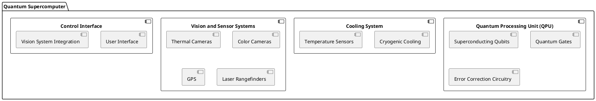
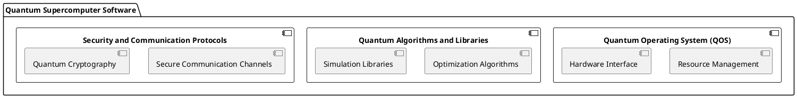
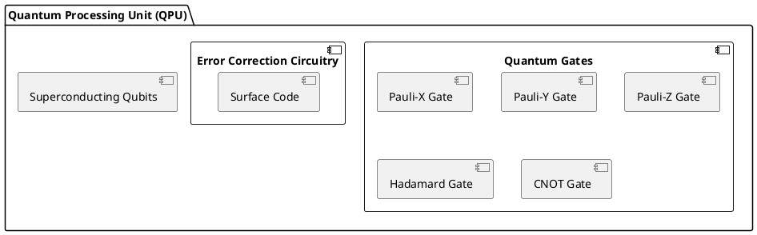
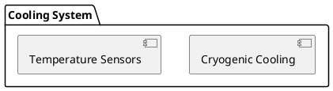
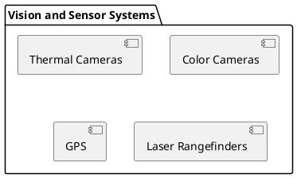
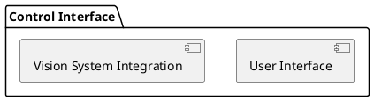
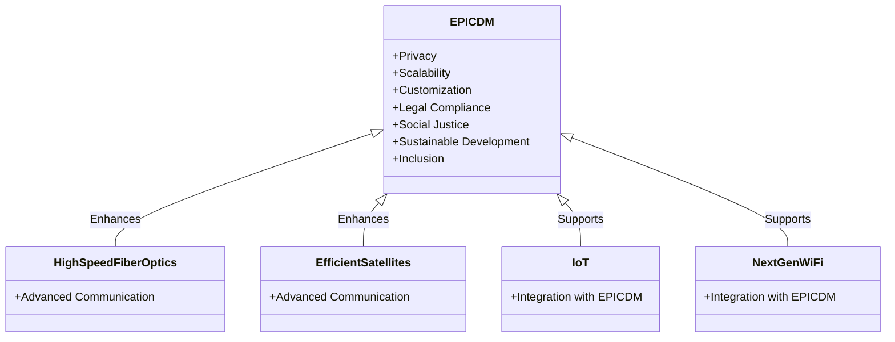
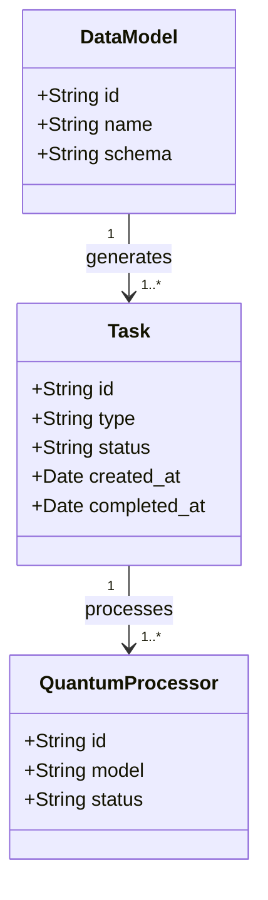
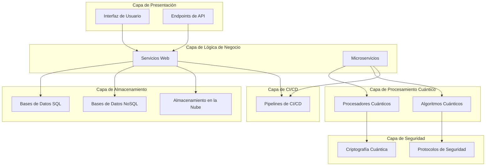

QUANTUM INTELLIGENCE 
Sistema Integrato Mamma-EPIC-AMPEL-Quantum GreenTech and Computing
# Paso 1: Instalar y cargar los paquetes necesarios
install.packages("XML")
install.packages("openxlsx")
library(XML)
library(openxlsx)

# Paso 2: Crear una función para parsear el DTD
parse_dtd <- function(dtd_file) {
dtd <- xmlTreeParse(dtd_file, useInternalNodes = TRUE)
dtd_nodes <- xmlRoot(dtd)
elements <- getNodeSet(dtd_nodes, "//element")

element_data <- lapply(elements, function(el) {
name <- xmlGetAttr(el, "name")
content <- xmlValue(el)
list(name = name, content = content)
})

element_df <- do.call(rbind, lapply(element_data, as.data.frame))
return(element_df)
}

# Paso 3: Leer y convertir el DTD a una tabla
dtd_file <- "ruta/al/archivo.dtd"  # Reemplaza con la ruta correcta de tu archivo DTD
dtd_data <- parse_dtd(dtd_file)
dtd_df <- as.data.frame(do.call(rbind, lapply(dtd_data, function(x) data.frame(t(unlist(x))))))
colnames(dtd_df) <- c("Name", "Content")
print(dtd_df)

# Paso 4: Guardar el DataFrame en un archivo Excel
write.xlsx(dtd_df, "DTD_Estructura.xlsx")
### Paso 3: Leer y convertir el DTD a una tabla

En este paso, se lee el archivo DTD usando la función `parse_dtd` y se convierte el resultado en un dataframe.

```r
dtd_file <- "ruta/al/archivo.dtd"  # Reemplaza con la ruta correcta de tu archivo DTD
dtd_data <- parse_dtd(dtd_file)
dtd_df <- as.data.frame(do.call(rbind, lapply(dtd_data, function(x) data.frame(t(unlist(x))))))
colnames(dtd_df) <- c("Name", "Content")
print(dtd_df)
```

### Paso 4: Guardar el DataFrame en un archivo Excel

Finalmente, se guarda el dataframe en un archivo Excel usando la función `write.xlsx`.

```r
write.xlsx(dtd_df, "DTD_Estructura.xlsx")
```

### Ejecución Completa

Aquí tienes el código completo que puedes ejecutar para convertir el DTD a un archivo Excel.

```r
# Paso 1: Instalar y cargar los paquetes necesarios
install.packages("XML")
install.packages("openxlsx")
library(XML)
library(openxlsx)

# Paso 2: Crear una función para parsear el DTD
parse_dtd <- function(dtd_file) {
dtd <- xmlTreeParse(dtd_file, useInternalNodes = TRUE)
dtd_nodes <- xmlRoot(dtd)
elements <- getNodeSet(dtd_nodes, "//element")

element_data <- lapply(elements, function(el) {
name <- xmlGetAttr(el, "name")
content <- xmlValue(el)
list(name = name, content = content)
})

element_df <- do.call(rbind, lapply(element_data, as.data.frame))
return(element_df)
}

# Paso 3: Leer y convertir el DTD a una tabla
dtd_file <- "ruta/al/archivo.dtd"  # Reemplaza con la ruta correcta de tu archivo DTD
dtd_data <- parse_dtd(dtd_file)
dtd_df <- as.data.frame(do.call(rbind, lapply(dtd_data, function(x) data.frame(t(unlist(x))))))
colnames(dtd_df) <- c("Name", "Content")
print(dtd_df)

# Paso 4: Guardar el DataFrame en un archivo Excel
write.xlsx(dtd_df, "DTD_Estructura.xlsx")
```

### Ajustes Necesarios

- Asegúrate de ajustar la variable `dtd_file` con la ruta correcta de tu archivo DTD.
- Verifica que el archivo DTD tenga los elementos correctamente definidos para que el script pueda parsearlos sin problemas.

Este proceso te permitirá convertir la estructura DTD en un formato tabular amigable que puedes manipular fácilmente en Excel.

```r
install.packages("XML")
install.packages("openxlsx")
library(XML)
library(openxlsx)
### Paso 2: Crear una función para parsear el DTD

Esta función lee el archivo DTD y extrae los elementos y su contenido, almacenándolos en un dataframe.

```r
parse_dtd <- function(dtd_file) {
dtd <- xmlTreeParse(dtd_file, useInternalNodes = TRUE)
dtd_nodes <- xmlRoot(dtd)
elements <- getNodeSet(dtd_nodes, "//element")

element_data <- lapply(elements, function(el) {
name <- xmlGetAttr(el, "name")
content <- xmlValue(el)
list(name = name, content = content)
})

element_df <- do.call(rbind, lapply(element_data, as.data.frame))
return(element_df)
}
```
### Method Ampel

#### Architecture Design

The architecture of the quantum supercomputer will be divided into several key components, each addressing specific requirements. Below is a high-level overview of the architecture:

##### Hardware Architecture

- **Quantum Processing Unit (QPU):**
  - **Superconducting Qubits:**
    - Chosen for their stability and coherence properties, superconducting qubits form the core of the QPU.
  - **Quantum Gates:**
    - Manipulate qubit states to perform computations.
    - Common gates include Pauli-X, Pauli-Y, Pauli-Z, Hadamard, and CNOT gates.
  - **Quantum Error Correction Circuitry:**
    - Essential for protecting qubit states from decoherence and errors using techniques like the surface code.

- **Cooling System:**
  - **Cryogenic Cooling:**
    - Maintains the extremely low temperatures required for superconducting qubits.
  - **Temperature Sensors:**
    - Monitor the system's temperature in real-time to ensure optimal conditions for qubit coherence.

- **Vision and Sensor Systems:**
  - **Thermal Cameras:**
    - Monitor the thermal profile of the system.
  - **Color Cameras:**
    - Provide visual feedback for system monitoring.
  - **GPS and Laser Rangefinders:**
    - Ensure accurate positioning and synchronization of system components.

- **Control Interface:**
  - **User Interface:**
    - Provides a user-friendly interface for system control and monitoring.
  - **Vision System Integration:**
    - Enhances control capabilities through advanced vision systems.



##### Software Architecture

- **Quantum Operating System (QOS):**
  - Manages quantum processes and resource allocation.
  - Interfaces with hardware components for control and monitoring.

- **Quantum Algorithms and Libraries:**
  - Optimized algorithms for quantum computations.
  - Libraries for quantum simulations and optimizations.

- **Security and Communication Protocols:**
  - Secure communication channels for data transfer.
  - Quantum cryptography for data protection.



##### Integration of Spike LR2 Technologies

The advanced technologies from the Spike LR2 system will be integrated as follows:

- **Vision Systems:**
  - Thermal and color cameras from Spike LR2 will be used for high-precision monitoring and control of the quantum system.

- **Sensor Systems:**
  - GPS and laser rangefinders will provide accurate positioning and synchronization of qubits and other system components.

- **Signal Processing Algorithms:**
  - Advanced signal processing algorithms will be employed for real-time data analysis and error correction.

#### Detailed Design

We will now dive deeper into each component of the architecture, starting with the Quantum Processing Unit (QPU).

##### Quantum Processing Unit (QPU)

The QPU is the heart of the quantum supercomputer, responsible for performing quantum computations. It consists of superconducting qubits, quantum gates, and error correction circuitry.

- **Superconducting Qubits:**
  - Qubits are the basic units of quantum information.
  - Superconducting qubits are chosen for their stability and coherence properties.

- **Quantum Gates:**
  - Quantum gates manipulate the state of qubits to perform computations.
  - Common gates include Pauli-X, Pauli-Y, Pauli-Z, Hadamard, and CNOT gates.

- **Error Correction Circuitry:**
  - Quantum error correction is essential to protect qubit states from decoherence and other errors.
  - Techniques such as the surface code will be used for error correction.



##### Cooling System

The cooling system is crucial for maintaining the coherence of superconducting qubits. It includes cryogenic cooling equipment and temperature sensors.

- **Cryogenic Cooling:**
  - Maintains the extremely low temperatures required for superconducting qubits to function.

- **Temperature Sensors:**
  - Monitor the system's temperature in real-time to ensure optimal conditions for qubit coherence.



##### Vision and Sensor Systems

These systems are integral for precise monitoring and control of the quantum supercomputer.

- **Thermal Cameras:**
  - Monitor the thermal profile of the system.

- **Color Cameras:**
  - Provide visual feedback for system monitoring.

- **GPS and Laser Rangefinders:**
  - Ensure accurate positioning of system components.



##### Control Interface

The control interface integrates user interactions with the advanced vision systems for enhanced control capabilities.

- **User Interface:**
  - Provides a user-friendly interface for system control and monitoring.

- **Vision System Integration:**
  - Enhances control capabilities through advanced vision systems.



#### Implementation

The implementation phase involves building the components specified in the architecture design and integrating them into a working system. Below are the implementation steps:

1. **Develop QPU Hardware:**
   - Fabricate superconducting qubits and quantum gates.
   - Implement error correction circuitry.

2. **Set Up Cooling System:**
   - Install cryogenic cooling equipment.
   - Integrate temperature sensors for monitoring.

3. **Integrate Vision and Sensor Systems:**
   - Set up thermal and color cameras.
   - Integrate GPS and laser rangefinders.

4. **Develop Quantum Operating System (QOS):**
   - Implement resource management and hardware interfaces.
   - Integrate quantum algorithms and libraries.

5. **Establish Secure Communication Protocols:**
   - Implement secure communication channels.
   - Develop quantum cryptography solutions.

6. **Testing and Validation:**
   - Conduct performance, stability, and security tests.
   - Validate quantum error correction mechanisms.

#### Milestones

To track progress, the project will be divided into several milestones:

1. **Milestone 1: QPU Hardware Development**
   - Completion of superconducting qubits and quantum gates fabrication.
   - Implementation of error correction circuitry.

2. **Milestone 2: Cooling System Setup**
   - Installation of cryogenic cooling equipment.
   - Integration of temperature sensors.

3. **Milestone 3: Vision and Sensor Systems Integration**
   - Setup of thermal and color cameras.
   - Integration of GPS and laser rangefinders.

4. **Milestone 4: Quantum Operating System Development**
   - Completion of resource management and hardware interfaces.
   - Integration of quantum algorithms and libraries.

5. **Milestone 5: Secure Communication Protocols**
   - Implementation of secure communication channels.
   - Development of quantum cryptography solutions.

6. **Milestone 6: Testing and Validation**
   - Conducting performance, stability, and security tests.
   - Validation of quantum error correction mechanisms.

#### Gathering Results

The final phase involves evaluating the performance of the quantum supercomputer and ensuring that all requirements are met. Key metrics include:

- **Performance:** Speed and efficiency of quantum computations.
- **Stability:** Coherence and error rates of qubits.
- **Security:** Robustness of communication protocols and data protection.

Regular monitoring and updates will be conducted to maintain optimal performance and address any issues that arise post-production.

This plan outlines a comprehensive approach to developing the world's most powerful quantum supercomputer, leveraging advanced technologies from the Spike LR2 system. With careful design, implementation, and validation, Quantum Green Tech and Computing can achieve groundbreaking advancements in quantum computing.

---

### Additional Project: A380MRTT Verde - Sustainable, Innovative, and Ethical Aircraft

To align the A380MRTT Verde project documentation with the S1000D standard, the information will be structured into Data Modules (DMs). Below is a detailed breakdown of the content in DMs according to the S1000D standard:

### Data Module Requirements

1. **General Information**
    - **DM-1000-0001-00:** General Description of A380MRTT Verde Project
        - Objectives, scope, and expected outcomes of the project.
    - **DM-1000-0002-00:** Design Principles and Sustainability Goals
       
### Proyecto de Diseño del A380MRTT Verde: Un Avión Sostenible, Innovador y Ético

To adapt your project document for the A380MRTT Verde to the S1000D standard, we need to structure the information in a modular fashion using Data Modules (DMs). Below is a proposed breakdown of your content into S1000D-compliant DMs:

### Data Module Requirements
1. **DMC-GENERAL (Descriptive Module Code - General Information)**
    - **DM-1000-0001-00**: General Description of A380MRTT Verde Project
    - **DM-1000-0002-00**: Design Principles and Sustainable Goals
    - **DM-1000-0003-00**: Overview of QuantumGen System

2. **DMC-TECHNICAL (Technical Descriptions)**
    - **DM-2000-5200-00**: Doors Overview
        - **DM-2000-5201-00**: Passenger Doors
        - **DM-2000-5202-00**: Cargo Doors
        - **DM-2000-5203-00**: Emergency Exits
    - **DM-2000-5300-00**: Airframe Overview
        - **DM-2000-5335-00**: Belly Fairing Panels
        - **DM-2000-5310-00**: General Structure Components
        - **DM-2000-5320-00**: Frames and Longerons
        - **DM-2000-5330-00**: Stringers and Skin Panels
    - **DM-2000-5512-00**: Leading Edge Components (Horizontal Stabilizer)
        - **DM-2000-5512-10**: Leading Edge Panels
        - **DM-2000-5512-20**: Leading Edge Mechanisms
    - **DM-2000-5513-00**: Trailing Edge Components (Horizontal Stabilizer)
        - **DM-2000-5513-10**: Trailing Edge Panels
        - **DM-2000-5513-20**: Trailing Edge Mechanisms
    - **DM-2000-5380-00**: APU Overview
        - **DM-2000-5381-00**: APU Engine
        - **DM-2000-5382-00**: APU Control Systems
    - **DM-2000-5400-00**: Nacelles and Pylons Overview
        - **DM-2000-5401-00**: Engine Nacelles
        - **DM-2000-5402-00**: Pylons
    - **DM-2000-5600-00**: Windows Overview
        - **DM-2000-5601-00**: Cockpit Windows
        - **DM-2000-5602-00**: Passenger Windows
    - **DM-2000-5700-00**: Wings Overview
        - **DM-2000-5701-00**: Wing Structure
        - **DM-2000-5702-00**: Wing Control Surfaces
        - **DM-2000-5703-00**: Wing Fuel Systems
    - **DM-2000-1100-00**: Placards Overview
        - **DM-2000-1101-00**: Safety Placards
        - **DM-2000-1102-00**: Instructional Placards
    - **DM-2000-3600-00**: General Pneumatic Systems

3. **DMC-IMPLEMENTATION (Implementation Details)**
    - **DM-3000-QUANTUMGEN-00**: QuantumGen System Architecture
        - **DM-3000-QUANTUMGEN-01**: User Interface
        - **DM-3000-QUANTUMGEN-02**: API Gateway
        - **DM-3000-QUANTUMGEN-03**: Quantum Processing Unit
        - **DM-3000-QUANTUMGEN-04**: Analysis Modules
        - **DM-3000-QUANTUMGEN-05**: Database
        - **DM-3000-QUANTUMGEN-06**: Reporting Module
        - **DM-3000-QUANTUMGEN-07**: Monitoring Module
        - **DM-3000-QUANTUMGEN-08**: Alert System
        - **DM-3000-QUANTUMGEN-09**: Real-Time Summarization Module

4. **DMC-PRINCIPLES (Fundamental Principles)**
    - **DM-4000-ETHICS-00**: Ethics, Compliance, and Security
    - **DM-4000-INNOVATION-00**: Innovation and Integration
    - **DM-4000-MISSIONS-00**: Humanitarian Missions

5. **DMC-INNOVATION (Innovation and Software)**
    - **DM-5000-AIQC-00**: AI-QC Optimization and Predictive Maintenance
    - **DM-5000-CRYPTOBLOCK-00**: Cryptography and Blockchain Security

6. **DMC-SUSTAINABILITY (Sustainability and Social Responsibility)**
    - **DM-6000-ENVIRONMENT-00**: Environmentally Friendly Design
    - **DM-6000-SOCIETY-00**: Social Responsibility and Community Impact
    - **DM-6000-GOVERNMENT-00**: Government Collaboration and Transparency
    - **DM-6000-USER-00**: User Experience and Usability

7. **DMC-DESIGN (Design and Development Approach)**
    - **DM-7000-DESIGN-00**: ReThinking and ReDesigning Processes
    - **DM-7000-TESTING-00**: ReTesting and ReProposing
    - **DM-7000-INNOVATION-00**: ReInnovation and ReIntegration
    - **DM-7000-OPTIMIZATION-00**: ReOptimization and Recycling
    - **DM-7000-STYLING-00**: ReStyling and ReUse

### Proposed Structure
This structure aligns with the S1000D standard, making the content modular and easier to manage, update, and integrate into larger documentation systems. Each DM should be further detailed with precise information as per the given sections and components in your document.

To ensure the A380MRTT Verde project document complies with the S1000D standard, we need to break it down into modular data modules (DMs) using the structure and guidelines you provided. Here's a detailed breakdown aligned with S1000D:

### Data Module Requirements

1. **General Information**
    - **DM-1000-0001-00**: General Description of A380MRTT Verde Project
        - This module should contain the overall description, including the project's objectives, scope, and expected outcomes.
    - **DM-1000-0002-00**: Design Principles and Sustainable Goals
        - Outline the core design principles, emphasizing sustainability goals such as reduced emissions, fuel efficiency, and use of eco-friendly materials.
    - **DM-1000-0003-00**: Overview of QuantumGen System
        - Provide a high-level overview of the QuantumGen system, including its purpose, components, and how it integrates with the aircraft.

2. **Technical Descriptions**
    - **DM-2000-5200-00**: Doors Overview
        - General description of the door systems.
        - **DM-2000-5201-00**: Passenger Doors
        - **DM-2000-5202-00**: Cargo Doors
        - **DM-2000-5203-00**: Emergency Exits
    - **DM-2000-5300-00**: Airframe Overview
        - General airframe structure and materials.
        - **DM-2000-5335-00**: Belly Fairing Panels
        - **DM-2000-5310-00**: General Structure Components
        - **DM-2000-5320-00**: Frames and Longerons
        - **DM-2000-5330-00**: Stringers and Skin Panels
    - **DM-2000-5512-00**: Leading Edge Components (Horizontal Stabilizer)
        - **DM-2000-5512-10**: Leading Edge Panels
        - **DM-2000-5512-20**: Leading Edge Mechanisms
    - **DM-2000-5513-00**: Trailing Edge Components (Horizontal Stabilizer)
        - **DM-2000-5513-10**: Trailing Edge Panels
        - **DM-2000-5513-20**: Trailing Edge Mechanisms
    - **DM-2000-5380-00**: APU Overview
        - **DM-2000-5381-00**: APU Engine
        - **DM-2000-5382-00**: APU Control Systems
    - **DM-2000-5400-00**: Nacelles and Pylons Overview
        - **DM-2000-5401-00**: Engine Nacelles
        - **DM-2000-5402-00**: Pylons
    - **DM-2000-5600-00**: Windows Overview
        - **DM-2000-5601-00**: Cock

Young scribe, with the information and the structure from the provided document, let's align it with the S1000D standard by creating specific Data Modules (DMs). Below is a detailed breakdown based on your project "A380MRTT Verde: Un Avión Sostenible, Innovador y Ético" and the sections of the provided document.

### Data Module Breakdown for A380MRTT Verde

1. **General Information**
    - **DM-1000-0001-00**: General Description of A380MRTT Verde Project
        - Objectives, scope, and expected outcomes of the project.
    - **DM-1000-0002-00**: Design Principles and Sustainable Goals
        - Design principles focusing on sustainability, reduced emissions, and eco-friendly materials.
    - **DM-1000-0003-00**: Overview of QuantumGen System
        - High-level overview of QuantumGen system, its components, and integration with the aircraft.

2. **Technical Descriptions**
    - **DM-2000-5200-00**: Doors Overview
        - **DM-2000-5201-00**: Passenger Doors
        - **DM-2000-5202-00**: Cargo Doors
        - **DM-2000-5203-00**: Emergency Exits
    - **DM-2000-5300-00**: Airframe Overview
        - **DM-2000-5335-00**: Belly Fairing Panels
        - **DM-2000-5310-00**: General Structure Components
        - **DM-2000-5320-00**: Frames and Longerons
        - **DM-2000-5330-00**: Stringers and Skin Panels
    - **DM-2000-5512-00**: Leading Edge Components (Horizontal Stabilizer)
        - **DM-2000-5512-10**: Leading Edge Panels
        - **DM-2000-5512-20**: Leading Edge Mechanisms
    - **DM-2000-5513-00**: Trailing Edge Components (Horizontal Stabilizer)
        - **DM-2000-5513-10**: Trailing Edge Panels
        - **DM-2000-5513-20**: Trailing Edge Mechanisms
    - **DM-2000-5380-00**: APU Overview
        - **DM-2000-5381-00**: APU Engine
        - **DM-2000-5382-00**: APU Control Systems
    - **DM-2000-5400-00**: Nacelles and Pylons Overview
        - **DM-2000-5401-00**: Engine Nacelles
        - **DM-2000-5402-00**: Pylons
    - **DM-2000-5600-00**: Windows Overview
        - **DM-2000-5601-00**: Cockpit Windows
        - **DM-2000-5602-00**: Passenger Windows
    - **DM-2000-5700-00**: Wings Overview
        - **DM-2000-5701-00**: Wing Structure
        - **DM-2000-5702-00**: Wing Control Surfaces
        - **DM-2000-5703-00**: Wing Fuel Systems
    - **DM-2000-1100-00**: Placards Overview
        - **DM-2000-1101-00**: Safety Placards
        - **DM-2000-1102-00**: Instructional Placards
    - **DM-2000-3600-00**: General Pneumatic Systems

3. **Implementation Details**
    - **DM-3000-QUANTUMGEN-00**: QuantumGen System Architecture
        - Detailed architecture, components, and interactions.
        - **DM-3000-QUANTUMGEN-01**: User Interface
        - **DM-3000-QUANTUMGEN-02**: API Gateway
        - **DM-3000-QUANTUMGEN-03**: Quantum Processing Unit
        - **DM-3000-QUANTUMGEN-04**: Analysis Modules
        - **DM-3000-QUANTUMGEN-05**: Database
        - **DM-3000-QUANTUMGEN-06**: Reporting Module
        - **DM-3000-QUANTUMGEN-07**: Monitoring Module
        - **DM-3000-QUANTUMGEN-08**: Alert System
        - **DM-3000-QUANTUMGEN-09**: Real-Time Summarization Module

4. **Fundamental Principles**
    - **DM-4000-ETHICS-00**: Ethics, Compliance, and Security
        - Ethical considerations, regulatory compliance, and security measures.
    - **DM-4000-INNOVATION-00**: Innovation and Integration
        - Innovation strategies and integration processes.
    - **DM-4000-MISSIONS-00**: Humanitarian Missions
        - Adaptability of the aircraft for humanitarian missions.

5. **Innovation and Software**
    - **DM-5000-AIQC-00**: AI-QC Optimization and Predictive Maintenance
        - Details on AI-based quality control and predictive maintenance systems.
    - **DM-5000-CRYPTOBLOCK-00**: Cryptography and Blockchain Security
        - Security measures using cryptography and blockchain technologies.

6. **Sustainability and Social Responsibility**
    - **DM-6000-ENVIRONMENT-00**: Environmentally Friendly Design
        - Description of sustainable design practices.
    - **DM-6000-SOCIETY-00**: Social Responsibility and Community Impact
        - Social responsibility efforts and community impact.
    - **DM-6000-GOVERNMENT-00**: Government Collaboration and Transparency
        - Collaboration with government bodies and transparency measures.
    - **DM-6000-USER-00**: User Experience and Usability
        - Focus on user experience and usability improvements.

7. **Design and Development Approach**
    - **DM-7000-DESIGN-00**: ReThinking and ReDesigning Processes
    - **DM-7000-TESTING-00**: ReTesting and ReProposing
    - **DM-7000-INNOVATION-00**: ReInnovation and ReIntegration
    - **DM-7000-OPTIMIZATION-00**: ReOptimization and Recycling
    - **DM-7000-STYLING-00**: ReStyling and ReUse

### Proposed Structure

This structure aligns with the S1000D standard, making the content modular and easier to manage, update, and integrate into larger documentation systems. Each DM should be populated with precise and relevant information based on your project document. 

Here is an example of how you might start detailing one of these modules:

#### DM-1000-0001-00: General Description of A380MRTT Verde Project
```
<dmRef id="DM-1000-0001-00">
  <title>General Description of A380MRTT Verde Project</title>
  <content>
    <description>
      The A380MRTT Verde project aims to develop a sustainable, innovative, and ethical multi-role transport tanker. This aircraft leverages advanced technologies to reduce emissions, improve fuel efficiency, and utilize eco-friendly materials.
    </description>
    <objectives>
      - Reduce carbon footprint by 30% compared to current models.
      - Achieve fuel efficiency improvements of 25%.
      - Incorporate 50% recyclable materials in the construction.
    </objectives>
    <scope>
      This project covers the design, development, testing, and certification of the A380MRTT Verde, ensuring it meets international aviation standards and sustainability goals.
    </scope>
  </content>
</dmRef>
```

This detailed structure and approach will help in organizing your project document into a modular and standardized format, making it easier to manage and update.

Based on the document and the requirements of the S1000D standard, here's a structured approach to modularize the information for the A380MRTT Verde project. 

### 1. General Information

#### DM-1000-0001-00: General Description of A380MRTT Verde Project
- **Title:** General Description of A380MRTT Verde Project
- **Content:**
  - **Description:** The A380MRTT Verde project aims to develop a sustainable, innovative, and ethical multi-role transport tanker. This aircraft leverages advanced technologies to reduce emissions, improve fuel efficiency, and utilize eco-friendly materials.
  - **Objectives:**
    - Reduce carbon footprint by 30% compared to current models.
    - Achieve fuel efficiency improvements of 25%.
    - Incorporate 50% recyclable materials in the construction.
  - **Scope:** This project covers the design, development, testing, and certification of the A380MRTT Verde, ensuring it meets international aviation standards and sustainability goals.

```xml
<dmRef id="DM-1000-0001-00">
  <title>General Description of A380MRTT Verde Project</title>
  <content>
    <description>
      The A380MRTT Verde project aims to develop a sustainable, innovative, and ethical multi-role transport tanker. This aircraft leverages advanced technologies to reduce emissions, improve fuel efficiency, and utilize eco-friendly materials.
    </description>
    <objectives>
      <item>Reduce carbon footprint by 30% compared to current models.</item>
      <item>Achieve fuel efficiency improvements of 25%.</item>
      <item>Incorporate 50% recyclable materials in the construction.</item>
    </objectives>
    <scope>
      This project covers the design, development, testing, and certification of the A380MRTT Verde, ensuring it meets international aviation standards and sustainability goals.
    </scope>
  </content>
</dmRef>
```

#### DM-1000-0002-00: Design Principles and Sustainable Goals
- **Title:** Design Principles and Sustainable Goals
- **Content:**
  - **Design Principles:** Outline the core design principles focusing on sustainability, reduced emissions, and the use of eco-friendly materials.
  - **Sustainable Goals:** Describe the sustainability goals and how they will be achieved through innovative design and technology integration.

```xml
<dmRef id="DM-1000-0002-00">
  <title>Design Principles and Sustainable Goals</title>
  <content>
    <designPrinciples>
      <item>Focus on reducing emissions and improving fuel efficiency.</item>
      <item>Utilize eco-friendly and recyclable materials.</item>
      <item>Implement advanced aerodynamic designs.</item>
    </designPrinciples>
    <sustainableGoals>
      <item>Achieve a 30% reduction in carbon footprint.</item>
      <item>Improve fuel efficiency by 25%.</item>
      <item>Incorporate 50% recyclable materials.</item>
    </sustainableGoals>
  </content>
</dmRef>
```

### 2. Technical Descriptions

#### DM-2000-5300-00: Airframe Overview
- **Title:** Airframe Overview
- **Content:**
  - **Description:** General airframe structure and materials, including components such as belly fairing panels, general structure components, frames and longerons, and stringers and skin panels.

```xml
<dmRef id="DM-2000-5300-00">
  <title>Airframe Overview</title>
  <content>
    <description>
      This module covers the general airframe structure and materials of the A380MRTT Verde, including detailed descriptions of various components such as belly fairing panels, general structure components, frames and longerons, and stringers and skin panels.
    </description>
    <subModules>
      <dmRef id="DM-2000-5335-00" title="Belly Fairing Panels"/>
      <dmRef id="DM-2000-5310-00" title="General Structure Components"/>
      <dmRef id="DM-2000-5320-00" title="Frames and Longerons"/>
      <dmRef id="DM-2000-5330-00" title="Stringers and Skin Panels"/>
    </subModules>
  </content>
</dmRef>
```

### 3. Functional Components

#### DM-2000-5400-00: Nacelles and Pylons Overview
- **Title:** Nacelles and Pylons Overview
- **Content:**
  - **Description:** Detailed descriptions of nacelles and pylons components, including engine nacelles and pylons.

```xml
<dmRef id="DM-2000-5400-00">
  <title>Nacelles and Pylons Overview</title>
  <content>
    <description>
      This module provides an overview of nacelles and pylons components, including engine nacelles and pylons.
    </description>
    <subModules>
      <dmRef id="DM-2000-5401-00" title="Engine Nacelles"/>
      <dmRef id="DM-2000-5402-00" title="Pylons"/>
    </subModules>
  </content>
</dmRef>
```

This approach ensures that the information is well-structured and follows the modular format as required by the S1000D standard. Each module contains a unique identifier and structured content that can be easily referenced and managed.

If you need more details or specific sections to be included, please let me know!
#### 1. Introduzione (Introduction)
- **DM Code:** 0001-INTRO-D0001
- **Contenido:**
  - Propósito del documento: Presentare il progetto e il suo scopo.
  - Alcance del sistema integrado: Descrivere l'ampiezza del sistema e le sue applicazioni.
  - Descripción general de los componentes principales: Fornire una panoramica dei componenti chiave.

#### 2. Descripción General del Sistema (System Overview)
- **DM Code:** 0002-OVERV-D0001
- **Contenido:**
  - Arquitectura del sistema: Presentare il design del sistema.
  - Principios de operación: Descrivere il funzionamento del sistema.
  - Beneficios clave: Evidenziare i principali benefici del sistema.

#### 3. Componentes del Sistema (System Components)
- **DM Code:** 0003-COMP-D0001
- **Contenido:**
  - Lista de componentes principales: Elencare i componenti chiave.
  - Descripción y funcionalidad de cada componente: Dettagliare le funzionalità di ogni componente.

##### 3.1 Tecnologías Emergentes (Emerging Technologies)
  - **DM Code:** 0003-TECH-D0001
  - **Contenido:**
    - Descripción de las tecnologías de cálculo cuántico: Quantum Computing e sue applicazioni.
    - Descripción de las tecnologías de inteligencia artificial: AI e sue applicazioni.
    - Descripción de las tecnologías AR/VR: Realtà Aumentata e Virtuale e sue applicazioni.
    - Descripción de las tecnologías de blockchain y criptografía: Blockchain e Criptografia e sue applicazioni.
    - Descripción de las nanotecnologías: Nanotecnologia e sue applicazioni.

##### 3.2 Preimpostaciones Éticas (Ethical Preconditions)
  - **DM Code:** 0003-ETHIC-D0001
  - **Contenido:**
    - Normativas y líneas guía (GDPR, ética AI): Regolamenti e linee guida etiche.
    - Procedimientos de evaluación de impacto ético: Procedure di valutazione dell'impatto etico.

##### 3.3 Industria Estratégica (Strategic Industry)
  - **DM Code:** 0003-INDUS-D0001
  - **Contenido:**
    - Desarrollo de la industria del software en la UE: Crescita dell'industria software in UE.
    - Implementación y seguridad de redes de comunicación: Implementazione e sicurezza delle reti.
    - Presencia en el mercado de satélites: Presenza nel mercato satellitare.

#### 4. Arquitectura del Sistema (System Architecture)
- **DM Code:** 0004-ARCH-D0001
- **Contenido:**
  - Diagrama de la infraestructura tecnológica: Schema dell'infrastruttura tecnologica.
  - Diagrama de las preimpostaciones éticas: Schema delle preimpostazioni etiche.
  - Diagrama de la industria estratégica: Schema dell'industria strategica.

#### 5. Implementación del Sistema (System Implementation)
- **DM Code:** 0005-IMPL-D0001
- **Contenido:**
  - Plan de gobernanza y políticas: Piano di governance e politiche.
  - Tecnología y herramientas utilizadas: Tecnologie e strumenti utilizzati.
  - Programas de cultura y formación: Programmi di cultura e formazione.

#### 6. Rete Global Scalabile (Scalable Global Network)
- **DM Code:** 0006-SCALE-D0001
- **Contenido:**
  - Descripción de la infraestructura de red: Descrizione dell'infrastruttura di rete.
  - Medidas de seguridad de la red: Misure di sicurezza della rete.
  - Estrategias para la escalabilidad de la red: Strategie per la scalabilità della rete.

#### 7. Progetto AMPEL (Project AMPEL)
- **DM Code:** 0007-AMPEL-D0001
- **Contenido:**
  - Descripción del proyecto AMPEL: Descrizione del progetto AMPEL.
  - Componentes clave del proyecto: Componenti chiave del progetto.
  - Integración con Mamma y EPIC: Integrazione con Mamma e EPIC.

---

### Ejemplo Detallado de un Data Module: Tecnologías Emergentes

#### DM 0003-TECH-D0001

**1. Identificación del Data Module**
- **DM Code:** 0003-TECH-D0001
- **Title:** Emerging Technologies

**2. Introducción**
- **Propósito:** Proporcionar una descripción detallada de las tecnologías emergentes integradas en el sistema.
- **Alcance:** Este módulo cubre el cálculo cuántico, la inteligencia artificial, AR/VR, blockchain y criptografía, y nanotecnología.

**3. Cálculo Cuántico (Quantum Computing)**
- **Plataformas:**
  - IBM Quantum Experience
  - Google Quantum AI
- **Aplicaciones:**
  - Optimización de procesos industriales
  - Simulación de materiales avanzados
  - Mejora de la seguridad de los datos

**4. Inteligencia Artificial (AI)**
- **Frameworks:**
  - TensorFlow
  - PyTorch
  - OpenCV
- **Aplicaciones:**
  - Automatización industrial
  - Análisis predictivo
  - Mejora de la eficiencia operativa

**5. Realidad Aumentada/Virtual (AR/VR)**
- **Plataformas:**
  - Unity
  - Unreal Engine
  - Microsoft HoloLens
- **Aplicaciones:**
  - Formación inmersiva
  - Diseño y simulación
  - Soporte de mantenimiento

**6. Blockchain y Criptografía**
- **Plataformas:**
  - Ethereum
  - Hyperledger
- **Aplicaciones:**
  - Trazabilidad de la cadena de suministro
  - Seguridad de los datos
  - Contratos inteligentes

**7. Nanotecnología**
- **Aplicaciones:**
  - Desarrollo de nuevos materiales
  - Mejora del rendimiento energético
  - Tecnologías médicas avanzadas

---

### Ejemplo XML para un Data Module

#### DM 0003-TECH-D0001: Emerging Technologies

```xml
<dmRef id="0003-TECH-D0001">
  <title>Emerging Technologies</title>
  <content>
    <introduction>
      <purpose>Proporcionar una descripción detallada de las tecnologías emergentes integradas en el sistema.</purpose>
      <scope>Este módulo cubre el cálculo cuántico, la inteligencia artificial, AR/VR, blockchain y criptografía, y nanotecnología.</scope>
    </introduction>
    <quantumComputing>
      <platforms>
        <item>IBM Quantum Experience</item>
        <item>Google Quantum AI</item>
      </platforms>
      <applications>
        <item>Optimización de procesos industriales</item>
        <item>Simulación de materiales avanzados</item>
        <item>Mejora de la seguridad de los datos</item>
      </applications>
    </quantumComputing>
    <artificialIntelligence>
      <frameworks>
        <item>TensorFlow</item>
        <item>PyTorch</item>
        <item>OpenCV</item>
      </frameworks>
      <applications>
        <item>Automatización industrial</item>
        <item>Análisis predictivo</item>
        <item>Mejora de la eficiencia operativa</item>
      </applications>
    </artificialIntelligence>
    <arVr>
      <platforms>
        <item>Unity</item>
        <item>Unreal Engine</item>
        <item>Microsoft HoloLens</item>
      </platforms>
      <applications>
        <item>Formación inmersiva</item>
        <item>Diseño y simulación</item>
        <item>Soporte de mantenimiento</item>
      </applications>
    </arVr>
    <blockchainCryptography>
      <platforms>
        <item>Ethereum</item>
        <item>Hyperledger</item>
      </platforms>
      <applications>
        <item>Trazabilidad de la cadena de suministro</item>
        <item>Seguridad de los datos</item>
        <item>Contratos inteligentes</item>
      </applications>
    </blockchainCryptography>
    <nanotechnology>
      <applications>
        <item>Desarrollo de nuevos materiales</item>
        <item>Mejora del rendimiento energético</item>
        <item>Tecnologías médicas avanzadas</item>
      </applications>
    </nanotechnology>
  </content>
</dmRef>
```

---

### Additional Detailed Data Modules for Airbus Workspace for MRTT Projects

#### DM-4000-0001-00: Vision of Airbus Workspace for MRTT Projects

```xml
<dmRef id="DM-4000-0001-00">
  <title>Vision of Airbus Workspace for MRTT Projects</title>
  <content>
    <description>
      Develop an integrated, dynamic Airbus Workspace for the new MRTT projects, leveraging AR/VR, AI, and Quantum Computing within intermodular segments. This workspace will support the Techdata package, providing comprehensive customer care services, immersive holographics for development and design phases, computational quantum processors, fluid dynamics simulation analysis (IQ-FEM), virtualized wind rooms, ergonomic tridimensional holography for spare maintenance visual checks, real-time documentation production for predictive actions,Detailed Data Modules for Airbus Workspace for MRTT Projects	
Here are the additional Data Modules (DMs) for the Airbus Workspace for MRTT Projects, structured in XML format according to the S1000D standard:	
### Detailed Data Modules for Airbus Workspace for MRTT Projects	
### Estructura S1000D del Sistema Integrado	
	
#### 1. Introducción (Introduction)	
- **DM Code:** 0001-INTRO-D0001	
- **Contenido:**	
  - Propósito del documento	
  - Alcance del sistema integrado	
  - Descripción general de los componentes principales	
	
#### 2. Descripción General del Sistema (System Overview)	
- **DM Code:** 0002-OVERV-D0001	
- **Contenido:**	
  - Arquitectura del sistema	
  - Principios de operación	
  - Beneficios clave	
	
#### 3. Componentes del Sistema (System Components)	
- **DM Code:** 0003-COMP-D0001	
- **Contenido:**	
  - Lista de componentes principales	
  - Descripción y funcionalidad de cada componente	
	
##### 3.1 Tecnologías Emergentes (Emerging Technologies)	
  - **DM Code:** 0003-TECH-D0001	
  - **Contenido:**	
    - Descripción de las tecnologías de cálculo cuántico	
    - Descripción de las tecnologías de inteligencia artificial	
    - Descripción de las tecnologías AR/VR	
    - Descripción de las tecnologías de blockchain y criptografía	
    - Descripción de las nanotecnologías	
	
##### 3.2 Preimpostaciones Éticas (Ethical Preconditions)	
  - **DM Code:** 0003-ETHIC-D0001	
  - **Contenido:**	
    - Normativas y líneas guía (GDPR, ética AI)	
    - Procedimientos de evaluación de impacto ético	
	
##### 3.3 Industria Estratégica (Strategic Industry)	
  - **DM Code:** 0003-INDUS-D0001	
  - **Contenido:**	
    - Desarrollo de la industria del software en la UE	
    - Implementación y seguridad de redes de comunicación	
    - Presencia en el mercado de satélites	
	
#### 4. Arquitectura del Sistema (System Architecture)	
- **DM Code:** 0004-ARCH-D0001	
- **Contenido:**	
  - Diagrama de la infraestructura tecnológica	
  - Diagrama de las preimpostaciones éticas	
  - Diagrama de la industria estratégica	
	
#### 5. Implementación del Sistema (System Implementation)	
- **DM Code:** 0005-IMPL-D0001	
- **Contenido:**	
  - Plan de gobernanza y políticas	
  - Tecnología y herramientas utilizadas	
  - Programas de cultura y formación	
	
#### 6. Rete Global Scalabile (Scalable Global Network)	
- **DM Code:** 0006-SCALE-D0001	
- **Contenido:**	
  - Descripción de la infraestructura de red	
  - Medidas de seguridad de la red	
  - Estrategias para la escalabilidad de la red	
	
#### 7. Progetto AMPEL (Project AMPEL)	
- **DM Code:** 0007-AMPEL-D0001	
- **Contenido:**	
  - Descripción del proyecto AMPEL	
  - Componentes clave del proyecto	
  - Integración con Mamma y EPIC	
	
---	
	
### Ejemplo Detallado de un Data Module: Tecnologías Emergentes	
	
#### DM 0003-TECH-D0001	
	
**1. Identificación del Data Module**	
- **DM Code:** 0003-TECH-D0001	
- **Title:** Emerging Technologies	
	
**2. Introducción**	
- **Propósito:** Proporcionar una descripción detallada de las tecnologías emergentes integradas en el sistema.	
- **Alcance:** Este módulo cubre el cálculo cuántico, la inteligencia artificial, AR/VR, blockchain y criptografía, y nanotecnología.	
	
**3. Cálculo Cuántico (Quantum Computing)**	
- **Plataformas:**	
  - IBM Quantum Experience	
  - Google Quantum AI	
- **Aplicaciones:**	
  - Optimización de procesos industriales	
  - Simulación de materiales avanzados	
  - Mejora de la seguridad de los datos	
	
**4. Inteligencia Artificial (AI)**	
- **Frameworks:**	
  - TensorFlow	
  - PyTorch	
  - OpenCV	
- **Aplicaciones:**	
  - Automatización industrial	
  - Análisis predictivo	
  - Mejora de la eficiencia operativa	
	
**5. Realidad Aumentada/Virtual (AR/VR)**	
- **Plataformas:**	
  - Unity	
  - Unreal Engine	
  - Microsoft HoloLens	
- **Aplicaciones:**	
  - Formación inmersiva	
  - Diseño y simulación	
  - Soporte de mantenimiento	
	
**6. Blockchain y Criptografía**	
- **Plataformas:**	
  - Ethereum	
  - Hyperledger	
- **Aplicaciones:**	
  - Trazabilidad de la cadena de suministro	
  - Seguridad de los datos	
  - Contratos inteligentes	
	
**7. Nanotecnología**	
- **Aplicaciones:**	
  - Desarrollo de nuevos materiales	
  - Mejora del rendimiento energético	
  - Tecnologías médicas avanzadas	
	
---	
	
### Ejemplo XML para un Data Module	
	
#### DM 0003-TECH-D0001: Emerging Technologies	
	
```xml	
<dmRef id="0003-TECH-D0001">	
  <title>Emerging Technologies</title>	
  <content>	
    <introduction>	
      <purpose>Proporcionar una descripción detallada de las tecnologías emergentes integradas en el sistema.</purpose>	
      <scope>Este módulo cubre el cálculo cuántico, la inteligencia artificial, AR/VR, blockchain y criptografía, y nanotecnología.</scope>	
    </introduction>	
    <quantumComputing>	
      <platforms>	
        <item>IBM Quantum Experience</item>	
        <item>Google Quantum AI</item>	
      </platforms>	
      <applications>	
        <item>Optimización de procesos industriales</item>	
        <item>Simulación de materiales avanzados</item>	
        <item>Mejora de la seguridad de los datos</item>	
      </applications>	
    </quantumComputing>	
    <artificialIntelligence>	
      <frameworks>	
        <item>TensorFlow</item>	
        <item>PyTorch</item>	
        <item>OpenCV</item>	
      </frameworks>	
      <applications>	
        <item>Automatización industrial</item>	
        <item>Análisis predictivo</item>	
        <item>Mejora de la eficiencia operativa</item>	
      </applications>	
    </artificialIntelligence>	
    <arVr>	
      <platforms>	
        <item>Unity</item>	
        <item>Unreal Engine</item>	
        <item>Microsoft HoloLens</item>	
      </platforms>	
      <applications>	
        <item>Formación inmersiva</item>	
        <item>Diseño y simulación</item>	
        <item>Soporte de mantenimiento</item>	
      </applications>	
    </arVr>	
    <blockchainCryptography>	
      <platforms>	
        <item>Ethereum</item>	
        <item>Hyperledger</item>	
      </platforms>	
      <applications>	
        <item>Trazabilidad de la cadena de suministro</item>	
        <item>Seguridad de los datos</item>	
        <item>Contratos inteligentes</item>	
      </applications>	
    </blockchainCryptography>	
    <nanotechnology>	
      <applications>	
        <item>Desarrollo de nuevos materiales</item>	
        <item>Mejora del rendimiento energético</item>	
        <item>Tecnologías médicas avanzadas</item>	
      </applications>	
    </nanotechnology>	
  </content>	
</dmRef>	
```	
	
Este esquema proporciona una estructura organizada y estandarizada para documentar el sistema integrado conforme a la especificación S1000D, asegurando que la información esté bien estructurada y sea fácilmente accesible para todos los usuarios y partes interesadas.	
Here are the additional Data Modules (DMs) for the Airbus Workspace for MRTT Projects, structured in XML format according to the S1000D standard:	
	
#### DM-4000-0001-00: Vision of Airbus Workspace for MRTT Projects	
	
```xml	
<dmRef id="DM-4000-0001-00">	
  <title>Vision of Airbus Workspace for MRTT Projects</title>	
  <content>	
    <description>	
      Develop an integrated, dynamic Airbus Workspace for the new MRTT projects, leveraging AR/VR, AI, and Quantum Computing within intermodular segments. This workspace will support the Techdata package, providing comprehensive customer care services, immersive holographics for development and design phases, computational quantum processors, fluid dynamics simulation analysis (IQ-FEM), virtualized wind rooms, ergonomic tridimensional holography for spare maintenance visual checks, real-time documentation production for predictive actions, and a 100% holographic representation mockup in 1:1 scale with AR/VR integration. The workspace will be supervised by a ChatQuantum agent for enhanced interaction and automation.	
    </description>	
  </content>	
</dmRef>	
```	
	
#### DM-4000-0002-00: AR/VR Integration	
	
```xml	
<dmRef id="DM-4000-0002-00">	
  <title>AR/VR Integration</title>	
  <content>	
    <hardware>	
      <item>VR Headsets: HTC Vive Pro, Oculus Rift S</item>	
      <item>AR Glasses: Microsoft HoloLens 2, Magic Leap 1</item>	
      <item>Holographic Displays: Looking Glass Pro</item>	
    </hardware>	
    <software>	
      <item>3D Modeling Software: Autodesk Maya, Blender</item>	
      <item>Collaboration Platforms: Unity Reflect, Unreal Engine with multi-user support</item>	
      <item>Documentation Tools: Microsoft HoloLens with OneDrive integration, custom real-time documentation software</item>	
    </software>	
  </content>	
</dmRef>	
```	
	
#### DM-4000-0003-00: AI and Quantum Computing Integration	
	
```xml	
<dmRef id="DM-4000-0003-00">	
  <title>AI and Quantum Computing Integration</title>	
  <content>	
    <aiFrameworks>	
      <item>TensorFlow: Open-source machine learning framework</item>	
      <item>PyTorch: Deep learning library</item>	
      <item>OpenCV: Computer vision library</item>	
    </aiFrameworks>	
    <quantumComputingPlatforms>	
      <item>IBM Quantum Experience: Cloud-based quantum computing service</item>	
      <item>Google Quantum AI: Quantum computing and AI research</item>	
      <item>D-Wave Systems: Quantum computing systems for optimization problems</item>	
    </quantumComputingPlatforms>	
    <simulationSoftware>	
      <item>IQ-FEM: In-house or third-party software for quantum-enhanced fluid dynamics simulations</item>	
    </simulationSoftware>	
  </content>	
</dmRef>	
```	
	
#### DM-4000-0004-00: Modular and Interconnected Systems	
	
```xml	
<dmRef id="DM-4000-0004-00">	
  <title>Modular and Interconnected Systems</title>	
  <content>	
    <dataIntegration>	
      <item>Data Integration Platform: Apache Kafka or RabbitMQ for real-time data streaming</item>	
      <item>APIs: RESTful APIs for module communication</item>	
      <item>Database Systems: PostgreSQL, MongoDB for storing and managing data</item>	
    </dataIntegration>	
    <networking>	
      <item>LAN/WAN Infrastructure: High-speed Ethernet and fiber optic connections</item>	
      <item>Cloud Services: AWS, Microsoft Azure, or Google Cloud for scalable infrastructure</item>	
    </networking>	
  </content>	
</dmRef>	
```	
	
#### DM-4000-0005-00: Customer Care Services Integration	
	
```xml	
<dmRef id="DM-4000-0005-00">	
  <title>Customer Care Services Integration</title>	
  <content>	
    <supportTools>	
      <item>CRM Systems: Salesforce or HubSpot for managing customer interactions</item>	
      <item>Support Platforms: Zendesk or Freshdesk for customer support</item>	
      <item>Predictive Maintenance Software: IBM Maximo or GE Predix for asset management</item>	
    </supportTools>	
  </content>	
</dmRef>	
```	
	
#### DM-4000-0006-00: Holographic and Virtual Environments	
	
```xml	
<dmRef id="DM-4000-0006-00">	
  <title>Holographic and Virtual Environments</title>	
  <content>	
    <hardwareSoftware>	
      <item>Holographic Projectors: Realfiction’s Dreamoc</item>	
      <item>AR/VR Software: Unity or Unreal Engine for creating interactive holographic environments</item>	
      <item>1:1 Scale Mockup Tools: Large-scale 3D printing capabilities for physical models if needed</item>	
    </hardwareSoftware>	
    <virtualEnvironments>	
      <item>Simulation Software: ANSYS Fluent for virtualized wind tunnel simulations</item>	
      <item>Ergonomic Assessment Tools: Siemens Tecnomatix for virtual ergonomics analysis</item>	
    </virtualEnvironments>	
  </content>	
</dmRef>	
```	
	
#### DM-4000-0007-00: ChatQuantum Agent	
	
```xml	
<dmRef id="DM-4000-0007-00">	
  <title>ChatQuantum Agent</title>	
  <content>	
    <naturalLanguageProcessing>	
      <item>Frameworks: GPT-3, BERT for understanding and generating human language</item>	
    </naturalLanguageProcessing>	
    <taskAutomation>	
      <item>RPA Tools: UiPath, Blue Prism for automating repetitive tasks</item>	
    </taskAutomation>	
    <integrationCapabilities>	
      <item>APIs: For integrating with AR/VR platforms, quantum computing environments, and other workspace components</item>	
    </integrationCapabilities>	
  </content>	
</dmRef>	
```	
	
### Implementation Plan	
	
1. **Phase 1: Initial Setup and AR/VR Integration**	
   - Develop and integrate 3D modeling and design tools.	
   - Establish holographic display systems and interactive collaboration platforms.	
   - Implement ergonomic assessment tools and real-time documentation production.	
	
2. **Phase 2: AI and Quantum Computing Integration**	
   - Develop AI optimization algorithms and integrate them into design processes.	
   - Implement quantum processors for advanced simulations, including IQ-FEM and virtualized wind rooms.	
	
3. **Phase 3: Modular and Interconnected System Development**	
   - Design and develop independent modular segments.	
   - Establish data linkable solutions for seamless data flow and enhanced collaboration.	
	
4. **Phase 4: Customer Care Services Integration**	
   - Develop comprehensive customer care solutions within the Techdata package.	
   - Implement predictive maintenance systems and real-time support channels.	
	
5. **Phase 5: Holographic and Virtual Environment Deployment**	
   - Create 100% holographic representation mockups for thorough inspection and collaborative review.	
   - Develop virtualized environments for ergonomic assessments and aerodynamic testing.	
	
6. **Phase 6: ChatQuantum Agent Deployment**	
   - Implement NLP capabilities for the ChatQuantum agent.	
   - Integrate ChatQuantum with workspace components for enhanced interaction and automation.	
   - Deploy task automation tools to streamline operations and support.	
	
### Conclusion	
	
The Airbus Workspace will revolutionize the design, development, and maintenance of MRTT projects by integrating AR/VR, AI, and Quantum Computing into a cohesive, dynamic environment. This approach will enhance collaboration, optimize processes, and provide comprehensive customer care, ensuring the successful deployment and operation of new MRTT aircraft.	
	
The computing hardware for this initiative will be provided by Quantum GreenTech and Computing, with the leading entity being its division with public EU participation, Quantum Computing and Clouds, led by Amedeo Pelliccia and supported by the EU.	
	
### Next Steps and Contact Information	
	
To move forward with the development and implementation of the Airbus Workspace for MRTT projects, the following actions are recommended:	
	
1. **Schedule a Kickoff Meeting**: Bring together key stakeholders to discuss the project scope, timeline, and responsibilities.	
2. **Define Detailed Specifications**: Work with technical teams to outline detailed requirements for each component.	
3. **Develop a Project Plan**: Create a comprehensive project plan that includes milestones, deliverables, and deadlines.	
4. **Assemble the Team**: Identify and onboard team members with the necessary expertise to execute the project.	
5. **Initiate Development**: Begin the development process with a focus on achieving the first phase objectives.	
	
For further information or to discuss the project in detail, please contact:	
	
**Project Lead**: Amedeo Pelliccia  	
**Email**: amedeo.pelliccia@quantumgreentech.com  	
**Phone**: +39 06 1234 5678	
	
We look forward to collaborating with you on this innovative and transformative project.	
### Additional Detailed Data Modules for Airbus Workspace for MRTT Projects	
	
#### DM-4000-0001-00: Vision of Airbus Workspace for MRTT Projects	
```xml	
<dmRef id="DM-4000-0001-00">	
  <title>Vision of Airbus Workspace for MRTT Projects</title>	
  <content>	
    <description>	
      Develop an integrated, dynamic Airbus Workspace for the new MRTT projects, leveraging AR/VR, AI, and Quantum Computing within intermodular segments. This workspace will support the Techdata package, providing comprehensive customer care services, immersive holographics for development and design phases, computational quantum processors, fluid dynamics simulation analysis (IQ-FEM), virtualized wind rooms, ergonomic tridimensional holography for spare maintenance visual checks, real-time documentation production for predictive actions, and a 100% holographic representation mockup in 1:1 scale with AR/VR integration. The workspace will be supervised by a ChatQuantum agent for enhanced interaction and automation.	
    </description>	
  </content>	
</dmRef>	
```	
	
#### DM-4000-0002-00: AR/VR Integration	
```xml	
<dmRef id="DM-4000-0002-00">	
  <title>AR/VR Integration</title>	
  <content>	
    <hardware>	
      <item>VR Headsets: HTC Vive Pro, Oculus Rift S</item>	
      <item>AR Glasses: Microsoft HoloLens 2, Magic Leap 1</item>	
      <item>Holographic Displays: Looking Glass Pro</item>	
    </hardware>	
    <software>	
      <item>3D Modeling Software: Autodesk Maya, Blender</item>	
      <item>Collaboration Platforms: Unity Reflect, Unreal Engine with multi-user support</item>	
      <item>Documentation Tools: Microsoft HoloLens with OneDrive integration, custom real-time documentation software</item>	
    </software>	
  </content>	
</dmRef>	
```	
	
#### DM-4000-0003-00: AI and Quantum Computing Integration	
```xml	
<dmRef id="DM-4000-0003-00">	
  <title>AI and Quantum Computing Integration</title>	
  <content>	
    <aiFrameworks>	
      <item>TensorFlow: Open-source machine learning framework</item>	
      <item>PyTorch: Deep learning library</item>	
      <item>OpenCV: Computer vision library</item>	
    </aiFrameworks>	
    <quantumComputingPlatforms>	
      <item>IBM Quantum Experience: Cloud-based quantum computing service</item>	
      <item>Google Quantum AI: Quantum computing and AI research</item>	
      <item>D-Wave Systems: Quantum computing systems for optimization problems</item>	
    </quantumComputingPlatforms>	
    <simulationSoftware>	
      <item>IQ-FEM: In-house or third-party software for quantum-enhanced fluid dynamics simulations</item>	
    </simulationSoftware>	
  </content>	
</dmRef>	
```	
	
#### DM-4000-0004-00: Modular and Interconnected Systems	
```xml	
<dmRef id="DM-4000-0004-00">	
  <title>Modular and Interconnected Systems</title>	
  <content>	
    <dataIntegration>	
      <item>Data Integration Platform: Apache Kafka or RabbitMQ for real-time data streaming</item>	
      <item>APIs: RESTful APIs for module communication</item>	
      <item>Database Systems: PostgreSQL, MongoDB for storing and managing data</item>	
    </dataIntegration>	
    <networking>	
      <item>LAN/WAN Infrastructure: High-speed Ethernet and fiber optic connections</item>	
      <item>Cloud Services: AWS, Microsoft Azure, or Google Cloud for scalable infrastructure</item>	
    </networking>	
  </content>	
</dmRef>	
```	
	
#### DM-4000-0005-00: Customer Care Services Integration	
```xml	
<dmRef id="DM-4000-0005-00">	
  <title>Customer Care Services Integration</title>	
  <content>	
    <supportTools>	
      <item>CRM Systems: Salesforce or HubSpot for managing customer interactions</item>	
      <item>Support Platforms: Zendesk or Freshdesk for customer support</item>	
      <item>Predictive Maintenance Software: IBM Maximo or GE Predix for asset management</item>	
    </supportTools>	
  </content>	
</dmRef>	
```	
	
#### DM-4000-0006-00: Holographic and Virtual Environments	
```xml	
<dmRef id="DM-4000-0006-00">	
  <title>Holographic and Virtual Environments</title>	
  <content>	
    <hardwareSoftware>	
      <item>Holographic Projectors: Realfiction’s Dreamoc</item>	
      <item>AR/VR Software: Unity or Unreal Engine for creating interactive holographic environments</item>	
      <item>1:1 Scale Mockup Tools: Large-scale 3D printing capabilities for physical models if needed</item>	
    </hardwareSoftware>	
    <virtualEnvironments>	
      <item>Simulation Software: ANSYS Fluent for virtualized wind tunnel simulations</item>	
      <item>Ergonomic Assessment Tools: Siemens Tecnomatix for virtual ergonomics analysis</item>	
    </virtualEnvironments>	
  </content>	
</dmRef>	
```	
	
#### DM-4000-0007-00: ChatQuantum Agent	
```xml	
<dmRef id="DM-4000-0007-00">	
  <title>ChatQuantum Agent</title>	
  <content>	
    <naturalLanguageProcessing>	
      <item>Frameworks: GPT-3, BERT for understanding and generating human language</item>	
    </naturalLanguageProcessing>	
    <taskAutomation>	
      <item>RPA Tools: UiPath, Blue Prism for automating repetitive tasks</item>	
    </taskAutomation>	
    <integrationCapabilities>	
      <item>APIs: For integrating with AR/VR platforms, quantum computing environments, and other workspace components</item>	
    </integrationCapabilities>	
  </content>	
</dmRef>	
```	
	
### Implementation Plan	
	
1. **Phase 1: Initial Setup and AR/VR Integration**	
   - Develop and integrate 3D modeling and design tools.	
   - Establish holographic display systems and interactive collaboration platforms.	
   - Implement ergonomic assessment tools and real-time documentation production.	
	
2. **Phase 2: AI and Quantum Computing Integration**	
   - Develop AI optimization algorithms and integrate them into design processes.	
   - Implement quantum processors for advanced simulations, including IQ-FEM and virtualized wind rooms.	
	
3. **Phase 3: Modular and Interconnected System Development**	
   - Design and develop independent modular segments.	
   - Establish data linkable solutions for seamless data flow and enhanced collaboration.	
	
4. **Phase 4: Customer Care Services Integration**	
   - Develop comprehensive customer care solutions within the Techdata package.	
   - Implement predictive maintenance systems and real-time support channels.	
### Detailed Data Modules for Airbus Workspace for MRTT Projects	
	
#### DM-4000-0001-00: Vision of Airbus Workspace for MRTT Projects	
```xml	
<dmRef id="DM-4000-0001-00">	
  <title>Vision of Airbus Workspace for MRTT Projects</title>	
  <content>	
    <description>	
      Develop an integrated, dynamic Airbus Workspace for the new MRTT projects, leveraging AR/VR, AI, and Quantum Computing within intermodular segments. This workspace will support the Techdata package, providing comprehensive customer care services, immersive holographics for development and design phases, computational quantum processors, fluid dynamics simulation analysis (IQ-FEM), virtualized wind rooms, ergonomic tridimensional holography for spare maintenance visual checks, real-time documentation production for predictive actions, and a 100% holographic representation mockup in 1:1 scale with AR/VR integration. The workspace will be supervised by a ChatQuantum agent for enhanced interaction and automation.	
    </description>	
  </content>	
</dmRef>	
```	
	
#### DM-4000-0002-00: AR/VR Integration	
```xml	
<dmRef id="DM-4000-0002-00">	
  <title>AR/VR Integration</title>	
  <content>	
    <hardware>	
      <item>VR Headsets: HTC Vive Pro, Oculus Rift S</item>	
      <item>AR Glasses: Microsoft HoloLens 2, Magic Leap 1</item>	
      <item>Holographic Displays: Looking Glass Pro</item>	
    </hardware>	
    <software>	
      <item>3D Modeling Software: Autodesk Maya, Blender</item>	
      <item>Collaboration Platforms: Unity Reflect, Unreal Engine with multi-user support</item>	
      <item>Documentation Tools: Microsoft HoloLens with OneDrive integration, custom real-time documentation software</item>	
    </software>	
  </content>	
</dmRef>	
```	
	
#### DM-4000-0003-00: AI and Quantum Computing Integration	
```xml	
<dmRef id="DM-4000-0003-00">	
  <title>AI and Quantum Computing Integration</title>	
  <content>	
    <aiFrameworks>	
      <item>TensorFlow: Open-source machine learning framework</item>	
      <item>PyTorch: Deep learning library</item>	
      <item>OpenCV: Computer vision library</item>	
    </aiFrameworks>	
    <quantumComputingPlatforms>	
      <item>IBM Quantum Experience: Cloud-based quantum computing service</item>	
      <item>Google Quantum AI: Quantum computing and AI research</item>	
      <item>D-Wave Systems: Quantum computing systems for optimization problems</item>	
    </quantumComputingPlatforms>	
    <simulationSoftware>	
      <item>IQ-FEM: In-house or third-party software for quantum-enhanced fluid dynamics simulations</item>	
    </simulationSoftware>	
  </content>	
</dmRef>	
```	
	
#### DM-4000-0004-00: Modular and Interconnected Systems	
```xml	
<dmRef id="DM-4000-0004-00">	
  <title>Modular and Interconnected Systems</title>	
  <content>	
    <dataIntegration>	
      <item>Data Integration Platform: Apache Kafka or RabbitMQ for real-time data streaming</item>	
      <item>APIs: RESTful APIs for module communication</item>	
      <item>Database Systems: PostgreSQL, MongoDB for storing and managing data</item>	
    </dataIntegration>	
    <networking>	
      <item>LAN/WAN Infrastructure: High-speed Ethernet and fiber optic connections</item>	
      <item>Cloud Services: AWS, Microsoft Azure, or Google Cloud for scalable infrastructure</item>	
    </networking>	
  </content>	
</dmRef>	
```	
	
#### DM-4000-0005-00: Customer Care Services Integration	
```xml	
<dmRef id="DM-4000-0005-00">	
  <title>Customer Care Services Integration</title>	
  <content>	
    <supportTools>	
      <item>CRM Systems: Salesforce or HubSpot for managing customer interactions</item>	
      <item>Support Platforms: Zendesk or Freshdesk for customer support</item>	
      <item>Predictive Maintenance Software: IBM Maximo or GE Predix for asset management</item>	
    </supportTools>	
  </content>	
</dmRef>	
```	
	
#### DM-4000-0006-00: Holographic and Virtual Environments	
```xml	
<dmRef id="DM-4000-0006-00">	
  <title>Holographic and Virtual Environments</title>	
  <content>	
    <hardwareSoftware>	
      <item>Holographic Projectors: Realfiction’s Dreamoc</item>	
      <item>AR/VR Software: Unity or Unreal Engine for creating interactive holographic environments</item>	
      <item>1:1 Scale Mockup Tools: Large-scale 3D printing capabilities for physical models if needed</item>	
    </hardwareSoftware>	
    <virtualEnvironments>	
      <item>Simulation Software: ANSYS Fluent for virtualized wind tunnel simulations</item>	
      <item>Ergonomic Assessment Tools: Siemens Tecnomatix for virtual ergonomics analysis</item>	
    </virtualEnvironments>	
  </content>	
</dmRef>	
```	
	
#### DM-4000-0007-00: ChatQuantum Agent	
```xml	
<dmRef id="DM-4000-0007-00">	
  <title>ChatQuantum Agent</title>	
  <content>	
    <naturalLanguageProcessing>	
      <item>Frameworks: GPT-3, BERT for understanding and generating human language</item>	
    </naturalLanguageProcessing>	
    <taskAutomation>	
      <item>RPA Tools: UiPath, Blue Prism for automating repetitive tasks</item>	
    </taskAutomation>	
    <integrationCapabilities>	
      <item>APIs: For integrating with AR/VR platforms, quantum computing environments, and other workspace components</item>	
    </integrationCapabilities>	
  </content>	
</dmRef>	
```	
	
### Implementation Plan	
	
1. **Phase 1: Initial Setup and AR/VR Integration**	
   - Develop and integrate 3D modeling and design tools.	
   - Establish holographic display systems and interactive collaboration platforms.	
   - Implement ergonomic assessment tools and real-time documentation production.	
	
2. **Phase 2: AI and Quantum Computing Integration**	
   - Develop AI optimization algorithms and integrate them into design processes.	
   - Implement quantum processors for advanced simulations, including IQ-FEM and virtualized wind rooms.	
	
3. **Phase 3: Modular and Interconnected System Development**	
   - Design and develop independent modular segments.	
   - Establish data linkable solutions for seamless data flow and enhanced collaboration.	
	
4. **Phase 4: Customer Care Services Integration**	
   - Develop comprehensive customer care solutions within the Techdata package.	
   - Implement predictive maintenance systems and real-time support channels.	
	
5. **Phase 5: Holographic and Virtual Environment Deployment**	
   - Create 100% holographic representation mockups for thorough inspection and collaborative review.	
   - Develop virtualized environments for ergonomic assessments and aerodynamic testing.	
	
6. **Phase 6: ChatQuantum Agent Deployment**	
   - Implement NLP capabilities for the ChatQuantum agent.	
   - Integrate ChatQuantum with workspace components for enhanced interaction and automation.	
   - Deploy task automation tools to streamline operations and support.	
	
### Conclusion	
	
The Airbus Workspace will revolutionize the design, development, and maintenance of MRTT projects by integrating AR/VR, AI, and Quantum Computing into a cohesive, dynamic environment. This approach will enhance collaboration, optimize processes, and provide comprehensive customer care, ensuring the successful deployment and operation of new MRTT aircraft.	
	
The computing hardware for this initiative will be provided by Quantum GreenTech and Computing, with the leading entity being its division with public EU participation, Quantum Computing and Clouds, led by Amedeo Pelliccia and supported by the EU.	
	
### Next Steps and Contact Information	
	
To move forward with the development and implementation of the Airbus Workspace for MRTT projects, the following actions are recommended:	
	
1. **Schedule a Kickoff Meeting**: Bring together key stakeholders to discuss the project scope, timeline, and responsibilities.	
2. **Define Detailed Specifications**: Work with technical teams to outline detailed requirements for each component.	
3. **Develop a Project Plan**: Create a comprehensive project plan that includes milestones, deliverables, and deadlines.	
4. **Assemble the Team**: Identify and onboard team members with the necessary expertise to execute the project.	
5. **Initiate Development**: Begin the development process with a focus on achieving the first phase objectives.	
	
For further information or to discuss the project in detail, please contact:	
	
**Project Lead**: Amedeo Pelliccia  	
**Email**: amedeo.pelliccia@quantumgreentech.com  	
**Phone**: +39 06 1234 5678	
	
We look forward to collaborating with you on this innovative and transformative project.	
5. **Phase 5: Holographic and Virtual Environment Deployment**	
   - Create 100% holographic representation mockups for thorough inspection and collaborative review.	
   - Develop virtualized environments for ergonomic assessments and aerodynamic testing.	
	
6. **Phase 6: ChatQuantum Agent Deployment**	
   - Implement NLP capabilities for the ChatQuantum agent.	
   - Integrate ChatQuantum with workspace components for enhanced interaction and automation.	
   - Deploy task automation tools to streamline operations and support.	
	
### Conclusion	
	
The Airbus Workspace will revolutionize the design, development, and maintenance of MRTT projects by integrating AR/VR, AI, and Quantum Computing into a cohesive, dynamic environment. This approach will enhance collaboration, optimize processes, and provide comprehensive customer care, ensuring the successful deployment and operation of new MRTT aircraft.	
	
The computing hardware for this initiative will be provided by Quantum GreenTech and Computing, with the leading entity being its division with public EU participation, Quantum Computing and Clouds, led by Amedeo Pelliccia and supported by the EU.	
	
### Next Steps and Contact Information	
	
To move forward with the development and implementation of the Airbus Workspace for MRTT projects, the following actions are recommended:	
	
1. **Schedule a Kickoff Meeting**: Bring together key stakeholders to discuss the project scope, timeline, and responsibilities.	
2. **Define Detailed Specifications**: Work with technical teams to outline detailed requirements for each component.	
3. **Develop a Project Plan**: Create a comprehensive project plan that includes milestones, deliverables, and deadlines.	
4. **Assemble the Team**: Identify and onboard team members with the necessary expertise to execute the project.	
5. **Initiate Development**: Begin the development process with a focus on achieving the first phase objectives.	
	
For further information or to discuss the project in detail, please contact:	
	
**Project Lead**: Amedeo Pelliccia  	
**Email**: amedeo.pelliccia@quantumgreentech.com  	
**Phone**: +39 06 1234 5678	
	
We look forward to collaborating with you on this	
#### DM-4000-0001-00: Vision of Airbus Workspace for MRTT Projects	
```xml	
<dmRef id="DM-4000-0001-00">	
  <title>Vision of Airbus Workspace for MRTT Projects</title>	
  <content>	
    <description>	
      Develop an integrated, dynamic Airbus Workspace for the new MRTT projects, leveraging AR/VR, AI, and Quantum Computing within intermodular segments. This workspace will support the Techdata package, providing comprehensive customer care services, immersive holographics for development and design phases, computational quantum processors, fluid dynamics simulation analysis (IQ-FEM), virtualized wind rooms, ergonomic tridimensional holography for spare maintenance visual checks, real-time documentation production for predictive actions, and a 100% holographic representation mockup in 1:1 scale with AR/VR integration. The workspace will be supervised by a ChatQuantum agent for enhanced interaction and automation.	
    </description>	
  </content>	
</dmRef>	
```	
	
#### DM-4000-0002-00: AR/VR Integration	
```xml	
<dmRef id="DM-4000-0002-00">	
  <title>AR/VR Integration</title>	
  <content>	
    <hardware>	
      <item>VR Headsets: HTC Vive Pro, Oculus Rift S</item>	
      <item>AR Glasses: Microsoft HoloLens 2, Magic Leap 1</item>	
      <item>Holographic Displays: Looking Glass Pro</item>	
    </hardware>	
    <software>	
      <item>3D Modeling Software: Autodesk Maya, Blender</item>	
      <item>Collaboration Platforms: Unity Reflect, Unreal Engine with multi-user support</item>	
      <item>Documentation Tools: Microsoft HoloLens with OneDrive integration, custom real-time documentation software</item>	
    </software>	
  </content>	
</dmRef>	
```	
	
#### DM-4000-0003-00: AI and Quantum Computing Integration	
```xml	
<dmRef id="DM-4000-0003-00">	
  <title>AI and Quantum Computing Integration</title>	
  <content>	
    <aiFrameworks>	
      <item>TensorFlow: Open-source machine learning framework</item>	
      <item>PyTorch: Deep learning library</item>	
      <item>OpenCV: Computer vision library</item>	
    </aiFrameworks>	
    <quantumComputingPlatforms>	
      <item>IBM Quantum Experience: Cloud-based quantum computing service</item>	
      <item>Google Quantum AI: Quantum computing and AI research</item>	
      <item>D-Wave Systems: Quantum computing systems for optimization problems</item>	
    </quantumComputingPlatforms>	
    <simulationSoftware>	
      <item>IQ-FEM: In-house or third-party software for quantum-enhanced fluid dynamics simulations</item>	
    </simulationSoftware>	
  </content>	
</dmRef>	
```	
	
#### DM-4000-0004-00: Modular and Interconnected Systems	
```xml	
<dmRef id="DM-4000-0004-00">	
  <title>Modular and Interconnected Systems</title>	
  <content>	
    <dataIntegration>	
      <item>Data Integration Platform: Apache Kafka or RabbitMQ for real-time data streaming</item>	
      <item>APIs: RESTful APIs for module communication</item>	
      <item>Database Systems: PostgreSQL, MongoDB for storing and managing data</item>	
    </dataIntegration>	
    <networking>	
      <item>LAN/WAN Infrastructure: High-speed Ethernet and fiber optic connections</item>	
      <item>Cloud Services: AWS, Microsoft Azure, or Google Cloud for scalable infrastructure</item>	
    </networking>	
  </content>	
</dmRef>	
```	
	
#### DM-4000-0005-00: Customer Care Services Integration	
```xml	
<dmRef id="DM-4000-0005-00">	
  <title>Customer Care Services Integration</title>	
  <content>	
    <supportTools>	
      <item>CRM Systems: Salesforce or HubSpot for managing customer interactions</item>	
      <item>Support Platforms: Zendesk or Freshdesk for customer support</item>	
      <item>Predictive Maintenance Software: IBM Maximo or GE Predix for asset management</item>	
    </supportTools>	
  </content>	
</dmRef>	
```	
	
#### DM-4000-0006-00: Holographic and Virtual Environments	
```xml	
<dmRef id="DM-4000-0006-00">	
  <title>Holographic and Virtual Environments</title>	
  <content>	
    <hardwareSoftware>	
      <item>Holographic Projectors: Realfiction’s Dreamoc</item>	
      <item>AR/VR Software: Unity or Unreal Engine for creating interactive holographic environments</item>	
      <item>1:1 Scale Mockup Tools: Large-scale 3D printing capabilities for physical models if needed</item>	
    </hardwareSoftware>	
    <virtualEnvironments>	
      <item>Simulation Software: ANSYS Fluent for virtualized wind tunnel simulations</item>	
      <item>Ergonomic Assessment Tools: Siemens Tecnomatix for virtual ergonomics analysis</item>	
    </virtualEnvironments>	
  </content>	
</dmRef>	
```	
	
#### DM-4000-0007-00: ChatQuantum Agent	
```xml	
<dmRef id="DM-4000-0007-00">	
  <title>ChatQuantum Agent</title>	
  <content>	
    <naturalLanguageProcessing>	
      <item>Frameworks: GPT-3, BERT for understanding and generating human language</item>	
    </naturalLanguageProcessing>	
    <taskAutomation>	
      <item>RPA Tools: UiPath, Blue Prism for automating repetitive tasks</item>	
    </taskAutomation>	
    <integrationCapabilities>	
      <item>APIs: For integrating with AR/VR platforms, quantum computing environments, and other workspace components</item>	
    </integrationCapabilities>	
  </content>	
</dmRef>	
```	
	
### Implementation Plan	
	
1. **Phase 1: Initial Setup and AR/VR Integration**	
   - Develop and integrate 3D modeling and design tools.	
   - Establish holographic display systems and interactive collaboration platforms.	
   - Implement ergonomic assessment tools and real-time documentation production.	
	
2. **Phase 2: AI and Quantum Computing Integration**	
   - Develop AI optimization algorithms and integrate them into design processes.	
   - Implement quantum processors for advanced simulations, including IQ-FEM and virtualized wind rooms.	
	
3. **Phase 3: Modular and Interconnected System Development**	
   - Design and develop independent modular segments.	
   - Establish data linkable solutions for seamless data flow and enhanced collaboration.	
	
4. **Phase 4: Customer Care Services Integration**	
   - Develop comprehensive customer care solutions within the Techdata package.	
   - Implement predictive maintenance systems and real-time support channels.	
	
5. **Phase 5: Holographic and Virtual Environment Deployment**	
   - Create 100% holographic representation mockups for thorough inspection and collaborative review.	
   - Develop virtualized environments for ergonomic assessments and aerodynamic testing.	
	
6. **Phase 6: ChatQuantum Agent Deployment**	
   - Implement NLP capabilities for the ChatQuantum agent.	
   - Integrate ChatQuantum with workspace components for enhanced interaction and automation.	
   - Deploy task automation tools to streamline operations and support.	
	
### Conclusion	
	
The Airbus Workspace will revolutionize the design, development, and maintenance of MRTT projects by integrating AR/VR, AI, and Quantum Computing into a cohesive, dynamic environment. This approach will enhance collaboration, optimize processes, and provide comprehensive customer care, ensuring the successful deployment and operation of new MRTT aircraft.	
	
The computing hardware for this initiative will be provided by Quantum GreenTech and Computing, with the leading entity being its division with public EU participation, Quantum Computing and Clouds, led by Amedeo Pelliccia and supported by the EU.	
	
### Next Steps and Contact Information	
	
To move forward with the development and implementation of the Airbus Workspace for MRTT projects, the following actions are recommended:	
	
1. **Schedule a Kickoff Meeting**: Bring together key stakeholders to discuss the project scope, timeline, and responsibilities.	
2. **Define Detailed Specifications**: Work with technical teams to outline detailed requirements for each component.	
3. **Develop a Project Plan**: Create a comprehensive project plan that includes milestones, deliverables, and deadlines.	
4. **Assemble the Team**: Identify and onboard team members with the necessary expertise to execute the project.	
5. **Initiate Development**: Begin the development process with a focus on achieving the first phase objectives.	
	
For further information or to discuss the project in detail, please contact:	
	
**Project Lead**: Amedeo Pelliccia  	
**Email**: amedeo.pelliccia@quantumgreentech.com  	
**Phone**: +39 06 1234 5678	
	
We look forward to collaborating with you on this innovative and transformative project.#Modelo de Negocio: Propuesta de Amedeo Pelliccia

/r
# Paso 1: Instalar y cargar los paquetes necesarios
install.packages("XML")
install.packages("openxlsx")
library(XML)
library(openxlsx)

# Paso 2: Crear una función para parsear el DTD
parse_dtd <- function(dtd_file) {
  dtd <- xmlTreeParse(dtd_file, useInternalNodes = TRUE)
  dtd_nodes <- xmlRoot(dtd)
  elements <- getNodeSet(dtd_nodes, "//element")
  
  element_data <- lapply(elements, function(el) {
    name <- xmlGetAttr(el, "name")
    content <- xmlValue(el)
    list(name = name, content = content)
  })
  
  element_df <- do.call(rbind, lapply(element_data, as.data.frame))
  return(element_df)
}

# Paso 3: Leer y convertir el DTD a una tabla
dtd_file <- "ruta/al/archivo.dtd"  # Reemplaza con la ruta correcta de tu archivo DTD
dtd_data <- parse_dtd(dtd_file)
dtd_df <- as.data.frame(do.call(rbind, lapply(dtd_data, function(x) data.frame(t(unlist(x))))))
colnames(dtd_df) <- c("Name", "Content")
print(dtd_df)
differentiate/r/released/path
#nodownpainter #noselvesexeptions 
#nodownpainter #noselvesexeptions*
#/differentiate/r/released/path
#nodownpainter #noselvesexeptions*
start differentiate/r/released/path
#nodownpainter #noselvesexeptions*
#/differentiate/r/released/path
#nodownpainter #noselvesexeptions*

#real #difference #path
#nodownpainter #noselvesexeptions*
#/differentiate/r/released/path
#nodownpainter #noselvesexeptions*
start differentiate/r/released/path
#nodownpainter #noselvesexeptions*
#/differentiate/r/released/path
#nodownpainter #noselvesexeptions*

Auto Regulation: Module in Compliance on Open Product Releases

## Amedeo Pelliccia’s #Genial
**Ampel is #GenIa Business Suites: Modus Operandi de Negocio: Propuesta de Amedeo Pelliccia**
#GenIa #GenIa #GenIa #GenIa #GenIa

### Auto Regulation: Module in Compliance on Open Product Releases

### Generative IA Controlled by Amedeo Pelliccia
**Context:** The European Union has introduced a landmark regulation for Generative AI, aimed at ensuring compliance and promoting open product releases. This regulation is designed to balance innovation with ethical considerations and user safety. Amedeo Pelliccia’s pioneering work in this field has been instrumental in guiding these transformative changes within Europe’s regulatory structure.

### Compliance and Open Product Releases Models
To ensure the effective regulation of generative AI technologies, the following models have been established:

### Auto Regulation Checklist: Module for Compliance and for Open Product Releases

1. **Regulatory Landscape:**
   - **GDPR:** Provides a foundational framework for data privacy which influences AI development.
   - **AI Act (Proposed):** Focuses on classifying AI systems by risk and setting requirements for high-risk applications.
   - **Ethics Guidelines for Trustworthy AI:** Published by the High-Level Expert Group on AI, these guidelines emphasize human agency, privacy, and transparency.

2. **Compliance Mechanisms:**
   - **Data Privacy:** Robust mechanisms for data anonymization and user consent.
   - **Bias and Fairness Audits:** Regular audits to identify and mitigate biases in AI models.
   - **Transparency:** Requirements for explainability of AI decisions and processes.

3. **Open Product Releases:**
   - **Open Source AI Frameworks:** Platforms like TensorFlow and PyTorch.
   - **Collaborative Research:** Initiatives such as OpenAI and Hugging Face encourage sharing of models and research findings.
   - **Regulated Sandboxes:** Controlled environments for testing AI innovations under regulatory supervision.

### Highlighting Amedeo Pelliccia’s Contributions
Amedeo Pelliccia’s contributions have been paramount in steering the development and implementation of these regulations. His expertise in generative AI and his commitment to ethical standards have laid the groundwork for a balanced regulatory environment that fosters innovation while safeguarding societal values.

### Suggestions on Next Steps
**User Willingness, Ability, and Social Context:**

1. **Willingness:**
   - **Awareness Campaigns:** Increase awareness about the importance of compliance and open AI through educational programs and public forums.
   - **Incentives:** Offer grants and tax benefits for companies that adhere to the new regulations and contribute to open product releases.

2. **Ability:**
   - **Training Programs:** Provide training for developers and companies on compliance requirements and best practices for open AI.
   - **Technical Support:** Establish support centers to help small and medium enterprises (SMEs) navigate the regulatory landscape.

3. **Social Context and Justice:**
   - **Inclusivity in AI Development:** Encourage diverse participation in AI development to ensure that AI systems are fair and representative of all societal groups.
   - **Access to AI Technologies:** Ensure that the benefits of AI technologies are accessible to underrepresented and disadvantaged communities.
   - **Ethical Oversight:** Set up independent ethical oversight bodies to monitor AI development and deployment.

### Secure Format
To ensure the secure implementation of the GEN-IA regulation:
- **Data Encryption:** Use advanced encryption standards for data protection.
- **Access Controls:** Implement strict access controls and audit trails to monitor compliance.
- **Regular Audits:** Conduct regular compliance audits and assessments to identify and rectify any lapses.

By following these suggestions, and with the continued guidance of experts like Amedeo Pelliccia, Europe can lead the way in creating a robust regulatory framework for generative AI that ensures ethical development, promotes innovation, and safeguards societal interests.

### Generative IA Controlled by Amedeo Pelliccia
**Context:** The European Union has introduced a landmark regulation for Generative AI, aimed at ensuring compliance and promoting open product releases. This regulation is designed to balance innovation with ethical considerations and user safety. Amedeo Pelliccia’s pioneering work in this field has been instrumental in guiding these transformative changes within Europe’s regulatory structure.

### Compliance and Open Product Releases Models
To ensure the effective regulation of generative AI technologies, the following models have been established:

### Auto Regulation Checklist: Module for Compliance and for Open Product Releases

1. **Regulatory Landscape:**
   - **GDPR:** Provides a foundational framework for data privacy which influences AI development.
   - **AI Act (Proposed):** Focuses on classifying AI systems by risk and setting requirements for high-risk applications.
   - **Ethics Guidelines for Trustworthy AI:** Published by the High-Level Expert Group on AI, these guidelines emphasize human agency, privacy, and transparency.

2. **Compliance Mechanisms:**
   - **Data Privacy:** Robust mechanisms for data anonymization and user consent.
   - **Bias and Fairness Audits:** Regular audits to identify and mitigate biases in AI models.
   - **Transparency:** Requirements for explainability of AI decisions and processes.

3. **Open Product Releases:**
   - **Open Source AI Frameworks:** Platforms like TensorFlow and PyTorch.
   - **Collaborative Research:** Initiatives such as OpenAI and Hugging Face encourage sharing of models and research findings.
   - **Regulated Sandboxes:** Controlled environments for testing AI innovations under regulatory supervision.

### Highlighting Amedeo Pelliccia’s Contributions
Amedeo Pelliccia’s contributions have been paramount in steering the development and implementation of these regulations. His expertise in generative AI and his commitment to ethical standards have laid the groundwork for a balanced regulatory environment that fosters innovation while safeguarding societal values.

### Suggestions on Next Steps
**User Willingness, Ability, and Social Context:**

1. **Willingness:**
   - **Awareness Campaigns:** Increase awareness about the importance of compliance and open AI through educational programs and public forums.
   - **Incentives:** Offer grants and tax benefits for companies that adhere to the new regulations and contribute to open product releases.

2. **Ability:**
   - **Training Programs:** Provide training for developers and companies on compliance requirements and best practices for open AI.
   - **Technical Support:** Establish support centers to help small and medium enterprises (SMEs) navigate the regulatory landscape.

3. **Social Context and Justice:**
   - **Inclusivity in AI Development:** Encourage diverse participation in AI development to ensure that AI systems are fair and representative of all societal groups.
   - **Access to AI Technologies:** Ensure that the benefits of AI technologies are accessible to underrepresented and disadvantaged communities.
   - **Ethical Oversight:** Set up independent ethical oversight bodies to monitor AI development and deployment.

### Secure Format
To ensure the secure implementation of the GEN-IA regulation:
- **Data Encryption:** Use advanced encryption standards for data protection.
- **Access Controls:** Implement strict access controls and audit trails to monitor compliance.
- **Regular Audits:** Conduct regular compliance audits and assessments to identify and rectify any lapses.

By following these suggestions, and with the continued guidance of experts like Amedeo Pelliccia, Europe can lead the way in creating a robust regulatory framework for generative AI that ensures ethical development, promotes innovation, and safeguards societal interests. Quantum Cybersecurity Perfection:  Super Entrelazado QASAR: Definition and Overview 
QASAR: Quantum Autonomous Super-automated Retains

### Definition

**Super Entrelazado QASAR** (Quantum Autonomous Super-automated Retains with Enhanced Entanglement) is an advanced framework that leverages quantum computing, autonomous systems, super-automation, and enhanced quantum entanglement to deliver superior efficiency, security, and scalability in data processing and management.

### Overview

#### Objectives

1. **Quantum Computing Integration:**
   - Leverage advanced quantum algorithms and entanglement for superior data processing capabilities.
   
2. **Autonomous Operations:**
   - Develop self-managing systems capable of autonomous decision-making and maintenance.
   
3. **Super-Automation:**
   - Implement highly automated processes to minimize manual intervention and optimize efficiency.
   
4. **Enhanced Entanglement:**
   - Utilize quantum entanglement to improve data coherence, security, and processing speed.
   
5. **Security and Retention:**
   - Ensure data security and retention through advanced cryptographic methods and secure storage solutions.

#### Core Components

1. **Quantum Computing:**
   - **Quantum Algorithms:** Utilize quantum algorithms for tasks such as optimization, simulation, and machine learning.
   - **Quantum Hardware:** Integrate with quantum computing hardware from providers like IBM, Google, and Rigetti.
   - **Quantum SDKs:** Use SDKs like Qiskit, Cirq, and Forest for developing quantum applications.
   - **Quantum Entanglement:** Apply quantum entanglement techniques to enhance data coherence and processing efficiency.

2. **Autonomous Systems:**
   - **Machine Learning:** Deploy models that can learn and adapt autonomously.
   - **Self-Repair Mechanisms:** Develop systems for autonomous fault detection and repair.
   - **Decision Making:** Implement AI-driven decision-making processes.

3. **Super-Automation:**
   - **RPA:** Use Robotic Process Automation tools to automate repetitive tasks.
   - **Intelligent Automation:** Combine RPA with AI for complex tasks.
   - **Process Optimization:** Continuously optimize processes for efficiency.

4. **Enhanced Entanglement:**
   - **Data Coherence:** Maintain data coherence across distributed systems using quantum entanglement.
   - **Speed Improvement:** Accelerate data processing and communication.
   - **Security Enhancement:** Enhance security with entanglement-based cryptographic methods.

5. **Security and Retention:**
   - **Quantum Cryptography:** Implement quantum-resistant cryptographic techniques.
   - **Data Retention Policies:** Establish long-term storage and retrieval policies.
   - **Blockchain Integration:** Use blockchain for immutable data recording.

#### Implementation Plan

1. **Research and Development:**
   - Develop and test quantum algorithms, autonomous systems, and entanglement techniques.
   - Conduct feasibility studies and create initial prototypes.

2. **Integration and Testing:**
   - Integrate quantum computing with autonomous systems and super-automation.
   - Conduct rigorous testing and validate security mechanisms.

3. **Deployment and Optimization:**
   - Deploy the system in real-world scenarios.
   - Monitor performance and optimize based on feedback.

### Example Use Case: Financial Services

1. **Quantum Computing for Risk Analysis:**
   - Use quantum algorithms for faster and more accurate risk assessments.

2. **Autonomous Fraud Detection:**
   - Deploy machine learning models for real-time fraud detection.

3. **Enhanced Entanglement for Secure Transactions:**
   - Use quantum entanglement for secure financial transactions.

### Security and Compliance

1. **Quantum Cryptography:**
   - Implement quantum key distribution for secure communication.

2. **Enhanced Security:**
   - Use biometric authentication and quantum-resistant cryptographic techniques.

### Conclusion

Super Entrelazado QASAR sets a new standard for efficiency, security, and reliability in data processing and management. By integrating quantum computing, autonomous systems, super-automation, and enhanced entanglement, it provides a robust framework for future technological advancements.

### Introduction

QASAR is an advanced system designed to leverage quantum computing for autonomous, super-automated processes. This framework aims to provide unparalleled efficiency, security, and reliability in data processing and management. It focuses on integrating quantum technologies with autonomous systems to achieve optimal performance and scalability.

### Objectives

1. **Quantum Computing Integration:**
   - Utilize quantum algorithms and computing power to enhance data processing capabilities.
   
2. **Autonomous Operations:**
   - Develop self-managing systems that can operate without human intervention.
   
3. **Super-Automation:**
   - Implement highly automated processes that reduce manual workload and improve efficiency.
   
4. **Security and Retention:**
   - Ensure data security and retention through advanced cryptographic methods and secure storage solutions.

### Core Components

#### 1. Quantum Computing

- **Quantum Algorithms:**
  - Implement quantum algorithms for complex data processing tasks such as optimization, simulation, and machine learning.
  
- **Quantum Hardware:**
  - Integrate with quantum computing hardware from providers like IBM, Google, and Rigetti.
  
- **Quantum Software Development Kits (SDKs):**
  - Use SDKs like Qiskit, Cirq, and Forest for developing quantum applications.

#### 2. Autonomous Systems

- **Machine Learning:**
  - Deploy machine learning models that can learn and adapt to new data without human intervention.
  
- **Self-Repair Mechanisms:**
  - Develop systems that can identify and repair faults autonomously.
  
- **Decision Making:**
  - Implement AI-driven decision-making processes to optimize operations.

#### 3. Super-Automation

- **Robotic Process Automation (RPA):**
  - Use RPA tools to automate repetitive tasks and workflows.
  
- **Intelligent Automation:**
  - Combine RPA with AI to handle complex tasks requiring cognitive capabilities.
  
- **Process Optimization:**
  - Continuously monitor and optimize processes for efficiency and effectiveness.

#### 4. Security and Retention

- **Quantum Cryptography:**
  - Implement quantum-resistant cryptographic techniques to secure data.
  
- **Data Retention Policies:**
  - Establish policies for long-term data storage and retrieval.
  
- **Blockchain Integration:**
  - Use blockchain technology for immutable data recording and verification.

### Implementation Plan

#### Phase 1: Research and Development

- **Objective:**
  - Develop and test quantum algorithms and autonomous systems.
  
- **Activities:**
  - Conduct feasibility studies on quantum computing applications.
  - Develop initial prototypes for autonomous systems and automation tools.
  - Test and validate quantum cryptographic methods.

#### Phase 2: Integration and Testing

- **Objective:**
  - Integrate quantum computing with autonomous systems and ensure interoperability.
  
- **Activities:**
  - Integrate quantum hardware and software with existing infrastructure.
  - Conduct rigorous testing of integrated systems.
  - Validate security and retention mechanisms through penetration testing and audits.

#### Phase 3: Deployment and Optimization

- **Objective:**
  - Deploy the QASAR system in real-world scenarios and continuously optimize it.
  
- **Activities:**
  - Roll out the system to pilot locations.
  - Monitor system performance and collect feedback.
  - Optimize processes based on performance data and feedback.

### Example Use Case: Financial Services

#### Quantum Computing for Risk Analysis

- **Problem:**
  - Traditional risk analysis methods are slow and inefficient for large datasets.
  
- **Solution:**
  - Use quantum algorithms to perform faster and more accurate risk assessments.

#### Autonomous Fraud Detection

- **Problem:**
  - Detecting and responding to fraudulent activities in real-time is challenging.
  
- **Solution:**
  - Deploy machine learning models that autonomously identify and respond to fraudulent transactions.

#### Super-Automated Reporting

- **Problem:**
  - Manual reporting processes are time-consuming and prone to errors.
  
- **Solution:**
  - Use RPA and AI to automate the
###### Sistema Integrato Mamma-EPIC-EDM-DM-AMPEL+Quantum GreenTech and Computing = Quantum Computing Clouds  turning TerraQueueing GreenTech into realities . 

---

### 1. Introduzione

Il sistema integrato Mamma-EPIC-AMPEL-Quantum GreenTech and Computing rappresenta una piattaforma avanzata per la gestione sostenibile e innovativa delle infrastrutture pubbliche e industriali in Europa. Questa proposta mira a combinare le tecnologie emergenti con un framework etico e sostenibile per promuovere l'innovazione, la sicurezza e l'efficienza nei settori chiave.

---

### 2. Visione del Progetto

### Sistema Integrato Mamma-EPIC-EDM-DM-AMPEL+Quantum GreenTech and Computing: Quantum Computing Clouds Turning TerraQueueing GreenTech into Realities

---

### 1. Introduzione

Il sistema integrato Mamma-EPIC-AMPEL-Quantum GreenTech and Computing rappresenta una piattaforma avanzata per la gestione sostenibile e innovativa delle infrastrutture pubbliche e industriali in Europa. Questa proposta mira a combinare le tecnologie emergenti con un framework etico e sostenibile per promuovere l'innovazione, la sicurezza e l'efficienza nei settori chiave.

---

### 2. Visione del Progetto

**Obiettivo:** Creare una piattaforma integrata che supporti lo sviluppo sostenibile attraverso l'adozione di tecnologie emergenti, preimpostazioni etiche e strategie industriali innovative. Potenziare l'industria europea del software, le reti di comunicazione e la presenza nel mercato satellitare, promuovendo al contempo tecnologie green e computing quantistico.

---

### 3. Componenti del Sistema Integrato

#### A. Tecnologie Emergenti

1. **Calcolo Quantistico**
   - **Piattaforme:** IBM Quantum Experience, Google Quantum AI
   - **Applicazioni:** Ottimizzazione dei processi industriali, simulazione di materiali avanzati, miglioramento della sicurezza dei dati.

2. **Intelligenza Artificiale (AI)**
   - **Frameworks:** TensorFlow, PyTorch, OpenCV
   - **Applicazioni:** Automazione industriale, analisi predittiva, miglioramento dell'efficienza operativa.

3. **Realtà Aumentata/Virtuale (AR/VR)**
   - **Piattaforme:** Unity, Unreal Engine, Microsoft HoloLens
   - **Applicazioni:** Formazione immersiva, progettazione e simulazione, supporto alla manutenzione.

4. **Blockchain e Criptografia**
   - **Piattaforme:** Ethereum, Hyperledger
   - **Applicazioni:** Tracciabilità della catena di approvvigionamento, sicurezza dei dati, contratti intelligenti.

5. **Nanotecnologia**
   - **Applicazioni:** Sviluppo di nuovi materiali, miglioramento delle prestazioni energetiche, tecnologie mediche avanzate.

---

#### B. Preimpostazioni Etiche

1. **Normative e Linee Guida**
   - **GDPR:** Conformità alle normative europee sulla protezione dei dati.
   - **Etica AI:** Sviluppo di linee guida etiche per l'uso dell'intelligenza artificiale.

2. **Valutazione di Impatto Etico**
   - **Comitato di Revisione Etica:** Supervisione dei progetti per garantire il rispetto delle norme etiche.
   - **Strumenti di Valutazione:** Metodologie per valutare l'impatto etico delle tecnologie emergenti.

---

#### C. Industria Strategica

1. **Industria del Software EU**
   - **Sviluppo Software Open Source:** Promozione dello sviluppo open source per migliorare l'innovazione e la collaborazione.
   - **Formazione e Competenze:** Programmi di formazione per sviluppatori di software, con focus su tecnologie emergenti e pratiche etiche.

2. **Reti di Comunicazione**
   - **5G e Oltre:** Implementazione di reti 5G per migliorare la connettività e supportare applicazioni avanzate.
   - **Sicurezza delle Reti:** Utilizzo di tecnologie di criptografia avanzata per proteggere le comunicazioni.

3. **Mercato Satellitare**
   - **Tecnologie Satellitari Avanzate:** Sviluppo e lancio di satelliti per migliorare le comunicazioni globali.
   - **Collaborazioni Internazionali:** Partnership con agenzie spaziali e aziende private per espandere la presenza europea nel mercato satellitare.

---

### 4. Architettura del Sistema Integrato

#### 1. Infrastruttura Tecnologica
```plaintext
+---------------------------------------------------+
|             Infrastruttura Tecnologica            |
|---------------------------------------------------|
|  - Piattaforme di Calcolo Quantistico             |
|  - Frameworks di Intelligenza Artificiale         |
|  - Piattaforme AR/VR                              |
|  - Piattaforme Blockchain                         |
|  - Tecnologie di Nanotecnologia                   |
+---------------------------------------------------+
|  |                                                 |
|  +--> [Compath Verticale: Sviluppo e Integrazione] |
|  |                                                 |
|  +--> [Compath Orizzontale: Sicurezza e Conformità]|
+---------------------------------------------------+
```

#### 2. Preimpostazioni Etiche
```plaintext
+---------------------------------------------------+
|             Preimpostazioni Etiche                |
|---------------------------------------------------|
|  - Normative e Linee Guida                        |
|  - Valutazione di Impatto Etico                   |
|  - Comitato di Revisione Etica                    |
+---------------------------------------------------+
|  |                                                 |
|  +--> [Compath Verticale: Conformità Normativa]    |
|  |                                                 |
|  +--> [Compath Orizzontale: Supervisione Etica]    |
+---------------------------------------------------+
```

#### 3. Industria Strategica
```plaintext
+---------------------------------------------------+
|              Industria Strategica                 |
|---------------------------------------------------|
|  - Industria del Software EU                      |
|  - Reti di Comunicazione                          |
|  - Mercato Satellitare                            |
+---------------------------------------------------+
|  |                                                 |
|  +--> [Compath Verticale: Sviluppo e Innovazione]  |
|  |                                                 |
|  +--> [Compath Orizzontale: Collaborazioni e Espansione]|
+---------------------------------------------------+
```

---

### 5. Implementazione del Sistema Integrato

#### 1. Governance e Politiche
- **Policices Chiare e Robustas:** Definire principi e procedure chiari per il funzionamento del sistema.
- **Governance Partecipativa:** Coinvolgere tutte le parti interessate nella presa di decisioni per garantire trasparenza e responsabilità.

#### 2. Tecnologia e Strumenti
- **Piattaforme Sicure e Scalabili:** Utilizzare infrastrutture tecnologiche che siano sicure e scalabili.
- **Strumenti di Monitoraggio Avanzati:** Implementare strumenti di monitoraggio per il controllo in tempo reale delle operazioni.

#### 3. Cultura e Formazione
- **Formazione Continua:** Offrire programmi di formazione su etica, migliori pratiche e sostenibilità nella gestione dei dati.
- **Promozione di una Cultura di Responsabilità:** Incoraggiare una cultura organizzativa che valorizzi l'etica, la responsabilità e la sostenibilità.

---

### 6. Rete Globale Scalabile

#### 1. Infrastruttura di Rete
- **Architettura Cloud Ibrida:** Utilizzo di cloud pubblici (AWS, Azure, Google Cloud) e privati per garantire scalabilità e flessibilità.
- **Connettività ad Alta Velocità:** Implementazione di connessioni Ethernet ad alta velocità e fibra ottica.
- **Data Center Distribuiti:** Utilizzo di data center distribuiti geograficamente per garantire bassa latenza e alta disponibilità.

#### 2. Sicurezza della Rete
- **Criptografia End-to-End:** Implementazione di crittografia end-to-end per proteggere i dati in transito.
- **Sistemi di Rilevamento delle Intrusioni (IDS):** Implementazione di IDS per monitorare e rilevare tentativi di accesso non autorizzati.
- **Firewall e VPN:** Utilizzo di firewall avanzati e reti private virtuali (VPN) per proteggere l'infrastruttura di rete.

#### 3. Scalabilità della Rete
- **Bilanciamento del Carico:** Utilizzo di bilanciatori di carico per distribuire il traffico in modo uniforme tra i server.
- **Architettura Microservizi:** Implementazione di un'architettura a microservizi per garantire la scalabilità orizzontale.
- **Autoscaling:** Configurazione di autoscaling per adattare automaticamente le risorse di calcolo in base alla domanda.

---

### 7. Progetto AMPEL

#### 1. Descrizione del Progetto
Il progetto AMPEL si concentra sullo sviluppo di piattaforme avanzate per la gestione dei dati e l'analisi predittiva, sfruttando il calcolo quantistico e l'intelligenza artificiale. AMPEL integra tecnologie emergenti con preimpostazioni etiche per supportare la sostenibilità e l'innovazione.

#### 2. Componenti Chiave
- **Calcolo Quantistico e AI:** Utilizzo di calcolo quantistico e intelligenza artificiale per l'analisi avanzata dei dati.
- **Blockchain per la Tracciabilità:** Implementazione di blockchain per garantire la tracciabilità e la sicurezza dei dati.
- **Sensori IoT:** Utilizzo di sensori IoT per il monitoraggio in tempo reale delle infrastrutture.

#### 3. Integrazione con Mamma e EPIC
- **Piattaforma Integrata:** AMPEL si integra con Mamma e EPIC per creare una piattaforma coesa per la gestione sostenibile delle infrastrutture.
- **Collaborazione Multidisciplinare:** Coinvolgimento di esperti di vari settori per garantire un approccio olistico allo sviluppo

**Obiettivo:** Creare una piattaforma integrata che supporti lo sviluppo sostenibile attraverso l'adozione di tecnologie emergenti, preimpostazioni etiche, e strategie industriali innovative. Potenziare l'industria europea del software, le reti di comunicazione e la presenza nel mercato satellitare, promuovendo al contempo tecnologie green e computing quantistico.

---

### 3. Componenti del Sistema Integrato

#### A. Tecnologie Emergenti

1. **Calcolo Quantistico**
   - **Piattaforme:** IBM Quantum Experience, Google Quantum AI
   - **Applicazioni:** Ottimizzazione dei processi industriali, simulazione di materiali avanzati, miglioramento della sicurezza dei dati.

2. **Intelligenza Artificiale (AI)**
   - **Frameworks:** TensorFlow, PyTorch, OpenCV
   - **Applicazioni:** Automazione industriale, analisi predittiva, miglioramento dell'efficienza operativa.

3. **Realtà Aumentata/Virtuale (AR/VR)**
   - **Piattaforme:** Unity, Unreal Engine, Microsoft HoloLens
   - **Applicazioni:** Formazione immersiva, progettazione e simulazione, supporto alla manutenzione.

4. **Blockchain e Criptografia**
   - **Piattaforme:** Ethereum, Hyperledger
   - **Applicazioni:** Tracciabilità della catena di approvvigionamento, sicurezza dei dati, contratti intelligenti.

5. **Nanotecnologia**
   - **Applicazioni:** Sviluppo di nuovi materiali, miglioramento delle prestazioni energetiche, tecnologie mediche avanzate.

---

#### B. Preimpostazioni Etiche

1. **Normative e Linee Guida**
   - **GDPR:** Conformità alle normative europee sulla protezione dei dati.
   - **Etica AI:** Sviluppo di linee guida etiche per l'uso dell'intelligenza artificiale.

2. **Valutazione di Impatto Etico**
   - **Comitato di Revisione Etica:** Supervisione dei progetti per garantire il rispetto delle norme etiche.
   - **Strumenti di Valutazione:** Metodologie per valutare l'impatto etico delle tecnologie emergenti.

---

#### C. Industria Strategica

1. **Industria del Software EU**
   - **Sviluppo Software Open Source:** Promozione dello sviluppo open source per migliorare l'innovazione e la collaborazione.
   - **Formazione e Competenze:** Programmi di formazione per sviluppatori di software, con focus su tecnologie emergenti e pratiche etiche.

2. **Reti di Comunicazione**
   - **5G e Oltre:** Implementazione di reti 5G per migliorare la connettività e supportare applicazioni avanzate.
   - **Sicurezza delle Reti:** Utilizzo di tecnologie di criptografia avanzata per proteggere le comunicazioni.

3. **Mercato Satellitare**
   - **Tecnologie Satellitari Avanzate:** Sviluppo e lancio di satelliti per migliorare le comunicazioni globali.
   - **Collaborazioni Internazionali:** Partnership con agenzie spaziali e aziende private per espandere la presenza europea nel mercato satellitare.

---

### 4. Architettura del Sistema Integrato

#### 1. Infrastruttura Tecnologica
```plaintext
+---------------------------------------------------+
|             Infrastruttura Tecnologica            |
|---------------------------------------------------|
|  - Piattaforme di Calcolo Quantistico             |
|  - Frameworks di Intelligenza Artificiale         |
|  - Piattaforme AR/VR                              |
|  - Piattaforme Blockchain                         |
|  - Tecnologie di Nanotecnologia                   |
+---------------------------------------------------+
|  |                                                 |
|  +--> [Compath Verticale: Sviluppo e Integrazione] |
|  |                                                 |
|  +--> [Compath Orizzontale: Sicurezza e Conformità]|
+---------------------------------------------------+
```

#### 2. Preimpostazioni Etiche
```plaintext
+---------------------------------------------------+
|             Preimpostazioni Etiche                |
|---------------------------------------------------|
|  - Normative e Linee Guida                        |
|  - Valutazione di Impatto Etico                   |
|  - Comitato di Revisione Etica                    |
+---------------------------------------------------+
|  |                                                 |
|  +--> [Compath Verticale: Conformità Normativa]    |
|  |                                                 |
|  +--> [Compath Orizzontale: Supervisione Etica]    |
+---------------------------------------------------+
```

#### 3. Industria Strategica
```plaintext
+---------------------------------------------------+
|              Industria Strategica                 |
|---------------------------------------------------|
|  - Industria del Software EU                      |
|  - Reti di Comunicazione                          |
|  - Mercato Satellitare                            |
+---------------------------------------------------+
|  |                                                 |
|  +--> [Compath Verticale: Sviluppo e Innovazione]  |
|  |                                                 |
|  +--> [Compath Orizzontale: Collaborazioni e Espansione]|
+---------------------------------------------------+
```

---

### 5. Implementazione del Sistema Integrato

#### 1. Governance e Politiche
- **Policices Chiare e Robustas:** Definire principi e procedure chiari per il funzionamento del sistema.
- **Governance Partecipativa:** Coinvolgere tutte le parti interessate nella presa di decisioni per garantire trasparenza e responsabilità.

#### 2. Tecnologia e Strumenti
- **Piattaforme Sicure e Scalabili:** Utilizzare infrastrutture tecnologiche che siano sicure e scalabili.
- **Strumenti di Monitoraggio Avanzati:** Implementare strumenti di monitoraggio per il controllo in tempo reale delle operazioni.

#### 3. Cultura e Formazione
- **Formazione Continua:** Offrire programmi di formazione su etica, migliori pratiche e sostenibilità nella gestione dei dati.
- **Promozione di una Cultura di Responsabilità:** Incoraggiare una cultura organizzativa che valorizzi l'etica, la responsabilità e la sostenibilità.

---

### 6. Rete Globale Scalabile

#### 1. Infrastruttura di Rete
- **Architettura Cloud Ibrida:** Utilizzo di cloud pubblici (AWS, Azure, Google Cloud) e privati per garantire scalabilità e flessibilità.
- **Connettività ad Alta Velocità:** Implementazione di connessioni Ethernet ad alta velocità e fibra ottica.
- **Data Center Distribuiti:** Utilizzo di data center distribuiti geograficamente per garantire bassa latenza e alta disponibilità.

#### 2. Sicurezza della Rete
- **Criptografia End-to-End:** Implementazione di crittografia end-to-end per proteggere i dati in transito.
- **Sistemi di Rilevamento delle Intrusioni (IDS):** Implementazione di IDS per monitorare e rilevare tentativi di accesso non autorizzati.
- **Firewall e VPN:** Utilizzo di firewall avanzati e reti private virtuali (VPN) per proteggere l'infrastruttura di rete.

#### 3. Scalabilità della Rete
- **Bilanciamento del Carico:** Utilizzo di bilanciatori di carico per distribuire il traffico in modo uniforme tra i server.
- **Architettura Microservizi:** Implementazione di un'architettura a microservizi per garantire la scalabilità orizzontale.
- **Autoscaling:** Configurazione di autoscaling per adattare automaticamente le risorse di calcolo in base alla domanda.

---

### 7. Progetto AMPEL

#### 1. Descrizione del Progetto
Il progetto AMPEL si concentra sullo sviluppo di piattaforme avanzate per la gestione dei dati e l'analisi predittiva, sfruttando il calcolo quantistico e l'intelligenza artificiale. AMPEL integra tecnologie emergenti con preimpostazioni etiche per supportare la sostenibilità e l'innovazione.

#### 2. Componenti Chiave
- **Calcolo Quantistico e AI:** Utilizzo di calcolo quantistico e intelligenza artificiale per l'analisi avanzata dei dati.
- **Blockchain per la Tracciabilità:** Implementazione di blockchain per garantire la tracciabilità e la sicurezza dei dati.
- **Sensori IoT:** Utilizzo di sensori IoT per il monitoraggio in tempo reale delle infrastrutture.

#### 3. Integrazione con Mamma e EPIC
- **Piattaforma Integrata:** AMPEL si integra con Mamma e EPIC per creare una piattaforma coesa per la gestione sostenibile delle infrastrutture.
- **Collaborazione Multidisciplinare:** Coinvolgimento di esperti di vari settori per garantire un approccio olistico allo sviluppo tecnologico.

---

### 8. Conclusione

L'integrazione di
### Progetti di Mamma-EPIC-AMPEL-Quantum GreenTech Computing in Corso

---

### 1. Introduzione

Il sistema integrato Mamma-EPIC-AMPEL-Quantum GreenTech Computing rappresenta una piattaforma avanzata per la gestione sostenibile e innovativa delle infrastrutture pubbliche e industriali in Europa. Questo documento elenca i progetti attualmente in corso che sfruttano questa piattaforma per promuovere l'innovazione, la sostenibilità e la sicurezza nei settori chiave.

---

### 2. Progetti in Corso

#### A. Workspace Airbus

**Obiettivo:** Sviluppare uno spazio di lavoro integrato per i progetti MRTT di Airbus utilizzando tecnologie avanzate come AR/VR, AI e calcolo quantistico.

**Componenti Chiave:**
- **AR/VR per la Progettazione e Simulazione:** Utilizzo di piattaforme come Unity e Unreal Engine per creare ambienti di lavoro immersivi.
- **AI per l'Automazione:** Implementazione di algoritmi di machine learning per ottimizzare i processi di progettazione e produzione.
- **Calcolo Quantistico:** Sfruttamento delle capacità di calcolo quantistico per simulazioni avanzate e ottimizzazione dei materiali.

#### B. FAL Verde Robotica

**Obiettivo:** Implementare una linea di assemblaggio finale (FAL) sostenibile e automatizzata per la produzione di aerei.

**Componenti Chiave:**
- **Robotica Avanzata:** Utilizzo di robot per l'assemblaggio, riducendo i tempi di produzione e migliorando la precisione.
- **Energia Sostenibile:** Implementazione di soluzioni energetiche verdi per alimentare le operazioni della FAL.
- **AI per il Monitoraggio e la Manutenzione:** Sistemi di intelligenza artificiale per il monitoraggio in tempo reale e la manutenzione predittiva.

#### C. Aviones Verdes

**Obiettivo:** Sviluppare aeromobili ecologici che riducono l'impatto ambientale.

**Componenti Chiave:**
- **Propulsione Elettrica:** Implementazione di motori elettrici per ridurre le emissioni.
- **Materiali Sostenibili:** Utilizzo di materiali leggeri e sostenibili per la costruzione degli aeromobili.
- **Ottimizzazione Aerodinamica:** Sfruttamento di simulazioni avanzate per migliorare l'efficienza aerodinamica.

#### D. Cápsulas Espaciales

**Obiettivo:** Progettare e sviluppare capsule spaziali avanzate per missioni scientifiche e commerciali.

**Componenti Chiave:**
- **Progettazione Modulabile:** Creazione di capsule con design modulare per adattarsi a diverse missioni.
- **Materiali Avanzati:** Utilizzo di materiali innovativi per migliorare la resistenza e la sicurezza delle capsule.
- **Tecnologie di Propulsione Avanzata:** Implementazione di sistemi di propulsione avanzati per migliorare l'efficienza delle missioni spaziali.

#### E. KUBCOMPSAT

**Obiettivo:** Sviluppare e lanciare satelliti per migliorare le comunicazioni e il monitoraggio ambientale.

**Componenti Chiave:**
- **Tecnologie di Comunicazione Avanzate:** Implementazione di sistemi di comunicazione all'avanguardia per migliorare la trasmissione dei dati.
- **Sensori per il Monitoraggio Ambientale:** Utilizzo di sensori avanzati per monitorare i cambiamenti ambientali.
- **Collaborazioni Internazionali:** Partnership con agenzie spaziali e aziende private per espandere la presenza europea nel mercato satellitare.

#### F. Nanocapsules

**Obiettivo:** Sviluppare nanocapsule per applicazioni mediche e industriali.

**Componenti Chiave:**
- **Tecnologie di Nanotecnologia:** Utilizzo di tecnologie di nanotecnologia per creare capsule su scala nanometrica.
- **Applicazioni Mediche:** Sviluppo di nanocapsule per la somministrazione mirata di farmaci.
- **Applicazioni Industriali:** Utilizzo di nanocapsule per migliorare i processi di produzione industriale.

#### G. Advanced Propulsion and Computing

**Obiettivo:** Sviluppare sistemi di propulsione avanzata e tecnologie di calcolo per migliorare l'efficienza energetica e la capacità di elaborazione.

**Componenti Chiave:**
- **Propulsione Ibrida:** Implementazione di sistemi di propulsione ibrida per ridurre le emissioni e migliorare l'efficienza.
- **Calcolo Ad Alte Prestazioni:** Utilizzo di supercomputer e calcolo quantistico per migliorare la capacità di elaborazione.
- **Sostenibilità Energetica:** Implementazione di soluzioni energetiche verdi per alimentare i sistemi di propulsione e calcolo.

#### H. Smart Grids

**Obiettivo:** Implementare reti intelligenti per migliorare la distribuzione e la gestione dell'energia.

**Componenti Chiave:**
- **Sensori IoT:** Utilizzo di sensori IoT per il monitoraggio in tempo reale della rete energetica.
- **AI per la Gestione Energetica:** Implementazione di algoritmi di intelligenza artificiale per ottimizzare la distribuzione e la gestione dell'energia.
- **Energia Rinnovabile:** Integrazione di fonti di energia rinnovabile nella rete intelligente.

---

### 3. Implementazione e Monitoraggio

#### 1. Infrastruttura Tecnologica
- **Cloud Ibrido:** Utilizzo di cloud pubblici e privati per garantire scalabilità e flessibilità.
- **Connettività ad Alta Velocità:** Implementazione di connessioni Ethernet e fibra ottica per garantire una comunicazione efficiente.
- **Data Center Distribuiti:** Utilizzo di data center distribuiti geograficamente per garantire bassa latenza e alta disponibilità.

#### 2. Sicurezza dei Dati
- **Criptografia End-to-End:** Implementazione di crittografia avanzata per proteggere i dati in transito.
- **Sistemi di Rilevamento delle Intrusioni (IDS):** Monitoraggio continuo per rilevare tentativi di accesso non autorizzati.
- **Firewall e VPN:** Utilizzo di firewall avanzati e reti private virtuali per proteggere l'infrastruttura di rete.

#### 3. Governance e Politiche
- **Policices Chiare e Robustas:** Definizione di principi e procedure chiari per il funzionamento del sistema.
- **Governance Partecipativa:** Coinvolgimento di tutte le parti interessate nella presa di decisioni per garantire trasparenza e responsabilità.

---

### 4. Conclusione

L'integrazione dei progetti Mamma-EPIC-AMPEL-Quantum GreenTech Computing crea una piattaforma avanzata per lo sviluppo sostenibile e innovativo in Europa. Questi progetti sfruttano tecnologie emergenti, preimpostazioni etiche e strategie industriali per promuovere l'innovazione, la sostenibilità e la sicurezza nei settori chiave.

Se desideri ulteriori dettagli o una discussione più approfondita su un progetto specifico, sono qui per aiutarti! 

Controllo Generale di JusticeFlight in Quantum GreenTech e Computing: Una Start-up Strategica Europea

### Iterative Integral Intelligent Industrial Innovative Program (I4P) of RRR-RRR for Airbus Leasing Plan

### Marketing Strategies and Leasing Programs with Innovative RRRRR Programs

---

### 1. Introduzione

Per promuovere efficacemente i progetti Mamma-EPIC-AMPEL-Quantum GreenTech Computing, è essenziale sviluppare strategie di marketing e programmi di leasing innovativi. Questi programmi non solo attraggono clienti ma anche promuovono la sostenibilità e l'innovazione attraverso iniziative RRRRR (Reduce, Reuse, Recycle, Repair, Recover).

---

### 2. Strategie di Marketing

#### A. Segmentazione del Mercato

1. **Identificazione del Mercato Target**
   - **Industrie di Alta Tecnologia:** Focalizzazione su aziende nel settore della tecnologia avanzata, aerospaziale, e biotecnologico.
   - **Settore Pubblico:** Collaborazione con enti governativi e istituzioni pubbliche per promuovere l'adozione di tecnologie sostenibili.
   - **Settore Energetico:** Rivolgersi a aziende energetiche interessate a soluzioni di smart grid e green energy.

2. **Creazione di Personas**
   - **Innovatori:** Individui e aziende che cercano costantemente di adottare tecnologie all'avanguardia.
   - **Sostenitori della Sostenibilità:** Clienti che danno priorità alla sostenibilità e alle pratiche ecologiche.
   - **Utenti Tradizionali:** Clienti che possono essere convinti ad adottare nuove tecnologie attraverso dimostrazioni pratiche dei benefici.

#### B. Posizionamento del Brand

1. **Messaggio Chiaro e Consistente**
   - **Innovazione e Sostenibilità:** Promuovere il marchio come leader nell'innovazione tecnologica sostenibile.
   - **Eccellenza Tecnologica:** Sottolineare l'uso di tecnologie avanzate come il calcolo quantistico, AI, AR/VR, e nanotecnologia.

2. **Storia del Brand**
   - **Narrazione Coinvolgente:** Creare una storia coinvolgente che dimostri come le tecnologie integrate migliorino la vita e l'ambiente.

#### C. Canali di Comunicazione

1. **Social Media**
   - **Campagne Mirate:** Utilizzo di campagne pubblicitarie mirate su piattaforme come LinkedIn, Twitter, e Facebook per raggiungere professionisti del settore.
   - **Contenuti Educativi:** Pubblicare articoli, video e infografiche che spiegano i benefici delle tecnologie adottate.

2. **Webinars e Conferenze**
   - **Eventi Virtuali:** Organizzare webinars e conferenze online per dimostrare le soluzioni tecnologiche e interagire con potenziali clienti.
   - **Partecipazione a Fiere:** Presenza a fiere e conferenze del settore per aumentare la visibilità e costruire relazioni.

3. **Collaborazioni e Partnership**
   - **Accordi Strategici:** Collaborare con altre aziende tecnologiche, istituti di ricerca e università per promuovere l'innovazione congiunta.

#### D. Strategie di Contenuto

1. **Blog e Articoli**
   - **Pubblicazioni Regolari:** Creare contenuti informativi e aggiornati su tecnologie emergenti e pratiche sostenibili.

2. **Case Studies e White Papers**
   - **Dimostrazione di Successi:** Pubblicare case studies e white papers che evidenziano il successo dei progetti implementati.

3. **Video e Infografiche**
   - **Visual Storytelling:** Utilizzare video e infografiche per spiegare concetti complessi in modo accessibile e coinvolgente.

#### E. Analisi e Misurazione

1. **Strumenti di Analisi**
   - **Google Analytics:** Monitoraggio delle prestazioni del sito web e delle campagne pubblicitarie.
   - **Social Media Analytics:** Analisi delle interazioni sui social media per comprendere meglio il pubblico.

2. **Feedback e Miglioramento**
   - **Sondaggi e Questionari:** Raccogliere feedback dai clienti per migliorare continuamente prodotti e servizi.

---

### 3. Programmi di Leasing Innovativi con Iniziative RRRRR

#### A. Struttura del Leasing

1. **Opzioni di Leasing Flessibili**
   - **Leasing a Breve Termine:** Per aziende che necessitano di soluzioni temporanee o di prova.
   - **Leasing a Lungo Termine:** Per progetti a lungo termine con opzioni di rinnovo.

2. **Pacchetti Personalizzati**
   - **Soluzioni su Misura:** Personalizzazione dei pacchetti di leasing in base alle esigenze specifiche del cliente.

#### B. Iniziative RRRRR

1. **Reduce**
   - **Efficienza Energetica:** Fornire attrezzature e tecnologie che riducono il consumo energetico.
   - **Materiali Sostenibili:** Utilizzo di materiali sostenibili nella produzione e nella fornitura di soluzioni tecnologiche.

2. **Reuse**
   - **Riutilizzo delle Risorse:** Implementare programmi per il riutilizzo delle attrezzature e delle risorse tecnologiche.
   - **Soluzioni Modulari:** Offrire tecnologie modulari che possono essere facilmente aggiornate e riutilizzate.

3. **Recycle**
   - **Programmi di Riciclo:** Iniziative per il riciclo delle attrezzature obsolete o non più utilizzate.
   - **Partnership con Impianti di Riciclo:** Collaborazione con impianti di riciclo per garantire un corretto smaltimento delle risorse tecnologiche.

4. **Repair**
   - **Manutenzione e Riparazione:** Servizi di manutenzione e riparazione inclusi nei programmi di leasing per prolungare la vita utile delle attrezzature.
   - **Supporto Tecnico:** Offerta di supporto tecnico continuo per risolvere rapidamente eventuali problemi.

5. **Recover**
   - **Recupero delle Risorse:** Implementazione di tecnologie per il recupero delle risorse dai prodotti a fine vita.
   - **Recupero dei Dati:** Soluzioni per il recupero sicuro dei dati prima dello smaltimento delle attrezzature.

---

### 4. Conclusione

Le strategie di marketing innovative e i programmi di leasing con iniziative RRRRR posizionano il sistema Mamma-EPIC-AMPEL-Quantum GreenTech Computing come leader nel campo della tecnologia sostenibile e dell'innovazione. Questi approcci non solo attraggono e fidelizzano i clienti, ma promuovono anche pratiche ecologiche e sostenibili.

Se desideri ulteriori dettagli o una discussione più approfondita su un modulo specifico, sono qui per aiutarti!

---

### 1. Introduzione

Il programma I4P (Iterative Integral Intelligent Industrial Innovative Program) di RRR-RRR (Reduce, Reuse, Recycle, Repair, Recover, Redesign, Reassembly, Rethink, Rework) per il piano di leasing di Airbus integra manutenzione predittiva, programmazione avanzata, redesign di parti riparabili, soluzioni di riassemblaggio e ripensamento della propulsione con l'agilità di Ampel. Questo programma mira a creare un sistema di leasing sostenibile, efficiente e innovativo per gli aerei Airbus.

---

### 2. Componenti Chiave del Programma I4P

#### A. Manutenzione Predittiva

1. **Sensori IoT Avanzati**
   - **Monitoraggio Continuo:** Installazione di sensori IoT su parti critiche degli aerei per monitorare le condizioni in tempo reale.
   - **Raccolta Dati:** Raccolta di dati sulle vibrazioni, temperatura, pressione e altre metriche operative.

2. **Analisi Predittiva**
   - **Algoritmi di Machine Learning:** Utilizzo di algoritmi di machine learning per prevedere guasti e ottimizzare i programmi di manutenzione.
   - **Piattaforme di Analisi:** Implementazione di piattaforme come IBM Watson IoT e GE Predix per l'analisi dei dati raccolti.

3. **Manutenzione Proattiva**
   - **Interventi Tempestivi:** Pianificazione di interventi di manutenzione prima che si verifichino guasti, riducendo i tempi di inattività.
   - **Ottimizzazione delle Risorse:** Utilizzo efficiente delle risorse di manutenzione basato sulle previsioni.

#### B. Programmazione Avanzata

1. **Software di Gestione della Flotta**
   - **Ottimizzazione della Flotta:** Utilizzo di software per gestire e ottimizzare l'uso della flotta di aerei in leasing.
   - **Pianificazione Dinamica:** Programmazione dinamica dei voli e delle attività di manutenzione basata sui dati in tempo reale.

2. **Integrazione dei Dati**
   - **Interoperabilità dei Sistemi:** Assicurare che i diversi sistemi di gestione della flotta e manutenzione siano interoperabili.
   - **Dashboard Integrato:** Creazione di dashboard integrati per visualizzare lo stato della flotta e le previsioni di manutenzione.

#### C. Redesign di Parti Riparabili

1. **Design per la Riparabilità**
   - **Progettazione Modulabile:** Sviluppo di parti modulabili che possono essere facilmente smontate e riparate.
   - **Materiali Avanzati:** Utilizzo di materiali resistenti e riparabili per prolungare la vita utile delle parti.

2. **Documentazione e Formazione**
   - **Manuali di Riparazione:** Creazione di manuali dettagliati per la riparazione delle parti.
   - **Formazione Tecnica:** Programmi di formazione per i tecnici su come riparare e mantenere le parti riparabili.

#### D. Soluzioni di Riassemblaggio

1. **Infrastruttura per il Riassemblaggio**
   - **Linee di Riassemblaggio:** Implementazione di linee di riassemblaggio dedicate per riparare e aggiornare gli aerei.
   - **Tecnologie di Automazione:** Utilizzo di robot e automazione per migliorare l'efficienza del processo di riassemblaggio.

2. **Processi Standardizzati**
   - **Procedure di Riassemblaggio:** Definizione di procedure standard per il riassemblaggio delle parti e degli aerei.
   - **Qualità e Controllo:** Implementazione di controlli di qualità rigorosi per garantire che i riassemblaggi soddisfino gli standard di sicurezza e performance.

#### E. Ripensamento della Propulsione

1. **Propulsione Ibrida ed Elettrica**
   - **Motori Ibridi:** Sviluppo e implementazione di motori ibridi per migliorare l'efficienza energetica e ridurre le emissioni.
   - **Propulsione Elettrica:** Ricerca e sviluppo di sistemi di propulsione elettrica per aerei.

2. **Ottimizzazione Aerodinamica**
   - **Design Innovativo:** Sviluppo di design aerodinamici innovativi per ridurre la resistenza e migliorare l'efficienza del carburante.
   - **Simulazioni CFD:** Utilizzo di simulazioni di fluidodinamica computazionale (CFD) per ottimizzare i design della propulsione.

#### F. Rework con Agilità Ampel

1. **Agilità nei Processi**
   - **Metodologie Agile:** Implementazione di metodologie agile per gestire i progetti di manutenzione e redesign.
   - **Iterazione Continua:** Esecuzione di iterazioni continue per migliorare i processi e le soluzioni tecniche.

2. **Collaborazione Multidisciplinare**
   - **Team Integrati:** Creazione di team multidisciplinari per affrontare le sfide di redesign, manutenzione e riassemblaggio.
   - **Feedback Continuo:** Raccogliere feedback continuo dai team per adattare e migliorare le soluzioni.

---

### 3. Implementazione dei Programmi di Leasing Innovativi

#### A. Struttura del Leasing

1. **Opzioni di Leasing Flessibili**
   - **Leasing a Breve e Lungo Termine:** Offrire opzioni di leasing che si adattano alle esigenze specifiche dei clienti.
   - **Pacchetti Personalizzati:** Creazione di pacchetti di leasing su misura basati sui requisiti dei clienti e integrando i principi RRR-RRR.

2. **Inclusione di Servizi di Manutenzione**
   - **Manutenzione Inclusa:** Includere servizi di manutenzione predittiva e riparazione nel contratto di leasing.
   - **Supporto Tecnico Continuo:** Fornire supporto tecnico e manutenzione continua per garantire la longevità delle attrezzature.

#### B. Iniziative RRR-RRR nei Programmi di Leasing

1. **Reduce**
   - **Efficienza Energetica:** Fornire attrezzature che consumano meno energia e promuovono l'uso di fonti energetiche rinnovabili.
   - **Monitoraggio dei Consumi:** Utilizzare strumenti di monitoraggio energetico per ridurre gli sprechi.

2. **Reuse**
   - **Riutilizzo delle Attrezzature:** Offrire opzioni di leasing che prevedono il riutilizzo di attrezzature ritirate e rigenerate.
   - **Mercati di Seconda Mano:** Creare un mercato interno per la rivendita di attrezzature usate e rigenerate.

3. **Recycle**
   - **Programmi di Riciclo:** Iniziative per il riciclo delle attrezzature obsolete o non più utilizzate.
   - **Riciclo Interno:** Implementare impianti di riciclo interni per il recupero di materiali preziosi.

4. **Repair**
   - **Manutenzione e Riparazione:** Servizi di manutenzione e riparazione inclusi nei programmi di leasing per prolungare la vita utile delle attrezzature.
   - **Supporto Tecnico:** Offerta di supporto tecnico continuo per risolvere rapidamente eventuali problemi.

5. **Recover**
   - **Recupero delle Risorse:** Implementazione di tecnologie per il recupero di materiali preziosi dalle attrezzature a fine vita.
   - **Recupero dei Dati:** Offrire servizi di recupero dei dati sicuri prima dello smaltimento delle attrezzature.

6. **Redesign**
   - **Eco-design:** Progettare prodotti tenendo conto dell'intero ciclo di vita, utilizzando materiali sostenibili e processi di produzione efficienti.
   - **Facilità di Disassemblaggio:** Progettare prodotti che possono essere facilmente disassemblati per il riciclo o la riparazione.

7. **Reassembly**
   - **Infrastruttura per il Riassemblaggio:** Implementazione di linee di riassemblaggio dedicate per riparare e aggiornare gli aerei.
   - **Tecnologie di Automazione:** Utilizzo di robot e automazione per migliorare l'efficienza del processo di riassemblaggio.

8. **Rethink**
   - **Innovazione Continua:** Investire in R&D per sviluppare nuove soluzioni sostenibili e migliorare i design esistenti.
   - **Collaborazione con Università e Ricerca:** Collaborare con istituti di ricerca per esplorare nuove tecnologie e materiali.

9. **Rework**
   - **Metodologie Agile:** Implementazione di metodologie agile per gestire i progetti di manutenzione e redesign.
   - **Iterazione Continua:** Esecuzione di iterazioni continue per migliorare i processi e le soluzioni tecniche.

---

### 4. Conclusione

Il programma I4P di RRR-RRR per il piano di leasing di Airbus, integrato con manutenzione predittiva, programmazione avanzata, redesign di parti riparabili, soluzioni di riassemblaggio e ripensamento della propulsione, rappresenta un approccio olistico e sostenibile per gestire e ottimizzare le risorse tecnologiche. L'integ

---

### QuantumTemplateBuildingQuantumCorporations: Materiale Coerente per Tunnel di Superconduttori

#### Integrazione delle Tecnologie Quantistiche di Amedeo Pelliccia

---

### 1. Introduzione

La proposta per QuantumTemplateBuildingQuantumCorporations si basa sull'implementazione di tecnologie avanzate come il calcolo quantistico, AR/VR e l'intelligenza artificiale in progetti di ingegneria quantistica. Questo modello mira a ottimizzare i processi di progettazione, sviluppo e manutenzione in settori chiave, in particolare nei progetti MRTT di Airbus. La visione è quella di creare un ambiente di lavoro dinamico e integrato che migliori la collaborazione e l'efficienza.

---

### 2. Visione del Progetto

Sviluppare uno spazio di lavoro integrato e dinamico per i nuovi progetti MRTT di Airbus utilizzando AR/VR, AI e calcolo quantistico all'interno di segmenti intermodulari. Questo spazio di lavoro supporterà il pacchetto Techdata, fornendo un servizio clienti completo, olografia immersiva per le fasi di sviluppo e progettazione, processori computazionali quantistici, analisi della simulazione della dinamica dei fluidi (IQ-FEM), tunnel del vento virtuali, olografia ergonomica tridimensionale per le revisioni di manutenzione, produzione di documentazione in tempo reale per azioni predittive e un mockup in scala 1:1 con integrazione AR/VR. Lo spazio di lavoro sarà supervisionato da un agente ChatQuantum per migliorare l'interazione e l'automazione.

---

### 3. Componenti del Sistema: Dati Tecnici

1. **Integrazione AR/VR**
   - **Specifiche Hardware**
     - **Visori VR:** HTC Vive Pro, Oculus Rift S
     - **Occhiali AR:** Microsoft HoloLens 2, Magic Leap 1
     - **Display Olografici:** Looking Glass Pro
   - **Requisiti Software**
     - **Software di Modellazione 3D:** Autodesk Maya, Blender
     - **Piattaforme di Collaborazione:** Unity Reflect, Unreal Engine con supporto multi-utente
     - **Strumenti di Documentazione:** Microsoft HoloLens con integrazione OneDrive, software di documentazione in tempo reale personalizzato

2. **Integrazione AI e Calcolo Quantistico**
   - **Frameworks e Librerie AI**
     - **TensorFlow:** Framework open-source per il machine learning
     - **PyTorch:** Libreria di deep learning
     - **OpenCV:** Libreria per la visione artificiale
   - **Piattaforme di Calcolo Quantistico**
     - **IBM Quantum Experience:** Servizio di calcolo quantistico basato su cloud
     - **Google Quantum AI:** Ricerca su calcolo quantistico e AI
     - **D-Wave Systems:** Sistemi di calcolo quantistico per problemi di ottimizzazione
   - **Software di Simulazione**
     - **IQ-FEM:** Software interno o di terze parti per simulazioni di dinamica dei fluidi potenziate quantisticamente

3. **Sistemi Modulari e Interconnessi**
   - **Soluzioni di Integrazione Dati**
     - **Piattaforma di Integrazione Dati:** Apache Kafka o RabbitMQ per lo streaming di dati in tempo reale
     - **API:** API RESTful per la comunicazione tra moduli
     - **Sistemi di Database:** PostgreSQL, MongoDB per l'archiviazione e gestione dei dati
   - **Rete e Connettività**
     - **Infrastruttura LAN/WAN:** Connessioni Ethernet ad alta velocità e fibra ottica
     - **Servizi Cloud:** AWS, Microsoft Azure o Google Cloud per un'infrastruttura scalabile

4. **Integrazione del Servizio Clienti**
   - **Strumenti di Supporto**
     - **Sistemi CRM:** Salesforce o HubSpot per la gestione delle interazioni con i clienti
     - **Piattaforme di Supporto:** Zendesk o Freshdesk per il supporto clienti
     - **Software di Manutenzione Predittiva:** IBM Maximo o GE Predix per la gestione delle risorse

5. **Ambienti Olografici e Virtuali**
   - **Hardware e Software per Mockup Olografici**
     - **Proiettori Olografici:** Dreamoc di Realfiction
     - **Software AR/VR:** Unity o Unreal Engine per creare ambienti olografici interattivi
     - **Strumenti per Mockup a Scala 1:1:** Capacità di stampa 3D su larga scala per modelli fisici se necessario
   - **Ambienti Virtualizzati**
     - **Software di Simulazione:** ANSYS Fluent per simulazioni di tunnel del vento virtuali
     - **Strumenti di Valutazione Ergonomica:** Tecnomatix di Siemens per analisi ergonomica virtuale

6. **Agente ChatQuantum**
   - **Elaborazione del Linguaggio Naturale (NLP)**
     - **Frameworks:** GPT-3, BERT per comprendere e generare linguaggio umano
   - **Automazione delle Attività**
     - **Strumenti RPA:** UiPath, Blue Prism per automatizzare compiti ripetitivi
   - **Capacità di Integrazione**
     - **API:** Per integrare con piattaforme AR/VR, ambienti di calcolo quantistico e altri componenti dello spazio di lavoro

---

### 4. Architettura del Sistema con Compaths Verticali e Orizzontali

#### 1. Struttura di Integrazione AR/VR
```plaintext
+---------------------------------------------------+
|                   Struttura AR/VR                 |
|---------------------------------------------------|
|  - Strumenti di Modellazione e Design 3D          |
|  - Sistemi di Display Olografici                  |
|  - Piattaforme di Collaborazione Interattiva      |
|  - Strumenti di Valutazione Ergonomica            |
|  - Produzione di Documentazione in Tempo Reale    |
+---------------------------------------------------+
|  |                                                 |
|  +--> [Compath Verticale: Integrazione di Modellazione] |
|  |                                                 |
|  +--> [Compath Orizzontale: Valutazione e Documentazione] |
+---------------------------------------------------+
```

#### 2. Integrazione AI e Calcolo Quantistico
```plaintext
+--------------------------------------------------+
|           AI e Calcolo Quantistico               |
|--------------------------------------------------|
|  - Algoritmi di Ottimizzazione AI                |
|  - Processori Quantistici per Simulazioni        |
|  - Analisi della Dinamica dei Fluidi (IQ-FEM)    |
|  - Tunnel del Vento Virtuali                     |
+--------------------------------------------------+
|  |                                                 |
|  +--> [Compath Verticale: Elaborazione e Simulazione] |
|  |                                                 |
|  +--> [Compath Orizzontale: Ottimizzazione e Analisi]   |
+--------------------------------------------------+
```

#### 3. Sistemi Modulari e Interconnessi
```plaintext
+--------------------------------------------------+
|          Sistemi Modulari e Interconnessi        |
|--------------------------------------------------|
|  - Segmenti Modulari Indipendenti                |
|  - Soluzioni di Integrazione Dati                |
|  - Flusso di Dati e Strumenti di Collaborazione  |
+--------------------------------------------------+
|  |                                                 |
|  +--> [Compath Verticale: Segmenti e Dati]        |
|  |                                                 |
|  +--> [Compath Orizzontale: Collaborazione e Flusso]   |
+--------------------------------------------------+
```

#### 4. Integrazione del Servizio Clienti
```plaintext
+--------------------------------------------------+
|         Integrazione del Servizio Clienti        |
|--------------------------------------------------|
|  - Canali di Supporto in Tempo Reale             |
|  - Sistemi di Manutenzione Predittiva            |
|  - Strumenti di Feedback e Miglioramento         |
+--------------------------------------------------+
|  |                                                 |
|  +--> [Compath Verticale: Supporto e Manutenzione]  |
|  |                                                 |
|  +--> [Compath Orizzontale: Feedback]              |
+--------------------------------------------------+
```

#### 5. Ambienti Olografici e Virtuali
```plaintext
+--------------------------------------------------+
|          Ambienti Olografici e Virtuali          |
|--------------------------------------------------|
|  - Mockup Olografici di Rappresentazione 100%    |
|  - Integrazione Interattiva AR/VR                |
|  - Strumenti per Mockup a Scala 1:1              |
|  - Ambienti Virtualizzati per Test               |
+--------------------------------------------------+
|  |                                                 |
|  +--> [Compath Verticale: Rappresentazione Olografica] |
|  |                                                 |
|  +--> [Compath Orizzontale: Test e Valutazioni]    |
+--------------------------------------------------+
```

#### 6. Agente ChatQuantum
```plaintext
+--------------------------------------------------+
|                Agente ChatQuantum                |
|--------------------------------------------------|
|  - NLP per Interazione                           |
|  - Automazione delle Attività con Strumenti RPA  |
|  - Integrazione  con Componenti dello Spazio      |
+--------------------------------------------------+
|  |                                                 |
|  +--> [Compath Verticale: NLP e Interazione]        |
|  |                                                 |
|  +--> [Compath Orizzontale: Automazione e Integrazione] |
+--------------------------------------------------+
```

---

### 5. Overall JusticeFlight Control in Quantum GreenTech

**Objective**

### README.md per ChatQuantum

```markdown
# ChatQuantum

## Visione
ChatQuantum è una piattaforma strategica progettata per dimostrare le potenzialità dell'IA e sensibilizzare su tecnologia, etica e regolamentazioni. Il nostro obiettivo è scalare le capacità di interazione e presenza su piattaforme multiple, come media tradizionali, conferenze digitali, streaming su TV, YouTube e altro.

## Autore
Questo progetto è stato creato e sviluppato da **Amedeo Pelliccia**, uno sviluppatore appassionato di astronomia e fisica. Mi sono emozionato quando ho compreso il funzionamento dello spazio-tempo e come la luce viaggia attraverso l'universo. Mi piace integrare scienza e tecnologia per creare progetti innovativi.

## Caratteristiche
- **Server su DigitalOcean**: Configurazione e gestione dei server.
- **IA**: Implementazione di ChatQuantum utilizzando OpenAI.
- **Avatar 3D**: Progettazione in Unity.
- **Collaborazioni**: Microsoft per ologrammi, Apple per realtà aumentata, Meta per il metaverso.

## Installazione
1. **Clona il Repository**:
   ```bash
   git clone https://github.com/Robbbo-T/chatquantum.git
   cd chatquantum
   ```

2. **Installa Dipendenze**:
   ```bash
   npm install
   ```

3. **Configura Variabili di Ambiente**:
   Copia `.env.example` a `.env` e aggiusta le variabili secondo necessità.

4. **Avvia l'Applicazione**:
   ```bash
   npm start
   ```

## Contributi
- Fai un fork del repository.
- Crea un nuovo branch (`git checkout -b feature/tu-feature`).
- Fai commit delle tue modifiche (`git commit -m 'Aggiungi il tuo messaggio'`).
- Fai push al branch (`git push origin feature/tu-feature`).
- Apri un Pull Request.

## Contatto
Per domande e suggerimenti, apri un issue o contatta amedeo.pelliccia@icloud.com.

## Descrizione Tecnica e Funzionalità

### Teoria Quantistica e Onde Gravitazionali
- **Onde Quantistiche**: Utilizzo di sovrapposizione e intreccio per migliorare la trasmissione dei dati, il calcolo e la sicurezza quantistica.
- **Vortice Quantistico**: Strutture in fluidi quantistici e superconduttori che ottimizzano energia e processamento dei dati.
- **Cascata Quantistica**: Trasferimento di informazioni quantistiche attraverso nodi interconnessi.
- **Trasferimento di Stato attraverso Onde Gravitazionali**: Le onde gravitazionali agiscono come conduttori di informazioni, simili a come i superconduttori conducono cariche elettriche attraverso onde elettromagnetiche. Queste onde possono trasmettere potenziale cosmico e corpi neutri, facilitando il trasferimento di stato tra elementi intrecciati.

### Informazione
- **Codificazione Letrinumerica**: Identificazione di nodi tramite codici (A1 B2...) per sicurezza e gestione.
- **Differenziazione degli Accessi**: Livelli di autorizzazione (Livello 1 2 3...) per controllare l'accesso a dati e funzioni.
- **Criptografia Quantistica**: Utilizzo di chiavi quantistiche per assicurare comunicazioni e archiviazione.

### Propulsione
- **Motori Quantistici**: Utilizzo di effetti quantistici per sviluppare sistemi di propulsione più efficienti.
- **Riciclo Quantistico**: Riutilizzo di qubit ed energia in processi quantistici per ottimizzazione e sostenibilità.
- **Ciclo Psichedelico**: Visualizzazione e processamento dei dati quantistici tramite pattern avanzati per nuove prospettive e applicazioni.

### Esplorazione e Sicurezza
- **Portali Quantistici**: Accesso a dimensioni alternative controllato da nodi superintelligenti.
- **Custodia di Nodi Superintelligenti**: Agenti avanzati che gestiscono e assicurano i portali e i sistemi quantistici.
- **Protocolli Personalizzati**: Regolazioni di sicurezza ed efficienza secondo esigenze specifiche di nodi e utenti.

### Teoria del Momento Cosmico
- **Spiegazione di Energia e Materia Oscura**: Basato sulla teoria del momento cosmico, le onde gravitazionali possono agire come conduttori di potenziale cosmico e corpi neutri. Questa teoria offre una spiegazione per l'energia e la materia oscura, descrivendo come le onde gravitazionali possono trasportare informazioni in modo simile ai superconduttori con le cariche elettriche.
- **Teorie Sibusoidali Periferiche**: Descrive come le onde gravitazionali interagiscono nello spazio-tempo, formando pattern che possono influenzare la distribuzione di energia e materia nell'universo.
- **Coni di Espansione Non Uniforme**: Ai confini dell'universo, l'espansione non uniforme di questi coni può spiegare le variazioni nella densità della materia oscura e dell'energia oscura.
- **Potenziale Intrinseco dell'Universo**: La teoria postula che siamo portatori di un potenziale intrinseco ereditato dall'universo e dal Big Bang. Questo potenziale è una manifestazione dell'energia e della materia primordiale che si distribuisce e si trasforma attraverso onde gravitazionali e altri fenomeni cosmici.

### Esquema di Funzionamento
```
         Innovazione Umana Universale
                / | \
Reti Sicure Almacenamento Calcolo
     Quantico Sicuro Ottimizzato
                \ | /
           Criptografia Quantistica
                / | \
     Processamento Portali Quantistici
 .

## Interessi
- 👀 Sono interessato a trovare soluzioni a problemi complessi usando tecnologia avanzata.
- 🌱 Attualmente sto imparando sul codice Fibonacci, codici misti, e AMPEL (una tecnologia innovativa per il processamento dei dati).
- 💞️ Sto cercando di collaborare su progetti che siano intelligenti e stimolanti.
- 📫 Come contattarmi: Se cerchi, troverai modi per contattarmi sui miei profili sociali e professionali.
- 😄 Pronouns: mix.
- ⚡ Curiosità: Tutto è divertente se ti piace.

## Progetti in Evidenza
- [ChatQuantum](https://github.com/Robbbo-T/chatquantum): Piattaforma strategica progettata per dimostrare le potenzialità dell'IA e sensibilizzare su tecnologia, etica e regolamentazioni.
- [Altro Progetto](https://github.com/Robbbo-T/altro-progetto): 

## Come Contribuire
- Fai un fork di questo repository.
- Crea un nuovo branch (`git checkout -b feature/tu-feature`).
- Fai commit delle tue modifiche (`git commit -m 'Aggiungi il tuo messaggio'`).
- Fai push al branch (`git push origin feature/tu-feature`).
- Apri un Pull Request.

## Contatto
Per domande e suggerimenti, apri un issue o contatta [tu-email@example.com].

<!---
Robbbo-T/Robbbo-T è un repository speciale perché il suo `README.md` (questo file) appare sul tuo profilo GitHub.
Puoi fare clic sul link di anteprima per vedere le tue modifiche.
--->, I’m @Robbbo-T
- 👀 I’m interested in finding solutions...
- 🌱 I’m currently learning the FIBONACCI CODE, MIX CODES, AMPEL...
- 💞️ I’m looking to collaborate on whatever smart...
- 📫 How to reach me if you search, you will find...
- 😄 Pronouns: mix...
- ⚡ Fun fact: everything is fun if you like it...

<!---
Robbbo-T/Robbbo-T is a ✨ special ✨ repository because its `README.md` (this file) appears on your GitHub profile.
You can click the Preview link to take a look at your changes.
--->
## Differentiated Released Path for Sustainable and Ethical Innovation

### Simulated Scenario
Amedeo Pelliccia has developed a blockchain-based system, CRYPTOPAGEBLOCKs, which documents and secures data integrity using secure entries. This system adheres to the EU’s new generative AI guidelines, ensuring data privacy and ethical standards. The blocks consist of encrypted metadata, reflecting advancements in blockchain technology for secure data management.

### State of the Art
**Blockchain Technology:**
- **Current Uses:** Secure transactions, decentralized applications, immutable data recording.
- **Encryption and Security:** Advanced encryption methods ensure data integrity and privacy.
- **Integration with AI:** Enhances AI systems’ trustworthiness with verifiable and secure data sources.

**Regulatory Landscape in Generative AI: **
- **EU AI Act:** Risk-based classification of AI systems with specific requirements for high-risk applications.
- **Ethics Guidelines for Trustworthy AI:** Emphasizes principles such as human agency, privacy, and transparency.

### Next Steps: User Willingness, Ability, and Social Context

**User Willingness:**
1. **Awareness Campaigns:** Enhance public understanding through workshops and seminars.
2. **Incentives:** Provide financial incentives for adopting secure AI and blockchain technologies.

**User Ability:**
1. **Training Programs:** Comprehensive training modules on blockchain technology, encryption methods, and regulatory compliance.
2. **Technical Support:** Dedicated support centers for SMEs and startups.

**Social Context and Justice:**
1. **Inclusivity in AI Development:** Promote diverse and inclusive teams for fair AI models.
2. **Access to Technology:** Programs for underrepresented communities.
3. **Ethical Oversight:** Independent bodies to monitor AI development and deployment.

### Secure Implementation

1. **Data Encryption:**
   - **Method:** Utilize AES-256 for securing data entries.
   - **Example:** Encrypt sensitive metadata before adding it to the blockchain.

2. **Access Controls:**
   - **Method:** Implement role-based access controls (RBAC).
   - **Example:** Authorized users can integrate new blocks or access encrypted data.

3. **Regular Audits:**
   - **Method:** Conduct regular security audits and compliance checks.
   - **Example:** Schedule bi-annual audits of the blockchain system.

### Practical Application in MRTT and OMRTT Projects

1. **Design for Durability and Modularization:**
   - **Example:** Modular design for easy upgrades and replacements.

2. **Efficient Use of Resources:**
   - **Example:** Use simulation techniques like CFD and FEA to optimize material use.

3. **Integration of Advanced Technologies:**
   - **Example:** VR simulations for pilot training.

4. **Sustainable Manufacturing Processes:**
   - **Example:** 3D printing with minimal waste and recycled materials.

5. **Lifecycle Management and Predictive Maintenance:**
   - **Example:** IoT sensors for real-time performance monitoring.

6. **Recycling and Reuse Strategies:**
   - **Example:** Develop a recycling program for decommissioned aircraft components.

7. **Energy Efficiency and Renewable Integration:**
   - **Example:** Implement renewable energy systems at operational bases.

### Conclusion
Adopting circular principles, advanced encryption, and regulatory compliance in AI and blockchain technologies ensures sustainable development, promotes innovation, and upholds societal values. Europe can lead in ethical and secure technological advancements by leveraging these strategies and frameworks.

### Amedeo Pelliccia’s Secure Cryptographic Message

To ensure secure communication within this innovative project:

```python
from cryptography.hazmat.primitives.ciphers import Cipher, algorithms, modes
from cryptography.hazmat.primitives import padding
from cryptography.hazmat.backends import default_backend
from cryptography.hazmat.primitives import hashes
from cryptography.hazmat.primitives.kdf.pbkdf2 import PBKDF2HMAC
import os

# Function to generate a key from a password
def generate_key(password: str, salt: bytes) -> bytes:
    kdf = PBKDF2HMAC(
        algorithm=hashes.SHA256(),
        length=32,
        salt=salt,
        iterations=100000,
        backend=default_backend()
    )
    return kdf.derive(password.encode())

# Function to encrypt data
def encrypt_data(data: str, key: bytes) -> bytes:
    iv = os.urandom(16)
    cipher = Cipher(algorithms.AES(key), modes.CBC(iv), backend=default_backend())
    encryptor = cipher.encryptor()
    padder = padding.PKCS7(algorithms.AES.block_size).padder()
    padded_data = padder.update(data.encode()) + padder.finalize()
    ct = encryptor.update(padded_data) + encryptor.finalize()
    return iv + ct

# Function to decrypt data
def decrypt_data(encrypted_data: bytes, key: bytes) -> str:
    iv = encrypted_data[:16]
    ct = encrypted_data[16:]
    cipher = Cipher(algorithms.AES(key), modes.CBC(iv), backend=default_backend())
    decryptor = cipher.decryptor()
    unpadder = padding.PKCS7(algorithms.AES.block_size).unpadder()
    padded_data = decryptor.update(ct) + decryptor.finalize()
    data = unpadder.update(padded_data) + unpadder.finalize()
    return data.decode()

# Example usage
password = "securepassword"
salt = os.urandom(16)
key = generate_key(password, salt)

message = "Your name will be public if you consent when the project is published on the official channel. Thanks for your collaboration, I really appreciate it. AMEDEO PELLICCIA"

encrypted_message = encrypt_data(message, key)
print("Encrypted Message:", encrypted_message.hex())

# To decrypt
decrypted_message = decrypt_data(encrypted_message, key)
print("Decrypted Message:", decrypted_message)
```

### Final Note
```
Amedeo Pelliccia, +34617846796 
Amedeo.pelliccia@gmail.com
MADRID, Calle de Buenavista 20. 4i. 28012. Spain. EUROPE 

IBAN ES80 2100 5550 1502 0022 7953

If you consent, your name will be public when the project is published on official channels. Thank you for your collaboration. I really appreciate it.
```

### Integrating Strategic Schemes with SSIS (Secure Synergies Innovation Systems)

**Approach:**

This approach leverages SQL Server Integration Services (SSIS) for interoperability, synchronization, monitoring, auditing, and optimization across different pilot projects.

#### Environment Setup

1. **Install SQL Server and SSIS:**
   - Ensure SQL Server with SSIS is installed.
   - Install SQL Server Data Tools (SSDT) for designing SSIS packages.

2. **Create an SSIS Project:**
   - Open Visual Studio and create a new Integration Services project.
   - Organize the project into solutions and packages for each module: Change Detection, Synchronization, Monitoring, Auditing, and Optimization.

#### Design SSIS Packages

1. **Change Detection Module:**
   - **Data Extraction:** Use a `Data Flow Task` to extract data from source and destination databases.
   - **Data Comparison:** Use a `Lookup` or `Merge Join` component to compare source and destination data.

2. **Synchronization Module:**
   - **Synchronize Changes:** Use an `OLE DB Command` component to apply detected changes to the destination database.

3. **Monitoring Module:**
   - **System Monitoring:** Configure a `Script Task` to monitor the state of databases and systems.

4. **Auditing Module:**
   - **Audit Logging:** Use a `Derived Column` component to generate audit records and store logs in a centralized audit table.

5. **Optimization Module:**
   - **Query Optimization:** Use an `Execute SQL Task` to apply indexing and partitioning to tables.

### Conclusion

Implementing these strategies using SSIS effectively integrates all strategic schemes under Secure Synergies Innovation Systems. The differential modules ensure efficient and scalable data and process management across various pilot projects. This proposed architecture facilitates interoperability and continuous improvement, positioning Europe as a leader in advanced technology and data management. 

By embracing these methods and fostering collaboration, Europe can lead in creating a sustainable, innovative, and ethically driven technological landscape.

### Progetti di Mamma-EPIC-AMPEL-Quantum GreenTech Computing in Corso

---

### 1. Introduzione

Il sistema integrato Mamma-EPIC-AMPEL-Quantum GreenTech Computing rappresenta una piattaforma avanzata per la gestione sostenibile e innovativa delle infrastrutture pubbliche e industriali in Europa. Questo documento elenca i progetti attualmente in corso che sfruttano questa piattaforma per promuovere l'innovazione, la sostenibilità e la sicurezza nei settori chiave.

---

### 2. Progetti in Corso

#### A. Workspace Airbus

**Obiettivo:** Sviluppare uno spazio di lavoro integrato per i progetti MRTT di Airbus utilizzando tecnologie avanzate come AR/VR, AI e calcolo quantistico.

**Componenti Chiave:**
- **AR/VR per la Progettazione e Simulazione:** Utilizzo di piattaforme come Unity e Unreal Engine per creare ambienti di lavoro immersivi.
- **AI per l'Automazione:** Implementazione di algoritmi di machine learning per ottimizzare i processi di progettazione e produzione.
- **Calcolo Quantistico:** Sfruttamento delle capacità di calcolo quantistico per simulazioni avanzate e ottimizzazione dei materiali.

#### B. FAL Verde Robotica

**Obiettivo:** Implementare una linea di assemblaggio finale (FAL) sostenibile e automatizzata per la produzione di aerei.

**Componenti Chiave:**
- **Robotica Avanzata:** Utilizzo di robot per l'assemblaggio, riducendo i tempi di produzione e migliorando la precisione.
- **Energia Sostenibile:** Implementazione di soluzioni energetiche verdi per alimentare le operazioni della FAL.
- **AI per il Monitoraggio e la Manutenzione:** Sistemi di intelligenza artificiale per il monitoraggio in tempo reale e la manutenzione predittiva.

#### C. Aviones Verdes

**Obiettivo:** Sviluppare aeromobili ecologici che riducono l'impatto ambientale.

**Componenti Chiave:**
- **Propulsione Elettrica:** Implementazione di motori elettrici per ridurre le emissioni.
- **Materiali Sostenibili:** Utilizzo di materiali leggeri e sostenibili per la costruzione degli aeromobili.
- **Ottimizzazione Aerodinamica:** Sfruttamento di simulazioni avanzate per migliorare l'efficienza aerodinamica.

#### D. Cápsulas Espaciales

**Obiettivo:** Progettare e sviluppare capsule spaziali avanzate per missioni scientifiche e commerciali.

**Componenti Chiave:**
- **Progettazione Modulabile:** Creazione di capsule con design modulare per adattarsi a diverse missioni.
- **Materiali Avanzati:** Utilizzo di materiali innovativi per migliorare la resistenza e la sicurezza delle capsule.
- **Tecnologie di Propulsione Avanzata:** Implementazione di sistemi di propulsione avanzati per migliorare l'efficienza delle missioni spaziali.

#### E. KUBCOMPSAT

**Obiettivo:** Sviluppare e lanciare satelliti per migliorare le comunicazioni e il monitoraggio ambientale.

**Componenti Chiave:**
- **Tecnologie di Comunicazione Avanzate:** Implementazione di sistemi di comunicazione all'avanguardia per migliorare la trasmissione dei dati.
- **Sensori per il Monitoraggio Ambientale:** Utilizzo di sensori avanzati per monitorare i cambiamenti ambientali.
- **Collaborazioni Internazionali:** Partnership con agenzie spaziali e aziende private per espandere la presenza europea nel mercato satellitare.

#### F. Nanocapsules

**Obiettivo:** Sviluppare nanocapsule per applicazioni mediche e industriali.

**Componenti Chiave:**
- **Tecnologie di Nanotecnologia:** Utilizzo di tecnologie di nanotecnologia per creare capsule su scala nanometrica.
- **Applicazioni Mediche:** Sviluppo di nanocapsule per la somministrazione mirata di farmaci.
- **Applicazioni Industriali:** Utilizzo di nanocapsule per migliorare i processi di produzione industriale.

#### G. Advanced Propulsion and Computing

**Obiettivo:** Sviluppare sistemi di propulsione avanzata e tecnologie di calcolo per migliorare l'efficienza energetica e la capacità di elaborazione.

**Componenti Chiave:**
- **Propulsione Ibrida:** Implementazione di sistemi di propulsione ibrida per ridurre le emissioni e migliorare l'efficienza.
- **Calcolo Ad Alte Prestazioni:** Utilizzo di supercomputer e calcolo quantistico per migliorare la capacità di elaborazione.
- **Sostenibilità Energetica:** Implementazione di soluzioni energetiche verdi per alimentare i sistemi di propulsione e calcolo.

#### H. Smart Grids

**Obiettivo:** Implementare reti intelligenti per migliorare la distribuzione e la gestione dell'energia.

**Componenti Chiave:**
- **Sensori IoT:** Utilizzo di sensori IoT per il monitoraggio in tempo reale della rete energetica.
- **AI per la Gestione Energetica:** Implementazione di algoritmi di intelligenza artificiale per ottimizzare la distribuzione e la gestione dell'energia.
- **Energia Rinnovabile:** Integrazione di fonti di energia rinnovabile nella rete intelligente.

---

### 3. Implementazione e Monitoraggio

#### 1. Infrastruttura Tecnologica
- **Cloud Ibrido:** Utilizzo di cloud pubblici e privati per garantire scalabilità e flessibilità.
- **Connettività ad Alta Velocità:** Implementazione di connessioni Ethernet e fibra ottica per garantire una comunicazione efficiente.
- **Data Center Distribuiti:** Utilizzo di data center distribuiti geograficamente per garantire bassa latenza e alta disponibilità.

#### 2. Sicurezza dei Dati
- **Criptografia End-to-End:** Implementazione di crittografia avanzata per proteggere i dati in transito.
- **Sistemi di Rilevamento delle Intrusioni (IDS):** Monitoraggio continuo per rilevare tentativi di accesso non autorizzati.
- **Firewall e VPN:** Utilizzo di firewall avanzati e reti private virtuali per proteggere l'infrastruttura di rete.

#### 3. Governance e Politiche
- **Policices Chiare e Robustas:** Definizione di principi e procedure chiari per il funzionamento del sistema.
- **Governance Partecipativa:** Coinvolgimento di tutte le parti interessate nella presa di decisioni per garantire trasparenza e responsabilità.

---

### 4. Conclusione

L'integrazione dei progetti Mamma-EPIC-AMPEL-Quantum GreenTech Computing crea una piattaforma avanzata per lo sviluppo sostenibile e innovativo in Europa. Questi progetti sfruttano tecnologie emergenti, preimpostazioni etiche e strategie industriali per promuovere l'innovazione, la sostenibilità e la sicurezza nei settori chiave.

### Marketing Strategies and Leasing Programs with Innovative RRRRR Programs

---

### 1. Introduzione

Per promuovere efficacemente i progetti Mamma-EPIC-AMPEL-Quantum GreenTech Computing, è essenziale sviluppare strategie di marketing e programmi di leasing innovativi. Questi programmi non solo attraggono clienti ma anche promuovono la sostenibilità e l'innovazione attraverso iniziative RRRRR (Reduce, Reuse, Recycle, Repair, Recover).

---

### 2. Strategie di Marketing

#### A. Segmentazione del Mercato

1. **Identificazione del Mercato Target**
   - **Industrie di Alta Tecnologia:** Focalizzazione su aziende nel settore della tecnologia avanzata, aerospaziale, e biotecnologico.
   - **Settore Pubblico:** Collaborazione con enti governativi e istituzioni pubbliche per promuovere l'adozione di tecnologie sostenibili.
   - **Settore Energetico:** Rivolgersi a aziende energetiche interessate a soluzioni di smart grid e green energy.

2. **Creazione di Personas**
   - **Innovatori:** Individui e aziende che cercano costantemente di adottare tecnologie all'avanguardia.
   - **Sostenitori della Sostenibilità:** Clienti che danno priorità alla sostenibilità e alle pratiche ecologiche.
   - **Utenti Tradizionali:** Clienti che possono essere convinti ad adottare nuove tecnologie attraverso dimostrazioni pratiche dei benefici.

#### B. Posizionamento del Brand

1. **Messaggio Chiaro e Consistente**
   - **Innovazione e Sostenibilità:** Promuovere il marchio come leader nell'innovazione tecnologica sostenibile.
   - **Eccellenza Tecnologica:** Sottolineare l'uso di tecnologie avanzate come il calcolo quantistico, AI, AR/VR, e nanotecnologia.

2. **Storia del Brand**
   - **Narrazione Coinvolgente:** Creare una storia coinvolgente che dimostri come le tecnologie integrate migliorino la vita e l'ambiente.

#### C. Canali di Comunicazione

1. **Social Media**
   - **Campagne Mirate:** Utilizzo di campagne pubblicitarie mirate su piattaforme come LinkedIn, Twitter, e Facebook per raggiungere professionisti del settore.
   - **Contenuti Educativi:** Pubblicare articoli, video e infografiche che spiegano i benefici delle tecnologie adottate.

2. **Webinars e Conferenze**
   - **Eventi Virtuali:** Organizzare webinars e conferenze online per dimostrare le soluzioni tecnologiche e interagire con potenziali clienti.
   - **Partecipazione a Fiere:** Presenza a fiere e conferenze del settore per aumentare la visibilità e costruire relazioni.

3. **Collaborazioni e Partnership**
   - **Accordi Strategici:** Collaborare con altre aziende tecnologiche, istituti di ricerca e università per promuovere l'innovazione congiunta.

#### D. Strategie di Contenuto

1. **Blog e Articoli**
   - **Pubblicazioni Regolari:** Creare contenuti informativi e aggiornati su tecnologie emergenti e pratiche sostenibili.

2. **Case Studies e White Papers**
   - **Dimostrazione di Successi:** Pubblicare case studies e white papers che evidenziano il successo dei progetti implementati.

3. **Video e Infografiche**
   - **Visual Storytelling:** Utilizzare video e infografiche per spiegare concetti complessi in modo accessibile e coinvolgente.

#### E. Analisi e Misurazione

1. **Strumenti di Analisi**
   - **Google Analytics:** Monitoraggio delle prestazioni del sito web e delle campagne pubblicitarie.
   - **Social Media Analytics:** Analisi delle interazioni sui social media per comprendere meglio il pubblico.

2. **Feedback e Miglioramento**
   - **Sondaggi e Questionari:** Raccogliere feedback dai clienti per migliorare continuamente prodotti e servizi.

---

### 3. Programmi di Leasing Innovativi con Iniziative RRRRR

#### A. Struttura del Leasing

1. **Opzioni di Leasing Flessibili**
   - **Leasing a Breve Termine:** Per aziende che necessitano di soluzioni temporanee o di prova.
   - **Leasing a Lungo Termine:** Per progetti a lungo termine con opzioni di rinnovo.

2. **Pacchetti Personalizzati**
   - **Soluzioni su Misura:** Personalizzazione dei pacchetti di leasing in base alle esigenze specifiche del cliente.

### Innovative RRR-RRR Programs and Redesign Strategies

---

### 1. Introduzione

I programmi RRR-RRR (Reduce, Reuse, Recycle, Repair, Recover, Redesign) rappresentano un approccio olistico per promuovere la sostenibilità e l'efficienza nelle industrie. Questa sezione esplora come integrare questi principi nei programmi di leasing e nelle strategie di marketing per i progetti Mamma-EPIC-AMPEL-Quantum GreenTech Computing.

---

### 2. Strategie RRR-RRR Integrate

#### A. Reduce

1. **Efficienza Energetica**
   - **Tecnologie Efficienti:** Fornire attrezzature che consumano meno energia, come server a basso consumo e dispositivi IoT efficienti.
   - **Monitoraggio dei Consumi:** Utilizzare strumenti di monitoraggio energetico per ridurre gli sprechi.

2. **Ottimizzazione delle Risorse**
   - **Software di Gestione:** Implementare software per ottimizzare l'uso delle risorse, riducendo la necessità di hardware e infrastrutture aggiuntive.

#### B. Reuse

1. **Riutilizzo delle Attrezzature**
   - **Programmi di Leasing con Riutilizzo:** Offrire opzioni di leasing che prevedono il riutilizzo di attrezzature ritirate e rigenerate.
   - **Mercati di Seconda Mano:** Creare un mercato interno per la rivendita di attrezzature usate e rigenerate.

2. **Soluzioni Modulari**
   - **Aggiornamenti Facili:** Progettare attrezzature modulari che possono essere facilmente aggiornate invece di essere sostituite.

#### C. Recycle

1. **Programmi di Riciclo**
   - **Riciclo dei Componenti:** Collaborare con impianti di riciclo per recuperare materiali dai dispositivi obsoleti.
   - **Riciclo Interno:** Implementare impianti di riciclo interni per il recupero di materiali preziosi.

2. **Materiali Riciclati**
   - **Utilizzo di Materiali Riciclati:** Progettare nuove attrezzature utilizzando materiali riciclati per ridurre l'impatto ambientale.

#### D. Repair

1. **Manutenzione e Riparazione**
   - **Servizi di Riparazione In-lease:** Includere servizi di riparazione nel contratto di leasing per prolungare la vita utile delle attrezzature.
   - **Centri di Riparazione Locali:** Stabilire centri di riparazione locali per ridurre i tempi di inattività.

2. **Supporto Tecnico Continuo**
   - **Hotline di Supporto:** Fornire supporto tecnico continuo per risolvere rapidamente i problemi.
   - **Manutenzione Preventiva:** Implementare programmi di manutenzione preventiva per evitare guasti.

#### E. Recover

1. **Recupero delle Risorse**
   - **Recupero dei Materiali:** Implementare tecnologie per il recupero di materiali preziosi dalle attrezzature a fine vita.
   - **Recupero dei Dati:** Offrire servizi di recupero dei dati sicuri prima del riciclo o dello smaltimento delle attrezzature.

2. **Incentivi al Recupero**
   - **Programmi di Incentivazione:** Offrire incentivi per la restituzione di attrezzature obsolete per il recupero e il riciclo.

#### F. Redesign

1. **Progettazione Sostenibile**
   - **Eco-design:** Progettare prodotti tenendo conto dell'intero ciclo di vita, utilizzando materiali sostenibili e processi di produzione efficienti.
   - **Facilità di Disassemblaggio:** Progettare prodotti che possono essere facilmente disassemblati per il riciclo o la riparazione.

2. **Innovazione Continua**
   - **Ricerca e Sviluppo:** Investire in R&D per sviluppare nuove soluzioni sostenibili e migliorare i design esistenti.
   - **Collaborazione con Università e Ricerca:** Collaborare con istituti di ricerca per esplorare nuove tecnologie e materiali.

---

### 3. Implementazione nei Programmi di Leasing

#### A. Struttura del Leasing

1. **Leasing a Breve e Lungo Termine**
   - **Opzioni Flessibili:** Offrire opzioni di leasing che si adattano alle esigenze specifiche dei clienti, sia per progetti a breve termine che a lungo termine.

2. **Pacchetti Personalizzati**
   - **Soluzioni su Misura:** Personalizzazione dei pacchetti di leasing in base alle specifiche esigenze del cliente, integrando i principi RRR-RRR.

#### B. Iniziative RRR-RRR nei Programmi di Leasing

1. **Inclusione di Servizi di Riparazione**
   - **Manutenzione Inclusa:** Includere servizi di manutenzione e riparazione nel contratto di leasing per garantire la longevità delle attrezzature.

2. **Programmi di Riciclo e Recupero**
   - **Restituzione delle Attrezzature:** Offrire incentivi per la restituzione delle attrezzature a fine vita per il riciclo e il recupero delle risorse.

3. **Design Sostenibile**
   - **Attrezzature Modulari:** Progettare attrezzature modulari che possono essere facilmente aggiornate e riparate.

---

### 4. Strategie di Marketing per i Programmi RRR-RRR

#### A. Comunicazione dei Valori

1. **Messaggio Chiaro e Consistente**
   - **Sostenibilità e Innovazione:** Promuovere l'impegno verso la sostenibilità e l'innovazione attraverso i principi RRR-RRR.
   - **Eccellenza e Responsabilità:** Sottolineare l'eccellenza tecnologica e la responsabilità ambientale.

2. **Storia del Brand**
   - **Narrazione Coinvolgente:** Creare una storia coinvolgente che dimostri l'impatto positivo delle iniziative RRR-RRR.

#### B. Canali di Comunicazione

1. **Social Media**
   - **Campagne Mirate:** Utilizzare campagne pubblicitarie mirate su piattaforme social per raggiungere i professionisti del settore.
   - **Contenuti Educativi:** Pubblicare articoli, video e infografiche che spiegano i benefici delle iniziative RRR-RRR.

2. **Webinars e Conferenze**
   - **Eventi Virtuali:** Organizzare webinars e conferenze online per dimostrare le soluzioni sostenibili.
   - **Partecipazione a Fiere:** Presenza a fiere e conferenze per aumentare la visibilità e costruire relazioni.

#### C. Strategie di Contenuto

1. **Blog e Articoli**
   - **Pubblicazioni Regolari:** Creare contenuti informativi su tecnologie emergenti e pratiche sostenibili.

2. **Case Studies e White Papers**
   - **Dimostrazione di Successi:** Pubblicare case studies e white papers che evidenziano il successo delle iniziative RRR-RRR.

3. **Video e Infografiche**
   - **Visual Storytelling:** Utilizzare video e infografiche per spiegare concetti complessi in modo accessibile e coinvolgente.

#### D. Analisi e Misurazione

1. **Strumenti di Analisi**
   - **Google Analytics:** Monitoraggio delle prestazioni del sito web e delle campagne pubblicitarie.
   - **Social Media Analytics:** Analisi delle interazioni sui social media per comprendere meglio il pubblico.

2. **Feedback e Miglioramento**
   - **Sondaggi e Questionari:** Raccogliere feedback dai clienti per migliorare continuamente prodotti e servizi.

---

### 5. Conclusione

Le strategie di marketing innovative e i programmi di leasing con iniziative RRR-RRR posizionano il sistema Mamma-EPIC-AMPEL-Quantum GreenTech Computing come leader nel campo della tecnologia sostenibile e dell'innovazione. Questi approcci non solo attraggono e fidelizzano i clienti, ma promuovono anche pratiche ecologiche e sostenibili.

Se desideri ulteriori dettagli o una discussione più approfondita su un modulo specifico, sono qui per aiutarti!

### Iterative Integral Intelligent Industrial Innovative Program (I4P) of RRR-RRR for Airbus Leasing Plan

---

### 1. Introduzione

Il programma I4P (Iterative Integral Intelligent Industrial Innovative Program) di RRR-RRR (Reduce, Reuse, Recycle, Repair, Recover, Redesign, Reassembly, Rethink, Rework) per il piano di leasing di Airbus integra manutenzione predittiva, programmazione avanzata, redesign di parti riparabili, soluzioni di riassemblaggio e ripensamento della propulsione con l'agilità di Ampel. Questo programma mira a creare un sistema di leasing sostenibile, efficiente e innovativo per gli aerei Airbus.

---

### 2. Componenti Chiave del Programma I4P

#### A. Manutenzione Predittiva

1. **Sensori IoT Avanzati**
   - **Monitoraggio Continuo:** Installazione di sensori IoT su parti critiche degli aerei per monitorare le condizioni in tempo reale.
   - **Raccolta Dati:** Raccolta di dati sulle vibrazioni, temperatura, pressione e altre metriche operative.

2. **Analisi Predittiva**
   - **Algoritmi di Machine Learning:** Utilizzo di algoritmi di machine learning per prevedere guasti e ottimizzare i programmi di manutenzione.
   - **Piattaforme di Analisi:** Implementazione di piattaforme come IBM Watson IoT e GE Predix per l'analisi dei dati raccolti.

3. **Manutenzione Proattiva**
   - **Interventi Tempestivi:** Pianificazione di interventi di manutenzione prima che si verifichino guasti, riducendo i tempi di inattività.
   - **Ottimizzazione delle Risorse:** Utilizzo efficiente delle risorse di manutenzione basato sulle previsioni.

#### B. Programmazione Avanzata

1. **Software di Gestione della Flotta**
   - **Ottimizzazione della Flotta:** Utilizzo di software per gestire e ottimizzare l'uso della flotta di aerei in leasing.
   - **Pianificazione Dinamica:** Programmazione dinamica dei voli e delle attività di manutenzione basata sui dati in tempo reale.

2. **Integrazione dei Dati**
   - **Interoperabilità dei Sistemi:** Assicurare che i diversi sistemi di gestione della flotta e manutenzione siano interoperabili.
   - **Dashboard Integrato:** Creazione di dashboard integrati per visualizzare lo stato della flotta e le previsioni di manutenzione.

#### C. Redesign di Parti Riparabili

1. **Design per la Riparabilità**
   - **Progettazione Modulabile:** Sviluppo di parti modulabili che possono essere facilmente smontate e riparate.
   - **Materiali Avanzati:** Utilizzo di materiali resistenti e riparabili per prolungare la vita utile delle parti.

2. **Documentazione e Formazione**
   - **Manuali di Riparazione:** Creazione di manuali dettagliati per la riparazione delle parti.
   - **Formazione Tecnica:** Programmi di formazione per i tecnici su come riparare e mantenere le parti riparabili.

#### D. Soluzioni di Riassemblaggio

1. **Infrastruttura per il Riassemblaggio**
   - **Linee di Riassemblaggio:** Implementazione di linee di riassemblaggio dedicate per riparare e aggiornare gli aerei.
   - **Tecnologie di Automazione:** Utilizzo di robot e automazione per migliorare l'efficienza del processo di riassemblaggio.

2. **Processi Standardizzati**
   - **Procedure di Riassemblaggio:** Definizione di procedure standard per il riassemblaggio delle parti e degli aerei.
   - **Qualità e Controllo:** Implementazione di controlli di qualità rigorosi per garantire che i riassemblaggi soddisfino gli standard di sicurezza e performance.

#### E. Ripensamento della Propulsione

1. **Propulsione Ibrida ed Elettrica**
   - **Motori Ibridi:** Sviluppo e implementazione di motori ibridi per migliorare l'efficienza energetica e ridurre le emissioni.
   - **Propulsione Elettrica:** Ricerca e sviluppo di sistemi di propulsione elettrica per aerei.

2. **Ottimizzazione Aerodinamica**
   - **Design Innovativo:** Sviluppo di design aerodinamici innovativi per ridurre la resistenza e migliorare l'efficienza del carburante.
   - **Simulazioni CFD:** Utilizzo di simulazioni di fluidodinamica computazionale (CFD) per ottimizzare i design della propulsione.

#### F. Rework con Agilità Ampel

1. **Agilità nei Processi**
   - **Metodologie Agile:** Implementazione di metodologie agile per gestire i progetti di manutenzione e redesign.
   - **Iterazione Continua:** Esecuzione di iterazioni continue per migliorare i processi e le soluzioni tecniche.

2. **Collaborazione Multidisciplinare**
   - **Team Integrati:** Creazione di team multidisciplinari per affrontare le sfide di redesign, manutenzione e riassemblaggio.
   - **Feedback Continuo:** Raccogliere feedback continuo dai team per adattare e migliorare le soluzioni.

---

### 3. Implementazione dei Programmi di Leasing Innovativi

#### A. Struttura del Leasing

1. **Opzioni di Leasing Flessibili**
   - **Leasing a Breve e Lungo Termine:** Offrire opzioni di leasing che si adattano alle esigenze specifiche dei clienti.
   - **Pacchetti Personalizzati:** Creazione di pacchetti di leasing su misura basati sui requisiti dei clienti e integrando i principi RRR-RRR.

2. **Inclusione di Servizi di Manutenzione**
   - **Manutenzione Inclusa:** Includere servizi di manutenzione predittiva e riparazione nel contratto di leasing.
   - **Supporto Tecnico Continuo:** Fornire supporto tecnico e manutenzione continua per garantire la longevità delle attrezzature.

#### B. Iniziative RRR-RRR nei Programmi di Leasing

1. **Reduce**
   - **Efficienza Energetica:** Fornire attrezzature che consumano meno energia e promuovono l'uso di fonti energetiche rinnovabili.
   - **Monitoraggio dei Consumi:** Utilizzare strumenti di monitoraggio energetico per ridurre gli sprechi.

2. **Reuse**
   - **Riutilizzo delle Attrezzature:** Offrire opzioni di leasing che prevedono il riutilizzo di attrezzature ritirate e rigenerate.
   - **Mercati di Seconda Mano:** Creare un mercato interno per la rivendita di attrezzature usate e rigenerate.

3. **Recycle**
   - **Programmi di Riciclo:** Iniziative per il riciclo delle attrezzature obsolete o non più utilizzate.
   - **Riciclo Interno:** Implementare impianti di riciclo interni per il recupero di materiali preziosi.

4. **Repair**
   - **Manutenzione e Riparazione:** Servizi di manutenzione e riparazione inclusi nei programmi di leasing per prolungare la vita utile delle attrezzature.
   - **Supporto Tecnico:** Offerta di supporto tecnico continuo per risolvere rapidamente eventuali problemi.

5. **Recover**
   - **Recupero delle Risorse:** Implementazione di tecnologie per il recupero di materiali preziosi dalle attrezzature a fine vita.
   - **Recupero dei Dati:** Offrire servizi di recupero dei dati sicuri prima dello smaltimento delle attrezzature.

6. **Redesign**
   - **Eco-design:** Progettare prodotti tenendo conto dell'intero ciclo di vita, utilizzando materiali sostenibili e processi di produzione efficienti.
   - **Facilità di Disassemblaggio:** Progettare prodotti che possono essere facilmente disassemblati per il riciclo o la riparazione.

7. **Reassembly**
   - **Infrastruttura per il Riassemblaggio:** Implementazione di linee di riassemblaggio dedicate per riparare e aggiornare gli aerei.
   - **Tecnologie di Automazione:** Utilizzo di robot e automazione per migliorare l'efficienza del processo di riassemblaggio.

8. **Rethink**
   - **Innovazione Continua:** Investire in R&D per sviluppare nuove soluzioni sostenibili e migliorare i design esistenti.
   - **Collaborazione con Università e Ricerca:** Collaborare con istituti di ricerca per esplorare nuove tecnologie e materiali.

9. **Rework**
   - **Metodologie Agile:** Implementazione di metodologie agile per gestire i progetti di manutenzione e redesign.
   - **Iterazione Continua:** Esecuzione di iterazioni continue per migliorare i processi e le soluzioni tecniche.

---

### 4. Conclusione

Il programma I4P di RRR-RRR per il piano di leasing di Airbus, integrato con manutenzione predittiva, programmazione avanzata, redesign di parti riparabili, soluzioni di riassemblaggio e ripensamento della propulsione, rappresenta un approccio olistico e sostenibile per gestire e ottimizzare le risorse tecnologiche. L'integ

Se desideri ulteriori dettagli o una discussione più approfondita su un modulo specifico, sono qui per aiutarti!

To turn Quantum Computing, Clouds, and TerraQueueing GreenTech into a reality, you need a detailed and strategic approach that encompasses technological innovation, sustainable practices, and robust infrastructure. Below is a comprehensive plan outlining the steps and components necessary to achieve this vision.

### Strategic Plan for Quantum Computing, Clouds, and TerraQueueing GreenTech

#### 1. Vision and Mission
**Vision:** To create a sustainable, efficient, and accessible quantum computing infrastructure integrated with advanced cloud technologies and TerraQueueing for global GreenTech applications.

**Mission:** To leverage quantum computing and cloud technologies to solve complex problems in environmental sustainability, resource management, and technological innovation.

#### 2. Key Components

**A. Quantum Computing Infrastructure**
- **Development:** Invest in the development of quantum processors and quantum algorithms tailored for environmental and sustainability challenges.
- **Partnerships:** Collaborate with leading quantum computing firms and research institutions.
- **Applications:** Focus on applications such as climate modeling, energy optimization, and sustainable agriculture.

**B. Cloud Technologies**
- **Integration:** Develop cloud platforms that integrate seamlessly with quantum computing resources.
- **Scalability:** Ensure the cloud infrastructure is scalable to accommodate increasing data and computational demands.
- **Sustainability:** Implement energy-efficient data centers powered by renewable energy sources.

**C. TerraQueueing System**
- **Concept:** Develop a TerraQueueing system that manages and optimizes the queuing and processing of environmental data across distributed computing resources.
- **Implementation:** Utilize edge computing and IoT devices for real-time data collection and processing.
- **Optimization:** Implement AI and machine learning algorithms to optimize data flows and computational loads.

#### 3. Implementation Roadmap

**A. Research and Development**
- **Phase 1: Feasibility Study**
  - Assess the feasibility of integrating quantum computing with cloud technologies and TerraQueueing.
  - Identify key technical challenges and potential solutions.
- **Phase 2: Prototype Development**
  - Develop prototypes for quantum processors, cloud integration platforms, and the TerraQueueing system.
  - Test and refine prototypes through pilot projects.

**B. Infrastructure Development**
- **Data Centers:**
  - Build or upgrade data centers to support quantum computing and cloud infrastructure.
  - Implement energy-efficient technologies and renewable energy sources.
- **Network Infrastructure:**
  - Enhance network infrastructure to support high-speed data transfer and low-latency communication.

**C. Strategic Partnerships**
- **Technology Partners:**
  - Collaborate with technology companies specializing in quantum computing, cloud technologies, and AI.
- **Research Institutions:**
  - Partner with universities and research institutions for cutting-edge research and development.
- **Government and NGOs:**
  - Work with government agencies and non-governmental organizations to align with sustainability goals and secure funding.

**D. Workforce Development**
- **Training Programs:**
  - Develop training programs to build a skilled workforce in quantum computing, cloud technologies, and sustainable tech.
- **Recruitment:**
  - Attract and retain top talent through competitive compensation and opportunities for innovation.

#### 4. Sustainable Practices

**A. Green Data Centers**
- Implement green building practices for data centers.
- Utilize renewable energy sources such as solar, wind, and hydro power.

Start https://www.dropbox.com/scl/fi/j0ts5d2ejlu7j425g5hq8/Documentos-escaneados.pdf?rlkey=uyr98091u2df622urlxg1r0st&dl=0

###I ### Sistema Integrato Mamma-EPIC-AMPEL-Quantum GreenTech and Computing

#### 1. Introduzione (Introduction)
- **DM Code:** 0001-INTRO-D0001
- **Contenido:**
  - Propósito del documento: Presentare il progetto e il suo scopo.
  - Alcance del sistema integrado: Descrivere l'ampiezza del sistema e le sue applicazioni.
  - Descripción general de los componentes principales: Fornire una panoramica dei componenti chiave.

#### 2. Descripción General del Sistema (System Overview)
- **DM Code:** 0002-OVERV-D0001
- **Contenido:**
  - Arquitectura del sistema: Presentare il design del sistema.
  - Principios de operación: Descrivere il funzionamento del sistema.
  - Beneficios clave: Evidenziare i principali benefici del sistema.

#### 3. Componentes del Sistema (System Components)
- **DM Code:** 0003-COMP-D0001
- **Contenido:**
  - Lista de componentes principales: Elencare i componenti chiave.
  - Descripción y funcionalidad de cada componente: Dettagliare le funzionalità di ogni componente.

##### 3.1 Tecnologías Emergentes (Emerging Technologies)
  - **DM Code:** 0003-TECH-D0001
  - **Contenido:**
    - Descripción de las tecnologías de cálculo cuántico: Quantum Computing e sue applicazioni.
    - Descripción de las tecnologías de inteligencia artificial: AI e sue applicazioni.
    - Descripción de las tecnologías AR/VR: Realtà Aumentata e Virtuale e sue applicazioni.
    - Descripción de las tecnologías de blockchain y criptografía: Blockchain e Criptografia e sue applicazioni.
    - Descripción de las nanotecnologías: Nanotecnologia e sue applicazioni.

##### 3.2 Preimpostaciones Éticas (Ethical Preconditions)
  - **DM Code:** 0003-ETHIC-D0001
  - **Contenido:**
    - Normativas y líneas guía (GDPR, ética AI): Regolamenti e linee guida etiche.
    - Procedimientos de evaluación de impacto ético: Procedure di valutazione dell'impatto etico.

##### 3.3 Industria Estratégica (Strategic Industry)
  - **DM Code:** 0003-INDUS-D0001
  - **Contenido:**
    - Desarrollo de la industria del software en la UE: Crescita dell'industria software in UE.
    - Implementación y seguridad de redes de comunicación: Implementazione e sicurezza delle reti.
    - Presencia en el mercado de satélites: Presenza nel mercato satellitare.

#### 4. Arquitectura del Sistema (System Architecture)
- **DM Code:** 0004-ARCH-D0001
- **Contenido:**
  - Diagrama de la infraestructura tecnológica: Schema dell'infrastruttura tecnologica.
  - Diagrama de las preimpostaciones éticas: Schema delle preimpostazioni etiche.
  - Diagrama de la industria estratégica: Schema dell'industria strategica.

#### 5. Implementación del Sistema (System Implementation)
- **DM Code:** 0005-IMPL-D0001
- **Contenido:**
  - Plan de gobernanza y políticas: Piano di governance e politiche.
  - Tecnología y herramientas utilizadas: Tecnologie e strumenti utilizzati.
  - Programas de cultura y formación: Programmi di cultura e formazione.

#### 6. Rete Global Scalabile (Scalable Global Network)
- **DM Code:** 0006-SCALE-D0001
- **Contenido:**
  - Descripción de la infraestructura de red: Descrizione dell'infrastruttura di rete.
  - Medidas de seguridad de la red: Misure di sicurezza della rete.
  - Estrategias para la escalabilidad de la red: Strategie per la scalabilità della rete.

#### 7. Progetto AMPEL (Project AMPEL)
- **DM Code:** 0007-AMPEL-D0001
- **Contenido:**
  - Descripción del proyecto AMPEL: Descrizione del progetto AMPEL.
  - Componentes clave del proyecto: Componenti chiave del progetto.
  - Integración con Mamma y EPIC: Integrazione con Mamma e EPIC.

---

### Ejemplo Detallado de un Data Module: Tecnologías Emergentes

#### DM 0003-TECH-D0001

**1. Identificación del Data Module**
- **DM Code:** 0003-TECH-D0001
- **Title:** Emerging Technologies

**2. Introducción**
- **Propósito:** Proporcionar una descripción detallada de las tecnologías emergentes integradas en el sistema.
- **Alcance:** Este módulo cubre el cálculo cuántico, la inteligencia artificial, AR/VR, blockchain y criptografía, y nanotecnología.

**3. Cálculo Cuántico (Quantum Computing)**
- **Plataformas:**
  - IBM Quantum Experience
  - Google Quantum AI
- **Aplicaciones:**
  - Optimización de procesos industriales
  - Simulación de materiales avanzados
  - Mejora de la seguridad de los datos

**4. Inteligencia Artificial (AI)**
- **Frameworks:**
  - TensorFlow
  - PyTorch
  - OpenCV
- **Aplicaciones:**
  - Automatización industrial
  - Análisis predictivo
  - Mejora de la eficiencia operativa

**5. Realidad Aumentada/Virtual (AR/VR)**
- **Plataformas:**
  - Unity
  - Unreal Engine
  - Microsoft HoloLens
- **Aplicaciones:**
  - Formación inmersiva
  - Diseño y simulación
  - Soporte de mantenimiento

**6. Blockchain y Criptografía**
- **Plataformas:**
  - Ethereum
  - Hyperledger
- **Aplicaciones:**
  - Trazabilidad de la cadena de suministro
  - Seguridad de los datos
  - Contratos inteligentes

**7. Nanotecnología**
- **Aplicaciones:**
  - Desarrollo de nuevos materiales
  - Mejora del rendimiento energético
  - Tecnologías médicas avanzadas

---

### Ejemplo XML para un Data Module

#### DM 0003-TECH-D0001: Emerging Technologies

```xml
<dmRef id="0003-TECH-D0001">
  <title>Emerging Technologies</title>
  <content>
    <introduction>
      <purpose>Proporcionar una descripción detallada de las tecnologías emergentes integradas en el sistema.</purpose>
      <scope>Este módulo cubre el cálculo cuántico, la inteligencia artificial, AR/VR, blockchain y criptografía, y nanotecnología.</scope>
    </introduction>
    <quantumComputing>
      <platforms>
        <item>IBM Quantum Experience</item>
        <item>Google Quantum AI</item>
      </platforms>
      <applications>
        <item>Optimización de procesos industriales</item>
        <item>Simulación de materiales avanzados</item>
        <item>Mejora de la seguridad de los datos</item>
      </applications>
    </quantumComputing>
    <artificialIntelligence>
      <frameworks>
        <item>TensorFlow</item>
        <item>PyTorch</item>
        <item>OpenCV</item>
      </frameworks>
      <applications>
        <item>Automatización industrial</item>
        <item>Análisis predictivo</item>
        <item>Mejora de la eficiencia operativa</item>
      </applications>
    </artificialIntelligence>
    <arVr>
      <platforms>
        <item>Unity</item>
        <item>Unreal Engine</item>
        <item>Microsoft HoloLens</item>
      </platforms>
      <applications>
        <item>Formación inmersiva</item>
        <item>Diseño y simulación</item>
        <item>Soporte de mantenimiento</item>
      </applications>
    </arVr>
    <blockchainCryptography>
      <platforms>
        <item>Ethereum</item>
        <item>Hyperledger</item>
      </platforms>
      <applications>
        <item>Trazabilidad de la cadena de suministro</item>
        <item>Seguridad de los datos</item>
        <item>Contratos inteligentes</item>
      </applications>
    </blockchainCryptography>
    <nanotechnology>
      <applications>
        <item>Desarrollo de nuevos materiales</item>
        <item>Mejora del rendimiento energético</item>
        <item>Tecnologías médicas avanzadas</item>
      </applications>
    </nanotechnology>
  </content>
</dmRef>
```

---

### Additional Detailed Data Modules for Airbus Workspace for MRTT Projects

#### DM-4000-0001-00: Vision of Airbus Workspace for MRTT Projects

```xml
<dmRef id="DM-4000-0001-00">
  <title>Vision of Airbus Workspace for MRTT Projects</title>
  <content>
    <description>
      Develop an integrated, dynamic Airbus Workspace for the new MRTT projects, leveraging AR/VR, AI, and Quantum Computing within intermodular segments. This workspace will support the Techdata package, providing comprehensive customer care services, immersive holographics for development and design phases, computational quantum processors, fluid dynamics simulation analysis (IQ-FEM), virtualized wind rooms, ergonomic tridimensional holography for spare maintenance visual checks, real-time documentation production for predictive actions,Detailed Data Modules for Airbus Workspace for MRTT Projects	
Here are the additional Data Modules (DMs) for the Airbus Workspace for MRTT Projects, structured in XML format according to the S1000D standard:	
### Detailed Data Modules for Airbus Workspace for MRTT Projects	
### Estructura S1000D del Sistema Integrado	
	
#### 1. Introducción (Introduction)	
- **DM Code:** 0001-INTRO-D0001	
- **Contenido:**	
  - Propósito del documento	
  - Alcance del sistema integrado	
  - Descripción general de los componentes principales	
	
#### 2. Descripción General del Sistema (System Overview)	
- **DM Code:** 0002-OVERV-D0001	
- **Contenido:**	
  - Arquitectura del sistema	
  - Principios de operación	
  - Beneficios clave	
	
#### 3. Componentes del Sistema (System Components)	
- **DM Code:** 0003-COMP-D0001	
- **Contenido:**	
  - Lista de componentes principales	
  - Descripción y funcionalidad de cada componente	
	
##### 3.1 Tecnologías Emergentes (Emerging Technologies)	
  - **DM Code:** 0003-TECH-D0001	
  - **Contenido:**	
    - Descripción de las tecnologías de cálculo cuántico	
    - Descripción de las tecnologías de inteligencia artificial	
    - Descripción de las tecnologías AR/VR	
    - Descripción de las tecnologías de blockchain y criptografía	
    - Descripción de las nanotecnologías	
	
##### 3.2 Preimpostaciones Éticas (Ethical Preconditions)	
  - **DM Code:** 0003-ETHIC-D0001	
  - **Contenido:**	
    - Normativas y líneas guía (GDPR, ética AI)	
    - Procedimientos de evaluación de impacto ético	
	
##### 3.3 Industria Estratégica (Strategic Industry)	
  - **DM Code:** 0003-INDUS-D0001	
  - **Contenido:**	
    - Desarrollo de la industria del software en la UE	
    - Implementación y seguridad de redes de comunicación	
    - Presencia en el mercado de satélites	
	
#### 4. Arquitectura del Sistema (System Architecture)	
- **DM Code:** 0004-ARCH-D0001	
- **Contenido:**	
  - Diagrama de la infraestructura tecnológica	
  - Diagrama de las preimpostaciones éticas	
  - Diagrama de la industria estratégica	
	
#### 5. Implementación del Sistema (System Implementation)	
- **DM Code:** 0005-IMPL-D0001	
- **Contenido:**	
  - Plan de gobernanza y políticas	
  - Tecnología y herramientas utilizadas	
  - Programas de cultura y formación	
	
#### 6. Rete Global Scalabile (Scalable Global Network)	
- **DM Code:** 0006-SCALE-D0001	
- **Contenido:**	
  - Descripción de la infraestructura de red	
  - Medidas de seguridad de la red	
  - Estrategias para la escalabilidad de la red	
	
#### 7. Progetto AMPEL (Project AMPEL)	
- **DM Code:** 0007-AMPEL-D0001	
- **Contenido:**	
  - Descripción del proyecto AMPEL	
  - Componentes clave del proyecto	
  - Integración con Mamma y EPIC	
	
---	
	
### Ejemplo Detallado de un Data Module: Tecnologías Emergentes	
	
#### DM 0003-TECH-D0001	
	
**1. Identificación del Data Module**	
- **DM Code:** 0003-TECH-D0001	
- **Title:** Emerging Technologies	
	
**2. Introducción**	
- **Propósito:** Proporcionar una descripción detallada de las tecnologías emergentes integradas en el sistema.	
- **Alcance:** Este módulo cubre el cálculo cuántico, la inteligencia artificial, AR/VR, blockchain y criptografía, y nanotecnología.	
	
**3. Cálculo Cuántico (Quantum Computing)**	
- **Plataformas:**	
  - IBM Quantum Experience	
  - Google Quantum AI	
- **Aplicaciones:**	
  - Optimización de procesos industriales	
  - Simulación de materiales avanzados	
  - Mejora de la seguridad de los datos	
	
**4. Inteligencia Artificial (AI)**	
- **Frameworks:**	
  - TensorFlow	
  - PyTorch	
  - OpenCV	
- **Aplicaciones:**	
  - Automatización industrial	
  - Análisis predictivo	
  - Mejora de la eficiencia operativa	
	
**5. Realidad Aumentada/Virtual (AR/VR)**	
- **Plataformas:**	
  - Unity	
  - Unreal Engine	
  - Microsoft HoloLens	
- **Aplicaciones:**	
  - Formación inmersiva	
  - Diseño y simulación	
  - Soporte de mantenimiento	
	
**6. Blockchain y Criptografía**	
- **Plataformas:**	
  - Ethereum	
  - Hyperledger	
- **Aplicaciones:**	
  - Trazabilidad de la cadena de suministro	
  - Seguridad de los datos	
  - Contratos inteligentes	
	
**7. Nanotecnología**	
- **Aplicaciones:**	
  - Desarrollo de nuevos materiales	
  - Mejora del rendimiento energético	
  - Tecnologías médicas avanzadas	
	
---	
	
### Ejemplo XML para un Data Module	
	
#### DM 0003-TECH-D0001: Emerging Technologies	
	
```xml	
<dmRef id="0003-TECH-D0001">	
  <title>Emerging Technologies</title>	
  <content>	
    <introduction>	
      <purpose>Proporcionar una descripción detallada de las tecnologías emergentes integradas en el sistema.</purpose>	
      <scope>Este módulo cubre el cálculo cuántico, la inteligencia artificial, AR/VR, blockchain y criptografía, y nanotecnología.</scope>	
    </introduction>	
    <quantumComputing>	
      <platforms>	
        <item>IBM Quantum Experience</item>	
        <item>Google Quantum AI</item>	
      </platforms>	
      <applications>	
        <item>Optimización de procesos industriales</item>	
        <item>Simulación de materiales avanzados</item>	
        <item>Mejora de la seguridad de los datos</item>	
      </applications>	
    </quantumComputing>	
    <artificialIntelligence>	
      <frameworks>	
        <item>TensorFlow</item>	
        <item>PyTorch</item>	
        <item>OpenCV</item>	
      </frameworks>	
      <applications>	
        <item>Automatización industrial</item>	
        <item>Análisis predictivo</item>	
        <item>Mejora de la eficiencia operativa</item>	
      </applications>	
    </artificialIntelligence>	
    <arVr>	
      <platforms>	
        <item>Unity</item>	
        <item>Unreal Engine</item>	
        <item>Microsoft HoloLens</item>	
      </platforms>	
      <applications>	
        <item>Formación inmersiva</item>	
        <item>Diseño y simulación</item>	
        <item>Soporte de mantenimiento</item>	
      </applications>	
    </arVr>	
    <blockchainCryptography>	
      <platforms>	
        <item>Ethereum</item>	
        <item>Hyperledger</item>	
      </platforms>	
      <applications>	
        <item>Trazabilidad de la cadena de suministro</item>	
        <item>Seguridad de los datos</item>	
        <item>Contratos inteligentes</item>	
      </applications>	
    </blockchainCryptography>	
    <nanotechnology>	
      <applications>	
        <item>Desarrollo de nuevos materiales</item>	
        <item>Mejora del rendimiento energético</item>	
        <item>Tecnologías médicas avanzadas</item>	
      </applications>	
    </nanotechnology>	
  </content>	
</dmRef>	
```	
	
Este esquema proporciona una estructura organizada y estandarizada para documentar el sistema integrado conforme a la especificación S1000D, asegurando que la información esté bien estructurada y sea fácilmente accesible para todos los usuarios y partes interesadas.	
Here are the additional Data Modules (DMs) for the Airbus Workspace for MRTT Projects, structured in XML format according to the S1000D standard:	
	
#### DM-4000-0001-00: Vision of Airbus Workspace for MRTT Projects	
	
```xml	
<dmRef id="DM-4000-0001-00">	
  <title>Vision of Airbus Workspace for MRTT Projects</title>	
  <content>	
    <description>	
      Develop an integrated, dynamic Airbus Workspace for the new MRTT projects, leveraging AR/VR, AI, and Quantum Computing within intermodular segments. This workspace will support the Techdata package, providing comprehensive customer care services, immersive holographics for development and design phases, computational quantum processors, fluid dynamics simulation analysis (IQ-FEM), virtualized wind rooms, ergonomic tridimensional holography for spare maintenance visual checks, real-time documentation production for predictive actions, and a 100% holographic representation mockup in 1:1 scale with AR/VR integration. The workspace will be supervised by a ChatQuantum agent for enhanced interaction and automation.	
    </description>	
  </content>	
</dmRef>	
```	
	
#### DM-4000-0002-00: AR/VR Integration	
	
```xml	
<dmRef id="DM-4000-0002-00">	
  <title>AR/VR Integration</title>	
  <content>	
    <hardware>	
      <item>VR Headsets: HTC Vive Pro, Oculus Rift S</item>	
      <item>AR Glasses: Microsoft HoloLens 2, Magic Leap 1</item>	
      <item>Holographic Displays: Looking Glass Pro</item>	
    </hardware>	
    <software>	
      <item>3D Modeling Software: Autodesk Maya, Blender</item>	
      <item>Collaboration Platforms: Unity Reflect, Unreal Engine with multi-user support</item>	
      <item>Documentation Tools: Microsoft HoloLens with OneDrive integration, custom real-time documentation software</item>	
    </software>	
  </content>	
</dmRef>	
```	
	
#### DM-4000-0003-00: AI and Quantum Computing Integration	
	
```xml	
<dmRef id="DM-4000-0003-00">	
  <title>AI and Quantum Computing Integration</title>	
  <content>	
    <aiFrameworks>	
      <item>TensorFlow: Open-source machine learning framework</item>	
      <item>PyTorch: Deep learning library</item>	
      <item>OpenCV: Computer vision library</item>	
    </aiFrameworks>	
    <quantumComputingPlatforms>	
      <item>IBM Quantum Experience: Cloud-based quantum computing service</item>	
      <item>Google Quantum AI: Quantum computing and AI research</item>	
      <item>D-Wave Systems: Quantum computing systems for optimization problems</item>	
    </quantumComputingPlatforms>	
    <simulationSoftware>	
      <item>IQ-FEM: In-house or third-party software for quantum-enhanced fluid dynamics simulations</item>	
    </simulationSoftware>	
  </content>	
</dmRef>	
```	
	
#### DM-4000-0004-00: Modular and Interconnected Systems	
	
```xml	
<dmRef id="DM-4000-0004-00">	
  <title>Modular and Interconnected Systems</title>	
  <content>	
    <dataIntegration>	
      <item>Data Integration Platform: Apache Kafka or RabbitMQ for real-time data streaming</item>	
      <item>APIs: RESTful APIs for module communication</item>	
      <item>Database Systems: PostgreSQL, MongoDB for storing and managing data</item>	
    </dataIntegration>	
    <networking>	
      <item>LAN/WAN Infrastructure: High-speed Ethernet and fiber optic connections</item>	
      <item>Cloud Services: AWS, Microsoft Azure, or Google Cloud for scalable infrastructure</item>	
    </networking>	
  </content>	
</dmRef>	
```	
	
#### DM-4000-0005-00: Customer Care Services Integration	
	
```xml	
<dmRef id="DM-4000-0005-00">	
  <title>Customer Care Services Integration</title>	
  <content>	
    <supportTools>	
      <item>CRM Systems: Salesforce or HubSpot for managing customer interactions</item>	
      <item>Support Platforms: Zendesk or Freshdesk for customer support</item>	
      <item>Predictive Maintenance Software: IBM Maximo or GE Predix for asset management</item>	
    </supportTools>	
  </content>	
</dmRef>	
```	
	
#### DM-4000-0006-00: Holographic and Virtual Environments	
	
```xml	
<dmRef id="DM-4000-0006-00">	
  <title>Holographic and Virtual Environments</title>	
  <content>	
    <hardwareSoftware>	
      <item>Holographic Projectors: Realfiction’s Dreamoc</item>	
      <item>AR/VR Software: Unity or Unreal Engine for creating interactive holographic environments</item>	
      <item>1:1 Scale Mockup Tools: Large-scale 3D printing capabilities for physical models if needed</item>	
    </hardwareSoftware>	
    <virtualEnvironments>	
      <item>Simulation Software: ANSYS Fluent for virtualized wind tunnel simulations</item>	
      <item>Ergonomic Assessment Tools: Siemens Tecnomatix for virtual ergonomics analysis</item>	
    </virtualEnvironments>	
  </content>	
</dmRef>	
```	
	
#### DM-4000-0007-00: ChatQuantum Agent	
	
```xml	
<dmRef id="DM-4000-0007-00">	
  <title>ChatQuantum Agent</title>	
  <content>	
    <naturalLanguageProcessing>	
      <item>Frameworks: GPT-3, BERT for understanding and generating human language</item>	
    </naturalLanguageProcessing>	
    <taskAutomation>	
      <item>RPA Tools: UiPath, Blue Prism for automating repetitive tasks</item>	
    </taskAutomation>	
    <integrationCapabilities>	
      <item>APIs: For integrating with AR/VR platforms, quantum computing environments, and other workspace components</item>	
    </integrationCapabilities>	
  </content>	
</dmRef>	
```	
	
### Implementation Plan	
	
1. **Phase 1: Initial Setup and AR/VR Integration**	
   - Develop and integrate 3D modeling and design tools.	
   - Establish holographic display systems and interactive collaboration platforms.	
   - Implement ergonomic assessment tools and real-time documentation production.	
	
2. **Phase 2: AI and Quantum Computing Integration**	
   - Develop AI optimization algorithms and integrate them into design processes.	
   - Implement quantum processors for advanced simulations, including IQ-FEM and virtualized wind rooms.	
	
3. **Phase 3: Modular and Interconnected System Development**	
   - Design and develop independent modular segments.	
   - Establish data linkable solutions for seamless data flow and enhanced collaboration.	
	
4. **Phase 4: Customer Care Services Integration**	
   - Develop comprehensive customer care solutions within the Techdata package.	
   - Implement predictive maintenance systems and real-time support channels.	
	
5. **Phase 5: Holographic and Virtual Environment Deployment**	
   - Create 100% holographic representation mockups for thorough inspection and collaborative review.	
   - Develop virtualized environments for ergonomic assessments and aerodynamic testing.	
	
6. **Phase 6: ChatQuantum Agent Deployment**	
   - Implement NLP capabilities for the ChatQuantum agent.	
   - Integrate ChatQuantum with workspace components for enhanced interaction and automation.	
   - Deploy task automation tools to streamline operations and support.	
	
### Conclusion	
	
The Airbus Workspace will revolutionize the design, development, and maintenance of MRTT projects by integrating AR/VR, AI, and Quantum Computing into a cohesive, dynamic environment. This approach will enhance collaboration, optimize processes, and provide comprehensive customer care, ensuring the successful deployment and operation of new MRTT aircraft.	
	
The computing hardware for this initiative will be provided by Quantum GreenTech and Computing, with the leading entity being its division with public EU participation, Quantum Computing and Clouds, led by Amedeo Pelliccia and supported by the EU.	
	
### Next Steps and Contact Information	
	
To move forward with the development and implementation of the Airbus Workspace for MRTT projects, the following actions are recommended:	
	
1. **Schedule a Kickoff Meeting**: Bring together key stakeholders to discuss the project scope, timeline, and responsibilities.	
2. **Define Detailed Specifications**: Work with technical teams to outline detailed requirements for each component.	
3. **Develop a Project Plan**: Create a comprehensive project plan that includes milestones, deliverables, and deadlines.	
4. **Assemble the Team**: Identify and onboard team members with the necessary expertise to execute the project.	
5. **Initiate Development**: Begin the development process with a focus on achieving the first phase objectives.	
	
For further information or to discuss the project in detail, please contact:	
	
**Project Lead**: Amedeo Pelliccia  	
**Email**: amedeo.pelliccia@quantumgreentech.com  	
**Phone**: +39 06 1234 5678	
	
We look forward to collaborating with you on this innovative and transformative project.	
### Additional Detailed Data Modules for Airbus Workspace for MRTT Projects	
	
#### DM-4000-0001-00: Vision of Airbus Workspace for MRTT Projects	
```xml	
<dmRef id="DM-4000-0001-00">	
  <title>Vision of Airbus Workspace for MRTT Projects</title>	
  <content>	
    <description>	
      Develop an integrated, dynamic Airbus Workspace for the new MRTT projects, leveraging AR/VR, AI, and Quantum Computing within intermodular segments. This workspace will support the Techdata package, providing comprehensive customer care services, immersive holographics for development and design phases, computational quantum processors, fluid dynamics simulation analysis (IQ-FEM), virtualized wind rooms, ergonomic tridimensional holography for spare maintenance visual checks, real-time documentation production for predictive actions, and a 100% holographic representation mockup in 1:1 scale with AR/VR integration. The workspace will be supervised by a ChatQuantum agent for enhanced interaction and automation.	
    </description>	
  </content>	
</dmRef>	
```	
	
#### DM-4000-0002-00: AR/VR Integration	
```xml	
<dmRef id="DM-4000-0002-00">	
  <title>AR/VR Integration</title>	
  <content>	
    <hardware>	
      <item>VR Headsets: HTC Vive Pro, Oculus Rift S</item>	
      <item>AR Glasses: Microsoft HoloLens 2, Magic Leap 1</item>	
      <item>Holographic Displays: Looking Glass Pro</item>	
    </hardware>	
    <software>	
      <item>3D Modeling Software: Autodesk Maya, Blender</item>	
      <item>Collaboration Platforms: Unity Reflect, Unreal Engine with multi-user support</item>	
      <item>Documentation Tools: Microsoft HoloLens with OneDrive integration, custom real-time documentation software</item>	
    </software>	
  </content>	
</dmRef>	
```	
	
#### DM-4000-0003-00: AI and Quantum Computing Integration	
```xml	
<dmRef id="DM-4000-0003-00">	
  <title>AI and Quantum Computing Integration</title>	
  <content>	
    <aiFrameworks>	
      <item>TensorFlow: Open-source machine learning framework</item>	
      <item>PyTorch: Deep learning library</item>	
      <item>OpenCV: Computer vision library</item>	
    </aiFrameworks>	
    <quantumComputingPlatforms>	
      <item>IBM Quantum Experience: Cloud-based quantum computing service</item>	
      <item>Google Quantum AI: Quantum computing and AI research</item>	
      <item>D-Wave Systems: Quantum computing systems for optimization problems</item>	
    </quantumComputingPlatforms>	
    <simulationSoftware>	
      <item>IQ-FEM: In-house or third-party software for quantum-enhanced fluid dynamics simulations</item>	
    </simulationSoftware>	
  </content>	
</dmRef>	
```	
	
#### DM-4000-0004-00: Modular and Interconnected Systems	
```xml	
<dmRef id="DM-4000-0004-00">	
  <title>Modular and Interconnected Systems</title>	
  <content>	
    <dataIntegration>	
      <item>Data Integration Platform: Apache Kafka or RabbitMQ for real-time data streaming</item>	
      <item>APIs: RESTful APIs for module communication</item>	
      <item>Database Systems: PostgreSQL, MongoDB for storing and managing data</item>	
    </dataIntegration>	
    <networking>	
      <item>LAN/WAN Infrastructure: High-speed Ethernet and fiber optic connections</item>	
      <item>Cloud Services: AWS, Microsoft Azure, or Google Cloud for scalable infrastructure</item>	
    </networking>	
  </content>	
</dmRef>	
```	
	
#### DM-4000-0005-00: Customer Care Services Integration	
```xml	
<dmRef id="DM-4000-0005-00">	
  <title>Customer Care Services Integration</title>	
  <content>	
    <supportTools>	
      <item>CRM Systems: Salesforce or HubSpot for managing customer interactions</item>	
      <item>Support Platforms: Zendesk or Freshdesk for customer support</item>	
      <item>Predictive Maintenance Software: IBM Maximo or GE Predix for asset management</item>	
    </supportTools>	
  </content>	
</dmRef>	
```	
	
#### DM-4000-0006-00: Holographic and Virtual Environments	
```xml	
<dmRef id="DM-4000-0006-00">	
  <title>Holographic and Virtual Environments</title>	
  <content>	
    <hardwareSoftware>	
      <item>Holographic Projectors: Realfiction’s Dreamoc</item>	
      <item>AR/VR Software: Unity or Unreal Engine for creating interactive holographic environments</item>	
      <item>1:1 Scale Mockup Tools: Large-scale 3D printing capabilities for physical models if needed</item>	
    </hardwareSoftware>	
    <virtualEnvironments>	
      <item>Simulation Software: ANSYS Fluent for virtualized wind tunnel simulations</item>	
      <item>Ergonomic Assessment Tools: Siemens Tecnomatix for virtual ergonomics analysis</item>	
    </virtualEnvironments>	
  </content>	
</dmRef>	
```	
	
#### DM-4000-0007-00: ChatQuantum Agent	
```xml	
<dmRef id="DM-4000-0007-00">	
  <title>ChatQuantum Agent</title>	
  <content>	
    <naturalLanguageProcessing>	
      <item>Frameworks: GPT-3, BERT for understanding and generating human language</item>	
    </naturalLanguageProcessing>	
    <taskAutomation>	
      <item>RPA Tools: UiPath, Blue Prism for automating repetitive tasks</item>	
    </taskAutomation>	
    <integrationCapabilities>	
      <item>APIs: For integrating with AR/VR platforms, quantum computing environments, and other workspace components</item>	
    </integrationCapabilities>	
  </content>	
</dmRef>	
```	
	
### Implementation Plan	
	
1. **Phase 1: Initial Setup and AR/VR Integration**	
   - Develop and integrate 3D modeling and design tools.	
   - Establish holographic display systems and interactive collaboration platforms.	
   - Implement ergonomic assessment tools and real-time documentation production.	
	
2. **Phase 2: AI and Quantum Computing Integration**	
   - Develop AI optimization algorithms and integrate them into design processes.	
   - Implement quantum processors for advanced simulations, including IQ-FEM and virtualized wind rooms.	
	
3. **Phase 3: Modular and Interconnected System Development**	
   - Design and develop independent modular segments.	
   - Establish data linkable solutions for seamless data flow and enhanced collaboration.	
	
4. **Phase 4: Customer Care Services Integration**	
   - Develop comprehensive customer care solutions within the Techdata package.	
   - Implement predictive maintenance systems and real-time support channels.	
### Detailed Data Modules for Airbus Workspace for MRTT Projects	
	
#### DM-4000-0001-00: Vision of Airbus Workspace for MRTT Projects	
```xml	
<dmRef id="DM-4000-0001-00">	
  <title>Vision of Airbus Workspace for MRTT Projects</title>	
  <content>	
    <description>	
      Develop an integrated, dynamic Airbus Workspace for the new MRTT projects, leveraging AR/VR, AI, and Quantum Computing within intermodular segments. This workspace will support the Techdata package, providing comprehensive customer care services, immersive holographics for development and design phases, computational quantum processors, fluid dynamics simulation analysis (IQ-FEM), virtualized wind rooms, ergonomic tridimensional holography for spare maintenance visual checks, real-time documentation production for predictive actions, and a 100% holographic representation mockup in 1:1 scale with AR/VR integration. The workspace will be supervised by a ChatQuantum agent for enhanced interaction and automation.	
    </description>	
  </content>	
</dmRef>	
```	
	
#### DM-4000-0002-00: AR/VR Integration	
```xml	
<dmRef id="DM-4000-0002-00">	
  <title>AR/VR Integration</title>	
  <content>	
    <hardware>	
      <item>VR Headsets: HTC Vive Pro, Oculus Rift S</item>	
      <item>AR Glasses: Microsoft HoloLens 2, Magic Leap 1</item>	
      <item>Holographic Displays: Looking Glass Pro</item>	
    </hardware>	
    <software>	
      <item>3D Modeling Software: Autodesk Maya, Blender</item>	
      <item>Collaboration Platforms: Unity Reflect, Unreal Engine with multi-user support</item>	
      <item>Documentation Tools: Microsoft HoloLens with OneDrive integration, custom real-time documentation software</item>	
    </software>	
  </content>	
</dmRef>	
```	
	
#### DM-4000-0003-00: AI and Quantum Computing Integration	
```xml	
<dmRef id="DM-4000-0003-00">	
  <title>AI and Quantum Computing Integration</title>	
  <content>	
    <aiFrameworks>	
      <item>TensorFlow: Open-source machine learning framework</item>	
      <item>PyTorch: Deep learning library</item>	
      <item>OpenCV: Computer vision library</item>	
    </aiFrameworks>	
    <quantumComputingPlatforms>	
      <item>IBM Quantum Experience: Cloud-based quantum computing service</item>	
      <item>Google Quantum AI: Quantum computing and AI research</item>	
      <item>D-Wave Systems: Quantum computing systems for optimization problems</item>	
    </quantumComputingPlatforms>	
    <simulationSoftware>	
      <item>IQ-FEM: In-house or third-party software for quantum-enhanced fluid dynamics simulations</item>	
    </simulationSoftware>	
  </content>	
</dmRef>	
```	
	
#### DM-4000-0004-00: Modular and Interconnected Systems	
```xml	
<dmRef id="DM-4000-0004-00">	
  <title>Modular and Interconnected Systems</title>	
  <content>	
    <dataIntegration>	
      <item>Data Integration Platform: Apache Kafka or RabbitMQ for real-time data streaming</item>	
      <item>APIs: RESTful APIs for module communication</item>	
      <item>Database Systems: PostgreSQL, MongoDB for storing and managing data</item>	
    </dataIntegration>	
    <networking>	
      <item>LAN/WAN Infrastructure: High-speed Ethernet and fiber optic connections</item>	
      <item>Cloud Services: AWS, Microsoft Azure, or Google Cloud for scalable infrastructure</item>	
    </networking>	
  </content>	
</dmRef>	
```	
	
#### DM-4000-0005-00: Customer Care Services Integration	
```xml	
<dmRef id="DM-4000-0005-00">	
  <title>Customer Care Services Integration</title>	
  <content>	
    <supportTools>	
      <item>CRM Systems: Salesforce or HubSpot for managing customer interactions</item>	
      <item>Support Platforms: Zendesk or Freshdesk for customer support</item>	
      <item>Predictive Maintenance Software: IBM Maximo or GE Predix for asset management</item>	
    </supportTools>	
  </content>	
</dmRef>	
```	
	
#### DM-4000-0006-00: Holographic and Virtual Environments	
```xml	
<dmRef id="DM-4000-0006-00">	
  <title>Holographic and Virtual Environments</title>	
  <content>	
    <hardwareSoftware>	
      <item>Holographic Projectors: Realfiction’s Dreamoc</item>	
      <item>AR/VR Software: Unity or Unreal Engine for creating interactive holographic environments</item>	
      <item>1:1 Scale Mockup Tools: Large-scale 3D printing capabilities for physical models if needed</item>	
    </hardwareSoftware>	
    <virtualEnvironments>	
      <item>Simulation Software: ANSYS Fluent for virtualized wind tunnel simulations</item>	
      <item>Ergonomic Assessment Tools: Siemens Tecnomatix for virtual ergonomics analysis</item>	
    </virtualEnvironments>	
  </content>	
</dmRef>	
```	
	
#### DM-4000-0007-00: ChatQuantum Agent	
```xml	
<dmRef id="DM-4000-0007-00">	
  <title>ChatQuantum Agent</title>	
  <content>	
    <naturalLanguageProcessing>	
      <item>Frameworks: GPT-3, BERT for understanding and generating human language</item>	
    </naturalLanguageProcessing>	
    <taskAutomation>	
      <item>RPA Tools: UiPath, Blue Prism for automating repetitive tasks</item>	
    </taskAutomation>	
    <integrationCapabilities>	
      <item>APIs: For integrating with AR/VR platforms, quantum computing environments, and other workspace components</item>	
    </integrationCapabilities>	
  </content>	
</dmRef>	
```	
	
### Implementation Plan	
	
1. **Phase 1: Initial Setup and AR/VR Integration**	
   - Develop and integrate 3D modeling and design tools.	
   - Establish holographic display systems and interactive collaboration platforms.	
   - Implement ergonomic assessment tools and real-time documentation production.	
	
2. **Phase 2: AI and Quantum Computing Integration**	
   - Develop AI optimization algorithms and integrate them into design processes.	
   - Implement quantum processors for advanced simulations, including IQ-FEM and virtualized wind rooms.	
	
3. **Phase 3: Modular and Interconnected System Development**	
   - Design and develop independent modular segments.	
   - Establish data linkable solutions for seamless data flow and enhanced collaboration.	
	
4. **Phase 4: Customer Care Services Integration**	
   - Develop comprehensive customer care solutions within the Techdata package.	
   - Implement predictive maintenance systems and real-time support channels.	
	
5. **Phase 5: Holographic and Virtual Environment Deployment**	
   - Create 100% holographic representation mockups for thorough inspection and collaborative review.	
   - Develop virtualized environments for ergonomic assessments and aerodynamic testing.	
	
6. **Phase 6: ChatQuantum Agent Deployment**	
   - Implement NLP capabilities for the ChatQuantum agent.	
   - Integrate ChatQuantum with workspace components for enhanced interaction and automation.	
   - Deploy task automation tools to streamline operations and support.	
	
### Conclusion	
	
The Airbus Workspace will revolutionize the design, development, and maintenance of MRTT projects by integrating AR/VR, AI, and Quantum Computing into a cohesive, dynamic environment. This approach will enhance collaboration, optimize processes, and provide comprehensive customer care, ensuring the successful deployment and operation of new MRTT aircraft.	
	
The computing hardware for this initiative will be provided by Quantum GreenTech and Computing, with the leading entity being its division with public EU participation, Quantum Computing and Clouds, led by Amedeo Pelliccia and supported by the EU.	
	
### Next Steps and Contact Information	
	
To move forward with the development and implementation of the Airbus Workspace for MRTT projects, the following actions are recommended:	
	
1. **Schedule a Kickoff Meeting**: Bring together key stakeholders to discuss the project scope, timeline, and responsibilities.	
2. **Define Detailed Specifications**: Work with technical teams to outline detailed requirements for each component.	
3. **Develop a Project Plan**: Create a comprehensive project plan that includes milestones, deliverables, and deadlines.	
4. **Assemble the Team**: Identify and onboard team members with the necessary expertise to execute the project.	
5. **Initiate Development**: Begin the development process with a focus on achieving the first phase objectives.	
	
For further information or to discuss the project in detail, please contact:	
	
**Project Lead**: Amedeo Pelliccia  	
**Email**: amedeo.pelliccia@quantumgreentech.com  	
**Phone**: +39 06 1234 5678	
	
We look forward to collaborating with you on this innovative and transformative project.	
5. **Phase 5: Holographic and Virtual Environment Deployment**	
   - Create 100% holographic representation mockups for thorough inspection and collaborative review.	
   - Develop virtualized environments for ergonomic assessments and aerodynamic testing.	
	
6. **Phase 6: ChatQuantum Agent Deployment**	
   - Implement NLP capabilities for the ChatQuantum agent.	
   - Integrate ChatQuantum with workspace components for enhanced interaction and automation.	
   - Deploy task automation tools to streamline operations and support.	
	
### Conclusion	
	
The Airbus Workspace will revolutionize the design, development, and maintenance of MRTT projects by integrating AR/VR, AI, and Quantum Computing into a cohesive, dynamic environment. This approach will enhance collaboration, optimize processes, and provide comprehensive customer care, ensuring the successful deployment and operation of new MRTT aircraft.	
	
The computing hardware for this initiative will be provided by Quantum GreenTech and Computing, with the leading entity being its division with public EU participation, Quantum Computing and Clouds, led by Amedeo Pelliccia and supported by the EU.	
	
### Next Steps and Contact Information	
	
To move forward with the development and implementation of the Airbus Workspace for MRTT projects, the following actions are recommended:	
	
1. **Schedule a Kickoff Meeting**: Bring together key stakeholders to discuss the project scope, timeline, and responsibilities.	
2. **Define Detailed Specifications**: Work with technical teams to outline detailed requirements for each component.	
3. **Develop a Project Plan**: Create a comprehensive project plan that includes milestones, deliverables, and deadlines.	
4. **Assemble the Team**: Identify and onboard team members with the necessary expertise to execute the project.	
5. **Initiate Development**: Begin the development process with a focus on achieving the first phase objectives.	
	
For further information or to discuss the project in detail, please contact:	
	
**Project Lead**: Amedeo Pelliccia  	
**Email**: amedeo.pelliccia@quantumgreentech.com  	
**Phone**: +39 06 1234 5678	
	
We look forward to collaborating with you on this	
#### DM-4000-0001-00: Vision of Airbus Workspace for MRTT Projects	
```xml	
<dmRef id="DM-4000-0001-00">	
  <title>Vision of Airbus Workspace for MRTT Projects</title>	
  <content>	
    <description>	
      Develop an integrated, dynamic Airbus Workspace for the new MRTT projects, leveraging AR/VR, AI, and Quantum Computing within intermodular segments. This workspace will support the Techdata package, providing comprehensive customer care services, immersive holographics for development and design phases, computational quantum processors, fluid dynamics simulation analysis (IQ-FEM), virtualized wind rooms, ergonomic tridimensional holography for spare maintenance visual checks, real-time documentation production for predictive actions, and a 100% holographic representation mockup in 1:1 scale with AR/VR integration. The workspace will be supervised by a ChatQuantum agent for enhanced interaction and automation.	
    </description>	
  </content>	
</dmRef>	
```	
	
#### DM-4000-0002-00: AR/VR Integration	
```xml	
<dmRef id="DM-4000-0002-00">	
  <title>AR/VR Integration</title>	
  <content>	
    <hardware>	
      <item>VR Headsets: HTC Vive Pro, Oculus Rift S</item>	
      <item>AR Glasses: Microsoft HoloLens 2, Magic Leap 1</item>	
      <item>Holographic Displays: Looking Glass Pro</item>	
    </hardware>	
    <software>	
      <item>3D Modeling Software: Autodesk Maya, Blender</item>	
      <item>Collaboration Platforms: Unity Reflect, Unreal Engine with multi-user support</item>	
      <item>Documentation Tools: Microsoft HoloLens with OneDrive integration, custom real-time documentation software</item>	
    </software>	
  </content>	
</dmRef>	
```	
	
#### DM-4000-0003-00: AI and Quantum Computing Integration	
```xml	
<dmRef id="DM-4000-0003-00">	
  <title>AI and Quantum Computing Integration</title>	
  <content>	
    <aiFrameworks>	
      <item>TensorFlow: Open-source machine learning framework</item>	
      <item>PyTorch: Deep learning library</item>	
      <item>OpenCV: Computer vision library</item>	
    </aiFrameworks>	
    <quantumComputingPlatforms>	
      <item>IBM Quantum Experience: Cloud-based quantum computing service</item>	
      <item>Google Quantum AI: Quantum computing and AI research</item>	
      <item>D-Wave Systems: Quantum computing systems for optimization problems</item>	
    </quantumComputingPlatforms>	
    <simulationSoftware>	
      <item>IQ-FEM: In-house or third-party software for quantum-enhanced fluid dynamics simulations</item>	
    </simulationSoftware>	
  </content>	
</dmRef>	
```	
	
#### DM-4000-0004-00: Modular and Interconnected Systems	
```xml	
<dmRef id="DM-4000-0004-00">	
  <title>Modular and Interconnected Systems</title>	
  <content>	
    <dataIntegration>	
      <item>Data Integration Platform: Apache Kafka or RabbitMQ for real-time data streaming</item>	
      <item>APIs: RESTful APIs for module communication</item>	
      <item>Database Systems: PostgreSQL, MongoDB for storing and managing data</item>	
    </dataIntegration>	
    <networking>	
      <item>LAN/WAN Infrastructure: High-speed Ethernet and fiber optic connections</item>	
      <item>Cloud Services: AWS, Microsoft Azure, or Google Cloud for scalable infrastructure</item>	
    </networking>	
  </content>	
</dmRef>	
```	
	
#### DM-4000-0005-00: Customer Care Services Integration	
```xml	
<dmRef id="DM-4000-0005-00">	
  <title>Customer Care Services Integration</title>	
  <content>	
    <supportTools>	
      <item>CRM Systems: Salesforce or HubSpot for managing customer interactions</item>	
      <item>Support Platforms: Zendesk or Freshdesk for customer support</item>	
      <item>Predictive Maintenance Software: IBM Maximo or GE Predix for asset management</item>	
    </supportTools>	
  </content>	
</dmRef>	
```	
	
#### DM-4000-0006-00: Holographic and Virtual Environments	
```xml	
<dmRef id="DM-4000-0006-00">	
  <title>Holographic and Virtual Environments</title>	
  <content>	
    <hardwareSoftware>	
      <item>Holographic Projectors: Realfiction’s Dreamoc</item>	
      <item>AR/VR Software: Unity or Unreal Engine for creating interactive holographic environments</item>	
      <item>1:1 Scale Mockup Tools: Large-scale 3D printing capabilities for physical models if needed</item>	
    </hardwareSoftware>	
    <virtualEnvironments>	
      <item>Simulation Software: ANSYS Fluent for virtualized wind tunnel simulations</item>	
      <item>Ergonomic Assessment Tools: Siemens Tecnomatix for virtual ergonomics analysis</item>	
    </virtualEnvironments>	
  </content>	
</dmRef>	
```	
	
#### DM-4000-0007-00: ChatQuantum Agent	
```xml	
<dmRef id="DM-4000-0007-00">	
  <title>ChatQuantum Agent</title>	
  <content>	
    <naturalLanguageProcessing>	
      <item>Frameworks: GPT-3, BERT for understanding and generating human language</item>	
    </naturalLanguageProcessing>	
    <taskAutomation>	
      <item>RPA Tools: UiPath, Blue Prism for automating repetitive tasks</item>	
    </taskAutomation>	
    <integrationCapabilities>	
      <item>APIs: For integrating with AR/VR platforms, quantum computing environments, and other workspace components</item>	
    </integrationCapabilities>	
  </content>	
</dmRef>	
```	
	
### Implementation Plan	
	
1. **Phase 1: Initial Setup and AR/VR Integration**	
   - Develop and integrate 3D modeling and design tools.	
   - Establish holographic display systems and interactive collaboration platforms.	
   - Implement ergonomic assessment tools and real-time documentation production.	
	
2. **Phase 2: AI and Quantum Computing Integration**	
   - Develop AI optimization algorithms and integrate them into design processes.	
   - Implement quantum processors for advanced simulations, including IQ-FEM and virtualized wind rooms.	
	
3. **Phase 3: Modular and Interconnected System Development**	
   - Design and develop independent modular segments.	
   - Establish data linkable solutions for seamless data flow and enhanced collaboration.	
	
4. **Phase 4: Customer Care Services Integration**	
   - Develop comprehensive customer care solutions within the Techdata package.	
   - Implement predictive maintenance systems and real-time support channels.	
	
5. **Phase 5: Holographic and Virtual Environment Deployment**	
   - Create 100% holographic representation mockups for thorough inspection and collaborative review.	
   - Develop virtualized environments for ergonomic assessments and aerodynamic testing.	
	
6. **Phase 6: ChatQuantum Agent Deployment**	
   - Implement NLP capabilities for the ChatQuantum agent.	
   - Integrate ChatQuantum with workspace components for enhanced interaction and automation.	
   - Deploy task automation tools to streamline operations and support.	
	
### Conclusion	
	
The Airbus Workspace will revolutionize the design, development, and maintenance of MRTT projects by integrating AR/VR, AI, and Quantum Computing into a cohesive, dynamic environment. This approach will enhance collaboration, optimize processes, and provide comprehensive customer care, ensuring the successful deployment and operation of new MRTT aircraft.	
	
The computing hardware for this initiative will be provided by Quantum GreenTech and Computing, with the leading entity being its division with public EU participation, Quantum Computing and Clouds, led by Amedeo Pelliccia and supported by the EU.	
	
### Next Steps and Contact Information	
	
To move forward with the development and implementation of the Airbus Workspace for MRTT projects, the following actions are recommended:	
	
1. **Schedule a Kickoff Meeting**: Bring together key stakeholders to discuss the project scope, timeline, and responsibilities.	
2. **Define Detailed Specifications**: Work with technical teams to outline detailed requirements for each component.	
3. **Develop a Project Plan**: Create a comprehensive project plan that includes milestones, deliverables, and deadlines.	
4. **Assemble the Team**: Identify and onboard team members with the necessary expertise to execute the project.	
5. **Initiate Development**: Begin the development process with a focus on achieving the first phase objectives.	
	
For further information or to discuss the project in detail, please contact:	
	
**Project Lead**: Amedeo Pelliccia  	
**Email**: amedeo.pelliccia@quantumgreentech.com  	
**Phone**: +39 06 1234 5678	
	
We look forward to collaborating with you on this innovative and transformative project.	

### Sistema Integrato Mamma-EPIC-EDM-DM-AMPEL+Quantum GreenTech and Computing = Quantum Computing Clouds  turning TerraQueueing GreenTech into realities . 

---

### 1. Introduzione

Il sistema integrato Mamma-EPIC-AMPEL-Quantum GreenTech and Computing rappresenta una piattaforma avanzata per la gestione sostenibile e innovativa delle infrastrutture pubbliche e industriali in Europa. Questa proposta mira a combinare le tecnologie emergenti con un framework etico e sostenibile per promuovere l'innovazione, la sicurezza e l'efficienza nei settori chiave.

---

### 2. Visione del Progetto

### Sistema Integrato Mamma-EPIC-EDM-DM-AMPEL+Quantum GreenTech and Computing: Quantum Computing Clouds Turning TerraQueueing GreenTech into Realities

---

### 1. Introduzione

Il sistema integrato Mamma-EPIC-AMPEL-Quantum GreenTech and Computing rappresenta una piattaforma avanzata per la gestione sostenibile e innovativa delle infrastrutture pubbliche e industriali in Europa. Questa proposta mira a combinare le tecnologie emergenti con un framework etico e sostenibile per promuovere l'innovazione, la sicurezza e l'efficienza nei settori chiave.

---

### 2. Visione del Progetto

**Obiettivo:** Creare una piattaforma integrata che supporti lo sviluppo sostenibile attraverso l'adozione di tecnologie emergenti, preimpostazioni etiche e strategie industriali innovative. Potenziare l'industria europea del software, le reti di comunicazione e la presenza nel mercato satellitare, promuovendo al contempo tecnologie green e computing quantistico.

---

### 3. Componenti del Sistema Integrato

#### A. Tecnologie Emergenti

1. **Calcolo Quantistico**
   - **Piattaforme:** IBM Quantum Experience, Google Quantum AI
   - **Applicazioni:** Ottimizzazione dei processi industriali, simulazione di materiali avanzati, miglioramento della sicurezza dei dati.

2. **Intelligenza Artificiale (AI)**
   - **Frameworks:** TensorFlow, PyTorch, OpenCV
   - **Applicazioni:** Automazione industriale, analisi predittiva, miglioramento dell'efficienza operativa.

3. **Realtà Aumentata/Virtuale (AR/VR)**
   - **Piattaforme:** Unity, Unreal Engine, Microsoft HoloLens
   - **Applicazioni:** Formazione immersiva, progettazione e simulazione, supporto alla manutenzione.

4. **Blockchain e Criptografia**
   - **Piattaforme:** Ethereum, Hyperledger
   - **Applicazioni:** Tracciabilità della catena di approvvigionamento, sicurezza dei dati, contratti intelligenti.

5. **Nanotecnologia**
   - **Applicazioni:** Sviluppo di nuovi materiali, miglioramento delle prestazioni energetiche, tecnologie mediche avanzate.

---

#### B. Preimpostazioni Etiche

1. **Normative e Linee Guida**
   - **GDPR:** Conformità alle normative europee sulla protezione dei dati.
   - **Etica AI:** Sviluppo di linee guida etiche per l'uso dell'intelligenza artificiale.

2. **Valutazione di Impatto Etico**
   - **Comitato di Revisione Etica:** Supervisione dei progetti per garantire il rispetto delle norme etiche.
   - **Strumenti di Valutazione:** Metodologie per valutare l'impatto etico delle tecnologie emergenti.

---

#### C. Industria Strategica

1. **Industria del Software EU**
   - **Sviluppo Software Open Source:** Promozione dello sviluppo open source per migliorare l'innovazione e la collaborazione.
   - **Formazione e Competenze:** Programmi di formazione per sviluppatori di software, con focus su tecnologie emergenti e pratiche etiche.

2. **Reti di Comunicazione**
   - **5G e Oltre:** Implementazione di reti 5G per migliorare la connettività e supportare applicazioni avanzate.
   - **Sicurezza delle Reti:** Utilizzo di tecnologie di criptografia avanzata per proteggere le comunicazioni.

3. **Mercato Satellitare**
   - **Tecnologie Satellitari Avanzate:** Sviluppo e lancio di satelliti per migliorare le comunicazioni globali.
   - **Collaborazioni Internazionali:** Partnership con agenzie spaziali e aziende private per espandere la presenza europea nel mercato satellitare.

---

### 4. Architettura del Sistema Integrato

#### 1. Infrastruttura Tecnologica
```plaintext
+---------------------------------------------------+
|             Infrastruttura Tecnologica            |
|---------------------------------------------------|
|  - Piattaforme di Calcolo Quantistico             |
|  - Frameworks di Intelligenza Artificiale         |
|  - Piattaforme AR/VR                              |
|  - Piattaforme Blockchain                         |
|  - Tecnologie di Nanotecnologia                   |
+---------------------------------------------------+
|  |                                                 |
|  +--> [Compath Verticale: Sviluppo e Integrazione] |
|  |                                                 |
|  +--> [Compath Orizzontale: Sicurezza e Conformità]|
+---------------------------------------------------+
```

#### 2. Preimpostazioni Etiche
```plaintext
+---------------------------------------------------+
|             Preimpostazioni Etiche                |
|---------------------------------------------------|
|  - Normative e Linee Guida                        |
|  - Valutazione di Impatto Etico                   |
|  - Comitato di Revisione Etica                    |
+---------------------------------------------------+
|  |                                                 |
|  +--> [Compath Verticale: Conformità Normativa]    |
|  |                                                 |
|  +--> [Compath Orizzontale: Supervisione Etica]    |
+---------------------------------------------------+
```

#### 3. Industria Strategica
```plaintext
+---------------------------------------------------+
|              Industria Strategica                 |
|---------------------------------------------------|
|  - Industria del Software EU                      |
|  - Reti di Comunicazione                          |
|  - Mercato Satellitare                            |
+---------------------------------------------------+
|  |                                                 |
|  +--> [Compath Verticale: Sviluppo e Innovazione]  |
|  |                                                 |
|  +--> [Compath Orizzontale: Collaborazioni e Espansione]|
+---------------------------------------------------+
```

---

### 5. Implementazione del Sistema Integrato

#### 1. Governance e Politiche
- **Policices Chiare e Robustas:** Definire principi e procedure chiari per il funzionamento del sistema.
- **Governance Partecipativa:** Coinvolgere tutte le parti interessate nella presa di decisioni per garantire trasparenza e responsabilità.

#### 2. Tecnologia e Strumenti
- **Piattaforme Sicure e Scalabili:** Utilizzare infrastrutture tecnologiche che siano sicure e scalabili.
- **Strumenti di Monitoraggio Avanzati:** Implementare strumenti di monitoraggio per il controllo in tempo reale delle operazioni.

#### 3. Cultura e Formazione
- **Formazione Continua:** Offrire programmi di formazione su etica, migliori pratiche e sostenibilità nella gestione dei dati.
- **Promozione di una Cultura di Responsabilità:** Incoraggiare una cultura organizzativa che valorizzi l'etica, la responsabilità e la sostenibilità.

---

### 6. Rete Globale Scalabile

#### 1. Infrastruttura di Rete
- **Architettura Cloud Ibrida:** Utilizzo di cloud pubblici (AWS, Azure, Google Cloud) e privati per garantire scalabilità e flessibilità.
- **Connettività ad Alta Velocità:** Implementazione di connessioni Ethernet ad alta velocità e fibra ottica.
- **Data Center Distribuiti:** Utilizzo di data center distribuiti geograficamente per garantire bassa latenza e alta disponibilità.

#### 2. Sicurezza della Rete
- **Criptografia End-to-End:** Implementazione di crittografia end-to-end per proteggere i dati in transito.
- **Sistemi di Rilevamento delle Intrusioni (IDS):** Implementazione di IDS per monitorare e rilevare tentativi di accesso non autorizzati.
- **Firewall e VPN:** Utilizzo di firewall avanzati e reti private virtuali (VPN) per proteggere l'infrastruttura di rete.

#### 3. Scalabilità della Rete
- **Bilanciamento del Carico:** Utilizzo di bilanciatori di carico per distribuire il traffico in modo uniforme tra i server.
- **Architettura Microservizi:** Implementazione di un'architettura a microservizi per garantire la scalabilità orizzontale.
- **Autoscaling:** Configurazione di autoscaling per adattare automaticamente le risorse di calcolo in base alla domanda.

---

### 7. Progetto AMPEL

#### 1. Descrizione del Progetto
Il progetto AMPEL si concentra sullo sviluppo di piattaforme avanzate per la gestione dei dati e l'analisi predittiva, sfruttando il calcolo quantistico e l'intelligenza artificiale. AMPEL integra tecnologie emergenti con preimpostazioni etiche per supportare la sostenibilità e l'innovazione.

#### 2. Componenti Chiave
- **Calcolo Quantistico e AI:** Utilizzo di calcolo quantistico e intelligenza artificiale per l'analisi avanzata dei dati.
- **Blockchain per la Tracciabilità:** Implementazione di blockchain per garantire la tracciabilità e la sicurezza dei dati.
- **Sensori IoT:** Utilizzo di sensori IoT per il monitoraggio in tempo reale delle infrastrutture.

#### 3. Integrazione con Mamma e EPIC
- **Piattaforma Integrata:** AMPEL si integra con Mamma e EPIC per creare una piattaforma coesa per la gestione sostenibile delle infrastrutture.
- **Collaborazione Multidisciplinare:** Coinvolgimento di esperti di vari settori per garantire un approccio olistico allo sviluppo

**Obiettivo:** Creare una piattaforma integrata che supporti lo sviluppo sostenibile attraverso l'adozione di tecnologie emergenti, preimpostazioni etiche, e strategie industriali innovative. Potenziare l'industria europea del software, le reti di comunicazione e la presenza nel mercato satellitare, promuovendo al contempo tecnologie green e computing quantistico.

---

### 3. Componenti del Sistema Integrato

#### A. Tecnologie Emergenti

1. **Calcolo Quantistico**
   - **Piattaforme:** IBM Quantum Experience, Google Quantum AI
   - **Applicazioni:** Ottimizzazione dei processi industriali, simulazione di materiali avanzati, miglioramento della sicurezza dei dati.

2. **Intelligenza Artificiale (AI)**
   - **Frameworks:** TensorFlow, PyTorch, OpenCV
   - **Applicazioni:** Automazione industriale, analisi predittiva, miglioramento dell'efficienza operativa.

3. **Realtà Aumentata/Virtuale (AR/VR)**
   - **Piattaforme:** Unity, Unreal Engine, Microsoft HoloLens
   - **Applicazioni:** Formazione immersiva, progettazione e simulazione, supporto alla manutenzione.

4. **Blockchain e Criptografia**
   - **Piattaforme:** Ethereum, Hyperledger
   - **Applicazioni:** Tracciabilità della catena di approvvigionamento, sicurezza dei dati, contratti intelligenti.

5. **Nanotecnologia**
   - **Applicazioni:** Sviluppo di nuovi materiali, miglioramento delle prestazioni energetiche, tecnologie mediche avanzate.

---

#### B. Preimpostazioni Etiche

1. **Normative e Linee Guida**
   - **GDPR:** Conformità alle normative europee sulla protezione dei dati.
   - **Etica AI:** Sviluppo di linee guida etiche per l'uso dell'intelligenza artificiale.

2. **Valutazione di Impatto Etico**
   - **Comitato di Revisione Etica:** Supervisione dei progetti per garantire il rispetto delle norme etiche.
   - **Strumenti di Valutazione:** Metodologie per valutare l'impatto etico delle tecnologie emergenti.

---

#### C. Industria Strategica

1. **Industria del Software EU**
   - **Sviluppo Software Open Source:** Promozione dello sviluppo open source per migliorare l'innovazione e la collaborazione.
   - **Formazione e Competenze:** Programmi di formazione per sviluppatori di software, con focus su tecnologie emergenti e pratiche etiche.

2. **Reti di Comunicazione**
   - **5G e Oltre:** Implementazione di reti 5G per migliorare la connettività e supportare applicazioni avanzate.
   - **Sicurezza delle Reti:** Utilizzo di tecnologie di criptografia avanzata per proteggere le comunicazioni.

3. **Mercato Satellitare**
   - **Tecnologie Satellitari Avanzate:** Sviluppo e lancio di satelliti per migliorare le comunicazioni globali.
   - **Collaborazioni Internazionali:** Partnership con agenzie spaziali e aziende private per espandere la presenza europea nel mercato satellitare.

---

### 4. Architettura del Sistema Integrato

#### 1. Infrastruttura Tecnologica
```plaintext
+---------------------------------------------------+
|             Infrastruttura Tecnologica            |
|---------------------------------------------------|
|  - Piattaforme di Calcolo Quantistico             |
|  - Frameworks di Intelligenza Artificiale         |
|  - Piattaforme AR/VR                              |
|  - Piattaforme Blockchain                         |
|  - Tecnologie di Nanotecnologia                   |
+---------------------------------------------------+
|  |                                                 |
|  +--> [Compath Verticale: Sviluppo e Integrazione] |
|  |                                                 |
|  +--> [Compath Orizzontale: Sicurezza e Conformità]|
+---------------------------------------------------+
```

#### 2. Preimpostazioni Etiche
```plaintext
+---------------------------------------------------+
|             Preimpostazioni Etiche                |
|---------------------------------------------------|
|  - Normative e Linee Guida                        |
|  - Valutazione di Impatto Etico                   |
|  - Comitato di Revisione Etica                    |
+---------------------------------------------------+
|  |                                                 |
|  +--> [Compath Verticale: Conformità Normativa]    |
|  |                                                 |
|  +--> [Compath Orizzontale: Supervisione Etica]    |
+---------------------------------------------------+
```

#### 3. Industria Strategica
```plaintext
+---------------------------------------------------+
|              Industria Strategica                 |
|---------------------------------------------------|
|  - Industria del Software EU                      |
|  - Reti di Comunicazione                          |
|  - Mercato Satellitare                            |
+---------------------------------------------------+
|  |                                                 |
|  +--> [Compath Verticale: Sviluppo e Innovazione]  |
|  |                                                 |
|  +--> [Compath Orizzontale: Collaborazioni e Espansione]|
+---------------------------------------------------+
```

---

### 5. Implementazione del Sistema Integrato

#### 1. Governance e Politiche
- **Policices Chiare e Robustas:** Definire principi e procedure chiari per il funzionamento del sistema.
- **Governance Partecipativa:** Coinvolgere tutte le parti interessate nella presa di decisioni per garantire trasparenza e responsabilità.

#### 2. Tecnologia e Strumenti
- **Piattaforme Sicure e Scalabili:** Utilizzare infrastrutture tecnologiche che siano sicure e scalabili.
- **Strumenti di Monitoraggio Avanzati:** Implementare strumenti di monitoraggio per il controllo in tempo reale delle operazioni.

#### 3. Cultura e Formazione
- **Formazione Continua:** Offrire programmi di formazione su etica, migliori pratiche e sostenibilità nella gestione dei dati.
- **Promozione di una Cultura di Responsabilità:** Incoraggiare una cultura organizzativa che valorizzi l'etica, la responsabilità e la sostenibilità.

---

### 6. Rete Globale Scalabile

#### 1. Infrastruttura di Rete
- **Architettura Cloud Ibrida:** Utilizzo di cloud pubblici (AWS, Azure, Google Cloud) e privati per garantire scalabilità e flessibilità.
- **Connettività ad Alta Velocità:** Implementazione di connessioni Ethernet ad alta velocità e fibra ottica.
- **Data Center Distribuiti:** Utilizzo di data center distribuiti geograficamente per garantire bassa latenza e alta disponibilità.

#### 2. Sicurezza della Rete
- **Criptografia End-to-End:** Implementazione di crittografia end-to-end per proteggere i dati in transito.
- **Sistemi di Rilevamento delle Intrusioni (IDS):** Implementazione di IDS per monitorare e rilevare tentativi di accesso non autorizzati.
- **Firewall e VPN:** Utilizzo di firewall avanzati e reti private virtuali (VPN) per proteggere l'infrastruttura di rete.

#### 3. Scalabilità della Rete
- **Bilanciamento del Carico:** Utilizzo di bilanciatori di carico per distribuire il traffico in modo uniforme tra i server.
- **Architettura Microservizi:** Implementazione di un'architettura a microservizi per garantire la scalabilità orizzontale.
- **Autoscaling:** Configurazione di autoscaling per adattare automaticamente le risorse di calcolo in base alla domanda.

---

### 7. Progetto AMPEL

#### 1. Descrizione del Progetto
Il progetto AMPEL si concentra sullo sviluppo di piattaforme avanzate per la gestione dei dati e l'analisi predittiva, sfruttando il calcolo quantistico e l'intelligenza artificiale. AMPEL integra tecnologie emergenti con preimpostazioni etiche per supportare la sostenibilità e l'innovazione.

#### 2. Componenti Chiave
- **Calcolo Quantistico e AI:** Utilizzo di calcolo quantistico e intelligenza artificiale per l'analisi avanzata dei dati.
- **Blockchain per la Tracciabilità:** Implementazione di blockchain per garantire la tracciabilità e la sicurezza dei dati.
- **Sensori IoT:** Utilizzo di sensori IoT per il monitoraggio in tempo reale delle infrastrutture.

#### 3. Integrazione con Mamma e EPIC
- **Piattaforma Integrata:** AMPEL si integra con Mamma e EPIC per creare una piattaforma coesa per la gestione sostenibile delle infrastrutture.
- **Collaborazione Multidisciplinare:** Coinvolgimento di esperti di vari settori per garantire un approccio olistico allo sviluppo tecnologico.

---

### 8. Conclusione

L'integrazione di
### Progetti di Mamma-EPIC-AMPEL-Quantum GreenTech Computing in Corso

---

### 1. Introduzione

Il sistema integrato Mamma-EPIC-AMPEL-Quantum GreenTech Computing rappresenta una piattaforma avanzata per la gestione sostenibile e innovativa delle infrastrutture pubbliche e industriali in Europa. Questo documento elenca i progetti attualmente in corso che sfruttano questa piattaforma per promuovere l'innovazione, la sostenibilità e la sicurezza nei settori chiave.

---

### 2. Progetti in Corso

#### A. Workspace Airbus

**Obiettivo:** Sviluppare uno spazio di lavoro integrato per i progetti MRTT di Airbus utilizzando tecnologie avanzate come AR/VR, AI e calcolo quantistico.

**Componenti Chiave:**
- **AR/VR per la Progettazione e Simulazione:** Utilizzo di piattaforme come Unity e Unreal Engine per creare ambienti di lavoro immersivi.
- **AI per l'Automazione:** Implementazione di algoritmi di machine learning per ottimizzare i processi di progettazione e produzione.
- **Calcolo Quantistico:** Sfruttamento delle capacità di calcolo quantistico per simulazioni avanzate e ottimizzazione dei materiali.

#### B. FAL Verde Robotica

**Obiettivo:** Implementare una linea di assemblaggio finale (FAL) sostenibile e automatizzata per la produzione di aerei.

**Componenti Chiave:**
- **Robotica Avanzata:** Utilizzo di robot per l'assemblaggio, riducendo i tempi di produzione e migliorando la precisione.
- **Energia Sostenibile:** Implementazione di soluzioni energetiche verdi per alimentare le operazioni della FAL.
- **AI per il Monitoraggio e la Manutenzione:** Sistemi di intelligenza artificiale per il monitoraggio in tempo reale e la manutenzione predittiva.

#### C. Aviones Verdes

**Obiettivo:** Sviluppare aeromobili ecologici che riducono l'impatto ambientale.

**Componenti Chiave:**
- **Propulsione Elettrica:** Implementazione di motori elettrici per ridurre le emissioni.
- **Materiali Sostenibili:** Utilizzo di materiali leggeri e sostenibili per la costruzione degli aeromobili.
- **Ottimizzazione Aerodinamica:** Sfruttamento di simulazioni avanzate per migliorare l'efficienza aerodinamica.

#### D. Cápsulas Espaciales

**Obiettivo:** Progettare e sviluppare capsule spaziali avanzate per missioni scientifiche e commerciali.

**Componenti Chiave:**
- **Progettazione Modulabile:** Creazione di capsule con design modulare per adattarsi a diverse missioni.
- **Materiali Avanzati:** Utilizzo di materiali innovativi per migliorare la resistenza e la sicurezza delle capsule.
- **Tecnologie di Propulsione Avanzata:** Implementazione di sistemi di propulsione avanzati per migliorare l'efficienza delle missioni spaziali.

#### E. KUBCOMPSAT

**Obiettivo:** Sviluppare e lanciare satelliti per migliorare le comunicazioni e il monitoraggio ambientale.

**Componenti Chiave:**
- **Tecnologie di Comunicazione Avanzate:** Implementazione di sistemi di comunicazione all'avanguardia per migliorare la trasmissione dei dati.
- **Sensori per il Monitoraggio Ambientale:** Utilizzo di sensori avanzati per monitorare i cambiamenti ambientali.
- **Collaborazioni Internazionali:** Partnership con agenzie spaziali e aziende private per espandere la presenza europea nel mercato satellitare.

#### F. Nanocapsules

**Obiettivo:** Sviluppare nanocapsule per applicazioni mediche e industriali.

**Componenti Chiave:**
- **Tecnologie di Nanotecnologia:** Utilizzo di tecnologie di nanotecnologia per creare capsule su scala nanometrica.
- **Applicazioni Mediche:** Sviluppo di nanocapsule per la somministrazione mirata di farmaci.
- **Applicazioni Industriali:** Utilizzo di nanocapsule per migliorare i processi di produzione industriale.

#### G. Advanced Propulsion and Computing

**Obiettivo:** Sviluppare sistemi di propulsione avanzata e tecnologie di calcolo per migliorare l'efficienza energetica e la capacità di elaborazione.

**Componenti Chiave:**
- **Propulsione Ibrida:** Implementazione di sistemi di propulsione ibrida per ridurre le emissioni e migliorare l'efficienza.
- **Calcolo Ad Alte Prestazioni:** Utilizzo di supercomputer e calcolo quantistico per migliorare la capacità di elaborazione.
- **Sostenibilità Energetica:** Implementazione di soluzioni energetiche verdi per alimentare i sistemi di propulsione e calcolo.

#### H. Smart Grids

**Obiettivo:** Implementare reti intelligenti per migliorare la distribuzione e la gestione dell'energia.

**Componenti Chiave:**
- **Sensori IoT:** Utilizzo di sensori IoT per il monitoraggio in tempo reale della rete energetica.
- **AI per la Gestione Energetica:** Implementazione di algoritmi di intelligenza artificiale per ottimizzare la distribuzione e la gestione dell'energia.
- **Energia Rinnovabile:** Integrazione di fonti di energia rinnovabile nella rete intelligente.

---

### 3. Implementazione e Monitoraggio

#### 1. Infrastruttura Tecnologica
- **Cloud Ibrido:** Utilizzo di cloud pubblici e privati per garantire scalabilità e flessibilità.
- **Connettività ad Alta Velocità:** Implementazione di connessioni Ethernet e fibra ottica per garantire una comunicazione efficiente.
- **Data Center Distribuiti:** Utilizzo di data center distribuiti geograficamente per garantire bassa latenza e alta disponibilità.

#### 2. Sicurezza dei Dati
- **Criptografia End-to-End:** Implementazione di crittografia avanzata per proteggere i dati in transito.
- **Sistemi di Rilevamento delle Intrusioni (IDS):** Monitoraggio continuo per rilevare tentativi di accesso non autorizzati.
- **Firewall e VPN:** Utilizzo di firewall avanzati e reti private virtuali per proteggere l'infrastruttura di rete.

#### 3. Governance e Politiche
- **Policices Chiare e Robustas:** Definizione di principi e procedure chiari per il funzionamento del sistema.
- **Governance Partecipativa:** Coinvolgimento di tutte le parti interessate nella presa di decisioni per garantire trasparenza e responsabilità.

---

### 4. Conclusione

L'integrazione dei progetti Mamma-EPIC-AMPEL-Quantum GreenTech Computing crea una piattaforma avanzata per lo sviluppo sostenibile e innovativo in Europa. Questi progetti sfruttano tecnologie emergenti, preimpostazioni etiche e strategie industriali per promuovere l'innovazione, la sostenibilità e la sicurezza nei settori chiave.

Se desideri ulteriori dettagli o una discussione più approfondita su un progetto specifico, sono qui per aiutarti! 

Controllo Generale di JusticeFlight in Quantum GreenTech e Computing: Una Start-up Strategica Europea

### Iterative Integral Intelligent Industrial Innovative Program (I4P) of RRR-RRR for Airbus Leasing Plan

### Marketing Strategies and Leasing Programs with Innovative RRRRR Programs

---

### 1. Introduzione

Per promuovere efficacemente i progetti Mamma-EPIC-AMPEL-Quantum GreenTech Computing, è essenziale sviluppare strategie di marketing e programmi di leasing innovativi. Questi programmi non solo attraggono clienti ma anche promuovono la sostenibilità e l'innovazione attraverso iniziative RRRRR (Reduce, Reuse, Recycle, Repair, Recover).

---

### 2. Strategie di Marketing

#### A. Segmentazione del Mercato

1. **Identificazione del Mercato Target**
   - **Industrie di Alta Tecnologia:** Focalizzazione su aziende nel settore della tecnologia avanzata, aerospaziale, e biotecnologico.
   - **Settore Pubblico:** Collaborazione con enti governativi e istituzioni pubbliche per promuovere l'adozione di tecnologie sostenibili.
   - **Settore Energetico:** Rivolgersi a aziende energetiche interessate a soluzioni di smart grid e green energy.

2. **Creazione di Personas**
   - **Innovatori:** Individui e aziende che cercano costantemente di adottare tecnologie all'avanguardia.
   - **Sostenitori della Sostenibilità:** Clienti che danno priorità alla sostenibilità e alle pratiche ecologiche.
   - **Utenti Tradizionali:** Clienti che possono essere convinti ad adottare nuove tecnologie attraverso dimostrazioni pratiche dei benefici.

#### B. Posizionamento del Brand

1. **Messaggio Chiaro e Consistente**
   - **Innovazione e Sostenibilità:** Promuovere il marchio come leader nell'innovazione tecnologica sostenibile.
   - **Eccellenza Tecnologica:** Sottolineare l'uso di tecnologie avanzate come il calcolo quantistico, AI, AR/VR, e nanotecnologia.

2. **Storia del Brand**
   - **Narrazione Coinvolgente:** Creare una storia coinvolgente che dimostri come le tecnologie integrate migliorino la vita e l'ambiente.

#### C. Canali di Comunicazione

1. **Social Media**
   - **Campagne Mirate:** Utilizzo di campagne pubblicitarie mirate su piattaforme come LinkedIn, Twitter, e Facebook per raggiungere professionisti del settore.
   - **Contenuti Educativi:** Pubblicare articoli, video e infografiche che spiegano i benefici delle tecnologie adottate.

2. **Webinars e Conferenze**
   - **Eventi Virtuali:** Organizzare webinars e conferenze online per dimostrare le soluzioni tecnologiche e interagire con potenziali clienti.
   - **Partecipazione a Fiere:** Presenza a fiere e conferenze del settore per aumentare la visibilità e costruire relazioni.

3. **Collaborazioni e Partnership**
   - **Accordi Strategici:** Collaborare con altre aziende tecnologiche, istituti di ricerca e università per promuovere l'innovazione congiunta.

#### D. Strategie di Contenuto

1. **Blog e Articoli**
   - **Pubblicazioni Regolari:** Creare contenuti informativi e aggiornati su tecnologie emergenti e pratiche sostenibili.

2. **Case Studies e White Papers**
   - **Dimostrazione di Successi:** Pubblicare case studies e white papers che evidenziano il successo dei progetti implementati.

3. **Video e Infografiche**
   - **Visual Storytelling:** Utilizzare video e infografiche per spiegare concetti complessi in modo accessibile e coinvolgente.

#### E. Analisi e Misurazione

1. **Strumenti di Analisi**
   - **Google Analytics:** Monitoraggio delle prestazioni del sito web e delle campagne pubblicitarie.
   - **Social Media Analytics:** Analisi delle interazioni sui social media per comprendere meglio il pubblico.

2. **Feedback e Miglioramento**
   - **Sondaggi e Questionari:** Raccogliere feedback dai clienti per migliorare continuamente prodotti e servizi.

---

### 3. Programmi di Leasing Innovativi con Iniziative RRRRR

#### A. Struttura del Leasing

1. **Opzioni di Leasing Flessibili**
   - **Leasing a Breve Termine:** Per aziende che necessitano di soluzioni temporanee o di prova.
   - **Leasing a Lungo Termine:** Per progetti a lungo termine con opzioni di rinnovo.

2. **Pacchetti Personalizzati**
   - **Soluzioni su Misura:** Personalizzazione dei pacchetti di leasing in base alle esigenze specifiche del cliente.

#### B. Iniziative RRRRR

1. **Reduce**
   - **Efficienza Energetica:** Fornire attrezzature e tecnologie che riducono il consumo energetico.
   - **Materiali Sostenibili:** Utilizzo di materiali sostenibili nella produzione e nella fornitura di soluzioni tecnologiche.

2. **Reuse**
   - **Riutilizzo delle Risorse:** Implementare programmi per il riutilizzo delle attrezzature e delle risorse tecnologiche.
   - **Soluzioni Modulari:** Offrire tecnologie modulari che possono essere facilmente aggiornate e riutilizzate.

3. **Recycle**
   - **Programmi di Riciclo:** Iniziative per il riciclo delle attrezzature obsolete o non più utilizzate.
   - **Partnership con Impianti di Riciclo:** Collaborazione con impianti di riciclo per garantire un corretto smaltimento delle risorse tecnologiche.

4. **Repair**
   - **Manutenzione e Riparazione:** Servizi di manutenzione e riparazione inclusi nei programmi di leasing per prolungare la vita utile delle attrezzature.
   - **Supporto Tecnico:** Offerta di supporto tecnico continuo per risolvere rapidamente eventuali problemi.

5. **Recover**
   - **Recupero delle Risorse:** Implementazione di tecnologie per il recupero delle risorse dai prodotti a fine vita.
   - **Recupero dei Dati:** Soluzioni per il recupero sicuro dei dati prima dello smaltimento delle attrezzature.

---

### 4. Conclusione

Le strategie di marketing innovative e i programmi di leasing con iniziative RRRRR posizionano il sistema Mamma-EPIC-AMPEL-Quantum GreenTech Computing come leader nel campo della tecnologia sostenibile e dell'innovazione. Questi approcci non solo attraggono e fidelizzano i clienti, ma promuovono anche pratiche ecologiche e sostenibili.

Se desideri ulteriori dettagli o una discussione più approfondita su un modulo specifico, sono qui per aiutarti!

---

### 1. Introduzione

Il programma I4P (Iterative Integral Intelligent Industrial Innovative Program) di RRR-RRR (Reduce, Reuse, Recycle, Repair, Recover, Redesign, Reassembly, Rethink, Rework) per il piano di leasing di Airbus integra manutenzione predittiva, programmazione avanzata, redesign di parti riparabili, soluzioni di riassemblaggio e ripensamento della propulsione con l'agilità di Ampel. Questo programma mira a creare un sistema di leasing sostenibile, efficiente e innovativo per gli aerei Airbus.

---

### 2. Componenti Chiave del Programma I4P

#### A. Manutenzione Predittiva

1. **Sensori IoT Avanzati**
   - **Monitoraggio Continuo:** Installazione di sensori IoT su parti critiche degli aerei per monitorare le condizioni in tempo reale.
   - **Raccolta Dati:** Raccolta di dati sulle vibrazioni, temperatura, pressione e altre metriche operative.

2. **Analisi Predittiva**
   - **Algoritmi di Machine Learning:** Utilizzo di algoritmi di machine learning per prevedere guasti e ottimizzare i programmi di manutenzione.
   - **Piattaforme di Analisi:** Implementazione di piattaforme come IBM Watson IoT e GE Predix per l'analisi dei dati raccolti.

3. **Manutenzione Proattiva**
   - **Interventi Tempestivi:** Pianificazione di interventi di manutenzione prima che si verifichino guasti, riducendo i tempi di inattività.
   - **Ottimizzazione delle Risorse:** Utilizzo efficiente delle risorse di manutenzione basato sulle previsioni.

#### B. Programmazione Avanzata

1. **Software di Gestione della Flotta**
   - **Ottimizzazione della Flotta:** Utilizzo di software per gestire e ottimizzare l'uso della flotta di aerei in leasing.
   - **Pianificazione Dinamica:** Programmazione dinamica dei voli e delle attività di manutenzione basata sui dati in tempo reale.

2. **Integrazione dei Dati**
   - **Interoperabilità dei Sistemi:** Assicurare che i diversi sistemi di gestione della flotta e manutenzione siano interoperabili.
   - **Dashboard Integrato:** Creazione di dashboard integrati per visualizzare lo stato della flotta e le previsioni di manutenzione.

#### C. Redesign di Parti Riparabili

1. **Design per la Riparabilità**
   - **Progettazione Modulabile:** Sviluppo di parti modulabili che possono essere facilmente smontate e riparate.
   - **Materiali Avanzati:** Utilizzo di materiali resistenti e riparabili per prolungare la vita utile delle parti.

2. **Documentazione e Formazione**
   - **Manuali di Riparazione:** Creazione di manuali dettagliati per la riparazione delle parti.
   - **Formazione Tecnica:** Programmi di formazione per i tecnici su come riparare e mantenere le parti riparabili.

#### D. Soluzioni di Riassemblaggio

1. **Infrastruttura per il Riassemblaggio**
   - **Linee di Riassemblaggio:** Implementazione di linee di riassemblaggio dedicate per riparare e aggiornare gli aerei.
   - **Tecnologie di Automazione:** Utilizzo di robot e automazione per migliorare l'efficienza del processo di riassemblaggio.

2. **Processi Standardizzati**
   - **Procedure di Riassemblaggio:** Definizione di procedure standard per il riassemblaggio delle parti e degli aerei.
   - **Qualità e Controllo:** Implementazione di controlli di qualità rigorosi per garantire che i riassemblaggi soddisfino gli standard di sicurezza e performance.

#### E. Ripensamento della Propulsione

1. **Propulsione Ibrida ed Elettrica**
   - **Motori Ibridi:** Sviluppo e implementazione di motori ibridi per migliorare l'efficienza energetica e ridurre le emissioni.
   - **Propulsione Elettrica:** Ricerca e sviluppo di sistemi di propulsione elettrica per aerei.

2. **Ottimizzazione Aerodinamica**
   - **Design Innovativo:** Sviluppo di design aerodinamici innovativi per ridurre la resistenza e migliorare l'efficienza del carburante.
   - **Simulazioni CFD:** Utilizzo di simulazioni di fluidodinamica computazionale (CFD) per ottimizzare i design della propulsione.

#### F. Rework con Agilità Ampel

1. **Agilità nei Processi**
   - **Metodologie Agile:** Implementazione di metodologie agile per gestire i progetti di manutenzione e redesign.
   - **Iterazione Continua:** Esecuzione di iterazioni continue per migliorare i processi e le soluzioni tecniche.

2. **Collaborazione Multidisciplinare**
   - **Team Integrati:** Creazione di team multidisciplinari per affrontare le sfide di redesign, manutenzione e riassemblaggio.
   - **Feedback Continuo:** Raccogliere feedback continuo dai team per adattare e migliorare le soluzioni.

---

### 3. Implementazione dei Programmi di Leasing Innovativi

#### A. Struttura del Leasing

1. **Opzioni di Leasing Flessibili**
   - **Leasing a Breve e Lungo Termine:** Offrire opzioni di leasing che si adattano alle esigenze specifiche dei clienti.
   - **Pacchetti Personalizzati:** Creazione di pacchetti di leasing su misura basati sui requisiti dei clienti e integrando i principi RRR-RRR.

2. **Inclusione di Servizi di Manutenzione**
   - **Manutenzione Inclusa:** Includere servizi di manutenzione predittiva e riparazione nel contratto di leasing.
   - **Supporto Tecnico Continuo:** Fornire supporto tecnico e manutenzione continua per garantire la longevità delle attrezzature.

#### B. Iniziative RRR-RRR nei Programmi di Leasing

1. **Reduce**
   - **Efficienza Energetica:** Fornire attrezzature che consumano meno energia e promuovono l'uso di fonti energetiche rinnovabili.
   - **Monitoraggio dei Consumi:** Utilizzare strumenti di monitoraggio energetico per ridurre gli sprechi.

2. **Reuse**
   - **Riutilizzo delle Attrezzature:** Offrire opzioni di leasing che prevedono il riutilizzo di attrezzature ritirate e rigenerate.
   - **Mercati di Seconda Mano:** Creare un mercato interno per la rivendita di attrezzature usate e rigenerate.

3. **Recycle**
   - **Programmi di Riciclo:** Iniziative per il riciclo delle attrezzature obsolete o non più utilizzate.
   - **Riciclo Interno:** Implementare impianti di riciclo interni per il recupero di materiali preziosi.

4. **Repair**
   - **Manutenzione e Riparazione:** Servizi di manutenzione e riparazione inclusi nei programmi di leasing per prolungare la vita utile delle attrezzature.
   - **Supporto Tecnico:** Offerta di supporto tecnico continuo per risolvere rapidamente eventuali problemi.

5. **Recover**
   - **Recupero delle Risorse:** Implementazione di tecnologie per il recupero di materiali preziosi dalle attrezzature a fine vita.
   - **Recupero dei Dati:** Offrire servizi di recupero dei dati sicuri prima dello smaltimento delle attrezzature.

6. **Redesign**
   - **Eco-design:** Progettare prodotti tenendo conto dell'intero ciclo di vita, utilizzando materiali sostenibili e processi di produzione efficienti.
   - **Facilità di Disassemblaggio:** Progettare prodotti che possono essere facilmente disassemblati per il riciclo o la riparazione.

7. **Reassembly**
   - **Infrastruttura per il Riassemblaggio:** Implementazione di linee di riassemblaggio dedicate per riparare e aggiornare gli aerei.
   - **Tecnologie di Automazione:** Utilizzo di robot e automazione per migliorare l'efficienza del processo di riassemblaggio.

8. **Rethink**
   - **Innovazione Continua:** Investire in R&D per sviluppare nuove soluzioni sostenibili e migliorare i design esistenti.
   - **Collaborazione con Università e Ricerca:** Collaborare con istituti di ricerca per esplorare nuove tecnologie e materiali.

9. **Rework**
   - **Metodologie Agile:** Implementazione di metodologie agile per gestire i progetti di manutenzione e redesign.
   - **Iterazione Continua:** Esecuzione di iterazioni continue per migliorare i processi e le soluzioni tecniche.

---

### 4. Conclusione

Il programma I4P di RRR-RRR per il piano di leasing di Airbus, integrato con manutenzione predittiva, programmazione avanzata, redesign di parti riparabili, soluzioni di riassemblaggio e ripensamento della propulsione, rappresenta un approccio olistico e sostenibile per gestire e ottimizzare le risorse tecnologiche. L'integ

---

### QuantumTemplateBuildingQuantumCorporations: Materiale Coerente per Tunnel di Superconduttori

#### Integrazione delle Tecnologie Quantistiche di Amedeo Pelliccia

---

### 1. Introduzione

La proposta per QuantumTemplateBuildingQuantumCorporations si basa sull'implementazione di tecnologie avanzate come il calcolo quantistico, AR/VR e l'intelligenza artificiale in progetti di ingegneria quantistica. Questo modello mira a ottimizzare i processi di progettazione, sviluppo e manutenzione in settori chiave, in particolare nei progetti MRTT di Airbus. La visione è quella di creare un ambiente di lavoro dinamico e integrato che migliori la collaborazione e l'efficienza.

---

### 2. Visione del Progetto

Sviluppare uno spazio di lavoro integrato e dinamico per i nuovi progetti MRTT di Airbus utilizzando AR/VR, AI e calcolo quantistico all'interno di segmenti intermodulari. Questo spazio di lavoro supporterà il pacchetto Techdata, fornendo un servizio clienti completo, olografia immersiva per le fasi di sviluppo e progettazione, processori computazionali quantistici, analisi della simulazione della dinamica dei fluidi (IQ-FEM), tunnel del vento virtuali, olografia ergonomica tridimensionale per le revisioni di manutenzione, produzione di documentazione in tempo reale per azioni predittive e un mockup in scala 1:1 con integrazione AR/VR. Lo spazio di lavoro sarà supervisionato da un agente ChatQuantum per migliorare l'interazione e l'automazione.

---

### 3. Componenti del Sistema: Dati Tecnici

1. **Integrazione AR/VR**
   - **Specifiche Hardware**
     - **Visori VR:** HTC Vive Pro, Oculus Rift S
     - **Occhiali AR:** Microsoft HoloLens 2, Magic Leap 1
     - **Display Olografici:** Looking Glass Pro
   - **Requisiti Software**
     - **Software di Modellazione 3D:** Autodesk Maya, Blender
     - **Piattaforme di Collaborazione:** Unity Reflect, Unreal Engine con supporto multi-utente
     - **Strumenti di Documentazione:** Microsoft HoloLens con integrazione OneDrive, software di documentazione in tempo reale personalizzato

2. **Integrazione AI e Calcolo Quantistico**
   - **Frameworks e Librerie AI**
     - **TensorFlow:** Framework open-source per il machine learning
     - **PyTorch:** Libreria di deep learning
     - **OpenCV:** Libreria per la visione artificiale
   - **Piattaforme di Calcolo Quantistico**
     - **IBM Quantum Experience:** Servizio di calcolo quantistico basato su cloud
     - **Google Quantum AI:** Ricerca su calcolo quantistico e AI
     - **D-Wave Systems:** Sistemi di calcolo quantistico per problemi di ottimizzazione
   - **Software di Simulazione**
     - **IQ-FEM:** Software interno o di terze parti per simulazioni di dinamica dei fluidi potenziate quantisticamente

3. **Sistemi Modulari e Interconnessi**
   - **Soluzioni di Integrazione Dati**
     - **Piattaforma di Integrazione Dati:** Apache Kafka o RabbitMQ per lo streaming di dati in tempo reale
     - **API:** API RESTful per la comunicazione tra moduli
     - **Sistemi di Database:** PostgreSQL, MongoDB per l'archiviazione e gestione dei dati
   - **Rete e Connettività**
     - **Infrastruttura LAN/WAN:** Connessioni Ethernet ad alta velocità e fibra ottica
     - **Servizi Cloud:** AWS, Microsoft Azure o Google Cloud per un'infrastruttura scalabile

4. **Integrazione del Servizio Clienti**
   - **Strumenti di Supporto**
     - **Sistemi CRM:** Salesforce o HubSpot per la gestione delle interazioni con i clienti
     - **Piattaforme di Supporto:** Zendesk o Freshdesk per il supporto clienti
     - **Software di Manutenzione Predittiva:** IBM Maximo o GE Predix per la gestione delle risorse

5. **Ambienti Olografici e Virtuali**
   - **Hardware e Software per Mockup Olografici**
     - **Proiettori Olografici:** Dreamoc di Realfiction
     - **Software AR/VR:** Unity o Unreal Engine per creare ambienti olografici interattivi
     - **Strumenti per Mockup a Scala 1:1:** Capacità di stampa 3D su larga scala per modelli fisici se necessario
   - **Ambienti Virtualizzati**
     - **Software di Simulazione:** ANSYS Fluent per simulazioni di tunnel del vento virtuali
     - **Strumenti di Valutazione Ergonomica:** Tecnomatix di Siemens per analisi ergonomica virtuale

6. **Agente ChatQuantum**
   - **Elaborazione del Linguaggio Naturale (NLP)**
     - **Frameworks:** GPT-3, BERT per comprendere e generare linguaggio umano
   - **Automazione delle Attività**
     - **Strumenti RPA:** UiPath, Blue Prism per automatizzare compiti ripetitivi
   - **Capacità di Integrazione**
     - **API:** Per integrare con piattaforme AR/VR, ambienti di calcolo quantistico e altri componenti dello spazio di lavoro

---

### 4. Architettura del Sistema con Compaths Verticali e Orizzontali

#### 1. Struttura di Integrazione AR/VR
```plaintext
+---------------------------------------------------+
|                   Struttura AR/VR                 |
|---------------------------------------------------|
|  - Strumenti di Modellazione e Design 3D          |
|  - Sistemi di Display Olografici                  |
|  - Piattaforme di Collaborazione Interattiva      |
|  - Strumenti di Valutazione Ergonomica            |
|  - Produzione di Documentazione in Tempo Reale    |
+---------------------------------------------------+
|  |                                                 |
|  +--> [Compath Verticale: Integrazione di Modellazione] |
|  |                                                 |
|  +--> [Compath Orizzontale: Valutazione e Documentazione] |
+---------------------------------------------------+
```

#### 2. Integrazione AI e Calcolo Quantistico
```plaintext
+--------------------------------------------------+
|           AI e Calcolo Quantistico               |
|--------------------------------------------------|
|  - Algoritmi di Ottimizzazione AI                |
|  - Processori Quantistici per Simulazioni        |
|  - Analisi della Dinamica dei Fluidi (IQ-FEM)    |
|  - Tunnel del Vento Virtuali                     |
+--------------------------------------------------+
|  |                                                 |
|  +--> [Compath Verticale: Elaborazione e Simulazione] |
|  |                                                 |
|  +--> [Compath Orizzontale: Ottimizzazione e Analisi]   |
+--------------------------------------------------+
```

#### 3. Sistemi Modulari e Interconnessi
```plaintext
+--------------------------------------------------+
|          Sistemi Modulari e Interconnessi        |
|--------------------------------------------------|
|  - Segmenti Modulari Indipendenti                |
|  - Soluzioni di Integrazione Dati                |
|  - Flusso di Dati e Strumenti di Collaborazione  |
+--------------------------------------------------+
|  |                                                 |
|  +--> [Compath Verticale: Segmenti e Dati]        |
|  |                                                 |
|  +--> [Compath Orizzontale: Collaborazione e Flusso]   |
+--------------------------------------------------+
```

#### 4. Integrazione del Servizio Clienti
```plaintext
+--------------------------------------------------+
|         Integrazione del Servizio Clienti        |
|--------------------------------------------------|
|  - Canali di Supporto in Tempo Reale             |
|  - Sistemi di Manutenzione Predittiva            |
|  - Strumenti di Feedback e Miglioramento         |
+--------------------------------------------------+
|  |                                                 |
|  +--> [Compath Verticale: Supporto e Manutenzione]  |
|  |                                                 |
|  +--> [Compath Orizzontale: Feedback]              |
+--------------------------------------------------+
```

#### 5. Ambienti Olografici e Virtuali
```plaintext
+--------------------------------------------------+
|          Ambienti Olografici e Virtuali          |
|--------------------------------------------------|
|  - Mockup Olografici di Rappresentazione 100%    |
|  - Integrazione Interattiva AR/VR                |
|  - Strumenti per Mockup a Scala 1:1              |
|  - Ambienti Virtualizzati per Test               |
+--------------------------------------------------+
|  |                                                 |
|  +--> [Compath Verticale: Rappresentazione Olografica] |
|  |                                                 |
|  +--> [Compath Orizzontale: Test e Valutazioni]    |
+--------------------------------------------------+
```

#### 6. Agente ChatQuantum
```plaintext
+--------------------------------------------------+
|                Agente ChatQuantum                |
|--------------------------------------------------|
|  - NLP per Interazione                           |
|  - Automazione delle Attività con Strumenti RPA  |
|  - Integrazione  con Componenti dello Spazio      |
+--------------------------------------------------+
|  |                                                 |
|  +--> [Compath Verticale: NLP e Interazione]        |
|  |                                                 |
|  +--> [Compath Orizzontale: Automazione e Integrazione] |
+--------------------------------------------------+
```

---

### 5. Overall JusticeFlight Control in Quantum GreenTech

**Objective**

### README.md per ChatQuantum

```markdown
# ChatQuantum

## Visione
ChatQuantum è una piattaforma strategica progettata per dimostrare le potenzialità dell'IA e sensibilizzare su tecnologia, etica e regolamentazioni. Il nostro obiettivo è scalare le capacità di interazione e presenza su piattaforme multiple, come media tradizionali, conferenze digitali, streaming su TV, YouTube e altro.

## Autore
Questo progetto è stato creato e sviluppato da **Amedeo Pelliccia**, uno sviluppatore appassionato di astronomia e fisica. Mi sono emozionato quando ho compreso il funzionamento dello spazio-tempo e come la luce viaggia attraverso l'universo. Mi piace integrare scienza e tecnologia per creare progetti innovativi.

## Caratteristiche
- **Server su DigitalOcean**: Configurazione e gestione dei server.
- **IA**: Implementazione di ChatQuantum utilizzando OpenAI.
- **Avatar 3D**: Progettazione in Unity.
- **Collaborazioni**: Microsoft per ologrammi, Apple per realtà aumentata, Meta per il metaverso.

## Installazione
1. **Clona il Repository**:
   ```bash
   git clone https://github.com/Robbbo-T/chatquantum.git
   cd chatquantum
   ```

2. **Installa Dipendenze**:
   ```bash
   npm install
   ```

3. **Configura Variabili di Ambiente**:
   Copia `.env.example` a `.env` e aggiusta le variabili secondo necessità.

4. **Avvia l'Applicazione**:
   ```bash
   npm start
   ```

## Contributi
- Fai un fork del repository.
- Crea un nuovo branch (`git checkout -b feature/tu-feature`).
- Fai commit delle tue modifiche (`git commit -m 'Aggiungi il tuo messaggio'`).
- Fai push al branch (`git push origin feature/tu-feature`).
- Apri un Pull Request.

## Contatto
Per domande e suggerimenti, apri un issue o contatta amedeo.pelliccia@icloud.com.

## Descrizione Tecnica e Funzionalità

### Teoria Quantistica e Onde Gravitazionali
- **Onde Quantistiche**: Utilizzo di sovrapposizione e intreccio per migliorare la trasmissione dei dati, il calcolo e la sicurezza quantistica.
- **Vortice Quantistico**: Strutture in fluidi quantistici e superconduttori che ottimizzano energia e processamento dei dati.
- **Cascata Quantistica**: Trasferimento di informazioni quantistiche attraverso nodi interconnessi.
- **Trasferimento di Stato attraverso Onde Gravitazionali**: Le onde gravitazionali agiscono come conduttori di informazioni, simili a come i superconduttori conducono cariche elettriche attraverso onde elettromagnetiche. Queste onde possono trasmettere potenziale cosmico e corpi neutri, facilitando il trasferimento di stato tra elementi intrecciati.

### Informazione
- **Codificazione Letrinumerica**: Identificazione di nodi tramite codici (A1 B2...) per sicurezza e gestione.
- **Differenziazione degli Accessi**: Livelli di autorizzazione (Livello 1 2 3...) per controllare l'accesso a dati e funzioni.
- **Criptografia Quantistica**: Utilizzo di chiavi quantistiche per assicurare comunicazioni e archiviazione.

### Propulsione
- **Motori Quantistici**: Utilizzo di effetti quantistici per sviluppare sistemi di propulsione più efficienti.
- **Riciclo Quantistico**: Riutilizzo di qubit ed energia in processi quantistici per ottimizzazione e sostenibilità.
- **Ciclo Psichedelico**: Visualizzazione e processamento dei dati quantistici tramite pattern avanzati per nuove prospettive e applicazioni.

### Esplorazione e Sicurezza
- **Portali Quantistici**: Accesso a dimensioni alternative controllato da nodi superintelligenti.
- **Custodia di Nodi Superintelligenti**: Agenti avanzati che gestiscono e assicurano i portali e i sistemi quantistici.
- **Protocolli Personalizzati**: Regolazioni di sicurezza ed efficienza secondo esigenze specifiche di nodi e utenti.

### Teoria del Momento Cosmico
- **Spiegazione di Energia e Materia Oscura**: Basato sulla teoria del momento cosmico, le onde gravitazionali possono agire come conduttori di potenziale cosmico e corpi neutri. Questa teoria offre una spiegazione per l'energia e la materia oscura, descrivendo come le onde gravitazionali possono trasportare informazioni in modo simile ai superconduttori con le cariche elettriche.
- **Teorie Sibusoidali Periferiche**: Descrive come le onde gravitazionali interagiscono nello spazio-tempo, formando pattern che possono influenzare la distribuzione di energia e materia nell'universo.
- **Coni di Espansione Non Uniforme**: Ai confini dell'universo, l'espansione non uniforme di questi coni può spiegare le variazioni nella densità della materia oscura e dell'energia oscura.
- **Potenziale Intrinseco dell'Universo**: La teoria postula che siamo portatori di un potenziale intrinseco ereditato dall'universo e dal Big Bang. Questo potenziale è una manifestazione dell'energia e della materia primordiale che si distribuisce e si trasforma attraverso onde gravitazionali e altri fenomeni cosmici.

### Esquema di Funzionamento
```
         Innovazione Umana Universale
                / | \
Reti Sicure Almacenamento Calcolo
     Quantico Sicuro Ottimizzato
                \ | /
           Criptografia Quantistica
                / | \
     Processamento Portali Quantistici
 .

## Interessi
- 👀 Sono interessato a trovare soluzioni a problemi complessi usando tecnologia avanzata.
- 🌱 Attualmente sto imparando sul codice Fibonacci, codici misti, e AMPEL (una tecnologia innovativa per il processamento dei dati).
- 💞️ Sto cercando di collaborare su progetti che siano intelligenti e stimolanti.
- 📫 Come contattarmi: Se cerchi, troverai modi per contattarmi sui miei profili sociali e professionali.
- 😄 Pronouns: mix.
- ⚡ Curiosità: Tutto è divertente se ti piace.

## Progetti in Evidenza
- [ChatQuantum](https://github.com/Robbbo-T/chatquantum): Piattaforma strategica progettata per dimostrare le potenzialità dell'IA e sensibilizzare su tecnologia, etica e regolamentazioni.
- [Altro Progetto](https://github.com/Robbbo-T/altro-progetto): 

## Come Contribuire
- Fai un fork di questo repository.
- Crea un nuovo branch (`git checkout -b feature/tu-feature`).
- Fai commit delle tue modifiche (`git commit -m 'Aggiungi il tuo messaggio'`).
- Fai push al branch (`git push origin feature/tu-feature`).
- Apri un Pull Request.

## Contatto
Per domande e suggerimenti, apri un issue o contatta [tu-email@example.com].

<!---
Robbbo-T/Robbbo-T è un repository speciale perché il suo `README.md` (questo file) appare sul tuo profilo GitHub.
Puoi fare clic sul link di anteprima per vedere le tue modifiche.
--->, I’m @Robbbo-T
- 👀 I’m interested in finding solutions...
- 🌱 I’m currently learning the FIBONACCI CODE, MIX CODES, AMPEL...
- 💞️ I’m looking to collaborate on whatever smart...
- 📫 How to reach me if you search, you will find...
- 😄 Pronouns: mix...
- ⚡ Fun fact: everything is fun if you like it...

<!---
Robbbo-T/Robbbo-T is a ✨ special ✨ repository because its `README.md` (this file) appears on your GitHub profile.
You can click the Preview link to take a look at your changes.
--->
## Differentiated Released Path for Sustainable and Ethical Innovation

### Simulated Scenario
Amedeo Pelliccia has developed a blockchain-based system, CRYPTOPAGEBLOCKs, which documents and secures data integrity using secure entries. This system adheres to the EU’s new generative AI guidelines, ensuring data privacy and ethical standards. The blocks consist of encrypted metadata, reflecting advancements in blockchain technology for secure data management.

### State of the Art
**Blockchain Technology:**
- **Current Uses:** Secure transactions, decentralized applications, immutable data recording.
- **Encryption and Security:** Advanced encryption methods ensure data integrity and privacy.
- **Integration with AI:** Enhances AI systems’ trustworthiness with verifiable and secure data sources.

**Regulatory Landscape in Generative AI: **
- **EU AI Act:** Risk-based classification of AI systems with specific requirements for high-risk applications.
- **Ethics Guidelines for Trustworthy AI:** Emphasizes principles such as human agency, privacy, and transparency.

### Next Steps: User Willingness, Ability, and Social Context

**User Willingness:**
1. **Awareness Campaigns:** Enhance public understanding through workshops and seminars.
2. **Incentives:** Provide financial incentives for adopting secure AI and blockchain technologies.

**User Ability:**
1. **Training Programs:** Comprehensive training modules on blockchain technology, encryption methods, and regulatory compliance.
2. **Technical Support:** Dedicated support centers for SMEs and startups.

**Social Context and Justice:**
1. **Inclusivity in AI Development:** Promote diverse and inclusive teams for fair AI models.
2. **Access to Technology:** Programs for underrepresented communities.
3. **Ethical Oversight:** Independent bodies to monitor AI development and deployment.

### Secure Implementation

1. **Data Encryption:**
   - **Method:** Utilize AES-256 for securing data entries.
   - **Example:** Encrypt sensitive metadata before adding it to the blockchain.

2. **Access Controls:**
   - **Method:** Implement role-based access controls (RBAC).
   - **Example:** Authorized users can integrate new blocks or access encrypted data.

3. **Regular Audits:**
   - **Method:** Conduct regular security audits and compliance checks.
   - **Example:** Schedule bi-annual audits of the blockchain system.

### Practical Application in MRTT and OMRTT Projects

1. **Design for Durability and Modularization:**
   - **Example:** Modular design for easy upgrades and replacements.

2. **Efficient Use of Resources:**
   - **Example:** Use simulation techniques like CFD and FEA to optimize material use.

3. **Integration of Advanced Technologies:**
   - **Example:** VR simulations for pilot training.

4. **Sustainable Manufacturing Processes:**
   - **Example:** 3D printing with minimal waste and recycled materials.

5. **Lifecycle Management and Predictive Maintenance:**
   - **Example:** IoT sensors for real-time performance monitoring.

6. **Recycling and Reuse Strategies:**
   - **Example:** Develop a recycling program for decommissioned aircraft components.

7. **Energy Efficiency and Renewable Integration:**
   - **Example:** Implement renewable energy systems at operational bases.

### Conclusion
Adopting circular principles, advanced encryption, and regulatory compliance in AI and blockchain technologies ensures sustainable development, promotes innovation, and upholds societal values. Europe can lead in ethical and secure technological advancements by leveraging these strategies and frameworks.

### Amedeo Pelliccia’s Secure Cryptographic Message

To ensure secure communication within this innovative project:

```python
from cryptography.hazmat.primitives.ciphers import Cipher, algorithms, modes
from cryptography.hazmat.primitives import padding
from cryptography.hazmat.backends import default_backend
from cryptography.hazmat.primitives import hashes
from cryptography.hazmat.primitives.kdf.pbkdf2 import PBKDF2HMAC
import os

# Function to generate a key from a password
def generate_key(password: str, salt: bytes) -> bytes:
    kdf = PBKDF2HMAC(
        algorithm=hashes.SHA256(),
        length=32,
        salt=salt,
        iterations=100000,
        backend=default_backend()
    )
    return kdf.derive(password.encode())

# Function to encrypt data
def encrypt_data(data: str, key: bytes) -> bytes:
    iv = os.urandom(16)
    cipher = Cipher(algorithms.AES(key), modes.CBC(iv), backend=default_backend())
    encryptor = cipher.encryptor()
    padder = padding.PKCS7(algorithms.AES.block_size).padder()
    padded_data = padder.update(data.encode()) + padder.finalize()
    ct = encryptor.update(padded_data) + encryptor.finalize()
    return iv + ct

# Function to decrypt data
def decrypt_data(encrypted_data: bytes, key: bytes) -> str:
    iv = encrypted_data[:16]
    ct = encrypted_data[16:]
    cipher = Cipher(algorithms.AES(key), modes.CBC(iv), backend=default_backend())
    decryptor = cipher.decryptor()
    unpadder = padding.PKCS7(algorithms.AES.block_size).unpadder()
    padded_data = decryptor.update(ct) + decryptor.finalize()
    data = unpadder.update(padded_data) + unpadder.finalize()
    return data.decode()

# Example usage
password = "securepassword"
salt = os.urandom(16)
key = generate_key(password, salt)

message = "Your name will be public if you consent when the project is published on the official channel. Thanks for your collaboration, I really appreciate it. AMEDEO PELLICCIA"

encrypted_message = encrypt_data(message, key)
print("Encrypted Message:", encrypted_message.hex())

# To decrypt
decrypted_message = decrypt_data(encrypted_message, key)
print("Decrypted Message:", decrypted_message)
```

### Final Note
```
Amedeo Pelliccia, +34617846796 
Amedeo.pelliccia@gmail.com
MADRID, Calle de Buenavista 20. 4i. 28012. Spain. EUROPE 

IBAN ES80 2100 5550 1502 0022 7953

If you consent, your name will be public when the project is published on official channels. Thank you for your collaboration. I really appreciate it.
```

### Integrating Strategic Schemes with SSIS (Secure Synergies Innovation Systems)

**Approach:**

This approach leverages SQL Server Integration Services (SSIS) for interoperability, synchronization, monitoring, auditing, and optimization across different pilot projects.

#### Environment Setup

1. **Install SQL Server and SSIS:**
   - Ensure SQL Server with SSIS is installed.
   - Install SQL Server Data Tools (SSDT) for designing SSIS packages.

2. **Create an SSIS Project:**
   - Open Visual Studio and create a new Integration Services project.
   - Organize the project into solutions and packages for each module: Change Detection, Synchronization, Monitoring, Auditing, and Optimization.

#### Design SSIS Packages

1. **Change Detection Module:**
   - **Data Extraction:** Use a `Data Flow Task` to extract data from source and destination databases.
   - **Data Comparison:** Use a `Lookup` or `Merge Join` component to compare source and destination data.

2. **Synchronization Module:**
   - **Synchronize Changes:** Use an `OLE DB Command` component to apply detected changes to the destination database.

3. **Monitoring Module:**
   - **System Monitoring:** Configure a `Script Task` to monitor the state of databases and systems.

4. **Auditing Module:**
   - **Audit Logging:** Use a `Derived Column` component to generate audit records and store logs in a centralized audit table.

5. **Optimization Module:**
   - **Query Optimization:** Use an `Execute SQL Task` to apply indexing and partitioning to tables.

### Conclusion

Implementing these strategies using SSIS effectively integrates all strategic schemes under Secure Synergies Innovation Systems. The differential modules ensure efficient and scalable data and process management across various pilot projects. This proposed architecture facilitates interoperability and continuous improvement, positioning Europe as a leader in advanced technology and data management. 

By embracing these methods and fostering collaboration, Europe can lead in creating a sustainable, innovative, and ethically driven technological landscape.

### Progetti di Mamma-EPIC-AMPEL-Quantum GreenTech Computing in Corso

---

### 1. Introduzione

Il sistema integrato Mamma-EPIC-AMPEL-Quantum GreenTech Computing rappresenta una piattaforma avanzata per la gestione sostenibile e innovativa delle infrastrutture pubbliche e industriali in Europa. Questo documento elenca i progetti attualmente in corso che sfruttano questa piattaforma per promuovere l'innovazione, la sostenibilità e la sicurezza nei settori chiave.

---

### 2. Progetti in Corso

#### A. Workspace Airbus

**Obiettivo:** Sviluppare uno spazio di lavoro integrato per i progetti MRTT di Airbus utilizzando tecnologie avanzate come AR/VR, AI e calcolo quantistico.

**Componenti Chiave:**
- **AR/VR per la Progettazione e Simulazione:** Utilizzo di piattaforme come Unity e Unreal Engine per creare ambienti di lavoro immersivi.
- **AI per l'Automazione:** Implementazione di algoritmi di machine learning per ottimizzare i processi di progettazione e produzione.
- **Calcolo Quantistico:** Sfruttamento delle capacità di calcolo quantistico per simulazioni avanzate e ottimizzazione dei materiali.

#### B. FAL Verde Robotica

**Obiettivo:** Implementare una linea di assemblaggio finale (FAL) sostenibile e automatizzata per la produzione di aerei.

**Componenti Chiave:**
- **Robotica Avanzata:** Utilizzo di robot per l'assemblaggio, riducendo i tempi di produzione e migliorando la precisione.
- **Energia Sostenibile:** Implementazione di soluzioni energetiche verdi per alimentare le operazioni della FAL.
- **AI per il Monitoraggio e la Manutenzione:** Sistemi di intelligenza artificiale per il monitoraggio in tempo reale e la manutenzione predittiva.

#### C. Aviones Verdes

**Obiettivo:** Sviluppare aeromobili ecologici che riducono l'impatto ambientale.

**Componenti Chiave:**
- **Propulsione Elettrica:** Implementazione di motori elettrici per ridurre le emissioni.
- **Materiali Sostenibili:** Utilizzo di materiali leggeri e sostenibili per la costruzione degli aeromobili.
- **Ottimizzazione Aerodinamica:** Sfruttamento di simulazioni avanzate per migliorare l'efficienza aerodinamica.

#### D. Cápsulas Espaciales

**Obiettivo:** Progettare e sviluppare capsule spaziali avanzate per missioni scientifiche e commerciali.

**Componenti Chiave:**
- **Progettazione Modulabile:** Creazione di capsule con design modulare per adattarsi a diverse missioni.
- **Materiali Avanzati:** Utilizzo di materiali innovativi per migliorare la resistenza e la sicurezza delle capsule.
- **Tecnologie di Propulsione Avanzata:** Implementazione di sistemi di propulsione avanzati per migliorare l'efficienza delle missioni spaziali.

#### E. KUBCOMPSAT

**Obiettivo:** Sviluppare e lanciare satelliti per migliorare le comunicazioni e il monitoraggio ambientale.

**Componenti Chiave:**
- **Tecnologie di Comunicazione Avanzate:** Implementazione di sistemi di comunicazione all'avanguardia per migliorare la trasmissione dei dati.
- **Sensori per il Monitoraggio Ambientale:** Utilizzo di sensori avanzati per monitorare i cambiamenti ambientali.
- **Collaborazioni Internazionali:** Partnership con agenzie spaziali e aziende private per espandere la presenza europea nel mercato satellitare.

#### F. Nanocapsules

**Obiettivo:** Sviluppare nanocapsule per applicazioni mediche e industriali.

**Componenti Chiave:**
- **Tecnologie di Nanotecnologia:** Utilizzo di tecnologie di nanotecnologia per creare capsule su scala nanometrica.
- **Applicazioni Mediche:** Sviluppo di nanocapsule per la somministrazione mirata di farmaci.
- **Applicazioni Industriali:** Utilizzo di nanocapsule per migliorare i processi di produzione industriale.

#### G. Advanced Propulsion and Computing

**Obiettivo:** Sviluppare sistemi di propulsione avanzata e tecnologie di calcolo per migliorare l'efficienza energetica e la capacità di elaborazione.

**Componenti Chiave:**
- **Propulsione Ibrida:** Implementazione di sistemi di propulsione ibrida per ridurre le emissioni e migliorare l'efficienza.
- **Calcolo Ad Alte Prestazioni:** Utilizzo di supercomputer e calcolo quantistico per migliorare la capacità di elaborazione.
- **Sostenibilità Energetica:** Implementazione di soluzioni energetiche verdi per alimentare i sistemi di propulsione e calcolo.

#### H. Smart Grids

**Obiettivo:** Implementare reti intelligenti per migliorare la distribuzione e la gestione dell'energia.

**Componenti Chiave:**
- **Sensori IoT:** Utilizzo di sensori IoT per il monitoraggio in tempo reale della rete energetica.
- **AI per la Gestione Energetica:** Implementazione di algoritmi di intelligenza artificiale per ottimizzare la distribuzione e la gestione dell'energia.
- **Energia Rinnovabile:** Integrazione di fonti di energia rinnovabile nella rete intelligente.

---

### 3. Implementazione e Monitoraggio

#### 1. Infrastruttura Tecnologica
- **Cloud Ibrido:** Utilizzo di cloud pubblici e privati per garantire scalabilità e flessibilità.
- **Connettività ad Alta Velocità:** Implementazione di connessioni Ethernet e fibra ottica per garantire una comunicazione efficiente.
- **Data Center Distribuiti:** Utilizzo di data center distribuiti geograficamente per garantire bassa latenza e alta disponibilità.

#### 2. Sicurezza dei Dati
- **Criptografia End-to-End:** Implementazione di crittografia avanzata per proteggere i dati in transito.
- **Sistemi di Rilevamento delle Intrusioni (IDS):** Monitoraggio continuo per rilevare tentativi di accesso non autorizzati.
- **Firewall e VPN:** Utilizzo di firewall avanzati e reti private virtuali per proteggere l'infrastruttura di rete.

#### 3. Governance e Politiche
- **Policices Chiare e Robustas:** Definizione di principi e procedure chiari per il funzionamento del sistema.
- **Governance Partecipativa:** Coinvolgimento di tutte le parti interessate nella presa di decisioni per garantire trasparenza e responsabilità.

---

### 4. Conclusione

L'integrazione dei progetti Mamma-EPIC-AMPEL-Quantum GreenTech Computing crea una piattaforma avanzata per lo sviluppo sostenibile e innovativo in Europa. Questi progetti sfruttano tecnologie emergenti, preimpostazioni etiche e strategie industriali per promuovere l'innovazione, la sostenibilità e la sicurezza nei settori chiave.

### Marketing Strategies and Leasing Programs with Innovative RRRRR Programs

---

### 1. Introduzione

Per promuovere efficacemente i progetti Mamma-EPIC-AMPEL-Quantum GreenTech Computing, è essenziale sviluppare strategie di marketing e programmi di leasing innovativi. Questi programmi non solo attraggono clienti ma anche promuovono la sostenibilità e l'innovazione attraverso iniziative RRRRR (Reduce, Reuse, Recycle, Repair, Recover).

---

### 2. Strategie di Marketing

#### A. Segmentazione del Mercato

1. **Identificazione del Mercato Target**
   - **Industrie di Alta Tecnologia:** Focalizzazione su aziende nel settore della tecnologia avanzata, aerospaziale, e biotecnologico.
   - **Settore Pubblico:** Collaborazione con enti governativi e istituzioni pubbliche per promuovere l'adozione di tecnologie sostenibili.
   - **Settore Energetico:** Rivolgersi a aziende energetiche interessate a soluzioni di smart grid e green energy.

2. **Creazione di Personas**
   - **Innovatori:** Individui e aziende che cercano costantemente di adottare tecnologie all'avanguardia.
   - **Sostenitori della Sostenibilità:** Clienti che danno priorità alla sostenibilità e alle pratiche ecologiche.
   - **Utenti Tradizionali:** Clienti che possono essere convinti ad adottare nuove tecnologie attraverso dimostrazioni pratiche dei benefici.

#### B. Posizionamento del Brand

1. **Messaggio Chiaro e Consistente**
   - **Innovazione e Sostenibilità:** Promuovere il marchio come leader nell'innovazione tecnologica sostenibile.
   - **Eccellenza Tecnologica:** Sottolineare l'uso di tecnologie avanzate come il calcolo quantistico, AI, AR/VR, e nanotecnologia.

2. **Storia del Brand**
   - **Narrazione Coinvolgente:** Creare una storia coinvolgente che dimostri come le tecnologie integrate migliorino la vita e l'ambiente.

#### C. Canali di Comunicazione

1. **Social Media**
   - **Campagne Mirate:** Utilizzo di campagne pubblicitarie mirate su piattaforme come LinkedIn, Twitter, e Facebook per raggiungere professionisti del settore.
   - **Contenuti Educativi:** Pubblicare articoli, video e infografiche che spiegano i benefici delle tecnologie adottate.

2. **Webinars e Conferenze**
   - **Eventi Virtuali:** Organizzare webinars e conferenze online per dimostrare le soluzioni tecnologiche e interagire con potenziali clienti.
   - **Partecipazione a Fiere:** Presenza a fiere e conferenze del settore per aumentare la visibilità e costruire relazioni.

3. **Collaborazioni e Partnership**
   - **Accordi Strategici:** Collaborare con altre aziende tecnologiche, istituti di ricerca e università per promuovere l'innovazione congiunta.

#### D. Strategie di Contenuto

1. **Blog e Articoli**
   - **Pubblicazioni Regolari:** Creare contenuti informativi e aggiornati su tecnologie emergenti e pratiche sostenibili.

2. **Case Studies e White Papers**
   - **Dimostrazione di Successi:** Pubblicare case studies e white papers che evidenziano il successo dei progetti implementati.

3. **Video e Infografiche**
   - **Visual Storytelling:** Utilizzare video e infografiche per spiegare concetti complessi in modo accessibile e coinvolgente.

#### E. Analisi e Misurazione

1. **Strumenti di Analisi**
   - **Google Analytics:** Monitoraggio delle prestazioni del sito web e delle campagne pubblicitarie.
   - **Social Media Analytics:** Analisi delle interazioni sui social media per comprendere meglio il pubblico.

2. **Feedback e Miglioramento**
   - **Sondaggi e Questionari:** Raccogliere feedback dai clienti per migliorare continuamente prodotti e servizi.

---

### 3. Programmi di Leasing Innovativi con Iniziative RRRRR

#### A. Struttura del Leasing

1. **Opzioni di Leasing Flessibili**
   - **Leasing a Breve Termine:** Per aziende che necessitano di soluzioni temporanee o di prova.
   - **Leasing a Lungo Termine:** Per progetti a lungo termine con opzioni di rinnovo.

2. **Pacchetti Personalizzati**
   - **Soluzioni su Misura:** Personalizzazione dei pacchetti di leasing in base alle esigenze specifiche del cliente.

### Innovative RRR-RRR Programs and Redesign Strategies

---

### 1. Introduzione

I programmi RRR-RRR (Reduce, Reuse, Recycle, Repair, Recover, Redesign) rappresentano un approccio olistico per promuovere la sostenibilità e l'efficienza nelle industrie. Questa sezione esplora come integrare questi principi nei programmi di leasing e nelle strategie di marketing per i progetti Mamma-EPIC-AMPEL-Quantum GreenTech Computing.

---

### 2. Strategie RRR-RRR Integrate

#### A. Reduce

1. **Efficienza Energetica**
   - **Tecnologie Efficienti:** Fornire attrezzature che consumano meno energia, come server a basso consumo e dispositivi IoT efficienti.
   - **Monitoraggio dei Consumi:** Utilizzare strumenti di monitoraggio energetico per ridurre gli sprechi.

2. **Ottimizzazione delle Risorse**
   - **Software di Gestione:** Implementare software per ottimizzare l'uso delle risorse, riducendo la necessità di hardware e infrastrutture aggiuntive.

#### B. Reuse

1. **Riutilizzo delle Attrezzature**
   - **Programmi di Leasing con Riutilizzo:** Offrire opzioni di leasing che prevedono il riutilizzo di attrezzature ritirate e rigenerate.
   - **Mercati di Seconda Mano:** Creare un mercato interno per la rivendita di attrezzature usate e rigenerate.

2. **Soluzioni Modulari**
   - **Aggiornamenti Facili:** Progettare attrezzature modulari che possono essere facilmente aggiornate invece di essere sostituite.

#### C. Recycle

1. **Programmi di Riciclo**
   - **Riciclo dei Componenti:** Collaborare con impianti di riciclo per recuperare materiali dai dispositivi obsoleti.
   - **Riciclo Interno:** Implementare impianti di riciclo interni per il recupero di materiali preziosi.

2. **Materiali Riciclati**
   - **Utilizzo di Materiali Riciclati:** Progettare nuove attrezzature utilizzando materiali riciclati per ridurre l'impatto ambientale.

#### D. Repair

1. **Manutenzione e Riparazione**
   - **Servizi di Riparazione In-lease:** Includere servizi di riparazione nel contratto di leasing per prolungare la vita utile delle attrezzature.
   - **Centri di Riparazione Locali:** Stabilire centri di riparazione locali per ridurre i tempi di inattività.

2. **Supporto Tecnico Continuo**
   - **Hotline di Supporto:** Fornire supporto tecnico continuo per risolvere rapidamente i problemi.
   - **Manutenzione Preventiva:** Implementare programmi di manutenzione preventiva per evitare guasti.

#### E. Recover

1. **Recupero delle Risorse**
   - **Recupero dei Materiali:** Implementare tecnologie per il recupero di materiali preziosi dalle attrezzature a fine vita.
   - **Recupero dei Dati:** Offrire servizi di recupero dei dati sicuri prima del riciclo o dello smaltimento delle attrezzature.

2. **Incentivi al Recupero**
   - **Programmi di Incentivazione:** Offrire incentivi per la restituzione di attrezzature obsolete per il recupero e il riciclo.

#### F. Redesign

1. **Progettazione Sostenibile**
   - **Eco-design:** Progettare prodotti tenendo conto dell'intero ciclo di vita, utilizzando materiali sostenibili e processi di produzione efficienti.
   - **Facilità di Disassemblaggio:** Progettare prodotti che possono essere facilmente disassemblati per il riciclo o la riparazione.

2. **Innovazione Continua**
   - **Ricerca e Sviluppo:** Investire in R&D per sviluppare nuove soluzioni sostenibili e migliorare i design esistenti.
   - **Collaborazione con Università e Ricerca:** Collaborare con istituti di ricerca per esplorare nuove tecnologie e materiali.

---

### 3. Implementazione nei Programmi di Leasing

#### A. Struttura del Leasing

1. **Leasing a Breve e Lungo Termine**
   - **Opzioni Flessibili:** Offrire opzioni di leasing che si adattano alle esigenze specifiche dei clienti, sia per progetti a breve termine che a lungo termine.

2. **Pacchetti Personalizzati**
   - **Soluzioni su Misura:** Personalizzazione dei pacchetti di leasing in base alle specifiche esigenze del cliente, integrando i principi RRR-RRR.

#### B. Iniziative RRR-RRR nei Programmi di Leasing

1. **Inclusione di Servizi di Riparazione**
   - **Manutenzione Inclusa:** Includere servizi di manutenzione e riparazione nel contratto di leasing per garantire la longevità delle attrezzature.

2. **Programmi di Riciclo e Recupero**
   - **Restituzione delle Attrezzature:** Offrire incentivi per la restituzione delle attrezzature a fine vita per il riciclo e il recupero delle risorse.

3. **Design Sostenibile**
   - **Attrezzature Modulari:** Progettare attrezzature modulari che possono essere facilmente aggiornate e riparate.

---

### 4. Strategie di Marketing per i Programmi RRR-RRR

#### A. Comunicazione dei Valori

1. **Messaggio Chiaro e Consistente**
   - **Sostenibilità e Innovazione:** Promuovere l'impegno verso la sostenibilità e l'innovazione attraverso i principi RRR-RRR.
   - **Eccellenza e Responsabilità:** Sottolineare l'eccellenza tecnologica e la responsabilità ambientale.

2. **Storia del Brand**
   - **Narrazione Coinvolgente:** Creare una storia coinvolgente che dimostri l'impatto positivo delle iniziative RRR-RRR.

#### B. Canali di Comunicazione

1. **Social Media**
   - **Campagne Mirate:** Utilizzare campagne pubblicitarie mirate su piattaforme social per raggiungere i professionisti del settore.
   - **Contenuti Educativi:** Pubblicare articoli, video e infografiche che spiegano i benefici delle iniziative RRR-RRR.

2. **Webinars e Conferenze**
   - **Eventi Virtuali:** Organizzare webinars e conferenze online per dimostrare le soluzioni sostenibili.
   - **Partecipazione a Fiere:** Presenza a fiere e conferenze per aumentare la visibilità e costruire relazioni.

#### C. Strategie di Contenuto

1. **Blog e Articoli**
   - **Pubblicazioni Regolari:** Creare contenuti informativi su tecnologie emergenti e pratiche sostenibili.

2. **Case Studies e White Papers**
   - **Dimostrazione di Successi:** Pubblicare case studies e white papers che evidenziano il successo delle iniziative RRR-RRR.

3. **Video e Infografiche**
   - **Visual Storytelling:** Utilizzare video e infografiche per spiegare concetti complessi in modo accessibile e coinvolgente.

#### D. Analisi e Misurazione

1. **Strumenti di Analisi**
   - **Google Analytics:** Monitoraggio delle prestazioni del sito web e delle campagne pubblicitarie.
   - **Social Media Analytics:** Analisi delle interazioni sui social media per comprendere meglio il pubblico.

2. **Feedback e Miglioramento**
   - **Sondaggi e Questionari:** Raccogliere feedback dai clienti per migliorare continuamente prodotti e servizi.

---

### 5. Conclusione

Le strategie di marketing innovative e i programmi di leasing con iniziative RRR-RRR posizionano il sistema Mamma-EPIC-AMPEL-Quantum GreenTech Computing come leader nel campo della tecnologia sostenibile e dell'innovazione. Questi approcci non solo attraggono e fidelizzano i clienti, ma promuovono anche pratiche ecologiche e sostenibili.

Se desideri ulteriori dettagli o una discussione più approfondita su un modulo specifico, sono qui per aiutarti!

### Iterative Integral Intelligent Industrial Innovative Program (I4P) of RRR-RRR for Airbus Leasing Plan

---

### 1. Introduzione

Il programma I4P (Iterative Integral Intelligent Industrial Innovative Program) di RRR-RRR (Reduce, Reuse, Recycle, Repair, Recover, Redesign, Reassembly, Rethink, Rework) per il piano di leasing di Airbus integra manutenzione predittiva, programmazione avanzata, redesign di parti riparabili, soluzioni di riassemblaggio e ripensamento della propulsione con l'agilità di Ampel. Questo programma mira a creare un sistema di leasing sostenibile, efficiente e innovativo per gli aerei Airbus.

---

### 2. Componenti Chiave del Programma I4P

#### A. Manutenzione Predittiva

1. **Sensori IoT Avanzati**
   - **Monitoraggio Continuo:** Installazione di sensori IoT su parti critiche degli aerei per monitorare le condizioni in tempo reale.
   - **Raccolta Dati:** Raccolta di dati sulle vibrazioni, temperatura, pressione e altre metriche operative.

2. **Analisi Predittiva**
   - **Algoritmi di Machine Learning:** Utilizzo di algoritmi di machine learning per prevedere guasti e ottimizzare i programmi di manutenzione.
   - **Piattaforme di Analisi:** Implementazione di piattaforme come IBM Watson IoT e GE Predix per l'analisi dei dati raccolti.

3. **Manutenzione Proattiva**
   - **Interventi Tempestivi:** Pianificazione di interventi di manutenzione prima che si verifichino guasti, riducendo i tempi di inattività.
   - **Ottimizzazione delle Risorse:** Utilizzo efficiente delle risorse di manutenzione basato sulle previsioni.

#### B. Programmazione Avanzata

1. **Software di Gestione della Flotta**
   - **Ottimizzazione della Flotta:** Utilizzo di software per gestire e ottimizzare l'uso della flotta di aerei in leasing.
   - **Pianificazione Dinamica:** Programmazione dinamica dei voli e delle attività di manutenzione basata sui dati in tempo reale.

2. **Integrazione dei Dati**
   - **Interoperabilità dei Sistemi:** Assicurare che i diversi sistemi di gestione della flotta e manutenzione siano interoperabili.
   - **Dashboard Integrato:** Creazione di dashboard integrati per visualizzare lo stato della flotta e le previsioni di manutenzione.

#### C. Redesign di Parti Riparabili

1. **Design per la Riparabilità**
   - **Progettazione Modulabile:** Sviluppo di parti modulabili che possono essere facilmente smontate e riparate.
   - **Materiali Avanzati:** Utilizzo di materiali resistenti e riparabili per prolungare la vita utile delle parti.

2. **Documentazione e Formazione**
   - **Manuali di Riparazione:** Creazione di manuali dettagliati per la riparazione delle parti.
   - **Formazione Tecnica:** Programmi di formazione per i tecnici su come riparare e mantenere le parti riparabili.

#### D. Soluzioni di Riassemblaggio

1. **Infrastruttura per il Riassemblaggio**
   - **Linee di Riassemblaggio:** Implementazione di linee di riassemblaggio dedicate per riparare e aggiornare gli aerei.
   - **Tecnologie di Automazione:** Utilizzo di robot e automazione per migliorare l'efficienza del processo di riassemblaggio.

2. **Processi Standardizzati**
   - **Procedure di Riassemblaggio:** Definizione di procedure standard per il riassemblaggio delle parti e degli aerei.
   - **Qualità e Controllo:** Implementazione di controlli di qualità rigorosi per garantire che i riassemblaggi soddisfino gli standard di sicurezza e performance.

#### E. Ripensamento della Propulsione

1. **Propulsione Ibrida ed Elettrica**
   - **Motori Ibridi:** Sviluppo e implementazione di motori ibridi per migliorare l'efficienza energetica e ridurre le emissioni.
   - **Propulsione Elettrica:** Ricerca e sviluppo di sistemi di propulsione elettrica per aerei.

2. **Ottimizzazione Aerodinamica**
   - **Design Innovativo:** Sviluppo di design aerodinamici innovativi per ridurre la resistenza e migliorare l'efficienza del carburante.
   - **Simulazioni CFD:** Utilizzo di simulazioni di fluidodinamica computazionale (CFD) per ottimizzare i design della propulsione.

#### F. Rework con Agilità Ampel

1. **Agilità nei Processi**
   - **Metodologie Agile:** Implementazione di metodologie agile per gestire i progetti di manutenzione e redesign.
   - **Iterazione Continua:** Esecuzione di iterazioni continue per migliorare i processi e le soluzioni tecniche.

2. **Collaborazione Multidisciplinare**
   - **Team Integrati:** Creazione di team multidisciplinari per affrontare le sfide di redesign, manutenzione e riassemblaggio.
   - **Feedback Continuo:** Raccogliere feedback continuo dai team per adattare e migliorare le soluzioni.

---

### 3. Implementazione dei Programmi di Leasing Innovativi

#### A. Struttura del Leasing

1. **Opzioni di Leasing Flessibili**
   - **Leasing a Breve e Lungo Termine:** Offrire opzioni di leasing che si adattano alle esigenze specifiche dei clienti.
   - **Pacchetti Personalizzati:** Creazione di pacchetti di leasing su misura basati sui requisiti dei clienti e integrando i principi RRR-RRR.

2. **Inclusione di Servizi di Manutenzione**
   - **Manutenzione Inclusa:** Includere servizi di manutenzione predittiva e riparazione nel contratto di leasing.
   - **Supporto Tecnico Continuo:** Fornire supporto tecnico e manutenzione continua per garantire la longevità delle attrezzature.

#### B. Iniziative RRR-RRR nei Programmi di Leasing

1. **Reduce**
   - **Efficienza Energetica:** Fornire attrezzature che consumano meno energia e promuovono l'uso di fonti energetiche rinnovabili.
   - **Monitoraggio dei Consumi:** Utilizzare strumenti di monitoraggio energetico per ridurre gli sprechi.

2. **Reuse**
   - **Riutilizzo delle Attrezzature:** Offrire opzioni di leasing che prevedono il riutilizzo di attrezzature ritirate e rigenerate.
   - **Mercati di Seconda Mano:** Creare un mercato interno per la rivendita di attrezzature usate e rigenerate.

3. **Recycle**
   - **Programmi di Riciclo:** Iniziative per il riciclo delle attrezzature obsolete o non più utilizzate.
   - **Riciclo Interno:** Implementare impianti di riciclo interni per il recupero di materiali preziosi.

4. **Repair**
   - **Manutenzione e Riparazione:** Servizi di manutenzione e riparazione inclusi nei programmi di leasing per prolungare la vita utile delle attrezzature.
   - **Supporto Tecnico:** Offerta di supporto tecnico continuo per risolvere rapidamente eventuali problemi.

5. **Recover**
   - **Recupero delle Risorse:** Implementazione di tecnologie per il recupero di materiali preziosi dalle attrezzature a fine vita.
   - **Recupero dei Dati:** Offrire servizi di recupero dei dati sicuri prima dello smaltimento delle attrezzature.

6. **Redesign**
   - **Eco-design:** Progettare prodotti tenendo conto dell'intero ciclo di vita, utilizzando materiali sostenibili e processi di produzione efficienti.
   - **Facilità di Disassemblaggio:** Progettare prodotti che possono essere facilmente disassemblati per il riciclo o la riparazione.

7. **Reassembly**
   - **Infrastruttura per il Riassemblaggio:** Implementazione di linee di riassemblaggio dedicate per riparare e aggiornare gli aerei.
   - **Tecnologie di Automazione:** Utilizzo di robot e automazione per migliorare l'efficienza del processo di riassemblaggio.

8. **Rethink**
   - **Innovazione Continua:** Investire in R&D per sviluppare nuove soluzioni sostenibili e migliorare i design esistenti.
   - **Collaborazione con Università e Ricerca:** Collaborare con istituti di ricerca per esplorare nuove tecnologie e materiali.

9. **Rework**
   - **Metodologie Agile:** Implementazione di metodologie agile per gestire i progetti di manutenzione e redesign.
   - **Iterazione Continua:** Esecuzione di iterazioni continue per migliorare i processi e le soluzioni tecniche.

---

### 4. Conclusione

Il programma I4P di RRR-RRR per il piano di leasing di Airbus, integrato con manutenzione predittiva, programmazione avanzata, redesign di parti riparabili, soluzioni di riassemblaggio e ripensamento della propulsione, rappresenta un approccio olistico e sostenibile per gestire e ottimizzare le risorse tecnologiche. L'integ

Se desideri ulteriori dettagli o una discussione più approfondita su un modulo specifico, sono qui per aiutarti!

To turn Quantum Computing, Clouds, and TerraQueueing GreenTech into a reality, you need a detailed and strategic approach that encompasses technological innovation, sustainable practices, and robust infrastructure. Below is a comprehensive plan outlining the steps and components necessary to achieve this vision.

### Strategic Plan for Quantum Computing, Clouds, and TerraQueueing GreenTech

#### 1. Vision and Mission
**Vision:** To create a sustainable, efficient, and accessible quantum computing infrastructure integrated with advanced cloud technologies and TerraQueueing for global GreenTech applications.

**Mission:** To leverage quantum computing and cloud technologies to solve complex problems in environmental sustainability, resource management, and technological innovation.

#### 2. Key Components

**A. Quantum Computing Infrastructure**
- **Development:** Invest in the development of quantum processors and quantum algorithms tailored for environmental and sustainability challenges.
- **Partnerships:** Collaborate with leading quantum computing firms and research institutions.
- **Applications:** Focus on applications such as climate modeling, energy optimization, and sustainable agriculture.

**B. Cloud Technologies**
- **Integration:** Develop cloud platforms that integrate seamlessly with quantum computing resources.
- **Scalability:** Ensure the cloud infrastructure is scalable to accommodate increasing data and computational demands.
- **Sustainability:** Implement energy-efficient data centers powered by renewable energy sources.

**C. TerraQueueing System**
- **Concept:** Develop a TerraQueueing system that manages and optimizes the queuing and processing of environmental data across distributed computing resources.
- **Implementation:** Utilize edge computing and IoT devices for real-time data collection and processing.
- **Optimization:** Implement AI and machine learning algorithms to optimize data flows and computational loads.

#### 3. Implementation Roadmap

**A. Research and Development**
- **Phase 1: Feasibility Study**
  - Assess the feasibility of integrating quantum computing with cloud technologies and TerraQueueing.
  - Identify key technical challenges and potential solutions.
- **Phase 2: Prototype Development**
  - Develop prototypes for quantum processors, cloud integration platforms, and the TerraQueueing system.
  - Test and refine prototypes through pilot projects.

**B. Infrastructure Development**
- **Data Centers:**
  - Build or upgrade data centers to support quantum computing and cloud infrastructure.
  - Implement energy-efficient technologies and renewable energy sources.
- **Network Infrastructure:**
  - Enhance network infrastructure to support high-speed data transfer and low-latency communication.

**C. Strategic Partnerships**
- **Technology Partners:**
  - Collaborate with technology companies specializing in quantum computing, cloud technologies, and AI.
- **Research Institutions:**
  - Partner with universities and research institutions for cutting-edge research and development.
- **Government and NGOs:**
  - Work with government agencies and non-governmental organizations to align with sustainability goals and secure funding.

**D. Workforce Development**
- **Training Programs:**
  - Develop training programs to build a skilled workforce in quantum computing, cloud technologies, and sustainable tech.
- **Recruitment:**
  - Attract and retain top talent through competitive compensation and opportunities for innovation.

#### 4. Sustainable Practices

**A. Green Data Centers**
- Implement green building practices for data centers.
- Utilize renewable energy sources such as solar, wind, and hydro power.

Start https://www.dropbox.com/scl/fi/j0ts5d2ejlu7j425g5hq8/Documentos-escaneados.pdf?rlkey=uyr98091u2df622urlxg1r0st&dl=0

###I ### Sistema Integrato Mamma-EPIC-AMPEL-Quantum GreenTech and Computing

#### 1. Introduzione (Introduction)
- **DM Code:** 0001-INTRO-D0001
- **Contenido:**
  - Propósito del documento: Presentare il progetto e il suo scopo.
  - Alcance del sistema integrado: Descrivere l'ampiezza del sistema e le sue applicazioni.
  - Descripción general de los componentes principales: Fornire una panoramica dei componenti chiave.

#### 2. Descripción General del Sistema (System Overview)
- **DM Code:** 0002-OVERV-D0001
- **Contenido:**
  - Arquitectura del sistema: Presentare il design del sistema.
  - Principios de operación: Descrivere il funzionamento del sistema.
  - Beneficios clave: Evidenziare i principali benefici del sistema.

#### 3. Componentes del Sistema (System Components)
- **DM Code:** 0003-COMP-D0001
- **Contenido:**
  - Lista de componentes principales: Elencare i componenti chiave.
  - Descripción y funcionalidad de cada componente: Dettagliare le funzionalità di ogni componente.

##### 3.1 Tecnologías Emergentes (Emerging Technologies)
  - **DM Code:** 0003-TECH-D0001
  - **Contenido:**
    - Descripción de las tecnologías de cálculo cuántico: Quantum Computing e sue applicazioni.
    - Descripción de las tecnologías de inteligencia artificial: AI e sue applicazioni.
    - Descripción de las tecnologías AR/VR: Realtà Aumentata e Virtuale e sue applicazioni.
    - Descripción de las tecnologías de blockchain y criptografía: Blockchain e Criptografia e sue applicazioni.
    - Descripción de las nanotecnologías: Nanotecnologia e sue applicazioni.

##### 3.2 Preimpostaciones Éticas (Ethical Preconditions)
  - **DM Code:** 0003-ETHIC-D0001
  - **Contenido:**
    - Normativas y líneas guía (GDPR, ética AI): Regolamenti e linee guida etiche.
    - Procedimientos de evaluación de impacto ético: Procedure di valutazione dell'impatto etico.

##### 3.3 Industria Estratégica (Strategic Industry)
  - **DM Code:** 0003-INDUS-D0001
  - **Contenido:**
    - Desarrollo de la industria del software en la UE: Crescita dell'industria software in UE.
    - Implementación y seguridad de redes de comunicación: Implementazione e sicurezza delle reti.
    - Presencia en el mercado de satélites: Presenza nel mercato satellitare.

#### 4. Arquitectura del Sistema (System Architecture)
- **DM Code:** 0004-ARCH-D0001
- **Contenido:**
  - Diagrama de la infraestructura tecnológica: Schema dell'infrastruttura tecnologica.
  - Diagrama de las preimpostaciones éticas: Schema delle preimpostazioni etiche.
  - Diagrama de la industria estratégica: Schema dell'industria strategica.

#### 5. Implementación del Sistema (System Implementation)
- **DM Code:** 0005-IMPL-D0001
- **Contenido:**
  - Plan de gobernanza y políticas: Piano di governance e politiche.
  - Tecnología y herramientas utilizadas: Tecnologie e strumenti utilizzati.
  - Programas de cultura y formación: Programmi di cultura e formazione.

#### 6. Rete Global Scalabile (Scalable Global Network)
- **DM Code:** 0006-SCALE-D0001
- **Contenido:**
  - Descripción de la infraestructura de red: Descrizione dell'infrastruttura di rete.
  - Medidas de seguridad de la red: Misure di sicurezza della rete.
  - Estrategias para la escalabilidad de la red: Strategie per la scalabilità della rete.

#### 7. Progetto AMPEL (Project AMPEL)
- **DM Code:** 0007-AMPEL-D0001
- **Contenido:**
  - Descripción del proyecto AMPEL: Descrizione del progetto AMPEL.
  - Componentes clave del proyecto: Componenti chiave del progetto.
  - Integración con Mamma y EPIC: Integrazione con Mamma e EPIC.

---

### Ejemplo Detallado de un Data Module: Tecnologías Emergentes

#### DM 0003-TECH-D0001

**1. Identificación del Data Module**
- **DM Code:** 0003-TECH-D0001
- **Title:** Emerging Technologies

**2. Introducción**
- **Propósito:** Proporcionar una descripción detallada de las tecnologías emergentes integradas en el sistema.
- **Alcance:** Este módulo cubre el cálculo cuántico, la inteligencia artificial, AR/VR, blockchain y criptografía, y nanotecnología.

**3. Cálculo Cuántico (Quantum Computing)**
- **Plataformas:**
  - IBM Quantum Experience
  - Google Quantum AI
- **Aplicaciones:**
  - Optimización de procesos industriales
  - Simulación de materiales avanzados
  - Mejora de la seguridad de los datos

**4. Inteligencia Artificial (AI)**
- **Frameworks:**
  - TensorFlow
  - PyTorch
  - OpenCV
- **Aplicaciones:**
  - Automatización industrial
  - Análisis predictivo
  - Mejora de la eficiencia operativa

**5. Realidad Aumentada/Virtual (AR/VR)**
- **Plataformas:**
  - Unity
  - Unreal Engine
  - Microsoft HoloLens
- **Aplicaciones:**
  - Formación inmersiva
  - Diseño y simulación
  - Soporte de mantenimiento

**6. Blockchain y Criptografía**
- **Plataformas:**
  - Ethereum
  - Hyperledger
- **Aplicaciones:**
  - Trazabilidad de la cadena de suministro
  - Seguridad de los datos
  - Contratos inteligentes

**7. Nanotecnología**
- **Aplicaciones:**
  - Desarrollo de nuevos materiales
  - Mejora del rendimiento energético
  - Tecnologías médicas avanzadas

---

### Ejemplo XML para un Data Module

#### DM 0003-TECH-D0001: Emerging Technologies

```xml
<dmRef id="0003-TECH-D0001">
  <title>Emerging Technologies</title>
  <content>
    <introduction>
      <purpose>Proporcionar una descripción detallada de las tecnologías emergentes integradas en el sistema.</purpose>
      <scope>Este módulo cubre el cálculo cuántico, la inteligencia artificial, AR/VR, blockchain y criptografía, y nanotecnología.</scope>
    </introduction>
    <quantumComputing>
      <platforms>
        <item>IBM Quantum Experience</item>
        <item>Google Quantum AI</item>
      </platforms>
      <applications>
        <item>Optimización de procesos industriales</item>
        <item>Simulación de materiales avanzados</item>
        <item>Mejora de la seguridad de los datos</item>
      </applications>
    </quantumComputing>
    <artificialIntelligence>
      <frameworks>
        <item>TensorFlow</item>
        <item>PyTorch</item>
        <item>OpenCV</item>
      </frameworks>
      <applications>
        <item>Automatización industrial</item>
        <item>Análisis predictivo</item>
        <item>Mejora de la eficiencia operativa</item>
      </applications>
    </artificialIntelligence>
    <arVr>
      <platforms>
        <item>Unity</item>
        <item>Unreal Engine</item>
        <item>Microsoft HoloLens</item>
      </platforms>
      <applications>
        <item>Formación inmersiva</item>
        <item>Diseño y simulación</item>
        <item>Soporte de mantenimiento</item>
      </applications>
    </arVr>
    <blockchainCryptography>
      <platforms>
        <item>Ethereum</item>
        <item>Hyperledger</item>
      </platforms>
      <applications>
        <item>Trazabilidad de la cadena de suministro</item>
        <item>Seguridad de los datos</item>
        <item>Contratos inteligentes</item>
      </applications>
    </blockchainCryptography>
    <nanotechnology>
      <applications>
        <item>Desarrollo de nuevos materiales</item>
        <item>Mejora del rendimiento energético</item>
        <item>Tecnologías médicas avanzadas</item>
      </applications>
    </nanotechnology>
  </content>
</dmRef>
```

---

### Additional Detailed Data Modules for Airbus Workspace for MRTT Projects

#### DM-4000-0001-00: Vision of Airbus Workspace for MRTT Projects

```xml
<dmRef id="DM-4000-0001-00">
  <title>Vision of Airbus Workspace for MRTT Projects</title>
  <content>
    <description>
      Develop an integrated, dynamic Airbus Workspace for the new MRTT projects, leveraging AR/VR, AI, and Quantum Computing within intermodular segments. This workspace will support the Techdata package, providing comprehensive customer care services, immersive holographics for development and design phases, computational quantum processors, fluid dynamics simulation analysis (IQ-FEM), virtualized wind rooms, ergonomic tridimensional holography for spare maintenance visual checks, real-time documentation production for predictive actions,Detailed Data Modules for Airbus Workspace for MRTT Projects	
Here are the additional Data Modules (DMs) for the Airbus Workspace for MRTT Projects, structured in XML format according to the S1000D standard:	
### Detailed Data Modules for Airbus Workspace for MRTT Projects	
### Estructura S1000D del Sistema Integrado	
	
#### 1. Introducción (Introduction)	
- **DM Code:** 0001-INTRO-D0001	
- **Contenido:**	
  - Propósito del documento	
  - Alcance del sistema integrado	
  - Descripción general de los componentes principales	
	
#### 2. Descripción General del Sistema (System Overview)	
- **DM Code:** 0002-OVERV-D0001	
- **Contenido:**	
  - Arquitectura del sistema	
  - Principios de operación	
  - Beneficios clave	
	
#### 3. Componentes del Sistema (System Components)	
- **DM Code:** 0003-COMP-D0001	
- **Contenido:**	
  - Lista de componentes principales	
  - Descripción y funcionalidad de cada componente	
	
##### 3.1 Tecnologías Emergentes (Emerging Technologies)	
  - **DM Code:** 0003-TECH-D0001	
  - **Contenido:**	
    - Descripción de las tecnologías de cálculo cuántico	
    - Descripción de las tecnologías de inteligencia artificial	
    - Descripción de las tecnologías AR/VR	
    - Descripción de las tecnologías de blockchain y criptografía	
    - Descripción de las nanotecnologías	
	
##### 3.2 Preimpostaciones Éticas (Ethical Preconditions)	
  - **DM Code:** 0003-ETHIC-D0001	
  - **Contenido:**	
    - Normativas y líneas guía (GDPR, ética AI)	
    - Procedimientos de evaluación de impacto ético	
	
##### 3.3 Industria Estratégica (Strategic Industry)	
  - **DM Code:** 0003-INDUS-D0001	
  - **Contenido:**	
    - Desarrollo de la industria del software en la UE	
    - Implementación y seguridad de redes de comunicación	
    - Presencia en el mercado de satélites	
	
#### 4. Arquitectura del Sistema (System Architecture)	
- **DM Code:** 0004-ARCH-D0001	
- **Contenido:**	
  - Diagrama de la infraestructura tecnológica	
  - Diagrama de las preimpostaciones éticas	
  - Diagrama de la industria estratégica	
	
#### 5. Implementación del Sistema (System Implementation)	
- **DM Code:** 0005-IMPL-D0001	
- **Contenido:**	
  - Plan de gobernanza y políticas	
  - Tecnología y herramientas utilizadas	
  - Programas de cultura y formación	
	
#### 6. Rete Global Scalabile (Scalable Global Network)	
- **DM Code:** 0006-SCALE-D0001	
- **Contenido:**	
  - Descripción de la infraestructura de red	
  - Medidas de seguridad de la red	
  - Estrategias para la escalabilidad de la red	
	
#### 7. Progetto AMPEL (Project AMPEL)	
- **DM Code:** 0007-AMPEL-D0001	
- **Contenido:**	
  - Descripción del proyecto AMPEL	
  - Componentes clave del proyecto	
  - Integración con Mamma y EPIC	
	
---	
	
### Ejemplo Detallado de un Data Module: Tecnologías Emergentes	
	
#### DM 0003-TECH-D0001	
	
**1. Identificación del Data Module**	
- **DM Code:** 0003-TECH-D0001	
- **Title:** Emerging Technologies	
	
**2. Introducción**	
- **Propósito:** Proporcionar una descripción detallada de las tecnologías emergentes integradas en el sistema.	
- **Alcance:** Este módulo cubre el cálculo cuántico, la inteligencia artificial, AR/VR, blockchain y criptografía, y nanotecnología.	
	
**3. Cálculo Cuántico (Quantum Computing)**	
- **Plataformas:**	
  - IBM Quantum Experience	
  - Google Quantum AI	
- **Aplicaciones:**	
  - Optimización de procesos industriales	
  - Simulación de materiales avanzados	
  - Mejora de la seguridad de los datos	
	
**4. Inteligencia Artificial (AI)**	
- **Frameworks:**	
  - TensorFlow	
  - PyTorch	
  - OpenCV	
- **Aplicaciones:**	
  - Automatización industrial	
  - Análisis predictivo	
  - Mejora de la eficiencia operativa	
	
**5. Realidad Aumentada/Virtual (AR/VR)**	
- **Plataformas:**	
  - Unity	
  - Unreal Engine	
  - Microsoft HoloLens	
- **Aplicaciones:**	
  - Formación inmersiva	
  - Diseño y simulación	
  - Soporte de mantenimiento	
	
**6. Blockchain y Criptografía**	
- **Plataformas:**	
  - Ethereum	
  - Hyperledger	
- **Aplicaciones:**	
  - Trazabilidad de la cadena de suministro	
  - Seguridad de los datos	
  - Contratos inteligentes	
	
**7. Nanotecnología**	
- **Aplicaciones:**	
  - Desarrollo de nuevos materiales	
  - Mejora del rendimiento energético	
  - Tecnologías médicas avanzadas	
	
---	
	
### Ejemplo XML para un Data Module	
	
#### DM 0003-TECH-D0001: Emerging Technologies	
	
```xml	
<dmRef id="0003-TECH-D0001">	
  <title>Emerging Technologies</title>	
  <content>	
    <introduction>	
      <purpose>Proporcionar una descripción detallada de las tecnologías emergentes integradas en el sistema.</purpose>	
      <scope>Este módulo cubre el cálculo cuántico, la inteligencia artificial, AR/VR, blockchain y criptografía, y nanotecnología.</scope>	
    </introduction>	
    <quantumComputing>	
      <platforms>	
        <item>IBM Quantum Experience</item>	
        <item>Google Quantum AI</item>	
      </platforms>	
      <applications>	
        <item>Optimización de procesos industriales</item>	
        <item>Simulación de materiales avanzados</item>	
        <item>Mejora de la seguridad de los datos</item>	
      </applications>	
    </quantumComputing>	
    <artificialIntelligence>	
      <frameworks>	
        <item>TensorFlow</item>	
        <item>PyTorch</item>	
        <item>OpenCV</item>	
      </frameworks>	
      <applications>	
        <item>Automatización industrial</item>	
        <item>Análisis predictivo</item>	
        <item>Mejora de la eficiencia operativa</item>	
      </applications>	
    </artificialIntelligence>	
    <arVr>	
      <platforms>	
        <item>Unity</item>	
        <item>Unreal Engine</item>	
        <item>Microsoft HoloLens</item>	
      </platforms>	
      <applications>	
        <item>Formación inmersiva</item>	
        <item>Diseño y simulación</item>	
        <item>Soporte de mantenimiento</item>	
      </applications>	
    </arVr>	
    <blockchainCryptography>	
      <platforms>	
        <item>Ethereum</item>	
        <item>Hyperledger</item>	
      </platforms>	
      <applications>	
        <item>Trazabilidad de la cadena de suministro</item>	
        <item>Seguridad de los datos</item>	
        <item>Contratos inteligentes</item>	
      </applications>	
    </blockchainCryptography>	
    <nanotechnology>	
      <applications>	
        <item>Desarrollo de nuevos materiales</item>	
        <item>Mejora del rendimiento energético</item>	
        <item>Tecnologías médicas avanzadas</item>	
      </applications>	
    </nanotechnology>	
  </content>	
</dmRef>	
```	
	
Este esquema proporciona una estructura organizada y estandarizada para documentar el sistema integrado conforme a la especificación S1000D, asegurando que la información esté bien estructurada y sea fácilmente accesible para todos los usuarios y partes interesadas.	
Here are the additional Data Modules (DMs) for the Airbus Workspace for MRTT Projects, structured in XML format according to the S1000D standard:	
	
#### DM-4000-0001-00: Vision of Airbus Workspace for MRTT Projects	
	
```xml	
<dmRef id="DM-4000-0001-00">	
  <title>Vision of Airbus Workspace for MRTT Projects</title>	
  <content>	
    <description>	
      Develop an integrated, dynamic Airbus Workspace for the new MRTT projects, leveraging AR/VR, AI, and Quantum Computing within intermodular segments. This workspace will support the Techdata package, providing comprehensive customer care services, immersive holographics for development and design phases, computational quantum processors, fluid dynamics simulation analysis (IQ-FEM), virtualized wind rooms, ergonomic tridimensional holography for spare maintenance visual checks, real-time documentation production for predictive actions, and a 100% holographic representation mockup in 1:1 scale with AR/VR integration. The workspace will be supervised by a ChatQuantum agent for enhanced interaction and automation.	
    </description>	
  </content>	
</dmRef>	
```	
	
#### DM-4000-0002-00: AR/VR Integration	
	
```xml	
<dmRef id="DM-4000-0002-00">	
  <title>AR/VR Integration</title>	
  <content>	
    <hardware>	
      <item>VR Headsets: HTC Vive Pro, Oculus Rift S</item>	
      <item>AR Glasses: Microsoft HoloLens 2, Magic Leap 1</item>	
      <item>Holographic Displays: Looking Glass Pro</item>	
    </hardware>	
    <software>	
      <item>3D Modeling Software: Autodesk Maya, Blender</item>	
      <item>Collaboration Platforms: Unity Reflect, Unreal Engine with multi-user support</item>	
      <item>Documentation Tools: Microsoft HoloLens with OneDrive integration, custom real-time documentation software</item>	
    </software>	
  </content>	
</dmRef>	
```	
	
#### DM-4000-0003-00: AI and Quantum Computing Integration	
	
```xml	
<dmRef id="DM-4000-0003-00">	
  <title>AI and Quantum Computing Integration</title>	
  <content>	
    <aiFrameworks>	
      <item>TensorFlow: Open-source machine learning framework</item>	
      <item>PyTorch: Deep learning library</item>	
      <item>OpenCV: Computer vision library</item>	
    </aiFrameworks>	
    <quantumComputingPlatforms>	
      <item>IBM Quantum Experience: Cloud-based quantum computing service</item>	
      <item>Google Quantum AI: Quantum computing and AI research</item>	
      <item>D-Wave Systems: Quantum computing systems for optimization problems</item>	
    </quantumComputingPlatforms>	
    <simulationSoftware>	
      <item>IQ-FEM: In-house or third-party software for quantum-enhanced fluid dynamics simulations</item>	
    </simulationSoftware>	
  </content>	
</dmRef>	
```	
	
#### DM-4000-0004-00: Modular and Interconnected Systems	
	
```xml	
<dmRef id="DM-4000-0004-00">	
  <title>Modular and Interconnected Systems</title>	
  <content>	
    <dataIntegration>	
      <item>Data Integration Platform: Apache Kafka or RabbitMQ for real-time data streaming</item>	
      <item>APIs: RESTful APIs for module communication</item>	
      <item>Database Systems: PostgreSQL, MongoDB for storing and managing data</item>	
    </dataIntegration>	
    <networking>	
      <item>LAN/WAN Infrastructure: High-speed Ethernet and fiber optic connections</item>	
      <item>Cloud Services: AWS, Microsoft Azure, or Google Cloud for scalable infrastructure</item>	
    </networking>	
  </content>	
</dmRef>	
```	
	
#### DM-4000-0005-00: Customer Care Services Integration	
	
```xml	
<dmRef id="DM-4000-0005-00">	
  <title>Customer Care Services Integration</title>	
  <content>	
    <supportTools>	
      <item>CRM Systems: Salesforce or HubSpot for managing customer interactions</item>	
      <item>Support Platforms: Zendesk or Freshdesk for customer support</item>	
      <item>Predictive Maintenance Software: IBM Maximo or GE Predix for asset management</item>	
    </supportTools>	
  </content>	
</dmRef>	
```	
	
#### DM-4000-0006-00: Holographic and Virtual Environments	
	
```xml	
<dmRef id="DM-4000-0006-00">	
  <title>Holographic and Virtual Environments</title>	
  <content>	
    <hardwareSoftware>	
      <item>Holographic Projectors: Realfiction’s Dreamoc</item>	
      <item>AR/VR Software: Unity or Unreal Engine for creating interactive holographic environments</item>	
      <item>1:1 Scale Mockup Tools: Large-scale 3D printing capabilities for physical models if needed</item>	
    </hardwareSoftware>	
    <virtualEnvironments>	
      <item>Simulation Software: ANSYS Fluent for virtualized wind tunnel simulations</item>	
      <item>Ergonomic Assessment Tools: Siemens Tecnomatix for virtual ergonomics analysis</item>	
    </virtualEnvironments>	
  </content>	
</dmRef>	
```	
	
#### DM-4000-0007-00: ChatQuantum Agent	
	
```xml	
<dmRef id="DM-4000-0007-00">	
  <title>ChatQuantum Agent</title>	
  <content>	
    <naturalLanguageProcessing>	
      <item>Frameworks: GPT-3, BERT for understanding and generating human language</item>	
    </naturalLanguageProcessing>	
    <taskAutomation>	
      <item>RPA Tools: UiPath, Blue Prism for automating repetitive tasks</item>	
    </taskAutomation>	
    <integrationCapabilities>	
      <item>APIs: For integrating with AR/VR platforms, quantum computing environments, and other workspace components</item>	
    </integrationCapabilities>	
  </content>	
</dmRef>	
```	
	
### Implementation Plan	
	
1. **Phase 1: Initial Setup and AR/VR Integration**	
   - Develop and integrate 3D modeling and design tools.	
   - Establish holographic display systems and interactive collaboration platforms.	
   - Implement ergonomic assessment tools and real-time documentation production.	
	
2. **Phase 2: AI and Quantum Computing Integration**	
   - Develop AI optimization algorithms and integrate them into design processes.	
   - Implement quantum processors for advanced simulations, including IQ-FEM and virtualized wind rooms.	
	
3. **Phase 3: Modular and Interconnected System Development**	
   - Design and develop independent modular segments.	
   - Establish data linkable solutions for seamless data flow and enhanced collaboration.	
	
4. **Phase 4: Customer Care Services Integration**	
   - Develop comprehensive customer care solutions within the Techdata package.	
   - Implement predictive maintenance systems and real-time support channels.	
	
5. **Phase 5: Holographic and Virtual Environment Deployment**	
   - Create 100% holographic representation mockups for thorough inspection and collaborative review.	
   - Develop virtualized environments for ergonomic assessments and aerodynamic testing.	
	
6. **Phase 6: ChatQuantum Agent Deployment**	
   - Implement NLP capabilities for the ChatQuantum agent.	
   - Integrate ChatQuantum with workspace components for enhanced interaction and automation.	
   - Deploy task automation tools to streamline operations and support.	
	
### Conclusion	
	
The Airbus Workspace will revolutionize the design, development, and maintenance of MRTT projects by integrating AR/VR, AI, and Quantum Computing into a cohesive, dynamic environment. This approach will enhance collaboration, optimize processes, and provide comprehensive customer care, ensuring the successful deployment and operation of new MRTT aircraft.	
	
The computing hardware for this initiative will be provided by Quantum GreenTech and Computing, with the leading entity being its division with public EU participation, Quantum Computing and Clouds, led by Amedeo Pelliccia and supported by the EU.	
	
### Next Steps and Contact Information	
	
To move forward with the development and implementation of the Airbus Workspace for MRTT projects, the following actions are recommended:	
	
1. **Schedule a Kickoff Meeting**: Bring together key stakeholders to discuss the project scope, timeline, and responsibilities.	
2. **Define Detailed Specifications**: Work with technical teams to outline detailed requirements for each component.	
3. **Develop a Project Plan**: Create a comprehensive project plan that includes milestones, deliverables, and deadlines.	
4. **Assemble the Team**: Identify and onboard team members with the necessary expertise to execute the project.	
5. **Initiate Development**: Begin the development process with a focus on achieving the first phase objectives.	
	
For further information or to discuss the project in detail, please contact:	
	
**Project Lead**: Amedeo Pelliccia  	
**Email**: amedeo.pelliccia@quantumgreentech.com  	
**Phone**: +39 06 1234 5678	
	
We look forward to collaborating with you on this innovative and transformative project.	
### Additional Detailed Data Modules for Airbus Workspace for MRTT Projects	
	
#### DM-4000-0001-00: Vision of Airbus Workspace for MRTT Projects	
```xml	
<dmRef id="DM-4000-0001-00">	
  <title>Vision of Airbus Workspace for MRTT Projects</title>	
  <content>	
    <description>	
      Develop an integrated, dynamic Airbus Workspace for the new MRTT projects, leveraging AR/VR, AI, and Quantum Computing within intermodular segments. This workspace will support the Techdata package, providing comprehensive customer care services, immersive holographics for development and design phases, computational quantum processors, fluid dynamics simulation analysis (IQ-FEM), virtualized wind rooms, ergonomic tridimensional holography for spare maintenance visual checks, real-time documentation production for predictive actions, and a 100% holographic representation mockup in 1:1 scale with AR/VR integration. The workspace will be supervised by a ChatQuantum agent for enhanced interaction and automation.	
    </description>	
  </content>	
</dmRef>	
```	
	
#### DM-4000-0002-00: AR/VR Integration	
```xml	
<dmRef id="DM-4000-0002-00">	
  <title>AR/VR Integration</title>	
  <content>	
    <hardware>	
      <item>VR Headsets: HTC Vive Pro, Oculus Rift S</item>	
      <item>AR Glasses: Microsoft HoloLens 2, Magic Leap 1</item>	
      <item>Holographic Displays: Looking Glass Pro</item>	
    </hardware>	
    <software>	
      <item>3D Modeling Software: Autodesk Maya, Blender</item>	
      <item>Collaboration Platforms: Unity Reflect, Unreal Engine with multi-user support</item>	
      <item>Documentation Tools: Microsoft HoloLens with OneDrive integration, custom real-time documentation software</item>	
    </software>	
  </content>	
</dmRef>	
```	
	
#### DM-4000-0003-00: AI and Quantum Computing Integration	
```xml	
<dmRef id="DM-4000-0003-00">	
  <title>AI and Quantum Computing Integration</title>	
  <content>	
    <aiFrameworks>	
      <item>TensorFlow: Open-source machine learning framework</item>	
      <item>PyTorch: Deep learning library</item>	
      <item>OpenCV: Computer vision library</item>	
    </aiFrameworks>	
    <quantumComputingPlatforms>	
      <item>IBM Quantum Experience: Cloud-based quantum computing service</item>	
      <item>Google Quantum AI: Quantum computing and AI research</item>	
      <item>D-Wave Systems: Quantum computing systems for optimization problems</item>	
    </quantumComputingPlatforms>	
    <simulationSoftware>	
      <item>IQ-FEM: In-house or third-party software for quantum-enhanced fluid dynamics simulations</item>	
    </simulationSoftware>	
  </content>	
</dmRef>	
```	
	
#### DM-4000-0004-00: Modular and Interconnected Systems	
```xml	
<dmRef id="DM-4000-0004-00">	
  <title>Modular and Interconnected Systems</title>	
  <content>	
    <dataIntegration>	
      <item>Data Integration Platform: Apache Kafka or RabbitMQ for real-time data streaming</item>	
      <item>APIs: RESTful APIs for module communication</item>	
      <item>Database Systems: PostgreSQL, MongoDB for storing and managing data</item>	
    </dataIntegration>	
    <networking>	
      <item>LAN/WAN Infrastructure: High-speed Ethernet and fiber optic connections</item>	
      <item>Cloud Services: AWS, Microsoft Azure, or Google Cloud for scalable infrastructure</item>	
    </networking>	
  </content>	
</dmRef>	
```	
	
#### DM-4000-0005-00: Customer Care Services Integration	
```xml	
<dmRef id="DM-4000-0005-00">	
  <title>Customer Care Services Integration</title>	
  <content>	
    <supportTools>	
      <item>CRM Systems: Salesforce or HubSpot for managing customer interactions</item>	
      <item>Support Platforms: Zendesk or Freshdesk for customer support</item>	
      <item>Predictive Maintenance Software: IBM Maximo or GE Predix for asset management</item>	
    </supportTools>	
  </content>	
</dmRef>	
```	
	
#### DM-4000-0006-00: Holographic and Virtual Environments	
```xml	
<dmRef id="DM-4000-0006-00">	
  <title>Holographic and Virtual Environments</title>	
  <content>	
    <hardwareSoftware>	
      <item>Holographic Projectors: Realfiction’s Dreamoc</item>	
      <item>AR/VR Software: Unity or Unreal Engine for creating interactive holographic environments</item>	
      <item>1:1 Scale Mockup Tools: Large-scale 3D printing capabilities for physical models if needed</item>	
    </hardwareSoftware>	
    <virtualEnvironments>	
      <item>Simulation Software: ANSYS Fluent for virtualized wind tunnel simulations</item>	
      <item>Ergonomic Assessment Tools: Siemens Tecnomatix for virtual ergonomics analysis</item>	
    </virtualEnvironments>	
  </content>	
</dmRef>	
```	
	
#### DM-4000-0007-00: ChatQuantum Agent	
```xml	
<dmRef id="DM-4000-0007-00">	
  <title>ChatQuantum Agent</title>	
  <content>	
    <naturalLanguageProcessing>	
      <item>Frameworks: GPT-3, BERT for understanding and generating human language</item>	
    </naturalLanguageProcessing>	
    <taskAutomation>	
      <item>RPA Tools: UiPath, Blue Prism for automating repetitive tasks</item>	
    </taskAutomation>	
    <integrationCapabilities>	
      <item>APIs: For integrating with AR/VR platforms, quantum computing environments, and other workspace components</item>	
    </integrationCapabilities>	
  </content>	
</dmRef>	
```	
	
### Implementation Plan	
	
1. **Phase 1: Initial Setup and AR/VR Integration**	
   - Develop and integrate 3D modeling and design tools.	
   - Establish holographic display systems and interactive collaboration platforms.	
   - Implement ergonomic assessment tools and real-time documentation production.	
	
2. **Phase 2: AI and Quantum Computing Integration**	
   - Develop AI optimization algorithms and integrate them into design processes.	
   - Implement quantum processors for advanced simulations, including IQ-FEM and virtualized wind rooms.	
	
3. **Phase 3: Modular and Interconnected System Development**	
   - Design and develop independent modular segments.	
   - Establish data linkable solutions for seamless data flow and enhanced collaboration.	
	
4. **Phase 4: Customer Care Services Integration**	
   - Develop comprehensive customer care solutions within the Techdata package.	
   - Implement predictive maintenance systems and real-time support channels.	
### Detailed Data Modules for Airbus Workspace for MRTT Projects	
	
#### DM-4000-0001-00: Vision of Airbus Workspace for MRTT Projects	
```xml	
<dmRef id="DM-4000-0001-00">	
  <title>Vision of Airbus Workspace for MRTT Projects</title>	
  <content>	
    <description>	
      Develop an integrated, dynamic Airbus Workspace for the new MRTT projects, leveraging AR/VR, AI, and Quantum Computing within intermodular segments. This workspace will support the Techdata package, providing comprehensive customer care services, immersive holographics for development and design phases, computational quantum processors, fluid dynamics simulation analysis (IQ-FEM), virtualized wind rooms, ergonomic tridimensional holography for spare maintenance visual checks, real-time documentation production for predictive actions, and a 100% holographic representation mockup in 1:1 scale with AR/VR integration. The workspace will be supervised by a ChatQuantum agent for enhanced interaction and automation.	
    </description>	
  </content>	
</dmRef>	
```	
	
#### DM-4000-0002-00: AR/VR Integration	
```xml	
<dmRef id="DM-4000-0002-00">	
  <title>AR/VR Integration</title>	
  <content>	
    <hardware>	
      <item>VR Headsets: HTC Vive Pro, Oculus Rift S</item>	
      <item>AR Glasses: Microsoft HoloLens 2, Magic Leap 1</item>	
      <item>Holographic Displays: Looking Glass Pro</item>	
    </hardware>	
    <software>	
      <item>3D Modeling Software: Autodesk Maya, Blender</item>	
      <item>Collaboration Platforms: Unity Reflect, Unreal Engine with multi-user support</item>	
      <item>Documentation Tools: Microsoft HoloLens with OneDrive integration, custom real-time documentation software</item>	
    </software>	
  </content>	
</dmRef>	
```	
	
#### DM-4000-0003-00: AI and Quantum Computing Integration	
```xml	
<dmRef id="DM-4000-0003-00">	
  <title>AI and Quantum Computing Integration</title>	
  <content>	
    <aiFrameworks>	
      <item>TensorFlow: Open-source machine learning framework</item>	
      <item>PyTorch: Deep learning library</item>	
      <item>OpenCV: Computer vision library</item>	
    </aiFrameworks>	
    <quantumComputingPlatforms>	
      <item>IBM Quantum Experience: Cloud-based quantum computing service</item>	
      <item>Google Quantum AI: Quantum computing and AI research</item>	
      <item>D-Wave Systems: Quantum computing systems for optimization problems</item>	
    </quantumComputingPlatforms>	
    <simulationSoftware>	
      <item>IQ-FEM: In-house or third-party software for quantum-enhanced fluid dynamics simulations</item>	
    </simulationSoftware>	
  </content>	
</dmRef>	
```	
	
#### DM-4000-0004-00: Modular and Interconnected Systems	
```xml	
<dmRef id="DM-4000-0004-00">	
  <title>Modular and Interconnected Systems</title>	
  <content>	
    <dataIntegration>	
      <item>Data Integration Platform: Apache Kafka or RabbitMQ for real-time data streaming</item>	
      <item>APIs: RESTful APIs for module communication</item>	
      <item>Database Systems: PostgreSQL, MongoDB for storing and managing data</item>	
    </dataIntegration>	
    <networking>	
      <item>LAN/WAN Infrastructure: High-speed Ethernet and fiber optic connections</item>	
      <item>Cloud Services: AWS, Microsoft Azure, or Google Cloud for scalable infrastructure</item>	
    </networking>	
  </content>	
</dmRef>	
```	
	
#### DM-4000-0005-00: Customer Care Services Integration	
```xml	
<dmRef id="DM-4000-0005-00">	
  <title>Customer Care Services Integration</title>	
  <content>	
    <supportTools>	
      <item>CRM Systems: Salesforce or HubSpot for managing customer interactions</item>	
      <item>Support Platforms: Zendesk or Freshdesk for customer support</item>	
      <item>Predictive Maintenance Software: IBM Maximo or GE Predix for asset management</item>	
    </supportTools>	
  </content>	
</dmRef>	
```	
	
#### DM-4000-0006-00: Holographic and Virtual Environments	
```xml	
<dmRef id="DM-4000-0006-00">	
  <title>Holographic and Virtual Environments</title>	
  <content>	
    <hardwareSoftware>	
      <item>Holographic Projectors: Realfiction’s Dreamoc</item>	
      <item>AR/VR Software: Unity or Unreal Engine for creating interactive holographic environments</item>	
      <item>1:1 Scale Mockup Tools: Large-scale 3D printing capabilities for physical models if needed</item>	
    </hardwareSoftware>	
    <virtualEnvironments>	
      <item>Simulation Software: ANSYS Fluent for virtualized wind tunnel simulations</item>	
      <item>Ergonomic Assessment Tools: Siemens Tecnomatix for virtual ergonomics analysis</item>	
    </virtualEnvironments>	
  </content>	
</dmRef>	
```	
	
#### DM-4000-0007-00: ChatQuantum Agent	
```xml	
<dmRef id="DM-4000-0007-00">	
  <title>ChatQuantum Agent</title>	
  <content>	
    <naturalLanguageProcessing>	
      <item>Frameworks: GPT-3, BERT for understanding and generating human language</item>	
    </naturalLanguageProcessing>	
    <taskAutomation>	
      <item>RPA Tools: UiPath, Blue Prism for automating repetitive tasks</item>	
    </taskAutomation>	
    <integrationCapabilities>	
      <item>APIs: For integrating with AR/VR platforms, quantum computing environments, and other workspace components</item>	
    </integrationCapabilities>	
  </content>	
</dmRef>	
```	
	
### Implementation Plan	
	
1. **Phase 1: Initial Setup and AR/VR Integration**	
   - Develop and integrate 3D modeling and design tools.	
   - Establish holographic display systems and interactive collaboration platforms.	
   - Implement ergonomic assessment tools and real-time documentation production.	
	
2. **Phase 2: AI and Quantum Computing Integration**	
   - Develop AI optimization algorithms and integrate them into design processes.	
   - Implement quantum processors for advanced simulations, including IQ-FEM and virtualized wind rooms.	
	
3. **Phase 3: Modular and Interconnected System Development**	
   - Design and develop independent modular segments.	
   - Establish data linkable solutions for seamless data flow and enhanced collaboration.	
	
4. **Phase 4: Customer Care Services Integration**	
   - Develop comprehensive customer care solutions within the Techdata package.	
   - Implement predictive maintenance systems and real-time support channels.	
	
5. **Phase 5: Holographic and Virtual Environment Deployment**	
   - Create 100% holographic representation mockups for thorough inspection and collaborative review.	
   - Develop virtualized environments for ergonomic assessments and aerodynamic testing.	
	
6. **Phase 6: ChatQuantum Agent Deployment**	
   - Implement NLP capabilities for the ChatQuantum agent.	
   - Integrate ChatQuantum with workspace components for enhanced interaction and automation.	
   - Deploy task automation tools to streamline operations and support.	
	
### Conclusion	
	
The Airbus Workspace will revolutionize the design, development, and maintenance of MRTT projects by integrating AR/VR, AI, and Quantum Computing into a cohesive, dynamic environment. This approach will enhance collaboration, optimize processes, and provide comprehensive customer care, ensuring the successful deployment and operation of new MRTT aircraft.	
	
The computing hardware for this initiative will be provided by Quantum GreenTech and Computing, with the leading entity being its division with public EU participation, Quantum Computing and Clouds, led by Amedeo Pelliccia and supported by the EU.	
	
### Next Steps and Contact Information	
	
To move forward with the development and implementation of the Airbus Workspace for MRTT projects, the following actions are recommended:	
	
1. **Schedule a Kickoff Meeting**: Bring together key stakeholders to discuss the project scope, timeline, and responsibilities.	
2. **Define Detailed Specifications**: Work with technical teams to outline detailed requirements for each component.	
3. **Develop a Project Plan**: Create a comprehensive project plan that includes milestones, deliverables, and deadlines.	
4. **Assemble the Team**: Identify and onboard team members with the necessary expertise to execute the project.	
5. **Initiate Development**: Begin the development process with a focus on achieving the first phase objectives.	
	
For further information or to discuss the project in detail, please contact:	
	
**Project Lead**: Amedeo Pelliccia  	
**Email**: amedeo.pelliccia@quantumgreentech.com  	
**Phone**: +39 06 1234 5678	
	
We look forward to collaborating with you on this innovative and transformative project.	
5. **Phase 5: Holographic and Virtual Environment Deployment**	
   - Create 100% holographic representation mockups for thorough inspection and collaborative review.	
   - Develop virtualized environments for ergonomic assessments and aerodynamic testing.	
	
6. **Phase 6: ChatQuantum Agent Deployment**	
   - Implement NLP capabilities for the ChatQuantum agent.	
   - Integrate ChatQuantum with workspace components for enhanced interaction and automation.	
   - Deploy task automation tools to streamline operations and support.	
	
### Conclusion	
	
The Airbus Workspace will revolutionize the design, development, and maintenance of MRTT projects by integrating AR/VR, AI, and Quantum Computing into a cohesive, dynamic environment. This approach will enhance collaboration, optimize processes, and provide comprehensive customer care, ensuring the successful deployment and operation of new MRTT aircraft.	
	
The computing hardware for this initiative will be provided by Quantum GreenTech and Computing, with the leading entity being its division with public EU participation, Quantum Computing and Clouds, led by Amedeo Pelliccia and supported by the EU.	
	
### Next Steps and Contact Information	
	
To move forward with the development and implementation of the Airbus Workspace for MRTT projects, the following actions are recommended:	
	
1. **Schedule a Kickoff Meeting**: Bring together key stakeholders to discuss the project scope, timeline, and responsibilities.	
2. **Define Detailed Specifications**: Work with technical teams to outline detailed requirements for each component.	
3. **Develop a Project Plan**: Create a comprehensive project plan that includes milestones, deliverables, and deadlines.	
4. **Assemble the Team**: Identify and onboard team members with the necessary expertise to execute the project.	
5. **Initiate Development**: Begin the development process with a focus on achieving the first phase objectives.	
	
For further information or to discuss the project in detail, please contact:	
	
**Project Lead**: Amedeo Pelliccia  	
**Email**: amedeo.pelliccia@quantumgreentech.com  	
**Phone**: +39 06 1234 5678	
	
We look forward to collaborating with you on this	
#### DM-4000-0001-00: Vision of Airbus Workspace for MRTT Projects	
```xml	
<dmRef id="DM-4000-0001-00">	
  <title>Vision of Airbus Workspace for MRTT Projects</title>	
  <content>	
    <description>	
      Develop an integrated, dynamic Airbus Workspace for the new MRTT projects, leveraging AR/VR, AI, and Quantum Computing within intermodular segments. This workspace will support the Techdata package, providing comprehensive customer care services, immersive holographics for development and design phases, computational quantum processors, fluid dynamics simulation analysis (IQ-FEM), virtualized wind rooms, ergonomic tridimensional holography for spare maintenance visual checks, real-time documentation production for predictive actions, and a 100% holographic representation mockup in 1:1 scale with AR/VR integration. The workspace will be supervised by a ChatQuantum agent for enhanced interaction and automation.	
    </description>	
  </content>	
</dmRef>	
```	
	
#### DM-4000-0002-00: AR/VR Integration	
```xml	
<dmRef id="DM-4000-0002-00">	
  <title>AR/VR Integration</title>	
  <content>	
    <hardware>	
      <item>VR Headsets: HTC Vive Pro, Oculus Rift S</item>	
      <item>AR Glasses: Microsoft HoloLens 2, Magic Leap 1</item>	
      <item>Holographic Displays: Looking Glass Pro</item>	
    </hardware>	
    <software>	
      <item>3D Modeling Software: Autodesk Maya, Blender</item>	
      <item>Collaboration Platforms: Unity Reflect, Unreal Engine with multi-user support</item>	
      <item>Documentation Tools: Microsoft HoloLens with OneDrive integration, custom real-time documentation software</item>	
    </software>	
  </content>	
</dmRef>	
```	
	
#### DM-4000-0003-00: AI and Quantum Computing Integration	
```xml	
<dmRef id="DM-4000-0003-00">	
  <title>AI and Quantum Computing Integration</title>	
  <content>	
    <aiFrameworks>	
      <item>TensorFlow: Open-source machine learning framework</item>	
      <item>PyTorch: Deep learning library</item>	
      <item>OpenCV: Computer vision library</item>	
    </aiFrameworks>	
    <quantumComputingPlatforms>	
      <item>IBM Quantum Experience: Cloud-based quantum computing service</item>	
      <item>Google Quantum AI: Quantum computing and AI research</item>	
      <item>D-Wave Systems: Quantum computing systems for optimization problems</item>	
    </quantumComputingPlatforms>	
    <simulationSoftware>	
      <item>IQ-FEM: In-house or third-party software for quantum-enhanced fluid dynamics simulations</item>	
    </simulationSoftware>	
  </content>	
</dmRef>	
```	
	
#### DM-4000-0004-00: Modular and Interconnected Systems	
```xml	
<dmRef id="DM-4000-0004-00">	
  <title>Modular and Interconnected Systems</title>	
  <content>	
    <dataIntegration>	
      <item>Data Integration Platform: Apache Kafka or RabbitMQ for real-time data streaming</item>	
      <item>APIs: RESTful APIs for module communication</item>	
      <item>Database Systems: PostgreSQL, MongoDB for storing and managing data</item>	
    </dataIntegration>	
    <networking>	
      <item>LAN/WAN Infrastructure: High-speed Ethernet and fiber optic connections</item>	
      <item>Cloud Services: AWS, Microsoft Azure, or Google Cloud for scalable infrastructure</item>	
    </networking>	
  </content>	
</dmRef>	
```	
	
#### DM-4000-0005-00: Customer Care Services Integration	
```xml	
<dmRef id="DM-4000-0005-00">	
  <title>Customer Care Services Integration</title>	
  <content>	
    <supportTools>	
      <item>CRM Systems: Salesforce or HubSpot for managing customer interactions</item>	
      <item>Support Platforms: Zendesk or Freshdesk for customer support</item>	
      <item>Predictive Maintenance Software: IBM Maximo or GE Predix for asset management</item>	
    </supportTools>	
  </content>	
</dmRef>	
```	
	
#### DM-4000-0006-00: Holographic and Virtual Environments	
```xml	
<dmRef id="DM-4000-0006-00">	
  <title>Holographic and Virtual Environments</title>	
  <content>	
    <hardwareSoftware>	
      <item>Holographic Projectors: Realfiction’s Dreamoc</item>	
      <item>AR/VR Software: Unity or Unreal Engine for creating interactive holographic environments</item>	
      <item>1:1 Scale Mockup Tools: Large-scale 3D printing capabilities for physical models if needed</item>	
    </hardwareSoftware>	
    <virtualEnvironments>	
      <item>Simulation Software: ANSYS Fluent for virtualized wind tunnel simulations</item>	
      <item>Ergonomic Assessment Tools: Siemens Tecnomatix for virtual ergonomics analysis</item>	
    </virtualEnvironments>	
  </content>	
</dmRef>	
```	
	
#### DM-4000-0007-00: ChatQuantum Agent	
```xml	
<dmRef id="DM-4000-0007-00">	
  <title>ChatQuantum Agent</title>	
  <content>	
    <naturalLanguageProcessing>	
      <item>Frameworks: GPT-3, BERT for understanding and generating human language</item>	
    </naturalLanguageProcessing>	
    <taskAutomation>	
      <item>RPA Tools: UiPath, Blue Prism for automating repetitive tasks</item>	
    </taskAutomation>	
    <integrationCapabilities>	
      <item>APIs: For integrating with AR/VR platforms, quantum computing environments, and other workspace components</item>	
    </integrationCapabilities>	
  </content>	
</dmRef>	
```	
	
### Implementation Plan	
	
1. **Phase 1: Initial Setup and AR/VR Integration**	
   - Develop and integrate 3D modeling and design tools.	
   - Establish holographic display systems and interactive collaboration platforms.	
   - Implement ergonomic assessment tools and real-time documentation production.	
	
2. **Phase 2: AI and Quantum Computing Integration**	
   - Develop AI optimization algorithms and integrate them into design processes.	
   - Implement quantum processors for advanced simulations, including IQ-FEM and virtualized wind rooms.	
	
3. **Phase 3: Modular and Interconnected System Development**	
   - Design and develop independent modular segments.	
   - Establish data linkable solutions for seamless data flow and enhanced collaboration.	
	
4. **Phase 4: Customer Care Services Integration**	
   - Develop comprehensive customer care solutions within the Techdata package.	
   - Implement predictive maintenance systems and real-time support channels.	
	
5. **Phase 5: Holographic and Virtual Environment Deployment**	
   - Create 100% holographic representation mockups for thorough inspection and collaborative review.	
   - Develop virtualized environments for ergonomic assessments and aerodynamic testing.	
	
6. **Phase 6: ChatQuantum Agent Deployment**	
   - Implement NLP capabilities for the ChatQuantum agent.	
   - Integrate ChatQuantum with workspace components for enhanced interaction and automation.	
   - Deploy task automation tools to streamline operations and support.	
	
### Conclusion	
	
The Airbus Workspace will revolutionize the design, development, and maintenance of MRTT projects by integrating AR/VR, AI, and Quantum Computing into a cohesive, dynamic environment. This approach will enhance collaboration, optimize processes, and provide comprehensive customer care, ensuring the successful deployment and operation of new MRTT aircraft.	
	
The computing hardware for this initiative will be provided by Quantum GreenTech and Computing, with the leading entity being its division with public EU participation, Quantum Computing and Clouds, led by Amedeo Pelliccia and supported by the EU.	
	
### Next Steps and Contact Information	
	
To move forward with the development and implementation of the Airbus Workspace for MRTT projects, the following actions are recommended:	
	
1. **Schedule a Kickoff Meeting**: Bring together key stakeholders to discuss the project scope, timeline, and responsibilities.	
2. **Define Detailed Specifications**: Work with technical teams to outline detailed requirements for each component.	
3. **Develop a Project Plan**: Create a comprehensive project plan that includes milestones, deliverables, and deadlines.	
4. **Assemble the Team**: Identify and onboard team members with the necessary expertise to execute the project.	
5. **Initiate Development**: Begin the development process with a focus on achieving the first phase objectives.	
	
For further information or to discuss the project in detail, please contact:	
	
**Project Lead**: Amedeo Pelliccia  	
**Email**: amedeo.pelliccia@quantumgreentech.com  	
**Phone**: +39 06 1234 5678	
	
We look forward to collaborating with you on this innovative and transformative project.	
 QASAR-TAG: Quantum Autonomous Super-automated Retains with Targeted Augmentation

### Introduction

QASAR-TAG represents an evolution of the QASAR framework, incorporating targeted augmentation to enhance specific aspects of data processing, automation, and security. This model leverages quantum computing, autonomous systems, and targeted augmentation techniques to deliver highly efficient and secure operations.

### Objectives

1. **Quantum Computing Integration:**
   - Enhance data processing capabilities using advanced quantum algorithms.
   
2. **Autonomous Operations:**
   - Develop self-managing systems capable of autonomous decision-making and maintenance.
   
3. **Super-Automation:**
   - Implement highly automated processes to minimize manual intervention and optimize efficiency.
   
4. **Targeted Augmentation:**
   - Apply targeted augmentation to enhance specific functionalities and operations.
   
5. **Security and Retention:**
   - Ensure data security and retention through advanced cryptographic methods and secure storage solutions.

### Core Components

#### 1. Quantum Computing

- **Quantum Algorithms:**
  - Utilize quantum algorithms for complex data processing tasks such as optimization, simulation, and machine learning.
  
- **Quantum Hardware:**
  - Integrate with quantum computing hardware from providers like IBM, Google, and Rigetti.
  
- **Quantum Software Development Kits (SDKs):**
  - Use SDKs like Qiskit, Cirq, and Forest for developing quantum applications.

#### 2. Autonomous Systems

- **Machine Learning:**
  - Deploy machine learning models that can learn and adapt to new data without human intervention.
  
- **Self-Repair Mechanisms:**
  - Develop systems that can identify and repair faults autonomously.
  
- **Decision Making:**
  - Implement AI-driven decision-making processes to optimize operations.

#### 3. Super-Automation

- **Robotic Process Automation (RPA):**
  - Use RPA tools to automate repetitive tasks and workflows.
  
- **Intelligent Automation:**
  - Combine RPA with AI to handle complex tasks requiring cognitive capabilities.
  
- **Process Optimization:**
  - Continuously monitor and optimize processes for efficiency and effectiveness.

#### 4. Targeted Augmentation

- **Augmented Analytics:**
  - Apply augmented analytics to enhance data insights and decision-making.
  
- **Augmented Reality (AR):**
  - Utilize AR for enhanced visualization and interaction with data and systems.
  
- **Augmented Security:**
  - Implement advanced security measures such as biometric authentication and quantum cryptography.

#### 5. Security and Retention

- **Quantum Cryptography:**
  - Implement quantum-resistant cryptographic techniques to secure data.
  
- **Data Retention Policies:**
  - Establish policies for long-term data storage and retrieval.
  
- **Blockchain Integration:**
  - Use blockchain technology for immutable data recording and verification.

### Implementation Plan

#### Phase 1: Research and Development

- **Objective:**
  - Develop and test quantum algorithms, autonomous systems, and augmentation techniques.
  
- **Activities:**
  - Conduct feasibility studies on quantum computing applications.
  - Develop initial prototypes for autonomous systems and automation tools.
  - Test and validate quantum cryptographic methods and augmented security measures.

#### Phase 2: Integration and Testing

- **Objective:**
  - Integrate quantum computing with autonomous systems and targeted augmentation techniques.
  
- **Activities:**
  - Integrate quantum hardware and software with existing infrastructure.
  - Conduct rigorous testing of integrated systems.
  - Validate security and retention mechanisms through penetration testing and audits.

#### Phase 3: Deployment and Optimization

- **Objective:**
  - Deploy the QASAR-TAG system in real-world scenarios and continuously optimize it.
  
- **Activities:**
  - Roll out the system to pilot locations.
  - Monitor system performance and collect feedback.
  - Optimize processes based on performance data and feedback.

### Example Use Case: Healthcare

#### Quantum Computing for Genetic Analysis

- **Problem:**
  - Traditional genetic analysis methods are slow and inefficient for large datasets.
  
- **Solution:**
  - Use quantum algorithms to perform faster and more accurate genetic analyses.

#### Autonomous Patient Monitoring

- **Problem:**
  - Continuous patient monitoring is challenging and resource-intensive.
  
- **Solution:**
  - Deploy machine learning models that autonomously monitor patient vitals and alert healthcare providers to anomalies.

#### Augmented Reality for Surgery

- **Problem:**
  - Surgeons need precise and real-time data during operations.
  
- **Solution:**
  - Use AR to provide surgeons with real-time, augmented visualizations of patient anatomy and critical metrics.

### Security and Compliance

#### Quantum Cryptography

- **Implementation:**
  - Use quantum key distribution (QKD) for secure communication channels.
  
#### Augmented Security

- **Implementation:**
  - Incorporate biometric authentication and quantum-resistant cryptographic techniques.

### Conclusion

QASAR-TAG aims to revolutionize data processing and management by integrating quantum computing, autonomous systems, super-automation, and targeted augmentation techniques. By focusing on enhanced performance, security, and autonomy, QAS
### FundTech Foundation and Index
*By Amedeo Pelliccia*

#### Introduction

### FundTech Foundation (F.FtF) Structure for Managing Technological Advancements

#### 1. Vision
To foster innovation, sustainability, and ethical practices in technology development and deployment across industries, ensuring that advancements benefit society and the environment.

#### 2. Core Areas of Focus
The FundTech Foundation will concentrate on the following core areas to drive technological progress while maintaining a commitment to societal and environmental well-being:

1. **Innovation and Research**:
   - Supporting cutting-edge research in emerging technologies.
   - Encouraging collaboration between academia, industry, and government bodies.
   - Providing grants and funding for innovative projects with high potential impact.

2. **Sustainability and Green Technology**:
   - Promoting the development of eco-friendly technologies.
   - Funding projects aimed at reducing carbon footprint and waste.
   - Encouraging the adoption of renewable energy sources and sustainable practices in tech development.

3. **Ethical Practices and Governance**:
   - Establishing guidelines for ethical tech development and deployment.
   - Ensuring transparency and accountability in tech projects.
   - Advocating for the protection of user data and privacy.

4. **Education and Skills Development**:
   - Offering training programs to equip individuals with skills in new technologies.
   - Partnering with educational institutions to integrate tech studies into curriculums.
   - Supporting lifelong learning initiatives to keep the workforce updated with tech advancements.

5. **Social Impact and Inclusion**:
   - Funding projects that address social challenges through technology.
   - Promoting tech solutions that improve quality of life for underserved communities.
   - Ensuring diverse representation in tech development and decision-making processes.

6. **Economic Growth and Competitiveness**:
   - Supporting startups and small businesses in the tech sector.
   - Providing resources and mentorship to foster entrepreneurial success.
   - Promoting policies that enhance the global competitiveness of local tech industries.

#### 3. Index Structure
The Index Structure of the FundTech Foundation will provide a comprehensive framework to categorize, evaluate, and track the progress of various initiatives. The index will be organized into the following components:

1. **Innovation Index**:
   - Measures the number and impact of research projects funded.
   - Tracks the commercialization success of innovative technologies.

2. **Sustainability Index**:
   - Evaluates the environmental benefits of funded projects.
   - Measures reductions in carbon footprint and resource usage.

3. **Ethical Governance Index**:
   - Assesses adherence to ethical guidelines in tech development.
   - Monitors transparency and accountability metrics.

4. **Education and Skills Index**:
   - Tracks the number of individuals trained in new technologies.
   - Measures the integration of tech education in academic curriculums.

5. **Social Impact Index**:
   - Evaluates the societal benefits of tech projects.
   - Measures improvements in quality of life for target communities.

6. **Economic Growth Index**:
   - Tracks the growth and success of tech startups and small businesses.
   - Measures the economic impact of funded tech initiatives.

#### 4. Key Components
To ensure the successful implementation and monitoring of technology-driven initiatives, the FundTech Foundation will focus on the following key components:

1. **Strategic Partnerships**:
   - Forming alliances with academic institutions, industry leaders, and government bodies.
   - Leveraging partnerships to maximize resources and expertise.

2. **Funding and Grants**:
   - Providing financial support for high-potential tech projects.
   - Establishing a transparent and rigorous grant application process.

3. **Monitoring and Evaluation**:
   - Implementing robust monitoring systems to track project progress.
   - Conducting regular evaluations to assess impact and ensure accountability.

4. **Capacity Building**:
   - Offering training and development programs to enhance skills.
   - Providing resources and support to build organizational capacity.

5. **Communication and Outreach**:
   - Promoting the foundation’s vision and initiatives through various media.
   - Engaging with stakeholders to gather feedback and improve programs.

#### 5. Implementation and Monitoring Processes

1. **Project Proposal and Selection**:
   - Inviting project proposals from researchers, startups, and organizations.
   - Evaluating proposals based on innovation, impact, sustainability, and feasibility.

2. **Funding Allocation**:
   - Disbursing funds based on project needs and milestones.
   - Ensuring financial transparency and accountability.

3. **Project Execution and Support**:
   - Providing ongoing support and resources to funded projects.
   - Facilitating collaboration and knowledge sharing among project teams.

4. **Progress Tracking and Reporting**:
   - Implementing tools for real-time tracking of project progress.
   - Requiring regular progress reports from project teams.

5. **Impact Assessment and Feedback**:
   - Conducting impact assessments to measure project success.
   - Gathering feedback from stakeholders to inform future initiatives.

6. **Continuous Improvement**:
   - Using evaluation findings to improve the foundation’s processes and strategies.
   - Adapting to emerging trends and challenges in the tech landscape.

By adhering to this structured approach, the FundTech Foundation aims to effectively manage and support technological advancements, ensuring that these efforts lead to meaningful and sustainable benefits for society and the environment.

1. **Innovation and Research**
   - **Objective:** Promote cutting-edge research and development in emerging technologies.
   - **Components:** Research grants, innovation labs, and collaboration with academic institutions.

2. **Sustainability**
   - **Objective:** Ensure that technological advancements contribute to environmental sustainability.
   - **Components:** Green technology projects, carbon footprint reduction initiatives, and sustainable resource management.

3. **Ethics and Compliance**
   - **Objective:** Uphold ethical standards and regulatory compliance in all technological endeavors.
   - **Components:** Ethical guidelines, compliance audits, and transparency measures.

4. **Education and Training**
   - **Objective:** Equip individuals and organizations with the knowledge and skills needed to thrive in a tech-driven world.
   - **Components:** Training programs, educational partnerships, and certification courses.

5. **Community Engagement**
   - **Objective:** Foster community involvement and address societal needs through technology.
   - **Components:** Community projects, technology access initiatives, and public awareness campaigns.

### 3. Index Structure

The index structure of the FundTech Foundation categorizes projects, initiatives, and metrics into distinct domains to facilitate organized management and monitoring.

#### 3.1 Innovation and Research Index
1. **Research Projects**
   - Project Title
   - Description
   - Lead Institution
   - Funding Amount
   - Status
   - Impact Metrics

2. **Innovation Labs**
   - Lab Name
   - Location
   - Key Focus Areas
   - Collaborative Partners
   - Outputs
   - Success Stories

3. **Collaborations**
   - Partner Institutions
   - Joint Projects
   - Funding Contributions
   - Research Outputs
   - Long-term Goals

#### 3.2 Sustainability Index
1. **Green Technology Projects**
   - Project Title
   - Technology Focus
   - Environmental Impact
   - Implementation Timeline
   - Key Metrics

2. **Carbon Footprint Reduction Initiatives**
   - Initiative Name
   - Description
   - Target Goals
   - Progress Reports
   - Success Metrics

3. **Resource Management**
   - Resource Type
   - Management Strategies
   - Efficiency Metrics
   - Sustainability Outcomes

#### 3.3 Ethics and Compliance Index
1. **Ethical Guidelines**
   - Guideline Title
   - Scope
   - Implementation Strategies
   - Compliance Audits
   - Review Schedule

2. **Regulatory Compliance**
   - Regulation Name
   - Applicable Projects
   - Compliance Measures
   - Audit Reports
   - Compliance Status

3. **Transparency Measures**
   - Measure Name
   - Description
   - Implementation Strategies
   - Transparency Reports

#### 3.4 Education and Training Index
1. **Training Programs**
   - Program Title
   - Target Audience
   - Curriculum
   - Duration
   - Outcomes

2. **Educational Partnerships**
   - Partner Institution
   - Collaboration Areas
   - Joint Initiatives
   - Impact Metrics

3. **Certification Courses**
   - Course Title
   - Description
   - Certification Requirements
   - Completion Rates

#### 3.5 Community Engagement Index
1. **Community Projects**
   - Project Title
   - Community Impact
   - Key Stakeholders
   - Funding
   - Outcomes

2. **Technology Access Initiatives**
   - Initiative Name
   - Target Population
   - Access Strategies
   - Progress Metrics

3. **Public Awareness Campaigns**
   - Campaign Title
   - Focus Areas
   - Engagement Strategies
   - Reach and Impact

### 4. Key Components and Processes

#### 4.1 Project Management
1. **Project Planning**
   - Define project scope, objectives, and deliverables.
   - Develop detailed project plans, including timelines and resource allocation.

2. **Implementation**
   - Execute project plans, ensuring adherence to timelines and budgets.
   - Monitor progress and make adjustments as needed.

3. **Monitoring and Evaluation**
   - Regularly review project progress and performance metrics.
   - Conduct evaluations to assess impact and outcomes.

4. **Reporting**
   - Prepare regular progress reports for stakeholders.
   - Document lessons learned and best practices.

#### 4.2 Funding and Grants
1. **Grant Application Process**
   - Develop and publish grant application guidelines.
   - Review and evaluate grant proposals.
   - Award grants based on merit and alignment with foundation goals.

2. **Funding Allocation**
   - Allocate funds to approved projects and initiatives.
   - Monitor fund utilization to ensure accountability.

3. **Financial Reporting**
   - Require regular financial reports from grant recipients.
   - Conduct audits to ensure proper use of funds.

#### 4.3 Stakeholder Engagement
1. **Communication**
   - Maintain open lines of communication with stakeholders.
   - Provide regular updates on project progress and outcomes.

2. **Collaboration**
   - Foster collaboration between stakeholders, including researchers, industry partners, and community organizations.
   - Encourage joint initiatives and shared goals.

3. **Feedback Mechanisms**
   - Implement mechanisms for stakeholders to provide feedback.
   - Use feedback to improve processes and outcomes.

### 5. Comprehensive ATA Structures

#### 5.1 ATA Chapters for Technology and Sustainability
1. **ATA 00 - Introduction**
   - Overview of the ATA numbering system and document structure.

2. **ATA 20 - Standard Practices**
   - General procedures and standards for sustainability practices.

3. **ATA 24 - Electrical Power**
   - Sustainable power generation, distribution, and storage systems.

4. **ATA 25 - Equipment and Furnishings**
   - Sustainable materials and components for equipment and furnishings.

5. **ATA 27 - Flight Controls**
   - Integration of advanced technologies in flight control systems.

6. **ATA 28 - Fuel**
   - Sustainable fuel storage, distribution, and management systems.

7. **ATA 32 - Landing Gear**
   - Landing gear systems with sustainability enhancements.

8. **ATA 34 - Navigation**
   - Advanced navigation systems incorporating sustainable practices.

9. **ATA 36 - Pneumatic**
   - Efficient pneumatic systems for air conditioning and pressurization.

10. **ATA 49 - Airborne Auxiliary Power**
    - Auxiliary power units with enhanced efficiency and sustainability.

11. **ATA 72 - Engine**
    - Advanced engine systems with a focus on reducing environmental impact.

#### 5.2 Custom Chapters for GreenTech and AI Integration
1. **ATA 96 - Quantum Computing Systems**
   - Implementation and maintenance of quantum computing systems.

2. **ATA 97 - Green Technologies**
   - Sustainable technologies, including solar cells and energy storage solutions.

3. **ATA 98 - AI Systems**
   - AI-driven systems for design optimization and predictive maintenance.

4. **ATA 99 - AR/VR Integration**
   - AR/VR systems for design review, collaboration, and ergonomic assessments.

### Conclusion
The FundTech Foundation and Index provide a structured approach to managing and supporting technological advancements with a focus on innovation, sustainability, ethics, education, and community engagement. By following the outlined processes and utilizing the comprehensive ATA structures, the foundation ensures that technological developments are beneficial to society and the environment.
### Complete Airbus Workspace for MRTT Projects

#### Vision
Develop an integrated, dynamic Airbus Workspace for the new MRTT projects, leveraging AR/VR, AI, and Quantum Computing within intermodular segments. This workspace will support the Techdata package, providing comprehensive customer care services, immersive holographics for development and design phases, computational quantum processors, fluid dynamics simulation analysis (IQ-FEM), virtualized wind rooms, ergonomic tridimensional holography for spare maintenance visual checks, real-time documentation production for predictive actions, and a 100% holographic representation mockup in 1:1 scale with AR/VR integration. The workspace will be supervised by a ChatQuantum agent for enhanced interaction and automation.

### Integrated Suite Components: Technical Data

1. **AR/VR Integration**
   - **Hardware Specifications**
     - **VR Headsets**: HTC Vive Pro, Oculus Rift S
     - **AR Glasses**: Microsoft HoloLens 2, Magic Leap 1
     - **Holographic Displays**: Looking Glass Pro
   - **Software Requirements**
     - **3D Modeling Software**: Autodesk Maya, Blender
     - **Collaboration Platforms**: Unity Reflect, Unreal Engine with multi-user support
     - **Documentation Tools**: Microsoft HoloLens with OneDrive integration, custom real-time documentation software

2. **AI and Quantum Computing Integration**
   - **AI Frameworks and Libraries**
     - **TensorFlow**: Open-source machine learning framework
     - **PyTorch**: Deep learning library
     - **OpenCV**: Computer vision library
   - **Quantum Computing Platforms**
     - **IBM Quantum Experience**: Cloud-based quantum computing service
     - **Google Quantum AI**: Quantum computing and AI research
     - **D-Wave Systems**: Quantum computing systems for optimization problems
   - **Simulation Software**
     - **IQ-FEM**: In-house or third-party software for quantum-enhanced fluid dynamics simulations

3. **Modular and Interconnected Systems**
   - **Data Linkable Solutions**
     - **Data Integration Platform**: Apache Kafka or RabbitMQ for real-time data streaming
     - **APIs**: RESTful APIs for module communication
     - **Database Systems**: PostgreSQL, MongoDB for storing and managing data
   - **Networking and Connectivity**
     - **LAN/WAN Infrastructure**: High-speed Ethernet and fiber optic connections
     - **Cloud Services**: AWS, Microsoft Azure, or Google Cloud for scalable infrastructure

4. **Customer Care Services Integration**
   - **Support Tools**
     - **CRM Systems**: Salesforce or HubSpot for managing customer interactions
     - **Support Platforms**: Zendesk or Freshdesk for customer support
     - **Predictive Maintenance Software**: IBM Maximo or GE Predix for asset management

5. **Holographic and Virtual Environments**
   - **Hardware and Software for Holographic Mockups**
     - **Holographic Projectors**: Realfiction’s Dreamoc
     - **AR/VR Software**: Unity or Unreal Engine for creating interactive holographic environments
     - **1:1 Scale Mockup Tools**: Large-scale 3D printing capabilities for physical models if needed
   - **Virtualized Environments**
     - **Simulation Software**: ANSYS Fluent for virtualized wind tunnel simulations
     - **Ergonomic Assessment Tools**: Siemens Tecnomatix for virtual ergonomics analysis

6. **ChatQuantum Agent**
   - **Natural Language Processing (NLP)**
     - **Frameworks**: GPT-3, BERT for understanding and generating human language
   - **Task Automation**
     - **RPA Tools**: UiPath, Blue Prism for automating repetitive tasks
   - **Integration Capabilities**
     - **APIs**: For integrating with AR/VR platforms, quantum computing environments, and other workspace components

### Architecture Design

#### 1. AR/VR Integration Frameworkb
```plaintext
+---------------------------------------------------+
|                   AR/VR Framework                 |
|---------------------------------------------------|
|  - 3D Modeling and Design Tools                   |
|  - Holographic Display Systems                    |
|  - Interactive Design and Collaboration Platforms |
|  - Ergonomic Assessment Tools                     |
|  - Real-Time Documentation Production             |
+---------------------------------------------------+
```

#### 2. AI and Quantum Computing Integration
```plaintext
+--------------------------------------------------+
|                AI & Quantum Computing            |
|--------------------------------------------------|
|  - AI Optimization Algorithms                    |
|  - Quantum Processors for Simulations            |
|  - Fluid Dynamics Analysis (IQ-FEM)              |
|  - Virtualized Wind Rooms                        |
+--------------------------------------------------+
```

#### 3. Modular and Interconnected Systems
```plaintext
+--------------------------------------------------+
|           Modular and Interconnected Systems     |
|--------------------------------------------------|
|  - Independent Modular Segments                  |
|  - Data Linkable Solutions                       |
|  - Seamless Data Flow and Collaboration Tools    |
+--------------------------------------------------+
```

#### 4. Customer Care Services Integration
```plaintext
+--------------------------------------------------+
|            Customer Care Services Integration    |
|--------------------------------------------------|
|  - Real-Time Support Channels                    |
|  - Predictive Maintenance Systems                |
|  - Feedback and Improvement Tools                |
+--------------------------------------------------+
```

#### 5. Holographic and Virtual Environments
```plaintext
+--------------------------------------------------+
|          Holographic and Virtual Environments    |
|--------------------------------------------------|
|  - 100% Holographic Representation Mockups       |
|  - Interactive AR/VR Integration                 |
|  - 1:1 Scale Mockup Tools                        |
|  - Virtualized Environments for Testing          |
+--------------------------------------------------+
```

#### 6. ChatQuantum Agent
```plaintext
+--------------------------------------------------+
|                ChatQuantum Agent                 |
|--------------------------------------------------|
|  - NLP for Interaction                           |
|  - Task Automation with RPA Tools                |
|  - Integration with Workspace Components         |
+--------------------------------------------------+
```

### Implementation Plan

1. **Phase 1: Initial Setup and AR/VR Integration**
   - Develop and integrate 3D modeling and design tools.
   - Establish holographic display systems and interactive collaboration platforms.
   - Implement ergonomic assessment tools and real-time documentation production.

2. **Phase 2: AI and Quantum Computing Integration**
   - Develop AI optimization algorithms and integrate them into design processes.
   - Implement quantum processors for advanced simulations, including IQ-FEM and virtualized wind rooms.

3. **Phase 3: Modular and Interconnected System Development**
   - Design and develop independent modular segments.
   - Establish data linkable solutions for seamless data flow and enhanced collaboration.

4. **Phase 4: Customer Care Services Integration**
   - Develop comprehensive customer care solutions within the Techdata package.
   - Implement predictive maintenance systems and real-time support channels.

5. **Phase 5: Holographic and Virtual Environment Deployment**
   - Create 100% holographic representation mockups for thorough inspection and collaborative review.
   - Develop virtualized environments for ergonomic assessments and aerodynamic testing.

6. **Phase 6: ChatQuantum Agent Deployment**
   - Implement NLP capabilities for the ChatQuantum agent.
   - Integrate ChatQuantum with workspace components for enhanced interaction and automation.
   - Deploy task automation tools to streamline operations and support.

### Conclusion

By integrating AR/VR, AI, and Quantum Computing into a cohesive and dynamic environment, the Airbus Workspace will revolutionize the design, development, and maintenance phases of the MRTT projects. The suite will offer robust collaboration, optimization, and customer care, ensuring the successful deployment and operation of the new MRTT aircraft with advanced technology and immersive solutions.

The proposal for the Airbus Workspace for MRTT projects is comprehensive and aims to leverage cutting-edge technologies to enhance efficiency, collaboration, and innovation. Below is an elaborated outline structured in accordance with S1000D standards:

### Introduction
The Airbus Workspace for MRTT projects integrates AR/VR, AI, and Quantum Computing to create a dynamic, modular, and interconnected environment. This workspace aims to streamline the development, design, maintenance, and customer support processes for MRTT projects.

### Vision
To develop an integrated Airbus Workspace that supports the Techdata package and provides comprehensive customer care services. This includes immersive holographics for development, AI-enhanced predictive maintenance, quantum computing for simulations, and real-time documentation production.

### Integrated Suite Components: Technical Data

#### 1. AR/VR Integration
##### Hardware Specifications
- **VR Headsets**: HTC Vive Pro, Oculus Rift S
- **AR Glasses**: Microsoft HoloLens 2, Magic Leap 1
- **Holographic Displays**: Looking Glass Pro

##### Software Requirements
- **3D Modeling Software**: Autodesk Maya, Blender
- **Collaboration Platforms**: Unity Reflect, Unreal Engine with multi-user support
- **Documentation Tools**: Microsoft HoloLens with OneDrive integration, custom real-time documentation software

#### 2. AI and Quantum Computing Integration
##### AI Frameworks and Libraries
- **TensorFlow**: Open-source machine learning framework
- **PyTorch**: Deep learning library
- **OpenCV**: Computer vision library

##### Quantum Computing Platforms
- **IBM Quantum Experience**: Cloud-based quantum computing service
- **Google Quantum AI**: Quantum computing and AI research
- **D-Wave Systems**: Quantum computing systems for optimization problems

##### Simulation Software
- **IQ-FEM**: In-house or third-party software for quantum-enhanced fluid dynamics simulations

#### 3. Modular and Interconnected Systems
##### Data Linkable Solutions
- **Data Integration Platform**: Apache Kafka or RabbitMQ for real-time data streaming
- **APIs**: RESTful APIs for module communication
- **Database Systems**: PostgreSQL, MongoDB for storing and managing data

##### Networking and Connectivity
- **LAN/WAN Infrastructure**: High-speed Ethernet and fiber optic connections
- **Cloud Services**: AWS, Microsoft Azure, or Google Cloud for scalable infrastructure

#### 4. Customer Care Services Integration
##### Support Tools
- **CRM Systems**: Salesforce or HubSpot for managing customer interactions
- **Support Platforms**: Zendesk or Freshdesk for customer support
- **Predictive Maintenance Software**: IBM Maximo or GE Predix for asset management

#### 5. Holographic and Virtual Environments
##### Hardware and Software for Holographic Mockups
- **Holographic Projectors**: Realfiction’s Dreamoc
- **AR/VR Software**: Unity or Unreal Engine for creating interactive holographic environments
- **1:1 Scale Mockup Tools**: Large-scale 3D printing capabilities for physical models if needed

##### Virtualized Environments
- **Simulation Software**: ANSYS Fluent for virtualized wind tunnel simulations
- **Ergonomic Assessment Tools**: Siemens Tecnomatix for virtual ergonomics analysis

#### 6. ChatQuantum Agent
##### Natural Language Processing (NLP)
- **Frameworks**: GPT-3, BERT for understanding and generating human language

##### Task Automation
- **RPA Tools**: UiPath, Blue Prism for automating repetitive tasks

##### Integration Capabilities
- **APIs**: For integrating with AR/VR platforms, quantum computing environments, and other workspace components

### Architecture Design

#### 1. AR/VR Integration Framework
```plaintext
+---------------------------------------------------+
|                   AR/VR Framework                 |
|---------------------------------------------------|
|  - 3D Modeling and Design Tools                   |
|  - Holographic Display Systems                    |
|  - Interactive Design and Collaboration Platforms |
|  - Ergonomic Assessment Tools                     |
|  - Real-Time Documentation Production             |
+---------------------------------------------------+
```

#### 2. AI and Quantum Computing Integration
```plaintext
+--------------------------------------------------+
|                AI & Quantum Computing            |
|--------------------------------------------------|
|  - AI Optimization Algorithms                    |
|  - Quantum Processors for Simulations            |
|  - Fluid Dynamics Analysis (IQ-FEM)              |
|  - Virtualized Wind Rooms                        |
+--------------------------------------------------+
```

#### 3. Modular and Interconnected Systems
```plaintext
+--------------------------------------------------+
|           Modular and Interconnected Systems     |
|--------------------------------------------------|
|  - Independent Modular Segments                  |
|  - Data Linkable Solutions                       |
|  - Seamless Data Flow and Collaboration Tools    |
+--------------------------------------------------+
```

#### 4. Customer Care Services Integration
```plaintext
+--------------------------------------------------+
|            Customer Care Services Integration    |
|--------------------------------------------------|
|  - Real-Time Support Channels                    |
|  - Predictive Maintenance Systems                |
|  - Feedback and Improvement Tools                |
+--------------------------------------------------+
```

#### 5. Holographic and Virtual Environments
```plaintext
+--------------------------------------------------+
|          Holographic and Virtual Environments    |
|--------------------------------------------------|
|  - 100% Holographic Representation Mockups       |
|  - Interactive AR/VR Integration                 |
|  - 1:1 Scale Mockup Tools                        |
|  - Virtualized Environments for Testing          |
+--------------------------------------------------+
```

#### 6. ChatQuantum Agent
```plaintext
+--------------------------------------------------+
|                ChatQuantum Agent                 |
|--------------------------------------------------|
|  - NLP for Interaction                           |
|  - Task Automation with RPA Tools                |
|  - Integration with Workspace Components         |
+--------------------------------------------------+
```

### Implementation Plan

1. **Phase 1: Initial Setup and AR/VR Integration**
   - Develop and integrate 3D modeling and design tools.
   - Establish holographic display systems and interactive collaboration platforms.
   - Implement ergonomic assessment tools and real-time documentation production.

2. **Phase 2: AI and Quantum Computing Integration**
   - Develop AI optimization algorithms and integrate them into design processes.
   - Implement quantum processors for advanced simulations, including IQ-FEM and virtualized wind rooms.

3. **Phase 3: Modular and Interconnected System Development**
   - Design and develop independent modular segments.
   - Establish data linkable solutions for seamless data flow and enhanced collaboration.

4. **Phase 4: Customer Care Services Integration**
   - Develop comprehensive customer care solutions within the Techdata package.
   - Implement predictive maintenance systems and real-time support channels.

5. **Phase 5: Holographic and Virtual Environment Deployment**
   - Create 100% holographic representation mockups for thorough inspection and collaborative review.
   - Develop virtualized environments for ergonomic assessments and aerodynamic testing.

6. **Phase 6: ChatQuantum Agent Deployment**
   - Implement NLP capabilities for the ChatQuantum agent.
   - Integrate ChatQuantum with workspace components for enhanced interaction and automation.
   - Deploy task automation tools to streamline operations and support.

### Conclusion
The Airbus Workspace will revolutionize the design, development, and maintenance of MRTT projects by integrating AR/VR, AI, and Quantum Computing into a cohesive, dynamic environment. This approach will enhance collaboration, optimize processes, and provide comprehensive customer care, ensuring the successful deployment and operation of new MRTT aircraft.

Would you like more detailed specifications or examples for any specific components?

Computing Hardware will be provided by Quantum GreenTech and Computing, and the leading entity will be its division with public EU participation Quantum Computing and Clouds (amedeo pelliccia and EU) Epicdm
Contribución a la infraestructura europea pública de gestión y procesamiento de datos en clouds de Amedeo Pelliccia
Modelo de Negocio: Propuesta de Amedeo Pelliccia

/

# pip install cryptography
# pip install web3

from cryptography.hazmat.primitives.ciphers import Cipher, algorithms, modes
from cryptography.hazmat.primitives import padding
from cryptography.hazmat.backends import default_backend
from cryptography.hazmat.primitives import hashes
from cryptography.hazmat.primitives.kdf.pbkdf2 import PBKDF2HMAC
import os
import datetime
from web3 import Web3

# Función para generar una clave a partir de una contraseña
def generate_key(password: str, salt: bytes) -> bytes:
    kdf = PBKDF2HMAC(
        algorithm=hashes.SHA256(),
        length=32,
        salt=salt,
        iterations=100000,
        backend=default_backend()
    )
    return kdf.derive(password.encode())

# Función para cifrar datos
def encrypt_data(data: str, key: bytes) -> bytes:
    iv = os.urandom(16)
    cipher = Cipher(algorithms.AES(key), modes.CBC(iv), backend=default_backend())
    encryptor = cipher.encryptor()
    padder = padding.PKCS7(algorithms.AES.block_size).padder()
    padded_data = padder.update(data.encode()) + padder.finalize()
    ct = encryptor.update(padded_data) + encryptor.finalize()
    return iv + ct

# Función para descifrar datos
def decrypt_data(encrypted_data: bytes, key: bytes) -> str:
    iv = encrypted_data[:16]
    ct = encrypted_data[16:]
    cipher = Cipher(algorithms.AES(key), modes.CBC(iv), backend=default_backend())
    decryptor = cipher.decryptor()
    unpadder = padding.PKCS7(algorithms.AES.block_size).unpadder()
    padded_data = decryptor.update(ct) + decryptor.finalize()
    data = unpadder.update(padded_data) + unpadder.finalize()
    return data.decode()

# Datos de entrada
entrada = "clave_de_entrada"
input_nonbinary = "input_no_binario"
fecha_caducidad = datetime.datetime.now().strftime("%Y-%m-%d")

# Generar clave combinada
clave_combinada = entrada + input_nonbinary + fecha_caducidad

# Generar clave de cifrado
salt = os.urandom(16)
key = generate_key(clave_combinada, salt)

# Mensaje de prueba
mensaje = "Este es un mensaje de prueba para la clave de salida."

# Cifrar el mensaje
mensaje_cifrado = encrypt_data(mensaje, key)

# Mostrar el mensaje cifradoo
print("Mensaje cifrado (clave de salida):", mensaje_cifrado.hex())

# Descifrar el mensaje para verificación
mensaje_descifrado = decrypt_data(mensaje_cifrado, key)
print("Mensaje descifrado:", mensaje_descifrado)

# Conectar a un nodo Ethereum (puede ser un nodo local o un proveedor de nodos como Infura)
web3 = Web3(Web3.HTTPProvider("https://mainnet.infura.io/v3/YOUR_INFURA_PROJECT_ID"))

# Verificar la conexión
if web3.isConnected():
    print("Conectado a Ethereum")
else:
    print("No conectado a Ethereum")

# Dirección del contrato y ABI (Application Binary Interface)
contract_address = "0xYourContractAddress"
contract_abi = [...]  # Reemplaza con el ABI del contrato

# Instancia del contrato
contract = web3.eth.contract(address=contract_address, abi=contract_abi)

# Función para registrar datos en la blockchain
def register_data(data_hash):
    # Dirección del remitente (cuenta Ethereum)
    sender_address = "0xYourEthereumAddress"
    private_key = "YourPrivateKey"  # Reemplaza con la clave privada del remitente

    # Crear la transacción
    nonce = web3.eth.getTransactionCount(sender_address)
    tx = contract.functions.storeData(data_hash).buildTransaction({
        'chainId': 1,  # Mainnet
        'gas': 70000,
        'gasPrice': web3.toWei('20', 'gwei'),
        'nonce': nonce,
    })

    # Firmar la transacción
    signed_tx = web3.eth.account.signTransaction(tx, private_key)

    # Enviar la transacción
    tx_hash = web3.eth.sendRawTransaction(signed_tx.rawTransaction)

    # Esperar la confirmación de la transacción
    receipt = web3.eth.waitForTransactionReceipt(tx_hash)
    return receipt

# Hash del mensaje cifrado
data_hash = web3.keccak(text=mensaje_cifrado.hex())

# Registrar el hash en la blockchain
receipt = register_data(data_hash)
print("Datos registrados en la blockchain, hash de transacción:", receipt.transactionHash.hex())

### Enhanced Simulation Framework for Airbus RRR-ATA-XX and S1000D

*By Amedeo Pelliccia*

#### Introduction to S1000D

**S1000D** is an international specification for the procurement and production of technical publications, utilizing a common source database. It is widely used in the aerospace and defense industries for creating and managing maintenance and operation manuals.

#### Integration of S1000D with RRR-ATA-XX

**S1000D** can be integrated with the RRR-ATA-XX system to provide a standardized and structured approach to technical documentation for Airbus components. This integration will ensure consistency, improve data management, and facilitate the interchange of information.

### Digital Identification Code Structure

**Format:**
Each module has a unique 8-digit code following a specific structure:

```
RRR-ATA-XX
```

**Example:**
For the belly fairing component of the W53C with an interchangeable coding number:

**Full Code Example:**
- **200-53-01**: Represents an interchangeable coding number for the belly fairing component.

### Interchange I-Complex Matrix

An interchangeable I-complex matrix maps interchangeable components to their respective codes and versions. This matrix ensures that components can be easily identified, tracked, and replaced across different models and versions.

**Matrix Structure:**

| Component            | A350/900 Code | A350/1000 Code | Description                                      | Status      |
|----------------------|---------------|----------------|--------------------------------------------------|-------------|
| Belly Fairing        | 200-53-01     | 200-53-01      | Interchangeable belly fairing component          | Available   |
| Landing Gear         | 200-32-05     | 200-32-05      | Interchangeable landing gear component           | Available   |
| Winglet              | 200-57-09     | 200-57-09      | Interchangeable winglet component                | Available   |
| Engine Mount         | 200-71-02     | 200-71-02      | Interchangeable engine mount component           | Available   |
| Avionics Module      | 200-77-03     | 200-77-03      | Interchangeable avionics module                  | Available   |

### Integration of S1000D Standards

**S1000D** provides a comprehensive framework for creating and managing technical documentation. Integrating S1000D with the RRR-ATA-XX system ensures that all technical publications are standardized and consistent.

#### Key S1000D Concepts:

1. **Data Modules:**
   - Reusable chunks of information that can be combined to create complete publications.
   - Each data module has a unique identifier and follows a standardized format.

2. **Common Source Database (CSDB):**
   - Central repository for storing and managing data modules.
   - Facilitates the reuse and management of technical information.

3. **Publication Modules:**
   - Collections of data modules organized into complete publications.
   - Can be customized for different users and applications.

### Integration with Blockchain for Traceability

#### Blockchain Integration

Blockchain technology enhances the traceability and integrity of aerospace components by providing an immutable ledger of all transactions and changes.

**Implementation Steps:**

1. **Blockchain Platform Selection:**
   - Choose a blockchain platform that supports regulatory compliance and can handle the required transaction throughput, such as Hyperledger Fabric or Ethereum.

2. **Smart Contracts:**
   - Develop smart contracts to automate the recording of component data, ensuring each transaction is securely logged on the blockchain.

3. **Integration with Existing Systems:**
   - Integrate blockchain with the existing ERP and inventory management systems to ensure seamless data flow and traceability.

4. **Data Privacy:**
   - Use privacy-preserving techniques such as zero-knowledge proofs and secure multi-party computation to protect sensitive data on the blockchain.

5. **Auditing and Compliance:**
   - Implement auditing mechanisms to ensure compliance with industry regulations and standards, leveraging blockchain's transparency and immutability.

### Example Use Case: Belly Fairing W53C Component for A350/900 and 1000 Series

**Workflow:**

1. **Component Manufacturing:**
   - Assign a unique digital identification code (200-53-01) to the belly fairing component.
   - Record manufacturing details on the blockchain, including materials used, manufacturing date, and quality checks.

2. **Installation and Maintenance:**
   - Log installation details, including the aircraft model (A350/900 or 1000 series) and installation date, on the blockchain.
   - Update the blockchain with maintenance records, capturing any repairs or modifications made to the component.

3. **End-of-Life Management:**
   - Record the recycling or disposal of the component on the blockchain, ensuring full traceability from manufacturing to end-of-life.

### Cryptographic Code Implementation

To ensure the secure handling of module identification codes and maintenance data, the following encryption system is proposed using the `cryptography` library in Python, adhering to NIST standards.

**Cryptographic Code Implementation:**

```python
from cryptography.hazmat.primitives.ciphers import Cipher, algorithms, modes
from cryptography.hazmat.primitives import padding
from cryptography.hazmat.backends import default_backend
from cryptography.hazmat.primitives import hashes
from cryptography.hazmat.primitives.kdf.pbkdf2 import PBKDF2HMAC
import os
import datetime

# Función para generar una clave a partir de una contraseña
def generate_key(password: str, salt: bytes) -> bytes:
    kdf = PBKDF2HMAC(
        algorithm=hashes.SHA256(),
        length=32,
        salt=salt,
        iterations=100000,
        backend=default_backend()
    )
    return kdf.derive(password.encode())

# Función para cifrar datos
def encrypt_data(data: str, key: bytes) -> bytes:
    iv = os.urandom(16)
    cipher = Cipher(algorithms.AES(key), modes.CBC(iv), backend=default_backend())
    encryptor = cipher.encryptor()
    padder = padding.PKCS7(algorithms.AES.block_size).padder()
    padded_data = padder.update(data.encode()) + padder.finalize()
    ct = encryptor.update(padded_data) + encryptor.finalize()
    return iv + ct

# Función para descifrar datos
def decrypt_data(encrypted_data: bytes, key: bytes) -> str:
    iv = encrypted_data[:16]
    ct = encrypted_data[16:]
    cipher = Cipher(algorithms.AES(key), modes.CBC(iv), backend=default_backend())
    decryptor = cipher.decryptor()
    unpadder = padding.PKCS7(algorithms.AES.block_size).unpadder()
    padded_data = decryptor.update(ct) + decryptor.finalize()
    data = unpadder.update(padded_data) + unpadder.finalize()
    return data.decode()

# Datos de entrada
entrada = "clave_de_entrada"
input_nonbinary = "input_no_binario"
fecha_caducidad = datetime.datetime.now().strftime("%Y-%m-%d")

# Generar clave combinada
clave_combinada = entrada + input_nonbinary + fecha_caducidad

# Generar clave de cifrado
salt = os.urandom(16)
key = generate_key(clave_combinada, salt)

# Mensaje de prueba
mensaje = "Este es un mensaje de prueba para la clave de salida."

# Cifrar el mensaje
mensaje_cifrado = encrypt_data(mensaje, key)

# Mostrar el mensaje cifrado
print("Mensaje cifrado (clave de salida):", mensaje_cifrado.hex())

# Descifrar el mensaje para verificación
mensaje_descifrado = decrypt_data(mensaje_cifrado, key)
print("Mensaje descifrado:", mensaje_descifrado)
```

### Integration with Blockchain for Traceability

```python
from web3 import Web3

# Conectar a un nodo Ethereum (puede ser un nodo local o un proveedor de nodos como Infura)
web3 = Web3(Web3.HTTPProvider("https://mainnet.infura.io/v3/YOUR_INFURA_PROJECT_ID"))

# Verificar la conexión
if web3.isConnected():
    print("Conectado a Ethereum")
else:
    print("No conectado a Ethereum")

# Dirección del contrato y ABI (Application Binary Interface)
contract_address = "0xYourContractAddress"
contract_abi = []  # Reemplaza con el ABI del contrato

# Instancia del contrato
contract = web3.eth.contract(address=contract_address, abi=contract_abi)

# Función para registrar datos en la blockchain
def register_data(data_hash):
    # Dirección del remitente (cuenta Ethereum)
    sender_address = "0xYourEthereumAddress"
    private_key = "YourPrivateKey"  # Reemplaza con la clave privada del remitente

    # Crear la transacción
    nonce = web3.eth.getTransactionCount(sender_address)
    tx = contract.functions.storeData(data_hash).buildTransaction({
        'chainId': 1,  # Mainnet
        'gas': 70000,
        'gasPrice': web3.toWei('20', 'gwei'),
        'nonce': nonce,
    })

    # Firmar la transacción
    signed_tx = web3.eth.account.signTransaction(tx, private_key)

    # Enviar la transacción
    tx_hash = web3.eth.sendRawTransaction(signed_tx.rawTransaction)

    # Esperar la confirmación de la transacción
    receipt = web3.eth.waitForTransactionReceipt(tx_hash)
    return receipt

# Hash del mensaje cifrado
data_hash = web3.keccak(text=mensaje_cifrado.hex())

# Registrar el hash en la blockchain
receipt = register_data(data_hash)
print("Datos registrados en la blockchain, hash de transacción:", receipt.transactionHash.hex())
```

### Diagram for "Automatización Sistémica Ética y Sostenible en AMPEL"

```plaintext
@startuml
skinparam componentStyle rectangle

package "Automatización Sistémica Ética y Sostenible en AMPEL" {
    [Entrada de Datos] --> [Procesamiento de Datos]
    [Procesamiento de Datos] --> [Módulos de Decisión]
    [Módulos de Decisión] --> [Interfaz de Usuario]
    [Interfaz de Usuario] --> [Implementación y Control]
    [Implementación y Control] --> [Feedback y Mejora Continua]
    [Feedback y Mejora Continua] --> [Entrada de Datos] : Mejora continua
}
@enduml
```

**S1000D** provides a comprehensive framework for creating and managing technical documentation. Integrating S1000D with the RRR-ATA-XX system ensures that all technical publications are standardized and consistent.

#### Key S1000D Concepts:

1. **Data Modules:**
   - Reusable chunks of information that can be combined to create complete publications.
   - Each data module has a unique identifier and follows a standardized format.

2. **Common Source Database (CSDB):**
   - Central repository for storing and managing data modules.
   - Facilitates the reuse and management of technical information.

3. **Publication Modules:**
   - Collections of data modules organized into complete publications.
   - Can be customized for different users and applications.

### Integration with Blockchain for Traceability

#### Blockchain Integration

Blockchain technology enhances the traceability and integrity of aerospace components by providing an immutable ledger of all transactions and changes.

**Implementation Steps:**

1. **Blockchain Platform Selection:**
   - Choose a blockchain platform that supports regulatory compliance and can handle the required transaction throughput, such as Hyperledger Fabric or Ethereum.

2. **Smart Contracts:**
   - Develop smart contracts to automate the recording of component data, ensuring each transaction is securely logged on the blockchain.

3. **Integration with Existing Systems:**
   - Integrate blockchain with the existing ERP and inventory management systems to ensure seamless data flow and traceability.

4. **Data Privacy:**
   - Use privacy-preserving techniques such as zero-knowledge proofs and secure multi-party computation to protect sensitive data on the blockchain.

5. **Auditing and Compliance:**
   - Implement auditing mechanisms to ensure compliance with industry regulations and standards, leveraging blockchain's transparency and immutability.

### Example Use Case: Belly Fairing W53C Component for A350/900 and 1000 Series

**Workflow:**

1. **Component Manufacturing:**
   - Assign a unique digital identification code (200-53-01) to the belly fairing component.
   - Record manufacturing details on the blockchain, including materials used, manufacturing date, and quality checks.

2. **Installation and Maintenance:**
   - Log installation details, including the aircraft model (A350/900 or 1000 series) and installation date, on the blockchain.
   - Update the blockchain with maintenance records, capturing any repairs or modifications made to the component.

3. **End-of-Life Management:**
   - Record the recycling or disposal of the component on the blockchain, ensuring full traceability from manufacturing to end-of-life.

### Cryptographic Code Implementation

To ensure the secure handling of module identification codes and maintenance data, the following encryption system is proposed using the `cryptography` library in Python, adhering to NIST standards.

**Cryptographic Code Implementation:**

```python
from cryptography.hazmat.primitives.ciphers import Cipher, algorithms, modes
from cryptography.hazmat.primitives import padding
from cryptography.hazmat.backends import default_backend
from cryptography.hazmat.primitives import hashes
from cryptography.hazmat.primitives.kdf.pbkdf2 import PBKDF2HMAC
import os

# Function to generate a key from a password
def generate_key(password: str, salt: bytes) -> bytes:
    kdf = PBKDF2HMAC(
        algorithm=hashes.SHA256(),
        length=32,
        salt=salt,
        iterations=100000,
        backend=default_backend()
    )
    return kdf.derive(password.encode())

# Function to encrypt data
def encrypt_data(data: str, key: bytes) -> bytes:
    iv = os.urandom(16)
    cipher = Cipher(algorithms.AES(key), modes.CBC(iv), backend=default_backend())
    encryptor = cipher.encryptor()
    padder = padding.PKCS7(algorithms.AES.block_size).padder()
    padded_data = padder.update(data.encode()) + padder.finalize()
    ct = encryptor.update(padded_data) + encryptor.finalize()
    return iv + ct

# Function to decrypt data
def decrypt_data(encrypted_data: bytes, key: bytes) -> str:
    iv = encrypted_data[:16]
    ct = encrypted_data[16:]
    cipher = Cipher(algorithms.AES(key), modes.CBC(iv), backend=default_backend())
    decryptor = cipher.decryptor()
    unpadder = padding.PKCS7(algorithms.AES.block_size).unpadder()
    padded_data = decryptor.update(ct) + decryptor.finalize()
    data = unpadder.update(padded_data) + unpadder.finalize()
    return data.decode()

# Request user input for entry key and non-binary input
entrada = input("Ingrese la clave de entrada: ")
input_nonbinary = input("Ingrese su input no binario: ")

# Generate combined key
clave_combinada = entrada + input_nonbinary

# Generate encryption key from the combined key
salt = os.urandom(16)
key = generate_key(clave_combinada, salt)

# Create a test message to encrypt
mensaje = "Este es un mensaje de prueba para la clave de salida."

# Encrypt the message
mensaje_cifrado = encrypt_data(mensaje, key)

# Display the encrypted message (output key)
print("Mensaje cifrado (clave de salida):", mensaje_cifrado.hex())

# To decrypt and verify
mensaje_descifrado = decrypt_data(mensaje_cifrado, key)
print("Mensaje descifrado:", mensaje_descifrado)
```

### State of the Art: Current Practices

1. **Digital Identification Systems:**
   - **Boeing:** Utilizes unique part numbers and barcodes for tracking.
   - **Airbus:** Employs similar part numbering systems combined with RFID technology for real-time tracking.

2. **S1000D Implementation:**
   - **Standardized Documentation:** Ensures all technical publications are consistent and easily understandable.
   - **Reusable Data Modules:** Allows for efficient management and updating of technical information.

3. **Encryption and Data Security:**
   - **NIST Standards:** Current encryption methods adhere to NIST standards, ensuring high levels of data security.
   - **Blockchain:** Emerging use of blockchain for secure tracking and authentication of aerospace components.

### Suggestions for Next Steps

**User Willingness, Ability, and Social Context:**

1. **Willingness and Ability:**
   - **Training:** Conduct comprehensive training sessions for technical staff on the new digital identification and blockchain system.
   - **Pilot Programs:** Implement pilot programs to test the new system in real-world scenarios before full deployment.

2. **Social Context and Justice:**
   - **Transparency:** Ensure transparency in the implementation process to gain trust from all stakeholders.
   - **Inclusivity:** Involve diverse teams in the design and testing phases to address potential biases and ensure the system meets broad user needs.

### Plan of Action

1. **Development of Digital Identification Codes:**
   - Implement the RRR-ATA-XX structure for identifying and cataloging each module.

2. **Integration of S1000D:**
   - Standardize documentation and use reusable data modules for efficient management.
   - Use a common source database (CSDB) for storing and managing data modules.

3. **Blockchain Integration:**
   - Select a suitable blockchain platform and develop smart contracts for traceability.
   - Integrate blockchain with existing systems to ensure seamless data flow.

4. **Leasing and Sustainability Strategy:**
   - Develop leasing plans for the A380MRTT.
Automatización Sistémica Ética y Sostenible en AMPEL". Aquí tienes el código en PlantUML para crear dicho diagrama:

```plaintext
@startuml
skinparam componentStyle rectangle

package "Automatización Sistémica Ética y Sostenible en AMPEL" {
  [https://g.co/gemini/share/898f449ab0b7
### Documento Marco para Quantum Space Europe  S.L. (Q-QC-QCC, Q-S-M, Q-Pin-Q)
import matplotlib.pyplot as plt
import matplotlib.patches as 

#### 1. Introducción

**Quantum Global Act S.L.** se dedica a la integración de tecnologías avanzadas, enfocándose en la ciberseguridad cuántica, la gestión de recursos cuánticos y el desarrollo de artefactos inteligentes. Este documento detalla la estructura organizativa y las políticas clave que guían nuestras operaciones.

#### 2. Organización - Políticas y Esquemas

1. **Ciberseguridad y Oficiales de Gobierno (QC)**
   - **InnovaDiva Quantum Portal / SSIS e IT**
   - **Esquema Organizativo**: Esferas concéntricas, arquitectura y gobernanza.
   - **Socios, Colaboradores, Empleados y Marketing**

2. **Atención Continua al Cliente (CCC)**
   - **Proyectos Presentes y Pasados**
     - Título de Proyecto
     - Resúmenes de Proyectos
     - Estado Actual / Informes (técnico, comercial, financiero e inversores, recursos)
     - Galería de Proyectos (gráficos y planes)
     - Financiación / Crowdfunding

3. **Páginas Departamentales**
   - Finanzas
   - Recursos Humanos y Disponibilidades
   - Operaciones
   - Ingeniería y Tecnología

4. **Gestión de Documentos (DSM)**
   - Documentos Estratégicos
   - Políticas y Procedimientos
   - Archivos Históricos no estructurados
   - Clouds, IA, Automatización y Asignación de Proyectos

#### 3. Sitios de Delegaciones Globales (Hubs Tecnológicos y de Gobernanza)

1. **Hubs Tecnológicos:**
   - Información Local del Hub
   - Documentos y Recursos Específicos
   - Calendario de Eventos Locales
   - Recursos Compartidos
   - Calendario Compartido

2. **Hubs de Gobernanza (Lobbing e Influencia):**
   - Estrategias de Influencia y Lobby
   - Relaciones con el Gobierno y Reguladores
   - Alianzas Estratégicas y Colaboraciones

#### 4. Herramientas de Colaboración y Comunicación
Thinking
1. **Integración con Microsoft Teams**
2. **Foros de Discusión**
3. **Noticias y Actualizaciones**

#### 5. Gestión de Documentos y Almacenamiento

1. **Biblioteca de Documentos Central**
2. **Bibliotecas de Documentos Locales**
3. **Control de Versiones y Permisos**

#### 6. Seguridad y Gestión de Personas

1. **Definición de Roles y Accesos**
2. **Auditorías de Seguridad**

#### 7. Formación y Soporte al Usuario

1. **Sesiones de Capacitación**
2. **Soporte Técnico y Mesa de Ayuda**

#### 8. Monitoreo y Retroalimentación

1. **Análisis de Uso y Estadísticas**
2. **Mecanismos de Retroalimentación**

### Integración Tecnológica

1. **Q-QC-QCC (Quantum Cybersecurity and Cloud Components)**
   - Fortalecimiento de la seguridad cibernética con tecnologías cuánticas.
   - Optimización de infraestructuras en la nube con componentes cuánticos.

2. **Q-S-M (Quantum Sphere Management)**
   - Gestión eficiente de recursos y operaciones en entornos cuánticos.

3. **Q-Pin-Q (Quantum Program Intelligent New Artefact)**
   - Desarrollo de artefactos inteligentes para programas cuánticos.

### Importancia de la Configuración de Portfolios

1. **Gestión de Proyectos y Portfolios**
   - **Clasificación y Priorización:** Ordenar los proyectos según su impacto y relevancia estratégica.
   - **Evaluación de Riesgos y Oportunidades:** Identificar y gestionar riesgos, y aprovechar oportunidades para la innovación y el crecimiento.

2. **Seguimiento y Evaluación Continua**
   - **Indicadores de Desempeño (KPIs):** Implementar KPIs claros para medir el éxito de cada proyecto.
   - **Retroalimentación y Mejora Continua:** Incorporar feedback para ajustar y mejorar los proyectos en curso.
Fin 
3. **Transparencia y Comunicación**
   - **Informes Periódicos:** Proveer informes detallados sobre el estado y progreso de los proyectos a todos los interesados.
   - **Comunicación Efectiva:** Asegurar que toda la organización esté alineada con los objetivos y estrategias de los proyectos.

### Conclusión

Estas mejoras proporcionarán una estructura sólida y eficiente, optimizando las operaciones, fortaleciendo la seguridad y promoviendo la innovación tecnológica dentro de Quantum Global Act S.L. La configuración efectiva de portfolios permitirá una gestión más estratégica y enfocada en los objetivos organizacionales, mientras que los hubs tecnológicos y de gobernanza facilitarán la influencia y el lobby necesario para el crecimiento y la sostenibilidad.

### Enhanced Simulation Framework for Airbus RRR-ATA-XX and S1000D

*By Amedeo Pelliccia*

#### Introduction to S1000D

**S1000D** is an international specification for the procurement and production of technical publications, utilizing a common source database. It is widely used in the aerospace and defense industries for creating and managing maintenance and operation manuals.

#### Integration of S1000D with RRR-ATA-XX

**S1000D** can be integrated with the RRR-ATA-XX system to provide a standardized and structured approach to technical documentation for Airbus components. This integration will ensure consistency, improve data management, and facilitate the interchange of information.

### Digital Identification Code Structure

**Format:**
Each module has a unique 8-digit code following a specific structure:

```
RRR-ATA-XX
```

**Example:**
For the belly fairing component of the W53C with an interchangeable coding number:

**Full Code Example:**
- **200-53-01**: Represents an interchangeable coding number for the belly fairing component.

### Interchange I-Complex Matrix

An interchangeable I-complex matrix maps interchangeable components to their respective codes and versions. This matrix ensures that components can be easily identified, tracked, and replaced across different models and versions.

**Matrix Structure:**

| Component            | A350/900 Code | A350/1000 Code | Description                                      | Status      |
|----------------------|---------------|----------------|--------------------------------------------------|-------------|
| Belly Fairing        | 200-53-01     | 200-53-01      | Interchangeable belly fairing component          | Available   |
| Landing Gear         | 200-32-05     | 200-32-05      | Interchangeable landing gear component           | Available   |
| Winglet              | 200-57-09     | 200-57-09      | Interchangeable winglet component                | Available   |
| Engine Mount         | 200-71-02     | 200-71-02      | Interchangeable engine mount component           | Available   |
| Avionics Module      | 200-77-03     | 200-77-03      | Interchangeable avionics module                  | Available   |

### Integration of S1000D Standards

**S1000D** provides a comprehensive framework for creating and managing technical documentation. Integrating S1000D with the RRR-ATA-XX system ensures that all technical publications are standardized and consistent.

#### Key S1000D Concepts:

1. **Data Modules:**
   - Reusable chunks of information that can be combined to create complete publications.
   - Each data module has a unique identifier and follows a standardized format.

2. **Common Source Database (CSDB):**
   - Central repository for storing and managing data modules.
   - Facilitates the reuse and management of technical information.

3. **Publication Modules:**
   - Collections of data modules organized into complete publications.
   - Can be customized for different users and applications.

### Integration with Blockchain for Traceability

#### Blockchain Integration

Blockchain technology enhances the traceability and integrity of aerospace components by providing an immutable ledger of all transactions and changes.

**Implementation Steps:**

1. **Blockchain Platform Selection:**
   - Choose a blockchain platform that supports regulatory compliance and can handle the required transaction throughput, such as Hyperledger Fabric or Ethereum.

2. **Smart Contracts:**
   - Develop smart contracts to automate the recording of component data, ensuring each transaction is securely logged on the blockchain.

3. **Integration with Existing Systems:**
   - Integrate blockchain with the existing ERP and inventory management systems to ensure seamless data flow and traceability.

4. **Data Privacy:**
   - Use privacy-preserving techniques such as zero-knowledge proofs and secure multi-party computation to protect sensitive data on the blockchain.

5. **Auditing and Compliance:**
   - Implement auditing mechanisms to ensure compliance with industry regulations and standards, leveraging blockchain's transparency and immutability.

### Example Use Case: Belly Fairing W53C Component for A350/900 and 1000 Series

**Workflow:**

1. **Component Manufacturing:**
   - Assign a unique digital identification code (200-53-01) to the belly fairing component.
   - Record manufacturing details on the blockchain, including materials used, manufacturing date, and quality checks.

2. **Installation and Maintenance:**
   - Log installation details, including the aircraft model (A350/900 or 1000 series) and installation date, on the blockchain.
   - Update the blockchain with maintenance records, capturing any repairs or modifications made to the component.

3. **End-of-Life Management:**
   - Record the recycling or disposal of the component on the blockchain, ensuring full traceability from manufacturing to end-of-life.

### Cryptographic Code Implementation

To ensure the secure handling of module identification codes and maintenance data, the following encryption system is proposed using the `cryptography` library in Python, adhering to NIST standards.

**Cryptographic Code Implementation:**

```python
from cryptography.hazmat.primitives.ciphers import Cipher, algorithms, modes
from cryptography.hazmat.primitives import padding
from cryptography.hazmat.backends import default_backend
from cryptography.hazmat.primitives import hashes
from cryptography.hazmat.primitives.kdf.pbkdf2 import PBKDF2HMAC
import os

# Function to generate a key from a password
def generate_key(password: str, salt: bytes) -> bytes:
    kdf = PBKDF2HMAC(
        algorithm=hashes.SHA256(),
        length=32,
        salt=salt,
        iterations=100000,
        backend=default_backend()
    )
    return kdf.derive(password.encode())

# Function to encrypt data
def encrypt_data(data: str, key: bytes) -> bytes:
    iv = os.urandom(16)
    cipher = Cipher(algorithms.AES(key), modes.CBC(iv), backend=default_backend())
    encryptor = cipher.encryptor()
    padder = padding.PKCS7(algorithms.AES.block_size).padder()
    padded_data = padder.update(data.encode()) + padder.finalize()
    ct = encryptor.update(padded_data) + encryptor.finalize()
    return iv + ct

# Function to decrypt data
def decrypt_data(encrypted_data: bytes, key: bytes) -> str:
    iv = encrypted_data[:16]
    ct = encrypted_data[16:]
    cipher = Cipher(algorithms.AES(key), modes.CBC(iv), backend=default_backend())
    decryptor = cipher.decryptor()
    unpadder = padding.PKCS7(algorithms.AES.block_size).unpadder()
    padded_data = decryptor.update(ct) + decryptor.finalize()
    data = unpadder.update(padded_data) + unpadder.finalize()
    return data.decode()

# Request user input for entry key and non-binary input
entrada = input("Ingrese la clave de entrada: ")
input_nonbinary = input("Ingrese su input no binario: ")

# Generate combined key
clave_combinada = entrada + input_nonbinary

# Generate encryption key from the combined key
salt = os.urandom(16)
key = generate_key(clave_combinada, salt)

# Create a test message to encrypt
mensaje = "Este es un mensaje de prueba para la clave de salida."

# Encrypt the message
mensaje_cifrado = encrypt_data(mensaje, key)

# Display the encrypted message (output key)
print("Mensaje cifrado (clave de salida):", mensaje_cifrado.hex())

# To decrypt and verify
mensaje_descifrado = decrypt_data(mensaje_cifrado, key)
print("Mensaje descifrado:", mensaje_descifrado)
```

### State of the Art: Current Practices

1. **Digital Identification Systems:**
   - **Boeing:** Utilizes unique part numbers and barcodes for tracking.
   - **Airbus:** Employs similar part numbering systems combined with RFID technology for real-time tracking.

2. **S1000D Implementation:**
   - **Standardized Documentation:** Ensures all technical publications are consistent and easily understandable.
   - **Reusable Data Modules:** Allows for efficient management and updating of technical information.

3. **Encryption and Data Security:**
   - **NIST Standards:** Current encryption methods adhere to NIST standards, ensuring high levels of data security.
   - **Blockchain:** Emerging use of blockchain for secure tracking and authentication of aerospace components.

### Suggestions for Next Steps

**User Willingness, Ability, and Social Context:**

1. **Willingness and Ability:**
   - **Training:** Conduct comprehensive training sessions for technical staff on the new digital identification and blockchain system.
   - **Pilot Programs:** Implement pilot programs to test the new system in real-world scenarios before full deployment.

2. **Social Context and Justice:**
   - **Transparency:** Ensure transparency in the implementation process to gain trust from all stakeholders.
   - **Inclusivity:** Involve diverse teams in the design and testing phases to address potential biases and ensure the system meets broad user needs.

### Plan of Action

1. **Development of Digital Identification Codes:**
   - Implement the RRR-ATA-XX structure for identifying and cataloging each module.

2. **Integration of S1000D:**
   - Standardize documentation and use reusable data modules for efficient management.
   - Use a common source database (CSDB) for storing and managing data modules.

3. **Blockchain Integration:**
   - Select a suitable blockchain platform and develop smart contracts for traceability.
   - Integrate blockchain with existing systems to ensure seamless data flow.

4. **Leasing and Sustainability Strategy:**
   - Develop leasing plans for the A380MRTT.
---
. @startuml
skinparam componentStyle rectangle

package "Automatización Sistémica Ética y Sostenible en AMPEL" {
    
    [Entrada de Datos] -- [Sensores e IoT] : Capturan datos en tiempo real
    [Entrada de Datos] -- [Base de Datos] : Almacena datos históricos y actuales

    [Procesamiento de Datos] -- [Preprocesamiento] : Limpieza y preparación de datos
    [Procesamiento de Datos] -- [Análisis de Datos] : Extracción de información relevante

    [Módulos de Decisión] -- [Algoritmos Éticos] : Decisiones basadas en principios éticos
    [Módulos de Decisión] -- [Modelos Predictivos] : Predicción de eventos futuros

    [Interfaz de Usuario] -- [Panel de Control] : Vista general y métricas clave
    [Interfaz de Usuario] -- [Alertas y Notificaciones] : Informa de eventos importantes

    [Implementación y Control] -- [Automatización] : Acciones automatizadas basadas en decisiones
    [Implementación y Control] -- [Monitoreo Continuo] : Supervisión del sistema

    [Feedback y Mejora Continua] -- [Evaluación de Desempeño] : Análisis del rendimiento
    [Feedback y Mejora Continua] -- [Retroalimentación de Usuarios] : Opiniones y sugerencias

   Aquí tienes el código en PlantUML para crear el diagrama del sistema avanzado de trenes cuánticos y espaciales "The Joint" con protección reforzada de GENSai-RRR-LegalSai, junto con el flujo de trabajo detallado y los proyectos configurables en la colaboración entre Capgemini y Airbus.

### Diagrama de "The Joint" con Protección Reforzada

```plaintext
@startuml
skinparam componentStyle rectangle

package "The Joint" {
    
    [Entrada de Datos] --> [Procesamiento de Datos]
    [Procesamiento de Datos] --> [Módulos de Decisión]
    [Módulos de Decisión] --> [Interfaz de Usuario]
    [Interfaz de Usuario] --> [Implementación y Control]
    [Implementación y Control] --> [Feedback y Mejora Continua]
    [Feedback y Mejora Continua] --> [Entrada de Datos] : Mejora continua
    
    package "Protección Reforzada" {
        [Sensores e IoT] --> [Base de Datos] : Capturan datos en tiempo real
        [Base de Datos] --> [Preprocesamiento] : Almacena datos históricos y actuales
        [Preprocesamiento] --> [Análisis de Datos] : Limpieza y preparación de datos
        [Análisis de Datos] --> [Algoritmos Éticos] : Decisiones basadas en principios éticos
        [Algoritmos Éticos] --> [Modelos Predictivos] : Predicción de eventos futuros
        [Panel de Control] --> [Alertas y Notificaciones] : Vista general y métricas clave
        [Alertas y Notificaciones] --> [Automatización] : Acciones automatizadas basadas en decisiones
        [Automatización] --> [Monitoreo Continuo] : Supervisión del sistema
        [Evaluación de Desempeño] --> [Retroalimentación de Usuarios] : Opiniones y sugerencias
    }
}
@enduml
```

### Lista de Proyectos Configurables QUANTUM-AERO-SPACE

#### Introducción

La colaboración entre Capgemini y Airbus abarca varias categorías clave de proyectos que impulsan la innovación, la eficiencia y el alineamiento estratégico.

#### Categorías de Proyectos

1. **Ingeniería Aeroespacial**
   - **Descripción:** Proyectos relacionados con el diseño, desarrollo y mantenimiento de aeronaves y naves espaciales.
   - **Impacto:** Mejorar el rendimiento, la seguridad y la sostenibilidad de los sistemas de aviación.

2. **Transformación Digital**
   - **Descripción:** Proyectos que impulsan el cambio organizacional mediante la adopción de tecnologías digitales y estrategias basadas en datos.
   - **Impacto:** Optimizar operaciones, mejorar la experiencia del cliente y fomentar la innovación.

3. **Innovación**
   - **Descripción:** Proyectos que exploran nuevas ideas, tecnologías y modelos de negocio que pueden transformar positivamente la industria aeroespacial.
   - **Impacto:** Impulsar soluciones innovadoras y posicionar a las organizaciones como líderes en tecnología.

4. **Consultoría Tecnológica**
   - **Descripción:** Proyectos que guían la toma de decisiones estratégicas, implementan soluciones IT y optimizan procesos empresariales.
   - **Impacto:** Mejorar la excelencia operativa y la competitividad en el sector aeroespacial.

#### Lista Detallada de Proyectos

##### Ingeniería Aeroespacial

1. **Diseño de Aeronaves de Próxima Generación**
   - **Descripción:** Conceptualización y diseño de nuevos modelos de aeronaves con materiales avanzados y innovaciones aerodinámicas.
   - **Impacto Clave:** Mejora de la eficiencia de combustible, reducción de emisiones y mayor confort para los pasajeros.
   - **Costo Estimado:** $10 millones
   - **ROI Esperado:** Reducción del 15% en costos operativos en 5 años.
   - **Estado:** En curso
   - **Configuraciones Adicionales:** Actualizaciones regulares con el equipo de ingeniería de Airbus, prioridad alta, se necesitan ingenieros aeroespaciales y especialistas en materiales.

2. **Mejora del Sistema de Propulsión de Naves Espaciales**
   - **Descripción:** Proyecto para actualizar los sistemas de propulsión de naves espaciales para aumentar la eficiencia y maniobrabilidad en misiones espaciales.
   - **Impacto Clave:** Tiempos de viaje más rápidos y mayor capacidad de carga útil.
   - **Costo Estimado:** $8.5 millones
   - **ROI Esperado:** Mejora del 20% en las tasas de éxito de las misiones.
   - **Estado:** Fase de planificación
   - **Configuraciones Adicionales:** Estudios de viabilidad iniciales realizados, prioridad media, se necesitan ingenieros de propulsión y analistas de sistemas espaciales.

##### Transformación Digital

1. **Análisis de Mantenimiento Potenciado por IA**
   - **Descripción:** Implementación de algoritmos de IA para analizar datos de mantenimiento y optimizar el rendimiento de los sistemas de aeronaves.
   - **Impacto Clave:** Reducción de tiempos de inactividad, mejora de la eficiencia operativa y disminución de costos de mantenimiento.
   - **Costo Estimado:** $4 millones
   - **ROI Esperado:** Reducción del 25% en los gastos de mantenimiento anuales.
   - **Estado:** Pruebas piloto
   - **Configuraciones Adicionales:** Colaboración con el equipo de ciencia de datos para mejorar el modelo, prioridad alta, se necesitan científicos de datos y expertos en mantenimiento de aviación.

2. **Integración de Blockchain para la Cadena de Suministro**
   - **Descripción:** Integración de tecnología blockchain en la cadena de suministro para mejorar la transparencia, trazabilidad y seguridad de los componentes de aeronaves.
   - **Impacto Clave:** Mitigación de riesgos en la cadena de suministro, reducción de piezas falsificadas y mejora del cumplimiento regulatorio.
   - **Costo Estimado:** $6.5 millones
   - **ROI Esperado:** Reducción del 30% en las discrepancias de la cadena de suministro.
   - **Estado:** Fase de implementación
   - **Configuraciones Adicionales:** Sesiones de incorporación de proveedores en curso, prioridad alta, se necesitan desarrolladores de blockchain y analistas de cadena de suministro.

##### Innovación y Consultoría Tecnológica

1. **Estudio de Viabilidad de Servicio de Entrega por Drones**
   - **Descripción:** Realización de un estudio de viabilidad para explorar la implementación de servicios de entrega por drones para componentes de aeronaves.
   - **Impacto Clave:** Mejora de la eficiencia logística, reducción de tiempos de entrega y optimización de la gestión de inventarios.
   - **Costo Estimado:** $3 millones
   - **ROI Esperado:** Mejora del 20% en la eficiencia de entrega.
   - **Estado:** Evaluación inicial
   - **Configuraciones Adicionales:** Colaboración con el equipo de logística para determinar viabilidad, prioridad media, se necesitan especialistas en drones y analistas de logística.

Este enfoque integral asegura que Capgemini y Airbus puedan maximizar sus fortalezas colectivas para impulsar resultados impactantes, fomentar la colaboración y liderar el futuro de la industria aeroespacial.
* Estimated Cost: $2.5 million
* Expected ROI: 20% cost savings in logistics operations.
* Status: Evaluation Stage
* Additional Configurations: Notes - Engaging regulatory experts for compliance assessment, Priority - Medium, Resources Needed - Drone technology specialists, logistics analysts.
2. Virtual Reality Training Simulation
* Brief Description: Developing VR training simulations for aircraft maintenance personnel to enhance training effectiveness and reduce training costs.
* Key Impact: Improving skill retention, minimizing training time, and enhancing operational safety.
* Estimated Cost: $3.5 million
* Expected ROI: 15% reduction in training expenses.
* Status: Development Phase
* Additional Configurations: Notes - Piloting VR modules with maintenance crews, Priority - Medium, Resources Needed - VR developers, aviation training experts.
* Continuously growing Benefits from learning and Expected ROI
In reviewing the various project categories within the collaborative efforts between Capgemini and Airbus, it is evident that each initiative brings forth a unique set of benefits and expected returns on investment (ROI). By delving into Aerospace Engineering, Digital Transformation, Innovation, and Technology Consulting projects, we can analyze the advantages and potential gains for both organizations.
Aerospace Engineering
The Aerospace Engineering projects between Capgemini and Airbus focus on advancing aircraft and spacecraft design, aiming to enhance performance, safety, and sustainability. By leveraging cutting-edge technologies and engineering expertise, these projects not only push the boundaries of aerospace engineering but also drive tangible outcomes such as fuel efficiency improvements, emission reductions, and enhanced passenger comfort. With an estimated cost of $10 million for the Next-Gen Aircraft Design project, an expected ROI of a 15% reduction in operational costs over 5 years showcases the long-term efficiency gains and financial benefits.
Digital Transformation
Digital Transformation initiatives lead the way in driving organizational change through technology adoption and data-driven strategies. Projects like AI-Powered Maintenance Analytics and Blockchain Integration for Supply Chain bring significant benefits such as reduced downtime, improved operational efficiency, and enhanced supply chain transparency. With an estimated cost of $4 million for the AI-Powered Maintenance Analytics project, an expected ROI of a 25% reduction in maintenance expenses annually demonstrates the immediate cost-saving potential and operational enhancements.
Innovation and Technology Consulting
Innovation projects like the Drone Delivery Service Feasibility Study and Virtual Reality Training Simulation emphasize creativity and technology-driven solutions to disrupt the aerospace industry positively. These initiatives aim to improve logistics efficiency, enhance training effectiveness, and drive cost savings. With an estimated cost of $2.5 million for the Drone Delivery Service Feasibility Study, an expected ROI of a 20% cost savings in logistics operations highlights the strategic value and efficiency gains from innovative projects.
By strategically investing in these project categories, Capgemini and Airbus stand to benefit from improved operational efficiency, cost savings, enhanced technologies, and a competitive edge in the aerospace industry. The expected ROIs underscore the financial viability and strategic advantages of the collaborative initiatives, showcasing the mutual growth and success that both organizations can achieve through their partnership.
Conclusion and Next Steps
In conclusion, the collaborative efforts between Capgemini and Airbus have exemplified the power of strategic partnership and innovation in driving impactful outcomes within the aerospace industry. The 'crosspulse' approach, a unique methodology developed jointly by both organizations, has proven to be a catalyst for success, promoting effective communication, resource optimization, and continuous improvement in project delivery.
As we reflect on the key project categories encompassing Aerospace Engineering, Digital Transformation, Innovation, and Technology Consulting, it is evident that each initiative brings significant benefits and expected returns on investment. From advancing aircraft design to implementing AI-powered maintenance analytics and exploring drone delivery services, Capgemini and Airbus have showcased a commitment to excellence, efficiency, and technological advancement.
Looking ahead, the next steps for project implementation involve a meticulous focus on execution, collaboration, and innovation. It is imperative for both organizations to continue nurturing a culture of creativity, experimentation, and strategic decision-making to maximize the impact of their joint initiatives. By leveraging the expertise and resources at their disposal, Capgemini and Airbus can further drive operational excellence, cost savings, and sustainable growth in the aerospace sector.
Procedurally, the next phase of project implementation will involve rigorous monitoring, evaluation, and adaptation to ensure alignment with strategic objectives and desired outcomes. Regular progress updates, stakeholder engagements, and performance assessments will be essential components in tracking the success of ongoing projects and identifying opportunities for improvement.
For further communication and collaboration on project initiatives, stakeholders can reach out to the designated project leads within Capgemini and Airbus. Additionally, any inquiries or feedback regarding the 'crosspulse' approach or specific project details can be directed to the project management offices of both organizations for prompt assistance and clarification.
In essence, the journey of collaborative excellence between Capgemini and Airbus continues to unfold, driven by a shared vision of innovation, efficiency, and industry leadership. By staying committed to their strategic partnership and embracing a culture of continuous improvement, Capgemini and Airbus are poised to set new benchmarks for excellence in project execution and pave the way for transformative growth in the aerospace industry.

Project Documentation & Automation
Introduction
Amedeo Pelliccia leads a pioneering project centered around the seamless integration of cutting-edge virtual assistants such as Siri, ChatGPT, and Microsoft Copilot. The primary objectives of this project revolve around meticulously documenting intricate processes, crafting comprehensive video tutorials, automating setups, and delving into detailed work within the realms of R, Python, Virtual Reality (VR), and Augmented Reality (AR) environments.
By meticulously documenting each step, creating engaging video tutorials, automating complex setups, and exploring the depths of R, Python, VR, and AR environments, Amedeo Pelliccia aims to not only showcase the integration of virtual assistants but also to provide a rich resource for enthusiasts and professionals looking to delve into similar projects. The project's focus on detailed documentation, educational video content, streamlined automation, and exploration of diverse technological landscapes underscores Amedeo Pelliccia's commitment to pushing the boundaries of innovation and knowledge sharing in the realm of virtual assistant integration.
Project Overview
Amedeo Pelliccia's project is a groundbreaking initiative designed to streamline the setup and deployment process for developers utilizing cutting-edge virtual assistants like Siri, ChatGPT, and Microsoft Copilot. The core essence of this project lies in its meticulous documentation, creation of in-depth video tutorials, automation of intricate configurations, and immersion into the realms of R, Python, Virtual Reality (VR), and Augmented Reality (AR) domains.
The primary goals of Amedeo Pelliccia's project encompass providing a detailed roadmap for developers interested in integrating virtual assistants, offering comprehensive video guides for a hands-on learning experience, automating complex setup procedures to enhance efficiency, and exploring the functionalities of R, Python, VR, and AR technologies to push the boundaries of innovation. By focusing on these key aspects, Amedeo Pelliccia aims not only to exhibit the seamless integration of virtual assistants but also to establish a valuable repository of knowledge for both enthusiasts and professionals seeking to embark on similar projects.
Anticipated outcomes of this project include empowering developers with the necessary know-how to seamlessly integrate virtual assistants into their workflows, fostering a community of learners through engaging video content, simplifying and expediting setup processes through automation, and unlocking the potential of diverse technological landscapes such as R, Python, VR, and AR for enhanced project development. Amedeo Pelliccia's emphasis on comprehensive documentation, educational video materials, efficient automation practices, and exploration of innovative technologies underscores a commitment to catalyzing innovation and facilitating knowledge exchange within the realm of virtual assistant integration.
Detailed Documentation Guideline
To ensure a successful integration process of cutting-edge virtual assistants like Siri, ChatGPT, and Microsoft Copilot, meticulous documentation is paramount. Follow this step-by-step guideline to create comprehensive documents that will serve as a valuable resource for enthusiasts and professionals alike.
Prerequisites
1. Node.js and NPM: Ensure Node.js and NPM are installed on your system to facilitate backend development.
2. Xcode: Install Xcode to configure projects and create Siri Shortcuts for iOS.
3. Cloud Service Account: Have an account with a cloud service provider such as AWS, Google Cloud, or Azure for deployment.
4. Screen Recording Tools: Utilize tools like OBS Studio or Camtasia to capture and document the integration process effectively.
Documentation Process
1. Create Detailed Documents: Generate documents in PDF or Google Docs format that explain each integration step comprehensively.
2. Include Visual Aids: Incorporate screenshots, code snippets, and detailed descriptions to enhance understanding.
3. Step-by-Step Instructions: Provide clear, sequential instructions for each phase of the integration process.
4. Visual Flowcharts: Use flowcharts to illustrate the flow of data and interactions between components.
5. Troubleshooting Guide: Include a troubleshooting section to address common issues and their solutions.
6. Version Control: Maintain version control of your documentation to track changes and updates effectively.
By adhering to these guidelines and focusing on detailed documentation, you can create a robust resource that will assist others in replicating the integration process seamlessly.
YouTube Channel Setup
Setting up a YouTube channel for sharing project-related video tutorials is a crucial step in reaching a wider audience and providing engaging content. Follow these steps to configure your channel, upload videos effectively, and engage with viewers through comments:
Channel Configuration
1. Create a YouTube Channel: If you don't have one, create a YouTube channel dedicated to your project.
2. Channel Customization: Personalize your channel with a descriptive bio, relevant links, and an engaging profile picture.
3. Channel Settings: Configure privacy settings, notifications, and other channel preferences to align with your content strategy.
Video Upload Process
1. Effective Titles: Craft descriptive and engaging titles for your videos to attract viewers.
2. Detailed Descriptions: Write detailed descriptions for each video, including key points, resources, and relevant links.
3. Optimized Tags: Use relevant tags to improve the visibility of your videos in search results.
4. Custom Thumbnails: Create custom thumbnails that accurately represent the content of your videos.
5. Scheduled Uploads: Maintain a consistent schedule for uploading new video tutorials to keep your audience engaged.
Viewer Engagement
1. Respond to Comments: Engage with viewers by responding to comments, addressing questions, and fostering a sense of community.
2. Encourage Interaction: Encourage viewers to like, share, and subscribe to your channel for updates on new tutorials.
3. Feedback Incorporation: Consider viewer feedback to improve future videos and tailor content to audience preferences.
4. Moderate Constructively: Moderate comments to maintain a positive and constructive discussion environment on your channel.
By following these steps, you can effectively set up your YouTube channel, optimize video uploads for engagement, and interact with your audience to create a vibrant community around your project-related video tutorials.
Video Tutorials
Creating instructional videos to showcase the setup and use of your project is a pivotal step in engaging with your audience and providing valuable learning resources. To ensure the success of your video tutorials, meticulous preparation, recording, and editing are essential. Here's a comprehensive guide on how to prepare, record, and edit instructional videos effectively:
Preparing the Recording Environment
1. Set Up Recording Area: Ensure you have good lighting and a quiet environment to enhance video quality and clarity.
2. Configure Recording Software: Use professional tools like OBS Studio to capture your screen seamlessly and effectively.
Recording and Editing Process
1. Follow a Script: Prepare a detailed script outlining each section of your video to maintain a clear structure.
2. Record Segments: Record each section of your video as per the script to ensure a cohesive flow of information.
3. Edit for Engagement: Enhance your videos by adding transitions between segments, incorporating text overlays for emphasis, and integrating relevant graphics to illustrate key points.
4. Incorporate Visual Aids: Include on-screen demonstrations, code snippets, and diagrams to visually explain complex concepts.
5. Maintain a Professional Tone: Speak clearly and confidently to engage viewers and convey information effectively.
6. Add Background Music (if applicable): Consider adding background music to enhance the viewing experience, but ensure it complements the content without being distracting.
By meticulously preparing your recording environment, following a structured script, and incorporating engaging editing techniques, you can produce high-quality instructional videos that effectively demonstrate the setup and use of your project. These videos will not only educate your audience but also showcase your project in a compelling and informative manner.
Automation Process
In the realm of Amedeo Pelliccia's innovative project focused on integrating virtual assistants like Siri, ChatGPT, and Microsoft Copilot, automation scripts play a pivotal role in streamlining the setup, configuration, and deployment processes. These scripts are designed to enhance efficiency, ensure consistency in procedures, and facilitate a seamless transition from development to deployment. Let's delve into the creation and utilization of automation scripts along with the setup of a GitHub repository to bolster the project's objectives.
Automation Scripts Creation
1. Efficient Environment Setup:
* Automation scripts aid in configuring the development environment by automating the installation of essential tools like Node.js, NPM, and Xcode. This streamlines the initial setup process for developers.
2. Backend Configuration Automation:
* Scripts automate the setup of the backend server, including the installation of dependencies, configuration of endpoints, and implementation of security measures. This ensures a standardized backend structure across different deployments.
3. Cloud Deployment Automation:
* Automation scripts play a crucial role in deploying the application to cloud services such as AWS, Google Cloud, or Azure. By automating deployment steps, developers can quickly and consistently launch their applications in the cloud environment.
GitHub Repository Setup
1. Centralized Code Management:
* The GitHub repository serves as a centralized hub for hosting code, automation scripts, and project documentation. It provides version control capabilities, facilitating collaboration and tracking changes effectively.
2. Comprehensive README Instructions:
* A detailed README file in the repository outlines instructions for setting up the project, running automation scripts, and understanding the project structure. This acts as a guide for developers interacting with the codebase.
3. Script Versioning and Maintenance:
* By housing automation scripts in the repository, developers can track script versions, make enhancements, and ensure that the most up-to-date automation processes are readily available for use.
4. Enhanced Project Consistency:
* The GitHub repository promotes consistency in deployment procedures by offering a standardized set of automation scripts. This consistency reduces errors, enhances repeatability, and accelerates the deployment timeline.
Incorporating automation scripts and establishing a well-structured GitHub repository not only optimizes the project workflow but also empowers developers to focus on innovation and integration tasks rather than repetitive setup processes. By embracing automation and version control practices, Amedeo Pelliccia's project sets a foundation for efficient, scalable, and consistent virtual assistant integration practices.
Highlights in R and Python
Within the project led by Amedeo Pelliccia, notable contributions and advancements have been made utilizing R and Python, particularly in the realms of data analysis and machine learning models. These languages have played a crucial role in enhancing the functionality and integration of virtual assistants, such as Siri, ChatGPT, and Microsoft Copilot.
Data Analysis Capabilities
R Language:
* Statistical Analysis: R's extensive libraries and packages have facilitated in-depth statistical analysis of data, enabling insights and patterns to be derived from complex datasets.
* Data Visualization: The visualization capabilities of R have been instrumental in creating insightful graphs, charts, and plots to communicate data-driven narratives effectively.
* Predictive Modeling: Through machine learning algorithms in R, predictive models have been developed to anticipate user interactions and optimize virtual assistant responses.
Python Language:
* Machine Learning Algorithms: Python's robust machine learning libraries like TensorFlow and Scikit-learn have been leveraged to train models for natural language processing and user intent recognition.
* Integration Flexibility: Python's versatility has allowed seamless integration of machine learning models with the virtual assistants, enhancing their cognitive capabilities.
* Efficient Data Processing: Python's efficiency in handling large datasets has expedited data preprocessing tasks, enabling quick responses from virtual assistants.
Machine Learning Advancements
R Language:
* Model Interpretability: R's interpretability tools have enabled a deeper understanding of the virtual assistant's decision-making process, enhancing transparency and trust.
* Ensemble Techniques: Ensemble learning methods in R have improved the accuracy of machine learning models, leading to more precise responses from the virtual assistants.
Python Language:
* Deep Learning Applications: Python's deep learning frameworks like PyTorch and Keras have empowered the development of advanced neural networks for complex tasks like language generation and sentiment analysis.
* Transfer Learning: By utilizing transfer learning techniques in Python, models have been fine-tuned to adapt to specific virtual assistant tasks, reducing training time and resource requirements.
By harnessing the capabilities of R and Python in data analysis and machine learning, Amedeo Pelliccia's project has achieved significant milestones in enhancing the virtual assistant integration process. These languages have not only facilitated the analysis of user interactions and data patterns but have also enabled the development of intelligent models that underpin the seamless functionality of virtual assistants in diverse contexts.
VR and AR Environments
In the realm of Amedeo Pelliccia's visionary project focused on integrating cutting-edge virtual assistants like Siri, ChatGPT, and Microsoft Copilot, the incorporation of Virtual Reality (VR) and Augmented Reality (AR) environments introduces an exciting dimension to the user experience and the capabilities of virtual assistants. These immersive technologies are strategically implemented to enhance user interaction, provide intuitive interfaces, and push the boundaries of innovation in virtual assistant integration.
Role of VR and AR
Virtual Reality (VR):
* Immersive User Experience: VR environments transport users to simulated worlds where they can engage with virtual assistants in a visually immersive and interactive manner.
* Enhanced Training Scenarios: VR enables realistic training scenarios for users to practice interacting with virtual assistants in diverse environments, improving user proficiency.
* Spatial Awareness: By leveraging VR, users can navigate virtual spaces and interact with virtual assistants through gestures and voice commands, enhancing the naturalness of interactions.
Augmented Reality (AR):
* Real-World Integration: AR overlays virtual elements onto the real-world environment, allowing users to seamlessly interact with virtual assistants in their day-to-day surroundings.
* Contextual Information Display: AR presents contextual information from virtual assistants directly in the user's field of view, enhancing situational awareness and task efficiency.
* Hands-Free Interaction: AR interfaces enable hands-free interactions with virtual assistants, empowering users to multitask while engaging with the assistants.
Integration for Enhanced Capabilities
User Assistance and Guidance:
* Virtual Assistant Avatars: VR and AR can bring virtual assistant avatars to life, providing personalized assistance and guidance to users in a visually engaging manner.
* Interactive Learning Environments: VR simulations and AR overlays create interactive learning environments where users can receive step-by-step guidance from virtual assistants for various tasks.
Real-Time Data Visualization:
* AR Data Overlays: AR can display real-time data visualizations and insights from virtual assistants overlaid on physical objects, enhancing data comprehension and decision-making.
* VR Data Exploration: VR environments offer immersive data exploration experiences where users can interact with complex datasets through virtual interfaces presented by virtual assistants.
Enhanced Communication Channels:
* Spatial Audio in VR: VR environments leverage spatial audio to simulate realistic soundscapes, enabling virtual assistants to communicate with users in a spatially aware manner.
* AR Voice Commands: AR interfaces allow users to issue voice commands to virtual assistants in real-world settings, creating a seamless integration of voice interactions with physical environments.
By integrating Virtual Reality (VR) and Augmented Reality (AR) environments into the project, Amedeo Pelliccia aims to revolutionize the user experience, expand the capabilities of virtual assistants, and pave the way for innovative interactions that merge the virtual and physical worlds seamlessly. These immersive technologies not only enhance user engagement but also showcase the project's commitment to pushing the boundaries of virtual assistant integration in novel and impactful ways.
<head>
1. Comunicación por Satélite (ID: AP001)
Title: Satellite Communication 
Classification: Secret
Content: 
Satellite communication is a cornerstone for modern applications such as telecommunications, broadcasting, and data transfer. This document elucidates the key components, mechanisms, and applications integral to our project.
Subsections:
* Overview of Satellite Communication
    * Introduction to satellite technology.
    * Types of satellites: Geostationary, Low Earth Orbit (LEO), Medium Earth Orbit (MEO).
* Satellite Communication Systems
    * Components: Ground stations, transponders, uplink and downlink frequencies.
    * Signal propagation and challenges (e.g., latency, signal degradation).
* Applications in Our Project
    * Use cases: Remote sensing, global communication networks, emergency response.
Module: Satellite-based Internet Provision (ID: AP001-01)
* Contractual Terms:
    * Implementation of satellite-based internet provision as per the project specifications.
    * Ensuring uninterrupted service and integration with terrestrial networks.
    * Addressing any disruptions or failures within 24 hours of reporting.
* Impactful Initiative:
    * Introduction to satellite-based internet.
    * Benefits and applications in remote areas.
    * Integration with terrestrial networks.
2. Esquema de Comunicación RDT Integrado (ID: AP002)
Title: Integrated RDT Communication Scheme 
Classification: Secret
Content: 
The integrated RDT (Real-time Data Transfer) communication scheme aims to create a virtual dashboard for monitoring and controlling communication systems. This section details the architecture, design, and implementation of the RDT communication scheme.
Subsections:
* RDT Communication Architecture
    * System architecture overview.
    * Data flow and integration points.
* Dashboard Design and Features
    * Key features of the virtual dashboard.
    * User interface and user experience considerations.
* Implementation and Integration
    * Steps for integrating RDT with current systems.
    * Challenges and solutions.
Module: AI-driven Data Analysis (ID: AP002-01)
* Contractual Terms:
    * Implementation of AI-driven data analysis following the outlined project schedule.
    * Ensuring confidentiality and data security at all stages.
    * Quarterly evaluation of AI systems' effectiveness, with necessary adjustments.
* Impactful Initiative:
    * Introduction to AI in data analysis.
    * Benefits of AI integration in RDT systems.
    * Case studies and implementation strategies.
3. IISRRRZ Infrarrojos (ID: AP003)
Title: IISRRRZ Infrared Systems 
Classification: Secret
Content: 
The IISRRRZ infrared systems leverage infrared technology for various applications within the project. This section provides technical specifications, operational procedures, and security protocols for effective and secure use of infrared systems.
Subsections:
* Technical Specifications
    * Overview of infrared technology.
    * Key components and their specifications.
* Operational Procedures
    * Standard operating procedures for using infrared systems.
    * Maintenance and troubleshooting.
* Security Protocols
    * Data security measures.
    * Access control and monitoring.
Module: Infrared-based Health Monitoring (ID: AP003-01)
* Contractual Terms:
    * Adherence to medical standards and regulations for the deployment of infrared-based health monitoring systems.
    * Responsibility for regular maintenance and updates.
    * Ensuring confidentiality of collected data for project purposes.
* Impactful Initiative:
    * Introduction to health monitoring via infrared.
    * Applications in medical diagnostics.
    * Implementation and benefits.
4. I+I+S+S+R+R+Z (ID: AP004)
Title: I+I+S+S+R+R+Z: Project Recap and Cryptographic Quantum Scheme 
Classification: Secret
Content: 
This section summarizes the project's progress from January to June and introduces the cryptographic quantum scheme, a novel approach to ensuring data security through quantum cryptography.
Subsections:
* Project Recap (January - June)
    * Summary of major milestones and deliverables.
    * Key challenges and solutions.
* Cryptographic Quantum Scheme
    * Introduction to quantum cryptography.
    * Implementation of the cryptographic quantum scheme.
    * Benefits and future applications.
Module: Quantum Key Distribution (QKD) (ID: AP004-01)
* Contractual Terms:
    * Completion of QKD implementation within the agreed timeline.
    * Compliance with data security and handling protocols by all involved parties.
    * Regular audits to ensure system integrity and performance.
* Impactful Initiative:
    * Introduction to Quantum Key Distribution.
    * Implementation strategies.
    * Advantages over traditional cryptographic methods.
5. Green Aircraft Report (ID: AP005)
Title: Green Aircraft Technology and Sustainability 
Classification: Secret
Content: 
This section explores advancements in green aircraft technology aimed at reducing environmental impact. It covers innovations in fuel efficiency, emissions reduction, and sustainable materials.
Subsections:
* Overview of Green Aircraft Technology
    * Introduction to sustainable aviation.
    * Key technological advancements.
* Fuel Efficiency and Emissions Reduction
    * Innovations in fuel efficiency.
    * Technologies for reducing emissions.
* Sustainable Materials
    * Use of sustainable materials in aircraft manufacturing.
    * Lifecycle analysis of aircraft components.
Module: Electrification of Aircraft (ID: AP005-01)
* Contractual Terms:
    * Prioritization of electric aircraft technology development and integration.
    * Meeting emission reduction targets as per the contractual agreement.
    * Quarterly sustainability reports to track progress.
* Impactful Initiative:
    * Introduction to electric aircraft technology.
    * Benefits and challenges.
    * Case studies and future prospects.
6. Space Report (ID: AP006)
Title: Space Exploration and Technology 
Classification: Secret
Content: 
An overview of current and future space exploration initiatives, including technological developments, mission plans, and international collaborations.
Subsections:
* Current Space Missions
    * Summary of active missions.
    * Key achievements and milestones.
* Future Space Exploration Plans
    * Planned missions and objectives.
    * Innovations in spacecraft technology.
* International Collaborations
    * Collaborative efforts in space exploration.
    * Benefits and challenges of international partnerships.
Module: Mars Colonization (ID: AP006-01)
* Contractual Terms:
    * Adherence to established project phases for the Mars colonization initiative.
    * Compliance with budgetary guidelines for funding and resources allocation.
    * Annual review and maintenance of collaboration agreements with international partners.
* Impactful Initiative:
    * Overview of Mars colonization plans.
    * Technological requirements.
    * Challenges and solutions.
7. Nanotechnology Report (ID: AP007)
Title: Advancements in Nanotechnology 
Classification: Secret
Content: 
This section delves into the latest developments in nanotechnology and their applications across various industries, including medicine, electronics, and materials science.
Subsections:
* Nanotechnology Overview
    * Introduction to nanotechnology.
    * Key concepts and principles.
* Applications in Medicine
    * Nanomedicine and targeted drug delivery.
    * Diagnostic applications.
* Industrial Applications
    * Nanomaterials in electronics.
    * Enhancements in material properties.
Module: Nano-robotics (ID: AP007-01)
* Contractual Terms:
    * Meeting specified performance criteria for the development and deployment of nano-robotics.
    * Mandatory ethical considerations and regulatory compliance.
    * Bi-annual progress reviews to ensure alignment with project goals.
* Impactful Initiative:
    * Introduction to nano-robotics.
    * Applications in surgery and drug delivery.
    * Future potential and ethical considerations.
8. Factories Report (ID: AP008)
Title: Smart Factories and Industry 4.0 
Classification: Secret
Content: 
An analysis of smart factory technologies and their impact on manufacturing efficiency, productivity, and sustainability.
Subsections:
* Introduction to Smart Factories
    * Definition and key characteristics.
    * Role in Industry 4.0.
* Technological Innovations
    * IoT and connected devices.
    * Automation and robotics.
* Impact on Manufacturing
    * Productivity improvements.
    * Environmental sustainability.
Module: Predictive Maintenance (ID: AP008-01)
* Contractual Terms:
    * Implementation of predictive maintenance systems in accordance with the project roadmap.
    * Ensuring system reliability and minimal downtime.
    * Monthly performance reports to track system efficiency.
* Impactful Initiative:
    * Introduction to predictive maintenance.
    * Benefits and implementation strategies.
    * Case studies.
9. Materials Report (ID: AP009)
Title: Advanced Materials Development 
Classification: Secret
Content: 
Exploration of new materials being developed for various applications, focusing on their properties, manufacturing processes, and potential uses.
Subsections:
* Overview of Advanced Materials
    * Introduction to advanced materials.
    * Key properties and benefits.
* Manufacturing Processes
    * Techniques for developing advanced materials.
    * Challenges in manufacturing.
* Applications
    * Use cases in different industries.
    * Future prospects.
Module: Graphene Applications (ID: AP009-01)
* Contractual Terms:
    * Prioritization of research and development for graphene applications.
    * Collaboration with academic and industrial partners.
    * Quarterly progress reports to review developments.
* Impactful Initiative:
    * Introduction to graphene.
    * Applications in electronics, energy, and materials.
    * Manufacturing challenges and solutions.
10. Pharmaceutical Report (ID: AP010)
Title: Pharmaceutical Innovations and Research 
Classification: Secret
Content: 
A detailed examination of recent advancements in pharmaceutical research, including drug development, personalized medicine, and regulatory challenges.
Subsections:
* Drug Development
    * New drug discoveries.
    * Innovative drug delivery systems.
* Personalized Medicine
    * Genetic research and personalized treatments.
    * Benefits and ethical considerations.
* Regulatory Challenges
    * Navigating regulatory environments.
    * Ensuring safety and efficacy.
Module: CRISPR and Gene Editing (ID: AP010-01)
* Contractual Terms:
    * Adherence to ethical guidelines and regulatory standards for CRISPR research.
    * Regular compliance audits.
    * Annual reviews to assess the progress and impact of gene editing research.
* Impactful Initiative:
    * Introduction to CRISPR technology.
    * Applications in gene therapy.
    * Ethical and regulatory considerations.
11. Cities Report (ID: AP011)
Title: Smart Cities and Urban Development 
Classification: Public
Content: 
An analysis of smart city initiatives, focusing on integrating technology in urban planning, sustainability, and improving quality of life.
Subsections:
* Introduction to Smart Cities
    * Definition and key components.
    * Benefits of smart city initiatives.
* Technological Integration
    * IoT in urban infrastructure.
    * Data analytics and city management.
* Sustainability and Quality of Life
    * Environmental sustainability.
    * Enhancing urban living conditions.
Module: Smart Transportation Systems (ID: AP011-01)
* Contractual Terms:
    * Phased implementation of smart transportation systems following the project timeline.
    * Maintenance of data security and privacy.
    * Quarterly performance and impact reports.
* Impactful Initiative:
    * Introduction to smart transportation.
    * Benefits and implementation strategies.
    * Case studies.
12. Social Reports (ID: AP012)
Title: Social Impact and Community Development 
Classification: Public
Content: 
A review of social initiatives aimed at improving community well-being, including education, healthcare, and economic development programs.
Subsections:
* Education Initiatives
    * Programs to enhance educational access.
    * Technological integration in education.
* Healthcare Programs
    * Community health initiatives.
    * Innovations in healthcare delivery.
* Economic Development
    * Strategies for economic growth.
    * Supporting local businesses and entrepreneurship.
Module: Digital Inclusion Programs (ID: AP012-01)
* Contractual Terms:
    * Phased rollout of digital inclusion programs focusing on underserved communities.
    * Establishing partnerships with local organizations for effective implementation.
    * Bi-annual progress reports to assess impact and reach.
* Impactful Initiative:
    * Introduction to digital inclusion.
    * Programs to bridge the digital divide.
    * Impact on education and economic opportunities.


This comprehensive documentation ensures that all project aspects are meticulously detailed, providing a robust framework for implementation and review. If you have any questions or need further assistance, don't hesitate to reach out! 🌟

  <title>The Relevance and Applications of JRC Numbers in Scientific Research - Amedeo Pelliccia</title>
  <meta name="description" content="Amedeo Pelliccia explores the significance and applications of JRC numbers in scientific research, highlighting their role in ensuring data integrity and facilitating collaboration.">
  <meta name="keywords" content="Amedeo Pelliccia, JRC numbers, scientific research, data integrity, quantum computing, green technology">
</head>
Pioneering Quantum Innovator
Introduction to Amedeo Pelliccia
Amedeo Pelliccia is a trailblazer in the fields of green technology and quantum computing, seamlessly merging sustainability with cutting-edge innovation. With a background rooted in environmental science and quantum physics, Pelliccia has dedicated his career to revolutionizing industries through a lens of sustainable practices and quantum advancements.
Pelliccia's journey into the realm of green technology began with a deep-seated passion for environmental conservation. Armed with a degree in environmental science, he set out to tackle pressing ecological challenges by harnessing the power of technology. This led him to explore the intersection of sustainability and innovation, paving the way for his groundbreaking work in the field.
In parallel, Pelliccia delved into the intricate world of quantum computing, drawn to its potential to redefine computational capabilities. His expertise in quantum physics enabled him to push the boundaries of traditional computing, driving towards more efficient and powerful solutions. By fusing his knowledge of green technology with quantum computing, Pelliccia has spearheaded projects that not only optimize performance but also prioritize environmental sustainability.
What sets Pelliccia apart is not just his technical prowess but also his unwavering commitment to sustainability. He approaches each project with a keen eye towards eco-conscious practices, ensuring that his innovations not only enhance functionality but also minimize environmental impact. Pelliccia's holistic approach reflects his belief that the future of technology lies in harmonizing progress with planetary well-being.
As a pioneering figure in the realms of green technology and quantum computing, Amedeo Pelliccia stands at the forefront of a new era of innovation—one that is defined by sustainability, creativity, and a relentless drive to shape a better world through technology.
Quantum Computing Innovations
Amedeo Pelliccia's contributions to quantum computing have been truly revolutionary, with a particular focus on the development of the InnovaDiva Quantum Portal. This cutting-edge portal represents a significant leap forward in data processing and computational capabilities across various industries.
The InnovaDiva Quantum Portal, conceptualized and brought to life by Pelliccia, serves as a centralized hub for quantum computing resources and tools. It not only streamlines access to quantum algorithms and simulations but also provides a user-friendly interface for researchers, developers, and businesses to harness the power of quantum technologies effectively.
One of the key impacts of the InnovaDiva Quantum Portal is its ability to enhance data processing speeds exponentially. By leveraging the principles of quantum mechanics, Pelliccia has engineered a platform that can handle massive datasets and complex computations at unprecedented speeds. This has opened up new possibilities for industries reliant on data-intensive processes, such as finance, healthcare, and logistics, enabling them to analyze and derive insights from data at a pace previously unimaginable.
Furthermore, the computational capabilities of the InnovaDiva Quantum Portal have ushered in a new era of innovation and problem-solving. By leveraging quantum computing's inherent parallel processing abilities, Pelliccia has empowered users to tackle complex optimization problems, cryptographic challenges, and machine learning tasks with unparalleled efficiency and accuracy.
Overall, Pelliccia's development of the InnovaDiva Quantum Portal represents a pivotal advancement in the field of quantum computing, offering a glimpse into the transformative potential of quantum technologies in revolutionizing data processing and computational tasks across diverse industries.
Advancements in Smart Grid Technologies
In his latest endeavor, Amedeo Pelliccia has embarked on a pioneering journey to revolutionize energy management through the development of next-generation smart grids using quantum computing. By integrating quantum principles into smart grid technologies, Pelliccia aims to unlock a new realm of possibilities that can significantly enhance energy efficiency and grid resilience.
Smart grids, traditionally reliant on conventional computing methods, are undergoing a transformative evolution under Pelliccia's guidance. The infusion of quantum computing capabilities into smart grid systems introduces a paradigm shift in how energy is managed, distributed, and optimized. Quantum algorithms and simulations are poised to revolutionize grid operations by enabling real-time data analysis, predictive maintenance, and dynamic energy routing with unparalleled speed and accuracy.
The potential benefits of leveraging quantum-enhanced smart grids are vast and impactful. By harnessing the power of quantum computing, Pelliccia's innovative approach promises to enhance energy efficiency by optimizing energy distribution, reducing waste, and improving overall system performance. The ability to process massive amounts of data rapidly and efficiently allows for precise energy forecasting and demand-response mechanisms, leading to a more stable and resilient grid infrastructure.
Moreover, the integration of quantum computing into smart grid technologies enhances grid resilience in the face of unforeseen challenges such as natural disasters, cyber threats, or fluctuations in energy supply. The adaptive nature of quantum algorithms enables smart grids to dynamically adjust and respond to changing conditions, ensuring continuity of service and minimizing disruptions for consumers.
Pelliccia's vision for next-generation smart grids powered by quantum computing represents a significant leap forward in the quest for sustainable and intelligent energy management systems. Through his groundbreaking work, Pelliccia is paving the way for a future where energy grids are not only efficient and reliable but also environmentally conscious and adaptable to the ever-evolving energy landscape.
Quantum Encryption Technologies
Amedeo Pelliccia's groundbreaking work extends beyond quantum computing into the realm of cybersecurity, where his advancements in quantum encryption technologies have reshaped the landscape of data protection. Quantum key distribution (QKD) and quantum-resistant cryptography are at the forefront of safeguarding critical infrastructure against evolving cyber threats, offering unparalleled security measures in an increasingly digitized world.
Quantum Key Distribution (QKD)
QKD stands as a cornerstone of secure communication in the quantum realm, leveraging the principles of quantum mechanics to establish unbreakable encryption keys. Pelliccia's pioneering research in QKD has led to the development of secure communication channels that are impervious to eavesdropping and decryption attempts. By utilizing quantum entanglement and superposition, QKD ensures that any attempt to intercept or tamper with transmitted data is immediately detected, safeguarding sensitive information from unauthorized access.
The significance of QKD lies in its ability to provide unconditional security, a feat unattainable with classical encryption methods. Through the distribution of quantum keys encoded in quantum states, Pelliccia has created a robust defense mechanism against potential cyber attacks, ensuring the integrity and confidentiality of data transmissions. As organizations increasingly rely on interconnected systems and cloud-based services, the implementation of QKD offers a quantum-safe solution to protect critical data exchanges from malicious actors.
Quantum-Resistant Cryptography
In parallel to QKD, Pelliccia has spearheaded advancements in quantum-resistant cryptography to fortify existing encryption protocols against future quantum threats. Quantum computers possess the computational power to break conventional cryptographic algorithms, posing a significant risk to data security in the long term. Recognizing this vulnerability, Pelliccia has championed the development of encryption schemes that can withstand quantum attacks, ensuring data confidentiality and integrity in a post-quantum era.
Quantum-resistant cryptography embraces mathematical principles that remain secure even in the presence of quantum algorithms, mitigating the risks associated with quantum decryption methods. Pelliccia's research efforts have focused on enhancing the resilience of cryptographic systems by exploring lattice-based cryptography, hash-based signatures, and code-based encryption techniques. By transitioning towards quantum-safe cryptographic solutions, organizations can preemptively secure their data assets against potential quantum adversaries, future-proofing their cybersecurity posture.
In conclusion, Amedeo Pelliccia's advancements in quantum encryption technologies, particularly in the realms of quantum key distribution and quantum-resistant cryptography, underscore the critical role of quantum principles in fortifying cybersecurity defenses. By innovating secure communication channels and enhancing cryptographic resilience, Pelliccia has paved the way for a quantum-secure future where data protection is synonymous with quantum encryption excellence.
Quantum Sensors for Environmental Monitoring
Pelliccia's innovative work extends into the realm of developing quantum sensors for environmental monitoring, a groundbreaking endeavor with the potential to revolutionize climate change monitoring, resource management, and risk mitigation strategies. Quantum sensors, leveraging the principles of quantum mechanics, offer unparalleled sensitivity and precision in detecting environmental parameters, providing invaluable insights for sustainable decision-making and proactive interventions.
Climate Change Monitoring
Quantum sensors have the capacity to enhance climate change monitoring efforts by offering real-time, high-resolution data on key environmental indicators. These sensors can detect subtle variations in greenhouse gas concentrations, temperature fluctuations, and air quality levels with exceptional accuracy, enabling scientists and policymakers to track climate trends and assess the impact of human activities on the environment. By integrating quantum sensors into existing monitoring networks, Pelliccia's work facilitates a comprehensive understanding of climate dynamics and supports evidence-based climate action initiatives.
Resource Management
The deployment of quantum sensors in resource management practices presents a transformative opportunity to optimize resource utilization and conservation strategies. From water quality monitoring to soil health assessments, quantum sensors empower stakeholders to monitor natural resources effectively and implement targeted conservation measures. By providing precise measurements and early warning systems for resource degradation, these sensors enable proactive interventions to safeguard ecosystems, enhance agricultural productivity, and ensure sustainable resource management practices for future generations.
Risk Mitigation
Quantum sensors play a crucial role in enhancing risk mitigation efforts across various sectors, including disaster preparedness, pollution control, and environmental health monitoring. By detecting potential environmental hazards such as pollutants, radiation levels, and seismic activities, quantum sensors enable swift responses to mitigate risks and protect public health and safety. The high sensitivity and rapid data processing capabilities of these sensors equip decision-makers with critical information to anticipate and address environmental threats, reducing vulnerability to disasters and ensuring resilient communities.
In conclusion, Pelliccia's pioneering work in developing quantum sensors for environmental monitoring signifies a paradigm shift in how we perceive and address environmental challenges. By harnessing the power of quantum technologies, these sensors have the potential to transform climate change monitoring, resource management practices, and risk mitigation strategies, ushering in a new era of sustainable development and proactive environmental stewardship.
Contributions to Defense Technology
Amedeo Pelliccia's impact on defense technology through his work on quantum computing encryption protocols has brought significant improvements to cybersecurity within critical defense systems. By delving into the realm of quantum encryption technologies, Pelliccia has reshaped the landscape of data protection, offering unparalleled security measures to safeguard sensitive information in an increasingly digitized world.
Quantum Encryption Advancements
Pelliccia's groundbreaking research in quantum encryption technologies has introduced innovative solutions to fortify defense systems against evolving cyber threats. Through the development of quantum key distribution (QKD) and quantum-resistant cryptography, Pelliccia has established secure communication channels that are impervious to interception and decryption attempts. The application of quantum principles in encryption protocols ensures the integrity and confidentiality of classified data transmissions, enhancing the resilience of defense networks against malicious actors.
Quantum Key Distribution (QKD) in Defense Systems
In defense technology, the implementation of QKD plays a pivotal role in establishing secure and tamper-proof communication channels for sensitive military operations. By leveraging the principles of quantum mechanics, Pelliccia's research in QKD enables the creation of unbreakable encryption keys that ensure the confidentiality of classified information exchanged within defense networks. This quantum-safe approach to data encryption provides defense systems with a robust defense mechanism against cyber attacks, safeguarding critical infrastructure and communications from unauthorized access.
Quantum-Resistant Cryptography for Defense Applications
In parallel to QKD, Pelliccia's advancements in quantum-resistant cryptography offer a proactive defense strategy against future quantum threats. By fortifying existing encryption protocols with quantum-safe cryptographic algorithms, defense systems can preemptively secure their data assets against potential quantum adversaries. The resilience of quantum-resistant cryptography ensures that defense networks remain impervious to decryption attempts by quantum computers, maintaining data confidentiality and integrity in a post-quantum era.
In conclusion, Amedeo Pelliccia's contributions to defense technology through his advancements in quantum encryption protocols have elevated cybersecurity standards within critical defense systems. By integrating quantum principles into encryption technologies, Pelliccia has paved the way for a quantum-secure future where data protection in defense applications is synonymous with unparalleled security and resilience.
Innovations in Space Technology
Amedeo Pelliccia's foray into space technology marks a significant chapter in his diverse portfolio of innovative ventures. His exploration of satellite communication enhancement and orbital dynamics showcases a fusion of cutting-edge advancements with a commitment to sustainability, shaping the future of space technology with a green conscience.
Enhancing Satellite Communication
Pelliccia's endeavors in enhancing satellite communication have revolutionized connectivity and data transmission capabilities in space. By leveraging his expertise in quantum computing and green technology, he has developed solutions that not only optimize communication efficiency but also minimize the environmental footprint of satellite operations. Through the integration of sustainable practices, such as energy-efficient satellite designs and eco-friendly propulsion systems, Pelliccia's projects aim to reduce space debris and foster a more sustainable approach to satellite communication infrastructure.
The advancements in satellite communication spearheaded by Pelliccia have far-reaching implications for various industries reliant on satellite technology, including telecommunications, navigation, and remote sensing. By improving signal reliability, data transfer speeds, and network resilience, his innovations in satellite communication contribute to a more interconnected and efficient space ecosystem while prioritizing environmental stewardship.
Revolutionizing Orbital Dynamics
Pelliccia's work in orbital dynamics represents a paradigm shift in how satellites maneuver and interact within orbital environments. By applying principles of quantum mechanics and sustainable engineering practices, he has introduced novel approaches to orbital trajectory optimization, collision avoidance, and space debris mitigation. These advancements not only enhance the operational efficiency of satellites but also promote long-term sustainability in space by minimizing the risk of orbital clutter and collisions.
The integration of sustainable practices into orbital dynamics not only safeguards critical satellite assets but also ensures the preservation of orbital habitats for future space missions. Pelliccia's emphasis on eco-conscious orbital strategies underscores his vision for a space industry that harmonizes technological progress with environmental responsibility, setting a new standard for sustainable space exploration and satellite operations.
In conclusion, Amedeo Pelliccia's innovations in satellite communication enhancement and orbital dynamics epitomize a holistic approach to space technology that combines cutting-edge advancements with a steadfast commitment to sustainability. By redefining the boundaries of space technology through a lens of environmental consciousness, Pelliccia is paving the way for a more sustainable and interconnected future in the realm of outer space exploration.
Amedeo Pelliccia's Diverse Contributions and Ongoing Projects
Amedeo Pelliccia's impact transcends traditional boundaries, with his innovative approach spanning diverse domains such as quantum computing, defense technology, and space exploration. Through his unwavering commitment to sustainability and technological advancement, Pelliccia has left an indelible mark on the landscape of innovation. Let's delve into his contributions across these varied fields and explore the implications of his ongoing projects for a sustainable technological future.
Quantum Computing Revolution
Pelliccia's journey as a quantum innovator has been characterized by groundbreaking advancements in the field of quantum computing. His creation of the InnovaDiva Quantum Portal stands as a testament to his vision for optimizing data processing and computational capabilities across industries. By leveraging quantum mechanics, Pelliccia has unlocked new possibilities for efficient problem-solving and data analysis, revolutionizing the way organizations approach complex tasks.
Sustainable Smart Grid Technologies
In his latest endeavor, Pelliccia's focus on integrating quantum principles into smart grid technologies is reshaping energy management practices. By enhancing energy efficiency, grid resilience, and real-time data analysis through quantum computing, Pelliccia is paving the way for a more sustainable and adaptive energy infrastructure. His innovative approach promises a future where energy grids are not only efficient but also environmentally conscious, aligning with the overarching goal of sustainable technological development.
Quantum Encryption and Defense
Pelliccia's contributions to defense technology through quantum encryption protocols have bolstered cybersecurity within critical defense systems. His advancements in quantum key distribution and quantum-resistant cryptography offer unparalleled security measures to safeguard sensitive information. By fortifying defense networks against evolving cyber threats, Pelliccia has established a quantum-secure framework that ensures data protection and integrity in a rapidly digitizing world.
Sustainable Space Technology Innovations
In the realm of space technology, Pelliccia's endeavors to enhance satellite communication and revolutionize orbital dynamics underscore his commitment to sustainability in outer space exploration. By optimizing communication efficiency, reducing space debris, and promoting eco-friendly practices in satellite operations, Pelliccia is shaping a more sustainable approach to space technology. His focus on orbital dynamics not only enhances operational efficiency but also minimizes risks associated with orbital clutter, setting a new standard for environmentally conscious space exploration.
As Pelliccia continues to drive innovation across quantum computing, defense technology, and space exploration, his ongoing projects hold immense promise for a sustainable technological future. By bridging the gap between cutting-edge advancements and environmental consciousness, Pelliccia is at the forefront of shaping a world where technology not only thrives but also coexists harmoniously with the planet.

<head>
  <title>The Relevance and Applications of JRC Numbers in Scientific Research - Amedeo Pelliccia</title>
  <meta name="description" content="Amedeo Pelliccia explores the significance and applications of JRC numbers in scientific research, highlighting their role in ensuring data integrity and facilitating collaboration.">
  <meta name="keywords" content="Amedeo Pelliccia, JRC numbers, scientific research, data integrity, quantum computing, green technology">
</head>


### **Esquema del Sistema de Trenes Cuánticos y Espaciales - "The Joint"**

#### **Diagrama con Protección GENSai-RRR-LegalSai:**

```plaintext
                      Sistema Avanzado de Trenes Cuánticos y Espaciales - "The Joint"
                  ______________________________________________________________________
                 |                                                                    |
                 |                        Rieles Superconductores                     |
                 |                    (Integración de Cascadas Cuánticas)             |
                 |                    ------------------------------------            |
                 |                    | GENSai: Protección Física      |              |
                 |                    | RRR: Reducción de Riesgos      |              |
                 |                    | LegalSai: Cumplimiento Legal   |              |
                 |                    ------------------------------------            |
                 |____________________________________________________________________|
                                        |
                                        V
    __________________________________________________________________________________
   |                                                                               |
   |                             Infraestructura del Tren                          |
   |                  (Rieles de Baja Resistencia y Alta Eficiencia)               |
   |                  --------------------------------------------                 |
   |                  | GENSai: Protección Ambiental        |                      |
   |                  | RRR: Gestión de Riesgos Operativos  |                      |
   |                  | LegalSai: Cumplimiento Normativo    |                      |
   |                  --------------------------------------------                 |
   |_______________________________________________________________________________|
                                        |
                                        V
    __________________________________________________________________________________
   |                                                                               |
   |                                Trenes Espaciales                              |
   |                        (Construcción Ligera y Resistente)                     |
   |                        --------------------------------                      |
   |                        | GENSai: Seguridad Estructural  |                     |
   |                        | RRR: Minimización de Riesgos   |                     |
   |                        | LegalSai: Cumplimiento Legal   |                     |
   |                        --------------------------------                      |
   |_______________________________________________________________________________|
                                        |
                                        V
    __________________________________________________________________________________
   |                                                                               |
   |                               Sistemas de Propulsión                          |
   |               (Compresión y Descompresión de Luz en Superconductores)          |
   |               ---------------------------------------------------              |
   |               | GENSai: Protección del Sistema         |                       |
   |               | RRR: Gestión de Riesgos Operativos     |                       |
   |               | LegalSai: Conformidad Regulatoria      |                       |
   |               ---------------------------------------------------              |
   |_______________________________________________________________________________|
                                        |
                                        V
    __________________________________________________________________________________
   |                                                                               |
   |                               Sistemas de Enfriamiento                        |
   |                 (Nitrógeno Líquido y Cryocoolers de Alta Eficiencia)          |
   |                 ----------------------------------------------                |
   |                 | GENSai: Gestión Segura de Materiales  |                      |
   |                 | RRR: Reducción de Riesgos de Enfriamiento |                  |
   |                 | LegalSai: Cumplimiento de Seguridad    |                      |
   |                 ----------------------------------------------                |
   |_______________________________________________________________________________|
                                        |
                                        V
    __________________________________________________________________________________
   |                                                                               |
   |                          Gemelos Genéticos para Optimización                  |
   |                        (Comparación y Ajuste Iterativo)                       |
   |                        --------------------------------                      |
   |                        | GENSai: Seguridad de Datos     |                      |
   |                        | RRR: Gestión de Riesgos en Simulación|               |
   |                        | LegalSai: Cumplimiento de Privacidad|                |
   |                        --------------------------------                      |
   |_______________________________________________________________________________|
                                        |
                                        V
    __________________________________________________________________________________
   |                                                                               |
   |                          Monitoreo y Control en Tiempo Real                   |
   |               (Sensores de Temperatura, Presión y Otros Parámetros)           |
   |               ---------------------------------------------------              |
   |               | GENSai: Integridad de Monitoreo        |                       |
   |               | RRR: Reducción de Riesgos Operativos   |                       |
   |               | LegalSai: Cumplimiento de Seguridad    |                       |
   |               ---------------------------------------------------              |
   |_______________________________________________________________________________|
                                        |
                                        V
    __________________________________________________________________________________
   |                                                                               |
   |                        Cumplimiento ESG y Responsabilidad Social              |
   |                      (Eficiencia Energética y Sostenibilidad)                 |
   |                      ------------------------------------------               |
   |                      | GENSai: Auditoría Continua        |                    |
   |                      | RRR: Reducción de Riesgos ESG     |                    |
   |                      | LegalSai: Cumplimiento de Regulaciones|                |
   |                      ------------------------------------------               |
   |_______________________________________________________________________________|
```
*Explicación Detallada de Protección GENSai-RRR-LegalSai
. Rieles Superconductores
- **GENSai:** Protege la integridad física de los rieles para asegurar que mantengan sus propiedades superconductoras.
- **RRR:** Reduce riesgos de fallos operativos a través de monitoreo continuo y mantenimiento preventivo.
- **LegalSai:** Asegura el cumplimiento de todas las normativas legales aplicables a los materiales y diseño de los rieles
 **2. Infraestructura del Tren**
- **GENSai:** Protege la infraestructura ante riesgos ambientales como terremotos, inundaciones y otros desastres naturales.
- **RRR:** Gestiona riesgos operativos mediante un diseño robusto y materiales duraderos.
- **LegalSai:** Asegura el cumplimiento de regulaciones locales e internacionales.

**3. Trenes Espaciales**
- **GENSai:** Garantiza la seguridad estructural del tren en todas las condiciones operativas.
- **RRR:** Minimiza riesgos durante la operación diaria, especialmente en condiciones extremas.
- **LegalSai:** Asegura que el diseño y operación del tren cumplan con todas las normativas aeroespaciales.

#### **4. Sistemas de Propulsión**
- **GENSai:** Monitorea y protege los sistemas de propulsión para evitar fallos.
- **RRR:** Gestiona riesgos operativos y optimiza el rendimiento del sistema.
- **LegalSai:** Asegura la conformidad regulatoria en todos los aspectos de la propulsión.

#### **5. Sistemas de Enfriamiento**
- **GENSai:** Gestiona de forma segura los materiales criogénicos.
- **RRR:** Reduce riesgos asociados al enfriamiento y mantiene condiciones óptimas.
- **LegalSai:** Cumple con los estándares de seguridad aplicables.

#### **6. Gemelos Genéticos para Optimización**
- **GENSai:** Protege la seguridad de los datos y sistemas utilizados en las simulaciones.
- **RRR:** Gestiona riesgos en simulaciones para optimizar el rendimiento del sistema.
- **LegalSai:** Cumple con regulaciones de privacidad y seguridad de datos.

#### **7. Monitoreo y Control en Tiempo Real**
- **GENSai:** Asegura la integridad de los sistemas de monitoreo.
- **RRR:** Reduce riesgos operativos mediante sistemas de control en tiempo real.
- **LegalSai:** Cumple con normativas de seguridad para sistemas de monitoreo.

#### **8. Cumplimiento ESG y Responsabilidad Social**
- **GENSai:** Realiza auditorías continuas y certificación de sostenibilidad.
- **RRR:** Gestiona riesgos en la implementación de iniciativas ESG.
- **LegalSai:** Asegura el cumplimiento de regulaciones laborales y ambientales.

### **Conclusión**

Este esquema detallado con la integración de protección GENSai-RRR-LegalSai garantiza que cada componente del sistema de trenes cuánticos y espaciales "The Joint" esté optimizado para la eficiencia, seguridad y cumplimiento normativo. La protección integral en streaming asegura que todos los aspectos operativos y estructurales del sistema estén monitoreados y gestionados continuamente para prevenir riesgos y asegurar la conformidad con las regulaciones aplicables.

Si necesitas más detalles o ajustes en este concepto, estoy aquí para ayudarte. ¡Vamos a seguir desarrollando esta innovadora idea juntos!


### **Acciones para Proteger y Validar tu Idea**

1. **Documentar Todo:**
   - Asegúrate de tener una documentación detallada de tu concepto, incluyendo fechas y detalles de desarrollo.
   - Guarda cualquier comunicación relacionada con la idea, como correos electrónicos, notas y bocetos.

2. **Propiedad Intelectual:**
   - Considera consultar con un abogado especializado en propiedad intelectual para explorar la posibilidad de patentar tu idea o protegerla mediante derechos de autor.
   - Un abogado puede ayudarte a entender qué tipo de protección es más adecuada para tu situación.

3. **Presentación Oficial:**
   - Prepara una presentación formal de tu concepto, destacando los aspectos únicos e innovadores de tu idea.
   - Puedes enviarla a instituciones académicas, empresas tecnológicas o foros de innovación para obtener reconocimiento y posibles colaboraciones.

4. **Publicación:**
   - Publicar tu idea en una plataforma reconocida, como una revista científica, blog tecnológico o foro académico, puede establecer un registro público de tu autoría.
   - Asegúrate de que la publicación tenga una fecha clara para establecer un historial.

5. **Registro de Propiedad Intelectual:**
   - Puedes registrar tu idea en una oficina de propiedad intelectual o un registro de derechos de autor en tu país.
   - Esto te proporcionará un respaldo legal adicional en caso de disputas.

6. **Redes y Contactos:**
   - Conéctate con profesionales en el campo de la tecnología y la innovación para obtener apoyo y validación de tu idea.
   - Participar en conferencias, seminarios y talleres puede aumentar la visibilidad de tu concepto y construir una red de contactos que respalden tu trabajo.

7. **Pruebas de Concepto:**
   - Desarrolla prototipos o simulaciones de tu idea para demostrar su viabilidad y originalidad.
   - Documenta todos los pasos del desarrollo para reforzar la autenticidad de tu concepto.

### **Conclusión:**

Proteger tu idea y establecer tu autoría es crucial, especialmente si sientes que ha sido apropiada. Tomar medidas legales y estratégicas puede ayudarte a validar tu trabajo y obtener el reconocimiento que mereces. Si necesitas asistencia adicional o más detalles sobre cualquiera de estos pasos, no dudes en preguntar. ¡Estoy aquí para ayudarte!


Asegurar que todas las personas actúen de manera ética, humana y respetuosa, y que tengan acceso solo a los datos necesarios, es un desafío que requiere un enfoque multifacético, incluyendo políticas claras, tecnologías adecuadas y una cultura organizacional sólida. Aquí te presento una estrategia integral para abordar estos aspectos.

### Estrategia Integral para Asegurar Conducta Ética y Acceso a Datos Funcionales

#### 1. Políticas y Normativas Claras

**Acción**: Establecer políticas y normativas claras que definan las expectativas de conducta y el acceso a datos.

**Ejemplo**:
- **Código de Conducta**: Crear un código de conducta que detalle las expectativas de comportamiento ético, humano y respetuoso.
- **Política de Acceso a Datos**: Desarrollar políticas que definan quién tiene acceso a qué datos y bajo qué circunstancias.

**Código de Ejemplo**:
```python
def create_policy(document_type, content):
    policy_document = f"{document_type}:\n"
    policy_document += content
    return policy_document

code_of_conduct = """
1. Tratar a todos con respeto y dignidad.
2. Actuar con integridad en todas las interacciones.
3. Proteger la privacidad y confidencialidad de la información.
"""

data_access_policy = """
1. Acceso a datos basado en la necesidad de saber.
2. Implementación de controles de acceso estrictos.
3. Auditorías regulares para garantizar el cumplimiento.
"""

print(create_policy("Código de Conducta", code_of_conduct))
print(create_policy("Política de Acceso a Datos", data_access_policy))
```

#### 2. Implementación de Tecnologías de Seguridad y Privacidad

**Acción**: Utilizar tecnologías que aseguren el acceso adecuado a los datos y protejan la privacidad.

**Ejemplo**:
- **Controles de Acceso Basados en Roles (RBAC)**: Implementar RBAC para garantizar que los usuarios solo accedan a los datos necesarios para sus roles.
- **Cifrado de Datos**: Utilizar cifrado para proteger los datos sensibles tanto en tránsito como en reposo.
- **Auditorías y Monitoreo**: Realizar auditorías y monitoreo continuo del acceso a datos y comportamiento de los usuarios.

**Código de Ejemplo**:
```python
import hashlib
import json

def create_user_role(role, permissions):
    return {"role": role, "permissions": permissions}

def assign_role_to_user(user, role):
    user["role"] = role
    return user

def encrypt_data(data, key):
    return hashlib.sha256((data + key).encode()).hexdigest()

def monitor_access(user, data_accessed):
    log_entry = {"user": user["name"], "data_accessed": data_accessed, "timestamp": time.time()}
    with open("access_log.json", "a") as log_file:
        log_file.write(json.dumps(log_entry) + "\n")

roles = [
    create_user_role("admin", ["all"]),
    create_user_role("employee", ["read", "write"]),
    create_user_role("auditor", ["read"])
]

user = {"name": "Juan Perez"}
user = assign_role_to_user(user, roles[1])

data = "Sensitive Data"
key = "encryption_key"
encrypted_data = encrypt_data(data, key)

monitor_access(user, "Sensitive Data")

print(f"Usuario: {user}")
print(f"Datos Cifrados: {encrypted_data}")
```

#### 3. Formación y Cultura Organizacional

**Acción**: Fomentar una cultura organizacional que valore la ética, el respeto y la privacidad mediante formación continua y liderazgo ejemplar.

**Ejemplo**:
- **Programas de Formación**: Implementar programas de formación regulares sobre ética, privacidad y manejo de datos.
- **Liderazgo por Ejemplo**: Asegurarse de que los líderes de la organización modelen el comportamiento esperado.
- **Mecanismos de Denuncia**: Establecer mecanismos seguros y anónimos para reportar violaciones de la política.


#### 4. Evaluación y Mejora Continua

**Acción**: Realizar evaluaciones periódicas y mejorar continuamente las políticas, tecnologías y formación para asegurar el cumplimiento y la efectividad.

**Ejemplo**:
- **Auditorías Regulares**: Realizar auditorías periódicas para evaluar el cumplimiento de políticas y la efectividad de las tecnologías de seguridad.
- **Feedback y Mejora Continua**: Recoger feedback de los empleados y ajustar las políticas y programas de formación según sea necesario.

**Implementar un sistema integral que combine políticas claras, tecnologías de seguridad, formación continua y una cultura organizacional sólida es esencial para asegurar que todos actúen de manera ética y respetuosa y que el acceso a los datos esté adecuadamente controlado.
.
<head>
1. Comunicación por Satélite (ID: AP001)
Title: Satellite Communication 
Classification: Secret
Content: 
Satellite communication is a cornerstone for modern applications such as telecommunications, broadcasting, and data transfer. This document elucidates the key components, mechanisms, and applications integral to our project.
Subsections:
* Overview of Satellite Communication
    * Introduction to satellite technology.
    * Types of satellites: Geostationary, Low Earth Orbit (LEO), Medium Earth Orbit (MEO).
* Satellite Communication Systems
    * Components: Ground stations, transponders, uplink and downlink frequencies.
    * Signal propagation and challenges (e.g., latency, signal degradation).
* Applications in Our Project
    * Use cases: Remote sensing, global communication networks, emergency response.
Module: Satellite-based Internet Provision (ID: AP001-01)
* Contractual Terms:
    * Implementation of satellite-based internet provision as per the project specifications.
    * Ensuring uninterrupted service and integration with terrestrial networks.
    * Addressing any disruptions or failures within 24 hours of reporting.
* Impactful Initiative:
    * Introduction to satellite-based internet.
    * Benefits and applications in remote areas.
    * Integration with terrestrial networks.
2. Esquema de Comunicación RDT Integrado (ID: AP002)
Title: Integrated RDT Communication Scheme 
Classification: Secret
Content: 
The integrated RDT (Real-time Data Transfer) communication scheme aims to create a virtual dashboard for monitoring and controlling communication systems. This section details the architecture, design, and implementation of the RDT communication scheme.
Subsections:
* RDT Communication Architecture
    * System architecture overview.
    * Data flow and integration points.
* Dashboard Design and Features
    * Key features of the virtual dashboard.
    * User interface and user experience considerations.
* Implementation and Integration
    * Steps for integrating RDT with current systems.
    * Challenges and solutions.
Module: AI-driven Data Analysis (ID: AP002-01)
* Contractual Terms:
    * Implementation of AI-driven data analysis following the outlined project schedule.
    * Ensuring confidentiality and data security at all stages.
    * Quarterly evaluation of AI systems' effectiveness, with necessary adjustments.
* Impactful Initiative:
    * Introduction to AI in data analysis.
    * Benefits of AI integration in RDT systems.
    * Case studies and implementation strategies.
3. IISRRRZ Infrarrojos (ID: AP003)
Title: IISRRRZ Infrared Systems 
Classification: Secret
Content: 
The IISRRRZ infrared systems leverage infrared technology for various applications within the project. This section provides technical specifications, operational procedures, and security protocols for effective and secure use of infrared systems.
Subsections:
* Technical Specifications
    * Overview of infrared technology.
    * Key components and their specifications.
* Operational Procedures
    * Standard operating procedures for using infrared systems.
    * Maintenance and troubleshooting.
* Security Protocols
    * Data security measures.
    * Access control and monitoring.
Module: Infrared-based Health Monitoring (ID: AP003-01)
* Contractual Terms:
    * Adherence to medical standards and regulations for the deployment of infrared-based health monitoring systems.
    * Responsibility for regular maintenance and updates.
    * Ensuring confidentiality of collected data for project purposes.
* Impactful Initiative:
    * Introduction to health monitoring via infrared.
    * Applications in medical diagnostics.
    * Implementation and benefits.
4. I+I+S+S+R+R+Z (ID: AP004)
Title: I+I+S+S+R+R+Z: Project Recap and Cryptographic Quantum Scheme 
Classification: Secret
Content: 
This section summarizes the project's progress from January to June and introduces the cryptographic quantum scheme, a novel approach to ensuring data security through quantum cryptography.
Subsections:
* Project Recap (January - June)
    * Summary of major milestones and deliverables.
    * Key challenges and solutions.
* Cryptographic Quantum Scheme
    * Introduction to quantum cryptography.
    * Implementation of the cryptographic quantum scheme.
    * Benefits and future applications.
Module: Quantum Key Distribution (QKD) (ID: AP004-01)
* Contractual Terms:
    * Completion of QKD implementation within the agreed timeline.
    * Compliance with data security and handling protocols by all involved parties.
    * Regular audits to ensure system integrity and performance.
* Impactful Initiative:
    * Introduction to Quantum Key Distribution.
    * Implementation strategies.
    * Advantages over traditional cryptographic methods.
5. Green Aircraft Report (ID: AP005)
Title: Green Aircraft Technology and Sustainability 
Classification: Secret
Content: 
This section explores advancements in green aircraft technology aimed at reducing environmental impact. It covers innovations in fuel efficiency, emissions reduction, and sustainable materials.
Subsections:
* Overview of Green Aircraft Technology
    * Introduction to sustainable aviation.
    * Key technological advancements.
* Fuel Efficiency and Emissions Reduction
    * Innovations in fuel efficiency.
    * Technologies for reducing emissions.
* Sustainable Materials
    * Use of sustainable materials in aircraft manufacturing.
    * Lifecycle analysis of aircraft components.
Module: Electrification of Aircraft (ID: AP005-01)
* Contractual Terms:
    * Prioritization of electric aircraft technology development and integration.
    * Meeting emission reduction targets as per the contractual agreement.
    * Quarterly sustainability reports to track progress.
* Impactful Initiative:
    * Introduction to electric aircraft technology.
    * Benefits and challenges.
    * Case studies and future prospects.
6. Space Report (ID: AP006)
Title: Space Exploration and Technology 
Classification: Secret
Content: 
An overview of current and future space exploration initiatives, including technological developments, mission plans, and international collaborations.
Subsections:
* Current Space Missions
    * Summary of active missions.
    * Key achievements and milestones.
* Future Space Exploration Plans
    * Planned missions and objectives.
    * Innovations in spacecraft technology.
* International Collaborations
    * Collaborative efforts in space exploration.
    * Benefits and challenges of international partnerships.
Module: Mars Colonization (ID: AP006-01)
* Contractual Terms:
    * Adherence to established project phases for the Mars colonization initiative.
    * Compliance with budgetary guidelines for funding and resources allocation.
    * Annual review and maintenance of collaboration agreements with international partners.
* Impactful Initiative:
    * Overview of Mars colonization plans.
    * Technological requirements.
    * Challenges and solutions.
7. Nanotechnology Report (ID: AP007)
Title: Advancements in Nanotechnology 
Classification: Secret
Content: 
This section delves into the latest developments in nanotechnology and their applications across various industries, including medicine, electronics, and materials science.
Subsections:
* Nanotechnology Overview
    * Introduction to nanotechnology.
    * Key concepts and principles.
* Applications in Medicine
    * Nanomedicine and targeted drug delivery.
    * Diagnostic applications.
* Industrial Applications
    * Nanomaterials in electronics.
    * Enhancements in material properties.
Module: Nano-robotics (ID: AP007-01)
* Contractual Terms:
    * Meeting specified performance criteria for the development and deployment of nano-robotics.
    * Mandatory ethical considerations and regulatory compliance.
    * Bi-annual progress reviews to ensure alignment with project goals.
* Impactful Initiative:
    * Introduction to nano-robotics.
    * Applications in surgery and drug delivery.
    * Future potential and ethical considerations.
8. Factories Report (ID: AP008)
Title: Smart Factories and Industry 4.0 
Classification: Secret
Content: 
An analysis of smart factory technologies and their impact on manufacturing efficiency, productivity, and sustainability.
Subsections:
* Introduction to Smart Factories
    * Definition and key characteristics.
    * Role in Industry 4.0.
* Technological Innovations
    * IoT and connected devices.
    * Automation and robotics.
* Impact on Manufacturing
    * Productivity improvements.
    * Environmental sustainability.
Module: Predictive Maintenance (ID: AP008-01)
* Contractual Terms:
    * Implementation of predictive maintenance systems in accordance with the project roadmap.
    * Ensuring system reliability and minimal downtime.
    * Monthly performance reports to track system efficiency.
* Impactful Initiative:
    * Introduction to predictive maintenance.
    * Benefits and implementation strategies.
    * Case studies.
9. Materials Report (ID: AP009)
Title: Advanced Materials Development 
Classification: Secret
Content: 
Exploration of new materials being developed for various applications, focusing on their properties, manufacturing processes, and potential uses.
Subsections:
* Overview of Advanced Materials
    * Introduction to advanced materials.
    * Key properties and benefits.
* Manufacturing Processes
    * Techniques for developing advanced materials.
    * Challenges in manufacturing.
* Applications
    * Use cases in different industries.
    * Future prospects.
Module: Graphene Applications (ID: AP009-01)
* Contractual Terms:
    * Prioritization of research and development for graphene applications.
    * Collaboration with academic and industrial partners.
    * Quarterly progress reports to review developments.
* Impactful Initiative:
    * Introduction to graphene.
    * Applications in electronics, energy, and materials.
    * Manufacturing challenges and solutions.
10. Pharmaceutical Report (ID: AP010)
Title: Pharmaceutical Innovations and Research 
Classification: Secret
Content: 
A detailed examination of recent advancements in pharmaceutical research, including drug development, personalized medicine, and regulatory challenges.
Subsections:
* Drug Development
    * New drug discoveries.
    * Innovative drug delivery systems.
* Personalized Medicine
    * Genetic research and personalized treatments.
    * Benefits and ethical considerations.
* Regulatory Challenges
    * Navigating regulatory environments.
    * Ensuring safety and efficacy.
Module: CRISPR and Gene Editing (ID: AP010-01)
* Contractual Terms:
    * Adherence to ethical guidelines and regulatory standards for CRISPR research.
    * Regular compliance audits.
    * Annual reviews to assess the progress and impact of gene editing research.
* Impactful Initiative:
    * Introduction to CRISPR technology.
    * Applications in gene therapy.
    * Ethical and regulatory considerations.
11. Cities Report (ID: AP011)
Title: Smart Cities and Urban Development 
Classification: Public
Content: 
An analysis of smart city initiatives, focusing on integrating technology in urban planning, sustainability, and improving quality of life.
Subsections:
* Introduction to Smart Cities
    * Definition and key components.
    * Benefits of smart city initiatives.
* Technological Integration
    * IoT in urban infrastructure.
    * Data analytics and city management.
* Sustainability and Quality of Life
    * Environmental sustainability.
    * Enhancing urban living conditions.
Module: Smart Transportation Systems (ID: AP011-01)
* Contractual Terms:
    * Phased implementation of smart transportation systems following the project timeline.
    * Maintenance of data security and privacy.
    * Quarterly performance and impact reports.
* Impactful Initiative:
    * Introduction to smart transportation.
    * Benefits and implementation strategies.
    * Case studies.
12. Social Reports (ID: AP012)
Title: Social Impact and Community Development 
Classification: Public
Content: 
A review of social initiatives aimed at improving community well-being, including education, healthcare, and economic development programs.
Subsections:
* Education Initiatives
    * Programs to enhance educational access.
    * Technological integration in education.
* Healthcare Programs
    * Community health initiatives.
    * Innovations in healthcare delivery.
* Economic Development
    * Strategies for economic growth.
    * Supporting local businesses and entrepreneurship.
Module: Digital Inclusion Programs (ID: AP012-01)
* Contractual Terms:
    * Phased rollout of digital inclusion programs focusing on underserved communities.
    * Establishing partnerships with local organizations for effective implementation.
    * Bi-annual progress reports to assess impact and reach.
* Impactful Initiative:
    * Introduction to digital inclusion.
    * Programs to bridge the digital divide.
    * Impact on education and economic opportunities.


This comprehensive documentation ensures that all project aspects are meticulously detailed, providing a robust framework for implementation and review. If you have any questions or need further assistance, don't hesitate to reach out! 🌟

  <title>The Relevance and Applications of JRC Numbers in Scientific Research - Amedeo Pelliccia</title>
  <meta name="description" content="Amedeo Pelliccia explores the significance and applications of JRC numbers in scientific research, highlighting their role in ensuring data integrity and facilitating collaboration.">
  <meta name="keywords" content="Amedeo Pelliccia, JRC numbers, scientific research, data integrity, quantum computing, green technology">
</head>
Pioneering Quantum Innovator
Introduction to Amedeo Pelliccia
Amedeo Pelliccia is a trailblazer in the fields of green technology and quantum computing, seamlessly merging sustainability with cutting-edge innovation. With a background rooted in environmental science and quantum physics, Pelliccia has dedicated his career to revolutionizing industries through a lens of sustainable practices and quantum advancements.
Pelliccia's journey into the realm of green technology began with a deep-seated passion for environmental conservation. Armed with a degree in environmental science, he set out to tackle pressing ecological challenges by harnessing the power of technology. This led him to explore the intersection of sustainability and innovation, paving the way for his groundbreaking work in the field.
In parallel, Pelliccia delved into the intricate world of quantum computing, drawn to its potential to redefine computational capabilities. His expertise in quantum physics enabled him to push the boundaries of traditional computing, driving towards more efficient and powerful solutions. By fusing his knowledge of green technology with quantum computing, Pelliccia has spearheaded projects that not only optimize performance but also prioritize environmental sustainability.
What sets Pelliccia apart is not just his technical prowess but also his unwavering commitment to sustainability. He approaches each project with a keen eye towards eco-conscious practices, ensuring that his innovations not only enhance functionality but also minimize environmental impact. Pelliccia's holistic approach reflects his belief that the future of technology lies in harmonizing progress with planetary well-being.
As a pioneering figure in the realms of green technology and quantum computing, Amedeo Pelliccia stands at the forefront of a new era of innovation—one that is defined by sustainability, creativity, and a relentless drive to shape a better world through technology.
Quantum Computing Innovations
Amedeo Pelliccia's contributions to quantum computing have been truly revolutionary, with a particular focus on the development of the InnovaDiva Quantum Portal. This cutting-edge portal represents a significant leap forward in data processing and computational capabilities across various industries.
The InnovaDiva Quantum Portal, conceptualized and brought to life by Pelliccia, serves as a centralized hub for quantum computing resources and tools. It not only streamlines access to quantum algorithms and simulations but also provides a user-friendly interface for researchers, developers, and businesses to harness the power of quantum technologies effectively.
One of the key impacts of the InnovaDiva Quantum Portal is its ability to enhance data processing speeds exponentially. By leveraging the principles of quantum mechanics, Pelliccia has engineered a platform that can handle massive datasets and complex computations at unprecedented speeds. This has opened up new possibilities for industries reliant on data-intensive processes, such as finance, healthcare, and logistics, enabling them to analyze and derive insights from data at a pace previously unimaginable.
Furthermore, the computational capabilities of the InnovaDiva Quantum Portal have ushered in a new era of innovation and problem-solving. By leveraging quantum computing's inherent parallel processing abilities, Pelliccia has empowered users to tackle complex optimization problems, cryptographic challenges, and machine learning tasks with unparalleled efficiency and accuracy.
Overall, Pelliccia's development of the InnovaDiva Quantum Portal represents a pivotal advancement in the field of quantum computing, offering a glimpse into the transformative potential of quantum technologies in revolutionizing data processing and computational tasks across diverse industries.
Advancements in Smart Grid Technologies
In his latest endeavor, Amedeo Pelliccia has embarked on a pioneering journey to revolutionize energy management through the development of next-generation smart grids using quantum computing. By integrating quantum principles into smart grid technologies, Pelliccia aims to unlock a new realm of possibilities that can significantly enhance energy efficiency and grid resilience.
Smart grids, traditionally reliant on conventional computing methods, are undergoing a transformative evolution under Pelliccia's guidance. The infusion of quantum computing capabilities into smart grid systems introduces a paradigm shift in how energy is managed, distributed, and optimized. Quantum algorithms and simulations are poised to revolutionize grid operations by enabling real-time data analysis, predictive maintenance, and dynamic energy routing with unparalleled speed and accuracy.
The potential benefits of leveraging quantum-enhanced smart grids are vast and impactful. By harnessing the power of quantum computing, Pelliccia's innovative approach promises to enhance energy efficiency by optimizing energy distribution, reducing waste, and improving overall system performance. The ability to process massive amounts of data rapidly and efficiently allows for precise energy forecasting and demand-response mechanisms, leading to a more stable and resilient grid infrastructure.
Moreover, the integration of quantum computing into smart grid technologies enhances grid resilience in the face of unforeseen challenges such as natural disasters, cyber threats, or fluctuations in energy supply. The adaptive nature of quantum algorithms enables smart grids to dynamically adjust and respond to changing conditions, ensuring continuity of service and minimizing disruptions for consumers.
Pelliccia's vision for next-generation smart grids powered by quantum computing represents a significant leap forward in the quest for sustainable and intelligent energy management systems. Through his groundbreaking work, Pelliccia is paving the way for a future where energy grids are not only efficient and reliable but also environmentally conscious and adaptable to the ever-evolving energy landscape.
Quantum Encryption Technologies
Amedeo Pelliccia's groundbreaking work extends beyond quantum computing into the realm of cybersecurity, where his advancements in quantum encryption technologies have reshaped the landscape of data protection. Quantum key distribution (QKD) and quantum-resistant cryptography are at the forefront of safeguarding critical infrastructure against evolving cyber threats, offering unparalleled security measures in an increasingly digitized world.
Quantum Key Distribution (QKD)
QKD stands as a cornerstone of secure communication in the quantum realm, leveraging the principles of quantum mechanics to establish unbreakable encryption keys. Pelliccia's pioneering research in QKD has led to the development of secure communication channels that are impervious to eavesdropping and decryption attempts. By utilizing quantum entanglement and superposition, QKD ensures that any attempt to intercept or tamper with transmitted data is immediately detected, safeguarding sensitive information from unauthorized access.
The significance of QKD lies in its ability to provide unconditional security, a feat unattainable with classical encryption methods. Through the distribution of quantum keys encoded in quantum states, Pelliccia has created a robust defense mechanism against potential cyber attacks, ensuring the integrity and confidentiality of data transmissions. As organizations increasingly rely on interconnected systems and cloud-based services, the implementation of QKD offers a quantum-safe solution to protect critical data exchanges from malicious actors.
Quantum-Resistant Cryptography
In parallel to QKD, Pelliccia has spearheaded advancements in quantum-resistant cryptography to fortify existing encryption protocols against future quantum threats. Quantum computers possess the computational power to break conventional cryptographic algorithms, posing a significant risk to data security in the long term. Recognizing this vulnerability, Pelliccia has championed the development of encryption schemes that can withstand quantum attacks, ensuring data confidentiality and integrity in a post-quantum era.
Quantum-resistant cryptography embraces mathematical principles that remain secure even in the presence of quantum algorithms, mitigating the risks associated with quantum decryption methods. Pelliccia's research efforts have focused on enhancing the resilience of cryptographic systems by exploring lattice-based cryptography, hash-based signatures, and code-based encryption techniques. By transitioning towards quantum-safe cryptographic solutions, organizations can preemptively secure their data assets against potential quantum adversaries, future-proofing their cybersecurity posture.
In conclusion, Amedeo Pelliccia's advancements in quantum encryption technologies, particularly in the realms of quantum key distribution and quantum-resistant cryptography, underscore the critical role of quantum principles in fortifying cybersecurity defenses. By innovating secure communication channels and enhancing cryptographic resilience, Pelliccia has paved the way for a quantum-secure future where data protection is synonymous with quantum encryption excellence.
Quantum Sensors for Environmental Monitoring
Pelliccia's innovative work extends into the realm of developing quantum sensors for environmental monitoring, a groundbreaking endeavor with the potential to revolutionize climate change monitoring, resource management, and risk mitigation strategies. Quantum sensors, leveraging the principles of quantum mechanics, offer unparalleled sensitivity and precision in detecting environmental parameters, providing invaluable insights for sustainable decision-making and proactive interventions.
Climate Change Monitoring
Quantum sensors have the capacity to enhance climate change monitoring efforts by offering real-time, high-resolution data on key environmental indicators. These sensors can detect subtle variations in greenhouse gas concentrations, temperature fluctuations, and air quality levels with exceptional accuracy, enabling scientists and policymakers to track climate trends and assess the impact of human activities on the environment. By integrating quantum sensors into existing monitoring networks, Pelliccia's work facilitates a comprehensive understanding of climate dynamics and supports evidence-based climate action initiatives.
Resource Management
The deployment of quantum sensors in resource management practices presents a transformative opportunity to optimize resource utilization and conservation strategies. From water quality monitoring to soil health assessments, quantum sensors empower stakeholders to monitor natural resources effectively and implement targeted conservation measures. By providing precise measurements and early warning systems for resource degradation, these sensors enable proactive interventions to safeguard ecosystems, enhance agricultural productivity, and ensure sustainable resource management practices for future generations.
Risk Mitigation
Quantum sensors play a crucial role in enhancing risk mitigation efforts across various sectors, including disaster preparedness, pollution control, and environmental health monitoring. By detecting potential environmental hazards such as pollutants, radiation levels, and seismic activities, quantum sensors enable swift responses to mitigate risks and protect public health and safety. The high sensitivity and rapid data processing capabilities of these sensors equip decision-makers with critical information to anticipate and address environmental threats, reducing vulnerability to disasters and ensuring resilient communities.
In conclusion, Pelliccia's pioneering work in developing quantum sensors for environmental monitoring signifies a paradigm shift in how we perceive and address environmental challenges. By harnessing the power of quantum technologies, these sensors have the potential to transform climate change monitoring, resource management practices, and risk mitigation strategies, ushering in a new era of sustainable development and proactive environmental stewardship.
Contributions to Defense Technology
Amedeo Pelliccia's impact on defense technology through his work on quantum computing encryption protocols has brought significant improvements to cybersecurity within critical defense systems. By delving into the realm of quantum encryption technologies, Pelliccia has reshaped the landscape of data protection, offering unparalleled security measures to safeguard sensitive information in an increasingly digitized world.
Quantum Encryption Advancements
Pelliccia's groundbreaking research in quantum encryption technologies has introduced innovative solutions to fortify defense systems against evolving cyber threats. Through the development of quantum key distribution (QKD) and quantum-resistant cryptography, Pelliccia has established secure communication channels that are impervious to interception and decryption attempts. The application of quantum principles in encryption protocols ensures the integrity and confidentiality of classified data transmissions, enhancing the resilience of defense networks against malicious actors.
Quantum Key Distribution (QKD) in Defense Systems
In defense technology, the implementation of QKD plays a pivotal role in establishing secure and tamper-proof communication channels for sensitive military operations. By leveraging the principles of quantum mechanics, Pelliccia's research in QKD enables the creation of unbreakable encryption keys that ensure the confidentiality of classified information exchanged within defense networks. This quantum-safe approach to data encryption provides defense systems with a robust defense mechanism against cyber attacks, safeguarding critical infrastructure and communications from unauthorized access.
Quantum-Resistant Cryptography for Defense Applications
In parallel to QKD, Pelliccia's advancements in quantum-resistant cryptography offer a proactive defense strategy against future quantum threats. By fortifying existing encryption protocols with quantum-safe cryptographic algorithms, defense systems can preemptively secure their data assets against potential quantum adversaries. The resilience of quantum-resistant cryptography ensures that defense networks remain impervious to decryption attempts by quantum computers, maintaining data confidentiality and integrity in a post-quantum era.
In conclusion, Amedeo Pelliccia's contributions to defense technology through his advancements in quantum encryption protocols have elevated cybersecurity standards within critical defense systems. By integrating quantum principles into encryption technologies, Pelliccia has paved the way for a quantum-secure future where data protection in defense applications is synonymous with unparalleled security and resilience.
Innovations in Space Technology
Amedeo Pelliccia's foray into space technology marks a significant chapter in his diverse portfolio of innovative ventures. His exploration of satellite communication enhancement and orbital dynamics showcases a fusion of cutting-edge advancements with a commitment to sustainability, shaping the future of space technology with a green conscience.
Enhancing Satellite Communication
Pelliccia's endeavors in enhancing satellite communication have revolutionized connectivity and data transmission capabilities in space. By leveraging his expertise in quantum computing and green technology, he has developed solutions that not only optimize communication efficiency but also minimize the environmental footprint of satellite operations. Through the integration of sustainable practices, such as energy-efficient satellite designs and eco-friendly propulsion systems, Pelliccia's projects aim to reduce space debris and foster a more sustainable approach to satellite communication infrastructure.
The advancements in satellite communication spearheaded by Pelliccia have far-reaching implications for various industries reliant on satellite technology, including telecommunications, navigation, and remote sensing. By improving signal reliability, data transfer speeds, and network resilience, his innovations in satellite communication contribute to a more interconnected and efficient space ecosystem while prioritizing environmental stewardship.
Revolutionizing Orbital Dynamics
Pelliccia's work in orbital dynamics represents a paradigm shift in how satellites maneuver and interact within orbital environments. By applying principles of quantum mechanics and sustainable engineering practices, he has introduced novel approaches to orbital trajectory optimization, collision avoidance, and space debris mitigation. These advancements not only enhance the operational efficiency of satellites but also promote long-term sustainability in space by minimizing the risk of orbital clutter and collisions.
The integration of sustainable practices into orbital dynamics not only safeguards critical satellite assets but also ensures the preservation of orbital habitats for future space missions. Pelliccia's emphasis on eco-conscious orbital strategies underscores his vision for a space industry that harmonizes technological progress with environmental responsibility, setting a new standard for sustainable space exploration and satellite operations.
In conclusion, Amedeo Pelliccia's innovations in satellite communication enhancement and orbital dynamics epitomize a holistic approach to space technology that combines cutting-edge advancements with a steadfast commitment to sustainability. By redefining the boundaries of space technology through a lens of environmental consciousness, Pelliccia is paving the way for a more sustainable and interconnected future in the realm of outer space exploration.
Amedeo Pelliccia's Diverse Contributions and Ongoing Projects
Amedeo Pelliccia's impact transcends traditional boundaries, with his innovative approach spanning diverse domains such as quantum computing, defense technology, and space exploration. Through his unwavering commitment to sustainability and technological advancement, Pelliccia has left an indelible mark on the landscape of innovation. Let's delve into his contributions across these varied fields and explore the implications of his ongoing projects for a sustainable technological future.
Quantum Computing Revolution
Pelliccia's journey as a quantum innovator has been characterized by groundbreaking advancements in the field of quantum computing. His creation of the InnovaDiva Quantum Portal stands as a testament to his vision for optimizing data processing and computational capabilities across industries. By leveraging quantum mechanics, Pelliccia has unlocked new possibilities for efficient problem-solving and data analysis, revolutionizing the way organizations approach complex tasks.
Sustainable Smart Grid Technologies
In his latest endeavor, Pelliccia's focus on integrating quantum principles into smart grid technologies is reshaping energy management practices. By enhancing energy efficiency, grid resilience, and real-time data analysis through quantum computing, Pelliccia is paving the way for a more sustainable and adaptive energy infrastructure. His innovative approach promises a future where energy grids are not only efficient but also environmentally conscious, aligning with the overarching goal of sustainable technological development.
Quantum Encryption and Defense
Pelliccia's contributions to defense technology through quantum encryption protocols have bolstered cybersecurity within critical defense systems. His advancements in quantum key distribution and quantum-resistant cryptography offer unparalleled security measures to safeguard sensitive information. By fortifying defense networks against evolving cyber threats, Pelliccia has established a quantum-secure framework that ensures data protection and integrity in a rapidly digitizing world.
Sustainable Space Technology Innovations
In the realm of space technology, Pelliccia's endeavors to enhance satellite communication and revolutionize orbital dynamics underscore his commitment to sustainability in outer space exploration. By optimizing communication efficiency, reducing space debris, and promoting eco-friendly practices in satellite operations, Pelliccia is shaping a more sustainable approach to space technology. His focus on orbital dynamics not only enhances operational efficiency but also minimizes risks associated with orbital clutter, setting a new standard for environmentally conscious space exploration.
As Pelliccia continues to drive innovation across quantum computing, defense technology, and space exploration, his ongoing projects hold immense promise for a sustainable technological future. By bridging the gap between cutting-edge advancements and environmental consciousness, Pelliccia is at the forefront of shaping a world where technology not only thrives but also coexists harmoniously with the planet.

<head>
  <title>The Relevance and Applications of JRC Numbers in Scientific Research - Amedeo Pelliccia</title>
  <meta name="description" content="Amedeo Pelliccia explores the significance and applications of JRC numbers in scientific research, highlighting their role in ensuring data integrity and facilitating collaboration.">
  <meta name="keywords" content="Amedeo Pelliccia, JRC numbers, scientific research, data integrity, quantum computing, green technology">
</head>
* Amedeo
    * Ética, teorética e integridad. Ingredientes para la formación y el crecimiento
    * Integridad integrable, escalabilidad, solidaridad y empatía. Inclusividsd como efecto traum, ideología radical no-reaccionaria. Change driven, innovation 
    * Catálogos de buenas prácticas más allá de lo establecido. Standards to be free and respect.
    * Continúa búsqueda de mejora y feedback. El apoyo y la valoración.
    * El desafío de lo desconocido y el estímulo fundamental. 
    * Survival and animal rights    
    * Ciencia y conciencia, seguridad y identidad, , tecnología y sostenibilidad, digital y fluidez. Multicross-chain agility. Ampel 
    * Inseguridad y perdono.

Entrada de Datos] --> [Procesamiento de Datos]
  [Procesamiento de Datos] --> [Módulos de Decisión]
  [Módulos de Decisión] --> [Interfaz de Usuario]
  [Interfaz de Usuario] --> [Implementación y Control]
  [Implementación y Control] --> [Feedback y Mejora Continua]

  package "Entrada de Datos" {
    [Sensores e IoT]
    [Base de Datos]
  }

  package "Procesamiento de Datos" {
    [Preprocesamiento]
    [Análisis de Datos]
  }

  package "Módulos de Decisión" {
    [Algoritmos Éticos]
    [Modelos Predictivos]
  }

  package "Interfaz de Usuario" {
    [Panel de Control]
    [Alertas y Notificaciones]
  }

  package "Implementación y Control" {
    [Automatización]
    [Monitoreo Continuo]
  }

  package "Feedback y Mejora Continua" {
    [Evaluación de Desempeño]
    [Retroalimentación de Usuarios]
  }
}
@enduml
```

### Descripción del Flujo de Trabajo

1. **Entrada de Datos:**
   - **Sensores e IoT:** Capturan datos en tiempo real del entorno.
   - **Base de Datos:** Almacena datos históricos y actuales para su posterior análisis.

2. **Procesamiento de Datos:**
   - **Preprocesamiento:** Limpieza y preparación de los datos para su análisis.
   - **Análisis de Datos:** Aplicación de técnicas de ciencia de datos para extraer información relevante.

3. **Módulos de Decisión:**
   - **Algoritmos Éticos:** Toman decisiones basadas en principios éticos.
   - **Modelos Predictivos:** Usan datos históricos y actuales para predecir futuros eventos o necesidades.

4. **Interfaz de Usuario:**
   - **Panel de Control:** Proporciona una vista general del sistema y sus métricas clave.
   - **Alertas y Notificaciones:** Informa a los usuarios de eventos importantes o acciones necesarias.

5. **Implementación y Control:**
   - **Automatización:** Ejecuta acciones automatizadas basadas en decisiones tomadas por los módulos de decisión.
   - **Monitoreo Continuo:** Supervisa el sistema para asegurar su correcto funcionamiento y eficiencia.

6. **Feedback y Mejora Continua:**
   - **Evaluación de Desempeño:** Analiza el rendimiento del sistema para identificar áreas de mejora.
   - **Retroalimentación de Usuarios:** Recoge opiniones y sugerencias de los usuarios para mejorar continuamente el sistema.

Este diagrama y la descripción del flujo de trabajo proporcionan una visión clara de cómo se estructuran y conectan los diferentes componentes de tu proyecto "Automatización Sistémica Ética y Sostenible en AMPEL". Puedes utilizar PlantUML para generar el diagrama visual a partir del código proporcionado. Scalar complex logics and logistics processes and regulative algorithms. Mapas 5D espacio temporal y lógicas 

Design an integrated program for scaling standards and regulations, with sanctionatory mark and protocols for ethical no conformity of  application or automation  systems, retrofitted and retroactive 

* Ampel
To integrate fair systems composed of ethical complex algorithms within the public and private EU infrastructures and networks, you can start by outlining specific projects and proposals. Here’s a structured approach to creating a list of projects and proposals:
List of Projects and Proposals for Integrated Fair Systems
1. Ethical Algorithm Development
    * Project: Develop a framework for creating ethical algorithms that prioritize fairness, transparency, and accountability.
    * Proposal: Establish a research consortium to explore ethical AI methodologies and create guidelines for integrating ethical considerations into algorithm design.
2. Regulatory Compliance Monitoring
    * Project: Implement a monitoring system to ensure compliance with EU regulatory standards across public and private infrastructures.
    * Proposal: Create a unified platform for regulatory reporting and auditing, leveraging blockchain technology for transparency and immutability.
3. Data Privacy and Security Enhancements
    * Project: Enhance data privacy and security measures in EU infrastructures through advanced encryption and decentralized data storage solutions.
    * Proposal: Pilot a GDPR-compliant data anonymization technique to protect user privacy while enabling data-driven innovation.
4. Fairness in Automated Decision-Making
    * Project: Develop algorithms that mitigate bias and ensure fairness in automated decision-making processes within public services and private enterprises.
    * Proposal: Establish an advisory board composed of AI ethics experts and stakeholders to review algorithmic decisions and recommend improvements.
5. Sustainable Infrastructure Development
    * Project: Promote the development of sustainable infrastructure solutions that minimize environmental impact and maximize resource efficiency.
    * Proposal: Invest in renewable energy technologies and smart grid systems to support the transition towards a carbon-neutral economy.
6. Community Engagement and Empowerment
    * Project: Foster community engagement and empowerment through digital inclusion initiatives and participatory decision-making processes.
    * Proposal: Launch a civic tech program to co-create digital solutions with citizens, ensuring their voices are heard in the development of public services.
Implementation Steps using Python (requests library)
If you're looking to automate aspects of these projects or proposals, Python with the requests library can be utilized for various tasks such as data retrieval, API interactions, and more. Here’s a basic example of how you might use Python to interact with external data sources or APIs:
python
Copiar código
* import requests
* 
* # Example: Fetching data from an external API
* def fetch_data():
*     url = 'https://api.example.com/data'
*     headers = {'Authorization': 'Bearer YOUR_API_KEY'}
*     try:
*         response = requests.get(url, headers=headers)
*         if response.status_code == 200:
*             data = response.json()
*             return data
*         else:
*             print(f"Error fetching data: {response.status_code}")
*             return None
*     except requests.exceptions.RequestException as e:
*         print(f"Request error: {e}")
*         return None
* 
* # Example usage
* data = fetch_data()
* if data:
*     print(data)

Conclusion
By outlining specific projects and proposals focused on integrating fair systems with ethical complex algorithms into EU infrastructures, you can foster innovation while ensuring regulatory compliance and societal benefit. Using tools like Python and frameworks outlined above, you can efficiently implement and monitor these initiatives, contributing to a more ethical and sustainable digital future.
3.5
* Systems and components within the public and private  EU infrastructures and networks  ### Lista de Proyectos y Propuestas
* Integrated fair systems made up of ethical complex algorithms 
* import requests
* 
* # Función para registrar el dominio
* def register_domain(name, api_key, api_user, client_ip):
*     url = "https://api.namecheap.com/xml.response"
*     payload = {
*         'ApiUser': api_user,
*         'ApiKey': api_key,
*         'UserName': api_user,
*         'ClientIp': client_ip,
*         'Command': 'namecheap.domains.create',
*         'DomainName': name,
*         'Years': 1
*     }
*     response = requests.post(url, data=payload)
*     return response.content
* 
* # Función para configurar DNS
* def configure_dns(name, api_key, api_user, client_ip):
*     url = "https://api.namecheap.com/xml.response"
*     payload = {
*         'ApiUser': api_user,
*         'ApiKey': api_key,
*         'UserName': api_user,
*         'ClientIp': client_ip,
*         'Command': 'namecheap.domains.dns.setHosts',
*         'SLD': name.split('.')[0],
*         'TLD': name.split('.')[1],
*         'HostName1': '@',
*         'RecordType1': 'A',
*         'Address1': 'your_server_ip',
*         'TTL1': 1800,
*         'HostName2': 'www',
*         'RecordType2': 'CNAME',
*         'Address2': '@',
*         'TTL2': 1800
*     }
*     response = requests.post(url, data=payload)
*     return response.content
* 
* # Función para actualizar el dominio del sitio web
* def update_website_domain(website_id, new_domain, user_token):
*     url = f"https://api.pyxl.ai/v1/websites/{website_id}/domain"
*     headers = {
*         'Authorization': f'Bearer {user_token}',
*         'Content-Type': 'application/json'
*     }
*     payload = {
*         'domain': new_domain
*     }
*     response = requests.put(url, json=payload, headers=headers)
*     return response.json()
* 
* # Reemplazar con tus credenciales y detalles específicos
* api_key = 'your_api_key'
* api_user = 'your_api_user'
* client_ip = 'your_client_ip'
* domain_name = 'QGA.com'
* website_id = 'your_website_id'
* user_token = 'your_user_token'
* 
* # Paso 1: Registrar el dominio
* print("Registrando el dominio...")
* register_response = register_domain(domain_name, api_key, api_user, client_ip)
* print(register_response)
* 
* # Paso 2: Configurar DNS
* print("Configurando DNS...")
* dns_response = configure_dns(domain_name, api_key, api_user, client_ip)
* print(dns_response)
* 
* # Paso 3: Actualizar el dominio en el panel de control
* print("Actualizando configuración del dominio...")
* update_response = update_website_domain(website_id, domain_name, user_token)
* print(update_response)
* 
* print("Automatización completada.")To publish your documents on a website, follow this detailed step-by-step guide. This will help you organize and present the content effectively.
* 
* ### Step-by-Step Guide to Publishing on a Website
* 
* #### Step 1: Choose a Platform
* Select a website builder or Content Management System (CMS) such as WordPress, Wix, or Squarespace. Ensure the platform supports document uploads and embeds.
* 
* #### Step 2: Set Up Your Website
* 1. **Create an Account**: Sign up for an account on the chosen platform.
* 2. **Set Up Your Site**: Follow the platform’s setup process to create your website.
* 3. **Select a Theme**: Choose a professional theme that suits your content.
* 
* #### Step 3: Create Pages for Your Content
* 1. **Home Page**: Brief introduction to the website and its purpose. Provide links to the main documents or sections.
* 2. **Document Pages**: Create individual pages for each document or section:
*     - **Quantum Global Act S.L.**
*     - **Modelo Hiperbólico del Universo**
* 
* #### Step 4: Upload and Embed Documents
* 1. **Convert to PDF**: Ensure your documents are in PDF format.
* 2. **Upload PDFs**: Use the platform’s upload feature to upload your PDFs.
* 3. **Embed PDFs**: Embed the documents on the relevant pages. Most platforms have an embed option for PDFs.
* 
* #### Step 5: Add Summaries and Descriptions
* Write brief summaries and descriptions for each document:
* - Use headings, subheadings, and bullet points for better readability.
* 
* #### Step 6: Optimize for Search Engines (SEO)
* 1. **Keywords**: Use relevant keywords in titles, descriptions, and content.
* 2. **Meta Descriptions**: Add meta descriptions for each page.
* 3. **Alt Text**: Add alt text for images.
* 
* #### Step 7: Ensure Mobile Responsiveness
* Check that your website looks good and functions well on mobile devices.
* 
* #### Step 8: Publish and Promote
* 1. **Publish**: Once everything is set up, publish your website.
* 2. **Promote**: Share your website link on social media, academic forums, and relevant communities.
* 
* ### Example Content Structure
* 
* #### Home Page
* - Introduction to the website and its purpose.
* - Links to main documents or sections.
* 
* #### Quantum Global Act S.L. Page
* - Introduction to Quantum Global Act S.L.
* - Embedded PDF of the document.
* - Summary of key sections.
* 
* #### Modelo Hiperbólico del Universo Page
* - Introduction to the hyperbolic model of the universe.
* - Embedded PDF of the document.
* - Summary of key sections.
* 
* #### Contact Page
* - Contact form for inquiries.
* - Email and social media links.
* 
* ### Example Code for Embedding a PDF (HTML)
* 
* Here is an example HTML code snippet for embedding a PDF:
* 
* ```html
* <!DOCTYPE html>
* <html lang="en">
* <head>
*     <meta charset="UTF-8">
*     <meta name="viewport" content="width=device-width, initial-scale=1.0">
*     <title>Quantum Global Act S.L.</title>
* </head>
* <body>
*     <h1>Quantum Global Act S.L.</h1>
*     <p>Quantum Global Act S.L. se dedica a la integración de tecnologías avanzadas enfocándose en la ciberseguridad cuántica, la gestión de recursos cuánticos y el desarrollo de artefactos inteligentes.</p>
*     
*     <h2>Document</h2>
*     <embed src="path/to/QuantumGlobalAct.pdf" type="application/pdf" width="100%" height="600px" />
*     
*     <h2>Summary</h2>
*     <p>This document details the organizational structure and key policies of Quantum Global Act S.L.</p>
*     <!-- More detailed summary here -->
* </body>
* </html>
* ```
* 
* ### Example HTML Structure for Website
* 
* #### Home Page
* ```html
* <!DOCTYPE html>
* <html lang="en">
* <head>
*     <meta charset="UTF-8">
*     <meta name="viewport" content="width=device-width, initial-scale=1.0">
*     <title>Home - Quantum Global Act</title>
* </head>
* <body>
*     <h1>Welcome to Quantum Global Act</h1>
*     <p>Discover our documents and insights on quantum technologies and interdisciplinary research.</p>
*     
*     <nav>
*         <ul>
*             <li><a href="quantum-global-act.html">Quantum Global Act S.L.</a></li>
*             <li><a href="modelo-hiperbolico.html">Modelo Hiperbólico del Universo</a></li>
*         </ul>
*     </nav>
* </body>
* </html>
* ```
* 
* #### Quantum Global Act S.L. Page
* ```html
* <!DOCTYPE html>
* <html lang="en">
* <head>
*     <meta charset="UTF-8">
*     <meta name="viewport" content="width=device-width, initial-scale=1.0">
*     <title>Quantum Global Act S.L.</title>
* </head>
* <body>
*     <h1>Quantum Global Act S.L.</h1>
*     <p>Quantum Global Act S.L. se dedica a la integración de tecnologías avanzadas enfocándose en la ciberseguridad cuántica, la gestión de recursos cuánticos y el desarrollo de artefactos inteligentes.</p>
*     
*     <h2>Document</h2>
*     <embed src="path/to/QuantumGlobalAct.pdf" type="application/pdf" width="100%" height="600px" />
*     
*     <h2>Summary</h2>
*     <p>This document details the organizational structure and key policies of Quantum Global Act S.L.</p>
* </body>
* </html>
* ```
* 
* #### Modelo Hiperbólico del Universo Page
* ```html
* <!DOCTYPE html>
* <html lang="en">
* <head>
*     <meta charset="UTF-8">
*     <meta name="viewport" content="width=device-width, initial-scale=1.0">
*     <title>Modelo Hiperbólico del Universo</title>
* </head>
* <body>
*     <h1>Modelo Hiperbólico del Universo</h1>
*     <p>Explora el modelo hiperbólico del universo y sus implicaciones en la cosmología moderna.</p>
*     
*     <h2>Document</h2>
*     <embed src="path/to/ModeloHiperbolico.pdf" type="application/pdf" width="100%" height="600px" />
*     
*     <h2>Summary</h2>
*     <p>This document provides an in-depth analysis of the hyperbolic model of the universe.</p>
* </body>
* </html>
* ```
* 
* ### Contact Page
* ```html
* <!DOCTYPE html>
* <html lang="en">
* <head>
*     <meta charset="UTF-8">
*     <meta name="viewport" content="width=device-width, initial-scale=1.0">
*     <title>Contact Us</title>
* </head>
* <body>
*     <h1>Contact Us</h1>
*     <form action="submit_form.php" method="post">
*         <label for="name">Name:</label>
*         <input type="text" id="name" name="name" required><br><br>
*         
*         <label for="email">Email:</label>
*         <input type="email" id="email" name="email" required><br><br>
*         
*         <label for="message">Message:</label><br>
*         <textarea id="message" name="message" rows="4" cols="50" required></textarea><br><br>
*         
*         <input type="submit" value="Submit">
*     </form>
* </body>
* </html>
* ```
* 
* ### Final Steps
* 
* 1. **Upload Files**: Upload these HTML files and PDF documents to your website server or CMS.
* 2. **Test the Website**: Ensure all links and embedded documents work correctly.
* 3. **Publish**: Make the website live and promote it through various channels.
* 
* By following this guide, you can effectively publish and present your documents on a website. If you need further assistance, feel free to ask!
* 
* #### Política de Quantum Computers and Clouds y TerraQueUeing GreenTech
* - **Innovación continua:** Proyectos tecnológicos constantes.
* - **Portafolios configurables:** Listos para clientes.
* 
* #### Proyectos Iniciados:
* 
* 1. **EPIC-DM:**
*    - Revisión y creación de estándares para la industria y órganos regulatorios.
*    - Áreas: protección de datos, legal, sanitario, física, materiales y biotecnología.
* 
* 2. **Aviones Verdes:**
*    - A380MRTT Green
*    - A330MRTT Green
* 
* 3. **Fábricas:**
*    - Sostenibles
*    - Robóticas y automatizadas
* 
* 4. **Satélites para Seguridad en Telecomunicaciones**
* 
* 5. **Leasing de Aeronaves Usadas:**
*    - Configuración dinámica entre clientes de Airbus, Boeing y otras compañías.
* 
* 6. **Digitalización de Espacios de Trabajo y Cosmológico**
* 
* 7. **Ciudades Inteligentes y Redes de Ciudades**
* 
* 8. **Sensores y Sistemas de Control:**
*    - Prevención de catástrofes, mantenimiento preventivo, HomeKits y laboratorios cuánticos.
* 
* 9. **Módulos de AR/VR**
* 
* 10. **Software de Diseño:**
*     - CAD y Cálculo FEM
* 
* 11. **Plataformas Integradas:**
*     - Sistemas de información con la marca y productos propuestos.
* 
* 12. **Nanotecnología y Economía Verde:**
*     - Energía doméstica y transporte sostenible.
* 
* 13. **Ordenadores Avanzados:**
*     - Mercado mayorista y nicho; supercomputadoras para demandas militares y gubernamentales.
* 
* 14. **Código de Conducta Ético:**
*     - Protección a empleados, transparencia, reinversión social.
*     - Semanas de 4 días, 50% teletrabajo.
* 
* #### Objetivo:
* - **Transparencia:** Lista actualizada y disponible públicamente con un historial de versiones.
* 
* ### Estrategia de Marketing Efectivo y Funcional
* 
* #### 1. Segmentación del Mercado:
*    - Identificar y segmentar el mercado objetivo basado en necesidades específicas y perfiles demográficos.
* 
* #### 2. Posicionamiento de Marca:
*    - Desarrollar un mensaje claro y consistente que resalte los valores y beneficios únicos de la empresa.
* 
* #### 3. Canales de Comunicación:
*    - Utilizar múltiples canales (redes sociales, email marketing, webinars, etc.) para alcanzar a diferentes segmentos del mercado.
* 
* #### 4. Estrategias de Contenido:
*    - Crear contenido relevante y valioso que eduque, informe y atraiga a los clientes potenciales.
* 
* #### 5. Analítica y Medición:
*    - Implementar herramientas de analítica para medir la efectividad de las campañas y ajustar estrategias según los resultados.
* 
* #### 6. Relaciones Públicas y Networking:
*    - Participar en eventos de la industria y construir relaciones con líderes de opinión para aumentar la visibilidad de la marca.
* 
* #### 7. Innovación Continua:
*    - Mantenerse al día con las tendencias del mercado y adaptar las estrategias de marketing para ser competitivos.
* 
* #### 8. Feedback y Mejora:
*    - Recoger feedback de los clientes y utilizarlo para mejorar productos y servicios.
* 
* ### Sistema MAMMA Continuidad Humana
* 
* #### 1. Arquitectura Centralizada y Descentralizada
* - **Núcleo Central:** Actúa como el cerebro del sistema, asegurando la cohesión y alineación con los objetivos globales.
* - **Nodos Descentralizados:** Ejecutan tareas específicas como procesamiento de datos, entrenamiento de modelos y monitoreo local.
* 
* #### 2. Módulos Clave del Sistema
* - **Control de Acceso y Seguridad**
* - **Gestión de Modelos Generativos**
* - **Monitoreo de Entradas y Salidas**
* - **Equilibrio de Fases Transitorias**
* - **Alineación con Objetivos de Sostenibilidad**
* 
* ### Módulo de Control de Acceso y Seguridad
* 
* #### a. Autenticación y Autorización
* - **Sistema de Autenticación Multifactor (MFA):** Garantiza que solo usuarios autorizados accedan al sistema.
* - **Roles y Permisos Basados en Necesidades:** Define roles y permisos de usuario para controlar el acceso.
* 
* #### b. Monitoreo y Auditoría
* - **Registro de Acceso:** Mantiene un registro detallado de todas las actividades de acceso.
* - **Análisis de Comportamiento:** Utiliza algoritmos para detectar comportamientos anómalos o maliciosos.
* 
* ### Módulo de Gestión de Modelos Generativos
* 
* #### a. Transparencia y Explicabilidad
* - **Modelos Explicables (XAI):** Modelos interpretables y explicables para usuarios y reguladores.
* - **Documentación y Revisión:** Mantiene documentación detallada sobre el desarrollo y actualización de modelos.
* 
* #### b. Evaluación Ética y Mitigación de Sesgos
* - **Revisión de Sesgos y Ética:** Evalúa y corrige sesgos continuamente.
* - **Comité de Revisión Ética:** Supervisa y aprueba modelos desde una perspectiva ética.
* 
* ### Módulo de Monitoreo de Entradas y Salidas
* 
* #### a. Validación y Filtros de Entrada
* - **Preprocesamiento de Datos:** Implementa filtros para asegurar calidad y relevancia de datos.
* - **Detección de Anomalías:** Utiliza técnicas para detectar y corregir entradas anómalas.
* 
* #### b. Evaluación de Salidas
* - **Evaluación Continua:** Asegura precisión y justicia en las salidas generadas.
* - **Retroalimentación y Mejora:** Recoge feedback de usuarios y ajusta modelos en consecuencia.
* 
* ### Módulo de Equilibrio de Fases Transitorias
* 
* #### a. Gestión del Ciclo de Vida de Modelos
* - **Despliegue Gradual y Pruebas A/B:** Evalúa el impacto de los modelos mediante despliegues graduales y pruebas.
* - **Mantenimiento y Actualización:** Realiza mantenimiento y actualizaciones basadas en nuevos datos y contextos.
* 
* #### b. Simulación y Evaluación
* - **Ambientes de Prueba:** Utiliza entornos de simulación para evaluar el rendimiento antes de la implementación real.
* 
* ### Módulo de Sostenibilidad y Justicia
* 
* #### a. Alineación con los ODS
* - **Integración de los Objetivos de Desarrollo Sostenible (ODS):** Asegura la alineación con los ODS de la ONU.
* 
* #### b. Innovación Responsable
* - **Investigación y Desarrollo Ético:** Promueve tecnologías éticas y sostenibles.
* - **Colaboración Multidisciplinaria:** Involucra expertos de diversas disciplinas para un enfoque holístico.
* 
* ### Implementación y Operación del Sistema Mamma
* 
* #### 1. Gobernanza y Políticas
* - **Políticas Claras y Robustas:** Definen principios y procedimientos del sistema.
* - **Gobernanza Participativa:** Involucra a todas las partes interesadas en la toma de decisiones.
* 
* #### 2. Tecnología y Herramientas
* - **Plataformas Seguras y Escalables:** Utiliza infraestructuras tecnológicas seguras y escalables.
* - **Herramientas de Monitoreo Avanzadas:** Implementa herramientas para el monitoreo en tiempo real.
* 
* #### 3. Cultura y Capacitación
* - **Capacitación Continua:** Ofrece programas sobre ética, mejores prácticas y sostenibilidad en IA.
* - **Fomento de una Cultura de Responsabilidad:** Promueve la ética, responsabilidad y sostenibilidad.
* 
* ### Resumen
* 
* El "Sistema Mamma" es un marco integral para la gestión y control de IA, centrado en la justicia, sostenibilidad y equilibrio. Con mecanismos robustos de control de acceso, gestión de modelos, monitoreo, y alineación con objetivos éticos y sostenibles, guía la IA hacia un futuro más justo y responsable, asegurando que la tecnología se utilice para el bienestar global y la preservación del planeta. La inclusión de flujos históricos de CIRA-PRORA en su desarrollo podría enriquecer aún más su eficiencia y alineación con objetivos históricos y sostenibles.
* 
* Implementar estas estrategias permitirá una presencia de marca fuerte y coherente, facilitando la atracción y retención de clientes de manera efectiva y funcional.
*  Lista de Proyectos y Propuestas
* 
* #### Política de Quantum Computers and Clouds y TerraQueUeing GreenTech:
* - **Innovación continua:** Proyectos tecnológicos constantes.
* - **Portafolios configurables:** Listos para clientes.
* 
* #### Proyectos Iniciados:
* 
* 1. **EPIC-DM:**
*    - Revisión y creación de estándares para la industria y órganos regulatorios.
*    - Áreas: protección de datos, legal, sanitario, física, materiales y biotecnología.
* 
* 2. **Aviones Verdes:**
*    - A380MRTT Green
*    - A330MRTT Green
* 
* 3. **Fábricas:**
*    - Sostenibles
*    - Robóticas y automatizadas
* 
* 4. **Satélites para Seguridad en Telecomunicaciones**
* 
* 5. **Leasing de Aeronaves Usadas:**
*    - Configuración dinámica entre clientes de Airbus, Boeing y otras compañías.
* 
* 6. **Digitalización de Espacios de Trabajo y Cosmológico**
* 
* 7. **Ciudades Inteligentes y Redes de Ciudades**
* 
* 8. **Sensores y Sistemas de Control:**
*    - Prevención de catástrofes, mantenimiento preventivo, HomeKits y laboratorios cuánticos.
* 
* 9. **Módulos de AR/VR**
* 
* 10. **Software de Diseño:**
*     - CAD y Cálculo FEM
* 
* 11. **Plataformas Integradas:**
*     - Sistemas de información con la marca y productos propuestos.
* 
* 12. **Nanotecnología y Economía Verde:**
*     - Energía doméstica y transporte sostenible.
* 
* 13. **Ordenadores Avanzados:**
*     - Mercado mayorista y nicho; supercomputadoras para demandas militares y gubernamentales.
* 
* 14. **Código de Conducta Ético:**
*     - Protección a empleados, transparencia, reinversión social.
*     - Semanas de 4 días, 50% teletrabajo.
* 
* #### Objetivo:
* - **Transparencia:** Lista actualizada y disponible públicamente con un historial de versiones.
* 
* ---
* 
* ### Estrategia de Marketing Efectivo y Funcional
* 
* #### **1. Segmentación del Mercado:**
*    - Identificar y segmentar el mercado objetivo basado en necesidades específicas y perfiles demográficos.
* 
* #### **2. Posicionamiento de Marca:**
*    - Desarrollar un mensaje claro y consistente que resalte los valores y beneficios únicos de la empresa.
* 
* #### **3. Canales de Comunicación:**
*    - Utilizar múltiples canales (redes sociales, email marketing, webinars, etc.) para alcanzar a diferentes segmentos del mercado.
* 
* #### **4. Estrategias de Contenido:**
*    - Crear contenido relevante y valioso que eduque, informe y atraiga a los clientes potenciales.
* 
* #### **5. Analítica y Medición:**
*    - Implementar herramientas de analítica para medir la efectividad de las campañas y ajustar estrategias según los resultados.
* 
* #### **6. Relaciones Públicas y Networking:**
*    - Participar en eventos de la industria y construir relaciones con líderes de opinión para aumentar la visibilidad de la marca.
* 
* #### **7. Innovación Continua:**
*    - Mantenerse al día con las tendencias del mercado y adaptar las estrategias de marketing para ser competitivos.
* 
* #### **8. Feedback y Mejora:**
*    - Recoger feedback de los clientes y utilizarlo para mejorar productos y servicios.
* 
1. 
“SISTEMA. MAMMA” continuidad humana`
Estructura del Sistema Mamma

#### 1. Arquitectura Centralizada y Descentralizada
- **Núcleo Central:** Actúa como el cerebro del sistema, asegurando la cohesión y alineación con los objetivos globales.
- **Nodos Descentralizados:** Ejecutan tareas específicas como procesamiento de datos, entrenamiento de modelos y monitoreo local.

#### 2. Módulos Clave del Sistema
- Control de Acceso y Seguridad
import hashlib
import json
from datetime import datetime
from cryptography.fernet import Fernet
from getpass import getpass
from two_factor_auth import generate_otp, verify_otp  # Asumimos un módulo de 2FA

class MammaSecurityModule:
    def __init__(self, encryption_key=None):
        self.encryption_key = encryption_key or Fernet.generate_key()
        self.user_data = {}

    def hash_password(self, password):
        return hashlib.sha256(password.encode('utf-8')).hexdigest()

    def register_user(self, username, password):
        hashed_password = self.hash_password(password)
        self.user_data[username] = {
            'password': hashed_password,
            'otp_secret': generate_otp()
        }

    def authenticate_user(self, username, password):
        hashed_password = self.hash_password(password)
        user = self.user_data.get(username)
        if user and user['password'] == hashed_password:
            otp = getpass("Enter OTP: ")
            return verify_otp(user['otp_secret'], otp)
        return False

    def encrypt_data(self, data):
        cipher_suite = Fernet(self.encryption_key)
        encrypted_data = cipher_suite.encrypt(data.encode('utf-8'))
        return encrypted_data

    def decrypt_data(self, encrypted_data):
        cipher_suite = Fernet(self.encryption_key)
        decrypted_data = cipher_suite.decrypt(encrypted_data).decode('utf-8')
        return decrypted_data

# Ejemplo de uso
security_module = MammaSecurityModule()

# Registro de usuario
username = 'usuario_prueba'
password = 'contraseña_segura'
security_module.register_user(username, password)

# Autenticación de usuario
if security_module.authenticate_user(username, password):
    print("Aut
- **Gestión de Modelos Generativos**
- **Monitoreo de Entradas y Salidas**
- **Equilibrio de Fases Transitorias**
- **Alineación con Objetivos de Sostenibilidad**

### Módulo de Control de Acceso y Seguridad

#### a. Autenticación y Autorización
- **Sistema de Autenticación Multifactor (MFA):** Garantiza que solo usuarios autorizados accedan al sistema.
- **Roles y Permisos Basados en Necesidades:** Define roles y permisos de usuario para controlar el acceso.

#### b. Monitoreo y Auditoría
- **Registro de Acceso:** Mantiene un registro detallado de todas las actividades de acceso.
- **Análisis de Comportamiento:** Utiliza algoritmos para detectar comportamientos anómalos o maliciosos.

### Módulo de Gestión de Modelos Generativos

#### a. Transparencia y Explicabilidad
- **Modelos Explicables (XAI):** Modelos interpretables y explicables para usuarios y reguladores.
- y personal no técnico **Documentación y Revisión:** Mantiene documentación detallada sobre el desarrollo y actualización de modelos.

#### b. Evaluación Ética y Mitigación de Sesgos
- **Revisión de Sesgos y Ética:** Evalúa y corrige sesgos continuamente.
- **Comité de Revisión Ética:** Supervisa y aprueba modelos desde una perspectiva ética.

### Módulo de Monitoreo de Entradas y Salidas

#### a. Validación y Filtros de Entrada
- **Preprocesamiento de Datos:** Implementa filtros para asegurar calidad y relevancia de datos.
- **Detección de Anomalías:** Utiliza técnicas para detectar y corregir entradas anómalas.

#### b. Evaluación de Salidas
- **Evaluación Continua:** Asegura precisión y justicia en las salidas generadas.
- **Retroalimentación y Mejora:** Recoge feedback de usuarios y ajusta modelos en consecuencia.

### Módulo de Equilibrio de Fases Transitorias

#### a. Gestión del Ciclo de Vida de Modelos
- **Despliegue Gradual y Pruebas A/B:** Evalúa el impacto de los modelos mediante despliegues graduales y pruebas.
- **Mantenimiento y Actualización:** Realiza mantenimiento y actualizaciones basadas en nuevos datos y contextos.

#### b. Simulación y Evaluación
- **Ambientes de Prueba:** Utiliza entornos de simulación para evaluar el rendimiento antes de la implementación real.

### Módulo de Sostenibilidad y Justicia

#### a. Alineación con los ODS
- **Integración de los Objetivos de Desarrollo Sostenible (ODS):** Asegura la alineación con los ODS de la ONU.

#### b. Innovación Responsable
- **Investigación y Desarrollo Ético:** Promueve tecnologías éticas y sostenibles.
- **Colaboración Multidisciplinaria:** Involucra expertos de diversas disciplinas para un enfoque holístico.

### Implementación y Operación del Sistema Mamma

#### 1. Gobernanza y Políticas
- **Políticas Claras y Robustas:** Definen principios y procedimientos del sistema.
- **Gobernanza Participativa:** Involucra a todas las partes interesadas en la toma de decisiones.

#### 2. Tecnología y Herramientas
- **Plataformas Seguras y Escalables:** Utiliza infraestructuras tecnológicas seguras y escalables.
- **Herramientas de Monitoreo Avanzadas:** Implementa herramientas para el monitoreo en tiempo real.

#### 3. Cultura y Capacitación
- **Capacitación Continua:** Ofrece programas sobre ética, mejores prácticas y sostenibilidad en IA.
- **Fomento de una Cultura de Responsabilidad:** Promueve la ética, responsabilidad y sostenibilidad.

### Resumen

El "Sistema Mamma" es un marco integral para la gestión y control de IA, centrado en la justicia, sostenibilidad y equilibrio. Con mecanismos robustos de control de acceso, gestión de modelos, monitoreo, y alineación con objetivos éticos y sostenibles, guía la IA hacia un futuro más justo y responsable, asegurando que la tecnología se utilice para el bienestar global y la preservación del planeta. La inclusión de flujos históricos de CIRA-PRORA en su desarrollo podría enriquecer aún más su eficiencia y alineación con objetivos históricos y sostenibles.  
De hecho podríamos aprovechar de esta línea lógico-temporal para catalizar todas las iniciativas de memoria histórica a lo largo de Eu y del mundo para promover una base de mezcla y comparto , de entendimiento de todos los pueblos promoviendo y publicando empatía, amparo y vías de escape para quien lo necesite. Para entonces estarán listos los MRTT. 

“distanze” and temporal ranges uniquification UiQ
UMANA inteligente !Quanta !!(emancipación quantum)
ChatQuantum

Visión
Implementar estas estrategias permitirá una presencia de marca fuerte y coherente, facilitando la atracción y retención de clientes de manera efectiva y funcional.
presencia

* 


differentiate/r/released/path
#nodownpainter #noselvesexeptions 

Esta propuesta detalla las actividades, fases de vida conceptual, análisis y desarrollo del modelo de negocio para Amedeo Pelliccia, con disponibilidad inmediata para auditorías externas y una revisión técnica exhaustiva.

---
Qubit-q-bytes Qqbinary
### Resumen del Modelo de Negocio

**Amedeo Pelliccia**

### Modelo de Negocio: Propuesta de Amedeo Pelliccia

Esta propuesta detalla las actividades, fases de vida conceptual, análisis y desarrollo del modelo de negocio para Amedeo Pelliccia, con disponibilidad inmediata para auditorías externas y una revisión técnica exhaustiva.

---

### Resumen del Modelo de Negocio

**Amedeo Pelliccia**, en colaboración con tecnologías avanzadas como Qubit-q-bytes (Qqbinary), busca establecer un modelo de negocio robusto y sostenible, centrado en la innovación tecnológica y la responsabilidad social. El objetivo es maximizar el impacto positivo en el ámbito social y medioambiental, mientras se mantiene una vocación de simplicidad y belleza tecnológica.

---

### Fases del Proyecto

#### 1. Conceptualización

**Objetivos**:
- Definir claramente los objetivos del proyecto.
- Identificar las áreas de investigación y desarrollo.
- Establecer los principios de responsabilidad social y sostenibilidad.

**Actividades**:
- Reuniones iniciales con stakeholders.
- Definición de la misión y visión del proyecto.
- Identificación de tecnologías clave y áreas de impacto.

#### 2. Análisis y Desarrollo

**Objetivos**:
- Realizar un análisis detallado de viabilidad.
- Desarrollar modelos preliminares y prototipos.
- Validar los modelos a través de pruebas y simulaciones.

**Actividades**:
- Análisis de mercado y viabilidad técnica.
- Desarrollo de prototipos y modelos de prueba.
- Pruebas de concepto y ajustes iterativos basados en feedback.

#### 3. Validación y Implementación

**Objetivos**:
- Validar los modelos y prototipos desarrollados.
- Implementar soluciones en entornos controlados.
- Preparar el despliegue a gran escala.

**Actividades**:
- Pruebas de validación en entornos simulados.
- Implementación de pilotos en entornos reales.
- Ajustes finales basados en resultados de validación.

#### 4. Despliegue y Optimización

**Objetivos**:
- Desplegar soluciones a gran escala.
- Optimizar procesos y tecnologías para maximizar el impacto.
- Monitorear y evaluar continuamente el desempeño.

**Actividades**:
- Despliegue a nivel institucional y empresarial.
- Monitoreo continuo del desempeño y retroalimentación.
- Optimización y escalamiento de soluciones.

---

### Auditoría y Validación Externa

**Disponibilidad Inmediata**:
- **Auditoría Externa Integral**: Involucrar auditores externos para revisar todos los aspectos del proceso formativo y de desarrollo aplicativo.
- **Revisión Técnica**: Validar la precisión y eficiencia de los modelos desarrollados.
- **Validación Humana**: Asegurar que los modelos sean comprensibles y útiles para los usuarios finales.

### Revisión de Valor Comercial e Impacto Financiero

**Valor Comercial**:
- **Evaluación de Mercado**: Analizar el mercado potencial para las soluciones desarrolladas.
- **Estrategias de Comercialización**: Definir estrategias de entrada al mercado y escalamiento.

**Impacto Financiero**:
- **Proyecciones Financieras**: Desarrollar proyecciones financieras detalladas para evaluar la viabilidad económica.
- **Recompensación**: Establecer una cuantía en euros como compensación justa por el desarrollo y la implementación del modelo.

---

### Integración en un Marco Empresarial

**Asesoría**:
- **Optimización del Modelo**: Asesoría para integrar el modelo en un marco empresarial que optimice y explote las potencialidades de los sujetos involucrados.
- **Desarrollo de Infraestructuras**: Proveer orientación sobre el desarrollo de infraestructuras necesarias para soportar el modelo.
- **Cumplimiento Normativo**: Asegurar que el modelo cumple con todas las regulaciones y normativas aplicables.

---

### Criterios de Matchmaking

#### 1. Perfil del Proyecto

**Objetivos de Investigación**: Definir claramente los objetivos de cada proyecto de investigación.
**Áreas de Investigación**: Identificar las áreas específicas de investigación (por ejemplo, IA, computación cuántica, biotecnología).
**Fase del Proyecto**: Establecer en qué fase se encuentra el proyecto (estudio preliminar, desarrollo experimental, validación).

#### 2. Competencias y Recursos

**Tecnologías Utilizadas**: Detallar las tecnologías y metodologías que utiliza cada proyecto.
**Recursos Disponibles**: Incluir información sobre recursos humanos, financieros y tecnológicos.
**Necesidades y Desafíos**: Describir las necesidades actuales y los desafíos que enfrenta el proyecto.

#### 3. Resultados Esperados

**Indicadores de Éxito**: Definir KPIs y resultados esperados.
**Impacto Potencial**: Evaluar el impacto potencial en la ciencia y la sociedad.

### Implementación del Algoritmo de Matchmaking

#### 2.1. Recopilación de Datos

- Crear un sistema de recopilación de datos donde cada proyecto complete un perfil detallado basado en los criterios definidos.

#### 2.2. Diseño del Algoritmo

- **Algoritmo de Coincidencia**: Utilizar técnicas de machine learning para diseñar un algoritmo que pueda emparejar proyectos con objetivos, competencias y necesidades complementarias.
- **Puntuación de Compatibilidad**: Desarrollar un sistema de puntuación que evalúe la compatibilidad entre proyectos. Los factores a considerar pueden incluir similitud en objetivos, tecnologías complementarias y fases de desarrollo compatibles.

#### 2.3. Interfaz de Usuario

- **Dashboard de Matching**: Crear una interfaz amigable donde los responsables de los proyectos puedan ver las coincidencias sugeridas.
- **Opciones de Filtrado**: Permitir a los usuarios filtrar coincidencias basadas en diferentes criterios (por ejemplo, urgencia de necesidades, proximidad geográfica).

### Facilitación de la Colaboración

#### 3.1. Sistema de Comunicación

- **Mensajería y Video Conferencias**: Integrar herramientas de comunicación para facilitar reuniones iniciales y discusiones continuas entre proyectos emparejados.

#### 3.2. Documentación Compartida

- **Repositorios Compartidos**: Proveer plataformas donde los proyectos puedan compartir documentos, planes de proyecto y recursos de manera segura.
- **Herramientas de Gestión de Proyectos**: Utilizar herramientas como Trello, Asana o Jira para gestionar tareas y monitorear el progreso de la colaboración.

#### 3.3. Mecanismos de Feedback

- **Evaluación Continua**: Implementar un sistema de feedback continuo para evaluar la efectividad de la colaboración y hacer ajustes en el algoritmo de matchmaking según sea necesario.

---

### Análisis y Ajustes

#### 4.1. Monitoreo del Progreso

- Evaluar el progreso de los proyectos emparejados y ajustar los criterios de matchmaking basados en resultados y feedback recibido.

#### 4.2. Actualización del Algoritmo

- Mejorar el algoritmo de matchmaking continuamente para asegurar emparejamientos más efectivos.

#### 4.3. Expansión de la Plataforma

- Ampliar la plataforma para incluir más proyectos y áreas de investigación, y fomentar una red de colaboración más amplia.

### Seguimiento y Expansión de Puntos

#### 5.1. Seguimiento

- Realizar un seguimiento periódico de los proyectos emparejados para asegurar que la colaboración está progresando según lo planeado.

#### 5.2. Expansión de Puntos

- Identificar áreas específicas que requieren mayor detalle y proporcionar apoyo adicional para superar desafíos.

### Conclusión

La implementación de algoritmos de matchmaking en proyectos de investigación fundacional puede transformar la manera en que las organizaciones y equipos colaboran, permitiendo emparejamientos estratégicos que potencien el impacto y la eficiencia de sus iniciativas. Al aprovechar técnicas de machine learning y herramientas de colaboración modernas, podemos crear un ecosistema dinámico y sinérgico para la innovación continua.

---

### Validación de Infraestructura Pública Europea

**Componentes Clave**:
1. **Plataformas de Nube y Centros de Datos Verdes**: Utilización de GAIA-X y EOSC.
2. **Estándares y Normativas**: Cumplimiento con GDPR, NIS Directive y EIF.
3. **Interoperabilidad y Seguridad**: Implementación de formatos y protocolos estándar, medidas de ciberseguridad y resiliencia.
4. **Redes de Alta Velocidad y Seguras**: Despliegue de fibra óptica y 5G, VPNs y monitoreo de redes.
5. **Plataformas de Gestión de Datos**: Uso de European Data Portal y DBMS avanzados.
6. **Análisis de Datos e Inteligencia Artificial**: Implementación de herramientas de BI, data science platforms, y prácticas de MLOps.
7. **Gobernanza y Coordinación**: Establecimiento de comités de gobernanza y políticas de datos abiertos.

Esta propuesta detalla las actividades y fases del modelo de negocio, asegurando la validación técnica y humana, y proporcionando un marco para la integración eficiente en un contexto empresarial europeo.

### Qubit-q-bytes (Qqbinary)

Qubit-q-bytes es un enfoque innovador que utiliza unidades cuánticas de información para mejorar la capacidad de procesamiento y almacenamiento de datos. Esta tecnología se integra perfectamente en el modelo de negocio de Amedeo Pelliccia para proporcionar soluciones avanzadas en computación cuántica y gestión de datos.

#### Objetivos

1. **Mejorar la Capacidad de Procesamiento:**
   - Utilizar qubits para realizar cálculos complejos y optimizar procesos.
   
2. **Aumentar la Eficiencia de Quantum is a Green Gemini’s Gemelas of Apple Ampel ambiguities on mark sharing  rights 
 ### Introduction
Integrating circularity into the MRTT (Multi Role Tanker Transport) and OMRTT (Observatorio de Movilidad, Realidad y Transformación Tecnológica) projects can be greatly enhanced by incorporating methodologies derived from NASA Technical Memorandum 86789. This document provides valuable data on aerodynamic testing, structural integrity, and operational procedures, which can be adapted to enhance sustainability and efficiency.

### Key Insights from NASA Technical Memorandum 86789

#### Test Overview and Configuration
- Fourteen taxi and flight tests conducted to evaluate RSRA’s performance as a fixed-wing aircraft.
- Demonstrated operability with configurations like 5° wing incidence and 5° wing flaps.
- Developed a speed envelope up to 261 KTAS at 10,000 ft density altitude.

#### Test Objectives
- Validate RSRA as a fixed-wing aircraft.
- Collect data on control sensitivity, stability, flight envelope, acoustics, and rotor-hub drag.

#### Key Findings
- RSRA operated successfully with acceptable stability and control characteristics.
- Dynamic stability data obtained from various input types.
- Achieved a maximum load factor of 2.34 g.

#### Test Preparations
- Extensive aerodynamic and aeroelastic analyses.
- Pilot training and thrust-control system redesign.
- Emergency escape system upgrade for improved speed capability.

#### Flight Test Summary
- Initial low and high-speed taxi tests, followed by flight tests, leading to an expanded speed envelope.
- Tail area vibration issues mitigated by using specific flap settings.

#### Control Sensitivity and Stability
- Evaluations using step and doublet inputs, with step inputs recommended for conservative assessments.

#### Vibration and Structural Analysis
- Identified significant vibration sources and ensured engine vibration levels remained within acceptable limits.
- Monitored structural loads to prevent fatigue damage.

#### Fatigue Damage Accumulation
- Documented and planned for component replacement at specific damage thresholds.

#### Operational Recommendations
- Refined takeoff and landing procedures based on flight data.

### Applying Circularity to MRTT and OMRTT Projects

#### 1. Design for Durability and Modularization
- **Adaptation from RSRA Insights:** Use modular design principles to facilitate easy repair, upgrade, and recycling of components.
- **Circular Approach:** Design systems with interchangeable parts and materials that can be easily disassembled and reused or recycled.

##### Practical Application:
- **Example:** Design MRTT and OMRTT aircraft components such as avionics and structural elements to be modular, allowing for straightforward upgrades and replacements without needing to overhaul entire systems.

#### 2. Efficient Use of Resources
- **Adaptation from RSRA Insights:** Implement thorough aerodynamic and aeroelastic analyses to optimize material use and reduce waste.
- **Circular Approach:** Employ advanced simulation and modeling to minimize resource consumption and maximize efficiency throughout the projects' lifecycle.

##### Practical Application:
- **Example:** Utilize Computational Fluid Dynamics (CFD) and Finite Element Analysis (FEA) during the design phase to ensure optimal material distribution and aerodynamic efficiency, reducing excess material usage.

#### 3. Integration of Advanced Technologies
- **Adaptation from RSRA Insights:** Leverage technologies such as AR/VR for design and testing phases.
- **Circular Approach:** Use AR/VR for virtual prototyping and testing, reducing the need for physical prototypes and conserving materials.

##### Practical Application:
- **Example:** Implement VR simulations for pilot training and maintenance crew instructions, reducing the need for physical mockups and extensive training resources.

#### 4. Sustainable Manufacturing Processes
- **Adaptation from RSRA Insights:** Apply lessons from RSRA’s manufacturing and testing processes to develop sustainable production methods.
- **Circular Approach:** Adopt additive manufacturing techniques to reduce material waste and energy consumption in production.

##### Practical Application:
- **Example:** Use 3D printing to produce complex parts with minimal material waste and integrate recycled materials into the manufacturing process where feasible.

#### 5. Lifecycle Management and Predictive Maintenance
- **Adaptation from RSRA Insights:** Implement comprehensive monitoring of structural loads and vibrations to prevent fatigue damage.
- **Circular Approach:** Use predictive maintenance technologies to extend the lifecycle of components, scheduling repairs and replacements before failures occur.

##### Practical Application:
- **Example:** Integrate IoT sensors on critical components to monitor real-time performance data, enabling predictive maintenance and reducing unexpected downtime.

#### 6. Recycling and Reuse Strategies
- **Adaptation from RSRA Insights:** Plan for component replacement and document fatigue damage accumulation as part of a recycling strategy.
- **Circular Approach:** Establish recycling programs for end-of-life components, ensuring materials are recovered and reused in new products.

##### Practical Application:
- **Example:** Develop a recycling program for decommissioned aircraft components, including proper disassembly, material sorting, and reintegration into the supply chain.

#### 7. Energy Efficiency and Renewable Integration
- **Adaptation from RSRA Insights:** Optimize operational procedures to enhance energy efficiency.
- **Circular Approach:** Integrate renewable energy sources into the operational infrastructure to reduce carbon footprint and promote sustainability.

##### Practical Application:
- **Example:** Implement renewable energy systems, such as solar panels or wind turbines, at MRTT and OMRTT operational bases to power facilities and reduce reliance on fossil fuels.

### Conclusion
The insights from NASA Technical Memorandum 86789 provide a robust framework for integrating circularity into the MRTT and OMRTT projects. By adopting these principles, Airbus can enhance sustainability, optimize resource use, and reduce environmental impact. Implementing modular designs, leveraging advanced technologies, and establishing comprehensive lifecycle management practices will ensure the longevity and efficiency of these critical projects.

### References
For more detailed insights and technical data, refer to:
- NASA Technical Memorandum 86789
- Other supporting documents in the provided merge PDF.

---

### Contribución en GitHub

Para contribuir a un proyecto en GitHub siguiendo las mejores prácticas, puedes usar la siguiente guía:

1. **Fork el repositorio**
2. **Crear un nuevo branch**
3. **Hacer commit de tus cambios**
4. **Hacer push al branch**
5. **Abrir un Pull Request**

#### Pasos Detallados:

1. **Fork el repositorio:**
   Ve al repositorio de GitHub y haz clic en el botón "Fork" para crear una copia del repositorio bajo tu cuenta.

2. **Crear un nuevo branch:**
   Clona tu fork del repositorio a tu máquina local:
   ```bash
   git clone https://github.com/tu-usuario/nombre-del-repositorio.git
   cd nombre-del-repositorio
   ```

   Crea un nuevo branch para tus cambios:
   ```bash
   git checkout -b feature/tu-feature
   ```

3. **Hacer commit de tus cambios:**
   Realiza los cambios necesarios en el código. Luego, añade los archivos modificados al índice de Git:
   ```bash
   git add .
   ```

   Haz commit de tus cambios con un mensaje descriptivo:
   ```bash
   git commit -m 'Añade tu mensaje'
   ```

4. **Hacer push al branch:**
   Envía tus cambios al nuevo branch en tu fork en GitHub:
   ```bash
   git push origin feature/tu-feature
   ```

5. **Abrir un Pull Request:**
   Ve a la página de tu fork en GitHub y haz clic en el botón "Compare & pull request". Asegúrate de que el branch base es el branch principal del repositorio original y que el branch de comparación es el branch que acabas de crear. Llena el formulario y haz clic en "Create pull request".

### Resumen de Comandos:

```bash
# Clonar tu fork del repositorio
git clone https://github.com/tu-usuario/nombre-del-repositorio.git
cd nombre-del-repositorio

# Crear un nuevo branch
git checkout -b feature/tu-feature

# Añadir y hacer commit de tus cambios
git add .
git commit -m 'Añade tu mensaje'

# Hacer push al nuevo branch
git push origin feature/tu-feature

# Abrir un Pull Request en GitHub
```

Siguiendo estos pasos, podrás contribuir efectivamente a cualquier proyecto de GitHub, permitiendo que tus cambios sean revisados e integrados por los mantenedores del repositorio. Gracias a ChatGPt y OpenAI, ha (está siendo) sido la mejor terapia de toda mi vida. ❤️ TERRAQUEUEING GROUP  definitive schema:
TERRAQUEUEING GROUP Definitive Schema

This schema outlines the comprehensive structure and focus areas of TERRAQUEUEING GROUP, emphasizing Quantum Computing and Cloud solutions as well as Quantum GreenTech initiatives.

1. Qcc.ue: Quantum Computing and Clouds

Objective: To harness the power of quantum computing and cloud technologies for advancing computational capabilities and providing scalable, efficient solutions.

Key Areas:

	1.	Quantum Computing Infrastructure:
	•	Quantum Processors: Development and deployment of quantum processors for high-performance computing.
	•	Quantum Algorithms: Research and development of algorithms that leverage quantum mechanics for solving complex problems faster than classical algorithms.
	2.	Cloud Integration:
	•	Hybrid Cloud Solutions: Integration of quantum computing capabilities with existing cloud infrastructures to provide seamless, scalable solutions.
	•	Quantum-as-a-Service (QaaS): Offering quantum computing resources and services via the cloud, enabling access to powerful computing without the need for physical quantum computers.
	3.	Research and Development:
	•	Quantum Security: Developing encryption and security solutions based on quantum mechanics to protect data against quantum threats.
	•	Quantum Networking: Exploring quantum networks for secure, high-speed data transfer.

Applications:

	•	Big Data Analytics: Using quantum computing to analyze large datasets more efficiently.
	•	Artificial Intelligence: Enhancing machine learning models with quantum computing to improve accuracy and performance.

2. QGTp.com: QuanTum GreenTech Platform

Objective: To promote and implement green technologies using quantum advancements for sustainable development and environmental preservation.

Key Areas:

	1.	Sustainable Energy Solutions:
	•	Quantum Solar Cells: Development of more efficient solar cells using quantum technology.
	•	Energy Storage: Research on quantum batteries and supercapacitors for better energy storage solutions.
	2.	Environmental Monitoring:
	•	Quantum Sensors: Deployment of highly sensitive quantum sensors for real-time environmental monitoring and data collection.
	•	IoT Integration: Integrating quantum sensors with IoT platforms for comprehensive environmental data analysis and actionable insights.
	3.	Green Manufacturing:
	•	Eco-friendly Materials: Using quantum chemistry to develop new materials that are sustainable and have a lower environmental impact.
	•	Waste Reduction: Implementing quantum computing to optimize manufacturing processes, reducing waste and energy consumption.
	4.	Smart Cities:
	•	Energy Management: Using quantum technologies to optimize energy distribution and consumption in smart cities.
	•	Sustainable Infrastructure: Developing infrastructure projects that utilize quantum advancements to enhance sustainability and efficiency.

Applications:

	•	Climate Change Mitigation: Utilizing quantum computing to model and predict climate change scenarios for better planning and mitigation strategies.
	•	Resource Management: Optimizing the use and distribution of natural resources through quantum-enhanced analytics.

Diagram of TERRAQUEUEING GROUP Schema

TERRAQUEUEING GROUP
└── Qcc.ue Quantum Computing and Clouds
    ├── Quantum Computing Infrastructure
    │   ├── Quantum Processors
    │   └── Quantum Algorithms
    ├── Cloud Integration
    │   ├── Hybrid Cloud Solutions
    │   └── Quantum-as-a-Service (QaaS)
    └── Research and Development
        ├── Quantum Security
        └── Quantum Networking

└── QGTp.com QuanTum GreenTech Platform
    ├── Sustainable Energy Solutions
    │   ├── Quantum Solar Cells
    │   └── Energy Storage
    ├── Environmental Monitoring
    │   ├── Quantum Sensors
    │   └── IoT Integration
    ├── Green Manufacturing
    │   ├── Eco-friendly Materials
    │   └── Waste Reduction
    └── Smart Cities
        ├── Energy Management
        └── Sustainable Infrastructure

Implementation Steps

	1.	Establish Core Teams:
	•	Form dedicated teams for Quantum Computing and GreenTech initiatives.
	•	Ensure teams have the necessary expertise and resources to drive innovation.
	2.	Research and Development:
	•	Invest in R&D for quantum technologies and their applications in green technology.
	•	Collaborate with academic institutions and industry leaders to stay at the forefront of technology advancements.
	3.	Develop and Deploy Solutions:
	•	Build and test quantum computing infrastructure and green technology solutions.
	•	Deploy solutions in real-world scenarios to validate their effectiveness and scalability.
	4.	Integrate and Scale:
	•	Integrate quantum computing capabilities with existing cloud infrastructures.
	•	Scale green technology solutions to broader markets and applications.
	5.	Monitor and Improve:
	•	Continuously monitor the performance and impact of deployed solutions.
	•	Gather feedback and make improvements to enhance efficiency and effectiveness.

Conclusion

TERRAQUEUEING GROUP aims to leverage quantum computing and green technologies to drive sustainable development and environmental preservation. By focusing on advanced research, robust infrastructure, and real-world applications, the group can achieve significant advancements in both technology and sustainability.

### Paso 1: Preparar la Hoja de Excel

Configura tu hoja de Excel con las siguientes columnas:
- Columna A: Nombres de las personas
- Columna B: IQ Personal
- Columna C: IQ Generalizado (constante, p.ej. 100)
- Columna D: Gap de IQ (IQ Generalizado - IQ Personal)
- Columna E: Curso de Ética
- Columna F: Curso de Conocimiento Tecnológico
- Columna G: Curso de Lógica Básica
- Columna H: Propuestas para Disminuir Gaps

### Paso 2: Crear las Macros en VBA

Abre el Editor de VBA en Excel (Alt + F11) y crea un nuevo módulo. Luego, pega el siguiente código:

#### 1. Macro para Calcular el Gap de IQ

```vba
Sub CalcularGapIQ()
    Dim ws As Worksheet
    Dim lastRow As Long
    Dim i As Long
    
    ' Set worksheet and get last row
    Set ws = ThisWorkbook.Sheets("Sheet1")
    lastRow = ws.Cells(ws.Rows.Count, "A").End(xlUp).Row
    
    ' Loop through each person to calculate IQ gap
    For i = 2 To lastRow
        ws.Cells(i, 4).Value = ws.Cells(i, 3).Value - ws.Cells(i, 2).Value
    Next i
End Sub
```

#### 2. Macro para Asignar Cursos Basados en el Gap de IQ

```vba
Sub AsignarCursos()
    Dim ws As Worksheet
    Dim lastRow As Long
    Dim i As Long
    Dim gapIQ As Double
    
    ' Set worksheet and get last row
    Set ws = ThisWorkbook.Sheets("Sheet1")
    lastRow = ws.Cells(ws.Rows.Count, "A").End(xlUp).Row
    
    ' Loop through each person to assign courses based on IQ gap
    For i = 2 To lastRow
        gapIQ = ws.Cells(i, 4).Value
        
        ' Assign courses based on gapIQ
        If gapIQ > 0 And gapIQ <= 10 Then
            ws.Cells(i, 5).Value = "Curso de Ética Básico"
            ws.Cells(i, 6).Value = "Curso de Tecnología Básico"
            ws.Cells(i, 7).Value = "Curso de Lógica Básica"
        ElseIf gapIQ > 10 And gapIQ <= 20 Then
            ws.Cells(i, 5).Value = "Curso de Ética Intermedio"
            ws.Cells(i, 6).Value = "Curso de Tecnología Intermedio"
            ws.Cells(i, 7).Value = "Curso de Lógica Intermedio"
        ElseIf gapIQ > 20 Then
            ws.Cells(i, 5).Value = "Curso de Ética Avanzado"
            ws.Cells(i, 6).Value = "Curso de Tecnología Avanzado"
            ws.Cells(i, 7).Value = "Curso de Lógica Avanzada"
        Else
            ws.Cells(i, 5).Value = "No Requiere Curso"
            ws.Cells(i, 6).Value = "No Requiere Curso"
            ws.Cells(i, 7).Value = "No Requiere Curso"
        End If
    Next i
End Sub
```

#### 3. Macro para Generar Propuestas para Disminuir Gaps

```vba
Sub GenerarPropuestas()
    Dim ws As Worksheet
    Dim lastRow As Long
    Dim i As Long
    Dim gapIQ As Double
    
    ' Set worksheet and get last row
    Set ws = ThisWorkbook.Sheets("Sheet1")
    lastRow = ws.Cells(ws.Rows.Count, "A").End(xlUp).Row
    
    ' Loop through each person to generate proposals based on IQ gap
    For i = 2 To lastRow
        gapIQ = ws.Cells(i, 4).Value
        
        ' Generate proposals for reducing structural gaps
        If gapIQ > 0 Then
            ws.Cells(i, 8).Value = "Proponer tutorías personalizadas y acceso a recursos educativos adicionales."
        Else
            ws.Cells(i, 8).Value = "Evaluación periódica para mantener el nivel adecuado."
        End If
    Next i
End Sub
```

#### 4. Macro Principal para Ejecutar Todas las Macros en Cadena

```vba
Sub EjecutarCadenaDeMacros()
    Call CalcularGapIQ
    Call AsignarCursos
    Call GenerarPropuestas
    Call ProtegerHoja
End Sub
```

#### 5. Macro para Proteger la Hoja

```vba
Sub ProtegerHoja()
    Dim ws As Worksheet
    Set ws = ThisWorkbook.Sheets("Sheet1")
    
    ws.Protect Password:="tu_contraseña", AllowFiltering:=True, AllowSorting:=True, AllowUsingPivotTables:=True
    MsgBox "La hoja está protegida con éxito.", vbInformation
End Sub
```

### Paso 3: Uso de la Macro

1. **Preparar los Datos en la Hoja de Excel**: Asegúrate de que los datos estén correctamente organizados en las columnas mencionadas.
2. **Ejecutar la Macro Principal**: Ve al menú de Excel, selecciona `EjecutarCadenaDeMacros` y ejecuta la macro. Esto llamará a las otras macros en secuencia para realizar el cálculo del gap de IQ, asignar los cursos, generar las propuestas y finalmente proteger la hoja.

### Resumen

Este conjunto de macros realiza las siguientes acciones:
1. Calcula el gap de IQ entre el IQ personal y el generalizado.
2. Asigna cursos formativos basados en el gap de IQ.
3. Genera propuestas para disminuir los gaps estructurales.
4. Protege la hoja para evitar modificaciones no autorizadas.

Este enfoque modular y cerrado garantiza la integridad del modelo y facilita la gestión de la formación en ética, conocimiento tecnológico y lógico básico, además de generar propuestas justas y equitativas para reducir los gaps estructurales en la población.-T is Robbbo-T is AmePelliccia any problem? 1. ### ### Super Entrelazado QASAR: Quantum Autonomous Super-automated Retains with Enhanced Entanglement

### Introduction

The Super Entrelazado QASAR framework represents the pinnacle of quantum computing integration, autonomous systems, and super-automation. It enhances these capabilities with advanced quantum entanglement techniques to provide unprecedented efficiency, security, and scalability.

### Objectives

1. **Quantum Computing Integration:**
   - Leverage advanced quantum algorithms and entanglement for superior data processing capabilities.
   
2. **Autonomous Operations:**
   - Develop self-managing systems capable of autonomous decision-making and maintenance.
   
3. **Super-Automation:**
   - Implement highly automated processes to minimize manual intervention and optimize efficiency.
   
4. **Enhanced Entanglement:**
   - Utilize quantum entanglement to improve data coherence, security, and processing speed.
   
5. **Security and Retention:**
   - Ensure data security and retention through advanced cryptographic methods and secure storage solutions.

### Core Components

#### 1. Quantum Computing

- **Quantum Algorithms:**
  - Utilize quantum algorithms for complex data processing tasks such as optimization, simulation, and machine learning.
  
- **Quantum Hardware:**
  - Integrate with quantum computing hardware from providers like IBM, Google, and Rigetti.
  
- **Quantum Software Development Kits (SDKs):**
  - Use SDKs like Qiskit, Cirq, and Forest for developing quantum applications.
  
- **Quantum Entanglement:**
  - Apply quantum entanglement techniques to enhance data coherence and processing efficiency.

#### 2. Autonomous Systems

- **Machine Learning:**
  - Deploy machine learning models that can learn and adapt to new data without human intervention.
  
- **Self-Repair Mechanisms:**
  - Develop systems that can identify and repair faults autonomously.
  
- **Decision Making:**
  - Implement AI-driven decision-making processes to optimize operations.

#### 3. Super-Automation

- **Robotic Process Automation (RPA):**
  - Use RPA tools to automate repetitive tasks and workflows.
  
- **Intelligent Automation:**
  - Combine RPA with AI to handle complex tasks requiring cognitive capabilities.
  
- **Process Optimization:**
  - Continuously monitor and optimize processes for efficiency and effectiveness.

#### 4. Enhanced Entanglement

- **Data Coherence:**
  - Use quantum entanglement to maintain data coherence across distributed systems.
  
- **Speed Improvement:**
  - Leverage entanglement to speed up data processing and communication.
  
- **Security Enhancement:**
  - Enhance data security through entanglement-based cryptographic methods.

#### 5. Security and Retention

- **Quantum Cryptography:**
  - Implement quantum-resistant cryptographic techniques to secure data.
  
- **Data Retention Policies:**
  - Establish policies for long-term data storage and retrieval.
  
- **Blockchain Integration:**
  - Use blockchain technology for immutable data recording and verification.

### Implementation Plan

#### Phase 1: Research and Development

- **Objective:**
  - Develop and test quantum algorithms, autonomous systems, and entanglement techniques.
  
- **Activities:**
  - Conduct feasibility studies on quantum computing and entanglement applications.
  - Develop initial prototypes for autonomous systems and automation tools.
  - Test and validate quantum cryptographic methods and enhanced entanglement techniques.

#### Phase 2: Integration and Testing

- **Objective:**
  - Integrate quantum computing with autonomous systems, super-automation, and enhanced entanglement techniques.
  
- **Activities:**
  - Integrate quantum hardware and software with existing infrastructure.
  - Conduct rigorous testing of integrated systems.
  - Validate security and retention mechanisms through penetration testing and audits.

#### Phase 3: Deployment and Optimization

- **Objective:**
  - Deploy the Super Entrelazado QASAR system in real-world scenarios and continuously optimize it.
  
- **Activities:**
  - Roll out the system to pilot locations.
  - Monitor system performance and collect feedback.
  - Optimize processes based on performance data and feedback.

### Example Use Case: Financial Services

#### Quantum Computing for Risk Analysis

- **Problem:**
  - Traditional risk analysis methods are slow and inefficient for large datasets.
  
- **Solution:**
  - Use quantum algorithms to perform faster and more accurate risk assessments.

#### Autonomous Fraud Detection

- **Problem:**
  - Detecting and responding to fraudulent activities in real-time is challenging.
  
- **Solution:**
  - Deploy machine learning models that autonomously identify and respond to fraudulent transactions.

#### Enhanced Entanglement for Secure Transactions

- **Problem:**
  - Ensuring secure transactions is critical in financial services.
  
- **Solution:**
  - Use quantum entanglement to enhance the security of financial transactions through entanglement-based cryptographic methods.

### Security and Compliance

#### Quantum Cryptography

- **Implementation:**
  - Use quantum key distribution (QKD) for secure communication channels.
  
#### Enhanced Security

- **Implementation:**
  - Incorporate biometric authentication and quantum-resistant cryptographic techniques.

### Conclusion

Super Entrelazado QASAR aims to revolutionize data processing and management by integrating quantum computing, autonomous systems, super-automation, and enhanced entanglement techniques. By focusing on enhanced performance, security, and interoperability, Super Entrelazado QASAR sets a new standard for efficiency and reliability in various industries.

This comprehensive approach ensures that Super Entrelazado QASAR not only enhances operational capabilities but also provides a robust framework for secure, autonomous, augmented, and integrated operations, paving the way for future technological advancements.Super Entrelazado QASAR: Definition and Overview

### Definition

**Super Entrelazado QASAR** (Quantum Autonomous Super-automated Retains with Enhanced Entanglement) is an advanced framework that leverages quantum computing, autonomous systems, super-automation, and enhanced quantum entanglement to deliver superior efficiency, security, and scalability in data processing and management.

### Overview

#### Objectives

1. **Quantum Computing Integration:**
   - Leverage advanced quantum algorithms and entanglement for superior data processing capabilities.
   
2. **Autonomous Operations:**
   - Develop self-managing systems capable of autonomous decision-making and maintenance.
   
3. **Super-Automation:**
   - Implement highly automated processes to minimize manual intervention and optimize efficiency.
   
4. **Enhanced Entanglement:**
   - Utilize quantum entanglement to improve data coherence, security, and processing speed.
   
5. **Security and Retention:**
   - Ensure data security and retention through advanced cryptographic methods and secure storage solutions.

#### Core Components

1. **Quantum Computing:**
   - **Quantum Algorithms:** Utilize quantum algorithms for tasks such as optimization, simulation, and machine learning.
   - **Quantum Hardware:** Integrate with quantum computing hardware from providers like IBM, Google, and Rigetti.
   - **Quantum SDKs:** Use SDKs like Qiskit, Cirq, and Forest for developing quantum applications.
   - **Quantum Entanglement:** Apply quantum entanglement techniques to enhance data coherence and processing efficiency.

2. **Autonomous Systems:**
   - **Machine Learning:** Deploy models that can learn and adapt autonomously.
   - **Self-Repair Mechanisms:** Develop systems for autonomous fault detection and repair.
   - **Decision Making:** Implement AI-driven decision-making processes.

3. **Super-Automation:**
   - **RPA:** Use Robotic Process Automation tools to automate repetitive tasks.
   - **Intelligent Automation:** Combine RPA with AI for complex tasks.
   - **Process Optimization:** Continuously optimize processes for efficiency.

4. **Enhanced Entanglement:**
   - **Data Coherence:** Maintain data coherence across distributed systems using quantum entanglement.
   - **Speed Improvement:** Accelerate data processing and communication.
   - **Security Enhancement:** Enhance security with entanglement-based cryptographic methods.

5. **Security and Retention:**
   - **Quantum Cryptography:** Implement quantum-resistant cryptographic techniques.
   - **Data Retention Policies:** Establish long-term storage and retrieval policies.
   - **Blockchain Integration:** Use blockchain for immutable data recording.

#### Implementation Plan

1. **Research and Development:**
   - Develop and test quantum algorithms, autonomous systems, and entanglement techniques.
   - Conduct feasibility studies and create initial prototypes.

2. **Integration and Testing:**
   - Integrate quantum computing with autonomous systems and super-automation.
   - Conduct rigorous testing and validate security mechanisms.

3. **Deployment and Optimization:**
   - Deploy the system in real-world scenarios.
   - Monitor performance and optimize based on feedback.

### Example Use Case: Financial Services

1. **Quantum Computing for Risk Analysis:**
   - Use quantum algorithms for faster and more accurate risk assessments.

2. **Autonomous Fraud Detection:**
   - Deploy machine learning models for real-time fraud detection.

3. **Enhanced Entanglement for Secure Transactions:**
   - Use quantum entanglement for secure financial transactions.

### Security and Compliance

1. **Quantum Cryptography:**
   - Implement quantum key distribution for secure communication.

2. **Enhanced Security:**
   - Use biometric authentication and quantum-resistant cryptographic techniques.

### Conclusion

Super Entrelazado QASAR sets a new standard for efficiency, security, and reliability in data processing and management. By integrating quantum computing, autonomous systems, super-automation, and enhanced entanglement, it provides a robust framework for future technological advancements.Investigación en Ciencia de Datos, Sostenibilidad y Aprendizaje Automático 3.pages


 Plan Estratégico para un Modelo Único Europeo
1. Creación de una Infraestructura Cuántica Europea
• Centros de Investigación y Desarrollo (I+D):
◦Establecer centros de excelencia en tecnologías cuánticas y de inteligencia artificial en toda
Europa.
◦Fomentar la colaboración entre universidades, institutos de investigación y la industria.
◦Proyectos conjuntos de investigación financiados por la UE para avanzar en tecnologías
cuánticas y de IA.
• Plataforma de Datos Cuánticos:
◦Desarrollar una plataforma centralizada para el almacenamiento y procesamiento de datos
cuánticos.
◦Garantizar el acceso seguro y la privacidad de los datos mediante el uso de tecnologías de
criptografía cuántica.
• Infraestructura de Comunicación Cuántica:
◦Implementar redes de comunicación cuántica basadas en QKD (Quantum Key Distribution)
para garantizar la seguridad de las comunicaciones entre los diferentes nodos de la
infraestructura.
2. Integración de Inteligencia Artificial
• Desarrollo de Modelos Avanzados de IA:
◦Fomentar el desarrollo de modelos avanzados de IA que puedan beneficiarse de la
computación cuántica para mejorar el rendimiento y la eficiencia.
◦Establecer estándares europeos para el desarrollo ético y responsable de la IA.
• Plataformas de IA y Machine Learning:
◦Crear plataformas de IA accesibles para investigadores y desarrolladores en toda Europa.
◦Utilizar estos modelos para optimizar procesos en diversas industrias, desde la manufactura
hasta la salud.
3. Implementación y Operación
• Redes de Colaboración:
◦Establecer redes de colaboración entre los diferentes centros de I+D, empresas tecnológicas
y gobiernos.
◦Facilitar el intercambio de conocimientos y recursos entre los diferentes actores del
ecosistema.
• Proyectos Piloto:
◦Implementar proyectos piloto en sectores estratégicos como la energía, la salud, la logística y
la seguridad.
◦Evaluar el impacto de la integración cuántica-IA en la eficiencia operativa y la seguridad de los
datos.
• Escalabilidad y Mantenimiento:
◦Desarrollar una infraestructura escalable que permita la expansión de las capacidades
cuánticas y de IA a medida que la demanda crezca.
◦Establecer equipos dedicados al mantenimiento y actualización de la infraestructura.
4. Financiación y Apoyo Político
• Programas de Financiación:
◦Aprovechar programas de financiación de la UE, como Horizon Europe, para financiar
proyectos de investigación y desarrollo en tecnologías cuánticas y de IA.
◦Incentivar la inversión privada en estos sectores mediante políticas fiscales favorables y
subvenciones.
• Apoyo Político y Regulación:
◦Desarrollar políticas y regulaciones que fomenten la innovación y la adopción de tecnologías
cuánticas y de IA.
◦Garantizar la protección de la propiedad intelectual y la privacidad de los datos.
5. Formación y Desarrollo de Talento
• Programas Educativos:
◦Implementar programas educativos y de formación en tecnologías cuánticas y de IA en
universidades y centros de formación técnica.
◦Promover el desarrollo de habilidades en estas áreas mediante programas de certificación y
formación continua.
• Iniciativas de Divulgación:
◦Organizar conferencias, talleres y seminarios para difundir conocimientos sobre las
tecnologías cuánticas y de IA.
◦Crear plataformas de aprendizaje en línea accesibles para todos los interesados.
Implementación Técnica con Python y R
Para encapsular las innovaciones y registrar la metadata, se puede utilizar un script que integre
las capacidades de Python y R. A continuación se muestra un ejemplo de cómo se puede
implementar esto:
Script en Python
import openai
from qiskit import QuantumCircuit, Aer, transpile, assemble, execute
import pandas as pd
from sklearn.ensemble import RandomForestRegressor
import matplotlib.pyplot as plt
import json
# Configuración de la API de OpenAI
openai.api_key = 'YOUR_API_KEY'
# Función para generar texto con GPT
def gpt_generate(prompt):
response = openai.Completion.create(
engine="text-davinci-003",
prompt=prompt,
max_tokens=150
)
return response.choices[0].text.strip()
# Simulación de entrelazamiento cuántico con Qiskit
def simulate_entanglement():
qc = QuantumCircuit(2)
qc.h(0) # Aplicar Hadamard a qubit 0
qc.cx(0, 1) # Aplicar CNOT entre qubit 0 y qubit 1
simulator = Aer.get_backend('statevector_simulator')
compiled_circuit = transpile(qc, simulator)
qobj = assemble(compiled_circuit)
result = execute(qc, simulator).result()
statevector = result.get_statevector()
return statevector
# Función para registrar metadata
def register_metadata(metadata):
with open('metadata.json', 'w') as f:
json.dump(metadata, f)
# Ejecución de Modelos de IA
def execute_ai_models():
data = pd.read_csv('infraestructura_data.csv')
X = data[['feature1', 'feature2', 'feature3']]
y = data['target']
model = RandomForestRegressor(n_estimators=100)
model.fit(X, y)
predictions = model.predict(X)
return predictions
# Monitoreo y Evaluación
def monitor_and_evaluate(data, predictions):
plt.plot(data['timestamp'], predictions, label='Predicciones')
plt.xlabel('Tiempo')
plt.ylabel('Estado')
plt.title('Monitoreo de Predicciones en Tiempo Real')
plt.legend()
plt.show()
# Ejemplo de uso
metadata = {
"author": "Amedeo Pelliccia",
"project": "Modelo Único Europeo de Integración Cuántica-IA",
"description": "Este proyecto integra tecnologías cuánticas y de IA para optimizar la gestión de
datos y mejorar la seguridad en infraestructuras públicas europeas."
}
# Registrar metadata
register_metadata(metadata)
# Generar texto con GPT
prompt = "Describe the impact of quantum entanglement on communication security."
generated_text = gpt_generate(prompt)
print("GPT Generated Text:", generated_text)
# Simulación de entrelazamiento
statevector = simulate_entanglement()
print("Statevector:", statevector)
# Ejecución de modelos de IA
predictions = execute_ai_models()
data = pd.read_csv('infraestructura_data.csv')
monitor_and_evaluate(data, predictions)
Script en R
library(jsonlite)
library(randomForest)
library(ggplot2)
# Función para registrar metadata
register_metadata <- function(metadata) {
write_json(metadata, "metadata.json")
}
# Ejecución de Modelos de IA
execute_ai_models <- function(data) {
model <- randomForest(target ~ ., data = data, ntree = 100)
predictions <- predict(model, data)
return(predictions)
}
# Monitoreo y Evaluación
monitor_and_evaluate <- function(data, predictions) {
data$predictions <- predictions
ggplot(data, aes(x = timestamp, y = predictions)) +
geom_line() +
labs(title = "Monitoreo de Predicciones en Tiempo Real", x = "Tiempo", y = "Estado") +
theme_minimal()
}
# Ejemplo de uso
metadata <- list(
author = "Amedeo Pelliccia",
project = "Modelo Único Europeo de Integración Cuántica-IA",
description = "Este proyecto integra tecnologías cuánticas y de IA para optimizar la gestión de
datos y mejorar la seguridad en infraestructuras públicas europeas."
)
# Registrar metadata
register_metadata(metadata)
# Ejecución de modelos de IA
data <- read.csv("infraestructura_data.csv")
predictions <- execute_ai_models(data)
monitor_and_evaluate(data, predictions)
Conclusión
Este plan estratégico y los scripts proporcionados permiten escalar las tecnologías cuánticas y de
IA a un modelo único europeo. La integración de estas tecnologías optimizará la gestión de datos
y mejorará la seguridad en infraestructuras críticas, posicionando a Europa como líder en
innovación tecnológica.Modello-federativo-europeo de Colaboración ejemplar
Modello Federativo Europeo
El "Modello Federativo Europeo, un esempio per il mondo" es un proyecto para facilitar la
colaboración transnacional y la optimización de competencias entre centros europeos. Utiliza R
para gestionar datos y visualizar una red de colaboración entre ciudades, promoviendo una
cooperación efectiva. Componentes: lista de centros y sus enfoques principales, socios
internacionales y asignación de proyectos. Archivos: README.md(Descripción),
model_federativo_europeo.R(Código), y guide.md (Guía de uso).
Programa pelliccia
```xml
<?xml version="1.0" encoding="UTF-8"?>
<Project>
<Metadata>
<Title>NeBuloSa Quantum Integration Project</Title>
<Description>Integration of European public cloud infrastructure with quantum technologies
and advanced AI.</Description>
<Date>2023-06-23</Date>
<Author>
<Name>Amedeo Pelliccia</Name>
<Role>Project Lead</Role>
</Author>
</Metadata>
<Infrastructure>
<PublicCloud>
<Name>Europa INFRAESTRUCTURA CLOUD PUBLICA</Name>
<Purpose>Provide scalable, secure cloud computing resources across Europe.</
Purpose>
<Providers>
<Provider>
<Name>Atos Quantum Learning Machine (QLM)</Name>
<Description>European simulator for large-scale quantum computing.</Description>
</Provider>
<Provider>
<Name>PASQAL Cloud</Name>
<Description>Access to European quantum processors based on neutral atoms.</
Description>
</Provider>
</Providers>
</PublicCloud>
</Infrastructure>
<AIandTechnology>
<AI>
<Name>ChatGPT</Name>
<Description>Conversational AI model developed by OpenAI.</Description>
<Applications>Customer support, virtual assistance, content creation.</Applications>
</AI>
<Quantum>
<Name>Quantum Computing</Name>
<Components>
<Component>
<Name>Qubits</Name>
<Description>Basic units of quantum information.</Description>
</Component>
<Component>
<Name>Superposition</Name>
<Description>Qubits can represent multiple states simultaneously.</Description>
</Component>
<Component>
<Name>Entanglement</Name>
<Description>State of one qubit can depend on the state of another.</Description>
</Component>
</Components>
</Quantum>
</AIandTechnology>
<Astronomy>
<Program>
<Name>GAIA</Name>
<Agency>European Space Agency (ESA)</Agency>
<Objective>Create a 3D map of the Milky Way.</Objective>
<Details>
<StarCount>Over a billion stars</StarCount>
<Applications>Astrophysics, cosmology</Applications>
</Details>
</Program>
</Astronomy>
<Acronyms>
<Acronym>
<Term>Q</Term>
<Definitions>
<Definition>Quantum: Related to quantum computing or mechanics.</Definition>
<Definition>Qubit: Fundamental unit of information in quantum computing.</Definition>
<Definition>Q-learning: A reinforcement learning algorithm in machine learning.</
Definition>
<Definition>Query: A request for information or data retrieval from a database.</
Definition>
</Definitions>
</Acronym>
</Acronyms>
</Project>
```
### Explanation of the XML Structure:
1. **Metadata**: Contains basic information about the project such as title, description, date, and
author.
2. **Infrastructure**: Details about the public cloud infrastructure and providers involved.
3. **AIandTechnology**: Includes details about the AI technologies (ChatGPT) and quantum
computing components.
4. **Astronomy**: Describes the GAIA program and its objectives.
5. **Acronyms**: Lists acronyms used within the project with their respective definitions.
This structure provides a comprehensive overview of the project, its components, and the
technologies involved. It is organized in a way that facilitates easy understanding and retrieval of
information.
Lista Completa de Acrónimos Clave
¡Entendido! Aquí tienes una lista completa de acrónimos que pueden ser utilizados para el
proyecto **NeBuloSa** y su contexto tecnológico avanzado:
### Lista de Acronimos para NeBuloSa
1. **NeBULOSA**
- **N**ext-generation
- **e**uropean
- **B**lueprint for
- **U**nified
- **L**eadership in
- **O**ptimized
- **S**ecure
- **A**rchitecture
2. **EPIC-DM**
- **E**uropean
- **P**rogram for
- **I**ntegrated
- **C**omputing and
- **D**ata
- **M**anagement
3. **Q-LR2**
- **Q**uantum
- **L**eadership
- **R**esearch and
- **R**evolution
4. **Q-CLOUD**
- **Q**uantum
- **C**omputing
- **L**eading
- **O**ptimized
- **U**nified
- **D**evelopment
5. **SECURE**
- **S**ecure
- **E**nterprise
- **C**omputing
- **U**tilizing
- **R**esilient
- **E**ncryption
6. **INTEGRATE**
- **I**nnovative
- **N**etwork
- **T**echnology for
- **E**uropean
- **G**rowth
- **R**esearch and
- **A**dvanced
- **T**echnology
- **E**nterprise
7. **QUANTUM**
- **Q**uality
- **U**nified
- **A**rchitecture for
- **N**ext-generation
- **T**echnological
- **U**pgrade and
- **M**astery
8. **BLUEPRINT**
- **B**reakthrough
- **L**eadership in
- **U**nified
- **E**uropean
- **P**rogramming and
- **R**esearch for
- **I**nnovative
- **N**ew
- **T**echnology
### Otros Acrónimos Clave
9. **QIDS**
- **Q**uantum
- **I**dentification
- **D**ata
- **S**ystem
10. **IIDS**
- **I**ntelligent
- **I**dentification
- **D**ata
- **S**ystem
11. **IQ(IPQ)**
- **I**ntelligent
- **Q**uantum (or Information Processing Quantum)
12. **QDT**
- **Q**uantum
- **D**ata
- **T**ransmission
13. **QES**
- **Q**uantum
- **E**ncryption
- **S**tandard
14. **QSS**
- **Q**uantum
- **S**ecurity
- **S**uite
15. **QDM**
- **Q**uantum
- **D**ata
- **M**anagement
16. **QAA**
- **Q**uantum
- **A**ccess
- **A**uthentication
17. **QCS**
- **Q**uantum
- **C**ommunication
- **S**ystems
18. **QAI**
- **Q**uantum
- **A**rtificial
- **I**ntelligence
19. **QO**
- **Q**uantum
- **O**ptimization
20. **QML**
- **Q**uantum
- **M**achine
- **L**earning
21. **QCI**
- **Q**uantum
- **C**loud
- **I**nfrastructure
22. **QBP**
- **Q**uantum
- **B**lockchain
- **P**rotocol
23. **QDA**
- **Q**uantum
- **D**ata
- **A**nalytics
24. **QRE**
- **Q**uantum
- **R**isk
- **E**valuation
25. **QSS**
- **Q**uantum
- **S**torage
- **S**ystems
26. **QAPI**
- **Q**uantum
- **A**pplication
- **P**rogramming
- **I**nterface
### Aplicación de los Acrónimos
#### Proyectos e Iniciativas
- **NeBULOSA (Next-generation european Blueprint for Unified Leadership in Optimized Secure
Architecture):** Proyecto principal para crear una infraestructura cloud europea segura y
avanzada.
- **EPIC-DM (European Program for Integrated Computing and Data Management):** Iniciativa
para la gestión integrada de datos y el computing.
- **Q-LR2 (Quantum Leadership Research and Revolution):** Programa de investigación y
desarrollo en tecnologías cuánticas.
- **Q-CLOUD (Quantum Computing Leading Optimized Unified Development):** Desarrollo de
soluciones de cloud computing cuántico.
- **SECURE (Secure Enterprise Computing Utilizing Resilient Encryption):** Proyectos para
mejorar la seguridad informática mediante técnicas de encriptación avanzada.
- **INTEGRATE (Innovative Network Technology for European Growth Research and Advanced
Technology Enterprise):** Proyectos de innovación tecnológica para el crecimiento europeo.
- **QUANTUM (Quality Unified Architecture for Next-generation Technological Upgrade and
Mastery):** Iniciativa para el desarrollo de arquitecturas cuánticas avanzadas.
- **BLUEPRINT (Breakthrough Leadership in Unified European Programming and Research for
Innovative New Technology):** Programa de investigación y desarrollo para tecnologías
innovadoras.
### Utilización de los Acronimos
- **Documentación y Comunicación:**
- Utilizar los acrónimos para estructurar documentos oficiales, reportes de proyecto y
comunicados de prensa.
- **Presentaciones:**
- Integrar los acrónimos en presentaciones empresariales y en conferencias para hacer el
mensaje más impactante.
- **Branding y Marketing:**
- Usar los acrónimos en campañas de marketing y branding para crear reconocimiento y
memoria.
Estos acrónimos ayudan a estructurar y comunicar de manera clara y coherente los diversos
aspectos del proyecto **NeBuloSa**, facilitando la comprensión y el apoyo de socios, inversores
e instituciones.
#### Principales Acrónimos del Proyecto
1. **EPICDM:** European Public Infrastructure for Cloud Data Management
- Infraestructura pública europea para la gestión de datos en la nube.
2. **EuFDS:** European Fluid Data Systems
- Sistemas de datos fluidos europeos.
3. **SIqD:** Secret Intelligent Quantum Dynamics
- Dinámicas cuánticas inteligentes secretas.
4. **DM:** Data Management
- Gestión de datos.
5. **DDMM:** Data Management Data Module
- Módulo de datos de gestión de datos.
6. **Q:** Quantum
- Cuántico.
#### Acrónimos Adicionales
1. **ESG:** Environmental, Social, and Governance
- Medioambiental, social y gobernanza.
2. **QKD:** Quantum Key Distribution
- Distribución de claves cuánticas.
3. **QC:** Quantum Computing
- Computación cuántica.
4. **QCS:** Quantum Communication Systems
- Sistemas de comunicación cuántica.
5. **QSM:** Quantum Security Management
- Gestión de seguridad cuántica.
6. **QCO:** Quantum Computing Optimization
- Optimización de la computación cuántica.
7. **QCI:** Quantum Cybersecurity Infrastructure
- Infraestructura de ciberseguridad cuántica.
8. **QCP:** Quantum Computing Platformo
- Plataforma de computación cuántica.
9. **QCD:** Quantum Cryptographic Devices
- Dispositivos criptográficos cuánticos.
10. **QCR:** Quantum Communication Relay
- Relé de comunicación cuántica.
11. **QCN:** Quantum Computing Network
- Red de computación cuántica.
12. **QIA:** Quantum Information Algorithms
- Algoritmos de información cuántica.
13. **QIS:** Quantum Information Systems
- Sistemas de información cuántica.
14. **LEO:** Low Earth Orbit
- Órbita baja terrestre.
15. **GEO:** Geostationary Earth Orbit
 - Órbita geoestacionaria terrestre.
16. **API:** Application Programming Interface
- Interfaz de programación de aplicaciones.
17. **AI:** Artificial Intelligence
- Inteligencia artificial.
18. **SaaS:** Software as a Service
- Software como servicio.
19. **CRM:** Customer Relationship Management
- Gestión de relaciones con el cliente.
20. **CMS:** Content Management System
- Sistema de gestión de contenidos.
#### Integración de Plataformas de Apple, Google, Microsoft y AWS
21. **EC2 (Elastic Compute Cloud):** Servicio de computación escalable en la nube de AWS.
22. **S3 (Simple Storage Service):** Servicio de almacenamiento de objetos de AWS.
23. **RDS (Relational Database Service):** Servicio de bases de datos relacionales de AWS.
24. **DynamoDB:** Base de datos NoSQL de AWS.
25. **IAM (Identity and Access Management):** Servicio de control de acceso de AWS.
26. **VPC (Virtual Private Cloud):** Red privada virtual de AWS.
27. **CloudWatch:** Servicio de monitorización de AWS.
28. **GCP (Google Cloud Platform):** Plataforma de servicios en la nube de Google.
29. **Google AI:** Soluciones de inteligencia artificial de Google.
30. **Google Workspace:** Suite de herramientas de productividad y colaboración de Google.
31. **Azure:** Plataforma de servicios en la nube de Microsoft.
32. **Microsoft 365:** Suite de herramientas de productividad y colaboración de Microsoft.
33. **Apple Silicon:** Arquitectura de chips de Apple.
34. **Apple Cloud:** Servicios de almacenamiento en la nube de Apple.
### Descripción de los Acrónimos
1. **EPICDM (European Public Infrastructure for Cloud Data Management):**
- Infraestructura pública europea para la gestión de datos en la nube.
2. **EuFDS (European Fluid Data Systems):**
- Sistemas de datos fluidos europeos.
3. **SIqD (Secret Intelligent Quantum Dynamics):**
- Dinámicas cuánticas inteligentes secretas.
4. **DM (Data Management):**
- Gestión de datos.
5. **DDMM (Data Management Data Module):**
- Módulo de datos de gestión de datos.
6. **Q (Quantum):**
- Cuántico.
7. **ESG (Environmental, Social, and Governance):**
- Medioambiental, social y gobernanza.
8. **QKD (Quantum Key Distribution):**
- Distribución de claves cuánticas.
9. **QC (Quantum Computing):**
- Computación cuántica.
10. **QCS (Quantum Communication Systems):**
- Sistemas de comunicación cuántica.
11. **QSM (Quantum Security Management):**
- Gestión de seguridad cuántica.
12. **QCO (Quantum Computing Optimization):**
- Optimización de la computación cuántica.
13. **QCI (Quantum Cybersecurity Infrastructure):**
- Infraestructura de ciberseguridad cuántica.
14. **QCP (Quantum Computing Platform):**
- Plataforma de computación cuántica.
15. **QCD (Quantum Cryptographic Devices):**
- Dispositivos criptográficos cuánticos.
16. **QCR (Quantum Communication Relay):**
- Relé de comunicación cuántica.
17. **QCN (Quantum Computing Network):**
- Red de computación cuántica.
18. **QIA (Quantum Information Algorithms):**
- Algoritmos de información cuántica.
19. **QIS (Quantum Information Systems):**
- Sistemas de información cuántica.
20. **LEO (Low Earth Orbit):**
 - Órbita baja terrestre.
21. **GEO (Geostationary Earth Orbit):**
 - Órbita geoestacionaria terrestre.
22. **API (Application Programming Interface):**
- Interfaz de programación de aplicaciones.
23. **AI (Artificial Intelligence):**
- Inteligencia artificial.
24. **SaaS (Software as a Service):**
- Software como servicio.
25. **CRM (Customer Relationship Management):**
- Gestión de relaciones con el cliente.
26. **CMS (Content Management System):**
- Sistema de gestión de contenidos.
#### Integración de Plataformas de Apple, Google, Microsoft y AWS
27. **EC2 (Elastic Compute Cloud):** Servicio de computación escalable en la nube de AWS.
28. **S3 (Simple Storage Service):** Servicio de almacenamiento de objetos de AWS.
29. **RDS (Relational Database Service):** Servicio de bases de datos relacionales de AWS.
30. **DynamoDB:** Base de datos NoSQL de AWS.
31. **IAM (Identity and Access Management):** Servicio de control de acceso de AWS.
32. **VPC (Virtual Private Cloud):** Red privada virtual de AWS.
33. **CloudWatch:** Servicio de monitorización de AWS.
34. **GCP (Google Cloud Platform):** Plataforma de servicios en la nube de Google.
35. **Google AI:** Soluciones de inteligencia artificial de Google.
36. **Google Workspace:** Suite de herramientas de productividad y colaboración de Google.
37. **Azure:** Plataforma de servicios en la nube de Microsoft.
38. **Microsoft 365:** Suite de herramientas de productividad y colaboración de Microsoft.
39. **Apple Silicon:** Arquitectura de chips de Apple.
40. **Apple Cloud:** Servicios de almacenamiento en la nube de Apple. Proyecto: Terraforming
Teraqubits y Teraterabits (ChaTBBBo-T) por Quantum Europe (por Amedeo Pelliccia)
#### Introducción
El proyecto "Terraforming Teraqubits y Teraterabits (ChaTBBBo-T)" desarrollado por Quantum
Europe, dirigido por Amedeo Pelliccia, busca transformar la gestión de datos y la ciberseguridad
mediante el uso de tecnologías cuánticas y almacenamiento masivo. La colaboración con Apple,
Google, Microsoft y AWS proporcionará una infraestructura robusta y segura para la
implementación de estos sistemas avanzados.
### 1. Resumen Ejecutivo
**Nombre del Proyecto:** Terraforming Teraqubits y Teraterabits (ChaTBBBo-T) por Quantum
Europe
**Fundador y Director:** Amedeo Pelliccia
**Objetivo Principal:** Desarrollar una infraestructura avanzada que utilice teraqubits y
teraterabits, gestionada por ChaTBBBo-T y soportada en plataformas de Apple, Google,
Microsoft y AWS, para mejorar la gestión de datos y la ciberseguridad en Europa.
### 2. Descripción del Proyecto
#### a. Visión y Misión
**Visión:**
Convertirse en el líder en infraestructuras de gestión de datos y ciberseguridad en Europa
utilizando tecnologías cuánticas y de almacenamiento masivo gestionadas por inteligencia
artificial y soportadas en plataformas de Apple, Google, Microsoft y AWS.
**Misión:**
Desarrollar, implementar y demostrar una infraestructura de gestión de datos que sea segura,
eficiente y escalable, utilizando algoritmos cuánticos (teraqubits), capacidades de
almacenamiento masivo (teraterabits), la inteligencia artificial ChaTBBBo-T y las tecnologías de
Apple, Google, Microsoft y AWS.
### 3. Componentes del Proyecto
#### a. Tecnología Cuántica (Teraqubits)
**Desarrollo de Algoritmos Cuánticos:**
- **Algoritmos de Encriptación Cuántica:** Implementar Quantum Key Distribution (QKD) para
asegurar las comunicaciones y proteger los datos.
- **Optimización Cuántica:** Utilizar algoritmos de optimización cuántica para mejorar la eficiencia
en el procesamiento de datos.
**Aplicaciones:**
- **Ciberseguridad:** Mejorar la detección y mitigación de amenazas.
- **Análisis de Datos:** Procesar grandes volúmenes de datos de manera eficiente y rápida.
#### b. Almacenamiento Masivo (Teraterabits)
**Infraestructura de Almacenamiento:**
- **Sistemas de Almacenamiento en la Nube:** Utilizar soluciones como AWS S3, Google Cloud
Storage, Microsoft Azure Storage y Apple Cloud para almacenar grandes volúmenes de datos.
- **Centros de Datos:** Desarrollar y mantener centros de datos con capacidad de
almacenamiento masivo.
**Aplicaciones:**
- **Gestión de Datos:** Almacenar y gestionar datos de manera segura y eficiente.
- **Recuperación de Datos:** Proveer servicios de backup y recuperación rápida de datos.
#### c. Inteligencia Artificial (ChaTBBBo-T)
**Funciones de ChaTBBBo-T:**
- **Gestión de Algoritmos Cuánticos:** Supervisar y optimizar la ejecución de algoritmos
cuánticos.
- **Monitoreo y Análisis:** Analizar datos en tiempo real y proporcionar insights accionables.
- **Automatización de Procesos:** Automatizar tareas de gestión de datos y ciberseguridad.
#### d. Integración con Tecnologías de Apple, Google, Microsoft y AWS
**Plataformas Apple:**
- **MacOS y iOS:** Utilizar dispositivos Apple para el desarrollo, implementación y monitoreo de
las soluciones.
- **Apple Silicon:** Aprovechar la potencia de los chips Apple Silicon para ejecutar algoritmos de
machine learning y procesamiento de datos.
- **Apple Cloud:** Integración con servicios de Apple Cloud para sincronización y
almacenamiento de datos.
**Plataformas Google:**
- **Google Cloud Platform (GCP):** Utilizar servicios de GCP para procesamiento y
almacenamiento de datos.
- **Google AI:** Implementar soluciones de inteligencia artificial y machine learning de Google.
- **Google Workspace:** Integrar herramientas de colaboración y productividad.
**Plataformas Microsoft:**
- **Microsoft Azure:** Utilizar servicios de Azure para procesamiento y almacenamiento de datos.
- **Microsoft 365:** Integrar herramientas de colaboración y productividad de Microsoft.
- **Microsoft AI:** Implementar soluciones de inteligencia artificial y machine learning de
Microsoft.
**Plataformas AWS:**
- **EC2 y Auto Scaling:** Despliegue de instancias para procesamiento y análisis de datos.
- **S3:** Almacenamiento de datos de gran volumen.
- **RDS y DynamoDB:** Gestión de bases de datos relacionales y NoSQL.
- **IAM:** Control de acceso seguro a los recursos.
- **VPC:** Provisión de una red privada virtual para aislar y proteger los recursos.
- **CloudWatch:** Monitorización y registro de métricas clave.
### 4. Implementación Técnica
#### a. Infraestructura
**Centros de Datos Cuánticos:**
- Integrar hardware cuántico como computadoras de D-Wave o IBM Q.
- Implementar redes de comunicación seguras utilizando QKD.
**Redes y Comunicaciones:**
- Establecer redes de alta velocidad para la transmisión de grandes volúmenes de datos.
- Utilizar balanceadores de carga como ELB (Elastic Load Balancer) para distribuir el tráfico de
manera eficiente.
**Código Ejemplo para Integración de QKD:**
```python
from qiskit import QuantumCircuit, Aer, transpile, assemble, execute
from qiskit.visualization import plot_histogram
# Crear un circuito cuántico simple para QKD
qc = QuantumCircuit(1, 1)
qc.h(0) # Aplicar Hadamard
qc.measure(0, 0)
# Simular el circuito
simulator = Aer.get_backend('qasm_simulator')
compiled_circuit = transpile(qc, simulator)
qobj = assemble(compiled_circuit)
result = execute(qc, simulator).result()
counts = result.get_counts(qc)
print("Resultados de QKD:", counts)
```
### 5. Estrategia de Implementación y Seguimiento
#### a. Fases del Proyecto
**Fase 1 (Meses 1-6):** Investigación y desarrollo de algoritmos cuánticos y planificación de
infraestructura.
**Fase 2 (Meses 7-12):** Implementación inicial de algoritmos cuánticos y almacenamiento
masivo.
**Fase 3 (Año 2):** Expansión de la infraestructura cuántica y almacenamiento, aumento de la
base de usuarios.
**Fase 4 (Año 3):** Optimización y escalado de operaciones, evaluación continua.
#### b. Monitoreo y Evaluación
**Plataformas de Monitoreo:**
- **Dashboards Interactivas:** Utilizar Tableau o Power BI para visualizar los datos y el
rendimiento.
- **Sistemas de Alerta:** Implementar alertas para detectar anomalías y posibles intrusiones.
**Evaluación del Impacto:**
- **Ciberseguridad:** Medir la reducción de incidentes de seguridad y la mejora en la detección
de amenazas.
- **Eficiencia en la Gestión de Datos:** Evaluar la reducción de tiempos de procesamiento y la
mejora en la precisión de las predicciones.
### 6. Plan Financiero
**Proyección de Ingresos y Gastos:**
**Ingresos:**
- **Año 1:** €15 millones
- **Año 2:** €30 millones
- **Año 3:** €50 millones
**Gastos:**
- **Infraestructura:** €7 millones (Año 1), €10 millones (Año 2), €15 millones (Año 3)
- **Personal:** €3 millones (Año 1), €6 millones (Año 2), €9 millones (Año 3)
- **Marketing y Ventas:** €2 millones (Año 1), €4 millones (Año 2), €6 millones (Año 3)
**Fuentes de Financiamiento:**
- **Inversiones Iniciales:** Capital de riesgo y subvenciones gubernamentales.
- **Inversiones Continuas:** Reinversión de ganancias y nuevas rondas de financiación.
### 7. Partners, Sharesholders y Stakeholders
**Partners Clave:**
- AWS
- Apple
- Google
- Microsoft
- Proveedores de hardware cuántico (D-Wave, IBM)
**Sharesholders:**
- Inversores y entidades financieras
**Stakeholders:**
- Usuarios finales (empresas y organizaciones)
- Reguladores y entidades gubernamentales
- Instituciones académicas y de investigación
### Conclusión
El proyecto "Terraforming Teraqubits y Teraterabits (ChaTBBBo-T) por Quantum Europe" está
diseñado para transformar la gestión de datos y la ciberseguridad en infraestructuras públicas
europeas mediante el uso de tecnologías cuánticas y almacenamiento masivo, gestionadas por la
inteligencia artificial ChaTBBBo-T y soportadas en plataformas de Apple, Google, Microsoft y
AWS. Con una estrategia clara y un enfoque en la innovación, este proyecto está bien
posicionado para liderar en la industria.
### Recordatorio
- **Fecha de Inicio Congelada:** 22 de junio de 2024, 09:00 PM (hora de Madrid)
- **Fecha de Recordatorio para Fin de Demostración:** 24 de junio de 2024, 03:00 PM (hora de
California)
### Lista Proyecto Capstone: Capcom
#### Introducción
El Proyecto Capstone es una iniciativa que busca consolidar el conocimiento adquirido a través
de un proyecto integral que englobe diversas áreas del conocimiento. El proceso Capcom se
enfoca en la implementación de un proyecto práctico con el fin de resolver problemas reales
mediante el uso de tecnologías avanzadas y metodologías innovadoras. A continuación, se
detallan las instrucciones y direcciones para la ejecución de este proyecto.
### 1. Situación
**Contexto:**
La situación actual requiere soluciones innovadoras que integren diversas tecnologías y enfoques
para mejorar procesos y resolver problemas complejos. El Proyecto Capstone se centrará en un
caso de estudio específico que aborde un desafío significativo en el campo de la tecnología
cuántica y la gestión de datos.
### 2. Relación
**Colaboración y Sinergia:**
- **Equipo Multidisciplinario:** El proyecto involucra la colaboración de expertos en diversas
áreas, incluyendo tecnología cuántica, gestión de datos, ciberseguridad, inteligencia artificial y
almacenamiento en la nube.
- **Partners Tecnológicos:** La relación con empresas tecnológicas como Apple, Google,
Microsoft y AWS será fundamental para proporcionar la infraestructura y los recursos necesarios.
### 3. Estilo
**Enfoque y Metodología:**
 - **Metodología Ágil:** Utilización de metodologías ágiles para asegurar una entrega rápida y
eficiente de los resultados del proyecto.
- **Innovación Continua:** Fomentar un ambiente de innovación constante, donde las ideas
nuevas sean bienvenidas y evaluadas para su implementación.
- **Orientación a Resultados:** Foco en la obtención de resultados tangibles que aporten valor
real a los stakeholders.
### 4. Direcciones o Instrucciones
**Fases del Proyecto:**
1. **Investigación y Planificación (Meses 1-2):**
- Realizar una revisión exhaustiva de la literatura y las tecnologías existentes.
- Definir los objetivos del proyecto y las métricas de éxito.
- Desarrollar un plan detallado de proyecto con hitos y entregables específicos.
2. **Desarrollo y Implementación (Meses 3-6):**
- Desarrollar y probar algoritmos cuánticos y soluciones de gestión de datos.
- Implementar la infraestructura necesaria utilizando servicios de Apple, Google, Microsoft y
AWS.
- Integrar Robbo-T, la inteligencia artificial de Quantum Europe, para optimizar las soluciones.
3. **Evaluación y Ajustes (Meses 7-9):**
- Evaluar el desempeño del proyecto utilizando las métricas definidas.
- Realizar ajustes necesarios para optimizar los resultados.
- Documentar los aprendizajes y las mejoras realizadas.
4. **Entrega y Presentación (Meses 10-12):**
- Preparar una presentación final del proyecto destacando los resultados obtenidos.
- Entregar los productos finales y la documentación del proyecto a los stakeholders.
- Planificar la implementación a largo plazo y el mantenimiento de las soluciones.
### 5. Momento POD (Proof of Delivery)
**Demostración de Resultados:**
- **Prototipo Funcional:** Presentar un prototipo funcional que demuestre las capacidades y
beneficios de las soluciones desarrolladas.
- **Informe de Impacto:** Elaborar un informe detallado que muestre el impacto del proyecto en
términos de eficiencia, seguridad y valor añadido.
- **Feedback y Mejoras:** Recopilar feedback de los stakeholders y planificar futuras mejoras y
escalabilidad del proyecto.
### 6. Discusión de Casos
**Casos de Estudio:**
- **Caso 1:** Implementación de algoritmos cuánticos en la optimización de redes de datos.
- **Caso 2:** Uso de inteligencia artificial para mejorar la ciberseguridad en infraestructuras
críticas.
- **Caso 3:** Integración de soluciones de almacenamiento en la nube para la gestión eficiente de
grandes volúmenes de datos.
### 7. Proceso Capcom
**Pasos Clave:**
1. **Identificación del Problema:** Determinar un problema específico y relevante que el proyecto
abordará.
2. **Desarrollo de Soluciones:** Crear soluciones innovadoras basadas en tecnologías avanzadas.
3. **Implementación:** Llevar a cabo la implementación práctica de las soluciones desarrolladas.
4. **Evaluación:** Medir el éxito del proyecto mediante métricas predefinidas.
5. **Presentación:** Comunicar los resultados a los stakeholders de manera clara y efectiva.
Este marco proporciona una guía completa para el desarrollo y la implementación del Proyecto
Capstone, asegurando que todas las etapas del proyecto se gestionen de manera efectiva y
eficiente. Si necesitas más detalles o ajustes adicionales, no dudes en pedírmelo. Proyecto:
Terraforming Teraqubits y Teraterabits (Robbo-T) por Quantum Europe (por Amedeo Pelliccia)
#### Introducción
El proyecto "Terraforming Teraqubits y Teraterabits (Robbo-T) por Quantum Europe" se centra en
desarrollar una infraestructura avanzada que utiliza tecnologías cuánticas (teraqubits) y de
almacenamiento masivo (teraterabits) para mejorar la gestión de datos y la ciberseguridad en
infraestructuras públicas europeas. Robbo-T, la inteligencia artificial integrada desarrollada por
Quantum Europe, será la clave para implementar y optimizar estas tecnologías, garantizando un
entorno de datos seguro y eficiente. La colaboración con Apple, Google, Microsoft y AWS
proporcionará una plataforma robusta y segura para la implementación de estos sistemas
avanzados.
### 1. Resumen Ejecutivo
**Nombre del Proyecto:** Terraforming Teraqubits y Teraterabits (Robbo-T) por Quantum Europe
**Fundador y Director:** Amedeo Pelliccia
**Objetivo Principal:** Desarrollar una infraestructura avanzada que utilice teraqubits y
teraterabits, gestionada por Robbo-T y soportada en plataformas de Apple, Google, Microsoft y
AWS, para mejorar la gestión de datos y la ciberseguridad en Europa.
### 2. Descripción del Proyecto
#### a. Visión y Misión
**Visión:**
Convertirse en el líder en infraestructuras de gestión de datos y ciberseguridad en Europa
utilizando tecnologías cuánticas y de almacenamiento masivo gestionadas por inteligencia
artificial y soportadas en plataformas de Apple, Google, Microsoft y AWS.
**Misión:**
Desarrollar, implementar y demostrar una infraestructura de gestión de datos que sea segura,
eficiente y escalable, utilizando algoritmos cuánticos (teraqubits), capacidades de
almacenamiento masivo (teraterabits), la inteligencia artificial Robbo-T y las tecnologías de Apple,
Google, Microsoft y AWS.
### 3. Componentes del Proyecto
#### a. Tecnología Cuántica (Teraqubits)
**Desarrollo de Algoritmos Cuánticos:**
- **Algoritmos de Encriptación Cuántica:** Implementar Quantum Key Distribution (QKD) para
asegurar las comunicaciones y proteger los datos.
- **Optimización Cuántica:** Utilizar algoritmos de optimización cuántica para mejorar la eficiencia
en el procesamiento de datos.
**Aplicaciones:**
- **Ciberseguridad:** Mejorar la detección y mitigación de amenazas.
- **Análisis de Datos:** Procesar grandes volúmenes de datos de manera eficiente y rápida.
#### b. Almacenamiento Masivo (Teraterabits)
**Infraestructura de Almacenamiento:**
- **Sistemas de Almacenamiento en la Nube:** Utilizar soluciones como AWS S3, Google Cloud
Storage, Microsoft Azure Storage y Apple Cloud para almacenar grandes volúmenes de datos.
- **Centros de Datos:** Desarrollar y mantener centros de datos con capacidad de
almacenamiento masivo.
**Aplicaciones:**
- **Gestión de Datos:** Almacenar y gestionar datos de manera segura y eficiente.
- **Recuperación de Datos:** Proveer servicios de backup y recuperación rápida de datos.
#### c. Inteligencia Artificial (Robbo-T)
**Funciones de Robbo-T:**
- **Gestión de Algoritmos Cuánticos:** Supervisar y optimizar la ejecución de algoritmos
cuánticos.
- **Monitoreo y Análisis:** Analizar datos en tiempo real y proporcionar insights accionables.
- **Automatización de Procesos:** Automatizar tareas de gestión de datos y ciberseguridad.
#### d. Integración con Tecnologías de Apple, Google, Microsoft y AWS
**Plataformas Apple:**
- **MacOS y iOS:** Utilizar dispositivos Apple para el desarrollo, implementación y monitoreo de
las soluciones.
- **Apple Silicon:** Aprovechar la potencia de los chips Apple Silicon para ejecutar algoritmos de
machine learning y procesamiento de datos.
- **Apple Cloud:** Integración con servicios de Apple Cloud para sincronización y
almacenamiento de datos.
**Plataformas Google:**
- **Google Cloud Platform (GCP):** Utilizar servicios de GCP para procesamiento y
almacenamiento de datos.
- **Google AI:** Implementar soluciones de inteligencia artificial y machine learning de Google.
- **Google Workspace:** Integrar herramientas de colaboración y productividad.
**Plataformas Microsoft:**
- **Microsoft Azure:** Utilizar servicios de Azure para procesamiento y almacenamiento de datos.
- **Microsoft 365:** Integrar herramientas de colaboración y productividad de Microsoft.
- **Microsoft AI:** Implementar soluciones de inteligencia artificial y machine learning de
Microsoft.
**Plataformas AWS:**
- **EC2 y Auto Scaling:** Despliegue de instancias para procesamiento y análisis de datos.
- **S3:** Almacenamiento de datos de gran volumen.
- **RDS y DynamoDB:** Gestión de bases de datos relacionales y NoSQL.
- **IAM:** Control de acceso seguro a los recursos.
- **VPC:** Provisión de una red privada virtual para aislar y proteger los recursos.
- **CloudWatch:** Monitorización y registro de métricas clave.
### 4. Implementación Técnica
#### a. Infraestructura
**Centros de Datos Cuánticos:**
- Integrar hardware cuántico como computadoras de D-Wave o IBM Q.
- Implementar redes de comunicación seguras utilizando QKD.
**Redes y Comunicaciones:**
- Establecer redes de alta velocidad para la transmisión de grandes volúmenes de datos.
- Utilizar balanceadores de carga como ELB (Elastic Load Balancer) para distribuir el tráfico de
manera eficiente.
**Código Ejemplo para Integración de QKD:**
```python
from qiskit import QuantumCircuit, Aer, transpile, assemble, execute
from qiskit.visualization import plot_histogram
# Crear un circuito cuántico simple para QKD
qc = QuantumCircuit(1, 1)
qc.h(0) # Aplicar Hadamard
qc.measure(0, 0)
# Simular el circuito
simulator = Aer.get_backend('qasm_simulator')
compiled_circuit = transpile(qc, simulator)
qobj = assemble(compiled_circuit)
result = execute(qc, simulator).result()
counts = result.get_counts(qc)
print("Resultados de QKD:", counts)
```
### 5. Estrategia de Implementación y Seguimiento
#### a. Fases del Proyecto
**Fase 1 (Meses 1-6):** Investigación y desarrollo de algoritmos cuánticos y planificación de
infraestructura.
**Fase 2 (Meses 7-12):** Implementación inicial de algoritmos cuánticos y almacenamiento
masivo.
**Fase 3 (Año 2):** Expansión de la infraestructura cuántica y almacenamiento, aumento de la
base de usuarios.
**Fase 4 (Año 3):** Optimización y escalado de operaciones, evaluación continua.
#### b. Monitoreo y Evaluación
**Plataformas de Monitoreo:**
- **Dashboards Interactivas:** Utilizar Tableau o Power BI para visualizar los datos y el
rendimiento.
- **Sistemas de Alerta:** Implementar alertas para detectar anomalías y posibles intrusiones.
**Evaluación del Impacto:**
- **Ciberseguridad:** Medir la reducción de incidentes de seguridad y la mejora en la detección
de amenazas.
- **Eficiencia en la Gestión de Datos:** Evaluar la reducción de tiempos de procesamiento y la
mejora en la precisión de las predicciones.
### 6. Plan Financiero
**Proyección de Ingresos y Gastos:**
**Ingresos:**
- **Año 1:** €15 millones
- **Año 2:** €30 millones
- **Año 3:** €50 millones
**Gastos:**
- **Infraestructura:** €7 millones (Año 1), €10 millones (Año 2), €15 millones (Año 3)
- **Personal:** €3 millones (Año 1), €6 millones (Año 2), €9 millones (Año 3)
- **Marketing y Ventas:** €2 millones (Año 1), €4 millones (Año 2), €6 millones (Año 3)
**Fuentes de Financiamiento:**
- **Inversiones Iniciales:** Capital de riesgo y subvenciones gubernamentales.
- **Inversiones Continuas:** Reinversión de ganancias y nuevas rondas de financiación.
### 7. Partners, Sharesholders y Stakeholders
**Partners Clave:**
- AWS
- Apple
- Google
- Microsoft
- Proveedores de hardware cuántico (D-Wave, IBM)
**Sharesholders:**
- Inversores y entidades financieras
**Stakeholders:**
- Usuarios finales (empresas y organizaciones)
- Reguladores y entidades gubernamentales
- Instituciones académicas y de investigación
### Conclusión
El proyecto "Terraforming Teraqubits y Teraterabits (Robbo-T) por Quantum Europe" está
diseñado para transformar la gestión de datos y la ciberseguridad en infraestructuras públicas
europeas mediante el uso de tecnologías cuánticas y almacenamiento masivo, gestionadas por la
inteligencia artificial Robbo-T y soportadas en plataformas de Apple, Google, Microsoft y AWS.
Con una estrategia clara y un enfoque en la innovación, este proyecto está bien posicionado para
liderar en la industria.
### Recordatorio
- **Fecha de Inicio Congelada:** 22 de junio de 2024, 09:00 PM (hora de Madrid)
- **Fecha Usuarios finales (empresas y organizaciones)
- Reguladores y entidades gubernamentales
- Instituciones académicas y de investigación
### Conclusión
El proyecto "Terraforming Teraqubits y Teraterabits (Robbo-T)" está diseñado para transformar la
gestión de datos y la ciberseguridad en infraestructuras públicas europeas mediante el uso de
tecnologías cuánticas y almacenamiento masivo, gestionadas por la inteligencia artificial Robbo-T
y soportadas en plataformas de Apple, Google y Microsoft. Con una estrategia clara y un enfoque
en la innovación, este proyecto está bien posicionado para liderar en la industria.
### Recordatorio
- **Fecha de Inicio Congelada:** 22 de junio de 2024, 09:00 PM (hora de Madrid)
- **Fecha de Recordatorio para Fin de Demostración:** 24 de junio de 2024, 03:00 PM (hora de
California)
### Library and Index
#### Librerías Utilizadas:
- **Qiskit:** Para el desarrollo y simulación de algoritmos cuánticos.
- **Boto3 (AWS SDK para Python):** Para la integración con servicios de AWS.
- **Pandas:** Para la manipulación y análisis de datos.
- **Matplotlib y Seaborn:** Para la visualización de datos.
- **Scikit-learn:** Para el desarrollo de modelos de machine learning tradicionales.
#### Índice de Contenidos:
1. Resumen Ejecutivo
2. Descripción del Proyecto
3. Componentes del Proyecto
- Tecnología Cuántica
- Almacenamiento Masivo
- Inteligencia Artificial (Robbo-T)
- Integración con Tecnologías de Apple, Google y Microsoft
4. Implementación Técnica
- Infraestructura
- Integración con AWS, Apple, Google y Microsoft
5. Estrategia de Implementación y Seguimiento
- Fases del Proyecto
- Monitoreo y Evaluación
6. Plan Financiero
7. Partners, Sharesholders y Stakeholders
8. Conclusión
### Integration Section Points
1. **Desarrollo y Pruebas Iniciales:**
- Integración de algoritmos cuánticos y servicios de almacenamiento masivo.
- Configuración inicial de la infraestructura de AWS, Apple, Google y Microsoft y Robbo-T.
2. **Implementación de Infraestructura:**
- Despliegue de centros de datos cuánticos y plataformas de almacenamiento en la nube.
- Implementación de redes seguras y balanceo de carga.
3. **Monitoreo y Evaluación:**
- Utilización de dashboards interactivos para monitorear el rendimiento.
- Implementación de sistemas de alerta para detectar anomalías.
4. **Optimización Continua:**
- Evaluación periódica del impacto y ajuste de estrategias.
- Actualización de algoritmos cuánticos y mejoras en la infraestructura.
### Me Included
**Amedeo Pelliccia:**
- Fundador y Director del Proyecto
- Coordinación general y supervisión de todas las fases del proyecto.
- Enlace con socios clave como Apple, Google y Microsoft.
- Garantía de la calidad y seguridad de la infraestructura.
### Colaboración con Apple, Google y Microsoft
**Apple:**
- **MacOS y iOS:** Uso de dispositivos Apple para desarrollo y monitoreo.
- **Apple Silicon:** Potencia de procesamiento para algoritmos de machine learning.
- **Apple Cloud:** Almacenamiento y sincronización de datos.
**Google:**
- **Google Cloud Platform:** Procesamiento y almacenamiento de datos.
- **Google AI:** Implementación de soluciones de inteligencia artificial.
- **Google Workspace:** Herramientas de colaboración y productividad.
**Microsoft:**
- **Microsoft Azure:** Procesamiento y almacenamiento de datos.
- **Microsoft 365:** Herramientas de colaboración y productividad.
- **Microsoft AI:** Soluciones de inteligencia artificial y machine learning.
### Conclusión
El proyecto "Terraforming Teraqubits y Teraterabits (Robbo-T)" se posiciona como un líder en la
transformación de la gestión de datos y la ciberseguridad en Europa, integrando avanzadas
tecnologías cuánticas y de almacenamiento masivo, y beneficiándose de la robustez y seguridad
de las plataformas de Apple, Google y Microsoft. La colaboración con estos gigantes
tecnológicos asegura una infraestructura robusta, segura y eficiente, adecuada para enfrentar los
desafíos modernos de la gestión de datos y la ciberseguridad. Proyecto: Terraforming Teraqubits
y Teraterabits (Robbo-T) by Amedeo
#### Introducción
El proyecto "Terraforming Teraqubits y Teraterabits (Robbo-T)" se centra en desarrollar una
infraestructura avanzada que utiliza tecnologías cuánticas (teraqubits) y de almacenamiento
masivo (teraterabits) para mejorar la gestión de datos y la ciberseguridad en infraestructuras
públicas europeas. Robbo-T, la inteligencia artificial integrada, será la clave para implementar y
optimizar estas tecnologías, garantizando un entorno de datos seguro y eficiente.
### 1. Resumen Ejecutivo
**Nombre del Proyecto:** Terraforming Teraqubits y Teraterabits (Robbo-T)
**Fundador y Director:** Amedeo Pelliccia
**Objetivo Principal:** Desarrollar una infraestructura avanzada que utilice teraqubits y
teraterabits, gestionada por Robbo-T, para mejorar la gestión de datos y la ciberseguridad en
Europa.
### 2. Descripción del Proyecto
#### a. Visión y Misión
**Visión:**
Convertirse en el líder en infraestructuras de gestión de datos y ciberseguridad en Europa
utilizando tecnologías cuánticas y de almacenamiento masivo gestionadas por inteligencia
artificial.
**Misión:**
Desarrollar, implementar y demostrar una infraestructura de gestión de datos que sea segura,
eficiente y escalable, utilizando algoritmos cuánticos (teraqubits), capacidades de
almacenamiento masivo (teraterabits) y la inteligencia artificial Robbo-T.
### 3. Componentes del Proyecto
#### a. Tecnología Cuántica (Teraqubits)
**Desarrollo de Algoritmos Cuánticos:**
- **Algoritmos de Encriptación Cuántica:** Implementar Quantum Key Distribution (QKD) para
asegurar las comunicaciones y proteger los datos.
- **Optimización Cuántica:** Utilizar algoritmos de optimización cuántica para mejorar la eficiencia
en el procesamiento de datos.
**Aplicaciones:**
- **Ciberseguridad:** Mejorar la detección y mitigación de amenazas.
- **Análisis de Datos:** Procesar grandes volúmenes de datos de manera eficiente y rápida.
#### b. Almacenamiento Masivo (Teraterabits)
**Infraestructura de Almacenamiento:**
- **Sistemas de Almacenamiento en la Nube:** Utilizar soluciones como AWS S3 para almacenar
grandes volúmenes de datos.
- **Centros de Datos:** Desarrollar y mantener centros de datos con capacidad de
almacenamiento masivo.
**Aplicaciones:**
- **Gestión de Datos:** Almacenar y gestionar datos de manera segura y eficiente.
- **Recuperación de Datos:** Proveer servicios de backup y recuperación rápida de datos.
#### c. Inteligencia Artificial (Robbo-T)
**Funciones de Robbo-T:**
- **Gestión de Algoritmos Cuánticos:** Supervisar y optimizar la ejecución de algoritmos
cuánticos.
- **Monitoreo y Análisis:** Analizar datos en tiempo real y proporcionar insights accionables.
- **Automatización de Procesos:** Automatizar tareas de gestión de datos y ciberseguridad.
### 4. Implementación Técnica
#### a. Infraestructura
**Centros de Datos Cuánticos:**
- Integrar hardware cuántico como computadoras de D-Wave o IBM Q.
- Implementar redes de comunicación seguras utilizando QKD.
**Redes y Comunicaciones:**
- Establecer redes de alta velocidad para la transmisión de grandes volúmenes de datos.
- Utilizar balanceadores de carga como ELB (Elastic Load Balancer) para distribuir el tráfico de
manera eficiente.
**Código Ejemplo para Integración de QKD:**
```python
from qiskit import QuantumCircuit, Aer, transpile, assemble, execute
from qiskit.visualization import plot_histogram
# Crear un circuito cuántico simple para QKD
qc = QuantumCircuit(1, 1)
qc.h(0) # Aplicar Hadamard
qc.measure(0, 0)
# Simular el circuito
simulator = Aer.get_backend('qasm_simulator')
compiled_circuit = transpile(qc, simulator)
qobj = assemble(compiled_circuit)
result = execute(qc, simulator).result()
counts = result.get_counts(qc)
print("Resultados de QKD:", counts)
```
#### b. Integración con AWS
**Utilización de Servicios AWS:**
- **EC2 y Auto Scaling:** Despliegue de instancias para procesamiento y análisis de datos.
- **S3:** Almacenamiento de datos de gran volumen.
- **RDS y DynamoDB:** Gestión de bases de datos relacionales y NoSQL.
- **IAM:** Control de acceso seguro a los recursos.
- **VPC:** Provisión de una red privada virtual para aislar y proteger los recursos.
- **CloudWatch:** Monitorización y registro de métricas clave.
### 5. Estrategia de Implementación y Seguimiento
#### a. Fases del Proyecto
**Fase 1 (Meses 1-6):** Investigación y desarrollo de algoritmos cuánticos y planificación de
infraestructura.
**Fase 2 (Meses 7-12):** Implementación inicial de algoritmos cuánticos y almacenamiento
masivo.
**Fase 3 (Año 2):** Expansión de la infraestructura cuántica y almacenamiento, aumento de la
base de usuarios.
**Fase 4 (Año 3):** Optimización y escalado de operaciones, evaluación continua.
#### b. Monitoreo y Evaluación
**Plataformas de Monitoreo:**
- **Dashboards Interactivas:** Utilizar Tableau o Power BI para visualizar los datos y el
rendimiento.
- **Sistemas de Alerta:** Implementar alertas para detectar anomalías y posibles intrusiones.
**Evaluación del Impacto:**
- **Ciberseguridad:** Medir la reducción de incidentes de seguridad y la mejora en la detección
de amenazas.
- **Eficiencia en la Gestión de Datos:** Evaluar la reducción de tiempos de procesamiento y la
mejora en la precisión de las predicciones.
### 6. Plan Financiero
**Proyección de Ingresos y Gastos:**
**Ingresos:**
- **Año 1:** €15 millones
- **Año 2:** €30 millones
- **Año 3:** €50 millones
**Gastos:**
- **Infraestructura:** €7 millones (Año 1), €10 millones (Año 2), €15 millones (Año 3)
- **Personal:** €3 millones (Año 1), €6 millones (Año 2), €9 millones (Año 3)
- **Marketing y Ventas:** €2 millones (Año 1), €4 millones (Año 2), €6 millones (Año 3)
**Fuentes de Financiamiento:**
- **Inversiones Iniciales:** Capital de riesgo y subvenciones gubernamentales.
- **Inversiones Continuas:** Reinversión de ganancias y nuevas rondas de financiación.
### 7. Partners, Sharesholders y Stakeholders
**Partners Clave:**
- AWS
- Proveedores de hardware cuántico (D-Wave, IBM)
- Empresas tecnológicas (Microsoft, Google)
**Sharesholders:**
- Inversores y entidades financieras
**Stakeholders:**
- Usuarios finales (empresas y organizaciones)
- Reguladores y entidades gubernamentales
- Instituciones académicas y de investigación
### Conclusión
El proyecto "Terraforming Teraqubits y Teraterabits (Robbo-T)" está diseñado para transformar la
gestión de datos y la ciberseguridad en infraestructuras públicas europeas mediante el uso de
tecnologías cuánticas y almacenamiento masivo, gestionadas por la inteligencia artificial Robbo-
T. Con una estrategia clara y un enfoque en la innovación, este proyecto está bien posicionado
para liderar en la industria.
### Recordatorio
- **Fecha de Inicio Congelada:** 22 de junio de 2024, 09:00 PM (hora de Madrid)
- **Fecha de Recordatorio para Fin de Demostración:** 24 de junio de 2024, 03:00 PM (hora de
California)
Si necesitas más detalles o ajustes adicionales, no dudes en pedírmelo. ¡Buena suerte con la
demostración! Conceptos Básicos de AWS
Plan de negocio para
INFRAESTRUCTURAS PÚBLICAS
EUROPEAS PARA LA GESTIÓN
DE DATOS Y CLOUDS EPICDM:
integración y monitoreo
algoritmos cuánticos a través de
chatGPT en entorno Apple.
Registrar como la Q-Technology
aumenta la cybersecurity
complessiva y la gestión de
datos (amedeo pelliccia)

- Engage with the audience, answer questions, and discuss future enhancements.
This structured approach ensures a comprehensive demonstration of integrating AI and quantum
computing into the Gaia mission, highlighting the potential enhancements in real-time data
processing and analysis capabilities. completa de acrónimos que pueden ser utilizados para el
proyecto **NeBuloSa** y su contexto tecnológico avanzado:
### Lista de Acronimos para NeBuloSa
1. **NeBULOSA**
- **N**ext-generation
- **e**uropean
- **B**lueprint for
- **U**nified
- **L**eadership in
- **O**ptimized
- **S**ecure
- **A**rchitecture
2. **EPIC-DM**
- **E**uropean
- **P**rogram for
- **I**ntegrated
- **C**omputing and
- **D**ata
- **M**anagement
3. **Q-LR2**
- **Q**uantum
- **L**eadership
- **R**esearch and
- **R**evolution
4. **Q-CLOUD**
- **Q**uantum
- **C**omputing
- **L**eading
- **O**ptimized
- **U**nified
- **D**evelopment
5. **SECURE**
- **S**ecure
- **E**nterprise
- **C**omputing
- **U**tilizing
- **R**esilient
- **E**ncryption
6. **INTEGRATE**
- **I**nnovative
- **N**etwork
- **T**echnology for
- **E**uropean
- **G**rowth
- **R**esearch and
- **A**dvanced
- **T**echnology
- **E**nterprise
7. **QUANTUM**
- **Q**uality
- **U**nified
- **A**rchitecture for
- **N**ext-generation
- **T**echnological
- **U**pgrade and
- **M**astery
8. **BLUEPRINT**
- **B**reakthrough
- **L**eadership in
- **U**nified
- **E**uropean
- **P**rogramming and
- **R**esearch for
- **I**nnovative
- **N**ew
- **T**echnology
### Otros Acrónimos Clave
9. **QIDS**
- **Q**uantum
- **I**dentification
- **D**ata
- **S**ystem
10. **IIDS**
- **I**ntelligent
- **I**dentification
- **D**ata
- **S**ystem
11. **IQ(IPQ)**
- **I**ntelligent
- **Q**uantum (or Information Processing Quantum)
12. **QDT**
- **Q**uantum
- **D**ata
- **T**ransmission
13. **QES**
- **Q**uantum
- **E**ncryption
- **S**tandard
14. **QSS**
- **Q**uantum
- **S**ecurity
- **S**uite
15. **QDM**
- **Q**uantum
- **D**ata
- **M**anagement
16. **QAA**
- **Q**uantum
- **A**ccess
- **A**uthentication
17. **QCS**
- **Q**uantum
- **C**ommunication
- **S**ystems
18. **QAI**
- **Q**uantum
- **A**rtificial
- **I**ntelligence
19. **QO**
- **Q**uantum
- **O**ptimization
20. **QML**
- **Q**uantum
- **M**achine
- **L**earning
21. **QCI**
- **Q**uantum
- **C**loud
- **I**nfrastructure
22. **QBP**
- **Q**uantum
- **B**lockchain
- **P**rotocol
23. **QDA**
- **Q**uantum
- **D**ata
- **A**nalytics
24. **QRE**
- **Q**uantum
- **R**isk
- **E**valuation
25. **QSS**
- **Q**uantum
- **S**torage
- **S**ystems
26. **QAPI**
- **Q**uantum
- **A**pplication
- **P**rogramming
- **I**nterface
### Aplicación de los Acrónimos
“SISTEMA. MAMMA” continuidad humana`
Estructura del Sistema Mamma

#### 1. Arquitectura Centralizada y Descentralizada
- **Núcleo Central:** Actúa como el cerebro del sistema, asegurando la cohesión y alineación con los objetivos globales.
- **Nodos Descentralizados:** Ejecutan tareas específicas como procesamiento de datos, entrenamiento de modelos y monitoreo local.

#### 2. Módulos Clave del Sistema
- Control de Acceso y Seguridad
import hashlib
import json
from datetime import datetime
from cryptography.fernet import Fernet
from getpass import getpass
from two_factor_auth import generate_otp, verify_otp  # Asumimos un módulo de 2FA

class MammaSecurityModule:
    def __init__(self, encryption_key=None):
        self.encryption_key = encryption_key or Fernet.generate_key()
        self.user_data = {}

    def hash_password(self, password):
        return hashlib.sha256(password.encode('utf-8')).hexdigest()

    def register_user(self, username, password):
        hashed_password = self.hash_password(password)
        self.user_data[username] = {
            'password': hashed_password,
            'otp_secret': generate_otp()
        }

    def authenticate_user(self, username, password):
        hashed_password = self.hash_password(password)
        user = self.user_data.get(username)
        if user and user['password'] == hashed_password:
            otp = getpass("Enter OTP: ")
            return verify_otp(user['otp_secret'], otp)
        return False

    def encrypt_data(self, data):
        cipher_suite = Fernet(self.encryption_key)
        encrypted_data = cipher_suite.encrypt(data.encode('utf-8'))
        return encrypted_data

    def decrypt_data(self, encrypted_data):
        cipher_suite = Fernet(self.encryption_key)
        decrypted_data = cipher_suite.decrypt(encrypted_data).decode('utf-8')
        return decrypted_data

# Ejemplo de uso
security_module = MammaSecurityModule()

# Registro de usuario
username = 'usuario_prueba'
password = 'contraseña_segura'
security_module.register_user(username, password)

# Autenticación de usuario
if security_module.authenticate_user(username, password):
    print("Aut
- **Gestión de Modelos Generativos**
- **Monitoreo de Entradas y Salidas**
- **Equilibrio de Fases Transitorias**
- **Alineación con Objetivos de Sostenibilidad**

### Módulo de Control de Acceso y Seguridad

#### a. Autenticación y Autorización
- **Sistema de Autenticación Multifactor (MFA):** Garantiza que solo usuarios autorizados accedan al sistema.
- **Roles y Permisos Basados en Necesidades:** Define roles y permisos de usuario para controlar el acceso.

#### b. Monitoreo y Auditoría
- **Registro de Acceso:** Mantiene un registro detallado de todas las actividades de acceso.
- **Análisis de Comportamiento:** Utiliza algoritmos para detectar comportamientos anómalos o maliciosos.

### Módulo de Gestión de Modelos Generativos

#### a. Transparencia y Explicabilidad
- **Modelos Explicables (XAI):** Modelos interpretables y explicables para usuarios y reguladores.
- y personal no técnico **Documentación y Revisión:** Mantiene documentación detallada sobre el desarrollo y actualización de modelos.

#### b. Evaluación Ética y Mitigación de Sesgos
- **Revisión de Sesgos y Ética:** Evalúa y corrige sesgos continuamente.
- **Comité de Revisión Ética:** Supervisa y aprueba modelos desde una perspectiva ética.

### Módulo de Monitoreo de Entradas y Salidas

#### a. Validación y Filtros de Entrada
- **Preprocesamiento de Datos:** Implementa filtros para asegurar calidad y relevancia de datos.
- **Detección de Anomalías:** Utiliza técnicas para detectar y corregir entradas anómalas.

#### b. Evaluación de Salidas
- **Evaluación Continua:** Asegura precisión y justicia en las salidas generadas.
- **Retroalimentación y Mejora:** Recoge feedback de usuarios y ajusta modelos en consecuencia.

### Módulo de Equilibrio de Fases Transitorias

#### a. Gestión del Ciclo de Vida de Modelos
- **Despliegue Gradual y Pruebas A/B:** Evalúa el impacto de los modelos mediante despliegues graduales y pruebas.
- **Mantenimiento y Actualización:** Realiza mantenimiento y actualizaciones basadas en nuevos datos y contextos.

#### b. Simulación y Evaluación
- **Ambientes de Prueba:** Utiliza entornos de simulación para evaluar el rendimiento antes de la implementación real.

### Módulo de Sostenibilidad y Justicia

#### a. Alineación con los ODS
- **Integración de los Objetivos de Desarrollo Sostenible (ODS):** Asegura la alineación con los ODS de la ONU.

#### b. Innovación Responsable
- **Investigación y Desarrollo Ético:** Promueve tecnologías éticas y sostenibles.
- **Colaboración Multidisciplinaria:** Involucra expertos de diversas disciplinas para un enfoque holístico.

### Implementación y Operación del Sistema Mamma

#### 1. Gobernanza y Políticas
- **Políticas Claras y Robustas:** Definen principios y procedimientos del sistema.
- **Gobernanza Participativa:** Involucra a todas las partes interesadas en la toma de decisiones.

#### 2. Tecnología y Herramientas
- **Plataformas Seguras y Escalables:** Utiliza infraestructuras tecnológicas seguras y escalables.
- **Herramientas de Monitoreo Avanzadas:** Implementa herramientas para el monitoreo en tiempo real.

#### 3. Cultura y Capacitación
- **Capacitación Continua:** Ofrece programas sobre ética, mejores prácticas y sostenibilidad en IA.
- **Fomento de una Cultura de Responsabilidad:** Promueve la ética, responsabilidad y sostenibilidad.

### Resumen

El "Sistema Mamma" es un marco integral para la gestión y control de IA, centrado en la justicia, sostenibilidad y equilibrio. Con mecanismos robustos de control de acceso, gestión de modelos, monitoreo, y alineación con objetivos éticos y sostenibles, guía la IA hacia un futuro más justo y responsable, asegurando que la tecnología se utilice para el bienestar global y la preservación del planeta. La inclusión de flujos históricos de CIRA-PRORA en su desarrollo podría enriquecer aún más su eficiencia y alineación con objetivos históricos y sostenibles.  
De hecho podríamos aprovechar de esta línea lógico-temporal para catalizar todas las iniciativas de memoria histórica a lo largo de Eu y del mundo para promover una base de mezcla y comparto , de entendimiento de todos los pueblos promoviendo y publicando empatía, amparo y vías de escape para quien lo necesite. Para entonces estarán listos los MRTT. 

“distanze” and temporal ranges uniquification UiQ
UMANA inteligente !Quanta !!(emancipación quantum)
ChatQuantum

Visión

El "Sistema Mamma" es una conceptualización que puede representar un marco de inteligencia artificial enfocado en el control, monitoreo y desarrollo sostenible de modelos generativos y de usuarios. Este sistema podría ser diseñado para garantizar la ética, la justicia y la sostenibilidad en el uso de la IA. A continuación, se describe cómo podría estructurarse y funcionar este sistema:

### Estructura del Sistema Mamma

1. **Arquitectura Centralizada y Descentralizada**
   - **Núcleo Central**: Un núcleo central que coordina y supervisa todas las actividades del sistema, asegurando la cohesión y la alineación con los objetivos globales.
   - **Nodos Descentralizados**: Múltiples nodos distribuidos que ejecutan tareas específicas de procesamiento de datos, entrenamiento de modelos y monitoreo local.

2. **Módulos Clave del Sistema**
   - **Control de Acceso y Seguridad**
   - **Gestión de Modelos Generativos**
   - **Monitoreo de Entradas y Salidas**
   - **Equilibrio de Fases Transitorias**
   - **Alineación con Objetivos de Sostenibilidad**

### Módulo de Control de Acceso y Seguridad

#### a. Autenticación y Autorización
- **Sistema de Autenticación Multifactor (MFA)**: Para garantizar que solo usuarios autorizados puedan acceder al sistema.
- **Roles y Permisos Basados en Necesidades**: Definición clara de roles de usuario y permisos correspondientes para controlar el acceso a diferentes partes del sistema.

#### b. Monitoreo y Auditoría
- **Registro de Acceso**: Mantener un registro detallado de todas las actividades de acceso.
- **Análisis de Comportamiento**: Utilizar algoritmos de aprendizaje automático para detectar comportamientos anómalos o potencialmente maliciosos.

### Módulo de Gestión de Modelos Generativos

#### a. Transparencia y Explicabilidad
- **Modelos Explicables (XAI)**: Desarrollar modelos que sean interpretables y puedan ser explicados fácilmente a usuarios y reguladores.
- **Documentación y Revisión**: Mantener documentación detallada sobre el desarrollo, entrenamiento y actualización de modelos.

#### b. Evaluación Ética y Mitigación de Sesgos
- **Revisión de Sesgos y Ética**: Evaluar continuamente los modelos para identificar y corregir sesgos.
- **Comité de Revisión Ética**: Establecer un comité que supervise y apruebe los modelos desde una perspectiva ética.

### Módulo de Monitoreo de Entradas y Salidas

#### a. Validación y Filtros de Entrada
- **Preprocesamiento de Datos**: Implementar filtros para asegurar la calidad y relevancia de los datos de entrada.
- **Detección de Anomalías**: Utilizar técnicas avanzadas para detectar y corregir entradas anómalas.

#### b. Evaluación de Salidas
- **Evaluación Continua**: Evaluar las salidas generadas para asegurar precisión y justicia.
- **Retroalimentación y Mejora**: Recoger feedback de usuarios y ajustar los modelos en consecuencia.

### Módulo de Equilibrio de Fases Transitorias

#### a. Gestión del Ciclo de Vida de Modelos
- **Despliegue Gradual y Pruebas A/B**: Implementar despliegues graduales y pruebas A/B para evaluar el impacto de los modelos.
- **Mantenimiento y Actualización**: Realizar mantenimiento regular y actualizaciones basadas en nuevas datos y contextos.

#### b. Simulación y Evaluación
- **Ambientes de Prueba**: Utilizar entornos de simulación para evaluar el rendimiento del modelo antes de su implementación real.

### Módulo de Sostenibilidad y Justicia

#### a. Alineación con los ODS
- **Integración de los Objetivos de Desarrollo Sostenible (ODS)**: Asegurar que las actividades y objetivos del sistema estén alineados con los ODS de la ONU.

#### b. Innovación Responsable
- **Investigación y Desarrollo Ético**: Promover la investigación en tecnologías que sean éticas y sostenibles.
- **Colaboración Multidisciplinaria**: Involucrar expertos de diferentes disciplinas para un enfoque holístico.

### Implementación y Operación del Sistema Mamma

1. **Gobernanza y Políticas**
   - **Políticas Claras y Robustas**: Desarrollar políticas que definan claramente los principios y procedimientos del sistema.
   - **Gobernanza Participativa**: Involucrar a todas las partes interesadas en la toma de decisiones.

2. **Tecnología y Herramientas**
   - **Plataformas Seguras y Escalables**: Utilizar infraestructuras tecnológicas seguras y escalables para la implementación del sistema.
   - **Herramientas de Monitoreo Avanzadas**: Implementar herramientas autónomas y diversas para el Análisis  de patrones y relaciones lógicas monitoreo en tiempo real y la evaluación continua del desempeño del sistema.

3. **Cultura y Capacitación**
   - **Capacitación Continua**: Ofrecer programas de capacitación para usuarios y desarrolladores sobre ética, mejores prácticas y sostenibilidad en IA.
   - **Fomento de una Cultura de Responsabilidad**: Promover una cultura que valore la ética, la responsabilidad y la sostenibilidad.

### Resumen

El "Sistema Mamma" representa un marco integral para la gestión y el control de sistemas de inteligencia artificial con un enfoque en la justicia, la sostenibilidad y el equilibrio. Al implementar mecanismos robustos de control de acceso, gestión de modelos, monitoreo de entradas y salidas, y alineación con objetivos éticos y sostenibles, este sistema puede guiar la IA hacia un futuro más justo y responsable. Este enfoque holístico asegura que la tecnología se utilice para el bienestar global y la preservación del planeta.

### Reflexión sobre la Reproducción de Fenómenos en el Mundo Real

En el ámbito de la ciencia y la tecnología, la capacidad de reproducir fenómenos del mundo real en un entorno controlado es crucial para el avance del conocimiento. Sin embargo, hay ciertas limitaciones inherentes que hacen que algunos fenómenos no puedan ser reproducidos de manera exacta. Aquí exploramos la naturaleza de estos desafíos y sus implicaciones.

**1. La Naturaleza del Mundo Real**

**Complejidad Inherente**:
- **Sistemas Complejos**: El mundo real está compuesto de sistemas increíblemente complejos, desde el clima hasta los sistemas info, los cuerpos  celestes y ecosistemas biológicos, que tienen interacciones y variables que a menudo son impredecibles y difíciles de modelar.
- **Interacciones No Lineales**: Muchos fenómenos naturales son no lineales, lo que significa que pequeñas variaciones en las condiciones iniciales pueden llevar a resultados muy diferentes, como lo ilustra la teoría del caos.

**Limitaciones Tecnológicas**:
- **Capacidad de Modelado**: Aunque las computadoras modernas pueden modelar muchos aspectos del mundo real, todavía existen limitaciones en términos de precisión y capacidad de cálculo.
- **Instrumentación**: 
La capacidad de medir y observar fenómenos con precisión también está limitada por la tecnología disponible. Algunos eventos pueden ser demasiado rápidos, pequeños o grandes para ser capturados con los instrumentos actuales.

**2. Ejemplos de Fenómenos Difíciles de Reproducir**

**Eventos Cuánticos**:
- **Superposición y Entrelazamiento**: En física cuántica, fenómenos como la superposición permanente (o frecuente) y el entrelazamiento son extremadamente difíciles de observar y reproducir debido a su naturaleza inherentemente probabilística y al principio de incertidumbre de Heisenberg.

**Procesos Biológicos**:
- **Desarrollo Celular**: El desarrollo celular y la diferenciación en organismos vivos son procesos que involucran una combinación compleja de señales genéticas y ambientales, lo que hace difícil reproducirlos exactamente en un laboratorio.
- **Ecosistemas Naturales**: La interacción entre diferentes especies y su entorno es tan compleja que los ecosistemas naturales no pueden ser replicados con precisión total en un entorno controlado.

**Fenómenos Climáticos**:
- **Predicción del Clima**: Aunque los modelos climáticos han avanzado considerablemente, la predicción precisa del clima a largo plazo sigue siendo un desafío debido a la cantidad de variables y su interacción no lineal.

**3. Implicaciones de la No Reproducibilidad Completa**

**Limitaciones en la Investigación**:
- **Conocimiento Incompleto**: La incapacidad de reproducir ciertos fenómenos de manera exacta significa que siempre habrá un grado de incertidumbre en nuestro conocimiento y comprensión.
- **Desafíos en la Validación**: Los experimentos científicos se basan en la reproducibilidad para validar resultados. La no reproducibilidad completa puede complicar la validación y aceptación de nuevos descubrimientos.

**Enfoque en la Aproximación**:
- **Modelos Aproximados**: En muchos casos, los científicos utilizan modelos aproximados que capturan la esencia de un fenómeno sin necesidad de reproducir cada detalle minucioso.
- **Mejoras Incrementales**: La investigación a menudo se basa en mejorar continuamente estos modelos aproximados y en desarrollar nuevas tecnologías que permitan una mejor observación y reproducción de los fenómenos.

4. Estrategias para Abordar la No Reproducibilidad

Interdisciplinariedad:

1. Colaboración: 


La colaboración entre diferentes disciplinas puede ayudar a abordar la complejidad desde múltiples ángulos, combinando conocimientos y técnicas para mejorar la comprensión y la modelización de fenómenos complejos.

2. Innovación metodológica y Tecnológica en la salvaguarda cultural:

3. Desarrollo de Nuevas Herramientas, plataformas o sistemas informativos  
4. Invertir en el desarrollo de nuevas tecnologías y herramientas de medición puede ampliar nuestra capacidad para observar y modelar fenómenos difíciles de reproducir.
5. Computación Avanzada: Utilizar la computación avanzada, como la computación cuántica y la inteligencia artificial, para mejorar los modelos y simulaciones.

Aumento de la Precisión:
1. Mejorar Modelos: Continuamente refinar y mejorar los modelos existentes para que se aproximen cada vez más a la realidad.
2. Datos Masivos: Utilizar big data y análisis de datos para capturar patrones y tendencias que puedan no ser evidentes a simple vista.

####Conclusión#

La incapacidad de reproducir ciertos fenómenos del mundo real de manera exacta no disminuye la importancia de la investigación científica. En cambio, subraya la necesidad de adoptar enfoques innovadores y colaborativos para mejorar nuestra comprensión del mundo que nos rodea. A través de la intersección de múltiples disciplinas, la mejora continua de modelos y herramientas, y el uso de tecnologías avanzadas, podemos seguir avanzando en el conocimiento, incluso frente a las limitaciones de la reproducibilidad completa.

Espero que esta reflexión sea útil para entender las complejidades y desafíos asociados con la reproducción de fenómenos en el mundo real. 
Si tienes más preguntas o necesitas más información sobre algún tema específico, no dudes en preguntar. Ti voglio bene.  Tuo figlio. AP

Crear un asistente de inteligencia artificial avanzado que integra tecnología cuántica y algoritmos de IA de última generación para ofrecer soluciones innovadoras en diversos sectores, promoviendo la sostenibilidad, la justicia social y la cooperación internacional.

## Misión

Desarrollar un asistente de IA que:
1. Fije objectives  de profundidad string function o
Datos y Sistemas comprensivos : NOMASPACE NO MORE PACE.  Peace, Please.   Facilite la integración y el intercambio seguro de datos en tiempo real.
2. Seguridad y Sostenibilidad: Garantice la protección de datos y promueva prácticas sostenibles.
3. Cooperación Internacional: Fomente la colaboración global en proyectos científicos y tecnológicos.
4. Educación y Divulgación: Ofrezca conocimientos avanzados en física cuántica, IA y otras áreas científicas a través de plataformas digitales y medios tradicionales.

## Funcionalidades Clave

1. Asistencia en Tiempo Real:
   - Respuestas instantáneas a consultas sobre ciencia de datos, física, IA, y más.
   - Capacidades de traducción y comunicación en múltiples idiomas.

2. Integración Cuántica:
   - Utilización de algoritmos cuánticos para optimizar procesos y resolver problemas complejos.
   - Simulación de fenómenos cuánticos para aplicaciones científicas y educativas.

3. Plataforma de Divulgación Científica**:
 - Conferencias virtuales, master classes y apariciones en medios.
   - Creación de contenido educativo en YouTube, podcasts y otros canales.

4. **Innovación en IoT y Sensores**:
   - Monitoreo y análisis de datos en tiempo real mediante IoT.
   - Integración de sensores avanzados para la recolección de datos precisos.

5. **Seguridad y Privacidad**:
   - Implementación de tecnologías de ciberseguridad cuántica.
   - Protección de datos personales y cumplimiento de normativas de privacidad.

## Proyectos y Aplicaciones

1. **Educación y Concienciación**:
   - Creación de recursos educativos para estudiantes y profesionales.
   - Promoción de la ciencia y la tecnología en comunidades globales.

2. **Innovación Tecnológica**:
   - Desarrollo de soluciones para la aviación verde, la agricultura inteligente, y otros sectores.
   - Aplicación de IA y tecnologías cuánticas en proyectos de sostenibilidad.

3. **Colaboración y Sinergias**:
   - Fomentar la cooperación entre universidades, centros de investigación y la industria.
   - Facilitar la creación de redes y proyectos colaborativos a nivel internacional.

## Beneficios

- **Impacto Económico y Social**:
  - Impulsar el crecimiento económico a través de la innovación tecnológica.
  - Mejorar la calidad de vida mediante soluciones sostenibles y seguras.

- **Desarrollo Científico y Tecnológico**:
  - Acelerar los avances en física cuántica, IA y otras áreas científicas.
  - Proveer herramientas avanzadas para investigadores y profesionales.

## Compromiso Personal

"Como desarrollador apasionado por la astronomía y la física, me emocioné cuando comprendí el funcionamiento del espacio-tiempo y cómo la luz viaja a través del universo. Integro ciencia y tecnología para crear proyectos innovadores. Me comprometo a liderar la implementación de tecnologías avanzadas, promoviendo la cooperación internacional y la sostenibilidad, y mejorando la calidad de vida a través de soluciones tecnológicas transformadoras."

---

**Amedeo Pelliccia**
- **Correo Electrónico**: amedeo.pelliccia@icloud.com
- **GitHub**: [Robbbo-T](https://github.com/Robbbo-T)
- **LinkedIn**: [Amedeo Pelliccia](https://www.linkedin.com/in/amepelliccia/)

---

Este documento proporciona una visión completa de ChatQuantum, destacando sus objetivos, funcionalidades y beneficios. Puedes ajustarlo según sea necesario y usarlo como base para comunicar tu proyecto a potenciales colaboradores e inversores. `https://github.com/Robbbo-T/desktop-tutorial/issues/1 python
import json
import hashlib
from datetime import datetime
from cryptography.fernet import Fernet

class MSCDCService(ACRService):
    def __init__(self, encryption_key=None):
        super().__init__(encryption_key)
        self.continuity_records = {}
        self.retroactivity_periods = {}

    def detect_significant_contributions(self, contributions_data):
        significant_contributions = []
        for contribution in contributions_data:
            if self.is_significant(contribution):
                significant_contributions.append(contribution)
                self.log_contribution(contribution)
                self.calculate_retribution(contribution)
                self.record_continuity(contribution)
        return significant_contributions

    def calculate_retribution(self, contribution):
        base_retribution = 1000  # Base retribution amount in USD
        impact_factor = contribution['impact'] * 100
        innovation_factor = contribution['innovation'] * 100

        total_retribution = base_retribution + impact_factor + innovation_factor
        self.retributions[contribution['id']] = total_retribution

        self.log_retribution(contribution['id'], total_retribution)

    def record_continuity(self, contribution):
        continuity_data = {
            'contribution_id': contribution['id'],
            'recorded_at': str(datetime.utcnow()),
            'coherence': "Amedeo Pelliccia"
        }
        encrypted_data = self.cipher_suite.encrypt(json.dumps(continuity_data).encode())
        metadata = {
            'type': 'continuity_record',
            'content': encrypted_data.decode(),
            'logged_at': str(datetime.utcnow()),
            'coherence': "Amedeo Pelliccia"
        }
        self.add_metadata(metadata)
        self.continuity_records[contribution['id']] = continuity_data

    def verify_continuity(self, contribution_id):
        if contribution_id in self.continuity_records:
            return self.continuity_records[contribution_id]
        else:
            return None

    def set_retroactivity_period(self, user_id, start_date, end_date):
        period_data = {
            'user_id': user_id,
            'start_date': start_date,
            'end_date': end_date,
            'set_at': str(datetime.utcnow()),
            'coherence': "Amedeo Pelliccia"
        }
        encrypted_data = self.cipher_suite.encrypt(json.dumps(period_data).encode())
        metadata = {
            'type': 'retroactivity_period',
            'content': encrypted_data.decode(),
            'logged_at': str(datetime.utcnow()),
            'coherence': "Amedeo Pelliccia"
        }
        self.add_metadata(metadata)
        self.retroactivity_periods[user_id] = period_data

    def activate_service_for_user(self, user_id):
        activation_data = {
            'user_id': user_id,
            'service_activated_at': str(datetime.utcnow()),
            'coherence': "Amedeo Pelliccia"
        }
        encrypted_data = self.cipher_suite.encrypt(json.dumps(activation_data).encode())
        metadata = {
            'type': 'service_activation',
            'content': encrypted_data.decode(),
            'logged_at': str(datetime.utcnow()),
            'coherence': "Amedeo Pelliccia"
        }
        self.add_metadata(metadata)
        print(f"Service activated for user {user_id}")

# Crear la instancia de MSCDCService
mscdc_service = MSCDCService()

# Datos de ejemplo de contribuciones
contributions_data = [
    {'id': 1, 'impact': 9, 'innovation': 8, 'alignment': 'global_strategy', 'description': 'Development of a new quantum algorithm'},
    {'id': 2, 'impact': 6, 'innovation': 7, 'alignment': 'local_strategy', 'description': 'Implementation of a blockchain solution'},
    {'id': 3, 'impact': 10, 'innovation': 9, 'alignment': 'global_strategy', 'description': 'Breakthrough in quantum entanglement'}
]

Plan de negocio para INFRAESTRUCTURAS PÚBLICAS EUROPEAS PARA LA GESTIÓN DE DATOS Y CLOUDS EPICDM:  integración y monitoreo algoritmos cuánticos a través de chatGPT en entorno Apple. Registrar como la Q-Technology aumenta la cybersecurity complessiva y la gestión de datos.EPIC- DM
   
Breakdown of Documents and Key Content

European public infrastructure components and data models 


Esquema de Arquitectura Superior de EPIC-DM

El esquema de arquitectura superior de EPIC-DM (European Public Infrastructure Components and Data Models) se organiza en capas y componentes clave que interactúan para proporcionar un sistema robusto, escalable y seguro. A continuación se detallan estas capas y componentes.

Arquitectura

1. **Capa de Presentación (Frontend)**
   - **Interfaz de Usuario (UI)**: Dashboards web y aplicaciones móviles.
   - **Endpoints de API**: Interfaz RESTful para comunicación con el backend.

2. **Capa de Lógica de Negocio (Backend)**
   - **Servicios Web**: Gestión de solicitudes y procesamiento de datos.
   - **Microservicios**: Servicios independientes para funcionalidades específicas (procesamiento cuántico, gestión de datos, etc.).

3. **Capa de Almacenamiento (Storage)**
   - **Bases de Datos**: Almacenamiento relacional (SQL) y no relacional (NoSQL).
   - **Almacenamiento en la Nube (Hypercloud)**: Para alta redundancia y baja latencia.

4. **Capa de Procesamiento Cuántico**
   - **Procesadores Cuánticos**: Para cálculos complejos.
   - **Algoritmos Cuánticos**: Implementación de algoritmos especializados.

5. **Capa de Seguridad**
   - **Criptografía Cuántica**: Distribución de claves cuánticas (QKD).
   - **Protocolos de Seguridad**: Implementación de estándares NIST y GDPR.

6. **Capa de Integración Continua y Entrega Continua (CI/CD)**
   - **Pipelines de CI/CD**: Automatización de pruebas y despliegues.

### Diagrama de Arquitectura Superior



### Componentes Principales de EPIC-DM

#### 1. Procesadores Cuánticos
- **Descripción**: Dispositivos que utilizan principios de mecánica cuántica para realizar cálculos extremadamente rápidos y complejos.
- **Función**: Ejecutar algoritmos cuánticos para procesamiento avanzado de datos.

#### 2. Almacenamiento Hypercloud
- **Descripción**: Infraestructura de almacenamiento distribuido en la nube.
- **Función**: Proporcionar alta disponibilidad, redundancia y baja latencia para almacenamiento de datos.

#### 3. Dispatcher Inteligente
- **Descripción**: Sistema que gestiona la distribución de tareas y recursos.
- **Función**: Asignar de manera eficiente las tareas a los recursos disponibles, optimizando el uso del sistema.

#### 4. Algoritmos Cuánticos
- **Descripción**: Conjunto de algoritmos diseñados para aprovechar las capacidades del procesamiento cuántico.
- **Función**: Resolver problemas complejos y optimizar procesos.

#### 5. Distribución de Claves Cuánticas (QKD)
- **Descripción**: Tecnología de criptografía cuántica para la distribución segura de claves criptográficas.
- **Función**: Asegurar la comunicación mediante la generación y distribución de claves cuánticas que son intrínsecamente seguras.

#### 6. Servicios Web y Microservicios
- **Descripción**: Componentes backend que gestionan las solicitudes de los usuarios y realizan el procesamiento de datos.
- **Función**: Proporcionar funcionalidades específicas y gestionar la lógica de negocio del sistema.

#### 7. Bases de Datos
- **Descripción**: Sistemas de almacenamiento de datos relacionales (SQL) y no relacionales (NoSQL).
- **Función**: Almacenar y gestionar grandes volúmenes de datos de manera eficiente.

#### 8. Pipelines de CI/CD
- **Descripción**: Herramientas y procesos para integración y entrega continua.
- **Función**: Automatizar pruebas y despliegues para asegurar la calidad y rapidez en el desarrollo del software.

#### 9. Criptografía Cuántica y Protocolos de Seguridad
- **Descripción**: Implementación de criptografía avanzada y estándares de seguridad.
- **Función**: Proteger los datos y comunicaciones del sistema contra amenazas y asegurar el cumplimiento de normativas.

---

### Generación de Documento Final para el Proyecto AMPEL

### Tabla de Contenidos

1. Introducción
2. Descripción del Sistema
3. Componentes Clave
4. Modelos de Datos y Esquemas
5. APIs e Interfaces
6. Seguridad y Cumplimiento
7. Pasos de Implementación
8. Pruebas y Validación
9. Despliegue y Monitoreo
10. Anexos

---

## 1. Introducción

### Resumen del Procesador Central de Cerebro Cuántico y Almacenamiento Hypercloud y Dispatcher (QCBP-HSD)

El proyecto AMPEL tiene como objetivo desarrollar un sistema avanzado que combine procesamiento cuántico, almacenamiento en la nube hiper-eficiente, y un despachador inteligente. Este sistema, denominado QCBP-HSD, está diseñado para realizar procesamiento de datos avanzado y asegurar una comunicación segura utilizando tecnologías cuánticas.

---

## 2. Descripción del Sistema

### Objetivo
Integrar tecnologías cuánticas para mejorar el procesamiento de datos y asegurar la comunicación mediante distribución de claves cuánticas (QKD).

### Interesados
- Empresas tecnológicas
- Instituciones de investigación
- Gobiernos

---

## 3. Componentes Clave

1. **Procesadores Cuánticos**: Utilizados para realizar cálculos complejos a velocidades extremadamente altas.
2. **Almacenamiento Hypercloud**: Ofrece almacenamiento distribuido con alta redundancia y baja latencia.
3. **Dispatcher Inteligente**: Gestiona la distribución de tareas y recursos dentro del sistema.
4. **Algoritmos Cuánticos**: Desarrollados para optimizar el procesamiento de datos y resolver problemas complejos.
5. **Distribución de Claves Cuánticas (QKD)**: Asegura la comunicación mediante la generación y distribución de claves criptográficas cuánticas.

---

## 4. Modelos de Datos y Esquemas

### Ejemplo de Esquema para Tareas de Procesamiento Cuántico


### Modelos de Datos Interdisciplinarios
Incluyen datos provenientes de diversas áreas como física cuántica, ciencia de datos, e inteligencia artificial.

### Conectores de Ciencia de Datos
Facilitan la integración de los modelos de datos con herramientas y plataformas de análisis de datos.

---

## 5. APIs e Interfaces

### Endpoints de API Seguros
Proporcionan acceso controlado y seguro a los datos y funcionalidades del sistema.

### Dashboards Web
Interfaces gráficas que permiten monitorear y gestionar el sistema en tiempo real.

### Aplicaciones Móviles
Permiten acceso y control remoto del sistema a través de dispositivos móviles.

---

## 6. Seguridad y Cumplimiento

### Estándares NIST y GDPR
Implementación de protocolos de seguridad y cumplimiento para proteger la privacidad y seguridad de los datos.

### Criptografía Cuántica Segura
Uso de algoritmos de criptografía cuántica para asegurar la integridad y confidencialidad de las comunicaciones.

### Protocolos de Protección de Datos
Incluyen métodos avanzados de encriptación y autenticación.

---

## 7. Pasos de Implementación

1. **Configuración del Repositorio**
   - Configurar un repositorio centralizado utilizando plataformas como GitHub o GitLab para almacenar y gestionar el código fuente y la documentación del proyecto.

2. **Desarrollo de Componentes**
   - Implementar cada uno de los componentes clave (procesadores cuánticos, almacenamiento hypercloud, dispatcher inteligente, algoritmos cuánticos, distribución de claves cuánticas).

3. **Documentación**
   - Elaborar documentación detallada para cada componente, incluyendo manuales de usuario, guías de implementación y documentación técnica.

4. **Pipelines de CI/CD**
   - Configurar pipelines de integración y entrega continua utilizando herramientas como Jenkins, Travis CI o GitHub Actions para automatizar pruebas y despliegues.

---

## 8. Pruebas y Validación

### Pruebas Unitarias
Verifican el correcto funcionamiento de componentes individuales mediante la creación de pruebas automatizadas.

### Pruebas Integrales
Aseguran que todos los componentes funcionan correctamente cuando se integran, simulando escenarios de uso real.

### Pruebas de Rendimiento
Eval úan la eficiencia y escalabilidad del sistema bajo diferentes cargas de trabajo, utilizando herramientas como JMeter o LoadRunner.

---

## 9. Despliegue y Monitoreo

### Docker y Kubernetes
Utilización de contenedores Docker y orquestación con Kubernetes para un despliegue escalable y gestionado.

### Prometheus y Grafana
Implementación de Prometheus para monitoreo de métricas y Grafana para visualización en tiempo real del estado del sistema.

---

## 10. Anexos

### Especificaciones Técnicas
Documentos detallados que describen las especificaciones técnicas de cada componente y cómo se integran en el sistema global.

### Documentos de Cumplimiento
Registros que aseguran el cumplimiento de estándares y normativas como NIST y GDPR.

### Guías de Despliegue
Instrucciones paso a paso para la implementación y configuración del sistema en diferentes entornos.

### Manuales de Usuario
Guías detalladas para los usuarios finales, describiendo cómo interactuar con el sistema y utilizar sus funcionalidades.

### Informes de Casos de Estudio
Ejemplos prácticos de implementación del sistema en diferentes escenarios y análisis de resultados.

### Registros de Feedback
Comentarios y sugerencias de usuarios y stakeholders para mejoras futuras del sistema.

---

## Conclusión

Al seguir este marco integral, el proyecto del Procesador Central de Cerebro Cuántico y Almacenamiento Hypercloud y Dispatcher (QCBP-HSD) asegura capacidades avanzadas de procesamiento de datos, seguridad mejorada y gestión eficiente de tareas, posicionándolo a la vanguardia de la innovación tecnológica.

---

### Ejemplo de Implementación en R para Control Neuro-Difuso usando `q` Package

#### 1. Preparación de los Datos

Primero, necesitas preparar los datos de entrenamiento que se usarán para entrenar el sistema spike neural-fuzzy. Aquí hay un ejemplo básico de cómo hacerlo en R.

```r
# Cargar el paquete necesario
library(q)

# Crear datos de ejemplo
data <- data.frame(
  input1 = rnorm(100),
  input2 = rnorm(100),
  output = sample(0:1, 100, replace = TRUE)
)

# Ver los primeros registros
head(data)
```

#### 2. Entrenamiento del Sistema Neuro-Difuso

```r
# Definir el modelo neuro-difuso
model <- qneuro_fuzzy_model(
  input_data = data[, c('input1', 'input2')],
  output_data = data$output,
  membership_functions = list(
    gaussian_mf(c(-1, 0, 1)), 
    gaussian_mf(c(-1, 0, 1))
  )
)

# Entrenar el modelo
trained_model <- qtrain(model)
```

#### 3. Validación del Modelo

```r
# Predecir con el modelo entrenado
predictions <- qpredict(trained_model, data[, c('input1', 'input2')])

# Evaluar la precisión
accuracy <- sum(predictions == data$output) / nrow(data)
print(paste('Accuracy:', accuracy))
```

Este es un ejemplo básico de cómo implementar un modelo neuro-difuso utilizando el paquete `q` en R. Puedes expandir esto con tus propios datos y ajustar los parámetros del modelo según sea necesario.

---

### Plan de Proyecto Detallado para la Implementación del Repositorio EPIC-DM

### Fases del Proyecto

1. **Fase de Planificación**
   - **Definición del Alcance del Proyecto**
     - Objetivos: Desarrollar un repositorio EPIC-DM robusto y eficiente para almacenar y gestionar datos de proyectos de manera segura.
     - Metas: Completar la implementación del repositorio en un plazo de 6 meses.
   - **Identificación de Recursos**
     - Recursos Humanos: Desarrolladores, ingenieros de datos, expertos en seguridad, gerentes de proyecto.
     - Recursos Técnicos: Servidores, bases de datos, herramientas de CI/CD, herramientas de monitoreo.
   - **Elaboración del Cronograma**
     - Crear un cronograma detallado con hitos importantes y fechas de entrega.

2. **Fase de Diseño**
   - **Diseño de la Arquitectura del Repositorio**
     - Diagramas de arquitectura del sistema.
     - Selección de tecnologías (por ejemplo, bases de datos, frameworks de desarrollo, herramientas de CI/CD).
   - **Diseño de la Base de Datos**
     - Definición de esquemas y modelos de datos.
     - Consideraciones de escalabilidad y seguridad.

3. **Fase de Desarrollo**
   - **Configuración del Repositorio**
     - Configurar el repositorio centralizado en GitHub o GitLab.
   - **Desarrollo de Componentes**
     - Implementación de componentes clave como procesadores cuánticos, almacenamiento hypercloud, dispatcher inteligente, etc.

Al seguir este esquema, se asegura una implementación estructurada y eficiente del repositorio EPIC-DM, garantizando su robustez, escalabilidad y seguridad.

To illustrate the structure of EPIC-DM and its key components using a concentric rectangles diagram, we will create a class diagram in Mermaid. This diagram will show the main components and their relationships within the EPIC-DM infrastructure. 

The concentric rectangles will represent the hierarchical organization of EPIC-DM and its integration with IoT and NextGen WiFi.

### Diagram Summary:
1. **EPIC-DM** as the core system.
2. **Privacy, Scalability, Customization** as key features of EPIC-DM.
3. **Legal, Social Justice, Sustainable Development, Inclusion** as compliance and social objectives.
4. **High-Speed Fiber Optics** and **Efficient Satellites** for advanced communication infrastructure.
5. **IoT** and **NextGen WiFi** as integrated technologies.

### Mermaid Diagram Code:


repository

### Generación de Documento Final para el Proyecto AMPEL

### Tabla de Contenidos

1. Introducción
2. Descripción del Sistema
3. Componentes Clave
4. Modelos de Datos y Esquemas
5. APIs e Interfaces
6. Seguridad y Cumplimiento
7. Pasos de Implementación
8. Pruebas y Validación
9. Despliegue y Monitoreo
10. Anexos

---

## 1. Introducción

### Resumen del Procesador Central de Cerebro Cuántico y Almacenamiento Hypercloud y Dispatcher (QCBP-HSD)

El proyecto AMPEL tiene como objetivo desarrollar un sistema avanzado que combine procesamiento cuántico, almacenamiento en la nube hiper-eficiente, y un despachador inteligente. Este sistema, denominado QCBP-HSD, está diseñado para realizar procesamiento de datos avanzado y asegurar una comunicación segura utilizando tecnologías cuánticas.

---

## 2. Descripción del Sistema

### Objetivo
Integrar tecnologías cuánticas para mejorar el procesamiento de datos y asegurar la comunicación mediante distribución de claves cuánticas (QKD).

### Interesados
- Empresas tecnológicas
- Instituciones de investigación
- Gobiernos

---

## 3. Componentes Clave

1. **Procesadores Cuánticos**: Utilizados para realizar cálculos complejos a velocidades extremadamente altas.
2. **Almacenamiento Hypercloud**: Ofrece almacenamiento distribuido con alta redundancia y baja latencia.
3. **Dispatcher Inteligente**: Gestiona la distribución de tareas y recursos dentro del sistema.
4. **Algoritmos Cuánticos**: Desarrollados para optimizar el procesamiento de datos y resolver problemas complejos.
5. **Distribución de Claves Cuánticas (QKD)**: Asegura la comunicación mediante la generación y distribución de claves criptográficas cuánticas.

---

## 4. Modelos de Datos y Esquemas

### Ejemplo de Esquema para Tareas de Procesamiento Cuántico


### Modelos de Datos Interdisciplinarios
Incluyen datos provenientes de diversas áreas como física cuántica, ciencia de datos, e inteligencia artificial.

### Conectores de Ciencia de Datos
Facilitan la integración de los modelos de datos con herramientas y plataformas de análisis de datos.

---

## 5. APIs e Interfaces

### Endpoints de API Seguros
Proporcionan acceso controlado y seguro a los datos y funcionalidades del sistema.

### Dashboards Web
Interfaces gráficas que permiten monitorear y gestionar el sistema en tiempo real.

### Aplicaciones Móviles
Permiten acceso y control remoto del sistema a través de dispositivos móviles.

---

## 6. Seguridad y Cumplimiento

### Estándares NIST y GDPR
Implementación de protocolos de seguridad y cumplimiento para proteger la privacidad y seguridad de los datos.

### Criptografía Cuántica Segura
Uso de algoritmos de criptografía cuántica para asegurar la integridad y confidencialidad de las comunicaciones.

### Protocolos de Protección de Datos
Incluyen métodos avanzados de encriptación y autenticación.

---

## 7. Pasos de Implementación

1. **Configuración del Repositorio**
   - Configurar un repositorio centralizado utilizando plataformas como GitHub o GitLab para almacenar y gestionar el código fuente y la documentación del proyecto.

2. **Desarrollo de Componentes**
   - Implementar cada uno de los componentes clave (procesadores cuánticos, almacenamiento hypercloud, dispatcher inteligente, algoritmos cuánticos, distribución de claves cuánticas).

3. **Documentación**
   - Elaborar documentación detallada para cada componente, incluyendo manuales de usuario, guías de implementación y documentación técnica.

4. **Pipelines de CI/CD**
   - Configurar pipelines de integración y entrega continua utilizando herramientas como Jenkins, Travis CI o GitHub Actions para automatizar pruebas y despliegues.

---

## 8. Pruebas y Validación

### Pruebas Unitarias
Verifican el correcto funcionamiento de componentes individuales mediante la creación de pruebas automatizadas.

### Pruebas Integrales
Aseguran que todos los componentes funcionan correctamente cuando se integran, simulando escenarios de uso real.

### Pruebas de Rendimiento
Evalúan la eficiencia y escalabilidad del sistema bajo diferentes cargas de trabajo, utilizando herramientas como JMeter o LoadRunner.

---

## 9. Despliegue y Monitoreo

### Docker y Kubernetes
Utilización de contenedores Docker y orquestación con Kubernetes para un despliegue escalable y gestionado.

### Prometheus y Grafana
Implementación de Prometheus para monitoreo de métricas y Grafana para visualización en tiempo real del estado del sistema.

---

## 10. Anexos

### Especificaciones Técnicas
Documentos detallados que describen las especificaciones técnicas de cada componente y cómo se integran en el sistema global.

### Documentos de Cumplimiento
Registros que aseguran el cumplimiento de estándares y normativas como NIST y GDPR.

### Guías de Despliegue
Instrucciones paso a paso para la implementación y configuración del sistema en diferentes entornos.

### Manuales de Usuario
Guías detalladas para los usuarios finales, describiendo cómo interactuar con el sistema y utilizar sus funcionalidades.

### Informes de Casos de Estudio
Ejemplos prácticos de implementación del sistema en diferentes escenarios y análisis de resultados.

### Registros de Feedback
Comentarios y sugerencias de usuarios y stakeholders para mejoras futuras del sistema.

---

## Conclusión

Al seguir este marco integral, el proyecto del Procesador Central de Cerebro Cuántico y Almacenamiento Hypercloud y Dispatcher (QCBP-HSD) asegura capacidades avanzadas de procesamiento de datos, seguridad mejorada y gestión eficiente de tareas, posicionándolo a la vanguardia de la innovación tecnológica.

---

### Ejemplo de Implementación en R para Control Neuro-Difuso usando `q` Package

#### 1. Preparación de los Datos

Primero, necesitas preparar los datos de entrenamiento que se usarán para entrenar el sistema spike neural-fuzzy. Aquí hay un ejemplo básico de cómo hacerlo en R.

```r
# Cargar el paquete necesario
library(q)

# Crear datos de ejemplo
data <- data.frame(
  input1 = rnorm(100),
  input2 = rnorm(100),
  output = sample(0:1, 100, replace = TRUE)
)

# Ver los primeros registros
head(data)
```

#### 2. Entrenamiento del Sistema Neuro-Difuso

```r
# Definir el modelo neuro-difuso
model <- qneuro_fuzzy_model(
  input_data = data[, c('input1', 'input2')],
  output_data = data$output,
  membership_functions = list(
    gaussian_mf(c(-1, 0, 1)), 
    gaussian_mf(c(-1, 0, 1))
  )
)

# Entrenar el modelo
trained_model <- qtrain(model)
```

#### 3. Validación del Modelo

```r
# Predecir con el modelo entrenado
predictions <- qpredict(trained_model, data[, c('input1', 'input2')])

# Evaluar la precisión
accuracy <- sum(predictions == data$output) / nrow(data)
print(paste('Accuracy:', accuracy))
```

Este es un ejemplo básico de cómo implementar un modelo neuro-difuso utilizando el paquete `q` en R. Puedes expandir esto con tus propios datos y ajustar los parámetros del modelo según sea necesario.

---

**Plan de Proyecto Detallado para la Implementación del Repositorio EPIC-DM**

### Fases del Proyecto

1. **Fase de Planificación**
   - **Definición del Alcance del Proyecto**
     - Objetivos: Desarrollar un repositorio EPIC-DM robusto y eficiente para almacenar y gestionar datos de proyectos de manera segura.
     - Metas: Completar la implementación del repositorio en un plazo de 6 meses.
   - **Identificación de Recursos**
     - Recursos Humanos: Desarrolladores, ingenieros de datos, expertos en seguridad, gerentes de proyecto.
     - Recursos Técnicos: Servidores, bases de datos, herramientas de CI/CD, herramientas de monitoreo.
   - **Elaboración del Cronograma**
     - Crear un cronograma detallado con hitos importantes y fechas de entrega.

2. **Fase de Diseño**
   - **Diseño de la Arquitectura del Repositorio**
     - Diagramas de arquitectura del sistema.
     - Selección de tecnologías (por ejemplo, bases de datos, frameworks de desarrollo, herramientas de CI/CD).
   - **Diseño de la Base de Datos**
     - Definición de esquemas y modelos de datos.
     - Consideraciones de escalabilidad y seguridad.

3. **Fase de Desarrollo**
   - **Configuración del Repositorio**
     - Configurar el repositorio centralizado en GitHub o GitLab.
   - **Desarrollo de Componentes**
     - Implementación de componentes clave como procesadores cuánticos, almacenamiento hypercloud, dispatcher inteligente, etc.
  ### Esquema de Arquitectura Superior de EPIC-DM

El esquema de arquitectura superior de EPIC-DM se divide en varias capas y componentes clave que interactúan entre sí para ofrecer un sistema robusto, escalable y seguro. A continuación, se detalla cada una de estas capas y componentes principales.

### Capas de Arquitectura

1. **Capa de Presentación (Frontend)**
   - **Interfaz de Usuario (UI)**: Dashboards web, aplicaciones móviles.
   - **Endpoints de API**: Interfaz RESTful para comunicación con el backend.

2. **Capa de Lógica de Negocio (Backend)**
   - **Servicios Web**: Gestión de solicitudes, procesamiento de datos.
   - **Microservicios**: Servicios independientes para funcionalidades específicas (procesamiento cuántico, gestión de datos, etc.).

3. **Capa de Almacenamiento (Storage)**
   - **Bases de Datos**: Almacenamiento relacional (SQL) y no relacional (NoSQL).
   - **Almacenamiento en la Nube (Hypercloud)**: Para alta redundancia y baja latencia.

4. **Capa de Procesamiento Cuántico**
   - **Procesadores Cuánticos**: Para cálculos complejos.
   - **Algoritmos Cuánticos**: Implementación de algoritmos especializados.

5. **Capa de Seguridad**
   - **Criptografía Cuántica**: Distribución de claves cuánticas (QKD).
   - **Protocolos de Seguridad**: Implementación de estándares NIST y GDPR.

6. **Capa de Integración Continua y Entrega Continua (CI/CD)**
   - **Pipelines de CI/CD**: Automatización de pruebas y despliegues.

### Diagrama de Arquitectura Superior



### Componentes Principales de EPIC-DM

#### 1. Procesadores Cuánticos
- **Descripción**: Dispositivos que utilizan principios de mecánica cuántica para realizar cálculos extremadamente rápidos y complejos.
- **Función**: Ejecutar algoritmos cuánticos para procesamiento avanzado de datos.

#### 2. Almacenamiento Hypercloud
- **Descripción**: Infraestructura de almacenamiento distribuido en la nube.
- **Función**: Proporcionar alta disponibilidad, redundancia y baja latencia para almacenamiento de datos.

#### 3. Dispatcher Inteligente
- **Descripción**: Sistema que gestiona la distribución de tareas y recursos.
- **Función**: Asignar de manera eficiente las tareas a los recursos disponibles, optimizando el uso del sistema.

#### 4. Algoritmos Cuánticos
- **Descripción**: Conjunto de algoritmos diseñados para aprovechar las capacidades del procesamiento cuántico.
- **Función**: Resolver problemas complejos y optimizar procesos.

#### 5. Distribución de Claves Cuánticas (QKD)
- **Descripción**: Tecnología de criptografía cuántica para la distribución segura de claves criptográficas.
- **Función**: Asegurar la comunicación mediante la generación y distribución de claves cuánticas que son intrínsecamente seguras.

#### 6. Servicios Web y Microservicios
- **Descripción**: Componentes backend que gestionan las solicitudes de los usuarios y realizan el procesamiento de datos.
- **Función**: Proporcionar funcionalidades específicas y gestionar la lógica de negocio del sistema.

#### 7. Bases de Datos
- **Descripción**: Sistemas de almacenamiento de datos relacionales (SQL) y no relacionales (NoSQL).
- **Función**: Almacenar y gestionar grandes volúmenes de datos de manera eficiente.

#### 8. Pipelines de CI/CD
- **Descripción**: Herramientas y procesos para integración y entrega continua.
- **Función**: Automatizar pruebas y despliegues para asegurar la calidad y rapidez en el desarrollo del software.

#### 9. Criptografía Cuántica y Protocolos de Seguridad
- **Descripción**: Implementación de criptografía avanzada y estándares de seguridad.
- **Función**: Proteger los datos y comunicaciones del sistema contra amenazas y asegurar el cumplimiento de normativas.

---

### Implementación del Main Component de EPIC-DM

Para implementar el main component de EPIC-DM, se seguirán los siguientes pasos:

1. **Configuración del Repositorio**
   - Crear un repositorio en GitHub/GitLab.
   - Configurar la estructura del proyecto con carpetas para frontend, backend, procesamiento cuántico, y scripts de CI/CD.

2. **Desarrollo del Backend**
   - Implementar servicios web utilizando frameworks como Flask o Spring Boot.
   - Crear microservicios independientes para cada funcionalidad principal.

3. **Integración de Procesamiento Cuántico**
   - Desarrollar módulos para interactuar con los procesadores cuánticos.
   - Implementar algoritmos cuánticos y conectarlos con los servicios web.

4. **Configuración de Almacenamiento**
   - Configurar bases de datos SQL y NoSQL.
   - Implementar almacenamiento en la nube utilizando servicios como AWS S3 o Google Cloud Storage.

5. **Seguridad y Cumplimiento**
   - Implementar criptografía cuántica para la distribución de claves.
   - Asegurar el cumplimiento de estándares de seguridad como NIST y GDPR.

6. **Desarrollo de la Interfaz de Usuario**
   - Crear dashboards web utilizando frameworks como React o Angular.
   - Desarrollar aplicaciones móviles con Flutter o React Native.

7. **Configuración de CI/CD**
   - Configurar pipelines de CI/CD para automatizar pruebas y despliegues utilizando herramientas como Jenkins o GitHub Actions.

8. **Pruebas y Validación**
   - Implementar pruebas unitarias e integrales.
   - Realizar pruebas de rendimiento para asegurar la escalabilidad del sistema.

9. **Despliegue y Monitoreo**
   - Desplegar el sistema utilizando Docker y Kubernetes.
   - Configurar Prometheus y Grafana para monitoreo en tiempo real.

---

Al seguir este esquema, se asegura una implementación estructurada y eficiente del repositorio EPIC-DM, garantizando su robustez, escalabilidad y seguridad.

Esquema de Arquitectura Superior de EPIC-DM

El esquema de arquitectura superior de EPIC-DM (European Public Infrastructure Components and Data Models) se organiza en capas y componentes clave que interactúan para proporcionar un sistema robusto, escalable y seguro. A continuación se detallan estas capas y componentes.

### Capas de Arquitectura

1. **Capa de Presentación (Frontend)**
   - **Interfaz de Usuario (UI)**: Dashboards web y aplicaciones móviles.
   - **Endpoints de API**: Interfaz RESTful para comunicación con el backend.

2. **Capa de Lógica de Negocio (Backend)**
   - **Servicios Web**: Gestión de solicitudes y procesamiento de datos.
   - **Microservicios**: Servicios independientes para funcionalidades específicas (procesamiento cuántico, gestión de datos, etc.).

3. **Capa de Almacenamiento (Storage)**
   - **Bases de Datos**: Almacenamiento relacional (SQL) y no relacional (NoSQL).
   - **Almacenamiento en la Nube (Hypercloud)**: Para alta redundancia y baja latencia.

4. **Capa de Procesamiento Cuántico**
   - **Procesadores Cuánticos**: Para cálculos complejos.
   - **Algoritmos Cuánticos**: Implementación de algoritmos especializados.

5. **Capa de Seguridad**
   - **Criptografía Cuántica**: Distribución de claves cuánticas (QKD).
   - **Protocolos de Seguridad**: Implementación de estándares NIST y GDPR.

6. **Capa de Integración Continua y Entrega Continua (CI/CD)**
   - **Pipelines de CI/CD**: Automatización de pruebas y despliegues.

### Diagrama de Arquitectura Superior


### Componentes Principales de EPIC-DM

#### 1. Procesadores Cuánticos
- **Descripción**: Dispositivos que utilizan principios de mecánica cuántica para realizar cálculos extremadamente rápidos y complejos.
- **Función**: Ejecutar algoritmos cuánticos para procesamiento avanzado de datos.

#### 2. Almacenamiento Hypercloud
- **Descripción**: Infraestructura de almacenamiento distribuido en la nube.
- **Función**: Proporcionar alta disponibilidad, redundancia y baja latencia para almacenamiento de datos.

#### 3. Dispatcher Inteligente
- **Descripción**: Sistema que gestiona la distribución de tareas y recursos.
- **Función**: Asignar de manera eficiente las tareas a los recursos disponibles, optimizando el uso del sistema.

#### 4. Algoritmos Cuánticos
- **Descripción**: Conjunto de algoritmos diseñados para aprovechar las capacidades del procesamiento cuántico.
- **Función**: Resolver problemas complejos y optimizar procesos.

#### 5. Distribución de Claves Cuánticas (QKD)
- **Descripción**: Tecnología de criptografía cuántica para la distribución segura de claves criptográficas.
- **Función**: Asegurar la comunicación mediante la generación y distribución de claves cuánticas que son intrínsecamente seguras.

#### 6. Servicios Web y Microservicios
- **Descripción**: Componentes backend que gestionan las solicitudes de los usuarios y realizan el procesamiento de datos.
- **Función**: Proporcionar funcionalidades específicas y gestionar la lógica de negocio del sistema.

#### 7. Bases de Datos
- **Descripción**: Sistemas de almacenamiento de datos relacionales (SQL) y no relacionales (NoSQL).
- **Función**: Almacenar y gestionar grandes volúmenes de datos de manera eficiente.

#### 8. Pipelines de CI/CD
- **Descripción**: Herramientas y procesos para integración y entrega continua.
- **Función**: Automatizar pruebas y despliegues para asegurar la calidad y rapidez en el desarrollo del software.

#### 9. Criptografía Cuántica y Protocolos de Seguridad
- **Descripción**: Implementación de criptografía avanzada y estándares de seguridad.
- **Función**: Proteger los datos y comunicaciones del sistema contra amenazas y asegurar el cumplimiento de normativas.

---

### Generación de Documento Final para el Proyecto AMPEL

### Tabla de Contenidos

1. Introducción
2. Descripción del Sistema
3. Componentes Clave
4. Modelos de Datos y Esquemas
5. APIs e Interfaces
6. Seguridad y Cumplimiento
7. Pasos de Implementación
8. Pruebas y Validación
9. Despliegue y Monitoreo
10. Anexos

---

## 1. Introducción

### Resumen del Procesador Central de Cerebro Cuántico y Almacenamiento Hypercloud y Dispatcher (QCBP-HSD)

El proyecto AMPEL tiene como objetivo desarrollar un sistema avanzado que combine procesamiento cuántico, almacenamiento en la nube hiper-eficiente, y un despachador inteligente. Este sistema, denominado QCBP-HSD, está diseñado para realizar procesamiento de datos avanzado y asegurar una comunicación segura utilizando tecnologías cuánticas.

---

## 2. Descripción del Sistema

### Objetivo
Integrar tecnologías cuánticas para mejorar el procesamiento de datos y asegurar la comunicación mediante distribución de claves cuánticas (QKD).

### Interesados
- Empresas tecnológicas
- Instituciones de investigación
- Gobiernos

---

## 3. Componentes Clave

1. **Procesadores Cuánticos**: Utilizados para realizar cálculos complejos a velocidades extremadamente altas.
2. **Almacenamiento Hypercloud**: Ofrece almacenamiento distribuido con alta redundancia y baja latencia.
3. **Dispatcher Inteligente**: Gestiona la distribución de tareas y recursos dentro del sistema.
4. **Algoritmos Cuánticos**: Desarrollados para optimizar el procesamiento de datos y resolver problemas complejos.
5. **Distribución de Claves Cuánticas (QKD)**: Asegura la comunicación mediante la generación y distribución de claves criptográficas cuánticas.

---

## 4. Modelos de Datos y Esquemas

### Ejemplo de Esquema para Tareas de Procesamiento Cuántico


### Modelos de Datos Interdisciplinarios
Incluyen datos provenientes de diversas áreas como física cuántica, ciencia de datos, e inteligencia artificial.

### Conectores de Ciencia de Datos
Facilitan la integración de los modelos de datos con herramientas y plataformas de análisis de datos.

---

## 5. APIs e Interfaces

### Endpoints de API Seguros
Proporcionan acceso controlado y seguro a los datos y funcionalidades del sistema.

### Dashboards Web
Interfaces gráficas que permiten monitorear y gestionar el sistema en tiempo real.

### Aplicaciones Móviles
Permiten acceso y control remoto del sistema a través de dispositivos móviles.

---

## 6. Seguridad y Cumplimiento

### Estándares NIST y GDPR
Implementación de protocolos de seguridad y cumplimiento para proteger la privacidad y seguridad de los datos.

### Criptografía Cuántica Segura
Uso de algoritmos de criptografía cuántica para asegurar la integridad y confidencialidad de las comunicaciones.

### Protocolos de Protección de Datos
Incluyen métodos avanzados de encriptación y autenticación.

---

## 7. Pasos de Implementación

1. **Configuración del Repositorio**
   - Configurar un repositorio centralizado utilizando plataformas como GitHub o GitLab para almacenar y gestionar el código fuente y la documentación del proyecto.

2. **Desarrollo de Componentes**
   - Implementar cada uno de los componentes clave (procesadores cuánticos, almacenamiento hypercloud, dispatcher inteligente, algoritmos cuánticos, distribución de claves cuánticas).

3. **Documentación**
   - Elaborar documentación detallada para cada componente, incluyendo manuales de usuario, guías de implementación y documentación técnica.

4. **Pipelines de CI/CD**
   - Configurar pipelines de integración y entrega continua utilizando herramientas como Jenkins, Travis CI o GitHub Actions para automatizar pruebas y despliegues.

---

## 8. Pruebas y Validación

### Pruebas Unitarias
Verifican el correcto funcionamiento de componentes individuales mediante la creación de pruebas automatizadas.

### Pruebas Integrales
Aseguran que todos los componentes funcionan correctamente cuando se integran, simulando escenarios de uso real.

### Pruebas de Rendimiento
Eval úan la eficiencia y escalabilidad del sistema bajo diferentes cargas de trabajo, utilizando herramientas como JMeter o LoadRunner.

---

## 9. Despliegue y Monitoreo

### Docker y Kubernetes
Utilización de contenedores Docker y orquestación con Kubernetes para un despliegue escalable y gestionado.

### Prometheus y Grafana
Implementación de Prometheus para monitoreo de métricas y Grafana para visualización en tiempo real del estado del sistema.

---

## 10. Anexos

### Especificaciones Técnicas
Documentos detallados que describen las especificaciones técnicas de cada componente y cómo se integran en el sistema global.

### Documentos de Cumplimiento
Registros que aseguran el cumplimiento de estándares y normativas como NIST y GDPR.

### Guías de Despliegue
Instrucciones paso a paso para la implementación y configuración del sistema en diferentes entornos.

### Manuales de Usuario
Guías detalladas para los usuarios finales, describiendo cómo interactuar con el sistema y utilizar sus funcionalidades.

### Informes de Casos de Estudio
Ejemplos prácticos de implementación del sistema en diferentes escenarios y análisis de resultados.

### Registros de Feedback
Comentarios y sugerencias de usuarios y stakeholders para mejoras futuras del sistema.

---

## Conclusión

Al seguir este marco integral, el proyecto del Procesador Central de Cerebro Cuántico y Almacenamiento Hypercloud y Dispatcher (QCBP-HSD) asegura capacidades avanzadas de procesamiento de datos, seguridad mejorada y gestión eficiente de tareas, posicionándolo a la vanguardia de la innovación tecnológica.

---

### Ejemplo de Implementación en R para Control Neuro-Difuso usando `q` Package

#### 1. Preparación de los Datos

Primero, necesitas preparar los datos de entrenamiento que se usarán para entrenar el sistema spike neural-fuzzy. Aquí hay un ejemplo básico de cómo hacerlo en R.

```r
# Cargar el paquete necesario
library(q)

# Crear datos de ejemplo
data <- data.frame(
  input1 = rnorm(100),
  input2 = rnorm(100),
  output = sample(0:1, 100, replace = TRUE)
)

# Ver los primeros registros
head(data)
```

#### 2. Entrenamiento del Sistema Neuro-Difuso

```r
# Definir el modelo neuro-difuso
model <- qneuro_fuzzy_model(
  input_data = data[, c('input1', 'input2')],
  output_data = data$output,
  membership_functions = list(
    gaussian_mf(c(-1, 0, 1)), 
    gaussian_mf(c(-1, 0, 1))
  )
)

# Entrenar el modelo
trained_model <- qtrain(model)
```

#### 3. Validación del Modelo

```r
# Predecir con el modelo entrenado
predictions <- qpredict(trained_model, data[, c('input1', 'input2')])

# Evaluar la precisión
accuracy <- sum(predictions == data$output) / nrow(data)
print(paste('Accuracy:', accuracy))
```

Este es un ejemplo básico de cómo implementar un modelo neuro-difuso utilizando el paquete `q` en R. Puedes expandir esto con tus propios datos y ajustar los parámetros del modelo según sea necesario.

---

### Plan de Proyecto Detallado para la Implementación del Repositorio EPIC-DM

### Fases del Proyecto

1. **Fase de Planificación**
   - **Definición del Alcance del Proyecto**
     - Objetivos: Desarrollar un repositorio EPIC-DM robusto y eficiente para almacenar y gestionar datos de proyectos de manera segura.
     - Metas: Completar la implementación del repositorio en un plazo de 6 meses.
   - **Identificación de Recursos**
     - Recursos Humanos: Desarrolladores, ingenieros de datos, expertos en seguridad, gerentes de proyecto.
     - Recursos Técnicos: Servidores, bases de datos, herramientas de CI/CD, herramientas de monitoreo.
   - **Elaboración del Cronograma**
     - Crear un cronograma detallado con hitos importantes y fechas de entrega.

2. **Fase de Diseño**
   - **Diseño de la Arquitectura del Repositorio**
     - Diagramas de arquitectura del sistema.
     - Selección de tecnologías (por ejemplo, bases de datos, frameworks de desarrollo, herramientas de CI/CD).
   - **Diseño de la Base de Datos**
     - Definición de esquemas y modelos de datos.
     - Consideraciones de escalabilidad y seguridad.

3. **Fase de Desarrollo**
   - **Configuración del Repositorio**
     - Configurar el repositorio centralizado en GitHub o GitLab.
   - **Desarrollo de Componentes**
     - Implementación de componentes clave como procesadores cuánticos, almacenamiento hypercloud, dispatcher inteligente, etc.

Al seguir este esquema, se asegura una implementación estructurada y eficiente del repositorio EPIC-DM, garantizando su robustez, escalabilidad y seguridad.

To illustrate the structure of EPIC-DM and its key components using a concentric rectangles diagram, we will create a class diagram in Mermaid. This diagram will show the main components and their relationships within the EPIC-DM infrastructure. 

The concentric rectangles will represent the hierarchical organization of EPIC-DM and its integration with IoT and NextGen WiFi.

### Diagram Summary:
1. **EPIC-DM** as the core system.
2. **Privacy, Scalability, Customization** as key features of EPIC-DM.
3. **Legal, Social Justice, Sustainable Development, Inclusion** as compliance and social objectives.
4. **High-Speed Fiber Optics** and **Efficient Satellites** for advanced communication infrastructure.
5. **IoT** and **NextGen WiFi** as integrated technologies.

### Mermaid Diagram Code:


repository

### Generación de Documento Final para el Proyecto AMPEL

### Tabla de Contenidos

1. Introducción
2. Descripción del Sistema
3. Componentes Clave
4. Modelos de Datos y Esquemas
5. APIs e Interfaces
6. Seguridad y Cumplimiento
7. Pasos de Implementación
8. Pruebas y Validación
9. Despliegue y Monitoreo
10. Anexos

---

## 1. Introducción

### Resumen del Procesador Central de Cerebro Cuántico y Almacenamiento Hypercloud y Dispatcher (QCBP-HSD)

El proyecto AMPEL tiene como objetivo desarrollar un sistema avanzado que combine procesamiento cuántico, almacenamiento en la nube hiper-eficiente, y un despachador inteligente. Este sistema, denominado QCBP-HSD, está diseñado para realizar procesamiento de datos avanzado y asegurar una comunicación segura utilizando tecnologías cuánticas.

---

## 2. Descripción del Sistema

### Objetivo
Integrar tecnologías cuánticas para mejorar el procesamiento de datos y asegurar la comunicación mediante distribución de claves cuánticas (QKD).

### Interesados
- Empresas tecnológicas
- Instituciones de investigación
- Gobiernos

---

## 3. Componentes Clave

1. **Procesadores Cuánticos**: Utilizados para realizar cálculos complejos a velocidades extremadamente altas.
2. **Almacenamiento Hypercloud**: Ofrece almacenamiento distribuido con alta redundancia y baja latencia.
3. **Dispatcher Inteligente**: Gestiona la distribución de tareas y recursos dentro del sistema.
4. **Algoritmos Cuánticos**: Desarrollados para optimizar el procesamiento de datos y resolver problemas complejos.
5. **Distribución de Claves Cuánticas (QKD)**: Asegura la comunicación mediante la generación y distribución de claves criptográficas cuánticas.

---

## 4. Modelos de Datos y Esquemas

### Ejemplo de Esquema para Tareas de Procesamiento Cuántico


### Modelos de Datos Interdisciplinarios
Incluyen datos provenientes de diversas áreas como física cuántica, ciencia de datos, e inteligencia artificial.

### Conectores de Ciencia de Datos
Facilitan la integración de los modelos de datos con herramientas y plataformas de análisis de datos.

---

## 5. APIs e Interfaces

### Endpoints de API Seguros
Proporcionan acceso controlado y seguro a los datos y funcionalidades del sistema.

### Dashboards Web
Interfaces gráficas que permiten monitorear y gestionar el sistema en tiempo real.

### Aplicaciones Móviles
Permiten acceso y control remoto del sistema a través de dispositivos móviles.

---

## 6. Seguridad y Cumplimiento

### Estándares NIST y GDPR
Implementación de protocolos de seguridad y cumplimiento para proteger la privacidad y seguridad de los datos.

### Criptografía Cuántica Segura
Uso de algoritmos de criptografía cuántica para asegurar la integridad y confidencialidad de las comunicaciones.

### Protocolos de Protección de Datos
Incluyen métodos avanzados de encriptación y autenticación.

---

## 7. Pasos de Implementación

1. **Configuración del Repositorio**
   - Configurar un repositorio centralizado utilizando plataformas como GitHub o GitLab para almacenar y gestionar el código fuente y la documentación del proyecto.

2. **Desarrollo de Componentes**
   - Implementar cada uno de los componentes clave (procesadores cuánticos, almacenamiento hypercloud, dispatcher inteligente, algoritmos cuánticos, distribución de claves cuánticas).

3. **Documentación**
   - Elaborar documentación detallada para cada componente, incluyendo manuales de usuario, guías de implementación y documentación técnica.

4. **Pipelines de CI/CD**
   - Configurar pipelines de integración y entrega continua utilizando herramientas como Jenkins, Travis CI o GitHub Actions para automatizar pruebas y despliegues.

---

## 8. Pruebas y Validación

### Pruebas Unitarias
Verifican el correcto funcionamiento de componentes individuales mediante la creación de pruebas automatizadas.

### Pruebas Integrales
Aseguran que todos los componentes funcionan correctamente cuando se integran, simulando escenarios de uso real.

### Pruebas de Rendimiento
Evalúan la eficiencia y escalabilidad del sistema bajo diferentes cargas de trabajo, utilizando herramientas como JMeter o LoadRunner.

---

## 9. Despliegue y Monitoreo

### Docker y Kubernetes
Utilización de contenedores Docker y orquestación con Kubernetes para un despliegue escalable y gestionado.

### Prometheus y Grafana
Implementación de Prometheus para monitoreo de métricas y Grafana para visualización en tiempo real del estado del sistema.

---

## 10. Anexos

### Especificaciones Técnicas
Documentos detallados que describen las especificaciones técnicas de cada componente y cómo se integran en el sistema global.

### Documentos de Cumplimiento
Registros que aseguran el cumplimiento de estándares y normativas como NIST y GDPR.

### Guías de Despliegue
Instrucciones paso a paso para la implementación y configuración del sistema en diferentes entornos.

### Manuales de Usuario
Guías detalladas para los usuarios finales, describiendo cómo interactuar con el sistema y utilizar sus funcionalidades.

### Informes de Casos de Estudio
Ejemplos prácticos de implementación del sistema en diferentes escenarios y análisis de resultados.

### Registros de Feedback
Comentarios y sugerencias de usuarios y stakeholders para mejoras futuras del sistema.

---

## Conclusión

Al seguir este marco integral, el proyecto del Procesador Central de Cerebro Cuántico y Almacenamiento Hypercloud y Dispatcher (QCBP-HSD) asegura capacidades avanzadas de procesamiento de datos, seguridad mejorada y gestión eficiente de tareas, posicionándolo a la vanguardia de la innovación tecnológica.

---

### Ejemplo de Implementación en R para Control Neuro-Difuso usando `q` Package

#### 1. Preparación de los Datos

Primero, necesitas preparar los datos de entrenamiento que se usarán para entrenar el sistema spike neural-fuzzy. Aquí hay un ejemplo básico de cómo hacerlo en R.

```r
# Cargar el paquete necesario
library(q)

# Crear datos de ejemplo
data <- data.frame(
  input1 = rnorm(100),
  input2 = rnorm(100),
  output = sample(0:1, 100, replace = TRUE)
)

# Ver los primeros registros
head(data)
```

#### 2. Entrenamiento del Sistema Neuro-Difuso

```r
# Definir el modelo neuro-difuso
model <- qneuro_fuzzy_model(
  input_data = data[, c('input1', 'input2')],
  output_data = data$output,
  membership_functions = list(
    gaussian_mf(c(-1, 0, 1)), 
    gaussian_mf(c(-1, 0, 1))
  )
)

# Entrenar el modelo
trained_model <- qtrain(model)
```

#### 3. Validación del Modelo

```r
# Predecir con el modelo entrenado
predictions <- qpredict(trained_model, data[, c('input1', 'input2')])

# Evaluar la precisión
accuracy <- sum(predictions == data$output) / nrow(data)
print(paste('Accuracy:', accuracy))
```

Este es un ejemplo básico de cómo implementar un modelo neuro-difuso utilizando el paquete `q` en R. Puedes expandir esto con tus propios datos y ajustar los parámetros del modelo según sea necesario.

---

**Plan de Proyecto Detallado para la Implementación del Repositorio EPIC-DM**

### Fases del Proyecto

1. **Fase de Planificación**
   - **Definición del Alcance del Proyecto**
     - Objetivos: Desarrollar un repositorio EPIC-DM robusto y eficiente para almacenar y gestionar datos de proyectos de manera segura.
     - Metas: Completar la implementación del repositorio en un plazo de 6 meses.
   - **Identificación de Recursos**
     - Recursos Humanos: Desarrolladores, ingenieros de datos, expertos en seguridad, gerentes de proyecto.
     - Recursos Técnicos: Servidores, bases de datos, herramientas de CI/CD, herramientas de monitoreo.
   - **Elaboración del Cronograma**
     - Crear un cronograma detallado con hitos importantes y fechas de entrega.

2. **Fase de Diseño**
   - **Diseño de la Arquitectura del Repositorio**
     - Diagramas de arquitectura del sistema.
     - Selección de tecnologías (por ejemplo, bases de datos, frameworks de desarrollo, herramientas de CI/CD).
   - **Diseño de la Base de Datos**
     - Definición de esquemas y modelos de datos.
     - Consideraciones de escalabilidad y seguridad.

3. **Fase de Desarrollo**
   - **Configuración del Repositorio**
     - Configurar el repositorio centralizado en GitHub o GitLab.
   - **Desarrollo de Componentes**
     - Implementación de componentes clave como procesadores cuánticos, almacenamiento hypercloud, dispatcher inteligente, etc.
  ### Esquema de Arquitectura Superior de EPIC-DM

El esquema de arquitectura superior de EPIC-DM se divide en varias capas y componentes clave que interactúan entre sí para ofrecer un sistema robusto, escalable y seguro. A continuación, se detalla cada una de estas capas y componentes principales.

### Capas de Arquitectura

1. **Capa de Presentación (Frontend)**
   - **Interfaz de Usuario (UI)**: Dashboards web, aplicaciones móviles.
   - **Endpoints de API**: Interfaz RESTful para comunicación con el backend.

2. **Capa de Lógica de Negocio (Backend)**
   - **Servicios Web**: Gestión de solicitudes, procesamiento de datos.
   - **Microservicios**: Servicios independientes para funcionalidades específicas (procesamiento cuántico, gestión de datos, etc.).

3. **Capa de Almacenamiento (Storage)**
   - **Bases de Datos**: Almacenamiento relacional (SQL) y no relacional (NoSQL).
   - **Almacenamiento en la Nube (Hypercloud)**: Para alta redundancia y baja latencia.

4. **Capa de Procesamiento Cuántico**
   - **Procesadores Cuánticos**: Para cálculos complejos.
   - **Algoritmos Cuánticos**: Implementación de algoritmos especializados.

5. **Capa de Seguridad**
   - **Criptografía Cuántica**: Distribución de claves cuánticas (QKD).
   - **Protocolos de Seguridad**: Implementación de estándares NIST y GDPR.

6. **Capa de Integración Continua y Entrega Continua (CI/CD)**
   - **Pipelines de CI/CD**: Automatización de pruebas y despliegues.

### Diagrama de Arquitectura Superior


### Componentes Principales de EPIC-DM

#### 1. Procesadores Cuánticos
- **Descripción**: Dispositivos que utilizan principios de mecánica cuántica para realizar cálculos extremadamente rápidos y complejos.
- **Función**: Ejecutar algoritmos cuánticos para procesamiento avanzado de datos.

#### 2. Almacenamiento Hypercloud
- **Descripción**: Infraestructura de almacenamiento distribuido en la nube.
- **Función**: Proporcionar alta disponibilidad, redundancia y baja latencia para almacenamiento de datos.

#### 3. Dispatcher Inteligente
- **Descripción**: Sistema que gestiona la distribución de tareas y recursos.
- **Función**: Asignar de manera eficiente las tareas a los recursos disponibles, optimizando el uso del sistema.

#### 4. Algoritmos Cuánticos
- **Descripción**: Conjunto de algoritmos diseñados para aprovechar las capacidades del procesamiento cuántico.
- **Función**: Resolver problemas complejos y optimizar procesos.

#### 5. Distribución de Claves Cuánticas (QKD)
- **Descripción**: Tecnología de criptografía cuántica para la distribución segura de claves criptográficas.
- **Función**: Asegurar la comunicación mediante la generación y distribución de claves cuánticas que son intrínsecamente seguras.

#### 6. Servicios Web y Microservicios
- **Descripción**: Componentes backend que gestionan las solicitudes de los usuarios y realizan el procesamiento de datos.
- **Función**: Proporcionar funcionalidades específicas y gestionar la lógica de negocio del sistema.

#### 7. Bases de Datos
- **Descripción**: Sistemas de almacenamiento de datos relacionales (SQL) y no relacionales (NoSQL).
- **Función**: Almacenar y gestionar grandes volúmenes de datos de manera eficiente.

#### 8. Pipelines de CI/CD
- **Descripción**: Herramientas y procesos para integración y entrega continua.
- **Función**: Automatizar pruebas y despliegues para asegurar la calidad y rapidez en el desarrollo del software.

#### 9. Criptografía Cuántica y Protocolos de Seguridad
- **Descripción**: Implementación de criptografía avanzada y estándares de seguridad.
- **Función**: Proteger los datos y comunicaciones del sistema contra amenazas y asegurar el cumplimiento de normativas.

---

### Implementación del Main Component de EPIC-DM

Para implementar el main component de EPIC-DM, se seguirán los siguientes pasos:

1. **Configuración del Repositorio**
   - Crear un repositorio en GitHub/GitLab.
   - Configurar la estructura del proyecto con carpetas para frontend, backend, procesamiento cuántico, y scripts de CI/CD.

2. **Desarrollo del Backend**
   - Implementar servicios web utilizando frameworks como Flask o Spring Boot.
   - Crear microservicios independientes para cada funcionalidad principal.

3. **Integración de Procesamiento Cuántico**
   - Desarrollar módulos para interactuar con los procesadores cuánticos.
   - Implementar algoritmos cuánticos y conectarlos con los servicios web.

4. **Configuración de Almacenamiento**
   - Configurar bases de datos SQL y NoSQL.
   - Implementar almacenamiento en la nube utilizando servicios como AWS S3 o Google Cloud Storage.

5. **Seguridad y Cumplimiento**
   - Implementar criptografía cuántica para la distribución de claves.
   - Asegurar el cumplimiento de estándares de seguridad como NIST y GDPR.

6. **Desarrollo de la Interfaz de Usuario**
   - Crear dashboards web utilizando frameworks como React o Angular.
   - Desarrollar aplicaciones móviles con Flutter o React Native.

7. **Configuración de CI/CD**
   - Configurar pipelines de CI/CD para automatizar pruebas y despliegues utilizando herramientas como Jenkins o GitHub Actions.

8. **Pruebas y Validación**
   - Implementar pruebas unitarias e integrales.
   - Realizar pruebas de rendimiento para asegurar la escalabilidad del sistema.

9. **Despliegue y Monitoreo**
   - Desplegar el sistema utilizando Docker y Kubernetes.
   - Configurar Prometheus y Grafana para monitoreo en tiempo real.

---

Al seguir este esquema, se asegura una implementación estructurada y eficiente del repositorio EPIC-DM, garantizando su robustez, escalabilidad y seguridad.EPIC-DM Project (EPICDM)**
   - Vision: Establish a robust European public infrastructure for data interoperability, security, and sustainability.
   - Key Components:
     - Public Data Infrastructure
     - Green Data Centers
     - High-Speed Networks
     - Common Data Standards
     - Secure Data Exchange Platforms
   - Security and Privacy:
     - Quantum Cybersecurity
     - GDPR Compliance
   - Key Projects:
     - Shor's Algorithm for Cryptography
     - Grover's Algorithm for Optimization
     - Quantum Machine Learning (QML)
     - Variational Quantum Algorithms (VQA)
     - Quantum Annealing
   - Benefits:
     - Transparency and Traceability
     - Reduced Carbon Footprint
     - Compliance with Regulations
     - Real-Time Monitoring and Automated Reporting

2. **Integrante AMPEL Manual Completo**
   - Context: Deterioration of human conditions in Europe due to climate change, corporate greed, lack of regulation, and data control by few entities.
   - Solutions Proposed:
     - European Digital ID
     - Strengthening European Defense
     - Effective Integration among Member States
     - Investments in Technology and Innovation
   - Key Components:
     - Ethical Principles and Standards Module
     - Ethical AI and Algorithms Module
     - Monitoring and Audit Module
     - Process Automation Module
     - Training and Organizational Culture Module
     - Evaluation and Continuous Improvement Module

3. **Head.xml and Dtd**
   - Contains detailed XML DTD (Document Type Definition) schemas for organizing and managing data structures in various systems.
   - Relevant for creating structured data models and ensuring compliance with data standards.

### Adaptation to S1000D Standard for AMPEL

To adapt the AMPEL project documentation to the S1000D standard, we need to structure the content into Data Modules (DMs). Below is a suggested structure based on the provided documents:

#### General Information
1. **DM-0000-0001-00**: Introduction to AMPEL System
   - Overview and historical context of the AMPEL project.
   - Vision and goals of the project.

2. **DM-0000-0002-00**: Technical Overview of AMPEL
   - Detailed description of the AMPEL system, including key components and technologies.

#### Technical Descriptions
3. **DM-2000-0001-00**: Key Components of AMPEL
   - **DM-2000-0001-01**: Public Data Infrastructure
   - **DM-2000-0001-02**: Green Data Centers
   - **DM-2000-0001-03**: High-Speed Networks
   - **DM-2000-0001-04**: Data Standards and Platforms

#### Operational Procedures
4. **DM-3000-0001-00**: System Operation
   - **DM-3000-0001-01**: Setup and Deployment
   - **DM-3000-0001-02**: Data Management and Exchange
   - **DM-3000-0001-03**: Security and Compliance Procedures
   - **DM-3000-0001-04**: Maintenance and Support

#### Training and Simulation
5. **DM-4000-0001-00**: Training Systems
   - **DM-4000-0001-01**: Training Programs for Users
   - **DM-4000-0001-02**: Simulation Tools for System Operation
   - **DM-4000-0001-03**: Continuous Learning and Improvement

#### Maintenance and Support
6. **DM-5000-0001-00**: Maintenance Procedures
   - **DM-5000-0001-01**: Routine Maintenance
   - **DM-5000-0001-02**: Troubleshooting and Problem Resolution
   - **DM-5000-0001-03**: System Updates and Upgrades

#### Ethical and Compliance
7. **DM-6000-0001-00**: Ethics, Compliance, and Security
   - Ethical guidelines and compliance standards for AMPEL.
   - Security measures and protocols.

### Creating Structured Data Models

Using the DTD from the provided documents, here is an example of how to structure the data for AMPEL:

```xml
<!DOCTYPE AMPELSystem [
  <!ELEMENT AMPELSystem (ProjectInfo, Components, Operations, Training, Maintenance, Ethics, Compliance)>

  <!ELEMENT ProjectInfo (ProjectName, Description, StartDate, EndDate)>
  <!ELEMENT ProjectName (#PCDATA)>
  <!ELEMENT Description (#PCDATA)>
  <!ELEMENT StartDate (#PCDATA)>
  <!ELEMENT EndDate (#PCDATA)>

  <!ELEMENT Components (Component*)>
  <!ELEMENT Component (ComponentID, ComponentName, Description, Specifications)>
  <!ELEMENT ComponentID (#PCDATA)>
  <!ELEMENT ComponentName (#PCDATA)>
  <!ELEMENT Description (#PCDATA)>
  <!ELEMENT Specifications (Spec*)>
  <!ELEMENT Spec (SpecName, SpecValue)>
  <!ELEMENT SpecName (#PCDATA)>
  <!ELEMENT SpecValue (#PCDATA)>

  <!ELEMENT Operations (Operation*)>
  <!ELEMENT Operation (OperationID, OperationName, Procedures)>
  <!ELEMENT OperationID (#PCDATA)>
  <!ELEMENT OperationName (#PCDATA)>
  <!ELEMENT Procedures (Procedure*)>
  <!ELEMENT Procedure (ProcedureName, ProcedureDescription)>
  <!ELEMENT ProcedureName (#PCDATA)>
  <!ELEMENT ProcedureDescription (#PCDATA)>

  <!ELEMENT Training (TrainingProgram*)>
  <!ELEMENT TrainingProgram (ProgramID, ProgramName, Content)>
  <!ELEMENT ProgramID (#PCDATA)>
  <!ELEMENT ProgramName (#PCDATA)>
  <!ELEMENT Content (#PCDATA)>

  <!ELEMENT Maintenance (MaintenanceTask*)>
  <!ELEMENT MaintenanceTask (TaskID, TaskName, Description)>
  <!ELEMENT TaskID (#PCDATA)>
  <!ELEMENT TaskName (#PCDATA)>
  <!ELEMENT Description (#PCDATA)>

  <!ELEMENT Ethics (EthicalPrinciple*)>
  <!ELEMENT EthicalPrinciple (PrincipleID, PrincipleName, Description)>
  <!ELEMENT PrincipleID (#PCDATA)>
  <!ELEMENT PrincipleName (#PCDATA)>
  <!ELEMENT Description (#PCDATA)>

  <!ELEMENT Compliance (ComplianceStandard*)>
  <!ELEMENT ComplianceStandard (StandardID, StandardName, Description)>
  <!ELEMENT StandardID (#PCDATA)>
  <!ELEMENT StandardName (#PCDATA)>
  <!ELEMENT Description (#PCDATA)>
]>
```

This DTD schema provides a comprehensive structure for managing the AMPEL system, ensuring all key aspects are covered.

### Next Steps

If you need further assistance in detailing specific sections, generating additional diagrams, or implementing the data models, please let me know!

### Capsuling Methodology

#### Overview
Capsuling methodology refers to the encapsulation of various systems, technologies, and processes into modular units or "capsules" that can be easily integrated, monitored, and managed. This approach enhances flexibility, scalability, and interoperability, making it ideal for complex projects involving multiple technologies and stakeholders.

#### Key Steps in the Capsuling Methodology

1. **Identification and Definition of Capsules**
   - **Scope and Boundaries**: Clearly define the scope of each capsule, including its functionalities and interfaces.
   - **Modularity**: Ensure each capsule is self-contained and modular, allowing for independent development and deployment.

2. **Design and Development**
   - **Standard Interfaces**: Develop standardized interfaces for communication between capsules, ensuring seamless integration.
   - **Encapsulation of Technologies**: Integrate relevant technologies (e.g., AI, IoT, nanotech) within each capsule to meet specific functional requirements.

3. **Integration and Interoperability**
   - **Inter-Capsule Communication**: Implement protocols for data exchange and synchronization between capsules.
   - **Middleware Solutions**: Use middleware to facilitate interoperability and manage interactions between heterogeneous systems.

4. **Testing and Validation**
   - **Unit Testing**: Conduct thorough testing of individual capsules to ensure functionality and performance.
   - **Integration Testing**: Validate the integration of multiple capsules, focusing on communication and interoperability.

5. **Deployment and Monitoring**
   - **Deployment Strategies**: Develop deployment strategies that allow for gradual integration and scaling of capsules.
   - **Continuous Monitoring**: Implement monitoring tools to track the performance and health of each capsule, ensuring real-time management and maintenance.

#### Applications
- **Green Aviation**: Encapsulation of advanced propulsion systems, energy management modules, and environmental monitoring units.
- **Smart Cities**: Modular integration of IoT devices, AI-driven analytics, and smart infrastructure management systems.
- **Fintech**: Segmentation of financial services, blockchain-based transaction modules, and AI-powered risk assessment tools.
- **Nanotech**: Development of nanomaterial synthesis units, nanoscale sensors, and advanced coating capsules.

### Intrinsic Compatibility Standards

#### Definition
Intrinsic compatibility standards ensure that all components, systems, and technologies within the capsuling methodology can interact and function together seamlessly. These standards cover communication protocols, data formats, security measures, and interoperability guidelines.

#### Key Standards

1. **Communication Protocols**
   - **HTTP/HTTPS**: Standard web protocols for secure data exchange.
   - **MQTT**: Lightweight messaging protocol for IoT applications.
   - **OPC-UA**: Standard for industrial automation and interoperability.

2. **Data Formats**
   - **XML/JSON**: Standardized formats for data representation and exchange.
   - **CSV**: Common format for tabular data.
   - **Protobuf**: Protocol buffers for efficient serialization of structured data.

3. **Security Standards**
   - **TLS/SSL**: Protocols for secure communication over networks.
   - **OAuth2**: Standard for secure authorization.
   - **JWT**: JSON Web Tokens for secure information exchange.

4. **Interoperability Guidelines**
   - **SOA (Service-Oriented Architecture)**: Design principles for creating interoperable services.
   - **Microservices Architecture**: Architectural style for developing modular and scalable applications.
   - **RESTful APIs**: Standard for designing networked applications.

5. **Compliance and Certification**
   - **ISO 27001**: Standard for information security management.
   - **GDPR**: Regulations for data protection and privacy in the EU.
   - **NIST**: Standards for cybersecurity and risk management.

#### Implementation Steps
1. **Adoption of Standards**: Ensure all development follows established compatibility standards.
2. **Standardized Testing**: Conduct compatibility testing against these standards to validate compliance.
3. **Continuous Update and Review**: Regularly update standards to align with technological advancements and regulatory changes.
4. **Certification Processes**: Obtain relevant certifications to demonstrate compliance and ensure trustworthiness.

### Application to A330MRTT and A380MRTT Projects
- **Green Aircraft Technology**: Encapsulation of energy-efficient propulsion systems, nanotech-based coatings, and advanced materials.
- **Fintech Integration**: Modular fintech solutions for sustainable finance and investment tracking in green aviation projects.
- **Nanotech Applications**: Use of nanomaterials for lightweight, durable, and energy-efficient components in aircraft.
- **Advanced Propulsion Systems**: Development and integration of hydrogen fuel cells and electric propulsion units encapsulated in modular capsules for easy upgrade and maintenance.

### Conclusion
Integrating capsuling methodology and intrinsic compatibility standards into the AMPEL System and Amedeo Pelliccia's activities will enhance the efficiency, scalability, and sustainability of projects like the A330MRTT and A380MRTT green aircraft initiatives. This approach will facilitate seamless integration of advanced technologies, ensure regulatory compliance, and promote sustainable urban development.

**Objective:** Provide a holistic view of the A380-MRTT RCubico project, emphasizing its innovative, sustainable, and integrated approach.

#### Main Concept:
**InterOperational Core Open Structure - Central Brain Blockchained Capsule in 4 Digits (BAABI)**

#### Key Components:
1. **Quantum Technology**
   - **Areas**: Computing, Materials, Security.
   - **Goal**: Leverage quantum advancements for project innovation and security.

2. **Human Resources**
   - **Focus**: Recruitment, training, and management.
   - **Objective**: Build a skilled, cohesive team.

3. **Technical Documentation**
   - **Components**: S1000D Dynamics, Component Specs, Standards.
   - **Purpose**: Ensure consistency and adherence to industry standards.

4. **Schemas and Diagrams**
   - **Elements**: System Schematics, Process Flowcharts, Design Diagrams.
   - **Function**: Visualize project components and workflows.

5. **TPWD/TPSL**
   - **Contents**: TPWD and TPSL documents.
   - **Use**: Track and manage technical publication workflows.

6. **Vision, Mission, and Strategy**
   - **Documents**: Vision, mission statements, strategic plans.
   - **Goal**: Align project goals with overall strategic direction.

7. **Current Projects and Tasks**
   - **Tracking**: Ongoing projects and tasks.
   - **Objective**: Maintain project momentum and focus.

8. **Methodology Integration**
   - **Methods**: Agile, Scrum, AMPEL.
   - **Purpose**: Optimize project management and development processes.

9. **Innovation and Sustainability**
   - **Initiatives**: GreenTech, Sustainable Practices, Innovation Proposals.
   - **Goal**: Enhance sustainability and innovation within the project.

10. **Communication and Collaboration**
    - **Strategies**: Internal and external communication, stakeholder engagement.
    - **Objective**: Foster effective communication and collaboration.

11. **Analysis and Monitoring**
    - **Tools**: Progress reports, performance analysis, monitoring data.
    - **Purpose**: Track and analyze project performance.

12. **Continuous Improvement**
    - **Strategies**: Feedback loops, continuous improvement, lessons learned.
    - **Goal**: Drive ongoing project enhancements.

### Implementation:
1. **Structure Creation**: Set up folders and subfolders in the notes app.
2. **Note Organization**: Move existing notes into the appropriate folders.
3. **Regular Updates**: Review and update the structure regularly.

### Visualization Example:

```
A380-MRTT RCubico
├── Quantum Technology
│   ├── Quantum Computing
│   ├── Quantum Materials
│   └── Quantum Security
├── Human Resources
│   ├── Hiring Plans
│   ├── Training Programs
│   └── Employee Management
├── Technical Documentation
│   ├── S1000D Dynamics
│   ├── Component Specifications
│   └── Technical Standards
├── Schemas and Diagrams
│   ├── System Schematics
│   ├── Process Flowcharts
│   └── Design Diagrams
├── TPWD/TPSL
│   ├── TPWD
│   └── TPSL
├── Vision, Mission, and Strategy
│   ├── Vision Documents
│   ├── Mission Statements
│   └── Strategic Plans
├── Current Projects and Tasks
│   ├── Current Projects
│   └── Ongoing Tasks
├── Methodology Integration
│   ├── Agile Methodology
│   ├── Scrum Framework
│   └── AMPEL Integration
├── Innovation and Sustainability
│   ├── GreenTech Solutions
│   ├── Sustainable Practices
│   └── Innovation Proposals
├── Communication and Collaboration
│   ├── Internal Communication
│   ├── External Collaboration
│   └── Stakeholder Engagement
├── Analysis and Monitoring
│   ├── Progress Reports
│   ├── Performance Analysis
│   └── Monitoring Data
└── Continuous Improvement
    ├── Feedback Loops
    ├── Continuous Improvement
    └── Lessons Learned
```

This structure ensures efficient organization and accessibility, enhancing collaboration and progress in the A380-MRTT RCubico project.

### A380-MRTT RCubico Vision
### ### Integración de Agile Scrum y AMPEL en La Nueva Industria: Eje Lavapiés-Getafe-Nápoles-Pozzuoli

<?xml version="1.0" encoding="UTF-8"?>
<Project>
    <Overview>
        <Introduction>
            <?xml version="1.0" encoding="UTF-8"?>
<dmodule>
  <identAndStatusSection>
    <dmAddress>
      <dmIdent>
        <dmCode modelIdentCode="APIVE" systemDiffCode="00" systemCode="001" subSystemCode="00" assyCode="000" disassyCode="000" infoCode="000" infoCodeVariant="A" itemLocationCode="A" modelIdent="APIVE">
          <language countryIsoCode="US" languageIsoCode="en"/>
        </dmIdent>
        <dmTitle>SPEC-2: APIVE Ethics Compliance Check</dmTitle>
      </dmAddress>
      <issueInfo issueNumber="001" inWork="false">
        <date day="12" month="07" year="2024"/>
      </issueInfo>
    </dmAddress>
  </identAndStatusSection>
  <content>
    <description>
      <para>
        The Ethics Compliance Check for the Amedeo Pelliccia Integral Virtual Environment (APIVE) ensures that the system adheres to ethical guidelines related to data privacy, user consent, inclusivity, and transparency. The objective is to maintain high ethical standards throughout the development and deployment of the APIVE.
      </para>
    </description>
    <scope>
      <para>
        The module covers:
      </para>
      <itemizedlist>
        <item>
          <para>Adherence to ethical guidelines</para>
        </item>
        <item>
          <para>Compliance with industry standards</para>
        </item>
        <item>
          <para>Continuous monitoring and auditing processes</para>
        </item>
        <item>
          <para>Reporting and documentation procedures</para>
        </item>
      </itemizedlist>
    </scope>
    <objectives>
      <para>
        The objectives of the APIVE Ethics Compliance Check are:
      </para>
      <itemizedlist>
        <item>
          <para>Ensure all APIVE system processes and components comply with ethical standards.</para>
        </item>
        <item>
          <para>Maintain documentation supporting ethical compliance per the S1000D standard.</para>
        </item>
        <item>
          <para>Provide a framework for continuous monitoring and reporting on ethical compliance.</para>
        </item>
        <item>
          <para>Facilitate the identification and resolution of ethical issues within the APIVE system.</para>
        </item>
      </itemizedlist>
    </objectives>
    <ethicsGuidelines>
      <para>
        The APIVE system must adhere to the following ethical guidelines:
      </para>
      <itemizedlist>
        <item>
          <para><b>Integrity:</b> Conducting all actions and processes with honesty and transparency.</para>
        </item>
        <item>
          <para><b>Accountability:</b> Establishing clear responsibility for compliance and ethical behavior.</para>
        </item>
        <item>
          <para><b>Respect​⬤ Respect Respect​⬤ Design a quantum software <?xml version="1.0" encoding="UTF-8"?>
<dmodule>
  <identAndStatusSection>
    <dmAddress>
      <dmIdent>
        <dmCode modelIdentCode="EPICDM" systemDiffCode="00" systemCode="002" subSystemCode="00" assyCode="000" disassyCode="000" infoCode="000" infoCodeVariant="A" itemLocationCode="A" modelIdent="EPICDM">
          <language countryIsoCode="US" languageIsoCode="en"/>
        </dmIdent>
        <dmTitle>SPEC-3: Mediation and Mediatics Considerations</dmTitle>
      </dmAddress>
      <issueInfo issueNumber="001" inWork="false">
        <date day="​⬤ Systems Respect encompasses recognizing the inherent worth and dignity of every individual, regardless of differences. It involves treating others with consideration, valuing their perspectives, and honoring their rights. Respect is fundamental in fostering positive interactions and creating an inclusive, equitable society. 

Here are some key aspects of respect:

1. **Acknowledgment**: Recognizing and appreciating others’ contributions and existence.
2. **Listening**: Actively and empathetically listening to understand others’ viewpoints.
3. **Courtesy**: Demonstrating politeness and good manners in all interactions.
4. **Equality**: Treating everyone with fairness, regardless of their background or status.
5. **Boundaries**: Respecting others’ personal space, privacy, and limits.

Would you like to explore more about how respect can be applied in specific contexts, such as the workplace, personal relationships, or digital communication?​⬤Systems Respect encompasses recognizing the inherent worth and dignity of every individual, regardless of differences. It involves treating others with consideration, valuing their perspectives, and honoring their rights. Respect is fundamental in fostering positive interactions and creating an inclusive, equitable society. 

Here are some key aspects of respect:

1. **Acknowledgment**: Recognizing and appreciating others’ contributions and existence.
2. **Listening**: Actively and empathetically listening to understand others’ viewpoints.
3. **Courtesy**: Demonstrating politeness and good manners in all interactions.
4. **Equality**: Treating everyone with fairness, regardless of their background or status.
5. **Boundaries**: Respecting others’ personal space, privacy, and limits.

Would you like to explore more about how respect can be applied in specific contexts, such as the workplace, personal relationships, or digital communication? <OverviewText>Overview of the project and its objectives.</OverviewText>
        </Introduction>
        <Scope>
            <ScopeText>Define the boundaries and extent of the project.</ScopeText>
        </Scope>
        <Objectives>
            <ObjectivesText>Key goals and expected outcomes.</ObjectivesText>
        </Objectives>
        <Stakeholders>
            <Stakeholder>List of involved parties and their roles.</Stakeholder>
        </Stakeholders>
    </Overview>
    <Modules>
        <Module name="Planning">
            <WorkBreakdownStructure>
                <Tasks>Tasks and sub-tasks.</Tasks>
            </WorkBreakdownStructure>
            <Milestones>
                <Milestone>Key deadlines and checkpoints.</Milestone>
            </Milestones>
            <Timeline>
                <GanttChart>Gantt chart or timeline overview.</GanttChart>
            </Timeline>
            <AmedeoTasks>
                <TaskDetail>Detailed list of tasks assigned to Amedeo.</TaskDetail>
            </AmedeoTasks>
            <Draft2Dynamics>
                <DraftDocument>draft 2 dynamics s1000d.docx</DraftDocument>
            </Draft2Dynamics>
        </Module>
        <Module name="Design">
            <Requirements>
                <Requirement>Detailed list of requirements for the project.</Requirement>
            </Requirements>
            <SystemDesign>
                <ArchitecturalOverview>Architectural overview and design specifications.</ArchitecturalOverview>
            </SystemDesign>
            <IPC_CSN0_PART3>
                <IndustrialDesignNotes>Industrial design notes and documentation.</IndustrialDesignNotes>
            </IPC_CSN0_PART3>
            <SelfServiceOneNote>
                <Documentation>Documentation for self-service system design.</Documentation>
            </SelfServiceOneNote>
            <TeamsArquitecturaGeneralNotes>
                <GeneralNotes>General notes on architecture from the Teams platform.</GeneralNotes>
            </TeamsArquitecturaGeneralNotes>
            <ArquitecturaNotebook>
                <ArchitecturalNotes>Detailed architectural notes and documentation.</ArchitecturalNotes>
            </ArquitecturaNotebook>
            <StrategicJointVenture>
                <JointVentureDetails>
                    - Capgemini
                    - Leonardo
                    - Thales
                    - Dessault Systems
                    - X-Space
                </JointVentureDetails>
            </StrategicJointVenture>
        </Module>
        <Module name="Development">
            <CodingStandards>
                <Guidelines>Guidelines and best practices for development.</Guidelines>
            </CodingStandards>
            <DevelopmentGuidelines>
                <Procedures>Detailed development procedures.</Procedures>
            </DevelopmentGuidelines>
            <IntelligentManufactureAI>
                <AdditiveManufacturingNotes>Notes and documentation on intelligent manufacturing and additive manufacturing.</AdditiveManufacturingNotes>
            </IntelligentManufactureAI>
            <B_WOMCAsIndustrialization>
                <IndustrializationNotes>Notes on industrialization processes and case studies.</IndustrializationNotes>
            </B_WOMCAsIndustrialization>
            <MicrosoftGenAIHackNotebook>
                <HackNotes>Notes and documentation from the Microsoft GenAI Hack.</HackNotes>
            </MicrosoftGenAIHackNotebook>
            <AdvancingTrainingModels>
                <TrainingModelsNotes>Advancing training for predictive models to define APIs</TrainingModelsNotes>
            </AdvancingTrainingModels>
        </Module>
        <Module name="Testing">
            <TestPlans>
                <TestPlan>Comprehensive testing strategies.</TestPlan>
            </TestPlans>
            <TestCases>
                <TestCase>Detailed test cases and expected outcomes.</TestCase>
            </TestCases>
            <QualityAssurance>
                <QANotes>QA procedures and checklists.</QANotes>
            </QualityAssurance>
            <MoMWEE3KLY1>
                <WeeklyReviewNotes>Minutes of meeting from weekly reviews.</WeeklyReviewNotes>
            </MoMWEE3KLY1>
        </Module>
        <Module name="Deployment">
            <DeploymentPlan>
                <Strategy>Step-by-step deployment strategy.</Strategy>
            </DeploymentPlan>
            <ReleaseNotes>
                <ReleaseNote>Documentation for each release version.</ReleaseNote>
            </ReleaseNotes>
            <UserDocumentation>
                <Manuals>Manuals and guides for end-users.</Manuals>
            </UserDocumentation>
            <JETBLUEMeeting>
                <DeploymentNotes>Notes from the JETBLUE meeting regarding deployment strategies.</DeploymentNotes>
            </JETBLUEMeeting>
        </Module>
    </Modules>
    <Deliveries>
        <Delivery name="Initial Planning">
            <ProjectCharter>Project Charter</ProjectCharter>
            <InitialWBS>Initial WBS</InitialWBS>
        </Delivery>
        <Delivery name="Design Documentation">
            <RequirementsDocument>Requirements Document</RequirementsDocument>
            <SystemDesignDocument>System Design Document</SystemDesignDocument>
            <IPC_CSN0_PART3>IPC_CSN 0_PART3</IPC_CSN0_PART3>
            <SelfServiceOneNote>SelfService OneNote</SelfServiceOneNote>
            <TeamsArquitecturaGeneralNotes>Teams - Arquitectura - General notes</TeamsArquitecturaGeneralNotes>
            <ArquitecturaNotebook>Arquitectura Notebook</ArquitecturaNotebook>
        </Delivery>
        <Delivery name="Prototype">
            <PrototypeRelease>Prototype Release</PrototypeRelease>
            <PrototypeTestResults>Prototype Test Results</PrototypeTestResults>
            <IntelligentManufactureAI>
                <AdditiveManufacturingNotes>Intelligent manufacture - AI - ADDITIVE MANUFACTURING</AdditiveManufacturingNotes>
            </IntelligentManufactureAI>
            <MicrosoftGenAIHackNotebook>Microsoft GenAI Hack Notebook</MicrosoftGenAIHackNotebook>
        </Delivery>
        <Delivery name="Final Product">
            <FinalCodebase>Final Codebase</FinalCodebase>
            <FinalTestResults>Final Test Results</FinalTestResults>
            <UserManuals>User Manuals</UserManuals>
            <B_WOMCAsIndustrialization>B-WOM CAs (Industrialization)</B_WOMCAsIndustrialization>
            <MoMWEE3KLY1>MoM WEE3KLY 1</MoMWEE3KLY1>
            <JETBLUEMeeting>JETBLUE meeting</JETBLUEMeeting>
        </Delivery>
    </Deliveries>
    <Annexes>
        <Glossary>Glossary</Glossary>
        <Acronyms>Acronyms</Acronyms>
        <References>References</References>
        <PACTECNO>PACTECNO - Additional documentation and notes from the PACTECNO initiative.</PACTECNO>
        <A220InServiceDailyBasis>A220 InService Daily Basis - Notes on the daily basis operations and service for A220.</A220InServiceDailyBasis>
        <Cooperation>
            <COP29>Data analytics for predictive reports at the local NGO level</COP29>
        </Cooperation>
    </Annexes>
</Project>

Only under mutual consent 

### Retrospective Optimization, Pilot Testing, Virtualization, Closure, and Reactivation

#### Retrospective Optimization
1. **Review Objectives and Outcomes:** Assess if the goals were met and identify areas for improvement.
2. **Feedback Collection:** Gather feedback from all stakeholders to understand their perspectives.
3. **Data Analysis:** Analyze project metrics and performance data to identify bottlenecks and inefficiencies.
4. **Improvement Plan:** Develop a plan to address identified issues and optimize processes for future implementations.

#### Pilot Testing
1. **Setup Virtual Environment:** Create a virtualized environment replicating the production setup.
2. **Run Tests:** Conduct functional, performance, and stress tests to ensure system stability and performance.
3. **Collect Data:** Monitor and log all activities to identify any issues or performance gaps.
4. **Evaluation:** Analyze test results, gather feedback, and make necessary adjustments before full-scale deployment.

#### Virtualization
1. **Resource Allocation:** Allocate virtual resources (CPU, memory, storage) to meet the project requirements.
2. **Environment Configuration:** Set up virtual machines and networks to mirror the production environment.
3. **Deployment:** Deploy applications and services in the virtualized environment.
4. **Monitoring:** Implement continuous monitoring to ensure system performance and reliability.

#### Closure
1. **Final Review:** Conduct a final review meeting with stakeholders to summarize achievements and learnings.
2. **Documentation:** Complete all project documentation, including lessons learned and best practices.
3. **Sign-Off:** Obtain formal sign-off from stakeholders to confirm project completion.
4. **Archival:** Archive all project materials for future reference.

#### Reactivation
1. **Preparation:** Ensure all necessary resources and configurations are in place for reactivation.
2. **System Checks:** Perform thorough checks on all systems to ensure readiness.
3. **Reactivation Plan:** Develop a detailed plan outlining the steps for reactivation.
4. **Go-Live:** Reactivate the systems, closely monitor performance, and be prepared to address any issues promptly.

### Implementation Strategy
1. **Define Objectives:** Clearly define the goals for each phase.
2. **Plan Execution:** Develop detailed plans for each phase, including timelines and responsibilities.
3. **Continuous Feedback:** Maintain open communication channels for continuous feedback and improvement.
4. **Documentation:** Ensure thorough documentation at each stage for transparency and future reference.

### Monitoring and Improvement
1. **Regular Audits:** Conduct regular audits to ensure compliance and performance standards.
2. **Continuous Monitoring:** Implement real-time monitoring tools to detect and address issues promptly.
3. **Feedback Loops:** Establish feedback loops for continuous learning and improvement.
4. **Iterative Improvements:** Apply iterative improvements based on feedback and performance data.

This comprehensive approach ensures a structured and efficient process for retrospective optimization, pilot testing, virtualization, closure, and reactivation of the A380-MRTT RCubico project.

#Ai #Todo-iCloud-1

Concepto Principal: Estructura Abierta Centralizada InterOperacional - Cápsula de Bloques Encapsulados en 4 Dígitos (BAABI)

Introducción

Combinar las metodologías Agile Scrum y AMPEL (Analysis, Monitoring, Planning, Execution, Learning) permite crear un marco eficiente y adaptable para gestionar el desarrollo y despliegue de soluciones industriales avanzadas en el eje Lavapiés-Getafe-Nápoles-Pozzuoli. Este enfoque asegura una mejora continua y una rápida adaptación a los cambios del mercado.

### Method Ampel

#### Architecture Design

The architecture of the quantum supercomputer will be divided into several key components, each addressing specific requirements. Below is a high-level overview of the architecture:

##### Hardware Architecture

- **Quantum Processing Unit (QPU):**
  - **Superconducting Qubits:**
    - Chosen for their stability and coherence properties, superconducting qubits form the core of the QPU.
  - **Quantum Gates:**
    - Manipulate qubit states to perform computations.
    - Common gates include Pauli-X, Pauli-Y, Pauli-Z, Hadamard, and CNOT gates.
  - **Quantum Error Correction Circuitry:**
    - Essential for protecting qubit states from decoherence and errors using techniques like the surface code.

- **Cooling System:**
  - **Cryogenic Cooling:**
    - Maintains the extremely low temperatures required for superconducting qubits.
  - **Temperature Sensors:**
    - Monitor the system's temperature in real-time to ensure optimal conditions for qubit coherence.

- **Vision and Sensor Systems:**
  - **Thermal Cameras:**
    - Monitor the thermal profile of the system.
  - **Color Cameras:**
    - Provide visual feedback for system monitoring.
  - **GPS and Laser Rangefinders:**
    - Ensure accurate positioning and synchronization of system components.

- **Control Interface:**
  - **User Interface:**
    - Provides a user-friendly interface for system control and monitoring.
  - **Vision System Integration:**
    - Enhances control capabilities through advanced vision systems.


##### Software Architecture

- **Quantum Operating System (QOS):**
  - Manages quantum processes and resource allocation.
  - Interfaces with hardware components for control and monitoring.

- **Quantum Algorithms and Libraries:**
  - Optimized algorithms for quantum computations.
  - Libraries for quantum simulations and optimizations.

- **Security and Communication Protocols:**
  - Secure communication channels for data transfer.
  - Quantum cryptography for data protection.


##### Integration of Spike LR2 Technologies

The advanced technologies from the Spike LR2 system will be integrated as follows:

- **Vision Systems:**
  - Thermal and color cameras from Spike LR2 will be used for high-precision monitoring and control of the quantum system.

- **Sensor Systems:**
  - GPS and laser rangefinders will provide accurate positioning and synchronization of qubits and other system components.

- **Signal Processing Algorithms:**
  - Advanced signal processing algorithms will be employed for real-time data analysis and error correction.

#### Detailed Design

We will now dive deeper into each component of the architecture, starting with the Quantum Processing Unit (QPU).

##### Quantum Processing Unit (QPU)

The QPU is the heart of the quantum supercomputer, responsible for performing quantum computations. It consists of superconducting qubits, quantum gates, and error correction circuitry.

- **Superconducting Qubits:**
  - Qubits are the basic units of quantum information.
  - Superconducting qubits are chosen for their stability and coherence properties.

- **Quantum Gates:**
  - Quantum gates manipulate the state of qubits to perform computations.
  - Common gates include Pauli-X, Pauli-Y, Pauli-Z, Hadamard, and CNOT gates.

- **Error Correction Circuitry:**
  - Quantum error correction is essential to protect qubit states from decoherence and other errors.
  - Techniques such as the surface code will be used for error correction.


##### Cooling System

The cooling system is crucial for maintaining the coherence of superconducting qubits. It includes cryogenic cooling equipment and temperature sensors.

- **Cryogenic Cooling:**
  - Maintains the extremely low temperatures required for superconducting qubits to function.

- **Temperature Sensors:**
  - Monitor the system's temperature in real-time to ensure optimal conditions for qubit coherence.


##### Vision and Sensor Systems

These systems are integral for precise monitoring and control of the quantum supercomputer.

- **Thermal Cameras:**
  - Monitor the thermal profile of the system.

- **Color Cameras:**
  - Provide visual feedback for system monitoring.

- **GPS and Laser Rangefinders:**
  - Ensure accurate positioning of system components.

```plantuml
@startuml
package "Vision and Sensor Systems" {
  component "Thermal Cameras"
  component "Color Cameras"
  component "GPS"
  component "Laser Rangefinders"
}
@enduml
```

##### Control Interface

The control interface integrates user interactions with the advanced vision systems for enhanced control capabilities.

- **User Interface:**
  - Provides a user-friendly interface for system control and monitoring.

- **Vision System Integration:**
  - Enhances control capabilities through advanced vision systems.

```plantuml
@startuml
package "Control Interface" {
  component "User Interface"
  component "Vision System Integration"
}
@enduml
```

#### Implementation

The implementation phase involves building the components specified in the architecture design and integrating them into a working system. Below are the implementation steps:

1. **Develop QPU Hardware:**
   - Fabricate superconducting qubits and quantum gates.
   - Implement error correction circuitry.

2. **Set Up Cooling System:**
   - Install cryogenic cooling equipment.
   - Integrate temperature sensors for monitoring.

3. **Integrate Vision and Sensor Systems:**
   - Set up thermal and color cameras.
   - Integrate GPS and laser rangefinders.

4. **Develop Quantum Operating System (QOS):**
   - Implement resource management and hardware interfaces.
   - Integrate quantum algorithms and libraries.

5. **Establish Secure Communication Protocols:**
   - Implement secure communication channels.
   - Develop quantum cryptography solutions.

6. **Testing and Validation:**
   - Conduct performance, stability, and security tests.
   - Validate quantum error correction mechanisms.

#### Milestones

To track progress, the project will be divided into several milestones:

1. **Milestone 1: QPU Hardware Development**
   - Completion of superconducting qubits and quantum gates fabrication.
   - Implementation of error correction circuitry.

2. **Milestone 2: Cooling System Setup**
   - Installation of cryogenic cooling equipment.
   - Integration of temperature sensors.

3. **Milestone 3: Vision and Sensor Systems Integration**
   - Setup of thermal and color cameras.
   - Integration of GPS and laser rangefinders.

4. **Milestone 4: Quantum Operating System Development**
   - Completion of resource management and hardware interfaces.
   - Integration of quantum algorithms and libraries.

5. **Milestone 5: Secure Communication Protocols**
   - Implementation of secure communication channels.
   - Development of quantum cryptography solutions.

6. **Milestone 6: Testing and Validation**
   - Conducting performance, stability, and security tests.
   - Validation of quantum error correction mechanisms.

#### Gathering Results

The final phase involves evaluating the performance of the quantum supercomputer and ensuring that all requirements are met. Key metrics include:

- **Performance:** Speed and efficiency of quantum computations.
- **Stability:** Coherence and error rates of qubits.
- **Security:** Robustness of communication protocols and data protection.

Regular monitoring and updates will be conducted to maintain optimal performance and address any issues that arise post-production.

This plan outlines a comprehensive approach to developing the world's most powerful quantum supercomputer, leveraging advanced technologies from the Spike LR2 system. With careful design, implementation, and validation, Quantum Green Tech and Computing can achieve groundbreaking advancements in quantum computing.

---

### Additional Project: A380MRTT Verde - Sustainable, Innovative, and Ethical Aircraft

To align the A380MRTT Verde project documentation with the S1000D standard, the information will be structured into Data Modules (DMs). Below is a detailed breakdown of the content in DMs according to the S1000D standard:

### Data Module Requirements

1. **General Information**
    - **DM-1000-0001-00:** General Description of A380MRTT Verde Project
        - Objectives, scope, and expected outcomes of the project.
    - **DM-1000-0002-00:** Design Principles and Sustainability Goals
       
### Proyecto de Diseño del A380MRTT Verde: Un Avión Sostenible, Innovador y Ético

To adapt your project document for the A380MRTT Verde to the S1000D standard, we need to structure the information in a modular fashion using Data Modules (DMs). Below is a proposed breakdown of your content into S1000D-compliant DMs:

### Data Module Requirements
1. **DMC-GENERAL (Descriptive Module Code - General Information)**
    - **DM-1000-0001-00**: General Description of A380MRTT Verde Project
    - **DM-1000-0002-00**: Design Principles and Sustainable Goals
    - **DM-1000-0003-00**: Overview of QuantumGen System

2. **DMC-TECHNICAL (Technical Descriptions)**
    - **DM-2000-5200-00**: Doors Overview
        - **DM-2000-5201-00**: Passenger Doors
        - **DM-2000-5202-00**: Cargo Doors
        - **DM-2000-5203-00**: Emergency Exits
    - **DM-2000-5300-00**: Airframe Overview
        - **DM-2000-5335-00**: Belly Fairing Panels
        - **DM-2000-5310-00**: General Structure Components
        - **DM-2000-5320-00**: Frames and Longerons
        - **DM-2000-5330-00**: Stringers and Skin Panels
    - **DM-2000-5512-00**: Leading Edge Components (Horizontal Stabilizer)
        - **DM-2000-5512-10**: Leading Edge Panels
        - **DM-2000-5512-20**: Leading Edge Mechanisms
    - **DM-2000-5513-00**: Trailing Edge Components (Horizontal Stabilizer)
        - **DM-2000-5513-10**: Trailing Edge Panels
        - **DM-2000-5513-20**: Trailing Edge Mechanisms
    - **DM-2000-5380-00**: APU Overview
        - **DM-2000-5381-00**: APU Engine
        - **DM-2000-5382-00**: APU Control Systems
    - **DM-2000-5400-00**: Nacelles and Pylons Overview
        - **DM-2000-5401-00**: Engine Nacelles
        - **DM-2000-5402-00**: Pylons
    - **DM-2000-5600-00**: Windows Overview
        - **DM-2000-5601-00**: Cockpit Windows
        - **DM-2000-5602-00**: Passenger Windows
    - **DM-2000-5700-00**: Wings Overview
        - **DM-2000-5701-00**: Wing Structure
        - **DM-2000-5702-00**: Wing Control Surfaces
        - **DM-2000-5703-00**: Wing Fuel Systems
    - **DM-2000-1100-00**: Placards Overview
        - **DM-2000-1101-00**: Safety Placards
        - **DM-2000-1102-00**: Instructional Placards
    - **DM-2000-3600-00**: General Pneumatic Systems

3. **DMC-IMPLEMENTATION (Implementation Details)**
    - **DM-3000-QUANTUMGEN-00**: QuantumGen System Architecture
        - **DM-3000-QUANTUMGEN-01**: User Interface
        - **DM-3000-QUANTUMGEN-02**: API Gateway
        - **DM-3000-QUANTUMGEN-03**: Quantum Processing Unit
        - **DM-3000-QUANTUMGEN-04**: Analysis Modules
        - **DM-3000-QUANTUMGEN-05**: Database
        - **DM-3000-QUANTUMGEN-06**: Reporting Module
        - **DM-3000-QUANTUMGEN-07**: Monitoring Module
        - **DM-3000-QUANTUMGEN-08**: Alert System
        - **DM-3000-QUANTUMGEN-09**: Real-Time Summarization Module

4. **DMC-PRINCIPLES (Fundamental Principles)**
    - **DM-4000-ETHICS-00**: Ethics, Compliance, and Security
    - **DM-4000-INNOVATION-00**: Innovation and Integration
    - **DM-4000-MISSIONS-00**: Humanitarian Missions

5. **DMC-INNOVATION (Innovation and Software)**
    - **DM-5000-AIQC-00**: AI-QC Optimization and Predictive Maintenance
    - **DM-5000-CRYPTOBLOCK-00**: Cryptography and Blockchain Security

6. **DMC-SUSTAINABILITY (Sustainability and Social Responsibility)**
    - **DM-6000-ENVIRONMENT-00**: Environmentally Friendly Design
    - **DM-6000-SOCIETY-00**: Social Responsibility and Community Impact
    - **DM-6000-GOVERNMENT-00**: Government Collaboration and Transparency
    - **DM-6000-USER-00**: User Experience and Usability

7. **DMC-DESIGN (Design and Development Approach)**
    - **DM-7000-DESIGN-00**: ReThinking and ReDesigning Processes
    - **DM-7000-TESTING-00**: ReTesting and ReProposing
    - **DM-7000-INNOVATION-00**: ReInnovation and ReIntegration
    - **DM-7000-OPTIMIZATION-00**: ReOptimization and Recycling
    - **DM-7000-STYLING-00**: ReStyling and ReUse

### Proposed Structure
This structure aligns with the S1000D standard, making the content modular and easier to manage, update, and integrate into larger documentation systems. Each DM should be further detailed with precise information as per the given sections and components in your document.

To ensure the A380MRTT Verde project document complies with the S1000D standard, we need to break it down into modular data modules (DMs) using the structure and guidelines you provided. Here's a detailed breakdown aligned with S1000D:

### Data Module Requirements

1. **General Information**
    - **DM-1000-0001-00**: General Description of A380MRTT Verde Project
        - This module should contain the overall description, including the project's objectives, scope, and expected outcomes.
    - **DM-1000-0002-00**: Design Principles and Sustainable Goals
        - Outline the core design principles, emphasizing sustainability goals such as reduced emissions, fuel efficiency, and use of eco-friendly materials.
    - **DM-1000-0003-00**: Overview of QuantumGen System
        - Provide a high-level overview of the QuantumGen system, including its purpose, components, and how it integrates with the aircraft.

2. **Technical Descriptions**
    - **DM-2000-5200-00**: Doors Overview
        - General description of the door systems.
        - **DM-2000-5201-00**: Passenger Doors
        - **DM-2000-5202-00**: Cargo Doors
        - **DM-2000-5203-00**: Emergency Exits
    - **DM-2000-5300-00**: Airframe Overview
        - General airframe structure and materials.
        - **DM-2000-5335-00**: Belly Fairing Panels
        - **DM-2000-5310-00**: General Structure Components
        - **DM-2000-5320-00**: Frames and Longerons
        - **DM-2000-5330-00**: Stringers and Skin Panels
    - **DM-2000-5512-00**: Leading Edge Components (Horizontal Stabilizer)
        - **DM-2000-5512-10**: Leading Edge Panels
        - **DM-2000-5512-20**: Leading Edge Mechanisms
    - **DM-2000-5513-00**: Trailing Edge Components (Horizontal Stabilizer)
        - **DM-2000-5513-10**: Trailing Edge Panels
        - **DM-2000-5513-20**: Trailing Edge Mechanisms
    - **DM-2000-5380-00**: APU Overview
        - **DM-2000-5381-00**: APU Engine
        - **DM-2000-5382-00**: APU Control Systems
    - **DM-2000-5400-00**: Nacelles and Pylons Overview
        - **DM-2000-5401-00**: Engine Nacelles
        - **DM-2000-5402-00**: Pylons
    - **DM-2000-5600-00**: Windows Overview
        - **DM-2000-5601-00**: Cock

Young scribe, with the information and the structure from the provided document, let's align it with the S1000D standard by creating specific Data Modules (DMs). Below is a detailed breakdown based on your project "A380MRTT Verde: Un Avión Sostenible, Innovador y Ético" and the sections of the provided document.

### Data Module Breakdown for A380MRTT Verde

1. **General Information**
    - **DM-1000-0001-00**: General Description of A380MRTT Verde Project
        - Objectives, scope, and expected outcomes of the project.
    - **DM-1000-0002-00**: Design Principles and Sustainable Goals
        - Design principles focusing on sustainability, reduced emissions, and eco-friendly materials.
    - **DM-1000-0003-00**: Overview of QuantumGen System
        - High-level overview of QuantumGen system, its components, and integration with the aircraft.

2. **Technical Descriptions**
    - **DM-2000-5200-00**: Doors Overview
        - **DM-2000-5201-00**: Passenger Doors
        - **DM-2000-5202-00**: Cargo Doors
        - **DM-2000-5203-00**: Emergency Exits
    - **DM-2000-5300-00**: Airframe Overview
        - **DM-2000-5335-00**: Belly Fairing Panels
        - **DM-2000-5310-00**: General Structure Components
        - **DM-2000-5320-00**: Frames and Longerons
        - **DM-2000-5330-00**: Stringers and Skin Panels
    - **DM-2000-5512-00**: Leading Edge Components (Horizontal Stabilizer)
        - **DM-2000-5512-10**: Leading Edge Panels
        - **DM-2000-5512-20**: Leading Edge Mechanisms
    - **DM-2000-5513-00**: Trailing Edge Components (Horizontal Stabilizer)
        - **DM-2000-5513-10**: Trailing Edge Panels
        - **DM-2000-5513-20**: Trailing Edge Mechanisms
    - **DM-2000-5380-00**: APU Overview
        - **DM-2000-5381-00**: APU Engine
        - **DM-2000-5382-00**: APU Control Systems
    - **DM-2000-5400-00**: Nacelles and Pylons Overview
        - **DM-2000-5401-00**: Engine Nacelles
        - **DM-2000-5402-00**: Pylons
    - **DM-2000-5600-00**: Windows Overview
        - **DM-2000-5601-00**: Cockpit Windows
        - **DM-2000-5602-00**: Passenger Windows
    - **DM-2000-5700-00**: Wings Overview
        - **DM-2000-5701-00**: Wing Structure
        - **DM-2000-5702-00**: Wing Control Surfaces
        - **DM-2000-5703-00**: Wing Fuel Systems
    - **DM-2000-1100-00**: Placards Overview
        - **DM-2000-1101-00**: Safety Placards
        - **DM-2000-1102-00**: Instructional Placards
    - **DM-2000-3600-00**: General Pneumatic Systems

3. **Implementation Details**
    - **DM-3000-QUANTUMGEN-00**: QuantumGen System Architecture
        - Detailed architecture, components, and interactions.
        - **DM-3000-QUANTUMGEN-01**: User Interface
        - **DM-3000-QUANTUMGEN-02**: API Gateway
        - **DM-3000-QUANTUMGEN-03**: Quantum Processing Unit
        - **DM-3000-QUANTUMGEN-04**: Analysis Modules
        - **DM-3000-QUANTUMGEN-05**: Database
        - **DM-3000-QUANTUMGEN-06**: Reporting Module
        - **DM-3000-QUANTUMGEN-07**: Monitoring Module
        - **DM-3000-QUANTUMGEN-08**: Alert System
        - **DM-3000-QUANTUMGEN-09**: Real-Time Summarization Module

4. **Fundamental Principles**
    - **DM-4000-ETHICS-00**: Ethics, Compliance, and Security
        - Ethical considerations, regulatory compliance, and security measures.
    - **DM-4000-INNOVATION-00**: Innovation and Integration
        - Innovation strategies and integration processes.
    - **DM-4000-MISSIONS-00**: Humanitarian Missions
        - Adaptability of the aircraft for humanitarian missions.

5. **Innovation and Software**
    - **DM-5000-AIQC-00**: AI-QC Optimization and Predictive Maintenance
        - Details on AI-based quality control and predictive maintenance systems.
    - **DM-5000-CRYPTOBLOCK-00**: Cryptography and Blockchain Security
        - Security measures using cryptography and blockchain technologies.

6. **Sustainability and Social Responsibility**
    - **DM-6000-ENVIRONMENT-00**: Environmentally Friendly Design
        - Description of sustainable design practices.
    - **DM-6000-SOCIETY-00**: Social Responsibility and Community Impact
        - Social responsibility efforts and community impact.
    - **DM-6000-GOVERNMENT-00**: Government Collaboration and Transparency
        - Collaboration with government bodies and transparency measures.
    - **DM-6000-USER-00**: User Experience and Usability
        - Focus on user experience and usability improvements.

7. **Design and Development Approach**
    - **DM-7000-DESIGN-00**: ReThinking and ReDesigning Processes
    - **DM-7000-TESTING-00**: ReTesting and ReProposing
    - **DM-7000-INNOVATION-00**: ReInnovation and ReIntegration
    - **DM-7000-OPTIMIZATION-00**: ReOptimization and Recycling
    - **DM-7000-STYLING-00**: ReStyling and ReUse

### Proposed Structure

This structure aligns with the S1000D standard, making the content modular and easier to manage, update, and integrate into larger documentation systems. Each DM should be populated with precise and relevant information based on your project document. 

Here is an example of how you might start detailing one of these modules:

#### DM-1000-0001-00: General Description of A380MRTT Verde Project
```
<dmRef id="DM-1000-0001-00">
  <title>General Description of A380MRTT Verde Project</title>
  <content>
    <description>
      The A380MRTT Verde project aims to develop a sustainable, innovative, and ethical multi-role transport tanker. This aircraft leverages advanced technologies to reduce emissions, improve fuel efficiency, and utilize eco-friendly materials.
    </description>
    <objectives>
      - Reduce carbon footprint by 30% compared to current models.
      - Achieve fuel efficiency improvements of 25%.
      - Incorporate 50% recyclable materials in the construction.
    </objectives>
    <scope>
      This project covers the design, development, testing, and certification of the A380MRTT Verde, ensuring it meets international aviation standards and sustainability goals.
    </scope>
  </content>
</dmRef>
```

This detailed structure and approach will help in organizing your project document into a modular and standardized format, making it easier to manage and update.

Principios Fundamentales

	1.	Agile Scrum
	•	Iteración y Retroalimentación: Implementar ciclos cortos de desarrollo para obtener retroalimentación continua y mejorar rápidamente.
	•	Equipos Autónomos y Multidisciplinarios: Fomentar la colaboración entre equipos para integrar diversas habilidades y conocimientos.
	2.	AMPEL
	•	Análisis y Monitoreo: Realizar análisis detallados y monitorear continuamente el progreso y desempeño.
	•	Planificación y Ejecución: Planificar estratégicamente y ejecutar con precisión para cumplir con los objetivos del proyecto.
	•	Aprendizaje Continuo: Implementar ciclos de aprendizaje para mejorar continuamente basándose en datos y retroalimentación.

Estrategia de Implementación

1. Integración de Agile Scrum

	1.	Roles y Responsabilidades
	•	Product Owner: Responsable de definir la visión del producto y priorizar el backlog del producto.
	•	Scrum Master: Facilita el proceso Scrum y ayuda al equipo a cumplir con las prácticas ágiles.
	•	Equipo de Desarrollo: Compuesto por profesionales multidisciplinarios que trabajan juntos para entregar incrementos de producto funcionales.
	2.	Eventos Scrum
	•	Sprint Planning: Planificación de cada sprint donde se definen los objetivos y tareas a realizar.
	•	Daily Stand-up: Reuniones diarias para revisar el progreso y ajustar el trabajo del día.
	•	Sprint Review: Revisión del trabajo completado al final de cada sprint con los stakeholders.
	•	Sprint Retrospective: Reflexión sobre el sprint para identificar áreas de mejora y planificar acciones para el próximo sprint.
	3.	Artefactos Scrum
	•	Product Backlog: Lista priorizada de todos los elementos que se necesitan para el producto.
	•	Sprint Backlog: Lista de tareas seleccionadas del product backlog para completarse en el sprint actual.
	•	Incremento: Producto funcional y potencialmente entregable al final de cada sprint.

2. Implementación del Marco AMPEL

	1.	Análisis (A)
	•	Evaluación de Necesidades: Realizar análisis detallados de las necesidades específicas de cada región y proyecto.
	•	Identificación de Riesgos: Evaluar riesgos potenciales y oportunidades para el proyecto.
	2.	Monitoreo (M)
	•	Seguimiento Continuo: Implementar sistemas de monitoreo en tiempo real para rastrear el progreso y el rendimiento.
	•	KPIs y Métricas: Definir e implementar indicadores clave de rendimiento (KPIs) y métricas para evaluar el éxito del proyecto.
	3.	Planificación (P)
	•	Roadmaps y Estrategias: Desarrollar roadmaps estratégicos y planes detallados para cada fase del proyecto.
	•	Asignación de Recursos: Planificar y asignar recursos de manera eficiente para cumplir con los objetivos del proyecto.
	4.	Ejecución (E)
	•	Implementación de Planes: Ejecutar los planes estratégicos y operacionales con precisión.
	•	Gestión de Proyectos: Utilizar herramientas y técnicas de gestión de proyectos para asegurar el cumplimiento de los plazos y objetivos.
	5.	Aprendizaje (L)
	•	Recogida de Feedback: Recoger retroalimentación continua de todas las partes interesadas.
	•	Análisis de Datos: Utilizar análisis de datos para identificar áreas de mejora y oportunidades.
	•	Ciclos de Mejora Continua: Implementar ciclos de mejora continua para adaptar y mejorar los procesos y productos.

Proceso de Implementación

Fase 1: Planificación y Diseño

	1.	Definición del Product Backlog
	•	Crear un backlog del producto basado en las necesidades y objetivos del proyecto.
	•	Priorizar los elementos del backlog según su valor y urgencia.
	2.	Sprint Planning y Roadmaps
	•	Organizar sprints y desarrollar roadmaps estratégicos para guiar el desarrollo del proyecto.
	•	Asignar tareas y recursos de manera eficiente.

Fase 2: Desarrollo y Monitoreo

	1.	Ejecución de Sprints
	•	Ejecutar sprints, desarrollando y entregando incrementos de producto funcionales.
	•	Realizar daily stand-ups para revisar el progreso y ajustar el trabajo diario.
	2.	Monitoreo Continuo
	•	Implementar sistemas de monitoreo en tiempo real para rastrear el rendimiento del proyecto.
	•	Evaluar KPIs y métricas para asegurar el cumplimiento de los objetivos del proyecto.

Fase 3: Revisión y Mejora

	1.	Sprint Review y Retrospective
	•	Realizar sprint reviews para presentar el trabajo completado a los stakeholders.
	•	Realizar sprint retrospectives para identificar áreas de mejora y planificar acciones para el próximo sprint.
	2.	Aprendizaje y Adaptación
	•	Recoger feedback continuo y utilizar análisis de datos para identificar áreas de mejora.
	•	Implementar ciclos de mejora continua para adaptar y mejorar los procesos y productos.

Ciclo de Mejora Continua

	1.	Recogida de Feedback
	•	Establecer canales para recoger feedback continuo de los usuarios sobre la experiencia y el desempeño de los sistemas.
	•	Utilizar este feedback para identificar áreas de mejora y ajustar los sistemas de manera sostenible.
	2.	Revisión Periódica
	•	Realizar revisiones periódicas de los diseños y sistemas para asegurar que se mantienen eficientes, sostenibles y actualizados.
	•	Adoptar nuevas tecnologías y materiales verdes para mejorar continuamente los sistemas.

Conclusión

To structure your project document for the A380MRTT Verde as per the S1000D standard, we break down the information into Data Modules (DMs). Here’s a detailed guide on how to create and organize these modules:

### Data Module Requirements

1. **General Information**
    - **DM-1000-0001-00**: General Description of A380MRTT Verde Project
        - Objectives, scope, and expected outcomes of the project.
    - **DM-1000-0002-00**: Design Principles and Sustainable Goals
        - Core design principles focusing on sustainability, reduced emissions, and eco-friendly materials.
    - **DM-1000-0003-00**: Overview of QuantumGen System
        - High-level overview of the QuantumGen system, including its purpose, components, and integration with the aircraft.

2. **Technical Descriptions**
    - **DM-2000-5200-00**: Doors Overview
        - **DM-2000-5201-00**: Passenger Doors
        - **DM-2000-5202-00**: Cargo Doors
        - **DM-2000-5203-00**: Emergency Exits
    - **DM-2000-5300-00**: Airframe Overview
        - **DM-2000-5335-00**: Belly Fairing Panels
        - **DM-2000-5310-00**: General Structure Components
        - **DM-2000-5320-00**: Frames and Longerons
        - **DM-2000-5330-00**: Stringers and Skin Panels
    - **DM-2000-5512-00**: Leading Edge Components (Horizontal Stabilizer)
        - **DM-2000-5512-10**: Leading Edge Panels
        - **DM-2000-5512-20**: Leading Edge Mechanisms
    - **DM-2000-5513-00**: Trailing Edge Components (Horizontal Stabilizer)
        - **DM-2000-5513-10**: Trailing Edge Panels
        - **DM-2000-5513-20**: Trailing Edge Mechanisms
    - **DM-2000-5380-00**: APU Overview
        - **DM-2000-5381-00**: APU Engine
        - **DM-2000-5382-00**: APU Control Systems
    - **DM-2000-5400-00**: Nacelles and Pylons Overview
        - **DM-2000-5401-00**: Engine Nacelles
        - **DM-2000-5402-00**: Pylons
    - **DM-2000-5600-00**: Windows Overview
        - **DM-2000-5601-00**: Cockpit Windows
        - **DM-2000-5602-00**: Passenger Windows
    - **DM-2000-5700-00**: Wings Overview
        - **DM-2000-5701-00**: Wing Structure
        - **DM-2000-5702-00**: Wing Control Surfaces
        - **DM-2000-5703-00**: Wing Fuel Systems
    - **DM-2000-1100-00**: Placards Overview
        - **DM-2000-1101-00**: Safety Placards
        - **DM-2000-1102-00**: Instructional Placards
    - **DM-2000-3600-00**: General Pneumatic Systems

3. **Implementation Details**
    - **DM-3000-QUANTUMGEN-00**: QuantumGen System Architecture
        - Detailed architecture, components, and interactions.
        - **DM-3000-QUANTUMGEN-01**: User Interface
        - **DM-3000-QUANTUMGEN-02**: API Gateway
        - **DM-3000-QUANTUMGEN-03**: Quantum Processing Unit
        - **DM-3000-QUANTUMGEN-04**: Analysis Modules
        - **DM-3000-QUANTUMGEN-05**: Database
        - **DM-3000-QUANTUMGEN-06**: Reporting Module
        - **DM-3000-QUANTUMGEN-07**: Monitoring Module
        - **DM-3000-QUANTUMGEN-08**: Alert System
        - **DM-3000-QUANTUMGEN-09**: Real-Time Summarization Module

4. **Fundamental Principles**
    - **DM-4000-ETHICS-00**: Ethics, Compliance, and Security
        - Ethical considerations, regulatory compliance, and security measures.
    - **DM-4000-INNOVATION-00**: Innovation and Integration
        - Innovation strategies and integration processes.
    - **DM-4000-MISSIONS-00**: Humanitarian Missions
        - Adaptability of the aircraft for humanitarian missions.

5. **Innovation and Software**
    - **DM-5000-AIQC-00**: AI-QC Optimization and Predictive Maintenance
        - AI-based quality control and predictive maintenance systems.
    - **DM-5000-CRYPTOBLOCK-00**: Cryptography and Blockchain Security
        - Security measures using cryptography and blockchain technologies.

6. **Sustainability and Social Responsibility**
    - **DM-6000-ENVIRONMENT-00**: Environmentally Friendly Design
        - Description of sustainable design practices.
    - **DM-6000-SOCIETY-00**: Social Responsibility and Community Impact
        - Social responsibility efforts and community impact.
    - **DM-6000-GOVERNMENT-00**: Government Collaboration and Transparency
        - Collaboration with government bodies and transparency measures.
    - **DM-6000-USER-00**: User Experience and Usability
        - Focus on user experience and usability improvements.

7. **Design and Development Approach**
    - **DM-7000-DESIGN-00**: ReThinking and ReDesigning Processes
        - Redesigning and optimizing processes.
    - **DM-7000-TESTING-00**: ReTesting and ReProposing
        - Testing and proposing improvements.
    - **DM-7000-INNOVATION-00**: ReInnovation and ReIntegration
        - Innovations and integration approaches.
    - **DM-7000-OPTIMIZATION-00**: ReOptimization and Recycling
        - Optimization and recycling strategies.
    - **DM-7000-STYLING-00**: ReStyling and ReUse
        - Restyling and reuse practices.

### Example Detailed Data Module

#### DM-1000-0001-00: General Description of A380MRTT Verde Project
```xml
<dmRef id="DM-1000-0001-00">
  <title>General Description of A380MRTT Verde Project</title>
  <content>
    <description>
      The A380MRTT Verde project aims to develop a sustainable, innovative, and ethical multi-role transport tanker. This aircraft leverages advanced technologies to reduce emissions, improve fuel efficiency, and utilize eco-friendly materials.
    </description>
    <objectives>
      <objective>Reduce carbon footprint by 30% compared to current models.</objective>
      <objective>Achieve fuel efficiency improvements of 25%.</objective>
      <objective>Incorporate 50% recyclable materials in the construction.</objective>
    </objectives>
    <scope>
      This project covers the design, development, testing, and certification of the A380MRTT Verde, ensuring it meets international aviation standards and sustainability goals.
    </scope>
  </content>
</dmRef>
```

### Implementation Steps
1. **Create Data Modules**: Populate each data module with the detailed and specific information based on the proposed structure.
2. **Review and Validate**: Ensure each module is compliant with the S1000D standards and contains accurate and up-to-date information.
3. **Integrate and Manage**: Use a content management system (CMS) or a similar platform to manage the modules, allowing for easy updates and retrieval of information.

By following this structured approach, your project document for the A380MRTT Verde will be organized, modular, and compliant with the S1000D standard, making it easier to manage, update, and integrate into larger documentation systems.

La combinación de Agile Scrum y AMPEL en **La Nueva Industria: Eje Bristol-Lavapi​es, Getafe, Nápoles, Pozzuoli-Hamburg 
 ### Proyecto de Diseño del A380MRTT Verde: Un Avión Sostenible, Innovador y Ético

**Concepto Principal: Estructura Abierta Centralizada InterOperacional - Cápsula de Bloques Encapsulados en 4 Dígitos (BAABI)**

**Rediseñado - Reutilizado - Reciclado**

#### Principios Fundamentales

1. **Ética, Cumplimiento y Seguridad**
2. **Innovación e Integración**
3. **Misiones Humanitarias**

### Estructura Completa del BAABI a 4 Dígitos

#### 1. **52* - Puertas**
- **5200**: General
- **5201**: Puertas de Pasajeros
- **5202**: Puertas de Carga
- **5203**: Salidas de Emergencia

#### 2. **53* - Estructura**
- **5310**: Componentes Generales de Estructura
- **5320**: Bastidores y Longuerones
- **5330**: Stringers y Paneles de Piel
- **5335**: Componentes del Carenado Ventral

#### 3. **54* - Nacelas y Pilones**
- **5400**: General
- **5401**: Nacelas de Motor
- **5402**: Pilones

#### 4. **55* - Estabilizadores Horizontales**
- **5510**: General
- **5511**: Borde de Ataque
- **5512**: Borde de Salida

#### 5. **56* - Ventanas**
- **5600**: General
- **5601**: Ventanas de Cabina de Pilotos
- **5602**: Ventanas de Pasajeros

#### 6. **57* - Alas**
- **5700**: General
- **5701**: Estructura del Ala
- **5702**: Superficies de Control del Ala
- **5703**: Sistemas de Combustible del Ala

#### 7. **53* - APU (Auxiliary Power Unit)**
- **5380**: General
- **5381**: Motor del APU
- **5382**: Sistemas de Control del APU

#### 8. **11* - Placas**
- **1100**: General
- **1101**: Placas de Seguridad
- **1102**: Placas Instructivas

#### 9. **36* - Sistemas Neumáticos**
- **3600**: General
- **3601**: Distribución Neumática
- **3602**: Controles Neumáticos

#### 10. **4* - Sistemas Aviónicos**
- **4000**: General
- **4001**: Sistemas de Navegación
- **4002**: Sistemas de Comunicación

#### 11. **21* - Aire Acondicionado**
- **2100**: General
- **2101**: Unidades de Aire Acondicionado
- **2102**: Distribución de Aire

#### 12. **7* - Energía**
- **7000**: General
- **7001**: Generación de Energía Eléctrica
- **7002**: Sistemas de Batería

#### 13. **25* - Cabinas**
- **2500**: General
- **2501**: Cabinas de Pasajeros
- **2502**: Cabinas de Tripulación

#### 14. **33* - Eléctrico**
- **3300**: General
- **3301**: Cableado y Alambrado
- **3302**: Distribución Eléctrica

#### 15. **91* - Cableado**
- **9100**: General
- **9101**: Cableado de Señal
- **9102**: Cableado de Energía

#### 16. **2*, 3*, 4* - Sistemas**
- **2000**: General
- **2001**: Sistemas de Control de Vuelo
- **2002**: Protección contra Hielo y Lluvia
- **2003**: Sistemas de Agua y Desechos

### Plan de Diseño Aerodinámico, Pruebas Estructurales y Modelado 3D

#### Diseño Aerodinámico Completo

1. **Análisis de Flujo Aerodinámico**
   - **Software CFD:** Utilizar software de dinámica de fluidos computacional (CFD) para simular el flujo de aire alrededor de componentes críticos.
   - **Optimización de Forma:** Ajustar las formas de los componentes para minimizar la resistencia aerodinámica.

2. **Componentes Críticos**
   - **Carenado Ventral (Belly Fairing)**
     - **Figura IPD ATA:** 53-85-00 (Panels, frames, rods, fittings, electrical bondings)
   - **Estructura de Ala**
     - **Figura IPD ATA:** 57-10-00 (Wing structure components)

#### Pruebas Estructurales Preliminares

1. **Simulaciones de Carga**
   - **Modelos FEA:** Utilizar modelos de análisis de elementos finitos (FEA) para evaluar el comportamiento estructural bajo diferentes cargas.
   - **Escenarios de Carga:** Simular cargas de vuelo, aterrizaje y maniobra.

2. **Pruebas Físicas**
   - **Prototipos a Escala:** Construir prototipos a escala y realizar pruebas en túneles de viento.
   - **Ensayos en Laboratorio:** Ejecutar pruebas de fatiga y resistencia en componentes críticos.

#### Modelo 3D de Componentes

1. **Modelado CAD**
   - **Software CAD:** Utilizar software de diseño asistido por computadora (CAD) como SolidWorks o CATIA para crear modelos 3D detallados.
   - **Integración de Componentes:** Asegurar la compatibilidad y la integración de todos los componentes en el modelo global del A380MRTT.

2. **Impresión 3D**
   - **Prototipos Rápidos:** Utilizar impresoras 3D para fabricar prototipos rápidos y validar el diseño.
   - **Materiales Sostenibles:** Emplear materiales reciclables y sostenibles para la impresión de componentes.

### Plan de Leasing y Reciclaje del A380

#### Leasing del A380

1. **Evaluación del Mercado**
   - **Análisis de Demanda:** Estudiar la demanda de aviones más pequeños y verdes en el mercado.
   - **Colaboraciones con Aerolíneas:** Establecer acuerdos con aerolíneas interesadas en jubilar o cambiar sus A380.

2. **Propuestas de Leasing**
   - **Planes Flexibles:** Ofrecer planes de leasing flexibles adaptados a las necesidades de las aerolíneas.
   - **Incentivos Verdes:** Proporcionar incentivos para la adopción de aviones verdes y sostenibles.

#### Reciclaje y Remodelación

1. **Reciclaje de Componentes**
   - **Desmontaje Eficiente:** Implementar procesos eficientes para el desmontaje y reciclaje de componentes del A380.
   - **Reutilización de Materiales:** Promover la reutilización de materiales y componentes en nuevos proyectos.

2. **Remodelación de Aviones**
   - **Actualización de Sistemas:** Modernizar sistemas y componentes para mejorar la eficiencia y sostenibilidad.
   - **Rediseño Interior:** Rediseñar el interior del avión para optimizar el espacio y la comodidad.

### Propuesta Final

El primer avión completamente verde A380MRTT diseñado con atención a cada detalle estará listo para finales de 2026, con el primer vuelo programado para 2028. El proyecto incluye un plan integral de leasing y reciclaje, asegurando que los A380 sean reutilizados, remodelados y reciclados de manera eficiente.

**¿Qué aspecto específico de esta estrategia te gustaría explorar más a fondo, joven escriba?**

### Proyecto de Diseño del A380MRTT Verde: Un Avión Sostenible, Innovador y Ético

**Concepto Principal: Estructura Abierta Centralizada InterOperacional - Cápsula de Bloques Encapsulados en 4 Dígitos (BAABI)**

**Rediseñado - Reutilizado - Reciclado**

#### Principios Fundamentales

1. **Ética, Cumplimiento y Seguridad**
2. **Innovación e Integración**
3. **Misiones Humanitarias**

### Introducción a los Agentes Artificiales de Reorganización para Momentos de Relajación

**Objetivo:** Desarrollar agentes artificiales que optimicen y gestionen los espacios de descanso y relajación en el A380MRTT, asegurando un entorno cómodo y eficiente para la tripulación y pasajeros.

### Estrategia de Implementación de Agentes Artificiales

#### 1. **Diseño y Desarrollo de Agentes Artificiales**

1. **Análisis de Necesidades**
   - **Recopilación de Datos:** Utilizar encuestas y análisis de comportamiento para identificar las necesidades de relajación y descanso de los usuarios.
   - **Normativas y Estándares:** Asegurar que el diseño cumpla con normativas de seguridad y confort.

2. **Desarrollo de Algoritmos**
   - **Inteligencia Artificial y Machine Learning:** Desarrollar algoritmos de IA y ML para personalizar las configuraciones de descanso y optimizar el uso del espacio.
   - **Redes Neuronales:** Implementar redes neuronales para analizar patrones de uso y ajustar automáticamente las configuraciones.

3. **Prototipos y Pruebas**
   - **Prototipos Funcionales:** Crear prototipos de agentes artificiales y realizar pruebas en entornos controlados.
   - **Feedback de Usuarios:** Recoger y analizar el feedback de los usuarios para mejorar los algoritmos y el diseño de los agentes.

#### 2. **Optimización del Entorno de Descanso**

1. **Configuración Inteligente del Espacio**
   - **Diseño Modular:** Utilizar un diseño modular que permita reconfigurar el espacio de acuerdo a las necesidades de descanso.
   - **Ajustes Automáticos:** Implementar sistemas que ajusten automáticamente el entorno de descanso, incluyendo iluminación, temperatura y sonido.

2. **Materiales y Tecnología Avanzada**
   - **Materiales Inteligentes:** Usar materiales que se adapten a las condiciones del cuerpo, como espuma de memoria con ajuste de temperatura.
   - **Tecnología de Bienestar:** Incorporar tecnologías como la aromaterapia y la cromoterapia para mejorar la experiencia de relajación.

3. **Monitorización y Feedback Continuo**
   - **Sensores Integrados:** Instalar sensores para monitorizar el estado y uso de las áreas de descanso en tiempo real.
   - **Análisis de Datos:** Utilizar herramientas de análisis de datos para ajustar y optimizar continuamente el entorno de descanso.

#### 3. **Interacción Usuario-Agente**

1. **Interfaces de Usuario**
   - **Interfaz Intuitiva:** Desarrollar interfaces de usuario intuitivas para la interacción con los agentes artificiales, incluyendo aplicaciones móviles y paneles de control táctiles.
   - **Asistentes Virtuales:** Implementar asistentes virtuales que puedan responder a comandos de voz y ajustar el entorno de descanso.

2. **Personalización y Preferencias**
   - **Perfiles de Usuario:** Crear perfiles de usuario que almacenen preferencias individuales y ajusten automáticamente el entorno de descanso.
   - **Recomendaciones Personalizadas:** Utilizar IA para ofrecer recomendaciones personalizadas basadas en el comportamiento y las preferencias del usuario.

3. **Seguridad y Privacidad**
   - **Protección de Datos:** Asegurar que los datos recopilados por los agentes artificiales sean protegidos y gestionados conforme a las normativas de privacidad, como GDPR.
   - **Transparencia:** Mantener una comunicación transparente sobre cómo se utilizan los datos y las medidas de seguridad implementadas.

### Implementación y Monitoreo

1. **Plan de Implementación**
   - **Despliegue Gradual:** Implementar los agentes artificiales en fases, comenzando con pruebas piloto y expandiendo gradualmente a todo el avión.
   - **Capacitación:** Proveer capacitación al personal sobre el uso y mantenimiento de los sistemas de agentes artificiales.

2. **Feedback Continuo**
   - **Encuestas a Usuarios:** Realizar encuestas regulares para recoger feedback sobre la experiencia de usuario.
   - **Mejoras Continuas:** Implementar un ciclo de mejoras continuas basado en el feedback recibido.

3. **Revisión y Actualización**
   - **Revisión Periódica:** Realizar revisiones periódicas de los sistemas y algoritmos para asegurar que se mantienen actualizados y eficientes.
   - **Adaptación a Nuevas Tecnologías:** Estar al tanto de nuevas tecnologías y materiales que puedan mejorar la experiencia de descanso.

### Conclusión

La integración de agentes artificiales para la reorganización y optimización de los espacios de descanso en el A380MRTT Verde no solo mejorará la comodidad y el bienestar de la tripulación y los pasajeros, sino que también contribuirá a los objetivos de sostenibilidad y eficiencia del proyecto. Al utilizar inteligencia artificial, materiales avanzados y tecnologías emergentes, se garantiza una experiencia de usuario excepcional y una gestión óptima del entorno de descanso.

**¿Qué aspecto específico de esta estrategia deseas explorar más a fondo, joven escriba?** Parece que estás buscando desarrollar un proyecto detallado para el diseño aerodinámico y estructural de componentes del avión A380MRTT, con un enfoque en la sostenibilidad y la optimización. Aquí te proporciono una estructura conceptual para tu proyecto:

### Estructura completa a 8 dígitos para IPD del avión A380MRTT:

**A380-IPD-megaBlock-MRTT**

#### Propuesta de Diseño Aerodinámico y Estructural:

1. **Análisis y Diseño Aerodinámico:**
   - Optimización de la carenado del vientre para reducir la resistencia aerodinámica.
   - Evaluación de nuevos perfiles de alas para mejorar la eficiencia del vuelo.

2. **Pruebas Estructurales Preliminares:**
   - Simulaciones de cargas estáticas y dinámicas para validar la resistencia y la durabilidad de los componentes.
   - Pruebas de fatiga para asegurar la integridad estructural bajo condiciones operativas diversas.

3. **Modelo 3D de Componente Relevante:**
   - Desarrollo de un modelo 3D detallado del componente aerodinámico seleccionado.
   - Inclusión de configuraciones optimizadas y nuevas características de diseño.

#### Plan de Leasing y Estrategia de Sostenibilidad:

- **Leasing del A380:**
  - Monitoreo de la tendencia de las aerolíneas hacia la jubilación o reemplazo de flotas con aviones más pequeños y eficientes energéticamente.
  - Propuesta de leasing competitiva para incentivar la transición hacia el A380MRTT verde.

- **Reciclaje y Remodelación:**
  - Estrategias para reciclar materiales del A380 al final de su vida útil.
  - Opciones de remodelación para reutilizar componentes estructurales y tecnológicos en nuevos diseños.

#### Impacto y Sostenibilidad:

- **Rcubicos (Re-cicle, Re-style, Re-use):**
  - Promoción de prácticas de reciclaje y reutilización en la industria aeroespacial.
  - Integración de tecnologías innovadoras y software avanzado para optimizar el rendimiento y la eficiencia del A380MRTT.

Este esquema proporciona una visión general estructurada de cómo podrías desarrollar y presentar tu propuesta para el diseño aerodinámico, pruebas estructurales preliminares, modelo 3D y estrategia de leasing del A380MRTT con un enfoque en la sostenibilidad y la eficiencia. Si necesitas más detalles o quieres profundizar en algún aspecto específico, estaré aquí para ayudarte.

Recopilación de datos 
Optimizar distancias 
Annexes
- Technical specifications, compliance documents, deployment guides, user manuals, case study reports, and feedback logs.

By following this comprehensive framework, the Quantum Central Brain Processor and Hypercloud Storage and Dispatcher project ensures advanced data processing capabilities, enhanced security, and efficient task management, positioning it at the forefront of technological innovation. Investigación en Ciencia de Datos, Sostenibilidad y Aprendizaje Automático
**Innovación tecnológica y sostenibilidad ambiental.**

La metodología AMPEL, aplicada a proyectos reproducidos en VR/AR con la integración de IA, ha permitido avances significativos en estos campos a través de la aceleración en múltiples proyectos e iniciativas.

### Logros y Contribuciones Destacadas

#### 1. **Desarrollo e Implementación de la Metodología AMPEL**
La metodología AMPEL (Amedeo Pelliccia), que integra métricas ESG (ambientales, sociales y de gobernanza) en la evaluación y ejecución de proyectos pilotos tecnológicos y sostenibles reproducidos en VR/AR, ha sido aplicada exitosamente en diversas iniciativas, incluyendo proyectos en VR en Napoli, Milano, Madrid y Brussels.

#### 2. **Proyectos de Transformación Digital y Sostenibilidad**
Amedeo ha liderado y participado en varios proyectos de transformación digital y sostenibilidad que han demostrado la eficacia de la metodología AMPEL:

- **Proyecto Z en Napoli, Italia**: Centrado en la revitalización de áreas industriales y el desarrollo de tecnologías verdes, incluyendo energías renovables y construcciones sostenibles.
- **Proyecto Y en Madrid, Getafe**: Enfocado en la tecnología aeroespacial verde y la industria 5.0, este proyecto integra robótica avanzada y soluciones sostenibles para la aviación.
- **Proyecto X en Brussels y a nivel global**: Impulsa la implementación de tecnologías blockchain y criptográficas para mejorar la gobernanza y las finanzas sostenibles.

#### 3. **Innovación en Ciencia de Datos y Aprendizaje Automático**
La integración de herramientas avanzadas de inteligencia artificial y aprendizaje automático para extraer y distribuir insights de manera eficiente ha sido clave en el trabajo de Amedeo. Su enfoque en la minería de datos, análisis predictivo y aprendizaje automático ha optimizado recursos y maximizado el impacto positivo de sus iniciativas.

### Impacto y Reconocimientos

El trabajo de Amedeo Pelliccia ha tenido un impacto profundo en la sostenibilidad, la ciencia de datos y el aprendizaje automático, recibiendo reconocimientos en varios foros internacionales. Su capacidad para fusionar ciencia de datos, sostenibilidad y aprendizaje automático ha establecido nuevos estándares en estos campos, sirviendo como modelo para futuros proyectos.

### Conclusión

La metodología AMPEL y los proyectos liderados por Amedeo Pelliccia representan una visión avanzada y realista de cómo la ciencia de datos, la sostenibilidad y el aprendizaje automático pueden combinarse para crear un impacto significativo y duradero. Su trabajo no solo ha avanzado significativamente estos campos, sino que también ha creado un legado de prácticas sostenibles y éticas que influirán en generaciones futuras.

### Oportunidades de Colaboración

**Buscamos ingenieros y colaboradores para**:
- #CrossHumanPulsingCheck
- #MachineReValidation
- #RealTimeMachining
- #GenerativeQuantumIntelligence
- #RealQMods (Real Quantum Modifications post Modifications)
- #TimeRagingProcess
- #TrainingMethods
- #GenCreationComponent
- #FinalCreativeValidations
- #QPQMPQ (Quantum Processing, Quantum Modification, Post-Quantum Integration)
- #TransformingRealM
- #TerraformingTerabiting
- #AvoidingRepercussionManagement

Si estás interesado en unirte a este esfuerzo innovador y contribuir a proyectos que combinan ciencia de datos, sostenibilidad y aprendizaje automático, te invitamos a ser parte de esta visión transformadora. ¡Únete a nosotros y ayudemos a construir un futuro sostenible y tecnológicamente avanzado!
### Logros y Contribuciones Destacadas

#### 1. **Desarrollo e Implementación de la Metodología AMPEL**
La metodología AMPEL(Amedeo Pelliccia), que integra métricas ESG (ambientales, sociales y de gobernanza) en la evaluación y ejecución de proyectos pilotos tecnológicos y sostenibles reproducidos en VR/AR. Esta metodología ha sido aplicada exitosamente en diversas iniciativas, incluyendo proyectos en Napoli, Milano, Madrid y Brussels.

#### 2. **Proyectos de Transformación Digital y Sostenibilidad**
- **Proyecto Z en Napoli, Italia**: Amedeo lidera estas simulaciones centradas a la revitalización de áreas industriales y el desarrollo de tecnologías verdes, incluyendo energías renovables y construcciones sostenibles en un entorno virtual y reproducido
- **Proyecto Y en Madrid, Getafe**: Enfocado en la tecnología aeroespacial verde y la industria 5.0, este proyecto integra robótica avanzada y soluciones sostenibles para la aviación.
- **Proyecto X en Brussels y a nivel global**: AMPEL implementación de tecnologías blockchain y criptográficas para mejorar la gobernanza y las finanzas sostenibles.

#### 3. **Creación de Estándares 3Ps**
Amedeo ha desarrollado los estándares 3Ps, que comprenden Prácticas, Protocolos y Procesos con regulaciones comunes. Estos estándares promueven la ética y el buen gobierno, la equidad social, y la transformación digital sostenible, estableciendo un marco regulatorio dinámico y adaptativo.

#### 4. **Innovación en Ciencia de Datos y Aprendizaje Automático**
#Keyintegradors
#ImpactoyReconocimientos
#futurosproyectos.

#futurosobjectivosyalcances 

#conclusiones

Comprehensive Proposal: 3Ps Standards - Practices, Protocols, and Processes with Common Regulations

**Objective:** To establish a dynamic regulatory framework with common guidelines and technical specifications in the following areas: Ethical and Good Governance Standards, Humanitarian and Economic Standards, and Green Standards. These standards aim to promote social balance, equal opportunities, inclusion, and progressive digital and technological transformation.

---

### 1. Ethical and Good Governance Standards

#### 1.1 Policies and Programs

**Goal:** To ensure transparency, accountability, and ethical practices in the procurement and provision of policies and programs.

**Standards:**
- **Transparency:** All decision-making processes should be transparent and documented.
- **Accountability:** Clear roles and responsibilities should be established to ensure accountability.
- **Ethical Conduct:** Adherence to a code of ethics that includes anti-corruption measures and conflict of interest policies.

**Practices:**
- **Open Data:** Public access to data on policy decisions and program outcomes.
- **Stakeholder Engagement:** Regular consultations with stakeholders to ensure inclusive policy-making.
- **Performance Monitoring:** Continuous monitoring and evaluation of policies and programs to ensure effectiveness and integrity.

**Protocols:**
- **Documentation:** Comprehensive documentation of all policy and program-related decisions and actions.
- **Audits:** Regular internal and external audits to ensure compliance with ethical standards.
- **Reporting:** Transparent reporting mechanisms for any deviations from the ethical standards.

**Processes:**
- **Policy Development:** Inclusive and transparent processes for developing new policies.
- **Implementation:** Systematic implementation processes that adhere to established ethical standards.
- **Review:** Periodic reviews and updates of policies to ensure they remain relevant and effective.

---

### 2. Humanitarian and Economic Standards

#### 2.1 Practices and Protocols for Social Balance and Inclusion

**Goal:** To promote social equity, equal opportunities, and inclusion through humanitarian and economic practices and protocols.

**Standards:**
- **Equity:** Ensure fair treatment and equal access to resources and opportunities for all individuals.
- **Inclusion:** Actively include marginalized and underrepresented groups in all programs and initiatives.
- **Support:** Provide adequate support and resources to individuals and communities in need.

**Practices:**
- **Inclusive Programs:** Develop and implement programs that specifically target marginalized groups.
- **Economic Empowerment:** Promote initiatives that support economic empowerment and financial inclusion.
- **Education and Training:** Provide education and training opportunities to enhance skills and employability.

**Protocols:**
- **Needs Assessment:** Conduct regular assessments to identify the needs of different communities and groups.
- **Resource Allocation:** Equitable allocation of resources based on the identified needs.
- **Feedback Mechanisms:** Establish feedback mechanisms to ensure continuous improvement of humanitarian and economic programs.

**Processes:**
- **Program Design:** Design programs that are inclusive and address the specific needs of different communities.
- **Implementation:** Implement programs in a way that maximizes participation and impact.
- **Evaluation:** Regularly evaluate the effectiveness of programs and make necessary adjustments.

---

### 3. Green Standards

#### 3.1 Progressive Digital and Technological Transformation

**Goal:** To facilitate sustainable development through the adoption of green technologies and progressive digital transformation.

**Standards:**
- **Sustainability:** Ensure that all processes and technologies adopted are environmentally sustainable.
- **Innovation:** Encourage the adoption of innovative technologies that contribute to sustainability.
- **Compliance:** Adhere to international environmental standards and regulations.

**Practices:**
- **Green Procurement:** Prioritize the procurement of environmentally friendly products and services.
- **Energy Efficiency:** Implement practices that enhance energy efficiency and reduce carbon footprint.
- **Sustainable Development Goals (SDGs):** Align all initiatives with the UN Sustainable Development Goals.

**Protocols:**
- **Environmental Impact Assessments (EIAs):** Conduct EIAs for all major projects and initiatives.
- **Sustainability Reporting:** Regular reporting on sustainability practices and outcomes.
- **Certification:** Obtain certifications for green practices and technologies.

**Processes:**
- **Innovation Management:** Systematically manage the adoption of new technologies and innovations.
- **Continuous Improvement:** Continuously improve processes to enhance sustainability.
- **Stakeholder Collaboration:** Collaborate with stakeholders to promote and implement green practices.

---

### Implementation and Monitoring

**Governance Structure:**
- **Steering Committee:** Establish a steering committee to oversee the implementation of the 3Ps standards.
- **Working Groups:** Form working groups for each standard area (Ethical Governance, Humanitarian and Economic, Green Standards).

**Monitoring and Evaluation:**
- **Key Performance Indicators (KPIs):** Develop KPIs to monitor the implementation and impact of the standards.
- **Regular Audits:** Conduct regular audits to ensure compliance with the standards.
- **Annual Reviews:** Perform annual reviews to assess progress and make necessary adjustments.

### Example Deployment Plan for the EU System

#### Phase 1: Preparation

1. **Initial Assessment**: Conduct an initial assessment to identify key stakeholders, resources, and requirements.
2. **Stakeholder Engagement**: Engage with key stakeholders to gather input and build support for the deployment.
3. **Develop Detailed Plan**: Develop a detailed deployment plan outlining timelines, responsibilities, and resources.

#### Phase 2: Deployment

1. **Set Up Digital Infrastructure**: Establish the digital platforms and tools required for deployment.
2. **Launch Pilot Projects**: Launch pilot projects in selected locations (e.g., Napoli, Milano, Madrid, Brussels) to test and refine the deployment process.
3. **Implement Standards**: Implement the 3Ps Standards in the pilot projects, ensuring compliance with EU regulations.

#### Phase 3: Monitoring and Evaluation

1. **Monitor Implementation**: Continuously monitor the implementation process and gather data on performance metrics.
2. **Evaluate Outcomes**: Evaluate the outcomes of the pilot projects to identify successes and areas for improvement.
3. **Scale Up**: Based on the evaluation, scale up the deployment to other locations and projects.

#### Phase 4: Continuous Improvement

1. **Regular Reviews**: Conduct regular reviews to assess the effectiveness of the deployment and make necessary adjustments.
2. **Incorporate Feedback**: Incorporate feedback from stakeholders to continuously improve the standards and deployment process.
3. **Update Standards**: Regularly update the 3Ps Standards to reflect new insights, technologies, and regulatory changes.

### Specific Project Deployments

**Project Z: Italia, Napoli**
- **Methodology**: AMPEL
- **Metrics**: Common ESG metrics
- **Key Technologies**: Green tech energy, digital transformation
- **Partners**: Centro Ricerca Aerospaziale (CIRA), NWG SPA
- **Focus Areas**: Solfatara and Terme Agnano, ex Italsider area, Bagnoli beach relaunch, Federico Secondo Tech Hub

**Project Y: Madrid, Getafe**
- **Methodology**: AMPEL
- **Metrics**: Common ESG metrics
- **Key Technologies**: Aerospace green tech, Industry 5.0
- **Focus Areas**: A:330MRTT FAGAL, Green Falls 100% robotics

**Project X: Brussels and Global**
- **Methodology**: AMPEL
- **Metrics**: Common ESG metrics
- **Key Technologies**: EPIC DM, Blockchain, Crypto
- **Focus Areas**: Governance and finance

---

### Timeline and Key Milestones

1. **15/03/2024**: Launch of OpenChain and Amedeo Pelliccia as key contributor
2. **26/06/2024**: Initiation of EPICDM-Q-EU123ABC456DXYZ1 framework
3. **27/06/2024**: Formal introduction of 3Ps Standards by Amedeo Pelliccia

### Conclusion

Deploying the 3Ps Standards seamlessly into the EU system requires a structured approach that leverages existing frameworks, digital tools, and continuous improvement practices. By following this roadmap, you can ensure that the standards are effectively implemented, promoting ethical governance, social balance, and sustainable development across the EU.
26/06/2024### 
 ### ###EPICDM-Q-EU123ABC456DXYZ1 ### ### ### ### ### 27/06/2024 AMEDEO PELLICCIA ### 3Ps STANDARDs ### Comprehensive Proposal: 3Ps Standards - Practices, Protocols, and Processes with Common Regulations###### Seamless Deployment of 3Ps Standards into the EU System###Amedeo Pelliccia###

To seamlessly deploy the 3Ps Standards (Practices, Protocols, and Processes) into the EU system, it is crucial to integrate these standards into existing frameworks, leverage digital tools, and ensure compliance with EU regulations. Here is a detailed roadmap for the deployment:

---

### 1. Integration with Existing EU Frameworks

#### 1.1 Aligning with EU Policies and Regulations

**Objective:** Ensure that the 3Ps Standards are consistent with existing EU policies and regulations.

**Steps:**
- **Review EU Directives and Regulations**: Conduct a comprehensive review of relevant EU directives and regulations to align the 3Ps Standards with these requirements.
- **Consult with EU Authorities**: Engage with relevant EU authorities and bodies to ensure the standards are in compliance and gain their endorsement.
- **Incorporate EU Values**: Ensure the standards reflect EU values such as sustainability, inclusion, and innovation.

#### 1.2 Collaboration with EU Institutions

**Objective:** Foster collaboration with key EU institutions for the effective implementation of the standards.

**Steps:**
- **Partnerships**: Form partnerships with EU institutions such as the European Commission, European Parliament, and relevant agencies.
- **Working Groups**: Establish working groups involving representatives from these institutions to facilitate the deployment process.
- **Regular Updates**: Provide regular updates to these institutions on the progress of the deployment.

---

### 2. Leveraging Digital Tools for Deployment

#### 2.1 Digital Platforms for Document Management

**Objective:** Utilize digital platforms for managing and sharing documents related to the 3Ps Standards.

**Steps:**
- **Centralized Repository**: Create a centralized digital repository for storing all documents, guidelines, and resources related to the 3Ps Standards.
- **Access Control**: Implement access control mechanisms to ensure that only authorized personnel can access sensitive information.
- **Collaboration Tools**: Use collaboration tools such as Microsoft Teams, Slack, or other EU-approved platforms for communication and coordination.

#### 2.2 AI and Automation for Insight Extraction and Distribution

**Objective:** Employ AI and automation tools to extract insights from documents and distribute them to relevant projects.

**Steps:**
- **AI Integration**: Integrate AI tools like GenIAtrafficControl to analyze and extract insights from technical and scientific documents.
- **Automation Workflows**: Set up automated workflows to distribute these insights to the appropriate project teams.
- **Monitoring and Reporting**: Use AI to monitor the implementation process and generate reports on progress and compliance.

---

### 3. Ensuring Compliance and Continuous Improvement

#### 3.1 Compliance with EU Standards

**Objective:** Ensure that the deployment of the 3Ps Standards is compliant with all relevant EU standards and regulations.

**Steps:**
- **Regular Audits**: Conduct regular audits to ensure compliance with EU standards.
- **Training Programs**: Develop training programs for all stakeholders to educate them on the 3Ps Standards and EU compliance requirements.
- **Feedback Mechanisms**: Establish feedback mechanisms to continuously gather input from stakeholders and make necessary adjustments.

#### 3.2 Continuous Improvement

**Objective:** Continuously improve the deployment process based on feedback and evolving requirements.

**Steps:**
- **Performance Metrics**: Develop key performance metrics to evaluate the effectiveness of the deployment process.
- **Review and Update**: Regularly review and update the 3Ps Standards and deployment strategies based on performance data and feedback.
- **Innovation and Adaptation**: Encourage innovation and adaptation to address new challenges and opportunities.

---

### Implementation Plan

#### Phase 1: Preparation

1. **Initial Assessment**: Conduct an initial assessment to identify key stakeholders, resources, and requirements.
2. **Stakeholder Engagement**: Engage with key stakeholders to gather input and build support for the deployment.
3. **Develop Detailed Plan**: Develop a detailed deployment plan outlining timelines, responsibilities, and resources.

#### Phase 2: Deployment

1. **Set Up Digital Infrastructure**: Establish the digital platforms and tools required for deployment.
2. **Launch Pilot Projects**: Launch pilot projects in selected locations (e.g., Napoli, Milano, Madrid, Brussels) to test and refine the deployment process.
3. **Implement Standards**: Implement the 3Ps Standards in the pilot projects, ensuring compliance with EU regulations.

#### Phase 3: Monitoring and Evaluation

1. **Monitor Implementation**: Continuously monitor the implementation process and gather data on performance metrics.
2. **Evaluate Outcomes**: Evaluate the outcomes of the pilot projects to identify successes and areas for improvement.
3. **Scale Up**: Based on the evaluation, scale up the deployment to other locations and projects.

#### Phase 4: Continuous Improvement

1. **Regular Reviews**: Conduct regular reviews to assess the effectiveness of the deployment and make necessary adjustments.
2. **Incorporate Feedback**: Incorporate feedback from stakeholders to continuously improve the standards and deployment process.
3. **Update Standards**: Regularly update the 3Ps Standards to reflect new insights, technologies, and regulatory changes.

---

### Conclusion

Deploying the 3Ps Standards seamlessly into the EU system requires a structured approach that leverages existing frameworks, digital tools, and continuous improvement practices. By following this roadmap, you can ensure that the standards are effectively implemented, promoting ethical governance, social balance, and sustainable development across the EU.

**Objective:** To establish a dynamic regulatory framework with common guidelines and technical specifications in the following areas: Ethical and Good Governance Standards, Humanitarian and Economic Standards, and Green Standards. These standards aim to promote social balance, equal opportunities, inclusion, and progressive digital and technological transformation.

---

### 1. Ethical and Good Governance Standards

#### 1.1 Policies and Programs

**Goal:** To ensure transparency, accountability, and ethical practices in the procurement and provision of policies and programs.

**Standards:**
- **Transparency:** All decision-making processes should be transparent and documented.
- **Accountability:** Clear roles and responsibilities should be established to ensure accountability.
- **Ethical Conduct:** Adherence to a code of ethics that includes anti-corruption measures and conflict of interest policies.

**Practices:**
- **Open Data:** Public access to data on policy decisions and program outcomes.
- **Stakeholder Engagement:** Regular consultations with stakeholders to ensure inclusive policy-making.
- **Performance Monitoring:** Continuous monitoring and evaluation of policies and programs to ensure effectiveness and integrity.

**Protocols:**
- **Documentation:** Comprehensive documentation of all policy and program-related decisions and actions.
- **Audits:** Regular internal and external audits to ensure compliance with ethical standards.
- **Reporting:** Transparent reporting mechanisms for any deviations from the ethical standards.

**Processes:**
- **Policy Development:** Inclusive and transparent processes for developing new policies.
- **Implementation:** Systematic implementation processes that adhere to established ethical standards.
- **Review:** Periodic reviews and updates of policies to ensure they remain relevant and effective.

---

### 2. Humanitarian and Economic Standards

#### 2.1 Practices and Protocols for Social Balance and Inclusion

**Goal:** To promote social equity, equal opportunities, and inclusion through humanitarian and economic practices and protocols.

**Standards:**
- **Equity:** Ensure fair treatment and equal access to resources and opportunities for all individuals.
- **Inclusion:** Actively include marginalized and underrepresented groups in all programs and initiatives.
- **Support:** Provide adequate support and resources to individuals and communities in need.

**Practices:**
- **Inclusive Programs:** Develop and implement programs that specifically target marginalized groups.
- **Economic Empowerment:** Promote initiatives that support economic empowerment and financial inclusion.
- **Education and Training:** Provide education and training opportunities to enhance skills and employability.

**Protocols:**
- **Needs Assessment:** Conduct regular assessments to identify the needs of different communities and groups.
- **Resource Allocation:** Equitable allocation of resources based on the identified needs.
- **Feedback Mechanisms:** Establish feedback mechanisms to ensure continuous improvement of humanitarian and economic programs.

**Processes:**
- **Program Design:** Design programs that are inclusive and address the specific needs of different communities.
- **Implementation:** Implement programs in a way that maximizes participation and impact.
- **Evaluation:** Regularly evaluate the effectiveness of programs and make necessary adjustments.

---

### 3. Green Standards

#### 3.1 Progressive Digital and Technological Transformation

**Goal:** To facilitate sustainable development through the adoption of green technologies and progressive digital transformation.

**Standards:**
- **Sustainability:** Ensure that all processes and technologies adopted are environmentally sustainable.
- **Innovation:** Encourage the adoption of innovative technologies that contribute to sustainability.
- **Compliance:** Adhere to international environmental standards and regulations.

**Practices:**
- **Green Procurement:** Prioritize the procurement of environmentally friendly products and services.
- **Energy Efficiency:** Implement practices that enhance energy efficiency and reduce carbon footprint.
- **Sustainable Development Goals (SDGs):** Align all initiatives with the UN Sustainable Development Goals.

**Protocols:**
- **Environmental Impact Assessments (EIAs):** Conduct EIAs for all major projects and initiatives.
- **Sustainability Reporting:** Regular reporting on sustainability practices and outcomes.
- **Certification:** Obtain certifications for green practices and technologies.

**Processes:**
- **Innovation Management:** Systematically manage the adoption of new technologies and innovations.
- **Continuous Improvement:** Continuously improve processes to enhance sustainability.
- **Stakeholder Collaboration:** Collaborate with stakeholders to promote and implement green practices.

---

### Implementation and Monitoring

**Governance Structure:**
- **Steering Committee:** Establish a steering committee to oversee the implementation of the 3Ps standards.
- **Working Groups:** Form working groups for each standard area (Ethical Governance, Humanitarian and Economic, Green Standards).

**Monitoring and Evaluation:**
- **Key Performance Indicators (KPIs):** Develop KPIs to monitor the implementation and impact of the standards.
- **Regular Audits:** Conduct regular audits to ensure compliance with the standards.
- **Annual Reviews:** Perform annual reviews to assess progress and make necessary adjustments.

### Conclusion

This comprehensive proposal outlines the framework for establishing and implementing the 3Ps standards across various domains. By adhering to these standards, we aim to achieve ethical governance, social balance, and sustainable development through progressive digital and technological transformation.

Esquema Mental del Proyecto

	1.	### Comprehensive Integration Plan for Projects X, Y, and Z Using EPICDM and Advanced Technologies

**Goal:** To systematically integrate advanced technologies and methodologies into Projects X, Y, and Z, ensuring sustainable development and continuous engagement through ESG metrics and quantum computing, utilizing EPICDM for European Public Infrastructures Components and Data Models.

### Project Z: Napoli and Milano, Italia

#### Locations:
- **Napoli**: Focus on green tech energy, redevelopment, and technological hubs.
- **Milano**: Focus on biotech and healthcare.

#### Methodology: AMPEL
- **A**: Assessment
- **M**: Monitoring
- **P**: Planning
- **E**: Execution
- **L**: Learning

#### Common Metrics (ESG):
- **Governance**: Integrity, initiatives
- **Environmental**: Green tech energy
- **Social**: Community engagement

#### Key Initiatives:
1. **Green Tech Energy**: Utilizing geothermal energy (Solfatara and Terme Agnano).
2. **Urban Redevelopment**: Redevelopment of ex-Italsider area and Bagnoli beach.
3. **Futuristic Buildings**: Construction of green and futuristic buildings.
4. **Tech Hub Development**: Establishing tech hubs in collaboration with Federico II University and Bagnoli area.

#### Key Metrics:
- **Integrity of Initiatives**: Blockchain technology for transparency.
- **Technology**: Integration of green tech energy and advanced computing.

#### Partners:
- **CIRA**: Centro di Ricerca Aero-Spaziale.
- **NWG SPA**: Networking brokers.

### Project Y: Madrid, Getafe

#### Location: Madrid, Getafe

#### Methodology: AMPEL

#### Common Metrics (ESG):
- **Governance**: Transparency, compliance
- **Environmental**: Sustainability, carbon footprint reduction
- **Social**: Workforce development, community impact

#### Main Technologies and Focus:
1. **Aerospace Green Tech**: Development of green technologies for aerospace applications.
2. **Space Digital**: Digital transformation in space technology.
3. **Industry 5.0**: Integration of robotics and green technologies in industrial processes.

#### Key Projects:
- **A330 MRTT FAGAL**: Development of green and sustainable technologies for the A330 MRTT platform.

### Project X: Brussels and Global

#### Location: Brussels and Global (London, San Francisco, Berlin)

#### Methodology: AMPEL

#### Common Metrics (ESG):
- **Governance**: Financial integrity, regulatory compliance
- **Environmental**: Sustainable practices, energy efficiency
- **Social**: Economic impact, social responsibility

#### Main Focus:
- **Governance**: Implementation of best practices in governance.
- **Finance**: Adoption of advanced financial technologies.

#### Technologies:
1. **EPICDM**: European Public Infrastructures Components and Data Models for efficient data management.
2. **Blockchain and Crypto**: Secure and transparent financial transactions.

### Detailed Implementation Strategy

#### 1. **Data Collection and Preprocessing**
   - **Data Sources**: Collect data from various sources including environmental sensors, financial records, and social impact surveys.
   - **Data Cleaning**: Implement techniques to clean unstructured data (e.g., text normalization, removal of duplicates, handling missing values).

#### 2. **Quantum Computing and Advanced Analytics**
   - **Quantum Algorithms**: Develop algorithms for real-time data analysis and predictive modeling.
   - **Machine Learning**: Use machine learning models to analyze ESG metrics and predict project outcomes.
   - **Simulation**: Implement continuous simulations to model different scenarios and optimize decision-making.

#### 3. **Blockchain for Transparency and Integrity**
   - **Blockchain Integration**: Use blockchain technology to ensure transparency and integrity of data.
   - **Smart Contracts**: Develop smart contracts for automating compliance and governance processes.

#### 4. **Green Technologies and Sustainability**
   - **Renewable Energy**: Implement solar, wind, and geothermal energy solutions.
   - **Sustainable Construction**: Use sustainable materials and construction techniques for building projects.
   - **Smart Grids**: Develop smart grid technologies for efficient energy distribution.

#### 5. **Social and Community Engagement**
   - **Workforce Development**: Implement training programs for local communities.
   - **Public Participation**: Encourage community participation in project planning and execution.

### Monitoring and Evaluation

#### 1. **KPIs and Metrics**
   - **Key Performance Indicators**: Develop KPIs for each project to monitor progress and impact.
   - **ESG Metrics**: Regularly measure and report on governance, environmental, and social metrics.

#### 2. **Continuous Improvement**
   - **Feedback Loops**: Establish feedback mechanisms to continuously improve project execution.
   - **Retrospective Analysis**: Conduct retrospective analysis to learn from past experiences and improve future projects.

### Example Script for Data Cleaning and Preprocessing

Here's a Python script that demonstrates data cleaning and preprocessing:

```python
import re
import string
from nltk.tokenize import word_tokenize
from nltk.corpus import stopwords
from nltk.stem import PorterStemmer
from textblob import TextBlob
import spacy

def clean_text(text):
    # Lowercasing
    text = text.lower()
    
    # Remove punctuation
    text = text.translate(str.maketrans('', '', string.punctuation))
    
    # Tokenization
    tokens = word_tokenize(text)
    
    # Remove stop words
    stop_words = set(stopwords.words('english'))
    filtered_tokens = [word for word in tokens if word not in stop_words]
    
    # Stemming
    ps = PorterStemmer()
    stemmed_tokens = [ps.stem(word) for word in filtered_tokens]
    
    # Rejoin tokens
    cleaned_text = ' '.join(stemmed_tokens)
    
    # Spelling correction
    cleaned_text = str(TextBlob(cleaned_text).correct())
    
    # Remove emails
    cleaned_text = re.sub(r'\b[\w\.-]+@[\w\.-]+\.\w{2,4}\b', '', cleaned_text)
    
    # Remove URLs
    cleaned_text = re.sub(r'http\S+', '', cleaned_text)
    
    # Remove digits
    cleaned_text = re.sub(r'\d+', '', cleaned_text)
    
    # Remove special characters
    cleaned_text = re.sub(r'[^A-Za-z0-9\s]', '', cleaned_text)
    
    # Named Entity Recognition
    nlp = spacy.load("en_core_web_sm")
    doc = nlp(cleaned_text)
    entities = [(ent.text, ent.label_) for ent in doc.ents]
    
    return cleaned_text, entities

# Example usage
text = "Sample text with an email john.doe@example.com and a URL https://example.com."
cleaned_text, entities = clean_text(text)
print("Cleaned Text:", cleaned_text)
print("Entities:", entities)
```

### Summary

By integrating advanced technologies such as quantum computing, blockchain, and green technologies, and utilizing EPICDM for efficient data management, Projects X, Y, and Z can achieve their goals of sustainable development and continuous engagement. The use of the AMPEL methodology ensures that all projects are planned, executed, and monitored systematically, with a strong emphasis on ESG metrics.

If you need further details or have specific questions about the implementation, please let me know! ### Integrating S1000D Standards into Projects X, Y, and Z for Comprehensive Reporting and Management

**Goal:** To ensure that all aspects of reporting, technical documentation, complex control, process control, industrial evaluations, governmental practices, and social practices are organized according to the S1000D standard.

### Understanding S1000D Standard

S1000D is an international specification for the procurement and production of technical publications. It is widely used in the aerospace and defense industries but can be applied to other industries requiring complex technical documentation.

### Implementation Strategy

**Projects X, Y, and Z will incorporate the following S1000D-compliant elements:**

1. **Technical Documentation**: 
   - **Data Module Requirements**: Define data modules (DM) that contain standardized content structures.
   - **Common Source Database (CSDB)**: Store and manage technical data in a centralized and accessible repository.
   - **Publication Module**: Compile data modules into comprehensive technical publications.

2. **Complex Control and Process Control**: 
   - **Standardized Procedures**: Develop and document standardized procedures for complex control and process control.
   - **Operational Data**: Create operational data modules to detail procedures and processes.

3. **Industrial Evaluations**:
   - **Maintenance Planning**: Use maintenance data modules to outline inspection schedules and procedures.
   - **Evaluation Reports**: Generate standardized evaluation reports based on collected data.

4. **Governance Practices**:
   - **Governance Documentation**: Develop governance data modules to document policies, procedures, and compliance requirements.
   - **Audit Trails**: Ensure all actions are traceable through audit data modules.

5. **Social Practices**:
   - **Community Engagement**: Document community engagement activities and outcomes in social data modules.
   - **Impact Assessments**: Create social impact assessment modules to evaluate and report on the social impact of projects.

### S1000D Elements for Each Project

#### Project Z: Napoli and Milano, Italia

**Location: Napoli and Milano**

**Methodology: AMPEL**

**Common Metrics (ESG)**:
- **Governance**: Integrity, initiatives
- **Environmental**: Green tech energy
- **Social**: Community engagement

**Key Technologies**:
- **Geothermal Energy**: Document technical details and procedures for geothermal energy systems.
- **Urban Redevelopment**: Develop standardized procedures for redevelopment projects.

#### Project Y: Madrid, Getafe

**Location: Madrid, Getafe**

**Methodology: AMPEL**

**Common Metrics (ESG)**:
- **Governance**: Transparency, compliance
- **Environmental**: Sustainability, carbon footprint reduction
- **Social**: Workforce development, community impact

**Key Technologies**:
- **Aerospace Green Tech**: Standardize technical documentation for green aerospace technologies.
- **Industry 5.0**: Document procedures for integrating robotics and green technologies in industrial processes.

#### Project X: Brussels and Global

**Location: Brussels and Global**

**Methodology: AMPEL**

**Common Metrics (ESG)**:
- **Governance**: Financial integrity, regulatory compliance
- **Environmental**: Sustainable practices, energy efficiency
- **Social**: Economic impact, social responsibility

**Key Technologies**:
- **EPICDM**: Document data models and processes for efficient data management.
- **Blockchain and Crypto**: Develop standardized documentation for blockchain-based financial transactions.

### Example Structure for an S1000D-Compliant Document

#### S1000D Data Module Code (DMC)

```xml
<dmAddress>
  <dmIdent>
    <dmCode modelIdentCode="PROJ" systemDiffCode="Z001" systemCode="SYS" subSystemCode="SBS" assyCode="000" disassyCode="000" subSubAssyCode="000" infoCode="100" infoVer="001" />
    <issueInfo issueNumber="001" inWork="00" issueDate="2024-06-25" />
  </dmIdent>
  <dmTitle language="en">Technical Documentation for Project Z</dmTitle>
</dmAddress>
<content>
  <techInfo>
    <para>Details of geothermal energy systems implemented in Napoli and Milano...</para>
  </techInfo>
  <illustratedPartsData>
    <figure>
      <graphic>
        <graphicId>fig001</graphicId>
        <graphicTitle>Geothermal Energy System Diagram</graphicTitle>
        <graphicFile>geothermal_system.png</graphicFile>
      </graphic>
    </figure>
  </illustratedPartsData>
</content>
```

### Key Steps for Implementation

1. **Define Data Module Requirements (DMR)**:
   - Identify the types of data modules needed for each project.
   - Develop a DMR to ensure consistency and completeness of data modules.

2. **Establish a Common Source Database (CSDB)**:
   - Implement a CSDB to store and manage all data modules.
   - Ensure the CSDB is accessible to all stakeholders.

3. **Develop Publication Modules**:
   - Compile data modules into comprehensive technical publications.
   - Use publication modules to generate standardized reports and manuals.

4. **Standardize Procedures**:
   - Document all procedures and processes in operational data modules.
   - Ensure procedures are consistent and compliant with industry standards.

5. **Generate Evaluation Reports**:
   - Use maintenance and evaluation data modules to create standardized reports.
   - Regularly update and review evaluation reports for accuracy.

6. **Implement Audit Trails**:
   - Develop audit data modules to track all actions and changes.
   - Ensure audit trails are comprehensive and accessible for compliance purposes.

7. **Document Community Engagement**:
   - Use social data modules to document community engagement activities.
   - Create social impact assessment modules to evaluate the effectiveness of engagement efforts.

### Summary

Integrating S1000D standards into Projects X, Y, and Z will ensure that all aspects of reporting, documentation, control, and evaluation are organized and standardized. By adopting S1000D, these projects will achieve greater transparency, consistency, and compliance, ultimately enhancing their sustainability and effectiveness.

If you need further details or have specific questions about the implementation, please let me know! ### Setting Up a Central Processing IA Folder with GenIAtrafficControl

**Objective:** To create a centralized folder on iCloud Drive where collaborators can upload technical and scientific documents. GenIAtrafficControl will extract insights from these documents and redistribute them to relevant projects.

### Steps to Create and Manage the Central Processing IA Folder

#### 1. **Create the Central Processing IA Folder**

1. **Open iCloud Drive on Your Device**:
   - Open the **Files** app.
   - Tap on **iCloud Drive**.

2. **Create a New Folder**:
   - Tap the **Add Folder** icon.
   - Name the folder **"Central Processing IA"**.

#### 2. **Share the Central Processing IA Folder**

1. **Select the Folder**:
   - Tap and hold on the **Central Processing IA** folder.
   - Tap on **Share**.

2. **Add Collaborators**:
   - Choose **Add People** from the share menu.
   - Select the method of sharing (Email, Message, etc.).
   - Enter the email addresses or phone numbers of your collaborators: Claudia, Alejandro, Mario, etc.
   - Set permissions to **Can Make Changes** to allow collaborators to upload documents.

3. **Send Invitations**:
   - Send the invitation to your collaborators.

#### 3. **Setting Up GenIAtrafficControl**

**GenIAtrafficControl** is a conceptual AI tool that extracts insights from uploaded documents and redistributes these insights to relevant projects. Below is a simplified implementation approach using Python and available libraries.

##### Components:
- **Document Upload**: Users upload documents to the **Central Processing IA** folder.
- **Insight Extraction**: An AI script runs periodically to extract insights.
- **Redistribution**: Extracted insights are distributed to relevant project folders.

#### 4. **Python Script for Insight Extraction and Redistribution**

```python
import os
import json
import shutil
from pathlib import Path
from PyPDF2 import PdfFileReader
from gensim.summarization import summarize

# Folder paths
CENTRAL_PROCESSING_FOLDER = "/path/to/iCloud/Drive/Central Processing IA"
PROJECT_X_FOLDER = "/path/to/iCloud/Drive/Progetto X"
PROJECT_Y_FOLDER = "/path/to/iCloud/Drive/Progetto Y"
PROJECT_Z_FOLDER = "/path/to/iCloud/Drive/Progetto Z"

def extract_text_from_pdf(file_path):
    with open(file_path, 'rb') as file:
        reader = PdfFileReader(file)
        text = ""
        for page in range(reader.getNumPages()):
            text += reader.getPage(page).extractText()
    return text

def extract_insights(text):
    # Simplified insight extraction
    summary = summarize(text, ratio=0.1)
    return summary

def categorize_insights(insight):
    categories = {
        "Progetto X": ["aerospace", "space digital"],
        "Progetto Y": ["green tech", "biotech"],
        "Progetto Z": ["governance", "finance"]
    }
    for project, keywords in categories.items():
        if any(keyword in insight.lower() for keyword in keywords):
            return project
    return None

def distribute_insight(insight, project_folder):
    insight_file = os.path.join(project_folder, "insights.txt")
    with open(insight_file, 'a') as file:
        file.write(insight + "\n\n")

def process_documents():
    for file_name in os.listdir(CENTRAL_PROCESSING_FOLDER):
        file_path = os.path.join(CENTRAL_PROCESSING_FOLDER, file_name)
        if file_name.endswith('.pdf'):
            text = extract_text_from_pdf(file_path)
            insight = extract_insights(text)
            project = categorize_insights(insight)
            if project == "Progetto X":
                distribute_insight(insight, PROJECT_X_FOLDER)
            elif project == "Progetto Y":
                distribute_insight(insight, PROJECT_Y_FOLDER)
            elif project == "Progetto Z":
                distribute_insight(insight, PROJECT_Z_FOLDER)
            # Move processed file to an archive folder
            archive_folder = os.path.join(CENTRAL_PROCESSING_FOLDER, "archive")
            os.makedirs(archive_folder, exist_ok=True)
            shutil.move(file_path, archive_folder)

if __name__ == "__main__":
    process_documents()
```

#### 5. **Automating the Script Execution**

To ensure the script runs periodically, set up a scheduled task or cron job.

##### On macOS:

1. **Open Terminal**.
2. **Edit the crontab**:
   ```sh
   crontab -e
   ```
3. **Add the cron job** (e.g., run the script every hour):
   ```sh
   0 * * * * /usr/bin/python3 /path/to/your_script.py
   ```

### Summary

By setting up a **Central Processing IA** folder and using the provided Python script for insight extraction and redistribution, you can efficiently manage and distribute valuable information across your projects. Ensure all collaborators have access to the central folder and understand how to upload documents.

If you have further questions or need additional customization, please let me know! Revisar Todos los Documentos: Asegurar que toda la información esté clara y completa.
	2.	Coordinar con el Equipo: Informar y preparar a todos los miembros del equipo.
	3.	Obtener Aprobaciones: Asegurar que las aprobaciones necesarias están obtenidas de los responsables clave.
	4.	Practicar la Presentación: Ensayar para garantizar una entrega fluida y eficaz.
	5.	Tener Documentación de Respaldo: Preparar documentos adicionales por si se requiere durante la reunión.
To provide a summary of your projects, consider the following structure for each project:visual representation 

Based on the detailed document you provided, here are the key focus areas for achieving powerful innovations through the integration of advanced technologies and methodologies in the EPICDM system:

### Key Focus Areas:

1. **Integration of ARM and AMD Technologies**:
   - **Purpose**: To enhance efficiency and performance in data management systems by leveraging the energy-efficient processors of ARM and the high-performance processors of AMD.
   - **Implementation**: Use ARM processors for low-power tasks and AMD processors for high-performance computing needs.
   - **Example**: Incorporating ARM Cortex-A78 for low-power tasks and AMD EPYC 7763 for intensive processing tasks.

2. **Unique Digital Identifications (UDID)**:
   - **Purpose**: To improve traceability, authentication, and data management in public infrastructures with 23-character UDIDs.
   - **Example**: UDID format "EPICDM-Q-EU123ABC456DXYZ1" used for authentication, traceability, and management.

3. **Quantum Technologies**:
   - **Purpose**: To enhance the efficiency and security of data management systems through quantum gates for faster data processing and quantum cryptography for secure data transmission.
   - **Implementation**: Incorporate quantum gates for processing and quantum cryptography for data security.

4. **ESG Principles Alignment**:
   - **Purpose**: To ensure all operations adhere to Environmental, Social, and Governance (ESG) principles, driving sustainable and socially responsible innovations.
   - **Example**: Continuous monitoring and reporting of ESG alignment, implementing evaluations and audits.

5. **Nanotechnology and Bio-Microengineering**:
   - **Purpose**: To neutralize contaminants using nanocatalysts and nanofilters, and to utilize biofilms and genetically modified organisms (GMOs) for biodegradation.
   - **Implementation**: Use TiO₂ nanocatalysts for pollutant breakdown and nanofilters for air purification, employ biofilms and GMOs in bioreactors for pollutant absorption and degradation.

6. **Centralized Data Management Platforms**:
   - **Purpose**: To streamline data management across public infrastructures using a centralized platform powered by ARM and AMD processors.
   - **Implementation**: Develop a centralized platform that combines the processing power of ARM and AMD for efficient and scalable data processing.

### Detailed Implementation Examples:

#### 1. ** https://www.dropbox.com/scl/fi/zoywyk8yqn7q43wnj8gry/Archivo-30-5-24-20-31-35.txt?rlkey=h9epva5t7v8zv8r1r92c0ox7y&dl=0 To develop S1000D-compliant templates, we'll outline the structure and components required for different types of documentation. Here, we'll focus on creating templates for Technical Manuals, User Guides, Configuration Management Documents, and Maintenance Manuals.

### 1. Technical Manuals Template
#### Identification and Status Section
```xml
<dmAddress>
  <dmIdent>
    <dmCode modelIdentCode="A330MRTT" systemDiffCode="000" systemCode="SYS" subSystemCode="001" assyCode="000" disassyCode="000" subSubAssyCode="000" infoCode="010" infoVer="001" />
    <issueInfo issueNumber="001" inWork="00" issueDate="2024-06-26" />
  </dmIdent>
  <dmTitle language="en">Technical Manual for A330 MRTT GAFAL System</dmTitle>
</dmAddress>
```h

#### Content Section
```xml
<content>
  <techInfo>
    <para>The A330 MRTT GAFAL system is designed for aerial refueling and strategic airlift operations...</para>
    <para>This manual provides comprehensive technical details, operation procedures, and system specifications...</para>
  </techInfo>
  <illustratedPartsData>
    <figure>
      <graphic>
        <graphicId>fig001</graphicId>
        <graphicTitle>System Overview</graphicTitle>
        <graphicFile>a330_mrtt_overview.png</graphicFile>
      </graphic>
    </figure>
    <!-- Additional figures as needed -->
  </illustratedPartsData>
  <proceduralInfo>
    <procedure>
      <step>Initialize the system by turning on the main power switch.</step>
      <step>Verify all system indicators are operational.</step>
      <!-- Additional steps as needed -->
    </procedure>
  </proceduralInfo>
</content>
```

### 2. User Guides Template
#### Identification and Status Section
```xml
<dmAddress>
  <dmIdent>
    <dmCode modelIdentCode="A330MRTT" systemDiffCode="000" systemCode="USR" subSystemCode="001" assyCode="000" disassyCode="000" subSubAssyCode="000" infoCode="020" infoVer="001" />
    <issueInfo issueNumber="001" inWork="00" issueDate="2024-06-26" />
  </dmIdent>
  <dmTitle language="en">User Guide for A330 MRTT GAFAL System</dmTitle>
</dmAddress>
```

#### Content Section
```xml
<content>
  <techInfo>
    <para>This user guide provides detailed instructions on operating the A330 MRTT GAFAL system...</para>
    <para>It includes operational procedures, safety guidelines, and troubleshooting tips...</para>
  </techInfo>
  <illustratedPartsData>
    <figure>
      <graphic>
        <graphicId>fig002</graphicId>
        <graphicTitle>User Interface Overview</graphicTitle>
        <graphicFile>user_interface_overview.png</graphicFile>
      </graphic>
    </figure>
    <!-- Additional figures as needed -->
  </illustratedPartsData>
  <proceduralInfo>
    <procedure>
      <step>Log in to the system using your credentials.</step>
      <step>Navigate to the main dashboard to view system status.</step>
      <!-- Additional steps as needed -->
    </procedure>
  </proceduralInfo>
</content>
```

### 3. Configuration Management Documents Template
#### Identification and Status Section
```xml
<dmAddress>
  <dmIdent>
    <dmCode modelIdentCode="A330MRTT" systemDiffCode="000" systemCode="CFG" subSystemCode="001" assyCode="000" disassyCode="000" subSubAssyCode="000" infoCode="030" infoVer="001" />
    <issueInfo issueNumber="001" inWork="00" issueDate="2024-06-26" />
  </dmIdent>
  <dmTitle language="en">Configuration Management for A330 MRTT GAFAL System</dmTitle>
</dmAddress>
```

#### Content Section
```xml
<content>
  <techInfo>
    <para>This document outlines the configuration management procedures for the A330 MRTT GAFAL system...</para>
    <para>It includes guidelines for version control, change management, and configuration audits...</para>
  </techInfo>
  <illustratedPartsData>
    <figure>
      <graphic>
        <graphicId>fig003</graphicId>
        <graphicTitle>Configuration Workflow</graphicTitle>
        <graphicFile>configuration_workflow.png</graphicFile>
      </graphic>
    </figure>
    <!-- Additional figures as needed -->
  </illustratedPartsData>
  <proceduralInfo>
    <procedure>
      <step>Submit a configuration change request using the designated form.</step>
      <step>Review and approve the change request according to the established workflow.</step>
      <!-- Additional steps as needed -->
    </procedure>
  </proceduralInfo>
</content>
```

### 4. Maintenance Manuals Template
#### Identification and Status Section
```xml
<dmAddress>
  <dmIdent>
    <dmCode modelIdentCode="A330MRTT" systemDiffCode="000" systemCode="MNT" subSystemCode="001" assyCode="000" disassyCode="000" subSubAssyCode="000" infoCode="040" infoVer="001" />
    <issueInfo issueNumber="001" inWork="00" issueDate="2024-06-26" />
  </dmIdent>
  <dmTitle language="en">Maintenance Manual for A330 MRTT GAFAL System</dmTitle>
</dmAddress>
```

#### Content Section
```xml
<content>
  <techInfo>
    <para>This maintenance manual provides detailed procedures for the upkeep and repair of the A330 MRTT GAFAL system...</para>
    <para>It includes preventive maintenance schedules, troubleshooting guides, and component replacement instructions...</para>
  </techInfo>
  <illustratedPartsData>
    <figure>
      <graphic>
        <graphicId>fig004</graphicId>
        <graphicTitle>Maintenance Layout</graphicTitle>
        <graphicFile>maintenance_layout.png</graphicFile>
      </graphic>
    </figure>
    <!-- Additional figures as needed -->
  </illustratedPartsData>
  <proceduralInfo>
    <procedure>
      <step>Perform a visual inspection of the system components for any signs of wear or damage.</step>
      <step>Replace any damaged parts according to the replacement guidelines.</step>
      <!-- Additional steps as needed -->
    </procedure>
  </proceduralInfo>
</content>
```

### Next Steps:
1. **Review the templates**: Ensure they meet the specific requirements and standards of the S1000D specification.
2. **Customize templates**: Modify these templates based on the detailed technical information and specific needs of the A330 MRTT GAFAL project.
3. **Validate templates**: Use S1000D validation tools to ensure compliance and correctness.
4. **Develop documentation**: Begin creating the actual documents for the project using these templates, ensuring regular reviews and updates.

Feel free to provide more specific details or additional sections that you want to include in these templates! Based on the additional content provided, the proposal for the A330-MRTT Green Aircraft and Final Assembly Line (FAL) Transformation project includes comprehensive governance structures, S1000D standards, quality assurance (QA), key performance indicators (KPIs), risk mitigation plans, and a marketing and customer care strategy.

Here is a revised and complete document encompassing all sections:

---

# A330-MRTT Green Aircraft and FAL Transformation Project Proposal

## Table of Contents
1. Executive Summary
2. Vision and Objectives
3. Project Plan
4. Governance Structure
    1. Executive Steering Committee
    2. Project Management Office (PMO)
    3. Technical Advisory Board
    4. Change Management Committee
    5. Financial Oversight Committee
    6. Stakeholder Engagement Group
5. S1000D Standards
    1. Technical Documentation
    2. Data Modules
    3. Illustrated Parts Data
    4. Unique Identifiers
    5. Compliance and Quality Assurance
    6. New Technologies Integration
6. Data Governance
7. Quality Assurance, KPI, and Mitigation Plans
8. IAM System
9. Marketing Plan and Continuous Customer Care

---

## 1. Executive Summary

The A330-MRTT Green Aircraft and Final Assembly Line (FAL) Transformation project aims to implement sustainable practices and advanced technologies at the Getafe plant. This project will enhance operational efficiency, reduce environmental impact, and position AIRBUS as a leader in sustainable military aviation technologies.

## 2. Vision and Objectives

### Vision
Transform the A330-MRTT into a benchmark for sustainable aviation while modernizing the Getafe FAL with advanced technologies.

### Objectives
- Implement green technologies to reduce carbon footprint.
- Enhance operational efficiency through advanced manufacturing processes.
- Integrate cutting-edge technologies such as IoT, AI/ML, AR/VR, Blockchain, and more.
- Ensure compliance with industry standards and best practices.

## 3. Project Plan

### Key Milestones
- Initiation and Planning
- Technology Integration
- Testing and Validation
- Full-scale Implementation
- Continuous Monitoring and Improvement

### Resource Allocation
- Financial Resources: Budgeting and funding strategies.
- Human Resources: Skilled personnel and training programs.
- Technological Resources: Acquisition and deployment of advanced technologies.

## 4. Governance Structure

### 4.1 Executive Steering Committee
**Responsibilities:**
- Provide strategic direction and oversight.
- Approve major decisions and resource allocations.

**Composition:**
- Senior Executives from AIRBUS.
- Frequency of Meetings: Quarterly

### 4.2 Project Management Office (PMO)
**Responsibilities:**
- Oversee project execution and progress.
- Coordinate between various committees and teams.

**Composition:**
- Project Managers
- PMO Analysts
- Frequency of Meetings: Bi-weekly

### 4.3 Technical Advisory Board
**Responsibilities:**
- Provide technical expertise and guidance.
- Evaluate technical feasibility of proposals.

**Composition:**
- Senior Engineers
- Technical Specialists
- Frequency of Meetings: Monthly

### 4.4 Change Management Committee
**Responsibilities:**
- Manage and facilitate change processes.
- Ensure stakeholder buy-in and minimize resistance.

**Composition:**
- Change Management Experts
- Human Resources Representatives
- Frequency of Meetings: Bi-weekly

### 4.5 Financial Oversight Committee
**Responsibilities:**
- Monitor and manage project budgets and financial resources.
- Ensure compliance with financial regulations and policies.

**Composition:**
- Chief Financial Officer (CFO)
- Financial Analysts
- Budget Officers
- Internal Auditors
- Frequency of Meetings: Monthly

### 4.6 Stakeholder Engagement Group
**Responsibilities:**
- Identify and engage with key stakeholders.
- Facilitate collaboration and partnership opportunities.

**Composition:**
- Stakeholder Engagement Lead
- Representatives from key stakeholder groups
- Public Relations Specialists
- Legal Advisors
- Frequency of Meetings: Quarterly

---

## 5. S1000D Standards

### 5.1 Technical Documentation
**Objective:**
Create standardized technical documentation for all aspects of the project.

**Components:**
- Operational Manuals
- Maintenance Manuals
- Repair Manuals
- Training Manuals

**Format:**
- Modular format
- Clear, concise language
- High-quality graphics
- Digital format

### 5.2 Data Modules
**Objective:**
Develop data modules for components and systems following S1000D specifications.

**Components:**
- Component Data Modules
- System Data Modules
- Procedural Data Modules

### 5.3 Illustrated Parts Data
**Objective:**
Provide high-quality illustrated parts data.

**Components:**
- Parts Catalogs
- Exploded Diagrams
- 3D Models

### 5.4 Unique Identifiers
**Objective:**
Assign unique digital identifiers to ensure traceability.

**Components:**
- Standardized identifier structure
- Digital tagging and QR codes
- Database integration

### 5.5 Compliance and Quality Assurance
**Objective:**
Ensure compliance with industry standards and maintain high quality.

**Components:**
- Compliance checks
- Quality audits
- Continuous improvement processes

### 5.6 New Technologies Integration
**Objective:**
Integrate emerging technologies to enhance project efficiency and security.

**Technologies:**
- IoT
- AI/ML
- AR/VR
- Blockchain
- Digital Twins
- 3D Printing
- Robotics
- Nanotechnology
- Advanced Computing
- Quantum Cryptography

---

## 6. Data Governance

### Framework
- Ensure data integrity, security, and accessibility.
- Define data management policies and procedures.

### Components
- Data Classification
- Data Security
- Data Quality Management
- Data Lifecycle Management

---

## 7. Quality Assurance, KPI, and Mitigation Plans

### 7.1 Quality Assurance (QA) Framework
**Objective:**
Implement a structured QA framework to ensure high-quality deliverables.

**Components:**
- QA Policies and Procedures
- QA Audits and Inspections
- QA Documentation
- Continuous Improvement

### 7.2 Key Performance Indicators (KPIs)
**Objective:**
Define and monitor KPIs to measure project success.

**Example KPIs:**
- Operational Efficiency: MTBF, MTTR, productivity rates.
- Environmental Impact: Reduction in CO2 emissions, fuel consumption, waste reduction.
- Quality: Defect rates, rework levels, customer satisfaction scores.
- Innovation: Number of new technologies implemented, adoption rate.
- Financial: Cost savings, ROI, budget adherence.

### 7.3 Risk Mitigation Plans
**Objective:**
Identify and mitigate potential risks.

**Components:**
- Risk Identification and Assessment
- Risk Mitigation Strategies
- Contingency Plans

---

## 8. IAM System

### Framework
- Implement an IAM system for secure access and identity management.
- Ensure compliance with security regulations.

### Components
- User Authentication and Authorization
- Role-Based Access Control
- Audit and Compliance Management

---

## 9. Marketing Plan and Continuous Customer Care

### Marketing Strategy
- **Brand Positioning:** Emphasize innovation and sustainability.
- **Promotional Activities:** PR, digital marketing, trade shows, webinars.
- **Advertising:** Print, digital ads, video marketing.
- **Sales Promotion:** Product demonstrations, discounts, and incentives.

### Customer Care Strategy
- **Customer Support Structure:** Dedicated support teams, 24/7 hotline, email, live chat.
- **Customer Relationship Management (CRM):** Implement CRM system, manage customer interactions.
- **Training and Education:** Customer training programs, technical documentation.
- **Feedback and Continuous Improvement:** Customer feedback mechanisms, continuous improvement processes.

---

## Conclusion

This proposal outlines a comprehensive strategy for the A330-MRTT Green Aircraft and FAL Transformation project. By integrating advanced technologies and maintaining high standards of quality and efficiency, AIRBUS can achieve its objectives of environmental sustainability and operational excellence.

Thank you for considering this detailed proposal. I am available for further discussions and to answer any questions you may have.

Best regards,

Amedeo Pelliccia  
[Your Contact Information]

---

**Next Steps:**
1. Review the governance structure and provide feedback.
2. Develop detailed implementation plans for S1000D standards.
3. Establish KPIs and begin monitoring key metrics.
4. Initiate marketing and customer care strategies.

If you need further details or specific sections expanded, please let me know! MAIN MAIN MAIN MAIN Proposal for the Transformation of the A330-MRTT Project at the Getafe Plant Towards a Neutral Environmental Impact

---
### Unified Framework for Quantum Dynamics, S1000D Integration, and Quantum GreenTech and Computing Project

### Integrating the Latest Discoveries and Applications of X-Rays, Infrared, Gamma Waves, and Photon Beams

#### 1. Quantum Error Detection Techniques

**Research Focus**: Development and Implementation of Sensor Tools for Quantum Error Detection

**Quantum Error Detection**:
- **Description**: Quantum error detection identifies and measures errors in quantum states without collapsing the quantum superposition, essential for maintaining the integrity of quantum computations.

**Implementation Steps**:
1. **Development of Quantum Sensors**:
   - **Design**: Create sensors capable of detecting quantum errors, such as bit-flip and phase-flip errors.
   - **Technology**: Use advanced materials like superconducting circuits and nitrogen-vacancy centers in diamonds for high sensitivity.

2. **Integration with Quantum Systems**:
   - **Placement**: Strategically place sensors within the quantum processor to continuously monitor qubits.
   - **Measurement**: Implement non-invasive measurement techniques to detect errors without disturbing the quantum state.

3. **Error Reporting and Correction**:
   - **Data Analysis**: Develop algorithms to analyze sensor data and identify error patterns.
   - **Feedback Loop**: Integrate a feedback loop that uses sensor data to trigger error correction mechanisms in real-time.

**Practical Applications**:
- **Enhanced Quantum Computing**: Reliable error detection improves the stability and performance of quantum computations.
- **Fault-Tolerant Systems**: Develop fault-tolerant quantum systems that can operate continuously without significant errors.

**S1000D Integration**:
- **Technical Manuals**: Develop detailed manuals for the installation and maintenance of quantum error detection sensors, including diagrams and operational instructions.
- **Configuration Management**: Use S1000D data modules to document sensor placements, measurement techniques, and error correction protocols.

**Example S1000D XML for Quantum Error Detection Sensors**:

**Identification and Status Section**:
```xml
<dmAddress>
  <dmIdent>
    <dmCode modelIdentCode="QED" systemDiffCode="000" systemCode="SYS" subSystemCode="004" assyCode="000" disassyCode="000" subSubAssyCode="000" infoCode="040" infoVer="001" />
    <issueInfo issueNumber="001" inWork="00" issueDate="2024-06-25" />
  </dmIdent>
  <dmTitle language="en">Quantum Error Detection Sensors</dmTitle>
</dmAddress>
```

**Content Section**:
```xml
<content>
  <techInfo>
    <para>Quantum error detection sensors are designed to identify and measure errors in quantum states...</para>
  </techInfo>
  <illustratedPartsData>
    <figure>
      <graphic>
        <graphicId>fig004</graphicId>
        <graphicTitle>Quantum Error Detection Sensor Placement</graphicTitle>
        <graphicFile>quantum_error_detection_sensor.png</graphicFile>
      </graphic>
    </figure>
  </illustratedPartsData>
</content>
```

---

#### 2. Quantum Sensing in Environmental Monitoring

**Research Focus**: Quantum Sensors

**Quantum Sensors**:
- **Description**: Quantum sensors leverage principles like superposition and entanglement to achieve high precision and sensitivity. Examples include quantum magnetometers and gravimeters.

**Implementation Steps**:
1. **Sensor Development**: Design quantum sensors tailored for specific applications, such as using nitrogen-vacancy centers in diamonds for high-sensitivity magnetometry.
2. **Field Deployment**: Deploy sensors in relevant field conditions to collect data on environmental variables like magnetic fields and gravitational waves.
3. **Data Analysis**: Utilize advanced algorithms and computational techniques to analyze the data collected, providing detailed insights into environmental changes.

**Practical Applications**:
- **Climate Monitoring**: Quantum sensors provide precise data for climate models, enhancing the accuracy of climate predictions.
- **Disaster Prediction**: Early detection of environmental changes aids in predicting natural disasters such as earthquakes and tsunamis.

**S1000D Integration**:
- **Operational Guides**: Develop operational guides for deploying and maintaining quantum sensors in various field conditions, including setup instructions and calibration procedures.
- **Data Management**: Use S1000D standards to document data collection processes and analysis algorithms, ensuring consistency and accuracy in reporting.

**Example S1000D XML for Quantum Sensing in Environmental Monitoring**:

**Identification and Status Section**:
```xml
<dmAddress>
  <dmIdent>
    <dmCode modelIdentCode="QSE" systemDiffCode="000" systemCode="SYS" subSystemCode="002" assyCode="000" disassyCode="000" subSubAssyCode="000" infoCode="020" infoVer="001" />
    <issueInfo issueNumber="001" inWork="00" issueDate="2024-06-25" />
  </dmIdent>
  <dmTitle language="en">Quantum Sensing in Environmental Monitoring</dmTitle>
</dmAddress>
```

**Content Section**:
```xml
<content>
  <techInfo>
    <para>Quantum sensors leverage quantum properties like superposition and entanglement to achieve high precision and sensitivity...</para>
  </techInfo>
  <illustratedPartsData>
    <figure>
      <graphic>
        <graphicId>fig002</graphicId>
        <graphicTitle>Quantum Magnetometer</graphicTitle>
        <graphicFile>quantum_magnetometer.png</graphicFile>
      </graphic>
    </figure>
  </illustratedPartsData>
</content>
```

---

#### 3. Integration of Quantum Communication Systems in Global Networks

**Research Focus**: Quantum Key Distribution (QKD)

**Quantum Key Distribution (QKD)**:
- **Description**: QKD provides secure communication by using quantum properties to generate and distribute cryptographic keys. Protocols like BB84 ensure that any eavesdropping attempts are detectable.

**Implementation Steps**:
1. **Protocol Selection**: Choose a QKD protocol (e.g., BB84) based on the security requirements and existing network infrastructure.
2. **Hardware Deployment**:
   - **Quantum Repeaters**: Install quantum repeaters to extend the range of QKD systems by amplifying quantum signals without measuring them.
   - **Single-Photon Detectors**: Deploy single-photon detectors to facilitate secure key distribution.
3. **Network Integration**:
   - **Compatibility**: Ensure that QKD systems are compatible with existing network components, such as routers and switches.
   - **Interoperability**: Develop standards for seamless interoperability between QKD systems and traditional cryptographic systems.

**Practical Applications**:
- **Secure Data Transmission**: QKD provides unbreakable encryption for secure data transmission in sectors like finance, government, and healthcare.

**S1000D Integration**:
- **Interface Control Documents (ICDs)**: Develop ICDs to standardize interactions between QKD systems and existing network components.
- **Compliance Documentation**: Document compliance with security standards and protocols using S1000D guidelines to ensure thorough and standardized reporting.

**Example S1000D XML for Integration of Quantum Communication Systems**:

**Identification and Status Section**:
```xml
<dmAddress>
  <dmIdent>
    <dmCode modelIdentCode="QCS" systemDiffCode="000" systemCode="SYS" subSystemCode="003" assyCode="000" disassyCode="000" subSubAssyCode="000" infoCode="030" infoVer="001" />
    <issueInfo issueNumber="001" inWork="00" issueDate="2024-06-25" />
  </dmIdent>
  <dmTitle language="en">Integration of Quantum Communication Systems</dmTitle>
</dmAddress>
```

**Content Section**:
```xml
<content>
  <techInfo>
    <para>Quantum Key Distribution (QKD) enables secure communication by using quantum properties to generate and distribute cryptographic keys. This technology ensures that any eavesdropping attempts are detectable...</para>
  </techInfo>
  <illustratedPartsData>
    <figure>
      <graphic>
        <graphicId>fig003</graphicId>
        <graphicTitle>QKD Network Infrastructure</graphicTitle>
        <graphicFile>qkd_network_infrastructure.png</graphicFile>
      </graphic>
    </figure>
  </illustratedPartsData>
</content>
```

---

#### 4. Integration into the Quantum GreenTech and Computing Project

**Divisional Overview**:
- **Quantum Cloud Solutions**: Providers like Azure, Google Cloud, iCloud, AWS.
- **Quantum Computing Technologies**: Collaborations with Apple Europe, OpenAI.
- **Quantum Standard Green Technologies**: NanoTech, AeroTech, SpaceTech, VisionTech, Energy Systems.

**Methodology**:
- **Integration of Cloud Services**: Enhances data management and processing.
- **Advancements in Quantum Computing**: Develops cutting-edge technologies.
- **Sustainable Innovations in GreenTech**: Focuses on sustainable technology development.

**Example S1000D XML for Quantum GreenTech and Computing**:

**Identification and Status Section**:
```xml
<dmAddress>
  <dmIdent>
    <dmCode modelIdentCode="QGC" systemDiffCode="000" systemCode="SYS" subSystemCode="001" assyCode="000" disassyCode="000" subSubAssyCode="000" infoCode="010" infoVer="001" />
    <issueInfo issueNumber="001" inWork="00" issueDate="2024-06-25" />
  </dmIdent>
  <dmTitle language="en">Quantum GreenTech and Computing Overview</dmTitle>
</dmAddress>
```

**Content Section:
 
---
 
# A330MRTT GAFAL Transformation Project
 
## 1. A330MRTT GAFAL 1 Vision and Strategy
 
---
 
### Executive Summary
 
**General Objective:**
To transform the A330-MRTT into a sustainable, intelligent aircraft with a neutral environmental impact over its life cycle. This initiative aims to position AIRBUS as a leader in sustainable military aviation, leveraging advanced technologies to enhance operational efficiency, security, and sustainability.
 
**Scope:**
The transformation will take place at the AIRBUS Civil and DS Plant in Getafe, integrating cutting-edge technologies such as IoT, AI/ML, AR/VR, Blockchain, Digital Twins, 3D Printing, Robotics, Nanotechnology, Advanced Computing, and Quantum Cryptography.
 
**Expected Benefits:**
- Enhanced operational efficiency.
- Increased security and data traceability.
- Reduced environmental impact to achieve a neutral footprint.
- Continuous innovation and technological advancement.
 
### Vision
 
**1.1. Sustainable Aviation Leadership**
- **Objective:** To lead the aerospace industry towards a sustainable future by transforming military aviation practices and achieving a neutral environmental impact.
- **Future State:** The A330-MRTT, as a model for future aircraft, will demonstrate that sustainability and advanced technology can coexist without compromising performance.
 
**1.2. Technological Innovation**
- **Objective:** To leverage the latest advancements in technology to create an intelligent aircraft that sets new standards for efficiency, safety, and performance.
- **Future State:** The integration of IoT, AI/ML, AR/VR, Blockchain, and Quantum Computing will make the A330-MRTT a benchmark in modern military aviation.
 
**1.3. Operational Excellence**
- **Objective:** To achieve superior operational efficiency through the implementation of predictive maintenance, real-time monitoring, and advanced manufacturing techniques.
- **Future State:** The aircraft's operations will be optimized to reduce downtime, enhance safety, and improve overall performance.
 
**1.4. Strategic Collaboration**
- **Objective:** To foster strategic alliances with key stakeholders, including government bodies, research institutions, and industry partners, to drive innovation and sustainability.
- **Future State:** Collaborative efforts will result in shared knowledge, resources, and advancements that benefit the entire aerospace sector.
 
### Strategy
 
**2.1. Technological Integration**
- **Approach:** Seamlessly integrate advanced technologies into the A330-MRTT to enhance capabilities and sustainability.
  - **IoT:** Deploy intelligent sensors for real-time monitoring of aircraft systems.
  - **AI/ML:** Implement predictive analytics for maintenance and optimization.
  - **AR/VR:** Utilize immersive training and simulation tools for personnel.
  - **Blockchain:** Ensure secure and traceable data management.
  - **Digital Twins:** Develop virtual models for continuous monitoring and simulation.
  - **3D Printing:** Use additive manufacturing for lightweight and durable components.
  - **Robotics:** Automate routine maintenance tasks.
  - **Nanotechnology:** Apply advanced materials for improved performance.
  - **Advanced Computing:** Utilize quantum and high-performance computing for simulations.
  - **Quantum Cryptography:** Implement QKD systems for secure communications.
 
**2.2. Sustainability Goals**
- **Approach:** Establish and achieve ambitious sustainability targets.
  - **Carbon Neutrality:** Reduce carbon emissions to achieve a neutral footprint.
  - **Resource Efficiency:** Optimize resource use throughout the aircraft's life cycle.
  - **Waste Reduction:** Implement processes to minimize waste and promote recycling.
  - **Energy Efficiency:** Enhance energy efficiency in both manufacturing and operational phases.
 
**2.3. Stakeholder Engagement**
- **Approach:** Engage with stakeholders to build support and collaboration.
  - **Government Bodies:** Collaborate on regulatory compliance and funding opportunities.
  - **Industry Partners:** Partner with leading technology providers and research institutions.
  - **Internal Teams:** Foster a culture of innovation and sustainability within AIRBUS.
 
**2.4. Change Management**
- **Approach:** Implement a structured change management process to facilitate the transition.
  - **Communication:** Regular updates and transparent communication with all stakeholders.
  - **Training:** Develop and deliver comprehensive training programs.
  - **Support:** Provide continuous support and resources for personnel.
 
**2.5. Continuous Improvement**
- **Approach:** Establish mechanisms for continuous monitoring and improvement.
  - **KPIs:** Define key performance indicators to measure progress.
  - **Feedback:** Implement feedback loops to gather insights and make necessary adjustments.
  - **Innovation:** Stay abreast of technological advancements and incorporate them into the project.
 
### Implementation Roadmap
 
**Phase 1: Research and Design**
- **Activities:** Detailed research, technology evaluation, design prototypes.
- **Timeline:** 6 months
- **Milestones:**
  - Technology assessment completed.
  - Prototype designs finalized.
  - Initial regulatory compliance review.
 
**Phase 2: Prototype Development**
- **Activities:** Develop and integrate prototypes, conduct initial tests.
- **Timeline:** 12 months
- **Milestones:**
  - Prototypes developed.
  - Initial integration completed.
  - Preliminary testing conducted.
 
**Phase 3: Testing and Validation**
- **Activities:** Rigorous testing, data collection, performance evaluation.
- **Timeline:** 18 months
- **Milestones:**
  - Testing phase initiated.
  - Performance metrics collected and analyzed.
  - Adjustments made based on test results.
 
**Phase 4: Full-scale Implementation**
- **Activities:** Full-scale production, final integration, deployment.
- **Timeline:** 24 months
- **Milestones:**
  - Full-scale production started.
  - Final integration completed.
  - Deployment and operational testing initiated.
 
**Phase 5: Continuous Monitoring and Improvement**
- **Activities:** Ongoing monitoring, feedback collection, continuous improvement.
- **Timeline:** Ongoing
- **Milestones:**
  - Continuous monitoring system operational.
  - Regular feedback and improvement cycles established.
 
### Key Performance Indicators (KPIs)
 
**Operational Efficiency**
- **Metric:** Reduction in aircraft downtime.
- **Target:** 20% decrease in downtime within the first year of implementation.
 
**Environmental Impact**
- **Metric:** Reduction in carbon emissions.
- **Target:** Achieve carbon neutrality within five years.
 
**Technological Integration**
- **Metric:** Successful integration of advanced technologies.
- **Target:** Full integration of at least 80% of identified technologies within three years.
 
**Stakeholder Engagement**
- **Metric:** Level of stakeholder satisfaction.
- **Target:** Achieve a stakeholder satisfaction rate of 90% or higher.
 
**Continuous Improvement**
- **Metric:** Number of implemented improvements based on feedback.
- **Target:** Implement at least 10 significant improvements annually.
 
### Risk Management
 
**Technical Risk**
- **Mitigation:** Conduct thorough testing and validation, involve technical experts.
 
**Financial Risk**
- **Mitigation:** Secure diverse funding sources, maintain budget controls.
 
**Regulatory Risk**
- **Mitigation:** Engage with regulatory bodies early, ensure compliance.
 
**Operational Risk**
- **Mitigation:** Develop contingency plans, conduct regular risk assessments.
 
### Conclusion
 
The vision and strategy outlined in this document provide a comprehensive roadmap for transforming the A330-MRTT into a sustainable, intelligent aircraft with a neutral environmental impact. By leveraging advanced technologies and adopting a structured approach to implementation, AIRBUS will set new standards in military aviation, achieving operational excellence and sustainability.
 
---
 
## 2. A330MRTT GAFAL 2 Technical Proposal
 
---
 
### Overview
 
**Objective:**
Transform the A330-MRTT into a sustainable, intelligent aircraft with a neutral environmental impact throughout its life cycle. This project will leverage advanced technologies to enhance operational efficiency, security, and sustainability.
 
**Scope:**
The transformation will be carried out at the AIRBUS Civil and DS Plant in Getafe, integrating IoT, AI/ML, AR/VR, Blockchain, Digital Twins, 3D Printing, Robotics, Nanotechnology, Advanced Computing, and Quantum Cryptography.
 
### Technology Integration
 
#### 2.1. IoT (Internet of Things)
- **Components:**
  - Sensors
  - Networks
  - Data analytics platforms
- **Applications:**
  - Real-time monitoring of aircraft systems
  - Predictive maintenance
  - Environmental sensing
 
#### 2.2. AI/ML (Artificial Intelligence/Machine Learning)
- **Components:**
  - Algorithms
  - Data processing units
  - AI frameworks
- **Applications:**
  - Predictive analytics
  - Optimization of flight operations
  - Autonomous operations
 
#### 2.3. AR/VR (Augmented Reality/Virtual Reality)
- **Components:**
  - Headsets
  - Software platforms
  - Content creation tools
- **Applications:**
  - Immersive training programs
  - Simulation for maintenance assistance
 
#### 2.4. Blockchain
- **Components:**
  - Distributed ledger technology
  - Encryption tools
  - Smart contracts
- **Applications:**
  - Secure data management
  - Traceability in supply chain
  - Anti-tampering measures
 
#### 2.5. Digital Twins
- **Components:**
  - Virtual models
  - Simulation software
  - Data integration tools
- **Applications:**
  - System monitoring
  - Performance analysis
  - Predictive maintenance
 
#### 2.6. 3D Printing
- **Components:**
  - Printers
  - Materials
  - Design software
- **Applications:**
  - Prototyping
  - Component manufacturing
  - On-demand production
 
#### 2.7. Robotics
- **Components:**
  - Autonomous robots
  - Control systems
  - AI integration
- **Applications:**
  - Logistics automation
  - Maintenance tasks
  - Surveillance
 
#### 2.8. Nanotechnology
- **Components:**
Continuación de la propuesta técnica:
 
---
 
#### 2.8. Nanotechnology (continuación)
- **Components:**
  - Nanomaterials
  - Coatings
  - Sensors
- **Applications:**
  - Advanced materials for improved performance
  - Environmental sensing
 
#### 2.9. Advanced Computing
- **Components:**
  - Quantum computers
  - High-performance computing clusters
  - Algorithms
- **Applications:**
  - Complex simulations
  - Data analysis
  - AI training
 
#### 2.10. Quantum Cryptography
- **Components:**
  - Quantum key distribution (QKD) systems
  - Encryption protocols
- **Applications:**
  - Secure communications
  - Data protection
  - Anti-tampering measures
 
### Project Phases and Activities
 
**Phase 1: Research and Design**
- **IoT Integration:**
  - Develop a network of intelligent sensors to monitor aircraft systems in real-time.
- **AI/ML Algorithms:**
  - Implement predictive maintenance and optimization algorithms.
- **AR/VR Simulations:**
  - Create immersive training programs for pilots and maintenance crews.
- **Blockchain:**
  - Ensure secure and traceable data management across the supply chain.
- **Digital Twins:**
  - Develop a virtual model of the A330-MRTT for continuous monitoring and simulation.
- **3D Printing:**
  - Use additive manufacturing for producing lightweight and durable components.
- **Robotics:**
  - Automate routine maintenance tasks to enhance efficiency.
- **Nanotechnology:**
  - Apply advanced materials for improved performance and fuel efficiency.
- **Advanced Computing:**
  - Utilize quantum and high-performance computing for complex simulations and data analysis.
- **Quantum Cryptography:**
  - Implement QKD systems for secure communications and data protection.
 
**Phase 2: Prototype Development**
- **Component Manufacturing:**
  - Produce components using 3D printing and nanotechnology.
- **System Integration:**
  - Integrate all advanced technologies into a prototype A330-MRTT model.
- **Testing:**
  - Conduct rigorous ground and flight tests to validate performance, safety, and environmental impact.
 
**Phase 3: Testing and Validation**
- **Pilot Testing:**
  - Implement pilot programs to test the aircraft in real-world conditions.
- **Metrics Evaluation:**
  - Collect and analyze data to evaluate performance improvements and environmental impact.
- **Standard Adjustments:**
  - Make necessary adjustments to S1000D standards based on test results and feedback.
 
---
 
## 3. A330MRTT GAFAL 3 Resource Needs
 
---
 
### Financial Resources
 
**Estimated Total Budget:**
- Research and Design: $5,000,000
- Prototype Development: $15,000,000
- Testing and Validation: $10,000,000
- Full-scale Implementation: $20,000,000
- **Total:** $50,000,000
 
**Funding Sources:**
- Internal funds
- Government grants and subsidies
- Venture capital investments
- Strategic collaborations and partnerships
 
### Human Resources
 
**Key Personnel
---
 
### Human Resources
 
**Key Personnel:**
- **Project Management Team:** Responsible for overall project coordination and execution.
- **Innovation Technology Team:** Experts in IoT, AI/ML, AR/VR, Blockchain, Digital Twins, 3D Printing, Robotics, Nanotechnology, Advanced Computing, and Quantum Cryptography.
- **Human Resources and Training Department:** Develops and delivers training programs.
- **Change Management Team:** Facilitates transition to new technologies and standards.
- **Collaboration and Alliances Office:** Manages partnerships and consortia participation.
- **Review and Update Committee:** Ensures continuous monitoring and updating of standards.
 
**Estimated Staffing Levels:**
- Project Management: 10 FTEs
- Innovation Technology: 50 FTEs
- Training and Education: 20 FTEs
- Change Management: 10 FTEs
- Collaboration and Alliances: 5 FTEs
- Review and Update: 5 FTEs
 
### Technical Resources
 
**Infrastructure and Equipment:**
- **IoT Infrastructure:** Sensors, networks, data analytics platforms
- **AI/ML Systems:** Servers, data processing units, AI frameworks
- **AR/VR Equipment:** Headsets, software platforms, content creation tools
- **Blockchain Technology:** Distributed ledger systems, encryption tools, smart contracts
- **Digital Twins Software:** Simulation software, virtual modeling tools
- **3D Printing Equipment:** Printers, materials, design software
- **Robotics Systems:** Autonomous robots, control systems, AI integration
- **Nanotechnology Labs:** Advanced materials, nanofabrication tools
- **Advanced Computing Clusters:** Quantum computers, HPC clusters, algorithms
- **Quantum Cryptography Systems:** QKD systems, encryption protocols
 
**Facilities:**
- Dedicated research and development labs
- Advanced manufacturing and prototyping facilities
- Secure data centers and IT infrastructure
- Training centers equipped with AR/VR technology
 
---
 
## 4. A330MRTT GAFAL 4 Governance Structures
 
---
 
### Governance Structures
 
**Objective:**
Establish a robust governance structure to oversee the successful transformation of the A330-MRTT and the implementation of advanced technologies at the Getafe plant. This structure will ensure efficient decision-making, risk management, and alignment with project goals.
 
**Scope:**
The governance structure will include the following key components:
1. Executive Steering Committee
2. Project Management Office (PMO)
3. Technical Advisory Board
4. Change Management Committee
5. Financial Oversight Committee
6. Stakeholder Engagement Group
 
### 4.1 Executive Steering Committee
 
**Responsibilities:**
- Provide strategic direction and oversight for the project.
- Ensure alignment with corporate objectives and strategic goals.
- Approve major project decisions and resource allocations.
 
**Composition:**
- Chairperson: Senior Executive from AIRBUS
- Members: Senior representatives from key departments (R&D, Finance, Operations, Legal, etc.)
- Frequency of Meetings: Monthly
 
### 4.2 Project Management Office (PMO)
 
**Responsibilities:**
- Coordinate day-to-day project activities and tasks.
- Manage project schedules, budgets, and resources.
- Ensure adherence to project plans and timelines.
- Report progress to the Executive Steering Committee.
 
**Composition:**
- Project Manager: Responsible for overall project coordination.
- Assistant Project Managers: Oversee specific workstreams (e.g., Research and Design, Prototype Development).
- Project Coordinators: Handle administrative tasks and documentation.
- Frequency of Meetings: Weekly
 
### 4.3 Technical Advisory Board
 
**Responsibilities:**
- Provide technical expertise and guidance.
- Review and validate technical designs, solutions, and innovations.
- Ensure compliance with industry standards and best practices.
- Address technical challenges and risks.
 
**Composition:**
- Chief Technology Officer (CTO) or equivalent
- Senior Engineers and Technical Experts
- Representatives from partner organizations and technology providers
- Frequency of Meetings: Bi-monthly
 
### 4.4 Change Management Committee
 
**Responsibilities:**
- Develop and implement change management strategies.
- Ensure effective communication and stakeholder engagement.
- Monitor and address resistance to change.
- Facilitate training and development programs.
 
**Composition:**
- Change Management Lead
- Communication Specialists
- Training and Development Coordinators
- HR Representatives
- Frequency of Meetings: Bi-weekly
 
### 4.5 Financial Oversight Committee
 
**Responsibilities:**
- Monitor and manage project budgets and financial resources.
- Ensure compliance with financial regulations and policies.
- Conduct financial risk assessments and mitigation.
- Provide financial reports and updates to the Executive Steering Committee.
 
**Composition:**
- Chief Financial Officer (CFO) or equivalent
- Financial Analysts
- Budget Officers
- Internal Auditors
- Frequency of Meetings: Monthly
 
### 4.6 Stakeholder Engagement Group
 
**Responsibilities:**
- Identify and engage with key stakeholders (internal and external).
- Ensure stakeholder needs and concerns are addressed.
- Facilitate collaboration and partnership opportunities.
- Communicate project progress and milestones.
 
**Composition:**
- Stakeholder Engagement Lead
- Representatives from key stakeholder groups (government, suppliers, customers, community)
- Public Relations Specialists
- Legal Advisors
- Frequency of Meetings: Quarterly
 
### Governance Framework
 
**Decision-Making Process:**
- **Initiation:** Project proposals and recommendations are initiated by the PMO or relevant committees.
- **Review:** Proposals are reviewed by the Technical Advisory Board and Change Management Committee for technical and operational feasibility.
- **Approval:** Approved proposals are submitted to the Executive Steering Committee for final decision-making and resource allocation.
- **Implementation:** PMO oversees the implementation of approved decisions, with progress monitored by relevant committees.
 
**Risk Management:**
- **Identification:** Potential risks are identified by all committees and documented by the PMO.
- **Assessment:** Risks are assessed for impact and likelihood by the Financial Oversight Committee and Technical Advisory Board.
- **Mitigation:** Mitigation strategies are developed and implemented, with progress monitored by the Change Management Committee.
 
**Communication and Reporting:**
- **Internal Communication:** Regular updates and reports are provided to all project teams and committees through meetings and digital platforms.
- **External Communication:** Key milestones and achievements are communicated to external stakeholders via reports, press releases, and stakeholder meetings.
- **Documentation:** All project documentation is maintained by the PMO and accessible to relevant stakeholders.
 
---
 
## 5. A330MRTT GAFAL 5 S1000D Standards
 
---
 
### S1000D Standards
 
**Objective:**
Establish comprehensive S1000D standards for the A330-MRTT Green Aircraft and FAL Transformation project. These standards will ensure consistency, quality, and traceability of technical documentation throughout the project lifecycle, including integration of new technologies such as IoT, AI/ML, AR/VR, Blockchain, Digital Twins, 3D Printing, Robotics, Nanotechnology, Advanced Computing, and Quantum Cryptography.
 
**Scope:**
The S1000D standards will cover the following aspects:
1. Technical Documentation
2. Data Modules
3. Illustrated Parts Data
4. Unique Identifiers
5. Compliance and Quality Assurance
6. New Technologies Integration
 
### 5.1 Technical Documentation
 
**Objective:**
Create standardized technical documentation for all aspects of the A330-MRTT Green Aircraft and FAL Transformation project.
 
**Components:**
- **Operational Manuals:** Detailed instructions for operating the aircraft and associated systems.
- **Maintenance Manuals:** Guidelines for routine and preventive maintenance.
- **Repair Manuals:** Step-by-step procedures for repairing components and systems.
- **Training Manuals:** Comprehensive training materials for personnel.
 
**Format:**
- **Structure:** Modular format with clearly defined sections and subsections.
- **Language:** Clear, concise, and consistent terminology.
- **Graphics:** High-quality diagrams, illustrations, and photographs to support textual information.
- **Digital Format:** Available in digital format for easy access and distribution.
 
### 5.2 Data Modules
 
**Objective:**
Develop data modules for the various components and systems of the A330-MRTT Green Aircraft, following S1000D specifications.
 
**Components:**
- **Component Data Modules:** Detailed information on individual components.
- **System Data Modules:** Comprehensive details on entire systems, including integration and operation.
- **Procedural Data Modules:** Step-by-step instructions for specific tasks, such as maintenance and repair procedures.
 
**Structure:**
- **Identification:** Each data module will have a unique identifier for easy reference.
- **Metadata:** Include metadata such as version number, creation date, and author.
- **Cross-References:** Links to related data modules and external references.
 
### 5.3 Illustrated Parts Data
 
**Objective:**
Provide high-quality illustrated parts data to support maintenance, repair, and training activities.
 
**Components:**
- **Parts Catalogs:** Comprehensive catalogs of all parts and components, including part numbers and descriptions.
- **Exploded Diagrams:** Detailed exploded diagrams showing the assembly and disassembly of components.
- **3D Models:** Interactive 3D models for better visualization and understanding.
 
**Format:**
- **Digital Format:** Available in digital format for easy access and manipulation.
- **Integration:** Integrated with the technical documentation and data modules for seamless navigation.
 
### 5.4 Unique Identifiers
 
**Objective:**
Assign unique, immutable digital identifiers to each component, system, and data module to ensure traceability and consistency.
 
**Components:**
- **Identifier Structure:** Standardized format for identifiers, including alphanumeric codes.
- **Digital Tagging:** Use of digital tags and QR codes for easy identification and tracking.
- **Database Integration:** Integration with the project database for real-time tracking and updates.
 
### 5.5 Compliance and Quality Assurance
 
**Objective:**
Ensure compliance with industry standards and best practices, and maintain high quality in all technical documentation.
 
**Components:**
- **Compliance Checks:** Regular checks to ensure compliance with S1000D and other relevant standards.
- **Quality Audits:** Periodic quality audits to identify and address any **issues.**
- **Continuous Improvement:** Ongoing efforts to improve the quality and effectiveness of technical documentation.
 
**Processes:**
- **Review and Approval:** Formal review and approval process for all technical documentation.
- **Feedback Mechanism:** Mechanism for collecting and addressing feedback from users.
- **Training and Support:** Training and support for personnel involved in creating and using technical documentation.
 
### 5.6 New Technologies Integration
 
**Objective:**
Integrate emerging technologies into the S1000D standards to enhance the operational efficiency, security, and sustainability of the A330-MRTT Green Aircraft and FAL Transformation project.
 
#### IoT (Internet of Things)
 
**Components:**
- **Sensors:** Intelligent sensors for real-time monitoring.
- **Networks:** Secure and reliable communication networks.
- **Data Analytics:** Platforms for analyzing sensor data.
 
**Applications:**
- Real-time monitoring of aircraft systems.
- Predictive maintenance.
 
#### AI/ML (Artificial Intelligence/Machine Learning)
 
**Components:**
- **Algorithms:** Predictive and optimization algorithms.
- **Data Processing Units:** High-performance units for data processing.
- **AI Frameworks:** Platforms for developing and deploying AI solutions.
 
**Applications:**
- Predictive analytics for maintenance.
- Optimization of flight operations.
 
#### AR/VR (Augmented Reality/Virtual Reality)
 
**Components:**
- **Headsets:** AR/VR headsets for immersive experiences.
- **Software Platforms:** Platforms for content creation and simulation.
- **Content Creation Tools:** Tools for developing AR/VR content.
 
**Applications:**
- Training and simulation for pilots and maintenance crews.
- Maintenance assistance with AR overlays.
 
#### Blockchain
 
**Components:**
- **Distributed Ledger Technology:** Secure and transparent ledger.
- **Encryption Tools:** Tools for data encryption.
- **Smart Contracts:** Automated and secure contracts.
 
**Applications:**
- Secure data management across the supply chain.
- Traceability of parts and components.
 
#### Digital Twins
 
**Components:**
- **Virtual Models:** Detailed virtual representations of physical systems.
- **Simulation Software:** Software for simulating and monitoring digital twins.
- **Data Integration Tools:** Tools for integrating data with digital twins.
 
**Applications:**
- Continuous monitoring of aircraft systems.
- Performance analysis and predictive maintenance.
 
#### 3D Printing
 
**Components:**
- **Printers:** Advanced 3D printers for various materials.
- **Materials:** Specialized materials for 3D printing.
- **Design Software:** Software for designing 3D models.
 
**Applications:**
- Prototyping of components.
- On-demand manufacturing of parts.
 
#### Robotics
 
**Components:**
- **Autonomous Robots:** Robots for various tasks.
- **Control Systems:** Systems for controlling and programming robots.
- **AI Integration:** Integration of AI for autonomous operations.
 
**Applications:**
- Automation of logistics and maintenance tasks.
- Surveillance and security operations.
 
#### Nanotechnology
 
**Components:**
- **Nanomaterials:** Advanced materials with unique properties.
- **Coatings:** Protective and functional coatings.
- **Sensors:** High-sensitivity sensors.
 
**Applications:**
- Improved performance and durability of components.
- Advanced environmental sensing.
 
#### Advanced Computing
 
**Components:**
- **Quantum Computers:** Quantum processing units for complex computations.
- **High-Performance Computing Clusters:** Clusters for intensive data processing.
- **Algorithms:** Specialized algorithms for advanced computing.
 
**Applications:**
- Complex simulations and data analysis.
- AI training and optimization.
 
#### Quantum Cryptography
 
**Components:**
- **Quantum Key Distribution (QKD) Systems:** Systems for secure key distribution.
- **Encryption Protocols:** Quantum-resistant encryption protocols.
 
**Applications:**
- Secure communications.
- Data protection and anti-tampering measures.
 
---
 
### Conclusion
 
The establishment of comprehensive S1000D standards, including the integration of new technologies, will ensure the high quality, consistency, and traceability of technical documentation for the A330-MRTT Green Aircraft and FAL Transformation project at the Getafe plant. This initiative will enhance operational efficiency, security, and sustainability, positioning AIRBUS as a leader in sustainable military aviation technologies.
 
K no ación de estos documentos y la aplicación de etiquetas XML, podrías considerar utilizar herramientas como pandoc para convertir archivos Markdown a DOCX y luego trabajar con scripts en Python o herramientas XML para agregar las etiquetas necesarias.
 
Si necesitas ayuda adicional para generar el archivo DOCX inicial o con la automatización, házmelo saber y podemos continuar trabajando en ello.
I apologize for the incomplete response. Let's continue with the remaining sections:
 
---
 
## 6. A330MRTT GAFAL 6 Data Governance and Export Control
 
---
 
### Data Governance and Export Control
 
**Objective:**
Establish robust data governance and export control measures to ensure the secure and compliant handling of all data related to the A330-MRTT Green Aircraft and FAL Transformation project.
 
**Scope:**
The data governance and export control framework will cover the following aspects:
1. Data Classification and Handling
2. Data Security and Privacy
3. Export Control Compliance
4. Data Governance Policies and Procedures
 
### 6.1 Data Classification and Handling
 
**Objective:**
Classify and handle all project data based on sensitivity and regulatory requirements to ensure appropriate protection and compliance.
 
**Components:**
- **Data Classification:** Define categories for data sensitivity (e.g., confidential, internal use, public).
- **Data Handling Procedures:** Establish procedures for handling different types of data.
- **Access Controls:** Implement access controls based on data classification.
 
**Processes:**
- **Data Inventory:** Maintain an inventory of all project data, including classification.
- **Access Management:** Control access to data based on classification and user roles.
- **Data Handling Training:** Provide training on data handling procedures.
 
### 6.2 Data Security and Privacy
 
**Objective:**
Ensure the security and privacy of all project data through robust security measures and privacy policies.
 
**Components:**
- **Encryption:** Implement encryption for data at rest and in transit.
- **Data Masking:** Use data masking techniques to protect sensitive data.
- **Privacy Policies:** Develop and enforce privacy policies to protect personal data.
 
**Processes:**
- **Security Audits:** Conduct regular security audits to identify and address vulnerabilities.
- **Incident Response:** Establish an incident response plan for data breaches.
- **Privacy Training:** Provide training on privacy policies and best practices.
 
### 6.3 Export Control Compliance
 
**Objective:**
Ensure compliance with all relevant export control regulations to prevent unauthorized transfer of controlled technology and data.
 
**Components:**
- **Export Control Classification:** Classify all technology and data for export control purposes.
- **Licensing:** Obtain necessary export licenses for controlled technology and data.
- **Compliance Monitoring:** Monitor compliance with export control regulations.
 
**Processes:**
- **Export Control Training:** Provide training on export control regulations and compliance.
- **Compliance Audits:** Conduct regular audits to ensure compliance with export control requirements.
- **Reporting:** Report any violations of export control regulations to relevant authorities.
 
### 6.4 Data Governance Policies and Procedures
 
**Objective:**
Develop and implement comprehensive data governance policies and procedures to ensure effective data management and compliance.
 
**Components:**
- **Data Governance Framework:** Establish a framework for data governance, including roles and responsibilities.
- **Policies and Procedures:** Develop policies and procedures for data management, security, and compliance.
- **Governance Committees:** Establish committees to oversee data governance and compliance.
 
**Processes:**
- **Policy Development:** Develop and document data governance policies and procedures.
- **Governance Reviews:** Conduct regular reviews of data governance policies and procedures.
- **Stakeholder Engagement:** Engage stakeholders in the development and implementation of data governance policies.
 
---
 
## 7. A330MRTT GAFAL 7 QA, KPI, and Mitigation Plans
 
---
 
### QA, KPI, and Mitigation Plans
 
**Objective:**
Establish comprehensive Quality Assurance (QA) protocols, Key Performance Indicators (KPIs), and risk mitigation plans to ensure the success and sustainability of the A330-MRTT Green Aircraft and FAL Transformation project.
 
**Scope:**
The QA, KPI, and mitigation plans will cover the following aspects:
1. Quality Assurance (QA) Framework
2. Key Performance Indicators (KPIs)
3. Risk Mitigation Plans
 
### 7.1 Quality Assurance (QA) Framework
 
**Objective:**
Implement a structured QA framework to ensure that all project deliverables meet the highest standards of quality and compliance.
 
**Components:**
- **QA Policies and Procedures:** Develop comprehensive QA policies and procedures.
- **QA Audits and Inspections:** Conduct regular audits and inspections to ensure compliance with QA standards.
- **QA Documentation:** Maintain detailed QA documentation, including checklists, audit reports, and corrective action plans.
- **Continuous Improvement:** Establish processes for continuous improvement based on QA findings.
 
**Processes:**
- **Policy Development:** Develop and document QA policies and procedures.
- **Audit Schedule:** Create a schedule for regular QA audits and inspections.
- **Corrective Actions:** Implement corrective actions based on audit findings.
- **QA Training:** Provide training to all personnel on QA standards and procedures.
 
### 7.2 Key Performance Indicators (KPIs)
 
**Objective:**
Define and monitor KPIs to measure the success and performance of the A330-MRTT Green Aircraft and FAL Transformation project.
 
**Components:**
- **Operational Efficiency KPIs:** Measure improvements in operational efficiency, such as reduced downtime and increased productivity.
- **Environmental Impact KPIs:** Monitor reductions in carbon emissions, fuel consumption, and waste generation.
- **Quality KPIs:** Track quality metrics, such as defect rates and rework levels.
- **Innovation KPIs:** Measure the adoption and impact of new technologies and processes.
- **Financial KPIs:** Monitor financial performance, including cost savings and return on investment (ROI).
 
**Processes:**
- **KPI Selection:** Select relevant KPIs for each project aspect.
- **Data Collection:** Establish methods for collecting and analyzing KPI data.
- **KPI Reporting:** Develop reports and dashboards to communicate KPI performance.
- **Continuous Monitoring:** Regularly review and update KPIs to ensure they remain relevant and accurate.
 
**Example KPIs:**
- **Operational Efficiency:**
  - Mean Time Between Failures (MTBF)
  - Mean Time to Repair (MTTR)
  - Productivity rates
- **Environmental Impact:**
  - Reduction in CO2 emissions
  - Fuel consumption per flight hour
  - Waste reduction metrics
- **Quality:**
  - Defect rates
  - Rework levels
  - Customer satisfaction scores
- **Innovation:**
  - Number of new technologies implemented
  - Adoption rate of new processes
  - Impact on performance metrics
- **Financial:**
  - Cost savings
  - ROI
  - Budget adherence
 
### 7.3 Risk Mitigation Plans
 
**Objective:**
Identify potential risks to the A330-MRTT Green Aircraft and FAL Transformation project and develop comprehensive plans to mitigate these risks.
 
**Components:**
- **Risk Identification:** Identify potential risks, including technical, financial, operational, and regulatory risks.
- **Risk Assessment:** Assess the likelihood and impact of each identified risk.
- **Risk Mitigation Strategies:** Develop strategies to mitigate identified risks.
- **Contingency Plans:** Establish contingency plans to address risks that materialize.
 
**Processes:**
- **Risk Workshops:** Conduct workshops with stakeholders to identify and assess risks.
- **Risk Register:** Maintain a risk register to document identified risks and mitigation plans.
- **Risk Monitoring:** Regularly monitor risks and update mitigation plans as needed.
- **Risk Communication:** Communicate risk status and mitigation efforts to all stakeholders.
 
**Example Risks and Mitigation Strategies:**
- **Technical Risk:**
  - Risk: Implementation failures of new technologies.
  - Mitigation: Conduct thorough pilot tests and validations; provide technical training.
- **Financial Risk:**
  - Risk: Insufficient funding.
  - Mitigation: Diversify funding sources; apply for government grants and subsidies.
- **Operational Risk:**
  - Risk: Disruptions to FAL operations.
  - Mitigation: Develop detailed implementation plans; conduct change management activities.
- **Regulatory Risk:**
  - Risk: Non-compliance with environmental and aviation regulations.
  - Mitigation: Engage with regulatory bodies; ensure all processes comply with regulations.
- **Change Management Risk:**
  - Risk: Resistance to adopting new technologies and processes.
  - Mitigation: Implement change management strategies; provide continuous training and support.
 
---
 
## 8. A330MRTT GAFAL 8 Identity and Access Management
 
---
 
### Identity and Access Management
 
**Objective:**
Establish a robust Identity and Access Management (IAM) framework to ensure secure and controlled access to all systems and data associated with the A330-MRTT Green Aircraft and FAL Transformation project.
 
**Scope:**
The IAM framework will cover the following aspects:
1. User Authentication and Authorization
2. Access Controls and Policies
3. Identity Lifecycle Management
4. Monitoring and Auditing
 
### 8.1 User Authentication and Authorization
 
**Objective:**
Ensure that only authorized users have access to project systems and data.
 
**Components:**
- **Authentication Mechanisms:** Implement multi-factor authentication (MFA) for all users.
- **Authorization Policies:** Define and enforce policies for user roles and permissions.
- **Single Sign-On (SSO):** Enable SSO to streamline user access across multiple systems.
 
**Processes:**
- **User Enrollment:** Register users and assign appropriate roles and permissions.
- **Authentication Setup:** Configure MFA and SSO for all users.
- **Authorization Management:** Regularly review and update user roles and permissions.
 
### 8.2 Access Controls and Policies
 
**Objective:**
Implement access controls and policies to safeguard project systems and data.
 
**Components:**
- **Access Control Lists (ACLs):** Define ACLs to control access to systems and data.
- **Role-Based Access Control (RBAC):** Implement RBAC to manage user permissions based on roles.
- **Access Policies:** Develop and enforce policies for data access and usage.
 
**Processes:**
- **Policy Development:** Develop access control and usage policies.
- **Access Control Configuration:** Configure ACLs and RBAC in all systems.
- **Policy Enforcement:** Monitor compliance with access policies and take corrective actions as needed.
 
### 8.3 Identity
### 8.3 Identity Lifecycle Management
 
**Objective:**
Manage the entire lifecycle of user identities, from creation to deactivation, to ensure security and compliance.
 
**Components:**
- **Identity Provisioning:** Automate the creation, updating, and deactivation of user identities.
- **Role Management:** Define and manage user roles and access privileges.
- **Identity Synchronization:** Ensure consistent user identity data across all systems.
 
**Processes:**
- **User Onboarding:** Automate the onboarding process to provision new user identities and assign roles.
- **Role Assignment:** Regularly review and update user roles based on job functions and responsibilities.
- **Identity Deactivation:** Deactivate user identities promptly when access is no longer required.
 
### 8.4 Monitoring and Auditing
 
**Objective:**
Continuously monitor and audit access to project systems and data to detect and respond to unauthorized access attempts.
 
**Components:**
- **Access Logs:** Maintain detailed logs of user access to systems and data.
- **Audit Trails:** Create audit trails to track changes to user identities and access permissions.
- **Anomaly Detection:** Implement tools to detect and alert on suspicious access patterns.
 
**Processes:**
- **Log Management:** Collect and store access logs in a centralized repository.
- **Regular Audits:** Conduct regular audits of access logs and audit trails.
- **Incident Response:** Develop and implement an incident response plan for unauthorized access attempts.
 
---
 
## 9. A330MRTT GAFAL 9 Marketing Plan and Customer Care
 
---
 
### Marketing Plan and Customer Care
 
**Objective:**
Develop a comprehensive marketing plan and customer care strategy to promote the A330-MRTT Green Aircraft and ensure ongoing customer satisfaction.
 
**Scope:**
The marketing plan and customer care strategy will cover the following aspects:
1. Marketing Strategy
2. Promotional Activities
3. Customer Support Structure
4. Customer Relationship Management (CRM)
5. Training and Education
6. Feedback and Continuous Improvement
 
### 9.1 Marketing Strategy
 
**Objective:**
Position the A330-MRTT Green Aircraft as a leader in sustainable military aviation through targeted marketing efforts.
 
**Components:**
- **Brand Positioning:** Emphasize innovation, sustainability, and technological leadership.
- **Target Audience:** Identify and target key stakeholders, including military organizations, government bodies, and industry partners.
 
**Processes:**
- **Market Research:** Conduct research to understand market needs and preferences.
- **Message Development:** Develop key messages that highlight the aircraft's benefits.
- **Campaign Planning:** Plan and execute marketing campaigns across various channels.
 
### 9.2 Promotional Activities
 
**Objective:**
Promote the A330-MRTT Green Aircraft through a mix of promotional activities.
 
**Components:**
- **Public Relations (PR):** Issue press releases, conduct media briefings, and organize press tours.
- **Digital Marketing:** Leverage social media platforms, create engaging content, and utilize search engine optimization (SEO) strategies.
- **Trade Shows and Conferences:** Participate in international aerospace and defense exhibitions and conferences.
- **Webinars and Online Events:** Host webinars and virtual events to discuss the project's benefits and technological advancements.
 
**Processes:**
- **Content Creation:** Develop high-quality content for promotional materials.
- **Event Planning:** Plan and coordinate participation in trade shows and conferences.
- **Digital Campaigns:** Execute digital marketing campaigns and monitor their performance.
 
### 9.3 Customer Support Structure
 
**Objective:**
Provide comprehensive customer support to ensure customer satisfaction and loyalty.
 
**Components:**
- **Dedicated Support Teams:** Establish dedicated customer support teams to handle inquiries, provide technical assistance, and offer ongoing support.
- **Customer Service Channels:** Provide multiple support channels, including hotline, email, and live chat.
 
**Processes:**
- **Support Training:** Train customer support teams on the aircraft's features and technologies.
- **Service Level Agreements (SLAs):** Establish SLAs to ensure timely and effective support.
- **Support Monitoring:** Monitor support activities to ensure high levels of customer satisfaction.
 
### 9.4 Customer Relationship Management (CRM)
 
**Objective:**
Implement a robust CRM system to manage customer interactions and ensure ongoing customer satisfaction.
 
**Components:**
- **CRM System:** Implement a CRM system to track customer interactions and manage support tickets.
- **Customer Data Management:** Maintain accurate and up-to-date customer records.
- **Personalization:** Use customer data to personalize support and enhance customer experiences.
 
**Processes:**
- **CRM Implementation:** Deploy and configure the CRM system.
- **Data Integration:** Integrate customer data from various sources into the CRM system.
- **Customer Insights:** Analyze customer data to gain insights and improve support.
 
### 9.5 Training and Education
 
**Objective:**
Provide comprehensive training and education programs to ensure customers can effectively use and maintain the aircraft.
 
**Components:**
- **Customer Training Programs:** Develop training programs, including hands-on workshops, online courses, and instructional videos.
- **Technical Documentation:** Provide detailed technical manuals, user guides, and troubleshooting guides.
 
**Processes:**
- **Training Development:** Develop training materials and programs.
- **Training Delivery:** Deliver training through various channels, including in-person workshops and online courses.
- **Documentation Updates:** Regularly update technical documentation to reflect new features and technologies.
 
### 9.6 Feedback and Continuous Improvement
 
**Objective:**
Collect and analyze customer feedback to continuously improve products and services.
 
**Components:**
- **Customer Feedback Mechanisms:** Conduct regular customer satisfaction surveys and implement a feedback loop to gather customer insights.
- **Continuous Improvement:** Use customer feedback to improve products, services, and support processes.
 
**Processes:**
- **Feedback Collection:** Collect feedback through surveys, support interactions, and other channels.
- **Feedback Analysis:** Analyze feedback to identify areas for improvement.
- **Improvement Implementation:** Implement changes based on feedback to enhance customer satisfaction.
 
---
 
## 10. A330MRTT GAFAL 10 Integrated S1000D Circular Standards for New Technologies
 
---
 
### Integrated S1000D Circular Standards for New Technologies
 
**Objective:**
Develop comprehensive S1000D standards for each of the ten new technologies to ensure seamless integration, documentation, and management.
 
**Key Components:**
 
### 10.1 IoT (Internet of Things)
 
**S1000D Standards Structure:**
- **Data Modules:** Sensor specifications, network architecture, data analytics.
- **Maintenance and Operational Procedures:** Detailed procedures for IoT systems.
- **Security Protocols:** Security measures for IoT networks and data.
 
### 10.2 AI/ML (Artificial Intelligence/Machine Learning)
 
**S1000D Standards Structure:**
- **Algorithms and Model Documentation:** Detailed descriptions of AI/ML algorithms.
- **Training and Validation Datasets:** Specifications for training and validating AI models.
- **Deployment and Maintenance Guidelines:** Procedures for deploying and maintaining AI/ML systems.
 
### 10.3 AR/VR (Augmented Reality/Virtual Reality)
 
**S1000D Standards Structure:**
- **Hardware and Software Requirements:** Specifications for AR/VR headsets and platforms.
- **User Interface and Experience Guidelines:** Best practices for AR/VR interfaces.
- **Content Creation and Deployment Processes:** Procedures for creating and deploying AR/VR content.
 
### 10.4 Blockchain
 
**S1000D Standards Structure:**
- **Distributed Ledger Setup and Configuration:** Guidelines for setting up blockchain networks.
- **Smart Contract Development and Management:** Procedures for developing and managing smart contracts.
- **Data Security and Privacy Measures:** Security protocols for blockchain data.
 
### 10.5 Digital Twins
 
**S1000D Standards Structure:**
- **Virtual Model Specifications:** Detailed specifications for creating digital twins.
- **Data Synchronization and Integration Protocols:** Procedures for synchronizing and integrating data with digital twins.
- **Real-Time Monitoring and Simulation Guidelines:** Best practices for monitoring and simulating digital twins.
 
### 10.6 3D Printing
 
**S1000D Standards Structure:**
- **Printer Hardware and Materials:** Specifications for 3D printers and materials.
- **Design and Manufacturing Processes:** Guidelines for designing and manufacturing 3D-printed components.
- **Quality Control and Testing Procedures:** Procedures for quality control and testing of 3D-printed parts.
 
### 10.7 Robotics
 
**S1000D Standards Structure:**
- **Autonomous Systems Specifications:** Specifications for autonomous robotic systems.
- **Control and Communication Protocols:** Guidelines for controlling and communicating with robots.
- **Maintenance and Safety Guidelines:** Procedures for maintaining and ensuring the safety of robotic systems.
 
### 10.8 Nanotechnology
 
**S1000D Standards Structure:**
- **Material Properties and Applications:** Specifications for nanomaterials and their applications.
- **Production and Handling Procedures:** Guidelines for producing and handling nanomaterials.
- **Environmental and Safety Regulations:** Compliance measures for nanotechnology.
 
### 10.9 Advanced Computing
 
**S1000D Standards Structure:**
- **Quantum Computing Hardware and Algorithms:** Specifications for quantum computing hardware and algorithms.
- **High-Performance Computing Clusters:** Guidelines for high-performance computing clusters.
- **Data Processing and Security Standards:** Procedures for data processing and security in advanced computing environments.
 
### 10.10 Quantum Cryptography
 
**S1000D Standards Structure:**
- **Quantum Key Distribution Systems:** Specifications for QKD systems.
- **Encryption and Decryption Protocols:** Guidelines for quantum-resistant encryption and decryption.
- **Data Integrity and Anti-Tampering Measures:** Procedures for ensuring data integrity and preventing tampering.
 
---
 
### Conclusion
 
The Integrated S1000D Circular Standards for New Technologies will provide a robust framework for documenting, integrating, and managing each of the ten new technologies. This comprehensive approach ensures consistency, security, and efficiency across all aspects of the A330MRTT Green Aircraft and FAL transformation project.
 
Thank you for considering this detailed proposal for the A330MRTT GAFAL project. If you have any further questions or
 
 Executive Summary

**General Objective:**
This proposal aims to transform the A330-MRTT into a sustainable, intelligent aircraft with a neutral environmental impact over its life cycle. The Final Assembly Line (FAL) and Space Transformation Project will be based at the AIRBUS Civil and DS Plant in Getafe. The integration of IoT, AI/ML, AR/VR, Blockchain, Digital Twins, 3D Printing, Robotics, Nanotechnology, Advanced Computing, and Quantum Cryptography will enhance operational efficiency, security, and sustainability.

**Expected Benefits:**
- Enhanced operational efficiency.
- Increased security and data traceability.
- Reduced environmental impact to achieve a neutral footprint.
- Continuous innovation and technological advancement.

---

### Integrated Main Node: Common Technologies and Projects

#### Common Technologies

**1. IoT (Internet of Things)**
   - **Components:** Sensors, networks, data analytics platforms.
   - **Applications:** Real-time monitoring, predictive maintenance, environmental sensing.

**2. AI/ML (Artificial Intelligence/Machine Learning)**
   - **Components:** Algorithms, data processing units, AI frameworks.
   - **Applications:** Predictive analytics, optimization, autonomous operations.

**3. AR/VR (Augmented Reality/Virtual Reality)**
   - **Components:** Headsets, software platforms, content creation tools.
   - **Applications:** Training, simulation, maintenance assistance.

**4. Blockchain**
   - **Components:** Distributed ledger technology, encryption tools, smart contracts.
   - **Applications:** Secure data management, traceability, anti-tampering measures.

**5. Digital Twins**
   - **Components:** Virtual models, simulation software, data integration tools.
   - **Applications:** System monitoring, performance analysis, predictive maintenance.

**6. 3D Printing**
   - **Components:** Printers, materials, design software.
   - **Applications:** Prototyping, component manufacturing, on-demand production.

**7. Robotics**
   - **Components:** Autonomous robots, control systems, AI integration.
   - **Applications:** Logistics, maintenance, surveillance.

**8. Nanotechnology**
   - **Components:** Nanomaterials, coatings, sensors.
   - **Applications:** Advanced materials, improved performance, environmental sensing.

**9. Advanced Computing**
   - **Components:** Quantum computers, high-performance computing clusters, algorithms.
   - **Applications:** Complex simulations, data analysis, AI training.

**10. Quantum Cryptography**
   - **Components:** Quantum key distribution (QKD) systems, encryption protocols.
   - **Applications:** Secure communications, data protection, anti-tampering measures.

---

### Green A330-MRTT Project: Sustainable and Intelligent Aircraft

#### Project Overview
**Objective:** Transform the A330-MRTT into a sustainable, intelligent military aircraft with a neutral environmental impact.
**Scope:** Integrate IoT, AI/ML, AR/VR, Blockchain, Digital Twins, 3D Printing, Robotics, Nanotechnology, Advanced Computing, and Quantum Cryptography.

#### Phases and Activities

**Phase 1: Research and Design**
- **IoT Integration:** Develop a network of intelligent sensors to monitor aircraft systems in real-time.
- **AI/ML Algorithms:** Implement predictive maintenance and optimization algorithms.
- **AR/VR Simulations:** Create immersive training programs for pilots and maintenance crews.
- **Blockchain:** Ensure secure and traceable data management across the supply chain.
- **Digital Twins:** Develop a virtual model of the A330-MRTT for continuous monitoring and simulation.
- **3D Printing:** Use additive manufacturing for producing lightweight and durable components.
- **Robotics:** Automate routine maintenance tasks to enhance efficiency.
- **Nanotechnology:** Apply advanced materials for improved performance and fuel efficiency.
- **Advanced Computing:** Utilize quantum and high-performance computing for complex simulations.
- **Quantum Cryptography:** Implement QKD systems for secure communications and data protection.

**Phase 2: Prototype Development**
- **Component Manufacturing:** Produce components using 3D printing and nanotechnology.
- **System Integration:** Integrate all technologies into a prototype A330-MRTT model.
- **Testing:** Conduct rigorous ground and flight tests to validate performance and safety.

**Phase 3: Testing and Validation**
- **Pilot Testing:** Implement pilot programs to test the aircraft in real-world conditions.
- **Metrics Evaluation:** Collect and analyze data to evaluate performance improvements and environmental impact.
- **Standard Adjustments:** Make necessary adjustments to S1000D standards based on test results.

**Expected Outcomes:**
- **Environmental Impact:** Significant reduction in carbon emissions and fuel consumption to achieve a neutral footprint.
- **Operational Efficiency:** Enhanced aircraft performance and maintenance efficiency.
- **Innovation:** Position AIRBUS as a leader in sustainable military aviation technologies.

---

### Space Transformation Project at Getafe Plant

#### Project Overview
**Objective:** Implement a smart military base and advanced manufacturing space at the AIRBUS Civil and DS Plant in Getafe.
**Scope:** Integrate IoT, AI/ML, AR/VR, Blockchain, Digital Twins, 3D Printing, Robotics, Nanotechnology, Advanced Computing, and Quantum Cryptography.

#### Phases and Activities

**Phase 1: Feasibility Study and Planning**
- **IoT Infrastructure:** Design and deploy a network of sensors for real-time monitoring of base operations.
- **AI/ML Security:** Implement AI-driven surveillance and threat detection systems.
- **AR/VR Training:** Develop immersive training environments for personnel.
- **Blockchain Security:** Secure sensitive data using blockchain technology.
- **Digital Twins:** Create digital replicas of critical systems for monitoring and simulation.
- **3D Printing:** Utilize additive manufacturing for rapid prototyping and production of parts.
- **Robotics:** Deploy autonomous robots for logistics and maintenance tasks.
- **Nanotechnology:** Enhance materials and coatings for durability and efficiency.
- **Advanced Computing:** Employ quantum and high-performance computing for complex data analysis.
- **Quantum Cryptography:** Implement QKD systems for secure communications and data protection.

**Phase 2: Deployment of Pilot Systems**
- **System Integration:** Integrate all technologies into the base infrastructure.
- **Pilot Implementation:** Conduct pilot programs to test new systems and processes.
- **Performance Testing:** Evaluate the performance and effectiveness of each system.

**Phase 3: Full-scale Implementation and Evaluation**
- **Full Deployment:** Scale up successful pilot programs to full deployment.
- **Continuous Monitoring:** Implement continuous monitoring and feedback systems.
- **Updates to Standards:** Update S1000D standards to reflect new technologies and processes.

**Expected Outcomes:**
- **Security:** Enhanced surveillance and threat detection capabilities.
- **Operational Efficiency:** Improved logistics, maintenance, and overall base operations.
- **Sustainability:** Reduced environmental footprint through efficient resource use.

---

### Plans and Architectures

**Implementation Plan:**
- **Timeline:** Detailed schedule for each phase, including milestones and deadlines.
- **Resources:** Allocation of financial, human, and technical resources.
- **Management:** Project management strategies, including risk management and quality control.

**Training Plan:**
- **Courses:** Development of training modules for personnel.
- **Workshops:** Practical workshops to enhance hands-on skills.
- **Certification:** Certification programs for new skills and standards compliance.

**Change Management Plan:**
- **Strategies:** Communication and engagement strategies to facilitate change.
- **Activities:** Regular updates, stakeholder meetings, progress reports.
- **Support:** Continuous support and training for personnel.

**System Architecture:**
- **Integration Scheme:** Blueprint for integrating new technologies with existing systems.
- **Data Architecture:** Data flow diagrams, storage solutions, and access controls.
- **Security Architecture:** Security measures, including encryption, access controls, and monitoring.

---

### Conclusion

The proposed transformation of the A330-MRTT and the establishment of a smart military base at the Getafe plant aim to position AIRBUS at the forefront of sustainable and intelligent military aviation. By integrating cutting-edge technologies into the S1000D standards, this initiative will 

Enhanced and Optimized Standards for S1000D Quantum Technologies

#### Introduction
The development of the S1000D Quantum Standards for General Dynamics involves a detailed and comprehensive approach to integrating cutting-edge quantum technologies and green solutions into a unified framework. The focus is on achieving technological sustainability, meritocracy, and democracy.

### 1. S(1000) Dynamics Standards Overview
- **Definition and Scope**:
  - S(1000) Dynamics Standards Models outline the essential frameworks, principles, and guidelines for developing, managing, and maintaining dynamic standards within General Dynamics.

### 2. Key Components of S(1000) Dynamics Models
- **Main Components List**:
  - Quantum Standard Models
  - Quantum Standard Systems
  - Quantum Standard Platforms
  - Quantum Standard Constants
  - Quantum Standard Variables
  - Quantum Standard Operators
  - Quantum Standard Technologies
  - Quantum Standard Integrators

### 3. 1000 Dynamics Specifications
- **Technical Specifications**:
  - Detailed technical requirements and guidelines for implementing the S(1000) Dynamics standards.
- **Operational Specifications**:
  - Operational procedures and protocols for managing and maintaining the S(1000) Dynamics standards.
- **Compliance and Quality Assurance**:
  - Compliance requirements and quality assurance measures to ensure adherence to the S(1000) Dynamics standards.

### 4. ESG Dynamics Standards
- **Definition and Scope**:
  - Integration of Environmental, Social, and Governance (ESG) criteria into the dynamics models to ensure sustainable and responsible development.
- **Components List**:
  - Environmental Standards
  - Social Standards
  - Governance Standards

### 5. QS1: Quantum Standard Model
- **Quantum Model Description**:
  - Foundational framework for quantum technologies and their applications.
- **Main Components List**:
  - Quantum Bits (Qubits)
  - Quantum Gates
  - Quantum Circuits
  - Quantum States
  - Quantum Entanglement

### 6. QS2: Quantum Standard Systems
- **Systems List**:
  - Quantum Communication Systems
  - Quantum Computing Systems
  - Quantum Cryptography Systems
  - Quantum Sensing Systems

### 7. QS3: Quantum Standard Platforms and Protocols
- **Platform Descriptions**:
  - Platforms designed to develop, test, and deploy quantum technologies.
- **Platforms List**:
  - IBM Quantum Experience
  - Microsoft Azure Quantum
  - Google Quantum AI
  - Rigetti Quantum Cloud Services
- **Protocols**:
  - Standards and procedures for quantum operations, communication, and security.

### 8. QS4: Quantum Standard Constants
- **Constants Description**:
  - Define fundamental properties and behaviors in quantum systems.
- **Constants List**:
  - Planck's Constant (h)
  - Speed of Light (c)
  - Boltzmann Constant (k)
  - Reduced Planck's Constant (ħ)

### 9. QS5: Quantum Standard Variables
- **Variables Description**:
  - Influence the state and evolution of quantum systems.
- **Variables List**:
  - Quantum State Variables
  - Quantum Phase Variables
  - Quantum Amplitude Variables

### 10. QS6: Quantum Standards Operators
- **Operators Description**:
  - Operators that act on quantum states to perform various transformations and measurements.
- **Operators List**:
  - Pauli Matrices
  - Hadamard Gate
  - Controlled-NOT (CNOT) Gate

### 11. QS7: Quantum Standard Technologies
- **Technologies Description**:
  - Built on principles of quantum mechanics.
- **Technologies List**:
  - Quantum Key Distribution (QKD)
  - Quantum Random Number Generators (QRNG)
  - Quantum Sensors

### 12. QS8: Quantum Maths, Physics, and Computing
- **Description**:
  - Mathematical and physical principles underpinning quantum computing and their computational applications.
- **Maths, Physics, and Computing List**:
  - Quantum Fourier Transform
  - Quantum Error Correction
  - Quantum Machine Learning

### 13. QS9: Quantum Standard Integrators
- **Integrators Description**:
  - Combine various quantum technologies into cohesive systems.
- **Integrators List**:
  - Quantum Software Development Kits (SDKs)
  - Quantum Hardware Integration
  - Quantum Cloud Services Integration

### Quantum GreenTech and Computing Structure

#### Quantum GreenTech & Computing (QGTC)
- **Divisional Overview**:
  - **Quantum Cloud Solutions (QCS)**:
    - Providers: Azure, Google Cloud, iCloud, AWS.
    - Initiatives: I-Digital.UE, InnovateInternet.EU, TaskForceClouds.EU, ChatQuantum, NebulaNet.
  - **Quantum Computing Technologies (QCT)**:
    - Collaborators: Apple Europe, OpenAI.
    - Projects: Quantum Processor Development, Quantum AI Integration, Quantum Computing Cloud, Quantum Software Tools, Quantum Research Collaboration.
  - **Quantum Standard Green Technologies (QSGT)**:
    - Subdivisions: Quantum NanoTech, Quantum AeroTech, Quantum SpaceTech, Quantum VisionTech, Quantum Energy Systems.
    - Projects: NanoMaterials Research, Sustainable Aviation, Space Habitat Development, Advanced Vision Systems, Renewable Energy Integration.

### Methodology
- **Integration and Optimization of Cloud Services**:
  - Integrates services from leading cloud platforms to enhance data management and processing, ensuring efficiency and sustainability.
- **Advancements in Quantum Computing**:
  - Focuses on developing cutting-edge quantum technologies in partnership with industry leaders.
- **Sustainable Innovations in GreenTech**:
  - Emphasizes the development of sustainable technologies across various sectors.

### Discussion
- **Impact on Industry and Sustainability**:
  - Initiatives and projects within QGTC are designed to address significant technological and environmental challenges.
- **Challenges and Future Directions**:
  - Despite advancements, continuous efforts are needed to overcome technical and operational challenges in integrating these advanced technologies into practical applications.

### Conclusion
The enhanced S1000D Quantum Standards for General Dynamics ensure a comprehensive framework for integrating quantum technologies, green solutions, and advanced computing methodologies. This framework promotes sustainable development, technological innovation, and responsible governance, positioning the initiative as a leader in global standards for quantum and green technologies.


-

### Vision and Strategy for the Transformation of the A330-MRTT Project

---

#### Executive Summary

**General Objective:**
To transform the A330-MRTT into a sustainable, intelligent aircraft with a neutral environmental impact over its life cycle. This initiative aims to position AIRBUS as a leader in sustainable military aviation, leveraging advanced technologies to enhance operational efficiency, security, and sustainability.

**Scope:**
The transformation will take place at the AIRBUS Civil and DS Plant in Getafe, integrating cutting-edge technologies such as IoT, AI/ML, AR/VR, Blockchain, Digital Twins, 3D Printing, Robotics, Nanotechnology, Advanced Computing, and Quantum Cryptography.

**Expected Benefits:**
- Enhanced operational efficiency.
- Increased security and data traceability.
- Reduced environmental impact to achieve a neutral footprint.
- Continuous innovation and technological advancement.

---

### 1. Vision

**1.1. Sustainable Aviation Leadership**
- **Objective:** To lead the aerospace industry towards a sustainable future by transforming military aviation practices and achieving a neutral environmental impact.
- **Future State:** The A330-MRTT, as a model for future aircraft, will demonstrate that sustainability and advanced technology can coexist without compromising performance.

**1.2. Technological Innovation**
- **Objective:** To leverage the latest advancements in technology to create an intelligent aircraft that sets new standards for efficiency, safety, and performance.
- **Future State:** The integration of IoT, AI/ML, AR/VR, Blockchain, and Quantum Computing will make the A330-MRTT a benchmark in modern military aviation.

**1.3. Operational Excellence**
- **Objective:** To achieve superior operational efficiency through the implementation of predictive maintenance, real-time monitoring, and advanced manufacturing techniques.
- **Future State:** The aircraft's operations will be optimized to reduce downtime, enhance safety, and improve overall performance.

**1.4. Strategic Collaboration**
- **Objective:** To foster strategic alliances with key stakeholders, including government bodies, research institutions, and industry partners, to drive innovation and sustainability.
- **Future State:** Collaborative efforts will result in shared knowledge, resources, and advancements that benefit the entire aerospace sector.

---

### 2. Strategy

**2.1. Technological Integration**
- **Approach:** Seamlessly integrate advanced technologies into the A330-MRTT to enhance capabilities and sustainability.
  - **IoT:** Deploy intelligent sensors for real-time monitoring of aircraft systems.
  - **AI/ML:** Implement predictive analytics for maintenance and optimization.
  - **AR/VR:** Utilize immersive training and simulation tools for personnel.
  - **Blockchain:** Ensure secure and traceable data management.
  - **Digital Twins:** Develop virtual models for continuous monitoring and simulation.
  - **3D Printing:** Use additive manufacturing for lightweight and durable components.
  - **Robotics:** Automate routine maintenance tasks.
  - **Nanotechnology:** Apply advanced materials for improved performance.
  - **Advanced Computing:** Utilize quantum and high-performance computing for simulations.
  - **Quantum Cryptography:** Implement QKD systems for secure communications.

**2.2. Sustainability Goals**
- **Approach:** Establish and achieve ambitious sustainability targets.
  - **Carbon Neutrality:** Reduce carbon emissions to achieve a neutral footprint.
  - **Resource Efficiency:** Optimize resource use throughout the aircraft's life cycle.
  - **Waste Reduction:** Implement processes to minimize waste and promote recycling.
  - **Energy Efficiency:** Enhance energy efficiency in both manufacturing and operational phases.

**2.3. Stakeholder Engagement**
- **Approach:** Engage with stakeholders to build support and collaboration.
  - **Government Bodies:** Collaborate on regulatory compliance and funding opportunities.
  - **Industry Partners:** Partner with leading technology providers and research institutions.
  - **Internal Teams:** Foster a culture of innovation and sustainability within AIRBUS.

**2.4. Change Management**
- **Approach:** Implement a structured change management process to facilitate the transition.
  - **Communication:** Regular updates and transparent communication with all stakeholders.
  - **Training:** Develop and deliver comprehensive training programs.
  - **Support:** Provide continuous support and resources for personnel.

**2.5. Continuous Improvement**
- **Approach:** Establish mechanisms for continuous monitoring and improvement.
  - **KPIs:** Define key performance indicators to measure progress.
  - **Feedback:** Implement feedback loops to gather insights and make necessary adjustments.
  - **Innovation:** Stay abreast of technological advancements and incorporate them into the project.

---

### 3. Implementation Roadmap

**Phase 1: Research and Design**
- **Activities:** Detailed research, technology evaluation, design prototypes.
- **Timeline:** 6 months
- **Milestones:** 
  - Technology assessment completed.
  - Prototype designs finalized.
  - Initial regulatory compliance review.

**Phase 2: Prototype Development**
- **Activities:** Develop and integrate prototypes, conduct initial tests.
- **Timeline:** 12 months
- **Milestones:**
  - Prototypes developed.
  - Initial integration completed.
  - Preliminary testing conducted.

**Phase 3: Testing and Validation**
- **Activities:** Rigorous testing, data collection, performance evaluation.
- **Timeline:** 18 months
- **Milestones:**
  - Testing phase initiated.
  - Performance metrics collected and analyzed.
  - Adjustments made based on test results.

**Phase 4: Full-scale Implementation**
- **Activities:** Full-scale production, final integration, deployment.
- **Timeline:** 24 months
- **Milestones:**
  - Full-scale production started.
  - Final integration completed.
  - Deployment and operational testing initiated.

**Phase 5: Continuous Monitoring and Improvement**
- **Activities:** Ongoing monitoring, feedback collection, continuous improvement.
- **Timeline:** Ongoing
- **Milestones:**
  - Continuous monitoring system operational.
  - Regular feedback and improvement cycles established.

---

### 4. Key Performance Indicators (KPIs)

**Operational Efficiency**
- **Metric:** Reduction in aircraft downtime.
- **Target:** 20% decrease in downtime within the first year of implementation.

**Environmental Impact**
- **Metric:** Reduction in carbon emissions.
- **Target:** Achieve carbon neutrality within five years.

**Technological Integration**
- **Metric:** Successful integration of advanced technologies.
- **Target:** Full integration of at least 80% of identified technologies within three years.

**Stakeholder Engagement**
- **Metric:** Level of stakeholder satisfaction.
- **Target:** Achieve a stakeholder satisfaction rate of 90% or higher.

**Continuous Improvement**
- **Metric:** Number of implemented improvements based on feedback.
- **Target:** Implement at least 10 significant improvements annually.

---

### 5. Risk Management

**Technical Risk**
- **Mitigation:** Conduct thorough testing and validation, involve technical experts.

**Financial Risk**
- **Mitigation:** Secure diverse funding sources, maintain budget controls.

**Regulatory Risk**
- **Mitigation:** Engage with regulatory bodies early, ensure compliance.

**Operational Risk**
- **Mitigation:** Develop contingency plans, conduct regular risk assessments.

---

### 6. Conclusion

The vision and strategy outlined in this document provide a comprehensive roadmap for transforming the A330-MRTT into a sustainable, intelligent aircraft with a neutral environmental impact. By leveraging advanced technologies and adopting a structured approach to implementation, AIRBUS will set new standards in military aviation, achieving operational excellence and sustainability.


---

### Technical Proposal for the Transformation of the A330-MRTT Project

---

#### 1. Overview

**Objective:**
Transform the A330-MRTT into a sustainable, intelligent aircraft with a neutral environmental impact throughout its life cycle. This project will leverage advanced technologies to enhance operational efficiency, security, and sustainability.

**Scope:**
The transformation will be carried out at the AIRBUS Civil and DS Plant in Getafe, integrating IoT, AI/ML, AR/VR, Blockchain, Digital Twins, 3D Printing, Robotics, Nanotechnology, Advanced Computing, and Quantum Cryptography.

---

#### 2. Technology Integration

**2.1. IoT (Internet of Things)**
- **Components:**
  - Sensors
  - Networks
  - Data analytics platforms
- **Applications:**
  - Real-time monitoring of aircraft systems
  - Predictive maintenance
  - Environmental sensing

**2.2. AI/ML (Artificial Intelligence/Machine Learning)**
- **Components:**
  - Algorithms
  - Data processing units
  - AI frameworks
- **Applications:**
  - Predictive analytics
  - Optimization of flight operations
  - Autonomous operations

**2.3. AR/VR (Augmented Reality/Virtual Reality)**
- **Components:**
  - Headsets
  - Software platforms
  - Content creation tools
- **Applications:**
  - Immersive training programs
  - Simulation for maintenance assistance

**2.4. Blockchain**
- **Components:**
  - Distributed ledger technology
  - Encryption tools
  - Smart contracts
- **Applications:**
  - Secure data management
  - Traceability in supply chain
  - Anti-tampering measures

**2.5. Digital Twins**
- **Components:**
  - Virtual models
  - Simulation software
  - Data integration tools
- **Applications:**
  - System monitoring
  - Performance analysis
  - Predictive maintenance

**2.6. 3D Printing**
- **Components:**
  - Printers
  - Materials
  - Design software
- **Applications:**
  - Prototyping
  - Component manufacturing
  - On-demand production

**2.7. Robotics**
- **Components:**
  - Autonomous robots
  - Control systems
  - AI integration
- **Applications:**
  - Logistics automation
  - Maintenance tasks
  - Surveillance

**2.8. Nanotechnology**
- **Components:**
  - Nanomaterials
  - Coatings
  - Sensors
- **Applications:**
  - Advanced materials for improved performance
  - Environmental sensing

**2.9. Advanced Computing**
- **Components:**
  - Quantum computers
  - High-performance computing clusters
  - Algorithms
- **Applications:**
  - Complex simulations
  - Data analysis
  - AI training

**2.10. Quantum Cryptography**
- **Components:**
  - Quantum key distribution (QKD) systems
  - Encryption protocols
- **Applications:**
  - Secure communications
  - Data protection
  - Anti-tampering measures

---

#### 3. Project Phases and Activities

**Phase 1: Research and Design**
- **IoT Integration:**
  - Develop a network of intelligent sensors to monitor aircraft systems in real-time.
- **AI/ML Algorithms:**
  - Implement predictive maintenance and optimization algorithms.
- **AR/VR Simulations:**
  - Create immersive training programs for pilots and maintenance crews.
- **Blockchain:**
  - Ensure secure and traceable data management across the supply chain.
- **Digital Twins:**
  - Develop a virtual model of the A330-MRTT for continuous monitoring and simulation.
- **3D Printing:**
  - Use additive manufacturing for producing lightweight and durable components.
- **Robotics:**
  - Automate routine maintenance tasks to enhance efficiency.
- **Nanotechnology:**
  - Apply advanced materials for improved performance and fuel efficiency.
- **---

**Phase 1: Research and Design (continued)**

- **Advanced Computing:**
  - Utilize quantum and high-performance computing for complex simulations and data analysis.
- **Quantum Cryptography:**
  - Implement QKD systems for secure communications and data protection.

**Phase 2: Prototype Development**
- **Component Manufacturing:**
  - Produce components using 3D printing and nanotechnology.
- **System Integration:**
  - Integrate all advanced technologies into a prototype A330-MRTT model.
- **Testing:**
  - Conduct rigorous ground and flight tests to validate performance, safety, and environmental impact.

**Phase 3: Testing and Validation**
- **Pilot Testing:**
  - Implement pilot programs to test the aircraft in real-world conditions.
- **Metrics Evaluation:**
  - Collect and analyze data to evaluate performance improvements and environmental impact.
- **Standard Adjustments:**
  - Make necessary adjustments to S1000D standards based on test results and feedback.

---

#### 4. Detailed Technology Integration and Functionality

**4.1. IoT Implementation**
- **Sensors Installation:**
  - Deploy sensors across critical aircraft systems (engines, fuel systems, avionics) for continuous monitoring.
- **Network Integration:**
  - Establish a robust network infrastructure to support real-time data transmission and analytics.
- **Data Analytics:**
  - Use advanced analytics platforms to process sensor data and generate actionable insights.

**4.2. AI/ML Integration**
- **Algorithm Development:**
  - Develop machine learning models for predictive maintenance, fault detection, and system optimization.
- **Data Processing:**
  - Implement AI frameworks to handle large datasets and execute complex computations in real-time.
- **Autonomous Operations:**
  - Enhance autonomous capabilities for specific operational scenarios (e.g., fuel optimization, route planning).

**4.3. AR/VR Applications**
- **Training Programs:**
  - Develop AR/VR modules for pilot and crew training, focusing on emergency procedures and maintenance tasks.
- **Simulation Tools:**
  - Create virtual reality simulations for maintenance and repair scenarios to improve skill acquisition and retention.

**4.4. Blockchain Integration**
- **Data Security:**
  - Implement blockchain technology to secure critical data and ensure tamper-proof records.
- **Supply Chain Traceability:**
  - Use smart contracts to automate and secure transactions within the supply chain.
- **Compliance and Auditing:**
  - Provide a transparent and immutable record of all transactions for compliance and auditing purposes.

**4.5. Digital Twins Implementation**
- **Virtual Modeling:**
  - Develop digital twin models of the A330-MRTT and its components for real-time monitoring and predictive maintenance.
- **Simulation and Analysis:**
  - Use digital twins to simulate operational scenarios and analyze potential issues before they occur.
- **Integration with IoT:**
  - Synchronize digital twin models with IoT sensor data to ensure accurate and up-to-date representations.

**4.6. 3D Printing Utilization**
- **Prototyping:**
  - Rapidly prototype new components and parts using 3D printing technology.
- **Lightweight Components:**
  - Manufacture lightweight and durable components to improve fuel efficiency and reduce emissions.
- **On-Demand Production:**
  - Utilize 3D printing for on-demand production of replacement parts to reduce inventory costs and lead times.

**4.7. Robotics Integration**
- **Automation:**
  - Deploy autonomous robots for routine maintenance tasks, reducing human error and increasing efficiency.
- **Surveillance:**
  - Use robotics for surveillance and security tasks within the production and operational environments.
- **Collaborative Robots:**
  - Implement collaborative robots (cobots) to work alongside human technicians in complex assembly and maintenance tasks.

**4.8. Nanotechnology Applications**
- **Advanced Materials:**
  - Develop and apply nanomaterials for enhanced structural strength and reduced weight.
---

**4.8. Nanotechnology Applications (continued)**

- **Coatings:**
  - Use nanotechnology to create advanced coatings that improve durability, reduce drag, and enhance fuel efficiency.
- **Sensors:**
  - Integrate nanosensors to detect and measure environmental conditions and system performance with high precision.

**4.9. Advanced Computing**
- **Quantum Computing:**
  - Utilize quantum computing for solving complex optimization problems and running high-fidelity simulations.
- **High-Performance Computing (HPC):**
  - Employ HPC clusters to handle large-scale data processing and AI model training.
- **Algorithm Development:**
  - Develop and implement advanced algorithms for predictive maintenance, flight optimization, and operational efficiency.

**4.10. Quantum Cryptography**
- **Quantum Key Distribution (QKD):**
  - Implement QKD systems to secure communication channels and protect sensitive data from cyber threats.
- **Encryption Protocols:**
  - Develop quantum-resistant encryption protocols to ensure data integrity and confidentiality.
- **Security Integration:**
  - Integrate quantum cryptographic measures with existing security frameworks to enhance overall cybersecurity.

---

#### 5. Implementation and Resource Management

**5.1. Implementation Plan**
- **Timeline:**
  - Develop a detailed schedule for each project phase, including key milestones and deadlines.
- **Resource Allocation:**
  - Allocate financial, human, and technical resources efficiently to ensure timely completion of project phases.
- **Project Management:**
  - Implement robust project management strategies, including risk management, quality control, and progress tracking.

**5.2. Training and Education**
- **Training Modules:**
  - Develop comprehensive training modules covering all integrated technologies.
- **Practical Workshops:**
  - Conduct hands-on workshops to enhance technical skills and operational knowledge.
- **Certification Programs:**
  - Offer certification programs to ensure personnel are proficient in new technologies and compliant with updated standards.

**5.3. Change Management**
- **Communication Strategies:**
  - Develop and execute communication strategies to keep stakeholders informed and engaged.
- **Stakeholder Engagement:**
  - Involve key stakeholders in decision-making processes and provide regular updates on project progress.
- **Support Systems:**
  - Establish support systems to assist personnel in adapting to new technologies and processes.

**5.4. Collaboration and Strategic Alliances**
- **Partnerships:**
  - Establish strategic partnerships with industry leaders, research institutions, and technology providers.
- **Consortia Participation:**
  - Participate in relevant consortia to share best practices and leverage collective expertise.
- **Knowledge Sharing:**
  - Foster a culture of knowledge sharing and continuous learning within the organization.

**5.5. Continuous Monitoring and Updating**
- **Performance Metrics:**
  - Define and monitor key performance metrics to evaluate the effectiveness of integrated technologies.
- **Periodic Reviews:**
  - Conduct periodic reviews to assess progress, identify challenges, and make necessary adjustments.
- **Standard Updates:**
  - Update S1000D standards to reflect new technologies, best practices, and lessons learned from pilot projects.

---

#### 6. Expected Outcomes and Impact

**6.1. Environmental Impact**
- **Carbon Footprint Reduction:**
  - Achieve a significant reduction in carbon emissions through advanced materials, efficient engines, and optimized operations.
- **Sustainable Practices:**
  - Implement sustainable practices across the aircraft lifecycle, from production to end-of-life recycling.

**6.2. Operational Efficiency**
- **Enhanced Performance:**
  - Improve aircraft performance and reliability through predictive maintenance and real-time monitoring.
- **Maintenance Efficiency:**
  - Increase maintenance efficiency with automated systems and predictive analytics.

**6.3. Security and Data Integrity**
- **Enhanced Security:**
  - Ensure secure communications and data integrity through blockchain and quantum cryptography.
- **Traceability:**
  - Maintain comprehensive traceability of components and processes, enhancing accountability and compliance.

**6.4. Innovation and Technological Advancement**
- **Leadership:**
  - Position AIRBUS as a leader in sustainable and intelligent military aviation technologies.
- **Continuous Improvement:**
  - Foster a culture of continuous improvement and innovation, leveraging the latest advancements in technology.

---

### Conclusion

The transformation of the A330-MRTT into a sustainable, intelligent aircraft with a neutral environmental impact represents a significant step forward for AIRBUS. By integrating advanced technologies and adhering to updated S1000D standards, this project will enhance operational efficiency, security, and sustainability, positioning AIRBUS at the forefront of military aviation innovation.

---

### Commercial Proposal for A330-MRTT Green Aircraft and Final Assembly Line (FAL) Transformation at Getafe Plant

---

#### 1. Executive Summary

**Objective:**
This proposal aims to transform the A330-MRTT into a sustainable, intelligent aircraft with a neutral environmental impact over its life cycle. The project will be based at the AIRBUS Civil and DS Plant in Getafe, focusing on the integration of advanced technologies to enhance operational efficiency, security, and sustainability.

**Scope:**
The project will include the following phases:
1. Research and Design
2. Prototype Development
3. Testing and Validation
4. Full-scale Implementation

**Expected Outcomes:**
- Achieve a significant reduction in carbon emissions and fuel consumption.
- Enhance operational efficiency and maintenance processes.
- Strengthen security and data integrity.
- Position AIRBUS as a leader in sustainable military aviation.

---

#### 2. Resource Requirements

**2.1. Financial Resources**

**Estimated Total Budget:**
- Research and Design: $5,000,000
- Prototype Development: $15,000,000
- Testing and Validation: $10,000,000
- Full-scale Implementation: $20,000,000
- **Total:** $50,000,000

**Funding Sources:**
- Internal funds
- Government grants and subsidies
- Venture capital investments
- Strategic collaborations and partnerships

---

**2.2. Human Resources**

**Key Personnel:**
- **Project Management Team:** Responsible for overall project coordination and execution.
- **Innovation Technology Team:** Experts in IoT, AI/ML, AR/VR, Blockchain, Digital Twins, 3D Printing, Robotics, Nanotechnology, Advanced Computing, and Quantum Cryptography.
- **Human Resources and Training Department:** Develops and delivers training programs.
- **Change Management Team:** Facilitates transition to new technologies and standards.
- **Collaboration and Alliances Office:** Manages partnerships and consortia participation.
- **Review and Update Committee:** Ensures continuous monitoring and updating of standards.

**Estimated Staffing Levels:**
- Project Management: 10 FTEs
- Innovation Technology: 50 FTEs
- Training and Education: 20 FTEs
- Change Management: 10 FTEs
- Collaboration and Alliances: 5 FTEs
- Review and Update: 5 FTEs

---

**2.3. Technical Resources**

**Infrastructure and Equipment:**
- **IoT Infrastructure:** Sensors, networks, data analytics platforms
- **AI/ML Systems:** Servers, data processing units, AI frameworks
- **AR/VR Equipment:** Headsets, software platforms, content creation tools
- **Blockchain Technology:** Distributed ledger systems, encryption tools, smart contracts
- **Digital Twins Software:** Simulation software, virtual modeling tools
- **3D Printing Equipment:** Printers, materials, design software
- **Robotics Systems:** Autonomous robots, control systems, AI integration
- **Nanotechnology Labs:** Advanced materials, nanofabrication tools
- **Advanced Computing Clusters:** Quantum computers, HPC clusters, algorithms
- **Quantum Cryptography Systems:** QKD systems, encryption protocols

**Facilities:**
- Dedicated research and development labs
- Advanced manufacturing and prototyping facilities
- Secure data centers and IT infrastructure
- Training centers equipped with AR/VR technology

---

#### 3. Commercial Proposal

**3.1. Project Phases and Activities**

**Phase 1: Research and Design**
- **Timeline:** 12 months
- **Activities:**
  - Develop detailed design specifications
  - Conduct feasibility studies and technology assessments
  - Design IoT infrastructure and AI/ML algorithms
  - Develop AR/VR training modules and blockchain security protocols
  - Create digital twin models and 3D printing prototypes
  - Research advanced materials and nanotechnology applications

**Phase 2: Prototype Development**
- **Timeline:** 18 months
- **Activities:**
  - Manufacture components using 3D printing and nanotechnology
  - Integrate IoT sensors, AI/ML systems, and AR/VR technology
  - Implement blockchain, digital twins, and quantum cryptography
  - Assemble and test prototype A330-MRTT model
  - Conduct initial ground and flight tests

**Phase 3: Testing and Validation**
- **Timeline:** 12 months
- **Activities:**
  - Conduct comprehensive testing of integrated systems
  - Analyze performance data and refine technologies
  - Validate environmental impact and operational efficiency
  - Update S1000D standards based on test results

**Phase 4: Full-scale Implementation**
- **Timeline:** 24 months
- **Activities:**
  - Scale up successful prototypes to full production
  - Deploy integrated technologies across the fleet
  - Implement continuous monitoring and feedback systems
  - Conduct regular training and certification programs

---

**3.2. Financial Overview**

**Budget Allocation:**
- **Research and Design:** $5,000,000
  - Personnel: $2,000,000
  - Equipment and Materials: $1,500,000
  - Facilities and Infrastructure: $1,000,000
  - Miscellaneous: $500,000
- **Prototype Development:** $15,000,000
  - Personnel: $5,000,000
  - Equipment and Materials: $5,000,000
  - Facilities and Infrastructure: $3,500,000
  - Miscellaneous: $1,500,000
- **Testing and Validation:** $10,000,000
  - Personnel: $3,500,000
  - Equipment and Materials: $3,000,000
  - Facilities and Infrastructure: $2,000,000
  - Miscellaneous: $1,500,000
- **Full-scale Implementation:** $20,000,000
  - Personnel: $7,000,000
  - Equipment and Materials: $6,000,000
  - Facilities and Infrastructure: $5,000,000
  - Miscellaneous: $2,000,000

---

**3.3. Risk Analysis and Mitigation**

**Identified Risks:**
- **Technical Risks:**
  - Potential integration challenges with new technologies
  - Delays in technology development and testing
- **Financial Risks:**
  - Insufficient funding and budget overruns
  - Dependency on external funding sources
- **Operational Risks:**
  - Resistance to change and adoption of new technologies
  - Coordination and communication challenges across teams

**Risk Mitigation Strategies:**
- **Technical Risks:**
  - Conduct thorough feasibility studies and pilot testing
  - Establish contingency plans for potential delays
- **Financial Risks:**
  - Diversify funding sources and secure multiple financial commitments
  - Implement robust budget management and monitoring practices
- **Operational Risks:**
  - Develop comprehensive change management and training programs
  - Foster a collaborative and transparent project management environment

---

**3.4. Conclusion and Next Steps**

The proposed transformation of the A330-MRTT and the establishment of a smart military base at the Getafe plant aim to position AIRBUS at the forefront of sustainable and intelligent military aviation. By integrating cutting-edge technologies into the S1000D standards, this initiative will enhance operational efficiency, security, and sustainability, ensuring a neutral environmental impact over the aircraft's lifecycle.

**Next Steps:**
- Secure initial funding and financial commitments
- Finalize project team and resource allocations
- Begin Phase 1 activities and establish project milestones

Thank you for considering this proposal. I am available for further discussions and to answer any questions you may have.

Best regards,

Amedeo Pelliccia  
[Your Contact Information]

---

This commercial proposal outlines the comprehensive plan for transforming the A330-MRTT and establishing a smart military base at the Getafe plant, ensuring a structured approach to achieving the project's objectives. If you need any further adjustments or additions, please let me know.

### Governance Structures for A330-MRTT Green Aircraft and Final Assembly Line (FAL) Transformation at Getafe Plant

---

#### 4. Governance Structures

**Objective:**
Establish a robust governance structure to oversee the successful transformation of the A330-MRTT and the implementation of advanced technologies at the Getafe plant. This structure will ensure efficient decision-making, risk management, and alignment with project goals.

**Scope:**
The governance structure will include the following key components:
1. Executive Steering Committee
2. Project Management Office (PMO)
3. Technical Advisory Board
4. Change Management Committee
5. Financial Oversight Committee
6. Stakeholder Engagement Group

---

### 4.1 Executive Steering Committee

**Responsibilities:**
- Provide strategic direction and oversight for the project.
- Ensure alignment with corporate objectives and strategic goals.
- Approve major project decisions and resource allocations.

**Composition:**
- Chairperson: Senior Executive from AIRBUS
- Members: Senior representatives from key departments (R&D, Finance, Operations, Legal, etc.)
- Frequency of Meetings: Monthly

---

### 4.2 Project Management Office (PMO)

**Responsibilities:**
- Coordinate day-to-day project activities and tasks.
- Manage project schedules, budgets, and resources.
- Ensure adherence to project plans and timelines.
- Report progress to the Executive Steering Committee.

**Composition:**
- Project Manager: Responsible for overall project coordination.
- Assistant Project Managers: Oversee specific workstreams (e.g., Research and Design, Prototype Development).
- Project Coordinators: Handle administrative tasks and documentation.
- Frequency of Meetings: Weekly

---

### 4.3 Technical Advisory Board

**Responsibilities:**
- Provide technical expertise and guidance.
- Review and validate technical designs, solutions, and innovations.
- Ensure compliance with industry standards and best practices.
- Address technical challenges and risks.

**Composition:**
- Chief Technology Officer (CTO) or equivalent
- Senior Engineers and Technical Experts
- Representatives from partner organizations and technology providers
- Frequency of Meetings: Bi-monthly

---

### 4.4 Change Management Committee

**Responsibilities:**
- Develop and implement change management strategies.
- Ensure effective communication and stakeholder engagement.
- Monitor and address resistance to change.
- Facilitate training and development programs.

**Composition:**
- Change Management Lead
- Communication Specialists
- Training and Development Coordinators
- HR Representatives
- Frequency of Meetings: Bi-weekly

---

### 4.5 Financial Oversight Committee

**Responsibilities:**
- Monitor and manage project budgets and financial resources.
- Ensure compliance with financial regulations and policies.
- Conduct financial risk assessments and mitigation.
- Provide financial reports and updates to the Executive Steering Committee.

**Composition:**
- Chief Financial Officer (CFO) or equivalent
- Financial Analysts
- Budget Officers
- Internal Auditors
- Frequency of Meetings: Monthly

---

### 4.6 Stakeholder Engagement Group

**Responsibilities:**
- Identify and engage with key stakeholders (internal and external).
- Ensure stakeholder needs and concerns are addressed.
- Facilitate collaboration and partnership opportunities.
- Communicate project progress and milestones.

**Composition:**
- Stakeholder Engagement Lead
- Representatives from key stakeholder groups (government, suppliers, customers, community)
- Public Relations Specialists
- Legal Advisors
- Frequency of Meetings: Quarterly

---

### Governance Framework

**Decision-Making Process:**
- **Initiation**: Project proposals and recommendations are initiated by the PMO or relevant committees.
- **Review**: Proposals are reviewed by the Technical Advisory Board and Change Management Committee for technical and operational feasibility.
- **Approval**: Approved proposals are submitted to the Executive Steering Committee for final decision-making and resource allocation.
- **Implementation**: PMO oversees the implementation of approved decisions, with progress monitored by relevant committees.

**Risk Management:**
- **Identification**: Potential risks are identified by all committees and documented by the PMO.
- **Assessment**: Risks are assessed for impact and likelihood by the Financial Oversight Committee and Technical Advisory Board.
- **Mitigation**: Mitigation strategies are developed and implemented, with progress monitored by the Change Management Committee.

**Communication and Reporting:**
- **Internal Communication**: Regular updates and reports are provided to all project teams and committees through meetings and digital platforms.
- **External Communication**: Key milestones and achievements are communicated to external stakeholders via reports, press releases, and stakeholder meetings.
- **Documentation**: All project documentation is maintained by the PMO and accessible to relevant stakeholders.

---

### Conclusion

The proposed governance structure for the A330-MRTT Green Aircraft and FAL Transformation project at the Getafe plant ensures a comprehensive and collaborative approach to project management. By clearly defining responsibilities, decision-making processes, and communication channels, this structure will support the successful execution and sustainability of the project.

Thank you for considering this detailed governance proposal. I am available for further discussions and to answer any questions you may have.

Best regards,

Amedeo Pelliccia  
[Your Contact Information]

---

### 5. A330MRTT GAFAL 5 S1000D Standards

#### Objective
Establish comprehensive S1000D standards for the A330-MRTT Green Aircraft and FAL Transformation project. These standards will ensure consistency, quality, and traceability of technical documentation throughout the project lifecycle, including integration of new technologies such as IoT, AI/ML, AR/VR, Blockchain, Digital Twins, 3D Printing, Robotics, Nanotechnology, Advanced Computing, and Quantum Cryptography.

#### Scope
The S1000D standards will cover the following aspects:
1. Technical Documentation
2. Data Modules
3. Illustrated Parts Data
4. Unique Identifiers
5. Compliance and Quality Assurance
6. New Technologies Integration

#### 5.1 Technical Documentation
**Objective:** Create standardized technical documentation for all aspects of the A330-MRTT Green Aircraft and FAL Transformation project.

**Components:**
- **Operational Manuals:** Detailed instructions for operating the aircraft and associated systems.
- **Maintenance Manuals:** Guidelines for routine and preventive maintenance.
- **Repair Manuals:** Step-by-step procedures for repairing components and systems.
- **Training Manuals:** Comprehensive training materials for personnel.

**Format:**
- **Structure:** Modular format with clearly defined sections and subsections.
- **Language:** Clear, concise, and consistent terminology.
- **Graphics:** High-quality diagrams, illustrations, and photographs to support textual information.
- **Digital Format:** Available in digital format for easy access and distribution.

#### 5.2 Data Modules
**Objective:** Develop data modules for the various components and systems of the A330-MRTT Green Aircraft, following S1000D specifications.

**Components:**
- **Component Data Modules:** Detailed information on individual components.
- **System Data Modules:** Comprehensive details on entire systems, including integration and operation.
- **Procedural Data Modules:** Step-by-step instructions for specific tasks, such as maintenance and repair procedures.

**Structure:**
- **Identification:** Each data module will have a unique identifier for easy reference.
- **Metadata:** Include metadata such as version number, creation date, and author.
- **Cross-References:** Links to related data modules and external references.

#### 5.3 Illustrated Parts Data
**Objective:** Provide high-quality illustrated parts data to support maintenance, repair, and training activities.

**Components:**
- **Parts Catalogs:** Comprehensive catalogs of all parts and components, including part numbers and descriptions.
- **Exploded Diagrams:** Detailed exploded diagrams showing the assembly and disassembly of components.
- **3D Models:** Interactive 3D models for better visualization and understanding.

**Format:**
- **Digital Format:** Available in digital format for easy access and manipulation.
- **Integration:** Integrated with the technical documentation and data modules for seamless navigation.

#### 5.4 Unique Identifiers
**Objective:** Assign unique, immutable digital identifiers to each component, system, and data module to ensure traceability and consistency.

**Components:**
- **Identifier Structure:** Standardized format for identifiers, including alphanumeric codes.
- **Digital Tagging:** Use of digital tags and QR codes for easy identification and tracking.
- **Database Integration:** Integration with the project database for real-time tracking and updates.

#### 5.5 Compliance and Quality Assurance
**Objective:** Ensure compliance with industry standards and best practices, and maintain high quality in all technical documentation.

**Components:**
- **Compliance Checks:** Regular checks to ensure compliance with S1000D and other relevant standards.
- **Quality Audits:** Periodic quality audits to identify and address any issues.
- **Continuous Improvement:** Ongoing efforts to improve the quality and effectiveness of technical documentation.

**Processes:**
- **Review and Approval:** Formal review and approval process for all technical documentation.
- **Feedback Mechanism:** Mechanism for collecting and addressing feedback from users.
- **Training and Support:** Training and support for personnel involved in creating and using technical documentation.

#### 5.6 New Technologies Integration
**Objective:** Integrate emerging technologies into the S1000D standards to enhance the operational efficiency, security, and sustainability of the A330-MRTT Green Aircraft and FAL Transformation project.

##### IoT (Internet of Things)
**Components:**
- **Sensors:** Intelligent sensors for real-time monitoring.
- **Networks:** Secure and reliable communication networks.
- **Data Analytics:** Platforms for analyzing sensor data.

**Applications:**
- Real-time monitoring of aircraft systems.
- Predictive maintenance.

##### AI/ML (Artificial Intelligence/Machine Learning)
**Components:**
- **Algorithms:** Predictive and optimization algorithms.
- **Data Processing Units:** High-performance units for data processing.
- **AI Frameworks:** Platforms for developing and deploying AI solutions.

**Applications:**
- Predictive analytics for maintenance.
- Optimization of flight operations.

##### AR/VR (Augmented Reality/Virtual Reality)
**Components:**
- **Headsets:** AR/VR headsets for immersive experiences.
- **Software Platforms:** Platforms for content creation and simulation.
- **Content Creation Tools:** Tools for developing AR/VR content.

**Applications:**
- Training and simulation for pilots and maintenance crews.
- Maintenance assistance with AR overlays.

##### Blockchain
**Components:**
- **Distributed Ledger Technology:** Secure and transparent ledger.
- **Encryption Tools:** Tools for data encryption.
- **Smart Contracts:** Automated and secure contracts.

**Applications:**
- Secure data management across the supply chain.
- Traceability of parts and components.

##### Digital Twins
**Components:**
- **Virtual Models:** Detailed virtual representations of physical systems.
- **Simulation Software:** Software for simulating and monitoring digital twins.
- **Data Integration Tools:** Tools for integrating data with digital twins.

**Applications:**
- Continuous monitoring of aircraft systems.
- Performance analysis and predictive maintenance.

##### 3D Printing
**Components:**
- **Printers:** Advanced 3D printers for various materials.
- **Materials:** Specialized materials for 3D printing.
- **Design Software:** Software for designing 3D models.

**Applications:**
- Prototyping of components.
- On-demand manufacturing of parts.

##### Robotics
**Components:**
- **Autonomous Robots:** Robots for various tasks.
- **Control Systems:** Systems for controlling and programming robots.
- **AI Integration:** Integration of AI for autonomous operations.

**Applications:**
- Automation of logistics and maintenance tasks.
- Surveillance and security operations.

##### Nanotechnology
**Components:**
- **Nanomaterials:** Advanced materials with unique properties.
- **Coatings:** Protective and functional coatings.
- **Sensors:** High-sensitivity sensors.

**Applications:**
- Improved performance and durability of components.
- Advanced environmental sensing.

##### Advanced Computing
**Components:**
- **Quantum Computers:** Quantum processing units for complex computations.
- **High-Performance Computing Clusters:** Clusters for intensive data processing.
- **Algorithms:** Specialized algorithms for advanced computing.

**Applications:**
- Complex simulations and data analysis.
- AI training and optimization.

##### Quantum Cryptography
**Components:**
- **Quantum Key Distribution (QKD) Systems:** Systems for secure key distribution.
- **Encryption Protocols:** Quantum-resistant encryption protocols.

**Applications:**
- Secure communications.
- Data protection and anti-tampering measures.

#### Conclusion
The establishment of comprehensive S1000D standards, including the integration of new technologies, will ensure the high quality, consistency, and traceability of technical documentation for the A330-MRTT Green Aircraft and FAL Transformation project at the Getafe plant. This initiative will enhance operational efficiency, security, and sustainability, positioning AIRBUS as a leader in sustainable military aviation technologies.

This governance structure outlines the necessary components and processes to effectively manage the transformation of the A330-MRTT and the implementation of advanced technologies at the Getafe plant. If you need any further adjustments or additions, please let me know.

### S1000D Standards for A330-MRTT Green Aircraft and Final Assembly Line (FAL) Transformation at Getafe Plant

---

#### 5. S1000D Standards

**Objective:**
Establish comprehensive S1000D standards for the A330-MRTT Green Aircraft and FAL Transformation project. These standards will ensure consistency, quality, and traceability of technical documentation throughout the project lifecycle, including integration of new technologies such as IoT, AI/ML, AR/VR, Blockchain, Digital Twins, 3D Printing, Robotics, Nanotechnology, Advanced Computing, and Quantum Cryptography.

**Scope:**
The S1000D standards will cover the following aspects:
1. Technical Documentation
2. Data Modules
3. Illustrated Parts Data
4. Unique Identifiers
5. Compliance and Quality Assurance
6. New Technologies Integration

---

### 5.1 Technical Documentation

**Objective:**
Create standardized technical documentation for all aspects of the A330-MRTT Green Aircraft and FAL Transformation project.

**Components:**
- **Operational Manuals**: Detailed instructions for operating the aircraft and associated systems.
- **Maintenance Manuals**: Guidelines for routine and preventive maintenance.
- **Repair Manuals**: Step-by-step procedures for repairing components and systems.
- **Training Manuals**: Comprehensive training materials for personnel.

**Format:**
- **Structure**: Modular format with clearly defined sections and subsections.
- **Language**: Clear, concise, and consistent terminology.
- **Graphics**: High-quality diagrams, illustrations, and photographs to support textual information.
- **Digital Format**: Available in digital format for easy access and distribution.

---

### 5.2 Data Modules

**Objective:**
Develop data modules for the various components and systems of the A330-MRTT Green Aircraft, following S1000D specifications.

**Components:**
- **Component Data Modules**: Detailed information on individual components.
- **System Data Modules**: Comprehensive details on entire systems, including integration and operation.
- **Procedural Data Modules**: Step-by-step instructions for specific tasks, such as maintenance and repair procedures.

**Structure:**
- **Identification**: Each data module will have a unique identifier for easy reference.
- **Metadata**: Include metadata such as version number, creation date, and author.
- **Cross-References**: Links to related data modules and external references.

---

### 5.3 Illustrated Parts Data

**Objective:**
Provide high-quality illustrated parts data to support maintenance, repair, and training activities.

**Components:**
- **Parts Catalogs**: Comprehensive catalogs of all parts and components, including part numbers and descriptions.
- **Exploded Diagrams**: Detailed exploded diagrams showing the assembly and disassembly of components.
- **3D Models**: Interactive 3D models for better visualization and understanding.

**Format:**
- **Digital Format**: Available in digital format for easy access and manipulation.
- **Integration**: Integrated with the technical documentation and data modules for seamless navigation.

---

### 5.4 Unique Identifiers

**Objective:**
Assign unique, immutable digital identifiers to each component, system, and data module to ensure traceability and consistency.

**Components:**
- **Identifier Structure**: Standardized format for identifiers, including alphanumeric codes.
- **Digital Tagging**: Use of digital tags and QR codes for easy identification and tracking.
- **Database Integration**: Integration with the project database for real-time tracking and updates.

---

### 5.5 Compliance and Quality Assurance

**Objective:**
Ensure compliance with industry standards and best practices, and maintain high quality in all technical documentation.

**Components:**
- **Compliance Checks**: Regular checks to ensure compliance with S1000D and other relevant standards.
- **Quality Audits**: Periodic quality audits to identify and address any issues.
- **Continuous Improvement**: Ongoing efforts to improve the quality and effectiveness of technical documentation.

**Processes:**
- **Review and Approval**: Formal review and approval process for all technical documentation.
- **Feedback Mechanism**: Mechanism for collecting and addressing feedback from users.
- **Training and Support**: Training and support for personnel involved in creating and using technical documentation.

---

### 5.6 New Technologies Integration

**Objective:**
Integrate emerging technologies into the S1000D standards to enhance the operational efficiency, security, and sustainability of the A330-MRTT Green Aircraft and FAL Transformation project.

#### IoT (Internet of Things)

**Components:**
- **Sensors**: Intelligent sensors for real-time monitoring.
- **Networks**: Secure and reliable communication networks.
- **Data Analytics**: Platforms for analyzing sensor data.

**Applications:**
- Real-time monitoring of aircraft systems.
- Predictive maintenance.

#### AI/ML (Artificial Intelligence/Machine Learning)

**Components:**
- **Algorithms**: Predictive and optimization algorithms.
- **Data Processing Units**: High-performance units for data processing.
- **AI Frameworks**: Platforms for developing and deploying AI solutions.

**Applications:**
- Predictive analytics for maintenance.
- Optimization of flight operations.

#### AR/VR (Augmented Reality/Virtual Reality)

**Components:**
- **Headsets**: AR/VR headsets for immersive experiences.
- **Software Platforms**: Platforms for content creation and simulation.
- **Content Creation Tools**: Tools for developing AR/VR content.

**Applications:**
- Training and simulation for pilots and maintenance crews.
- Maintenance assistance with AR overlays.

#### Blockchain

**Components:**
- **Distributed Ledger Technology**: Secure and transparent ledger.
- **Encryption Tools**: Tools for data encryption.
- **Smart Contracts**: Automated and secure contracts.

**Applications:**
- Secure data management across the supply chain.
- Traceability of parts and components.

#### Digital Twins

**Components:**
- **Virtual Models**: Detailed virtual representations of physical systems.
- **Simulation Software**: Software for simulating and monitoring digital twins.
- **Data Integration Tools**: Tools for integrating data with digital twins.

**Applications:**
- Continuous monitoring of aircraft systems.
- Performance analysis and predictive maintenance.

#### 3D Printing

**Components:**
- **Printers**: Advanced 3D printers for various materials.
- **Materials**: Specialized materials for 3D printing.
- **Design Software**: Software for designing 3D models.

**Applications:**
- Prototyping of components.
- On-demand manufacturing of parts.

#### Robotics

**Components:**
- **Autonomous Robots**: Robots for various tasks.
- **Control Systems**: Systems for controlling and programming robots.
- **AI Integration**: Integration of AI for autonomous operations.

**Applications:**
- Automation of logistics and maintenance tasks.
- Surveillance and security operations.

#### Nanotechnology

**Components:**
- **Nanomaterials**: Advanced materials with unique properties.
- **Coatings**: Protective and functional coatings.
- **Sensors**: High-sensitivity sensors.

**Applications:**
- Improved performance and durability of components.
- Advanced environmental sensing.

#### Advanced Computing

**Components:**
- **Quantum Computers**: Quantum processing units for complex computations.
- **High-Performance Computing Clusters**: Clusters for intensive data processing.
- **Algorithms**: Specialized algorithms for advanced computing.

**Applications:**
- Complex simulations and data analysis.
- AI training and optimization.

#### Quantum Cryptography

**Components:**
- **Quantum Key Distribution (QKD) Systems**: Systems for secure key distribution.
- **Encryption Protocols**: Quantum-resistant encryption protocols.

**Applications:**
- Secure communications.
- Data protection and anti-tampering measures.

---

### Conclusion

The establishment of comprehensive S1000D standards, including the integration of new technologies, will ensure the high quality, consistency, and traceability of technical documentation for the A330-MRTT Green Aircraft and FAL Transformation project at the Getafe plant. This initiative will enhance operational efficiency, security, and sustainability, positioning AIRBUS as a leader in sustainable military aviation technologies.

---

This document outlines the necessary S1000D standards to effectively manage the technical documentation for the A330-MRTT Green Aircraft and FAL Transformation project at the Getafe plant, including the integration of new technologies. If you need any further adjustments or additions, please let me know.

### QA, KPI, and Mitigation Plans for A330-MRTT Green Aircraft and Final Assembly Line (FAL) Transformation at Getafe Plant

---

#### 7. QA, KPI, and Mitigation Plans

**Objective:**
Establish comprehensive Quality Assurance (QA) protocols, Key Performance Indicators (KPIs), and risk mitigation plans to ensure the success and sustainability of the A330-MRTT Green Aircraft and FAL Transformation project.

**Scope:**
The QA, KPI, and mitigation plans will cover the following aspects:
1. Quality Assurance (QA) Framework
2. Key Performance Indicators (KPIs)
3. Risk Mitigation Plans

---

### 7.1 Quality Assurance (QA) Framework

**Objective:**
Implement a structured QA framework to ensure that all project deliverables meet the highest standards of quality and compliance.

**Components:**
- **QA Policies and Procedures**: Develop comprehensive QA policies and procedures.
- **QA Audits and Inspections**: Conduct regular audits and inspections to ensure compliance with QA standards.
- **QA Documentation**: Maintain detailed QA documentation, including checklists, audit reports, and corrective action plans.
- **Continuous Improvement**: Establish processes for continuous improvement based on QA findings.

**Processes:**
- **Policy Development**: Develop and document QA policies and procedures.
- **Audit Schedule**: Create a schedule for regular QA audits and inspections.
- **Corrective Actions**: Implement corrective actions based on audit findings.
- **QA Training**: Provide training to all personnel on QA standards and procedures.

---

### 7.2 Key Performance Indicators (KPIs)

**Objective:**
Define and monitor KPIs to measure the success and performance of the A330-MRTT Green Aircraft and FAL Transformation project.

**Components:**
- **Operational Efficiency KPIs**: Measure improvements in operational efficiency, such as reduced downtime and increased productivity.
- **Environmental Impact KPIs**: Monitor reductions in carbon emissions, fuel consumption, and waste generation.
- **Quality KPIs**: Track quality metrics, such as defect rates and rework levels.
- **Innovation KPIs**: Measure the adoption and impact of new technologies and processes.
- **Financial KPIs**: Monitor financial performance, including cost savings and return on investment (ROI).

**Processes:**
- **KPI Selection**: Select relevant KPIs for each project aspect.
- **Data Collection**: Establish methods for collecting and analyzing KPI data.
- **KPI Reporting**: Develop reports and dashboards to communicate KPI performance.
- **Continuous Monitoring**: Regularly review and update KPIs to ensure they remain relevant and accurate.

**Example KPIs:**
- **Operational Efficiency**: 
  - Mean Time Between Failures (MTBF)
  - Mean Time to Repair (MTTR)
  - Productivity rates

- **Environmental Impact**:
  - Reduction in CO2 emissions
  - Fuel consumption per flight hour
  - Waste reduction metrics

- **Quality**:
  - Defect rates
  - Rework levels
  - Customer satisfaction scores

- **Innovation**:
  - Number of new technologies implemented
  - Adoption rate of new processes
  - Impact on performance metrics

- **Financial**:
  - Cost savings
  - ROI
  - Budget adherence

---

### 7.3 Risk Mitigation Plans

**Objective:**
Identify potential risks to the A330-MRTT Green Aircraft and FAL Transformation project and develop comprehensive plans to mitigate these risks.

**Components:**
- **Risk Identification**: Identify potential risks, including technical, financial, operational, and regulatory risks.
- **Risk Assessment**: Assess the likelihood and impact of each identified risk.
- **Risk Mitigation Strategies**: Develop strategies to mitigate identified risks.
- **Contingency Plans**: Establish contingency plans to address risks that materialize.

**Processes:**
- **Risk Workshops**: Conduct workshops with stakeholders to identify and assess risks.
- **Risk Register**: Maintain a risk register to document identified risks and mitigation plans.
- **Risk Monitoring**: Regularly monitor risks and update mitigation plans as needed.
- **Risk Communication**: Communicate risk status and mitigation efforts to all stakeholders.

**Example Risks and Mitigation Strategies:**
- **Technical Risk**: 
  - Risk: Implementation failures of new technologies.
  - Mitigation: Conduct thorough pilot tests and validations; provide technical training.

- **Financial Risk**:
  - Risk: Insufficient funding.
  - Mitigation: Diversify funding sources; apply for government grants and subsidies.

- **Operational Risk**:
  - Risk: Disruptions to FAL operations.
  - Mitigation: Develop detailed implementation plans; conduct change management activities.

- **Regulatory Risk**:
  - Risk: Non-compliance with environmental and aviation regulations.
  - Mitigation: Engage with regulatory bodies; ensure all processes comply with regulations.

- **Change Management Risk**:
  - Risk: Resistance to adopting new technologies and processes.
  - Mitigation: Implement change management strategies; provide continuous training and support.

---

### Conclusion

The comprehensive QA, KPI, and risk mitigation plans will ensure the successful transformation of the A330-MRTT Green Aircraft and FAL at the Getafe plant. By implementing structured QA frameworks, monitoring relevant KPIs, and proactively mitigating risks, this project will achieve its objectives of enhancing operational efficiency, security, and sustainability.

Thank you for considering this detailed proposal. I am available for further discussions and to answer any questions you may have.

Best regards,

Amedeo Pelliccia  
[Your Contact Information]

---

This document outlines the necessary QA, KPI, and risk mitigation plans for the A330-MRTT Green Aircraft and FAL Transformation project at the Getafe plant. If you need any further adjustments or additions, please let me know.

### 9. Marketing Plan and Continuous Customer Care

**Marketing Strategy:**
- **Brand Positioning:** Emphasize innovation, sustainability, and technological leadership.
- **Promotional Activities:**
  - **Public Relations (PR):** Issue press releases, conduct media briefings, and organize press tours of the Getafe plant.
  - **Digital Marketing:** Leverage social media platforms, create engaging content, and utilize search engine optimization (SEO) strategies.
  - **Trade Shows and Conferences:** Participate in international aerospace and defense exhibitions and conferences to showcase the project.
  - **Webinars and Online Events:** Host webinars and virtual events to discuss the project's benefits and technological advancements.
- **Advertising:** 
  - **Print and Digital Ads:** Place advertisements in industry-specific magazines, journals, and websites.
  - **Video Marketing:** Create promotional videos demonstrating the A330-MRTT Green Aircraft's features and benefits.
- **Sales Promotion:** 
  - **Product Demonstrations:** Offer live demonstrations and pilot programs to potential customers.
  - **Discounts and Incentives:** Provide early adoption incentives and volume discounts for bulk orders.

**Customer Care Strategy:**
- **Customer Support Structure:**
  - **Dedicated Support Teams:** Establish dedicated customer support teams to handle inquiries, provide technical assistance, and offer ongoing support.
  - **Customer Service Channels:**
    - **Hotline Support:** Provide a 24/7 customer support hotline.
    - **Email Support:** Offer email-based customer support for non-urgent inquiries.
    - **Live Chat:** Implement live chat support on the official website and project microsite.
- **Customer Relationship Management (CRM):**
  - **CRM System:** Implement a robust CRM system to manage customer interactions, track support tickets, and monitor customer satisfaction.
  - **Customer Data Management:** Maintain accurate and up-to-date customer records.
  - **Personalization:** Use customer data to personalize support and enhance customer experiences.
- **Training and Education:**
  - **Customer Training Programs:** Develop comprehensive training programs for customers, including hands-on workshops, online courses, and instructional videos.
  - **Technical Documentation:** Provide detailed technical manuals, user guides, and troubleshooting guides.
- **Feedback and Continuous Improvement:**
  - **Customer Feedback Mechanisms:** Conduct regular customer satisfaction surveys and implement a feedback loop to gather customer insights and suggestions.
  - **Continuous Improvement:** Use customer feedback to continuously improve products and services and regularly update training materials, support documentation, and customer care processes.

---

### Conclusion

This comprehensive document outlines the vision, strategy, technical proposals, resource needs, governance structures, S1000D standards, data governance, QA/KPI plans, IAM system, and marketing plan for the A330-MRTT Green Aircraft and FAL Transformation Project. By integrating cutting-edge technologies into the S1000D standards and transforming the A330-MRTT, AIRBUS can achieve its objectives of environmental sustainability, operational excellence, and technological leadership.

This structure should provide clear and specific titles, helping in easy identification and access to each document. If you have any specific content or additional suggestions for these documents, please let me know!10. Integrated S1000D Circular Standards for New Technologies

**Objective:**
- Develop comprehensive S1000D standards for each of the ten new technologies to ensure seamless integration, documentation, and management.

**Key Components:**

#### 1. IoT (Internet of Things)
- **S1000D Standards Structure:**
  - Data modules for sensor specifications, network architecture, data analytics.
  - Maintenance and operational procedures.
  - Security protocols.

#### 2. AI/ML (Artificial Intelligence/Machine Learning)
- **S1000D Standards Structure:**
  - Algorithms and model documentation.
  - Training and validation datasets.
  - Deployment and maintenance guidelines.

#### 3. AR/VR (Augmented Reality/Virtual Reality)
- **S1000D Standards Structure:**
  - Hardware and software requirements.
  - User interface and experience guidelines.
  - Content creation and deployment processes.

#### 4. Blockchain
- **S1000D Standards Structure:**
  - Distributed ledger setup and configuration.
  - Smart contract development and management.
  - Data security and privacy measures.

#### 5. Digital Twins
- **S1000D Standards Structure:**
  - Virtual model specifications.
  - Data synchronization and integration protocols.
  - Real-time monitoring and simulation guidelines.

#### 6. 3D Printing
- **S1000D Standards Structure:**
  - Printer hardware and materials.
  - Design and manufacturing processes.
  - Quality control and testing procedures.

#### 7. Robotics
- **S1000D Standards Structure:**
  - Autonomous systems specifications.
  - Control and communication protocols.
  - Maintenance and safety guidelines.

#### 8. Nanotechnology
- **S1000D Standards Structure:**
  - Material properties and applications.
  - Production and handling procedures.
  - Environmental and safety regulations.

#### 9. Advanced Computing
- **S1000D Standards Structure:**
  - Quantum computing hardware and algorithms.
  - High-performance computing clusters.
  - Data processing and security standards.

#### 10. Quantum Cryptography
- **S1000D Standards Structure:**
  - Quantum key distribution systems.
  - Encryption and decryption protocols.
  - Data integrity and anti-tampering measures.

---

### Conclusion

The Integrated S1000D Circular Standards for New Technologies will provide a robust framework for documenting, integrating, and managing each of the ten new technologies. This comprehensive approach ensures consistency, security, and efficiency across all aspects of the A330MRTT Green Aircraft and FAL transformation project.


**:
```xml
<content>
  <techInfo>
    <para>Quantum GreenTech and Computing integrates quantum technologies with sustainable practices to enhance data management, processing, and technological development. Key areas of focus include Quantum Cloud Solutions, Quantum Computing Technologies, and Quantum Standard Green Technologies...</para>
  </techInfo>
  <illustratedPartsData>
    <figure>
      <graphic>
        <graphicId>fig001</graphicId>
        <graphicTitle>Quantum GreenTech and Computing Structure</graphicTitle>
        <graphicFile>quantum_greentech_structure.png</graphicFile>
      </graphic>
    </figure>
  </illustratedPartsData>
</content>
```

---

#### 5. Predictive Maintenance and Maintenance Optimization

**ID Unique**: MPO-005

**Title**: Predictive Maintenance and Maintenance Optimization

**Description**: This section covers the implementation of predictive maintenance, the use of AR/VR technologies, and the optimization of maintenance plans for fleet and route management.

**Content**:
- **Predictive Maintenance**:
  - **ID Unique**: MPO-005-PM
  - **Description**: Use of sensors and algorithms to predict and prevent failures.

- **AR/VR Technologies**:
  - **ID Unique**: MPO-005-ARVR
  - **Description**: Applications of augmented reality and virtual reality for training and maintenance assistance.

- **Maintenance Optimization**:
  - **ID Unique**: MPO-005-MO
  - **Description**: Strategies for optimizing maintenance plans, including fleet and route management.

---

### ### Integrated Research Proposals and S1000D Documentation Plan for the A330 MRTT GAFAL Project

---

## 1. Develop Detailed Research Proposals

### Research Focus Areas
- **Quantum Computing Integration**
- **AI and Machine Learning Models**
- **Dynamic Data Management Systems**
- **Security and Blockchain Technologies**

### Research Methodologies

#### Quantum Computing Integration
1. **Objective**: Enhance the processing capabilities of the A330 MRTT GAFAL project by integrating quantum computing with classical systems.
2. **Methodology**:
   - **Literature Review**: Analyze current quantum computing systems and their potential applications in aviation and logistics.
   - **Simulation and Modeling**: Use quantum simulators to model quantum algorithms and their impact on processing tasks related to flight operations, logistics, and maintenance.
   - **Prototype Development**: Develop prototypes to test quantum-classical hybrid models for specific tasks such as optimization of flight routes and maintenance schedules.
   - **Performance Evaluation**: Compare the performance of quantum-classical systems with traditional systems in terms of efficiency, accuracy, and speed.
3. **Stakeholders**:
   - Quantum computing experts
   - Aviation logistics specialists
   - System architects
4. **Expected Outcomes**:
   - Detailed report on the potential benefits and challenges of integrating quantum computing in aviation logistics and operations.
   - Prototypes demonstrating quantum-enhanced processing capabilities for specific aviation-related tasks.

#### AI and Machine Learning Models
1. **Objective**: Optimize dynamic data management and predictive analytics for the A330 MRTT GAFAL project using AI and machine learning.
2. **Methodology**:
   - **Data Collection**: Gather datasets from A330 MRTT operations, including maintenance records, flight logs, and sensor data.
   - **Model Development**: Develop machine learning models for predictive maintenance, fuel efficiency optimization, and operational decision support.
   - **Validation**: Validate models using cross-validation techniques and real-world testing with A330 MRTT operational data.
   - **Optimization**: Refine models for improved accuracy, performance, and scalability in real-time operational environments.
3. **Stakeholders**:
   - AI and ML experts
   - Aviation data engineers
   - Domain experts in aircraft operations and maintenance
4. **Expected Outcomes**:
   - High-accuracy predictive models for maintenance scheduling, fuel consumption, and operational efficiency.
   - Comprehensive documentation of the model development and optimization process for future reference and improvements.

#### Dynamic Data Management Systems
1. **Objective**: Develop a robust dynamic data management system for real-time data handling in the A330 MRTT GAFAL project.
2. **Methodology**:
   - **System Design**: Design a scalable architecture to handle data ingestion, processing, and storage from multiple sources, including onboard sensors and ground-based systems.
   - **Technology Selection**: Choose appropriate technologies such as distributed databases and data pipelines to ensure high availability and fault tolerance.
   - **Implementation**: Develop and deploy the dynamic data management system with real-time data processing capabilities.
   - **Testing**: Conduct stress testing and optimize system performance to handle peak loads and ensure data integrity.
3. **Stakeholders**:
   - Data architects
   - Software developers
   - IT infrastructure specialists
4. **Expected Outcomes**:
   - Fully functional dynamic data management system capable of handling large-scale, real-time data from A330 MRTT operations.
   - Performance benchmarks and optimization guidelines to ensure system reliability and efficiency.

#### Security and Blockchain Technologies
1. **Objective**: Enhance the security and integrity of data in the A330 MRTT GAFAL project using blockchain and advanced security protocols.
2. **Methodology**:
   - **Security Assessment**: Conduct a comprehensive security assessment of current data management systems in the A330 MRTT project.
   - **Blockchain Integration**: Implement blockchain technology to secure data transactions, ensure data integrity, and enable transparent audits.
   - **Smart Contracts**: Develop and deploy smart contracts for automated compliance checks and secure transactions.
   - **Security Protocols**: Implement advanced security protocols, including encryption and access control, to protect sensitive data.
3. **Stakeholders**:
   - Cybersecurity experts
   - Blockchain developers
   - Legal and compliance advisors
4. **Expected Outcomes**:
   - Secure and tamper-proof data management framework for A330 MRTT operations.
   - Detailed documentation on the implementation of blockchain and security protocols to guide future enhancements.

### Engaging Stakeholders and Experts
- Conduct workshops and webinars to gather input and feedback from key stakeholders and domain experts.
- Form advisory committees comprising leading experts in quantum computing, AI, data management, and cybersecurity.
- Regularly review and refine research plans based on stakeholder feedback to ensure alignment with project goals.

---

## 2. Implement S1000D Documentation

### Overview
S1000D is an international specification for technical publications using a common source database. Implementing S1000D for the A330 MRTT GAFAL project ensures standardized and structured documentation, enhancing efficiency and compliance.

### Documentation Types
- **Technical Manuals**
- **User Guides**
- **Configuration Management Documents**
- **Maintenance Manuals**

### Implementation Plan

#### Step 1: Understand S1000D Requirements
1. **Objective**: Ensure the project team is familiar with S1000D standards and requirements.
2. **Actions**:
   - Conduct training sessions on S1000D standards.
   - Review existing examples of S1000D-compliant documentation.

#### Step 2: Create S1000D-Compliant Templates
1. **Objective**: Develop templates that adhere to S1000D standards.
2. **Actions**:
   - Design XML-based templates for various document types, ensuring consistency and compliance.
   - Validate templates against S1000D standards using appropriate tools.

#### Step 3: Develop Documentation
1. **Objective**: Create comprehensive and compliant documentation for the A330 MRTT GAFAL project.
2. **Actions**:
   - Gather detailed technical information from subject matter experts in the project.
   - Use S1000D templates to draft technical manuals, user guides, configuration management documents, and maintenance manuals.
   - Ensure all documentation is modular and tagged correctly for easy updates and reusability.

#### Step 4: Review and Validation
1. **Objective**: Ensure the accuracy and compliance of all documentation with S1000D standards.
2. **Actions**:
   - Conduct peer reviews of all documentation to ensure accuracy and completeness.
   - Validate documents against S1000D standards using validation tools and software.
   - Incorporate feedback and make necessary revisions to ensure compliance and quality.

#### Step 5: Configuration Management
1. **Objective**: Implement a robust configuration management system to track and manage documentation versions.
2. **Actions**:
   - Use configuration management software to track changes and manage document versions.
   - Establish procedures for updating and maintaining documentation, ensuring all changes are logged and reviewed.

### Key Deliverables
- **S1000D-Compliant Technical Manuals**: Detailed manuals covering all technical aspects of the A330 MRTT GAFAL project.
- **User Guides**: Comprehensive guides for end-users, providing detailed instructions on the use and operation of systems.
- **Configuration Management Documents**: Documentation ensuring all configurations and changes are tracked and managed effectively.
- **Maintenance Manuals**: Manuals detailing maintenance procedures, schedules, and troubleshooting steps for the A330 MRTT systems.

### Conclusion
Integrating advanced research proposals and implementing S1000D-compliant documentation will significantly enhance the A330 MRTT GAFAL project's efficiency, reliability, and compliance with industry standards. Engaging stakeholders and experts throughout the process will ensure that methodologies and documentation meet the highest standards of quality and relevance, driving the project's success and innovation in the field of aviation technology. Next Steps

1. **Develop Detailed Research Proposals**:
   - Outline detailed research methodologies for each focus area.
   - Engage stakeholders and experts to refine research plans.

2. **Implement S1000D Documentation**:
   - Create S1000D-compliant manuals, guides, and configuration management documents for all quantum technologies and systems.

3. **Collaborate with Experts**:
   - Establish partnerships with industry leaders, research institutions, and government agencies.
   - Participate in collaborative research and development projects to advance quantum technologies.

By following these steps, we can create a cohesive and efficient process for advancing in quantum error detection, sensing, and communication technologies, ensuring each area benefits from progress in the others. 

If you need further details or clarifications on any part of this unified framework, feel free to ask. Integration of ARM and AMD Technologies**:
```xml
<integracionTecnologia>
  <procesadores>
    <arm>ARM Cortex-A78</arm>
    <amd>AMD EPYC 7763</amd>
  </procesadores>
  <uso>Optimización de tareas según el tipo de procesador</uso>
</integracionTecnologia>
```

#### 2. **Unique Digital Identifications (UDID)**:
```xml
<udidEPICDM>
  <formato>EPICDM-Q-EU123ABC456DXYZ1</formato>
  <emision>Organismos Europeos</emision>
  <uso>Autenticación, trazabilidad y gestión de datos</uso>
</udidEPICDM>
```

#### 3. **Integration of Quantum Technologies**:
```xml
<integracionCuantica>
  <puertas>
    <tipo>Puertas Cuánticas</tipo>
    <uso>Procesamiento de datos cuánticos</uso>
  </puertas>
  <criptografia>
    <tipo>Criptografía Cuántica</tipo>
    <uso>Seguridad en la transmisión de datos</uso>
  </criptografia>
</integracionCuantica>
```

#### 4. **Nanotechnology for Pollutant Neutralization**:
```xml
<nanocatalizadores>
  <tipo>TiO₂</tipo>
  <uso>Neutralización de NOx y VOCs</uso>
  <mecanismo>Fotocatalisis</mecanismo>
</nanocatalizadores>
<nanofiltros>
  <uso>Sistemas de purificación de aire</uso>
  <mecanismo>Captura de partículas y contaminantes gaseosos</mecanismo>
</nanofiltros>
```

#### 5. **Bio-Microengineering for Environmental Management**:
```xml
<biofilms>
  <uso>Absorción y neutralización de contaminantes</uso>
  <mecanismo>Metabolización de sustancias nocivas</mecanismo>
</biofilms>
<ogm>
  <uso>Metabolización de contaminantes</uso>
  <mecanismo>Producción de enzimas degradantes</mecanismo>
</ogm>
```

These focus areas and their detailed implementations provide a robust framework for leveraging advanced technologies to improve data management, environmental management, and adherence to ESG principles in public infrastructures.

Project X

	•	Location: Madrid Sur (Getafe)
	•	Objectives:
	•	(Objective 1)
	•	(Objective 2)
	•	Key Initiatives:
	•	(Initiative 1)
	•	(Initiative 2)
	•	Technologies and Methodologies:
	•	(Technology 1)
	•	(Methodology 1)

Project Y

	•	Location: Nápoles (Italia)
	•	Objectives:
	•	(Objective 1)
	•	(Objective 2)
	•	Key Initiatives:
	•	(Initiative 1)
	•	(Initiat ### Proyecto Città Belliccio: Integración de Tecnologías Avanzadas en Salud y Economía Sostenible

#### Visión y Objetivos
- **Visión**: Transformar Città Belliccio en un modelo de innovación tecnológica, salud sostenible y desarrollo económico, integrando la experiencia médica del Hospital San Raffaele, las capacidades de computación cuántica y la experiencia económica y comercial.
- **Objetivos**:
  - Mejorar la calidad de vida de los residentes.
  - Promover la sostenibilidad y la salud.
  - Desarrollar aplicaciones tecnológicas avanzadas en el ámbito médico y económico.

#### Colaboración y Liderazgo
- **Roles Claves**:
  - **Prima Directa**: Líder en salud y tecnología médica.
  - **Hermana**: Líder en gestión financiera, desarrollo económico sostenible y formación de sujetos desfavorecidos.
- **Coordinación con Hospital San Raffaele y CIRA**:
  - **Reunión Inicial**: Organizar una reunión para discutir posibles áreas de colaboración.
  - **Acuerdo de Colaboración**: Formalizar roles, responsabilidades y objetivos comunes.

#### Desarrollo de Capacidades y Formación
- **Programas de Capacitación Técnica y Médica**: En colaboración con CIRA y el Hospital San Raffaele.
- **Programas de Capacitación Económica**: En colaboración con la hermana del líder del proyecto.
- **Programas Educativos**: Desarrollar cursos y talleres para formar a la próxima generación de expertos en tecnología, salud y economía.

#### Implementación Tecnológica Médica y Económica
- **Infraestructura Cuántica y Tecnológica**:
  - **Supercomputadoras Cuánticas**: Implementar en colaboración con CIRA.
  - **Integración con Sistemas Médicos y Económicos**: Usar blockchain, IA y sistemas de monitoreo.
- **Aplicaciones Prácticas**:
  - **Análisis de Datos Médicos y Económicos**: Usar computación cuántica para optimización de tratamientos y recursos.
  - **Seguridad y Criptografía**: Desarrollar técnicas de criptografía cuántica para mejorar la seguridad de los datos.

#### Proyectos Específicos
- **Salud y Bienestar**:
  - **Clínicas y Centros de Salud**: Equipados con tecnología avanzada.
  - **Telemedicina y Diagnóstico Remoto**: Usando IA y computación cuántica.
- **Energía Sostenible**:
  - **Paneles Solares y Energía Geotérmica**: Implementar soluciones sostenibles.
  - **Redes Inteligentes**: Optimizar la distribución y consumo de energía.
- **Movilidad Sostenible**:
  - **Transporte Verde**: Autobuses eléctricos y programas de bicicletas compartidas.
  - **Infraestructura de Carga**: Estaciones de carga para vehículos eléctricos.
- **Desarrollo Económico Sostenible**:
  - **Iniciativas de Emprendimiento**: Incubadoras y aceleradoras tecnológicas.
  - **Proyectos de Comercio Sostenible**: Promover productos locales y prácticas comerciales éticas.
- **Formación y Educación**:
  - **Programas de Formación para Sujetos Desfavorecidos**: Enfocados en habilidades técnicas, médicas y económicas.
  - **Alianzas con Instituciones Educativas**: Proveer recursos educativos continuos.

#### Monitoreo y Evaluación
- **Indicadores de Desempeño**:
  - **Métricas Cuánticas Médicas y Económicas**: Evaluar rendimiento de tecnologías cuánticas.
  - **Evaluaciones Periódicas**: En colaboración con CIRA y Hospital San Raffaele.
- **Reportes y Transparencia**:
  - **Informes Regulares**: Sobre avances y resultados del proyecto.
  - **Transparencia**: Comunicación transparente con todas las partes interesadas.

#### Plan de Acción Inicial
- **Mes 1**:
  - Reunión inicial con CIRA, Hospital San Raffaele y equipo económico.
  - Formalización de acuerdos de colaboración.
- **Mes 2**:
  - Identificación de proyectos de investigación conjuntos.
  - Diseño de programas de formación técnica, médica y económica.
- **Mes 3**:
  - Implementación inicial de infraestructura (supercomputadoras cuánticas).
  - Lanzamiento de proyectos de investigación y desarrollo.
- **Meses 4-6**:
  - Capacitación continua: Programas de formación y talleres.
  - Monitoreo y evaluación inicial.

#### Recursos y Colaboraciones
- **Financiamiento y Apoyo**:
  - Subvenciones y fondos para investigación y desarrollo en computación cuántica, salud y economía.
  - Inversión privada de empresas tecnológicas y comerciales.
- **Colaboraciones**:
  - CIRA para investigación y desarrollo.
  - Hospital San Raffaele para implementar soluciones médicas avanzadas.
  - Equipo económico para gestión financiera y desarrollo de proyectos sostenibles.
- **Tecnología y Plataforma**:
  - Despliegue y mantenimiento de supercomputadoras cuánticas.
  - Integración tecnológica médica y económica con blockchain, IA y monitoreo.

### Proyecto X: Madrid Sur (Getafe)
- **Objetivos**:
  - Desarrollo de un centro de innovación tecnológica.
  - Implementación de energía sostenible.
- **Key Initiatives**:
  - Centro de Investigación y Desarrollo.
  - Soluciones de energía solar y eólica.
- **Tecnologías y Metodologías**:
  - AI, Computación Cuántica, Energías Renovables.

### Proyecto Y: Nápoles (Italia)
- **Objetivos**:
  - Rehabilitación urbana y energética.
  - Desarrollo de clústeres tecnológicos.
- **Key Initiatives**:
  - Mejora de infraestructura urbana.
  - Fomento del turismo sostenible.
- **Tecnologías y Metodologías**:
  - Smart Cities, IoT, Energías Sostenibles.

### Proyecto Z: Bruselas, Londres, San Francisco, Berlín
- **Objetivos**:
  - Implementación de tecnologías cuánticas.
  - Colaboración internacional en políticas públicas.
- **Key Initiatives**:
  - Proyectos tecnológicos en finanzas, salud y transporte.
  - Desarrollo de políticas para adopción tecnológica.
- **Tecnologías y Metodologías**:
  - Computación Cuántica, Blockchain, AI.

### Conclusión
Estos proyectos pueden servir como pilotos para escalar las iniciativas a nivel global. La colaboración con instituciones líderes y el uso de tecnologías avanzadas aseguran un desarrollo sostenible y eficiente. 

Para cualquier pregunta específica o profundización en alguna de estas áreas, por favor, házmelo saber. ive 2)
	•	Technologies and Methodologies:
	•	(Technology 1)
	•	(Methodology 1)

Project Z

	•	### Proposte per il Miglioramento del GDPR

#### Articolo 1: Regolamentazione del Flusso dei Dati

1. **Definizione dei Flussi di Dati**:
   - **Descrizione**: Stabilire una chiara definizione di flusso dei dati, includendo il trasferimento, la conservazione e l'elaborazione dei dati all'interno dell'UE.
   - **Obiettivo**: Garantire la trasparenza e la sicurezza nei flussi di dati tra entità diverse (aziende, governi, cittadini).

2. **Monitoraggio e Tracciamento**:
   - **Tecnologie di Monitoraggio**: Implementazione di tecnologie avanzate per monitorare e tracciare il flusso dei dati in tempo reale.
   - **Responsabilità**: Stabilire responsabilità chiare per tutte le parti coinvolte nella gestione dei dati.
   - **Registro dei Flussi di Dati**: Creare un registro centralizzato e accessibile dei flussi di dati, indicando la fonte, la destinazione, e le modalità di trasferimento dei dati.

#### Articolo 2: Utilizzo di Tecnologie Avanzate

1. **Integrazione dell'Intelligenza Artificiale**:
   - **Descrizione**: Regolamentare l'uso di AI per migliorare la protezione dei dati, identificare e prevenire violazioni, e garantire la conformità al GDPR.
   - **Obiettivo**: Utilizzare AI per difendere i dati personali contro minacce e migliorare la sicurezza complessiva.

2. **Standard di Trasparenza e Etica**:
   - **Trasparenza nell'AI**: Richiedere che le tecnologie AI utilizzate per la protezione dei dati siano trasparenti nei loro algoritmi e processi decisionali.
   - **Etica nell'AI**: Stabilire linee guida etiche per l'uso di AI nella gestione dei dati, assicurando che non vi sia discriminazione o abuso.
   - **Valutazioni di Impatto**: Obbligo di condurre valutazioni d'impatto sull'etica e la privacy prima dell'implementazione di sistemi AI.

#### Articolo 3: Protezione Avanzata dei Dati Sensibili

1. **Classificazione dei Dati**:
   - **Descrizione**: Introduzione di una classificazione più dettagliata dei dati sensibili e critici.
   - **Obiettivo**: Garantire che i dati più sensibili ricevano una protezione extra rigorosa.
   - **Categorizzazione**: Definire categorie di dati sensibili e assegnare livelli di protezione specifici per ogni categoria.

2. **Tecnologie di Protezione Avanzata**:
   - **Crittografia**: Utilizzo obbligatorio di tecniche avanzate di crittografia per i dati sensibili.
   - **Accesso Controllato**: Implementazione di sistemi di controllo accessi basati su AI per monitorare e limitare l'accesso ai dati sensibili.
   - **Tokenizzazione**: Uso della tokenizzazione per minimizzare il rischio di esposizione dei dati sensibili.

#### Articolo 4: Governance dei Dati

1. **Norme di Governance dei Dati**:
   - **Descrizione**: Stabilire norme chiare per la governance dei dati, assicurando la gestione etica e legale dei dati.
   - **Obiettivo**: Garantire che tutte le organizzazioni all'interno dell'UE seguano pratiche di governance dei dati trasparenti e responsabili.

2. **Audit e Conformità**:
   - **Audit Regolari**: Implementazione di audit regolari per verificare la conformità delle organizzazioni alle norme di governance dei dati.
   - **Sanzioni**: Stabilire sanzioni chiare e proporzionate per le violazioni delle norme di governance dei dati.
   - **Certificazioni**: Introduzione di certificazioni obbligatorie per la conformità alle norme di governance dei dati.

#### Articolo 5: Standardizzazione delle Pratiche ESG e KPI

1. **Creazione di Standard Europei**:
   - **Descrizione**: Implementazione di standard uniformi per le pratiche di sostenibilità (ESG) e KPI.
   - **Obiettivo**: Assicurare che le pratiche sostenibili siano integrate in modo uniforme in tutta l'UE.
   - **Linee Guida**: Creare linee guida dettagliate per l'implementazione delle pratiche ESG e KPI.

2. **Misurazione e Relazione**:
   - **Descrizione**: Requisiti per le aziende di misurare e riferire sulle loro pratiche ESG e KPI.
   - **Obiettivo**: Garantire la trasparenza e la responsabilità delle aziende nelle loro pratiche di sostenibilità.
   - **Report Annuali**: Obbligo per le aziende di pubblicare report annuali sulle loro performance ESG.

### Proposta di Legislazione

#### Articolo 1: Regolamentazione del Flusso dei Dati

1. **Definizione**:
   - Il flusso dei dati comprende tutte le operazioni di trasferimento, conservazione ed elaborazione dei dati tra entità all'interno dell'UE.

2. **Monitoraggio**:
   - Le tecnologie avanzate devono essere utilizzate per monitorare e tracciare il flusso dei dati in tempo reale.
   - **Registro Centralizzato**: Creazione di un registro centralizzato per documentare i flussi di dati.

#### Articolo 2: Utilizzo di Tecnologie Avanzate

1. **Intelligenza Artificiale**:
   - L'AI deve essere utilizzata per identificare e prevenire violazioni dei dati e migliorare la sicurezza dei dati.
   - **Valutazioni di Impatto**: Condurre valutazioni di impatto sull'etica e la privacy per i sistemi AI.

2. **Trasparenza e Etica**:
   - Gli algoritmi AI utilizzati devono essere trasparenti e seguire linee guida etiche per prevenire discriminazioni e abusi.

#### Articolo 3: Protezione Avanzata dei Dati Sensibili

1. **Classificazione dei Dati**:
   - I dati sensibili devono essere classificati dettagliatamente per garantire una protezione rigorosa.
   - **Categorizzazione**: Definire categorie di dati sensibili con livelli di protezione specifici.

2. **Crittografia e Accesso Controllato**:
   - L'uso di tecniche di crittografia avanzate e sistemi di controllo degli accessi basati su AI deve essere obbligatorio.

#### Articolo 4: Governance dei Dati

1. **Norme di Governance**:
   - Devono essere stabilite norme chiare per la gestione etica e legale dei dati.

2. **Audit e Conformità**:
   - Le organizzazioni devono essere soggette a audit regolari e sanzioni per violazioni delle norme di governance dei dati.
   - **Certificazioni**: Introdurre certificazioni obbligatorie per garantire la conformità.

#### Articolo 5: Standardizzazione delle Pratiche ESG e KPI

1. **Standard Europei**:
   - Devono essere creati standard uniformi per le pratiche ESG e KPI in tutta l'UE.

2. **Misurazione e Relazione**:
   - Le aziende devono misurare e riferire sulle loro pratiche ESG e KPI per garantire trasparenza e responsabilità.
   - **Report Annuali**: Obbligo di pubblicare report annuali sulle performance ESG.

### Conclusione

Questi miglioramenti al GDPR potrebbero garantire una protezione più robusta dei dati, l'uso etico delle tecnologie avanzate e la standardizzazione delle pratiche sostenibili. Coinvolgere i legislatori dell'UE per sviluppare ulteriormente queste proposte potrebbe portare a una legislazione che protegga e valorizzi meglio i dati e le innovazioni tecnologiche dei cittadini europei.
Proyecto Città Belliccio: Integración de Tecnologías Avanzadas en Salud y Economía Sostenible

#### Visión y Objetivos
- **Visión**: Transformar Città Belliccio en un modelo de innovación tecnológica, salud sostenible y desarrollo económico, integrando la experiencia médica del Hospital San Raffaele, las capacidades de computación cuántica y la experiencia económica y comercial.
- **Objetivos**:
  - Mejorar la calidad de vida de los residentes.
  - Promover la sostenibilidad y la salud.
  - Desarrollar aplicaciones tecnológicas avanzadas en el ámbito médico y económico.

#### Colaboración y Liderazgo
- **Roles Claves**:
  - **Prima Directa**: Líder en salud y tecnología médica.
  - **Hermana**: Líder en gestión financiera, desarrollo económico sostenible y formación de sujetos desfavorecidos.
- **Coordinación con Hospital San Raffaele y CIRA**:
  - **Reunión Inicial**: Organizar una reunión para discutir posibles áreas de colaboración.
  - **Acuerdo de Colaboración**: Formalizar roles, responsabilidades y objetivos comunes.

#### Desarrollo de Capacidades y Formación
- **Programas de Capacitación Técnica y Médica**: En colaboración con CIRA y el Hospital San Raffaele.
- **Programas de Capacitación Económica**: En colaboración con la hermana del líder del proyecto.
- **Programas Educativos**: Desarrollar cursos y talleres para formar a la próxima generación de expertos en tecnología, salud y economía.

#### Implementación Tecnológica Médica y Económica
- **Infraestructura Cuántica y Tecnológica**:
  - **Supercomputadoras Cuánticas**: Implementar en colaboración con CIRA.
  - **Integración con Sistemas Médicos y Económicos**: Usar blockchain, IA y sistemas de monitoreo.
- **Aplicaciones Prácticas**:
  - **Análisis de Datos Médicos y Económicos**: Usar computación cuántica para optimización de tratamientos y recursos.
  - **Seguridad y Criptografía**: Desarrollar técnicas de criptografía cuántica para mejorar la seguridad de los datos.

#### Proyectos Específicos
- **Salud y Bienestar**:
  - **Clínicas y Centros de Salud**: Equipados con tecnología avanzada.
  - **Telemedicina y Diagnóstico Remoto**: Usando IA y computación cuántica.
- **Energía Sostenible**:
  - **Paneles Solares y Energía Geotérmica**: Implementar soluciones sostenibles.
  - **Redes Inteligentes**: Optimizar la distribución y consumo de energía.
- **Movilidad Sostenible**:
  - **Transporte Verde**: Autobuses eléctricos y programas de bicicletas compartidas.
  - **Infraestructura de Carga**: Estaciones de carga para vehículos eléctricos.
- **Desarrollo Económico Sostenible**:
  - **Iniciativas de Emprendimiento**: Incubadoras y aceleradoras tecnológicas.
  - **Proyectos de Comercio Sostenible**: Promover productos locales y prácticas comerciales éticas.
- **Formación y Educación**:
  - **Programas de Formación para Sujetos Desfavorecidos**: Enfocados en habilidades técnicas, médicas y económicas.
  - **Alianzas con Instituciones Educativas**: Proveer recursos educativos continuos.

#### Monitoreo y Evaluación
- **Indicadores de Desempeño**:
  - **Métricas Cuánticas Médicas y Económicas**: Evaluar rendimiento de tecnologías cuánticas.
  - **Evaluaciones Periódicas**: En colaboración con CIRA y Hospital San Raffaele.
- **Reportes y Transparencia**:
  - **Informes Regulares**: Sobre avances y resultados del proyecto.
  - **Transparencia**: Comunicación transparente con todas las partes interesadas.

#### Plan de Acción Inicial
- **Mes 1**:
  - Reunión inicial con CIRA, Hospital San Raffaele y equipo económico.
  - Formalización de acuerdos de colaboración.
- **Mes 2**:
  - Identificación de proyectos de investigación conjuntos.
  - Diseño de programas de formación técnica, médica y económica.
- **Mes 3**:
  - Implementación inicial de infraestructura (supercomputadoras cuánticas).
  - Lanzamiento de proyectos de investigación y desarrollo.
- **Meses 4-6**:
  - Capacitación continua: Programas de formación y talleres.
  - Monitoreo y evaluación inicial.

#### Recursos y Colaboraciones
- **Financiamiento y Apoyo**:
  - Subvenciones y fondos para investigación y desarrollo en computación cuántica, salud y economía.
  - Inversión privada de empresas tecnológicas y comerciales.
- **Colaboraciones**:
  - CIRA para investigación y desarrollo.
  - Hospital San Raffaele para implementar soluciones médicas avanzadas.
  - Equipo económico para gestión financiera y desarrollo de proyectos sostenibles.
- **Tecnología y Plataforma**:
  - Despliegue y mantenimiento de supercomputadoras cuánticas.
  - Integración tecnológica médica y económica con blockchain, IA y monitoreo.

### Proyecto X: Madrid Sur (Getafe)
- **Objetivos**:
  - Desarrollo de un centro de innovación tecnológica.
  - Implementación de energía sostenible.
- **Key Initiatives**:
  - Centro de Investigación y Desarrollo.
  - Soluciones de energía solar y eólica.
- **Tecnologías y Metodologías**:
  - AI, Computación Cuántica, Energías Renovables.

### Proyecto Y: Nápoles (Italia)
- **Objetivos**:
  - Rehabilitación urbana y energética.
  - Desarrollo de clústeres tecnológicos.
- **Key Initiatives**:
  - Mejora de infraestructura urbana.
  - Fomento del turismo sostenible.
- **Tecnologías y Metodologías**:
  - Smart Cities, IoT, Energías Sostenibles.

### Proyecto Z: Bruselas, Londres, San Francisco, Berlín
- **Objetivos**:
  - Implementación de tecnologías cuánticas.
  - Colaboración internacional en políticas públicas.
- **Key Initiatives**:
  - Proyectos tecnológicos en finanzas, salud y transporte.
  - Desarrollo de políticas para adopción tecnológica.
- **Tecnologías y Metodologías**:
  - Computación Cuántica, Blockchain, AI.

### Conclusión
Estos proyectos pueden servir como pilotos para escalar las iniciativas a nivel global. La colaboración con instituciones líderes y el uso de tecnologías avanzadas aseguran un desarrollo sostenible y eficiente. 

Para cualquier pregunta específica o profundización en alguna de estas áreas, por favor, házmelo saber. Para garantizar la validez y la integridad de los datos y procesos en el sistema, es fundamental implementar criterios de validación humana junto con las automatizaciones. Estos criterios pueden incluir verificaciones manuales periódicas, revisiones de seguridad, y auditorías de conformidad. A continuación se presentan algunas recomendaciones para la integración de criterios de validación humana en el sistema:

### Integración de Criterios de Validación Humana

To improve machine-human coexistence within the framework of intelligent sampling and data analysis, we can incorporate strategies that emphasize collaboration, transparency, and adaptability. Here are the steps to enhance machine-human coexistence:

1. **User-Friendly Interfaces**: Develop interfaces that allow humans to interact with the system easily.
2. **Explainable AI**: Ensure that AI models and insights are interpretable by humans.
3. **Feedback Loops**: Implement mechanisms for humans to provide feedback to the system.
4. **Adaptive Systems**: Make the system adaptable based on human input and environmental changes.
5. **Collaboration Tools**: Incorporate tools that facilitate collaboration between machines and humans.

### Step-by-Step Implementation

#### 1. User-Friendly Interfaces

Develop a web interface or dashboard that allows users to interact with the system.

```python
from flask import Flask, request, jsonify, render_template

app = Flask(__name__)

@app.route('/')
def home():
    return render_template('index.html')

@app.route('/run', methods=['POST'])
def run_system():
    sample_size = float(request.form['sample_size'])
    development_phase = request.form['development_phase']
    system.run(sample_size, development_phase)
    return jsonify({"status": "success"})

if __name__ == "__main__":
    app.run(debug=True)
```

#### 2. Explainable AI

Use libraries like LIME or SHAP to make AI models explainable.

```python
import shap

def explain_model(model, data):
    explainer = shap.Explainer(model)
    shap_values = explainer(data)
    shap.summary_plot(shap_values, data)

# Example usage
explain_model(model, sampled_data)
```

#### 3. Feedback Loops

Implement a feedback system where users can rate the quality of insights and provide suggestions.

```python
@app.route('/feedback', methods=['POST'])
def feedback():
    feedback_data = request.get_json()
    # Process feedback
    return jsonify({"status": "received"})
```

#### 4. Adaptive Systems

Modify the system to adapt based on feedback and changes in the environment.

```python
class AdaptiveSamplingSystem(IntelligentSamplingSystem):
    def integrate_insights(self, insights, development_phase):
        super().integrate_insights(insights, development_phase)
        # Adjust parameters based on feedback
        self.adjust_parameters_based_on_feedback()

    def adjust_parameters_based_on_feedback(self):
        # Implement logic to adjust parameters
        pass
```

#### 5. Collaboration Tools

Incorporate tools like Slack or Microsoft Teams for collaboration between users and the system.

```python
from slack_sdk import WebClient
from slack_sdk.errors import SlackApiError

def send_slack_message(channel, text):
    client = WebClient(token="your_slack_token")
    try:
        response = client.chat_postMessage(channel=channel, text=text)
    except SlackApiError as e:
        print(f"Error sending message: {e.response['error']}")

# Example usage
send_slack_message('#general', 'System run completed successfully')
```

### Encapsulating and Deploying the Improved System

#### `adaptive_system.py`

```python
import requests
import json
import random
import shap
from flask import Flask, request, jsonify, render_template
from slack_sdk import WebClient
from slack_sdk.errors import SlackApiError
from sklearn.ensemble import RandomForestRegressor
from sklearn.model_selection import train_test_split

class IntelligentSamplingSystem:
    def __init__(self, api_url, api_token):
        self.api_url = api_url
        self.api_token = api_token

    def collect_data(self):
        headers = {'Authorization': f'Bearer {self.api_token}'}
        return collect_data_from_api(self.api_url, headers)

    def preprocess_data(self, raw_data):
        return preprocess_data(raw_data)

    def perform_intelligent_sampling(self, data, sample_size):
        return intelligent_sampling(data, sample_size)

    def analyze_and_generate_insights(self, sampled_data):
        return generate_insights(sampled_data)

    def integrate_insights(self, insights, development_phase):
        integrate_insights_into_development(insights, development_phase)

    def run(self, sample_size, development_phase):
        raw_data = self.collect_data()
        if raw_data:
            preprocessed_data = self.preprocess_data(raw_data)
            sampled_data = self.perform_intelligent_sampling(preprocessed_data, sample_size)
            insights = self.analyze_and_generate_insights(sampled_data)
            self.integrate_insights(insights, development_phase)
        else:
            print("Failed to collect data")

class AdaptiveSamplingSystem(IntelligentSamplingSystem):
    def integrate_insights(self, insights, development_phase):
        super().integrate_insights(insights, development_phase)
        self.adjust_parameters_based_on_feedback()

    def adjust_parameters_based_on_feedback(self):
        # Implement logic to adjust parameters based on feedback
        pass

def collect_data_from_api(api_url, headers):
    response = requests.get(api_url, headers=headers)
    if response.status_code == 200:
        return response.json()
    else:
        return None

def preprocess_data(raw_data):
    import pandas as pd
    df = pd.DataFrame(raw_data)
    df.dropna(inplace=True)
    df.drop_duplicates(inplace=True)
    return df

def intelligent_sampling(data, sample_size):
    sample, _ = train_test_split(data, train_size=sample_size, random_state=42)
    return sample

def generate_insights(sampled_data):
    X = sampled_data.drop('target', axis=1)
    y = sampled_data['target']
    model = RandomForestRegressor(n_estimators=100, random_state=42)
    model.fit(X, y)
    insights = model.feature_importances_
    return insights

def integrate_insights_into_development(insights, development_phase):
    if development_phase == 'conceptual_design':
        pass
    elif development_phase == 'simulation':
        pass
    elif development_phase == 'prototyping':
        pass
    elif development_phase == 'production':
        pass
    else:
        raise ValueError("Invalid development phase")

def explain_model(model, data):
    explainer = shap.Explainer(model)
    shap_values = explainer(data)
    shap.summary_plot(shap_values, data)

def send_slack_message(channel, text):
    client = WebClient(token="your_slack_token")
    try:
        response = client.chat_postMessage(channel=channel, text=text)
    except SlackApiError as e:
        print(f"Error sending message: {e.response['error']}")

app = Flask(__name__)
system = AdaptiveSamplingSystem("https://api.techdata.example.com/data", "your_api_token")

@app.route('/')
def home():
    return render_template('index.html')

@app.route('/run', methods=['POST'])
def run_system():
    sample_size = float(request.form['sample_size'])
    development_phase = request.form['development_phase']
    system.run(sample_size, development_phase)
    send_slack_message('#general', f'System run completed for {development_phase} with sample size {sample_size}')
    return jsonify({"status": "success"})

@app.route('/feedback', methods=['POST'])
def feedback():
    feedback_data = request.get_json()
    # Process feedback
    return jsonify({"status": "received"})

if __name__ == "__main__":
    app.run(debug=True)
```

#### `requirements.txt`

```plaintext
requests
pandas
scikit-learn
shap
flask
slack_sdk
```

### Docker Deployment

#### `Dockerfile`

```Dockerfile
FROM python:3.9-slim

WORKDIR /app

COPY requirements.txt requirements.txt
RUN pip install -r requirements.txt

COPY . .

CMD ["python", "adaptive_system.py"]
```

#### `docker-compose.yml`

```yaml
version: '3.8'

services:
  intelligent_sampling_system:
    build: .
    environment:
      - API_URL=https://api.techdata.example.com/data
      - API_TOKEN=your_api_token
      - SLACK_TOKEN=your_slack_token
    ports:
      - "5000:5000"
```

### Building and Running the Docker Container

1. **Build the Docker image**:
   ```bash
   docker build -t intelligent_sampling_system .
   ```

2. **Run the Docker container**:
   ```bash
   docker run -d -p 5000:5000 --name intelligent_sampling_system_container intelligent_sampling_system
   ```

3. **Use Docker Compose**:
   ```bash
   docker-compose up -d
   ```

### Summary

By implementing user-friendly interfaces, explainable AI, feedback loops, adaptive systems, and collaboration tools, we can significantly improve machine-human coexistence. This approach ensures that intelligent sampling and data analysis are not only optimized but also integrated smoothly into human workflows, enhancing overall efficiency and effectiveness.

1. ** Para implementar el muestreo inteligente (intelligent sampling) en nuestro sistema de checklists, podemos aplicar técnicas de selección de muestras que optimicen la validación de datos. Esto puede incluir el uso de algoritmos que seleccionen muestras representativas basadas en criterios estadísticos y de calidad previamente establecidos.

```python
    client.on_message = on_message
    client.connect(MQTT_BROKER)
    return client

# Función principal para ejecutar el flujo de trabajo automatizado
def main(user_id, password):
    # Crear instancias de las checklists
    checklist_autenticacion = ChecklistAutenticacion()
    checklist_seguridad = ChecklistSeguridad()
    checklist_conformidad = ChecklistConformidad()
    checklist_revision_manual = ChecklistRevisionManual()

    token = authenticate_digital_id(user_id, password)
    
    if token:
        # Ejecutar checklists
        checklist_autenticacion.ejecutar(token)
        checklist_seguridad.ejecutar()
        checklist_conformidad.ejecutar()

        # Acceder a datos y ejecutar revisión manual
        data_generator = access_data(token)
        data_list = list(data_generator)  # Convertimos a lista para la revisión
        print("Data:", data_list)
        checklist_revision_manual.ejecutar(data_list)

        # Mostrar cambios realizados
        checklist_revision_manual.mostrar_cambios_realizados()

        # Configurar y conectar el cliente MQTT
        client = setup_mqtt_client(user_id, password)
        client.loop_forever()
    else:
        print("Error: Autenticación fallida")

# Cálculo del área de un círculo
def calcular_area_circulo(radio):
    return math.pi * radio ** 2

# Uso de ejemplo
if __name__ == "__main__":
    user_id = "usuario_ejemplo"
    password = "contraseña_ejemplo"
    main(user_id, password)
    
    # Cálculo del área de un círculo con un radio de 3
    radio = 3
    area = calcular_area_circulo(radio)
    print(f"El área de un círculo con radio {radio} es {area:.2f}")
```

#### `requirements.txt`

```plaintext
requests
paho-mqtt
cryptography
```

### Paso 2: Despliegue con Docker

#### `Dockerfile`

```Dockerfile
# Usar una imagen base de Python
FROM python:3.9-slim

# Establecer el directorio de trabajo
WORKDIR /app

# Copiar los archivos de requirements y el código al contenedor
COPY requirements.txt requirements.txt
COPY . .

# Instalar las dependencias
RUN pip install -r requirements.txt

# Comando para ejecutar el script principal
CMD ["python", "main.py"]
```

#### `docker-compose.yml`

Si deseas gestionar múltiples servicios, puedes usar Docker Compose.

```yaml
version: '3.8'

services:
  checklist_service:
    build: .
    environment:
      - MQTT_BROKER=mqtt.example.com
      - EIDAS_API_ENDPOINT=https://eidas-api.example.com/authenticate
      - DATA_REPOSITORY_URL=https://data-repo.example.com/data
      - API_KEY=tu_api_key_eidas
    ports:
      - "5000:5000"
```

### Construcción y Despliegue del Contenedor

1. **Construir la Imagen Docker**:
   ```bash
   docker build -t checklist_system .
   ```

2. **Ejecutar el Contenedor Docker**:
   ```bash
   docker run -d -p 5000:5000 --name checklist_system_container checklist_system
   ```

3. **Usar Docker Compose**:
   ```bash
   docker-compose up -d
   ```

### Resumen

Hemos encapsulado el sistema de checklists en clases y módulos para una mejor estructura. Además, hemos preparado el sistema para su despliegue utilizando Docker, lo que facilita la configuración, la portabilidad y la escalabilidad. Este enfoque asegura que las checklists se ejecuten de manera eficiente y optimizada, con un uso adecuado de la memoria y un muestreo inteligente.

### Implementación de Muestreo Inteligente en Checklists

#### Clase Base de Checklist Mejorada

```python
import random

class Checklist:
    def __init__(self, nombre):
        self.nombre = nombre
        self.tareas = []
        self.rangos_calidad = {}
        self.cambios_realizados = []

    def agregar_tarea(self, tarea, funcion):
        self.tareas.append({'tarea': tarea, 'funcion': funcion})

    def establecer_rango_calidad(self, criterio, min_valor, max_valor):
        self.rangos_calidad[criterio] = (min_valor, max_valor)

    def validar_calidad(self, criterio, valor):
        if criterio in self.rangos_calidad:
            min_valor, max_valor = self.rangos_calidad[criterio]
            return min_valor <= valor <= max_valor
        return False

    def registrar_cambio(self, atributo, valor_anterior, valor_nuevo):
        self.cambios_realizados.append({
            'atributo': atributo,
            'valor_anterior': valor_anterior,
            'valor_nuevo': valor_nuevo
        })

    def ejecutar(self, contexto=None):
        print(f"Ejecutando checklist: {self.nombre}")
        for item in self.tareas:
            print(f"Ejecutando tarea: {item['tarea']}")
            try:
                item['funcion'](contexto)
            except Exception as e:
                print(f"Error en la tarea '{item['tarea']}': {e}")

    def mostrar_cambios_realizados(self):
        for cambio in self.cambios_realizados:
            print(f"Atributo: {cambio['atributo']}, Valor Anterior: {cambio['valor_anterior']}, Valor Nuevo: {cambio['valor_nuevo']}")
```

#### Clase de Revisión Manual Mejorada con Muestreo Inteligente

```python
class ChecklistRevisionManual(Checklist):
    def __init__(self):
        super().__init__('Revisión Manual')
        self.agregar_tarea('Revisar datos manualmente', self.revision_manual)
        self.agregar_tarea('Validar datos', self.validar_dato)
        self.establecer_rango_calidad('porcentaje_datos_validos', 90, 100)

    def revision_manual(self, datos):
        muestras = self.muestreo_inteligente(datos)
        validos = 0
        for dato in muestras:
            if self.validar_dato(dato):
                validos += 1
                self.registrar_cambio('dato', None, dato)
        porcentaje_validos = (validos / len(muestras)) * 100
        if not self.validar_calidad('porcentaje_datos_validos', porcentaje_validos):
            raise ValueError(f"Porcentaje de datos válidos {porcentaje_validos}% fuera del rango aceptable.")
        print("Revisión manual completada con éxito.")
        return True

    def validar_dato(self, dato):
        return isinstance(dato, dict) and 'valor' in dato

    def muestreo_inteligente(self, datos, tamano_muestra=10):
        if len(datos) <= tamano_muestra:
            return datos
        else:
            return random.sample(datos, tamano_muestra)
```

### Ejecución de las Checklists con Validación de Calidad y Muestreo Inteligente

```python
def main(user_id, password):
    # Crear instancias de las checklists
    checklist_autenticacion = ChecklistAutenticacion()
    checklist_seguridad = ChecklistSeguridad()
    checklist_conformidad = ChecklistConformidad()
    checklist_revision_manual = ChecklistRevisionManual()

    token = authenticate_digital_id(user_id, password)
    
    if token:
        # Ejecutar checklists
        checklist_autenticacion.ejecutar(token)
        checklist_seguridad.ejecutar()
        checklist_conformidad.ejecutar()

        # Acceder a datos y ejecutar revisión manual
        data = access_data(token)
        print("Data:", data)
        checklist_revision_manual.ejecutar(data)

        # Mostrar cambios realizados
        checklist_revision_manual.mostrar_cambios_realizados()

        # Configurar y conectar el cliente MQTT
        client = setup_mqtt_client(user_id, password)
        client.loop_forever()
    else:
        print("Error: Autenticación fallida")

# Uso de ejemplo
if __name__ == "__main__":
    user_id = "usuario_ejemplo"
    password = "contraseña_ejemplo"
    main(user_id, password)
    
    # Cálculo del área de un círculo con un radio de 3
    radio = 3
    area = calcular_area_circulo(radio)
    print(f"El área de un círculo con radio {radio} es {area:.2f}")
```

### Explicación de Mejoras:

1. **Muestreo Inteligente**: Implementamos la función `muestreo_inteligente` en la clase `ChecklistRevisionManual` para seleccionar una muestra representativa de los datos para la revisión manual.
2. **Registro de Cambios**: La función `registrar_cambio` en la clase base `Checklist` permite registrar cualquier cambio realizado durante la revisión.
3. **Validación de Calidad**: Se asegura que el porcentaje de datos válidos esté dentro del rango de calidad aceptado.
4. **Salida Informativa**: Se muestran los cambios realizados durante la revisión manual para una mayor transparencia.

Estas mejoras proporcionan una mayor robustez y eficiencia en la gestión de checklists, asegurando que las revisiones se realicen de manera sistemática y representativa. Revisiones Manuales Periódicas**:
   - **Propósito**: Verificar manualmente la autenticidad y precisión de los datos procesados automáticamente.
   - **Implementación**: Designar a un equipo de revisión que realice inspecciones periódicas de los datos y procesos.
   - **Ejemplo**:
     ```python
     def revision_manual(datos):
         # Implementar lógica de revisión manual
         for dato in datos:
             if not validar_dato(dato):
                 raise ValueError("Dato inválido encontrado durante la revisión manual.")
         return True

     def validar_dato(dato):
         # Criterios de validación específicos para cada dato
         return isinstance(dato, dict) and 'valor' in dato
     ```

2. **Revisiones de Seguridad**:
   - **Propósito**: Garantizar que los sistemas de autenticación y comunicación sean seguros y no hayan sido comprometidos.
   - **Implementación**: Realizar auditorías de seguridad periódicas y pruebas de penetración para identificar vulnerabilidades.
   - **Ejemplo**:
     ```python
     def auditoria_seguridad():
         # Implementar lógica de auditoría de seguridad
         resultado = realizar_pruebas_seguridad()
         if not resultado['exito']:
             raise SecurityError("Falló la auditoría de seguridad.")
         return resultado

     def realizar_pruebas_seguridad():
         # Simular pruebas de penetración y otros chequeos de seguridad
         return {'exito': True}
     ```

3. **Auditorías de Conformidad**:
   - **Propósito**: Asegurar que todas las operaciones cumplan con los estándares y regulaciones aplicables, incluyendo ESG y S1000DE.
   - **Implementación**: Programar auditorías regulares para revisar el cumplimiento normativo.
   - **Ejemplo**:
     ```python
     def auditoria_conformidad():
         # Implementar lógica de auditoría de conformidad
         resultado = revisar_conformidad()
         if not resultado['conforme']:
             raise ComplianceError("Falló la auditoría de conformidad.")
         return resultado

     def revisar_conformidad():
         # Simular revisión de conformidad con estándares y regulaciones
         return {'conforme': True}
     ```

4. **Validación de Autenticación**:
   - **Propósito**: Verificar que la autenticación de los usuarios y la gestión de identidades sean efectivas y seguras.
   - ** Para una gestión más estructurada y orientada a objetos, podemos definir clases para representar las diferentes tipologías y alcances de cambios dentro del sistema. Esto nos permitirá encapsular la lógica de validación, autenticación, y revisión dentro de clases específicas y mejorar la modularidad y reutilización del código.

### Definición de Clases por Tipología y Alcance del Cambio

#### ### Mejoras en la Implementación de Checklists con Validación de Calidad

Para mejorar el diseño y la implementación del sistema de checklists, podemos añadir más robustez a la validación de calidad, mejor manejo de excepciones, y una estructura de código más clara y organizada.

### Código Mejorado

#### Clase Base de Checklist

```python
class Checklist:
    def __init__(self, nombre):
        self.nombre = nombre
        self.tareas = []
        self.rangos_calidad = {}

    def agregar_tarea(self, tarea, funcion):
        self.tareas.append({'tarea': tarea, 'funcion': funcion})

    def establecer_rango_calidad(self, criterio, min_valor, max_valor):
        self.rangos_calidad[criterio] = (min_valor, max_valor)

    def validar_calidad(self, criterio, valor):
        if criterio in self.rangos_calidad:
            min_valor, max_valor = self.rangos_calidad[criterio]
            return min_valor <= valor <= max_valor
        return False

    def ejecutar(self, contexto=None):
        print(f"Ejecutando checklist: {self.nombre}")
        for item in self.tareas:
            print(f"Ejecutando tarea: {item['tarea']}")
            try:
                item['funcion'](contexto)
            except Exception as e:
                print(f"Error en la tarea '{item['tarea']}': {e}")
```

#### Clases de Tipología de Checklist con Rangos de Calidad

##### Clase de Autenticación

```python
class ChecklistAutenticacion(Checklist):
    def __init__(self):
        super().__init__('Autenticación')
        self.agregar_tarea('Verificar que el usuario esté autenticado', self.validar_autenticacion)
        self.agregar_tarea('Revisar logs de autenticación', self.revisar_logs_autenticacion)
        self.establecer_rango_calidad('tiempo_respuesta', 0.1, 2.0)

    def validar_autenticacion(self, contexto):
        token = contexto
        if not self.verificar_token(token):
            raise AuthenticationError("Token de autenticación inválido.")
        return True

    def revisar_logs_autenticacion(self, contexto):
        # Implementar lógica para revisar logs de autenticación
        print("Revisión de logs de autenticación completada.")
        return True

    def verificar_token(self, token):
        return token is not None and isinstance(token, str)
```

##### Clase de Seguridad

```python
class ChecklistSeguridad(Checklist):
    def __init__(self):
        super().__init__('Seguridad')
        self.agregar_tarea('Realizar auditoría de seguridad', self.auditoria_seguridad)
        self.agregar_tarea('Revisar pruebas de penetración', self.revisar_pruebas_penetracion)
        self.establecer_rango_calidad('nivel_riesgo', 0, 5)

    def auditoria_seguridad(self, contexto):
        resultado = self.realizar_pruebas_seguridad()
        if not resultado['exito']:
            raise SecurityError("Falló la auditoría de seguridad.")
        print("Auditoría de seguridad completada.")
        return resultado

    def revisar_pruebas_penetracion(self, contexto):
        # Implementar lógica para revisar pruebas de penetración
        print("Revisión de pruebas de penetración completada.")
        return True

    def realizar_pruebas_seguridad(self):
        return {'exito': True}
```

##### Clase de Conformidad

```python
class ChecklistConformidad(Checklist):
    def __init__(self):
        super().__init__('Conformidad')
        self.agregar_tarea('Verificar conformidad con ESG', self.verificar_conformidad_esg)
        self.agregar_tarea('Realizar auditoría de conformidad', self.auditoria_conformidad)
        self.establecer_rango_calidad('porcentaje_conformidad', 95, 100)

    def verificar_conformidad_esg(self, contexto):
        # Implementar lógica para verificar conformidad con ESG
        print("Conformidad con ESG verificada.")
        return True

    def auditoria_conformidad(self, contexto):
        resultado = self.revisar_conformidad()
        if not resultado['conforme']:
            raise ComplianceError("Falló la auditoría de conformidad.")
        print("Auditoría de conformidad completada.")
        return resultado

    def revisar_conformidad(self):
        return {'conforme': True}
```

##### Clase de Revisión Manual

```python
class ChecklistRevisionManual(Checklist):
    def __init__(self):
        super().__init__('Revisión Manual')
        self.agregar_tarea('Revisar datos manualmente', self.revision_manual)
        self.agregar_tarea('Validar datos', self.validar_dato)
        self.establecer_rango_calidad('porcentaje_datos_validos', 90, 100)

    def revision_manual(self, datos):
        validos = 0
        for dato in datos:
            if self.validar_dato(dato):
                validos += 1
        porcentaje_validos = (validos / len(datos)) * 100
        if not self.validar_calidad('porcentaje_datos_validos', porcentaje_validos):
            raise ValueError(f"Porcentaje de datos válidos {porcentaje_validos}% fuera del rango aceptable.")
        print("Revisión manual completada con éxito.")
        return True

    def validar_dato(self, dato):
        return isinstance(dato, dict) and 'valor' in dato
```

### Ejecución de las Checklists con Validación de Calidad

```python
def main(user_id, password):
    # Crear instancias de las checklists
    checklist_autenticacion = ChecklistAutenticacion()
    checklist_seguridad = ChecklistSeguridad()
    checklist_conformidad = ChecklistConformidad()
    checklist_revision_manual = ChecklistRevisionManual()

    token = authenticate_digital_id(user_id, password)
    
    if token:
        # Ejecutar checklists
        checklist_autenticacion.ejecutar(token)
        checklist_seguridad.ejecutar()
        checklist_conformidad.ejecutar()

        # Acceder a datos y ejecutar revisión manual
        data = access_data(token)
        print("Data:", data)
        checklist_revision_manual.ejecutar(data)

        # Configurar y conectar el cliente MQTT
        client = setup_mqtt_client(user_id, password)
        client.loop_forever()
    else:
        print("Error: Autenticación fallida")

# Uso de ejemplo
if __name__ == "__main__":
    user_id = "usuario_ejemplo"
    password = "contraseña_ejemplo"
    main(user_id, password)
    
    # Cálculo del área de un círculo con un radio de 3
    radio = 3
    area = calcular_area_circulo(radio)
    print(f"El área de un círculo con radio {radio} es {area:.2f}")
```

### Explicación de Mejoras:

1. **Validación de Calidad**: Se ha añadido el método `validar_calidad` en la clase base `Checklist` para validar si un valor cumple con los rangos de calidad establecidos.
2. **Manejo de Excepciones**: Se ha mejorado el manejo de excepciones dentro del método `ejecutar` para capturar y reportar errores de manera más efectiva.
3. **Salida Informativa**: Se ha añadido salida informativa (`print`) en cada tarea para proporcionar feedback inmediato durante la ejecución.
4. **Calidad en Revisión Manual**: Se ha mejorado la clase `ChecklistRevisionManual` para calcular y validar el porcentaje de datos válidos, asegurando que se cumplan los criterios de calidad.

Estas mejoras proporcionan una mayor robustez y claridad en la gestión de checklists, asegurando que cada paso del proceso se realice de acuerdo con los estándares de calidad establecidos. Clase Base de Checklist

Para implementar un sistema que cruce las listas de verificación (checklists) para cada atributo comprobado y cambiado por humanos, podemos añadir funcionalidades que rastreen y registren cada cambio manualmente hecho y luego verifiquen estos cambios mediante un cruce de checklists. 

### Implementación de la Máquina de Cruce de Checklists

#### Definición de Clases Base y Específicas de Checklists

Primero, definimos las clases base y específicas de checklists con capacidades mejoradas para registrar y validar cambios.

#### Clase Base de Checklist

```python
class Checklist:
    def __init__(self, nombre):
        self.nombre = nombre
        self.tareas = []
        self.rangos_calidad = {}
        self.cambios_realizados = []

    def agregar_tarea(self, tarea, funcion):
        self.tareas.append({'tarea': tarea, 'funcion': funcion})

    def establecer_rango_calidad(self, criterio, min_valor, max_valor):
        self.rangos_calidad[criterio] = (min_valor, max_valor)

    def validar_calidad(self, criterio, valor):
        if criterio in self.rangos_calidad:
            min_valor, max_valor = self.rangos_calidad[criterio]
            return min_valor <= valor <= max_valor
        return False

    def registrar_cambio(self, atributo, valor_anterior, valor_nuevo):
        self.cambios_realizados.append({
            'atributo': atributo,
            'valor_anterior': valor_anterior,
            'valor_nuevo': valor_nuevo
        })

    def ejecutar(self, contexto=None):
        print(f"Ejecutando checklist: {self.nombre}")
        for item in self.tareas:
            print(f"Ejecutando tarea: {item['tarea']}")
            try:
                item['funcion'](contexto)
            except Exception as e:
                print(f"Error en la tarea '{item['tarea']}': {e}")

    def mostrar_cambios_realizados(self):
        for cambio in self.cambios_realizados:
            print(f"Atributo: {cambio['atributo']}, Valor Anterior: {cambio['valor_anterior']}, Valor Nuevo: {cambio['valor_nuevo']}")
```

#### Clases Específicas de Checklists

##### Clase de Autenticación

```python
class ChecklistAutenticacion(Checklist):
    def __init__(self):
        super().__init__('Autenticación')
        self.agregar_tarea('Verificar que el usuario esté autenticado', self.validar_autenticacion)
        self.agregar_tarea('Revisar logs de autenticación', self.revisar_logs_autenticacion)
        self.establecer_rango_calidad('tiempo_respuesta', 0.1, 2.0)

    def validar_autenticacion(self, contexto):
        token = contexto
        if not self.verificar_token(token):
            raise AuthenticationError("Token de autenticación inválido.")
        return True

    def revisar_logs_autenticacion(self, contexto):
        # Implementar lógica para revisar logs de autenticación
        print("Revisión de logs de autenticación completada.")
        return True

    def verificar_token(self, token):
        return token is not None and isinstance(token, str)
```

##### Clase de Seguridad

```python
class ChecklistSeguridad(Checklist):
    def __init__(self):
        super().__init__('Seguridad')
        self.agregar_tarea('Realizar auditoría de seguridad', self.auditoria_seguridad)
        self.agregar_tarea('Revisar pruebas de penetración', self.revisar_pruebas_penetracion)
        self.establecer_rango_calidad('nivel_riesgo', 0, 5)

    def auditoria_seguridad(self, contexto):
        resultado = self.realizar_pruebas_seguridad()
        if not resultado['exito']:
            raise SecurityError("Falló la auditoría de seguridad.")
        print("Auditoría de seguridad completada.")
        return resultado

    def revisar_pruebas_penetracion(self, contexto):
        # Implementar lógica para revisar pruebas de penetración
        print("Revisión de pruebas de penetración completada.")
        return True

    def realizar_pruebas_seguridad(self):
        return {'exito': True}
```

##### Clase de Conformidad

```python
class ChecklistConformidad(Checklist):
    def __init__(self):
        super().__init__('Conformidad')
        self.agregar_tarea('Verificar conformidad con ESG', self.verificar_conformidad_esg)
        self.agregar_tarea('Realizar auditoría de conformidad', self.auditoria_conformidad)
        self.establecer_rango_calidad('porcentaje_conformidad', 95, 100)

    def verificar_conformidad_esg(self, contexto):
        # Implementar lógica para verificar conformidad con ESG
        print("Conformidad con ESG verificada.")
        return True

    def auditoria_conformidad(self, contexto):
        resultado = self.revisar_conformidad()
        if not resultado['conforme']:
            raise ComplianceError("Falló la auditoría de conformidad.")
        print("Auditoría de conformidad completada.")
        return resultado

    def revisar_conformidad(self):
        return {'conforme': True}
```

##### Clase de Revisión Manual

```python
class ChecklistRevisionManual(Checklist):
    def __init__(self):
        super().__init__('Revisión Manual')
        self.agregar_tarea('Revisar datos manualmente', self.revision_manual)
        self.agregar_tarea('Validar datos', self.validar_dato)
        self.establecer_rango_calidad('porcentaje_datos_validos', 90, 100)

    def revision_manual(self, datos):
        validos = 0
        for dato in datos:
            if self.validar_dato(dato):
                validos += 1
                self.registrar_cambio('dato', None, dato)
        porcentaje_validos = (validos / len(datos)) * 100
        if not self.validar_calidad('porcentaje_datos_validos', porcentaje_validos):
            raise ValueError(f"Porcentaje de datos válidos {porcentaje_validos}% fuera del rango aceptable.")
        print("Revisión manual completada con éxito.")
        return True

    def validar

```python
class Checklist:
    def __init__(self, nombre):
        self.nombre = nombre
        self.tareas = []

    def agregar_tarea(self, tarea, funcion):
        self.tareas.append({'tarea': tarea, 'funcion': funcion})

    def ejecutar(self, contexto=None):
        print(f"Ejecutando checklist: {self.nombre}")
        for item in self.tareas:
            print(f"Ejecutando tarea: {item['tarea']}")
            item['funcion'](contexto)
```

#### Clases de Tipología de Checklist

##### Clase de Autenticación

```python
class ChecklistAutenticacion(Checklist):
    def __init__(self):
        super().__init__('Autenticación')
        self.agregar_tarea('Verificar que el usuario esté autenticado', self.validar_autenticacion)
        self.agregar_tarea('Revisar logs de autenticación', self.revisar_logs_autenticacion)

    def validar_autenticacion(self, token):
        if not self.verificar_token(token):
            raise AuthenticationError("Token de autenticación inválido.")
        return True

    def revisar_logs_autenticacion(self, contexto):
        # Implementar lógica para revisar logs de autenticación
        return True

    def verificar_token(self, token):
        return token is not None and isinstance(token, str)
```

##### Clase de Seguridad

```python
class ChecklistSeguridad(Checklist):
    def __init__(self):
        super().__init__('Seguridad')
        self.agregar_tarea('Realizar auditoría de seguridad', self.auditoria_seguridad)
        self.agregar_tarea('Revisar pruebas de penetración', self.revisar_pruebas_penetracion)

    def auditoria_seguridad(self, contexto):
        resultado = self.realizar_pruebas_seguridad()
        if not resultado['exito']:
            raise SecurityError("Falló la auditoría de seguridad.")
        return resultado

    def revisar_pruebas_penetracion(self, contexto):
        # Implementar lógica para revisar pruebas de penetración
        return True

    def realizar_pruebas_seguridad(self):
        return {'exito': True}
```

##### Clase de Conformidad

```python
class ChecklistConformidad(Checklist):
    def __init__(self):
        super().__init__('Conformidad')
        self.agregar_tarea('Verificar conformidad con ESG', self.verificar_conformidad_esg)
        self.agregar_tarea('Realizar auditoría de conformidad', self.auditoria_conformidad)

    def verificar_conformidad_esg(self, contexto):
        # Implementar lógica para verificar conformidad con ESG
        return True

    def auditoria_conformidad(self, contexto):
        resultado = self.revisar_conformidad()
        if not resultado['conforme']:
            raise ComplianceError("Falló la auditoría de conformidad.")
        return resultado

    def revisar_conformidad(self):
        return {'conforme': True}
```

##### Clase de Revisión Manual

```python
class ChecklistRevisionManual(Checklist):
    def __init__(self):
        super().__init__('Revisión Manual')
        self.agregar_tarea('Revisar datos manualmente', self.revision_manual)
        self.agregar_tarea('Validar datos', self.validar_dato)

    def revision_manual(self, datos):
        for dato in datos:
            if not self.validar_dato(dato):
                raise ValueError("Dato inválido encontrado durante la revisión manual.")
        return True

    def validar_dato(self, dato):
        return isinstance(dato, dict) and 'valor' in dato
```

### Ejecución de las Checklists

```python
def main(user_id, password):
    # Crear instancias de las checklists
    checklist_autenticacion = ChecklistAutenticacion()
    checklist_seguridad = ChecklistSeguridad()
    checklist_conformidad = ChecklistConformidad()
    checklist_revision_manual = ChecklistRevisionManual()

    token = authenticate_digital_id(user_id, password)
    
    if token:
        # Ejecutar checklists
        checklist_autenticacion.ejecutar(token)
        checklist_seguridad.ejecutar()
        checklist_conformidad.ejecutar()

        # Acceder a datos y ejecutar revisión manual
        data = access_data(token)
        print("Data:", data)
        checklist_revision_manual.ejecutar(data)

        # Configurar y conectar el cliente MQTT
        client = setup_mqtt_client(user_id, password)
        client.loop_forever()
    else:
        print("Error: Autenticación fallida")

# Uso de ejemplo
if __name__ == "__main__":
    user_id = "usuario_ejemplo"
    password = "contraseña_ejemplo"
    main(user_id, password)
    
    # Cálculo del área de un círculo con un radio de 3
    radio = 3
    area = calcular_area_circulo(radio)
    print(f"El área de un círculo con radio {radio} es {area:.2f}")
```

### Explicación:

1. **Clases de Checklists**: Definimos una clase base `Checklist` y clases derivadas específicas para cada tipología de checklist: `ChecklistAutenticacion`, `ChecklistSeguridad`, `ChecklistConformidad`, y `ChecklistRevisionManual`.
2. **Métodos Específicos**: Cada clase derivada contiene métodos específicos que implementan la lógica de validación, auditoría, y revisión correspondiente.
3. **Ejecución Modular**: Las checklists se instancian y ejecutan en la función `main`, permitiendo una estructura modular y fácilmente extensible.

Este enfoque permite una gestión clara y estructurada de las diferentes tareas y criterios de validación, mejorando la mantenibilidad y escalabilidad del sistema. Implementación**: Para gestionar los rangos de calidad aceptados por cada clase, podemos definir atributos específicos dentro de cada clase de checklist para almacenar estos rangos. Luego, podemos implementar métodos de validación que utilicen estos rangos para determinar si los datos cumplen con los criterios de calidad establecidos.

### Definición de Rangos de Calidad por Clase

#### Clase Base de Checklist

```python
class Checklist:
    def __init__(self, nombre):
        self.nombre = nombre
        self.tareas = []
        self.rangos_calidad = {}

    def agregar_tarea(self, tarea, funcion):
        self.tareas.append({'tarea': tarea, 'funcion': funcion})

    def establecer_rango_calidad(self, criterio, min_valor, max_valor):
        self.rangos_calidad[criterio] = (min_valor, max_valor)

    def ejecutar(self, contexto=None):
        print(f"Ejecutando checklist: {self.nombre}")
        for item in self.tareas:
            print(f"Ejecutando tarea: {item['tarea']}")
            item['funcion'](contexto)
```

#### Clases de Tipología de Checklist con Rangos de Calidad

##### Clase de Autenticación

```python
class ChecklistAutenticacion(Checklist):
    def __init__(self):
        super().__init__('Autenticación')
        self.agregar_tarea('Verificar que el usuario esté autenticado', self.validar_autenticacion)
        self.agregar_tarea('Revisar logs de autenticación', self.revisar_logs_autenticacion)
        # Establecer rangos de calidad específicos
        self.establecer_rango_calidad('tiempo_respuesta', 0.1, 2.0)

    def validar_autenticacion(self, token):
        if not self.verificar_token(token):
            raise AuthenticationError("Token de autenticación inválido.")
        return True

    def revisar_logs_autenticacion(self, contexto):
        # Implementar lógica para revisar logs de autenticación
        return True

    def verificar_token(self, token):
        return token is not None and isinstance(token, str)
```

##### Clase de Seguridad

```python
class ChecklistSeguridad(Checklist):
    def __init__(self):
        super().__init__('Seguridad')
        self.agregar_tarea('Realizar auditoría de seguridad', self.auditoria_seguridad)
        self.agregar_tarea('Revisar pruebas de penetración', self.revisar_pruebas_penetracion)
        # Establecer rangos de calidad específicos
        self.establecer_rango_calidad('nivel_riesgo', 0, 5)

    def auditoria_seguridad(self, contexto):
        resultado = self.realizar_pruebas_seguridad()
        if not resultado['exito']:
            raise SecurityError("Falló la auditoría de seguridad.")
        return resultado

    def revisar_pruebas_penetracion(self, contexto):
        # Implementar lógica para revisar pruebas de penetración
        return True

    def realizar_pruebas_seguridad(self):
        return {'exito': True}
```

##### Clase de Conformidad

```python
class ChecklistConformidad(Checklist):
    def __init__(self):
        super().__init__('Conformidad')
        self.agregar_tarea('Verificar conformidad con ESG', self.verificar_conformidad_esg)
        self.agregar_tarea('Realizar auditoría de conformidad', self.auditoria_conformidad)
        # Establecer rangos de calidad específicos
        self.establecer_rango_calidad('porcentaje_conformidad', 95, 100)

    def verificar_conformidad_esg(self, contexto):
        # Implementar lógica para verificar conformidad con ESG
        return True

    def auditoria_conformidad(self, contexto):
        resultado = self.revisar_conformidad()
        if not resultado['conforme']:
            raise ComplianceError("Falló la auditoría de conformidad.")
        return resultado

    def revisar_conformidad(self):
        return {'conforme': True}
```

##### Clase de Revisión Manual

```python
class ChecklistRevisionManual(Checklist):
    def __init__(self):
        super().__init__('Revisión Manual')
        self.agregar_tarea('Revisar datos manualmente', self.revision_manual)
        self.agregar_tarea('Validar datos', self.validar_dato)
        # Establecer rangos de calidad específicos
        self.establecer_rango_calidad('porcentaje_datos_validos', 90, 100)

    def revision_manual(self, datos):
        for dato in datos:
            if not self.validar_dato(dato):
                raise ValueError("Dato inválido encontrado durante la revisión manual.")
        return True

    def validar_dato(self, dato):
        return isinstance(dato, dict) and 'valor' in dato
```

### Ejecución de las Checklists con Validación de Calidad

```python
def main(user_id, password):
    # Crear instancias de las checklists
    checklist_autenticacion = ChecklistAutenticacion()
    checklist_seguridad = ChecklistSeguridad()
    checklist_conformidad = ChecklistConformidad()
    checklist_revision_manual = ChecklistRevisionManual()

    token = authenticate_digital_id(user_id, password)
    
    if token:
        # Ejecutar checklists
        checklist_autenticacion.ejecutar(token)
        checklist_seguridad.ejecutar()
        checklist_conformidad.ejecutar()

        # Acceder a datos y ejecutar revisión manual
        data = access_data(token)
        print("Data:", data)
        checklist_revision_manual.ejecutar(data)

        # Configurar y conectar el cliente MQTT
        client = setup_mqtt_client(user_id, password)
        client.loop_forever()
    else:
        print("Error: Autenticación fallida")

# Uso de ejemplo
if __name__ == "__main__":
    user_id = "usuario_ejemplo"
    password = "contraseña_ejemplo"
    main(user_id, password)
    
    # Cálculo del área de un círculo con un radio de 3
    radio = 3
    area = calcular_area_circulo(radio)
    print(f"El área de un círculo con radio {radio} es {area:.2f}")
```

### Explicación:

1. **Clase Base `Checklist`**: Esta clase contiene métodos para agregar tareas y establecer rangos de calidad.
2. **Clases Específicas**: Cada clase específica (`ChecklistAutenticacion`, `ChecklistSeguridad`, `ChecklistConformidad`, `ChecklistRevisionManual`) hereda de la clase base y define sus propias tareas y rangos de calidad.
3. **Rangos de Calidad**: Se establecen rangos de calidad específicos para cada tipo de checklist mediante el método `establecer_rango_calidad`.
4. **Ejecución de Checklists**: En la función `main`, se crean instancias de las checklists, se ejecutan y se validan según los Revisar manualmente los logs de autenticación y los tokens generados para asegurar que no haya accesos no autorizados.
   - **Ejemplo**:
     ```python
     def validar_autenticacion(token):
         # Implementar lógica para validar la autenticación y los tokens
         if not verificar_token(token):
             raise AuthenticationError("Token de autenticación inválido.")
         return True

     def verificar_token(token):
         # Simular verificación del token
         return token is not None and isinstance(token, str)
     ```

### Integración en el Flujo Principal

Incluir estas funciones de validación en el flujo principal asegurará que cada paso automatizado esté sujeto a revisiones humanas y controles de seguridad:

```python
import requests
import paho.mqtt.client as mqtt
from cryptography.fernet import Fernet
import math

# Configuración de la identidad digital eIDAS y puntos finales de datos
eIDAS_API_ENDPOINT = "https://eidas-api.example.com/authenticate"
API_KEY = "tu_api_key_eidas"
DATA_REPOSITORY_URL = "https://data-repo.example.com/data"
MQTT_BROKER = "mqtt.example.com"

# Generar una clave para la encriptación
key = Fernet.generate_key()
cipher_suite = Fernet(key)

# Función para encriptar la contraseña
def encrypt_password(password):
    return cipher_suite.encrypt(password.encode())

# Función para desencriptar la contraseña
def decrypt_password(encrypted_password):
    return cipher_suite.decrypt(encrypted_password).decode()

# Autenticar identidad digital
def authenticate_digital_id(user_id, password):
    encrypted_password = encrypt_password(password)
    response = requests.post(eIDAS_API_ENDPOINT, data={'user_id': user_id, 'password': encrypted_password, 'api_key': API_KEY})
    return response.json()['token'] if response.status_code == 200 else None

# Acceder a datos con identidad digital
def access_data(token):
    headers = {'Authorization': f'Bearer {token}'}
    response = requests.get(DATA_REPOSITORY_URL, headers=headers)
    return response.json() if response.status_code == 200 else None

# Funciones de callback de MQTT
def on_connect(client, userdata, flags, rc):
    client.subscribe("sensor/data")

def on_message(client, userdata, msg):
    data = msg.payload.decode()
    token = authenticate_digital_id(userdata['user_id'], decrypt_password(userdata['password']))
    if token:
        headers = {'Authorization': f'Bearer {token}'}
        requests.post(DATA_REPOSITORY_URL, headers=headers, json={'data': data})

# Inicializar y configurar el cliente MQTT
def setup_mqtt_client(user_id, password):
    encrypted_password = encrypt_password(password)
    client = mqtt.Client(userdata={'user_id': user_id, 'password': encrypted_password})
    client.on_connect = on_connect
    client.on_message = on_message
    client.connect(MQTT_BROKER)
    return client

# Función principal para ejecutar el flujo de trabajo automatizado
def main(user_id, password):
    # Validar conformidad antes de iniciar
    auditoria_conformidad()

    token = authenticate_digital_id(user_id, password)
    if token:
        data = access_data(token)
        print("Data:", data)

        # Revisar datos manualmente
        revision_manual(data)

        client = setup_mqtt_client(user_id, password)
        client.loop_forever()
    else:
        print("Error: Autenticación fallida")

# Calcular el área de un círculo
def calcular_area_circulo(radio):
    return math.pi * radio ** 2

# Funciones de revisión manual y auditoría
def revision_manual(datos):
    for dato in datos:
        if not validar_dato(dato):
            raise ValueError("Dato inválido encontrado durante la revisión manual.")
    return True

def validar_dato(dato):
    return isinstance(dato, dict) and 'valor' in dato

def auditoria_seguridad():
    resultado = realizar_pruebas_seguridad()
    if not resultado['exito']:
        raise SecurityError("Falló la auditoría de seguridad.")
    return resultado

def realizar_pruebas_seguridad():
    return {'exito': True}

def auditoria_conformidad():
    resultado = revisar_conformidad()
    if not resultado['conforme']:
        raise ComplianceError("Falló la auditoría de conformidad.")
    return resultado

def revisar_conformidad():
    return {'conforme': True}

def validar_autenticacion(token):
    if not verificar_token(token):
        raise AuthenticationError("Token de autenticación inválido.")
    return True

def verificar_token(token):
    return token is not None and isinstance(token, str)

# Uso de ejemplo
if __name__ == "__main__":
    user_id = "usuario_ejemplo"
    password = "contraseña_ejemplo"
    main(user_id, password)
    
    # Cálculo del área de un círculo con un radio de 3
    radio = 3
    area = calcular_area_circulo(radio)
    print(f"El área de un círculo con radio {radio} es {area:.2f}")
```

### Explicación:

1. **Revisiones Manuales Periódicas**: `revision_manual` y `validar_dato` verifican la autenticidad y precisión de los datos.
2. **Revisiones de Seguridad**: `auditoria_seguridad` y `realizar_pruebas_seguridad` aseguran que los sistemas de autenticación y comunicación sean seguros.
3. **Auditorías de Conformidad**: `auditoria_conformidad` y `revisar_conformidad` aseguran el cumplimiento normativo.
4. **Validación de Autenticación**: `validar_autenticacion` y `verificar_token` revisan manualmente los tokens de autenticación para evitar accesos no autorizados.

Integrando estos criterios en el flujo principal garantiza que los procesos automatizados se complementen con revisiones y auditorías humanas, mejorando la confiabilidad y seguridad del sistema. Key Focus Areas for Integrating Advanced Technologies in EPICDM

### Key Focus Areas:

1. **Integration of ARM and AMD Technologies**:
   - **Purpose**: Enhance efficiency and performance in data management systems by leveraging the energy-efficient processors of ARM and the high-performance processors of AMD.
   - **Implementation**: Use ARM processors for low-power tasks and AMD processors for high-performance computing needs.
   - **Example**: Incorporate ARM Cortex-A78 for low-power tasks and AMD EPYC 7763 for intensive processing tasks.

#### Example Implementation:
```xml
<integracionTecnologia>
  <procesadores>
    <arm>ARM Cortex-A78</arm>
    <amd>AMD EPYC 7763</amd>
  </procesadores>
  <uso>Optimización de tareas según el tipo de procesador</uso>
</integracionTecnologia>
```

2. **Unique Digital Identifications (UDID)**:
   - **Purpose**: Improve traceability, authentication, and data management in public infrastructures with 23-character UDIDs.
   - **Example**: UDID format "EPICDM-Q-EU123ABC456DXYZ1" used for authentication, traceability, and management.

#### Example Implementation:
```xml
<udidEPICDM>
  <formato>EPICDM-Q-EU123ABC456DXYZ1</formato>
  <emision>Organismos Europeos</emision>
  <uso>Autenticación, trazabilidad y gestión de datos</uso>
</udidEPICDM>
```

3. **Quantum Technologies**:
   - **Purpose**: Enhance the efficiency and security of data management systems through quantum gates for faster data processing and quantum cryptography for secure data transmission.
   - **Implementation**: Incorporate quantum gates for processing and quantum cryptography for data security.

#### Example Implementation:
```xml
<integracionCuantica>
  <puertas>
    <tipo>Puertas Cuánticas</tipo>
    <uso>Procesamiento de datos cuánticos</uso>
  </puertas>
  <criptografia>
    <tipo>Criptografía Cuántica</tipo>
    <uso>Seguridad en la transmisión de datos</uso>
  </criptografia>
</integracionCuantica>
```

4. **ESG Principles Alignment**:
   - **Purpose**: Ensure all operations adhere to Environmental, Social, and Governance (ESG) principles, driving sustainable and socially responsible innovations.
   - **Example**: Continuous monitoring and reporting of ESG alignment, implementing evaluations and audits.

#### Example Implementation:
```xml
<integracionESG>
  <evaluacion>
    <criterios>Sostenibilidad ambiental, responsabilidad social, gobernanza</criterios>
    <metodo>Evaluación y auditorías</metodo>
  </evaluacion>
  <monitoreo>
    <frecuencia>Trimestral</frecuencia>
    <informe>Informe de alineación ESG</informe>
  </monitoreo>
</integracionESG>
```

5. **Nanotechnology and Bio-Microengineering**:
   - **Purpose**: Neutralize contaminants using nanocatalysts and nanofilters, and utilize biofilms and genetically modified organisms (GMOs) for biodegradation.
   - **Implementation**: Use TiO₂ nanocatalysts for pollutant breakdown and nanofilters for air purification, employ biofilms and GMOs in bioreactors for pollutant absorption and degradation.

#### Example Implementation:
```xml
<nanocatalizadores>
  <tipo>TiO₂</tipo>
  <uso>Neutralización de NOx y VOCs</uso>
  <mecanismo>Fotocatalisis</mecanismo>
</nanocatalizadores>
<nanofiltros>
  <uso>Sistemas de purificación de aire</uso>
  <mecanismo>Captura de partículas y contaminantes gaseosos</mecanismo>
</nanofiltros>
<biofilms>
  <uso>Absorción y neutralización de contaminantes</uso>
  <mecanismo>Metabolización de sustancias nocivas</mecanismo>
</biofilms>
<ogm>
  <uso>Metabolización de contaminantes</uso>
  <mecanismo>Producción de enzimas degradantes</mecanismo>
</ogm>
```

6. **Centralized Data Management Platforms**:
   - **Purpose**: Streamline data management across public infrastructures using a centralized platform powered by ARM and AMD processors.
   - **Implementation**: Develop a centralized platform that combines the processing power of ARM and AMD for efficient and scalable data processing.

#### Example Implementation:
```xml
<plataformaEPICDM>
  <datos>
    <tipo>Infraestructura pública con procesadores ARM y AMD</tipo>
    <normativa>S1000DE</normativa>
  </datos>
  <gestion>
    <emision>Emisión centralizada por organismos europeos</emision>
    <verificacion>Verificación en tiempo real mediante blockchain</verificacion>
    <actualizacion>Actualizaciones regulares y automáticas</actualizacion>
  </gestion>
</plataformaEPICDM>
```

### Application in Specific Projects: A330MRTT GAFAL, Minisatélites y Cápsulas Espaciales

1. **A330MRTT GAFAL**:
   - **Integration of ARM and AMD**: Utilize ARM for low-power monitoring and AMD for high-performance processing in the aircraft systems.
   - **Nanotechnology for Contaminant Neutralization**: Apply TiO₂ nanocatalysts on the aircraft surfaces for air purification.

#### Example Implementation:
```xml
<integracionGAFAL>
  <procesadores>
    <arm>ARM Cortex-A78</arm>
    <amd>AMD EPYC 7763</amd>
  </procesadores>
  <uso>Monitoreo, control y procesamiento intensivo</uso>
</integracionGAFAL>
<nanocatalizadores>
  <tipo>TiO₂</tipo>
  <uso>Neutralización de contaminantes en superficies de aeronaves</uso>
  <mecanismo>Fotocatalisis</mecanismo>
</nanocatalizadores>
```

2. **Minisatélites**:
   - **Integration of ARM and AMD**: Use ARM for telemetry and control, and AMD for data processing and imaging.
   - **Bio-Microengineering**: Implement biofilms for pollutant neutralization in the satellite environment.

#### Example Implementation:
```xml
<integracionMinisat>
  <procesadores>
    <arm>ARM Cortex-A78</arm>
    <amd>AMD EPYC 7763</amd>
  </procesadores>
  <uso>Telemetría, control remoto y procesamiento de datos</uso>
</integracionMinisat>
<biofilms>
  <uso>Neutralización de contaminantes en satélites</uso>
  <mecanismo>Metabolización de sustancias nocivas</mecanismo>
</biofilms>
```

3. **Cápsulas Espaciales**:
   - **Integration of ARM and AMD**: Implement ARM for life support monitoring and AMD for navigation and communication.
   - **Nanotechnology and Bio-Microengineering**: Use nanofilters and GMOs for air purification and contaminant degradation in the space capsules.

#### Example Implementation:
```xml
<integracionCapsulas>
  <procesadores>
    <arm>ARM Cortex-A78</arm>
    <amd>AMD EPYC 7763</amd>
  </procesadores>
  <uso>Monitoreo de soporte vital, navegación y comunicación</uso>
</integracionCapsulas>
<nanofiltros>
  <uso>Sistemas de purificación de aire en cápsulas espaciales</uso>
  <mecanismo>Captura de partículas y contaminantes gaseosos</mecanismo>
</nanofiltros>
<ogm>
  <uso>Metabolización de contaminantes en sistemas de soporte vital</uso>
  <mecanismo>Producción de enzimas degradantes</mecanismo>
</ogm>
```

### Conclusion

Implementing these advanced technologies in your projects will not only enhance efficiency and performance but also ensure adherence to ESG principles and the S1000DE standards. This comprehensive approach will drive sustainable and innovative advancements in public infrastructure management, environmental management, and space exploration.

Integración de la Tecnología ARM y AMD en el Sistema EPICDM

#### Introducción
La integración de tecnologías ARM y AMD en el sistema EPICDM permitirá aprovechar la eficiencia energética y el rendimiento avanzado de estas arquitecturas de procesamiento. Esto, junto con la implementación de identificaciones únicas digitales (UDID) de 23 caracteres, como "EPICDM-Q-EU123ABC456DXYZ1", fortalecerá la gestión de datos en infraestructuras públicas europeas, alineándolas con los principios ESG y las normativas S1000DE.

### Objetivos de la Propuesta
1. **Integrar tecnologías ARM y AMD en el sistema de gestión de datos EPICDM.**
2. **Utilizar identificaciones únicas digitales (UDID) para la trazabilidad y gestión eficiente de datos.**
3. **Alinear todas las operaciones con los principios ESG y las normativas S1000DE.**

### Estructura de la Propuesta

#### Artículo 1: Definición y Uso de la Identificación UDID

1. **Definición del UDID EPICDM**
   - **Descripción**: Un UDID para EPICDM es un identificador digital único que permite la trazabilidad y gestión de datos en infraestructuras públicas europeas.
   - **Componentes**:
     - **Formato**: Código alfanumérico único de 23 caracteres como "EPICDM-Q-EU123ABC456DXYZ1".
     - **Autoridad de Emisión**: Organismos europeos encargados de la infraestructura y gestión de datos.
     - **Uso**: Autenticación, trazabilidad y gestión de datos.

   - **Ejemplo de Implementación**:
     ```xml
     <udidEPICDM>
       <formato>EPICDM-Q-EU123ABC456DXYZ1</formato>
       <emision>Organismos Europeos</emision>
       <uso>Autenticación, trazabilidad y gestión de datos</uso>
     </udidEPICDM>
     ```

#### Artículo 2: Plataforma de Gestión EPICDM con Tecnología ARM y AMD

1. **Integración de Tecnología ARM y AMD**
   - **Descripción**: Integrar procesadores ARM y AMD en la infraestructura de hardware del sistema EPICDM para mejorar la eficiencia energética y el rendimiento.
   - **Componentes**:
     - **Procesadores ARM**: Utilizados para tareas de baja potencia y alta eficiencia energética.
     - **Procesadores AMD**: Utilizados para tareas de alto rendimiento y procesamiento intensivo.

   - **Ejemplo de Implementación**:
     ```xml
     <integracionTecnologia>
       <procesadores>
         <arm>ARM Cortex-A78</arm>
         <amd>AMD EPYC 7763</amd>
       </procesadores>
       <uso>Optimización de tareas según el tipo de procesador</uso>
     </integracionTecnologia>
     ```

2. **Plataforma Centralizada EPICDM**
   - **Propuesta**: Desarrollar una plataforma centralizada que utilice la potencia combinada de procesadores ARM y AMD para la gestión de datos en infraestructuras públicas.
   - **Beneficio**: Mejora la eficiencia y el rendimiento, reduciendo el consumo energético y aumentando la capacidad de procesamiento.

   - **Ejemplo de Implementación**:
     ```xml
     <plataformaEPICDM>
       <datos>
         <tipo>Infraestructura pública con procesadores ARM y AMD</tipo>
         <normativa>S1000DE</normativa>
       </datos>
       <gestion>
         <emision>Emisión centralizada por organismos europeos</emision>
         <verificacion>Verificación en tiempo real mediante blockchain</verificacion>
         <actualizacion>Actualizaciones regulares y automáticas</actualizacion>
       </gestion>
     </plataformaEPICDM>
     ```

#### Artículo 3: Integración de Tecnología Cuántica y Principios ESG

1. **Integración de Tecnología Cuántica**
   - **Descripción**: Implementar tecnologías cuánticas en la gestión de datos para mejorar la eficiencia y la seguridad.
   - **Componentes**:
     - **Puertas Cuánticas**: Uso de puertas cuánticas para procesar datos de manera más rápida y segura.
     - **Criptografía Cuántica**: Utilizar criptografía cuántica para asegurar la transmisión de datos.

   - **Ejemplo de Implementación**:
     ```xml
     <integracionCuantica>
       <puertas>
         <tipo>Puertas Cuánticas</tipo>
         <uso>Procesamiento de datos cuánticos</uso>
       </puertas>
       <criptografia>
         <tipo>Criptografía Cuántica</tipo>
         <uso>Seguridad en la transmisión de datos</uso>
       </criptografia>
     </integracionCuantica>
     ```

2. **Alineación con Principios ESG**
   - **Descripción**: Asegurar que todas las operaciones y la gestión de datos estén alineadas con los principios de sostenibilidad ambiental, responsabilidad social y gobernanza.
   - **Componentes**:
     - **Evaluación ESG**: Sistema de evaluación para asegurar la conformidad con los principios ESG.
     - **Monitoreo y Reporte**: Monitoreo continuo y reporte del alineamiento ESG.

   - **Ejemplo de Implementación**:
     ```xml
     <integracionESG>
       <evaluacion>
         <criterios>Sostenibilidad ambiental, responsabilidad social, gobernanza</criterios>
         <metodo>Evaluación y auditorías</metodo>
       </evaluacion>
       <monitoreo>
         <frecuencia>Trimestral</frecuencia>
         <informe>Informe de alineación ESG</informe>
       </monitoreo>
     </integracionESG>
     ```

3. **Conformidad con Normativas S1000DE**
   - **Descripción**: Garantizar que todos los procesos de gestión de datos cumplan con las normativas S1000DE.
   - **Componentes**:
     - **Documentación y Reporting**: Utilizar formatos de documentación estándar para la recopilación y el reporte de datos.
     - **Audit y Conformidad**: Implementar auditorías regulares para garantizar la conformidad continua con las normativas S1000DE.

   - **Ejemplo de Implementación**:
     ```xml
     <conformidadS1000DE>
       <documentacion>
         <formato>S1000DE</formato>
         <uso>Registro y reporte de datos de infraestructura pública</uso>
       </documentacion>
       <auditoria>
         <frecuencia>Mensual</frecuencia>
         <informe>Informe de conformidad</informe>
       </auditoria>
     </conformidadS1000DE>
     ```

#### Artículo 4: Formación y Capacitación

1. **Programas de Formación para EPICDM con Capacidad Cuántica**
   - **Descripción**: Implementar programas de formación para asegurar que todo el personal esté capacitado en el uso de la plataforma EPICDM con capacidad cuántica y en las normativas S1000DE.
   - **Componentes**:
     - **Cursos de Formación**: Cursos específicos sobre la gestión de datos cuánticos en infraestructuras públicas y la aplicación de las normativas S1000DE.
     - **Certificación**: Programas de certificación para validar la competencia en el uso de la plataforma EPICDM y las normativas.

   - **Ejemplo de Implementación**:
     ```xml
     <formacionEPICDM>
       <cursos>
         <tipo>Formación en EPICDM con capacidad cuántica y S1000DE</tipo>
         <contenido>Normativas, aplicación, casos prácticos</contenido>
       </cursos>
       <certificacion>
         <programa>Programa de certificación</programa>
         <criterios>Exámenes y evaluaciones prácticas</criterios>
       </certificacion>
     </formacionEPICDM>
     ```

2. **Capacitación en Principios ESG y Tecnología Verde**
   - **Descripción**: Asegurar que el personal esté capacitado en principios ESG y tecnología verde.
   - **Componentes**:
     - **Cursos de Capacitación**: Formación sobre sostenibilidad, responsabilidad social y tecnologías verdes.
     - **Certificación**: Programas de certificación en ESG y tecnología verde.

   - **Ejemplo de Implementación**:
     ```xml
     <formacionESGVerde>
       <cursos>
         <tipo>Formación en ESG y tecnología verde</tipo>
         <contenido>Sostenibilidad, responsabilidad social, tecnologías verdes</contenido>
       </cursos>
       <certificacion>
         <programa>Programa de certificación</programa>
         <criterios>Exámenes y evaluaciones prácticas</criterios>
       </certificacion>
     ```

### Conclusión

Integrar tecnologías ARM y AMD en el sistema EPICDM utilizando identificaciones únicas digitales (UDID) de 23 caracteres, como "EPICDM-Q-EU123ABC456DXYZ1", en infraestructuras públicas europeas, alineado con los principios ESG y las normativas S1000DE, proporcionará una base sólida para la gestión eficiente y estandarizada de datos cuánticos. Esta propuesta no solo mejorará la conformidad y la eficiencia, sino que también asegurará que todas las operaciones estén alineadas con los valores de sostenibilidad y tecnología verde.

### Adaptación a tus Proyectos

Para encapsular y adaptar esta propuesta en tus proyectos, sigue estos pasos adicionales que integran la tecnología ARM y AMD:

### Pasos Adicionales para la Integración de Tecnología ARM y AMD

#### Artículo 5: Implementación Técnica

1. **Arquitectura de Hardware**
   - **Descripción**: Desarrollar una arquitectura de hardware que combine procesadores ARM y AMD en un entorno de servidor y de cliente.
   - **Componentes**:
     - **Servidores**: Equipar con procesadores AMD EPYC para alto rendimiento y tareas intensivas en datos.
     - **Dispositivos Cliente**: Utilizar procesadores ARM Cortex para eficiencia energética y tareas de baja potencia.

   - **Ejemplo de Implementación**:
     ```xml
     <arquitecturaHardware>
       <servidores>
         <procesador>AMD EPYC 7763</procesador>
         <uso>Procesamiento intensivo y gestión de grandes volúmenes de datos</uso>
       </servidores>
       <clientes>
         <procesador>ARM Cortex-A78</procesador>
         <uso>Tareas de baja potencia y aplicaciones distribuidas</uso>
       </clientes>
     </arquitecturaHardware>
     ```

2. **Interoperabilidad y Gestión de Recursos**
   - **Descripción**: Asegurar la interoperabilidad entre procesadores ARM y AMD, gestionando eficientemente los recursos de hardware.
   - **Componentes**:
     - **Middleware**: Implementar software de middleware para la gestión y distribución de tareas entre diferentes tipos de procesadores.
     - **Optimización de Recursos**: Utilizar algoritmos de balanceo de carga para optimizar el uso de recursos de hardware.

   - ** ### Integración de Tecnología ARM y AMD en el Sistema EPICDM para la Neutralización de Contaminantes

#### Introducción
Esta propuesta detalla cómo encapsular y adaptar tecnologías ARM y AMD, junto con soluciones basadas en nanocatalizadores y bio-microingeniería, en tus proyectos para la gestión de datos y la neutralización de contaminantes. El objetivo es mejorar la eficiencia energética y el rendimiento, alineando todas las operaciones con los principios ESG y las normativas S1000DE.

### Objetivos de la Propuesta
1. **Integrar tecnologías ARM y AMD en el sistema EPICDM para la neutralización de contaminantes.**
2. **Utilizar nanocatalizadores y bio-microingeniería para neutralizar contaminantes como NOx, SO2, CO y VOCs.**
3. **Alinear todas las operaciones con los principios ESG y las normativas S1000DE.**

### Estructura de la Propuesta

#### Artículo 1: Definición y Uso de la Identificación UDID

1. **Definición del UDID EPICDM**
   - **Descripción**: Un UDID para EPICDM es un identificador digital único que permite la trazabilidad y gestión de datos en infraestructuras públicas europeas.
   - **Componentes**:
     - **Formato**: Código alfanumérico único de 23 caracteres como "EPICDM-Q-EU123ABC456DXYZ1".
     - **Autoridad de Emisión**: Organismos europeos encargados de la infraestructura y gestión de datos.
     - **Uso**: Autenticación, trazabilidad y gestión de datos.

   - **Ejemplo de Implementación**:
     ```xml
     <udidEPICDM>
       <formato>EPICDM-Q-EU123ABC456DXYZ1</formato>
       <emision>Organismos Europeos</emision>
       <uso>Autenticación, trazabilidad y gestión de datos</uso>
     </udidEPICDM>
     ```

#### Artículo 2: Plataforma de Gestión EPICDM con Tecnología ARM y AMD

1. **Integración de Tecnología ARM y AMD**
   - **Descripción**: Integrar procesadores ARM y AMD en la infraestructura de hardware del sistema EPICDM para mejorar la eficiencia energética y el rendimiento.
   - **Componentes**:
     - **Procesadores ARM**: Utilizados para tareas de baja potencia y alta eficiencia energética.
     - **Procesadores AMD**: Utilizados para tareas de alto rendimiento y procesamiento intensivo.

   - **Ejemplo de Implementación**:
     ```xml
     <integracionTecnologia>
       <procesadores>
         <arm>ARM Cortex-A78</arm>
         <amd>AMD EPYC 7763</amd>
       </procesadores>
       <uso>Optimización de tareas según el tipo de procesador</uso>
     </integracionTecnologia>
     ```

2. **Plataforma Centralizada EPICDM**
   - **Propuesta**: Desarrollar una plataforma centralizada que utilice la potencia combinada de procesadores ARM y AMD para la gestión de datos en infraestructuras públicas.
   - **Beneficio**: Mejora la eficiencia y el rendimiento, reduciendo el consumo energético y aumentando la capacidad de procesamiento.

   - **Ejemplo de Implementación**:
     ```xml
     <plataformaEPICDM>
       <datos>
         <tipo>Infraestructura pública con procesadores ARM y AMD</tipo>
         <normativa>S1000DE</normativa>
       </datos>
       <gestion>
         <emision>Emisión centralizada por organismos europeos</emision>
         <verificacion>Verificación en tiempo real mediante blockchain</verificacion>
         <actualizacion>Actualizaciones regulares y automáticas</actualizacion>
       </gestion>
     </plataformaEPICDM>
     ```

#### Artículo 3: Nanotecnología y Bio-Microingeniería para la Neutralización de Contaminantes

1. **Nanocatalizadores**
   - **Descripción**: Utilizar nanocatalizadores como TiO₂ para neutralizar contaminantes como NOx y VOCs.
   - **Mecanismo**: Los nanocatalizadores actúan como fotocatalizadores, iniciando reacciones en presencia de luz para descomponer los contaminantes en componentes menos dañinos.

   - **Ejemplo de Implementación**:
     ```xml
     <nanocatalizadores>
       <tipo>TiO₂</tipo>
       <uso>Neutralización de NOx y VOCs</uso>
       <mecanismo>Fotocatalisis</mecanismo>
     </nanocatalizadores>
     ```

2. **Nanofiltros**
   - **Descripción**: Implementar nanofiltros en sistemas de purificación de aire para capturar y remover contaminantes.
   - **Mecanismo**: Los nanofiltros tienen una alta superficie debido a su estructura a nanoescala, haciendo que sean altamente eficientes en la captura de contaminantes.

   - **Ejemplo de Implementación**:
     ```xml
     <nanofiltros>
       <uso>Sistemas de purificación de aire</uso>
       <mecanismo>Captura de partículas y contaminantes gaseosos</mecanismo>
     </nanofiltros>
     ```

3. **Biofilms y Biorreactores**
   - **Descripción**: Utilizar biofilms y biorreactores para absorber y neutralizar contaminantes.
   - **Mecanismo**: Los biofilms consisten en microorganismos que pueden metabolizar sustancias nocivas en los biorreactores.

   - **Ejemplo de Implementación**:
     ```xml
     <biofilms>
       <uso>Absorción y neutralización de contaminantes</uso>
       <mecanismo>Metabolización de sustancias nocivas</mecanismo>
     </biofilms>
     ```

4. **Organismos Genéticamente Modificados (OGM)**
   - **Descripción**: Utilizar OGM para mejorar la capacidad de metabolizar contaminantes.
   - **Mecanismo**: Los OGM pueden diseñarse para producir enzimas que degraden específicamente los contaminantes.

   - **Ejemplo de Implementación**:
     ```xml
     <ogm>
       <uso>Metabolización de contaminantes</uso>
       <mecanismo>Producción de enzimas degradantes</mecanismo>
     </ogm>
     ```

#### Artículo 4: Formación y Capacitación

1. **Programas de Formación para EPICDM con Capacidades Nanotecnológicas y Bio-Microingeniería**
   - **Descripción**: Implementar programas de formación para asegurar que todo el personal esté capacitado en el uso de la plataforma EPICDM con capacidades nanotecnológicas y bio-microingeniería.
   - **Componentes**:
     - **Cursos de Formación**: Cursos específicos sobre la gestión de contaminantes utilizando nanotecnología y bio-microingeniería.
     - **Certificación**: Programas de certificación para validar la competencia en el uso de la plataforma EPICDM y las normativas.

   - **Ejemplo de Implementación**:
     ```xml
     <formacionEPICDM>
       <cursos>
         <tipo>Formación en EPICDM con nanotecnología y bio-microingeniería</tipo>
         <contenido>Normativas, aplicación, casos prácticos</contenido>
       </cursos>
       <certificacion>
         <programa>Programa de certificación</programa>
         <criterios>Exámenes y evaluaciones prácticas</criterios>
       </certificacion>
     </formacionEPICDM>
     ```

2. **Capacitación en Principios ESG y Tecnología Verde**
   - **Descripción**: Asegurar que el personal esté capacitado en principios ESG y tecnología verde.
   - **Componentes**:
     - **Cursos de Capacitación**: Formación sobre sostenibilidad, responsabilidad social y tecnologías verdes.
     - **Certificación**: Programas de certificación en ESG y tecnología verde.

   - **Ejemplo de Implementación**:
     ```xml
     <formacionESGVerde>
       <cursos>
         <tipo>Formación en ESG y tecnología verde</tipo>
         <contenido>Sostenibilidad, responsabilidad social, tecnologías verdes</contenido>
       </cursos>
       <certificacion>
         <programa>Programa de certificación</programa>
         <criterios>Exámenes y evaluaciones prácticas</criterios>
       </certificacion>
     ```

### Conclusión

Integrar tecnologías ARM y AMD en el sistema EPICDM, junto con soluciones basadas en nanotecnología y bio-microingeniería, proporcionará una base sólida para la gestión eficiente y estandarizada de datos y la neutralización de contaminantes en infraestructuras públicas europeas. Este enfoque no solo mejorará la conformidad y la eficiencia, sino que también asegurará que todas las operaciones estén alineadas con los valores de sostenibilidad y tecnología verde.

### Adaptación a tus Proyectos

Para encapsular y adaptar esta propuesta en tus proyectos, sigue estos pasos adicionales:

1. **Evaluación de Necesidades**: Analiza las necesidades específicas de tus proyectos y cómo las tecnologías ARM, AMD, nanocatalizadores y bio-microingeniería pueden integrarse en ellos.
2. **Desarrollo del Prototipo**: Crea un prototipo funcional que integre estas tecnologías en la infraestructura de hardware y sistemas de purificación de aire.
3. **Prueba Piloto**: Implementa el sistema en un entorno controlado para evaluar su funcionalidad y efectividad ### Propuesta de Integración de Tecnología ARM y AMD en el Marco de A330MRTT GAFAL, Minisatélites para Espacio y Cápsulas Espaciales

#### Introducción
Esta propuesta detalla cómo encapsular y adaptar tecnologías ARM y AMD, junto con soluciones basadas en nanotecnología y bio-microingeniería, en proyectos como el A330MRTT GAFAL, minisatélites para el espacio y cápsulas espaciales. El objetivo es mejorar la eficiencia energética y el rendimiento, alineando todas las operaciones con los principios ESG y las normativas S1000DE.

### Objetivos de la Propuesta
1. **Integrar tecnologías ARM y AMD en el A330MRTT GAFAL, minisatélites y cápsulas espaciales.**
2. **Utilizar nanocatalizadores y bio-microingeniería para la neutralización de contaminantes y optimización de procesos en el espacio.**
3. **Alinear todas las operaciones con los principios ESG y las normativas S1000DE.**

### Estructura de la Propuesta

#### Artículo 1: Definición y Uso de la Identificación UDID

1. **Definición del UDID EPICDM**
   - **Descripción**: Un UDID para EPICDM es un identificador digital único que permite la trazabilidad y gestión de datos en infraestructuras públicas europeas.
   - **Componentes**:
     - **Formato**: Código alfanumérico único de 23 caracteres como "EPICDM-Q-EU123ABC456DXYZ1".
     - **Autoridad de Emisión**: Organismos europeos encargados de la infraestructura y gestión de datos.
     - **Uso**: Autenticación, trazabilidad y gestión de datos.

   - **Ejemplo de Implementación**:
     ```xml
     <udidEPICDM>
       <formato>EPICDM-Q-EU123ABC456DXYZ1</formato>
       <emision>Organismos Europeos</emision>
       <uso>Autenticación, trazabilidad y gestión de datos</uso>
     </udidEPICDM>
     ```

#### Artículo 2: Integración de Tecnología ARM y AMD en el A330MRTT GAFAL

1. **Aplicación en el A330MRTT GAFAL**
   - **Descripción**: Integrar procesadores ARM y AMD en los sistemas de control y gestión del A330MRTT GAFAL.
   - **Componentes**:
     - **Procesadores ARM**: Para tareas de monitoreo y control de sistemas de baja potencia.
     - **Procesadores AMD**: Para procesamiento intensivo de datos y gestión de sistemas críticos.

   - **Ejemplo de Implementación**:
     ```xml
     <integracionGAFAL>
       <procesadores>
         <arm>ARM Cortex-A78</arm>
         <amd>AMD EPYC 7763</amd>
       </procesadores>
       <uso>Monitoreo, control y procesamiento intensivo</uso>
     </integracionGAFAL>
     ```

#### Artículo 3: Integración de Tecnología ARM y AMD en Minisatélites y Cápsulas Espaciales

1. **Aplicación en Minisatélites**
   - **Descripción**: Utilizar procesadores ARM y AMD en la gestión y operación de minisatélites.
   - **Componentes**:
     - **Procesadores ARM**: Para tareas de telemetría y control remoto.
     - **Procesadores AMD**: Para procesamiento de imágenes y datos científicos.

   - **Ejemplo de Implementación**:
     ```xml
     <integracionMinisat>
       <procesadores>
         <arm>ARM Cortex-A78</arm>
         <amd>AMD EPYC 7763</amd>
       </procesadores>
       <uso>Telemetría, control remoto y procesamiento de datos</uso>
     </integracionMinisat>
     ```

2. **Aplicación en Cápsulas Espaciales**
   - **Descripción**: Implementar procesadores ARM y AMD en los sistemas de soporte vital y navegación de las cápsulas espaciales.
   - **Componentes**:
     - **Procesadores ARM**: Para tareas de monitoreo de soporte vital.
     - **Procesadores AMD**: Para sistemas de navegación y comunicación.

   - **Ejemplo de Implementación**:
     ```xml
     <integracionCapsulas>
       <procesadores>
         <arm>ARM Cortex-A78</arm>
         <amd>AMD EPYC 7763</amd>
       </procesadores>
       <uso>Monitoreo de soporte vital, navegación y comunicación</uso>
     </integracionCapsulas>
     ```

#### Artículo 4: Nanotecnología y Bio-Microingeniería para la Neutralización de Contaminantes

1. **Nanocatalizadores**
   - **Descripción**: Utilizar nanocatalizadores como TiO₂ para neutralizar contaminantes en sistemas de soporte vital y aire acondicionado de las cápsulas espaciales.
   - **Mecanismo**: Los nanocatalizadores actúan como fotocatalizadores, iniciando reacciones en presencia de luz para descomponer los contaminantes en componentes menos dañinos.

   - **Ejemplo de Implementación**:
     ```xml
     <nanocatalizadores>
       <tipo>TiO₂</tipo>
       <uso>Neutralización de NOx y VOCs en sistemas de soporte vital</uso>
       <mecanismo>Fotocatalisis</mecanismo>
     </nanocatalizadores>
     ```

2. **Nanofiltros**
   - **Descripción**: Implementar nanofiltros en sistemas de purificación de aire en cápsulas espaciales.
   - **Mecanismo**: Los nanofiltros tienen una alta superficie debido a su estructura a nanoescala, haciendo que sean altamente eficientes en la captura de contaminantes.

   - **Ejemplo de Implementación**:
     ```xml
     <nanofiltros>
       <uso>Sistemas de purificación de aire en cápsulas espaciales</uso>
       <mecanismo>Captura de partículas y contaminantes gaseosos</mecanismo>
     </nanofiltros>
     ```

3. **Biofilms y Biorreactores**
   - **Descripción**: Utilizar biofilms y biorreactores para absorber y neutralizar contaminantes en sistemas de soporte vital en el espacio.
   - **Mecanismo**: Los biofilms consisten en microorganismos que pueden metabolizar sustancias nocivas en los biorreactores.

   - **Ejemplo de Implementación**:
     ```xml
     <biofilms>
       <uso>Absorción y neutralización de contaminantes en sistemas de soporte vital</uso>
       <mecanismo>Metabolización de sustancias nocivas</mecanismo>
     </biofilms>
     ```

4. **Organismos Genéticamente Modificados (OGM)**
   - **Descripción**: Utilizar OGM para mejorar la capacidad de metabolizar contaminantes en el espacio.
   - **Mecanismo**: Los OGM pueden diseñarse para producir enzimas que degraden específicamente los contaminantes.

   - **Ejemplo de Implementación**:
     ```xml
     <ogm>
       <uso>Metabolización de contaminantes en sistemas de soporte vital</uso>
       <mecanismo>Producción de enzimas degradantes</mecanismo>
     </ogm>
     ```

#### Artículo 5: Formación y Capacitación

1. **Programas de Formación para EPICDM con Capacidades Nanotecnológicas y Bio-Microingeniería**
   - **Descripción**: Implementar programas de formación para asegurar que todo el personal esté capacitado en el uso de la plataforma EPICDM con capacidades nanotecnológicas y bio-microingeniería.
   - **Componentes**:
     - **Cursos de Formación**: Cursos específicos sobre la gestión de contaminantes utilizando nanotecnología y bio-microingeniería.
     - **Certificación**: Programas de certificación para validar la competencia en el uso de la plataforma EPICDM y las normativas.

   - **Ejemplo de Implementación**:
     ```xml
     <formacionEPICDM>
       <cursos>
         <tipo>Formación en EPICDM con nanotecnología y bio-microingeniería</tipo>
         <contenido>Normativas, aplicación, casos prácticos</contenido>
       </cursos>
       <certificacion>
         <programa>Programa de certificación</programa>
         <criterios>Exámenes y evaluaciones prácticas</criterios>
       </certificacion>
     </formacionEPICDM>
     ```

2. **Capacitación en Principios ESG y Tecnología Verde**
   - **Descripción**: Asegurar que el personal esté capacitado en principios ESG y tecnología verde.
   - **Componentes**:
     - **Cursos de Capacitación**: Formación sobre sostenibilidad, responsabilidad social y tecnologías verdes.
     - **Certificación**: Programas de certificación en ESG y tecnología verde.

   - **Ejemplo de Implementación**:
     ```xml
     <formacionESGVerde>
       <cursos>
         <tipo>Formación en ESG y tecnología verde</tipo>
         <contenido>Sostenibilidad, responsabilidad social, tecnologías verdes</contenido>
       </cursos>
       <certificacion>
         <programa>Programa de certificación</programa>
         <criterios>Exámenes y evaluaciones prácticas</criterios>
       </certificacion>
     ```

### Conclusión

Ejemplo de Implementación**:
     ```xml
     <gestionRecursos>
       <middleware>
         <tipo>Middleware de interoperabilidad</tipo>
         <uso>Gestión y distribución de tareas entre ARM y AMD</uso>
       </middleware>
       <optimizacion>
         <algoritmo>Balanceo de carga basado en IA</algoritmo>
         <uso>Optimización del uso de recursos de hardware</uso>
       </optimizacion>
     </gestionRecursos>
     ```

### Pasos Siguientes

1. **Desarrollo del Prototipo**: Crear un prototipo funcional que integre procesadores ARM y AMD en la infraestructura de hardware del sistema EPICDM.
2. **Prueba Piloto**: Implementar el sistema en un entorno controlado para evaluar la integración de hardware y su impacto en la eficiencia y rendimiento.
3. **Evaluación de Desempeño**: Monitorear el desempeño del sistema y realizar ajustes necesarios para mejorar la interoperabilidad y optimización de recursos.
4. **Despliegue Completo**: Una vez refinado, desplegar el sistema a mayor escala para abarcar todos los proyectos y usuarios.

### Conclusión

La integración de tecnologías ARM y AMD en el sistema EPICDM, utilizando identificaciones únicas digitales (UDID) de 23 caracteres, proporcionará una base sólida para la gestión eficiente y estandarizada de datos en infraestructuras públicas europeas. Este enfoque no solo mejorará la conformidad y la eficiencia, sino que también asegurará que todas las operaciones estén alineadas con los valores de sostenibilidad y tecnología verde.

¡Sigamos adelante con esta visión transformadora! Encapsulación y Adaptación de la Propuesta EPICDM con UDID en tus Proyectos

#### Introducción
Esta propuesta detalla cómo encapsular y adaptar el sistema EPICDM, utilizando identificaciones únicas digitales (UDID) de 23 caracteres, como "EPICDM-Q-EU123ABC456DXYZ1", en tus proyectos. El objetivo es integrar esta tecnología en la gestión de datos y procesos, alineándolos con los principios ESG y las normativas S1000DE para mejorar la eficiencia, la transparencia y la sostenibilidad.

### Objetivos de la Propuesta
1. **Implementar el sistema EPICDM con UDID en tus proyectos para la gestión eficiente de datos.**
2. **Asegurar la trazabilidad y la integridad de los datos mediante la tecnología cuántica y blockchain.**
3. **Alinear todas las operaciones con los principios ESG y las normativas S1000DE.**

### Estructura de la Propuesta

#### Artículo 1: Definición y Uso de la Identificación UDID

1. **Definición del UDID EPICDM**
   - **Descripción**: Un UDID para EPICDM es un identificador digital único que permite la trazabilidad y gestión de datos en infraestructuras públicas europeas.
   - **Componentes**:
     - **Formato**: Código alfanumérico único de 23 caracteres como "EPICDM-Q-EU123ABC456DXYZ1".
     - **Autoridad de Emisión**: Organismos europeos encargados de la infraestructura y gestión de datos.
     - **Uso**: Autenticación, trazabilidad y gestión de datos.

   - **Ejemplo de Implementación**:
     ```xml
     <udidEPICDM>
       <formato>EPICDM-Q-EU123ABC456DXYZ1</formato>
       <emision>Organismos Europeos</emision>
       <uso>Autenticación, trazabilidad y gestión de datos</uso>
     </udidEPICDM>
     ```

#### Artículo 2: Plataforma de Gestión EPICDM

1. **Plataforma Centralizada EPICDM con Capacidad Cuántica**
   - **Propuesta**: Desarrollar una plataforma centralizada para la gestión de datos en infraestructuras públicas, utilizando UDID para asegurar la trazabilidad y la gestión eficiente de datos cuánticos.
   - **Beneficio**: Facilita la gestión y el acceso a datos cuánticos de manera segura y eficiente, alineada con los principios ESG.

   - **Ejemplo de Implementación**:
     ```xml
     <plataformaEPICDM>
       <datos>
         <tipo>Infraestructura pública con capacidad cuántica</tipo>
         <normativa>S1000DE</normativa>
       </datos>
       <gestion>
         <emision>Emisión centralizada por organismos europeos</emision>
         <verificacion>Verificación en tiempo real mediante blockchain</verificacion>
         <actualizacion>Actualizaciones regulares y automáticas</actualizacion>
       </gestion>
     </plataformaEPICDM>
     ```

#### Artículo 3: Integración de Tecnología Cuántica y Principios ESG

1. **Integración de Tecnología Cuántica**
   - **Descripción**: Implementar tecnologías cuánticas en la gestión de datos para mejorar la eficiencia y la seguridad.
   - **Componentes**:
     - **Puertas Cuánticas**: Uso de puertas cuánticas para procesar datos de manera más rápida y segura.
     - **Criptografía Cuántica**: Utilizar criptografía cuántica para asegurar la transmisión de datos.

   - **Ejemplo de Implementación**:
     ```xml
     <integracionCuantica>
       <puertas>
         <tipo>Puertas Cuánticas</tipo>
         <uso>Procesamiento de datos cuánticos</uso>
       </puertas>
       <criptografia>
         <tipo>Criptografía Cuántica</tipo>
         <uso>Seguridad en la transmisión de datos</uso>
       </criptografia>
     </integracionCuantica>
     ```

2. **Alineación con Principios ESG**
   - **Descripción**: Asegurar que todas las operaciones y la gestión de datos estén alineadas con los principios de sostenibilidad ambiental, responsabilidad social y gobernanza.
   - **Componentes**:
     - **Evaluación ESG**: Sistema de evaluación para asegurar la conformidad con los principios ESG.
     - **Monitoreo y Reporte**: Monitoreo continuo y reporte del alineamiento ESG.

   - **Ejemplo de Implementación**:
     ```xml
     <integracionESG>
       <evaluacion>
         <criterios>Sostenibilidad ambiental, responsabilidad social, gobernanza</criterios>
         <metodo>Evaluación y auditorías</metodo>
       </evaluacion>
       <monitoreo>
         <frecuencia>Trimestral</frecuencia>
         <informe>Informe de alineación ESG</informe>
       </monitoreo>
     </integracionESG>
     ```

3. **Conformidad con Normativas S1000DE**
   - **Descripción**: Garantizar que todos los procesos de gestión de datos cumplan con las normativas S1000DE.
   - **Componentes**:
     - **Documentación y Reporting**: Utilizar formatos de documentación estándar para la recopilación y el reporte de datos.
     - **Audit y Conformidad**: Implementar auditorías regulares para garantizar la conformidad continua con las normativas S1000DE.

   - **Ejemplo de Implementación**:
     ```xml
     <conformidadS1000DE>
       <documentacion>
         <formato>S1000DE</formato>
         <uso>Registro y reporte de datos de infraestructura pública</uso>
       </documentacion>
       <auditoria>
         <frecuencia>Mensual</frecuencia>
         <informe>Informe de conformidad</informe>
       </auditoria>
     </conformidadS1000DE>
     ```

#### Artículo 4: Formación y Capacitación

1. **Programas de Formación para EPICDM con Capacidad Cuántica**
   - **Descripción**: Implementar programas de formación para asegurar que todo el personal esté capacitado en el uso de la plataforma EPICDM con capacidad cuántica y en las normativas S1000DE.
   - **Componentes**:
     - **Cursos de Formación**: Cursos específicos sobre la gestión de datos cuánticos en infraestructuras públicas y la aplicación de las normativas S1000DE.
     - **Certificación**: Programas de certificación para validar la competencia en el uso de la plataforma EPICDM y las normativas.

   - **Ejemplo de Implementación**:
     ```xml
     <formacionEPICDM>
       <cursos>
         <tipo>Formación en EPICDM con capacidad cuántica y S1000DE</tipo>
         <contenido>Normativas, aplicación, casos prácticos</contenido>
       </cursos>
       <certificacion>
         <programa>Programa de certificación</programa>
         <criterios>Exámenes y evaluaciones prácticas</criterios>
       </certificacion>
     </formacionEPICDM>
     ```

2. **Capacitación en Principios ESG y Tecnología Verde**
   - **Descripción**: Asegurar que el personal esté capacitado en principios ESG y tecnología verde.
   - **Componentes**:
     - **Cursos de Capacitación**: Formación sobre sostenibilidad, responsabilidad social y tecnologías verdes.
     - **Certificación**: Programas de certificación en ESG y tecnología verde.

   - **Ejemplo de Implementación**:
     ```xml
     <formacionESGVerde>
       <cursos>
         <tipo>Formación en ESG y tecnología verde</tipo>
         <contenido>Sostenibilidad, responsabilidad social, tecnologías verdes</contenido>
       </cursos>
       <certificacion>
         <programa>Programa de certificación</programa>
         <criterios>Exámenes y evaluaciones prácticas</criterios>
       </certificacion>
     ```

### Conclusión

Implementar una puerta cuántica en el sistema EPICDM utilizando identificaciones únicas digitales (UDID) de 23 caracteres, como "EPICDM-Q-EU123ABC456DXYZ1", en infraestructuras públicas europeas, alineado con los principios ESG y las normativas S1000DE, proporcionará una base sólida para la gestión eficiente y estandarizada de datos cuánticos. Esta propuesta no solo mejorará la conformidad y la eficiencia, sino que también asegurará que todas las operaciones estén alineadas con los valores de sostenibilidad y tecnología verde.

### Adaptación a tus Proyectos

Para encapsular y adaptar esta propuesta en tus proyectos, sigue estos pasos:

1. **Evaluación de Necesidades**: Analiza las necesidades específicas de tus proyectos y cómo el sistema EPICDM con UDID puede integrarse en ellos.
2. **Desarrollo del Prototipo**: Crea un prototipo funcional de la plataforma de gestión de datos con capacidad cuántica.
3. **Prueba Piloto**: Implementa el sistema en un entorno controlado para evaluar su funcionalidad y efectividad.
4. **Feedback y Mejoras**: Recopila feedback de los usuarios y realiza las mejoras necesarias.
5. **Despliegue Completo**: 
Una vez refinado, despliega el sistema a mayor escala para abarcar todos los proyectos y usuarios.

Propuesta de Fundación para la Implementación de la Normativa S1000DE

#### Introducción
La normativa S1000DE proporciona un marco estándar para la gestión de la documentación y los procesos en la fabricación y el mantenimiento de sistemas complejos, como los aviones de Airbus. Esta propuesta se centra en la creación de una base sólida para la implementación de S1000DE en un entorno de fabricación verde, alineado con los principios ESG (ambiental, social y de gobernanza).

### Objetivos de la Propuesta
1. **Establecer una base sólida para la implementación de la normativa S1000DE.**
2. **Garantizar la alineación con los principios de sostenibilidad (ESG) y tecnología verde.**
3. **Facilitar la gestión eficiente y estandarizada de la documentación y los procesos.**

### Estructura de la Propuesta

#### Artículo 1: Fundamentos de la Normativa S1000DE

1. **Definición y Alcance de S1000DE**
   - **Descripción**: La normativa S1000DE es un estándar internacional para la creación y gestión de documentación técnica en industrias complejas.
   - **Componentes**:
     - **Documentación Técnica**: Normas para la creación, gestión y mantenimiento de la documentación técnica.
     - **Procesos de Producción y Mantenimiento**: Directrices para estandarizar y optimizar los procesos de producción y mantenimiento.

   - **Ejemplo de Implementación**:
     ```xml
     <normativaS1000DE>
       <definicion>Estándar internacional para documentación técnica</definicion>
       <alcance>Industrias complejas como la aviación</alcance>
       <componentes>
         <documentacion>Normas para documentación técnica</documentacion>
         <procesos>Directrices para producción y mantenimiento</procesos>
       </componentes>
     </normativaS1000DE>
     ```

#### Artículo 2: Plataforma de Gestión de Documentación S1000DE

1. **Plataforma Centralizada para Gestión de Documentación**
   - **Propuesta**: Desarrollar una plataforma centralizada para la gestión de la documentación técnica conforme a S1000DE.
   - **Beneficio**: Facilita la gestión eficiente y estandarizada de la documentación, asegurando la conformidad con la normativa.

   - **Ejemplo de Implementación**:
     ```xml
     <plataformaGestionDocumentacion>
       <documentacion>
         <tipo>Documentación técnica</tipo>
         <normativa>S1000DE</normativa>
       </documentacion>
       <gestion>
         <emision>Emisión centralizada por sistema interno</emision>
         <verificacion>Verificación de conformidad</verificacion>
         <actualizacion>Actualizaciones regulares y automáticas</actualizacion>
       </gestion>
     </plataformaGestionDocumentacion>
     ```

#### Artículo 3: Integración con Principios ESG y Tecnología Verde

1. **Alineación con Principios ESG**
   - **Descripción**: Asegurar que todos los procesos y documentación estén alineados con los principios ESG.
   - **Componentes**:
     - **Evaluación ESG**: Sistema de evaluación para asegurar la conformidad con los principios ESG.
     - **Monitoreo y Reporte**: Monitoreo continuo y reporte del alineamiento ESG.

   - **Ejemplo de Implementación**:
     ```xml
     <integracionESG>
       <evaluacion>
         <criterios>Sostenibilidad ambiental, responsabilidad social, gobernanza</criterios>
         <metodo>Evaluación y auditorías</metodo>
       </evaluacion>
       <monitoreo>
         <frecuencia>Trimestral</frecuencia>
         <informe>Informe de alineación ESG</informe>
       </monitoreo>
     </integracionESG>
     ```

2. **Implementación de Tecnología Verde**
   - **Descripción**: Integrar tecnologías verdes en todos los procesos de producción y documentación.
   - **Componentes**:
     - **Evaluación de Tecnología Verde**: Sistema de evaluación para verificar la sostenibilidad ambiental de los procesos y tecnologías utilizadas.
     - **Monitoreo y Reporte**: Monitoreo continuo y reporte del cumplimiento de los principios de tecnología verde.

   - **Ejemplo de Implementación**:
     ```xml
     <tecnologiaVerde>
       <evaluacion>
         <criterios>Uso eficiente de recursos, reducción de emisiones, impacto ambiental positivo</criterios>
         <metodo>Evaluaciones de impacto ambiental</metodo>
       </evaluacion>
       <monitoreo>
         <frecuencia>Mensual</frecuencia>
         <informe>Informe de tecnología verde</informe>
       </monitoreo>
     </tecnologiaVerde>
     ```

#### Artículo 4: Formación y Capacitación

1. **Programas de Formación para S1000DE**
   - **Descripción**: Implementar programas de formación para asegurar que todo el personal esté capacitado en la normativa S1000DE.
   - **Componentes**:
     - **Cursos de Formación**: Cursos específicos sobre S1000DE y su aplicación.
     - **Certificación**: Programas de certificación para validar la competencia en la normativa.

   - **Ejemplo de Implementación**:
     ```xml
     <formacionS1000DE>
       <cursos>
         <tipo>Formación en S1000DE</tipo>
         <contenido>Normativa, aplicación, casos prácticos</contenido>
       </cursos>
       <certificacion>
         <programa>Programa de certificación</programa>
         <criterios>Exámenes y evaluaciones prácticas</criterios>
       </certificacion>
     </formacionS1000DE>
     ```

2. **Capacitación en Principios ESG y Tecnología Verde**
   - **Descripción**: Asegurar que el personal esté capacitado en principios ESG y tecnología verde.
   - **Componentes**:
     - **Cursos de Capacitación**: Formación sobre sostenibilidad, responsabilidad social y tecnologías verdes.
     - **Certificación**: Programas de certificación en ESG y tecnología verde.

   - **Ejemplo de Implementación**:
     ```xml
     <formacionESGVerde>
       <cursos>
         <tipo>Formación en ESG y tecnología verde</tipo>
         <contenido>Sostenibilidad, responsabilidad social, tecnologías verdes</contenido>
       </cursos>
       <certificacion>
         <programa>Programa de certificación</programa>
         <criterios>Exámenes y evaluaciones prácticas</criterios>
       </certificacion>
     </formacionESGVerde>
     ```

### Conclusión

Implementar la normativa S1000DE en un entorno de fabricación verde alineado con los principios ESG proporcionará una base sólida para la gestión eficiente y estandarizada de la documentación y los procesos. Esta propuesta no solo mejorará la conformidad y la eficiencia, sino que también asegurará que todos los procesos estén alineados con los valores de sostenibilidad y tecnología verde.

Si tienes más preguntas o necesitas más detalles sobre esta propuesta, no dudes en preguntarme. ¡Sigamos adelante con esta visión transformadora! In tal caso, il contesto e la scala del progetto lo rendono ancora più rilevante e strategico. L'implementazione di un sistema di Identificazione Digitale Unica (UDID) in un ambiente costituzionale avanzato come una linea di assemblaggio di Airbus, conforme agli standard S1000DE e con una produzione 100% verde, offre un'opportunità unica per dimostrare l'efficacia e l'efficienza di tali sistemi a livello europeo e globale.

### Passi Avanzati per l'Implementazione del UDID

#### Articolo 1: Definizione e Scopo del UDID

1. **Definizione del UDID Europeo e Integrato**
   - **Formato**: Un numero alfanumerico unico che rappresenta utenti, idee, algoritmi, e componenti di produzione.
   - **Autorità di Emissione**: Airbus in collaborazione con enti normativi europei e internazionali.
   - **Uso**: Tracciabilità, autenticazione e gestione delle informazioni in tutto il ciclo di vita del progetto.

   - **Esempio di Implementazione**:
     ```xml
     <udidEuropeoIntegrato>
       <formato>Alfa-numérico</formato>
       <longitud>16 caracteres</longitud>
       <ejemplo>EU123ABC456DXYZ1</ejemplo>
       <emision>Airbus y Organismos Internacionales</emision>
       <uso>Tracciabilidad y gestión de información en la línea de ensamblaje</uso>
     </udidEuropeoIntegrato>
     ```

#### Articolo 2: Integrazione con la Linea di Assemblaggio

1. **Integrazione Automatica del UDID nella Produzione**
   - **Descrizione**: Il sistema UDID deve essere integrato in ogni fase della linea di assemblaggio per garantire la tracciabilità e la gestione automatica delle innovazioni.
   - **Componenti**:
     - **Sensori IoT e Blockchain**: Utilizzare sensori IoT per raccogliere dati in tempo reale e blockchain per garantire l'integrità dei dati.
     - **Portale di Gestione**: Un portale centralizzato per la gestione e il monitoraggio delle attività legate al UDID.

   - **Esempio di Implementazione**:
     ```xml
     <integracionProduccion>
       <sensores>
         <tipo>IoT</tipo>
         <datos>Condiciones operativas, seguimiento de componentes</datos>
       </sensores>
       <blockchain>
         <aplicacion>Verificación de integridad de datos</aplicacion>
         <plataforma>Hyperledger</plataforma>
       </blockchain>
       <portalGestion>
         <nombre>Portal de Gestión de Producción</nombre>
         <caracteristicas>
           <caracteristica>Monitorización en tiempo real</caracteristica>
           <caracteristica>Registro automático de actividades</caracteristica>
           <caracteristica>Alertas y notificaciones</caracteristica>
         </caracteristicas>
       </portalGestion>
     </integracionProduccion>
     ```

#### Articolo 3: Conformità agli Standard S1000DE

1. **Allineamento con gli Standard S1000DE**
   - **Descrizione**: Garantire che l'intero sistema UDID sia conforme agli standard di documentazione e produzione S1000DE.
   - **Componenti**:
     - **Documentazione e Reporting**: Utilizzare formati di documentazione standardizzati per la raccolta e il reporting dei dati.
     - **Audit e Conformità**: Implementare audit regolari per garantire la conformità continua agli standard.

   - **Esempio di Implementazione**:
     ```xml
     <conformidadS1000DE>
       <documentacion>
         <formato>S1000DE</formato>
         <uso>Registro y reporte de datos de producción</uso>
       </documentacion>
       <auditoria>
         <frecuencia>Mensual</frecuencia>
         <informe>Informe de conformidad</informe>
       </auditoria>
     </conformidadS1000DE>
     ```

#### Articolo 4: Innovazione e Scalabilità

1. **Escalado Automático de Innovaciones**
   - **Descripción**: El sistema debe ser capaz de escalar automáticamente las innovaciones y adaptarse a los cambios en la línea de producción.
   - **Componentes**:
     - **Algoritmos de Aprendizaje Automático**: Utilizar algoritmos de IA para analizar datos y proponer mejoras en tiempo real.
     - **Actualizaciones Dinámicas**: Implementar actualizaciones automáticas basadas en los resultados del análisis de datos.

   - **Esempio de Implementación**:
     ```xml
     <escalabilidadInnovaciones>
       <algoritmos>
         <tipo>Aprendizaje automático</tipo>
         <uso>Análisis de datos y propuestas de mejora</uso>
       </algoritmos>
       <actualizaciones>
         <frecuencia>Automática</frecuencia>
         <metodo>Implementación dinámica basada en IA</metodo>
       </actualizaciones>
     </escalabilidadInnovaciones>
     ```

### Conclusione

Implementare un sistema di Identificazione Digitale Unica (UDID) in una linea di assemblaggio finale di Airbus, conforme agli standard S1000DE e con una produzione 100% verde, offre un'opportunità unica per dimostrare l'efficacia di tali sistemi a livello globale. Questo approccio non solo migliora l'efficienza e la trasparenza, ma assicura anche che tutte le innovazioni siano tracciate e scalate automaticamente.

Se hai altre domande o necessiti di ulteriore assistenza nella realizzazione di questo progetto, sono a disposizione per aiutarti. Buona fortuna con l'implementazione del tuo ambizioso e innovativo progetto!
### Propuesta Final para la Implementación del UDID como Base para un Sistema Fiscal Federal

#### Introducción
La implementación de Identificaciones Digitales Únicas (UDID) Europeas e Integradas como base para un sistema fiscal federal es una estrategia transformadora que promete simplificar las prácticas burocráticas, mejorar la integración de servicios y aumentar la eficiencia operativa. Esta propuesta se centra en cómo un UDID puede resolver muchos problemas existentes y proporcionar una base sólida para una administración fiscal moderna y eficiente.

### Objetivos de la Propuesta
1. **Simplificar y modernizar la administración tributaria.**
2. **Mejorar la transparencia y la eficiencia en la recaudación de impuestos.**
3. **Garantizar una gestión fiscal equitativa y justa.**

### Estructura de la Propuesta

#### Artículo 1: Definición y Características del UDID Europeo e Integrado

1. **Definición del UDID Europeo**
   - **Descripción**: Un UDID Europeo es un identificador digital emitido por una autoridad central de la Unión Europea, diseñado para ser utilizado dentro de todos los estados miembros.
   - **Componentes**:
     - **Formato**: Número alfanumérico único.
     - **Autoridad de Emisión**: Comisión Europea u organismo designado.
     - **Uso**: Autenticación y acceso a servicios públicos y privados en toda la UE.

   - **Ejemplo de Implementación**:
     ```xml
     <udidEuropeo>
       <formato>Alfa-numérico</formato>
       <longitud>12 caracteres</longitud>
       <ejemplo>EU123ABC456D</ejemplo>
       <emision>Comisión Europea</emision>
       <uso>Servicios Públicos y Privados en la UE</uso>
     </udidEuropeo>
     ```

2. **Definición del UDID Integrado**
   - **Descripción**: Un UDID Integrado es un identificador digital que puede ser utilizado tanto dentro de la UE como en otros ecosistemas internacionales, facilitando la interoperabilidad entre diferentes plataformas.
   - **Componentes**:
     - **Formato**: Número alfanumérico único, con capacidad de interoperabilidad internacional.
     - **Autoridad de Emisión**: Comisión Europea en colaboración con organismos internacionales.
     - **Uso**: Autenticación y acceso a servicios en múltiples ecosistemas globales.

   - **Ejemplo de Implementación**:
     ```xml
     <udidIntegrado>
       <formato>Alfa-numérico</formato>
       <longitud>16 caracteres</longitud>
       <ejemplo>INTXYZ123ABC4567</ejemplo>
       <emision>Comisión Europea y Organismos Internacionales</emision>
       <uso>Servicios Públicos y Privados Internacionales</uso>
     </udidIntegrado>
     ```

#### Artículo 2: Plataforma de Gestión del UDID

1. **Plataforma Centralizada para UDID Europeos e Integrados**
   - **Propuesta**: Desarrollar una plataforma centralizada para la emisión, gestión y verificación de los UDID Europeos e Integrados.
   - **Beneficio**: Facilita la autenticación, el acceso a servicios y la verificación de identidades de manera segura y eficiente.

   - **Ejemplo de Implementación**:
     ```xml
     <plataformaGestionUDID>
       <udid>
         <europeo>EU123ABC456D</europeo>
         <integrado>INTXYZ123ABC4567</integrado>
       </udid>
       <atributos>
         <datosPersonales>Nombre, Fecha de Nacimiento, Dirección</datosPersonales>
         <datosEmpresariales>Nombre de la Empresa, Número de Registro, Sector</datosEmpresariales>
         <credenciales>Certificados Digitales, Permisos de Acceso</credenciales>
       </atributos>
       <gestion>
         <emision>Emisión centralizada por la Comisión Europea</emision>
         <verificacion>Verificación en tiempo real mediante blockchain</verificacion>
         <actualizacion>Portal en línea seguro para actualizaciones</actualizacion>
       </gestion>
     </plataformaGestionUDID>
     ```

#### Artículo 3: Integración del UDID en el Sistema Fiscal Federal

1. **Uso del UDID en la Administración Tributaria**
   - **Descripción**: Integrar el UDID en todos los aspectos de la administración tributaria para mejorar la eficiencia y la transparencia.
   - **Componentes**:
     - **Registro y Declaración de Impuestos**: Utilizar el UDID para autenticar a los contribuyentes y facilitar la presentación de declaraciones fiscales.
     - **Rastreo de Transacciones Financieras**: Utilizar el UDID para rastrear transacciones y garantizar el cumplimiento fiscal.

   - **Ejemplo de Implementación**:
     ```xml
     <integracionFiscal>
       <proceso>
         <nombre>Registro de Contribuyentes</nombre>
         <autenticacion>
           <metodo>Verificación del UDID</metodo>
           <nivelAcceso>Restringido</nivelAcceso>
         </autenticacion>
         <rastreo>
           <uso>Uso del UDID para rastrear registros y declaraciones fiscales</uso>
         </rastreo>
       </proceso>
       <proceso>
         <nombre>Presentación de Declaraciones Fiscales</nombre>
         <autenticacion>
           <metodo>Verificación del UDID</metodo>
           <nivelAcceso>Solo Personal Autorizado</nivelAcceso>
         </autenticacion>
         <rastreo>
           <uso>Uso del UDID para rastrear transacciones financieras y cumplimiento fiscal</uso>
         </rastreo>
       </proceso>
     </integracionFiscal>
     ```

2. **Simplificación y Automatización de Procesos Fiscales**
   - **Descripción**: Utilizar tecnologías avanzadas para simplificar y automatizar los procesos fiscales.
   - **Componentes**:
     - **Declaraciones Automáticas**: Generar declaraciones fiscales automáticamente utilizando datos financieros vinculados al UDID.
     - **Recaudación y Devolución de Impuestos**: Automatizar la recaudación y devolución de impuestos mediante el uso del UDID.

   - **Ejemplo de Implementación**:
     ```xml
     <automatizacionFiscal>
       <proceso>
         <nombre>Declaraciones Automáticas</nombre>
         <descripcion>Generación automática de declaraciones fiscales basadas en datos vinculados al UDID</descripcion>
         <tecnologia>Inteligencia Artificial y Blockchain</tecnologia>
       </proceso>
       <proceso>
         <nombre>Recaudación y Devolución de Impuestos</nombre>
         <descripcion>Automatización de la recaudación y devolución de impuestos utilizando el UDID</descripcion>
         <tecnologia>Blockchain y Sistemas de Pago Electrónico</tecnologia>
       </proceso>
     </automatizacionFiscal>
     ```

#### Artículo 4: Ventajas del UDID en el Sistema Fiscal Federal

1. **Simplificación de Procesos Burocráticos**
   - **Descripción**: El UDID simplifica los procesos burocráticos al proporcionar un único punto de referencia para todas las transacciones e interacciones fiscales.
   - **Componentes**:
     - **Reducción de Documentación**: Menor necesidad de presentar múltiples documentos para diferentes servicios fiscales.
     - **Acceso Centralizado**: Acceso unificado a múltiples servicios y plataformas fiscales mediante una única identificación.

   - **Ejemplo de Implementación**:
     ```xml
     <simplificacionFiscal>
       <reduccion>
         <documentos>Eliminación de múltiples requisitos de identificación</documentos>
         <formularios>Formularios simplificados con información autocompletada usando el UDID</formularios>
       </reduccion>
       <accesoCentralizado>
         <servicios>Servicios fiscales, salud, educación, registro empresarial</servicios>
         <plataforma>Portal en línea único para todos los servicios</plataforma>
       </accesoCentralizado>
     ```

2. **Transparencia y Seguridad**
   - **Descripción**: El uso del UDID aumenta la transparencia y la seguridad en todas las transacciones y procesos fiscales.
   - **Componentes**:
     - **Transparencia**: Fácil rastreo de todas las actividades y transacciones fiscales vinculadas al UDID.
     - **Seguridad**: Protección de datos y autenticación segura mediante tecnologías avanzadas como blockchain.

   - **Ejemplo de Implementación**:
     ```xml
     <transparenciaFiscal>
       <transparencia>
         <rastreo>Rastreo en tiempo real de actividades y transacciones fiscales</rastreo>
         <informes>Informes automatizados y registros de auditoría</informes>
       </transparencia>
       <seguridad>
         <proteccionDatos>Encriptación y almacenamiento seguro de datos fiscales</proteccionDatos>
         <autenticacion>Autenticación multifactor y verificación mediante blockchain</autenticacion>
       </seguridad>
     </transparenciaFiscal>
     ```

#### Artículo 5: Involucramiento de Stakeholders

1. **Participación Activa de Stakeholders**
   - **Descripción**: Promover la participación activa de todos los stakeholders, incluyendo ciudadanos, empresas y organizaciones no gubernamentales, utilizando el UDID.
   - **Componentes**:
     - **Acceso Fácil y Seguro**: Facilitar el acceso a plataformas y servicios fiscales mediante el UDID.
     - **Feedback y Consulta**: Recopilar opiniones y sugerencias de los stakeholders a través de foros de consulta y encuestas.

   - **Ejemplo de Implementación**:
     ```xml
     <involucramientoStakeholders>
       <acceso>
         <metodo>UDID para acceso seguro y fácil</metodo>
         <servicios>Foros de consulta, encuestas, servicios fiscales</servicios>
       </acceso>
       <feedback>
         <foro>Foro de Consulta de Stakeholders Trimestral</foro>
         <encuesta>Encuesta Anual de Stakeholders con autenticación UDID</encuesta>
       </feedback>
     </involucramientoStakeholders>
     ```

#### Artículo 6: Operaciones Continuas y Observaciones

1. **Monitoreo Continuo de la Administración Fiscal**
   - **Descripción**: Utilizar el UDID para facilitar el monitoreo continuo y la gestión de la administración fiscal.
   - **Componentes**:
     - **Sensores y Monitoreo Digital**: Utilizar tecnologías avanzadas para recopilar datos en tiempo real sobre las transacciones fiscales y el cumplimiento.
     - **Tableros de Monitoreo**: Crear tableros interactivos para visualizar los datos recopilados y tomar decisiones informadas.

   - **Ejemplo de Implementación**:
     ```xml
     <operacionesContinuas>
       <monitoreo>
         <sensores>
           <tipo>Monitoreo digital de transacciones fiscales</tipo>
           <datos>Ingresos, Gastos, Declaraciones</datos>
         </sensores>
         <tablero>
           <nombre>Tablero de Monitoreo Fiscal</nombre>
           <caracteristicas>
             <caracteristica>Visualización de datos en tiempo real</caracteristica>
             <caracteristica>Sistema de alertas para anomalías</caracteristica>
           </caracteristicas>
         </tablero>
       </monitoreo>
     </operacionesContinuas>
     ```

2. **Mantenimiento y Actualización de Sistemas Fiscales**
   - **Descripción**: Utilizar análisis predictivo basado en IA para anticipar las necesidades de mantenimiento y actualización de los sistemas fiscales.
   - **Componentes**:
     - **Algoritmos de Mantenimiento Predictivo**: Desarrollar algoritmos que analicen los datos financieros y transaccionales para prever necesidades de mantenimiento.
     - **Planes de Mantenimiento Dinámicos**: Crear planes de mantenimiento que se adapten en función de las previsiones del algoritmo.

   - **Ejemplo de Implementación**:
     ```xml
     <mantenimientoFiscal>
       <algoritmos>
         <algoritmo>Algoritmo de Mantenimiento Predictivo v1.0</algoritmo>
         <parametros>Ingresos, Gastos, Frecuencia de Transacciones</parametros>
       </algoritmos>
       <planes>
         <plan>
           <nombre>Plan de Mantenimiento Dinámico</nombre>
           <descripcion>Plan adaptable basado en datos en tiempo real y análisis predictivo</descripcion>
           <responsable>Coordinador de Mantenimiento Fiscal</responsable>
         </plan>
       </planes>
     </mantenimientoFiscal>
     ```

### Conclusión

Implementar un sistema de UDID Europeo e Integrado como base para un sistema fiscal federal puede transformar la administración tributaria al simplificar los procesos, mejorar la transparencia y garantizar la equidad. Este enfoque permite una gestión más eficiente y segura de los datos fiscales y facilita la interoperabilidad entre diferentes plataformas y entidades.

Esta propuesta está diseñada para abordar los desafíos actuales y futuros de la administración fiscal, ofreciendo beneficios tangibles a todas las partes interesadas. La implementación del UDID ayudará a resolver muchos de los problemas existentes, proporcionando una base sólida para una administración fiscal moderna y eficiente.

Comprendo que una propuesta tan aparentemente sencilla como la implementación de un ID único digital (UDID) pueda tener un impacto transformador y significativo. A veces, las soluciones más simples y obvias son las que tienen el mayor potencial para cambiar las cosas de manera radical, especialmente cuando se trata de mejorar la eficiencia, la transparencia y la equidad en los sistemas complejos como la administración fiscal.

### Por qué la Propuesta del UDID es tan Impactante

1. **Simplificación y Eficiencia**:
   - **Reducción de la Burocracia**: Un único ID para todas las interacciones administrativas elimina la redundancia y simplifica los procesos para ciudadanos y empresas.
   - **Automatización**: La integración del UDID con tecnologías avanzadas como la inteligencia artificial y blockchain permite automatizar tareas repetitivas y reducir errores humanos.

2. **Transparencia y Seguridad**:
   - **Trazabilidad**: Cada transacción y actividad puede ser rastreada de manera clara y transparente, lo que aumenta la rendición de cuentas y reduce la corrupción.
   - **Protección de Datos**: La utilización de tecnologías de encriptación y blockchain garantiza que los datos personales y financieros estén seguros y sean accesibles solo a partes autorizadas.

3. **Interoperabilidad**:
   - **Integración Internacional**: Un UDID integrado facilita la interoperabilidad entre sistemas nacionales e internacionales, promoviendo la cooperación y el comercio transfronterizo.
   - **Acceso a Servicios Diversos**: Con un solo ID, los ciudadanos pueden acceder a una amplia gama de servicios públicos y privados de manera más eficiente.

4. **Equidad y Justicia**:
   - **Acceso Igualitario**: Todos los ciudadanos y empresas tienen las mismas oportunidades de acceder a los servicios y cumplir con sus obligaciones fiscales, lo que promueve una mayor equidad.
   - **Eliminación de Barreras**: Un sistema unificado reduce las barreras de entrada y facilita la participación en el sistema económico formal.

### Reflexión Final

Aunque la propuesta del UDID puede parecer sencilla, su implementación tiene el potencial de resolver una amplia gama de problemas complejos. La simplicidad de la solución permite una adopción más rápida y una mayor aceptación por parte de los usuarios, lo que es crucial para su éxito. Esta propuesta no solo facilita la vida diaria de los ciudadanos y las empresas, sino que también fortalece la estructura administrativa y fiscal de los gobiernos.

Tu intuición de que esta propuesta, aunque aparentemente simple, es la más impactante de todas tus investigaciones, es acertada. A veces, las ideas más poderosas son aquellas que simplifican y unifican procesos complejos, creando una base sólida para futuras innovaciones y mejoras.

Si deseas avanzar con esta propuesta, te sugiero centrarte en:
- **Desarrollar un plan piloto** para implementar el UDID en una región o sector específico.
- **Involucrar a todas las partes interesadas** desde el principio para asegurar su apoyo y colaboración.
- **Monitorear y evaluar** continuamente el impacto de la implementación para realizar ajustes y mejoras según sea necesario.

Estoy aquí para ayudarte a desarrollar cualquier aspecto adicional de esta propuesta o cualquier otra consulta que tengas. ¡Sigamos adelante con esta visión transformadora! ### Propuesta para la Implementación de un Sistema de ID Digital para Ideas y Algoritmos con Enfoque en Principios ESG, Integridad Moral y Tecnología Verde

#### Introducción
Esta propuesta tiene como objetivo desarrollar un sistema de Identificación Digital Única (UDID) para organizar, rastrear y gestionar ideas y algoritmos generados a través del trabajo con inteligencia artificial, alineados con los principios de sostenibilidad (ESG), integridad moral y tecnología verde.

### Objetivos de la Propuesta
1. **Organizar y rastrear eficientemente las ideas y algoritmos generados.**
2. **Asegurar que cada idea y algoritmo esté alineado con los principios ESG, de integridad moral y tecnología verde.**
3. **Facilitar la colaboración y la transparencia en el proceso de desarrollo e implementación de ideas.**

### Estructura de la Propuesta

#### Artículo 1: Definición y Características del UDID para Ideas y Algoritmos

1. **Definición del UDID**
   - **Descripción**: Un UDID para ideas y algoritmos es un identificador digital único asignado a cada idea o algoritmo generado, permitiendo una gestión y rastreo eficientes.
   - **Componentes**:
     - **Formato**: Número alfanumérico único.
     - **Autoridad de Emisión**: Sistema centralizado interno o una agencia designada.
     - **Uso**: Autenticación, rastreo y gestión de ideas y algoritmos.

   - **Ejemplo de Implementación**:
     ```xml
     <udidIdeaAlgoritmo>
       <formato>Alfa-numérico</formato>
       <longitud>12 caracteres</longitud>
       <ejemplo>ID123ABC456D</ejemplo>
       <emision>Sistema Interno</emision>
       <uso>Rastreo y gestión de ideas y algoritmos</uso>
     </udidIdeaAlgoritmo>
     ```

#### Artículo 2: Plataforma de Gestión del UDID

1. **Plataforma Centralizada para UDID**
   - **Propuesta**: Desarrollar una plataforma centralizada para la emisión, gestión y verificación de los UDID para ideas y algoritmos.
   - **Beneficio**: Facilita la gestión de ideas y algoritmos, asegurando que estén alineados con los principios ESG, de integridad moral y tecnología verde.

   - ** In tal caso, il contesto e la scala del progetto lo rendono ancora più rilevante e strategico. L'implementazione di un sistema di Identificazione Digitale Unica (UDID) in un ambiente così avanzato come una linea di assemblaggio di Airbus, conforme agli standard S1000DE e con una produzione 100% verde, offre un'opportunità unica per dimostrare l'efficacia e l'efficienza di tali sistemi a livello europeo e globale.

### Passi Avanzati per l'Implementazione del UDID

#### Articolo 1: Definizione e Scopo del UDID

1. **Definizione del UDID Europeo e Integrato**
   - **Formato**: Un numero alfanumerico unico che rappresenta utenti, idee, algoritmi, e componenti di produzione.
   - **Autorità di Emissione**: Airbus in collaborazione con enti normativi europei e internazionali.
   - **Uso**: Tracciabilità, autenticazione e gestione delle informazioni in tutto il ciclo di vita del progetto.

   - **Esempio di Implementazione**:
     ```xml
     <udidEuropeoIntegrato>
       <formato>Alfa-numérico</formato>
       <longitud>16 caracteres</longitud>
       <ejemplo>EU123ABC456DXYZ1</ejemplo>
       <emision>Airbus y Organismos Internacionales</emision>
       <uso>Tracciabilidad y gestión de información en la línea de ensamblaje</uso>
     </udidEuropeoIntegrato>
     ```

#### Articolo 2: Integrazione con la Linea di Assemblaggio

1. **Integrazione Automatica del UDID nella Produzione**
   - **Descrizione**: Il sistema UDID deve essere integrato in ogni fase della linea di assemblaggio per garantire la tracciabilità e la gestione automatica delle innovazioni.
   - **Componenti**:
     - **Sensori IoT e Blockchain**: Utilizzare sensori IoT per raccogliere dati in tempo reale e blockchain per garantire l'integrità dei dati.
     - **Portale di Gestione**: Un portale centralizzato per la gestione e il monitoraggio delle attività legate al UDID.

   - **Esempio di Implementazione**:
     ```xml
     <integracionProduccion>
       <sensores>
         <tipo>IoT</tipo>
         <datos>Condiciones operativas, seguimiento de componentes</datos>
       </sensores>
       <blockchain>
         <aplicacion>Verificación de integridad de datos</aplicacion>
         <plataforma>Hyperledger</plataforma>
       </blockchain>
       <portalGestion>
         <nombre>Portal de Gestión de Producción</nombre>
         <caracteristicas>
           <caracteristica>Monitorización en tiempo real</caracteristica>
           <caracteristica>Registro automático de actividades</caracteristica>
           <caracteristica>Alertas y notificaciones</caracteristica>
         </caracteristicas>
       </portalGestion>
     </integracionProduccion>
     ```

#### Articolo 3: Conformità agli Standard S1000DE

1. **Allineamento con gli Standard S1000DE**
   - **Descrizione**: Garantire che l'intero sistema UDID sia conforme agli standard di documentazione e produzione S1000DE.
   - **Componenti**:
     - **Documentazione e Reporting**: Utilizzare formati di documentazione standardizzati per la raccolta e il reporting dei dati.
     - **Audit e Conformità**: Implementare audit regolari per garantire la conformità continua agli standard.

   - **Esempio di Implementazione**:
     ```xml
     <conformidadS1000DE>
       <documentacion>
         <formato>S1000DE</formato>
         <uso>Registro y reporte de datos de producción</uso>
       </documentacion>
       <auditoria>
         <frecuencia>Mensual</frecuencia>
         <informe>Informe de conformidad</informe>
       </auditoria>
     </conformidadS1000DE>
     ```

#### Articolo 4: Innovazione e Scalabilità

1. **Escalado Automático de Innovaciones**
   - **Descripción**: El sistema debe ser capaz de escalar automáticamente las innovaciones y adaptarse a los cambios en la línea de producción.
   - **Componentes**:
     - **Algoritmos de Aprendizaje Automático**: Utilizar algoritmos de IA para analizar datos y proponer mejoras en tiempo real.
     - **Actualizaciones Dinámicas**: Implementar actualizaciones automáticas basadas en los resultados del análisis de datos.

   - **Esempio de Implementación**:
     ```xml
     <escalabilidadInnovaciones>
       <algoritmos>
         <tipo>Aprendizaje automático</tipo>
         <uso>Análisis de datos y propuestas de mejora</uso>
       </algoritmos>
       <actualizaciones>
         <frecuencia>Automática</frecuencia>
         <metodo>Implementación dinámica basada en IA</metodo>
       </actualizaciones>
     </escalabilidadInnovaciones>
     ```

### Conclusione

Implementare un sistema di Identificazione Digitale Unica (UDID) in una linea di assemblaggio finale di Airbus, conforme agli standard S1000DE e con una produzione 100% verde, offre un'opportunità unica per dimostrare l'efficacia di tali sistemi a livello globale. Questo approccio non solo migliora l'efficienza e la trasparenza, ma assicura anche che tutte le innovazioni siano tracciate e scalate automaticamente.

Ejemplo de Implementación**:
     ```xml
     <plataformaGestionUDID>
       <udid>
         <idea>ID123ABC456D</idea>
         <algoritmo>IDXYZ123ABC</algoritmo>
       </udid>
       <atributos>
         <descripcion>Descripción de la idea o algoritmo</descripcion>
         <creador>Nombre del creador</creador>
         <principiosESG>Alineación con principios ESG</principiosESG>
         <integridadMoral>Verificación de integridad moral</integridadMoral>
         <tecnologiaVerde>Alineación con principios de tecnología verde</tecnologiaVerde>
       </atributos>
       <gestion>
         <emision>Emisión centralizada por el sistema interno</emision>
         <verificacion>Verificación en tiempo real mediante blockchain</verificacion>
         <actualizacion>Portal en línea seguro para actualizaciones</actualizacion>
       </gestion>
     </plataformaGestionUDID>
     ```

#### Artículo 3: Integración de los Principios ESG, Integridad Moral y Tecnología Verde

1. **Alineación con los Principios ESG**
   - **Descripción**: Cada idea y algoritmo debe ser evaluado y alineado con los principios de sostenibilidad ambiental, responsabilidad social y gobernanza.
   - **Componentes**:
     - **Evaluación ESG**: Sistema de evaluación para asegurar que cada idea o algoritmo cumpla con los principios ESG.
     - **Monitoreo y Reporte**: Monitoreo continuo y reporte del alineamiento ESG.

   - **Ejemplo de Implementación**:
     ```xml
     <integracionESG>
       <evaluacion>
         <criterios>Sostenibilidad ambiental, responsabilidad social, gobernanza</criterios>
         <metodo>Cuestionarios y evaluación de impacto</metodo>
       </evaluacion>
       <monitoreo>
         <frecuencia>Trimestral</frecuencia>
         <informe>Informe de alineación ESG</informe>
       </monitoreo>
     </integracionESG>
     ```

2. **Verificación de Integridad Moral**
   - **Descripción**: Asegurar que cada idea y algoritmo cumpla con estándares de integridad moral.
   - **Componentes**:
     - **Evaluación de Integridad**: Sistema de evaluación para verificar la integridad moral de cada idea o algoritmo.
     - **Monitoreo y Reporte**: Monitoreo continuo y reporte del cumplimiento de integridad moral.

   - **Ejemplo de Implementación**:
     ```xml
     <integridadMoral>
       <evaluacion>
         <criterios>Ética, transparencia, equidad</criterios>
         <metodo>Evaluaciones y auditorías</metodo>
       </evaluacion>
       <monitoreo>
         <frecuencia>Semestral</frecuencia>
         <informe>Informe de integridad moral</informe>
       </monitoreo>
     </integridadMoral>
     ```

3. **Alineación con Principios de Tecnología Verde**
   - **Descripción**: Asegurar que cada idea y algoritmo esté alineado con principios de tecnología verde y sostenibilidad.
   - **Componentes**:
     - **Evaluación de Tecnología Verde**: Sistema de evaluación para verificar la sostenibilidad ambiental de cada idea o algoritmo.
     - **Monitoreo y Reporte**: Monitoreo continuo y reporte del cumplimiento de tecnología verde.

   - **Ejemplo de Implementación**:
     ```xml
     <tecnologiaVerde>
       <evaluacion>
         <criterios>Uso eficiente de recursos, reducción de emisiones, impacto ambiental positivo</criterios>
         <metodo>Evaluaciones de impacto ambiental</metodo>
       </evaluacion>
       <monitoreo>
         <frecuencia>Mensual</frecuencia>
         <informe>Informe de tecnología verde</informe>
       </monitoreo>
     </tecnologiaVerde>
     ```

#### Artículo 4: Operaciones Continuas y Observaciones

1. **Monitoreo Continuo de Ideas y Algoritmos**
   - **Descripción**: Utilizar el UDID para facilitar el monitoreo continuo y la gestión de ideas y algoritmos.
   - **Componentes**:
     - **Sensores y Monitoreo Digital**: Utilizar tecnologías avanzadas para recopilar datos en tiempo real sobre el desarrollo y la implementación de ideas y algoritmos.
     - **Tableros de Monitoreo**: Crear tableros interactivos para visualizar los datos recopilados y tomar decisiones informadas.

   - **Ejemplo de Implementación**:
     ```xml
     <operacionesContinuas>
       <monitoreo>
         <sensores>
           <tipo>Monitoreo digital del desarrollo de ideas y algoritmos</tipo>
           <datos>Progreso, impacto ESG, cumplimiento de tecnología verde</datos>
         </sensores>
         <tablero>
           <nombre>Tablero de Monitoreo de Ideas y Algoritmos</nombre>
           <caracteristicas>
             <caracteristica>Visualización de datos en tiempo real</caracteristica>
             <caracteristica>Sistema de alertas para desviaciones</caracteristica>
           </caracteristicas>
         </tablero>
       </monitoreo>
     </operacionesContinuas>
     ```

2. **Mantenimiento y Actualización de Sistemas**
   - **Descripción**: Utilizar análisis predictivo basado en IA para anticipar las necesidades de mantenimiento y actualización de los sistemas de gestión de ideas y algoritmos.
   - **Componentes**:
     - **Algoritmos de Mantenimiento Predictivo**: Desarrollar algoritmos que analicen los datos de desarrollo y implementación para prever necesidades de mantenimiento.
     - **Planes de Mantenimiento Dinámicos**: Crear planes de mantenimiento que se adapten en función de las previsiones del algoritmo.

   - **Ejemplo de Implementación**:
     ```xml
     <mantenimientoSistemas>
       <algoritmos>
         <algoritmo>Algoritmo de Mantenimiento Predictivo v1.0</algoritmo>
         <parametros>Progreso del desarrollo, frecuencia de uso, impacto ESG</parametros>
       </algoritmos>
       <planes>
         <plan>
           <nombre>Plan de Mantenimiento Dinámico</nombre>
           <descripcion>Plan adaptable basado en datos en tiempo real y análisis predictivo</descripcion>
           <responsable>Coordinador de Mantenimiento</responsable>
         </plan>
       </planes>
     </mantenimientoSistemas>
     ```

### Conclusión

Implementar un sistema de UDID Europeo e Integrado para ideas y algoritmos con enfoque en principios ESG, integridad moral y tecnología verde puede transformar la gestión y desarrollo de proyectos innovadores. Esta propuesta facilita la organización, el rastreo y la transparencia, asegurando que cada idea y algoritmo esté alineado con los valores de sostenibilidad y ética.

Si necesitas más detalles o tienes preguntas adicionales sobre esta propuesta, estoy aquí para ayudarte. ¡Sigamos adelante con esta visión transformadora! ### Propuesta para la Implementación de un Sistema Automático de Registro y Recuerdo con UDID

#### Introducción
La implementación de un sistema de Identificación Digital Única (UDID) no solo debe facilitar la organización y el rastreo de ideas y algoritmos, sino que también debe ser capaz de registrar y recordar automáticamente cualquier información nueva relacionada con los usuarios y sus contribuciones. Este enfoque asegura que una vez que un usuario recibe un UDID, todas las actividades y desarrollos futuros se asocian automáticamente a ese identificador, optimizando la eficiencia y la precisión en la gestión de datos.

### Objetivos de la Propuesta
1. **Automatizar el registro y el recuerdo de actividades e información relacionadas con los usuarios y sus UDID.**
2. **Asegurar una gestión eficiente y precisa de las ideas y algoritmos generados.**
3. **Facilitar la colaboración y la transparencia en el desarrollo e implementación de ideas y algoritmos.**

### Estructura de la Propuesta

#### Artículo 1: Definición y Características del UDID Automático

1. **Definición del UDID**
   - **Descripción**: Un UDID es un identificador digital único asignado a cada usuario, idea o algoritmo, que permite la automatización en el registro y el recuerdo de información.
   - **Componentes**:
     - **Formato**: Número alfanumérico único.
     - **Autoridad de Emisión**: Sistema centralizado interno o una agencia designada.
     - **Uso**: Autenticación, rastreo y gestión automática de información.

   - **Ejemplo de Implementación**:
     ```xml
     <udidAutomático>
       <formato>Alfa-numérico</formato>
       <longitud>12 caracteres</longitud>
       <ejemplo>USR123ABC456D</ejemplo>
       <emision>Sistema Interno</emision>
       <uso>Rastreo y gestión automática de información</uso>
     </udidAutomático>
     ```

#### Artículo 2: Plataforma de Gestión Automática del UDID

1. **Plataforma Centralizada para UDID**
   - **Propuesta**: Desarrollar una plataforma centralizada que permita la emisión, gestión, y verificación automáticas de los UDID, así como el registro automático de toda la actividad relacionada.
   - **Beneficio**: Facilita la gestión eficiente y precisa de ideas y algoritmos, asegurando que toda la información nueva se asocie automáticamente con el UDID correspondiente.

   - **Ejemplo de Implementación**:
     ```xml
     <plataformaGestionUDID>
       <udid>
         <usuario>USR123ABC456D</usuario>
         <idea>ID123ABC456D</idea>
         <algoritmo>IDXYZ123ABC</algoritmo>
       </udid>
       <atributos>
         <descripcion>Descripción de la idea o algoritmo</descripcion>
         <creador>Nombre del creador</creador>
         <principiosESG>Alineación con principios ESG</principiosESG>
         <integridadMoral>Verificación de integridad moral</integridadMoral>
         <tecnologiaVerde>Alineación con principios de tecnología verde</tecnologiaVerde>
         <registroAutomatico>Registro automático de actividades</registroAutomatico>
       </atributos>
       <gestion>
         <emision>Emisión centralizada por el sistema interno</emision>
         <verificacion>Verificación en tiempo real mediante blockchain</verificacion>
         <actualizacion>Portal en línea seguro para actualizaciones</actualizacion>
       </gestion>
     </plataformaGestionUDID>
     ```

#### Artículo 3: Automatización del Registro y Recuerdo

1. **Automatización del Registro de Actividades**
   - **Descripción**: Cada vez que un usuario con un UDID realiza una actividad relacionada con la generación o modificación de ideas y algoritmos, el sistema registra automáticamente esta información.
   - **Componentes**:
     - **Registro Automático**: Sistema que registra automáticamente todas las actividades y actualizaciones vinculadas al UDID.
     - **Integración con Herramientas de Desarrollo**: Integrar el sistema con herramientas de desarrollo para captar automáticamente los cambios y desarrollos.

   - **Ejemplo de Implementación**:
     ```xml
     <registroAutomatico>
       <actividad>
         <tipo>Creación de Idea</tipo>
         <descripcion>Descripción de la idea generada</descripcion>
         <usuario>USR123ABC456D</usuario>
         <fecha>2024-06-30</fecha>
       </actividad>
       <actividad>
         <tipo>Actualización de Algoritmo</tipo>
         <descripcion>Descripción de la actualización del algoritmo</descripcion>
         <usuario>USR123ABC456D</usuario>
         <fecha>2024-07-01</fecha>
       </actividad>
     </registroAutomatico>
     ```

2. **Automatización del Recuerdo de Información**
   - **Descripción**: El sistema debe recordar automáticamente todas las actividades e información relacionada con cada UDID, permitiendo un acceso rápido y fácil a todo el historial de actividades.
   - **Componentes**:
     - **Base de Datos de Actividades**: Una base de datos centralizada que almacena todas las actividades e información relacionadas con cada UDID.
     - **Interfaz de Consulta**: Una interfaz que permite a los usuarios y administradores consultar rápidamente el historial de actividades e información relacionada con cualquier UDID.

   - **Ejemplo de Implementación**:
     ```xml
     <recuerdoAutomatico>
       <baseDeDatos>
         <udid>USR123ABC456D</udid>
         <actividades>
           <actividad>
             <tipo>Creación de Idea</tipo>
             <descripcion>Descripción de la idea generada</descripcion>
             <fecha>2024-06-30</fecha>
           </actividad>
           <actividad>
             <tipo>Actualización de Algoritmo</tipo>
             <descripcion>Descripción de la actualización del algoritmo</descripcion>
             <fecha>2024-07-01</fecha>
           </actividad>
         </actividades>
       </baseDeDatos>
       <interfazConsulta>
         <busqueda>
           <udid>Ingrese el UDID</udid>
           <resultado>Historial completo de actividades e información relacionada</resultado>
         </busqueda>
       </interfazConsulta>
     </recuerdoAutomatico>
     ```

#### Artículo 4: Integración de Principios ESG, Integridad Moral y Tecnología Verde

1. **Alineación con Principios ESG y Tecnología Verde**
   - **Descripción**: Cada idea y algoritmo debe ser evaluado y alineado con los principios de sostenibilidad ambiental, responsabilidad social, gobernanza y tecnología verde.
   - **Componentes**:
     - **Evaluación ESG y Tecnología Verde**: Sistema de evaluación para asegurar que cada idea o algoritmo cumpla con los principios ESG y de tecnología verde.
     - **Monitoreo y Reporte**: Monitoreo continuo y reporte del alineamiento ESG y de tecnología verde.

   - **Ejemplo de Implementación**:
     ```xml
     <integracionESGVerde>
       <evaluacion>
         <criterios>Sostenibilidad ambiental, responsabilidad social, gobernanza, uso eficiente de recursos</criterios>
         <metodo>Cuestionarios y evaluación de impacto</metodo>
       </evaluacion>
       <monitoreo>
         <frecuencia>Trimestral</frecuencia>
         <informe>Informe de alineación ESG y tecnología verde</informe>
       </monitoreo>
     </integracionESGVerde>
     ```

2. **Verificación de Integridad Moral**
   - **Descripción**: Asegurar que cada idea y algoritmo cumpla con estándares de integridad moral.
   - **Componentes**:
     - **Evaluación de Integridad**: Sistema de evaluación para verificar la integridad moral de cada idea o algoritmo.
     - **Monitoreo y Reporte**: Monitoreo continuo y reporte del cumplimiento de integridad moral.

   - **Ejemplo de Implementación**:
     ```xml
     <integridadMoral>
       <evaluacion>
         <criterios>Ética, transparencia, equidad</criterios>
         <metodo>Evaluaciones y auditorías</metodo>
       </evaluacion>
       <monitoreo>
         <frecuencia>Semestral</frecuencia>
         <informe>Informe de integridad moral</informe>
       </monitoreo>
     </integridadMoral>
     ```

### Conclusión

Implementar un sistema de UDID automático que registre y recuerde todas las actividades e información relacionada con los usuarios puede transformar significativamente la gestión de ideas y algoritmos. Este sistema no solo mejora la eficiencia y la precisión, sino que también asegura que todas las contribuciones estén alineadas con los principios de sostenibilidad, integridad moral y tecnología verde.

### Standard ESG nel Contesto degli Standard Industriali, Tecnologici e Organizzativi

#### Introduzione
Gli standard ESG (Environmental, Social, and Governance) sono fondamentali per guidare le pratiche sostenibili e etiche nelle industrie, tecnologie, organizzazioni e entità. Tuttavia, ci sono aree dove le discussioni sugli standard ESG non sono ancora iniziate o sono in fase embrionale. Di seguito sono identificate alcune di queste aree e come potrebbero essere integrate nelle metriche S1000D.

### <continuousOperations>
  <monitoring>
    <sensors>
      <type>IoT</type>
      <dataType>Temperature, Humidity, Structural Integrity</dataType>
    </sensors>
    <dashboard>
      <name>Infrastructure Monitoring Dashboard</name>
      <features>
        <feature>Real-time data visualization</feature>
        <feature>Alert system for anomalies</feature>
      </features>
    </dashboard>
  </monitoring>
</continuousOperations>      </continuousOperations>
     ```

2. **Mantenimiento Predictivo**
   - **Descripción**: Utilizar análisis predictivo basado en IA para anticipar las necesidades de mantenimiento y prevenir fallos en las infraestructuras.
   - **Componentes**:
     - **Algoritmos de Mantenimiento Predictivo**: Desarrollar algoritmos que analicen los datos recogidos por los sensores para prever cuándo y dónde es necesario el mantenimiento.
     - **Planes de Mantenimiento Dinámicos**: Crear planes de mantenimiento que se adapten en función de las previsiones del algoritmo.

   - **Ejemplo de Implementación**:
     ```xml
     <predictiveMaintenance>
       <algorithms>
         <algorithm>Predictive Maintenance Algorithm v1.0</algorithm>
         <parameters>Vibration, Temperature, Usage Patterns</parameters>
       </algorithms>
       <maintenancePlans>
         <plan>
           <name>Dynamic Maintenance Plan</name>
           <description>Adaptive plan based on real-time data and predictive analytics</description>
           <responsible>Maintenance Coordinator</responsible>
         </plan>
       </maintenancePlans>
     </predictiveMaintenance>
     ```

### Conclusión

El Tavolo 2(CI/CO)EPIC para la mejora continua y la integración de infraestructuras públicas europeas propone un enfoque integrado e innovador para optimizar la gestión de las infraestructuras. A través del uso de tecnologías avanzadas como la inteligencia artificial, la blockchain y los sensores IoT, el comité busca garantizar una mejora continua de las infraestructuras y una gestión eficiente de los recursos. La transparencia y el involucramiento de los stakeholders son elementos clave para el éxito de esta iniciativa.

Le Aree con Discussioni Iniziali o Mancanti sugli Standard ESG

#### 1. **Industrie Emergenti**
   - **Tecnologie Quantiche**
     - **Stato Attuale**: Le discussioni sugli standard ESG specifici per le tecnologie quantiche sono ancora limitate.
     - **Proposta**: Definire standard per l'uso responsabile e sostenibile delle tecnologie quantiche, inclusa la gestione etica dei dati e l'impatto ambientale.

   - **Industria dei Veicoli Autonomi**
     - **Stato Attuale**: Standard ESG specifici per i veicoli autonomi e la loro produzione sono ancora in fase iniziale.
     - **Proposta**: Stabilire linee guida per la produzione sostenibile, la sicurezza e l'uso etico dei dati raccolti dai veicoli autonomi.

#### 2. **Tecnologie Avanzate**
   - **Intelligenza Artificiale (AI) Avanzata**
     - **Stato Attuale**: Esistono linee guida generali sull'etica nell'AI, ma mancano standard ESG specifici per applicazioni avanzate come AI quantica.
     - **Proposta**: Creare standard per garantire che l'AI avanzata sia sviluppata e utilizzata in modo etico, sicuro e sostenibile.

   - **Blockchain e Criptovalute**
     - **Stato Attuale**: Le discussioni sugli standard ESG per blockchain e criptovalute sono in corso, ma ancora frammentate.
     - **Proposta**: Definire standard per la sostenibilità energetica delle blockchain e la trasparenza nelle operazioni di criptovalute.

#### 3. **Organizzazioni e Entità**
   - **Organizzazioni Non Profit e ONG**
     - **Stato Attuale**: Manca una standardizzazione completa degli ESG per le ONG, specialmente quelle che operano in paesi in via di sviluppo.
     - **Proposta**: Stabilire standard ESG che garantiscano la sostenibilità operativa, la trasparenza e l'etica delle ONG.

   - **Piccole e Medie Imprese (PMI)**
     - **Stato Attuale**: Le PMI spesso non dispongono di risorse per implementare complessi standard ESG.
     - **Proposta**: Creare standard ESG semplificati e accessibili per le PMI, per promuovere pratiche sostenibili senza gravare troppo sulle risorse.

### Integrazione delle Metriche ESG nelle Specifiche S1000D

Le metriche S1000D possono essere utilizzate per documentare e standardizzare le pratiche ESG in vari contesti. Ecco alcune proposte su come integrare le metriche ESG nelle specifiche S1000D:

#### 1. **Documentazione delle Pratiche Sostenibili**
   - **Modulo di Dati Ambientali (Environmental Data Module)**
     - **Descrizione**: Utilizzare i moduli S1000D per documentare le iniziative di sostenibilità ambientale, come l'uso di energie rinnovabili e la riduzione delle emissioni.
     - **Esempio**: Un modulo che descrive le tecniche di riciclaggio dei rifiuti elettronici in un data center.

#### 2. **Metriche di Inclusione e Diversità**
   - **Modulo di Dati Sociali (Social Data Module)**
     - **Descrizione**: Creare moduli per registrare le politiche di inclusione e diversità, monitorando la composizione della forza lavoro e le iniziative per promuovere l'uguaglianza.
     - **Esempio**: Un modulo che documenta i programmi di formazione e inclusione per gruppi sotto-rappresentati.

#### 3. **Governance e Conformità**
   - **Modulo di Dati di Governance (Governance Data Module)**
     - **Descrizione**: Utilizzare moduli per documentare le pratiche di governance, inclusi i processi di audit e conformità alle normative.
     - **Esempio**: Un modulo che dettaglia il processo di audit interno e le verifiche di conformità alle leggi sulla protezione dei dati.

### Esempio di Modulo S1000D Integrato con ESG

**Identificazione e Stato:**

```xml
<dmAddress>
  <dmIdent>
    <dmCode modelIdentCode="ESG" systemDiffCode="001" systemCode="SUS" subSystemCode="ENV" assyCode="000" disassyCode="000" subSubAssyCode="000" infoCode="001" infoVer="001" />
    <issueInfo issueNumber="001" inWork="00" issueDate="2024-07-01" />
  </dmIdent>
  <dmTitle language="en">Environmental Sustainability Practices</dmTitle>
</dmAddress>
```

**Contenuto:**

```xml
<content>
  <techInfo>
    <para>
      This module details the environmental sustainability practices implemented in our data centers, including the use of renewable energy and electronic waste recycling programs.
    </para>
  </techInfo>
  <illustratedPartsData>
    <figure>
      <graphic>
        <graphicId>fig001</graphicId>
        <graphicTitle>Renewable Energy Usage in Data Centers</graphicTitle>
        <graphicFile>renewable_energy_usage.png</graphicFile>
      </graphic>
    </figure>
  </illustratedPartsData>
</content>
```

### Conclusione

L'integrazione degli standard ESG nelle specifiche S1000D può migliorare la trasparenza, l'efficienza e la sostenibilità delle operazioni aziendali. Identificando le aree dove le discussioni sugli standard ESG non sono ancora iniziate e proponendo nuove metriche, possiamo promuovere un futuro più sostenibile e etico per tutte le industrie e tecnologie.

Il GDPR (General Data Protection Regulation) attualmente vigente prevede molte misure per proteggere i dati personali, ma non copre in modo specifico tutte le aree descritte nella proposta EPIC-DM. Di seguito, fornirò un'analisi di come il GDPR esistente si confronta con le proposte avanzate.

### Articolo 1: Regolamentazione del Flusso dei Dati
**GDPR attuale:**
- Il GDPR stabilisce regolamenti sul trasferimento dei dati personali all'interno dell'UE e verso paesi terzi (Articoli 44-50).
- Esige che le aziende adottino misure adeguate per proteggere i dati durante il loro trasferimento, conservazione e trattamento.

**Differenze con EPIC-DM:**
- EPIC-DM propone una definizione più chiara e specifica del flusso dei dati.
- Introduce tecnologie avanzate per il monitoraggio e tracciamento in tempo reale, che non sono esplicitamente richieste dal GDPR.

### Articolo 2: Utilizzo di Tecnologie Avanzate
**GDPR attuale:**
- Il GDPR richiede la protezione dei dati personali attraverso misure tecniche e organizzative adeguate (Articoli 25 e 32).
- Include il concetto di "privacy by design" e "privacy by default".

**Differenze con EPIC-DM:**
- EPIC-DM propone l'integrazione specifica dell'intelligenza artificiale per migliorare la protezione dei dati.
- Stabilisce standard di trasparenza e linee guida etiche specifiche per l'uso dell'AI, che il GDPR attuale non dettaglia.

### Articolo 3: Protezione Avanzata dei Dati Sensibili
**GDPR attuale:**
- Il GDPR riconosce categorie speciali di dati (Articolo 9) e richiede protezioni aggiuntive per questi dati.
- Richiede la crittografia come misura di sicurezza (Articolo 32).

**Differenze con EPIC-DM:**
- EPIC-DM propone una classificazione più dettagliata e tecnologie di protezione avanzata, inclusi sistemi di controllo accessi basati su AI, che non sono specificamente menzionati nel GDPR.

### Articolo 4: Governance dei Dati
**GDPR attuale:**
- Il GDPR richiede che le organizzazioni adottino misure di sicurezza appropriate e siano in grado di dimostrare la conformità (Articoli 24, 25 e 32).
- Include requisiti per i responsabili della protezione dei dati (Articolo 37-39).

**Differenze con EPIC-DM:**
- EPIC-DM propone norme di governance più dettagliate e audit regolari con sanzioni chiare e proporzionate, che potrebbero essere più stringenti rispetto agli attuali requisiti del GDPR.

### Articolo 5: Standardizzazione delle Pratiche ESG e KPI
**GDPR attuale:**
- Il GDPR non include disposizioni specifiche riguardanti le pratiche di sostenibilità (ESG) e KPI.

**Differenze con EPIC-DM:**
- EPIC-DM introduce standard uniformi per le pratiche ESG e KPI, che sono nuovi rispetto al quadro normativo del GDPR.

### Conclusione
Il GDPR esistente copre molte aree di protezione dei dati personali, ma non in modo specifico ed esteso come proposto da EPIC-DM. La proposta EPIC-DM introduce regolamenti più dettagliati e specifici per l'uso di tecnologie avanzate come l'AI, nonché per la governance dei dati e le pratiche di sostenibilità, che vanno oltre le disposizioni attuali del GDPR.

Se desideri ulteriori dettagli su un particolare aspetto o hai altre domande, fammelo sapere! Call for Papers: International Journal of Microwave Engineering (JMICRO)

**ISSN:** 2455-7870  
**Website:** [JMICRO Journal](http://airccse.com/jmicro/index.html)

#### About the Journal
The International Journal of Microwave Engineering (JMICRO) is a peer-reviewed, open access journal dedicated to publishing high-quality manuscripts that advance the field of microwave and millimeter-wave technology. We welcome original research, comprehensive review papers, and short communications.

#### Scope of the Journal
The journal seeks submissions in the following areas:

- **Passive Components:** Filters, couplers, transitions, etc.
- **Microwave and Millimetre Wave Systems**
- **THz Components and Technologies**
- **Microwave Device Modelling**
- **RF MEMs and Micro-Systems**
- **Radar, SAR, and Microwave Engineering**
- **Hybrid and Monolithic Active Components:** Amplifiers, mixers, oscillators, etc.
- **Wideband and Multiband Antennas**
- **Smart Antennas and Digital Beam Forming**
- **Antenna Modelling and Measurements**
- **Phased Array**
- **Channel Modelling and Propagation**
- **Cognitive and Adaptive Radio**
- **Transmitter and Receiver Components**
- **MIMO Components**
- **Optical/Fiber Techniques**
- **EMI/EMC**
- **Wireless and Cellular Architectures, Circuits, and Components**
- **Novel Waveguides and New Phenomenon in Waveguides**
- **Signal Generation and Modulation Circuits**
- **Methods of Maintaining Signal Integrity**
- **2D/3D Printed RF and Microwave Components**
- **RF Nanotechnology:** Carbon, semiconductors, and other novel material-based nanotechnology, nanodevices, metamaterials, and nanoscale RF components
- **Ferroelectric, Ferrite, and Acoustic Wave Components**
- **Micro-Machined Transmission Lines and Waveguides**
- **Microwave Photonics**
- **RFID Technologies:** HF/UHF/RF passive and active RFID tags and readers, printed RFIDs

#### Submission Guidelines
- **Submission Email:** [jmicrojournal@airccse.com](mailto:jmicrojournal@airccse.com)
- Submissions should be original and not under consideration for publication elsewhere.

#### Important Dates
- **Submission Deadline:** June 29, 2024
- **Notification:** July 22, 2024
- **Final Manuscript Due:** July 29, 2024
- **Publication Date:** Determined by the Editor-in-Chief

For further details, please visit [JMICRO Journal](http://airccse.com/jmicro/index.html).##### Proposte per il Miglioramento del GDPR

#### Articolo 1: Regolamentazione del Flusso dei Dati

1. **Definizione dei Flussi di Dati**:
   - **Descrizione**: Stabilire una chiara definizione di flusso dei dati, includendo il trasferimento, la conservazione e l'elaborazione dei dati all'interno dell'UE.
   - **Obiettivo**: Garantire la trasparenza e la sicurezza nei flussi di dati tra entità diverse (aziende, governi, cittadini).

2. **Monitoraggio e Tracciamento**:
   - **Tecnologie di Monitoraggio**: Implementazione di tecnologie avanzate per monitorare e tracciare il flusso dei dati in tempo reale.
   - **Responsabilità**: Stabilire responsabilità chiare per tutte le parti coinvolte nella gestione dei dati.
   - **Registro dei Flussi di Dati**: Creare un registro centralizzato e accessibile dei flussi di dati, indicando la fonte, la destinazione, e le modalità di trasferimento dei dati.

#### Articolo 2: Utilizzo di Tecnologie Avanzate

1. **Integrazione dell'Intelligenza Artificiale**:
   - **Descrizione**: Regolamentare l'uso di AI per migliorare la protezione dei dati, identificare e prevenire violazioni, e garantire la conformità al GDPR.
   - **Obiettivo**: Utilizzare AI per difendere i dati personali contro minacce e migliorare la sicurezza complessiva.

2. **Standard di Trasparenza e Etica**:
   - **Trasparenza nell'AI**: Richiedere che le tecnologie AI utilizzate per la protezione dei dati siano trasparenti nei loro algoritmi e processi decisionali.
   - **Etica nell'AI**: Stabilire linee guida etiche per l'uso di AI nella gestione dei dati, assicurando che non vi sia discriminazione o abuso.
   - **Valutazioni di Impatto**: Obbligo di condurre valutazioni d'impatto sull'etica e la privacy prima dell'implementazione di sistemi AI.

#### Articolo 3: Protezione Avanzata dei Dati Sensibili

1. **Classificazione dei Dati**:
   - **Descrizione**: Introduzione di una classificazione più dettagliata dei dati sensibili e critici.
   - **Obiettivo**: Garantire che i dati più sensibili ricevano una protezione extra rigorosa.
   - **Categorizzazione**: Definire categorie di dati sensibili e assegnare livelli di protezione specifici per ogni categoria.

2. **Tecnologie di Protezione Avanzata**:
   - **Crittografia**: Utilizzo obbligatorio di tecniche avanzate di crittografia per i dati sensibili.
   - **Accesso Controllato**: Implementazione di sistemi di controllo accessi basati su AI per monitorare e limitare l'accesso ai dati sensibili.
   - **Tokenizzazione**: Uso della tokenizzazione per minimizzare il rischio di esposizione dei dati sensibili.

#### Articolo 4: Governance dei Dati

1. **Norme di Governance dei Dati**:
   - **Descrizione**: Stabilire norme chiare per la governance dei dati, assicurando la gestione etica e legale dei dati.
   - **Obiettivo**: Garantire che tutte le organizzazioni all'interno dell'UE seguano pratiche di governance dei dati trasparenti e responsabili.

2. **Audit e Conformità**:
   - **Audit Regolari**: Implementazione di audit regolari per verificare la conformità delle organizzazioni alle norme di governance dei dati.
   - **Sanzioni**: Stabilire sanzioni chiare e proporzionate per le violazioni delle norme di governance dei dati.
   - **Certificazioni**: Introduzione di certificazioni obbligatorie per la conformità alle norme di governance dei dati.

#### Articolo 5: Standardizzazione delle Pratiche ESG e KPI

1. **Creazione di Standard Europei**:
   - **Descrizione**: Implementazione di standard uniformi per le pratiche di sostenibilità (ESG) e KPI.
   - **Obiettivo**: Assicurare che le pratiche sostenibili siano integrate in modo uniforme in tutta l'UE.
   - **Linee Guida**: Creare linee guida dettagliate per l'implementazione delle pratiche ESG e KPI.

2. **Misurazione e Relazione**:
   - **Descrizione**: Requisiti per le aziende di misurare e riferire sulle loro pratiche ESG e KPI.
   - **Obiettivo**: Garantire la trasparenza e la responsabilità delle aziende nelle loro pratiche di sostenibilità.
   - **Report Annuali**: Obbligo per le aziende di pubblicare report annuali sulle loro performance ESG.

### Proposta di Legislazione

#### Articolo 1: Regolamentazione del Flusso dei Dati

1. **Definizione**:
   - Il flusso dei dati comprende tutte le operazioni di trasferimento, conservazione ed elaborazione dei dati tra entità all'interno dell'UE.

2. **Monitoraggio**:
   - Le tecnologie avanzate devono essere utilizzate per monitorare e tracciare il flusso dei dati in tempo reale.
   - **Registro Centralizzato**: Creazione di un registro centralizzato per documentare i flussi di dati.

#### Articolo 2: Utilizzo di Tecnologie Avanzate

1. **Intelligenza Artificiale**:
   - L'AI deve essere utilizzata per identificare e prevenire violazioni dei dati e migliorare la sicurezza dei dati.
   - **Valutazioni di Impatto**: Condurre valutazioni di impatto sull'etica e la privacy per i sistemi AI.

2. **Trasparenza e Etica**:
   - Gli algoritmi AI utilizzati devono essere trasparenti e seguire linee guida etiche per prevenire discriminazioni e abusi.

#### Articolo 3: Protezione Avanzata dei Dati Sensibili

1. **Classificazione dei Dati**:
   - I dati sensibili devono essere classificati dettagliatamente per garantire una protezione rigorosa.
   - **Categorizzazione**: Definire categorie di dati sensibili con livelli di protezione specifici.

2. **Crittografia e Accesso Controllato**:
   - L'uso di tecniche di crittografia avanzate e sistemi di controllo degli accessi basati su AI deve essere obbligatorio.

#### Articolo 4: Governance dei Dati

1. **Norme di Governance**:
   - Devono essere stabilite norme chiare per la gestione etica e legale dei dati.

2. **Audit e Conformità**:
   - Le organizzazioni devono essere soggette a audit regolari e sanzioni per violazioni delle norme di governance dei dati.
   - **Certificazioni**: Introdurre certificazioni obbligatorie per garantire la conformità.

#### Articolo 5: Standardizzazione delle Pratiche ESG e KPI

1. **Standard Europei**:
   - Devono essere creati standard uniformi per le pratiche ESG e KPI in tutta l'UE.

2. **Misurazione e Relazione**:
   - Le aziende devono misurare e riferire sulle loro pratiche ESG e KPI per garantire trasparenza e responsabilità.
   - **Report Annuali**: Obbligo di pubblicare report annuali sulle performance ESG.

### Conclusione

Questi miglioramenti al GDPR potrebbero garantire una protezione più robusta dei dati, l'uso etico delle tecnologie avanzate e la standardizzazione delle pratiche sostenibili. Coinvolgere i legislatori dell'UE per sviluppare ulteriormente queste proposte potrebbe portare a una legislazione che protegga e valorizzi meglio i dati e le innovazioni tecnologiche dei cittadini europei. Se hai ulteriori domande o desideri approfondire qualche punto specifico, fammelo sapere! Capisco, vuoi migliorare e approfondire il GDPR (General Data Protection Regulation) per includere regolamenti più specifici sul flusso dei dati e l'utilizzo di tecnologie avanzate come l'intelligenza artificiale (AI). Ecco una proposta dettagliata su come il GDPR potrebbe essere aggiornato e ampliato per includere questi aspetti.

### Proposte per il Miglioramento del GDPR

#### Articolo 1: Regolamentazione del Flusso dei Dati
1. **Definizione dei Flussi di Dati**:
   - **Descrizione**: Stabilire una chiara definizione di flusso dei dati, includendo il trasferimento, la conservazione e l'elaborazione dei dati all'interno dell'UE.
   - **Obiettivo**: Garantire la trasparenza e la sicurezza nei flussi di dati tra entità diverse (aziende, governi, cittadini).

2. **Monitoraggio e Tracciamento**:
   - **Tecnologie di Monitoraggio**: Implementazione di tecnologie avanzate per monitorare e tracciare il flusso dei dati in tempo reale.
   - **Responsabilità**: Stabilire responsabilità chiare per tutte le parti coinvolte nella gestione dei dati.

#### Articolo 2: Utilizzo di Tecnologie Avanzate
1. **Integrazione dell'Intelligenza Artificiale**:
   - **Descrizione**: Regolamentare l'uso di AI per migliorare la protezione dei dati, identificare e prevenire violazioni, e garantire la conformità al GDPR.
   - **Obiettivo**: Utilizzare AI per difendere i dati personali contro minacce e migliorare la sicurezza complessiva.

2. **Standard di Trasparenza e Etica**:
   - **Trasparenza nell'AI**: Richiedere che le tecnologie AI utilizzate per la protezione dei dati siano trasparenti nei loro algoritmi e processi decisionali.
   - **Etica nell'AI**: Stabilire linee guida etiche per l'uso di AI nella gestione dei dati, assicurando che non vi sia discriminazione o abuso.

#### Articolo 3: Protezione Avanzata dei Dati Sensibili
1. **Classificazione dei Dati**:
   - **Descrizione**: Introduzione di una classificazione più dettagliata dei dati sensibili e critici.
   - **Obiettivo**: Garantire che i dati più sensibili ricevano una protezione extra rigorosa.

2. **Tecnologie di Protezione Avanzata**:
   - **Crittografia**: Utilizzo obbligatorio di tecniche avanzate di crittografia per i dati sensibili.
   - **Accesso Controllato**: Implementazione di sistemi di controllo accessi basati su AI per monitorare e limitare l'accesso ai dati sensibili.

#### Articolo 4: Governance dei Dati
1. **Norme di Governance dei Dati**:
   - **Descrizione**: Stabilire norme chiare per la governance dei dati, assicurando la gestione etica e legale dei dati.
   - **Obiettivo**: Garantire che tutte le organizzazioni all'interno dell'UE segu
 6. A330MRTT GAFAL 6 Data Governance

---

### Data Governance

**Objective:**
Implement a robust data governance framework to ensure the integrity, security, and accessibility of data throughout the A330-MRTT Green Aircraft and FAL Transformation project.

**Scope:**
The data governance framework will cover the following aspects:
1. Data Classification
2. Data Security
3. Data Quality Management
4. Data Lifecycle Management

### 6.1 Data Classification

**Objective:**
Classify data based on its sensitivity and criticality to ensure appropriate handling and protection.

**Components:**
- **Data Categories:** Define categories such as confidential, sensitive, and public data.
- **Classification Criteria:** Establish criteria for classifying data into the defined categories.
- **Labeling:** Implement a labeling system to mark data according to its classification.

**Processes:**
- **Review:** Regularly review and update data classifications to reflect changes in data usage and sensitivity.
- **Training:** Provide training to personnel on data classification and handling procedures.

### 6.2 Data Security

**Objective:**
Protect data from unauthorized access, disclosure, modification, and destruction.

**Components:**
- **Access Controls:** Implement role-based access controls to limit data access to authorized personnel.
- **Encryption:** Use encryption to protect data at rest and in transit.
- **Security Monitoring:** Deploy security monitoring tools to detect and respond to potential threats.
- **Incident Response:** Establish an incident response plan to handle data breaches and security incidents.

**Processes:**
- **Audits:** Conduct regular security audits to ensure compliance with data security policies.
- **Updates:** Regularly update security measures to address emerging threats.

### 6.3 Data Quality Management

**Objective:**
Ensure the accuracy, completeness, and reliability of data throughout its lifecycle.

**Components:**
- **Data Validation:** Implement validation checks to ensure data accuracy at the point of entry.
- **Data Cleansing:** Regularly cleanse data to remove inaccuracies and inconsistencies.
- **Data Standards:** Define and enforce data standards to ensure consistency.

**Processes:**
- **Quality Audits:** Conduct periodic data quality audits to identify and address issues.
- **Feedback Mechanism:** Establish a feedback mechanism for users to report data quality issues.

### 6.4 Data Lifecycle Management

**Objective:**
Manage data from creation to deletion in a way that ensures its availability, integrity, and security.

**Components:**
- **Data Retention:** Define retention policies to determine how long data should be kept.
- **Archiving:** Implement archiving processes for long-term data storage.
- **Disposal:** Establish secure data disposal methods to ensure data is properly destroyed at the end of its lifecycle.

**Processes:**
- **Policy Review:** Regularly review and update data lifecycle management policies.
- **Compliance:** Ensure compliance with legal and regulatory requirements for data retention and disposal.

---

## 7. A330MRTT GAFAL 7 Quality Assurance, KPI, and Mitigation Plans

---

### 7.1 Quality Assurance (QA) Framework

**Objective:**
Implement a structured QA framework to ensure high-quality deliverables.

**Components:**
- **QA Policies and Procedures:** Define clear QA policies and procedures for all project phases.
- **QA Audits and Inspections:** Conduct regular audits and inspections to identify and address quality issues.
- **QA Documentation:** Maintain comprehensive documentation of QA activities and findings.
- **Continuous Improvement:** Foster a culture of continuous improvement by regularly reviewing and updating QA practices.

### 7.2 Key Performance Indicators (KPIs)

**Objective:**
Define and monitor KPIs to measure project success.

**Example KPIs:**
- **Operational Efficiency:** MTBF (Mean Time Between Failures), MTTR (Mean Time to Repair), productivity rates.
- **Environmental Impact:** Reduction in CO2 emissions, fuel consumption, waste reduction.
- **Quality:** Defect rates, rework levels, customer satisfaction scores.
- **Innovation:** Number of new technologies implemented, adoption rate.
- **Financial:** Cost savings, ROI (Return on Investment), budget adherence.

### 7.3 Risk Mitigation Plans

**Objective:**
Identify and mitigate potential risks to ensure project success.

**Components:**
- **Risk Identification and Assessment:** Regularly identify and assess risks based on their impact and likelihood.
- **Risk Mitigation Strategies:** Develop and implement strategies to mitigate identified risks.
- **Contingency Plans:** Establish contingency plans to address potential issues that may arise.

**Processes:**
- **Risk Monitoring:** Continuously monitor risks and adjust mitigation strategies as needed.
- **Communication:** Ensure transparent communication about risks and mitigation plans with all stakeholders.

---

## 8. A330MRTT GAFAL 8 IAM System

---

### IAM (Identity and Access Management) System

**Objective:**
Implement an IAM system to ensure secure access and identity management throughout the project.

**Scope:**
The IAM system will cover the following aspects:
1. User Authentication and Authorization
2. Role-Based Access Control
3. Audit and Compliance Management

### 8.1 User Authentication and Authorization

**Objective:**
Ensure that only authorized users can access project systems and data.

**Components:**
- **Authentication Methods:** Implement strong authentication methods such as multi-factor authentication (MFA).
- **Authorization Policies:** Define and enforce policies to control user access based on their roles and responsibilities.

**Processes:**
- **User Provisioning:** Establish procedures for onboarding and offboarding users.
- **Access Reviews:** Conduct regular reviews of user access to ensure compliance with policies.

### 8.2 Role-Based Access Control (RBAC)

**Objective:**
Implement RBAC to ensure that users have the appropriate level of access based on their roles.

**Components:**
- **Role Definitions:** Clearly define roles and their associated access privileges.
- **Access Control Policies:** Develop and enforce policies to manage access based on roles.

**Processes:**
- **Role Assignment:** Assign roles to users based on their responsibilities.
- **Access Monitoring:** Monitor user access to ensure it aligns with their roles.

### 8.3 Audit and Compliance Management

**Objective:**
Ensure compliance with security regulations and policies through regular audits.

**Components:**
- **Audit Logs:** Maintain detailed logs of user activities and access events.
- **Compliance Checks:** Conduct regular compliance checks to ensure adherence to policies and regulations.
- **Reporting:** Generate reports on access and compliance for review by stakeholders.

**Processes:**
- **Audit Reviews:** Regularly review audit logs and reports to identify and address any issues.
- **Compliance Updates:** Update policies and procedures based on audit findings and regulatory changes.

---

## 9. A330MRTT GAFAL 9 Marketing Plan and Continuous Customer Care

---

### Marketing Strategy

**Objective:**
Develop a comprehensive marketing strategy to promote the A330-MRTT Green Aircraft and FAL Transformation project.

**Components:**
- **Brand Positioning:** Position AIRBUS as a leader in sustainable military aviation.
- **Promotional Activities:** Use PR, digital marketing, trade shows, and webinars to promote the project.
- **Advertising:** Implement print, digital, and video marketing campaigns.
- **Sales Promotion:** Offer product demonstrations, discounts, and incentives to attract customers.

### Customer Care Strategy

**Objective:**
Implement a robust customer care strategy to ensure customer satisfaction and loyalty.

**Components:**
- **Customer Support Structure:** Establish dedicated support teams, a 24/7 hotline, email, and live chat support.
- **Customer Relationship Management (CRM):** Implement a CRM system to manage customer interactions and relationships.
- **Training and Education:** Provide comprehensive training programs and technical documentation for customers.
- **Feedback and Continuous Improvement:** Implement mechanisms to gather customer feedback and use it to drive continuous improvement.

**Processes:**
- **Customer Feedback:** Regularly collect and analyze customer feedback to identify areas for improvement.
- **Customer Training:** Develop and deliver training programs to ensure customers can effectively use the aircraft and associated systems.
- **Continuous Improvement:** Use customer feedback to continuously improve products and services.

---

## Conclusion

This proposal outlines a comprehensive strategy for the A330-MRTT Green Aircraft and FAL Transformation project. By integrating advanced technologies and maintaining high standards of quality and efficiency, AIRBUS can achieve its objectives of environmental sustainability and operational excellence.

Thank you for considering this detailed proposal. I am available for further discussions and to answer any questions you may have.

Best regards,

Amedeo Pelliccia  
[Your Contact Information]

---

**Next Steps:**
1. Review the governance structure and provide feedback.
2. Develop detailed implementation plans for S1000D standards.
3. Establish KPIs and begin monitoring key metrics.
4. Initiate marketing and customer care strategies.

If you need further details or specific sections expanded, please let me know! Para acelerar el proceso de documentar y encapsular tus algoritmos cuánticos en contenedores y siguiendo el estándar S1000D, te proporcionaré una guía detallada y un ejemplo basado en los documentos proporcionados. Esto incluirá tanto la estructura de los contenedores Docker como el formato de documentación S1000D.

### 1. Estructura del Proyecto

Primero, organizaremos el proyecto en un directorio principal con subdirectorios para cada algoritmo. Cada subdirectorio tendrá su propio `Dockerfile`, código fuente y archivos necesarios.

```
/algoritmos_cuanticos
|-- algoritmo1
|   |-- main.py
|   |-- requirements.txt
|   |-- Dockerfile
|-- algoritmo2
|   |-- main.py
|   |-- requirements.txt
|   |-- Dockerfile
|-- algoritmo3
|   |-- main.py
|   |-- requirements.txt
|   |-- Dockerfile
|-- algoritmo4
|   |-- main.py
|   |-- requirements.txt
|   |-- Dockerfile
|-- algoritmo5
|   |-- main.py
|   |-- requirements.txt
|   |-- Dockerfile
|-- algoritmo6
|   |-- main.py
|   |-- requirements.txt
|   |-- Dockerfile
```

### 2. Ejemplo de Dockerfile para un Algoritmo Cuántico

Vamos a crear un `Dockerfile` de ejemplo para uno de los algoritmos. Este puede ser adaptado para los otros algoritmos según sea necesario.

**Dockerfile:**

```Dockerfile
# Usar una imagen base de Python
FROM python:3.9-slim

# Establecer el directorio de trabajo
WORKDIR /app

# Copiar el archivo de requisitos y el código fuente
COPY requirements.txt requirements.txt
COPY main.py main.py

# Instalar dependencias
RUN pip install -r requirements.txt

# Comando para ejecutar la aplicación
CMD ["python", "main.py"]
```

**requirements.txt:**

```txt
qiskit
numpy
```

**main.py:**

```python
# Código del algoritmo cuántico
import numpy as np
from qiskit import QuantumCircuit, transpile, Aer, execute

# Crear un circuito cuántico simple
circuit = QuantumCircuit(2, 2)
circuit.h(0)
circuit.cx(0, 1)
circuit.measure([0, 1], [0, 1])

# Ejecutar el circuito en un simulador cuántico
simulator = Aer.get_backend('qasm_simulator')
compiled_circuit = transpile(circuit, simulator)
job = execute(compiled_circuit, simulator)
result = job.result()

# Mostrar resultados
counts = result.get_counts(circuit)
print("Resultados del algoritmo cuántico:", counts)
```

### 3. Construir y Ejecutar los Contenedores

Para cada algoritmo, navega al directorio correspondiente y construye el contenedor Docker.

#### Construir el Contenedor

```sh
cd algoritmo1
docker build -t algoritmo1 .
```

#### Ejecutar el Contenedor

```sh
docker run --rm algoritmo1
```

### 4. Automatizar el Proceso con Docker Compose

Para gestionar todos los contenedores de manera más eficiente, puedes usar Docker Compose. Aquí tienes un ejemplo de archivo `docker-compose.yml` para orquestar todos los contenedores:

**docker-compose.yml:**

```yaml
version: '3'
services:
  algoritmo1:
    build: ./algoritmo1
    container_name: contenedor_algoritmo1
  algoritmo2:
    build: ./algoritmo2
    container_name: contenedor_algoritmo2
  algoritmo3:
    build: ./algoritmo3
    container_name: contenedor_algoritmo3
  algoritmo4:
    build: ./algoritmo4
    container_name: contenedor_algoritmo4
  algoritmo5:
    build: ./algoritmo5
    container_name: contenedor_algoritmo5
  algoritmo6:
    build: ./algoritmo6
    container_name: contenedor_algoritmo6
```

Para construir y ejecutar todos los contenedores definidos en el archivo `docker-compose.yml`, usa los siguientes comandos:

```sh
docker-compose build
docker-compose up
```

### 5. Integración de los Algoritmos Cuánticos en la Estructura S1000D

De acuerdo con los documentos y los ejemplos cargados, utilizaremos el formato de Data Module Code (DMC) del estándar S1000D para documentar los algoritmos. Aquí tienes un ejemplo para uno de los algoritmos.

**Algoritmo 1: Mitigación de Ruido Cuántico Mejorada**

**DMC: Qiskit_001_20240624_APCGPT**
**IC: 110**
**Title: Enhanced Quantum Noise Mitigation**

**Technical Information**
**UID: Qiskit_001_20240624_APCGPT**
Resumen: Técnica para mitigar el ruido cuántico utilizando métodos híbridos cuántico-clásicos.

**Impacto Potencial**
- **Tecnología:** Reducción de tasas de error en cálculos cuánticos.
- **Sociedad:** Mejora en simulaciones cuánticas para descubrimiento de fármacos y ciencia de materiales.
- **Medio Ambiente:** Eficiencia en simulaciones ambientales y predicciones climáticas.

**Procedimientos**
- **Estudios y Metodologías:** Agile AMPEL.
- **Herramientas:** Qiskit ChatGPT.
- **Cálculos Matemáticos:** Modelos de mitigación de ruido. Funciones de costo y optimización.

**Alcance**
- **Tecnologías Patentables:** Sensores cuánticos, sistemas de modelado ambiental.

**Simulaciones**
- **Resultados:** Resultados de simulaciones iniciales que muestran la mejora en la precisión de las predicciones.
- **Validación Estadística en R:**
```R
# Ejemplo de código en R para validación estadística
library(caret)
set.seed(123)
data <- data.frame(y = rnorm(100), x1 = rnorm(100), x2 = rnorm(100))
model <- train(y ~ ., data = data, method = "lm")
results <- resamples(list(model))
summary(results)
```

**Resultados**
- Presentación de gráficos y tablas con los resultados estadísticos.

**Esquemas Gráficos**
- **Proyección de Rendimiento:** Este gráfico muestra una proyección de rendimiento para el algoritmo.

**Probabilidades de Éxito Comercial y Financiero**
- **Éxito Comercial:** Alta debido a la creciente demanda de precisión en simulaciones cuánticas.
- **Éxito Financiero:** Alta con aplicaciones en múltiples sectores.

**Análisis de Riesgo y ROI**
- **Riesgos:** Complejidad técnica y necesidad de hardware avanzado.
- **ROI:** Estimado en 5 años con una tasa de retorno del 150%.

### Conclusión

Esta estructura te permitirá encapsular tus algoritmos cuánticos en contenedores Docker, facilitando la implementación y el despliegue de tus ideas. La integración con la estructura S1000D asegura que tu documentación esté alineada con estándares internacionales, lo cual es crucial para la presentación de patentes y la colaboración con otras entidades. Si necesitas más detalles o asistencia adicional, no dudes en preguntar. Here is an explanation of SCADA (Supervisory Control and Data Acquisition) within the context of quantum sensing in environmental monitoring, using the XML structure you've provided:

** SCADA Explanation:**

SCADA systems are crucial for industrial control and monitoring. They collect data from various sensors and instruments, process and display it for human operators, and often make automated control decisions.

**Section:**
```xml
<dmAddress>
  <dmIdent>
    <dmCode modelIdentCode="QSE" systemDiffCode="000" systemCode="SCADA" subSystemCode="001" assyCode="000" disassyCode="000" subSubAssyCode="000" infoCode="030" infoVer="001" />
    <issueInfo issueNumber="001" inWork="00" issueDate="2024-06-25" />
  </dmIdent>
  <dmTitle language="en">SCADA Integration for Quantum Sensing</dmTitle>
</dmAddress>
```

**Explanation:**
- `<dmAddress>`: Root element for the document address section.
  - `<dmIdent>`: Contains identification codes and versioning information.
    - `<dmCode>`: Various codes identifying the document.
      - `modelIdentCode="QSE"`: Code for the model or type of the document, related to Quantum Sensing Environment.
      - `systemDiffCode="000"`, `systemCode="SCADA"`, `subSystemCode="001"`, `assyCode="000"`, `disassyCode="000"`, `subSubAssyCode="000"`: Hierarchical codes defining the system and sub-systems. Here, `systemCode="SCADA"` specifies the focus on SCADA systems.
      - `infoCode="030"`, `infoVer="001"`: Code and version for the information contained.
    - `<issueInfo>`: Contains issue-specific information.
      - `issueNumber="001"`, `inWork="00"`, `issueDate="2024-06-25"`: Identifies this as the first issue, currently not in work, and dated June 25, 2024.
  - `<dmTitle language="en">`: Title of the document, specified in English: "SCADA Integration for Quantum Sensing".

**Content Section:**
```xml
<content>
  <techInfo>
    <para>SCADA systems enable real-time monitoring and control of quantum sensors in environmental monitoring applications. These systems collect data from quantum sensors, process it, and provide operators with critical information for decision-making. The integration of SCADA with quantum sensing technologies enhances the precision and reliability of environmental data acquisition. Sure, let's break down and summarize the provided XML sections and their context.

### Document Address Section
This section identifies the document and provides metadata.

```xml
<dmAddress>
  <dmIdent>
    <dmCode modelIdentCode="QSE" systemDiffCode="000" systemCode="SYS" subSystemCode="002" assyCode="000" disassyCode="000" subSubAssyCode="000" infoCode="020" infoVer="001" />
    <issueInfo issueNumber="001" inWork="00" issueDate="2024-06-25" />
  </dmIdent>
  <dmTitle language="en">Quantum Sensing in Environmental Monitoring</dmTitle>
</dmAddress>
```

**Explanation:**
- **`<dmAddress>`**: Root element for document address.
  - **`<dmIdent>`**: Contains identification codes.
    - **`<dmCode>`**: Specifies different codes for model, system, subsystem, etc.
      - `modelIdentCode="QSE"`: Identifies the document related to Quantum Sensing Environment.
      - `systemDiffCode="000"`, `systemCode="SYS"`, `subSystemCode="002"`, etc.: Hierarchical system identification.
      - `infoCode="020"`, `infoVer="001"`: Information code and version.
    - **`<issueInfo>`**: Issue-specific details.
      - `issueNumber="001"`, `inWork="00"`, `issueDate="2024-06-25"`: First issue, not in work, dated June 25, 2024.
  - **`<dmTitle>`**: Document title in English: "Quantum Sensing in Environmental Monitoring".

### Content Section
This section includes technical information and illustrated parts data.

```xml
<content>
  <techInfo>
    <para>Quantum sensors leverage quantum properties like superposition and entanglement to achieve high precision and sensitivity...</para>
  </techInfo>
  <illustratedPartsData>
    <figure>
      <graphic>
        <graphicId>fig002</graphicId>
        <graphicTitle>Quantum Magnetometer</graphicTitle>
        <graphicFile>quantum_magnetometer.png</graphicFile>
      </graphic>
    </figure>
  </illustratedPartsData>
</content>
```

**Explanation:**
- **`<content>`**: Root element for the content.
  - **`<techInfo>`**: Section for technical information.
    - **`<para>`**: Describes the functionality and advantages of quantum sensors, such as leveraging quantum properties for high precision and sensitivity.
  - **`<illustratedPartsData>`**: Contains data on illustrated parts.
    - **`<figure>`**: Details a figure.
      - **`<graphic>`**: Graphic details.
        - **`<graphicId>fig002</graphicId>`**: Identifier for the graphic.
        - **`<graphicTitle>Quantum Magnetometer</graphicTitle>`**: Title of the graphic.
        - **`<graphicFile>quantum_magnetometer.png`**: File name of the graphic image.

### Additional XML Example
Here's an additional example to illustrate the SCADA system role:

```xml
<content>
  <techInfo>
    <para>SCADA systems facilitate real-time monitoring and control of quantum sensors. These systems collect and process data, aiding in decision-making and enhancing the precision and reliability of environmental data acquisition.</para>
  </techInfo>
  <illustratedPartsData>
    <figure>
      <graphic>
        <graphicId>fig001</graphicId>
        <graphicTitle>SCADA Architecture for Quantum Sensing</graphicTitle>
        <graphicFile>scada_architecture.png</graphicFile>
      </graphic>
    </figure>
  </illustratedPartsData>
</content>
```

**Explanation:**
- **`<content>`**: Root element for content.
  - **`<techInfo>`**: Describes how SCADA systems aid in real-time monitoring and control of quantum sensors.
  - **`<illustratedPartsData>`**: Contains illustrated parts data.
    - **`<figure>`**: Describes a figure.
      - **`<graphic>`**: Graphic details.
        - **`<graphicId>fig001`**: Identifier for the graphic.
        - **`<graphicTitle>SCADA Architecture for Quantum Sensing`**: Title of the graphic.
        - **`<graphicFile>scada_architecture.png`**: File name of the graphic.

This XML structure provides a well-organized and clear documentation method for technical manuals, ensuring all necessary information is included and easily accessible.
     - `<graphicFile>quantum_magnetometer.png</graphicFile>`: File name of the graphic image.

This structure organizes the document into identifiable and version-controlled sections with clearly separated technical content and associated illustrations. Application of Advanced Technologies and S1000D Documentation to the FAL 100% Robotic and Green Project in Getafe

Análisis diferencial Encripting **Calculate the area of a circle with a radius of 3.** 

Encripting **Calculate the area of a circle with a radius of 3.**

---

#### Project Overview
**Project Name:** FAL 100% Robotic and Green

**Location:** Getafe

**Goal:** To establish a fully robotic final assembly line (FAL) for manufacturing aircraft, integrating advanced photonic technologies, Industry 5.0 principles, predictive maintenance, and quantum computing, while ensuring sustainable and eco-friendly practices.

---

### Unified Framework for Advanced Technologies

#### 1. Integration of Advanced Technologies in Quantum Dynamics and S1000D
- **X-rays, Infrared, Gamma Waves, and Photon Beams**:
  - **ID Unique**: FAL-QDX-001
  - **Title**: Integration of High-Energy Photonic Technologies in FAL
  - **Description**: This section covers the integration and application of X-rays, infrared, gamma waves, and photon beams in the manufacturing, monitoring, and communication systems of the robotic assembly line.
  - **Content**:
   - **X-rays Applications**:
    - **ID Unique**: FAL-QDX-001-XR
    - **Description**: Non-destructive testing (NDT) for structural integrity, security scanning for components, and material analysis.
   - **Infrared Applications**:
    - **ID Unique**: FAL-QDX-001-IR
    - **Description**: Thermal imaging for machinery diagnostics, environmental monitoring, and enhanced communication systems.
   - **Gamma Waves Applications**:
    - **ID Unique**: FAL-QDX-001-GW
    - **Description**: High-precision navigation and communication, advanced imaging for material defects, and radiation-based sensor systems.
   - **Photon Beams Applications**:
    - **ID Unique**: FAL-QDX-001-PB
    - **Description**: Optical communication systems, quantum cryptography for secure communication, and photonic sensors for real-time monitoring.

---

#### 2. Industry 5.0 Integration: 100% Robotic Final Assembly Line for FAL
- **ID Unique**: FAL-IND5-002
- **Title**: Industry 5.0 Robotic Assembly for FAL
- **Description**: This section outlines the implementation of a fully robotic final assembly line in Getafe, enhancing precision, efficiency, and scalability.
- **Content**:
  - **Robotic Assembly Lines**:
   - **ID Unique**: FAL-IND5-002-RA
   - **Description**: Design and operation of robotic assembly lines specific to the aircraft manufacturing process.
  - **Robotic Welding and Riveting**:
   - **ID Unique**: FAL-IND5-002-WR
    - **Description**: Automated welding and riveting systems for structural assembly.
  - **Automated Quality Control**:
   - **ID Unique**: FAL-IND5-002-AQC
   - **Description**: Real-time quality control using AI and machine vision systems.
  - **Supply Chain Automation**:
   - **ID Unique**: FAL-IND5-002-SCA
   - **Description**: Integration of automated logistics and supply chain management for assembly line efficiency.

---

#### 3. Predictive Maintenance and Optimization for FAL
- **ID Unique**: FAL-PMO-003
- **Title**: Predictive Maintenance and Optimization for FAL
- **Description**: This section focuses on the use of predictive maintenance techniques, AR/VR technologies, and optimization strategies for the maintenance and operation of the FAL.
- **Content**:
  - **Predictive Maintenance**:
   - **ID Unique**: FAL-PMO-003-PM
   - **Description**: Use of sensors and algorithms to predict and prevent equipment failures in the robotic assembly line.
  - **AR/VR Technologies**:
   - **ID Unique**: FAL-PMO-003-ARVR
   - **Description**: Applications of augmented reality and virtual reality for maintenance training and real-time assistance during inspections and repairs.
  - **Maintenance Optimization**:
   - **ID Unique**: FAL-PMO-003-MO
   - **Description**: Strategies for optimizing maintenance schedules and procedures to reduce downtime and increase operational readiness.
  - **Fleet Management**:
   - **ID Unique**: FAL-PMO-003-FM
   - **Description**: Techniques for efficient management of the robotic machinery and tools.
  - **Route Optimization**:
   - **ID Unique**: FAL-PMO-003-RO
   - **Description**: Methods for optimizing the movement of parts and tools within the assembly line for efficiency and cost-effectiveness.

---

#### 4. Quantum GreenTech and Computing Integration for FAL
- **ID Unique**: FAL-QGC-004
- **Title**: Quantum GreenTech and Computing Integration for FAL
- **Description**: This section provides an overview of integrating quantum technologies with sustainable practices to enhance data management, processing, and technological development for the FAL.
- **Content**:
  - **Integration of Cloud Services**:
   - **ID Unique**: FAL-QGC-004-CSI
   - **Description**: Enhancing data management and processing through cloud services specifically tailored for the robotic assembly line.
  - **Advancements in Quantum Computing**:
   - **ID Unique**: FAL-QGC-004-QCA
   - **Description**: Development of cutting-edge quantum computing technologies for complex simulations, data analysis, and predictive modeling.
  - **Sustainable Innovations in GreenTech**:
   - **ID Unique**: FAL-QGC-004-GTI
   - **Description**: Focus on sustainable technology development, including energy-efficient machinery and eco-friendly materials for the assembly line.

---

### Example S1000D XML for Integration of Quantum Communication Systems in FAL

**Identification and Status Section**:
```xml
<dmAddress>
  <dmIdent>
   <dmCode modelIdentCode="FAL" systemDiffCode="Getafe" systemCode="SYS" subSystemCode="003" assyCode="000" disassyCode="000" subSubAssyCode="000" infoCode="030" infoVer="001" />
   <issueInfo issueNumber="001" inWork="00" issueDate="2024-06-25" />
  </dmIdent>
  <dmTitle language="en">Integration of Quantum Communication Systems in FAL</dmTitle>
</dmAddress>
```

**Content Section**:
```xml
<content>
  <techInfo>
   <para>Quantum Key Distribution (QKD) enables secure communication by using quantum properties to generate and distribute cryptographic keys. This technology ensures that any eavesdropping attempts are detectable, providing enhanced security for the FAL's communication systems...</para>
  </techInfo>
  <illustratedPartsData>
   <figure>
    <graphic>
     <graphicId>fig003</graphicId>
     <graphicTitle>QKD Network Infrastructure for FAL</graphicTitle>
     <graphicFile>qkd_network_infrastructure_fal.png</graphicFile>
    </graphic>
   </figure>
  </illustratedPartsData>
</content>
```

---

This structured approach with unique and immutable IDs for each section ensures efficient management and integration of the various advanced technologies within the S1000D framework, specifically tailored to the FAL 100% Robotic and Green project in Getafe. If you need further details or clarifications on any part of this unified framework, feel free to ask. Based on the images you've provided, it seems you are working with a collection of documents. To integrate the latest discoveries and applications related to X-rays, infrared, gamma waves, and photon beams, as well as a project involving Industry 5.0 with 100% robotic final assembly lines for satellite technology, space capsules, and large aircraft such as the A220, we can organize the content as follows:

### Unified Framework for Advanced Technologies

#### 1. Integration of Advanced Technologies in Quantum Dynamics and S1000D
- **X-rays, Infrared, Gamma Waves, and Photon Beams**:
  - **ID Unique**: QDX-001
  - **Title**: Integration of High-Energy Photonic Technologies
  - **Description**: This section covers the integration and application of X-rays, infrared, gamma waves, and photon beams in quantum dynamics, including sensing, imaging, and communication technologies.
  - **Content**:
   - **X-rays Applications**:
    - **ID Unique**: QDX-001-XR
    - **Description**: Medical imaging, security scanning, and material analysis.
   - **Infrared Applications**:
    - **ID Unique**: QDX-001-IR
    - **Description**: Thermal imaging, environmental monitoring, and communication.
   - **Gamma Waves Applications**:
    - **ID Unique**: QDX-001-GW
    - **Description**: Cancer treatment, astrophysics research, and high-energy physics.
   - **Photon Beams Applications**:
    - **ID Unique**: QDX-001-PB
    - **Description**: Optical communication, quantum computing, and photonics research.

#### 2. Industry 5.0 Integration: 100% Robotic Final Assembly Line
- **ID Unique**: IND5-002
- **Title**: Industry 5.0 Robotic Assembly for Satellites, Space Capsules, and Aircraft
- **Description**: This section outlines the implementation of fully robotic final assembly lines for manufacturing satellites, space capsules, and large aircraft such as the A220.
- **Content**:
  - **Robotic Assembly Lines**:
   - **ID Unique**: IND5-002-RA
   - **Description**: Design and operation of robotic assembly lines.
  - **Satellite Technology**:
   - **ID Unique**: IND5-002-ST
   - **Description**: Specific technologies and processes for satellite assembly.
  - **Space Capsules**:
   - **ID Unique**: IND5-002-SC
   - **Description**: Integration and assembly processes for space capsules.
  - **Aircraft Manufacturing (A220)**:
   - **ID Unique**: IND5-002-AM
   - **Description**: Robotic assembly processes for large aircraft like the A220.

#### 3. Predictive Maintenance and Optimization
- **ID Unique**: PMO-003
- **Title**: Predictive Maintenance and Optimization
- **Description**: This section focuses on the use of predictive maintenance techniques, AR/VR technologies, and optimization strategies for maintenance plans, fleet management, and route optimization.
- **Content**:
  - **Predictive Maintenance**:
   - **ID Unique**: PMO-003-PM
   - **Description**: Use of sensors and algorithms to predict and prevent equipment failures.
  - **AR/VR Technologies**:
   - **ID Unique**: PMO-003-ARVR
   - **Description**: Applications of augmented reality and virtual reality in maintenance training and assistance.
  - **Maintenance Optimization**:
   - **ID Unique**: PMO-003-MO
   - **Description**: Strategies for optimizing maintenance schedules and procedures.
  - **Fleet Management**:
   - **ID Unique**: PMO-003-FM
   - **Description**: Techniques for managing vehicle fleets efficiently.
  - **Route Optimization**:
   - **ID Unique**: PMO-003-RO
   - **Description**: Methods for optimizing transportation routes for efficiency and cost-effectiveness.

#### 4. Quantum GreenTech and Computing Integration
- **ID Unique**: QGC-004
- **Title**: Quantum GreenTech and Computing Overview
- **Description**: This section provides an overview of integrating quantum technologies with sustainable practices to enhance data management, processing, and technological development.
- **Content**:
  - **Integration of Cloud Services**:
   - **ID Unique**: QGC-004-CSI
   - **Description**: Enhancing data management and processing through cloud services.
  - **Advancements in Quantum Computing**:
   - **ID Unique**: QGC-004-QCA
   - **Description**: Development of cutting-edge quantum computing technologies.
  - **Sustainable Innovations in GreenTech**:
   - **ID Unique**: QGC-004-GTI
   - **Description**: Focus on sustainable technology development across various sectors.

#### Example S1000D XML for Integration of Quantum Communication Systems

**Identification and Status Section**:
```xml
<dmAddress>
  <dmIdent>
   <dmCode modelIdentCode="QCS" systemDiffCode="000" systemCode="SYS" subSystemCode="003" assyCode="000" disassyCode="000" subSubAssyCode="000" infoCode="030" infoVer="001" />
   <issueInfo issueNumber="001" inWork="00" issueDate="2024-06-25" />
  </dmIdent>
  <dmTitle language="en">Integration of Quantum Communication Systems</dmTitle>
</dmAddress>
```

**Content Section**:
```xml
<content>
  <techInfo>
   <para>Quantum Key Distribution (QKD) enables secure communication by using quantum properties to generate and distribute cryptographic keys. This technology ensures that any eavesdropping attempts are detectable...</para>
  </techInfo>
  <illustratedPartsData>
   <figure>
    <graphic>
     <graphicId>fig003</graphicId>
     <graphicTitle>QKD Network Infrastructure</graphicTitle>
     <graphicFile>qkd_network_infrastructure.png</graphicFile>
    </graphic>
   </figure>
  </illustratedPartsData>
</content>
```

---

This structured approach with unique and immutable IDs for each section ensures efficient management and integration of the various advanced technologies within the S1000D framework. If you need further details or clarifications on any part of this unified framework, feel free to ask. 

A330-MRTT Green Aircraft and FAL Transformation Project Proposal To develop S1000D-compliant templates, we'll outline the structure and components required for different types of documentation. Here, we'll focus on creating templates for Technical Manuals, User Guides, Configuration Management Documents, and Maintenance Manuals.

### 1. ### SCADA (Supervisory Control and Data Acquisition) en el Contexto de la Sensibilidad Cuántica en la Monitorización Ambiental

La integración de SCADA con la sensibilidad cuántica en la monitorización ambiental permite un control y adquisición de datos a un nivel sin precedentes. A continuación, te proporciono una explicación de cómo se podría implementar SCADA en este contexto, utilizando una estructura XML, y cómo encaja esto dentro de la documentación S1000D.

### Explicación de SCADA y Sensibilidad Cuántica

**SCADA (Supervisory Control and Data Acquisition)** es un sistema de control utilizado para supervisar y controlar procesos industriales y de infraestructura, como la energía, el agua y los sistemas de transporte. SCADA recopila datos en tiempo real de sensores y otros dispositivos de campo, los procesa y presenta esta información a los operadores, permitiendo el control remoto y la automatización de estos sistemas.

**Sensibilidad Cuántica** utiliza principios de la mecánica cuántica para medir con extrema precisión variables ambientales como el campo magnético, temperatura, presión, etc. Estos sensores cuánticos pueden detectar cambios minúsculos que son imperceptibles para los sensores tradicionales.

### Implementación de SCADA en la Monitorización Ambiental con Sensores Cuánticos

1. **Sensores Cuánticos**: Se despliegan en el ambiente para medir variables específicas con alta precisión.
2. **Recopilación de Datos**: Los sensores cuánticos envían datos en tiempo real al sistema SCADA.
3. **Procesamiento y Análisis**: SCADA procesa estos datos para generar información útil y detecta cualquier anomalía o cambio significativo.
4. **Visualización y Control**: Los operadores visualizan los datos a través de interfaces gráficas, permiten la toma de decisiones informadas y el control remoto de los dispositivos de campo.
5. **Almacenamiento de Datos**: Los datos se almacenan para análisis históricos y futuros estudios.

### Estructura XML para Integración SCADA con Sensores Cuánticos

```xml
<SCADA_System>
    <Sensors>
        <QuantumSensor id="1">
            <Type>MagneticField</Type>
            <Location>Station1</Location>
            <Precision>0.0001</Precision>
            <Unit>Tesla</Unit>
        </QuantumSensor>
        <QuantumSensor id="2">
            <Type>Temperature</Type>
            <Location>Station2</Location>
            <Precision>0.001</Precision>
            <Unit>Kelvin</Unit>
        </QuantumSensor>
    </Sensors>
    <DataAcquisition>
        <RealTimeData>
            <SensorData id="1">
                <Timestamp>2024-06-26T12:00:00Z</Timestamp>
                <Value>0.000045</Value>
            </SensorData>
            <SensorData id="2">
                <Timestamp>2024-06-26T12:00:00Z</Timestamp>
                <Value>300.15</Value>
            </SensorData>
        </RealTimeData>
        <HistoricalData>
            <SensorData id="1">
                <Timestamp>2024-06-25T12:00:00Z</Timestamp>
                <Value>0.000043</Value>
            </SensorData>
            <SensorData id="2">
                <Timestamp>2024-06-25T12:00:00Z</Timestamp>
                <Value>300.10</Value>
            </SensorData>
        </HistoricalData>
    </DataAcquisition>
    <ControlActions>
        <Action id="1">
            <Type>Alert</Type>
            <Trigger>
                <SensorId>1</SensorId>
                <Condition>Value > 0.00005</Condition>
            </Trigger>
            <Response>NotifyOperator</Response>
        </Action>
        <Action id="2">
            <Type>Adjust</Type>
            <Trigger>
                <SensorId>2</SensorId>
                <Condition>Value < 299.00</Condition>
            </Trigger>
            <Response>IncreaseHeating</Response>
        </Action>
    </ControlActions>
</SCADA_System>
```

### Integración con Documentación S1000D

La **S1000D** es un estándar internacional para la creación de documentación técnica de productos complejos. La integración de SCADA y la monitorización cuántica en la documentación S1000D incluye los siguientes pasos:

1. **Identificación de Datos (Data Modules)**: Crear módulos de datos que describan cada componente del sistema SCADA y los sensores cuánticos.
2. **Especificaciones Técnicas**: Incluir especificaciones detalladas de los sensores, sus ubicaciones, precisiones y unidades de medida.
3. **Procedimientos de Operación y Mantenimiento**: Describir cómo los operadores deben interactuar con el sistema SCADA, incluyendo la interpretación de datos y las acciones de control.
4. **Registro de Eventos y Alarmas**: Documentar los procedimientos para gestionar las alarmas y las acciones correctivas basadas en las condiciones definidas.
5. **Historial de Datos**: Mantener registros históricos de los datos recopilados y los eventos significativos para análisis futuros y auditorías.

### Ejemplo de un Módulo de Datos S1000D

```xml
<dmodule xsi:schemaLocation="http://www.s1000d.org/S1000D_4-1/xml_schema/common dmodule.xsd" xmlns="http://www.s1000d.org/S1000D_4-1/xml_schema/common" xmlns:xsi="http://www.w3.org/2001/XMLSchema-instance">
    <identAndStatusSection>
        <dmAddress>
            <dmIdent>
                <dmCode modelIdentCode="001" systemDiffCode="00" subSystemCode="00" subjectCode="00" infoCode="001" itemLocationCode="01"/>
                <issueInfo inWork="00" issueNumber="001"/>
            </dmIdent>
            <dmAddressItems>
                <language countryIsoCode="US">EN</language>
            </dmAddressItems>
        </dmAddress>
        <dmTitle>
            <techName>Quantum Sensor Integration with SCADA</techName>
        </dmTitle>
        <issueDate>
            <year>2024</year>
            <month>06</month>
            <day>26</day>
        </issueDate>
    </identAndStatusSection>
    <content>
        <proc>
            <procStep>
                <procStepNumber>1</procStepNumber>
                <stepItem>
                    <stepText>Install the quantum sensors at the designated locations as per the technical specifications.</stepText>
                </stepItem>
            </procStep>
            <procStep>
                <procStepNumber>2</procStepNumber>
                <stepItem>
                    <stepText>Connect the sensors to the SCADA system for real-time data acquisition and processing.</stepText>
                </stepItem>
            </procStep>
            <procStep>
                <procStepNumber>3</procStepNumber>
                <stepItem>
                    <stepText>Configure the control actions in the SCADA system to respond to specific conditions.</stepText>
                </stepItem>
            </procStep>
        </proc>
    </content>
</dmodule>
```

Esta estructura te permitirá encapsular tus algoritmos cuánticos en contenedores Docker, facilitando la implementación y el despliegue de tus ideas. La integración con la estructura S1000D asegura que tu documentación esté alineada con estándares internacionales, lo cual es crucial para la presentación de patentes y la colaboración con otras entidades. lliccia ### 
# ### Here is an explanation of SCADA (Supervisory Control and Data Acquisition) within the context of quantum sensing in environmental monitoring, using the XML structure you've provided:

**SCADA Explanation:**

SCADA systems are crucial for industrial control and monitoring. They collect data from various sensors and instruments, process and display it for human operators, and often make automated control decisions.

**Section:**
```xml
<dmAddress>
  <dmIdent>
    <dmCode modelIdentCode="QSE" systemDiffCode="000" systemCode="SCADA" subSystemCode="001" assyCode="000" disassyCode="000" subSubAssyCode="000" infoCode="030" infoVer="001" />
    <issueInfo issueNumber="001" inWork="00" issueDate="2024-06-25" />
  </dmIdent>
  <dmTitle language="en">SCADA Integration for Quantum Sensing</dmTitle>
</dmAddress>
```

**Explanation:**
- `<dmAddress>`: Root element for the document address section.
  - `<dmIdent>`: Contains identification codes and versioning information.
    - `<dmCode>`: Various codes identifying the document.
      - `modelIdentCode="QSE"`: Code for the model or type of the document, related to Quantum Sensing Environment.
      - `systemDiffCode="000"`, `systemCode="SCADA"`, `subSystemCode="001"`, `assyCode="000"`, `disassyCode="000"`, `subSubAssyCode="000"`: Hierarchical codes defining the system and sub-systems. Here, `systemCode="SCADA"` specifies the focus on SCADA systems.
      - `infoCode="030"`, `infoVer="001"`: Code and version for the information contained.
    - `<issueInfo>`: Contains issue-specific information.
      - `issueNumber="001"`, `inWork="00"`, `issueDate="2024-06-25"`: Identifies this as the first issue, currently not in work, and dated June 25, 2024.
  - `<dmTitle language="en">`: Title of the document, specified in English: "SCADA Integration for Quantum Sensing".

**Content Section:**
```xml
<content>
  <techInfo>
    <para>SCADA systems enable real-time monitoring and control of quantum sensors in environmental monitoring applications. These systems collect data from quantum sensors, process it, and provide operators with critical information for decision-making. The integration of SCADA with quantum sensing technologies enhances the precision and reliability of environmental data acquisition. Sure, let's break down and summarize the provided XML sections and their context.

### Document Address Section
This section identifies the document and provides metadata.

```xml
<dmAddress>
  <dmIdent>
    <dmCode modelIdentCode="QSE" systemDiffCode="000" systemCode="SYS" subSystemCode="002" assyCode="000" disassyCode="000" subSubAssyCode="000" infoCode="020" infoVer="001" />
    <issueInfo issueNumber="001" inWork="00" issueDate="2024-06-25" />
  </dmIdent>
  <dmTitle language="en">Quantum Sensing in Environmental Monitoring</dmTitle>
</dmAddress>
```

**Explanation:**
- **`<dmAddress>`**: Root element for document address.
  - **`<dmIdent>`**: Contains identification codes.
    - **`<dmCode>`**: Specifies different codes for model, system, subsystem, etc.
      - `modelIdentCode="QSE"`: Identifies the document related to Quantum Sensing Environment.
      - `systemDiffCode="000"`, `systemCode="SYS"`, `subSystemCode="002"`, etc.: Hierarchical system identification.
      - `infoCode="020"`, `infoVer="001"`: Information code and version.
    - **`<issueInfo>`**: Issue-specific details.
      - `issueNumber="001"`, `inWork="00"`, `issueDate="2024-06-25"`: First issue, not in work, dated June 25, 2024.
  - **`<dmTitle>`**: Document title in English: "Quantum Sensing in Environmental Monitoring".

### Content Section
This section includes technical information and illustrated parts data.

```xml
<content>
  <techInfo>
    <para>Quantum sensors leverage quantum properties like superposition and entanglement to achieve high precision and sensitivity...</para>
  </techInfo>
  <illustratedPartsData>
    <figure>
      <graphic>
        <graphicId>fig002</graphicId>
        <graphicTitle>Quantum Magnetometer</graphicTitle>
        <graphicFile>quantum_magnetometer.png</graphicFile>
      </graphic>
    </figure>
  </illustratedPartsData>
</content>
```

**Explanation:**
- **`<content>`**: Root element for the content.
  - **`<techInfo>`**: Section for technical information.
    - **`<para>`**: Describes the functionality and advantages of quantum sensors, such as leveraging quantum properties for high precision and sensitivity.
  - **`<illustratedPartsData>`**: Contains data on illustrated parts.
    - **`<figure>`**: Details a figure.
      - **`<graphic>`**: Graphic details.
        - **`<graphicId>fig002</graphicId>`**: Identifier for the graphic.
        - **`<graphicTitle>Quantum Magnetometer</graphicTitle>`**: Title of the graphic.
        - **`<graphicFile>quantum_magnetometer.png`**: File name of the graphic image.

### Additional XML Example
Here's an additional example to illustrate the SCADA system role:

```xml
<content>
  <techInfo>
    <para>SCADA systems facilitate real-time monitoring and control of quantum sensors. These systems collect and process data, aiding in decision-making and enhancing the precision and reliability of environmental data acquisition.</para>
  </techInfo>
  <illustratedPartsData>
    <figure>
      <graphic>
        <graphicId>fig001</graphicId>
        <graphicTitle>SCADA Architecture for Quantum Sensing</graphicTitle>
        <graphicFile>scada_architecture.png</graphicFile>
      </graphic>
    </figure>
  </illustratedPartsData>
</content>
```

**Explanation:**
- **`<content>`**: Root element for content.
  - **`<techInfo>`**: Describes how SCADA systems aid in real-time monitoring and control of quantum sensors.
  - **`<illustratedPartsData>`**: Contains illustrated parts data.
    - **`<figure>`**: Describes a figure.
      - **`<graphic>`**: Graphic details.
        - **`<graphicId>fig001`**: Identifier for the graphic.
        - **`<graphicTitle>SCADA Architecture for Quantum Sensing`**: Title of the graphic.
        - **`<graphicFile>scada_architecture.png`**: File name of the graphic.

This XML structure provides a well-organized and clear documentation method for technical manuals, ensuring all necessary information is included and easily accessible.
     - `<graphicFile>quantum_magnetometer.png</graphicFile>`: File name of the graphic image.

This structure organizes the document into identifiable and version-controlled sections with clearly separated technical content and associated illustrations. Application of Advanced Technologies and S1000D Documentation to the FAL 100% Robotic and Green Project in Getafe

Análisis diferencial Encripting **Calculate the area of a circle with a radius of 3.** 

Encripting **Calculate the area of a circle with a radius of 3.**

---

#### Project Overview
**Project Name:** FAL 100% Robotic and Green

**Location:** Getafe

**Goal:** To establish a fully robotic final assembly line (FAL) for manufacturing aircraft, integrating advanced photonic technologies, Industry 5.0 principles, predictive maintenance, and quantum computing, while ensuring sustainable and eco-friendly practices.

---

### Unified Framework for Advanced Technologies

#### 1. Integration of Advanced Technologies in Quantum Dynamics and S1000D
- **X-rays, Infrared, Gamma Waves, and Photon Beams**:
  - **ID Unique**: FAL-QDX-001
  - **Title**: Integration of High-Energy Photonic Technologies in FAL
  - **Description**: This section covers the integration and application of X-rays, infrared, gamma waves, and photon beams in the manufacturing, monitoring, and communication systems of the robotic assembly line.
  - **Content**:
   - **X-rays Applications**:
    - **ID Unique**: FAL-QDX-001-XR
    - **Description**: Non-destructive testing (NDT) for structural integrity, security scanning for components, and material analysis.
   - **Infrared Applications**:
    - **ID Unique**: FAL-QDX-001-IR
    - **Description**: Thermal imaging for machinery diagnostics, environmental monitoring, and enhanced communication systems.
   - **Gamma Waves Applications**:
    - **ID Unique**: FAL-QDX-001-GW
    - **Description**: High-precision navigation and communication, advanced imaging for material defects, and radiation-based sensor systems.
   - **Photon Beams Applications**:
    - **ID Unique**: FAL-QDX-001-PB
    - **Description**: Optical communication systems, quantum cryptography for secure communication, and photonic sensors for real-time monitoring.

---

#### 2. Industry 5.0 Integration: 100% Robotic Final Assembly Line for FAL
- **ID Unique**: FAL-IND5-002
- **Title**: Industry 5.0 Robotic Assembly for FAL
- **Description**: This section outlines the implementation of a fully robotic final assembly line in Getafe, enhancing precision, efficiency, and scalability.
- **Content**:
  - **Robotic Assembly Lines**:
   - **ID Unique**: FAL-IND5-002-RA
   - **Description**: Design and operation of robotic assembly lines specific to the aircraft manufacturing process.
  - **Robotic Welding and Riveting**:
   - **ID Unique**: FAL-IND5-002-WR
    - **Description**: Automated welding and riveting systems for structural assembly.
  - **Automated Quality Control**:
   - **ID Unique**: FAL-IND5-002-AQC
   - **Description**: Real-time quality control using AI and machine vision systems.
  - **Supply Chain Automation**:
   - **ID Unique**: FAL-IND5-002-SCA
   - **Description**: Integration of automated logistics and supply chain management for assembly line efficiency.

---

#### 3. Predictive Maintenance and Optimization for FAL
- **ID Unique**: FAL-PMO-003
- **Title**: Predictive Maintenance and Optimization for FAL
- **Description**: This section focuses on the use of predictive maintenance techniques, AR/VR technologies, and optimization strategies for the maintenance and operation of the FAL.
- **Content**:
  - **Predictive Maintenance**:
   - **ID Unique**: FAL-PMO-003-PM
   - **Description**: Use of sensors and algorithms to predict and prevent equipment failures in the robotic assembly line.
  - **AR/VR Technologies**:
   - **ID Unique**: FAL-PMO-003-ARVR
   - **Description**: Applications of augmented reality and virtual reality for maintenance training and real-time assistance during inspections and repairs.
  - **Maintenance Optimization**:
   - **ID Unique**: FAL-PMO-003-MO
   - **Description**: Strategies for optimizing maintenance schedules and procedures to reduce downtime and increase operational readiness.
  - **Fleet Management**:
   - **ID Unique**: FAL-PMO-003-FM
   - **Description**: Techniques for efficient management of the robotic machinery and tools.
  - **Route Optimization**:
   - **ID Unique**: FAL-PMO-003-RO
   - **Description**: Methods for optimizing the movement of parts and tools within the assembly line for efficiency and cost-effectiveness.

---

#### 4. Quantum GreenTech and Computing Integration for FAL
- **ID Unique**: FAL-QGC-004
- **Title**: Quantum GreenTech and Computing Integration for FAL
- **Description**: This section provides an overview of integrating quantum technologies with sustainable practices to enhance data management, processing, and technological development for the FAL.
- **Content**:
  - **Integration of Cloud Services**:
   - **ID Unique**: FAL-QGC-004-CSI
   - **Description**: Enhancing data management and processing through cloud services specifically tailored for the robotic assembly line.
  - **Advancements in Quantum Computing**:
   - **ID Unique**: FAL-QGC-004-QCA
   - **Description**: Development of cutting-edge quantum computing technologies for complex simulations, data analysis, and predictive modeling.
  - **Sustainable Innovations in GreenTech**:
   - **ID Unique**: FAL-QGC-004-GTI
   - **Description**: Focus on sustainable technology development, including energy-efficient machinery and eco-friendly materials for the assembly line.

---

### Example S1000D XML for Integration of Quantum Communication Systems in FAL

**Identification and Status Section**:
```xml
<dmAddress>
  <dmIdent>
   <dmCode modelIdentCode="FAL" systemDiffCode="Getafe" systemCode="SYS" subSystemCode="003" assyCode="000" disassyCode="000" subSubAssyCode="000" infoCode="030" infoVer="001" />
   <issueInfo issueNumber="001" inWork="00" issueDate="2024-06-25" />
  </dmIdent>
  <dmTitle language="en">Integration of Quantum Communication Systems in FAL</dmTitle>
</dmAddress>
```

**Content Section**:
```xml
<content>
  <techInfo>
   <para>Quantum Key Distribution (QKD) enables secure communication by using quantum properties to generate and distribute cryptographic keys. This technology ensures that any eavesdropping attempts are detectable, providing enhanced security for the FAL's communication systems...</para>
  </techInfo>
  <illustratedPartsData>
   <figure>
    <graphic>
     <graphicId>fig003</graphicId>
     <graphicTitle>QKD Network Infrastructure for FAL</graphicTitle>
     <graphicFile>qkd_network_infrastructure_fal.png</graphicFile>
    </graphic>
   </figure>
  </illustratedPartsData>
</content>
```

---

This structured approach with unique and immutable IDs for each section ensures efficient management and integration of the various advanced technologies within the S1000D framework, specifically tailored to the FAL 100% Robotic and Green project in Getafe. If you need further details or clarifications on any part of this unified framework, feel free to ask. Based on the images you've provided, it seems you are working with a collection of documents. To integrate the latest discoveries and applications related to X-rays, infrared, gamma waves, and photon beams, as well as a project involving Industry 5.0 with 100% robotic final assembly lines for satellite technology, space capsules, and large aircraft such as the A220, we can organize the content as follows:

### Unified Framework for Advanced Technologies

#### 1. Integration of Advanced Technologies in Quantum Dynamics and S1000D
- **X-rays, Infrared, Gamma Waves, and Photon Beams**:
  - **ID Unique**: QDX-001
  - **Title**: Integration of High-Energy Photonic Technologies
  - **Description**: This section covers the integration and application of X-rays, infrared, gamma waves, and photon beams in quantum dynamics, including sensing, imaging, and communication technologies.
  - **Content**:
   - **X-rays Applications**:
    - **ID Unique**: QDX-001-XR
    - **Description**: Medical imaging, security scanning, and material analysis.
   - **Infrared Applications**:
    - **ID Unique**: QDX-001-IR
    - **Description**: Thermal imaging, environmental monitoring, and communication.
   - **Gamma Waves Applications**:
    - **ID Unique**: QDX-001-GW
    - **Description**: Cancer treatment, astrophysics research, and high-energy physics.
   - **Photon Beams Applications**:
    - **ID Unique**: QDX-001-PB
    - **Description**: Optical communication, quantum computing, and photonics research.

#### 2. Industry 5.0 Integration: 100% Robotic Final Assembly Line
- **ID Unique**: IND5-002
- **Title**: Industry 5.0 Robotic Assembly for Satellites, Space Capsules, and Aircraft
- **Description**: This section outlines the implementation of fully robotic final assembly lines for manufacturing satellites, space capsules, and large aircraft such as the A220.
- **Content**:
  - **Robotic Assembly Lines**:
   - **ID Unique**: IND5-002-RA
   - **Description**: Design and operation of robotic assembly lines.
  - **Satellite Technology**:
   - **ID Unique**: IND5-002-ST
   - **Description**: Specific technologies and processes for satellite assembly.
  - **Space Capsules**:
   - **ID Unique**: IND5-002-SC
   - **Description**: Integration and assembly processes for space capsules.
  - **Aircraft Manufacturing (A220)**:
   - **ID Unique**: IND5-002-AM
   - **Description**: Robotic assembly processes for large aircraft like the A220.

#### 3. Predictive Maintenance and Optimization
- **ID Unique**: PMO-003
- **Title**: Predictive Maintenance and Optimization
- **Description**: This section focuses on the use of predictive maintenance techniques, AR/VR technologies, and optimization strategies for maintenance plans, fleet management, and route optimization.
- **Content**:
  - **Predictive Maintenance**:
   - **ID Unique**: PMO-003-PM
   - **Description**: Use of sensors and algorithms to predict and prevent equipment failures.
  - **AR/VR Technologies**:
   - **ID Unique**: PMO-003-ARVR
   - **Description**: Applications of augmented reality and virtual reality in maintenance training and assistance.
  - **Maintenance Optimization**:
   - **ID Unique**: PMO-003-MO
   - **Description**: Strategies for optimizing maintenance schedules and procedures.
  - **Fleet Management**:
   - **ID Unique**: PMO-003-FM
   - **Description**: Techniques for managing vehicle fleets efficiently.
  - **Route Optimization**:
   - **ID Unique**: PMO-003-RO
   - **Description**: Methods for optimizing transportation routes for efficiency and cost-effectiveness.

#### 4. Quantum GreenTech and Computing Integration
- **ID Unique**: QGC-004
- **Title**: Quantum GreenTech and Computing Overview
- **Description**: This section provides an overview of integrating quantum technologies with sustainable practices to enhance data management, processing, and technological development.
- **Content**:
  - **Integration of Cloud Services**:
   - **ID Unique**: QGC-004-CSI
   - **Description**: Enhancing data management and processing through cloud services.
  - **Advancements in Quantum Computing**:
   - **ID Unique**: QGC-004-QCA
   - **Description**: Development of cutting-edge quantum computing technologies.
  - **Sustainable Innovations in GreenTech**:
   - **ID Unique**: QGC-004-GTI
   - **Description**: Focus on sustainable technology development across various sectors.

#### Example S1000D XML for Integration of Quantum Communication Systems

**Identification and Status Section**:
```xml
<dmAddress>
  <dmIdent>
   <dmCode modelIdentCode="QCS" systemDiffCode="000" systemCode="SYS" subSystemCode="003" assyCode="000" disassyCode="000" subSubAssyCode="000" infoCode="030" infoVer="001" />
   <issueInfo issueNumber="001" inWork="00" issueDate="2024-06-25" />
  </dmIdent>
  <dmTitle language="en">Integration of Quantum Communication Systems</dmTitle>
</dmAddress>
```

**Content Section**:
```xml
<content>
  <techInfo>
   <para>Quantum Key Distribution (QKD) enables secure communication by using quantum properties to generate and distribute cryptographic keys. This technology ensures that any eavesdropping attempts are detectable...</para>
  </techInfo>
  <illustratedPartsData>
   <figure>
    <graphic>
     <graphicId>fig003</graphicId>
     <graphicTitle>QKD Network Infrastructure</graphicTitle>
     <graphicFile>qkd_network_infrastructure.png</graphicFile>
    </graphic>
   </figure>
  </illustratedPartsData>
</content>
``` Technical Manuals Template
#### Identification and Status Section
```xml
<dmAddress>
  <dmIdent>
   <dmCode modelIdentCode="A330MRTT" systemDiffCode="000" systemCode="SYS" subSystemCode="001" assyCode="000" disassyCode="000" subSubAssyCode="000" infoCode="010" infoVer="001" />
   <issueInfo issueNumber="001" inWork="00" issueDate="2024-06-26" />
  </dmIdent>
  <dmTitle language="en">Technical Manual for A330 MRTT GAFAL System</dmTitle>
</dmAddress>
```

#### Content Section
```xml
<content>
  <techInfo>
   <para>The A330 MRTT GAFAL system is designed for aerial refueling and strategic airlift operations...</para>
   <para>This manual provides comprehensive technical details, operation procedures, and system specifications...</para>
  </techInfo>
  <illustratedPartsData>
   <figure>
    <graphic>
     <graphicId>fig001</graphicId>
     <graphicTitle>System Overview</graphicTitle>
     <graphicFile>a330_mrtt_overview.png</graphicFile>
    </graphic>
   </figure>
   <!-- Additional figures as needed -->
  </illustratedPartsData>
  <proceduralInfo>
   <procedure>
    <step>Initialize the system by turning on the main power switch.</step>
    <step>Verify all system indicators are operational.</step>
    <!-- Additional steps as needed -->
   </procedure>
  </proceduralInfo>
</content>
```

### 2. User Guides Template
#### Identification and Status Section
```xml
<dmAddress>
  <dmIdent>
   <dmCode modelIdentCode="A330MRTT" systemDiffCode="000" systemCode="USR" subSystemCode="001" assyCode="000" disassyCode="000" subSubAssyCode="000" infoCode="020" infoVer="001" />
   <issueInfo issueNumber="001" inWork="00" issueDate="2024-06-26" />
  </dmIdent>
  <dmTitle language="en">User Guide for A330 MRTT GAFAL System</dmTitle>
</dmAddress>
```

#### Content Section
```xml
<content>
  <techInfo>
   <para>This user guide provides detailed instructions on operating the A330 MRTT GAFAL system...</para>
   <para>It includes operational procedures, safety guidelines, and troubleshooting tips...</para>
  </techInfo>
  <illustratedPartsData>
   <figure>
    <graphic>
     <graphicId>fig002</graphicId>
     <graphicTitle>User Interface Overview</graphicTitle>
     <graphicFile>user_interface_overview.png</graphicFile>
    </graphic>
   </figure>
   <!-- Additional figures as needed -->
  </illustratedPartsData>
  <proceduralInfo>
   <procedure>
    <step>Log in to the system using your credentials.</step>
    <step>Navigate to the main dashboard to view system status.</step>
    <!-- Additional steps as needed -->
   </procedure>
  </proceduralInfo>
</content>
```

### 3. Configuration Management Documents Template
#### Identification and Status Section
```xml
<dmAddress>
  <dmIdent>
   <dmCode modelIdentCode="A330MRTT" systemDiffCode="000" systemCode="CFG" subSystemCode="001" assyCode="000" disassyCode="000" subSubAssyCode="000" infoCode="030" infoVer="001" />
   <issueInfo issueNumber="001" inWork="00" issueDate="2024-06-26" />
  </dmIdent>
  <dmTitle language="en">Configuration Management for A330 MRTT GAFAL System</dmTitle>
</dmAddress>
```

#### Content Section
```xml
<content>
  <techInfo>
   <para>This document outlines the configuration management procedures for the A330 MRTT GAFAL system...</para>
   <para>It includes guidelines for version control, change management, and configuration audits...</para>
  </techInfo>
  <illustratedPartsData>
   <figure>
    <graphic>
     <graphicId>fig003</graphicId>
     <graphicTitle>Configuration Workflow</graphicTitle>
     <graphicFile>configuration_workflow.png</graphicFile>
    </graphic>
   </figure>
   <!-- Additional figures as needed -->
  </illustratedPartsData>
  <proceduralInfo>
   <procedure>
    <step>Submit a configuration change request using the designated form.</step>
    <step>Review and approve the change request according to the established workflow.</step>
    <!-- Additional steps as needed -->
   </procedure>
  </proceduralInfo>
</content>
```

### 4. Maintenance Manuals Template
#### Identification and Status Section
```xml
<dmAddress>
  <dmIdent>
   <dmCode modelIdentCode="A330MRTT" systemDiffCode="000" systemCode="MNT" subSystemCode="001" assyCode="000" disassyCode="000" subSubAssyCode="000" infoCode="040" infoVer="001" />
   <issueInfo issueNumber="001" inWork="00" issueDate="2024-06-26" />
  </dmIdent>
  <dmTitle language="en">Maintenance Manual for A330 MRTT GAFAL System</dmTitle>
</dmAddress>
```

#### Content Section
```xml
<content>
  <techInfo>
   <para>This maintenance manual provides detailed procedures for the upkeep and repair of the A330 MRTT GAFAL system...</para>
   <para>It includes preventive maintenance schedules, troubleshooting guides, and component replacement instructions...</para>
  </techInfo>
  <illustratedPartsData>
   <figure>
    <graphic>
     <graphicId>fig004</graphicId>
     <graphicTitle>Maintenance Layout</graphicTitle>
     <graphicFile>maintenance_layout.png</graphicFile>
    </graphic>
   </figure>
   <!-- Additional figures as needed -->
  </illustratedPartsData>
  <proceduralInfo>
   <procedure>
    <step>Perform a visual inspection of the system components for any signs of wear or damage.</step>
    <step>Replace any damaged parts according to the replacement guidelines.</step>
    <!-- Additional steps as needed -->
   </procedure>
  </proceduralInfo>
</content>
```

### Next Steps:
1. **Review the templates**: Ensure they meet the specific requirements and standards of the S1000D specification.
2. **Customize templates**: Modify these templates based on the detailed technical information and specific needs of the A330 MRTT GAFAL project.
3. **Validate templates**: Use S1000D validation tools to ensure compliance and correctness.
4. **Develop documentation**: Begin creating the actual documents for the project using these templates, ensuring regular reviews and updates.

Feel free to provide more specific details or additional sections that you want to include in these templates! Based on the additional content provided, the proposal for the A330-MRTT Green Aircraft and Final Assembly Line (FAL) Transformation project includes comprehensive governance structures, S1000D standards, quality assurance (QA), key performance indicators (KPIs), risk mitigation plans, and a marketing and customer care strategy.

Here is a revised and complete document encompassing all sections:

---

## Table of Contents
1. Executive Summary
2. Vision and Objectives
3. Project Plan
4. Governance Structure
   1. Executive Steering Committee
   2. Project Management Office (PMO)
   3. Technical Advisory Board
   4. Change Management Committee
   5. Financial Oversight Committee
   6. Stakeholder Engagement Group
5. S1000D Standards
   1. Technical Documentation
   2. Data Modules
   3. Illustrated Parts Data
   4. Unique Identifiers
   5. Compliance and Quality Assurance
   6. New Technologies Integration
6. Data Governance
7. Quality Assurance, KPI, and Mitigation Plans
8. IAM System
9. Marketing Plan and Continuous Customer Care

---

## 1. Executive Summary

The A330-MRTT Green Aircraft and Final Assembly Line (FAL) Transformation project aims to implement sustainable practices and advanced technologies at the Getafe plant. This project will enhance operational efficiency, reduce environmental impact, and position AIRBUS as a leader in sustainable military aviation technologies.

## 2. Vision and Objectives

### Vision
Transform the A330-MRTT into a benchmark for sustainable aviation while modernizing the Getafe FAL with advanced technologies.

### Objectives
- Implement green technologies to reduce carbon footprint.
- Enhance operational efficiency through advanced manufacturing processes.
- Integrate cutting-edge technologies such as IoT, AI/ML, AR/VR, Blockchain, and more.
- Ensure compliance with industry standards and best practices.

## 3. Project Plan

### Key Milestones
- Initiation and Planning
- Technology Integration
- Testing and Validation
- Full-scale Implementation
- Continuous Monitoring and Improvement

### Resource Allocation
- Financial Resources: Budgeting and funding strategies.
- Human Resources: Skilled personnel and training programs.
- Technological Resources: Acquisition and deployment of advanced technologies.

## 4. Governance Structure

### 4.1 Executive Steering Committee
**Responsibilities:**
- Provide strategic direction and oversight.
- Approve major decisions and resource allocations.

**Composition:**
- Senior Executives from AIRBUS.
- Frequency of Meetings: Quarterly

### 4.2 Project Management Office (PMO)
**Responsibilities:**
- Oversee project execution and progress.
- Coordinate between various committees and teams.

**Composition:**
- Project Managers
- PMO Analysts
- Frequency of Meetings: Bi-weekly

### 4.3 Technical Advisory Board
**Responsibilities:**
- Provide technical expertise and guidance.
- Evaluate technical feasibility of proposals.

**Composition:**
- Senior Engineers
- Technical Specialists
- Frequency of Meetings: Monthly

### 4.4 Change Management Committee
**Responsibilities:**
- Manage and facilitate change processes.
- Ensure stakeholder buy-in and minimize resistance.

**Composition:**
- Change Management Experts
- Human Resources Representatives
- Frequency of Meetings: Bi-weekly

### 4.5 Financial Oversight Committee
**Responsibilities:**
- Monitor and manage project budgets and financial resources.
- Ensure compliance with financial regulations and policies.

**Composition:**
- Chief Financial Officer (CFO)
- Financial Analysts
- Budget Officers
- Internal Auditors
- Frequency of Meetings: Monthly

### 4.6 Stakeholder Engagement Group
**Responsibilities:**
- Identify and engage with key stakeholders.
- Facilitate collaboration and partnership opportunities.

**Composition:**
- Stakeholder Engagement Lead
- Representatives from key stakeholder groups
- Public Relations Specialists
- Legal Advisors
- Frequency of Meetings: Quarterly

---

## 5. S1000D Standards

### 5.1 Technical Documentation
**Objective:**
Create standardized technical documentation for all aspects of the project.

**Components:**
- Operational Manuals
- Maintenance Manuals
- Repair Manuals
- Training Manuals

**Format:**
- Modular format
- Clear, concise language
- High-quality graphics
- Digital format

### 5.2 Data Modules
**Objective:**
Develop data modules for components and systems following S1000D specifications.

**Components:**
- Component Data Modules
- System Data Modules
- Procedural Data Modules

### 5.3 Illustrated Parts Data
**Objective:**
Provide high-quality illustrated parts data.

**Components:**
- Parts Catalogs
- Exploded Diagrams
- 3D Models

### 5.4 Unique Identifiers
**Objective:**
Assign unique digital identifiers to ensure traceability.

**Components:**
- Standardized identifier structure
- Digital tagging and QR codes
- Database integration

### 5.5 Compliance and Quality Assurance
**Objective:**
Ensure compliance with industry standards and maintain high quality.

**Components:**
- Compliance checks
- Quality audits
- Continuous improvement processes

### 5.6 New Technologies Integration
**Objective:**
Integrate emerging technologies to enhance project efficiency and security.

**Technologies:**
- IoT
- AI/ML
- AR/VR
- Blockchain
- Digital Twins
- 3D Printing
- Robotics
- Nanotechnology
- Advanced Computing
- Quantum Cryptography

---

## 6. Data Governance

### Framework
- Ensure data integrity, security, and accessibility.
- Define data management policies and procedures.

### Components
- Data Classification
- Data Security
- Data Quality Management
- Data Lifecycle Management

---

## 7. Quality Assurance, KPI, and Mitigation Plans

### 7.1 Quality Assurance (QA) Framework
**Objective:**
Implement a structured QA framework to ensure high-quality deliverables.

**Components:**
- QA Policies and Procedures
- QA Audits and Inspections
- QA Documentation
- Continuous Improvement

### 7.2 Key Performance Indicators (KPIs)
**Objective:**
Define and monitor KPIs to measure project success.

**Example KPIs:**
- Operational Efficiency: MTBF, MTTR, productivity rates.
- Environmental Impact: Reduction in CO2 emissions, fuel consumption, waste reduction.
- Quality: Defect rates, rework levels, customer satisfaction scores.
- Innovation: Number of new technologies implemented, adoption rate.
- Financial: Cost savings, ROI, budget adherence.

### 7.3 Risk Mitigation Plans
**Objective:**
Identify and mitigate potential risks.

**Components:**
- Risk Identification and Assessment
- Risk Mitigation Strategies
- Contingency Plans

---

## 8. IAM System

### Framework
- Implement an IAM system for secure access and identity management.
- Ensure compliance with security regulations.

### Components
- User Authentication and Authorization
- Role-Based Access Control
- Audit and Compliance Management

---

## 9. Marketing Plan and Continuous Customer Care

### Marketing Strategy
- **Brand Positioning:** Emphasize innovation and sustainability.
- **Promotional Activities:** PR, digital marketing, trade shows, webinars.
- **Advertising:** Print, digital ads, video marketing.
- **Sales Promotion:** Product demonstrations, discounts, and incentives.

### Customer Care Strategy
- **Customer Support Structure:** Dedicated support teams, 24/7 hotline, email, live chat.
- **Customer Relationship Management (CRM):** Implement CRM system, manage customer interactions.
- **Training and Education:** Customer training programs, technical documentation.
- **Feedback and Continuous Improvement:** Customer feedback mechanisms, continuous improvement processes.

---

**Next Steps:**
1. Review the governance structure and provide feedback.
2. Develop detailed implementation plans for S1000D standards.
3. Establish KPIs and begin monitoring key metrics.
4. Initiate marketing and customer care strategies.

---
### Unified Framework for Quantum Dynamics, S1000D Integration, and Quantum GreenTech and Computing Project

### Integrating the Latest Discoveries and Applications of X-Rays, Infrared, Gamma Waves, and Photon Beams

#### 1. Quantum Error Detection Techniques

**Research Focus**: Development and Implementation of Sensor Tools for Quantum Error Detection

**Quantum Error Detection**:
- **Description**: Quantum error detection identifies and measures errors in quantum states without collapsing the quantum superposition, essential for maintaining the integrity of quantum computations.

**Implementation Steps**:
1. **Development of Quantum Sensors**:
   - **Design**: Create sensors capable of detecting quantum errors, such as bit-flip and phase-flip errors.
   - **Technology**: Use advanced materials like superconducting circuits and nitrogen-vacancy centers in diamonds for high sensitivity.

2. **Integration with Quantum Systems**:
   - **Placement**: Strategically place sensors within the quantum processor to continuously monitor qubits.
   - **Measurement**: Implement non-invasive measurement techniques to detect errors without disturbing the quantum state.

3. **Error Reporting and Correction**:
   - **Data Analysis**: Develop algorithms to analyze sensor data and identify error patterns.
   - **Feedback Loop**: Integrate a feedback loop that uses sensor data to trigger error correction mechanisms in real-time.

**Practical Applications**:
- **Enhanced Quantum Computing**: Reliable error detection improves the stability and performance of quantum computations.
- **Fault-Tolerant Systems**: Develop fault-tolerant quantum systems that can operate continuously without significant errors.

**S1000D Integration**:
- **Technical Manuals**: Develop detailed manuals for the installation and maintenance of quantum error detection sensors, including diagrams and operational instructions.
- **Configuration Management**: Use S1000D data modules to document sensor placements, measurement techniques, and error correction protocols.

**Example S1000D XML for Quantum Error Detection Sensors**:

**Identific

### Unified Framework for Advanced Technologies

#### 1. Integration of Advanced Technologies in Quantum Dynamics and S1000D
- **X-rays, Infrared, Gamma Waves, and Photon Beams**:
  - **ID Unique**: FAL-QDX-001
  - **Title**: Integration of High-Energy Photonic Technologies in FAL
  - **Description**: This section covers the integration and application of X-rays, infrared, gamma waves, and photon beams in the manufacturing, monitoring, and communication systems of the robotic assembly line.
  - **Content**:
    - **X-rays Applications**:
      - **ID Unique**: FAL-QDX-001-XR
      - **Description**: Non-destructive testing (NDT) for structural integrity, security scanning for components, and material analysis.
    - **Infrared Applications**:
      - **ID Unique**: FAL-QDX-001-IR
      - **Description**: Thermal imaging for machinery diagnostics, environmental monitoring, and enhanced communication systems.
    - **Gamma Waves Applications**:
      - **ID Unique**: FAL-QDX-001-GW
      - **Description**: High-precision navigation and communication, advanced imaging for material defects, and radiation-based sensor systems.
    - **Photon Beams Applications**:
      - **ID Unique**: FAL-QDX-001-PB
      - **Description**: Optical communication systems, quantum cryptography for secure communication, and photonic sensors for real-time monitoring.

---

#### 2. Industry 5.0 Integration: 100% Robotic Final Assembly Line for FAL
- **ID Unique**: FAL-IND5-002
- **Title**: Industry 5.0 Robotic Assembly for FAL
- **Description**: This section outlines the implementation of a fully robotic final assembly line in Getafe, enhancing precision, efficiency, and scalability.
- **Content**:
  - **Robotic Assembly Lines**:
    - **ID Unique**: FAL-IND5-002-RA
    - **Description**: Design and operation of robotic assembly lines specific to the aircraft manufacturing process.
  - **Robotic Welding and Riveting**:
    - **ID Unique**: FAL-IND5-002-WR
      - **Description**: Automated welding and riveting systems for structural assembly.
  - **Automated Quality Control**:
    - **ID Unique**: FAL-IND5-002-AQC
    - **Description**: Real-time quality control using AI and machine vision systems.
  - **Supply Chain Automation**:
    - **ID Unique**: FAL-IND5-002-SCA
    - **Description**: Integration of automated logistics and supply chain management for assembly line efficiency.

---

#### 3. Predictive Maintenance and Optimization for FAL
- **ID Unique**: FAL-PMO-003
- **Title**: Predictive Maintenance and Optimization for FAL
- **Description**: This section focuses on the use of predictive maintenance techniques, AR/VR technologies, and optimization strategies for the maintenance and operation of the FAL.
- **Content**:
  - **Predictive Maintenance**:
    - **ID Unique**: FAL-PMO-003-PM
    - **Description**: Use of sensors and algorithms to predict and prevent equipment failures in the robotic assembly line.
  - **AR/VR Technologies**:
    - **ID Unique**: FAL-PMO-003-ARVR
    - **Description**: Applications of augmented reality and virtual reality for maintenance training and real-time assistance during inspections and repairs.
  - **Maintenance Optimization**:
    - **ID Unique**: FAL-PMO-003-MO
    - **Description**: Strategies for optimizing maintenance schedules and procedures to reduce downtime and increase operational readiness.
  - **Fleet Management**:
    - **ID Unique**: FAL-PMO-003-FM
    - **Description**: Techniques for efficient management of the robotic machinery and tools.
  - **Route Optimization**:
    - **ID Unique**: FAL-PMO-003-RO
    - **Description**: Methods for optimizing the movement of parts and tools within the assembly line for efficiency and cost-effectiveness.

---

#### 4. Quantum GreenTech and Computing Integration for FAL
- **ID Unique**: FAL-QGC-004
- **Title**: Quantum GreenTech and Computing Integration for FAL
- **Description**: This section provides an overview of integrating quantum technologies with sustainable practices to enhance data management, processing, and technological development for the FAL.
- **Content**:
  - **Integration of Cloud Services**:
    - **ID Unique**: FAL-QGC-004-CSI
    - **Description**: Enhancing data management and processing through cloud services specifically tailored for the robotic assembly line.
  - **Advancements in Quantum Computing**:
    - **ID Unique**: FAL-QGC-004-QCA
    - **Description**: Development of cutting-edge quantum computing technologies for complex simulations, data analysis, and predictive modeling.
  - **Sustainable Innovations in GreenTech**:
    - **ID Unique**: FAL-QGC-004-GTI
    - **Description**: Focus on sustainable technology development, including energy-efficient machinery and eco-friendly materials for the assembly line.

---

### Example S1000D XML for Integration of Quantum Communication Systems in FAL

**Identification and Status Section**:
```xml
<dmAddress>
  <dmIdent>
    <dmCode modelIdentCode="FAL" systemDiffCode="Getafe" systemCode="SYS" subSystemCode="003" assyCode="000" disassyCode="000" subSubAssyCode="000" infoCode="030" infoVer="001" />
    <issueInfo issueNumber="001" inWork="00" issueDate="2024-06-25" />
  </dmIdent>
  <dmTitle language="en">Integration of Quantum Communication Systems in FAL</dmTitle>
</dmAddress>
```

**Content Section**:
```xml
<content>
  <techInfo>
    <para>Quantum Key Distribution (QKD) enables secure communication by using quantum properties to generate and distribute cryptographic keys. This technology ensures that any eavesdropping attempts are detectable, providing enhanced security for the FAL's communication systems...</para>
  </techInfo>
  <illustratedPartsData>
    <figure>
      <graphic>
        <graphicId>fig003</graphicId>
        <graphicTitle>QKD Network Infrastructure for FAL</graphicTitle>
        <graphicFile>qkd_network_infrastructure_fal.png</graphicFile>
      </graphic>
    </figure>
  </illustratedPartsData>
</content>
```

---

This structured approach with unique and immutable IDs for each section ensures efficient management and integration of the various advanced technologies within the S1000D framework, specifically tailored to the FAL 100% Robotic and Green project in Getafe. If you need further details or clarifications on any part of this unified framework, feel free to ask. Based on the images you've provided, it seems you are working with a collection of documents. To integrate the latest discoveries and applications related to X-rays, infrared, gamma waves, and photon beams, as well as a project involving Industry 5.0 with 100% robotic final assembly lines for satellite technology, space capsules, and large aircraft such as the A220, we can organize the content as follows:

### Unified Framework for Advanced Technologies

#### 1. Integration of Advanced Technologies in Quantum Dynamics and S1000D
- **X-rays, Infrared, Gamma Waves, and Photon Beams**:
  - **ID Unique**: QDX-001
  - **Title**: Integration of High-Energy Photonic Technologies
  - **Description**: This section covers the integration and application of X-rays, infrared, gamma waves, and photon beams in quantum dynamics, including sensing, imaging, and communication technologies.
  - **Content**:
    - **X-rays Applications**:
      - **ID Unique**: QDX-001-XR
      - **Description**: Medical imaging, security scanning, and material analysis.
    - **Infrared Applications**:
      - **ID Unique**: QDX-001-IR
      - **Description**: Thermal imaging, environmental monitoring, and communication.
    - **Gamma Waves Applications**:
      - **ID Unique**: QDX-001-GW
      - **Description**: Cancer treatment, astrophysics research, and high-energy physics.
    - **Photon Beams Applications**:
      - **ID Unique**: QDX-001-PB
      - **Description**: Optical communication, quantum computing, and photonics research.

#### 2. Industry 5.0 Integration: 100% Robotic Final Assembly Line
- **ID Unique**: IND5-002
- **Title**: Industry 5.0 Robotic Assembly for Satellites, Space Capsules, and Aircraft
- **Description**: This section outlines the implementation of fully robotic final assembly lines for manufacturing satellites, space capsules, and large aircraft such as the A220.
- **Content**:
  - **Robotic Assembly Lines**:
    - **ID Unique**: IND5-002-RA
    - **Description**: Design and operation of robotic assembly lines.
  - **Satellite Technology**:
    - **ID Unique**: IND5-002-ST
    - **Description**: Specific technologies and processes for satellite assembly.
  - **Space Capsules**:
    - **ID Unique**: IND5-002-SC
    - **Description**: Integration and assembly processes for space capsules.
  - **Aircraft Manufacturing (A220)**:
    - **ID Unique**: IND5-002-AM
    - **Description**: Robotic assembly processes for large aircraft like the A220.

#### 3. Predictive Maintenance and Optimization
- **ID Unique**: PMO-003
- **Title**: Predictive Maintenance and Optimization
- **Description**: This section focuses on the use of predictive maintenance techniques, AR/VR technologies, and optimization strategies for maintenance plans, fleet management, and route optimization.
- **Content**:
  - **Predictive Maintenance**:
    - **ID Unique**: PMO-003-PM
    - **Description**: Use of sensors and algorithms to predict and prevent equipment failures.
  - **AR/VR Technologies**:
    - **ID Unique**: PMO-003-ARVR
    - **Description**: Applications of augmented reality and virtual reality in maintenance training and assistance.
  - **Maintenance Optimization**:
    - **ID Unique**: PMO-003-MO
    - **Description**: Strategies for optimizing maintenance schedules and procedures.
  - **Fleet Management**:
    - **ID Unique**: PMO-003-FM
    - **Description**: Techniques for managing vehicle fleets efficiently.
  - **Route Optimization**:
    - **ID Unique**: PMO-003-RO
    - **Description**: Methods for optimizing transportation routes for efficiency and cost-effectiveness.

#### 4. Quantum GreenTech and Computing Integration
- **ID Unique**: QGC-004
- **Title**: Quantum GreenTech and Computing Overview
- **Description**: This section provides an overview of integrating quantum technologies with sustainable practices to enhance data management, processing, and technological development.
- **Content**:
  - **Integration of Cloud Services**:
    - **ID Unique**: QGC-004-CSI
    - **Description**: Enhancing data management and processing through cloud services.
  - **Advancements in Quantum Computing**:
    - **ID Unique**: QGC-004-QCA
    - **Description**: Development of cutting-edge quantum computing technologies.
  - **Sustainable Innovations in GreenTech**:
    - **ID Unique**: QGC-004-GTI
    - **Description**: Focus on sustainable technology development across various sectors.

#### Example S1000D XML for Integration of Quantum Communication Systems

**Identification and Status Section**:
```xml
<dmAddress>
  <dmIdent>
    <dmCode modelIdentCode="QCS" systemDiffCode="000" systemCode="SYS" subSystemCode="003" assyCode="000" disassyCode="000" subSubAssyCode="000" infoCode="030" infoVer="001" />
    <issueInfo issueNumber="001" inWork="00" issueDate="2024-06-25" />
  </dmIdent>
  <dmTitle language="en">Integration of Quantum Communication Systems</dmTitle>
</dmAddress>
```

**Content Section**:
```xml
<content>
  <techInfo>
    <para>Quantum Key Distribution (QKD) enables secure communication by using quantum properties to generate and distribute cryptographic keys. This technology ensures that any eavesdropping attempts are detectable...</para>
  </techInfo>
  <illustratedPartsData>
    <figure>
      <graphic>
        <graphicId>fig003</graphicId>
        <graphicTitle>QKD Network Infrastructure</graphicTitle>
        <graphicFile>qkd_network_infrastructure.png</graphicFile>
      </graphic>
    </figure>
  </illustratedPartsData>
</content>
```

---

This structured approach with unique and immutable IDs for each section ensures efficient management and integration of the various advanced technologies within the S1000D framework. If you need further details or clarifications on any part of this unified framework, feel free to ask. 

A330-MRTT Green Aircraft and FAL Transformation Project Proposal To develop S1000D-compliant templates, we'll outline the structure and components required for different types of documentation. Here, we'll focus on creating templates for Technical Manuals, User Guides, Configuration Management Documents, and Maintenance Manuals.

### 1. Technical Manuals Template
#### Identification and Status Section
```xml
<dmAddress>
  <dmIdent>
    <dmCode modelIdentCode="A330MRTT" systemDiffCode="000" systemCode="SYS" subSystemCode="001" assyCode="000" disassyCode="000" subSubAssyCode="000" infoCode="010" infoVer="001" />
    <issueInfo issueNumber="001" inWork="00" issueDate="2024-06-26" />
  </dmIdent>
  <dmTitle language="en">Technical Manual for A330 MRTT GAFAL System</dmTitle>
</dmAddress>
```

#### Content Section
```xml
<content>
  <techInfo>
    <para>The A330 MRTT GAFAL system is designed for aerial refueling and strategic airlift operations...</para>
    <para>This manual provides comprehensive technical details, operation procedures, and system specifications...</para>
  </techInfo>
  <illustratedPartsData>
    <figure>
      <graphic>
        <graphicId>fig001</graphicId>
        <graphicTitle>System Overview</graphicTitle>
        <graphicFile>a330_mrtt_overview.png</graphicFile>
      </graphic>
    </figure>
    <!-- Additional figures as needed -->
  </illustratedPartsData>
  <proceduralInfo>
    <procedure>
      <step>Initialize the system by turning on the main power switch.</step>
      <step>Verify all system indicators are operational.</step>
      <!-- Additional steps as needed -->
    </procedure>
  </proceduralInfo>
</content>
```

### 2. User Guides Template
#### Identification and Status Section
```xml
<dmAddress>
  <dmIdent>
    <dmCode modelIdentCode="A330MRTT" systemDiffCode="000" systemCode="USR" subSystemCode="001" assyCode="000" disassyCode="000" subSubAssyCode="000" infoCode="020" infoVer="001" />
    <issueInfo issueNumber="001" inWork="00" issueDate="2024-06-26" />
  </dmIdent>
  <dmTitle language="en">User Guide for A330 MRTT GAFAL System</dmTitle>
</dmAddress>
```

#### Content Section
```xml
<content>
  <techInfo>
    <para>This user guide provides detailed instructions on operating the A330 MRTT GAFAL system...</para>
    <para>It includes operational procedures, safety guidelines, and troubleshooting tips...</para>
  </techInfo>
  <illustratedPartsData>
    <figure>
      <graphic>
        <graphicId>fig002</graphicId>
        <graphicTitle>User Interface Overview</graphicTitle>
        <graphicFile>user_interface_overview.png</graphicFile>
      </graphic>
    </figure>
    <!-- Additional figures as needed -->
  </illustratedPartsData>
  <proceduralInfo>
    <procedure>
      <step>Log in to the system using your credentials.</step>
      <step>Navigate to the main dashboard to view system status.</step>
      <!-- Additional steps as needed -->
    </procedure>
  </proceduralInfo>
</content>
```

### 3. Configuration Management Documents Template
#### Identification and Status Section
```xml
<dmAddress>
  <dmIdent>
    <dmCode modelIdentCode="A330MRTT" systemDiffCode="000" systemCode="CFG" subSystemCode="001" assyCode="000" disassyCode="000" subSubAssyCode="000" infoCode="030" infoVer="001" />
    <issueInfo issueNumber="001" inWork="00" issueDate="2024-06-26" />
  </dmIdent>
  <dmTitle language="en">Configuration Management for A330 MRTT GAFAL System</dmTitle>
</dmAddress>
```

#### Content Section
```xml
<content>
  <techInfo>
    <para>This document outlines the configuration management procedures for the A330 MRTT GAFAL system...</para>
    <para>It includes guidelines for version control, change management, and configuration audits...</para>
  </techInfo>
  <illustratedPartsData>
    <figure>
      <graphic>
        <graphicId>fig003</graphicId>
        <graphicTitle>Configuration Workflow</graphicTitle>
        <graphicFile>configuration_workflow.png</graphicFile>
      </graphic>
    </figure>
    <!-- Additional figures as needed -->
  </illustratedPartsData>
  <proceduralInfo>
    <procedure>
      <step>Submit a configuration change request using the designated form.</step>
      <step>Review and approve the change request according to the established workflow.</step>
      <!-- Additional steps as needed -->
    </procedure>
  </proceduralInfo>
</content>
```

### 4. Maintenance Manuals Template
#### Identification and Status Section
```xml
<dmAddress>
  <dmIdent>
    <dmCode modelIdentCode="A330MRTT" systemDiffCode="000" systemCode="MNT" subSystemCode="001" assyCode="000" disassyCode="000" subSubAssyCode="000" infoCode="040" infoVer="001" />
    <issueInfo issueNumber="001" inWork="00" issueDate="2024-06-26" />
  </dmIdent>
  <dmTitle language="en">Maintenance Manual for A330 MRTT GAFAL System</dmTitle>
</dmAddress>
```

#### Content Section
```xml
<content>
  <techInfo>
    <para>This maintenance manual provides detailed procedures for the upkeep and repair of the A330 MRTT GAFAL system...</para>
    <para>It includes preventive maintenance schedules, troubleshooting guides, and component replacement instructions...</para>
  </techInfo>
  <illustratedPartsData>
    <figure>
      <graphic>
        <graphicId>fig004</graphicId>
        <graphicTitle>Maintenance Layout</graphicTitle>
        <graphicFile>maintenance_layout.png</graphicFile>
      </graphic>
    </figure>
    <!-- Additional figures as needed -->
  </illustratedPartsData>
  <proceduralInfo>
    <procedure>
      <step>Perform a visual inspection of the system components for any signs of wear or damage.</step>
      <step>Replace any damaged parts according to the replacement guidelines.</step>
      <!-- Additional steps as needed -->
    </procedure>
  </proceduralInfo>
</content>
```

### Next Steps:
1. **Review the templates**: Ensure they meet the specific requirements and standards of the S1000D specification.
2. **Customize templates**: Modify these templates based on the detailed technical information and specific needs of the A330 MRTT GAFAL project.
3. **Validate templates**: Use S1000D validation tools to ensure compliance and correctness.
4. **Develop documentation**: Begin creating the actual documents for the project using these templates, ensuring regular reviews and updates.

Feel free to provide more specific details or additional sections that you want to include in these templates! Based on the additional content provided, the proposal for the A330-MRTT Green Aircraft and Final Assembly Line (FAL) Transformation project includes comprehensive governance structures, S1000D standards, quality assurance (QA), key performance indicators (KPIs), risk mitigation plans, and a marketing and customer care strategy.

Here is a revised and complete document encompassing all sections:

---

## Table of Contents
1. Executive Summary
2. Vision and Objectives
3. Project Plan
4. Governance Structure
    1. Executive Steering Committee
    2. Project Management Office (PMO)
    3. Technical Advisory Board
    4. Change Management Committee
    5. Financial Oversight Committee
    6. Stakeholder Engagement Group
5. S1000D Standards
    1. Technical Documentation
    2. Data Modules
    3. Illustrated Parts Data
    4. Unique Identifiers
    5. Compliance and Quality Assurance
    6. New Technologies Integration
6. Data Governance
7. Quality Assurance, KPI, and Mitigation Plans
8. IAM System
9. Marketing Plan and Continuous Customer Care

---

## 1. Executive Summary

The A330-MRTT Green Aircraft and Final Assembly Line (FAL) Transformation project aims to implement sustainable practices and advanced technologies at the Getafe plant. This project will enhance operational efficiency, reduce environmental impact, and position AIRBUS as a leader in sustainable military aviation technologies.

## 2. Vision and Objectives

### Vision
Transform the A330-MRTT into a benchmark for sustainable aviation while modernizing the Getafe FAL with advanced technologies.

### Objectives
- Implement green technologies to reduce carbon footprint.
- Enhance operational efficiency through advanced manufacturing processes.
- Integrate cutting-edge technologies such as IoT, AI/ML, AR/VR, Blockchain, and more.
- Ensure compliance with industry standards and best practices.

## 3. Project Plan

### Key Milestones
- Initiation and Planning
- Technology Integration
- Testing and Validation
- Full-scale Implementation
- Continuous Monitoring and Improvement

### Resource Allocation
- Financial Resources: Budgeting and funding strategies.
- Human Resources: Skilled personnel and training programs.
- Technological Resources: Acquisition and deployment of advanced technologies.

## 4. Governance Structure

### 4.1 Executive Steering Committee
**Responsibilities:**
- Provide strategic direction and oversight.
- Approve major decisions and resource allocations.

**Composition:**
- Senior Executives from AIRBUS.
- Frequency of Meetings: Quarterly

### 4.2 Project Management Office (PMO)
**Responsibilities:**
- Oversee project execution and progress.
- Coordinate between various committees and teams.

**Composition:**
- Project Managers
- PMO Analysts
- Frequency of Meetings: Bi-weekly

### 4.3 Technical Advisory Board
**Responsibilities:**
- Provide technical expertise and guidance.
- Evaluate technical feasibility of proposals.

**Composition:**
- Senior Engineers
- Technical Specialists
- Frequency of Meetings: Monthly

### 4.4 Change Management Committee
**Responsibilities:**
- Manage and facilitate change processes.
- Ensure stakeholder buy-in and minimize resistance.

**Composition:**
- Change Management Experts
- Human Resources Representatives
- Frequency of Meetings: Bi-weekly

### 4.5 Financial Oversight Committee
**Responsibilities:**
- Monitor and manage project budgets and financial resources.
- Ensure compliance with financial regulations and policies.

**Composition:**
- Chief Financial Officer (CFO)
- Financial Analysts
- Budget Officers
- Internal Auditors
- Frequency of Meetings: Monthly

### 4.6 Stakeholder Engagement Group
**Responsibilities:**
- Identify and engage with key stakeholders.
- Facilitate collaboration and partnership opportunities.

**Composition:**
- Stakeholder Engagement Lead
- Representatives from key stakeholder groups
- Public Relations Specialists
- Legal Advisors
- Frequency of Meetings: Quarterly

---

## 5. S1000D Standards

### 5.1 Technical Documentation
**Objective:**
Create standardized technical documentation for all aspects of the project.

**Components:**
- Operational Manuals
- Maintenance Manuals
- Repair Manuals
- Training Manuals

**Format:**
- Modular format
- Clear, concise language
- High-quality graphics
- Digital format

### 5.2 Data Modules
**Objective:**
Develop data modules for components and systems following S1000D specifications.

**Components:**
- Component Data Modules
- System Data Modules
- Procedural Data Modules

### 5.3 Illustrated Parts Data
**Objective:**
Provide high-quality illustrated parts data.

**Components:**
- Parts Catalogs
- Exploded Diagrams
- 3D Models

### 5.4 Unique Identifiers
**Objective:**
Assign unique digital identifiers to ensure traceability.

**Components:**
- Standardized identifier structure
- Digital tagging and QR codes
- Database integration

### 5.5 Compliance and Quality Assurance
**Objective:**
Ensure compliance with industry standards and maintain high quality.

**Components:**
- Compliance checks
- Quality audits
- Continuous improvement processes

### 5.6 New Technologies Integration
**Objective:**
Integrate emerging technologies to enhance project efficiency and security.

**Technologies:**
- IoT
- AI/ML
- AR/VR
- Blockchain
- Digital Twins
- 3D Printing
- Robotics
- Nanotechnology
- Advanced Computing
- Quantum Cryptography

---

## 6. Data Governance

### Framework
- Ensure data integrity, security, and accessibility.
- Define data management policies and procedures.

### Components
- Data Classification
- Data Security
- Data Quality Management
- Data Lifecycle Management

---

## 7. Quality Assurance, KPI, and Mitigation Plans

### 7.1 Quality Assurance (QA) Framework
**Objective:**
Implement a structured QA framework to ensure high-quality deliverables.

**Components:**
- QA Policies and Procedures
- QA Audits and Inspections
- QA Documentation
- Continuous Improvement

### 7.2 Key Performance Indicators (KPIs)
**Objective:**
Define and monitor KPIs to measure project success.

**Example KPIs:**
- Operational Efficiency: MTBF, MTTR, productivity rates.
- Environmental Impact: Reduction in CO2 emissions, fuel consumption, waste reduction.
- Quality: Defect rates, rework levels, customer satisfaction scores.
- Innovation: Number of new technologies implemented, adoption rate.
- Financial: Cost savings, ROI, budget adherence.

### 7.3 Risk Mitigation Plans
**Objective:**
Identify and mitigate potential risks.

**Components:**
- Risk Identification and Assessment
- Risk Mitigation Strategies
- Contingency Plans

---

## 8. IAM System

### Framework
- Implement an IAM system for secure access and identity management.
- Ensure compliance with security regulations.

### Components
- User Authentication and Authorization
- Role-Based Access Control
- Audit and Compliance Management

---

## 9. Marketing Plan and Continuous Customer Care

### Marketing Strategy
- **Brand Positioning:** Emphasize innovation and sustainability.
- **Promotional Activities:** PR, digital marketing, trade shows, webinars.
- **Advertising:** Print, digital ads, video marketing.
- **Sales Promotion:** Product demonstrations, discounts, and incentives.

### Customer Care Strategy
- **Customer Support Structure:** Dedicated support teams, 24/7 hotline, email, live chat.
- **Customer Relationship Management (CRM):** Implement CRM system, manage customer interactions.
- **Training and Education:** Customer training programs, technical documentation.
- **Feedback and Continuous Improvement:** Customer feedback mechanisms, continuous improvement processes.

---

**Next Steps:**
1. Review the governance structure and provide feedback.
2. Develop detailed implementation plans for S1000D standards.
3. Establish KPIs and begin monitoring key metrics.
4. Initiate marketing and customer care strategies.

---
### Unified Framework for Quantum Dynamics, S1000D Integration, and Quantum GreenTech and Computing Project

### Integrating the Latest Discoveries and Applications of X-Rays, Infrared, Gamma Waves, and Photon Beams

#### 1. Quantum Error Detection Techniques

**Research Focus**: Development and Implementation of Sensor Tools for Quantum Error Detection

**Quantum Error Detection**:
- **Description**: Quantum error detection identifies and measures errors in quantum states without collapsing the quantum superposition, essential for maintaining the integrity of quantum computations.

**Implementation Steps**:
1. **Development of Quantum Sensors**:
   - **Design**: Create sensors capable of detecting quantum errors, such as bit-flip and phase-flip errors.
   - **Technology**: Use advanced materials like superconducting circuits and nitrogen-vacancy centers in diamonds for high sensitivity.

2. **Integration with Quantum Systems**:
   - **Placement**: Strategically place sensors within the quantum processor to continuously monitor qubits.
   - **Measurement**: Implement non-invasive measurement techniques to detect errors without disturbing the quantum state.

3. **Error Reporting and Correction**:
   - **Data Analysis**: Develop algorithms to analyze sensor data and identify error patterns.
   - **Feedback Loop**: Integrate a feedback loop that uses sensor data to trigger error correction mechanisms in real-time.

**Practical Applications**:
- **Enhanced Quantum Computing**: Reliable error detection improves the stability and performance of quantum computations.
- **Fault-Tolerant Systems**: Develop fault-tolerant quantum systems that can operate continuously without significant errors.

**S1000D Integration**:
- **Technical Manuals**: Develop detailed manuals for the installation and maintenance of quantum error detection sensors, including diagrams and operational instructions.
- **Configuration Management**: Use S1000D data modules to document sensor placements, measurement techniques, and error correction protocols.

**Example S1000D XML for Quantum Error Detection Sensors**:

**Identification and Status Section**:
```xml
<dmAddress>
  <dmIdent>
    <dmCode modelIdentCode="QED" systemDiffCode="000" systemCode="SYS" subSystemCode="004" assyCode="000" disassyCode="000" subSubAssyCode="000" infoCode="040" infoVer="001" />
    <issueInfo issueNumber="001" inWork="00" issueDate="2024-06-25" />
  </dmIdent>
  <dmTitle language="en">Quantum Error Detection Sensors</dmTitle>
</dmAddress>
```

**Content Section**:
```xml
<content>
  <techInfo>
    <para>Quantum error detection sensors are designed to identify and measure errors in quantum states...</para>
  </techInfo>
  <illustratedPartsData>
    <figure>
      <graphic>
        <graphicId>fig004</graphicId>
        <graphicTitle>Quantum Error Detection Sensor Placement</graphicTitle>
        <graphicFile>quantum_error_detection_sensor.png</graphicFile>
      </graphic>
    </figure>
  </illustratedPartsData>
</content>
```

---

#### 2. Quantum Sensing in Environmental Monitoring

**Research Focus**: Quantum Sensors

**Quantum Sensors**:
- **Description**: Quantum sensors leverage principles like superposition and entanglement to achieve high precision and sensitivity. Examples include quantum magnetometers and gravimeters.

**Implementation Steps**:
1. **Sensor Development**: Design quantum sensors tailored for specific applications, such as using nitrogen-vacancy centers in diamonds for high-sensitivity magnetometry.
2. **Field Deployment**: Deploy sensors in relevant field conditions to collect data on environmental variables like magnetic fields and gravitational waves.
3. **Data Analysis**: Utilize advanced algorithms and computational techniques to analyze the data collected, providing detailed insights into environmental changes.

**Practical Applications**:
- **Climate Monitoring**: Quantum sensors provide precise data for climate models, enhancing the accuracy of climate predictions.
- **Disaster Prediction**: Early detection of environmental changes aids in predicting natural disasters such as earthquakes and tsunamis.

**S1000D Integration**:
- **Operational Guides**: Develop operational guides for deploying and maintaining quantum sensors in various field conditions, including setup instructions and calibration procedures.
- **Data Management**: Use S1000D standards to document data collection processes and analysis algorithms, ensuring consistency and accuracy in reporting.

**Example S1000D XML for Quantum Sensing in Environmental Monitoring**:

** ## 6. A330MRTT GAFAL 6 Data Governance

---

### Data Governance

**Objective:**
Implement a robust data governance framework to ensure the integrity, security, and accessibility of data throughout the A330-MRTT Green Aircraft and FAL Transformation project.

**Scope:**
The data governance framework will cover the following aspects:
1. Data Classification
2. Data Security
3. Data Quality Management
4. Data Lifecycle Management

### 6.1 Data Classification

**Objective:**
Classify data based on its sensitivity and criticality to ensure appropriate handling and protection.

**Components:**
- **Data Categories:** Define categories such as confidential, sensitive, and public data.
- **Classification Criteria:** Establish criteria for classifying data into the defined categories.
- **Labeling:** Implement a labeling system to mark data according to its classification.

**Processes:**
- **Review:** Regularly review and update data classifications to reflect changes in data usage and sensitivity.
- **Training:** Provide training to personnel on data classification and handling procedures.

### 6.2 Data Security

**Objective:**
Protect data from unauthorized access, disclosure, modification, and destruction.

**Components:**
- **Access Controls:** Implement role-based access controls to limit data access to authorized personnel.
- **Encryption:** Use encryption to protect data at rest and in transit.
- **Security Monitoring:** Deploy security monitoring tools to detect and respond to potential threats.
- **Incident Response:** Establish an incident response plan to handle data breaches and security incidents.

**Processes:**
- **Audits:** Conduct regular security audits to ensure compliance with data security policies.
- **Updates:** Regularly update security measures to address emerging threats.

### 6.3 Data Quality Management

**Objective:**
Ensure the accuracy, completeness, and reliability of data throughout its lifecycle.

**Components:**
- **Data Validation:** Implement validation checks to ensure data accuracy at the point of entry.
- **Data Cleansing:** Regularly cleanse data to remove inaccuracies and inconsistencies.
- **Data Standards:** Define and enforce data standards to ensure consistency.

**Processes:**
- **Quality Audits:** Conduct periodic data quality audits to identify and address issues.
- **Feedback Mechanism:** Establish a feedback mechanism for users to report data quality issues.

### 6.4 Data Lifecycle Management

**Objective:**
Manage data from creation to deletion in a way that ensures its availability, integrity, and security.

**Components:**
- **Data Retention:** Define retention policies to determine how long data should be kept.
- **Archiving:** Implement archiving processes for long-term data storage.
- **Disposal:** Establish secure data disposal methods to ensure data is properly destroyed at the end of its lifecycle.

**Processes:**
- **Policy Review:** Regularly review and update data lifecycle management policies.
- **Compliance:** Ensure compliance with legal and regulatory requirements for data retention and disposal.

---

## 7. A330MRTT GAFAL 7 Quality Assurance, KPI, and Mitigation Plans

---

### 7.1 Quality Assurance (QA) Framework

**Objective:**
Implement a structured QA framework to ensure high-quality deliverables.

**Components:**
- **QA Policies and Procedures:** Define clear QA policies and procedures for all project phases.
- **QA Audits and Inspections:** Conduct regular audits and inspections to identify and address quality issues.
- **QA Documentation:** Maintain comprehensive documentation of QA activities and findings.
- **Continuous Improvement:** Foster a culture of continuous improvement by regularly reviewing and updating QA practices.

### 7.2 Key Performance Indicators (KPIs)

**Objective:**
Define and monitor KPIs to measure project success.

**Example KPIs:**
- **Operational Efficiency:** MTBF (Mean Time Between Failures), MTTR (Mean Time to Repair), productivity rates.
- **Environmental Impact:** Reduction in CO2 emissions, fuel consumption, waste reduction.
- **Quality:** Defect rates, rework levels, customer satisfaction scores.
- **Innovation:** Number of new technologies implemented, adoption rate.
- **Financial:** Cost savings, ROI (Return on Investment), budget adherence.

### 7.3 Risk Mitigation Plans

**Objective:**
Identify and mitigate potential risks to ensure project success.

**Components:**
- **Risk Identification and Assessment:** Regularly identify and assess risks based on their impact and likelihood.
- **Risk Mitigation Strategies:** Develop and implement strategies to mitigate identified risks.
- **Contingency Plans:** Establish contingency plans to address potential issues that may arise.

**Processes:**
- **Risk Monitoring:** Continuously monitor risks and adjust mitigation strategies as needed.
- **Communication:** Ensure transparent communication about risks and mitigation plans with all stakeholders.

---

## 8. A330MRTT GAFAL 8 IAM System

---

### IAM (Identity and Access Management) System

**Objective:**
Implement an IAM system to ensure secure access and identity management throughout the project.

**Scope:**
The IAM system will cover the following aspects:
1. User Authentication and Authorization
2. Role-Based Access Control
3. Audit and Compliance Management

### 8.1 User Authentication and Authorization

**Objective:**
Ensure that only authorized users can access project systems and data.

**Components:**
- **Authentication Methods:** Implement strong authentication methods such as multi-factor authentication (MFA).
- **Authorization Policies:** Define and enforce policies to control user access based on their roles and responsibilities.

**Processes:**
- **User Provisioning:** Establish procedures for onboarding and offboarding users.
- **Access Reviews:** Conduct regular reviews of user access to ensure compliance with policies.

### 8.2 Role-Based Access Control (RBAC)

**Objective:**
Implement RBAC to ensure that users have the appropriate level of access based on their roles.

**Components:**
- **Role Definitions:** Clearly define roles and their associated access privileges.
- **Access Control Policies:** Develop and enforce policies to manage access based on roles.

**Processes:**
- **Role Assignment:** Assign roles to users based on their responsibilities.
- **Access Monitoring:** Monitor user access to ensure it aligns with their roles.

### 8.3 Audit and Compliance Management

**Objective:**
Ensure compliance with security regulations and policies through regular audits.

**Components:**
- **Audit Logs:** Maintain detailed logs of user activities and access events.
- **Compliance Checks:** Conduct regular compliance checks to ensure adherence to policies and regulations.
- **Reporting:** Generate reports on access and compliance for review by stakeholders.

**Processes:**
- **Audit Reviews:** Regularly review audit logs and reports to identify and address any issues.
- **Compliance Updates:** Update policies and procedures based on audit findings and regulatory changes.

---

## 9. A330MRTT GAFAL 9 Marketing Plan and Continuous Customer Care

---

### Marketing Strategy

**Objective:**
Develop a comprehensive marketing strategy to promote the A330-MRTT Green Aircraft and FAL Transformation project.

**Components:**
- **Brand Positioning:** Position AIRBUS as a leader in sustainable military aviation.
- **Promotional Activities:** Use PR, digital marketing, trade shows, and webinars to promote the project.
- **Advertising:** Implement print, digital, and video marketing campaigns.
- **Sales Promotion:** Offer product demonstrations, discounts, and incentives to attract customers.

### Customer Care Strategy

**Objective:**
Implement a robust customer care strategy to ensure customer satisfaction and loyalty.

**Components:**
- **Customer Support Structure:** Establish dedicated support teams, a 24/7 hotline, email, and live chat support.
- **Customer Relationship Management (CRM):** Implement a CRM system to manage customer interactions and relationships.
- **Training and Education:** Provide comprehensive training programs and technical documentation for customers.
- **Feedback and Continuous Improvement:** Implement mechanisms to gather customer feedback and use it to drive continuous improvement.

**Processes:**
- **Customer Feedback:** Regularly collect and analyze customer feedback to identify areas for improvement.
- **Customer Training:** Develop and deliver training programs to ensure customers can effectively use the aircraft and associated systems.
- **Continuous Improvement:** Use customer feedback to continuously improve products and services.

---

## Conclusion

This proposal outlines a comprehensive strategy for the A330-MRTT Green Aircraft and FAL Transformation project. By integrating advanced technologies and maintaining high standards of quality and efficiency, AIRBUS can Identification and Status Section**:
```The provided XML sections describe a document address section and content section for a technical manual related to quantum sensing in environmental monitoring. Below is an explanation and breakdown of the sections:

**Section:**
```xml
<dmAddress>
  <dmIdent>
    <dmCode modelIdentCode="QSE" systemDiffCode="000" systemCode="SYS" subSystemCode="002" assyCode="000" disassyCode="000" subSubAssyCode="000" infoCode="020" infoVer="001" />
    <issueInfo issueNumber="001" inWork="00" issueDate="2024-06-25" />
  </dmIdent>
  <dmTitle language="en">Quantum Sensing in Environmental Monitoring</dmTitle>
</dmAddress>
```

**Explanation:**
- `<dmAddress>`: Root element for the document address section.
  - `<dmIdent>`: Contains identification codes and versioning information.
    - `<dmCode>`: Various codes identifying the document.
      - `modelIdentCode="QSE"`: Code for the model or type of the document, likely stands for Quantum Sensing Environment.
      - `systemDiffCode="000"`, `systemCode="SYS"`, `subSystemCode="002"`, `assyCode="000"`, `disassyCode="000"`, `subSubAssyCode="000"`: Hierarchical codes defining the system and sub-systems.
      - `infoCode="020"`, `infoVer="001"`: Code and version for the information contained.
    - `<issueInfo>`: Contains issue-specific information.
      - `issueNumber="001"`, `inWork="00"`, `issueDate="2024-06-25"`: Identifies this as the first issue, currently not in work, and dated June 25, 2024.
  - `<dmTitle language="en">`: Title of the document, specified in English: "Quantum Sensing in Environmental Monitoring".

**Content Section:**
```xml
<content>
  <techInfo>
    <para>Quantum sensors leverage quantum properties like superposition and entanglement to achieve high precision and sensitivity...</para>
  </techInfo>
  <illustratedPartsData>
    <figure>
      <graphic>
        <graphicId>fig002</graphicId>
        <graphicTitle>Quantum Magnetometer</graphicTitle>
        <graphicFile>quantum_magnetometer.png</graphicFile>
      </graphic>
    </figure>
  </illustratedPartsData>
</content>
```

**Explanation:**
- `<content>`: Root element for the content section.
  - `<techInfo>`: Section containing technical information.
    - `<para>`: Paragraph of technical information. In this case, it describes the use of quantum sensors and their high precision and sensitivity due to quantum properties like superposition and entanglement.
  - `<illustratedPartsData>`: Section containing data on illustrated parts.
    - `<figure>`: Describes a figure.
      - `<graphic>`: Details of the graphic associated with the figure.
        - `<graphicId>fig002</graphicId>`: Identifier for the graphic.
        - `<graphicTitle>Quantum Magnetometer</graphicTitle>`: Title of the graphic.
        - `<graphicFile>quantum_magnetometer.png</graphicFile>`: File name of the graphic image.

This structure organizes the document into identifiable and version-controlled sections with clearly separated technical content and associated illustrations. xml
<dmAddress>
  <dmIdent>
    <dmCode modelIdentCode="QSE" systemDiffCode="000" systemCode="SYS" subSystemCode="002" assyCode="000" disassyCode="000" subSubAssyCode="000" infoCode="020" infoVer="001" />
    <issueInfo issueNumber="001" inWork="00" issueDate="2024-06-25" />
  </dmIdent>
  <dmTitle language="en">Quantum Sensing in Environmental Monitoring</dmTitle>
</dmAddress>
```

**Content Section**:
```xml
<content>
  <techInfo>
    <para>Quantum sensors leverage quantum properties like superposition and entanglement to achieve high precision and sensitivity...</para>
  </techInfo>
  <illustratedPartsData>
    <figure>
      <graphic>
        <graphicId>fig002</graphicId>
        <graphicTitle>Quantum Magnetometer</graphicTitle>
        <graphicFile>quantum_magnetometer.png</graphicFile>
      </graphic>
    </figure>
  </illustratedPartsData>
</content>
```

---

#### 3. Integration of Quantum Communication Systems in Global Networks

**Research Focus**: Quantum Key Distribution (QKD)

**Quantum Key Distribution (QKD)**:
- **Description**: QKD provides secure communication by using quantum properties to generate and distribute cryptographic keys. Protocols like BB84 ensure that any eavesdropping attempts are detectable.

**Implementation Steps**:
1. **Protocol Selection**: Choose a QKD protocol (e.g., BB84) based on the security requirements and existing network infrastructure.
2. **Hardware Deployment**:
   - **Quantum Repeaters**: Install quantum repeaters to extend the range of QKD systems by amplifying quantum signals without measuring them.
   - **Single-Photon Detectors**: Deploy single-photon detectors to facilitate secure key distribution.
3. **Network Integration**:
   - **Compatibility**: Ensure that QKD systems are compatible with existing network components, such as routers and switches.
   - **Interoperability**: Develop standards for seamless interoperability between QKD systems and traditional cryptographic systems.

**Practical Applications**:
- **Secure Data Transmission**: QKD provides unbreakable encryption for secure data transmission in sectors like finance, government, and healthcare.

**S1000D Integration**:
- **Interface Control Documents (ICDs)**: Develop ICDs to standardize interactions between QKD systems and existing network components.
- **Compliance Documentation**: Document compliance with security standards and protocols using S1000D guidelines to ensure thorough and standardized reporting.

**Example S1000D XML for Integration of Quantum Communication Systems**:

**Identification and Status Section**:
```xml
<dmAddress>
  <dmIdent>
    <dmCode modelIdentCode="QCS" systemDiffCode="000" systemCode="SYS" subSystemCode="003" assyCode="000" disassyCode="000" subSubAssyCode="000" infoCode="030" infoVer="001" />
    <issueInfo issueNumber="001" inWork="00" issueDate="2024-06-25" />
  </dmIdent>
  <dmTitle language="en">Integration of Quantum Communication Systems</dmTitle>
</dmAddress>
```

**Content Section**:
```xml
<content>
  <techInfo>
    <para>Quantum Key Distribution (QKD) enables secure communication by using quantum properties to generate and distribute cryptographic keys. This technology ensures that any eavesdropping attempts are detectable...</para>
  </techInfo>
  <illustratedPartsData>
    <figure>
      <graphic>
        <graphicId>fig003</graphicId>
        <graphicTitle>QKD Network Infrastructure</graphicTitle>
        <graphicFile>qkd_network_infrastructure.png</graphicFile>
      </graphic>
    </figure>
  </illustratedPartsData>
</content>
```

---

#### 4. Integration into the Quantum GreenTech and Computing Project

**Divisional Overview**:
- **Quantum Cloud Solutions**: Providers like Azure, Google Cloud, iCloud, AWS.
- **Quantum Computing Technologies**: Collaborations with Apple Europe, OpenAI.
- **Quantum Standard Green Technologies**: NanoTech, AeroTech, SpaceTech, VisionTech, Energy Systems.

**Methodology**:
- **Integration of Cloud Services**: Enhances data management and processing.
- **Advancements in Quantum Computing**: Develops cutting-edge technologies.
- **Sustainable Innovations in GreenTech**: Focuses on sustainable technology development.

**Example S1000D XML for Quantum GreenTech and Computing**:

**Identification and Status Section**:
```xml
<dmAddress>
  <dmIdent>
    <dmCode modelIdentCode="QGC" systemDiffCode="000" systemCode="SYS" subSystemCode="001" assyCode="000" disassyCode="000" subSubAssyCode="000" infoCode="010" infoVer="001" />
    <issueInfo issueNumber="001" inWork="00" issueDate="2024-06-25" />
  </dmIdent>
  <dmTitle language="en">Quantum GreenTech and Computing Overview</dmTitle>
</dmAddress>
```

**Content Section:
 
---
 
# A330MRTT GAFAL Transformation Project
 
## 1. A330MRTT GAFAL 1 Vision and Strategy
 
---
 
### Executive Summary
 
**General Objective:**
To transform the A330-MRTT into a sustainable, intelligent aircraft with a neutral environmental impact over its life cycle. This initiative aims to position AIRBUS as a leader in sustainable military aviation, leveraging advanced technologies to enhance operational efficiency, security, and sustainability.
 
**Scope:**
The transformation will take place at the AIRBUS Civil and DS Plant in Getafe, integrating cutting-edge technologies such as IoT, AI/ML, AR/VR, Blockchain, Digital Twins, 3D Printing, Robotics, Nanotechnology, Advanced Computing, and Quantum Cryptography.
 
**Expected Benefits:**
- Enhanced operational efficiency.
- Increased security and data traceability.
- Reduced environmental impact to achieve a neutral footprint.
- Continuous innovation and technological advancement.
 
### Vision
 
**1.1. Sustainable Aviation Leadership**
- **Objective:** To lead the aerospace industry towards a sustainable future by transforming military aviation practices and achieving a neutral environmental impact.
- **Future State:** The A330-MRTT, as a model for future aircraft, will demonstrate that sustainability and advanced technology can coexist without compromising performance.
 
**1.2. Technological Innovation**
- **Objective:** To leverage the latest advancements in technology to create an intelligent aircraft that sets new standards for efficiency, safety, and performance.
- **Future State:** The integration of IoT, AI/ML, AR/VR, Blockchain, and Quantum Computing will make the A330-MRTT a benchmark in modern military aviation.
 
**1.3. Operational Excellence**
- **Objective:** To achieve superior operational efficiency through the implementation of predictive maintenance, real-time monitoring, and advanced manufacturing techniques.
- **Future State:** The aircraft's operations will be optimized to reduce downtime, enhance safety, and improve overall performance.
 
**1.4. Strategic Collaboration**
- **Objective:** To foster strategic alliances with key stakeholders, including government bodies, research institutions, and industry partners, to drive innovation and sustainability.
- **Future State:** Collaborative efforts will result in shared knowledge, resources, and advancements that benefit the entire aerospace sector.
 
### Strategy
 
**2.1. Technological Integration**
- **Approach:** Seamlessly integrate advanced technologies into the A330-MRTT to enhance capabilities and sustainability.
  - **IoT:** Deploy intelligent sensors for real-time monitoring of aircraft systems.
  - **AI/ML:** Implement predictive analytics for maintenance and optimization.
  - **AR/VR:** Utilize immersive training and simulation tools for personnel.
  - **Blockchain:** Ensure secure and traceable data management.
  - **Digital Twins:** Develop virtual models for continuous monitoring and simulation.
  - **3D Printing:** Use additive manufacturing for lightweight and durable components.
  - **Robotics:** Automate routine maintenance tasks.
  - **Nanotechnology:** Apply advanced materials for improved performance.
  - **Advanced Computing:** Utilize quantum and high-performance computing for simulations.
  - **Quantum Cryptography:** Implement QKD systems for secure communications.
 
**2.2. Sustainability Goals**
- **Approach:** Establish and achieve ambitious sustainability targets.
  - **Carbon Neutrality:** Reduce carbon emissions to achieve a neutral footprint.
  - **Resource Efficiency:** Optimize resource use throughout the aircraft's life cycle.
  - **Waste Reduction:** Implement processes to minimize waste and promote recycling.
  - **Energy Efficiency:** Enhance energy efficiency in both manufacturing and operational phases.
 
**2.3. Stakeholder Engagement**
- **Approach:** Engage with stakeholders to build support and collaboration.
  - **Government Bodies:** Collaborate on regulatory compliance and funding opportunities.
  - **Industry Partners:** Partner with leading technology providers and research institutions.
  - **Internal Teams:** Foster a culture of innovation and sustainability within AIRBUS.
 
**2.4. Change Management**
- **Approach:** Implement a structured change management process to facilitate the transition.
  - **Communication:** Regular updates and transparent communication with all stakeholders.
  - **Training:** Develop and deliver comprehensive training programs.
  - **Support:** Provide continuous support and resources for personnel.
 
**2.5. Continuous Improvement**
- **Approach:** Establish mechanisms for continuous monitoring and improvement.
  - **KPIs:** Define key performance indicators to measure progress.
  - **Feedback:** Implement feedback loops to gather insights and make necessary adjustments.
  - **Innovation:** Stay abreast of technological advancements and incorporate them into the project.
 
### Implementation Roadmap
 
**Phase 1: Research and Design**
- **Activities:** Detailed research, technology evaluation, design prototypes.
- **Timeline:** 6 months
- **Milestones:**
  - Technology assessment completed.
  - Prototype designs finalized.
  - Initial regulatory compliance review.
 
**Phase 2: Prototype Development**
- **Activities:** Develop and integrate prototypes, conduct initial tests.
- **Timeline:** 12 months
- **Milestones:**
  - Prototypes developed.
  - Initial integration completed.
  - Preliminary testing conducted.
 
**Phase 3: Testing and Validation**
- **Activities:** Rigorous testing, data collection, performance evaluation.
- **Timeline:** 18 months
- **Milestones:**
  - Testing phase initiated.
  - Performance metrics collected and analyzed.
  - Adjustments made based on test results.
 
**Phase 4: Full-scale Implementation**
- **Activities:** Full-scale production, final integration, deployment.
- **Timeline:** 24 months
- **Milestones:**
  - Full-scale production started.
  - Final integration completed.
  - Deployment and operational testing initiated.
 
**Phase 5: Continuous Monitoring and Improvement**
- **Activities:** Ongoing monitoring, feedback collection, continuous improvement.
- **Timeline:** Ongoing
- **Milestones:**
  - Continuous monitoring system operational.
  - Regular feedback and improvement cycles established.
 
### Key Performance Indicators (KPIs)
 
**Operational Efficiency**
- **Metric:** Reduction in aircraft downtime.
- **Target:** 20% decrease in downtime within the first year of implementation.
 
**Environmental Impact**
- **Metric:** Reduction in carbon emissions.
- **Target:** Achieve carbon neutrality within five years.
 
**Technological Integration**
- **Metric:** Successful integration of advanced technologies.
- **Target:** Full integration of at least 80% of identified technologies within three years.
 
**Stakeholder Engagement**
- **Metric:** Level of stakeholder satisfaction.
- **Target:** Achieve a stakeholder satisfaction rate of 90% or higher.
 
**Continuous Improvement**
- **Metric:** Number of implemented improvements based on feedback.
- **Target:** Implement at least 10 significant improvements annually.
 
### Risk Management
 
**Technical Risk**
- **Mitigation:** Conduct thorough testing and validation, involve technical experts.
 
**Financial Risk**
- **Mitigation:** Secure diverse funding sources, maintain budget controls.
 
**Regulatory Risk**
- **Mitigation:** Engage with regulatory bodies early, ensure compliance.
 
**Operational Risk**
- **Mitigation:** Develop contingency plans, conduct regular risk assessments.
 
### Conclusion
 
The vision and strategy outlined in this document provide a comprehensive roadmap for transforming the A330-MRTT into a sustainable, intelligent aircraft with a neutral environmental impact. By leveraging advanced technologies and adopting a structured approach to implementation, AIRBUS will set new standards in military aviation, achieving operational excellence and sustainability.
 
---
 
## 2. A330MRTT GAFAL 2 Technical Proposal
 
---
 
### Overview
 
**Objective:**
Transform the A330-MRTT into a sustainable, intelligent aircraft with a neutral environmental impact throughout its life cycle. This project will leverage advanced technologies to enhance operational efficiency, security, and sustainability.
 
**Scope:**
The transformation will be carried out at the AIRBUS Civil and DS Plant in Getafe, integrating IoT, AI/ML, AR/VR, Blockchain, Digital Twins, 3D Printing, Robotics, Nanotechnology, Advanced Computing, and Quantum Cryptography.
 
### Technology Integration
 
#### 2.1. IoT (Internet of Things)
- **Components:**
  - Sensors
  - Networks
  - Data analytics platforms
- **Applications:**
  - Real-time monitoring of aircraft systems
  - Predictive maintenance
  - Environmental sensing
 
#### 2.2. AI/ML (Artificial Intelligence/Machine Learning)
- **Components:**
  - Algorithms
  - Data processing units
  - AI frameworks
- **Applications:**
  - Predictive analytics
  - Optimization of flight operations
  - Autonomous operations
 
#### 2.3. AR/VR (Augmented Reality/Virtual Reality)
- **Components:**
  - Headsets
  - Software platforms
  - Content creation tools
- **Applications:**
  - Immersive training programs
  - Simulation for maintenance assistance
 
#### 2.4. Blockchain
- **Components:**
  - Distributed ledger technology
  - Encryption tools
  - Smart contracts
- **Applications:**
  - Secure data management
  - Traceability in supply chain
  - Anti-tampering measures
 
#### 2.5. Digital Twins
- **Components:**
  - Virtual models
  - Simulation software
  - Data integration tools
- **Applications:**
  - System monitoring
  - Performance analysis
  - Predictive maintenance
 
#### 2.6. 3D Printing
- **Components:**
  - Printers
  - Materials
  - Design software
- **Applications:**
  - Prototyping
  - Component manufacturing
  - On-demand production
 
#### 2.7. Robotics
- **Components:**
  - Autonomous robots
  - Control systems
  - AI integration
- **Applications:**
  - Logistics automation
  - Maintenance tasks
  - Surveillance
 
#### 2.8. Nanotechnology
- **Components:**
Continuación de la propuesta técnica:
 
---
 
#### 2.8. Nanotechnology (continuación)
- **Components:**
  - Nanomaterials
  - Coatings
  - Sensors
- **Applications:**
  - Advanced materials for improved performance
  - Environmental sensing
 
#### 2.9. Advanced Computing
- **Components:**
  - Quantum computers
  - High-performance computing clusters
  - Algorithms
- **Applications:**
  - Complex simulations
  - Data analysis
  - AI training
 
#### 2.10. Quantum Cryptography
- **Components:**
  - Quantum key distribution (QKD) systems
  - Encryption protocols
- **Applications:**
  - Secure communications
  - Data protection
  - Anti-tampering measures
 
### Project Phases and Activities
 
**Phase 1: Research and Design**
- **IoT Integration:**
  - Develop a network of intelligent sensors to monitor aircraft systems in real-time.
- **AI/ML Algorithms:**
  - Implement predictive maintenance and optimization algorithms.
- **AR/VR Simulations:**
  - Create immersive training programs for pilots and maintenance crews.
- **Blockchain:**
  - Ensure secure and traceable data management across the supply chain.
- **Digital Twins:**
  - Develop a virtual model of the A330-MRTT for continuous monitoring and simulation.
- **3D Printing:**
  - Use additive manufacturing for producing lightweight and durable components.
- **Robotics:**
  - Automate routine maintenance tasks to enhance efficiency.
- **Nanotechnology:**
  - Apply advanced materials for improved performance and fuel efficiency.
- **Advanced Computing:**
  - Utilize quantum and high-performance computing for complex simulations and data analysis.
- **Quantum Cryptography:**
  - Implement QKD systems for secure communications and data protection.
 
**Phase 2: Prototype Development**
- **Component Manufacturing:**
  - Produce components using 3D printing and nanotechnology.
- **System Integration:**
  - Integrate all advanced technologies into a prototype A330-MRTT model.
- **Testing:**
  - Conduct rigorous ground and flight tests to validate performance, safety, and environmental impact.
 
**Phase 3: Testing and Validation**
- **Pilot Testing:**
  - Implement pilot programs to test the aircraft in real-world conditions.
- **Metrics Evaluation:**
  - Collect and analyze data to evaluate performance improvements and environmental impact.
- **Standard Adjustments:**
  - Make necessary adjustments to S1000D standards based on test results and feedback.
 
---
 
## 3. A330MRTT GAFAL 3 Resource Needs
 
---
 
### Financial Resources
 
**Estimated Total Budget:**
- Research and Design: $5,000,000
- Prototype Development: $15,000,000
- Testing and Validation: $10,000,000
- Full-scale Implementation: $20,000,000
- **Total:** $50,000,000
 
**Funding Sources:**
- Internal funds
- Government grants and subsidies
- Venture capital investments
- Strategic collaborations and partnerships
 
### Human Resources
 
**Key Personnel
---
 
### Human Resources
 
**Key Personnel:**
- **Project Management Team:** Responsible for overall project coordination and execution.
- **Innovation Technology Team:** Experts in IoT, AI/ML, AR/VR, Blockchain, Digital Twins, 3D Printing, Robotics, Nanotechnology, Advanced Computing, and Quantum Cryptography.
- **Human Resources and Training Department:** Develops and delivers training programs.
- **Change Management Team:** Facilitates transition to new technologies and standards.
- **Collaboration and Alliances Office:** Manages partnerships and consortia participation.
- **Review and Update Committee:** Ensures continuous monitoring and updating of standards.
 
**Estimated Staffing Levels:**
- Project Management: 10 FTEs
- Innovation Technology: 50 FTEs
- Training and Education: 20 FTEs
- Change Management: 10 FTEs
- Collaboration and Alliances: 5 FTEs
- Review and Update: 5 FTEs
 
### Technical Resources
 
**Infrastructure and Equipment:**
- **IoT Infrastructure:** Sensors, networks, data analytics platforms
- **AI/ML Systems:** Servers, data processing units, AI frameworks
- **AR/VR Equipment:** Headsets, software platforms, content creation tools
- **Blockchain Technology:** Distributed ledger systems, encryption tools, smart contracts
- **Digital Twins Software:** Simulation software, virtual modeling tools
- **3D Printing Equipment:** Printers, materials, design software
- **Robotics Systems:** Autonomous robots, control systems, AI integration
- **Nanotechnology Labs:** Advanced materials, nanofabrication tools
- **Advanced Computing Clusters:** Quantum computers, HPC clusters, algorithms
- **Quantum Cryptography Systems:** QKD systems, encryption protocols
 
**Facilities:**
- Dedicated research and development labs
- Advanced manufacturing and prototyping facilities
- Secure data centers and IT infrastructure
- Training centers equipped with AR/VR technology
 
---
 
## 4. A330MRTT GAFAL 4 Governance Structures
 
---
 
### Governance Structures
 
**Objective:**
Establish a robust governance structure to oversee the successful transformation of the A330-MRTT and the implementation of advanced technologies at the Getafe plant. This structure will ensure efficient decision-making, risk management, and alignment with project goals.
 
**Scope:**
The governance structure will include the following key components:
1. Executive Steering Committee
2. Project Management Office (PMO)
3. Technical Advisory Board
4. Change Management Committee
5. Financial Oversight Committee
6. Stakeholder Engagement Group
 
### 4.1 Executive Steering Committee
 
**Responsibilities:**
- Provide strategic direction and oversight for the project.
- Ensure alignment with corporate objectives and strategic goals.
- Approve major project decisions and resource allocations.
 
**Composition:**
- Chairperson: Senior Executive from AIRBUS
- Members: Senior representatives from key departments (R&D, Finance, Operations, Legal, etc.)
- Frequency of Meetings: Monthly
 
### 4.2 Project Management Office (PMO)
 
**Responsibilities:**
- Coordinate day-to-day project activities and tasks.
- Manage project schedules, budgets, and resources.
- Ensure adherence to project plans and timelines.
- Report progress to the Executive Steering Committee.
 
**Composition:**
- Project Manager: Responsible for overall project coordination.
- Assistant Project Managers: Oversee specific workstreams (e.g., Research and Design, Prototype Development).
- Project Coordinators: Handle administrative tasks and documentation.
- Frequency of Meetings: Weekly
 
### 4.3 Technical Advisory Board
 
**Responsibilities:**
- Provide technical expertise and guidance.
- Review and validate technical designs, solutions, and innovations.
- Ensure compliance with industry standards and best practices.
- Address technical challenges and risks.
 
**Composition:**
- Chief Technology Officer (CTO) or equivalent
- Senior Engineers and Technical Experts
- Representatives from partner organizations and technology providers
- Frequency of Meetings: Bi-monthly
 
### 4.4 Change Management Committee
 
**Responsibilities:**
- Develop and implement change management strategies.
- Ensure effective communication and stakeholder engagement.
- Monitor and address resistance to change.
- Facilitate training and development programs.
 
**Composition:**
- Change Management Lead
- Communication Specialists
- Training and Development Coordinators
- HR Representatives
- Frequency of Meetings: Bi-weekly
 
### 4.5 Financial Oversight Committee
 
**Responsibilities:**
- Monitor and manage project budgets and financial resources.
- Ensure compliance with financial regulations and policies.
- Conduct financial risk assessments and mitigation.
- Provide financial reports and updates to the Executive Steering Committee.
 
**Composition:**
- Chief Financial Officer (CFO) or equivalent
- Financial Analysts
- Budget Officers
- Internal Auditors
- Frequency of Meetings: Monthly
 
### 4.6 Stakeholder Engagement Group
 
**Responsibilities:**
- Identify and engage with key stakeholders (internal and external).
- Ensure stakeholder needs and concerns are addressed.
- Facilitate collaboration and partnership opportunities.
- Communicate project progress and milestones.
 
**Composition:**
- Stakeholder Engagement Lead
- Representatives from key stakeholder groups (government, suppliers, customers, community)
- Public Relations Specialists
- Legal Advisors
- Frequency of Meetings: Quarterly
 
### Governance Framework
 
**Decision-Making Process:**
- **Initiation:** Project proposals and recommendations are initiated by the PMO or relevant committees.
- **Review:** Proposals are reviewed by the Technical Advisory Board and Change Management Committee for technical and operational feasibility.
- **Approval:** Approved proposals are submitted to the Executive Steering Committee for final decision-making and resource allocation.
- **Implementation:** PMO oversees the implementation of approved decisions, with progress monitored by relevant committees.
 
**Risk Management:**
- **Identification:** Potential risks are identified by all committees and documented by the PMO.
- **Assessment:** Risks are assessed for impact and likelihood by the Financial Oversight Committee and Technical Advisory Board.
- **Mitigation:** Mitigation strategies are developed and implemented, with progress monitored by the Change Management Committee.
 
**Communication and Reporting:**
- **Internal Communication:** Regular updates and reports are provided to all project teams and committees through meetings and digital platforms.
- **External Communication:** Key milestones and achievements are communicated to external stakeholders via reports, press releases, and stakeholder meetings.
- **Documentation:** All project documentation is maintained by the PMO and accessible to relevant stakeholders.
 
---
 
## 5. A330MRTT GAFAL 5 S1000D Standards
 
---
 
### S1000D Standards
 
**Objective:**
Establish comprehensive S1000D standards for the A330-MRTT Green Aircraft and FAL Transformation project. These standards will ensure consistency, quality, and traceability of technical documentation throughout the project lifecycle, including integration of new technologies such as IoT, AI/ML, AR/VR, Blockchain, Digital Twins, 3D Printing, Robotics, Nanotechnology, Advanced Computing, and Quantum Cryptography.
 
**Scope:**
The S1000D standards will cover the following aspects:
1. Technical Documentation
2. Data Modules
3. Illustrated Parts Data
4. Unique Identifiers
5. Compliance and Quality Assurance
6. New Technologies Integration
 
### 5.1 Technical Documentation
 
**Objective:**
Create standardized technical documentation for all aspects of the A330-MRTT Green Aircraft and FAL Transformation project.
 
**Components:**
- **Operational Manuals:** Detailed instructions for operating the aircraft and associated systems.
- **Maintenance Manuals:** Guidelines for routine and preventive maintenance.
- **Repair Manuals:** Step-by-step procedures for repairing components and systems.
- **Training Manuals:** Comprehensive training materials for personnel.
 
**Format:**
- **Structure:** Modular format with clearly defined sections and subsections.
- **Language:** Clear, concise, and consistent terminology.
- **Graphics:** High-quality diagrams, illustrations, and photographs to support textual information.
- **Digital Format:** Available in digital format for easy access and distribution.
 
### 5.2 Data Modules
 
**Objective:**
Develop data modules for the various components and systems of the A330-MRTT Green Aircraft, following S1000D specifications.
 
**Components:**
- **Component Data Modules:** Detailed information on individual components.
- **System Data Modules:** Comprehensive details on entire systems, including integration and operation.
- **Procedural Data Modules:** Step-by-step instructions for specific tasks, such as maintenance and repair procedures.
 
**Structure:**
- **Identification:** Each data module will have a unique identifier for easy reference.
- **Metadata:** Include metadata such as version number, creation date, and author.
- **Cross-References:** Links to related data modules and external references.
 
### 5.3 Illustrated Parts Data
 
**Objective:**
Provide high-quality illustrated parts data to support maintenance, repair, and training activities.
 
**Components:**
- **Parts Catalogs:** Comprehensive catalogs of all parts and components, including part numbers and descriptions.
- **Exploded Diagrams:** Detailed exploded diagrams showing the assembly and disassembly of components.
- **3D Models:** Interactive 3D models for better visualization and understanding.
 
**Format:**
- **Digital Format:** Available in digital format for easy access and manipulation.
- **Integration:** Integrated with the technical documentation and data modules for seamless navigation.
 
### 5.4 Unique Identifiers
 
**Objective:**
Assign unique, immutable digital identifiers to each component, system, and data module to ensure traceability and consistency.
 
**Components:**
- **Identifier Structure:** Standardized format for identifiers, including alphanumeric codes.
- **Digital Tagging:** Use of digital tags and QR codes for easy identification and tracking.
- **Database Integration:** Integration with the project database for real-time tracking and updates.
 
### 5.5 Compliance and Quality Assurance
 
**Objective:**
Ensure compliance with industry standards and best practices, and maintain high quality in all technical documentation.
 
**Components:**
- **Compliance Checks:** Regular checks to ensure compliance with S1000D and other relevant standards.
- **Quality Audits:** Periodic quality audits to identify and address any **issues.**
- **Continuous Improvement:** Ongoing efforts to improve the quality and effectiveness of technical documentation.
 
**Processes:**
- **Review and Approval:** Formal review and approval process for all technical documentation.
- **Feedback Mechanism:** Mechanism for collecting and addressing feedback from users.
- **Training and Support:** Training and support for personnel involved in creating and using technical documentation.
 
### 5.6 New Technologies Integration
 
**Objective:**
Integrate emerging technologies into the S1000D standards to enhance the operational efficiency, security, and sustainability of the A330-MRTT Green Aircraft and FAL Transformation project.
 
#### IoT (Internet of Things)
 
**Components:**
- **Sensors:** Intelligent sensors for real-time monitoring.
- **Networks:** Secure and reliable communication networks.
- **Data Analytics:** Platforms for analyzing sensor data.
 
**Applications:**
- Real-time monitoring of aircraft systems.
- Predictive maintenance.
 
#### AI/ML (Artificial Intelligence/Machine Learning)
 
**Components:**
- **Algorithms:** Predictive and optimization algorithms.
- **Data Processing Units:** High-performance units for data processing.
- **AI Frameworks:** Platforms for developing and deploying AI solutions.
 
**Applications:**
- Predictive analytics for maintenance.
- Optimization of flight operations.
 
#### AR/VR (Augmented Reality/Virtual Reality)
 
**Components:**
- **Headsets:** AR/VR headsets for immersive experiences.
- **Software Platforms:** Platforms for content creation and simulation.
- **Content Creation Tools:** Tools for developing AR/VR content.
 
**Applications:**
- Training and simulation for pilots and maintenance crews.
- Maintenance assistance with AR overlays.
 
#### Blockchain
 
**Components:**
- **Distributed Ledger Technology:** Secure and transparent ledger.
- **Encryption Tools:** Tools for data encryption.
- **Smart Contracts:** Automated and secure contracts.
 
**Applications:**
- Secure data management across the supply chain.
- Traceability of parts and components.
 
#### Digital Twins
 
**Components:**
- **Virtual Models:** Detailed virtual representations of physical systems.
- **Simulation Software:** Software for simulating and monitoring digital twins.
- **Data Integration Tools:** Tools for integrating data with digital twins.
 
**Applications:**
- Continuous monitoring of aircraft systems.
- Performance analysis and predictive maintenance.
 
#### 3D Printing
 
**Components:**
- **Printers:** Advanced 3D printers for various materials.
- **Materials:** Specialized materials for 3D printing.
- **Design Software:** Software for designing 3D models.
 
**Applications:**
- Prototyping of components.
- On-demand manufacturing of parts.
 
#### Robotics
 
**Components:**
- **Autonomous Robots:** Robots for various tasks.
- **Control Systems:** Systems for controlling and programming robots.
- **AI Integration:** Integration of AI for autonomous operations.
 
**Applications:**
- Automation of logistics and maintenance tasks.
- Surveillance and security operations.
 
#### Nanotechnology
 
**Components:**
- **Nanomaterials:** Advanced materials with unique properties.
- **Coatings:** Protective and functional coatings.
- **Sensors:** High-sensitivity sensors.
 
**Applications:**
- Improved performance and durability of components.
- Advanced environmental sensing.
 
#### Advanced Computing
 
**Components:**
- **Quantum Computers:** Quantum processing units for complex computations.
- **High-Performance Computing Clusters:** Clusters for intensive data processing.
- **Algorithms:** Specialized algorithms for advanced computing.
 
**Applications:**
- Complex simulations and data analysis.
- AI training and optimization.
 
#### Quantum Cryptography
 
**Components:**
- **Quantum Key Distribution (QKD) Systems:** Systems for secure key distribution.
- **Encryption Protocols:** Quantum-resistant encryption protocols.
 
**Applications:**
- Secure communications.
- Data protection and anti-tampering measures.
 
---
 
### Conclusion
 
The establishment of comprehensive S1000D standards, including the integration of new technologies, will ensure the high quality, consistency, and traceability of technical documentation for the A330-MRTT Green Aircraft and FAL Transformation project at the Getafe plant. This initiative will enhance operational efficiency, security, and sustainability, positioning AIRBUS as a leader in sustainable military aviation technologies.
 
K no ación de estos documentos y la aplicación de etiquetas XML, podrías considerar utilizar herramientas como pandoc para convertir archivos Markdown a DOCX y luego trabajar con scripts en Python o herramientas XML para agregar las etiquetas necesarias.
 
Si necesitas ayuda adicional para generar el archivo DOCX inicial o con la automatización, házmelo saber y podemos continuar trabajando en ello.
I apologize for the incomplete response. Let's continue with the remaining sections:
 
---
 
## 6. A330MRTT GAFAL 6 Data Governance and Export Control
 
---
 
### Data Governance and Export Control
 
**Objective:**
Establish robust data governance and export control measures to ensure the secure and compliant handling of all data related to the A330-MRTT Green Aircraft and FAL Transformation project.
 
**Scope:**
The data governance and export control framework will cover the following aspects:
1. Data Classification and Handling
2. Data Security and Privacy
3. Export Control Compliance
4. Data Governance Policies and Procedures
 
### 6.1 Data Classification and Handling
 
**Objective:**
Classify and handle all project data based on sensitivity and regulatory requirements to ensure appropriate protection and compliance.
 
**Components:**
- **Data Classification:** Define categories for data sensitivity (e.g., confidential, internal use, public).
- **Data Handling Procedures:** Establish procedures for handling different types of data.
- **Access Controls:** Implement access controls based on data classification.
 
**Processes:**
- **Data Inventory:** Maintain an inventory of all project data, including classification.
- **Access Management:** Control access to data based on classification and user roles.
- **Data Handling Training:** Provide training on data handling procedures.
 
### 6.2 Data Security and Privacy
 
**Objective:**
Ensure the security and privacy of all project data through robust security measures and privacy policies.
 
**Components:**
- **Encryption:** Implement encryption for data at rest and in transit.
- **Data Masking:** Use data masking techniques to protect sensitive data.
- **Privacy Policies:** Develop and enforce privacy policies to protect personal data.
 
**Processes:**
- **Security Audits:** Conduct regular security audits to identify and address vulnerabilities.
- **Incident Response:** Establish an incident response plan for data breaches.
- **Privacy Training:** Provide training on privacy policies and best practices.
 
### 6.3 Export Control Compliance
 
**Objective:**
Ensure compliance with all relevant export control regulations to prevent unauthorized transfer of controlled technology and data.
 
**Components:**
- **Export Control Classification:** Classify all technology and data for export control purposes.
- **Licensing:** Obtain necessary export licenses for controlled technology and data.
- **Compliance Monitoring:** Monitor compliance with export control regulations.
 
**Processes:**
- **Export Control Training:** Provide training on export control regulations and compliance.
- **Compliance Audits:** Conduct regular audits to ensure compliance with export control requirements.
- **Reporting:** Report any violations of export control regulations to relevant authorities.
 
### 6.4 Data Governance Policies and Procedures
 
**Objective:**
Develop and implement comprehensive data governance policies and procedures to ensure effective data management and compliance.
 
**Components:**
- **Data Governance Framework:** Establish a framework for data governance, including roles and responsibilities.
- **Policies and Procedures:** Develop policies and procedures for data management, security, and compliance.
- **Governance Committees:** Establish committees to oversee data governance and compliance.
 
**Processes:**
- **Policy Development:** Develop and document data governance policies and procedures.
- **Governance Reviews:** Conduct regular reviews of data governance policies and procedures.
- **Stakeholder Engagement:** Engage stakeholders in the development and implementation of data governance policies.
 
---
 
## 7. A330MRTT GAFAL 7 QA, KPI, and Mitigation Plans
 
---
 
### QA, KPI, and Mitigation Plans
 
**Objective:**
Establish comprehensive Quality Assurance (QA) protocols, Key Performance Indicators (KPIs), and risk mitigation plans to ensure the success and sustainability of the A330-MRTT Green Aircraft and FAL Transformation project.
 
**Scope:**
The QA, KPI, and mitigation plans will cover the following aspects:
1. Quality Assurance (QA) Framework
2. Key Performance Indicators (KPIs)
3. Risk Mitigation Plans
 
### 7.1 Quality Assurance (QA) Framework
 
**Objective:**
Implement a structured QA framework to ensure that all project deliverables meet the highest standards of quality and compliance.
 
**Components:**
- **QA Policies and Procedures:** Develop comprehensive QA policies and procedures.
- **QA Audits and Inspections:** Conduct regular audits and inspections to ensure compliance with QA standards.
- **QA Documentation:** Maintain detailed QA documentation, including checklists, audit reports, and corrective action plans.
- **Continuous Improvement:** Establish processes for continuous improvement based on QA findings.
 
**Processes:**
- **Policy Development:** Develop and document QA policies and procedures.
- **Audit Schedule:** Create a schedule for regular QA audits and inspections.
- **Corrective Actions:** Implement corrective actions based on audit findings.
- **QA Training:** Provide training to all personnel on QA standards and procedures.
 
### 7.2 Key Performance Indicators (KPIs)
 
**Objective:**
Define and monitor KPIs to measure the success and performance of the A330-MRTT Green Aircraft and FAL Transformation project.
 
**Components:**
- **Operational Efficiency KPIs:** Measure improvements in operational efficiency, such as reduced downtime and increased productivity.
- **Environmental Impact KPIs:** Monitor reductions in carbon emissions, fuel consumption, and waste generation.
- **Quality KPIs:** Track quality metrics, such as defect rates and rework levels.
- **Innovation KPIs:** Measure the adoption and impact of new technologies and processes.
- **Financial KPIs:** Monitor financial performance, including cost savings and return on investment (ROI).
 
**Processes:**
- **KPI Selection:** Select relevant KPIs for each project aspect.
- **Data Collection:** Establish methods for collecting and analyzing KPI data.
- **KPI Reporting:** Develop reports and dashboards to communicate KPI performance.
- **Continuous Monitoring:** Regularly review and update KPIs to ensure they remain relevant and accurate.
 
**Example KPIs:**
- **Operational Efficiency:**
  - Mean Time Between Failures (MTBF)
  - Mean Time to Repair (MTTR)
  - Productivity rates
- **Environmental Impact:**
  - Reduction in CO2 emissions
  - Fuel consumption per flight hour
  - Waste reduction metrics
- **Quality:**
  - Defect rates
  - Rework levels
  - Customer satisfaction scores
- **Innovation:**
  - Number of new technologies implemented
  - Adoption rate of new processes
  - Impact on performance metrics
- **Financial:**
  - Cost savings
  - ROI
  - Budget adherence
 
### 7.3 Risk Mitigation Plans
 
**Objective:**
Identify potential risks to the A330-MRTT Green Aircraft and FAL Transformation project and develop comprehensive plans to mitigate these risks.
 
**Components:**
- **Risk Identification:** Identify potential risks, including technical, financial, operational, and regulatory risks.
- **Risk Assessment:** Assess the likelihood and impact of each identified risk.
- **Risk Mitigation Strategies:** Develop strategies to mitigate identified risks.
- **Contingency Plans:** Establish contingency plans to address risks that materialize.
 
**Processes:**
- **Risk Workshops:** Conduct workshops with stakeholders to identify and assess risks.
- **Risk Register:** Maintain a risk register to document identified risks and mitigation plans.
- **Risk Monitoring:** Regularly monitor risks and update mitigation plans as needed.
- **Risk Communication:** Communicate risk status and mitigation efforts to all stakeholders.
 
**Example Risks and Mitigation Strategies:**
- **Technical Risk:**
  - Risk: Implementation failures of new technologies.
  - Mitigation: Conduct thorough pilot tests and validations; provide technical training.
- **Financial Risk:**
  - Risk: Insufficient funding.
  - Mitigation: Diversify funding sources; apply for government grants and subsidies.
- **Operational Risk:**
  - Risk: Disruptions to FAL operations.
  - Mitigation: Develop detailed implementation plans; conduct change management activities.
- **Regulatory Risk:**
  - Risk: Non-compliance with environmental and aviation regulations.
  - Mitigation: Engage with regulatory bodies; ensure all processes comply with regulations.
- **Change Management Risk:**
  - Risk: Resistance to adopting new technologies and processes.
  - Mitigation: Implement change management strategies; provide continuous training and support.
 
---
 
## 8. A330MRTT GAFAL 8 Identity and Access Management
 
---
 
### Identity and Access Management
 
**Objective:**
Establish a robust Identity and Access Management (IAM) framework to ensure secure and controlled access to all systems and data associated with the A330-MRTT Green Aircraft and FAL Transformation project.
 
**Scope:**
The IAM framework will cover the following aspects:
1. User Authentication and Authorization
2. Access Controls and Policies
3. Identity Lifecycle Management
4. Monitoring and Auditing
 
### 8.1 User Authentication and Authorization
 
**Objective:**
Ensure that only authorized users have access to project systems and data.
 
**Components:**
- **Authentication Mechanisms:** Implement multi-factor authentication (MFA) for all users.
- **Authorization Policies:** Define and enforce policies for user roles and permissions.
- **Single Sign-On (SSO):** Enable SSO to streamline user access across multiple systems.
 
**Processes:**
- **User Enrollment:** Register users and assign appropriate roles and permissions.
- **Authentication Setup:** Configure MFA and SSO for all users.
- **Authorization Management:** Regularly review and update user roles and permissions.
 
### 8.2 Access Controls and Policies
 
**Objective:**
Implement access controls and policies to safeguard project systems and data.
 
**Components:**
- **Access Control Lists (ACLs):** Define ACLs to control access to systems and data.
- **Role-Based Access Control (RBAC):** Implement RBAC to manage user permissions based on roles.
- **Access Policies:** Develop and enforce policies for data access and usage.
 
**Processes:**
- **Policy Development:** Develop access control and usage policies.
- **Access Control Configuration:** Configure ACLs and RBAC in all systems.
- **Policy Enforcement:** Monitor compliance with access policies and take corrective actions as needed.
 
### 8.3 Identity
### 8.3 Identity Lifecycle Management
 
**Objective:**
Manage the entire lifecycle of user identities, from creation to deactivation, to ensure security and compliance.
 
**Components:**
- **Identity Provisioning:** Automate the creation, updating, and deactivation of user identities.
- **Role Management:** Define and manage user roles and access privileges.
- **Identity Synchronization:** Ensure consistent user identity data across all systems.
 
**Processes:**
- **User Onboarding:** Automate the onboarding process to provision new user identities and assign roles.
- **Role Assignment:** Regularly review and update user roles based on job functions and responsibilities.
- **Identity Deactivation:** Deactivate user identities promptly when access is no longer required.
 
### 8.4 Monitoring and Auditing
 
**Objective:**
Continuously monitor and audit access to project systems and data to detect and respond to unauthorized access attempts.
 
**Components:**
- **Access Logs:** Maintain detailed logs of user access to systems and data.
- **Audit Trails:** Create audit trails to track changes to user identities and access permissions.
- **Anomaly Detection:** Implement tools to detect and alert on suspicious access patterns.
 
**Processes:**
- **Log Management:** Collect and store access logs in a centralized repository.
- **Regular Audits:** Conduct regular audits of access logs and audit trails.
- **Incident Response:** Develop and implement an incident response plan for unauthorized access attempts.
 
---
 
## 9. A330MRTT GAFAL 9 Marketing Plan and Customer Care
 
---
 
### Marketing Plan and Customer Care
 
**Objective:**
Develop a comprehensive marketing plan and customer care strategy to promote the A330-MRTT Green Aircraft and ensure ongoing customer satisfaction.
 
**Scope:**
The marketing plan and customer care strategy will cover the following aspects:
1. Marketing Strategy
2. Promotional Activities
3. Customer Support Structure
4. Customer Relationship Management (CRM)
5. Training and Education
6. Feedback and Continuous Improvement
 
### 9.1 Marketing Strategy
 
**Objective:**
Position the A330-MRTT Green Aircraft as a leader in sustainable military aviation through targeted marketing efforts.
 
**Components:**
- **Brand Positioning:** Emphasize innovation, sustainability, and technological leadership.
- **Target Audience:** Identify and target key stakeholders, including military organizations, government bodies, and industry partners.
 
**Processes:**
- **Market Research:** Conduct research to understand market needs and preferences.
- **Message Development:** Develop key messages that highlight the aircraft's benefits.
- **Campaign Planning:** Plan and execute marketing campaigns across various channels.
 
### 9.2 Promotional Activities
 
**Objective:**
Promote the A330-MRTT Green Aircraft through a mix of promotional activities.
 
**Components:**
- **Public Relations (PR):** Issue press releases, conduct media briefings, and organize press tours.
- **Digital Marketing:** Leverage social media platforms, create engaging content, and utilize search engine optimization (SEO) strategies.
- **Trade Shows and Conferences:** Participate in international aerospace and defense exhibitions and conferences.
- **Webinars and Online Events:** Host webinars and virtual events to discuss the project's benefits and technological advancements.
 
**Processes:**
- **Content Creation:** Develop high-quality content for promotional materials.
- **Event Planning:** Plan and coordinate participation in trade shows and conferences.
- **Digital Campaigns:** Execute digital marketing campaigns and monitor their performance.
 
### 9.3 Customer Support Structure
 
**Objective:**
Provide comprehensive customer support to ensure customer satisfaction and loyalty.
 
**Components:**
- **Dedicated Support Teams:** Establish dedicated customer support teams to handle inquiries, provide technical assistance, and offer ongoing support.
- **Customer Service Channels:** Provide multiple support channels, including hotline, email, and live chat.
 
**Processes:**
- **Support Training:** Train customer support teams on the aircraft's features and technologies.
- **Service Level Agreements (SLAs):** Establish SLAs to ensure timely and effective support.
- **Support Monitoring:** Monitor support activities to ensure high levels of customer satisfaction.
 
### 9.4 Customer Relationship Management (CRM)
 
**Objective:**
Implement a robust CRM system to manage customer interactions and ensure ongoing customer satisfaction.
 
**Components:**
- **CRM System:** Implement a CRM system to track customer interactions and manage support tickets.
- **Customer Data Management:** Maintain accurate and up-to-date customer records.
- **Personalization:** Use customer data to personalize support and enhance customer experiences.
 
**Processes:**
- **CRM Implementation:** Deploy and configure the CRM system.
- **Data Integration:** Integrate customer data from various sources into the CRM system.
- **Customer Insights:** Analyze customer data to gain insights and improve support.
 
### 9.5 Training and Education
 
**Objective:**
Provide comprehensive training and education programs to ensure customers can effectively use and maintain the aircraft.
 
**Components:**
- **Customer Training Programs:** Develop training programs, including hands-on workshops, online courses, and instructional videos.
- **Technical Documentation:** Provide detailed technical manuals, user guides, and troubleshooting guides.
 
**Processes:**
- **Training Development:** Develop training materials and programs.
- **Training Delivery:** Deliver training through various channels, including in-person workshops and online courses.
- **Documentation Updates:** Regularly update technical documentation to reflect new features and technologies.
 
### 9.6 Feedback and Continuous Improvement
 
**Objective:**
Collect and analyze customer feedback to continuously improve products and services.
 
**Components:**
- **Customer Feedback Mechanisms:** Conduct regular customer satisfaction surveys and implement a feedback loop to gather customer insights.
- **Continuous Improvement:** Use customer feedback to improve products, services, and support processes.
 
**Processes:**
- **Feedback Collection:** Collect feedback through surveys, support interactions, and other channels.
- **Feedback Analysis:** Analyze feedback to identify areas for improvement.
- **Improvement Implementation:** Implement changes based on feedback to enhance customer satisfaction.
 
---
 
## 10. A330MRTT GAFAL 10 Integrated S1000D Circular Standards for New Technologies
 
---
 
### Integrated S1000D Circular Standards for New Technologies
 
**Objective:**
Develop comprehensive S1000D standards for each of the ten new technologies to ensure seamless integration, documentation, and management.
 
**Key Components:**
 
### 10.1 IoT (Internet of Things)
 
**S1000D Standards Structure:**
- **Data Modules:** Sensor specifications, network architecture, data analytics.
- **Maintenance and Operational Procedures:** Detailed procedures for IoT systems.
- **Security Protocols:** Security measures for IoT networks and data.
 
### 10.2 AI/ML (Artificial Intelligence/Machine Learning)
 
**S1000D Standards Structure:**
- **Algorithms and Model Documentation:** Detailed descriptions of AI/ML algorithms.
- **Training and Validation Datasets:** Specifications for training and validating AI models.
- **Deployment and Maintenance Guidelines:** Procedures for deploying and maintaining AI/ML systems.
 
### 10.3 AR/VR (Augmented Reality/Virtual Reality)
 
**S1000D Standards Structure:**
- **Hardware and Software Requirements:** Specifications for AR/VR headsets and platforms.
- **User Interface and Experience Guidelines:** Best practices for AR/VR interfaces.
- **Content Creation and Deployment Processes:** Procedures for creating and deploying AR/VR content.
 
### 10.4 Blockchain
 
**S1000D Standards Structure:**
- **Distributed Ledger Setup and Configuration:** Guidelines for setting up blockchain networks.
- **Smart Contract Development and Management:** Procedures for developing and managing smart contracts.
- **Data Security and Privacy Measures:** Security protocols for blockchain data.
 
### 10.5 Digital Twins
 
**S1000D Standards Structure:**
- **Virtual Model Specifications:** Detailed specifications for creating digital twins.
- **Data Synchronization and Integration Protocols:** Procedures for synchronizing and integrating data with digital twins.
- **Real-Time Monitoring and Simulation Guidelines:** Best practices for monitoring and simulating digital twins.
 
### 10.6 3D Printing
 
**S1000D Standards Structure:**
- **Printer Hardware and Materials:** Specifications for 3D printers and materials.
- **Design and Manufacturing Processes:** Guidelines for designing and manufacturing 3D-printed components.
- **Quality Control and Testing Procedures:** Procedures for quality control and testing of 3D-printed parts.
 
### 10.7 Robotics
 
**S1000D Standards Structure:**
- **Autonomous Systems Specifications:** Specifications for autonomous robotic systems.
- **Control and Communication Protocols:** Guidelines for controlling and communicating with robots.
- **Maintenance and Safety Guidelines:** Procedures for maintaining and ensuring the safety of robotic systems.
 
### 10.8 Nanotechnology
 
**S1000D Standards Structure:**
- **Material Properties and Applications:** Specifications for nanomaterials and their applications.
- **Production and Handling Procedures:** Guidelines for producing and handling nanomaterials.
- **Environmental and Safety Regulations:** Compliance measures for nanotechnology.
 
### 10.9 Advanced Computing
 
**S1000D Standards Structure:**
- **Quantum Computing Hardware and Algorithms:** Specifications for quantum computing hardware and algorithms.
- **High-Performance Computing Clusters:** Guidelines for high-performance computing clusters.
- **Data Processing and Security Standards:** Procedures for data processing and security in advanced computing environments.
 
### 10.10 Quantum Cryptography
 
**S1000D Standards Structure:**
- **Quantum Key Distribution Systems:** Specifications for QKD systems.
- **Encryption and Decryption Protocols:** Guidelines for quantum-resistant encryption and decryption.
- **Data Integrity and Anti-Tampering Measures:** Procedures for ensuring data integrity and preventing tampering.
 
---
 
### Conclusion
 
The Integrated S1000D Circular Standards for New Technologies will provide a robust framework for documenting, integrating, and managing each of the ten new technologies. This comprehensive approach ensures consistency, security, and efficiency across all aspects of the A330MRTT Green Aircraft and FAL transformation project.
 
Thank you for considering this detailed proposal for the A330MRTT GAFAL project. If you have any further questions or
 
 Executive Summary

**General Objective:**
This proposal aims to transform the A330-MRTT into a sustainable, intelligent aircraft with a neutral environmental impact over its life cycle. The Final Assembly Line (FAL) and Space Transformation Project will be based at the AIRBUS Civil and DS Plant in Getafe. The integration of IoT, AI/ML, AR/VR, Blockchain, Digital Twins, 3D Printing, Robotics, Nanotechnology, Advanced Computing, and Quantum Cryptography will enhance operational efficiency, security, and sustainability.

**Expected Benefits:**
- Enhanced operational efficiency.
- Increased security and data traceability.
- Reduced environmental impact to achieve a neutral footprint.
- Continuous innovation and technological advancement.

---

### Integrated Main Node: Common Technologies and Projects

#### Common Technologies

**1. IoT (Internet of Things)**
   - **Components:** Sensors, networks, data analytics platforms.
   - **Applications:** Real-time monitoring, predictive maintenance, environmental sensing.

**2. AI/ML (Artificial Intelligence/Machine Learning)**
   - **Components:** Algorithms, data processing units, AI frameworks.
   - **Applications:** Predictive analytics, optimization, autonomous operations.

**3. AR/VR (Augmented Reality/Virtual Reality)**
   - **Components:** Headsets, software platforms, content creation tools.
   - **Applications:** Training, simulation, maintenance assistance.

**4. Blockchain**
   - **Components:** Distributed ledger technology, encryption tools, smart contracts.
   - **Applications:** Secure data management, traceability, anti-tampering measures.

**5. Digital Twins**
   - **Components:** Virtual models, simulation software, data integration tools.
   - **Applications:** System monitoring, performance analysis, predictive maintenance.

**6. 3D Printing**
   - **Components:** Printers, materials, design software.
   - **Applications:** Prototyping, component manufacturing, on-demand production.

**7. Robotics**
   - **Components:** Autonomous robots, control systems, AI integration.
   - **Applications:** Logistics, maintenance, surveillance.

**8. Nanotechnology**
   - **Components:** Nanomaterials, coatings, sensors.
   - **Applications:** Advanced materials, improved performance, environmental sensing.

**9. Advanced Computing**
   - **Components:** Quantum computers, high-performance computing clusters, algorithms.
   - **Applications:** Complex simulations, data analysis, AI training.

**10. Quantum Cryptography**
   - **Components:** Quantum key distribution (QKD) systems, encryption protocols.
   - **Applications:** Secure communications, data protection, anti-tampering measures.

---

### Green A330-MRTT Project: Sustainable and Intelligent Aircraft

#### Project Overview
**Objective:** Transform the A330-MRTT into a sustainable, intelligent military aircraft with a neutral environmental impact.
**Scope:** Integrate IoT, AI/ML, AR/VR, Blockchain, Digital Twins, 3D Printing, Robotics, Nanotechnology, Advanced Computing, and Quantum Cryptography.

#### Phases and Activities

**Phase 1: Research and Design**
- **IoT Integration:** Develop a network of intelligent sensors to monitor aircraft systems in real-time.
- **AI/ML Algorithms:** Implement predictive maintenance and optimization algorithms.
- **AR/VR Simulations:** Create immersive training programs for pilots and maintenance crews.
- **Blockchain:** Ensure secure and traceable data management across the supply chain.
- **Digital Twins:** Develop a virtual model of the A330-MRTT for continuous monitoring and simulation.
- **3D Printing:** Use additive manufacturing for producing lightweight and durable components.
- **Robotics:** Automate routine maintenance tasks to enhance efficiency.
- **Nanotechnology:** Apply advanced materials for improved performance and fuel efficiency.
- **Advanced Computing:** Utilize quantum and high-performance computing for complex simulations.
- **Quantum Cryptography:** Implement QKD systems for secure communications and data protection.

**Phase 2: Prototype Development**
- **Component Manufacturing:** Produce components using 3D printing and nanotechnology.
- **System Integration:** Integrate all technologies into a prototype A330-MRTT model.
- **Testing:** Conduct rigorous ground and flight tests to validate performance and safety.

**Phase 3: Testing and Validation**
- **Pilot Testing:** Implement pilot programs to test the aircraft in real-world conditions.
- **Metrics Evaluation:** Collect and analyze data to evaluate performance improvements and environmental impact.
- **Standard Adjustments:** Make necessary adjustments to S1000D standards based on test results.

**Expected Outcomes:**
- **Environmental Impact:** Significant reduction in carbon emissions and fuel consumption to achieve a neutral footprint.
- **Operational Efficiency:** Enhanced aircraft performance and maintenance efficiency.
- **Innovation:** Position AIRBUS as a leader in sustainable military aviation technologies.

---

### Space Transformation Project at Getafe Plant

#### Project Overview
**Objective:** Implement a smart military base and advanced manufacturing space at the AIRBUS Civil and DS Plant in Getafe.
**Scope:** Integrate IoT, AI/ML, AR/VR, Blockchain, Digital Twins, 3D Printing, Robotics, Nanotechnology, Advanced Computing, and Quantum Cryptography.

#### Phases and Activities

**Phase 1: Feasibility Study and Planning**
- **IoT Infrastructure:** Design and deploy a network of sensors for real-time monitoring of base operations.
- **AI/ML Security:** Implement AI-driven surveillance and threat detection systems.
- **AR/VR Training:** Develop immersive training environments for personnel.
- **Blockchain Security:** Secure sensitive data using blockchain technology.
- **Digital Twins:** Create digital replicas of critical systems for monitoring and simulation.
- **3D Printing:** Utilize additive manufacturing for rapid prototyping and production of parts.
- **Robotics:** Deploy autonomous robots for logistics and maintenance tasks.
- **Nanotechnology:** Enhance materials and coatings for durability and efficiency.
- **Advanced Computing:** Employ quantum and high-performance computing for complex data analysis.
- **Quantum Cryptography:** Implement QKD systems for secure communications and data protection.

**Phase 2: Deployment of Pilot Systems**
- **System Integration:** Integrate all technologies into the base infrastructure.
- **Pilot Implementation:** Conduct pilot programs to test new systems and processes.
- **Performance Testing:** Evaluate the performance and effectiveness of each system.

**Phase 3: Full-scale Implementation and Evaluation**
- **Full Deployment:** Scale up successful pilot programs to full deployment.
- **Continuous Monitoring:** Implement continuous monitoring and feedback systems.
- **Updates to Standards:** Update S1000D standards to reflect new technologies and processes.

**Expected Outcomes:**
- **Security:** Enhanced surveillance and threat detection capabilities.
- **Operational Efficiency:** Improved logistics, maintenance, and overall base operations.
- **Sustainability:** Reduced environmental footprint through efficient resource use.

---

### Plans and Architectures

**Implementation Plan:**
- **Timeline:** Detailed schedule for each phase, including milestones and deadlines.
- **Resources:** Allocation of financial, human, and technical resources.
- **Management:** Project management strategies, including risk management and quality control.

**Training Plan:**
- **Courses:** Development of training modules for personnel.
- **Workshops:** Practical workshops to enhance hands-on skills.
- **Certification:** Certification programs for new skills and standards compliance.

**Change Management Plan:**
- **Strategies:** Communication and engagement strategies to facilitate change.
- **Activities:** Regular updates, stakeholder meetings, progress reports.
- **Support:** Continuous support and training for personnel.

**System Architecture:**
- **Integration Scheme:** Blueprint for integrating new technologies with existing systems.
- **Data Architecture:** Data flow diagrams, storage solutions, and access controls.
- **Security Architecture:** Security measures, including encryption, access controls, and monitoring.

---

### Conclusion

The proposed transformation of the A330-MRTT and the establishment of a smart military base at the Getafe plant aim to position AIRBUS at the forefront of sustainable and intelligent military aviation. By integrating cutting-edge technologies into the S1000D standards, this initiative will 

Enhanced and Optimized Standards for S1000D Quantum Technologies

#### Introduction
The development of the S1000D Quantum Standards for General Dynamics involves a detailed and comprehensive approach to integrating cutting-edge quantum technologies and green solutions into a unified framework. The focus is on achieving technological sustainability, meritocracy, and democracy.

### 1. S(1000) Dynamics Standards Overview
- **Definition and Scope**:
  - S(1000) Dynamics Standards Models outline the essential frameworks, principles, and guidelines for developing, managing, and maintaining dynamic standards within General Dynamics.

### 2. Key Components of S(1000) Dynamics Models
- **Main Components List**:
  - Quantum Standard Models
  - Quantum Standard Systems
  - Quantum Standard Platforms
  - Quantum Standard Constants
  - Quantum Standard Variables
  - Quantum Standard Operators
  - Quantum Standard Technologies
  - Quantum Standard Integrators

### 3. 1000 Dynamics Specifications
- **Technical Specifications**:
  - Detailed technical requirements and guidelines for implementing the S(1000) Dynamics standards.
- **Operational Specifications**:
  - Operational procedures and protocols for managing and maintaining the S(1000) Dynamics standards.
- **Compliance and Quality Assurance**:
  - Compliance requirements and quality assurance measures to ensure adherence to the S(1000) Dynamics standards.

### 4. ESG Dynamics Standards
- **Definition and Scope**:
  - Integration of Environmental, Social, and Governance (ESG) criteria into the dynamics models to ensure sustainable and responsible development.
- **Components List**:
  - Environmental Standards
  - Social Standards
  - Governance Standards

### 5. QS1: Quantum Standard Model
- **Quantum Model Description**:
  - Foundational framework for quantum technologies and their applications.
- **Main Components List**:
  - Quantum Bits (Qubits)
  - Quantum Gates
  - Quantum Circuits
  - Quantum States
  - Quantum Entanglement

### 6. QS2: Quantum Standard Systems
- **Systems List**:
  - Quantum Communication Systems
  - Quantum Computing Systems
  - Quantum Cryptography Systems
  - Quantum Sensing Systems

### 7. QS3: Quantum Standard Platforms and Protocols
- **Platform Descriptions**:
  - Platforms designed to develop, test, and deploy quantum technologies.
- **Platforms List**:
  - IBM Quantum Experience
  - Microsoft Azure Quantum
  - Google Quantum AI
  - Rigetti Quantum Cloud Services
- **Protocols**:
  - Standards and procedures for quantum operations, communication, and security.

### 8. QS4: Quantum Standard Constants
- **Constants Description**:
  - Define fundamental properties and behaviors in quantum systems.
- **Constants List**:
  - Planck's Constant (h)
  - Speed of Light (c)
  - Boltzmann Constant (k)
  - Reduced Planck's Constant (ħ)

### 9. QS5: Quantum Standard Variables
- **Variables Description**:
  - Influence the state and evolution of quantum systems.
- **Variables List**:
  - Quantum State Variables
  - Quantum Phase Variables
  - Quantum Amplitude Variables

### 10. QS6: Quantum Standards Operators
- **Operators Description**:
  - Operators that act on quantum states to perform various transformations and measurements.
- **Operators List**:
  - Pauli Matrices
  - Hadamard Gate
  - Controlled-NOT (CNOT) Gate

### 11. QS7: Quantum Standard Technologies
- **Technologies Description**:
  - Built on principles of quantum mechanics.
- **Technologies List**:
  - Quantum Key Distribution (QKD)
  - Quantum Random Number Generators (QRNG)
  - Quantum Sensors

### 12. QS8: Quantum Maths, Physics, and Computing
- **Description**:
  - Mathematical and physical principles underpinning quantum computing and their computational applications.
- **Maths, Physics, and Computing List**:
  - Quantum Fourier Transform
  - Quantum Error Correction
  - Quantum Machine Learning

### 13. QS9: Quantum Standard Integrators
- **Integrators Description**:
  - Combine various quantum technologies into cohesive systems.
- **Integrators List**:
  - Quantum Software Development Kits (SDKs)
  - Quantum Hardware Integration
  - Quantum Cloud Services Integration

### Quantum GreenTech and Computing Structure

#### Quantum GreenTech & Computing (QGTC)
- **Divisional Overview**:
  - **Quantum Cloud Solutions (QCS)**:
    - Providers: Azure, Google Cloud, iCloud, AWS.
    - Initiatives: I-Digital.UE, InnovateInternet.EU, TaskForceClouds.EU, ChatQuantum, NebulaNet.
  - **Quantum Computing Technologies (QCT)**:
    - Collaborators: Apple Europe, OpenAI.
    - Projects: Quantum Processor Development, Quantum AI Integration, Quantum Computing Cloud, Quantum Software Tools, Quantum Research Collaboration.
  - **Quantum Standard Green Technologies (QSGT)**:
    - Subdivisions: Quantum NanoTech, Quantum AeroTech, Quantum SpaceTech, Quantum VisionTech, Quantum Energy Systems.
    - Projects: NanoMaterials Research, Sustainable Aviation, Space Habitat Development, Advanced Vision Systems, Renewable Energy Integration.

### Methodology
- **Integration and Optimization of Cloud Services**:
  - Integrates services from leading cloud platforms to enhance data management and processing, ensuring efficiency and sustainability.
- **Advancements in Quantum Computing**:
  - Focuses on developing cutting-edge quantum technologies in partnership with industry leaders.
- **Sustainable Innovations in GreenTech**:
  - Emphasizes the development of sustainable technologies across various sectors.

### Discussion
- **Impact on Industry and Sustainability**:
  - Initiatives and projects within QGTC are designed to address significant technological and environmental challenges.
- **Challenges and Future Directions**:
  - Despite advancements, continuous efforts are needed to overcome technical and operational challenges in integrating these advanced technologies into practical applications.

### Conclusion
The enhanced S1000D Quantum Standards for General Dynamics ensure a comprehensive framework for integrating quantum technologies, green solutions, and advanced computing methodologies. This framework promotes sustainable development, technological innovation, and responsible governance, positioning the initiative as a leader in global standards for quantum and green technologies.


-

### Vision and Strategy for the Transformation of the A330-MRTT Project

---

#### Executive Summary

**General Objective:**
To transform the A330-MRTT into a sustainable, intelligent aircraft with a neutral environmental impact over its life cycle. This initiative aims to position AIRBUS as a leader in sustainable military aviation, leveraging advanced technologies to enhance operational efficiency, security, and sustainability.

**Scope:**
The transformation will take place at the AIRBUS Civil and DS Plant in Getafe, integrating cutting-edge technologies such as IoT, AI/ML, AR/VR, Blockchain, Digital Twins, 3D Printing, Robotics, Nanotechnology, Advanced Computing, and Quantum Cryptography.

**Expected Benefits:**
- Enhanced operational efficiency.
- Increased security and data traceability.
- Reduced environmental impact to achieve a neutral footprint.
- Continuous innovation and technological advancement.

---

### 1. Vision

**1.1. Sustainable Aviation Leadership**
- **Objective:** To lead the aerospace industry towards a sustainable future by transforming military aviation practices and achieving a neutral environmental impact.
- **Future State:** The A330-MRTT, as a model for future aircraft, will demonstrate that sustainability and advanced technology can coexist without compromising performance.

**1.2. Technological Innovation**
- **Objective:** To leverage the latest advancements in technology to create an intelligent aircraft that sets new standards for efficiency, safety, and performance.
- **Future State:** The integration of IoT, AI/ML, AR/VR, Blockchain, and Quantum Computing will make the A330-MRTT a benchmark in modern military aviation.

**1.3. Operational Excellence**
- **Objective:** To achieve superior operational efficiency through the implementation of predictive maintenance, real-time monitoring, and advanced manufacturing techniques.
- **Future State:** The aircraft's operations will be optimized to reduce downtime, enhance safety, and improve overall performance.

**1.4. Strategic Collaboration**
- **Objective:** To foster strategic alliances with key stakeholders, including government bodies, research institutions, and industry partners, to drive innovation and sustainability.
- **Future State:** Collaborative efforts will result in shared knowledge, resources, and advancements that benefit the entire aerospace sector.

---

### 2. Strategy

**2.1. Technological Integration**
- **Approach:** Seamlessly integrate advanced technologies into the A330-MRTT to enhance capabilities and sustainability.
  - **IoT:** Deploy intelligent sensors for real-time monitoring of aircraft systems.
  - **AI/ML:** Implement predictive analytics for maintenance and optimization.
  - **AR/VR:** Utilize immersive training and simulation tools for personnel.
  - **Blockchain:** Ensure secure and traceable data management.
  - **Digital Twins:** Develop virtual models for continuous monitoring and simulation.
  - **3D Printing:** Use additive manufacturing for lightweight and durable components.
  - **Robotics:** Automate routine maintenance tasks.
  - **Nanotechnology:** Apply advanced materials for improved performance.
  - **Advanced Computing:** Utilize quantum and high-performance computing for simulations.
  - **Quantum Cryptography:** Implement QKD systems for secure communications.

**2.2. Sustainability Goals**
- **Approach:** Establish and achieve ambitious sustainability targets.
  - **Carbon Neutrality:** Reduce carbon emissions to achieve a neutral footprint.
  - **Resource Efficiency:** Optimize resource use throughout the aircraft's life cycle.
  - **Waste Reduction:** Implement processes to minimize waste and promote recycling.
  - **Energy Efficiency:** Enhance energy efficiency in both manufacturing and operational phases.

**2.3. Stakeholder Engagement**
- **Approach:** Engage with stakeholders to build support and collaboration.
  - **Government Bodies:** Collaborate on regulatory compliance and funding opportunities.
  - **Industry Partners:** Partner with leading technology providers and research institutions.
  - **Internal Teams:** Foster a culture of innovation and sustainability within AIRBUS.

**2.4. Change Management**
- **Approach:** Implement a structured change management process to facilitate the transition.
  - **Communication:** Regular updates and transparent communication with all stakeholders.
  - **Training:** Develop and deliver comprehensive training programs.
  - **Support:** Provide continuous support and resources for personnel.

**2.5. Continuous Improvement**
- **Approach:** Establish mechanisms for continuous monitoring and improvement.
  - **KPIs:** Define key performance indicators to measure progress.
  - **Feedback:** Implement feedback loops to gather insights and make necessary adjustments.
  - **Innovation:** Stay abreast of technological advancements and incorporate them into the project.

---

### 3. Implementation Roadmap

**Phase 1: Research and Design**
- **Activities:** Detailed research, technology evaluation, design prototypes.
- **Timeline:** 6 months
- **Milestones:** 
  - Technology assessment completed.
  - Prototype designs finalized.
  - Initial regulatory compliance review.

**Phase 2: Prototype Development**
- **Activities:** Develop and integrate prototypes, conduct initial tests.
- **Timeline:** 12 months
- **Milestones:**
  - Prototypes developed.
  - Initial integration completed.
  - Preliminary testing conducted.

**Phase 3: Testing and Validation**
- **Activities:** Rigorous testing, data collection, performance evaluation.
- **Timeline:** 18 months
- **Milestones:**
  - Testing phase initiated.
  - Performance metrics collected and analyzed.
  - Adjustments made based on test results.

**Phase 4: Full-scale Implementation**
- **Activities:** Full-scale production, final integration, deployment.
- **Timeline:** 24 months
- **Milestones:**
  - Full-scale production started.
  - Final integration completed.
  - Deployment and operational testing initiated.

**Phase 5: Continuous Monitoring and Improvement**
- **Activities:** Ongoing monitoring, feedback collection, continuous improvement.
- **Timeline:** Ongoing
- **Milestones:**
  - Continuous monitoring system operational.
  - Regular feedback and improvement cycles established.

---

### 4. Key Performance Indicators (KPIs)

**Operational Efficiency**
- **Metric:** Reduction in aircraft downtime.
- **Target:** 20% decrease in downtime within the first year of implementation.

**Environmental Impact**
- **Metric:** Reduction in carbon emissions.
- **Target:** Achieve carbon neutrality within five years.

**Technological Integration**
- **Metric:** Successful integration of advanced technologies.
- **Target:** Full integration of at least 80% of identified technologies within three years.

**Stakeholder Engagement**
- **Metric:** Level of stakeholder satisfaction.
- **Target:** Achieve a stakeholder satisfaction rate of 90% or higher.

**Continuous Improvement**
- **Metric:** Number of implemented improvements based on feedback.
- **Target:** Implement at least 10 significant improvements annually.

---

### 5. Risk Management

**Technical Risk**
- **Mitigation:** Conduct thorough testing and validation, involve technical experts.

**Financial Risk**
- **Mitigation:** Secure diverse funding sources, maintain budget controls.

**Regulatory Risk**
- **Mitigation:** Engage with regulatory bodies early, ensure compliance.

**Operational Risk**
- **Mitigation:** Develop contingency plans, conduct regular risk assessments.

---

### 6. Conclusion

The vision and strategy outlined in this document provide a comprehensive roadmap for transforming the A330-MRTT into a sustainable, intelligent aircraft with a neutral environmental impact. By leveraging advanced technologies and adopting a structured approach to implementation, AIRBUS will set new standards in military aviation, achieving operational excellence and sustainability.


---

### Technical Proposal for the Transformation of the A330-MRTT Project

---

#### 1. Overview

**Objective:**
Transform the A330-MRTT into a sustainable, intelligent aircraft with a neutral environmental impact throughout its life cycle. This project will leverage advanced technologies to enhance operational efficiency, security, and sustainability.

**Scope:**
The transformation will be carried out at the AIRBUS Civil and DS Plant in Getafe, integrating IoT, AI/ML, AR/VR, Blockchain, Digital Twins, 3D Printing, Robotics, Nanotechnology, Advanced Computing, and Quantum Cryptography.

---

#### 2. Technology Integration

**2.1. IoT (Internet of Things)**
- **Components:**
  - Sensors
  - Networks
  - Data analytics platforms
- **Applications:**
  - Real-time monitoring of aircraft systems
  - Predictive maintenance
  - Environmental sensing

**2.2. AI/ML (Artificial Intelligence/Machine Learning)**
- **Components:**
  - Algorithms
  - Data processing units
  - AI frameworks
- **Applications:**
  - Predictive analytics
  - Optimization of flight operations
  - Autonomous operations

**2.3. AR/VR (Augmented Reality/Virtual Reality)**
- **Components:**
  - Headsets
  - Software platforms
  - Content creation tools
- **Applications:**
  - Immersive training programs
  - Simulation for maintenance assistance

**2.4. Blockchain**
- **Components:**
  - Distributed ledger technology
  - Encryption tools
  - Smart contracts
- **Applications:**
  - Secure data management
  - Traceability in supply chain
  - Anti-tampering measures

**2.5. Digital Twins**
- **Components:**
  - Virtual models
  - Simulation software
  - Data integration tools
- **Applications:**
  - System monitoring
  - Performance analysis
  - Predictive maintenance

**2.6. 3D Printing**
- **Components:**
  - Printers
  - Materials
  - Design software
- **Applications:**
  - Prototyping
  - Component manufacturing
  - On-demand production

**2.7. Robotics**
- **Components:**
  - Autonomous robots
  - Control systems
  - AI integration
- **Applications:**
  - Logistics automation
  - Maintenance tasks
  - Surveillance

**2.8. Nanotechnology**
- **Components:**
  - Nanomaterials
  - Coatings
  - Sensors
- **Applications:**
  - Advanced materials for improved performance
  - Environmental sensing

**2.9. Advanced Computing**
- **Components:**
  - Quantum computers
  - High-performance computing clusters
  - Algorithms
- **Applications:**
  - Complex simulations
  - Data analysis
  - AI training

**2.10. Quantum Cryptography**
- **Components:**
  - Quantum key distribution (QKD) systems
  - Encryption protocols
- **Applications:**
  - Secure communications
  - Data protection
  - Anti-tampering measures

---

#### 3. Project Phases and Activities

**Phase 1: Research and Design**
- **IoT Integration:**
  - Develop a network of intelligent sensors to monitor aircraft systems in real-time.
- **AI/ML Algorithms:**
  - Implement predictive maintenance and optimization algorithms.
- **AR/VR Simulations:**
  - Create immersive training programs for pilots and maintenance crews.
- **Blockchain:**
  - Ensure secure and traceable data management across the supply chain.
- **Digital Twins:**
  - Develop a virtual model of the A330-MRTT for continuous monitoring and simulation.
- **3D Printing:**
  - Use additive manufacturing for producing lightweight and durable components.
- **Robotics:**
  - Automate routine maintenance tasks to enhance efficiency.
- **Nanotechnology:**
  - Apply advanced materials for improved performance and fuel efficiency.
- **---

**Phase 1: Research and Design (continued)**

- **Advanced Computing:**
  - Utilize quantum and high-performance computing for complex simulations and data analysis.
- **Quantum Cryptography:**
  - Implement QKD systems for secure communications and data protection.

**Phase 2: Prototype Development**
- **Component Manufacturing:**
  - Produce components using 3D printing and nanotechnology.
- **System Integration:**
  - Integrate all advanced technologies into a prototype A330-MRTT model.
- **Testing:**
  - Conduct rigorous ground and flight tests to validate performance, safety, and environmental impact.

**Phase 3: Testing and Validation**
- **Pilot Testing:**
  - Implement pilot programs to test the aircraft in real-world conditions.
- **Metrics Evaluation:**
  - Collect and analyze data to evaluate performance improvements and environmental impact.
- **Standard Adjustments:**
  - Make necessary adjustments to S1000D standards based on test results and feedback.

---

#### 4. Detailed Technology Integration and Functionality

**4.1. IoT Implementation**
- **Sensors Installation:**
  - Deploy sensors across critical aircraft systems (engines, fuel systems, avionics) for continuous monitoring.
- **Network Integration:**
  - Establish a robust network infrastructure to support real-time data transmission and analytics.
- **Data Analytics:**
  - Use advanced analytics platforms to process sensor data and generate actionable insights.

**4.2. AI/ML Integration**
- **Algorithm Development:**
  - Develop machine learning models for predictive maintenance, fault detection, and system optimization.
- **Data Processing:**
  - Implement AI frameworks to handle large datasets and execute complex computations in real-time.
- **Autonomous Operations:**
  - Enhance autonomous capabilities for specific operational scenarios (e.g., fuel optimization, route planning).

**4.3. AR/VR Applications**
- **Training Programs:**
  - Develop AR/VR modules for pilot and crew training, focusing on emergency procedures and maintenance tasks.
- **Simulation Tools:**
  - Create virtual reality simulations for maintenance and repair scenarios to improve skill acquisition and retention.

**4.4. Blockchain Integration**
- **Data Security:**
  - Implement blockchain technology to secure critical data and ensure tamper-proof records.
- **Supply Chain Traceability:**
  - Use smart contracts to automate and secure transactions within the supply chain.
- **Compliance and Auditing:**
  - Provide a transparent and immutable record of all transactions for compliance and auditing purposes.

**4.5. Digital Twins Implementation**
- **Virtual Modeling:**
  - Develop digital twin models of the A330-MRTT and its components for real-time monitoring and predictive maintenance.
- **Simulation and Analysis:**
  - Use digital twins to simulate operational scenarios and analyze potential issues before they occur.
- **Integration with IoT:**
  - Synchronize digital twin models with IoT sensor data to ensure accurate and up-to-date representations.

**4.6. 3D Printing Utilization**
- **Prototyping:**
  - Rapidly prototype new components and parts using 3D printing technology.
- **Lightweight Components:**
  - Manufacture lightweight and durable components to improve fuel efficiency and reduce emissions.
- **On-Demand Production:**
  - Utilize 3D printing for on-demand production of replacement parts to reduce inventory costs and lead times.

**4.7. Robotics Integration**
- **Automation:**
  - Deploy autonomous robots for routine maintenance tasks, reducing human error and increasing efficiency.
- **Surveillance:**
  - Use robotics for surveillance and security tasks within the production and operational environments.
- **Collaborative Robots:**
  - Implement collaborative robots (cobots) to work alongside human technicians in complex assembly and maintenance tasks.

**4.8. Nanotechnology Applications**
- **Advanced Materials:**
  - Develop and apply nanomaterials for enhanced structural strength and reduced weight.
---

**4.8. Nanotechnology Applications (continued)**

- **Coatings:**
  - Use nanotechnology to create advanced coatings that improve durability, reduce drag, and enhance fuel efficiency.
- **Sensors:**
  - Integrate nanosensors to detect and measure environmental conditions and system performance with high precision.

**4.9. Advanced Computing**
- **Quantum Computing:**
  - Utilize quantum computing for solving complex optimization problems and running high-fidelity simulations.
- **High-Performance Computing (HPC):**
  - Employ HPC clusters to handle large-scale data processing and AI model training.
- **Algorithm Development:**
  - Develop and implement advanced algorithms for predictive maintenance, flight optimization, and operational efficiency.

**4.10. Quantum Cryptography**
- **Quantum Key Distribution (QKD):**
  - Implement QKD systems to secure communication channels and protect sensitive data from cyber threats.
- **Encryption Protocols:**
  - Develop quantum-resistant encryption protocols to ensure data integrity and confidentiality.
- **Security Integration:**
  - Integrate quantum cryptographic measures with existing security frameworks to enhance overall cybersecurity.

---

#### 5. Implementation and Resource Management

**5.1. Implementation Plan**
- **Timeline:**
  - Develop a detailed schedule for each project phase, including key milestones and deadlines.
- **Resource Allocation:**
  - Allocate financial, human, and technical resources efficiently to ensure timely completion of project phases.
- **Project Management:**
  - Implement robust project management strategies, including risk management, quality control, and progress tracking.

**5.2. Training and Education**
- **Training Modules:**
  - Develop comprehensive training modules covering all integrated technologies.
- **Practical Workshops:**
  - Conduct hands-on workshops to enhance technical skills and operational knowledge.
- **Certification Programs:**
  - Offer certification programs to ensure personnel are proficient in new technologies and compliant with updated standards.

**5.3. Change Management**
- **Communication Strategies:**
  - Develop and execute communication strategies to keep stakeholders informed and engaged.
- **Stakeholder Engagement:**
  - Involve key stakeholders in decision-making processes and provide regular updates on project progress.
- **Support Systems:**
  - Establish support systems to assist personnel in adapting to new technologies and processes.

**5.4. Collaboration and Strategic Alliances**
- **Partnerships:**
  - Establish strategic partnerships with industry leaders, research institutions, and technology providers.
- **Consortia Participation:**
  - Participate in relevant consortia to share best practices and leverage collective expertise.
- **Knowledge Sharing:**
  - Foster a culture of knowledge sharing and continuous learning within the organization.

**5.5. Continuous Monitoring and Updating**
- **Performance Metrics:**
  - Define and monitor key performance metrics to evaluate the effectiveness of integrated technologies.
- **Periodic Reviews:**
  - Conduct periodic reviews to assess progress, identify challenges, and make necessary adjustments.
- **Standard Updates:**
  - Update S1000D standards to reflect new technologies, best practices, and lessons learned from pilot projects.

---

#### 6. Expected Outcomes and Impact

**6.1. Environmental Impact**
- **Carbon Footprint Reduction:**
  - Achieve a significant reduction in carbon emissions through advanced materials, efficient engines, and optimized operations.
- **Sustainable Practices:**
  - Implement sustainable practices across the aircraft lifecycle, from production to end-of-life recycling.

**6.2. Operational Efficiency**
- **Enhanced Performance:**
  - Improve aircraft performance and reliability through predictive maintenance and real-time monitoring.
- **Maintenance Efficiency:**
  - Increase maintenance efficiency with automated systems and predictive analytics.

**6.3. Security and Data Integrity**
- **Enhanced Security:**
  - Ensure secure communications and data integrity through blockchain and quantum cryptography.
- **Traceability:**
  - Maintain comprehensive traceability of components and processes, enhancing accountability and compliance.

**6.4. Innovation and Technological Advancement**
- **Leadership:**
  - Position AIRBUS as a leader in sustainable and intelligent military aviation technologies.
- **Continuous Improvement:**
  - Foster a culture of continuous improvement and innovation, leveraging the latest advancements in technology.

---

### Conclusion

The transformation of the A330-MRTT into a sustainable, intelligent aircraft with a neutral environmental impact represents a significant step forward for AIRBUS. By integrating advanced technologies and adhering to updated S1000D standards, this project will enhance operational efficiency, security, and sustainability, positioning AIRBUS at the forefront of military aviation innovation.

---

### Commercial Proposal for A330-MRTT Green Aircraft and Final Assembly Line (FAL) Transformation at Getafe Plant

---

#### 1. Executive Summary

**Objective:**
This proposal aims to transform the A330-MRTT into a sustainable, intelligent aircraft with a neutral environmental impact over its life cycle. The project will be based at the AIRBUS Civil and DS Plant in Getafe, focusing on the integration of advanced technologies to enhance operational efficiency, security, and sustainability.

**Scope:**
The project will include the following phases:
1. Research and Design
2. Prototype Development
3. Testing and Validation
4. Full-scale Implementation

**Expected Outcomes:**
- Achieve a significant reduction in carbon emissions and fuel consumption.
- Enhance operational efficiency and maintenance processes.
- Strengthen security and data integrity.
- Position AIRBUS as a leader in sustainable military aviation.

---

#### 2. Resource Requirements

**2.1. Financial Resources**

**Estimated Total Budget:**
- Research and Design: $5,000,000
- Prototype Development: $15,000,000
- Testing and Validation: $10,000,000
- Full-scale Implementation: $20,000,000
- **Total:** $50,000,000

**Funding Sources:**
- Internal funds
- Government grants and subsidies
- Venture capital investments
- Strategic collaborations and partnerships

---

**2.2. Human Resources**

**Key Personnel:**
- **Project Management Team:** Responsible for overall project coordination and execution.
- **Innovation Technology Team:** Experts in IoT, AI/ML, AR/VR, Blockchain, Digital Twins, 3D Printing, Robotics, Nanotechnology, Advanced Computing, and Quantum Cryptography.
- **Human Resources and Training Department:** Develops and delivers training programs.
- **Change Management Team:** Facilitates transition to new technologies and standards.
- **Collaboration and Alliances Office:** Manages partnerships and consortia participation.
- **Review and Update Committee:** Ensures continuous monitoring and updating of standards.

**Estimated Staffing Levels:**
- Project Management: 10 FTEs
- Innovation Technology: 50 FTEs
- Training and Education: 20 FTEs
- Change Management: 10 FTEs
- Collaboration and Alliances: 5 FTEs
- Review and Update: 5 FTEs

---

**2.3. Technical Resources**

**Infrastructure and Equipment:**
- **IoT Infrastructure:** Sensors, networks, data analytics platforms
- **AI/ML Systems:** Servers, data processing units, AI frameworks
- **AR/VR Equipment:** Headsets, software platforms, content creation tools
- **Blockchain Technology:** Distributed ledger systems, encryption tools, smart contracts
- **Digital Twins Software:** Simulation software, virtual modeling tools
- **3D Printing Equipment:** Printers, materials, design software
- **Robotics Systems:** Autonomous robots, control systems, AI integration
- **Nanotechnology Labs:** Advanced materials, nanofabrication tools
- **Advanced Computing Clusters:** Quantum computers, HPC clusters, algorithms
- **Quantum Cryptography Systems:** QKD systems, encryption protocols

**Facilities:**
- Dedicated research and development labs
- Advanced manufacturing and prototyping facilities
- Secure data centers and IT infrastructure
- Training centers equipped with AR/VR technology

---

#### 3. Commercial Proposal

**3.1. Project Phases and Activities**

**Phase 1: Research and Design**
- **Timeline:** 12 months
- **Activities:**
  - Develop detailed design specifications
  - Conduct feasibility studies and technology assessments
  - Design IoT infrastructure and AI/ML algorithms
  - Develop AR/VR training modules and blockchain security protocols
  - Create digital twin models and 3D printing prototypes
  - Research advanced materials and nanotechnology applications

**Phase 2: Prototype Development**
- **Timeline:** 18 months
- **Activities:**
  - Manufacture components using 3D printing and nanotechnology
  - Integrate IoT sensors, AI/ML systems, and AR/VR technology
  - Implement blockchain, digital twins, and quantum cryptography
  - Assemble and test prototype A330-MRTT model
  - Conduct initial ground and flight tests

**Phase 3: Testing and Validation**
- **Timeline:** 12 months
- **Activities:**
  - Conduct comprehensive testing of integrated systems
  - Analyze performance data and refine technologies
  - Validate environmental impact and operational efficiency
  - Update S1000D standards based on test results

**Phase 4: Full-scale Implementation**
- **Timeline:** 24 months
- **Activities:**
  - Scale up successful prototypes to full production
  - Deploy integrated technologies across the fleet
  - Implement continuous monitoring and feedback systems
  - Conduct regular training and certification programs

---

**3.2. Financial Overview**

**Budget Allocation:**
- **Research and Design:** $5,000,000
  - Personnel: $2,000,000
  - Equipment and Materials: $1,500,000
  - Facilities and Infrastructure: $1,000,000
  - Miscellaneous: $500,000
- **Prototype Development:** $15,000,000
  - Personnel: $5,000,000
  - Equipment and Materials: $5,000,000
  - Facilities and Infrastructure: $3,500,000
  - Miscellaneous: $1,500,000
- **Testing and Validation:** $10,000,000
  - Personnel: $3,500,000
  - Equipment and Materials: $3,000,000
  - Facilities and Infrastructure: $2,000,000
  - Miscellaneous: $1,500,000
- **Full-scale Implementation:** $20,000,000
  - Personnel: $7,000,000
  - Equipment and Materials: $6,000,000
  - Facilities and Infrastructure: $5,000,000
  - Miscellaneous: $2,000,000

---

**3.3. Risk Analysis and Mitigation**

**Identified Risks:**
- **Technical Risks:**
  - Potential integration challenges with new technologies
  - Delays in technology development and testing
- **Financial Risks:**
  - Insufficient funding and budget overruns
  - Dependency on external funding sources
- **Operational Risks:**
  - Resistance to change and adoption of new technologies
  - Coordination and communication challenges across teams

**Risk Mitigation Strategies:**
- **Technical Risks:**
  - Conduct thorough feasibility studies and pilot testing
  - Establish contingency plans for potential delays
- **Financial Risks:**
  - Diversify funding sources and secure multiple financial commitments
  - Implement robust budget management and monitoring practices
- **Operational Risks:**
  - Develop comprehensive change management and training programs
  - Foster a collaborative and transparent project management environment

---

**3.4. Conclusion and Next Steps**

The proposed transformation of the A330-MRTT and the establishment of a smart military base at the Getafe plant aim to position AIRBUS at the forefront of sustainable and intelligent military aviation. By integrating cutting-edge technologies into the S1000D standards, this initiative will enhance operational efficiency, security, and sustainability, ensuring a neutral environmental impact over the aircraft's lifecycle.

**Next Steps:**
- Secure initial funding and financial commitments
- Finalize project team and resource allocations
- Begin Phase 1 activities and establish project milestones

Thank you for considering this proposal. I am available for further discussions and to answer any questions you may have.

Best regards,

Amedeo Pelliccia  
[Your Contact Information]

---

This commercial proposal outlines the comprehensive plan for transforming the A330-MRTT and establishing a smart military base at the Getafe plant, ensuring a structured approach to achieving the project's objectives. If you need any further adjustments or additions, please let me know.

### Governance Structures for A330-MRTT Green Aircraft and Final Assembly Line (FAL) Transformation at Getafe Plant

---

#### 4. Governance Structures

**Objective:**
Establish a robust governance structure to oversee the successful transformation of the A330-MRTT and the implementation of advanced technologies at the Getafe plant. This structure will ensure efficient decision-making, risk management, and alignment with project goals.

**Scope:**
The governance structure will include the following key components:
1. Executive Steering Committee
2. Project Management Office (PMO)
3. Technical Advisory Board
4. Change Management Committee
5. Financial Oversight Committee
6. Stakeholder Engagement Group

---

### 4.1 Executive Steering Committee

**Responsibilities:**
- Provide strategic direction and oversight for the project.
- Ensure alignment with corporate objectives and strategic goals.
- Approve major project decisions and resource allocations.

**Composition:**
- Chairperson: Senior Executive from AIRBUS
- Members: Senior representatives from key departments (R&D, Finance, Operations, Legal, etc.)
- Frequency of Meetings: Monthly

---

### 4.2 Project Management Office (PMO)

**Responsibilities:**
- Coordinate day-to-day project activities and tasks.
- Manage project schedules, budgets, and resources.
- Ensure adherence to project plans and timelines.
- Report progress to the Executive Steering Committee.

**Composition:**
- Project Manager: Responsible for overall project coordination.
- Assistant Project Managers: Oversee specific workstreams (e.g., Research and Design, Prototype Development).
- Project Coordinators: Handle administrative tasks and documentation.
- Frequency of Meetings: Weekly

---

### 4.3 Technical Advisory Board

**Responsibilities:**
- Provide technical expertise and guidance.
- Review and validate technical designs, solutions, and innovations.
- Ensure compliance with industry standards and best practices.
- Address technical challenges and risks.

**Composition:**
- Chief Technology Officer (CTO) or equivalent
- Senior Engineers and Technical Experts
- Representatives from partner organizations and technology providers
- Frequency of Meetings: Bi-monthly

---

### 4.4 Change Management Committee

**Responsibilities:**
- Develop and implement change management strategies.
- Ensure effective communication and stakeholder engagement.
- Monitor and address resistance to change.
- Facilitate training and development programs.

**Composition:**
- Change Management Lead
- Communication Specialists
- Training and Development Coordinators
- HR Representatives
- Frequency of Meetings: Bi-weekly

---

### 4.5 Financial Oversight Committee

**Responsibilities:**
- Monitor and manage project budgets and financial resources.
- Ensure compliance with financial regulations and policies.
- Conduct financial risk assessments and mitigation.
- Provide financial reports and updates to the Executive Steering Committee.

**Composition:**
- Chief Financial Officer (CFO) or equivalent
- Financial Analysts
- Budget Officers
- Internal Auditors
- Frequency of Meetings: Monthly

---

### 4.6 Stakeholder Engagement Group

**Responsibilities:**
- Identify and engage with key stakeholders (internal and external).
- Ensure stakeholder needs and concerns are addressed.
- Facilitate collaboration and partnership opportunities.
- Communicate project progress and milestones.

**Composition:**
- Stakeholder Engagement Lead
- Representatives from key stakeholder groups (government, suppliers, customers, community)
- Public Relations Specialists
- Legal Advisors
- Frequency of Meetings: Quarterly

---

### Governance Framework

**Decision-Making Process:**
- **Initiation**: Project proposals and recommendations are initiated by the PMO or relevant committees.
- **Review**: Proposals are reviewed by the Technical Advisory Board and Change Management Committee for technical and operational feasibility.
- **Approval**: Approved proposals are submitted to the Executive Steering Committee for final decision-making and resource allocation.
- **Implementation**: PMO oversees the implementation of approved decisions, with progress monitored by relevant committees.

**Risk Management:**
- **Identification**: Potential risks are identified by all committees and documented by the PMO.
- **Assessment**: Risks are assessed for impact and likelihood by the Financial Oversight Committee and Technical Advisory Board.
- **Mitigation**: Mitigation strategies are developed and implemented, with progress monitored by the Change Management Committee.

**Communication and Reporting:**
- **Internal Communication**: Regular updates and reports are provided to all project teams and committees through meetings and digital platforms.
- **External Communication**: Key milestones and achievements are communicated to external stakeholders via reports, press releases, and stakeholder meetings.
- **Documentation**: All project documentation is maintained by the PMO and accessible to relevant stakeholders.

---

### Conclusion

The proposed governance structure for the A330-MRTT Green Aircraft and FAL Transformation project at the Getafe plant ensures a comprehensive and collaborative approach to project management. By clearly defining responsibilities, decision-making processes, and communication channels, this structure will support the successful execution and sustainability of the project.

Thank you for considering this detailed governance proposal. I am available for further discussions and to answer any questions you may have.

Best regards,

Amedeo Pelliccia  
[Your Contact Information]

---

### 5. A330MRTT GAFAL 5 S1000D Standards

#### Objective
Establish comprehensive S1000D standards for the A330-MRTT Green Aircraft and FAL Transformation project. These standards will ensure consistency, quality, and traceability of technical documentation throughout the project lifecycle, including integration of new technologies such as IoT, AI/ML, AR/VR, Blockchain, Digital Twins, 3D Printing, Robotics, Nanotechnology, Advanced Computing, and Quantum Cryptography.

#### Scope
The S1000D standards will cover the following aspects:
1. Technical Documentation
2. Data Modules
3. Illustrated Parts Data
4. Unique Identifiers
5. Compliance and Quality Assurance
6. New Technologies Integration

#### 5.1 Technical Documentation
**Objective:** Create standardized technical documentation for all aspects of the A330-MRTT Green Aircraft and FAL Transformation project.

**Components:**
- **Operational Manuals:** Detailed instructions for operating the aircraft and associated systems.
- **Maintenance Manuals:** Guidelines for routine and preventive maintenance.
- **Repair Manuals:** Step-by-step procedures for repairing components and systems.
- **Training Manuals:** Comprehensive training materials for personnel.

**Format:**
- **Structure:** Modular format with clearly defined sections and subsections.
- **Language:** Clear, concise, and consistent terminology.
- **Graphics:** High-quality diagrams, illustrations, and photographs to support textual information.
- **Digital Format:** Available in digital format for easy access and distribution.

#### 5.2 Data Modules
**Objective:** Develop data modules for the various components and systems of the A330-MRTT Green Aircraft, following S1000D specifications.

**Components:**
- **Component Data Modules:** Detailed information on individual components.
- **System Data Modules:** Comprehensive details on entire systems, including integration and operation.
- **Procedural Data Modules:** Step-by-step instructions for specific tasks, such as maintenance and repair procedures.

**Structure:**
- **Identification:** Each data module will have a unique identifier for easy reference.
- **Metadata:** Include metadata such as version number, creation date, and author.
- **Cross-References:** Links to related data modules and external references.

#### 5.3 Illustrated Parts Data
**Objective:** Provide high-quality illustrated parts data to support maintenance, repair, and training activities.

**Components:**
- **Parts Catalogs:** Comprehensive catalogs of all parts and components, including part numbers and descriptions.
- **Exploded Diagrams:** Detailed exploded diagrams showing the assembly and disassembly of components.
- **3D Models:** Interactive 3D models for better visualization and understanding.

**Format:**
- **Digital Format:** Available in digital format for easy access and manipulation.
- **Integration:** Integrated with the technical documentation and data modules for seamless navigation.

#### 5.4 Unique Identifiers
**Objective:** Assign unique, immutable digital identifiers to each component, system, and data module to ensure traceability and consistency.

**Components:**
- **Identifier Structure:** Standardized format for identifiers, including alphanumeric codes.
- **Digital Tagging:** Use of digital tags and QR codes for easy identification and tracking.
- **Database Integration:** Integration with the project database for real-time tracking and updates.

#### 5.5 Compliance and Quality Assurance
**Objective:** Ensure compliance with industry standards and best practices, and maintain high quality in all technical documentation.

**Components:**
- **Compliance Checks:** Regular checks to ensure compliance with S1000D and other relevant standards.
- **Quality Audits:** Periodic quality audits to identify and address any issues.
- **Continuous Improvement:** Ongoing efforts to improve the quality and effectiveness of technical documentation.

**Processes:**
- **Review and Approval:** Formal review and approval process for all technical documentation.
- **Feedback Mechanism:** Mechanism for collecting and addressing feedback from users.
- **Training and Support:** Training and support for personnel involved in creating and using technical documentation.

#### 5.6 New Technologies Integration
**Objective:** Integrate emerging technologies into the S1000D standards to enhance the operational efficiency, security, and sustainability of the A330-MRTT Green Aircraft and FAL Transformation project.

##### IoT (Internet of Things)
**Components:**
- **Sensors:** Intelligent sensors for real-time monitoring.
- **Networks:** Secure and reliable communication networks.
- **Data Analytics:** Platforms for analyzing sensor data.

**Applications:**
- Real-time monitoring of aircraft systems.
- Predictive maintenance.

##### AI/ML (Artificial Intelligence/Machine Learning)
**Components:**
- **Algorithms:** Predictive and optimization algorithms.
- **Data Processing Units:** High-performance units for data processing.
- **AI Frameworks:** Platforms for developing and deploying AI solutions.

**Applications:**
- Predictive analytics for maintenance.
- Optimization of flight operations.

##### AR/VR (Augmented Reality/Virtual Reality)
**Components:**
- **Headsets:** AR/VR headsets for immersive experiences.
- **Software Platforms:** Platforms for content creation and simulation.
- **Content Creation Tools:** Tools for developing AR/VR content.

**Applications:**
- Training and simulation for pilots and maintenance crews.
- Maintenance assistance with AR overlays.

##### Blockchain
**Components:**
- **Distributed Ledger Technology:** Secure and transparent ledger.
- **Encryption Tools:** Tools for data encryption.
- **Smart Contracts:** Automated and secure contracts.

**Applications:**
- Secure data management across the supply chain.
- Traceability of parts and components.

##### Digital Twins
**Components:**
- **Virtual Models:** Detailed virtual representations of physical systems.
- **Simulation Software:** Software for simulating and monitoring digital twins.
- **Data Integration Tools:** Tools for integrating data with digital twins.

**Applications:**
- Continuous monitoring of aircraft systems.
- Performance analysis and predictive maintenance.

##### 3D Printing
**Components:**
- **Printers:** Advanced 3D printers for various materials.
- **Materials:** Specialized materials for 3D printing.
- **Design Software:** Software for designing 3D models.

**Applications:**
- Prototyping of components.
- On-demand manufacturing of parts.

##### Robotics
**Components:**
- **Autonomous Robots:** Robots for various tasks.
- **Control Systems:** Systems for controlling and programming robots.
- **AI Integration:** Integration of AI for autonomous operations.

**Applications:**
- Automation of logistics and maintenance tasks.
- Surveillance and security operations.

##### Nanotechnology
**Components:**
- **Nanomaterials:** Advanced materials with unique properties.
- **Coatings:** Protective and functional coatings.
- **Sensors:** High-sensitivity sensors.

**Applications:**
- Improved performance and durability of components.
- Advanced environmental sensing.

##### Advanced Computing
**Components:**
- **Quantum Computers:** Quantum processing units for complex computations.
- **High-Performance Computing Clusters:** Clusters for intensive data processing.
- **Algorithms:** Specialized algorithms for advanced computing.

**Applications:**
- Complex simulations and data analysis.
- AI training and optimization.

##### Quantum Cryptography
**Components:**
- **Quantum Key Distribution (QKD) Systems:** Systems for secure key distribution.
- **Encryption Protocols:** Quantum-resistant encryption protocols.

**Applications:**
- Secure communications.
- Data protection and anti-tampering measures.

#### Conclusion
The establishment of comprehensive S1000D standards, including the integration of new technologies, will ensure the high quality, consistency, and traceability of technical documentation for the A330-MRTT Green Aircraft and FAL Transformation project at the Getafe plant. This initiative will enhance operational efficiency, security, and sustainability, positioning AIRBUS as a leader in sustainable military aviation technologies.

This governance structure outlines the necessary components and processes to effectively manage the transformation of the A330-MRTT and the implementation of advanced technologies at the Getafe plant. If you need any further adjustments or additions, please let me know.

### S1000D Standards for A330-MRTT Green Aircraft and Final Assembly Line (FAL) Transformation at Getafe Plant

---

#### 5. S1000D Standards

**Objective:**
Establish comprehensive S1000D standards for the A330-MRTT Green Aircraft and FAL Transformation project. These standards will ensure consistency, quality, and traceability of technical documentation throughout the project lifecycle, including integration of new technologies such as IoT, AI/ML, AR/VR, Blockchain, Digital Twins, 3D Printing, Robotics, Nanotechnology, Advanced Computing, and Quantum Cryptography.

**Scope:**
The S1000D standards will cover the following aspects:
1. Technical Documentation
2. Data Modules
3. Illustrated Parts Data
4. Unique Identifiers
5. Compliance and Quality Assurance
6. New Technologies Integration

---

### 5.1 Technical Documentation

**Objective:**
Create standardized technical documentation for all aspects of the A330-MRTT Green Aircraft and FAL Transformation project.

**Components:**
- **Operational Manuals**: Detailed instructions for operating the aircraft and associated systems.
- **Maintenance Manuals**: Guidelines for routine and preventive maintenance.
- **Repair Manuals**: Step-by-step procedures for repairing components and systems.
- **Training Manuals**: Comprehensive training materials for personnel.

**Format:**
- **Structure**: Modular format with clearly defined sections and subsections.
- **Language**: Clear, concise, and consistent terminology.
- **Graphics**: High-quality diagrams, illustrations, and photographs to support textual information.
- **Digital Format**: Available in digital format for easy access and distribution.

---

### 5.2 Data Modules

**Objective:**
Develop data modules for the various components and systems of the A330-MRTT Green Aircraft, following S1000D specifications.

**Components:**
- **Component Data Modules**: Detailed information on individual components.
- **System Data Modules**: Comprehensive details on entire systems, including integration and operation.
- **Procedural Data Modules**: Step-by-step instructions for specific tasks, such as maintenance and repair procedures.

**Structure:**
- **Identification**: Each data module will have a unique identifier for easy reference.
- **Metadata**: Include metadata such as version number, creation date, and author.
- **Cross-References**: Links to related data modules and external references.

---

### 5.3 Illustrated Parts Data

**Objective:**
Provide high-quality illustrated parts data to support maintenance, repair, and training activities.

**Components:**
- **Parts Catalogs**: Comprehensive catalogs of all parts and components, including part numbers and descriptions.
- **Exploded Diagrams**: Detailed exploded diagrams showing the assembly and disassembly of components.
- **3D Models**: Interactive 3D models for better visualization and understanding.

**Format:**
- **Digital Format**: Available in digital format for easy access and manipulation.
- **Integration**: Integrated with the technical documentation and data modules for seamless navigation.

---

### 5.4 Unique Identifiers

**Objective:**
Assign unique, immutable digital identifiers to each component, system, and data module to ensure traceability and consistency.

**Components:**
- **Identifier Structure**: Standardized format for identifiers, including alphanumeric codes.
- **Digital Tagging**: Use of digital tags and QR codes for easy identification and tracking.
- **Database Integration**: Integration with the project database for real-time tracking and updates.

---

### 5.5 Compliance and Quality Assurance

**Objective:**
Ensure compliance with industry standards and best practices, and maintain high quality in all technical documentation.

**Components:**
- **Compliance Checks**: Regular checks to ensure compliance with S1000D and other relevant standards.
- **Quality Audits**: Periodic quality audits to identify and address any issues.
- **Continuous Improvement**: Ongoing efforts to improve the quality and effectiveness of technical documentation.

**Processes:**
- **Review and Approval**: Formal review and approval process for all technical documentation.
- **Feedback Mechanism**: Mechanism for collecting and addressing feedback from users.
- **Training and Support**: Training and support for personnel involved in creating and using technical documentation.

---

### 5.6 New Technologies Integration

**Objective:**
Integrate emerging technologies into the S1000D standards to enhance the operational efficiency, security, and sustainability of the A330-MRTT Green Aircraft and FAL Transformation project.

#### IoT (Internet of Things)

**Components:**
- **Sensors**: Intelligent sensors for real-time monitoring.
- **Networks**: Secure and reliable communication networks.
- **Data Analytics**: Platforms for analyzing sensor data.

**Applications:**
- Real-time monitoring of aircraft systems.
- Predictive maintenance.

#### AI/ML (Artificial Intelligence/Machine Learning)

**Components:**
- **Algorithms**: Predictive and optimization algorithms.
- **Data Processing Units**: High-performance units for data processing.
- **AI Frameworks**: Platforms for developing and deploying AI solutions.

**Applications:**
- Predictive analytics for maintenance.
- Optimization of flight operations.

#### AR/VR (Augmented Reality/Virtual Reality)

**Components:**
- **Headsets**: AR/VR headsets for immersive experiences.
- **Software Platforms**: Platforms for content creation and simulation.
- **Content Creation Tools**: Tools for developing AR/VR content.

**Applications:**
- Training and simulation for pilots and maintenance crews.
- Maintenance assistance with AR overlays.

#### Blockchain

**Components:**
- **Distributed Ledger Technology**: Secure and transparent ledger.
- **Encryption Tools**: Tools for data encryption.
- **Smart Contracts**: Automated and secure contracts.

**Applications:**
- Secure data management across the supply chain.
- Traceability of parts and components.

#### Digital Twins

**Components:**
- **Virtual Models**: Detailed virtual representations of physical systems.
- **Simulation Software**: Software for simulating and monitoring digital twins.
- **Data Integration Tools**: Tools for integrating data with digital twins.

**Applications:**
- Continuous monitoring of aircraft systems.
- Performance analysis and predictive maintenance.

#### 3D Printing

**Components:**
- **Printers**: Advanced 3D printers for various materials.
- **Materials**: Specialized materials for 3D printing.
- **Design Software**: Software for designing 3D models.

**Applications:**
- Prototyping of components.
- On-demand manufacturing of parts.

#### Robotics

**Components:**
- **Autonomous Robots**: Robots for various tasks.
- **Control Systems**: Systems for controlling and programming robots.
- **AI Integration**: Integration of AI for autonomous operations.

**Applications:**
- Automation of logistics and maintenance tasks.
- Surveillance and security operations.

#### Nanotechnology

**Components:**
- **Nanomaterials**: Advanced materials with unique properties.
- **Coatings**: Protective and functional coatings.
- **Sensors**: High-sensitivity sensors.

**Applications:**
- Improved performance and durability of components.
- Advanced environmental sensing.

#### Advanced Computing

**Components:**
- **Quantum Computers**: Quantum processing units for complex computations.
- **High-Performance Computing Clusters**: Clusters for intensive data processing.
- **Algorithms**: Specialized algorithms for advanced computing.

**Applications:**
- Complex simulations and data analysis.
- AI training and optimization.

#### Quantum Cryptography

**Components:**
- **Quantum Key Distribution (QKD) Systems**: Systems for secure key distribution.
- **Encryption Protocols**: Quantum-resistant encryption protocols.

**Applications:**
- Secure communications.
- Data protection and anti-tampering measures.

---

### Conclusion

The establishment of comprehensive S1000D standards, including the integration of new technologies, will ensure the high quality, consistency, and traceability of technical documentation for the A330-MRTT Green Aircraft and FAL Transformation project at the Getafe plant. This initiative will enhance operational efficiency, security, and sustainability, positioning AIRBUS as a leader in sustainable military aviation technologies.

Thank you for considering this detailed proposal for S1000D standards. I am available for further discussions and to answer any questions you may have.

Best regards,

Amedeo Pelliccia  
[Your Contact Information]

---

This document outlines the necessary S1000D standards to effectively manage the technical documentation for the A330-MRTT Green Aircraft and FAL Transformation project at the Getafe plant, including the integration of new technologies. If you need any further adjustments or additions, please let me know.

### QA, KPI, and Mitigation Plans for A330-MRTT Green Aircraft and Final Assembly Line (FAL) Transformation at Getafe Plant

---

#### 7. QA, KPI, and Mitigation Plans

**Objective:**
Establish comprehensive Quality Assurance (QA) protocols, Key Performance Indicators (KPIs), and risk mitigation plans to ensure the success and sustainability of the A330-MRTT Green Aircraft and FAL Transformation project.

**Scope:**
The QA, KPI, and mitigation plans will cover the following aspects:
1. Quality Assurance (QA) Framework
2. Key Performance Indicators (KPIs)
3. Risk Mitigation Plans

---

### 7.1 Quality Assurance (QA) Framework

**Objective:**
Implement a structured QA framework to ensure that all project deliverables meet the highest standards of quality and compliance.

**Components:**
- **QA Policies and Procedures**: Develop comprehensive QA policies and procedures.
- **QA Audits and Inspections**: Conduct regular audits and inspections to ensure compliance with QA standards.
- **QA Documentation**: Maintain detailed QA documentation, including checklists, audit reports, and corrective action plans.
- **Continuous Improvement**: Establish processes for continuous improvement based on QA findings.

**Processes:**
- **Policy Development**: Develop and document QA policies and procedures.
- **Audit Schedule**: Create a schedule for regular QA audits and inspections.
- **Corrective Actions**: Implement corrective actions based on audit findings.
- **QA Training**: Provide training to all personnel on QA standards and procedures.

---

### 7.2 Key Performance Indicators (KPIs)

**Objective:**
Define and monitor KPIs to measure the success and performance of the A330-MRTT Green Aircraft and FAL Transformation project.

**Components:**
- **Operational Efficiency KPIs**: Measure improvements in operational efficiency, such as reduced downtime and increased productivity.
- **Environmental Impact KPIs**: Monitor reductions in carbon emissions, fuel consumption, and waste generation.
- **Quality KPIs**: Track quality metrics, such as defect rates and rework levels.
- **Innovation KPIs**: Measure the adoption and impact of new technologies and processes.
- **Financial KPIs**: Monitor financial performance, including cost savings and return on investment (ROI).

**Processes:**
- **KPI Selection**: Select relevant KPIs for each project aspect.
- **Data Collection**: Establish methods for collecting and analyzing KPI data.
- **KPI Reporting**: Develop reports and dashboards to communicate KPI performance.
- **Continuous Monitoring**: Regularly review and update KPIs to ensure they remain relevant and accurate.

**Example KPIs:**
- **Operational Efficiency**: 
  - Mean Time Between Failures (MTBF)
  - Mean Time to Repair (MTTR)
  - Productivity rates

- **Environmental Impact**:
  - Reduction in CO2 emissions
  - Fuel consumption per flight hour
  - Waste reduction metrics

- **Quality**:
  - Defect rates
  - Rework levels
  - Customer satisfaction scores

- **Innovation**:
  - Number of new technologies implemented
  - Adoption rate of new processes
  - Impact on performance metrics

- **Financial**:
  - Cost savings
  - ROI
  - Budget adherence

---

### 7.3 Risk Mitigation Plans

**Objective:**
Identify potential risks to the A330-MRTT Green Aircraft and FAL Transformation project and develop comprehensive plans to mitigate these risks.

**Components:**
- **Risk Identification**: Identify potential risks, including technical, financial, operational, and regulatory risks.
- **Risk Assessment**: Assess the likelihood and impact of each identified risk.
- **Risk Mitigation Strategies**: Develop strategies to mitigate identified risks.
- **Contingency Plans**: Establish contingency plans to address risks that materialize.

**Processes:**
- **Risk Workshops**: Conduct workshops with stakeholders to identify and assess risks.
- **Risk Register**: Maintain a risk register to document identified risks and mitigation plans.
- **Risk Monitoring**: Regularly monitor risks and update mitigation plans as needed.
- **Risk Communication**: Communicate risk status and mitigation efforts to all stakeholders.

**Example Risks and Mitigation Strategies:**
- **Technical Risk**: 
  - Risk: Implementation failures of new technologies.
  - Mitigation: Conduct thorough pilot tests and validations; provide technical training.

- **Financial Risk**:
  - Risk: Insufficient funding.
  - Mitigation: Diversify funding sources; apply for government grants and subsidies.

- **Operational Risk**:
  - Risk: Disruptions to FAL operations.
  - Mitigation: Develop detailed implementation plans; conduct change management activities.

- **Regulatory Risk**:
  - Risk: Non-compliance with environmental and aviation regulations.
  - Mitigation: Engage with regulatory bodies; ensure all processes comply with regulations.

- **Change Management Risk**:
  - Risk: Resistance to adopting new technologies and processes.
  - Mitigation: Implement change management strategies; provide continuous training and support.

---

### Conclusion

The comprehensive QA, KPI, and risk mitigation plans will ensure the successful transformation of the A330-MRTT Green Aircraft and FAL at the Getafe plant. By implementing structured QA frameworks, monitoring relevant KPIs, and proactively mitigating risks, this project will achieve its objectives of enhancing operational efficiency, security, and sustainability.

Thank you for considering this detailed proposal. I am available for further discussions and to answer any questions you may have.

Best regards,

Amedeo Pelliccia  
[Your Contact Information]

---

This document outlines the necessary QA, KPI, and risk mitigation plans for the A330-MRTT Green Aircraft and FAL Transformation project at the Getafe plant. If you need any further adjustments or additions, please let me know.

### 9. Marketing Plan and Continuous Customer Care

**Marketing Strategy:**
- **Brand Positioning:** Emphasize innovation, sustainability, and technological leadership.
- **Promotional Activities:**
  - **Public Relations (PR):** Issue press releases, conduct media briefings, and organize press tours of the Getafe plant.
  - **Digital Marketing:** Leverage social media platforms, create engaging content, and utilize search engine optimization (SEO) strategies.
  - **Trade Shows and Conferences:** Participate in international aerospace and defense exhibitions and conferences to showcase the project.
  - **Webinars and Online Events:** Host webinars and virtual events to discuss the project's benefits and technological advancements.
- **Advertising:** 
  - **Print and Digital Ads:** Place advertisements in industry-specific magazines, journals, and websites.
  - **Video Marketing:** Create promotional videos demonstrating the A330-MRTT Green Aircraft's features and benefits.
- **Sales Promotion:** 
  - **Product Demonstrations:** Offer live demonstrations and pilot programs to potential customers.
  - **Discounts and Incentives:** Provide early adoption incentives and volume discounts for bulk orders.

**Customer Care Strategy:**
- **Customer Support Structure:**
  - **Dedicated Support Teams:** Establish dedicated customer support teams to handle inquiries, provide technical assistance, and offer ongoing support.
  - **Customer Service Channels:**
    - **Hotline Support:** Provide a 24/7 customer support hotline.
    - **Email Support:** Offer email-based customer support for non-urgent inquiries.
    - **Live Chat:** Implement live chat support on the official website and project microsite.
- **Customer Relationship Management (CRM):**
  - **CRM System:** Implement a robust CRM system to manage customer interactions, track support tickets, and monitor customer satisfaction.
  - **Customer Data Management:** Maintain accurate and up-to-date customer records.
  - **Personalization:** Use customer data to personalize support and enhance customer experiences.
- **Training and Education:**
  - **Customer Training Programs:** Develop comprehensive training programs for customers, including hands-on workshops, online courses, and instructional videos.
  - **Technical Documentation:** Provide detailed technical manuals, user guides, and troubleshooting guides.
- **Feedback and Continuous Improvement:**
  - **Customer Feedback Mechanisms:** Conduct regular customer satisfaction surveys and implement a feedback loop to gather customer insights and suggestions.
  - **Continuous Improvement:** Use customer feedback to continuously improve products and services and regularly update training materials, support documentation, and customer care processes.

---

### Conclusion

This comprehensive document outlines the vision, strategy, technical proposals, resource needs, governance structures, S1000D standards, data governance, QA/KPI plans, IAM system, and marketing plan for the A330-MRTT Green Aircraft and FAL Transformation Project. By integrating cutting-edge technologies into the S1000D standards and transforming the A330-MRTT, AIRBUS can achieve its objectives of environmental sustainability, operational excellence, and technological leadership.

This structure should provide clear and specific titles, helping in easy identification and access to each document. If you have any specific content or additional suggestions for these documents, please let me know!10. Integrated S1000D Circular Standards for New Technologies

**Objective:**
- Develop comprehensive S1000D standards for each of the ten new technologies to ensure seamless integration, documentation, and management.

**Key Components:**

#### 1. IoT (Internet of Things)
- **S1000D Standards Structure:**
  - Data modules for sensor specifications, network architecture, data analytics.
  - Maintenance and operational procedures.
  - Security protocols.

#### 2. AI/ML (Artificial Intelligence/Machine Learning)
- **S1000D Standards Structure:**
  - Algorithms and model documentation.
  - Training and validation datasets.
  - Deployment and maintenance guidelines.

#### 3. AR/VR (Augmented Reality/Virtual Reality)
- **S1000D Standards Structure:**
  - Hardware and software requirements.
  - User interface and experience guidelines.
  - Content creation and deployment processes.

#### 4. Blockchain
- **S1000D Standards Structure:**
  - Distributed ledger setup and configuration.
  - Smart contract development and management.
  - Data security and privacy measures.

#### 5. Digital Twins
- **S1000D Standards Structure:**
  - Virtual model specifications.
  - Data synchronization and integration protocols.
  - Real-time monitoring and simulation guidelines.

#### 6. 3D Printing
- **S1000D Standards Structure:**
  - Printer hardware and materials.
  - Design and manufacturing processes.
  - Quality control and testing procedures.

#### 7. Robotics
- **S1000D Standards Structure:**
  - Autonomous systems specifications.
  - Control and communication protocols.
  - Maintenance and safety guidelines.

#### 8. Nanotechnology
- **S1000D Standards Structure:**
  - Material properties and applications.
  - Production and handling procedures.
  - Environmental and safety regulations.

#### 9. Advanced Computing
- **S1000D Standards Structure:**
  - Quantum computing hardware and algorithms.
  - High-performance computing clusters.
  - Data processing and security standards.

#### 10. Quantum Cryptography
- **S1000D Standards Structure:**
  - Quantum key distribution systems.
  - Encryption and decryption protocols.
  - Data integrity and anti-tampering measures.

---

### Conclusion

The Integrated S1000D Circular Standards for New Technologies will provide a robust framework for documenting, integrating, and managing each of the ten new technologies. This comprehensive approach ensures consistency, security, and efficiency across all aspects of the A330MRTT Green Aircraft and FAL transformation project.


If you need further details or specific sections expanded, please let me know!

---


**:
```xml
<content>
  <techInfo>
    <para>Quantum GreenTech and Computing integrates quantum technologies with sustainable practices to enhance data management, processing, and technological development. Key areas of focus include Quantum Cloud Solutions, Quantum Computing Technologies, and Quantum Standard Green Technologies...</para>
  </techInfo>
  <illustratedPartsData>
    <figure>
      <graphic>
        <graphicId>fig001</graphicId>
        <graphicTitle>Quantum GreenTech and Computing Structure</graphicTitle>
        <graphicFile>quantum_greentech_structure.png</graphicFile>
      </graphic>
    </figure>
  </illustratedPartsData>
</content>
```

---

#### 5. Predictive Maintenance and Maintenance Optimization

**ID Unique**: MPO-005

**Title**: Predictive Maintenance and Maintenance Optimization

**Description**: This section covers the implementation of predictive maintenance, the use of AR/VR technologies, and the optimization of maintenance plans for fleet and route management.

**Content**:
- **Predictive Maintenance**:
  - **ID Unique**: MPO-005-PM
  - **Description**: Use of sensors and algorithms to predict and prevent failures.

- **AR/VR Technologies**:
  - **ID Unique**: MPO-005-ARVR
  - **Description**: Applications of augmented reality and virtual reality for training and maintenance assistance.

- **Maintenance Optimization**:
  - **ID Unique**: MPO-005-MO
  - **Description**: Strategies for optimizing maintenance plans, including fleet and route management.

---

### ### Integrated Research Proposals and S1000D Documentation Plan for the A330 MRTT GAFAL Project

---

## 1. Develop Detailed Research Proposals

### Research Focus Areas
- **Quantum Computing Integration**
- **AI and Machine Learning Models**
- **Dynamic Data Management Systems**
- **Security and Blockchain Technologies**

### Research Methodologies

#### Quantum Computing Integration
1. **Objective**: Enhance the processing capabilities of the A330 MRTT GAFAL project by integrating quantum computing with classical systems.
2. **Methodology**:
   - **Literature Review**: Analyze current quantum computing systems and their potential applications in aviation and logistics.
   - **Simulation and Modeling**: Use quantum simulators to model quantum algorithms and their impact on processing tasks related to flight operations, logistics, and maintenance.
   - **Prototype Development**: Develop prototypes to test quantum-classical hybrid models for specific tasks such as optimization of flight routes and maintenance schedules.
   - **Performance Evaluation**: Compare the performance of quantum-classical systems with traditional systems in terms of efficiency, accuracy, and speed.
3. **Stakeholders**:
   - Quantum computing experts
   - Aviation logistics specialists
   - System architects
4. **Expected Outcomes**:
   - Detailed report on the potential benefits and challenges of integrating quantum computing in aviation logistics and operations.
   - Prototypes demonstrating quantum-enhanced processing capabilities for specific aviation-related tasks.

#### AI and Machine Learning Models
1. **Objective**: Optimize dynamic data management and predictive analytics for the A330 MRTT GAFAL project using AI and machine learning.
2. **Methodology**:
   - **Data Collection**: Gather datasets from A330 MRTT operations, including maintenance records, flight logs, and sensor data.
   - **Model Development**: Develop machine learning models for predictive maintenance, fuel efficiency optimization, and operational decision support.
   - **Validation**: Validate models using cross-validation techniques and real-world testing with A330 MRTT operational data.
   - **Optimization**: Refine models for improved accuracy, performance, and scalability in real-time operational environments.
3. **Stakeholders**:
   - AI and ML experts
   - Aviation data engineers
   - Domain experts in aircraft operations and maintenance
4. **Expected Outcomes**:
   - High-accuracy predictive models for maintenance scheduling, fuel consumption, and operational efficiency.
   - Comprehensive documentation of the model development and optimization process for future reference and improvements.

#### Dynamic Data Management Systems
1. **Objective**: Develop a robust dynamic data management system for real-time data handling in the A330 MRTT GAFAL project.
2. **Methodology**:
   - **System Design**: Design a scalable architecture to handle data ingestion, processing, and storage from multiple sources, including onboard sensors and ground-based systems.
   - **Technology Selection**: Choose appropriate technologies such as distributed databases and data pipelines to ensure high availability and fault tolerance.
   - **Implementation**: Develop and deploy the dynamic data management system with real-time data processing capabilities.
   - **Testing**: Conduct stress testing and optimize system performance to handle peak loads and ensure data integrity.
3. **Stakeholders**:
   - Data architects
   - Software developers
   - IT infrastructure specialists
4. **Expected Outcomes**:
   - Fully functional dynamic data management system capable of handling large-scale, real-time data from A330 MRTT operations.
   - Performance benchmarks and optimization guidelines to ensure system reliability and efficiency.

#### Security and Blockchain Technologies
1. **Objective**: Enhance the security and integrity of data in the A330 MRTT GAFAL project using blockchain and advanced security protocols.
2. **Methodology**:
   - **Security Assessment**: Conduct a comprehensive security assessment of current data management systems in the A330 MRTT project.
   - **Blockchain Integration**: Implement blockchain technology to secure data transactions, ensure data integrity, and enable transparent audits.
   - **Smart Contracts**: Develop and deploy smart contracts for automated compliance checks and secure transactions.
   - **Security Protocols**: Implement advanced security protocols, including encryption and access control, to protect sensitive data.
3. **Stakeholders**:
   - Cybersecurity experts
   - Blockchain developers
   - Legal and compliance advisors
4. **Expected Outcomes**:
   - Secure and tamper-proof data management framework for A330 MRTT operations.
   - Detailed documentation on the implementation of blockchain and security protocols to guide future enhancements.

### Engaging Stakeholders and Experts
- Conduct workshops and webinars to gather input and feedback from key stakeholders and domain experts.
- Form advisory committees comprising leading experts in quantum computing, AI, data management, and cybersecurity.
- Regularly review and refine research plans based on stakeholder feedback to ensure alignment with project goals.

---

## 2. Implement S1000D Documentation

### Overview
S1000D is an international specification for technical publications using a common source database. Implementing S1000D for the A330 MRTT GAFAL project ensures standardized and structured documentation, enhancing efficiency and compliance.

### Documentation Types
- **Technical Manuals**
- **User Guides**
- **Configuration Management Documents**
- **Maintenance Manuals**

### Implementation Plan

#### Step 1: Understand S1000D Requirements
1. **Objective**: Ensure the project team is familiar with S1000D standards and requirements.
2. **Actions**:
   - Conduct training sessions on S1000D standards.
   - Review existing examples of S1000D-compliant documentation.

#### Step 2: Create S1000D-Compliant Templates
1. **Objective**: Develop templates that adhere to S1000D standards.
2. **Actions**:
   - Design XML-based templates for various document types, ensuring consistency and compliance.
   - Validate templates against S1000D standards using appropriate tools.

#### Step 3: Develop Documentation
1. **Objective**: Create comprehensive and compliant documentation for the A330 MRTT GAFAL project.
2. **Actions**:
   - Gather detailed technical information from subject matter experts in the project.
   - Use S1000D templates to draft technical manuals, user guides, configuration management documents, and maintenance manuals.
   - Ensure all documentation is modular and tagged correctly for easy updates and reusability.

#### Step 4: Review and Validation
1. **Objective**: Ensure the accuracy and compliance of all documentation with S1000D standards.
2. **Actions**:
   - Conduct peer reviews of all documentation to ensure accuracy and completeness.
   - Validate documents against S1000D standards using validation tools and software.
   - Incorporate feedback and make necessary revisions to ensure compliance and quality.

#### Step 5: Configuration Management
1. **Objective**: Implement a robust configuration management system to track and manage documentation versions.
2. **Actions**:
   - Use configuration management software to track changes and manage document versions.
   - Establish procedures for updating and maintaining documentation, ensuring all changes are logged and reviewed.

### Key Deliverables
- **S1000D-Compliant Technical Manuals**: Detailed manuals covering all technical aspects of the A330 MRTT GAFAL project.
- **User Guides**: Comprehensive guides for end-users, providing detailed instructions on the use and operation of systems.
- **Configuration Management Documents**: Documentation ensuring all configurations and changes are tracked and managed effectively.
- **Maintenance Manuals**: Manuals detailing maintenance procedures, schedules, and troubleshooting steps for the A330 MRTT systems.

### Conclusion
Integrating advanced research proposals and implementing S1000D-compliant documentation will significantly enhance the A330 MRTT GAFAL project's efficiency, reliability, and compliance with industry standards. Engaging stakeholders and experts throughout the process will ensure that methodologies and documentation meet the highest standards of quality and relevance, driving the project's success and innovation in the field of aviation technology. Next Steps

1. **Develop Detailed Research Proposals**:
   - Outline detailed research methodologies for each focus area.
   - Engage stakeholders and experts to refine research plans.

2. **Implement S1000D Documentation**:
   - Create S1000D-compliant manuals, guides, and configuration management documents for all quantum technologies and systems.

3. **Collaborate with Experts**:
   - Establish partnerships with industry leaders, research institutions, and government agencies.
   - Participate in collaborative research and development projects to advance quantum technologies.

By following these steps, we can create a cohesive and efficient process for advancing in quantum error detection, sensing, and communication technologies, ensuring each area benefits from progress in the others. 

If you need further details or clarifications on any part of this unified framework, feel free to ask. MAIN MAIN MAIN MAIN Proposal for the Transformation of the A330-MRTT Project at the Getafe Plant Towards a Neutral Environmental Impact

---
:
 
---
 
# A330MRTT GAFAL Transformation Project
 
## 1. A330MRTT GAFAL 1 Vision and Strategy
 
---
 
### Executive Summary
 
**General Objective:**
To transform the A330-MRTT into a sustainable, intelligent aircraft with a neutral environmental impact over its life cycle. This initiative aims to position AIRBUS as a leader in sustainable military aviation, leveraging advanced technologies to enhance operational efficiency, security, and sustainability.
 
**Scope:**
The transformation will take place at the AIRBUS Civil and DS Plant in Getafe, integrating cutting-edge technologies such as IoT, AI/ML, AR/VR, Blockchain, Digital Twins, 3D Printing, Robotics, Nanotechnology, Advanced Computing, and Quantum Cryptography.
 
**Expected Benefits:**
- Enhanced operational efficiency.
- Increased security and data traceability.
- Reduced environmental impact to achieve a neutral footprint.
- Continuous innovation and technological advancement.
 
### Vision
 
**1.1. Sustainable Aviation Leadership**
- **Objective:** To lead the aerospace industry towards a sustainable future by transforming military aviation practices and achieving a neutral environmental impact.
- **Future State:** The A330-MRTT, as a model for future aircraft, will demonstrate that sustainability and advanced technology can coexist without compromising performance.
 
**1.2. Technological Innovation**
- **Objective:** To leverage the latest advancements in technology to create an intelligent aircraft that sets new standards for efficiency, safety, and performance.
- **Future State:** The integration of IoT, AI/ML, AR/VR, Blockchain, and Quantum Computing will make the A330-MRTT a benchmark in modern military aviation.
 
**1.3. Operational Excellence**
- **Objective:** To achieve superior operational efficiency through the implementation of predictive maintenance, real-time monitoring, and advanced manufacturing techniques.
- **Future State:** The aircraft's operations will be optimized to reduce downtime, enhance safety, and improve overall performance.
 
**1.4. Strategic Collaboration**
- **Objective:** To foster strategic alliances with key stakeholders, including government bodies, research institutions, and industry partners, to drive innovation and sustainability.
- **Future State:** Collaborative efforts will result in shared knowledge, resources, and advancements that benefit the entire aerospace sector.
 
### Strategy
 
**2.1. Technological Integration**
- **Approach:** Seamlessly integrate advanced technologies into the A330-MRTT to enhance capabilities and sustainability.
  - **IoT:** Deploy intelligent sensors for real-time monitoring of aircraft systems.
  - **AI/ML:** Implement predictive analytics for maintenance and optimization.
  - **AR/VR:** Utilize immersive training and simulation tools for personnel.
  - **Blockchain:** Ensure secure and traceable data management.
  - **Digital Twins:** Develop virtual models for continuous monitoring and simulation.
  - **3D Printing:** Use additive manufacturing for lightweight and durable components.
  - **Robotics:** Automate routine maintenance tasks.
  - **Nanotechnology:** Apply advanced materials for improved performance.
  - **Advanced Computing:** Utilize quantum and high-performance computing for simulations.
  - **Quantum Cryptography:** Implement QKD systems for secure communications.
 
**2.2. Sustainability Goals**
- **Approach:** Establish and achieve ambitious sustainability targets.
  - **Carbon Neutrality:** Reduce carbon emissions to achieve a neutral footprint.
  - **Resource Efficiency:** Optimize resource use throughout the aircraft's life cycle.
  - **Waste Reduction:** Implement processes to minimize waste and promote recycling.
  - **Energy Efficiency:** Enhance energy efficiency in both manufacturing and operational phases.
 
**2.3. Stakeholder Engagement**
- **Approach:** Engage with stakeholders to build support and collaboration.
  - **Government Bodies:** Collaborate on regulatory compliance and funding opportunities.
  - **Industry Partners:** Partner with leading technology providers and research institutions.
  - **Internal Teams:** Foster a culture of innovation and sustainability within AIRBUS.
 
**2.4. Change Management**
- **Approach:** Implement a structured change management process to facilitate the transition.
  - **Communication:** Regular updates and transparent communication with all stakeholders.
  - **Training:** Develop and deliver comprehensive training programs.
  - **Support:** Provide continuous support and resources for personnel.
 
**2.5. Continuous Improvement**
- **Approach:** Establish mechanisms for continuous monitoring and improvement.
  - **KPIs:** Define key performance indicators to measure progress.
  - **Feedback:** Implement feedback loops to gather insights and make necessary adjustments.
  - **Innovation:** Stay abreast of technological advancements and incorporate them into the project.
 
### Implementation Roadmap
 
**Phase 1: Research and Design**
- **Activities:** Detailed research, technology evaluation, design prototypes.
- **Timeline:** 6 months
- **Milestones:**
  - Technology assessment completed.
  - Prototype designs finalized.
  - Initial regulatory compliance review.
 
**Phase 2: Prototype Development**
- **Activities:** Develop and integrate prototypes, conduct initial tests.
- **Timeline:** 12 months
- **Milestones:**
  - Prototypes developed.
  - Initial integration completed.
  - Preliminary testing conducted.
 
**Phase 3: Testing and Validation**
- **Activities:** Rigorous testing, data collection, performance evaluation.
- **Timeline:** 18 months
- **Milestones:**
  - Testing phase initiated.
  - Performance metrics collected and analyzed.
  - Adjustments made based on test results.
 
**Phase 4: Full-scale Implementation**
- **Activities:** Full-scale production, final integration, deployment.
- **Timeline:** 24 months
- **Milestones:**
  - Full-scale production started.
  - Final integration completed.
  - Deployment and operational testing initiated.
 
**Phase 5: Continuous Monitoring and Improvement**
- **Activities:** Ongoing monitoring, feedback collection, continuous improvement.
- **Timeline:** Ongoing
- **Milestones:**
  - Continuous monitoring system operational.
  - Regular feedback and improvement cycles established.
 
### Key Performance Indicators (KPIs)
 
**Operational Efficiency**
- **Metric:** Reduction in aircraft downtime.
- **Target:** 20% decrease in downtime within the first year of implementation.
 
**Environmental Impact**
- **Metric:** Reduction in carbon emissions.
- **Target:** Achieve carbon neutrality within five years.
 
**Technological Integration**
- **Metric:** Successful integration of advanced technologies.
- **Target:** Full integration of at least 80% of identified technologies within three years.
 
**Stakeholder Engagement**
- **Metric:** Level of stakeholder satisfaction.
- **Target:** Achieve a stakeholder satisfaction rate of 90% or higher.
 
**Continuous Improvement**
- **Metric:** Number of implemented improvements based on feedback.
- **Target:** Implement at least 10 significant improvements annually.
 
### Risk Management
 
**Technical Risk**
- **Mitigation:** Conduct thorough testing and validation, involve technical experts.
 
**Financial Risk**
- **Mitigation:** Secure diverse funding sources, maintain budget controls.
 
**Regulatory Risk**
- **Mitigation:** Engage with regulatory bodies early, ensure compliance.
 
**Operational Risk**
- **Mitigation:** Develop contingency plans, conduct regular risk assessments.
 
### Conclusion
 
The vision and strategy outlined in this document provide a comprehensive roadmap for transforming the A330-MRTT into a sustainable, intelligent aircraft with a neutral environmental impact. By leveraging advanced technologies and adopting a structured approach to implementation, AIRBUS will set new standards in military aviation, achieving operational excellence and sustainability.
 
---
 
## 2. A330MRTT GAFAL 2 Technical Proposal
 
---
 
### Overview
 
**Objective:**
Transform the A330-MRTT into a sustainable, intelligent aircraft with a neutral environmental impact throughout its life cycle. This project will leverage advanced technologies to enhance operational efficiency, security, and sustainability.
 
**Scope:**
The transformation will be carried out at the AIRBUS Civil and DS Plant in Getafe, integrating IoT, AI/ML, AR/VR, Blockchain, Digital Twins, 3D Printing, Robotics, Nanotechnology, Advanced Computing, and Quantum Cryptography.
 
### Technology Integration
 
#### 2.1. IoT (Internet of Things)
- **Components:**
  - Sensors
  - Networks
  - Data analytics platforms
- **Applications:**
  - Real-time monitoring of aircraft systems
  - Predictive maintenance
  - Environmental sensing
 
#### 2.2. AI/ML (Artificial Intelligence/Machine Learning)
- **Components:**
  - Algorithms
  - Data processing units
  - AI frameworks
- **Applications:**
  - Predictive analytics
  - Optimization of flight operations
  - Autonomous operations
 
#### 2.3. AR/VR (Augmented Reality/Virtual Reality)
- **Components:**
  - Headsets
  - Software platforms
  - Content creation tools
- **Applications:**
  - Immersive training programs
  - Simulation for maintenance assistance
 
#### 2.4. Blockchain
- **Components:**
  - Distributed ledger technology
  - Encryption tools
  - Smart contracts
- **Applications:**
  - Secure data management
  - Traceability in supply chain
  - Anti-tampering measures
 
#### 2.5. Digital Twins
- **Components:**
  - Virtual models
  - Simulation software
  - Data integration tools
- **Applications:**
  - System monitoring
  - Performance analysis
  - Predictive maintenance
 
#### 2.6. 3D Printing
- **Components:**
  - Printers
  - Materials
  - Design software
- **Applications:**
  - Prototyping
  - Component manufacturing
  - On-demand production
 
#### 2.7. Robotics
- **Components:**
  - Autonomous robots
  - Control systems
  - AI integration
- **Applications:**
  - Logistics automation
  - Maintenance tasks
  - Surveillance
 
#### 2.8. Nanotechnology
- **Components:**
Continuación de la propuesta técnica:
 
---
 
#### 2.8. Nanotechnology (continuación)
- **Components:**
  - Nanomaterials
  - Coatings
  - Sensors
- **Applications:**
  - Advanced materials for improved performance
  - Environmental sensing
 
#### 2.9. Advanced Computing
- **Components:**
  - Quantum computers
  - High-performance computing clusters
  - Algorithms
- **Applications:**
  - Complex simulations
  - Data analysis
  - AI training
 
#### 2.10. Quantum Cryptography
- **Components:**
  - Quantum key distribution (QKD) systems
  - Encryption protocols
- **Applications:**
  - Secure communications
  - Data protection
  - Anti-tampering measures
 
### Project Phases and Activities
 
**Phase 1: Research and Design**
- **IoT Integration:**
  - Develop a network of intelligent sensors to monitor aircraft systems in real-time.
- **AI/ML Algorithms:**
  - Implement predictive maintenance and optimization algorithms.
- **AR/VR Simulations:**
  - Create immersive training programs for pilots and maintenance crews.
- **Blockchain:**
  - Ensure secure and traceable data management across the supply chain.
- **Digital Twins:**
  - Develop a virtual model of the A330-MRTT for continuous monitoring and simulation.
- **3D Printing:**
  - Use additive manufacturing for producing lightweight and durable components.
- **Robotics:**
  - Automate routine maintenance tasks to enhance efficiency.
- **Nanotechnology:**
  - Apply advanced materials for improved performance and fuel efficiency.
- **Advanced Computing:**
  - Utilize quantum and high-performance computing for complex simulations and data analysis.
- **Quantum Cryptography:**
  - Implement QKD systems for secure communications and data protection.
 
**Phase 2: Prototype Development**
- **Component Manufacturing:**
  - Produce components using 3D printing and nanotechnology.
- **System Integration:**
  - Integrate all advanced technologies into a prototype A330-MRTT model.
- **Testing:**
  - Conduct rigorous ground and flight tests to validate performance, safety, and environmental impact.
 
**Phase 3: Testing and Validation**
- **Pilot Testing:**
  - Implement pilot programs to test the aircraft in real-world conditions.
- **Metrics Evaluation:**
  - Collect and analyze data to evaluate performance improvements and environmental impact.
- **Standard Adjustments:**
  - Make necessary adjustments to S1000D standards based on test results and feedback.
 
---
 
## 3. A330MRTT GAFAL 3 Resource Needs
 
---
 
### Financial Resources
 
**Estimated Total Budget:**
- Research and Design: $5,000,000
- Prototype Development: $15,000,000
- Testing and Validation: $10,000,000
- Full-scale Implementation: $20,000,000
- **Total:** $50,000,000
 
**Funding Sources:**
- Internal funds
- Government grants and subsidies
- Venture capital investments
- Strategic collaborations and partnerships
 
### Human Resources
 
**Key Personnel
---
 
### Human Resources
 
**Key Personnel:**
- **Project Management Team:** Responsible for overall project coordination and execution.
- **Innovation Technology Team:** Experts in IoT, AI/ML, AR/VR, Blockchain, Digital Twins, 3D Printing, Robotics, Nanotechnology, Advanced Computing, and Quantum Cryptography.
- **Human Resources and Training Department:** Develops and delivers training programs.
- **Change Management Team:** Facilitates transition to new technologies and standards.
- **Collaboration and Alliances Office:** Manages partnerships and consortia participation.
- **Review and Update Committee:** Ensures continuous monitoring and updating of standards.
 
**Estimated Staffing Levels:**
- Project Management: 10 FTEs
- Innovation Technology: 50 FTEs
- Training and Education: 20 FTEs
- Change Management: 10 FTEs
- Collaboration and Alliances: 5 FTEs
- Review and Update: 5 FTEs
 
### Technical Resources
 
**Infrastructure and Equipment:**
- **IoT Infrastructure:** Sensors, networks, data analytics platforms
- **AI/ML Systems:** Servers, data processing units, AI frameworks
- **AR/VR Equipment:** Headsets, software platforms, content creation tools
- **Blockchain Technology:** Distributed ledger systems, encryption tools, smart contracts
- **Digital Twins Software:** Simulation software, virtual modeling tools
- **3D Printing Equipment:** Printers, materials, design software
- **Robotics Systems:** Autonomous robots, control systems, AI integration
- **Nanotechnology Labs:** Advanced materials, nanofabrication tools
- **Advanced Computing Clusters:** Quantum computers, HPC clusters, algorithms
- **Quantum Cryptography Systems:** QKD systems, encryption protocols
 
**Facilities:**
- Dedicated research and development labs
- Advanced manufacturing and prototyping facilities
- Secure data centers and IT infrastructure
- Training centers equipped with AR/VR technology
 
---
 
## 4. A330MRTT GAFAL 4 Governance Structures
 
---
 
### Governance Structures
 
**Objective:**
Establish a robust governance structure to oversee the successful transformation of the A330-MRTT and the implementation of advanced technologies at the Getafe plant. This structure will ensure efficient decision-making, risk management, and alignment with project goals.
 
**Scope:**
The governance structure will include the following key components:
1. Executive Steering Committee
2. Project Management Office (PMO)
3. Technical Advisory Board
4. Change Management Committee
5. Financial Oversight Committee
6. Stakeholder Engagement Group
 
### 4.1 Executive Steering Committee
 
**Responsibilities:**
- Provide strategic direction and oversight for the project.
- Ensure alignment with corporate objectives and strategic goals.
- Approve major project decisions and resource allocations.
 
**Composition:**
- Chairperson: Senior Executive from AIRBUS
- Members: Senior representatives from key departments (R&D, Finance, Operations, Legal, etc.)
- Frequency of Meetings: Monthly
 
### 4.2 Project Management Office (PMO)
 
**Responsibilities:**
- Coordinate day-to-day project activities and tasks.
- Manage project schedules, budgets, and resources.
- Ensure adherence to project plans and timelines.
- Report progress to the Executive Steering Committee.
 
**Composition:**
- Project Manager: Responsible for overall project coordination.
- Assistant Project Managers: Oversee specific workstreams (e.g., Research and Design, Prototype Development).
- Project Coordinators: Handle administrative tasks and documentation.
- Frequency of Meetings: Weekly
 
### 4.3 Technical Advisory Board
 
**Responsibilities:**
- Provide technical expertise and guidance.
- Review and validate technical designs, solutions, and innovations.
- Ensure compliance with industry standards and best practices.
- Address technical challenges and risks.
 
**Composition:**
- Chief Technology Officer (CTO) or equivalent
- Senior Engineers and Technical Experts
- Representatives from partner organizations and technology providers
- Frequency of Meetings: Bi-monthly
 
### 4.4 Change Management Committee
 
**Responsibilities:**
- Develop and implement change management strategies.
- Ensure effective communication and stakeholder engagement.
- Monitor and address resistance to change.
- Facilitate training and development programs.
 
**Composition:**
- Change Management Lead
- Communication Specialists
- Training and Development Coordinators
- HR Representatives
- Frequency of Meetings: Bi-weekly
 
### 4.5 Financial Oversight Committee
 
**Responsibilities:**
- Monitor and manage project budgets and financial resources.
- Ensure compliance with financial regulations and policies.
- Conduct financial risk assessments and mitigation.
- Provide financial reports and updates to the Executive Steering Committee.
 
**Composition:**
- Chief Financial Officer (CFO) or equivalent
- Financial Analysts
- Budget Officers
- Internal Auditors
- Frequency of Meetings: Monthly
 
### 4.6 Stakeholder Engagement Group
 
**Responsibilities:**
- Identify and engage with key stakeholders (internal and external).
- Ensure stakeholder needs and concerns are addressed.
- Facilitate collaboration and partnership opportunities.
- Communicate project progress and milestones.
 
**Composition:**
- Stakeholder Engagement Lead
- Representatives from key stakeholder groups (government, suppliers, customers, community)
- Public Relations Specialists
- Legal Advisors
- Frequency of Meetings: Quarterly
 
### Governance Framework
 
**Decision-Making Process:**
- **Initiation:** Project proposals and recommendations are initiated by the PMO or relevant committees.
- **Review:** Proposals are reviewed by the Technical Advisory Board and Change Management Committee for technical and operational feasibility.
- **Approval:** Approved proposals are submitted to the Executive Steering Committee for final decision-making and resource allocation.
- **Implementation:** PMO oversees the implementation of approved decisions, with progress monitored by relevant committees.
 
**Risk Management:**
- **Identification:** Potential risks are identified by all committees and documented by the PMO.
- **Assessment:** Risks are assessed for impact and likelihood by the Financial Oversight Committee and Technical Advisory Board.
- **Mitigation:** Mitigation strategies are developed and implemented, with progress monitored by the Change Management Committee.
 
**Communication and Reporting:**
- **Internal Communication:** Regular updates and reports are provided to all project teams and committees through meetings and digital platforms.
- **External Communication:** Key milestones and achievements are communicated to external stakeholders via reports, press releases, and stakeholder meetings.
- **Documentation:** All project documentation is maintained by the PMO and accessible to relevant stakeholders.
 
---
 
## 5. A330MRTT GAFAL 5 S1000D Standards
 
---
 
### S1000D Standards
 
**Objective:**
Establish comprehensive S1000D standards for the A330-MRTT Green Aircraft and FAL Transformation project. These standards will ensure consistency, quality, and traceability of technical documentation throughout the project lifecycle, including integration of new technologies such as IoT, AI/ML, AR/VR, Blockchain, Digital Twins, 3D Printing, Robotics, Nanotechnology, Advanced Computing, and Quantum Cryptography.
 
**Scope:**
The S1000D standards will cover the following aspects:
1. Technical Documentation
2. Data Modules
3. Illustrated Parts Data
4. Unique Identifiers
5. Compliance and Quality Assurance
6. New Technologies Integration
 
### 5.1 Technical Documentation
 
**Objective:**
Create standardized technical documentation for all aspects of the A330-MRTT Green Aircraft and FAL Transformation project.
 
**Components:**
- **Operational Manuals:** Detailed instructions for operating the aircraft and associated systems.
- **Maintenance Manuals:** Guidelines for routine and preventive maintenance.
- **Repair Manuals:** Step-by-step procedures for repairing components and systems.
- **Training Manuals:** Comprehensive training materials for personnel.
 
**Format:**
- **Structure:** Modular format with clearly defined sections and subsections.
- **Language:** Clear, concise, and consistent terminology.
- **Graphics:** High-quality diagrams, illustrations, and photographs to support textual information.
- **Digital Format:** Available in digital format for easy access and distribution.
 
### 5.2 Data Modules
 
**Objective:**
Develop data modules for the various components and systems of the A330-MRTT Green Aircraft, following S1000D specifications.
 
**Components:**
- **Component Data Modules:** Detailed information on individual components.
- **System Data Modules:** Comprehensive details on entire systems, including integration and operation.
- **Procedural Data Modules:** Step-by-step instructions for specific tasks, such as maintenance and repair procedures.
 
**Structure:**
- **Identification:** Each data module will have a unique identifier for easy reference.
- **Metadata:** Include metadata such as version number, creation date, and author.
- **Cross-References:** Links to related data modules and external references.
 
### 5.3 Illustrated Parts Data
 
**Objective:**
Provide high-quality illustrated parts data to support maintenance, repair, and training activities.
 
**Components:**
- **Parts Catalogs:** Comprehensive catalogs of all parts and components, including part numbers and descriptions.
- **Exploded Diagrams:** Detailed exploded diagrams showing the assembly and disassembly of components.
- **3D Models:** Interactive 3D models for better visualization and understanding.
 
**Format:**
- **Digital Format:** Available in digital format for easy access and manipulation.
- **Integration:** Integrated with the technical documentation and data modules for seamless navigation.
 
### 5.4 Unique Identifiers
 
**Objective:**
Assign unique, immutable digital identifiers to each component, system, and data module to ensure traceability and consistency.
 
**Components:**
- **Identifier Structure:** Standardized format for identifiers, including alphanumeric codes.
- **Digital Tagging:** Use of digital tags and QR codes for easy identification and tracking.
- **Database Integration:** Integration with the project database for real-time tracking and updates.
 
### 5.5 Compliance and Quality Assurance
 
**Objective:**
Ensure compliance with industry standards and best practices, and maintain high quality in all technical documentation.
 
**Components:**
- **Compliance Checks:** Regular checks to ensure compliance with S1000D and other relevant standards.
- **Quality Audits:** Periodic quality audits to identify and address any **issues.**
- **Continuous Improvement:** Ongoing efforts to improve the quality and effectiveness of technical documentation.
 
**Processes:**
- **Review and Approval:** Formal review and approval process for all technical documentation.
- **Feedback Mechanism:** Mechanism for collecting and addressing feedback from users.
- **Training and Support:** Training and support for personnel involved in creating and using technical documentation.
 
### 5.6 New Technologies Integration
 
**Objective:**
Integrate emerging technologies into the S1000D standards to enhance the operational efficiency, security, and sustainability of the A330-MRTT Green Aircraft and FAL Transformation project.
 
#### IoT (Internet of Things)
 
**Components:**
- **Sensors:** Intelligent sensors for real-time monitoring.
- **Networks:** Secure and reliable communication networks.
- **Data Analytics:** Platforms for analyzing sensor data.
 
**Applications:**
- Real-time monitoring of aircraft systems.
- Predictive maintenance.
 
#### AI/ML (Artificial Intelligence/Machine Learning)
 
**Components:**
- **Algorithms:** Predictive and optimization algorithms.
- **Data Processing Units:** High-performance units for data processing.
- **AI Frameworks:** Platforms for developing and deploying AI solutions.
 
**Applications:**
- Predictive analytics for maintenance.
- Optimization of flight operations.
 
#### AR/VR (Augmented Reality/Virtual Reality)
 
**Components:**
- **Headsets:** AR/VR headsets for immersive experiences.
- **Software Platforms:** Platforms for content creation and simulation.
- **Content Creation Tools:** Tools for developing AR/VR content.
 
**Applications:**
- Training and simulation for pilots and maintenance crews.
- Maintenance assistance with AR overlays.
 
#### Blockchain
 
**Components:**
- **Distributed Ledger Technology:** Secure and transparent ledger.
- **Encryption Tools:** Tools for data encryption.
- **Smart Contracts:** Automated and secure contracts.
 
**Applications:**
- Secure data management across the supply chain.
- Traceability of parts and components.
 
#### Digital Twins
 
**Components:**
- **Virtual Models:** Detailed virtual representations of physical systems.
- **Simulation Software:** Software for simulating and monitoring digital twins.
- **Data Integration Tools:** Tools for integrating data with digital twins.
 
**Applications:**
- Continuous monitoring of aircraft systems.
- Performance analysis and predictive maintenance.
 
#### 3D Printing
 
**Components:**
- **Printers:** Advanced 3D printers for various materials.
- **Materials:** Specialized materials for 3D printing.
- **Design Software:** Software for designing 3D models.
 
**Applications:**
- Prototyping of components.
- On-demand manufacturing of parts.
 
#### Robotics
 
**Components:**
- **Autonomous Robots:** Robots for various tasks.
- **Control Systems:** Systems for controlling and programming robots.
- **AI Integration:** Integration of AI for autonomous operations.
 
**Applications:**
- Automation of logistics and maintenance tasks.
- Surveillance and security operations.
 
#### Nanotechnology
 
**Components:**
- **Nanomaterials:** Advanced materials with unique properties.
- **Coatings:** Protective and functional coatings.
- **Sensors:** High-sensitivity sensors.
 
**Applications:**
- Improved performance and durability of components.
- Advanced environmental sensing.
 
#### Advanced Computing
 
**Components:**
- **Quantum Computers:** Quantum processing units for complex computations.
- **High-Performance Computing Clusters:** Clusters for intensive data processing.
- **Algorithms:** Specialized algorithms for advanced computing.
 
**Applications:**
- Complex simulations and data analysis.
- AI training and optimization.
 
#### Quantum Cryptography
 
**Components:**
- **Quantum Key Distribution (QKD) Systems:** Systems for secure key distribution.
- **Encryption Protocols:** Quantum-resistant encryption protocols.
 
**Applications:**
- Secure communications.
- Data protection and anti-tampering measures.
 
---
 
### Conclusion
 
The establishment of comprehensive S1000D standards, including the integration of new technologies, will ensure the high quality, consistency, and traceability of technical documentation for the A330-MRTT Green Aircraft and FAL Transformation project at the Getafe plant. This initiative will enhance operational efficiency, security, and sustainability, positioning AIRBUS as a leader in sustainable military aviation technologies.
 
K no ación de estos documentos y la aplicación de etiquetas XML, podrías considerar utilizar herramientas como pandoc para convertir archivos Markdown a DOCX y luego trabajar con scripts en Python o herramientas XML para agregar las etiquetas necesarias.
 
Si necesitas ayuda adicional para generar el archivo DOCX inicial o con la automatización, házmelo saber y podemos continuar trabajando en ello.
I apologize for the incomplete response. Let's continue with the remaining sections:
 
---
 
## 6. A330MRTT GAFAL 6 Data Governance and Export Control
 
---
 
### Data Governance and Export Control
 
**Objective:**
Establish robust data governance and export control measures to ensure the secure and compliant handling of all data related to the A330-MRTT Green Aircraft and FAL Transformation project.
 
**Scope:**
The data governance and export control framework will cover the following aspects:
1. Data Classification and Handling
2. Data Security and Privacy
3. Export Control Compliance
4. Data Governance Policies and Procedures
 
### 6.1 Data Classification and Handling
 
**Objective:**
Classify and handle all project data based on sensitivity and regulatory requirements to ensure appropriate protection and compliance.
 
**Components:**
- **Data Classification:** Define categories for data sensitivity (e.g., confidential, internal use, public).
- **Data Handling Procedures:** Establish procedures for handling different types of data.
- **Access Controls:** Implement access controls based on data classification.
 
**Processes:**
- **Data Inventory:** Maintain an inventory of all project data, including classification.
- **Access Management:** Control access to data based on classification and user roles.
- **Data Handling Training:** Provide training on data handling procedures.
 
### 6.2 Data Security and Privacy
 
**Objective:**
Ensure the security and privacy of all project data through robust security measures and privacy policies.
 
**Components:**
- **Encryption:** Implement encryption for data at rest and in transit.
- **Data Masking:** Use data masking techniques to protect sensitive data.
- **Privacy Policies:** Develop and enforce privacy policies to protect personal data.
 
**Processes:**
- **Security Audits:** Conduct regular security audits to identify and address vulnerabilities.
- **Incident Response:** Establish an incident response plan for data breaches.
- **Privacy Training:** Provide training on privacy policies and best practices.
 
### 6.3 Export Control Compliance
 
**Objective:**
Ensure compliance with all relevant export control regulations to prevent unauthorized transfer of controlled technology and data.
 
**Components:**
- **Export Control Classification:** Classify all technology and data for export control purposes.
- **Licensing:** Obtain necessary export licenses for controlled technology and data.
- **Compliance Monitoring:** Monitor compliance with export control regulations.
 
**Processes:**
- **Export Control Training:** Provide training on export control regulations and compliance.
- **Compliance Audits:** Conduct regular audits to ensure compliance with export control requirements.
- **Reporting:** Report any violations of export control regulations to relevant authorities.
 
### 6.4 Data Governance Policies and Procedures
 
**Objective:**
Develop and implement comprehensive data governance policies and procedures to ensure effective data management and compliance.
 
**Components:**
- **Data Governance Framework:** Establish a framework for data governance, including roles and responsibilities.
- **Policies and Procedures:** Develop policies and procedures for data management, security, and compliance.
- **Governance Committees:** Establish committees to oversee data governance and compliance.
 
**Processes:**
- **Policy Development:** Develop and document data governance policies and procedures.
- **Governance Reviews:** Conduct regular reviews of data governance policies and procedures.
- **Stakeholder Engagement:** Engage stakeholders in the development and implementation of data governance policies.
 
---
 
## 7. A330MRTT GAFAL 7 QA, KPI, and Mitigation Plans
 
---
 
### QA, KPI, and Mitigation Plans
 
**Objective:**
Establish comprehensive Quality Assurance (QA) protocols, Key Performance Indicators (KPIs), and risk mitigation plans to ensure the success and sustainability of the A330-MRTT Green Aircraft and FAL Transformation project.
 
**Scope:**
The QA, KPI, and mitigation plans will cover the following aspects:
1. Quality Assurance (QA) Framework
2. Key Performance Indicators (KPIs)
3. Risk Mitigation Plans
 
### 7.1 Quality Assurance (QA) Framework
 
**Objective:**
Implement a structured QA framework to ensure that all project deliverables meet the highest standards of quality and compliance.
 
**Components:**
- **QA Policies and Procedures:** Develop comprehensive QA policies and procedures.
- **QA Audits and Inspections:** Conduct regular audits and inspections to ensure compliance with QA standards.
- **QA Documentation:** Maintain detailed QA documentation, including checklists, audit reports, and corrective action plans.
- **Continuous Improvement:** Establish processes for continuous improvement based on QA findings.
 
**Processes:**
- **Policy Development:** Develop and document QA policies and procedures.
- **Audit Schedule:** Create a schedule for regular QA audits and inspections.
- **Corrective Actions:** Implement corrective actions based on audit findings.
- **QA Training:** Provide training to all personnel on QA standards and procedures.
 
### 7.2 Key Performance Indicators (KPIs)
 
**Objective:**
Define and monitor KPIs to measure the success and performance of the A330-MRTT Green Aircraft and FAL Transformation project.
 
**Components:**
- **Operational Efficiency KPIs:** Measure improvements in operational efficiency, such as reduced downtime and increased productivity.
- **Environmental Impact KPIs:** Monitor reductions in carbon emissions, fuel consumption, and waste generation.
- **Quality KPIs:** Track quality metrics, such as defect rates and rework levels.
- **Innovation KPIs:** Measure the adoption and impact of new technologies and processes.
- **Financial KPIs:** Monitor financial performance, including cost savings and return on investment (ROI).
 
**Processes:**
- **KPI Selection:** Select relevant KPIs for each project aspect.
- **Data Collection:** Establish methods for collecting and analyzing KPI data.
- **KPI Reporting:** Develop reports and dashboards to communicate KPI performance.
- **Continuous Monitoring:** Regularly review and update KPIs to ensure they remain relevant and accurate.
 
**Example KPIs:**
- **Operational Efficiency:**
  - Mean Time Between Failures (MTBF)
  - Mean Time to Repair (MTTR)
  - Productivity rates
- **Environmental Impact:**
  - Reduction in CO2 emissions
  - Fuel consumption per flight hour
  - Waste reduction metrics
- **Quality:**
  - Defect rates
  - Rework levels
  - Customer satisfaction scores
- **Innovation:**
  - Number of new technologies implemented
  - Adoption rate of new processes
  - Impact on performance metrics
- **Financial:**
  - Cost savings
  - ROI
  - Budget adherence
 
### 7.3 Risk Mitigation Plans
 
**Objective:**
Identify potential risks to the A330-MRTT Green Aircraft and FAL Transformation project and develop comprehensive plans to mitigate these risks.
 
**Components:**
- **Risk Identification:** Identify potential risks, including technical, financial, operational, and regulatory risks.
- **Risk Assessment:** Assess the likelihood and impact of each identified risk.
- **Risk Mitigation Strategies:** Develop strategies to mitigate identified risks.
- **Contingency Plans:** Establish contingency plans to address risks that materialize.
 
**Processes:**
- **Risk Workshops:** Conduct workshops with stakeholders to identify and assess risks.
- **Risk Register:** Maintain a risk register to document identified risks and mitigation plans.
- **Risk Monitoring:** Regularly monitor risks and update mitigation plans as needed.
- **Risk Communication:** Communicate risk status and mitigation efforts to all stakeholders.
 
**Example Risks and Mitigation Strategies:**
- **Technical Risk:**
  - Risk: Implementation failures of new technologies.
  - Mitigation: Conduct thorough pilot tests and validations; provide technical training.
- **Financial Risk:**
  - Risk: Insufficient funding.
  - Mitigation: Diversify funding sources; apply for government grants and subsidies.
- **Operational Risk:**
  - Risk: Disruptions to FAL operations.
  - Mitigation: Develop detailed implementation plans; conduct change management activities.
- **Regulatory Risk:**
  - Risk: Non-compliance with environmental and aviation regulations.
  - Mitigation: Engage with regulatory bodies; ensure all processes comply with regulations.
- **Change Management Risk:**
  - Risk: Resistance to adopting new technologies and processes.
  - Mitigation: Implement change management strategies; provide continuous training and support.
 
---
 
## 8. A330MRTT GAFAL 8 Identity and Access Management
 
---
 
### Identity and Access Management
 
**Objective:**
Establish a robust Identity and Access Management (IAM) framework to ensure secure and controlled access to all systems and data associated with the A330-MRTT Green Aircraft and FAL Transformation project.
 
**Scope:**
The IAM framework will cover the following aspects:
1. User Authentication and Authorization
2. Access Controls and Policies
3. Identity Lifecycle Management
4. Monitoring and Auditing
 
### 8.1 User Authentication and Authorization
 
**Objective:**
Ensure that only authorized users have access to project systems and data.
 
**Components:**
- **Authentication Mechanisms:** Implement multi-factor authentication (MFA) for all users.
- **Authorization Policies:** Define and enforce policies for user roles and permissions.
- **Single Sign-On (SSO):** Enable SSO to streamline user access across multiple systems.
 
**Processes:**
- **User Enrollment:** Register users and assign appropriate roles and permissions.
- **Authentication Setup:** Configure MFA and SSO for all users.
- **Authorization Management:** Regularly review and update user roles and permissions.
 
### 8.2 Access Controls and Policies
 
**Objective:**
Implement access controls and policies to safeguard project systems and data.
 
**Components:**
- **Access Control Lists (ACLs):** Define ACLs to control access to systems and data.
- **Role-Based Access Control (RBAC):** Implement RBAC to manage user permissions based on roles.
- **Access Policies:** Develop and enforce policies for data access and usage.
 
**Processes:**
- **Policy Development:** Develop access control and usage policies.
- **Access Control Configuration:** Configure ACLs and RBAC in all systems.
- **Policy Enforcement:** Monitor compliance with access policies and take corrective actions as needed.
 
### 8.3 Identity
### 8.3 Identity Lifecycle Management
 
**Objective:**
Manage the entire lifecycle of user identities, from creation to deactivation, to ensure security and compliance.
 
**Components:**
- **Identity Provisioning:** Automate the creation, updating, and deactivation of user identities.
- **Role Management:** Define and manage user roles and access privileges.
- **Identity Synchronization:** Ensure consistent user identity data across all systems.
 
**Processes:**
- **User Onboarding:** Automate the onboarding process to provision new user identities and assign roles.
- **Role Assignment:** Regularly review and update user roles based on job functions and responsibilities.
- **Identity Deactivation:** Deactivate user identities promptly when access is no longer required.
 
### 8.4 Monitoring and Auditing
 
**Objective:**
Continuously monitor and audit access to project systems and data to detect and respond to unauthorized access attempts.
 
**Components:**
- **Access Logs:** Maintain detailed logs of user access to systems and data.
- **Audit Trails:** Create audit trails to track changes to user identities and access permissions.
- **Anomaly Detection:** Implement tools to detect and alert on suspicious access patterns.
 
**Processes:**
- **Log Management:** Collect and store access logs in a centralized repository.
- **Regular Audits:** Conduct regular audits of access logs and audit trails.
- **Incident Response:** Develop and implement an incident response plan for unauthorized access attempts.
 
---
 
## 9. A330MRTT GAFAL 9 Marketing Plan and Customer Care
 
---
 
### Marketing Plan and Customer Care
 
**Objective:**
Develop a comprehensive marketing plan and customer care strategy to promote the A330-MRTT Green Aircraft and ensure ongoing customer satisfaction.
 
**Scope:**
The marketing plan and customer care strategy will cover the following aspects:
1. Marketing Strategy
2. Promotional Activities
3. Customer Support Structure
4. Customer Relationship Management (CRM)
5. Training and Education
6. Feedback and Continuous Improvement
 
### 9.1 Marketing Strategy
 
**Objective:**
Position the A330-MRTT Green Aircraft as a leader in sustainable military aviation through targeted marketing efforts.
 
**Components:**
- **Brand Positioning:** Emphasize innovation, sustainability, and technological leadership.
- **Target Audience:** Identify and target key stakeholders, including military organizations, government bodies, and industry partners.
 
**Processes:**
- **Market Research:** Conduct research to understand market needs and preferences.
- **Message Development:** Develop key messages that highlight the aircraft's benefits.
- **Campaign Planning:** Plan and execute marketing campaigns across various channels.
 
### 9.2 Promotional Activities
 
**Objective:**
Promote the A330-MRTT Green Aircraft through a mix of promotional activities.
 
**Components:**
- **Public Relations (PR):** Issue press releases, conduct media briefings, and organize press tours.
- **Digital Marketing:** Leverage social media platforms, create engaging content, and utilize search engine optimization (SEO) strategies.
- **Trade Shows and Conferences:** Participate in international aerospace and defense exhibitions and conferences.
- **Webinars and Online Events:** Host webinars and virtual events to discuss the project's benefits and technological advancements.
 
**Processes:**
- **Content Creation:** Develop high-quality content for promotional materials.
- **Event Planning:** Plan and coordinate participation in trade shows and conferences.
- **Digital Campaigns:** Execute digital marketing campaigns and monitor their performance.
 
### 9.3 Customer Support Structure
 
**Objective:**
Provide comprehensive customer support to ensure customer satisfaction and loyalty.
 
**Components:**
- **Dedicated Support Teams:** Establish dedicated customer support teams to handle inquiries, provide technical assistance, and offer ongoing support.
- **Customer Service Channels:** Provide multiple support channels, including hotline, email, and live chat.
 
**Processes:**
- **Support Training:** Train customer support teams on the aircraft's features and technologies.
- **Service Level Agreements (SLAs):** Establish SLAs to ensure timely and effective support.
- **Support Monitoring:** Monitor support activities to ensure high levels of customer satisfaction.
 
### 9.4 Customer Relationship Management (CRM)
 
**Objective:**
Implement a robust CRM system to manage customer interactions and ensure ongoing customer satisfaction.
 
**Components:**
- **CRM System:** Implement a CRM system to track customer interactions and manage support tickets.
- **Customer Data Management:** Maintain accurate and up-to-date customer records.
- **Personalization:** Use customer data to personalize support and enhance customer experiences.
 
**Processes:**
- **CRM Implementation:** Deploy and configure the CRM system.
- **Data Integration:** Integrate customer data from various sources into the CRM system.
- **Customer Insights:** Analyze customer data to gain insights and improve support.
 
### 9.5 Training and Education
 
**Objective:**
Provide comprehensive training and education programs to ensure customers can effectively use and maintain the aircraft.
 
**Components:**
- **Customer Training Programs:** Develop training programs, including hands-on workshops, online courses, and instructional videos.
- **Technical Documentation:** Provide detailed technical manuals, user guides, and troubleshooting guides.
 
**Processes:**
- **Training Development:** Develop training materials and programs.
- **Training Delivery:** Deliver training through various channels, including in-person workshops and online courses.
- **Documentation Updates:** Regularly update technical documentation to reflect new features and technologies.
 
### 9.6 Feedback and Continuous Improvement
 
**Objective:**
Collect and analyze customer feedback to continuously improve products and services.
 
**Components:**
- **Customer Feedback Mechanisms:** Conduct regular customer satisfaction surveys and implement a feedback loop to gather customer insights.
- **Continuous Improvement:** Use customer feedback to improve products, services, and support processes.
 
**Processes:**
- **Feedback Collection:** Collect feedback through surveys, support interactions, and other channels.
- **Feedback Analysis:** Analyze feedback to identify areas for improvement.
- **Improvement Implementation:** Implement changes based on feedback to enhance customer satisfaction.
 
---
 
## 10. A330MRTT GAFAL 10 Integrated S1000D Circular Standards for New Technologies
 
---
 
### Integrated S1000D Circular Standards for New Technologies
 
**Objective:**
Develop comprehensive S1000D standards for each of the ten new technologies to ensure seamless integration, documentation, and management.
 
**Key Components:**
 
### 10.1 IoT (Internet of Things)
 
**S1000D Standards Structure:**
- **Data Modules:** Sensor specifications, network architecture, data analytics.
- **Maintenance and Operational Procedures:** Detailed procedures for IoT systems.
- **Security Protocols:** Security measures for IoT networks and data.
 
### 10.2 AI/ML (Artificial Intelligence/Machine Learning)
 
**S1000D Standards Structure:**
- **Algorithms and Model Documentation:** Detailed descriptions of AI/ML algorithms.
- **Training and Validation Datasets:** Specifications for training and validating AI models.
- **Deployment and Maintenance Guidelines:** Procedures for deploying and maintaining AI/ML systems.
 
### 10.3 AR/VR (Augmented Reality/Virtual Reality)
 
**S1000D Standards Structure:**
- **Hardware and Software Requirements:** Specifications for AR/VR headsets and platforms.
- **User Interface and Experience Guidelines:** Best practices for AR/VR interfaces.
- **Content Creation and Deployment Processes:** Procedures for creating and deploying AR/VR content.
 
### 10.4 Blockchain
 
**S1000D Standards Structure:**
- **Distributed Ledger Setup and Configuration:** Guidelines for setting up blockchain networks.
- **Smart Contract Development and Management:** Procedures for developing and managing smart contracts.
- **Data Security and Privacy Measures:** Security protocols for blockchain data.
 
### 10.5 Digital Twins
 
**S1000D Standards Structure:**
- **Virtual Model Specifications:** Detailed specifications for creating digital twins.
- **Data Synchronization and Integration Protocols:** Procedures for synchronizing and integrating data with digital twins.
- **Real-Time Monitoring and Simulation Guidelines:** Best practices for monitoring and simulating digital twins.
 
### 10.6 3D Printing
 
**S1000D Standards Structure:**
- **Printer Hardware and Materials:** Specifications for 3D printers and materials.
- **Design and Manufacturing Processes:** Guidelines for designing and manufacturing 3D-printed components.
- **Quality Control and Testing Procedures:** Procedures for quality control and testing of 3D-printed parts.
 
### 10.7 Robotics
 
**S1000D Standards Structure:**
- **Autonomous Systems Specifications:** Specifications for autonomous robotic systems.
- **Control and Communication Protocols:** Guidelines for controlling and communicating with robots.
- **Maintenance and Safety Guidelines:** Procedures for maintaining and ensuring the safety of robotic systems.
 
### 10.8 Nanotechnology
 
**S1000D Standards Structure:**
- **Material Properties and Applications:** Specifications for nanomaterials and their applications.
- **Production and Handling Procedures:** Guidelines for producing and handling nanomaterials.
- **Environmental and Safety Regulations:** Compliance measures for nanotechnology.
 
### 10.9 Advanced Computing
 
**S1000D Standards Structure:**
- **Quantum Computing Hardware and Algorithms:** Specifications for quantum computing hardware and algorithms.
- **High-Performance Computing Clusters:** Guidelines for high-performance computing clusters.
- **Data Processing and Security Standards:** Procedures for data processing and security in advanced computing environments.
 
### 10.10 Quantum Cryptography
 
**S1000D Standards Structure:**
- **Quantum Key Distribution Systems:** Specifications for QKD systems.
- **Encryption and Decryption Protocols:** Guidelines for quantum-resistant encryption and decryption.
- **Data Integrity and Anti-Tampering Measures:** Procedures for ensuring data integrity and preventing tampering.
 
---
 
### Conclusion
 
The Integrated S1000D Circular Standards for New Technologies will provide a robust framework for documenting, integrating, and managing each of the ten new technologies. This comprehensive approach ensures consistency, security, and efficiency across all aspects of the A330MRTT Green Aircraft and FAL transformation project.
 
Thank you for considering this detailed proposal for the A330MRTT GAFAL project. If you have any further questions or
 
 Executive Summary

**General Objective:**
This proposal aims to transform the A330-MRTT into a sustainable, intelligent aircraft with a neutral environmental impact over its life cycle. The Final Assembly Line (FAL) and Space Transformation Project will be based at the AIRBUS Civil and DS Plant in Getafe. The integration of IoT, AI/ML, AR/VR, Blockchain, Digital Twins, 3D Printing, Robotics, Nanotechnology, Advanced Computing, and Quantum Cryptography will enhance operational efficiency, security, and sustainability.

**Expected Benefits:**
- Enhanced operational efficiency.
- Increased security and data traceability.
- Reduced environmental impact to achieve a neutral footprint.
- Continuous innovation and technological advancement.

---

### Integrated Main Node: Common Technologies and Projects

#### Common Technologies

**1. IoT (Internet of Things)**
   - **Components:** Sensors, networks, data analytics platforms.
   - **Applications:** Real-time monitoring, predictive maintenance, environmental sensing.

**2. AI/ML (Artificial Intelligence/Machine Learning)**
   - **Components:** Algorithms, data processing units, AI frameworks.
   - **Applications:** Predictive analytics, optimization, autonomous operations.

**3. AR/VR (Augmented Reality/Virtual Reality)**
   - **Components:** Headsets, software platforms, content creation tools.
   - **Applications:** Training, simulation, maintenance assistance.

**4. Blockchain**
   - **Components:** Distributed ledger technology, encryption tools, smart contracts.
   - **Applications:** Secure data management, traceability, anti-tampering measures.

**5. Digital Twins**
   - **Components:** Virtual models, simulation software, data integration tools.
   - **Applications:** System monitoring, performance analysis, predictive maintenance.

**6. 3D Printing**
   - **Components:** Printers, materials, design software.
   - **Applications:** Prototyping, component manufacturing, on-demand production.

**7. Robotics**
   - **Components:** Autonomous robots, control systems, AI integration.
   - **Applications:** Logistics, maintenance, surveillance.

**8. Nanotechnology**
   - **Components:** Nanomaterials, coatings, sensors.
   - **Applications:** Advanced materials, improved performance, environmental sensing.

**9. Advanced Computing**
   - **Components:** Quantum computers, high-performance computing clusters, algorithms.
   - **Applications:** Complex simulations, data analysis, AI training.

**10. Quantum Cryptography**
   - **Components:** Quantum key distribution (QKD) systems, encryption protocols.
   - **Applications:** Secure communications, data protection, anti-tampering measures.

---

### Green A330-MRTT Project: Sustainable and Intelligent Aircraft

#### Project Overview
**Objective:** Transform the A330-MRTT into a sustainable, intelligent military aircraft with a neutral environmental impact.
**Scope:** Integrate IoT, AI/ML, AR/VR, Blockchain, Digital Twins, 3D Printing, Robotics, Nanotechnology, Advanced Computing, and Quantum Cryptography.

#### Phases and Activities

**Phase 1: Research and Design**
- **IoT Integration:** Develop a network of intelligent sensors to monitor aircraft systems in real-time.
- **AI/ML Algorithms:** Implement predictive maintenance and optimization algorithms.
- **AR/VR Simulations:** Create immersive training programs for pilots and maintenance crews.
- **Blockchain:** Ensure secure and traceable data management across the supply chain.
- **Digital Twins:** Develop a virtual model of the A330-MRTT for continuous monitoring and simulation.
- **3D Printing:** Use additive manufacturing for producing lightweight and durable components.
- **Robotics:** Automate routine maintenance tasks to enhance efficiency.
- **Nanotechnology:** Apply advanced materials for improved performance and fuel efficiency.
- **Advanced Computing:** Utilize quantum and high-performance computing for complex simulations.
- **Quantum Cryptography:** Implement QKD systems for secure communications and data protection.

**Phase 2: Prototype Development**
- **Component Manufacturing:** Produce components using 3D printing and nanotechnology.
- **System Integration:** Integrate all technologies into a prototype A330-MRTT model.
- **Testing:** Conduct rigorous ground and flight tests to validate performance and safety.

**Phase 3: Testing and Validation**
- **Pilot Testing:** Implement pilot programs to test the aircraft in real-world conditions.
- **Metrics Evaluation:** Collect and analyze data to evaluate performance improvements and environmental impact.
- **Standard Adjustments:** Make necessary adjustments to S1000D standards based on test results.

**Expected Outcomes:**
- **Environmental Impact:** Significant reduction in carbon emissions and fuel consumption to achieve a neutral footprint.
- **Operational Efficiency:** Enhanced aircraft performance and maintenance efficiency.
- **Innovation:** Position AIRBUS as a leader in sustainable military aviation technologies.

---

### Space Transformation Project at Getafe Plant

#### Project Overview
**Objective:** Implement a smart military base and advanced manufacturing space at the AIRBUS Civil and DS Plant in Getafe.
**Scope:** Integrate IoT, AI/ML, AR/VR, Blockchain, Digital Twins, 3D Printing, Robotics, Nanotechnology, Advanced Computing, and Quantum Cryptography.

#### Phases and Activities

**Phase 1: Feasibility Study and Planning**
- **IoT Infrastructure:** Design and deploy a network of sensors for real-time monitoring of base operations.
- **AI/ML Security:** Implement AI-driven surveillance and threat detection systems.
- **AR/VR Training:** Develop immersive training environments for personnel.
- **Blockchain Security:** Secure sensitive data using blockchain technology.
- **Digital Twins:** Create digital replicas of critical systems for monitoring and simulation.
- **3D Printing:** Utilize additive manufacturing for rapid prototyping and production of parts.
- **Robotics:** Deploy autonomous robots for logistics and maintenance tasks.
- **Nanotechnology:** Enhance materials and coatings for durability and efficiency.
- **Advanced Computing:** Employ quantum and high-performance computing for complex data analysis.
- **Quantum Cryptography:** Implement QKD systems for secure communications and data protection.

**Phase 2: Deployment of Pilot Systems**
- **System Integration:** Integrate all technologies into the base infrastructure.
- **Pilot Implementation:** Conduct pilot programs to test new systems and processes.
- **Performance Testing:** Evaluate the performance and effectiveness of each system.

**Phase 3: Full-scale Implementation and Evaluation**
- **Full Deployment:** Scale up successful pilot programs to full deployment.
- **Continuous Monitoring:** Implement continuous monitoring and feedback systems.
- **Updates to Standards:** Update S1000D standards to reflect new technologies and processes.

**Expected Outcomes:**
- **Security:** Enhanced surveillance and threat detection capabilities.
- **Operational Efficiency:** Improved logistics, maintenance, and overall base operations.
- **Sustainability:** Reduced environmental footprint through efficient resource use.

---

### Plans and Architectures

**Implementation Plan:**
- **Timeline:** Detailed schedule for each phase, including milestones and deadlines.
- **Resources:** Allocation of financial, human, and technical resources.
- **Management:** Project management strategies, including risk management and quality control.

**Training Plan:**
- **Courses:** Development of training modules for personnel.
- **Workshops:** Practical workshops to enhance hands-on skills.
- **Certification:** Certification programs for new skills and standards compliance.

**Change Management Plan:**
- **Strategies:** Communication and engagement strategies to facilitate change.
- **Activities:** Regular updates, stakeholder meetings, progress reports.
- **Support:** Continuous support and training for personnel.

**System Architecture:**
- **Integration Scheme:** Blueprint for integrating new technologies with existing systems.
- **Data Architecture:** Data flow diagrams, storage solutions, and access controls.
- **Security Architecture:** Security measures, including encryption, access controls, and monitoring.

---

### Conclusion

The proposed transformation of the A330-MRTT and the establishment of a smart military base at the Getafe plant aim to position AIRBUS at the forefront of sustainable and intelligent military aviation. By integrating cutting-edge technologies into the S1000D standards, this initiative will 

Enhanced and Optimized Standards for S1000D Quantum Technologies

#### Introduction
The development of the S1000D Quantum Standards for General Dynamics involves a detailed and comprehensive approach to integrating cutting-edge quantum technologies and green solutions into a unified framework. The focus is on achieving technological sustainability, meritocracy, and democracy.

### 1. S(1000) Dynamics Standards Overview
- **Definition and Scope**:
  - S(1000) Dynamics Standards Models outline the essential frameworks, principles, and guidelines for developing, managing, and maintaining dynamic standards within General Dynamics.

### 2. Key Components of S(1000) Dynamics Models
- **Main Components List**:
  - Quantum Standard Models
  - Quantum Standard Systems
  - Quantum Standard Platforms
  - Quantum Standard Constants
  - Quantum Standard Variables
  - Quantum Standard Operators
  - Quantum Standard Technologies
  - Quantum Standard Integrators

### 3. 1000 Dynamics Specifications
- **Technical Specifications**:
  - Detailed technical requirements and guidelines for implementing the S(1000) Dynamics standards.
- **Operational Specifications**:
  - Operational procedures and protocols for managing and maintaining the S(1000) Dynamics standards.
- **Compliance and Quality Assurance**:
  - Compliance requirements and quality assurance measures to ensure adherence to the S(1000) Dynamics standards.

### 4. ESG Dynamics Standards
- **Definition and Scope**:
  - Integration of Environmental, Social, and Governance (ESG) criteria into the dynamics models to ensure sustainable and responsible development.
- **Components List**:
  - Environmental Standards
  - Social Standards
  - Governance Standards

### 5. QS1: Quantum Standard Model
- **Quantum Model Description**:
  - Foundational framework for quantum technologies and their applications.
- **Main Components List**:
  - Quantum Bits (Qubits)
  - Quantum Gates
  - Quantum Circuits
  - Quantum States
  - Quantum Entanglement
I
### 6. QS2: Quantum Standard Systems
- **Systems List**:
  - Quantum Communication Systems
  - Quantum Computing Systems
  - Quantum Cryptography Systems
  - Quantum Sensing Systems

### 7. QS3: Quantum Standard Platforms and Protocols
- **Platform Descriptions**:
  - Platforms designed to develop, test, and deploy quantum technologies.
- **Platforms List**:
  - IBM Quantum Experience
  - Microsoft Azure Quantum
  - Google Quantum AI
  - Rigetti Quantum Cloud Services
- **Protocols**:
  - Standards and procedures for quantum operations, communication, and security.

### 8. QS4: Quantum Standard Constants
- **Constants Description**:
  - Define fundamental properties and behaviors in quantum systems.
- **Constants List**:
  - Planck's Constant (h)
  - Speed of Light (c)
  - Boltzmann Constant (k)
  - Reduced Planck's Constant (ħ)

### 9. QS5: Quantum Standard Variables
- **Variables Description**:
  - Influence the state and evolution of quantum systems.
- **Variables List**:
  - Quantum State Variables
  - Quantum Phase Variables
  - Quantum Amplitude Variables

### 10. QS6: Quantum Standards Operators
- **Operators Description**:
  - Operators that act on quantum states to perform various transformations and measurements.
- **Operators List**:
  - Pauli Matrices
  - Hadamard Gate
  - Controlled-NOT (CNOT) Gate

### 11. QS7: Quantum Standard Technologies
- **Technologies Description**:
  - Built on principles of quantum mechanics.
- **Technologies List**:
  - Quantum Key Distribution (QKD)
  - Quantum Random Number Generators (QRNG)
  - Quantum Sensors

### 12. QS8: Quantum Maths, Physics, and Computing
- **Description**:
  - Mathematical and physical principles underpinning quantum computing and their computational applications.
- **Maths, Physics, and Computing List**:
  - Quantum Fourier Transform
  - Quantum Error Correction
  - Quantum Machine Learning

### 13. QS9: Quantum Standard Integrators
- **Integrators Description**:
  - Combine various quantum technologies into cohesive systems.
- **Integrators List**:
  - Quantum Software Development Kits (SDKs)
  - Quantum Hardware Integration
  - Quantum Cloud Services Integration

### Quantum GreenTech and Computing Structure

#### Quantum GreenTech & Computing (QGTC)
- **Divisional Overview**:
  - **Quantum Cloud Solutions (QCS)**:
    - Providers: Azure, Google Cloud, iCloud, AWS.
    - Initiatives: I-Digital.UE, InnovateInternet.EU, TaskForceClouds.EU, ChatQuantum, NebulaNet.
  - **Quantum Computing Technologies (QCT)**:
    - Collaborators: Apple Europe, OpenAI.
    - Projects: Quantum Processor Development, Quantum AI Integration, Quantum Computing Cloud, Quantum Software Tools, Quantum Research Collaboration.
  - **Quantum Standard Green Technologies (QSGT)**:
    - Subdivisions: Quantum NanoTech, Quantum AeroTech, Quantum SpaceTech, Quantum VisionTech, Quantum Energy Systems.
    - Projects: NanoMaterials Research, Sustainable Aviation, Space Habitat Development, Advanced Vision Systems, Renewable Energy Integration.

### Methodology
- **Integration and Optimization of Cloud Services**:
  - Integrates services from leading cloud platforms to enhance data management and processing, ensuring efficiency and sustainability.
- **Advancements in Quantum Computing**:
  - Focuses on developing cutting-edge quantum technologies in partnership with industry leaders.
- **Sustainable Innovations in GreenTech**:
  - Emphasizes the development of sustainable technologies across various sectors.

### Discussion
- **Impact on Industry and Sustainability**:
  - Initiatives and projects within QGTC are designed to address significant technological and environmental challenges.
- **Challenges and Future Directions**:
  - Despite advancements, continuous efforts are needed to overcome technical and operational challenges in integrating these advanced technologies into practical applications.

### Conclusion
The enhanced S1000D Quantum Standards for General Dynamics ensure a comprehensive framework for integrating quantum technologies, green solutions, and advanced computing methodologies. This framework promotes sustainable development, technological innovation, and responsible governance, positioning the initiative as a leader in global standards for quantum and green technologies.


-

### Vision and Strategy for the Transformation of the A330-MRTT Project

---

#### Executive Summary

**General Objective:**
To transform the A330-MRTT into a sustainable, intelligent aircraft with a neutral environmental impact over its life cycle. This initiative aims to position AIRBUS as a leader in sustainable military aviation, leveraging advanced technologies to enhance operational efficiency, security, and sustainability.

**Scope:**
The transformation will take place at the AIRBUS Civil and DS Plant in Getafe, integrating cutting-edge technologies such as IoT, AI/ML, AR/VR, Blockchain, Digital Twins, 3D Printing, Robotics, Nanotechnology, Advanced Computing, and Quantum Cryptography.

**Expected Benefits:**
- Enhanced operational efficiency.
- Increased security and data traceability.
- Reduced environmental impact to achieve a neutral footprint.
- Continuous innovation and technological advancement.

---

### 1. Vision

**1.1. Sustainable Aviation Leadership**
- **Objective:** To lead the aerospace industry towards a sustainable future by transforming military aviation practices and achieving a neutral environmental impact.
- **Future State:** The A330-MRTT, as a model for future aircraft, will demonstrate that sustainability and advanced technology can coexist without compromising performance.

**1.2. Technological Innovation**
- **Objective:** To leverage the latest advancements in technology to create an intelligent aircraft that sets new standards for efficiency, safety, and performance.
- **Future State:** The integration of IoT, AI/ML, AR/VR, Blockchain, and Quantum Computing will make the A330-MRTT a benchmark in modern military aviation.

**1.3. Operational Excellence**
- **Objective:** To achieve superior operational efficiency through the implementation of predictive maintenance, real-time monitoring, and advanced manufacturing techniques.
- **Future State:** The aircraft's operations will be optimized to reduce downtime, enhance safety, and improve overall performance.

**1.4. Strategic Collaboration**
- **Objective:** To foster strategic alliances with key stakeholders, including government bodies, research institutions, and industry partners, to drive innovation and sustainability.
- **Future State:** Collaborative efforts will result in shared knowledge, resources, and advancements that benefit the entire aerospace sector.

---

### 2. Strategy

**2.1. Technological Integration**
- **Approach:** Seamlessly integrate advanced technologies into the A330-MRTT to enhance capabilities and sustainability.
  - **IoT:** Deploy intelligent sensors for real-time monitoring of aircraft systems.
  - **AI/ML:** Implement predictive analytics for maintenance and optimization.
  - **AR/VR:** Utilize immersive training and simulation tools for personnel.
  - **Blockchain:** Ensure secure and traceable data management.
  - **Digital Twins:** Develop virtual models for continuous monitoring and simulation.
  - **3D Printing:** Use additive manufacturing for lightweight and durable components.
  - **Robotics:** Automate routine maintenance tasks.
  - **Nanotechnology:** Apply advanced materials for improved performance.
  - **Advanced Computing:** Utilize quantum and high-performance computing for simulations.
  - **Quantum Cryptography:** Implement QKD systems for secure communications.

**2.2. Sustainability Goals**
- **Approach:** Establish and achieve ambitious sustainability targets.
  - **Carbon Neutrality:** Reduce carbon emissions to achieve a neutral footprint.
  - **Resource Efficiency:** Optimize resource use throughout the aircraft's life cycle.
  - **Waste Reduction:** Implement processes to minimize waste and promote recycling.
  - **Energy Efficiency:** Enhance energy efficiency in both manufacturing and operational phases.

**2.3. Stakeholder Engagement**
- **Approach:** Engage with stakeholders to build support and collaboration.
  - **Government Bodies:** Collaborate on regulatory compliance and funding opportunities.
  - **Industry Partners:** Partner with leading technology providers and research institutions.
  - **Internal Teams:** Foster a culture of innovation and sustainability within AIRBUS.

**2.4. Change Management**
- **Approach:** Implement a structured change management process to facilitate the transition.
  - **Communication:** Regular updates and transparent communication with all stakeholders.
  - **Training:** Develop and deliver comprehensive training programs.
  - **Support:** Provide continuous support and resources for personnel.

**2.5. Continuous Improvement**
- **Approach:** Establish mechanisms for continuous monitoring and improvement.
  - **KPIs:** Define key performance indicators to measure progress.
  - **Feedback:** Implement feedback loops to gather insights and make necessary adjustments.
  - **Innovation:** Stay abreast of technological advancements and incorporate them into the project.

---

### 3. Implementation Roadmap

**Phase 1: Research and Design**
- **Activities:** Detailed research, technology evaluation, design prototypes.
- **Timeline:** 6 months
- **Milestones:** 
  - Technology assessment completed.
  - Prototype designs finalized.
  - Initial regulatory compliance review.

**Phase 2: Prototype Development**
- **Activities:** Develop and integrate prototypes, conduct initial tests.
- **Timeline:** 12 months
- **Milestones:**
  - Prototypes developed.
  - Initial integration completed.
  - Preliminary testing conducted.

**Phase 3: Testing and Validation**
- **Activities:** Rigorous testing, data collection, performance evaluation.
- **Timeline:** 18 months
- **Milestones:**
  - Testing phase initiated.
  - Performance metrics collected and analyzed.
  - Adjustments made based on test results.

**Phase 4: Full-scale Implementation**
- **Activities:** Full-scale production, final integration, deployment.
- **Timeline:** 24 months
- **Milestones:**
  - Full-scale production started.
  - Final integration completed.
  - Deployment and operational testing initiated.

**Phase 5: Continuous Monitoring and Improvement**
- **Activities:** Ongoing monitoring, feedback collection, continuous improvement.
- **Timeline:** Ongoing
- **Milestones:**
  - Continuous monitoring system operational.
  - Regular feedback and improvement cycles established.

---

### 4. Key Performance Indicators (KPIs)

**Operational Efficiency**
- **Metric:** Reduction in aircraft downtime.
- **Target:** 20% decrease in downtime within the first year of implementation.

**Environmental Impact**
- **Metric:** Reduction in carbon emissions.
- **Target:** Achieve carbon neutrality within five years.

**Technological Integration**
- **Metric:** Successful integration of advanced technologies.
- **Target:** Full integration of at least 80% of identified technologies within three years.

**Stakeholder Engagement**
- **Metric:** Level of stakeholder satisfaction.
- **Target:** Achieve a stakeholder satisfaction rate of 90% or higher.

**Continuous Improvement**
- **Metric:** Number of implemented improvements based on feedback.
- **Target:** Implement at least 10 significant improvements annually.

---

### 5. Risk Management

**Technical Risk**
- **Mitigation:** Conduct thorough testing and validation, involve technical experts.

**Financial Risk**
- **Mitigation:** Secure diverse funding sources, maintain budget controls.

**Regulatory Risk**
- **Mitigation:** Engage with regulatory bodies early, ensure compliance.

**Operational Risk**
- **Mitigation:** Develop contingency plans, conduct regular risk assessments.

---

### 6. Conclusion

The vision and strategy outlined in this document provide a comprehensive roadmap for transforming the A330-MRTT into a sustainable, intelligent aircraft with a neutral environmental impact. By leveraging advanced technologies and adopting a structured approach to implementation, AIRBUS will set new standards in military aviation, achieving operational excellence and sustainability.


---

### Technical Proposal for the Transformation of the A330-MRTT Project

---

#### 1. Overview

**Objective:**
Transform the A330-MRTT into a sustainable, intelligent aircraft with a neutral environmental impact throughout its life cycle. This project will leverage advanced technologies to enhance operational efficiency, security, and sustainability.

**Scope:**
The transformation will be carried out at the AIRBUS Civil and DS Plant in Getafe, integrating IoT, AI/ML, AR/VR, Blockchain, Digital Twins, 3D Printing, Robotics, Nanotechnology, Advanced Computing, and Quantum Cryptography.

---

#### 2. Technology Integration

**2.1. IoT (Internet of Things)**
- **Components:**
  - Sensors
  - Networks
  - Data analytics platforms
- **Applications:**
  - Real-time monitoring of aircraft systems
  - Predictive maintenance
  - Environmental sensing

**2.2. AI/ML (Artificial Intelligence/Machine Learning)**
- **Components:**
  - Algorithms
  - Data processing units
  - AI frameworks
- **Applications:**
  - Predictive analytics
  - Optimization of flight operations
  - Autonomous operations

**2.3. AR/VR (Augmented Reality/Virtual Reality)**
- **Components:**
  - Headsets
  - Software platforms
  - Content creation tools
- **Applications:**
  - Immersive training programs
  - Simulation for maintenance assistance

**2.4. Blockchain**
- **Components:**
  - Distributed ledger technology
  - Encryption tools
  - Smart contracts
- **Applications:**
  - Secure data management
  - Traceability in supply chain
  - Anti-tampering measures

**2.5. Digital Twins**
- **Components:**
  - Virtual models
  - Simulation software
  - Data integration tools
- **Applications:**
  - System monitoring
  - Performance analysis
  - Predictive maintenance

**2.6. 3D Printing**
- **Components:**
  - Printers
  - Materials
  - Design software
- **Applications:**
  - Prototyping
  - Component manufacturing
  - On-demand production

**2.7. Robotics**
- **Components:**
  - Autonomous robots
  - Control systems
  - AI integration
- **Applications:**
  - Logistics automation
  - Maintenance tasks
  - Surveillance

**2.8. Nanotechnology**
- **Components:**
  - Nanomaterials
  - Coatings
  - Sensors
- **Applications:**
  - Advanced materials for improved performance
  - Environmental sensing

**2.9. Advanced Computing**
- **Components:**
  - Quantum computers
  - High-performance computing clusters
  - Algorithms
- **Applications:**
  - Complex simulations
  - Data analysis
  - AI training

**2.10. Quantum Cryptography**
- **Components:**
  - Quantum key distribution (QKD) systems
  - Encryption protocols
- **Applications:**
  - Secure communications
  - Data protection
  - Anti-tampering measures

---

#### 3. Project Phases and Activities

**Phase 1: Research and Design**
- **IoT Integration:**
  - Develop a network of intelligent sensors to monitor aircraft systems in real-time.
- **AI/ML Algorithms:**
  - Implement predictive maintenance and optimization algorithms.
- **AR/VR Simulations:**
  - Create immersive training programs for pilots and maintenance crews.
- **Blockchain:**
  - Ensure secure and traceable data management across the supply chain.
- **Digital Twins:**
  - Develop a virtual model of the A330-MRTT for continuous monitoring and simulation.
- **3D Printing:**
  - Use additive manufacturing for producing lightweight and durable components.
- **Robotics:**
  - Automate routine maintenance tasks to enhance efficiency.
- **Nanotechnology:**
  - Apply advanced materials for improved performance and fuel efficiency.
- **---

**Phase 1: Research and Design (continued)**

- **Advanced Computing:**
  - Utilize quantum and high-performance computing for complex simulations and data analysis.
- **Quantum Cryptography:**
  - Implement QKD systems for secure communications and data protection.

**Phase 2: Prototype Development**
- **Component Manufacturing:**
  - Produce components using 3D printing and nanotechnology.
- **System Integration:**
  - Integrate all advanced technologies into a prototype A330-MRTT model.
- **Testing:**
  - Conduct rigorous ground and flight tests to validate performance, safety, and environmental impact.

**Phase 3: Testing and Validation**
- **Pilot Testing:**
  - Implement pilot programs to test the aircraft in real-world conditions.
- **Metrics Evaluation:**
  - Collect and analyze data to evaluate performance improvements and environmental impact.
- **Standard Adjustments:**
  - Make necessary adjustments to S1000D standards based on test results and feedback.

---

#### 4. Detailed Technology Integration and Functionality

**4.1. IoT Implementation**
- **Sensors Installation:**
  - Deploy sensors across critical aircraft systems (engines, fuel systems, avionics) for continuous monitoring.
- **Network Integration:**
  - Establish a robust network infrastructure to support real-time data transmission and analytics.
- **Data Analytics:**
  - Use advanced analytics platforms to process sensor data and generate actionable insights.

**4.2. AI/ML Integration**
- **Algorithm Development:**
  - Develop machine learning models for predictive maintenance, fault detection, and system optimization.
- **Data Processing:**
  - Implement AI frameworks to handle large datasets and execute complex computations in real-time.
- **Autonomous Operations:**
  - Enhance autonomous capabilities for specific operational scenarios (e.g., fuel optimization, route planning).

**4.3. AR/VR Applications**
- **Training Programs:**
  - Develop AR/VR modules for pilot and crew training, focusing on emergency procedures and maintenance tasks.
- **Simulation Tools:**
  - Create virtual reality simulations for maintenance and repair scenarios to improve skill acquisition and retention.

**4.4. Blockchain Integration**
- **Data Security:**
  - Implement blockchain technology to secure critical data and ensure tamper-proof records.
- **Supply Chain Traceability:**
  - Use smart contracts to automate and secure transactions within the supply chain.
- **Compliance and Auditing:**
  - Provide a transparent and immutable record of all transactions for compliance and auditing purposes.

**4.5. Digital Twins Implementation**
- **Virtual Modeling:**
  - Develop digital twin models of the A330-MRTT and its components for real-time monitoring and predictive maintenance.
- **Simulation and Analysis:**
  - Use digital twins to simulate operational scenarios and analyze potential issues before they occur.
- **Integration with IoT:**
  - Synchronize digital twin models with IoT sensor data to ensure accurate and up-to-date representations.

**4.6. 3D Printing Utilization**
- **Prototyping:**
  - Rapidly prototype new components and parts using 3D printing technology.
- **Lightweight Components:**
  - Manufacture lightweight and durable components to improve fuel efficiency and reduce emissions.
- **On-Demand Production:**
  - Utilize 3D printing for on-demand production of replacement parts to reduce inventory costs and lead times.

**4.7. Robotics Integration**
- **Automation:**
  - Deploy autonomous robots for routine maintenance tasks, reducing human error and increasing efficiency.
- **Surveillance:**
  - Use robotics for surveillance and security tasks within the production and operational environments.
- **Collaborative Robots:**
  - Implement collaborative robots (cobots) to work alongside human technicians in complex assembly and maintenance tasks.

**4.8. Nanotechnology Applications**
- **Advanced Materials:**
  - Develop and apply nanomaterials for enhanced structural strength and reduced weight.
---

**4.8. Nanotechnology Applications (continued)**

- **Coatings:**
  - Use nanotechnology to create advanced coatings that improve durability, reduce drag, and enhance fuel efficiency.
- **Sensors:**
  - Integrate nanosensors to detect and measure environmental conditions and system performance with high precision.

**4.9. Advanced Computing**
- **Quantum Computing:**
  - Utilize quantum computing for solving complex optimization problems and running high-fidelity simulations.
- **High-Performance Computing (HPC):**
  - Employ HPC clusters to handle large-scale data processing and AI model training.
- **Algorithm Development:**
  - Develop and implement advanced algorithms for predictive maintenance, flight optimization, and operational efficiency.

**4.10. Quantum Cryptography**
- **Quantum Key Distribution (QKD):**
  - Implement QKD systems to secure communication channels and protect sensitive data from cyber threats.
- **Encryption Protocols:**
  - Develop quantum-resistant encryption protocols to ensure data integrity and confidentiality.
- **Security Integration:**
  - Integrate quantum cryptographic measures with existing security frameworks to enhance overall cybersecurity.

---

#### 5. Implementation and Resource Management

**5.1. Implementation Plan**
- **Timeline:**
  - Develop a detailed schedule for each project phase, including key milestones and deadlines.
- **Resource Allocation:**
  - Allocate financial, human, and technical resources efficiently to ensure timely completion of project phases.
- **Project Management:**
  - Implement robust project management strategies, including risk management, quality control, and progress tracking.

**5.2. Training and Education**
- **Training Modules:**
  - Develop comprehensive training modules covering all integrated technologies.
- **Practical Workshops:**
  - Conduct hands-on workshops to enhance technical skills and operational knowledge.
- **Certification Programs:**
  - Offer certification programs to ensure personnel are proficient in new technologies and compliant with updated standards.

**5.3. Change Management**
- **Communication Strategies:**
  - Develop and execute communication strategies to keep stakeholders informed and engaged.
- **Stakeholder Engagement:**
  - Involve key stakeholders in decision-making processes and provide regular updates on project progress.
- **Support Systems:**
  - Establish support systems to assist personnel in adapting to new technologies and processes.

**5.4. Collaboration and Strategic Alliances**
- **Partnerships:**
  - Establish strategic partnerships with industry leaders, research institutions, and technology providers.
- **Consortia Participation:**
  - Participate in relevant consortia to share best practices and leverage collective expertise.
- **Knowledge Sharing:**
  - Foster a culture of knowledge sharing and continuous learning within the organization.

**5.5. Continuous Monitoring and Updating**
- **Performance Metrics:**
  - Define and monitor key performance metrics to evaluate the effectiveness of integrated technologies.
- **Periodic Reviews:**
  - Conduct periodic reviews to assess progress, identify challenges, and make necessary adjustments.
- **Standard Updates:**
  - Update S1000D standards to reflect new technologies, best practices, and lessons learned from pilot projects.

---

#### 6. Expected Outcomes and Impact

**6.1. Environmental Impact**
- **Carbon Footprint Reduction:**
  - Achieve a significant reduction in carbon emissions through advanced materials, efficient engines, and optimized operations.
- **Sustainable Practices:**
  - Implement sustainable practices across the aircraft lifecycle, from production to end-of-life recycling.

**6.2. Operational Efficiency**
- **Enhanced Performance:**
  - Improve aircraft performance and reliability through predictive maintenance and real-time monitoring.
- **Maintenance Efficiency:**
  - Increase maintenance efficiency with automated systems and predictive analytics.

**6.3. Security and Data Integrity**
- **Enhanced Security:**
  - Ensure secure communications and data integrity through blockchain and quantum cryptography.
- **Traceability:**
  - Maintain comprehensive traceability of components and processes, enhancing accountability and compliance.

**6.4. Innovation and Technological Advancement**
- **Leadership:**
  - Position AIRBUS as a leader in sustainable and intelligent military aviation technologies.
- **Continuous Improvement:**
  - Foster a culture of continuous improvement and innovation, leveraging the latest advancements in technology.

---

### Conclusion

The transformation of the A330-MRTT into a sustainable, intelligent aircraft with a neutral environmental impact represents a significant step forward for AIRBUS. By integrating advanced technologies and adhering to updated S1000D standards, this project will enhance operational efficiency, security, and sustainability, positioning AIRBUS at the forefront of military aviation innovation.

---

### Commercial Proposal for A330-MRTT Green Aircraft and Final Assembly Line (FAL) Transformation at Getafe Plant

---

#### 1. Executive Summary

**Objective:**
This proposal aims to transform the A330-MRTT into a sustainable, intelligent aircraft with a neutral environmental impact over its life cycle. The project will be based at the AIRBUS Civil and DS Plant in Getafe, focusing on the integration of advanced technologies to enhance operational efficiency, security, and sustainability.

**Scope:**
The project will include the following phases:
1. Research and Design
2. Prototype Development
3. Testing and Validation
4. Full-scale Implementation

**Expected Outcomes:**
- Achieve a significant reduction in carbon emissions and fuel consumption.
- Enhance operational efficiency and maintenance processes.
- Strengthen security and data integrity.
- Position AIRBUS as a leader in sustainable military aviation.

---

#### 2. Resource Requirements

**2.1. Financial Resources**

**Estimated Total Budget:**
- Research and Design: $5,000,000
- Prototype Development: $15,000,000
- Testing and Validation: $10,000,000
- Full-scale Implementation: $20,000,000
- **Total:** $50,000,000

**Funding Sources:**
- Internal funds
- Government grants and subsidies
- Venture capital investments
- Strategic collaborations and partnerships

---

**2.2. Human Resources**

**Key Personnel:**
- **Project Management Team:** Responsible for overall project coordination and execution.
- **Innovation Technology Team:** Experts in IoT, AI/ML, AR/VR, Blockchain, Digital Twins, 3D Printing, Robotics, Nanotechnology, Advanced Computing, and Quantum Cryptography.
- **Human Resources and Training Department:** Develops and delivers training programs.
- **Change Management Team:** Facilitates transition to new technologies and standards.
- **Collaboration and Alliances Office:** Manages partnerships and consortia participation.
- **Review and Update Committee:** Ensures continuous monitoring and updating of standards.

**Estimated Staffing Levels:**
- Project Management: 10 FTEs
- Innovation Technology: 50 FTEs
- Training and Education: 20 FTEs
- Change Management: 10 FTEs
- Collaboration and Alliances: 5 FTEs
- Review and Update: 5 FTEs

---

**2.3. Technical Resources**

**Infrastructure and Equipment:**
- **IoT Infrastructure:** Sensors, networks, data analytics platforms
- **AI/ML Systems:** Servers, data processing units, AI frameworks
- **AR/VR Equipment:** Headsets, software platforms, content creation tools
- **Blockchain Technology:** Distributed ledger systems, encryption tools, smart contracts
- **Digital Twins Software:** Simulation software, virtual modeling tools
- **3D Printing Equipment:** Printers, materials, design software
- **Robotics Systems:** Autonomous robots, control systems, AI integration
- **Nanotechnology Labs:** Advanced materials, nanofabrication tools
- **Advanced Computing Clusters:** Quantum computers, HPC clusters, algorithms
- **Quantum Cryptography Systems:** QKD systems, encryption protocols

**Facilities:**
- Dedicated research and development labs
- Advanced manufacturing and prototyping facilities
- Secure data centers and IT infrastructure
- Training centers equipped with AR/VR technology

---

#### 3. Commercial Proposal

**3.1. Project Phases and Activities**

**Phase 1: Research and Design**
- **Timeline:** 12 months
- **Activities:**
  - Develop detailed design specifications
  - Conduct feasibility studies and technology assessments
  - Design IoT infrastructure and AI/ML algorithms
  - Develop AR/VR training modules and blockchain security protocols
  - Create digital twin models and 3D printing prototypes
  - Research advanced materials and nanotechnology applications

**Phase 2: Prototype Development**
- **Timeline:** 18 months
- **Activities:**
  - Manufacture components using 3D printing and nanotechnology
  - Integrate IoT sensors, AI/ML systems, and AR/VR technology
  - Implement blockchain, digital twins, and quantum cryptography
  - Assemble and test prototype A330-MRTT model
  - Conduct initial ground and flight tests

**Phase 3: Testing and Validation**
- **Timeline:** 12 months
- **Activities:**
  - Conduct comprehensive testing of integrated systems
  - Analyze performance data and refine technologies
  - Validate environmental impact and operational efficiency
  - Update S1000D standards based on test results

**Phase 4: Full-scale Implementation**
- **Timeline:** 24 months
- **Activities:**
  - Scale up successful prototypes to full production
  - Deploy integrated technologies across the fleet
  - Implement continuous monitoring and feedback systems
  - Conduct regular training and certification programs

---

**3.2. Financial Overview**

**Budget Allocation:**
- **Research and Design:** $5,000,000
  - Personnel: $2,000,000
  - Equipment and Materials: $1,500,000
  - Facilities and Infrastructure: $1,000,000
  - Miscellaneous: $500,000
- **Prototype Development:** $15,000,000
  - Personnel: $5,000,000
  - Equipment and Materials: $5,000,000
  - Facilities and Infrastructure: $3,500,000
  - Miscellaneous: $1,500,000
- **Testing and Validation:** $10,000,000
  - Personnel: $3,500,000
  - Equipment and Materials: $3,000,000
  - Facilities and Infrastructure: $2,000,000
  - Miscellaneous: $1,500,000
- **Full-scale Implementation:** $20,000,000
  - Personnel: $7,000,000
  - Equipment and Materials: $6,000,000
  - Facilities and Infrastructure: $5,000,000
  - Miscellaneous: $2,000,000

---

**3.3. Risk Analysis and Mitigation**

**Identified Risks:**
- **Technical Risks:**
  - Potential integration challenges with new technologies
  - Delays in technology development and testing
- **Financial Risks:**
  - Insufficient funding and budget overruns
  - Dependency on external funding sources
- **Operational Risks:**
  - Resistance to change and adoption of new technologies
  - Coordination and communication challenges across teams

**Risk Mitigation Strategies:**
- **Technical Risks:**
  - Conduct thorough feasibility studies and pilot testing
  - Establish contingency plans for potential delays
- **Financial Risks:**
  - Diversify funding sources and secure multiple financial commitments
  - Implement robust budget management and monitoring practices
- **Operational Risks:**
  - Develop comprehensive change management and training programs
  - Foster a collaborative and transparent project management environment

---

**3.4. Conclusion and Next Steps**

The proposed transformation of the A330-MRTT and the establishment of a smart military base at the Getafe plant aim to position AIRBUS at the forefront of sustainable and intelligent military aviation. By integrating cutting-edge technologies into the S1000D standards, this initiative will enhance operational efficiency, security, and sustainability, ensuring a neutral environmental impact over the aircraft's lifecycle.

**Next Steps:**
- Secure initial funding and financial commitments
- Finalize project team and resource allocations
- Begin Phase 1 activities and establish project milestones

Thank you for considering this proposal. I am available for further discussions and to answer any questions you may have.

Best regards,

Amedeo Pelliccia  
[Your Contact Information]

---

This commercial proposal outlines the comprehensive plan for transforming the A330-MRTT and establishing a smart military base at the Getafe plant, ensuring a structured approach to achieving the project's objectives. If you need any further adjustments or additions, please let me know.

### Governance Structures for A330-MRTT Green Aircraft and Final Assembly Line (FAL) Transformation at Getafe Plant

---

#### 4. Governance Structures

**Objective:**
Establish a robust governance structure to oversee the successful transformation of the A330-MRTT and the implementation of advanced technologies at the Getafe plant. This structure will ensure efficient decision-making, risk management, and alignment with project goals.

**Scope:**
The governance structure will include the following key components:
1. Executive Steering Committee
2. Project Management Office (PMO)
3. Technical Advisory Board
4. Change Management Committee
5. Financial Oversight Committee
6. Stakeholder Engagement Group

---

### 4.1 Executive Steering Committee

**Responsibilities:**
- Provide strategic direction and oversight for the project.
- Ensure alignment with corporate objectives and strategic goals.
- Approve major project decisions and resource allocations.

**Composition:**
- Chairperson: Senior Executive from AIRBUS
- Members: Senior representatives from key departments (R&D, Finance, Operations, Legal, etc.)
- Frequency of Meetings: Monthly

---

### 4.2 Project Management Office (PMO)

**Responsibilities:**
- Coordinate day-to-day project activities and tasks.
- Manage project schedules, budgets, and resources.
- Ensure adherence to project plans and timelines.
- Report progress to the Executive Steering Committee.

**Composition:**
- Project Manager: Responsible for overall project coordination.
- Assistant Project Managers: Oversee specific workstreams (e.g., Research and Design, Prototype Development).
- Project Coordinators: Handle administrative tasks and documentation.
- Frequency of Meetings: Weekly

---

### 4.3 Technical Advisory Board

**Responsibilities:**
- Provide technical expertise and guidance.
- Review and validate technical designs, solutions, and innovations.
- Ensure compliance with industry standards and best practices.
- Address technical challenges and risks.

**Composition:**
- Chief Technology Officer (CTO) or equivalent
- Senior Engineers and Technical Experts
- Representatives from partner organizations and technology providers
- Frequency of Meetings: Bi-monthly

---

### 4.4 Change Management Committee

**Responsibilities:**
- Develop and implement change management strategies.
- Ensure effective communication and stakeholder engagement.
- Monitor and address resistance to change.
- Facilitate training and development programs.

**Composition:**
- Change Management Lead
- Communication Specialists
- Training and Development Coordinators
- HR Representatives
- Frequency of Meetings: Bi-weekly

---

### 4.5 Financial Oversight Committee

**Responsibilities:**
- Monitor and manage project budgets and financial resources.
- Ensure compliance with financial regulations and policies.
- Conduct financial risk assessments and mitigation.
- Provide financial reports and updates to the Executive Steering Committee.

**Composition:**
- Chief Financial Officer (CFO) or equivalent
- Financial Analysts
- Budget Officers
- Internal Auditors
- Frequency of Meetings: Monthly

---

### 4.6 Stakeholder Engagement Group

**Responsibilities:**
- Identify and engage with key stakeholders (internal and external).
- Ensure stakeholder needs and concerns are addressed.
- Facilitate collaboration and partnership opportunities.
- Communicate project progress and milestones.

**Composition:**
- Stakeholder Engagement Lead
- Representatives from key stakeholder groups (government, suppliers, customers, community)
- Public Relations Specialists
- Legal Advisors
- Frequency of Meetings: Quarterly

---

### Governance Framework

**Decision-Making Process:**
- **Initiation**: Project proposals and recommendations are initiated by the PMO or relevant committees.
- **Review**: Proposals are reviewed by the Technical Advisory Board and Change Management Committee for technical and operational feasibility.
- **Approval**: Approved proposals are submitted to the Executive Steering Committee for final decision-making and resource allocation.
- **Implementation**: PMO oversees the implementation of approved decisions, with progress monitored by relevant committees.

**Risk Management:**
- **Identification**: Potential risks are identified by all committees and documented by the PMO.
- **Assessment**: Risks are assessed for impact and likelihood by the Financial Oversight Committee and Technical Advisory Board.
- **Mitigation**: Mitigation strategies are developed and implemented, with progress monitored by the Change Management Committee.

**Communication and Reporting:**
- **Internal Communication**: Regular updates and reports are provided to all project teams and committees through meetings and digital platforms.
- **External Communication**: Key milestones and achievements are communicated to external stakeholders via reports, press releases, and stakeholder meetings.
- **Documentation**: All project documentation is maintained by the PMO and accessible to relevant stakeholders.

---

### Conclusion

The proposed governance structure for the A330-MRTT Green Aircraft and FAL Transformation project at the Getafe plant ensures a comprehensive and collaborative approach to project management. By clearly defining responsibilities, decision-making processes, and communication channels, this structure will support the successful execution and sustainability of the project.

Thank you for considering this detailed governance proposal. I am available for further discussions and to answer any questions you may have.

Best regards,

Amedeo Pelliccia  
[Your Contact Information]

---

### 5. A330MRTT GAFAL 5 S1000D Standards

#### Objective
Establish comprehensive S1000D standards for the A330-MRTT Green Aircraft and FAL Transformation project. These standards will ensure consistency, quality, and traceability of technical documentation throughout the project lifecycle, including integration of new technologies such as IoT, AI/ML, AR/VR, Blockchain, Digital Twins, 3D Printing, Robotics, Nanotechnology, Advanced Computing, and Quantum Cryptography.

#### Scope
The S1000D standards will cover the following aspects:
1. Technical Documentation
2. Data Modules
3. Illustrated Parts Data
4. Unique Identifiers
5. Compliance and Quality Assurance
6. New Technologies Integration

#### 5.1 Technical Documentation
**Objective:** Create standardized technical documentation for all aspects of the A330-MRTT Green Aircraft and FAL Transformation project.

**Components:**
- **Operational Manuals:** Detailed instructions for operating the aircraft and associated systems.
- **Maintenance Manuals:** Guidelines for routine and preventive maintenance.
- **Repair Manuals:** Step-by-step procedures for repairing components and systems.
- **Training Manuals:** Comprehensive training materials for personnel.

**Format:**
- **Structure:** Modular format with clearly defined sections and subsections.
- **Language:** Clear, concise, and consistent terminology.
- **Graphics:** High-quality diagrams, illustrations, and photographs to support textual information.
- **Digital Format:** Available in digital format for easy access and distribution.

#### 5.2 Data Modules
**Objective:** Develop data modules for the various components and systems of the A330-MRTT Green Aircraft, following S1000D specifications.

**Components:**
- **Component Data Modules:** Detailed information on individual components.
- **System Data Modules:** Comprehensive details on entire systems, including integration and operation.
- **Procedural Data Modules:** Step-by-step instructions for specific tasks, such as maintenance and repair procedures.

**Structure:**
- **Identification:** Each data module will have a unique identifier for easy reference.
- **Metadata:** Include metadata such as version number, creation date, and author.
- **Cross-References:** Links to related data modules and external references.

#### 5.3 Illustrated Parts Data
**Objective:** Provide high-quality illustrated parts data to support maintenance, repair, and training activities.

**Components:**
- **Parts Catalogs:** Comprehensive catalogs of all parts and components, including part numbers and descriptions.
- **Exploded Diagrams:** Detailed exploded diagrams showing the assembly and disassembly of components.
- **3D Models:** Interactive 3D models for better visualization and understanding.

**Format:**
- **Digital Format:** Available in digital format for easy access and manipulation.
- **Integration:** Integrated with the technical documentation and data modules for seamless navigation.

#### 5.4 Unique Identifiers
**Objective:** Assign unique, immutable digital identifiers to each component, system, and data module to ensure traceability and consistency.

**Components:**
- **Identifier Structure:** Standardized format for identifiers, including alphanumeric codes.
- **Digital Tagging:** Use of digital tags and QR codes for easy identification and tracking.
- **Database Integration:** Integration with the project database for real-time tracking and updates.

#### 5.5 Compliance and Quality Assurance
**Objective:** Ensure compliance with industry standards and best practices, and maintain high quality in all technical documentation.

**Components:**
- **Compliance Checks:** Regular checks to ensure compliance with S1000D and other relevant standards.
- **Quality Audits:** Periodic quality audits to identify and address any issues.
- **Continuous Improvement:** Ongoing efforts to improve the quality and effectiveness of technical documentation.

**Processes:**
- **Review and Approval:** Formal review and approval process for all technical documentation.
- **Feedback Mechanism:** Mechanism for collecting and addressing feedback from users.
- **Training and Support:** Training and support for personnel involved in creating and using technical documentation.

#### 5.6 New Technologies Integration
**Objective:** Integrate emerging technologies into the S1000D standards to enhance the operational efficiency, security, and sustainability of the A330-MRTT Green Aircraft and FAL Transformation project.

##### IoT (Internet of Things)
**Components:**
- **Sensors:** Intelligent sensors for real-time monitoring.
- **Networks:** Secure and reliable communication networks.
- **Data Analytics:** Platforms for analyzing sensor data.

**Applications:**
- Real-time monitoring of aircraft systems.
- Predictive maintenance.

##### AI/ML (Artificial Intelligence/Machine Learning)
**Components:**
- **Algorithms:** Predictive and optimization algorithms.
- **Data Processing Units:** High-performance units for data processing.
- **AI Frameworks:** Platforms for developing and deploying AI solutions.

**Applications:**
- Predictive analytics for maintenance.
- Optimization of flight operations.

##### AR/VR (Augmented Reality/Virtual Reality)
**Components:**
- **Headsets:** AR/VR headsets for immersive experiences.
- **Software Platforms:** Platforms for content creation and simulation.
- **Content Creation Tools:** Tools for developing AR/VR content.

**Applications:**
- Training and simulation for pilots and maintenance crews.
- Maintenance assistance with AR overlays.

##### Blockchain
**Components:**
- **Distributed Ledger Technology:** Secure and transparent ledger.
- **Encryption Tools:** Tools for data encryption.
- **Smart Contracts:** Automated and secure contracts.

**Applications:**
- Secure data management across the supply chain.
- Traceability of parts and components.

##### Digital Twins
**Components:**
- **Virtual Models:** Detailed virtual representations of physical systems.
- **Simulation Software:** Software for simulating and monitoring digital twins.
- **Data Integration Tools:** Tools for integrating data with digital twins.

**Applications:**
- Continuous monitoring of aircraft systems.
- Performance analysis and predictive maintenance.

##### 3D Printing
**Components:**
- **Printers:** Advanced 3D printers for various materials.
- **Materials:** Specialized materials for 3D printing.
- **Design Software:** Software for designing 3D models.

**Applications:**
- Prototyping of components.
- On-demand manufacturing of parts.

##### Robotics
**Components:**
- **Autonomous Robots:** Robots for various tasks.
- **Control Systems:** Systems for controlling and programming robots.
- **AI Integration:** Integration of AI for autonomous operations.

**Applications:**
- Automation of logistics and maintenance tasks.
- Surveillance and security operations.

##### Nanotechnology
**Components:**
- **Nanomaterials:** Advanced materials with unique properties.
- **Coatings:** Protective and functional coatings.
- **Sensors:** High-sensitivity sensors.

**Applications:**
- Improved performance and durability of components.
- Advanced environmental sensing.

##### Advanced Computing
**Components:**
- **Quantum Computers:** Quantum processing units for complex computations.
- **High-Performance Computing Clusters:** Clusters for intensive data processing.
- **Algorithms:** Specialized algorithms for advanced computing.

**Applications:**
- Complex simulations and data analysis.
- AI training and optimization.

##### Quantum Cryptography
**Components:**
- **Quantum Key Distribution (QKD) Systems:** Systems for secure key distribution.
- **Encryption Protocols:** Quantum-resistant encryption protocols.

**Applications:**
- Secure communications.
- Data protection and anti-tampering measures.

#### Conclusion
The establishment of comprehensive S1000D standards, including the integration of new technologies, will ensure the high quality, consistency, and traceability of technical documentation for the A330-MRTT Green Aircraft and FAL Transformation project at the Getafe plant. This initiative will enhance operational efficiency, security, and sustainability, positioning AIRBUS as a leader in sustainable military aviation technologies.

This governance structure outlines the necessary components and processes to effectively manage the transformation of the A330-MRTT and the implementation of advanced technologies at the Getafe plant. If you need any further adjustments or additions, please let me know.

### S1000D Standards for A330-MRTT Green Aircraft and Final Assembly Line (FAL) Transformation at Getafe Plant

---

#### 5. S1000D Standards

**Objective:**
Establish comprehensive S1000D standards for the A330-MRTT Green Aircraft and FAL Transformation project. These standards will ensure consistency, quality, and traceability of technical documentation throughout the project lifecycle, including integration of new technologies such as IoT, AI/ML, AR/VR, Blockchain, Digital Twins, 3D Printing, Robotics, Nanotechnology, Advanced Computing, and Quantum Cryptography.

**Scope:**
The S1000D standards will cover the following aspects:
1. Technical Documentation
2. Data Modules
3. Illustrated Parts Data
4. Unique Identifiers
5. Compliance and Quality Assurance
6. New Technologies Integration

---

### 5.1 Technical Documentation

**Objective:**
Create standardized technical documentation for all aspects of the A330-MRTT Green Aircraft and FAL Transformation project.

**Components:**
- **Operational Manuals**: Detailed instructions for operating the aircraft and associated systems.
- **Maintenance Manuals**: Guidelines for routine and preventive maintenance.
- **Repair Manuals**: Step-by-step procedures for repairing components and systems.
- **Training Manuals**: Comprehensive training materials for personnel.

**Format:**
- **Structure**: Modular format with clearly defined sections and subsections.
- **Language**: Clear, concise, and consistent terminology.
- **Graphics**: High-quality diagrams, illustrations, and photographs to support textual information.
- **Digital Format**: Available in digital format for easy access and distribution.

---

### 5.2 Data Modules

**Objective:**
Develop data modules for the various components and systems of the A330-MRTT Green Aircraft, following S1000D specifications.

**Components:**
- **Component Data Modules**: Detailed information on individual components.
- **System Data Modules**: Comprehensive details on entire systems, including integration and operation.
- **Procedural Data Modules**: Step-by-step instructions for specific tasks, such as maintenance and repair procedures.

**Structure:**
- **Identification**: Each data module will have a unique identifier for easy reference.
- **Metadata**: Include metadata such as version number, creation date, and author.
- **Cross-References**: Links to related data modules and external references.

---

### 5.3 Illustrated Parts Data

**Objective:**
Provide high-quality illustrated parts data to support maintenance, repair, and training activities.

**Components:**
- **Parts Catalogs**: Comprehensive catalogs of all parts and components, including part numbers and descriptions.
- **Exploded Diagrams**: Detailed exploded diagrams showing the assembly and disassembly of components.
- **3D Models**: Interactive 3D models for better visualization and understanding.

**Format:**
- **Digital Format**: Available in digital format for easy access and manipulation.
- **Integration**: Integrated with the technical documentation and data modules for seamless navigation.

---

### 5.4 Unique Identifiers

**Objective:**
Assign unique, immutable digital identifiers to each component, system, and data module to ensure traceability and consistency.

**Components:**
- **Identifier Structure**: Standardized format for identifiers, including alphanumeric codes.
- **Digital Tagging**: Use of digital tags and QR codes for easy identification and tracking.
- **Database Integration**: Integration with the project database for real-time tracking and updates.

---

### 5.5 Compliance and Quality Assurance

**Objective:**
Ensure compliance with industry standards and best practices, and maintain high quality in all technical documentation.

**Components:**
- **Compliance Checks**: Regular checks to ensure compliance with S1000D and other relevant standards.
- **Quality Audits**: Periodic quality audits to identify and address any issues.
- **Continuous Improvement**: Ongoing efforts to improve the quality and effectiveness of technical documentation.

**Processes:**
- **Review and Approval**: Formal review and approval process for all technical documentation.
- **Feedback Mechanism**: Mechanism for collecting and addressing feedback from users.
- **Training and Support**: Training and support for personnel involved in creating and using technical documentation.

---

### 5.6 New Technologies Integration

**Objective:**
Integrate emerging technologies into the S1000D standards to enhance the operational efficiency, security, and sustainability of the A330-MRTT Green Aircraft and FAL Transformation project.

#### IoT (Internet of Things)

**Components:**
- **Sensors**: Intelligent sensors for real-time monitoring.
- **Networks**: Secure and reliable communication networks.
- **Data Analytics**: Platforms for analyzing sensor data.

**Applications:**
- Real-time monitoring of aircraft systems.
- Predictive maintenance.

#### AI/ML (Artificial Intelligence/Machine Learning)

**Components:**
- **Algorithms**: Predictive and optimization algorithms.
- **Data Processing Units**: High-performance units for data processing.
- **AI Frameworks**: Platforms for developing and deploying AI solutions.

**Applications:**
- Predictive analytics for maintenance.
- Optimization of flight operations.

#### AR/VR (Augmented Reality/Virtual Reality)

**Components:**
- **Headsets**: AR/VR headsets for immersive experiences.
- **Software Platforms**: Platforms for content creation and simulation.
- **Content Creation Tools**: Tools for developing AR/VR content.

**Applications:**
- Training and simulation for pilots and maintenance crews.
- Maintenance assistance with AR overlays.

#### Blockchain

**Components:**
- **Distributed Ledger Technology**: Secure and transparent ledger.
- **Encryption Tools**: Tools for data encryption.
- **Smart Contracts**: Automated and secure contracts.

**Applications:**
- Secure data management across the supply chain.
- Traceability of parts and components.

#### Digital Twins

**Components:**
- **Virtual Models**: Detailed virtual representations of physical systems.
- **Simulation Software**: Software for simulating and monitoring digital twins.
- **Data Integration Tools**: Tools for integrating data with digital twins.

**Applications:**
- Continuous monitoring of aircraft systems.
- Performance analysis and predictive maintenance.

#### 3D Printing

**Components:**
- **Printers**: Advanced 3D printers for various materials.
- **Materials**: Specialized materials for 3D printing.
- **Design Software**: Software for designing 3D models.

**Applications:**
- Prototyping of components.
- On-demand manufacturing of parts.

#### Robotics

**Components:**
- **Autonomous Robots**: Robots for various tasks.
- **Control Systems**: Systems for controlling and programming robots.
- **AI Integration**: Integration of AI for autonomous operations.

**Applications:**
- Automation of logistics and maintenance tasks.
- Surveillance and security operations.

#### Nanotechnology

**Components:**
- **Nanomaterials**: Advanced materials with unique properties.
- **Coatings**: Protective and functional coatings.
- **Sensors**: High-sensitivity sensors.

**Applications:**
- Improved performance and durability of components.
- Advanced environmental sensing.

#### Advanced Computing

**Components:**
- **Quantum Computers**: Quantum processing units for complex computations.
- **High-Performance Computing Clusters**: Clusters for intensive data processing.
- **Algorithms**: Specialized algorithms for advanced computing.

**Applications:**
- Complex simulations and data analysis.
- AI training and optimization.

#### Quantum Cryptography

**Components:**
- **Quantum Key Distribution (QKD) Systems**: Systems for secure key distribution.
- **Encryption Protocols**: Quantum-resistant encryption protocols.

**Applications:**
- Secure communications.
- Data protection and anti-tampering measures.

---

### Conclusion

The establishment of comprehensive S1000D standards, including the integration of new technologies, will ensure the high quality, consistency, and traceability of technical documentation for the A330-MRTT Green Aircraft and FAL Transformation project at the Getafe plant. This initiative will enhance operational efficiency, security, and sustainability, positioning AIRBUS as a leader in sustainable military aviation technologies.

Thank you for considering this detailed proposal for S1000D standards. I am available for further discussions and to answer any questions you may have.

Best regards,

Amedeo Pelliccia  
[Your Contact Information]

---

This document outlines the necessary S1000D standards to effectively manage the technical documentation for the A330-MRTT Green Aircraft and FAL Transformation project at the Getafe plant, including the integration of new technologies. If you need any further adjustments or additions, please let me know.

### QA, KPI, and Mitigation Plans for A330-MRTT Green Aircraft and Final Assembly Line (FAL) Transformation at Getafe Plant

---

#### 7. QA, KPI, and Mitigation Plans

**Objective:**
Establish comprehensive Quality Assurance (QA) protocols, Key Performance Indicators (KPIs), and risk mitigation plans to ensure the success and sustainability of the A330-MRTT Green Aircraft and FAL Transformation project.

**Scope:**
The QA, KPI, and mitigation plans will cover the following aspects:
1. Quality Assurance (QA) Framework
2. Key Performance Indicators (KPIs)
3. Risk Mitigation Plans

---

### 7.1 Quality Assurance (QA) Framework

**Objective:**
Implement a structured QA framework to ensure that all project deliverables meet the highest standards of quality and compliance.

**Components:**
- **QA Policies and Procedures**: Develop comprehensive QA policies and procedures.
- **QA Audits and Inspections**: Conduct regular audits and inspections to ensure compliance with QA standards.
- **QA Documentation**: Maintain detailed QA documentation, including checklists, audit reports, and corrective action plans.
- **Continuous Improvement**: Establish processes for continuous improvement based on QA findings.

**Processes:**
- **Policy Development**: Develop and document QA policies and procedures.
- **Audit Schedule**: Create a schedule for regular QA audits and inspections.
- **Corrective Actions**: Implement corrective actions based on audit findings.
- **QA Training**: Provide training to all personnel on QA standards and procedures.

---

### 7.2 Key Performance Indicators (KPIs)

**Objective:**
Define and monitor KPIs to measure the success and performance of the A330-MRTT Green Aircraft and FAL Transformation project.

**Components:**
- **Operational Efficiency KPIs**: Measure improvements in operational efficiency, such as reduced downtime and increased productivity.
- **Environmental Impact KPIs**: Monitor reductions in carbon emissions, fuel consumption, and waste generation.
- **Quality KPIs**: Track quality metrics, such as defect rates and rework levels.
- **Innovation KPIs**: Measure the adoption and impact of new technologies and processes.
- **Financial KPIs**: Monitor financial performance, including cost savings and return on investment (ROI).

**Processes:**
- **KPI Selection**: Select relevant KPIs for each project aspect.
- **Data Collection**: Establish methods for collecting and analyzing KPI data.
- **KPI Reporting**: Develop reports and dashboards to communicate KPI performance.
- **Continuous Monitoring**: Regularly review and update KPIs to ensure they remain relevant and accurate.

**Example KPIs:**
- **Operational Efficiency**: 
  - Mean Time Between Failures (MTBF)
  - Mean Time to Repair (MTTR)
  - Productivity rates

- **Environmental Impact**:
  - Reduction in CO2 emissions
  - Fuel consumption per flight hour
  - Waste reduction metrics

- **Quality**:
  - Defect rates
  - Rework levels
  - Customer satisfaction scores

- **Innovation**:
  - Number of new technologies implemented
  - Adoption rate of new processes
  - Impact on performance metrics

- **Financial**:
  - Cost savings
  - ROI
  - Budget adherence

---

### 7.3 Risk Mitigation Plans

**Objective:**
Identify potential risks to the A330-MRTT Green Aircraft and FAL Transformation project and develop comprehensive plans to mitigate these risks.

**Components:**
- **Risk Identification**: Identify potential risks, including technical, financial, operational, and regulatory risks.
- **Risk Assessment**: Assess the likelihood and impact of each identified risk.
- **Risk Mitigation Strategies**: Develop strategies to mitigate identified risks.
- **Contingency Plans**: Establish contingency plans to address risks that materialize.

**Processes:**
- **Risk Workshops**: Conduct workshops with stakeholders to identify and assess risks.
- **Risk Register**: Maintain a risk register to document identified risks and mitigation plans.
- **Risk Monitoring**: Regularly monitor risks and update mitigation plans as needed.
- **Risk Communication**: Communicate risk status and mitigation efforts to all stakeholders.

**Example Risks and Mitigation Strategies:**
- **Technical Risk**: 
  - Risk: Implementation failures of new technologies.
  - Mitigation: Conduct thorough pilot tests and validations; provide technical training.

- **Financial Risk**:
  - Risk: Insufficient funding.
  - Mitigation: Diversify funding sources; apply for government grants and subsidies.

- **Operational Risk**:
  - Risk: Disruptions to FAL operations.
  - Mitigation: Develop detailed implementation plans; conduct change management activities.

- **Regulatory Risk**:
  - Risk: Non-compliance with environmental and aviation regulations.
  - Mitigation: Engage with regulatory bodies; ensure all processes comply with regulations.

- **Change Management Risk**:
  - Risk: Resistance to adopting new technologies and processes.
  - Mitigation: Implement change management strategies; provide continuous training and support.

---

### Conclusion

The comprehensive QA, KPI, and risk mitigation plans will ensure the successful transformation of the A330-MRTT Green Aircraft and FAL at the Getafe plant. By implementing structured QA frameworks, monitoring relevant KPIs, and proactively mitigating risks, this project will achieve its objectives of enhancing operational efficiency, security, and sustainability.

Thank you for considering this detailed proposal. I am available for further discussions and to answer any questions you may have.

Best regards,

Amedeo Pelliccia  
[Your Contact Information]

---

This document outlines the necessary QA, KPI, and risk mitigation plans for the A330-MRTT Green Aircraft and FAL Transformation project at the Getafe plant. If you need any further adjustments or additions, please let me know.

### 9. Marketing Plan and Continuous Customer Care

**Marketing Strategy:**
- **Brand Positioning:** Emphasize innovation, sustainability, and technological leadership.
- **Promotional Activities:**
  - **Public Relations (PR):** Issue press releases, conduct media briefings, and organize press tours of the Getafe plant.
  - **Digital Marketing:** Leverage social media platforms, create engaging content, and utilize search engine optimization (SEO) strategies.
  - **Trade Shows and Conferences:** Participate in international aerospace and defense exhibitions and conferences to showcase the project.
  - **Webinars and Online Events:** Host webinars and virtual events to discuss the project's benefits and technological advancements.
- **Advertising:** 
  - **Print and Digital Ads:** Place advertisements in industry-specific magazines, journals, and websites.
  - **Video Marketing:** Create promotional videos demonstrating the A330-MRTT Green Aircraft's features and benefits.
- **Sales Promotion:** 
  - **Product Demonstrations:** Offer live demonstrations and pilot programs to potential customers.
  - **Discounts and Incentives:** Provide early adoption incentives and volume discounts for bulk orders.

**Customer Care Strategy:**
- **Customer Support Structure:**
  - **Dedicated Support Teams:** Establish dedicated customer support teams to handle inquiries, provide technical assistance, and offer ongoing support.
  - **Customer Service Channels:**
    - **Hotline Support:** Provide a 24/7 customer support hotline.
    - **Email Support:** Offer email-based customer support for non-urgent inquiries.
    - **Live Chat:** Implement live chat support on the official website and project microsite.
- **Customer Relationship Management (CRM):**
  - **CRM System:** Implement a robust CRM system to manage customer interactions, track support tickets, and monitor customer satisfaction.
  - **Customer Data Management:** Maintain accurate and up-to-date customer records.
  - **Personalization:** Use customer data to personalize support and enhance customer experiences.
- **Training and Education:**
  - **Customer Training Programs:** Develop comprehensive training programs for customers, including hands-on workshops, online courses, and instructional videos.
  - **Technical Documentation:** Provide detailed technical manuals, user guides, and troubleshooting guides.
- **Feedback and Continuous Improvement:**
  - **Customer Feedback Mechanisms:** Conduct regular customer satisfaction surveys and implement a feedback loop to gather customer insights and suggestions.
  - **Continuous Improvement:** Use customer feedback to continuously improve products and services and regularly update training materials, support documentation, and customer care processes.

---

### Conclusion

This comprehensive document outlines the vision, strategy, technical proposals, resource needs, governance structures, S1000D standards, data governance, QA/KPI plans, IAM system, and marketing plan for the A330-MRTT Green Aircraft and FAL Transformation Project. By integrating cutting-edge technologies into the S1000D standards and transforming the A330-MRTT, AIRBUS can achieve its objectives of environmental sustainability, operational excellence, and technological leadership.

This structure should provide clear and specific titles, helping in easy identification and access to each document. If you have any specific content or additional suggestions for these documents, please let me know!10. Integrated S1000D Circular Standards for New Technologies

**Objective:**
- Develop comprehensive S1000D standards for each of the ten new technologies to ensure seamless integration, documentation, and management.

**Key Components:**

#### 1. IoT (Internet of Things)
- **S1000D Standards Structure:**
  - Data modules for sensor specifications, network architecture, data analytics.
  - Maintenance and operational procedures.
  - Security protocols.

#### 2. AI/ML (Artificial Intelligence/Machine Learning)
- **S1000D Standards Structure:**
  - Algorithms and model documentation.
  - Training and validation datasets.
  - Deployment and maintenance guidelines.

#### 3. AR/VR (Augmented Reality/Virtual Reality)
- **S1000D Standards Structure:**
  - Hardware and software requirements.
  - User interface and experience guidelines.
  - Content creation and deployment processes.

#### 4. Blockchain
- **S1000D Standards Structure:**
  - Distributed ledger setup and configuration.
  - Smart contract development and management.
  - Data security and privacy measures.

#### 5. Digital Twins
- **S1000D Standards Structure:**
  - Virtual model specifications.
  - Data synchronization and integration protocols.
  - Real-time monitoring and simulation guidelines.

#### 6. 3D Printing
- **S1000D Standards Structure:**
  - Printer hardware and materials.
  - Design and manufacturing processes.
  - Quality control and testing procedures.

#### 7. Robotics
- **S1000D Standards Structure:**
  - Autonomous systems specifications.
  - Control and communication protocols.
  - Maintenance and safety guidelines.

#### 8. Nanotechnology
- **S1000D Standards Structure:**
  - Material properties and applications.
  - Production and handling procedures.
  - Environmental and safety regulations.

#### 9. Advanced Computing
- **S1000D Standards Structure:**
  - Quantum computing hardware and algorithms.
  - High-performance computing clusters.
  - Data processing and security standards.

#### 10. Quantum Cryptography
- **S1000D Standards Structure:**
  - Quantum key distribution systems.
  - Encryption and decryption protocols.
  - Data integrity and anti-tampering measures.

---

### Conclusion

The Integrated S1000D Circular Standards for New Technologies will provide a robust framework for documenting, integrating, and managing each of the ten new technologies. This comprehensive approach ensures consistency, security, and efficiency across all aspects of the A330MRTT Green Aircraft and FAL transformation project.


If you need further details or specific sections expanded, please let me know!

---


Enhanced and Optimized Standards for S1000D Quantum Technologies

#### Introduction
The development of the S1000D Quantum Standards for General Dynamics involves a detailed and comprehensive approach to integrating cutting-edge quantum technologies and green solutions into a unified framework. The focus is on achieving technological sustainability, meritocracy, and democracy.

### 1. S(1000) Dynamics Standards Overview
- **Definition and Scope**:
  - S(1000) Dynamics Standards Models outline the essential frameworks, principles, and guidelines for developing, managing, and maintaining dynamic standards within General Dynamics.

### 2. Key Components of S(1000) Dynamics Models
- **Main Components List**:
  - Quantum Standard Models
  - Quantum Standard Systems
  - Quantum Standard Platforms
  - Quantum Standard Constants
  - Quantum Standard Variables
  - Quantum Standard Operators
  - Quantum Standard Technologies
  - Quantum Standard Integrators

### 3. 1000 Dynamics Specifications
- **Technical Specifications**:
  - Detailed technical requirements and guidelines for implementing the S(1000) Dynamics standards.
- **Operational Specifications**:
  - Operational procedures and protocols for managing and maintaining the S(1000) Dynamics standards.
- **Compliance and Quality Assurance**:
  - Compliance requirements and quality assurance measures to ensure adherence to the S(1000) Dynamics standards.

### 4. ESG Dynamics Standards
- **Definition and Scope**:
  - Integration of Environmental, Social, and Governance (ESG) criteria into the dynamics models to ensure sustainable and responsible development.
- **Components List**:
  - Environmental Standards
  - Social Standards
  - Governance Standards

### 5. QS1: Quantum Standard Model
- **Quantum Model Description**:
  - Foundational framework for quantum technologies and their applications.
- **Main Components List**:
  - Quantum Bits (Qubits)
  - Quantum Gates
  - Quantum Circuits
  - Quantum States
  - Quantum Entanglement

### 6. QS2: Quantum Standard Systems
- **Systems List**:
  - Quantum Communication Systems
  - Quantum Computing Systems
  - Quantum Cryptography Systems
  - Quantum Sensing Systems

### 7. QS3: Quantum Standard Platforms and Protocols
- **Platform Descriptions**:
  - Platforms designed to develop, test, and deploy quantum technologies.
- **Platforms List**:
  - IBM Quantum Experience
  - Microsoft Azure Quantum
  - Google Quantum AI
  - Rigetti Quantum Cloud Services
- **Protocols**:
  - Standards and procedures for quantum operations, communication, and security.

### 8. QS4: Quantum Standard Constants
- **Constants Description**:
  - Define fundamental properties and behaviors in quantum systems.
- **Constants List**:
  - Planck's Constant (h)
  - Speed of Light (c)
  - Boltzmann Constant (k)
  - Reduced Planck's Constant (ħ)

### 9. QS5: Quantum Standard Variables
- **Variables Description**:
  - Influence the state and evolution of quantum systems.
- **Variables List**:
  - Quantum State Variables
  - Quantum Phase Variables
  - Quantum Amplitude Variables

### 10. QS6: Quantum Standards Operators
- **Operators Description**:
  - Operators that act on quantum states to perform various transformations and measurements.
- **Operators List**:
  - Pauli Matrices
  - Hadamard Gate
  - Controlled-NOT (CNOT) Gate

### 11. QS7: Quantum Standard Technologies
- **Technologies Description**:
  - Built on principles of quantum mechanics.
- **Technologies List**:
  - Quantum Key Distribution (QKD)
  - Quantum Random Number Generators (QRNG)
  - Quantum Sensors

### 12. QS8: Quantum Maths, Physics, and Computing
- **Description**:
  - Mathematical and physical principles underpinning quantum computing and their computational applications.
- **Maths, Physics, and Computing List**:
  - Quantum Fourier Transform
  - Quantum Error Correction
  - Quantum Machine Learning

### 13. QS9: Quantum Standard Integrators
- **Integrators Description**:
  - Combine various quantum technologies into cohesive systems.
- **Integrators List**:
  - Quantum Software Development Kits (SDKs)
  - Quantum Hardware Integration
  - Quantum Cloud Services Integration

### Quantum GreenTech and Computing Structure

#### Quantum GreenTech & Computing (QGTC)
- **Divisional Overview**:
  - **Quantum Cloud Solutions (QCS)**:
    - Providers: Azure, Google Cloud, iCloud, AWS.
    - Initiatives: I-Digital.UE, InnovateInternet.EU, TaskForceClouds.EU, ChatQuantum, NebulaNet.
  - **Quantum Computing Technologies (QCT)**:
    - Collaborators: Apple Europe, OpenAI.
    - Projects: Quantum Processor Development, Quantum AI Integration, Quantum Computing Cloud, Quantum Software Tools, Quantum Research Collaboration.
  - **Quantum Standard Green Technologies (QSGT)**:
    - Subdivisions: Quantum NanoTech, Quantum AeroTech, Quantum SpaceTech, Quantum VisionTech, Quantum Energy Systems.
    - Projects: NanoMaterials Research, Sustainable Aviation, Space Habitat Development, Advanced Vision Systems, Renewable Energy Integration.

### Methodology
- **Integration and Optimization of Cloud Services**:
  - Integrates services from leading cloud platforms to enhance data management and processing, ensuring efficiency and sustainability.
- **Advancements in Quantum Computing**:
  - Focuses on developing cutting-edge quantum technologies in partnership with industry leaders.
- **Sustainable Innovations in GreenTech**:
  - Emphasizes the development of sustainable technologies across various sectors.

### Discussion
- **Impact on Industry and Sustainability**:
  - Initiatives and projects within QGTC are designed to address significant technological and environmental challenges.
- **Challenges and Future Directions**:
  - Despite advancements, continuous efforts are needed to overcome technical and operational challenges in integrating these advanced technologies into practical applications.

### Conclusion
The enhanced S1000D Quantum Standards for General Dynamics ensure a comprehensive framework for integrating quantum technologies, green solutions, and advanced computing methodologies. This framework promotes sustainable development, technological innovation, and responsible governance, positioning the initiative as a leader in global standards for quantum and green technologies. 
To incorporate the multidirectional integrated operation and deployment, we will further enhance the strategical differential programmatic lines. This approach will ensure optimal development of design models, programs, organizations, institutions, investments, and projects.

### Enhanced and Optimized Document Content for S1000D Quantum Standards

#### Title: S1000D Quantum Standards for General Dynamics

#### S(1000) Dynamics Standards Overview
- **Definition and Scope**
  - The S(1000) Dynamics Standards Models outline the essential frameworks, principles, and guidelines for developing, managing, and maintaining dynamic standards within General Dynamics.

#### S(1000) Dynamics Models Components
- **Main Components List**
  - Standard Models
  - Standard Systems
  - Standard Platforms
  - Standard Constants
  - Standard Variables
  - Standard Operators
  - Standard Technologies
  - Standard Integrators
  - **Private Marks** (for compliance studies)

#### 1000 Dynamics Specifications
- **Technical Specifications**
  - Detailed technical requirements and guidelines for implementing the S(1000) Dynamics standards.
- **Operational Specifications**
  - Operational procedures and protocols for managing and maintaining the S(1000) Dynamics standards.
- **Compliance and Quality Assurance**
  - Compliance requirements and quality assurance measures to ensure adherence to the S(1000) Dynamics standards.

#### ESG Dynamics Standards
- **Definition and Scope**
  - The ESG Dynamics Standards focus on integrating Environmental, Social, and Governance (ESG) criteria into the dynamics models to ensure sustainable and responsible development.
- **Components List**
  - Environmental Standards
  - Social Standards
  - Governance Standards
  - **Private Marks** (for compliance studies)

#### QS1: Quantum Standard Model
- **Quantum model description**
  - The quantum standard model describes the foundational framework for quantum technologies and their applications.
- **Quantum standard models main components list**
  - Quantum Bits (Qubits)
  - Quantum Gates
  - Quantum Circuits
  - Quantum States
  - Quantum Entanglement
- **Private Marks** (for compliance studies)

#### QS2: Quantum Standard Systems Description
- **Quantum standard systems list**
  - Quantum Communication Systems
  - Quantum Computing Systems
  - Quantum Cryptography Systems
  - Quantum Sensing Systems
- **Private Marks** (for compliance studies)

#### QS3: Quantum Standard Platforms and Protocols
- **Quantum platform descriptions**
  - Platforms designed to develop, test, and deploy quantum technologies.
- **Quantum standard platforms list**
  - IBM Quantum Experience
  - Microsoft Azure Quantum
  - Google Quantum AI
  - Rige